# [MS-IPAMM2]: IP Address Management (IPAM) Management Protocol Version 2

Table of Contents

1 Introduction

- [1 Introduction](#Section_1)
  - [1.1 Glossary](#Section_1.1)
  - [1.2 References](#Section_1.2)
    - [1.2.1 Normative References](#Section_1.2.1)
    - [1.2.2 Informative References](#Section_1.2.2)
  - [1.3 Overview](#Section_1.3)
  - [1.4 Relationship to Other Protocols](#Section_1.4)
  - [1.5 Prerequisites/Preconditions](#Section_1.5)
  - [1.6 Applicability Statement](#Section_1.6)
  - [1.7 Versioning and Capability Negotiation](#Section_1.7)
  - [1.8 Vendor-Extensible Fields](#Section_1.8)
  - [1.9 Standards Assignments](#Section_1.9)

2 Messages

- [2 Messages](#Section_2)
  - [2.1 Transport](#Section_2.1)
  - [2.2 Common Message Syntax](#Section_2.2)
    - [2.2.1 Namespaces](#Section_2.2.1)
    - [2.2.2 Messages](#Section_2.2.2)
      - [2.2.2.1 Common SOAP Fault](#Section_2.2.2.1)
      - [2.2.2.2 Keepalive](#Section_2.2.2.2)
    - [2.2.3 Elements](#Section_2.2.3)
    - [2.2.4 Complex Types](#Section_2.2.4)
      - [2.2.4.1 AccessScope](#Section_2.2.4.1)
      - [2.2.4.2 AccessScopeToUserRoleMapping](#Section_2.2.4.2)
      - [2.2.4.3 ActiveServerV4LogicalGroup](#Section_2.2.4.3)
      - [2.2.4.4 ActiveServerV4LogicalGroupNode](#Section_2.2.4.4)
      - [2.2.4.5 ActiveServerV6LogicalGroup](#Section_2.2.4.5)
      - [2.2.4.6 ActiveServerV6LogicalGroupNode](#Section_2.2.4.6)
      - [2.2.4.7 AddressSpace](#Section_2.2.4.7)
      - [2.2.4.8 AddressSpaceByFilterEnumerationParameters](#Section_2.2.4.8)
      - [2.2.4.9 AddressSpaceEnumerationParameters](#Section_2.2.4.9)
      - [2.2.4.10 AddScopesToSuperscopeParameters](#Section_2.2.4.10)
      - [2.2.4.11 ApplyDhcpScopeConfigurationparameters](#Section_2.2.4.11)
      - [2.2.4.12 ApplyDhcpServerConfigurationParameters](#Section_2.2.4.12)
      - [2.2.4.13 ArrayOfAccessScopeToUserRoleMapping](#Section_2.2.4.13)
      - [2.2.4.14 ArrayOfAddressSpace](#Section_2.2.4.14)
      - [2.2.4.15 ArrayOfCustomField](#Section_2.2.4.15)
      - [2.2.4.16 ArrayOfCustomFieldAssociation](#Section_2.2.4.16)
      - [2.2.4.17 ArrayOfCustomFieldPartialValue](#Section_2.2.4.17)
      - [2.2.4.18 ArrayOfCustomFieldValue](#Section_2.2.4.18)
      - [2.2.4.19 ArrayOfDhcpExclusionRange](#Section_2.2.4.19)
      - [2.2.4.20 ArrayOfDhcpFailoverOperations](#Section_2.2.4.20)
      - [2.2.4.21 ArrayOfDhcpFilter](#Section_2.2.4.21)
      - [2.2.4.22 ArrayOfDhcpFindAndReplaceOption](#Section_2.2.4.22)
      - [2.2.4.23 ArrayOfDhcpOption](#Section_2.2.4.23)
      - [2.2.4.24 ArrayOfDhcpOptionDefinition](#Section_2.2.4.24)
      - [2.2.4.25 ArrayOfDhcpPolicyRangeV4](#Section_2.2.4.25)
      - [2.2.4.26 ArrayOfDhcpPolicyV4](#Section_2.2.4.26)
      - [2.2.4.27 ArrayOfDhcpReservation](#Section_2.2.4.27)
      - [2.2.4.28 ArrayOfDhcpScope](#Section_2.2.4.28)
      - [2.2.4.29 ArrayOfDhcpScopeV4](#Section_2.2.4.29)
      - [2.2.4.30 ArrayOfDhcpServer](#Section_2.2.4.30)
      - [2.2.4.31 ArrayOfDhcpServerV4](#Section_2.2.4.31)
      - [2.2.4.32 ArrayOfDhcpSuperscopeV4](#Section_2.2.4.32)
      - [2.2.4.33 ArrayOfDhcpUserClass](#Section_2.2.4.33)
      - [2.2.4.34 ArrayOfDhcpVendorClass](#Section_2.2.4.34)
      - [2.2.4.35 ArrayOfDiscoveryConfig](#Section_2.2.4.35)
      - [2.2.4.36 ArrayOfDnsConditionalForwarder](#Section_2.2.4.36)
      - [2.2.4.37 ArrayOfDnsResourceRecord](#Section_2.2.4.37)
      - [2.2.4.38 ArrayOfDnsReverseLookupZone](#Section_2.2.4.38)
      - [2.2.4.39 ArrayOfDnsZone](#Section_2.2.4.39)
      - [2.2.4.40 ArrayOfEntityStatus](#Section_2.2.4.40)
      - [2.2.4.41 ArrayOfGatewayAddress](#Section_2.2.4.41)
      - [2.2.4.42 ArrayOfIpamAdminOperation](#Section_2.2.4.42)
      - [2.2.4.43 ArrayOfIpamForest](#Section_2.2.4.43)
      - [2.2.4.44 ArrayOfIpamGpoError](#Section_2.2.4.44)
      - [2.2.4.45 ArrayOfIpamGpoErrorInfo](#Section_2.2.4.45)
      - [2.2.4.46 ArrayOfIpamIPAddress](#Section_2.2.4.46)
      - [2.2.4.47 ArrayOfIpamObject](#Section_2.2.4.47)
      - [2.2.4.48 ArrayOfIpamUpgradeValidationRuleStatus](#Section_2.2.4.48)
      - [2.2.4.49 ArrayOfIPBlock](#Section_2.2.4.49)
      - [2.2.4.50 ArrayOfIPRange](#Section_2.2.4.50)
      - [2.2.4.51 ArrayOfIPSubnet](#Section_2.2.4.51)
      - [2.2.4.52 ArrayOfIPUtilization](#Section_2.2.4.52)
      - [2.2.4.53 ArrayOfLogicalGroupField](#Section_2.2.4.53)
      - [2.2.4.54 ArrayOfLogicalGroupNode](#Section_2.2.4.54)
      - [2.2.4.55 ArrayOfPolicyOperations](#Section_2.2.4.55)
      - [2.2.4.56 ArrayOfReservationOperations](#Section_2.2.4.56)
      - [2.2.4.57 ArrayOfServerInfo](#Section_2.2.4.57)
      - [2.2.4.58 ArrayOfServerRole](#Section_2.2.4.58)
      - [2.2.4.59 ArrayOfSuperscopeOperations](#Section_2.2.4.59)
      - [2.2.4.60 ArrayOfTaskInfo](#Section_2.2.4.60)
      - [2.2.4.61 AuditPurgeSettings](#Section_2.2.4.61)
      - [2.2.4.62 BaseDnsServerZone](#Section_2.2.4.62)
      - [2.2.4.63 BaseDnsZone](#Section_2.2.4.63)
      - [2.2.4.64 BaseIpamObject](#Section_2.2.4.64)
      - [2.2.4.65 ChangeDatabaseSettingsNotAllowedForDBTypesIpamExceptionData](#Section_2.2.4.65)
      - [2.2.4.66 ConfigurationAuditEnumerationParameters](#Section_2.2.4.66)
      - [2.2.4.67 ConfigurationAuditRecord](#Section_2.2.4.67)
      - [2.2.4.68 ConflictingIPAddressFailureIpamExceptionData](#Section_2.2.4.68)
      - [2.2.4.69 ConflictingIPBlockFailureIpamExceptionData](#Section_2.2.4.69)
      - [2.2.4.70 ConflictingIPRangeFailureIpamExceptionData](#Section_2.2.4.70)
      - [2.2.4.71 CreateDhcpFiltersParameters](#Section_2.2.4.71)
      - [2.2.4.72 CreateDhcpReservationParameters](#Section_2.2.4.72)
      - [2.2.4.73 CreateDhcpScopeParameters](#Section_2.2.4.73)
      - [2.2.4.74 CreateDhcpScopePolicyParameters](#Section_2.2.4.74)
      - [2.2.4.75 CreateDhcpServerPolicyParameters](#Section_2.2.4.75)
      - [2.2.4.76 CreateDnsResourceRecordsParameters](#Section_2.2.4.76)
      - [2.2.4.77 CreateDnsZoneParameters](#Section_2.2.4.77)
      - [2.2.4.78 CreateIpamIPAddressParameters](#Section_2.2.4.78)
      - [2.2.4.79 CustomerAddressSpace](#Section_2.2.4.79)
      - [2.2.4.80 CustomField](#Section_2.2.4.80)
      - [2.2.4.81 CustomFieldAssociation](#Section_2.2.4.81)
      - [2.2.4.82 CustomFieldAssociationEnumerationParameters](#Section_2.2.4.82)
      - [2.2.4.83 CustomFieldEnumerationParameters](#Section_2.2.4.83)
      - [2.2.4.84 CustomFieldPartialValue](#Section_2.2.4.84)
      - [2.2.4.85 CustomFieldValue](#Section_2.2.4.85)
      - [2.2.4.86 DatabaseLocaleMismatchIpamExceptionData](#Section_2.2.4.86)
      - [2.2.4.87 DatabaseSchemaVersionMismatchIpamExceptionData](#Section_2.2.4.87)
      - [2.2.4.88 DatabaseServerEditionNotSupportedIpamExceptionData](#Section_2.2.4.88)
      - [2.2.4.89 DatabaseServerVersionNotSupportedIpamExceptionData](#Section_2.2.4.89)
      - [2.2.4.90 DeleteDhcpFiltersParameters](#Section_2.2.4.90)
      - [2.2.4.91 DeleteDhcpReservationCollectionParameters](#Section_2.2.4.91)
      - [2.2.4.92 DeleteDhcpReservationParameters](#Section_2.2.4.92)
      - [2.2.4.93 DeleteDhcpScopeParameters](#Section_2.2.4.93)
      - [2.2.4.94 DeleteDnsResourceRecordsParameters](#Section_2.2.4.94)
      - [2.2.4.95 DeleteDnsZonesParameters](#Section_2.2.4.95)
      - [2.2.4.96 DeletePolicyParameters](#Section_2.2.4.96)
      - [2.2.4.97 DeleteSuperscopesParameters](#Section_2.2.4.97)
      - [2.2.4.98 DhcpEffectiveScopePoliciesEnumerationParameters](#Section_2.2.4.98)
      - [2.2.4.99 DhcpEffectiveServerPoliciesEnumerationParameters](#Section_2.2.4.99)
      - [2.2.4.100 DhcpExclusionRange](#Section_2.2.4.100)
      - [2.2.4.101 DhcpExclusionRangeCollection](#Section_2.2.4.101)
      - [2.2.4.102 DhcpExclusionRangeV4](#Section_2.2.4.102)
      - [2.2.4.103 DhcpExclusionRangeV6](#Section_2.2.4.103)
      - [2.2.4.104 DhcpFailover](#Section_2.2.4.104)
      - [2.2.4.105 DhcpFailoverAllEnumerationParameters](#Section_2.2.4.105)
      - [2.2.4.106 DhcpFailoverByServerIdsEnumerationParameters](#Section_2.2.4.106)
      - [2.2.4.107 DhcpFailoverDeleteParameters](#Section_2.2.4.107)
      - [2.2.4.108 DhcpFailoverEnumerationParameters](#Section_2.2.4.108)
      - [2.2.4.109 DhcpFailoverParameters](#Section_2.2.4.109)
      - [2.2.4.110 DhcpFailoverRemoveScopesParameters](#Section_2.2.4.110)
      - [2.2.4.111 DhcpFailoverScopesEnumerationParameters](#Section_2.2.4.111)
      - [2.2.4.112 DhcpFailoverWithScopesParameters](#Section_2.2.4.112)
      - [2.2.4.113 DhcpFilter](#Section_2.2.4.113)
      - [2.2.4.114 DhcpFilterAllEnumerationParameters](#Section_2.2.4.114)
      - [2.2.4.115 DhcpFilterByServerIdsEnumerationParameters](#Section_2.2.4.115)
      - [2.2.4.116 DhcpFindAndReplaceOption](#Section_2.2.4.116)
      - [2.2.4.117 DhcpFindAndReplaceOptionV4](#Section_2.2.4.117)
      - [2.2.4.118 DhcpFindAndReplaceOptionV6](#Section_2.2.4.118)
      - [2.2.4.119 DhcpMsmOverallCompletionStatus](#Section_2.2.4.119)
      - [2.2.4.120 DhcpOption](#Section_2.2.4.120)
      - [2.2.4.121 DhcpOptionCollection](#Section_2.2.4.121)
      - [2.2.4.122 DhcpOptionDefinition](#Section_2.2.4.122)
      - [2.2.4.123 DhcpOptionDefinitionCollection](#Section_2.2.4.123)
      - [2.2.4.124 DhcpOptionDefinitionV4](#Section_2.2.4.124)
      - [2.2.4.125 DhcpOptionDefinitionV6](#Section_2.2.4.125)
      - [2.2.4.126 DhcpOptionV4](#Section_2.2.4.126)
      - [2.2.4.127 DhcpOptionV6](#Section_2.2.4.127)
      - [2.2.4.128 DhcpPoliciesByDhcpServerIdListEnumerationParameters](#Section_2.2.4.128)
      - [2.2.4.129 DhcpPoliciesEnumerationParameters](#Section_2.2.4.129)
      - [2.2.4.130 DhcpPolicyConditionV4](#Section_2.2.4.130)
      - [2.2.4.131 DhcpPolicyRangeV4](#Section_2.2.4.131)
      - [2.2.4.132 DhcpPolicyV4](#Section_2.2.4.132)
      - [2.2.4.133 DhcpReservation](#Section_2.2.4.133)
      - [2.2.4.134 DhcpReservationDataFormatter](#Section_2.2.4.134)
      - [2.2.4.135 DhcpReservationForIpBlockEnumerationParameters](#Section_2.2.4.135)
      - [2.2.4.136 DhcpReservationTemplateConfiguration](#Section_2.2.4.136)
      - [2.2.4.137 DhcpReservationV4](#Section_2.2.4.137)
      - [2.2.4.138 DhcpReservationV4TemplateConfiguration](#Section_2.2.4.138)
      - [2.2.4.139 DhcpReservationV6](#Section_2.2.4.139)
      - [2.2.4.140 DhcpReservationV6TemplateConfiguration](#Section_2.2.4.140)
      - [2.2.4.141 DhcpScope](#Section_2.2.4.141)
      - [2.2.4.142 DhcpScopeAllEnumerationParameters](#Section_2.2.4.142)
      - [2.2.4.143 DhcpScopeAssociatedWithVendorClassesEnumerationParameters](#Section_2.2.4.143)
      - [2.2.4.144 DhcpScopeByPrefixAndServerNameEnumerationParameters](#Section_2.2.4.144)
      - [2.2.4.145 DhcpScopeForIpBlockEnumerationParameters](#Section_2.2.4.145)
      - [2.2.4.146 DhcpScopeObjectSpecificEnumerationParameters](#Section_2.2.4.146)
      - [2.2.4.147 DhcpScopePoliciesWithoutRangesEnumerationParameters](#Section_2.2.4.147)
      - [2.2.4.148 DhcpScopesByDhcpServerIdListEnumerationParameters](#Section_2.2.4.148)
      - [2.2.4.149 DhcpScopeTemplateConfiguration](#Section_2.2.4.149)
      - [2.2.4.150 DhcpScopeUnmappedEnumerationParameters](#Section_2.2.4.150)
      - [2.2.4.151 DhcpScopeV4](#Section_2.2.4.151)
      - [2.2.4.152 DhcpScopeV4TemplateConfiguration](#Section_2.2.4.152)
      - [2.2.4.153 DhcpScopeV6](#Section_2.2.4.153)
      - [2.2.4.154 DhcpScopeV6TemplateConfiguration](#Section_2.2.4.154)
      - [2.2.4.155 DhcpServer](#Section_2.2.4.155)
      - [2.2.4.156 DhcpServerAllEnumerationParameters](#Section_2.2.4.156)
      - [2.2.4.157 DhcpServerByServerInfoIdsEnumerationParameters](#Section_2.2.4.157)
      - [2.2.4.158 DhcpServerTemplateConfiguration](#Section_2.2.4.158)
      - [2.2.4.159 DhcpServerV4](#Section_2.2.4.159)
      - [2.2.4.160 DhcpServerV4TemplateConfiguration](#Section_2.2.4.160)
      - [2.2.4.161 DhcpServerV6](#Section_2.2.4.161)
      - [2.2.4.162 DhcpServerV6TemplateConfiguration](#Section_2.2.4.162)
      - [2.2.4.163 DhcpSuperscopeByDhcpServerIdListEnumerationParameters](#Section_2.2.4.163)
      - [2.2.4.164 DhcpSuperscopeBySuperscopeAndServerNameEnumerationParameters](#Section_2.2.4.164)
      - [2.2.4.165 DhcpSuperscopeEnumerationParameters](#Section_2.2.4.165)
      - [2.2.4.166 DhcpSuperscopeV4](#Section_2.2.4.166)
      - [2.2.4.167 DhcpUserClass](#Section_2.2.4.167)
      - [2.2.4.168 DhcpUserClassCollection](#Section_2.2.4.168)
      - [2.2.4.169 DhcpUserClassV4](#Section_2.2.4.169)
      - [2.2.4.170 DhcpUserClassV6](#Section_2.2.4.170)
      - [2.2.4.171 DhcpVendorClass](#Section_2.2.4.171)
      - [2.2.4.172 DhcpVendorClassCollection](#Section_2.2.4.172)
      - [2.2.4.173 DhcpVendorClassV4](#Section_2.2.4.173)
      - [2.2.4.174 DhcpVendorClassV6](#Section_2.2.4.174)
      - [2.2.4.175 DiscoveryConfig](#Section_2.2.4.175)
      - [2.2.4.176 DiscoverySubnetEnumerationParameters](#Section_2.2.4.176)
      - [2.2.4.177 DnsConditionalForwarder](#Section_2.2.4.177)
      - [2.2.4.178 DnsConditionalForwarderByFiltersEnumerationParameters](#Section_2.2.4.178)
      - [2.2.4.179 DnsConditionalForwarderEnumerationParameters](#Section_2.2.4.179)
      - [2.2.4.180 DnsConditionalForwarderFormatter](#Section_2.2.4.180)
      - [2.2.4.181 DnsConditionalForwardersParameters](#Section_2.2.4.181)
      - [2.2.4.182 DnsResourceRecord](#Section_2.2.4.182)
      - [2.2.4.183 DnsResourceRecordAsmFormatter](#Section_2.2.4.183)
      - [2.2.4.184 DnsResourceRecordData](#Section_2.2.4.184)
      - [2.2.4.185 DnsResourceRecordDataA](#Section_2.2.4.185)
      - [2.2.4.186 DnsResourceRecordDataAaaa](#Section_2.2.4.186)
      - [2.2.4.187 DnsResourceRecordDataAfsdb](#Section_2.2.4.187)
      - [2.2.4.188 DnsResourceRecordDataAtma](#Section_2.2.4.188)
      - [2.2.4.189 DnsResourceRecordDataCname](#Section_2.2.4.189)
      - [2.2.4.190 DnsResourceRecordDataDhcid](#Section_2.2.4.190)
      - [2.2.4.191 DnsResourceRecordDataDname](#Section_2.2.4.191)
      - [2.2.4.192 DnsResourceRecordDataHinfo](#Section_2.2.4.192)
      - [2.2.4.193 DnsResourceRecordDataIsdn](#Section_2.2.4.193)
      - [2.2.4.194 DnsResourceRecordDataMx](#Section_2.2.4.194)
      - [2.2.4.195 DnsResourceRecordDataNs](#Section_2.2.4.195)
      - [2.2.4.196 DnsResourceRecordDataPtr](#Section_2.2.4.196)
      - [2.2.4.197 DnsResourceRecordDataRp](#Section_2.2.4.197)
      - [2.2.4.198 DnsResourceRecordDataRt](#Section_2.2.4.198)
      - [2.2.4.199 DnsResourceRecordDataSoa](#Section_2.2.4.199)
      - [2.2.4.200 DnsResourceRecordDataSrv](#Section_2.2.4.200)
      - [2.2.4.201 DnsResourceRecordDataTxt](#Section_2.2.4.201)
      - [2.2.4.202 DnsResourceRecordDataWins](#Section_2.2.4.202)
      - [2.2.4.203 DnsResourceRecordDataWinsr](#Section_2.2.4.203)
      - [2.2.4.204 DnsResourceRecordDataWks](#Section_2.2.4.204)
      - [2.2.4.205 DnsResourceRecordDataX25](#Section_2.2.4.205)
      - [2.2.4.206 DnsResourceRecordEnumerationParameters](#Section_2.2.4.206)
      - [2.2.4.207 DnsResourceRecordFilterEnumerationParameters](#Section_2.2.4.207)
      - [2.2.4.208 DnsResourceRecordFormatter](#Section_2.2.4.208)
      - [2.2.4.209 DnsResourceRecordIsAlreadyMappedIpamExceptionData](#Section_2.2.4.209)
      - [2.2.4.210 DnsReverseLookupZone](#Section_2.2.4.210)
      - [2.2.4.211 DnsReverseLookupZoneEnumerationParameters](#Section_2.2.4.211)
      - [2.2.4.212 DnsServer](#Section_2.2.4.212)
      - [2.2.4.213 DnsServerByServerInfoIdsEnumerationParameters](#Section_2.2.4.213)
      - [2.2.4.214 DnsServerEnumerationParameters](#Section_2.2.4.214)
      - [2.2.4.215 DnsServerReverseZone](#Section_2.2.4.215)
      - [2.2.4.216 DnsServerReverseZoneEnumerationParameters](#Section_2.2.4.216)
      - [2.2.4.217 DnsServerZone](#Section_2.2.4.217)
      - [2.2.4.218 DnsServerZoneEnumerationParameters](#Section_2.2.4.218)
      - [2.2.4.219 DnsSetPreferredServerInvalidZoneTypeExceptionData](#Section_2.2.4.219)
      - [2.2.4.220 DnsZone](#Section_2.2.4.220)
      - [2.2.4.221 DnsZoneEnumerationParameters](#Section_2.2.4.221)
      - [2.2.4.222 DnsZoneEvent](#Section_2.2.4.222)
      - [2.2.4.223 DnsZoneEventEnumerationParameters](#Section_2.2.4.223)
      - [2.2.4.224 DnsZoneFormatter](#Section_2.2.4.224)
      - [2.2.4.225 DnsZonesTransferParameters](#Section_2.2.4.225)
      - [2.2.4.226 EntityStatus](#Section_2.2.4.226)
      - [2.2.4.227 EntityStatusCollection](#Section_2.2.4.227)
      - [2.2.4.228 EntityStatusForDnsResourceRecord](#Section_2.2.4.228)
      - [2.2.4.229 EnumerationParametersBase](#Section_2.2.4.229)
      - [2.2.4.230 ExclusionRangeDataFormatter](#Section_2.2.4.230)
      - [2.2.4.231 FailoverDataFormatter](#Section_2.2.4.231)
      - [2.2.4.232 FilterDataFormatter](#Section_2.2.4.232)
      - [2.2.4.233 GatewayAddress](#Section_2.2.4.233)
      - [2.2.4.234 InvalidDBConfigDatabaseTypeNotValidIpamExceptionData](#Section_2.2.4.234)
      - [2.2.4.235 InvalidSQLDBConfigAuthNotSupportedIpamExceptionData](#Section_2.2.4.235)
      - [2.2.4.236 InvalidSQLDBConfigInvalidPortIpamExceptionData](#Section_2.2.4.236)
      - [2.2.4.237 InvalidWIDDBConfigAuthNotSupportedIpamExceptionData](#Section_2.2.4.237)
      - [2.2.4.238 InvalidWIDDBConfigDirectoryDoesNotExistIpamExceptionData](#Section_2.2.4.238)
      - [2.2.4.239 InvalidWIDDBConfigInvalidCredentialIpamExceptionData](#Section_2.2.4.239)
      - [2.2.4.240 InvalidWIDDBConfigNameMustBeIPAMIpamExceptionData](#Section_2.2.4.240)
      - [2.2.4.241 InvalidWIDDBConfigPortNotAllowedIpamExceptionData](#Section_2.2.4.241)
      - [2.2.4.242 InvalidWIDDBConfigServerNotAllowedIpamExceptionData](#Section_2.2.4.242)
      - [2.2.4.243 ipam1:ArrayOfOperationGroup](#Section_2.2.4.243)
      - [2.2.4.244 ipam1:DhcpReservationAllEnumerationParameters](#Section_2.2.4.244)
      - [2.2.4.245 ipam1:DhcpReservationScopeBasedEnumerationParameters](#Section_2.2.4.245)
      - [2.2.4.246 ipam1:IIpamRemotingModule](#Section_2.2.4.246)
      - [2.2.4.247 ipam1:IpamException](#Section_2.2.4.247)
      - [2.2.4.248 IpamAddressObject](#Section_2.2.4.248)
      - [2.2.4.249 IpamAdminOperation](#Section_2.2.4.249)
      - [2.2.4.250 IpamCredential](#Section_2.2.4.250)
      - [2.2.4.251 IpamDatabaseConfiguration](#Section_2.2.4.251)
      - [2.2.4.252 IpamExceptionData](#Section_2.2.4.252)
      - [2.2.4.253 IpamForest](#Section_2.2.4.253)
      - [2.2.4.254 IpamGenericExceptionData](#Section_2.2.4.254)
      - [2.2.4.255 IpamGpoError](#Section_2.2.4.255)
      - [2.2.4.256 IpamGpoErrorInfo](#Section_2.2.4.256)
      - [2.2.4.257 IpamIPAddress](#Section_2.2.4.257)
      - [2.2.4.258 IpamIPAddressAllForLogicalGroupEnumerationParameters](#Section_2.2.4.258)
      - [2.2.4.259 IpamIPAddressAllForLogicalGroupNodeEnumerationParameters](#Section_2.2.4.259)
      - [2.2.4.260 IpamIPAddressByAddressSpaceAndVirtualizationTypeParameters](#Section_2.2.4.260)
      - [2.2.4.261 IpamIPAddressByBlockIdEnumerationParameters](#Section_2.2.4.261)
      - [2.2.4.262 IpamIPAddressByFilterEnumerationParameters](#Section_2.2.4.262)
      - [2.2.4.263 IpamIPAddressByManagedByAndManagedByEntityEnumerationParameters](#Section_2.2.4.263)
      - [2.2.4.264 IpamIPAddressByRangeIdEnumerationParameters](#Section_2.2.4.264)
      - [2.2.4.265 IpamIPAddressBySubnetIdEnumerationParameters](#Section_2.2.4.265)
      - [2.2.4.266 IpamIPAddressByVirtualizationTypeParameters](#Section_2.2.4.266)
      - [2.2.4.267 IpamIPAddressDataFormatter](#Section_2.2.4.267)
      - [2.2.4.268 IpamIPAddressForUnmappedRangesEnumerationParameters](#Section_2.2.4.268)
      - [2.2.4.269 IpamIPAddressRootAddressesEnumerationParameters](#Section_2.2.4.269)
      - [2.2.4.270 IpamIPAddressUnmappedAddressEnumerationParameters](#Section_2.2.4.270)
      - [2.2.4.271 IpamIPSubnetByFilterEnumerationParameters](#Section_2.2.4.271)
      - [2.2.4.272 IpamIPSubnetsByAddressCategoryEnumerationParameters](#Section_2.2.4.272)
      - [2.2.4.273 IpamIPSubnetsByAddressSpaceAndVirtualizationTypeEnumerationParameters](#Section_2.2.4.273)
      - [2.2.4.274 IpamIPSubnetsByBlockIdEnumerationParameters](#Section_2.2.4.274)
      - [2.2.4.275 IpamIPSubnetsByUnmappedEnumerationParameters](#Section_2.2.4.275)
      - [2.2.4.276 IpamIPSubnetsByVirtualizationTypeEnumerationParameters](#Section_2.2.4.276)
      - [2.2.4.277 IpamIPSubnetsDirectChildrenByBlockIdEnumerationParameters](#Section_2.2.4.277)
      - [2.2.4.278 IpamIPv4Address](#Section_2.2.4.278)
      - [2.2.4.279 IpamIPv4AddressLogicalGroup](#Section_2.2.4.279)
      - [2.2.4.280 IpamIPv4AddressLogicalGroupNode](#Section_2.2.4.280)
      - [2.2.4.281 IpamIPv6Address](#Section_2.2.4.281)
      - [2.2.4.282 IpamIPv6AddressLogicalGroup](#Section_2.2.4.282)
      - [2.2.4.283 IpamIPv6AddressLogicalGroupNode](#Section_2.2.4.283)
      - [2.2.4.284 IpamNumberOfRowsObject](#Section_2.2.4.284)
      - [2.2.4.285 IpamObject](#Section_2.2.4.285)
      - [2.2.4.286 IpamOperationWithProgressParameters](#Section_2.2.4.286)
      - [2.2.4.287 IpamProvisioningEnumerationParameters](#Section_2.2.4.287)
      - [2.2.4.288 IpamProvisioningSetting](#Section_2.2.4.288)
      - [2.2.4.289 IpamSchemaVersion](#Section_2.2.4.289)
      - [2.2.4.290 IpamUpgradeValidationRuleInfo](#Section_2.2.4.290)
      - [2.2.4.291 IpamUpgradeValidationRuleStatus](#Section_2.2.4.291)
      - [2.2.4.292 IpamUpgradeWarningInfo](#Section_2.2.4.292)
      - [2.2.4.293 IPAuditEnumerationParameters](#Section_2.2.4.293)
      - [2.2.4.294 IPAuditRecord](#Section_2.2.4.294)
      - [2.2.4.295 IPBlock](#Section_2.2.4.295)
      - [2.2.4.296 IPBlockChildBlockEnumerationParameters](#Section_2.2.4.296)
      - [2.2.4.297 IPBlockDataFormatter](#Section_2.2.4.297)
      - [2.2.4.298 IPBlockGetAllBlocksEnumerationParameters](#Section_2.2.4.298)
      - [2.2.4.299 IPBlockRootEnumerationParameters](#Section_2.2.4.299)
      - [2.2.4.300 IPCumulativeUtilization](#Section_2.2.4.300)
      - [2.2.4.301 IPRange](#Section_2.2.4.301)
      - [2.2.4.302 IPRangeAllForBlockEnumerationParameter](#Section_2.2.4.302)
      - [2.2.4.303 IPRangeAllForDhcpServerEnumerationParameters](#Section_2.2.4.303)
      - [2.2.4.304 IPRangeAllForLogicalGroupNodeEnumerationParameters](#Section_2.2.4.304)
      - [2.2.4.305 IPRangeByAddressSpaceAndVirtualizationTypeParameters](#Section_2.2.4.305)
      - [2.2.4.306 IPRangeByFilterEnumerationParameters](#Section_2.2.4.306)
      - [2.2.4.307 IPRangeByManagedByAndManagedByEntityEnumerationParameters](#Section_2.2.4.307)
      - [2.2.4.308 IPRangeByVirtualizationTypeParameters](#Section_2.2.4.308)
      - [2.2.4.309 IPRangeDataFormatter](#Section_2.2.4.309)
      - [2.2.4.310 IPRangeForBlockEnumerationParameters](#Section_2.2.4.310)
      - [2.2.4.311 IPRangeForSubnetEnumerationParameter](#Section_2.2.4.311)
      - [2.2.4.312 IPRangeRootEnumerationParameters](#Section_2.2.4.312)
      - [2.2.4.313 IPRangeUnmappedEnumerationParameters](#Section_2.2.4.313)
      - [2.2.4.314 IPSubnet](#Section_2.2.4.314)
      - [2.2.4.315 IPUtilization](#Section_2.2.4.315)
      - [2.2.4.316 IPv4Block](#Section_2.2.4.316)
      - [2.2.4.317 IPv4Range](#Section_2.2.4.317)
      - [2.2.4.318 IPv4RangeLogicalGroup](#Section_2.2.4.318)
      - [2.2.4.319 IPv4RangeLogicalGroupNode](#Section_2.2.4.319)
      - [2.2.4.320 IPv4Subnet](#Section_2.2.4.320)
      - [2.2.4.321 IPv4SubnetLogicalGroup](#Section_2.2.4.321)
      - [2.2.4.322 IPv4SubnetLogicalGroupNode](#Section_2.2.4.322)
      - [2.2.4.323 IPv4Utilization](#Section_2.2.4.323)
      - [2.2.4.324 IPv6Block](#Section_2.2.4.324)
      - [2.2.4.325 IPv6Range](#Section_2.2.4.325)
      - [2.2.4.326 IPv6RangeLogicalGroup](#Section_2.2.4.326)
      - [2.2.4.327 IPv6RangeLogicalGroupNode](#Section_2.2.4.327)
      - [2.2.4.328 IPv6Subnet](#Section_2.2.4.328)
      - [2.2.4.329 IPv6SubnetLogicalGroup](#Section_2.2.4.329)
      - [2.2.4.330 IPv6SubnetLogicalGroupNode](#Section_2.2.4.330)
      - [2.2.4.331 IPv6Utilization](#Section_2.2.4.331)
      - [2.2.4.332 LogicalGroup](#Section_2.2.4.332)
      - [2.2.4.333 LogicalGroupDataForLogicalGroupNodeEnumerationParameters](#Section_2.2.4.333)
      - [2.2.4.334 LogicalGroupDataForRootAlternateItemsEnumerationParameters](#Section_2.2.4.334)
      - [2.2.4.335 LogicalGroupDataUnmappedItemsEnumerationParameters](#Section_2.2.4.335)
      - [2.2.4.336 LogicalGroupField](#Section_2.2.4.336)
      - [2.2.4.337 LogicalGroupNode](#Section_2.2.4.337)
      - [2.2.4.338 LogicalGroupNodeChildrenEnumerationParameters](#Section_2.2.4.338)
      - [2.2.4.339 LogicalGroupNodeRootEnumerationParameters](#Section_2.2.4.339)
      - [2.2.4.340 LogicalGroupsEnumerationParameters](#Section_2.2.4.340)
      - [2.2.4.341 MACAddress](#Section_2.2.4.341)
      - [2.2.4.342 MovePolicyProcessingOrderParameters](#Section_2.2.4.342)
      - [2.2.4.343 MultiUpdateDnsResourceRecordParameters](#Section_2.2.4.343)
      - [2.2.4.344 OptionDefinitionDataFormatter](#Section_2.2.4.344)
      - [2.2.4.345 PropertiesCouldNotBeValidatedIpamExceptionData](#Section_2.2.4.345)
      - [2.2.4.346 ProviderAddressSpace](#Section_2.2.4.346)
      - [2.2.4.347 ReloadDnsZonesParameters](#Section_2.2.4.347)
      - [2.2.4.348 RemoveScopesFromSuperscopeParameters](#Section_2.2.4.348)
      - [2.2.4.349 RenameSuperscopeParameters](#Section_2.2.4.349)
      - [2.2.4.350 ReplicateRelationDataFormatter](#Section_2.2.4.350)
      - [2.2.4.351 ReplicateRelationParameters](#Section_2.2.4.351)
      - [2.2.4.352 ReplicateScopeParameters](#Section_2.2.4.352)
      - [2.2.4.353 ReplicateScopesDataFormatter](#Section_2.2.4.353)
      - [2.2.4.354 ReplicateServerDataFormatter](#Section_2.2.4.354)
      - [2.2.4.355 ReplicateServerParameters](#Section_2.2.4.355)
      - [2.2.4.356 ReservationDataFormatter](#Section_2.2.4.356)
      - [2.2.4.357 ReservationOptionDataFormatter](#Section_2.2.4.357)
      - [2.2.4.358 ResetConfigSyncStatusDataFormatter](#Section_2.2.4.358)
      - [2.2.4.359 ResetConfigSyncStatusParameters](#Section_2.2.4.359)
      - [2.2.4.360 ScopeDataFormatter](#Section_2.2.4.360)
      - [2.2.4.361 ScopeOptionDataFormatter](#Section_2.2.4.361)
      - [2.2.4.362 ScopePolicyDataFormatter](#Section_2.2.4.362)
      - [2.2.4.363 ScopePolicyIpRangeDataFormatter](#Section_2.2.4.363)
      - [2.2.4.364 ScopePolicyOptionDataFormatter](#Section_2.2.4.364)
      - [2.2.4.365 serarr:ArrayOfanyType](#Section_2.2.4.365)
      - [2.2.4.366 serarr:ArrayOfint](#Section_2.2.4.366)
      - [2.2.4.367 serarr:ArrayOfKeyValueOfDnsResourceRecordAsmFormatterIpamException0cupfWA8](#Section_2.2.4.367)
      - [2.2.4.368 serarr:ArrayOfKeyValueOfDnsResourceRecordFormatterIpamException0cupfWA8](#Section_2.2.4.368)
      - [2.2.4.369 serarr:ArrayOfKeyValueOfDnsReverseLookupZoneFilterCriteriaanyType2zwQHvQz](#Section_2.2.4.369)
      - [2.2.4.370 serarr:ArrayOfKeyValueOfDnsZoneFilterCriteriaanyType2zwQHvQz](#Section_2.2.4.370)
      - [2.2.4.371 serarr:ArrayOfKeyValueOfintanyType](#Section_2.2.4.371)
      - [2.2.4.372 serarr:ArrayOfKeyValueOfIPBlockDataFormatterIpamException0cupfWA8](#Section_2.2.4.372)
      - [2.2.4.373 serarr:ArrayOfKeyValueOfIPRangeDataFormatterIpamException0cupfWA8](#Section_2.2.4.373)
      - [2.2.4.374 serarr:ArrayOfKeyValueOflongDhcpScopem1ahUJFx](#Section_2.2.4.374)
      - [2.2.4.375 serarr:ArrayOfKeyValueOflongIpamExceptionmhTjmZB3](#Section_2.2.4.375)
      - [2.2.4.376 serarr:ArrayOfKeyValueOfOperationGroupArrayOfOperationGroupxXhs3_PxJ](#Section_2.2.4.376)
      - [2.2.4.377 serarr:ArrayOfKeyValueOfServerInfoGetServerFilteranyType2zwQHvQz](#Section_2.2.4.377)
      - [2.2.4.378 serarr:ArrayOfKeyValueOfTupleOflongDnsResourceRecordTypem1ahUJFxIpamExceptionVfr71_PXs](#Section_2.2.4.378)
      - [2.2.4.379 serarr:ArrayOflong](#Section_2.2.4.379)
      - [2.2.4.380 serarr:ArrayOfstring](#Section_2.2.4.380)
      - [2.2.4.381 serarr:ArrayOfunsignedByte](#Section_2.2.4.381)
      - [2.2.4.382 serarr:ArrayOfunsignedShort](#Section_2.2.4.382)
      - [2.2.4.383 ServerDataFormatter](#Section_2.2.4.383)
      - [2.2.4.384 ServerInfo](#Section_2.2.4.384)
      - [2.2.4.385 ServerInfoEnumerationParameters](#Section_2.2.4.385)
      - [2.2.4.386 ServerOptionDataFormatter](#Section_2.2.4.386)
      - [2.2.4.387 ServerPolicyDataFormatter](#Section_2.2.4.387)
      - [2.2.4.388 ServerPolicyOptionDataFormatter](#Section_2.2.4.388)
      - [2.2.4.389 ServerRole](#Section_2.2.4.389)
      - [2.2.4.390 ServerRoleDc](#Section_2.2.4.390)
      - [2.2.4.391 ServerRoleDhcp](#Section_2.2.4.391)
      - [2.2.4.392 ServerRoleDhcp.Version](#Section_2.2.4.392)
      - [2.2.4.393 ServerRoleDns](#Section_2.2.4.393)
      - [2.2.4.394 ServerRoleNps](#Section_2.2.4.394)
      - [2.2.4.395 SetDhcpReservationCollectionParameters](#Section_2.2.4.395)
      - [2.2.4.396 SetDhcpReservationParameters](#Section_2.2.4.396)
      - [2.2.4.397 SetSuperscopeActivationStatusParameters](#Section_2.2.4.397)
      - [2.2.4.398 SubnetLogicalGroupNodeRootEnumerationParameters](#Section_2.2.4.398)
      - [2.2.4.399 SubTaskInstance](#Section_2.2.4.399)
      - [2.2.4.400 SuperscopeV4DataFormatter](#Section_2.2.4.400)
      - [2.2.4.401 sys:ArrayOfTupleOfBaseDnsServerZonelong2zwQHvQz](#Section_2.2.4.401)
      - [2.2.4.402 sys:ArrayOfTupleOfCustomFieldValueCustomFieldValuenTEz2bI_S](#Section_2.2.4.402)
      - [2.2.4.403 sys:ArrayOfTupleOfDhcpVendorClassArrayOfDhcpOptionDefinitionDhcpServerKSQw48VL](#Section_2.2.4.403)
      - [2.2.4.404 sys:ArrayOfTupleOfGetAddressSpaceFilteranyType2zwQHvQz](#Section_2.2.4.404)
      - [2.2.4.405 sys:ArrayOfTupleOfGetIpamIPAddressFilteranyType2zwQHvQz](#Section_2.2.4.405)
      - [2.2.4.406 sys:ArrayOfTupleOfGetIPRangeFilteranyType2zwQHvQz](#Section_2.2.4.406)
      - [2.2.4.407 sys:ArrayOfTupleOfGetIPSubnetFilteranyType2zwQHvQz](#Section_2.2.4.407)
      - [2.2.4.408 sys:ArrayOfTupleOflongDnsResourceRecordTypem1ahUJFx](#Section_2.2.4.408)
      - [2.2.4.409 sys:ArrayOfTupleOflongstringstring](#Section_2.2.4.409)
      - [2.2.4.410 sys:ArrayOfTupleOfstringstring](#Section_2.2.4.410)
      - [2.2.4.411 sys:Exception](#Section_2.2.4.411)
      - [2.2.4.412 sys:TupleOfBaseDnsServerZonelong2zwQHvQz](#Section_2.2.4.412)
      - [2.2.4.413 sys:TupleOfCustomFieldValueCustomFieldValuenTEz2bI_S](#Section_2.2.4.413)
      - [2.2.4.414 sys:TupleOfDhcpVendorClassArrayOfDhcpOptionDefinitionDhcpServerKSQw48VL](#Section_2.2.4.414)
      - [2.2.4.415 sys:TupleOfGetAddressSpaceFilteranyType2zwQHvQz](#Section_2.2.4.415)
      - [2.2.4.416 sys:TupleOfGetIpamIPAddressFilteranyType2zwQHvQz](#Section_2.2.4.416)
      - [2.2.4.417 sys:TupleOfGetIPRangeFilteranyType2zwQHvQz](#Section_2.2.4.417)
      - [2.2.4.418 sys:TupleOfGetIPSubnetFilteranyType2zwQHvQz](#Section_2.2.4.418)
      - [2.2.4.419 sys:TupleOflongDnsResourceRecordTypem1ahUJFx](#Section_2.2.4.419)
      - [2.2.4.420 sys:TupleOflongstringstring](#Section_2.2.4.420)
      - [2.2.4.421 sys:TupleOfstringstring](#Section_2.2.4.421)
      - [2.2.4.422 sys:Version](#Section_2.2.4.422)
      - [2.2.4.423 sysgen:ArrayOfKeyValuePairOfCollectionOperationsDhcpExclusionRangenTEz2bI_S](#Section_2.2.4.423)
      - [2.2.4.424 sysgen:ArrayOfKeyValuePairOfCollectionOperationsDhcpOptionnTEz2bI_S](#Section_2.2.4.424)
      - [2.2.4.425 sysgen:ArrayOfKeyValuePairOfCollectionOperationsDhcpOptionDefinitionnTEz2bI_S](#Section_2.2.4.425)
      - [2.2.4.426 sysgen:ArrayOfKeyValuePairOfCollectionOperationsDhcpUserClassnTEz2bI_S](#Section_2.2.4.426)
      - [2.2.4.427 sysgen:ArrayOfKeyValuePairOfCollectionOperationsDhcpVendorClassnTEz2bI_S](#Section_2.2.4.427)
      - [2.2.4.428 sysgen:ArrayOfKeyValuePairOflongAddressSpacem1ahUJFx](#Section_2.2.4.428)
      - [2.2.4.429 sysgen:ArrayOfKeyValuePairOflongArrayOfIPBlockm1ahUJFx](#Section_2.2.4.429)
      - [2.2.4.430 sysgen:ArrayOfKeyValuePairOflongint](#Section_2.2.4.430)
      - [2.2.4.431 sysgen:ArrayOfKeyValuePairOflongIpamExceptionmhTjmZB3](#Section_2.2.4.431)
      - [2.2.4.432 sysgen:KeyValuePairOfCollectionOperationsDhcpExclusionRangenTEz2bI_S](#Section_2.2.4.432)
      - [2.2.4.433 sysgen:KeyValuePairOfCollectionOperationsDhcpOptionnTEz2bI_S](#Section_2.2.4.433)
      - [2.2.4.434 sysgen:KeyValuePairOfCollectionOperationsDhcpOptionDefinitionnTEz2bI_S](#Section_2.2.4.434)
      - [2.2.4.435 sysgen:KeyValuePairOfCollectionOperationsDhcpUserClassnTEz2bI_S](#Section_2.2.4.435)
      - [2.2.4.436 sysgen:KeyValuePairOfCollectionOperationsDhcpVendorClassnTEz2bI_S](#Section_2.2.4.436)
      - [2.2.4.437 sysgen:KeyValuePairOflongAddressSpacem1ahUJFx](#Section_2.2.4.437)
      - [2.2.4.438 sysgen:KeyValuePairOflongint](#Section_2.2.4.438)
      - [2.2.4.439 sysgen:KeyValuePairOflongIpamExceptionmhTjmZB3](#Section_2.2.4.439)
      - [2.2.4.440 sysnet:ArrayOfIPAddress](#Section_2.2.4.440)
      - [2.2.4.441 sysnet:IPAddress](#Section_2.2.4.441)
      - [2.2.4.442 TaskInfo](#Section_2.2.4.442)
      - [2.2.4.443 UnmappedIpamIPAddressForLogicalGroupEnumerationParameters](#Section_2.2.4.443)
      - [2.2.4.444 UpdateDhcpFilterParameters](#Section_2.2.4.444)
      - [2.2.4.445 UpdateDhcpFiltersParameters](#Section_2.2.4.445)
      - [2.2.4.446 UpdateDhcpScopeParameters](#Section_2.2.4.446)
      - [2.2.4.447 UpdateDhcpServerParameters](#Section_2.2.4.447)
      - [2.2.4.448 UpdateDnsResourceRecordParameters](#Section_2.2.4.448)
      - [2.2.4.449 UpdateDnsZonesParameters](#Section_2.2.4.449)
      - [2.2.4.450 UpdateIpamIPAddressParameters](#Section_2.2.4.450)
      - [2.2.4.451 UpdatePolicyParameters](#Section_2.2.4.451)
      - [2.2.4.452 UpdatePolicyPropertiesParameters](#Section_2.2.4.452)
      - [2.2.4.453 UserAccessPolicy](#Section_2.2.4.453)
      - [2.2.4.454 UserClassDataFormatter](#Section_2.2.4.454)
      - [2.2.4.455 UserRole](#Section_2.2.4.455)
      - [2.2.4.456 UsingExistingSchemaNotSupportedIpamExceptionData](#Section_2.2.4.456)
      - [2.2.4.457 VendorClassDataFormatter](#Section_2.2.4.457)
    - [2.2.5 Simple Types](#Section_2.2.5)
      - [2.2.5.1 ADDomainConfigurationStatus](#Section_2.2.5.1)
      - [2.2.5.2 AddressAssignment](#Section_2.2.5.2)
      - [2.2.5.3 AddressCategory](#Section_2.2.5.3)
      - [2.2.5.4 AddressType](#Section_2.2.5.4)
      - [2.2.5.5 BuiltInCustomField](#Section_2.2.5.5)
      - [2.2.5.6 BuiltInLogicalGroup](#Section_2.2.5.6)
      - [2.2.5.7 CollectionOperations](#Section_2.2.5.7)
      - [2.2.5.8 CommonProperties](#Section_2.2.5.8)
      - [2.2.5.9 CustomFieldOrigin](#Section_2.2.5.9)
      - [2.2.5.10 CustomFieldType](#Section_2.2.5.10)
      - [2.2.5.11 DhcpAuditLoggingStatus](#Section_2.2.5.11)
      - [2.2.5.12 DhcpDiscardDnsRecordOnLeaseDeletionStatus](#Section_2.2.5.12)
      - [2.2.5.13 DhcpDnsNameProtectionStatus](#Section_2.2.5.13)
      - [2.2.5.14 DhcpDnsNotRequestingClientsUpdateType](#Section_2.2.5.14)
      - [2.2.5.15 DhcpDnsUpdateType](#Section_2.2.5.15)
      - [2.2.5.16 DhcpFailoverConfigSyncStatus](#Section_2.2.5.16)
      - [2.2.5.17 DhcpFailoverMode](#Section_2.2.5.17)
      - [2.2.5.18 DhcpFailoverOperationOwner](#Section_2.2.5.18)
      - [2.2.5.19 DhcpFailoverOperations](#Section_2.2.5.19)
      - [2.2.5.20 DhcpFailoverState](#Section_2.2.5.20)
      - [2.2.5.21 DhcpFilterMultiEditFields](#Section_2.2.5.21)
      - [2.2.5.22 DhcpLeaseDurationType](#Section_2.2.5.22)
      - [2.2.5.23 DhcpOperationState](#Section_2.2.5.23)
      - [2.2.5.24 DhcpOptionApplyType](#Section_2.2.5.24)
      - [2.2.5.25 DhcpOptionCollectionType](#Section_2.2.5.25)
      - [2.2.5.26 DhcpOptionDefinitionApplyType](#Section_2.2.5.26)
      - [2.2.5.27 DhcpOptionOwnerType](#Section_2.2.5.27)
      - [2.2.5.28 DhcpOptionType](#Section_2.2.5.28)
      - [2.2.5.29 DhcpPolicyPropertyUpdate](#Section_2.2.5.29)
      - [2.2.5.30 DhcpReservationDeletionFlag](#Section_2.2.5.30)
      - [2.2.5.31 DhcpReservationStatus](#Section_2.2.5.31)
      - [2.2.5.32 DhcpReservationSyncStatus](#Section_2.2.5.32)
      - [2.2.5.33 DhcpScopeStatus](#Section_2.2.5.33)
      - [2.2.5.34 DhcpServingClientsType](#Section_2.2.5.34)
      - [2.2.5.35 DhcpStatelessClientInventoryStatus](#Section_2.2.5.35)
      - [2.2.5.36 DhcpUserClassApplyType](#Section_2.2.5.36)
      - [2.2.5.37 DhcpVendorClassApplyType](#Section_2.2.5.37)
      - [2.2.5.38 DnsDisableDynamicPtrUpdateType](#Section_2.2.5.38)
      - [2.2.5.39 DnsDynamicUpdateSetting](#Section_2.2.5.39)
      - [2.2.5.40 DnsResourceRecordMultiEditFields](#Section_2.2.5.40)
      - [2.2.5.41 DnsResourceRecordType](#Section_2.2.5.41)
      - [2.2.5.42 DnsReverseLookupZoneFilterCriteria](#Section_2.2.5.42)
      - [2.2.5.43 DnsSyncStatus](#Section_2.2.5.43)
      - [2.2.5.44 DnsZoneFilterCriteria](#Section_2.2.5.44)
      - [2.2.5.45 EntityOperationType](#Section_2.2.5.45)
      - [2.2.5.46 EnumerationObjectType](#Section_2.2.5.46)
      - [2.2.5.47 EventLevel](#Section_2.2.5.47)
      - [2.2.5.48 GetAddressSpaceFilter](#Section_2.2.5.48)
      - [2.2.5.49 GetIpamIPAddressFilter](#Section_2.2.5.49)
      - [2.2.5.50 GetIPRangeFilter](#Section_2.2.5.50)
      - [2.2.5.51 GetIPSubnetFilter](#Section_2.2.5.51)
      - [2.2.5.52 HealthStatus](#Section_2.2.5.52)
      - [2.2.5.53 IPAddressExpiryStatus](#Section_2.2.5.53)
      - [2.2.5.54 IpamTaskState](#Section_2.2.5.54)
      - [2.2.5.55 IpamTaskType](#Section_2.2.5.55)
      - [2.2.5.56 IpamUpgradeValidationStatus](#Section_2.2.5.56)
      - [2.2.5.57 IPAuditEventType](#Section_2.2.5.57)
      - [2.2.5.58 IPUtilizationCalculationType](#Section_2.2.5.58)
      - [2.2.5.59 IPUtilizationType](#Section_2.2.5.59)
      - [2.2.5.60 IPRangeOverlap](#Section_2.2.5.60)
      - [2.2.5.61 IPVirtualizationType](#Section_2.2.5.61)
      - [2.2.5.62 IPAddressSpaceType](#Section_2.2.5.62)
      - [2.2.5.63 ipam1:IpamAdminOperationId](#Section_2.2.5.63)
      - [2.2.5.64 ipam1:DnsNotifySecondariesSetting](#Section_2.2.5.64)
      - [2.2.5.65 ipam1:DnsSecureSecondariesSetting](#Section_2.2.5.65)
      - [2.2.5.66 ipam1:DnsZoneStatus](#Section_2.2.5.66)
      - [2.2.5.67 ipam1:IpamExceptionId](#Section_2.2.5.67)
      - [2.2.5.68 ipam1:IpamUpgradeValidationRuleDescriptionId](#Section_2.2.5.68)
      - [2.2.5.69 ipam1:IpamUpgradeValidationRuleNameId](#Section_2.2.5.69)
      - [2.2.5.70 ipam1:OperationGroup](#Section_2.2.5.70)
      - [2.2.5.71 ipam1:OverallProgressStatus](#Section_2.2.5.71)
      - [2.2.5.72 IpamDatabaseAuthenticationType](#Section_2.2.5.72)
      - [2.2.5.73 IpamDatabaseType](#Section_2.2.5.73)
      - [2.2.5.74 IpamGpoOperation](#Section_2.2.5.74)
      - [2.2.5.75 IpamObjectType](#Section_2.2.5.75)
      - [2.2.5.76 LogicalGroupOrigin](#Section_2.2.5.76)
      - [2.2.5.77 LogicalGroupType](#Section_2.2.5.77)
      - [2.2.5.78 LogicalGroupUsers](#Section_2.2.5.78)
      - [2.2.5.79 PolicyOperations](#Section_2.2.5.79)
      - [2.2.5.80 PolicyOperator](#Section_2.2.5.80)
      - [2.2.5.81 PolicyProcessingOrderDirection](#Section_2.2.5.81)
      - [2.2.5.82 PolicyState](#Section_2.2.5.82)
      - [2.2.5.83 ProvisioningMethod](#Section_2.2.5.83)
      - [2.2.5.84 ReservationOperations](#Section_2.2.5.84)
      - [2.2.5.85 ManagementStatus](#Section_2.2.5.85)
      - [2.2.5.86 ser:char](#Section_2.2.5.86)
      - [2.2.5.87 ser:duration](#Section_2.2.5.87)
      - [2.2.5.88 ser:guid](#Section_2.2.5.88)
      - [2.2.5.89 ServerAuditType](#Section_2.2.5.89)
      - [2.2.5.90 ServerInfoConfigRetrievalStatus](#Section_2.2.5.90)
      - [2.2.5.91 ServerInfoGetServerFilter](#Section_2.2.5.91)
      - [2.2.5.92 ServerInfoNewFlag](#Section_2.2.5.92)
      - [2.2.5.93 ServerMultipleRole](#Section_2.2.5.93)
      - [2.2.5.94 ServerRoleAuditFileAccess](#Section_2.2.5.94)
      - [2.2.5.95 ServerRoleEventViewerAccess](#Section_2.2.5.95)
      - [2.2.5.96 ServerRoleRpcAccess](#Section_2.2.5.96)
      - [2.2.5.97 ServerRoleType](#Section_2.2.5.97)
      - [2.2.5.98 ServiceRunningStatus](#Section_2.2.5.98)
      - [2.2.5.99 syssock:AddressFamily](#Section_2.2.5.99)
      - [2.2.5.100 UtilizationStatus](#Section_2.2.5.100)
      - [2.2.5.101 SubTaskStatus](#Section_2.2.5.101)
      - [2.2.5.102 SuperscopeOperations](#Section_2.2.5.102)
      - [2.2.5.103 ZoneConfiguration](#Section_2.2.5.103)
      - [2.2.5.104 ZoneHostingDnsServerType](#Section_2.2.5.104)
      - [2.2.5.105 ZoneLookupType](#Section_2.2.5.105)
      - [2.2.5.106 IpamGpoErrorType](#Section_2.2.5.106)
      - [2.2.5.107 ipam1:DnsConditionalForwarderType](#Section_2.2.5.107)
    - [2.2.6 Attributes](#Section_2.2.6)
    - [2.2.7 Groups](#Section_2.2.7)
    - [2.2.8 Attribute Groups](#Section_2.2.8)
    - [2.2.9 Common Data Structures](#Section_2.2.9)

3 Protocol Details

- [3 Protocol Details](#Section_3)
  - [3.1 Common Server Details](#Section_3.1)
    - [3.1.1 Abstract Data Model](#Section_3.1.1)
      - [3.1.1.1 ADM_IPAMDataStore](#Section_3.1.1.1)
        - [3.1.1.1.1 ADM_IPRangeTable](#Section_3.1.1.1.1)
          - [3.1.1.1.1.1 Data Model](#Section_3.1.1.1.1.1)
          - [3.1.1.1.1.2 Procedures](#Section_3.1.1.1.1.2)
            - [3.1.1.1.1.2.1 GetIPRangeFromTable](#Section_3.1.1.1.1.2.1)
            - [3.1.1.1.1.2.2 GetOverlappingRanges](#Section_3.1.1.1.1.2.2)
            - [3.1.1.1.1.2.3 MapIPRangeToBlock](#Section_3.1.1.1.1.2.3)
            - [3.1.1.1.1.2.4 ResetCurrentIPRangeMapping](#Section_3.1.1.1.1.2.4)
            - [3.1.1.1.1.2.5 AdjustChildRangesForBlock](#Section_3.1.1.1.1.2.5)
            - [3.1.1.1.1.2.6 MapUnmappedRangesToBlock](#Section_3.1.1.1.1.2.6)
            - [3.1.1.1.1.2.7 GetUtilizationForLogicalGroup](#Section_3.1.1.1.1.2.7)
            - [3.1.1.1.1.2.8 GetUtilizationForLogicalGroupNode](#Section_3.1.1.1.1.2.8)
            - [3.1.1.1.1.2.9 GetUtilizationTrendForLogicalGroupNode](#Section_3.1.1.1.1.2.9)
            - [3.1.1.1.1.2.10 GetChildRangesForBlock](#Section_3.1.1.1.1.2.10)
            - [3.1.1.1.1.2.11 GetRangesForAddressSpace](#Section_3.1.1.1.1.2.11)
        - [3.1.1.1.2 ADM_CustomFieldValuesAssociationTable](#Section_3.1.1.1.2)
          - [3.1.1.1.2.1 Data Model](#Section_3.1.1.1.2.1)
          - [3.1.1.1.2.2 Procedures](#Section_3.1.1.1.2.2)
            - [3.1.1.1.2.2.1 GetCustomFieldValues](#Section_3.1.1.1.2.2.1)
            - [3.1.1.1.2.2.2 SetCustomFieldValues](#Section_3.1.1.1.2.2.2)
            - [3.1.1.1.2.2.3 DeleteCustomFieldValuesForObject](#Section_3.1.1.1.2.2.3)
            - [3.1.1.1.2.2.4 GetObjectIdsForLogicalGroupNode](#Section_3.1.1.1.2.2.4)
            - [3.1.1.1.2.2.5 GetObjectIdsForLogicalGroup](#Section_3.1.1.1.2.2.5)
            - [3.1.1.1.2.2.6 GetUnmappedObjectIdsForLogicalGroup](#Section_3.1.1.1.2.2.6)
            - [3.1.1.1.2.2.7 GetObjectForLogicalGroupObjectId](#Section_3.1.1.1.2.2.7)
        - [3.1.1.1.3 ADM_IPAddressTable](#Section_3.1.1.1.3)
          - [3.1.1.1.3.1 Data Model](#Section_3.1.1.1.3.1)
          - [3.1.1.1.3.2 Procedures](#Section_3.1.1.1.3.2)
            - [3.1.1.1.3.2.1 AdjustIPAddressRangeMapping](#Section_3.1.1.1.3.2.1)
            - [3.1.1.1.3.2.2 GetIPAddressFromTable](#Section_3.1.1.1.3.2.2)
            - [3.1.1.1.3.2.3 GetAllMappingIPAddressesForRange](#Section_3.1.1.1.3.2.3)
        - [3.1.1.1.4 ADM_IPBlocksTable](#Section_3.1.1.1.4)
          - [3.1.1.1.4.1 Data Model](#Section_3.1.1.1.4.1)
          - [3.1.1.1.4.2 Procedures](#Section_3.1.1.1.4.2)
            - [3.1.1.1.4.2.1 GetParentBlockIdForRange](#Section_3.1.1.1.4.2.1)
            - [3.1.1.1.4.2.2 GetIPBlockFromTable](#Section_3.1.1.1.4.2.2)
            - [3.1.1.1.4.2.3 GetIPBlockParentAndChildDepth](#Section_3.1.1.1.4.2.3)
            - [3.1.1.1.4.2.4 GetOverlappingBlocks](#Section_3.1.1.1.4.2.4)
            - [3.1.1.1.4.2.5 CalculateParentForIPBlock](#Section_3.1.1.1.4.2.5)
            - [3.1.1.1.4.2.6 AdjustChildIPBlocks](#Section_3.1.1.1.4.2.6)
            - [3.1.1.1.4.2.7 DeleteBlockTree](#Section_3.1.1.1.4.2.7)
            - [3.1.1.1.4.2.8 GetChildIPBlocksForBlock](#Section_3.1.1.1.4.2.8)
        - [3.1.1.1.5 ADM_DHCPReservationTable](#Section_3.1.1.1.5)
          - [3.1.1.1.5.1 Data Model](#Section_3.1.1.1.5.1)
          - [3.1.1.1.5.2 Procedures](#Section_3.1.1.1.5.2)
            - [3.1.1.1.5.2.1 AddOrUpdateReservation](#Section_3.1.1.1.5.2.1)
            - [3.1.1.1.5.2.2 DeleteReservation](#Section_3.1.1.1.5.2.2)
            - [3.1.1.1.5.2.3 GetDhcpReservation](#Section_3.1.1.1.5.2.3)
            - [3.1.1.1.5.2.4 GetDhcpReservationsForScope](#Section_3.1.1.1.5.2.4)
        - [3.1.1.1.6 ADM_AddressDNSForwardLookupTable](#Section_3.1.1.1.6)
          - [3.1.1.1.6.1 Data Model](#Section_3.1.1.1.6.1)
          - [3.1.1.1.6.2 Procedures](#Section_3.1.1.1.6.2)
            - [3.1.1.1.6.2.1 AddOrUpdateAddressDNSForwardLookupTable](#Section_3.1.1.1.6.2.1)
        - [3.1.1.1.7 ADM_AddressDNSReverseLookupTable](#Section_3.1.1.1.7)
          - [3.1.1.1.7.1 Data Model](#Section_3.1.1.1.7.1)
          - [3.1.1.1.7.2 Procedures](#Section_3.1.1.1.7.2)
            - [3.1.1.1.7.2.1 AddOrUpdateAddressDNSReverseLookup](#Section_3.1.1.1.7.2.1)
        - [3.1.1.1.8 ADM_DNSForwardLookupTable](#Section_3.1.1.1.8)
          - [3.1.1.1.8.1 Data Model](#Section_3.1.1.1.8.1)
          - [3.1.1.1.8.2 Procedures](#Section_3.1.1.1.8.2)
            - [3.1.1.1.8.2.1 GetDnsZoneFromTable](#Section_3.1.1.1.8.2.1)
        - [3.1.1.1.9 ADM_DNSReverseLookupTable](#Section_3.1.1.1.9)
          - [3.1.1.1.9.1 Data Model](#Section_3.1.1.1.9.1)
          - [3.1.1.1.9.2 Procedures](#Section_3.1.1.1.9.2)
            - [3.1.1.1.9.2.1 GetDnsReverseLookupZoneFromTable](#Section_3.1.1.1.9.2.1)
        - [3.1.1.1.10 ADM_DNSServerForwardLookupZoneTable](#Section_3.1.1.1.10)
          - [3.1.1.1.10.1 Data Model](#Section_3.1.1.1.10.1)
          - [3.1.1.1.10.2 Procedures](#Section_3.1.1.1.10.2)
            - [3.1.1.1.10.2.1 GetDnsServerZoneFromTable](#Section_3.1.1.1.10.2.1)
        - [3.1.1.1.11 ADM_DNSServerReverseLookupZoneTable](#Section_3.1.1.1.11)
          - [3.1.1.1.11.1 Data Model](#Section_3.1.1.1.11.1)
          - [3.1.1.1.11.2 Procedures](#Section_3.1.1.1.11.2)
            - [3.1.1.1.11.2.1 GetDnsServerReverseLookupZoneFromTable](#Section_3.1.1.1.11.2.1)
        - [3.1.1.1.12 ADM_DNSResourceRecordTable](#Section_3.1.1.1.12)
          - [3.1.1.1.12.1 Data Model](#Section_3.1.1.1.12.1)
          - [3.1.1.1.12.2 Procedures](#Section_3.1.1.1.12.2)
            - [3.1.1.1.12.2.1 GetDnsResourceRecordByRecordId](#Section_3.1.1.1.12.2.1)
        - [3.1.1.1.13 ADM_DHCPScopesTable](#Section_3.1.1.1.13)
          - [3.1.1.1.13.1 Data Model](#Section_3.1.1.1.13.1)
          - [3.1.1.1.13.2 Procedures](#Section_3.1.1.1.13.2)
            - [3.1.1.1.13.2.1 GetScopeInformationForRange](#Section_3.1.1.1.13.2.1)
            - [3.1.1.1.13.2.2 GetScopeFromTable](#Section_3.1.1.1.13.2.2)
            - [3.1.1.1.13.2.3 GetScopesForServer](#Section_3.1.1.1.13.2.3)
            - [3.1.1.1.13.2.4 AddScopesToSuperscope](#Section_3.1.1.1.13.2.4)
            - [3.1.1.1.13.2.5 RemoveScopesFromSuperscope](#Section_3.1.1.1.13.2.5)
            - [3.1.1.1.13.2.6 GetScopesForSuperscope](#Section_3.1.1.1.13.2.6)
        - [3.1.1.1.14 ADM_CustomFieldsTable](#Section_3.1.1.1.14)
          - [3.1.1.1.14.1 Data Model](#Section_3.1.1.1.14.1)
          - [3.1.1.1.14.2 Procedures](#Section_3.1.1.1.14.2)
            - [3.1.1.1.14.2.1 GetCustomField](#Section_3.1.1.1.14.2.1)
        - [3.1.1.1.15 ADM_CustomFieldValuesTable](#Section_3.1.1.1.15)
          - [3.1.1.1.15.1 Data Model](#Section_3.1.1.1.15.1)
          - [3.1.1.1.15.2 Procedures](#Section_3.1.1.1.15.2)
            - [3.1.1.1.15.2.1 GetCustomFieldValuesForCustomField](#Section_3.1.1.1.15.2.1)
        - [3.1.1.1.16 ADM_LogicalGroupsTable](#Section_3.1.1.1.16)
          - [3.1.1.1.16.1 Data Model](#Section_3.1.1.1.16.1)
          - [3.1.1.1.16.2 Procedures](#Section_3.1.1.1.16.2)
            - [3.1.1.1.16.2.1 GetLogicalGroupFromTable](#Section_3.1.1.1.16.2.1)
            - [3.1.1.1.16.2.2 GetRootLogicalGroupNodesForLogicalGroup](#Section_3.1.1.1.16.2.2)
            - [3.1.1.1.16.2.3 GetNextLevelLogicalGroupNodes](#Section_3.1.1.1.16.2.3)
        - [3.1.1.1.17 ADM_DHCPServersTable](#Section_3.1.1.1.17)
          - [3.1.1.1.17.1 Data Model](#Section_3.1.1.1.17.1)
          - [3.1.1.1.17.2 Procedures](#Section_3.1.1.1.17.2)
            - [3.1.1.1.17.2.1 GetDHCPServerFromTable](#Section_3.1.1.1.17.2.1)
            - [3.1.1.1.17.2.2 GetUserClassFromServer](#Section_3.1.1.1.17.2.2)
            - [3.1.1.1.17.2.3 GetVendorClassFromServer](#Section_3.1.1.1.17.2.3)
            - [3.1.1.1.17.2.4 GetOptionDefinitionFromServer](#Section_3.1.1.1.17.2.4)
        - [3.1.1.1.18 ADM_DhcpOptionsTable](#Section_3.1.1.1.18)
          - [3.1.1.1.18.1 Data Model](#Section_3.1.1.1.18.1)
          - [3.1.1.1.18.2 Procedures](#Section_3.1.1.1.18.2)
            - [3.1.1.1.18.2.1 GetDhcpOptions](#Section_3.1.1.1.18.2.1)
            - [3.1.1.1.18.2.2 GetPolicyOptions](#Section_3.1.1.1.18.2.2)
        - [3.1.1.1.19 ADM_DnsServersTable](#Section_3.1.1.1.19)
          - [3.1.1.1.19.1 Data Model](#Section_3.1.1.1.19.1)
          - [3.1.1.1.19.2 Procedures](#Section_3.1.1.1.19.2)
            - [3.1.1.1.19.2.1 GetDnsServerFromTable](#Section_3.1.1.1.19.2.1)
        - [3.1.1.1.20 ADM_DnsZoneEventsTable](#Section_3.1.1.1.20)
          - [3.1.1.1.20.1 Data Model](#Section_3.1.1.1.20.1)
          - [3.1.1.1.20.2 Procedures](#Section_3.1.1.1.20.2)
            - [3.1.1.1.20.2.1 GetDnsZoneEventFromTable](#Section_3.1.1.1.20.2.1)
        - [3.1.1.1.21 ADM_ServerRolesTable](#Section_3.1.1.1.21)
          - [3.1.1.1.21.1 Data Model](#Section_3.1.1.1.21.1)
          - [3.1.1.1.21.2 Procedures](#Section_3.1.1.1.21.2)
            - [3.1.1.1.21.2.1 GetServerRoleInfoFromTable](#Section_3.1.1.1.21.2.1)
            - [3.1.1.1.21.2.2 GetServerRolesForServer](#Section_3.1.1.1.21.2.2)
        - [3.1.1.1.22 ADM_ServersTable](#Section_3.1.1.1.22)
          - [3.1.1.1.22.1 Data Model](#Section_3.1.1.1.22.1)
          - [3.1.1.1.22.2 Procedures](#Section_3.1.1.1.22.2)
            - [3.1.1.1.22.2.1 GetServerInfoFromTable](#Section_3.1.1.1.22.2.1)
            - [3.1.1.1.22.2.2 GetFilteredServerInfoFromTable](#Section_3.1.1.1.22.2.2)
        - [3.1.1.1.23 ADM_IPv4AddressRangeUtilizationTable](#Section_3.1.1.1.23)
          - [3.1.1.1.23.1 Data Model](#Section_3.1.1.1.23.1)
          - [3.1.1.1.23.2 Procedures](#Section_3.1.1.1.23.2)
            - [3.1.1.1.23.2.1 GetRangeUtilization](#Section_3.1.1.1.23.2.1)
        - [3.1.1.1.24 ADM_IPv4AddressBlockUtilizationTable](#Section_3.1.1.1.24)
          - [3.1.1.1.24.1 Data Model](#Section_3.1.1.1.24.1)
          - [3.1.1.1.24.2 Procedures](#Section_3.1.1.1.24.2)
            - [3.1.1.1.24.2.1 GetAddressBlockUtilization](#Section_3.1.1.1.24.2.1)
        - [3.1.1.1.25 ADM_IPAddressAuditTable](#Section_3.1.1.1.25)
          - [3.1.1.1.25.1 Data Model](#Section_3.1.1.1.25.1)
          - [3.1.1.1.25.2 Procedures](#Section_3.1.1.1.25.2)
            - [3.1.1.1.25.2.1 SearchIPAddressAuditByIPAddress](#Section_3.1.1.1.25.2.1)
            - [3.1.1.1.25.2.2 SearchIPAddressAuditByMacAddress](#Section_3.1.1.1.25.2.2)
            - [3.1.1.1.25.2.3 SearchIPAddressAuditByUserName](#Section_3.1.1.1.25.2.3)
            - [3.1.1.1.25.2.4 SearchIPAddressAuditByHostName](#Section_3.1.1.1.25.2.4)
        - [3.1.1.1.26 ADM_ConfigurationAuditTable](#Section_3.1.1.1.26)
          - [3.1.1.1.26.1 Data Model](#Section_3.1.1.1.26.1)
          - [3.1.1.1.26.2 Procedures](#Section_3.1.1.1.26.2)
            - [3.1.1.1.26.2.1 SearchConfigurationAuditTable](#Section_3.1.1.1.26.2.1)
        - [3.1.1.1.27 ADM_DiscoveryConfigurationTable](#Section_3.1.1.1.27)
        - [3.1.1.1.28 ADM_CommonProperties](#Section_3.1.1.1.28)
        - [3.1.1.1.29 ADM_Tasks](#Section_3.1.1.1.29)
        - [3.1.1.1.30 ADM_DhcpPolicyTable](#Section_3.1.1.1.30)
          - [3.1.1.1.30.1 Data Model](#Section_3.1.1.1.30.1)
          - [3.1.1.1.30.2 Procedures](#Section_3.1.1.1.30.2)
            - [3.1.1.1.30.2.1 GetPolicyById](#Section_3.1.1.1.30.2.1)
            - [3.1.1.1.30.2.2 MovePolicyProcessingOrder](#Section_3.1.1.1.30.2.2)
            - [3.1.1.1.30.2.3 GetPoliciesForScopeByScopeId](#Section_3.1.1.1.30.2.3)
            - [3.1.1.1.30.2.4 GetPoliciesForServerByServerId](#Section_3.1.1.1.30.2.4)
        - [3.1.1.1.31 ADM_DhcpPolicyConditionTable](#Section_3.1.1.1.31)
          - [3.1.1.1.31.1 Data Model](#Section_3.1.1.1.31.1)
          - [3.1.1.1.31.2 Procedures](#Section_3.1.1.1.31.2)
            - [3.1.1.1.31.2.1 GetPolicyConditionsForPolicyId](#Section_3.1.1.1.31.2.1)
        - [3.1.1.1.32 ADM_DhcpPolicySubrangeTable](#Section_3.1.1.1.32)
          - [3.1.1.1.32.1 Data Model](#Section_3.1.1.1.32.1)
          - [3.1.1.1.32.2 Procedures](#Section_3.1.1.1.32.2)
            - [3.1.1.1.32.2.1 GetPolicySubrangesForPolicyId](#Section_3.1.1.1.32.2.1)
        - [3.1.1.1.33 ADM_AddressSpaceTable](#Section_3.1.1.1.33)
          - [3.1.1.1.33.1 Data Model](#Section_3.1.1.1.33.1)
          - [3.1.1.1.33.2 Procedures](#Section_3.1.1.1.33.2)
            - [3.1.1.1.33.2.1 GetAddressSpaceById](#Section_3.1.1.1.33.2.1)
            - [3.1.1.1.33.2.2 GetAddressSpaceByName](#Section_3.1.1.1.33.2.2)
            - [3.1.1.1.33.2.3 GetAllAddressSpaceNames](#Section_3.1.1.1.33.2.3)
            - [3.1.1.1.33.2.4 GetCustomerAddressSpacesByProviderAddressSpaceRecordId](#Section_3.1.1.1.33.2.4)
        - [3.1.1.1.34 ADM_SubnetTable](#Section_3.1.1.1.34)
          - [3.1.1.1.34.1 Data Model](#Section_3.1.1.1.34.1)
          - [3.1.1.1.34.2 Procedures](#Section_3.1.1.1.34.2)
            - [3.1.1.1.34.2.1 GetSubnetById](#Section_3.1.1.1.34.2.1)
            - [3.1.1.1.34.2.2 GetSubnetByNetworkIdAndAddressSpace](#Section_3.1.1.1.34.2.2)
            - [3.1.1.1.34.2.3 GetAllSubnetsForAddressSpace](#Section_3.1.1.1.34.2.3)
            - [3.1.1.1.34.2.4 Remap](#Section_3.1.1.1.34.2.4)
            - [3.1.1.1.34.2.5 GetUnmappedSubnets](#Section_3.1.1.1.34.2.5)
        - [3.1.1.1.35 ADM_AdminOperationGroupsTable](#Section_3.1.1.1.35)
          - [3.1.1.1.35.1 Data Model](#Section_3.1.1.1.35.1)
        - [3.1.1.1.36 ADM_AdminOperationsTable](#Section_3.1.1.1.36)
          - [3.1.1.1.36.1 Data Model](#Section_3.1.1.1.36.1)
          - [3.1.1.1.36.2 Procedures](#Section_3.1.1.1.36.2)
            - [3.1.1.1.36.2.1 GetOperationById](#Section_3.1.1.1.36.2.1)
        - [3.1.1.1.37 ADM_AdminOperationGroupHierarchyTable](#Section_3.1.1.1.37)
          - [3.1.1.1.37.1 Data Model](#Section_3.1.1.1.37.1)
          - [3.1.1.1.37.2 Procedures](#Section_3.1.1.1.37.2)
            - [3.1.1.1.37.2.1 GetOperationGroupHierarchy](#Section_3.1.1.1.37.2.1)
        - [3.1.1.1.38 ADM_RoleDefinitionTable](#Section_3.1.1.1.38)
          - [3.1.1.1.38.1 Data Model](#Section_3.1.1.1.38.1)
          - [3.1.1.1.38.2 Procedures](#Section_3.1.1.1.38.2)
            - [3.1.1.1.38.2.1 GetUserRoleById](#Section_3.1.1.1.38.2.1)
            - [3.1.1.1.38.2.2 GetUserRoleByName](#Section_3.1.1.1.38.2.2)
            - [3.1.1.1.38.2.3 GetAllUserRoles](#Section_3.1.1.1.38.2.3)
            - [3.1.1.1.38.2.4 GetBuiltinUserRoles](#Section_3.1.1.1.38.2.4)
        - [3.1.1.1.39 ADM_RoleOperationMapTable](#Section_3.1.1.1.39)
          - [3.1.1.1.39.1 Data Model](#Section_3.1.1.1.39.1)
          - [3.1.1.1.39.2 Procedures](#Section_3.1.1.1.39.2)
            - [3.1.1.1.39.2.1 GetAllOperationsForRoleById](#Section_3.1.1.1.39.2.1)
            - [3.1.1.1.39.2.2 AddOperationToRole](#Section_3.1.1.1.39.2.2)
            - [3.1.1.1.39.2.3 RemoveOperationFromRole](#Section_3.1.1.1.39.2.3)
        - [3.1.1.1.40 ADM_AccessScopeTable](#Section_3.1.1.1.40)
          - [3.1.1.1.40.1 Data Model](#Section_3.1.1.1.40.1)
          - [3.1.1.1.40.2 Procedures](#Section_3.1.1.1.40.2)
            - [3.1.1.1.40.2.1 GetAccessScopeById](#Section_3.1.1.1.40.2.1)
            - [3.1.1.1.40.2.2 GetAllAccessScopes](#Section_3.1.1.1.40.2.2)
            - [3.1.1.1.40.2.3 GetAllChildAccessScopesForScope](#Section_3.1.1.1.40.2.3)
            - [3.1.1.1.40.2.4 SetAccessScopeForObject](#Section_3.1.1.1.40.2.4)
        - [3.1.1.1.41 ADM_UserAccessPolicyTable](#Section_3.1.1.1.41)
          - [3.1.1.1.41.1 Data Model](#Section_3.1.1.1.41.1)
          - [3.1.1.1.41.2 Procedures](#Section_3.1.1.1.41.2)
            - [3.1.1.1.41.2.1 GetPolicyById](#Section_3.1.1.1.41.2.1)
            - [3.1.1.1.41.2.2 GetPolicyForUserSid](#Section_3.1.1.1.41.2.2)
        - [3.1.1.1.42 ADM_PolicyMapTable](#Section_3.1.1.1.42)
          - [3.1.1.1.42.1 Data Model](#Section_3.1.1.1.42.1)
          - [3.1.1.1.42.2 Procedures](#Section_3.1.1.1.42.2)
            - [3.1.1.1.42.2.1 AddPolicyMapEntry](#Section_3.1.1.1.42.2.1)
            - [3.1.1.1.42.2.2 DeletePolicyMapEntry](#Section_3.1.1.1.42.2.2)
            - [3.1.1.1.42.2.3 GetPolicyMapEntriesForPolicyId](#Section_3.1.1.1.42.2.3)
        - [3.1.1.1.43 ADM_AccessScopeAssociationTable](#Section_3.1.1.1.43)
          - [3.1.1.1.43.1 Data Model](#Section_3.1.1.1.43.1)
          - [3.1.1.1.43.2 Procedures](#Section_3.1.1.1.43.2)
            - [3.1.1.1.43.2.1 GetParentForObject](#Section_3.1.1.1.43.2.1)
            - [3.1.1.1.43.2.2 GetChildrensForObject](#Section_3.1.1.1.43.2.2)
            - [3.1.1.1.43.2.3 CreateAssociationEntry](#Section_3.1.1.1.43.2.3)
            - [3.1.1.1.43.2.4 UpdateAssociationEntry](#Section_3.1.1.1.43.2.4)
            - [3.1.1.1.43.2.5 SetOrResetAssociation](#Section_3.1.1.1.43.2.5)
            - [3.1.1.1.43.2.6 DeleteAssociationEntry](#Section_3.1.1.1.43.2.6)
            - [3.1.1.1.43.2.7 GetAccessScopeForObjectIdAndType](#Section_3.1.1.1.43.2.7)
        - [3.1.1.1.44 ADM_DhcpFailoverRelationTable](#Section_3.1.1.1.44)
          - [3.1.1.1.44.1 Data Model](#Section_3.1.1.1.44.1)
          - [3.1.1.1.44.2 Procedures](#Section_3.1.1.1.44.2)
            - [3.1.1.1.44.2.1 GetDhcpFailoverById](#Section_3.1.1.1.44.2.1)
            - [3.1.1.1.44.2.2 GetAllDhcpFailoverByServerId](#Section_3.1.1.1.44.2.2)
        - [3.1.1.1.45 ADM_DhcpScopeFailoverTable](#Section_3.1.1.1.45)
          - [3.1.1.1.45.1 Data Model](#Section_3.1.1.1.45.1)
          - [3.1.1.1.45.2 Procedures](#Section_3.1.1.1.45.2)
            - [3.1.1.1.45.2.1 GetDhcpFailoverScopes](#Section_3.1.1.1.45.2.1)
        - [3.1.1.1.46 ADM_DhcpSuperscopeTable](#Section_3.1.1.1.46)
          - [3.1.1.1.46.1 Data Model](#Section_3.1.1.1.46.1)
          - [3.1.1.1.46.2 Procedures](#Section_3.1.1.1.46.2)
            - [3.1.1.1.46.2.1 GetSuperscopeById](#Section_3.1.1.1.46.2.1)
            - [3.1.1.1.46.2.2 RenameSuperscope](#Section_3.1.1.1.46.2.2)
            - [3.1.1.1.46.2.3 GetSuperscopesForServer](#Section_3.1.1.1.46.2.3)
        - [3.1.1.1.47 ADM_DatabaseConfigurationTable](#Section_3.1.1.1.47)
          - [3.1.1.1.47.1 Data Model](#Section_3.1.1.1.47.1)
          - [3.1.1.1.47.2 Procedures](#Section_3.1.1.1.47.2)
            - [3.1.1.1.47.2.1 GetDatabaseConfiguration](#Section_3.1.1.1.47.2.1)
        - [3.1.1.1.48 ADM_DhcpFilterTable](#Section_3.1.1.1.48)
          - [3.1.1.1.48.1 Data Model](#Section_3.1.1.1.48.1)
          - [3.1.1.1.48.2 Procedures](#Section_3.1.1.1.48.2)
            - [3.1.1.1.48.2.1 GetFilterById](#Section_3.1.1.1.48.2.1)
            - [3.1.1.1.48.2.2 GetFiltersForServer](#Section_3.1.1.1.48.2.2)
        - [3.1.1.1.49 ADM_IPRangeMultivaluedPropertiesTable](#Section_3.1.1.1.49)
          - [3.1.1.1.49.1 Data Model](#Section_3.1.1.1.49.1)
          - [3.1.1.1.49.2 Procedures](#Section_3.1.1.1.49.2)
            - [3.1.1.1.49.2.1 GetMultivaluedPropertiesForRange](#Section_3.1.1.1.49.2.1)
            - [3.1.1.1.49.2.2 GetMultivaluedPropertyForRange](#Section_3.1.1.1.49.2.2)
        - [3.1.1.1.50 ADM_IPBlockMultivaluedPropertiesTable](#Section_3.1.1.1.50)
          - [3.1.1.1.50.1 Data Model](#Section_3.1.1.1.50.1)
          - [3.1.1.1.50.2 Procedures](#Section_3.1.1.1.50.2)
            - [3.1.1.1.50.2.1 GetMultivaluedPropertiesForBlock](#Section_3.1.1.1.50.2.1)
            - [3.1.1.1.50.2.2 GetMultivaluedPropertyForBlock](#Section_3.1.1.1.50.2.2)
        - [3.1.1.1.51 ADM_MultiValueCustomFieldValueAssociationTable](#Section_3.1.1.1.51)
          - [3.1.1.1.51.1 Data Model](#Section_3.1.1.1.51.1)
          - [3.1.1.1.51.2 Procedures](#Section_3.1.1.1.51.2)
            - [3.1.1.1.51.2.1 GetAllAssociationsForValueId](#Section_3.1.1.1.51.2.1)
            - [3.1.1.1.51.2.2 GetAllAssociations](#Section_3.1.1.1.51.2.2)
        - [3.1.1.1.52 ADM_DNSConditionalForwarderTable](#Section_3.1.1.1.52)
          - [3.1.1.1.52.1 Data Model](#Section_3.1.1.1.52.1)
          - [3.1.1.1.52.2 Procedures](#Section_3.1.1.1.52.2)
            - [3.1.1.1.52.2.1 GetDnsConditionalForwarderFromTable](#Section_3.1.1.1.52.2.1)
        - [3.1.1.1.53 ADM_IpamForestTable](#Section_3.1.1.1.53)
          - [3.1.1.1.53.1 Data Model](#Section_3.1.1.1.53.1)
          - [3.1.1.1.53.2 Procedures](#Section_3.1.1.1.53.2)
            - [3.1.1.1.53.2.1 GetIpamForestFromTable](#Section_3.1.1.1.53.2.1)
      - [3.1.1.2 ADM_IPAMSecurityGroups](#Section_3.1.1.2)
      - [3.1.1.3 Miscellaneous Global States](#Section_3.1.1.3)
      - [3.1.1.4 Miscellaneous Per-Session States](#Section_3.1.1.4)
    - [3.1.2 Timers](#Section_3.1.2)
    - [3.1.3 Initialization](#Section_3.1.3)
    - [3.1.4 Message Processing Events and Sequencing Rules](#Section_3.1.4)
      - [3.1.4.1 Session Established](#Section_3.1.4.1)
      - [3.1.4.2 Pre-Operation Processing](#Section_3.1.4.2)
      - [3.1.4.3 User Authorization Data Computation](#Section_3.1.4.3)
      - [3.1.4.4 ValidateIPBlock](#Section_3.1.4.4)
      - [3.1.4.5 ValidateIPRange](#Section_3.1.4.5)
      - [3.1.4.6 ValidateCustomFieldValues](#Section_3.1.4.6)
      - [3.1.4.7 SetIPRangeMapping](#Section_3.1.4.7)
      - [3.1.4.8 ValidateIpamIPAddress](#Section_3.1.4.8)
      - [3.1.4.9 ValidateDhcpScope](#Section_3.1.4.9)
      - [3.1.4.10 ValidateDhcpServer](#Section_3.1.4.10)
      - [3.1.4.11 ValidateCustomField](#Section_3.1.4.11)
      - [3.1.4.12 ValidateServerInfo](#Section_3.1.4.12)
      - [3.1.4.13 ValidateLogicalGroup](#Section_3.1.4.13)
      - [3.1.4.14 ValidateDhcpPolicy](#Section_3.1.4.14)
      - [3.1.4.15 ValidateDhcpReservation](#Section_3.1.4.15)
      - [3.1.4.16 ValidateDhcpFailover](#Section_3.1.4.16)
      - [3.1.4.17 ValidateDhcpSuperscope](#Section_3.1.4.17)
      - [3.1.4.18 ValidateAddressSpace](#Section_3.1.4.18)
      - [3.1.4.19 ValidateSubnet](#Section_3.1.4.19)
      - [3.1.4.20 ValidateAccessScope](#Section_3.1.4.20)
      - [3.1.4.21 ValidateUserRole](#Section_3.1.4.21)
      - [3.1.4.22 ValidateUserAccessPolicy](#Section_3.1.4.22)
      - [3.1.4.23 ValidateDatabaseConfiguration](#Section_3.1.4.23)
      - [3.1.4.24 ValidateDnsResourceRecord](#Section_3.1.4.24)
      - [3.1.4.25 ValidateBaseDnsServerZone](#Section_3.1.4.25)
      - [3.1.4.26 ValidateDnsConditionalForwarder](#Section_3.1.4.26)
    - [3.1.5 Timer Events](#Section_3.1.5)
    - [3.1.6 Other Local Events](#Section_3.1.6)
  - [3.2 Common Client Details](#Section_3.2)
    - [3.2.1 Abstract Data Model](#Section_3.2.1)
    - [3.2.2 Timers](#Section_3.2.2)
    - [3.2.3 Initialization](#Section_3.2.3)
    - [3.2.4 Message Processing Events and Sequencing Rules](#Section_3.2.4)
      - [3.2.4.1 Session Established](#Section_3.2.4.1)
      - [3.2.4.2 Message Sent](#Section_3.2.4.2)
    - [3.2.5 Timer Events](#Section_3.2.5)
    - [3.2.6 Other Local Events](#Section_3.2.6)
  - [3.3 IIpamServer Server Details](#Section_3.3)
    - [3.3.1 Abstract Data Model](#Section_3.3.1)
    - [3.3.2 Timers](#Section_3.3.2)
    - [3.3.3 Initialization](#Section_3.3.3)
    - [3.3.4 Message Processing Events and Sequencing Rules](#Section_3.3.4)
      - [3.3.4.1 BulkUpdateAddressSpaces](#Section_3.3.4.1)
        - [3.3.4.1.1 Messages](#Section_3.3.4.1.1)
          - [3.3.4.1.1.1 IIpamServer_BulkUpdateAddressSpaces_InputMessage](#Section_3.3.4.1.1.1)
          - [3.3.4.1.1.2 IIpamServer_BulkUpdateAddressSpaces_OutputMessage](#Section_3.3.4.1.1.2)
        - [3.3.4.1.2 Elements](#Section_3.3.4.1.2)
          - [3.3.4.1.2.1 BulkUpdateAddressSpaces](#Section_3.3.4.1.2.1)
          - [3.3.4.1.2.2 BulkUpdateAddressSpacesResponse](#Section_3.3.4.1.2.2)
      - [3.3.4.2 BulkUpdateBlocks](#Section_3.3.4.2)
        - [3.3.4.2.1 Messages](#Section_3.3.4.2.1)
          - [3.3.4.2.1.1 IIpamServer_BulkUpdateBlocks_InputMessage](#Section_3.3.4.2.1.1)
          - [3.3.4.2.1.2 IIpamServer_BulkUpdateBlocks_OutputMessage](#Section_3.3.4.2.1.2)
        - [3.3.4.2.2 Elements](#Section_3.3.4.2.2)
          - [3.3.4.2.2.1 BulkUpdateBlocks](#Section_3.3.4.2.2.1)
          - [3.3.4.2.2.2 BulkUpdateBlocksResponse](#Section_3.3.4.2.2.2)
      - [3.3.4.3 BulkUpdateIPAddresses](#Section_3.3.4.3)
        - [3.3.4.3.1 Messages](#Section_3.3.4.3.1)
          - [3.3.4.3.1.1 IIpamServer_BulkUpdateIPAddresses_InputMessage](#Section_3.3.4.3.1.1)
          - [3.3.4.3.1.2 IIpamServer_BulkUpdateIPAddresses_OutputMessage](#Section_3.3.4.3.1.2)
        - [3.3.4.3.2 Elements](#Section_3.3.4.3.2)
          - [3.3.4.3.2.1 BulkUpdateIPAddresses](#Section_3.3.4.3.2.1)
          - [3.3.4.3.2.2 BulkUpdateIPAddressesResponse](#Section_3.3.4.3.2.2)
      - [3.3.4.4 BulkUpdateRanges](#Section_3.3.4.4)
        - [3.3.4.4.1 Messages](#Section_3.3.4.4.1)
          - [3.3.4.4.1.1 IIpamServer_BulkUpdateRanges_InputMessage](#Section_3.3.4.4.1.1)
          - [3.3.4.4.1.2 IIpamServer_BulkUpdateRanges_OutputMessage](#Section_3.3.4.4.1.2)
        - [3.3.4.4.2 Elements](#Section_3.3.4.4.2)
          - [3.3.4.4.2.1 BulkUpdateRanges](#Section_3.3.4.4.2.1)
          - [3.3.4.4.2.2 BulkUpdateRangesResponse](#Section_3.3.4.4.2.2)
      - [3.3.4.5 BulkUpdateSubnets](#Section_3.3.4.5)
        - [3.3.4.5.1 Messages](#Section_3.3.4.5.1)
          - [3.3.4.5.1.1 IIpamServer_BulkUpdateSubnets_InputMessage](#Section_3.3.4.5.1.1)
          - [3.3.4.5.1.2 IIpamServer_BulkUpdateSubnets_OutputMessage](#Section_3.3.4.5.1.2)
        - [3.3.4.5.2 Elements](#Section_3.3.4.5.2)
          - [3.3.4.5.2.1 BulkUpdateSubnets](#Section_3.3.4.5.2.1)
          - [3.3.4.5.2.2 BulkUpdateSubnetsResponse](#Section_3.3.4.5.2.2)
      - [3.3.4.6 CheckIfDnsServerReverseZoneHostedOnServer](#Section_3.3.4.6)
        - [3.3.4.6.1 Messages](#Section_3.3.4.6.1)
          - [3.3.4.6.1.1 IIpamServer_CheckIfDnsServerReverseZoneHostedOnServer_InputMessage](#Section_3.3.4.6.1.1)
          - [3.3.4.6.1.2 IIpamServer_CheckIfDnsServerReverseZoneHostedOnServer_OutputMessage](#Section_3.3.4.6.1.2)
        - [3.3.4.6.2 Elements](#Section_3.3.4.6.2)
          - [3.3.4.6.2.1 CheckIfDnsServerReverseZoneHostedOnServer](#Section_3.3.4.6.2.1)
          - [3.3.4.6.2.2 CheckIfDnsServerReverseZoneHostedOnServerResponse](#Section_3.3.4.6.2.2)
      - [3.3.4.7 CheckIfDnsServerZoneHostedOnServer](#Section_3.3.4.7)
        - [3.3.4.7.1 Messages](#Section_3.3.4.7.1)
          - [3.3.4.7.1.1 IIpamServer_CheckIfDnsServerZoneHostedOnServer_InputMessage](#Section_3.3.4.7.1.1)
          - [3.3.4.7.1.2 IIpamServer_CheckIfDnsServerZoneHostedOnServer_OutputMessage](#Section_3.3.4.7.1.2)
        - [3.3.4.7.2 Elements](#Section_3.3.4.7.2)
          - [3.3.4.7.2.1 CheckIfDnsServerZoneHostedOnServer](#Section_3.3.4.7.2.1)
          - [3.3.4.7.2.2 CheckIfDnsServerZoneHostedOnServerResponse](#Section_3.3.4.7.2.2)
      - [3.3.4.8 CreateAccessScope](#Section_3.3.4.8)
        - [3.3.4.8.1 Messages](#Section_3.3.4.8.1)
          - [3.3.4.8.1.1 IIpamServer_CreateAccessScope_InputMessage](#Section_3.3.4.8.1.1)
          - [3.3.4.8.1.2 IIpamServer_CreateAccessScope_OutputMessage](#Section_3.3.4.8.1.2)
        - [3.3.4.8.2 Elements](#Section_3.3.4.8.2)
          - [3.3.4.8.2.1 CreateAccessScope](#Section_3.3.4.8.2.1)
          - [3.3.4.8.2.2 CreateAccessScopeResponse](#Section_3.3.4.8.2.2)
      - [3.3.4.9 CreateDNSHostRecord](#Section_3.3.4.9)
        - [3.3.4.9.1 Messages](#Section_3.3.4.9.1)
          - [3.3.4.9.1.1 IIpamServer_CreateDNSHostRecord_InputMessage](#Section_3.3.4.9.1.1)
          - [3.3.4.9.1.2 IIpamServer_CreateDNSHostRecord_OutputMessage](#Section_3.3.4.9.1.2)
        - [3.3.4.9.2 Elements](#Section_3.3.4.9.2)
          - [3.3.4.9.2.1 CreateDNSHostRecord](#Section_3.3.4.9.2.1)
          - [3.3.4.9.2.2 CreateDNSHostRecordResponse](#Section_3.3.4.9.2.2)
      - [3.3.4.10 CreateDNSPTRRecord](#Section_3.3.4.10)
        - [3.3.4.10.1 Messages](#Section_3.3.4.10.1)
          - [3.3.4.10.1.1 IIpamServer_CreateDNSPTRRecord_InputMessage](#Section_3.3.4.10.1.1)
          - [3.3.4.10.1.2 IIpamServer_CreateDNSPTRRecord_OutputMessage](#Section_3.3.4.10.1.2)
        - [3.3.4.10.2 Elements](#Section_3.3.4.10.2)
          - [3.3.4.10.2.1 CreateDNSPTRRecord](#Section_3.3.4.10.2.1)
          - [3.3.4.10.2.2 CreateDNSPTRRecordResponse](#Section_3.3.4.10.2.2)
      - [3.3.4.11 CreateIPAddressFromDnsResourceRecords](#Section_3.3.4.11)
        - [3.3.4.11.1 Messages](#Section_3.3.4.11.1)
          - [3.3.4.11.1.1 IIpamServer_CreateIPAddressFromDnsResourceRecords_InputMessage](#Section_3.3.4.11.1.1)
          - [3.3.4.11.1.2 IIpamServer_CreateIPAddressFromDnsResourceRecords_OutputMessage](#Section_3.3.4.11.1.2)
        - [3.3.4.11.2 Elements](#Section_3.3.4.11.2)
          - [3.3.4.11.2.1 CreateIPAddressFromDnsResourceRecords](#Section_3.3.4.11.2.1)
          - [3.3.4.11.2.2 CreateIPAddressFromDnsResourceRecordsResponse](#Section_3.3.4.11.2.2)
      - [3.3.4.12 CreateOrUpdateIPv4Reservation](#Section_3.3.4.12)
        - [3.3.4.12.1 Messages](#Section_3.3.4.12.1)
          - [3.3.4.12.1.1 IIpamServer_CreateOrUpdateIPv4Reservation_InputMessage](#Section_3.3.4.12.1.1)
          - [3.3.4.12.1.2 IIpamServer_CreateOrUpdateIPv4Reservation_OutputMessage](#Section_3.3.4.12.1.2)
        - [3.3.4.12.2 Elements](#Section_3.3.4.12.2)
          - [3.3.4.12.2.1 CreateOrUpdateIPv4Reservation](#Section_3.3.4.12.2.1)
          - [3.3.4.12.2.2 CreateOrUpdateIPv4ReservationResponse](#Section_3.3.4.12.2.2)
      - [3.3.4.13 CreateOrUpdateIPV6Reservation](#Section_3.3.4.13)
        - [3.3.4.13.1 Messages](#Section_3.3.4.13.1)
          - [3.3.4.13.1.1 IIpamServer_CreateOrUpdateIPV6Reservation_InputMessage](#Section_3.3.4.13.1.1)
          - [3.3.4.13.1.2 IIpamServer_CreateOrUpdateIPV6Reservation_OutputMessage](#Section_3.3.4.13.1.2)
        - [3.3.4.13.2 Elements](#Section_3.3.4.13.2)
          - [3.3.4.13.2.1 CreateOrUpdateIPV6Reservation](#Section_3.3.4.13.2.1)
          - [3.3.4.13.2.2 CreateOrUpdateIPV6ReservationResponse](#Section_3.3.4.13.2.2)
      - [3.3.4.14 CreateUserAccessPolicy](#Section_3.3.4.14)
        - [3.3.4.14.1 Messages](#Section_3.3.4.14.1)
          - [3.3.4.14.1.1 IIpamServer_CreateUserAccessPolicy_InputMessage](#Section_3.3.4.14.1.1)
          - [3.3.4.14.1.2 IIpamServer_CreateUserAccessPolicy_OutputMessage](#Section_3.3.4.14.1.2)
        - [3.3.4.14.2 Elements](#Section_3.3.4.14.2)
          - [3.3.4.14.2.1 CreateUserAccessPolicy](#Section_3.3.4.14.2.1)
          - [3.3.4.14.2.2 CreateUserAccessPolicyResponse](#Section_3.3.4.14.2.2)
      - [3.3.4.15 CreateUserRole](#Section_3.3.4.15)
        - [3.3.4.15.1 Messages](#Section_3.3.4.15.1)
          - [3.3.4.15.1.1 IIpamServer_CreateUserRole_InputMessage](#Section_3.3.4.15.1.1)
          - [3.3.4.15.1.2 IIpamServer_CreateUserRole_OutputMessage](#Section_3.3.4.15.1.2)
        - [3.3.4.15.2 Elements](#Section_3.3.4.15.2)
          - [3.3.4.15.2.1 CreateUserRole](#Section_3.3.4.15.2.1)
          - [3.3.4.15.2.2 CreateUserRoleResponse](#Section_3.3.4.15.2.2)
      - [3.3.4.16 DBGetDhcpServerFromRecordId](#Section_3.3.4.16)
        - [3.3.4.16.1 Messages](#Section_3.3.4.16.1)
          - [3.3.4.16.1.1 IIpamServer_DBGetDhcpServerFromRecordId_InputMessage](#Section_3.3.4.16.1.1)
          - [3.3.4.16.1.2 IIpamServer_DBGetDhcpServerFromRecordId_OutputMessage](#Section_3.3.4.16.1.2)
        - [3.3.4.16.2 Elements](#Section_3.3.4.16.2)
          - [3.3.4.16.2.1 DBGetDhcpServerFromRecordId](#Section_3.3.4.16.2.1)
          - [3.3.4.16.2.2 DBGetDhcpServerFromRecordIdResponse](#Section_3.3.4.16.2.2)
      - [3.3.4.17 DBGetDhcpServerFromServerInfoRecordId](#Section_3.3.4.17)
        - [3.3.4.17.1 Messages](#Section_3.3.4.17.1)
          - [3.3.4.17.1.1 IIpamServer_DBGetDhcpServerFromServerInfoRecordId_InputMessage](#Section_3.3.4.17.1.1)
          - [3.3.4.17.1.2 IIpamServer_DBGetDhcpServerFromServerInfoRecordId_OutputMessage](#Section_3.3.4.17.1.2)
        - [3.3.4.17.2 Elements](#Section_3.3.4.17.2)
          - [3.3.4.17.2.1 DBGetDhcpServerFromServerInfoRecordId](#Section_3.3.4.17.2.1)
          - [3.3.4.17.2.2 DBGetDhcpServerFromServerInfoRecordIdResponse](#Section_3.3.4.17.2.2)
      - [3.3.4.18 DBGetScopeFromNetworkIDAndServer](#Section_3.3.4.18)
        - [3.3.4.18.1 Messages](#Section_3.3.4.18.1)
          - [3.3.4.18.1.1 IIpamServer_DBGetScopeFromNetworkIDAndServer_InputMessage](#Section_3.3.4.18.1.1)
          - [3.3.4.18.1.2 IIpamServer_DBGetScopeFromNetworkIDAndServer_OutputMessage](#Section_3.3.4.18.1.2)
        - [3.3.4.18.2 Elements](#Section_3.3.4.18.2)
          - [3.3.4.18.2.1 DBGetScopeFromNetworkIDAndServer](#Section_3.3.4.18.2.1)
          - [3.3.4.18.2.2 DBGetScopeFromNetworkIDAndServerResponse](#Section_3.3.4.18.2.2)
      - [3.3.4.19 DBGetScopeFromRecordId](#Section_3.3.4.19)
        - [3.3.4.19.1 Messages](#Section_3.3.4.19.1)
          - [3.3.4.19.1.1 IIpamServer_DBGetScopeFromRecordId_InputMessage](#Section_3.3.4.19.1.1)
          - [3.3.4.19.1.2 IIpamServer_DBGetScopeFromRecordId_OutputMessage](#Section_3.3.4.19.1.2)
        - [3.3.4.19.2 Elements](#Section_3.3.4.19.2)
          - [3.3.4.19.2.1 DBGetScopeFromRecordId](#Section_3.3.4.19.2.1)
          - [3.3.4.19.2.2 DBGetScopeFromRecordIdResponse](#Section_3.3.4.19.2.2)
      - [3.3.4.20 DeleteAccessScope](#Section_3.3.4.20)
        - [3.3.4.20.1 Messages](#Section_3.3.4.20.1)
          - [3.3.4.20.1.1 IIpamServer_DeleteAccessScope_InputMessage](#Section_3.3.4.20.1.1)
          - [3.3.4.20.1.2 IIpamServer_DeleteAccessScope_OutputMessage](#Section_3.3.4.20.1.2)
        - [3.3.4.20.2 Elements](#Section_3.3.4.20.2)
          - [3.3.4.20.2.1 DeleteAccessScope](#Section_3.3.4.20.2.1)
          - [3.3.4.20.2.2 DeleteAccessScopeResponse](#Section_3.3.4.20.2.2)
      - [3.3.4.21 DeleteAddressSpace](#Section_3.3.4.21)
        - [3.3.4.21.1 Messages](#Section_3.3.4.21.1)
          - [3.3.4.21.1.1 IIpamServer_DeleteAddressSpace_InputMessage](#Section_3.3.4.21.1.1)
          - [3.3.4.21.1.2 IIpamServer_DeleteAddressSpace_OutputMessage](#Section_3.3.4.21.1.2)
        - [3.3.4.21.2 Elements](#Section_3.3.4.21.2)
          - [3.3.4.21.2.1 DeleteAddressSpace](#Section_3.3.4.21.2.1)
          - [3.3.4.21.2.2 DeleteAddressSpaceResponse](#Section_3.3.4.21.2.2)
      - [3.3.4.22 DeleteBlock](#Section_3.3.4.22)
        - [3.3.4.22.1 Messages](#Section_3.3.4.22.1)
          - [3.3.4.22.1.1 IIpamServer_DeleteBlock_InputMessage](#Section_3.3.4.22.1.1)
          - [3.3.4.22.1.2 IIpamServer_DeleteBlock_OutputMessage](#Section_3.3.4.22.1.2)
        - [3.3.4.22.2 Elements](#Section_3.3.4.22.2)
          - [3.3.4.22.2.1 DeleteBlock](#Section_3.3.4.22.2.1)
          - [3.3.4.22.2.2 DeleteBlockResponse](#Section_3.3.4.22.2.2)
      - [3.3.4.23 DeleteCustomField](#Section_3.3.4.23)
        - [3.3.4.23.1 Messages](#Section_3.3.4.23.1)
          - [3.3.4.23.1.1 IIpamServer_DeleteCustomField_InputMessage](#Section_3.3.4.23.1.1)
          - [3.3.4.23.1.2 IIpamServer_DeleteCustomField_OutputMessage](#Section_3.3.4.23.1.2)
        - [3.3.4.23.2 Elements](#Section_3.3.4.23.2)
          - [3.3.4.23.2.1 DeleteCustomField](#Section_3.3.4.23.2.1)
          - [3.3.4.23.2.2 DeleteCustomFieldResponse](#Section_3.3.4.23.2.2)
      - [3.3.4.24 DeleteCustomFieldAssociation](#Section_3.3.4.24)
        - [3.3.4.24.1 Messages](#Section_3.3.4.24.1)
          - [3.3.4.24.1.1 IIpamServer_DeleteCustomFieldAssociation_InputMessage](#Section_3.3.4.24.1.1)
          - [3.3.4.24.1.2 IIpamServer_DeleteCustomFieldAssociation_OutputMessage](#Section_3.3.4.24.1.2)
        - [3.3.4.24.2 Elements](#Section_3.3.4.24.2)
          - [3.3.4.24.2.1 DeleteCustomFieldAssociation](#Section_3.3.4.24.2.1)
          - [3.3.4.24.2.2 DeleteCustomFieldAssociationResponse](#Section_3.3.4.24.2.2)
      - [3.3.4.25 DeleteDiscoveryConfig](#Section_3.3.4.25)
        - [3.3.4.25.1 Messages](#Section_3.3.4.25.1)
          - [3.3.4.25.1.1 IIpamServer_DeleteDiscoveryConfig_InputMessage](#Section_3.3.4.25.1.1)
          - [3.3.4.25.1.2 IIpamServer_DeleteDiscoveryConfig_OutputMessage](#Section_3.3.4.25.1.2)
        - [3.3.4.25.2 Elements](#Section_3.3.4.25.2)
          - [3.3.4.25.2.1 DeleteDiscoveryConfig](#Section_3.3.4.25.2.1)
          - [3.3.4.25.2.2 DeleteDiscoveryConfigResponse](#Section_3.3.4.25.2.2)
      - [3.3.4.26 DeleteDNSHostRecord](#Section_3.3.4.26)
        - [3.3.4.26.1 Messages](#Section_3.3.4.26.1)
          - [3.3.4.26.1.1 IIpamServer_DeleteDNSHostRecord_InputMessage](#Section_3.3.4.26.1.1)
          - [3.3.4.26.1.2 IIpamServer_DeleteDNSHostRecord_OutputMessage](#Section_3.3.4.26.1.2)
        - [3.3.4.26.2 Elements](#Section_3.3.4.26.2)
          - [3.3.4.26.2.1 DeleteDNSHostRecord](#Section_3.3.4.26.2.1)
          - [3.3.4.26.2.2 DeleteDNSHostRecordResponse](#Section_3.3.4.26.2.2)
      - [3.3.4.27 DeleteDNSPTRRecord](#Section_3.3.4.27)
        - [3.3.4.27.1 Messages](#Section_3.3.4.27.1)
          - [3.3.4.27.1.1 IIpamServer_DeleteDNSPTRRecord_InputMessage](#Section_3.3.4.27.1.1)
          - [3.3.4.27.1.2 IIpamServer_DeleteDNSPTRRecord_OutputMessage](#Section_3.3.4.27.1.2)
        - [3.3.4.27.2 Elements](#Section_3.3.4.27.2)
          - [3.3.4.27.2.1 DeleteDNSPTRRecord](#Section_3.3.4.27.2.1)
          - [3.3.4.27.2.2 DeleteDNSPTRRecordResponse](#Section_3.3.4.27.2.2)
      - [3.3.4.28 DeleteIpamIPAddress](#Section_3.3.4.28)
        - [3.3.4.28.1 Messages](#Section_3.3.4.28.1)
          - [3.3.4.28.1.1 IIpamServer_DeleteIpamIPAddress_InputMessage](#Section_3.3.4.28.1.1)
          - [3.3.4.28.1.2 IIpamServer_DeleteIpamIPAddress_OutputMessage](#Section_3.3.4.28.1.2)
        - [3.3.4.28.2 Elements](#Section_3.3.4.28.2)
          - [3.3.4.28.2.1 DeleteIpamIPAddress](#Section_3.3.4.28.2.1)
          - [3.3.4.28.2.2 DeleteIpamIPAddressResponse](#Section_3.3.4.28.2.2)
      - [3.3.4.29 DeleteIPV4Reservation](#Section_3.3.4.29)
        - [3.3.4.29.1 Messages](#Section_3.3.4.29.1)
          - [3.3.4.29.1.1 IIpamServer_DeleteIPV4Reservation_InputMessage](#Section_3.3.4.29.1.1)
          - [3.3.4.29.1.2 IIpamServer_DeleteIPV4Reservation_OutputMessage](#Section_3.3.4.29.1.2)
        - [3.3.4.29.2 Elements](#Section_3.3.4.29.2)
          - [3.3.4.29.2.1 DeleteIPV4Reservation](#Section_3.3.4.29.2.1)
          - [3.3.4.29.2.2 DeleteIPV4ReservationResponse](#Section_3.3.4.29.2.2)
      - [3.3.4.30 DeleteIPV6Reservation](#Section_3.3.4.30)
        - [3.3.4.30.1 Messages](#Section_3.3.4.30.1)
          - [3.3.4.30.1.1 IIpamServer_DeleteIPV6Reservation_InputMessage](#Section_3.3.4.30.1.1)
          - [3.3.4.30.1.2 IIpamServer_DeleteIPV6Reservation_OutputMessage](#Section_3.3.4.30.1.2)
        - [3.3.4.30.2 Elements](#Section_3.3.4.30.2)
          - [3.3.4.30.2.1 DeleteIPV6Reservation](#Section_3.3.4.30.2.1)
          - [3.3.4.30.2.2 DeleteIPV6ReservationResponse](#Section_3.3.4.30.2.2)
      - [3.3.4.31 DeleteLogicalGroup](#Section_3.3.4.31)
        - [3.3.4.31.1 Messages](#Section_3.3.4.31.1)
          - [3.3.4.31.1.1 IIpamServer_DeleteLogicalGroup_InputMessage](#Section_3.3.4.31.1.1)
          - [3.3.4.31.1.2 IIpamServer_DeleteLogicalGroup_OutputMessage](#Section_3.3.4.31.1.2)
        - [3.3.4.31.2 Elements](#Section_3.3.4.31.2)
          - [3.3.4.31.2.1 DeleteLogicalGroup](#Section_3.3.4.31.2.1)
          - [3.3.4.31.2.2 DeleteLogicalGroupResponse](#Section_3.3.4.31.2.2)
      - [3.3.4.32 DeleteRange](#Section_3.3.4.32)
        - [3.3.4.32.1 Messages](#Section_3.3.4.32.1)
          - [3.3.4.32.1.1 IIpamServer_DeleteRange_InputMessage](#Section_3.3.4.32.1.1)
          - [3.3.4.32.1.2 IIpamServer_DeleteRange_OutputMessage](#Section_3.3.4.32.1.2)
        - [3.3.4.32.2 Elements](#Section_3.3.4.32.2)
          - [3.3.4.32.2.1 DeleteRange](#Section_3.3.4.32.2.1)
          - [3.3.4.32.2.2 DeleteRangeResponse](#Section_3.3.4.32.2.2)
      - [3.3.4.33 DeleteServer](#Section_3.3.4.33)
        - [3.3.4.33.1 Messages](#Section_3.3.4.33.1)
          - [3.3.4.33.1.1 IIpamServer_DeleteServer_InputMessage](#Section_3.3.4.33.1.1)
          - [3.3.4.33.1.2 IIpamServer_DeleteServer_OutputMessage](#Section_3.3.4.33.1.2)
        - [3.3.4.33.2 Elements](#Section_3.3.4.33.2)
          - [3.3.4.33.2.1 DeleteServer](#Section_3.3.4.33.2.1)
          - [3.3.4.33.2.2 DeleteServerResponse](#Section_3.3.4.33.2.2)
      - [3.3.4.34 DeleteSubnet](#Section_3.3.4.34)
        - [3.3.4.34.1 Messages](#Section_3.3.4.34.1)
          - [3.3.4.34.1.1 IIpamServer_DeleteSubnet_InputMessage](#Section_3.3.4.34.1.1)
          - [3.3.4.34.1.2 IIpamServer_DeleteSubnet_OutputMessage](#Section_3.3.4.34.1.2)
        - [3.3.4.34.2 Elements](#Section_3.3.4.34.2)
          - [3.3.4.34.2.1 DeleteSubnet](#Section_3.3.4.34.2.1)
          - [3.3.4.34.2.2 DeleteSubnetResponse](#Section_3.3.4.34.2.2)
      - [3.3.4.35 DeleteUserAccessPolicy](#Section_3.3.4.35)
        - [3.3.4.35.1 Messages](#Section_3.3.4.35.1)
          - [3.3.4.35.1.1 IIpamServer_DeleteUserAccessPolicy_InputMessage](#Section_3.3.4.35.1.1)
          - [3.3.4.35.1.2 IIpamServer_DeleteUserAccessPolicy_OutputMessage](#Section_3.3.4.35.1.2)
        - [3.3.4.35.2 Elements](#Section_3.3.4.35.2)
          - [3.3.4.35.2.1 DeleteUserAccessPolicy](#Section_3.3.4.35.2.1)
          - [3.3.4.35.2.2 DeleteUserAccessPolicyResponse](#Section_3.3.4.35.2.2)
      - [3.3.4.36 DeleteUserRole](#Section_3.3.4.36)
        - [3.3.4.36.1 Messages](#Section_3.3.4.36.1)
          - [3.3.4.36.1.1 IIpamServer_DeleteUserRole_InputMessage](#Section_3.3.4.36.1.1)
          - [3.3.4.36.1.2 IIpamServer_DeleteUserRole_OutputMessage](#Section_3.3.4.36.1.2)
        - [3.3.4.36.2 Elements](#Section_3.3.4.36.2)
          - [3.3.4.36.2.1 DeleteUserRole](#Section_3.3.4.36.2.1)
          - [3.3.4.36.2.2 DeleteUserRoleResponse](#Section_3.3.4.36.2.2)
      - [3.3.4.37 DoProvisioningWithEnumerator](#Section_3.3.4.37)
        - [3.3.4.37.1 Messages](#Section_3.3.4.37.1)
          - [3.3.4.37.1.1 IIpamServer_DoProvisioningWithEnumerator_InputMessage](#Section_3.3.4.37.1.1)
          - [3.3.4.37.1.2 IIpamServer_DoProvisioningWithEnumerator_OutputMessage](#Section_3.3.4.37.1.2)
        - [3.3.4.37.2 Elements](#Section_3.3.4.37.2)
          - [3.3.4.37.2.1 DoProvisioningWithEnumerator](#Section_3.3.4.37.2.1)
          - [3.3.4.37.2.2 DoProvisioningWithEnumeratorResponse](#Section_3.3.4.37.2.2)
      - [3.3.4.38 EnumerateCustomFieldAssociations](#Section_3.3.4.38)
        - [3.3.4.38.1 Messages](#Section_3.3.4.38.1)
          - [3.3.4.38.1.1 IIpamServer_EnumerateCustomFieldAssociations_InputMessage](#Section_3.3.4.38.1.1)
          - [3.3.4.38.1.2 IIpamServer_EnumerateCustomFieldAssociations_OutputMessage](#Section_3.3.4.38.1.2)
        - [3.3.4.38.2 Elements](#Section_3.3.4.38.2)
          - [3.3.4.38.2.1 EnumerateCustomFieldAssociations](#Section_3.3.4.38.2.1)
          - [3.3.4.38.2.2 EnumerateCustomFieldAssociationsResponse](#Section_3.3.4.38.2.2)
      - [3.3.4.39 EnumerateCustomFields](#Section_3.3.4.39)
        - [3.3.4.39.1 Messages](#Section_3.3.4.39.1)
          - [3.3.4.39.1.1 IIpamServer_EnumerateCustomFields_InputMessage](#Section_3.3.4.39.1.1)
          - [3.3.4.39.1.2 IIpamServer_EnumerateCustomFields_OutputMessage](#Section_3.3.4.39.1.2)
        - [3.3.4.39.2 Elements](#Section_3.3.4.39.2)
          - [3.3.4.39.2.1 EnumerateCustomFields](#Section_3.3.4.39.2.1)
          - [3.3.4.39.2.2 EnumerateCustomFieldsResponse](#Section_3.3.4.39.2.2)
      - [3.3.4.40 EnumerateIpamIPBlock](#Section_3.3.4.40)
        - [3.3.4.40.1 Messages](#Section_3.3.4.40.1)
          - [3.3.4.40.1.1 IIpamServer_EnumerateIpamIPBlock_InputMessage](#Section_3.3.4.40.1.1)
          - [3.3.4.40.1.2 IIpamServer_EnumerateIpamIPBlock_OutputMessage](#Section_3.3.4.40.1.2)
        - [3.3.4.40.2 Elements](#Section_3.3.4.40.2)
          - [3.3.4.40.2.1 EnumerateIpamIPBlock](#Section_3.3.4.40.2.1)
          - [3.3.4.40.2.2 EnumerateIpamIPBlockResponse](#Section_3.3.4.40.2.2)
      - [3.3.4.41 EnumerateServerInfo](#Section_3.3.4.41)
        - [3.3.4.41.1 Messages](#Section_3.3.4.41.1)
          - [3.3.4.41.1.1 IIpamServer_EnumerateServerInfo_InputMessage](#Section_3.3.4.41.1.1)
          - [3.3.4.41.1.2 IIpamServer_EnumerateServerInfo_OutputMessage](#Section_3.3.4.41.1.2)
        - [3.3.4.41.2 Elements](#Section_3.3.4.41.2)
          - [3.3.4.41.2.1 EnumerateServerInfo](#Section_3.3.4.41.2.1)
          - [3.3.4.41.2.2 EnumerateServerInfoResponse](#Section_3.3.4.41.2.2)
      - [3.3.4.42 FetchDnsReverseLookupZonesByIds](#Section_3.3.4.42)
        - [3.3.4.42.1 Messages](#Section_3.3.4.42.1)
          - [3.3.4.42.1.1 IIpamServer_FetchDnsReverseLookupZonesByIds_InputMessage](#Section_3.3.4.42.1.1)
          - [3.3.4.42.1.2 IIpamServer_FetchDnsReverseLookupZonesByIds_OutputMessage](#Section_3.3.4.42.1.2)
        - [3.3.4.42.2 Elements](#Section_3.3.4.42.2)
          - [3.3.4.42.2.1 FetchDnsReverseLookupZonesByIds](#Section_3.3.4.42.2.1)
          - [3.3.4.42.2.2 FetchDnsReverseLookupZonesByIdsResponse](#Section_3.3.4.42.2.2)
      - [3.3.4.43 FetchDnsServerReverseZoneById](#Section_3.3.4.43)
        - [3.3.4.43.1 Messages](#Section_3.3.4.43.1)
          - [3.3.4.43.1.1 IIpamServer_FetchDnsServerReverseZoneById_InputMessage](#Section_3.3.4.43.1.1)
          - [3.3.4.43.1.2 IIpamServer_FetchDnsServerReverseZoneById_OutputMessage](#Section_3.3.4.43.1.2)
        - [3.3.4.43.2 Elements](#Section_3.3.4.43.2)
          - [3.3.4.43.2.1 FetchDnsServerReverseZoneById](#Section_3.3.4.43.2.1)
          - [3.3.4.43.2.2 FetchDnsServerReverseZoneByIdResponse](#Section_3.3.4.43.2.2)
      - [3.3.4.44 FetchDnsServerZoneById](#Section_3.3.4.44)
        - [3.3.4.44.1 Messages](#Section_3.3.4.44.1)
          - [3.3.4.44.1.1 IIpamServer_FetchDnsServerZoneById_InputMessage](#Section_3.3.4.44.1.1)
          - [3.3.4.44.1.2 IIpamServer_FetchDnsServerZoneById_OutputMessage](#Section_3.3.4.44.1.2)
        - [3.3.4.44.2 Elements](#Section_3.3.4.44.2)
          - [3.3.4.44.2.1 FetchDnsServerZoneById](#Section_3.3.4.44.2.1)
          - [3.3.4.44.2.2 FetchDnsServerZoneByIdResponse](#Section_3.3.4.44.2.2)
      - [3.3.4.45 FetchDnsZonesByIds](#Section_3.3.4.45)
        - [3.3.4.45.1 Messages](#Section_3.3.4.45.1)
          - [3.3.4.45.1.1 IIpamServer_FetchDnsZonesByIds_InputMessage](#Section_3.3.4.45.1.1)
          - [3.3.4.45.1.2 IIpamServer_FetchDnsZonesByIds_OutputMessage](#Section_3.3.4.45.1.2)
        - [3.3.4.45.2 Elements](#Section_3.3.4.45.2)
          - [3.3.4.45.2.1 FetchDnsZonesByIds](#Section_3.3.4.45.2.1)
          - [3.3.4.45.2.2 FetchDnsZonesByIdsResponse](#Section_3.3.4.45.2.2)
      - [3.3.4.46 FetchIpamIPAddress](#Section_3.3.4.46)
        - [3.3.4.46.1 Messages](#Section_3.3.4.46.1)
          - [3.3.4.46.1.1 IIpamServer_FetchIpamIPAddress_InputMessage](#Section_3.3.4.46.1.1)
          - [3.3.4.46.1.2 IIpamServer_FetchIpamIPAddress_OutputMessage](#Section_3.3.4.46.1.2)
        - [3.3.4.46.2 Elements](#Section_3.3.4.46.2)
          - [3.3.4.46.2.1 FetchIpamIPAddress](#Section_3.3.4.46.2.1)
          - [3.3.4.46.2.2 FetchIpamIPAddressResponse](#Section_3.3.4.46.2.2)
      - [3.3.4.47 FetchIpamIPAddressByManagedByAndManagedByEntity](#Section_3.3.4.47)
        - [3.3.4.47.1 Messages](#Section_3.3.4.47.1)
          - [3.3.4.47.1.1 IIpamServer_FetchIpamIPAddressByManagedByAndManagedByEntity_InputMessage](#Section_3.3.4.47.1.1)
          - [3.3.4.47.1.2 IIpamServer_FetchIpamIPAddressByManagedByAndManagedByEntity_OutputMessage](#Section_3.3.4.47.1.2)
        - [3.3.4.47.2 Elements](#Section_3.3.4.47.2)
          - [3.3.4.47.2.1 FetchIpamIPAddressByManagedByAndManagedByEntity](#Section_3.3.4.47.2.1)
          - [3.3.4.47.2.2 FetchIpamIPAddressByManagedByAndManagedByEntityResponse](#Section_3.3.4.47.2.2)
      - [3.3.4.48 FetchIpamIPAddressByManagedByAndManagedByEntityAndAddressSpace](#Section_3.3.4.48)
        - [3.3.4.48.1 Messages](#Section_3.3.4.48.1)
          - [3.3.4.48.1.1 IIpamServer_FetchIpamIPAddressByManagedByAndManagedByEntityAndAddressSpace_InputMessage](#Section_3.3.4.48.1.1)
          - [3.3.4.48.1.2 IIpamServer_FetchIpamIPAddressByManagedByAndManagedByEntityAndAddressSpace_OutputMessage](#Section_3.3.4.48.1.2)
        - [3.3.4.48.2 Elements](#Section_3.3.4.48.2)
          - [3.3.4.48.2.1 FetchIpamIPAddressByManagedByAndManagedByEntityAndAddressSpace](#Section_3.3.4.48.2.1)
          - [3.3.4.48.2.2 FetchIpamIPAddressByManagedByAndManagedByEntityAndAddressSpaceResponse](#Section_3.3.4.48.2.2)
      - [3.3.4.49 FindAvailableDhcpServersForReservation](#Section_3.3.4.49)
        - [3.3.4.49.1 Messages](#Section_3.3.4.49.1)
          - [3.3.4.49.1.1 IIpamServer_FindAvailableDhcpServersForReservation_InputMessage](#Section_3.3.4.49.1.1)
          - [3.3.4.49.1.2 IIpamServer_FindAvailableDhcpServersForReservation_OutputMessage](#Section_3.3.4.49.1.2)
        - [3.3.4.49.2 Elements](#Section_3.3.4.49.2)
          - [3.3.4.49.2.1 FindAvailableDhcpServersForReservation](#Section_3.3.4.49.2.1)
          - [3.3.4.49.2.2 FindAvailableDhcpServersForReservationResponse](#Section_3.3.4.49.2.2)
      - [3.3.4.50 FindAvailableScopeForReservationInDhcpServer](#Section_3.3.4.50)
        - [3.3.4.50.1 Messages](#Section_3.3.4.50.1)
          - [3.3.4.50.1.1 IIpamServer_FindAvailableScopeForReservationInDhcpServer_InputMessage](#Section_3.3.4.50.1.1)
          - [3.3.4.50.1.2 IIpamServer_FindAvailableScopeForReservationInDhcpServer_OutputMessage](#Section_3.3.4.50.1.2)
        - [3.3.4.50.2 Elements](#Section_3.3.4.50.2)
          - [3.3.4.50.2.1 FindAvailableScopeForReservationInDhcpServer](#Section_3.3.4.50.2.1)
          - [3.3.4.50.2.2 FindAvailableScopeForReservationInDhcpServerResponse](#Section_3.3.4.50.2.2)
      - [3.3.4.51 GenerateUpgradeValidationFailureLog](#Section_3.3.4.51)
        - [3.3.4.51.1 Messages](#Section_3.3.4.51.1)
          - [3.3.4.51.1.1 IIpamServer_GenerateUpgradeValidationFailureLog_InputMessage](#Section_3.3.4.51.1.1)
          - [3.3.4.51.1.2 IIpamServer_GenerateUpgradeValidationFailureLog_OutputMessage](#Section_3.3.4.51.1.2)
        - [3.3.4.51.2 Elements](#Section_3.3.4.51.2)
          - [3.3.4.51.2.1 GenerateUpgradeValidationFailureLog](#Section_3.3.4.51.2.1)
          - [3.3.4.51.2.2 GenerateUpgradeValidationFailureLogResponse](#Section_3.3.4.51.2.2)
      - [3.3.4.52 GetAccessScope](#Section_3.3.4.52)
        - [3.3.4.52.1 Messages](#Section_3.3.4.52.1)
          - [3.3.4.52.1.1 IIpamServer_GetAccessScope_InputMessage](#Section_3.3.4.52.1.1)
          - [3.3.4.52.1.2 IIpamServer_GetAccessScope_OutputMessage](#Section_3.3.4.52.1.2)
        - [3.3.4.52.2 Elements](#Section_3.3.4.52.2)
          - [3.3.4.52.2.1 GetAccessScope](#Section_3.3.4.52.2.1)
          - [3.3.4.52.2.2 GetAccessScopeResponse](#Section_3.3.4.52.2.2)
      - [3.3.4.53 GetAddressSpaceById](#Section_3.3.4.53)
        - [3.3.4.53.1 Messages](#Section_3.3.4.53.1)
          - [3.3.4.53.1.1 IIpamServer_GetAddressSpaceById_InputMessage](#Section_3.3.4.53.1.1)
          - [3.3.4.53.1.2 IIpamServer_GetAddressSpaceById_OutputMessage](#Section_3.3.4.53.1.2)
        - [3.3.4.53.2 Elements](#Section_3.3.4.53.2)
          - [3.3.4.53.2.1 GetAddressSpaceById](#Section_3.3.4.53.2.1)
          - [3.3.4.53.2.2 GetAddressSpaceByIdResponse](#Section_3.3.4.53.2.2)
      - [3.3.4.54 GetAddressSpaceByName](#Section_3.3.4.54)
        - [3.3.4.54.1 Messages](#Section_3.3.4.54.1)
          - [3.3.4.54.1.1 IIpamServer_GetAddressSpaceByName_InputMessage](#Section_3.3.4.54.1.1)
          - [3.3.4.54.1.2 IIpamServer_GetAddressSpaceByName_OutputMessage](#Section_3.3.4.54.1.2)
        - [3.3.4.54.2 Elements](#Section_3.3.4.54.2)
          - [3.3.4.54.2.1 GetAddressSpaceByName](#Section_3.3.4.54.2.1)
          - [3.3.4.54.2.2 GetAddressSpaceByNameResponse](#Section_3.3.4.54.2.2)
      - [3.3.4.55 GetAddressSpacesByIds](#Section_3.3.4.55)
        - [3.3.4.55.1 Messages](#Section_3.3.4.55.1)
          - [3.3.4.55.1.1 IIpamServer_GetAddressSpacesByIds_InputMessage](#Section_3.3.4.55.1.1)
          - [3.3.4.55.1.2 IIpamServer_GetAddressSpacesByIds_OutputMessage](#Section_3.3.4.55.1.2)
        - [3.3.4.55.2 Elements](#Section_3.3.4.55.2)
          - [3.3.4.55.2.1 GetAddressSpacesByIds](#Section_3.3.4.55.2.1)
          - [3.3.4.55.2.2 GetAddressSpacesByIdsResponse](#Section_3.3.4.55.2.2)
      - [3.3.4.56 GetAllAddressSpaceNames](#Section_3.3.4.56)
        - [3.3.4.56.1 Messages](#Section_3.3.4.56.1)
          - [3.3.4.56.1.1 IIpamServer_GetAllAddressSpaceNames_InputMessage](#Section_3.3.4.56.1.1)
          - [3.3.4.56.1.2 IIpamServer_GetAllAddressSpaceNames_OutputMessage](#Section_3.3.4.56.1.2)
        - [3.3.4.56.2 Elements](#Section_3.3.4.56.2)
          - [3.3.4.56.2.1 GetAllAddressSpaceNames](#Section_3.3.4.56.2.1)
          - [3.3.4.56.2.2 GetAllAddressSpaceNamesResponse](#Section_3.3.4.56.2.2)
      - [3.3.4.57 GetAllIpamForests](#Section_3.3.4.57)
        - [3.3.4.57.1 Messages](#Section_3.3.4.57.1)
          - [3.3.4.57.1.1 IIpamServer_GetAllIpamForests_InputMessage](#Section_3.3.4.57.1.1)
          - [3.3.4.57.1.2 IIpamServer_GetAllIpamForests_OutputMessage](#Section_3.3.4.57.1.2)
        - [3.3.4.57.2 Elements](#Section_3.3.4.57.2)
          - [3.3.4.57.2.1 GetAllIpamForests](#Section_3.3.4.57.2.1)
          - [3.3.4.57.2.2 GetAllIpamForestsResponse](#Section_3.3.4.57.2.2)
      - [3.3.4.58 GetAllPoliciesFromDB](#Section_3.3.4.58)
        - [3.3.4.58.1 Messages](#Section_3.3.4.58.1)
          - [3.3.4.58.1.1 IIpamServer_GetAllPoliciesFromDB_InputMessage](#Section_3.3.4.58.1.1)
          - [3.3.4.58.1.2 IIpamServer_GetAllPoliciesFromDB_OutputMessage](#Section_3.3.4.58.1.2)
        - [3.3.4.58.2 Elements](#Section_3.3.4.58.2)
          - [3.3.4.58.2.1 GetAllPoliciesFromDB](#Section_3.3.4.58.2.1)
          - [3.3.4.58.2.2 GetAllPoliciesFromDBResponse](#Section_3.3.4.58.2.2)
      - [3.3.4.59 GetAllResourceRecordsForIPAddress](#Section_3.3.4.59)
        - [3.3.4.59.1 Messages](#Section_3.3.4.59.1)
          - [3.3.4.59.1.1 IIpamServer_GetAllResourceRecordsForIPAddress_InputMessage](#Section_3.3.4.59.1.1)
          - [3.3.4.59.1.2 IIpamServer_GetAllResourceRecordsForIPAddress_OutputMessage](#Section_3.3.4.59.1.2)
        - [3.3.4.59.2 Elements](#Section_3.3.4.59.2)
          - [3.3.4.59.2.1 GetAllResourceRecordsForIPAddress](#Section_3.3.4.59.2.1)
          - [3.3.4.59.2.2 GetAllResourceRecordsForIPAddressResponse](#Section_3.3.4.59.2.2)
      - [3.3.4.60 GetBlockById](#Section_3.3.4.60)
        - [3.3.4.60.1 Messages](#Section_3.3.4.60.1)
          - [3.3.4.60.1.1 IIpamServer_GetBlockById_InputMessage](#Section_3.3.4.60.1.1)
          - [3.3.4.60.1.2 IIpamServer_GetBlockById_OutputMessage](#Section_3.3.4.60.1.2)
        - [3.3.4.60.2 Elements](#Section_3.3.4.60.2)
          - [3.3.4.60.2.1 GetBlockById](#Section_3.3.4.60.2.1)
          - [3.3.4.60.2.2 GetBlockByIdResponse](#Section_3.3.4.60.2.2)
      - [3.3.4.61 GetBlockByIPAddressAndPrefixLength](#Section_3.3.4.61)
        - [3.3.4.61.1 Messages](#Section_3.3.4.61.1)
          - [3.3.4.61.1.1 IIpamServer_GetBlockByIPAddressAndPrefixLength_InputMessage](#Section_3.3.4.61.1.1)
          - [3.3.4.61.1.2 IIpamServer_GetBlockByIPAddressAndPrefixLength_OutputMessage](#Section_3.3.4.61.1.2)
        - [3.3.4.61.2 Elements](#Section_3.3.4.61.2)
          - [3.3.4.61.2.1 GetBlockByIPAddressAndPrefixLength](#Section_3.3.4.61.2.1)
          - [3.3.4.61.2.2 GetBlockByIPAddressAndPrefixLengthResponse](#Section_3.3.4.61.2.2)
      - [3.3.4.62 GetBlockHierarchy](#Section_3.3.4.62)
        - [3.3.4.62.1 Messages](#Section_3.3.4.62.1)
          - [3.3.4.62.1.1 IIpamServer_GetBlockHierarchy_InputMessage](#Section_3.3.4.62.1.1)
          - [3.3.4.62.1.2 IIpamServer_GetBlockHierarchy_OutputMessage](#Section_3.3.4.62.1.2)
        - [3.3.4.62.2 Elements](#Section_3.3.4.62.2)
          - [3.3.4.62.2.1 GetBlockHierarchy](#Section_3.3.4.62.2.1)
          - [3.3.4.62.2.2 GetBlockHierarchyResponse](#Section_3.3.4.62.2.2)
      - [3.3.4.63 GetBlockHierarchyForRangeId](#Section_3.3.4.63)
        - [3.3.4.63.1 Messages](#Section_3.3.4.63.1)
          - [3.3.4.63.1.1 IIpamServer_GetBlockHierarchyForRangeId_InputMessage](#Section_3.3.4.63.1.1)
          - [3.3.4.63.1.2 IIpamServer_GetBlockHierarchyForRangeId_OutputMessage](#Section_3.3.4.63.1.2)
        - [3.3.4.63.2 Elements](#Section_3.3.4.63.2)
          - [3.3.4.63.2.1 GetBlockHierarchyForRangeId](#Section_3.3.4.63.2.1)
          - [3.3.4.63.2.2 GetBlockHierarchyForRangeIdResponse](#Section_3.3.4.63.2.2)
      - [3.3.4.64 GetBlockHierarchyForSubnetId](#Section_3.3.4.64)
        - [3.3.4.64.1 Messages](#Section_3.3.4.64.1)
          - [3.3.4.64.1.1 IIpamServer_GetBlockHierarchyForSubnetId_InputMessage](#Section_3.3.4.64.1.1)
          - [3.3.4.64.1.2 IIpamServer_GetBlockHierarchyForSubnetId_OutputMessage](#Section_3.3.4.64.1.2)
        - [3.3.4.64.2 Elements](#Section_3.3.4.64.2)
          - [3.3.4.64.2.1 GetBlockHierarchyForSubnetId](#Section_3.3.4.64.2.1)
          - [3.3.4.64.2.2 GetBlockHierarchyForSubnetIdResponse](#Section_3.3.4.64.2.2)
      - [3.3.4.65 GetBlocksByIds](#Section_3.3.4.65)
        - [3.3.4.65.1 Messages](#Section_3.3.4.65.1)
          - [3.3.4.65.1.1 IIpamServer_GetBlocksByIds_InputMessage](#Section_3.3.4.65.1.1)
          - [3.3.4.65.1.2 IIpamServer_GetBlocksByIds_OutputMessage](#Section_3.3.4.65.1.2)
        - [3.3.4.65.2 Elements](#Section_3.3.4.65.2)
          - [3.3.4.65.2.1 GetBlocksByIds](#Section_3.3.4.65.2.1)
          - [3.3.4.65.2.2 GetBlocksByIdsResponse](#Section_3.3.4.65.2.2)
      - [3.3.4.66 GetBlockUtilization](#Section_3.3.4.66)
        - [3.3.4.66.1 Messages](#Section_3.3.4.66.1)
          - [3.3.4.66.1.1 IIpamServer_GetBlockUtilization_InputMessage](#Section_3.3.4.66.1.1)
          - [3.3.4.66.1.2 IIpamServer_GetBlockUtilization_OutputMessage](#Section_3.3.4.66.1.2)
        - [3.3.4.66.2 Elements](#Section_3.3.4.66.2)
          - [3.3.4.66.2.1 GetBlockUtilization](#Section_3.3.4.66.2.1)
          - [3.3.4.66.2.2 GetBlockUtilizationResponse](#Section_3.3.4.66.2.2)
      - [3.3.4.67 GetBuiltInCustomField](#Section_3.3.4.67)
        - [3.3.4.67.1 Messages](#Section_3.3.4.67.1)
          - [3.3.4.67.1.1 IIpamServer_GetBuiltInCustomField_InputMessage](#Section_3.3.4.67.1.1)
          - [3.3.4.67.1.2 IIpamServer_GetBuiltInCustomField_OutputMessage](#Section_3.3.4.67.1.2)
        - [3.3.4.67.2 Elements](#Section_3.3.4.67.2)
          - [3.3.4.67.2.1 GetBuiltInCustomField](#Section_3.3.4.67.2.1)
          - [3.3.4.67.2.2 GetBuiltInCustomFieldResponse](#Section_3.3.4.67.2.2)
      - [3.3.4.68 GetBuiltInLogicalGroup](#Section_3.3.4.68)
        - [3.3.4.68.1 Messages](#Section_3.3.4.68.1)
          - [3.3.4.68.1.1 IIpamServer_GetBuiltInLogicalGroup_InputMessage](#Section_3.3.4.68.1.1)
          - [3.3.4.68.1.2 IIpamServer_GetBuiltInLogicalGroup_OutputMessage](#Section_3.3.4.68.1.2)
        - [3.3.4.68.2 Elements](#Section_3.3.4.68.2)
          - [3.3.4.68.2.1 GetBuiltInLogicalGroup](#Section_3.3.4.68.2.1)
          - [3.3.4.68.2.2 GetBuiltInLogicalGroupResponse](#Section_3.3.4.68.2.2)
      - [3.3.4.69 GetCommonPropertyValue](#Section_3.3.4.69)
        - [3.3.4.69.1 Messages](#Section_3.3.4.69.1)
          - [3.3.4.69.1.1 IIpamServer_GetCommonPropertyValue_InputMessage](#Section_3.3.4.69.1.1)
          - [3.3.4.69.1.2 IIpamServer_GetCommonPropertyValue_OutputMessage](#Section_3.3.4.69.1.2)
        - [3.3.4.69.2 Elements](#Section_3.3.4.69.2)
          - [3.3.4.69.2.1 GetCommonPropertyValue](#Section_3.3.4.69.2.1)
          - [3.3.4.69.2.2 GetCommonPropertyValueResponse](#Section_3.3.4.69.2.2)
      - [3.3.4.70 GetCurrentDatabaseConfiguration](#Section_3.3.4.70)
        - [3.3.4.70.1 Messages](#Section_3.3.4.70.1)
          - [3.3.4.70.1.1 IIpamServer_GetCurrentDatabaseConfiguration_InputMessage](#Section_3.3.4.70.1.1)
          - [3.3.4.70.1.2 IIpamServer_GetCurrentDatabaseConfiguration_OutputMessage](#Section_3.3.4.70.1.2)
        - [3.3.4.70.2 Elements](#Section_3.3.4.70.2)
          - [3.3.4.70.2.1 GetCurrentDatabaseConfiguration](#Section_3.3.4.70.2.1)
          - [3.3.4.70.2.2 GetCurrentDatabaseConfigurationResponse](#Section_3.3.4.70.2.2)
      - [3.3.4.71 GetCustomFieldById](#Section_3.3.4.71)
        - [3.3.4.71.1 Messages](#Section_3.3.4.71.1)
          - [3.3.4.71.1.1 IIpamServer_GetCustomFieldById_InputMessage](#Section_3.3.4.71.1.1)
          - [3.3.4.71.1.2 IIpamServer_GetCustomFieldById_OutputMessage](#Section_3.3.4.71.1.2)
        - [3.3.4.71.2 Elements](#Section_3.3.4.71.2)
          - [3.3.4.71.2.1 GetCustomFieldById](#Section_3.3.4.71.2.1)
          - [3.3.4.71.2.2 GetCustomFieldByIdResponse](#Section_3.3.4.71.2.2)
      - [3.3.4.72 GetDefaultProviderAddressSpaceRecordId](#Section_3.3.4.72)
        - [3.3.4.72.1 Messages](#Section_3.3.4.72.1)
          - [3.3.4.72.1.1 IIpamServer_GetDefaultProviderAddressSpaceRecordId_InputMessage](#Section_3.3.4.72.1.1)
          - [3.3.4.72.1.2 IIpamServer_GetDefaultProviderAddressSpaceRecordId_OutputMessage](#Section_3.3.4.72.1.2)
        - [3.3.4.72.2 Elements](#Section_3.3.4.72.2)
          - [3.3.4.72.2.1 GetDefaultProviderAddressSpaceRecordId](#Section_3.3.4.72.2.1)
          - [3.3.4.72.2.2 GetDefaultProviderAddressSpaceRecordIdResponse](#Section_3.3.4.72.2.2)
      - [3.3.4.73 GetDhcpReservationOptions](#Section_3.3.4.73)
        - [3.3.4.73.1 Messages](#Section_3.3.4.73.1)
          - [3.3.4.73.1.1 IIpamServer_GetDhcpReservationOptions_InputMessage](#Section_3.3.4.73.1.1)
          - [3.3.4.73.1.2 IIpamServer_GetDhcpReservationOptions_OutputMessage](#Section_3.3.4.73.1.2)
        - [3.3.4.73.2 Elements](#Section_3.3.4.73.2)
          - [3.3.4.73.2.1 GetDhcpReservationOptions](#Section_3.3.4.73.2.1)
          - [3.3.4.73.2.2 GetDhcpReservationOptionsResponse](#Section_3.3.4.73.2.2)
      - [3.3.4.74 GetDiscoveryConfig](#Section_3.3.4.74)
        - [3.3.4.74.1 Messages](#Section_3.3.4.74.1)
          - [3.3.4.74.1.1 IIpamServer_GetDiscoveryConfig_InputMessage](#Section_3.3.4.74.1.1)
          - [3.3.4.74.1.2 IIpamServer_GetDiscoveryConfig_OutputMessage](#Section_3.3.4.74.1.2)
        - [3.3.4.74.2 Elements](#Section_3.3.4.74.2)
          - [3.3.4.74.2.1 GetDiscoveryConfig](#Section_3.3.4.74.2.1)
          - [3.3.4.74.2.2 GetDiscoveryConfigResponse](#Section_3.3.4.74.2.2)
      - [3.3.4.75 GetFilters](#Section_3.3.4.75)
        - [3.3.4.75.1 Messages](#Section_3.3.4.75.1)
          - [3.3.4.75.1.1 IIpamServer_GetFilters_InputMessage](#Section_3.3.4.75.1.1)
          - [3.3.4.75.1.2 IIpamServer_GetFilters_OutputMessage](#Section_3.3.4.75.1.2)
        - [3.3.4.75.2 Elements](#Section_3.3.4.75.2)
          - [3.3.4.75.2.1 GetFilters](#Section_3.3.4.75.2.1)
          - [3.3.4.75.2.2 GetFiltersResponse](#Section_3.3.4.75.2.2)
      - [3.3.4.76 GetFreeIPAddresses](#Section_3.3.4.76)
        - [3.3.4.76.1 Messages](#Section_3.3.4.76.1)
          - [3.3.4.76.1.1 IIpamServer_GetFreeIPAddresses_InputMessage](#Section_3.3.4.76.1.1)
          - [3.3.4.76.1.2 IIpamServer_GetFreeIPAddresses_OutputMessage](#Section_3.3.4.76.1.2)
        - [3.3.4.76.2 Elements](#Section_3.3.4.76.2)
          - [3.3.4.76.2.1 GetFreeIPAddresses](#Section_3.3.4.76.2.1)
          - [3.3.4.76.2.2 GetFreeIPAddressesResponse](#Section_3.3.4.76.2.2)
      - [3.3.4.77 GetFreeIPAddressesFromScope](#Section_3.3.4.77)
        - [3.3.4.77.1 Messages](#Section_3.3.4.77.1)
          - [3.3.4.77.1.1 IIpamServer_GetFreeIPAddressesFromScope_InputMessage](#Section_3.3.4.77.1.1)
          - [3.3.4.77.1.2 IIpamServer_GetFreeIPAddressesFromScope_OutputMessage](#Section_3.3.4.77.1.2)
        - [3.3.4.77.2 Elements](#Section_3.3.4.77.2)
          - [3.3.4.77.2.1 GetFreeIPAddressesFromScope](#Section_3.3.4.77.2.1)
          - [3.3.4.77.2.2 GetFreeIPAddressesFromScopeResponse](#Section_3.3.4.77.2.2)
      - [3.3.4.78 GetIPAddressById](#Section_3.3.4.78)
        - [3.3.4.78.1 Messages](#Section_3.3.4.78.1)
          - [3.3.4.78.1.1 IIpamServer_GetIPAddressById_InputMessage](#Section_3.3.4.78.1.1)
          - [3.3.4.78.1.2 IIpamServer_GetIPAddressById_OutputMessage](#Section_3.3.4.78.1.2)
        - [3.3.4.78.2 Elements](#Section_3.3.4.78.2)
          - [3.3.4.78.2.1 GetIPAddressById](#Section_3.3.4.78.2.1)
          - [3.3.4.78.2.2 GetIPAddressByIdResponse](#Section_3.3.4.78.2.2)
      - [3.3.4.79 GetIPAddressesByIds](#Section_3.3.4.79)
        - [3.3.4.79.1 Messages](#Section_3.3.4.79.1)
          - [3.3.4.79.1.1 IIpamServer_GetIPAddressesByIds_InputMessage](#Section_3.3.4.79.1.1)
          - [3.3.4.79.1.2 IIpamServer_GetIPAddressesByIds_OutputMessage](#Section_3.3.4.79.1.2)
        - [3.3.4.79.2 Elements](#Section_3.3.4.79.2)
          - [3.3.4.79.2.1 GetIPAddressesByIds](#Section_3.3.4.79.2.1)
          - [3.3.4.79.2.2 GetIPAddressesByIdsResponse](#Section_3.3.4.79.2.2)
      - [3.3.4.80 GetIpamTasksInfo](#Section_3.3.4.80)
        - [3.3.4.80.1 Messages](#Section_3.3.4.80.1)
          - [3.3.4.80.1.1 IIpamServer_GetIpamTasksInfo_InputMessage](#Section_3.3.4.80.1.1)
          - [3.3.4.80.1.2 IIpamServer_GetIpamTasksInfo_OutputMessage](#Section_3.3.4.80.1.2)
        - [3.3.4.80.2 Elements](#Section_3.3.4.80.2)
          - [3.3.4.80.2.1 GetIpamTasksInfo](#Section_3.3.4.80.2.1)
          - [3.3.4.80.2.2 GetIpamTasksInfoResponse](#Section_3.3.4.80.2.2)
      - [3.3.4.81 GetIpamVersion](#Section_3.3.4.81)
        - [3.3.4.81.1 Messages](#Section_3.3.4.81.1)
          - [3.3.4.81.1.1 IIpamServer_GetIpamVersion_InputMessage](#Section_3.3.4.81.1.1)
          - [3.3.4.81.1.2 IIpamServer_GetIpamVersion_OutputMessage](#Section_3.3.4.81.1.2)
        - [3.3.4.81.2 Elements](#Section_3.3.4.81.2)
          - [3.3.4.81.2.1 GetIpamVersion](#Section_3.3.4.81.2.1)
          - [3.3.4.81.2.2 GetIpamVersionResponse](#Section_3.3.4.81.2.2)
      - [3.3.4.82 GetIPRangeById](#Section_3.3.4.82)
        - [3.3.4.82.1 Messages](#Section_3.3.4.82.1)
          - [3.3.4.82.1.1 IIpamServer_GetIPRangeById_InputMessage](#Section_3.3.4.82.1.1)
          - [3.3.4.82.1.2 IIpamServer_GetIPRangeById_OutputMessage](#Section_3.3.4.82.1.2)
        - [3.3.4.82.2 Elements](#Section_3.3.4.82.2)
          - [3.3.4.82.2.1 GetIPRangeById](#Section_3.3.4.82.2.1)
          - [3.3.4.82.2.2 GetIPRangeByIdResponse](#Section_3.3.4.82.2.2)
      - [3.3.4.83 GetIPRangesByIds](#Section_3.3.4.83)
        - [3.3.4.83.1 Messages](#Section_3.3.4.83.1)
          - [3.3.4.83.1.1 IIpamServer_GetIPRangesByIds_InputMessage](#Section_3.3.4.83.1.1)
          - [3.3.4.83.1.2 IIpamServer_GetIPRangesByIds_OutputMessage](#Section_3.3.4.83.1.2)
        - [3.3.4.83.2 Elements](#Section_3.3.4.83.2)
          - [3.3.4.83.2.1 GetIPRangesByIds](#Section_3.3.4.83.2.1)
          - [3.3.4.83.2.2 GetIPRangesByIdsResponse](#Section_3.3.4.83.2.2)
      - [3.3.4.84 GetLogicalGroupById](#Section_3.3.4.84)
        - [3.3.4.84.1 Messages](#Section_3.3.4.84.1)
          - [3.3.4.84.1.1 IIpamServer_GetLogicalGroupById_InputMessage](#Section_3.3.4.84.1.1)
          - [3.3.4.84.1.2 IIpamServer_GetLogicalGroupById_OutputMessage](#Section_3.3.4.84.1.2)
        - [3.3.4.84.2 Elements](#Section_3.3.4.84.2)
          - [3.3.4.84.2.1 GetLogicalGroupById](#Section_3.3.4.84.2.1)
          - [3.3.4.84.2.2 GetLogicalGroupByIdResponse](#Section_3.3.4.84.2.2)
      - [3.3.4.85 GetLogicalGroupUtilizationByPeriod](#Section_3.3.4.85)
        - [3.3.4.85.1 Messages](#Section_3.3.4.85.1)
          - [3.3.4.85.1.1 IIpamServer_GetLogicalGroupUtilizationByPeriod_InputMessage](#Section_3.3.4.85.1.1)
          - [3.3.4.85.1.2 IIpamServer_GetLogicalGroupUtilizationByPeriod_OutputMessage](#Section_3.3.4.85.1.2)
        - [3.3.4.85.2 Elements](#Section_3.3.4.85.2)
          - [3.3.4.85.2.1 GetLogicalGroupUtilizationByPeriod](#Section_3.3.4.85.2.1)
          - [3.3.4.85.2.2 GetLogicalGroupUtilizationByPeriodResponse](#Section_3.3.4.85.2.2)
      - [3.3.4.86 GetMappableReverseLookupZonesForRange](#Section_3.3.4.86)
        - [3.3.4.86.1 Messages](#Section_3.3.4.86.1)
          - [3.3.4.86.1.1 IIpamServer_GetMappableReverseLookupZonesForRange_InputMessage](#Section_3.3.4.86.1.1)
          - [3.3.4.86.1.2 IIpamServer_GetMappableReverseLookupZonesForRange_OutputMessage](#Section_3.3.4.86.1.2)
        - [3.3.4.86.2 Elements](#Section_3.3.4.86.2)
          - [3.3.4.86.2.1 GetMappableReverseLookupZonesForRange](#Section_3.3.4.86.2.1)
          - [3.3.4.86.2.2 GetMappableReverseLookupZonesForRangeResponse](#Section_3.3.4.86.2.2)
      - [3.3.4.87 GetLogicalGroupUtilizationByType](#Section_3.3.4.87)
        - [3.3.4.87.1 Messages](#Section_3.3.4.87.1)
          - [3.3.4.87.1.1 IIpamServer_GetLogicalGroupUtilizationByType_InputMessage](#Section_3.3.4.87.1.1)
          - [3.3.4.87.1.2 IIpamServer_GetLogicalGroupUtilizationByType_OutputMessage](#Section_3.3.4.87.1.2)
        - [3.3.4.87.2 Elements](#Section_3.3.4.87.2)
          - [3.3.4.87.2.1 GetLogicalGroupUtilizationByType](#Section_3.3.4.87.2.1)
          - [3.3.4.87.2.2 GetLogicalGroupUtilizationByTypeResponse](#Section_3.3.4.87.2.2)
      - [3.3.4.88 GetNumberOfForwardLookupZonesForServers](#Section_3.3.4.88)
        - [3.3.4.88.1 Messages](#Section_3.3.4.88.1)
          - [3.3.4.88.1.1 IIpamServer_GetNumberOfForwardLookupZonesForServers_InputMessage](#Section_3.3.4.88.1.1)
          - [3.3.4.88.1.2 IIpamServer_GetNumberOfForwardLookupZonesForServers_OutputMessage](#Section_3.3.4.88.1.2)
        - [3.3.4.88.2 Elements](#Section_3.3.4.88.2)
          - [3.3.4.88.2.1 GetNumberOfForwardLookupZonesForServers](#Section_3.3.4.88.2.1)
          - [3.3.4.88.2.2 GetNumberOfForwardLookupZonesForServersResponse](#Section_3.3.4.88.2.2)
      - [3.3.4.89 GetOperationGroupHierarchy](#Section_3.3.4.89)
        - [3.3.4.89.1 Messages](#Section_3.3.4.89.1)
          - [3.3.4.89.1.1 IIpamServer_GetOperationGroupHierarchy_InputMessage](#Section_3.3.4.89.1.1)
          - [3.3.4.89.1.2 IIpamServer_GetOperationGroupHierarchy_OutputMessage](#Section_3.3.4.89.1.2)
        - [3.3.4.89.2 Elements](#Section_3.3.4.89.2)
          - [3.3.4.89.2.1 GetOperationGroupHierarchy](#Section_3.3.4.89.2.1)
          - [3.3.4.89.2.2 GetOperationGroupHierarchyResponse](#Section_3.3.4.89.2.2)
      - [3.3.4.90 GetPolicyConditionFromDB](#Section_3.3.4.90)
        - [3.3.4.90.1 Messages](#Section_3.3.4.90.1)
          - [3.3.4.90.1.1 IIpamServer_GetPolicyConditionFromDB_InputMessage](#Section_3.3.4.90.1.1)
          - [3.3.4.90.1.2 IIpamServer_GetPolicyConditionFromDB_OutputMessage](#Section_3.3.4.90.1.2)
        - [3.3.4.90.2 Elements](#Section_3.3.4.90.2)
          - [3.3.4.90.2.1 GetPolicyConditionFromDB](#Section_3.3.4.90.2.1)
          - [3.3.4.90.2.2 GetPolicyConditionFromDBResponse](#Section_3.3.4.90.2.2)
      - [3.3.4.91 GetPolicyFromDB](#Section_3.3.4.91)
        - [3.3.4.91.1 Messages](#Section_3.3.4.91.1)
          - [3.3.4.91.1.1 IIpamServer_GetPolicyFromDB_InputMessage](#Section_3.3.4.91.1.1)
          - [3.3.4.91.1.2 IIpamServer_GetPolicyFromDB_OutputMessage](#Section_3.3.4.91.1.2)
        - [3.3.4.91.2 Elements](#Section_3.3.4.91.2)
          - [3.3.4.91.2.1 GetPolicyFromDB](#Section_3.3.4.91.2.1)
          - [3.3.4.91.2.2 GetPolicyFromDBResponse](#Section_3.3.4.91.2.2)
      - [3.3.4.92 GetPolicyOptionsFromDB](#Section_3.3.4.92)
        - [3.3.4.92.1 Messages](#Section_3.3.4.92.1)
          - [3.3.4.92.1.1 IIpamServer_GetPolicyOptionsFromDB_InputMessage](#Section_3.3.4.92.1.1)
          - [3.3.4.92.1.2 IIpamServer_GetPolicyOptionsFromDB_OutputMessage](#Section_3.3.4.92.1.2)
        - [3.3.4.92.2 Elements](#Section_3.3.4.92.2)
          - [3.3.4.92.2.1 GetPolicyOptionsFromDB](#Section_3.3.4.92.2.1)
          - [3.3.4.92.2.2 GetPolicyOptionsFromDBResponse](#Section_3.3.4.92.2.2)
      - [3.3.4.93 GetPolicyRangesFromDB](#Section_3.3.4.93)
        - [3.3.4.93.1 Messages](#Section_3.3.4.93.1)
          - [3.3.4.93.1.1 IIpamServer_GetPolicyRangesFromDB_InputMessage](#Section_3.3.4.93.1.1)
          - [3.3.4.93.1.2 IIpamServer_GetPolicyRangesFromDB_OutputMessage](#Section_3.3.4.93.1.2)
        - [3.3.4.93.2 Elements](#Section_3.3.4.93.2)
          - [3.3.4.93.2.1 GetPolicyRangesFromDB](#Section_3.3.4.93.2.1)
          - [3.3.4.93.2.2 GetPolicyRangesFromDBResponse](#Section_3.3.4.93.2.2)
      - [3.3.4.94 GetRangeByAddressSpaceIdAndManagedByManagedByEntity](#Section_3.3.4.94)
        - [3.3.4.94.1 Messages](#Section_3.3.4.94.1)
          - [3.3.4.94.1.1 IIpamServer_GetRangeByAddressSpaceIdAndManagedByManagedByEntity_InputMessage](#Section_3.3.4.94.1.1)
          - [3.3.4.94.1.2 IIpamServer_GetRangeByAddressSpaceIdAndManagedByManagedByEntity_OutputMessage](#Section_3.3.4.94.1.2)
        - [3.3.4.94.2 Elements](#Section_3.3.4.94.2)
          - [3.3.4.94.2.1 GetRangeByAddressSpaceIdAndManagedByManagedByEntity](#Section_3.3.4.94.2.1)
          - [3.3.4.94.2.2 GetRangeByAddressSpaceIdAndManagedByManagedByEntityResponse](#Section_3.3.4.94.2.2)
      - [3.3.4.95 GetRangeByIPAddress](#Section_3.3.4.95)
        - [3.3.4.95.1 Messages](#Section_3.3.4.95.1)
          - [3.3.4.95.1.1 IIpamServer_GetRangeByIPAddress_InputMessage](#Section_3.3.4.95.1.1)
          - [3.3.4.95.1.2 IIpamServer_GetRangeByIPAddress_OutputMessage](#Section_3.3.4.95.1.2)
        - [3.3.4.95.2 Elements](#Section_3.3.4.95.2)
          - [3.3.4.95.2.1 GetRangeByIPAddress](#Section_3.3.4.95.2.1)
          - [3.3.4.95.2.2 GetRangeByIPAddressResponse](#Section_3.3.4.95.2.2)
      - [3.3.4.96 GetRangeByScopeRecordId](#Section_3.3.4.96)
        - [3.3.4.96.1 Messages](#Section_3.3.4.96.1)
          - [3.3.4.96.1.1 IIpamServer_GetRangeByScopeRecordId_InputMessage](#Section_3.3.4.96.1.1)
          - [3.3.4.96.1.2 IIpamServer_GetRangeByScopeRecordId_OutputMessage](#Section_3.3.4.96.1.2)
        - [3.3.4.96.2 Elements](#Section_3.3.4.96.2)
          - [3.3.4.96.2.1 GetRangeByScopeRecordId](#Section_3.3.4.96.2.1)
          - [3.3.4.96.2.2 GetRangeByScopeRecordIdResponse](#Section_3.3.4.96.2.2)
      - [3.3.4.97 GetRangeUtilization](#Section_3.3.4.97)
        - [3.3.4.97.1 Messages](#Section_3.3.4.97.1)
          - [3.3.4.97.1.1 IIpamServer_GetRangeUtilization_InputMessage](#Section_3.3.4.97.1.1)
          - [3.3.4.97.1.2 IIpamServer_GetRangeUtilization_OutputMessage](#Section_3.3.4.97.1.2)
        - [3.3.4.97.2 Elements](#Section_3.3.4.97.2)
          - [3.3.4.97.2.1 GetRangeUtilization](#Section_3.3.4.97.2.1)
          - [3.3.4.97.2.2 GetRangeUtilizationResponse](#Section_3.3.4.97.2.2)
      - [3.3.4.98 GetReservations](#Section_3.3.4.98)
        - [3.3.4.98.1 Messages](#Section_3.3.4.98.1)
          - [3.3.4.98.1.1 IIpamServer_GetReservations_InputMessage](#Section_3.3.4.98.1.1)
          - [3.3.4.98.1.2 IIpamServer_GetReservations_OutputMessage](#Section_3.3.4.98.1.2)
        - [3.3.4.98.2 Elements](#Section_3.3.4.98.2)
          - [3.3.4.98.2.1 GetReservations](#Section_3.3.4.98.2.1)
          - [3.3.4.98.2.2 GetReservationsResponse](#Section_3.3.4.98.2.2)
      - [3.3.4.99 GetResourceRecords](#Section_3.3.4.99)
        - [3.3.4.99.1 Messages](#Section_3.3.4.99.1)
          - [3.3.4.99.1.1 IIpamServer_GetResourceRecords_InputMessage](#Section_3.3.4.99.1.1)
          - [3.3.4.99.1.2 IIpamServer_GetResourceRecords_OutputMessage](#Section_3.3.4.99.1.2)
        - [3.3.4.99.2 Elements](#Section_3.3.4.99.2)
          - [3.3.4.99.2.1 GetResourceRecords](#Section_3.3.4.99.2.1)
          - [3.3.4.99.2.2 GetResourceRecordsResponse](#Section_3.3.4.99.2.2)
      - [3.3.4.100 GetSchemaConversionInfo](#Section_3.3.4.100)
        - [3.3.4.100.1 Messages](#Section_3.3.4.100.1)
          - [3.3.4.100.1.1 IIpamServer_GetSchemaConversionInfo_InputMessage](#Section_3.3.4.100.1.1)
          - [3.3.4.100.1.2 IIpamServer_GetSchemaConversionInfo_OutputMessage](#Section_3.3.4.100.1.2)
        - [3.3.4.100.2 Elements](#Section_3.3.4.100.2)
          - [3.3.4.100.2.1 GetSchemaConversionInfo](#Section_3.3.4.100.2.1)
          - [3.3.4.100.2.2 GetSchemaConversionInfoResponse](#Section_3.3.4.100.2.2)
      - [3.3.4.101 GetScopesByIds](#Section_3.3.4.101)
        - [3.3.4.101.1 Messages](#Section_3.3.4.101.1)
          - [3.3.4.101.1.1 IIpamServer_GetScopesByIds_InputMessage](#Section_3.3.4.101.1.1)
          - [3.3.4.101.1.2 IIpamServer_GetScopesByIds_OutputMessage](#Section_3.3.4.101.1.2)
        - [3.3.4.101.2 Elements](#Section_3.3.4.101.2)
          - [3.3.4.101.2.1 GetScopesByIds](#Section_3.3.4.101.2.1)
          - [3.3.4.101.2.2 GetScopesByIdsResponse](#Section_3.3.4.101.2.2)
      - [3.3.4.102 GetScopesForSuperscope](#Section_3.3.4.102)
        - [3.3.4.102.1 Messages](#Section_3.3.4.102.1)
          - [3.3.4.102.1.1 IIpamServer_GetScopesForSuperscope_InputMessage](#Section_3.3.4.102.1.1)
          - [3.3.4.102.1.2 IIpamServer_GetScopesForSuperscope_OutputMessage](#Section_3.3.4.102.1.2)
        - [3.3.4.102.2 Elements](#Section_3.3.4.102.2)
          - [3.3.4.102.2.1 GetScopesForSuperscope](#Section_3.3.4.102.2.1)
          - [3.3.4.102.2.2 GetScopesForSuperscopeResponse](#Section_3.3.4.102.2.2)
      - [3.3.4.103 GetServersForMultipleId](#Section_3.3.4.103)
        - [3.3.4.103.1 Messages](#Section_3.3.4.103.1)
          - [3.3.4.103.1.1 IIpamServer_GetServersForMultipleId_InputMessage](#Section_3.3.4.103.1.1)
          - [3.3.4.103.1.2 IIpamServer_GetServersForMultipleId_OutputMessage](#Section_3.3.4.103.1.2)
        - [3.3.4.103.2 Elements](#Section_3.3.4.103.2)
          - [3.3.4.103.2.1 GetServersForMultipleId](#Section_3.3.4.103.2.1)
          - [3.3.4.103.2.2 GetServersForMultipleIdResponse](#Section_3.3.4.103.2.2)
      - [3.3.4.104 GetSpecificDnsConditionalForwarders](#Section_3.3.4.104)
        - [3.3.4.104.1 Messages](#Section_3.3.4.104.1)
          - [3.3.4.104.1.1 IIpamServer_GetSpecificDnsConditionalForwarders_InputMessage](#Section_3.3.4.104.1.1)
          - [3.3.4.104.1.2 IIpamServer_GetSpecificDnsConditionalForwarders_OutputMessage](#Section_3.3.4.104.1.2)
        - [3.3.4.104.2 Elements](#Section_3.3.4.104.2)
          - [3.3.4.104.2.1 GetSpecificDnsConditionalForwarders](#Section_3.3.4.104.2.1)
          - [3.3.4.104.2.2 GetSpecificDnsConditionalForwardersResponse](#Section_3.3.4.104.2.2)
      - [3.3.4.105 GetSubnetById](#Section_3.3.4.105)
        - [3.3.4.105.1 Messages](#Section_3.3.4.105.1)
          - [3.3.4.105.1.1 IIpamServer_GetSubnetById_InputMessage](#Section_3.3.4.105.1.1)
          - [3.3.4.105.1.2 IIpamServer_GetSubnetById_OutputMessage](#Section_3.3.4.105.1.2)
        - [3.3.4.105.2 Elements](#Section_3.3.4.105.2)
          - [3.3.4.105.2.1 GetSubnetById](#Section_3.3.4.105.2.1)
          - [3.3.4.105.2.2 GetSubnetByIdResponse](#Section_3.3.4.105.2.2)
      - [3.3.4.106 GetSubnetByNetworkIdAndAddressSpace](#Section_3.3.4.106)
        - [3.3.4.106.1 Messages](#Section_3.3.4.106.1)
          - [3.3.4.106.1.1 IIpamServer_GetSubnetByNetworkIdAndAddressSpace_InputMessage](#Section_3.3.4.106.1.1)
          - [3.3.4.106.1.2 IIpamServer_GetSubnetByNetworkIdAndAddressSpace_OutputMessage](#Section_3.3.4.106.1.2)
        - [3.3.4.106.2 Elements](#Section_3.3.4.106.2)
          - [3.3.4.106.2.1 GetSubnetByNetworkIdAndAddressSpace](#Section_3.3.4.106.2.1)
          - [3.3.4.106.2.2 GetSubnetByNetworkIdAndAddressSpaceResponse](#Section_3.3.4.106.2.2)
      - [3.3.4.107 GetSubnetsByIds](#Section_3.3.4.107)
        - [3.3.4.107.1 Messages](#Section_3.3.4.107.1)
          - [3.3.4.107.1.1 IIpamServer_GetSubnetsByIds_InputMessage](#Section_3.3.4.107.1.1)
          - [3.3.4.107.1.2 IIpamServer_GetSubnetsByIds_OutputMessage](#Section_3.3.4.107.1.2)
        - [3.3.4.107.2 Elements](#Section_3.3.4.107.2)
          - [3.3.4.107.2.1 GetSubnetsByIds](#Section_3.3.4.107.2.1)
          - [3.3.4.107.2.2 GetSubnetsByIdsResponse](#Section_3.3.4.107.2.2)
      - [3.3.4.108 GetSubnetUtilization](#Section_3.3.4.108)
        - [3.3.4.108.1 Messages](#Section_3.3.4.108.1)
          - [3.3.4.108.1.1 IIpamServer_GetSubnetUtilization_InputMessage](#Section_3.3.4.108.1.1)
          - [3.3.4.108.1.2 IIpamServer_GetSubnetUtilization_OutputMessage](#Section_3.3.4.108.1.2)
        - [3.3.4.108.2 Elements](#Section_3.3.4.108.2)
          - [3.3.4.108.2.1 GetSubnetUtilization](#Section_3.3.4.108.2.1)
          - [3.3.4.108.2.2 GetSubnetUtilizationResponse](#Section_3.3.4.108.2.2)
      - [3.3.4.109 GetSuperscopes](#Section_3.3.4.109)
        - [3.3.4.109.1 Messages](#Section_3.3.4.109.1)
          - [3.3.4.109.1.1 IIpamServer_GetSuperscopes_InputMessage](#Section_3.3.4.109.1.1)
          - [3.3.4.109.1.2 IIpamServer_GetSuperscopes_OutputMessage](#Section_3.3.4.109.1.2)
        - [3.3.4.109.2 Elements](#Section_3.3.4.109.2)
          - [3.3.4.109.2.1 GetSuperscopes](#Section_3.3.4.109.2.1)
          - [3.3.4.109.2.2 GetSuperscopesResponse](#Section_3.3.4.109.2.2)
      - [3.3.4.110 GetTotalUnmappedRanges](#Section_3.3.4.110)
        - [3.3.4.110.1 Messages](#Section_3.3.4.110.1)
          - [3.3.4.110.1.1 IIpamServer_GetTotalUnmappedRanges_InputMessage](#Section_3.3.4.110.1.1)
          - [3.3.4.110.1.2 IIpamServer_GetTotalUnmappedRanges_OutputMessage](#Section_3.3.4.110.1.2)
        - [3.3.4.110.2 Elements](#Section_3.3.4.110.2)
          - [3.3.4.110.2.1 GetTotalUnmappedRanges](#Section_3.3.4.110.2.1)
          - [3.3.4.110.2.2 GetTotalUnmappedRangesResponse](#Section_3.3.4.110.2.2)
      - [3.3.4.111 GetUserAccessPolicy](#Section_3.3.4.111)
        - [3.3.4.111.1 Messages](#Section_3.3.4.111.1)
          - [3.3.4.111.1.1 IIpamServer_GetUserAccessPolicy_InputMessage](#Section_3.3.4.111.1.1)
          - [3.3.4.111.1.2 IIpamServer_GetUserAccessPolicy_OutputMessage](#Section_3.3.4.111.1.2)
        - [3.3.4.111.2 Elements](#Section_3.3.4.111.2)
          - [3.3.4.111.2.1 GetUserAccessPolicy](#Section_3.3.4.111.2.1)
          - [3.3.4.111.2.2 GetUserAccessPolicyResponse](#Section_3.3.4.111.2.2)
      - [3.3.4.112 GetUserRole](#Section_3.3.4.112)
        - [3.3.4.112.1 Messages](#Section_3.3.4.112.1)
          - [3.3.4.112.1.1 IIpamServer_GetUserRole_InputMessage](#Section_3.3.4.112.1.1)
          - [3.3.4.112.1.2 IIpamServer_GetUserRole_OutputMessage](#Section_3.3.4.112.1.2)
        - [3.3.4.112.2 Elements](#Section_3.3.4.112.2)
          - [3.3.4.112.2.1 GetUserRole](#Section_3.3.4.112.2.1)
          - [3.3.4.112.2.2 GetUserRoleResponse](#Section_3.3.4.112.2.2)
      - [3.3.4.113 IsIPAddressMapped](#Section_3.3.4.113)
        - [3.3.4.113.1 Messages](#Section_3.3.4.113.1)
          - [3.3.4.113.1.1 IIpamServer_IsIPAddressMapped_InputMessage](#Section_3.3.4.113.1.1)
          - [3.3.4.113.1.2 IIpamServer_IsIPAddressMapped_OutputMessage](#Section_3.3.4.113.1.2)
        - [3.3.4.113.2 Elements](#Section_3.3.4.113.2)
          - [3.3.4.113.2.1 IsIPAddressMapped](#Section_3.3.4.113.2.1)
          - [3.3.4.113.2.2 IsIPAddressMappedResponse](#Section_3.3.4.113.2.2)
      - [3.3.4.114 IsIpamConfigured](#Section_3.3.4.114)
        - [3.3.4.114.1 Messages](#Section_3.3.4.114.1)
          - [3.3.4.114.1.1 IIpamServer_IsIpamConfigured_InputMessage](#Section_3.3.4.114.1.1)
          - [3.3.4.114.1.2 IIpamServer_IsIpamConfigured_OutputMessage](#Section_3.3.4.114.1.2)
        - [3.3.4.114.2 Elements](#Section_3.3.4.114.2)
          - [3.3.4.114.2.1 IsIpamConfigured](#Section_3.3.4.114.2.1)
          - [3.3.4.114.2.2 IsIpamConfiguredResponse](#Section_3.3.4.114.2.2)
      - [3.3.4.115 IsPurgeTaskRunning](#Section_3.3.4.115)
        - [3.3.4.115.1 Messages](#Section_3.3.4.115.1)
          - [3.3.4.115.1.1 IIpamServer_IsPurgeTaskRunning_InputMessage](#Section_3.3.4.115.1.1)
          - [3.3.4.115.1.2 IIpamServer_IsPurgeTaskRunning_OutputMessage](#Section_3.3.4.115.1.2)
        - [3.3.4.115.2 Elements](#Section_3.3.4.115.2)
          - [3.3.4.115.2.1 IsPurgeTaskRunning](#Section_3.3.4.115.2.1)
          - [3.3.4.115.2.2 IsPurgeTaskRunningResponse](#Section_3.3.4.115.2.2)
      - [3.3.4.116 IsSchemaConversionInProgress](#Section_3.3.4.116)
        - [3.3.4.116.1 Messages](#Section_3.3.4.116.1)
          - [3.3.4.116.1.1 IIpamServer_IsSchemaConversionInProgress_InputMessage](#Section_3.3.4.116.1.1)
          - [3.3.4.116.1.2 IIpamServer_IsSchemaConversionInProgress_OutputMessage](#Section_3.3.4.116.1.2)
        - [3.3.4.116.2 Elements](#Section_3.3.4.116.2)
          - [3.3.4.116.2.1 IsSchemaConversionInProgress](#Section_3.3.4.116.2.1)
          - [3.3.4.116.2.2 IsSchemaConversionInProgressResponse](#Section_3.3.4.116.2.2)
      - [3.3.4.117 IsSchemaConversionRequired](#Section_3.3.4.117)
        - [3.3.4.117.1 Messages](#Section_3.3.4.117.1)
          - [3.3.4.117.1.1 IIpamServer_IsSchemaConversionRequired_InputMessage](#Section_3.3.4.117.1.1)
          - [3.3.4.117.1.2 IIpamServer_IsSchemaConversionRequired_OutputMessage](#Section_3.3.4.117.1.2)
        - [3.3.4.117.2 Elements](#Section_3.3.4.117.2)
          - [3.3.4.117.2.1 IsSchemaConversionRequired](#Section_3.3.4.117.2.1)
          - [3.3.4.117.2.2 IsSchemaConversionRequiredResponse](#Section_3.3.4.117.2.2)
      - [3.3.4.118 IsTaskRunning](#Section_3.3.4.118)
        - [3.3.4.118.1 Messages](#Section_3.3.4.118.1)
          - [3.3.4.118.1.1 IIpamServer_IsTaskRunning_InputMessage](#Section_3.3.4.118.1.1)
          - [3.3.4.118.1.2 IIpamServer_IsTaskRunning_OutputMessage](#Section_3.3.4.118.1.2)
        - [3.3.4.118.2 Elements](#Section_3.3.4.118.2)
          - [3.3.4.118.2.1 IsTaskRunning](#Section_3.3.4.118.2.1)
          - [3.3.4.118.2.2 IsTaskRunningResponse](#Section_3.3.4.118.2.2)
      - [3.3.4.119 ManuallyAddServer](#Section_3.3.4.119)
        - [3.3.4.119.1 Messages](#Section_3.3.4.119.1)
          - [3.3.4.119.1.1 IIpamServer_ManuallyAddServer_InputMessage](#Section_3.3.4.119.1.1)
          - [3.3.4.119.1.2 IIpamServer_ManuallyAddServer_OutputMessage](#Section_3.3.4.119.1.2)
        - [3.3.4.119.2 Elements](#Section_3.3.4.119.2)
          - [3.3.4.119.2.1 ManuallyAddServer](#Section_3.3.4.119.2.1)
          - [3.3.4.119.2.2 ManuallyAddServerResponse](#Section_3.3.4.119.2.2)
      - [3.3.4.120 ManuallyUpdateServer](#Section_3.3.4.120)
        - [3.3.4.120.1 Messages](#Section_3.3.4.120.1)
          - [3.3.4.120.1.1 IIpamServer_ManuallyUpdateServer_InputMessage](#Section_3.3.4.120.1.1)
          - [3.3.4.120.1.2 IIpamServer_ManuallyUpdateServer_OutputMessage](#Section_3.3.4.120.1.2)
        - [3.3.4.120.2 Elements](#Section_3.3.4.120.2)
          - [3.3.4.120.2.1 ManuallyUpdateServer](#Section_3.3.4.120.2.1)
          - [3.3.4.120.2.2 ManuallyUpdateServerResponse](#Section_3.3.4.120.2.2)
      - [3.3.4.121 MapRangeToReverseLookupZone](#Section_3.3.4.121)
        - [3.3.4.121.1 Messages](#Section_3.3.4.121.1)
          - [3.3.4.121.1.1 IIpamServer_MapRangeToReverseLookupZone_InputMessage](#Section_3.3.4.121.1.1)
          - [3.3.4.121.1.2 IIpamServer_MapRangeToReverseLookupZone_OutputMessage](#Section_3.3.4.121.1.2)
        - [3.3.4.121.2 Elements](#Section_3.3.4.121.2)
          - [3.3.4.121.2.1 MapRangeToReverseLookupZone](#Section_3.3.4.121.2.1)
          - [3.3.4.121.2.2 MapRangeToReverseLookupZoneResponse](#Section_3.3.4.121.2.2)
      - [3.3.4.122 PurgeAuditData](#Section_3.3.4.122)
        - [3.3.4.122.1 Messages](#Section_3.3.4.122.1)
          - [3.3.4.122.1.1 IIpamServer_PurgeAuditData_InputMessage](#Section_3.3.4.122.1.1)
          - [3.3.4.122.1.2 IIpamServer_PurgeAuditData_OutputMessage](#Section_3.3.4.122.1.2)
        - [3.3.4.122.2 Elements](#Section_3.3.4.122.2)
          - [3.3.4.122.2.1 PurgeAuditData](#Section_3.3.4.122.2.1)
          - [3.3.4.122.2.2 PurgeAuditDataResponse](#Section_3.3.4.122.2.2)
      - [3.3.4.123 RemapRange](#Section_3.3.4.123)
        - [3.3.4.123.1 Messages](#Section_3.3.4.123.1)
          - [3.3.4.123.1.1 IIpamServer_RemapRange_InputMessage](#Section_3.3.4.123.1.1)
          - [3.3.4.123.1.2 IIpamServer_RemapRange_OutputMessage](#Section_3.3.4.123.1.2)
        - [3.3.4.123.2 Elements](#Section_3.3.4.123.2)
          - [3.3.4.123.2.1 RemapRange](#Section_3.3.4.123.2.1)
          - [3.3.4.123.2.2 RemapRangeResponse](#Section_3.3.4.123.2.2)
      - [3.3.4.124 RemapSubnet](#Section_3.3.4.124)
        - [3.3.4.124.1 Messages](#Section_3.3.4.124.1)
          - [3.3.4.124.1.1 IIpamServer_RemapSubnet_InputMessage](#Section_3.3.4.124.1.1)
          - [3.3.4.124.1.2 IIpamServer_RemapSubnet_OutputMessage](#Section_3.3.4.124.1.2)
        - [3.3.4.124.2 Elements](#Section_3.3.4.124.2)
          - [3.3.4.124.2.1 RemapSubnet](#Section_3.3.4.124.2.1)
          - [3.3.4.124.2.2 RemapSubnetResponse](#Section_3.3.4.124.2.2)
      - [3.3.4.125 ResetZoneHealth](#Section_3.3.4.125)
        - [3.3.4.125.1 Messages](#Section_3.3.4.125.1)
          - [3.3.4.125.1.1 IIpamServer_ResetZoneHealth_InputMessage](#Section_3.3.4.125.1.1)
          - [3.3.4.125.1.2 IIpamServer_ResetZoneHealth_OutputMessage](#Section_3.3.4.125.1.2)
        - [3.3.4.125.2 Elements](#Section_3.3.4.125.2)
          - [3.3.4.125.2.1 ResetZoneHealth](#Section_3.3.4.125.2.1)
          - [3.3.4.125.2.2 ResetZoneHealthResponse](#Section_3.3.4.125.2.2)
      - [3.3.4.126 SaveAddressSpace](#Section_3.3.4.126)
        - [3.3.4.126.1 Messages](#Section_3.3.4.126.1)
          - [3.3.4.126.1.1 IIpamServer_SaveAddressSpace_InputMessage](#Section_3.3.4.126.1.1)
          - [3.3.4.126.1.2 IIpamServer_SaveAddressSpace_OutputMessage](#Section_3.3.4.126.1.2)
        - [3.3.4.126.2 Elements](#Section_3.3.4.126.2)
          - [3.3.4.126.2.1 SaveAddressSpace](#Section_3.3.4.126.2.1)
          - [3.3.4.126.2.2 SaveAddressSpaceResponse](#Section_3.3.4.126.2.2)
      - [3.3.4.127 SaveBlock](#Section_3.3.4.127)
        - [3.3.4.127.1 Messages](#Section_3.3.4.127.1)
          - [3.3.4.127.1.1 IIpamServer_SaveBlock_InputMessage](#Section_3.3.4.127.1.1)
          - [3.3.4.127.1.2 IIpamServer_SaveBlock_OutputMessage](#Section_3.3.4.127.1.2)
        - [3.3.4.127.2 Elements](#Section_3.3.4.127.2)
          - [3.3.4.127.2.1 SaveBlock](#Section_3.3.4.127.2.1)
          - [3.3.4.127.2.2 SaveBlockResponse](#Section_3.3.4.127.2.2)
      - [3.3.4.128 SaveCustomField](#Section_3.3.4.128)
        - [3.3.4.128.1 Messages](#Section_3.3.4.128.1)
          - [3.3.4.128.1.1 IIpamServer_SaveCustomField_InputMessage](#Section_3.3.4.128.1.1)
          - [3.3.4.128.1.2 IIpamServer_SaveCustomField_OutputMessage](#Section_3.3.4.128.1.2)
        - [3.3.4.128.2 Elements](#Section_3.3.4.128.2)
          - [3.3.4.128.2.1 SaveCustomField](#Section_3.3.4.128.2.1)
          - [3.3.4.128.2.2 SaveCustomFieldResponse](#Section_3.3.4.128.2.2)
      - [3.3.4.129 SaveCustomFieldAssociation](#Section_3.3.4.129)
        - [3.3.4.129.1 Messages](#Section_3.3.4.129.1)
          - [3.3.4.129.1.1 IIpamServer_SaveCustomFieldAssociation_InputMessage](#Section_3.3.4.129.1.1)
          - [3.3.4.129.1.2 IIpamServer_SaveCustomFieldAssociation_OutputMessage](#Section_3.3.4.129.1.2)
        - [3.3.4.129.2 Elements](#Section_3.3.4.129.2)
          - [3.3.4.129.2.1 SaveCustomFieldAssociation](#Section_3.3.4.129.2.1)
          - [3.3.4.129.2.2 SaveCustomFieldAssociationResponse](#Section_3.3.4.129.2.2)
      - [3.3.4.130 SaveDiscoveryConfig](#Section_3.3.4.130)
        - [3.3.4.130.1 Messages](#Section_3.3.4.130.1)
          - [3.3.4.130.1.1 IIpamServer_SaveDiscoveryConfig_InputMessage](#Section_3.3.4.130.1.1)
          - [3.3.4.130.1.2 IIpamServer_SaveDiscoveryConfig_OutputMessage](#Section_3.3.4.130.1.2)
        - [3.3.4.130.2 Elements](#Section_3.3.4.130.2)
          - [3.3.4.130.2.1 SaveDiscoveryConfig](#Section_3.3.4.130.2.1)
          - [3.3.4.130.2.2 SaveDiscoveryConfigResponse](#Section_3.3.4.130.2.2)
      - [3.3.4.131 SaveLogicalGroup](#Section_3.3.4.131)
        - [3.3.4.131.1 Messages](#Section_3.3.4.131.1)
          - [3.3.4.131.1.1 IIpamServer_SaveLogicalGroup_InputMessage](#Section_3.3.4.131.1.1)
          - [3.3.4.131.1.2 IIpamServer_SaveLogicalGroup_OutputMessage](#Section_3.3.4.131.1.2)
        - [3.3.4.131.2 Elements](#Section_3.3.4.131.2)
          - [3.3.4.131.2.1 SaveLogicalGroup](#Section_3.3.4.131.2.1)
          - [3.3.4.131.2.2 SaveLogicalGroupResponse](#Section_3.3.4.131.2.2)
      - [3.3.4.132 SaveRange](#Section_3.3.4.132)
        - [3.3.4.132.1 Messages](#Section_3.3.4.132.1)
          - [3.3.4.132.1.1 IIpamServer_SaveRange_InputMessage](#Section_3.3.4.132.1.1)
          - [3.3.4.132.1.2 IIpamServer_SaveRange_OutputMessage](#Section_3.3.4.132.1.2)
        - [3.3.4.132.2 Elements](#Section_3.3.4.132.2)
          - [3.3.4.132.2.1 SaveRange](#Section_3.3.4.132.2.1)
          - [3.3.4.132.2.2 SaveRangeResponse](#Section_3.3.4.132.2.2)
      - [3.3.4.133 SaveSubnet](#Section_3.3.4.133)
        - [3.3.4.133.1 Messages](#Section_3.3.4.133.1)
          - [3.3.4.133.1.1 IIpamServer_SaveSubnet_InputMessage](#Section_3.3.4.133.1.1)
          - [3.3.4.133.1.2 IIpamServer_SaveSubnet_OutputMessage](#Section_3.3.4.133.1.2)
        - [3.3.4.133.2 Elements](#Section_3.3.4.133.2)
          - [3.3.4.133.2.1 SaveSubnet](#Section_3.3.4.133.2.1)
          - [3.3.4.133.2.2 SaveSubnetResponse](#Section_3.3.4.133.2.2)
      - [3.3.4.134 SetAccessScopeForDnsResourceRecords](#Section_3.3.4.134)
        - [3.3.4.134.1 Messages](#Section_3.3.4.134.1)
          - [3.3.4.134.1.1 IIpamServer_SetAccessScopeForDnsResourceRecords_InputMessage](#Section_3.3.4.134.1.1)
          - [3.3.4.134.1.2 IIpamServer_SetAccessScopeForDnsResourceRecords_OutputMessage](#Section_3.3.4.134.1.2)
        - [3.3.4.134.2 Elements](#Section_3.3.4.134.2)
          - [3.3.4.134.2.1 SetAccessScopeForDnsResourceRecords](#Section_3.3.4.134.2.1)
          - [3.3.4.134.2.2 SetAccessScopeForDnsResourceRecordsResponse](#Section_3.3.4.134.2.2)
      - [3.3.4.135 SetAccessScopeForObjects](#Section_3.3.4.135)
        - [3.3.4.135.1 Messages](#Section_3.3.4.135.1)
          - [3.3.4.135.1.1 IIpamServer_SetAccessScopeForObjects_InputMessage](#Section_3.3.4.135.1.1)
          - [3.3.4.135.1.2 IIpamServer_SetAccessScopeForObjects_OutputMessage](#Section_3.3.4.135.1.2)
        - [3.3.4.135.2 Elements](#Section_3.3.4.135.2)
          - [3.3.4.135.2.1 SetAccessScopeForObjects](#Section_3.3.4.135.2.1)
          - [3.3.4.135.2.2 SetAccessScopeForObjectsResponse](#Section_3.3.4.135.2.2)
      - [3.3.4.136 SetCommonPropertyValue](#Section_3.3.4.136)
        - [3.3.4.136.1 Messages](#Section_3.3.4.136.1)
          - [3.3.4.136.1.1 IIpamServer_SetCommonPropertyValue_InputMessage](#Section_3.3.4.136.1.1)
          - [3.3.4.136.1.2 IIpamServer_SetCommonPropertyValue_OutputMessage](#Section_3.3.4.136.1.2)
        - [3.3.4.136.2 Elements](#Section_3.3.4.136.2)
          - [3.3.4.136.2.1 SetCommonPropertyValue](#Section_3.3.4.136.2.1)
          - [3.3.4.136.2.2 SetCommonPropertyValueResponse](#Section_3.3.4.136.2.2)
      - [3.3.4.137 SetDatabaseConfiguration](#Section_3.3.4.137)
        - [3.3.4.137.1 Messages](#Section_3.3.4.137.1)
          - [3.3.4.137.1.1 IIpamServer_SetDatabaseConfiguration_InputMessage](#Section_3.3.4.137.1.1)
          - [3.3.4.137.1.2 IIpamServer_SetDatabaseConfiguration_OutputMessage](#Section_3.3.4.137.1.2)
        - [3.3.4.137.2 Elements](#Section_3.3.4.137.2)
          - [3.3.4.137.2.1 SetDatabaseConfiguration](#Section_3.3.4.137.2.1)
          - [3.3.4.137.2.2 SetDatabaseConfigurationResponse](#Section_3.3.4.137.2.2)
      - [3.3.4.138 SetPreferredServerForZones](#Section_3.3.4.138)
        - [3.3.4.138.1 Messages](#Section_3.3.4.138.1)
          - [3.3.4.138.1.1 IIpamServer_SetPreferredServerForZones_InputMessage](#Section_3.3.4.138.1.1)
          - [3.3.4.138.1.2 IIpamServer_SetPreferredServerForZones_OutputMessage](#Section_3.3.4.138.1.2)
        - [3.3.4.138.2 Elements](#Section_3.3.4.138.2)
          - [3.3.4.138.2.1 SetPreferredServerForZones](#Section_3.3.4.138.2.1)
          - [3.3.4.138.2.2 SetPreferredServerForZonesResponse](#Section_3.3.4.138.2.2)
      - [3.3.4.139 StartTask](#Section_3.3.4.139)
        - [3.3.4.139.1 Messages](#Section_3.3.4.139.1)
          - [3.3.4.139.1.1 IIpamServer_StartTask_InputMessage](#Section_3.3.4.139.1.1)
          - [3.3.4.139.1.2 IIpamServer_StartTask_OutputMessage](#Section_3.3.4.139.1.2)
        - [3.3.4.139.2 Elements](#Section_3.3.4.139.2)
          - [3.3.4.139.2.1 StartTask](#Section_3.3.4.139.2.1)
          - [3.3.4.139.2.2 StartTaskResponse](#Section_3.3.4.139.2.2)
      - [3.3.4.140 TaskLastRunResult](#Section_3.3.4.140)
        - [3.3.4.140.1 Messages](#Section_3.3.4.140.1)
          - [3.3.4.140.1.1 IIpamServer_TaskLastRunResult_InputMessage](#Section_3.3.4.140.1.1)
          - [3.3.4.140.1.2 IIpamServer_TaskLastRunResult_OutputMessage](#Section_3.3.4.140.1.2)
        - [3.3.4.140.2 Elements](#Section_3.3.4.140.2)
          - [3.3.4.140.2.1 TaskLastRunResult](#Section_3.3.4.140.2.1)
          - [3.3.4.140.2.2 TaskLastRunResultResponse](#Section_3.3.4.140.2.2)
      - [3.3.4.141 TaskLastRuntime](#Section_3.3.4.141)
        - [3.3.4.141.1 Messages](#Section_3.3.4.141.1)
          - [3.3.4.141.1.1 IIpamServer_TaskLastRuntime_InputMessage](#Section_3.3.4.141.1.1)
          - [3.3.4.141.1.2 IIpamServer_TaskLastRuntime_OutputMessage](#Section_3.3.4.141.1.2)
        - [3.3.4.141.2 Elements](#Section_3.3.4.141.2)
          - [3.3.4.141.2.1 TaskLastRuntime](#Section_3.3.4.141.2.1)
          - [3.3.4.141.2.2 TaskLastRuntimeResponse](#Section_3.3.4.141.2.2)
      - [3.3.4.142 TaskNextRuntime](#Section_3.3.4.142)
        - [3.3.4.142.1 Messages](#Section_3.3.4.142.1)
          - [3.3.4.142.1.1 IIpamServer_TaskNextRuntime_InputMessage](#Section_3.3.4.142.1.1)
          - [3.3.4.142.1.2 IIpamServer_TaskNextRuntime_OutputMessage](#Section_3.3.4.142.1.2)
        - [3.3.4.142.2 Elements](#Section_3.3.4.142.2)
          - [3.3.4.142.2.1 TaskNextRuntime](#Section_3.3.4.142.2.1)
          - [3.3.4.142.2.2 TaskNextRuntimeResponse](#Section_3.3.4.142.2.2)
      - [3.3.4.143 TaskRecurrenceDuration](#Section_3.3.4.143)
        - [3.3.4.143.1 Messages](#Section_3.3.4.143.1)
          - [3.3.4.143.1.1 IIpamServer_TaskRecurrenceDuration_InputMessage](#Section_3.3.4.143.1.1)
          - [3.3.4.143.1.2 IIpamServer_TaskRecurrenceDuration_OutputMessage](#Section_3.3.4.143.1.2)
        - [3.3.4.143.2 Elements](#Section_3.3.4.143.2)
          - [3.3.4.143.2.1 TaskRecurrenceDuration](#Section_3.3.4.143.2.1)
          - [3.3.4.143.2.2 TaskRecurrenceDurationResponse](#Section_3.3.4.143.2.2)
      - [3.3.4.144 UpdateAccessScope](#Section_3.3.4.144)
        - [3.3.4.144.1 Messages](#Section_3.3.4.144.1)
          - [3.3.4.144.1.1 IIpamServer_UpdateAccessScope_InputMessage](#Section_3.3.4.144.1.1)
          - [3.3.4.144.1.2 IIpamServer_UpdateAccessScope_OutputMessage](#Section_3.3.4.144.1.2)
        - [3.3.4.144.2 Elements](#Section_3.3.4.144.2)
          - [3.3.4.144.2.1 UpdateAccessScope](#Section_3.3.4.144.2.1)
          - [3.3.4.144.2.2 UpdateAccessScopeResponse](#Section_3.3.4.144.2.2)
      - [3.3.4.145 UpdateAddressSpace](#Section_3.3.4.145)
        - [3.3.4.145.1 Messages](#Section_3.3.4.145.1)
          - [3.3.4.145.1.1 IIpamServer_UpdateAddressSpace_InputMessage](#Section_3.3.4.145.1.1)
          - [3.3.4.145.1.2 IIpamServer_UpdateAddressSpace_OutputMessage](#Section_3.3.4.145.1.2)
        - [3.3.4.145.2 Elements](#Section_3.3.4.145.2)
          - [3.3.4.145.2.1 UpdateAddressSpace](#Section_3.3.4.145.2.1)
          - [3.3.4.145.2.2 UpdateAddressSpaceResponse](#Section_3.3.4.145.2.2)
      - [3.3.4.146 UpdateBlock](#Section_3.3.4.146)
        - [3.3.4.146.1 Messages](#Section_3.3.4.146.1)
          - [3.3.4.146.1.1 IIpamServer_UpdateBlock_InputMessage](#Section_3.3.4.146.1.1)
          - [3.3.4.146.1.2 IIpamServer_UpdateBlock_OutputMessage](#Section_3.3.4.146.1.2)
        - [3.3.4.146.2 Elements](#Section_3.3.4.146.2)
          - [3.3.4.146.2.1 UpdateBlock](#Section_3.3.4.146.2.1)
          - [3.3.4.146.2.2 UpdateBlockResponse](#Section_3.3.4.146.2.2)
      - [3.3.4.147 UpdateCustomField](#Section_3.3.4.147)
        - [3.3.4.147.1 Messages](#Section_3.3.4.147.1)
          - [3.3.4.147.1.1 IIpamServer_UpdateCustomField_InputMessage](#Section_3.3.4.147.1.1)
          - [3.3.4.147.1.2 IIpamServer_UpdateCustomField_OutputMessage](#Section_3.3.4.147.1.2)
        - [3.3.4.147.2 Elements](#Section_3.3.4.147.2)
          - [3.3.4.147.2.1 UpdateCustomField](#Section_3.3.4.147.2.1)
          - [3.3.4.147.2.2 UpdateCustomFieldResponse](#Section_3.3.4.147.2.2)
      - [3.3.4.148 UpdateCustomFieldAssociation](#Section_3.3.4.148)
        - [3.3.4.148.1 Messages](#Section_3.3.4.148.1)
          - [3.3.4.148.1.1 IIpamServer_UpdateCustomFieldAssociation_InputMessage](#Section_3.3.4.148.1.1)
          - [3.3.4.148.1.2 IIpamServer_UpdateCustomFieldAssociation_OutputMessage](#Section_3.3.4.148.1.2)
        - [3.3.4.148.2 Elements](#Section_3.3.4.148.2)
          - [3.3.4.148.2.1 UpdateCustomFieldAssociation](#Section_3.3.4.148.2.1)
          - [3.3.4.148.2.2 UpdateCustomFieldAssociationResponse](#Section_3.3.4.148.2.2)
      - [3.3.4.149 UpdateDiscoveryConfig](#Section_3.3.4.149)
        - [3.3.4.149.1 Messages](#Section_3.3.4.149.1)
          - [3.3.4.149.1.1 IIpamServer_UpdateDiscoveryConfig_InputMessage](#Section_3.3.4.149.1.1)
          - [3.3.4.149.1.2 IIpamServer_UpdateDiscoveryConfig_OutputMessage](#Section_3.3.4.149.1.2)
        - [3.3.4.149.2 Elements](#Section_3.3.4.149.2)
          - [3.3.4.149.2.1 UpdateDiscoveryConfig](#Section_3.3.4.149.2.1)
          - [3.3.4.149.2.2 UpdateDiscoveryConfigResponse](#Section_3.3.4.149.2.2)
      - [3.3.4.150 UpdateGpoForMultipleServers](#Section_3.3.4.150)
        - [3.3.4.150.1 Messages](#Section_3.3.4.150.1)
          - [3.3.4.150.1.1 IIpamServer_UpdateGpoForMultipleServers_InputMessage](#Section_3.3.4.150.1.1)
          - [3.3.4.150.1.2 IIpamServer_UpdateGpoForMultipleServers_OutputMessage](#Section_3.3.4.150.1.2)
        - [3.3.4.150.2 Elements](#Section_3.3.4.150.2)
          - [3.3.4.150.2.1 UpdateGpoForMultipleServers](#Section_3.3.4.150.2.1)
          - [3.3.4.150.2.2 UpdateGpoForMultipleServersResponse](#Section_3.3.4.150.2.2)
      - [3.3.4.151 UpdateLogicalGroup](#Section_3.3.4.151)
        - [3.3.4.151.1 Messages](#Section_3.3.4.151.1)
          - [3.3.4.151.1.1 IIpamServer_UpdateLogicalGroup_InputMessage](#Section_3.3.4.151.1.1)
          - [3.3.4.151.1.2 IIpamServer_UpdateLogicalGroup_OutputMessage](#Section_3.3.4.151.1.2)
        - [3.3.4.151.2 Elements](#Section_3.3.4.151.2)
          - [3.3.4.151.2.1 UpdateLogicalGroup](#Section_3.3.4.151.2.1)
          - [3.3.4.151.2.2 UpdateLogicalGroupResponse](#Section_3.3.4.151.2.2)
      - [3.3.4.152 UpdateRange](#Section_3.3.4.152)
        - [3.3.4.152.1 Messages](#Section_3.3.4.152.1)
          - [3.3.4.152.1.1 IIpamServer_UpdateRange_InputMessage](#Section_3.3.4.152.1.1)
          - [3.3.4.152.1.2 IIpamServer_UpdateRange_OutputMessage](#Section_3.3.4.152.1.2)
        - [3.3.4.152.2 Elements](#Section_3.3.4.152.2)
          - [3.3.4.152.2.1 UpdateRange](#Section_3.3.4.152.2.1)
          - [3.3.4.152.2.2 UpdateRangeResponse](#Section_3.3.4.152.2.2)
      - [3.3.4.153 UpdateSubnet](#Section_3.3.4.153)
        - [3.3.4.153.1 Messages](#Section_3.3.4.153.1)
          - [3.3.4.153.1.1 IIpamServer_UpdateSubnet_InputMessage](#Section_3.3.4.153.1.1)
          - [3.3.4.153.1.2 IIpamServer_UpdateSubnet_OutputMessage](#Section_3.3.4.153.1.2)
        - [3.3.4.153.2 Elements](#Section_3.3.4.153.2)
          - [3.3.4.153.2.1 UpdateSubnet](#Section_3.3.4.153.2.1)
          - [3.3.4.153.2.2 UpdateSubnetResponse](#Section_3.3.4.153.2.2)
      - [3.3.4.154 UpdateUserAccessPolicy](#Section_3.3.4.154)
        - [3.3.4.154.1 Messages](#Section_3.3.4.154.1)
          - [3.3.4.154.1.1 IIpamServer_UpdateUserAccessPolicy_InputMessage](#Section_3.3.4.154.1.1)
          - [3.3.4.154.1.2 IIpamServer_UpdateUserAccessPolicy_OutputMessage](#Section_3.3.4.154.1.2)
        - [3.3.4.154.2 Elements](#Section_3.3.4.154.2)
          - [3.3.4.154.2.1 UpdateUserAccessPolicy](#Section_3.3.4.154.2.1)
          - [3.3.4.154.2.2 UpdateUserAccessPolicyResponse](#Section_3.3.4.154.2.2)
      - [3.3.4.155 UpdateUserRole](#Section_3.3.4.155)
        - [3.3.4.155.1 Messages](#Section_3.3.4.155.1)
          - [3.3.4.155.1.1 IIpamServer_UpdateUserRole_InputMessage](#Section_3.3.4.155.1.1)
          - [3.3.4.155.1.2 IIpamServer_UpdateUserRole_OutputMessage](#Section_3.3.4.155.1.2)
        - [3.3.4.155.2 Elements](#Section_3.3.4.155.2)
          - [3.3.4.155.2.1 UpdateUserRole](#Section_3.3.4.155.2.1)
          - [3.3.4.155.2.2 UpdateUserRoleResponse](#Section_3.3.4.155.2.2)
      - [3.3.4.156 ValidateIfUpgradeIsPossible](#Section_3.3.4.156)
        - [3.3.4.156.1 Messages](#Section_3.3.4.156.1)
          - [3.3.4.156.1.1 IIpamServer_ValidateIfUpgradeIsPossible_InputMessage](#Section_3.3.4.156.1.1)
          - [3.3.4.156.1.2 IIpamServer_ValidateIfUpgradeIsPossible_OutputMessage](#Section_3.3.4.156.1.2)
        - [3.3.4.156.2 Elements](#Section_3.3.4.156.2)
          - [3.3.4.156.2.1 ValidateIfUpgradeIsPossible](#Section_3.3.4.156.2.1)
          - [3.3.4.156.2.2 ValidateIfUpgradeIsPossibleResponse](#Section_3.3.4.156.2.2)
      - [3.3.4.157 IsUtilizationPurgeTaskRunning](#Section_3.3.4.157)
        - [3.3.4.157.1 Messages](#Section_3.3.4.157.1)
          - [3.3.4.157.1.1 IIpamServer_IsUtilizationPurgeTaskRunning_InputMessage](#Section_3.3.4.157.1.1)
          - [3.3.4.157.1.2 IIpamServer_IsUtilizationPurgeTaskRunning_OutputMessage](#Section_3.3.4.157.1.2)
        - [3.3.4.157.2 Elements](#Section_3.3.4.157.2)
          - [3.3.4.157.2.1 IsUtilizationPurgeTaskRunning](#Section_3.3.4.157.2.1)
          - [3.3.4.157.2.2 IsUtilizationPurgeTaskRunningResponse](#Section_3.3.4.157.2.2)
      - [3.3.4.158 PurgeIPUtilizationData](#Section_3.3.4.158)
        - [3.3.4.158.1 Messages](#Section_3.3.4.158.1)
          - [3.3.4.158.1.1 IIpamServer_PurgeIPUtilizationData_InputMessage](#Section_3.3.4.158.1.1)
          - [3.3.4.158.1.2 IIpamServer_PurgeIPUtilizationData_OutputMessage](#Section_3.3.4.158.1.2)
        - [3.3.4.158.2 Elements](#Section_3.3.4.158.2)
          - [3.3.4.158.2.1 PurgeIPUtilizationData](#Section_3.3.4.158.2.1)
          - [3.3.4.158.2.2 PurgeIPUtilizationDataResponse](#Section_3.3.4.158.2.2)
    - [3.3.5 Timer Events](#Section_3.3.5)
    - [3.3.6 Other Local Events](#Section_3.3.6)
      - [3.3.6.1 User Authorization](#Section_3.3.6.1)
  - [3.4 IIpamServer Client Details](#Section_3.4)
    - [3.4.1 Abstract Data Model](#Section_3.4.1)
    - [3.4.2 Timers](#Section_3.4.2)
    - [3.4.3 Initialization](#Section_3.4.3)
    - [3.4.4 Message Processing Events and Sequencing Rules](#Section_3.4.4)
    - [3.4.5 Timer Events](#Section_3.4.5)
    - [3.4.6 Other Local Events](#Section_3.4.6)
  - [3.5 IIpamEnumerator Server Details](#Section_3.5)
    - [3.5.1 Abstract Data Model](#Section_3.5.1)
      - [3.5.1.1 State Machine](#Section_3.5.1.1)
      - [3.5.1.2 Other Miscellaneous States](#Section_3.5.1.2)
    - [3.5.2 Timers](#Section_3.5.2)
    - [3.5.3 Initialization](#Section_3.5.3)
    - [3.5.4 Message Processing Events and Sequencing Rules](#Section_3.5.4)
      - [3.5.4.1 New Session Indication](#Section_3.5.4.1)
      - [3.5.4.2 Session Closed or Faulted](#Section_3.5.4.2)
      - [3.5.4.3 EnumeratedRowsCallback](#Section_3.5.4.3)
        - [3.5.4.3.1 Messages](#Section_3.5.4.3.1)
          - [3.5.4.3.1.1 IIpamEnumerator_EnumeratedRowsCallback_OutputCallbackMessage](#Section_3.5.4.3.1.1)
        - [3.5.4.3.2 Elements](#Section_3.5.4.3.2)
          - [3.5.4.3.2.1 EnumeratedRowsCallback](#Section_3.5.4.3.2.1)
      - [3.5.4.4 InitializeEnumeration](#Section_3.5.4.4)
        - [3.5.4.4.1 Messages](#Section_3.5.4.4.1)
          - [3.5.4.4.1.1 IIpamEnumerator_InitializeEnumeration_InputMessage](#Section_3.5.4.4.1.1)
          - [3.5.4.4.1.2 IIpamEnumerator_InitializeEnumeration_OutputMessage](#Section_3.5.4.4.1.2)
        - [3.5.4.4.2 Elements](#Section_3.5.4.4.2)
          - [3.5.4.4.2.1 InitializeEnumeration](#Section_3.5.4.4.2.1)
          - [3.5.4.4.2.2 InitializeEnumerationResponse](#Section_3.5.4.4.2.2)
      - [3.5.4.5 InitializeEnumerationWithModule](#Section_3.5.4.5)
        - [3.5.4.5.1 Messages](#Section_3.5.4.5.1)
          - [3.5.4.5.1.1 IIpamEnumerator_InitializeEnumerationWithModule_InputMessage](#Section_3.5.4.5.1.1)
          - [3.5.4.5.1.2 IIpamEnumerator_InitializeEnumerationWithModule_OutputMessage](#Section_3.5.4.5.1.2)
        - [3.5.4.5.2 Elements](#Section_3.5.4.5.2)
          - [3.5.4.5.2.1 InitializeEnumerationWithModule](#Section_3.5.4.5.2.1)
          - [3.5.4.5.2.2 InitializeEnumerationWithModuleResponse](#Section_3.5.4.5.2.2)
      - [3.5.4.6 NotifyEnumerationComplete](#Section_3.5.4.6)
        - [3.5.4.6.1 Messages](#Section_3.5.4.6.1)
          - [3.5.4.6.1.1 IIpamEnumerator_NotifyEnumerationComplete_OutputCallbackMessage](#Section_3.5.4.6.1.1)
        - [3.5.4.6.2 Elements](#Section_3.5.4.6.2)
          - [3.5.4.6.2.1 NotifyEnumerationComplete](#Section_3.5.4.6.2.1)
      - [3.5.4.7 NotifyEnumerationStart](#Section_3.5.4.7)
        - [3.5.4.7.1 Messages](#Section_3.5.4.7.1)
          - [3.5.4.7.1.1 IIpamEnumerator_NotifyEnumerationStart_OutputCallbackMessage](#Section_3.5.4.7.1.1)
        - [3.5.4.7.2 Elements](#Section_3.5.4.7.2)
          - [3.5.4.7.2.1 NotifyEnumerationStart](#Section_3.5.4.7.2.1)
      - [3.5.4.8 StartEnumeration](#Section_3.5.4.8)
        - [3.5.4.8.1 Enumeration Processing Logic](#Section_3.5.4.8.1)
          - [3.5.4.8.1.1 AddressSpaceByFilterEnumerationParameters](#Section_3.5.4.8.1.1)
          - [3.5.4.8.1.2 AddressSpaceEnumerationParameters](#Section_3.5.4.8.1.2)
          - [3.5.4.8.1.3 ConfigurationAuditEnumerationParameters](#Section_3.5.4.8.1.3)
          - [3.5.4.8.1.4 CustomFieldAssociationEnumerationParameters](#Section_3.5.4.8.1.4)
          - [3.5.4.8.1.5 CustomFieldEnumerationParameters](#Section_3.5.4.8.1.5)
          - [3.5.4.8.1.6 DHCPEffectiveScopePoliciesEnumerationParameters](#Section_3.5.4.8.1.6)
          - [3.5.4.8.1.7 DHCPEffectiveServerPoliciesEnumerationParameters](#Section_3.5.4.8.1.7)
          - [3.5.4.8.1.8 DHCPFailoverAllEnumerationParameters](#Section_3.5.4.8.1.8)
          - [3.5.4.8.1.9 DHCPFailoverByServerIdsEnumerationParameters](#Section_3.5.4.8.1.9)
          - [3.5.4.8.1.10 DHCPFailoverEnumerationParameters](#Section_3.5.4.8.1.10)
          - [3.5.4.8.1.11 DHCPFailoverScopesEnumerationParameters](#Section_3.5.4.8.1.11)
          - [3.5.4.8.1.12 DHCPFilterAllEnumerationParameters](#Section_3.5.4.8.1.12)
          - [3.5.4.8.1.13 DHCPFilterByServerIdsEnumerationParameters](#Section_3.5.4.8.1.13)
          - [3.5.4.8.1.14 DHCPPoliciesByDhcpServerIdListEnumerationParameters](#Section_3.5.4.8.1.14)
          - [3.5.4.8.1.15 DHCPPoliciesEnumerationParameters](#Section_3.5.4.8.1.15)
          - [3.5.4.8.1.16 DHCPReservationAllEnumerationParameters](#Section_3.5.4.8.1.16)
          - [3.5.4.8.1.17 DHCPReservationScopeBasedEnumerationParameters](#Section_3.5.4.8.1.17)
          - [3.5.4.8.1.18 DhcpScopeAllEnumerationParameters](#Section_3.5.4.8.1.18)
          - [3.5.4.8.1.19 DhcpScopeAssociatedWithVendorClassesEnumerationParameters](#Section_3.5.4.8.1.19)
          - [3.5.4.8.1.20 DhcpScopeForIpBlockEnumerationParameters](#Section_3.5.4.8.1.20)
          - [3.5.4.8.1.21 DHCPScopePoliciesWithoutRangesEnumerationParameters](#Section_3.5.4.8.1.21)
          - [3.5.4.8.1.22 DhcpScopesByDhcpServerIdListEnumerationParameters](#Section_3.5.4.8.1.22)
          - [3.5.4.8.1.23 DhcpScopeUnmappedEnumerationParameters](#Section_3.5.4.8.1.23)
          - [3.5.4.8.1.24 DhcpServerAllEnumerationParameters](#Section_3.5.4.8.1.24)
          - [3.5.4.8.1.25 DhcpServerByServerInfoIdsEnumerationParameters](#Section_3.5.4.8.1.25)
          - [3.5.4.8.1.26 DHCPSuperscopeByDhcpServerIdListEnumerationParameters](#Section_3.5.4.8.1.26)
          - [3.5.4.8.1.27 DHCPSuperscopeEnumerationParameters](#Section_3.5.4.8.1.27)
          - [3.5.4.8.1.28 DiscoverySubnetEnumerationParameters](#Section_3.5.4.8.1.28)
          - [3.5.4.8.1.29 DnsConditionalForwarderEnumerationParameters](#Section_3.5.4.8.1.29)
          - [3.5.4.8.1.30 DnsResourceRecordEnumerationParameters](#Section_3.5.4.8.1.30)
          - [3.5.4.8.1.31 DnsReverseLookupZoneEnumerationParameters](#Section_3.5.4.8.1.31)
          - [3.5.4.8.1.32 DnsServerByServerInfoIdsEnumerationParameters](#Section_3.5.4.8.1.32)
          - [3.5.4.8.1.33 DnsServerEnumerationParameters](#Section_3.5.4.8.1.33)
          - [3.5.4.8.1.34 DnsServerReverseZoneEnumerationParameters](#Section_3.5.4.8.1.34)
          - [3.5.4.8.1.35 DnsServerZoneEnumerationParameters](#Section_3.5.4.8.1.35)
          - [3.5.4.8.1.36 DnsZoneEnumerationParameters](#Section_3.5.4.8.1.36)
          - [3.5.4.8.1.37 DnsZoneEventEnumerationParameters](#Section_3.5.4.8.1.37)
          - [3.5.4.8.1.38 IpamIPAddressAllForLogicalGroupEnumerationParameters](#Section_3.5.4.8.1.38)
          - [3.5.4.8.1.39 IpamIPAddressAllForLogicalGroupNodeEnumerationParameters](#Section_3.5.4.8.1.39)
          - [3.5.4.8.1.40 IpamIPAddressByAddressSpaceAndVirtualizationTypeParameters](#Section_3.5.4.8.1.40)
          - [3.5.4.8.1.41 IpamIPAddressByBlockIdEnumerationParameters](#Section_3.5.4.8.1.41)
          - [3.5.4.8.1.42 IpamIPAddressByFilterEnumerationParameters](#Section_3.5.4.8.1.42)
          - [3.5.4.8.1.43 IpamIPAddressByManagedByAndManagedByEntityEnumerationParameters](#Section_3.5.4.8.1.43)
          - [3.5.4.8.1.44 IpamIPAddressByRangeIdEnumerationParameters](#Section_3.5.4.8.1.44)
          - [3.5.4.8.1.45 IpamIPAddressBySubnetIdEnumerationParameters](#Section_3.5.4.8.1.45)
          - [3.5.4.8.1.46 IpamIPAddressByVirtualizationTypeParameters](#Section_3.5.4.8.1.46)
          - [3.5.4.8.1.47 IpamIPAddressForUnmappedRangesEnumerationParameters](#Section_3.5.4.8.1.47)
          - [3.5.4.8.1.48 IpamIPAddressRootAddressesEnumerationParameters](#Section_3.5.4.8.1.48)
          - [3.5.4.8.1.49 IpamIPAddressUnmappedAddressEnumerationParameters](#Section_3.5.4.8.1.49)
          - [3.5.4.8.1.50 IpamIPSubnetByFilterEnumerationParameters](#Section_3.5.4.8.1.50)
          - [3.5.4.8.1.51 IpamIPSubnetsByAddressCategoryEnumerationParameters](#Section_3.5.4.8.1.51)
          - [3.5.4.8.1.52 IpamIPSubnetsByAddressSpaceAndVirtualizationTypeEnumerationParameters](#Section_3.5.4.8.1.52)
          - [3.5.4.8.1.53 IpamIPSubnetsByBlockIdEnumerationParameters](#Section_3.5.4.8.1.53)
          - [3.5.4.8.1.54 IpamIPSubnetsByUnmappedEnumerationParameters](#Section_3.5.4.8.1.54)
          - [3.5.4.8.1.55 IpamIPSubnetsByVirtualizationTypeEnumerationParameters](#Section_3.5.4.8.1.55)
          - [3.5.4.8.1.56 IpamIPSubnetsDirectChildrenByBlockIdEnumerationParameters](#Section_3.5.4.8.1.56)
          - [3.5.4.8.1.57 IpamProvisioningEnumerationParameters](#Section_3.5.4.8.1.57)
          - [3.5.4.8.1.58 IPBlockChildBlockEnumerationParameters](#Section_3.5.4.8.1.58)
          - [3.5.4.8.1.59 IPBlockGetAllBlocksEnumerationParameters](#Section_3.5.4.8.1.59)
          - [3.5.4.8.1.60 IPBlockRootEnumerationParameters](#Section_3.5.4.8.1.60)
          - [3.5.4.8.1.61 IPRangeAllForBlockEnumerationParameter](#Section_3.5.4.8.1.61)
          - [3.5.4.8.1.62 IPRangeAllForDhcpServerEnumerationParameters](#Section_3.5.4.8.1.62)
          - [3.5.4.8.1.63 IPRangeAllForLogicalGroupNodeEnumerationParameters](#Section_3.5.4.8.1.63)
          - [3.5.4.8.1.64 IPRangeByAddressSpaceAndVirtualizationTypeParameters](#Section_3.5.4.8.1.64)
          - [3.5.4.8.1.65 IPRangeByFilterEnumerationParameters](#Section_3.5.4.8.1.65)
          - [3.5.4.8.1.66 IPRangeByManagedByAndManagedByEntityEnumerationParameters](#Section_3.5.4.8.1.66)
          - [3.5.4.8.1.67 IPRangeByVirtualizationTypeParameters](#Section_3.5.4.8.1.67)
          - [3.5.4.8.1.68 IPRangeForBlockEnumerationParameters](#Section_3.5.4.8.1.68)
          - [3.5.4.8.1.69 IPRangeForSubnetEnumerationParameter](#Section_3.5.4.8.1.69)
          - [3.5.4.8.1.70 IPRangeRootEnumerationParameters](#Section_3.5.4.8.1.70)
          - [3.5.4.8.1.71 IPRangeUnmappedEnumerationParameters](#Section_3.5.4.8.1.71)
          - [3.5.4.8.1.72 LogicalGroupDataForLogicalGroupNodeEnumerationParameters](#Section_3.5.4.8.1.72)
          - [3.5.4.8.1.73 LogicalGroupDataForRootAlternateItemsEnumerationParameters](#Section_3.5.4.8.1.73)
          - [3.5.4.8.1.74 LogicalGroupDataUnmappedItemsEnumerationParameters](#Section_3.5.4.8.1.74)
          - [3.5.4.8.1.75 LogicalGroupNodeChildrenEnumerationParameters](#Section_3.5.4.8.1.75)
          - [3.5.4.8.1.76 LogicalGroupNodeRootEnumerationParameters](#Section_3.5.4.8.1.76)
          - [3.5.4.8.1.77 LogicalGroupsEnumerationParameters](#Section_3.5.4.8.1.77)
          - [3.5.4.8.1.78 ServerInfoEnumerationParameters](#Section_3.5.4.8.1.78)
          - [3.5.4.8.1.79 SubnetLogicalGroupNodeRootEnumerationParameters](#Section_3.5.4.8.1.79)
          - [3.5.4.8.1.80 UnmappedIpamIPAddressForLogicalGroupEnumerationParameters](#Section_3.5.4.8.1.80)
          - [3.5.4.8.1.81 DhcpScopeObjectSpecificEnumerationParameters](#Section_3.5.4.8.1.81)
          - [3.5.4.8.1.82 DhcpScopeByPrefixAndServerNameEnumerationParameters](#Section_3.5.4.8.1.82)
          - [3.5.4.8.1.83 DhcpSuperscopeBySuperscopeAndServerNameEnumerationParameters](#Section_3.5.4.8.1.83)
          - [3.5.4.8.1.84 DnsConditionalForwarderByFiltersEnumerationParameters](#Section_3.5.4.8.1.84)
          - [3.5.4.8.1.85 DnsResourceRecordFilterEnumerationParameters](#Section_3.5.4.8.1.85)
        - [3.5.4.8.2 Messages](#Section_3.5.4.8.2)
          - [3.5.4.8.2.1 IIpamEnumerator_StartEnumeration_InputMessage](#Section_3.5.4.8.2.1)
        - [3.5.4.8.3 Elements](#Section_3.5.4.8.3)
          - [3.5.4.8.3.1 StartEnumeration](#Section_3.5.4.8.3.1)
    - [3.5.5 Timer Events](#Section_3.5.5)
    - [3.5.6 Other Local Events](#Section_3.5.6)
      - [3.5.6.1 User Authorization](#Section_3.5.6.1)
  - [3.6 IIpamEnumerator Client Details](#Section_3.6)
    - [3.6.1 Abstract Data Model](#Section_3.6.1)
    - [3.6.2 Timers](#Section_3.6.2)
    - [3.6.3 Initialization](#Section_3.6.3)
    - [3.6.4 Message Processing Events and Sequencing Rules](#Section_3.6.4)
      - [3.6.4.1 Enumeration Completed](#Section_3.6.4.1)
    - [3.6.5 Timer Events](#Section_3.6.5)
    - [3.6.6 Other Local Events](#Section_3.6.6)
  - [3.7 IIpamEnumeratorCallback Server Details](#Section_3.7)
    - [3.7.1 Abstract Data Model](#Section_3.7.1)
      - [3.7.1.1 State Machine](#Section_3.7.1.1)
      - [3.7.1.2 Other Miscellaneous States](#Section_3.7.1.2)
    - [3.7.2 Timers](#Section_3.7.2)
    - [3.7.3 Initialization](#Section_3.7.3)
    - [3.7.4 Message Processing Events and Sequencing Rules](#Section_3.7.4)
      - [3.7.4.1 Session Faulted or Closed](#Section_3.7.4.1)
      - [3.7.4.2 EnumeratedRowsCallback](#Section_3.7.4.2)
        - [3.7.4.2.1 Messages](#Section_3.7.4.2.1)
          - [3.7.4.2.1.1 IIpamEnumeratorCallback_EnumeratedRowsCallback_InputMessage](#Section_3.7.4.2.1.1)
        - [3.7.4.2.2 Elements](#Section_3.7.4.2.2)
          - [3.7.4.2.2.1 EnumeratedRowsCallback](#Section_3.7.4.2.2.1)
      - [3.7.4.3 NotifyEnumerationComplete](#Section_3.7.4.3)
        - [3.7.4.3.1 Messages](#Section_3.7.4.3.1)
          - [3.7.4.3.1.1 IIpamEnumeratorCallback_NotifyEnumerationComplete_InputMessage](#Section_3.7.4.3.1.1)
        - [3.7.4.3.2 Elements](#Section_3.7.4.3.2)
          - [3.7.4.3.2.1 NotifyEnumerationComplete](#Section_3.7.4.3.2.1)
      - [3.7.4.4 NotifyEnumerationStart](#Section_3.7.4.4)
        - [3.7.4.4.1 Messages](#Section_3.7.4.4.1)
          - [3.7.4.4.1.1 IIpamEnumeratorCallback_NotifyEnumerationStart_InputMessage](#Section_3.7.4.4.1.1)
        - [3.7.4.4.2 Elements](#Section_3.7.4.4.2)
          - [3.7.4.4.2.1 NotifyEnumerationStart](#Section_3.7.4.4.2.1)
    - [3.7.5 Timer Events](#Section_3.7.5)
    - [3.7.6 Other Local Events](#Section_3.7.6)
      - [3.7.6.1 User Authorization](#Section_3.7.6.1)
  - [3.8 IIpamEnumeratorCallback Client Details](#Section_3.8)
    - [3.8.1 Abstract Data Model](#Section_3.8.1)
    - [3.8.2 Timers](#Section_3.8.2)
    - [3.8.3 Initialization](#Section_3.8.3)
    - [3.8.4 Message Processing Events and Sequencing Rules](#Section_3.8.4)
    - [3.8.5 Timer Events](#Section_3.8.5)
    - [3.8.6 Other Local Events](#Section_3.8.6)
  - [3.9 IIpamIPAuditEnumerator Server Details](#Section_3.9)
    - [3.9.1 Abstract Data Model](#Section_3.9.1)
    - [3.9.2 Timers](#Section_3.9.2)
    - [3.9.3 Initialization](#Section_3.9.3)
    - [3.9.4 Message Processing Events and Sequencing Rules](#Section_3.9.4)
      - [3.9.4.1 EnumeratedRowsCallback](#Section_3.9.4.1)
        - [3.9.4.1.1 Messages](#Section_3.9.4.1.1)
          - [3.9.4.1.1.1 IIpamIPAuditEnumerator_EnumeratedRowsCallback_OutputCallbackMessage](#Section_3.9.4.1.1.1)
        - [3.9.4.1.2 Elements](#Section_3.9.4.1.2)
          - [3.9.4.1.2.1 EnumeratedRowsCallback](#Section_3.9.4.1.2.1)
      - [3.9.4.2 IPAuditInitializeEnumeration](#Section_3.9.4.2)
        - [3.9.4.2.1 Messages](#Section_3.9.4.2.1)
          - [3.9.4.2.1.1 IIpamIPAuditEnumerator_IPAuditInitializeEnumeration_InputMessage](#Section_3.9.4.2.1.1)
          - [3.9.4.2.1.2 IIpamIPAuditEnumerator_IPAuditInitializeEnumeration_OutputMessage](#Section_3.9.4.2.1.2)
        - [3.9.4.2.2 Elements](#Section_3.9.4.2.2)
          - [3.9.4.2.2.1 IPAuditInitializeEnumeration](#Section_3.9.4.2.2.1)
          - [3.9.4.2.2.2 IPAuditInitializeEnumerationResponse](#Section_3.9.4.2.2.2)
      - [3.9.4.3 IPAuditStartEnumeration](#Section_3.9.4.3)
        - [3.9.4.3.1 Enumeration Processing Logic](#Section_3.9.4.3.1)
          - [3.9.4.3.1.1 IPAuditEnumerationParameters](#Section_3.9.4.3.1.1)
        - [3.9.4.3.2 Messages](#Section_3.9.4.3.2)
          - [3.9.4.3.2.1 IIpamIPAuditEnumerator_IPAuditStartEnumeration_InputMessage](#Section_3.9.4.3.2.1)
        - [3.9.4.3.3 Elements](#Section_3.9.4.3.3)
          - [3.9.4.3.3.1 IPAuditStartEnumeration](#Section_3.9.4.3.3.1)
      - [3.9.4.4 NotifyEnumerationComplete](#Section_3.9.4.4)
        - [3.9.4.4.1 Messages](#Section_3.9.4.4.1)
          - [3.9.4.4.1.1 IIpamIPAuditEnumerator_NotifyEnumerationComplete_OutputCallbackMessage](#Section_3.9.4.4.1.1)
        - [3.9.4.4.2 Elements](#Section_3.9.4.4.2)
          - [3.9.4.4.2.1 NotifyEnumerationComplete](#Section_3.9.4.4.2.1)
      - [3.9.4.5 NotifyEnumerationStart](#Section_3.9.4.5)
        - [3.9.4.5.1 Messages](#Section_3.9.4.5.1)
          - [3.9.4.5.1.1 IIpamIPAuditEnumerator_NotifyEnumerationStart_OutputCallbackMessage](#Section_3.9.4.5.1.1)
        - [3.9.4.5.2 Elements](#Section_3.9.4.5.2)
          - [3.9.4.5.2.1 NotifyEnumerationStart](#Section_3.9.4.5.2.1)
    - [3.9.5 Timer Events](#Section_3.9.5)
    - [3.9.6 Other Local Events](#Section_3.9.6)
      - [3.9.6.1 User Authorization](#Section_3.9.6.1)
  - [3.10 IIpamIPAuditEnumerator Client Details](#Section_3.10)
    - [3.10.1 Abstract Data Model](#Section_3.10.1)
    - [3.10.2 Timers](#Section_3.10.2)
    - [3.10.3 Initialization](#Section_3.10.3)
    - [3.10.4 Message Processing Events and Sequencing Rules](#Section_3.10.4)
    - [3.10.5 Timer Events](#Section_3.10.5)
    - [3.10.6 Other Local Events](#Section_3.10.6)
  - [3.11 IIpamAsyncProvision Server Details](#Section_3.11)
    - [3.11.1 Abstract Data Model](#Section_3.11.1)
      - [3.11.1.1 State Machine](#Section_3.11.1.1)
    - [3.11.2 Timers](#Section_3.11.2)
    - [3.11.3 Initialization](#Section_3.11.3)
    - [3.11.4 Message Processing Events and Sequencing Rules](#Section_3.11.4)
      - [3.11.4.1 New Session Indication](#Section_3.11.4.1)
      - [3.11.4.2 Session Closed or Faulted](#Section_3.11.4.2)
      - [3.11.4.3 InitializeAsyncProvisioning](#Section_3.11.4.3)
        - [3.11.4.3.1 Messages](#Section_3.11.4.3.1)
          - [3.11.4.3.1.1 IIpamAsyncProvision_InitializeAsyncProvisioning_InputMessage](#Section_3.11.4.3.1.1)
          - [3.11.4.3.1.2 IIpamAsyncProvision_InitializeAsyncProvisioning_OutputMessage](#Section_3.11.4.3.1.2)
        - [3.11.4.3.2 Elements](#Section_3.11.4.3.2)
          - [3.11.4.3.2.1 InitializeAsyncProvisioning](#Section_3.11.4.3.2.1)
          - [3.11.4.3.2.2 InitializeAsyncProvisioningResponse](#Section_3.11.4.3.2.2)
      - [3.11.4.4 NotifyAsyncProvisionCheckpoint](#Section_3.11.4.4)
        - [3.11.4.4.1 Messages](#Section_3.11.4.4.1)
          - [3.11.4.4.1.1 IIpamAsyncProvision_NotifyAsyncProvisionCheckpoint_OutputCallbackMessage](#Section_3.11.4.4.1.1)
        - [3.11.4.4.2 Elements](#Section_3.11.4.4.2)
          - [3.11.4.4.2.1 NotifyAsyncProvisionCheckpoint](#Section_3.11.4.4.2.1)
      - [3.11.4.5 NotifyAsyncProvisionComplete](#Section_3.11.4.5)
        - [3.11.4.5.1 Messages](#Section_3.11.4.5.1)
          - [3.11.4.5.1.1 IIpamAsyncProvision_NotifyAsyncProvisionComplete_OutputCallbackMessage](#Section_3.11.4.5.1.1)
        - [3.11.4.5.2 Elements](#Section_3.11.4.5.2)
          - [3.11.4.5.2.1 NotifyAsyncProvisionComplete](#Section_3.11.4.5.2.1)
      - [3.11.4.6 NotifyAsyncProvisionStart](#Section_3.11.4.6)
        - [3.11.4.6.1 Messages](#Section_3.11.4.6.1)
          - [3.11.4.6.1.1 IIpamAsyncProvision_NotifyAsyncProvisionStart_OutputCallbackMessage](#Section_3.11.4.6.1.1)
        - [3.11.4.6.2 Elements](#Section_3.11.4.6.2)
          - [3.11.4.6.2.1 NotifyAsyncProvisionStart](#Section_3.11.4.6.2.1)
      - [3.11.4.7 StartAsyncProvisioning](#Section_3.11.4.7)
        - [3.11.4.7.1 Messages](#Section_3.11.4.7.1)
          - [3.11.4.7.1.1 IIpamAsyncProvision_StartAsyncProvisioning_InputMessage](#Section_3.11.4.7.1.1)
        - [3.11.4.7.2 Elements](#Section_3.11.4.7.2)
          - [3.11.4.7.2.1 StartAsyncProvisioning](#Section_3.11.4.7.2.1)
    - [3.11.5 Timer Events](#Section_3.11.5)
    - [3.11.6 Other Local Events](#Section_3.11.6)
      - [3.11.6.1 User Authorization](#Section_3.11.6.1)
  - [3.12 IIpamAsyncProvision Client Details](#Section_3.12)
    - [3.12.1 Abstract Data Model](#Section_3.12.1)
    - [3.12.2 Timers](#Section_3.12.2)
    - [3.12.3 Initialization](#Section_3.12.3)
    - [3.12.4 Message Processing Events and Sequencing Rules](#Section_3.12.4)
      - [3.12.4.1 Provisioning Completed](#Section_3.12.4.1)
    - [3.12.5 Timer Events](#Section_3.12.5)
    - [3.12.6 Other Local Events](#Section_3.12.6)
  - [3.13 IIpamAsyncProvisionCallback Server Details](#Section_3.13)
    - [3.13.1 Abstract Data Model](#Section_3.13.1)
      - [3.13.1.1 State Machine](#Section_3.13.1.1)
      - [3.13.1.2 Other Miscellaneous States](#Section_3.13.1.2)
    - [3.13.2 Timers](#Section_3.13.2)
    - [3.13.3 Initialization](#Section_3.13.3)
    - [3.13.4 Message Processing Events and Sequencing Rules](#Section_3.13.4)
      - [3.13.4.1 Session Faulted or Closed](#Section_3.13.4.1)
      - [3.13.4.2 NotifyAsyncProvisionCheckpoint](#Section_3.13.4.2)
        - [3.13.4.2.1 Messages](#Section_3.13.4.2.1)
          - [3.13.4.2.1.1 IIpamAsyncProvisionCallback_NotifyAsyncProvisionCheckpoint_InputMessage](#Section_3.13.4.2.1.1)
        - [3.13.4.2.2 Elements](#Section_3.13.4.2.2)
          - [3.13.4.2.2.1 NotifyAsyncProvisionCheckpoint](#Section_3.13.4.2.2.1)
      - [3.13.4.3 NotifyAsyncProvisionComplete](#Section_3.13.4.3)
        - [3.13.4.3.1 Messages](#Section_3.13.4.3.1)
          - [3.13.4.3.1.1 IIpamAsyncProvisionCallback_NotifyAsyncProvisionComplete_InputMessage](#Section_3.13.4.3.1.1)
        - [3.13.4.3.2 Elements](#Section_3.13.4.3.2)
          - [3.13.4.3.2.1 NotifyAsyncProvisionComplete](#Section_3.13.4.3.2.1)
      - [3.13.4.4 NotifyAsyncProvisionStart](#Section_3.13.4.4)
        - [3.13.4.4.1 Messages](#Section_3.13.4.4.1)
          - [3.13.4.4.1.1 IIpamAsyncProvisionCallback_NotifyAsyncProvisionStart_InputMessage](#Section_3.13.4.4.1.1)
        - [3.13.4.4.2 Elements](#Section_3.13.4.4.2)
          - [3.13.4.4.2.1 NotifyAsyncProvisionStart](#Section_3.13.4.4.2.1)
    - [3.13.5 Timer Events](#Section_3.13.5)
    - [3.13.6 Other Local Events](#Section_3.13.6)
      - [3.13.6.1 User Authorization](#Section_3.13.6.1)
  - [3.14 IIpamAsyncProvisionCallback Client Details](#Section_3.14)
    - [3.14.1 Abstract Data Model](#Section_3.14.1)
    - [3.14.2 Timers](#Section_3.14.2)
    - [3.14.3 Initialization](#Section_3.14.3)
    - [3.14.4 Message Processing Events and Sequencing Rules](#Section_3.14.4)
    - [3.14.5 Timer Events](#Section_3.14.5)
    - [3.14.6 Other Local Events](#Section_3.14.6)
  - [3.15 IIpamAsyncSchemaConversion Server Details](#Section_3.15)
    - [3.15.1 Abstract Data Model](#Section_3.15.1)
      - [3.15.1.1 State Machine](#Section_3.15.1.1)
    - [3.15.2 Timers](#Section_3.15.2)
    - [3.15.3 Initialization](#Section_3.15.3)
    - [3.15.4 Message Processing Events and Sequencing Rules](#Section_3.15.4)
      - [3.15.4.1 New Session Indication](#Section_3.15.4.1)
      - [3.15.4.2 Session Closed or Faulted](#Section_3.15.4.2)
      - [3.15.4.3 InitializeAsyncSchemaConversion](#Section_3.15.4.3)
        - [3.15.4.3.1 Messages](#Section_3.15.4.3.1)
          - [3.15.4.3.1.1 IIpamAsyncSchemaConversion_InitializeAsyncSchemaConversion_InputMessage](#Section_3.15.4.3.1.1)
          - [3.15.4.3.1.2 IIpamAsyncSchemaConversion_InitializeAsyncSchemaConversion_OutputMessage](#Section_3.15.4.3.1.2)
        - [3.15.4.3.2 Elements](#Section_3.15.4.3.2)
          - [3.15.4.3.2.1 InitializeAsyncSchemaConversion](#Section_3.15.4.3.2.1)
          - [3.15.4.3.2.2 InitializeAsyncSchemaConversionResponse](#Section_3.15.4.3.2.2)
      - [3.15.4.4 NotifyAsyncSchemaConversionCheckpoint](#Section_3.15.4.4)
        - [3.15.4.4.1 Messages](#Section_3.15.4.4.1)
          - [3.15.4.4.1.1 IIpamAsyncSchemaConversion_NotifyAsyncSchemaConversionCheckpoint_OutputCallbackMessage](#Section_3.15.4.4.1.1)
        - [3.15.4.4.2 Elements](#Section_3.15.4.4.2)
          - [3.15.4.4.2.1 NotifyAsyncSchemaConversionCheckpoint](#Section_3.15.4.4.2.1)
      - [3.15.4.5 NotifyAsyncSchemaConversionComplete](#Section_3.15.4.5)
        - [3.15.4.5.1 Messages](#Section_3.15.4.5.1)
          - [3.15.4.5.1.1 IIpamAsyncSchemaConversion_NotifyAsyncSchemaConversionComplete_OutputCallbackMessage](#Section_3.15.4.5.1.1)
        - [3.15.4.5.2 Elements](#Section_3.15.4.5.2)
          - [3.15.4.5.2.1 NotifyAsyncSchemaConversionComplete](#Section_3.15.4.5.2.1)
      - [3.15.4.6 NotifyAsyncSchemaConversionStart](#Section_3.15.4.6)
        - [3.15.4.6.1 Messages](#Section_3.15.4.6.1)
          - [3.15.4.6.1.1 IIpamAsyncSchemaConversion_NotifyAsyncSchemaConversionStart_OutputCallbackMessage](#Section_3.15.4.6.1.1)
        - [3.15.4.6.2 Elements](#Section_3.15.4.6.2)
          - [3.15.4.6.2.1 NotifyAsyncSchemaConversionStart](#Section_3.15.4.6.2.1)
      - [3.15.4.7 StartAsyncSchemaConversion](#Section_3.15.4.7)
        - [3.15.4.7.1 Messages](#Section_3.15.4.7.1)
          - [3.15.4.7.1.1 IIpamAsyncSchemaConversion_StartAsyncSchemaConversion_InputMessage](#Section_3.15.4.7.1.1)
        - [3.15.4.7.2 Elements](#Section_3.15.4.7.2)
          - [3.15.4.7.2.1 StartAsyncSchemaConversion](#Section_3.15.4.7.2.1)
    - [3.15.5 Timer Events](#Section_3.15.5)
    - [3.15.6 Other Local Events](#Section_3.15.6)
      - [3.15.6.1 User Authorization](#Section_3.15.6.1)
  - [3.16 IIpamAsyncSchemaConversion Client Details](#Section_3.16)
    - [3.16.1 Abstract Data Model](#Section_3.16.1)
    - [3.16.2 Timers](#Section_3.16.2)
    - [3.16.3 Initialization](#Section_3.16.3)
    - [3.16.4 Message Processing Events and Sequencing Rules](#Section_3.16.4)
      - [3.16.4.1 Conversion Completed](#Section_3.16.4.1)
    - [3.16.5 Timer Events](#Section_3.16.5)
    - [3.16.6 Other Local Events](#Section_3.16.6)
  - [3.17 IIpamAsyncSchemaCallback Server Details](#Section_3.17)
    - [3.17.1 Abstract Data Model](#Section_3.17.1)
      - [3.17.1.1 State Machine](#Section_3.17.1.1)
      - [3.17.1.2 Other Miscellaneous States](#Section_3.17.1.2)
    - [3.17.2 Timers](#Section_3.17.2)
    - [3.17.3 Initialization](#Section_3.17.3)
    - [3.17.4 Message Processing Events and Sequencing Rules](#Section_3.17.4)
      - [3.17.4.1 Session Faulted or Closed](#Section_3.17.4.1)
      - [3.17.4.2 NotifyAsyncSchemaConversionCheckpoint](#Section_3.17.4.2)
        - [3.17.4.2.1 Messages](#Section_3.17.4.2.1)
          - [3.17.4.2.1.1 IIpamAsyncSchemaCallback_NotifyAsyncSchemaConversionCheckpoint_InputMessage](#Section_3.17.4.2.1.1)
        - [3.17.4.2.2 Elements](#Section_3.17.4.2.2)
          - [3.17.4.2.2.1 NotifyAsyncSchemaConversionCheckpoint](#Section_3.17.4.2.2.1)
      - [3.17.4.3 NotifyAsyncSchemaConversionComplete](#Section_3.17.4.3)
        - [3.17.4.3.1 Messages](#Section_3.17.4.3.1)
          - [3.17.4.3.1.1 IIpamAsyncSchemaCallback_NotifyAsyncSchemaConversionComplete_InputMessage](#Section_3.17.4.3.1.1)
        - [3.17.4.3.2 Elements](#Section_3.17.4.3.2)
          - [3.17.4.3.2.1 NotifyAsyncSchemaConversionComplete](#Section_3.17.4.3.2.1)
      - [3.17.4.4 NotifyAsyncSchemaConversionStart](#Section_3.17.4.4)
        - [3.17.4.4.1 Messages](#Section_3.17.4.4.1)
          - [3.17.4.4.1.1 IIpamAsyncSchemaCallback_NotifyAsyncSchemaConversionStart_InputMessage](#Section_3.17.4.4.1.1)
        - [3.17.4.4.2 Elements](#Section_3.17.4.4.2)
          - [3.17.4.4.2.1 NotifyAsyncSchemaConversionStart](#Section_3.17.4.4.2.1)
    - [3.17.5 Timer Events](#Section_3.17.5)
    - [3.17.6 Other Local Events](#Section_3.17.6)
      - [3.17.6.1 User Authorization](#Section_3.17.6.1)
  - [3.18 IIpamAsyncSchemaCallback Client Details](#Section_3.18)
    - [3.18.1 Abstract Data Model](#Section_3.18.1)
    - [3.18.2 Timers](#Section_3.18.2)
    - [3.18.3 Initialization](#Section_3.18.3)
    - [3.18.4 Message Processing Events and Sequencing Rules](#Section_3.18.4)
    - [3.18.5 Timer Events](#Section_3.18.5)
    - [3.18.6 Other Local Events](#Section_3.18.6)
  - [3.19 IIpamOperationWithProgress Server Details](#Section_3.19)
    - [3.19.1 Abstract Data Model](#Section_3.19.1)
      - [3.19.1.1 State Machine](#Section_3.19.1.1)
      - [3.19.1.2 Other Miscellaneous States](#Section_3.19.1.2)
    - [3.19.2 Timers](#Section_3.19.2)
    - [3.19.3 Initialization](#Section_3.19.3)
    - [3.19.4 Message Processing Events and Sequencing Rules](#Section_3.19.4)
      - [3.19.4.1 New Session Indication](#Section_3.19.4.1)
      - [3.19.4.2 Session Closed or Faulted](#Section_3.19.4.2)
      - [3.19.4.3 InitializeOperationParameters](#Section_3.19.4.3)
        - [3.19.4.3.1 Messages](#Section_3.19.4.3.1)
          - [3.19.4.3.1.1 IIpamOperationWithProgress_InitializeOperationParameters_InputMessage](#Section_3.19.4.3.1.1)
          - [3.19.4.3.1.2 IIpamOperationWithProgress_InitializeOperationParameters_OutputMessage](#Section_3.19.4.3.1.2)
        - [3.19.4.3.2 Elements](#Section_3.19.4.3.2)
          - [3.19.4.3.2.1 InitializeOperationParameters](#Section_3.19.4.3.2.1)
          - [3.19.4.3.2.2 InitializeOperationParametersResponse](#Section_3.19.4.3.2.2)
      - [3.19.4.4 StartOperationWithCallback](#Section_3.19.4.4)
        - [3.19.4.4.1 OperationWithProgress Processing Logic](#Section_3.19.4.4.1)
          - [3.19.4.4.1.1 UpdateDhcpServerDelegate](#Section_3.19.4.4.1.1)
          - [3.19.4.4.1.2 ApplyDhcpServerConfigurationDelegate](#Section_3.19.4.4.1.2)
          - [3.19.4.4.1.3 CreateDhcpScopeDelegate](#Section_3.19.4.4.1.3)
          - [3.19.4.4.1.4 UpdateDhcpScopeDelegate](#Section_3.19.4.4.1.4)
          - [3.19.4.4.1.5 DeleteDhcpScopeDelegate](#Section_3.19.4.4.1.5)
          - [3.19.4.4.1.6 ApplyDhcpScopeConfigurationDelegate](#Section_3.19.4.4.1.6)
          - [3.19.4.4.1.7 AddScopesToSuperscopeDelegate](#Section_3.19.4.4.1.7)
          - [3.19.4.4.1.8 RemoveScopesFromSuperscopeDelegate](#Section_3.19.4.4.1.8)
          - [3.19.4.4.1.9 RenameSuperscopeDelegate](#Section_3.19.4.4.1.9)
          - [3.19.4.4.1.10 DeleteSuperscopesDelegate](#Section_3.19.4.4.1.10)
          - [3.19.4.4.1.11 SetSuperscopeActivationStatusDelegate](#Section_3.19.4.4.1.11)
          - [3.19.4.4.1.12 CreateServerPolicyDelegate](#Section_3.19.4.4.1.12)
          - [3.19.4.4.1.13 CreateScopePolicyDelegate](#Section_3.19.4.4.1.13)
          - [3.19.4.4.1.14 UpdatePolicyDelegate](#Section_3.19.4.4.1.14)
          - [3.19.4.4.1.15 DeletePolicyDelegate](#Section_3.19.4.4.1.15)
          - [3.19.4.4.1.16 UpdatePolicyPropertiesDelegate](#Section_3.19.4.4.1.16)
          - [3.19.4.4.1.17 MovePolicyProcessingOrderDelegate](#Section_3.19.4.4.1.17)
          - [3.19.4.4.1.18 CreateDhcpReservationDelegate](#Section_3.19.4.4.1.18)
          - [3.19.4.4.1.19 DeleteDhcpReservationDelegate](#Section_3.19.4.4.1.19)
          - [3.19.4.4.1.20 DeleteDhcpReservationCollectionDelegate](#Section_3.19.4.4.1.20)
          - [3.19.4.4.1.21 SetDhcpReservationDelegate](#Section_3.19.4.4.1.21)
          - [3.19.4.4.1.22 SetDhcpReservationCollectionDelegate](#Section_3.19.4.4.1.22)
          - [3.19.4.4.1.23 CreateDhcpFailoverDelegate](#Section_3.19.4.4.1.23)
          - [3.19.4.4.1.24 UpdateDhcpFailoverDelegate](#Section_3.19.4.4.1.24)
          - [3.19.4.4.1.25 DhcpFailoverAddScopesDelegate](#Section_3.19.4.4.1.25)
          - [3.19.4.4.1.26 DhcpFailoverRemoveScopesDelegate](#Section_3.19.4.4.1.26)
          - [3.19.4.4.1.27 DeleteDhcpFailoverDelegate](#Section_3.19.4.4.1.27)
          - [3.19.4.4.1.28 ResetConfigSyncStatusDelegate](#Section_3.19.4.4.1.28)
          - [3.19.4.4.1.29 ReplicateFailoverScopeDelegate](#Section_3.19.4.4.1.29)
          - [3.19.4.4.1.30 DoFailoverReplicationDelegate](#Section_3.19.4.4.1.30)
          - [3.19.4.4.1.31 ReplicateFailoverServerDelegate](#Section_3.19.4.4.1.31)
          - [3.19.4.4.1.32 CreateDhcpFiltersDelegate](#Section_3.19.4.4.1.32)
          - [3.19.4.4.1.33 UpdateDhcpFilterDelegate](#Section_3.19.4.4.1.33)
          - [3.19.4.4.1.34 UpdateDhcpFiltersDelegate](#Section_3.19.4.4.1.34)
          - [3.19.4.4.1.35 DeleteDhcpFiltersDelegate](#Section_3.19.4.4.1.35)
          - [3.19.4.4.1.36 SaveIpamIPAddressDelegate](#Section_3.19.4.4.1.36)
          - [3.19.4.4.1.37 UpdateIpamIPAddressDelegate](#Section_3.19.4.4.1.37)
          - [3.19.4.4.1.38 CreateDnsResourceRecordsDelegate](#Section_3.19.4.4.1.38)
          - [3.19.4.4.1.39 UpdateDnsResourceRecordDelegate](#Section_3.19.4.4.1.39)
          - [3.19.4.4.1.40 UpdateDnsResourceRecordsDelegate](#Section_3.19.4.4.1.40)
          - [3.19.4.4.1.41 DeleteDnsResourceRecordsDelegate](#Section_3.19.4.4.1.41)
          - [3.19.4.4.1.42 CreateDnsZoneDelegate](#Section_3.19.4.4.1.42)
          - [3.19.4.4.1.43 UpdateDnsZonesDelegate](#Section_3.19.4.4.1.43)
          - [3.19.4.4.1.44 DeleteDnsZonesDelegate](#Section_3.19.4.4.1.44)
          - [3.19.4.4.1.45 InvokeDnsZonesTransferDelegate](#Section_3.19.4.4.1.45)
          - [3.19.4.4.1.46 ReloadDnsZonesDelegate](#Section_3.19.4.4.1.46)
          - [3.19.4.4.1.47 CreateDnsConditionalForwardersDelegate](#Section_3.19.4.4.1.47)
          - [3.19.4.4.1.48 UpdateDnsConditionalForwardersDelegate](#Section_3.19.4.4.1.48)
          - [3.19.4.4.1.49 DeleteDnsConditionalForwardersDelegate](#Section_3.19.4.4.1.49)
        - [3.19.4.4.2 Messages](#Section_3.19.4.4.2)
          - [3.19.4.4.2.1 IIpamOperationWithProgress_StartOperationWithCallback_InputMessage](#Section_3.19.4.4.2.1)
          - [3.19.4.4.2.2 IIpamOperationWithProgress_StartOperationWithCallback_OutputMessage](#Section_3.19.4.4.2.2)
        - [3.19.4.4.3 Elements](#Section_3.19.4.4.3)
          - [3.19.4.4.3.1 StartOperationWithCallback](#Section_3.19.4.4.3.1)
          - [3.19.4.4.3.2 StartOperationWithCallbackResponse](#Section_3.19.4.4.3.2)
      - [3.19.4.5 StartProgressCallback](#Section_3.19.4.5)
        - [3.19.4.5.1 Messages](#Section_3.19.4.5.1)
          - [3.19.4.5.1.1 IIpamOperationWithProgress_StartProgressCallback_OutputCallbackMessage](#Section_3.19.4.5.1.1)
        - [3.19.4.5.2 Elements](#Section_3.19.4.5.2)
          - [3.19.4.5.2.1 StartProgressCallback](#Section_3.19.4.5.2.1)
      - [3.19.4.6 SetCompletionPercentage](#Section_3.19.4.6)
        - [3.19.4.6.1 Messages](#Section_3.19.4.6.1)
          - [3.19.4.6.1.1 IIpamOperationWithProgress_SetCompletionPercentage_OutputCallbackMessage](#Section_3.19.4.6.1.1)
        - [3.19.4.6.2 Elements](#Section_3.19.4.6.2)
        - [3.19.4.6.3 SetCompletionPercentage](#Section_3.19.4.6.3)
      - [3.19.4.7 SetSubTaskStatus](#Section_3.19.4.7)
        - [3.19.4.7.1 Messages](#Section_3.19.4.7.1)
          - [3.19.4.7.1.1 IIpamOperationWithProgress_SetSubTaskStatus_OutputCallbackMessage](#Section_3.19.4.7.1.1)
        - [3.19.4.7.2 Elements](#Section_3.19.4.7.2)
          - [3.19.4.7.2.1 SetSubTaskStatus](#Section_3.19.4.7.2.1)
      - [3.19.4.8 SetOverallStatus](#Section_3.19.4.8)
        - [3.19.4.8.1 Messages](#Section_3.19.4.8.1)
          - [3.19.4.8.1.1 IIpamOperationWithProgress_SetOverallStatus_OutputCallbackMessage](#Section_3.19.4.8.1.1)
        - [3.19.4.8.2 Elements](#Section_3.19.4.8.2)
          - [3.19.4.8.2.1 SetOverallStatus](#Section_3.19.4.8.2.1)
      - [3.19.4.9 AddSubTask](#Section_3.19.4.9)
        - [3.19.4.9.1 Messages](#Section_3.19.4.9.1)
          - [3.19.4.9.1.1 IIpamOperationWithProgress_AddSubTask_OutputCallbackMessage](#Section_3.19.4.9.1.1)
        - [3.19.4.9.2 Elements](#Section_3.19.4.9.2)
          - [3.19.4.9.2.1 AddSubTask](#Section_3.19.4.9.2.1)
    - [3.19.5 Timer Events](#Section_3.19.5)
    - [3.19.6 Other Local Events](#Section_3.19.6)
      - [3.19.6.1 User Authorization](#Section_3.19.6.1)
  - [3.20 IIpamOperationWithProgress Client Details](#Section_3.20)
    - [3.20.1 Abstract Data Model](#Section_3.20.1)
    - [3.20.2 Timers](#Section_3.20.2)
    - [3.20.3 Initialization](#Section_3.20.3)
    - [3.20.4 Message Processing Events and Sequencing Rules](#Section_3.20.4)
    - [3.20.5 Timer Events](#Section_3.20.5)
    - [3.20.6 Other Local Events](#Section_3.20.6)
  - [3.21 IIpamOperationWithProgressCallback Server Details](#Section_3.21)
    - [3.21.1 Abstract Data Model](#Section_3.21.1)
      - [3.21.1.1 State Machine](#Section_3.21.1.1)
      - [3.21.1.2 Other Miscellaneous States](#Section_3.21.1.2)
    - [3.21.2 Timers](#Section_3.21.2)
    - [3.21.3 Initialization](#Section_3.21.3)
    - [3.21.4 Message Processing Events and Sequencing Rules](#Section_3.21.4)
      - [3.21.4.1 Session Faulted or Closed](#Section_3.21.4.1)
      - [3.21.4.2 AddSubTask](#Section_3.21.4.2)
        - [3.21.4.2.1 Messages](#Section_3.21.4.2.1)
          - [3.21.4.2.1.1 IIpamOperationWithProgressCallback_AddSubTask_InputMessage](#Section_3.21.4.2.1.1)
        - [3.21.4.2.2 Elements](#Section_3.21.4.2.2)
          - [3.21.4.2.2.1 AddSubTask](#Section_3.21.4.2.2.1)
      - [3.21.4.3 SetCompletionPercentage](#Section_3.21.4.3)
        - [3.21.4.3.1 Messages](#Section_3.21.4.3.1)
          - [3.21.4.3.1.1 IIpamOperationWithProgressCallback_SetCompletionPercentage_InputMessage](#Section_3.21.4.3.1.1)
        - [3.21.4.3.2 Elements](#Section_3.21.4.3.2)
          - [3.21.4.3.2.1 SetCompletionPercentage](#Section_3.21.4.3.2.1)
      - [3.21.4.4 SetOverallStatus](#Section_3.21.4.4)
        - [3.21.4.4.1 Messages](#Section_3.21.4.4.1)
          - [3.21.4.4.1.1 IIpamOperationWithProgressCallback_SetOverallStatus_InputMessage](#Section_3.21.4.4.1.1)
        - [3.21.4.4.2 Elements](#Section_3.21.4.4.2)
          - [3.21.4.4.2.1 SetOverallStatus](#Section_3.21.4.4.2.1)
      - [3.21.4.5 SetSubTaskStatus](#Section_3.21.4.5)
        - [3.21.4.5.1 Messages](#Section_3.21.4.5.1)
          - [3.21.4.5.1.1 IIpamOperationWithProgressCallback_SetSubTaskStatus_InputMessage](#Section_3.21.4.5.1.1)
        - [3.21.4.5.2 Elements](#Section_3.21.4.5.2)
          - [3.21.4.5.2.1 SetSubTaskStatus](#Section_3.21.4.5.2.1)
      - [3.21.4.6 StartProgressCallback](#Section_3.21.4.6)
        - [3.21.4.6.1 Messages](#Section_3.21.4.6.1)
          - [3.21.4.6.1.1 IIpamOperationWithProgressCallback_StartProgressCallback_InputMessage](#Section_3.21.4.6.1.1)
        - [3.21.4.6.2 Elements](#Section_3.21.4.6.2)
          - [3.21.4.6.2.1 StartProgressCallback](#Section_3.21.4.6.2.1)
    - [3.21.5 Timer Events](#Section_3.21.5)
    - [3.21.6 Other Local Events](#Section_3.21.6)
      - [3.21.6.1 User Authorization](#Section_3.21.6.1)
  - [3.22 IIpamOperationWithProgressCallback Client Details](#Section_3.22)
    - [3.22.1 Abstract Data Model](#Section_3.22.1)
    - [3.22.2 Timers](#Section_3.22.2)
    - [3.22.3 Initialization](#Section_3.22.3)
    - [3.22.4 Message Processing Events and Sequencing Rules](#Section_3.22.4)
    - [3.22.5 Timer Events](#Section_3.22.5)
    - [3.22.6 Other Local Events](#Section_3.22.6)

4 Protocol Examples

- [4 Protocol Examples](#Section_4)
  - [4.1 Querying the Common Property](#Section_4.1)
  - [4.2 Creating an Address Range](#Section_4.2)
  - [4.3 Enumerating the Address Ranges](#Section_4.3)

5 Security

- [5 Security](#Section_5)
  - [5.1 Security Considerations for Implementers](#Section_5.1)
  - [5.2 Index of Security Parameters](#Section_5.2)

6 Appendix A: Full WSDL

- [6 Appendix A: Full WSDL](#Section_6)

7 Appendix B: Full XML Schema

- [7 Appendix B: Full XML Schema](#Section_7)
  - [7.1 Microsoft.Windows.Ipam.xsd Schema](#Section_7.1)
  - [7.2 Microsoft.Windows.Ipam1.xsd Schema](#Section_7.2)
  - [7.3 schemas.microsoft.com.2003.10.Serialization.Arrays.xsd Schema](#Section_7.3)
  - [7.4 schemas.microsoft.com.2003.10.Serialization.xsd Schema](#Section_7.4)
  - [7.5 System.Collections.Generic.xsd Schema](#Section_7.5)
  - [7.6 System.Net.Sockets.xsd Schema](#Section_7.6)
  - [7.7 System.Net.xsd Schema](#Section_7.7)
  - [7.8 System.xsd Schema](#Section_7.8)

8 Appendix C: Product Behavior

- [8 Appendix C: Product Behavior](#Section_8)

9 Change Tracking

- [9 Change Tracking](#Section_9)

For the legal notice and IP terms, see [LEGAL.md](../LEGAL.md).
Last updated: 4/23/2024.
See [Revision History](#revision-history) for full version history.

# 1 Introduction

The IP Address Management (IPAM) Management Protocol is used to remotely retrieve and manage the data in the IPAM data store. The IPAM data store consists of the data pertaining to the address space management, which includes the configuration data available with the Dynamic Host Configuration Protocol (DHCP) and Domain Name System (DNS) server instances in the network.

Sections 1.5, 1.8, 1.9, 2, and 3 of this specification are normative. All other sections and examples in this specification are informative.

## 1.1 Glossary

This document uses the following terms:

**access scope**: A logical entity that determines whether a user would have access to an IPAM object. One or more IPAM objects can be associated with an access scope, but a given IPAM object can be associated with only one access scope. Access scopes follow a hierarchical tree structure.

**Active Directory**: The Windows implementation of a general-purpose directory service, which uses LDAP as its primary access protocol. [**Active Directory**](#gt_active-directory) stores information about a variety of objects in the network such as user accounts, computer accounts, groups, and all related credential information used by Kerberos [MS-KILE](../MS-KILE/MS-KILE.md). [**Active Directory**](#gt_active-directory) is either deployed as Active Directory Domain Services (AD DS) or Active Directory Lightweight Directory Services (AD LDS), which are both described in [MS-ADOD](../MS-ADOD/MS-ADOD.md): Active Directory Protocols Overview.

**Active Directory domain**: A [**domain**](#gt_domain) hosted on [**Active Directory**](#gt_active-directory). For more information, see [MS-ADTS](../MS-ADTS/MS-ADTS.md).

**Active Directory forest**: See forest.

**address category**: The categorization of an IP address or an address space based on the communication that it enables. An address (or an address space) can be public when it is globally unique and can be used for communication over the Internet. [[IANA-IPV4]](https://go.microsoft.com/fwlink/?LinkId=234171) specifies the address ranges that belong to this category. An address (or an address space) can be private, in which case it is unique within an enterprise or an autonomous network and cannot be used to communicate with the public network. [[RFC1918]](https://go.microsoft.com/fwlink/?LinkId=90298) specifies the address ranges that belong to this category. For IPv6, the equivalent term for the public address category is the global unicast address space as specified by [[RFC4291]](https://go.microsoft.com/fwlink/?LinkId=90464).

**address space management**: The activities that manage the IP address space of a network. Management activities include, but are not limited to, reserving and allocating addresses and address ranges to various hosts or portions of the network, or network planning based on current address space utilization.

**audit log**: A record of activities performed by the Dynamic Host Configuration Protocol (DHCP) server. The name of the [**audit log**](#gt_audit-log) file is based on the current day of the week. For example, on Monday the name of the [**audit log**](#gt_audit-log) file is DhcpSrvLog-Mon.

**audit purge**: The maintenance activity of purging the audit data such as DHCP configuration change events, IPAM configuration change events, and IP address tracking events.

**binary large object (BLOB)**: A discrete packet of data that is stored in a database and is treated as a sequence of uninterpreted bytes.

**built-in custom field**: A custom field that is predefined in the IPAM data store.

**built-in custom field value**: A custom field value that is predefined in the IPAM data store.

**built-in logical group**: A logical group that is predefined in the IPAM data store.

**configuration audit**: The system activity of logging configuration changes initiated by users on an entity in a secure data store to create a record of the configuration change.

**configuration audit event**: A specific event in the configuration change data store containing information about a configuration change.

**Coordinated Universal Time (UTC)**: A high-precision atomic time standard that approximately tracks Universal Time (UT). It is the basis for legal, civil time all over the Earth. Time zones around the world are expressed as positive and negative offsets from UTC. In this role, it is also referred to as Zulu time (Z) and Greenwich Mean Time (GMT). In these specifications, all references to UTC refer to the time at UTC-0 (or GMT).

**custom field**: An extensible name-value property that can be tagged as additional metadata with IP address ranges, IP addresses, and servers in IPAM.

**DHCP configuration audit**: The configuration audit generated by the DHCP server to track DHCP configuration change events. Conditions can be specified based on a set of fields that are present in the DHCP client request. The settings are the network configuration parameters (IP address, options, lease duration) that are provided to clients in the DHCP server response.

**DHCP filter**: A filter that allows a DHCP administrator to enable link layer filtering of clients requesting an IP address.

**DHCP lease**: The period for which a network address is allocated by the DHCP Server for a client. Once the lease expires, the DHCP client contacts the DHCP server to obtain a new network address.

**DHCP policy**: A policy that allows a DHCP administrator to assign IP addresses and options in a more granular fashion. Consists of policy conditions and policy settings.

**DHCP server failover modes**: A DHCP failover relationship can be configured to use either of the following two DHCP Failover modes, load balance or hot standby.

**DHCPv4**: A Dynamic Host Configuration Protocol (DHCP) client that runs over the Internet Protocol version 4 (IPv4).

**DHCPv6**: DHCP over IPv6 protocol.

**DHCPv6 stateless client inventory**: An inventory of stateless clients being serviced by the DHCPv6 server, maintained in the persistent store.

**domain**: A set of users and computers sharing a common namespace and management infrastructure. At least one computer member of the set has to act as a [**domain controller (DC)**](#gt_domain-controller-dc) and host a member list that identifies all members of the domain, as well as optionally hosting the [**Active Directory**](#gt_active-directory) service. The domain controller provides authentication of members, creating a unit of trust for its members. Each domain has an identifier that is shared among its members. For more information, see [MS-AUTHSOD](../MS-AUTHSOD/MS-AUTHSOD.md) section 1.1.1.5 and [MS-ADTS].

**domain controller (DC)**: The service, running on a server, that implements [**Active Directory**](#gt_active-directory), or the server hosting this service. The service hosts the data store for objects and interoperates with other [**DCs**](#gt_domain-controller-dc) to ensure that a local change to an object replicates correctly across all [**DCs**](#gt_domain-controller-dc). When [**Active Directory**](#gt_active-directory) is operating as Active Directory Domain Services (AD DS), the [**DC**](#gt_domain-controller-dc) contains full NC replicas of the configuration naming context (config NC), schema naming context (schema NC), and one of the domain NCs in its forest. If the AD DS [**DC**](#gt_domain-controller-dc) is a global catalog server (GC server), it contains partial NC replicas of the remaining domain NCs in its forest. For more information, see [MS-AUTHSOD] section 1.1.1.5.2 and [MS-ADTS]. When [**Active Directory**](#gt_active-directory) is operating as Active Directory Lightweight Directory Services (AD LDS), several AD LDS [**DCs**](#gt_domain-controller-dc) can run on one server. When [**Active Directory**](#gt_active-directory) is operating as AD DS, only one AD DS [**DC**](#gt_domain-controller-dc) can run on one server. However, several AD LDS [**DCs**](#gt_domain-controller-dc) can coexist with one AD DS [**DC**](#gt_domain-controller-dc) on one server. The AD LDS [**DC**](#gt_domain-controller-dc) contains full NC replicas of the config NC and the schema NC in its forest. The domain controller is the server side of Authentication Protocol Domain Support [MS-APDS](../MS-APDS/MS-APDS.md).

**Domain Name System (DNS)**: A hierarchical, distributed database that contains mappings of domain names to various types of data, such as IP addresses. DNS enables the location of computers and services by user-friendly names, and it also enables the discovery of other information stored in the database.

**DUID**: A DHCP unique identifier that is used to identify DHCPv6 clients and servers, as specified in [[RFC3315]](https://go.microsoft.com/fwlink/?LinkId=90417) section 9.

**Dynamic Host Configuration Protocol (DHCP)**: A protocol that provides a framework for passing configuration information to hosts on a TCP/IP network, as described in [[RFC2131]](https://go.microsoft.com/fwlink/?LinkId=90318).

**event**: A discrete unit of historical data that an application exposes that may be relevant to other applications. An example of an event would be a particular user logging on to the computer.

**event descriptor**: A structure indicating the kind of [**event**](#gt_event). For example, a user logging on to the computer could be one kind of [**event**](#gt_event), while a user logging off would be another, and these [**events**](#gt_event) could be indicated by using distinct [**event descriptors**](#gt_event-descriptor).

**event log**: A collection of records, each of which corresponds to an event.

**EventID**: An integer indicating the type of [**event**](#gt_event). For example, a user logging on to the computer could be one type of [**event**](#gt_event) while a user logging off would be another type; and these [**events**](#gt_event) could be indicated by using distinct [**EventIDs**](#gt_eventid).

**exclusion range**: The range of IP addresses in a [**scope**](#gt_scope) that are not given out to DHCP clients.

**forward lookup DNS zone**: A zone that consists of pointer (PTR) resource records that provide a mapping of DNS host names to their corresponding IP addresses.

**fully qualified domain name (FQDN)**: An unambiguous domain name that gives an absolute location in the [**Domain Name System's (DNS)**](#gt_domain-name-system-dns) hierarchy tree, as defined in [[RFC1035]](https://go.microsoft.com/fwlink/?LinkId=90264) section 3.1 and [[RFC2181]](https://go.microsoft.com/fwlink/?LinkId=127732) section 11.

**globally unique identifier (GUID)**: A term used interchangeably with universally unique identifier (UUID) in Microsoft protocol technical documents (TDs). Interchanging the usage of these terms does not imply or require a specific algorithm or mechanism to generate the value. Specifically, the use of this term does not imply or require that the algorithms described in [[RFC4122]](https://go.microsoft.com/fwlink/?LinkId=90460) or [[C706]](https://go.microsoft.com/fwlink/?LinkId=89824) must be used for generating the [**GUID**](#gt_globally-unique-identifier-guid). See also universally unique identifier (UUID).

**initiating operation**: A WSDL operation that is the first operation sent by the client.

**Internet Protocol version 4 (IPv4)**: An Internet protocol that has 32-bit source and destination addresses. IPv4 is the predecessor of IPv6.

**Internet Protocol version 6 (IPv6)**: A revised version of the Internet Protocol (IP) designed to address growth on the Internet. Improvements include a 128-bit IP address size, expanded routing capabilities, and support for authentication and privacy.

**IP address audit**: The information that provides the various activities pertaining to the usage of an IP address on a device or a host.

**IP address block**: A container defined using the network number as defined in [RFC1519], and prefix length that can be used to organize the overall IP address space in any network. An IP address block can have other IP address blocks as child blocks to define smaller containers that can be used to organize a smaller portion of the same address space.

**IP address block utilization**: The utilization information calculated as the aggregate size of the assigned address space and utilized address space belonging to an IP address block.

**IP address range**: A range of contiguous IP address that is part of an IP address space and is assigned for use in various elements of the network in the form of assigned address space. An IP address range is typically configured as a DHCP scope on a DHCP server or as a static address pool for static address assignment to devices and hosts.

**IP address range utilization**: The size of the utilized address space of an IP address range.

**IP address space**: The set of all possible Internet addresses or any contiguous subset of Internet addresses.

**IP subnet**: A logical subdivision of an IP network.

**IPAM Administrators**: Users who have the privileges to view all IPAM data and perform all IPAM tasks.

**IPAM ASM Administrators**: Users who are in the IPAM Users IPAM security group and have the privileges to perform the add and modify address space management operations. Such users are Address Space Management (ASM) Administrators.

**IPAM configuration audit**: The configuration audit generated for the IPAM-specific configuration changes performed on the IPAM server.

**IPAM data store**: The database used by the IPAM server to store data relevant for address space management, including information from DHCP and DNS server instances.

**IPAM IP Audit Administrators**: Users who are in the IPAM Users IPAM security group and have the privileges to view IP address audit information.

**IPAM MSM Administrators**: Users who are in the IPAM Users IPAM security group and have the privileges to manage DHCP and DNS server instance-specific information. Such users are Multi Server Management (MSM) Administrators.

**IPAM security groups**: The security principals, as groups of users segregated by role. The IPAM server uses these groups to provide role-based access control over various features of IPAM. The IPAM security groups include IPAM Administrators, IPAM ASM Administrators, IPAM MSM Administrators, IPAM IP Audit Administrators, and IPAM Users.

**IPAM server**: The machine implementing the IPAM management protocol server.

**IPAM Users**: Users who have the privileges to view all information in IPAM data store except the IP address audit information.

**keepalive message**: A protocol message that is sent between a protocol client and a protocol server to help ensure that a connection is considered active by all endpoints. Inactive connections are considered idle and are likely to be closed by either endpoint to conserve resources.

**lease record**: An entry in the DHCP server database that defines the IP address that is leased out to a client. The record includes details about the IP address bound to the client, and also contains a collection of other configuration parameters.

**logical group**: A user-defined hierarchical classification of objects such as IP addresses, IP address ranges, and active servers in the IPAM data store. It is a collection of multivalued custom fields that form the various levels of the hierarchy. Each level of the hierarchy contains the possible values of the custom field at that level.

**logical group hierarchy**: A hierarchy of custom field values generated from a logical group definition. The logical group defines the custom field used to generate a particular level in the hierarchy. The values of the custom field form the nodes at that particular level.

**logical group node**: A specific node in the logical group hierarchy. The set of custom field values in the logical group hierarchy from the node to the root of the hierarchy form a criteria. The data that have custom fields associated with them, such as addresses, address ranges, and servers, can be queried for a logical group node. The data that contains all of the custom field values that form the hierarchy for the logical group node are considered to meet the criteria for the logical group node.

**logical network**: A built-in custom field in IPAM that is used to specify the logical (physical) network information.

**management server**: The server endpoint of the IPAM Management Protocol.

**Network Policy Server (NPS)**: For Windows Server 2008 operating system, NPS replaces the Internet Authentication Service (IAS) in Windows Server 2003 operating system. NPS acts as a health policy server for the following technologies: Internet Protocol security (IPsec) for host-based authentication, IEEE 802.1X authenticated network connections, Virtual private networks (VPNs) for remote access, and Dynamic Host Configuration Protocol (DHCP).

**network site**: A built-in custom field in IPAM that is used to specify the Network site (an entity of a logical network).

**option definition**: Defines an option for a [**vendor class**](#gt_vendor-class). The definition consists of two parts: an [**option ID**](#gt_option-id) and an option name.

**option ID**: A unique integer value used to identify a specific option [[RFC2132]](https://go.microsoft.com/fwlink/?LinkId=90319).

**option type**: The data format type used for the value of a specific DHCP option value, as specified in [MS-DHCPM] section 2.2.1.1.10. The option definition can contain option values in various format types. Options can be of type BYTE, WORD, DWORD, DWORD_DWORD, IP Address, Unicode String, Binary, or Encapsulated binary format.

**partner DHCP server**: A server which forms the DHCP failover relationship with the primary DHCP server.

**provisioning**: The process of initially configuring the IPAM data store, which includes configuring the IPAM database, creating IPAM security groups, and configuring IPAM tasks.

**reservation**: An IP address that is reserved on the DHCP server for assignment to a specific client based on its hardware address. A reservation is used to ensure that a specific DHCP client is always assigned the same IP address.

**reverse lookup DNS zone**: A zone consisting of pointer (PTR) records that provide a mapping of host IP addresses to their corresponding DNS host names.

**role-based access control**: The concept of authorizing a user to perform an operation based on the set of user roles and corresponding access scopes that are assigned to that user.

**root domain**: The unique domain naming contexts (domain NCs) of an Active Directory forest that is the parent of the forest's config NC. The config NC's relative distinguished name (RDN) is "cn=Configuration" relative to the root object of the root domain. The root domain is the domain that is created first in a forest.

**schema conversion**: The process of changing or upgrading the IPAM data store schema when the version of the IPAM server or the IPAM data store changes.

**scope**: A range of IP addresses and associated configuration options that are allocated to DHCP clients in a specific subnet.

**security account manager (SAM) built-in database**: The part of the user account database that contains account information (such as account names and passwords) for accounts and groups that are pre-created at the database installation.

**security identifier (SID)**: An identifier for security principals that is used to identify an account or a group. Conceptually, the [**SID**](#gt_security-identifier-sid) is composed of an account authority portion (typically a [**domain**](#gt_domain)) and a smaller integer representing an identity relative to the account authority, termed the relative identifier (RID). The [**SID**](#gt_security-identifier-sid) format is specified in [MS-DTYP](../MS-DTYP/MS-DTYP.md) section 2.4.2; a string representation of [**SIDs**](#gt_security-identifier-sid) is specified in [MS-DTYP] section 2.4.2 and [MS-AZOD](../MS-AZOD/MS-AZOD.md) section 1.1.1.2.

**server role**: Any of the services that can be provided by a host, including DHCP server, DNS server, [**Network Policy Server (NPS)**](#gt_network-policy-server-nps), and domain controllers.

**service**: A process or agent that is available on the network, offering resources or services for clients. Examples of services include file servers, web servers, and so on.

**site**: A collection of one or more well-connected (reliable and fast) TCP/IP subnets. By defining [**sites**](#gt_site) (represented by site objects) an administrator can optimize both [**Active Directory**](#gt_active-directory) access and Active Directory replication with respect to the physical network. When users log in, Active Directory clients find [**domain controllers (DCs)**](#gt_domain-controller-dc) that are in the same site as the user, or near the same site if there is no [**DC**](#gt_domain-controller-dc) in the site. See also Knowledge Consistency Checker (KCC). For more information, see [MS-ADTS].

**SOAP action**: The HTTP request header field used to indicate the intent of the SOAP request, using a [**URI**](#gt_uniform-resource-identifier-uri) value. See [[SOAP1.1]](https://go.microsoft.com/fwlink/?LinkId=90520) section 6.1.1 for more information.

**SOAP fault**: A container for error and status information within a [**SOAP message**](#gt_soap-message). See [[SOAP1.2-1/2007]](https://go.microsoft.com/fwlink/?LinkId=94664) section 5.4 for more information.

**SOAP message**: An XML document consisting of a mandatory SOAP envelope, an optional SOAP header, and a mandatory SOAP body. See [SOAP1.2-1/2007] section 5 for more information.

**subnet ID**: An ID generated by the Dynamic Host Configuration Protocol (DHCP) server. The IPv4 [**subnet ID**](#gt_subnet-id) is generated by the DHCP server by performing the binary AND operation on the subnet IPv4 address and the IPv4 subnet mask. The IPv6 prefix ID is generated by the DHCP server by converting the least significant 64 bits of the IPv6 address to 0.

**task**: An object identifying an administrative action (for example, running a program) to be performed on specified [**triggers**](#gt_trigger) and conditions (for example, every day at a specific time). Synonym for job.

**tenant**: A built-in custom field in IPAM that is used to specify the tenant machine.

**trigger**: A change of state (for example, reaching a specific time of day) that signals when a [**task**](#gt_task) is to run. A [**task**](#gt_task) runs when any of its [**triggers**](#gt_trigger) and all of its conditions are satisfied.

**Uniform Resource Identifier (URI)**: A string that identifies a resource. The URI is an addressing mechanism defined in Internet Engineering Task Force (IETF) Uniform Resource Identifier (URI): Generic Syntax [[RFC3986]](https://go.microsoft.com/fwlink/?LinkId=90453).

**Uniform Resource Locator (URL)**: A string of characters in a standardized format that identifies a document or resource on the World Wide Web. The format is as specified in [[RFC1738]](https://go.microsoft.com/fwlink/?LinkId=90287).

**user access policy**: A policy that defines an operation and the access scope for which the operation is allowed for a specific user. The user is allowed to perform an operation only if the access policy for the user allows it.

**user class**: User defined classes which contain user specific DHCP options. A default [**user class**](#gt_user-class) is implementation dependent.

**user role**: A container that is used to group together a set of IPAM operations and can be assigned to a user.

**vendor class**: User defined classes that contain vendor-specific DHCP options. A default [**vendor class**](#gt_vendor-class) is implementation defined.

**VMNetwork**: A built-in custom field in IPAM that is used to specify the virtualized network.

**WSDL port type**: A named set of logically-related, abstract Web Services Description Language (WSDL) operations and messages.

**zone**: A domain namespace is divided up into several sections called zones [[RFC1034]](https://go.microsoft.com/fwlink/?LinkId=90263) and [RFC2181]. A [**zone**](#gt_zone) represents authority over a portion of the DNS namespace, excluding any subzones that are below delegations.

**MAY, SHOULD, MUST, SHOULD NOT, MUST NOT:** These terms (in all caps) are used as defined in [[RFC2119]](https://go.microsoft.com/fwlink/?LinkId=90317). All statements of optional behavior use either MAY, SHOULD, or SHOULD NOT.

## 1.2 References

Links to a document in the Microsoft Open Specifications library point to the correct section in the most recently published version of the referenced document. However, because individual documents in the library are not updated at the same time, the section numbers in the documents may not match. You can confirm the correct section numbering by checking the [Errata](https://go.microsoft.com/fwlink/?linkid=850906).

### 1.2.1 Normative References

We conduct frequent surveys of the normative references to assure their continued availability. If you have any issue with finding a normative reference, please contact [dochelp@microsoft.com](mailto:dochelp@microsoft.com). We will assist you in finding the relevant information.

[ISO-8601] International Organization for Standardization, "Data Elements and Interchange Formats - Information Interchange - Representation of Dates and Times", ISO/IEC 8601:2004, December 2004, [http://www.iso.org/iso/en/CatalogueDetailPage.CatalogueDetail?CSNUMBER=40874&ICS1=1&ICS2=140&ICS3=30](https://go.microsoft.com/fwlink/?LinkId=89920)

**Note** There is a charge to download the specification.

[MS-DTYP] Microsoft Corporation, "[Windows Data Types](../MS-DTYP/MS-DTYP.md)".

[MS-EVEN6] Microsoft Corporation, "[EventLog Remoting Protocol Version 6.0](../MS-EVEN6/MS-EVEN6.md)".

[MS-IPAMM] Microsoft Corporation, "[IP Address Management (IPAM) Management Protocol](../MS-IPAMM/MS-IPAMM.md)".

[MS-NMFTB] Microsoft Corporation, "[.NET Message Framing TCP Binding Protocol](../MS-NMFTB/MS-NMFTB.md)".

[MS-NRTP] Microsoft Corporation, "[.NET Remoting: Core Protocol](../MS-NRTP/MS-NRTP.md)".

[MS-TDS] Microsoft Corporation, "[Tabular Data Stream Protocol](../MS-TDS/MS-TDS.md)".

[MS-WSPOL] Microsoft Corporation, "[Web Services: Policy Assertions and WSDL Extensions](../MS-WSPOL/MS-WSPOL.md)".

[RFC2119] Bradner, S., "Key words for use in RFCs to Indicate Requirement Levels", BCP 14, RFC 2119, March 1997, [https://www.rfc-editor.org/info/rfc2119](https://go.microsoft.com/fwlink/?LinkId=90317)

[SOAP1.2-1/2007] Gudgin, M., Hadley, M., Mendelsohn, N., et al., "SOAP Version 1.2 Part 1: Messaging Framework (Second Edition)", W3C Recommendation, April 2007, [http://www.w3.org/TR/2007/REC-soap12-part1-20070427/](https://go.microsoft.com/fwlink/?LinkId=94664)

[SOAP1.2-2/2007] Gudgin, M., Hadley, M., Mendelsohn, N., et al., "SOAP Version 1.2 Part 2: Adjuncts (Second Edition)", W3C Recommendation, April 2007, [http://www.w3.org/TR/2007/REC-soap12-part2-20070427](https://go.microsoft.com/fwlink/?LinkId=119124)

[WSADDCore1.0] Gudgin, M., Hadley, M., and Rogers, T., Eds., "Web Services Addressing 1.0 - Core", W3C Recommendation, May 2006, [http://www.w3.org/TR/2006/REC-ws-addr-core-20060509/ws-addr-core.pdf](https://go.microsoft.com/fwlink/?LinkId=235398)

[WSADDSoapBind1.0] Gudgin, M., Hadley, M., and Rogers, T., Eds., "Web Services Addressing 1.0 - SOAP Binding", W3C Recommendation, May 2006, [http://www.w3.org/TR/2006/REC-ws-addr-soap-20060509/ws-addr-soap.pdf](https://go.microsoft.com/fwlink/?LinkId=235399)

[WSAWSDL] World Wide Web Consortium, "Web Services Addressing 1.0 - WSDL Binding", May 2006, [http://www.w3.org/TR/2006/CR-ws-addr-wsdl-20060529/](https://go.microsoft.com/fwlink/?LinkId=130726)

[WSDL] Christensen, E., Curbera, F., Meredith, G., and Weerawarana, S., "Web Services Description Language (WSDL) 1.1", W3C Note, March 2001, [https://www.w3.org/TR/2001/NOTE-wsdl-20010315](https://go.microsoft.com/fwlink/?LinkId=90577)

[XMLNS-2ED] Bray, T., Hollander, D., Layman, A., and Tobin, R., Eds., "Namespaces in XML 1.0 (Second Edition)", W3C Recommendation, August 2006, [https://www.w3.org/TR/2006/REC-xml-names-20060816/](https://go.microsoft.com/fwlink/?LinkId=90602)

[XMLSCHEMA1] Thompson, H., Beech, D., Maloney, M., and Mendelsohn, N., Eds., "XML Schema Part 1: Structures", W3C Recommendation, May 2001, [https://www.w3.org/TR/2001/REC-xmlschema-1-20010502/](https://go.microsoft.com/fwlink/?LinkId=90608)

[XMLSCHEMA2] Biron, P.V., Ed. and Malhotra, A., Ed., "XML Schema Part 2: Datatypes", W3C Recommendation, May 2001, [https://www.w3.org/TR/2001/REC-xmlschema-2-20010502/](https://go.microsoft.com/fwlink/?LinkId=90610)

### 1.2.2 Informative References

[IANA-IPV4] IANA, "IANA IPv4 Address Space Registry", February 2011, [http://www.iana.org/assignments/ipv4-address-space/ipv4-address-space.txt](https://go.microsoft.com/fwlink/?LinkId=234171)

[IETF-DHCPFOP-12] Droms, R., Kinnear, K., Stapp, M., et al., "DHCP Failover Protocol", INTERNET DRAFT, draft-ietf-dhc-failover-12.txt, March 2003, [https://tools.ietf.org/html/draft-ietf-dhc-failover-12](https://go.microsoft.com/fwlink/?LinkId=217377)

[ISO-3166] International Organization for Standardization, "Codes for the representation of names of countries and their subdivisions -- Part1: Country codes", ISO 3166-1:2013, November 2013, [http://www.iso.org/iso/home/store/catalogue_tc/catalogue_detail.htm?csnumber=63545](https://go.microsoft.com/fwlink/?LinkId=89917)

**Note** There is a charge to download the specification.

[MSDN-Tables] Microsoft Corporation, "Tables", [http://msdn.microsoft.com/en-us/library/ms737220(VS.85).aspx](https://go.microsoft.com/fwlink/?LinkId=235392)

[RFC1918] Rekhter, Y., Moskowitz, B., Karrenberg, D., et al., "Address Allocation for Private Internets", BCP 5, RFC 1918, February 1996, [http://www.ietf.org/rfc/rfc1918.txt](https://go.microsoft.com/fwlink/?LinkId=90298)

[RFC2131] Droms, R., "Dynamic Host Configuration Protocol", RFC 2131, March 1997, [https://www.rfc-editor.org/info/rfc2131](https://go.microsoft.com/fwlink/?LinkId=90318)

[RFC2132] Alexander, S., and Droms, R., "DHCP Options and BOOTP Vendor Extensions", RFC 2132, March 1997, [https://www.rfc-editor.org/info/rfc2132](https://go.microsoft.com/fwlink/?LinkId=90319)

[RFC3315] Droms, R., Bound, J., Volz, B., et al., "Dynamic Host Configuration Protocol for IPv6 (DHCPv6)", RFC 3315, July 2003, [https://www.rfc-editor.org/info/rfc3315](https://go.microsoft.com/fwlink/?LinkId=90417)

[RFC3330] IANA, "Special-Use IPv4 Addresses", RFC 3330, September 2002, [http://www.rfc-editor.org/rfc/rfc3330.txt](https://go.microsoft.com/fwlink/?LinkId=234172)

[RFC3513] Hinden, R. and Deering, S., "Internet Protocol Version 6 (IPv6) Addressing Architecture", RFC 3513, April 2003, [https://www.rfc-editor.org/info/rfc3513](https://go.microsoft.com/fwlink/?LinkId=90427)

[RFC4291] Hinden, R. and Deering, S., "IP Version 6 Addressing Architecture", RFC 4291, February 2006, [https://www.rfc-editor.org/info/rfc4291](https://go.microsoft.com/fwlink/?LinkId=90464)

[RFC4701] Stapp, M., Lemon, T., and Gustafsson, A., "A DNS Resource Record (RR) for Encoding Dynamic Host Configuration Protocol (DHCP) Information (DHCID RR)", RFC 4701, October 2006, [https://www.rfc-editor.org/info/rfc4701](https://go.microsoft.com/fwlink/?LinkId=125431)

[RFC4862] Thomson, S., Narten, T., and Jinmei, T., "IPv6 Stateless Address Autoconfiguration", RFC 4862, September 2007, [http://www.rfc-editor.org/rfc/rfc4862.txt](https://go.microsoft.com/fwlink/?LinkId=234173)

## 1.3 Overview

The IP Address Management (IPAM) Management Protocol consists of both management client and [**management server**](#gt_management-server) roles. They form the end-points of the protocol. The management client performs remote management of the data in the [**IPAM data store**](#gt_ipam-data-store) by communicating with the management server using this protocol. The management server performs the management operations against the data in the IPAM data store on behalf of the management client. As shown in the following figure, IPAM tasks interact with the [**Dynamic Host Configuration Protocol (DHCP)**](#gt_dynamic-host-configuration-protocol-dhcp) and [**Domain Name System (DNS)**](#gt_domain-name-system-dns) servers in the network to gather information from the [**address space management**](#gt_address-space-management) in an implementation specific manner and add them to the IPAM data store.

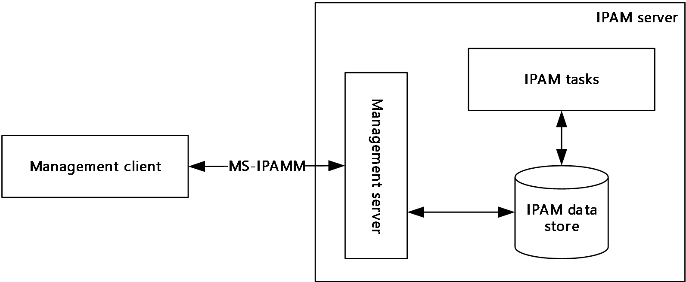

Figure 1: Overview

The IPAM Protocol is used to perform the following IP address space management operations on a remotely located IPAM server:

- Track IPv4/IPv6 address space utilization
- Management of IP address space (IPv4/IPv6, public/private/unicast global, dynamic/static)
- Monitor DNS and DHCP service for server availability, zone health, and scope utilization
- Manage multiple DHCP entities (DHCP server, scopes, options, properties, and classes)
- Manage DNS entities (DNS zones, DNS resource records, and their properties)
- Audit the configuration changes in DHCP servers and IPAM server
- Track the IP address activity in the network

## 1.4 Relationship to Other Protocols

The IPAM Management Protocol uses [**SOAP messages**](#gt_soap-message) for formatting requests and responses as specified in [[SOAP1.2-1/2007]](https://go.microsoft.com/fwlink/?LinkId=94664) and [[SOAP1.2-2/2007]](https://go.microsoft.com/fwlink/?LinkId=119124). These SOAP messages are sent over the .NET Message Framing TCP Binding Protocol ([MS-NMFTB](../MS-NMFTB/MS-NMFTB.md)) which is built on top of TCP/IP protocol.

The following diagram shows the underlying messaging and transport stack that is being used by this protocol.

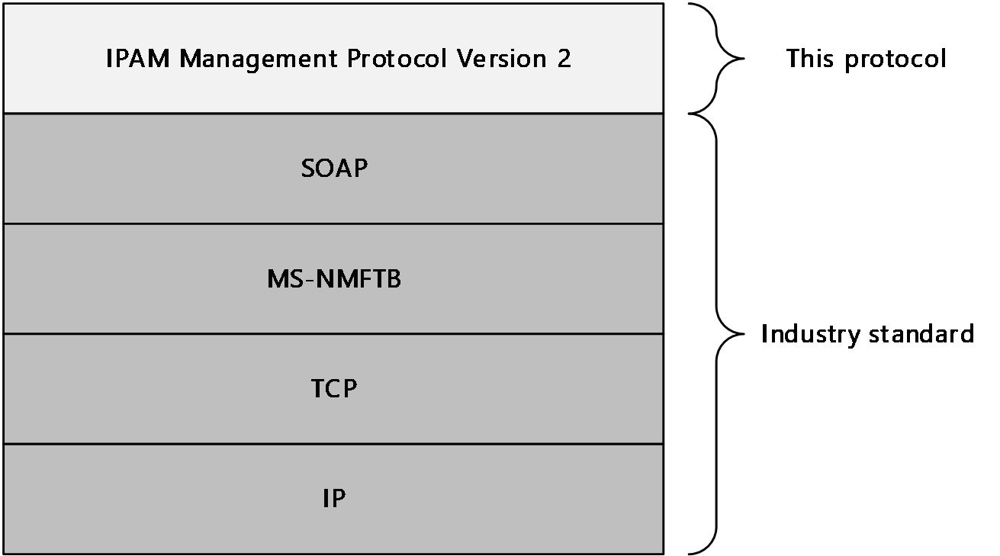

Figure 2: Protocol Stack Diagram

## 1.5 Prerequisites/Preconditions

It is assumed that the protocol client already has the [**URL**](#gt_uniform-resource-locator-url) of the protocol server for connecting to the various port types exposed by the protocol server.

The protocol also assumes that authentication has been performed by the underlying protocols.

## 1.6 Applicability Statement

This protocol is only applicable for the operations between the management client and the management server. [Appendix C](#Section_8) lists the products for which this protocol is applicable.

The functioning of the IPAM tasks and the [**IPAM data store**](#gt_ipam-data-store) are implementation specific and are outside the scope of this protocol.

The host that forms the protocol client or the server have to be part of an [**Active Directory domain**](#gt_active-directory-domain) belonging to the same [**Active Directory forest**](#gt_active-directory-forest).

## 1.7 Versioning and Capability Negotiation

This document covers versioning issues in the following areas:

**Localization:** This protocol includes text strings in various messages. Localization considerations for such strings are specified in section [2.2](#Section_3.3.4.59.1) and section [3](#Section_3).

**Protocol Versions:** This protocol is not versioned.

**Capability Negotiation:** This protocol does not support version negotiation or any other means of negotiating capabilities.

This document specifies IPAM Management Protocol Version 2. Version 2 is not interoperable with IPAM Management Protocol Version 1, specified in [MS-IPAMM](../MS-IPAMM/MS-IPAMM.md).<1>

## 1.8 Vendor-Extensible Fields

None.

## 1.9 Standards Assignments

None.

# 2 Messages

## 2.1 Transport

Protocol servers MUST support formatting of SOAP over TCP/IP as specified in [MS-NMFTB](../MS-NMFTB/MS-NMFTB.md):

- All protocol messages MUST be transported by using TCP bindings at the transport level.
- All protocol messages MUST be formatted as specified in [[SOAP1.2-1/2007]](https://go.microsoft.com/fwlink/?LinkId=94664) or [[SOAP1.2-2/2007]](https://go.microsoft.com/fwlink/?LinkId=119124).
- Protocol server faults MUST be returned using the [**SOAP fault**](#gt_soap-fault) as specified in [SOAP1.2-1/2007] section 5.4.
- The protocol client MUST know the [**URI**](#gt_uniform-resource-identifier-uri) of the server for the various [**WSDL port type**](#gt_wsdl-port-type)**s** that need to be accessed.
- The protocol MUST use Message Framing Security Provider WindowsTransportSecurity as specified in [MS-WSPOL](../MS-WSPOL/MS-WSPOL.md) section 2.2.3.8 with the ProtectionLevel being EncryptAndSign.

## 2.2 Common Message Syntax

This section contains common definitions used by this protocol. The syntax of the definitions uses XML schema as defined in [[XMLSCHEMA1]](https://go.microsoft.com/fwlink/?LinkId=90608) and [[XMLSCHEMA2]](https://go.microsoft.com/fwlink/?LinkId=90610), and Web Services Description Language as defined in [[WSDL]](https://go.microsoft.com/fwlink/?LinkId=90577).

In the following sections, the schema definition might be less restrictive than the processing rules imposed by the protocol. The WSDL in this specification provides a base description of the schema. The text that introduces the WSDL specifies additional restrictions that reflect protocol behavior. For example, the schema definition might allow for an element to be empty, NULL, or not present but the behavior of the protocol as specified restricts the same elements to being nonempty, present, and not NULL.

### 2.2.1 Namespaces

This specification defines and references various XML namespaces using the mechanisms specified in [[XMLNS-2ED]](https://go.microsoft.com/fwlink/?LinkId=90602). Although this specification associates a specific XML namespace prefix for each XML namespace that is used, the choice of any particular XML namespace prefix is implementation-specific and not significant for interoperability.

| Prefix | Namespace URI | Reference |
| --- | --- | --- |
| (none) | http://Microsoft.Windows.Ipam | - |
| msc | http://schemas.microsoft.com/ws/2005/12/wsdl/contract | [MS-WSPOL](../MS-WSPOL/MS-WSPOL.md) |
| xsd | http://www.w3.org/2001/XMLSchema | [[XMLSCHEMA1]](https://go.microsoft.com/fwlink/?LinkId=90608) [[XMLSCHEMA2]](https://go.microsoft.com/fwlink/?LinkId=90610) |
| soap | http://schemas.xmlsoap.org/wsdl/soap/ | [[SOAP1.2-1/2007]](https://go.microsoft.com/fwlink/?LinkId=94664) [[SOAP1.2-2/2007]](https://go.microsoft.com/fwlink/?LinkId=119124) |
| s | http://www.w3.org/2003/05/soap-envelope | [SOAP1.2-1/2007] |
| a | http://www.w3.org/2005/08/addressing | [[WSADDSoapBind1.0]](https://go.microsoft.com/fwlink/?LinkId=235399) [[WSADDCore1.0]](https://go.microsoft.com/fwlink/?LinkId=235398) |
| wsaw | http://www.w3.org/2006/05/addressing/wsdl | [[WSAWSDL]](https://go.microsoft.com/fwlink/?LinkId=130726) |
| wsdl | http://schemas.xmlsoap.org/wsdl/ | [[WSDL]](https://go.microsoft.com/fwlink/?LinkId=90577) |
| sys | http://schemas.datacontract.org/2004/07/System | - |
| ser | http://schemas.microsoft.com/2003/10/Serialization/ | - |
| sysnet | http://schemas.datacontract.org/2004/07/System.Net | - |
| serarr | http://schemas.microsoft.com/2003/10/Serialization/Arrays | - |
| ipam1 | http://schemas.datacontract.org/2004/07/Microsoft.Windows.Ipam | - |
| sysgen | http://schemas.datacontract.org/2004/07/System.Collections.Generic | - |
| syssock | http://schemas.datacontract.org/2004/07/System.Net.Sockets | - |
| sysser | http://schemas.datacontract.org/2004/07/System.ServiceModel | - |

### 2.2.2 Messages

| Message | Description |
| --- | --- |
| [Common Soap Fault](#Section_2.2.2.1) | The structure of the common [**SOAP fault**](#gt_soap-fault) that is returned by the protocol server to the protocol client when there is an error processing the request. |
| [Keepalive](#Section_2.2.2.2) | The structure of the [**keepalive message**](#gt_keepalive-message) sent by the management client to the [**management server**](#gt_management-server) to detect loss of the underlying transport connection. |

#### 2.2.2.1 Common SOAP Fault

The [**SOAP fault**](#gt_soap-fault) message is defined in [[SOAP1.2-1/2007]](https://go.microsoft.com/fwlink/?LinkId=94664). The following is the format used by this protocol.

<s:Envelope xmlns:s="http://www.w3.org/2003/05/soap-envelope">

<s:Body>

<s:Fault>

<s:Code>

<s:Value>s:Sender</s:Value>

</s:Code>

<s:Reason>

<s:Text xml:lang="en-US">The creator of this fault did not specify a Reason.</s:Text>

</s:Reason>

<s:Detail>

[IpamException]

</s:Detail>

</s:Fault>

</s:Body>

</s:Envelope>

The [IpamException] element is the part of the message that provides more information about the fault itself. This will be of type **IpamException** (section [2.2.4.247](#Section_2.2.4.247)) or the types that extend the same.

#### 2.2.2.2 Keepalive

The Keepalive message is transmitted by the protocol client in a period interval of inactivity and ignored by the server. This helps to detect a TCP session that was dropped because of inactivity.

<s:Envelope xmlns:s="http://www.w3.org/2003/05/soap-envelope" xmlns:a="http://www.w3.org/2005/08/addressing">

<s:Header>

<a:Action s:mustUnderstand="1">Microsoft.WindowsServerSolutions.Common.ProviderFramework.Keepalive</a:Action>

</s:Header>

<s:Body/>

</s:Envelope>

### 2.2.3 Elements

This specification does not define any common XML schema element definitions.

### 2.2.4 Complex Types

The following summarizes the set of common XML schema complex types defined in this specification. XML schema complex type definitions that are specific to a particular operation are described with the operation.

Complex type/Description

- [AccessScope](#Section_2.2.4.1) Allows extended attributes on a **BaseIpamObject** type. It defines the [**scope**](#gt_scope) of entities in [**IPAM data store**](#gt_ipam-data-store) that a user can access. It also defines the hierarchy of [**access scopes**](#gt_access-scope) in IPAM.
- [AccessScopeToUserRoleMapping](#Section_2.2.4.2) Allows extended attributes on a **BaseIpamObject** type. It describes an access policy, which is an association between a [**user role**](#gt_user-role) and an access scope.
- [ActiveServerV4LogicalGroup](#Section_2.2.4.3) Allows extended attributes on a **LogicalGroup** type. It contains the definition of the [**logical group**](#gt_logical-group) on server instances with [**IPv4**](#gt_internet-protocol-version-4-ipv4)-specific details, which are enabled for management in the IPAM data store.
- [ActiveServerV4LogicalGroupNode](#Section_2.2.4.4) Allows extended attributes on a **LogicalGroupNode**. It defines the custom field value at a specific level in the [**logical group hierarchy**](#gt_logical-group-hierarchy). It defines the criteria for categorizing server instances with IPv4-specific details, which are enabled for management.
- [ActiveServerV6LogicalGroup](#Section_2.2.4.5) Allows extended attributes on a **LogicalGroup** type. It contains the definition of the logical group on server instances with [**IPv6**](#gt_internet-protocol-version-6-ipv6)-specific details, which are enabled for management in the IPAM data store.
- [ActiveServerV6LogicalGroupNode](#Section_2.2.4.6) Allows extended attributes on a **LogicalGroupNode** type. It defines the custom field value at a specific level in the logical group hierarchy. It defines the criteria for categorizing server instances with IPv6-specific details that are enabled for management.
- [AddressSpace](#Section_2.2.4.7) A set of connected networks that are reachable (routable) from one another. In IPAM, all IP blocks, subnets, ranges, and IP addresses that belong to such a set of networks are grouped together within an **AddressSpace** container. To support network virtualization, IPAM provides two types of address spaces: Provider and Customer. By default, all IPAM entities reside in a built-in address space called **DefaultIPAddressSpace**. Any conventional (nonvirtualized) network entity such as a subnet or IP address range are in the default address space.
- [AddressSpaceByFilterEnumerationParameters](#Section_3.5.4.8.1.1) Extends **EnumerationParametersBase** and specifies the criteria used to filter the list of address spaces before enumeration.
- [AddressSpaceEnumerationParameters](#Section_3.5.4.8.1.2) Extends **EnumerationParametersBase** and specifies the parameters to be used for enumerating the address spaces.
- [AddScopesToSuperscopeParameters](#Section_2.2.4.10) Allows extended attributes on an **IpamOperationWithProgressParameter**. It creates objects whose **OperationId** is **AddScopesToSuperscope**. It is used to associate a collection of [**DHCP**](#gt_dynamic-host-configuration-protocol-dhcp) scopes to a **DhcpSuperscopeV4** type.
- [ApplyDhcpScopeConfigurationparameters](#Section_2.2.4.11) Allows extended attributes on an **IpamOperationWithProgressParameters** type. It creates objects whose **OperationId** is ApplyScopeConfigurationTemplate. It associates the **DhcpScopeTemplateConfiguration** details with a list of scope IDs belonging to the same AddressFamily.
- [ApplyDhcpServerConfigurationParameters](#Section_2.2.4.12) Allows extended attributes on an **IpamOperationWithProgressParameters** type. It creates objects whose **OperationId** is ApplyServerConfigurationTemplate. It associates the **DhcpServerTemplateConfiguration** details with a list of server IDs belonging to the same AddressFamily.
- [ArrayOfAccessScopeToUserRoleMapping](#Section_2.2.4.13) Defines a list of **AccessScopeToUserRoleMapping** complex type.
- [ArrayOfAddressSpace](#Section_2.2.4.14) Defines an array of **AddressSpace** complex type.
- [ArrayOfCustomField](#Section_2.2.4.15) Defines an array of **CustomField** complex type.
- [ArrayOfCustomFieldAssociation](#Section_2.2.4.16) Defines an array of **CustomFieldAssociation** complex types.
- [ArrayOfCustomFieldPartialValue](#Section_2.2.4.17) Defines an array of **CustomFieldPartialValue** complex type.
- [ArrayOfCustomFieldValue](#Section_2.2.4.18) Defines an array of **CustomFieldValue** complex type.
- [ArrayOfDhcpExclusionRange](#Section_2.2.4.19) Defines an array of **DhcpExclusionRange** complex type. The elements in the array MUST be either a **DhcpExclusionRangeV4** complex type or a **DhcpExclusionRangeV6** complex type.
- [ArrayOfDhcpFailoverOperations](#Section_2.2.4.20) Defines an array of **DhcpFailoverOperations**.
- [ArrayOfDhcpFilter](#Section_2.2.4.21) Defines an array of **DhcpFilter**.
- [ArrayOfDhcpFindAndReplaceOption](#Section_2.2.4.22) Defines an array of **DhcpFindAndReplaceOptions**.
- [ArrayOfDhcpOption](#Section_2.2.4.23) Defines an array of **DhcpOption** complex type. The elements in the array MUST be either a **DhcpOptionV4** or a **DhcpOptionV6** complex type.
- [ArrayOfDhcpOptionDefinition](#Section_2.2.4.24) Defines an array of DhcpOptionDefinitions. The elements in the array MUST be either **DhcpOptionDefinitionV4** or **DhcpOptionDefinitionV6** complex type.
- [ArrayOfDhcpPolicyRangeV4](#Section_2.2.4.25) Defines an array of **DhcpPolicyRangeV4** complex type.
- [ArrayOfDhcpPolicyV4](#Section_2.2.4.26) Defines an array of **DhcpPolicyV4** complex type.
- [ArrayOfDhcpReservation](#Section_2.2.4.27) Defines an array of **DhcpReservation** complex type. The elements in the array MUST be of type **DhcpReservation**.
- [ArrayOfDhcpScope](#Section_2.2.4.28) Defines an array of **DhcpScope** complex type.
- [ArrayOfDhcpScopeV4](#Section_2.2.4.29) Defines an array of **DhcpScopeV4** complex types.
- [ArrayOfDhcpServer](#Section_2.2.4.30) Defines an array of **DhcpServer** complex type. The elements in the array MUST be either a **DhcpServerV4** or a **DhcpServerV6** complex type.
- [ArrayOfDhcpServerV4](#Section_2.2.4.31) Defines an array of **DhcpServerV4** complex type.
- [ArrayOfDhcpSuperscopeV4](#Section_2.2.4.32) Defines an array of **DhcpSuperscopeV4** complex type.
- [ArrayOfDhcpUserClass](#Section_2.2.4.33) Defines an array of **DhcpUserClass** complex type. The elements in the array MUST be either a **DhcpUserClassV4** or a [**DhcpUserClassV6**](#Section_2.2.4.170) complex type.
- [ArrayOfDhcpVendorClass](#Section_2.2.4.34) Defines an array of **DhcpVendorClass** complex type. The elements in the array MUST be either a **DhcpVendorClassV4** or a **DhcpVendorClassV6** complex type.
- [ArrayOfDiscoveryConfig](#Section_2.2.4.35) Defines an array of **DiscoveryConfig** complex type.
- [ArrayOfDnsConditionalForwarder](#Section_2.2.4.36) Defines an array of **DnsConditionalForwarders**.
- [ArrayOfDnsResourceRecord](#Section_2.2.4.37) Defines an array of **DnsResourceRecord** types.
- [ArrayOfDnsReverseLookupZone](#Section_2.2.4.38) Defines an array of **DnsReverseLookupZones**.
- [ArrayOfDnsZone](#Section_2.2.4.39) Defines an array of **DnsZones**.
- [ArrayOfEntityStatus](#Section_2.2.4.40) Defines an array of **EntityStatus** complex type.
- [ArrayOfGatewayAddress](#Section_2.2.4.41) Defines an array of **GatewayAddress** complex type.
- [ArrayOfIpamAdminOperation](#Section_2.2.4.42) Defines an array of **IpamAdminOperation** complex type.
- [ArrayOfIpamForest](#Section_2.2.4.43) Defines an array of an **IpamForest** complex type.
- [ArrayOfIpamGpoError](#Section_2.2.4.44) Defines an array of **IpamGpoError** complex type.
- [ArrayOfIpamGpoErrorInfo](#Section_2.2.4.45) Defines an array of **IpamGpoErrorInfo** complex type.
- [ArrayOfIpamIPAddress](#Section_2.2.4.46) Defines an array of **IpamIPAddress** complex type. The elements in the array MUST be either an **IpamIPv4Address** or an **IpamIPv6Address** complex type.
- [ArrayOfIpamObject](#Section_2.2.4.47) Defines an array of **IpamObject** complex type. The elements in the array MUST be of a complex type that either directly or indirectly extends **IpamObject**.
- [ArrayOfIpamUpgradeValidationRuleStatus](#Section_2.2.4.48) Defines an array of **IpamUpgradeValidationRuleStatus** complex type.
- [ArrayOfIPBlock](#Section_2.2.4.49) Defines an array of **IPBlock**. The elements in the array MUST be either **IPv4Block** or **IPv6Block** complex types.
- [ArrayOfIPRange](#Section_2.2.4.50) Defines an array of **IPRange**. The elements in the array MUST be either an **IPv4Range** or an **IPv6Range** complex type.
- [ArrayOfIPSubnet](#Section_2.2.4.51) Defines an array of **IPSubnet** complex type. The elements in the array MUST be either an **IPv4Subnet** or an **IPv6Subnet** complex type.
- [ArrayOfIPUtilization](#Section_2.2.4.52) Defines an array of **IPUtilization** complex type. The elements in the array MUST be either an **IPv4Utilization** or **IPv6Utilization** complex type.
- [ArrayOfLogicalGroupField](#Section_2.2.4.53) Defines an array of **LogicalGroupField** complex type.
- [ArrayOfLogicalGroupNode](#Section_2.2.4.54) Defines an array of **LogicalGroupNode** complex type. The elements in the array MUST extend **LogicalGroupNode**.
- [ArrayOfPolicyOperations](#Section_2.2.4.55) Defines an array of **PolicyOperations** complex type.
- [ArrayOfReservationOperations](#Section_2.2.4.56) Specifies an array of simple type **ReservationOperations** that specifies the operations that can be performed for DHCP reservations. This is used by the management server as a part of **MsmDhcpScopeCreateOrEditAddress** Reservation to identify the changes that have to be committed to the IPAM data store for the specified **DhcpReservation** value.
- [ArrayOfServerInfo](#Section_2.2.4.57) Defines an array of **ServerInfo** complex type.
- [ArrayOfServerRole](#Section_2.2.4.58) Defines an array of **ServerRole** complex type or the complex types that extend the **ServerRole** complex type.
- [ArrayOfSuperscopeOperations](#Section_2.2.4.59) Defines an array of **SuperscopeOperations** complex type.
- [ArrayOfTaskInfo](#Section_2.2.4.60) Defines an array of **TaskInfo** complex type
- [AuditPurgeSettings](#Section_2.2.4.61) Specifies the configuration to be used for performing the [**audit purge**](#gt_audit-purge) operation.
- [BaseDnsServerZone](#Section_2.2.4.62) Specifies the properties of a zone hosted on a DNS server. This consists of the properties common to both **DnsServerZone** as well as **DnsServerReverseZone** complex types that extend the BaseDnsServerZone.
- [BaseDnsZone](#Section_2.2.4.63) Specifies the properties of a DNS [**zone**](#gt_zone). This consists of the properties common to both **DnsZone** as well as **DnsReverseLookupZone** complex types that extend the **BaseDnsZone**.
- [BaseIpamObject](#Section_2.2.4.64) Contains the common properties that are applicable to most of the complex types defined in this protocol. **BaseIpamObject** allows extended attributes on the **IpamObject** that it extends.
- [ChangeDatabaseSettingsNotAllowedForDBTypesIpamExceptionData](#Section_2.2.4.65) Extends the **IpamExceptionData** type. It creates objects whose **IpamExceptionId** is IpamApiErrorChangeDatabaseSettingsNotAllowedForDBTypes.
- [ConfigurationAuditEnumerationParameters](#Section_3.5.4.8.1.3) Specifies the enumeration criteria for the configuration audit information.
- [ConfigurationAuditRecord](#Section_2.2.4.67) Specifies a single [**configuration audit event**](#gt_configuration-audit-event) information. The [**configuration audit**](#gt_configuration-audit) record can be used to represent both an [**IPAM configuration audit**](#gt_ipam-configuration-audit) as well as a [**DHCP configuration audit**](#gt_dhcp-configuration-audit) event.
- [ConflictingIPAddressFailureIpamExceptionData](#Section_2.2.4.68) Specifies the information pertaining to the IP address instance overlap. This is used as the **IpamExceptionData** to provide more fault-specific information when an operation fails because of IP address instance overlap.
- [ConflictingIPBlockFailureIpamExceptionData](#Section_2.2.4.69) Specifies the information pertaining to the IP address block instance overlap.
- [ConflictingIPRangeFailureIpamExceptionData](#Section_2.2.4.70) Specifies the information pertaining to the [**IP address range**](#gt_ip-address-range) instance overlap.
- [CreateDhcpFiltersParameters](#Section_2.2.4.71) Allows extended attributes on an **IpamOperationWithProgressParameters** type. It creates objects whose **OperationId** is CreateDhcpFilters. It associates a list of **DhcpFilter** instances to the list of **DhcpServer**'s on which they have been created.
- [CreateDhcpReservationParameters](#Section_2.2.4.72) Specifies the set of parameters to be used in creating a new DHCP reservation.
- [CreateDhcpScopeParameters](#Section_2.2.4.73) Allows extended attributes on an **IpamOperationWithProgressParameters** type. It creates objects whose **OperationId** is CreateDhcpScope and associates them to an **DhcpScope**.
- [CreateDhcpScopePolicyParameters](#Section_2.2.4.74) Allows extended attributes on an **IpamOperationWithProgressParameters** type. It creates objects whose **OperationId** is CreateDhcpScopePolicy. It associates a policy of type **DhcpPolicyV4** to a collection of scopes of type **DhcpScopev4**.
- [CreateDhcpServerPolicyParameters](#Section_2.2.4.75) Allows extended attributes on an **IpamOperationWithProgressParameters** type. It creates objects whose **OperationId** is CreateDhcpServerPolicy. It associates a policy of type **DhcpPolicyV4** to a collection of servers of type **DhcpServerv4**.
- [CreateDnsResourceRecordsParameters](#Section_2.2.4.76) Specifies the DNS resource record to be created and the DNS server and DNS zone on which it is to be created.
- [CreateDnsZoneParameters](#Section_2.2.4.77) Specifies the DNS zone to be created and the DNS server on which it is to be created.
- [CreateIpamIPAddressParameters](#Section_2.2.4.78) Specifies the information pertaining to the operation CreateIpamIpAddress. This is used as a callback.
- [CustomerAddressSpace](#Section_2.2.4.79) Extends the AddressSpace type to include information specific to a Customer address space.
- [CustomField](#Section_2.2.4.80) Specifies a single [**custom field**](#gt_custom-field) information.
- [CustomFieldAssociation](#Section_2.2.4.81) Specifies an association between two custom fields defined in IPAM.
- [CustomFieldAssociationEnumerationParameters](#Section_3.5.4.8.1.4) Extends the **EnumerationParametersBase** complex type. It specifies the parameters used to enumerate custom field associations that exist in IPAM data store.
- [CustomFieldEnumerationParameters](#Section_2.2.4.83) Specifies the parameters to be used for enumerating the custom fields.
- [CustomFieldPartialValue](#Section_2.2.4.84) Specifies the custom field value with minimum information when compared to that of **CustomFieldValue**. The management server uses this to return the custom field values during the enumeration operations.
- [CustomFieldValue](#Section_2.2.4.85) Specifies a custom field value.
- [DatabaseLocaleMismatchIpamExceptionData](#Section_2.2.4.86) Allows extended attributes on an **IpamExceptionData** type. It creates objects whose **IpamExceptionId** is IpamApiErrorDatabaseLocaleMismatch.
- [DatabaseSchemaVersionMismatchIpamExceptionData](#Section_2.2.4.87) Allows extended attributes on an **IpamExceptionData** type. It creates objects whose **IpamExceptionId** is IpamApiErrorDatabaseSchemaVersionMismatch.
- [DatabaseServerEditionNotSupportedIpamExceptionData](#Section_2.2.4.88) Allows extended attributes on an **IpamExceptionData** type. It creates objects whose **IpamExceptionId** is IpamApiErrorDatabaseServerEditionNotSupported.
- [DatabaseServerVersionNotSupportedIpamExceptionData](#Section_2.2.4.89) Allows extended attributes on an **IpamExceptionData** type. It creates objects whose**IpamExceptionId** is IpamApiErrorDatabaseServerVersionNotSupported.
- [DeleteDhcpFiltersParameters](#Section_2.2.4.90) Allows extended attributes on an **IpamOperationWithProgressParameters** type. It creates objects whose **OperationId** is DeleteDhcpFilters. It identifies the **DhcpFilter** instances to be deleted on a server.
- [DeleteDhcpReservationCollectionParameters](#Section_2.2.4.91) Specifies the set of parameters to be used in deleting a collection of DHCP reservations.
- [DeleteDhcpReservationParameters](#Section_2.2.4.92) Allows extended attributes on an **IpamOperationWithProgressParameters** type. It creates objectswhose **OperationId** is DeleteDhcpReservationCollection. It identifies a collection of DHCP reservations to be deleted and the post processing to be done after deleting them.
- [DeleteDhcpScopeParameters](#Section_2.2.4.93) Allows extended attributes on an **IpamOperationWithProgressParameters** type. It creates objectswhose **OperationId** is DeleteDhcpScope and associates them to an **DhcpScope**.
- [DeleteDnsResourceRecordsParameters](#Section_2.2.4.94) Specifies the DNS resource record to be deleted and the DNS server and DNS zone from which it is tobe deleted.
- [DeleteDnsZonesParameters](#Section_2.2.4.95) Specifies the DNS zones to be deleted and their zone type.
- [DeletePolicyParameters](#Section_2.2.4.96) Allows extended attributes on an **IpamOperationWithProgressParameters** type. It creates objects whose **OperationId** is DeletePolicy and associates them to a collection of policies of type **DhcpPolicyV4**.
- [DeleteSuperscopesParameters](#Section_2.2.4.97) Allows extended attributes on an **IpamOperationWithProgressParameters** type. It creates objects whose **OperationId** is DeleteSuperscopes. It identifies the collection of **DhcpSuperscopeV4** instances to be deleted.
- [DhcpEffectiveScopePoliciesEnumerationParameters](#Section_3.5.4.8.1.6) Allows extended attributes on an **EnumerationParametersBase** type. It creates objects whose **ObjectType** is DhcpPolicy and associates them to a scope of type **DhcpScopeV4**.
- [DhcpEffectiveServerPoliciesEnumerationParameters](#Section_2.2.4.99) Allows extended attributes on an **EnumerationParametersBase** type. It creates objects whose **ObjectType** is DhcpPolicy and associates them to an **DhcpServerV4** object.
- [DhcpExclusionRange](#Section_2.2.4.100) Used to specify the DHCP [**exclusion range**](#gt_exclusion-range).
- [DhcpExclusionRangeCollection](#Section_2.2.4.101) Specifies a collection of DHCP exclusion ranges.
- [DhcpExclusionRangeV4](#Section_2.2.4.102) Specifies a DHCP exclusion range for an IPv4-specific DHCP scope.
- [DhcpExclusionRangeV6](#Section_2.2.4.103) Specifies a DHCP exclusion range for an IPv6-specific DHCP scope.
- [DhcpFailover](#Section_2.2.4.104) Allows extended attributes on a **BaseIpamObject** and models a DHCP Failover relationship.
- [DhcpFailoverAllEnumerationParameters](#Section_3.5.4.8.1.8) Extends **EnumerationParametersBase** type. It creates objects whose **ObjectType** is DhcpFailover.
- [DhcpFailoverByServerIdsEnumerationParameters](#Section_3.5.4.8.1.9) Allows extended attributes on an **EnumerationParametersBase** type. It creates objects whose **ObjectType** is DhcpFailover and associates them to a list of **ServerIds** whose type is long int.
- [DhcpFailoverDeleteParameters](#Section_2.2.4.107) Allows extended attributes on an **IpamOperationWithProgressParameters** type. It associates a **DhcpFailover** object with a force delete flag. The force delete flag identifies whether the failover relationship deletion can be attempted on the selected server even if it fails on the partner server.
- [DhcpFailoverEnumerationParameters](#Section_2.2.4.108) Allows extended attributes on an **EnumerationParametersBase** type. It creates objects whose **ObjectType** is DhcpFailover and associates a **DhcpFailover** object to the same.
- [DhcpFailoverParameters](#Section_2.2.4.109) Allows extended attributes on an **IpamOperationWithProgressParameters** type. It associates an **DhcpFailover** object to an object of this type.
- [DhcpFailoverRemoveScopesParameters](#Section_2.2.4.110) Allows extended attributes on an **IpamOperationWithProgressParameters** type. It associates its objects with a list of **DhcpScope** type objects and a bool member, Force. The Force parameter identifies whether the failover config removal can be attempted on the selected scopes.
- [DhcpFailoverScopesEnumerationParameters](#Section_2.2.4.111) Allows extended attributes on an **EnumerationParametersBase** type. It creates objects whose **ObjectType** is **DhcpScope** and associates them to an **DhcpFailover** object.
- [DhcpFailoverWithScopesParameters](#Section_2.2.4.112) Allows extended attributes on an **IpamOperationWithProgressParameters** type. It associates its objects with a list of **DhcpScope** objects and an **DhcpFailover** object.
- [DhcpFilter](#Section_2.2.4.113) Describes a [**DHCP filter**](#gt_dhcp-filter) and associates its various properties into one instance.
- [DhcpFilterAllEnumerationParameters](#Section_2.2.4.114) Allows extended attributes on an **EnumerationParametersBase** type. It creates objects whose ObjectType is **DhcpFilter**. It is used to get the filter details of a DHCP server.
- [DhcpFilterByServerIdsEnumerationParameters](#Section_3.5.4.8.1.13) Allows extended attributes on an **EnumerationParametersBase** type. It creates objects whose **ObjectType** is **DhcpFilter**. It is used to get the details of filters of server IDs.
- [DhcpFindAndReplaceOption](#Section_2.2.4.116) Creates an association between the **DhcpOption** and its old value and the new value with which it is to be replaced. The old and new values are represented by Object types.
- DhcpFindAndReplaceOptionV4 This is a simple derivation of **DhcpFindAndReplaceOption** with no new attributes.
- [DhcpFindAndReplaceOptionV6](#Section_2.2.4.118) This is a simple derivation of **DhcpFindAndReplaceOption** with no new attributes.
- [DhcpMsmOverallCompletionStatus](#Section_2.2.4.119) Allows extended attributes on an **IpamObject** type.
- [DhcpOption](#Section_2.2.4.120) Specifies the common information pertaining to a DHCP option which is independent of whether the option is IPv4-specific or IPv6-specific.
- [DhcpOptionCollection](#Section_2.2.4.121) Specifies a collection of DHCP options.
- [DhcpOptionDefinition](#Section_2.2.4.122) Specifies the various properties of a DHCP [**option definition**](#gt_option-definition).
- [DhcpOptionDefinitionCollection](#Section_2.2.4.123) Specifies a collection of **DhcpOptionDefinition** complex type.
- [DhcpOptionDefinitionV4](#Section_2.2.4.124) Allows extension of the **DhcpOptionDefinition** complex type. Specifies the option definitions associated with the IPv4-specific DHCP server instance.
- [DhcpOptionDefinitionV6](#Section_2.2.4.125) Allows extension of the **DhcpOptionDefinition** complex type. Specifies the option definitions associated with the IPv6-specific DHCP server instance.
- [DhcpOptionV4](#Section_2.2.4.126) Allows extension of the **DhcpOption** complex type. Specifies the DHCP option associated with the IPv4-specific DHCP server or scope instance.
- [DhcpOptionV6](#Section_2.2.4.127) Allows extension of the **DhcpOption** complex type. Specifies the DHCP option associated with the IPv6-specific DHCP server or scope instance.
- [DhcpPoliciesByDhcpServerIdListEnumerationParameter](#Section_3.5.4.8.1.14)s Allows extended attributes on an **EnumerationParametersBase** type. It creates objects whose ObjectType is DhcpPolicy and associates them to a collection of **DhcpServerV4** objects.
- [DhcpPoliciesEnumerationParameters](#Section_3.5.4.8.1.15) Allows extended attributes on an **EnumerationParametersBase** type. It creates objects whose ObjectType is DhcpPolicy.
- [DhcpPolicyConditionV4](#Section_2.2.4.130) Allows extended attributes on a **BaseIpamObject** type.
- [DhcpPolicyRangeV4](#Section_2.2.4.131) Allows extended attributes on a **BaseIpamObject** type. It creates an association between the record Id of the range and its start and end IPAddress objects.
- [DhcpPolicyV4](#Section_2.2.4.132) Allows extended attributes on a **BaseIpamObject** type.
- [DhcpReservation](#Section_2.2.4.133) Specifies the details associated with a DHCP reservation.
- [DhcpReservationDataFormatter](#Section_2.2.4.134) Used to format the fields of a DHCP reservation into a string used to display the result of operations. The string is formatted to include the scope ID and the server name.
- [DhcpReservationForIpBlockEnumerationParameters](#Section_2.2.4.135) Specifies the criteria for enumerating the DHCP reservations belonging to a particular address block.
- [DhcpReservationTemplateConfiguration](#Section_2.2.4.136) Used for editing operations on a collection of DHCP reservations. It specifies the properties of the reservation that need to be changed for the collection in a multiselect edit operation.
- [DhcpReservationV4](#Section_2.2.4.137) Extends the **DhcpReservation** complex type and specifies the properties associated with an IPv4 reservation.
- [DhcpReservationV4TemplateConfiguration](#Section_2.2.4.138) Extends the **DhcpReservationTemplateConfiguration** complex type and is used for editing operations on a collection of DHCP IPV4 reservations. It specifies the properties of the IPv4 reservation to be changed for the collection in a multiselect edit operation.
- [DhcpReservationV6](#Section_2.2.4.139) Extends the **DhcpReservation** complex type. Specifies the properties associated with an IPv6 reservation.
- [DhcpReservationV6TemplateConfiguration](#Section_2.2.4.140) Extends the **DhcpReservationTemplateConfiguration** complex type and is used for editing operations on a collection of DHCP IPV6 reservations. It specifies the properties of the IPv6 reservation that need to be changed for the collection in a multiselect edit operation.
- [DhcpScope](#Section_2.2.4.141) Specifies the details associated with a DHCP scope.
- [DhcpScopeAllEnumerationParameters](#Section_2.2.4.142) Specifies the criteria to be used for enumerating the DHCP scopes.
- [DhcpScopeAssociatedWithVendorClassesEnumerationParameters](#Section_3.5.4.8.1.19) Specifies the criteria to use for enumerating the scopes that are associated with a given set of vendor classes.
- [DhcpScopeByPrefixAndServerNameEnumerationParameters](#Section_3.5.4.8.1.82) Allows extended attributes on an **EnumerationParametersBase**. Specifies the criteria to use for enumerating the scopes with a specified prefix and belonging to a particular DHCP server.
- [DhcpScopeForIpBlockEnumerationParameters](#Section_2.2.4.145) Specifies the criteria to use for enumerating the scopes belonging to a particular address block.
- [DhcpScopeObjectSpecificEnumerationParameters](#Section_2.2.4.146) Specifies the criteria to be used for enumerating the scopes that are associated with a given set of DHCP Reservations or DHCP Policies.
- [DhcpScopePoliciesWithoutRangesEnumerationParameters](#Section_2.2.4.147) Specifies the criteria to be used for enumerating the policies that do not have ranges, in a given DHCP scope.
- [DhcpScopesByDhcpServerIdListEnumerationParameters](#Section_3.5.4.8.1.22) Specifies the criteria for enumerating the scopes that belong to a set of DHCP servers.
- [DhcpScopeTemplateConfiguration](#Section_2.2.4.149) Used for editing operations on a collection of DHCP scopes. It specifies the properties of the scope that need to be changed in a multiselect edit operation.
- [DhcpScopeUnmappedEnumerationParameters](#Section_2.2.4.150) Specifies the criteria to be used to enumerate the scopes that are not mapped to any address block.
- [DhcpScopeV4](#Section_2.2.4.151) Allows the extension of the section **DhcpScope** complex type. Specifies a scope for specifying an IPv4 address assignment with DHCP.
- [DhcpScopeV4TemplateConfiguration](#Section_2.2.4.152) Used for editing operations on a collection of DHCP IPv4 Scopes. It specifies the properties of the scope that need to be changed for the collection in a multiselect edit operation.
- [DhcpScopeV6](#Section_2.2.4.153) Allows the extension of the **DhcpScope** complex type. Specifies a scope for specifying IPv6 address assignment with DHCP.
- [DhcpScopeV6TemplateConfiguration](#Section_2.2.4.154) Used for editing a collection of DHCP IPv6 Scopes. It specifies the properties of the scope that need to be changed in a multiselect edit operation.
- [DhcpServer](#Section_2.2.4.155) Specifies the common details of a DHCP server instance.
- [DhcpServerAllEnumerationParameters](#Section_3.5.4.8.1.24) Specifies the parameters used for enumerating the **DhcpServer** instances.
- [DhcpServerByServerInfoIdsEnumerationParameters](#Section_3.5.4.8.1.25) Specifies the record identifiers of **ServerInfo** instances for which the **DhcpServer** instances are to be enumerated.
- [DhcpServerTemplateConfiguration](#Section_2.2.4.158) Allows extended attributes on a section **BaseIpamObject** type.
- [DhcpServerV4](#Section_2.2.4.159) Allows specifying extensions to the **DhcpServer** complex type. Specifies the IPv4-specific information of the DHCP server instance.
- [DhcpServerV4TemplateConfiguration](#Section_2.2.4.160) Allows extended attributes on a **DhcpServerTemplateConfiguration** type. It creates objects whose **dnsNotRequestingClientsUpdateType** is **DhcpDnsNotRequestingClientsUpdateType.None**.
- [DhcpServerV6](#Section_2.2.4.161) Extends the **DhcpServer** complex type. Specifies the IPv6-specific information of the DHCP server instance.
- [DhcpServerV6TemplateConfiguration](#Section_2.2.4.162) Allows extended attributes on a **DhcpServerTemplateConfiguration** type.
- [DhcpSuperscopeByDhcpServerIdListEnumerationParameters](#Section_2.2.4.163) Allows extended attributes on an **EnumerationParametersBase** type. It creates objects whose **ObjectType** is **DhcpSuperscope**.
- [DhcpSuperscopeBySuperscopeAndServerNameEnumerationParameters](#Section_3.5.4.8.1.83) Allows extended attributes on an **EnumerationParametersBase**. Specifies the criteria to use for enumerating the superscope with a specified name and belonging to a particular DHCP server.
- [DhcpSuperscopeEnumerationParameters](#Section_3.5.4.8.1.27) Allows extended attributes on an **EnumerationParametersBase** type. It creates objects whose **ObjectType** is **DhcpSuperscope**.
- [DhcpSuperscopeV4](#Section_2.2.4.166) Allows extended attributes on a section **BaseIpamObject** type. This defines the properties of a DHCP superscope.
- [DhcpUserClass](#Section_2.2.4.167) Specifies the common properties of a [**user class**](#gt_user-class).
- [DhcpUserClassCollection](#Section_2.2.4.168) Specifies a collection of section **DhcpUserClass** complex types.
- [DhcpUserClassV4](#Section_2.2.4.169) Allows the extension of the **DhcpUserClass** complex type. Specifies the DhcpUserClass instance associated with the IPv4-specific **DhcpServer** instance.
- DhcpUserClassV6 Allows the extension of the **DhcpUserClass** complex type. Specifies the DhcpUserClass instance associated with the IPv6- specific **DhcpServer** instance.
- [DhcpVendorClass](#Section_2.2.4.171) Specifies the common properties of a [**vendor class**](#gt_vendor-class).
- [DhcpVendorClassCollection](#Section_2.2.4.172) Specifies a collection of section **DhcpVendorClass** complex types.
- [DhcpVendorClassV4](#Section_2.2.4.173) Allows the extension of the **DhcpVendorClass** complex type. Specifies the **DhcpVendorClass** instance associated with the IPv4-specific **DhcpServer** instance.
- [DhcpVendorClassV6](#Section_2.2.4.174) Allows the extension of the **DhcpVendorClass** complex type. Specifies the **DhcpVendorClass** instance associated with the IPv6-specific **DhcpServer** instance.
- [DiscoveryConfig](#Section_2.2.4.175) Describes the discovery configuration for a specific [**domain**](#gt_domain).
- [DiscoverySubnetEnumerationParameters](#Section_3.5.4.8.1.28) Specifies the criteria based on which the subnets for grouping the discovered servers are to be enumerated.
- [DnsConditionalForwarder](#Section_2.2.4.177) Allows extended attributes on a **BaseIpamObject** type. Specifies the properties of a DNS conditional forwarder.
- [DnsConditionalForwarderByFiltersEnumerationParameters](#Section_3.5.4.8.1.84) Allows extended attributes on an **EnumerationParametersBase**. Specifies the filter criteria for enumerating DNS conditional forwarders.
- [DnsConditionalForwarderEnumerationParameters](#Section_3.5.4.8.1.29) Allows extended attributes on an **EnumerationParametersBase**. Specifies the criteria for enumerating DNS conditional forwarders.
- [DnsConditionalForwarderFormatter](#Section_2.2.4.180) Allows extended attributes on an [**IpamObject**](#Section_2.2.4.285) type. It represents the formatted DNS conditional forwarder name and server name.
- [DnsConditionalForwardersParameters](#Section_2.2.4.181) Allows extended attributes on an [**IpamOperationWithProgressParameters**](#Section_2.2.4.286) type. It represents the input parameters for DNS conditional forwarder operations.
- [DnsResourceRecord](#Section_2.2.4.182) Specifies the properties of a DNS resource record. This consists of the properties common to all DNS resource record types.
- [DnsResourceRecordAsmFormatter](#Section_2.2.4.183) Allows extended attributes on an **IpamObject** type. It represents the DNS resource record name and zone name in a formatted manner.
- [DnsResourceRecordData](#Section_2.2.4.184) A base class that can be extended by various DNS resource record complex types to specify the DNS resource record information.
- [DnsResourceRecordDataA](#Section_2.2.4.185) Extends the **DnsResourceRecordData**. It specifies the details associated with a DNS resource record of type A.
- [DnsResourceRecordDataAaaa](#Section_2.2.4.186) Extends the **DnsResourceRecordData**. It specifies the details associated with a DNS resource record of type AAAA.
- [DnsResourceRecordDataAfsdb](#Section_2.2.4.187) Extends the **DnsResourceRecordData**. It specifies the details associated with a DNS resource record of type AFSDB.
- [DnsResourceRecordDataAtma](#Section_2.2.4.188) Extends the **DnsResourceRecordData**. It specifies the details associated with a DNS resource record of type ATMA.
- [DnsResourceRecordDataCname](#Section_2.2.4.189) Extends the **DnsResourceRecordData**. It specifies the details associated with a DNS resource record of type CNAME.
- [DnsResourceRecordDataDhcid](#Section_2.2.4.190) Extends the **DnsResourceRecordData**. It specifies the details associated with a DNS resource record of type DHCID.
- [DnsResourceRecordDataDname](#Section_2.2.4.191) Extends the **DnsResourceRecordData**. It specifies the details associated with a DNS resource record of type DNAME.
- [DnsResourceRecordDataHinfo](#Section_2.2.4.192) Extends the **DnsResourceRecordData**. It specifies the details associated with a DNS resource record of type HINFO.
- [DnsResourceRecordDataIsdn](#Section_2.2.4.193) Extends the **DnsResourceRecordData**. It specifies the details associated with a DNS resource record of type ISDN.
- [DnsResourceRecordDataMx](#Section_2.2.4.194) Extends the **DnsResourceRecordData**. It specifies the details associated with a DNS resource record of type MX.
- [DnsResourceRecordDataNs](#Section_2.2.4.195) Extends the **DnsResourceRecordData**. It specifies the details associated with a DNS resource record of type NS.
- [DnsResourceRecordDataPtr](#Section_2.2.4.196) Extends the **DnsResourceRecordData**. It specifies the details associated with a DNS resource record of type PTR.
- [DnsResourceRecordDataRp](#Section_2.2.4.197) Extends the **DnsResourceRecordData**. It specifies the details associated with a DNS resource record of type RP.
- [DnsResourceRecordDataRt](#Section_2.2.4.198) Extends the **DnsResourceRecordData** . It specifies the details associated with a DNS resource record of type RT.
- [DnsResourceRecordDataSoa](#Section_2.2.4.199) Extends the **DnsResourceRecordData**. It specifies the details associated with a DNS resource record of type SOA.
- [DnsResourceRecordDataSrv](#Section_2.2.4.200) Extends the **DnsResourceRecordData**. It specifies the details associated with a DNS resource record of type SRV.
- [DnsResourceRecordDataTxt](#Section_2.2.4.201) Extends the **DnsResourceRecordData**. It specifies the details associated with a DNS resource record of type TXT.
- [DnsResourceRecordDataWins](#Section_2.2.4.202) Extends the **DnsResourceRecordData**. It specifies the details associated with a DNS resource record of type WINS.
- [DnsResourceRecordDataWinsr](#Section_2.2.4.203) Extends the **DnsResourceRecordData**. It specifies the details associated with a DNS resource record of type WINS-R.
- [DnsResourceRecordDataWks](#Section_2.2.4.204) Extends the **DnsResourceRecordData**. It specifies the details associated with a DNS resource record of type WKS.
- [DnsResourceRecordDataX25](#Section_2.2.4.205) Extends the **DnsResourceRecordData**. It specifies the details associated with a DNS resource record of type X.25.
- [DnsResourceRecordEnumerationParameters](#Section_3.5.4.8.1.30) Specifies the criteria for enumerating DNS resource records.
- [DnsResourceRecordFilterEnumerationParameters](#Section_2.2.4.207) Allows extended attributes on an **EnumerationParametersBase**. Specifies the filter criteria for enumerating DNS resource records.
- [DnsResourceRecordFormatter](#Section_2.2.4.208) Used to format the fields of a DNS resource record into a string used to display the result of operations. The string is formatted to include the record name, server name and zone name of the DNS resource record to uniquely identify it.
- [DnsResourceRecordIsAlreadyMappedIpamExceptionData](#Section_2.2.4.209) Allows extended attributes on an **IpamExceptionData** type. It creates objects whose **IpamExceptionId** is IpamApiDnsResourceRecordIsAlreadyMapped.
- [DnsReverseLookupZone](#Section_2.2.4.210) Specifies the information pertaining to a single instance of a [**reverse lookup DNS zone**](#gt_reverse-lookup-dns-zone). It allows extending the **BaseDnsZone** complex type.
- [DnsReverseLookupZoneEnumerationParameters](#Section_2.2.4.211) Specifies the criteria to be used for enumerating the reverse lookup DNS zones.
- [DnsServer](#Section_2.2.4.212) Specifies the DNS server instance properties.
- [DnsServerByServerInfoIdsEnumerationParameters](#Section_2.2.4.213) Specifies the parameters to enumerate the **DnsServer** instances based on the record identifiers of the **ServerInfo** instances.
- [DnsServerEnumerationParameters](#Section_2.2.4.214) Specifies the criteria to be used for enumerating the DNS servers.
- [DnsServerReverseZone](#Section_2.2.4.215) Specifies the information regarding a specific reverse lookup DNS zone hosted on a particular server. It allows the extension of attributes for the **BaseDnsServerZone** complex type.
- [DnsServerReverseZoneEnumerationParameters](#Section_2.2.4.216) Specifies the criteria to be used for enumerating the DNS server hosting of the reverse lookup DNS zones.
- [DnsServerZone](#Section_2.2.4.217) Specifies the information regarding the [**forward lookup DNS zone**](#gt_forward-lookup-dns-zone) hosting on a DNS server. It allows extending the attributes of the **BaseDnsServerZone** complex type.
- [DnsServerZoneEnumerationParameters](#Section_2.2.4.218) Specifies the criteria to enumerate the DNS server hosting the forward lookup DNS zones.
- [DnsSetPreferredServerInvalidZoneTypeExceptionData](#Section_2.2.4.219) Allows extended attributes on an **IpamExceptionData** type. It creates objects whose IpamExceptionId is IpamApiInvalidDnsZoneTypeForPreferredServer.
- [DnsZone](#Section_2.2.4.220) Specifies the information pertaining to a forward lookup DNS zone. It allows extension of attributes of the **BaseDnsZone** complex type.
- [DnsZoneEnumerationParameters](#Section_2.2.4.221) Specifies the filter criteria to be used for enumerating the forward lookup DNS zones from the IPAM data store.
- [DnsZoneEvent](#Section_2.2.4.222) Specifies an instance of the DNS zone related [**event**](#gt_event).
- [DnsZoneEventEnumerationParameters](#Section_2.2.4.223) Specifies the criteria for enumerating the **DnsZoneEvent** rows from the IPAM data store.
- [DnsZoneFormatter](#Section_2.2.4.224) Allows extended attributes on an **IpamObject** type. It represents the formatted server name and zone name.
- [DnsZonesTransferParameters](#Section_2.2.4.225) Allows extended attributes on an **IpamOperationWithProgressParameters** type. It represents the input parameters for DNS zone transfer operation.
- [EntityStatus](#Section_2.2.4.226) Describes the operation and its outcome on an IPAM object.
- [EntityStatusCollection](#Section_2.2.4.227) Allows extended attributes on an **IpamObject** type. It is used to keep track of a list of **EntityStatus** complex types and to keep track of related operations through one object.
- [EntityStatusForDnsResourceRecord](#Section_2.2.4.228) A complex type that is used to describe the operation and its outcome on an IPAM DNS resource record object.
- [EnumerationParametersBase](#Section_2.2.4.229) Forms the base element that all other complex types extend to specify enumeration parameters.
- [ExclusionRangeDataFormatter](#Section_2.2.4.230) Formats the fields of an exclusion range into a string used to display the result of operations. The string includes the scope ID, server name, and the start and end IP addresses of the exclusion range to uniquely identify it.
- [FailoverDataFormatter](#Section_2.2.4.231) Allows extended attributes on an **IpamObject** type. It is used to create a formatted string that contains the name of the failover relationship and the partner servers.
- [FilterDataFormatter](#Section_2.2.4.232) Allows extended attributes on an **IpamObject** type. It is used to create a formatted string that contains the server name and the MAC address.
- [GatewayAddress](#Section_2.2.4.233) Allows extended attributes on an **IpamObject** type. It defines Gateway configuration on a DHCP scope.
- [InvalidDBConfigDatabaseTypeNotValidIpamExceptionData](#Section_2.2.4.234) Allows extended attributes on an **IpamExceptionData** type. It creates objects whose **IpamExceptionId** is IpamApiErrorInvalidDBConfigDatabaseTypeNotValid.
- [InvalidSQLDBConfigAuthNotSupportedIpamExceptionData](#Section_2.2.4.235) Allows extended attributes on an **IpamExceptionData** type. It creates objects whose **IpamExceptionId** is IpamApiErrorInvalidSQLDBConfigAuthNotSupported.
- [InvalidSQLDBConfigInvalidPortIpamExceptionData](#Section_2.2.4.236) Allows extended attributes on an **IpamExceptionData** type. It creates objects whose **IpamExceptionId** is IpamApiErrorInvalidSQLDBConfigInvalidPort.
- [InvalidWIDDBConfigAuthNotSupportedIpamExceptionData](#Section_2.2.4.237) Allows extended attributes on an **IpamExceptionData** type. It creates objects whose **IpamExceptionId** is IpamApiErrorInvalidWIDDBConfigAuthNotSupported.
- [InvalidWIDDBConfigDirectoryDoesNotExistIpamExceptionData](#Section_2.2.4.238) Extends the **IpamExceptionData** type. It creates objects whose **IpamExceptionId** is IpamApiErrorInvalidWIDDBConfigDirectoryDoesNotExist.
- [InvalidWIDDBConfigInvalidCredentialIpamExceptionData](#Section_2.2.4.239) Allows extended attributes on an **IpamExceptionData** type. It creates objects whose **IpamExceptionId** is IpamApiErrorInvalidWIDDBConfigInvalidCredential.
- [InvalidWIDDBConfigNameMustBeIPAMIpamExceptionData](#Section_2.2.4.240) Allows extended attributes on an **IpamExceptionData** type. It creates objects whose **IpamExceptionId** is IpamApiErrorInvalidWIDDBConfigNameMustBeIPAM.
- [InvalidWIDDBConfigPortNotAllowedIpamExceptionData](#Section_2.2.4.241) Allows extended attributes on an [**IpamExceptionData**](#Section_2.2.4.252) type. It creates objects whose **IpamExceptionId** is IpamApiErrorInvalidWIDDBConfigPortNotAllowed.
- [InvalidWIDDBConfigServerNotAllowedIpamExceptionData](#Section_2.2.4.242) Allows extended attributes on an **IpamExceptionData** type. It creates objects whose **IpamExceptionId** is IpamApiErrorInvalidWIDDBConfigServerNotAllowed.
- [ipam1:ArrayOfOperationGroup](#Section_2.2.4.243) Specifies the list of operation groups.
- [ipam1:DhcpReservationAllEnumerationParameters](#Section_2.2.4.244) Specifies the criteria to be used for enumerating the reservations.
- [ipam1:DhcpReservationScopeBasedEnumerationParameters](#Section_2.2.4.245) Specifies the criteria to be used for enumerating the reservations from a given set of scopes.
- [ipam1:IIpamRemotingModule](#Section_2.2.4.246) Specifies the base type to provide abstraction for remote calls from the IPAM server.
- [ipam1:IpamException](#Section_2.2.4.247) Specifies the base type for providing the fault information from the management server to the management client.
- [IpamAddressObject](#Section_2.2.4.248) Specifies an IP address object that extends the **IpamObject** so that it can be used with port types that allow enumeration of data from the server.
- [IpamAdminOperation](#Section_2.2.4.249) Allows extended attributes on a section **BaseIpamObject** type. Specifies an administration operation in IPAM.
- [IpamCredential](#Section_2.2.4.250) Allows extended attributes on a **BaseIpamObject** type. Specifies a set of credentials in IPAM.
- [IpamDatabaseConfiguration](#Section_2.2.4.251) Allows extended attributes on a **BaseIpamObject** type. It represents the configuration for an IPAM database.
- IpamExceptionData Specifies the details of the fault specified by using **IpamException** instance.
- [IpamForest](#Section_2.2.4.253) Allows extended attributes on a **BaseIpamObject** type. It represents an Active Directory forest managed by IPAM.
- [IpamGenericExceptionData](#Section_2.2.4.254) Allows extended attributes on an **IpamExceptionData** type. It creates objects whose **IpamExceptionId** is IpamApiGenericErrorOccurred.
- [IpamGpoError](#Section_2.2.4.255) Extends attributes on a **BaseIpamObject** type. This is used to encapsulate errors while creating GPOs for a particular domain.
- [IpamGpoErrorInfo](#Section_2.2.4.256) Allows extended attributes on an **IpamExceptionData** type.
- [IpamIPAddress](#Section_2.2.4.257) Specifies the common address object information in the IPAM data store.
- [IpamIPAddressAllForLogicalGroupEnumerationParameters](#Section_2.2.4.258) Specifies the parameters for enumerating the IP address instances that map to a specified logical group.
- [IpamIPAddressAllForLogicalGroupNodeEnumerationParameters](#Section_3.5.4.8.1.39) Specifies the criteria to be used for enumerating the addresses that map to a [**logical group node**](#gt_logical-group-node).
- [IpamIPAddressByAddressSpaceAndVirtualizationTypeParameters](#Section_3.5.4.8.1.40) Specifies the criteria used for enumerating the address instances that are associated with a particular **AddressSpace**, are of a given **IPVirtualizationType**, and belong to a given **AddressFamily**.
- [IpamIPAddressByBlockIdEnumerationParameters](#Section_2.2.4.261) Specifies the criteria used for enumerating the address instances that map to a specified address block.
- [IpamIPAddressByFilterEnumerationParameters](#Section_3.5.4.8.1.42) Specifies the criteria used for enumerating the address instances that belong to a particular address family and also meet the conditions defined by a set of filter criteria.
- [IpamIPAddressByManagedByAndManagedByEntityEnumerationParameters](#Section_2.2.4.263) Specifies the criteria to be used for enumerating the address instances that have a specified value for **ManagedBy** and **ManagedByEntity** built-in custom field values.
- [IpamIPAddressByRangeIdEnumerationParameters](#Section_3.5.4.8.1.44) Specifies the filter criteria to be used for enumerating the address instances that map to a specific address range.
- [IpamIPAddressBySubnetIdEnumerationParameters](#Section_2.2.4.265) Specifies the criteria to be used for enumerating the address instances that map to a specified [**IP subnet**](#gt_ip-subnet).
- [IpamIPAddressByVirtualizationTypeParameters](#Section_2.2.4.266) Specifies the criteria to be used for enumerating the address instances that are of a given virtualization type.
- [IpamIPAddressDataFormatter](#Section_2.2.4.267) Used to format error entities in operations relating to **IPAddress**.
- [IpamIPAddressForUnmappedRangesEnumerationParameters](#Section_3.5.4.8.1.47) Retrieves the list of addresses in address ranges that are not already mapped to an address block.
- [IpamIPAddressRootAddressesEnumerationParameters](#Section_3.5.4.8.1.48) Specifies the filter criteria to be used for enumerating the address instances belonging to a specified address category.
- [IpamIPAddressUnmappedAddressEnumerationParameters](#Section_2.2.4.270) Specifies the criteria to be used for enumerating the unmapped address instances. Unmapped address instances are those that are not mapped to any address range instances.
- [IpamIPSubnetByFilterEnumerationParameters](#Section_3.5.4.8.1.50) Specifies the criteria to be used for filtering the enumerated list of IP subnets.
- [IpamIPSubnetsByAddressCategoryEnumerationParameters](#Section_3.5.4.8.1.51) Specifies the criteria to be used for enumerating IP subnets that belong to a given address category and a given address family.
- [IpamIPSubnetsByAddressSpaceAndVirtualizationTypeEnumerationParameters](#Section_2.2.4.273) Specifies the criteria to be used for enumerating IP subnets that map to a given address space and are of a given virtualization type.
- [IpamIPSubnetsByBlockIdEnumerationParameters](#Section_3.5.4.8.1.53) Specifies the criteria to be used for enumerating IP subnets that map to a given address block.
- [IpamIPSubnetsByUnmappedEnumerationParameters](#Section_3.5.4.8.1.54) Specifies the criteria to be used for enumerating unmapped IP subnets of a given address family and virtualization type.
- [IpamIPSubnetsByVirtualizationTypeEnumerationParameters](#Section_3.5.4.8.1.55) Specifies the criteria to be used for enumerating IP subnets of a given address family and virtualization type.
- [IpamIPSubnetsDirectChildrenByBlockIdEnumerationParameters](#Section_2.2.4.277) Specifies the criteria to be used for enumerating the IP subnet instances of a given address family that map directly to the given address block.
- [IpamIPv4Address](#Section_2.2.4.278) Enables extension of attributes of the **IpamIPAddress** complex type. This is used to specify the details pertaining to the IPv4 address instance.
- [IpamIPv4AddressLogicalGroup](#Section_2.2.4.279) Allows extensions to the **LogicalGroup** complex type. Specifies the **LogicalGroup** to be used to enumerate IPv4 address instances using the logical group hierarchy.
- [IpamIPv4AddressLogicalGroupNode](#Section_2.2.4.280) Allows extension of the **LogicalGroupNode** complex type. It defines the custom field value at a specific level in the logical group hierarchy.
- [IpamIPv6Address](#Section_2.2.4.281) Enables extension of attributes of the **IpamIPAddress** complex type. This is used to specify the details pertaining to the IPv6 address instance.
- [IpamIPv6AddressLogicalGroup](#Section_2.2.4.282) Allows extensions to the **LogicalGroup** complex type. Specifies the **LogicalGroup** that can be used to enumerate IPv6 address instances using the logical group hierarchy.
- [IpamIPv6AddressLogicalGroupNode](#Section_2.2.4.283) Allows extension of the **LogicalGroupNode** complex type. It defines the custom field value at a specific level in the logical group hierarchy.
- [IpamNumberOfRowsObject](#Section_2.2.4.284) Defines the type to be used to return an integer value specifying the number of rows as a result from the IPAM enumeration port types.
- IpamObject Used to identify and provide certain common functionality for types that are IPAM-specific.
- IpamOperationWithProgressParameters Extends **IpamObject** base type with an additional member of enum type **ipam:IpamAdminOperationId**, which identifies the type of operation being performed.
- [IpamProvisioningEnumerationParameters](#Section_2.2.4.287) Allows extended attributes on an **EnumerationParametersBase** type.
- [IpamProvisioningSetting](#Section_2.2.4.288) Allows extended attributes on an **EnumerationParametersBase** type. It creates objects whose **ObjectType** is AsyncProvision.
- [IpamSchemaVersion](#Section_2.2.4.289) Allows extended attributes on a **BaseIpamObject** type. It defines the schema version of IPAM server.
- [IpamUpgradeValidationRuleInfo](#Section_2.2.4.290) Allows extended attributes on a **BaseIpamObject** type. It defines the schema version of IPAM server.
- [IpamUpgradeValidationRuleStatus](#Section_2.2.4.291) Allows extended attributes on a **BaseIpamObject** type. It defines rules for validating whether an instance of IPAM can be upgraded, along with the status for each rule.
- [IpamUpgradeWarningInfo](#Section_2.2.4.292) Allows extended attributes on a **BaseIpamObject** type. It represents warnings during an upgrade.
- [IPAuditEnumerationParameters](#Section_2.2.4.293) Used to specify the enumeration parameters for the [**IP address audit**](#gt_ip-address-audit).
- [IPAuditRecord](#Section_2.2.4.294) Used to specify single IP address audit.
- [IPBlock](#Section_2.2.4.295) Specifies the address block information that is common to both **IPv4Block** and **IPv6Block**.
- [IPBlockChildBlockEnumerationParameters](#Section_3.5.4.8.1.58) Specifies the criteria for enumerating the child blocks of a specified address block.
- [IPBlockDataFormatter](#Section_2.2.4.297) Extends **ipam:IpamObject** and encapsulates the properties of an IP block to be formatted.
- [IPBlockGetAllBlocksEnumerationParameters](#Section_2.2.4.298) Specifies the criteria for enumerating all the address blocks in the IPAM data store.
- [IPBlockRootEnumerationParameters](#Section_2.2.4.299) Specifies the criteria for enumerating the rows that form the first level of address blocks.
- [IPCumulativeUtilization](#Section_2.2.4.300) Specifies the address utilization statistics or trend information.
- [IPRange](#Section_2.2.4.301) Specifies the common information pertaining to the address range.
- [IPRangeAllForBlockEnumerationParameter](#Section_2.2.4.302) Used to specify the criteria on which ranges corresponding to an address block instance can be retrieved.
- [IPRangeAllForDhcpServerEnumerationParameters](#Section_3.5.4.8.1.62) Used to specify the criteria on which address ranges corresponding to the DHCP scope instances of a particular DHCP server are enumerated.
- [IPRangeAllForLogicalGroupNodeEnumerationParameters](#Section_3.5.4.8.1.63) Used to specify the parameters for enumerating the IP range instances corresponding to a specified logical group node in the logical group hierarchy.
- [IPRangeByAddressSpaceAndVirtualizationTypeParameters](#Section_2.2.4.305) Specifies the criteria to be used for enumerating IP range instances that map to a given address space and are of a given virtualization type.
- [IPRangeByFilterEnumerationParameters](#Section_3.5.4.8.1.65) Specifies the criteria to be used for enumerating the IP range instances that belong to a particular address family and that meet the conditions defined by a set of filter criteria.
- [IPRangeByManagedByAndManagedByEntityEnumerationParameters](#Section_3.5.4.8.1.66) Specifies the criteria required to enumerate the address ranges for which the built-in custom fields **ManagedBy** and **ManagedByEntity** have a specific value.
- [IPRangeByVirtualizationTypeParameters](#Section_3.5.4.8.1.67) Specifies the criteria for enumerating the IP range instances of a given virtualization type.
- [IPRangeDataFormatter](#Section_2.2.4.309) Specifies the key properties of an IP range that is formatted for display.
- [IPRangeForBlockEnumerationParameters](#Section_2.2.4.310) Specifies the criteria for enumerating the address ranges that map directly onto an address block and don't include the address ranges that map to a child block for the specified address block.
- [IPRangeForSubnetEnumerationParameter](#Section_3.5.4.8.1.69) Extends **EnumerationParametersBase** and specifies the parameters used to enumerate all ranges for a given subnet.
- [IPRangeRootEnumerationParameters](#Section_3.5.4.8.1.70) Used to specify the criteria for enumerating the address ranges that have a specific address category.
- [IPRangeUnmappedEnumerationParameters](#Section_2.2.4.313) Used to specify the criteria for enumerating the address ranges that are unmapped.
- [IPSubnet](#Section_2.2.4.314) Allows extending the attributes of the **IPBlock** complex type to represent information pertaining to an IP subnet.
- [IPUtilization](#Section_2.2.4.315) Used to specify the address utilization data for a specific time range.
- [IPv4Block](#Section_2.2.4.316) Allows extending the attributes of the **IPBlock** complex type. This is used to specify the IPv4-specific address block.
- [IPv4Range](#Section_2.2.4.317) Allows extending the attributes of **IPRange** complex type. Specifies the details of IPv4-specific address range details.
- [IPv4RangeLogicalGroup](#Section_2.2.4.318) Allows extending the attributes of **LogicalGroup** complex type. Specifies a logical group definition to be used for enumerating the address ranges.
- [IPv4RangeLogicalGroupNode](#Section_2.2.4.319) Allows extending the attributes of **LogicalGroupNode** complex type. Specifies the criteria for a specific level in the logical group hierarchy that can be used to enumerate the address ranges that meet that level.
- [IPv4Subnet](#Section_2.2.4.320) Allows extending the attributes of a **IPSubnet** complex type. This is used to specify the IPv4-specific subnet.
- [IPv4SubnetLogicalGroup](#Section_2.2.4.321) Allows extending the attributes of **LogicalGroup** complex type. Specifies a logical group definition that can be used for enumerating the IP subnets.
- [IPv4SubnetLogicalGroupNode](#Section_2.2.4.322) Allows extending the attributes of **LogicalGroupNode** complex type. It defines the value of the custom field that occurs at the specific level in logical group hierarchy.
- [IPv4Utilization](#Section_2.2.4.323) Allows extending the attributes of an **IPUtilization** complex type. This is used to specify the address utilization corresponding to IPv4-specific address space.
- [IPv6Block](#Section_2.2.4.324) Allows extending the attributes of the **IPBlock** complex type. This is used to specify the IPv6-specific address block.
- [IPv6Range](#Section_2.2.4.325) Allows extending the attributes of **IPRange** complex type. Specifies the details of IPv6-specific address range details.
- [IPv6RangeLogicalGroup](#Section_2.2.4.326) Allows extending the attributes of **LogicalGroup** complex type. Specifies a logical group definition that can be used for enumerating the address ranges.
- [IPv6RangeLogicalGroupNode](#Section_2.2.4.327) Allows extending the attributes of **LogicalGroupNode** complex type. Specifies the criteria for a specific level in the logical group hierarchy that can be used to enumerate the address ranges that meet that level.
- [IPv6Subnet](#Section_2.2.4.328) Allows extending the attributes of a **IPSubnet** complex type. This is used to specify the IPv6-specific subnet.
- [IPv6SubnetLogicalGroup](#Section_2.2.4.329) Allows extending the attributes of **LogicalGroup** complex type. Specifies a logical group definition that can be used for enumerating the IP subnets.
- [IPv6SubnetLogicalGroupNode](#Section_2.2.4.330) Allows extending the attributes of **LogicalGroupNode** complex type. It defines the value of the custom field that occurs at the specific level in logical group hierarchy.
- [IPv6Utilization](#Section_2.2.4.331) Allows extending the attributes of an **IPUtilization** complex type. This is used to specify the address utilization corresponding to IPv6-specific address space.
- [LogicalGroup](#Section_2.2.4.332) Specifies the definition of a logical group.
- [LogicalGroupDataForLogicalGroupNodeEnumerationParameters](#Section_3.5.4.8.1.72) Specifies the logical group node information that form the criteria for enumerating the data.
- [LogicalGroupDataForRootAlternateItemsEnumerationParameters](#Section_2.2.4.334) Specifies the criteria for enumerating the data which map to the specified logical group.
- [LogicalGroupDataUnmappedItemsEnumerationParameters](#Section_2.2.4.335) Specifies the criteria used to enumerate the data that do not map to a specified logical group.
- [LogicalGroupField](#Section_2.2.4.336) Specifies one level of the multivalued custom field that forms the logical group hierarchy.
- [LogicalGroupNode](#Section_2.2.4.337) Specifies the actual custom field values that form the criteria for the data to be satisfied to match at a particular level in the logical group hierarchy.
- [LogicalGroupNodeChildrenEnumerationParameters](#Section_3.5.4.8.1.75) Specifies the criteria to be used for enumerating the logical group nodes that form the next level of logical group nodes in a logical group hierarchy.
- [LogicalGroupNodeRootEnumerationParameters](#Section_3.5.4.8.1.76) Specifies the criteria for enumerating the **LogicalGroupNode** that form the first level of **LogicalGroupHierarchy**.
- [LogicalGroupsEnumerationParameters](#Section_3.5.4.8.1.77) Specifies the criteria for enumerating the logical groups from the IPAM data store.
- [MACAddress](#Section_2.2.4.341) Used to specify the MAC address.
- [MovePolicyProcessingOrderParameters](#Section_2.2.4.342) Allows extended attributes on an **IpamOperationWithProgressParameters** type. It creates objects whose **OperationId** is MovePolicyProcessingOrder and associates them to a **DhcpPolicyV4 policy** and an **ipam:PolicyProcessingOrderDirection**.
- [MultiUpdateDnsResourceRecordParameters](#Section_2.2.4.343) Specifies the DNS resource records to be modified and the properties of the DNS resource records to be modified. It also specifies the DNS server and DNS zone on which they are to be modified.
- [OptionDefinitionDataFormatter](#Section_2.2.4.344) Allows extended attributes on an **IpamObject** type. It creates formatted strings with data about the server name, vendor class name, and the associated option ID.
- [PropertiesCouldNotBeValidatedIpamExceptionData](#Section_2.2.4.345) Allows extended attributes on an **ipam1:IpamExceptionData** type. It creates objects whose **IpamExceptionId** is IpamApiValidationFailure.
- [ProviderAddressSpace](#Section_2.2.4.346) Extends the complex type **AddressSpace**. A particular Provider address space contains provider or fabric/physical networks on top of which virtual networks can be built.
- [ReloadDnsZonesParameters](#Section_2.2.4.347) Allows extended attributes on an **IpamOperationWithProgressParameters** type. It represents the input parameters from the reload DNS zones operation.
- [RemoveScopesFromSuperscopeParameters](#Section_2.2.4.348) Allows extended attributes on an **IpamOperationWithProgressParameters** type. It creates objects whose **OperationId** is RemoveScopesFromSuperscope and associates them to a list of DHCP scope IDs that this operation is to be performed upon.
- [RenameSuperscopeParameters](#Section_2.2.4.349) Allows extended attributes on an **IpamOperationWithProgressParameters** type. It creates objects whose **OperationId** is RenameSuperscope and associates them to a **DhcpSuperscopeV4** that is to be renamed and the name it is to be given.
- [ReplicateRelationDataFormatter](#Section_2.2.4.350) Allows extended attributes on an **IpamObject** type. It creates formatted strings with data about the server name from which the replication is initiated and the relationship name.
- [ReplicateRelationParameters](#Section_2.2.4.351) Allows extended attributes on an **IpamOperationWithProgressParameters** type. It creates objects whose **OperationId** is ReplicateRelation and associates them to an ipam:**DhcpFailover** object.
- [ReplicateScopeParameters](#Section_2.2.4.352) Allows extended attributes on an **IpamOperationWithProgressParameters** type. It creates objects whose **OperationId** is ReplicateScope and associates them to a list of ipam:DhcpScope objects.
- [ReplicateScopesDataFormatter](#Section_2.2.4.353) Allows extended attributes on an **IpamObject** type. It creates formatted strings with data about the server name from which the replication is initiated and the scopes in the server that are to be replicated.
- [ReplicateServerDataFormatter](#Section_2.2.4.354) Allows extended attributes on an **IpamObject** type. It creates formatted strings with data about the server name from which the replication is performed.
- [ReplicateServerParameters](#Section_2.2.4.355) Allows extended attributes on an **IpamOperationWithProgressParameters** type. It creates objects whose **OperationId** is ReplicateServer and associates them to an ipam:**DhcpServerV4** object.
- [ReservationDataFormatter](#Section_2.2.4.356) Used to format the fields of a DHCP reservation into a string used to display the result of operations. The string is formatted such that the DHCP reservation is identifiable uniquely.
- [ReservationOptionDataFormatter](#Section_2.2.4.357) Used to format the fields of a DHCP option corresponding to a DHCP reservation into a string used to display the result of operations. The string is formatted such that the DHCP option and reservation are identifiable uniquely.
- [ResetConfigSyncStatusDataFormatter](#Section_2.2.4.358) Allows extended attributes on an **IpamObject** type. It creates formatted strings with data about the list of **DhcpScope** objects' scope IDs for which this reset is applied.
- [ResetConfigSyncStatusParameters](#Section_2.2.4.359) Allows extended attributes on an **IpamOperationWithProgressParameters** type. It creates objects whose **OperationId** is ResetConfigSyncStatus and associates them to a list of **ipam:DhcpScope objects** on which this operation is to be performed.
- [ScopeDataFormatter](#Section_2.2.4.360) Allows extended attributes on an **IpamObject** type. It creates formatted strings with data about the server name and the scope ID of the relevant scope.
- [ScopeOptionDataFormatter](#Section_2.2.4.361) Allows extended attributes on an **IpamObject** type. It creates formatted strings with data about the server name, scope ID, vendor class name, user class name and associated **optionID**.
- [ScopePolicyDataFormatter](#Section_2.2.4.362) Allows extended attributes on an **IpamObject** type. It creates formatted strings with data about the server name, scope ID, and the policy name.
- [ScopePolicyIpRangeDataFormatter](#Section_2.2.4.363) Allows extended attributes on an **ipam:IpamObject** type. It creates formatted strings with data about the policy name, server name, scope ID, and the policy range.
- [ScopePolicyOptionDataFormatter](#Section_2.2.4.364) Allows extended attributes on an **ipam:IpamObject** type. It creates formatted strings with data about the server name, scope ID, vendor class name, policy name, and the associated option ID.
- [serarr:ArrayOfanyType](#Section_2.2.4.365) Specifies an array whose elements can be of any type.
- [serarr:ArrayOfint](#Section_2.2.4.366) Specifies an array whose elements are of type int.
- [serarr:ArrayOfKeyValueOfDnsResourceRecordAsmFormatterIpamException0cupfWA8](#Section_2.2.4.367) Specifies an array of key value pairs where the key of the element is of type **DnsResourceRecordAsmFormatter** and the value of the element is of type **ipam1:IpamException**. No two elements in the array can have the same key.
- [serarr:ArrayOfKeyValueOfDnsResourceRecordFormatterIpamException0cupfWA8](#Section_2.2.4.368) Specifies an array of key value pairs where the key of the element is of type **DnsResourceRecordFormatter** and the value of the element is of type **ipam1:IpamException**. No elements in the array can have the same key.
- [serarr:ArrayOfKeyValueOfDnsReverseLookupZoneFilterCriteriaanyType2zwQHvQz](#Section_2.2.4.369) Specifies an array of key value pairs where the key of the element has the **DnsReverseLookupZoneFilterCriteria** and the value of the element can be any value appropriate for the key specified. No elements in the array can have the same key.
- [serarr:ArrayOfKeyValueOfDnsZoneFilterCriteriaanyType2zwQHvQz](#Section_2.2.4.370) Specifies an array of key value pairs where the key of the element has the **DnsZoneFilterCriteria** and the value of the element can be any value appropriate for the key specified. No elements in the array can have the same key.
- [serarr:ArrayOfKeyValueOfintanyType](#Section_2.2.4.371) Specifies an array of key value pairs where the key of the element has an integer and the value of the element can be any value appropriate for the key specified. No elements in the array can have the same key.
- [serarr:ArrayOfKeyValueOfIPBlockDataFormatterIpamException0cupfWA8](#Section_2.2.4.372) Specifies an array of key value pairs where the key of the element is of type **ipam:IPBlockDataFormatter** and the value of the element is of type **ipam1:IpamException**. Each key MUST be unique; no elements in the array can have the same key.
- [serarr:ArrayOfKeyValueOfIPRangeDataFormatterIpamException0cupfWA8](#Section_2.2.4.373) Specifies an array of key value pairs where the key of the element is of type **ipam:IPRangeDataFormatter** and the value of the element is of type **ipam1:IpamException**. Each key in the array MUST be unique; no elements in the array can have the same key.
- [serarr:ArrayOfKeyValueOflongDhcpScopem1ahUJFx](#Section_2.2.4.374) Specifies an array of key value pairs where the key of the element has the DHCP scope instance record identifier and the value is the corresponding DHCP scope instance.
- [serarr:ArrayOfKeyValueOflongIpamExceptionmhTjmZB3](#Section_2.2.4.375) Specifies an array of key value pairs where the key of the element is a record identifier and the value of the element is the **ipam1:IpamException** instance having the record identifier specified in the key. Each key in the array MUST be unique; no elements in the array can have the same key.
- [serarr:ArrayOfKeyValueOfOperationGroupArrayOfOperationGroupxXhs3_PxJ](#Section_2.2.4.376) Specifies an array of key value pairs where the key of the element is an **OperationGroup** and the value of the element is of type **ArrayOfOperationGroup**. The keys in the array MUST be unique so that no elements in the array have the same key.
- [serarr:ArrayOfKeyValueOfServerInfoGetServerFilteranyType2zwQHvQz](#Section_2.2.4.377) Specifies an array of key value pairs where the key of the element has the **ServerInfoGetServerFilter** type and the value of the element can be any value appropriate for the key specified. The keys in the array MUST be unique; no elements in the array can have the same key.
- [serarr:ArrayOfKeyValueOfTupleOflongDnsResourceRecordTypem1ahUJFxIpamExceptionVfr71_PXs](#Section_2.2.4.378) Specifies an array of key value pairs where the key of the element has the **TupleOflongDnsResourceRecordTypem1ahUJFx** type and the value of the element is of type **IpamException**. The keys in the array MUST be unique; no elements in the array can have the same key.
- [serarr:ArrayOflong](#Section_2.2.4.379) Specifies an array of elements of type **xsd:long**.
- [serarr:ArrayOfstring](#Section_2.2.4.380) Specifies an array of elements of type **xsd:string**.
- [serarr:ArrayOfunsignedByte](#Section_2.2.4.381) Specifies an array of elements of type **xsd:unsignedByte**.
- [serarr:ArrayOfunsignedShort](#Section_2.2.4.382) Specifies an array of elements of type **xsd:unsignedShort**.
- [ServerDataFormatter](#Section_2.2.4.383) Allows extended attributes on an **IpamObject** type. It creates formatted strings with data about the server name.
- [ServerInfo](#Section_2.2.4.384) Specifies the information pertaining to the server instances in the IPAM data store.
- [ServerInfoEnumerationParameters](#Section_2.2.4.385) Specifies the criteria for enumerating the server instances from the IPAM data store.
- [ServerOptionDataFormatter](#Section_2.2.4.386) Allows extended attributes on an **IpamObject** type. It creates formatted strings with data about the server name, vendor class name, user class name, and option ID.
- [ServerPolicyDataFormatter](#Section_2.2.4.387) Allows extended attributes on an **IpamObject** type. It creates formatted strings with data about the server name and policy name.
- [ServerPolicyOptionDataFormatter](#Section_2.2.4.388) Allows extended attributes on an **ipam:IpamObject** type. It creates formatted strings with data about the server name, vendor class name, policy name, and the associated option ID.
- [ServerRole](#Section_2.2.4.389) Specifies the common access status information pertaining to an individual [**server role**](#gt_server-role).
- [ServerRoleDc](#Section_2.2.4.390) Allows the extension of attributes of the **ServerRole** complex type. The **ServerRoleFlag** MUST be set to ServerRoleType.Dc.
- [ServerRoleDhcp](#Section_2.2.4.391) Allows the extension of the **ServerRole** complex type. The **ServerRoleFlag** MUST be set to ServerRoleType.Dhcp.
- [ServerRoleDhcp.Version](#Section_2.2.4.392) Specifies the version of the DHCP server role.
- [ServerRoleDns](#Section_2.2.4.393) Allows the extension of attributes of the **ServerRole** complex type. The **ServerRoleFlag** MUST be set to ServerRoleType.Dns.
- [ServerRoleNps](#Section_2.2.4.394) Allows the extension of attributes of the **ServerRole** complex type. The **ServerRoleFlag** MUST be set to ServerRoleType.Nps.
- [SetDhcpReservationCollectionParameters](#Section_2.2.4.395) Specifies the reservation fields to be changed and the collection of reservations on which edit operations can be done for multi-edit of DHCP reservations.
- [SetDhcpReservationParameters](#Section_2.2.4.396) Specifies the reservation whose configuration needs to be modified.
- [SetSuperscopeActivationStatusParameters](#Section_2.2.4.397) Allows extended attributes on an **IpamOperationWithProgressParameters** type. It creates objects whose **OperationId** is SetSuperscopeActivationStatus. It associates a list of **DhcpSuperscopeV4** objects to the required activation status.
- [SubnetLogicalGroupNodeRootEnumerationParameters](#Section_3.5.4.8.1.79) Extends **EnumerationParametersBase** and specifies the logical group, address space, and the address family to be used to enumerate subnets.
- [SubTaskInstance](#Section_2.2.4.399) Allows extended attributes on an **ipam:IpamObject** and **ipam:INotifyPropertyChanged**. These are used to break a [**task**](#gt_task) at a granular level to correspond with PowerShell commands that are used to execute them.
- [SuperscopeV4DataFormatter](#Section_2.2.4.400) Allows extended attributes on an **IpamObject** type. It creates formatted strings with data about the server name and superscope name.
- [sys:ArrayOfTupleOfBaseDnsServerZonelong2zwQHvQz](#Section_2.2.4.401) Specifies an array of tuple of a DNS server zone and a DNS server.
- [sys:ArrayOfTupleOfCustomFieldValueCustomFieldValuenTEz2bI_S](#Section_2.2.4.402) Specifies an array of pairs of two values of two custom fields.
- [sys:ArrayOfTupleOfDhcpVendorClassArrayOfDhcpOptionDefinitionDhcpServerKSQw48VL](#Section_2.2.4.403) Specifies an array of tuples of DHCP Vendor Class, array of DHCP option definitions, and DHCP server.
- [sys:ArrayOfTupleOfGetAddressSpaceFilteranyType2zwQHvQz](#Section_2.2.4.404) Specifies an array of filters to apply while enumerating address space data. Each filter is a key value pair where the key specifies the type of filter to be applied and the value specifies the value of the filter criteria.
- [sys:ArrayOfTupleOfGetIpamIPAddressFilteranyType2zwQHvQz](#Section_2.2.4.405) Specifies an array of filters to be applied while enumerating IP address data. Each filter is a key value pair where the key specifies the type of filter to be applied and the value specifies the value of the filter criteria.
- [sys:ArrayOfTupleOfGetIPRangeFilteranyType2zwQHvQz](#Section_2.2.4.406) Specifies an array of filters to be applied while enumerating IP range data. Each filter is a key value pair wherein the key specifies the type of filter and the value specifies the value of the filter criteria.
- [sys:ArrayOfTupleOfGetIPSubnetFilteranyType2zwQHvQz](#Section_2.2.4.407) Specifies an array of filters to be applied while enumerating IP subnet data. Each filter is a key value pair wherein the key specifies the type of filter and the value specifies the value of the filter criteria.
- [sys:ArrayOfTupleOflongDnsResourceRecordTypem1ahUJFx](#Section_2.2.4.408) Specifies an array of a tuple representing a combination of a **RecordId** of the DNS resource record and DNS resource record type.
- [sys:ArrayOfTupleOflongstringstring](#Section_2.2.4.409) Specifies an array of a tuple representing a combination of a long integer and two strings.
- [sys:ArrayOfTupleOfstringstring](#Section_2.2.4.410) Specifies an array of tuples representing a pair of string values.
- [sys:Exception](#Section_2.2.4.411) Specifies the **Exception** complex type which is extended by the **IpamException** complex type to specify IPAM fault information.
- [sys:TupleOfBaseDnsServerZonelong2zwQHvQz](#Section_2.2.4.412) Specifies a tuple of DNS server zone and identifier of DNS server.
- [sys:TupleOfCustomFieldValueCustomFieldValuenTEz2bI_S](#Section_2.2.4.413) Specifies a pair of custom field values.
- [sys:TupleOfDhcpVendorClassArrayOfDhcpOptionDefinitionDhcpServerKSQw48VL](#Section_2.2.4.414) Specifies a tuple of DHCP Vendor Class, array of DHCP option definition, and DHCP server.
- [sys:TupleOfGetAddressSpaceFilteranyType2zwQHvQz](#Section_2.2.4.415) Specifies a key value pair wherein the **m_Item1** specifies an **ipam:GetAddressSpaceFilter** type specifying the type of filter to be applied with the value of the filter-specified data specified in the **m_Item2** portion key value pair entry.
- [sys:TupleOfGetIpamIPAddressFilteranyType2zwQHvQz](#Section_2.2.4.416) Specifies a key value pair wherein the **m_Item1** specifies a **ipam:GetIpamIPAddressFilter** type specifying the type of filter to be applied with the value of the filter-specified data specified in the **m_Item2** portion key value pair entry.
- [sys:TupleOfGetIPRangeFilteranyType2zwQHvQz](#Section_2.2.4.417) Specifies a key value pair wherein the **m_Item1** specifies a **ipam:GetIPRangeFilter** type specifying the type of filter to be applied with the value of the filter-specified data specified in the **m_Item2** portion key value pair entry.
- [sys:TupleOfGetIPSubnetFilteranyType2zwQHvQz](#Section_2.2.4.418) Specifies a key value pair wherein the **m_Item1** specifies a **ipam:GetIPSubnetFilter** type specifying the type of filter that has to be applied with the value of the filter-specified data specified in the **m_Item2** portion key value pair entry.
- [sys:TupleOflongDnsResourceRecordTypem1ahUJFx](#Section_2.2.4.419) Specifies a tuple containing a **RecordId** for the DNS resource record and the DNS resource record type.
- [sys:TupleOflongstringstring](#Section_2.2.4.420) Specifies a row containing a long integer and a pair of strings.
- [sys:TupleOfstringstring](#Section_2.2.4.421) Specifies a pair of string values.
- [sys:Version](#Section_2.2.4.422) Specifies the version of a component or server.
- [sysgen:ArrayOfKeyValuePairOfCollectionOperationsDhcpExclusionRangenTEz2bI_S](#Section_2.2.4.423) Specifies an array of key value pairs wherein the key specifies a **CollectionOperations** type specifying the type of operation to be performed with the **DhcpExclusionRange** data specified in the value portion key value pair.
- [sysgen:ArrayOfKeyValuePairOfCollectionOperationsDhcpOptionnTEz2bI_S](#Section_2.2.4.424) Specifies an array of key value pairs wherein the key specifies a **CollectionOperations** type specifying the type of operation to be performed with the **DhcpOption** data specified in the value portion key value pair entry.
- [sysgen:ArrayOfKeyValuePairOfCollectionOperationsDhcpOptionDefinitionnTEz2bI_S](#Section_2.2.4.425) Specifies an array of key value pairs wherein the key specifies a **CollectionOperations** type specifying the type of operation to be performed with the **DhcpOptionDefinition** data specified in the value portion key value pair entry.
- [sysgen:ArrayOfKeyValuePairOfCollectionOperationsDhcpUserClassnTEz2bI_S](#Section_2.2.4.426) Specifies an array of key value pairs wherein the key specifies a **CollectionOperations** type specifying the type of operation to be performed with the **DhcpUserClass** data specified in the value portion key value pair entry.
- [sysgen:ArrayOfKeyValuePairOfCollectionOperationsDhcpVendorClassnTEz2bI_S](#Section_2.2.4.427) Specifies an array of key value pairs wherein the key specifies a **CollectionOperations** type specifying the type of operation to be performed with the **DhcpVendorClass** data specified in the value portion key value pair entry.
- [sysgen:ArrayOfKeyValuePairOflongAddressSpacem1ahUJFx](#Section_2.2.4.428) Specifies an array of key value pairs wherein the key specifies the record identifier and the value specifies an **AddressSpace** object.
- [sysgen:ArrayOfKeyValuePairOflongArrayOfIPBlockm1ahUJFx](#Section_2.2.4.429) Specifies an array of key value pairs wherein the key specifies the record identifier and the value specifies an array of address block instances specifying the hierarchy of the address block corresponding to the record identifier.
- [sysgen:ArrayOfKeyValuePairOflongint](#Section_2.2.4.430) Specifies an array of key value pairs wherein the key specifies a long integer and the value specifies an integer value.
- [sysgen:ArrayOfKeyValuePairOflongIpamExceptionmhTjmZB3](#Section_2.2.4.431) Specifies an array of key value pairs wherein the key specifies a long integer and the value specifies an **IpamException**.
- [sysgen:KeyValuePairOfCollectionOperationsDhcpExclusionRangenTEz2bI_S](#Section_2.2.4.432) Specifies a key value pair wherein the key specifies a **CollectionOperations** type specifying the type of operation to be performed on the **DhcpExclusionRange** data specified in the value portion.
- [sysgen:KeyValuePairOfCollectionOperationsDhcpOptionnTEz2bI_S](#Section_2.2.4.433) Specifies a key value pair wherein the key specifies a **CollectionOperations** type specifying the type of operation to be performed on the **DhcpOption** data specified in the value portion.
- [sysgen:KeyValuePairOfCollectionOperationsDhcpOptionDefinitionnTEz2bI_S](#Section_2.2.4.434) Specifies a key value pair wherein the key specifies a **CollectionOperations** type specifying the type of operation that has to be performed on the **DhcpOptionDefinition** data specified in the value portion.
- [sysgen:KeyValuePairOfCollectionOperationsDhcpUserClassnTEz2bI_S](#Section_2.2.4.435) Specifies a key value pair wherein the key specifies a **CollectionOperations** type specifying the type of operation that has to be performed on the **DhcpUserClass** data specified in the value portion.
- [sysgen:KeyValuePairOfCollectionOperationsDhcpVendorClassnTEz2bI_S](#Section_2.2.4.436) Specifies a key value pair wherein the key specifies a **CollectionOperations** type specifying the type of operation that has to be performed on the **DhcpVendorClass** data specified in the value portion.
- sysgen:KeyValuePairOflongAddressSpacem1ahUJFx Specifies a key value pair wherein the key specifies a long type element and the value specifies an element of type **ipam:AddressSpace**.
- [sysgen:KeyValuePairOflongint](#Section_2.2.4.438) Specifies a key value pair wherein the key specifies a long type element and the value specifies an int type element.
- [sysgen:KeyValuePairOflongIpamExceptionmhTjmZB3](#Section_2.2.4.439) Specifies a key value pair wherein the key specifies a long type element and the value specifies an **IpamException** type element.
- [sysnet:ArrayOfIPAddress](#Section_2.2.4.440) Specifies an array of **IPAddress** complex type.
- [sysnet:IPAddress](#Section_2.2.4.441) Specifies an IP address independent of the address family.
- [TaskInfo](#Section_2.2.4.442) Specifies the set of details that provide more information about IPAM tasks.
- [UnmappedIpamIPAddressForLogicalGroupEnumerationParameters](#Section_2.2.4.443) Specifies the parameters for enumerating the IP address instances that do not map to a specific logical group.
- [UpdateDhcpFilterParameters](#Section_2.2.4.444) Allows extended attributes on an **IpamOperationWithProgressParameters** type. It creates objects whose **OperationId** is UpdateDhcpFilter and associates them to an **DhcpFilter** that is to be updated.
- [UpdateDhcpFiltersParameters](#Section_2.2.4.445) Allows extended attributes on an **IpamOperationWithProgressParameters** type. It creates objects whose **OperationId** is UpdateDhcpFilters and associates them to the update parameters for a collection of **DhcpFilter** that are to be updated.
- [UpdateDhcpScopeParameters](#Section_2.2.4.446) Allows extended attributes on an **IpamOperationWithProgressParameters** type. It creates objects whose **OperationId** is EditDhcpScope and associates them to an **ipam:DhcpScope**.
- [UpdateDhcpServerParameters](#Section_2.2.4.447) Allows extended attributes on an **IpamOperationWithProgressParameters** type. It creates objects whose **OperationId** is EditDhcpServer and associates them to an **ipam:DhcpServer**.
- [UpdateDnsResourceRecordParameters](#Section_2.2.4.448) Specifies the DNS resource record to be modified and the DNS server and DNS zone on which it is to be modified.
- [UpdateDnsZonesParameters](#Section_2.2.4.449) Specifies the **DnsServerZone** to be modified and the unique identifier of the DNS server on which it is to be modified.
- [UpdateIpamIPAddressParameters](#Section_2.2.4.450) Allows extended attributes on an **IpamOperationWithProgressParameters** type.
- [UpdatePolicyParameters](#Section_2.2.4.451) Allows extended attributes on an **IpamOperationWithProgressParameters** type. It creates objects whose **OperationId** is UpdatePolicy and associates them to an **ipam:DhcpPolicyV4**.
- [UpdatePolicyPropertiesParameters](#Section_2.2.4.452) Allows extended attributes on an **IpamOperationWithProgressParameters** type. It creates objects whose **OperationId** is UpdatePolicyProperty and associates them to a Collection of **DhcpPolicyV4** and an **ipam:DhcpPolicyPropertyUpdate** object.
- [UserAccessPolicy](#Section_2.2.4.453) Allows extended attributes on a **BaseIpamObject** type. It specifies the properties of a user's access policy in the IPAM data store.
- [UserClassDataFormatter](#Section_2.2.4.454) Allows extended attributes on an **IpamObject** type. This presents the **ServerName** and **UserClassName** as a formatted string.
- [UserRole](#Section_2.2.4.455) Allows extended attributes on a **BaseIpamObject** type. It specifies the properties that define a user's role in IPAM.
- [UsingExistingSchemaNotSupportedIpamExceptionData](#Section_2.2.4.456) Allows extended attributes on an **IpamExceptionData** type. It creates objects whose **IpamExceptionId** is IpamApiErrorUsingExistingSchemaNotSupported.
- [VendorClassDataFormatter](#Section_2.2.4.457) Allows extended attributes on an **IpamObject** type. It creates formatted strings with data about the server name and vendor class name.

#### 2.2.4.1 AccessScope

The **AccessScope** complex type allows extended attributes on a **BaseIpamObject** type (section [2.2.4.64](#Section_2.2.4.64)).

<xs:complexType name="AccessScope">

<xs:complexContent mixed="false">

<xs:extension base="ipam:BaseIpamObject">

<xs:sequence>

<xs:element minOccurs="0" name="AccessScopeId" nillable="true" type="xsd:long" />

<xs:element minOccurs="0" name="Description" nillable="true" type="xsd:string" />

<xs:element minOccurs="0" name="FullScopePath" nillable="true" type="xsd:string" />

<xs:element minOccurs="0" name="IsBuiltIn" type="xsd:boolean" />

<xs:element minOccurs="0" name="Label" nillable="true" type="xsd:string" />

<xs:element minOccurs="0" name="ParentAccessScopeID" nillable="true" type="xsd:long" />

</xs:sequence>

</xs:extension>

</xs:complexContent>

</xs:complexType>

**AccessScopeId:** A long INT that represents the **RecordId** of the [**access scope**](#gt_access-scope) object in the [**IPAM data store**](#gt_ipam-data-store) .

**Description:** A string that represents the user input description of the access scope.

**FullScopePath:** A string that represents the hierarchy of the access scope from the root level.

**IsBuiltIn:** A BOOL ([MS-DTYP](../MS-DTYP/MS-DTYP.md) section 2.2.3) that represents whether or not this is a default access scope (Global).

**Label:** A string that represents the user input name of the access scope.

**ParentAccessScopeID:** A long INT that represents the data store **RecordId** of the immediate predecessor of this access scope object.

#### 2.2.4.2 AccessScopeToUserRoleMapping

The **AccessScopeToUserRoleMapping** complex type allows extended attributes on a **BaseIpamObject** type (section [2.2.4.64](#Section_2.2.4.64)). It describes an access policy that is an association between a [**user role**](#gt_user-role) and an [**access scope**](#gt_access-scope).

<xs:complexType name="AccessScopeToUserRoleMapping">

<xs:complexContent mixed="false">

<xs:extension base="ipam:BaseIpamObject">

<xs:sequence>

<xs:element minOccurs="0" name="AccessScopeId" nillable="true" type="xsd:long" />

<xs:element minOccurs="0" name="AccessScopeName" nillable="true" type="xsd:string" />

<xs:element minOccurs="0" name="UserRoleId" nillable="true" type="xsd:long" />

<xs:element minOccurs="0" name="UserRoleName" nillable="true" type="xsd:string" />

</xs:sequence>

</xs:extension>

</xs:complexContent>

</xs:complexType>

**AccessScopeId:** Represents the **RecordId** of the access scope object in the [**IPAM data store**](#gt_ipam-data-store) .

**AccessScopeName:** A string that represents the hierarchy of the access scope from the root level.

**UserRoleId:** An instance of the user role in the IPAM data store.

**UserRoleName:** A string that corresponds to the name of the user role.

#### 2.2.4.3 ActiveServerV4LogicalGroup

The **ActiveServerV4LogicalGroup** complex type allows extended attributes on a **LogicalGroup** type (section [2.2.4.332](#Section_2.2.4.332). It contains the definition of the [**logical group**](#gt_logical-group) on server instances with IPv4-specific details, which are enabled for management in the [**IPAM data store**](#gt_ipam-data-store).

<xs:complexType name="ActiveServerV4LogicalGroup">

<xs:complexContent mixed="false">

<xs:extension base="ipam:LogicalGroup">

<xs:sequence />

</xs:extension>

</xs:complexContent>

</xs:complexType>

#### 2.2.4.4 ActiveServerV4LogicalGroupNode

The **ActiveServerV4LogicalGroupNode** complex type allows extended attributes on a **LogicalGroupNode** type (section [2.2.4.337](#Section_2.2.4.337)). It defines the custom field value at a specific level in the logical group hierarchy. It also defines the criteria for categorizing server instances with IPv4-specific details that are enabled for management.

<xs:complexType name="ActiveServerV4LogicalGroupNode">

<xs:complexContent mixed="false">

<xs:extension base="ipam:LogicalGroupNode">

<xs:sequence />

</xs:extension>

</xs:complexContent>

</xs:complexType>

#### 2.2.4.5 ActiveServerV6LogicalGroup

The **ActiveServerV6LogicalGroup** complex type allows extended attributes on a **LogicalGroup** type. It contains the definition of the [**logical group**](#gt_logical-group) on server instances with IPv6-specific details, which are enabled for management in the [**IPAM data store**](#gt_ipam-data-store).

<xs:complexType name="ActiveServerV6LogicalGroup">

<xs:complexContent mixed="false">

<xs:extension base="ipam:LogicalGroup">

<xs:sequence />

</xs:extension>

</xs:complexContent>

</xs:complexType>

#### 2.2.4.6 ActiveServerV6LogicalGroupNode

The **ActiveServerV6LogicalGroupNode** complex type allows extended attributes on a **LogicalGroupNode** (section [2.2.4.337](#Section_2.2.4.337)). It defines the [**custom field**](#gt_custom-field) value at a specific level in the logical group hierarchy. It will define the criteria for categorizing server instances with IPv6-specific details that are enabled for management.

<xs:complexType name="ActiveServerV6LogicalGroupNode">

<xs:complexContent mixed="false">

<xs:extension base="ipam:LogicalGroupNode">

<xs:sequence />

</xs:extension>

</xs:complexContent>

</xs:complexType>

#### 2.2.4.7 AddressSpace

The **AddressSpace** complex type is a set of connected networks that are reachable (routable) from one another form an address space. In IPAM, all IP blocks, subnets, ranges and IP addresses that belong to such a set of networks are grouped together within an address space container. To support network virtualization, IPAM provides two types of address spaces: **Provider** and **Customer**. All IPAM entities reside in a built-in address space called the **DefaultIPAddressSpace**. Any conventional (nonvirtualized) network entity such as a subnet or IP address range are in the default address space.

<xs:complexType name="AddressSpace">

<xs:complexContent mixed="false">

<xs:extension base="ipam:BaseIpamObject">

<xs:sequence>

<xs:element minOccurs="0" name="AccessScopeId" type="xsd:long" />

<xs:element minOccurs="0" name="AddressSpaceType" type="ipam:IPAddressSpaceType" />

<xs:element minOccurs="0" name="CustomFieldValues" nillable="true" type="ipam:ArrayOfCustomFieldValue" />

<xs:element minOccurs="0" name="Description" nillable="true" type="xsd:string" />

<xs:element minOccurs="0" name="IPv4UtilizationStatistics" nillable="true" type="ipam:IPv4Utilization" />

<xs:element minOccurs="0" name="IPv6UtilizationStatistics" nillable="true" type="ipam:IPv6Utilization" />

<xs:element minOccurs="0" name="IsInheritedAccessScope" type="xsd:boolean" />

<xs:element minOccurs="0" name="Name" nillable="true" type="xsd:string" />

<xs:element minOccurs="0" name="Owner" nillable="true" type="xsd:string" />

<xs:element minOccurs="0" name="PartialCustomFieldValues" nillable="true" type="ipam:ArrayOfCustomFieldPartialValue" />

<xs:element minOccurs="0" name="RecordId" nillable="true" type="xsd:long" />

</xs:sequence>

</xs:extension>

</xs:complexContent>

</xs:complexType>

**AccessScopeId:** Identifies the access scope that is associated with this address space.

**AddressSpaceType:** Specifies whether the address space is a Provider or Customer. The Provider address space encapsulates entities that host the provider's infrastructure while the Customer address space encapsulates entities defined for [**tenant**](#gt_tenant) machines. This MUST NOT be NULL.

**CustomFieldValues:** Specifies the list of custom field values associated with the address space.

**Description:** Specifies the description for the address space.

**IPv4UtilizationStatistics:** Specifies the utilization statistics of the [**IPv4**](#gt_internet-protocol-version-4-ipv4) subnets that map to this address space.

**IPv6UtilizationStatistics:** Specifies the utilization statistics of the [**IPv6**](#gt_internet-protocol-version-6-ipv6) subnets that map to this address space.

**IsInheritedAccessScope:** Specifies whether the given address space inherits its access scope from another object.

**Name:** Specifies the name for the address space.

**Owner:** Specifies the owner for the address space. The length of the string MUST NOT exceed 100 characters.

**PartialCustomFieldValues:** Specifies the custom field values associated with the address space in the form of a collection of **CustomFieldPartialValue** (section [2.2.4.84](#Section_2.2.4.84)). The management client MUST NOT use this for specifying the custom field values but rather use the **CustomFieldValues** property. The management server uses this to send across the custom field values as a part of enumeration processing.

**RecordId:** Specifies a unique identifier for the data in the IPAM data store.

#### 2.2.4.8 AddressSpaceByFilterEnumerationParameters

The **AddressSpaceByFilterEnumerationParameters** complex type specifies the criteria that is applied to filter the list of address spaces before enumeration.

<xs:complexType name="AddressSpaceByFilterEnumerationParameters">

<xs:complexContent mixed="false">

<xs:extension base="ipam:EnumerationParametersBase">

<xs:sequence>

<xs:element minOccurs="0" name="FilterInfo" nillable="true" type="sys:ArrayOfTupleOfGetAddressSpaceFilteranyType2zwQHvQz" />

</xs:sequence>

</xs:extension>

</xs:complexContent>

</xs:complexType>

**FilterInfo:** Specifies the filters that are to be applied before enumerating address spaces.

#### 2.2.4.9 AddressSpaceEnumerationParameters

The **AddressSpaceEnumerationParameters** complex type specifies the set of parameters to be used for enumerating the address spaces.

<xs:complexType name="AddressSpaceEnumerationParameters">

<xs:complexContent mixed="false">

<xs:extension base="ipam:EnumerationParametersBase">

<xs:sequence>

<xs:element minOccurs="0" name="AddressSpaceType" nillable="true" type="ipam:IPAddressSpaceType" />

</xs:sequence>

</xs:extension>

</xs:complexContent>

</xs:complexType>

**AddressSpaceType:** Specifies the type of address spaces to be retrieved.

#### 2.2.4.10 AddScopesToSuperscopeParameters

The **AddScopesToSuperscopeParameters** complex type allows extended attributes on an **IpamOperationWithProgressParameters** type (section [2.2.4.286](#Section_2.2.4.286)). It creates objects whose **OperationId** is AddScopesToSuperscope. It is used to associate a collection of DHCP scopes to a DhcpSuperscopeV4 (section [2.2.4.166](#Section_2.2.4.166)).

<xs:complexType name="AddScopesToSuperscopeParameters">

<xs:complexContent mixed="false">

<xs:extension base="ipam:IpamOperationWithProgressParameters">

<xs:sequence>

<xs:element minOccurs="0" name="ScopeIds" nillable="true" type="serarr:ArrayOflong" />

<xs:element minOccurs="0" name="Superscope" nillable="true" type="ipam:DhcpSuperscopeV4" />

</xs:sequence>

</xs:extension>

</xs:complexContent>

</xs:complexType>

**ScopeIds:** Represents the **RecordIds** of the DHCP scopes to be added to a superscope.

**Superscope:** A **DhcpSuperscopeV4** type (section 2.2.4.166) to which the DHCP scopes are added.

#### 2.2.4.11 ApplyDhcpScopeConfigurationparameters

The **ApplyDhcpScopeConfigurationparameters** complex type allows extended attributes on an **IpamOperationWithProgressParameters** type (section [2.2.4.286](#Section_2.2.4.286)). It creates objects whose **OperationId** is ApplyScopeConfigurationTemplate. It associates the **DhcpScopeTemplateConfiguration** (section [2.2.4.149](#Section_2.2.4.149)) details with a list of scope Ids belonging to the same **AddressFamily**.

<xs:complexType name="ApplyDhcpScopeConfigurationparameters">

<xs:complexContent mixed="false">

<xs:extension base="ipam:IpamOperationWithProgressParameters">

<xs:sequence>

<xs:element minOccurs="0" name="ScopeAddressFamily" type="syssock:AddressFamily" />

<xs:element minOccurs="0" name="ScopeId" nillable="true" type="serarr:ArrayOflong" />

<xs:element minOccurs="0" name="ScopeTemplate" nillable="true" type="ipam:DhcpScopeTemplateConfiguration" />

</xs:sequence>

</xs:extension>

</xs:complexContent>

</xs:complexType>

**ScopeAddressFamily:** Specifies the address family of the DHCP scopes to be configured.

**ScopeId:** Represents the **RecordId** of DHCP scopes to be configured.

**ScopeTemplate:** A **DhcpScopeTemplateConfiguration** (section 2.2.4.149) that defines the configuration values to be applied on DHCP scopes.

#### 2.2.4.12 ApplyDhcpServerConfigurationParameters

The **ApplyDhcpServerConfigurationParameters** complex type allows extended attributes on an **IpamOperationWithProgressParameters** type (section [2.2.4.286](#Section_2.2.4.286)). It creates objects whose **OperationId** is ApplyServerConfigurationTemplate. It associates the **DhcpServerTemplateConfiguration** (section [2.2.4.158](#Section_2.2.4.158)) details with a list of server IDs belonging to the same **ServerAddressFamily**.

<xs:complexType name="ApplyDhcpServerConfigurationParameters">

<xs:complexContent mixed="false">

<xs:extension base="ipam:IpamOperationWithProgressParameters">

<xs:sequence>

<xs:element minOccurs="0" name="ServerAddressFamily" type="syssock:AddressFamily" />

<xs:element minOccurs="0" name="ServerIds" nillable="true" type="serarr:ArrayOflong" />

<xs:element minOccurs="0" name="ServerTemplate" nillable="true" type="ipam:DhcpServerTemplateConfiguration" />

</xs:sequence>

</xs:extension>

</xs:complexContent>

</xs:complexType>

**ServerAddressFamily:** Specifies the address family of the DHCP servers to be configured.

**ServerIds:** Represents the **RecordId**s of DHCP servers to be configured.

**ServerTemplate:** A **DhcpServerTemplateConfiguration** that defines the configuration values to be applied to DHCP servers.

#### 2.2.4.13 ArrayOfAccessScopeToUserRoleMapping

The **ArrayOfAccessScopeToUserRoleMapping** complex type defines a list of **AccessScopeToUserRoleMapping** complex types (section [2.2.4.2](#Section_2.2.4.2)).

<xs:complexType name="ArrayOfAccessScopeToUserRoleMapping">

<xs:sequence>

<xs:element minOccurs="0" maxOccurs="unbounded" name="AccessScopeToUserRoleMapping" nillable="true" type="ipam:AccessScopeToUserRoleMapping" />

</xs:sequence>

</xs:complexType>

#### 2.2.4.14 ArrayOfAddressSpace

The **ArrayOfAddressSpace** complex type defines an array of **AddressSpace** (section [2.2.4.7](#Section_2.2.4.7)) complex type.

<xs:complexType name="ArrayOfAddressSpace">

<xs:sequence>

<xs:element minOccurs="0" maxOccurs="unbounded" name="AddressSpace" nillable="true" type="ipam:AddressSpace" />

</xs:sequence>

</xs:complexType>

#### 2.2.4.15 ArrayOfCustomField

The **ArrayOfCustomField** complex type defines an array of **CustomField** (section [2.2.4.80](#Section_2.2.4.80)) complex type.

<xs:complexType name="ArrayOfCustomField">

<xs:sequence>

<xs:element minOccurs="0" maxOccurs="unbounded" name="CustomField" nillable="true" type="ipam:CustomField" />

</xs:sequence>

</xs:complexType>

#### 2.2.4.16 ArrayOfCustomFieldAssociation

The **ArrayOfCustomFieldAssociation** complex type defines an array of **CustomFieldAssociation** (section [2.2.4.81](#Section_2.2.4.81)) complex type.

<xs:complexType name="ArrayOfCustomFieldAssociation">

<xs:sequence>

<xs:element minOccurs="0" maxOccurs="unbounded" name="CustomFieldAssociation" nillable="true" type="ipam:CustomFieldAssociation" />

</xs:sequence>

</xs:complexType>

#### 2.2.4.17 ArrayOfCustomFieldPartialValue

The **ArrayOfCustomFieldPartialValue** complex type defines an array of **CustomFieldPartialValue** (section [2.2.4.84](#Section_2.2.4.84)) complex type.

<xs:complexType name="ArrayOfCustomFieldPartialValue">

<xs:sequence>

<xs:element minOccurs="0" maxOccurs="unbounded" name="CustomFieldPartialValue" nillable="true" type="ipam:CustomFieldPartialValue" />

</xs:sequence>

</xs:complexType>

#### 2.2.4.18 ArrayOfCustomFieldValue

The **ArrayOfCustomFieldValue** complex type defines an array of **CustomFieldValue** (section [2.2.4.85](#Section_2.2.4.85)) complex types.

<xs:complexType name="ArrayOfCustomFieldValue">

<xs:sequence>

<xs:element minOccurs="0" maxOccurs="unbounded" name="CustomFieldValue" nillable="true" type="ipam:CustomFieldValue" />

</xs:sequence>

</xs:complexType>

#### 2.2.4.19 ArrayOfDhcpExclusionRange

The **ArrayOfDhcpExclusionRange** complex type defines an array of **DhcpExclusionRange** (section [2.2.4.100](#Section_2.2.4.100)) complex types. The elements in the array MUST be either a **DhcpExclusionRangeV4** complex type or a **DhcpExclusionRangeV6** complex type.

<xs:complexType name="ArrayOfDhcpExclusionRange">

<xs:sequence>

<xs:element minOccurs="0" maxOccurs="unbounded" name="DhcpExclusionRange" nillable="true" type="ipam:DhcpExclusionRange" />

</xs:sequence>

</xs:complexType>

#### 2.2.4.20 ArrayOfDhcpFailoverOperations

The **ArrayOfDhcpFailoverOperations** defines an array of **DhcpFailoverOperations** (section [2.2.5.19](#Section_2.2.5.19)).

<xs:complexType name="ArrayOfDhcpFailoverOperations">

<xs:sequence>

<xs:element minOccurs="0" maxOccurs="unbounded" name="DhcpFailoverOperations" type="ipam:DhcpFailoverOperations" />

</xs:sequence>

</xs:complexType>

#### 2.2.4.21 ArrayOfDhcpFilter

The **ArrayOfDhcpFilter** complex type defines an array of **DhcpFilter** (section [2.2.4.113](#Section_2.2.4.113)).

<xs:complexType name="ArrayOfDhcpFilter">

<xs:sequence>

<xs:element minOccurs="0" maxOccurs="unbounded" name="DhcpFilter" nillable="true" type="ipam:DhcpFilter" />

</xs:sequence>

</xs:complexType>

#### 2.2.4.22 ArrayOfDhcpFindAndReplaceOption

The **ArrayOfDhcpFindAndReplaceOption** complex type defines an array of **DhcpFindAndReplaceOption** types (section [2.2.4.116](#Section_2.2.4.116)).

<xs:complexType name="ArrayOfDhcpFindAndReplaceOption">

<xs:sequence>

<xs:element minOccurs="0" maxOccurs="unbounded" name="DhcpFindAndReplaceOption" nillable="true" type="ipam:DhcpFindAndReplaceOption" />

</xs:sequence>

</xs:complexType>

#### 2.2.4.23 ArrayOfDhcpOption

The **ArrayOfDhcpOption** complex type defines an array of **DhcpOption** (section [2.2.4.120](#Section_2.2.4.120)) complex types. The elements in the array MUST be either a **DhcpOptionV4** or a **DhcpOptionV6** complex type.

<xs:complexType name="ArrayOfDhcpOption">

<xs:sequence>

<xs:element minOccurs="0" maxOccurs="unbounded" name="DhcpOption" nillable="true" type="ipam:DhcpOption" />

</xs:sequence>

</xs:complexType>

#### 2.2.4.24 ArrayOfDhcpOptionDefinition

The **ArrayOfDhcpOptionDefinition** complex type defines an array of **DhcpOptionDefinition** (section [2.2.4.122](#Section_2.2.4.122)) complex types. The elements in the array MUST be either a **DhcpOptionDefinitionV4** or a **DhcpOptionDefinitionV6** complex type.

<xs:complexType name="ArrayOfDhcpOptionDefinition">

<xs:sequence>

<xs:element minOccurs="0" maxOccurs="unbounded" name="DhcpOptionDefinition" nillable="true" type="ipam:DhcpOptionDefinition" />

</xs:sequence>

</xs:complexType>

#### 2.2.4.25 ArrayOfDhcpPolicyRangeV4

The **ArrayOfDhcpPolicyRangeV4** complex type defines an array of **DhcpPolicyRangeV4** (section [2.2.4.131](#Section_2.2.4.131)) complex types.

<xs:complexType name="ArrayOfDhcpPolicyRangeV4">

<xs:sequence>

<xs:element minOccurs="0" maxOccurs="unbounded" name="DhcpPolicyRangeV4" nillable="true" type="ipam:DhcpPolicyRangeV4" />

</xs:sequence>

</xs:complexType>

#### 2.2.4.26 ArrayOfDhcpPolicyV4

The **ArrayOfDhcpPolicyV4** complex type defines an array of **DhcpPolicyV4** complex types (section [2.2.4.132](#Section_2.2.4.132)).

<xs:complexType name="ArrayOfDhcpPolicyV4">

<xs:sequence>

<xs:element minOccurs="0" maxOccurs="unbounded" name="DhcpPolicyV4" nillable="true" type="ipam:DhcpPolicyV4" />

</xs:sequence>

</xs:complexType>

#### 2.2.4.27 ArrayOfDhcpReservation

The **ArrayOfDhcpReservation** complex type defines an array of **DhcpReservation** (section [2.2.4.133](#Section_2.2.4.133)) complex type. The elements in the array MUST be of type **DhcpReservation**.

<xs:complexType name="ArrayOfDhcpReservation">

<xs:sequence>

<xs:element minOccurs="0" maxOccurs="unbounded" name="DhcpReservation" nillable="true" type="ipam:DhcpReservation" />

</xs:sequence>

</xs:complexType>

#### 2.2.4.28 ArrayOfDhcpScope

The **ArrayOfDhcpScope** complex type defines an array of **DhcpScope** types (section [2.2.4.141](#Section_2.2.4.141)).

<xs:complexType name="ArrayOfDhcpScope">

<xs:sequence>

<xs:element minOccurs="0" maxOccurs="unbounded" name="DhcpScope" nillable="true" type="ipam:DhcpScope" />

</xs:sequence>

</xs:complexType>

#### 2.2.4.29 ArrayOfDhcpScopeV4

The **ArrayOfDhcpScopeV4** complex type defines an array of **DhcpScopeV4** complex types (section [2.2.4.151](#Section_2.2.4.151)).

<xs:complexType name="ArrayOfDhcpScopeV4">

<xs:sequence>

<xs:element minOccurs="0" maxOccurs="unbounded" name="DhcpScopeV4" nillable="true" type="ipam:DhcpScopeV4" />

</xs:sequence>

</xs:complexType>

#### 2.2.4.30 ArrayOfDhcpServer

The **ArrayOfDhcpServer** complex type defines an array of **DhcpServer** (section [2.2.4.155](#Section_2.2.4.155)) complex type. The elements in the array MUST be either a **DhcpServerV4** or a **DhcpServerV6** complex type.

<xs:complexType name="ArrayOfDhcpServer">

<xs:sequence>

<xs:element minOccurs="0" maxOccurs="unbounded" name="DhcpServer" nillable="true" type="ipam:DhcpServer" />

</xs:sequence>

</xs:complexType>

#### 2.2.4.31 ArrayOfDhcpServerV4

The **ArrayOfDhcpServerV4** defines an array of **DhcpServerV4** complex types (section [2.2.4.159](#Section_2.2.4.159)).

<xs:complexType name="ArrayOfDhcpServerV4">

<xs:sequence>

<xs:element minOccurs="0" maxOccurs="unbounded" name="DhcpServerV4" nillable="true" type="ipam:DhcpServerV4" />

</xs:sequence>

</xs:complexType>

#### 2.2.4.32 ArrayOfDhcpSuperscopeV4

The **ArrayOfDhcpSuperscopeV4** complex type defines an array of **DhcpSuperscopeV4** types (section [2.2.4.166](#Section_2.2.4.166)).

<xs:complexType name="ArrayOfDhcpSuperscopeV4">

<xs:sequence>

<xs:element minOccurs="0" maxOccurs="unbounded" name="DhcpSuperscopeV4" nillable="true" type="ipam:DhcpSuperscopeV4" />

</xs:sequence>

</xs:complexType>

#### 2.2.4.33 ArrayOfDhcpUserClass

The **ArrayOfDhcpUserClass** complex type defines an array of **DhcpUserClass** (section [2.2.4.167](#Section_2.2.4.167)) complex type. The elements in the array MUST be either **DhcpUserClassV4** (section [2.2.4.169](#Section_2.2.4.169)) or **DhcpUserClassV6** (section [2.2.4.170](#Section_2.2.4.170)).

<xs:complexType name="ArrayOfDhcpUserClass">

<xs:sequence>

<xs:element minOccurs="0" maxOccurs="unbounded" name="DhcpUserClass" nillable="true" type="ipam:DhcpUserClass" />

</xs:sequence>

</xs:complexType>

#### 2.2.4.34 ArrayOfDhcpVendorClass

The **ArrayOfDhcpVendorClass** complex type defines an array of **DhcpVendorClass** (section [2.2.4.171](#Section_2.2.4.171)) complex type. The elements in the array MUST be either **DhcpVendorClassV4** (section [2.2.4.173](#Section_2.2.4.173) or **DhcpVendorClassV6**.

<xs:complexType name="ArrayOfDhcpVendorClass">

<xs:sequence>

<xs:element minOccurs="0" maxOccurs="unbounded" name="DhcpVendorClass" nillable="true" type="ipam:DhcpVendorClass" />

</xs:sequence>

</xs:complexType>

#### 2.2.4.35 ArrayOfDiscoveryConfig

The **ArrayOfDiscoveryConfig** complex type defines an array of **DiscoveryConfig** (section [2.2.4.175](#Section_2.2.4.175)) complex type.

<xs:complexType name="ArrayOfDiscoveryConfig">

<xs:sequence>

<xs:element minOccurs="0" maxOccurs="unbounded" name="DiscoveryConfig" nillable="true" type="ipam:DiscoveryConfig" />

</xs:sequence>

</xs:complexType>

#### 2.2.4.36 ArrayOfDnsConditionalForwarder

The **ArrayOfDnsConditionalForwarder** complex type SHOULD<2> define an array of DnsConditionalForwarder (section [2.2.4.177](#Section_2.2.4.177)) complex type.

<xs:complexType name="ArrayOfDnsConditionalForwarder">

<xs:sequence>

<xs:element minOccurs="0" maxOccurs="unbounded" name="DnsConditionalForwarder" nillable="true" type="ipam:DnsConditionalForwarder" />

</xs:sequence>

</xs:complexType>

#### 2.2.4.37 ArrayOfDnsResourceRecord

The **ArrayOfDnsResourceRecord** complex type SHOULD<3> define an array of **DnsResourceRecord** types (section [2.2.4.182](#Section_2.2.4.182)).

<xs:complexType name="ArrayOfDnsResourceRecord">

<xs:sequence>

<xs:element minOccurs="0" maxOccurs="unbounded" name="DnsResourceRecord" nillable="true" type="ipam:DnsResourceRecord" />

</xs:sequence>

</xs:complexType>

#### 2.2.4.38 ArrayOfDnsReverseLookupZone

The **ArrayOfDnsReverseLookupZone** defines an array of **DnsReverseLookupZone** type (section [2.2.4.210](#Section_2.2.4.210)).

<xs:complexType name="ArrayOfDnsReverseLookupZone">

<xs:sequence>

<xs:element minOccurs="0" maxOccurs="unbounded" name="DnsReverseLookupZone" nillable="true" type="ipam:DnsReverseLookupZone" />

</xs:sequence>

</xs:complexType>

#### 2.2.4.39 ArrayOfDnsZone

The **ArrayOfDnsZone** defines an array of **ipam:DnsZone** types (section [2.2.4.220](#Section_2.2.4.220)).

<xs:complexType name="ArrayOfDnsZone">

<xs:sequence>

<xs:element minOccurs="0" maxOccurs="unbounded" name="DnsZone" nillable="true" type="ipam:DnsZone" />

</xs:sequence>

</xs:complexType>

#### 2.2.4.40 ArrayOfEntityStatus

The **ArrayOfEntityStatus** defines an array of **EntityStatus** types (section [2.2.4.226](#Section_2.2.4.226)).

<xs:complexType name="ArrayOfEntityStatus">

<xs:sequence>

<xs:element minOccurs="0" maxOccurs="unbounded" name="EntityStatus" nillable="true" type="ipam:EntityStatus" />

</xs:sequence>

</xs:complexType>

#### 2.2.4.41 ArrayOfGatewayAddress

The **ArrayOfGatewayAddress** complex type defines an array of GatewayAddress (section [2.2.4.233](#Section_2.2.4.233)) complex type.

<xs:complexType name="ArrayOfGatewayAddress">

<xs:sequence>

<xs:element minOccurs="0" maxOccurs="unbounded" name="GatewayAddress" nillable="true" type="ipam:GatewayAddress" />

</xs:sequence>

</xs:complexType>

#### 2.2.4.42 ArrayOfIpamAdminOperation

The **ArrayOfIpamAdminOperation** defines an array of **IpamAdminOperation** types (section [2.2.4.249](#Section_2.2.4.249)).

<xs:complexType name="ArrayOfIpamAdminOperation">

<xs:sequence>

<xs:element minOccurs="0" maxOccurs="unbounded" name="IpamAdminOperation" nillable="true" type="ipam:IpamAdminOperation" />

</xs:sequence>

</xs:complexType>

#### 2.2.4.43 ArrayOfIpamForest

The **ArrayOfIpamForest** SHOULD<4> define an array of **IpamForest** type (section [2.2.4.253](#Section_2.2.4.253)).

<xs:complexType name="ArrayOfIpamForest">

<xs:sequence>

<xs:element minOccurs="0" maxOccurs="unbounded" name="IpamForest" nillable="true" type="ipam:IpamForest" />

</xs:sequence>

</xs:complexType>

#### 2.2.4.44 ArrayOfIpamGpoError

The **ArrayOfIpamGpoError** defines an array of **IpamGpoError** types (section [2.2.4.255](#Section_2.2.4.255)).

<xs:complexType name="ArrayOfIpamGpoError">

<xs:sequence>

<xs:element minOccurs="0" maxOccurs="unbounded" name="IpamGpoError" nillable="true" type="ipam:IpamGpoError" />

</xs:sequence>

</xs:complexType>

#### 2.2.4.45 ArrayOfIpamGpoErrorInfo

The **ArrayOfIpamGpoErrorInfo** defines an array of **IpamGpoErrorInfo** types (section [2.2.4.255](#Section_2.2.4.255)).

<xs:complexType name="ArrayOfIpamGpoErrorInfo">

<xs:sequence>

<xs:element minOccurs="0" maxOccurs="unbounded" name="IpamGpoErrorInfo" nillable="true" type="ipam:IpamGpoErrorInfo" />

</xs:sequence>

</xs:complexType>

#### 2.2.4.46 ArrayOfIpamIPAddress

The **ArrayOfIpamIPAddress** defines an array of **IpamIPAddress** types (section [2.2.4.257](#Section_2.2.4.257)). The elements in the array MUST be of either **IpamIPv4Address** or **IpamIPv6Address**.

<xs:complexType name="ArrayOfIpamIPAddress">

<xs:sequence>

<xs:element minOccurs="0" maxOccurs="unbounded" name="IpamIPAddress" nillable="true" type="ipam:IpamIPAddress" />

</xs:sequence>

</xs:complexType>

#### 2.2.4.47 ArrayOfIpamObject

The **ArrayOfIpamObject** complex type defines an array of **IpamObject** (section [2.2.4.285](#Section_2.2.4.285)) complex type. The elements in the array MUST be of a complex type that either directly or indirectly extends **IpamObject**.

<xs:complexType name="ArrayOfIpamObject">

<xs:sequence>

<xs:element minOccurs="0" maxOccurs="unbounded" name="IpamObject" nillable="true" type="ipam:IpamObject" />

</xs:sequence>

</xs:complexType>

#### 2.2.4.48 ArrayOfIpamUpgradeValidationRuleStatus

The **ArrayOfIpamUpgradeValidationRuleStatus** defines an array of **IpamUpgradeValidationRuleStatus** types (section [2.2.4.291](#Section_2.2.4.291)).

<xs:complexType name="ArrayOfIpamUpgradeValidationRuleStatus">

<xs:sequence>

<xs:element minOccurs="0" maxOccurs="unbounded" name="IpamUpgradeValidationRuleStatus" nillable="true" type="ipam:IpamUpgradeValidationRuleStatus" />

</xs:sequence>

</xs:complexType>

#### 2.2.4.49 ArrayOfIPBlock

The **ArrayOfIPBlock** complex type defines an array of **IPBlock** complex type (section [2.2.4.295](#Section_2.2.4.295). The elements in the array MUST be of either **IPv4Block** (section [2.2.4.316](#Section_2.2.4.316)) or **IPv6Block** (section [2.2.4.324](#Section_2.2.4.324)).

<xs:complexType name="ArrayOfIPBlock">

<xs:sequence>

<xs:element minOccurs="0" maxOccurs="unbounded" name="IPBlock" nillable="true" type="ipam:IPBlock" />

</xs:sequence>

</xs:complexType>

#### 2.2.4.50 ArrayOfIPRange

The **ArrayOfIPRange** complex type defines an array of **IPRange** complex type (section [2.2.4.301](#Section_2.2.4.301)). The elements in the array MUST be of either **IPv4Range** (section [2.2.4.317](#Section_2.2.4.317)) or **IPv6Range** (section [2.2.4.325](#Section_2.2.4.325)).

<xs:complexType name="ArrayOfIPRange">

<xs:sequence>

<xs:element minOccurs="0" maxOccurs="unbounded" name="IPRange" nillable="true" type="ipam:IPRange" />

</xs:sequence>

</xs:complexType>

#### 2.2.4.51 ArrayOfIPSubnet

The **ArrayOfIPSubnet** complex type defines an array of **IPSubnet** complex type (section [2.2.4.314](#Section_2.2.4.314)). The elements in the array MUST be of either **IPv4Subnet** (section [2.2.4.320](#Section_2.2.4.320)) or **IPv6Subnet** (section [2.2.4.328](#Section_2.2.4.328)).

<xs:complexType name="ArrayOfIPSubnet">

<xs:sequence>

<xs:element minOccurs="0" maxOccurs="unbounded" name="IPSubnet" nillable="true" type="ipam:IPSubnet" />

</xs:sequence>

</xs:complexType>

#### 2.2.4.52 ArrayOfIPUtilization

The **ArrayOfIPUtilization** complex type defines an array of **IPUtilization** complex type (section [2.2.4.315](#Section_2.2.4.315)). The elements in the array MUST be of either **IPv4Utilization** (section [2.2.4.323](#Section_2.2.4.323)) or **IPv6Utilization** (section [2.2.4.331](#Section_2.2.4.331)).

<xs:complexType name="ArrayOfIPUtilization">

<xs:sequence>

<xs:element minOccurs="0" maxOccurs="unbounded" name="IPUtilization" nillable="true" type="ipam:IPUtilization" />

</xs:sequence>

</xs:complexType>

#### 2.2.4.53 ArrayOfLogicalGroupField

The **ArrayOfLogicalGroupField** defines an array of **LogicalGroupFields** (section [2.2.4.336](#Section_2.2.4.336)).

<xs:complexType name="ArrayOfLogicalGroupField">

<xs:sequence>

<xs:element minOccurs="0" maxOccurs="unbounded" name="LogicalGroupField" nillable="true" type="ipam:LogicalGroupField" />

</xs:sequence>

</xs:complexType>

#### 2.2.4.54 ArrayOfLogicalGroupNode

The **ArrayOfLogicalGroupNode** complex type defines an array of **LogicalGroupNodes** (section [2.2.4.337](#Section_2.2.4.337)). The elements in the array MUST be one of the following types that extend **LogicalGroupNode**.

- ActiveServerV4LogicalGroupNode
- ActiveServerV6LogicalGroupNode
- IpamIPv4AddressLogicalGroupNode
- IpamIPv6AddressLogicalGroupNode
- IPv4RangeLogicalGroupNode
- IPv6RangeLogicalGroupNode
- IPv4SubnetLogicalGroupNode
- IPv6SubnetLogicalGroupNode
<xs:complexType name="ArrayOfLogicalGroupNode">

<xs:sequence>

<xs:element minOccurs="0" maxOccurs="unbounded" name="LogicalGroupNode" nillable="true" type="ipam:LogicalGroupNode" />

</xs:sequence>

</xs:complexType>

#### 2.2.4.55 ArrayOfPolicyOperations

The **ArrayOfPolicyOperations** complex type defines an array of **PolicyOperations** (section [2.2.5.79](#Section_2.2.5.79)).

<xs:complexType name="ArrayOfPolicyOperations">

<xs:sequence>

<xs:element minOccurs="0" maxOccurs="unbounded" name="PolicyOperations" type="ipam:PolicyOperations" />

</xs:sequence>

</xs:complexType>

#### 2.2.4.56 ArrayOfReservationOperations

The **ArrayOfReservationOperations** specifies an array of simple type **ReservationOperations** (section [2.2.5.84](#Section_2.2.5.84)) that specifies the set of operations that can be performed for DHCP reservations. This is used by the management server as a part of **MsmDhcpScopeCreateOrEditAddress** Reservation to identify the kind of changes that have to be committed to the IPAM data store for the specified **DhcpReservation** (section [2.2.4.133](#Section_2.2.4.133)) value.

<xs:complexType name="ArrayOfReservationOperations">

<xs:sequence>

<xs:element minOccurs="0" maxOccurs="unbounded" name="ReservationOperations" type="ipam:ReservationOperations" />

</xs:sequence>

</xs:complexType>

#### 2.2.4.57 ArrayOfServerInfo

The **ArrayOfServerInfo** complex type defines an array of **ServerInfo** complex type (section [2.2.4.384](#Section_2.2.4.384)).

<xs:complexType name="ArrayOfServerInfo">

<xs:sequence>

<xs:element minOccurs="0" maxOccurs="unbounded" name="ServerInfo" nillable="true" type="ipam:ServerInfo" />

</xs:sequence>

</xs:complexType>

#### 2.2.4.58 ArrayOfServerRole

The **ArrayOfServerRole** complex type defines an array of **ServerRole** complex type (section [2.2.4.389](#Section_2.2.4.389)) or the complex types that extend ServerRole complex type.

<xs:complexType name="ArrayOfServerRole">

<xs:sequence>

<xs:element minOccurs="0" maxOccurs="unbounded" name="ServerRole" nillable="true" type="ipam:ServerRole" />

</xs:sequence>

</xs:complexType>

#### 2.2.4.59 ArrayOfSuperscopeOperations

The **ArrayOfSuperscopeOperations** complex type defines an array of **SuperscopeOperations** complex type (section [2.2.5.102](#Section_2.2.5.102)).

<xs:complexType name="ArrayOfSuperscopeOperations">

<xs:sequence>

<xs:element minOccurs="0" maxOccurs="unbounded" name="SuperscopeOperations" type="ipam:SuperscopeOperations" />

</xs:sequence>

</xs:complexType>

#### 2.2.4.60 ArrayOfTaskInfo

The **ArrayOfTaskInfo** complex type defines an array of **TaskInfo** complex type or the complex types that extend **TaskInfo** complex type (section [2.2.4.442](#Section_2.2.4.442)).

<xs:complexType name="ArrayOfTaskInfo">

<xs:sequence>

<xs:element minOccurs="0" maxOccurs="unbounded" name="TaskInfo" nillable="true" type="ipam:TaskInfo" />

</xs:sequence>

</xs:complexType>

#### 2.2.4.61 AuditPurgeSettings

The **AuditPurgeSettings** complex type specifies the configuration to be used for performing the [**audit purge**](#gt_audit-purge) operation.

<xs:complexType name="AuditPurgeSettings">

<xs:complexContent mixed="false">

<xs:extension base="ipam:BaseIpamObject">

<xs:sequence>

<xs:element minOccurs="0" name="EndDate" nillable="true" type="xsd:dateTime" />

<xs:element minOccurs="0" name="PurgeDhcpConfigurationAudit" type="xsd:boolean" />

<xs:element minOccurs="0" name="PurgeIPAddressAudit" type="xsd:boolean" />

<xs:element minOccurs="0" name="PurgeIpamConfigurationAudit" type="xsd:boolean" />

</xs:sequence>

</xs:extension>

</xs:complexContent>

</xs:complexType>

**EndDate:** Specifies the end date for the audit purge operation. All the rows in the applicable audit tables that have been logged before the specified date will be purged.

**PurgeDhcpConfigurationAudit:** Specifies whether the DHCP configuration audit entries are to be purged or not.

**PurgeIPAddressAudit:** Specifies whether the IP address audit entries are to be purged or not.

**PurgeIpamConfigurationAudit:** Specifies whether the IPAM configuration audit entries are to be purged or not.

#### 2.2.4.62 BaseDnsServerZone

The **BaseDnsServerZone** complex type specifies the properties of a zone hosted on a DNS server. This consists of the properties common to both **DnsServerZone** as well as **DnsServerReverseZone** complex types that extend the **BaseDnsServerZone**.

<xs:complexType name="BaseDnsServerZone">

<xs:complexContent mixed="false">

<xs:extension base="ipam:BaseIpamObject">

<xs:sequence>

<xs:element minOccurs="0" name="DirectoryPartitionName" nillable="true" type="xsd:string" />

<xs:element minOccurs="0" name="IsLastCollectedServer" type="xsd:boolean" />

<xs:element minOccurs="0" name="IsPreferredServer" type="xsd:boolean" />

<xs:element minOccurs="0" name="LoadExisting" type="xsd:boolean" />

<xs:element minOccurs="0" name="MasterServers" nillable="true" type="sysnet:ArrayOfIPAddress" />

<xs:element minOccurs="0" name="NotifySecondaries" type="ipam1:DnsNotifySecondariesSetting" />

<xs:element minOccurs="0" name="NotifyServers" nillable="true" type="sysnet:ArrayOfIPAddress" />

<xs:element minOccurs="0" name="RecordId" type="xsd:long" />

<xs:element minOccurs="0" name="ReplicationScope" nillable="true" type="xsd:string" />

<xs:element minOccurs="0" name="SecondaryServers" nillable="true" type="sysnet:ArrayOfIPAddress" />

<xs:element minOccurs="0" name="SecureSecondaries" type="ipam1:DnsSecureSecondariesSetting" />

<xs:element minOccurs="0" name="Server" nillable="true" type="ipam:DnsServer" />

<xs:element minOccurs="0" name="ZoneConfiguration" type="ipam:ZoneConfiguration" />

<xs:element minOccurs="0" name="ZoneFileName" nillable="true" type="xsd:string" />

<xs:element minOccurs="0" name="ZoneState" type="ipam1:DnsZoneStatus" />

<xs:element minOccurs="0" name="ZoneType" type="ipam:ZoneHostingDnsServerType" />

</xs:sequence>

</xs:extension>

</xs:complexContent>

</xs:complexType>

**DirectoryPartitionName:** Specifies the name of the directory partition to which the DNS zone belongs.

**IsLastCollectedServer:** Specifies that the DNS zone data was last collected from the DNS server instance.

**IsPreferredServer:** Specifies that the DNS server instance is the preferred one for this DNS zone.

**LoadExisting:** Specifies whether to use an existing zone file on the DNS server for the DNS zone.

**MasterServers:** Specifies the list of IP addresses of the master servers for the DNS zone on the DNS server.

**NotifySecondaries:** Specifies the notify settings of the DNS zone on this server.

**NotifyServers:** Specifies the list of IP addresses of the servers to be notified if the notify setting is set to notify only a specific list of servers.

**RecordId:** Specifies the unique identifier for the data in the IPAM data store.

**ReplicationScope:** Specifies the replication scope of the DNS zone on this server.

**SecondaryServers:** Specifies the list of IP addresses of the servers for zone transfer if the zone transfer setting is set to transfer to only specific servers.

**SecureSecondaries:** Specifies the zone transfer setting of the DNS zone for this server.

**Server:** Specifies the DnsServer instance for the DNS server on which the zone has been hosted.

**ZoneConfiguration:** Specifies the way in which the zone is hosted on the server.

**ZoneFileName:** Specifies the name of zone file on the server.

**ZoneState:** Specifies the state of the zone on the server.

**ZoneType:** Specifies the mode in which the zone is hosted on the server.

#### 2.2.4.63 BaseDnsZone

The **BaseDnsZone** complex type specifies the properties of a DNS [**zone**](#gt_zone). This consists of the properties common to both **DnsZone** (specified in section [2.2.4.220](#Section_2.2.4.220)) as well as DnsReverseLookupZone (specified in section [2.2.4.210](#Section_2.2.4.210)) complex types that extend the **BaseDnsZone**.

<xs:complexType name="BaseDnsZone">

<xs:complexContent mixed="false">

<xs:extension base="ipam:BaseIpamObject">

<xs:sequence>

<xs:element minOccurs="0" name="AccessScopeId" type="xsd:long" />

<xs:element minOccurs="0" name="DynamicUpdateStatus" type="ipam:DnsDynamicUpdateSetting" />

<xs:element minOccurs="0" name="IsInheritedAccessScope" type="xsd:boolean" />

<xs:element minOccurs="0" name="IsSignedZone" nillable="true" type="xsd:boolean" />

<xs:element minOccurs="0" name="LastCollectedFromServerName" nillable="true" type="xsd:string" />

<xs:element minOccurs="0" name="NSRecords" nillable="true" type="ipam:ArrayOfDnsResourceRecord" />

<xs:element minOccurs="0" name="Name" nillable="true" type="xsd:string" />

<xs:element minOccurs="0" name="NorefreshInterval" nillable="true" type="ser:duration" />

<xs:element minOccurs="0" name="PreferredServerName" nillable="true" type="xsd:string" />

<xs:element minOccurs="0" name="RecordId" type="xsd:long" />

<xs:element minOccurs="0" name="RefreshInterval" nillable="true" type="ser:duration" />

<xs:element minOccurs="0" name="ScavengeStaleRecords" nillable="true" type="xsd:boolean" />

<xs:element minOccurs="0" name="SoaRecord" nillable="true" type="ipam:DnsResourceRecord" />

</xs:sequence>

</xs:extension>

</xs:complexContent>

</xs:complexType>

**AccessScopeId:** Specifies the unique identifier for the associated access scope in the IPAM data store.

**DynamicUpdateStatus:** Specifies the dynamic update setting for the DNS zone.

**IsInheritedAccessScope:** Specifies whether the DNS zone inherits access scope from the parent.

**IsSignedZone:** Specifies whether the DNS zone is signed.

**LastCollectedFromServerName:** The name of the DNS server from which the DNS zone was last collected.

**Name:** Specifies the name of the DNS zone. The Name MUST NOT be NULL and MUST NOT exceed 255 characters in length.

**NSRecords:** Specifies the DNS resource records of type NS that are present in the DNS zone.

**NorefreshInterval:** Represents the no refresh interval of the DNS zone.

**PreferredServerName:** Specifies the name of preferred DNS server for the DNS zone.

**RecordId:** Specifies the unique identifier for the data in the IPAM data store.

**RefreshInterval:** Specifies the refresh interval of the DNS zone.

**ScavengeStaleRecords:** Specifies whether to scavenge stale resource records from the DNS zone.

**SoaRecord:** Represents the SOA resource record of the DNS zone.

#### 2.2.4.64 BaseIpamObject

The **BaseIpamObject** complex type consists of the common properties that are applicable to most complex types defined in this protocol. It allows extended attributes on the **IpamObject** (section [2.2.4.285](#Section_2.2.4.285)) that it extends.

<xs:complexType name="BaseIpamObject">

<xs:complexContent mixed="false">

<xs:extension base="ipam:IpamObject">

<xs:sequence>

<xs:element minOccurs="0" name="ModifiedProperties" nillable="true" type="serarr:ArrayOfstring" />

<xs:element minOccurs="0" name="SetProperties" nillable="true" type="serarr:ArrayOfstring" />

</xs:sequence>

</xs:extension>

</xs:complexContent>

</xs:complexType>

**ModifiedProperties:** Specifies the list of property names that have been modified. This is used by the update operation on various IPAM objects to determine the set of properties the management client has modified. This enables selective updates of the properties to the IPAM data store.

**SetProperties:** Specifies the list of property names on which the set operation has been performed on the management client. The set operation on an object does not necessarily lead to the value change. If there is a value change, **ModifiedProperties** is updated with those properties.

#### 2.2.4.65 ChangeDatabaseSettingsNotAllowedForDBTypesIpamExceptionData

The **ChangeDatabaseSettingsNotAllowedForDBTypesIpamExceptionData** complex type extends the **ipam1:IpamExceptionData** type (section [2.2.4.252](#Section_2.2.4.252)). It creates objects whose **IpamExceptionId** is IpamApiErrorChangeDatabaseSettingsNotAllowedForDBTypes.

<xs:complexType name="ChangeDatabaseSettingsNotAllowedForDBTypesIpamExceptionData">

<xs:complexContent mixed="false">

<xs:extension base="ipam:IpamExceptionData">

<xs:sequence>

<xs:element minOccurs="0" name="DestinationDatabaseType" type="ipam:IpamDatabaseType" />

<xs:element minOccurs="0" name="SourceDatabaseType" type="ipam:IpamDatabaseType" />

</xs:sequence>

</xs:extension>

</xs:complexContent>

</xs:complexType>

**DestinationDatabaseType:** An IpamDatabaseType (section [2.2.5.73](#Section_2.2.5.73)) that represents the destination database type.

**SourceDatabaseType:** An IpamDatabaseType that represents the source database type.

#### 2.2.4.66 ConfigurationAuditEnumerationParameters

The **ConfigurationAuditEnumerationParameters** complex type is used to specify the enumeration criteria for the configuration audit information.

<xs:complexType name="ConfigurationAuditEnumerationParameters">

<xs:complexContent mixed="false">

<xs:extension base="ipam:EnumerationParametersBase">

<xs:sequence>

<xs:element minOccurs="0" name="NumberOfRecords" type="xsd:int" />

<xs:element minOccurs="0" name="SearchCriteriaXml" nillable="true" type="xsd:string" />

</xs:sequence>

</xs:extension>

</xs:complexContent>

</xs:complexType>

**NumberOfRecords:** Specifies the maximum number of records to be returned to the management client.

**SearchCriteriaXml:** Specifies the search condition in the form of an XML string. The XML is based on the following schema.

<?xml version="1.0" encoding="utf-8"?>

<xs:schema id="NewDataSet" xmlns="" xmlns:xs="http://www.w3.org/2001/XMLSchema" xmlns:msdata="urn:schemas-microsoft-com:xml-msdata">

<xs:element name="OP_AND">

<xs:complexType>

<xs:sequence>

<xs:element name="OP_OR" minOccurs="0" maxOccurs="unbounded">

<xs:complexType>

<xs:sequence>

<xs:element name="ConfigurationSearchNode" minOccurs="0" maxOccurs="unbounded">

<xs:complexType>

<xs:sequence>

<xs:element name="Name" type="xs:string" minOccurs="0" />

<xs:element name="Value1" type="xs:string" minOccurs="0" />

<xs:element name="Value2" type="xs:string" minOccurs="0" />

<xs:element name="Value" type="xs:string" minOccurs="0" />

<xs:element name="Operator" type="xs:string" minOccurs="0" />

</xs:sequence>

</xs:complexType>

</xs:element>

</xs:sequence>

</xs:complexType>

</xs:element>

<xs:element ref="OP_AND" minOccurs="0" maxOccurs="unbounded" />

</xs:sequence>

</xs:complexType>

</xs:element>

<xs:element name="ConfigurationSearchParameters">

<xs:complexType>

<xs:sequence>

<xs:element ref="OP_AND" minOccurs="0" maxOccurs="unbounded" />

</xs:sequence>

<xs:attribute name="type" type="xs:string" />

</xs:complexType>

</xs:element>

<xs:element name="NewDataSet" msdata:IsDataSet="true" msdata:UseCurrentLocale="true">

<xs:complexType>

<xs:choice minOccurs="0" maxOccurs="unbounded">

<xs:element ref="OP_AND" />

<xs:element ref="ConfigurationSearchParameters" />

</xs:choice>

</xs:complexType>

</xs:element>

</xs:schema>

**type:** An attribute of the top-level node **ConfigurationSearchParameters** that MUST be one of the following values:

- IPAM – Specifies the configuration audit search is against the configuration change events in the IPAM data store pertaining to IPAM operations.
- DHCP – Specifies the configuration audit search is against the configuration change events in the IPAM data store pertaining to DHCP server management operational events of the various DHCP server instances present in the IPAM data store.
The element names OP_AND and OP_OR specify the operator to be applied on the criteria present as child nodes under them. The ConfigurationSearchNode specifies the filter condition itself.

**OP_AND:** Specifies the AND operator that is applied on the child node criteria of this element.

**OP_OR:** Specifies the OR operator that is applied on the child node criteria of this element.

**ConfigurationSearchNode:** Specifies the filter condition.

**NewDataSet:** A data set comprising the search parameters and operators that form the complete search criteria.

**Name:** The filter condition field name.

**Operator:** Specifies the filter operator for the filter condition. It can be one of the following values.

EQUALS: Equality operator.

BETWEEN: Range comparison operator.

CONTAINS: Partial string match operator.

**Value1, Value2, Value:** Values for the field specified by Name to be used with the specific Operator. Value MUST be used to specify the value for operators EQUALS and CONTAINS. Value1 and Value2 MUST be used to specify the range of values required for BETWEEN operator.

The various field names, their supported operators, and the type of value for DHCP and IPAM configuration audit search MUST be validated to be as specified in the following table. DateTime values MUST be specified as Coordinated Universal Time (UTC) in the string representation as specified by [[ISO-8601]](https://go.microsoft.com/fwlink/?LinkId=89920).

| Type | Name | Type | Operator |
| --- | --- | --- | --- |
| IPAM | EVENT_ID | Integer | EQUALS |
| - | TIME_OF_EVENT | DateTime | BETWEEN |
| - | USER_NAME | String | CONTAINS EQUALS |
| - | USER_DOMAIN_NAME | String | CONTAINS EQUALS |
| - | TASK_CATEGORY | String | CONTAINS EQUALS |
| - | KEYWORDS | String | CONTAINS EQUALS |
| - | OPCODE | String | CONTAINS EQUALS |
| - | DESCRIPTION | String | EQUALS CONTAINS |
| - | IP_BLOCK_ID | String | EQUALS |
| - | IP_ADDRESS_RANGE_ID | String | EQUALS |
| - | IP_ADDRESS | String | EQUALS |
| - | LOGICAL_GROUP_NAME | String | CONTAINS EQUALS |
| - | CUSTOM_FIELD_NAME | String | CONTAINS EQUALS |
| DHCP | EVENT_ID | Integer | EQUALS |
| - | SERVER_NAME | String | EQUALS CONTAINS |
| - | TIME_OF_EVENT | DateTime | BETWEEN |
| - | USER_NAME | String | CONTAINS EQUALS |
| - | USER_DOMAIN_NAME | String | CONTAINS EQUALS |
| - | SCOPE_NAME | String | CONTAINS EQUALS |
| - | SCOPE_ID | String | EQUALS |
| - | OPTION_ID | Integer | EQUALS |
| - | OPTION_NAME | String | CONTAINS EQUALS |
| - | RESERVATION_ADDRESS | String | EQUALS |

#### 2.2.4.67 ConfigurationAuditRecord

The **ConfigurationAuditRecord** complex type specifies information for a single configuration audit event. The [**configuration audit**](#gt_configuration-audit) record can represent both the [**IPAM configuration audit**](#gt_ipam-configuration-audit) as well as the [**DHCP configuration audit**](#gt_dhcp-configuration-audit) event.

<xs:complexType name="ConfigurationAuditRecord">

<xs:complexContent mixed="false">

<xs:extension base="ipam:IpamObject">

<xs:sequence>

<xs:element minOccurs="0" name="EventID" type="xsd:int" />

<xs:element minOccurs="0" name="EventParameters" nillable="true" type="xsd:string" />

<xs:element minOccurs="0" name="Keywords" nillable="true" type="xsd:base64Binary" />

<xs:element minOccurs="0" name="Opcode" nillable="true" type="xsd:int" />

<xs:element minOccurs="0" name="RecordId" type="xsd:long" />

<xs:element minOccurs="0" name="ServerName" nillable="true" type="xsd:string" />

<xs:element minOccurs="0" name="ServerType" type="ipam:ServerAuditType" />

<xs:element minOccurs="0" name="ServerVersion" type="xsd:decimal" />

<xs:element minOccurs="0" name="TaskCategory" nillable="true" type="xsd:int" />

<xs:element minOccurs="0" name="TimeOfEvent" nillable="true" type="xsd:dateTime" />

<xs:element minOccurs="0" name="UserDomainName" nillable="true" type="xsd:string" />

<xs:element minOccurs="0" name="UserForestName" nillable="true" type="xsd:string" />

<xs:element minOccurs="0" name="UserName" nillable="true" type="xsd:string" />

</xs:sequence>

</xs:extension>

</xs:complexContent>

</xs:complexType>

**EventID:** The event identifier for the configuration audit event.

**EventParameters:** The XML representation of the event parameters (see [MS-EVEN6](../MS-EVEN6/MS-EVEN6.md) section 2.2.13).

**Keywords:** The keywords data associated with the configuration audit event.

**Opcode:** The operation code data associated with the configuration audit event.

**RecordId:** The unique identifier for the data in the IPAM data store.

**ServerName:** The name of the server instance on which the configuration audit event was generated.

**ServerType:** Identifies the type of server (DHCP or IPAM) that generated the audit event.

**ServerVersion:** The version of the server which generated the audit event.

**TaskCategory:** The task category data associated with the audit event.

**TimeOfEvent:** The time at which the event occurred.

**UserDomainName:** The domain name of the user account responsible for the configuration change that triggered the audit event.

**UserForestName:** The forest name of the user account responsible for the configuration change that triggered the audit event.

**UserName:** The name of the user responsible for the configuration change that triggered the audit event.

#### 2.2.4.68 ConflictingIPAddressFailureIpamExceptionData

The **ConflictingIPAddressFailureIpamExceptionData** complex type specifies the information pertaining to the IP address instance overlap. This is used as the **ipam1:IpamExceptionData** to provide more fault-specific information when an operation fails because of IP address instance overlap.

<xs:complexType name="ConflictingIPAddressFailureIpamExceptionData">

<xs:complexContent mixed="false">

<xs:extension base="ipam:IpamExceptionData">

<xs:sequence>

<xs:element minOccurs="0" name="AddressSpaceName" nillable="true" type="xsd:string" />

<xs:element minOccurs="0" name="IPAddress" nillable="true" type="xsd:string" />

<xs:element minOccurs="0" name="ManagedBy" nillable="true" type="xsd:string" />

<xs:element minOccurs="0" name="ManagedByEntity" nillable="true" type="xsd:string" />

</xs:sequence>

</xs:extension>

</xs:complexContent>

</xs:complexType>

**AddressSpaceName:** This specifies the **AddressSpace** (section [2.2.4.7](#Section_2.2.4.7)) to which the IP address is causing the conflict.

**IPAddress:** This specifies the IP address that is causing the conflict.

**ManagedBy:** This specifies the value of the ManagedBy [**built-in custom field value**](#gt_built-in-custom-field-value) of the **IpamIPAddress** conflicting with the address that is being added or updated.

**ManagedByEntity:** This specifies the value of the **ManagedByEntity** built-in custom field value of the **IpamIPAddress** conflicting with the address that is being added or updated.

#### 2.2.4.69 ConflictingIPBlockFailureIpamExceptionData

The **ConflictingIPBlockFailureIpamExceptionData** complex type specifies the information pertaining to the [**IP address block**](#gt_ip-address-block) instance overlap. This is used as the **ipam1:IpamExceptionData** to provide more fault-specific information when an operation fails because of IP address block instance overlap.

<xs:complexType name="ConflictingIPBlockFailureIpamExceptionData">

<xs:complexContent mixed="false">

<xs:extension base="ipam:IpamExceptionData">

<xs:sequence>

<xs:element minOccurs="0" name="ConflictingIPBlock" nillable="true" type="xsd:string" />

<xs:element minOccurs="0" name="IPBlock" nillable="true" type="xsd:string" />

</xs:sequence>

</xs:extension>

</xs:complexContent>

</xs:complexType>

**IPBlock:** Specifies the IP address block that is causing the fault because of a conflict with existing address blocks in the [**IPAM data store**](#gt_ipam-data-store).

**ConflictingIPBlock:** Specifies the string representation of a sequence of address blocks using the [StartIPAddress, EndIPAddress] format for each address block with which the block creation or modification is conflicting.

#### 2.2.4.70 ConflictingIPRangeFailureIpamExceptionData

The **ConflictingIPRangeFailureIpamExceptionData** specifies the information pertaining to the [**IP address range**](#gt_ip-address-range) instance overlap. This is used as the **ipam1:IpamExceptionData** to provide more fault-specific information when an operation fails because of an IP address range instance overlap.

<xs:complexType name="ConflictingIPRangeFailureIpamExceptionData">

<xs:complexContent mixed="false">

<xs:extension base="ipam:IpamExceptionData">

<xs:sequence>

<xs:element minOccurs="0" name="ConflictingIPRangesManaged" nillable="true" type="xsd:string" />

<xs:element minOccurs="0" name="IPRangeManaged" nillable="true" type="xsd:string" />

</xs:sequence>

</xs:extension>

</xs:complexContent>

</xs:complexType>

**IPRangeManaged:** Specifies the address range information, in a string format, for the address range for which an add or update operation is causing a fault because of conflict.

**ConflictingIPRangesManaged:** Specifies the list of address range information, in a string format, that is causing the conflict to an address range add or update.

#### 2.2.4.71 CreateDhcpFiltersParameters

The **CreateDhcpFiltersParameters** allows extended attributes on an **IpamOperationWithProgressParameters** type (section [2.2.4.286](#Section_2.2.4.286)). It creates objects whose **OperationId** is CreateDhcpFilters. It associates a list of **DhcpFilter** instances to the list of **DhcpServers** on which they have been created.

<xs:complexType name="CreateDhcpFiltersParameters">

<xs:complexContent mixed="false">

<xs:extension base="ipam:IpamOperationWithProgressParameters">

<xs:sequence>

<xs:element minOccurs="0" name="DhcpServerIds" nillable="true" type="serarr:ArrayOflong" />

<xs:element minOccurs="0" name="Filters" nillable="true" type="ipam:ArrayOfDhcpFilter" />

</xs:sequence>

</xs:extension>

</xs:complexContent>

</xs:complexType>

**DhcpServerIds:** Represents the **RecordId**s of DHCP servers on which filters are to be created.

**Filters:** An **ArrayOfDhcpFilter** (section [2.2.4.21](#Section_2.2.4.21)) that represents the list of DHCP filters to be created.

#### 2.2.4.72 CreateDhcpReservationParameters

The **CreateDhcpReservationParameters** complex type specifies the set of parameters to be used in creating a new DHCP reservation.

<xs:complexType name="CreateDhcpReservationParameters">

<xs:complexContent mixed="false">

<xs:extension base="ipam:IpamOperationWithProgressParameters">

<xs:sequence>

<xs:element minOccurs="0" name="Reservation" nillable="true" type="ipam:DhcpReservation" />

<xs:element minOccurs="0" name="scopeRecordId" type="xsd:long" />

</xs:sequence>

</xs:extension>

</xs:complexContent>

</xs:complexType>

**Reservation:** A **DhcpReservation** (section [2.2.4.133](#Section_2.2.4.133)) that represents the DHCP reservation to be created.

**scopeRecordId:** An identifier of the DHCP scope on which the DHCP reservation is created.

#### 2.2.4.73 CreateDhcpScopeParameters

The **CreateDhcpScopeParameters** allows extended attributes on an **IpamOperationWithProgressParameters** type (section [2.2.4.286](#Section_2.2.4.286)). It creates objects whose OperationId is CreateDhcpScope and associates them to a DhcpScope.

<xs:complexType name="CreateDhcpScopeParameters">

<xs:complexContent mixed="false">

<xs:extension base="ipam:IpamOperationWithProgressParameters">

<xs:sequence>

<xs:element minOccurs="0" name="Scope" nillable="true" type="ipam:DhcpScope" />

</xs:sequence>

</xs:extension>

</xs:complexContent>

</xs:complexType>

**Scope:** A **DhcpScope** (section [2.2.4.141](#Section_2.2.4.141)) that represents the DHCP scope that is to be created.

#### 2.2.4.74 CreateDhcpScopePolicyParameters

The **CreateDhcpScopePolicyParameters** allows extended attributes on an **IpamOperationWithProgressParameters** type (section [2.2.4.286](#Section_2.2.4.286)). It creates objects whose **OperationId** is CreateDhcpScopePolicy. It associates a policy of **DhcpPolicyV4** complex types (section [2.2.4.132](#Section_2.2.4.132)) to a collection of **DhcpScopeV4** types (section [2.2.4.151](#Section_2.2.4.151)).

<xs:complexType name="CreateDhcpScopePolicyParameters">

<xs:complexContent mixed="false">

<xs:extension base="ipam:IpamOperationWithProgressParameters">

<xs:sequence>

<xs:element minOccurs="0" name="Policy" nillable="true" type="ipam:DhcpPolicyV4" />

<xs:element minOccurs="0" name="ScopeList" nillable="true" type="serarr:ArrayOflong" />

</xs:sequence>

</xs:extension>

</xs:complexContent>

</xs:complexType>

**Policy:** A **DhcpPolicyV4** that represents the policy to be created on DHCP scopes.

**ScopeList:** This is of type **serarr:ArrayOflong** and represents the list of identifiers for DHCP scopes on which the policy will be created.

#### 2.2.4.75 CreateDhcpServerPolicyParameters

The **CreateDhcpServerPolicyParameters** allows extended attributes on an **IpamOperationWithProgressParameters** type (section [2.2.4.286](#Section_2.2.4.286)). It creates objects whose **OperationId** is CreateDhcpServerPolicy. It associates a policy of **DhcpPolicyV4** types (section [2.2.4.132](#Section_2.2.4.132)) to a collection of **DhcpServerv4** servers.

<xs:complexType name="CreateDhcpServerPolicyParameters">

<xs:complexContent mixed="false">

<xs:extension base="ipam:IpamOperationWithProgressParameters">

<xs:sequence>

<xs:element minOccurs="0" name="Policy" nillable="true" type="ipam:DhcpPolicyV4" />

<xs:element minOccurs="0" name="ServerList" nillable="true" type="ipam:ArrayOfDhcpServerV4" />

</xs:sequence>

</xs:extension>

</xs:complexContent>

</xs:complexType>

**Policy:** A **DhcpPolicyV4** that represents the policy to be created on DHCP servers.

**ServerList:** An **ArrayOfDhcpServerV4** types (section [2.2.4.31](#Section_2.2.4.31)) that represent the DHCP servers on which the policy is created.

#### 2.2.4.76 CreateDnsResourceRecordsParameters

The **CreateDnsResourceRecordsParameters** complex type SHOULD<5> specify the DNS resource record to be created and the DNS server and DNS zone on which it is created.

<xs:complexType name="CreateDnsResourceRecordsParameters">

<xs:complexContent mixed="false">

<xs:extension base="ipam:IpamOperationWithProgressParameters">

<xs:sequence>

<xs:element minOccurs="0" name="ResourceRecords" nillable="true" type="ipam:ArrayOfDnsResourceRecord" />

<xs:element minOccurs="0" name="ServerZoneId" type="xsd:long" />

<xs:element minOccurs="0" name="ZoneType" type="ipam:ZoneLookupType" />

</xs:sequence>

</xs:extension>

</xs:complexContent>

</xs:complexType>

**ResourceRecords:** An **ArrayOfDnsResourceRecord** type (section [2.2.4.37](#Section_2.2.4.37)) that represents the resource record to be created.

**ServerZoneId:** Specifies the DNS server and the DNS zone on which the resource record is to be created.

**ZoneType:** Specifies the LookupType of the DNS Zone in which the resource record is to be created.

#### 2.2.4.77 CreateDnsZoneParameters

The **CreateDnsZoneParameters** complex type SHOULD<6> specify the DNS zone to be created and the DNS server on which it is created.

<xs:complexType name="CreateDnsZoneParameters">

<xs:complexContent mixed="false">

<xs:extension base="ipam:IpamOperationWithProgressParameters">

<xs:sequence>

<xs:element minOccurs="0" name="ServerId" type="xsd:long" />

<xs:element minOccurs="0" name="ServerZone" nillable="true" type="ipam:BaseDnsServerZone" />

</xs:sequence>

</xs:extension>

</xs:complexContent>

</xs:complexType>

**ServerId:** Represents the unique identifier of the DNS server on which the DNS zone is created.

**ServerZone:** A **BaseDnsServerZone** (section [2.2.4.62](#Section_2.2.4.62)) that represents the DNS zone to be created.

#### 2.2.4.78 CreateIpamIPAddressParameters

The **CreateIpamIPAddressParameters** complex type specifies the information pertaining to the operation **CreateIpamIpAddress**. This is used as a callback.

<xs:complexType name="CreateIpamIPAddressParameters">

<xs:complexContent mixed="false">

<xs:extension base="ipam:IpamOperationWithProgressParameters">

<xs:sequence>

<xs:element minOccurs="0" name="Address" nillable="true" type="ipam:IpamIPAddress" />

<xs:element minOccurs="0" name="CreateDhcpReservation" type="xsd:boolean" />

<xs:element minOccurs="0" name="CreateDnsRecord" type="xsd:boolean" />

<xs:element minOccurs="0" name="OverrideMBEAndSI" type="xsd:boolean" />

</xs:sequence>

</xs:extension>

</xs:complexContent>

</xs:complexType>

**Address:** The **IpamIPAddress** (section [2.2.4.257](#Section_2.2.4.257)) that represents the IP address to be created.

**CreateDhcpReservation:** Specifies whether a DHCP reservation needs to be created for this address.

**CreateDnsRecord:** Specifies whether a DNS records need to be created for this address.

**OverrideMBEAndSI:** Specifies whether the **ManagedByEntity** and **ManagedByEntityValue** custom fields associated with this **IpamIPAddress** need to be overridden.

#### 2.2.4.79 CustomerAddressSpace

The **CustomerAddressSpace** complex type extends the complex type **AddressSpace**. It includes information specific to an address space of type Customer. These contain the virtual networks (VM networks) that are built on top of physical/Fabric networks. Each customer address space is associated with a Provider address space to indicate the physical network on which the virtual network is built.

<xs:complexType name="CustomerAddressSpace">

<xs:complexContent mixed="false">

<xs:extension base="ipam:AddressSpace">

<xs:sequence>

<xs:element minOccurs="0" name="ProviderAddressSpaceName" nillable="true" type="xsd:string" />

<xs:element minOccurs="0" name="ProviderAddressSpaceRecordId" type="xsd:long" />

</xs:sequence>

</xs:extension>

</xs:complexContent>

</xs:complexType>

**ProviderAddressSpaceName:** This specifies the name of the Provider **AddressSpace** with which the given Customer **AddressSpace** is associated.

**ProviderAddressSpaceRecordId:** Identifier of the Provider **AddressSpace** with which the given Customer **AddressSpace** is associated.

#### 2.2.4.80 CustomField

The **CustomField** complex type specifies a single custom field.

<xs:complexType name="CustomField">

<xs:complexContent mixed="false">

<xs:extension base="ipam:BaseIpamObject">

<xs:sequence>

<xs:element minOccurs="0" name="BuiltInCustomFieldNumber" type="ipam:BuiltInCustomField" />

<xs:element minOccurs="0" name="Name" nillable="true" type="xsd:string" />

<xs:element minOccurs="0" name="Origin" type="ipam:CustomFieldOrigin" />

<xs:element minOccurs="0" name="RecordId" nillable="true" type="xsd:long" />

<xs:element minOccurs="0" name="Type" type="ipam:CustomFieldType" />

<xs:element minOccurs="0" name="Values" nillable="true" type="ipam:ArrayOfCustomFieldValue" />

</xs:sequence>

</xs:extension>

</xs:complexContent>

</xs:complexType>

**BuiltInCustomFieldNumber:** Specifies a unique and fixed identifier for a [**built-in custom field**](#gt_built-in-custom-field). If the Origin is **CustomFieldOrigin.External**, the value of this MUST be ignored.

**Name:** Specifies the name of the custom field. This MUST be at least 2 characters and MUST NOT exceed 255 characters.

**Origin:** Specifies the origin of the custom field – whether it is built-in or user-defined. If it is built-in (such as **CustomFieldOrigin.Builtin**), the **BuiltInCustomFieldNumber** MUST be specified and MUST be a nonzero value.

**RecordId:** Specifies the unique identifier for the data in the IPAM data store.

**Type:** Specifies the type of the custom field – whether it is multivalued or free-form.

**Values:** If the custom field is a multivalued custom field, this specifies the list of possible custom field values.

#### 2.2.4.81 CustomFieldAssociation

The **CustomFieldAssociation** specifies an association between two custom fields defined in IPAM.

<xs:complexType name="CustomFieldAssociation">

<xs:complexContent mixed="false">

<xs:extension base="ipam:BaseIpamObject">

<xs:sequence>

<xs:element minOccurs="0" name="CustomField1" nillable="true" type="ipam:CustomField" />

<xs:element minOccurs="0" name="CustomField2" nillable="true" type="ipam:CustomField" />

<xs:element minOccurs="0" name="CustomFieldValueAssociations" nillable="true" type="sys:ArrayOfTupleOfCustomFieldValueCustomFieldValuenTEz2bI_S" />

</xs:sequence>

</xs:extension>

</xs:complexContent>

</xs:complexType>

**CustomField1:** One of the custom fields of this association. **CustomField1** is associated with **CustomField2**.

**CustomField2:** The second of the custom fields of this association. **CustomField2** is associated with **CustomField1**.

**CustomFieldValueAssociations:** The set of values of the associated custom fields.

#### 2.2.4.82 CustomFieldAssociationEnumerationParameters

The **CustomFieldAssociationEnumerationParameters** complex type extends the **EnumerationParametersBase** complex type (section [2.2.4.229](#Section_2.2.4.229)) to specify the parameters used to enumerate custom field associations in the IPAM data store.

<xs:complexType name="CustomFieldAssociationEnumerationParameters">

<xs:complexContent mixed="false">

<xs:extension base="ipam:EnumerationParametersBase">

<xs:sequence />

</xs:extension>

</xs:complexContent>

</xs:complexType>

#### 2.2.4.83 CustomFieldEnumerationParameters

The **CustomFieldEnumerationParameters** complex type specifies the set of parameters to be used for enumerating the custom fields.

<xs:complexType name="CustomFieldEnumerationParameters">

<xs:complexContent mixed="false">

<xs:extension base="ipam:EnumerationParametersBase">

<xs:sequence>

<xs:element minOccurs="0" name="CustomFieldName" nillable="true" type="xsd:string" />

</xs:sequence>

</xs:extension>

</xs:complexContent>

</xs:complexType>

**CustomFieldName:** This specifies the name of the custom field to be retrieved.

#### 2.2.4.84 CustomFieldPartialValue

The **CustomFieldPartialValue** complex type specifies the custom field value with minimum information when compared to that of **CustomFieldValue**. This management server uses this to return the custom field values during enumeration operations. This type cannot be used to specify a custom field value. The management client always uses the **CustomFieldValue** complex type to specify custom field values.

<xs:complexType name="CustomFieldPartialValue">

<xs:sequence>

<xs:element minOccurs="0" name="ParentCustomFieldId" nillable="true" type="xsd:long" />

<xs:element minOccurs="0" name="Value" nillable="true" type="xsd:string" />

<xs:element minOccurs="0" name="ValueId" nillable="true" type="xsd:long" />

</xs:sequence>

</xs:complexType>

**ParentCustomFieldId:** Specifies the custom field for which the value is specified.

**Value:** Specifies the value of the custom field if the custom field specified by **ParentCustomFieldId** is of type **CustomFieldType.Freeform**.

**ValueId:** Specifies the **RecordId** of the value for the custom field if the custom field specified by **ParentCustomFieldId** is of type **CustomFieldType.Multivalued**.

#### 2.2.4.85 CustomFieldValue

The **CustomFieldValue** complex type specifies a custom field value.

<xs:complexType name="CustomFieldValue">

<xs:complexContent mixed="false">

<xs:extension base="ipam:BaseIpamObject">

<xs:sequence>

<xs:element minOccurs="0" name="BuiltInCustomFieldValueId" type="xsd:long" />

<xs:element minOccurs="0" name="ParentCustomFieldName" nillable="true" type="xsd:string" />

<xs:element minOccurs="0" name="ParentCustomFieldNumber" type="xsd:int" />

<xs:element minOccurs="0" name="ParentCustomFieldRecordId" nillable="true" type="xsd:long" />

<xs:element minOccurs="0" name="RecordId" nillable="true" type="xsd:long" />

<xs:element minOccurs="0" name="Value" nillable="true" type="xsd:string" />

</xs:sequence>

</xs:extension>

</xs:complexContent>

</xs:complexType>

**BuiltInCustomFieldValueId:** If the value of the custom field is a built-in value, this specifies the unique identifier for the custom field value. This MUST be ignored if the type of the custom field specified by **ParentCustomFieldRecordId** is Freeform.

**ParentCustomFieldName:** This specifies the name of the custom field for which the value is being specified.

**ParentCustomFieldNumber:** If the custom field associated with this value is a built-in custom field, this specifies the unique [**built-in custom field**](#gt_built-in-custom-field) number of the custom field. If this value is being specified for a user-specified custom field, the value of this field MUST be ignored.

**ParentCustomFieldRecordId:** This specifies the **RecordId** of the custom field for which the value is being specified.

**RecordId:** If the custom field denoted by **ParentCustomFieldRecordId** is a multivalued custom field, this specifies the **RecordId** of the value. If the custom field is a free-form custom field, this field is not applicable and MUST be ignored.

**Value:** This specifies the value of the custom field. It MUST NOT be NULL and the length of the value MUST NOT exceed 256 characters.

#### 2.2.4.86 DatabaseLocaleMismatchIpamExceptionData

The **DatabaseLocaleMismatchIpamExceptionData** allows extended attributes on an **ipam1:IpamExceptionData** type (section [2.2.4.252](#Section_2.2.4.252)). It creates objects whose **IpamExceptionId** is IpamApiErrorDatabaseLocaleMismatch.

<xs:complexType name="DatabaseLocaleMismatchIpamExceptionData">

<xs:complexContent mixed="false">

<xs:extension base="ipam:IpamExceptionData">

<xs:sequence>

<xs:element minOccurs="0" name="DatabaseLocale" nillable="true" type="xsd:string" />

<xs:element minOccurs="0" name="DatabaseName" nillable="true" type="xsd:string" />

<xs:element minOccurs="0" name="IPAMServerLocale" nillable="true" type="xsd:string" />

</xs:sequence>

</xs:extension>

</xs:complexContent>

</xs:complexType>

**DatabaseLocale:** A string that corresponds to the locale of the database.

**DatabaseName:** A string that corresponds to the name of the database.

**IPAMServerLocale:** A string that corresponds to the IPAM server’s locale.

#### 2.2.4.87 DatabaseSchemaVersionMismatchIpamExceptionData

The **DatabaseSchemaVersionMismatchIpamExceptionData** complex type allows extended attributes on an **ipam1:IpamExceptionData** type (section [2.2.4.252](#Section_2.2.4.252)). It creates objects whose **IpamExceptionId** is IpamApiErrorDatabaseSchemaVersionMismatch.

<xs:complexType name="DatabaseSchemaVersionMismatchIpamExceptionData">

<xs:complexContent mixed="false">

<xs:extension base="ipam:IpamExceptionData">

<xs:sequence>

<xs:element minOccurs="0" name="DatabaseSchemaVersion" nillable="true" type="ipam:IpamSchemaVersion" />

<xs:element minOccurs="0" name="IPAMServerSchemaVersion" nillable="true" type="ipam:IpamSchemaVersion" />

</xs:sequence>

</xs:extension>

</xs:complexContent>

</xs:complexType>

**DatabaseSchemaVersion:** An **IpamSchemaVersion** (section [2.2.4.289](#Section_2.2.4.289)) that corresponds to the schema version of the IPAM data store.

**IPAMServerSchemaVersion:** An **IpamSchemaVersion** that corresponds to the schema version supported by the IPAM server.

#### 2.2.4.88 DatabaseServerEditionNotSupportedIpamExceptionData

The **DatabaseServerEditionNotSupportedIpamExceptionData** complex type allows extended attributes on an **ipam1:IpamExceptionData** type (section [2.2.4.252](#Section_2.2.4.252)). It creates objects whose **IpamExceptionId** is IpamApiErrorDatabaseServerEditionNotSupported.

<xs:complexType name="DatabaseServerEditionNotSupportedIpamExceptionData">

<xs:complexContent mixed="false">

<xs:extension base="ipam:IpamExceptionData">

<xs:sequence>

<xs:element minOccurs="0" name="DatabaseServerEdition" nillable="true" type="xsd:string" />

<xs:element minOccurs="0" name="DatabaseServerNameOrIP" nillable="true" type="xsd:string" />

<xs:element minOccurs="0" name="ExpectedDatabaseServerEdition" nillable="true" type="xsd:string" />

</xs:sequence>

</xs:extension>

</xs:complexContent>

</xs:complexType>

**DatabaseServerEdition:** A string that corresponds to the database server edition.

**DatabaseServerNameOrIP:** A string that represents the database server’s name or IP address.

**ExpectedDatabaseServerEdition:** A string that corresponds to the database server edition supported by the IPAM server.

#### 2.2.4.89 DatabaseServerVersionNotSupportedIpamExceptionData

The **DatabaseServerVersionNotSupportedIpamExceptionData** allows extended attributes on an **ipam1:IpamExceptionData** type (section [2.2.4.252](#Section_2.2.4.252)). It creates objects whose **IpamExceptionId** is IpamApiErrorDatabaseServerVersionNotSupported.

<xs:complexType name="DatabaseServerVersionNotSupportedIpamExceptionData">

<xs:complexContent mixed="false">

<xs:extension base="ipam:IpamExceptionData">

<xs:sequence>

<xs:element minOccurs="0" name="DatabaseServerNameOrIP" nillable="true" type="xsd:string" />

<xs:element minOccurs="0" name="DatabaseServerVersion" nillable="true" type="xsd:string" />

<xs:element minOccurs="0" name="MinSupportedDatabaseServerVersion" nillable="true" type="xsd:string" />

</xs:sequence>

</xs:extension>

</xs:complexContent>

</xs:complexType>

**DatabaseServerNameOrIP:** A string which corresponds to the database server name or IP address.

**DatabaseServerVersion:** A string which corresponds to the database server version.

**MinSupportedDatabaseServerVersion:** A string which corresponds to the minimum database server version supported by the IPAM server.

#### 2.2.4.90 DeleteDhcpFiltersParameters

The **DeleteDhcpFiltersParameters** allows extended attributes on an **IpamOperationWithProgressParameters** type (section [2.2.4.286](#Section_2.2.4.286)). It creates objects whose **OperationId** is DeleteDhcpFilters. It identifies the list of DhcpFilter instances to be deleted on a server.

<xs:complexType name="DeleteDhcpFiltersParameters">

<xs:complexContent mixed="false">

<xs:extension base="ipam:IpamOperationWithProgressParameters">

<xs:sequence>

<xs:element minOccurs="0" name="Filters" nillable="true" type="ipam:ArrayOfDhcpFilter" />

</xs:sequence>

</xs:extension>

</xs:complexContent>

</xs:complexType>

**Filters:** This is of type **ArrayOfDhcpFilter** and represents the DHCP filters which are to be deleted.

#### 2.2.4.91 DeleteDhcpReservationCollectionParameters

The **DeleteDhcpReservationCollectionParameters** complex type allows extended attributes on an **IpamOperationWithProgressParameters** type (section [2.2.4.286](#Section_2.2.4.286)). It creates objects whose **OperationId** is DeleteDhcpReservationCollection. It identifies a collection of DHCP reservations to be deleted and the post processing to be done after deleting them, such as deleting associated DNS resource record.

<xs:complexType name="DeleteDhcpReservationCollectionParameters">

<xs:complexContent mixed="false">

<xs:extension base="ipam:IpamOperationWithProgressParameters">

<xs:sequence>

<xs:element minOccurs="0" name="Family" type="syssock:AddressFamily" />

<xs:element minOccurs="0" name="Flag" type="ipam:DhcpReservationDeletionFlag" />

<xs:element minOccurs="0" name="ReservationRecordIds" nillable="true" type="serarr:ArrayOflong" />

</xs:sequence>

</xs:extension>

</xs:complexContent>

</xs:complexType>

**Family:** Specifies the address family of the DHCP reservation instances to be deleted.

**Flag:** A **DhcpReservationDeletionFlag** (section [2.2.5.30](#Section_2.2.5.30)) that determines the cleanup needed after the deletion of a reservation, such as the removal of associated DNS resource records.

**ReservationRecordIds:** A **serarr:ArrayOflong** (section [2.2.4.379](#Section_2.2.4.379)) that represents the identifiers of DHCP reservations to be deleted.

#### 2.2.4.92 DeleteDhcpReservationParameters

The **DeleteDhcpReservationParameters** allows extended attributes on an **IpamOperationWithProgressParameters** type (section [2.2.4.286](#Section_2.2.4.286)). It creates objects whose **OperationId** is DeleteDhcpReservation. It identifies an instance of DHCP reservation to be deleted and the post processing to be done after deleting it, such as delete associated DNS resource record.

<xs:complexType name="DeleteDhcpReservationParameters">

<xs:complexContent mixed="false">

<xs:extension base="ipam:IpamOperationWithProgressParameters">

<xs:sequence>

<xs:element minOccurs="0" name="Family" type="syssock:AddressFamily" />

<xs:element minOccurs="0" name="Flag" type="ipam:DhcpReservationDeletionFlag" />

<xs:element minOccurs="0" name="ReservationRecordId" type="xsd:long" />

</xs:sequence>

</xs:extension>

</xs:complexContent>

</xs:complexType>

**Family:** Specifies the address family of the DHCP reservation instance to be deleted.

**Flag:** A **DhcpReservationDeletionFlag** (section [2.2.5.30](#Section_2.2.5.30)) that determines the cleanup needed after the deletion of a reservation, such as the removal of associated DNS resource records.

**ReservationRecordId:** Represents the identifier of the DHCP reservation that is to be deleted.

#### 2.2.4.93 DeleteDhcpScopeParameters

The **DeleteDhcpScopeParameters** allows extended attributes on an **IpamOperationWithProgressParameters** type (section [2.2.4.286](#Section_2.2.4.286)). It creates objects whose **OperationId** is DeleteDhcpScope and associates them to a DhcpScope (section [2.2.4.141](#Section_2.2.4.141)).

<xs:complexType name="DeleteDhcpScopeParameters">

<xs:complexContent mixed="false">

<xs:extension base="ipam:IpamOperationWithProgressParameters">

<xs:sequence>

<xs:element minOccurs="0" name="Scope" nillable="true" type="ipam:DhcpScope" />

</xs:sequence>

</xs:extension>

</xs:complexContent>

</xs:complexType>

**Scope:** A **DhcpScope** that represents the DHCP scope to be deleted.

#### 2.2.4.94 DeleteDnsResourceRecordsParameters

The **DeleteDnsResourceRecordsParameters** complex type SHOULD<7> specify the DNS resource record to be deleted and the DNS server and DNS zone from which it is to be deleted.

<xs:complexType name="DeleteDnsResourceRecordsParameters">

<xs:complexContent mixed="false">

<xs:extension base="ipam:IpamOperationWithProgressParameters">

<xs:sequence>

<xs:element minOccurs="0" name="ResourceRecords" nillable="true" type="ipam:ArrayOfDnsResourceRecord" />

<xs:element minOccurs="0" name="ServerZoneId" type="xsd:long" />

<xs:element minOccurs="0" name="ZoneType" type="ipam:ZoneLookupType" />

</xs:sequence>

</xs:extension>

</xs:complexContent>

</xs:complexType>

**ResourceRecords:** An **ArrayOfDnsResourceRecord** types (section [2.2.4.37](#Section_2.2.4.37)) that represents the resource records to be deleted.

**ServerZoneId:** Specifies the DNS server and DNS zone from which the resource records are to be deleted.

**ZoneType:** Specifies the LookupType of the DNS zone from which the resource records are to be deleted.

#### 2.2.4.95 DeleteDnsZonesParameters

The **DeleteDnsZonesParameters** complex type SHOULD<8> specify the DNS zones to be deleted and their zone type.

<xs:complexType name="DeleteDnsZonesParameters">

<xs:complexContent mixed="false">

<xs:extension base="ipam:IpamOperationWithProgressParameters">

<xs:sequence>

<xs:element minOccurs="0" name="ServerZoneIds" nillable="true" type="serarr:ArrayOflong" />

<xs:element minOccurs="0" name="ZoneType" type="ipam:ZoneLookupType" />

</xs:sequence>

</xs:extension>

</xs:complexContent>

</xs:complexType>

**ServerZoneIds:** Specifies the unique identifiers of the server zones to be deleted and the DNS server on which to perform the operation.

**ZoneType:** Specifies the zone type of the DNS zones to be deleted.

#### 2.2.4.96 DeletePolicyParameters

The **DeletePolicyParameters** allows extended attributes on an **IpamOperationWithProgressParameters** type (section [2.2.4.286](#Section_2.2.4.286)). It creates objects whose **OperationId** is DeletePolicy and associates them to a collection of DhcpPolicyV4 (policies.

<xs:complexType name="DeletePolicyParameters">

<xs:complexContent mixed="false">

<xs:extension base="ipam:IpamOperationWithProgressParameters">

<xs:sequence>

<xs:element minOccurs="0" name="Policies" nillable="true" type="ipam:ArrayOfDhcpPolicyV4" />

</xs:sequence>

</xs:extension>

</xs:complexContent>

</xs:complexType>

**Policies:** An ArrayOfDhcpPolicyV4 (section [2.2.4.26](#Section_2.2.4.26)) that represents the DHCP policies to be deleted.

#### 2.2.4.97 DeleteSuperscopesParameters

The **DeleteSuperscopesParameters** allows extended attributes on an **IpamOperationWithProgressParameters** type (section [2.2.4.286](#Section_2.2.4.286)). It creates objects whose **OperationId** is DeleteSuperscopes. It identifies the collection of DhcpSuperscopeV4 types (section [2.2.4.166](#Section_2.2.4.166)) to be deleted.

<xs:complexType name="DeleteSuperscopesParameters">

<xs:complexContent mixed="false">

<xs:extension base="ipam:IpamOperationWithProgressParameters">

<xs:sequence>

<xs:element minOccurs="0" name="Superscopes" nillable="true" type="ipam:ArrayOfDhcpSuperscopeV4" />

</xs:sequence>

</xs:extension>

</xs:complexContent>

</xs:complexType>

**Superscopes:** An **ArrayOfDhcpSuperscopeV4** that represents the DHCP superscopes to be deleted.

#### 2.2.4.98 DhcpEffectiveScopePoliciesEnumerationParameters

The **DhcpEffectiveScopePoliciesEnumerationParameters** complex type allows extended attributes on an **EnumerationParametersBase** type. It creates objects whose **ObjectType** is DhcpPolicy and associates them to a scope of DhcpScopeV4

<xs:complexType name="DhcpEffectiveScopePoliciesEnumerationParameters">

<xs:complexContent mixed="false">

<xs:extension base="ipam:EnumerationParametersBase">

<xs:sequence>

<xs:element minOccurs="0" name="DhcpScope" nillable="true" type="ipam:DhcpScopeV4" />

</xs:sequence>

</xs:extension>

</xs:complexContent>

</xs:complexType>

**DhcpScope:** A **DhcpScopeV4** type (section [2.2.4.151](#Section_2.2.4.151)) that represents the DHCP scope whose effective policies are to be enumerated.

#### 2.2.4.99 DhcpEffectiveServerPoliciesEnumerationParameters

The **DhcpEffectiveServerPoliciesEnumerationParameters** complex type allows extended attributes on an **EnumerationParametersBase** type. It creates objects whose **ObjectType** is DhcpPolicy and associates them to a **DhcpServerV4** (section [2.2.4.151](#Section_2.2.4.151)) object.

<xs:complexType name="DhcpEffectiveServerPoliciesEnumerationParameters">

<xs:complexContent mixed="false">

<xs:extension base="ipam:EnumerationParametersBase">

<xs:sequence>

<xs:element minOccurs="0" name="DhcpServer" nillable="true" type="ipam:DhcpServerV4" />

</xs:sequence>

</xs:extension>

</xs:complexContent>

</xs:complexType>

**DhcpServer:** A **DhcpScopeV4** type (section 2.2.4.151) that represents the DHCP server whose effective policies are to be enumerated.

#### 2.2.4.100 DhcpExclusionRange

The **DhcpExclusionRange** complex type is used to specify the DHCP [**exclusion range**](#gt_exclusion-range).

<xs:complexType name="DhcpExclusionRange">

<xs:complexContent mixed="false">

<xs:extension base="ipam:BaseIpamObject">

<xs:sequence>

<xs:element minOccurs="0" name="EndAddress" nillable="true" type="sysnet:IPAddress" />

<xs:element minOccurs="0" name="RecordId" type="xsd:long" />

<xs:element minOccurs="0" name="StartAddress" nillable="true" type="sysnet:IPAddress" />

</xs:sequence>

</xs:extension>

</xs:complexContent>

</xs:complexType>

**EndAddress:** The end address of the exclusion range.

**RecordId:** This specifies the unique identifier for the data in the IPAM data store.

**StartAddress:** The start address of the exclusion range.

#### 2.2.4.101 DhcpExclusionRangeCollection

The **DhcpExclusionRangeCollection** complex type specifies a collection of DHCP exclusion ranges.

<xs:complexType name="DhcpExclusionRangeCollection">

<xs:complexContent mixed="false">

<xs:extension base="ipam:IpamObject">

<xs:sequence>

<xs:element minOccurs="0" name="ExclusionRangesInCollection" nillable="true" type="ipam:ArrayOfDhcpExclusionRange" />

<xs:element minOccurs="0" name="OperationTracker" nillable="true" type="sysgen:ArrayOfKeyValuePairOfCollectionOperationsDhcpExclusionRangenTEz2bI_S" />

<xs:element minOccurs="0" name="UpdatedExclusionRanges" nillable="true" type="ipam:ArrayOfDhcpExclusionRange" />

</xs:sequence>

</xs:extension>

</xs:complexContent>

</xs:complexType>

**ExclusionRangesInCollection:** The collection of **DhcpExclusionRange** complex types. All the elements in the collection MUST be either **DhcpExclusionRangeV4** or **DhcpExclusionRangeV6**.

**OperationTracker:** Specifies an array of key value pairs. The key specifies the operation to be performed. The value specifies the **DhcpExclusionRange** on which the key operation is to be performed. This is used by the **DBCreateOrUpdateScope** operation to perform management operations as requested by the management client.

**UpdatedExclusionRanges:** Specifies the list of DHCP exclusion ranges to be modified.

#### 2.2.4.102 DhcpExclusionRangeV4

The **DhcpExclusionRangeV4** complex type specifies a DHCP [**exclusion range**](#gt_exclusion-range) for an IPv4-specific DHCP [**scope**](#gt_scope).

<xs:complexType name="DhcpExclusionRangeV4">

<xs:complexContent mixed="false">

<xs:extension base="ipam:DhcpExclusionRange">

<xs:sequence />

</xs:extension>

</xs:complexContent>

</xs:complexType>

#### 2.2.4.103 DhcpExclusionRangeV6

The **DhcpExclusionRangeV6** complex type specifies a DHCP exclusion range for an IPv6-specific DHCP scope.

<xs:complexType name="DhcpExclusionRangeV6">

<xs:complexContent mixed="false">

<xs:extension base="ipam:DhcpExclusionRange">

<xs:sequence />

</xs:extension>

</xs:complexContent>

</xs:complexType>

#### 2.2.4.104 DhcpFailover

The **DhcpFailover** complex type allows extended attributes on a **BaseIpamObject** type (section [2.2.4.64](#Section_2.2.4.64)) and models a DHCP Failover relationship between two DHCP servers.

<xs:complexType name="DhcpFailover">

<xs:complexContent mixed="false">

<xs:extension base="ipam:BaseIpamObject">

<xs:sequence>

<xs:element minOccurs="0" name="AutoStateTransition" type="xsd:boolean" />

<xs:element minOccurs="0" name="MCLT" type="ser:duration" />

<xs:element minOccurs="0" name="Mode" type="ipam:DhcpFailoverMode" />

<xs:element minOccurs="0" name="OperationTracker" nillable="true" type="ipam:ArrayOfDhcpFailoverOperations" />

<xs:element minOccurs="0" name="RecordId" type="xsd:long" />

<xs:element minOccurs="0" name="RelationshipName" nillable="true" type="xsd:string" />

<xs:element minOccurs="0" name="Server1IP" nillable="true" type="sysnet:IPAddress" />

<xs:element minOccurs="0" name="Server1Name" nillable="true" type="xsd:string" />

<xs:element minOccurs="0" name="Server1PSName" nillable="true" type="xsd:string" />

<xs:element minOccurs="0" name="Server1Percentage" type="xsd:unsignedInt" />

<xs:element minOccurs="0" name="Server1RecordId" type="xsd:long" />

<xs:element minOccurs="0" name="Server1State" type="ipam:DhcpFailoverState" />

<xs:element minOccurs="0" name="Server2IP" nillable="true" type="sysnet:IPAddress" />

<xs:element minOccurs="0" name="Server2Name" nillable="true" type="xsd:string" />

<xs:element minOccurs="0" name="Server2PSName" nillable="true" type="xsd:string" />

<xs:element minOccurs="0" name="Server2RecordId" type="xsd:long" />

<xs:element minOccurs="0" name="Server2State" type="ipam:DhcpFailoverState" />

<xs:element minOccurs="0" name="ServerOwner" type="ipam:DhcpFailoverOperationOwner" />

<xs:element minOccurs="0" name="SharedSecret" nillable="true" type="xsd:base64Binary" />

<xs:element minOccurs="0" name="SharedSecretEnabled" type="xsd:boolean" />

<xs:element minOccurs="0" name="StateSwitchInterval" type="ser:duration" />

</xs:sequence>

</xs:extension>

</xs:complexContent>

</xs:complexType>

**AutoStateTransition:** A Boolean value that indicates if the associated **DhcpFailover** object supports automatic transition from the COMM-INTR failover state to the PARTNER DOWN failover state.

**MCLT:** An object of type **TimeSpan**, it is used to store the Maximum Client Lead Time of the associated **DhcpFailover** object.

**Mode:** A **DhcpFailoverMode** (section [2.2.5.17](#Section_2.2.5.17)) that indicates the mode of functioning of the associated DhcpFailover object, Hot standby / Load Balanced.

**OperationTracker:** Tracks whether a database update is needed after a failover operation. It is filled in after a DHCP server failover operation.

**RecordId:** A long int that refers to the record Id in the data store of the corresponding failover relationship.

**RelationshipName:** A string that stores the name of the failover relationship.

**Server1IP:** An **IpamIPAddress** (section [2.2.4.257](#Section_2.2.4.257)) that stores the IP address of the primary server in the failover relationship.

**Server1Name:** A string that stores the name of the primary server as known to IPAM.

**Server1PSName:** A string that stores the primary server name as returned from the DHCP server.

**Server1Percentage:** A UINT, that stores the percentage address reserved/allocated for use of the primary server in the failover relationship.

**Server1RecordId:** A long which stores the data store record Id of the primary server.

**Server1State:** A **DhcpFailoverState** (section [2.2.5.20](#Section_2.2.5.20)) that stores the failover state of the primary server.

**Server2IP:** An **IpamIPAddress** (section 2.2.4.257) that stores the IP address of the secondary server.

**Server2Name:** A string that stores the name of the secondary server as known to IPAM.

**Server2PSName:** A string that stores the secondary server name as returned from the DHCP server.

**Server2RecordId:** A long int and stores the data store record ID of the secondary server.

**Server2State:** A **DhcpFailoverState** that stores the failover state of the secondary server.

**ServerOwner:** A **DhcpFailoverOperationOwner** (section [2.2.5.18](#Section_2.2.5.18)) that identifies which server in the relationship was a failover operation, such as replication, initiated from.

**SharedSecret:** Stores the encryption secret as an array of bytes.

**SharedSecretEnabled:** A Boolean that indicates if encryption is enabled for this relationship.

**StateSwitchInterval:** A **TimeSpan** that defines the time after which an automatic switch from COMM-INTR to PARTNER DOWN will occur.

#### 2.2.4.105 DhcpFailoverAllEnumerationParameters

The **DhcpFailoverAllEnumerationParameters** extends an **EnumerationParametersBase** type. It creates objects whose **ObjectType** is DhcpFailover.

<xs:complexType name="DhcpFailoverAllEnumerationParameters">

<xs:complexContent mixed="false">

<xs:extension base="ipam:EnumerationParametersBase">

<xs:sequence />

</xs:extension>

</xs:complexContent>

</xs:complexType>

#### 2.2.4.106 DhcpFailoverByServerIdsEnumerationParameters

The **DhcpFailoverByServerIdsEnumerationParameters** allows extended attributes on an **EnumerationParametersBase** type. It creates objects whose **ObjectType** is DhcpFailover and associates them to a list of **ServerIds** whose type is long int. It is used to identify the DHCP servers whose failover relationships are to be enumerated from the IPAM data store.

<xs:complexType name="DhcpFailoverByServerIdsEnumerationParameters">

<xs:complexContent mixed="false">

<xs:extension base="ipam:EnumerationParametersBase">

<xs:sequence>

<xs:element minOccurs="0" name="ServerIds" nillable="true" type="serarr:ArrayOflong" />

</xs:sequence>

</xs:extension>

</xs:complexContent>

</xs:complexType>

**ServerIds:** Identifies the DHCP servers in the IPAM data store.

#### 2.2.4.107 DhcpFailoverDeleteParameters

The **DhcpFailoverDeleteParameters** allows extended attributes on an **IpamOperationWithProgressParameters** type (section [2.2.4.286](#Section_2.2.4.286)). It associates a **DhcpFailover** object with a force delete flag. The force delete flag identifies if the failover relationship deletion can be attempted on the selected server even if it fails on the partner server.

<xs:complexType name="DhcpFailoverDeleteParameters">

<xs:complexContent mixed="false">

<xs:extension base="ipam:IpamOperationWithProgressParameters">

<xs:sequence>

<xs:element minOccurs="0" name="Failover" nillable="true" type="ipam:DhcpFailover" />

<xs:element minOccurs="0" name="Force" type="xsd:boolean" />

</xs:sequence>

</xs:extension>

</xs:complexContent>

</xs:complexType>

**Failover:** A DhcpFailover (section [2.2.4.104](#Section_2.2.4.104)) and represents the DHCP failover relationship to be deleted.

**Force:** A Boolean that indicates whether deletion of the DHCP failover relationship can continue even if the operation is unsuccessful on the partner server.

#### 2.2.4.108 DhcpFailoverEnumerationParameters

The **DhcpFailoverEnumerationParameters** allows extended attributes on an **EnumerationParametersBase** type. It creates objects whose **ObjectType** is DhcpFailover and associates a **DhcpFailover** object to the same. This type is used while refreshing data of a DHCP failover object that is present in the IPAM data store.

<xs:complexType name="DhcpFailoverEnumerationParameters">

<xs:complexContent mixed="false">

<xs:extension base="ipam:EnumerationParametersBase">

<xs:sequence>

<xs:element minOccurs="0" name="Failover" nillable="true" type="ipam:DhcpFailover" />

</xs:sequence>

</xs:extension>

</xs:complexContent>

</xs:complexType>

**Failover:** A **DhcpFailover** type (section [2.2.4.104](#Section_2.2.4.104)) that represents the DHCP failover object whose data is to be updated with the data store values for that failover relation.

#### 2.2.4.109 DhcpFailoverParameters

The **DhcpFailoverParameters** allows extended attributes on an **IpamOperationWithProgressParameters** type (section [2.2.4.286](#Section_2.2.4.286)). It associates a **DhcpFailover** (section [2.2.4.104](#Section_2.2.4.104)) object to an object of this type. This type is used during the update of a DHCP failover object in the IPAM data store.

<xs:complexType name="DhcpFailoverParameters">

<xs:complexContent mixed="false">

<xs:extension base="ipam:IpamOperationWithProgressParameters">

<xs:sequence>

<xs:element minOccurs="0" name="Failover" nillable="true" type="ipam:DhcpFailover" />

</xs:sequence>

</xs:extension>

</xs:complexContent>

</xs:complexType>

**Failover:** A **DhcpFailover** that represents the DHCP failover object whose data is used to update the data store values for that failover relation.

#### 2.2.4.110 DhcpFailoverRemoveScopesParameters

The **DhcpFailoverRemoveScopesParameters** allows extended attributes on an **IpamOperationWithProgressParameters** type (section [2.2.4.286](#Section_2.2.4.286)). It associates its objects with a list of **DhcpScope** (section [2.2.4.141](#Section_2.2.4.141)) objects and a Boolean member, Force.

<xs:complexType name="DhcpFailoverRemoveScopesParameters">

<xs:complexContent mixed="false">

<xs:extension base="ipam:IpamOperationWithProgressParameters">

<xs:sequence>

<xs:element minOccurs="0" name="Force" type="xsd:boolean" />

<xs:element minOccurs="0" name="ScopeIds" nillable="true" type="serarr:ArrayOflong" /> </xs:sequence>

</xs:extension>

</xs:complexContent>

</xs:complexType>

**Force:** A Boolean that indicates whether removal of a DHCP scope from a failover relationship can continue even if the operation is unsuccessful on the partner scope.

**ScopeIds:** This is of type **serarr:ArrayOflong** and represents the list of identifiers of DHCP scopes to be removed from the failover relationship.

#### 2.2.4.111 DhcpFailoverScopesEnumerationParameters

The **DhcpFailoverScopesEnumerationParameters** complex type allows extended attributes on an **EnumerationParametersBase** type (section [2.2.4.229](#Section_2.2.4.229)). It creates objects whose **ObjectType** is DhcpScope and associates them to a **DhcpFailover** object. This type is used while enumerating the DHCP scopes that are a part of a failover relationship.

<xs:complexType name="DhcpFailoverScopesEnumerationParameters">

<xs:complexContent mixed="false">

<xs:extension base="ipam:EnumerationParametersBase">

<xs:sequence>

<xs:element minOccurs="0" name="Failover" nillable="true" type="ipam:DhcpFailover" />

</xs:sequence>

</xs:extension>

</xs:complexContent>

</xs:complexType>

**Failover:** A **DhcpFailover** type (section [2.2.4.104](#Section_2.2.4.104)) that represents the DHCP failover whose scopes are to be enumerated.

#### 2.2.4.112 DhcpFailoverWithScopesParameters

The **DhcpFailoverWithScopesParameters** allows extended attributes on an **IpamOperationWithProgressParameters** type (section [2.2.4.286](#Section_2.2.4.286)). It associates its objects with a list of **DhcpScope** (section [2.2.4.141](#Section_2.2.4.141)) objects and a **DhcpFailover** (section [2.2.4.104](#Section_2.2.4.104)) object. This type is used while creating a failover relationship or while adding DHCP scopes to an existing failover relationship.

<xs:complexType name="DhcpFailoverWithScopesParameters">

<xs:complexContent mixed="false">

<xs:extension base="ipam:IpamOperationWithProgressParameters">

<xs:sequence>

<xs:element minOccurs="0" name="Failover" nillable="true" type="ipam:DhcpFailover" />

<xs:element minOccurs="0" name="ScopeIds" nillable="true" type="serarr:ArrayOflong" /> </xs:sequence>

</xs:extension>

</xs:complexContent>

</xs:complexType>

**Failover:** A **DhcpFailover** that represents the DHCP failover to be created or to add scopes to.

**ScopeIds:** A **serarr:ArrayOflong** (section [2.2.4.379](#Section_2.2.4.379)) that represents the list of identifiers of DHCP scopes to be added to a failover relationship.

#### 2.2.4.113 DhcpFilter

The **DhcpFilter** complex type describes a [**DHCP filter**](#gt_dhcp-filter) and associates its various properties into one instance.

<xs:complexType name="DhcpFilter">

<xs:complexContent mixed="false">

<xs:extension base="ipam:BaseIpamObject">

<xs:sequence>

<xs:element minOccurs="0" name="Description" nillable="true" type="xsd:string" />

<xs:element minOccurs="0" name="IsAllow" type="xsd:boolean" />

<xs:element minOccurs="0" name="MacAddress" nillable="true" type="xsd:string" />

<xs:element minOccurs="0" name="OperationTrackerServerIds" nillable="true" type="serarr:ArrayOflong" />

<xs:element minOccurs="0" name="RecordId" type="xsd:long" />

<xs:element minOccurs="0" name="ServerName" nillable="true" type="xsd:string" />

<xs:element minOccurs="0" name="ServerRecordId" type="xsd:long" />

</xs:sequence>

</xs:extension>

</xs:complexContent>

</xs:complexType>

**Description:** A string that stores the description of the filter.

**IsAllow:** A Boolean that indicates if this filter instance is an allow or deny type.

**MacAddress:** A string that stores the MAC address for which this filter is defined.

**OperationTrackerServerIds:** A list of long int. It is used to track if a data store update is needed after a filter operation is done.

**RecordId:** A long int that corresponds to the filter’s record ID in the data store.

**ServerName:** A string that corresponds to the name of the server to which this filter is associated.

**ServerRecordId:** A long that corresponds to the data store record ID of the server to which this filter is associated.

#### 2.2.4.114 DhcpFilterAllEnumerationParameters

The **DhcpFilterAllEnumerationParameters** complex type allows extended attributes on an **EnumerationParametersBase** type (section [2.2.4.229](#Section_2.2.4.229)). It creates objects whose **ObjectType** is DhcpFilter. It is used to get the details of filters of a DHCP server.

<xs:complexType name="DhcpFilterAllEnumerationParameters">

<xs:complexContent mixed="false">

<xs:extension base="ipam:EnumerationParametersBase">

<xs:sequence />

</xs:extension>

</xs:complexContent>

</xs:complexType>

#### 2.2.4.115 DhcpFilterByServerIdsEnumerationParameters

The **DhcpFilterByServerIdsEnumerationParameters** complex type allows extended attributes on an **EnumerationParametersBase** type (section [2.2.4.229](#Section_2.2.4.229)). It creates objects whose **ObjectType** is DhcpFilter. It is used to get the details of filters of a list of server IDs.

<xs:complexType name="DhcpFilterByServerIdsEnumerationParameters">

<xs:complexContent mixed="false">

<xs:extension base="ipam:EnumerationParametersBase">

<xs:sequence>

<xs:element minOccurs="0" name="ServerIds" nillable="true" type="serarr:ArrayOflong" />

</xs:sequence>

</xs:extension>

</xs:complexContent>

</xs:complexType>

**ServerIds:** Represents **RecordId**s of DHCP servers whose filters are to be enumerated.

#### 2.2.4.116 DhcpFindAndReplaceOption

The **DhcpFindAndReplaceOption** type creates an association between the **DhcpOption** (section [2.2.4.120](#Section_2.2.4.120)) and its old value, which is to be found and the new value that replaces it. The old and new values are represented by Object types.

<xs:complexType name="DhcpFindAndReplaceOption">

<xs:sequence>

<xs:element minOccurs="0" name="NewValue" nillable="true" type="xsd:anyType" />

<xs:element minOccurs="0" name="OldValue" nillable="true" type="xsd:anyType" />

<xs:element minOccurs="0" name="Option" nillable="true" type="ipam:DhcpOption" />

</xs:sequence>

<xs:attribute ref="ser:Id" />

<xs:attribute ref="ser:Ref" />

</xs:complexType>

**NewValue:** Indicates the value to that replaces OldValue.

**OldValue:** Indicates the value to find.

**Option:** A **DhcpOption** that represents the DHCP option to be updated.

#### 2.2.4.117 DhcpFindAndReplaceOptionV4

The **DhcpFindAndReplaceOptionV4** complex type is a simple derivation of **DhcpFindAndReplaceOption** (section [2.2.4.116](#Section_2.2.4.116)) with no new attributes.

<xs:complexType name="DhcpFindAndReplaceOptionV4">

<xs:complexContent mixed="false">

<xs:extension base="ipam:DhcpFindAndReplaceOption">

<xs:sequence />

</xs:extension>

</xs:complexContent>

</xs:complexType>

#### 2.2.4.118 DhcpFindAndReplaceOptionV6

The **DhcpFindAndReplaceOptionV6** complex type is a simple derivation of **DhcpFindAndReplaceOption** (section [2.2.4.116](#Section_2.2.4.116)) with no new attributes.

<xs:complexType name="DhcpFindAndReplaceOptionV6">

<xs:complexContent mixed="false">

<xs:extension base="ipam:DhcpFindAndReplaceOption">

<xs:sequence />

</xs:extension>

</xs:complexContent>

</xs:complexType>

#### 2.2.4.119 DhcpMsmOverallCompletionStatus

The **DhcpMsmOverallCompletionStatus** complex type allows extended attributes on an **IpamObject** type (section [2.2.4.285](#Section_2.2.4.285)).

<xs:complexType name="DhcpMsmOverallCompletionStatus">

<xs:complexContent mixed="false">

<xs:extension base="ipam:IpamObject">

<xs:sequence>

<xs:element minOccurs="0" name="EntityStatusCollectionObject" nillable="true" type="ipam:IpamObject" />

<xs:element minOccurs="0" name="ErrorInfo" nillable="true" type="ipam1:IpamException" />

<xs:element minOccurs="0" name="HasIpamUpdateError" type="xsd:boolean" />

<xs:element minOccurs="0" name="ReturnObject" nillable="true" type="ipam:IpamObject" />

</xs:sequence>

</xs:extension>

</xs:complexContent>

</xs:complexType

**EntityStatusCollectionObject:** An object to keep track of what operation took place and whether it was successful or not.

**ErrorInfo:** An **ipam1:IpamException** (section [2.2.4.247](#Section_2.2.4.247)) that stores any exception thrown during the operation associated with this instance of **DhcpMsmOverallCompletionStatus**.

**HasIpamUpdateError:** A Boolean that indicates if the IPAM operation had errors.

**ReturnObject:** An **IpamObject** instance that holds the return data after the operation.

#### 2.2.4.120 DhcpOption

The **DhcpOption** complex type specifies the common information pertaining to a [**DHCP**](#gt_dynamic-host-configuration-protocol-dhcp) option that is independent of whether the option is IPv4-specific or IPv6-specific.

<xs:complexType name="DhcpOption">

<xs:complexContent mixed="false">

<xs:extension base="ipam:BaseIpamObject">

<xs:sequence>

<xs:element minOccurs="0" name="OptionDefinition" nillable="true" type="ipam:DhcpOptionDefinition" />

<xs:element minOccurs="0" name="OptionOwnerType" type="ipam:DhcpOptionOwnerType" />

<xs:element minOccurs="0" name="RecordId" type="xsd:long" />

<xs:element minOccurs="0" name="UserClass" nillable="true" type="ipam:DhcpUserClass" />

<xs:element minOccurs="0" name="Values" nillable="true" type="serarr:ArrayOfanyType" />

</xs:sequence>

</xs:extension>

</xs:complexContent>

</xs:complexType>

**OptionDefinition:** This specifies the DHCP [**option definition**](#gt_option-definition) for which the DhcpOption specifies the value.

**OptionOwnerType:** This specifies whether the option is defined at the server-level or at a particular scope-level.

**RecordId:** This specifies the unique identifier for the data in the [**IPAM data store**](#gt_ipam-data-store).

**UserClass:** This specifies the [**user class**](#gt_user-class) for which the option value is specified.

**Values:** This specifies an array that can hold any type of value. Based on the type of the option as specified in the option definition and also whether the option is single-valued or multivalued, this can have single or multiple values of the specific type.

#### 2.2.4.121 DhcpOptionCollection

The **DhcpOptionCollection** complex type specifies a collection of DHCP options.

<xs:complexType name="DhcpOptionCollection">

<xs:sequence>

<xs:element minOccurs="0" name="OperationTracker" nillable="true" type="sysgen:ArrayOfKeyValuePairOfCollectionOperationsDhcpOptionnTEz2bI_S" />

<xs:element minOccurs="0" name="OptionsInCollection" nillable="true" type="ipam:ArrayOfDhcpOption" />

<xs:element minOccurs="0" name="OwnerType" type="ipam:DhcpOptionOwnerType" />

<xs:element minOccurs="0" name="UpdatedOptions" nillable="true" type="ipam:ArrayOfDhcpOption" />

</xs:sequence>

<xs:attribute ref="ser:Id" />

<xs:attribute ref="ser:Ref" />

</xs:complexType>

**OperationTracker:** This specifies an array of key value pairs. The key specifies the operation to be performed and the value specifies the DhcpOption on which the operation has to be performed. This is used by the **DBCreateOrUpdateScope** and **DBUpdateDhcpServer** to manage the DHCP options either at the scope-level or server-level.

**OptionsInCollection:** This specifies thee list of options in the collection. The elements in the array MUST be either **DhcpOptionV4** or **DhcpOptionV6**.

**OwnerType:** This specifies whether the option collection is defined at the server-level or at a particular scope-level.

**UpdatedOptions:** This specifies the list of DHCP options to be updated.

#### 2.2.4.122 DhcpOptionDefinition

The **DhcpOptionDefinition** complex type specifies the various properties of a DHCP [**option definition**](#gt_option-definition).

<xs:complexType name="DhcpOptionDefinition">

<xs:complexContent mixed="false">

<xs:extension base="ipam:BaseIpamObject">

<xs:sequence>

<xs:element minOccurs="0" name="Description" nillable="true" type="xsd:string" />

<xs:element minOccurs="0" name="Name" nillable="true" type="xsd:string" />

<xs:element minOccurs="0" name="OptionCollectionType" type="ipam:DhcpOptionCollectionType" />

<xs:element minOccurs="0" name="OptionId" type="xsd:int" />

<xs:element minOccurs="0" name="OptionType" type="ipam:DhcpOptionType" />

<xs:element minOccurs="0" name="RecordId" type="xsd:long" />

<xs:element minOccurs="0" name="Values" nillable="true" type="serarr:ArrayOfanyType" />

<xs:element minOccurs="0" name="VendorClass" nillable="true" type="ipam:DhcpVendorClass" />

</xs:sequence>

</xs:extension>

</xs:complexContent>

</xs:complexType>

**Description:** This specifies the description for the DHCP option definition.

**Name:** This specifies the name of the option definition.

**OptionCollectionType:** This specifies whether the option is a single-valued or multivalued option.

**OptionId:** This specifies the DHCP [**option ID**](#gt_option-id).

**OptionType:** This specifies the DHCP [**option type**](#gt_option-type).

**RecordId:** This specifies the unique identifier for the data in the IPAM data store.

**Values:** This specifies the default value for the option.

**VendorClass:** This specifies the [**vendor class**](#gt_vendor-class) for which the option is defined.

#### 2.2.4.123 DhcpOptionDefinitionCollection

The **DhcpOptionDefinitionCollection** complex type specifies a collection of **DhcpOptionDefinition** complex type.

<xs:complexType name="DhcpOptionDefinitionCollection">

<xs:complexContent mixed="false">

<xs:extension base="ipam:IpamObject">

<xs:sequence>

<xs:element minOccurs="0" name="OperationTracker" nillable="true" type="sysgen:ArrayOfKeyValuePairOfCollectionOperationsDhcpOptionDefinitionnTEz2bI_S" />

<xs:element minOccurs="0" name="OptionDefinitionsInCollection" nillable="true" type="ipam:ArrayOfDhcpOptionDefinition" />

<xs:element minOccurs="0" name="UpdatedOptionDefinitions" nillable="true" type="sys:ArrayOfTupleOfDhcpVendorClassArrayOfDhcpOptionDefinitionDhcpServerKSQw48VL" />

</xs:sequence>

</xs:extension>

</xs:complexContent>

</xs:complexType>

**OperationTracker:** Specifies an array of key value pairs. The key specifies the operation to be performed and the value specifies the **DhcpOptionDefinition** (section [2.2.4.122](#Section_2.2.4.122)) on which the operation is performed. This is used by the **DBUpdateDhcpServer** to manage the DHCP options definitions at the server-level.

**OptionDefinitionsInCollection:** The array of **DhcpOptionDefinition** complex type. All the elements in the collection MUST be either **DhcpOptionDefinitionV4** or **DhcpOptionDefinitionV6**.

**UpdatedOptionDefinitions:** Specifies the list of DHCP option definitions to be updated.

#### 2.2.4.124 DhcpOptionDefinitionV4

The **DhcpOptionDefinitionV4** complex type allows extension of the **DhcpOptionDefinition** complex type. This specifies the option definitions associated with the IPv4-specific DHCP server instance.

<xs:complexType name="DhcpOptionDefinitionV4">

<xs:complexContent mixed="false">

<xs:extension base="ipam:DhcpOptionDefinition">

<xs:sequence />

</xs:extension>

</xs:complexContent>

</xs:complexType>

#### 2.2.4.125 DhcpOptionDefinitionV6

The **DhcpOptionDefinitionV6** complex type allows extension of the **DhcpOptionDefinition** complex type. This specifies the option definitions associated with the IPv6-specific DHCP server instance.

<xs:complexType name="DhcpOptionDefinitionV6">

<xs:complexContent mixed="false">

<xs:extension base="ipam:DhcpOptionDefinition">

<xs:sequence />

</xs:extension>

</xs:complexContent>

</xs:complexType>

#### 2.2.4.126 DhcpOptionV4

The **DhcpOptionV4** complex type allows extension of DhcpOption (section [2.2.4.120](#Section_2.2.4.120)). It specifies the DHCP option associated with the IPv4-specific DHCP server or scope instance. It also associates its objects with an object of type **DhcpPolicyV4** type (section [2.2.4.132](#Section_2.2.4.132)).

<xs:complexType name="DhcpOptionV4">

<xs:complexContent mixed="false">

<xs:extension base="ipam:DhcpOption">

<xs:sequence>

<xs:element minOccurs="0" name="PolicyOwner" nillable="true" type="ipam:DhcpPolicyV4" />

</xs:sequence>

</xs:extension>

</xs:complexContent>

</xs:complexType>

**PolicyOwner:** A **DhcpPolicyV4** that represents the policy whose DHCP option is represented by this type.

#### 2.2.4.127 DhcpOptionV6

The **DhcpOptionV6** complex type allows extension of the **DhcpOption** complex type. This specifies the DHCP option associated with the IPv6-specific DHCP server or scope instance.

<xs:complexType name="DhcpOptionV6">

<xs:complexContent mixed="false">

<xs:extension base="ipam:DhcpOption">

<xs:sequence />

</xs:extension>

</xs:complexContent>

</xs:complexType>

#### 2.2.4.128 DhcpPoliciesByDhcpServerIdListEnumerationParameters

The **DhcpPoliciesByDhcpServerIdListEnumerationParameters** complex type allows extended attributes on an **EnumerationParametersBase** type (section [2.2.4.229](#Section_2.2.4.229)). It creates objects whose **ObjectType** is DhcpPolicy and associates them to a collection of **DhcpServerV4** objects. It is used while enumerating DHCP policies associated with a list of DHCP servers and their scopes.

<xs:complexType name="DhcpPoliciesByDhcpServerIdListEnumerationParameters">

<xs:complexContent mixed="false">

<xs:extension base="ipam:EnumerationParametersBase">

<xs:sequence>

<xs:element minOccurs="0" name="DhcpServers" nillable="true" type="ipam:ArrayOfDhcpServerV4" />

</xs:sequence>

</xs:extension>

</xs:complexContent>

</xs:complexType>

**DhcpServers:** An **ArrayOfDhcpServerV4** that represents the DHCP servers whose policies are to be enumerated.

#### 2.2.4.129 DhcpPoliciesEnumerationParameters

The **DhcpPoliciesEnumerationParameters** complex type allows extended attributes on an **EnumerationParametersBase** type (section [2.2.4.229](#Section_2.2.4.229)). It creates objects whose **ObjectType** is DhcpPolicy.

<xs:complexType name="DhcpPoliciesEnumerationParameters">

<xs:complexContent mixed="false">

<xs:extension base="ipam:EnumerationParametersBase">

<xs:sequence />

</xs:extension>

</xs:complexContent>

</xs:complexType>

#### 2.2.4.130 DhcpPolicyConditionV4

The **DhcpPolicyConditionV4** complex type allows extended attributes on a **BaseIpamObject** type (section [2.2.4.64](#Section_2.2.4.64)).

<xs:complexType name="DhcpPolicyConditionV4">

<xs:complexContent mixed="false">

<xs:extension base="ipam:BaseIpamObject">

<xs:sequence>

<xs:element minOccurs="0" name="ClientId" nillable="true" type="serarr:ArrayOfstring" />

<xs:element minOccurs="0" name="Fqdn" nillable="true" type="serarr:ArrayOfstring" />

<xs:element minOccurs="0" name="MacAddress" nillable="true" type="serarr:ArrayOfstring" />

<xs:element minOccurs="0" name="Operator" type="ipam:PolicyOperator" />

<xs:element minOccurs="0" name="RelayAgentCidInfo" nillable="true" type="serarr:ArrayOfstring" />

<xs:element minOccurs="0" name="RelayAgentInfo" nillable="true" type="serarr:ArrayOfstring" />

<xs:element minOccurs="0" name="RelayAgentRidInfo" nillable="true" type="serarr:ArrayOfstring" />

<xs:element minOccurs="0" name="RelayAgentSidInfo" nillable="true" type="serarr:ArrayOfstring" />

<xs:element minOccurs="0" name="UserClass" nillable="true" type="serarr:ArrayOfstring" />

<xs:element minOccurs="0" name="VendorClass" nillable="true" type="serarr:ArrayOfstring" />

</xs:sequence>

</xs:extension>

</xs:complexContent>

</xs:complexType>

**ClientId:** A list of strings that represent **clientIDs**.

**Fqdn:** A list of strings that represents the logical condition and [**fully qualified domain name (FQDN)**](#gt_fully-qualified-domain-name-fqdn) to be applied on the FQDN of the requesting DHCP client, before applying the policy.

**MacAddress:** A list of strings that represent MAC addresses.

**Operator:** A **PolicyOperator** (section [2.2.5.80](#Section_2.2.5.80)) that represents whether this is an OR condition or an AND condition.

**RelayAgentCidInfo:** A list of stings that represent relay agent circuit ID.

**RelayAgentInfo:** A list of strings that represent the relay agent information.

**RelayAgentRidInfo:** A list of strings that represent the relay agent remote ID.

**RelayAgentSidInfo:** A list of strings that represent the relay agent subscriber ID.

**UserClass:** A list of strings that represent the user class.

**VendorClass:** A list of strings that represent the vendor class.

#### 2.2.4.131 DhcpPolicyRangeV4

The **DhcpPolicyRangeV4** complex type allows extended attributes on a **BaseIpamObject** type (section [2.2.4.64](#Section_2.2.4.64)). It creates an association between the record ID of the range and its start and end IPAddress objects.

<xs:complexType name="DhcpPolicyRangeV4">

<xs:complexContent mixed="false">

<xs:extension base="ipam:BaseIpamObject">

<xs:sequence>

<xs:element minOccurs="0" name="EndIPAddress" nillable="true" type="sysnet:IPAddress" />

<xs:element minOccurs="0" name="RecordId" type="xsd:long" />

<xs:element minOccurs="0" name="StartIPAddress" nillable="true" type="sysnet:IPAddress" />

</xs:sequence>

</xs:extension>

</xs:complexContent>

</xs:complexType>

**EndIPAddress:** Identifies the end IP address applicable for a policy.

**RecordId:** Represents a unique identifier for the **DhcpPolicyRangeV4** object in the IPAM data store.

**StartIPAddress:** Identifies the start IP address applicable for a policy.

#### 2.2.4.132 DhcpPolicyV4

The **DhcpPolicyV4** allows extended attributes on a **BaseIpamObject** type (section [2.2.4.64](#Section_2.2.4.64)).

<xs:complexType name="DhcpPolicyV4">

<xs:complexContent mixed="false">

<xs:extension base="ipam:BaseIpamObject">

<xs:sequence>

<xs:element minOccurs="0" name="Condition" nillable="true" type="ipam:DhcpPolicyConditionV4" />

<xs:element minOccurs="0" name="DiscardDnsRecordOnLeaseDeletionStatus" type="ipam:DhcpDiscardDnsRecordOnLeaseDeletionStatus" />

<xs:element minOccurs="0" name="DnsDisableDynamicPtrUpdates" type="ipam:DnsDisableDynamicPtrUpdateType" />

<xs:element minOccurs="0" name="DnsNameProtectionStatus" type="ipam:DhcpDnsNameProtectionStatus" />

<xs:element minOccurs="0" name="DnsNotRequestingClientsUpdateType" type="ipam:DhcpDnsNotRequestingClientsUpdateType" />

<xs:element minOccurs="0" name="DnsSuffix" nillable="true" type="xsd:string" />

<xs:element minOccurs="0" name="DnsUpdateType" type="ipam:DhcpDnsUpdateType" />

<xs:element minOccurs="0" name="LeaseDuration" type="ser:duration" />

<xs:element minOccurs="0" name="LeaseDurationType" type="ipam:DhcpLeaseDurationType" />

<xs:element minOccurs="0" name="OperationTracker" nillable="true" type="ipam:ArrayOfPolicyOperations" />

<xs:element minOccurs="0" name="Options" nillable="true" type="ipam:DhcpOptionCollection" />

<xs:element minOccurs="0" name="PolicyDescription" nillable="true" type="xsd:string" />

<xs:element minOccurs="0" name="PolicyId" type="xsd:long" />

<xs:element minOccurs="0" name="PolicyName" nillable="true" type="xsd:string" />

<xs:element minOccurs="0" name="ProcessingOrder" type="xsd:unsignedInt" />

<xs:element minOccurs="0" name="Ranges" nillable="true" type="ipam:ArrayOfDhcpPolicyRangeV4" />

<xs:element minOccurs="0" name="Scope" nillable="true" type="ipam:DhcpScope" />

<xs:element minOccurs="0" name="ScopeRecordId" type="xsd:long" />

<xs:element minOccurs="0" name="Server" nillable="true" type="ipam:DhcpServer" />

<xs:element minOccurs="0" name="ServerRecordId" type="xsd:long" />

<xs:element minOccurs="0" name="State" type="xsd:boolean" />

</xs:sequence>

</xs:extension>

</xs:complexContent>

</xs:complexType>

**Condition:** A **DhcpPolicyConditionV4** type (section [2.2.4.130](#Section_2.2.4.130)) that holds the condition associated with this policy.

**DiscardDnsRecordOnLeaseDeletionStatus:** A **DhcpDiscardDnsRecordOnLeaseDeletionStatus** type (section [2.2.5.12](#Section_2.2.5.12)) that represents whether the associated DNS record can be removed on lease deletion.

**DnsDisableDynamicPtrUpdates:** A **DnsDisableDynamicPtrUpdateType** (section [2.2.5.38](#Section_2.2.5.38)) that represents whether the DNS resource records can be dynamically updated based on lease status.

**DnsNameProtectionStatus:** A **DhcpDnsNameProtectionStatus** type (section [2.2.5.13](#Section_2.2.5.13)) that represents whether DNS name protection is enabled or not.

**DnsNotRequestingClientsUpdateType:** A **DhcpDnsNotRequestingClientsUpdateType** (section [2.2.5.14](#Section_2.2.5.14)) that represents whether the DNS A and PTR records will be dynamically updated for clients that do not request updates.

**DnsSuffix:** A string that holds the DNS suffix for the policy.

**DnsUpdateType:** A **DhcpDnsUpdateType** type (section [2.2.5.15](#Section_2.2.5.15)) that represents the conditions under which a DNS dynamic update would occur.

**LeaseDuration:** This is of type **TimeSpan** and represents the lease duration time for leases granted as a part of the associated policy.

**LeaseDurationType:** A **DhcpLeaseDurationType** (section [2.2.5.22](#Section_2.2.5.22)) that represents whether the lease duration is limited or not.

**OperationTracker:** Keeps track of whether an IPAM data store update is needed after a policy operation.

**Options:** A **DhcpOptionCollection** type (section [2.2.4.121](#Section_2.2.4.121)) that represents the options associated with the policy.

**PolicyDescription:** A string that describes the policy.

**PolicyId:** A long int that identifies the policy in IPAM data store.

**PolicyName:** A string that represents the name of the policy.

**ProcessingOrder:** A UINT (defined in [MS-DTYP](../MS-DTYP/MS-DTYP.md) section 2.2.46) that represents the priority of application of the policy.

**Ranges:** A collection of **DhcpPolicyRangeV4** (section [2.2.4.131](#Section_2.2.4.131)) that associates them to this policy.

**Scope:** A DhcpScope (section [2.2.4.141](#Section_2.2.4.141)) that represents the scope to which this policy belongs, if it is a scope-level policy.

**ScopeRecordId:** The identifier of the scope to which this policy belongs, if it is a scope-level policy.

**Server:** A **DhcpServer** (section [2.2.4.155](#Section_2.2.4.155)) that represents the server to which this policy belongs.

**ServerRecordId:** Represents the identifier of the server to which this policy belongs.

**State:** A Boolean that indicates whether this policy is enabled or disabled.

#### 2.2.4.133 DhcpReservation

The **DhcpReservation** complex type specifies the details associated with a DHCP reservation.

<xs:complexType name="DhcpReservation">

<xs:complexContent mixed="false">

<xs:extension base="ipam:BaseIpamObject">

<xs:sequence>

<xs:element minOccurs="0" name="Address" nillable="true" type="sysnet:IPAddress" />

<xs:element minOccurs="0" name="Description" nillable="true" type="xsd:string" />

<xs:element minOccurs="0" name="DiscardDnsRecordOnLeaseDeletionStatus" type="ipam:DhcpDiscardDnsRecordOnLeaseDeletionStatus" />

<xs:element minOccurs="0" name="DnsNameProtectionStatus" type="ipam:DhcpDnsNameProtectionStatus" />

<xs:element minOccurs="0" name="DnsUpdateType" type="ipam:DhcpDnsUpdateType" />

<xs:element minOccurs="0" name="Name" nillable="true" type="xsd:string" />

<xs:element minOccurs="0" name="OperationTracker" nillable="true" type="ipam:ArrayOfReservationOperations" />

<xs:element minOccurs="0" name="Options" nillable="true" type="ipam:DhcpOptionCollection" />

<xs:element minOccurs="0" name="ParentScope" nillable="true" type="ipam:DhcpScope" />

<xs:element minOccurs="0" name="RecordId" type="xsd:long" />

<xs:element minOccurs="0" name="Status" type="ipam:DhcpReservationStatus" />

</xs:sequence>

</xs:extension>

</xs:complexContent>

</xs:complexType>

**Address:** The IPv4 or IPv6 address for the reservation.

**Description:** This specifies the description for the reservation.

**DiscardDnsRecordOnLeaseDeletionStatus:** This specifies the DNS operation to be performed when the address lease expires and the [**lease record**](#gt_lease-record) gets deleted.

**DnsNameProtectionStatus:** This specifies the setting of DNS name protection for the reservation. See [[RFC4701]](https://go.microsoft.com/fwlink/?LinkId=125431) for information on the name protection.

**DnsUpdateType:** This specifies the dynamic DNS registration settings associated with the reservation.

**Name:** This is a descriptive name for the reservation.

**OperationTracker:** This specifies an array of **ReservationOperations** simple type on the type of operations to be performed for the reservation update.

**Options:** This specifies the collection of DHCP options associated with the reservation.

**ParentScope:** This specifies the **RecordId** of the DHCP scope against which the reservation is defined.

**RecordId:** This specifies the unique identifier for the data in the IPAM data store.

**Status:** This specifies the status of the reservation. It is of the type **DhcpReservationStatus**.

#### 2.2.4.134 DhcpReservationDataFormatter

The **DhcpReservationDataFormatter** complex type is used to format the fields of a DHCP reservation into a string used to display the result of operations. The string is formatted to include the scope ID and the server name.

<xs:complexType name="DhcpReservationDataFormatter">

<xs:complexContent mixed="false">

<xs:extension base="ipam:IpamObject">

<xs:sequence>

<xs:element minOccurs="0" name="ScopeId" nillable="true" type="xsd:string" />

<xs:element minOccurs="0" name="ServerName" nillable="true" type="xsd:string" />

</xs:sequence>

</xs:extension>

</xs:complexContent>

</xs:complexType>

**ScopeId:** Specifies the DHCP scope to which the reservation belongs.

**ServerName:** Specifies the name of the DHCP server to which the DHCP scope belongs.

#### 2.2.4.135 DhcpReservationForIpBlockEnumerationParameters

The **DhcpReservationForIpBlockEnumerationParameters** complex type SHOULD<9> specify the criteria to be used for enumerating the DHCP reservations belonging to a particular address block.

<xs:complexType name="DhcpReservationForIpBlockEnumerationParameters">

<xs:complexContent mixed="false">

<xs:extension base="ipam:EnumerationParametersBase">

<xs:sequence>

<xs:element minOccurs="0" name="AddressFamily" type="syssock:AddressFamily" />

<xs:element minOccurs="0" name="ParentIPBlockRecordId" type="xsd:long" />

</xs:sequence>

</xs:extension>

</xs:complexContent>

</xs:complexType>

**AddressFamily:** Specifies the address family of the DHCP reservations that need to be enumerated.

**ParentIPBlockRecordId:** Specifies the **RecordId** of the address block for which the mapping DHCP reservations need to be enumerated by the enumeration operation.

#### 2.2.4.136 DhcpReservationTemplateConfiguration

The **DhcpReservationTemplateConfiguration** complex type is used for edit operation on a collection of DHCP Reservation. It specifies the properties of the reservation that need to be changed for the collection in a multi-select edit operation.

<xs:complexType name="DhcpReservationTemplateConfiguration">

<xs:complexContent mixed="false">

<xs:extension base="ipam:BaseIpamObject">

<xs:sequence>

<xs:element minOccurs="0" name="Description" nillable="true" type="xsd:string" />

<xs:element minOccurs="0" name="DiscardDnsRecordOnLeaseDeletionStatus" type="ipam:DhcpDiscardDnsRecordOnLeaseDeletionStatus" />

<xs:element minOccurs="0" name="DnsNameProtectionStatus" type="ipam:DhcpDnsNameProtectionStatus" />

<xs:element minOccurs="0" name="DnsUpdateType" type="ipam:DhcpDnsUpdateType" />

<xs:element minOccurs="0" name="FindAndReplaceOptions" nillable="true" type="ipam:ArrayOfDhcpFindAndReplaceOption" />

<xs:element minOccurs="0" name="Name" nillable="true" type="xsd:string" />

<xs:element minOccurs="0" name="OptionApplyType" type="ipam:DhcpOptionApplyType" />

<xs:element minOccurs="0" name="Options" nillable="true" type="ipam:ArrayOfDhcpOption" />

<xs:element minOccurs="0" name="Status" type="ipam:DhcpReservationStatus" />

</xs:sequence>

</xs:extension>

</xs:complexContent>

</xs:complexType>

**Description:** Specifies the description to be updated for reservations in the collection.

**DiscardDnsRecordOnLeaseDeletionStatus:** Specifies the DNS operation to be performed when the address lease expires and the [**lease record**](#gt_lease-record) gets deleted.

**DnsNameProtectionStatus:** Specifies the setting of DNS name protection for the reservation. See [[RFC4701]](https://go.microsoft.com/fwlink/?LinkId=125431) for information on the name protection.

**FindAndReplaceOptions:** Specifies the option values for Find and Replace action. It includes the option values to be searched for and the new option values to be assigned.

**Name:** A descriptive name for the reservation.

**OptionApplyType:** Specifies the action that needs to be taken with the options for the given set of DHCP scopes. The actions could be Add or overwrite, delete, append or Find and Replace.

**Options:** Specifies the collection of DHCP options associated with the reservation.

**Status:** Specifies the status of the reservation. It is of the type **DhcpReservationStatus**.

#### 2.2.4.137 DhcpReservationV4

The **DhcpReservationV4** complex type is the extension of the **DhcpReservation** complex type. This specifies the properties associated with a IPv4 reservation.

<xs:complexType name="DhcpReservationV4">

<xs:complexContent mixed="false">

<xs:extension base="ipam:DhcpReservation">

<xs:sequence>

<xs:element minOccurs="0" name="DnsDisableDynamicPtrUpdates" type="ipam:DnsDisableDynamicPtrUpdateType" />

<xs:element minOccurs="0" name="DnsNotRequestingClientsUpdateType" type="ipam:DhcpDnsNotRequestingClientsUpdateType" />

<xs:element minOccurs="0" name="MacAddress" nillable="true" type="xsd:string" />

<xs:element minOccurs="0" name="ServingClientsType" type="ipam:DhcpServingClientsType" />

</xs:sequence>

</xs:extension>

</xs:complexContent>

</xs:complexType>

**DnsDisableDynamicPtrUpdates:** A **DnsDisableDynamicPtrUpdateType** (section [2.2.5.38](#Section_2.2.5.38)) that represents whether the DNS resource records are dynamically updated based on lease status.

**DnsNotRequestingClientUpdateType:** Specifies whether the DHCP server does the DNS registration on behalf of the client corresponding to this reservation. When this field is enabled, the DHCP server MUST do the DNS registration.

**MacAddress:** Specifies the MAC address of the machine for which the IPv4 reservation is being done.

**ServingClientsType:** A **DhcpServingClientsType** (section [2.2.5.34](#Section_2.2.5.34)) that indicates the protocol that the machine uses to claim the reservation – BOOTP or DHCP.

#### 2.2.4.138 DhcpReservationV4TemplateConfiguration

The **DhcpReservationV4TemplateConfiguration** complex type is the extension of the **DhcpReservationTemplateConfiguration** complex type. It is used to edit a collection of DHCP IPV4 reservations. It specifies the properties of the IPv4 reservation to be changed for the collection in a multiselect edit operation.

<xs:complexType name="DhcpReservationV4TemplateConfiguration">

<xs:complexContent mixed="false">

<xs:extension base="ipam:DhcpReservationTemplateConfiguration">

<xs:sequence>

<xs:element minOccurs="0" name="DnsDisableDynamicPtrUpdatesType" type="ipam:DnsDisableDynamicPtrUpdateType" />

<xs:element minOccurs="0" name="DnsNotRequestingClientsUpdateType" type="ipam:DhcpDnsNotRequestingClientsUpdateType" />

<xs:element minOccurs="0" name="ServingClientsType" type="ipam:DhcpServingClientsType" />

</xs:sequence>

</xs:extension>

</xs:complexContent>

</xs:complexType>

**DnsDisableDynamicPtrUpdatesType:** A **DnsDisableDynamicPtrUpdateType** (section [2.2.5.38](#Section_2.2.5.38)) that represents whether the DNS resource records are dynamically updated based on lease status.

**DnsNotRequestingClientUpdateType:** Specifies whether the DHCP server performs the DNS registration on behalf of the client corresponding to this reservation. When this field is Enabled, the DHCP server MUST do the DNS registration.

**ServingClientsType:** A **DhcpServingClientsType** (section [2.2.5.34](#Section_2.2.5.34)) that indicates the protocol that the machine uses to claim reservation – BOOTP or DHCP.

#### 2.2.4.139 DhcpReservationV6

The **DhcpReservationV6** complex type is the extension of the **DhcpReservation** complex type. This specifies the properties associated with a IPv6 reservation.

<xs:complexType name="DhcpReservationV6">

<xs:complexContent mixed="false">

<xs:extension base="ipam:DhcpReservation">

<xs:sequence>

<xs:element minOccurs="0" name="Duid" nillable="true" type="xsd:string" />

<xs:element minOccurs="0" name="Iaid" type="xsd:unsignedInt" />

</xs:sequence>

</xs:extension>

</xs:complexContent>

</xs:complexType>

**Duid:** This specifies the DHCP Unique Identifier ([**DUID**](#gt_duid)) that is used by a client, as a unique identifier of that client, to get an IP address from the DHCPv6 server.

**Iaid:** This specifies the Interface Association Identifier (IAID) that is used to uniquely identify an IPv6 interface in a client. Each allocation in a DHCPv6 server is identified by a DUID and IAID.

#### 2.2.4.140 DhcpReservationV6TemplateConfiguration

The **DhcpReservationV6TemplateConfiguration** complex type is the extension of the **DhcpReservationTemplateConfiguration** complex type. This complex type is used to edit an operation on a collection of DHCP IPV6 reservations. It specifies the properties of the IPv6 reservation that need to be changed for the collection in a multi-select edit operation.

<xs:complexType name="DhcpReservationV6TemplateConfiguration">

<xs:complexContent mixed="false">

<xs:extension base="ipam:DhcpReservationTemplateConfiguration">

<xs:sequence />

</xs:extension>

</xs:complexContent>

</xs:complexType>

#### 2.2.4.141 DhcpScope

The **DhcpScope** complex type specifies the details associated with a DHCP scope.

<xs:complexType name="DhcpScope">

<xs:complexContent mixed="false">

<xs:extension base="ipam:BaseIpamObject">

<xs:sequence>

<xs:element minOccurs="0" name="AccessScopeId" type="xsd:long" />

<xs:element minOccurs="0" name="Description" nillable="true" type="xsd:string" />

<xs:element minOccurs="0" name="DiscardDnsRecordOnLeaseDeletionStatus" type="ipam:DhcpDiscardDnsRecordOnLeaseDeletionStatus" />

<xs:element minOccurs="0" name="DnsNameProtectionStatus" type="ipam:DhcpDnsNameProtectionStatus" />

<xs:element minOccurs="0" name="DnsUpdateType" type="ipam:DhcpDnsUpdateType" />

<xs:element minOccurs="0" name="EndAddress" nillable="true" type="sysnet:IPAddress" />

<xs:element minOccurs="0" name="ExclusionRanges" nillable="true" type="ipam:DhcpExclusionRangeCollection" />

<xs:element minOccurs="0" name="IsInheritedAccessScope" type="xsd:boolean" />

<xs:element minOccurs="0" name="NumberOfActiveLeases" type="xsd:double" />

<xs:element minOccurs="0" name="Options" nillable="true" type="ipam:DhcpOptionCollection" />

<xs:element minOccurs="0" name="ParentDhcpServerRecordId" type="xsd:long" />

<xs:element minOccurs="0" name="PrefixLength" type="xsd:int" />

<xs:element minOccurs="0" name="RecordId" type="xsd:long" />

<xs:element minOccurs="0" name="ScopeId" nillable="true" type="sysnet:IPAddress" />

<xs:element minOccurs="0" name="ScopeName" nillable="true" type="xsd:string" />

<xs:element minOccurs="0" name="StartAddress" nillable="true" type="sysnet:IPAddress" />

<xs:element minOccurs="0" name="Status" type="ipam:DhcpScopeStatus" />

<xs:element minOccurs="0" name="SubnetMask" nillable="true" type="sysnet:IPAddress" />

<xs:element minOccurs="0" name="TotalNumberOfAddressesInScope" type="xsd:double" />

<xs:element minOccurs="0" name="TotalNumberOfExcludedAddressesInScope" type="xsd:double" />

</xs:sequence>

</xs:extension>

</xs:complexContent>

</xs:complexType>

**AccessScopeId:** Specifies the unique identifier corresponding to the access scope for this DHCP scope.

**Description:** The description for the DHCP scope.

**DiscardDnsRecordOnLeaseDeletionStatus:** Specifies the DNS operation to be performed when the address lease expires, and then the [**lease record**](#gt_lease-record) gets deleted.

**DnsNameProtectionStatus:** Specifies the setting of DNS name protection for the scope. See [[RFC4701]](https://go.microsoft.com/fwlink/?LinkId=125431) for information on the name protection.

**DnsUpdateType:** Specifies the dynamic DNS registration settings associated with the DHCP scope.

**EndAddress:** Specifies the end address of the address range specified by the scope.

**ExclusionRanges:** Specifies the collection of DHCP exclusion ranges associated with the scope.

**IsInheritedAccessScope:** A Boolean field that specifies whether the access scope for this object is an inherited one.

**NumberOfActiveLeases:** Specifies the number of active leases associated with the scope.

**Options:** Specifies the collection DHCP options associated with the scope.

**ParentDhcpServerRecordId:** Specifies the **RecordId** of the DHCP server instance against which the scope instance is defined.

**PrefixLength:** Specifies the prefix length associated with the subnet mask that defines the scope.

**RecordId:** Specifies the unique identifier for the data in the IPAM data store.

**ScopeId:** Specifies the [**subnet ID**](#gt_subnet-id) of the referenced DHCP scope.

**ScopeName:** Specifies the name of the DHCP scope.

**StartAddress:** Specifies the start address of the address range specified by the scope.

**Status:** Specifies whether the scope instance is activated or deactivated.

**SubnetMask:** Specifies the end IP address for the [**IP address range**](#gt_ip-address-range) configured on the referenced DHCP scope.

**TotalNumberOfAddressesInScope:** Specifies the total number of addresses in the scope address range. This value MUST NOT be less than 0.

**TotalNumberOfExcludedAddressesInScope:** Specifies the total number of excluded addresses in the exclusion ranges of the scope. This value MUST NOT be less than 0.

#### 2.2.4.142 DhcpScopeAllEnumerationParameters

The **DhcpScopeAllEnumerationParameters** complex type specifies the criteria to be used for enumerating the DHCP scopes.

<xs:complexType name="DhcpScopeAllEnumerationParameters">

<xs:complexContent mixed="false">

<xs:extension base="ipam:EnumerationParametersBase">

<xs:sequence>

<xs:element minOccurs="0" name="AddressCategory" nillable="true" type="ipam:AddressCategory" />

<xs:element minOccurs="0" name="AddressFamily" type="syssock:AddressFamily" />

</xs:sequence>

</xs:extension>

</xs:complexContent>

</xs:complexType>

**AddressCategory:** This specifies the [**address category**](#gt_address-category) of the scopes that need to be enumerated.

**AddressFamily:** This specifies the address family of the scopes that need to be enumerated.

#### 2.2.4.143 DhcpScopeAssociatedWithVendorClassesEnumerationParameters

The **DhcpScopeAssociatedWithVendorClassesEnumerationParameters** complex type specifies the criteria to be used for enumerating the scopes that are associated with a given set of vendor classes.

<xs:complexType name="DhcpScopeAssociatedWithVendorClassesEnumerationParameters">

<xs:complexContent mixed="false">

<xs:extension base="ipam:EnumerationParametersBase">

<xs:sequence>

<xs:element minOccurs="0" name="AddressFamily" type="syssock:AddressFamily" />

<xs:element minOccurs="0" name="ParentServerRecordId" type="xsd:long" />

<xs:element minOccurs="0" name="VendorClassRecordIds" nillable="true" type="serarr:ArrayOflong" />

</xs:sequence>

</xs:extension>

</xs:complexContent>

</xs:complexType>

**AddressFamily:** Specifies the address family of the scopes that need to be enumerated.

**ParentServerRecordId:** The **RecordId** of the DHCP server instance from which the scopes are to be enumerated.

**VendorClassRecordIds:** A collection of **RecordId** of the vendor classes.

#### 2.2.4.144 DhcpScopeByPrefixAndServerNameEnumerationParameters

The **DhcpScopeByPrefixAndServerNameEnumerationParameters** complex type SHOULD<10> specify the criteria to be used for enumerating scopes with a given prefix on a specified server.

<xs:complexType name="DhcpScopeByPrefixAndServerNameEnumerationParameters">

<xs:complexContent mixed="false">

<xs:extension base="ipam:EnumerationParametersBase">

<xs:sequence>

<xs:element minOccurs="0" name="AddressFamily" type="syssock:AddressFamily" />

<xs:element minOccurs="0" name="ScopeId" nillable="true" type="sysnet:IPAddress" />

<xs:element minOccurs="0" name="ServerName" nillable="true" type="xsd:string" />

</xs:sequence>

</xs:extension>

</xs:complexContent>

</xs:complexType>

**AddressFamily:** Specifies the address family of the scopes to be enumerated.

**ScopeId:** The prefix of the DHCP scope to be enumerated.

**ServerName:** The name of the DHCP server instance from which the scopes are to be enumerated.

#### 2.2.4.145 DhcpScopeForIpBlockEnumerationParameters

The **DhcpScopeForIpBlockEnumerationParameters** complex type specifies the criteria to be used for enumerating the scopes belonging to a particular address block.

<xs:complexType name="DhcpScopeForIpBlockEnumerationParameters">

<xs:complexContent mixed="false">

<xs:extension base="ipam:EnumerationParametersBase">

<xs:sequence>

<xs:element minOccurs="0" name="AddressFamily" type="syssock:AddressFamily" />

<xs:element minOccurs="0" name="ParentIPBlockRecordId" type="xsd:long" />

</xs:sequence>

</xs:extension>

</xs:complexContent>

</xs:complexType>

**AddressFamily:** Specifies the address family of the scopes that need to be enumerated.

**ParentIPBlockRecordId:** Specifies the **RecordId** of the address block for which the mapping DHCP scopes need to be enumerated by the enumeration operation.

#### 2.2.4.146 DhcpScopeObjectSpecificEnumerationParameters

The **DhcpScopeObjectSpecificEnumerationParameters** complex type specifies the criteria for enumerating the scopes that are associated with a given set of DHCP reservations or DHCP policies.

<xs:complexType name="DhcpScopeObjectSpecificEnumerationParameters">

<xs:complexContent mixed="false">

<xs:extension base="ipam:EnumerationParametersBase">

<xs:sequence>

<xs:element minOccurs="0" name="AddressFamily" type="syssock:AddressFamily" />

<xs:element minOccurs="0" name="IpamObjectTypeForEnumeration" type="ipam:IpamObjectType" />

<xs:element minOccurs="0" name="RecordIds" nillable="true" type="serarr:ArrayOflong" />

</xs:sequence>

</xs:extension>

</xs:complexContent>

</xs:complexType>

**AddressFamily:** Specifies the address family of the scopes to be enumerated.

**IpamObjectTypeForEnumeration:** Specifies the IPAM object type for which the scopes are to be enumerated. The IPAM object type MUST be one of **IpamObjectType.DHCPReservationV4**, **IpamObjectType.DHCPReservationV6**, or **IpamObjectType.DHCPPolicyV4**.

**RecordIds:** Specifies the unique identifier for the data in the IPAM data store.

#### 2.2.4.147 DhcpScopePoliciesWithoutRangesEnumerationParameters

The **DhcpScopesPoliciesWithoutRangesEnumerationParameters** complex type specifies the criteria to be used for enumerating the policies that do not have ranges, in a given DHCP scope.

<xs:complexType name="DhcpScopePoliciesWithoutRangesEnumerationParameters">

<xs:complexContent mixed="false">

<xs:extension base="ipam:EnumerationParametersBase">

<xs:sequence>

<xs:element minOccurs="0" name="DhcpScope" nillable="true" type="ipam:DhcpScopeV4" />

</xs:sequence>

</xs:extension>

</xs:complexContent>

</xs:complexType>

**DhcpScope:** The DHCP IPv4 scope in which the policies without ranges are enumerated.

#### 2.2.4.148 DhcpScopesByDhcpServerIdListEnumerationParameters

The **DhcpScopesByDhcpServerIdListEnumerationParameters** complex type specifies the criteria to be used for enumerating the scopes that belong to a set of DHCP servers that are specified by using the **RecordId** in **ADM_DHCPServersTable**.

<xs:complexType name="DhcpScopesByDhcpServerIdListEnumerationParameters">

<xs:complexContent mixed="false">

<xs:extension base="ipam:EnumerationParametersBase">

<xs:sequence>

<xs:element minOccurs="0" name="AddressFamily" type="syssock:AddressFamily" />

<xs:element minOccurs="0" name="DhcpServerIds" nillable="true" type="serarr:ArrayOflong" />

</xs:sequence>

</xs:extension>

</xs:complexContent>

</xs:complexType>

**AddressFamily:** Specifies the address family of the scopes that are enumerated.

**DhcpServerIds:** Specifies the collection of record identifiers of the DHCP server instances in **ADM_DHCPServersTable** for which the scopes are enumerated.

#### 2.2.4.149 DhcpScopeTemplateConfiguration

The **DhcpScopeTemplateConfiguration** complex type is used to edit a collection of DHCP scopes. It specifies the properties of the scope that need to be changed in a multi-select edit operation.

<xs:complexType name="DhcpScopeTemplateConfiguration">

<xs:complexContent mixed="false">

<xs:extension base="ipam:BaseIpamObject">

<xs:sequence>

<xs:element minOccurs="0" name="Description" nillable="true" type="xsd:string" />

<xs:element minOccurs="0" name="DiscardDnsRecordOnLeaseDeletionStatus" type="ipam:DhcpDiscardDnsRecordOnLeaseDeletionStatus" />

<xs:element minOccurs="0" name="DnsNameProtectionStatus" type="ipam:DhcpDnsNameProtectionStatus" />

<xs:element minOccurs="0" name="DnsUpdateType" type="ipam:DhcpDnsUpdateType" />

<xs:element minOccurs="0" name="FindAndReplaceOptions" nillable="true" type="ipam:ArrayOfDhcpFindAndReplaceOption" />

<xs:element minOccurs="0" name="OptionApplyType" type="ipam:DhcpOptionApplyType" />

<xs:element minOccurs="0" name="Options" nillable="true" type="ipam:ArrayOfDhcpOption" />

<xs:element minOccurs="0" name="Status" type="ipam:DhcpScopeStatus" />

</xs:sequence>

</xs:extension>

</xs:complexContent>

</xs:complexType>

**Description:** The description for the DHCP scope.

**DiscardDnsRecordOnLeaseDeletionStatus:** Specifies the DNS operation to be performed when the address lease expires, and then the [**lease record**](#gt_lease-record) gets deleted.

**DnsNameProtectionStatus:** Specifies the setting of DNS name protection for the scope. See [[RFC4701]](https://go.microsoft.com/fwlink/?LinkId=125431) for information on the name protection.

**DnsUpdateType:** Specifies the dynamic DNS registration settings associated with the DHCP scope.

**FindAndReplaceOptions:** Specifies the option value for Find and Replace action. It includes the option value to be searched for and the new option value to be assigned.

**OptionApplyType:** Specifies the action that needs to be taken with the options for the given set of DHCP scopes. The actions could be Add or overwrite, delete, append or Find and Replace.

**Options:** Specifies the collection DHCP options associated with the scope.

**Status:** Specifies whether the scope instance is activated or deactivated.

#### 2.2.4.150 DhcpScopeUnmappedEnumerationParameters

The **DhcpScopeUnmappedEnumerationParameters** complex type specifies the criteria to be used for enumerating the scopes that are not mapped to any address block.

<xs:complexType name="DhcpScopeUnmappedEnumerationParameters">

<xs:complexContent mixed="false">

<xs:extension base="ipam:EnumerationParametersBase">

<xs:sequence>

<xs:element minOccurs="0" name="AddressFamily" type="syssock:AddressFamily" />

</xs:sequence>

</xs:extension>

</xs:complexContent>

</xs:complexType>

**AddressFamily:** Specifies the address family of the scopes that need to be enumerated.

#### 2.2.4.151 DhcpScopeV4

The **DhcpScopeV4** complex type allows the extension of the **DhcpScope** complex type (section [2.2.4.141](#Section_2.2.4.141)). This specifies a scope for specifying IPv4 address assignment with DHCP. As this depicts the IPv4 DHCP scope, the **StartAddress** and **EndAddress** MUST be valid IPv4 address. The **PrefixLength** MUST be greater than or equal to 1 and MUST be no greater than 30.

<xs:complexType name="DhcpScopeV4">

<xs:complexContent mixed="false">

<xs:extension base="ipam:DhcpScope">

<xs:sequence>

<xs:element minOccurs="0" name="BootpLeaseDuration" type="ser:duration" />

<xs:element minOccurs="0" name="BootpLeaseDurationType" type="ipam:DhcpLeaseDurationType" />

<xs:element minOccurs="0" name="DnsDisableDynamicPtrUpdates" type="ipam:DnsDisableDynamicPtrUpdateType" />

<xs:element minOccurs="0" name="DnsNotRequestingClientsUpdateType" type="ipam:DhcpDnsNotRequestingClientsUpdateType" />

<xs:element minOccurs="0" name="FailoverConfigSyncStatus" type="ipam:DhcpFailoverConfigSyncStatus" />

<xs:element minOccurs="0" name="FailoverRelationshipName" nillable="true" type="xsd:string" />

<xs:element minOccurs="0" name="LeaseDuration" type="ser:duration" />

<xs:element minOccurs="0" name="LeaseDurationType" type="ipam:DhcpLeaseDurationType" />

<xs:element minOccurs="0" name="PolicyActivationState" type="ipam:PolicyState" />

<xs:element minOccurs="0" name="ServingClientsType" type="ipam:DhcpServingClientsType" />

<xs:element minOccurs="0" name="SubnetDelay" type="xsd:long" />

<xs:element minOccurs="0" name="SuperscopeName" nillable="true" type="xsd:string" />

<xs:element minOccurs="0" name="SuperscopeRecordId" type="xsd:long" />

</xs:sequence>

</xs:extension>

</xs:complexContent>

</xs:complexType>

**BootpLeaseDuration:** Specifies the lease duration to be used for BOOTP protocol clients. See [[RFC2132]](https://go.microsoft.com/fwlink/?LinkId=90319) for more information on BOOTP clients.

**BootpLeaseDurationType:** Specifies the lease duration type to be used for the BOOTP protocol clients.

**DnsDisableDynamicPtrUpdates:** An enum of **DnsDisableDynamicPtrUpdateType** (section [2.2.5.38](#Section_2.2.5.38)) that represents whether the DNS resource records are dynamically updated based on lease status.

**DnsNotRequestingClientsUpdateType:** Specifies the dynamic DNS registration behavior to be used for the scope. This specifies the setting the DHCP server uses for DHCP clients that do not provide dynamic DNS registration requirements.

**FailoverConfigSyncStatus:** Specifies the status of configuration synchronization between this IPv4 scope and its failover partner.

**FailoverRelationshipName:** Specifies the name of the failover relationship to which this scope belongs. If NULL, it indicates that this scope does not belong to any failover relationship.

**LeaseDuration:** Specifies the lease duration of the DHCP scope to be used for DHCP clients.

**LeaseDurationType:** Specifies the type of lease duration specified for the DHCP clients configured on the DHCP scope.

**PolicyActivationState:** Specifies whether the DHCP policies are enabled for this scope.

**ServingClientsType:** Specifies the type of clients the DHCP scope on the DHCP server instance is to be used for.

**SubnetDelay:** Specifies the delay the DHCP server uses before servicing the DHCP protocol clients.

**SuperscopeName:** A string value that represents the superscope name if the scope is associated with a superscope.

**SuperscopeRecordId:** A long int that points to superscope identifier in the data store if the scope is associated with one.

#### 2.2.4.152 DhcpScopeV4TemplateConfiguration

The **DhcpScopeV4TemplateConfiguration** complex type is used to edit a collection of DHCP IPv4 scopes. It specifies the properties of the scope that need to be changed for the collection in a multi-select edit operation.

<xs:complexType name="DhcpScopeV4TemplateConfiguration">

<xs:complexContent mixed="false">

<xs:extension base="ipam:DhcpScopeTemplateConfiguration">

<xs:sequence>

<xs:element minOccurs="0" name="BootpLeaseDuration" type="ser:duration" />

<xs:element minOccurs="0" name="BootpLeaseDurationType" type="ipam:DhcpLeaseDurationType" />

<xs:element minOccurs="0" name="DnsDisableDynamicPtrUpdatesType" type="ipam:DnsDisableDynamicPtrUpdateType" />

<xs:element minOccurs="0" name="DnsNotRequestingClientsUpdateType" type="ipam:DhcpDnsNotRequestingClientsUpdateType" />

<xs:element minOccurs="0" name="LeaseDuration" type="ser:duration" />

<xs:element minOccurs="0" name="LeaseDurationType" type="ipam:DhcpLeaseDurationType" />

<xs:element minOccurs="0" name="PolicyActivationState" type="ipam:PolicyState" />

<xs:element minOccurs="0" name="ServingClientsType" type="ipam:DhcpServingClientsType" />

<xs:element minOccurs="0" name="SubnetDelay" type="xsd:long" />

</xs:sequence>

</xs:extension>

</xs:complexContent>

</xs:complexType>

**BootpLeaseDuration:** Specifies the lease duration to be used for BOOTP protocol clients. See [[RFC2132]](https://go.microsoft.com/fwlink/?LinkId=90319) for more information on BOOTP clients.

**BootpLeaseDurationType:** Specifies the lease duration type to be used for the BOOTP protocol clients.

**DnsDisableDynamicPtrUpdates:** This is an enum of **DnsDisableDynamicPtrUpdateType** (section [2.2.5.38](#Section_2.2.5.38)) that represents whether the DNS resource records are dynamically updated based on lease status.

**DnsNotRequestingClientsUpdateType:** Specifies the dynamic DNS registration behavior to be used for the scope. This specifies the setting the DHCP server uses for DHCP clients that do not provide any dynamic DNS registration requirements.

**LeaseDuration:** Specifies the lease duration of the DHCP scope to be used for DHCP clients.

**LeaseDurationType:** Specifies the type of lease duration specified for the DHCP clients configured on the DHCP scope.

**PolicyActivationState:** Specifies whether the DHCP policies are enabled for this scope.

**ServingClientsType:** Specifies the type of clients the DHCP scope on the DHCP server instance is to be used for.

**SubnetDelay:** Specifies the delay the DHCP server has to use before servicing the DHCP protocol clients.

#### 2.2.4.153 DhcpScopeV6

The **DhcpScopeV6** complex type allows the extension of the **DhcpScope** complex type. This specifies a scope for specifying IPv6 address assignment with DHCP. As this depicts the IPv6 DHCP scope, the **StartAddress** and **EndAddress** MUST be valid IPv6 address. The PrefixLength MUST be greater than or equal to 1 and MUST be no greater than 127.

<xs:complexType name="DhcpScopeV6">

<xs:complexContent mixed="false">

<xs:extension base="ipam:DhcpScope">

<xs:sequence>

<xs:element minOccurs="0" name="PreferredLeaseTime" type="ser:duration" />

<xs:element minOccurs="0" name="PurgeInterval" type="ser:duration" />

<xs:element minOccurs="0" name="ScopePreference" type="xsd:unsignedByte" />

<xs:element minOccurs="0" name="ScopeType" type="ipam:AddressAssignment" />

<xs:element minOccurs="0" name="StatelessClientInventoryLoggingStatus" type="ipam:DhcpStatelessClientInventoryStatus" />

<xs:element minOccurs="0" name="ValidLeaseTime" type="ser:duration" />

</xs:sequence>

</xs:extension>

</xs:complexContent>

</xs:complexType>

**PreferredLeaseTime:** Specifies the Preferred Lease Time duration of the DHCPv6 scope.

**PurgeInterval:** Specifies the duration at which the [**DHCPv6 stateless client inventory**](#gt_dhcpv6-stateless-client-inventory) records are to be purged for the specified scope on the DHCP server instance.

**ScopePreference:** Specifies the scope preference setting associated with the DHCPv6 scope.

**ScopeType:** Specifies the address assignment type of the scope – whether it is dynamic or stateless address assignment.

**StatelessClientInventoryLoggingStatus:** Specifies the DHCPv6 stateless client inventory logging is to be enabled for the scope or not.

**ValidLeaseTime:** Specifies the Valid Lease Time duration of the DHCPv6 scope.

#### 2.2.4.154 DhcpScopeV6TemplateConfiguration

The **DhcpScopeV6TemplateConfiguration** complex type is used for edit operation on a collection of DHCP IPv6 Scopes. It specifies the properties of the scope that need to be changed for the collection in a multi-select edit operation.

<xs:complexType name="DhcpScopeV6TemplateConfiguration">

<xs:complexContent mixed="false">

<xs:extension base="ipam:DhcpScopeTemplateConfiguration">

<xs:sequence>

<xs:element minOccurs="0" name="PreferredLeaseTime" type="ser:duration" />

<xs:element minOccurs="0" name="PurgeInterval" type="ser:duration" />

<xs:element minOccurs="0" name="ScopePreference" type="xsd:unsignedByte" />

<xs:element minOccurs="0" name="StatelessClientInventoryStatus" type="ipam:DhcpStatelessClientInventoryStatus" />

<xs:element minOccurs="0" name="ValidLeaseTime" type="ser:duration" />

</xs:sequence>

</xs:extension>

</xs:complexContent>

</xs:complexType>

**PreferredLeaseTime:** Specifies the Preferred Lease Time duration of the DHCPv6 scope.

**PurgeInterval:** Specifies the duration at which the DHCPv6 stateless client inventory records are to be purged for the specified scope on the DHCP server instance.

**ScopePreference:** Specifies the scope preference setting associated with the DHCPv6 scope.

**StatelessClientInventoryStatus:** Specifies whether the DHCPv6 stateless client inventory logging is to be enabled for the scope.

**ValidLeaseTime:** Specifies the Valid Lease Time duration of the DHCPv6 scope.

#### 2.2.4.155 DhcpServer

The **DhcpServer** complex type specifies the common details of a DHCP server instance.

<xs:complexType name="DhcpServer">

<xs:complexContent mixed="false">

<xs:extension base="ipam:BaseIpamObject">

<xs:sequence>

<xs:element minOccurs="0" name="AccessScopeId" type="xsd:long" />

<xs:element minOccurs="0" name="AuditLoggingStatus" type="ipam:DhcpAuditLoggingStatus" />

<xs:element minOccurs="0" name="DiscardDnsRecordOnLeaseDeletionStatus" type="ipam:DhcpDiscardDnsRecordOnLeaseDeletionStatus" />

<xs:element minOccurs="0" name="DnsNameProtectionStatus" type="ipam:DhcpDnsNameProtectionStatus" />

<xs:element minOccurs="0" name="DnsRegistrationCredentialDomainName" nillable="true" type="xsd:string" />

<xs:element minOccurs="0" name="DnsRegistrationCredentialPassword" nillable="true" type="xsd:base64Binary" />

<xs:element minOccurs="0" name="DnsRegistrationCredentialUserName" nillable="true" type="xsd:string" />

<xs:element minOccurs="0" name="DnsUpdateType" type="ipam:DhcpDnsUpdateType" />

<xs:element minOccurs="0" name="IsInheritedAccessScope" type="xsd:boolean" />

<xs:element minOccurs="0" name="NumberOfActiveLeases" type="xsd:double" />

<xs:element minOccurs="0" name="NumberOfAvailableAddresses" type="xsd:double" />

<xs:element minOccurs="0" name="NumberOfScopes" type="xsd:int" />

<xs:element minOccurs="0" name="OptionDefinitions" nillable="true" type="ipam:DhcpOptionDefinitionCollection" />

<xs:element minOccurs="0" name="Options" nillable="true" type="ipam:DhcpOptionCollection" />

<xs:element minOccurs="0" name="RecordId" type="xsd:long" />

<xs:element minOccurs="0" name="ServerRoleInfo" nillable="true" type="ipam:ServerRoleDhcp" />

<xs:element minOccurs="0" name="UserClasses" nillable="true" type="ipam:DhcpUserClassCollection" />

<xs:element minOccurs="0" name="VendorClasses" nillable="true" type="ipam:DhcpVendorClassCollection" />

</xs:sequence>

</xs:extension>

</xs:complexContent>

</xs:complexType>

**AccessScopeId:** This represents the unique identifier in IPAM data store of the access scope associated with this DhcpServer object.

**AuditLoggingStatus:** Specifies whether the [**audit log**](#gt_audit-log) functionality of the DHCP server is enabled or not.

**DiscardDnsRecordOnLeaseDeletionStatus:** Specifies the DNS operation to be performed when the address lease expires and the [**lease record**](#gt_lease-record) gets deleted.

**DnsNameProtectionStatus:** Specifies the setting of DNS name protection at the DHCP server instance level. See [[RFC4701]](https://go.microsoft.com/fwlink/?LinkId=125431) for information on the name protection.

**DnsRegistrationCredentialDomainName:** Specifies the domain name of the user credential to be used for DNS registration on the DHCP server.

**DnsRegistrationCredentialPassword:** Specifies the password of the user credential to be used for DNS registration on the DHCP server.

**DnsRegistrationCredentialUserName:** Specifies the user name of the user credential to be used for DNS registration on the DHCP server.

**DnsUpdateType:** Specifies the dynamic DNS registration settings defined on the DHCP server instance.

**IsInheritedAccessScope:** This is a Boolean that indicates whether this DHCP server has inherited its access scope from its parent DHCP server.

**NumberOfActiveLeases:** Specifies the total number of active leases on the DHCP server instance.

**NumberOfAvailableAddresses:** Specifies the total number of available addresses on the DHCP server instance.

**NumberOfScopes:** Specifies the total number of scopes that are available on the DHCP server instance.

**OptionDefinitions:** Specifies the list of DHCP [**option definition**](#gt_option-definition) instances defined on the DHCP server instance.

**Options:** Specifies the list of DHCP option defined at the server-level.

**RecordId:** Specifies the unique identifier for the data in the IPAM data store.

**ServerRoleInfo:** Specifies the role-specific information for the DHCP server.

**UserClasses:** Specifies the user classes associated with the DHCP server instance.

**VendorClasses:** Specifies the vendor classes associated with the DHCP server instance.

#### 2.2.4.156 DhcpServerAllEnumerationParameters

The **DhcpServerAllEnumerationParameters** complex type is used to specify the parameters that are used for enumerating the DhcpServer instances from the **ADM_DHCPServersTable**.

<xs:complexType name="DhcpServerAllEnumerationParameters">

<xs:complexContent mixed="false">

<xs:extension base="ipam:EnumerationParametersBase">

<xs:sequence>

<xs:element minOccurs="0" name="AddressFamily" nillable="true" type="syssock:AddressFamily" />

<xs:element minOccurs="0" name="Filter" nillable="true" type="serarr:ArrayOfKeyValueOfintanyType" />

</xs:sequence>

</xs:extension>

</xs:complexContent>

</xs:complexType>

**AddressFamily:** This specifies the address family of the DHCP server instances that are enumerated.

**Filter:** This specifies a unique collection of key value pairs that are specifying the criteria to be used for enumerating the DHCP server instances. The value corresponds to the key specified.

#### 2.2.4.157 DhcpServerByServerInfoIdsEnumerationParameters

The **DhcpServerByServerInfoIdsEnumerationParameters** complex type is used to specify the record identifiers of **ServerInfo** instances for which the **DhcpServer** instances are to be enumerated.

<xs:complexType name="DhcpServerByServerInfoIdsEnumerationParameters">

<xs:complexContent mixed="false">

<xs:extension base="ipam:EnumerationParametersBase">

<xs:sequence>

<xs:element minOccurs="0" name="AddressFamily" type="syssock:AddressFamily" />

<xs:element minOccurs="0" name="ServerInfoIds" nillable="true" type="serarr:ArrayOflong" />

</xs:sequence>

</xs:extension>

</xs:complexContent>

</xs:complexType>

**AddressFamily:** This specifies the address family of the DHCP server instances that are enumerated.

**ServerInfoIds:** This specifies the list of record identifiers of ServerInfo instances for which the DhcpServer instances are to be enumerated.

#### 2.2.4.158 DhcpServerTemplateConfiguration

The **DhcpServerTemplateConfiguration** complex type allows extended attributes on a **BaseIpamObject** type (section [2.2.4.64](#Section_2.2.4.64)).

<xs:complexType name="DhcpServerTemplateConfiguration">

<xs:complexContent mixed="false">

<xs:extension base="ipam:BaseIpamObject">

<xs:sequence>

<xs:element minOccurs="0" name="AuditLoggingStatus" type="ipam:DhcpAuditLoggingStatus" />

<xs:element minOccurs="0" name="DiscardDnsRecordOnLeaseDeletionStatus" type="ipam:DhcpDiscardDnsRecordOnLeaseDeletionStatus" />

<xs:element minOccurs="0" name="DnsNameProtectionStatus" type="ipam:DhcpDnsNameProtectionStatus" />

<xs:element minOccurs="0" name="DnsRegistrationCredentialDomainName" nillable="true" type="xsd:string" />

<xs:element minOccurs="0" name="DnsRegistrationCredentialPassword" nillable="true" type="xsd:base64Binary" />

<xs:element minOccurs="0" name="DnsRegistrationCredentialUserName" nillable="true" type="xsd:string" />

<xs:element minOccurs="0" name="DnsUpdateType" type="ipam:DhcpDnsUpdateType" />

<xs:element minOccurs="0" name="FindAndReplaceOptions" nillable="true" type="ipam:ArrayOfDhcpFindAndReplaceOption" />

<xs:element minOccurs="0" name="OptionApplyType" type="ipam:DhcpOptionApplyType" />

<xs:element minOccurs="0" name="OptionDefinitionApplyType" type="ipam:DhcpOptionDefinitionApplyType" />

<xs:element minOccurs="0" name="OptionDefinitions" nillable="true" type="ipam:ArrayOfDhcpOptionDefinition" />

<xs:element minOccurs="0" name="Options" nillable="true" type="ipam:ArrayOfDhcpOption" />

<xs:element minOccurs="0" name="UserClassApplyType" type="ipam:DhcpUserClassApplyType" />

<xs:element minOccurs="0" name="UserClasses" nillable="true" type="ipam:ArrayOfDhcpUserClass" />

<xs:element minOccurs="0" name="VendorClassApplyType" type="ipam:DhcpVendorClassApplyType" />

<xs:element minOccurs="0" name="VendorClasses" nillable="true" type="ipam:ArrayOfDhcpVendorClass" />

</xs:sequence>

</xs:extension>

</xs:complexContent>

</xs:complexType>

**AuditLoggingStatus:** A **DhcpAuditLoggingStatus** type (section [2.2.5.11](#Section_2.2.5.11)) that indicates whether audit logging is enabled or disabled.

**DiscardDnsRecordOnLeaseDeletionStatus:** A **DhcpDiscardDnsRecordOnLeaseDeletionStatus** type (section [2.2.5.12](#Section_2.2.5.12)) that indicates whether the DNS resource records associated with a lease are to be deleted when the lease is removed. This is a server-level configuration.

**DnsNameProtectionStatus:** A **DhcpDnsNameProtectionStatus** type (section [2.2.5.13](#Section_2.2.5.13)). It indicates whether DNS name protection is enabled at the server level.

**DnsRegistrationCredentialDomainName:** A string that stores the domain name used as credentials when performing operations on this server.

**DnsRegistrationCredentialPassword:** This is of type **SecureString**. It is used as credentials when performing operations on the server.

**DnsRegistrationCredentialUserName:** A string that stores the user name. It is used as credentials when performing operations on the server.

**DnsUpdateType:** A **DhcpDnsUpdateType** (section [2.2.5.15](#Section_2.2.5.15)) that indicates how the dynamic DNS update will be initiated: never, when client requests, or always.

**FindAndReplaceOptions:** A list of **DhcpFindAndReplaceOption** types (section [2.2.4.116](#Section_2.2.4.116)).

**OptionApplyType:** This is of enum type **DhcpOptionApplyType** (section [2.2.5.24](#Section_2.2.5.24)). It defines the kind of operation user wishes to perform on the server’s options.

**OptionDefinitionApplyType:** A **DhcpOptionDefinitionApplyType** (section [2.2.5.26](#Section_2.2.5.26)) that defines the operation the user wishes to perform on the server option definition.

**OptionDefinitions:** A list of **DhcpOptionDefinitions** (section [2.2.4.122](#Section_2.2.4.122)).

**Options:** A list of **DhcpOptions** (section [2.2.4.120](#Section_2.2.4.120)).

**UserClassApplyType:** A **DhcpUserClassApplyType** (section [2.2.5.36](#Section_2.2.5.36)) that indicates the type of operation the user performs on the user class definitions of the server.

**UserClasses:** A list of **DhcpUserClasses** (section [2.2.4.167](#Section_2.2.4.167)).

**VendorClassApplyType:** A **DhcpVendorClassApplyType** (section [2.2.5.37](#Section_2.2.5.37)) that indicates the type of operation the user wishes to perform on the user class definitions of the server.

**VendorClasses:** A list of **DhcpVendorClass** (section [2.2.4.171](#Section_2.2.4.171)).

#### 2.2.4.159 DhcpServerV4

The **DhcpServerV4** complex type allows specifying extensions to the **DhcpServer** complex type. This specifies the IPv4-specific information of the DHCP server instance. The **OptionDefinitions** MUST be a collection of **DhcpOptionDefinitionV4** elements. The Options MUST be a collection of **DhcpOptionV4** elements. The **UserClasses** MUST be a collection of **DhcpUserClassV4**. The **VendorClasses** MUST be a collection of **DhcpVendorClassV4** elements.

<xs:complexType name="DhcpServerV4">

<xs:complexContent mixed="false">

<xs:extension base="ipam:DhcpServer">

<xs:sequence>

<xs:element minOccurs="0" name="AllowFilterEnabled" type="ipam:DhcpOperationState" />

<xs:element minOccurs="0" name="DenyFilterEnabled" type="ipam:DhcpOperationState" />

<xs:element minOccurs="0" name="DhcpDnsNotRequestingClientsUpdateType" type="ipam:DhcpDnsNotRequestingClientsUpdateType" />

<xs:element minOccurs="0" name="DnsDisableDynamicPtrUpdates" type="ipam:DnsDisableDynamicPtrUpdateType" />

<xs:element minOccurs="0" name="PolicyActivationState" type="ipam:PolicyState" />

</xs:sequence>

</xs:extension>

</xs:complexContent>

</xs:complexType>

**AllowFilterEnabled:** A **DhcpOperationState** (section [2.2.5.23](#Section_2.2.5.23)) that indicates whether the allow filters are enabled in the associated DHCP server.

**DenyFilterEnabled:** A **DhcpOperationState** that indicates whether the deny filters are enabled in the associated DHCP server.

**DhcpDnsNotRequestingClientsUpdateType:** Specifies the dynamic DNS registration behavior at the server-instance level. This specifies the setting the DHCP server uses for DHCP clients that do not provide dynamic DNS registration requirements.

**DnsDisableDynamicPtrUpdates:** A **DnsDisableDynamicPtrUpdateType** (section [2.2.5.38](#Section_2.2.5.38)) that represents whether the DNS resource records are dynamically updated based on lease status.

**PolicyActivationState:** A **PolicyState** type (section [2.2.5.82](#Section_2.2.5.82)) that indicates whether policies are enabled for this server.

#### 2.2.4.160 DhcpServerV4TemplateConfiguration

The **DhcpServerV4TemplateConfiguration** allows extended attributes on a **DhcpServerTemplateConfiguration** type (section [2.2.4.158](#Section_2.2.4.158)). It creates objects whose **dnsNotRequestingClientsUpdateType** is **DhcpDnsNotRequestingClientsUpdateType.None**.

<xs:complexType name="DhcpServerV4TemplateConfiguration">

<xs:complexContent mixed="false">

<xs:extension base="ipam:DhcpServerTemplateConfiguration">

<xs:sequence>

<xs:element minOccurs="0" name="AllowFilterEnabled" type="ipam:DhcpOperationState" />

<xs:element minOccurs="0" name="DenyFilterEnabled" type="ipam:DhcpOperationState" />

<xs:element minOccurs="0" name="DnsDisableDynamicPtrUpdatesType" type="ipam:DnsDisableDynamicPtrUpdateType" />

<xs:element minOccurs="0" name="DnsNotRequestingClientsUpdateType" type="ipam:DhcpDnsNotRequestingClientsUpdateType" />

<xs:element minOccurs="0" name="PolicyActivationState" type="ipam:PolicyState" />

</xs:sequence>

</xs:extension>

</xs:complexContent>

</xs:complexType>

**AllowFilterEnabled:** A **DhcpOperationState** (section [2.2.5.23](#Section_2.2.5.23)) that indicates whether the allow filters are enabled in the associated DHCP server.

**DenyFilterEnabled:** A **DhcpOperationState** that indicates whether the deny filters are enabled in the associated DHCP server.

**DnsDisableDynamicPtrUpdates:** A **DnsDisableDynamicPtrUpdateType** that represents whether the DNS resource records are dynamically updated based on lease status.

**DnsNotRequestingClientsUpdateType:** A **DhcpDnsNotRequestingClientsUpdateType** type (section [2.2.5.14](#Section_2.2.5.14)). It is used to indicate whether dynamic DNS Resource Record updates of clients who do not request updates is supported.

**PolicyActivationState:** A **PolicyState** type (section [2.2.5.82](#Section_2.2.5.82)) that indicates whether the policy is enabled for the server.

#### 2.2.4.161 DhcpServerV6

The **DhcpServerV6** complex type allows specifying extensions to the **DhcpServer** complex type. This specifies the IPv6-specific information of the DHCP server instance. The **OptionDefinitions** MUST be a collection of **DhcpOptionDefinitionV6** elements. The Options MUST be a collection of **DhcpOptionV6** elements. The **UserClasses** MUST be a collection of **DhcpUserClassV6** elements. The **VendorClasses** MUST be a collection of **DhcpVendorClassV6** elements.

<xs:complexType name="DhcpServerV6">

<xs:complexContent mixed="false">

<xs:extension base="ipam:DhcpServer">

<xs:sequence>

<xs:element minOccurs="0" name="PurgeInterval" type="ser:duration" />

<xs:element minOccurs="0" name="StatelessStatus" type="ipam:DhcpStatelessClientInventoryStatus" />

</xs:sequence>

</xs:extension>

</xs:complexContent>

</xs:complexType>

**PurgeInterval:** Specifies the interval at which the stateless client audit entries has to be purged at the DHCP server instance.

**StatelessStatus:** Specifies the state of stateless client audit logging on the DHCP server instance.

#### 2.2.4.162 DhcpServerV6TemplateConfiguration

The **DhcpServerV6TemplateConfiguration** complex type allows extended attributes on a **DhcpServerTemplateConfiguration** type (section [2.2.4.158](#Section_2.2.4.158)).

<xs:complexType name="DhcpServerV6TemplateConfiguration">

<xs:complexContent mixed="false">

<xs:extension base="ipam:DhcpServerTemplateConfiguration">

<xs:sequence>

<xs:element minOccurs="0" name="PurgeInterval" type="ser:duration" />

<xs:element minOccurs="0" name="StatelessClientInventoryStatus" type="ipam:DhcpStatelessClientInventoryStatus" />

</xs:sequence>

</xs:extension>

</xs:complexContent>

</xs:complexType>

**PurgeInterval:** A **TimeSpan** type that identifies the purge interval after which a DHCP client entry is removed from the server.

**StatelessClientInventoryStatus:** A **DhcpStatelessClientInventoryStatus** type (section [2.2.5.35](#Section_2.2.5.35)). It indicates whether Stateless Client Inventory is enabled.

#### 2.2.4.163 DhcpSuperscopeByDhcpServerIdListEnumerationParameters

The **DhcpSuperscopeByDhcpServerIdListEnumerationParameters** complex type allows extended attributes on an **EnumerationParametersBase** type (section [2.2.4.229](#Section_2.2.4.229)). It creates objects whose **ObjectType** is DhcpSuperscope. It is used while enumerating superscopes belonging to a list of DHCP servers.

<xs:complexType name="DhcpSuperscopeByDhcpServerIdListEnumerationParameters">

<xs:complexContent mixed="false">

<xs:extension base="ipam:EnumerationParametersBase">

<xs:sequence>

<xs:element minOccurs="0" name="DhcpServers" nillable="true" type="ipam:ArrayOfDhcpServerV4" />

</xs:sequence>

</xs:extension>

</xs:complexContent>

</xs:complexType>

**DhcpServers:** An **ArrayOfDhcpServerV4** that represents the DHCP servers whose superscopes are to be enumerated.

#### 2.2.4.164 DhcpSuperscopeBySuperscopeAndServerNameEnumerationParameters

The **DhcpSuperscopeBySuperscopeAndServerNameEnumerationParameters** complex type SHOULD<11> allow extended attributes on an **EnumerationParametersBase** type. It creates objects whose **ObjectType** is DhcpSuperscope. It specifies the criteria for enumerating superscopes with a specified name on a specified server.

<xs:complexType name="DhcpSuperscopeBySuperscopeAndServerNameEnumerationParameters">

<xs:complexContent mixed="false">

<xs:extension base="ipam:EnumerationParametersBase">

<xs:sequence>

<xs:element minOccurs="0" name="ServerName" nillable="true" type="xsd:string" />

<xs:element minOccurs="0" name="SuperscopeName" nillable="true" type="xsd:string" />

</xs:sequence>

</xs:extension>

</xs:complexContent>

</xs:complexType>

**ServerName:** The name of the DHCP server to which the superscope belongs.

**SuperscopeName:** The name of the DHCP superscope.

#### 2.2.4.165 DhcpSuperscopeEnumerationParameters

The **DhcpSuperscopeEnumerationParameters** allows extended attributes on an **EnumerationParametersBase** type. It creates objects whose **ObjectType** is DhcpSuperscope.

<xs:complexType name="DhcpSuperscopeEnumerationParameters">

<xs:complexContent mixed="false">

<xs:extension base="ipam:EnumerationParametersBase">

<xs:sequence />

</xs:extension>

</xs:complexContent>

</xs:complexType>

#### 2.2.4.166 DhcpSuperscopeV4

The **DhcpSuperscopeV4** allows extended attributes on a **BaseIpamObject** type (section [2.2.4.64](#Section_2.2.4.64)).

<xs:complexType name="DhcpSuperscopeV4">

<xs:complexContent mixed="false">

<xs:extension base="ipam:BaseIpamObject">

<xs:sequence>

<xs:element minOccurs="0" name="AccessScopeId" type="xsd:long" />

<xs:element minOccurs="0" name="AccessScopePath" nillable="true" type="xsd:string" />

<xs:element minOccurs="0" name="IsInheritedAccessScope" type="xsd:boolean" />

<xs:element minOccurs="0" name="Name" nillable="true" type="xsd:string" />

<xs:element minOccurs="0" name="OperationTracker" nillable="true" type="ipam:ArrayOfSuperscopeOperations" />

<xs:element minOccurs="0" name="ParentServerId" type="xsd:long" />

<xs:element minOccurs="0" name="PercentageUsed" type="xsd:double" />

<xs:element minOccurs="0" name="RecordId" type="xsd:long" />

<xs:element minOccurs="0" name="Server" nillable="true" type="ipam:DhcpServerV4" />

<xs:element minOccurs="0" name="Status" type="ipam:DhcpScopeStatus" />

</xs:sequence>

</xs:extension>

</xs:complexContent>

</xs:complexType>

**AccessScopeId:** Corresponds to the access scope entry in the data store to which this superscope belongs.

**AccessScopePath:** A string that holds the access scope path of the access scope to which this superscope belongs.

**IsInheritedAccessScope:** A Boolean that indicates whether this superscope has inherited its access scope from its server’s access scope.

**Name:** A string that holds the name of the superscope.

**OperationTracker:** An **ArrayOfSuperscopeOperations** (section [2.2.4.59](#Section_2.2.4.59)) that indicates whether the operation associated with this superscope requires a data store update.

**ParentServerId:** Represents the identifier of the server to which this superscope belongs.

**PercentageUsed:** Indicates the percentage utilization of IP Addresses at the superscope level.

**RecordId:** Indicates the identifier of this superscope in the data store.

**Server:** A **DhcpServerV4** (section [2.2.4.159](#Section_2.2.4.159)) that indicates the server to which this superscope belongs.

**Status:** A **DhcpScopeStatus** (section [2.2.5.33](#Section_2.2.5.33)) that indicates whether this superscope is enabled.

#### 2.2.4.167 DhcpUserClass

The **DhcpUserClass** complex type specifies the common properties of a [**user class**](#gt_user-class).

<xs:complexType name="DhcpUserClass">

<xs:complexContent mixed="false">

<xs:extension base="ipam:BaseIpamObject">

<xs:sequence>

<xs:element minOccurs="0" name="Description" nillable="true" type="xsd:string" />

<xs:element minOccurs="0" name="IsDefault" type="xsd:boolean" />

<xs:element minOccurs="0" name="Name" nillable="true" type="xsd:string" />

<xs:element minOccurs="0" name="RecordId" type="xsd:long" />

<xs:element minOccurs="0" name="Value" nillable="true" type="serarr:ArrayOfunsignedByte" />

</xs:sequence>

</xs:extension>

</xs:complexContent>

</xs:complexType>

**Description:** This specifies the description of the user class.

**IsDefault:** This specifies whether the user class instance is a default user class that was pre-created on the DHCP server instance.

**Name:** This specifies the name of the user class.

**RecordId:** This specifies the unique identifier for the data in the IPAM data store.

**Value:** This specifies the identifier for the user class that is used with the DHCP protocol.

#### 2.2.4.168 DhcpUserClassCollection

The **DhcpUserClassCollection** complex type specifies a collection of **DhcpUserClass** complex types.

<xs:complexType name="DhcpUserClassCollection">

<xs:sequence>

<xs:element minOccurs="0" name="OperationTracker" nillable="true" type="sysgen:ArrayOfKeyValuePairOfCollectionOperationsDhcpUserClassnTEz2bI_S" />

<xs:element minOccurs="0" name="UpdatedUserClasses" nillable="true" type="ipam:ArrayOfDhcpUserClass" />

<xs:element minOccurs="0" name="UserClassesInCollection" nillable="true" type="ipam:ArrayOfDhcpUserClass" />

</xs:sequence>

<xs:attribute ref="ser:Id" />

<xs:attribute ref="ser:Ref" />

</xs:complexType>

**OperationTracker:** This specifies a collection of key value pairs. The key specifies the **CollectionOperations** to be performed and the value specifies the **DhcpUserClass** on which the operation specified by Key is to be performed. The **DBUpdateDhcpServer** uses this to identify and perform the various management operations using the **DhcpUserClass** complex types.

**UpdatedUserClasses:** This specifies a list of DHCP user classes to be updated.

**UserClassesInCollection:** This specifies the actual collection of **DhcpUserClass** complex types. All the elements of the collection MUST be either **DhcpUserClassV4** or **DhcpUserClassV6**.

#### 2.2.4.169 DhcpUserClassV4

The **DhcpUserClassV4** complex type allows the extension of the **DhcpUserClass** complex type. This specifies the **DhcpUserClass** instance associated with the IPv4-specific **DhcpServer** instance.

<xs:complexType name="DhcpUserClassV4">

<xs:complexContent mixed="false">

<xs:extension base="ipam:DhcpUserClass">

<xs:sequence />

</xs:extension>

</xs:complexContent>

</xs:complexType>

#### 2.2.4.170 DhcpUserClassV6

The **DhcpUserClassV6** complex type allows the extension of the **DhcpUserClass** complex type. This specifies the **DhcpUserClass** instance associated with the IPv6-specific **DhcpServer** instance.

<xs:complexType name="DhcpUserClassV6">

<xs:complexContent mixed="false">

<xs:extension base="ipam:DhcpUserClass">

<xs:sequence />

</xs:extension>

</xs:complexContent>

</xs:complexType>

#### 2.2.4.171 DhcpVendorClass

The **DhcpVendorClass** complex type specifies the common properties of a [**vendor class**](#gt_vendor-class).

<xs:complexType name="DhcpVendorClass">

<xs:complexContent mixed="false">

<xs:extension base="ipam:BaseIpamObject">

<xs:sequence>

<xs:element minOccurs="0" name="Description" nillable="true" type="xsd:string" />

<xs:element minOccurs="0" name="IsDefault" type="xsd:boolean" />

<xs:element minOccurs="0" name="Name" nillable="true" type="xsd:string" />

<xs:element minOccurs="0" name="RecordId" type="xsd:long" />

<xs:element minOccurs="0" name="Value" nillable="true" type="serarr:ArrayOfunsignedByte" />

</xs:sequence>

</xs:extension>

</xs:complexContent>

</xs:complexType>

**Description:** This specifies the description of the vendor class.

**IsDefault:** This specifies whether the vendor class is a default vendor class that is pre-created on a DHCP server instance.

**Name:** This specifies the name of the vendor class.

**RecordId:** This specifies the unique identifier for the data in the IPAM data store.

**Value:** This specifies the identifier for the vendor class that is used with DHCP protocol

#### 2.2.4.172 DhcpVendorClassCollection

The **DhcpVendorClassCollection** complex type specifies a collection of **DhcpVendorClass** complex types.

<xs:complexType name="DhcpVendorClassCollection">

<xs:sequence>

<xs:element minOccurs="0" name="OperationTracker" nillable="true" type="sysgen:ArrayOfKeyValuePairOfCollectionOperationsDhcpVendorClassnTEz2bI_S" />

<xs:element minOccurs="0" name="UpdatedVendorClasses" nillable="true" type="ipam:ArrayOfDhcpVendorClass" />

<xs:element minOccurs="0" name="VendorClassesInCollection" nillable="true" type="ipam:ArrayOfDhcpVendorClass" />

</xs:sequence>

<xs:attribute ref="ser:Id" />

<xs:attribute ref="ser:Ref" />

</xs:complexType>

**OperationTracker:** This specifies a collection of key value pairs. The key specifies the **CollectionOperations** to be performed and the value specifies the **DhcpVendorClass** on which the operation specified by Key is to be performed. The **DBUpdateDhcpServer** uses this to identify and perform the various management operations using the **DhcpVendorClass** complex types.

**UpdatedVendorClasses:** This specifies a list of DHCP vendor class to be updated.

**VendorClassesInCollection:** This specifies the actual collection of **DhcpVendorClass** complex types. All the elements of the collection MUST be either **DhcpVendorClassV4** or **DhcpVendorClassV6**.

#### 2.2.4.173 DhcpVendorClassV4

The **DhcpVendorClassV4** complex type allows the extension of the **DhcpVendorClass** complex type. This specifies the **DhcpVendorClass** instance associated with the IPv4-specific **DhcpServer** instance.

<xs:complexType name="DhcpVendorClassV4">

<xs:complexContent mixed="false">

<xs:extension base="ipam:DhcpVendorClass">

<xs:sequence />

</xs:extension>

</xs:complexContent>

</xs:complexType>

#### 2.2.4.174 DhcpVendorClassV6

The **DhcpVendorClassV6** complex type allows the extension of the **DhcpVendorClass** complex type. This specifies the **DhcpVendorClass** instance associated with the IPv6-specific **DhcpServer** instance.

<xs:complexType name="DhcpVendorClassV6">

<xs:complexContent mixed="false">

<xs:extension base="ipam:DhcpVendorClass">

<xs:sequence>

<xs:element minOccurs="0" name="IanaVendorID" type="xsd:unsignedInt" />

</xs:sequence>

</xs:extension>

</xs:complexContent>

</xs:complexType>

**IanaVendorID:** This specifies the IANA assigned vendor identified for the vendor class, which is specific to the IPv6 version of the **DhcpVendorClass**.

#### 2.2.4.175 DiscoveryConfig

The **DiscoveryConfig** complex type is used to describe the discovery configuration for a specific domain.

<xs:complexType name="DiscoveryConfig">

<xs:complexContent mixed="false">

<xs:extension base="ipam:BaseIpamObject">

<xs:sequence>

<xs:element minOccurs="0" name="DiscoverDhcpServers" type="xsd:boolean" />

<xs:element minOccurs="0" name="DiscoverDnsServers" type="xsd:boolean" />

<xs:element minOccurs="0" name="DiscoverDomainControllers" type="xsd:boolean" />

<xs:element minOccurs="0" name="DiscoveryConfigurationStatus" type="ipam:ADDomainConfigurationStatus" />

<xs:element minOccurs="0" name="DiscoveryDomain" nillable="true" type="xsd:string" />

<xs:element minOccurs="0" name="DomainGuid" nillable="true" type="xsd:string" />

<xs:element minOccurs="0" name="Forest" nillable="true" type="ipam:IpamForest" />

<xs:element minOccurs="0" name="RecordId" type="xsd:int" />

</xs:sequence>

</xs:extension>

</xs:complexContent>

</xs:complexType>

**DiscoverDhcpServers:** Specifies whether the DHCP instances in the domain specified by **DiscoveryDomain** are enabled for automatic discovery by the IPAM server.

**DiscoverDnsServers:** Specifies whether the DNS instances in the domain specified by **DiscoveryDomain** are enabled for automatic discovery by the IPAM server.

**DiscoverDomainControllers:** Specifies whether the domain controllers in the domain specified by **DiscoveryDomain** are enabled for automatic discovery by the IPAM server.

**DiscoveryConfigurationStatus:** Specifies whether the domain is configured for automatic discovery of servers.

**DiscoveryDomain:** Specifies the domain for which the **DiscoveryConfig** specifies the discovery configuration. This MUST NOT be NULL. The length of the string MUST be at least 1 character and lesser than 256 characters.

**DomainGuid:** Specifies the [**globally unique identifier (GUID)**](#gt_globally-unique-identifier-guid) in the string which uniquely identifies the domain specified by **DiscoveryDomain**.

**Forest:** Specifies the forest for this discovery configuration.

**RecordId:** Specifies the unique identifier for the data in the [**IPAM data store**](#gt_ipam-data-store).

#### 2.2.4.176 DiscoverySubnetEnumerationParameters

The **DiscoverySubnetEnumerationParameters** complex type specifies the criteria based on which the subnets for grouping the discovered servers are to be enumerated.

<xs:complexType name="DiscoverySubnetEnumerationParameters">

<xs:complexContent mixed="false">

<xs:extension base="ipam:EnumerationParametersBase">

<xs:sequence>

<xs:element minOccurs="0" name="InclusionStatus" nillable="true" type="ipam:ManagementStatus" />

<xs:element minOccurs="0" name="MultipleRole" nillable="true" type="ipam:ServerMultipleRole" />

<xs:element minOccurs="0" name="ServerRole" nillable="true" type="ipam:ServerRoleType" />

<xs:element minOccurs="0" name="SubnetType" nillable="true" type="syssock:AddressFamily" />

</xs:sequence>

</xs:extension>

</xs:complexContent>

</xs:complexType>

**InclusionStatus:** This specifies the management status of the servers for which the subnets have to be enumerated.

**MultipleRole:** This specifies whether the subnets have to be enumerated for servers that host either a DHCP or a DNS server role.

**ServerRole:** This specifies the server role that has to be present on a server for it to be considered for constructing the subnets for enumeration.

**SubnetType:** This specifies whether the subnet enumeration is for IPv4 address or IPv6 address of the servers eligible based on the other criteria specified above.

#### 2.2.4.177 DnsConditionalForwarder

The **DnsConditionalForwarder** complex type SHOULD<12> specify the properties of a DNS conditional forwarder. This consists of the properties common to all types of DNS conditional forwarders.

<xs:complexType name="DnsConditionalForwarder">

<xs:complexContent mixed="false">

<xs:extension base="ipam:BaseIpamObject">

<xs:sequence>

<xs:element minOccurs="0" name="AccessScopeId" type="xsd:long" />

<xs:element minOccurs="0" name="ConditionalForwarderType" type="ipam1:DnsConditionalForwarderType" />

<xs:element minOccurs="0" name="DirectoryPartitionName" nillable="true" type="xsd:string" />

<xs:element minOccurs="0" name="DnsServerId" type="xsd:long" />

<xs:element minOccurs="0" name="ForwarderTimeout" type="xsd:unsignedInt" />

<xs:element minOccurs="0" name="IsInheritedAccessScope" type="xsd:boolean" />

<xs:element minOccurs="0" name="MasterServers" nillable="true" type="sysnet:ArrayOfIPAddress" />

<xs:element minOccurs="0" name="Name" nillable="true" type="xsd:string" />

<xs:element minOccurs="0" name="RecordId" type="xsd:long" />

<xs:element minOccurs="0" name="ReplicationScope" nillable="true" type="xsd:string" />

<xs:element minOccurs="0" name="ServerName" nillable="true" type="xsd:string" />

</xs:sequence>

</xs:extension>

</xs:complexContent>

</xs:complexType>

**AccessScopeId:** Corresponds to the access scope entry in the data store to which this DNS conditional forwarder belongs.

**ConditionalForwarderType:** A **DnsConditionalForwarderType** (section [2.2.5.107](#Section_2.2.5.107)) that specifies the type of the DNS conditional forwarder.

**DirectoryPartitionName:** Specifies the name of the directory partition to which the DNS conditional forwarder belongs.

**DnsServerId:** The record Id of the DNS server to which the DNS conditional forwarder belongs.

**ForwarderTimeout:** Represents the forwarder timeout of the DNS conditional forwarder.

**IsInheritedAccessScope:** A Boolean that indicates whether this resource record has inherited its access scope from its DNS zone's access scope.

**MasterServers:** Specifies the IP addresses of the master servers for the DNS zone on the DNS server.

**Name:** The name of the DNS conditional forwarder.

**RecordId:** Specifies the unique identifier for the data in the IPAM data store.

**ReplicationScope:** Specifies the replication scope of the DNS conditional forwarder on this server.

**ServerName:** The name of the DNS server to which the DNS conditional forwarder belongs.

#### 2.2.4.178 DnsConditionalForwarderByFiltersEnumerationParameters

The **DnsConditionalForwarderByFiltersEnumerationParameters** complex type SHOULD<13> specify the filter criteria to be used for enumerating the DNS conditional forwarders from the IPAM data store.

<xs:complexType name="DnsConditionalForwarderByFiltersEnumerationParameters">

<xs:complexContent mixed="false">

<xs:extension base="ipam:EnumerationParametersBase">

<xs:sequence>

<xs:element minOccurs="0" name="DnsServerRoleId" type="xsd:long" />

<xs:element minOccurs="0" name="Name" nillable="true" type="xsd:string" />

</xs:sequence>

</xs:extension>

</xs:complexContent>

</xs:complexType>

**DnsServerRoleId:** The **RecordId** of the DNS server to which the DNS conditional forwarder belongs.

**Name:** The name of the DNS conditional forwarder.

#### 2.2.4.179 DnsConditionalForwarderEnumerationParameters

The **DnsConditionalForwarderEnumerationParameters** complex type SHOULD<14> specify the criteria to be used for enumerating the DNS conditional forwarders from the IPAM data store.

<xs:complexType name="DnsConditionalForwarderEnumerationParameters">

<xs:complexContent mixed="false">

<xs:extension base="ipam:EnumerationParametersBase">

<xs:sequence />

</xs:extension>

</xs:complexContent>

</xs:complexType>

#### 2.2.4.180 DnsConditionalForwarderFormatter

The **DnsConditionalForwarderFormatter** complex type SHOULD<15> allow extended attributes on an **IpamObject** type. It represents the conditional forwarder name and server name in a formatted manner.

<xs:complexType name="DnsConditionalForwarderFormatter">

<xs:complexContent mixed="false">

<xs:extension base="ipam:IpamObject">

<xs:sequence>

<xs:element minOccurs="0" name="ConditionalForwarderName" nillable="true" type="xsd:string" />

<xs:element minOccurs="0" name="ServerName" nillable="true" type="xsd:string" />

</xs:sequence>

</xs:extension>

</xs:complexContent>

</xs:complexType>

**ConditionalForwarderName:** A string that represents the DNS conditional forwarder for which the processing needs to be done.

**ServerName:** A string that represents the DNS server on which the DNS conditional forwarder is hosted.

#### 2.2.4.181 DnsConditionalForwardersParameters

The **DnsConditionalForwardersParameters** complex type SHOULD<16> allow extended attributes on an **IpamOperationWithProgressParameters** type. It represents the input parameters for DNS conditional forwarder operations.

<xs:complexType name="DnsConditionalForwardersParameters">

<xs:complexContent mixed="false">

<xs:extension base="ipam:IpamOperationWithProgressParameters">

<xs:sequence>

<xs:element minOccurs="0" name="ConditionalForwarders" nillable="true" type="ipam:ArrayOfDnsConditionalForwarder" />

</xs:sequence>

</xs:extension>

</xs:complexContent>

</xs:complexType>

**ConditionalForwarders:** Specifies an array of DNS conditional forwarders on which the relevant operation is to be performed.

#### 2.2.4.182 DnsResourceRecord

The **DnsResourceRecord** complex type SHOULD<17> specify the properties of a DNS resource record. This consists of the properties common to all types of DNS resource record types.

<xs:complexType name="DnsResourceRecord">

<xs:complexContent mixed="false">

<xs:extension base="ipam:BaseIpamObject">

<xs:sequence>

<xs:element minOccurs="0" name="AccessScopeId" type="xsd:long" />

<xs:element minOccurs="0" name="Address" nillable="true" type="sysnet:IPAddress" />

<xs:element minOccurs="0" name="AllowUpdate" type="xsd:boolean" />

<xs:element minOccurs="0" name="AssociatedIPAddressId" nillable="true" type="xsd:long" />

<xs:element minOccurs="0" name="IsInheritedAccessScope" type="xsd:boolean" />

<xs:element minOccurs="0" name="Name" nillable="true" type="xsd:string" />

<xs:element minOccurs="0" name="RecordClass" nillable="true" type="xsd:string" />

<xs:element minOccurs="0" name="RecordData" nillable="true" type="ipam:DnsResourceRecordData" />

<xs:element minOccurs="0" name="RecordId" type="xsd:long" />

<xs:element minOccurs="0" name="RecordType" type="ipam:DnsResourceRecordType" />

<xs:element minOccurs="0" name="SetAging" type="xsd:boolean" />

<xs:element minOccurs="0" name="TTL" nillable="true" type="ser:duration" />

<xs:element minOccurs="0" name="Timestamp" nillable="true" type="xsd:dateTime" />

<xs:element minOccurs="0" name="ZoneName" nillable="true" type="xsd:string" />

<xs:element minOccurs="0" name="ZoneRecordId" type="xsd:long" />

<xs:element minOccurs="0" name="ZoneType" type="ipam:ZoneLookupType" />

</xs:sequence>

</xs:extension>

</xs:complexContent>

</xs:complexType>

**AccessScopeId:** This corresponds to the access scope entry in the data store to which this DNS resource record belongs.

**Address:** The IPv4 or IPv6 address in the DNS resource record.

**AllowUpdate:** Specifies whether dynamic update is allowed on the DNS resource record.

**AssociatedIPAddressId:** This corresponds to the record ID of the IP address to which this DNS resource record is associated.

**IsInheritedAccessScope:** A Boolean that indicates whether this resource record has inherited its access scope from its DNS zone's access scope.

**Name:** The name of the DNS resource record.

**RecordClass:** This contains standard mnemonic text indicating the class of the resource record.

**RecordData:** This is of type **DnsResourceRecordData**. It contains the DNS resource record data.

**RecordId:** Specifies the unique identifier for the data in the IPAM data store.

**RecordType:** This is of type **DnsResourceRecordType.** It specifies the type of the DNS resource record.

**SetAging:** Signifies whether aging is enabled on the resource record.

**TTL:** This indicates the length of time used by other DNS servers to determine how long to cache information for a record before expiring and discarding it.

**TimeStamp:** The time when the DNS resource record was created.

**ZoneName:** The name of the DNS zone to which DNS resource record belongs.

**ZoneRecordId:** The record Id corresponding to the DNS zone to which DNS resource record belongs.

**ZoneType:** The type of the DNS zone to which DNS resource record belongs.

#### 2.2.4.183 DnsResourceRecordAsmFormatter

The **DnsRecordAsmFormatter** complex type SHOULD<18> allow extended attributes on an **IpamObject** type (section [2.2.4.285](#Section_2.2.4.285)). It represents the DNS resource record name and zone name in a formatted manner.

<xs:complexType name="DnsResourceRecordAsmFormatter">

<xs:complexContent mixed="false">

<xs:extension base="ipam:IpamObject">

<xs:sequence>

<xs:element minOccurs="0" name="RecordName" nillable="true" type="xsd:string" />

<xs:element minOccurs="0" name="ZoneName" nillable="true" type="xsd:string" />

</xs:sequence>

</xs:extension>

</xs:complexContent>

</xs:complexType>

**RecordName:** A string that represents the DNS resource record name.

**ZoneName:** A string that represents the DNS zone name.

#### 2.2.4.184 DnsResourceRecordData

The **DnsResourceRecordData** complex type is a base class that SHOULD<19> be extended by various DNS resource record complex types to specify the DNS resource record information.

<xs:complexType name="DnsResourceRecordData">

<xs:sequence />

<xs:attribute ref="ser:Id" />

<xs:attribute ref="ser:Ref" />

</xs:complexType>

#### 2.2.4.185 DnsResourceRecordDataA

The **DnsResourceRecordDataA** complex type SHOULD<20> extend the **DnsResourceRecordData**. It specifies the details associated with a DNS resource record of type A.

<xs:complexType name="DnsResourceRecordDataA">

<xs:complexContent mixed="false">

<xs:extension base="ipam:DnsResourceRecordData">

<xs:sequence>

<xs:element minOccurs="0" name="Address" nillable="true" type="sysnet:IPAddress" />

<xs:element minOccurs="0" name="CreatePtr" type="xsd:boolean" />

</xs:sequence>

</xs:extension>

</xs:complexContent>

</xs:complexType>

**Address:** This is the IPv4 address in the DNS resource record.

**CreatePtr:** This creates a PTR record associated with this resource record.

#### 2.2.4.186 DnsResourceRecordDataAaaa

The **DnsResourceRecordDataAaaa** complex type SHOULD<21> extend the **DnsResourceRecordData**. It specifies the details associated with a DNS resource record of type AAAA.

<xs:complexType name="DnsResourceRecordDataAaaa">

<xs:complexContent mixed="false">

<xs:extension base="ipam:DnsResourceRecordData">

<xs:sequence>

<xs:element minOccurs="0" name="Address" nillable="true" type="sysnet:IPAddress" />

<xs:element minOccurs="0" name="CreatePtr" type="xsd:boolean" />

</xs:sequence>

</xs:extension>

</xs:complexContent>

</xs:complexType>

**Address:** The IPv6 address in the DNS resource record.

**CreatePtr:** Specifies to create a PTR record associated with this resource record.

#### 2.2.4.187 DnsResourceRecordDataAfsdb

The **DnsResourceRecordDataAfsdb** complex type SHOULD<22> extend the **DnsResourceRecordData**. It specifies the details associated with a DNS resource record of type AFSDB.

<xs:complexType name="DnsResourceRecordDataAfsdb">

<xs:complexContent mixed="false">

<xs:extension base="ipam:DnsResourceRecordData">

<xs:sequence>

<xs:element minOccurs="0" name="ServerName" nillable="true" type="xsd:string" />

<xs:element minOccurs="0" name="Subtype" type="xsd:unsignedInt" />

</xs:sequence>

</xs:extension>

</xs:complexContent>

</xs:complexType>

**ServerName:** Specifies the server host name.

**Subtype:** Specifies the subtype of the server.

#### 2.2.4.188 DnsResourceRecordDataAtma

The **DnsResourceRecordDataAtma** complex type SHOULD<23> extend the **DnsResourceRecordData** (section [2.2.4.184](#Section_2.2.4.184)). It specifies the details associated with a DNS resource record of type ATMA.

<xs:complexType name="DnsResourceRecordDataAtma">

<xs:complexContent mixed="false">

<xs:extension base="ipam:DnsResourceRecordData">

<xs:sequence>

<xs:element minOccurs="0" name="Address" nillable="true" type="xsd:string" />

<xs:element minOccurs="0" name="_addressType" nillable="true" type="xsd:string" />

</xs:sequence>

</xs:extension>

</xs:complexContent>

</xs:complexType>

**Address:** Specifies the ATM address.

**_addressType:** Specifies the format of the address.

#### 2.2.4.189 DnsResourceRecordDataCname

The **DnsResourceRecordDataCname** complex type SHOULD<24> extend the **DnsResourceRecordData** (section [2.2.4.184](#Section_2.2.4.184)). It specifies the details associated with a DNS resource record of type CNAME.

<xs:complexType name="DnsResourceRecordDataCname">

<xs:complexContent mixed="false">

<xs:extension base="ipam:DnsResourceRecordData">

<xs:sequence>

<xs:element minOccurs="0" name="HostnameAlias" nillable="true" type="xsd:string" />

</xs:sequence>

</xs:extension>

</xs:complexContent>

</xs:complexType>

**HostnameAlias:** The alias of the host name.

#### 2.2.4.190 DnsResourceRecordDataDhcid

The **DnsResourceRecordDataDhcid** complex type SHOULD<25> extend the **DnsResourceRecordData** (section [2.2.4.184](#Section_2.2.4.184)). It specifies the details associated with a DNS resource record of type DHCID.

<xs:complexType name="DnsResourceRecordDataDhcid">

<xs:complexContent mixed="false">

<xs:extension base="ipam:DnsResourceRecordData">

<xs:sequence>

<xs:element minOccurs="0" name="Dhcid" nillable="true" type="xsd:string" />

</xs:sequence>

</xs:extension>

</xs:complexContent>

</xs:complexType>

**Dhcid:** The Dynamic Host Configuration Identifier of the host.

#### 2.2.4.191 DnsResourceRecordDataDname

The **DnsResourceRecordDataDname** complex type SHOULD<26> extend the **DnsResourceRecordData** (section [2.2.4.184](#Section_2.2.4.184)). It specifies the details associated with a DNS resource record of type DNAME.

<xs:complexType name="DnsResourceRecordDataDname">

<xs:complexContent mixed="false">

<xs:extension base="ipam:DnsResourceRecordData">

<xs:sequence>

<xs:element minOccurs="0" name="DomainNameAlias" nillable="true" type="xsd:string" />

</xs:sequence>

</xs:extension>

</xs:complexContent>

</xs:complexType>

**DomainNameAlias:** The alias for the domain name.

#### 2.2.4.192 DnsResourceRecordDataHinfo

The **DnsResourceRecordDataHinfo** complex type SHOULD<27> extend the **DnsResourceRecordData** (section [2.2.4.184](#Section_2.2.4.184)). It specifies the details associated with a DNS resource record of type HINFO.

<xs:complexType name="DnsResourceRecordDataHinfo">

<xs:complexContent mixed="false">

<xs:extension base="ipam:DnsResourceRecordData">

<xs:sequence>

<xs:element minOccurs="0" name="Cpu" nillable="true" type="xsd:string" />

<xs:element minOccurs="0" name="OperatingSystem" nillable="true" type="xsd:string" />

</xs:sequence>

</xs:extension>

</xs:complexContent>

</xs:complexType>

**Cpu:** Specifies the type of the CPU of the host.

**OperatingSystem:** Specifies the operating system of the host.

#### 2.2.4.193 DnsResourceRecordDataIsdn

The **DnsResourceRecordDataIsdn** complex type SHOULD<28> extend the **DnsResourceRecordData** (section [2.2.4.184](#Section_2.2.4.184)). It specifies the details associated with a DNS resource record of type ISDN.

<xs:complexType name="DnsResourceRecordDataIsdn">

<xs:complexContent mixed="false">

<xs:extension base="ipam:DnsResourceRecordData">

<xs:sequence>

<xs:element minOccurs="0" name="IsdnNumber" nillable="true" type="xsd:string" />

<xs:element minOccurs="0" name="IsdnSubAddress" nillable="true" type="xsd:string" />

</xs:sequence>

</xs:extension>

</xs:complexContent>

</xs:complexType>

**IsdnNumber:** Specifies the ISDN number of the host.

**IsdnSubAddress:** Specifies the ISDN subaddress of the host.

#### 2.2.4.194 DnsResourceRecordDataMx

The **DnsResourceRecordDataMx** complex type SHOULD<29> extend the **DnsResourceRecordData** (section [2.2.4.184](#Section_2.2.4.184)). It specifies the details associated with a DNS resource record of type MX.

<xs:complexType name="DnsResourceRecordDataMx">

<xs:complexContent mixed="false">

<xs:extension base="ipam:DnsResourceRecordData">

<xs:sequence>

<xs:element minOccurs="0" name="MailServer" nillable="true" type="xsd:string" />

<xs:element minOccurs="0" name="Preference" type="xsd:unsignedInt" />

</xs:sequence>

</xs:extension>

</xs:complexContent>

</xs:complexType>

**MailServer:** Specifies a host which acts as a mail exchange for the owner name.

**Preference:** Indicates preferred ordering if multiple exchanger hosts are specified.

#### 2.2.4.195 DnsResourceRecordDataNs

The **DnsResourceRecordDataNs** complex type SHOULD<30> extend the **DnsResourceRecordData** (section [2.2.4.184](#Section_2.2.4.184)). It specifies the details associated with a DNS resource record of type NS.

<xs:complexType name="DnsResourceRecordDataNs">

<xs:complexContent mixed="false">

<xs:extension base="ipam:DnsResourceRecordData">

<xs:sequence>

<xs:element minOccurs="0" name="NameServer" nillable="true" type="xsd:string" />

</xs:sequence>

</xs:extension>

</xs:complexContent>

</xs:complexType>

**NameServer:** Identifies a name server for DNS zone.

#### 2.2.4.196 DnsResourceRecordDataPtr

The **DnsResourceRecordDataPtr** complex type SHOULD<31> extend the **DnsResourceRecordData** (section [2.2.4.184](#Section_2.2.4.184)). It specifies the details associated with a DNS resource record of type PTR.

<xs:complexType name="DnsResourceRecordDataPtr">

<xs:complexContent mixed="false">

<xs:extension base="ipam:DnsResourceRecordData">

<xs:sequence>

<xs:element minOccurs="0" name="Hostname" nillable="true" type="xsd:string" />

</xs:sequence>

</xs:extension>

</xs:complexContent>

</xs:complexType>

**Hostname:** The host name mapping to the IP address in the record name.

#### 2.2.4.197 DnsResourceRecordDataRp

The **DnsResourceRecordDataRp** complex type SHOULD<32> extend the **DnsResourceRecordData**. It specifies the details associated with a DNS resource record of type RP.

<xs:complexType name="DnsResourceRecordDataRp">

<xs:complexContent mixed="false">

<xs:extension base="ipam:DnsResourceRecordData">

<xs:sequence>

<xs:element minOccurs="0" name="Description" nillable="true" type="xsd:string" />

<xs:element minOccurs="0" name="ResponsiblePerson" nillable="true" type="xsd:string" />

</xs:sequence>

</xs:extension>

</xs:complexContent>

</xs:complexType>

**Description:** Specifies the name of the TXT DNS resource record associated with this RP record.

**ResponsiblePerson:** Specifies the domain mailbox name for a responsible person for the DNS domain or host.

#### 2.2.4.198 DnsResourceRecordDataRt

The **DnsResourceRecordDataRt** complex type SHOULD<33> extend the **DnsResourceRecordData**. It specifies the details associated with a DNS resource record of type RT.

<xs:complexType name="DnsResourceRecordDataRt">

<xs:complexContent mixed="false">

<xs:extension base="ipam:DnsResourceRecordData">

<xs:sequence>

<xs:element minOccurs="0" name="IntermediateHost" nillable="true" type="xsd:string" />

<xs:element minOccurs="0" name="Preference" type="xsd:unsignedInt" />

</xs:sequence>

</xs:extension>

</xs:complexContent>

</xs:complexType>

**IntermediateHost:** The domain name of a host that serves as an intermediate in reaching the host.

**Preference:** This specifies the preference to the route. Smaller number indicates more preferred route.

#### 2.2.4.199 DnsResourceRecordDataSoa

The **DnsResourceRecordDataSoa** complex type SHOULD<34> extend the **DnsResourceRecordData**. It specifies the details associated with a DNS resource record of type SOA.

<xs:complexType name="DnsResourceRecordDataSoa">

<xs:complexContent mixed="false">

<xs:extension base="ipam:DnsResourceRecordData">

<xs:sequence>

<xs:element minOccurs="0" name="ExpireLimit" type="ser:duration" />

<xs:element minOccurs="0" name="MinimumTtl" type="ser:duration" />

<xs:element minOccurs="0" name="PrimaryServer" nillable="true" type="xsd:string" />

<xs:element minOccurs="0" name="RefreshInterval" type="ser:duration" />

<xs:element minOccurs="0" name="ResponsiblePerson" nillable="true" type="xsd:string" />

<xs:element minOccurs="0" name="RetryDelay" type="ser:duration" />

<xs:element minOccurs="0" name="SerialNumber" type="xsd:unsignedInt" />

</xs:sequence>

</xs:extension>

</xs:complexContent>

</xs:complexType>

**ExpireLimit:** Specifies how long after the previous zone transfer the secondary server for the zone continues to respond to queries for the zone before discarding its own zone as invalid.

**MinimumTtl:** Specifies the TTL that applies to all the resource records in the zone whenever a time-to-live value is not specified in a resource record.

**PrimaryServer:** Specifies the primary DNS server authoritative for the zone.

**RefreshInterval:** Specifies how often the secondary server for the zone checks to see whether the zone has been changed.

**ResponsiblePerson:** Specifies the email address of the administrator responsible for the zone.

**RetryDelay:** Specifies how long after sending a zone transfer request the secondary server for the zone waits for a response from the master server before retrying.

**SerialNumber:** Specifies how many times the zone has been updated.

#### 2.2.4.200 DnsResourceRecordDataSrv

The **DnsResourceRecordDataSrv** complex type SHOULD<35> extend the **DnsResourceRecordData**. It specifies the details associated with a DNS resource record of type SRV.

<xs:complexType name="DnsResourceRecordDataSrv">

<xs:complexContent mixed="false">

<xs:extension base="ipam:DnsResourceRecordData">

<xs:sequence>

<xs:element minOccurs="0" name="Port" type="xsd:unsignedInt" />

<xs:element minOccurs="0" name="Priority" type="xsd:unsignedInt" />

<xs:element minOccurs="0" name="ServerName" nillable="true" type="xsd:string" />

<xs:element minOccurs="0" name="Weight" type="xsd:unsignedInt" />

</xs:sequence>

</xs:extension>

</xs:complexContent>

</xs:complexType>

**Port:** Specifies the port of the service on this host.

**Priority:** Specifies the priority of the host.

**ServerName:** The FQDN for the host supporting the service.

**Weight:** This is a load balancing mechanism. Clients are able to contact hosts with higher weight.

#### 2.2.4.201 DnsResourceRecordDataTxt

The **DnsResourceRecordDataTxt** complex type SHOULD<36> extend the **DnsResourceRecordData**. It specifies the details associated with a DNS resource record of type TXT.

<xs:complexType name="DnsResourceRecordDataTxt">

<xs:complexContent mixed="false">

<xs:extension base="ipam:DnsResourceRecordData">

<xs:sequence>

<xs:element minOccurs="0" name="Text" nillable="true" type="xsd:string" />

</xs:sequence>

</xs:extension>

</xs:complexContent>

</xs:complexType>

**Text:** The general textual information associated with the host.

#### 2.2.4.202 DnsResourceRecordDataWins

The **DnsResourceRecordDataWins** complex type SHOULD<37> extend the **DnsResourceRecordData**. It specifies the details associated with a DNS resource record of type WINS.

<xs:complexType name="DnsResourceRecordDataWins">

<xs:complexContent mixed="false">

<xs:extension base="ipam:DnsResourceRecordData">

<xs:sequence>

<xs:element minOccurs="0" name="CacheTimeout" type="ser:duration" />

<xs:element minOccurs="0" name="LookupTimeout" type="ser:duration" />

<xs:element minOccurs="0" name="Replicate" type="xsd:boolean" />

<xs:element minOccurs="0" name="WinsServers" nillable="true" type="sysnet:ArrayOfIPAddress" />

</xs:sequence>

</xs:extension>

</xs:complexContent>

</xs:complexType>

**CacheTimeout:** The time in seconds that a DNS server that uses WINS lookup can cache the response from the WINS server.

**LookupTimeout:** The time in seconds that a DNS server that uses WINS lookup waits before it gives up.

**Replicate:** Specifies whether to replicate this record.

**WinsServers:** The list of IP addresses of the WINS servers to be used.

#### 2.2.4.203 DnsResourceRecordDataWinsr

The **DnsResourceRecordDataWinsr** complex type SHOULD<38> extend the **DnsResourceRecordData**. It specifies the details associated with a DNS resource record of type WINS-R.

<xs:complexType name="DnsResourceRecordDataWinsr">

<xs:complexContent mixed="false">

<xs:extension base="ipam:DnsResourceRecordData">

<xs:sequence>

<xs:element minOccurs="0" name="CacheTimeout" type="ser:duration" />

<xs:element minOccurs="0" name="LookupTimeout" type="ser:duration" />

<xs:element minOccurs="0" name="Replicate" type="xsd:boolean" />

<xs:element minOccurs="0" name="ResultDomain" nillable="true" type="xsd:string" />

</xs:sequence>

</xs:extension>

</xs:complexContent>

</xs:complexType>

**CacheTimeout:** The time in seconds that a DNS server that uses WINS-R lookup can cache the response from the WINS-R server.

**LookupTimeout:** The time in seconds that a DNS server that uses WINS-R lookup waits before it gives up.

**Replicate:** Specifies whether to replicate this record.

**ResultDomain:** The domain to append to returned NetBIOS names.

#### 2.2.4.204 DnsResourceRecordDataWks

The **DnsResourceRecordDataWks** complex type SHOULD<39> extend the **DnsResourceRecordData**. It specifies the details associated with a DNS resource record of type WKS.

<xs:complexType name="DnsResourceRecordDataWks">

<xs:complexContent mixed="false">

<xs:extension base="ipam:DnsResourceRecordData">

<xs:sequence>

<xs:element minOccurs="0" name="Address" nillable="true" type="sysnet:IPAddress" />

<xs:element minOccurs="0" name="Protocol" nillable="true" type="xsd:string" />

<xs:element minOccurs="0" name="Services" nillable="true" type="serarr:ArrayOfstring" />

</xs:sequence>

</xs:extension>

</xs:complexContent>

</xs:complexType>

**Address:** The IP address of the interface on which the service is provided.

**Protocol:** The protocol supported on the interface.

**Services:** The list of services provided by the protocol on the interface.

#### 2.2.4.205 DnsResourceRecordDataX25

The **DnsResourceRecordDataX25** complex type SHOULD<40> extend the **DnsResourceRecordData**. It specifies the details associated with a DNS resource record of type X.25.

<xs:complexType name="DnsResourceRecordDataX25">

<xs:complexContent mixed="false">

<xs:extension base="ipam:DnsResourceRecordData">

<xs:sequence>

<xs:element minOccurs="0" name="PsdnAddress" nillable="true" type="xsd:string" />

</xs:sequence>

</xs:extension>

</xs:complexContent>

</xs:complexType>

**PsdnAddress:** This is the X.121 address associated with the host.

#### 2.2.4.206 DnsResourceRecordEnumerationParameters

The **DnsResourceRecordEnumerationParameters** complex type SHOULD<41> specify the criteria for enumerating DNS resource records.

<xs:complexType name="DnsResourceRecordEnumerationParameters">

<xs:complexContent mixed="false">

<xs:extension base="ipam:EnumerationParametersBase">

<xs:sequence>

<xs:element minOccurs="0" name="ZoneId" type="xsd:long" />

<xs:element minOccurs="0" name="ZoneType" type="ipam:ZoneLookupType" />

</xs:sequence>

</xs:extension>

</xs:complexContent>

</xs:complexType>

**ZoneId:** Specifies the DNS zone of the DNS resource records to be enumerated.

**ZoneType:** Specifies the look-up type of the DNS zone of the DNS resource records to be enumerated.

#### 2.2.4.207 DnsResourceRecordFilterEnumerationParameters

The **DnsResourceRecordFilterEnumerationParameters** complex type SHOULD<42> specify the filter criteria for enumerating DNS resource records.

<xs:complexType name="DnsResourceRecordFilterEnumerationParameters">

<xs:complexContent mixed="false">

<xs:extension base="ipam:EnumerationParametersBase">

<xs:sequence>

<xs:element minOccurs="0" name="RecordName" nillable="true" type="xsd:string" />

<xs:element minOccurs="0" name="RecordType" type="ipam:DnsResourceRecordType" />

<xs:element minOccurs="0" name="ZoneId" type="xsd:long" />

<xs:element minOccurs="0" name="ZoneType" type="ipam:ZoneLookupType" />

</xs:sequence>

</xs:extension>

</xs:complexContent>

</xs:complexType>

**RecordName:** Specifies the name of the DNS resource record to be enumerated.

**RecordType:** Specifies the type of the DNS resource record to be enumerated.

**ZoneId:** Specifies the DNS zone of the DNS resource records to be enumerated.

**ZoneType:** Specifies the look-up type of the DNS zone of the DNS resource records to be enumerated.

#### 2.2.4.208 DnsResourceRecordFormatter

The **DnsResourceRecordFormatter** complex type SHOULD<43> be used to format the fields of a DNS resource record into a string used to display the result of operations. The string is formatted to include the record name, server name, and zone name of the DNS resource record to uniquely identify the DNS resource record.

<xs:complexType name="DnsResourceRecordFormatter">

<xs:complexContent mixed="false">

<xs:extension base="ipam:IpamObject">

<xs:sequence>

<xs:element minOccurs="0" name="RecordName" nillable="true" type="xsd:string" />

<xs:element minOccurs="0" name="ServerName" nillable="true" type="xsd:string" />

<xs:element minOccurs="0" name="ZoneName" nillable="true" type="xsd:string" />

</xs:sequence>

</xs:extension>

</xs:complexContent>

</xs:complexType>

**RecordName:** Specifies the record name of the DNS resource record.

**ServerName:** Specifies the DNS server on which the DNS resource record operation is performed.

**ZoneName:** Specifies the DNS zone to which the DNS resource record belongs.

#### 2.2.4.209 DnsResourceRecordIsAlreadyMappedIpamExceptionData

The **DnsResourceRecordIsAlreadyMappedIpamExceptionData** complex type SHOULD<44> allow extended attributes on an **ipam1:IpamExceptionData** type (section [2.2.4.252](#Section_2.2.4.252)). It creates objects whose **IpamExceptionId** is IpamApiDnsResourceRecordIsAlreadyMapped.

<xs:complexType name="DnsResourceRecordIsAlreadyMappedIpamExceptionData">

<xs:complexContent mixed="false">

<xs:extension base="ipam:IpamExceptionData">

<xs:sequence>

<xs:element minOccurs="0" name="AddressSpaceName" nillable="true" type="xsd:string" />

<xs:element minOccurs="0" name="IPAddress" nillable="true" type="xsd:string" />

<xs:element minOccurs="0" name="ManagedBy" nillable="true" type="xsd:string" />

<xs:element minOccurs="0" name="ManagedByEntity" nillable="true" type="xsd:string" />

</xs:sequence>

</xs:extension>

</xs:complexContent>

</xs:complexType>

**AddressSpaceName:** Specifies the name of the Address Space of the IP address to which resource record is mapped.

**IPAddress:** Specifies the IP address to which resource record is mapped.

**ManagedBy:** Specifies the **ManagedBy** value of the IP address to which resource record is mapped.

**ManagedByEntity:** Specifies the **ManagedByEntity** value of the IP address to which resource record is mapped.

#### 2.2.4.210 DnsReverseLookupZone

The **DnsReverseLookupZone** complex type is used to specify the information pertaining to a single instance of a [**reverse lookup DNS zone**](#gt_reverse-lookup-dns-zone). The **DnsReverseLookupZone** complex type allows extending the **BaseDnsZone** complex type.

<xs:complexType name="DnsReverseLookupZone">

<xs:complexContent mixed="false">

<xs:extension base="ipam:BaseDnsZone">

<xs:sequence>

<xs:element minOccurs="0" name="EndIP" nillable="true" type="sysnet:IPAddress" />

<xs:element minOccurs="0" name="IPType" type="syssock:AddressFamily" />

<xs:element minOccurs="0" name="Prefix" nillable="true" type="xsd:int" />

<xs:element minOccurs="0" name="StartIP" nillable="true" type="sysnet:IPAddress" />

</xs:sequence>

</xs:extension>

</xs:complexContent>

</xs:complexType>

**EndIP:** Specifies the end address of the address range possible that can map into the reverse lookup DNS zone. This value MUST NOT be NULL and it MUST be of the address family specified by **IPType**.

**IPType:** Specifies the address family of the address range corresponding to the reverse lookup DNS zone.

**Prefix:** Specifies the prefix length that determines the addresses that map into the reverse lookup DNS zone.

**StartIP:** Specifies the start address of the address range possible that can map into the reverse lookup DNS zone. This value MUST NOT be NULL and it MUST be of the address family specified by **IPType**.

#### 2.2.4.211 DnsReverseLookupZoneEnumerationParameters

The **DnsReverseLookupZoneEnumerationParameters** complex type is used to specify the criteria to be used for enumerating the reverse lookup DNS zones.

<xs:complexType name="DnsReverseLookupZoneEnumerationParameters">

<xs:complexContent mixed="false">

<xs:extension base="ipam:EnumerationParametersBase">

<xs:sequence>

<xs:element minOccurs="0" name="Filter" nillable="true" type="serarr:ArrayOfKeyValueOfDnsReverseLookupZoneFilterCriteriaanyType2zwQHvQz" />

</xs:sequence>

</xs:extension>

</xs:complexContent>

</xs:complexType>

**Filter:** This specifies a key value pair of filter conditions. The key specifies the **DnsReverseLookupZoneFilterCriteria** and the value specifies the value to be used for filtering for the filter criteria specified in the key.

#### 2.2.4.212 DnsServer

The **DnsServer** complex type is used to specify the DNS server instance properties.

<xs:complexType name="DnsServer">

<xs:complexContent mixed="false">

<xs:extension base="ipam:BaseIpamObject">

<xs:sequence>

<xs:element minOccurs="0" name="AccessScopeId" type="xsd:long" />

<xs:element minOccurs="0" name="IsInheritedAccessScope" type="xsd:boolean" />

<xs:element minOccurs="0" name="ServerRoleInfo" nillable="true" type="ipam:ServerRoleDns" />

<xs:element minOccurs="0" name="ZoneHealthSummary" type="ipam:HealthStatus" />

<xs:element minOccurs="0" name="ZoneHealthSummaryLastUpdateTime" nillable="true" type="xsd:dateTime" />

</xs:sequence>

</xs:extension>

</xs:complexContent>

</xs:complexType>

**AccessScopeId:** Indicates the ID in IPAM data store, of the access scope to which this DNS server is associated.

**IsInheritedAccessScope:** A Boolean that indicates whether this DNS server has inherited its access scope from its parent DNS server.

**ServerRoleInfo:** This specifies the role-specific information for the DNS server, which includes the various access statuses.

**ZoneHealthSummary:** This specifies the summary health status for the DNS server.

**ZoneHealthSummaryLastUpdateTime:** This specifies the time at which the **ZoneHealthSummary** was last updated by the IPAM server.

#### 2.2.4.213 DnsServerByServerInfoIdsEnumerationParameters

The **DnsServerByServerInfoIdsEnumerationParameters** complex type is used to specify the parameters to enumerate the **DnsServer** instances that are based on the record identifiers of the **ServerInfo** instances from the **ADM_DnsServersTable**.

<xs:complexType name="DnsServerByServerInfoIdsEnumerationParameters">

<xs:complexContent mixed="false">

<xs:extension base="ipam:EnumerationParametersBase">

<xs:sequence>

<xs:element minOccurs="0" name="ServerInfoIds" nillable="true" type="serarr:ArrayOflong" />

</xs:sequence>

</xs:extension>

</xs:complexContent>

</xs:complexType>

**ServerInfoIds:** A collection of record identifiers for the **ServerInfo** instances for which the corresponding **DnsServer** instances are being requested.

#### 2.2.4.214 DnsServerEnumerationParameters

The **DnsServerEnumerationParameters** complex type specifies the criteria to be used for enumerating the DNS servers.

<xs:complexType name="DnsServerEnumerationParameters">

<xs:complexContent mixed="false">

<xs:extension base="ipam:EnumerationParametersBase">

<xs:sequence>

<xs:element minOccurs="0" name="Filter" nillable="true" type="serarr:ArrayOfKeyValueOfServerInfoGetServerFilteranyType2zwQHvQz" />

</xs:sequence>

</xs:extension>

</xs:complexContent>

</xs:complexType>

**Filter:** This is an array of key value pairs. The key specifies the filter criteria information and the value specifies the value to be used for applying the filter criteria specified in the key.

#### 2.2.4.215 DnsServerReverseZone

The **DnsServerReverseZone** complex type is used to specify the information regarding a specific [**reverse lookup DNS zone**](#gt_reverse-lookup-dns-zone) hosted on a particular server. The **DnsServerReverseZone** complex type allows the extension of attributes for the **BaseDnsServerZone** complex type.

<xs:complexType name="DnsServerReverseZone">

<xs:complexContent mixed="false">

<xs:extension base="ipam:BaseDnsServerZone">

<xs:sequence>

<xs:element minOccurs="0" name="Zone" nillable="true" type="ipam:DnsReverseLookupZone" />

</xs:sequence>

</xs:extension>

</xs:complexContent>

</xs:complexType>

**Zone:** This specifies the **DnsReverseLookupZone** instance that is hosted on a specific server.

#### 2.2.4.216 DnsServerReverseZoneEnumerationParameters

The **DnsServerReverseZoneEnumerationParameters** specifies the criteria to be used for enumerating the DNS server hosting of reverse lookup DNS zones.

<xs:complexType name="DnsServerReverseZoneEnumerationParameters">

<xs:complexContent mixed="false">

<xs:extension base="ipam:EnumerationParametersBase">

<xs:sequence>

<xs:element minOccurs="0" name="DnsReverseLookupZoneId" type="xsd:long" />

<xs:element minOccurs="0" name="DnsServerId" type="xsd:long" />

<xs:element minOccurs="0" name="ZoneType" nillable="true" type="ipam:ZoneHostingDnsServerType" />

</xs:sequence>

</xs:extension>

</xs:complexContent>

</xs:complexType>

**DnsReverseLookupZoneId:** This specifies the **RecordId** of the [**reverse lookup DNS zone**](#gt_reverse-lookup-dns-zone) that has to be enumerated.

**DnsServerId:** This specifies the **RecordId** of the DNS server that is hosting the reverse lookup DNS zones.

**ZoneType:** This specifies the type of hosting to be used for filtering the reverse lookup DNS zone information.

#### 2.2.4.217 DnsServerZone

The **DnsServerZone** complex type specifies the information regarding the [**forward lookup DNS zone**](#gt_forward-lookup-dns-zone) hosting on a [**DNS**](#gt_domain-name-system-dns) server. The **DnsServerZone** complex type allows extending the attributes of the **BaseDnsServerZone** complex type specified in section [2.2.4.62](#Section_2.2.4.62).

<xs:complexType name="DnsServerZone">

<xs:complexContent mixed="false">

<xs:extension base="ipam:BaseDnsServerZone">

<xs:sequence>

<xs:element minOccurs="0" name="Zone" nillable="true" type="ipam:DnsZone" />

<xs:element minOccurs="0" name="ZoneHealth" type="ipam:HealthStatus" />

<xs:element minOccurs="0" name="ZoneHealthLastUpdateTime" nillable="true" type="xsd:dateTime" />

</xs:sequence>

</xs:extension>

</xs:complexContent>

</xs:complexType>

**Zone:** This specifies the forward lookup DNS zone whose instance on a DNS server is being specified by this type.

**ZoneHealth:** This specifies the health status of the specific DNS zone.

**ZoneHealthLastUpdateTime:** This specifies the time when the **ZoneHealth** was last updated.

#### 2.2.4.218 DnsServerZoneEnumerationParameters

The **DnsServerZoneEnumerationParameters** complex type is used to specify the criteria to enumerate the DNS server hosting of forward lookup DNS zones.

<xs:complexType name="DnsServerZoneEnumerationParameters">

<xs:complexContent mixed="false">

<xs:extension base="ipam:EnumerationParametersBase">

<xs:sequence>

<xs:element minOccurs="0" name="DnsServerId" type="xsd:long" />

<xs:element minOccurs="0" name="DnsZoneId" type="xsd:long" />

<xs:element minOccurs="0" name="ZoneType" nillable="true" type="ipam:ZoneHostingDnsServerType" />

</xs:sequence>

</xs:extension>

</xs:complexContent>

</xs:complexType>

**DnsServerId:** This specifies the **RecordId** of the DNS server hosting a specific forward lookup DNS zone.

**DnsZoneId:** This specifies the **RecordId** of the forward lookup DNS zone that is being hosted on the DNS server specified by **DnsServerId**.

**ZoneType:** This specifies the type of hosting to be used for filtering the forward lookup DNS zone information.

#### 2.2.4.219 DnsSetPreferredServerInvalidZoneTypeExceptionData

The **DnsSetPreferredServerInvalidZoneTypeExceptionData** complex type SHOULD<45> allow extended attributes on an **ipam1:IpamExceptionData** type. It creates objects whose **IpamExceptionId** is IpamApiInvalidDnsZoneTypeForPreferredServer.

<xs:complexType name="DnsSetPreferredServerInvalidZoneTypeExceptionData">

<xs:complexContent mixed="false">

<xs:extension base="ipam:IpamExceptionData">

<xs:sequence>

<xs:element minOccurs="0" name="ZoneNames" nillable="true" type="xsd:string" />

</xs:sequence>

</xs:extension>

</xs:complexContent>

</xs:complexType>

**ZoneNames:** A list of zone names for which the set preferred server operation is invalid.

#### 2.2.4.220 DnsZone

The **DnsZone** complex type specifies the information pertaining to a [**forward lookup DNS zone**](#gt_forward-lookup-dns-zone). This complex type allows extension of attributes of the **BaseDnsZone** complex type specified in section [2.2.4.63](#Section_2.2.4.63).

<xs:complexType name="DnsZone">

<xs:complexContent mixed="false">

<xs:extension base="ipam:BaseDnsZone">

<xs:sequence>

<xs:element minOccurs="0" name="ParentId" type="xsd:long" />

<xs:element minOccurs="0" name="ParentZone" nillable="true" type="ipam:DnsZone" />

<xs:element minOccurs="0" name="ShortName" nillable="true" type="xsd:string" />

<xs:element minOccurs="0" name="ZoneOverallHealth" type="ipam:HealthStatus" />

<xs:element minOccurs="0" name="ZoneOverallHealthLastUpdateTime" nillable="true"type="xsd:dateTime" />

</xs:sequence>

</xs:extension>

</xs:complexContent>

</xs:complexType>

**ParentId:** The **RecordId** of the forward lookup zone that is hosting the forward lookup DNS zone in a forward lookup DNS zone hierarchy.

**ParentZone:** This specifies the **DnsZone** corresponding to the parent zone specified by **ParentId**.

**ShortName:** This specifies the short name of the forward lookup DNS zone. This MUST NOT be NULL and the length MUST be lesser than 256 characters.

**ZoneOverallHealth:** This specifies the overall health of the zone.

**ZoneOverallHealthLastUpdateTime:** This specifies the time at which the **ZoneOverallHealth** was last updated.

#### 2.2.4.221 DnsZoneEnumerationParameters

The **DnsZoneEnumerationParameters** specifies the filter criteria to be used for enumerating the forward lookup DNS zones from the [**IPAM data store**](#gt_ipam-data-store).

<xs:complexType name="DnsZoneEnumerationParameters">

<xs:complexContent mixed="false">

<xs:extension base="ipam:EnumerationParametersBase">

<xs:sequence>

<xs:element minOccurs="0" name="Filter" nillable="true" type="serarr:ArrayOfKeyValueOfDnsZoneFilterCriteriaanyType2zwQHvQz" />

</xs:sequence>

</xs:extension>

</xs:complexContent>

</xs:complexType>

**Filter:** This specifies an array of key value pairs which form the filter conditions. The key specifies the **DnsZoneFilterCriteria**, which specifies the type of filter condition. The value for the entry specifies the value to be applied for the filter condition specified by the key.

#### 2.2.4.222 DnsZoneEvent

The **DnsZoneEvent** complex type specifies a specific instance of the DNS zone related [**event**](#gt_event).

<xs:complexType name="DnsZoneEvent">

<xs:complexContent mixed="false">

<xs:extension base="ipam:BaseIpamObject">

<xs:sequence>

<xs:element minOccurs="0" name="EventId" type="xsd:long" />

<xs:element minOccurs="0" name="EventParametersString" nillable="true" type="xsd:string" />

<xs:element minOccurs="0" name="LoggedEventLevel" type="ipam:EventLevel" />

<xs:element minOccurs="0" name="LoggedOn" nillable="true" type="xsd:dateTime" />

<xs:element minOccurs="0" name="RecordId" type="xsd:long" />

<xs:element minOccurs="0" name="ServerZone" nillable="true" type="ipam:DnsServerZone" />

<xs:element minOccurs="0" name="ServerZoneId" type="xsd:long" />

<xs:element minOccurs="0" name="TaskCategory" nillable="true" type="xsd:int" />

</xs:sequence>

</xs:extension>

</xs:complexContent>

</xs:complexType>

**EventId:** Specifies the [**EventID**](#gt_eventid) portion of the [**event descriptor**](#gt_event-descriptor) for the DNS zone event.

**EventParametersString:** Specifies the **EventData** portion of the event ([MS-EVEN6](../MS-EVEN6/MS-EVEN6.md) section 2.2.13).

**LoggedEventLevel:** Specifies the critical nature of the event – whether it is informational, warning, or an error event.

**LoggedOn:** Specifies the time at which the event was logged.

**RecordId:** Specifies the unique identifier for the data in the [**IPAM data store**](#gt_ipam-data-store).

**ServerZone:** Specifies the server zone instance pertaining to which the event was logged.

**ServerZoneId:** Specifies the **RecordId** of the server zone whose instance is specified in **ServerZone** element.

**TaskCategory:** Specifies the task category (the task portion of the event descriptor).

#### 2.2.4.223 DnsZoneEventEnumerationParameters

The **DnsZoneEventEnumerationParameters** specifies the criteria to be used for enumerating the **DnsZoneEvent** rows from the IPAM data store.

<xs:complexType name="DnsZoneEventEnumerationParameters">

<xs:complexContent mixed="false">

<xs:extension base="ipam:EnumerationParametersBase">

<xs:sequence>

<xs:element minOccurs="0" name="DnsServerId" type="xsd:long" />

<xs:element minOccurs="0" name="DnsServerZoneId" type="xsd:long" />

</xs:sequence>

</xs:extension>

</xs:complexContent>

</xs:complexType>

**DnsServerId:** This specifies the DNS server **RecordId** from which the events for the various zones are to be enumerated.

**DnsServerZoneId:** This specifies the **RecordId** for a zone hosted on a specific server for which the zone events are to be enumerated.

#### 2.2.4.224 DnsZoneFormatter

The **DnsZoneFormatter** complex type SHOULD<46> allow extended attributes on an **IpamObject** type. It represents the server name and zone name in a formatted manner.

<xs:complexType name="DnsZoneFormatter">

<xs:complexContent mixed="false">

<xs:extension base="ipam:IpamObject">

<xs:sequence>

<xs:element minOccurs="0" name="ServerName" nillable="true" type="xsd:string" />

<xs:element minOccurs="0" name="ZoneName" nillable="true" type="xsd:string" />

</xs:sequence>

</xs:extension>

</xs:complexContent>

</xs:complexType>

**ServerName:** A string that represents the DNS server on which the DNS zone processing needs to be done.

**ZoneName:** A string that represents the DNS zone for which the processing needs to be done.

#### 2.2.4.225 DnsZonesTransferParameters

The **DnsZonesTransferParameters** complex type SHOULD<47> allow extended attributes on an **IpamOperationWithProgressParameters** type. It represents the input parameters for DNS zone transfer operations.

<xs:complexType name="DnsZonesTransferParameters">

<xs:complexContent mixed="false">

<xs:extension base="ipam:IpamOperationWithProgressParameters">

<xs:sequence>

<xs:element minOccurs="0" name="FullTransfer" type="xsd:boolean" />

<xs:element minOccurs="0" name="ServerZoneIds" nillable="true" type="serarr:ArrayOflong" />

<xs:element minOccurs="0" name="ZoneType" type="ipam:ZoneLookupType" />

</xs:sequence>

</xs:extension>

</xs:complexContent>

</xs:complexType>

**FullTransfer:** Specifies whether the DNS zone is to be completely transferred.

**ServerZoneIds:** Specifies the DNS zone and DNS server on which the operation is to be performed.

**ZoneType:** Specifies the type of the DNS zone.

#### 2.2.4.226 EntityStatus

The **EntityStatus** is a complex type that is used to describe the operation and its outcome on an IPAM object.

<xs:complexType name="EntityStatus">

<xs:sequence>

<xs:element minOccurs="0" name="IsSuccessful" type="xsd:boolean" />

<xs:element minOccurs="0" name="ObjectType" type="ipam:IpamObjectType" />

<xs:element minOccurs="0" name="OperationType" type="ipam:EntityOperationType" />

<xs:element minOccurs="0" name="RecordId" type="xsd:long" />

</xs:sequence>

</xs:complexType>

**IsSuccessful:** This is of type Boolean and indicates the success status of the associated operation.

**ObjectType:** This is of type **ipam:IpamObjectType** and indicates the object type to perform the operation on.

**OperationType:** This is of type **ipam:EntityOperationType** and indicates the type of operation to be performed.

**RecordId:** This is a unique identifier for the **EntityStatus** in the IPAM data store.

#### 2.2.4.227 EntityStatusCollection

The **EntityStatusCollection** complex type allows extended attributes on an **IpamObject** type. It is used to keep track of a list of **EntityStatus** complex types. This can be used to keep track of related operations through one object.

<xs:complexType name="EntityStatusCollection">

<xs:complexContent mixed="false">

<xs:extension base="ipam:IpamObject">

<xs:sequence>

<xs:element minOccurs="0" name="EntityStatusList" nillable="true" type="ipam:ArrayOfEntityStatus" />

</xs:sequence>

</xs:extension>

</xs:complexContent>

</xs:complexType>

**EntityStatusList:** This is of type **ipam:ArrayOfEntityStatus** and forms a logical group of related entity operations.

#### 2.2.4.228 EntityStatusForDnsResourceRecord

The **EntityStatusForDnsResourceRecord** is a complex type SHOULD<48> describe the operation and its outcome on an IPAM DNS resource record object.

<xs:complexType name="EntityStatusForDnsResourceRecord">

<xs:complexContent mixed="false">

<xs:extension base="ipam:EntityStatus">

<xs:sequence>

<xs:element minOccurs="0" name="RecordType" type="ipam:DnsResourceRecordType" />

<xs:element minOccurs="0" name="Zone" type="ipam:BaseDnsZone" />

</xs:sequence>

</xs:extension>

</xs:complexContent>

</xs:complexType>

**RecordType:** A **DnsResourceRecordType** (section [2.2.5.41](#Section_2.2.5.41)) type that indicates the type of the DNS resource record.

**Zone:** A **BaseDnsZone** type (section [2.2.4.63](#Section_2.2.4.63)) that indicates the zone for this complex type.

#### 2.2.4.229 EnumerationParametersBase

The **EnumerationParametersBase** complex type is the base element that is extended by all other complex types for specifying enumeration parameters. It describes the type of enumeration required.

<xs:complexType name="EnumerationParametersBase">

<xs:sequence>

<xs:element name="FetchAllData" type="xsd:boolean" />

<xs:element name="IncludeCustomFieldValues" type="xsd:boolean" />

<xs:element name="ObjectType" type="ipam:EnumerationObjectType" />

</xs:sequence>

</xs:complexType>

**FetchAllData:** A Boolean that indicates whether data of all objects passed for enumeration needs to be fetched or only the first object’s data.

**IncludeCustomFieldValues:** A Boolean that indicates whether custom field values can be included.

**ObjectType:** Specifies the type of object that is expected to be enumerated as a result of enumeration being of type **EnumerationParametersBase**.

#### 2.2.4.230 ExclusionRangeDataFormatter

The **ExclusionRangeDataFormatter** complex type is used to format the fields of an exclusion range into a string used to display the result of operations. The string is formatted to include the scope ID, server name and the start and end IP addresses of the exclusion range to uniquely identify the exclusion range.

<xs:complexType name="ExclusionRangeDataFormatter">

<xs:complexContent mixed="false">

<xs:extension base="ipam:IpamObject">

<xs:sequence>

<xs:element minOccurs="0" name="EndIPAddress" nillable="true" type="sysnet:IPAddress" />

<xs:element minOccurs="0" name="ScopeId" nillable="true" type="sysnet:IPAddress" />

<xs:element minOccurs="0" name="ServerName" nillable="true" type="xsd:string" />

<xs:element minOccurs="0" name="StartIPAddress" nillable="true" type="sysnet:IPAddress" />

</xs:sequence>

</xs:extension>

</xs:complexContent>

</xs:complexType>

**ScopeId:** This specifies the DHCP scope to which the exclusion range belongs.

**ServerName:** This specifies the name of the DHCP server to which the DHCP scope belongs.

**StartIPAddress:** This specifies the start IP address of the exclusion range.

**EndIPAddress:** This specifies the end IP address of the exclusion range.

#### 2.2.4.231 FailoverDataFormatter

The **FailoverDataFormatter** complex type allows extended attributes on an **IpamObject** type (section [2.2.4.285](#Section_2.2.4.285)). It is used to create a formatted string that contains the name of the failover relationship and the partner servers.

<xs:complexType name="FailoverDataFormatter">

<xs:complexContent mixed="false">

<xs:extension base="ipam:IpamObject">

<xs:sequence>

<xs:element minOccurs="0" name="FailoverName" nillable="true" type="xsd:string" />

<xs:element minOccurs="0" name="Server1Name" nillable="true" type="xsd:string" />

<xs:element minOccurs="0" name="Server2Name" nillable="true" type="xsd:string" />

</xs:sequence>

</xs:extension>

</xs:complexContent>

</xs:complexType>

**FailoverName:** A string that represents the DHCP failover relationship name.

**Server1Name:** A string that represents one of the DHCP server names that is part of the failover relationship.

**Server2Name:** A string that represents the partner DHCP server’s name for the same failover relationship.

#### 2.2.4.232 FilterDataFormatter

The **FilterDataFormatter** complex type allows extended attributes on an **IpamObject** type (section [2.2.4.285](#Section_2.2.4.285)). It is used to create a formatted string that contains the name of the server and the MAC address.

<xs:complexType name="FilterDataFormatter">

<xs:complexContent mixed="false">

<xs:extension base="ipam:IpamObject">

<xs:sequence>

<xs:element minOccurs="0" name="MacAddress" nillable="true" type="xsd:string" />

<xs:element minOccurs="0" name="ServerName" nillable="true" type="xsd:string" />

</xs:sequence>

</xs:extension>

</xs:complexContent>

</xs:complexType>

**MacAddress:** A string that represents the MAC address of a DHCP filter.

**ServerName:** A string that represents the name of the DHCP server on which a filter is configured.

#### 2.2.4.233 GatewayAddress

The **GatewayAddress** allows extended attributes on a BaseIpamObject type (section [2.2.4.64](#Section_2.2.4.64)).

<xs:complexType name="GatewayAddress">

<xs:complexContent mixed="false">

<xs:extension base="ipam:BaseIpamObject">

<xs:sequence>

<xs:element minOccurs="0" name="GatewayIP" nillable="true" type="sysnet:IPAddress" />

<xs:element minOccurs="0" name="IsAutomatic" type="xsd:boolean" />

<xs:element minOccurs="0" name="Metric" type="xsd:int" />

</xs:sequence>

</xs:extension>

</xs:complexContent>

</xs:complexType>

**GatewayIP:** An **IpamIPAddress** that represents the gateway IP address.

**IsAutomatic:** A Boolean that represents whether the metric is automatically configured.

**Metric:** An integer that represents the selectability of this gateway; a lower number means the gateway is more likely to be used for routing.

#### 2.2.4.234 InvalidDBConfigDatabaseTypeNotValidIpamExceptionData

The **InvalidDBConfigDatabaseTypeNotValidIpamExceptionData** complex type allows extended attributes on an **ipam1:IpamExceptionData** type. It creates objects whose **IpamExceptionId** is IpamApiErrorInvalidDBConfigDatabaseTypeNotValid.

<xs:complexType name="InvalidDBConfigDatabaseTypeNotValidIpamExceptionData">

<xs:complexContent mixed="false">

<xs:extension base="ipam:IpamExceptionData">

<xs:sequence>

<xs:element minOccurs="0" name="DatabaseType" type="xsd:int" />

</xs:sequence>

</xs:extension>

</xs:complexContent>

</xs:complexType>

**DatabaseType:** It is an integer that represents the database type.

#### 2.2.4.235 InvalidSQLDBConfigAuthNotSupportedIpamExceptionData

The **InvalidSQLDBConfigAuthNotSupportedIpamExceptionData** complex type allows extended attributes on an **ipam1:IpamExceptionData** type. It creates objects whose **IpamExceptionId** is IpamApiErrorInvalidSQLDBConfigAuthNotSupported.

<xs:complexType name="InvalidSQLDBConfigAuthNotSupportedIpamExceptionData">

<xs:complexContent mixed="false">

<xs:extension base="ipam:IpamExceptionData">

<xs:sequence>

<xs:element minOccurs="0" name="DatabaseAuthenticationType" type="xsd:int" />

</xs:sequence>

</xs:extension>

</xs:complexContent>

</xs:complexType>

**DatabaseAuthenticationType:** An integer that represents the authentication type of the database.

#### 2.2.4.236 InvalidSQLDBConfigInvalidPortIpamExceptionData

The **InvalidSQLDBConfigInvalidPortIpamExceptionData** complex type allows extended attributes on an **ipam1:IpamExceptionData** type. It creates objects whose **IpamExceptionId** is IpamApiErrorInvalidSQLDBConfigInvalidPort.

<xs:complexType name="InvalidSQLDBConfigInvalidPortIpamExceptionData">

<xs:complexContent mixed="false">

<xs:extension base="ipam:IpamExceptionData">

<xs:sequence>

<xs:element minOccurs="0" name="InputPort" type="xsd:unsignedInt" />

<xs:element minOccurs="0" name="MaxAllowedPort" type="xsd:unsignedInt" />

<xs:element minOccurs="0" name="MinAllowedPort" type="xsd:unsignedInt" />

</xs:sequence>

</xs:extension>

</xs:complexContent>

</xs:complexType>

**InputPort:** An unsigned int that represents the port configured for the SQL DB.

**MaxAllowedPort:** An unsigned int that represents the maximum port number allowed for database configuration.

**MinAllowedPort:** An unsigned int that represents the minimum port number allowed for database configuration.

#### 2.2.4.237 InvalidWIDDBConfigAuthNotSupportedIpamExceptionData

The **InvalidWIDDBConfigAuthNotSupportedIpamExceptionData** complex type allows extended attributes on an **ipam1:IpamExceptionData** type. It creates objects whose **IpamExceptionId** is IpamApiErrorInvalidWIDDBConfigAuthNotSupported.

<xs:complexType name="InvalidWIDDBConfigAuthNotSupportedIpamExceptionData">

<xs:complexContent mixed="false">

<xs:extension base="ipam:IpamExceptionData">

<xs:sequence>

<xs:element minOccurs="0" name="DatabaseAuthenticationType" type="xsd:int" />

</xs:sequence>

</xs:extension>

</xs:complexContent>

</xs:complexType>

**DatabaseAuthenticationType:** An integer that represents the database authentication type.

#### 2.2.4.238 InvalidWIDDBConfigDirectoryDoesNotExistIpamExceptionData

The **InvalidWIDDBConfigDirectoryDoesNotExistIpamExceptionData** complex type extends the **ipam1:IpamExceptionData** type (section [2.2.4.252](#Section_2.2.4.252)). It creates objects whose **IpamExceptionId** is IpamApiErrorInvalidWIDDBConfigDirectoryDoesNotExist.

<xs:complexType name="InvalidWIDDBConfigDirectoryDoesNotExistIpamExceptionData">

<xs:complexContent mixed="false">

<xs:extension base="ipam:IpamExceptionData">

<xs:sequence>

<xs:element minOccurs="0" name="Path" nillable="true" type="xsd:string" />

</xs:sequence>

</xs:extension>

</xs:complexContent>

</xs:complexType>

**Path:** A string that represents the location at which the database is created.

#### 2.2.4.239 InvalidWIDDBConfigInvalidCredentialIpamExceptionData

The **InvalidWIDDBConfigInvalidCredentialIpamExceptionData** complex type allows extended attributes on an **ipam1:IpamExceptionData** type. It creates objects whose **IpamExceptionId** is IpamApiErrorInvalidWIDDBConfigInvalidCredential.

<xs:complexType name="InvalidWIDDBConfigInvalidCredentialIpamExceptionData">

<xs:complexContent mixed="false">

<xs:extension base="ipam:IpamExceptionData">

<xs:sequence>

<xs:element minOccurs="0" name="Username" nillable="true" type="xsd:string" />

</xs:sequence>

</xs:extension>

</xs:complexContent>

</xs:complexType>

**Username:** A string that represents the user name associated with the invalid credential.

#### 2.2.4.240 InvalidWIDDBConfigNameMustBeIPAMIpamExceptionData

The **InvalidWIDDBConfigNameMustBeIPAMIpamExceptionData** complex type allows extended attributes on an **ipam1:IpamExceptionData** type. It creates objects whose **IpamExceptionId** is IpamApiErrorInvalidWIDDBConfigNameMustBeIPAM.

<xs:complexType name="InvalidWIDDBConfigNameMustBeIPAMIpamExceptionData">

<xs:complexContent mixed="false">

<xs:extension base="ipam:IpamExceptionData">

<xs:sequence>

<xs:element minOccurs="0" name="ExpectedDatabaseName" nillable="true" type="xsd:string" />

<xs:element minOccurs="0" name="InputDatabaseName" nillable="true" type="xsd:string" />

</xs:sequence>

</xs:extension>

</xs:complexContent>

</xs:complexType>

**ExpectedDatabaseName:** A string that represents the value IPAM.

**InputDatabaseName:** A string that represents the database name configured for the WID.

#### 2.2.4.241 InvalidWIDDBConfigPortNotAllowedIpamExceptionData

The **InvalidWIDDBConfigPortNotAllowedIpamExceptionData** complex type allows extended attributes on an **ipam1:IpamExceptionData** type. It creates objects whose **IpamExceptionId** is IpamApiErrorInvalidWIDDBConfigPortNotAllowed.

<xs:complexType name="InvalidWIDDBConfigPortNotAllowedIpamExceptionData">

<xs:complexContent mixed="false">

<xs:extension base="ipam:IpamExceptionData">

<xs:sequence>

<xs:element minOccurs="0" name="Port" type="xsd:unsignedInt" />

</xs:sequence>

</xs:extension>

</xs:complexContent>

</xs:complexType>

**Port:** An unsigned int that represents the port configured for the WID database.

#### 2.2.4.242 InvalidWIDDBConfigServerNotAllowedIpamExceptionData

The **InvalidWIDDBConfigServerNotAllowedIpamExceptionData** complex type allows extended attributes on an **IpamExceptionData** type. It creates objects whose **IpamExceptionId** is IpamApiErrorInvalidWIDDBConfigServerNotAllowed.

<xs:complexType name="InvalidWIDDBConfigServerNotAllowedIpamExceptionData">

<xs:complexContent mixed="false">

<xs:extension base="ipam:IpamExceptionData">

<xs:sequence>

<xs:element minOccurs="0" name="DatabaseServerNameOrIP" nillable="true" type="xsd:string" />

</xs:sequence>

</xs:extension>

</xs:complexContent>

</xs:complexType>

**DatabaseServerNameOrIP:** A string that represents the database server name or IP address configured for the WID database.

#### 2.2.4.243 ipam1:ArrayOfOperationGroup

The **ipam1:ArrayofOperationGroup** complex type SHOULD<49> specify the list of operation groups.

<xs:complexType name="ArrayOfOperationGroup">

<xs:sequence>

<xs:element minOccurs="0" maxOccurs="unbounded" name="OperationGroup" type="ipam1:OperationGroup" />

</xs:sequence>

</xs:complexType>

**OperationGroup:** Specifies the IPAM operation groups.

#### 2.2.4.244 ipam1:DhcpReservationAllEnumerationParameters

The **ipam1:DhcpReservationAllEnumerationParameters** complex type specifies the criteria to be used for enumerating the reservations.

<xs:complexType name="DhcpReservationAllEnumerationParameters">

<xs:complexContent mixed="false">

<xs:extension base="ipam:EnumerationParametersBase">

<xs:sequence>

<xs:element minOccurs="0" name="ReservationAddressFamily" type="syssock:AddressFamily" />

<xs:element minOccurs="0" name="ReservationAddressType" type="ipam:AddressType" />

</xs:sequence>

</xs:extension>

</xs:complexContent>

</xs:complexType>

**ReservationAddressType:** Specifies the type of the IP address of the reservations that need to be enumerated.

**ReservationAddressFamily:** Specifies the address family of the reservations that need to be enumerated.

#### 2.2.4.245 ipam1:DhcpReservationScopeBasedEnumerationParameters

The **ipam1:DhcpReservationScopeBasedEnumerationParameters** complex type specifies the criteria to be used for enumerating the reservations from a given set of scopes.

<xs:complexType name="DhcpReservationScopeBasedEnumerationParameters">

<xs:complexContent mixed="false">

<xs:extension base="ipam:EnumerationParametersBase">

<xs:sequence>

<xs:element minOccurs="0" name="ReservationAddressFamily" type="syssock:AddressFamily" />

<xs:element minOccurs="0" name="ReservationAddressType" type="ipam:AddressType" />

<xs:element minOccurs="0" name="Scopes" nillable="true" type="ipam:ArrayOfDhcpScope" />

</xs:sequence>

</xs:extension>

</xs:complexContent>

</xs:complexType>

**ReservationAddressType:** Specifies the type of IP address of the reservations that need to be enumerated.

**ReservationAddressFamily:** Specifies the address family of the reservations that need to be enumerated.

**Scopes:** Specifies the list of scopes from which the reservations need to be enumerated.

#### 2.2.4.246 ipam1:IIpamRemotingModule

The **ipam1:IIpamRemotingModule** complex type provides the base type to provide abstraction for remote calls from the IPAM server.

<xs:complexType name="IIpamRemotingModule">

<xs:sequence />

</xs:complexType>

#### 2.2.4.247 ipam1:IpamException

The **ipam1:IpamException** complex type specifies the base type for providing the fault information from the management server to the management client. It takes the following format**:**

<IpamException xmlns:i="http://www.w3.org/2001/XMLSchema-instance" xmlns="http://schemas.datacontract.org/2004/07/Microsoft.Windows.Ipam">

<IpamExceptionData ser:Id="i1" i:type="ipam:IpamExceptionData" xmlns="">

[IpamExceptionData]

</IpamExceptionData>

<InnerIpamException i:type="ipam1:IpamException" xmlns="">

[InnerIpamException]

</InnerIpamException>

</IpamException>

**[IpamExceptionData]:** This is of type **IpamExceptionData** or of types that derive from IpamExceptionData specifying the ExceptionId and the ExceptionMessage data.

**[InnerIpamException]:** This is of type **IpamException**, which specifies the inner **IpamException** details. This allows for nested instances of the **IpamException** type.

#### 2.2.4.248 IpamAddressObject

The **IpamAddressObject** complex type specifies an IP address object that also is extending the **IpamObject** so that it can be used with port types that allow enumeration of data from the server.

<xs:complexType name="IpamAddressObject">

<xs:complexContent mixed="false">

<xs:extension base="ipam:IpamObject">

<xs:sequence>

<xs:element minOccurs="0" name="Address" nillable="true" type="sysnet:IPAddress" />

</xs:sequence>

</xs:extension>

</xs:complexContent>

</xs:complexType>

**Address:** This specifies the IP address information.

#### 2.2.4.249 IpamAdminOperation

The **IpamAdminOperation** complex type allows extended attributes on a **BaseIpamObject** type (section [2.2.4.64](#Section_2.2.4.64)).

<xs:complexType name="IpamAdminOperation">

<xs:complexContent mixed="false">

<xs:extension base="ipam:BaseIpamObject">

<xs:sequence>

<xs:element minOccurs="0" name="Category" type="xsd:int" />

<xs:element minOccurs="0" name="CategoryName" nillable="true" type="xsd:string" />

<xs:element minOccurs="0" name="IsAdminRoleOnlyOperation" type="xsd:boolean" />

<xs:element minOccurs="0" name="OperationId" type="xsd:int" />

<xs:element minOccurs="0" name="OperationName" nillable="true" type="xsd:string" />

</xs:sequence>

</xs:extension>

</xs:complexContent>

</xs:complexType>

**Category:** An INT ([MS-DTYP](../MS-DTYP/MS-DTYP.md) section 2.2.19) that indicates the operation group ID of the associated operation. It is an indication of the user role associated with the operation.

**CategoryName:** This is of type string and indicates the name of the operation group ID to which the associated operation belongs.

**IsAdminRoleOnlyOperation:** A Boolean that indicates whether the associated operation is allowed only for an admin.

**OperationId:** An INT that identifies the operation being processed.

**OperationName:** A string that described the operation being processed.

#### 2.2.4.250 IpamCredential

The **IpamCredential** complex type allows extended attributes on a **BaseIpamObject** type (section [2.2.4.64](#Section_2.2.4.64)).

<xs:complexType name="IpamCredential">

<xs:complexContent mixed="false">

<xs:extension base="ipam:BaseIpamObject">

<xs:sequence>

<xs:element minOccurs="0" name="Password" nillable="true" type="xsd:base64Binary" />

<xs:element minOccurs="0" name="UserName" nillable="true" type="xsd:string" />

</xs:sequence>

</xs:extension>

</xs:complexContent>

</xs:complexType>

**Password:** This is an array of bytes and indicates the password used for credentials while performing IPAM operations.

**UserName:** This is of type string and indicates the username used as credentials while performing IPAM operations.

#### 2.2.4.251 IpamDatabaseConfiguration

The **IpamDatabaseConfiguration** complex type allows extended attributes on a **BaseIpamObject** type (section [2.2.4.64](#Section_2.2.4.64)). It represents the configuration for an IPAM database.

<xs:complexType name="IpamDatabaseConfiguration">

<xs:complexContent mixed="false">

<xs:extension base="ipam:BaseIpamObject">

<xs:sequence>

<xs:element minOccurs="0" name="DatabaseAuthenticationType" type="ipam:IpamDatabaseAuthenticationType" />

<xs:element minOccurs="0" name="DatabaseCredential" nillable="true" type="ipam:IpamCredential" />

<xs:element minOccurs="0" name="DatabaseName" nillable="true" type="xsd:string" />

<xs:element minOccurs="0" name="DatabasePath" nillable="true" type="xsd:string" />

<xs:element minOccurs="0" name="DatabasePort" type="xsd:unsignedInt" />

<xs:element minOccurs="0" name="DatabaseServerNameOrIP" nillable="true" type="xsd:string" />

<xs:element minOccurs="0" name="DatabaseType" type="ipam:IpamDatabaseType" />

</xs:sequence>

</xs:extension>

</xs:complexContent>

</xs:complexType>

**DatabaseAuthenticationType:** This is of enum type **IpamDatabaseAuthenticationType** (section [2.2.5.72](#Section_2.2.5.72)).

**DatabaseCredential:** An **IpamCredential** (section [2.2.4.250](#Section_2.2.4.250)) that represents the credential configured for the database.

**DatabaseName:** A string that represents the name of the database.

**DatabasePath:** A string that represents the path of the database.

**DatabasePort:** An unsigned int that represents the port configured for the database access.

**DatabaseServerNameOrIP:** A string that represents the database name or IP address for the database.

**DatabaseType:** This is of enum type **IpamDatabaseType** (section [2.2.5.73](#Section_2.2.5.73)).

#### 2.2.4.252 IpamExceptionData

The **IpamExceptionData** complex type is used to specify the details pertaining to the fault specified using **IpamException** instance.

<xs:complexType name="IpamExceptionData">

<xs:complexContent mixed="false">

<xs:extension base="ipam:IpamObject">

<xs:sequence>

<xs:element minOccurs="0" name="ExceptionId" type="ipam1:IpamExceptionId" />

<xs:element minOccurs="0" name="ExceptionMessage" nillable="true" type="xsd:string" />

</xs:sequence>

</xs:extension>

</xs:complexContent>

</xs:complexType>

**ExceptionId:** Specifies the **ipam1:IpamExceptionId** that is specifying the identifier and providing more information about the fault.

**ExceptionMessage:** This is the string format of the message generated by using the [**IPAM server**](#gt_ipam-server) language describing the fault.

#### 2.2.4.253 IpamForest

The **IpamForest** complex type SHOULD<50> allow extended attributes on a **BaseIpamObject** type (section [2.2.4.64](#Section_2.2.4.64)). It creates objects to represent an [**Active Directory forest**](#gt_active-directory-forest) that is modeled in IPAM as an IpamForest complex type.

<xs:complexType name="IpamForest">

<xs:complexContent mixed="false">

<xs:extension base="ipam:BaseIpamObject">

<xs:sequence>

<xs:element minOccurs="0" name="ForestName" nillable="true" type="xsd:string" />

<xs:element minOccurs="0" name="RecordId" type="xsd:long" />

<xs:element minOccurs="0" name="RootDomainGuid" nillable="true" type="xsd:string" />

</xs:sequence>

</xs:extension>

</xs:complexContent>

</xs:complexType>

**ForestName:** Specifies the name of the forest.

**RecordId:** The record Id that uniquely identifies the forest.

**RootDomainGuid:** Specifies the GUID, in string format, that uniquely identifies the [**root domain**](#gt_root-domain).

#### 2.2.4.254 IpamGenericExceptionData

The **IpamGenericExceptionData** complex type allows extended attributes on an **ipam1:IpamExceptionData** type. It creates objects whose **ipam1:IpamExceptionId** is IpamApiGenericErrorOccurred.

<xs:complexType name="IpamGenericExceptionData">

<xs:complexContent mixed="false">

<xs:extension base="ipam:IpamExceptionData">

<xs:sequence />

</xs:extension>

</xs:complexContent>

</xs:complexType>

#### 2.2.4.255 IpamGpoError

The **IpamGpoError** complex type extends attributes of a **BaseIpamObject** type (section [2.2.4.64](#Section_2.2.4.64)). This encapsulates errors while creating GPOs for a particular domain.

<xs:complexType name="IpamGpoError">

<xs:complexContent mixed="false">

<xs:extension base="ipam:BaseIpamObject">

<xs:sequence>

<xs:element minOccurs="0" name="DomainName" nillable="true" type="xsd:string" />

<xs:element minOccurs="0" name="ErrorInfoCollection" nillable="true" type="ipam:ArrayOfIpamGpoErrorInfo" />

<xs:element minOccurs="0" name="GpoName" nillable="true" type="xsd:string" />

</xs:sequence>

</xs:extension>

</xs:complexContent>

</xs:complexType>

**DomainName:** This specifies the domain for which the error occurred.

**ErrorInfoCollection:** This specifies the collection of errors that occurred while adding/modifying the GPO.

**GpoName:** This specifies the GPO for which the error occurred.

#### 2.2.4.256 IpamGpoErrorInfo

The **IpamGpoErrorInfo** complex type allows extended attributes on an **IpamExceptionData** type.

<xs:complexType name="IpamGpoErrorInfo">

<xs:complexContent mixed="false">

<xs:extension base="ipam:BaseIpamObject">

<xs:sequence>

<xs:element minOccurs="0" name="Domain" nillable="true" type="xsd:string" />

<xs:element minOccurs="0" name="GpoErrorType" type="ipam:IpamGpoErrorType" />

<xs:element minOccurs="0" name="GpoName" nillable="true" type="xsd:string" />

<xs:element minOccurs="0" name="InnerErrorMessage" nillable="true" type="xsd:string" />

<xs:element minOccurs="0" name="IpamGpoOperation" type="ipam:IpamGpoOperation" />

<xs:element minOccurs="0" name="ServerInfo" nillable="true" type="ipam:ServerInfo" />

</xs:sequence>

</xs:extension>

</xs:complexContent>

</xs:complexType>

**Domain:** Specifies the domain for which the error occurred.

**GpoErrorType:** This is of type **ipam:IpamGpoErrorType** and specifies the type of error that occurred while applying the GPO operation.

**GpoName:** Specifies the GPO for which the error occurred.

**InnerErrorMessage:** Specifies the error that occurred while applying the GPO operation.

**IpamGpoOperation:** This is of type **ipam:IpamGpoOperation** and specifies the type of operation that was being applied when the error occurred.

**ServerInfo:** This is of type **ipam:ServerInfo** and specifies the server details on which the GPO operation was being applied.

#### 2.2.4.257 IpamIPAddress

The **IpamIPAddress** complex type specifies the common address object information in the IPAM data store.

<xs:complexType name="IpamIPAddress">

<xs:complexContent mixed="false">

<xs:extension base="ipam:BaseIpamObject">

<xs:sequence>

<xs:element minOccurs="0" name="AccessScopeId" type="xsd:long" />

<xs:element minOccurs="0" name="Address" nillable="true" type="sysnet:IPAddress" />

<xs:element minOccurs="0" name="AddressAssignment" type="ipam:AddressAssignment" />

<xs:element minOccurs="0" name="AddressCategory" type="ipam:AddressCategory" />

<xs:element minOccurs="0" name="AddressSpaceRecordId" type="xsd:long" />

<xs:element minOccurs="0" name="AssetTag" nillable="true" type="xsd:string" />

<xs:element minOccurs="0" name="AssignedDate" nillable="true" type="xsd:dateTime" />

<xs:element minOccurs="0" name="ChangedDate" nillable="true" type="xsd:dateTime" />

<xs:element minOccurs="0" name="CreatedFromDnsResourceRecord" type="xsd:boolean" />

<xs:element minOccurs="0" name="CustomFieldValues" nillable="true" type="ipam:ArrayOfCustomFieldValue" />

<xs:element minOccurs="0" name="CustomerAddressSpaceName" nillable="true" type="xsd:string" />

<xs:element minOccurs="0" name="DeviceName" nillable="true" type="xsd:string" />

<xs:element minOccurs="0" name="DhcpScopeDescription" nillable="true" type="sysnet:IPAddress" />

<xs:element minOccurs="0" name="DhcpScopeId" nillable="true" type="xsd:long" />

<xs:element minOccurs="0" name="DhcpScopeName" nillable="true" type="xsd:string" />

<xs:element minOccurs="0" name="DhcpScopeSubnetId" nillable="true" type="sysnet:IPAddress" />

<xs:element minOccurs="0" name="DnsForwardLookupZoneDnsServerId" nillable="true" type="xsd:long" />

<xs:element minOccurs="0" name="DnsForwardLookupZoneServerName" nillable="true" type="xsd:string" />

<xs:element minOccurs="0" name="DnsForwardSyncStatus" type="ipam:DnsSyncStatus" />

<xs:element minOccurs="0" name="DnsReverseLookupZoneDnsServerId" nillable="true" type="xsd:long" />

<xs:element minOccurs="0" name="DnsReverseLookupZoneId" nillable="true" type="xsd:long" />

<xs:element minOccurs="0" name="DnsReverseLookupZoneName" nillable="true" type="xsd:string" />

<xs:element minOccurs="0" name="DnsReverseLookupZonePrefix" nillable="true" type="xsd:int" />

<xs:element minOccurs="0" name="DnsReverseLookupZoneServerName" nillable="true" type="xsd:string" />

<xs:element minOccurs="0" name="DnsReverseSyncStatus" type="ipam:DnsSyncStatus" />

<xs:element minOccurs="0" name="DnsZoneId" nillable="true" type="xsd:long" />

<xs:element minOccurs="0" name="DnsZoneName" nillable="true" type="xsd:string" />

<xs:element minOccurs="0" name="ExpiryAndAlertEventLoggingStatus" type="ipam:IPAddressExpiryStatus" />

<xs:element minOccurs="0" name="ExpiryDate" nillable="true" type="xsd:dateTime" />

<xs:element minOccurs="0" name="InWarningPeriod" type="xsd:boolean" />

<xs:element minOccurs="0" name="IsDuplicate" type="xsd:boolean" />

<xs:element minOccurs="0" name="IsExpired" type="xsd:boolean" />

<xs:element minOccurs="0" name="MacAddress" nillable="true" type="ipam:MACAddress" />

<xs:element minOccurs="0" name="Notes" nillable="true" type="xsd:string" />

<xs:element minOccurs="0" name="OSName" nillable="true" type="xsd:string" />

<xs:element minOccurs="0" name="OSVersion" nillable="true" type="xsd:string" />

<xs:element minOccurs="0" name="Owner" nillable="true" type="xsd:string" />

<xs:element minOccurs="0" name="ParentIPRangeEndIP" nillable="true" type="sysnet:IPAddress" />

<xs:element minOccurs="0" name="ParentIPRangeRecordId" nillable="true" type="xsd:long" />

<xs:element minOccurs="0" name="ParentIPRangeStartIP" nillable="true" type="sysnet:IPAddress" />

<xs:element minOccurs="0" name="PartialCustomFieldValues" nillable="true" type="ipam:ArrayOfCustomFieldPartialValue" />

<xs:element minOccurs="0" name="ProviderAddressSpaceName" nillable="true" type="xsd:string" />

<xs:element minOccurs="0" name="RecordId" nillable="true" type="xsd:long" />

<xs:element minOccurs="0" name="ReservationDescription" nillable="true" type="xsd:string" />

<xs:element minOccurs="0" name="ReservationName" nillable="true" type="xsd:string" />

<xs:element minOccurs="0" name="ReservationRecordId" nillable="true" type="xsd:long" />

<xs:element minOccurs="0" name="ReservationServerName" nillable="true" type="xsd:string" />

<xs:element minOccurs="0" name="ReservationSyncStatus" type="ipam:DhcpReservationSyncStatus" />

<xs:element minOccurs="0" name="SerialNumber" nillable="true" type="xsd:string" />

<xs:element minOccurs="0" name="VirtualizationType" type="ipam:IPVirtualizationType" />

</xs:sequence>

</xs:extension>

</xs:complexContent>

</xs:complexType>

**AccessScopeId:** This specifies the **RecordId** for the access scope object to which this address maps.

**AddressAssignment:** This specifies the address assignment type specific to the **IpamIPAddress**.

**AddressCategory:** This specifies the category of the [**IP address space**](#gt_ip-address-space) to which the address belongs.

**AddressSpaceRecordId:** This specifies the **RecordId** for the address space to which this address maps to.

**AssetTag:** This specifies the asset tag of the device to which the address is assigned.

**AssignedDate:** This specifies the date on which the address was assigned to a device.

**ChangedDate:** This specifies the date on which the address instance was modified last.

**CreatedFromDnsResourceRecord:** This specifies that the IP address was created from DNS resource record.

**CustomFieldValues:** This specifies the collection of **CustomFieldValue** complex types (section [2.2.4.85](#Section_2.2.4.85)) that specify the custom field values associated with the address instance.

**CustomerAddressSpaceName:** Specifies the name of the Customer address space associated with this address.

**DeviceName:** This specifies the device name to which the address has been assigned.

**ExpiryAndAlertEventLoggingStatus:** This specifies the current status of the address instance with regard to address expiration.

**ExpiryDate:** This specifies the expiration date of the address.

**InWarningPeriod:** This specifies whether the address is in a warning period but has not expired yet.

**Address:** This specifies the IP address of the instance.

**IsDuplicate:** This specifies whether the address instance is a duplicate or not.

**IsExpired:** This specifies whether the address instance has already expired or not.

**MacAddress:** This specifies the MAC address of the device to which the address instance is assigned and associated with. This MUST be specified if a DHCP reservation has to be created for the address. Otherwise the field is optional.

**Notes:** This specifies any additional notes for the address instance.

**OSName:** This specifies the name of the operating system that is hosting the specific address instance.

**OSVersion:** This specifies the version of the operating system that is hosting the specific address instance.

**Owner:** This specifies the admin-specified owner for the address instance.

**ParentIPRangeEndIP:** This specifies the end address of the address range to which the address instance maps.

**ParentIPRangeRecordId:** This specifies the **RecordId** of the address range to which the address instance maps.

**ParentIPRangeStartIP:** This specifies the start address of the address range to which the address instance maps.

**PartialCustomFieldValues:** This specifies the collection of **CustomFieldPartialValues** (section [2.2.4.84](#Section_2.2.4.84)) that specify the custom field values to the management client as a part of enumeration operations. The management client MUST NOT use this to specify the custom field values as a part of add or edit operations, but rather use the **CustomFieldValues** field to specify the same.

**ProviderAddressSpaceName:** Specifies the name of the provider address space associated with this address. The value is Default if this is a nonvirtualized address space.

**RecordId:** Specifies a unique identifier for the data in the [**IPAM data store**](#gt_ipam-data-store).

**SerialNumber:** Specifies the serial number of the device to which the address is assigned.

The next set of properties is applicable only when **AddressAssignment** is Dynamic; that is, a DHCP scope is associated with the address range to which the address instance maps.

**DhcpScopeDescription:** This specifies the [**subnet ID**](#gt_subnet-id) of the scope to which the address instance maps.

**DhcpScopeId:** This specifies the **RecordId** of the DHCP scope to which the address belongs. This is applicable only when **AddressAssignment** is Dynamic and the address maps to an address range specific to a DHCP scope instance.

**DhcpScopeName:** This specifies the name of the DHCP scope to which the address maps.

**DhcpScopeSubnetId:** This specifies the subnet ID of the DHCP scope to which the address maps.

The next set of properties is applicable only when the address has been registered with the DNS server for A/AAA and PTR records.

**DnsForwardLookupZoneDnsServerId:** This specifies the **RecordId** of the DNS server [**forward lookup DNS zone**](#gt_forward-lookup-dns-zone) hosting information. This is applicable only when the address has been registered with forward lookup DNS zone.

**DnsForwardLookupZoneServerName:** This specifies the name of the server hosting the forward lookup DNS zone to which the address instance has been registered.

**DnsForwardSyncStatus:** This specifies the current status of the DNS registration of the IP address instance.

**DnsReverseLookupZoneDnsServerId:** This specifies the **RecordId** of the server hosting the [**reverse lookup DNS zone**](#gt_reverse-lookup-dns-zone) instance.

**DnsReverseLookupZoneId:** This specifies the **RecordId** of the reverse lookup DNS zone under which the address instance has been registered.

**DnsReverseLookupZoneName:** This specifies the name of the reverse lookup DNS zone under which the address instance has been registered.

**DnsReverseLookupZonePrefix:** This specifies the prefix of the reverse lookup DNS zone under which the address instance has been registered.

**DnsReverseLookupZoneServerName:** This specifies the name of the server hosting the reverse lookup DNS zone against which the address instance has been registered.

**DnsReverseSyncStatus:** This specifies the current status of the DNS registration of the IP address instance under the reverse lookup DNS zone.

**DnsZoneId:** This specifies the **RecordId** of the forward lookup DNS zone under which the address has been registered.

**DnsZoneName:** This specifies the name of the forward lookup DNS zone under which the address instance has been registered.

The next set of properties are applicable only when there is a DHCP [**reservation**](#gt_reservation) associated with the address instance.

**ReservationDescription:** If there is a reservation in a DHCP server instance associated with the address instance, this specifies the description of the reservation.

**ReservationName:** If there is a reservation in a DHCP server instance associated with the address instance, this specifies the name of the reservation.

**ReservationRecordId:** If there is a reservation in a DHCP server instance associated with the address instance, this specifies the **RecordId** of the reservation.

**ReservationServerName:** If there is a reservation in a DHCP server instance associated with the address instance, this specifies the name of the DHCP server instance.

**ReservationSyncStatus:** This specifies the current status of the DHCP reservation status.

**VirtualizationType:** Specifies the virtualization type of the given address. It can be NonVirtualized, Fabric, and Virtual.

#### 2.2.4.258 IpamIPAddressAllForLogicalGroupEnumerationParameters

The **IpamIPAddressAllForLogicalGroupEnumerationParameters** complex type is used to specify the parameters for enumerating the IP address instances that map to a specified logical group.

<xs:complexType name="IpamIPAddressAllForLogicalGroupEnumerationParameters">

<xs:complexContent mixed="false">

<xs:extension base="ipam:EnumerationParametersBase">

<xs:sequence>

<xs:element minOccurs="0" name="AddressFamily" type="syssock:AddressFamily" />

<xs:element minOccurs="0" name="LogicalGroupRecordId" type="xsd:long" />

<xs:element minOccurs="0" name="LogicalGroupType" type="ipam:LogicalGroupType" />

</xs:sequence>

</xs:extension>

</xs:complexContent>

</xs:complexType>

**AddressFamily:** This specifies the address family of the IP address instances that are enumerated for the specified logical group.

**LogicalGroupRecordId:** This specifies the record identifier of the logical group for which the mapping address instances are to be enumerated.

**LogicalGroupType:** This MUST be **LogicalGroupType.Range**.

#### 2.2.4.259 IpamIPAddressAllForLogicalGroupNodeEnumerationParameters

The **IpamIPAddressAllForLogicalGroupNodeEnumerationParameters** complex type specifies the criteria to be used for enumerating the addresses that map to a [**logical group node**](#gt_logical-group-node).

<xs:complexType name="IpamIPAddressAllForLogicalGroupNodeEnumerationParameters">

<xs:complexContent mixed="false">

<xs:extension base="ipam:EnumerationParametersBase">

<xs:sequence>

<xs:element minOccurs="0" name="AddressFamily" type="syssock:AddressFamily" />

<xs:element minOccurs="0" name="LogicalGroupNode" nillable="true" type="ipam:LogicalGroupNode" />

<xs:element minOccurs="0" name="LogicalGroupType" type="ipam:LogicalGroupType" />

</xs:sequence>

</xs:extension>

</xs:complexContent>

</xs:complexType>

**AddressFamily:** This specifies the address family of the address instances which need to be enumerated.

**LogicalGroupNode:** This specifies the logical group node which forms the criteria for identifying and enumerating the address instances. The ranges which satisfy the criteria specified by this logical group node is enumerated first and all the addresses which map to these ranges are enumerated. This MUST be either type **IPv4RangeLogicalGroupNode** or **IPv6RangeLogicalGroupNode**.

**LogicalGroupType:** This MUST be of value **LogicalGroupType.Range**.

#### 2.2.4.260 IpamIPAddressByAddressSpaceAndVirtualizationTypeParameters

The **IpamIPAddressByAddressSpaceAndVirtualizationTypeParameters** complex type specifies the criteria to be used for enumerating the address instances that are associated with a particular **AddressSpace**, are of a given **IPVirtualizationType**, and belong to a given **AddressFamily**.

<xs:complexType name="IpamIPAddressByAddressSpaceAndVirtualizationTypeParameters">

<xs:complexContent mixed="false">

<xs:extension base="ipam:EnumerationParametersBase">

<xs:sequence>

<xs:element minOccurs="0" name="AddressFamily" type="syssock:AddressFamily" />

<xs:element minOccurs="0" name="AddressSpaceRecordID" type="xsd:long" />

<xs:element minOccurs="0" name="VirtualizationType" nillable="true" type="ipam:IPVirtualizationType" />

</xs:sequence>

</xs:extension>

</xs:complexContent>

</xs:complexType>

**AddressFamily:** This specifies the address family of the IP address instances that are to be enumerated for the specified address space and virtualization type.

**AddressSpaceRecordID:** This specifies the record identifier of the address space for which the mapping address instances are to be enumerated.

**VirtualizationType:** This specifies the virtualization type of the IP address instances that are to be enumerated. Only the IP address instances that are of this virtualization type will meet the criteria.

#### 2.2.4.261 IpamIPAddressByBlockIdEnumerationParameters

The **IpamIPAddressByBlockIdEnumerationParameters** complex type specifies the criteria to be used for enumerating the address instances that map to a specified address block.

<xs:complexType name="IpamIPAddressByBlockIdEnumerationParameters">

<xs:complexContent mixed="false">

<xs:extension base="ipam:EnumerationParametersBase">

<xs:sequence>

<xs:element minOccurs="0" name="AddressFamily" type="syssock:AddressFamily" />

<xs:element minOccurs="0" name="BlockId" nillable="true" type="xsd:long" />

</xs:sequence>

</xs:extension>

</xs:complexContent>

</xs:complexType>

**AddressFamily:** This specifies the address family of the address instances that need to be enumerated.

**BlockId:** This specifies the **RecordId** of the address block. The address instances that map to this address block have to be enumerated.

#### 2.2.4.262 IpamIPAddressByFilterEnumerationParameters

The **IpamIPAddressByFilterEnumerationParameters** complex type specifies the criteria to be used for enumerating the address instances that belong to a particular address family and also meet a set of conditions defined by a set of filter criteria.

<xs:complexType name="IpamIPAddressByFilterEnumerationParameters">

<xs:complexContent mixed="false">

<xs:extension base="ipam:EnumerationParametersBase">

<xs:sequence>

<xs:element minOccurs="0" name="AddressFamily" type="syssock:AddressFamily" />

<xs:element minOccurs="0" name="FilterInfo" nillable="true" type="sys:ArrayOfTupleOfGetIpamIPAddressFilteranyType2zwQHvQz" />

</xs:sequence>

</xs:extension>

</xs:complexContent>

</xs:complexType>

**AddressFamily:** This specifies the address family of the IP address instances that are to be enumerated.

**FilterInfo:** This specifies the set of criterion to be applied to filter IP addresses of a given address family.

#### 2.2.4.263 IpamIPAddressByManagedByAndManagedByEntityEnumerationParameters

The **IpamIPAddressByManagedByAndManagedByEntityEnumerationParameters** complex type specifies the criteria to be used for enumerating the address instances that have a specified value for **ManagedBy** and **ManagedByEntity** [**built-in custom field**](#gt_built-in-custom-field) values.

<xs:complexType name="IpamIPAddressByManagedByAndManagedByEntityEnumerationParameters">

<xs:complexContent mixed="false">

<xs:extension base="ipam:EnumerationParametersBase">

<xs:sequence>

<xs:element minOccurs="0" name="AddressFamily" type="syssock:AddressFamily" />

<xs:element minOccurs="0" name="ManagedByEntityValue" nillable="true" type="xsd:string" />

<xs:element minOccurs="0" name="ManagedByValue" nillable="true" type="xsd:string" />

</xs:sequence>

</xs:extension>

</xs:complexContent>

</xs:complexType>

**AddressFamily:** This specifies the address family of the address instances that need to be enumerated.

**ManagedByEntityValue:** The value for the built-in custom field ManagedByEntity, which needs to be present for an address instance to meet the required criteria.

**ManagedByValue:** The value for the built-in custom field ManagedBy, which needs to be present for an address instance to meet the required criteria.

#### 2.2.4.264 IpamIPAddressByRangeIdEnumerationParameters

The **IpamIPAddressByRangeIdEnumerationParameters** complex type specifies the filter criteria to be used for enumerating the address instances that map to a specific address range.

<xs:complexType name="IpamIPAddressByRangeIdEnumerationParameters">

<xs:complexContent mixed="false">

<xs:extension base="ipam:EnumerationParametersBase">

<xs:sequence>

<xs:element minOccurs="0" name="AddressFamily" type="syssock:AddressFamily" />

<xs:element minOccurs="0" name="RangeId" nillable="true" type="xsd:long" />

</xs:sequence>

</xs:extension>

</xs:complexContent>

</xs:complexType>

**AddressFamily:** This specifies the address family of the address instances that need to be enumerated.

**RangeId:** This specifies the **RecordId** of the address range. The address instances that map to this address range have to be enumerated.

#### 2.2.4.265 IpamIPAddressBySubnetIdEnumerationParameters

The **IpamIPAddressBySubnetIdEnumerationParameters** complex type specifies the criteria to be used for enumerating the address instances that map to a specified [**IP subnet**](#gt_ip-subnet).

<xs:complexType name="IpamIPAddressBySubnetIdEnumerationParameters">

<xs:complexContent mixed="false">

<xs:extension base="ipam:EnumerationParametersBase">

<xs:sequence>

<xs:element minOccurs="0" name="AddressFamily" type="syssock:AddressFamily" />

<xs:element minOccurs="0" name="SubnetId" type="xsd:long" />

</xs:sequence>

</xs:extension>

</xs:complexContent>

</xs:complexType>

**AddressFamily:** This specifies the address family of the address instances that need to be enumerated.

**SubnetId:** This specifies the **RecordId** of the IP subnet. The address instances that map to this IP subnet have to be enumerated.

#### 2.2.4.266 IpamIPAddressByVirtualizationTypeParameters

The **IpamIPAddressByVirtualizationTypeParameters** complex type specifies the criteria to be used for enumerating the address instances that are of a given virtualization type.

<xs:complexType name="IpamIPAddressByVirtualizationTypeParameters">

<xs:complexContent mixed="false">

<xs:extension base="ipam:EnumerationParametersBase">

<xs:sequence>

<xs:element minOccurs="0" name="AddressFamily" type="syssock:AddressFamily" />

<xs:element minOccurs="0" name="VirtualizationType" nillable="true" type="ipam:IPVirtualizationType" />

</xs:sequence>

</xs:extension>

</xs:complexContent>

</xs:complexType>

**AddressFamily:** This specifies the address family of the address instances that need to be enumerated.

**VirtualizationType:** This specifies the virtualization type to be used to filter the list of address instances that are enumerated.

#### 2.2.4.267 IpamIPAddressDataFormatter

The **IpamIPAddressDataFormatter** complex type is used to format error entities in operations relating to an **IpamIPAddress** (section [2.2.4.257](#Section_2.2.4.257)) object.

<xs:complexType name="IpamIPAddressDataFormatter">

<xs:complexContent mixed="false">

<xs:extension base="ipam:IpamObject">

<xs:sequence>

<xs:element minOccurs="0" name="Address" nillable="true" type="xsd:string" />

<xs:element minOccurs="0" name="ServerName" nillable="true" type="xsd:string" />

</xs:sequence>

</xs:extension>

</xs:complexContent>

</xs:complexType>

**Address:** This is a string that represents the IP address.

**ServerName:** This is a string that indicates the hostname of the IPAM server.

#### 2.2.4.268 IpamIPAddressForUnmappedRangesEnumerationParameters

The **IpamIPAddressForUnmappedRangesEnumerationParameters** complex type is used to retrieve the list of addresses that belong to address ranges that are not already mapped to an address block.

<xs:complexType name="IpamIPAddressForUnmappedRangesEnumerationParameters">

<xs:complexContent mixed="false">

<xs:extension base="ipam:EnumerationParametersBase">

<xs:sequence>

<xs:element minOccurs="0" name="AddressFamily" type="syssock:AddressFamily" />

</xs:sequence>

</xs:extension>

</xs:complexContent>

</xs:complexType>

**AddressFamily:** This specifies the address family of the address instances that are enumerated.

#### 2.2.4.269 IpamIPAddressRootAddressesEnumerationParameters

The **IpamIPAddressRootAddressesEnumerationParameters** complex type specifies the filter criteria to be used for enumerating the address instances belonging to a specified address category.

<xs:complexType name="IpamIPAddressRootAddressesEnumerationParameters">

<xs:complexContent mixed="false">

<xs:extension base="ipam:EnumerationParametersBase">

<xs:sequence>

<xs:element minOccurs="0" name="AddressCategory" nillable="true" type="ipam:AddressCategory" />

<xs:element minOccurs="0" name="AddressFamily" type="syssock:AddressFamily" />

</xs:sequence>

</xs:extension>

</xs:complexContent>

</xs:complexType>

**AddressCategory:** This specifies the address category of the address instances that need to be enumerated.

**AddressFamily:** This specifies the address family of the address instances that need to be enumerated.

#### 2.2.4.270 IpamIPAddressUnmappedAddressEnumerationParameters

The **IpamIPAddressUnmappedAddressEnumerationParameters** complex type specifies the criteria to be used for enumerating the unmapped address instances. Unmapped address instances are those that are not mapped to any address range instances.

<xs:complexType name="IpamIPAddressUnmappedAddressEnumerationParameters">

<xs:complexContent mixed="false">

<xs:extension base="ipam:EnumerationParametersBase">

<xs:sequence>

<xs:element minOccurs="0" name="AddressFamily" type="syssock:AddressFamily" />

</xs:sequence>

</xs:extension>

</xs:complexContent>

</xs:complexType>

**AddressFamily:** This specifies the address family of the address instances that need to be enumerated.

#### 2.2.4.271 IpamIPSubnetByFilterEnumerationParameters

The **IpamIPSubnetByFilterEnumerationParameters** complex type specifies the criteria to be used for filtering the enumerated list of IP subnets.

<xs:complexType name="IpamIPSubnetByFilterEnumerationParameters">

<xs:complexContent mixed="false">

<xs:extension base="ipam:EnumerationParametersBase">

<xs:sequence>

<xs:element minOccurs="0" name="AddressFamily" type="syssock:AddressFamily" />

<xs:element minOccurs="0" name="FilterInfo" nillable="true" type="sys:ArrayOfTupleOfGetIPSubnetFilteranyType2zwQHvQz" />

</xs:sequence>

</xs:extension>

</xs:complexContent>

</xs:complexType>

**AddressFamily:** Specifies the address family of the IP subnet instances that need to be enumerated.

**FilterInfo:** Specifies the set of criteria to be applied while filtering the IP subnets.

#### 2.2.4.272 IpamIPSubnetsByAddressCategoryEnumerationParameters

The **IpamIPSubnetsByAddressCategoryEnumerationParameters** complex type specifies the criteria to be used for enumerating IP subnets that belong to a given address category and a given address family.

<xs:complexType name="IpamIPSubnetsByAddressCategoryEnumerationParameters">

<xs:complexContent mixed="false">

<xs:extension base="ipam:EnumerationParametersBase">

<xs:sequence>

<xs:element minOccurs="0" name="AddressCategory" type="ipam:AddressCategory" />

<xs:element minOccurs="0" name="AddressFamily" type="syssock:AddressFamily" />

</xs:sequence>

</xs:extension>

</xs:complexContent>

</xs:complexType>

**AddressCategory:** Specifies the address category of the scopes that need to be enumerated.

**AddressFamily:** Specifies the address family of the address instances that need to be enumerated.

#### 2.2.4.273 IpamIPSubnetsByAddressSpaceAndVirtualizationTypeEnumerationParameters

The **IpamIPSubnetsByAddressSpaceAndVirtualizationTypeEnumerationParameters** complex type specifies the criteria to be used for enumerating IP subnets that map to a given address space and are of a given virtualization type.

<xs:complexType name="IpamIPSubnetsByAddressSpaceAndVirtualizationTypeEnumerationParameters">

<xs:complexContent mixed="false">

<xs:extension base="ipam:EnumerationParametersBase">

<xs:sequence>

<xs:element minOccurs="0" name="AddressFamily" type="syssock:AddressFamily" />

<xs:element minOccurs="0" name="AddressSpaceRecordId" type="xsd:long" />

<xs:element minOccurs="0" name="VirtualizationType" nillable="true" type="ipam:IPVirtualizationType" />

</xs:sequence>

</xs:extension>

</xs:complexContent>

</xs:complexType>

**AddressFamily:** Specifies the address family of the [**IP subnet**](#gt_ip-subnet) instances that need to be enumerated.

**AddressSpaceRecordId:** Specifies the **RecordId** of the address space to which the enumerated subnets map.

**VirtualizationType:** Specifies the virtualization type value to be used to filter IP subnet instances.

#### 2.2.4.274 IpamIPSubnetsByBlockIdEnumerationParameters

The **IpamIPSubnetsByBlockIdEnumerationParameters** complex type specifies the criteria to be used for enumerating IP subnets that map to a given address block.

<xs:complexType name="IpamIPSubnetsByBlockIdEnumerationParameters">

<xs:complexContent mixed="false">

<xs:extension base="ipam:EnumerationParametersBase">

<xs:sequence>

<xs:element minOccurs="0" name="AddressFamily" type="syssock:AddressFamily" />

<xs:element minOccurs="0" name="ParentBlockRecordId" type="xsd:long" />

</xs:sequence>

</xs:extension>

</xs:complexContent>

</xs:complexType>

**AddressFamily:** This specifies the address family of the IP subnet instances to be enumerated.

**ParentBlockRecordId:** This specifies the record identifier of the address block that the enumerated subnets map to.

#### 2.2.4.275 IpamIPSubnetsByUnmappedEnumerationParameters

The **IpamIPSubnetsByUnmappedEnumerationParameters** complex type specifies the criteria to be used for enumerating unmapped IP subnets of a given address family and virtualization type.

<xs:complexType name="IpamIPSubnetsByUnmappedEnumerationParameters">

<xs:complexContent mixed="false">

<xs:extension base="ipam:EnumerationParametersBase">

<xs:sequence>

<xs:element minOccurs="0" name="AddressFamily" type="syssock:AddressFamily" />

<xs:element minOccurs="0" name="VirtualizationType" nillable="true" type="ipam:IPVirtualizationType" />

</xs:sequence>

</xs:extension>

</xs:complexContent>

</xs:complexType>

**AddressFamily:** This specifies the address family of the IP subnet instances that need to be enumerated.

**VirtualizationType:** This specifies the virtualization type on which the IP subnet instances need to be filtered on.

#### 2.2.4.276 IpamIPSubnetsByVirtualizationTypeEnumerationParameters

The **IpamIPSubnetsByVirtualizationTypeEnumerationParameters** complex type specifies the criteria to be used for enumerating IP subnets of a given address family and virtualization type.

<xs:complexType name="IpamIPSubnetsByVirtualizationTypeEnumerationParameters">

<xs:complexContent mixed="false">

<xs:extension base="ipam:EnumerationParametersBase">

<xs:sequence>

<xs:element minOccurs="0" name="AddressFamily" type="syssock:AddressFamily" />

<xs:element minOccurs="0" name="EmptySubnetsOnly" type="xsd:boolean" />

<xs:element minOccurs="0" name="VirtualizationType" nillable="true" type="ipam:IPVirtualizationType" />

</xs:sequence>

</xs:extension>

</xs:complexContent>

</xs:complexType>

**AddressFamily:** This specifies the address family of the IP subnet instances to be enumerated.

**EmptySubnetsOnly:** This specifies that only empty subnets are enumerated.

**VirtualizationType:** This specifies the virtualization type on which the IP subnet instances are filtered.

#### 2.2.4.277 IpamIPSubnetsDirectChildrenByBlockIdEnumerationParameters

The **IpamIPSubnetsByVirtualizationTypeEnumerationParameters** complex type specifies the criteria to be used for enumerating the IP subnet instances of a given address family, that map directly to the given address block.

<xs:complexType name="IpamIPSubnetsDirectChildrenByBlockIdEnumerationParameters">

<xs:complexContent mixed="false">

<xs:extension base="ipam:EnumerationParametersBase">

<xs:sequence>

<xs:element minOccurs="0" name="AddressFamily" type="syssock:AddressFamily" />

<xs:element minOccurs="0" name="ParentBlockRecordId" type="xsd:long" />

</xs:sequence>

</xs:extension>

</xs:complexContent>

</xs:complexType>

**AddressFamily:** This specifies the address family of the IP subnet instances that need to be enumerated.

**ParentBlockRecordId:** This specifies the **RecordId** of the address block to which the enumerated subnets MUST map. Note that only the direct child subnets of the address block will be enumerated.

#### 2.2.4.278 IpamIPv4Address

The **IpamIPv4Address** enables extension of attributes of the **IpamIPAddress** complex type (section [2.2.4.257](#Section_2.2.4.257)). It specifies the details pertaining to the IPv4 address instance. The **IpamIPAddress**, **ParentIPRangeEndIP**, **ParentIPRangeStartIP**, and **DhcpScopeSubnetId** MUST be of address family InterNetwork where they are applicable.

<xs:complexType name="IpamIPv4Address">

<xs:complexContent mixed="false">

<xs:extension base="ipam:IpamIPAddress">

<xs:sequence>

<xs:element minOccurs="0" name="ClientId" nillable="true" type="xsd:string" />

<xs:element minOccurs="0" name="ReservationType" type="ipam:DhcpServingClientsType" />

</xs:sequence>

</xs:extension>

</xs:complexContent>

</xs:complexType>

**ClientId:** Specifies the client ID for the host for which the reservation needs to be created.

**ReservationType:** Specifies whether the reservation can be used for DHCP or BOOTP clients or both by the DHCP server instance. This is applicable only when the **AddressAssignment** type is Dynamic or Global and the address is mapped to an address range in which the **AddressAssignment** type is either Dynamic or Global.

#### 2.2.4.279 IpamIPv4AddressLogicalGroup

The **IpamIPv4AddressLogicalGroup** complex type allows extensions to the **LogicalGroup** complex type. This specifies the **LogicalGroup** that can be used to enumerate IPv4 address instances using the [**logical group hierarchy**](#gt_logical-group-hierarchy).

<xs:complexType name="IpamIPv4AddressLogicalGroup">

<xs:complexContent mixed="false">

<xs:extension base="ipam:LogicalGroup">

<xs:sequence />

</xs:extension>

</xs:complexContent>

</xs:complexType>

#### 2.2.4.280 IpamIPv4AddressLogicalGroupNode

The **IpamIPv4AddressLoigicalGroupNode** complex type extends the **LogicalGroupNode** complex type to define the [**custom field**](#gt_custom-field) value at a specific level in the logical group hierarchy. It defines the criteria for categorizing the IPv4 address instances based on the custom field values defined on them in the form of a logical group hierarchy.

<xs:complexType name="IpamIPv4AddressLogicalGroupNode">

<xs:complexContent mixed="false">

<xs:extension base="ipam:LogicalGroupNode">

<xs:sequence />

</xs:extension>

</xs:complexContent>

</xs:complexType>

#### 2.2.4.281 IpamIPv6Address

The **IpamIPv6Address** enables extension of attributes of the **IpamIPAddress** complex type (section [2.2.4.257](#Section_2.2.4.257)). It specifies the details pertaining to the IPv6 address instance. The **IPAddress**, **ParentIPRangeEndIP**, **ParentIPRangeStartIP**, and **DhcpScopeSubnetId** MUST be of address family InterNetworkV6 where they are applicable.

<xs:complexType name="IpamIPv6Address">

<xs:complexContent mixed="false">

<xs:extension base="ipam:IpamIPAddress">

<xs:sequence>

<xs:element minOccurs="0" name="Duid" nillable="true" type="xsd:string" />

<xs:element minOccurs="0" name="Iaid" nillable="true" type="xsd:unsignedInt" />

</xs:sequence>

</xs:extension>

</xs:complexContent>

</xs:complexType>

**Duid:** Specifies the [**DUID**](#gt_duid) of the host or device to which the DHCP reservation is associated.

**Iaid:** Specifies the interface identifier within the host or device identified by **Duid** to which the DHCP reservation is associated.

#### 2.2.4.282 IpamIPv6AddressLogicalGroup

The **IpamIPv6AddressLogicalGroup** complex type allows extensions to the **LogicalGroup** complex type. This specifies the **LogicalGroup** that can be used to enumerate IPv6 address instances using the [**logical group hierarchy**](#gt_logical-group-hierarchy).

<xs:complexType name="IpamIPv6AddressLogicalGroup">

<xs:complexContent mixed="false">

<xs:extension base="ipam:LogicalGroup">

<xs:sequence />

</xs:extension>

</xs:complexContent>

</xs:complexType>

#### 2.2.4.283 IpamIPv6AddressLogicalGroupNode

The **IpamIPv6AddressLogicalGroupNode** complex type extends the **LogicalGroupNode** complex type to define the [**custom field**](#gt_custom-field) value at a specific level in the logical group hierarchy. It will defines the criteria for categorizing the IPv6 address instances based on the custom field values defined on them in the form of a logical group hierarchy.

<xs:complexType name="IpamIPv6AddressLogicalGroupNode">

<xs:complexContent mixed="false">

<xs:extension base="ipam:LogicalGroupNode">

<xs:sequence />

</xs:extension>

</xs:complexContent>

</xs:complexType>

#### 2.2.4.284 IpamNumberOfRowsObject

The **IpamNumberOfRowsObject** complex type defines the type that can be used to return an integer value specifying the number of rows as a result from the IPAM enumeration port types.

<xs:complexType name="IpamNumberOfRowsObject">

<xs:complexContent mixed="false">

<xs:extension base="ipam:IpamObject">

<xs:sequence>

<xs:element minOccurs="0" name="NumberOfRows" type="xsd:int" />

</xs:sequence>

</xs:extension>

</xs:complexContent>

</xs:complexType>

**NumberOfRows:** This specifies an integer specifying the number of rows returned.

#### 2.2.4.285 IpamObject

The **IpamObject** complex type is used to identify and provide certain common functionality for types that are IPAM-specific.

<xs:complexType name="IpamObject">

<xs:sequence />

<xs:attribute ref="ser:Id" />

<xs:attribute ref="ser:Ref" />

</xs:complexType>

#### 2.2.4.286 IpamOperationWithProgressParameters

The **IpamOperationWithProgressParameters** complex type extends the **IpamObject** base type with an additional member of enum type **ipam:IpamAdminOperationId**, which identifies the type of operation being performed.

<xs:complexType name="IpamOperationWithProgressParameters">

<xs:complexContent mixed="false">

<xs:extension base="ipam:IpamObject">

<xs:sequence>

<xs:element minOccurs="0" name="OperationId" type="ipam1:IpamAdminOperationId" />

</xs:sequence>

</xs:extension>

</xs:complexContent>

</xs:complexType>

**OperationId:** This is of type **ipam1:IpamAdminOperationId** and indicates the type of operation to be performed.

#### 2.2.4.287 IpamProvisioningEnumerationParameters

The **IpamProvisioningEnumerationParameters** complex type allows extended attributes on an **EnumerationParametersBase** type.

<xs:complexType name="IpamProvisioningEnumerationParameters">

<xs:complexContent mixed="false">

<xs:extension base="ipam:EnumerationParametersBase">

<xs:sequence>

<xs:element minOccurs="0" name="IpamProvisioningSetting" nillable="true" type="ipam:IpamProvisioningSetting" />

</xs:sequence>

</xs:extension>

</xs:complexContent>

</xs:complexType>

**IpamProvisioningSetting:** This is of type **ipam:IpamProvisioningSetting**. It specifies settings used for provisioning the IPAM server.

#### 2.2.4.288 IpamProvisioningSetting

The **IpamProvisioningSetting** complex type allows extended attributes on an **EnumerationParametersBase** type (section [2.2.4.229](#Section_2.2.4.229)). It creates objects whose **ObjectType** is AsyncProvision.

<xs:complexType name="IpamProvisioningSetting">

<xs:complexContent mixed="false">

<xs:extension base="ipam:IpamObject">

<xs:sequence>

<xs:element minOccurs="0" name="CreateNewSchema" type="xsd:boolean" />

<xs:element minOccurs="0" name="DatabaseConfiguration" nillable="true" type="ipam:IpamDatabaseConfiguration" />

<xs:element minOccurs="0" name="GpoPrefix" nillable="true" type="xsd:string" />

<xs:element minOccurs="0" name="ProvisioningMethod" type="ipam:ProvisioningMethod" />

</xs:sequence>

</xs:extension>

</xs:complexContent>

</xs:complexType>

**CreateNewSchema:** This is of type BOOL and indicates whether a new schema needs to be created.

**DatabaseConfiguration:** This is of type **ipam:IpamDatabaseConfiguration** and specifies the configuration settings for the [**IPAM data store**](#gt_ipam-data-store).

**GpoPrefix:** This specifies the prefix for the GPOs that this instance of IPAM uses to provision the managed servers.

**ProvisioningMethod:** This is of type **ipam:ProvisioningMethod** and specifies whether the servers managed by IPAM are provisioned via GPOs or are provisioned manually.

#### 2.2.4.289 IpamSchemaVersion

The **IpamSchemaVersion** complex type allows extended attributes on a **BaseIpamObject** type (section [2.2.4.64](#Section_2.2.4.64)). It defines the schema version of IPAM server.

<xs:complexType name="IpamSchemaVersion">

<xs:complexContent mixed="false">

<xs:extension base="ipam:BaseIpamObject">

<xs:sequence>

<xs:element minOccurs="0" name="MajorVersion" type="xsd:int" />

<xs:element minOccurs="0" name="MinorVersion" type="xsd:int" />

<xs:element minOccurs="0" name="PatchVersion" type="xsd:int" />

<xs:element minOccurs="0" name="SPVersion" type="xsd:int" />

</xs:sequence>

</xs:extension>

</xs:complexContent>

</xs:complexType>

**MajorVersion:** Specifies the major version of IPAM server schema.

**MinorVersion:** Specifies the minor version of IPAM server schema.

**PatchVersion:** Specifies the latest patch that is installed on IPAM server.

**SPVersion:** Specifies the service pack version of IPAM server schema.

#### 2.2.4.290 IpamUpgradeValidationRuleInfo

The **IpamUpgradeValidationRuleInfo** complex type allows extended attributes on a **BaseIpamObject** type (section [2.2.4.64](#Section_2.2.4.64)). It defines the schema version of an IPAM server.

<xs:complexType name="IpamUpgradeValidationRuleInfo">

<xs:complexContent mixed="false">

<xs:extension base="ipam:BaseIpamObject">

<xs:sequence>

<xs:element minOccurs="0" name="RuleDescription" nillable="true" type="xsd:string" />

<xs:element minOccurs="0" name="RuleDescriptionId" type="ipam1:IpamUpgradeValidationRuleDescriptionId" />

<xs:element minOccurs="0" name="RuleName" nillable="true" type="xsd:string" />

<xs:element minOccurs="0" name="RuleNameId" type="ipam1:IpamUpgradeValidationRuleNameId" />

</xs:sequence>

</xs:extension>

</xs:complexContent>

</xs:complexType>

**RuleDescription:** Specifies a description for the rule that verifies whether IPAM can be upgraded.

**RuleDescriptionId:** This is of type **ipam1:IpamUpgradeValidationRuleDescriptionId** and specifies an identifier for upgrade rule description.

**RuleName:** Specifies a name for the rule that verifies whether IPAM can be upgraded.

**RuleNameId:** This is of type **ipam1: IpamUpgradeValidationRuleNameId** and specifies an identifier for upgrade rule description.

#### 2.2.4.291 IpamUpgradeValidationRuleStatus

The **IpamUpgradeValidationRuleStatus** complex type extends the attributes of a **BaseIpamObject** type (section [2.2.4.64](#Section_2.2.4.64)). It defines a set of rules for validating whether a given instance of IPAM can be upgraded and the status for each rule.

<xs:complexType name="IpamUpgradeValidationRuleStatus">

<xs:complexContent mixed="false">

<xs:extension base="ipam:BaseIpamObject">

<xs:sequence>

<xs:element minOccurs="0" name="RuleInfo" nillable="true" type="ipam:IpamUpgradeValidationRuleInfo" />

<xs:element minOccurs="0" name="RuleStatus" type="ipam:IpamUpgradeValidationStatus" />

</xs:sequence>

</xs:extension>

</xs:complexContent>

</xs:complexType>

**RuleInfo:** Specifies a particular rule to ensure sanity of an IPAM instance.

**RuleStatus:** Specifies whether the **RuleInfo** passed or failed for the given instance of IPAM.

#### 2.2.4.292 IpamUpgradeWarningInfo

The **IpamUpgradeWarningInfo** complex type SHOULD<51> extend the attributes of a **BaseIpamObject** type (section [2.2.4.64](#Section_2.2.4.64)). It represents whether a given instance of IPAM has upgraded with warnings.

<xs:complexType name="IpamUpgradeWarningInfo">

<xs:complexContent mixed="false">

<xs:extension base="ipam:BaseIpamObject">

<xs:sequence>

<xs:element minOccurs="0" name="HasUpgradeCompletedWithWarnings" type="xsd:boolean" />

</xs:sequence>

</xs:extension>

</xs:complexContent>

</xs:complexType>

**HasUpgradeCompletedWithWarnings:** Specifies whether the upgrade completed with warnings for the given instance of IPAM.

#### 2.2.4.293 IPAuditEnumerationParameters

The **IPAuditEnumerationParameters** complex type is used to specify the enumeration parameters for the [**IP address audit**](#gt_ip-address-audit).

<xs:complexType name="IPAuditEnumerationParameters">

<xs:complexContent mixed="false">

<xs:extension base="ipam:EnumerationParametersBase">

<xs:sequence>

<xs:element minOccurs="0" name="IncludeUserInformation" type="xsd:boolean" />

<xs:element minOccurs="0" name="NumberOfRecords" type="xsd:int" />

<xs:element minOccurs="0" name="SearchCriteriaXml" nillable="true" type="xsd:string" />

</xs:sequence>

</xs:extension>

</xs:complexContent>

</xs:complexType>

**IncludeUserInformation:** This specifies whether or not the user logon event information will be used to correlate the IP address audit information.

**NumberOfRecords:** This specifies the maximum number of records to be retrieved.

**SearchCriteriaXml:** This specifies the IP Audit filter conditions in the form of an XML.

The following XML schema is used to specify the IP Audit filter conditions.

<?xml version="1.0" encoding="utf-8"?>

<xs:schema id="IPSearchParameters" xmlns="" xmlns:xs="http://www.w3.org/2001/XMLSchema" xmlns:msdata="urn:schemas-microsoft-com:xml-msdata">

<xs:element name="IPSearchParameters" msdata:IsDataSet="true" msdata:UseCurrentLocale="true">

<xs:complexType>

<xs:choice minOccurs="0" maxOccurs="unbounded">

<xs:element name="OP_AND">

<xs:complexType>

<xs:sequence>

<xs:element name="IPSearchNode" minOccurs="0" maxOccurs="unbounded">

<xs:complexType>

<xs:sequence>

<xs:element name="Name" type="xs:string" minOccurs="0" />

<xs:element name="Value1" type="xs:string" minOccurs="0" />

<xs:element name="Value2" type="xs:string" minOccurs="0" />

<xs:element name="Value" type="xs:string" minOccurs="0" />

</xs:sequence>

</xs:complexType>

</xs:element>

</xs:sequence>

</xs:complexType>

</xs:element>

</xs:choice>

</xs:complexType>

</xs:element>

</xs:schema>

**Name:** This specifies the name of the field on which the **IPSearchNode** specifies the filter condition. It can be one of the following values.

- TIME_DURATION
- IP_ADDRESS
- MAC_ADDRESS
- HOST_NAME
- USER_NAME
If the Name is TIME_DURATION, **Value1** and **Value2** MUST be specified to give the date and time range between which the IP address audit information is to be searched. Value element MUST NOT be present.

**Value1:** This specifies the start date time of the duration when the Name field is TIME_DURATION. This MUST NOT be used in IPSearchNode otherwise. The date time MUST be specified in [**Coordinated Universal Time (UTC)**](#gt_coordinated-universal-time-utc) string representation as specified by [[ISO-8601]](https://go.microsoft.com/fwlink/?LinkId=89920).

**Value2:** This specifies the end date time of the duration when the Name field is TIME_DURATION. This MUST NOT be used in IPSearchNode otherwise. The date time MUST be specified in Coordinated Universal Time (UTC) string representation as specified by [ISO-8601].

**Value:** This specifies a value for the field specified with **Name** when the **Name** is IP_ADDRESS, MAC_ADDRESS, HOST_NAME, or USER_NAME. If the **Name** is IP_ADDRESS, the Value MUST be a valid IP address denoted in the textual form.

#### 2.2.4.294 IPAuditRecord

The **IPAuditRecord** complex type specifies single IP address audit.

<xs:complexType name="IPAuditRecord">

<xs:complexContent mixed="false">

<xs:extension base="ipam:IpamObject">

<xs:sequence>

<xs:element minOccurs="0" name="ClientId" nillable="true" type="xsd:base64Binary" />

<xs:element minOccurs="0" name="DomainName" nillable="true" type="xsd:string" />

<xs:element minOccurs="0" name="EventType" type="ipam:IPAuditEventType" />

<xs:element minOccurs="0" name="ForestName" nillable="true" type="xsd:string" />

<xs:element minOccurs="0" name="HostName" nillable="true" type="xsd:string" />

<xs:element minOccurs="0" name="IPAddress" nillable="true" type="sysnet:IPAddress" />

<xs:element minOccurs="0" name="RecordId" type="xsd:long" />

<xs:element minOccurs="0" name="ServerType" type="ipam:ServerAuditType" />

<xs:element minOccurs="0" name="SourceServerName" nillable="true" type="xsd:string" />

<xs:element minOccurs="0" name="TimeOfEvent" nillable="true" type="xsd:dateTime" />

<xs:element minOccurs="0" name="UserName" nillable="true" type="xsd:string" />

</xs:sequence>

</xs:extension>

</xs:complexContent>

</xs:complexType>

**ClientId:** Specifies the client identifier associated with the address audit event row if applicable.

**DomainName:** Specifies the name of the domain associated with the address audit row if applicable.

**EventType:** Specifies the type of the audit event the row represents.

**ForestName:** Specifies the name of the forest associated with the address audit row if applicable.

**HostName:** Specifies the name of the host machine associated with the address audit row if applicable.

**IPAddress:** Specifies the IP address associated with the address audit row if applicable.

**RecordId:** Specifies a unique identifier for the data in the IPAM data store.

**ServerType:** Specifies the type of server that generated the address audit event.

**SourceServerName:** Specifies the name of the server that is the source of the address audit event.

**TimeOfEvent:** Specifies the time at which the audit event was generated.

**UserName:** Specifies the name of the user associated with the audit event if applicable.

#### 2.2.4.295 IPBlock

The **IPBlock** complex type specifies the address block information that is common to both **IPv4Block** and **IPv6Block**.

<xs:complexType name="IPBlock">

<xs:complexContent mixed="false">

<xs:extension base="ipam:BaseIpamObject">

<xs:sequence>

<xs:element minOccurs="0" name="AccessScopeId" type="xsd:long" />

<xs:element minOccurs="0" name="AddressCategory" type="ipam:AddressCategory" />

<xs:element minOccurs="0" name="AddressSpaceRecordId" type="xsd:long" />

<xs:element minOccurs="0" name="CustomFieldValues" nillable="true" type="ipam:ArrayOfCustomFieldValue" />

<xs:element minOccurs="0" name="Description" nillable="true" type="xsd:string" />

<xs:element minOccurs="0" name="EndIPAddress" nillable="true" type="sysnet:IPAddress" />

<xs:element minOccurs="0" name="IsInheritedAccessScope" type="xsd:boolean" />

<xs:element minOccurs="0" name="LastAssignedDate" nillable="true" type="xsd:dateTime" />

<xs:element minOccurs="0" name="LastModifiedDate" nillable="true" type="xsd:dateTime" />

<xs:element minOccurs="0" name="NetworkId" nillable="true" type="sysnet:IPAddress" />

<xs:element minOccurs="0" name="NumberOfChildBlocks" type="xsd:int" />

<xs:element minOccurs="0" name="Owner" nillable="true" type="xsd:string" />

<xs:element minOccurs="0" name="ParentIPBlockRecordId" nillable="true" type="xsd:long" />

<xs:element minOccurs="0" name="PartialCustomFieldValues" nillable="true" type="ipam:ArrayOfCustomFieldPartialValue" />

<xs:element minOccurs="0" name="PrefixLength" type="xsd:int" />

<xs:element minOccurs="0" name="RIRReceivedDate" nillable="true" type="xsd:dateTime" />

<xs:element minOccurs="0" name="RecordId" nillable="true" type="xsd:long" />

<xs:element minOccurs="0" name="StartIPAddress" nillable="true" type="sysnet:IPAddress" />

<xs:element minOccurs="0" name="SubnetMask" nillable="true" type="sysnet:IPAddress" />

<xs:element minOccurs="0" name="UtilizationStatistics" nillable="true" type="ipam:IPUtilization" />

</xs:sequence>

</xs:extension>

</xs:complexContent>

</xs:complexType>

**AccessScopeId:** This specifies the Record identifier for the access scope object to which this block maps.

**AddressCategory:** This specifies the address category of the address range represented by the address block.

**AddressSpaceRecordId:** This specifies the Record identifier for the address space to which this block maps.

**CustomFieldValues:** This specifies the list of custom field values associated with the address block. Regional Internet Registries (RIR) MUST be the only custom field for which the value can be associated with the address block instance. This is mandatory if the address block belongs to **AddressCategory** of Public or Global.

**Description:** This specifies the description for the address block.

**EndIPAddress:** This specifies the end address of the address block range.

**IsInheritedAccessScope:** Specifies whether this block inherits access scope from its parent block.

**LastAssignedDate:** This specifies the last time when an address range was created out of the address block.

**LastModifiedDate:** This specifies the last time when this address block was modified.

**NetworkId:** This specifies network portion of the address block when it is represented as a range of address when denoted in the network id/prefix format.

**NumberOfChildBlocks:** This specifies the number of child block under the specified address block.

**Owner:** This specifies the owner for the address block. The length of the string MUST NOT exceed 100 characters.

**ParentIPBlockRecordId:** This specifies the **RecordId** of the Parent address block if the block itself is a child block of some other block.

**PartialCustomFieldValues:** This specifies the custom field values associated with the address block in the form of a collection of **CustomFieldPartialValue**. The management client MUST NOT use this for specifying the custom field values but rather use the **CustomFieldValues** property. The management server uses this to send across the custom field values as a part of enumeration processing.

**PrefixLength:** This specifies the length of the prefix associated with the address block.

**RecordId:** This specifies a unique identifier for the data in the IPAM data store.

**RIRReceivedDate:** This specifies the last date when the block was allocated and received from the Regional Internet Registries (RIR).

**StartIPAddress:** This specifies the start IP address of the address range corresponding to this address block.

**SubnetMask:** This specifies the subnet mask specific to the prefix length of the address block.

**UtilizationStatistics:** This specifies the current utilization statistics of the address block.

#### 2.2.4.296 IPBlockChildBlockEnumerationParameters

The **IPBlockChildBlockEnumerationParameters** complex type specifies the criteria to be used for enumerating the address blocks that form the child blocks of a specified address block.

<xs:complexType name="IPBlockChildBlockEnumerationParameters">

<xs:complexContent mixed="false">

<xs:extension base="ipam:EnumerationParametersBase">

<xs:sequence>

<xs:element minOccurs="0" name="AddressFamily" type="syssock:AddressFamily" />

<xs:element minOccurs="0" name="ParentBlockRecordId" type="xsd:long" />

</xs:sequence>

</xs:extension>

</xs:complexContent>

</xs:complexType>

**AddressFamily:** This specifies the address family of the address block instances that need to be enumerated.

**ParentBlockRecordId:** This specifies the record identifier of the address block for which the child blocks need to be enumerated.

#### 2.2.4.297 IPBlockDataFormatter

The **IPBlockDataFormatter** complex type extends the **ipam:IpamObject** and encapsulates the properties of an IP block that will be formatted.

<xs:complexType name="IPBlockDataFormatter">

<xs:complexContent mixed="false">

<xs:extension base="ipam:IpamObject">

<xs:sequence>

<xs:element minOccurs="0" name="EndIP" nillable="true" type="sysnet:IPAddress" />

<xs:element minOccurs="0" name="NetworkId" nillable="true" type="sysnet:IPAddress" />

<xs:element minOccurs="0" name="PrefixLength" type="xsd:int" />

<xs:element minOccurs="0" name="StartIP" nillable="true" type="sysnet:IPAddress" />

</xs:sequence>

</xs:extension>

</xs:complexContent>

</xs:complexType>

**EndIP:** This specifies the end IP address of the IP block.

**NetworkId:** This specifies the **NetworkId** of the IP block.

**PrefixLength:** This specifies the prefix length of the IP block.

**StartIP:** This specifies the start IP address of the IP block.

#### 2.2.4.298 IPBlockGetAllBlocksEnumerationParameters

The **IPBlockGetAllBlocksEnumerationParameters** complex type specifies the criteria to be used for enumerating all the address blocks in the IPAM data store.

<xs:complexType name="IPBlockGetAllBlocksEnumerationParameters">

<xs:complexContent mixed="false">

<xs:extension base="ipam:EnumerationParametersBase">

<xs:sequence>

<xs:element minOccurs="0" name="AddressFamily" type="syssock:AddressFamily" />

</xs:sequence>

</xs:extension>

</xs:complexContent>

</xs:complexType>

**AddressFamily:** This specifies the address family of the address block instances that need to be enumerated.

#### 2.2.4.299 IPBlockRootEnumerationParameters

The **IPBlockRootEnumerationParameters** complex type is used to specify the criteria for enumerating the rows that form the first level of address blocks (for which there are no parent blocks).

<xs:complexType name="IPBlockRootEnumerationParameters">

<xs:complexContent mixed="false">

<xs:extension base="ipam:EnumerationParametersBase">

<xs:sequence>

<xs:element minOccurs="0" name="AddressCategory" nillable="true" type="ipam:AddressCategory" />

<xs:element minOccurs="0" name="AddressFamily" type="syssock:AddressFamily" />

</xs:sequence>

</xs:extension>

</xs:complexContent>

</xs:complexType>

**AddressFamily:** This specifies the address family of the address block instances that need to be enumerated.

**AddressCategory:** This specifies the address category of the address blocks that need to be enumerated.

#### 2.2.4.300 IPCumulativeUtilization

The **IPCumulativeUtilization** complex type specifies the address utilization statistics or trend information.

<xs:complexType name="IPCumulativeUtilization">

<xs:complexContent mixed="false">

<xs:extension base="ipam:IpamObject">

<xs:sequence>

<xs:element minOccurs="0" name="IpUtilization" nillable="true" type="ipam:ArrayOfIPUtilization" />

<xs:element minOccurs="0" name="IPUtilizationType" type="ipam:IPUtilizationType" />

</xs:sequence>

</xs:extension>

</xs:complexContent>

</xs:complexType>

**IpUtilization:** This specifies an array of **IPUtilization** complex type that forms the various data points for the enumeration trend, or it has a single element that specifies the current utilization statistics. This is of type either **IPv4Utilization** or **IPv6Utilization**.

**IPUtilizationType:** This specifies the type of data that is present in **IPUtilization**. If it is of length > 1, this will have the address utilization trend information.

#### 2.2.4.301 IPRange

The **IPRange** complex type specifies the common information pertaining to the address range.

<xs:complexType name="IPRange">

<xs:complexContent mixed="false">

<xs:extension base="ipam:BaseIpamObject">

<xs:sequence>

<xs:element minOccurs="0" name="AccessScopeId" type="xsd:long" />

<xs:element minOccurs="0" name="AddressAssignment" type="ipam:AddressAssignment" />

<xs:element minOccurs="0" name="AddressCategory" type="ipam:AddressCategory" />

<xs:element minOccurs="0" name="AddressSpaceRecordId" type="xsd:long" />

<xs:element minOccurs="0" name="ConnectionSpecificDNSSuffix" nillable="true" type="xsd:string" />

<xs:element minOccurs="0" name="CustomFieldValues" nillable="true" type="ipam:ArrayOfCustomFieldValue" />

<xs:element minOccurs="0" name="CustomerAddressSpaceName" nillable="true" type="xsd:string" />

<xs:element minOccurs="0" name="DNSServers" nillable="true" type="serarr:ArrayOfstring" />

<xs:element minOccurs="0" name="DNSSuffixes" nillable="true" type="serarr:ArrayOfstring" />

<xs:element minOccurs="0" name="Description" nillable="true" type="xsd:string" />

<xs:element minOccurs="0" name="DhcpScopeName" nillable="true" type="xsd:string" />

<xs:element minOccurs="0" name="DhcpServerGuid" nillable="true" type="xsd:string" />

<xs:element minOccurs="0" name="DhcpServerName" nillable="true" type="xsd:string" />

<xs:element minOccurs="0" name="EndIPAddress" nillable="true" type="sysnet:IPAddress" />

<xs:element minOccurs="0" name="ExclusionRanges" nillable="true" type="ipam:ArrayOfDhcpExclusionRange" />

<xs:element minOccurs="0" name="Gateways" nillable="true" type="ipam:ArrayOfGatewayAddress" />

<xs:element minOccurs="0" name="IsInheritedAccessScope" type="xsd:boolean" />

<xs:element minOccurs="0" name="IsOverlapping" type="xsd:boolean" />

<xs:element minOccurs="0" name="LastAssignedDate" nillable="true" type="xsd:dateTime" />

<xs:element minOccurs="0" name="LastChangeDate" nillable="true" type="xsd:dateTime" />

<xs:element minOccurs="0" name="LastReclaimRuntime" nillable="true" type="xsd:dateTime" />

<xs:element minOccurs="0" name="MappedReverseLookupZone" nillable="true" type="xsd:string" />

<xs:element minOccurs="0" name="NumberOfChildAddresses" type="xsd:int" />

<xs:element minOccurs="0" name="Owner" nillable="true" type="xsd:string" />

<xs:element minOccurs="0" name="ParentIPBlockRecordId" nillable="true" type="xsd:long" />

<xs:element minOccurs="0" name="PartialCustomFieldValues" nillable="true" type="ipam:ArrayOfCustomFieldPartialValue" />

<xs:element minOccurs="0" name="PrefixLength" type="xsd:int" />

<xs:element minOccurs="0" name="ProviderAddressSpaceName" nillable="true" type="xsd:string" />

<xs:element minOccurs="0" name="RangeOverlapState" type="ipam:IPRangeOverlap" />

<xs:element minOccurs="0" name="RecordId" nillable="true" type="xsd:long" />

<xs:element minOccurs="0" name="ReservedIPRanges" nillable="true" type="sys:ArrayOfTupleOfstringstring" />

<xs:element minOccurs="0" name="ReservedIPs" nillable="true" type="serarr:ArrayOfstring" />

<xs:element minOccurs="0" name="ScopeRecordId" nillable="true" type="xsd:long" />

<xs:element minOccurs="0" name="StartIPAddress" nillable="true" type="sysnet:IPAddress" />

<xs:element minOccurs="0" name="SubnetId" nillable="true" type="sysnet:IPAddress" />

<xs:element minOccurs="0" name="SubnetMask" nillable="true" type="sysnet:IPAddress" />

<xs:element minOccurs="0" name="UseForUtilization" type="xsd:boolean" />

<xs:element minOccurs="0" name="UtilizationCalculationType" type="ipam:IPUtilizationCalculationType" />

<xs:element minOccurs="0" name="UtilizationEventLogStatus" type="ipam:UtilizationStatus" />

<xs:element minOccurs="0" name="UtilizationStatistics" nillable="true" type="ipam:IPUtilization" />

<xs:element minOccurs="0" name="VIPRanges" nillable="true" type="sys:ArrayOfTupleOfstringstring" />

<xs:element minOccurs="0" name="VIPs" nillable="true" type="serarr:ArrayOfstring" />

<xs:element minOccurs="0" name="VirtualizationType" type="ipam:IPVirtualizationType" />

</xs:sequence>

</xs:extension>

</xs:complexContent>

</xs:complexType>

**AccessScopeId:** Specifies the Record identifier for the access scope object to which this range maps.

**AddressAssignment:** Specifies the type of address assignment associated with the address range.

**AddressCategory:** Specifies the address category to which the address range belongs to.

**AddressSpaceRecordId:** Specifies the Record identifier for the address space to which this range maps.

**ConnectionSpecificDNSSuffix:** Specifies a connection specific DNS suffix associated with a scope that is stored as a range in IPAM.

**CustomFieldValues:** Specifies the list of custom field values associated with the address range.

**CustomerAddressSpaceName:** Specifies the name of the **Customer** address space associated with this range.

**Description:** Specifies the description for the address range.

**DefaultGateway:** Specifies the address of the default gateway that is mapped to this address range.

**EndIPAddress:** Specifies the end address of the address range.

**ParentIPBlockRecordId:** If the address range is mapped to an address block, this specifies the **RecordId** of the associated address block. Otherwise this will not be set.

**IsOverlapping:** Specifies whether there are other address ranges that overlap with this address range.

**LastAssignedDate:** Specifies the date when the address range was used last to assign addresses from.

**LastChangeDate:** Specifies the date when the last change was made to the address range.

**LastReclaimRuntime:** Specifies the time at which the addresses mapping to this address range have been reclaimed.

**MappedReverseLookupZone:** Specifies the unique identifiers of the reverse lookup zone mapped to the IP range.

**NumberOfChildAddresses:** Specifies the number of child addresses that are mapping to the specific address range.

**Owner:** Specifies the owner of the address range. The length of this field MUST NOT be greater than 100.

**PartialCustomFieldValues:** Specifies the custom field values as a collection of **CustomFieldPartialValue**. The management server uses this to pass the custom field values during enumeration operations. This MUST NOT be used by the management client to pass custom field values. The management client instead uses **CustomFieldValues** to perform the required processing.

**PrefixLength:** Specifies the prefix length for the address range.

**ProviderAddressSpaceName:** Specifies the name of the provider address space to which the IP range is associated.

**RecordId:** Specifies the unique identifier for the data in the IPAM data store.

**RangeOverlapState:** Specifies whether an IP address range overlaps with another IP address range.

**StartIPAddress:** Specifies the start IP address of the address range.

**UtilizationCalculationType:** Specifies the type of utilization calculation type to be used.

**UtilizationEventLogStatus:** Specifies the current utilization status of the address range.

**UtilizationStatistics:** Specifies the utilization statistics information associated with the address range. If the address assignment type is Dynamic or Auto, the address range will have an associated DHCP scope instance. From the DHCP scope information, the following data are computed.

**DhcpScopeName:** Specifies the name of the DHCP scope associated with the address range.

**DhcpServerGuid:** Specifies the GUID of the server having the scope instance associated with the address range.

**DhcpServerName:** Specifies the name of the server having the scope instance associated with the address range.

**ExclusionRanges:** Specifies the list of exclusion ranges that are associated with the scope corresponding to the address range.

**ScopeRecordId:** Specifies the **RecordId** of the scope associated with the address range.

**SubnetId:** Specifies the [**subnet ID**](#gt_subnet-id) of the DHCP scope associated with the address range.

**SubnetMask:** Specifies the subnet mask corresponding to the prefix length of the address range.

**DNSServers:** Specifies a list of DNS servers associated with the scope that is represented as a range in IPAM.

**DNSSuffixes:** Specifies a list of DNS suffixes associated with the scope that is represented as a range in IPAM.

**Gateways:** Specifies a list of gateway servers associated with the scope that is represented as a range in IPAM.

**IsInheritedAccessScope:** Specifies whether this block inherits access scope from its parent subnet.

**ReservedIPRanges:** Specifies a list of reserved IP ranges associated with the scope that is represented as a range in IPAM.

**ReservedIPs:** Specifies a list of reserved IP addresses associated with the scope that is represented as a range in IPAM.

**VIPRanges:** Specifies the associated Virtual IP Ranges.

**VIPs:** Specifies the associated Virtual IP Address.

**VirtualizationType:** Specifies whether the given range is a range mapping to a virtual network or a nonvirtual network.

**UseForUtilization:** Specifies whether this range, of all the conflicting ranges, is used for calculating the utilization of the parent subnet.

#### 2.2.4.302 IPRangeAllForBlockEnumerationParameter

The **IPRangeAllForBlockEnumerationParameter** complex type is used to specify the criteria based on which the ranges corresponding to an address block instance can be retrieved.

<xs:complexType name="IPRangeAllForBlockEnumerationParameter">

<xs:complexContent mixed="false">

<xs:extension base="ipam:EnumerationParametersBase">

<xs:sequence>

<xs:element minOccurs="0" name="AddressFamily" type="syssock:AddressFamily" />

<xs:element minOccurs="0" name="ParentBlockRecordId" type="xsd:long" />

</xs:sequence>

</xs:extension>

</xs:complexContent>

</xs:complexType>

**AddressFamily:** This specifies the address family of the address range instances that need to be enumerated.

**ParentBlockRecordId:** This specifies the **RecordId** of the parent address block for which the mapped address ranges are to be enumerated.

#### 2.2.4.303 IPRangeAllForDhcpServerEnumerationParameters

The **IPRangeAllForDhcpServerEnumerationParameters** complex type is used to specify the criteria based on which the address ranges corresponding to the DHCP scope instances of a particular DHCP server are enumerated.

<xs:complexType name="IPRangeAllForDhcpServerEnumerationParameters">

<xs:complexContent mixed="false">

<xs:extension base="ipam:EnumerationParametersBase">

<xs:sequence>

<xs:element minOccurs="0" name="AddressFamily" type="syssock:AddressFamily" />

<xs:element minOccurs="0" name="IncludeAutoTypeRanges" type="xsd:boolean" />

<xs:element minOccurs="0" name="ServerGuid" nillable="true" type="xsd:string" />

</xs:sequence>

</xs:extension>

</xs:complexContent>

</xs:complexType>

**AddressFamily:** This specifies the address family of the address range instances that need to be enumerated.

**IncludeAutoTypeRanges:** This specifies whether the ranges whose address category is Auto also needs to be included in the enumeration. These are the ranges corresponding to the scopes configured for Stateless IPv6 address assignment.

**ServerGuid:** This specifies the guid of the DHCP server instance for which the ranges are to be enumerated.

#### 2.2.4.304 IPRangeAllForLogicalGroupNodeEnumerationParameters

The **IPRangeAllForLogicalGroupNodeEnumerationParameters** complex type is used to specify the parameters for enumerating the IP range instances corresponding to a specified logical group node in the logical group hierarchy.

<xs:complexType name="IPRangeAllForLogicalGroupNodeEnumerationParameters">

<xs:complexContent mixed="false">

<xs:extension base="ipam:EnumerationParametersBase">

<xs:sequence>

<xs:element minOccurs="0" name="AddressFamily" type="syssock:AddressFamily" />

<xs:element minOccurs="0" name="LogicalGroupNode" nillable="true" type="ipam:LogicalGroupNode" />

<xs:element minOccurs="0" name="LogicalGroupType" type="ipam:LogicalGroupType" />

</xs:sequence>

</xs:extension>

</xs:complexContent>

</xs:complexType>

**AddressFamily:** Specifies the address family of the IP range instances that are enumerated for the specified logical group.

**LogicalGroupNode:** Specifies the logical group node for which the mapping IP range instances are to be enumerated.

**LogicalGroupType:** MUST be **LogicalGroupType.Subnet**.

#### 2.2.4.305 IPRangeByAddressSpaceAndVirtualizationTypeParameters

The **IPRangeByAddressSpaceAndVirtualizationTypeParameters** complex type specifies the criteria for enumerating IP range instances that map to a given address space and are of a given virtualization type.

<xs:complexType name="IPRangeByAddressSpaceAndVirtualizationTypeParameters">

<xs:complexContent mixed="false">

<xs:extension base="ipam:EnumerationParametersBase">

<xs:sequence>

<xs:element minOccurs="0" name="AddressFamily" type="syssock:AddressFamily" />

<xs:element minOccurs="0" name="AddressSpaceRecordID" type="xsd:long" />

<xs:element minOccurs="0" name="VirtualizationType" nillable="true" type="ipam:IPVirtualizationType" />

</xs:sequence>

</xs:extension>

</xs:complexContent>

</xs:complexType>

**AddressFamily:** Specifies the address family of the IP ranges instances to be enumerated.

**AddressSpaceRecordId:** Specifies the record Id of the address space to which the enumerated ranges map.

**VirtualizationType:** Specifies the virtualization type value used to filter IP ranges instances.

#### 2.2.4.306 IPRangeByFilterEnumerationParameters

The **IPRangeByFilterEnumerationParameters** complex type specifies the criteria to be used for enumerating the IP range instances that belong to a particular address family and also meet a set of conditions defined by a set of filter criteria.

<xs:complexType name="IPRangeByFilterEnumerationParameters">

<xs:complexContent mixed="false">

<xs:extension base="ipam:EnumerationParametersBase">

<xs:sequence>

<xs:element minOccurs="0" name="AddressFamily" type="syssock:AddressFamily" />

<xs:element minOccurs="0" name="FilterInfo" nillable="true" type="sys:ArrayOfTupleOfGetIPRangeFilteranyType2zwQHvQz" />

</xs:sequence>

</xs:extension>

</xs:complexContent>

</xs:complexType>

**AddressFamily:** This specifies the address family of the IP range instances that are to be enumerated.

**FilterInfo:** This specifies the set of criterion to be applied to filter IP range of a given address family.

#### 2.2.4.307 IPRangeByManagedByAndManagedByEntityEnumerationParameters

The **IPRangeByManagedByAndManagedByEntityEnumerationParameters** complex type specifies the criteria required to enumerate the address ranges for which the built-in custom fields **ManagedBy** and **ManagedByEntity** are having a specific value.

<xs:complexType name="IPRangeByManagedByAndManagedByEntityEnumerationParameters">

<xs:complexContent mixed="false">

<xs:extension base="ipam:EnumerationParametersBase">

<xs:sequence>

<xs:element minOccurs="0" name="AddressFamily" type="syssock:AddressFamily" />

<xs:element minOccurs="0" name="AddressSpaceId" nillable="true" type="xsd:long" />

<xs:element minOccurs="0" name="ManagedByEntityValue" nillable="true" type="xsd:string" />

<xs:element minOccurs="0" name="ManagedByValue" nillable="true" type="xsd:string" />

</xs:sequence>

</xs:extension>

</xs:complexContent>

</xs:complexType>

**AddressFamily:** This specifies the address family of the address range instances that need to be enumerated.

**AddressSpaceId:** This specifies the identifier of address space of the IP range instance, which needs to be present for an address range instance to meet the required criteria.

**ManagedByEntityValue:** This specifies the value for the [**built-in custom field**](#gt_built-in-custom-field) **ManagedByEntity**, which needs to be present for an address range instance to meet the required criteria.

**ManagedByValue:** This specifies the value for the built-in custom field **ManagedBy**, which needs to be present for an address range instance to meet the required criteria.

#### 2.2.4.308 IPRangeByVirtualizationTypeParameters

The **IPRangeByVirtualizationTypeParameters** complex type specifies the criteria to be used for enumerating the IP range instances that are of a given virtualization type.

<xs:complexType name="IPRangeByVirtualizationTypeParameters">

<xs:complexContent mixed="false">

<xs:extension base="ipam:EnumerationParametersBase">

<xs:sequence>

<xs:element minOccurs="0" name="AddressFamily" type="syssock:AddressFamily" />

<xs:element minOccurs="0" name="VirtualizationType" nillable="true" type="ipam:IPVirtualizationType" />

</xs:sequence>

</xs:extension>

</xs:complexContent>

</xs:complexType>

**AddressFamily:** This specifies the address family of the IP range instances to be enumerated.

**VirtualizationType:** This specifies the virtualization type to be used to filter the list of IP range instances that are enumerated.

#### 2.2.4.309 IPRangeDataFormatter

The **IPRangeDataFormatter** complex type specifies the key properties of an IP range, which will be formatted for display.

<xs:complexType name="IPRangeDataFormatter">

<xs:complexContent mixed="false">

<xs:extension base="ipam:IpamObject">

<xs:sequence>

<xs:element minOccurs="0" name="AddressSpaceName" nillable="true" type="xsd:string" />

<xs:element minOccurs="0" name="EndIP" nillable="true" type="sysnet:IPAddress" />

<xs:element minOccurs="0" name="ManagedByService" nillable="true" type="xsd:string" />

<xs:element minOccurs="0" name="NetworkId" nillable="true" type="sysnet:IPAddress" />

<xs:element minOccurs="0" name="PrefixLength" type="xsd:int" />

<xs:element minOccurs="0" name="ServiceInstance" nillable="true" type="xsd:string" />

<xs:element minOccurs="0" name="StartIP" nillable="true" type="sysnet:IPAddress" />

<xs:element minOccurs="0" name="VirtualizationType" type="ipam:IPVirtualizationType" />

</xs:sequence>

</xs:extension>

</xs:complexContent>

</xs:complexType>

**AddressSpaceName:** Specifies the address space of the IP range instance.

**StartIP:** Specifies the start IP address of the IP range instance.

**EndIP:** Specifies the end IP address of the IP range instance.

**ManagedByService:** Specifies the **ManagedByValue** custom field of the IP range instance.

**NetworkId:** Specifies the network Id of the IP range instance.

**PrefixLength:** Specifies the prefix length of the IP range instance.

**ServiceInstance:** Specifies the **ManagedByEntityValue** custom field of the IP range instance.

**VirtualizationType:** Specifies the virtualization type of the IP range instance.

#### 2.2.4.310 IPRangeForBlockEnumerationParameters

The **IPRangeForBlockEnumerationParameters** complex type is used to specify the criteria for enumerating the address range that maps directly onto an address block and doesn’t include the address ranges that map to a child block for the specified address block.

<xs:complexType name="IPRangeForBlockEnumerationParameters">

<xs:complexContent mixed="false">

<xs:extension base="ipam:EnumerationParametersBase">

<xs:sequence>

<xs:element minOccurs="0" name="AddressAssignment" nillable="true" type="ipam:AddressAssignment" />

<xs:element minOccurs="0" name="AddressFamily" type="syssock:AddressFamily" />

<xs:element minOccurs="0" name="ParentBlockRecordId" type="xsd:long" />

</xs:sequence>

</xs:extension>

</xs:complexContent>

</xs:complexType>

**AddressAssignment:** This specifies the type of address assignment the ranges need to have for them to be enumerated. This is an optional filter condition.

**AddressFamily:** This specifies the address family of the address range instances that need to be enumerated.

**ParentBlockRecordId:** This specifies the **RecordId** of the parent address block for which the mapped address ranges are to be enumerated.

#### 2.2.4.311 IPRangeForSubnetEnumerationParameter

The **IPRangeForSubnetEnumerationParameter** complex type specifies the criteria to be used for enumerating the IP range instances that map to a specified IP subnet.

<xs:complexType name="IPRangeForSubnetEnumerationParameter">

<xs:complexContent mixed="false">

<xs:extension base="ipam:EnumerationParametersBase">

<xs:sequence>

<xs:element minOccurs="0" name="AddressFamily" type="syssock:AddressFamily" />

<xs:element minOccurs="0" name="SubnetId" type="xsd:long" />

</xs:sequence>

</xs:extension>

</xs:complexContent>

</xs:complexType>

**AddressFamily:** This specifies the address family of the IP range instances to be enumerated.

**SubnetId:** This specifies the **RecordId** of the IP subnet. The IP range instances that map to this IP subnet MUST be enumerated.

#### 2.2.4.312 IPRangeRootEnumerationParameters

The **IPRangeRootEnumerationParameters** complex type is used to specify the criteria for enumerating all the address ranges that have a specific address category.

<xs:complexType name="IPRangeRootEnumerationParameters">

<xs:complexContent mixed="false">

<xs:extension base="ipam:EnumerationParametersBase">

<xs:sequence>

<xs:element minOccurs="0" name="AddressCategory" nillable="true" type="ipam:AddressCategory" />

<xs:element minOccurs="0" name="AddressFamily" type="syssock:AddressFamily" />

</xs:sequence>

</xs:extension>

</xs:complexContent>

</xs:complexType>

**AddressFamily:** This specifies the address family of the address range instances that need to be enumerated.

**AddressCategory:** This specifies the address category of the address range instances that need to be enumerated.

#### 2.2.4.313 IPRangeUnmappedEnumerationParameters

The **IPRangeUnmappedEnumerationParameters** complex type is used to specify the criteria for enumerating the address ranges that are not mapped to any address block and are unmapped.

<xs:complexType name="IPRangeUnmappedEnumerationParameters">

<xs:complexContent mixed="false">

<xs:extension base="ipam:EnumerationParametersBase">

<xs:sequence>

<xs:element minOccurs="0" name="AddressFamily" type="syssock:AddressFamily" />

</xs:sequence>

</xs:extension>

</xs:complexContent>

</xs:complexType>

**AddressFamily:** This specifies the address family of the address range instances that need to be enumerated.

#### 2.2.4.314 IPSubnet

The **IPSubnet** complex type allows extending the attributes of the **IPBlock** complex type to represent information pertaining to an IP subnet.

<xs:complexType name="IPSubnet">

<xs:complexContent mixed="false">

<xs:extension base="ipam:IPBlock">

<xs:sequence>

<xs:element minOccurs="0" name="CustomerAddressSpaceName" nillable="true" type="xsd:string" />

<xs:element minOccurs="0" name="IsOverlapping" type="xsd:boolean" />

<xs:element minOccurs="0" name="Name" nillable="true" type="xsd:string" />

<xs:element minOccurs="0" name="ProviderAddressSpaceName" nillable="true" type="xsd:string" />

<xs:element minOccurs="0" name="UseForUtilization" type="xsd:boolean" />

<xs:element minOccurs="0" name="VLANId" nillable="true" type="serarr:ArrayOfint" />

<xs:element minOccurs="0" name="VSId" type="xsd:int" />

<xs:element minOccurs="0" name="VirtualizationType" type="ipam:IPVirtualizationType" />

</xs:sequence>

</xs:extension>

</xs:complexContent>

</xs:complexType>

**CustomerAddressSpaceName:** This specifies the name of the customer address space that the IP subnet is associated with.

**IsOverlapping:** This specifies whether this subnet overlaps with any other subnet in this address space.

**Name:** This specifies the name of the IP subnet.

**ProviderAddressSpaceName:** This specifies the name of the provider address space that the IP subnet is associated with.

**UseForUtilization:** This specifies whether the subnet is used for utilization calculation of the IP block. In case of overlapping subnets, only one of the overlapping ones is used for calculating utilization information for the parent block. The subnet that is used for the utilization calculation of the parent block will have this set to TRUE.

**VLANId:** This specifies the array containing the identifiers of the VLANs that this subnet maps to.

**VSId:** This specifies the identifier of the virtual subnet that is associated with this subnet.

**VirtualizationType:** This specifies whether the given subnet is a physical subnet, in which case this property will be marked as NonVirtualized, or whether it is being used in a virtual environment, in which case its **VirtualizationType** will be set to either fabric or virtual.

#### 2.2.4.315 IPUtilization

The **IPUtilization** complex type is used to specify the address utilization data for a specific time range.

<xs:complexType name="IPUtilization">

<xs:complexContent mixed="false">

<xs:extension base="ipam:IpamObject">

<xs:sequence>

<xs:element minOccurs="0" name="EndTime" nillable="true" type="xsd:dateTime" />

<xs:element minOccurs="0" name="IsValid" type="xsd:boolean" />

<xs:element minOccurs="0" name="StartTime" nillable="true" type="xsd:dateTime" />

<xs:element minOccurs="0" name="TotalAssignedAddresses" type="xsd:double" />

<xs:element minOccurs="0" name="TotalAvailableAddresses" type="xsd:double" />

<xs:element minOccurs="0" name="TotalUtilizedAddresses" type="xsd:double" />

</xs:sequence>

</xs:extension>

</xs:complexContent>

</xs:complexType>

**EndTime:** This specifies the end time of the time period for which the **IPUtilization** specifies the address utilization.

**IsValid:** This specifies whether the address utilization data is valid or not.

**StartTime:** This specifies the start time of the time period for which the **IPUtilization** specifies the address utilization.

**TotalAssignedAddresses:** This defines the number of addresses that is assigned from an IP address space. Typically this is based on the start and end address for an IP addresses space. In case of an IP address space being an IP address range, then the available addresses is the same as assigned addresses. In case of an IP address space being an IP address block, then the assigned addresses will be based on the volume of IP address ranges that is mapped under the IP address block.

**TotalAvailableAddresses:** This defines the available number of addresses in an IP address space. Typically this is based on the start and end address for an IP addresses space.

**TotalUtilizedAddresses:** This defines the number of addresses that is utilized from the assigned pool of IP address space. Typically the utilized count of IP address space will be based on the number of addresses that is either reserved in IPAM (in case of address assignment type being **AddressAssignment.Static**) or allocated to the network (in case of address assignment type being **AddressAssignment.Dynamic**).

#### 2.2.4.316 IPv4Block

The **IPv4Block** complex type allows extending the attributes of the **IPBlock** complex type. This is used to specify the IPv4-specific address block. The **EndIPAddress**, **NetworkId**, **StartIPAddress**, and **SubnetMask** MUST be of address family type being InterNetwork.

<xs:complexType name="IPv4Block">

<xs:complexContent mixed="false">

<xs:extension base="ipam:IPBlock">

<xs:sequence />

</xs:extension>

</xs:complexContent>

</xs:complexType>

#### 2.2.4.317 IPv4Range

The **IPv4Range** complex type allows extending the attributes of **IPRange** complex type. This specifies the details of IPv4-specific address range details. The **DefaultGateway**, **EndIPAddress**, **ExclusionRanges**, **StartIPAddress**, **SubnetId**, and **SubnetMask** MUST be of address family type being InterNetwork.

<xs:complexType name="IPv4Range">

<xs:complexContent mixed="false">

<xs:extension base="ipam:IPRange">

<xs:sequence>

<xs:element minOccurs="0" name="WINSServers" nillable="true" type="serarr:ArrayOfstring" />

</xs:sequence>

</xs:extension>

</xs:complexContent>

</xs:complexType>

**WINSServers:** Specifies the WINS servers for the IPv4 Range.

#### 2.2.4.318 IPv4RangeLogicalGroup

The **IPv4RangeLogicalGroup** complex type allows extending the attributes of **LogicalGroup** complex type. This specifies a logical group definition that can be used for enumerating the address ranges.

<xs:complexType name="IPv4RangeLogicalGroup">

<xs:complexContent mixed="false">

<xs:extension base="ipam:LogicalGroup">

<xs:sequence>

<xs:element minOccurs="0" name="UtilizationStatistics" nillable="true" type="ipam:IPv4Utilization" />

</xs:sequence>

</xs:extension>

</xs:complexContent>

</xs:complexType>

**UtilizationStatistics:** This specifies the utilization statistics of the address ranges that map to the logical group.

#### 2.2.4.319 IPv4RangeLogicalGroupNode

The **IPv4RangeLogicalGroupNode** complex type allows extending the attributes of **LogicalGroupNode** complex type. This specifies the criteria for a specific level in the logical group hierarchy that can be used to enumerate the address ranges that meet that particular level.

<xs:complexType name="IPv4RangeLogicalGroupNode">

<xs:complexContent mixed="false">

<xs:extension base="ipam:LogicalGroupNode">

<xs:sequence>

<xs:element minOccurs="0" name="UtilizationStatistics" nillable="true" type="ipam:IPv4Utilization" />

</xs:sequence>

</xs:extension>

</xs:complexContent>

</xs:complexType>

**UtilizationStatistics:** This specifies the utilization statistics of the address ranges that map to the logical group node.

#### 2.2.4.320 IPv4Subnet

The **IPv4Subnet** complex type allows extending the attributes of a **IPSubnet** complex type. This is used to specify the IPv4-specific subnet. The **EndIPAddress**, **NetworkId**, **StartIPAddress**, and **SubnetMask** MUST be of address family type InterNetwork.

<xs:complexType name="IPv4Subnet">

<xs:complexContent mixed="false">

<xs:extension base="ipam:IPSubnet">

<xs:sequence />

</xs:extension>

</xs:complexContent>

</xs:complexType>

#### 2.2.4.321 IPv4SubnetLogicalGroup

The **IPv4SubnetLogicalGroup** complex type allows extending the attributes of **LogicalGroup** complex type. This specifies a logical group definition that can be used for enumerating the IP subnets.

<xs:complexType name="IPv4SubnetLogicalGroup">

<xs:complexContent mixed="false">

<xs:extension base="ipam:LogicalGroup">

<xs:sequence />

</xs:extension>

</xs:complexContent>

</xs:complexType>

#### 2.2.4.322 IPv4SubnetLogicalGroupNode

The **IPv4SubnetLogicalGroupNode** complex type allows extending the attributes of **LogicalGroupNode** complex type. It defines the value of the custom field that occurs at the specific level in logical group hierarchy. This values of custom fields that form the logical group hierarchy up to this node will be used as a criteria to enumerate IPv4 subnets.

<xs:complexType name="IPv4SubnetLogicalGroupNode">

<xs:complexContent mixed="false">

<xs:extension base="ipam:LogicalGroupNode">

<xs:sequence>

<xs:element minOccurs="0" name="AddressSpaceRecordId" type="xsd:long" />

<xs:element minOccurs="0" name="UtilizationStatistics" nillable="true" type="ipam:IPv4Utilization" />

</xs:sequence>

</xs:extension>

</xs:complexContent>

</xs:complexType>

**AddressSpaceRecordId:** This specifies the record identifier of the address space that the logical group is associated with. The enumerated IP subnet instances would map to this address space.

**UtilizationStatistics:** This specifies the utilization details for the addresses contained in this address space.

#### 2.2.4.323 IPv4Utilization

The **IPv4Utilization** complex type allows extending the attributes of an **IPUtilization** complex type. This is used to specify the address utilization corresponding to IPv4-specific address space.

<xs:complexType name="IPv4Utilization">

<xs:complexContent mixed="false">

<xs:extension base="ipam:IPUtilization">

<xs:sequence />

</xs:extension>

</xs:complexContent>

</xs:complexType>

#### 2.2.4.324 IPv6Block

The **IPv6Block** complex type allows extending the attributes of the **IPBlock** complex type. This is used to specify the IPv6-specific address block. The **EndIPAddress**, **NetworkId**, **StartIPAddress**, and **SubnetMask** MUST be of address family type being InterNetworkV6.

<xs:complexType name="IPv6Block">

<xs:complexContent mixed="false">

<xs:extension base="ipam:IPBlock">

<xs:sequence />

</xs:extension>

</xs:complexContent>

</xs:complexType>

#### 2.2.4.325 IPv6Range

The **IPv6Range** complex type allows extending the attributes of **IPRange** complex type. This specifies the details of IPv6-specific address range details. The **DefaultGateway**, **EndIPAddress**, **ExclusionRanges**, **StartIPAddress**, **SubnetId**, and **SubnetMask** MUST be of address family type being InterNetworkV6.

<xs:complexType name="IPv6Range">

<xs:complexContent mixed="false">

<xs:extension base="ipam:IPRange">

<xs:sequence />

</xs:extension>

</xs:complexContent>

</xs:complexType>

#### 2.2.4.326 IPv6RangeLogicalGroup

The **IPv6RangeLogicalGroup** complex type allows extending the attributes of **LogicalGroup** complex type. This specifies a logical group definition that can be used for enumerating the address ranges.

<xs:complexType name="IPv6RangeLogicalGroup">

<xs:complexContent mixed="false">

<xs:extension base="ipam:LogicalGroup">

<xs:sequence>

<xs:element minOccurs="0" name="UtilizationStatistics" nillable="true" type="ipam:IPv6Utilization" />

</xs:sequence>

</xs:extension>

</xs:complexContent>

</xs:complexType>

**UtilizationStatistics:** This specifies the utilization statistics of the address ranges that map to the logical group

#### 2.2.4.327 IPv6RangeLogicalGroupNode

The **IPv6RangeLogicalGroupNode** complex type allows extending the attributes of LogicalGroupNode complex type. This specifies the criteria for a specific level in the logical group hierarchy, which can be used to enumerate the address ranges that meet that particular level.

<xs:complexType name="IPv6RangeLogicalGroupNode">

<xs:complexContent mixed="false">

<xs:extension base="ipam:LogicalGroupNode">

<xs:sequence>

<xs:element minOccurs="0" name="UtilizationStatistics" nillable="true" type="ipam:IPv6Utilization" />

</xs:sequence>

</xs:extension>

</xs:complexContent>

</xs:complexType>

**UtilizationStatistics:** This specifies the utilization statistics of the address ranges that map to the logical group node

#### 2.2.4.328 IPv6Subnet

The **IPv6Subnet** complex type allows extending the attributes of a **IPSubnet** complex type. This is used to specify the IPv6-specific subnet. The **EndIPAddress**, **NetworkId**, **StartIPAddress**, and **SubnetMask** MUST be of address family type InterNetworkV6.

<xs:complexType name="IPv6Subnet">

<xs:complexContent mixed="false">

<xs:extension base="ipam:IPSubnet">

<xs:sequence />

</xs:extension>

</xs:complexContent>

</xs:complexType>

#### 2.2.4.329 IPv6SubnetLogicalGroup

The **IPv6SubnetLogicalGroup** complex type allows extending the attributes of **LogicalGroup** complex type. This specifies a logical group definition that can be used for enumerating the IP subnets.

<xs:complexType name="IPv6SubnetLogicalGroup">

<xs:complexContent mixed="false">

<xs:extension base="ipam:LogicalGroup">

<xs:sequence />

</xs:extension>

</xs:complexContent>

</xs:complexType>

#### 2.2.4.330 IPv6SubnetLogicalGroupNode

The **IPv6SubnetLogicalGroupNode** complex type allows extending the attributes of the **LogicalGroupNode** complex type. It defines the value of the custom field that occurs at the specific level in logical group hierarchy. This value of custom fields, which form the logical group hierarchy up to this node, will be used as criteria to enumerate IPv6 subnets.

<xs:complexType name="IPv6SubnetLogicalGroupNode">

<xs:complexContent mixed="false">

<xs:extension base="ipam:LogicalGroupNode">

<xs:sequence>

<xs:element minOccurs="0" name="AddressSpaceRecordId" type="xsd:long" />

<xs:element minOccurs="0" name="UtilizationStatistics" nillable="true" type="ipam:IPv6Utilization" />

</xs:sequence>

</xs:extension>

</xs:complexContent>

</xs:complexType>

**AddressSpaceRecordId:** This specifies the record identifier of the address space that the logical group is associated with. The enumerated IP subnet instances would map to this address space.

**UtilizationStatistics:** This specifies the utilization details for the addresses contained in this address space.

#### 2.2.4.331 IPv6Utilization

The **IPv6Utilization** complex type allows extending the attributes of an **IPUtilization** complex type. This is used to specify the address utilization corresponding to IPv6-specific address space.

<xs:complexType name="IPv6Utilization">

<xs:complexContent mixed="false">

<xs:extension base="ipam:IPUtilization">

<xs:sequence>

<xs:element minOccurs="0" name="TotalStatefulAddresses" type="xsd:double" />

<xs:element minOccurs="0" name="TotalStatelessAddresses" type="xsd:double" />

</xs:sequence>

</xs:extension>

</xs:complexContent>

</xs:complexType>

**TotalStatefulAddresses:** This specifies the total number of addresses that are part of the address space having address assignment type being Dynamic and with the address family being InterNetworkV6.

**TotalStatelessAddresses:** This specifies the total number of addresses that are part of the address space having address assignment type being Auto and with the address family being InterNetworkV6.

#### 2.2.4.332 LogicalGroup

The **LogicalGroup** complex type specifies the definition of a [**logical group**](#gt_logical-group).

<xs:complexType name="LogicalGroup">

<xs:complexContent mixed="false">

<xs:extension base="ipam:BaseIpamObject">

<xs:sequence>

<xs:element minOccurs="0" name="BuiltInLogicalGroupNumber" type="ipam:BuiltInLogicalGroup" />

<xs:element minOccurs="0" name="Fields" nillable="true" type="ipam:ArrayOfLogicalGroupField" />

<xs:element minOccurs="0" name="Name" nillable="true" type="xsd:string" />

<xs:element minOccurs="0" name="Origin" type="ipam:LogicalGroupOrigin" />

<xs:element minOccurs="0" name="RecordId" nillable="true" type="xsd:long" />

<xs:element minOccurs="0" name="Users" type="ipam:LogicalGroupUsers" />

</xs:sequence>

</xs:extension>

</xs:complexContent>

</xs:complexType>

**BuiltInLogicalGroupNumber:** If the logical group is a [**built-in logical group**](#gt_built-in-logical-group), this specifies a unique identifier for the built-in logical group.

**Fields:** This specifies the array of **LogicalGroupField** specifying the multivalued custom fields whose values form the various levels of the logical group hierarchy.

**Name:** This specifies the name of the logical group. This MUST NOT be NULL and MUST have a length of at least 2 characters and no more than 50 characters.

**Origin:** This specifies the origin of the logical group – whether it was a built-in logical group or user-defined logical group.

**RecordId:** This specifies a unique identifier for the data in the IPAM data store.

**Users:** This specifies functional areas to which the specific logical group is applicable. It can be used for either [**address space management**](#gt_address-space-management) or active server management.

#### 2.2.4.333 LogicalGroupDataForLogicalGroupNodeEnumerationParameters

The **LogicalGroupDataForLogicalGroupNodeEnumerationParameters** complex type specifies the logical group node information that will form the criteria for enumerating the data.

<xs:complexType name="LogicalGroupDataForLogicalGroupNodeEnumerationParameters">

<xs:complexContent mixed="false">

<xs:extension base="ipam:EnumerationParametersBase">

<xs:sequence>

<xs:element minOccurs="0" name="Filter" nillable="true" type="serarr:ArrayOfKeyValueOfintanyType" />

<xs:element minOccurs="0" name="LogicalGroupNode" nillable="true" type="ipam:LogicalGroupNode" />

</xs:sequence>

</xs:extension>

</xs:complexContent>

</xs:complexType>

**Filter:** This specifies the filter in the form of a key value pair that can be used specifying additional criteria for enumeration. This is applicable only when the **LogicalGroupNode** is of either **ActiveServerV4LogicalGroupNode** or **ActiveServerV6LogicalGroupNode** and MUST NOT be specified otherwise.

**LogicalGroupNode:** This specifies the logical group node for which the data meeting the specified criteria has to be enumerated.

#### 2.2.4.334 LogicalGroupDataForRootAlternateItemsEnumerationParameters

The **LogicalGroupDataForRootAlternateItemsEnumerationParameters** complex type specifies the criteria for enumerating the data that will map to the specified logical group.

<xs:complexType name="LogicalGroupDataForRootAlternateItemsEnumerationParameters">

<xs:complexContent mixed="false">

<xs:extension base="ipam:EnumerationParametersBase">

<xs:sequence>

<xs:element minOccurs="0" name="Filter" nillable="true" type="serarr:ArrayOfKeyValueOfintanyType" />

<xs:element minOccurs="0" name="LogicalGroup" nillable="true" type="ipam:LogicalGroup" />

<xs:element minOccurs="0" name="LogicalGroupType" type="ipam:LogicalGroupType" />

</xs:sequence>

</xs:extension>

</xs:complexContent>

</xs:complexType>

**Filter:** This specifies the filter in the form of a key value pair that can be used specifying additional criteria for enumeration. This is applicable only when the **LogicalGroupNode** is of either **ActiveServerV4LogicalGroupNode** or **ActiveServerV6LogicalGroupNode** and MUST NOT be specified otherwise.

**LogicalGroup:** This specifies the logical group for which the mapping data is to be enumerated.

**LogicalGroupType:** This MUST be either **LogicalGroupType.Range**, **LogicalGroupType.IPAddress**, **LogicalGroupType.ManagedServer**, or **LogicalGroupType.Subnet**.

#### 2.2.4.335 LogicalGroupDataUnmappedItemsEnumerationParameters

The **LogicalGroupDataUnmappedItemsEnumerationParameters** complex type specifies the criteria used to enumerate the data that do not map to a specified logical group.

<xs:complexType name="LogicalGroupDataUnmappedItemsEnumerationParameters">

<xs:complexContent mixed="false">

<xs:extension base="ipam:EnumerationParametersBase">

<xs:sequence>

<xs:element minOccurs="0" name="Filter" nillable="true" type="serarr:ArrayOfKeyValueOfintanyType" />

<xs:element minOccurs="0" name="LogicalGroup" nillable="true" type="ipam:LogicalGroup" />

<xs:element minOccurs="0" name="LogicalGroupType" type="ipam:LogicalGroupType" />

</xs:sequence>

</xs:extension>

</xs:complexContent>

</xs:complexType>

**Filter:** This specifies the filter in the form of a key value pair that can be used specifying additional criteria for enumeration. This is applicable only when the **LogicalGroupNode** is of either **ActiveServerV4LogicalGroupNode** or **ActiveServerV6LogicalGroupNode** and MUST NOT be specified otherwise.

**LogicalGroup:** This specifies the logical group for which the data that are not mapping data has to be enumerated.

**LogicalGroupType:** This MUST be either **LogicalGroupType.Range**, **LogicalGroupType.IPAddress**, LogicalGroupType.ManagedServer, or **LogicalGroupType.Subnet**.

#### 2.2.4.336 LogicalGroupField

The **LogicalGroupField** complex type specifies one level of the multivalued custom field that forms the logical group hierarchy.

<xs:complexType name="LogicalGroupField">

<xs:sequence>

<xs:element minOccurs="0" name="CustomFieldName" nillable="true" type="xsd:string" />

<xs:element minOccurs="0" name="CustomFieldRecordId" nillable="true" type="xsd:long" />

<xs:element minOccurs="0" name="RecordId" nillable="true" type="xsd:long" />

</xs:sequence>

</xs:complexType>

**CustomFieldName:** This specifies the name of the custom field that forms a particular level in the logical group hierarchy.

**CustomFieldRecordId:** This specifies the **RecordId** of the custom field that forms a particular level in the logical group hierarchy.

**RecordId:** This specifies a unique identifier for the data in the IPAM data store.

#### 2.2.4.337 LogicalGroupNode

The **LogicalGroupNode** complex type specifies the actual custom field values that form the criteria for the data to match at a particular level in the [**logical group hierarchy**](#gt_logical-group-hierarchy).

<xs:complexType name="LogicalGroupNode">

<xs:complexContent mixed="false">

<xs:extension base="ipam:BaseIpamObject">

<xs:sequence>

<xs:element minOccurs="0" name="AncestorNodes" nillable="true" type="ipam:ArrayOfLogicalGroupNode" />

<xs:element minOccurs="0" name="CustomFieldRecordId" nillable="true" type="xsd:long" />

<xs:element minOccurs="0" name="LogicalGroupRecordId" nillable="true" type="xsd:long" />

<xs:element minOccurs="0" name="NodeCustomFieldValueId" nillable="true" type="xsd:long" />

<xs:element minOccurs="0" name="NodeLevel" nillable="true" type="xsd:long" />

<xs:element minOccurs="0" name="NodeValue" nillable="true" type="xsd:string" />

</xs:sequence>

</xs:extension>

</xs:complexContent>

</xs:complexType>

**AncestorNodes:** An array of logical group nodes that form the hierarchy of the criteria before the level specified by the **LogicalGroupNode**.

**CustomFieldRecordId:** Specifies the **RecordId** of the custom field that forms the current level in the logical group hierarchy.

**LogicalGroupRecordId:** Specifies the **RecordId** of the logical group to which the **LogicalGroupNode** belongs to.

**NodeLevel:** Specifies the **RecordId** of the LogicalGroupField specifying the current level in the **LogicalGroup.Fields** that forms the logical group hierarchy.

**NodeValue:** The value for the custom field specified by **CustomFieldRecordId** that forms the criteria for the logical group node along with the criteria specified by the ancestor nodes.

**NodeCustomFieldValueId:** Specifies the **RecordId** of the custom field value specified by NodeValue.

#### 2.2.4.338 LogicalGroupNodeChildrenEnumerationParameters

The **LogicalGroupNodeChildrenEnumerationParameters** complex type specifies the criteria to be used for enumerating the logical group nodes that form the next level of logical group nodes in a logical group hierarchy.

<xs:complexType name="LogicalGroupNodeChildrenEnumerationParameters">

<xs:complexContent mixed="false">

<xs:extension base="ipam:EnumerationParametersBase">

<xs:sequence>

<xs:element minOccurs="0" name="ParentLogicalGroupNode" nillable="true" type="ipam:LogicalGroupNode" />

</xs:sequence>

</xs:extension>

</xs:complexContent>

</xs:complexType>

**ParentLogicalGroupNode:** This specifies the logical group node for which the next level in the logical group hierarchy needs to be enumerated.

#### 2.2.4.339 LogicalGroupNodeRootEnumerationParameters

The **LogicalGroupNodeRootEnumerationParameters** complex type specifies the criteria for enumerating the **LogicalGroupNode** that form the first level of **LogicalGroupHierarchy**.

<xs:complexType name="LogicalGroupNodeRootEnumerationParameters">

<xs:complexContent mixed="false">

<xs:extension base="ipam:EnumerationParametersBase">

<xs:sequence>

<xs:element minOccurs="0" name="LogicalGroup" nillable="true" type="ipam:LogicalGroup" />

<xs:element minOccurs="0" name="LogicalGroupType" type="ipam:LogicalGroupType" />

</xs:sequence>

</xs:extension>

</xs:complexContent>

</xs:complexType>

**LogicalGroup:** This specifies the logical group for which the logical group nodes that form the first level of hierarchy needs to be enumerated.

**LogicalGroupType:** This MUST be either **LogicalGroupType.Range**, **LogicalGroupType.IPAddress**, **LogicalGroupType.ManagedServer**, or **LogicalGroupType.Subnet**.

#### 2.2.4.340 LogicalGroupsEnumerationParameters

The **LogicalGroupsEnumerationParameters** complex type specifies the criteria for enumerating the logical groups from the IPAM data store.

<xs:complexType name="LogicalGroupsEnumerationParameters">

<xs:complexContent mixed="false">

<xs:extension base="ipam:EnumerationParametersBase">

<xs:sequence>

<xs:element minOccurs="0" name="AddressFamily" type="syssock:AddressFamily" />

<xs:element minOccurs="0" name="LogicalGroupName" nillable="true" type="xsd:string" />

<xs:element minOccurs="0" name="LogicalGroupType" type="ipam:LogicalGroupType" />

</xs:sequence>

</xs:extension>

</xs:complexContent>

</xs:complexType>

**AddressFamily:** This specifies the address family of the data that needs to be enumerated by the logical group. Based on this, the **LogicalGroup** enumerated for the address family InterNetwork will be **ActiveServerV4LogicalGroup**, **IpamIPv4AddressLogicalGroup**, or **IPv4RangeLogicalGroup**, based on the logical group type. Similarly, the **LogicalGroup** enumerated for the address family InterNetworkV6 will be **ActiveServerV6LogicalGroup**, **IpamIPv6AddressLogicalGroup**, or **IPv6RangeLogicalGroup** based on the logical group type.

**LogicalGroupName:** This specifies the logical group name if a specific logical group name has to be enumerated.

**LogicalGroupType:** This specifies the type of the logical group that needs to be enumerated.

#### 2.2.4.341 MACAddress

The **MACAddress** complex type is used to specify the MAC address.

<xs:complexType name="MACAddress">

<xs:sequence>

<xs:element minOccurs="0" name="Address" nillable="true" type="xsd:base64Binary" />

</xs:sequence>

</xs:complexType>

**Address:** This is a binary value specific to the MAC address.

#### 2.2.4.342 MovePolicyProcessingOrderParameters

The **MovePolicyProcessingOrderParameters** complex type allows extended attributes on an **IpamOperationWithProgressParameters** type. It creates objects whose **OperationId** is MovePolicyProcessingOrder and associates them to a **DhcpPolicyV4** (section [2.2.4.132](#Section_2.2.4.132)) policy and a **PolicyProcessingOrderDirection** (section [2.2.5.81](#Section_2.2.5.81)).

<xs:complexType name="MovePolicyProcessingOrderParameters">

<xs:complexContent mixed="false">

<xs:extension base="ipam:IpamOperationWithProgressParameters">

<xs:sequence>

<xs:element minOccurs="0" name="Direction" type="ipam:PolicyProcessingOrderDirection" />

<xs:element minOccurs="0" name="Policy" nillable="true" type="ipam:DhcpPolicyV4" />

</xs:sequence>

</xs:extension>

</xs:complexContent>

</xs:complexType>

**Direction:** A **PolicyProcessingOrderDirection** that indicates whether the policy is moved up or down in the processing order.

**Policy:** A **DhcpPolicyV4** complex type that identifies the policy whose processing order is to be modified.

#### 2.2.4.343 MultiUpdateDnsResourceRecordParameters

The **MultiUpdateDnsResourceRecordParameters** complex type SHOULD<52> specify the DNS resource records to be modified and the properties of the DNS resource records to be modified. It also specifies the DNS server and DNS zone on which they are to be modified.

<xs:complexType name="MultiUpdateDnsResourceRecordParameters">

<xs:complexContent mixed="false">

<xs:extension base="ipam:IpamOperationWithProgressParameters">

<xs:sequence>

<xs:element minOccurs="0" name="ModifiedFields" type="ipam:DnsResourceRecordMultiEditFields" />

<xs:element minOccurs="0" name="ResourceRecords" nillable="true" type="ipam:ArrayOfDnsResourceRecord" />

<xs:element minOccurs="0" name="ServerZoneId" type="xsd:long" />

<xs:element minOccurs="0" name="TTL" type="ser:duration" />

<xs:element minOccurs="0" name="ZoneType" type="ipam:ZoneLookupType" />

</xs:sequence>

</xs:extension>

</xs:complexContent>

</xs:complexType>

**ModifiedFields:** Specifies the fields to be modified.

**ResourceRecords:** This is an array of DNS resource records to be modified.

**ServerZoneId:** Specifies the DNS server and the DNS zone on which the resource record is to be modified.

**TTL:** Specifies the updated value of the TTL field of the DNS resource records.

**ZoneType:** Indicates the lookup type of the DNS zone.

#### 2.2.4.344 OptionDefinitionDataFormatter

The **OptionDefinitionDataFormatter** complex type allows extended attributes on an **IpamObject** type. It creates formatted strings with data about the server name, vendor class name, and the associated option ID.

<xs:complexType name="OptionDefinitionDataFormatter">

<xs:complexContent mixed="false">

<xs:extension base="ipam:IpamObject">

<xs:sequence>

<xs:element minOccurs="0" name="OptionId" type="xsd:int" />

<xs:element minOccurs="0" name="ServerName" nillable="true" type="xsd:string" />

<xs:element minOccurs="0" name="VendorClassName" nillable="true" type="xsd:string" />

</xs:sequence>

</xs:extension>

</xs:complexContent>

</xs:complexType>

**OptionId:** An int that uniquely identifies the DHCP option.

**ServerName:** A string that represents the name of the DHCP server where the option is configured.

**VendorClassName:** A string that represents the name of the vendor class associated with the option on the DHCP server.

#### 2.2.4.345 PropertiesCouldNotBeValidatedIpamExceptionData

The **PropertiesCouldNotBeValidatedIpamExceptionData** complex type allows extended attributes on an **ipam1:IpamExceptionData** type. It creates objects whose **IpamExceptionId** is IpamApiValidationFailure.

<xs:complexType name="PropertiesCouldNotBeValidatedIpamExceptionData">

<xs:complexContent mixed="false">

<xs:extension base="ipam:IpamExceptionData">

<xs:sequence>

<xs:element minOccurs="0" name="PropertiesNotValidated" nillable="true" type="serarr:ArrayOfstring" />

</xs:sequence>

</xs:extension>

</xs:complexContent>

</xs:complexType>

**PropertiesNotValidated:** An array of strings that identifies the properties that failed to validate.

#### 2.2.4.346 ProviderAddressSpace

The **ProviderAddressSpace** complex type extends the complex type **AddressSpace**. A particular **Provider** address space contains provider or fabric/physical networks on top of which virtual networks can be built.

<xs:complexType name="ProviderAddressSpace">

<xs:complexContent mixed="false">

<xs:extension base="ipam:AddressSpace">

<xs:sequence>

<xs:element minOccurs="0" name="IsDefault" type="xsd:boolean" />

</xs:sequence>

</xs:extension>

</xs:complexContent>

</xs:complexType>

**IsDefault:** When set to TRUE, this parameter specifies that the given provider address space is the built-in, default provider address space. In IPAM, an end user cannot create a default **Provider** address space.

#### 2.2.4.347 ReloadDnsZonesParameters

The **ReloadDnsZonesParameters** complex type SHOULD<53> allow extended attributes on an **IpamOperationWithProgressParameters** type. It represents the input parameters from the reload DNS zones operation.

<xs:complexType name="ReloadDnsZonesParameters">

<xs:complexContent mixed="false">

<xs:extension base="ipam:IpamOperationWithProgressParameters">

<xs:sequence>

<xs:element minOccurs="0" name="ServerZoneIds" nillable="true" type="serarr:ArrayOflong" />

<xs:element minOccurs="0" name="ZoneType" type="ipam:ZoneLookupType" />

</xs:sequence>

</xs:extension>

</xs:complexContent>

</xs:complexType>

**ServerZoneIds:** Represents the DNS zone and DNS server information for the operation.

**ZoneType:** This represents the type of DNS zone to be reloaded.

#### 2.2.4.348 RemoveScopesFromSuperscopeParameters

The **RemoveScopesFromSuperscopeParameters** complex type allows extended attributes on an **IpamOperationWithProgressParameters** type. It creates objects whose **OperationId** is RemoveScopesFromSuperscope and associates them to a list of DHCP scope IDs upon which this operation is to be performed.

<xs:complexType name="RemoveScopesFromSuperscopeParameters">

<xs:complexContent mixed="false">

<xs:extension base="ipam:IpamOperationWithProgressParameters">

<xs:sequence>

<xs:element minOccurs="0" name="ScopeIds" nillable="true" type="serarr:ArrayOflong" />

</xs:sequence>

</xs:extension>

</xs:complexContent>

</xs:complexType>

**ScopeIds:** Represents **RecordIds** of DHCP scopes to be removed from a superscope.

#### 2.2.4.349 RenameSuperscopeParameters

The **RenameSuperscopeParameters** complex type allows extended attributes on an **IpamOperationWithProgressParameters** type (section [2.2.4.286](#Section_2.2.4.286)). It creates objects whose **OperationId** is RenameSuperscope and associates them to a **DhcpSuperscopeV4** that is to be renamed with the specified name.

<xs:complexType name="RenameSuperscopeParameters">

<xs:complexContent mixed="false">

<xs:extension base="ipam:IpamOperationWithProgressParameters">

<xs:sequence>

<xs:element minOccurs="0" name="NewName" nillable="true" type="xsd:string" />

<xs:element minOccurs="0" name="Superscope" nillable="true" type="ipam:DhcpSuperscopeV4" />

</xs:sequence>

</xs:extension>

</xs:complexContent>

</xs:complexType>

**NewName:** A string that represents the new name for a superscope.

**Superscope:** A **DhcpSuperscopeV4** type (section [2.2.4.166](#Section_2.2.4.166)) that identifies the superscope to be renamed.

#### 2.2.4.350 ReplicateRelationDataFormatter

The **ReplicateRelationDataFormatter** complex type allows extended attributes on an **IpamObject** type. It creates formatted strings with data about the server name from which the replication is initiated and the relationship name.

<xs:complexType name="ReplicateRelationDataFormatter">

<xs:complexContent mixed="false">

<xs:extension base="ipam:IpamObject">

<xs:sequence>

<xs:element minOccurs="0" name="RelationName" nillable="true" type="xsd:string" />

<xs:element minOccurs="0" name="ServerName" nillable="true" type="xsd:string" />

</xs:sequence>

</xs:extension>

</xs:complexContent>

</xs:complexType>

**RelationName:** A string that indicates the DHCP failover relationship on which the replication is performed.

**ServerName:** A string that indicates the name of the DHCP server from which the replication was initiated.

#### 2.2.4.351 ReplicateRelationParameters

The **ReplicateRelationParameters** complex type allows extended attributes on an **IpamOperationWithProgressParameters** type (section [2.2.4.286](#Section_2.2.4.286)). It creates objects whose **OperationId** is ReplicateRelation and associates them to a **DhcpFailover** (section [2.2.4.104](#Section_2.2.4.104)) object.

<xs:complexType name="ReplicateRelationParameters">

<xs:complexContent mixed="false">

<xs:extension base="ipam:IpamOperationWithProgressParameters">

<xs:sequence>

<xs:element minOccurs="0" name="FailoverRelation" nillable="true" type="ipam:DhcpFailover" />

</xs:sequence>

</xs:extension>

</xs:complexContent>

</xs:complexType>

**FailoverRelation:** A **DhcpFailover** that represents the DHCP failover relationship to be replicated.

#### 2.2.4.352 ReplicateScopeParameters

The **ReplicateScopeParameters** complex type allows extended attributes on an **IpamOperationWithProgressParameters** type (section [2.2.4.286](#Section_2.2.4.286)). It creates objects whose **OperationId** is ReplicateScope and associates them to a list of **ipam:DhcpScope** objects.

<xs:complexType name="ReplicateScopeParameters">

<xs:complexContent mixed="false">

<xs:extension base="ipam:IpamOperationWithProgressParameters">

<xs:sequence>

<xs:element minOccurs="0" name="Scopes" nillable="true" type="ipam:ArrayOfDhcpScope" />

</xs:sequence>

</xs:extension>

</xs:complexContent>

</xs:complexType>

**Scopes:** An **ArrayOfDhcpScope** that indicates the DHCP scopes whose configuration is replicated to their failover partner.

#### 2.2.4.353 ReplicateScopesDataFormatter

The **ReplicateScopesDataFormatter** complex type allows extended attributes on an **IpamObject** type (section [2.2.4.285](#Section_2.2.4.285)). It creates formatted strings with data about the server name from which the replication is initiated and the scopes in the server that are to be replicated.

<xs:complexType name="ReplicateScopesDataFormatter">

<xs:complexContent mixed="false">

<xs:extension base="ipam:IpamObject">

<xs:sequence>

<xs:element minOccurs="0" name="ServerName" nillable="true" type="xsd:string" />

<xs:element minOccurs="0" name="scopeListString" nillable="true" type="xsd:string" />

</xs:sequence>

</xs:extension>

</xs:complexContent>

</xs:complexType>

**ServerName:** A string that represents the name of the DHCP server from which replication is initiated.

**scopeListString:** A string that represents the DHCP scopes whose configuration is replicated to their failover partner.

#### 2.2.4.354 ReplicateServerDataFormatter

The **ReplicateServerDataFormatter** complex type allows extended attributes on an **IpamObject** type (section [2.2.4.285](#Section_2.2.4.285)). It creates formatted strings with data about the server name from which the replication is performed.

<xs:complexType name="ReplicateServerDataFormatter">

<xs:complexContent mixed="false">

<xs:extension base="ipam:IpamObject">

<xs:sequence>

<xs:element minOccurs="0" name="ServerName" nillable="true" type="xsd:string" />

</xs:sequence>

</xs:extension>

</xs:complexContent>

</xs:complexType>

**ServerName:** A string that represents the name of the DHCP server from which replication is initiated to its partner servers for the scopes that are part of a failover relationship.

#### 2.2.4.355 ReplicateServerParameters

The **ReplicateServerParameters** complex type allows extended attributes on an **IpamOperationWithProgressParameters** type (section [2.2.4.286](#Section_2.2.4.286)). It creates objects whose **OperationId** is ReplicateServer and associates them to a **DhcpServerV4** object.

<xs:complexType name="ReplicateServerParameters">

<xs:complexContent mixed="false">

<xs:extension base="ipam:IpamOperationWithProgressParameters">

<xs:sequence>

<xs:element minOccurs="0" name="Server" nillable="true" type="ipam:DhcpServerV4" />

</xs:sequence>

</xs:extension>

</xs:complexContent>

</xs:complexType>

**Server:** This is of type **ipam:DhcpServerV4** and represents the DHCP server from which replication is initiated to its partner servers for the scopes that are part of a failover relationship.

#### 2.2.4.356 ReservationDataFormatter

The **ReservationDataFormatter** complex type is used to format the fields of a DHCP reservation into a string that is used to display the result of operations. The string is formatted such that the DHCP reservation is identifiable uniquely.

<xs:complexType name="ReservationDataFormatter">

<xs:complexContent mixed="false">

<xs:extension base="ipam:IpamObject">

<xs:sequence>

<xs:element minOccurs="0" name="ReservationAddress" nillable="true" type="sysnet:IPAddress" />

<xs:element minOccurs="0" name="ScopeId" nillable="true" type="sysnet:IPAddress" />

<xs:element minOccurs="0" name="ServerName" nillable="true" type="xsd:string" />

</xs:sequence>

</xs:extension>

</xs:complexContent>

</xs:complexType>

**ReservationAddress:** This specifies the IP address corresponding to the reservation.

**ScopeId:** This specifies the DHCP scope to which the reservation belongs.

**ServerName:** This specifies the name of the DHCP server to which the DHCP scope belongs.

#### 2.2.4.357 ReservationOptionDataFormatter

The **ReservationOptionDataFormatter** complex type is used to format the fields of a DHCP option corresponding to a DHCP reservation into a string used to display the result of operations. The string is formatted such that the DHCP option and reservation are identifiable uniquely.

<xs:complexType name="ReservationOptionDataFormatter">

<xs:complexContent mixed="false">

<xs:extension base="ipam:IpamObject">

<xs:sequence>

<xs:element minOccurs="0" name="OptionId" type="xsd:int" />

<xs:element minOccurs="0" name="ReservationAddress" nillable="true" type="sysnet:IPAddress" />

<xs:element minOccurs="0" name="ScopeId" nillable="true" type="sysnet:IPAddress" />

<xs:element minOccurs="0" name="ServerName" nillable="true" type="xsd:string" />

<xs:element minOccurs="0" name="UserClassName" nillable="true" type="xsd:string" />

<xs:element minOccurs="0" name="VendorClassName" nillable="true" type="xsd:string" />

</xs:sequence>

</xs:extension>

</xs:complexContent>

</xs:complexType>

**OptionId:** This specifies the unique identifier of the DHCP option.

**ReservationAddress:** This specifies the IP address corresponding to the reservation.

**ScopeId:** This specifies the DHCP scope to which the reservation belongs.

**ServerName:** This specifies the name of the DHCP server to which the DHCP scope belongs.

**UserClassName:** This specifies the name of the user class.

**VendorClassName:** This specifies the name of the vendor class.

#### 2.2.4.358 ResetConfigSyncStatusDataFormatter

The **ResetConfigSyncStatusDataFormatter** complex type allows extended attributes on an IpamObject type (section [2.2.4.285](#Section_2.2.4.285)). It creates formatted strings with data about the list of **DhcpScope** objects’ scope IDs for which this reset is applied.

<xs:complexType name="ResetConfigSyncStatusDataFormatter">

<xs:complexContent mixed="false">

<xs:extension base="ipam:IpamObject">

<xs:sequence>

<xs:element minOccurs="0" name="Scopes" nillable="true" type="ipam:ArrayOfDhcpScope" />

</xs:sequence>

</xs:extension>

</xs:complexContent>

</xs:complexType>

**Scopes:** An **ArrayOfDhcpScope** type (section [2.2.4.28](#Section_2.2.4.28)) that represents the DHCP scopes whose config sync status has been cleared.

#### 2.2.4.359 ResetConfigSyncStatusParameters

The **ResetConfigSyncStatusParameters** complex type allows extended attributes on an **IpamOperationWithProgressParameters** type (section [2.2.4.286](#Section_2.2.4.286)). It creates objects whose **OperationId** is ResetConfigSyncStatus and associates them to a list of **ipam:DhcpScope** objects on which this operation is to be performed.

<xs:complexType name="ResetConfigSyncStatusParameters">

<xs:complexContent mixed="false">

<xs:extension base="ipam:IpamOperationWithProgressParameters">

<xs:sequence>

<xs:element minOccurs="0" name="Scopes" nillable="true" type="ipam:ArrayOfDhcpScope" />

</xs:sequence>

</xs:extension>

</xs:complexContent>

</xs:complexType>

**Scopes:** This is of type **ipam:ArrayOfDhcpScope** and represents the DHCP scopes whose config sync status is to be cleared.

#### 2.2.4.360 ScopeDataFormatter

The **ScopeDataFormatter** complex type allows extended attributes on an **IpamObject** type (section [2.2.4.285](#Section_2.2.4.285)). It creates formatted strings with data about the server name and the scope ID of the relevant scope.

<xs:complexType name="ScopeDataFormatter">

<xs:complexContent mixed="false">

<xs:extension base="ipam:IpamObject">

<xs:sequence>

<xs:element minOccurs="0" name="ScopeId" nillable="true" type="sysnet:IPAddress" />

<xs:element minOccurs="0" name="ServerName" nillable="true" type="xsd:string" />

</xs:sequence>

</xs:extension>

</xs:complexContent>

</xs:complexType>

**ScopeId:** Represents the DHCP scope in IP address format that includes the start IP address of the DHCP scope and its subnet mask.

**ServerName:** A string that represents the name of the DHCP server on which the DHCP scope is present.

#### 2.2.4.361 ScopeOptionDataFormatter

The **ScopeOptionDataFormatter** complex type allows extended attributes on an **IpamObject** type. It creates formatted strings with data about the server name, scope ID, vendor class name, user class name, and associated option ID.

<xs:complexType name="ScopeOptionDataFormatter">

<xs:complexContent mixed="false">

<xs:extension base="ipam:IpamObject">

<xs:sequence>

<xs:element minOccurs="0" name="OptionId" type="xsd:int" />

<xs:element minOccurs="0" name="ScopeId" nillable="true" type="sysnet:IPAddress" />

<xs:element minOccurs="0" name="ServerName" nillable="true" type="xsd:string" />

<xs:element minOccurs="0" name="UserClassName" nillable="true" type="xsd:string" />

<xs:element minOccurs="0" name="VendorClassName" nillable="true" type="xsd:string" />

</xs:sequence>

</xs:extension>

</xs:complexContent>

</xs:complexType>

**OptionId:** An integer that uniquely identifies the DHCP option.

**ScopeId:** Represents the DHCP scope in IP address format.

**ServerName:** A string that represents the name of the DHCP server to which the scope belongs.

**UserClassName:** A string that represents the name of the user class associated with the DHCP option.

**VendorClassName:** A string that represents the name of the vendor class associated with the DHCP option.

#### 2.2.4.362 ScopePolicyDataFormatter

The **ScopePolicyDataFormatter** complex type allows extended attributes on an **IpamObject** type (section [2.2.4.285](#Section_2.2.4.285)). It creates formatted strings with data about the server name, scope ID, and policy name.

<xs:complexType name="ScopePolicyDataFormatter">

<xs:complexContent mixed="false">

<xs:extension base="ipam:IpamObject">

<xs:sequence>

<xs:element minOccurs="0" name="PolicyName" nillable="true" type="xsd:string" />

<xs:element minOccurs="0" name="ScopeId" nillable="true" type="sysnet:IPAddress" />

<xs:element minOccurs="0" name="ServerName" nillable="true" type="xsd:string" />

</xs:sequence>

</xs:extension>

</xs:complexContent>

</xs:complexType>

**PolicyName:** A string that represents the name of the DHCP scope policy.

**ScopeId:** Represents the DHCP scope in IP Address format.

**ServerName:** A string that represents the name of the DHCP server to which the scope belongs.

#### 2.2.4.363 ScopePolicyIpRangeDataFormatter

The **ScopePolicyIpRangeDataFormatter** allows extended attributes on an **IpamObject** type (section [2.2.4.285](#Section_2.2.4.285)). It creates formatted strings with data about the policy name, server name, scope ID, and the range.

<xs:complexType name="ScopePolicyIpRangeDataFormatter">

<xs:complexContent mixed="false">

<xs:extension base="ipam:IpamObject">

<xs:sequence>

<xs:element minOccurs="0" name="PolicyName" nillable="true" type="xsd:string" />

<xs:element minOccurs="0" name="PolicyRange" nillable="true" type="ipam:DhcpPolicyRangeV4" />

<xs:element minOccurs="0" name="ScopeId" nillable="true" type="sysnet:IPAddress" />

<xs:element minOccurs="0" name="ServerName" nillable="true" type="xsd:string" />

</xs:sequence>

</xs:extension>

</xs:complexContent>

</xs:complexType>

**PolicyName:** A string that represents the name of the DHCP scope policy.

**PolicyRange:** A **DhcpPolicyRangeV4** and represents the range associated with the policy.

**ScopeId:** Represents the DHCP scope in IP Address format.

**ServerName:** A string that represents the name of the DHCP server to which the scope belongs.

#### 2.2.4.364 ScopePolicyOptionDataFormatter

The **ScopePolicyOptionDataFormatter** complex type allows extended attributes on an **IpamObject** type. It creates formatted strings with data about the server name, scope ID, vendor class name, policy name, and the associated option ID.

<xs:complexType name="ScopePolicyOptionDataFormatter">

<xs:complexContent mixed="false">

<xs:extension base="ipam:IpamObject">

<xs:sequence>

<xs:element minOccurs="0" name="OptionId" type="xsd:int" />

<xs:element minOccurs="0" name="PolicyName" nillable="true" type="xsd:string" />

<xs:element minOccurs="0" name="ScopeId" nillable="true" type="sysnet:IPAddress" />

<xs:element minOccurs="0" name="ServerName" nillable="true" type="xsd:string" />

<xs:element minOccurs="0" name="VendorClassName" nillable="true" type="xsd:string" />

</xs:sequence>

</xs:extension>

</xs:complexContent>

</xs:complexType>

**OptionId:** An integer that identifies the DHCP option uniquely.

**PolicyName:** A string that represents the name of the policy.

**ScopeId:** Represents the DHCP scope in IP address format, that is, the DHCP scope's start IP address and its subnet mask.

**ServerName:** A string that represents the name of the DHCP server where the option is configured.

**VendorClassName:** This is of type string and represents the name of the vendor class associated with the DHCP option.

#### 2.2.4.365 serarr:ArrayOfanyType

The **serarr:ArrayOfanyType** complex type specifies an array whose elements can be of any type.

<xs:complexType name="ArrayOfanyType">

<xs:sequence>

<xs:element minOccurs="0" maxOccurs="unbounded" name="anyType" nillable="true" type="xsd:anyType" />

</xs:sequence>

</xs:complexType>

#### 2.2.4.366 serarr:ArrayOfint

The **serarr:ArrayOfint** complex type specifies an array whose elements are INT data types ([MS-DTYP](../MS-DTYP/MS-DTYP.md) section 2.2.19).

<xs:complexType name="ArrayOfint">

<xs:sequence>

<xs:element minOccurs="0" maxOccurs="unbounded" name="int" type="xsd:int" />

</xs:sequence>

</xs:complexType>

#### 2.2.4.367 serarr:ArrayOfKeyValueOfDnsResourceRecordAsmFormatterIpamException0cupfWA8

The **serarr:ArrayOfKeyValueOfDnsResourceRecordAsmFormatterIpamException0cupfWA8** complex type SHOULD<54> specify an array of key value pairs where the key of the element is of type **DnsResourceRecordAsmFormatter** (section [2.2.4.183](#Section_2.2.4.183)) and the value of the element is of type **ipam1:IpamException** (section [2.2.4.247](#Section_2.2.4.247)). The keys in the array MUST be unique; that is, no two elements in the array can have the same key.

<xs:complexType name="ArrayOfKeyValueOfDnsResourceRecordAsmFormatterIpamException0cupfWA8">

<xs:annotation>

<xs:appinfo>

<IsDictionary xmlns="http://schemas.microsoft.com/2003/10/Serialization/">true</IsDictionary>

</xs:appinfo>

</xs:annotation>

<xs:sequence>

<xs:element minOccurs="0" maxOccurs="unbounded" name="KeyValueOfDnsResourceRecordAsmFormatterIpamException0cupfWA8">

<xs:complexType>

<xs:sequence>

<xs:element name="Key" nillable="true" type="ipam:DnsResourceRecordAsmFormatter" />

<xs:element name="Value" nillable="true" type="ipam1:IpamException" />

</xs:sequence>

</xs:complexType>

</xs:element>

</xs:sequence>

</xs:complexType>

#### 2.2.4.368 serarr:ArrayOfKeyValueOfDnsResourceRecordFormatterIpamException0cupfWA8

The **serarr:ArrayOfKeyValueOfDnsResourceRecordFormatterIpamException0cupfWA8** complex type SHOULD<55> specify an array of key value pairs where the key of the element is of type **DnsResourceRecordFormatter** (section [2.2.4.208](#Section_2.2.4.208)) and the value of the element is of type **ipam1:IpamException** (section [2.2.4.247](#Section_2.2.4.247)). The keys in the array MUST be unique; that is, no two elements in the array can have the same key.

<xs:complexType name="ArrayOfKeyValueOfDnsResourceRecordFormatterIpamException0cupfWA8">

<xs:annotation>

<xs:appinfo>

<IsDictionary xmlns="http://schemas.microsoft.com/2003/10/Serialization/">true</IsDictionary>

</xs:appinfo>

</xs:annotation>

<xs:sequence>

<xs:element minOccurs="0" maxOccurs="unbounded" name="KeyValueOfDnsResourceRecordFormatterIpamException0cupfWA8">

<xs:complexType>

<xs:sequence>

<xs:element name="Key" nillable="true" type="ipam:DnsResourceRecordFormatter" />

<xs:element name="Value" nillable="true" type="ipam1:IpamException" />

</xs:sequence>

</xs:complexType>

</xs:element>

</xs:sequence>

</xs:complexType>

#### 2.2.4.369 serarr:ArrayOfKeyValueOfDnsReverseLookupZoneFilterCriteriaanyType2zwQHvQz

The **serarr:ArrayOfKeyValueOfDnsReverseLookupZoneFilterCriteriaanyType2zwQHvQz** complex type specifies an array of key value pairs where the key of the element has the DnsReverseLookupZoneFilterCriteria and the value of the element can be any value appropriate for the key specified. The keys in the array MUST be unique; that is, no two elements in the array can have the same key.

<xs:complexType name="ArrayOfKeyValueOfDnsReverseLookupZoneFilterCriteriaanyType2zwQHvQz">

<xs:annotation>

<xs:appinfo>

<IsDictionary xmlns="http://schemas.microsoft.com/2003/10/Serialization/">true</IsDictionary>

</xs:appinfo>

</xs:annotation>

<xs:sequence>

<xs:element minOccurs="0" maxOccurs="unbounded" name="KeyValueOfDnsReverseLookupZoneFilterCriteriaanyType2zwQHvQz">

<xs:complexType>

<xs:sequence>

<xs:element name="Key" type="ipam:DnsReverseLookupZoneFilterCriteria" />

<xs:element name="Value" nillable="true" type="xsd:anyType" />

</xs:sequence>

</xs:complexType>

</xs:element>

</xs:sequence>

</xs:complexType>

#### 2.2.4.370 serarr:ArrayOfKeyValueOfDnsZoneFilterCriteriaanyType2zwQHvQz

The **serarr:ArrayOfKeyValueOfDnsZoneFilterCriteriaanyType2zwQHvQz** complex type specifies an array of key value pairs where the key of the element has the DnsZoneFilterCriteria and the value of the element can be any value appropriate for the key specified. The keys in the array MUST be unique; that is no two elements in the array can have the same key.

<xs:complexType name="ArrayOfKeyValueOfDnsZoneFilterCriteriaanyType2zwQHvQz">

<xs:annotation>

<xs:appinfo>

<IsDictionary xmlns="http://schemas.microsoft.com/2003/10/Serialization/">true</IsDictionary>

</xs:appinfo>

</xs:annotation>

<xs:sequence>

<xs:element minOccurs="0" maxOccurs="unbounded" name="KeyValueOfDnsZoneFilterCriteriaanyType2zwQHvQz">

<xs:complexType>

<xs:sequence>

<xs:element name="Key" type="ipam:DnsZoneFilterCriteria" />

<xs:element name="Value" nillable="true" type="xsd:anyType" />

</xs:sequence>

</xs:complexType>

</xs:element>

</xs:sequence>

</xs:complexType>

#### 2.2.4.371 serarr:ArrayOfKeyValueOfintanyType

The **serarr:ArrayOfKeyValueOfintanyType** complex type specifies an array of key value pairs where the key of the element has an integer and the value of the element can be any value appropriate for the key specified. The keys in the array MUST be unique; that is, no two elements in the array can have the same key.

<xs:complexType name="ArrayOfKeyValueOfintanyType">

<xs:annotation>

<xs:appinfo>

<IsDictionary xmlns="http://schemas.microsoft.com/2003/10/Serialization/">true</IsDictionary>

</xs:appinfo>

</xs:annotation>

<xs:sequence>

<xs:element minOccurs="0" maxOccurs="unbounded" name="KeyValueOfintanyType">

<xs:complexType>

<xs:sequence>

<xs:element name="Key" type="xsd:int" />

<xs:element name="Value" nillable="true" type="xsd:anyType" />

</xs:sequence>

</xs:complexType>

</xs:element>

</xs:sequence>

</xs:complexType>

#### 2.2.4.372 serarr:ArrayOfKeyValueOfIPBlockDataFormatterIpamException0cupfWA8

The **serarr:ArrayOfKeyValueOfIPBlockDataFormatterIpamException0cupfWA8** complex type specifies an array of key value pairs where the key of the element is of type **ipam:IPBlockDataFormatter** and the value of the element is of type **ipam1:IpamException**. The keys in the array MUST be unique; that is, no two elements in the array can have the same key.

<xs:complexType name="ArrayOfKeyValueOfIPBlockDataFormatterIpamException0cupfWA8">

<xs:annotation>

<xs:appinfo>

<IsDictionary xmlns="http://schemas.microsoft.com/2003/10/Serialization/">true</IsDictionary>

</xs:appinfo>

</xs:annotation>

<xs:sequence>

<xs:element minOccurs="0" maxOccurs="unbounded" name="KeyValueOfIPBlockDataFormatterIpamException0cupfWA8">

<xs:complexType>

<xs:sequence>

<xs:element name="Key" nillable="true" type="ipam:IPBlockDataFormatter" />

<xs:element name="Value" nillable="true" type="ipam1:IpamException" />

</xs:sequence>

</xs:complexType>

</xs:element>

</xs:sequence>

</xs:complexType>

#### 2.2.4.373 serarr:ArrayOfKeyValueOfIPRangeDataFormatterIpamException0cupfWA8

The **serarr:ArrayOfKeyValueOfIPRangeDataFormatterIpamException0cupfWA8** complex type specifies an array of key value pairs where the key of the element is of type **ipam:IPRangeDataFormatter** and the value of the element is of type **ipam1:IpamException**. The keys in the array MUST be unique; that is, no two elements in the array can have the same key.

<xs:complexType name="ArrayOfKeyValueOfIPRangeDataFormatterIpamException0cupfWA8">

<xs:annotation>

<xs:appinfo>

<IsDictionary xmlns="http://schemas.microsoft.com/2003/10/Serialization/">true</IsDictionary>

</xs:appinfo>

</xs:annotation>

<xs:sequence>

<xs:element minOccurs="0" maxOccurs="unbounded" name="KeyValueOfIPRangeDataFormatterIpamException0cupfWA8">

<xs:complexType>

<xs:sequence>

<xs:element name="Key" nillable="true" type="ipam:IPRangeDataFormatter" />

<xs:element name="Value" nillable="true" type="ipam1:IpamException" />

</xs:sequence>

</xs:complexType>

</xs:element>

</xs:sequence>

#### 2.2.4.374 serarr:ArrayOfKeyValueOflongDhcpScopem1ahUJFx

The **serarr:ArrayOfKeyValueOflongDhcpScopem1ahUJFx** complex type specifies an array of key value pairs where the key of the element is a record identifier and the value of the element is the **DhcpScope** instance having the record identifier specified in the key. The keys in the array MUST be unique so that no two elements in the array can have the same key.

<xs:complexType name="ArrayOfKeyValueOflongDhcpScopem1ahUJFx">

<xs:annotation>

<xs:appinfo>

<IsDictionary xmlns="http://schemas.microsoft.com/2003/10/Serialization/">true</IsDictionary>

</xs:appinfo>

</xs:annotation>

<xs:sequence>

<xs:element minOccurs="0" maxOccurs="unbounded" name="KeyValueOflongDhcpScopem1ahUJFx">

<xs:complexType>

<xs:sequence>

<xs:element name="Key" type="xsd:long" />

<xs:element name="Value" nillable="true" type="ipam:DhcpScope" />

</xs:sequence>

</xs:complexType>

</xs:element>

</xs:sequence>

</xs:complexType>

#### 2.2.4.375 serarr:ArrayOfKeyValueOflongIpamExceptionmhTjmZB3

The **serarr:ArrayOfKeyValueOflongIpamExceptionmhTjmZB3** complex type specifies an array of key value pairs where the key of the element is a record identifier and the value of the element is the **ipam1:IpamException** instance having the record identifier specified in the key. The keys in the array MUST be unique so that no two elements in the array can have the same key.

<xs:complexType name="ArrayOfKeyValueOflongIpamExceptionmhTjmZB3">

<xs:annotation>

<xs:appinfo>

<IsDictionary xmlns="http://schemas.microsoft.com/2003/10/Serialization/">true</IsDictionary>

</xs:appinfo>

</xs:annotation>

<xs:sequence>

<xs:element minOccurs="0" maxOccurs="unbounded" name="KeyValueOflongIpamExceptionmhTjmZB3">

<xs:complexType>

<xs:sequence>

<xs:element name="Key" type="xsd:long" />

<xs:element name="Value" nillable="true" type="ipam1:IpamException" />

</xs:sequence>

</xs:complexType>

</xs:element>

</xs:sequence>

</xs:complexType>

#### 2.2.4.376 serarr:ArrayOfKeyValueOfOperationGroupArrayOfOperationGroupxXhs3_PxJ

The **serarr:ArrayOfKeyValueOfOperationGroupArrayOfOperationGroupxXhs3_PxJ** complex type SHOULD<56> specify an array of key value pairs where the key of the element is an **OperationGroup** and the value of the element is of type **ArrayOfOperationGroup**. The keys in the array MUST be unique so that no two elements in the array can have the same key.

<xs:complexType name="ArrayOfKeyValueOfOperationGroupArrayOfOperationGroupxXhs3_PxJ">

<xs:annotation>

<xs:appinfo>

<IsDictionary xmlns="http://schemas.microsoft.com/2003/10/Serialization/">true</IsDictionary>

</xs:appinfo>

</xs:annotation>

<xs:sequence>

<xs:element minOccurs="0" maxOccurs="unbounded" name="KeyValueOfOperationGroupArrayOfOperationGroupxXhs3_PxJ">

<xs:complexType>

<xs:sequence>

<xs:element name="Key" type="ipam1:OperationGroup" />

<xs:element name="Value" nillable="true" type="ipam1:ArrayOfOperationGroup" />

</xs:sequence>

</xs:complexType>

</xs:element>

</xs:sequence>

</xs:complexType>

#### 2.2.4.377 serarr:ArrayOfKeyValueOfServerInfoGetServerFilteranyType2zwQHvQz

The **serarr:ArrayOfKeyValueOfServerInfoGetServerFilteranyType2zwQHvQz** complex type specifies an array of key value pair where the key of the element has the **ServerInfoGetServerFilter** type and the value of the element can be any value appropriate for the key specified. The keys in the array MUST be unique; that is, no two elements in the array can have the same key.

<xs:complexType name="ArrayOfKeyValueOfServerInfoGetServerFilteranyType2zwQHvQz">

<xs:annotation>

<xs:appinfo>

<IsDictionary xmlns="http://schemas.microsoft.com/2003/10/Serialization/">true</IsDictionary>

</xs:appinfo>

</xs:annotation>

<xs:sequence>

<xs:element minOccurs="0" maxOccurs="unbounded" name="KeyValueOfServerInfoGetServerFilteranyType2zwQHvQz">

<xs:complexType>

<xs:sequence>

<xs:element name="Key" type="ipam:ServerInfoGetServerFilter" />

<xs:element name="Value" nillable="true" type="xsd:anyType" />

</xs:sequence>

</xs:complexType>

</xs:element>

</xs:sequence>

</xs:complexType>

#### 2.2.4.378 serarr:ArrayOfKeyValueOfTupleOflongDnsResourceRecordTypem1ahUJFxIpamExceptionVfr71_PXs

The **serarr:ArrayOfKeyValueOfTupleOflongDnsResourceRecordTypem1ahUJFxIpamExceptionVfr71_PXs** complex type SHOULD<57> specify an array of key value pair where the key of the element has the **TupleOflongDnsResourceRecordTypem1ahUJFx** type and the value of the element is of type **ipam1:IpamException**. The keys in the array MUST be unique; that is, no two elements in the array can have the same key.

<xs:complexType name="ArrayOfKeyValueOfTupleOflongDnsResourceRecordTypem1ahUJFxIpamExceptionVfr71_PXs">

<xs:annotation>

<xs:appinfo>

<IsDictionary xmlns="http://schemas.microsoft.com/2003/10/Serialization/">true</IsDictionary>

</xs:appinfo>

</xs:annotation>

<xs:sequence>

<xs:element minOccurs="0" maxOccurs="unbounded" name="KeyValueOfTupleOflongDnsResourceRecordTypem1ahUJFxIpamExceptionVfr71_PXs">

<xs:complexType>

<xs:sequence>

<xs:element name="Key" nillable="true" type="sys:TupleOflongDnsResourceRecordTypem1ahUJFx" />

<xs:element name="Value" nillable="true" type="ipam1:IpamException" />

</xs:sequence>

</xs:complexType>

</xs:element>

</xs:sequence>

</xs:complexType>

#### 2.2.4.379 serarr:ArrayOflong

The **serarr:ArrayOflong** complex type specifies an array of elements of type **xsd:long**.

<xs:complexType name="ArrayOflong">

<xs:sequence>

<xs:element minOccurs="0" maxOccurs="unbounded" name="long" type="xsd:long" />

</xs:sequence>

</xs:complexType>

#### 2.2.4.380 serarr:ArrayOfstring

The **serarr:ArrayOfstring** complex type specifies an array of elements of type **xsd:string**.

<xs:complexType name="ArrayOfstring">

<xs:sequence>

<xs:element minOccurs="0" maxOccurs="unbounded" name="string" nillable="true" type="xsd:string" />

</xs:sequence>

</xs:complexType>

#### 2.2.4.381 serarr:ArrayOfunsignedByte

The **serarr:ArrayOfunsignedByte** complex type specifies an array of elements of type **xsd:unsignedByte**.

<xs:complexType name="ArrayOfunsignedByte">

<xs:sequence>

<xs:element minOccurs="0" maxOccurs="unbounded" name="unsignedByte" type="xsd:unsignedByte" />

</xs:sequence>

</xs:complexType>

#### 2.2.4.382 serarr:ArrayOfunsignedShort

The **serarr:ArrayOfunsignedShort** complex type specifies an array of elements of type **xsd:unsignedShort**.

<xs:complexType name="ArrayOfunsignedShort">

<xs:sequence>

<xs:element minOccurs="0" maxOccurs="unbounded" name="unsignedShort" type="xsd:unsignedShort" />

</xs:sequence>

</xs:complexType>

#### 2.2.4.383 ServerDataFormatter

The **ServerDataFormatter** allows extended attributes on an **IpamObject** type (section [2.2.4.285](#Section_2.2.4.285)). It creates formatted strings with data about the server name.

<xs:complexType name="ServerDataFormatter">

<xs:complexContent mixed="false">

<xs:extension base="ipam:IpamObject">

<xs:sequence>

<xs:element minOccurs="0" name="ServerName" nillable="true" type="xsd:string" />

</xs:sequence>

</xs:extension>

</xs:complexContent>

</xs:complexType>

**ServerName:** A string that represents the name of the DHCP server.

#### 2.2.4.384 ServerInfo

The **ServerInfo** complex type specifies the information pertaining to the server instances in the IPAM data store.

<xs:complexType name="ServerInfo">

<xs:complexContent mixed="false">

<xs:extension base="ipam:BaseIpamObject">

<xs:sequence>

<xs:element minOccurs="0" name="ADDomain" nillable="true" type="xsd:string" />

<xs:element minOccurs="0" name="ADDomainRecordId" type="xsd:int" />

<xs:element minOccurs="0" name="ConfigurationRetrievalFlag" type="ipam:ServerInfoConfigRetrievalStatus" />

<xs:element minOccurs="0" name="Description" nillable="true" type="xsd:string" />

<xs:element minOccurs="0" name="Domain" nillable="true" type="xsd:string" />

<xs:element minOccurs="0" name="ForestName" nillable="true" type="xsd:string" />

<xs:element minOccurs="0" name="IPAddresses" nillable="true" type="sysnet:ArrayOfIPAddress" />

<xs:element minOccurs="0" name="LastModified" type="xsd:dateTime" />

<xs:element minOccurs="0" name="ManagementStatus" type="ipam:ManagementStatus" />

<xs:element minOccurs="0" name="Name" nillable="true" type="xsd:string" />

<xs:element minOccurs="0" name="NewFlag" type="ipam:ServerInfoNewFlag" />

<xs:element minOccurs="0" name="OSName" nillable="true" type="xsd:string" />

<xs:element minOccurs="0" name="OSVersion" type="xsd:decimal" />

<xs:element minOccurs="0" name="Owner" nillable="true" type="xsd:string" />

<xs:element minOccurs="0" name="RecordId" type="xsd:long" />

<xs:element minOccurs="0" name="SamAccountName" nillable="true" type="xsd:string" />

<xs:element minOccurs="0" name="ServerCustomDataCollection" nillable="true" type="ipam:ArrayOfCustomFieldValue" />

<xs:element minOccurs="0" name="ServerGuid" nillable="true" type="xsd:string" />

<xs:element minOccurs="0" name="ServerRoleCollection" nillable="true" type="ipam:ArrayOfServerRole" />

</xs:sequence>

</xs:extension>

</xs:complexContent>

</xs:complexType>

**ADDomain:** Specifies the [**Active Directory domain**](#gt_active-directory-domain) that the server instance belongs to.

**ADDomainRecordId:** Specifies the record identifier of the domain information in the **ADM_DiscoveryConfigurationTable**.

**ConfigurationRetrievalFlag:** A flag that the status of the data collection from the server by the IPAM task.

**Description:** Specifies the description that is associated with the server instance. The length of this element MUST NOT exceed 1024 characters.

**Domain:** Specifies the name of the domain to which the server instance is joined to. The length of this element MUST NOT exceed 255 characters.

**ForestName:** Specifies the name of the forest to which the server instance belongs.

**IPAddresses:** Specifies the list of IP addresses that are registered with the DNS for the server instance.

**LastModified:** Specifies the time stamp when the server instance information was last modified.

**ManagementStatus:** Specifies whether the server instance is enabled for management through the IPAM server or not.

**Name:** Specifies the name of the server instance. The length of this element MUST NOT exceed 63 characters.

**NewFlag:** Specifies the new or modified flag associated with the server instance.

**OSName:** Specifies the name of the operating system running on the server instance. The length of this element MUST NOT exceed 255 characters.

**OSVersion:** Specifies the version of the operating system running on the server instance.

**Owner:** Specifies the owner of the server instance. The length of this element MUST NOT exceed 255 characters.

**RecordId:** Specifies the unique identifier for the data in the IPAM data store.

**SamAccountName:** Specifies the account name of the server in the [**security account manager (SAM) built-in database**](#gt_security-account-manager-sam-built-in-database) of the domain.

**ServerCustomDataCollection:** Specifies the list of custom field values associated with the server instance.

**ServerGuid:** Specifies the GUID associated with the server that uniquely identifies the server in the domain. The length of this element MUST NOT exceed 38 characters.

**ServerRoleCollection:** Specifies the collection of server role instances associated with the server. For example, if the DHCP and DNS server roles are installed on the same server instance, this collection will have 2 entries – one corresponding to each role.

#### 2.2.4.385 ServerInfoEnumerationParameters

The **ServerInfoEnumerationParameters** complex type specifies the criteria to be used for enumerating the server instances from the IPAM data store.

<xs:complexType name="ServerInfoEnumerationParameters">

<xs:complexContent mixed="false">

<xs:extension base="ipam:EnumerationParametersBase">

<xs:sequence>

<xs:element minOccurs="0" name="Filter" nillable="true" type="serarr:ArrayOfKeyValueOfintanyType" />

</xs:sequence>

</xs:extension>

</xs:complexContent>

</xs:complexType>

**Filter:** This specifies the key value pair specifying the filter condition to be applied for enumerating the server instances.

#### 2.2.4.386 ServerOptionDataFormatter

The **ServerOptionDataFormatter** allows extended attributes on an **IpamObject** type (section [2.2.4.285](#Section_2.2.4.285)). It creates formatted strings with data about the server name, vendor class name, user class name, and option ID.

<xs:complexType name="ServerOptionDataFormatter">

<xs:complexContent mixed="false">

<xs:extension base="ipam:IpamObject">

<xs:sequence>

<xs:element minOccurs="0" name="OptionId" type="xsd:int" />

<xs:element minOccurs="0" name="ServerName" nillable="true" type="xsd:string" />

<xs:element minOccurs="0" name="UserClassName" nillable="true" type="xsd:string" />

<xs:element minOccurs="0" name="VendorClassName" nillable="true" type="xsd:string" />

</xs:sequence>

</xs:extension>

</xs:complexContent>

</xs:complexType>

**OptionId:** An integer that identifies the DHCP option uniquely.

**ServerName:** A string that represents the name of the DHCP server.

**UserClassName:** A string that represents the name of the user class associated with the DHCP option.

**VendorClassName:** A string that represents the name of the vendor class associated with the DHCP option.

#### 2.2.4.387 ServerPolicyDataFormatter

The **ServerPolicyDataFormatter** allows extended attributes on an **IpamObject** type (section [2.2.4.285](#Section_2.2.4.285)). It creates formatted strings with data about the server name and policy name.

<xs:complexType name="ServerPolicyDataFormatter">

<xs:complexContent mixed="false">

<xs:extension base="ipam:IpamObject">

<xs:sequence>

<xs:element minOccurs="0" name="PolicyName" nillable="true" type="xsd:string" />

<xs:element minOccurs="0" name="ServerName" nillable="true" type="xsd:string" />

</xs:sequence>

</xs:extension>

</xs:complexContent>

</xs:complexType>

**PolicyName:** A string that represents the name of the [**DHCP policy**](#gt_dhcp-policy).

**ServerName:** A string that represents the name of the DHCP server.

#### 2.2.4.388 ServerPolicyOptionDataFormatter

The **ServerPolicyOptionDataFormatter** complex type allows extended attributes on an **IpamObject** type (section [2.2.4.285](#Section_2.2.4.285)). It creates formatted strings with data about the server name, vendor class name, policy name, and the associated option ID.

<xs:complexType name="ServerPolicyOptionDataFormatter">

<xs:complexContent mixed="false">

<xs:extension base="ipam:IpamObject">

<xs:sequence>

<xs:element minOccurs="0" name="OptionId" type="xsd:int" />

<xs:element minOccurs="0" name="PolicyName" nillable="true" type="xsd:string" />

<xs:element minOccurs="0" name="ServerName" nillable="true" type="xsd:string" />

<xs:element minOccurs="0" name="VendorClassName" nillable="true" type="xsd:string" />

</xs:sequence>

</xs:extension>

</xs:complexContent>

</xs:complexType>

**OptionId:** An INT that uniquely identifies the DHCP option.

**PolicyName:** A string that represents the name of the policy.

**ServerName:** A string that represents the name of the DHCP server on which the option is configured.

**VendorClassName:** A string that represents the name of the vendor class associated with the DHCP option.

#### 2.2.4.389 ServerRole

The **ServerRole** complex type specifies the common access status information pertaining to the individual server roles.

<xs:complexType name="ServerRole">

<xs:complexContent mixed="false">

<xs:extension base="ipam:BaseIpamObject">

<xs:sequence>

<xs:element minOccurs="0" name="AuditFileAccessStatus" type="ipam:ServerRoleAuditFileAccess" />

<xs:element minOccurs="0" name="EventViewerAccessStatus" type="ipam:ServerRoleEventViewerAccess" />

<xs:element minOccurs="0" name="LastRefreshTime" type="xsd:dateTime" />

<xs:element minOccurs="0" name="ParentServer" nillable="true" type="ipam:ServerInfo" />

<xs:element minOccurs="0" name="RecordId" type="xsd:long" />

<xs:element minOccurs="0" name="RpcAccessStatus" type="ipam:ServerRoleRpcAccess" />

<xs:element minOccurs="0" name="ServerRoleFlag" type="ipam:ServerRoleType" />

<xs:element minOccurs="0" name="ServerRoleInclusionStatus" type="xsd:boolean" />

<xs:element minOccurs="0" name="ServiceStatus" type="ipam:ServiceRunningStatus" />

<xs:element minOccurs="0" name="ServiceStatusModifiedTime" nillable="true" type="xsd:dateTime" />

</xs:sequence>

</xs:extension>

</xs:complexContent>

</xs:complexType>

**AuditFileAccessStatus:** This is applicable only for **ServerRoleType.Dhcp**. This specifies the access status of the audit log files from the DHCP server instance by the IPAM server. For instances with other **ServerRoleType** values, this MUST be set to ServerRoleAuditFileAccessStatus.NotApplicable.

**EventViewerAccessStatus:** This is applicable for all the server roles (DHCP, DNS, NPS, and DC). This specifies the status of the [**event log**](#gt_event-log) access to these server role instances by the IPAM server.

**LastRefreshTime:** This specifies the time at which the access statuses were last updated.

**ParentServer:** This specifies the **ServerInfo** instance to which the role is associated with.

**RecordId:** This is a unique identifier for the data in the IPAM data store.

**RpcAccessStatus:** This is applicable only for server role instances with **ServerRoleType** DHCP or DNS. This specifies the access status of the RPC endpoint specific to the server role.

**ServerRoleFlag:** This identifies the type of server role the instance represents.

**ServerRoleInclusionStatus:** This specifies whether the role instance on the server instance is enabled for management or not.

**ServiceStatus:** This is applicable for server role instances with **ServerRoleType** of DHCP or DNS. This specifies the status of the services for the roles.

**ServiceStatusModifiedTime:** The time at which the **ServiceStatus** was last modified.

#### 2.2.4.390 ServerRoleDc

The **ServerRoleDc** complex type allows the extension of attributes of the **ServerRole** complex type. The **ServerRoleFlag** MUST be set to ServerRoleType.Dc.

<xs:complexType name="ServerRoleDc">

<xs:complexContent mixed="false">

<xs:extension base="ipam:ServerRole">

<xs:sequence />

</xs:extension>

</xs:complexContent>

</xs:complexType>

#### 2.2.4.391 ServerRoleDhcp

The **ServerRoleDhcp** complex type allows the extension of the **ServerRole** complex type. The **ServerRoleFlag** MUST be set to ServerRoleType.Dhcp.

<xs:complexType name="ServerRoleDhcp">

<xs:complexContent mixed="false">

<xs:extension base="ipam:ServerRole">

<xs:sequence>

<xs:element minOccurs="0" name="BackupPath" nillable="true" type="xsd:string" />

<xs:element minOccurs="0" name="DatabasePath" nillable="true" type="xsd:string" />

<xs:element minOccurs="0" name="DhcpCommonInfoId" type="xsd:long" />

<xs:element minOccurs="0" name="ServerVersion" nillable="true" type="ipam:ServerRoleDhcp.Version" />

</xs:sequence>

</xs:extension>

</xs:complexContent>

</xs:complexType>

**BackupPath:** This specifies the backup file path for the database configured on the DHCP server instance.

**DatabasePath:** This specifies the database file path configured on the DHCP server instance.

**DhcpCommonInfoId:** This is the unique identifier for the data in the IPAM data store.

**ServerVersion:** This specifies the version information of the DHCP server role.

#### 2.2.4.392 ServerRoleDhcp.Version

The **ServerRoleDhcp.Version** complex type specifies the version of the DHCP server role.

<xs:complexType name="ServerRoleDhcp.Version">

<xs:sequence>

<xs:element minOccurs="0" name="MajorVersion" type="xsd:unsignedInt" />

<xs:element minOccurs="0" name="MinorVersion" type="xsd:unsignedInt" />

</xs:sequence>

</xs:complexType>

**MajorVersion:** This specifies the major number of the version.

**MinorVersion:** This specifies the minor number of the version.

#### 2.2.4.393 ServerRoleDns

The **ServerRoleDns** complex type allows the extension of attributes of the **ServerRole** complex type. The **ServerRoleFlag** MUST be set to ServerRoleType.Dns.

<xs:complexType name="ServerRoleDns">

<xs:complexContent mixed="false">

<xs:extension base="ipam:ServerRole">

<xs:sequence />

</xs:extension>

</xs:complexContent>

</xs:complexType>

#### 2.2.4.394 ServerRoleNps

The **ServerRoleNps** complex type allows the extension of attributes of the **ServerRole** complex type. The **ServerRoleFlag** MUST be set to ServerRoleType.Nps.

<xs:complexType name="ServerRoleNps">

<xs:complexContent mixed="false">

<xs:extension base="ipam:ServerRole">

<xs:sequence />

</xs:extension>

</xs:complexContent>

</xs:complexType>

#### 2.2.4.395 SetDhcpReservationCollectionParameters

The **SetDhcpReservationCollectionParameters** complex type specifies the reservation fields to be changed and the collection of reservations to be edited for multi-edit of DHCP reservations.

<xs:complexType name="SetDhcpReservationCollectionParameters">

<xs:complexContent mixed="false">

<xs:extension base="ipam:IpamOperationWithProgressParameters">

<xs:sequence>

<xs:element minOccurs="0" name="Configuration" nillable="true" type="ipam:DhcpReservationTemplateConfiguration" />

<xs:element minOccurs="0" name="Family" type="syssock:AddressFamily" />

<xs:element minOccurs="0" name="ReservationRecordIds" nillable="true" type="serarr:ArrayOflong" />

</xs:sequence>

</xs:extension>

</xs:complexContent>

</xs:complexType>

**Configuration:** This parameter is of the type **DhcpReservationTemplateConfiguration** and specifies the reservation properties to be modified.

**Family:** Specifies the address family of the DHCP Reservation instances to be modified.

**ReservationRecordIds:** Specifies the collection of reservation identifiers to be modified.

#### 2.2.4.396 SetDhcpReservationParameters

The **SetDhcpReservationParameters** complex type specifies the reservation whose configuration needs to be modified.

<xs:complexType name="SetDhcpReservationParameters">

<xs:complexContent mixed="false">

<xs:extension base="ipam:IpamOperationWithProgressParameters">

<xs:sequence>

<xs:element minOccurs="0" name="Reservation" nillable="true" type="ipam:DhcpReservation" />

<xs:element minOccurs="0" name="scopeRecordId" type="xsd:long" />

</xs:sequence>

</xs:extension>

</xs:complexContent>

</xs:complexType>

**Reservation:** This specifies the reservation on which the configuration edit is done.

**scopeRecordId:** This is the identifier of the DHCP scope on which the DHCP reservation is to be modified.

#### 2.2.4.397 SetSuperscopeActivationStatusParameters

The **SetSuperscopeActivationStatusParameters** allows extended attributes on an **IpamOperationWithProgressParameters** type (section [2.2.4.286](#Section_2.2.4.286)). It creates objects whose **OperationId** is SetSuperscopeActivationStatus. It associates a list of **DhcpSuperscopeV4** objects to the activation status needed to be set on them.

<xs:complexType name="SetSuperscopeActivationStatusParameters">

<xs:complexContent mixed="false">

<xs:extension base="ipam:IpamOperationWithProgressParameters">

<xs:sequence>

<xs:element minOccurs="0" name="ActivationStatus" type="xsd:boolean" />

<xs:element minOccurs="0" name="Superscopes" nillable="true" type="ipam:ArrayOfDhcpSuperscopeV4" />

</xs:sequence>

</xs:extension>

</xs:complexContent>

</xs:complexType>

**ActivationStatus:** A Boolean that indicates whether the scopes in the superscope are to be activated (if TRUE) or deactivated (if FALSE).

**Superscopes:** This is of type **ipam:ArrayOfDhcpSuperscopeV4** and indicates the DHCP superscopes on which an activation/deactivation operation is to be performed.

#### 2.2.4.398 SubnetLogicalGroupNodeRootEnumerationParameters

The **SubnetLogicalGroupNodeRootEnumerationParameters** complex type is used to specify the parameters for enumerating root level logical group nodes. Root level logical group nodes are the various values of the custom field that forms the root of the logical group hierarchy that is present on the subnet instances of the given family.

<xs:complexType name="SubnetLogicalGroupNodeRootEnumerationParameters">

<xs:complexContent mixed="false">

<xs:extension base="ipam:EnumerationParametersBase">

<xs:sequence>

<xs:element minOccurs="0" name="AddressFamily" type="syssock:AddressFamily" />

<xs:element minOccurs="0" name="AddressSpaceId" type="xsd:long" />

<xs:element minOccurs="0" name="LogicalGroup" nillable="true" type="ipam:LogicalGroup" />

</xs:sequence>

</xs:extension>

</xs:complexContent>

</xs:complexType>

**AddressFamily:** This specifies the address family of the IP subnet instances, which is used to get distinct values of root level custom field.

**AddressSpaceId:** This specifies the address space of the IP subnet, which is used to get distinct values of root level custom field.

**LogicalGroup:** This MUST be set to IPv4SubnetLogicalGroup or IPv6SubnetLogicalGroup.

#### 2.2.4.399 SubTaskInstance

The **SubTaskInstance** allows extended attributes on an **ipam:IpamObject** and **ipam:INotifyPropertyChanged**. These are used to break a [**task**](#gt_task) at a granular level so that they have a one-on-one correspondence with powershell commandlets that are used to execute them.

<xs:complexType name="SubTaskInstance">

<xs:complexContent mixed="false">

<xs:extension base="ipam:IpamObject">

<xs:sequence>

<xs:element minOccurs="0" name="FailedCompletionStatus" nillable="true" type="ipam1:IpamException" />

<xs:element minOccurs="0" name="IsNonDeterministicProgress" type="xsd:boolean" />

<xs:element minOccurs="0" name="ProgressStatusDescriptions" nillable="true" type="xsd:string" />

<xs:element minOccurs="0" name="SubTaskInstanceDetails" nillable="true" type="ipam:IpamObject" />

<xs:element minOccurs="0" name="SubTaskInstanceId" type="xsd:int" />

<xs:element minOccurs="0" name="SubTaskName" nillable="true" type="xsd:string" />

<xs:element minOccurs="0" name="SubTaskStatus" type="ipam:SubTaskStatus" />

<xs:element minOccurs="0" name="SubTaskUniqueId" type="xsd:int" />

</xs:sequence>

</xs:extension>

</xs:complexContent>

</xs:complexType>

**FailedCompletionStatus:** An **ipam1:IpamException** type.

**IsNonDeterministicProgress:** It is of type bool.

**ProgressStatusDescriptions:** A string that describes the progress of the subtask.

**SubTaskInstanceDetails:** An **IpamObject** that identifies the specific object on which the subtask is being performed.

**SubTaskInstanceId:** An int that identifies the subtask instance.

**SubTaskName:** A string that identifies the subtask instance.

**SubTaskStatus:** This of enum type **ipam:SubTaskStatus** that identifies the current status of the subtask.

**SubTaskUniqueId:** An INT that identifies the type of subtask being performed; it has a one-on-one correspondence with the powershell commandlet used.

#### 2.2.4.400 SuperscopeV4DataFormatter

The **SuperscopeV4DataFormatter** allows extended attributes on an **ipam:IpamObject** type. It creates formatted strings with data about the server name and superscope name.

<xs:complexType name="SuperscopeV4DataFormatter">

<xs:complexContent mixed="false">

<xs:extension base="ipam:IpamObject">

<xs:sequence>

<xs:element minOccurs="0" name="ServerName" nillable="true" type="xsd:string" />

<xs:element minOccurs="0" name="SuperscopeName" nillable="true" type="xsd:string" />

</xs:sequence>

</xs:extension>

</xs:complexContent>

</xs:complexType>

**ServerName:** This is a string that represents the name of the DHCP server.

**SuperscopeName:** This is a string that represents the name of the superscope.

#### 2.2.4.401 sys:ArrayOfTupleOfBaseDnsServerZonelong2zwQHvQz

The **sys:ArrayOfTupleOfBaseDnsServerZonelong2zwQHvQz** complex type SHOULD<58> specify an array of tuple of a DNS server zone and a DNS server.

<xs:complexType name="ArrayOfTupleOfBaseDnsServerZonelong2zwQHvQz">

<xs:sequence>

<xs:element minOccurs="0" maxOccurs="unbounded" name="TupleOfBaseDnsServerZonelong2zwQHvQz" nillable="true" type="sys:TupleOfBaseDnsServerZonelong2zwQHvQz" />

</xs:sequence>

</xs:complexType>

**TupleOfBaseDnsServerZonelong2zwQHvQz:** Specifies a tuple of DNS server zone and record Id of a DNS server.

#### 2.2.4.402 sys:ArrayOfTupleOfCustomFieldValueCustomFieldValuenTEz2bI_S

The **sys:ArrayOfTupleOfCustomFieldValueCustomFieldValuenTEz2bI**_S complex type specifies an array of pairs of two values of two custom fields.

<xs:complexType name="ArrayOfTupleOfCustomFieldValueCustomFieldValuenTEz2bI_S">

<xs:sequence>

<xs:element minOccurs="0" maxOccurs="unbounded" name="TupleOfCustomFieldValueCustomFieldValuenTEz2bI_S" nillable="true" type="sys:TupleOfCustomFieldValueCustomFieldValuenTEz2bI_S" />

</xs:sequence>

</xs:complexType>

**TupleOfCustomFieldValueCustomFieldValuenTEz2bI_S:** This specifies a pair of values of two custom fields.

#### 2.2.4.403 sys:ArrayOfTupleOfDhcpVendorClassArrayOfDhcpOptionDefinitionDhcpServerKSQw48VL

The **sys:ArrayOfTupleOfDhcpVendorClassArrayOfDhcpOptionDefinitionDhcpServerKSQw48VL** complex type SHOULD<59> specify an array of tuples of DHCP Vendor Class, array of DHCP option definition and DHCP server.

<xs:complexType name="ArrayOfTupleOfDhcpVendorClassArrayOfDhcpOptionDefinitionDhcpServerKSQw48VL">

<xs:sequence>

<xs:element minOccurs="0" maxOccurs="unbounded" name="TupleOfDhcpVendorClassArrayOfDhcpOptionDefinitionDhcpServerKSQw48VL" nillable="true" type="sys:TupleOfDhcpVendorClassArrayOfDhcpOptionDefinitionDhcpServerKSQw48VL" />

</xs:sequence>

</xs:complexType>

**TupleOfDhcpVendorClassArrayOfDhcpOptionDefinitionDhcpServerKSQw48VL:** Specifies a tuple of DHCP Vendor Class, array of DHCP option definition, and DHCP server.

#### 2.2.4.404 sys:ArrayOfTupleOfGetAddressSpaceFilteranyType2zwQHvQz

The **sys:ArrayOfTupleOfGetAddressSpaceFilteranyType2zwQHvQz** complex type specifies an array of filters that are to be applied while enumerating address space data. Each filter is a key value pair wherein the key specifies the type of filter that is to be applied and the value specifies the value of the filter criteria.

<xs:complexType name="ArrayOfTupleOfGetAddressSpaceFilteranyType2zwQHvQz">

<xs:sequence>

<xs:element minOccurs="0" maxOccurs="unbounded" name="TupleOfGetAddressSpaceFilteranyType2zwQHvQz" nillable="true" type="sys:TupleOfGetAddressSpaceFilteranyType2zwQHvQz" />

</xs:sequence>

</xs:complexType>

**TupleOfGetAddressSpaceFilteranyType2zwQHvQz:** This specifies a filter as a key value pair of filter criteria and the associated criteria value.

#### 2.2.4.405 sys:ArrayOfTupleOfGetIpamIPAddressFilteranyType2zwQHvQz

The **sys:ArrayOfTupleOfGetIpamIPAddressFilteranyType2zwQHvQz** complex type specifies an array of filters that are to be applied while enumerating IP address data. Each filter is a key value pair wherein the key specifies the type of filter that is to be applied and the value specifies the value of the filter criteria.

<xs:complexType name="ArrayOfTupleOfGetIpamIPAddressFilteranyType2zwQHvQz">

<xs:sequence>

<xs:element minOccurs="0" maxOccurs="unbounded" name="TupleOfGetIpamIPAddressFilteranyType2zwQHvQz" nillable="true" type="sys:TupleOfGetIpamIPAddressFilteranyType2zwQHvQz" />

</xs:sequence>

</xs:complexType>

**TupleOfGetIpamIPAddressFilteranyType2zwQHvQz:** This specifies a filter as a key value pair of filter criteria and the associated criteria value.

#### 2.2.4.406 sys:ArrayOfTupleOfGetIPRangeFilteranyType2zwQHvQz

The **sys:ArrayOfTupleOfGetIPRangeFilteranyType2zwQHvQz** complex type specifies an array of filters that are to be applied while enumerating IP range data. Each filter is a key value pair wherein the key specifies the type of filter that is to be applied and the value specifies the value of the filter criteria.

<xs:complexType name="ArrayOfTupleOfGetIPRangeFilteranyType2zwQHvQz">

<xs:sequence>

<xs:element minOccurs="0" maxOccurs="unbounded" name="TupleOfGetIPRangeFilteranyType2zwQHvQz" nillable="true" type="sys:TupleOfGetIPRangeFilteranyType2zwQHvQz" />

</xs:sequence>

</xs:complexType>

**TupleOfGetIPRangeFilteranyType2zwQHvQz:** This specifies a filter as a key value pair of filter criteria and the associated criteria value.

#### 2.2.4.407 sys:ArrayOfTupleOfGetIPSubnetFilteranyType2zwQHvQz

The **sys:ArrayOfTupleOfGetIPSubnetFilteranyType2zwQHvQzcomplex** type specifies an array of filters that are to be applied while enumerating [**IP subnet**](#gt_ip-subnet) data. Each filter is a key value pair wherein the key specifies the type of filter that is to be applied and the value specifies the value of the filter criteria.

<xs:complexType name="ArrayOfTupleOfGetIPSubnetFilteranyType2zwQHvQz">

<xs:sequence>

<xs:element minOccurs="0" maxOccurs="unbounded" name="TupleOfGetIPSubnetFilteranyType2zwQHvQz" nillable="true" type="sys:TupleOfGetIPSubnetFilteranyType2zwQHvQz" />

</xs:sequence>

</xs:complexType>

**TupleOfGetIPSubnetFilteranyType2zwQHvQz:** This specifies a filter as a key value pair of filter criteria and the associated criteria value.

#### 2.2.4.408 sys:ArrayOfTupleOflongDnsResourceRecordTypem1ahUJFx

The **sys:ArrayOfTupleOflongDnsResourceRecordTypem1ahUJFx** complex type SHOULD<60> specify an array of a tuple representing a combination of a **RecordId** of the DNS resource record and DNS resource record type.

<xs:complexType name="ArrayOfTupleOflongDnsResourceRecordTypem1ahUJFx">

<xs:sequence>

<xs:element minOccurs="0" maxOccurs="unbounded" name="TupleOflongDnsResourceRecordTypem1ahUJFx" nillable="true" type="sys:TupleOflongDnsResourceRecordTypem1ahUJFx" />

</xs:sequence>

</xs:complexType>

**TupleOflongDnsResourceRecordTypem1ahUJFx:** This specifies a combination of a **RecordId** of the DNS resource record and DNS resource record type.

#### 2.2.4.409 sys:ArrayOfTupleOflongstringstring

The **sys:ArrayOfTupleOflongstringstring** complex type specifies an array of a tuple representing a combination of a long integer and two strings.

<xs:complexType name="ArrayOfTupleOflongstringstring">

<xs:sequence>

<xs:element minOccurs="0" maxOccurs="unbounded" name="TupleOflongstringstring" nillable="true" type="sys:TupleOflongstringstring" />

</xs:sequence>

</xs:complexType>

**TupleOflongstringstring:** This specifies a row containing a long integer and two string values.

#### 2.2.4.410 sys:ArrayOfTupleOfstringstring

The **ArrayOfTupleOfstringstring** complex type specifies an array of tuples representing a pair of string values.

<xs:complexType name="ArrayOfTupleOfstringstring">

<xs:sequence>

<xs:element minOccurs="0" maxOccurs="unbounded" name="TupleOfstringstring" nillable="true" type="sys:TupleOfstringstring" />

</xs:sequence>

</xs:complexType>

**TupleOfstringstring:** This specifies a tuple representing a pair of string values.

#### 2.2.4.411 sys:Exception

The **sys:Exception** specifies the generic Exception complex type that is extended by the **IpamException** complex type for specifying the IPAM fault information. This is the serialized form of **System.Exception** class as described in [MS-NRTP](../MS-NRTP/MS-NRTP.md) section 2.2.2.7.

<xs:complexType name="Exception">

<xs:sequence>

<xs:any minOccurs="0" maxOccurs="unbounded" namespace="##local" processContents="skip" />

</xs:sequence>

<xs:attribute ref="ser:FactoryType" />

</xs:complexType>

#### 2.2.4.412 sys:TupleOfBaseDnsServerZonelong2zwQHvQz

The **sys:TupleOfBaseDnsServerZonelong2zwQHvQz** complex type SHOULD<61> specify a tuple of DNS server zone and identifier of DNS server.

<xs:complexType name="TupleOfBaseDnsServerZonelong2zwQHvQz">

<xs:annotation>

<xs:appinfo>

<GenericType Name="TupleOf{0}{1}{#}" Namespace="http://schemas.datacontract.org/2004/07/System" xmlns="http://schemas.microsoft.com/2003/10/Serialization/">

<GenericParameter Name="BaseDnsServerZone" Namespace="http://Microsoft.Windows.Ipam" />

<GenericParameter Name="long" Namespace="http://www.w3.org/2001/XMLSchema" />

</GenericType>

</xs:appinfo>

</xs:annotation>

<xs:sequence>

<xs:element name="m_Item1" nillable="true" type="ipam:BaseDnsServerZone" />

<xs:element name="m_Item2" type="xsd:long" />

</xs:sequence>

</xs:complexType>

**m_Item1:** Specifies a DNS server zone.

**m_Item2:** Specifies the **RecordId** of a DNS server.

#### 2.2.4.413 sys:TupleOfCustomFieldValueCustomFieldValuenTEz2bI_S

The **sys:TupleOfCustomFieldValueCustomFieldValuenTEz2bI_S** complex type specifies a pair of custom field values.

<xs:complexType name="TupleOfCustomFieldValueCustomFieldValuenTEz2bI_S">

<xs:annotation>

<xs:appinfo>

<GenericType Name="TupleOf{0}{1}{#}" Namespace="http://schemas.datacontract.org/2004/07/System" xmlns="http://schemas.microsoft.com/2003/10/Serialization/">

<GenericParameter Name="CustomFieldValue" Namespace="http://Microsoft.Windows.Ipam" />

<GenericParameter Name="CustomFieldValue" Namespace="http://Microsoft.Windows.Ipam" />

</GenericType>

</xs:appinfo>

</xs:annotation>

<xs:sequence>

<xs:element name="m_Item1" nillable="true" type="ipam:CustomFieldValue" />

<xs:element name="m_Item2" nillable="true" type="ipam:CustomFieldValue" />

</xs:sequence>

</xs:complexType>

**CustomFieldValue:** This specifies a value of a particular custom field from IPAM data store.

**CustomFieldValue:** This specifies a value of a particular custom field from IPAM data store.

#### 2.2.4.414 sys:TupleOfDhcpVendorClassArrayOfDhcpOptionDefinitionDhcpServerKSQw48VL

The **sys:TupleOfDhcpVendorClassArrayOfDhcpOptionDefinitionDhcpServerKSQw48VL** complex type SHOULD<62> specify a tuple of DHCP Vendor Class, array of DHCP option definition, and DHCP server.

<xs:complexType name="TupleOfDhcpVendorClassArrayOfDhcpOptionDefinitionDhcpServerKSQw48VL">

<xs:annotation>

<xs:appinfo>

<GenericType Name="TupleOf{0}{1}{2}{#}" Namespace="http://schemas.datacontract.org/2004/07/System" xmlns="http://schemas.microsoft.com/2003/10/Serialization/">

<GenericParameter Name="DhcpVendorClass" Namespace="http://Microsoft.Windows.Ipam" />

<GenericParameter Name="ArrayOfDhcpOptionDefinition" Namespace="http://Microsoft.Windows.Ipam" />

<GenericParameter Name="DhcpServer" Namespace="http://Microsoft.Windows.Ipam" />

</GenericType>

</xs:appinfo>

</xs:annotation>

<xs:sequence>

<xs:element name="m_Item1" nillable="true" type="ipam:DhcpVendorClass" />

<xs:element name="m_Item2" nillable="true" type="ipam:ArrayOfDhcpOptionDefinition" />

<xs:element name="m_Item3" nillable="true" type="ipam:DhcpServer" />

</xs:sequence>

</xs:complexType>

**m_Item1:** Specifies a DHCP vendor class.

**m_Item2:** Specifies an array of DHCP option definitions.

**m_Item3:** Specifies a DHCP server.

#### 2.2.4.415 sys:TupleOfGetAddressSpaceFilteranyType2zwQHvQz

The **sys:TupleOfGetAddressSpaceFilteranyType2zwQHvQz** complex type specifies a key value pair wherein **m_Item1** specifies an **ipam:GetAddressSpaceFilter** type specifying the type of filter to be applied with the value of the filter specified in the **m_Item2** portion key value pair entry.

<xs:complexType name="TupleOfGetAddressSpaceFilteranyType2zwQHvQz">

<xs:annotation>

<xs:appinfo>

<GenericType Name="TupleOf{0}{1}{#}" Namespace="http://schemas.datacontract.org/2004/07/System" xmlns="http://schemas.microsoft.com/2003/10/Serialization/">

<GenericParameter Name="GetAddressSpaceFilter" Namespace="http://Microsoft.Windows.Ipam" />

<GenericParameter Name="anyType" Namespace="http://www.w3.org/2001/XMLSchema" />

</GenericType>

</xs:appinfo>

</xs:annotation>

<xs:sequence>

<xs:element name="m_Item1" type="ipam:GetAddressSpaceFilter" />

<xs:element name="m_Item2" nillable="true" type="xsd:anyType" />

</xs:sequence>

</xs:complexType>

**m_Item1:** Specifies a filter key criteria as **GetAddressSpaceFilter**.

**m_Item2:** Specifies an optional value that is used to meet the filter criteria defined in **m_Item1**.

#### 2.2.4.416 sys:TupleOfGetIpamIPAddressFilteranyType2zwQHvQz

The **sys:TupleOfGetIpamIPAddressFilteranyType2zwQHvQz** complex type specifies a key value pair in which **m_Item1** is an **ipam:GetIpamIPAddressFilter** type specifying the filter type to be applied with the value specified in **m_Item2**.

<xs:complexType name="TupleOfGetIpamIPAddressFilteranyType2zwQHvQz">

<xs:annotation>

<xs:appinfo>

<GenericType Name="TupleOf{0}{1}{#}" Namespace="http://schemas.datacontract.org/2004/07/System" xmlns="http://schemas.microsoft.com/2003/10/Serialization/">

<GenericParameter Name="GetIpamIPAddressFilter" Namespace="http://Microsoft.Windows.Ipam" />

<GenericParameter Name="anyType" Namespace="http://www.w3.org/2001/XMLSchema" />

</GenericType>

</xs:appinfo>

</xs:annotation>

<xs:sequence>

<xs:element name="m_Item1" type="ipam:GetIpamIPAddressFilter" />

<xs:element name="m_Item2" nillable="true" type="xsd:anyType" />

</xs:sequence>

</xs:complexType>

**m_Item1:** Specifies the filter key criteria as **GetIpamIpAddressFilter**.

**m_Item2:** Specifies an optional value used to meet the filter criteria defined in m_Item1.

#### 2.2.4.417 sys:TupleOfGetIPRangeFilteranyType2zwQHvQz

The **sys:TupleOfGetIPRangeFilteranyType2zwQHvQz** complex type specifies a key value pair in which **m_Item1** is an **ipam:GetIPRangeFilter** type specifying the filter type to be applied with the value of the filter specified in **m_Item2**.

<xs:complexType name="TupleOfGetIPRangeFilteranyType2zwQHvQz">

<xs:annotation>

<xs:appinfo>

<GenericType Name="TupleOf{0}{1}{#}" Namespace="http://schemas.datacontract.org/2004/07/System" xmlns="http://schemas.microsoft.com/2003/10/Serialization/">

<GenericParameter Name="GetIPRangeFilter" Namespace="http://Microsoft.Windows.Ipam" />

<GenericParameter Name="anyType" Namespace="http://www.w3.org/2001/XMLSchema" />

</GenericType>

</xs:appinfo>

</xs:annotation>

<xs:sequence>

<xs:element name="m_Item1" type="ipam:GetIPRangeFilter" />

<xs:element name="m_Item2" nillable="true" type="xsd:anyType" />

</xs:sequence>

</xs:complexType>

**m_Item1:** Specifies the filter key criteria as **GetIPRangeFilter**.

**m_Item2:** Specifies an optional value used to meet the filter criteria defined in **m_Item1**.

#### 2.2.4.418 sys:TupleOfGetIPSubnetFilteranyType2zwQHvQz

The **sys:TupleOfGetIPSubnetFilteranyType2zwQHvQz** complex type specifies a key value pair wherein **m_Item1** is an **ipam:GetIPSubnetFilter** type specifying the type of filter to be applied with the filter value specified in **m_Item2**.

<xs:complexType name="TupleOfGetIPSubnetFilteranyType2zwQHvQz">

<xs:annotation>

<xs:appinfo>

<GenericType Name="TupleOf{0}{1}{#}" Namespace="http://schemas.datacontract.org/2004/07/System" xmlns="http://schemas.microsoft.com/2003/10/Serialization/">

<GenericParameter Name="GetIPSubnetFilter" Namespace="http://Microsoft.Windows.Ipam" />

<GenericParameter Name="anyType" Namespace="http://www.w3.org/2001/XMLSchema" />

</GenericType>

</xs:appinfo>

</xs:annotation>

<xs:sequence>

<xs:element name="m_Item1" type="ipam:GetIPSubnetFilter" />

<xs:element name="m_Item2" nillable="true" type="xsd:anyType" />

</xs:sequence>

</xs:complexType>

**m_Item1:** Specifies a filter key criteria as **GetIPSubnetFilter**.

**m_Item2:** Specifies an optional value used to meet the filter criteria defined in **m_Item1**.

#### 2.2.4.419 sys:TupleOflongDnsResourceRecordTypem1ahUJFx

The **sys:TupleOflongDnsResourceRecordTypem1ahUJFx** complex type SHOULD<63> specify a tuple containing a **RecordId** for the DNS resource record and the DNS resource record type.

<xs:complexType name="TupleOflongDnsResourceRecordTypem1ahUJFx">

<xs:annotation>

<xs:appinfo>

<GenericType Name="TupleOf{0}{1}{#}" Namespace="http://schemas.datacontract.org/2004/07/System" xmlns="http://schemas.microsoft.com/2003/10/Serialization/">

<GenericParameter Name="long" Namespace="http://www.w3.org/2001/XMLSchema" />

<GenericParameter Name="DnsResourceRecordType" Namespace="http://Microsoft.Windows.Ipam" />

</GenericType>

</xs:appinfo>

</xs:annotation>

<xs:sequence>

<xs:element name="m_Item1" type="xsd:long" />

<xs:element name="m_Item2" type="ipam:DnsResourceRecordType" />

</xs:sequence>

</xs:complexType>

**m_Item1:** This specifies a record ID of the DNS resource record.

**m_Item2:** This specifies the DNS resource record type.

#### 2.2.4.420 sys:TupleOflongstringstring

The **sys:TupleOflongstringstring** complex type specifies a row containing a long integer and a pair of strings.

<xs:complexType name="TupleOflongstringstring">

<xs:annotation>

<xs:appinfo>

<GenericType Name="TupleOf{0}{1}{2}{#}" Namespace="http://schemas.datacontract.org/2004/07/System" xmlns="http://schemas.microsoft.com/2003/10/Serialization/">

<GenericParameter Name="long" Namespace="http://www.w3.org/2001/XMLSchema" />

<GenericParameter Name="string" Namespace="http://www.w3.org/2001/XMLSchema" />

<GenericParameter Name="string" Namespace="http://www.w3.org/2001/XMLSchema" />

</GenericType>

</xs:appinfo>

</xs:annotation>

<xs:sequence>

<xs:element name="m_Item1" type="xsd:long" />

<xs:element name="m_Item2" nillable="true" type="xsd:string" />

<xs:element name="m_Item3" nillable="true" type="xsd:string" />

</xs:sequence>

</xs:complexType>

**m_Item1:** Data represented as a long integer in the tuple. This MUST NOT be NULL.

**m_Item2:** Data represented as a string integer in the tuple. This MUST be set to NULL.

**m_Item3:** Data represented as a string integer in the tuple. This MUST be set to NULL.

#### 2.2.4.421 sys:TupleOfstringstring

The **sys:TupleOfstringstring** complex type specifies a pair of string values.

<xs:complexType name="TupleOfstringstring">

<xs:annotation>

<xs:appinfo>

<GenericType Name="TupleOf{0}{1}{#}" Namespace="http://schemas.datacontract.org/2004/07/System" xmlns="http://schemas.microsoft.com/2003/10/Serialization/">

<GenericParameter Name="string" Namespace="http://www.w3.org/2001/XMLSchema" />

<GenericParameter Name="string" Namespace="http://www.w3.org/2001/XMLSchema" />

</GenericType>

</xs:appinfo>

</xs:annotation>

<xs:sequence>

<xs:element name="m_Item1" nillable="true" type="xsd:string" />

<xs:element name="m_Item2" nillable="true" type="xsd:string" />

</xs:sequence>

</xs:complexType>

**m_Item1:** A string value that is part of the pair of string values represented by this tuple. This can be set to NULL.

**m_Item2:** A string value that is part of the pair of string values represented by this tuple. This can be set to NULL.

#### 2.2.4.422 sys:Version

The **sys:Version** complex type can be used to specify the version of a component or server.

<xs:complexType name="Version">

<xs:sequence>

<xs:element name="_Build" type="xsd:int" />

<xs:element name="_Major" type="xsd:int" />

<xs:element name="_Minor" type="xsd:int" />

<xs:element name="_Revision" type="xsd:int" />

</xs:sequence>

</xs:complexType>

**_Build:** The build number of the component or server.

**_Major:** The major number of the version of the component or server.

**_Minor:** The minor number of the version of the component or server.

**_Revision:** The revision number of the version of the component or server.

#### 2.2.4.423 sysgen:ArrayOfKeyValuePairOfCollectionOperationsDhcpExclusionRangenTEz2bI_S

The **sysgen:ArrayOfKeyValuePairOfCollectionOperationsDhcpExclusionRangenTEz2bI_S** complex type specifies an array of key value pairs wherein the key specifies a **CollectionOperations** type specifying the type of operation that has to be performed with the **DhcpExclusionRange** data specified in the value portion key value pair entry.

<xs:complexType name="ArrayOfKeyValuePairOfCollectionOperationsDhcpExclusionRangenTEz2bI_S">

<xs:sequence>

<xs:element minOccurs="0" maxOccurs="unbounded" name="KeyValuePairOfCollectionOperationsDhcpExclusionRangenTEz2bI_S" type="sysgen:KeyValuePairOfCollectionOperationsDhcpExclusionRangenTEz2bI_S" />

</xs:sequence>

</xs:complexType>

#### 2.2.4.424 sysgen:ArrayOfKeyValuePairOfCollectionOperationsDhcpOptionnTEz2bI_S

The **sysgen:ArrayOfKeyValuePairOfCollectionOperationsDhcpOptionnTEz2bI_S** complex type specifies an array of key value pairs wherein the key specifies a CollectionOperations type specifying the type of operation that has to be performed with the DhcpOption data specified in the value portion key value pair entry.

<xs:complexType name="ArrayOfKeyValuePairOfCollectionOperationsDhcpOptionnTEz2bI_S">

<xs:sequence>

<xs:element minOccurs="0" maxOccurs="unbounded" name="KeyValuePairOfCollectionOperationsDhcpOptionnTEz2bI_S" type="sysgen:KeyValuePairOfCollectionOperationsDhcpOptionnTEz2bI_S" /> </xs:sequence>

</xs:complexType>

#### 2.2.4.425 sysgen:ArrayOfKeyValuePairOfCollectionOperationsDhcpOptionDefinitionnTEz2bI_S

The **sysgen:ArrayOfKeyValuePairOfCollectionOperationsDhcpOptionDefinitionnTEz2bI_S** complex type specifies an array of key value pairs wherein the key specifies a **CollectionOperations** type specifying the type of operation that has to be performed with the **DhcpOptionDefinition** data specified in the value portion key value pair entry.

<xs:complexType name="ArrayOfKeyValuePairOfCollectionOperationsDhcpOptionDefinitionnTEz2bI_S"> <xs:sequence>

<xs:element minOccurs="0" maxOccurs="unbounded" name="KeyValuePairOfCollectionOperationsDhcpOptionDefinitionnTEz2bI_S" type="sysgen:KeyValuePairOfCollectionOperationsDhcpOptionDefinitionnTEz2bI_S" /> </xs:sequence>

</xs:complexType>

#### 2.2.4.426 sysgen:ArrayOfKeyValuePairOfCollectionOperationsDhcpUserClassnTEz2bI_S

The **sysgen:ArrayOfKeyValuePairOfCollectionOperationsDhcpUserClassnTEz2bI_S** complex type specifies an array of key value pairs wherein the key specifies a **CollectionOperations** type specifying the type of operation that has to be performed with the DhcpUserClass data specified in the value portion key value pair entry.

<xs:complexType name="ArrayOfKeyValuePairOfCollectionOperationsDhcpUserClassnTEz2bI_S">

<xs:sequence>

<xs:element minOccurs="0" maxOccurs="unbounded" name="KeyValuePairOfCollectionOperationsDhcpUserClassnTEz2bI_S" type="sysgen:KeyValuePairOfCollectionOperationsDhcpUserClassnTEz2bI_S" /> </xs:sequence>

</xs:complexType>

#### 2.2.4.427 sysgen:ArrayOfKeyValuePairOfCollectionOperationsDhcpVendorClassnTEz2bI_S

The **sysgen:ArrayOfKeyValuePairOfCollectionOperationsDhcpVendorClassnTEz2bI_S** complex type specifies an array of key value pairs wherein the key specifies a **CollectionOperations** type specifying the type of operation that has to be performed with the **DhcpVendorClass** data specified in the value portion key value pair entry.

<xs:complexType name="ArrayOfKeyValuePairOfCollectionOperationsDhcpVendorClassnTEz2bI_S">

<xs:sequence>

<xs:element minOccurs="0" maxOccurs="unbounded" name="KeyValuePairOfCollectionOperationsDhcpVendorClassnTEz2bI_S" type="sysgen:KeyValuePairOfCollectionOperationsDhcpVendorClassnTEz2bI_S" />

</xs:sequence>

</xs:complexType>

#### 2.2.4.428 sysgen:ArrayOfKeyValuePairOflongAddressSpacem1ahUJFx

The **sysgen:ArrayOfKeyValuePairOflongAddressSpacem1ahUJFx** complex type specifies an array of key value pairs wherein the key specifies the record identifier and the value specifies an **AddressSpace** object.

<xs:complexType name="ArrayOfKeyValuePairOflongAddressSpacem1ahUJFx">

<xs:sequence>

<xs:element minOccurs="0" maxOccurs="unbounded" name="KeyValuePairOflongAddressSpacem1ahUJFx" type="sysgen:KeyValuePairOflongAddressSpacem1ahUJFx" />

</xs:sequence>

</xs:complexType>

#### 2.2.4.429 sysgen:ArrayOfKeyValuePairOflongArrayOfIPBlockm1ahUJFx

The **sysgen:ArrayOfKeyValuePairOflongArrayOfIPBlockm1ahUJFx** complex type specifies an array of key value pairs wherein the key specifies the record identifier and the value specifies an array of address block instances specifying the hierarchy of the address block corresponding to the record identifier.

<xs:complexType name="ArrayOfKeyValuePairOflongArrayOfIPBlockm1ahUJFx">

<xs:sequence>

<xs:element minOccurs="0" maxOccurs="unbounded" name="KeyValuePairOflongArrayOfIPBlockm1ahUJFx" type="sysgen:KeyValuePairOflongArrayOfIPBlockm1ahUJFx" />

</xs:sequence>

</xs:complexType>

#### 2.2.4.430 sysgen:ArrayOfKeyValuePairOflongint

The **sysgen:ArrayOfKeyValuePairOflongint** complex type specifies an array of key value pairs wherein the key specifies a long integer and the value specifies an integer value.

<xs:complexType name="ArrayOfKeyValuePairOflongint">

<xs:sequence>

<xs:element minOccurs="0" maxOccurs="unbounded" name="KeyValuePairOflongint" type="sysgen:KeyValuePairOflongint" />

</xs:sequence>

</xs:complexType>

#### 2.2.4.431 sysgen:ArrayOfKeyValuePairOflongIpamExceptionmhTjmZB3

The **sysgen:ArrayOfKeyValuePairOflongIpamExceptionmhTjmZB3** complex type specifies an array of key value pairs wherein the key specifies a long integer and the value specifies an **IpamException**.

<xs:complexType name="ArrayOfKeyValuePairOflongIpamExceptionmhTjmZB3">

<xs:sequence>

<xs:element minOccurs="0" maxOccurs="unbounded" name="KeyValuePairOflongIpamExceptionmhTjmZB3" type="sysgen:KeyValuePairOflongIpamExceptionmhTjmZB3" />

</xs:sequence>

</xs:complexType>

#### 2.2.4.432 sysgen:KeyValuePairOfCollectionOperationsDhcpExclusionRangenTEz2bI_S

The **sysgen:KeyValuePairOfCollectionOperationsDhcpExclusionRangenTEz2bI_S** complex type specifies a key value pair wherein the key specifies a **CollectionOperations** type specifying the type of operation that has to be performed on the **DhcpExclusionRange** data specified in the value portion.

<xs:complexType name="KeyValuePairOfCollectionOperationsDhcpExclusionRangenTEz2bI_S">

<xs:annotation>

<xs:appinfo>

<GenericType Name="KeyValuePairOf{0}{1}{#}" Namespace="http://schemas.datacontract.org/2004/07/System.Collections.Generic" xmlns="http://schemas.microsoft.com/2003/10/Serialization/">

<GenericParameter Name="CollectionOperations" Namespace="http://Microsoft.Windows.Ipam" />

<GenericParameter Name="DhcpExclusionRange" Namespace="http://Microsoft.Windows.Ipam" />

</GenericType>

<IsValueType xmlns="http://schemas.microsoft.com/2003/10/Serialization/">true</IsValueType>

</xs:appinfo>

</xs:annotation>

<xs:sequence>

<xs:element name="key" type="ipam:CollectionOperations" />

<xs:element name="value" nillable="true" type="ipam:DhcpExclusionRange" />

</xs:sequence>

</xs:complexType>

#### 2.2.4.433 sysgen:KeyValuePairOfCollectionOperationsDhcpOptionnTEz2bI_S

The **sysgen:KeyValuePairOfCollectionOperationsDhcpOptionnTEz2bI_S** complex type specifies a key value pair wherein the key specifies a CollectionOperations type specifying the type of operation that has to be performed on the **DhcpOption** data specified in the value portion.

<xs:complexType name="KeyValuePairOfCollectionOperationsDhcpOptionnTEz2bI_S">

<xs:annotation>

<xs:appinfo>

<GenericType Name="KeyValuePairOf{0}{1}{#}" Namespace="http://schemas.datacontract.org/2004/07/System.Collections.Generic" xmlns="http://schemas.microsoft.com/2003/10/Serialization/">

<GenericParameter Name="CollectionOperations" Namespace="http://Microsoft.Windows.Ipam" />

<GenericParameter Name="DhcpOption" Namespace="http://Microsoft.Windows.Ipam" />

</GenericType>

<IsValueType xmlns="http://schemas.microsoft.com/2003/10/Serialization/">true</IsValueType>

</xs:appinfo>

</xs:annotation>

<xs:sequence>

<xs:element name="key" type="ipam:CollectionOperations" />

<xs:element name="value" nillable="true" type="ipam:DhcpOption" />

</xs:sequence>

</xs:complexType>

#### 2.2.4.434 sysgen:KeyValuePairOfCollectionOperationsDhcpOptionDefinitionnTEz2bI_S

The **sysgen:KeyValuePairOfCollectionOperationsDhcpOptionDefinitionnTEz2bI_S** complex type specifies a key value pair wherein the key specifies a **CollectionOperations** type specifying the type of operation that has to be performed on the **DhcpOptionDefinition** data specified in the value portion.

<xs:complexType name="KeyValuePairOfCollectionOperationsDhcpOptionDefinitionnTEz2bI_S">

<xs:annotation>

<xs:appinfo>

<GenericType Name="KeyValuePairOf{0}{1}{#}" Namespace="http://schemas.datacontract.org/2004/07/System.Collections.Generic" xmlns="http://schemas.microsoft.com/2003/10/Serialization/">

<GenericParameter Name="CollectionOperations" Namespace="http://Microsoft.Windows.Ipam" />

<GenericParameter Name="DhcpOptionDefinition" Namespace="http://Microsoft.Windows.Ipam" />

</GenericType>

<IsValueType xmlns="http://schemas.microsoft.com/2003/10/Serialization/">true</IsValueType>

</xs:appinfo>

</xs:annotation>

<xs:sequence>

<xs:element name="key" type="ipam:CollectionOperations" />

<xs:element name="value" nillable="true" type="ipam:DhcpOptionDefinition" />

</xs:sequence>

</xs:complexType>

#### 2.2.4.435 sysgen:KeyValuePairOfCollectionOperationsDhcpUserClassnTEz2bI_S

The **sysgen:KeyValuePairOfCollectionOperationsDhcpUserClassnTEz2bI_S** complex type specifies a key value pair wherein the key specifies a **CollectionOperations** type specifying the type of operation that has to be performed on the **DhcpUserClass** data specified in the value portion.

<xs:complexType name="KeyValuePairOfCollectionOperationsDhcpUserClassnTEz2bI_S">

<xs:annotation>

<xs:appinfo>

<GenericType Name="KeyValuePairOf{0}{1}{#}" Namespace="http://schemas.datacontract.org/2004/07/System.Collections.Generic" xmlns="http://schemas.microsoft.com/2003/10/Serialization/">

<GenericParameter Name="CollectionOperations" Namespace="http://Microsoft.Windows.Ipam" />

<GenericParameter Name="DhcpUserClass" Namespace="http://Microsoft.Windows.Ipam" />

</GenericType>

<IsValueType xmlns="http://schemas.microsoft.com/2003/10/Serialization/">true</IsValueType>

</xs:appinfo>

</xs:annotation>

<xs:sequence>

<xs:element name="key" type="ipam:CollectionOperations" />

<xs:element name="value" nillable="true" type="ipam:DhcpUserClass" />

</xs:sequence>

</xs:complexType>

#### 2.2.4.436 sysgen:KeyValuePairOfCollectionOperationsDhcpVendorClassnTEz2bI_S

The **sysgen:KeyValuePairOfCollectionOperationsDhcpVendorClassnTEz2bI_S** complex type specifies a key value pair wherein the key specifies a **CollectionOperations** type specifying the type of operation that has to be performed on the **DhcpVendorClass** data specified in the value portion.

<xs:complexType name="KeyValuePairOfCollectionOperationsDhcpVendorClassnTEz2bI_S">

<xs:annotation>

<xs:appinfo>

<GenericType Name="KeyValuePairOf{0}{1}{#}" Namespace="http://schemas.datacontract.org/2004/07/System.Collections.Generic" xmlns="http://schemas.microsoft.com/2003/10/Serialization/">

<GenericParameter Name="CollectionOperations" Namespace="http://Microsoft.Windows.Ipam" />

<GenericParameter Name="DhcpVendorClass" Namespace="http://Microsoft.Windows.Ipam" />

</GenericType>

<IsValueType xmlns="http://schemas.microsoft.com/2003/10/Serialization/">true</IsValueType>

</xs:appinfo>

</xs:annotation>

<xs:sequence>

<xs:element name="key" type="ipam:CollectionOperations" />

<xs:element name="value" nillable="true" type="ipam:DhcpVendorClass" />

</xs:sequence>

</xs:complexType>

#### 2.2.4.437 sysgen:KeyValuePairOflongAddressSpacem1ahUJFx

The **sysgen:KeyValuePairOflongAddressSpacem1ahUJFx** complex type specifies a key value pair wherein the key specifies a long type element and the value specifies an element of type **ipam:AddressSpace**.

<xs:complexType name="KeyValuePairOflongAddressSpacem1ahUJFx">

<xs:annotation>

<xs:appinfo>

<GenericType Name="KeyValuePairOf{0}{1}{#}" Namespace="http://schemas.datacontract.org/2004/07/System.Collections.Generic" xmlns="http://schemas.microsoft.com/2003/10/Serialization/">

<GenericParameter Name="long" Namespace="http://www.w3.org/2001/XMLSchema" />

<GenericParameter Name="AddressSpace" Namespace="http://Microsoft.Windows.Ipam" />

</GenericType>

<IsValueType xmlns="http://schemas.microsoft.com/2003/10/Serialization/">true</IsValueType>

</xs:appinfo>

</xs:annotation>

<xs:sequence>

<xs:element name="key" type="xsd:long" />

<xs:element name="value" nillable="true" type="ipam:AddressSpace" />

</xs:sequence>

</xs:complexType>

**key:** This specifies the long integer which usually specifies the ID of the corresponding **AddressSpace**.

**value:** The **AddressSpace** object corresponding to the key.

#### 2.2.4.438 sysgen:KeyValuePairOflongint

The **sysgen:KeyValuePairOflongint** complex type specifies a key value pair wherein the key specifies a long type element and the value specifies an int type element.

<xs:complexType name="KeyValuePairOflongint">

<xs:annotation>

<xs:appinfo>

<GenericType Name="KeyValuePairOf{0}{1}{#}" Namespace="http://schemas.datacontract.org/2004/07/System.Collections.Generic" xmlns="http://schemas.microsoft.com/2003/10/Serialization/">

<GenericParameter Name="long" Namespace="http://www.w3.org/2001/XMLSchema" />

<GenericParameter Name="int" Namespace="http://www.w3.org/2001/XMLSchema" />

</GenericType>

<IsValueType xmlns="http://schemas.microsoft.com/2003/10/Serialization/">true</IsValueType>

</xs:appinfo>

</xs:annotation>

<xs:sequence>

<xs:element name="key" type="xsd:long" />

<xs:element name="value" type="xsd:int" />

</xs:sequence>

</xs:complexType>

#### 2.2.4.439 sysgen:KeyValuePairOflongIpamExceptionmhTjmZB3

The **sysgen:KeyValuePairOflongIpamExceptionmhTjmZB3** complex type specifies a key value pair wherein the key specifies a long type element and the value specifies an **IpamException** type element.

<xs:complexType name="KeyValuePairOflongIpamExceptionmhTjmZB3">

<xs:annotation>

<xs:appinfo>

<GenericType Name="KeyValuePairOf{0}{1}{#}" Namespace="http://schemas.datacontract.org/2004/07/System.Collections.Generic" xmlns="http://schemas.microsoft.com/2003/10/Serialization/">

<GenericParameter Name="long" Namespace="http://www.w3.org/2001/XMLSchema" />

<GenericParameter Name="IpamException" Namespace="http://schemas.datacontract.org/2004/07/Microsoft.Windows.Ipam" />

</GenericType>

<IsValueType xmlns="http://schemas.microsoft.com/2003/10/Serialization/">true</IsValueType>

</xs:appinfo>

</xs:annotation>

<xs:sequence>

<xs:element name="key" type="xsd:long" />

<xs:element name="value" nillable="true" type="ipam1:IpamException" />

</xs:sequence>

</xs:complexType>

#### 2.2.4.440 sysnet:ArrayOfIPAddress

The **sysnet:ArrayOfIPAddress** complex type specifies an array of **IpamIPAddress** complex type (section [2.2.4.257](#Section_2.2.4.257)).

<xs:complexType name="ArrayOfIPAddress">

<xs:sequence>

<xs:element minOccurs="0" maxOccurs="unbounded" name="IPAddress" nillable="true" type="sysnet:IPAddress" />

</xs:sequence>

</xs:complexType>

#### 2.2.4.441 sysnet:IPAddress

The **sysnet:IPAddress** complex type specifies an IP address independent of the address family.

<xs:complexType name="IPAddress">

<xs:sequence>

<xs:element name="m_Address" type="xsd:long" />

<xs:element name="m_Family" type="syssock:AddressFamily" />

<xs:element name="m_HashCode" type="xsd:int" />

<xs:element name="m_Numbers" nillable="true" type="serarr:ArrayOfunsignedShort" />

<xs:element name="m_ScopeId" type="xsd:long" />

</xs:sequence>

</xs:complexType>

**m_Address:** This specifies the address as a 4-byte integer. This is used to represent the IPv4 address.

**m_Family:** This specifies the address family of the address. The supported values for this are InterNetwork and InterNetworkV6.

**m_HashCode:** This is a reserved element and MUST be ignored.

**m_Numbers:** This specifies the bytes of the IP address represented as an array.

**m_ScopeId:** This specifies the scope identifier of the address (specifically when the address family is InterNetworkV6).

#### 2.2.4.442 TaskInfo

The **TaskInfo** complex type specifies the set of details that provide more information about IPAM tasks.

<xs:complexType name="TaskInfo">

<xs:sequence>

<xs:element minOccurs="0" name="LastRunTime" nillable="true" type="xsd:dateTime" />

<xs:element minOccurs="0" name="NextRunTime" nillable="true" type="xsd:dateTime" />

<xs:element minOccurs="0" name="State" type="ipam:IpamTaskState" />

<xs:element minOccurs="0" name="Status" nillable="true" type="xsd:string" />

<xs:element minOccurs="0" name="TaskType" type="ipam:IpamTaskType" />

<xs:element minOccurs="0" name="Triggers" nillable="true" type="xsd:string" />

</xs:sequence>

</xs:complexType>

**LastRunTime:** This specifies the time at which the task was last run.

**NextRunTime:** This specifies the next runtime for the task.

**State:** This specifies the localized string representation of the Status.

**Status:** This specifies the status of the **Task**.

**TaskType:** This specifies the enumeration value to uniquely identify the IPAM task.

**Triggers:** This specifies the [**trigger**](#gt_trigger)s associated with the IPAM task.

#### 2.2.4.443 UnmappedIpamIPAddressForLogicalGroupEnumerationParameters

The **UnmappedIpamIPAddressForLogicalGroupEnumerationParameters** complex type is used to specify the required parameters for enumerating the address instances that do not map to a specified [**logical group**](#gt_logical-group).

<xs:complexType name="UnmappedIpamIPAddressForLogicalGroupEnumerationParameters">

<xs:complexContent mixed="false">

<xs:extension base="ipam:EnumerationParametersBase">

<xs:sequence>

<xs:element minOccurs="0" name="AddressFamily" type="syssock:AddressFamily" />

<xs:element minOccurs="0" name="LogicalGroupId" type="xsd:long" />

<xs:element minOccurs="0" name="LogicalGroupType" type="ipam:LogicalGroupType" />

</xs:sequence>

</xs:extension>

</xs:complexContent>

</xs:complexType>

**AddressFamily:** This specifies the address family of the address instances that are enumerated.

**LogicalGroupId:** This specifies the record identifier of the logical group for which the unmapped address instances are enumerated.

**LogicalGroupType:** This specifies the logical group type for which the unmapped address instances are enumerated. This MUST be **LogicalGroupType.Range**.

#### 2.2.4.444 UpdateDhcpFilterParameters

The **UpdateDhcpFilterParameters** complex type allows extended attributes on an **IpamOperationWithProgressParameters** type (section [2.2.4.286](#Section_2.2.4.286)). It creates objects whose **OperationId** is UpdateDhcpFilter and associates them to a **DhcpFilter** that is to be updated.

<xs:complexType name="UpdateDhcpFilterParameters">

<xs:complexContent mixed="false">

<xs:extension base="ipam:IpamOperationWithProgressParameters">

<xs:sequence>

<xs:element minOccurs="0" name="Filter" nillable="true" type="DhcpFilter" />

</xs:sequence>

</xs:extension>

</xs:complexContent>

</xs:complexType>

**Filter:** A **DhcpFilter** type that represents the data that is to be updated for the DHCP filter.

#### 2.2.4.445 UpdateDhcpFiltersParameters

The **UpdateDhcpFiltersParameters** complex type allows extended attributes on an **IpamOperationWithProgressParameters** type (section [2.2.4.286](#Section_2.2.4.286)). It creates objects whose **OperationId** is UpdateDhcpFilters and associates them to the update parameters for a collection of **DhcpFilters** that are to be updated.

<xs:complexType name="UpdateDhcpFiltersParameters">

<xs:complexContent mixed="false">

<xs:extension base="ipam:IpamOperationWithProgressParameters">

<xs:sequence>

<xs:element minOccurs="0" name="Description" nillable="true" type="xsd:string" />

<xs:element minOccurs="0" name="EditFields" type="DhcpFilterMultiEditFields" />

<xs:element minOccurs="0" name="Filters" nillable="true" type="ipam:ArrayOfDhcpFilter" />

<xs:element minOccurs="0" name="IsAllow" type="xsd:boolean" />

</xs:sequence>

</xs:extension>

</xs:complexContent>

</xs:complexType>

**Description:** A string that describes the filters to be updated.

**EditFields:** This is of enum type **DhcpFilterMultiEditFields** and defines which filter parameter is to be updated.

**Filters:** A collection of **DhcpFilter** types that correspond to the list of filters to be updated.

**IsAllow:** A Boolean that indicates whether the Allow flag is set for the filters associated with this update.

#### 2.2.4.446 UpdateDhcpScopeParameters

The **UpdateDhcpScopeParameters** complex type allows extended attributes on an **IpamOperationWithProgressParameters** type (section [2.2.4.286](#Section_2.2.4.286)). It creates objects whose **OperationId** is EditDhcpScope and associates them to an **ipam:DhcpScope**.

<xs:complexType name="UpdateDhcpScopeParameters">

<xs:complexContent mixed="false">

<xs:extension base="ipam:IpamOperationWithProgressParameters">

<xs:sequence>

<xs:element minOccurs="0" name="Scope" nillable="true" type="ipam:DhcpScope" />

</xs:sequence>

</xs:extension>

</xs:complexContent>

</xs:complexType>

**Scope:** This is of type **ipam:DhcpScope** and represents the configuration to be updated for the DHCP scope.

#### 2.2.4.447 UpdateDhcpServerParameters

The **UpdateDhcpServerParameters** complex type allows extended attributes on an **IpamOperationWithProgressParameters** type (section [2.2.4.286](#Section_2.2.4.286)). It creates objects whose **OperationId** is EditDhcpServer and associates them to an **ipam:DhcpServer**.

<xs:complexType name="UpdateDhcpServerParameters">

<xs:complexContent mixed="false">

<xs:extension base="ipam:IpamOperationWithProgressParameters">

<xs:sequence>

<xs:element minOccurs="0" name="Server" nillable="true" type="ipam:DhcpServer" />

</xs:sequence>

</xs:extension>

</xs:complexContent>

</xs:complexType>

**Server:** This is of type **ipam:DhcpServer** and represents the configuration to be updated for the DHCP server.

#### 2.2.4.448 UpdateDnsResourceRecordParameters

The **UpdateDnsResourceRecordParameters** complex type SHOULD<64> specifies the DNS resource record to be modified and the DNS server and DNS zone on which it is to be modified.

<xs:complexType name="UpdateDnsResourceRecordParameters">

<xs:complexContent mixed="false">

<xs:extension base="ipam:IpamOperationWithProgressParameters">

<xs:sequence>

<xs:element minOccurs="0" name="ResourceRecord" nillable="true" type="ipam:DnsResourceRecord" />

<xs:element minOccurs="0" name="ServerZoneId" type="xsd:long" />

<xs:element minOccurs="0" name="ZoneType" type="ipam:ZoneLookupType" />

</xs:sequence>

</xs:extension>

</xs:complexContent>

</xs:complexType>

**ResourceRecord:** Specifies the DNS resource record to be modified.

**ServerZoneId:** Specifies the DNS server and the DNS zone on which the resource record is to be modified.

**ZoneType:** Specifies the lookup type of the DNS zone.

#### 2.2.4.449 UpdateDnsZonesParameters

The **UpdateDnsZonesParameters** complex type SHOULD<65> specify the **DnsServerZone** to be modified and the unique identifier of the DNS server on which it is to be modified.

<xs:complexType name="UpdateDnsZonesParameters">

<xs:complexContent mixed="false">

<xs:extension base="ipam:IpamOperationWithProgressParameters">

<xs:sequence>

<xs:element minOccurs="0" name="ServerZonesTuple" nillable="true" type="sys:ArrayOfTupleOfBaseDnsServerZonelong2zwQHvQz" />

</xs:sequence>

</xs:extension>

</xs:complexContent>

</xs:complexType>

**ServerZonesTuple:** An array of the DNS server zones to be modified and **RecordId** of the DNS server on which the operation is to be done.

#### 2.2.4.450 UpdateIpamIPAddressParameters

The **UpdateIpamIPAddressParameters** complex type allows extended attributes on an **IpamOperationWithProgressParameters** type (section [2.2.4.286](#Section_2.2.4.286)).

<xs:complexType name="UpdateIpamIPAddressParameters">

<xs:complexContent mixed="false">

<xs:extension base="ipam:IpamOperationWithProgressParameters">

<xs:sequence>

<xs:element minOccurs="0" name="Address" nillable="true" type="ipam:IpamIPAddress" />

<xs:element minOccurs="0" name="CreateDhcpReservation" type="xsd:boolean" />

<xs:element minOccurs="0" name="CreateDnsRecord" type="xsd:boolean" />

<xs:element minOccurs="0" name="OldAddress" nillable="true" type="ipam:IpamIPAddress" />

<xs:element minOccurs="0" name="OverrideMBEAndSI" type="xsd:boolean" />

</xs:sequence>

</xs:extension>

</xs:complexContent>

</xs:complexType>

**Address:** This is the **ipam:IpamIPAddress** object containing latest properties.

**CreateDhcpReservation:** A Boolean that identifies if a [**DHCP**](#gt_dynamic-host-configuration-protocol-dhcp) reservation is to be created.

**CreateDnsRecord:** A Boolean that identifies if a DNS record is to be created.

**OldAddress:** The **ipam:IpamIPAddress** object containing old IP address properties.

**OverrideMBEAndSI:** Specifies whether **ManagedByEntity** and **ManagedByEntityValue** fields are to be overridden.

#### 2.2.4.451 UpdatePolicyParameters

The **UpdatePolicyParameters** complex type allows extended attributes on an **IpamOperationWithProgressParameters** type (section [2.2.4.286](#Section_2.2.4.286)). It creates objects whose **OperationId** is UpdatePolicy and associates them to an **ipam:DhcpPolicyV4**.

<xs:complexType name="UpdatePolicyParameters">

<xs:complexContent mixed="false">

<xs:extension base="ipam:IpamOperationWithProgressParameters">

<xs:sequence>

<xs:element minOccurs="0" name="Policy" nillable="true" type="ipam:DhcpPolicyV4" />

</xs:sequence>

</xs:extension>

</xs:complexContent>

</xs:complexType>

**Policy:** A DhcpPolicyV4 complex type (section [2.2.4.132](#Section_2.2.4.132)) that represents the configuration to be updated for the DHCP policy.

#### 2.2.4.452 UpdatePolicyPropertiesParameters

The **UpdatePolicyPropertiesParameters** complex type allows extended attributes on an **IpamOperationWithProgressParameters** type (section [2.2.4.286](#Section_2.2.4.286)). It creates objects whose **OperationId** is UpdatePolicyProperty and associates them to a collection of **DhcpPolicyV4** complex types (section [2.2.4.132](#Section_2.2.4.132)) and an **ipam:DhcpPolicyPropertyUpdate** object.

<xs:complexType name="UpdatePolicyPropertiesParameters">

<xs:complexContent mixed="false">

<xs:extension base="ipam:IpamOperationWithProgressParameters">

<xs:sequence>

<xs:element minOccurs="0" name="Policies" nillable="true" type="ipam:ArrayOfDhcpPolicyV4" />

<xs:element minOccurs="0" name="Update" type="ipam:DhcpPolicyPropertyUpdate" />

</xs:sequence>

</xs:extension>

</xs:complexContent>

</xs:complexType>

**Policies:** An **ArrayOfDhcpPolicyV4** and represents the policies to be updated.

**Update:** This is of type **ipam:DhcpPolicyPropertyUpdate** and represents whether the set of policies are activated or deactivated.

#### 2.2.4.453 UserAccessPolicy

The **UserAccessPolicy** complex type allows extended attributes on a **BaseIpamObject** type (section [2.2.4.64](#Section_2.2.4.64)).

<xs:complexType name="UserAccessPolicy">

<xs:complexContent mixed="false">

<xs:extension base="ipam:BaseIpamObject">

<xs:sequence>

<xs:element minOccurs="0" name="Description" nillable="true" type="xsd:string" />

<xs:element minOccurs="0" name="IsUserAliasValid" nillable="true" type="xsd:boolean" />

<xs:element minOccurs="0" name="PolicyDefinition" nillable="true" type="ipam:ArrayOfAccessScopeToUserRoleMapping" />

<xs:element minOccurs="0" name="PolicyId" nillable="true" type="xsd:long" />

<xs:element minOccurs="0" name="UserAlias" nillable="true" type="xsd:string" />

<xs:element minOccurs="0" name="UserForest" nillable="true" type="xsd:string" />

<xs:element minOccurs="0" name="UserGroupId" nillable="true" type="xsd:long" />

<xs:element minOccurs="0" name="UserGroupSecurityIdentifierBytes" nillable="true" type="xsd:base64Binary" />

<xs:element minOccurs="0" name="UserName" nillable="true" type="xsd:string" />

</xs:sequence>

</xs:extension>

</xs:complexContent>

</xs:complexType>

**Description:** A string type that is used to describe the access policy.

**IsUserAliasValid:** A Boolean that identifies whether the associated user alias is valid.

**PolicyDefinition:** An array of **AccessScopeToUserRoleMapping** objects (section [2.2.4.2](#Section_2.2.4.2)) that are part of this access policy instance.

**PolicyId:** A long int that uniquely identifies this access policy in the IPAM data store.

**UserAlias:** A string that corresponds to the user alias associated with this access policy.

**UserForest:** A string that corresponds to the Active Directory forest to which the user alias associated with the access policy belongs.

**UserGroupId:** Corresponds to the user group ID of the associated user.

**UserGroupSecurityIdentifierBytes:** An array of bytes that represents the [**security identifier (SID)**](#gt_security-identifier-sid) associated with the corresponding user or group. This is verified with the SID retrieved from the local machine when validating access policy users.

**UserName:** A string that represents the user name.

#### 2.2.4.454 UserClassDataFormatter

The **UserClassDataFormatter** allows extended attributes on an **ipam:IpamObject** type. This presents the **ServerName** and **UserClassName** in a formatted string manner.

<xs:complexType name="UserClassDataFormatter">

<xs:complexContent mixed="false">

<xs:extension base="ipam:IpamObject">

<xs:sequence>

<xs:element minOccurs="0" name="ServerName" nillable="true" type="xsd:string" />

<xs:element minOccurs="0" name="UserClassName" nillable="true" type="xsd:string" />

</xs:sequence>

</xs:extension>

</xs:complexContent>

</xs:complexType>

**ServerName:** This is a string that represents the name of the DHCP server.

**UserClassName:** This is a string that represents the name of the user class.

#### 2.2.4.455 UserRole

The **UserRole** complex type allows extended attributes on a **BaseIpamObject** type (section [2.2.4.64](#Section_2.2.4.64)).

<xs:complexType name="UserRole">

<xs:complexContent mixed="false">

<xs:extension base="ipam:BaseIpamObject">

<xs:sequence>

<xs:element minOccurs="0" name="Description" nillable="true" type="xsd:string" />

<xs:element minOccurs="0" name="IsBuiltinRole" type="xsd:boolean" />

<xs:element minOccurs="0" name="Name" nillable="true" type="xsd:string" />

<xs:element minOccurs="0" name="Operations" nillable="true" type="ipam:ArrayOfIpamAdminOperation" />

<xs:element minOccurs="0" name="UserRoleID" nillable="true" type="xsd:long" />

</xs:sequence>

</xs:extension>

</xs:complexContent>

</xs:complexType>

**Description:** A string that holds the description of the user role.

**IsBuiltinRole:** A Boolean that indicates if this instance of **UserRole** is built in or user input.

**Name:** A string that corresponds to the name of the user role.

**Operations:** This is an array of **ipam:IpamAdminOperation** objects that holds the operations allowed for this instance of UserRole.

**UserRoleID:** This is a long int that holds the reference in IPAM data store to this instance of the user role.

#### 2.2.4.456 UsingExistingSchemaNotSupportedIpamExceptionData

The **UsingExistingSchemaNotSupportedIpamExceptionData** complex type allows extended attributes on an **IpamExceptionData** type (section [2.2.4.252](#Section_2.2.4.252)). It creates objects whose **ipam1:IpamExceptionId** is IpamApiErrorUsingExistingSchemaNotSupported.

<xs:complexType name="UsingExistingSchemaNotSupportedIpamExceptionData">

<xs:complexContent mixed="false">

<xs:extension base="ipam:IpamExceptionData">

<xs:sequence>

<xs:element minOccurs="0" name="DatabaseType" nillable="true" type="xsd:string" />

</xs:sequence>

</xs:extension>

</xs:complexContent>

</xs:complexType>

**DatabaseType:** A string that represents the type of database. This exception indicates that provisioning of the database is not allowed on the current schema of the IPAM server.

#### 2.2.4.457 VendorClassDataFormatter

The **VendorClassDataFormatter** allows extended attributes on an **ipam:IpamObject** type. It creates formatted strings with data about the server name and vendor class name.

<xs:complexType name="VendorClassDataFormatter">

<xs:complexContent mixed="false">

<xs:extension base="ipam:IpamObject">

<xs:sequence>

<xs:element minOccurs="0" name="ServerName" nillable="true" type="xsd:string" />

<xs:element minOccurs="0" name="VendorClassName" nillable="true" type="xsd:string" />

</xs:sequence>

</xs:extension>

</xs:complexContent>

</xs:complexType>

**ServerName:** A string that represents the name of the server.

**VendorClassName:** A string that represents the name of the vendor class.

### 2.2.5 Simple Types

#### 2.2.5.1 ADDomainConfigurationStatus

The **ADDomainConfigurationStatus** simple type is an enumeration used to specify the discovery configuration status of a domain in the [**IPAM data store**](#gt_ipam-data-store).

<xs:simpleType name="ADDomainConfigurationStatus">

<xs:restriction base="xsd:string">

<xs:enumeration value="None" />

<xs:enumeration value="NotConfigured" />

<xs:enumeration value="Configured" />

</xs:restriction>

</xs:simpleType>

The following table describes the various values of this type.

| Value | Description |
| --- | --- |
| None | Unspecified or an invalid value. |
| NotConfigured | The domain instance is not configured for auto discovery. |
| Configured | The domain instance is configured for auto discovery. |

#### 2.2.5.2 AddressAssignment

The **AddressAssignment** simple type is an enumeration used to specify the type of address assignment.

<xs:simpleType name="AddressAssignment">

<xs:restriction base="xsd:string">

<xs:enumeration value="None" />

<xs:enumeration value="Static" />

<xs:enumeration value="Dynamic" />

<xs:enumeration value="Auto" />

<xs:enumeration value="VIP" />

<xs:enumeration value="Reserved" />

</xs:restriction>

</xs:simpleType>

The following table describes the various values of this type.

| Value | Description |
| --- | --- |
| None | Unspecified or an invalid value. |
| Static | The address assignment type is static. |
| Dynamic | The address assignment type is dynamic and uses either [**DHCPv4**](#gt_dhcpv4) ([[RFC2131]](https://go.microsoft.com/fwlink/?LinkId=90318)) or [**DHCPv6**](#gt_dhcpv6) ([[RFC3315]](https://go.microsoft.com/fwlink/?LinkId=90417)) protocols. |
| Auto | The address assignment type uses the stateless auto-configuration ([[RFC4862]](https://go.microsoft.com/fwlink/?LinkId=234173)). |
| VIP | The address assignment is being done for virtual IP load balancing. |
| Reserved | The address assignment type specifies a reservation address or an address range. |

#### 2.2.5.3 AddressCategory

The **AddressCategory** simple type is an enumeration that specifies the address space to which an entity belongs (such as IP address or IP address range).

<xs:simpleType name="AddressCategory">

<xs:restriction base="xs:string">

<xs:enumeration value="None" />

<xs:enumeration value="Public" />

<xs:enumeration value="Private" />

<xs:enumeration value="GlobalIPv6Unicast" />

</xs:restriction>

- </xs:simpleType>
The following table describes the various values of this type.

| Value | Description |
| --- | --- |
| None | Unspecified or an invalid value. |
| Public | The address category is public address space ([[IANA-IPV4]](https://go.microsoft.com/fwlink/?LinkId=234171)). |
| Private | The address category is private address space ([[RFC1918]](https://go.microsoft.com/fwlink/?LinkId=90298)). |
| GlobalIPv6Unicast | The address category is IPv6 global unicast address space ([[RFC4291]](https://go.microsoft.com/fwlink/?LinkId=90464)). |

#### 2.2.5.4 AddressType

The **AddressType** simple type is an enumeration that is used to specify the type of the IP address.

AddressType

<xs:simpleType name="AddressType">

<xs:restriction base="xsd:string">

<xs:enumeration value="None" />

<xs:enumeration value="Public" />

<xs:enumeration value="Private" />

<xs:enumeration value="Unmapped" />

<xs:enumeration value="GlobalIPv6Unicast" />

<xs:enumeration value="Dhcp" />

<xs:enumeration value="All" />

</xs:restriction>

</xs:simpleType>

| Value | Description |
| --- | --- |
| None | Unspecified or an invalid value. |
| Public | The address type is public address space ([[IANA-IPV4]](https://go.microsoft.com/fwlink/?LinkId=234171)). |
| Private | The address type is private address space ([[RFC1918]](https://go.microsoft.com/fwlink/?LinkId=90298)). |
| Unmapped | The address range is not mapped to any block. |
| GlobalIPv6Unicast | The address type is IPv6 global unicast address space ([[RFC4291]](https://go.microsoft.com/fwlink/?LinkId=90464)). |
| Dhcp | The address has a corresponding DHCP Reservation present on the DHCP server. |
| All | All of above. |

#### 2.2.5.5 BuiltInCustomField

The **BuiltInCustomField** simple type is an enumeration that specifies the identifier for the predefined custom field.

<xs:simpleType name="BuiltInCustomField">

<xs:restriction base="xs:string">

<xs:enumeration value="None" />

<xs:enumeration value="Rir" />

<xs:enumeration value="RegionLegacy" />

<xs:enumeration value="CountryOrRegion" />

<xs:enumeration value="TypeOfNetworks" />

<xs:enumeration value="ADSite" />

<xs:enumeration value="MicrosoftServerRole" />

<xs:enumeration value="DeviceType" />

<xs:enumeration value="ManagedBy" />

<xs:enumeration value="ManagedByEntity" />

<xs:enumeration value="IPAddressState" />

<xs:enumeration value="IPAddressPoolName" />

<xs:enumeration value="LogicalNetwork " />

<xs:enumeration value="DnsSuffix " />

<xs:enumeration value="NetworkSite" />

<xs:enumeration value="VMNetwork" />

<xs:enumeration value="Tenant" />

<xs:enumeration value="Isolation" />

<xs:enumeration value="Region" />

</xs:restriction>

</xs:simpleType>

| Value | Description |
| --- | --- |
| None | Unspecified or an invalid value. |
| Rir | The custom field that specifies the Regional Internet Registry (RIR) information. See [[IANA-IPV4]](https://go.microsoft.com/fwlink/?LinkId=234171) for information on RIR. |
| RegionLegacy | The custom field that specifies the region information as represented in previous versions of IPAM. |
| CountryOrRegion | The custom field that specifies the country or region information. |
| TypeOfNetworks | The custom field that specifies the type of network. |
| ADSite | The custom field that specifies the Active Directory [**site**](#gt_site). |
| MicrosoftServerRole | The custom field that specifies the Microsoft server role. |
| DeviceType | The custom field that specifies the device type. |
| ManagedBy | The custom field that is used to specify a management entity. |
| ManagedByEntity | The custom field that is used to specify a specific instance of a management entity. |
| IPAddressState | The custom field that is used to specify the address state (in-use or inactive). |
| IPAddressPoolName | The custom field that is used to specify the IP address pool information. |
| LogicalNetwork | The custom field that is used to specify the [**logical network**](#gt_logical-network) information. |
| DnsSuffix | The custom field that is used to specify the DNS suffix. |
| NetworkSite | The custom field that is used to specify the [**network site**](#gt_network-site). |
| VMNetwork | The custom field that is used to specify the virtualized network. |
| Tenant | The custom field that is used to specify the tenant. |
| Isolation | The custom field that is used to specify the network isolation technology used in virtualized networks, for example, IP Rewrite, NVGRE, VLAN, or VXLAN. |
| Region | The custom field that specifies the region information. |

#### 2.2.5.6 BuiltInLogicalGroup

The **BuiltInLogicalGroup** simple type is an enumeration that is used to specify the identifier for the predefined logical group.

<xs:simpleType name="BuiltInLogicalGroup">

<xs:restriction base="xs:string">

<xs:enumeration value="None" />

<xs:enumeration value="NetworkDevices" />

<xs:enumeration value="ManagedBy" />

<xs:enumeration value="VirtualizedProviderAddressSpace" />

</xs:restriction>

</xs:simpleType>

| Value | Description |
| --- | --- |
| None | Unspecified or an invalid value. |
| NetworkDevices | The logical group is a built-in logical group that can be used to arrange the IP address instances based on the value of the DeviceType custom field. |
| ManagedBy | The logical group is a built-in logical group that can be used to arrange data by the value of the **ManagedBy** and **ManagedByEntity** custom fields. |
| VirtualizedProviderAddressSpace | The logical group is a built-in logical group that can be used to arrange data by the value of the [**VMNetwork**](#gt_vmnetwork) custom field. |

#### 2.2.5.7 CollectionOperations

The **CollectionOperations** simple type is an enumeration that specifies an operation against each option in actions such as **SetOptions** and **DeleteOptions** that take multiple options.

<xs:simpleType name="CollectionOperations">

<xs:restriction base="xsd:string">

<xs:enumeration value="None" />

<xs:enumeration value="Add" />

<xs:enumeration value="Set" />

<xs:enumeration value="Delete" />

<xs:enumeration value="PartnerAdd" />

<xs:enumeration value="PartnerSet" />

<xs:enumeration value="PartnerDelete" />

</xs:restriction>

</xs:simpleType>

The following table specifies the valid values for this type.

| Value | Description |
| --- | --- |
| None | Unspecified or an invalid value. |
| Add | The add operation has to be performed on the option. |
| Set | The set operation has to be done on the option. |
| Delete | The delete operation has to be performed on the option. |
| PartnerAdd | The add operation has to be performed for the option on the [**partner DHCP server**](#gt_partner-dhcp-server). |
| PartnerSet | The set operation has to be performed for the option on the partner DHCP server. |
| PartnerDelete | The delete operation has to be performed for the option on the partner DHCP server. |

#### 2.2.5.8 CommonProperties

The **CommonProperties** simple type is an enumeration that specifies the identifier for all the common IPAM server properties.

<xs:simpleType name="CommonProperties">

<xs:restriction base="xsd:string">

<xs:enumeration value="None" />

<xs:enumeration value="MaximumUtilizationThreshold" />

<xs:enumeration value="MinimumUtilizationThreshold" />

<xs:enumeration value="LastAddressUtilizationCollectionTaskRuntime" />

<xs:enumeration value="GpoPrefix">

<xs:annotation>

<xs:appinfo>

<EnumerationValue xmlns="http://schemas.microsoft.com/2003/10/Serialization/">5</EnumerationValue>

</xs:appinfo>

</xs:annotation>

</xs:enumeration>

<xs:enumeration value="DeploymentType">

<xs:annotation>

<xs:appinfo>

<EnumerationValue xmlns="http://schemas.microsoft.com/2003/10/Serialization/">6</EnumerationValue>

</xs:appinfo>

</xs:annotation>

</xs:enumeration>

<xs:enumeration value="ExpiryAlertThreshold">

<xs:annotation>

<xs:appinfo>

<EnumerationValue xmlns="http://schemas.microsoft.com/2003/10/Serialization/">8</EnumerationValue>

</xs:appinfo>

</xs:annotation>

</xs:enumeration>

<xs:enumeration value="IpamExpiryLoggingPeriodicity">

<xs:annotation>

<xs:appinfo>

<EnumerationValue xmlns="http://schemas.microsoft.com/2003/10/Serialization/">9</EnumerationValue>

</xs:appinfo>

</xs:annotation>

</xs:enumeration>

<xs:enumeration value="IpamSecurityGroupIpamUsers">

<xs:annotation>

<xs:appinfo>

<EnumerationValue xmlns="http://schemas.microsoft.com/2003/10/Serialization/">10</EnumerationValue>

</xs:appinfo>

</xs:annotation>

</xs:enumeration>

<xs:enumeration value="IpamSecurityGroupIpamAdministrators">

<xs:annotation>

<xs:appinfo>

<EnumerationValue xmlns="http://schemas.microsoft.com/2003/10/Serialization/">11</EnumerationValue>

</xs:appinfo>

</xs:annotation>

</xs:enumeration>

<xs:enumeration value="IpamSecurityGroupIpamAsmAdministrators">

<xs:annotation>

<xs:appinfo>

<EnumerationValue xmlns="http://schemas.microsoft.com/2003/10/Serialization/">12</EnumerationValue>

</xs:appinfo>

</xs:annotation>

</xs:enumeration>

<xs:enumeration value="IpamSecurityGroupIpamMsmAdministrators">

<xs:annotation>

<xs:appinfo>

<EnumerationValue xmlns="http://schemas.microsoft.com/2003/10/Serialization/">13</EnumerationValue>

</xs:appinfo>

</xs:annotation>

</xs:enumeration>

<xs:enumeration value="IpamSecurityGroupIpamIPAuditAdministrators">

<xs:annotation>

<xs:appinfo>

<EnumerationValue xmlns="http://schemas.microsoft.com/2003/10/Serialization/">14</EnumerationValue>

</xs:appinfo>

</xs:annotation>

</xs:enumeration>

<xs:enumeration value="IpamConfiguredDate">

<xs:annotation>

<xs:appinfo>

<EnumerationValue xmlns="http://schemas.microsoft.com/2003/10/Serialization/">26</EnumerationValue>

</xs:appinfo>

</xs:annotation>

</xs:enumeration>

<xs:enumeration value="LastPurgeAuditResult">

<xs:annotation>

<xs:appinfo>

<EnumerationValue xmlns="http://schemas.microsoft.com/2003/10/Serialization/">27</EnumerationValue>

</xs:appinfo>

</xs:annotation>

</xs:enumeration>

<xs:enumeration value="IPAuditTracking">

<xs:annotation>

<xs:appinfo>

<EnumerationValue xmlns="http://schemas.microsoft.com/2003/10/Serialization/">28</EnumerationValue>

</xs:appinfo>

</xs:annotation>

</xs:enumeration>

<xs:enumeration value="LastUtilizationPurgeResult">

<xs:annotation>

<xs:appinfo>

<EnumerationValue xmlns="http://schemas.microsoft.com/2003/10/Serialization/">29</EnumerationValue>

</xs:appinfo>

</xs:annotation>

</xs:enumeration>

<xs:enumeration value="RowCountOnFirstFetch">

<xs:annotation>

<xs:appinfo>

<EnumerationValue xmlns="http://schemas.microsoft.com/2003/10/Serialization/">30</EnumerationValue>

</xs:appinfo>

</xs:annotation>

</xs:enumeration>

</xs:restriction>

</xs:simpleType>

The following table specifies the valid values for this type.

| Value | Description |
| --- | --- |
| None | Unspecified or an invalid value. |
| MaximumUtilizationThreshold | The percentage utilization threshold above which a utilization value is deemed to be over-utilized. |
| MinimumUtilizationThreshold | The percentage utilization threshold below which a utilization value is deemed to be underutilized. |
| LastAddressUtilizationCollectionTaskRuntime | The last runtime of the address utilization. |
| GpoPrefix | The prefix of the group policy object-names that will be used by the **IPAM server** to enable automatic provisioning of the access settings on the managed servers. |
| DeploymentType | This specifies whether the IPAM server is provisioned for Automatic, Manual, or None [**provisioning**](#gt_provisioning) model. |
| ExpiryAlertThreshold | The number of days before expiry during which an IP address state will be marked to be due for address expiry. |
| IpamExpiryLoggingPeriodicity | The frequency at which the address expiry IPAM task has to log the 'Expiry Due' and 'Expired' events. |
| IpamSecurityGroupIpamUsers | The name of IPAM security group '[**IPAM Users**](#gt_ipam-users)' in the IPAM server system language. |
| IpamSecurityGroupIpamAdministrators | The name of IPAM security group '[**IPAM Administrators**](#gt_ipam-administrators)' in the IPAM server system language. |
| IpamSecurityGroupIpamAsmAdministrators | The name of IPAM security group '[**IPAM ASM Administrators**](#gt_ipam-asm-administrators)' in the IPAM server system language. |
| IpamSecurityGroupIpamMsmAdministrators | The name of IPAM security group '[**IPAM MSM Administrators**](#gt_ipam-msm-administrators)' in the IPAM server system language. |
| IpamSecurityGroupIpamIPAuditAdministrators | The name of IPAM security group '[**IPAM IP Audit Administrators**](#gt_ipam-ip-audit-administrators)' in the IPAM server system language. |
| IpamConfiguredDate | The date on which the IPAM server was provisioned. |
| LastPurgeAuditResult | The result of the last audit log purge operation. |
| IPAuditTracking | Optional IPAM capability which allows tracking of IP addresses using [**DHCP lease**](#gt_dhcp-lease) events and user logon events collected from [**Network Policy Server (NPS)**](#gt_network-policy-server-nps) , domain controllers, and DHCP servers. |
| LastUtilizationPurgeResult | The result of the last utilization purge operation. |
| RowCountOnFirstFetch | Represents the number of rows that will be fetched on the first fetch by the IPAM Server. |

#### 2.2.5.9 CustomFieldOrigin

The **CustomFieldOrigin** simple type is an enumeration that specifies whether a custom field is predefined or user-defined.

<xs:simpleType name="CustomFieldOrigin">

<xs:restriction base="xsd:string">

<xs:enumeration value="None" />

<xs:enumeration value="BuiltIn" />

<xs:enumeration value="External" />

</xs:restriction>

</xs:simpleType>

The following table specifies the valid values for this type.

| Value | Description |
| --- | --- |
| None | Unspecified or an invalid value. |
| BuiltIn | The custom field is a predefined custom field. |
| External | The custom field is a user-defined custom field. |

#### 2.2.5.10 CustomFieldType

The **CustomFieldType** simple type is an enumeration that specifies the type of custom field, that is, whether the custom field is free-form or multivalued.

<xs:simpleType name="CustomFieldType">

<xs:restriction base="xsd:string">

<xs:enumeration value="None" />

<xs:enumeration value="Freeform" />

<xs:enumeration value="Multivalued" />

</xs:restriction>

</xs:simpleType>

The following table specifies the valid values for this type.

| Value | Description |
| --- | --- |
| None | Unspecified or an invalid value. |
| Freeform | The custom field can hold any value and there are no restrictions on the valid values for the custom field. |
| Multivalued | The custom field consists of a fixed set of valid values and the custom field can take only a particular value that is present in this fixed set. |

#### 2.2.5.11 DhcpAuditLoggingStatus

The **DhcpAuditLoggingStatus** simple type is an enumeration that specifies whether DHCP audit logging is enabled.

<xs:simpleType name="DhcpAuditLoggingStatus">

<xs:restriction base="xsd:string">

<xs:enumeration value="None" />

<xs:enumeration value="Enabled" />

<xs:enumeration value="Disabled" />

</xs:restriction>

</xs:simpleType>

The following table specifies the valid values for this type.

| Value | Description |
| --- | --- |
| None | Unspecified or an invalid value. |
| Enabled | DHCP server audit log functionality is enabled. |
| Disabled | DHCP server audit log functionality is disabled. |

#### 2.2.5.12 DhcpDiscardDnsRecordOnLeaseDeletionStatus

The **DhcpDiscardDnsRecordOnLeaseDeletionStatus** simple type is an enumeration that specifies whether A/AAAA and PTR records are discarded when the address lease is expired on the DHCP server instance.

<xs:simpleType name="DhcpDiscardDnsRecordOnLeaseDeletionStatus">

<xs:restriction base="xsd:string">

<xs:enumeration value="None" />

<xs:enumeration value="Enabled" />

<xs:enumeration value="Disabled" />

</xs:restriction>

</xs:simpleType>

The following table specifies the valid values for this type.

| Value | Description |
| --- | --- |
| None | Unspecified or an invalid value. |
| Enabled | Discard A/AAAA and PTR records when the lease is deleted. |
| Disabled | Do not discard A/AAAA and PTR records when the lease is deleted. |

#### 2.2.5.13 DhcpDnsNameProtectionStatus

The **DhcpDnsNameProtectionStatus** simple type is an enumeration that specifies whether DNS name protection is enabled on a DHCP server instance.

<xs:simpleType name="DhcpDnsNameProtectionStatus">

<xs:restriction base="xsd:string">

<xs:enumeration value="None" />

<xs:enumeration value="Enabled" />

<xs:enumeration value="Disabled" />

</xs:restriction>

</xs:simpleType>

The following table specifies the valid values for this type.

| Value | Description |
| --- | --- |
| None | Unspecified or an invalid value. |
| Enabled | DNS name protection is enabled (See [[RFC4701]](https://go.microsoft.com/fwlink/?LinkId=125431) for information on DNS name protection). |
| Disabled | DNS name protection is not enabled. |

#### 2.2.5.14 DhcpDnsNotRequestingClientsUpdateType

The **DhcpDnsNotRequestingClientsUpdateType** simple type is an enumeration that specifies whether A/AAAA and PTR DNS records are registered by the DHCP server instance when the DHCP client doesn't request the DHCP server to register them.

<xs:simpleType name="DhcpDnsNotRequestingClientsUpdateType">

<xs:restriction base="xsd:string">

<xs:enumeration value="None" />

<xs:enumeration value="Enabled" />

<xs:enumeration value="Disabled" />

</xs:restriction>

</xs:simpleType>

The following table specifies the valid values for this type.

| Value | Description |
| --- | --- |
| None | Unspecified or an invalid value. |
| Enabled | Register A/AAAA/PTR DNS records on behalf of clients that do not request the server to perform DNS registration. |
| Disabled | Do not register A/AAAA/PTR DNS records on behalf of clients that do not request the server to perform DNS registration. |

#### 2.2.5.15 DhcpDnsUpdateType

The **DhcpDnsUpdateType** simple type is an enumeration that specifies the configuration of a DHCP server instance whether the dynamic DNS registrations are enabled or not.

<xs:simpleType name="DhcpDnsUpdateType">

<xs:restriction base="xsd:string">

<xs:enumeration value="None" />

<xs:enumeration value="Never" />

<xs:enumeration value="DynamicUpdateOnRequestByClient" />

<xs:enumeration value="DynamicUpdateAlways" />

</xs:restriction>

</xs:simpleType>

The following table specifies the valid values for this type.

| Value | Description |
| --- | --- |
| None | Unspecified or an invalid value. |
| Never | Never perform Dynamic DNS registration on behalf of DHCP clients. |
| DynamicUpdateOnRequestByClient | Perform Dynamic DNS registration when requested by client. |
| DynamicUpdateAlways | Always perform Dynamic DNS registration on behalf of DHCP clients. |

#### 2.2.5.16 DhcpFailoverConfigSyncStatus

The **DhcpFailoverConfigSyncStatus** simple type is an enumeration that specifies the configuration sync status between two [**partner DHCP servers**](#gt_partner-dhcp-server) in a failover setup.

<xs:simpleType name="DhcpFailoverConfigSyncStatus">

<xs:restriction base="xsd:string">

<xs:enumeration value="Unknown" />

<xs:enumeration value="InSync" />

<xs:enumeration value="OutOfSync" />

</xs:restriction>

</xs:simpleType>

The following table specifies the valid values for this type.

| Value | Description |
| --- | --- |
| Unknown | Configuration sync status is not known. |
| InSync | The configuration between the partner DHCP servers is in sync. |
| OutOfSync | The configuration between the partner DHCP servers is not in sync. |

#### 2.2.5.17 DhcpFailoverMode

The **DhcpFailoverMode** simple type is an enumeration that specifies the configured [**DHCP server failover modes**](#gt_dhcp-server-failover-modes) between the [**partner DHCP servers**](#gt_partner-dhcp-server) in a failover setup.

<xs:simpleType name="DhcpFailoverMode">

<xs:restriction base="xsd:string">

<xs:enumeration value="None" />

<xs:enumeration value="LoadBalance" />

<xs:enumeration value="HotStandby" />

</xs:restriction>

</xs:simpleType>

The following table specifies the valid values for this type.

| Value | Description |
| --- | --- |
| None | Unspecified or an invalid value. |
| LoadBalance | The DHCP servers are configured in a "Load Balanced" failover mode. |
| HotStandby | The DHCP servers are configured in a "Hot Standby" failover mode. |

#### 2.2.5.18 DhcpFailoverOperationOwner

The **DhcpFailoverOperationOwner** simple type is an enumeration that specifies which of the servers in a DHCP failover relationship is the initiator for an operation.

<xs:simpleType name="DhcpFailoverOperationOwner">

<xs:restriction base="xsd:string">

<xs:enumeration value="ServerOne" />

<xs:enumeration value="ServerTwo" />

</xs:restriction>

</xs:simpleType>

The following table specifies the valid values for this type.

| Value | Description |
| --- | --- |
| ServerOne | The first server in the DHCP failover relationship is the initiator of the operation. |
| ServerTwo | The second server in the DHCP failover relationship is the initiator of the operation. |

#### 2.2.5.19 DhcpFailoverOperations

The **DhcpFailoverOperations** simple type is an enumeration that specifies the set of operations that can be performed on a failover relationship between two DHCP servers.

<xs:simpleType name="DhcpFailoverOperations">

<xs:restriction base="xsd:string">

<xs:enumeration value="None" />

<xs:enumeration value="FailoverCreate" />

<xs:enumeration value="FailoverUpdate" />

<xs:enumeration value="FailoverAddScopes" />

<xs:enumeration value="FailoverRemoveScopes" />

<xs:enumeration value="FailoverDelete" />

</xs:restriction>

</xs:simpleType>

The following table specifies the valid values for this type.

| Value | Description |
| --- | --- |
| None | Unspecified or an invalid value. |
| FailoverCreate | A new failover relationship has to be created. |
| FailoverUpdate | A failover relationship has to be updated with modified configuration parameters. |
| FailoverAddScopes | New scopes need to be added to an existing failover relationship. |
| FailoverRemoveScopes | Some scopes have to be removed from an existing failover relationship. |
| FailoverDelete | A failover relationship has to be deleted. |

#### 2.2.5.20 DhcpFailoverState

The **DhcpFailoverState** simple type is an enumeration that specifies the state of the failover relationship between two DHCP servers.

<xs:simpleType name="DhcpFailoverState">

<xs:restriction base="xsd:string">

<xs:enumeration value="Unknown" />

<xs:enumeration value="NoState" />

<xs:enumeration value="Init" />

<xs:enumeration value="Startup" />

<xs:enumeration value="Normal" />

<xs:enumeration value="CommunicationsInterrupted" />

<xs:enumeration value="PartnerDown" />

<xs:enumeration value="PotentialConflict" />

<xs:enumeration value="ConflictDone" />

<xs:enumeration value="ResolutionInterrupted" />

<xs:enumeration value="Recover" />

<xs:enumeration value="RecoverWait" />

<xs:enumeration value="RecoverDone" />

</xs:restriction>

</xs:simpleType>

The following table specifies the valid values for this type. For more details on each state, see [[IETF-DHCPFOP-12]](https://go.microsoft.com/fwlink/?LinkId=217377).

| Value | Description |
| --- | --- |
| Unknown | The state of the failover relationship is unknown. |
| NoState | No state has been set for the failover relationship. |
| Init | The failover relationship is in an Init state. |
| Startup | The failover relationship is in the startup state. |
| Normal | The failover relationship is in the Normal state. |
| CommunicationsInterrupted | The failover relationship is in CommunicationsInterrupted state. |
| PartnerDown | The failover relationship is in PartnerDown state. |
| PotentialConflict | The failover relationship is in PotentialConflict state. |
| ConflictDone | The failover relationship is in ConflictDone state. |
| ResolutionInterrupted | The failover relationship is in ResolutionInterrupted state. |
| Recover | The failover relationship is in Recover state. |
| RecoverWait | The failover relationship is in RecoverWait state. |
| RecoverDone | The failover relationship is in RecoverDone state. |

#### 2.2.5.21 DhcpFilterMultiEditFields

The **DhcpFilterMultiEditFields** simple type is an enumeration that specifies the field of a filter to be updated on a multi-selection of **DhcpFilter** of a single DHCP server.

<xs:simpleType name="DhcpFilterMultiEditFields">

<xs:restriction base="xsd:string">

<xs:enumeration value="AllowOrDeny" />

<xs:enumeration value="Description" />

<xs:enumeration value="Both" />

</xs:restriction>

</xs:simpleType>

The following table specifies the valid values for this type.

| Value | Description |
| --- | --- |
| AllowOrDeny | This identifies that the allow flag is to be edited. |
| Description | This identifies that the description is to be edited. |
| Both | This identifies that both the allow flag and the description are to be edited. |

#### 2.2.5.22 DhcpLeaseDurationType

The **DhcpLeaseDurationType** simple type is an enumeration that specifies the type of DHCP address lease duration.

<xs:simpleType name="DhcpLeaseDurationType">

<xs:restriction base="xsd:string">

<xs:enumeration value="None" />

<xs:enumeration value="Limited" />

<xs:enumeration value="Unlimited" />

</xs:restriction>

</xs:simpleType>

The following table specifies the valid values for this type.

| Value | Description |
| --- | --- |
| None | Unspecified or an invalid value. |
| Limited | The lease duration type for the DHCP client is limited to the specified value of lease duration. |
| Unlimited | The lease duration is unlimited for the DHCP client. |

#### 2.2.5.23 DhcpOperationState

The **DhcpOperationState** simple type is an enumeration that specifies the configured or enabled or disabled nature of the allow and deny filters of a DHCP server.

<xs:simpleType name="DhcpOperationState">

<xs:restriction base="xsd:string">

<xs:enumeration value="None" />

<xs:enumeration value="Enabled" />

<xs:enumeration value="Disabled" />

</xs:restriction>

</xs:simpleType>

The following table specifies the valid values for this type.

| Value | Description |
| --- | --- |
| None | Unspecified or an invalid value. |
| Enabled | This indicates that the associated field’s state is enabled. |
| Disabled | This indicates that the associated field’s state is disabled. |

#### 2.2.5.24 DhcpOptionApplyType

The **DhcpOptionApplyType** simple type is an enumeration that specifies the operation related to option type to be performed on a multi-selection of server or scope.

<xs:simpleType name="DhcpOptionApplyType">

<xs:restriction base="xsd:string">

<xs:enumeration value="None" />

<xs:enumeration value="AddOrOverwrite" />

<xs:enumeration value="Delete" />

<xs:enumeration value="Append" />

<xs:enumeration value="FindAndReplace" />

</xs:restriction>

</xs:simpleType>

The following table specifies the valid values for this type.

| Value | Description |
| --- | --- |
| None | Unspecified or an invalid value. |
| AddOrOverwrite | The option is either overwritten with the new value or added with the new value. |
| Delete | The option is to be deleted. |
| Append | The option value is to be appended. |
| FindAndReplace | Look for the option value, and if found, replace it with the new value. |

#### 2.2.5.25 DhcpOptionCollectionType

The **DhcpOptionCollectionType** simple type is an enumeration that specifies the type of DHCP option, that is, whether the option is single-valued or multivalued.

<xs:simpleType name="DhcpOptionCollectionType">

<xs:restriction base="xsd:string">

<xs:enumeration value="None" />

<xs:enumeration value="SingleValue" />

<xs:enumeration value="MultiValue" />

</xs:restriction>

</xs:simpleType>

The following table specifies the valid values for this type.

| Value | Description |
| --- | --- |
| None | Unspecified or an invalid value. |
| SingleValue | The DHCP option can be assigned a single value. |
| MultiValue | The DHCP option can be assigned a list of values. |

#### 2.2.5.26 DhcpOptionDefinitionApplyType

The **DhcpOptionDefinitionApplyType** simple type is an enumeration that specifies the operation related to option definition on a multi-selection of servers.

<xs:simpleType name="DhcpOptionDefinitionApplyType">

<xs:restriction base="xsd:string">

<xs:enumeration value="None" />

<xs:enumeration value="AddOrOverwrite" />

<xs:enumeration value="Append" />

<xs:enumeration value="Delete" />

</xs:restriction>

</xs:simpleType>

The following table specifies the valid values for this type.

| Value | Description |
| --- | --- |
| None | Unspecified or an invalid value. |
| AddOrOverwrite | Add or overwrite the option definition. |
| Append | Append the option definition. |
| Delete | Delete the option definition. |

#### 2.2.5.27 DhcpOptionOwnerType

The **DhcpOptionOwnerType** simple type is an enumeration that specifies the entity to which the DHCP option is associated; that is, whether the option is a server-level option or scope-level option.

<xs:simpleType name="DhcpOptionOwnerType">

<xs:restriction base="xsd:string">

<xs:enumeration value="None" />

<xs:enumeration value="Scope" />

<xs:enumeration value="Server" />

<xs:enumeration value="Policy" />

<xs:enumeration value="Reservation" />

</xs:restriction>

</xs:simpleType>

The following table specifies the valid values for this type.

| Value | Description |
| --- | --- |
| None | Unspecified or an invalid value. |
| Scope | The option is set at the scope level. |
| Server | The option is set at the server level. |
| Policy | The option is part of a DHCP policy. |
| Reservation | The option is set at the reservation level. |

#### 2.2.5.28 DhcpOptionType

The **DhcpOptionType** simple type is an enumeration that specifies the type of the DHCP option.

<xs:simpleType name="DhcpOptionType">

<xs:restriction base="xsd:string">

<xs:enumeration value="None" />

<xs:enumeration value="Byte" />

<xs:enumeration value="Word" />

<xs:enumeration value="DWord" />

<xs:enumeration value="DWordDWord" />

<xs:enumeration value="Encapsulated" />

<xs:enumeration value="String" />

<xs:enumeration value="IPAddress" />

<xs:enumeration value="BinaryData" />

<xs:enumeration value="IPv6Address" />

</xs:restriction>

</xs:simpleType>

The following table specifies the valid values for this type.

| Value | Description |
| --- | --- |
| None | Unspecified or an invalid value. |
| Byte | The option value is a byte (8-bit) unsigned value. |
| Word | The option value is a 2-byte unsigned value. |
| DWord | The option value is a 4-byte unsigned value. |
| DWordDWord | The option value is an 8-byte unsigned value. |
| Encapsulated | The option value is encapsulated and stored as a variable length [**Binary large object (BLOB)**](#gt_binary-large-object-blob). |
| String | The option value is a null-terminated **Unicode** string. |
| IPAddress | The option value is an IPv4 address represented as a 4-byte value. |
| BinaryData | The option value is stored as a variable length binary BLOB. |
| IPv6Address | The option value is an IPv6 address represented as a null-terminated Unicode string. |

#### 2.2.5.29 DhcpPolicyPropertyUpdate

The **DhcpPolicyPropertyUpdate** simple type is an enumeration that specifies whether a DHCP policy is enabled.

<xs:simpleType name="DhcpPolicyPropertyUpdate">

<xs:restriction base="xsd:string">

<xs:enumeration value="EnablePolicy" />

<xs:enumeration value="DisablePolicy" />

</xs:restriction>

</xs:simpleType>

The following table specifies the valid values for this type.

| Value | Description |
| --- | --- |
| EnablePolicy | The DHCP policy is enabled. |
| DisablePolicy | The DHCP policy is disabled. |

#### 2.2.5.30 DhcpReservationDeletionFlag

The **DhcpReservationDeletionFlag** simple type is an enumeration that specifies post-processing options after the deletion of a DHCP reservation.

<xs:simpleType name="DhcpReservationDeletionFlag">

<xs:restriction base="xsd:string">

<xs:enumeration value="Default" />

<xs:enumeration value="DeleteReservationRecord" />

<xs:enumeration value="DeleteIPAddressRecord" />

<xs:enumeration value="DeleteDnsRecord" />

<xs:enumeration value="DeleteIPAddressAndDnsRecord" />

</xs:restriction>

</xs:simpleType>

The following table specifies the valid values for this type.

| Value | Description |
| --- | --- |
| Default | The default selection of the option will apply. |
| DeleteReservationRecord | The reservation record will be deleted from the DHCP server and the IPAM data store. |
| DeleteIPAddressRecord | The IP address record associated with the reservation will be removed from the IPAM data store after the reservation is deleted. |
| DeleteDnsRecord | The DNS record associated with the IP address of the reservation will be removed from the DNS server. |
| DeleteIPAddressAndDnsRecord | The DNS resource record from the remote DNS server and the associated IP address record will be removed. |

#### 2.2.5.31 DhcpReservationStatus

The **DhcpReservationStatus** simple type is an enumeration that specifies when a reservation on a DHCP server is active or inactive.

<xs:simpleType name="DhcpReservationStatus">

<xs:restriction base="xsd:string">

<xs:enumeration value="Inactive" />

<xs:enumeration value="Active" />

</xs:restriction>

</xs:simpleType>

The following table specifies the valid values for this type.

| Value | Description |
| --- | --- |
| Inactive | The DHCP reservation is inactive. |
| Active | The DHCP reservation is active. |

#### 2.2.5.32 DhcpReservationSyncStatus

The **DhcpReservationSyncStatus** simple type is an enumeration that specifies the current state of a DHCP reservation or the result of the DHCP reservation creation attempted by the IPAM server for an IP address.

<xs:simpleType name="DhcpReservationSyncStatus">

<xs:restriction base="xsd:string">

<xs:enumeration value="None" />

<xs:enumeration value="NotAttempted" />

<xs:enumeration value="CreateSuccess" />

<xs:enumeration value="CreateFailure" />

<xs:enumeration value="DeleteSuccess" />

<xs:enumeration value="DeleteFailure" />

<xs:enumeration value="Exists" />

<xs:enumeration value="Deleted" />

</xs:restriction>

</xs:simpleType>

The following table specifies the valid values for this type.

| Value | Description |
| --- | --- |
| None | Unspecified or an invalid value. |
| NotAttempted | A DHCP reservation has not yet been attempted using the IPAM server. |
| CreateSuccess | The DHCP reservation was successfully created. |
| CreateFailure | The DHCP reservation was not created successfully. |
| DeleteSuccess | The DHCP reservation was deleted successfully. |
| DeleteFailure | The DHCP reservation could not be deleted successfully. |
| Exists | The DHCP reservation exists in the DHCP server. |
| Deleted | The DHCP reservation existed but is no longer found in the DHCP server. |

#### 2.2.5.33 DhcpScopeStatus

The **DhcpScopeStatus** simple type is an enumeration that specifies whether a scope instance is activated or deactivated.

<xs:simpleType name="DhcpScopeStatus">

<xs:restriction base="xsd:string">

<xs:enumeration value="None" />

<xs:enumeration value="Activated" />

<xs:enumeration value="Deactivated" />

</xs:restriction>

</xs:simpleType>

The following table specifies the valid values for this type.

| Value | Description |
| --- | --- |
| None | Unspecified or an invalid value. |
| Activated | The DHCP scope is active on the DHCP server instance. |
| Deactivated | The DHCP scope is disabled on the DHCP server instance. |

#### 2.2.5.34 DhcpServingClientsType

The **DhcpServingClientsType** simple type is an enumeration that specifies the type of clients a scope instance serves.

<xs:simpleType name="DhcpServingClientsType">

<xs:restriction base="xsd:string">

<xs:enumeration value="None" />

<xs:enumeration value="Dhcp" />

<xs:enumeration value="Bootp" />

<xs:enumeration value="Both" />

</xs:restriction>

</xs:simpleType>

The following table specifies the valid values for this type.

| Value | Description |
| --- | --- |
| None | Unspecified or an invalid value. |
| Dhcp | The scope is configured for serving DHCP clients only. |
| Bootp | The scope is configured for serving BOOTP clients only. |
| Both | The scope is configured for serving both DHCP and BOOTP clients. |

#### 2.2.5.35 DhcpStatelessClientInventoryStatus

The **DhcpStatelessClientInventoryStatus** simple type is an enumeration that specifies whether the DHCPv6 stateless client inventory is enabled for a DHCP server instance.

<xs:simpleType name="DhcpStatelessClientInventoryStatus">

<xs:restriction base="xsd:string">

<xs:enumeration value="None" />

<xs:enumeration value="Enabled" />

<xs:enumeration value="Disabled" />

</xs:restriction>

</xs:simpleType>

The following table specifies the valid values for this type.

| Value | Description |
| --- | --- |
| None | Unspecified or an invalid value. |
| Enabled | The [**DHCPv6 stateless client inventory**](#gt_dhcpv6-stateless-client-inventory) is enabled for the DHCP server instance. |
| Disabled | The DHCPv6 stateless client inventory is disabled for the DHCP server instance. |

#### 2.2.5.36 DhcpUserClassApplyType

The **DhcpUserClassApplyType** simple type is an enumeration that specifies a user class operation on a multi-selection of DHCP servers.

<xs:simpleType name="DhcpUserClassApplyType">

<xs:restriction base="xsd:string">

<xs:enumeration value="None" />

<xs:enumeration value="Create" />

<xs:enumeration value="AddOrOverwrite" />

<xs:enumeration value="Delete" />

</xs:restriction>

</xs:simpleType>

The following table specifies the valid values for this type.

| Value | Description |
| --- | --- |
| None | Unspecified or an invalid value. |
| Create | Create a new user class. |
| AddOrOverwrite | Add or overwrite the existing user class. |
| Delete | Delete an existing user class. |

#### 2.2.5.37 DhcpVendorClassApplyType

The **DhcpVendorClassApplyType** simple type is an enumeration that specifies a vendor class operation on a multi-selection of DHCP servers.

<xs:simpleType name="DhcpVendorClassApplyType">

<xs:restriction base="xsd:string">

<xs:enumeration value="None" />

<xs:enumeration value="Create" />

<xs:enumeration value="AddOrOverwrite" />

<xs:enumeration value="Delete" />

</xs:restriction>

</xs:simpleType>

The following table specifies the valid values for this type.

| Value | Description |
| --- | --- |
| None | Unspecified or an invalid value. |
| Create | Create a new vendor class. |
| AddOrOverwrite | Add or overwrite the existing vendor class. |
| Delete | Delete an existing vendor class. |

#### 2.2.5.38 DnsDisableDynamicPtrUpdateType

The **DnsDisableDynamicPtrUpdateType** simple type is an enumeration that specifies whether the DNS resource records associated with a lease are dynamically updated.

<xs:simpleType name="DnsDisableDynamicPtrUpdateType">

<xs:restriction base="xsd:string">

<xs:enumeration value="None" />

<xs:enumeration value="Enabled" />

<xs:enumeration value="Disabled" />

</xs:restriction>

</xs:simpleType>

The following table specifies the valid values for this type.

| Value | Description |
| --- | --- |
| None | Unspecified or an invalid value. |
| Enabled | The dynamic update of DNS resource records is disabled. |
| Disabled | The dynamic update of DNS resource records is enabled. |

#### 2.2.5.39 DnsDynamicUpdateSetting

The **DnsDynamicUpdateSetting** simple type SHOULD<66> be an enumeration that specifies the different modes of dynamic updates of resource records belonging to a DNS zone.

<xs:simpleType name="DnsDynamicUpdateSetting">

<xs:restriction base="xsd:string">

<xs:enumeration value="NotApplicable" />

<xs:enumeration value="None" />

<xs:enumeration value="NonSecureAndSecure" />

<xs:enumeration value="Secure" />

</xs:restriction>

</xs:simpleType>

The following table specifies the valid values for this type.

| Value | Description |
| --- | --- |
| NotApplicable | Dynamic update settings are not applicable. |
| None | Dynamic updates are not allowed on resource records belonging to the zone. |
| NonSecureAndSecure | Both secure and nonsecure dynamic updates are allowed. |
| Secure | Only secure dynamic updates are allowed. |

#### 2.2.5.40 DnsResourceRecordMultiEditFields

The **DnsResourceRecordMultiEditFields** simple type SHOULD<67> be an enumeration that specifies the field of a DNS resource record to be updated on a multiselection of DNS resource records of a single DNS zone.

<xs:simpleType name="DnsResourceRecordMultiEditFields">

<xs:list>

<xs:simpleType>

<xs:restriction base="xsd:string">

<xs:enumeration value="TTL" />

</xs:restriction>

</xs:simpleType>

</xs:list>

</xs:simpleType>

The following table specifies the valid values for this type.

| Value | Description |
| --- | --- |
| TTL | This specifies that the TTL field of the DNS resource record is to be edited. |

#### 2.2.5.41 DnsResourceRecordType

The **DnsResourceRecordType** simple type SHOULD<68> be an enumeration that specifies the type of DNS resource records.

<xs:simpleType name="DnsResourceRecordType">

<xs:restriction base="xsd:string">

<xs:enumeration value="NONE" />

<xs:enumeration value="A" />

<xs:enumeration value="AAAA" />

<xs:enumeration value="PTR" />

<xs:enumeration value="SOA" />

<xs:enumeration value="NS" />

<xs:enumeration value="CNAME" />

<xs:enumeration value="DNAME" />

<xs:enumeration value="MX" />

<xs:enumeration value="SRV" />

<xs:enumeration value="TXT" />

<xs:enumeration value="AFSDB" />

<xs:enumeration value="ATMA" />

<xs:enumeration value="DHCID" />

<xs:enumeration value="HINFO" />

<xs:enumeration value="ISDN" />

<xs:enumeration value="RP" />

<xs:enumeration value="RT" />

<xs:enumeration value="WINS" />

<xs:enumeration value="WINSR" />

<xs:enumeration value="WKS" />

<xs:enumeration value="X25" />

</xs:restriction>

</xs:simpleType>

The following table specifies the valid values for this type.

| Value | Description |
| --- | --- |
| NONE | Unspecified or an invalid value. |
| A | This is a host (A) record. |
| AAAA | This is a host (AAAA) record. |
| PTR | This is a Pointer record. |
| SOA | This is a Start of Authority record. |
| NS | This is a Name Servers record. |
| CNAME | This is an Alias (CNAME) record. |
| DNAME | This is a Domain Alias (DNAME) record. |
| MX | This is a Mail Exchanger record. |
| SRV | This is a Service Location record. |
| TXT | This is a Text record. |
| AFSDB | This is an AFS Database record. |
| ATMA | This is an ATM Address record. |
| DHCID | This is a DHCID record. |
| HINFO | This is a Host Information record. |
| ISDN | This is an Integrated Service Digital Network record. |
| RP | This is a Responsible Person record. |
| RT | This is a Route Through record. |
| WINS | This is a WINS record. |
| WINSR | This is a WINSR record. |
| WKS | This is a Well Known Services record. |
| X25 | This is an X.25 record. |

#### 2.2.5.42 DnsReverseLookupZoneFilterCriteria

The **DnsReverseLookupZoneFilterCriteria** simple type is an enumeration that specifies the basis for filter criteria for the [**reverse lookup DNS zone**](#gt_reverse-lookup-dns-zone).

<xs:simpleType name="DnsReverseLookupZoneFilterCriteria">

<xs:restriction base="xsd:string">

<xs:enumeration value="None" />

<xs:enumeration value="IP" />

<xs:enumeration value="RecordId" />

<xs:enumeration value="ZoneIds" />

<xs:enumeration value="Name" />

<xs:enumeration value="IPType" />

<xs:enumeration value="IPRange" />

</xs:restriction>

</xs:simpleType>

The following table specifies the valid values for this type.

| Value | Description |
| --- | --- |
| None | Unspecified or an invalid value. |
| IP | The filter criteria are on the specified IP address and are within the **StartIP** and **EndIP** of the reverse lookup DNS zone. |
| RecordId | The filter criteria are on the **RecordId** of the reverse lookup DNS zone in the [**IPAM data store**](#gt_ipam-data-store). |
| ZoneIds | The filter criteria are on the **RecordIds** of the reverse lookup DNS zones in the IPAM data store. |
| Name | The filter criteria are on the name of the reverse lookup DNS zone. |
| IPType | The filter criteria are on the address family of the reverse lookup DNS zone. |
| IPRange | The filter criteria are on the IP range mapped to the reverse lookup DNS zone. |

#### 2.2.5.43 DnsSyncStatus

The **DnsSyncStatus** simple type is an enumeration that specifies the result of the DNS record creation attempted by the IPAM server for an IP address.

<xs:simpleType name="DnsSyncStatus">

<xs:restriction base="xsd:string">

<xs:enumeration value="None" />

<xs:enumeration value="NotAttempted" />

<xs:enumeration value="CreateSuccess" />

<xs:enumeration value="CreateFailure" />

<xs:enumeration value="DeleteSuccess" />

<xs:enumeration value="DeleteFailure" />

</xs:restriction>

</xs:simpleType>

The following table specifies the valid values for this type.

| Value | Description |
| --- | --- |
| None | Unspecified or an invalid value. |
| NotAttempted | The DNS registration has not yet been attempted using the IPAM server. |
| CreateSuccess | The DNS registration was successfully created. |
| CreateFailure | The DNS registration was not created successfully. |
| DeleteSuccess | The DNS registration was deleted successfully. |
| DeleteFailure | The DNS registration could not be deleted successfully. |

#### 2.2.5.44 DnsZoneFilterCriteria

The **DnsZoneFilterCriteria** simple type is an enumeration that specifies the basis for filter criteria for the DNS zone.

<xs:simpleType name="DnsZoneFilterCriteria">

<xs:restriction base="xsd:string">

<xs:enumeration value="None" />

<xs:enumeration value="ParentRecordId" />

<xs:enumeration value="RecordId" />

<xs:enumeration value="ZoneIds" />

<xs:enumeration value="Name" />

</xs:restriction>

</xs:simpleType>

The following table specifies the valid values for this type.

| Value | Description |
| --- | --- |
| None | Unspecified or an invalid value. |
| ParentRecordId | The filter criteria are on the **RecordId** of the DNS zone that is hosting the required zone of interest. |
| RecordId | The filter criteria are on the **RecordId** of the DNS zone that is the required zone of interest. |
| ZoneIds | The filter criteria are on the **RecordId**s of the forward lookup DNS zones in the IPAM data store. |
| Name | The filter criteria are on the Name of the DNS zone. |

#### 2.2.5.45 EntityOperationType

The **EntityOperationType** simple type is an enumeration that specifies the type of operation to be performed on an entity of **ipam:IpamObjectType**.

<xs:simpleType name="EntityOperationType">

<xs:restriction base="xsd:string">

<xs:enumeration value="Unknown" />

<xs:enumeration value="Add" />

<xs:enumeration value="Update" />

<xs:enumeration value="Delete" />

</xs:restriction>

</xs:simpleType>

The following table specifies the valid values for this type.

| Value | Description |
| --- | --- |
| Unknown | Unspecified or an invalid value. |
| Add | An add operation is to be performed. |
| Update | An update operation is to be performed. |
| Delete | A delete operation is to be performed. |

#### 2.2.5.46 EnumerationObjectType

The **EnumerationObjectType** simple type is an enumeration that specifies the type of object to be enumerated.

<xs:simpleType name="EnumerationObjectType">

<xs:restriction base="xsd:string">

<xs:enumeration value="None" />

<xs:enumeration value="ServerInfo" />

<xs:enumeration value="IPAddress" />

<xs:enumeration value="IPRange" />

<xs:enumeration value="IPBlock" />

<xs:enumeration value="LogicalGroupData" />

<xs:enumeration value="CustomField" />

<xs:enumeration value="CustomFieldAssociation" />

<xs:enumeration value="LogicalGroup" />

<xs:enumeration value="LogicalGroupNode" />

<xs:enumeration value="DiscoveredSubnets" />

<xs:enumeration value="DhcpServer" />

<xs:enumeration value="DhcpScope" />

<xs:enumeration value="DhcpReservation" />

<xs:enumeration value="DhcpVendorClass" />

<xs:enumeration value="DhcpUserClass" />

<xs:enumeration value="DhcpOptionDefinition" />

<xs:enumeration value="DhcpOption" />

<xs:enumeration value="DhcpExclusionRange" />

<xs:enumeration value="ConfigurationAudit" />

<xs:enumeration value="IPAudit" />

<xs:enumeration value="DnsServerReverseZone" />

<xs:enumeration value="DnsReverseLookupZone" />

<xs:enumeration value="DnsServerZone" />

<xs:enumeration value="DnsZone" />

<xs:enumeration value="DnsServer" />

<xs:enumeration value="DnsZoneEvent" />

<xs:enumeration value="AsyncProvision" />

<xs:enumeration value="AsyncSchemaConversion" />

<xs:enumeration value="Operations" />

<xs:enumeration value="UserRoles" />

<xs:enumeration value="AddressSpace" />

<xs:enumeration value="AccessScopes" />

<xs:enumeration value="UserAccessPolicies" />

<xs:enumeration value="IPSubnet" />

<xs:enumeration value="DhcpPolicy" />

<xs:enumeration value="DhcpFailover" />

<xs:enumeration value="DhcpSuperscope" />

<xs:enumeration value="DhcpFilter" />

<xs:enumeration value="DnsResourceRecord" />

<xs:enumeration value="DnsConditionalForwarder" />

</xs:restriction>

</xs:simpleType>

The following table specifies the valid values for this type.

| Value | Description |
| --- | --- |
| None | Unspecified or an invalid value. |
| ServerInfo | The type of object to be enumerated is **ServerInfo**. |
| IPAddress | The type of object to be enumerated is **IpamIPAddress**. |
| IPRange | The type of object to be enumerated is **IPRange**. |
| IPBlock | The type of object to be enumerated is **IPBlock**. |
| LogicalGroupData | The type of object to be enumerated is the logical group data associated with active servers, range or addresses. |
| CustomField | The type of object to be enumerated is **CustomField**. |
| CustomFieldAssociation | The type of object to be enumerated is **CustomFieldAssociation**. This represents the association between two custom fields in IPAM. |
| LogicalGroup | The type of object to be enumerated is **LogicalGroup**. |
| LogicalGroupNode | The type of object to be enumerated is **LogicalGroupNode**. |
| DiscoveredSubnets | The type of object to be enumerated is **IPAddress** for discovered subnets. |
| DhcpServer | The type of object to be enumerated is **DhcpServer**. |
| DhcpScope | The type of object to be enumerated is **DhcpScope**. |
| DhcpReservation | The type of object to be enumerated is **DhcpReservation**. |
| DhcpVendorClass | The type of object to be enumerated is **DhcpVendorClass**. |
| DhcpUserClass | The type of object to be enumerated is **DhcpUserClass**. |
| DhcpOptionDefinition | The type of object to be enumerated is **DhcpOptionDefinition**. |
| DhcpOption | The type of object to be enumerated is **DhcpOption**. |
| DhcpExclusionRange | The type of object to be enumerated is **DhcpExclusionRange**. |
| ConfigurationAudit | The type of object to be enumerated is **ConfigurationAuditRecord**. |
| IPAudit | The type of object to be enumerated is **IPAuditRecord**. |
| DnsServerReverseZone | The type of object to be enumerated is **DnsServerReverseZone**. |
| DnsReverseLookupZone | The type of object to be enumerated is **DnsReverseLookupZone**. |
| DnsServerZone | The type of object to be enumerated is **DnsServerZone**. |
| DnsZone | The type of object to be enumerated is **DnsZone**. |
| DnsServer | The type of object to be enumerated is **DnsServer**. |
| DnsZoneEvent | The type of object to be enumerated is **DnsZoneEvent**. |
| AsyncProvision | The enumeration parameter specifies the input parameter for **IIpamAsyncProvision** port type. |
| AsyncSchemaConversion | The enumeration parameter specifies the input parameter for **IIpamAsyncSchemaConversion** port type. |
| Operations | The type of object to be enumerated is **Operations**. |
| UserRoles | The type of object to be enumerated is **UserRoles**. |
| AddressSpace | The type of object to be enumerated is **AddressSpace**. |
| AccessScopes | The type of object to be enumerated is **AccessScopes**. |
| UserAccessPolicies | The type of object to be enumerated is **UserAccessPolicies**. |
| IPSubnet | The type of object to be enumerated is **IPSubnet**. |
| DhcpPolicy | The type of object to be enumerated is **DhcpPolicy**. |
| DhcpFailover | The type of object to be enumerated is **DhcpFailover**. |
| DhcpSuperscope | The type of object to be enumerated is **DhcpSuperscope**. |
| DhcpFilter | The type of object to be enumerated is **DhcpFilter**. |
| DnsResourceRecord | The type of object to be enumerated is **DnsResourceRecord**. |
| DnsConditionalForwarder | The type of object to be enumerated is **DnsConditionalForwarder**. |

#### 2.2.5.47 EventLevel

The **EventLevel** simple type is an enumeration that specifies the severity of the DNS zone [**event**](#gt_event).

<xs:simpleType name="EventLevel">

<xs:restriction base="xsd:string">

<xs:enumeration value="None" />

<xs:enumeration value="Information" />

<xs:enumeration value="Warning" />

<xs:enumeration value="Error" />

</xs:restriction>

</xs:simpleType>

The valid values for this type are as follows.

| Value | Description |
| --- | --- |
| None | Unspecified or an invalid value. |
| Information | The event is an informational event. |
| Warning | The event is a warning event. |
| Error | The event is an error event. |

#### 2.2.5.48 GetAddressSpaceFilter

The **GetAddressSpaceFilter** simple type is an enumeration that specifies the filter to apply when retrieving address spaces from the server.

<xs:simpleType name="GetAddressSpaceFilter">

<xs:restriction base="xsd:string">

<xs:enumeration value="IPAddressSpaceType" />

<xs:enumeration value="MappingProviderAddressSpaceName" />

</xs:restriction>

</xs:simpleType>

The following table specifies the valid values for this type.

| Value | Description |
| --- | --- |
| IPAddressSpaceType | Apply the filter for the type of address space, for example, **Provider** or **Customer**. |
| MappingProviderAddressSpaceName | Apply the filter for the corresponding **ProviderAddressSpace**. |

#### 2.2.5.49 GetIpamIPAddressFilter

The **GetIpamIPAddressFilter** simple type is an enumeration that specifies the filter to apply when retrieving IP addresses from the server.

<xs:simpleType name="GetIpamIPAddressFilter">

<xs:restriction base="xsd:string">

<xs:enumeration value="VirtualizationType" />

<xs:enumeration value="AddressCategory" />

<xs:enumeration value="AddressSpaceName" />

<xs:enumeration value="ManagedByService" />

<xs:enumeration value="ServiceInstance" />

<xs:enumeration value="Unmapped" />

<xs:enumeration value="IpAddress" />

</xs:restriction>

</xs:simpleType>

The following table specifies the valid values for this type.

| Value | Description |
| --- | --- |
| VirtualizationType | Apply the filter for **VirtualizationType**; for example, fabric or virtualized. |
| AddressCategory | Apply the filter for Address category; for example, public or private. |
| AddressSpaceName | Apply the filter for **AddressSpaceName**. |
| ManagedByService | Apply the filter for **ManagedByService**. |
| ServiceInstance | Apply the filter for **ServiceInstance**. |
| Unmapped | Apply the filter to retrieve unmapped addresses. |
| IpAddress | Apply the filter to retrieve specified addresses. |

#### 2.2.5.50 GetIPRangeFilter

The **GetIPRangeFilter** simple type is an enumeration that specifies the filter to apply when retrieving IP address ranges from the server.

<xs:simpleType name="GetIPRangeFilter">

<xs:restriction base="xsd:string">

<xs:enumeration value="VirtualizationType" />

<xs:enumeration value="AddressCategory" />

<xs:enumeration value="AddressSpaceName" />

<xs:enumeration value="ManagedByService" />

<xs:enumeration value="ServiceInstance" />

<xs:enumeration value="Unmapped" />

<xs:enumeration value="AddressSpaceId" />

<xs:enumeration value="StartIP" />

<xs:enumeration value="EndIP" />

</xs:restriction>

</xs:simpleType>

The following table specifies the valid values for this type.

| Value | Description |
| --- | --- |
| VirtualizationType | Apply the filter for **VirtualizationType**; for example, fabric or virtualized. |
| AddressCategory | Apply the filter for Address category; for example, public or private. |
| AddressSpaceName | Apply the filter for **AddressSpaceName**. |
| ManagedByService | Apply the filter for **ManagedByService**. |
| ServiceInstance | Apply the filter for **ServiceInstance**. |
| Unmapped | Apply the filter to retrieve unmapped address ranges. |
| AddressSpaceId | Apply the filter for Address Space. |
| StartIP | Apply the filter for **StartIP** IP address. |
| EndIP | Apply the filter for **EndIP** IP address. |

#### 2.2.5.51 GetIPSubnetFilter

The **GetIPSubnetFilter** simple type is an enumeration that specifies the filter to apply when retrieving IP address ranges from the server.

<xs:simpleType name="GetIPSubnetFilter">

<xs:restriction base="xsd:string">

<xs:enumeration value="VirtualizationType" />

<xs:enumeration value="AddressSpaceName" />

<xs:enumeration value="NetworkId" />

<xs:enumeration value="PrefixLength" />

<xs:enumeration value="EmptySubnets" />

<xs:enumeration value="LogicalNetwork" />

</xs:restriction>

</xs:simpleType>

The following table specifies the valid values for this type.

| Value | Description |
| --- | --- |
| VirtualizationType | Apply the filter for **VirtualizationType**; for example, fabric or virtualized. |
| AddressSpaceName | Apply the filter for **AddressSpaceName**. |
| NetworkId | Apply the filter for **NetworkId**. |
| PrefixLength | Apply the filter for prefix length for the subnet. |
| EmptySubnets | Apply the filter to retrieve empty subnets. |
| LogicalNetwork | Apply the filter to **LogicalNetwork**. |

#### 2.2.5.52 HealthStatus

The **HealthStatus** simple type is an enumeration that specifies the health of a specific DNS zone or a DNS server.

<xs:simpleType name="HealthStatus">

<xs:restriction base="xsd:string">

<xs:enumeration value="None" />

<xs:enumeration value="Healthy" />

<xs:enumeration value="HealthyWithWarnings" />

<xs:enumeration value="Unhealthy" />

<xs:enumeration value="NotApplicable" />

<xs:enumeration value="Unknown" />

<xs:enumeration value="Unchecked" />

</xs:restriction>

</xs:simpleType>

The following table specifies the valid values for this type.

| Value | Description |
| --- | --- |
| None | Unspecified or an invalid value. |
| Healthy | No error or warning events are present. |
| HealthyWithWarnings | Warning events but no error events are present. |
| Unhealthy | Error events are present. |
| NotApplicable | The health status is not applicable for the entity. |
| Unknown | The health status is unknown. |
| Unchecked | The health status has not yet been checked. |

#### 2.2.5.53 IPAddressExpiryStatus

The **IPAddressExpiryStatus** simple type is an enumeration that specifies the expiry status of an IP address.

<xs:simpleType name="IPAddressExpiryStatus">

<xs:restriction base="xsd:string">

<xs:enumeration value="None" />

<xs:enumeration value="Active" />

<xs:enumeration value="Alert" />

<xs:enumeration value="Expired" />

</xs:restriction>

</xs:simpleType>

The following table specifies the valid values for this type.

| Value | Description |
| --- | --- |
| None | Unspecified or an invalid value. |
| Active | The assigned address is currently in an active state. |
| Alert | The assigned address is currently in an alert state and will expire soon. |
| Expired | The assigned address has expired. |

#### 2.2.5.54 IpamTaskState

The **IpamTaskState** simple type is an enumeration that indicates the state of an IPAM task.

<xs:simpleType name="IpamTaskState">

<xs:restriction base="xsd:string">

<xs:enumeration value="None" />

<xs:enumeration value="Disabled" />

<xs:enumeration value="Queued" />

<xs:enumeration value="Ready" />

<xs:enumeration value="Running" />

<xs:enumeration value="Unknown" />

</xs:restriction>

</xs:simpleType>

The following table describes the various values of this type.

| Value | Description |
| --- | --- |
| None | Unspecified or an invalid value. |
| Disabled | The task is registered but is disabled and no instances of the task are queued or running. The task cannot be run until it is enabled. |
| Queued | Instances of the task are queued. |
| Ready | The task is ready to be executed, but no instances are queued or running. |
| Running | One or more instances of the task are running. |
| Unknown | The state of the task is unknown. |

#### 2.2.5.55 IpamTaskType

The **IpamTaskType** simple type is an enumeration which uniquely identifies the type of an IPAM task.

<xs:simpleType name="IpamTaskType">

<xs:restriction base="xsd:string">

<xs:enumeration value="None" />

<xs:enumeration value="Discovery" />

<xs:enumeration value="Utilization" />

<xs:enumeration value="Audit" />

<xs:enumeration value="Configuration" />

<xs:enumeration value="ServerAvailability" />

<xs:enumeration value="Monitoring" />

<xs:enumeration value="Expiry" />

<xs:enumeration value="DnsConfiguration" />

</xs:restriction>

</xs:simpleType>

The following table describes the various values of this type.

| Value | Description |
| --- | --- |
| None | Unspecified or an invalid value. |
| Discovery | The task is an IPAM server discovery task. |
| Utilization | The task is an IPAM utilization collection task. |
| Audit | The task is an IPAM event data collection task. |
| Configuration | The task is an IPAM server configuration collection task. |
| ServerAvailability | The task is an IPAM server availability collection task. |
| Monitoring | The task is an IPAM monitoring information collection task. |
| Expiry | The task is an IPAM address expiry calculation task. |
| DnsConfiguration | The task is an IPAM DNS configuration collection task. |

#### 2.2.5.56 IpamUpgradeValidationStatus

The **IpamUpgradeValidationStatus** simple type is an enumeration that specifies the validation status of an upgrade.

<xs:simpleType name="IpamUpgradeValidationStatus">

<xs:restriction base="xsd:string">

<xs:enumeration value="UpgradeAllowed" />

<xs:enumeration value="UpgradeAllowedWithDefaultChanges" />

</xs:restriction>

</xs:simpleType>

The following table describes the various values of this type.

| Value | Description |
| --- | --- |
| UpgradeAllowed | The upgrade is allowed. |
| UpgradeAllowedWithDefaultChanges | The upgrade is allowed after making default changes to the IPAM store. |

#### 2.2.5.57 IPAuditEventType

The **IPAuditEventType** simple type is an enumeration specifying the type of an IP address audit event.

<xs:simpleType name="IPAuditEventType">

<xs:restriction base="xsd:string">

<xs:enumeration value="None" />

<xs:enumeration value="DHCPNewLease" />

<xs:enumeration value="DHCPRenewLease" />

<xs:enumeration value="DHCPReleaseLease" />

<xs:enumeration value="DHCPLeaseExpired" />

<xs:enumeration value="DHCPDeleteLease" />

<xs:enumeration value="DHCPBootpLease" />

<xs:enumeration value="DHCPBootpDynamicLease" />

<xs:enumeration value="DHCPStatelessInfoReq" />

<xs:enumeration value="DHCPStatelessClientPurged" />

<xs:enumeration value="DCAuthentication" />

<xs:enumeration value="NPSAuthentication" />

</xs:restriction>

</xs:simpleType>

The following are the description of the values of this type.

| Value | Description |
| --- | --- |
| None | Unspecified or invalid value. |
| DHCPNewLease | A new IP address was leased to a client. |
| DHCPRenewLease | A lease was renewed by a client. |
| DHCPReleaseLease | A lease was released by a client. |
| DHCPLeaseExpired | A lease was expired. |
| DHCPDeleteLease | A lease was deleted. |
| DHCPBootpLease | A Bootstrap Protocol (BOOTP) address was leased to a client. |
| DHCPBootpDynamicLease | A dynamic BOOTP address was leased to a client. |
| DHCPStatelessInfoReq | An IPv6 stateless inventory record was added on servicing an option request for a stateless client. |
| DHCPStatelessClientPurged | An IPv6 stateless inventory record was purged after the configured purge interval timeout for a stateless client. |
| DCAuthentication | A Kerberos authentication request to the [**domain controller (DC)**](#gt_domain-controller-dc) is successful for a machine or a user. |
| NPSAuthentication | An authentication request to [**Network Policy Server (NPS)**](#gt_network-policy-server-nps) is successful for a user. |

#### 2.2.5.58 IPUtilizationCalculationType

The **IPUtilizationCalculationType** simple type is an enumeration that specifies the address utilization calculation mechanisms available for an IP address range.

<xs:simpleType name="IPUtilizationCalculationType">

<xs:restriction base="xsd:string">

<xs:enumeration value="None" />

<xs:enumeration value="Auto" />

<xs:enumeration value="Manual" />

</xs:restriction>

</xs:simpleType>

The following table describes the various values of this type.

| Value | Description |
| --- | --- |
| None | Unspecified or an invalid value. |
| Auto | Utilization for the IP address range is calculated automatically by IPAM. |
| Manual | Utilization for the IP address range is specified by the user. |

#### 2.2.5.59 IPUtilizationType

The **IPUtilizationType** simple type is an enumeration that specifies the time period for which utilization data is being requested.

<xs:simpleType name="IPUtilizationType">

<xs:restriction base="xsd:string">

<xs:enumeration value="None" />

<xs:enumeration value="Current" />

<xs:enumeration value="OneDay" />

<xs:enumeration value="Week" />

<xs:enumeration value="OneMonth" />

<xs:enumeration value="ThreeMonth" />

<xs:enumeration value="SixMonth" />

<xs:enumeration value="OneYear" />

<xs:enumeration value="TwoYear" />

<xs:enumeration value="FiveYear" />

</xs:restriction>

</xs:simpleType>

The following table describes the various values of this type.

| Value | Description |
| --- | --- |
| None | Unspecified or an invalid value. |
| Current | The current utilization statistics. |
| OneDay | The utilization trend for the last day. |
| Week | The utilization trend for the last week. |
| OneMonth | The utilization trend for the last month. |
| ThreeMonth | The utilization trend for the last three months. |
| SixMonth | The utilization trend for the last six months. |
| OneYear | The utilization trend for the last year. |
| TwoYear | The utilization trend for the last two years. |
| FiveYear | The utilization trend for the last five years. |

#### 2.2.5.60 IPRangeOverlap

The **IPRangeOverlap** simple type is an enumeration that indicates whether an IP address range overlaps with another IP address range.

<xs:simpleType name="IPRangeOverlap">

<xs:restriction base="xsd:string">

<xs:enumeration value="NotOverlapping" />

<xs:enumeration value="Overlapping" />

<xs:enumeration value="OverlappingBecauseFailover" />

</xs:restriction>

</xs:simpleType>

The following table describes the various values of this type.

| Value | Description |
| --- | --- |
| NotOverlapping | The IP address range does not overlap with any other IP address range. |
| Overlapping | The IP address range overlaps with another IP address range. |
| OverlappingBecauseFailover | The IP address range overlaps with another IP address range and the two address ranges are used in different DHCP servers that are in a failover relationship. |

#### 2.2.5.61 IPVirtualizationType

The **IPVirtualizationType** simple type is an enumeration that specifies the virtualization type for an address space.

<xs:simpleType name="IPVirtualizationType">

<xs:list>

<xs:simpleType>

<xs:restriction base="xsd:string">

<xs:enumeration value="NonVirtualized" />

<xs:enumeration value="Fabric" />

<xs:enumeration value="Virtual" />

</xs:restriction>

</xs:simpleType>

</xs:list>

</xs:simpleType>

The following table describes the various values of this type.

| Value | Description |
| --- | --- |
| NonVirtualized | The address space is for a network that is not virtualized. |
| Fabric | The address space is for the physical infrastructure of a virtualized environment. |
| Virtual | The address space is for the virtual machines of a virtualized environment. |

#### 2.2.5.62 IPAddressSpaceType

The **IPAddressSpaceType** simple type is an enumeration that specifies whether an address space is for the **Provider** infrastructure or for the **Customer** infrastructure.

<xs:simpleType name="IPAddressSpaceType">

<xs:list>

<xs:simpleType>

<xs:restriction base="xsd:string">

<xs:enumeration value="None">

<xs:annotation>

<xs:appinfo>

<EnumerationValue xmlns="http://schemas.microsoft.com/2003/10/Serialization/">0</EnumerationValue>

</xs:appinfo>

</xs:annotation>

</xs:enumeration>

<xs:enumeration value="Provider">

<xs:annotation>

<xs:appinfo>

<EnumerationValue xmlns="http://schemas.microsoft.com/2003/10/Serialization/">1</EnumerationValue>

</xs:appinfo>

</xs:annotation>

</xs:enumeration>

<xs:enumeration value="Customer">

<xs:annotation>

<xs:appinfo>

<EnumerationValue xmlns="http://schemas.microsoft.com/2003/10/Serialization/">2</EnumerationValue>

</xs:appinfo>

</xs:annotation>

</xs:enumeration>

</xs:restriction>

</xs:simpleType>

</xs:list>

</xs:simpleType>

The following table describes the various values of this type.

| Value | Description |
| --- | --- |
| None | Unspecified or an invalid value. |
| Provider | The address space is used for the Provider (physical) infrastructure. |
| Customer | The address space is used for the Customer (virtual) infrastructure. |

#### 2.2.5.63 ipam1:IpamAdminOperationId

The **ipam1:IpamAdminOperationId** simple type is an enumeration that specifies the operations to which [**role-based access control**](#gt_role-based-access-control) can be added.

<xs:simpleType name="IpamAdminOperationId">

<xs:restriction base="xsd:string">

<xs:enumeration value="EditDhcpServer" />

<xs:enumeration value="ApplyServerConfigurationTemplate" />

<xs:enumeration value="CreateDhcpScope" />

<xs:enumeration value="EditDhcpScope" />

<xs:enumeration value="DeleteDhcpScope" />

<xs:enumeration value="ApplyScopeConfigurationTemplate" />

<xs:enumeration value="AddScopesToSuperscope" />

<xs:enumeration value="RemoveScopesFromSuperscope" />

<xs:enumeration value="RenameSuperscope" />

<xs:enumeration value="DeleteSuperscopes" />

<xs:enumeration value="SetSuperscopeActivationStatus" />

<xs:enumeration value="CreateDhcpServerPolicy" />

<xs:enumeration value="CreateDhcpScopePolicy" />

<xs:enumeration value="UpdatePolicy" />

<xs:enumeration value="DeletePolicy" />

<xs:enumeration value="UpdatePolicyProperty" />

<xs:enumeration value="MovePolicyProcessingOrder" />

<xs:enumeration value="CreateDhcpReservation" />

<xs:enumeration value="DeleteDhcpReservation" />

<xs:enumeration value="DeleteDhcpReservationCollection" />

<xs:enumeration value="SetDhcpReservation" />

<xs:enumeration value="SetDhcpReservationCollection" />

<xs:enumeration value="CreateDhcpFailover" />

<xs:enumeration value="EditDhcpFailover" />

<xs:enumeration value="AddDhcpFailoverScopes" />

<xs:enumeration value="RemoveDhcpFailoverScopes" />

<xs:enumeration value="DeleteDhcpFailover" />

<xs:enumeration value="ResetConfigSyncStatus" />

<xs:enumeration value="ReplicateScope" />

<xs:enumeration value="ReplicateRelation" />

<xs:enumeration value="ReplicateServer" />

<xs:enumeration value="CreateDhcpFilters" />

<xs:enumeration value="UpdateDhcpFilter" />

<xs:enumeration value="UpdateDhcpFilters" />

<xs:enumeration value="DeleteDhcpFilters" />

<xs:enumeration value="CreateIpamIPAddress" />

<xs:enumeration value="UpdateIpamIPAddress" />

<xs:enumeration value="CreateDnsResourceRecords" />

<xs:enumeration value="DeleteDnsResourceRecords" />

<xs:enumeration value="UpdateDnsResourceRecords" />

<xs:enumeration value="UpdateDnsResourceRecord" />

<xs:enumeration value="CreateDnsZone" />

<xs:enumeration value="DeleteDnsZones" />

<xs:enumeration value="UpdateDnsZones" />

<xs:enumeration value="DnsZonesTransfer" />

<xs:enumeration value="ReloadDnsZones" />

<xs:enumeration value="CreateDnsConditionalForwarders" />

<xs:enumeration value="UpdateDnsConditionalForwarders" />

<xs:enumeration value="DeleteDnsConditionalForwarders" />

</xs:restriction>

</xs:simpleType>

The following table describes the various values of this type.

| Value | Description |
| --- | --- |
| EditDhcpServer | Editing the properties of a DHCP server. |
| ApplyServerConfigurationTemplate | In multi-server editing, applying a few properties to multiple servers. |
| CreateDhcpScope | Creating a DHCP scope. |
| EditDhcpScope | Editing the properties of a DHCP scope. |
| DeleteDhcpScope | Deleting a DHCP scope. |
| ApplyScopeConfigurationTemplate | In multi-server editing, applying a few properties to multiple scopes. |
| AddScopesToSuperscope | Adding a scope to an existing superscope. |
| RemoveScopesFromSuperscope | Removing an existing scope from an existing superscope. |
| RenameSuperscope | Renaming a superscope. |
| DeleteSuperscopes | Deleting superscopes. |
| SetSuperscopeActivationStatus | Setting status specifying a superscope as active or inactive. |
| CreateDhcpServerPolicy | Creating DHCP server policy. |
| CreateDhcpScopePolicy | Creating DHCP scope policy. |
| UpdatePolicy | Updating an existing DHCP policy. |
| DeletePolicy | Deleting an existing DHCP policy. |
| UpdatePolicyProperty | Updating the property of an existing DHCP policy. |
| MovePolicyProcessingOrder | Changing the order of processing of policies. |
| CreateDhcpReservation | Creating a DHCP reservation. |
| DeleteDhcpReservation | Deleting a DHCP reservation. |
| DeleteDhcpReservationCollection | Deleting a DHCP reservation collection. |
| SetDhcpReservation | Creating a new DHCP reservation. |
| SetDhcpReservationCollection | Creating a new DHCP reservation collection. |
| CreateDhcpFailover | Creating a DHCP failover relation. |
| EditDhcpFailover | Editing the properties of a DHCP failover relation. |
| AddDhcpFailoverScopes | Adding scopes to an existing DHCP failover relationship. |
| RemoveDhcpFailoverScopes | Removing scopes from an existing DHCP failover relationship. |
| DeleteDhcpFailover | Deleting a DHCP failover relationship. |
| ResetConfigSyncStatus | Resetting the configuration sync status of the DHCP failover relationship partners. |
| ReplicateScope | Replicating a DHCP scope. |
| ReplicateRelation | Replicating a DHCP relationship. |
| ReplicateServer | Replicating a DHCP server. |
| CreateDhcpFilters | Creating a DHCP filter. |
| UpdateDhcpFilter | Updating a DHCP filter. |
| UpdateDhcpFilters | Updating multiple DHCP filters in a multi-server environment. |
| DeleteDhcpFilters | Deleting DHCP filters. |
| CreateIpamIPAddress | Creating an IPAM IP address. |
| UpdateIpamIPAddress | Updating an IPAM IP address. |
| CreateDnsResourceRecords | Creating DNS resource records. |
| DeleteDnsResourceRecords | Deleting DNS resource records. |
| UpdateDnsResourceRecords | Updating multiple DNS resource records. |
| UpdateDnsResourceRecord | Updating a DNS resource record. |
| CreateDnsZone | Creating a DNS zone. |
| DeleteDnsZones | Deleting DNS zones. |
| UpdateDnsZones | Updating DNS zones. |
| DnsZonesTransfer | Initiating Zone transfer for DNS zones. |
| ReloadDnsZones | Reloading DNS zones. |
| CreateDnsConditionalForwarders | Creating DNS conditional forwarders. |
| DeleteDnsConditionalForwarders | Deleting DNS conditional forwarders. |
| UpdateDnsConditionalForwarders | Updating DNS conditional forwarders. |

#### 2.2.5.64 ipam1:DnsNotifySecondariesSetting

The **ipam1:DnsNotifySecondariesSetting** simple type SHOULD<69> be an enumeration that specifies the notify settings of a DNS zone.

<xs:simpleType name="DnsNotifySecondariesSetting">

<xs:restriction base="xsd:string">

<xs:enumeration value="None" />

<xs:enumeration value="Notify" />

<xs:enumeration value="NoNotify" />

<xs:enumeration value="NotifyServers" />

</xs:restriction>

</xs:simpleType>

The following table describes the values of this type.

| Value | Description |
| --- | --- |
| None | Unspecified or an invalid value. |
| Notify | Automatically notify all the name servers when the DNS zone changes. |
| NoNotify | Do not notify any server when the DNS zone changes. |
| NotifyServers | Automatically notify only specific servers when the DNS zone changes. |

#### 2.2.5.65 ipam1:DnsSecureSecondariesSetting

The **ipam1:DnsSecureSecondariesSetting** simple type SHOULD<70> be an enumeration that specifies the DNS zone transfer settings of a DNS zone.

<xs:simpleType name="DnsSecureSecondariesSetting">

<xs:restriction base="xsd:string">

<xs:enumeration value="None" />

<xs:enumeration value="NoTransfer" />

<xs:enumeration value="TransferAnyServer" />

<xs:enumeration value="TransferToZoneNameServer" />

<xs:enumeration value="TransferToSecureServers" />

</xs:restriction>

</xs:simpleType>

The following table describes the values of this type.

| Value | Description |
| --- | --- |
| None | Unspecified or an invalid value. |
| NoTransfer | Zone transfer is not allowed. |
| TransferAnyServer | Zone transfer is allowed to any DNS server. |
| TransferToZoneNameServer | Zone transfer is allowed only to the DNS servers that are listed as Name Servers for this zone. |
| TransferToSecureServers | Zone transfer is allowed to specific servers only. |

#### 2.2.5.66 ipam1:DnsZoneStatus

The **ipam1:DnsZoneStatus** simple type SHOULD<71> be an enumeration that specifies the state of the DNS zone.

<xs:simpleType name="DnsZoneStatus">

<xs:restriction base="xsd:string">

<xs:enumeration value="None" />

<xs:enumeration value="Running" />

<xs:enumeration value="Paused" />

<xs:enumeration value="Shutdown" />

</xs:restriction>

</xs:simpleType>

The following table describes the values of this type.

| Value | Description |
| --- | --- |
| None | Unspecified or an invalid value. |
| Running | The DNS zone is running. |
| Paused | The DNS zone is paused. |
| Shutdown | The DNS zone has been shut down. |

#### 2.2.5.67 ipam1:IpamExceptionId

The **ipam1:IpamExceptionId** simple type is an enumeration that specifies the list of error identifiers possible from the IPAM.

<xs:simpleType name="IpamExceptionId">

<xs:restriction base="xsd:string">

<xs:enumeration value="None" />

<xs:enumeration value="IpamApiAccessDenied" />

<xs:enumeration value="IpamApiInvalidParameter" />

<xs:enumeration value="IpamApiCustomFieldValueExists" />

<xs:enumeration value="IpamApiInvalidIPAddress" />

<xs:enumeration value="IpamApiMaxChildrenReached" />

<xs:enumeration value="IpamApiFindParentFailed" />

<xs:enumeration value="IpamApiFailedToAdd" />

<xs:enumeration value="IpamApiServerRoleEntryUnavailable" />

<xs:enumeration value="IpamApiDataUpdateErrorInServerAuditBookmark" />

<xs:enumeration value="IpamApiFailedToDelete" />

<xs:enumeration value="IpamApiFailedToUpdate" />

<xs:enumeration value="IpamApiObjectStateIsInvalid" />

<xs:enumeration value="IpamApiGetIPBlockAddressAssignmentFailed" />

<xs:enumeration value="IpamApiAdjustChildBlocksFailed" />

<xs:enumeration value="IpamApiAdjustChildRangesFailed" />

<xs:enumeration value="IpamApiAdjustChildIPAddressesFailed" />

<xs:enumeration value="IpamApiGetIPBlockChildrenFailed" />

<xs:enumeration value="IpamApiGetIPBlockDepthFailed" />

<xs:enumeration value="IpamApiObjectNotFound" />

<xs:enumeration value="IpamApiNonadjustableConflictingRangesFound" />

<xs:enumeration value="IpamApiServerDoesNotExist" />

<xs:enumeration value="IpamApiAddScopeFailed" />

<xs:enumeration value="IpamApiFetchFailed" />

<xs:enumeration value="IpamApiCheckForConflictsFailed" />

<xs:enumeration value="IpamApiDeleteScopeFailed" />

<xs:enumeration value="IpamApiMaxCustomFieldsReached" />

<xs:enumeration value="IpamApiCannotAddBuiltInField" />

<xs:enumeration value="IpamApiCannotDeleteBuiltInField" />

<xs:enumeration value="IpamApiAdjustUnmappedRangesFailed" />

<xs:enumeration value="IpamApiTaskTriggerDoesNotExist" />

<xs:enumeration value="IpamApiTaskActionDoesNotExist" />

<xs:enumeration value="IpamApiTaskDoesNotExist" />

<xs:enumeration value="IpamApiTaskError" />

<xs:enumeration value="IpamApiAddressCategoryCheckFailed" />

<xs:enumeration value="IpamApiInvalidAddressRange" />

<xs:enumeration value="IpamApiIPBlockOverlapCheckFailed" />

<xs:enumeration value="IpamApiConflictingIPBlocksExist" />

<xs:enumeration value="IpamApiNoDhcpLogFilesAvailable" />

<xs:enumeration value="IpamApiErrorObtainingRemoteServerTimeZoneDifference" />

<xs:enumeration value="IpamApiFailedToSaveIPAddress" />

<xs:enumeration value="IpamApiFailedToDeleteIPAddress" />

<xs:enumeration value="IpamApiServerNotFoundInDC" />

<xs:enumeration value="IpamApiOSNotSupported" />

<xs:enumeration value="IpamApiFetchGuidFailed" />

<xs:enumeration value="IpamApiGuidDoesntMatch" />

<xs:enumeration value="IpamApiInvalidServerNameAndDomain" />

<xs:enumeration value="IpamApiAddressResolutionFailed" />

<xs:enumeration value="IpamApiServerNotFoundInDB" />

<xs:enumeration value="IpamApiServerAlreadyInDB" />

<xs:enumeration value="IpamApiGetServersFailed" />

<xs:enumeration value="IpamApiInvalidServerRole" />

<xs:enumeration value="IpamApiDnsServersNotFound" />

<xs:enumeration value="IpamApiGetDomains" />

<xs:enumeration value="IpamApiFailedToAddServerToIpam" />

<xs:enumeration value="IpamApiFailedToProcessDhcpServer" />

<xs:enumeration value="IpamApiFailedToFetchDCServers" />

<xs:enumeration value="IpamApiFailedToFetchDhcpServers" />

<xs:enumeration value="IpamApiDhcpInformNotAcknowledged" />

<xs:enumeration value="IpamApiDnsnsQueryFailed" />

<xs:enumeration value="IpamApiCantGetSelfIP" />

<xs:enumeration value="IpamApiCannotCreateUdpState" />

<xs:enumeration value="IpamApiFailedToValidateDhcpServers" />

<xs:enumeration value="IpamApiFailedToSendToValidateDhcpServers" />

<xs:enumeration value="IpamApiFailedToReceiveToValidateDhcpServers" />

<xs:enumeration value="IpamApiFailedToCloseUdpState" />

<xs:enumeration value="IpamApiFailedToFetchBindingAddress" />

<xs:enumeration value="IpamApiFieldIdNotSpecified" />

<xs:enumeration value="IpamApiInvalidUpdate" />

<xs:enumeration value="IpamApiCustomFieldValueForMultiValueCustomFieldDoesntExist" />

<xs:enumeration value="IpamApiSetCustomFieldsValuesFailed" />

<xs:enumeration value="IpamApiGetCustomFieldsValuesFailed" />

<xs:enumeration value="IpamApiLogicalGroupContainsInvalidFields" />

<xs:enumeration value="IpamApiLogicalGroupCannotContainFreeformCustomFields" />

<xs:enumeration value="IpamApiFailedToSetUtilizationData" />

<xs:enumeration value="IpamApiFailedToGetUtilizationData" />

<xs:enumeration value="IpamApiFailedToClearUtilizationData" />

<xs:enumeration value="IpamApiFailedToRollupUtilizationData" />

<xs:enumeration value="IpamApiFailedToRetrieveProperty" />

<xs:enumeration value="IpamApiFailedToSaveProperty" />

<xs:enumeration value="IpamApiImportAddressFailed" />

<xs:enumeration value="IpamApiInvalidImportColumn" />

<xs:enumeration value="IpamApiInvalidImportColumnType" />

<xs:enumeration value="IpamApiDeviceTypeDoNotExists" />

<xs:enumeration value="IpamApiInvalidDeviceType" />

<xs:enumeration value="IpamApiExportAddressFailed" />

<xs:enumeration value="IpamApiTaskWriteScopesFailed" />

<xs:enumeration value="IpamApiIPAddressExists" />

<xs:enumeration value="IpamApiUnsupportedDhcpServerVersionForConfigurationAudit" />

<xs:enumeration value="IpamApiGetLogicalNodeUtilizationFailed" />

<xs:enumeration value="IpamApiGetLogicalGroupUtilizationFailed" />

<xs:enumeration value="IpamApiAdditionOfIncompatibleIPUtilizations" />

<xs:enumeration value="IpamApiNoStaticAddressToExport" />

<xs:enumeration value="IpamApiImportStaticAddressFailed" />

<xs:enumeration value="IpamApiNoStaticAddressToImport" />

<xs:enumeration value="IpamApiDynamicRangeHasNoAssociatedScope" />

<xs:enumeration value="IpamApiAuditSearchEndTimeLessThanStartTime" />

<xs:enumeration value="IpamApiGenericErrorOccurred" />

<xs:enumeration value="IpamApiCannotUpdateOrDeleteBuiltInValues" />

<xs:enumeration value="IpamApiCannotUpdateValueOfManagedByServiceCustomField" />

<xs:enumeration value="IpamApiEnumerationAborted" />

<xs:enumeration value="IpamApiDuplicateCustomFieldsSpecified" />

<xs:enumeration value="IpamApiInvalidIPAddressConflict" />

<xs:enumeration value="IpamApiFetchFreeIPAccessDenied" />

<xs:enumeration value="IpamApiCallsAreNotAllowedUntilProvisioningIsDone" />

<xs:enumeration value="IpamApiCallsAreNotAllowedUntilSchemaConversionIsDone" />

<xs:enumeration value="IpamApiUpdateAddressExpiryStatusFailed" />

<xs:enumeration value="IpamApiAdjustingOverlappingRangesFailed" />

<xs:enumeration value="IpamApiGetOverlappingRangesFailed" />

<xs:enumeration value="IpamApiRemapRangeFailedNoParentBlock" />

<xs:enumeration value="IpamApiRemapRangeFailed" />

<xs:enumeration value="IpamApiCannotUpdateManagedByValueForMsDhcpRange" />

<xs:enumeration value="IpamApiImportFailed" />

<xs:enumeration value="IpamApiNameCollidesWithBuiltInImportableColumnName" />

<xs:enumeration value="IpamApiInvalidPrefixLength" />

<xs:enumeration value="IpamApiOwnerStringLengthNotAcceptable" />

<xs:enumeration value="IpamApiMandatoryFieldNotSpecified" />

<xs:enumeration value="IpamApiISubnetIDSubnetMaskMismatch" />

<xs:enumeration value="IpamApiInvalidStartIPAddress" />

<xs:enumeration value="IpamApiIpAddressOutOfRange" />

<xs:enumeration value="IpamApiRIRNotSpecifiedForAPublicIPv4Block" />

<xs:enumeration value="IpamApiRIRSpecifiedForAPrivateIPv4Block" />

<xs:enumeration value="IpamApiRIRReceivedDateSpecifiedForAPrivateIPv4Block" />

<xs:enumeration value="IpamApiFailedWithUniqueKeyViolation" />

<xs:enumeration value="IpamApiInvalidAddressAssignment" />

<xs:enumeration value="IpamApiInvalidUtilizationCalculationType" />

<xs:enumeration value="IpamApiInvalidUtilizationStatistics" />

<xs:enumeration value="IpamApiMandatoryCustomFieldsNotSpecified" />

<xs:enumeration value="IpamApiDhcpDataSpecifiedForStaticRange" />

<xs:enumeration value="IpamApiUtilizationDataNotSpecifiedForStaticRange" />

<xs:enumeration value="IpamApiInvalidExclusionRanges" />

<xs:enumeration value="IpamApiInvalidMacAddress" />

<xs:enumeration value="IpamApiStringLengthNotAcceptable" />

<xs:enumeration value="IpamMsmInvalidReservationSyncStatus" />

<xs:enumeration value="IpamMsmInvalidDnsSyncStatus" />

<xs:enumeration value="IpamApiDnsServerSpecifiedWithNoDnsZone" />

<xs:enumeration value="IpamApiForwardLookUpDnsServerDoesNotBelongToZone" />

<xs:enumeration value="IpamApiInvalidAddressExpiryDate" />

<xs:enumeration value="IpamApiInvalidIPv4ReservationType" />

<xs:enumeration value="IpamApiInvalidIaid" />

<xs:enumeration value="IpamApiInvalidDuidFormat" />

<xs:enumeration value="IpamApiValueSpecifiedForFreeformCustomField" />

<xs:enumeration value="IpamApiCustomFieldValueCannotBeNull" />

<xs:enumeration value="IpamApiInvalidEnumeration" />

<xs:enumeration value="IpamApiCustomFieldValueCollectionHasMultipleParents" />

<xs:enumeration value="IpamApiFailedToAddBlock" />

<xs:enumeration value="IpamApiFailedToDeleteBlock" />

<xs:enumeration value="IpamApiFailedToUpdateBlock" />

<xs:enumeration value="IpamApiFailedToFetchBlocks" />

<xs:enumeration value="IpamApiFailedToAddRange" />

<xs:enumeration value="IpamApiFailedToDeleteRange" />

<xs:enumeration value="IpamApiFailedToUpdateRange" />

<xs:enumeration value="IpamApiFailedToFetchRanges" />

<xs:enumeration value="IpamApiFailedToAddAddress" />

<xs:enumeration value="IpamApiFailedToDeleteAddress" />

<xs:enumeration value="IpamApiFailedToUpdateAddress" />

<xs:enumeration value="IpamApiFailedToFetchAddresses" />

<xs:enumeration value="IpamApiFailedToAddCustomField" />

<xs:enumeration value="IpamApiFailedToDeleteCustomField" />

<xs:enumeration value="IpamApiFailedToUpdateCustomField" />

<xs:enumeration value="IpamApiFailedToFetchCustomFields" />

<xs:enumeration value="IpamApiInvalidDnsServer" />

<xs:enumeration value="IpamApiFailedToFetchRangeCount" />

<xs:enumeration value="IpamApiFailedToUpdateRanges" />

<xs:enumeration value="IpamApiFailedToUpdateBlocks" />

<xs:enumeration value="IpamApiFailedToUpdateAddresses" />

<xs:enumeration value="IpamApiFailedToFetchScopes" />

<xs:enumeration value="IpamApiFailedToFetchLogicalGroups" />

<xs:enumeration value="IpamApiFailedToAddLogicalGroup" />

<xs:enumeration value="IpamApiFailedToUpdateLogicalGroup" />

<xs:enumeration value="IpamApiFailedToDeleteLogicalGroup" />

<xs:enumeration value="IpamApiFailedToFetchLogicalGroupNodes" />

<xs:enumeration value="IpamApiScopeNameAndMbeMismatch" />

<xs:enumeration value="IpamApInvalidUpdateOriginModified" />

<xs:enumeration value="IpamApInvalidUpdateTypeModified" />

<xs:enumeration value="IpamApiCustomFieldInvalidBuiltInUpdate" />

<xs:enumeration value="IpamApiLogicalFieldInvalidBuiltInUpdate" />

<xs:enumeration value="IpamApiFailedToFetchLogicalGroupChildren" />

<xs:enumeration value="IpamApiCannotUpdateDifferentServerManagedByEntityValueForMsDhcpRange" />

<xs:enumeration value="IpamApiErrorImportOfMsDhcpRangesNotAllowed" />

<xs:enumeration value="IpamApiIPAddressOutsideReverseLookupZoneBounds" />

<xs:enumeration value="IpamUnableToEstablishSession" />

<xs:enumeration value="IpamApiInvalidExpiryEventsLoggingPeriodicity" />

<xs:enumeration value="IpamApiDuplicateCustomFieldValuesSpecified" />

<xs:enumeration value="IpamApiImportInvalidManagedByValue" />

<xs:enumeration value="IpamApiImportInvalidServiceInstanceValue" />

<xs:enumeration value="IpamApiReverseLookUpDnsServerDoesNotBelongToZone" />

<xs:enumeration value="IpamApiEndIpAddressOutOfRange" />

<xs:enumeration value="IpamApiInvalidDeviceName" />

<xs:enumeration value="IpamApiInvalidAssetTag" />

<xs:enumeration value="IpamApiInvalidSerialNumber" />

<xs:enumeration value="IpamApiInvalidDescription" />

<xs:enumeration value="IpamApiInvalidReservationDescription" />

<xs:enumeration value="IpamApiInvalidReservationName" />

<xs:enumeration value="IpamApiCustomFieldValueCollidesWithBuiltInImportableCustomFieldValue" />

<xs:enumeration value="IpamApiInvalidStartIPWithAllZeroes" />

<xs:enumeration value="IpamApiInvalidEndIPHostIdAllOnes" />

<xs:enumeration value="IpamApiCustomFieldNameExists" />

<xs:enumeration value="IpamApiInvalidAlertThreshold" />

<xs:enumeration value="IpamApiObjectNotFoundInDatabase" />

<xs:enumeration value="IpamApiInvalidIPv6GlobalAddress" />

<xs:enumeration value="IpamApiUnableToQueryDefaultAddressSpace" />

<xs:enumeration value="IpamApiFailedToAddAddressSpace" />

<xs:enumeration value="IpamApiFailedToUpdateAddressSpace" />

<xs:enumeration value="IpamApiFailedToAddOrUpdateAddressSpace" />

<xs:enumeration value="IpamApiFailedToDeleteAddressSpace" />

<xs:enumeration value="IpamApiFailedToFetchAddressSpaces" />

<xs:enumeration value="IpamApiAddressSpaceTypeCanNotBeChanged" />

<xs:enumeration value="IpamApiAddressSpaceNameNotSpecified" />

<xs:enumeration value="IpamApiAddressSpaceTypeNotSpecified" />

<xs:enumeration value="IpamApiIsolationMethodNotSpecified" />

<xs:enumeration value="IpamApiAddressSpaceNameAlreadyExists" />

<xs:enumeration value="IpamApiInvalidProviderAddressSpace" />

<xs:enumeration value="IpamApiDefaultProviderAddressSpaceCannotBeModified" />

<xs:enumeration value="IpamApiDefaultProviderAddressSpaceCannotBeDeleted" />

<xs:enumeration value="IpamApiInvalidAddressSpace" />

<xs:enumeration value="IpamApiReservedIPNotInRange" />

<xs:enumeration value="IpamApiVIPNotInRange" />

<xs:enumeration value="IpamApiVirtualizationTypeCanNotBeChanged" />

<xs:enumeration value="IpamApiInvalidAddressesInDnsServersCollection" />

<xs:enumeration value="IpamApiInvalidAddressesInWinsServersCollection" />

<xs:enumeration value="IpamApiInvalidAddressesInGatewaysCollection" />

<xs:enumeration value="IpamApiInvalidAddressesInVIPsCollection" />

<xs:enumeration value="IpamApiInvalidAddressesInReservedIPsCollection" />

<xs:enumeration value="IpamApiInvalidReservedIPRangesCollection" />

<xs:enumeration value="IpamApiInvalidVIPRangesCollection" />

<xs:enumeration value="IpamApiInvalidVirtualizationTypeUpdation" />

<xs:enumeration value="IpamApiInvalidDNSSuffixCollection" />

<xs:enumeration value="IpamApiInvalidConnectionsSpecificDNSSuffix" />

<xs:enumeration value="IpamApiInvalidMetricValueInGatewaysCollection" />

<xs:enumeration value="IpamApiAddressSpaceNameStringLengthNotAcceptable" />

<xs:enumeration value="IpamApiAddressSpaceOwnerStringLengthNotAcceptable" />

<xs:enumeration value="IpamApiFindFreeIPAddressesFailed" />

<xs:enumeration value="IpamApiInvalidUsedAsParameter" />

<xs:enumeration value="IpamApiInvalidCustomerAddressSpaceNameParameter" />

<xs:enumeration value="IpamApiInvalidProviderAddressSpaceNameParameter" />

<xs:enumeration value="IpamApiFailedToAddSubnet" />

<xs:enumeration value="IpamApiFailedToUpdateSubnet" />

<xs:enumeration value="IpamApiFailedToDeleteSubnet" />

<xs:enumeration value="IpamApiFailedToFetchSubnets" />

<xs:enumeration value="IpamApiConflictingSubnet" />

<xs:enumeration value="IpamApiRangesDependentOnSubnet" />

<xs:enumeration value="IpamApiSubnetDoesNotExistForRange" />

<xs:enumeration value="IpamApiSubnetNameNotSpecified" />

<xs:enumeration value="IpamApiSubnetNameStringLengthNotAcceptable" />

<xs:enumeration value="IpamApiInvalidVirtualizationType" />

<xs:enumeration value="IpamApiInvalidVSId" />

<xs:enumeration value="IpamApiInvalidVLANIdCollection" />

<xs:enumeration value="IpamApiInvalidVirtualizationTypeUpdationForSubnet" />

<xs:enumeration value="IpamApiFailedToRemapSubnet" />

<xs:enumeration value="IpamApiMsDhcpRangesDependentOnSubnet" />

<xs:enumeration value="IpamApiInvalidParameterServerInfoIPType" />

<xs:enumeration value="IpamApiInvalidParameterServerRoleEN" />

<xs:enumeration value="IpamApiInvalidParameterServerMultipleRoleEN" />

<xs:enumeration value="IpamApiDiscoveredSubnetsFailedToFetch" />

<xs:enumeration value="IpamApiDiscoveryConfigFailedToUpdate" />

<xs:enumeration value="IpamApiDiscoveryConfigFailedToFetch" />

<xs:enumeration value="IpamApiDiscoveryConfigFailedToAdd" />

<xs:enumeration value="IpamApiDiscoveryConfigFailedToDelete" />

<xs:enumeration value="IpamApiInvalidDiscoveryDomain" />

<xs:enumeration value="IpamApiDiscoveryConfigObjectNotFoundInDatabase" />

<xs:enumeration value="IpamApiServerInfoFailedToAdd" />

<xs:enumeration value="IpamApiServerInfoFailedToDelete" />

<xs:enumeration value="IpamApiServerInfoFailedToUpdate" />

<xs:enumeration value="IpamApiFailedToFetchIpAddressFromNetwork" />

<xs:enumeration value="IpamApiServerInfoFailedToFetch" />

<xs:enumeration value="IpamApiInvalidRpcAccessStatus" />

<xs:enumeration value="IpamApiFailedToGetOverallRpcAccessStatus" />

<xs:enumeration value="IpamApiFailedToGetOverallServerAccessStatus" />

<xs:enumeration value="IpamApiInvalidEventViewerAccessStatus" />

<xs:enumeration value="IpamApiFailedToGetOverallEventViewerAccessStatus" />

<xs:enumeration value="IpamApiFailedToGetOverallAuditFileAccessStatus" />

<xs:enumeration value="IpamApiServerRoleCollectionInvalidParentServer" />

<xs:enumeration value="IpamApiFailedInCheckObjectConsistency" />

<xs:enumeration value="IpamApiInvalidServerGuid" />

<xs:enumeration value="IpamApiInvalidServerDescription" />

<xs:enumeration value="IpamApiInvalidServerOwner" />

<xs:enumeration value="IpamApiInvalidIgnoreStatus" />

<xs:enumeration value="IpamApiInvalidServerNewFlag" />

<xs:enumeration value="IpamApiInvalidServerConfigRetrievalFlag" />

<xs:enumeration value="IpamApiServerRoleCollectionInvalid" />

<xs:enumeration value="IpamApiServerRoleFailedToDelete" />

<xs:enumeration value="IpamApiServerRoleFailedToAdd" />

<xs:enumeration value="IpamApiServerRoleFailedToUpdate" />

<xs:enumeration value="IpamApiInvalidRPCStatus" />

<xs:enumeration value="IpamApiInvalidAuditFileAccessStatus" />

<xs:enumeration value="IpamApiInvalidServiceStatus" />

<xs:enumeration value="IpamApiInvalidLastRefreshTime" />

<xs:enumeration value="IpamApiInvalidServiceStatusModifiedTime" />

<xs:enumeration value="IpamApiInvalidServerAndRoleRelation" />

<xs:enumeration value="IpamApiInvalidDatabasePath" />

<xs:enumeration value="IpamApiInvalidBackupPath" />

<xs:enumeration value="IpamApiDhcpExclusionRangeFailedToFetch" />

<xs:enumeration value="IpamApiFailedToGetAllExclusionRanges" />

<xs:enumeration value="IpamApiInvalidServerADDomain" />

<xs:enumeration value="IpamApiInvalidADDomainGuid" />

<xs:enumeration value="IpamApiInvalidADDomain" />

<xs:enumeration value="IpamApiInvalidADDomainConfigurationStatus" />

<xs:enumeration value="IpamApiInvalidADDomainRecordId" />

<xs:enumeration value="IpamApiInvalidGetDiscoveryConfigFilter" />

<xs:enumeration value="IpamApiFetchNameAndOsFromGuidFailed" />

<xs:enumeration value="IpamApiFetchSamAccountNameFailed" />

<xs:enumeration value="IpamApiInvalidServerSamAccountName" />

<xs:enumeration value="IpamApiInvalidServerDistinguishedName" />

<xs:enumeration value="IpamApiFailedToFetchADDomain" />

<xs:enumeration value="IpamApiServerNotFoundInGlobalCatalog" />

<xs:enumeration value="IpamApiErrorSQLServiceConfigurationFailed" />

<xs:enumeration value="IpamApiErrorDatabaseCreationOrPopulationFailed" />

<xs:enumeration value="IpamApiErrorSecurityGroupCreationFailed" />

<xs:enumeration value="IpamApiErrorDatabasePostProcessingFailed" />

<xs:enumeration value="IpamApiErrorUpdatingIpamTaskPermissionsFailed" />

<xs:enumeration value="IpamApiErrorUpdatingAuditFolderPermissionsFailed" />

<xs:enumeration value="IpamApiErrorUpdatingEventLogReaderGroupFailed" />

<xs:enumeration value="IpamMigrationResolvingUserCredentialsFailed" />

<xs:enumeration value="IpamUpgradeAttachingDatabaseFailed" />

<xs:enumeration value="IpamSchemaConversionAnotherOperationInProgress" />

<xs:enumeration value="IpamSchemaConversionCouldNotBeDoneForThisVersion" />

<xs:enumeration value="IpamApiErrorUpdatingDatabaseFolderPermissionsFailed" />

<xs:enumeration value="IpamSchemaForSomeVersionsNotAvailable" />

<xs:enumeration value="IpamSchemaConversionCouldNotBeDoneForThisMigratedDatabase" />

<xs:enumeration value="IpamSchemaConversionFailed" />

<xs:enumeration value="IpamApiErrorUnabletoGetIpamConfigurationStatus" />

<xs:enumeration value="IpamApiErrorUnabletoGetSchemaOfIpam" />

<xs:enumeration value="IpamApiUnabletoProvisionIpam" />

<xs:enumeration value="IpamApiProvisioningAlreadyInProgress" />

<xs:enumeration value="IpamSchemaConversionNotRequired" />

<xs:enumeration value="IpamTimeoutErrorWhileStartingDatabaseService" />

<xs:enumeration value="IpamApiRegisterPSSessionConfigurationFailed" />

<xs:enumeration value="IpamApiUnregisterPSSessionConfigurationFailed" />

<xs:enumeration value="IpamApiErrorInvalidPortConfiguration" />

<xs:enumeration value="IpamApiPortReconfigurationFailed" />

<xs:enumeration value="IpamApiUnableToCloseWCFEndpoints" />

<xs:enumeration value="IpamApiGetServerPortAccessDenied" />

<xs:enumeration value="IpamApiFailedToGetServerConfiguration" />

<xs:enumeration value="IpamApiReconfigurePortAccessFailure" />

<xs:enumeration value="IpamApiErrorUnabletoGetSchemaOfIpamDueToDatabaseFailure" />

<xs:enumeration value="IpamLoginErrorWhileMigratingDatabase" />

<xs:enumeration value="IpamLoginErrorAfterUpgrading" />

<xs:enumeration value="IpamUpgradeAnotherOperationInProgress" />

<xs:enumeration value="IpamApiUpdateWinrmPermissionsFailed" />

<xs:enumeration value="IpamApiServiceNotFound" />

<xs:enumeration value="IpamApiInvalidPSObject" />

<xs:enumeration value="IpamApiDhcpServerQueryDnsRegCredentialsFailed" />

<xs:enumeration value="IpamApiGetDhcpServersFailed" />

<xs:enumeration value="IpamApiOptionDoesNotExist" />

<xs:enumeration value="IpamApiRangeDoesNotExistForScope" />

<xs:enumeration value="IpamApiOptionDefinitionAssociatedVendorClassNotFound" />

<xs:enumeration value="IpamApiOptionDefinitionAlreadyExists" />

<xs:enumeration value="IpamApiOptionDefinitionDoesNotExist" />

<xs:enumeration value="IpamApiOptionAssociatedOptionDefinitionNotFound" />

<xs:enumeration value="IpamApiOptionAssociatedUserClassNotFound" />

<xs:enumeration value="IpamApiOptionAlreadyExists" />

<xs:enumeration value="IpamApiUserClassAlreadyExists" />

<xs:enumeration value="IpamApiUserClassDoesNotExist" />

<xs:enumeration value="IpamApiVendorClassAlreadyExists" />

<xs:enumeration value="IpamApiVendorClassDoesNotExist" />

<xs:enumeration value="IpamApiExclusionRangeAlreadyExists" />

<xs:enumeration value="IpamApiExclusionRangeDoesNotExist" />

<xs:enumeration value="IpamMsmLeaseDurationValuesCannotAllZero" />

<xs:enumeration value="IpamMsmPreferredLifeTimeCannotExceedValidLifeTime" />

<xs:enumeration value="IpamMsmCreateReservationFailed" />

<xs:enumeration value="IpamMsmDeleteReservationFailed" />

<xs:enumeration value="IpamMsmGetReservationFailed" />

<xs:enumeration value="IpamMsmApplyReservationFailed" />

<xs:enumeration value="IpamMsmSetReservationFailed" />

<xs:enumeration value="IpamMsmCheckReservationParametersFailed" />

<xs:enumeration value="IpamMsmGetFreeIPAddressFailed" />

<xs:enumeration value="IpamMsmDnsRegistrationFailed" />

<xs:enumeration value="IpamMsmDnsDeregistrationFailed" />

<xs:enumeration value="IpamMsmGetDnsResourceRecordFailed" />

<xs:enumeration value="IpamMsmCheckDnsSyncParametersFailed" />

<xs:enumeration value="IpamApiExclusionRangeFailedToDelete" />

<xs:enumeration value="IpamApiDhcpOptionFailedToDeleteInIpamDatabase" />

<xs:enumeration value="IpamApiDhcpScopeFailedToFetchFromIpamDatabase" />

<xs:enumeration value="IpamApiDhcpScopeFailedToDeleteInIpamDatabase" />

<xs:enumeration value="IpamApiInvalidNumberOfActiveLeases" />

<xs:enumeration value="IpamApiInvalidTotalNumberOfAddressesInScope" />

<xs:enumeration value="IpamApiInvalidTotalNumberOfExcludedAddressesInScope" />

<xs:enumeration value="IpamApiInvalidScopeStartAddress" />

<xs:enumeration value="IpamApiInvalidScopeEndAddress" />

<xs:enumeration value="IpamApiDhcpServerCollectionFailedToGetFromDhcpScopeCollectionObject" />

<xs:enumeration value="IpamApiInvalidScopePrefix" />

<xs:enumeration value="IpamApiInvalidSubnetMask" />

<xs:enumeration value="IpamApiInvalidSubnetDelay" />

<xs:enumeration value="IpamApiInvalidEndIPAddress" />

<xs:enumeration value="IpamApiStartIPGreaterThanEndIP" />

<xs:enumeration value="IpamApiDhcpScopeFailedToGetAllScopeIds" />

<xs:enumeration value="IpamApiDhcpScopeFailedToGetAllStatelessScopeIds" />

<xs:enumeration value="IpamApiInvalidDhcpServerRoleInfo" />

<xs:enumeration value="IpamApiInvalidNumberOfAvailableAddresses" />

<xs:enumeration value="IpamApiInvalidDnsRegistrationCredentialUserName" />

<xs:enumeration value="IpamApiInvalidDnsRegistrationCredentialDomainName" />

<xs:enumeration value="IpamApiInvalidDnsRegistrationCredentialPassword" />

<xs:enumeration value="IpamApiInvalidAuditLoggingStatus" />

<xs:enumeration value="IpamApiInvalidDnsNameProtectionStatus" />

<xs:enumeration value="IpamApiInvalidDiscardDnsRecordOnLeaseDeletionStatus" />

<xs:enumeration value="IpamApiInvalidDnsUpdateType" />

<xs:enumeration value="IpamApiDhcpServerFailedToFetchFromIpamDatabase" />

<xs:enumeration value="IpamApiDhcpServerFailedToFetchFromRemoteServer" />

<xs:enumeration value="IpamApiInvalidDhcpDnsNotRequestingClientsUpdateType" />

<xs:enumeration value="IpamApiInvalidDhcpServerRecordId" />

<xs:enumeration value="IpamApiGetVendorClassFromObjectFailed" />

<xs:enumeration value="IpamApiUpdateVendorClassCollectionWithNewVendorClassesFailed" />

<xs:enumeration value="IpamApiFailedToResetDhcpCommonInfo" />

<xs:enumeration value="IpamApiFailedToCollectDhcpConfigurationInfo" />

<xs:enumeration value="IpamApiFailedToRefreshDhcpServiceStatus" />

<xs:enumeration value="IpamApiExclusionRangeFailedToAdd" />

<xs:enumeration value="IpamApiDnsServerFailedToFetchFromIpamDatabase" />

<xs:enumeration value="IpamApiDnsServerReverseZoneFailedToFetch" />

<xs:enumeration value="IpamApiDnsServerZoneFailedToFetch" />

<xs:enumeration value="IpamApiVendorClassFailedToFetchFromIpamDatabase" />

<xs:enumeration value="IpamApiVendorClassFailedToAddInIpamDatabase" />

<xs:enumeration value="IpamApiVendorClassFailedToDeleteInIpamDatabase" />

<xs:enumeration value="IpamApiUserClassFailedToFetchFromIpamDatabase" />

<xs:enumeration value="IpamApiUserClassFailedToAddInIpamDatabase" />

<xs:enumeration value="IpamApiUserClassFailedToDeleteInIpamDatabase" />

<xs:enumeration value="IpamApiUserClassFailedToUpdateInIpamDatabase" />

<xs:enumeration value="IpamApiOptionDefinitionFailedToFetchFromIpamDatabase" />

<xs:enumeration value="IpamApiOptionDefinitionFailedToAddInIpamDatabase" />

<xs:enumeration value="IpamApiOptionDefinitionFailedToDeleteInIpamDatabase" />

<xs:enumeration value="IpamApiOptionDefinitionFailedToUpdateInIpamDatabase" />

<xs:enumeration value="IpamApiDhcpOptionFailedToUpdateInIpamDatabase" />

<xs:enumeration value="IpamApiDhcpScopeFailedToAddInIpamDatabase" />

<xs:enumeration value="IpamApiDnsSettingsFailedToUpdateInIpamDatabase" />

<xs:enumeration value="IpamApiStatelessSettingsFailedToUpdateInIpamDatabase" />

<xs:enumeration value="IpamApiAuditLogFailedToUpdateInIpamDatabase" />

<xs:enumeration value="IpamApiDnsRegCredentialsFailedToUpdateInIpamDatabase" />

<xs:enumeration value="IpamApiUpdateExclusionRangeCollectionWithNewExclusionRangesFailed" />

<xs:enumeration value="IpamApiDhcpOptionFailedToGetFromCollection" />

<xs:enumeration value="IpamApiFailedCheckCollectionContainsDhcpOption" />

<xs:enumeration value="IpamApiDhcpOptionDefinitionFailedToGetFromCollection" />

<xs:enumeration value="IpamApiUpdateDhcpOptionDefinitionWithNewOptionDefinitionsFailed" />

<xs:enumeration value="IpamApiDhcpScopeFailedToUpdateInIpamDatabase" />

<xs:enumeration value="IpamApiDhcpScopeFailedToAddInRemoteServer" />

<xs:enumeration value="IpamApiDhcpScopeFailedToDeleteInRemoteServer" />

<xs:enumeration value="IpamApiDhcpScopeFailedToApplyConfiguration" />

<xs:enumeration value="IpamApiDhcpServerFailedToGetFromCollection" />

<xs:enumeration value="IpamApiFreeIPAddressesFailedToFetchFromRemoteServer" />

<xs:enumeration value="IpamApiIPv4ReservationFailedToDeleteInRemoteServer" />

<xs:enumeration value="IpamApiIPv4ReservationFailedToUpdateInRemoteServer" />

<xs:enumeration value="IpamApiIPv6ReservationFailedToUpdateInRemoteServer" />

<xs:enumeration value="IpamApiIPv6ReservationFailedToDeleteInRemoteServer" />

<xs:enumeration value="IpamApiDhcpServerFailedToUpdateInIpamDatabase" />

<xs:enumeration value="IpamApiDhcpServerFailedToUpdateInRemoteServer" />

<xs:enumeration value="IpamApiDhcpServerFailedToApplyConfiguration" />

<xs:enumeration value="IpamApiAssociatedScopesForVendorClassFailedToGetUnionFromCollection" />

<xs:enumeration value="IpamApiOptionDefinitionsForVendorClassFailedToGetUnionFromCollection" />

<xs:enumeration value="IpamApiUserClassesFailedToGetUnionFromCollection" />

<xs:enumeration value="IpamApiVendorClassesFailedToGetUnionFromCollection" />

<xs:enumeration value="IpamApiUserClassFailedToUpdateInRemoteServer" />

<xs:enumeration value="IpamApiUserClassesFailedToGetFromCollection" />

<xs:enumeration value="IpamApiUpdateUserClassesWithNewUserClassesFailed" />

<xs:enumeration value="IpamApiVendorClassFailedToUpdateInIpamDatabase" />

<xs:enumeration value="IpamApiVendorClassFailedToUpdateInRemoteServer" />

<xs:enumeration value="IpamApiVendorClassesFailedToGetFromCollection" />

<xs:enumeration value="IpamApiUpdateVendorClassesWithNewVendorClassesFailed" />

<xs:enumeration value="IpamApiRefreshScopeFailed" />

<xs:enumeration value="IpamApiOptionDefinitionDataTypeChanged" />

<xs:enumeration value="IpamApiOptionDefinitionArrayTypeChanged" />

<xs:enumeration value="IpamApiInvalidZoneType" />

<xs:enumeration value="IpamApiInvalidZoneConfiguration" />

<xs:enumeration value="IpamApiGetDnsServersFailed" />

<xs:enumeration value="IpamApiFailedToGetIPAddressesFromName" />

<xs:enumeration value="IpamApiCmdletGetDnsServerZoneFailed" />

<xs:enumeration value="IpamApiCmdletGetDnsServerRecursionFailed" />

<xs:enumeration value="IpamApiInvalidDnsZoneName" />

<xs:enumeration value="IpamApiFailedToFindParentZone" />

<xs:enumeration value="IpamApiFailedToFindChildZones" />

<xs:enumeration value="IpamApiReverseLookupZoneAlreadyExists" />

<xs:enumeration value="IpamApiForwardLookupZoneAlreadyExists" />

<xs:enumeration value="IpamApiInvalidZoneEvent" />

<xs:enumeration value="IpamApiEventIdNotSupported" />

<xs:enumeration value="IpamApiMappingZoneNotFoundForEvent" />

<xs:enumeration value="IpamApiInvalidMonitoringEvent" />

<xs:enumeration value="IpamApiDataUpdateErrorInServerBookmark" />

<xs:enumeration value="IpamApiInvalidNewHealth" />

<xs:enumeration value="IpamApiInvalidZoneName" />

<xs:enumeration value="IpamApiDnsReverseLookupZoneFailedToFetch" />

<xs:enumeration value="IpamApiDnsZoneEventFailedToFetch" />

<xs:enumeration value="IpamApiInvalidDnsServerRecordId" />

<xs:enumeration value="IpamApiFailedToGetNoOfForwardLookupZones" />

<xs:enumeration value="IpamApiFailedToRegisterIPAddress" />

<xs:enumeration value="IpamApiFailedToDeRegisterIPAddress" />

<xs:enumeration value="IpamApiDnsZoneFailedToFetch" />

<xs:enumeration value="IpamApiInvalidIPAddressFamily" />

<xs:enumeration value="IpamApiInvalidDnsServerRoleInfo" />

<xs:enumeration value="IpamApiInvalidServerAllZoneHealth" />

<xs:enumeration value="IpamApiInvalidServerAllZoneHealthModified" />

<xs:enumeration value="IpamApiInvalidZone" />

<xs:enumeration value="IpamApiInvalidZoneEventHealth" />

<xs:enumeration value="IpamApiInvalidZoneEventHealthModified" />

<xs:enumeration value="IpamApiInvalidParentZoneId" />

<xs:enumeration value="IpamApiInvalidZoneOverallHealthModified" />

<xs:enumeration value="IpamApiInvalidZoneOverallHealth" />

<xs:enumeration value="IpamApiInvalidZoneShortName" />

<xs:enumeration value="IpamApiMonitoredEventsFailedtoFetch" />

<xs:enumeration value="IpamApiMonitoredEventsFailedtoFetchFromCollection" />

<xs:enumeration value="IpamApiInvalidDnsReverseLookupZoneRecordId" />

<xs:enumeration value="IpamApiDnsReverseLookupZoneFailedToAdd" />

<xs:enumeration value="IpamApiDnsReverseLookupZoneFailedToDelete" />

<xs:enumeration value="IpamApiDnsReverseLookupZoneFailedToUpdate" />

<xs:enumeration value="IpamApiDnsServerFailedToUpdateInIpamDatabase" />

<xs:enumeration value="IpamApiDnsZoneEventFailedToFetchFromRemoteServer" />

<xs:enumeration value="IpamApiFailedToUpdateZonesHealthAndDeleteOldEvents" />

<xs:enumeration value="IpamApiFailedToGetNumberOfForwardLookupZones" />

<xs:enumeration value="IpamApiInvalidDnsZoneEventGroup" />

<xs:enumeration value="IpamApiInvalidDnsZoneEvent" />

<xs:enumeration value="IpamApiInvalidDnsServerReverseZoneRecordId" />

<xs:enumeration value="IpamApiDnsServerReverseZoneFailedToUpdate" />

<xs:enumeration value="IpamApiDnsServerReverseZoneFailedToDelete" />

<xs:enumeration value="IpamApiDnsServerReverseZoneFailedToAdd" />

<xs:enumeration value="IpamApiDnsServerZoneFailedToAdd" />

<xs:enumeration value="IpamApiInvalidDnsServerZoneRecordId" />

<xs:enumeration value="IpamApiDnsServerZoneFailedToDelete" />

<xs:enumeration value="IpamApiDnsServerZoneFailedToUpdate" />

<xs:enumeration value="IpamApiInvalidDnsZoneRecordId" />

<xs:enumeration value="IpamApiFailedToRemoveFromChildAndParentRelation" />

<xs:enumeration value="IpamApiDnsZoneFailedToAdd" />

<xs:enumeration value="IpamApiDnsZoneFailedToDelete" />

<xs:enumeration value="IpamApiDnsZoneFailedToUpdate" />

<xs:enumeration value="IpamApiDnsZoneEventFailedToAdd" />

<xs:enumeration value="IpamApiInvalidDnsZoneEventRecordId" />

<xs:enumeration value="IpamApiDnsZoneEventFailedToDelete" />

<xs:enumeration value="IpamApiFailedToDeleteOldEventsMapping" />

<xs:enumeration value="IpamApiFailedToDeleteEventsNotUsed" />

<xs:enumeration value="IpamApiInvalidGroupHealth" />

<xs:enumeration value="IpamApiInvalidGroup" />

<xs:enumeration value="IpamApiInvalidServerZone" />

<xs:enumeration value="IpamApiDnsZoneEventGroupFailedToAdd" />

<xs:enumeration value="IpamApiInvalidDnsZoneEventGroupRecordId" />

<xs:enumeration value="IpamApiDnsZoneEventGroupFailedToDelete" />

<xs:enumeration value="IpamApiDnsZoneEventGroupFailedToUpdate" />

<xs:enumeration value="IpamApiDnsZoneEventGroupFailedToFetch" />

<xs:enumeration value="IpamApiServerRoleFailedToFetch" />

<xs:enumeration value="IpamApiFailedToRefreshServiceStatus" />

<xs:enumeration value="IpamApiFailedToCollectConfigurationInfo" />

<xs:enumeration value="IpamApiDnsZoneFailedToResetHealth" />

<xs:enumeration value="IpamApiCmdletGetServiceFailed" />

<xs:enumeration value="IpamApiCmdletGetDhcpServerDatabaseConfigurationFailed" />

<xs:enumeration value="IpamApiCmdletSetDhcpServerAuditLogConfigurationFailed" />

<xs:enumeration value="IpamApiCmdletGetDhcpServerAuditLogConfigurationFailed" />

<xs:enumeration value="IpamApiErrorFetchCountryOrRegionListFailed" />

<xs:enumeration value="IpamApiDatabaseConnectionLost" />

<xs:enumeration value="IpamApiGenericDatabaseError" />

<xs:enumeration value="IpamUnableToStartDatabaseService" />

<xs:enumeration value="IpamDeleteFailedDueToReferences" />

<xs:enumeration value="IpamApiInvalidServersCountAllowedForTask" />

<xs:enumeration value="IpamApiInvalidIpRangesCountAllowedForTask" />

<xs:enumeration value="IpamApiInvalidCharactersSpecified" />

<xs:enumeration value="IpamApiValidationFailure" />

<xs:enumeration value="IpamClientInvalidDestinationSpecified" />

<xs:enumeration value="IpamClientNoActiveSession" />

<xs:enumeration value="IpamApiTaskDisabled" />

<xs:enumeration value="IpamClientOperationTimedOut" />

<xs:enumeration value="IpamClientCommunicationFailure" />

<xs:enumeration value="IpamClientMessageSizeExceeded" />

<xs:enumeration value="IpamAuditPurgeInvalidDate" />

<xs:enumeration value="IpamApiSearchIPAuditFailed" />

<xs:enumeration value="IpamApiSearchConfigurationAuditFailed" />

<xs:enumeration value="IpamApiFailedToCollectIpamConfigurationAuditInfo" />

<xs:enumeration value="IpamApiFailedToGetIPAuditBookmarkInformation" />

<xs:enumeration value="IpamApiFailedToGetConfigurationAuditBookmarkInformation" />

<xs:enumeration value="IpamApiFailedToSetIPAuditBookmarkInformation" />

<xs:enumeration value="IpamApiFailedToSetConfigurationAuditBookmarkInformation" />

<xs:enumeration value="IpamApiFailedToCollectDcIPAuditInfo" />

<xs:enumeration value="IpamApiFailedToCollectDhcpIPAuditInfo" />

<xs:enumeration value="IpamApiFailedToCollectNpsIPAuditInfo" />

<xs:enumeration value="IpamApiFailedToCollectDhcpConfigurationAuditInfo" />

<xs:enumeration value="IpamApiFailedToAddConfigurationAuditRecord" />

<xs:enumeration value="IpamApiFailedToCheckAvailabilityConfigurationAuditRecord" />

<xs:enumeration value="IpamApiFailedToDeleteConfigurationAuditRecord" />

<xs:enumeration value="IpamApiFailedToAddIPAuditRecord" />

<xs:enumeration value="IpamApiFailedToCheckAvailabilityIPAuditRecord" />

<xs:enumeration value="IpamApiFailedToDeleteIPAuditRecord" />

<xs:enumeration value="IpamApiFailedToPurgeAuditData" />

<xs:enumeration value="IpamApiAuditPurgeAlreadyInProgress" />

<xs:enumeration value="IpamApiDhcpFailedToRetrieveDataFromIpamDatabase" />

<xs:enumeration value="IpamApiReservationFailedToCreateInDatabase" />

<xs:enumeration value="IpamApiReservationFailedToDeleteInDatabase" />

<xs:enumeration value="IpamApiReservationFailedToUpdateInDatabase" />

<xs:enumeration value="IpamApiReservationFailedToGetFromDatabase" />

<xs:enumeration value="IpamApiReservationServerSpecifiedWithoutReservationName" />

<xs:enumeration value="IpamApiReservationServerSpecifiedWithoutReservationType" />

<xs:enumeration value="IpamApiReservationServerSpecifiedWithoutClientId" />

<xs:enumeration value="IpamApiReservationServerSpecifiedWithoutDuid" />

<xs:enumeration value="IpamApiReservationServerSpecifiedWithoutIaid" />

<xs:enumeration value="IpamApiForwardLookupSpecifiedWithoutDeviceName" />

<xs:enumeration value="IpamApiForwardLookupSpecifiedWithoutForwardLookupServer" />

<xs:enumeration value="IpamApiReverseLookupSpecifiedWithoutDeviceName" />

<xs:enumeration value="IpamApiReverseLookupSpecifiedWithoutReverseLookupServer" />

<xs:enumeration value="IpamApiIPAddressDeleteDenied" />

<xs:enumeration value="IpamApiDhcpScopesNotPartOfSameServer" />

<xs:enumeration value="IpamApiDhcpFailedToAddScopesToSuperscope" />

<xs:enumeration value="IpamApiDhcpFailedToRemoveScopesFromSuperscope" />

<xs:enumeration value="IpamApiDhcpFailedToSetSuperscopeActivateStatus" />

<xs:enumeration value="IpamApiDhcpFailedToRenameSuperscope" />

<xs:enumeration value="IpamApiDhcpFailedToDeleteSuperscopes" />

<xs:enumeration value="IpamApiDhcpFailedToGetScopesForSuperscope" />

<xs:enumeration value="IpamApiDhcpFailedToGetSuperscopes" />

<xs:enumeration value="IpamApiDhcpFailedToAddScopesToSuperscopeInDatabase" />

<xs:enumeration value="IpamApiDhcpFailedToRemoveScopesFromSuperscopeInDatabase" />

<xs:enumeration value="IpamApiDhcpFailedToRenameSuperscopeInDatabase" />

<xs:enumeration value="IpamApiDhcpFailedToDeleteSuperscopesInDatabase" />

<xs:enumeration value="IpamApiDhcpFailedToCreatePolicyInRemoteServer" />

<xs:enumeration value="IpamApiDhcpFailedToUpdatePolicyInRemoteServer" />

<xs:enumeration value="IpamApiDhcpFailedToDeletePolicyInRemoteServer" />

<xs:enumeration value="IpamApiDhcpFailedToDeletePolicyInDatabase" />

<xs:enumeration value="IpamApiDhcpFailedToCreatePolicyInDatabase" />

<xs:enumeration value="IpamApiDhcpFailedToUpdatePolicyInDatabase" />

<xs:enumeration value="IpamApiDhcpFailedToFetchPolicyFromIpamDatabase" />

<xs:enumeration value="IpamApiDhcpFailedToFetchPolicyPropertyFromIpamDatabase" />

<xs:enumeration value="IpamApiInvalidClientId" />

<xs:enumeration value="IpamApiRBACProvisioningFailed" />

<xs:enumeration value="IpamApiBuiltinRoleCannotBeManaged" />

<xs:enumeration value="IpamApiInvalidRoleName" />

<xs:enumeration value="IpamApiOperationNotAvailableForSelection" />

<xs:enumeration value="IpamApiFailedToCreateUserRole" />

<xs:enumeration value="IpamApiDhcpScopeFailedToUpdateInRemoteServer" />

<xs:enumeration value="IpamApiDhcpScopeNotFoundInDB" />

<xs:enumeration value="IpamApiTaskCouldNotBeCompletedDueToCommunicationFailure" />

<xs:enumeration value="IpamApiInvalidAccessScopeLabel" />

<xs:enumeration value="IpamApiFailedToUpdateUserRole" />

<xs:enumeration value="IpamApiFailedToDeleteUserRole" />

<xs:enumeration value="IpamApiFailedToAddAccessScope" />

<xs:enumeration value="IpamApiFailedToDeleteAccessScope" />

<xs:enumeration value="IpamApiFailedToUpdateAccessScope" />

<xs:enumeration value="IpamApiParentAccessScopeNotFound" />

<xs:enumeration value="IpamApiBuiltinaccessScopeCannotbeManaged" />

<xs:enumeration value="IpamApiMaximumAccessScopeLevelReached" />

<xs:enumeration value="IpamApiSetAccessScopeForObjectsFailed" />

<xs:enumeration value="IpamApiAccessScopeManagementNotApplicable" />

<xs:enumeration value="IpamApiGetAccessScopeForObjectsFailed" />

<xs:enumeration value="IpamApiMethodNotImplemented" />

<xs:enumeration value="IpamApiFailedToCreateAccessScopeAssociation" />

<xs:enumeration value="IpamApiFailedToDeleteAccessScopeAssociation" />

<xs:enumeration value="IpamApiFailedToValidateAccessScopeAssociationEntries" />

<xs:enumeration value="IpamApiCannotConnectUntilConfigurationCompleted" />

<xs:enumeration value="IpamApiAccessScopeMigrationFailed" />

<xs:enumeration value="IpamApiSecretKeyUnavailableOperationDenied" />

<xs:enumeration value="IpamApiHashRecomputationAlreadyInProgress" />

<xs:enumeration value="IpamApiHashRecomputationFailed" />

<xs:enumeration value="IpamApiOperationDeniedDueToAccessScopeTampering" />

<xs:enumeration value="IpamApiAccessScopeCannotBeSetOnDefaultProviderAddressSpace" />

<xs:enumeration value="IpamApiDhcpFailoverFailedToAddInRemoteServer" />

<xs:enumeration value="IpamApiDhcpFailoverFailedToAddInIpamDatabase" />

<xs:enumeration value="IpamApiDhcpFailoverFailedToUpdateInRemoteServer" />

<xs:enumeration value="IpamApiDhcpFailoverFailedToUpdateInIpamDatabase" />

<xs:enumeration value="IpamApiDhcpFailoverFailedToAddScopesInRemoteServer" />

<xs:enumeration value="IpamApiDhcpFailoverFailedToAddScopesInIpamDatabase" />

<xs:enumeration value="IpamApiDhcpFailoverFailedToRemoveScopesFromRemoteServer" />

<xs:enumeration value="IpamApiDhcpFailoverFailedToRemoveScopesFromIpamDatabase" />

<xs:enumeration value="IpamApiDhcpFailoverFailedToDeleteInRemoteServer" />

<xs:enumeration value="IpamApiDhcpFailoverFailedToDeleteInIpamDatabase" />

<xs:enumeration value="IpamApiDhcpFailoverFailedToFetchFromIpamDatabase" />

<xs:enumeration value="IpamApiDhcpFailoverFailedToReplicateRelation" />

<xs:enumeration value="IpamApiDhcpFailoverFailedToReplicateScopes" />

<xs:enumeration value="IpamApiDhcpFailoverFailedToReplicateServer" />

<xs:enumeration value="IpamApiDhcpFailoverFailedToResetConfigSyncStatus" />

<xs:enumeration value="IpamApiDhcpFilterFailedToAddInRemoteServer" />

<xs:enumeration value="IpamApiDhcpFilterFailedToAddInIpamDatabase" />

<xs:enumeration value="IpamApiDhcpFilterFailedToUpdateInRemoteServer" />

<xs:enumeration value="IpamApiDhcpFilterFailedToUpdateInIpamDatabase" />

<xs:enumeration value="IpamApiDhcpFilterFailedToDeleteInRemoteServer" />

<xs:enumeration value="IpamApiDhcpFilterFailedToDeleteInIpamDatabase" />

<xs:enumeration value="IpamApiDhcpFilterFailedToFetchFromIpamDatabase" />

<xs:enumeration value="IpamApiUnableToResolveUserToSid" />

<xs:enumeration value="IpamApiFailedToAddUserAccessPolicy" />

<xs:enumeration value="IpamApiFailedToDeleteUserAccessPolicy" />

<xs:enumeration value="IpamApiFailedToUpdateUserAccessPolicy" />

<xs:enumeration value="IpamApiInsufficientPrivilege" />

<xs:enumeration value="IpamApiInvalidAddressFamily" />

<xs:enumeration value="IpamApiAccessDeniedForDeletionOfChildrenBlocks" />

<xs:enumeration value="IpamErrorGetConfigurationStatusFailed" />

<xs:enumeration value="IpamErrorIPAMNotProvisioned" />

<xs:enumeration value="IpamApiErrorInvalidDBConfigDatabaseTypeNotValid" />

<xs:enumeration value="IpamApiErrorInvalidWIDDBConfigNameMustBeIPAM" />

<xs:enumeration value="IpamApiErrorInvalidWIDDBConfigPathCannotBeEmpty" />

<xs:enumeration value="IpamApiErrorInvalidWIDDBConfigPathIsNotRooted" />

<xs:enumeration value="IpamApiErrorInvalidWIDDBConfigDirectoryDoesNotExist" />

<xs:enumeration value="IpamApiErrorInvalidWIDDBConfigPathFormatError" />

<xs:enumeration value="IpamApiErrorInvalidWIDDBConfigServerNotAllowed" />

<xs:enumeration value="IpamApiErrorInvalidWIDDBConfigAuthNotSupported" />

<xs:enumeration value="IpamApiErrorInvalidWIDDBConfigInvalidCredential" />

<xs:enumeration value="IpamApiErrorInvalidWIDDBConfigPortNotAllowed" />

<xs:enumeration value="IpamApiErrorInvalidSQLDBConfigDatabaseNameCannotBeEmpty" />

<xs:enumeration value="IpamApiErrorInvalidSQLDBConfigDatabasePathNotSupported" />

<xs:enumeration value="IpamApiErrorInvalidSQLDBConfigDatabaseServerCannotBeEmpty" />

<xs:enumeration value="IpamApiErrorInvalidSQLDBConfigInvalidPort" />

<xs:enumeration value="IpamApiErrorInvalidSQLDBConfigAuthNotSupported" />

<xs:enumeration value="IpamApiErrorInvalidSQLDBConfigCredentialRequiredForSQLAuth" />

<xs:enumeration value="IpamApiErrorInvalidSQLDBConfigUsernameCannotBeEmptyForSQLAuth" />

<xs:enumeration value="IpamApiErrorInvalidSQLDBConfigCredentialNotSupportedForWindowsAuth" />

<xs:enumeration value="IpamApiErrorIpamAlreadyProvisioned" />

<xs:enumeration value="IpamApiErrorUsingExistingSchemaNotSupported" />

<xs:enumeration value="IpamApiErrorDatabaseDoesNotExist" />

<xs:enumeration value="IpamApiErrorDatabaseIsEmpty" />

<xs:enumeration value="IpamApiErrorDatabaseSchemaExists" />

<xs:enumeration value="IpamApiErrorDatabaseCreateFailed" />

<xs:enumeration value="IpamApiErrorDatabaseSchemaCreateFailed" />

<xs:enumeration value="IpamErrorExpandPath" />

<xs:enumeration value="IpamApiErrorDatabaseFileAlreadyExists" />

<xs:enumeration value="IpamApiErrorConfigureDatabasServerFailed" />

<xs:enumeration value="IpamApiErrorStartDatabaseServiceFailed" />

<xs:enumeration value="IpamApiErrorCreateDatabasePreProcessingFailed" />

<xs:enumeration value="IpamApiErrorCreateDatabasePostProcessingFailed" />

<xs:enumeration value="IpamApiErrorFailedToConnectToDatabaseServer" />

<xs:enumeration value="IpamApiErrorDatabaseLoginFailed" />

<xs:enumeration value="IpamApiErrorDatabaseLoginFailedInvalidUserId" />

<xs:enumeration value="IpamApiErrorDatabaseLoginFailedInvalidPassword" />

<xs:enumeration value="IpamApiErrorDatabaseLoginFailedPasswordChangeRequired" />

<xs:enumeration value="IpamErrorFailedToConnectToDatabase" />

<xs:enumeration value="IpamApiErrorInvalidDatabaseConfiguration" />

<xs:enumeration value="IpamApiErrorChangeDatabaseSettingsNotAllowedForDBTypes" />

<xs:enumeration value="IpamApiErrorFailedToChangeDatabaseSettings" />

<xs:enumeration value="IpamApiErrorMoveDBNotAllowedFromCurrentDBType" />

<xs:enumeration value="IpamApiErrorMoveDBAllowedOnlyToMSSQL" />

<xs:enumeration value="IpamApiErrorFailedToMoveDatabase" />

<xs:enumeration value="IpamApiErrorMoveDatabaseFailedInSettingDatabaseConfiguration" />

<xs:enumeration value="IpamApiErrorFailedToGetDBServerVersion" />

<xs:enumeration value="IpamApiErrorDatabaseServerVersionNotSupported" />

<xs:enumeration value="IpamApiErrorDatabaseServerEditionNotSupported" />

<xs:enumeration value="IpamApiErrorFailedToGetDatabaseLocale" />

<xs:enumeration value="IpamApiErrorDatabaseLocaleMismatch" />

<xs:enumeration value="IpamApiErrorFailedToGetDatabaseSchemaVersion" />

<xs:enumeration value="IpamApiErrorDatabaseSchemaVersionMismatch" />

<xs:enumeration value="IpamApiErrorFailedToGetSchemaValidationScript" />

<xs:enumeration value="IpamApiErrorVerifySchemaFailed" />

<xs:enumeration value="IpamApiErrorInvalidCredentialStoreType" />

<xs:enumeration value="IpamApiErrorInvalidCredentialIdentifierFormat" />

<xs:enumeration value="IpamApiErrorFailedToCreateCredentialRootKey" />

<xs:enumeration value="IpamApiErrorFailedToOpenCredentialRootKey" />

<xs:enumeration value="IpamApiErrorCredentialAlreadyExist" />

<xs:enumeration value="IpamAPiErrorCredentialDoesNotExist" />

<xs:enumeration value="IpamApiErrorCreateCredentialFailed" />

<xs:enumeration value="IpamApiErrorReadCredentialFailed" />

<xs:enumeration value="IpamApiErrorUpdateCredentialFailed" />

<xs:enumeration value="IpamApiErrorDeleteCredentialFailed" />

<xs:enumeration value="IpamApiErrorInvalidDBConfigurationStoreType" />

<xs:enumeration value="IpamApiErrorFailedToCreateDBConfigurationRootKey" />

<xs:enumeration value="IpamApiErrorFailedToOpenDBConfigurationRootKey" />

<xs:enumeration value="IpamApiErrorSaveDBConfigurationFailed" />

<xs:enumeration value="IpamApiErrorReadDBConfigurationFailed" />

<xs:enumeration value="IpamApiErrorDeleteDBConfigurationFailed" />

<xs:enumeration value="IpamApiFailedToRetrieveDatabaseConfiguration" />

<xs:enumeration value="IpamApiFailedToConnectToDatabase" />

<xs:enumeration value="IpamApiErrorDatabaseSchemaIsModified" />

<xs:enumeration value="IpamApiErrorUpgradePathNotAvailable" />

<xs:enumeration value="IpamApiErrorDatabaseIsAtHigherVersion" />

<xs:enumeration value="IpamApiErrorSchemaVersionNumberFormatError" />

<xs:enumeration value="IpamMsmGetDnsResourceRecordNonExistentRecord" />

<xs:enumeration value="IpamApiSameCustomFieldsInAssociation" />

<xs:enumeration value="IpamApiInvalidCustomFieldAssociationValues" />

<xs:enumeration value="IpamApiInvalidCustomFieldTypeInAssociation" />

<xs:enumeration value="IpamApiDuplicateCustomFieldAssociationValues" />

<xs:enumeration value="IpamApiCustomFieldAssociationIntersectionEmpty" />

<xs:enumeration value="IpamApiFailedToAddCustomFieldAssociation" />

<xs:enumeration value="IpamApiFailedToDeleteCustomFieldAssociation" />

<xs:enumeration value="IpamApiFailedToUpdateCustomFieldAssociation" />

<xs:enumeration value="IpamApiFailedToFetchCustomFieldAssociations" />

<xs:enumeration value="IpamApiCustomFieldAssociationAlreadyExists" />

<xs:enumeration value="IpamApiInvalidIPAuditTrackingSetting" />

<xs:enumeration value="IpamApiInvalidGpoPrefix" />

<xs:enumeration value="IpamApiErrorReadSecretKeyFailed" />

<xs:enumeration value="IpamApiErrorCreateSecretKeyFailed" />

<xs:enumeration value="IpamApiErrorDeleteSecretKeyFailed" />

<xs:enumeration value="IpamApiErrorUpdateSecretKeyFailed" />

<xs:enumeration value="IpamApiErrorSecretKeyIsNotGUID" />

<xs:enumeration value="IpamApiInvalidNumberOfSubnets" />

<xs:enumeration value="IpamApiSubnetPrefixLargerThanBlock" />

<xs:enumeration value="IpamApiFailedToFindFreeIpSubnet" />

<xs:enumeration value="IpamApiRangeSizeLargerThanSubnet" />

<xs:enumeration value="IpamApiInvalidNumberOfRanges" />

<xs:enumeration value="IpamApiFailedToFindFreeIpRange" />

<xs:enumeration value="IpamApiInvalidNumberOfAddressesInRange" />

<xs:enumeration value="IpamApiInvalidCompletePrefixLength" />

<xs:enumeration value="IpamApiInvalidIPUtilizationPurgeDate" />

<xs:enumeration value="IpamApiIPUtilizationPurgeInProgress" />

<xs:enumeration value="IpamWmiInvalidUnmanagedObject" />

<xs:enumeration value="IpamwmiInvalidManagedObject" />

<xs:enumeration value="IpamWmiInvalidIPRangeRecordId" />

<xs:enumeration value="IpamWmiInvalidNetworkId" />

<xs:enumeration value="IpamWmiInvalidInstanceId" />

<xs:enumeration value="IpamWmiInvalidIpamIPAddressRecordId" />

<xs:enumeration value="IpamApiDnsZoneDoesNotExist" />

<xs:enumeration value="IpamApiFailedToAddResourceRecord" />

<xs:enumeration value="IpamApiFailedToDeleteResourceRecord" />

<xs:enumeration value="IpamApiFailedToUpdateResourceRecord" />

<xs:enumeration value="IpamApiFailedToFetchResourceRecord" />

<xs:enumeration value="IpamApiDnsResourceRecordFailedToAddInRemoteServer" />

<xs:enumeration value="IpamApiDnsResourceRecordFailedToDeleteInRemoteServer" />

<xs:enumeration value="IpamApiDnsResourceRecordFailedToUpdateInRemoteServer" />

<xs:enumeration value="IpamApiDnsResourceRecordFailedToFetchFromIpamDatabase" />

<xs:enumeration value="IpamApiDnsZonesFailedToAddInRemoteServer" />

<xs:enumeration value="IpamApiDnsZonesFailedToDeleteInRemoteServer" />

<xs:enumeration value="IpamApiDnsZonesFailedToUpdateInRemoteServer" />

<xs:enumeration value="IpamApiDnsZonesFailedToInvokeZoneTransferInRemoteServer" />

<xs:enumeration value="IpamApiDnsZonesFailedToReloadInRemoteServer" />

<xs:enumeration value="IpamApiInvalidDnsResourceRecordType" />

<xs:enumeration value="IpamApiDnsZoneFailedToSetPreferredServer" />

<xs:enumeration value="IpamApiDnsResourceRecordCreateOrDeleteSoa" />

<xs:enumeration value="IpamApiFailedToMapReverseLookupZoneToIPRange" />

<xs:enumeration value="IpamApiReverseLookupZoneAlreadyMappedToOverlappingRange" />

<xs:enumeration value="IpamApiOperationNotSupportedForDnsRecord" />

<xs:enumeration value="IpamApiDnsResourceRecordIsAlreadyMapped" />

<xs:enumeration value="IpamApiFailedToGetPreferredServer" />

<xs:enumeration value="IpamApiRangeIsAlreadyMappedToReverseLookupZone" />

<xs:enumeration value="IpamApiCustomerAddressSpaceRangeCannotBeMappedToReverseLookupZone" />

<xs:enumeration value="IpamApiUserDoesNotHavePermissionToEditIPAddress" />

<xs:enumeration value="IpamApiUserDoesNotHavePermissionToCreateIPAddress" />

<xs:enumeration value="IpamApiInvalidZoneHostingServerConfiguration" />

<xs:enumeration value="IpamApiInvalidZoneConfigurationOperation" />

<xs:enumeration value="IpamApiInvalidDnsZoneStatus" />

<xs:enumeration value="IpamApiInvalidDnsZoneTypeForPreferredServer" />

<xs:enumeration value="IpamApiConditionalForwarderFailedToAdd" />

<xs:enumeration value="IpamApiInvalidConditionalForwarderType" />

<xs:enumeration value="IpamApiConditionalForwardersFailedToFetch" />

<xs:enumeration value="IpamApiConditionalForwarderFailedToDelete" />

<xs:enumeration value="IpamApiConditionalForwarderFailedToUpdate" />

<xs:enumeration value="IpamApiInvalidDnsServerId" />

<xs:enumeration value="IpamApiReplicationScopeNotApplicable" />

<xs:enumeration value="IpamApiDirectoryPartitionNameNotApplicable" />

<xs:enumeration value="IpamApiInvalidConditionalForwarderName" />

<xs:enumeration value="IpamApiDnsConditionalForwarderFailedToAddInRemoteServer" />

<xs:enumeration value="IpamApiDnsConditionalForwarderFailedToUpdateInRemoteServer" />

<xs:enumeration value="IpamApiDnsConditionalForwarderFailedToDeleteInRemoteServer" />

<xs:enumeration value="IpamApiFailedToFetchForestForServer" />

<xs:enumeration value="IpamApiInvalidForestName" />

<xs:enumeration value="IpamApiFailedToSaveForest" />

<xs:enumeration value="IpamApiFailedToUpdateForest" />

<xs:enumeration value="IpamApiFailedToFetchForests" />

<xs:enumeration value="IpamApiInvalidADDomainForest" />

<xs:enumeration value="IpamApiUnableToReachDefaultGlobalCatalog" />

<xs:enumeration value="IpamApiUnableToReachGlobalCatalogForForest" />

<xs:enumeration value="IpamApiErrorWhileSearchingGlobalCatalogForForest" />

<xs:enumeration value="IpamApiErrorWhileSearchingDefaultGlobalCatalog" />

<xs:enumeration value="IpamApiUpgradeNotAllowedForNonDomainUsers" />

<xs:enumeration value="IpamApiUpgradeFailedAsCurrentForestCouldNotBeReached" />

<xs:enumeration value="IpamApiOperationNotAllowed" />

</xs:restriction>

</xs:simpleType>

The following table specifies the description for each of the error identifiers specified above.

| Value | Description |
| --- | --- |
| None | This is an invalid value. |
| IpamApiAccessDenied | The logged-in user does not have privileges to perform this action. Log in as local administrator or a member of an appropriate IPAM security group before attempting this action. |
| IpamApiAdditionOfIncompatibleIPUtilizations | Addition of incompatible IP utilizations attempted. The start date and/or end date are not the same. |
| IpamApiAddressCategoryCheckFailed | Failed to do the address category check of the current item against existing items. |
| IpamApiAddressResolutionFailed | Could not resolve the IP address. Check inner exception for more details. |
| IpamApiAddScopeFailed | Addition of scope failed. Check inner exception for more details. |
| IpamApiAdjustChildBlocksFailed | Adjust IP address blocks failed. Check inner exception for more details. |
| IpamApiAdjustChildIPAddressesFailed | Adjust IP addresses failed. Check inner exception for more details. |
| IpamApiAdjustChildRangesFailed | Adjust IP address blocks failed. Check inner exception for more details. |
| IpamApiAdjustingOverlappingRangesFailed | Failed to adjust the overlapping ranges on range add, update, or delete. |
| IpamApiAdjustUnmappedRangesFailed | Failed to update the unmapped ranges. Check inner exception for more details. |
| IpamApiAssociatedScopesForVendorClassFailedToGetUnionFromCollection | Failed to get union of associated scopes for vendor class from collection object. |
| IpamApiAuditLogFailedToUpdateInIpamDatabase | Failed to update audit log for DHCP in database. Check inner exception for more details. |
| IpamApiAuditPurgeAlreadyInProgress | An active session of purging of event catalog data is in progress. No further action is required. Try purging after the active session completes. |
| IpamApiDhcpScopesNotPartOfSameServer | Unable to perform operation since scopes MUST belong to same server. |
| IpamApiDhcpFailedToAddScopesToSuperscope | Failed to add one or more DHCP scopes to superscope. |
| IpamApiDhcpFailedToRemoveScopesFromSuperscope | Failed to remove one or more DHCP scopes from superscopes. |
| IpamApiDhcpFailedToSetSuperscopeActivateStatus | Failed to set superscope activation status. |
| IpamApiDhcpFailedToRenameSuperscope | Failed to rename superscope. |
| IpamApiDhcpFailedToDeleteSuperscopes | Failed to delete one or more superscopes. |
| IpamApiDhcpFailedToGetScopesForSuperscope | Failed to get scopes for superscope |
| IpamApiDhcpFailedToGetSuperscopes | Failed to get superscopes. |
| IpamApiAuditSearchEndTimeLessThanStartTime | The specified search end time is not greater than the start time. |
| IpamApiCallsAreNotAllowedUntilProvisioningIsDone | IPAM configuration has not been completed. Launch the configuration wizard from the IPAM homepage to complete the configuration before attempting any IPAM operation. |
| IpamApiCallsAreNotAllowedUntilSchemaConversionIsDone | The [**schema conversion**](#gt_schema-conversion) has not been completed. Convert the schema of the database from the IPAM homepage to complete the configuration before attempting any IPAM operation. |
| IpamApiCannotAddBuiltInField | Cannot add a built-in field. |
| IpamApiCannotCreateUdpState | Cannot create socket to send or receive DHCP INFORM. |
| IpamApiCannotDeleteBuiltInField | Cannot delete a built-in field. |
| IpamApiCannotUpdateValueOfManagedByServiceCustomField | The values of [**built-in custom field**](#gt_built-in-custom-field) **ManagedByService** cannot be updated. |
| IpamApiCannotUpdateDifferentServerManagedByEntityValueForMsDhcpRange | Service instance value of an MS DHCP range cannot be updated due to a different DHCP server. |
| IpamApiCannotUpdateManagedByValueForMsDhcpRange | The service value of an MS DHCP range cannot be updated. |
| IpamApiCannotUpdateOrDeleteBuiltInValues | The built-in values of built-in custom fields cannot be updated/deleted. |
| IpamApiCantGetSelfIP | Cannot get the server's network interface to reach DHCP servers. |
| IpamApiCheckForConflictsFailed | Check for IP address range conflicts. See the inner exception for more details. |
| IpamApiCmdletGetDhcpServerAuditLogConfigurationFailed | Could not fetch audit logging status. |
| IpamApiCmdletGetDhcpServerDatabaseConfigurationFailed | Could not fetch database configurations for DHCP server. |
| IpamApiCmdletGetDnsServerRecursionFailed | Could not get recursion setting on DNS server. |
| IpamApiCmdletGetDnsServerZoneFailed | Could not fetch zones for DNS server. |
| IpamApiCmdletGetServiceFailed | Could not get service running status. |
| IpamApiCmdletSetDhcpServerAuditLogConfigurationFailed | Could not set audit logging status. |
| IpamApiConflictingIPBlocksExist | The proposed block <IP block> conflicts with the following existing blocks - <IP block>. Modify the proposed IP address block so that it does not overlap with the existing block, or ensure that it is an absolute super-block or a sub-block of the existing block. |
| IpamApiCustomFieldInvalidBuiltInUpdate | The name, type or origin of the built-in fields cannot be modified. |
| IpamApiCustomFieldNameExists | The specified custom field name already exists. Select a different name. |
| IpamApiCustomFieldValueCannotBeNull | The value specified for a custom field value cannot be NULL. |
| IpamApiCustomFieldValueCollectionHasMultipleParents | The custom field value collection contains multiple parent custom fields. |
| IpamApiCustomFieldValueCollidesWithBuiltInImportableCustomFieldValue | Specified custom field value is the same as a built-in fixed value for this custom field. |
| IpamApiCustomFieldValueExists | The specified custom field value already exists. Choose a different value. |
| IpamApiCustomFieldValueForMultiValueCustomFieldDoesntExist | The value specified for the multiple value custom field does not exist. |
| IpamApiDatabaseConnectionLost | Unable to perform the operation as the communication to IPAM database has failed. Confirm whether the Windows Internal Database service is running on the IPAM server and try the operation again. |
| IpamApiDataUpdateErrorInServerBookmark | Error occurred while updating server bookmark. |
| IpamApiDeleteScopeFailed | Failed to delete the scope. Check inner exception for more details. |
| IpamApiDeviceTypeDoNotExists | Device type custom field does not exist. |
| IpamApiDhcpDataSpecifiedForStaticRange | The DHCP server-specific data was specified for a static range. |
| IpamApiDhcpExclusionRangeFailedToFetch | Failed to fetch **DHCPExclusionRange** from database. Check inner exception for more details. |
| IpamApiDhcpInformNotAcknowledged | There was no response for DHCP Inform from server. |
| IpamApiDhcpOptionDefinitionFailedToGetFromCollection | Failed to get DHCP Option Definitions from collection object. |
| IpamApiDhcpOptionFailedToDeleteInIpamDatabase | Failed to delete DHCP Option from database. Check inner exception for more details. |
| IpamApiDhcpOptionFailedToGetFromCollection | Failed to get DHCP Option from DHCP Option collection. |
| IpamApiDhcpOptionFailedToUpdateInIpamDatabase | Failed to update DHCP Option in database. Check inner exception for more details. |
| IpamApiDhcpScopeFailedToAddInIpamDatabase | Failed to add DHCP scope in database. Check inner exception for more details. |
| IpamApiDhcpScopeFailedToAddInRemoteServer | Failed to add DHCP scope in remote DHCP server. Check inner exception for more details. |
| IpamApiDhcpScopeFailedToApplyConfiguration | Failed to apply configuration on DHCP scope on remote DHCP server. |
| IpamApiDhcpScopeFailedToDeleteInIpamDatabase | Failed to delete DHCP scope from database. Check inner exception for more details. |
| IpamApiDhcpScopeFailedToDeleteInRemoteServer | Failed to delete DHCP scope from remote DHCP server. Check inner exception for more details. |
| IpamApiDhcpScopeFailedToFetchFromIpamDatabase | Failed to fetch DHCP scope from database. Check inner exception for more details. |
| IpamApiDhcpScopeFailedToGetAllScopeIds | Failed to fetch all DHCP scope IDs from database. Check inner exception for more details. |
| IpamApiDhcpScopeFailedToGetAllStatelessScopeIds | Failed to fetch all stateless DHCP scope IDs from database. Check inner exception for more details. |
| IpamApiDhcpScopeFailedToUpdateInIpamDatabase | Failed to update DHCP scope in database. Check inner exception for more details. |
| IpamApiDhcpServerCollectionFailedToGetFromDhcpScopeCollectionObject | Failed to get DHCP servers collection from DHCP scope collection objects. |
| IpamApiDhcpServerFailedToApplyConfiguration | Failed to apply configuration on DHCP server. |
| IpamApiDhcpServerFailedToFetchFromIpamDatabase | Failed to fetch DHCP server from database. Check inner exception for more details. |
| IpamApiDhcpServerFailedToFetchFromRemoteServer | Failed to fetch DHCP server data from remote DCHP server. Check inner exception for details. |
| IpamApiDhcpServerFailedToGetFromCollection | Failed to get DHCP servers from collection object. |
| IpamApiDhcpServerFailedToUpdateInIpamDatabase | Failed to update DHCP server in ipam database. |
| IpamApiDhcpServerFailedToUpdateInRemoteServer | Failed to update DHCP server on remote server. |
| IpamApiDhcpServerQueryDnsRegCredentialsFailed | Query for DNS registration credentials failed. |
| IpamApiDiscoveredSubnetsFailedToFetch | Failed to fetch discovered subnets from database. Check inner exception for details. |
| IpamApiDiscoveryConfigFailedToAdd | Failed to add discovery configuration in database. Check inner exception for details. |
| IpamApiDiscoveryConfigFailedToDelete | Failed to delete discovery configuration in database. Check inner exception for details. |
| IpamApiDiscoveryConfigFailedToFetch | Failed to fetch discovery configuration from database. Check inner exception for details. |
| IpamApiDiscoveryConfigFailedToUpdate | Failed to update discovery configuration in database. Check inner exception for details. |
| IpamApiDiscoveryConfigObjectNotFoundInDatabase | Discovery configuration object not found in database. |
| IpamApiDnsnsQueryFailed | DNS Name Servers Query failed. |
| IpamApiDnsRegCredentialsFailedToUpdateInIpamDatabase | Failed to update DNS Registration Credentials for DHCP in database. Check inner exception for details. |
| IpamApiDnsReverseLookupZoneFailedToAdd | Failed to add DNS reverse lookup zone into database. |
| IpamApiDnsReverseLookupZoneFailedToDelete | Failed to delete DNS reverse lookup zone from database. |
| IpamApiDnsReverseLookupZoneFailedToFetch | Failed to fetch DNS reverse lookup zone from database. |
| IpamApiDnsReverseLookupZoneFailedToUpdate | Failed to update DNS reverse lookup zone into database. |
| IpamApiDnsServerFailedToFetchFromIpamDatabase | Failed to fetch DNS server from database. Check inner exception for details. |
| IpamApiDnsServerFailedToUpdateInIpamDatabase | Failed to update DNS server into database. |
| IpamApiDnsServerReverseZoneFailedToAdd | Failed to add DNS server reverse zone in database. |
| IpamApiDnsServerReverseZoneFailedToDelete | Failed to delete DNS server reverse zone from database. |
| IpamApiDnsServerReverseZoneFailedToFetch | Failed to fetch DNS server reverse zone from database. Check inner exception for details. |
| IpamApiDnsServerReverseZoneFailedToUpdate | Failed to update DNS server reverse zone in database. |
| IpamApiDnsServersNotFound | DNS servers for specified domain were not found on network. |
| IpamApiDnsServerSpecifiedWithNoDnsZone | DNS server value is specified without a valid DNS zone. |
| IpamApiDnsServerZoneFailedToAdd | Failed to add DNS server zone in database. |
| IpamApiDnsServerZoneFailedToDelete | Failed to delete DNS server zone from database. |
| IpamApiDnsServerZoneFailedToFetch | Failed to fetch DNS server zone from database. Check inner exception for details. |
| IpamApiDnsServerZoneFailedToUpdate | Failed to update DNS server zone in database. |
| IpamApiDnsSettingsFailedToUpdateInIpamDatabase | Failed to update DNS Settings for DHCP in database. Check inner exception for details. |
| IpamApiDnsZoneEventFailedToAdd | Failed to add DNS zone event in database. |
| IpamApiDnsZoneEventFailedToDelete | Failed to delete DNS zone event from database. |
| IpamApiDnsZoneEventFailedToFetch | Failed to fetch DNS zone events from database. |
| IpamApiDnsZoneEventFailedToFetchFromRemoteServer | Failed to fetch DNS zone event from remote server. |
| IpamApiDnsZoneEventGroupFailedToAdd | Failed to add DNS zone event group in database. |
| IpamApiDnsZoneEventGroupFailedToDelete | Failed to delete DNS zone event group from database. |
| IpamApiDnsZoneEventGroupFailedToFetch | Failed to fetch DNS zone event group from database. |
| IpamApiDnsZoneEventGroupFailedToUpdate | Failed to update DNS zone event group in database. |
| IpamApiDnsZoneFailedToAdd | Failed to add DNS forward lookup zone in database. |
| IpamApiDnsZoneFailedToDelete | Failed to delete DNS forward lookup zone from database. |
| IpamApiDnsZoneFailedToResetHealth | Failed to reset zone status. |
| IpamApiDnsZoneFailedToFetch | Failed to fetch DNS forward lookup zone from database. |
| IpamApiDnsZoneFailedToUpdate | Failed to update DNS forward lookup zone in database. |
| IpamApiDuplicateCustomFieldsSpecified | The item cannot contain values for duplicate custom fields. |
| IpamApiDuplicateCustomFieldValuesSpecified | Duplicate custom field values specified. |
| IpamApiDynamicRangeHasNoAssociatedScope | Dynamic range has no associated scope. |
| IpamApiEndIpAddressOutOfRange | Invalid value of end IP address. The End IP address MUST be within the specified Network ID. |
| IpamApiEnumerationAborted | Unable to retrieve the data. The communication to the server has failed. |
| IpamApiErrorDatabaseCreationOrPopulationFailed | Creation and pre-fill with default values of IPAM database failed. |
| IpamApiErrorDatabasePostProcessingFailed | Provisioning IPAM database permissions for [**IPAM security groups**](#gt_ipam-security-groups) failed. |
| IpamApiErrorFetchCountryOrRegionListFailed | Failed to retrieve the Country/Region list. See the event log for more information. |
| IpamApiErrorImportOfMsDhcpRangesNotAllowed | Range inventory for service instance cannot be imported since the managed by service value is specified as MS DHCP. MS DHCP is used by IPAM to signify IP address ranges automatically discovered from the managed DHCP servers. If intended, specify another value of the managed by service field to import this range inventory. |
| IpamApiErrorInvalidPortConfiguration | Unable to query the server port due to invalid port configuration. Use PowerShell commandlet Set-**IpamConfiguration** to set the IPAM server port. |
| IpamApiErrorObtainingRemoteServerTimeZoneDifference | The time zone difference of the DHCP server could not be obtained. |
| IpamApiErrorSecurityGroupCreationFailed | Creation of IPAM security groups failed. |
| IpamApiErrorSQLServiceConfigurationFailed | Database service startup failed. |
| IpamApiErrorUnabletoGetIpamConfigurationStatus | Failed to get IPAM configuration status. Check inner exception for more details. |
| IpamApiErrorUnabletoGetSchemaOfIpam | Failed to get schema version of database. Check inner exception for more details. |
| IpamApiErrorUnabletoGetSchemaOfIpamDueToDatabaseFailure | Failed to get schema version of database. Confirm whether the Windows Internal Database service is running on the IPAM server and try the operation again. |
| IpamApiErrorUpdatingAuditFolderPermissionsFailed | Provisioning IPAM Audit folder permissions for IPAM security groups failed. |
| IpamApiErrorUpdatingDatabaseFolderPermissionsFailed | Provisioning IPAM Database folder permissions for Windows Internal Database (WID) Service failed. |
| IpamApiErrorUpdatingEventLogReaderGroupFailed | Provisioning IPAM Audit task for access to Event Log Reader group failed. |
| IpamApiErrorUpdatingIpamTaskPermissionsFailed | Updating IPAM tasks permissions for IPAM security groups failed. |
| IpamApiEventIdNotSupported | Event ID is not supported for monitoring in IPAM. |
| IpamApiExclusionRangeAlreadyExists | The specified exclusion range already exists. |
| IpamApiExclusionRangeDoesNotExist | The specified exclusion range does not exist. |
| IpamApiExclusionRangeFailedToAdd | Failed to add exclusion range in database. Check inner exception for details. |
| IpamApiExclusionRangeFailedToDelete | Failed to delete exclusion range from database. Check inner exception for details. |
| IpamApiExportAddressFailed | Export of static IP addresses failed. |
| IpamApiFailedCheckCollectionContainsDhcpOption | Failed to check whether DHCP option collection contains given DHCP option. |
| IpamApiFailedInCheckObjectConsistency | Error occurred while checking object consistency. |
| IpamApiFailedToAdd | Addition failed. Check inner exception for details. |
| IpamApiFailedToAddAddress | Failure occurred when trying to add IP address. |
| IpamApiFailedToAddBlock | Failure occurred when trying to add IP address block. |
| IpamApiFailedToAddConfigurationAuditRecord | Failed to add configuration audit record. |
| IpamApiFailedToAddCustomField | Failure occurred when trying to add Custom Field. |
| IpamApiFailedToAddIPAuditRecord | Failed to add IP Audit record. |
| IpamApiFailedToAddLogicalGroup | Failure occurred when trying to add logical group. |
| IpamApiFailedToAddRange | Failure occurred when trying to add IP Range. |
| IpamApiFailedToCheckAvailabilityConfigurationAuditRecord | Failed to check availability of configuration audit record. |
| IpamApiFailedToCheckAvailabilityIPAuditRecord | Failed to check availability of IP audit record. |
| IpamApiFailedToClearUtilizationData | Failed to clear utilization data. |
| IpamApiFailedToCloseUdpState | Error while closing socket connection. |
| IpamApiFailedToCollectConfigurationInfo | Failed to collect configuration information from remote server. |
| IpamApiFailedToCollectDcIPAuditInfo | Failed to collect DC IP-Audit data. |
| IpamApiFailedToCollectDhcpConfigurationAuditInfo | Failed to collect DHCP Configuration-Audit data. |
| IpamApiFailedToCollectDhcpConfigurationInfo | Failed to collect DHCP data from remote server. |
| IpamApiFailedToCollectDhcpIPAuditInfo | Failed to collect DHCP IP-Audit data. |
| IpamApiFailedToCollectIpamConfigurationAuditInfo | Failed to collect IPAM Configuration-Audit data. |
| IpamApiFailedToCollectNpsIPAuditInfo | Failed to collect NPS IP-Audit data. |
| IpamApiFailedToDelete | Deletion failed. Check inner exception for more details. |
| IpamApiFailedToDeleteAddress | Failure occurred when trying to delete IP address. |
| IpamApiFailedToDeleteBlock | Failure occurred when trying to delete IP address block. |
| IpamApiFailedToDeleteConfigurationAuditRecord | Failed to delete configuration audit records. |
| IpamApiFailedToDeleteCustomField | Failure occurred when trying to delete Custom Field. |
| IpamApiFailedToDeleteEventsNotUsed | Failed to delete events not being used anymore. |
| IpamApiFailedToDeleteIPAddress | Failed to delete IP addresses of server. |
| IpamApiFailedToDeleteIPAuditRecord | Failed to delete IP Audit records. |
| IpamApiFailedToDeleteLogicalGroup | Failure occurred when trying to delete logical group. |
| IpamApiFailedToDeleteOldEventsMapping | Failed to delete old events mapping. |
| IpamApiFailedToDeleteRange | Failure occurred when trying to delete IP Range. |
| IpamApiFailedToDeRegisterIPAddress | Failed to de register IP address from DNS server. |
| IpamApiFailedToFetchADDomain | Failed to get an [**Active Directory**](#gt_active-directory) domain name for this server. |
| IpamApiFailedToFetchAddresses | Failure occurred when trying to fetch IP addresses. |
| IpamApiFailedToFetchBindingAddress | Could not fetch DHCP Binding addresses. |
| IpamApiFailedToFetchBlocks | Failure occurred when trying to fetch IP address blocks. |
| IpamApiFailedToFetchCustomFields | Failure occurred when trying to fetch Custom Fields. |
| IpamApiFailedToFetchDCServers | Could not fetch DC servers for given domain. |
| IpamApiFailedToFetchDhcpServers | Could not fetch List of DHCP servers. |
| IpamApiFailedToFetchIpAddressFromNetwork | Failed to fetch IP address from network. |
| IpamApiFailedToFetchLogicalGroupChildren | Failure occurred when trying to fetch logical group children. |
| IpamApiFailedToFetchLogicalGroupNodes | Failure occurred when trying to fetch logical group nodes. |
| IpamApiFailedToFetchRangeCount | Failed to get the total range count. |
| IpamApiFailedToFetchRanges | Failure occurred when trying to fetch IP ranges. |
| IpamApiFailedToFetchScopes | Failed to fetch scopes. |
| IpamApiFailedToFindChildZones | Could not find child zones for this zone. Check inner exception for more details. |
| IpamApiFailedToFindParentZone | Could not find parent zone for this zone. Check inner exception for more details. |
| IpamApiFailedToGetAllExclusionRanges | Failed to get all exclusion ranges. |
| IpamApiFailedToGetConfigurationAuditBookmarkInformation | Failed to get Configuration Audit Bookmark. |
| IpamApiFailedToGetIPAddressesFromName | Failed to get IP addresses from reverse lookup zone name. |
| IpamApiFailedToGetIPAuditBookmarkInformation | Failed to get IP Audit Bookmark. |
| IpamApiFailedToGetNoOfForwardLookupZones | Failed to get number of forward lookup zones. |
| IpamApiFailedToGetNumberOfForwardLookupZones | Failed to get number of forward lookup zones for DNS server. |
| IpamApiFailedToGetOverallAuditFileAccessStatus | Failed to get overall DHCP audit file access status. |
| IpamApiFailedToGetOverallEventViewerAccessStatus | Failed to get overall event viewer access status. |
| IpamApiFailedToGetOverallRpcAccessStatus | Failed to get overall RPC access status. |
| IpamApiFailedToGetOverallServerAccessStatus | Failed to get overall server access status. |
| IpamApiFailedToGetServerConfiguration | Failed to get the IPAM configuration. |
| IpamApiFailedToGetUtilizationData | Utilization data cannot be retrieved. |
| IpamApiFailedToProcessDhcpServer | Failed while trying to process DHCP server and add it to the database. |
| IpamApiFailedToPurgeAuditData | Failed to purge audit data. Check inner exception for details. |
| IpamApiFailedToReceiveToValidateDhcpServers | Error while validating DHCP servers by sending INFORM packets. Could not receive packets. |
| IpamApiFailedToRefreshDhcpServiceStatus | Failed to get DHCP service running status from remote server. |
| IpamApiFailedToRefreshServiceStatus | Failed to refresh service status from remote server. |
| IpamApiFailedToRegisterIPAddress | Failed to register IP address on DNS server. |
| IpamApiFailedToRemoveFromChildAndParentRelation | Failed to remove given zone from parent and child relationship. |
| IpamApiFailedToResetDhcpCommonInfo | Failed to delete all DHCP data and reset it to default data. |
| IpamApiFailedToRetrieveProperty | Failed to retrieve the property. |
| IpamApiFailedToRollupUtilizationData | The utilization data cannot be rolled up. Check inner exception for details. |
| IpamApiFailedToSaveIPAddress | Failed to save IP addresses of server. |
| IpamApiFailedToSaveProperty | Failed to save the property. |
| IpamApiFailedToSendToValidateDhcpServers | Error while validating DHCP servers by sending INFORM packets. Could not send packets. |
| IpamApiFailedToSetConfigurationAuditBookmarkInformation | Failed to set Configuration Audit Bookmark. |
| IpamApiFailedToSetIPAuditBookmarkInformation | Failed to set IP Audit Bookmark. |
| IpamApiFailedToSetUtilizationData | Failed to set the utilization data. Check inner exception for details. |
| IpamApiFailedToUpdate | Update failed. Check inner exception for more details. |
| IpamApiFailedToUpdateAddress | Failure occurred when trying to update IP Address. |
| IpamApiFailedToUpdateAddresses | Failure occurred when trying to update addresses. |
| IpamApiFailedToUpdateBlock | Failure occurred when trying to update IP address block. |
| IpamApiFailedToUpdateBlocks | Failure occurred when trying to update IP address blocks. |
| IpamApiFailedToUpdateCustomField | Failure occurred when trying to update Custom Field. |
| IpamApiFailedToUpdateLogicalGroup | Failure occurred when trying to update logical group. |
| IpamApiFailedToUpdateRange | Failure occurred when trying to update IP range. |
| IpamApiFailedToUpdateRanges | Failure occurred when trying to update ranges. |
| IpamApiFailedToUpdateZonesHealthAndDeleteOldEvents | Failed to update zone health and delete old events. |
| IpamApiFailedToValidateDhcpServers | Error while validating DHCP servers by sending INFORM packets. |
| IpamApiFailedWithUniqueKeyViolation | Operation failed for the record, as it conflicts with an existing record in the IPAM database. Retry by providing appropriate value for its uniquely identifiable properties. |
| IpamApiFetchFailed | Failed to retrieve the data. Check inner exception for more details. |
| IpamApiFetchFreeIPAccessDenied | Find Available IP Address: Unable to find an available IP address due to insufficient privileges. DHCP Users privileges are required to complete this operation. |
| IpamApiFetchGuidFailed | Could not fetch GUID from DC for server. |
| IpamApiFetchNameAndOsFromGuidFailed | Failed to fetch new name, DNS suffix, and OS information regarding a server using its GUID and [**Active Directory domain**](#gt_active-directory-domain). |
| IpamApiFetchSamAccountNameFailed | Failed to fetch SamAccountName of server from Global Catalog. |
| IpamApiFieldIdNotSpecified | The database ID was not specified. |
| IpamApiFindParentFailed | Parent cannot be found. Check inner exception for more details. |
| IpamApiForwardLookUpDnsServerDoesNotBelongToZone | Invalid value of forward lookup primary server. The specified server is not a primary server for the specified forward lookup zone. |
| IpamApiForwardLookupZoneAlreadyExists | Forward lookup zone already exists in database. |
| IpamApiFreeIPAddressesFailedToFetchFromRemoteServer | Failed to fetch free IP address from remote server. |
| IpamApiGenericDatabaseError | Unable to perform the operation. Database exception occurred. |
| IpamApiGenericErrorOccurred | The operation failed because of the following error. |
| IpamApiGetCustomFieldsValuesFailed | Failed to retrieve the custom field data. Check inner exception for details. |
| IpamApiGetDhcpServersFailed | Get list of DHCP servers failed. |
| IpamApiGetDnsServersFailed | Failed to get DNS servers. Check inner exception for more details. |
| IpamApiGetDomains | Failed to fetch domains in the enterprise. Check inner exception for details. |
| IpamApiGetIPBlockAddressAssignmentFailed | Retrieval of IP address block address assignment failed. Check inner exception for details. |
| IpamApiGetIPBlockChildrenFailed | Cannot retrieve the IP address block children. Check inner exception for details. |
| IpamApiGetIPBlockDepthFailed | Failed to retrieve IP address block depth. Check inner exception for more details. |
| IpamApiGetLogicalGroupUtilizationFailed | Failed to get logical group utilization. Check inner exception for details. |
| IpamApiGetLogicalNodeUtilizationFailed | Failed to get logical node utilization. Check inner exception for details. |
| IpamApiGetOverlappingRangesFailed | Failed to retrieve overlapping IP address ranges. |
| IpamApiGetServerPortAccessDenied | User access is denied for querying the IPAM server configuration. Retry the operation as a local administrator, or ensure the IPAM server is provisioned and the user is part of the appropriate IPAM security group on the server. |
| IpamApiGetServersFailed | Failed to get list of servers from database. |
| IpamApiGetVendorClassFromObjectFailed | Failed to get Vendor class from collection object. |
| IpamApiGuidDoesntMatch | Specified name or domain is not correct for specified server. |
| IpamApiImportAddressFailed | Import of static IP addresses failed. |
| IpamApiImportFailed | Import failed. |
| IpamApiImportInvalidManagedByValue | Invalid value of managed by service specified. If intended, add the new value using the custom field mapper or else use one of the existing supported values. |
| IpamApiImportInvalidServiceInstanceValue | Invalid value of service instance specified. If intended, add the new value using the custom field mapper or else use one of the existing supported values. |
| IpamApiImportStaticAddressFailed | Unable to import the static IP addresses from the specified file. This could be either because the file format is incorrect or the file itself is corrupted. Correct the problem and try again. |
| IpamApiInvalidADDomain | Active Directory domain is invalid. |
| IpamApiInvalidADDomainConfigurationStatus | Configuration status of an Active Directory domain is invalid. |
| IpamApiInvalidADDomainGuid | GUID of an Active Directory domain is invalid. |
| IpamApiInvalidADDomainRecordId | Database record ID of an Active Directory domain is invalid. |
| IpamApiInvalidAddressAssignment | Invalid value of assignment type specified. Supported values are Auto, VIP, Static, or Dynamic. |
| IpamApiInvalidAddressExpiryDate | Invalid value of expiry date. Expiry date is greater than the value of assignment date, if assignment date is specified. |
| IpamApiInvalidAddressRange | The specified IP address range or block contains both public and private IP addresses. Modify the start and end IP addresses so that it contains only public or private IP addresses. |
| IpamApiInvalidAlertThreshold | Invalid value specified for expiry alert threshold. Enter a value between 0 days to 3500 days. |
| IpamApiInvalidAssetTag | Invalid value of asset tag specified. Maximum length of asset tag string can be 255. |
| IpamApiInvalidAuditFileAccessStatus | Server Audit File Access status is not valid. |
| IpamApiInvalidAuditLoggingStatus | Audit logging status is invalid. |
| IpamApiInvalidBackupPath | Backup database path for DHCP server is invalid. |
| IpamApiInvalidCharactersSpecified | Invalid characters are specified in the input. |
| IpamApiInvalidDatabasePath | Database path for DHCP server is invalid. |
| IpamApiInvalidDescription | Invalid value of description specified. Maximum length of description string can be 4000. |
| IpamApiInvalidDeviceName | Invalid value of device name specified. Maximum length of device name string can be 255. |
| IpamApiInvalidDeviceType | Device type is invalid. |
| IpamApiInvalidDhcpDnsNotRequestingClientsUpdateType | DHCP DNS not requesting clients update type is invalid. |
| IpamApiInvalidDhcpServerRecordId | Invalid DHCP server record ID. |
| IpamApiInvalidDhcpServerRoleInfo | DHCP server role info in DHCP server is invalid. |
| IpamApiInvalidDiscardDnsRecordOnLeaseDeletionStatus | Status flag, whether to discard DNS record when lease deleted is invalid. |
| IpamApiInvalidDiscoveryDomain | Discovery domain is invalid. |
| IpamApiInvalidDnsNameProtectionStatus | DNS name protection status is invalid. |
| IpamApiInvalidDnsRegistrationCredentialDomainName | Domain name used for DNS credentials is not valid. |
| IpamApiInvalidDnsRegistrationCredentialPassword | Password used for DNS credentials is not valid. |
| IpamApiInvalidDnsRegistrationCredentialUserName | User name used for DNS credentials is not valid. |
| IpamApiInvalidDnsReverseLookupZoneRecordId | Invalid DNS reverse lookup zone record ID. |
| IpamApiInvalidDnsServer | DNS server object is invalid. |
| IpamApiInvalidDnsServerRecordId | DNS server record ID is invalid. |
| IpamApiInvalidDnsServerReverseZoneRecordId | Invalid DNS server reverse zone record ID. |
| IpamApiInvalidDnsServerRoleInfo | Server role object is invalid. |
| IpamApiInvalidDnsServerZoneRecordId | Invalid DNS server zone record ID. |
| IpamApiInvalidDnsUpdateType | DNS update type is invalid. |
| IpamApiInvalidDnsZoneEvent | Invalid DNS zone event. |
| IpamApiInvalidDnsZoneEventGroup | Invalid DNS zone event group. |
| IpamApiInvalidDnsZoneEventGroupRecordId | Invalid DNS zone event group ID. |
| IpamApiInvalidDnsZoneEventRecordId | Invalid DNS zone event record ID. |
| IpamApiInvalidDnsZoneName | DNS zone name is invalid. |
| IpamApiInvalidDnsZoneRecordId | Invalid DNS zone record ID. |
| IpamApiInvalidDuidFormat | DUID – Invalid value of DUID specified. Supported format is a hex value, maximum 65 bytes in length. |
| IpamApiInvalidEndIPAddress | The end IP address is invalid. |
| IpamApiInvalidEndIPHostIdAllOnes | Specified End IP address has the Host ID as all ones. This is not allowed for IPv4 ranges. |
| IpamApiInvalidEnumeration | Invalid value is specified for the enumeration. |
| IpamApiInvalidEventViewerAccessStatus | Server Event Viewer Access status is not valid. |
| IpamApiInvalidExclusionRanges | Invalid exclusion ranges specified. |
| IpamApiInvalidExpiryEventsLoggingPeriodicity | Invalid value of expiry events logging periodicity. |
| IpamApiInvalidGetDiscoveryConfigFilter | Invalid filter key provided to fetch discovery config Active Directory domains. |
| IpamApiInvalidGroup | Monitoring group is invalid. |
| IpamApiInvalidGroupHealth | Health status of monitoring group is invalid. |
| IpamApiInvalidIaid | Invalid value of IAID specified. Supported format is an integer value, maximum 4 bytes in length. |
| IpamApiInvalidIgnoreStatus | Server ignore status is not valid. |
| IpamApiInvalidImportColumn | The column name is invalid. |
| IpamApiInvalidImportColumnType | The column data type is invalid. |
| IpamApiInvalidIPAddress | Invalid value of IP address specified. |
| IpamApiInvalidIPAddressConflict | The proposed IP address: <IP address>, <Managed by service>, <Service instance>, <IP address space> conflicts with an existing IP address. Modify the proposed IP address so that it is not a duplicate of the existing IP address or ensure that it is uniquely identified by the managed-by service, service instance, and IP address space values. |
| IpamApiInvalidIPAddressFamily | IP address family is invalid. |
| IpamApiInvalidIpRangesCountAllowedForTask | On-demand retrieval of data exceeds the maximum limit of 10 servers. Select ranges that belong to no more than 10 DHCP servers at a time to perform this operation. |
| IpamApiInvalidIPv4ReservationType | Invalid value of reservation type specified. Supported values are BOOTP, DHCP, or both. |
| IpamApiInvalidIPv6GlobalAddress | Invalid IPv6 address specified. Enter a value other than ::0. |
| IpamApiInvalidLastRefreshTime | Last server configuration data refresh time is invalid. |
| IpamApiInvalidMacAddress | Invalid value of MAC address specified. Supported format is a hex value, 6 bytes in length in the format <xxxxxxxxxxxx>, <xx-xx-xx-xx-xx-xx>, or <xx:xx:xx:xx:xx:xx>. |
| IpamApiInvalidMonitoringEvent | Monitoring event data is invalid. Check inner exception for more details. |
| IpamApiInvalidNewHealth | New health status is invalid. Check inner exception for more details. |
| IpamApiInvalidNumberOfActiveLeases | Number of active leases on DNCP server is invalid. |
| IpamApiInvalidNumberOfAvailableAddresses | Number of available addresses on DNCP server is invalid. |
| IpamApiInvalidParameter | An invalid parameter has been passed. |
| IpamApiInvalidParameterServerInfoIPType | ServerInfo IP Type is invalid. |
| IpamApiInvalidParameterServerMultipleRoleEN | Multiple server roles selected are invalid. |
| IpamApiInvalidParameterServerRoleEN | Server role flag is invalid. |
| IpamApiInvalidParentZoneId | Parent zone ID of this zone is invalid. |
| IpamApiInvalidPrefixLength | Invalid prefix length specified. For IPv4, subnet mask is between 1-30; for IPv6, prefix length is between 1-127. |
| IpamApiInvalidPSObject | PowerShell return object is invalid. |
| IpamApiInvalidReservationDescription | Invalid value of reservation description specified. Maximum length of reservation description string can be 4000. |
| IpamApiInvalidReservationName | Invalid value of reservation name specified. Maximum length of reservation name string can be 255. |
| IpamApiInvalidRpcAccessStatus | RPC access status is invalid. |
| IpamApiInvalidRPCStatus | Server RPC access status is not valid. |
| IpamApiInvalidScopeEndAddress | The specified end address of the scope is invalid. |
| IpamApiInvalidScopePrefix | The specified scope prefix is invalid. |
| IpamApiInvalidScopeStartAddress | The specified start address of the scope is invalid. |
| IpamApiInvalidSerialNumber | Invalid value of serial number specified. Maximum length of serial number string can be 255. |
| IpamApiInvalidServerADDomain | Active Directory domain is invalid. |
| IpamApiInvalidServerAllZoneHealth | DNS server all zone health is invalid. |
| IpamApiInvalidServerAllZoneHealthModified | Time when server all zone health was modified is invalid. |
| IpamApiInvalidServerAndRoleRelation | Server and Server Role are not properly linked. |
| IpamApiInvalidServerConfigRetrievalFlag | Server Config retrieval flag is invalid. |
| IpamApiInvalidServerDescription | Server Description is not valid. |
| IpamApiInvalidServerDistinguishedName | Distinguished name fetched for server from Global catalog is invalid. |
| IpamApiInvalidServerGuid | Server GUID is invalid. |
| IpamApiInvalidServerNameAndDomain | Server name and domain is not valid. |
| IpamApiInvalidServerNewFlag | Server New Flag is invalid. |
| IpamApiInvalidServerOwner | Server owner is not valid. |
| IpamApiInvalidServerRole | Server role is not supported. |
| IpamApiInvalidServerSamAccountName | SamAccountName of server is invalid. |
| IpamApiInvalidServersCountAllowedForTask | On-demand retrieval of data exceeds the maximum limit of 10 servers. Select no more than 10 servers at a time to perform this operation. |
| IpamApiInvalidServerZone | Server zone object is invalid. |
| IpamApiInvalidServiceStatus | Service role running status on server is invalid. |
| IpamApiInvalidServiceStatusModifiedTime | Service status modified time is invalid. |
| IpamApiInvalidStartIPAddress | Invalid value of start IP address specified. Start IP address is within the specified Network ID and is less than the end IP address. |
| IpamApiInvalidStartIPWithAllZeroes | Specified start IP address has the Host ID as all zeros. This is not allowed for IPv4 ranges. |
| IpamApiInvalidSubnetDelay | The specified subnet delay is invalid. |
| IpamApiInvalidSubnetMask | The specified subnet mask is invalid. |
| IpamApiInvalidTotalNumberOfAddressesInScope | The specified total number of addresses in scope is invalid. |
| IpamApiInvalidTotalNumberOfExcludedAddressesInScope | The specified total number of excluded addresses in scope is invalid. |
| IpamApiInvalidUpdate | The update operation is invalid. |
| IpamApiInvalidUtilizationCalculationType | Invalid value of utilization calculation specified. Supported values are Automatic or User specified. |
| IpamApiInvalidUtilizationStatistics | Invalid value of utilized addresses specified. Utilized addresses MUST be less than or equal to assigned addresses for the range. |
| IpamApiInvalidZone | Zone object is invalid. |
| IpamApiInvalidZoneConfiguration | Configuration of zone hosted on DNS server is invalid. |
| IpamApiInvalidZoneEvent | Zone event is invalid. Check inner exception for more details. |
| IpamApiInvalidZoneEventHealth | Zone event health is invalid. |
| IpamApiInvalidZoneEventHealthModified | Time when zone event health was modified is invalid. |
| IpamApiInvalidZoneName | Zone name is invalid. |
| IpamApiInvalidZoneOverallHealth | Overall health of this zone is invalid. |
| IpamApiInvalidZoneOverallHealthModified | Time when zone overall health was modified is invalid. |
| IpamApiInvalidZoneShortName | Short name for this zone is invalid. |
| IpamApiInvalidZoneType | Zone type (primary/secondary/stub) hosted on DNS server is invalid. |
| IpamApiIPAddressExists | IP address already exists. |
| IpamApiIpAddressOutOfRange | Invalid value of IP address <IP Address> specified for inventory import. The value of IP address MUST fall within the range <IP Range>. |
| IpamApiIPAddressOutsideReverseLookupZoneBounds | Invalid value of reverse lookup zone specified. The specified zone is not the right zone to map the IP address. |
| IpamApiIPBlockOverlapCheckFailed | Failed to do the IP address block overlap check of the current item against existing items. |
| IpamApiIPv4ReservationFailedToDeleteInRemoteServer | Failed to delete IPv4 reservation on remote server. |
| IpamApiIPv4ReservationFailedToUpdateInRemoteServer | Failed to update IPv4 reservations on remote server. |
| IpamApiIPv6ReservationFailedToDeleteInRemoteServer | Failed to delete IPv6 reservations on remote server. |
| IpamApiIPv6ReservationFailedToUpdateInRemoteServer | Failed to update IPv6 reservations on remote server. |
| IpamApiISubnetIDSubnetMaskMismatch | Invalid prefix length specified. Prefix length mismatch with specified [**subnet ID**](#gt_subnet-id)**.** |
| IpamApiLogicalFieldInvalidBuiltInUpdate | The name or origin of the built-in logical fields cannot be modified. |
| IpamApiLogicalGroupContainsInvalidFields | Invalid values are specified in the logical group fields contained by this logical group. |
| IpamApiMandatoryCustomFieldsNotSpecified | Mandatory custom fields are not specified. |
| IpamApiMandatoryFieldNotSpecified | The mandatory fields are not specified. |
| IpamApiMappingZoneNotFoundForEvent | Could not find any mapping zone for given event. Check inner exception for more details. |
| IpamApiMaxChildrenReached | Maximum number of children have already been added to the tree. |
| IpamApiMaxCustomFieldsReached | Maximum number of custom fields have already been added. |
| IpamApiMonitoredEventsFailedtoFetch | Failed to fetch monitored events from database. |
| IpamApiMonitoredEventsFailedtoFetchFromCollection | Failed to fetch monitored events from collection object. |
| IpamApiNameCollidesWithBuiltInImportableColumnName | The specified custom field name is a reserved, built-in field. Choose a different name. |
| IpamApiNoDhcpLogFilesAvailable | No DHCP audit log files are available in the DHCP server. |
| IpamApiNonadjustableConflictingRangesFound | The proposed IP address range <IP address range> conflicts with the existing IP address range <IP address range>. Modify the proposed IP address range so that it does not overlap with the existing IP address range, or ensure that it is uniquely identified by the managed-by service, service instance, and IP address space values. |
| IpamApiNoStaticAddressToExport | There are no static IP addresses available to export. |
| IpamApiNoStaticAddressToImport | There is no static IP address information to import from the specified file. |
| IpamApInvalidUpdateOriginModified | The field origin cannot be updated. |
| IpamApInvalidUpdateTypeModified | The field type cannot be modified. |
| IpamApiObjectNotFound | The object is not found. |
| IpamApiObjectNotFoundInDatabase | Could not find the object specified for editing in the IPAM database. |
| IpamApiObjectStateIsInvalid | The object is in an invalid state. |
| IpamApiOptionAlreadyExists | The specified option already exists. |
| IpamApiOptionAssociatedOptionDefinitionNotFound | The option definition associated with the specified option is not found. |
| IpamApiOptionAssociatedUserClassNotFound | The user class associated with the specified option is not found. |
| IpamApiOptionDefinitionAlreadyExists | The specified option definition already exists. |
| IpamApiOptionDefinitionArrayTypeChanged | The array specification of the option definition cannot be changed. |
| IpamApiOptionDefinitionAssociatedVendorClassNotFound | The vendor class associated with the specified option definition is not found. |
| IpamApiOptionDefinitionDataTypeChanged | The data type of the option definition cannot be changed. |
| IpamApiOptionDefinitionDoesNotExist | The specified option definition does not exist. |
| IpamApiOptionDefinitionFailedToAddInIpamDatabase | Failed to add Option Definition in database. Check inner exception for more details. |
| IpamApiOptionDefinitionFailedToDeleteInIpamDatabase | Failed to delete Option Definition from database. Check inner exception for more details. |
| IpamApiOptionDefinitionFailedToFetchFromIpamDatabase | Failed to fetch Option Definition from database. Check inner exception for more details. |
| IpamApiOptionDefinitionFailedToUpdateInIpamDatabase | Failed to update Option Definition in database. Check inner exception for more details. |
| IpamApiOptionDefinitionsForVendorClassFailedToGetUnionFromCollection | Failed to get union of Option definitions for vendor class from collection object. |
| IpamApiOptionDoesNotExist | The specified option does not exist. |
| IpamApiOSNotSupported | Operating system on server is not supported. |
| IpamApiOwnerStringLengthNotAcceptable | Invalid value of owner specified. Maximum length of owner string can be 255. |
| IpamApiPortReconfigurationFailed | Failed to change the IPAM service port. Fix the reported issue and invoke this command again to restore the expected system state. |
| IpamApiProvisioningAlreadyInProgress | The provisioning of the IPAM server is already in progress. Reconnect after a few minutes for the provisioning to complete and to be able to manage the server. |
| IpamApiRangeDoesNotExistForScope | The scope has no associated range. |
| IpamApiReconfigurePortAccessFailure | The user access is denied for configuring the IPAM server configuration. Retry the operation as local administrator on the IPAM server. |
| IpamApiRefreshScopeFailed | Failed to refresh scope from the database. |
| IpamApiRegisterPSSessionConfigurationFailed | Register PS session failed. |
| IpamApiRemapRangeFailed | Failed to remap the IP address range to a parent IP address block. |
| IpamApiRemapRangeFailedNoParentBlock | Appropriate IP address block to map this IP address range does not exist. Add an IP address block containing this IP address range to have the IP address range automatically map to the IP address block. |
| IpamApiReverseLookUpDnsServerDoesNotBelongToZone | Invalid value of reverse lookup primary server specified. The specified server is not a primary server for the specified reverse lookup zone. |
| IpamApiRIRNotSpecifiedForAPublicIPv4Block | RIR is not specified for a public IPv4 address block. |
| IpamApiRIRReceivedDateSpecifiedForAPrivateIPv4Block | RIR received date is specified for a private IPv4 address block. |
| IpamApiRIRSpecifiedForAPrivateIPv4Block | RIR is specified for a private IPv4 address block. |
| IpamApiScopeNameAndMbeMismatch | The scope name and the Service instance values for the DHCP server range does not match. |
| IpamApiSearchConfigurationAuditFailed | Failed to search the Configuration-Audit data. |
| IpamApiSearchIPAuditFailed | Failed to search the IP-Audit data. |
| IpamApiServerAlreadyInDB | Server already exists in database. |
| IpamApiServerDoesNotExist | Either the specified server does not exist or it does not support the specified role. |
| IpamApiServerInfoFailedToAdd | Failed to add server in database. Check inner exception for more details. |
| IpamApiServerInfoFailedToDelete | Failed to delete server from database. Check inner exception for more details. |
| IpamApiServerInfoFailedToFetch | Failed to fetch servers from database. Check inner exception for more details. |
| IpamApiServerInfoFailedToUpdate | Failed to update server in database. Check inner exception for more details. |
| IpamApiServerNotFoundInDB | Server was not found in database. |
| IpamApiServerNotFoundInDC | Server is not registered with DC. |
| IpamApiServerNotFoundInGlobalCatalog | Server not found in global catalog. |
| IpamApiServerRoleCollectionInvalid | Server role collection is invalid. |
| IpamApiServerRoleCollectionInvalidParentServer | Server role collection for server has reference to different server as parent server. |
| IpamApiServerRoleEntryUnavailable | No entry found on server role table. |
| IpamApiServerRoleFailedToAdd | Failed to add server role in database. Check inner exception for more details. |
| IpamApiServerRoleFailedToDelete | Failed to delete server role from database. Check inner exception for more details. |
| IpamApiServerRoleFailedToFetch | Failed to fetch server role from database. |
| IpamApiServerRoleFailedToUpdate | Failed to update server role in database. Check inner exception for more details. |
| IpamApiServiceNotFound | Service is not installed on server. |
| IpamApiSetCustomFieldsValuesFailed | Failed to set the custom field data. Check inner exception for more details. |
| IpamApiStartIPGreaterThanEndIP | The start IP address MUST be less than the end IP address. |
| IpamApiStatelessSettingsFailedToUpdateInIpamDatabase | Failed to update stateless settings for DHCP in database. Check inner exception for details. |
| IpamApiStringLengthNotAcceptable | The length of the input string is not acceptable. |
| IpamApiTaskActionDoesNotExist | Task action does not exist. |
| IpamApiTaskDisabled | The task is disabled. |
| IpamApiTaskDoesNotExist | Task does not exist. |
| IpamApiTaskError | An error has occurred. The IPAM task might not work properly. |
| IpamApiTaskTriggerDoesNotExist | Task trigger does not exist. |
| IpamApiTaskWriteScopesFailed | Address utilization collection task failed to write the scopes in database. |
| IpamApiUnabletoProvisionIpam | Provisioning IPAM has failed. Check inner exception for more details. |
| IpamApiUnableToCloseWCFEndpoints | The IPAM WCF endpoint couldn't be closed. |
| IpamApiUnregisterPSSessionConfigurationFailed | Unregister PS session failed. |
| IpamApiUnsupportedDhcpServerVersionForConfigurationAudit | Configuration Audit is not supported in this version of DHCP server. |
| IpamApiUpdateAddressExpiryStatusFailed | Failed to update address expiry status. |
| IpamApiUpdateDhcpOptionDefinitionWithNewOptionDefinitionsFailed | Failed to update DHCP Option Definition Collection with new list of DHCP option definitions. |
| IpamApiUpdateExclusionRangeCollectionWithNewExclusionRangesFailed | Failed to update Exclusion Range Collection with new list of exclusion ranges. |
| IpamApiUpdateUserClassesWithNewUserClassesFailed | Failed to update User Classes collection with new user classes. |
| IpamApiUpdateVendorClassCollectionWithNewVendorClassesFailed | Failed to update vendor class collection with new vendor classes. |
| IpamApiUpdateVendorClassesWithNewVendorClassesFailed | Failed to update Vendor Classes collection with new vendor classes. |
| IpamApiUpdateWinrmPermissionsFailed | Failed to enable remote access for IPAM security group members. |
| IpamApiUserClassAlreadyExists | The specified user class already exists. |
| IpamApiUserClassDoesNotExist | The specified user class does not exist. |
| IpamApiUserClassesFailedToGetFromCollection | Failed to get User Classes from collection object. |
| IpamApiUserClassesFailedToGetUnionFromCollection | Failed to get union of User Classes from collection object. |
| IpamApiUserClassFailedToAddInIpamDatabase | Failed to add User Class in database. Check inner exception for more details. |
| IpamApiUserClassFailedToDeleteInIpamDatabase | Failed to delete User Class from database. Check inner exception for more details. |
| IpamApiUserClassFailedToFetchFromIpamDatabase | Failed to fetch User Class from database. Check inner exception for more details. |
| IpamApiUserClassFailedToUpdateInIpamDatabase | Failed to update User Class in database. Check inner exception for more details. |
| IpamApiUserClassFailedToUpdateInRemoteServer | Failed to Update User classes on remote server. |
| IpamApiUtilizationDataNotSpecifiedForStaticRange | Utilization data not specified for a static range. |
| IpamApiValidationFailure | The following properties are not recognized by the IPAM server: <IPAM Server>. |
| IpamApiValueSpecifiedForFreeformCustomField | Values are not specified for free-form custom fields. |
| IpamApiVendorClassAlreadyExists | The specified vendor class already exists. |
| IpamApiVendorClassDoesNotExist | The specified vendor class does not exist. |
| IpamClientMessageSizeExceeded | The operation was unsuccessful as the data set specified exceeds the maximum supported size. Retry the operation with a smaller data set. |
| IpamApiDataUpdateErrorInServerAuditBookmark | Data update error occurred in Server Audit Bookmark Table. |
| IpamApiDnsnsQueryFailed | DNS Name Servers Query failed. |
| IpamApiErrorGpoGenericFailure | Unable to access required information for server <ServerName> to modify GPO <GPO Name> in domain <Domain Name>. Ensure that the computer is domain joined and you are logged in with a domain user account. Edit the GPO manually to update this server. |
| IpamApiErrorGpoOperationFailed | The attempt to modify GPO <GPO Name> in domain <Domain Name> for server <Server Name> failed. Ensure that GPOs exist and your user account has permission to edit the GPO. Edit the GPO manually to <Update> this server. |
| IpamApiFailedToAddServerToIpam | Failed to add server in database. See the details. |
| IpamApiFailedToFetchDhcpServers | Could not fetch List of DHCP Servers. |
| IpamApiFailedToFetchLogicalGroups | Failure occurred when trying to fetch logical groups. |
| IpamApiLogicalGroupCannotContainFreeformCustomFields | A logical group cannot contain free-form custom fields. |
| IpamApiReverseLookupZoneAlreadyExists | Reverse lookup zone already exists in database. |
| IpamApiVendorClassesFailedToGetFromCollection | Failed to get Vendor classes from collection object. |
| IpamApiVendorClassesFailedToGetUnionFromCollection | Failed to get union of Vendor Classes from collection object. |
| IpamApiVendorClassFailedToAddInIpamDatabase | Failed to add Vendor Class in database. See the details. |
| IpamApiVendorClassFailedToDeleteInIpamDatabase | Failed to delete Vendor Class from database. See the details. |
| IpamApiVendorClassFailedToFetchFromIpamDatabase | Failed to fetch Vendor Class from database. See the details. |
| IpamApiVendorClassFailedToUpdateInIpamDatabase | Failed to update Vendor Classes in IPAM database. |
| IpamApiVendorClassFailedToUpdateInRemoteServer | Failed to update Vendor classes on remote server. |
| IpamAuditPurgeInvalidDate | Selected date MUSTbe smaller than the date of the server. |
| IpamClientCommunicationFailure | Communication failed. Confirm on connectivity to the server; verify the server firewall rules and retry the operation or reconnect to the IPAM server. |
| IpamClientInvalidDestinationSpecified | The specified server name or IP address is invalid. |
| IpamClientNoActiveSession | No active session established to the IPAM server. Establish the session and retry the operation. |
| IpamClientOperationTimedOut | The requested operation took beyond the configured time. This could be because of firewall or network connectivity issues. The operation will continue on the server, in case of any pending updates. See the server event log for the status on completion of the operation. |
| IpamDeleteFailedDueToReferences | Operation has failed for the record, as it has dependencies on other records or does not exist in the system anymore. |
| IpamLoginErrorAfterUpgrading | Unable to connect to database, machine has been upgraded. To resolve the issue, login with administrator credentials. |
| IpamLoginErrorWhileMigratingDatabase | Unable to connect to database. Database has been migrated from another machine. To to login with administrator credentials. |
| IpamMigrationResolvingUserCredentialsFailed | Resolving the mismatch between the logins in the database has failed. See the details. |
| IpamMsmCheckDnsSyncParametersFailed | All mandatory DNS synchronization parameters are not specified. |
| IpamMsmCheckReservationParametersFailed | All mandatory reservation parameters are not specified. |
| IpamMsmCreateReservationFailed | Failed to create reservation on the DHCP server. |
| IpamMsmDeleteReservationFailed | Failed to delete reservation on the DHCP server. |
| IpamMsmDnsDeregistrationFailed | Failed to de-register on the DNS server. |
| IpamMsmDnsRegistrationFailed | Failed to register on the DNS server. |
| IpamMsmGetDnsResourceRecordFailed | Unable to fetch DNS resource records or no records exist. |
| IpamMsmGetFreeIPAddressFailed | Failed to fetch the free IP addresses from the server. |
| IpamMsmGetReservationFailed | Failed to get reservation from the DHCP server. |
| IpamMsmInvalidDnsSyncStatus | Invalid DNS sync status specified. |
| IpamMsmInvalidReservationSyncStatus | Invalid reservation sync status specified. |
| IpamMsmLeaseDurationValuesCannotAllZero | A lease duration is required. |
| IpamMsmPreferredLifeTimeCannotExceedValidLifeTime | Preferred Lifetime cannot be greater than Valid Lifetime. |
| IpamMsmSetReservationFailed | Failed to update reservation on the DHCP server. |
| IpamSchemaConversionAnotherOperationInProgress | Another schema conversion operation is in progress. Refresh the UI after some time. |
| IpamSchemaConversionCouldNotBeDoneForThisMigratedDatabase | Could not convert schema; you have migrated database from latest version of IPAM. |
| IpamSchemaConversionCouldNotBeDoneForThisVersion | IPAM schema conversion for this version of IPAM is not supported. |
| IpamSchemaConversionFailed | Failed to convert schema. See the details. |
| IpamSchemaConversionNotRequired | Schema conversion is not required. |
| IpamSchemaForSomeVersionsNotAvailable | IPAM schema for some of the versions are not available. |
| IpamTimeoutErrorWhileStartingDatabaseService | Unable to perform the operation. Confirm the availability of service: Windows Internal Database and retry the operation. |
| IpamUnableToEstablishSession | Unable to perform the operation. Confirm availability of the server and reachability to the same and retry the operation. Verify the server firewall rules and the server application event log for details. |
| IpamUnableToStartDatabaseService | The service Windows Internal Database cannot be started on the server, either because it is disabled or because it has no enabled devices associated with it. |
| IpamUpgradeAnotherOperationInProgress | Another Upgrade Operation is in progress. Refresh the UI after some time. |
| IpamUpgradeAttachingDatabaseFailed | Unable to attach IPAM database. See the details. |
| IpamApiUnableToQueryDefaultAddressSpace | Unable to query default IP address space. |
| IpamApiBuiltinRoleCannotBeManaged | The built-in user role cannot be modified or deleted. |
| IpamApiInvalidRoleName | The role name MUST be a valid string and cannot be empty. The maximum length of the role name is 255 characters. |
| IpamApiRBACProvisioningFailed | Failed to initialize the [**role-based access control**](#gt_role-based-access-control) data. Provisioning of the IPAM server has failed. |
| IpamApiFailedToCreateUserRole | Failed to create the specified user role. |
| IpamApiOperationNotAvailableForSelection | One or more specified operation is not available for use in custom User Role. |
| IpamApiTaskCouldNotBeCompletedDueToCommunicationFailure | The specified task could not be completed successfully due to communication failure with the server. It is possible the task has already completed on the server. Check if the required changes have been applied. |
| IpamApiDhcpScopeFailedToUpdateInRemoteServer | Failed to update DHCP scope in remote DHCP server. See the details. |
| IpamApiDhcpScopeNotFoundInDB | DHCP Scope was not found in database. |
| IpamApiAddressSpaceTypeCanNotBeChanged | IP address space type cannot be changed. |
| IpamApiFailedToAddAddressSpace | Failure occurred when trying to add IP address space. |
| IpamApiFailedToDeleteAddressSpace | Failure occurred when trying to delete IP address space. |
| IpamApiFailedToFetchAddressSpaces | Failure occurred when trying to fetch IP address spaces. |
| IpamApiFailedToUpdateAddressSpace | Failure occurred when trying to update IP address space. |
| IpamApiFailedToAddOrUpdateAddressSpace | Failure occurred when trying to add or update IP address space. |
| IpamApiAddressSpaceNameNotSpecified | IP address space name is not specified. |
| IpamApiAddressSpaceTypeNotSpecified | IP address space type is not specified. |
| IpamApiIsolationMethodNotSpecified | Isolation method is not specified. |
| IpamApiAddressSpaceNameAlreadyExists | IP address space name already exists. |
| IpamApiInvalidProviderAddressSpace | The provider IP address space specified is invalid. |
| IpamApiDefaultProviderAddressSpaceCannotBeDeleted | Default provider IP address space cannot be deleted. |
| IpamApiDefaultProviderAddressSpaceCannotBeModified | Default provider IP address space cannot be modified. |
| IpamApiInvalidConnectionsSpecificDNSSuffix | Invalid connection-specific DNS suffix specified. |
| IpamApiInvalidDNSSuffixCollection | Invalid suffix specified in the DNS suffix collection list. |
| IpamApiInvalidAddressSpace | Invalid IP address space specified. |
| IpamApiReservedIPNotInRange | Reserved IP is not in the range. |
| IpamApiVIPNotInRange | VIP is not in the range. |
| IpamApiVirtualizationTypeCanNotBeChanged | Virtualization type cannot be changed. |
| IpamApiInvalidAddressesInDnsServersCollection | IPAddress has invalid IPAddress family in the DNS Servers list. |
| IpamApiInvalidAddressesInGatewaysCollection | Gateway IPAddress has invalid IPAddress family or it does not belong to the subnet. |
| IpamApiInvalidAddressesInReservedIPsCollection | IPAddress has invalid IPAddress family in the Reserved IP Address List or IPAddress does not belong to this range. |
| IpamApiInvalidAddressesInVIPsCollection | IPAddress has invalid IPAddress family in the Virtual IP Address List or IPAddress does not belong to this range. |
| IpamApiInvalidAddressesInWinsServersCollection | IPAddress has invalid IPAddress family in the WINS Servers List. |
| IpamApiInvalidReservedIPRangesCollection | IPAddress in Reserved IP Range has invalid IPAddress family or Reserved IP Range does not belong to this range. |
| IpamApiInvalidVIPRangesCollection | IPAddress in Virtual IP Range has invalid IPAddress family or Virtual IP Range does not belong to this range. |
| IpamApiInvalidVirtualizationTypeUpdation | Moving IP range from Virtual to Fabric or Virtual to Non-Virtual or vice-versa is not allowed. |
| IpamApiInvalidMetricValueInGatewaysCollection | Invalid metric value. Metric MUST be between 1 and 9999. |
| IpamApiBuiltinaccessScopeCannotbeManaged | The built-in access scope cannot be modified or deleted. |
| IpamApiFailedToAddAccessScope | Failed to add the access scope. |
| IpamApiFailedToDeleteAccessScope | Failed to delete the access scope. |
| IpamApiFailedToDeleteUserRole | Failed to delete the user role. |
| IpamApiFailedToUpdateAccessScope | Failed to modify the access scope. |
| IpamApiFailedToUpdateUserRole | Failed to modify the user role. |
| IpamApiInvalidAccessScopeLabel | The access scope name MUST be a valid string and cannot be empty. The maximum length of the access scope name is 255 characters. The string cannot contain either '/' or '\'. |
| IpamApiMaximumAccessScopeLevelReached | The parent access scope has already reached the maximum depth of the hierarchy possible. A new access scope cannot be created under the specified parent access scope. |
| IpamApiParentAccessScopeNotFound | The specified parent access scope is not present in the system. |
| IpamWmiInvalidIPRangeRecordId | Record ID for IP range object is not valid. |
| IpamwmiInvalidManagedObject | Managed object passed is not valid. |
| IpamWmiInvalidUnmanagedObject | Unmanaged object passed is not valid. |
| IpamApiFailedToAddUserAccessPolicy | Failed to add the specified [**user access policy**](#gt_user-access-policy). |
| IpamApiFailedToDeleteUserAccessPolicy | Failed to delete the specified user access policy. |
| IpamApiFailedToUpdateUserAccessPolicy | Failed to update the specified user access policy. |
| IpamApiUnableToResolveUserToSid | The specified user or group name could not be converted to the unique security identifier. This could be because the user or group is not valid or could not be resolved properly. Try specifying the name in the format domain\alias for domain user or groups and just the account name for machine local accounts. |
| IpamApiAddressSpaceNameStringLengthNotAcceptable | Invalid value of name specified. Maximum length of name string can be 1000. |
| IpamApiAddressSpaceOwnerStringLengthNotAcceptable | Invalid value of owner specified. Maximum length of owner string can be 1000. |
| IpamApiSetAccessScopeForObjectsFailed | Failed to set Access Scope for the objects. See the details. |
| IpamApiAccessScopeManagementNotApplicable | Access Scope Management is not applicable for the given object type. |
| IpamApiFailedToCreateAccessScopeAssociation | Failed to create access scope association. |
| IpamApiFailedToDeleteAccessScopeAssociation | Failed to delete access scope association. |
| IpamApiFailedToValidateAccessScopeAssociationEntries | Failed to validate access scope association table entries. |
| IpamApiGetAccessScopeForObjectsFailed | Failed to get the Access Scope for objects. See the details. |
| IpamApiInsufficientPrivilege | There is not sufficient privilege to perform the operation. The operation performed is not part of any role associated with the user. |
| IpamApiInvalidUsedAsParameter | Invalid used as parameter specified. |
| IpamApiInvalidCustomerAddressSpaceNameParameter | Invalid Customer IP Address Space Name specified. |
| IpamApiInvalidProviderAddressSpaceNameParameter | Invalid Provider IP Address Space Name specified. |
| IpamApiFindFreeIPAddressesFailed | Failed to get the free IP address. See the details. |
| IpamApiMethodNotImplemented | The method is not implemented. |
| IpamApiFailedToAddSubnet | Failure occurred when trying to add IP subnet. |
| IpamApiFailedToDeleteSubnet | Failure occurred when trying to delete IP subnet. |
| IpamApiFailedToFetchSubnets | Failure occurred when trying to fetch IP subnets. |
| IpamApiFailedToUpdateSubnet | Failure occurred when trying to update IP subnet. |
| IpamApiConflictingSubnet | A subnet already exists on this IP address space with the same network ID and prefix length. |
| IpamApiInvalidVirtualizationType | The virtualization type is invalid. |
| IpamApiInvalidVLANIdCollection | One or more VLAN ID in the collection is invalid. |
| IpamApiInvalidVSId | The specified virtual subnet ID is invalid. |
| IpamApiRangesDependentOnSubnet | There are ranges associated with this subnet. |
| IpamApiSubnetDoesNotExistForRange | No subnet exists corresponding to the range. |
| IpamApiSubnetNameNotSpecified | Name of the subnet is not specified. |
| IpamApiSubnetNameStringLengthNotAcceptable | Invalid value of name specified. Maximum length of name string can be 512. |
| IpamApiInvalidAddressFamily | Address family passed is invalid. |
| IpamWmiInvalidNetworkId | Network ID is invalid. |
| IpamWmiInvalidInstanceId | Instance ID for CIM object is invalid. |
| IpamApiInvalidVirtualizationTypeUpdationForSubnet | Moving [**IP subnet**](#gt_ip-subnet) from Virtual to Fabric or Virtual to Non-Virtual or vice-versa is not allowed. |
| IpamApiErrorDatabaseLocaleMismatch | IPAM server's locale is not same as the locale in which the database <Database name given by user> was provisioned. IPAM server's locale is '<Locale of IPAM server> while the locale in which database <Database name given by user> was provisioned is <Locale in which the given database was provisioned>. For provisioning using an existing database, provide a database that was provisioned in <Locale of IPAM server> locale. |
| IpamApiErrorDatabaseServerVersionNotSupported | The version of SQL Server installed on <Name or IP address of database server> is not supported by IPAM. <Version of SQL Server installed on database server> version of SQL Server is installed on <Name or IP address of database server>, while IPAM requires at least <Minimum version of SQL Server that is supported by IPAM> version of SQL Server. |
| IpamApiErrorInvalidDatabaseConfiguration | Database configuration is not valid. |
| IpamApiErrorVerifySchemaFailed | Schema verification failed. |
| IpamApiErrorConfigureDatabasServerFailed | Failed to configure database server. |
| IpamApiErrorCreateCredentialFailed | Failed to create credential. |
| IpamApiErrorCreateDatabasePostProcessingFailed | Failed in post database create steps. |
| IpamApiErrorCreateDatabasePreProcessingFailed | Failed in pre database create steps. |
| IpamApiErrorDatabaseCreateFailed | Failed to create database. |
| IpamApiErrorDatabaseDoesNotExist | Database does not exist. |
| IpamApiErrorDatabaseIsEmpty | Database is empty. |
| IpamApiErrorDatabaseSchemaCreateFailed | Failed to create database schema. |
| IpamApiErrorDatabaseSchemaExists | Database schema already exists. |
| IpamApiErrorReadCredentialFailed | Failed to read credential. |
| IpamApiErrorStartDatabaseServiceFailed | Failed to start database services. |
| IpamApiErrorUpdateCredentialFailed | Failed to update credential. |
| IpamErrorFailedToConnectToDatabase | Failed to connect to database. |
| IpamApiDhcpFailoverFailedToAddInIpamDatabase | Failed to add DHCP failover relation in database. See the details. |
| IpamApiDhcpFailoverFailedToAddInRemoteServer | Failed to add DHCP failover relation in remote DHCP server. See the details. |
| IpamApiDhcpFailoverFailedToAddScopesInIpamDatabase | Failed to add scopes to DHCP failover relation in database. See the details. |
| IpamApiDhcpFailoverFailedToAddScopesInRemoteServer | Failed to add scopes to DHCP failover relation in remote DHCP server. See the details. |
| IpamApiDhcpFailoverFailedToDeleteInIpamDatabase | Failed to delete DHCP failover relation in database. See the details. |
| IpamApiDhcpFailoverFailedToDeleteInRemoteServer | Failed to delete DHCP failover relation in remote DHCP server. See the details. |
| IpamApiDhcpFailoverFailedToRemoveScopesFromIpamDatabase | Failed to remove scopes from DHCP failover relation in database. See the details. |
| IpamApiDhcpFailoverFailedToRemoveScopesFromRemoteServer | Failed to remove scopes from DHCP failover relation in remote DHCP server. See the details. |
| IpamApiDhcpFailoverFailedToUpdateInIpamDatabase | Failed to update DHCP failover relation in database. See the details. |
| IpamApiDhcpFailoverFailedToUpdateInRemoteServer | Failed to update DHCP failover relation in remote DHCP server. See the details. |
| IpamApiDhcpFailoverFailedToFetchFromIpamDatabase | Failed to fetch DHCP failover relation from IPAM database. See the details. |
| IpamApiDhcpFailoverFailedToReplicateRelation | Failed to replicate relationship. |
| IpamApiDhcpFailoverFailedToReplicateScopes | Failed to replicate scopes. |
| IpamApiDhcpFailoverFailedToReplicateServer | Failed to replicate server. |
| IpamApiDhcpFailoverFailedToResetConfigSyncStatus | Failed to reset config sync status. |
| IpamApiFailedToRemapSubnet | Failure occurred when trying to use the subnet for utilization. |
| IpamErrorIPAMNotProvisioned | The IPAM server is not provisioned. |
| IpamErrorExpandPath | The database path could not be parsed. |
| IpamApiErrorFailedToChangeDatabaseSettings | Failed to change IPAM database settings. |
| IpamErrorGetConfigurationStatusFailed | Failed to get the IPAM configuration status. See the details. |
| IpamApiDhcpFailedToCreatePolicyInRemoteServer | Failed to create one or more DHCP policies. See the details. |
| IpamApiDhcpFailedToDeletePolicyInRemoteServer | Failed to delete one or more DHCP policies. See the details. |
| IpamApiDhcpFailedToFetchPolicyFromIpamDatabase | Failed to fetch policies from the IPAM database. See the details. |
| IpamApiDhcpFailedToFetchPolicyPropertyFromIpamDatabase | Failed to fetch a policy property from the IPAM database. See the details. |
| IpamApiDhcpFailedToUpdatePolicyInRemoteServer | Failed to update DHCP policy. See the details. |
| IpamApiDhcpScopesNotPartOfSameServer | Unable to perform operation; scopes MUST belong to same server. |
| IpamWmiInvalidIpamIPAddressRecordId | Record Id of IPAM IP address object is invalid. |
| IpamApiErrorDatabaseLoginFailed | Login to database failed. |
| IpamApiErrorDatabaseLoginFailedInvalidPassword | Login to database failed. Invalid password. |
| IpamApiErrorDatabaseLoginFailedInvalidUserId | Login to database failed. Invalid user. |
| IpamApiErrorDatabaseLoginFailedPasswordChangeRequired | Login to database failed. Password MUST be changed. |
| IpamApiErrorInvalidSQLDBConfigAuthNotSupported | Authentication type value given by user is not supported when provisioning IPAM with MS SQL server. |
| IpamApiErrorInvalidSQLDBConfigCredentialRequiredForSQLAuth | Database credentials are required when provisioning IPAM with SQL authentication. |
| IpamApiErrorInvalidSQLDBConfigDatabaseNameCannotBeEmpty | Database name cannot be empty for SQL Server-based IPAM deployment. |
| IpamApiErrorInvalidSQLDBConfigDatabasePathNotSupported | Database path configuration is not supported for SQL Server-based IPAM deployment. |
| IpamApiErrorInvalidSQLDBConfigDatabaseServerCannotBeEmpty | Database server name/IP cannot be empty for SQL Server-based IPAM deployment. |
| IpamApiErrorInvalidSQLDBConfigUsernameCannotBeEmptyForSQLAuth | Username cannot be empty for SQL authentication. |
| IpamApiErrorInvalidWIDDBConfigAuthNotSupported | WID-based IPAM deployment does not support authentication type value given by user. Only Windows authentication is supported. |
| IpamApiErrorInvalidWIDDBConfigInvalidCredential | Database credentials are given for provisioning. Database credentials are not supported for WID-based IPAM deployment. |
| IpamApiErrorInvalidWIDDBConfigNameMustBeIPAM | Database name given by user. In WID-based IPAM deployment, database name MUST be the expected database name. |
| IpamApiErrorInvalidWIDDBConfigPathCannotBeEmpty | Database path cannot be empty for WID database. |
| IpamApiErrorInvalidWIDDBConfigPortNotAllowed | Database port is not supported for WID-based IPAM deployment. |
| IpamApiErrorInvalidWIDDBConfigServerNotAllowed | Database server name/IP is not supported for WID-based IPAM deployment. |
| IpamApiErrorCredentialAlreadyExist | Credential already exists. |
| IpamAPiErrorCredentialDoesNotExist | Credential does not exist. |
| IpamApiErrorDatabaseSchemaVersionMismatch | Schema version of the database is different from the schema expected by IPAM server. |
| IpamApiErrorDeleteCredentialFailed | Failed to delete credential. |
| IpamApiErrorDeleteDBConfigurationFailed | Failed to delete database configuration. |
| IpamApiErrorFailedToCreateCredentialRootKey | Failed to create credential store. |
| IpamApiErrorFailedToCreateDBConfigurationRootKey | Failed to create database configuration store. |
| IpamApiErrorFailedToGetDatabaseSchemaVersion | Failed to get IPAM database schema version. |
| IpamApiErrorFailedToGetDBServerVersion | Failed to get database server version. |
| IpamApiErrorFailedToGetSchemaValidationScript | Failed to get schema validation script. |
| IpamApiErrorFailedToOpenCredentialRootKey | Failed to open credential store. |
| IpamApiErrorFailedToOpenDBConfigurationRootKey | Failed to open database configuration store. |
| IpamApiErrorInvalidCredentialIdentifierFormat | Invalid credential identifier format. |
| IpamApiErrorInvalidCredentialStoreType | Invalid credential store type. |
| IpamApiErrorInvalidDBConfigurationStoreType | Invalid database configuration store type. |
| IpamApiErrorReadDBConfigurationFailed | Failed to read database configuration. |
| IpamApiErrorSaveDBConfigurationFailed | Failed to save database configuration. |
| IpamApiFailedToConnectToDatabase | Failed to connect to specified database. |
| IpamApiFailedToRetrieveDatabaseConfiguration | Failed to retrieve active database configuration. |
| IpamApiErrorInvalidSQLDBConfigInvalidPort | Invalid database port. Database port MUST be between <Minimum value of valid port number> and <Maximum value of valid port number>. |
| IpamMsmApplyReservationFailed | Failed to apply configuration on reservations on the DHCP server. |
| IpamApiErrorDatabaseServerEditionNotSupported | IPAM supports only <Server edition> of SQL Server. Install <Server edition> edition of SQL Server. |
| IpamApiErrorInvalidDBConfigDatabaseTypeNotValid | Invalid database type <Database type given by user>. |
| IpamApiErrorInvalidSQLDBConfigCredentialNotSupportedForWindowsAuth | Database credentials are not supported when provisioning IPAM with Windows authentication. |
| IpamApiErrorUsingExistingSchemaNotSupported | Using existing schema is not supported for database type <Database type given by user>. |
| IpamApiErrorFailedToConnectToDatabaseServer | Failed to connect to database server. Make sure the name of database server is correct, IPAM server is able to reach the database server, and remote connections are enabled on database server. |
| IpamApiErrorFailedToGetDatabaseLocale | Failed to read the locale in which the IPAM database was provisioned from the database. |
| IpamApiErrorInvalidWIDDBConfigDirectoryDoesNotExist | The Windows Internal Database (WID) folder does not exist. |
| IpamApiErrorInvalidWIDDBConfigPathFormatError | The WID folder path is invalid. Check that the path contains valid characters. |
| IpamApiErrorInvalidWIDDBConfigPathIsNotRooted | The WID folder path cannot be a relative path. |
| IpamApiErrorIpamAlreadyProvisioned | IPAM server is already provisioned. |
| IpamApiMsDhcpRangesDependentOnSubnet | DHCP ranges are associated with this subnet. |
| IpamApiErrorChangeDatabaseSettingsNotAllowedForDBTypes | IPAM does not support changing database type from <Current database type> to <New database type>. |
| IpamApiCannotConnectUntilConfigurationCompleted | The IPAM server is currently unavailable. Contact the IPAM Administrator. |
| IpamMsmGetDnsResourceRecordNonExistentRecord | Specified DNS Resource Record does not exist on the server. |
| IpamApiAccessScopeMigrationFailed | Failed to migrate Access Scope associations. |
| IpamApiFailedToAddOrUpdateAddressSpace | Failure occurred when trying to add or update IP address space. |
| IpamApiCustomFieldAssociationIntersectionEmpty | The associated custom field values don't exist. |
| IpamApiDuplicateCustomFieldAssociationValues | The custom field association has duplicate entries. |
| IpamApiFailedToAddCustomFieldAssociation | Failure occurred when trying to add Custom Field Association. |
| IpamApiFailedToDeleteCustomFieldAssociation | Failure occurred when trying to delete Custom Field Association. |
| IpamApiFailedToFetchCustomFieldAssociations | Failure occurred when trying to fetch Custom Field Associations. |
| IpamApiFailedToUpdateCustomFieldAssociation | Failure occurred when trying to update Custom Field Association. |
| IpamApiInvalidCustomFieldAssociationValues | The custom field values in the association are invalid. |
| IpamApiInvalidCustomFieldTypeInAssociation | The custom fields in the association are not multi-valued. |
| IpamApiSameCustomFieldsInAssociation | A custom field cannot be associated with itself. |
| IpamApiCustomFieldAssociationAlreadyExists | Custom field association already exists. |
| IpamApiDhcpFailedToAddScopesToSuperscope | Failed to add one or more DHCP scopes to superscope. See the details. |
| IpamApiDhcpFailedToDeleteSuperscopes | Failed to delete one or more superscopes. See the details. |
| IpamApiDhcpFailedToRemoveScopesFromSuperscope | Failed to remove one or more DHCP scopes from superscopes. See the details. |
| IpamApiDhcpFailedToRenameSuperscope | Failed to rename superscope. See the details. |
| IpamApiInvalidIPAuditTrackingSetting | Invalid value for IP Audit Tracking feature setting. |
| IpamApiInvalidClientId | The specified client ID is invalid. |
| IpamApiAccessScopeMigrationFailed | Failed to migrate access scope associations. |
| IpamApiSecretKeyUnavailableOperationDenied | The secret key for IPAM is unavailable. Operations cannot be performed until a new key is provided to IPAM. |
| IpamApiOperationDeniedDueToAccessScopeTampering | The operation could not be completed because the underlying database tables failed a data consistency check. |
| IpamApiAccessScopeCannotBeSetOnDefaultProviderAddressSpace | An access scope cannot be set on the default provider IP address space. |
| IpamApiDhcpFilterFailedToAddInRemoteServer | Failed to add one or more MAC address filters. See details for more information. |
| IpamApiDhcpFilterFailedToAddInIpamDatabase | Failed to add one or more MAC address filters in the database. See details for more information. |
| IpamApiDhcpFilterFailedToUpdateInRemoteServer | Failed to update one or more MAC address filters. |
| IpamApiDhcpFilterFailedToUpdateInIpamDatabase | Failed to update one or more MAC address filters in database. |
| IpamApiDhcpFilterFailedToDeleteInRemoteServer | Failed to delete one or more MAC address filters. |
| IpamApiDhcpFilterFailedToDeleteInIpamDatabase | Failed to delete one or more MAC address filters from database. See details for more information. |
| IpamApiDhcpFilterFailedToFetchFromIpamDatabase | Failed to fetch one or more MAC address filters from the IPAM database. |
| IpamApiErrorMoveDBNotAllowedFromCurrentDBType | The Move Database operation is not supported from the current database type. |
| IpamApiErrorMoveDBAllowedOnlyToMSSQL | The Move Database operation is supported only for the SQL Server database. |
| IpamApiErrorFailedToMoveDatabase | Failed to move the IPAM database. |
| IpamApiErrorMoveDatabaseFailedInSettingDatabaseConfiguration | Failed to change database settings while moving the database. |
| IpamApiErrorDatabaseSchemaIsModified | The data consistency check failed on the IPAM database. The IPAM database schema has been modified or tampered. |
| IpamApiErrorUpgradePathNotAvailable | The schema upgrade path is not available from the schema version of the database to the schema version of the IPAM server. |
| IpamApiErrorDatabaseIsAtHigherVersion | The schema version of the database is higher than the version supported by this version of the IPAM server. |
| IpamApiErrorSchemaVersionNumberFormatError | The schema version number format is invalid. |
| IpamApiSameCustomFieldsInAssociation | A custom field cannot be associated with itself. |
| IpamApiInvalidCustomFieldAssociationValues | One or more custom field values in the custom field association are invalid. |
| IpamApiInvalidCustomFieldTypeInAssociation | The custom fields in the association are not multivalued. |
| IpamApiDuplicateCustomFieldAssociationValues | The custom field association has duplicate entries. |
| IpamApiCustomFieldAssociationIntersectionEmpty | The associated custom field values do not exist. |
| IpamApiFailedToAddCustomFieldAssociation | Failed to add custom field association. |
| IpamApiFailedToDeleteCustomFieldAssociation | Failed to delete custom field association. |
| IpamApiFailedToUpdateCustomFieldAssociation | Failed to update custom field associations. |
| IpamApiFailedToFetchCustomFieldAssociations | Failed to fetch custom field associations. |
| IpamApiCustomFieldAssociationAlreadyExists | The custom field association already exists. |
| IpamApiInvalidIPAuditTrackingSetting | The value for the IP address tracking feature setting is invalid. |
| IpamApiInvalidGpoPrefix | Invalid value of GPO prefix specified. Length of GPO prefix MUST be between 1 to 240 characters. |
| IpamApiErrorReadSecretKeyFailed | Failed to retrieve the secret key. |
| IpamApiErrorCreateSecretKeyFailed | Failed to generate a secret key. |
| IpamApiErrorDeleteSecretKeyFailed | Failed to delete the secret key. |
| IpamApiErrorUpdateSecretKeyFailed | Failed to update the secret key. |
| IpamApiErrorSecretKeyIsNotGUID | Failed to update the secret key. The value provided is not a valid GUID. A valid GUID for the secret key is required. |
| IpamApiErrorDatabaseFileAlreadyExists | Database files already exist in the specified path. |
| IpamApiDhcpFailedToRetrieveDataFromIpamDatabase | Failed to perform the operation. The selected set of entities might not be current. Refresh the view to get the valid set of entries. |
| IpamApiReservationFailedToCreateInDatabase | Failed to add one or more DHCP reservations in the IPAM database. |
| IpamApiReservationFailedToDeleteInDatabase | Failed to delete one or more DHCP reservations from the IPAM database. |
| IpamApiReservationFailedToUpdateInDatabase | Failed to update the DHCP reservation in the IPAM database. |
| IpamApiReservationFailedToGetFromDatabase | Failed to get DHCP reservations from the IPAM database. |
| IpamApiReservationServerSpecifiedWithoutReservationName | Reservation server is specified without a valid reservation name. |
| IpamApiReservationServerSpecifiedWithoutReservationType | Reservation server is specified without a valid reservation type. |
| IpamApiReservationServerSpecifiedWithoutClientId | Reservation server is specified without a valid Client Id. |
| IpamApiReservationServerSpecifiedWithoutDuid | Reservation server is specified without a valid Duid. |
| IpamApiReservationServerSpecifiedWithoutIaid | Reservation server is specified without a valid Iaid. |
| IpamApiForwardLookupSpecifiedWithoutDeviceName | A forward lookup zone is specified without a valid device name. |
| IpamApiForwardLookupSpecifiedWithoutForwardLookupServer | A forward lookup zone is specified without a valid forward lookup server. |
| IpamApiReverseLookupSpecifiedWithoutDeviceName | A reverse lookup zone is specified without a valid device name. |
| IpamApiReverseLookupSpecifiedWithoutReverseLookupServer | A reverse lookup zone is specified without a valid reverse lookup server. |
| IpamApiIPAddressDeleteDenied | Failed to delete IP addresses associated with this IP address range. Access denied. |
| IpamApiDhcpFailedToAddScopesToSuperscopeInDatabase | Failed to add DHCP scopes to superscope in the IPAM database. |
| IpamApiDhcpFailedToRemoveScopesFromSuperscopeInDatabase | Failed to remove DHCP scopes from superscope in the IPAM database. |
| IpamApiDhcpFailedToRenameSuperscopeInDatabase | Failed to rename superscope in the IPAM database. |
| IpamApiDhcpFailedToDeleteSuperscopesInDatabase | Failed to delete one or more superscopes in the IPAM database. |
| IpamApiDhcpFailedToDeletePolicyInDatabase | Failed to delete one or more DHCP policies in the IPAM database. |
| IpamApiDhcpFailedToCreatePolicyInDatabase | Failed to create one or more DHCP policies in the IPAM database. |
| IpamApiDhcpFailedToUpdatePolicyInDatabase | Failed to update one or more DHCP policies in the IPAM database. |
| IpamApiHashRecomputationAlreadyInProgress | Recomputation of HMAC is in progress. Retry later. |
| IpamApiHashRecomputationFailed | Failed to recompute the hashes for the RBAC data. |
| IpamApiAccessDeniedForDeletionOfChildrenBlocks | One or more subblocks for the specified address block do not have delete permission as per the access policy. |
| IpamApiInvalidNumberOfSubnets | Invalid number of IP address subnets requested. It MUST be between 1-32. |
| IpamApiSubnetPrefixLargerThanBlock | Specified subnet prefix is larger than the IP address block. |
| IpamApiFailedToFindFreeIpSubnet | Failed to find free IP address subnets. |
| IpamApiRangeSizeLargerThanSubnet | Specified number of addresses is larger than the capacity of the IP address subnet. |
| IpamApiInvalidNumberOfRanges | Invalid number of IP address ranges requested. It MUST be between 1-32. |
| IpamApiFailedToFindFreeIpRange | Specified number of addresses for the IP address range is invalid. |
| IpamApiInvalidNumberOfAddressesInRange | Failed to find free IP address ranges. |
| IpamApiInvalidCompletePrefixLength | Invalid prefix length specified. For IPv4 subnet mask can be between 1-32 and for IPv6 prefix length can be between 1-128. |
| IpamApiDnsZoneDoesNotExist | The DNS Zone specified does not exist. |
| IpamApiFailedToAddResourceRecord | Failed to add DNS resource record. |
| IpamApiFailedToDeleteResourceRecord | Failed to delete DNS resource record. |
| IpamApiFailedToUpdateResourceRecord | Failed to update DNS resource record. |
| IpamApiFailedToFetchResourceRecord | Failed to get DNS resource record. |
| IpamApiDnsResourceRecordFailedToAddInRemoteServer | Failed to add DNS resource record in the remote server. |
| IpamApiDnsResourceRecordFailedToDeleteInRemoteServer | Failed to delete DNS resource record in the remote server. |
| IpamApiDnsResourceRecordFailedToUpdateInRemoteServer | Failed to update DNS resource record in the remote server. |
| IpamApiDnsResourceRecordFailedToFetchFromIpamDatabase | Failed to fetch DNS resource record from IPAM database. |
| IpamApiDnsZonesFailedToAddInRemoteServer | Failed to add DNS zones in the remote server. |
| IpamApiDnsZonesFailedToDeleteInRemoteServer | Failed to delete DNS zones in the remote server. |
| IpamApiDnsZonesFailedToUpdateInRemoteServer | Failed to update DNS zones in the remote server. |
| IpamApiDnsZonesFailedToInvokeZoneTransferInRemoteServer | Failed to invoke zone transfer in the remote server. |
| IpamApiDnsZonesFailedToReloadInRemoteServer | Failed to reload DNS zones in the remote server. |
| IpamApiInvalidDnsResourceRecordType | The value of DNS resource record type is invalid. |
| IpamApiDnsZoneFailedToSetPreferredServer | Failed to set preferred DNS server for a DNS zone. |
| IpamApiDnsResourceRecordCreateOrDeleteSoa | Failed to create or delete SOA resource record. |
| IpamApiFailedToMapReverseLookupZoneToIPRange | Failed to map reverse lookup zone to an IP range. |
| IpamApiReverseLookupZoneAlreadyMappedToOverlappingRange | Reverse lookup zone is already mapped to an overlapping IP range. |
| IpamApiOperationNotSupportedForDnsRecord | Specified operation is not supported on the DNS resource record. |
| IpamApiDnsResourceRecordIsAlreadyMapped | DNS resource record is already mapped to an IP address. |
| IpamApiFailedToGetPreferredServer | Failed to retrieve the preferred server for a DNS zone. |
| IpamApiRangeIsAlreadyMappedToReverseLookupZone | The specified IP range is already mapped to a reverse lookup zone. |
| IpamApiCustomerAddressSpaceRangeCannotBeMappedToReverseLookupZone | IP range belonging to customer address space cannot be mapped to a reverse lookup zone. |
| IpamApiUserDoesNotHavePermissionToEditIPAddress | Failed to edit IP address as user does not have permission to edit IP address. |
| IpamApiUserDoesNotHavePermissionToCreateIPAddress | Failed to create IP address as user does not have permission to create IP address. |
| IpamApiInvalidZoneHostingServerConfiguration | DNS zone hosting server configuration is invalid. |
| IpamApiInvalidZoneConfigurationOperation | DNS zone configuration operation is invalid. |
| IpamApiInvalidDnsZoneStatus | DNS zone status is invalid. |
| IpamApiInvalidDnsZoneTypeForPreferredServer | DNS zone type for preferred server is invalid. |
| IpamApiConditionalForwarderFailedToAdd | Failed to add DNS conditional forwarder. |
| IpamApiInvalidConditionalForwarderType | The specified DNS conditional forwarder type is invalid. |
| IpamApiConditionalForwardersFailedToFetch | Failed to fetch DNS conditional forwarder. |
| IpamApiConditionalForwarderFailedToDelete | Failed to delete DNS conditional forwarder. |
| IpamApiConditionalForwarderFailedToUpdate | Failed to update DNS conditional forwarder. |
| IpamApiInvalidDnsServerId | The specified DNS server id is invalid. |
| IpamApiReplicationScopeNotApplicable | Replication scope is not applicable for specified conditional forwarder type. |
| IpamApiDirectoryPartitionNameNotApplicable | Directory partition name is not applicable for specified DNS conditional forwarder type. |
| IpamApiInvalidConditionalForwarderName | Conditional forwarder name is invalid. |
| IpamApiDnsConditionalForwarderFailedToAddInRemoteServer | Failed to add DNS conditional forwarders in the remote server. |
| IpamApiDnsConditionalForwarderFailedToUpdateInRemoteServer | Failed to update DNS conditional forwarders in the remote server. |
| IpamApiDnsConditionalForwarderFailedToDeleteInRemoteServer | Failed to delete DNS conditional forwarders in the remote server. |
| IpamApiFailedToFetchForestForServer | Failed to retrieve forest name for server. |
| IpamApiInvalidForestName | The specified forest name is invalid. |
| IpamApiFailedToSaveForest | Failed to save forest in IPAM. |
| IpamApiFailedToUpdateForest | Failed to update forest in IPAM. |
| IpamApiFailedToFetchForests | Failed to fetch forests in IPAM. |
| IpamApiInvalidADDomainForest | The specified forest is invalid for the domain. |
| IpamApiUnableToReachDefaultGlobalCatalog | Failed to reach Global Catalogue. |
| IpamApiUnableToReachGlobalCatalogForForest | Failed to reach default Global Catalog. |
| IpamApiErrorWhileSearchingGlobalCatalogForForest | Error occured while fetching details for server in forest. |
| IpamApiErrorWhileSearchingDefaultGlobalCatalog | Error occured while fetching details for server in default forest. |
| IpamApiUpgradeNotAllowedForNonDomainUsers | Failed to upgrade as could not contact Domain Controller. |
| IpamApiUpgradeFailedAsCurrentForestCouldNotBeReached | Failed to upgrade as unable to find the current forest details. |
| IpamApiOperationNotAllowed | The operation being performed is not supported by IPAM. |
| IpamApiInvalidIPUtilizationPurgeDate | The utilization purge date specified is invalid. |
| IpamApiIPUtilizationPurgeInProgress | An Utilization purge operation is already in progress. |

#### 2.2.5.68 ipam1:IpamUpgradeValidationRuleDescriptionId

The **ipam1:IpamUpgradeValidationRuleDescriptionId** simple type is an enumeration that specifies the description of a rule applied during validation of an IPAM data store before upgrade.

<xs:simpleType name="IpamUpgradeValidationRuleDescriptionId">

<xs:restriction base="xsd:string">

<xs:enumeration value="None" />

<xs:enumeration value="RangeToValidSubnetValidationRuleDesc" />

<xs:enumeration value="ObjectsWithMultipleMBandSIValidationRuleDesc" />

<xs:enumeration value="ObjectsWithoutMBandSIValidationRuleDesc" />

<xs:enumeration value="DnsAdminRoleValidationRuleDesc" />

</xs:restriction>

</xs:simpleType>

The following table describes the various values of this type.

| Value | Description |
| --- | --- |
| None | No rule is to be applied. |
| RangeToValidSubnetValidationRuleDesc | Ranges do not cross public/private subnet boundaries. |
| ObjectsWithMultipleMBandSIValidationRuleDesc | Objects do not have multiple MB and SI. |
| ObjectsWithoutMBandSIValidationRuleDesc | Objects have one MB and one SI. |
| DnsAdminRoleValidationRuleDesc | IPAM DNS Administrator role does not exist. |

#### 2.2.5.69 ipam1:IpamUpgradeValidationRuleNameId

The **ipam1:IpamUpgradeValidationRuleNameId** simple type is an enumeration that specifies the identifier for the rules that are applied during validation of the IPAM data store before upgrade.

<xs:simpleType name="IpamUpgradeValidationRuleNameId">

<xs:restriction base="xsd:string">

<xs:enumeration value="None" />

<xs:enumeration value="RangeToValidSubnetValidationRuleId" />

<xs:enumeration value="ObjectsWithMultipleMBandSIValidationRuleId" />

<xs:enumeration value="ObjectsWithoutMBandSIValidationRuleId" />

<xs:enumeration value="DnsAdminRoleValidationRuleId" />

</xs:restriction>

</xs:simpleType>

The following table describes the various values of this type.

| Value | Description |
| --- | --- |
| None | No identifier is to be applied. |
| RangeToValidSubnetValidationRuleId | The rule identifier. |
| ObjectsWithMultipleMBandSIValidationRuleId | Identifies the rule to validate that objects do not have multiple MB and SI values. |
| ObjectsWithoutMBandSIValidationRuleId | Identifies the rule to validate that objects have one MB and one SI. |
| DnsAdminRoleValidationRuleId | Identifies the rule to validate that the IPAM DNS Administrator role does not exist. |

#### 2.2.5.70 ipam1:OperationGroup

The **ipam1:OperationGroup** simple type SHOULD<72> be an enumeration that specifies the operation groups in IPAM.

<xs:simpleType name="OperationGroup">

<xs:restriction base="xsd:string">

<xs:enumeration value="AccessPolicyOperations">

<xs:annotation>

<xs:appinfo>

<EnumerationValue xmlns="http://schemas.microsoft.com/2003/10/Serialization/">1</EnumerationValue>

</xs:appinfo>

</xs:annotation>

</xs:enumeration>

<xs:enumeration value="AccessScopeOperations">

<xs:annotation>

<xs:appinfo>

<EnumerationValue xmlns="http://schemas.microsoft.com/2003/10/Serialization/">2</EnumerationValue>

</xs:appinfo>

</xs:annotation>

</xs:enumeration>

<xs:enumeration value="AddressBlockOperations">

<xs:annotation>

<xs:appinfo>

<EnumerationValue xmlns="http://schemas.microsoft.com/2003/10/Serialization/">3</EnumerationValue>

</xs:appinfo>

</xs:annotation>

</xs:enumeration>

<xs:enumeration value="AddressOperations">

<xs:annotation>

<xs:appinfo>

<EnumerationValue xmlns="http://schemas.microsoft.com/2003/10/Serialization/">4</EnumerationValue>

</xs:appinfo>

</xs:annotation>

</xs:enumeration>

<xs:enumeration value="AddressRangeOperations">

<xs:annotation>

<xs:appinfo>

<EnumerationValue xmlns="http://schemas.microsoft.com/2003/10/Serialization/">5</EnumerationValue>

</xs:appinfo>

</xs:annotation>

</xs:enumeration>

<xs:enumeration value="DhcpScopeOperations">

<xs:annotation>

<xs:appinfo>

<EnumerationValue xmlns="http://schemas.microsoft.com/2003/10/Serialization/">6</EnumerationValue>

</xs:appinfo>

</xs:annotation>

</xs:enumeration>

<xs:enumeration value="DhcpSuperscopeOperations">

<xs:annotation>

<xs:appinfo>

<EnumerationValue xmlns="http://schemas.microsoft.com/2003/10/Serialization/">7</EnumerationValue>

</xs:appinfo>

</xs:annotation>

</xs:enumeration>

<xs:enumeration value="DhcpScopeReservationOperations">

<xs:annotation>

<xs:appinfo>

<EnumerationValue xmlns="http://schemas.microsoft.com/2003/10/Serialization/">8</EnumerationValue>

</xs:appinfo>

</xs:annotation>

</xs:enumeration>

<xs:enumeration value="DhcpServerOperations">

<xs:annotation>

<xs:appinfo>

<EnumerationValue xmlns="http://schemas.microsoft.com/2003/10/Serialization/">9</EnumerationValue>

</xs:appinfo>

</xs:annotation>

</xs:enumeration>

<xs:enumeration value="DnsZoneOperations">

<xs:annotation>

<xs:appinfo>

<EnumerationValue xmlns="http://schemas.microsoft.com/2003/10/Serialization/">10</EnumerationValue>

</xs:appinfo>

</xs:annotation>

</xs:enumeration>

<xs:enumeration value="DnsRecordOperations">

<xs:annotation>

<xs:appinfo>

<EnumerationValue xmlns="http://schemas.microsoft.com/2003/10/Serialization/">11</EnumerationValue>

</xs:appinfo>

</xs:annotation>

</xs:enumeration>

<xs:enumeration value="GlobalConfigurationOperations">

<xs:annotation>

<xs:appinfo>

<EnumerationValue xmlns="http://schemas.microsoft.com/2003/10/Serialization/">12</EnumerationValue>

</xs:appinfo>

</xs:annotation>

</xs:enumeration>

<xs:enumeration value="LogicalGroupOperations">

<xs:annotation>

<xs:appinfo>

<EnumerationValue xmlns="http://schemas.microsoft.com/2003/10/Serialization/">13</EnumerationValue>

</xs:appinfo>

</xs:annotation>

</xs:enumeration>

<xs:enumeration value="UserRoleOperations">

<xs:annotation>

<xs:appinfo>

<EnumerationValue xmlns="http://schemas.microsoft.com/2003/10/Serialization/">14</EnumerationValue>

</xs:appinfo>

</xs:annotation>

</xs:enumeration>

<xs:enumeration value="ServerInventoryOperations">

<xs:annotation>

<xs:appinfo>

<EnumerationValue xmlns="http://schemas.microsoft.com/2003/10/Serialization/">15</EnumerationValue>

</xs:appinfo>

</xs:annotation>

</xs:enumeration>

<xs:enumeration value="TaskOperations">

<xs:annotation>

<xs:appinfo>

<EnumerationValue xmlns="http://schemas.microsoft.com/2003/10/Serialization/">16</EnumerationValue>

</xs:appinfo>

</xs:annotation>

</xs:enumeration>

<xs:enumeration value="AuditOperations">

<xs:annotation>

<xs:appinfo>

<EnumerationValue xmlns="http://schemas.microsoft.com/2003/10/Serialization/">17</EnumerationValue>

</xs:appinfo>

</xs:annotation>

</xs:enumeration>

<xs:enumeration value="AddressSpaceOperations">

<xs:annotation>

<xs:appinfo>

<EnumerationValue xmlns="http://schemas.microsoft.com/2003/10/Serialization/">18</EnumerationValue>

</xs:appinfo>

</xs:annotation>

</xs:enumeration>

<xs:enumeration value="AddressSubnetOperations">

<xs:annotation>

<xs:appinfo>

<EnumerationValue xmlns="http://schemas.microsoft.com/2003/10/Serialization/">19</EnumerationValue>

</xs:appinfo>

</xs:annotation>

</xs:enumeration>

<xs:enumeration value="CustomFieldOperations">

<xs:annotation>

<xs:appinfo>

<EnumerationValue xmlns="http://schemas.microsoft.com/2003/10/Serialization/">20</EnumerationValue>

</xs:appinfo>

</xs:annotation>

</xs:enumeration>

<xs:enumeration value="GenericOperations">

<xs:annotation>

<xs:appinfo>

<EnumerationValue xmlns="http://schemas.microsoft.com/2003/10/Serialization/">21</EnumerationValue>

</xs:appinfo>

</xs:annotation>

</xs:enumeration>

<xs:enumeration value="DhcpFailoverOperations">

<xs:annotation>

<xs:appinfo>

<EnumerationValue xmlns="http://schemas.microsoft.com/2003/10/Serialization/">22</EnumerationValue>

</xs:appinfo>

</xs:annotation>

</xs:enumeration>

<xs:enumeration value="SecretKeyOperations">

<xs:annotation>

<xs:appinfo>

<EnumerationValue xmlns="http://schemas.microsoft.com/2003/10/Serialization/">23</EnumerationValue>

</xs:appinfo>

</xs:annotation>

</xs:enumeration>

<xs:enumeration value="CNAMERecordOperations">

<xs:annotation>

<xs:appinfo>

<EnumerationValue xmlns="http://schemas.microsoft.com/2003/10/Serialization/">24</EnumerationValue>

</xs:appinfo>

</xs:annotation>

</xs:enumeration>

<xs:enumeration value="DNAMERecordOperations">

<xs:annotation>

<xs:appinfo>

<EnumerationValue xmlns="http://schemas.microsoft.com/2003/10/Serialization/">25</EnumerationValue>

</xs:appinfo>

</xs:annotation>

</xs:enumeration>

<xs:enumeration value="ARecordOperations">

<xs:annotation>

<xs:appinfo>

<EnumerationValue xmlns="http://schemas.microsoft.com/2003/10/Serialization/">26</EnumerationValue>

</xs:appinfo>

</xs:annotation>

</xs:enumeration>

<xs:enumeration value="AAAARecordOperations">

<xs:annotation>

<xs:appinfo>

<EnumerationValue xmlns="http://schemas.microsoft.com/2003/10/Serialization/">27</EnumerationValue>

</xs:appinfo>

</xs:annotation>

</xs:enumeration>

<xs:enumeration value="MXRecordOperations">

<xs:annotation>

<xs:appinfo>

<EnumerationValue xmlns="http://schemas.microsoft.com/2003/10/Serialization/">28</EnumerationValue>

</xs:appinfo>

</xs:annotation>

</xs:enumeration>

<xs:enumeration value="NSRecordOperations">

<xs:annotation>

<xs:appinfo>

<EnumerationValue xmlns="http://schemas.microsoft.com/2003/10/Serialization/">29</EnumerationValue>

</xs:appinfo>

</xs:annotation>

</xs:enumeration>

<xs:enumeration value="PTRRecordOperations">

<xs:annotation>

<xs:appinfo>

<EnumerationValue xmlns="http://schemas.microsoft.com/2003/10/Serialization/">30</EnumerationValue>

</xs:appinfo>

</xs:annotation>

</xs:enumeration>

<xs:enumeration value="SRVRecordOperations">

<xs:annotation>

<xs:appinfo>

<EnumerationValue xmlns="http://schemas.microsoft.com/2003/10/Serialization/">31</EnumerationValue>

</xs:appinfo>

</xs:annotation>

</xs:enumeration>

<xs:enumeration value="TxtRecordOperations">

<xs:annotation>

<xs:appinfo>

<EnumerationValue xmlns="http://schemas.microsoft.com/2003/10/Serialization/">32</EnumerationValue>

</xs:appinfo>

</xs:annotation>

</xs:enumeration>

<xs:enumeration value="AFSDBRecordOperations">

<xs:annotation>

<xs:appinfo>

<EnumerationValue xmlns="http://schemas.microsoft.com/2003/10/Serialization/">33</EnumerationValue>

</xs:appinfo>

</xs:annotation>

</xs:enumeration>

<xs:enumeration value="ATMARecordOperations">

<xs:annotation>

<xs:appinfo>

<EnumerationValue xmlns="http://schemas.microsoft.com/2003/10/Serialization/">34</EnumerationValue>

</xs:appinfo>

</xs:annotation>

</xs:enumeration>

<xs:enumeration value="DHCIDRecordOperations">

<xs:annotation>

<xs:appinfo>

<EnumerationValue xmlns="http://schemas.microsoft.com/2003/10/Serialization/">35</EnumerationValue>

</xs:appinfo>

</xs:annotation>

</xs:enumeration>

<xs:enumeration value="HInfoRecordOperations">

<xs:annotation>

<xs:appinfo>

<EnumerationValue xmlns="http://schemas.microsoft.com/2003/10/Serialization/">36</EnumerationValue>

</xs:appinfo>

</xs:annotation>

</xs:enumeration>

<xs:enumeration value="ISDNRecordOperations">

<xs:annotation>

<xs:appinfo>

<EnumerationValue xmlns="http://schemas.microsoft.com/2003/10/Serialization/">37</EnumerationValue>

</xs:appinfo>

</xs:annotation>

</xs:enumeration>

<xs:enumeration value="RPRecordOperations">

<xs:annotation>

<xs:appinfo>

<EnumerationValue xmlns="http://schemas.microsoft.com/2003/10/Serialization/">38</EnumerationValue>

</xs:appinfo>

</xs:annotation>

</xs:enumeration>

<xs:enumeration value="RTRecordOperations">

<xs:annotation>

<xs:appinfo>

<EnumerationValue xmlns="http://schemas.microsoft.com/2003/10/Serialization/">39</EnumerationValue>

</xs:appinfo>

</xs:annotation>

</xs:enumeration>

<xs:enumeration value="OtherRecordOperations">

<xs:annotation>

<xs:appinfo>

<EnumerationValue xmlns="http://schemas.microsoft.com/2003/10/Serialization/">40</EnumerationValue>

</xs:appinfo>

</xs:annotation>

</xs:enumeration>

<xs:enumeration value="WKSRecordOperations">

<xs:annotation>

<xs:appinfo>

<EnumerationValue xmlns="http://schemas.microsoft.com/2003/10/Serialization/">41</EnumerationValue>

</xs:appinfo>

</xs:annotation>

</xs:enumeration>

<xs:enumeration value="X25RecordOperations">

<xs:annotation>

<xs:appinfo>

<EnumerationValue xmlns="http://schemas.microsoft.com/2003/10/Serialization/">42</EnumerationValue>

</xs:appinfo>

</xs:annotation>

</xs:enumeration>

<xs:enumeration value="WINSRecordOperations">

<xs:annotation>

<xs:appinfo>

<EnumerationValue xmlns="http://schemas.microsoft.com/2003/10/Serialization/">43</EnumerationValue>

</xs:appinfo>

</xs:annotation>

</xs:enumeration>

<xs:enumeration value="WINSRRecordOperations">

<xs:annotation>

<xs:appinfo>

<EnumerationValue xmlns="http://schemas.microsoft.com/2003/10/Serialization/">44</EnumerationValue>

</xs:appinfo>

</xs:annotation>

</xs:enumeration>

<xs:enumeration value="DNSServerOperations">

<xs:annotation>

<xs:appinfo>

<EnumerationValue xmlns="http://schemas.microsoft.com/2003/10/Serialization/">45</EnumerationValue>

</xs:appinfo>

</xs:annotation>

- </xs:enumeration>
</xs:restriction>

</xs:simpleType>

The following table describes the various values of this type.

| Value | Description |
| --- | --- |
| AccessPolicyOperations | Contains operations related to **UserAccessPolicy**. |
| AccessScopeOperations | Contains operations related to **AccessScope**. |
| AddressBlockOperations | Contains operations related to **IPBlock**. |
| AddressOperations | Contains operations related to **IPAddress**. |
| AddressRangeOperations | Contains operations related to **IPRange**. |
| AddressSpaceOperations | Contains operations related to **AddressSpace**. |
| AddressSubnetOperations | Contains operations related to **IPSubnet**. |
| AuditOperations | Contains operations related to **Audit**. |
| CustomFieldOperations | Contains operations related to **CustomFields** and **CustomFieldValues**. |
| DhcpFailoverOperations | Contains operations related to DHCP Failover. |
| DhcpScopeOperations | Contains operations related to DHCP Scopes. |
| DhcpScopeReservationOperations | Contains operations related to DHCP Scope Reservations. |
| DhcpServerOperations | Contains operations related to DHCP Servers. |
| DhcpSuperscopeOperations | Contains operations related to DHCP Superscope. |
| DnsRecordOperations | Contains operations related to creation and deletion of A and PTR DNS records. |
| DnsZoneOperations | Contains operations related to DNS Forward and Reverse Lookup zones. |
| GenericOperations | Contains operations that can be performed on the IPAM server that are not related to any specific object such as **IPRange** or **IPAddress**. |
| GlobalConfigurationOperations | Contains operations which can be performed on the IPAM Server which are related to various configuration settings on the IPAM Server. |
| LogicalGroupOperations | Contains operations related to **LogicalGroup**. |
| SecretKeyOperations | Contains operations related to the signing key which IPAM Server uses. |
| ServerInventoryOperations | Contains operations related to Server objects. |
| TaskOperations | Contains operations related to Tasks that can be invoked by the user. |
| UserRoleOperations | Contains operations related to **UserRole**. |
| CNAMERecordOperations | Contains operations related to DNS resource records of type CNAME. |
| DNAMERecordOperations | Contains operations related to DNS resource records of type DNAME. |
| ARecordOperations | Contains operations related to DNS resource records of type A. |
| AAAARecordOperations | Contains operations related to DNS resource records of type AAAA. |
| MXRecordOperations | Contains operations related to DNS resource records of type MX. |
| NSRecordOperations | Contains operations related to DNS resource records of type NS. |
| PTRRecordOperations | Contains operations related to DNS resource records of type PTR. |
| SRVRecordOperations | Contains operations related to DNS resource records of type SRV. |
| TxtRecordOperations | Contains operations related to DNS resource records of type TXT. |
| AFSDBRecordOperations | Contains operations related to DNS resource records of type AFSDB. |
| ATMARecordOperations | Contains operations related to DNS resource records of type ATMA. |
| DHCIDRecordOperations | Contains operations related to DNS resource records of type DHCID. |
| HInfoRecordOperations | Contains operations related to DNS resource records of type HINFO. |
| ISDNRecordOperations | Contains operations related to DNS resource records of type ISDN. |
| RPRecordOperations | Contains operations related to DNS resource records of type RP. |
| RTRecordOperations | Contains operations related to DNS resource records of type RT. |
| OtherRecordOperations | Contains operations related to other DNS resource records. |
| WKSRecordOperations | Contains operations related to DNS resource records of type WKS. |
| X25RecordOperations | Contains operations related to DNS resource records of type X.25. |
| WINSRecordOperations | Contains operations related to DNS resource records of type WINS. |
| WINSRRecordOperations | Contains operations related to DNS resource records of type WINS-R. |
| DNSServerOperations | This operation group contains operations related to DNS servers. |

#### 2.2.5.71 ipam1:OverallProgressStatus

The **ipam1:OverallProgressStatus** simple type is an enumeration that specifies the progress status of any task or action in the IPAM system.

<xs:simpleType name="OverallProgressStatus">

<xs:restriction base="xsd:string">

<xs:enumeration value="NotStarted" />

<xs:enumeration value="InProgress" />

<xs:enumeration value="CompletedWithSuccess" />

<xs:enumeration value="CompletedWithFailure" />

</xs:restriction>

</xs:simpleType>

The following table describes the various values of this type.

| Value | Description |
| --- | --- |
| NotStarted | The action has not been started yet. |
| InProgress | The action is in progress. |
| CompletedWithSuccess | The action has been completed with success. |
| CompletedWithFailure | The action is completed but failed. |

#### 2.2.5.72 IpamDatabaseAuthenticationType

The **IpamDatabaseAuthenticationType** simple type is an enumeration that specifies the type of authentication for the external MS-SQL database server.

<xs:simpleType name="IpamDatabaseAuthenticationType">

<xs:restriction base="xsd:string">

<xs:enumeration value="AuthenticationNotConfigured" />

<xs:enumeration value="WindowsAuthentication" />

<xs:enumeration value="SQLAuthentication" />

</xs:restriction>

</xs:simpleType>

The following table describes the various values of this type.

| Value | Description |
| --- | --- |
| AuthenticationNotConfigured | No authentication for the external SQL server. |
| WindowsAuthentication | Windows-based authentication for the external SQL server. |
| SQLAuthentication | SQL Server User authentication (SQLAUTH) as specified by [MS-TDS](../MS-TDS/MS-TDS.md), for the external SQL server. |

#### 2.2.5.73 IpamDatabaseType

The **IpamDatabaseType** simple type is an enumeration that specifies the type of database that this instance of IPAM uses.

<xs:simpleType name="IpamDatabaseType">

<xs:restriction base="xsd:string">

<xs:enumeration value="DatabaseTypeNotConfigured" />

<xs:enumeration value="WindowsInternalDatabase" />

<xs:enumeration value="MSSQLServer" />

</xs:restriction>

</xs:simpleType>

The following table describes the various values of this type.

| Value | Description |
| --- | --- |
| DatabaseTypeNotConfigured | The type of database that this instance of IPAM uses is not configured. |
| WindowsInternalDatabase | This instance of IPAM uses the Windows Internal Database (WID). |
| MSSQLServer | This instance of IPAM uses the external MS-SQL-based database. |

#### 2.2.5.74 IpamGpoOperation

The **IpamGpoOperation** simple type is an enumeration that specifies the operations that can be performed on IPAM GPO.

<xs:simpleType name="IpamGpoOperation">

<xs:restriction base="xsd:string">

<xs:enumeration value="Add" />

<xs:enumeration value="Delete" />

<xs:enumeration value="NoOperation" />

<xs:enumeration value="NotApplicable" />

</xs:restriction>

</xs:simpleType>

The following table describes the various values of this type.

| Value | Description |
| --- | --- |
| Add | Add an IPAM GPO. |
| Delete | Delete an IPAM GPO. |
| NoOperation | No operation. |
| NotApplicable | Not applicable. |

#### 2.2.5.75 IpamObjectType

The **IpamObjectType** simple type is an enumeration that specifies the type of object.

<xs:simpleType name="IpamObjectType">

<xs:restriction base="xsd:string">

<xs:enumeration value="None" />

<xs:enumeration value="IPv4AddressSpace" />

<xs:enumeration value="IPv6AddressSpace" />

<xs:enumeration value="IPv4Block" />

<xs:enumeration value="IPv6Block" />

<xs:enumeration value="IPv4Subnet" />

<xs:enumeration value="IPv6Subnet" />

<xs:enumeration value="IPv4Range" />

<xs:enumeration value="IPv6Range" />

<xs:enumeration value="IPv4Address" />

<xs:enumeration value="IPv6Address" />

<xs:enumeration value="DHCPServerv4" />

<xs:enumeration value="DHCPServerv6" />

<xs:enumeration value="DHCPScopev4" />

<xs:enumeration value="DHCPScopev6" />

<xs:enumeration value="DHCPReservationv4" />

<xs:enumeration value="DHCPReservationv6" />

<xs:enumeration value="DHCPPolicyV4" />

<xs:enumeration value="DHCPSuperscopeV4" />

<xs:enumeration value="DHCPFailover" />

<xs:enumeration value="DHCPFilter" />

<xs:enumeration value="DNSServer" />

<xs:enumeration value="DNSForwardLookupZone" />

<xs:enumeration value="DNSReverseLookupZone" />

<xs:enumeration value="AccessScope" />

<xs:enumeration value="UserAccessPolicy" />

<xs:enumeration value="DHCPSuperscopev4" />

<xs:enumeration value="DnsZoneVirtualContainer" />

<xs:enumeration value="DnsReverseZoneVirtualContainer" />

<xs:enumeration value="DnsResourceRecord" />

<xs:enumeration value="DnsConditionalForwarder" />

<xs:enumeration value="Max" />

</xs:restriction>

</xs:simpleType>

The following table describes the various values of this type.

| Value | Description |
| --- | --- |
| None | Unspecified or an invalid value. |
| IPv4AddressSpace | The object is an IPv4-based address space. |
| IPv6AddressSpace | The object is an IPv6-based address space. |
| IPv4Block | The object is an IPv4-based address block. |
| IPv6Block | The object is an IPv6-based address block. |
| IPv4Subnet | The object is an IPv4 subnet. |
| IPv6Subnet | The object is an IPv6 subnet. |
| IPv4Range | The object is an IPv4-based address range. |
| IPv6Range | The object is an IPv6-based address range. |
| IPv4Address | The object is an IPv4 address. |
| IPv6Address | The object is an IPv6 address. |
| DHCPServerv4 | The object is an IPv4-based DHCP server. |
| DHCPServerv6 | The object is an IPv6-based DHCP server. |
| DHCPScopev4 | The object is an IPv4-based DHCP scope. |
| DHCPScopev6 | The object is an IPv6-based DHCP scope. |
| DHCPReservationv4 | The object is an IPv4-based DHCP reservation. |
| DHCPReservationv6 | The object is an IPv6-based DHCP reservation. |
| DHCPPolicyV4 | The object is an IPv4-based DHCP policy. |
| DHCPSuperscopeV4 | The object is an IPv4-based DHCP superscope. |
| DHCPFailover | The object is a DHCP failover relationship. |
| DHCPFilter | The object is a DHCP filter. |
| DNSServer | The object is a DNS server. |
| DNSForwardLookupZone | The object is a DNS forward lookup zone. |
| DNSReverseLookupZone | The object is a DNS reverse lookup zone. |
| AccessScope | The object denotes the access scope for [**role-based access control**](#gt_role-based-access-control). |
| UserAccessPolicy | The object specifies the user access policy. |
| DHCPSuperscopev4 | The object is an IPv4-based DHCP superscope. |
| DnsZoneVirtualContainer | The object is a DNS zone virtual container. |
| DnsReverseZoneVirtualContainer | The object is a DNS reverse zone virtual container. |
| DnsResourceRecord | The object is a DNS resource record. |
| DnsConditionalForwarder | The object is a DNS conditional forwarder. |
| Max | The max value for this enumeration. |

#### 2.2.5.76 LogicalGroupOrigin

The **LogicalGroupOrigin** simple type is an enumeration that specifies the origin of the logical group.

<xs:simpleType name="LogicalGroupOrigin">

<xs:restriction base="xsd:string">

<xs:enumeration value="None" />

<xs:enumeration value="BuiltIn" />

<xs:enumeration value="External" />

</xs:restriction>

</xs:simpleType>

The following table describes the various values of this type.

| Value | Description |
| --- | --- |
| None | Unspecified or an invalid value. |
| BuiltIn | The logical group is a built-in logical group predefined by IPAM. |
| External | The logical group is a user-created logical group. |

#### 2.2.5.77 LogicalGroupType

The **LogicalGroupType** simple type is an enumeration that specifies the type of entity that gets enumerated using the logical group.

<xs:simpleType name="LogicalGroupType">

<xs:restriction base="xsd:string">

<xs:enumeration value="None" />

<xs:enumeration value="Range" />

<xs:enumeration value="IPAddress" />

<xs:enumeration value="ManagedServer" />

<xs:enumeration value="Subnet" />

</xs:restriction>

</xs:simpleType>

The following table describes the various values of this type.

| Value | Description |
| --- | --- |
| None | Unspecified or an invalid value. |
| Range | The logical group can be used to categorize and enumerate the address ranges. |
| IPAddress | The logical group can be used to categorize and enumerate the addresses. |
| ManagedServer | The logical group can be used to categorize and enumerate the managed servers. |
| Subnet | The logical group can be used to categorize and enumerate the address subnets. |

#### 2.2.5.78 LogicalGroupUsers

The **LogicalGroupUsers** simple type is an enumeration that specifies the functional area under which the logical group is created.

<xs:simpleType name="LogicalGroupUsers">

<xs:list>

<xs:simpleType>

<xs:restriction base="xsd:string">

<xs:enumeration value="None">

<xs:annotation>

<xs:appinfo>

<EnumerationValue xmlns="http://schemas.microsoft.com/2003/10/Serialization/">0</EnumerationValue>

</xs:appinfo>

</xs:annotation>

</xs:enumeration>

<xs:enumeration value="IPAddressSpaceManagement">

<xs:annotation>

<xs:appinfo>

<EnumerationValue xmlns="http://schemas.microsoft.com/2003/10/Serialization/">1</EnumerationValue>

</xs:appinfo>

</xs:annotation>

</xs:enumeration>

<xs:enumeration value="ServerManagement">

<xs:annotation>

<xs:appinfo>

<EnumerationValue xmlns="http://schemas.microsoft.com/2003/10/Serialization/">2</EnumerationValue>

</xs:appinfo>

</xs:annotation>

</xs:enumeration>

</xs:restriction>

</xs:simpleType>

</xs:list>

</xs:simpleType>

The following table describes the various values of this type.

| Value | Description |
| --- | --- |
| None | Unspecified or an invalid value. |
| IPAddressSpaceManagement | The logical group is created under the [**address space management**](#gt_address-space-management) functional area. |
| ServerManagement | The logical group is created under the server management functional area. |

#### 2.2.5.79 PolicyOperations

The **PolicyOperations** simple type is an enumeration that specifies the set of operations that can be performed on a DHCP policy.

<xs:simpleType name="PolicyOperations">

<xs:restriction base="xsd:string">

<xs:enumeration value="PolicyCreate" />

<xs:enumeration value="PolicyAddRange" />

<xs:enumeration value="PolicyAddOptions" />

<xs:enumeration value="PolicyRemoveRange" />

<xs:enumeration value="PolicyCoreSet" />

<xs:enumeration value="PolicyRemove" />

<xs:enumeration value="PolicySetDnsProperties" />

<xs:enumeration value="PartnerPolicyCreate" />

<xs:enumeration value="PartnerPolicyAddRange" />

<xs:enumeration value="PartnerPolicyAddOptions" />

<xs:enumeration value="PartnerPolicyRemoveRange" />

<xs:enumeration value="PartnerPolicyCoreSet" />

<xs:enumeration value="PartnerPolicyRemove" />

<xs:enumeration value="PartnerPolicySetDnsProperties" />

</xs:restriction>

</xs:simpleType>

The following table specifies the valid values for this type.

| Value | Description |
| --- | --- |
| PolicyCreate | A new policy has to be created. |
| PolicyAddRange | An address range needs to be added to a policy. |
| PolicyAddOptions | Options need to be added to a policy. |
| PolicyRemoveRange | An address range needs to be removed from a policy. |
| PolicyCoreSet | Policy core properties (for example, policy name) need to be set. |
| PolicyRemove | A policy needs to be removed. |
| PolicySetDnsProperties | DNS properties need to be set on a policy. |
| PartnerPolicyCreate | A new policy for the [**partner DHCP server**](#gt_partner-dhcp-server) has to be created. |
| PartnerPolicyAddRange | An address range needs to be added to a policy of the partner DHCP server. |
| PartnerPolicyAddOptions | Options need to be added to a policy of the partner DHCP server. |
| PartnerPolicyRemoveRange | An address range needs to be removed from a policy of the partner DHCP server. |
| PartnerPolicyCoreSet | Policy core properties (for example, policy name) need to be set for the partner DHCP server. |
| PartnerPolicyRemove | A policy of the partner DHCP server needs to be removed. |
| PartnerPolicySetDnsProperties | DNS properties need to be set on the partner DHCP server policy. |

#### 2.2.5.80 PolicyOperator

The **PolicyOperator** simple type is an enumeration that specifies the operator as part of a DHCP policy.

<xs:simpleType name="PolicyOperator">

<xs:restriction base="xsd:string">

<xs:enumeration value="Or" />

<xs:enumeration value="And" />

</xs:restriction>

</xs:simpleType>

The following table specifies the valid values for this type.

| Value | Description |
| --- | --- |
| Or | Logical OR operation. |
| And | Logical AND operation. |

#### 2.2.5.81 PolicyProcessingOrderDirection

The **PolicyProcessingOrderDirection** simple type is an enumeration that specifies the direction in which the DHCP policies are processed.

<xs:simpleType name="PolicyProcessingOrderDirection">

<xs:restriction base="xsd:string">

<xs:enumeration value="up" />

<xs:enumeration value="down" />

</xs:restriction>

</xs:simpleType>

The following table specifies the valid values for this type.

| Value | Description |
| --- | --- |
| up | The direction in which the DHCP policies are processed is from last to first. |
| down | The direction in which the DHCP policies are processed is from first to last. |

#### 2.2.5.82 PolicyState

The **PolicyState** simple type is an enumeration that specifies the current state of the DHCP policy.

<xs:simpleType name="PolicyState">

<xs:restriction base="xsd:string">

<xs:enumeration value="none" />

<xs:enumeration value="enabled" />

<xs:enumeration value="disabled" />

</xs:restriction>

</xs:simpleType>

The following table specifies the valid values for this type.

| Value | Description |
| --- | --- |
| none | Unspecified or an invalid value. |
| enabled | Policy is enabled. |
| disabled | Policy is disabled. |

#### 2.2.5.83 ProvisioningMethod

The **ProvisioningMethod** simple type is an enumeration that specifies the current provisioning method in use to provision infrastructure servers managed by IPAM.

<xs:simpleType name="ProvisioningMethod">

<xs:restriction base="xsd:string">

<xs:enumeration value="None" />

<xs:enumeration value="Automatic" />

<xs:enumeration value="Manual" />

</xs:restriction>

</xs:simpleType>

The following table specifies the valid values for this type.

| Value | Description |
| --- | --- |
| None | IPAM is unprovisioned. |
| Automatic | Infrastructure servers will be provisioned using Group Policy. |
| Manual | Infrastructure servers will be provisioned manually. |

#### 2.2.5.84 ReservationOperations

The **ReservationOperations** simple type is an enumeration that specifies the set of operations that can be performed for DHCP reservations.

<xs:simpleType name="ReservationOperations">

<xs:restriction base="xsd:string">

<xs:enumeration value="None" />

<xs:enumeration value="ReservationPropertyCreate" />

<xs:enumeration value="ReservationOptionsCreate" />

<xs:enumeration value="ReservationPropertyUpdate" />

<xs:enumeration value="ReservationDnsUpdate" />

<xs:enumeration value="ReservationOptionsUpdate" />

<xs:enumeration value="ReservationDelete" />

<xs:enumeration value="ReservationIPAddressDelete" />

<xs:enumeration value="ReservationDNSRecordDelete" />

<xs:enumeration value="PartnerReservationPropertyCreate" />

<xs:enumeration value="PartnerReservationOptionsCreate" />

<xs:enumeration value="PartnerReservationPropertyUpdate" />

<xs:enumeration value="PartnerReservationDnsUpdate" />

<xs:enumeration value="PartnerReservationOptionsUpdate" />

<xs:enumeration value="PartnerReservationDelete" />

</xs:restriction>

</xs:simpleType>

The following table specifies the valid values for this type.

| Value | Description |
| --- | --- |
| None | Unspecified or an invalid value. |
| ReservationPropertyCreate | Add new properties to a reservation. |
| ReservationOptionsCreate | Add new options to a reservation. |
| ReservationPropertyUpdate | Update the properties of a reservation. |
| ReservationDnsUpdate | Update the DNS settings for a reservation. |
| ReservationOptionsUpdate | Update the options for a reservation. |
| ReservationDelete | Delete the given reservation. |
| ReservationIPAddressDelete | Delete the IP address record associated with this reservation, from the IPAM data store. |
| ReservationDNSRecordDelete | Delete the DNS resource record associated with this reservation from the remote DNS server. |
| PartnerReservationPropertyCreate | Add new properties to a reservation of the partner DHCP server. |
| PartnerReservationOptionsCreate | Add new options to a reservation of the partner DHCP server. |
| PartnerReservationPropertyUpdate | Update the properties of a reservation of the partner DHCP server. |
| PartnerReservationDnsUpdate | Update the DNS settings for a reservation of the partner DHCP server. |
| PartnerReservationOptionsUpdate | Update the options for a reservation of the partner DHCP server. |
| PartnerReservationDelete | Delete the given reservation of the partner DHCP server. |

#### 2.2.5.85 ManagementStatus

The **ManagementStatus** simple type is an enumeration that specifies the management status of a specific server instance in IPAM.

<xs:simpleType name="ManagementStatus">

<xs:restriction base="xsd:string">

<xs:enumeration value="None" />

<xs:enumeration value="Unspecified" />

<xs:enumeration value="Unmanaged" />

<xs:enumeration value="Managed" />

</xs:restriction>

</xs:simpleType>

The following table specifies the valid values for this type.

| Value | Description |
| --- | --- |
| None | Uninitialized or invalid value. |
| Unspecified | The value has not been specified. |
| Unmanaged | The server instance is not enabled for management by the IPAM server. |
| Managed | The server instance is enabled for management by the IPAM server. |

#### 2.2.5.86 ser:char

The **ser:char** simple type represents a single Unicode character value.

<xs:simpleType name="char">

<xs:restriction base="xsd:int" />

</xs:simpleType>

#### 2.2.5.87 ser:duration

The **ser:duration** simple type represents an interval of time that is specified as a positive or negative number of days, hours, minutes, seconds and fractions of a second.

<xs:simpleType name="duration">

<xs:restriction base="xsd:duration">

<xs:pattern value="\-?P(\d*D)?(T(\d*H)?(\d*M)?(\d*(\.\d*)?S)?)?" />

<xs:minInclusive value="-P10675199DT2H48M5.4775808S" />

<xs:maxInclusive value="P10675199DT2H48M5.4775807S" />

</xs:restriction>

</xs:simpleType>

#### 2.2.5.88 ser:guid

The **ser:guid** simple type represents a [**GUID**](#gt_globally-unique-identifier-guid).

<xs:simpleType name="guid">

<xs:restriction base="xsd:string">

<xs:pattern value="[\da-fA-F]{8}-[\da-fA-F]{4}-[\da-fA-F]{4}-[\da-fA-F]{4}-[\da-fA-F]{12}" />

</xs:restriction>

</xs:simpleType>

#### 2.2.5.89 ServerAuditType

The **ServerAuditType** simple type is an enumeration which specifies the source of an audit information.

<xs:simpleType name="ServerAuditType">

<xs:restriction base="xsd:string">

<xs:enumeration value="None" />

<xs:enumeration value="Ipam" />

<xs:enumeration value="Dhcp" />

<xs:enumeration value="Nps" />

<xs:enumeration value="Dc" />

</xs:restriction>

</xs:simpleType>

The following table describes the various values of this type.

| Value | Description |
| --- | --- |
| None | Unspecified or an invalid value. |
| Ipam | The audit information is from an IPAM server. |
| Dhcp | The audit information is from a DHCP server. |
| Nps | The audit information is from an NPS server. |
| Dc | The audit information is from a domain controller. |

#### 2.2.5.90 ServerInfoConfigRetrievalStatus

The **ServerInfoConfigRetrievalStatus** simple type is an enumeration which specifies the status of the configuration data retrieval from the managed server.

<xs:simpleType name="ServerInfoConfigRetrievalStatus">

<xs:restriction base="xsd:string">

<xs:enumeration value="None" />

<xs:enumeration value="NotStarted" />

<xs:enumeration value="InProgress" />

<xs:enumeration value="Completed" />

</xs:restriction>

</xs:simpleType>

The following table describes the various values of this type.

| Value | Description |
| --- | --- |
| None | Unspecified or invalid value. |
| NotStarted | Configuration data retrieval has not yet started. |
| InProgress | Configuration data retrieval is in progress. |
| Completed | Configuration data retrieval has completed. |

#### 2.2.5.91 ServerInfoGetServerFilter

The **ServerInfoGetServerFilter** simple type is an enumeration that specifies the various types of filter criteria that can be applied while enumerating the ServerInfo data from the IPAM data store.

<xs:simpleType name="ServerInfoGetServerFilter">

<xs:restriction base="xsd:string">

<xs:enumeration value="IPSubnet" />

<xs:enumeration value="RecordId" />

<xs:enumeration value="Guid" />

<xs:enumeration value="Role" />

<xs:enumeration value="ManagementStatus" />

<xs:enumeration value="Name" />

<xs:enumeration value="IpType" />

<xs:enumeration value="MultipleRole" />

<xs:enumeration value="Fqdn" />

</xs:restriction>

</xs:simpleType>

The following table describes the various values of this type.

| Value | Description |
| --- | --- |
| IPSubnet | Filter server information based on the specified IP subnet of the network interface addresses of the server. |
| RecordId | Filter server information based on the **RecordId**. |
| Guid | Filter server information based on the server GUID. |
| Role | Filter server information based on the server role type. |
| ManagementStatus | Filter server information based on the specified server manageability status. |
| Name | Filter server information based on the name of the server. |
| IpType | Filter server information based on the IpType of the network interface address of the server. |
| MultipleRole | Filter server information based on if the server has a single server role or multiple server roles running on it. |
| Fqdn | Filter server information based on the server FQDN. |

#### 2.2.5.92 ServerInfoNewFlag

The **ServerInfoNewFlag** simple type is an enumeration that summarizes the change of **ServerInfo** server instance data between two consecutive discovery IPAM task executions.

<xs:simpleType name="ServerInfoNewFlag">

<xs:restriction base="xsd:string">

<xs:enumeration value="Old" />

<xs:enumeration value="New" />

<xs:enumeration value="Modified" />

</xs:restriction>

</xs:simpleType>

The following table describes the various values of this type.

| Value | Description |
| --- | --- |
| None | Uninitialized or invalid value. |
| Old | There has been no change to the ServerInfo details. |
| New | The ServerInfo is a new instance since the last execution of the discovery task. |
| Modified | There has been some change to an existing instance of the ServerInfo. |

#### 2.2.5.93 ServerMultipleRole

The **ServerMultipleRole** simple type is an enumeration that is used to refer to multiple server roles in a single criteria. For example, the **DhcpOrDns** can be used to specify the condition of the **ServerRoleType** being either DHCP or DNS.

<xs:simpleType name="ServerMultipleRole">

<xs:restriction base="xsd:string">

<xs:enumeration value="None" />

<xs:enumeration value="DhcpOrDns" />

<xs:enumeration value="DhcpOrDcOrNps" />

</xs:restriction>

</xs:simpleType>

The following table describes the various values of this type.

| Value | Description |
| --- | --- |
| None | Uninitialized or invalid value. |
| DhcpOrDns | The server role type can be either DHCP or DNS. |
| DhcpOrDcOrNps | The server role type can be either DHCP or DC or NPS. |

#### 2.2.5.94 ServerRoleAuditFileAccess

The **ServerRoleAuditFileAccess** simple type is an enumeration that specifies the access status the IPAM server has on the DHCP audit log file.

<xs:simpleType name="ServerRoleAuditFileAccess">

<xs:restriction base="xsd:string">

<xs:enumeration value="NotChecked" />

<xs:enumeration value="NotApplicable" />

<xs:enumeration value="Denied" />

<xs:enumeration value="Success" />

</xs:restriction>

</xs:simpleType>

The following table describes the values of this type.

| Value | Description |
| --- | --- |
| NotChecked | The DHCP audit log file read access status is not yet checked. |
| NotApplicable | The DHCP audit log file access status is not applicable for the server role type. |
| Denied | The DHCP audit log file access is denied permission. |
| Success | The DHCP audit log file access is successful. |

#### 2.2.5.95 ServerRoleEventViewerAccess

The **ServerRoleEventViewerAccess** simple type is an enumeration that is used to specifies the event viewer access status for the IPAM server on the managed machines.

<xs:simpleType name="ServerRoleEventViewerAccess">

<xs:restriction base="xsd:string">

<xs:enumeration value="NotChecked" />

<xs:enumeration value="NotApplicable" />

<xs:enumeration value="Denied" />

<xs:enumeration value="Success" />

</xs:restriction>

</xs:simpleType>

The following table describes the values of this type.

| Value | Description |
| --- | --- |
| NotChecked | The event viewer read access status is yet to be checked. |
| NotApplicable | The event viewer read access status is not applicable for the server role type. |
| Denied | The event viewer read access is denied permission. |
| Success | The event viewer read access is successful. |

#### 2.2.5.96 ServerRoleRpcAccess

The **ServerRoleRpcAccess** simple type is an enumeration that specifies the RPC access status for performing RPC calls for DHCP or DNS server roles.

<xs:simpleType name="ServerRoleRpcAccess">

<xs:restriction base="xsd:string">

<xs:enumeration value="NotChecked" />

<xs:enumeration value="NotApplicable" />

<xs:enumeration value="NotFound" />

<xs:enumeration value="Denied" />

<xs:enumeration value="Success" />

</xs:restriction>

</xs:simpleType>

The following table describes the various values of this type.

| Value | Description |
| --- | --- |
| NotChecked | The RPC server access status is yet to be checked. |
| NotApplicable | The RPC server access status is not applicable for the server role type. |
| NotFound | The RPC server access status could not be determined. |
| Denied | The RPC server access is denied permission. |
| Success | The RPC server access is successful. |

#### 2.2.5.97 ServerRoleType

The **ServerRoleType** simple type is an enumeration that specifies the various server roles that can be enabled on a specific server.

<xs:simpleType name="ServerRoleType">

<xs:restriction base="xsd:string">

<xs:enumeration value="Dc" />

<xs:enumeration value="Dns" />

<xs:enumeration value="Dhcp" />

<xs:enumeration value="Nps" />

</xs:restriction>

</xs:simpleType>

The following table describes the various values of this type.

| Value | Description |
| --- | --- |
| Dc | The server is a domain controller. |
| Dns | The server is a domain name server. |
| Dhcp | The server is a DHCP server. |
| Nps | The server is a NPS server. |

#### 2.2.5.98 ServiceRunningStatus

The **ServiceRunningStatus** simple type is an enumeration specifying the [**service**](#gt_service) status.

<xs:simpleType name="ServiceRunningStatus">

<xs:restriction base="xsd:string">

<xs:enumeration value="NotChecked" />

<xs:enumeration value="Stopped" />

<xs:enumeration value="StartPending" />

<xs:enumeration value="StopPending" />

<xs:enumeration value="Running" />

<xs:enumeration value="ContinuePending" />

<xs:enumeration value="PausePending" />

<xs:enumeration value="Paused" />

<xs:enumeration value="NotApplicable" />

<xs:enumeration value="NotReachable" />

<xs:enumeration value="Unknown" />

<xs:enumeration value="AccessDenied" />

</xs:restriction>

</xs:simpleType>

The following table describes the various values of this type.

| Value | Description |
| --- | --- |
| AccessDenied | The caller does not have access to fetch the service status. |
| NotChecked | The service status is not checked. |
| Stopped | The service is not running. |
| StartPending | The service is starting. |
| StopPending | The service is stopping. |
| Running | The service is running. |
| ContinuePending | The service continue is in progress (after a paused state). |
| PausePending | The service is being paused. |
| Paused | The service is in paused state. |
| NotApplicable | The service status is not applicable. |
| NotReachable | The server is unreachable or the service status could not be accessed due to insufficient privileges. |
| Unknown | The service status is unknown. |

#### 2.2.5.99 syssock:AddressFamily

The **syssock:AddressFamily** simple type enumeration defines the various address family types. This protocol supports only InterNetwork and InterNetworkV6. The other values MUST NOT be used. InterNetwork address family specifies IPv4 address family and InterNetworkV6 specifies IPv6 address family.

<xs:simpleType name="AddressFamily">

<xs:restriction base="xsd:string">

<xs:enumeration value="Unknown">

<xs:annotation>

<xs:appinfo>

<EnumerationValue xmlns="http://schemas.microsoft.com/2003/10/Serialization/">-1</EnumerationValue>

</xs:appinfo>

</xs:annotation>

</xs:enumeration>

<xs:enumeration value="Unspecified">

<xs:annotation>

<xs:appinfo>

<EnumerationValue xmlns="http://schemas.microsoft.com/2003/10/Serialization/">0</EnumerationValue>

</xs:appinfo>

</xs:annotation>

</xs:enumeration>

<xs:enumeration value="Unix">

<xs:annotation>

<xs:appinfo>

<EnumerationValue xmlns="http://schemas.microsoft.com/2003/10/Serialization/">1</EnumerationValue>

</xs:appinfo>

</xs:annotation>

</xs:enumeration>

<xs:enumeration value="InterNetwork">

<xs:annotation>

<xs:appinfo>

<EnumerationValue xmlns="http://schemas.microsoft.com/2003/10/Serialization/">2</EnumerationValue>

</xs:appinfo>

</xs:annotation>

</xs:enumeration>

<xs:enumeration value="ImpLink">

<xs:annotation>

<xs:appinfo>

<EnumerationValue xmlns="http://schemas.microsoft.com/2003/10/Serialization/">3</EnumerationValue>

</xs:appinfo>

</xs:annotation>

</xs:enumeration>

<xs:enumeration value="Pup">

<xs:annotation>

<xs:appinfo>

<EnumerationValue xmlns="http://schemas.microsoft.com/2003/10/Serialization/">4</EnumerationValue>

</xs:appinfo>

</xs:annotation>

</xs:enumeration>

<xs:enumeration value="Chaos">

<xs:annotation>

<xs:appinfo>

<EnumerationValue xmlns="http://schemas.microsoft.com/2003/10/Serialization/">5</EnumerationValue>

</xs:appinfo>

</xs:annotation>

</xs:enumeration>

<xs:enumeration value="NS">

<xs:annotation>

<xs:appinfo>

<EnumerationValue xmlns="http://schemas.microsoft.com/2003/10/Serialization/">6</EnumerationValue>

</xs:appinfo>

</xs:annotation>

</xs:enumeration>

<xs:enumeration value="Ipx">

<xs:annotation>

<xs:appinfo>

<EnumerationValue xmlns="http://schemas.microsoft.com/2003/10/Serialization/">6</EnumerationValue>

</xs:appinfo>

</xs:annotation>

</xs:enumeration>

<xs:enumeration value="Iso">

<xs:annotation>

<xs:appinfo>

<EnumerationValue xmlns="http://schemas.microsoft.com/2003/10/Serialization/">7</EnumerationValue>

</xs:appinfo>

</xs:annotation>

</xs:enumeration>

<xs:enumeration value="Osi">

<xs:annotation>

<xs:appinfo>

<EnumerationValue xmlns="http://schemas.microsoft.com/2003/10/Serialization/">7</EnumerationValue>

</xs:appinfo>

</xs:annotation>

</xs:enumeration>

<xs:enumeration value="Ecma">

<xs:annotation>

<xs:appinfo>

<EnumerationValue xmlns="http://schemas.microsoft.com/2003/10/Serialization/">8</EnumerationValue>

</xs:appinfo>

</xs:annotation>

</xs:enumeration>

<xs:enumeration value="DataKit">

<xs:annotation>

<xs:appinfo>

<EnumerationValue xmlns="http://schemas.microsoft.com/2003/10/Serialization/">9</EnumerationValue>

</xs:appinfo>

</xs:annotation>

</xs:enumeration>

<xs:enumeration value="Ccitt">

<xs:annotation>

<xs:appinfo>

<EnumerationValue xmlns="http://schemas.microsoft.com/2003/10/Serialization/">10</EnumerationValue>

</xs:appinfo>

</xs:annotation>

</xs:enumeration>

<xs:enumeration value="Sna">

<xs:annotation>

<xs:appinfo>

<EnumerationValue xmlns="http://schemas.microsoft.com/2003/10/Serialization/">11</EnumerationValue>

</xs:appinfo>

</xs:annotation>

</xs:enumeration>

<xs:enumeration value="DecNet">

<xs:annotation>

<xs:appinfo>

<EnumerationValue xmlns="http://schemas.microsoft.com/2003/10/Serialization/">12</EnumerationValue>

</xs:appinfo>

</xs:annotation>

</xs:enumeration>

<xs:enumeration value="DataLink">

<xs:annotation>

<xs:appinfo>

<EnumerationValue xmlns="http://schemas.microsoft.com/2003/10/Serialization/">13</EnumerationValue>

</xs:appinfo>

</xs:annotation>

</xs:enumeration>

<xs:enumeration value="Lat">

<xs:annotation>

<xs:appinfo>

<EnumerationValue xmlns="http://schemas.microsoft.com/2003/10/Serialization/">14</EnumerationValue>

</xs:appinfo>

</xs:annotation>

</xs:enumeration>

<xs:enumeration value="HyperChannel">

<xs:annotation>

<xs:appinfo>

<EnumerationValue xmlns="http://schemas.microsoft.com/2003/10/Serialization/">15</EnumerationValue>

</xs:appinfo>

</xs:annotation>

</xs:enumeration>

<xs:enumeration value="AppleTalk">

<xs:annotation>

<xs:appinfo>

<EnumerationValue xmlns="http://schemas.microsoft.com/2003/10/Serialization/">16</EnumerationValue>

</xs:appinfo>

</xs:annotation>

</xs:enumeration>

<xs:enumeration value="NetBios">

<xs:annotation>

<xs:appinfo>

<EnumerationValue xmlns="http://schemas.microsoft.com/2003/10/Serialization/">17</EnumerationValue>

</xs:appinfo>

</xs:annotation>

</xs:enumeration>

<xs:enumeration value="VoiceView">

<xs:annotation>

<xs:appinfo>

<EnumerationValue xmlns="http://schemas.microsoft.com/2003/10/Serialization/">18</EnumerationValue>

</xs:appinfo>

</xs:annotation>

</xs:enumeration>

<xs:enumeration value="FireFox">

<xs:annotation>

<xs:appinfo>

<EnumerationValue xmlns="http://schemas.microsoft.com/2003/10/Serialization/">19</EnumerationValue>

</xs:appinfo>

</xs:annotation>

</xs:enumeration>

<xs:enumeration value="Banyan">

<xs:annotation>

<xs:appinfo>

<EnumerationValue xmlns="http://schemas.microsoft.com/2003/10/Serialization/">21</EnumerationValue>

</xs:appinfo>

</xs:annotation>

</xs:enumeration>

<xs:enumeration value="Atm">

<xs:annotation>

<xs:appinfo>

<EnumerationValue xmlns="http://schemas.microsoft.com/2003/10/Serialization/">22</EnumerationValue>

</xs:appinfo>

</xs:annotation>

</xs:enumeration>

<xs:enumeration value="InterNetworkV6">

<xs:annotation>

<xs:appinfo>

<EnumerationValue xmlns="http://schemas.microsoft.com/2003/10/Serialization/">23</EnumerationValue>

</xs:appinfo>

</xs:annotation>

</xs:enumeration>

<xs:enumeration value="Cluster">

<xs:annotation>

<xs:appinfo>

<EnumerationValue xmlns="http://schemas.microsoft.com/2003/10/Serialization/">24</EnumerationValue>

</xs:appinfo>

</xs:annotation>

</xs:enumeration>

<xs:enumeration value="Ieee12844">

<xs:annotation>

<xs:appinfo>

<EnumerationValue xmlns="http://schemas.microsoft.com/2003/10/Serialization/">25</EnumerationValue>

</xs:appinfo>

</xs:annotation>

</xs:enumeration>

<xs:enumeration value="Irda">

<xs:annotation>

<xs:appinfo>

<EnumerationValue xmlns="http://schemas.microsoft.com/2003/10/Serialization/">26</EnumerationValue>

</xs:appinfo>

</xs:annotation>

</xs:enumeration>

<xs:enumeration value="NetworkDesigners">

<xs:annotation>

<xs:appinfo>

<EnumerationValue xmlns="http://schemas.microsoft.com/2003/10/Serialization/">28</EnumerationValue>

</xs:appinfo>

</xs:annotation>

</xs:enumeration>

<xs:enumeration value="Max">

<xs:annotation>

<xs:appinfo>

<EnumerationValue xmlns="http://schemas.microsoft.com/2003/10/Serialization/">29</EnumerationValue>

</xs:appinfo>

</xs:annotation>

</xs:enumeration>

</xs:restriction>

</xs:simpleType>

| Value | Description |
| --- | --- |
| InterNetwork | Specifies the IPv4 address family. |
| InterNetworkV6 | Specifies the IPv6 address family. |

#### 2.2.5.100 UtilizationStatus

The **UtilizationStatus** simple type is an enumeration that specifies the utilization status for an entity such as address range or address block.

<xs:simpleType name="UtilizationStatus">

<xs:restriction base="xsd:string">

<xs:enumeration value="None" />

<xs:enumeration value="Under" />

<xs:enumeration value="Optimal" />

<xs:enumeration value="Over" />

<xs:enumeration value="Max" />

</xs:restriction>

</xs:simpleType>

The following table describes the various values of this type.

| Value | Description |
| --- | --- |
| None | Unspecified or an invalid value. |
| Under | The address utilization is below the minimum utilization threshold. |
| Optimal | The address utilization is optimal and is between the minimum and maximum address utilization threshold. |
| Over | The address utilization is above the maximum address utilization threshold. |
| Max | The maximum value for this enumeration. |

#### 2.2.5.101 SubTaskStatus

The **SubTaskStatus** simple type is an enumeration that specifies the progress status of a sub-task of a task or action in the IPAM system.

<xs:simpleType name="SubTaskStatus">

<xs:restriction base="xsd:string">

<xs:enumeration value="NotStarted" />

<xs:enumeration value="InProgress" />

<xs:enumeration value="CompletedWithError" />

<xs:enumeration value="CompletedWithWarning" />

<xs:enumeration value="CompletedWithSuccess" />

<xs:enumeration value="NotApplicable" />

<xs:enumeration value="NotRun" />

</xs:restriction>

</xs:simpleType>

The following table describes the various values of this type.

| Value | Description |
| --- | --- |
| NotStarted | The sub-task has not been started yet. |
| InProgress | The sub-task is in progress. |
| CompletedWithError | The sub-task has been completed but resulted in some errors. |
| CompletedWithWarning | The sub-task has been completed with some warnings. |
| CompletedWithSuccess | The sub-task has been completed with success. |
| NotApplicable | Status is not applicable for this sub-task. |
| NotRun | This sub-task was not run. |

#### 2.2.5.102 SuperscopeOperations

The **SuperscopeOperations** simple type is an enumeration that specifies the operation to be performed on a superscope entity.

<xs:simpleType name="SuperscopeOperations">

<xs:restriction base="xsd:string">

<xs:enumeration value="AddScopes" />

<xs:enumeration value="RemoveScopes" />

<xs:enumeration value="DeleteSuperscope" />

<xs:enumeration value="AddFailover" />

<xs:enumeration value="RemoveFailover" />

<xs:enumeration value="RenameSuperscope" />

</xs:restriction>

</xs:simpleType>

The following table describes the various values of this type.

| Value | Description |
| --- | --- |
| AddScopes | One or more scopes need to be added to the superscope. |
| RemoveScopes | One or more scopes need to be removed from the superscope. |
| DeleteSuperscope | The superscope needs to be deleted. |
| AddFailover | Failover configuration needs to be applied to the scopes in the superscope, if not already configured. |
| RemoveFailover | Failover configuration needs to be removed from the scopes of the superscope, if already configured. |
| RenameSuperscope | The superscope needs to be renamed. |

#### 2.2.5.103 ZoneConfiguration

The **ZoneConfiguration** simple type is an enumeration that specifies the way the zone data is stored.

<xs:simpleType name="ZoneConfiguration">

<xs:restriction base="xsd:string">

<xs:enumeration value="None" />

<xs:enumeration value="ADIntegrated" />

<xs:enumeration value="FileBacked" />

<xs:enumeration value="NotApplicable" />

</xs:restriction>

</xs:simpleType>

The following table describes the various values of this type.

| Value | Description |
| --- | --- |
| None | Unspecified or an invalid value. |
| ADIntegrated | DNS zone data is stored in Active Directory. |
| FileBacked | DNS zone data is stored in a flat-file. |
| NotApplicable | The ZoneConfiguration value is not applicable. |

#### 2.2.5.104 ZoneHostingDnsServerType

The **ZoneHostingDnsServerType** simple type is an enumeration that specifies the way in which a zone is hosted.

<xs:simpleType name="ZoneHostingDnsServerType">

<xs:restriction base="xsd:string">

<xs:enumeration value="None" />

<xs:enumeration value="Primary" />

<xs:enumeration value="Secondary" />

<xs:enumeration value="Stub" />

</xs:restriction>

</xs:simpleType>

The following table describes the various values of this type.

| Value | Description |
| --- | --- |
| None | Unspecified or an invalid value. |
| Primary | A zone for which a master authoritative copy of data is held in persistent local storage or in a locally accessible directory server. A zone stored in a directory server is a primary zone for any DNS server that can retrieve a copy of it from its local directory server. |
| Secondary | A zone for which an authoritative read-only copy of data is hosted by a particular DNS server. The data for a secondary zone is periodically copied from another DNS server that is authoritative for the zone. |
| Stub | A specialized version of a secondary zone. A stub zone contains only those resource records that are necessary to identify the authoritative DNS server for that zone. |

#### 2.2.5.105 ZoneLookupType

The ZoneHostingDnsServerType simple type SHOULD<73> be an enumeration that specifies the type of DNS resolution performed by the DNS zone.

<xs:simpleType name="ZoneLookupType">

<xs:restriction base="xsd:string">

<xs:enumeration value="None" />

<xs:enumeration value="DNSForwardLookupZone" />

<xs:enumeration value="DNSReverseLookupZone" />

</xs:restriction>

</xs:simpleType>

The following table describes the various values of this type.

| Value | Description |
| --- | --- |
| None | Unspecified or an invalid value. |
| DNSForwardLookupZone | This indicates that the zone supports the resolution of host names to IP addresses. |
| DNSReverseLookupZone | This indicates that the zone supports the resolution of IP addresses to host names. |

#### 2.2.5.106 IpamGpoErrorType

The **IpamGpoErrorType** simple type is an enumeration that specifies the error type encountered when applying the GPO operation.

<xs:simpleType name="IpamGpoErrorType">

<xs:restriction base="xsd:string">

<xs:enumeration value="IpamApiErrorGpoGenericFailure" />

<xs:enumeration value="IpamApiErrorGpoOperationFailed" />

</xs:restriction>

</xs:simpleType>

The following table describes the various values of this type.

| Value | Description |
| --- | --- |
| IpamApiErrorGpoGenericFailure | This is returned if the domain name is not valid. |
| IpamApiErrorGpoOperationFailed | This is returned if a failure was detected other than the previous case while applying the GPO operation. |

#### 2.2.5.107 ipam1:DnsConditionalForwarderType

The **ipam1:DnsConditionalForwarderType** simple type is an enumeration that SHOULD<74> specify the error type encountered when applying the GPO operation.

<xs:simpleType name="DnsConditionalForwarderType">

<xs:restriction base="xsd:string">

<xs:enumeration value="None" />

<xs:enumeration value="ADIntegrated" />

<xs:enumeration value="Registry" />

</xs:restriction>

</xs:simpleType>

The following table describes the various values of this type.

| Value | Description |
| --- | --- |
| None | Unspecified or an invalid value. |
| ADIntegrated | DNS conditional forwarder data is stored in Active Directory. |
| Registry | DNS conditional forwarder data is stored in registry. |

### 2.2.6 Attributes

This specification does not define any common XML schema attribute definitions.

### 2.2.7 Groups

This specification does not define any common XML schema group definitions.

### 2.2.8 Attribute Groups

This specification does not define any common XML schema attribute group definitions.

### 2.2.9 Common Data Structures

This specification does not define any common XML schema data structures.

# 3 Protocol Details

## 3.1 Common Server Details

The Common Server Details section describes protocol details that are common between various [**WSDL port type**](#gt_wsdl-port-type) implementations on the [**management server**](#gt_management-server) end.

### 3.1.1 Abstract Data Model

The Abstract Data Model section describes a conceptual model of possible data organization that an implementation maintains to participate in this protocol. The described organization is provided to facilitate the explanation of how the protocol behaves. This document does not mandate that implementations adhere to this model as long as their external behavior is consistent with that described in this document.

#### 3.1.1.1 ADM_IPAMDataStore

The IPAM Management Protocol is centered on the IPAM data store. The IPAM data store that consists of the data pertaining to the address management, DHCP/DNS servers, their configuration, and so on, can be remotely managed using this protocol.

The data model for the IPAM data store consists of a number of tables that hold the information provided by the management protocol in a persistent store. There are other miscellaneous states, some of which are persistent and others that are not. Each of them is described in the sections following.

The data model here uses the terms *tables*, *columns*, *rows*, *primary key*, and *foreign key* conceptually similar to those defined in [[MSDN-Tables]](https://go.microsoft.com/fwlink/?LinkId=235392).

The tables used to model the IPAM data store are either simple tables or a collection of two simple tables that are referred to in this specification as compound tables. The compound table is used to conceptualize the tables in the data store that store IPv4-specific information and IPv6-specific information. For example, the IP address range information can either pertain to an IPv4 address range or IPv6 address range. They are modeled as the single compound table **ADM_IPRangeTable** that has two tables further -- one for the IPv4 address range and another for the IPv6 address range. By considering the model to have compound tables, it makes it easier to have the processing rules on the tables defined irrespective of whether it is for IPv4 or IPv6.

The simple table can be modeled around database tables. In summary, a simple table will have a set of columns that defines the properties of the entity that it stores. The rows of the table form the entities for which the table has information.

Some columns in the table are referred to as a primary key or a foreign key. A primary key column is a column that uniquely identifies a row in the table, and therefore no two rows in the table will have the same value for the primary key column. A column is marked as a primary key in the data model below using the term "<primary key column name>: primary key".

A foreign key column specifies a relation to a row in another table, along with certain constraints. The following details define a foreign key that specifies the relation of the data in the source table to the data in the target table:

- The column in the source table.
- The target table to which the foreign key specifies the relation.
- The column in the target table to which the foreign key refers; this is a primary key in the target table.
- The constraint on what happens when the row with the primary key value is deleted in the target table can have one of the following results:
- The "set null" constraint: The column in the source table is reset to mean there is no relation between the row in the source table to any other row in the target table.
- The "cascade" constraint: The row in the source table is deleted so that every row in the source table (if it exists) refers to a valid row in the target table.
- The "no action" constraint: The deletion of the row in the target table is not allowed if there are any foreign key associations to that row.
Note that whenever a column that is a primary key (in a target table) is changed, the reference value of all the foreign keys to this target table from the other source tables of the relation are updated. This way, the relation is still maintained if the primary key column value is changed.

In the following data model definitions, the foreign key definition is provided as a tuple as given below:

<foreign key column name>: foreign key (<target table>, <target column>) on delete <deletion constraint>

where `<deletion constraint>` can be "set null", or "cascade", or "no action".

Each table defines a set of procedures that help to consolidate the interaction with the data model, thereby making the message processing and sequencing rules simple enough to capture the steps involved in arriving at the data.

There are two other aspects of compound tables that complete the data model. These are called out in the following sections:

- A common set of columns is present in both tables.
- A set of columns that are specific to the individual tables defined for each simple table in the common table is present.
In addition, consider the case of a foreign key relation from the compound table A to another compound table B. The relation is between the simple tables of the same kind – for example, a foreign key relation in IPv4-specific simple table in A to compound table B, is a relation to the IPv4-specific simple table in B. A relation from a compound table A to a simple table B is similar to any other relation between two simple tables. The IPv4-specific table of A has a relation to the simple table B and similarly IPv6-specific table of A has a relation to the simple table B.

##### 3.1.1.1.1 ADM_IPRangeTable

The **ADM_IPRangeTable** is a compound table that has IPv4-specific and IPv6-specific simple tables within it. This models the IP address ranges in the IPAM data store.

###### 3.1.1.1.1.1 Data Model

The following columns are common to both the IPv4-specific and IPv6-specific tables:

**RecordId:** A primary key. A 64-bit signed integer that is unique for each entry in the table. The data store assigns a unique value when a new row is inserted into the table. This forms the **RecordId** of the **IPRange** data structure.

**ParentIPBlockRecordId:** A foreign key (**ADM_IPBlocksTable**, **RecordId**); on delete no action, on update no action. This column specifies the record identifier of an IP address block (in the **ADM_IPBlocksTable**) to which the **IPRange** maps. An address range will map to the most specific address block whose subnet identifier, subnet mask, start IP address, end IP address, and **AddressSpace** include the range of addresses specified by the address range. This column MUST NOT be NULL for an **IPRange**.

**AddressSpaceRecordId:** A foreign key (**ADM_AddressSpaceTable**, **RecordId**); on update no action, on delete no action.

**RangeDetails:** This consists of the following columns common to both IPv4-specific and IPv6-specific tables. These columns are modeled on the following properties of **IPRange,** which is the base type that both **IPv4Range** and **IPv6Range** extend:

- **AddressAssignment**
- **AddressCategory**
- **EndIPAddress**
- **IsOverlapping**
- **LastAssignedDate**
- **LastChangeDate**
- **LastReclaimRuntime**
- **NumberOfChildAddresses**
- **Owner**
- **PrefixLength**
- **StartIPAddress**
- **UtilizationCalculationType**
- **UtilizationEventLogStatus**
- **UtilizationStatistics**
- **UseForUtilization**
- **ConnectionSpecificDNSSuffix**
- **VirtualizationType**
- **IsUnmappedFromReverseZone**
**ScopeRecordId:** A foreign key (**ADM_DHCPScopesTable, RecordId**); on delete cascade. If the IP address range is a dynamic address range (**AddressAssignment** is **Dynamic**), this specifies the **RecordId** in the **ADM_DHCPScopesTable** for the scope corresponding to this IP address range. This forms the **ScopeRecordId** of the **IPRange**.

**ManagedByValue:** This is a computed value for each row of this table. This is computed by looking up the **ADM_CustomFieldValuesAssociationTable** for the row with **UsedById** to be **RecordId** value of the address range, **ObjectType** to be **EnumerationObjectType.IPRange**, **Af** is InterNetwork for an **IPv4Range**, InterNetworkV6 for an **IPv6Range**, and the **CustomFieldId** to be of value **ADM_ManagedByCustomFieldId.**

**ManagedByEntityValue:** This is a computed value for each row of this table. This is computed by looking up the **ADM_CustomFieldValuesAssociationTable** for the row with the **UsedById** to be the **RecordId** value of the address range, **ObjectType** to be **EnumerationObjectType.IPRange**, **Af** is InterNetwork for an **IPv4Range**, InterNetworkV6 for an **IPv6Range**, and the **CustomFieldId** to be of value **ADM_ManagedByEntityCustomFieldId**.

For the IPv4-specific table, the following additional property of **IPv4Range** is associated with the range.

**WINSServers**

###### 3.1.1.1.1.2 Procedures

GetIPRangeFromTable

The **GetIPRangeFromTable** procedure can be used to retrieve the address range information in either **IPv4Range** or **IPv6Range** form, based on whether it is being invoked against the IPv4-specific table or IPv6-specific table, respectively.

This procedure takes the following input parameters:

**Param_id:** A 64-bit signed integer specifying the record identifier of the IP address range for which the **IPRange** is being requested.

**Param_addressfamily:** This is of type **AddressFamily** and it can be either InterNetwork or InterNetworkV6. The value InterNetwork specifies the processing to be done on the IPv4-specific simple tables for any compound table involved during the processing. The value InterNetworkV6 specifies the processing to be done on IPv6-specific simple tables for any compound table involved during the processing.

This procedure returns the following value as output parameter.

**result:** This is of type **IPRange**. If *Param_addressfamily* is InterNetwork, this is **IPv4Range**, and if the addressfamily is InterNetworkV6, this is **IPv6Range**.

The following processing steps are performed against the data store:

- Look-up the row in **ADM_IPRangeTable** with **RecordId** equal to *Param_id*. If the row is not present, set result to NULL and return.
- If the **addressfamily** is InterNetwork, initialize **result** to **IPv4Range**. The rest of the processing rules are performed on IPv4-specific tables of any compound table referenced. If the **addressfamily** is InterNetworkV6, initialize **result** to **IPv6Range**. The rest of the processing rules are performed on IPv6-specific tables of any compound table referenced.
- Set the *Param_id* to **IPRange.RecordId** of the **result**.
- Copy the **RangeDetails** of the row into **result**.
- If **IPRange.ScopeRecordId** is not 0, call **GetScopeInformationForRange** of **ADM_DHCPScopesTable** with the *Param_range* is initialized with **result**.
- Call **GetCustomFieldValues** procedure of **ADM_CustomFieldValuesAssociationTable** passing the following parameters:
- *Param_ObjectType* is set to **EnumerationObjectType.IPRange**.
- *Param_addressfamily* is passed as-is.
- *Param_ObjectRecordId* is set to *Param_id*.
- Assign **Result_CustomFieldValueList** to **result.CustomFieldValues**.
- Assign **Result_CustomFieldPartialValueList** to **result.PartialCustomFieldValues**.
- Call **GetMultivaluedPropertiesForRange** of **ADM_IPRangeMultivaluedPropertiesTable** with *Param_rangeId* set to *Param_id*. *Param_addressfamily* is passed as-is.
- Process the output *Param_resultRangeMultiValuedProperties* to set values for the following **IPRange** properties:
- **DNSServers**
- **WINSServers** (populated only if *Param_addressfamily* is equal to AddressFamily.InterNetwork).
- **Gateways**
- **VIPs**
- **VIPRanges**
- **DNSSuffixes**
- **ReservedIPs**
- **ReservedIPRanges**
- Call **GetAccessScopeForObjectIdAndType** of **ADM_AccessScopeAssociationTable** passing the following parameters:
- *Param_objectId* is set to *Param_id*.
- *Param_objectType* is set to **IpamObjectType.IPv4Range** if addressfamily is InterNetwork or **IpamObjectType.IPv6Range** if addressfamily is InterNetworkV6.
- *Param_accessScopeId*.
- *Param_objectInheritanceStatus*.
- *Param_inheritanceId*.
- Assign *Param_accessScopeId* to **result.AccessScopeId**.
- Assign *Param_objectInheritanceStatus* to **result.IsInheritedAccessScope**.
- Call **GetAddressSpaceById** procedure of **ADM_AddressSpaceTable** assigning **AddressSpaceRecordId** to *Param_AddressSpaceId*. Process the output **Result_AddressSpace** from the procedure as mentioned following:
- If **Result_AddressSpace.AddressSpaceType** is **CustomerAddressSpace**, then assign **Result_AddressSpace.Name** to **result.CustomerAddressSpaceName** and assign **Result_AddressSpace.ProviderAddressSpaceName** to **result.ProviderAddressSpaceName**.
- If **Result_AddressSpace.AddressSpaceType** is **ProviderAddressSpace**, then assign **Result_AddressSpace.Name** to **result.ProviderAddressSpaceName**.
- Return **result** as output of the procedure.

GetOverlappingRanges

The **GetOverlappingRanges** procedure can be used to query the list of existing ranges in the table that overlap with the specified start IP address and end IP address.

The following are the input parameters for this procedure:

**Param_StartIPAddress:** This is an **IPAddress** (section [2.2.4.257](#Section_2.2.4.257)) wherein the IP address is represented as an array of bytes specifying the starting IP address of the range for which the potential overlapping ranges are listed.

**Param_EndIPAddress:** This is an **IPAddress** wherein the IP address is represented as an array of bytes specifying the ending IP address of the range for which the potential overlapping ranges have to be listed.

**Param_AddressSpaceRecordId:** This is a 64-bit signed integer that specifies the **RecordId** of the **AddressSpace** in which the overlapping ranges need to be looked for**.**

**Param_ExclusionRanges:** This is a list of **DhcpExclusionRanges** specifying the **StartAddress** and **EndAddress** of the subset of addresses that have to be excluded from the address range specified by *Param_StartIPAddress* and *Param_EndIPAddress*.

**Param_RecordIdToExclude:** This is a 64-bit unsigned integer that specifies the **RecordId** of the row that has to be excluded while calculating the overlapping ranges. This is useful when the overlapping ranges for an existing range is computed and the range (for which the overlap is being computed) itself has to be excluded from the list of address ranges.

The following are the output parameters for this procedure.

**Result_OverlappingRows:** This is the set of rows that are potential overlapping ranges with the input address range specified using the start IP address and end IP address.

The processing steps are as follows:

- The address family of the *Param_StartIPAddress* and *Param_EndIPAddress* determines the simple table against which the processing steps are done.
- Enumerate the list of rows that have either their **StartIPAddress** or **EndIPAddress** lying between the specified *Param_StartIPAddress* and *Param_EndIPAddress* and have the same **AddressSpaceRecordId** as *Param_AddressSpaceRecordId*. If the *Param_RecordIdToExclude* is specified, exclude the row if it is present.
- Compute the **ApplicableAddressRangesForGivenRange** to be a collection of address ranges (having a start IP address and an end IP address) that have the valid address ranges obtained by removing the *Param_ExclusionRanges* from the address range specified by *Param_StartIPAddress* and *Param_EndIPAddress*. For example, if the *Param_StartIPAddress* is 10.1.1.0 and *Param_EndIPAddress* is 10.1.1.255 and the exclusion ranges are 10.1.1.10-10.1.1.20 and 10.1.1.30-10.1.1.40, the **ApplicableAddressRangesForGivenRange** will be (10.1.1.0-10.1.1.9, 10.1.1.21-10.1.1.29, 10.1.1.41-10.1.1.255).
- For each row of possible overlapping ranges that was computed above, perform the following steps to determine whether a range forms a valid overlap:
- For the address range specified by **StartIPAddress** and **EndIPAddress** of the range and having the exclusion ranges for the range specified using **ExclusionRanges** field, compute the **ApplicableAddressRanges** for the row as it was computed for the given range above in step 3.
- If the entries in **ApplicableAddressRanges** and **ApplicableAddressRangesForGivenRange** have overlapping ranges (the start IP address and end IP address of the two pairs of entries overlap), then the address range is a valid overlap. Call the **GetIPRangeFromTable** with the Record Identifier of the address range row as *Param_id* parameter and the *Param_addressfamily* being the address family specific to the simple table being currently processed (of the compound table) and add the returned result to the **Result_OverlappingRows** collection.
- Return the **Result_OverlappingRows** collection.

MapIPRangeToBlock

The **MapIPRangeToBlock** procedure identifies the specific address block that an **IPRange** can map to. The input parameter is as follows.

**Param_range:** The range to be mapped to a block.

There are no output parameters but on completion of the procedure, the **range.IPBlockId** is set to the record identifier of the block that a range maps to. If the range does not map to a block, the **range.IPBlockId** is set to zero.

The processing steps are as follows:

Get the address block mapping for the range by the following steps:

- Call the **GetParentBlockIdForRange** of **ADM_IPBlocksTable** with the following parameters:
- *Param_StartIPAddress* is assigned the value of the *Param.range.StartIPAddress.*
- *Param_EndIPAddress* is assigned the value of the *Param.range.EndIPAddress.*
- *Param_PrefixLength* is assigned the value of the *Param.range.PrefixLength.*
- *Param_AddressSpaceId* is assigned the value of *Param.range.AddressSpaceId*.
- *Param_RecordIdToExclude* to be excluded is set to 0.
- Assign the resulting **Result_MappingBlockRecordId** to *Param_range.IPBlockId*.

ResetCurrentIPRangeMapping

The **ResetCurrentIPRangeMapping** procedure performs two activities. First, it recalculates the **IsOverlapping** of the ranges that are already overlapping with the specified range. **IsOverlapping** is set to FALSE for those ranges if the specified range is the only range they overlap with; or, they are set to TRUE if there are other ranges outside of the specified range with which they overlap. Second, it resets the **ParentIPRangeRecordId** to 0 of the IP address instances in the **ADM_IPAddressTable** that currently have **ResetCurrentIPRangeMapping** the value to be the **RecordId** of the specified range.

This procedure takes following input parameter.

**Param_range:** The range whose address mapping and associated overlapping ranges have to be updated.

There are no output parameters for this procedure.

The address family of *Param_range* determines the simple table within the **ADM_IPRangeTable** compound table against which the processing steps are done.

The processing steps are as follows:

- Calculate the list of ranges that are already overlapping with the *Param_range* as given below and recompute their **IsOverlapping** if they are overlapping with at least one other range other than *Param_range*. For this, the following steps are to be followed:
- The set of overlapping ranges which overlap with *Param_range* is calculated as specified following and this is stored in a temporary collection **CurrentOverlappingRanges**:
- Get the list of overlapping address ranges with the specified **range.StartIPAddress**, **range.EndIPAddress**, **range.AddressSpaceRecordId**, and **range.ExclusionRanges** by invoking the procedure **GetOverlappingRanges** of the **ADM_IPRangeTable**. This is done by setting the following input parameters:
- *Param_StartIPAddress* is assigned the value *Param.range.StartIPAddress*.
- *Param_EndIPAddress* is assigned the value *Param.range.EndIPAddress*.
- *Param_AddressSpaceRecordId* is assigned the value *Param.range.AddressSpaceRecordId*.
- *Param_ExclusionRanges* is set to the *Param.range.ExclusionRanges*.
- *Param_RecordIdToExclude* is set to *Param.range.RecordId*.
- Assign the **Result_OverlappingRows** returned to **CurrentOverlappingRanges**.
- For each row in the **CurrentOverlappingRanges**, calculate the overlapping ranges similar to the above. If there is another range whose record identifier is not the same as **range.RecordId** in the overlapping set of ranges, their **IsOverlapping** will be set to TRUE. Otherwise, update the **IsOverlapping** to FALSE and **UseForUtilization** to TRUE as *Param_range* is the only overlapping range and it is getting changed and the mapping has to be recomputed.
- Reset the addresses in **ADM_IPAddressTable** that are already mapped to the range to 0. This is done by invoking the **AdjustIPAddressRangeMapping** procedure of **ADM_IPAddressTable** by passing the following input parameters:
- Assign NULL to *Param_rangeId*.
- Assign *Param_range.StartIPAddress* to *Param_StartIPAddress*
- Assign *Param_range.EndIPAddress* to *Param_EndIPAddress*.
- Assign the **ManagedByValue** of *Param_range* to *Param_ManagedByValue*.
- Assign the **ManagedByEntityValu**e of *Param_range* to *Param_ManagedByEntityValue*.
- Assign the **AddressSpaceRecordId** of *Param_range* to *Param_AddressSpaceRecordId*.

AdjustChildRangesForBlock

The **AdjustChildRangesForBlock** procedure identifies the ranges appropriate for the specified block and changes their **ParentIPBlockRecordId** to the **RecordId** of the block for which the mapping is being calculated. The block information for which the range mapping is to be calculated is specified using the following input parameters:

**Param_BlockRecordId:** The **RecordId** of the block for which the children ranges are to be calculated.

**Param_ParentBlockRecordId:** The **ParentIPBlockRecordId** of the block for which the children ranges are to be calculated.

**Param_StartIPAddress:** The **StartIPAddress** of the block for which the children ranges are to be calculated.

**Param_EndIPAddress:** The **EndIPAddress** of the block for which the children ranges are to be calculated.

**Param_AddressSpaceRecordId:** This is a 64-bit signed integer that specifies the **RecordId** of the **AddressSpace** of the **IPBlock**.

**Param_PrefixLength:** The **PrefixLength** of the block for which the children ranges are to be calculated.

**Param_AddressCategory:** The **AddressCategory** of the block for which the children ranges are to be calculated.

There is no output value for this procedure. The procedure updates the eligible child ranges for the specified block and updates their **ParentIPBlockRecordId** to the specified *Param_BlockRecordId* value.

The following processing steps are performed. If the address family of *Param_StartIPAddress* and *Param_EndIPAddress* is InterNetwork, the rest of the processing is done against the IPv4-specific table. Otherwise, the rest of the processing is done against the IPv6-specific table:

- If *Param_ParentBlockRecordId* is not specified, call the procedure MapUnmappedRangesToBlock in **ADM_IPRangeTable** passing *Param_BlockRecordId*, *Param_StartIPAddress*, *Param_EndIPAddress*, *Param_AddressSpaceRecordId*, *Param_PrefixLength*, and *Param_AddressCategory* as parameters.
- If *Param_ParentBlockRecordId* is specified, update the **ParentIPBlockRecordId** of the rows in **ADM_IPRangeTable** that meet the following conditions:
- **IPBlockId** of the row is equal to *Param_ParentBlockRecordId*.
- **StartIPAddress** of the row is greater than or equal to *Param_StartIPAddress*.
- **EndIPAddress** of the row is greater than or equal to *Param_EndIPAddress*.
- **AddressSpaceRecordId** of the row is equal to *Param_AddressSpaceRecordId*.
- **PrefixLength** of the row is greater than or equal to *Param_PrefixLength*.
- **AddressCategory** of the row is greater than or equal to *Param_AddressCategory*.

MapUnmappedRangesToBlock

The **MapUnmappedRangesToBlock** procedure maps the appropriate ranges that are not mapped to any address block to the specified block by calculating the overlapping ranges and having only one range out of the overlapping ranges to be mapped. The block to which the ranges a mapped are specified by using the following input parameters:

**Param_BlockRecordId:** The **RecordId** of the block for which the children ranges are to be calculated.

**Param_StartIPAddress:** The **StartIPAddress** of the block for which the children ranges are to be calculated.

**Param_EndIPAddress:** The **EndIPAddress** of the block for which the children ranges are to be calculated.

**Param_AddressSpaceRecordId:** A 64-bit signed integer that specifies the **RecordId** of the **AddressSpace** of the **IPBlock**.

**Param_PrefixLength:** The **PrefixLength** of the block for which the children ranges are to be calculated.

**Param_AddressCategory:** The **AddressCategory** of the block for which the children ranges are to be calculated.

This procedure has no output value. It updates the eligible child ranges for the specified block and updates their **ParentIPBlockRecordId** to the specified *Param_BlockRecordId* value.

The following processing steps are involved. If the address family of the *Param_StartIPAddress* and *Param_EndIPAddress* is InterNetwork, the rest of the processing has to be done against the IPv4-specific table. Otherwise the rest of the processing has to be done against the IPv6-specific table:

- For all the address ranges that do not have overlapping range and that are not mapped to a block, set the **ParentIPBlockRecordId** to *Param_BlockRecordId* and set UseForUtilization to 1. The rows that meet this requirement are calculated as those that meet the following criteria:
- **StartIPAddress** of the row is greater than or equal to *Param_StartIPAddress*.
- **EndIPAddress** of the row is greater than or equal to *Param_EndIPAddress*.
- **AddressSpaceRecordId** of the row is equal to *Param_AddressSpaceRecordId*.
- **PrefixLength** of the row is greater than or equal to *Param_PrefixLength*.
- **AddressCategory** of the row is greater than or equal to *Param_AddressCategory*.
- Assuming the row being evaluated is **CurrentRow**, Count of the rows that meet the following conditions is 0 (indicating they have no overlapping ranges):
- **CurrentRow.EndIPAddress** is greater than or equal to **StartIPAddress** and **CurrentRow.StartIPAddress** is less than **EndIPAddress**
- **CurrentRow.RecordId** is not equal to **RecordId**
- The following are the processing steps involved in determining the address range to be mapped to the block when there are overlapping ranges:
- Enumerate the rows in **ADM_IPRangeTable** that meet the following criteria and store them in a collection **PotentialOverlapRanges**. This provides the list of rows that can potentially map to the address block but have overlapping ranges:
- **StartIPAddress** of the row is greater than or equal to *Param_StartIPAddress*.
- **EndIPAddress** of the row is greater than or equal to *Param_EndIPAddress*.
- **AddressSpaceRecordId** of the row is equal to *Param_AddressSpaceRecordId*.
- **PrefixLength** of the row is greater than or equal to *Param_PrefixLength*.
- **AddressCategory** of the row is greater than or equal to *Param_AddressCategory*.
- Assuming the row being evaluated is **CurrentRow**, count of the rows that meet the following conditions is not 0 (indicating they have no overlapping ranges):
- **CurrentRow.EndIPAddress** is greater than or equal to **StartIPAddress** and **CurrentRow.StartIPAddress** is less than **EndIPAddress**
- **CurrentRow.RecordId** is not equal to **RecordId**
- Enumerate the rows in **ADM_IPRangeTable** which meet the following criteria and store them in a collection **BlockOverlapRanges**. This gives the list of rows which overlap with the given address block itself.
- **EndIPAddress** is greater than or equal to *Param_StartIPAddress* and *Param_EndIPAddress* is greater than or equal to **StartIPAddress**
- For each row in the **PotentialOverlapRanges** and **BlockOverlapRanges**, if the **ScopeRecordId** is set, get the **ExclusionRanges** from **ADM_DHCPScopesTable** and associate with the corresponding range entry in the **PotentialOverlapRanges** list.
- For each **PotentialOverlapRow** in **PotentialOverlapRanges**, do the following:
- For each **BlockOverlapRow** in **BlockOverlapRanges**:
- If **BlockOverlapRow.RecordId** is not equal to **PotentialOverlapRow.RecordId**, perform the following checks:
- Check if the following condition is being met to see if the **PotentialOverlapRow** and **BlockOverlapRow** form potential overlap.
- **PotentialOverlapRow.EndIPAddress** is less than **BlockOverlapRow.StartIPAddress** or **BlockOverlapRow.EndIPAddress** is less than **PotentialOverlapRow.StartIPAddress**
- If the **BlockOverlapRow** and **PotentialOverlapRow** have the exclusion ranges associated, remove the exclusion ranges from the address ranges and recompute if the ranges overlap. If they do not overlap, the two ranges do not form an overlap. If they do overlap or if one of them doesn’t have exclusion ranges associated with them, they do form a valid overlap.
- If the ranges form a valid overlap as computed above, if **BlockOverlapRow.IPBlockId** is set and **BlockOverlapRow.UserForUtilization** is 1, that means another range is already mapped and **PotentialOverlapRow** cannot be used for a utilization calculation of the block. Update the **IPBlockId** of the **PotentialOverlapRow** to the *Param_BlockRecordId*. If the range can be used for the block utilization calculation, set **UseForUtilization** of **PotentialOverlapRow** to 1.

GetUtilizationForLogicalGroup

The **MapUnmappedRangesToBlock** procedure can be used to retrieve the address range utilization for the logical group specified.

The following are the input parameters to this procedure:

**Param_logicalGroup:** The **LogicalGroup** for which the address range utilization is being requested.

**Param_addressfamily:** The **AddressFamily** of the address range for which the utilization information for the logical group is being requested.

The following is the output parameter of this procedure.

**Result_utilization:** This will be of type **IPv4Utilization** if the *Param_addressfamily* is InterNetwork and **IPv6Utilization** if the *Param_addressfamily* is InterNetworkV6.

The following are the processing steps involved.

- Call the procedure **GetObjectIdsForLogicalGroup**, passing the following parameters:
- *Param_logicalGroup*.
- *Param_objectType* is assigned the value of **EnumerationObjectType.IPRange**.
- *Param_addressfamily*.
- If *Param_addressfamily* is InterNetwork, initialize **Result_utilization** to **IPv4Utilization**, otherwise initialize **Result_utilization** to **IPv6Utilization**.
- For each ID in **Result_ObjectIds**:
- Call the procedure **GetIPRangeFromTable** passing ID as *Param_Id* and *Param_addressfamily*.
- Add **result.UtilizationStatistics** to **Result_utilization**.
- Return **Result_utilization** as the output parameter of this procedure.

GetUtilizationForLogicalGroupNode

The **GetUtilizationForLogicalGroupNode** procedure can be used to retrieve the address range utilization for the logical group node specified.

The following are the input parameters to this procedure:

**Param_logicalGroupNode:** The **LogicalGroupNode** for which the address range utilization is being requested.

**Param_addressfamily:** The **AddressFamily** of the address range for which the utilization information for the logical group node is being requested.

The following is the output parameter of this procedure.

**Result_utilization:** This is an **IPv4Utilization** if the *Param_addressfamily* is InterNetwork and **IPv6Utilization** if the *Param_addressfamily* is InterNetworkV6.

The following are the processing steps involved:

- Call the procedure **GetObjectIdsForLogicalGroupNode** passing the following parameters:
- *Param_logicalGroupNode*
- *Param_objectType* is assigned the value of **EnumerationObjectType.IPRange**.
- *Param_addressfamily*.
- If *Param_addressfamily* is InterNetwork, initialize **Result_utilization** to **IPv4Utilization**, otherwise initialize **Result_utilization** to **IPv6Utilization**.
- For each id in **Result_ObjectIds**:
- Call the procedure **GetIPRangeFromTable** passing id as *Param_Id* and *Param_addressfamily*.
- Add **result.UtilizationStatistics** to **Result_utilization**.
- Return **Result_utilization** as the output parameter of this procedure.

GetUtilizationTrendForLogicalGroupNode

The **GetUtilizationTrendForLogicalGroupNode** procedure can be used to retrieve the address range utilization trend for the logical group node specified.

The following are the input parameters to this procedure:

**Param_logicalGroupNode:** The **LogicalGroupNode** for which the address range utilization is being requested.

**Param_addressfamily:** The **AddressFamily** of the address range for which the utilization information for the logical group node is being requested.

**Param_utilizationType:** This is of type **IPUtilizationType**, specifying the type of utilization data that is being requested.

**Param_startDate:** This is the start date of the duration for which the utilization trend is being requested.

**Param_endDate:** This is the end date of the duration for which the utilization trend is being requested.

The following is the output parameter of this procedure.

**Result_utilization:** This will be of type **IPCumulativeUtilization** having **IpUtilization** to be a collection of **IPUtilization**. If *Param_addressfamily* is InterNetwork, the **IPv4Utilization** is returned or if *Param_addressfamily* is InterNetworkV6, then **IPv6Utilization** is returned.

The following are the processing steps involved:

- Call the procedure **GetObjectIdsForLogicalGroupNode** passing the following parameters:
- *Param_logicalGroupNode*
- *Param_objectType* is assigned the value of **EnumerationObjectType.IPRange**.
- *Param_addressfamily*.
- If *Param_addressfamily* is InterNetwork, initialize **Result_utilization** to **IPv4Utilization**, otherwise initialize **Result_utilization** to **IPv6Utilization**.
- For each id in **Result_ObjectIds**:
- Call the procedure **GetIPRangeFromTable** passing the ID as *Param_Id* and *Param_addressfamily*.
- If *Param_utilizationType* is Current, add **result.UtilizationStatistics** to **Result_utilization**.
- Otherwise, if *Param_addressFamily* is InterNetworkV6 or *Param_utilizationType* is not Current:
- Call the procedure **GetRangeUtilization** passing the following parameters:
- *Param_id* is set to ID.
- *Param_addressfamily*
- *Param_utilizationType*
- *Param_startDate*
- *Param_endDate*
- Add the corresponding members of **IPCumulativeUtilization** with **Result_utilization**.
- Return **Result_utilization** as the output parameter of this procedure.

GetChildRangesForBlock

The **GetChildRangesForBlock** procedure retrieves the IP address range information as **IPv4Range** or **IPv6Range**. The type of the data returned is based on the simple table within the **ADM_IPRangeTable** compound table on which the processing steps are performed.

The following input parameters are used:

**Param_blockId:** A 64-bit signed integer that identifies the block for which the information is being retrieved.

**Param_addressfamily:** An **AddressFamily** that can be either InterNetwork or InterNetworkV6. The value InterNetwork specifies the processing to be done on the IPv4-specific simple tables for any compound table involved during the processing. The value InterNetworkV6 specifies the processing to be done on IPv6-specific simple tables for any compound table involved during the processing.

The following is the output parameter from this procedure.

**Result_childRanges:** A collection of the address range information in the form of **IPv4Range** or **IPv6Range** corresponding to the *Param_addressfamily* specified in the input parameter. If *Param_addressfamily* is InterNetwork, the procedure returns the collection of **IPv4Range** instances; if it is InterNetworkV6, the procedure returns the collection of **IPv6Range** instances.

The following processing steps are performed:

- Look up the **ADM_IPRangeTable** for all the rows with the **ParentIPBlockRecordId** value of *Param_blockId*.
- If the rows are not found, return NULL. Otherwise initialize *Result_childRanges* to the collection of **IPv4Range** if the *Param_addressfamily* is InterNetwork and **IPv6Range** if the *Param_addressfamily* is InterNetworkV6.
- For each row that is found, call the **GetIPRangeFromTable** procedure of **ADM_IPRangeTable**, passing the following parameters:
- **RecordId** is assigned to *Param_id*.
- *Param_addressfamily* is assigned to *Param_addressfamily*.
- Process the output result and add it to the collection **Result_childRanges**.
- Return **Result_childRanges** as the output of the procedure.

GetRangesForAddressSpace

The **GetRangesForAddressSpace** procedure retrieves the IP address range information in the form of **IPv4Range** or **IPv6Range**, which belong to a specific **AddressSpace** (section [2.2.4.7](#Section_2.2.4.7)). Whether the type of the data returned is **IPv4Range** or **IPv6Range** is based on the simple table within the **ADM_IPRangeTable** compound table against which the processing steps are performed.

The following are the input parameters to this procedure:

**Param_addressSpaceId:** This is a 64-bit signed integer that identifies the **AddressSpace** for which the information is being retrieved.

**Param_addressfamily:** This is of type **AddressFamily** and it can be either InterNetwork or InterNetworkV6. The value InterNetwork specifies the processing to be done on the IPv4-specific simple tables for any compound table involved during the processing. The value InterNetworkV6 is the processing to be done on the IPv6-specific simple tables for any compound table involved during the processing.

The following is the output parameter from this procedure.

**Result_Ranges:** This is a collection of the address range information in the form of **IPv4Range** or **IPv6Range** corresponding to the *Param_addressfamily* specified in the input parameter. If *Param_addressfamily* is InterNetwork, the procedure returns collection of **IPv4Range** instances, and if it is InterNetworkV6, the procedure returns a collection of **IPv6Range** instances.

The following processing steps are involved:

- Look up the **ADM_IPRangeTable** for all the rows with the **AddressSpaceRecordId** value equal to *Param_addressSpaceId*.
- If the rows are not found, return NULL. Otherwise initialize **Result_Ranges** to the collection of **IPv4Range** if the *Param_addressfamily* is InterNetwork and **IPv6Range** if the *Param_addressfamily* is InterNetworkV6.
- For each row that has been found, call **GetIPRangeFromTable** procedure of **ADM_IPRangeTable** passing the following parameters:
- **RecordId** is assigned to *Param_id*.
- *Param_addressfamily* is assigned to *Param_addressfamily*.
- Process the output result and add it to the collection **Result_Ranges**.
- Return **Result_Ranges** as the output of the procedure.

##### 3.1.1.1.2 ADM_CustomFieldValuesAssociationTable

The **ADM_CustomFieldValuesAssociationTable** is a sample table that consists of the custom field values associated with various objects in the IPAM data store.

###### 3.1.1.1.2.1 Data Model

**RecordId:** A primary key. This is a 64-bit signed integer that is unique for each entry in the table. The data store assigns a new value when a new row is being inserted into the table. This forms the **RecordId** of **CustomFieldValue**.

**ObjectType:** This is of type **EnumerationObjectType** specifying the type of object to which the row in the table specifies a single custom field value. The supported values are ServerInfo, IPAddress, IPRange, IPBlock, IPSubnet, and AddressSpace.

**Af:** This is of type **AddressFamily** specifying the address family of the object of type **ObjectType** and having the **RecordId** value specified by **UsedById** for which the row specifies a custom field value. If the **ObjectType** properties are not dependent on address family (ServerInfo for example), the **Af** for the row will be unspecified. Otherwise, it will be either InterNetwork or InterNetworkV6 based on the address family of the object type for which the row specifies a custom field value.

**UsedById:** This is the record identifier of the object of type **ObjectType** with which the custom field value row is associated.

**CustomFieldId:** A foreign key (**ADM_CustomFieldsTable, RecordId**); on delete cascade. This specifies the **RecordId** of the custom field for which the row is specifying the value.

**CustomFieldValueId:** A foreign key (**ADM_CustomFieldValuesTable, RecordId**); on delete cascade.This specifies the **RecordId** of the custom field value for a multivalued custom field that is present in the **ADM_CustomFieldValuesTable**.

**Value:** This is a string type value used to specify the value when the custom field represented by **CustomFieldId** is a freeform custom field.

###### 3.1.1.1.2.2 Procedures

GetCustomFieldValues

The **GetCustomFieldValues** procedure retrieves the custom field values for an object of a specified type identified by its record identifier.

The procedure takes the following input parameters:

**Param_ObjectRecordId:** This is a 64-bit signed integer specifying the **RecordId** of the object of type *Param_ObjectType* for which the custom field values are being retrieved.

**Param_ObjectType:** This is of type **EnumerationObjectType** specifying the type of the object for which the custom field values are being requested.

**Param_addressFamily:** This is of type **AddressFamily** specifying the address family of the object for which the custom field values are being requested.

The procedure returns two collections:

- A collection of **CustomFieldValue** objects.
- A collection of **CustomFieldPartialValue**.
Both are two different ways of representing the custom field values.

**Param_CustomFieldValueList:** This consists of the of **CustomFieldValue** collection and specifies the custom field values associated with the object.

**Param_CustomFieldPartialValueList:** This consists of the collection of **CustomFieldPartialValue** to specify the custom field values associated with the object.

The following processing steps are involved:

- Initialize the collections *Param_CustomFieldValueList* and *Param_CustomFieldPartialValueList*.
- Enumerate the rows that have **ObjectType** equal to *Param_ObjectType*, **UsedById** equal to *Param_ObjectRecordId*, and **Af** equal to *Param_addressFamily*.
- For each row enumerated, perform the following steps:
- Create a new instance of **CustomFieldValue** and **CustomFieldPartialValue** to be added to their respective collections.
- Look up the custom field row in **ADM_CustomFieldsTable** using the **CustomFieldId** field value.
- If the type of the custom field that is retrieved above is multivalued, the following steps need to be performed:
- Look up the custom field value row in **ADM_CustomFieldValuesTable** having the **RecordId** value being **CustomFieldValueId**. Assign the following:
- Assign the **BuiltInCustomFieldValueId** to **CustomFieldValue.BuiltInCustomFieldValueId**.
- Assign **RecordId** to **CustomFieldValue.RecordId** field.
- Assign **Value** to **CustomFieldValue.Value** field.
- Assign **RecordId** to **CustomFieldPartialValue.ValueId**.
- If the type of the custom field that is retrieved is freeform, perform the following steps:
- Assign **Value** to the **CustomFieldValue.Value** field.
- Assign **Value** to the **CustomFieldPartialValue.Value** field.
- Assign the custom field details as follows:
- Assign the **RecordId** of the entry in **ADM_CustomFieldsTable** to **CustomFieldValue.ParentCustomFieldRecordId**.
- Assign the **RecordId** of the entry in **ADM_CustomFieldsTable** to **CustomFieldPartialValue.ParentCustomFieldId**.
- Assign Type of the entry in **ADM_CustomFieldsTable** to **CustomFieldPartialValue.ParentCustomFieldType**.
- Assign **CustomFieldDetails.BuiltinCustomFieldNumber** to **CustomFieldValue.ParentCustomFieldNumber**.

SetCustomFieldValues

The **SetCustomFieldValues** procedure is used to add the custom field values associated with an object into the IPAM data store.

The following are the input parameters for this procedure:

**Param_ObjectType:** This is of type **EnumerationObjectType**, specifying the type of the object for which the custom field values are being added.

**Param_addressFamily:** This is of type **AddressFamily**, specifying the address family of the object for which the custom field values are being added.

**Param_ObjectRecordId:** This is a 64-bit signed integer specifying the **RecordId** of the object of type *Param_ObjectType* for which the custom field values are being added.

**Param_CustomFieldValuesCollection:** This is a collection of **CustomFieldValue** providing the custom field values to be added to the IPAM data store.

No output is associated with the parameter other than updating the IPAM data store with the values specified.

The following are the steps involved:

- Delete the existing custom field values in the table for the specified *Param_ObjectType*, *Param_addressFamily* and *Param_ObjectRecordId*.
- For each row in the *Param_CustomFieldValuesCollection*, add an entry in the **ADM_CustomFieldValuesTable**:
- Assign *Param_ObjectType* to **ObjectType**.
- Assign *Param_addressFamily* to **Af**.
- Assign *Param_ObjectRecordId* to **UsedById**.
- Assign **CustomFieldValue.ParentCustomFieldRecordId** to **CustomFieldId**.
- Assign **CustomFieldValue.RecordId** to **CustomFieldValueId**.
- Assign **CustomFieldValue.Value** to **Value**.

DeleteCustomFieldValuesForObject

The **DeleteCustomFieldValuesForObject** procedure can be used to delete custom field values associated with an object from the **ADM_CustomFieldValuesTable**.

The following are the input parameters to the procedure:

**Param_ObjectType:** This is of type **EnumerationObjectType**, specifying the type of the object for which the custom field values are being deleted.

**Param_addressFamily:** This is of type **AddressFamily**, specifying the address family of the object for which the custom field values are being deleted.

**Param_ObjectRecordId:** This is a 64-bit signed integer, specifying the **RecordId** of the object of type *Param_ObjectType* for which the custom field values are being deleted.

There are no output values for this procedure. The values associated with the specified object are removed from the IPAM data store.

The following step is involved:

Delete the rows in the **ADM_CustomFieldValuesAssociationTable** that meet the following conditions:

- **ObjectType** is equal to *Param_ObjectType*.
- **Af** is equal to *Param_addressFamily*.
- **UsedById** is equal to *Param_ObjectRecordId*.

GetObjectIdsForLogicalGroupNode

The **GetObjectIdsForLogicalGroupNode** procedure retrieves the set of object record identifiers that meet the condition represented by the **LogicalGroupNode**.

The input parameters for this procedure are as follows:

**Param_logicalGroupNode:** The **LogicalGroupNode** for which the matching record identifiers of the specified object type is being requested.

**Param_objectType:** The **EnumerationObjectType** specifying the object type for which the logical group node membership is being requested.

**Param_addressFamily:** Specifies the address family of the object type for which the logical group node membership is being requested.

The following is the output parameter of this procedure.

**Result_objectIds:** A collection of object record identifiers that meet the criteria of a specified logical group.

The processing steps are as follows:

- Initialize **Result_objectIds** with the list of **UsedById** that meet the following conditions:
- **ObjectType** is equal to *Param_objectType*.
- **Af** is equal to *Param_addressFamily*.
- **CustomFieldId** is equal to **Param_logicalGroupNode.CustomFieldRecordId**.
- **CustomFieldValueId** is equal to **Param_logicalGroupNode.NodeCustomFieldValueId**.
- If **Param_logicalGroupNode.AncestorNodes** contains a list of **LogicalGroupNode** data, for each ancestorNode in **Param_logicalGroupNode.AncestorNodes**, perform the following steps:
- Enumerate the rows in **ADM_CustomFieldValues** whose **RecordId** is present in **Result_objectIds** and meets the following conditions:
- **ObjectType** is equal to *Param_objectType*.
- **Af** is equal to *Param_addressFamily*.
- **CustomFieldId** is equal to **ancestorNode.CustomFieldRecordId**.
- **CustomFieldValueId** is equal to **ancestorNode.NodeCustomFieldValueId**.
- Assign the list of **RecordIds** to **Result_objectIds** to be used for processing with the next level of ancestors.
**Result_objectIds**, which is left at the end of processing, is the final output parameter of this procedure.

GetObjectIdsForLogicalGroup

The **GetObjectIdsForLogicalGroup** procedure can be used to retrieve the list of object record identifiers that map to the specified logical group. The objects will be mapping to the logical group if they have the custom field value that forms the first level of the logical group hierarchy.

The following are the input parameters to this procedure:

**Param_logicalGroup:** The **LogicalGroup** for which the mapping object identifiers is being requested.

**Param_objectType:** The **EnumerationObjectType** used to specify the object for which the logical group membership is being requested.

**Param_addressFamily:** This specifies the address family of the object type for which the logical group mapping is being requested.

The following is the output parameter of this procedure.

**Result_ObjectIds:** The list of object record identifiers that are mapped to the specified logical group.

The following are the processing steps involved:

- Enumerate the rows in **ADM_CustomFieldValuesAssociationTable** that meet the following criteria:
- **ObjectType** is equal to *Param_objectType*.
- **Af** is equal to *Param_addressFamily*.
- **CustomFieldId** is equal to *Param_logicalGroup.Fields[0].CustomFieldRecordId*.
- For each row enumerated, add the **UsedById** to **Result_ObjectIds**.
- Return **Result_ObjectIds** as the output parameter of this procedure.

GetUnmappedObjectIdsForLogicalGroup

The **GetUnmappedObjectIdsForLogicalGroup** procedure can be used to retrieve the list of object record identifiers that do not map to the specified logical group. The objects will not map to the logical group if they do not have the custom field value that forms the first level of the logical group hierarchy.

The following are the input parameters for this procedure:

**Param_logicalGroup:** The **LogicalGroup** for which the object identifiers that do not map is being requested.

**Param_objectType:** The **EnumerationObjectType** used to specify the object for which the logical group non-membership is being requested.

**Param_addressFamily:** This specifies the address family of the object type for which the logical group non-mapping is being requested.

The following is the output parameter of this procedure.

**Result_ObjectIds:** The list of object record identifiers that do not map to the specified logical group.

The following are the processing steps involved:

- Enumerate the rows in **ADM_CustomFieldValuesAssociationTable** that meet the following criteria:
- **ObjectType** is equal to *Param_objectType*.
- **Af** is equal to *Param_addressFamily*.
- The count of the number of rows that meets the following conditions is 0:
- **CustomFieldId** is equal to Param_logicalGroup.Fields[0].CustomFieldRecordId.
- **UsedById** is equal to the **UsedById** of the row enumerated.
- **Af** is equal to the *Param_addressFamily*.
- **ObjectType** is equal to the *Param_objectType*.
- For each of the row enumerated, add the **UsedById** to **Result_ObjectIds**.
- Return **Result_ObjectIds** as the output parameter of this procedure.

GetObjectForLogicalGroupObjectId

The **GetObjectForLogicalGroupObjectId** procedure can be used to retrieve an object that is being enumerated for a logical group or logical group node. The following are the input parameters to this procedure:

**Param_objectType:** This specifies the type of object for which the object record identifier has been specified.

**Param_addressFamily:** This specifies the **AddressFamily** for the object type that is being requested.

**Param_Id:** This specifies the record identifier of the object being requested.

**Param_filter:** This specifies any additional filter to be applied for getting the object. This is applicable only for *Param_objectType* being ServerInfo.

The following is the output parameter of this procedure.

**Result_object:** This specifies the object that has been requested based on the specified input parameters for logical group mapping. The following table summarizes the various input parameters and the kind of output parameter generated.

| Param_addressFamily | Param_objectType (EnumerationObjectType) | Param_filter | Result_object Type |
| --- | --- | --- | --- |
| InterNetwork | IPRange | N/A | IPv4Range |
| InterNetworkV6 | IPRange | N/A | IPv6Range |
| InterNetwork | IPAddress | N/A | IpamIPv4Address |
| InterNetworkV6 | IPAddress | N/A | IpamIPv6Address |
| InterNetwork | ServerInfo | No Filter | ServerInfo |
| - | - | ServerInfoGetServerFilter.Role is equal to ServerRoleType.Dhcp | DhcpServerV4 |
| - | - | ServerInfoGetServerFilter.Role is equal to ServerRoleType.Dns | DnsServer |
| - | - | ServerInfoGetServerFilter.MultipleRole is equal to ServerMultipleRole.DhcpOrDns | ServerInfo |
| InterNetworkV6 | ServerInfo | No Filter | ServerInfo |
| - | - | ServerInfoGetServerFilter.Role is equal to ServerRoleType.Dhcp | DhcpServerV6 |
| - | - | ServerInfoGetServerFilter.Role is equal to ServerRoleType.Dns | DnsServer |
| - | - | ServerInfoGetServerFilter.MultipleRole is equal to ServerMultipleRole.DhcpOrDns | ServerInfo |

The following are the processing steps involved:

- If *Param_objectType* is **EnumerationObjectType.IPRange**, call the procedure **GetIPRangeFromTable** by passing *Param_Id* and *Param_addressFamily*. Set the returned result to **Result_object**.
- If *Param_objectType* is **EnumerationObjectType.IPAddress**, call the procedure **GetIPAddressFromTable** by passing *Param_Id* and *Param_addressfamily*. Add the returned result to **Result_object**.
- If *Param_objectType* is **EnumerationObjectType.ServerInfo**, the following additional processing is required to get the objects for the logical group node:
- If *Param_filter* is NULL or no filter condition is specified or a filter with key value pair (ServerInfoGetServerFilter.MultipleRole, ServerMultipleRole.DhcpOrDns) is specified, call the procedure **GetServerInfoFromTable** by passing *Param_Id* and storing **Result_serverInfo** into **Result_object**.
- If *Param_filter* contains the key value pair (ServerInfoGetServerFilter.Role, ServerRoleType.Dhcp), the following steps are performed:
- Enumerate the row in **ADM_ServerRolesTable** that has **ServerRecordID** to be of value *Param_Id* and **ServerRoleDetails.ServerRoleType** being **ServerRoleType.Dhcp**.
- Let the **RecordId** of the row be serverRoleRecordId.
- Look up the **ADM_DHCPServersTable** whose ServerRoleRecordId is having the value serverRoleRecordId. Call the procedure **GetDHCPServerFromTable** passing the *Param_addressfamily* and *Param_Id* set to **RecordId** of the row selected in **ADM_DHCPServersTable**. Set **Result_server** to **Result_object**.
- If **LogicalGroupDataForLogicalGroupNodeEnumerationParameters.Filter** contains the key value pair (ServerInfoGetServerFilter.Role, ServerRoleType.Dns), the following steps are performed:
- Enumerate the row in **ADM_ServerRolesTable** that has **ServerRecordID** to be of value *Param_Id* and **ServerRoleDetails.ServerRoleType** being **ServerRoleType.Dns**.
- Let the **RecordId** of the row be serverRoleRecordId.
- Look up the **ADM_DnsServersTable** whose **RecordId** has the value serverRoleRecordId. Call the procedure **GetDnsServerFromTable** passing the *Param_Id* set to serverRoleRecordId. Set **Result_DnsServer** to **Result_object**.
- Return **Result_object** as the output parameter of this procedure.

##### 3.1.1.1.3 ADM_IPAddressTable

The **ADM_IPAddressTable** is a compound table having IPv4-specific and IPv6-specific simple tables within it. This table models the IP address entries in the IPAM data store.

###### 3.1.1.1.3.1 Data Model

**RecordId:** A 64-bit unsigned integer which is unique for each row in the table. The data store assigns a unique value when a new row is inserted into the table. This forms the **RecordId** of **IpamIPAddress**.

**RangeRecordId:** A foreign key (**ADM_DHCPScopesTable, RecordId**); on delete cascade. If the IP address is associated with an address range, this specifies the **RecordId** in the **ADM_IPRangeTable** for the range corresponding to this IP address. This forms the **ParentIPRangeRecordId** of the IpamIPAddress.

**AddressSpaceRecordId:** A foreign key (**ADM_AddressSpaceTable**, **RecordId**) on update no action, on delete no action. Specifies the **AddressSpace** to which this IPAddress maps.

**AddressDetails:** This forms the common set of properties associated with the address:

- **AddressAssignment**
- **AddressCategory**
- **AssignedDate**
- **ChangedDate**
- **ExpiryDate**
- **ExpiryAlertStatus**
- **AssetTag**
- **IpAddress**
- **IsDuplicate**
- **MacAddress**
- **Notes**
- **OSName**
- **OSVersion**
- **Owner**
- **SerialNumber**
- **DeviceName**
- **VirtualizationType**
- **IsCreatedFromDNS**
**ManagedByValue:** This is a computed value for each row of this table. This is computed by looking up the **ADM_CustomFieldValuesAssociationTable** for the row with the following:

- **UsedById** is the **RecordId** value of the address.
- **ObjectType** is **EnumerationObjectType.IPAddress**.
- **Af** is InterNetwork for an **IPv4Address**.
- InterNetworkV6 for an **IPv6Address**, and the **CustomFieldId** is of value **ADM_ManagedByCustomFieldId**.
**ManagedByEntityValue:** This is a computed value for each row of this table. This is computed by looking up the **ADM_CustomFieldValuesAssociationTable** for the row with the following:

- **UsedById** is the **RecordId** value of the address.
- **ObjectType** is **EnumerationObjectType.IPAddress**.
- **Af** is InterNetwork for an **IPv4Address**.
- InterNetworkV6 for an **IPv6Address**.
- **CustomFieldId** to be of value **ADM_ManagedByEntityCustomFieldId**.
For the IPv4-specific table, the following additional property of **IpamIPv4Address** is associated with the address:

- **ReservationType**
For the IPv6-specific table, the following additional properties of **IpamIPv6Address** are associated with the address:

- **Duid**
- **Iaid**

###### 3.1.1.1.3.2 Procedures

AdjustIPAddressRangeMapping

The **AdjustIPAddressRangeMapping** procedure can be used to adjust the IP address to IP address range mapping.

The following are the input parameters to this procedure:

**Param_rangeId:** A 64-bit unsigned value specifying the record identifier of the address range to which the IP address rows have to be mapped onto. This can be 0 to specify the addresses have to be unmapped from existing association.

**Param_StartIPAddress:** This is of type **IPAddress** specifying the starting address of the range to which the addresses have to be remapped.

**Param_EndIPAddress:** This is of type **IPAddress** specifying the ending address of the range to which the addresses have to be remapped.

**Param_AddressSpaceRecordId:** This is a 64-bit signed integer that specifies the **RecordId** of the **AddressSpace** to which the **IPRange** specified by *Param_rangeId* belongs.

**Param_ManagedByValue:** This is the string value of the predefined custom field of the address range having the **CustomFieldRecordId** to be **ManagedByCustomFieldRecordId**.

**Param_ManagedByEntityValue:** This is the string value of the predefined custom field of the address range having the **CustomFieldRecordId** to be **ManagedByEntityCustomFieldRecordId**.

This procedure has no return value.

The steps involved in this procedure are as follows:

- The address family of the *Param_StartIPAddress* and *Param_EndIPAddress* passed as parameter to the procedure determines the simple table of the **ADM_IPAddressTable** compound table to be used for performing the processing steps.
- Enumerate the rows in **ADM_IPAddressTable** having their address within the specified *Param_StartIPAddress* and *Param_EndIPAddress*, and **AddressSpaceRecordId** equal to *Param_AddressSpaceRecordId*.
- For each row enumerated from the previous step, compute the **ManagedByValue** and **ManagedByEntityValue** fields. If these field values are the same as the *Param_ManagedByValue* and *Param_ManagedByEntityValue* passed in as parameters, set their **ParentIPRangeRecordId** to the specified *Param_rangeId* value and update the table.

GetIPAddressFromTable

The **GetIPAddressFromTable** procedure retrieves the IP address information in the form of **IpamIPv4Address** or **IpamIPv6Address**. The type of data returned is either **IpamIPv4Address** or **IpamIPv6Address** based on the simple table within **ADM_IPAddressTable** against which the processing steps are performed.

The following are the input parameters for this procedure:

**Param_Id:** A 64-bit signed integer that identifies the address for which the information is being retrieved.

**Param_addressfamily:** This is of type **AddressFamily** and it can be either InterNetwork or InterNetworkV6. The value InterNetwork is used to specify the processing to be done on the IPv4-specific simple tables for any compound table involved during the processing. The value InterNetworkV6 is used to specify the processing to be done on IPv6-specific simple tables for any compound table involved during the processing.

The following is the output parameter from this procedure.

**result:** This is the address information in the form of **IpamIPv4Address** or **IpamIPv6Address**, corresponding to the *Param_Id* specified in the input parameter. If the *Param_addressfamily* is InterNetwork, the procedure returns **IpamIPv4Address**, and if it is InterNetworkV6, the procedure returns **IpamIPv6Address**.

The following are the processing steps involved:

- Look up the row with **RecordId** equal to *Param_Id* from **ADM_IPAddressTable**.
- If no valid row is present, assign NULL to *result* and return the same.
- Initialize **result** with **IpamIPv4Address** if *Param_addressfamily* is InterNetwork or with **IpamIPv6Address** if *Param_addressfamily* is InterNetworkV6:
- Assign **RecordId** to **result.RecordId**.
- Assign **RangeRecordId** to **result.ParentIPRangeRecordId**.
- Copy **AddressDetails** to **result**.
- If **RangeRecordId** is not 0, the address is mapped to an address range. Perform the following additional processing:
- Retrieve the range row from **ADM_IPRangeTable** having **RecordId** being **RangeRecordId**.
- Copy the **StartIPAddress** and **EndIPAddress** of the range row into **result.ParentIPRangeStartIP** and **result.ParentIPRangeEndIP** respectively.
- If the **AddressAssignment** is Dynamic for the range row, the details pertaining to the DHCP configuration related to the address are retrieved as follows:
- Look up the **ADM_DHCPScopesTable** for the row having **RecordId** value being the **ScopeRecordId** in the range row:
- Copy the **ScopeRecordId** into **result.DhcpScopeId**.
- Copy **Description** into **result.DhcpScopeDescription**.
- Copy the **ScopeName** into **result.DhcpScopeName**.
- Copy the **ScopeId** into **result.DhcpScopeId**.
- If there is an associated **reservation**, the **reservation** details are retrieved as follows:
- Look up **ADM_DHCPReservationTable** having **ScopeRecordId** value being **result.DhcpScopeId** and **IPAddressRecordId** value being **result.RecordId**.
- If an entry is found, retrieve the following values:
- Copy **ReservationDescription** to **result.ReservationDescription**.
- Copy **RecordId** to **result.ReservationId**.
- Copy **ReservationName** to **result.ReservationName**.
- Copy **ReservationSyncStatus** to **result.ReservationSyncStatus**.
- Retrieve the DHCP server information by invoking the **GetDHCPServerFromTable** by passing the **DhcpServerRecordId** as *Param_Id* and *Param_addressfamily*. Let the result returned be **Result_DhcpServer**. Copy **Result_DhcpServer.ServerRoleInfo.ServerInfo.Name** to **result.ReservationServerName**.
- If there is an associated forward lookup DNS zone registration, the registration details are retrieved as follows:
- Look up **ADM_AddressDNSForwardLookupTable** for a row with **AddressRecordId** value being result.RecordId. If an entry is found, retrieve the following values:
- Copy **RecordId** as **result.DnsForwardLookupZoneRecordId**.
- Copy **DNSZoneRecordId** as **result.DnsZoneId**.
- Copy **DNSForwardLookupRegistrationDetails** to **result**.
- Look up the DNS zone information from **ADM_DNSForwardLookupTable** having **RecordId** equal to **result.DnsZoneId**. If an entry is found, retrieve the following values:
- Copy **Name** to **result.DnsZoneName**.
- Copy **DNSServerRecordId** to **result.DnsForwardLookupZoneDnsServerId**.
- Retrieve DNS server information by invoking the **GetDNSServerFromTable** by passing the **result.DnsForwardLookupZoneDnsServerId** as *Param_Id* and *Param_addressfamily*. Let the result returned be **Result_DnsServer** and copy the following value:
- Copy **Result_DnsServer.ServerRoleInfo.ServerInfo.Name** to **result.DnsForwardLookupZoneServerName**.
- If an associated reverse lookup DNS zone registration is found, the registration details are retrieved as follows:
- Look up **ADM_AddressDNSReverseLookupTable** for a row with **AddressRecordId** being result.RecordId. If an entry is found, retrieve the following values:
- Copy **RecordId** to **result.DnsReverseLookupZoneRecordId**.
- Copy **DNSZoneRecordId** to **result.DnsReverseLookupZoneId**.
- Copy **DNSServerRecordId** to **result.DnsReverseLookupZoneServerId**.
- Copy **DNSReverseLookupRegistrationDetails** to **result**.
- Look up the DNS zone information from **ADM_DNSReverseLookupTable** having **RecordId** equal to **result.DnsReverseLookupZoneId** and copy the following values:
- Copy **Name** to **result.DnsReverseLookupZoneName**.
- Copy **ZoneDetails.Prefix** to **result.DnsReverseLookupZonePrefix**.
- Retrieve the DNS server information by invoking the **GetDNSServerFromTable** by passing the **result.DnsReverseLookupZoneDnsServerId** as *Param_Id* and *Param_addressfamily*. Let the result returned be **Result_DnsServer**. Copy **Result_DnsServer.ServerRoleInfo.Name** to **result.DnsReverseLookupZoneServerName**.
- If **result.ExpiryDate** is set and is already past when compared to the current date, set **result.IsExpired** to TRUE. Otherwise set **result.IsExpired** to FALSE.
- If **result.ExpiryDate** is set, result.IsExpired is FALSE and the difference between current date and **result.ExpiryDate** is less than **ADM_CommonProperties.ExpiryAlertThreshold**, set **result.InWarningPeriod** to TRUE. Otherwise set **result.InWarningPeriod** to FALSE.
- Retrieve the custom field values for the address object by calling the **GetCustomFieldValues** procedure of **ADM_CustomFieldValuesAssociationTable** passing the following parameters:
- *Param_ObjectType* is set to **EnumerationObjectType.IPAddress**.
- *Param_addressFamily* is passed as is.
- **Result.RecordId** is passed as *Param_ObjectRecordId*.
- Assign the **Result_CustomFieldValueList** to **result.CustomFieldValues**.
- Assign the **Result_CustomFieldPartialList** to **result.PartialCustomFieldValues**.
- Return **result** as the output of the procedure.

GetAllMappingIPAddressesForRange

The following are the input parameters to the **GetAllMappingIPAddressesForRange** procedure:

**Param_Id:** This is a 64-bit signed integer that identifies the **RecordId** for **IPRange** for which the mapping addresses information is being retrieved.

**Param_addressfamily:** This is of type **AddressFamily** and it can be either InterNetwork or InterNetworkV6. The value InterNetwork is used to specify the processing to be done on the IPv4-specific simple tables for any compound table involved during the processing. The value InterNetworkV6 is used to specify the processing to be done on IPv6-specific simple tables for any compound table involved during the processing.

The following is the output parameter from this procedure.

**Result_mappingAddresses:** This is the collection of address information in the form of **IpamIPv4Address** or **IpamIPv6Address**, corresponding to the *Param_Id* specified in the input parameter. If the *Param_addressfamily* is InterNetwork, the procedure returns **IpamIPv4Address**, and if it is InterNetworkV6, the procedure returns **IpamIPv6Address**.

The following processing steps are performed:

- Look up the **ADM_IPAddressTable** for all the rows with the **RangeRecordId** value being *Param_Id*.
- If the rows are not found, return NULL. Otherwise initialize **Result_mappingAddresses** to collection of **IpamIPv4Address** if the *Param_addressfamily* is InterNetwork and **IpamIPv6Address** if *Param_addressfamily* is InterNetworkV6.
- For each row that has been found, call GetIPAddressFromTable procedure of **ADM_IPAddressTable** passing the following parameters:
- **RecordId** is assigned to *Param_Id*.
- *Param_addressfamily* is assigned to *Param_addressfamily*.
- Process the output result and add it to the collection **Result_mappingAddresses**.
- Return **Result_mappingAddresses** as the output of the procedure.

##### 3.1.1.1.4 ADM_IPBlocksTable

The **ADM_IPBlocksTable** is a compound table having IPv4-specific and IPv6-specific simple tables within it. This table models the IP address blocks in the IPAM data store.

###### 3.1.1.1.4.1 Data Model

**RecordId:** A primary key. A 64-bit signed integer that is unique for each entry in the table. The data store assigns a unique value when a new row is inserted into the table. This forms the **RecordId** of the **IPBlock** data structure.

**IsSubnet:** This column value is set to 1 if the row represents a subnet or to 0 if the row represents an **IPBlock**.

**AddressSpaceRecordId:** A foreign key (**ADM_AddressSpaceTable, RecordId**) on update no action, on delete no action. This column is used only if the row represents a subnet. It specifies the **AddressSpace** to which the subnet belongs.

**BlockDetails:** This consists of the columns common to both IPv4-specific and IPv6-specific tables. These columns are modeled on the following properties of **IPBlock** (which is the base type that both **IPv4Block** and **IPv6Block** extend):

- **AddressCategory**
- **Description**
- **EndIPAddress**
- **LastAssignedDate**
- **LastModifiedDate**
- **NetworkId**
- **NumberOfChildBlocks**
- **Owner**
- **PrefixLength**
- **RIRReceivedDate**
- **StartIPAddress**
- **SubnetMask**
- **UtilizationStatistics**
**ParentBlockRecordId:** A foreign key (**ADM_IPBlocksTable, RecordId**) on delete no action. This specifies the **RecordId** of the IP address block that forms the parent IP address block. This forms the **ParentIPBlockRecordId** of the **IPBlock** data structure.

There are no additional columns specific to the IPv4-specific or IPv6-specific tables.

###### 3.1.1.1.4.2 Procedures

GetParentBlockIdForRange

The **GetParentBlockIdForRange** procedure is used to compute the appropriate IP address block that can be used to compute the IP address block that an address range specified by start IP address, end IP address, and prefix length can map onto. It takes the following input parameters:

**Param_StartIPAddress:** The start IP address of the address range for which the block mapping is to be computed.

**Param_EndIPAddress:** The end IP address of the address range for which the block mapping is to be computed.

**Param_PrefixLength:** The prefix length of the address range for which the block mapping is to be computed.

**Param_AddressSpaceRecordId:** The Address Space **RecordId** of the address range for which the block mapping is to be computed. If this parameter is not specified while calling this procedure, the default value that is considered is 1, which maps to Default Provider Address Space.

**Param_RecordIdToExclude:** This is the block record identifier to be excluded from the possible list of blocks that map the address range. This is useful to get the new address block for a range when the existing address block that maps the range is to be deleted.

This procedure returns the following as output.

**Result_MappingBlockRecordId:** The record identifier of the block that will be a more appropriate mapping for the range information specified.

The following processing steps are involved in computing this:

- The address family of the *Param_StartIPAddress* and *Param_EndIPAddress*, specified as parameters, determines the simple table within the **ADM_IPBlocksTable** compound table on which further processing steps are applied.
- Enumerate the list of blocks whose **StartIPAddress** and **EndIPAddress** encompasses the given *Param_StartIPAddress* and *Param_EndIPAddress* completely and which have the prefix length lesser than or equal to the given *Param_PrefixLength*, and the **AddressSpaceRecordId** is equal to the *Param_AddressSpaceRecordId*.
- If the *Param_RecordIdToExclude* is specified and in the resulting set of rows has an entry with **RecordId** being the given value, exclude the same.
- Arrange the resulting set of address block rows in descending order of **StartIPAddress**, **EndIPAddress** and **PrefixLength** of the address block rows.
- The first row in the above resulting list will be the most appropriate block to match. Set the **Result_MappingBlockRecordId** to the record identifier of the appropriate block selected.
- If there are no rows that meet the specified conditions available, **Result_MappingBlockRecordId** will be set to 0.
- Return the **Result_MappingBlockRecordId**.

GetIPBlockFromTable

The **GetIPBlockFromTable** procedure is used to retrieve the IP address block information in the form of **IPv4Block** or **IPv6Block**. The type of the data returned being **IPv4Block** or **IPv6Block** is based on the simple table within **ADM_IPBlocksTable** compound table against which the processing steps are performed.

The following input parameters are used:

**Param_blockId:** This is a 64-bit signed integer that identifies the block for which the information is being retrieved.

**Param_addressfamily:** This is of type **AddressFamily** and it can be either InterNetwork or InterNetworkV6. The value InterNetwork is used to specify the processing to be done on the IPv4-specific simple tables for any compound table involved during the processing. The value InterNetworkV6 is used to specify the processing to be done on IPv6-specific simple tables for any compound table involved during the processing.

The following is the output parameter from this procedure.

**result:** This is the address block information in the form of **IPv4Block** or **IPv6Block** corresponding to the *Param_blockId* specified in the input parameter. If the *Param_addressfamily* is InterNetwork, the procedure returns **IPv4Block** and if it is InterNetworkV6, the procedure returns **IPv6Block**.

The following processing steps are performed:

- Look up the **ADM_IPBlocksTable** for the row with the **RecordId** value being *Param_blockId*.
- If the row is not found, return NULL. Otherwise, initialize result to **IPv4Block** if the *Param_addressfamily* is InterNetwork and **IPv6Block** if *Param_addressfamily* is InterNetworkV6.
- Copy the **BlockDetails** to result.
- Retrieve the custom field values for the address block object by calling the **GetCustomFieldValues** procedure of **ADM_CustomFieldValuesAssociationTable** passing the following parameters:
- *Param_ObjectType* is set to **EnumerationObjectType.IPBlock**.
- *Param_addressFamily* is passed as is.
- **Result.RecordId** is passed as *Param_ObjectRecordId*.
- Assign the **Result_CustomFieldValueList** to **result.CustomFieldValues**.
- Assign the **Result_CustomFieldPartialList** to **result.PartialCustomFieldValues**.
- Call **GetMultivaluedPropertiesForBlock** of **ADM_IPBlockMultivaluedPropertiesTable** with following parameters:
- *Param_blockId* set to *Param_blockId*.
- *Param_addressfamily* set to *Param_addressfamily*.
- Process the output *Param_resultBlockMultiValuedProperties* to set values for **IPBlock** property **VLAN**.
- Call **GetAccessScopeForObjectIdAndType** of **ADM_AccessScopeAssociationTable** passing the following parameters:
- *Param_objectId* is set to *Param_blockId*.
- *Param_objectType* is set to **IpamObjectType.IPv4Block** if addressfamily is InterNetwork or **IpamObjectType.IPv6Block** if addressfamily is InterNetworkv6.
- *Param_accessScopeId*.
- *Param_objectInheritanceStatus*.
- *Param_inheritanceId*.
- Assign *Param_accessScopeId* to **result.AccessScopeId**.
- Assign *Param_objectInheritanceStatus* to **result.IsInheritedAccessScope**.
- Return **result** as the output of the procedure.

GetIPBlockParentAndChildDepth

The **GetIPBlockParentAndChildDepth** procedure can be used to calculate the length of the address block hierarchy given the **StartIPAddress** and **EndIPAddress** of the address block. The following are the input parameters:

**Param_StartIPAddress:** This is of type **IPAddress** specifying the **StartIPAddress** of the block for which the length of the parent and child hierarchy length is to be calculated.

**Param_EndIPAddress:** This is of type **IPAddress** specifying the **EndIPAddress** of the block for which the length of the parent and child hierarchy length is to be calculated.

**Param_AddressSpaceRecordId:** The Address Space **RecordId** of the address block for which the block depth is to be computed. If this parameter is not specified while calling this procedure, the default value that is considered is 1, which maps to Default Provider Address Space.

**Param_RecordIdToExclude:** This specifies the **RecordId** of the address block that has to be excluded while calculating the length of the parent-child hierarchy.

The output parameter is the length of the parent-child hierarchy of the block whose start address and end address are given. This will be returned in variable **result**.

The following are the steps involved:

**Note:** If the address family of *Param_StartIPAddress* and *Param_EndIPAddress* is InterNetwork, the remainder of the processing is done against the IPv4-specific table. Otherwise, the remainder of the processing is done against the IPv6-specific table.

- Enumerate the rows in **ADM_IPBlocksTable** that have either of the conditions TRUE, or have *Param_AddressSpaceRecordId* equal to the **AddressSpaceRecordId** of the block entry in the table:
- **StartIPAddress** is less than or equal to *Param_StartIPAddress* and **EndIPAddress** is greater than or equal to *Param_EndIPAddress*
- **StartIPAddress** is greater than or equal to *Param_StartIPAddress* and **EndIPAddress** is less than or equal to *Param_EndIPAddress*
- If *Param_RecordIdToExclude* is specified, exclude the row from the enumerated rows.
- Set **result** to 0.
- Set **RecordIdToSearch** to 0.
- In the enumerated rows, look up the row that has **RecordId** to be RecordIdToSearch.
- If the row is found, perform the following:
- Increment result by 1.
- Set **RecordIdToSearch** to the **ParentIPBlockRecordId** of the row.
- Go to step 5.
- If the row is not found, the chain has been found.
- Return **result** as the length of the hierarchy.

GetOverlappingBlocks

The **GetOverlappingBlocks** procedure can be used to determine the list of blocks that overlap with a given block information. The block information for which the overlap is computed is specified using the following information passed as input parameters:

**Param_StartIPAddress:** This is of type **IPAddress** specifying the **StartIPAddress** of the address block for which the overlap is to be calculated.

**Param_EndIPAddress:** This is of type **IPAddress** specifying the **EndIPAddress** of the address block for which the overlap is to be calculated.

**Param_PrefixLength:** This is an integer specifying the **PrefixLength** of the address block for which the overlap is to be calculated.

**Param_AddressSpaceRecordId:** The **AddressSpaceRecordId** of the **IPBlock** for which the overlapping blocks are to be computed. If this parameter is not specified while calling this procedure, the default value that is considered is 1, which maps to Default Provider Address Space.

**Param_RecordIdToExclude:** This specifies the **RecordId** of the block for which the overlapping blocks are being calculated so that it is filtered from the resulting set.

The result is a collection of **IPBlock**, which overlaps with the specified block information. This output parameter will be named **Result_OverlappingBlocks**.

The following are the steps involved. If the address family of the *Param_StartIPAddress* and *Param_EndIPAddress* is InterNetwork, the remainder of the processing has to be done against the IPv4-specific table. Otherwise the remainder of the processing is done against the IPv6-specific table:

- The set of overlapping address blocks are those entries that do not fall into either of the following categories:
- Lying completely outside the specified block:
- Both **StartIPAddress** and **EndIPAddress** of the block are less than *Param_StartIPAddress.*
- Both **StartIPAddress** and **EndIPAddress** of the block are greater than *Param_EndIPAddress.*
- Potential parent/child blocks of the incoming block.
- Child Blocks will meet the following conditions:
- *Param_StartIPAddress* is less than or equal to **StartIPAddress** of the block entry in the table
- *Param_EndIPAddress* is less than or equal to **StartIPAddress** of the block entry in the table.
- *Param_AddressSpaceRecordId* is equal to **AddressSpaceRecordId** of the block entry in the table.
- *Param_PrefixLength* is less than or equal to **PrefixLength** of the entry.
- Parent Blocks will meet the following conditions:
- *Param_StartIPAddress* is greater than or equal to **StartIPAddress** of the entry
- *Param_EndIPAddress* is less than or equal to **StartIPAddress** of the entry.
- *Param_AddressSpaceRecordId* is equal to **AddressSpaceRecordId** of the block entry in the table
- *Param_PrefixLength* is greater than or equal to **PrefixLength** of the entry
- If *Param_RecordIdToExclude* is specified, exclude the row with **RecordId** equal to *Param_RecordIdToExclude*.
- Return the final collection as **Result_OverlappingBlocks**.

CalculateParentForIPBlock

The **CalculateParentForIPBlock** procedure can be used to calculate the parent IP Block for a given address block. The address block for which the parent has to be calculated is specified using the following input parameters:

**Param_StartIPAddress:** This is of type **IPAddress** specifying the **StartIPAddress** of the address block for which the parent block is to be determined.

**Param_EndIPAddress:** This is of type **IPAddress** specifying the **EndIPAddress** of the address block for which the parent block is to be determined.

**Param_AddressSpaceRecordId:** The **AddressSpaceRecordId** of the block for which the parent block is to be computed. If this parameter is not specified while calling this procedure, the default value that is considered is 1, which maps to Default Provider Address Space.

**Param_PrefixLength:** This is an integer specifying the **PrefixLength** of the address block for which the parent block is to be determined.

**Param_RecordIdToExclude:** This specifies the **RecordId** of the block for which the parent block is being calculated so that it is filtered from the resulting set.

**Param_AddressCategory:** This specifies the **AddressCategory** of the block for which the parent block is being calculated.

The result of the procedure is the **RecordId** of the parent block determined. If there is no applicable parent block, a value of 0 is returned. This is returned as **result** variable.

The following are the steps involved. If the address family of *Param_StartIPAddress* and *Param_EndIPAddress* is InterNetwork, the remainder of the processing is done against the IPv4-specific table. Otherwise the remainder of the processing has to be done against the IPv6-specific table:

- Initialize **result** to 0.
- Enumerate the rows from **ADM_IPBlocksTable** that meet the following conditions:
- *Param_StartIPAddress* is greater than or equal to **StartIPAddress** of the row.
- *Param_EndIPAddress* is less than or equal to the **EndIPAddress** of the row.
- *Param_AddressSpaceRecordId* is equal to **AddressSpaceRecordId** of the block entry in the table.
- *Param_PrefixLength* is greater than or equal to the **PrefixLength** of the row.
- **RecordId** of the row is not equal to *Param_RecordIdToExclude*.
- Order the enumerated set of rows in the descending order of **StartIPAddress**, **EndIPAddress**, and **PrefixLength**. The first row of the ordered set will be the appropriate parent.
- If the **AddressCategory** of the first row of the ordered set is the same as *Param_AddressCategory*, assign **RecordId** of the row as **result**.
- Return **result** as the output of the procedure.

AdjustChildIPBlocks

The **AdjustChildIPBlocks** procedure can be used to update the child blocks for a given IP address block. The address block for which the child blocks are to be calculated and updated are specified by using the following input parameters:

**Param_BlockRecordId:** The **RecordId** of the block for which the child blocks are to be calculated.

**Param_ParentBlockRecordId:** The **ParentIPBlockRecordId** of the block for which the child blocks are to be calculated.

**Param_StartIPAddress:** The **StartIPAddress** of the block for which the child blocks are to be calculated.

**Param_EndIPAddress:** The **EndIPAddress** of the block for which the child blocks are to be calculated.

**Param_AddressSpaceRecordId:** The **AddressSpaceRecordId** of the block for which the child block need to be adjusted. If this parameter is not specified while calling this procedure, the default value that is considered is 1, which maps to Default Provider Address Space.

**Param_PrefixLength:** The **PrefixLength** of the block for which the child blocks are to be calculated.

**Param_AddressCategory:** The **AddressCategory** of the block for which the child blocks are to be calculated.

This procedure updates the **ParentIPBlockRecordId** for the child blocks for the specified block. There is no output from this procedure.

The following are the steps involved. If the address family of *Param_StartIPAddress* and *Param_EndIPAddress* is InterNetwork, the rest of the processing is done against the IPv4-specific table. Otherwise the rest of the processing is done against the IPv6-specific table:

- Enumerate the rows that meet the following conditions and set their **ParentIPBlockRecordId** to *Param_BlockRecordId*:
- If *Param_BlockRecordId* is specified, the **RecordId** of the row is not equal to *Param_BlockRecordId*.
- **ParentIPBlockRecordId** of the row is equal to the *Param_ParentBlockRecordId*.
- **StartIPAddress** of the row is greater than or equal to the *Param_StartIPAddress*.
- **EndIPAddress** of the row is greater than or equal to the *Param_EndIPAddress*.
- *Param_AddressSpaceRecordId* is equal to **AddressSpaceRecordId** of the block entry in the table.
- **PrefixLength** of the row is greater than or equal to the *Param_PrefixLength*.
- **AddressCategory** of the row is equal to *Param_AddressCategory*.

DeleteBlockTree

The **DeleteBlockTree** procedure can be used to delete a hierarchy of address blocks starting with the block with a particular record identifier. The input parameters for this are as follows:

**Param_BlockId:** The **RecordId** of the block whose entire chain of the hierarchy has to be deleted.

**Param_addressfamily:** The address family to specify the table against which the block deletion has to be performed.

There are no output parameters for this procedure. The rows belonging to the entire child block hierarchy is removed.

The following are the steps involved. If the *Param_addressfamily* is InterNetwork, the following processing is done against the IPv4-specific table. Otherwise the following processing is done against the IPv6-specific table:

- Delete the rows in **ADM_IPBlocksTable** whose **ParentBlockRecordId** is the same as *Param_BlockId* by calling the **DeleteBlockTree** and passing the *row.RecordId* and *Param_addressfamily* as parameters.
- Delete the block with **RecordId** being *Param_BlockId*.
- Delete the **AccessScopeAssociation** entry for this block by calling the **DeleteAssociationEntry** procedure of **ADM_AccessScopeAssociationTable** and passing the following parameters:
- *Param_objectId* is set to *Param_blockId*.
- *Param_objectType* is set to **IpamObjectType.IPv4Block** if addressfamily is InterNetwork or **IpamObjectType.IPv6Block** if addressfamily is InterNetworkv6.

GetChildIPBlocksForBlock

The **GetChildIPBlocksForBlock** procedure is used to retrieve the IP address block information in the form of IPv4Block or IPv6Block. The type of the data returned being IPv4Block or IPv6Block is based on the simple table within the **ADM_IPBlocksTable** compound table against which the processing steps are performed.

The following are the input parameters to this procedure:

**Param_blockId:** This is a 64-bit signed integer that identifies the block for which the information is being retrieved.

**Param_addressfamily:** This is of type **AddressFamily** and it can be either InterNetwork or InterNetworkV6. The value InterNetwork is used to specify the processing to be done on the IPv4-specific simple tables for any compound table involved during the processing. The value InterNetworkV6 is used to specify the processing to be done on IPv6-specific simple tables for any compound table involved during the processing.

The following is the output parameter from this procedure.

**Result_childBlocks:** This is a collection of the address block information in the form of **IPv4Block** or **IPv6Block** corresponding to *Param_blockId* and *Param_addressfamily* specified in the input parameter. If *Param_addressfamily* is InterNetwork, the procedure returns collection of **IPv4Block** instances and if it is InterNetworkV6, the procedure returns a collection of **IPv6Block** instances.

The following are the processing steps involved:

- Look up the **ADM_IPBlocksTable** for all the rows with the **ParentBlockRecordId** of value *Param_blockId*.
- If the rows are not found, return NULL. Otherwise initialize **Result_childBlocks** to a collection of **IPv4Block** if *Param_addressfamily* is InterNetwork and **IPv6Block** if the *Param_addressfamily* is InterNetworkV6.
- For each row that has been found, call **GetIPBlockFromTable** procedure of **ADM_IPBlocksTable** passing the following parameters:
- **RecordId** is assigned to *Param_blockId*.
- *Param_addressfamily* is assigned to *Param_addressfamily*.
- Process the output result and add it to the collection **Result_childBlocks**.
- Return **Result_childBlocks** as the output of the procedure.

##### 3.1.1.1.5 ADM_DHCPReservationTable

The **ADM_DHCPReservationTable** is a compound table containing IPv4-specific and IPv6-specific simple tables. This table models the details of the reservation of the addresses in the DHCP server instances for IP address entries in the IPAM data store.

###### 3.1.1.1.5.1 Data Model

**RecordId:** A primary key. A 64-bit unique signed integer that is unique for each entry in the table. The data store assigns a unique value when a new row is inserted into the table. This forms the **ReservationId** of the **IpamIPAddress** data structure.

**ScopeRecordId:** A foreign key (**ADM_DHCPScopesTable, RecordId**) on delete cascade. The scope under which the reservation is present.

**IPAddressRecordId:** A foreign key (**ADM_IPAddressTable, RecordId**) on delete no action. The IP address entry corresponding to this reservation.

**ReservationDetails:** The other miscellaneous details corresponding to the reservation that are modeled on the following properties of **IpamIPAddress**:

- **ReservationDescription**
- **ReservationName**
- **ReservationSyncStatus**
- **ReservationStatus**
- **DnsNameProtectionStatus**
- **DiscardDnsRecordOnLeaseDeletionStatus**
- **DnsUpdateType**
IPv4 specific:

- **DnsDisablePtrUpdate**
- **ServingClientsType**
- **ReservationClientId**
- **DnsNotRequestingClientsUpdateType**
IPv6 specific:

- **Duid**
- **Iaid**

###### 3.1.1.1.5.2 Procedures

AddOrUpdateReservation

The **AddOrUpdateReservation** procedure can be used to add or update a reservation entry in the **ADM_DHCPReservationTable**. The following are the input parameters to this procedure:

**Param_addressfamily:** The address family to specify the table against which the reservation processing has to be performed.

**Param_reservationId:** This is the **RecordId** of the DHCP reservation to be modified. If this is not specified, a new reservation row will be created.

**Param_scopeId:** This is the **RecordId** of the DHCP scope instance in **ADM_DHCPScopesTable** to which the reservation has to be added.

**Param_addressId:** This is the **RecordId** of the IPAM IP address in **ADM_IPAddressTable** to which the reservation is associated with.

**Param_reservationDetails:** This specifies **ReservationDetails** for the reservation being added or updated.

The procedure returns the following as the output parameter.

**Result_reservationId:** The **RecordId** of the DHCP reservation row if the row has been added.

The following are the processing steps involved:

- Use the *Param_addressfamily* to determine the simple table within **ADM_DHCPReservationTable** compound table to perform the rest of the processing.
- If *Param_reservationId* is not specified, a new row has to be added. Otherwise look up the row with *Param_reservationId* as **RecordId**:
- Set **ScopeRecordId** of the row to *Param_scopeId*.
- Set **IPAddressRecordId** of the row to *Param_addressId*.
- Copy *Param_reservationDetails* to **ReservationDetails** of the row.
- Update/insert the row into the table.
- If the new row has been added, assign **RecordId** to **Result_reservationId**. Otherwise assign *Param_reservationId* to **Result_reservationId**.

DeleteReservation

The **DeleteReservation** procedure deletes a reservation entry in **ADM_DHCPReservationTable**. The following are the input parameters to this procedure:

**Param_addressfamily:** The address family to specify the table against which the reservation processing has to be performed.

**Param_reservationId:** This is the **RecordId** of the DHCP reservation to be deleted.

There is no output parameter from this procedure.

The following are the processing steps involved:

- Use the *Param_addressfamily* to determine the simple table within the **ADM_DHCPReservationTable** compound table to perform the rest of the processing.
- If *Param_reservationId* is NULL, return. Otherwise look up the row with *Param_reservationId* as **RecordId**. Delete this row and return.

GetDhcpReservation

The **GetDhcpReservation** procedure retrieves a reservation entry in the **ADM_DHCPReservationTable** for a specific **RecordId**. The following are the input parameters to this procedure:

**Param_addressfamily:** The address family to specify the table against which the reservation processing has to be performed.

**Param_reservationId:** This is the **RecordId** of the DHCP reservation to be retrieved.

The procedure returns the following as the output parameter.

**Result_reservation:** This is reservation information in the form of **DhcpReservationV4** or **DhcpReservationV6**, corresponding to the *Param_reservationId* specified in the input parameter. If *Param_addressfamily* is InterNetwork, the procedure returns **DhcpReservationV4**, and if it is InterNetworkV6, the procedure returns **DhcpReservationV6**.

The following are the processing steps involved:

- Use *Param_addressfamily* to determine the simple table within the **ADM_DHCPReservationTable** compound table to perform the rest of the processing.
- If *Param_reservationId* is NULL, return NULL. Otherwise look up the row with *Param_reservationId* as **RecordId**.
- Initialize **Result_reservation** as an instance of type **DhcpReservationV4** or **DhcpReservationV6**, based on the *Param_addressfamily* value being InterNetwork or InterNetworkV6, respectively.
- Copy **RecordId**, **ScopeId**, **IPAddressRecordId**, **ReservationDetails** to instance **Result_reservation**.
- Return **Result_reservation** from the procedure.

GetDhcpReservationsForScope

The **GetDhcpReservationsForScope** procedure retrieves all the reservation entries that exist in **ADM_DHCPReservationTable** for a specified DHCP scope. The following are the input parameters to this procedure:

**Param_addressfamily:** The address family to specify the table against which the reservation processing has to be performed.

**Param_scopeId:** This is the **RecordId** of the DHCP scope for which the DHCP Reservations need to be retrieved.

The procedure returns the following as the output parameter.

**Result_reservations:** This is the collection of reservation information in the form of **DhcpReservationV4** or **DhcpReservationV6**, corresponding to *Param_scopeId* specified in the input parameter. If *Param_addressfamily* is InterNetwork, the procedure returns a collection of instances of **DhcpReservationV4**, and if it is InterNetworkV6, the procedure returns a collection of instances of type **DhcpReservationV6**.

The following are the processing steps involved:

- Use the *Param_addressfamily* to determine the simple table within the **ADM_DHCPReservationTable** compound table to perform the rest of the processing.
- Initialize **Result_reservations** as a collection of instances of **DhcpReservationV4** or **DhcpReservationV6**, based on *Param_addressfamily* value being InterNetwork or InterNetworkV6 respectively.
- If *Param_scopeId* is NULL, return. Otherwise look up all the rows with **ScopeId** as *Param_scopeId*.
- For each row found in the previous step:
- Create a **Reservation** instance of type **DhcpReservationV4** if *Param_addressfamily* is InterNetwork or of type **DhcpReservationV6** if *Param_addressfamily* is InterNetworkV6.
- Copy **RecordId**, **ScopeId**, **IPAddressRecordId**, **ReservationDetails** to instance **Reservation**.
- Add **Reservation** to **Result_reservations**.
- Return **Result_reservations** from the procedure.

##### 3.1.1.1.6 ADM_AddressDNSForwardLookupTable

The **ADM_AddressDNSForwardLookupTable** is a compound table containing IPv4-specific and IPv6-specific simple tables. This table is used to track the forward lookup DNS zone registration details for the IP addresses in **ADM_IPAddressTable**.

###### 3.1.1.1.6.1 Data Model

**RecordId:** A primary key. A 64-bit signed integer that is unique for each entry in the table. The data store assigns a unique value when a new row is inserted into the table. This forms the **DnsForwardLookupZoneRecordId** of the **IPBlock** data structure.

**AddressRecordId:** A foreign key (**ADM_IPAddressTable, RecordId**) on delete no action. The **RecordId** in **ADM_IPAddressTable** for which the entry specifies the DNS registration details.

**DNSZoneRecordId:** A foreign key (**ADM_DNSForwardLookupTable, RecordId**) on delete cascade. The **RecordId** of the forward look-up zone entry under which the address is registered. This forms the **DnsZoneId** of **IpamIPAddress**.

**DNSServerRecordId:** A foreign key (**ADM_DNSServerForwardLookupZoneTable, RecordId**) on delete set to NULL. The **RecordId** of the DNS server hosting the forward lookup zone specified by **DNSZoneRecordId**. This forms the **DnsForwardLookupZoneDnsServerId** of **IpamIPAddress**.

**DNSForwardLookupRegistrationDetails:** Forms the miscellaneous properties of the DNS forward lookup registration details of the address. This is modeled on the following property of **IpamIPAddress**.

- **DnsForwardSyncStatus**

###### 3.1.1.1.6.2 Procedures

AddOrUpdateAddressDNSForwardLookupTable

The **AddOrUpdateAddressDNSForwardLookupTable** procedure updates the forward lookup DNS zone mapping for an IP address. The following input parameters are used:

**Param_addressfamily:** Specifies the simple table within **ADM_AddressDNSForwardLookupTable** against which the processing steps are performed.

**Param_addressId:** The **RecordId** of the address object for which the row specifies the forward lookup registration information.

**Param_dnsZoneId:** The **RecordId** of the zone under which the forward-lookup registration of the address is done. This is the record identifier of the zone in **ADM_DNSForwardLookupTable**.

**Param_serverDnsZoneId:** The **RecordId** of the entry in the **ADM_DNSServerForwardLookupZoneTable** specifying the server on which the zone with zone record identifier *Param_dnsZoneId* is present, against which the address is registered.

**Param_recordId:** The **RecordId** of the row in **ADM_AddressDNSForwardLookupTable** that has to be updated. This is specified if the row is to be newly added.

The output of this procedure is the **Result_recordId** specifying the **RecordId** of the newly added row or the **RecordId** of the row updated.

The following processing steps are involved:

- Select the simple table based on *Param_addressfamily* for the **ADM_AddressDnsForwardLookupTable** on which the processing is to be done.
- If *Param_recordId* is present, the existing row in the table is to be modified. Otherwise insert a new row.
- Make the following data assignments:
- Assign *Param_addressId* to **AddressRecordId**.
- Assign *Param_dnsZoneId* to **DNSZoneRecordID**.
- Assign *Param_serverDnsZoneId* to **DNSServerRecordID**.
- If a new row is inserted into **ADM_AddressDnsForwardLookupTable**, the default value NotAttempted is assigned to **DNSForwardLookupRegistrationDetails**.
- If the row has been added, assign **Result_recordId** with the **RecordId** of the new row.

##### 3.1.1.1.7 ADM_AddressDNSReverseLookupTable

The **ADM_AddressDNSReverseLookupTable** is a compound table containing IPv4-specific and IPv6-specific simple tables This table is used to track the reverse lookup DNS zone registration details for the IP addresses in **ADM_IPAddressTable**.

###### 3.1.1.1.7.1 Data Model

**RecordId:** A primary key. A 64-bit signed integer that is unique for each entry in the table. The data store assigns a unique value when a new row is inserted into the table. This forms the **DnsReverseLookupZoneRecordId** of the **IPBlock** data structure.

**AddressRecordId:** A foreign key (**ADM_IPAddressTable, RecordId**) on delete no action. The **RecordId** in **ADM_IPAddressTable** for which the entry specifies the DNS registration details.

**DNSZoneRecordId:** A foreign key (**ADM_DNSReverseLookupTable, RecordId**) on delete cascade. The **RecordId** of the reverse lookup zone entry under which the address is registered. This forms the **DnsReverseLookupZoneId** of **IpamIPAddress**.

**DNSServerRecordId:** A foreign key (**ADM_DNSServerForwardLookupZoneTable, RecordId**) on delete set to NULL. The **RecordId** of the DNS server hosting the reverse lookup zone specified by **DNSZoneRecordId**. This forms the **DnsReverseLookupZoneServerId** of **IpamIPAddress**.

**DNSReverseLookupRegistrationDetails:** This forms the other miscellaneous properties of the DNS forward lookup registration details of the address. This is modeled on the following property of **IpamIPAddress**. **DnsReverseSyncStatus**

###### 3.1.1.1.7.2 Procedures

AddOrUpdateAddressDNSReverseLookup

The **AddOrUpdateAddressDNSReverseLookup** procedure updates the forward lookup DNS zone mapping for an IP address. The following the input parameters are used:

**Param_addressfamily:** Specifies the simple table within the **ADM_AddressDNSReverseLookupTable** against which the processing steps of the procedure are to be performed.

**Param_addressId:** The **RecordId** of the address object for which the row specifies the reverse lookup registration information.

**Param_dnsZoneId:** The **RecordId** of the zone under which the reverse-lookup registration of the address is done. This is the record identifier of the zone in **ADM_DNSReverseLookupTable**.

**Param_serverDnsZoneId:** The **RecordId** of the entry in the **ADM_DNSServerReverseLookupZoneTable** specifying the server on which the zone with zone record identifier *Param_dnsZoneId* is present, against which the address is registered.

**Param_recordId:** The **RecordId** of the row in **ADM_AddressDNSReverseLookupTable** that has to be updated. This will not be specified if the row is to be newly added.

The output of this procedure is the **Result_recordId** parameter specifying the **RecordId** of either the newly added row or the updated row.

The following steps are involved.

- Select the simple table based on *Param_addressfamily* for the **ADM_AddressDnsReverseLookupTable** on which the processing has to be done.
- If *Param_recordId* is present, the existing row in the table is modified. Otherwise, a new row is inserted. The following are the data assignments to be performed in either case:
- Assign *Param_addressId* to **AddressRecordId**.
- Assign *Param_dnsZoneId* to **DNSZoneRecordID**.
- Assign *Param_serverDnsZoneId* to **DNSServerRecordID**.
- If the row has been newly added, assign **Result_recordId** with the **RecordId** of the newly added row.

##### 3.1.1.1.8 ADM_DNSForwardLookupTable

The **ADM_DNSForwardLookupTable** simple table contains the configuration of the various DNS zones in the IPAM data store.

###### 3.1.1.1.8.1 Data Model

**RecordId:** A primary key. A 64-bit signed integer that is unique for each entry in the table. The data store assigns a unique value when a new row is inserted into the table. This forms the **RecordId** of the **BaseDnsZone** data structure.

**Name:** The name of the **BaseDnsZone** data structure.

**ParentId:** A foreign key (**ADM_DNSForwardLookupTable, RecordId**) on delete no action. If the zone is a child zone of another zone, this will be the **RecordId** of the parent zone hosting it.

**ForwardLookupZoneDetails:** These are modeled around the following members of the **DnsZone**:

- **ShortName**
- **ZoneOverallHealth**
- **ZoneOverallHealthLastUpdateTime**
- **IsSigned**
- **IsDynamicUpdateEnabled**
- **IsScavengeStaleRecordsEnabled**
- **NoRefreshInterval**
- **RefreshInterval**

###### 3.1.1.1.8.2 Procedures

GetDnsZoneFromTable

The **GetDnsZoneFromTable** procedure can be used to retrieve the **DnsZone** for the specified record identifier. The following is the input parameter to this procedure.

**Param_Id:** The **RecordId** of the DNS zone for which the **DnsZone** data is being requested.

The following is the output parameter of this procedure.

**Result_zone:** This is the **DnsZone** corresponding to the specified record identifier.

The following processing steps are performed.

- Look up the **ADM_DNSForwardLookupTable** for the row with the **RecordId** value equal to *Param_Id*.
- Initialize **Result_zone** to **DnsZone** and assign the following values:
- Assign **ParentId** to **Result_zone.ParentId**.
- Assign **Name** to **Result_zone.Name**.
- Assign **RecordId** to **Result_zone.RecordId**.
- Copy the **ForwardLookupZoneDetails** to **Result_zone**.
- Call **GetAccessScopeForObjectIdAndType** of **ADM_AccessScopeAssociationTable** passing the following parameters:
- *Param_objectId* is set to *Param_Id*.
- *Param_objectType* is set to **IpamObjectType.DNSForwardLookupZone**.
- *Param_accessScopeId*.
- *Param_objectInheritanceStatus*.
- *Param_inheritanceId*.
- Assign *Param_accessScopeId* to **Result_zone.AccessScopeId**.
- Assign *Param_objectInheritanceStatus* to **Result_zone.IsInheritedAccessScope**.
- Return **Result_zone** as the output parameter of this procedure.

##### 3.1.1.1.9 ADM_DNSReverseLookupTable

The **ADM_DNSReverseLookupTable** is a simple table containing the details of the reverse lookup zones in the IPAM data store.

###### 3.1.1.1.9.1 Data Model

**RecordId:** A primary key. A 64-bit signed integer that is unique for each entry in the table. The data store assigns a unique value when a new row is inserted into the table. This forms the **RecordId** of the **BaseDnsZone** data structure.

**Name:** This is the name of the **BaseDnsZone** data structure.

**ZoneDetails:** This forms the zone information modeled on the following properties of **DnsReverseLookupZone**:

- **StartIP**
- **EndIP**
- **Prefix**
- **IPType**
- **IsSigned**
- **IsDynamicUpdateEnabled**
- **IsScavengeStaleRecordsEnabled**
- **NoRefreshInterval**
- **RefreshInterval**

###### 3.1.1.1.9.2 Procedures

GetDnsReverseLookupZoneFromTable

The **GetDnsReverseLookupZoneFromTable** procedure can be used to retrieve the **DnsReverseLookupZone** with the specified **RecordId**. The following is the input parameter to this procedure.

**Param_recordId:** The record identifier for which the **DnsReverseLookupZone** data is required.

The following is the output parameter of this procedure.

**Result_reverseLookupZone:** This is of type **DnsReverseLookupZone** containing the data for the requested reverse lookup zone from the IPAM data store.

The following are the steps involved:

- Look up **ADM_DNSServerReverseLookupZoneTable** for the row with **RecordId** being *Param_recordId*.
- If the row is not found, set **Result_reverseLookupZone** to NULL and return.
- Set the following values from the row entry to **Result_reverseLookupZone**:
- **Result_reverseLookupZone.RecordId** is assigned **RecordId**.
- **Result_reverseLookupZone.Name** is assigned **Name**.
- Copy **ZoneDetails** from the row to **Result_reverseLookupZone**.
- Call **GetAccessScopeForObjectIdAndType** of **ADM_AccessScopeAssociationTable** passing the following parameters:
- *Param_objectId* is set to *Param_Id*.
- *Param_objectType* is set to **IpamObjectType.DNSReverseLookupZone**.
- *Param_objectInheritanceStatus*.
- *Param_inheritanceId*.
- Assign *Param_accessScopeId* to **Result_reverseLookupZone.AccessScopeId**.
- Assign *Param_objectInheritanceStatus* to **Result_reverseLookupZone.IsInheritedAccessScope**.
- Return **Result_reverseLookupZone** from the procedure.

##### 3.1.1.1.10 ADM_DNSServerForwardLookupZoneTable

The **ADM_DNSServerForwardLookupZoneTable** simple table contains the information of the mapping between the DNS servers and the forward lookup zones they host.

###### 3.1.1.1.10.1 Data Model

**RecordId:** A primary key. A 64-bit signed integer that is unique for each entry in the table. The data store assigns a unique value when a new row is inserted into the table. This forms the **RecordId** of the **BaseDnsServerZone** data structure.

**ServerRecordId:** A foreign key (**ADM_DNSServerRoleInfo, RecordId**) on delete cascade. The **RecordId** of the DNS server role in **ADM_DNSServerRoleInfo** table for which the row specifies a zone mapping. This is used to retrieve the **DnsServer** data for the server member of **BaseDnsServerZone**.

**DnsZoneId:** A foreign key (**ADM_DNSForwardLookupTable, RecordId**) on delete no action. The DNS zone to DNS server mapping specified by the row. This is used to retrieve the **Zone** member of the **DnsServerZone**.

**ForwardLookupZoneDetails:** Contains miscellaneous details of the zone. They are modeled around the following members of **DnsServerZone**:

- **ZoneType**
- **Zone State**
- **ZoneConfiguration**
- **ZoneHealth**
- **ZoneHealthLastUpdateTime**
- **IsLastCollectedServer**
- **IsPreferredServer**
- **DirectoryPartitionName**
- **ZoneFileName**
- **ReplicationScope**
- **NotifySecondaries**
- **NotifyServers**
- **SecureSecondaries**
- **SecondaryServers**
- **MasterServers**

###### 3.1.1.1.10.2 Procedures

GetDnsServerZoneFromTable

The **GetDnsServerZoneFromTable** procedure can be used to retrieve the **DnsServerZone** information for the specified record identifier. The following is the input parameter to this procedure.

**Param_Id:** This specifies the **RecordId** of the **DnsServerZone** which needs to be retrieved.

The following is the output parameter of this procedure.

**Result_zone:** This specifies the **DnsServerZone** information for the specified **RecordId** value.

The following are the steps involved:

- Look up the **ADM_DNSServerForwardLookupZoneTable** for the row with the **RecordId** value equal to *Param_Id*.
- If the row is found, set **Result_zone** to **DnsServerZone** and initialize it with the following values:
- **RecordId** is assigned to **Result_zone.RecordId**.
- **ForwardLookupZoneDetails** are copied to **Result_zone**.
- Call the procedure **GetDnsServerFromTable** in **ADM_DnsServersTable** with the following:
- Pass **ServerRecordId** as the *Param_Id* input parameter.
- Assign the **Result_DnsServer** to **Result_data.Server**.
- Call the procedure **GetDnsZoneFromTable** in **ADM_DNSForwardLookupTable** with the following:
- Pass the **DnsZoneId** as the *Param_Id* parameter.
- Assign the **Result_zone** to **Result_zone.Zone**.
- Return the **Result_zone** as the output parameter of this procedure.

##### 3.1.1.1.11 ADM_DNSServerReverseLookupZoneTable

The **ADM_DNSServerReverseLookupZoneTable** simple table contains the information of the mapping between the DNS servers and the reverse lookup zones they host.

###### 3.1.1.1.11.1 Data Model

**RecordId:** A primary key. A 64-bit signed integer that is unique for each entry in the table. The data store assigns a unique value when a new row is inserted into the table. This forms the **RecordId** of the **BaseDnsServerZone** data structure.

**ServerRecordId:** A foreign key (**ADM_DNSServerRoleInfo, RecordId**) on delete cascade. The **RecordId** of the DNS server role in **ADM_DNSServerRoleInfo** table for which the row specifies a zone mapping. This is used to retrieve the DnsServer data for the **Server** member of **BaseDnsServerZone**.

**DnsReverseZoneId:** A foreign key **(ADM_DNSReverseLookupTable, RecordId**) on delete no action. The **RecordId** of the reverse lookup DNS zone that is available on the server. This is used to retrieve the **Zone** information of the **DnsServerReverseZone**.

**ReverseLookupZoneDetails:** This contains the other miscellaneous information pertaining to the reverse lookup zone hosted on a server that is modeled around the following properties of the **DnsServerReverseZone**:

- **ZoneConfiguration**
- **ZoneType**
- **Zone State**
- **IsLastCollectedServer**
- **IsPreferredServer**
- **DirectoryPartitionName**
- **ZoneFileName**
- **ReplicationScope**
- **NotifySecondaries**
- **NotifyServers**
- **SecureSecondaries**
- **SecondaryServers**
- **MasterServers**

###### 3.1.1.1.11.2 Procedures

GetDnsServerReverseLookupZoneFromTable

The **GetDnsServerReverseLookupZoneFromTable** procedure retrieves the **DnsServerReverseZone** data for the specified row entry in **ADM_DNSServerReverseLookupZoneTable**.

The following input parameter is used.

**Param_Id:** The **RecordId** of the row for which the **DnsServerReverseZone** object is required.

The following is the output parameter of this procedure.

**Result_data:** This is of type **DnsServerReverseZone**, providing the reverse lookup DNS zone hosted on a specific server referenced using *Param_Id*.

The following are the steps involved:

- Look up the row in **ADM_DNSServerReverseLookupZoneTable** having the **RecordId** be the value specified by *Param_Id*.
- Initialize the **Result_data** with the instance of **DnsServerReverseZone** and assign the following values to the same:
- **RecordId** is assigned to **Result_data.RecordId**.
- **ReverseLookupZoneDetails** are copied into **Result_data**.
- Call the procedure **GetDnsServerFromTable** in **ADM_DnsServersTable** with the following:
- Pass **ServerRecordId** as *Param_Id* input parameter.
- Assign **Result_DnsServer** to **Result_data.Server**.
- Call the procedure **GetDnsReverseLookupZoneFromTable** in **ADM_DNSReverseLookupTable** with the following:
- Pass **DnsReverseZoneId** as *Param_recordId*.
- Assign the **Result_reverseLookupZone** to **Result_data.Zone**.
- Return **Result_data** as the output parameter of this procedure.

##### 3.1.1.1.12 ADM_DNSResourceRecordTable

The **ADM_DNSResourceRecordTable**<75> complex table contains the information of the DNS Resource records maintained by IPAM and their properties

###### 3.1.1.1.12.1 Data Model

**RecordId:** A primary key. A 64-bit signed integer that is unique for each entry in the table. The data store assigns a unique value when a new row is inserted into the table. This forms the **RecordId** of the data structure.

**DnsForwardLookupZoneId:** A foreign key (**ADM_DNSForwardLookupTable**, **RecordId**) on delete no action, on update no action, nullable. The DNS zone to DNS resource record mapping specified by the row. This is non-NULL for resource records associated with forward lookup, such as (A, AAAA).

**DnsReverseLookupZoneId:** A foreign key (**ADM_DNSReverseLookupTable**, **RecordId**) on delete no action, on update no action, nullable. The DNS zone to DNS resource record mapping specified by the row. This is non-NULL for resource records associated with reverse lookup, such as (PTR).

**DnsResourceRecordDetails:** This contains the following other miscellaneous details of the resource record:

- **RecordName**
- **RecordClass**
- **RecordTTL**
- **RecordTimestamp**
- **IPAddress**
- **IPv4AddressId:** foreign key (**ADM_IPAddressTable**, **RecordId**) on delete set to NULL, on update cascade.
- **IPv6AddressId:** foreign key (**ADM_IPAddressTable**, **RecordId**) on delete set to NULL, on update cascade.
- **RecordType**
- **RecordHostName**
- **RecordData**
- **RecordFQDN**

###### 3.1.1.1.12.2 Procedures

GetDnsResourceRecordByRecordId

The **GetDnsResourceRecordByRecordId** procedure takes the following input parameter.

**Param_recordIdList:** This is a collection of record Ids for **ADM_DnsResourceRecordTable**.

The following is the output parameter of this procedure.

**Result_resourceRecords:** This is a collection of **DnsResourceRecords**.

The following processing steps are performed:

- Collect all the records associated with *Param_recordIdList* from **ADM_DnsResourceRecordTable**.
- For all the records collected, do the following:
- Create a **DnsResourceRecord** object called tempRecord.
- Set **tempRecord.RecordId** as **record.RecordId**.
- Map the **record.DnsResourceRecordDetails** to the corresponding fields in **tempRecord**.
- If **DnsForwardLookupZoneId** is non-NULL, then:
- Set **tempRecord.ZoneId** to **record.DnsForwardLookupZoneId**.
- Set **tempRecord.ZoneType** to **DnsForwardLookupZoneId**.
- Call **GetDnsZoneFromTable** from **ADM_DNSForwardLookupTable** with parameter as **record.DnsForwardLookupZoneId**.
- Store the returned object as **zoneObject**.
- Set **tempRecord.ZoneName** to **zoneObject.ShortName**.
- If **DnsReverseLookupZoneId** is non-NULL, then:
- Set **tempRecord.ZoneId** to **record.DnsReverseLookupZoneId**.
- Set **tempRecord.ZoneType** to **DnsReverseLookupZoneId**.
- Call **GetDnsZoneFromTable** from **ADM_DNSReverseLookupTable** with parameter as **record.DnsReverseLookupZoneId**.
- Store the returned object t as **zoneObject**.
- Set **tempRecord.ZoneName** to **zoneObject.ShortName**.
- Call **GetAccessScopeForObjectIdAndType** of **ADM_AccessScopeAssociationTable** passing the following parameters:
- *Param_objectId* is set to **record.RecordId**.
- *Param_objectType* is set to **IpamObjectType.DnsResourceRecord**.
- *Param_accessScopeId*.
- *Param_objectInheritanceStatus*.
- *Param_inheritanceId*.
- Assign *Param_accessScopeId* to **tempRecord.AccessScopeId**.
- Assign *Param_objectInheritanceStatus* to **tempRecord.IsInheritedAccessScope**.
- Add tempRecord to **Result_resourceRecords**
- Return **Result_resourceRecords**.

##### 3.1.1.1.13 ADM_DHCPScopesTable

The **ADM_DHCPScopesTable** is a compound table having both IPv4-specific and IPv6-specific tables. This table models the scope data that are part of various DHCP server instances that are present in the IPAM data store.

###### 3.1.1.1.13.1 Data Model

**RecordId:** A primary key. A 64-bit unique signed integer that is unique for each entry in the table. The data store assigns a unique value when a new row is inserted into the table. This forms the **RecordId** for the **DhcpScope** data structure.

**DHCPServerRecordId:** A foreign key (**ADM_DHCPServersTable, RecordId**) on delete cascade. This is the record identifier for the server instance on which the particular DHCP scope entry is present. This forms the **ParentDhcpServerRecordId** of the **DhcpScope** data structure.

**ScopeDetails:** This consists of the columns common to both IPv4-specific and IPv6-specific tables. These columns are modeled on the following properties of **DhcpScope** (which is the base type that both **DhcpScopeV4** and **DhcpScopeV6** extends):

- **Description**
- **DnsUpdateType**
- **DiscardDnsRecordOnLeaseDeletionStatus**
- **DnsNameProtectionStatus**
- **EndAddress**
- **NumberOfActiveLeases**
- **PrefixLength**
- **ScopeId**
- **ScopeName**
- **StartAddress**
- **Status**
- **SubnetMask**
- **TotalNumberOfAddressesInScope**
- **TotalNumberOfExcludedAddressesInScope**
- **ExclusionRanges**
**ScopeDetails (IPv4-specific):** For the IPv4-specific table, the following additional columns are defined apart from the common columns listed earlier. They are modeled on the following properties of the **DhcpScopeV4**:

- **BootpLeaseDuration**
- **BootpLeaseDurationType**
- **DnsNotRequestingClientsUpdateType**
- **LeaseDuration**
- **LeaseDurationType**
- **ServingClientsType**
- **SubnetDelay**
- **FailoverConfigSyncStatus**
- **AllowFilterState**
- **DenyFilterState**
- **EnablePolicyStatus**
**SuperscopeId:** A foreign key (**ADM_DhcpSuperscopeTable**, **RecordId**) on update cascade, on delete set to NULL.

**ScopeDetails (IPv6-specific):** For the IPv6-specific table, the following additional columns are defined apart from the common columns listed earlier. They are modeled on the following properties of **DhcpScopeV6**:

- **PreferredLeaseTime**
- **ValidLeaseTime**
- **PurgeInterval**
- **ScopePreference**
- **ScopeType**
- **StatelessClientInventoryLoggingStatus**

###### 3.1.1.1.13.2 Procedures

GetScopeInformationForRange

The **GetScopeInformationForRange** procedure takes the following input parameter.

**Param_range:** The **IPRange** having the **IPRange.ScopeRecordId** for which additional scope and DHCP server-specific details are to be retrieved.

When the procedure completes, the scope-specific details are filled in *Param_range* and passed as input parameter.

The following are the steps performed by this procedure:

- The address family of the address range for which the scope information is requested is used to determine the simple table within **ADM_DHCPScopesTable** on which further processing steps are performed.
- Look up the **ADM_DHCPScopesTable** for the row with **RecordId** equal to **IPRange.ScopeRecordId**.
- If it is found, perform the following processing:
- Assign the **ScopeName** of the scope row entry to **IPRange.DhcpScopeName** of *Param_range*.
- Assign the **SubnetId** of the scope row entry to the **IPRange.SubnetId** of *Param_range*.
- Assign the **SubnetMask** of the scope row entry to the **IPRange.SubnetMask** of *Param_range*.
- Assign the **Description** of the scope row entry to the **IPRange.Description** of *Param_range*.
- Assign **ExclusionRanges** of the scope row entry to the **IPRange.ExclusionRanges** of *Param_range*.
- If **IPRange.IsOverlapping** is set to TRUE, then look up the row in **ADM_DhcpScopeFailoverTable** that has ScopeId equal to **IPRange.ScopeRecordId**.
- If such a row is found, set **IPRange.RangeOverlapState** to **IPRangeOverlap.OverlappingBecauseFailover**; otherwise set it to **IPRangeOverlap.Overlapping**.
- Look up the row in **ADM_ServersTable** that has the server instance information that is hosting the scope row entry. This is done by performing the following sequence of look-ups:
- Look up **ADM_DHCPServersTable** on **RecordId** using the scope row entry's **DHCPServerRecordId**.
- Look up the **ADM_ServerRolesTable** on **RecordId** by using the **ServerRoleRecordId** in the row in the **ADM_DHCPServersTable**.
- Lookup the **ADM_ServersTable** on record identifier by using the **ServerRecordId** in the row in the **ADM_ServerRolesTable**.
- From the row in the **ADM_ServersTable**, make the following assignments:
- Assign **ServerGuid** from the row in the **ADM_ServersTable to IPRange.DhcpServerGuid** of *Param_range*.
- Assign Name from the row in the **ADM_ServersTable** to **IPRange.DhcpServerName** of *Param_range*.

GetScopeFromTable

The **GetScopeFromTable** procedure retrieves the scope information in the form of **DhcpScopeV4** or **DhcpScopeV6**, based on whether it is being invoked against the IPv4-specific table or the IPv6-specific table. The procedure takes the following input parameters:

**Param_Id:** A 64-bit signed integer specifying the record identifier of the DHCP scope instance for which the **DhcpScope** data is being requested.

**Param_addressfamily:** This is of type **AddressFamily** and it can be either InterNetwork or InterNetworkV6. The value InterNetwork is used to specify the processing to be done on the IPv4-specific simple tables for any compound table involved during the processing. The value InterNetworkV6 is used to specify the processing to be done on IPv6-specific simple tables for any compound table involved during the processing.

This procedure returns the following value as output parameter.

**Result_scope:** This is of **DhcpScope**. If the *Param_addressfamily* is InterNetwork, this will be **DhcpScopeV4**, and if the *Param_addressfamily* is InterNetworkV6, this will be **DhcpScopeV6** type.

The following are the steps performed against the IPAM data store:

- Lookup the row in the **ADM_DHCPScopesTable** with **RecordId** equal *Param_Id*. If the row is not present, set **Result_scope** to NULL and return.
- If the *Param_addressfamily* is InterNetwork, initialize **Result_scope** to DhcpScopeV4. If the *Param_addressfamily* is InterNetworkV6, initialize **Result_scope** to DhcpScopeV6:
- Set **Result_scope.RecordId** to **RecordId**.
- Set **Result_scope.ParentDhcpServerRecordId** to **DHCPServerRecordId**.
- Copy **ScopeDetails** of the row to **Result_scope**.
- Call the procedure **GetDhcpOptions** of **ADM_DhcpOptionsTable** with the following parameters:
- *Param_addressfamily* is set to InterNetwork.
- *Param_ScopeRecordId* is set to **Result_scope.RecordId**.
- *Param_serverRecordId* is set to **Result_scope.ParentDhcpServerRecordId**.
- Assign the **Result_optionCollection** to **Result_scope.Options**.
- Call **GetAccessScopeForObjectIdAndType** of **ADM_AccessScopeAssociationTable** passing the following parameters:
- *Param_objectId* is set to *Param_Id*.
- *Param_objectType* is set to **IpamObjectType.DhcpScopeV4** if addressfamily is InterNetwork or **IpamObjectType.DhcpScopeV6** if addressfamily is InterNetworkV6.
- *Param_accessScopeId*.
- *Param_objectInheritanceStatus*.
- *Param_inheritanceId*.
- Assign *Param_accessScopeId* to **Result_scope.AccessScopeId**.
- Assign *Param_objectInheritanceStatus* to **Result_scope.IsInheritedAccessScope**.
- Return **Result_scope** from the procedure.

GetScopesForServer

The **GetScopesForServer** procedure is used to retrieve all the DHCP scopes that are mapped to a specific DHCP server.

The following are the input parameters to this procedure:

**Param_serverId:** A 64-bit signed integer specifying the record identifier of the DHCP server instance for which the DhcpScope’s data is being requested.

**Param_addressfamily:** This is of type **AddressFamily** and it can be either InterNetwork or InterNetworkV6. The value InterNetwork is used to specify the processing to be done on the IPv4-specific simple tables for any compound table involved during the processing. The value InterNetworkV6 is used to specify the processing to be done on IPv6-specific simple tables for any compound table involved during the processing.

The following is the output parameter from this procedure.

**Result_Scopes:** This is a collection of the DHCP scope information in the form of **DhcpScopeV4** or **DhcpScopeV6** corresponding to the *Param_addressfamily* specified in the input parameter. If the *Param_addressfamily* is InterNetwork, the procedure returns a collection of **DhcpScopeV4** instances and if it is InterNetworkV6, the procedure returns a collection of **DhcpScopeV6** instances.

The following are the steps performed:

- Enumerate all the rows in table of **ADM_DhcpScopesTable** having **DhcpServerRecordId** equal to *Param_serverId*.
- Initialize **Result_Scopes**.
- If the rows are not found, return NULL. Otherwise initialize **Result_Scopes** to a collection of **DhcpScopeV4** if the *Param_addressfamily* is InterNetwork and **DhcpScopeV6** if the *Param_addressfamily* is InterNetworkV6.
- For each row that has been found, call the **GetScopeFromTable** procedure of **ADM_DhcpScopesTable** passing the following parameters:
- **RecordId** is assigned to *Param_id*.
- *Param_addressfamily* is assigned to *Param_addressfamily*.
- Process the output **Result_scope** and add it to the collection **Result_Scopes**.
- Return **Result_Scopes** as the output of the procedure.
AddScopesToSuperscope

The **AddScopesToSuperscope** procedure can only be applied on IPv4 **DhcpScope** table. This procedure uses the **IIpamOperationWithProgressCallback** interface to provide the details of the subtasks, their completion status, and the overall completion status for the operation to the management client.

This procedure is used to add existing IPv4 DHCP scopes to an existing DHCP superscope.

The following are the input parameters to this procedure:

**Param_Superscope:** A parameter of type **DhcpSuperscopeV4**.

**Param_scopes:** A collection of elements of type **DhcpScopeV4**.

There is no output from this procedure.

The following are the steps performed against the IPAM data store:

- For each **DhcpScopeV4** item in the *Param_scopes* collection, perform the following steps:
- Lookup the row in the **ADM_DHCPScopesTable** with **RecordId** equal to **DhcpScopeV4.RecordId**.
- If the row is present in the table, modify the row and set **SuperscopeId** to **Param_Superscope.RecordId**.
RemoveScopesFromSuperscope

The **RemoveScopesFromSuperscope** procedure can only be applied on IPv4 **DhcpScope** table. This procedure uses the **IIpamOperationWithProgressCallback** interface to provide the details of the subtasks, their completion status, and the overall completion status for the operation to the management client.

This procedure is used to remove existing IPv4 DHCP scopes from the DHCP superscopes to which they are mapped.

The following is the input parameter for this procedure.

**Param_scopes:** A list of elements of type **DhcpScope**.

There is no output from this procedure.

The following steps are performed against the IPAM data store:

- For each **DhcpScopeV4** item in the *Param_scopes* collection, perform the following steps:
- Look up the row in the **ADM_DHCPScopesTable** with **RecordId** equal to **DhcpScopeV4.RecordId**.
- If the row is present in the table, modify the row and set **SuperscopeId** to 0.

GetScopesForSuperscope

The **GetScopesForSuperscope** procedure can only be applied on IPv4 **DhcpScope** table. This procedure retrieves all the IPv4 DHCP scopes that are assigned to a specific DHCP superscope.

The following input parameter is used.

**Param_superscopeId:** A 64-bit signed integer specifying the record identifier of the **DhcpSuperscopeV4** instance for which the mapping scopes are being requested.

The following is the output parameter from this procedure.

**Result_Scopes:** A collection of type **DhcpScopeV4**.

The following steps are performed against the IPAM data store:

- Enumerate the rows in IPv4 table of **ADM_DHCPScopesTable** where **SuperscopeId** is equal to *Param_superscopeId*.
- Initialize **Result_Scopes**.
- For each row that meets the criteria in step 1, perform the following steps:
- Create an instance of **DhcpScopeV4** with the following assignments:
- Set **DhcpScopeV4.RecordId** to **RecordId**.
- Set **DhcpScopeV4.ParentDhcpServerRecordId** to **DHCPServerRecordId**.
- Copy **ScopeDetails** of the row to **DhcpScopeV4**.
- Call the procedure **GetDhcpOptions** of **ADM_DhcpOptionsTable** with the following parameters:
- *Param_addressfamily* is set to InterNetwork.
- *Param_ScopeRecordId* is set to **DhcpScopeV4.RecordId**.
- *Param_serverRecordId* is set to **DhcpScopeV4.ParentDhcpServerRecordId**.
- Assign the **Result_optionCollection** to **DhcpScopeV4.Options**.
- Add the **DhcpScopeV4** instance to **Result_Scopes** collection.
- Return **Result_Scopes** as the output of the procedure.

##### 3.1.1.1.14 ADM_CustomFieldsTable

The **ADM_CustomFieldsTable** simple table is modeled on the custom fields that are present in the IPAM data store.

###### 3.1.1.1.14.1 Data Model

**RecordId:** A primary key. A 64-bit signed integer that is unique for each entry in the table. The data store assigns a unique value when a new row is inserted into the table. This forms the **RecordId** field of the **CustomField** data structure.

**CustomFieldDetails:** Specifies the set of properties pertaining to the custom field. This is modeled around the following properties of the **CustomField** data structure:

- **BuiltinCustomFieldNumber**
- **Name**
- **Origin**
- **Type**
The **Name** property has to be unique in the table.

When the IPAM data store is being provisioned, this table is initialized with the following. The **Name** field is composed of string values created in the IPAM server language at the time of provisioning.

| Bit Range | Field | Description |
| --- | --- | --- |
| Variable | RIR | Builtin Multivalued 1 |
| Variable | RegionLegacy | Builtin Multivalued 2 |
| Variable | Country/Region | Builtin Multivalued 3 |
| Variable | Type of networks | Builtin Multivalued 4 |
| Variable | AD site | Builtin Multivalued 5 |
| Variable | Microsoft server role | Builtin Multivalued 6 |
| Variable | Device type | Builtin Multivalued 7 |
| Variable | Managed by | Builtin Multivalued 8 |
| Variable | Managed by entity | Builtin Multivalued 9 |
| Variable | IP Address State | Builtin Multivalued 10 |
| Variable | IP Pool Name | Builtin Multivalued 11 |
| Variable | Logical Network | Builtin Multivalued 12 |
| Variable | DNS Suffix | Builtin Multivalued 13 |
| Variable | Network Site | Builtin Multivalued 14 |
| Variable | VM Network | Builtin Multivalued 15 |
| Variable | Tenant | Builtin Multivalued 16 |
| Variable | Isolation Method | Builtin Multivalued 17 |
| Variable | Region | Builtin Multivalued 18 |

###### 3.1.1.1.14.2 Procedures

GetCustomField

The **GetCustomField** procedure can be used to retrieve the custom field in the form of **CustomField** for the given record identifier. It takes the following input parameter.

**Param_Id:** The **RecordId** of the custom field requested.

The following is the output parameter of this procedure.

**Result_customField:** This is of type **CustomField** specifying the custom field instance.

The following are the processing steps involved:

- Locate the row in the **ADM_CustomFieldsTable** that has the **RecordId** to be *Param_Id*.
- If the row is found:
- Set **Result_customField.RecordId** to be the **RecordId** of the row.
- Copy **CustomFieldDetails** of the row to **Result_customField**.
- If **Result_customField.Type** is Multivalued, call the procedure **GetCustomFieldValuesForCustomField** passing *Param_Id*. Store **Result_customFieldValues** to **Result_customField.Values**.
- Return **Result_customField** as the output value.

##### 3.1.1.1.15 ADM_CustomFieldValuesTable

The **ADM_CustomFieldValuesTable** simple table is modeled on the custom field values defined to be the valid value set for the multivalued custom fields.

###### 3.1.1.1.15.1 Data Model

**RecordId:** A primary key. A 64-bit, signed integer that is unique for each entry in the table. The data store assigns a unique value when a new row is inserted into the table. This forms the **RecordId** for the **CustomFieldValue** data structure.

**CustomFieldRecordId:** A foreign key (**ADM_CustomFieldsTable, RecordId**) on delete cascade. This specifies the custom field to which the specific custom field value belongs to in the possible value set. This forms the **ParentCustomFieldRecordId** of the **CustomFieldValue** data structure.

**CustomFieldValueDetails:** Specifies the set of properties pertaining to the custom field value. This is modeled on the following properties of the **CustomFieldValue** data structure:

- **Value**
- **BuiltInCustomFieldValueId**
When the IPAM data store is initialized, this table is initialized with the following default values. For convenience, the custom field for which the values are added to the table is represented by its name.

| Bit Range | Field | Description |
| --- | --- | --- |
| Variable | RIR | AFRINIC 1 |
| Variable | - | APNIC 2 |
| Variable | - | ARIN 3 |
| Variable | - | LACNIC 4 |
| Variable | - | RIPE 5 |
| Variable | RegionLegacy | Asia 1 |
| Variable | - | Caribbean 2 |
| Variable | - | Central America 3 |
| Variable | - | Eastern Europe 4 |
| Variable | - | European Union 5 |
| Variable | - | Middle East 6 |
| Variable | - | North America 7 |
| Variable | - | Oceania 8 |
| Variable | - | South America 9 |
| Variable | Device type | Firewall 1 |
| Variable | - | Host 2 |
| Variable | - | Load balancer 3 |
| Variable | - | Microsoft Servers 4 |
| Variable | - | Non-Microsoft servers 5 |
| Variable | - | Printer 6 |
| Variable | - | Routers 7 |
| Variable | - | Switch 8 |
| Variable | - | Terminal server 9 |
| Variable | - | VM 10 |
| Variable | - | VM Manager 11 |
| Variable | - | VOIP Gateway 12 |
| Variable | - | WAN optimizer 13 |
| Variable | - | Wireless AP 14 |
| Variable | - | Wireless controller 15 |
| Variable | Managed by | IPAM 1 |
| Variable | - | MS DHCP 2 |
| Variable | - | Non-MS DHCP 3 |
| Variable | - | VM Manager 4 |
| Variable | - | Others 5 |
| Variable | Managed by entity | Localhost 1 |
| Variable | IP Address State | In-Use 1 |
| Variable | - | Reserved 2 |
| Variable | - | Inactive 3 |
| Variable | Isolation Method | NVGRE 1 |
| Variable | - | VLAN 2 |
| Variable | - | VXLAN 3 |
| Variable | - | IPRewrite 4 |

Apart from these, the Country/Region custom field is added the list of country names as listed in [[ISO-3166]](https://go.microsoft.com/fwlink/?LinkId=89917).

###### 3.1.1.1.15.2 Procedures

GetCustomFieldValuesForCustomField

The **GetCustomFieldValuesForCustomField** procedure retrieves the **CustomFieldValue** instances for the custom field values associated with a multivalued custom field.

The following input parameter is used.

**Param_customField:** The custom field whose custom field values are being requested.

The following is the output parameter for this procedure.

**Result_customFieldValues:** This is a collection of instances of type **CustomFieldValue** specifying the custom field values associated with the specified custom field.

The following processing steps are performed:

- Enumerate the rows in **ADM_CustomFieldValues** whose **CustomFieldRecordId** has the value **Param_customField.RecordId**.
- For each of the rows enumerated, perform the following steps:
- Create a new instance of **CustomFieldValue** with the following values:
- **CustomFieldValue.RecordId** is set to **RecordId** of the row.
- Copy the **CustomFieldValueDetails** of the row to **CustomFieldValue** instance.
- Set **CustomFieldValue.ParentCustomFieldName** to *Param_Id.Name*.
- Set **CustomFieldValue.ParentCustomFieldNumber** to **Param_Id.BuiltInCustomFieldNumber**.
- Set **CustomFieldValue.ParentCustomFieldRecordId** to *Param_Id.RecordId*.
- Add the new instance to **Result_customFieldValues**.
- Return **Result_customFieldValues** as output parameter.

##### 3.1.1.1.16 ADM_LogicalGroupsTable

The **ADM_LogicalGroupsTable** simple table of logical groups is modeled on the default set of network devices, managed-by groups, and virtual address space providers. A collection of custom fields forms the logical group.

###### 3.1.1.1.16.1 Data Model

**RecordId:** A primary key. A 64-bit signed integer that is unique for each entry in the table. The data store assigns a unique value when a new row is inserted into the table. This forms the **RecordId** of LogicalGroup information.

**LogicalGroupDetails:** This consists of the various columns of the logical group that are modeled on the following properties of **LogicalGroup**:

- **Name**
- **Users**
- **BuiltinLogicalGroupNumber**
- **Origin**
**Fields:** This is a collection of custom fields that form the logical group. Each row in the collection is composed of the **RecordId** to uniquely identify each field in the collection, the **CustomFieldRecordId** (which is a foreign key into the **ADM_CustomFieldsTable**), and the **CustomFieldName** associated with the **CustomFieldRecordId**. The order of the custom fields in this collection specifies the hierarchy of the custom field values that determine the various levels of the logical groups.

When the IPAM data store is being provisioned, this table is initialized with the following default logical groups.

| Bit Range | Field | Description |
| --- | --- | --- |
| Variable | Network devices | IPAddressSpaceManagement 1 Builtin Device type |
| Variable | Managed by | IPAddressSpaceManagement 2 Builtin Managed by Managed by entity |
| Variable | VirtualizedProviderAddressSpace | IPAddressSpaceManagement 3 Builtin LogicalNetwork NetworkSite |

###### 3.1.1.1.16.2 Procedures

GetLogicalGroupFromTable

The **GetLogicalGroupFromTable** procedure can be used to retrieve an instance of **LogicalGroup** for the specified **RecordId**.

The following input parameters are used in this procedure:

**Param_Id:** The **RecordId** of the logical group for which the **LogicalGroup** data is being requested.

**Param_groupType:** This is the **LogicalGroupType** that is required to be created.

**Param_addressFamily:** This is of type **AddressFamily** and it can be either InterNetwork or InterNetworkV6. The value InterNetwork is used to specify the processing to be done on the IPv4-specific simple tables for any compound table involved during the processing. The value InterNetworkV6 is used to specify the processing to be done on IPv6-specific simple tables for any compound table involved during the processing.

The following is the output parameter of this procedure.

**Result_logicalGroup:** This is of type **LogicalGroup** specifying the data for the logical group with the requested **RecordId**.

The following are the steps involved:

- Look up the **ADM_LogicalGroupsTable** for the row with **RecordId** equal to *Param_Id*:
- If *Param_groupType* is **LogicalGroupType.Range**, do the following:
- If *Param_addressFamily* is InterNetwork, initialize **Result_logicalGroup** to **IPv4RangeLogicalGroup**.
- If *Param_addressFamily* is InterNetworkV6, initialize **Result_logicalGroup** to **IPv6RangeLogicalGroup**.
- If *Param_groupType* is **LogicalGroupType.IPAddress**, do the following:
- If *Param_addressFamily* is InterNetwork, initialize **Result_logicalGroup** to **IpamIPv4AddressLogicalGroup**.
- If *Param_addressFamily* is InterNetworkV6, initialize **Result_logicalGroup** to **IpamIPv6AddressLogicalGroup**.
- If *Param_groupType* is **LogicalGroupType.ManagedServer**, do the following:
- If *Param_addressFamily* is InterNetwork, initialize **Result_logicalGroup** to **ActiveServerV4LogicalGroup**.
- If *Param_addressFamily* is InterNetworkV6, initialize **Result_logicalGroup** to **ActiveServerV6LogicalGroup**.
- If *Param_groupType* is **LogicalGroupType.Subnet**:
- If *Param_addressFamily* is InterNetwork, initialize **Result_logicalGroup** to **IPv4SubnetLogicalGroup**.
- If *Param_addressFamily* is InterNetworkV6, initialize **Result_logicalGroup** to **IPv6SubnetLogicalGroup**.
- If the row is found, initialize **Result_logicalGroup** with the following values:
- Assign **RecordId** to **Result_logicalGroup.RecordId**.
- Copy **LogicalGroupDetail**s to **Result_logicalGroup**.
- Assign **Fields** to **Result_logicalGroup.Fields**.
- Return the **Result_logicalGroup** as the output parameter for this procedure.

GetRootLogicalGroupNodesForLogicalGroup

The **GetRootLogicalGroupNodesForLogicalGroup** procedure creates the **LogicalGroupNode** instances for the root level of the specified logical group.

The following input parameter is used.

**Param_logicalGroup:** This is the **RecordId** of the logical group for which the root-level logical group nodes are being requested.

The following is the output parameter of this procedure.

**Result_logicalGroupNodes:** This is the collection of **LogicalGroupNode** instances that form the root-level hierarchy for the logical group.

The following table specifies the logical group type, the object type associated, the type of the logical group nodes, and the address family associated with the logical group type.

| LogicalGroup Type | AddressFamily | ObjectType EnumerationObjectType | LogicalGroupNode Type |
| --- | --- | --- | --- |
| IPv4RangeLogicalGroup | InterNetwork | IPRange | IPv4RangeLogicalGroupNode |
| IPv6RangeLogicalGroup | InterNetworkV6 | IPRange | IPv6RangeLogicalGroupNode |
| IpamIPv4AddressLogicalGroup | InterNetwork | IPAddress | IpamIPv4AddressLogicalGroupNode |
| IpamIPv6AddressLogicalGroup | InterNetworkV6 | IPAddress | IpamIPv6AddressLogicalGroupNode |
| ActiveServerV4LogicalGroup | InterNetwork | ServerInfo | ActiveServerV4LogicalGroupNode |
| ActiveServerV6LogicalGroup | InterNetworkV6 | ServerInfo | ActiveServerV6LogicalGroupNode |
| IPv4SubnetLogicalGroup | InterNetworkt | IPSubnet | IPv4SubnetLogicalGroupNode |
| IPv6SubnetLogicalGroup | InterNetworkV6 | IPSubnet | IPv6SubnetLogicalGroupNode |

The following processing steps are performed:

- Enumerate the rows in **ADM_CustomFieldValuesAssociationTable** that meet the following criteria:
- **CustomFieldId** is equal to *Param_logicalGroup.Fields[0].CustomFieldRecordId*.
- **ObjectType** is equal to the **ObjectType** for the *Param_logicalGroup* based on the previous table.
- **AddressFamily** is equal to the **AddressFamily** for the *Param_logicalGroup* based on the previous table.
- From the earlier set of rows, create a unique list of **CustomFieldValueId** that will form the basis for creating the L**ogicalGroupNode**.
- For each unique **CustomFieldValueId** enumerated from the previous step, perform the following steps:
- Create a new instance of logical group node based on the type for the logical group as specified in the previous table. Let this be referred to as **logicalGroupNode**:
- Set **logicalGroupNode.AncestorNodes** to NULL.
- Set **logicalGroupNode.CustomFieldRecordId** to *Param_logicalGroup.Fields[0].CustomFieldRecordId*.
- Set **logicalGroupNode.NodeLevel** to *Param_logicalGroup.Fields[0].RecordId*.
- Set **logicalGroupNode.NodeCustomFieldValueId** to the **CustomFieldValueId** being iterated.
- Look up the **ADM_CustomFieldValuesTable** with the **RecordId** equal to **CustomFieldValueId** being iterated. Assign the **CustomFieldValueDetails.Value** to **logicalGroupNode.NodeValue**.
- If the **logicalGroupNode** is either I**Pv4RangeLogicalGroupNode** or **IPv6RangeLogicalGroupNode**, the **logicalGroupNode.UtilizationStatistics** will be set with the utilization statistics for the ranges that form the part of the logical group. Call the procedure **GetUtilizationForLogicalGroupNode** passing the following:
- **logicalGroupNode** as *Param_logicalGroupNode*.
- **AddressFamily** as *Param_addressfamily*.
- Assign **Result_utilization** to **logicalGroupNode.UtilizationStatistics**.
- Add **logicalGroupNode** to **Result_logicalGroupNodes**.
- Return **Result_logicalGroupNodes** as the output parameter for this procedure.

GetNextLevelLogicalGroupNodes

The **GetNextLevelLogicalGroupNodes** procedure is used to determine the collection of **LogicalGroupNode** instances that will form the next level of logical group nodes for the specified logical group node.

The following input parameter is used.

**Param_logicalGroupNode:** The logical group node for which the child nodes are to be enumerated.

The following is the output parameter of this procedure.

**Result_logicalGroupNodes:** The collection of **LogicalGroupNode** instances that form the child nodes of in a logical group hierarchy for the specified *Param_logicalGroupNode*.

The following table specifies the mapping between the **LogicalGroupNode** type of *Param_logicalGroupNode* and the **LogicalGroupType** and **AddressFamily** for the same.

| LogicalGroupNode Type | AddressFamily | LogicalGroupType |
| --- | --- | --- |
| IPv4RangeLogicalGroupNode | InterNetwork | Range |
| IPv6RangeLogicalGroupNode | InterNetworkV6 | Range |
| ActiveServerV4LogicalGroupNode | InterNetwork | ManagedServer |
| ActiveServerV6LogicalGroupNode | InterNetworkV6 | ManagedServer |
| IpamIPv4AddressLogicalGroupNode | InterNetwork | IPAddress |
| IpamIPv6AddressLogicalGroupNode | InterNetworkV6 | IPAddress |
| IPv4SubnetLogicalGroupNode | InterNetwork | Subnet |
| IPv6SubnetLogicalGroupNode | InterNetworkV6 | Subnet |

The following processing steps are involved:

- Call the procedure **GetLogicalGroupFromTable** passing the following parameters:
- *Param_logicalGroupNode.LogicalGroupRecordId* as *Param_Id*.
- *Param_groupType* is assigned the **LogicalGroupType** per the mapping to the **LogicalGroupNode** type in the previous table.
- *Param_addressFamily* is assigned the **AddressFami**ly per the mapping to the **LogicalGroupNode** type in the previous table.
- Store **Result_logicalGroup** in logicalGroup.
- Look up the **logicalGroup.Fields** for the entry with **LogicalGroupField.CustomFieldRecordId** having the value *Param_logicalGroupNode.CustomFieldRecordId*. If this is the last entry in **logicalGroup.Fields**, there are no further levels. Set **Result_logicalGroupNodes** to an empty list and return it as output parameter.
- Let **logicalGroupField** be initialized with the entry in **logicalGroup.Fields**, which will form the next level.
- Enumerate the rows in **ADM_CustomFieldValuesAssociationTable** that meet the following criteria:
- **CustomFieldId** is equal to logicalGroupField.CustomFieldRecordId.
- **ObjectType** is equal to the **ObjectType** for the logicalGroup based on the table present in section [3.1.1.1.16.2.2](#Section_3.1.1.1.16.2.2).
- **Af** is equal to the AddressFamily for *Param_logicalGroupNode* based on the table above.
- From the earlier set of rows, create a unique list of **CustomFieldValueId**, which will form the basis for creating the **LogicalGroupNode**.
- For each unique **CustomFieldValueId** enumerated from the previous step, perform the following steps:
- Create a new instance of logical group node based on the type for the logical group as specified in the table in section 3.1.1.1.16.2.2. Let this be referred to as **logicalGroupNode**.
- Set **logicalGroupNode.AncestorNodes** to NULL.
- Set **logicalGroupNode.CustomFieldRecordId** to **logicalGroupField.CustomFieldRecordId**.
- Set **logicalGroupNode.NodeCustomFieldValueId** to the **CustomFieldValueId** being iterated.
- Set **logicalGroupNode.NodeLevel** to **logicalGroupField.RecordId**.
- Look up **ADM_CustomFieldValuesTable** with the **RecordId** equal to **CustomFieldValueId** being iterated. Assign the **CustomFieldValueDetails.Value** to **logicalGroupNode.NodeValue**.
- If the logicalGroupNode is either **IPv4RangeLogicalGroupNode** or **IPv6RangeLogicalGroupNode**, the **logicalGroupNode.UtilizationStatistics** will be set with the utilization statistics for the ranges that forms the part of the logical group.
- Call the procedure **GetUtilizationForLogicalGroupNode** passing the following:
- **logicalGroupNode** as *Param_logicalGroupNode*.
- **AddressFamily** as *Param_addressfamily*.
- Assign **Result_utilization** to **logicalGroupNode.UtilizationStatistics**.
- Add **logicalGroupNode** to **Result_logicalGroupNodes**.
- Return **Result_logicalGroupNodes** as the output parameter for this procedure.

##### 3.1.1.1.17 ADM_DHCPServersTable

The **ADM_DHCPServersTable** is a compound table composed of IPv4-specific and IPv6-specific tables. This table models the server-level information for the DHCP server instances in the data store.

###### 3.1.1.1.17.1 Data Model

**RecordId:** A primary key. A 64-bit, unique signed integer that is unique for each entry in the table. The data store assigns a unique value when a new row is inserted into the table. This forms the **RecordId** of DhcpServer information.

**ServerRoleRecordId:** A foreign key (**ADM_ServerRolesTable, RecordId**) on delete cascade. This specifies the DHCP server role row entry in the **ADM_ServerRolesTable** corresponding to the specific DHCP server role instance.

**DHCPServerDetails:** This consists of the various columns common to both IPv4-specific and IPv6-specific tables. These columns are modeled on the following properties of **DhcpServer**, which is the base type that both **DhcpServerV4** and **DhcpServerV6** extends:

- **AuditLogginStatus**
- **BackupPath**
- **DatabasePath**
- **DiscardDnsRecordOnLeaseDeletionStatus**
- **DnsNameProtectionStatus**
- **DnsRegistrationCredentialDomainName**
- **DnsRegistrationCredentialUserName**
- **DnsUpdateType**
- **NumberOfActiveLeases**
- **NumberOfAvailableAddresses**
- **NumberOfScopes**
- **ServerVersion**
**DHCPServerDetails (IPv4-specific):** For the IPv4-specific table, the following additional columns are present apart from the previously mentioned common columns. These are modeled on the following properties of **DhcpServerV4**:

- **DhcpDnsNotRequestingClientsUpdateType**
- **DnsDisableDynamicPtsUpdates**
- **PolicyActivationStatus**
- **AllowFilterState**
- **DenyFilterState**
**DHCPServerDetails (IPv6-specific):** For the IPv6-specific table, the following additional columns are present apart from the previously mentioned common columns. These are modeled on the following properties of **DhcpServerV6**:

- **PurgeInterval**
- **StatelessStatus**
**OptionDefinitions:** This is the list of option definitions that are associated with the specific row of the DHCP server information. It is modeled on the **DhcpOptionDefinition**, with each entry in the list having the following values:

- **Description**
- **Name**
- **OptionCollectionType**
- **OptionId**
- **RecordId**
- **OptionType**
- **Values**
It also consists of VendorClassRecordId, which is an index into the **VendorClasses** associated with the server specifying the vendor class associated with the option definition. If the **VendorClassRecordId** is not set, it specifies the option definition for the default vendor class.

**VendorClasses:** This is a list of vendor classes that are defined on a server. It is modeled around the **DhcpVendorClass** (**DhcpVendorClassV4** for IPv4-specific table and **DhcpVendorClassV6** for IPv6-specific table).

**UserClasses:** This is a list of user classes that are defined on the server. It is modeled around the **DhcpUserClass** (**DhcpUserClassV4** for IPv4-specific table and **DhcpUserClassV6** for IPv6-specific table).

###### 3.1.1.1.17.2 Procedures

GetDHCPServerFromTable

The **GetDHCPServerFromTable** procedure can be used to retrieve the DHCP server information in the form of **DhcpServerV4** or **DhcpServerV6**, based on whether it is being invoked against the IPv4-specific table or IPv6-specific table.

The procedure takes the following input parameters:

**Param_Id:** A 64-bit signed integer specifying the record identifier of the DHCP server instance for which the DhcpServer data is being requested for.

**Param_addressfamily:** This is of type **AddressFamily** and it can be either InterNetwork or InterNetworkV6. The value InterNetwork is used to specify the processing to be done on the IPv4-specific simple tables for any compound table involved during the processing. The value InterNetworkV6 is used to specify the processing to be done on IPv6-specific simple tables for any compound table involved during the processing.

This procedure returns the following value as output parameter.

**Result_server:** This is of type **DhcpServer**. If the *Param_addressfamily* is InterNetwork, this will be **DhcpServerV4** and if *Param_addressfamily* is InterNetworkV6, this will be **DhcpServerV6** type.

The following are the steps performed against the IPAM data store:

- Look up the row in **ADM_DHCPServersTable** with **RecordId** equal *Param_Id*. If the row is not present, set **Result_server** to NULL and return.
- If the *Param_addressfamily* is InterNetwork, initialize **Result_server** to **DhcpServerV4**. If the *Param_addressfamily* is InterNetworkV6, initialize **Result_server** to **DhcpServerV6**:
- Assign **RecordId** to **Result_server.RecordId**.
- Copy **DHCPServerDetails** to **Result_server**.
- Copy the **OptionDefinitions** to **Result_server.OptionDefinitions**.
- Copy the **UserClasses** to **Result_server.UserClasses**.
- Copy the **VendorClasses** to **Result_server.VendorClasses**.
- Call the procedure **GetDhcpOptions** of **ADM_DhcpOptionsTable** with the following parameters:
- *Param_addressfamily* is set to InterNetwork*.*
- *Param_ScopeRecordId* is set to NULL.
- *Param_serverRecordId* is set to *Param_Id*.
- Assign the **Result_optionCollection** to **Result_server.Options**.
- Initialize **Result_server.ServerRoleInfo** to **ServerRoleDhcp** and copy the following properties to it:
- **DHCPServerDetails.AuditLoggingStatus** to **Result_server.ServerRoleInfo.AuditLoggingStatus**.
- **DHCPServerDetails.BackupPath** to **Result_server.ServerRoleInfo.BackupPath**.
- **DHCPServerDetails.DatabasePath** to **Result_server.ServerRoleInfo.DatabasePath**.
- Call the procedure **GetServerRoleInfoFromTable** of **ADM_ServerRolesTable** by passing parameter *Param_Id* is set to **ServerRoleRecordId**.
- Copy the **Result_serverRole** to **Result_server.ServerRoleInfo**.
- Call **GetAccessScopeForObjectIdAndType** of **ADM_AccessScopeAssociationTable** passing the following parameters:
- *Param_objectId* is set to *Param_Id*.
- *Param_objectType* is set to **IpamObjectType.DhcpServerV4** if addressfamily is InterNetwork or **IpamObjectType.DhcpServerV6** if addressfamily is InterNetworkv6.
- *Param_accessScopeId*.
- *Param_objectInheritanceStatus*.
- *Param_inheritanceId*.
- Assign *Param_accessScopeId* to **Result_server.AccessScopeId**.
- Assign *Param_objectInheritanceStatus* to **Result_server. IsInheritedAccessScope**.
- Return **Result_server** from the procedure.

GetUserClassFromServer

The **GetUserClassFromServer** procedure can be used to retrieve a specific **DhcpUserClass** in the form of either **DhcpUserClassV4** or **DhcpUserClassV6**, based on whether the procedure is invoked against the IPv4-specific or IPv6-specific table, respectively.

It takes the following as input parameters:

**Param_addressfamily:** This is of type **AddressFamily** and it can be either InterNetwork or InterNetworkV6. The value InterNetwork is used to specify the processing to be done on the IPv4-specific simple tables for any compound table involved during the processing. The value InterNetworkV6 is used to specify the processing to be done on IPv6-specific simple tables for any compound table involved during the processing.

**Param_serverRecordId:** The record identifier of the DHCP Server instance from which the user class information is to be retrieved.

**Param_userClassRecordId:** The record identifier of the user class instance that is being requested.

The following is the output of this procedure.

**Result_userClass:** This will be of type **DhcpUserClassV4** if the *Param_addressfamily* is InterNetwork. Otherwise, if the *Param_addressfamily* is InterNetworkV6, this will be of type **DhcpUserClassV6**.

The following are the processing steps involved:

- Look up the server entry in **ADM_DHCPServersTable** having **RecordId** equal to *Param_serverRecordId*.
- If the entry is not found, set **Result_userClass** to NULL and return.
- Look up the **UserClasses** of the server row for the user class with **RecordId** value being *Param_userClassRecordId*.
- If the entry is not found, set **Result_userClass** to NULL and return.
- If *Param_addressfamily* is InterNetwork, initialize **Result_userClass** to **DhcpUserClassV4**. If *Param_addressfamily* is InterNetworkV6, initialize **Result_userClass** to **DhcpUserClassV6**.
- Copy the user class details to **Result_userClass**.
- Return **Result_userClass** as the output parameter of the procedure.

GetVendorClassFromServer

The **GetVendorClassFromServer** procedure can be used to retrieve a specific **DhcpVendorClass** in the form of either **DhcpVendorClassV4** or **DhcpVendorClassV6**, based on whether the procedure is invoked against the IPv4-specific or IPv6-specific table, respectively.

It takes the following as input parameters:

**Param_addressfamily:** This is of type **AddressFamily** and it can be either InterNetwork or InterNetworkV6. The value InterNetwork is used to specify the processing to be done on the IPv4-specific simple tables for any compound table involved during the processing. The value InterNetworkV6 is used to specify the processing to be done on IPv6-specific simple tables for any compound table involved during the processing.

**Param_serverRecordId:** The record identifier of the DHCP Server instance from which the vendor class information is to be retrieved.

**Param_vendorClassRecordId:** The record identifier of the vendor class instance that is being requested.

The following is the output of this procedure.

**Result_vendorClass:** This is of type **DhcpVendorClassV4** if the *Param_addressfamily* is InterNetwork. Otherwise, if the *Param_addressfamily* is InterNetworkV6, this is of type **DhcpVendorClassV6**.

The following are the processing steps involved:

- Look up the server entry in **ADM_DHCPServersTable** having **RecordId** equal to *Param_serverRecordId*.
- If the entry is not found, set **Result_vendorClass** to NULL and return.
- Look up the **VendorClasses** of the server row for the user class with **RecordId** value being *Param_vendorClassRecordId*.
- If the entry is not found, set **Result_vendorClass** to NULL and return.
- If *Param_addressfamily* is InterNetwork, initialize **Result_vendorClass** to **DhcpVendorClassV4**. If *Param_addressfamily* is InterNetworktV6, initialize **Result_vendorClass** to **DhcpVendorClassV6**.
- Copy the vendor class details to **Result_vendorClass**.
- Return **Result_vendorClass** as the output parameter of the procedure.

GetOptionDefinitionFromServer

The **GetOptionDefinitionFromServer** procedure can be used to retrieve a specific **DhcpOptionDefinition** in the form of either **DhcpOptionDefinitionV4** or **DhcpOptionDefinitionV6**, based on whether the procedure is invoked against the IPv4-specific or IPv6-specific table, respectively.

It takes the following as input parameters:

**Param_addressfamily:** This is of type **AddressFamily** and it can be either InterNetwork or InterNetworkV6. The value InterNetwork is used to specify the processing to be done on the IPv4-specific simple tables for any compound table involved during the processing. The value InterNetworkV6 is used to specify the processing to be done on IPv6-specific simple tables for any compound table involved during the processing.

**Param_serverRecordId:** The record identifier of the DHCP Server instance from which the vendor class information is to be retrieved.

**Param_optionDefinitionId:** The record identifier of the option definition instance that is being requested.

The following is the output of this procedure.

**Result_optionDefinition:** This will be of type **DhcpOptionDefinitionV4** if the *Param_addressfamily* is InterNetwork. Otherwise, if the *Param_addressfamily* is InterNetworkV6, this will be of type **DhcpOptionDefinitionV6**.

The following are the processing steps involved:

- Look up the server entry in **ADM_DHCPServersTable** having **RecordId** equal to *Param_serverRecordId*.
- If the entry is not found, set **Result_optionDefinition** to NULL and return.
- Look up the **OptionDefinitions** of the server row for the user class with **RecordId** value being *Param_optionDefinitionId*.
- If the entry is not found, set **Result_optionDefinition** to NULL and return.
- If *Param_addressfamily* is InterNetwork, initialize **Result_optionDefinition** to **DhcpOptionDefinitionV4**. If *Param_addressfamily* is InterNetworkV6, initialize **Result_optionDefinition** to **DhcpOptionDefinitionV6**.
- Copy the option definition details to **Result_optionDefinition**.
- If **VendorClassRecordId** is also set, call the procedure **GetVendorClassFromServer** passing the following parameters:
- *Param_addressfamily*
- **VendorClassRecordId** as *Param_vendorClassRecordId*
- *Param_serverRecordId*
- Set **Result_vendorClass** received to **Result_optionDefinition.VendorClass**.
- Return **Result_optionDefinition** as the output parameter of the procedure.

##### 3.1.1.1.18 ADM_DhcpOptionsTable

The **ADM_DhcpOptionsTable** is a compound table that has IPv4-specific and IPv6-specific simple tables within it. This table models the DHCP scope-level/server-level options in the IPAM data store.

###### 3.1.1.1.18.1 Data Model

**RecordId:** A primary key. A 64-bit unique signed integer that is unique for each entry in the table. The data store assigns a unique value when a new row is inserted into the table. This forms the **RecordId** of the **DhcpOption** data structure.

**ServerRecordId:** A foreign key (**ADM_DHCPServersTable, RecordId**) on delete cascade. This is the record identifier of the DHCP server in which the option is defined.

**ScopeRecordId:** A foreign key (**ADM_DHCPScopesTable, RecordId**) on delete cascade. This is the record identifier of the DHCP scope in which the option is defined. This will not be set if the row represents a server-level option.

**OptionDefinitionRecordId:** A foreign key (**ADM_DHCPServersTable.OptionDefinitions, RecordId**) on delete no action. This is the record identifier of the option definition corresponding to the DHCP option information.

**UserClassRecordId:** A foreign key (**ADM_DHCPServersTable.UserClasses, RecordId**) on delete no action. This is the record identifier of the user class for which the row specifies the option value.

**OptionReferenceType:** This is of type **DhcpOptionOwnerType**, specifying whether the option is defined at the DHCP server level or at the DHCP scope level.

**Values:** This is a BLOB specifying the value for the option.

**ReservationId:** This is the record identifier of the **DhcpReservation** for which the row specifies the option value.

For an IPv4-specific table, the following additional column is also present.

**PolicyId:** A foreign key (**ADM_DhcpPolicyTable, PolicyId**); on delete no action, on update no action. This is the record identifier of the DhcpPolicy for which the row specifies the option value.

###### 3.1.1.1.18.2 Procedures

GetDhcpOptions

The **GetDhcpOptions** procedure is used to retrieve the DHCP options defined at either the server level or at the scope level.

The following are the input parameters for this procedure:

**Param_addressfamily:** This is of type **AddressFamily** and it can be either InterNetwork or InterNetworkV6. The value InterNetwork is used to specify the processing to be done on the IPv4-specific simple tables for any compound table involved during the processing. The value InterNetworkV6 is used to specify the processing to be done on IPv6-specific simple tables for any compound table involved during the processing.

**Param_serverRecordId:** This specifies the record identifier of the server for which the options are being requested.

**Param_ScopeRecordId:** This specifies the record identifier of the scope for which the options are being requested. If this is specified, the scope-level options for the scope defined on the server specified by *Param_serverRecordId* are returned. Otherwise the server-level options are returned.

The following is the output of this procedure.

**Result_options:** This is a collection of **DhcpOption**. Based on the *Param_addressfamily*, this will be composed of a collection of either **DhcpOptionV4** or **DhcpOptionV6**.

The following processing steps are involved:

- Initialize **Result_options** with a collection of **DhcpOption**.
- Enumerate the rows in **ADM_DhcpOptionsTable** meeting the following criteria:
- **ServerRecordId** is equal to *Param_serverRecordId*.
- If *Param_ScopeRecordId* is specified, **ScopeRecordId** is equal to *Param_ScopeRecordId*.
- For each of the rows, perform the following steps:
- If *Param_addressfamily* is InterNetwork, create an instance of **DhcpOptionV4**. Otherwise if *Param_addressfamily* is InterNetwork V6, create an instance of **DhcpOptionV6**. Fill the values as follows:
- Assign **OptionReferenceType** to **DhcpOption.OptionOwnerType**.
- Assign **RecordId** to **DhcpOption.RecordId**.
- Call the procedure **GetUserClassFromServer** in **ADM_DHCPServersTable** passing the following parameters:
- *Param_addressfamily*.
- *Param_serverRecordId* is set to **ServerRecordId**.
- *Param_userClassRecordId* is set to **UserClassRecordId**.
- Assign the **Result_userClass** to **DhcpOption.UserClass**.
- Call the procedure **GetOptionDefinitionFromServer** in **ADM_DHCPServersTable** passing the following parameters:
- *Param_addressfamily*.
- *Param_serverRecordId* is set to **ServerRecordId**.
- *Param_optionDefinitionId* is set to **OptionDefinitionRecordId**.
- Assign the **Result_optionDefinition** to **DhcpOption.OptionDefinition**.
- Based on **DhcpOption.OptionDefinition.OptionType** and **DhcpOption.OptionDefinition.OptionCollectionType**, do the following:
- Assign **Values** to **DhcpOption.Values** by converting the binary data into the type specified by **OptionType**.
- Add the instance to **Result_options**.
- Return **Result_options** as the output of the procedure.

GetPolicyOptions

The **GetPolicyOptions** procedure is specific to usage with IPv4 and is used to retrieve the DHCP options defined at either the server level or at the scope level for a specific DHCP policy. The following are the input parameters for this procedure:

**Param_addressfamily:** This is of type **AddressFamily** and it can be either InterNetwork or InterNetworkV6. The value InterNetwork is used to specify the processing to be done on the IPv4-specific simple tables for any compound table involved during the processing. The value InterNetworkV6 is used to specify the processing to be done on IPv6-specific simple tables for any compound table involved during the processing.

**Param_serverRecordId:** This specifies the record identifier of the server for which the options are being requested.

**Param_ScopeRecordId:** This specifies the record identifier of the scope for which the options are being requested. If this is specified, the scope-level options for the scope defined on the server specified by *Param_ServerRecordId* are returned. Otherwise the server-level options are returned.

**Param_PolicyRecordId:** This specifies the record identifier of the **DhcpPolicy** for which the options are being requested.

The following is the output of this procedure.

**Result_options:** This is a collection of **DhcpOption**. Based on the *Param_addressfamily*, this will be composed of a collection of either **DhcpOptionV4** or **DhcpOptionV6**.

The following are the processing steps involved:

- Initialize **Result_options** with a collection of **DhcpOption**.
- Enumerate the rows in **ADM_DhcpOptionsTable** that meet the following criteria:
- **ServerRecordId** is equal to *Param_ServerRecordId*.
- If *Param_ScopeRecordId* is specified, **ScopeRecordId** is equal to *Param_ScopeRecordId*.
- If *Param_PolicyRecordId* is specified, PolicyRecordId is equal to *Param_PolicyRecordId*.
- For each of the rows, perform the following steps:
- If the *Param_addressfamily* is InterNetwork, create an instance of **DhcpOptionV4**. Otherwise if the *Param_addressfamily* is InterNetworkV6, create an instance of **DhcpOptionV6**. Add it to **Result_options**. Fill the values as follows:
- Assign **OptionReferenceType** to **DhcpOption.OptionOwnerType**.
- Assign **RecordId** to **DhcpOption.RecordId**.
- Call the procedure **GetUserClassFromServer** in **ADM_DHCPServersTable** passing the following parameters:
- *Param_addressfamily*.
- *Param_serverRecordId* is set to **ServerRecordId**.
- *Param_userClassRecordId* is set to **UserClassRecordId**.
- Assign the **Result_userClass** to **DhcpOption.UserClass**.
- Call the procedure **GetOptionDefinitionFromServer** in **ADM_DHCPServersTable** passing the following parameters:
- *Param_addressfamily*.
- *Param_serverRecordId* is set to **ServerRecordId**.
- *Param_optionDefinitionId* is set to **OptionDefinitionRecordId**.
- Assign the **Result_optionDefinition** to **DhcpOption.OptionDefinition**.
- Based on **DhcpOption.OptionDefinition.OptionType** and **DhcpOption.OptionDefinition.OptionCollectionType**, assign **Values** to **DhcpOption.Values** by converting the binary data into the type specified by **OptionType**.
- Return **Result_options** as the output of the procedure.

##### 3.1.1.1.19 ADM_DnsServersTable

The **ADM_DnsServersTable** is a simple table that consists of the DNS server health information.

###### 3.1.1.1.19.1 Data Model

**RecordId:** A 64-bit unique signed integer that is unique for each entry in the table. The data store assigns a unique value when a new row is inserted into the table. This forms the **RecordId** of the **ServerRoleDns**.

**ServerRoleRecordId:** A foreign key (**ADM_ServerRolesTable, RecordId**) on delete cascade. Specifies the DNS server role row entry in the **ADM_ServerRolesTable** corresponding to the specific DNS server role instance.

**DNSServerHealthDetails**: The properties that are modeled on the following properties of **DnsServer**:

- **ZoneHealthSummary**
- **ZoneHealthSummaryLastUpdateTime**

###### 3.1.1.1.19.2 Procedures

GetDnsServerFromTable

The **GetDnsServerFromTable** procedure can be used to retrieve the **DnsServer** instance from the **ADM_DnsServersTable**.

It takes the following input parameter.

**Param_Id:** The **RecordId** of the DNS server in **ADM_DnsServersTable** for which the information is being requested.

The procedure returns the following output parameter.

**Result_DnsServer:** This is of type **DnsServer** specifying the DNS server information.

The following steps are involved:

- Look up **ADM_DnsServersTable** for the row with **RecordId** being *Param_Id*.
- If the row doesn't exist, initialize **Result_DnsServer** to NULL and return.
- Copy the **DNSServerHealthDetails** to **Result_DnsServer**.
- Call the procedure **GetServerRoleInfoFromTable** in **ADM_ServerRolesTable** by passing **RecordId** as *Param_Id*. Assign the **Result_serverRole** to **Result_DnsServer.ServerRoleInfo**.
- Return **Result_serverRole** as the output of the procedure.

##### 3.1.1.1.20 ADM_DnsZoneEventsTable

The **ADM_DnsZoneEventsTable** simple table contains the DNS zone-related events pertaining to various DNS forward zone and server instances.

###### 3.1.1.1.20.1 Data Model

**RecordId:** A primary key. A 64-bit signed integer that is unique to each entry in the table. The data store assigns a unique value when a new row is inserted into the table. This forms the **RecordId** of the **DnsZoneEvent**.

**ServerZoneId:** A foreign key (**ADM_DnsServerForwardLookupZoneTable, RecordId**) on delete cascade. This is the entry in the **ADM_DnsServerForwardLookupZoneTable** that specifies the DNS server and DNS zone mapping, against which the DNS zone-specific event is logged.

**EventDetails:** This is composed of the various properties of the zone event that are modeled on the following members of the **DnsZoneEvent**:

- **EventId**
- **EventParametersString**
- **LoggedEventLevel**
- **LoggedOn**
- **TaskCategory**

###### 3.1.1.1.20.2 Procedures

GetDnsZoneEventFromTable

The **GetDnsZoneEventFromTable** procedure provides the **DnsZoneEvent** data for the row with the specified *RecordId* parameter.

The following input parameter is used.

**Param_Id:** This specifies the *RecordId* of the row for which the **DnsZoneEven**t is requested.

The procedure returns the following output parameter.

**Result_event:** This is the **DnsZoneEvent** for the *RecordId* specified as input parameter.

The following steps are involved:

- Lookup the row in **ADM_DnsZoneEventsTable** with **RecordId** equal to *Param_Id*.
- Initialize **Result_event** with an instance of **DnsZoneEvent**.
- Copy **EventDetails** from the row to Result_event.
- Assign *RecordId* to **Result_event.RecordId**.
- Assign *ServerZoneId* to **Result_event.ServerZoneId**.
- Call the procedure **GetDnsServerZoneFromTable** in **ADM_DNSServerForwardLookupZoneTable** passing *ServerZoneId* as parameter and assign **Result_zone** to **Result_event.ServerZone**.
- Return **Result_event** as the output parameter.

##### 3.1.1.1.21 ADM_ServerRolesTable

The **ADM_ServerRolesTable** simple table models the various components (such as DHCP, DNS, NPS, DC, and so on) that are available on the various server instances in the IPAM data store.

###### 3.1.1.1.21.1 Data Model

**RecordId:** A primary key. A 64-bit unique signed integer that is unique for each entry in the table. The data store assigns a unique value when a new row is inserted into the table. This forms the **RecordId** field of the **ServerRole** data structure.

**ServerRecordID:** A foreign key (**ADM_ServersTable, RecordId**); on delete cascade. Specifies the record identifier of the row in the **ADM_ServersTable** that identifies the server on which the server role is present.

**ServerRoleDetails:** Specifies the properties of the server role instance. These details are modeled on the following properties of the **ServerRole** data structure (section [2.2.4.389](#Section_2.2.4.389)):

- **AuditFileAccessStatus**
- **EventViewerAccessStatus**
- **LastRefreshTime**
- **RpcAccessStatus**
- **ServerRoleFlag**
- **ServerRoleInclusionStatus**
- **ServiceStatus**
- **ServiceStatusModifiedTime**
The **ServerRoleFlag** MUST be unique for any given **ServerRecordID**, which means that the combination of **ServerRecordId** and the **ServerRoleFlag** is unique in the table.

###### 3.1.1.1.21.2 Procedures

GetServerRoleInfoFromTable

The **GetServerRoleInfoFromTable** procedure can be used to retrieve the **ServerRole** information.

The following is the input parameter to the procedure.

**Param_Id:** This is a 64-bit signed integer specifying the record identifier of the **ServerRole** information to be retrieved.

The procedure returns the following output parameter.

**Result_serverRole:** This is of type **ServerRole** containing the **ServerRole** of the row with **RecordId** value being the *Param_Id* specified.

The following steps are involved:

- Look up the row in **ADM_ServerRolesTable** with the **RecordId** value being *Param_Id*.
- Initialize **Result_serverRole** with **ServerRoleInfo**.
- Assign **Result_serverRole.RecordId** with **RecordId** of the row.
- Copy the **ServerRoleDetails** into **Result_serverRole**.
- Call the procedure **GetServerInfoFromTable** in **ADM_ServersTable** by passing **ServerRecordID** as *Param_Id*. Assign the **Result_serverInfo** to **Result_serverRole.ParentServer**.

GetServerRolesForServer

The **GetServerRolesForServer** procedure can be used to get the list of server roles that are present on a server. It takes the following input parameter.

**Param_serverInfo:** The **ServerInfo** instance for which the ServerRoles are being queried.

There are no output parameters for this procedure. *Param_serverInfo.ServerRoleCollection* is filled with the various server roles for the server instance provided.

The following are the steps involved:

- Enumerate the rows in **ADM_ServerRolesTable** having **ServerRecordId** being *Param_serverInfo.RecordId*.
- Initialize *Param_serverInfo.ServerRoleCollection*.
- For each row meeting the criteria, perform the following steps.
- Create an instance of **ServerRoleInfo** with the following assignments:
- Assign **RecordId** to **ServerRoleInfo.RecordId**.
- Copy **ServerRoleDetails** into **ServerRoleInfo**.
- Set **ServerRoleInfo.ServerInfo** to *Param_serverInfo*.

##### 3.1.1.1.22 ADM_ServersTable

The **ADM_ServersTable** simple table models the various server instances that are present in the IPAM data store.

###### 3.1.1.1.22.1 Data Model

**RecordId:** A primary key. A 64-bit signed integer that is unique for each entry in the table. The data store assigns a unique value when a new row is inserted into the table. This forms the **RecordId** member of the **ServerInfo** data structure.

**ADDomainRecordId:** A foreign key(**ADM_DiscoveryConfigurationTable, RecordId**) on delete cascade. This specifies the record identifier of the row in the **ADM_DiscoveryConfigurationTable** that specifies the domain information for the server.

**ServerInfoDetails:** The server-specific properties that are modeled as the following set of fields in the **ServerInfo** data structure:

- **ADDomain**
- **ConfigurationRetrievalFlag**
- **Description**
- **Domain**
- **ForestName**
- **IPAddresses**
- **LastModified**
- **ManagementStatus**
- **Name**
- **NewFlag**
- **OSName**
- **OSVersion**
- **Owner**
- **SamAccountName**
- **ServerGuid**
The **ServerGuid** for each row MUST be unique, which means that for each entry specific to a server instance, the **ServerGuid** is a unique value.

###### 3.1.1.1.22.2 Procedures

GetServerInfoFromTable

The **GetServerInfoFromTable** procedure can be used to retrieve common details of the server instances in the IPAM data store.

It takes the following input parameter:

**Param_id:** The record identifier of the server information to be retrieved.

The procedure returns the following as the output parameter:

**Result_serverInfo:** The **ServerInfo** instance for the server information requested.

The following are the processing steps:

- Look up **ADM_ServersTable** for the row with **RecordId** equal to *Param_id*.
- If it is no found, set **Result_serverInfo** to NULL and return.
- Initialize **Result_serverInfo** to **ServerInfo**.
- Set **Result_serverInfo.RecordId** to *Param_id*.
- Copy the **ServerInfoDetails** into **Result_serverInfo**.
- Retrieve the custom field values for the server instance by calling the **GetCustomFieldValues** procedure of **ADM_CustomFieldValuesAssociationTable** passing the following parameters:
- *Param_ObjectType* is set to **EnumerationObjectType.ServerInfo**.
- *Param_addressFamily* is not specified, as **ServerInfo** is address family agnostic.
- *Param_ObjectRecordId* is set to *Param_id*.
- Assign Result_customFieldValueList to **ServerInfo.ServerCustomDataCollection**.
- Call the procedure **GetServerRolesForServer** in **ADM_ServerRolesTable** to update the server role list in the **ServerInfo**.

GetFilteredServerInfoFromTable

The **GetFilteredServerInfoFromTable** procedure can be used to retrieve a filtered set of ServerInfo data from **ADM_ServersTable**.

**Param_filters:** This is a list of key value pairs specifying the various unique filter conditions. The key is one of the **ServerInfoGetServerFilter** value and the value specifies the corresponding filter value to be applied.

The following table lists the filter condition and the criteria corresponding to the same.

| Key | Value Type | Criteria |
| --- | --- | --- |
| IPSubnet | IP Address in String Format | The specified subnet is matched against the **ServerInfoDetails.IPAddresses** for /16 prefix match for IPv4 address and /48 for IPv6 address. |
| RecordId | 64-bit signed integer | **RecordId** |
| Guid | Guid | **ServerInfoDetails.ServerGuid** |
| Role | ServerRoleType | Record exists in **ADM_ServerRolesTable** where **ServerRecordID** is equal to **RecordId** of the row in **ADM_ServersTable** and **ServerRoleDetails.ServerRoleFlag** is equal to the specified Role value. |
| InclusionStatus | Boolean | **ServerInfoDetails.ManagementStatus** |
| Name | String | **ServerInfoDetails.Name** |
| IPType | AddressFamily | **ServerInfoDetails.IPAddresses** contains addresses of the specified address family. |
| MultipleRole | ServerMultipleRole | **ADM_ServerRolesTable** wherein **ServerRecordID** is equal to **RecordId** of the row in **ADM_ServersTable** and **ServerRoleDetails.ServerRoleFlag** is equal to either **ServerRoleType.Dhcp** or **ServerRoleType.Dns**. |

The following is the output parameter of this procedure.

**Result_filteredServerInfoRows**: This is a collection of **ServerInfo** objects that have met the given filter conditions.

The following are the steps involved:

- Enumerate the rows in the **ADM_ServersTable** which meet the criteria specified in *Param_filters*.
- For each row that meets the specified conditions:
- Call the procedure **GetServerInfoFromTable** of **ADM_ServersTable** passing the **RecordId** of the row as *Param_Id* input parameter. Add the returned **ServerInfo** data to **Result_filteredServerInfoRows**.
- Return **Result_filteredServerInfoRows** as the output parameter of this procedure.

##### 3.1.1.1.23 ADM_IPv4AddressRangeUtilizationTable

The **ADM_IPv4AddressRangeUtilizationTable** simple table contains the address utilization data for the various address ranges at various times. Each row in the table specifies the address utilization at a particular point in time. This is used to gather the address utilization trend over a period of time. This table contains the data for the [**IP address range utilization**](#gt_ip-address-range-utilization) specific to IPv4 only.

###### 3.1.1.1.23.1 Data Model

**RangeRecordId:** A foreign key (**ADM_IPRangeTable, RecordId**); on delete set to NULL. This is the **RecordId** for the address range for which the row specifies the utilization data at a particular point in time.

**StartIPAddress:** This is the start address of the address range for which the row specifies the utilization data. This is modeled on the **IPRange.StartIPAddress**.

**EndIPAddress:** This is the end address of the address range for which the row specifies the utilization data. This is modeled on the **IPRange.EndIPAddress**.

**PrefixLength:** This is the prefix length of the address range for which the row specifies the utilization data. This is modeled on the **IPRange.PrefixLength**.

**ManagedBy:** The value of the [**built-in custom field**](#gt_built-in-custom-field) managed by of the address range. This is of string type.

**ManagedByEntity:** The value of the built-in custom field managed by entity of the address range. This is of string type.

**Timestamp:** This is a datetime value specifying the time stamp at which the utilization data was calculated.

**AddressSpaceRecordId:** Foreign key (**ADM_AddressSpaceTable, RecordId**); on update no action, on delete no action.

**AddressUtilizationData:** This specifies the address utilization information. This contains properties that are modeled on the following members of **IPUtilization**:

- **TotalAssignedAddresses**
- **TotalAvailableAddresses**
- **TotalUtilizedAddresses**

###### 3.1.1.1.23.2 Procedures

GetRangeUtilization

The **GetRangeUtilization** procedure is used to retrieve the address utilization trend information.

The following are the input parameters to this procedure:

**Param_id:** This is a 64-bit unsigned integer specifying the record identifier of the range for which the utilization needs to be computed.

**Param_addressfamily:** The address family of the range for which the utilization is being requested.

**Param_utilizationType:** This is of type **IPUtilizationType** specifying the type of utilization data that is being requested.

**Param_startDate:** The start date of the period for which the utilization trend is being requested.

**Param_endDate:** The end date of the period for which the utilization trend is being requested.

The following is the output result of the procedure.

**result:** This is modeled on the **IPCumulativeUtilization** to provide a series of data points that specify the utilization data at various points in time.

The steps involved are as follows:

- Get the **IPRange** corresponding to the *Param_id* specified by invoking the **GetIPRangeFromTable** procedure of **ADM_IPRangeTable** by passing the *Param_id* and *Param_addressfamily* as input parameters.
- Based on the *Param_utilizationType*, adjust the *Param_startDate* and *Param_endDate* so that it reflects the duration requested appropriately, so that if the *Param_utilizationType* is **IPUtilizationType.OneDay**, choose the *Param_startDate* and *Param_endDate* to be that of the last 24 hours. Similarly, if the *Param_utilizationType* is **IPUtilizationType.OneYear**, choose the *Param_startDate* and *Param_endDate* to be that of the last one-year period. If the *Param_utilizationType* is **IPUtilizationType.Current**, the specified *Param_startDate* and *Param_endDate* are used appropriately.
- Enumerate the rows in the **ADM_IPv4AddressUtilizationTable** that are between the *Param_startDate* and *Param_endDate* and have the specified **StartIPAddress**, **EndIPAddress**, **AddressSpaceRecordId**, and **PrefixLength**.
- Divide the time between *Param_startDate* and *Param_endDate* into 12 time periods and compute the utilization of the address ranges within those time periods in an implementation-specific manner. These 12 time periods will be used to form 12 rows of **IPUtilization** type and the average utilization is specified in the form of **IPUtilization.TotalAvailableAddresses**, **IPUtilization.TotalAssignedAddresses**, and **IPUtilization.TotalUtilizedAddresses**. Assign the 12 **IPUtilization** instances to **IPCumulativeUtilization.IpUtilization**.
- Return the **IPCumulativeUtilization** instance created earlier.

##### 3.1.1.1.24 ADM_IPv4AddressBlockUtilizationTable

The **ADM_IPv4AddressBlockUtilizationTable** simple table contains the address utilization data for the various address blocks at various times. Each row in the table specifies the [**IP address block utilization**](#gt_ip-address-block-utilization) at a particular point in time. This is used to gather the IP address block utilization trend over a period of time. This table contains the data for the IP address block utilization specific to IPv4 only.

###### 3.1.1.1.24.1 Data Model

**BlockRecordId:** foreign key (**ADM_IPBlocksTable, RecordId**); on delete set to NULL. This is the **RecordId** for the address block for which the row specifies the utilization data at a particular point in time.

**StartIPAddress:** This is the start address of the address block for which the row specifies the utilization data. This is modeled on the **IPBlock.StartIPAddress**.

**EndIPAddress:** This is the end address of the address block for which the row specifies the utilization data. This is modeled on the **IPBlock.EndIPAddress**.

**PrefixLength:** This is the prefix length of the address block for which the row specifies the utilization data. This is modeled on the **IPBlock.PrefixLength**.

**Timestamp:** This is a datetime value specifying the time stamp at which the utilization data was calculated.

**AddressSpaceRecordId:** A foreign key (**ADM_AddressSpaceTable**, **RecordId**) on update no action, on delete no action.

**IsSubnet:** This column value is set to 1 if the row contains utilization data for a Subnet or to 0 if the row contains utilization data for an **IPBlock**.

**AddressUtilizationData:** This specifies the address utilization information. This contains properties that are modeled on the following members of **IPUtilization**:

- **TotalAssignedAddresses**
- **TotalAvailableAddresses**
- **TotalUtilizedAddresses**

###### 3.1.1.1.24.2 Procedures

GetAddressBlockUtilization

The **GetAddressBlockUtilization** procedure is used to retrieve the address utilization trend information.

The following are the input parameters to this procedure:

**Param_id:** This is a 64-bit unsigned integer specifying the record identifier of the address block for which the utilization needs to be computed.

**Param_addressfamily:** The address family of the block for which the utilization is being requested.

**Param_utilizationType:** This is of type **IPUtilizationType** specifying the type of utilization data that is being requested.

**Param_startDate:** The start date of the period for which the utilization trend is being requested.

**Param_endDate:** The end date of the period for which the utilization trend is being requested.

The following is the output result of the procedure.

**result:** This is modeled on the **IPCumulativeUtilization** to provide a series of data points that specify the utilization data at various points in time.

The steps involved are as follows:

- Get the **IPBlock** corresponding to the *Param_id* specified by invoking the **GetIPBlockFromTable** procedure of **ADM_IPBlocksTable** by passing the *Param_id* and *Param_addressfamily* as input parameters.
- Based on the *Param_utilizationType*, adjust the *Param_startDate* and *Param_endDate* so that it reflects the duration requested appropriately, that is, if the *Param_utilizationType* is **IPUtilizationType.OneDay**, choose the *Param_startDate* and *Param_endDate* to be that of the last 24 hours. Similarly, if the *Param_utilizationType* is **IPUtilizationType.OneYear**, choose the *Param_startDate* and *Param_endDate* to be that of the last one-year period. If the *Param_utilizationType* is **IPUtilizationType.Current**, the specified *Param_startDate* and *Param_endDate* are used appropriately.
- Enumerate the rows in **ADM_IPv4AddressBlockUtilizationTable** that are between the *Param_startDate* and *Param_endDate* and that have the specified **StartIPAddress**, **EndIPAddress**, **AddressSpaceRecordId**, and **PrefixLength**.
- Divide the time between *Param_startDate* and *Param_endDate* into 12 time periods and compute the utilization of the address ranges within those time periods in an implementation-specific manner. These 12 time periods will be used to form 12 rows of **IPUtilization** type and the average utilization is specified in the form of **IPUtilization.TotalAvailableAddresses**, **IPUtilization.TotalAssignedAddresses**, and **IPUtilization.TotalUtilizedAddresses**. Assign the 12 **IPUtilization** instances to **IPCumulativeUtilization.IpUtilization**.
- Return the **IPCumulativeUtilization** instance created earlier.

##### 3.1.1.1.25 ADM_IPAddressAuditTable

The **ADM_IPAddressAuditTable** simple table contains the information pertaining to the various address assignment events provided by the DHCP server [**audit log**](#gt_audit-log), [**event log**](#gt_event-log) information for the user, logon/logoff [**events**](#gt_event) provided by the domain controllers and the NPS servers.

###### 3.1.1.1.25.1 Data Model

**RecordId:** A primary key. This is a 64-bit signed integer that is unique for every row in the **ADM_IPAddressAuditTable**. This forms the **IPAuditRow.RecordId**.

**AuditEventDetails:** This consists of the various data pertaining to the IP address audit information. They are modeled on the following properties of **IPAuditRow**:

- **TimeOfEvent**
- **EventType**
- **UserName**
- **ClientId**
- **IPAddress**
- **HostName**
- **DomainName**
- **SourceServerName**
- **ServerType**

###### 3.1.1.1.25.2 Procedures

SearchIPAddressAuditByIPAddress

The **SearchIPAddressAuditByIPAddress** procedure searches **ADM_IPAddressAuditTable** based on the specified search condition. The input parameters are as follows:

**Param_IPAddress:** The IP address for which the audit information is being requested.

**Param_StartDate:** The start date of the events pertaining to the specified IP address being requested.

**Param_EndDate:** The end date of the events pertaining to the specified IP address being requested.

**Param_correlateUserLogon:** A Boolean flag indicating whether the IP address specified is to be correlated to user logon/logoff event information that might be in the table.

The following is the output parameter for this procedure.

**Result_searchResult:** This is a collection of IPAuditRecords containing the result of the specified search criteria.

The following processing steps are involved:

- Enumerate the rows in the table that meet the following criteria:
- **TimeOfEvent** is greater than or equal to *Param_StartDate*
- **TimeOfEvent** is less than or equal to *Param_EndDate*
- **IPAddress** is equal to *Param_IPAddress*
- For each matching row:
- Create an instance of **IPAuditRecord**, copy the row details to it and add it to **Result_searchResult**.
- If *Param_correlateUserLogon* flag is set, perform any additional correlation to the map the IP address to the user logon/logoff event that might have occurred during the time period in an implementation-specific manner.
- For each of the rows that have been obtained based on correlation, create the **IPAuditRecord**, copy the row details to it and add it to **Result_searchResult**.
- Return **Result_searchResult** as the output parameter.

SearchIPAddressAuditByMacAddress

The **SearchIPAddressAuditByMacAddress** procedure can be used to search the **ADM_IPAddressAuditTable** based on the specified search condition.

The following are the input parameters for this procedure:

**Param_MacAddress:** The MAC address of the device for which the audit information is being requested.

**Param_StartDate:** The start date of the events pertaining to the specified MAC address being requested.

**Param_EndDate:** The end date for the events pertaining to the specified MAC address being requested.

**Param_correlateUserLogon:** A Boolean flag indicating whether the MAC address specified has to be correlated to user logon/logoff event information that might be in the table.

The following is the output parameter for this procedure.

**Result_searchResult:** This is a collection of **IPAuditRecord** having the result for the specified search criteria.

The following steps are involved:

- Enumerate the rows in the table that meet the following criteria:
- **TimeOfEvent** is greater than or equal to *Param_StartDate*
- **TimeOfEvent** is less than or equal to *Param_EndDate*
- **ClientId** is equal to *Param_MacAddress*
- For each of the row enumerated above,
- Create an instance of IPAuditRecord, copy the row details to it and add it to **Result_searchResult**.
- If *Param_correlateUserLogon* flag is set, perform any additional correlation to the map the MAC address to the IP addresses and from IP addresses to the user logon/logoff event which might have occurred during the time period in an implementation specific manner.
- For each of the rows which have been obtained based on correlation, create the **IPAuditRecord**, copy the row details to it and add it to **Result_searchResult**.
- Return **Result_searchResult** as the output parameter.

SearchIPAddressAuditByUserName

The **SearchIPAddressAuditByUserName** procedure can be used to search the **ADM_IPAddressAuditTable** based on the specified search condition.

The following are the input parameters to this procedure:

**Param_UserName:** The user name information for which the audit information is being requested.

**Param_StartDate:** The start date from when the events pertaining to the specified user name being requested.

**Param_EndDate:** The end date of the events pertaining to the specified user name being requested.

**Param_correlateUserLogon:** A Boolean flag indicating whether the user name specified has to be correlated to possible IP address and device-related event information that might be in the table.

The following is the output parameter for this procedure.

**Result_searchResult:** This is a collection of **IPAuditRecord** having the result for the specified search criteria.

The following are the steps involved:

- Enumerate the rows in the table which meet the following criteria:
- **TimeOfEvent** is greater than or equal to *Param_StartDate*
- **TimeOfEvent** is less than or equal to *Param_EndDate*
- **UserName** is equal to *Param_UserName*
- For each of the rows enumerated above, perform the following:
- Create an instance of **IPAuditRecord**, copy the row details to it, and add it to **Result_searchResult**.
- If *Param_correlateUserLogon* flag is set, perform any additional correlation to the map the user’s logon/logoff event information to IP address and MAC address information in an implementation-specific manner.
- For each of the rows that have been obtained based on correlation, create the **IPAuditRecord**, copy the row details to it, and add it to **Result_searchResult**.
- Return **Result_searchResult** as the output parameter.

SearchIPAddressAuditByHostName

The **SearchIPAddressAuditByHostName** procedure can be used to search the **ADM_IPAddressAuditTable** based on the specified search condition.

The following are the input parameters for this procedure:

**Param_HostName:** The host name information for which the audit information is being requested.

**Param_StartDate:** The start date of the events pertaining to the specified host name being requested.

**Param_EndDate:** The end date of the events pertaining to the specified host name being requested.

**Param_correlateUserLogon:** A Boolean flag indicating whether the host name specified has to be correlated to possible user, IP address, and device-related event information that might be in the table.

The following is the output parameter for this procedure.

**Result_searchResult:** This is a collection of **IPAuditRecord** having the result for the specified search criteria.

The following are the steps involved:

- Enumerate the rows in the table that meet the following criteria:
- **TimeOfEvent** is greater than or equal to *Param_StartDate*
- **TimeOfEvent** is less than or equal to *Param_EndDate*
- **HostName** is equal to *Param_HostName*
- For each of the row enumerated above:
- Create an instance of **IPAuditRecord**, copy the row details to it, and add it to **Result_searchResult**.
- If the *Param_correlateUserLogon flag* is set, perform any additional correlation to the map the host name to IP address, MAC address, and then correlate to user’s logon/logoff event information.
- For each of the rows obtained based on correlation, create the **IPAuditRecord**, copy the row details to it, and add it to **Result_searchResult**.
- Return **Result_searchResult** as the output parameter.

##### 3.1.1.1.26 ADM_ConfigurationAuditTable

The **ADM_ConfigurationAuditTable** simple table is used to model the configuration audit table in the IPAM data store that has the various configuration change events of DHCP server instances and those generated by IPAM server.

###### 3.1.1.1.26.1 Data Model

**RecordId:** A primary key. A 64-bit signed integer that uniquely identifies a row in the table. When a new row is added into the table, a unique identifier is automatically generated for this field. This forms the **RecordId** field of **ConfigurationAuditRecord**.

**EventDetails**: Contains the various properties of the events that are modeled on the following members of **ConfigurationAuditRecord**:

- **TimeOfEvent**
- **EventID**
- **UserName**
- **UserDomainName**
- **ForestName**
- **ServerName**
- **ServerVersion**
- **ServerType**
- **Keywords**
- **TaskCategory**
- **Opcode**
- **EventParameters**
**EventDescription:** The description of the event with the specified **EventID**.

###### 3.1.1.1.26.2 Procedures

SearchConfigurationAuditTable

The **SearchConfigurationAuditTable** procedure can be used to search the **ADM_ConfigurationAuditTable** based on certain criteria.

It takes the following input parameters:

**Param_searchCriteriaXml:** This is the filter condition in the form of XML as specified in section [2.2.4.66](#Section_3.5.4.8.1.3).

**Param_numberOfRows:** This specifies the maximum number of rows to be returned as a part of **Result_events**.

The following is the output parameter of this procedure.

**Result_events:** This is a collection of configuration change events that meet the specified filter condition.

The following are the processing steps involved:

- Convert *Param_searchCriteriaXml* into an implementation-specific filter condition that can be used to query the table mentioned previously. The **EventParameters** being an XML string that is composed of the event data, the search will also need to be performed within the XML.
The Type specified in **ConfigurationAuditEnumerationParameters.SearchFilterCriteria** specifies the **ServerType** and whether it is for a DHCP or IPAM-specific event.

The following table specifies the mapping between the fields in **ConfigurationAuditEnumerationParameters** (section 2.2.4.66) and the fields in **ConfigurationAuditRecord**.

| Name | EventDetails Mapping |
| --- | --- |
| IP_ADDRESS | EventParameters |
| IP_ADDRESS_RANGE_ID | EventParameters |
| IP_BLOCK_ID | EventParameters |
| CUSTOM_FIELD_NAME | EventParameters |
| LOGICAL_GROUP_NAME | EventParameters |
| SCOPE_NAME | EventParameters |
| SCOPE_ID | EventParameters |
| OPTION_ID | EventParameters |
| OPTION_NAME | EventParameters |
| RESERVATION_ADDRESS | EventParameters |
| EVENT_ID | EventID |
| SERVER_NAME | ServerName |
| KEYWORDS | Keywords |
| OPCODE | Opcode |
| TIME_OF_EVENT | TimeOfEvent |
| USER_NAME | UserName |
| USER_DOMAIN_NAME | UserDomainName |
| FOREST_NAME | ForestName |
| TASK_CATEGORY | TaskCategory |
| DESCRIPTION | EventDescription |

- Enumerate rows based on the filter criteria constructed above with no more than *Param_numberOfRows* being processed. For each row meeting the specified filter condition:
- Create an instance of **ConfigurationAuditRecord**.
- Copy the **RecordId** and **EventDetails**.
- Add the instance to **Result_events**.
- Return **Result_events** as the output parameter of this procedure.

##### 3.1.1.1.27 ADM_DiscoveryConfigurationTable

The **ADM_DiscoveryConfigurationTable** simple table stores the discovery configuration status for the domains in the forest for which the IPAM server is configured.

**RecordId:** A primary key. A 32-bit signed integer that is unique for each entry in the table. The data store assigns a unique value when a new row is inserted into the table. This forms the **RecordId** member of the **DiscoveryConfig** data structure (section [2.2.4.175](#Section_2.2.4.175)).

**ForestId:** A foreign key (**ADM_IpamForestTable**, **RecordId**); on delete cascade, on update cascade. This is the **RecordId** for the Ipam Forest for the corresponding domain.

**DiscoveryConfigDetails:** Specifies the details that specify the automatic discovery settings for various domains in the forest. They are modeled around the following members of **DiscoveryConfig**:

- **DiscoveryConfigurationStatus**
- **DiscoveryDomain**
- **DiscoverDhcpServers**
- **DiscoverDnsServers**
- **DiscoverDomainControllers**
- **DomainGuid**

##### 3.1.1.1.28 ADM_CommonProperties

The **ADM_CommonProperties** simple table is a collection of a number of name value pairs having some global configuration states in the IPAM data store.

The following properties can be set or retrieved from this table. For a description of each of these properties, see **CommonProperties**, section [2.2.5.8](#Section_2.2.5.8):

- **MaximumUtilizationThreshold**
- **MinimumUtilizationThreshold**
- **LastAddressUtilizationCollectionTaskRuntime**
- **LastDiscoveryTaskRuntime**
- **ExpiryAlertThreshold**
- **GpoPrefix**
- **ProvisioningMode**
- **IpamExpiryLoggingPeriodicity**
- **IpamSecurityGroupIpamUsers**
- **IpamSecurityGroupIpamAdministrators**
- **IpamSecurityGroupIpamAsmAdministrators**
- **IpamSecurityGroupIpamMsmAdministrators**
- **IpamSecurityGroupIpamIPAuditAdministrators**
- **IpamConfiguredDate**
- **LastPurgeAuditResult**
- **IPAuditTrackingFeature**
- **LastUtilizationPurgeResult**
- **ProvisioningM**ode is a non-localized string.
When the IPAM is provisioned, the following values are initialized in the table.

| Name | Value |
| --- | --- |
| MaximumUtilizationThreshold | 80 |
| MinimumUtilizationThreshold | 20 |
| ProvisioningMode | Manual |
| ExpiryAlertThreshold | 10 |
| IpamExpiryLoggingPeriodicity | Once |
| IpamSecurityGroupIpamUsers | IPAM Users |
| IpamSecurityGroupIpamAdministrators | IPAM Administrators |
| IpamSecurityGroupIpamAsmAdministrators | IPAM ASM Administrators |
| IpamSecurityGroupIpamMsmAdministrators | IPAM MSM Administrators |
| IpamSecurityGroupIpamIPAuditAdministrators | IPAM IP Audit Administrators |
| IPAuditTrackingFeature | 1 |

The [**IPAM security groups**](#gt_ipam-security-groups) in the previous table (starting with **IpamSecurityGroup**) are created with strings of the group object in the IPAM server language at the time of the provisioning.

##### 3.1.1.1.29 ADM_Tasks

The **ADM_Tasks** simple table models the persisted information related to IPAM [**tasks**](#gt_task). The **IpamTaskType** specifies an identifier for each task supported by the IPAM server. The way the tasks are implemented and controlled is implementation-specific. However, the following information pertaining to tasks is tracked. They are modeled on the same properties of **TaskInfo**, section [2.2.4.442](#Section_2.2.4.442):

- **LastRunTime**
- **NextRunTime**
- **State**
- **Status**
- **TaskType**
- **Triggers**
For each task, the **RecurrenceDuration** is maintained, which specifies the recurrence at which the task executes.

##### 3.1.1.1.30 ADM_DhcpPolicyTable

The **ADM_DhcpPolicyTable** table is used to model conditions that group clients and settings associated with a policy that will be provisioned to the client.

###### 3.1.1.1.30.1 Data Model

**PolicyId:** A primary key. This is a 64-bit signed integer that is unique for each entry in the table. The data store assigns a unique value when a new row is inserted into the table.

**PolicyDetails:** Represents a number of DHCP policy-specific properties that are modeled as the following set of fields in the **DhcpPolicyV4** data structure:

- **PolicyName**
- **PolicyDescription**
- **ProcessingOrder**
- **State**
- **LeaseDurationType**
- **LeaseDuration**
- **DnsUpdateType**
- **DiscardDnsRecordOnLeaseDeletionStatus**
- **DnsNameProtectionStatus**
- **DnsNotRequestingClientUpdateType**
- **DnsUpdateTypeNotRequestingFromClients**
- **DnsDisablePtrUpdate**
- **DnsSuffix**
**Level:** This MUST be set to either PolicyLevel.scopeLevel or PolicyLevel.serverLevel.

**Scope:** A foreign key (**ADM_DhcpScopesTable, RecordId**); on update no action, on delete no action. This is the DHCP scope to which the policy is related to. If **Level** is set to PolicyLevel.scopeLevel, then this field MUST be set.

**Server:** A foreign key (**ADM_DHCPServersTable, RecordId**); on delete cascade, on update cascade. This is the DHCP server to which the policy is related to. If level is set to PolicyLevel.serverLevel, then this field MUST be set.

###### 3.1.1.1.30.2 Procedures

GetPolicyById

The **GetPolicyById** procedure is used to retrieve the **DhcpPolicyV4** instance from **ADM_DhcpPolicyTable**.

The following is the input parameter to this procedure.

**Param_PolicyId:** Of type signed 64-bit integer, which represents a **PolicyId** for a **DhcpPolicyV4**.

The following is the output parameter from this procedure.

**Result_Policy:** This is of type **DhcpPolicyv4**, which has the same **PolicyId** of the row as specified by *Param_PolicyId*.

The following are the processing steps involved:

- Look up the row in the **ADM_DhcpPolicyTable** with **PolicyId** value being *Param_PolicyId*.
- Initialize **Result_Policy** with **DhcpPolicyV4**.
- Assign **Result_Policy.PolicyId** with **PolicyId** of the row.
- Copy the **PolicyDetails** into **Result_Policy**.
- Initialize **Result_Policy.Server** with **DhcpServerV4**.
- Assign **Result_Policy.Server.RecordId** with the **Server** of the row.
- If scope of row is not NULL, then initialize **Result_Policy.Scope** with **DhcpScopeV4** and set **Result_Policy.Scope.RecordId** to the scope of the row.
- Initialize **Result_Policy.ScopeRecordId** with the scope of the row.
- Initialize **Result_Policy.ServerRecordId** with the server of the row.
- Return **Result_Policy** as the output of the procedure.
MovePolicyProcessingOrder

The **MovePolicyProcessingOrder** procedure uses the **IIpamOperationWithProgressCallback** interface to provide the details of subtasks, their completion status and overall completion status for the operation to the management client. This procedure is used to change the processing order of a policy that can be associated to either a DHCP scope or a DHCP server.

The following are the input parameters to this procedure:

**Param_Policy:** The Policy Object

**Param_ProcessingDirection:** Of type **PolicyProcessingOrderDirection**.

There is no output from this procedure.

The following are the processing steps involved:

- Look up the row Policy1 in the **ADM_DhcpPolicyTable** that has the same **PolicyId** as **Param_Policy.PolicyId**.
- If *Param_ProcessingDirection* value is PolicyProcessingOrderDirection.up, then look up the row Policy2 in the **ADM_DhcpPolicyTable** that meets the following criteria:
- **Server** is equal to **Param_Policy.Server**.
- If **Param_Policy.Level** is **PolicyLevel.scopeLevel**, then **Scope** is equal to **Param_Policy.Scope**.
- **ProcessingOrder** is equal to (**Param_Policy.ProcessingOrder** – 1).
- If *Param_ProcessingDirection* value is **PolicyProcessingOrderDirection.down**, then look up the row Policy2 in the **ADM_DhcpPolicyTable** that meets the following criteria:
- **Server** is equal to **Param_Policy.Server**.
- If **Param_Policy.Level** is **PolicyLevel.scopeLevel**, then **Scope** is equal to **Param_Policy.Scope**.
- **ProcessingOrder** is equal to (**Param_Policy.ProcessingOrder** + 1).
- If the row Policy2 is found, then swap the **Policy1.ProcessingOrder** and **Policy2.ProcessingOrder**.

GetPoliciesForScopeByScopeId

The **GetPoliciesForScopeByScopeId** procedure retrieves all the DHCP policies that are associated with a specific DHCP scope.

The following input parameter is used.

**Param_scopeId:** This is a signed 64-bit integer that represents a **RecordId** for a **DhcpScopev4**.

The following is the output parameter from this procedure.

**Result_scopePolicies:** This is a collection of **DhcpPolicyv4** instances that have the same value in the scope column of the row as specified by *Param_scopeId*.

The following processing steps are involved:

- Enumerate the rows in **ADM_DhcpPolicyTable** having scope equal to *Param_scopeId*.
- Initialize **Result_scopePolicies**.
- For each row meeting the criteria mentioned in step 1, perform the following steps:
- Create an instance of **DhcpPolicyV4** with the following assignments and add it to the **Result_scopePolicies** collection:
- Set **DhcpPolicyV4.PolicyId** to the **PolicyId** of the row.
- Copy the **PolicyDetails** to the **DhcpPolicyV4** instance.
- Initialize **DhcpPolicyV4.Server** with **DhcpServerV4** instance.
- Set **DhcpPolicyV4.Server.RecordId** to the server of the row.
- Initialize **DhcpPolicyV4.Scope** with the **DhcpScopeV4** instance and set **DhcpPolicyV4.Scope.RecordId** to the **Scope** of the row.
- Initialize **DhcpPolicyV4.ScopeRecordId** with the scope of the row.
- Initialize **DhcpPolicyV4.ServerRecordId** with the server of the row.
- Return **Result_scopePolicies** as the output of the procedure.

GetPoliciesForServerByServerId

The **GetPoliciesForServerByServerId** procedure retrieves all the DHCP policies that are associated with a specific DHCP server.

The following input parameter is used.

**Param_serverId:** This is a signed 64-bit integer that represents a **RecordId** for a **DhcpServerv4**.

The following is the output parameter from this procedure.

**Result_serverPolicies:** This is a collection of type **DhcpPolicyv4** instances that have the same value in the server column of the row as specified by *Param_serverId*.

The following steps are involved:

- Enumerate the rows in **ADM_DhcpPolicyTable** having **Server** equal to *Param_serverId* and **Level** equal to **PolicyLevel.serverLevel**.
- Initialize **Result_serverPolicies**.
- For each row meeting the criteria mentioned in step 1, perform the following steps:
- Create an instance of **DhcpPolicyV4** with the following assignments:
- Set **DhcpPolicyV4.PolicyId** to the **PolicyId** of the row.
- Copy the **PolicyDetails** to the **DhcpPolicyV4** instance.
- Initialize **DhcpPolicyV4.Server** with **DhcpServerV4**.
- Set **DhcpPolicyV4.Server.RecordId** to the **Server** of the row.
- Initialize **DhcpPolicyV4.ServerRecordId** with the **Server** of the row.
- Add the **DhcpPolicyV4** instance to **Result_serverPolicies** collection.
- Return **Result_serverPolicies** as the output of the procedure.

##### 3.1.1.1.31 ADM_DhcpPolicyConditionTable

The **ADM_DhcpPolicyConditionTable** table is used to model policy conditions that group clients. If a client request matches the conditions in the policy, the settings associated with a policy will be provisioned to the client.

###### 3.1.1.1.31.1 Data Model

**PolicyConditionId:** A primary key. A 64-bit signed integer that is unique for each entry in the table. The data store assigns a unique value when a new row is inserted into the table.

**PolicyId:** A foreign key (**ADM_DhcpPolicyTable, RecordId**); on update cascade, on delete cascade.

**PolicyConditionDetails:** A number of DHCP policy condition-specific properties that are modeled on the following fields in the **DhcpPolicyConditionV4** data structure, specified in section [2.2.4.130](#Section_2.2.4.130):

- **VendorClass**
- **UserClass**
- **ClientId**
- **MACAddress**
- **RelayAgentInfo**
- **RelayAgentRidInfo**
- **RelayAgentSidInfo**
- **RelayAgentCidInfo**
- **Operator**

###### 3.1.1.1.31.2 Procedures

GetPolicyConditionsForPolicyId

The **GetPolicyConditionsForPolicyId** procedure retrieves all the DHCP policy conditions that are associated with a specific DHCP policy.

The following input parameter is used.

**Param_policyId:** This is a signed 64-bit integer.

The following is the output parameter from this procedure.

**Result_PolicyConditions:** This is a collection of type **DhcpPolicyConditionV4**.

The following steps are involved:

- Enumerate the rows in **ADM_DhcpPolicyConditionTable** having **PolicyId** being *Param_policyId*.
- Initialize **Result_PolicyConditions**.
- For each row meeting the criteria mentioned in step 1, perform the following steps:
- Create an instance of **DhcpPolicyConditionV4** with the following assignments and add it to the **Result_PolicyConditions** collection.
- Copy the **PolicyConditionDetails** to **DhcpPolicyConditionV4** instance.
- Return **Result_PolicyConditions** as the output of the procedure.

##### 3.1.1.1.32 ADM_DhcpPolicySubrangeTable

The **ADM_DhcpPolicySubrangeTable** table is used to model configuration of a policy that provides an IP address from a specified sub-range within the overall IP address range of the scope.

###### 3.1.1.1.32.1 Data Model

**RecordId:** A primary key. A 64-bit signed integer that is unique for each entry in the table. The data store assigns a unique value when a new row is inserted into the table.

**PolicyId:** A foreign key (**ADM_DhcpPolicyTable, RecordId**); on update cascade, on delete cascade.

**PolicySubrangeDetails:** A number of DHCP policy subrange-specific properties that are modeled as the following fields in the **DhcpPolicyRangeV4** data structure specified in section [2.2.4.131](#Section_2.2.4.131):

- **StartIPAddress**
- **EndIPAddress**

###### 3.1.1.1.32.2 Procedures

GetPolicySubrangesForPolicyId

The **GetPolicySubrangesForPolicyId** procedure is used to retrieve all the DHCP policy subranges that are associated with a specific DHCP policy.

The input parameter for this procedure is the following:

**Param_policyId:** A signed 64-bit integer.

The output parameter from this procedure is the following:

**Result_PolicyRanges:** A collection of type **DhcpPolicyRangeV4**.

The following processing steps are involved:

- Enumerate the rows in **ADM_DhcpPolicySubrangeTable** having **PolicyId** being *Param_policyId*.
- Initialize **Result_PolicyRanges**.
- For each row meeting the criteria mentioned in step 1, perform the following steps:
- Create an instance of **DhcpPolicyRangeV4** with the following assignments and add it to the **Result_PolicyRanges** collection:
- Assign **DhcpPolicyRangeV4.RecordId** with **RecordId** of the row.
- Copy the **PolicySubrangeDetails** to **DhcpPolicyRangeV4** instance.
- Return **Result_PolicyRanges** as the output of the procedure.

##### 3.1.1.1.33 ADM_AddressSpaceTable

The **ADM_AddressSpaceTable** is a compound table that has **Provider** Address Space-specific and **Customer** Address Space-specific simple tables within it. This models the IP address spaces in the IPAM data store.

###### 3.1.1.1.33.1 Data Model

**RecordId:** A primary key. A 64-bit signed integer that is unique for each entry in the table. The data store assigns a unique value when a new row is inserted into the table.

**AddressSpaceType:** Of type **IPAddressSpaceType** that signifies whether the **AddressSpace** is a **ProviderAddressSpace** or a **CustomerAddressSpace**.

**AddressSpaceDetails:** A number of **AddressSpace**-specific properties that are modeled as the following set of fields in the **AddressSpace** data structure specified in section [2.2.4.7](#Section_2.2.4.7):

- **Name**
- **Description**
- **Owner**
For **Provider** Address Space-specific tables, the following additional properties are associated with the address space:

**IsDefault:** If this is set to 1, it denotes that the row represents the Default **Provider** Address Space which is populated during the IPAM data store provisioning.

For **Customer** Address Space-specific tables, the following additional properties are associated with the address space:

**ProviderAddressSpaceRecordId:** A foreign key (**ADM_AddressSpaceTable, RecordId**); on update cascade on delete cascade. This represents the **RecordId** of the Provider Address Space to which the Customer Address Space belongs.

**Tenant:** This is a computed value for each row of this table. This is computed by looking up **ADM_AddressSpaceCustomFieldValuesTable** for the row with **AddressSpaceRecordId** equal to the **RecordId** value of the address space and the **CustomFieldRecordId** value of **ADM_TenantCustomFieldId**.

**VMNetwork:** This is a computed value for each row of this table. This is computed by looking up **ADM_AddressSpaceCustomFieldValuesTable** for the row with the **AddressSpaceRecordId** equal to the **RecordId** value of the address space and the **CustomFieldRecordId** value of **ADM_VMNetworkCustomFieldId**.

**IsolationMethod:** This is a computed value for each row of this table. This is computed by looking up **ADM_AddressSpaceCustomFieldValuesTable** for the row with the **AddressSpaceRecordId** equal to the **RecordId** value of the address space and the **CustomFieldRecordId** value of **ADM_IsolationMethodCustomFieldId**.

###### 3.1.1.1.33.2 Procedures

GetAddressSpaceById

The **GetAddressSpaceById** procedure retrieves an **AddressSpace** instance that has the specified **RecordId**.

The following input parameter is used.

**Param_AddressSpaceId:** This parameter is of type signed 64-bit integer and represents the **RecordId** of the row that needs to be retrieved from the table.

The output parameter from this procedure is as follows.

**Result_AddressSpace:** This is of complex type **AddressSpace**, section [2.2.4.7](#Section_2.2.4.7), and represents an instance of **AddressSpace** for the specified **RecordId**.

The following processing steps are performed against the data store:

- Look-up the row in the **ADM_AddressSpaceTable** with **RecordId** equal to *Param_AddressSpaceId*. If the row is not present, set result to NULL and return.
- If the **AddressSpaceType** column of the row is **ProviderAddressSpace**, initialize **Result_AddressSpace** to **ProviderAddressSpace** instance. The rest of the processing rules are performed on **ProviderAddressSpace**-specific tables of any compound table referenced:
- If the **AddressSpaceType** column of the row is **CustomerAddressSpace**, initialize **Result_AddressSpace** to **CustomerAddressSpace** instance. The rest of the processing rules are performed on **CustomerAddressSpace**-specific tables of any compound table referenced:
- Copy the **RecordId** to **Result_AddressSpace.RecordId**.
- Copy the **AddressSpaceDetails** of the row into **result**.
- Call **GetCustomFieldValues** procedure of **ADM_CustomFieldValuesAssociationTable** passing the following parameters:
- *Param_ObjectType* is set to **EnumerationObjectType.AddressSpace**.
- *Param_addressfamily* is passed as Unspecified.
- *Param_ObjectRecordId* is set to *Param_AdressSpaceId*.
- Assign **Result_CustomFieldValueList** to **Result_AddressSpace.CustomFieldValues**.
- Assign **Result_CustomFieldPartialValueList** to **Result_AddressSpace.PartialCustomFieldValues**.
- Call **GetAccessScopeForObjectIdAndType** of **ADM_AccessScopeAssociationTable** passing the following parameters:
- *Param_objectId* is set to *Param_AddressSpaceId*.
- *Param_objectType* is set to **IpamObjectType.AddressSpace**.
- *Param_accessScopeId*.
- *Param_objectInheritanceStatus*.
- *Param_inheritanceId*.
- Assign *Param_accessScopeId* to **Result_AddressSpace.AccessScopeId**.
- Assign *Param_objectInheritanceStatus* to **Result_AddressSpace.IsInheritedAccessScope**.
- Call **GetRangesForAddressSpace** of **ADM_IPRangeTable** passing the following parameters:
- *Param_addressSpaceId* is set to *Param_AddressSpaceId*.
- *Param_addressFamily* is set to InterNetwork.
- For each range returned in **Result_Ranges** collection, if **range.UseForUtilization** is set to TRUE, add **range.UtilizationStatistics** to **Result_AddressSpace.IPv4Utilization**.
- Call **GetRangesForAddressSpace** of **ADM_IPRangeTable** passing the following parameters:
- *Param_addressSpaceId* is set to *Param_AddressSpaceId*.
- *Param_addressFamily* is set to InterNetworkV6.
- For each range returned in **Result_Ranges** collection, if **range.UseForUtilization** is set to TRUE, add **range.UtilizationStatistics** to **Result_AddressSpace.IPv6Utilization**.
- Return **Result_AddressSpace** as output of the procedure.

GetAddressSpaceByName

The **GetAddressSpaceByName** procedure can be used to retrieve an **AddressSpace** that has the specified Name and **AddressSpaceType**.

The following are the input parameters to this procedure:

**Param_AddressSpaceName:** Of type string that represents the name of the **AddressSpace** which needs to be retrieved.

**Param_AddressSpaceType:** Of type **IPAddressSpaceType** that specifies the type of the **AddressSpace** which needs to be retrieved.

The following is the output parameter from this procedure.

**Result_AddressSpace**: Of type **AddressSpace**.

The following steps are the processing done by this procedure against the data store:

- Look-up the row in the **ADM_AddressSpaceTable** with **Name** equal to *Param_AddressSpaceName* and **AddressSpaceType** same as *Param_AddressSpaceType*. If the row is not present, set **Result_AddressSpace** to NULL and return.
- If the row is present, then call GetAddressSpaceById procedure of **ADM_AddressSpaceTable** with *Param_AddressSpaceId* set to **RecordId** of the row.
- Return the **Result_AddressSpace** from the procedure.

GetAllAddressSpaceNames

The **GetAllAddressSpaceNames** procedure is used to retrieve the names of all the **AddressSpace** records in the table or of the specified **AddressSpaceType.**

The input parameter for this procedure is.

**Param_AddressSpaceType:** Of type **IPAddressSpaceType**. This parameter specifies whether the names are to be retrieved for Provider or Customer Address Spaces. If this parameter is NULL, then the names of all the AddressSpaces are returned.

The following are the output parameters from this procedure:

**Result_AddressSpaceNames:** A collection of tuples that contain the following elements:

**AddressSpaceRecordId:** This is a signed integer of 64 bit that represents the **RecordId** of the **AddressSpace**.

**AddressSpaceName:** This is a string that represents the name of the **AddressSpace**.

**ProviderAddressSpaceName:** of type string that is set if the **AddressSpace** is of type **CustomerAddressSpace** and represents the name of the **ProviderAddressSpace** to which it maps to.

The following processing steps are done against the data store:

- Look-up all the rows in **ADM_AddressSpaceTable** with **AddressSpaceType** the same as *Param_AddressSpaceType* if it is specified, otherwise retrieve all the rows.
- For each row that is retrieved, perform the following operation:
- Create a tuple and initialize it with **RecordId**, **Name**, **ProviderAddressSpaceName**.
- If the row represents a **CustomerAddressSpace**, add this tuple to the **Result_AddressSpaceNames** collection.
- Return the **Result_AddressSpaceNames** from the procedure.

GetCustomerAddressSpacesByProviderAddressSpaceRecordId

The **GetCustomerAddressSpacesByProviderAddressSpaceRecordId** procedure is used to retrieve all the **CustomerAddressSpace** records in the table that map to a specific **ProviderAddressSpace**.

The following input parameter is used.

**Param_ProviderAddressSpaceRecordId:** This parameter is a signed 64-bit integer and represents the **RecordId** of the **ProviderAddressSpace** for which all the mapping CustomerAddressSpaces need to be retrieved.

The following is the output parameter from this procedure.

**Result_CustomerAddressSpaces:** This is a collection of instances of type **CustomerAddressSpace**.

The following processing steps are done against the data store:

- Look-up the all the rows in the **ADM_AddressSpaceTable** with **AddressSpaceType** as **CustomerAddressSpace** and **ProviderAddressSpaceRecordId** as *Param_ProviderAddressSpaceRecordId*. If there are no rows that meet this criterion, return NULL.
- For each row that is retrieved, perform the following operation:
- Call GetAddressSpaceById procedure of **ADM_AddressSpaceTable** with *Param_AddressSpaceId* set to **RecordId** of the row.
- Add this tuple to the **Result_CustomerAddressSpaces** collection.
- Return the **Result_CustomerAddressSpaces** from the procedure.

##### 3.1.1.1.34 ADM_SubnetTable

The **ADM_SubnetTable** is a compound table that has IPv4-specific and IPv6-specific simple tables within it. This models the IPSubnet in the IPAM data store and extends the type **ADM_IPBlocksTable**.

###### 3.1.1.1.34.1 Data Model

**RecordId:** Unique. of type signed 64-bit integer. This refers to the record ID of the row that has been added in the **ADM_IPBlocksTable** for this subnet object.

**SubnetDetails:** A number of IP subnet-specific properties that are modeled as the following set of fields in the **IPSubnet** data structure:

- **Name**
- **IsOverlapping**
- **UseForUtilization**
- **VSId** (Required by subnets that map to the Customer address space.)
- **VirtualizationType**
If **VirtualizationType** has value **IPVirtualizationType.Virtual**, then the following additional properties are also associated with a subnet:

**LogicalNetwork:** This is a computed value for each row of this table. This is computed by looking up the **ADM_SubnetCustomFieldValuesTable** for the row with **SubnetRecordId** to be the **RecordId** value of the Subnet and the **CustomFieldRecordId** to be of value **ADM_LogicalNetworkCustomFieldId**.

**NetworkSite:** This is a computed value for each row of this table. This is computed by looking up the **ADM_SubnetCustomFieldValuesTable** for the row with the **SubnetRecordId** to be the **RecordId** value of the subnet and the **CustomFieldRecordId** to be the value of **ADM_NetworkSiteCustomFieldId**.

###### 3.1.1.1.34.2 Procedures

GetSubnetById

The **GetSubnetById** procedure retrieves the IP subnet information in the form of either **IPv4Subnet** or **IPv6Subnet**, based on whether it is being invoked against the IPv4- or IPv6-specific table.

The following are the input parameters for this procedure:

**Param_SubnetId:** This is a signed 64-bit integer that represents the **RecordId** of the subnet for which the information is being requested.

**Param_addressfamily:** This is of type **AddressFamily** that can be either InterNetwork or InterNetworkV6. The value InterNetwork specifies the processing to be done on the IPv4-specific simple tables for any compound table involved during the processing. The value InterNetworkV6 specifies the processing to be done on IPv6-specific simple tables for any compound table involved during the processing.

The following is the output parameter from this procedure.

**Result_Subnet:** This is of type **IPSubnet**.

The following processing steps are done against the data store:

- Look-up the row in the **ADM_SubnetTable** with **RecordId** equal *to Param_SubnetId*. If the row is not present, set result to NULL and return.
- If the **AddressFamily** is InterNetwork, initialize the result to **IPv4Subnet**. The rest of the processing rules are performed on IPv4-specific tables of any compound table referenced. If the **AddressFamily** is InterNetworkV6, initialize the result to **IPv6Subnet**. The rest of the processing rules are performed on IPv6-specific tables of any compound table referenced.
- Initialize the **IPBlock** related fields by calling the **GetIPBlockFromTable** procedure of **ADM_IPBlocksTable** passing *Param_SubnetId* and *Param_addressFamily*. Copy the result into **Result_Subnet**. This initializes the **IPBlock** portion of the **IPSubnet** object.
- Copy the **SubnetDetails** of the row into result.
- Call the **GetCustomFieldValues** procedure of **ADM_CustomFieldValuesAssociationTable** passing the following parameters:
- *Param_ObjectType* is set to **EnumerationObjectType.IPSubnet**.
- *Param_addressfamily* is passed as-is.
- *Param_ObjectRecordId* is set to *Param_SubnetId*.
- Assign **Result_CustomFieldValueList** to **Result_Subnet.CustomFieldValues**.
- Assign **Result_CustomFieldPartialValueList** to **Result_Subnet.PartialCustomFieldValues**.
- Call **GetChildRangesForBlock** of **ADM_IPRangeTable** passing the following parameters:
- *Param_blockId* is set to *Param_SubnetId*.
- *Param_addressFamily* is set to *Param_addressFamily*.
- For each range returned in **Result_Ranges** collection, if range.UseForUtilization is set to TRUE, add range.UtilizationStatistics to **Result_Subnet.UtilizationStatistics**.
- Call **GetAccessScopeForObjectIdAndType** of **ADM_AccessScopeAssociationTable** passing the following parameters:
- *Param_objectId* is set to *Param_id.*
- *Param_objectType* is set to **IpamObjectType.IPv4Subnet** if addressfamily is InterNetwork or **IpamObjectType.IPv6Subnet** if **AddressFamil**y is InterNetworkV6.
- *Param_accessScopeId*.
- *Param_objectInheritanceStatus*.
- *Param_inheritanceId*.
- Assign *Param_accessScopeId* to **Result_Subnet.AccessScopeId**.
- Assign *Param_objectInheritanceStatus* to **Result_Subnet.IsInheritedAccessScope**.
- Call the GetAddressSpaceById procedure of **ADM_AddressSpaceTable** assigning **AddressSpaceRecordId** to *Param_AddressSpaceId*. Process the output **Result_AddressSpace** from the procedure as follows:
- If **Result_AddressSpace.AddressSpaceType** is **CustomerAddressSpace**, then assign **Result_AddressSpace.Name to Result_Subnet.CustomerAddressSpaceName** and assign **Result_AddressSpace.ProviderAddressSpaceName** to **Result_Subnet.ProviderAddressSpaceName**.
- If **Result_AddressSpace.AddressSpaceType is ProviderAddressSpace**, then assign **Result_AddressSpace.Name** to **Result_Subnet.ProviderAddressSpaceName**.
- Return **Result_Subnet** as output of the procedure.

GetSubnetByNetworkIdAndAddressSpace

The **GetSubnetByNetworkIdAndAddressSpace** procedure can be used to retrieve the IP subnet information on the basis of given NetworkId and **AddressSpace** in the form of either IPv4Subnet or IPv6Subnet, based on whether it is being invoked against the IPv4- or IPv6-specific table.

The following are the input parameters to this procedure:

**Param_NetworkId:** This is of type IPAddress.

**Param_PrefixLength:** This is a signed integer.

**Param_AddressSpaceRecordId:** This is a signed 64-bit integer.

The following is the output parameter from this procedure.

**Result_Subnet:** This is of type [IPSubnet](#Section_2.2.4.314), specified in section 2.2.4.314.

The following steps are the processing done by this procedure against the data store:

- Calculate the StartIP and EndIP based on the *Param_NetworkId* and *Param_PrefixLength*.
- Look-up the row in **ADM_IPBlocksTable** that has the same StartIP, EndIP, PrefixLength, and **AddressSpaceRecordId** equal to *Param_AddressSpaceRecordId* and Is_Subnet is set to 1. If the row is not present, set the result to NULL and return.
- If the row is present in **ADM_IPBlocksTable**, call the **GetSubnetById** procedure of **ADM_SubnetTable passing RecordId** as *Param_SubnetId* and *Param_addressFamily* set appropriately based on *Param_NetworkId* representing an InterNetwork or InterNetworkV6 address.
- Return the **Result_Subnet** from the procedure.

GetAllSubnetsForAddressSpace

The **GetAllSubnetsForAddressSpace** procedure can be used to get all the IP subnets that belong to a specific **AddressSpace**.

The following are the input parameters:

**Param_AddressSpaceRecordId:** This is a signed 64-bit integer.

**Param_addressfamily:** This is of type **AddressFamily** and it can be either InterNetwork or InterNetworkV6. The value InterNetwork specifies the processing to be done on the IPv4-specific simple tables for any compound table involved during the processing. The value InterNetworkV6 specifies the processing to be done on IPv6-specific simple tables for any compound table involved during the processing.

The following is the output parameter from this procedure.

**Result_Subnets:** A collection of records of type [IPSubnet](#Section_2.2.4.314).

The following processing steps are done against the data store:

- Look-up all the rows in the corresponding simple table of **ADM_IPBlocksTable** based on the *Param_addressFamily* that have **AddressSpaceRecordId** equal to *Param_AddressSpaceRecordId* and Is_Subnet is set to 1. If no such row is present, set result to NULL and return.
- If the rows are present in **ADM_IPBlocksTable**, for each row, call the GetSubnetById procedure of **ADM_SubnetTable** passing **RecordId** as *Param_SubnetId* and *Param_addressFamily* set as *Param_addressFamily*. Add **Result_Subnet** to **Result_Subnets** collection.
- Return the **Result_Subnets** from the procedure.

Remap

The **Remap** procedure marks a subnet to be used for calculating Utilization of the parent block or **AddressSpace**.

The following are the input parameters to this procedure:

**Param_SubnetId**: This is a signed 64-bit integer.

**Param_addressFamily**: This is of type **AddressFamily**.

There is no output from this procedure.

The following steps are the processing done by this procedure against the data store:

- Get the Subnet from data store by calling the **GetSubnetById** procedure of **ADM_SubnetTable** by passing *Param_SubnetId* and *Param_addressFamily* as parameters. If **Result_Subnet** is NULL, then return.
- **If Result_Subnet.UseForUtilization** is 1, then return as this subnet is already being used for utilization calculation of the parent block or **AddressSpace**.
- Get all the subnets that are overlapping with the specified subnet. Call the **GetOverlappingBlocks** procedure of **ADM_IPBlocksTable** by passing the following parameters:
- *Param_StartIPAddress* is set to **Result_Subnet.StartIPAddress**.
- *Param_EndIPAddress* is set to **Result_Subnet.EndIPAddress**.
- *Param_AddressSpaceRecordId* is set to **Result_Subnet.AddressSpaceRecordId**.
- *Param_PrefixLength* is set to **Result_Subnet.PrefixLength**.
- *Param_RecordIdToExclude* is set to **Result_Subnet.RecordId**.
- Process the **Result_OverlappingBlocks** and filter it to find the records that have **IsSubnet** set to 1. These are the rows that represent the subnets. Move them to the OverlappingSubnets collection.
- If there are no records in **OverlappingSubnets** or it is empty, this means that there are no overlapping subnets. Set **Result_Subnet.UseForUtilization** to 1, update the row and return.
- For each of the **OverlappingSubnet** records present in the **OverlappingSubnets** collection, perform the following operations:
- If **OverlappingSubnet.UseForUtilization** is set to 1, perform following steps:
- Set **OverlappingSubnet.UseForUtilization** to 0 and update the row in **ADM_SubnetTable**.
- Perform the following steps for all the other records in the **OverlappingSubnets** collection:
- Get all the subnets that are overlapping with the specified subnet. Call the GetOverlappingBlocks procedure of **ADM_IPBlocksTable**. Process the **Result_OverlappingBlocks** and filter it to find the records that have **IsSubnet** set to 1 and **UseForUtilization** set to 1. After filtering, if there are any records present in the collection, don’t do anything further.
- If there are no records present, then update the **UseForUtilization** to 1 for the subnet and update the row in the table.
- Return from the procedure.

GetUnmappedSubnets

The **GetUnmappedSubnets** procedure retrieves a collection of subnets that are not mapped to any parent **IPBlock**.

The following are the input parameters to this procedure:

**Param_VirtualizationType:** This is of type IPVirtualizationType.

**Param_addressfamily:** This is of type **AddressFamily** and it can be either InterNetwork or InterNetworkV6. The value InterNetwork specifies the processing to be done on the IPv4-specific simple tables for any compound table involved during the processing. The value InterNetworkV6 specifies the processing to be done on IPv6-specific simple tables for any compound table involved during the processing.

The following is the output parameter from this procedure.

**Result_Subnets**: A collection of records of type [IPSubnet](#Section_2.2.4.314).

The following processing steps are done against the data store:

- Look-up all the rows in the appropriate simple table of **ADM_IPBlocksTable** corresponding to *Param_addressFamily* that have **AddressSpaceRecordId** is equal to 1 (representing Default Provider Address Space) and Is_Subnet is set to 1. If no such row is present, set result to NULL and return.
- If rows are present in the **ADM_IPBlocksTable**, for each row, look up the corresponding row in **ADM_SubnetTable** and process as follows:
- If **VirtualizationType** of row is same as *Param_VirtualizationType*, call the **GetSubnetById** procedure of **ADM_SubnetTable** passing the following parameters:
- **RecordId** as *Param_SubnetId*.
- *Param_addressFamily* set as *Param_addressFamily*.
- Add **Result_Subnet** to the **Result_Subnets** collection.
- Return **Result_Subnets** from the procedure.

##### 3.1.1.1.35 ADM_AdminOperationGroupsTable

The **ADM_AdminOperationGroupsTable**<76> is a simple table containing the details of the operation groups defined in IPAM. This table is a persistent read-only table in the IPAM data store.

###### 3.1.1.1.35.1 Data Model

The table in this section references the following properties of operation groups.

**OperationGroupId:** Refers to an element of type **OperationGroup** to which the operation belongs. Operation Groups are described below.

**OperationGroupName:** Identifies the name of the operation group.

**Built-in Operation Groups**

The following table contains the details of the built-in operation groups that are defined in the IPAM server. This list of groups is predefined.

| OperationGroupId | OperationGroupName | Operation Group Description |
| --- | --- | --- |
| AAAARecordOperations | AAAA resource record operations | Contains operations related to AAAA DNS resource record management. |
| AccessPolicyOperations | Access policy operations | Contains operations related to **UserAccessPolicy**. |
| AccessScopeOperations | Access scope operations | Contains operations related to **AccessScope**. |
| AddressBlockOperations | IP address block operations | Contains operations related to **IPBlock**. |
| AddressOperations | IP address operations | Contains operations related to **IPAddress**. |
| AddressRangeOperations | IP address range operations | Contains operations related to **IPRange**. |
| AddressSpaceOperations | IP address space operations | Contains operations related to **AddressSpace**. |
| AddressSubnetOperations | IP address subnet operations | Contains operations related to **IPSubnet**. |
| AFSDBRecordOperations | AFSDB resource record operations | Contains operations related to AFSDB DNS resource record management. |
| ARecordOperations | A resource record operations | Contains operations related to A DNS resource record management. |
| ATMARecordOperations | ATMA resource record operations | Contains operations related to ATMA DNS resource record management. |
| AuditOperations | Audit related operations | Contains operations related to **Audit**. |
| CNAMERecordOperations | CNAME resource record operations | Contains operations related to CNAME DNS resource record management. |
| CustomFieldOperations | Custom field operations | Contains operations related to **CustomFields** and **CustomFieldValues**. |
| DHCIDRecordOperations | DHCID resource record operations | Contains operations related to DHCID DNS resource record management. |
| DhcpFailoverOperations | DHCP failover operations | Contains operations related to DHCP Failover. |
| DhcpScopeOperations | DHCP scope operations | Contains operations related to DHCP Scopes. |
| DhcpScopeReservationOperations | DHCP reservation operations | Contains operations related to DHCP Scope Reservations. |
| DhcpServerOperations | DHCP server operations | Contains operations related to DHCP Servers. |
| DhcpSuperscopeOperations | DHCP superscope operations | Contains operations related to DHCP Superscope. |
| DNAMERecordOperations | DNAME resource record operations | Contains operations related to DNAME DNS resource record management. |
| DnsRecordOperations | DNS resource record management operations | Contains operations related to creation and deletion of A and PTR DNS records. |
| DnsZoneOperations | DNS zone operations | Contains operations related to DNS Forward and Reverse Lookup zones. |
| GenericOperations | Generic operations | Contains operations that can be performed on the IPAM server that are not related to any specific object such as **IPRange** or **IPAddress**. |
| GlobalConfigurationOperations | IPAM configuration operations | Contains operations which can be performed on the IPAM Server which are related to various configuration settings on the IPAM Server. |
| HInfoRecordOperations | Host group operations | Contains operations related to **HostGroups**. |
| ISDNRecordOperations | ISDN resource record operations | Contains operations related to ISDN DNS resource record management. |
| LogicalGroupOperations | Logical group operations | Contains operations related to **LogicalGroup**. |
| MXRecordOperations | MX resource record operations | Contains operations related to AAAA DNS resource record management. |
| NSRecordOperations | NS resource record operations | Contains operations related to NS DNS resource record management. |
| OtherRecordOperations | General resource record operations | Contains operations related to general DNS resource record management. |
| PTRRecordOperations | PTR resource record operations | Contains operations related to PTR DNS resource record management. |
| RPRecordOperations | RP resource record operations | Contains operations related to RP DNS resource record management. |
| RTRecordOperations | RT resource record operations | Contains operations related to RT DNS resource record management. |
| SecretKeyOperations | Secret key operations | Contains operations related to the signing key which IPAM Server uses. |
| ServerInventoryOperations | Server inventory operations | Contains operations related to Server objects. |
| SRVRecordOperations | SRV resource record operations | Contains operations related to SRV DNS resource record management. |
| TaskOperations | Task operations | Contains operations related to **Tasks** that can be invoked by the user. |
| TxtRecordOperations | TXT resource record operations | Contains operations related to TXT DNS resource record management. |
| UserRoleOperations | Role operations | Contains operations related to **UserRole**. |
| WINSRecordOperations | WINS resource record operations | Contains operations related to WINS DNS resource record management. |
| WINSRRecordOperations | WINSR resource record operations | Contains operations related to WINSR DNS resource record management. |
| WKSRecordOperations | WKS resource record operations | Contains operations related to WKS DNS resource record management. |
| X25RecordOperations | X25 resource record operations | Contains operations related to X25 DNS resource record management. |
| DNSServerOperations | DNS server operations | Contains operations related to DNS server management. |

##### 3.1.1.1.36 ADM_AdminOperationsTable

The **ADM_AdminOperationsTable** is a simple table containing the details of the operations that can be performed in IPAM. This table is a persistent read-only table in the IPAM data store.

###### 3.1.1.1.36.1 Data Model

The table in this section references the following properties of operations that can be performed in IPAM.

**OperationId:** This is an element of type **OperationId** and is the identifier for the corresponding operation.

**OperationName:** This is the name of the operation.

**OperationGroupId:** This refers to an element of type **OperationGroup** to which the operation belongs. Operation Groups are described in **ADM_AdminOperationGroupsTable.**

**IsAdminRoleOnlyOperation:** Specifies if the specified operation is allowed only for Admin users. If this is TRUE, then the operation is allowed only for users who are part of security groups specified in the column **NonRBACAdminAccessRequirement**.

**IsNonRBACOperation:** If this is set to TRUE, it specifies that the operation is not a [**role-based access control**](#gt_role-based-access-control) operation and the permission to perform the operation is allowed only for users who are part of security groups specified in the column **NonRBACAdminAccessRequirement**.

**IsAccessScopeAgnosticOperation:** If this is set to TRUE, it specifies that while performing the validation checks for performing the operation, **AccessScope** of the object is not taken into consideration.

**NonRBACAdminAccessRequirement:** This column specifies the credentials that are required by the user to perform a specific operation. This is a collection of SIDs (specified in [MS-DTYP](../MS-DTYP/MS-DTYP.md) section 2.4.2). The user MUST be member of the appropriate security groups as specified in **ADM_IPAMSecurityGroups**. The following groupings are used to simplify the representation:

**Local Administrator:** This represents the Local Administrator Security Group of the machine hosting the IPAM Server.

**All Readers:** A user can be a member of any of the following security groups: IPAM Users, IPAM Administrators, IPAM ASM Administrators, IPAM MSM Administrators, IPAM IP Audit Administrators, **Local Administrator**.

**All Admins:** A user can be a member of any of the following security groups: IPAM Administrators, IPAM ASM Administrators, IPAM MSM Administrators, IPAM IP Audit Administrators, **Local Administrator**.

**Built-in Operations**

The following table contains the details of the built-in operations that are defined in the IPAM server. This list of groups is predefined and read only.

| OperationId | Operation Name | OperationGroupId | IsAdminRoleOnlyOperation | IsNonRBACOperation | IsAccessScopeAgnosticOperation | NonRBACAdminAccessRequirement |
| --- | --- | --- | --- | --- | --- | --- |
| AddressSpaceCreate | Create IP address space | AddressSpaceOperations | FALSE | FALSE | FALSE | ASM Admins |
| AddressSpaceDelete | Delete IP address space | AddressSpaceOperations | FALSE | FALSE | FALSE | ASM Admins |
| AddressSpaceEdit | Edit IP address space | AddressSpaceOperations | FALSE | FALSE | FALSE | ASM Admins |
| AddressSubnetCreate | Create IP address subnet | AddressSubnetOperations | FALSE | FALSE | FALSE | ASM Admins |
| AddressSubnetDelete | Delete IP address subnet | AddressSubnetOperations | FALSE | FALSE | FALSE | ASM Admins |
| AddressSubnetEdit | Edit IP address subnet | AddressSubnetOperations | FALSE | FALSE | FALSE | ASM Admins |
| AddressSubnetRemapToBlock | Remap IP address subnet to IP address block | AddressSubnetOperations | FALSE | FALSE | FALSE | ASM Admins |
| AddServer | Add server | ServerInventoryOperations | FALSE | TRUE | TRUE | All Admins / Audit admins |
| AutogenerateSecretKey | Autogenerate secret key | SecretKeyOperations | FALSE | TRUE | TRUE | IPAMAdmins |
| ConnectToAnotherDatabase | Connect to database | GenericOperations | TRUE | TRUE | TRUE | IPAMAdmins / LocalAdministrator |
| CreateAccessPolicy | Create access policy | AccessPolicyOperations | TRUE | FALSE | FALSE | IPAMAdmins / LocalAdministrator |
| CreateAccessScope | Create access scope | AccessScopeOperations | TRUE | FALSE | FALSE | IPAMAdmins / LocalAdministrator |
| CreateAddressBlock | Create IP address block | AddressBlockOperations | FALSE | FALSE | FALSE | ASM Admins |
| CreateAddressRange | Create IP address range | AddressRangeOperations | FALSE | FALSE | FALSE | ASM Admins / MSM Admins |
| CreateCustomField | Create custom field | CustomFieldOperations | FALSE | FALSE | TRUE | All Admins |
| CreateIPAddress | Create IP address | AddressOperations | FALSE | FALSE | FALSE | ASM Admins |
| CreateLogicalGroup | Create logical group | LogicalGroupOperations | FALSE | FALSE | TRUE | All Admins |
| CreateUserRole | Create role | UserRoleOperations | TRUE | TRUE | TRUE | IPAMAdmins / LocalAdministrator |
| DeleteAccessPolicy | Delete access policy | AccessPolicyOperations | TRUE | FALSE | FALSE | IPAMAdmins / LocalAdministrator |
| DeleteAccessScope | Delete access scope | AccessScopeOperations | TRUE | FALSE | FALSE | IPAMAdmins / LocalAdministrator |
| DeleteAddressBlock | Delete IP address block | AddressBlockOperations | FALSE | FALSE | FALSE | ASM Admins |
| DeleteAddressRange | Delete IP address range | AddressRangeOperations | FALSE | FALSE | FALSE | ASM Admins / MSM Admins |
| DeleteCustomField | Delete custom field | CustomFieldOperations | FALSE | FALSE | TRUE | All Admins |
| DeleteDiscoveryConfig | Delete discovery configuration | GlobalConfigurationOperations | FALSE | TRUE | TRUE | All Admins |
| DeleteIPAddress | Delete IP address | AddressOperations | FALSE | FALSE | FALSE | ASM Admins |
| DeleteLogicalGroup | Delete logical group | LogicalGroupOperations | FALSE | FALSE | TRUE | All Admins |
| DeleteServer | Delete server | ServerInventoryOperations | FALSE | TRUE | TRUE | All Admins / Audit admins |
| DeleteUserRole | Delete role | UserRoleOperations | TRUE | TRUE | TRUE | IPAMAdmins / LocalAdministrator |
| EditCustomField | Edit custom field | CustomFieldOperations | FALSE | FALSE | TRUE | All Admins |
| GenerateUpgradeValidationFailureLog | GenerateUpgradeValidationFailureLog | GenericOperations | TRUE | TRUE | TRUE | IPAMAdmins / LocalAdministrator |
| GenericRead | Read data | GenericOperations | FALSE | TRUE | TRUE | All Readers |
| HostGroupCreate | Create host group | HostGroupOperations | FALSE | FALSE | TRUE | IPAM ASM Administrators |
| HostGroupDelete | Delete host group | HostGroupOperations | FALSE | FALSE | TRUE | IPAM ASM Administrators |
| IPAddressAudit | IP address audit query | AuditOperations | FALSE | TRUE | TRUE | IPAudit Admins |
| MACAddressPoolCreate | Create MAC address pool | MACAddressPoolOperations | FALSE | FALSE | TRUE | IPAM ASM Administrators |
| MACAddressPoolDelete | Delete MAC address pool | MACAddressPoolOperations | FALSE | FALSE | TRUE | IPAM ASM Administrators |
| MACAddressPoolEdit | Edit MAC address pool | MACAddressPoolOperations | FALSE | FALSE | TRUE | IPAM ASM Administrators |
| ManageCustomFieldValues | Add, update and delete custom field values | CustomFieldOperations | FALSE | FALSE | TRUE | All Admins |
| MapAddressRangeToAddressBlock | Remap IP address range to IP address block | AddressRangeOperations | FALSE | FALSE | FALSE | ASM Admins / MSM Admins |
| MapIPRangeToReverseLookupZone | MAP ip Range to a reverse lookup zone | AddressRangeOperations | FALSE | FALSE | FALSE | ASM Admins |
| MoveDatabase | Move Database | GenericOperations | TRUE | TRUE | TRUE | IPAMAdmins / LocalAdministrator |
| MsmDhcpActivateScope | Activate DHCP scope | DhcpScopeOperations | FALSE | FALSE | FALSE | IPAM MSM Administrators |
| MsmDhcpConfigurePredefinedOptions | Configure predefined DHCP options | DhcpServerOperations | FALSE | FALSE | FALSE | IPAM MSM Administrators |
| MsmDhcpConfigureUserClass | Configure DHCP user class | DhcpServerOperations | FALSE | FALSE | FALSE | IPAM MSM Administrators |
| MsmDhcpConfigureVendorClass | Configure DHCP vendor class | DhcpServerOperations | FALSE | FALSE | FALSE | IPAM MSM Administrators |
| MsmDhcpCreateFailover | Create DHCP failover relationship | DhcpFailoverOperations | FALSE | FALSE | FALSE | MSM Admins |
| MsmDhcpCreateScope | Create DHCP scope | DhcpScopeOperations | FALSE | FALSE | FALSE | MSM Admins |
| MsmDhcpCreateScopePolicy | Configure DHCP scope policy | DhcpScopeOperations | FALSE | FALSE | FALSE | MSM Admins |
| MsmDhcpCreateServerPolicy | Configure DHCP server policy | DhcpServerOperations | FALSE | FALSE | FALSE | MSM Admins |
| MsmDhcpCreateSuperscope | Create DHCP superscope | DhcpSuperscopeOperations | FALSE | FALSE | FALSE | IPAM MSM Administrators |
| MsmDhcpDeleteFailover | Delete DHCP failover relationship | DhcpFailoverOperations | FALSE | FALSE | FALSE | MSM Admins |
| MsmDhcpDeleteScope | Delete DHCP scope | DhcpScopeOperations | FALSE | FALSE | FALSE | MSM Admins |
| MsmDhcpDeleteScopePolicy | Delete DHCP scope policy | DhcpScopeOperations | FALSE | FALSE | FALSE | IPAM MSM Administrators |
| MsmDhcpDeleteServerPolicy | Delete DHCP server policy | DhcpServerOperations | FALSE | FALSE | FALSE | IPAM MSM Administrators |
| MsmDhcpDeleteSuperscope | Delete DHCP superscope | DhcpSuperscopeOperations | FALSE | FALSE | FALSE | MSM Admins |
| MsmDhcpEditFailover | Edit DHCP failover relationship | DhcpFailoverOperations | FALSE | FALSE | FALSE | MSM Admins |
| MsmDhcpEditScope | Edit DHCP scope | DhcpScopeOperations | FALSE | FALSE | FALSE | MSM Admins |
| MsmDhcpEditScopeOptions | Edit DHCP scope options | DhcpScopeOperations | FALSE | FALSE | FALSE | IPAM MSM Administrators |
| MsmDhcpEditScopePolicy | Edit DHCP scope policy | DhcpScopeOperations | FALSE | FALSE | FALSE | IPAM MSM Administrators |
| MsmDhcpEditServerOptions | Edit DHCP server options | DhcpServerOperations | FALSE | FALSE | FALSE | IPAM MSM Administrators |
| MsmDhcpEditServerPolicy | Edit DHCP server policy | DhcpServerOperations | FALSE | FALSE | FALSE | IPAM MSM Administrators |
| MsmDhcpEditServerProperties | Edit DHCP server properties | DhcpServerOperations | FALSE | FALSE | FALSE | MSM Admins |
| MsmDhcpEditSuperscope | Edit DHCP superscope | DhcpSuperscopeOperations | FALSE | FALSE | FALSE | MSM Admins |
| MsmDhcpFilterOperation | Manage DHCP MAC filter operations | DhcpServerOperations | FALSE | FALSE | FALSE | MSM Admins |
| MsmDhcpReplicateOperation | Replicate DHCP failover relationship (access scope agnostic operation) | DhcpFailoverOperations | FALSE | FALSE | TRUE | MSM Admins |
| MsmDhcpScopeCreateOrEditAddressReservation | Create or edit DHCP reservation | DhcpScopeReservationOperations | FALSE | FALSE | FALSE | ASM Admins / MSM Admins |
| MsmDhcpScopeDeleteAddressReservation | Delete DHCP reservation | DhcpScopeReservationOperations | FALSE | FALSE | FALSE | ASM Admins / MSM Admins |
| MsmDhcpScopeEditAddressReservation | Edit DHCP reservation | DhcpScopeReservationOperations | FALSE | FALSE | FALSE | MSM Admins |
| MsmDnsCreateResourceRecord | Create DNS resource records | DnsRecordOperations | FALSE | FALSE | FALSE | IPAM ASM Administrators / IPAM MSM Administrators |
| MsmDnsDeleteResourceRecord | Delete DNS resource records | DnsRecordOperations | FALSE | FALSE | FALSE | IPAM ASM Administrators / IPAM MSM Administrators |
| MsmDnsCreateHostARecord | Create DNS A resource records | ARecordOperations | FALSE | FALSE | FALSE | ASM Admins / MSM Admins |
| MsmDnsCreateNameServersRecord | Create DNS Name Server resource records | NSRecordOperations | FALSE | FALSE | FALSE | MSM Admins |
| MsmDnsCreatePointerRecord | Create DNS PTR resource records | PTRRecordOperations | FALSE | FALSE | FALSE | ASM Admins / MSM Admins |
| MsmDnsDeleteHostARecord | Delete DNS A resource records | ARecordOperations | FALSE | FALSE | FALSE | ASM Admins / MSM Admins |
| MsmDnsDeleteNameServersRecord | Delete DNS Name Server resource records | NSRecordOperations | FALSE | FALSE | FALSE | MSM Admins |
| MsmDnsDeletePointerRecord | Delete DNS PTR resource records | PTRRecordOperations | FALSE | FALSE | FALSE | ASM Admins / MSM Admins |
| MsmDnsEditHostARecord | Edit DNS A resource records | ARecordOperations | FALSE | FALSE | FALSE | MSM Admins |
| MsmDnsResetZoneStatus | Reset DNS zone status | DnsZoneOperations | FALSE | FALSE | FALSE | IPAMAdmins / MSM Admins |
| MsmDnsSetPreferredServerForZone | Set preferred DNS server for zone | DnsZoneOperations | FALSE | FALSE | FALSE | MSM Admins |
| ProvisionServer | Provision IPAM server | GlobalConfigurationOperations | FALSE | TRUE | TRUE | LocalAdministrator |
| PurgeAuditData | Purge audit data | AuditOperations | FALSE | TRUE | TRUE | IPAMAdmins |
| ReadSecretKey | Retrieve secret key | SecretKeyOperations | FALSE | TRUE | TRUE | IPAMAdmins |
| RecomputeHashUsingStoredSecretKey | Recompute Hash | SecretKeyOperations | FALSE | TRUE | TRUE | IPAMAdmins |
| RetrieveDatabaseConfiguration | Retrieve current database configuration | GenericOperations | TRUE | TRUE | TRUE | IPAMAdmins / LoalAdministrator |
| SaveDiscoveryConfig | Save discovery configuration | GlobalConfigurationOperations | FALSE | TRUE | TRUE | All Admins |
| SchemaConversion | Schema conversion of IPAM server | GlobalConfigurationOperations | FALSE | TRUE | TRUE | LocalAdministrator |
| SetAddressBlockAccessScope | Set access scope on IP address block | AddressBlockOperations | FALSE | FALSE | FALSE | IPAMAdmins |
| SetAddressRangeAccessScope | Set access scope on IP address range | AddressRangeOperations | FALSE | FALSE | FALSE | IPAMAdmins |
| SetAddressSpaceAccessScope | Set access scope on IP address space | AddressSpaceOperations | FALSE | FALSE | FALSE | IPAMAdmins |
| SetAddressSubnetAccessScope | Set access scope on IP address subnet | AddressSubnetOperations | FALSE | FALSE | FALSE | IPAMAdmins |
| SetCommonPropertyValue | Set global configuration state | GlobalConfigurationOperations | FALSE | TRUE | TRUE | All Admins |
| SetMsmDhcpScopeAccessScope | Set access scope on DHCP scope | DhcpScopeOperations | FALSE | FALSE | FALSE | IPAMAdmins |
| SetMsmDhcpServerAccessScope | Set access scope on DHCP server | DhcpServerOperations | FALSE | FALSE | FALSE | IPAMAdmins |
| SetMsmDhcpSuperscopeAccessScope | Set access scope on DHCP superscope | DhcpSuperscopeOperations | FALSE | FALSE | FALSE | IPAMAdmins |
| SetMsmDnsResourceRecordAccessScope | Set access scope on DNS resource record | DnsRecordOperations | FALSE | FALSE | FALSE | IPAMAdmins |
| SetMsmDnsZoneAccessScope | Set access scope on DNS zone | DnsZoneOperations | FALSE | FALSE | FALSE | IPAMAdmins |
| TaskStart | Start IPAM task | TaskOperations | FALSE | TRUE | TRUE | All Admins |
| UpdateAccessPolicy | Edit access policy | AccessPolicyOperations | TRUE | FALSE | FALSE | IPAMAdmins / LocalAdministrator |
| UpdateAccessScope | Edit access scope | AccessScopeOperations | TRUE | FALSE | FALSE | IPAMAdmins / LocalAdministrator |
| UpdateAddressBlock | Edit IP address bloc | AddressBlockOperations | FALSE | FALSE | FALSE | ASM Admins |
| UpdateDiscoveryConfig | Edit discovery configuration | GlobalConfigurationOperations | FALSE | TRUE | TRUE | All Admins |
| UpdateIPAddress | Edit IP address | AddressOperations | FALSE | FALSE | FALSE | ASM Admins |
| UpdateIPAddressRange | Edit IP address range | AddressRangeOperations | FALSE | FALSE | FALSE | ASM Admins / MSM Admins |
| UpdateLogicalGroup | Edit logical group | LogicalGroupOperations | FALSE | FALSE | TRUE | All Admins |
| UpdateSecretKey | Edit secret key | SecretKeyOperations | FALSE | TRUE | TRUE | IPAMAdmins |
| UpdateServer | Edit server | ServerInventoryOperations | FALSE | TRUE | TRUE | All Admins / IPAM Audit Admin |
| UpdateUserRole | Edit role | UserRoleOperations | TRUE | TRUE | TRUE | IPAMAdmins / LocalAdministrator |
| ValidateIfUpgradeIsPossible | ValidateIfUpgradeIsPossible | GenericOperations | TRUE | TRUE | TRUE | IPAMAdmins / LocalAdministrator |
| SetMsmDnsServerAccessScope | Set access scope on DNS server | DnsServerOperations | FALSE | FALSE | FALSE | IPAMAdmins |
| PurgeUtilizationData | Purge Utilization data | AddressOperations | FALSE | TRUE | TRUE | IPAMAdmins / LocalAdministrator |

###### 3.1.1.1.36.2 Procedures

GetOperationById

The **GetOperationById** procedure retrieves all the details related to the specified operation.

The following input parameter is used.

**Param_operationId:** This is of type **OperationId** which specifies the operation for which the details need to be retrieved.

The following are the output parameters from this procedure:

**Param_OperationGroupId:** This is of type **OperationGroup**.

**Param_IsAdminRoleOnlyOperation:** This is of type BOOL, as specified in [MS-DTYP](../MS-DTYP/MS-DTYP.md) section 2.2.3.

**Param_IsNonRBACOperation:** This is of type BOOL.

**Param_IsAccessScopeAgnosticOperation:** This is of type BOOL.

**Param_NonRBACAdminAccessRequirement:** This is a collection of SIDs.

The following are the processing steps involved:

- Retrieve the rows from the **ADM_AdminOperationsTable** that have **OperationId** as *Param_operationId*.
- Assign **OperationGroupId** to *Param_OperationGroupId*.
- Assign **IsAdminRoleOnlyOperation** to *Param_IsAdminRoleOnlyOperation*.
- Assign **IsNonRBACOperation** to *Param_IsNonRBACOperation*.
- Assign **IsAccessScopeAgnosticOperation** to *Param_IsAccessScopeAgnosticOperation*.
- Assign **NonRBACAdminAccessRequirement** to *Param_NonRBACAdminAccessRequirement*.
- Return from the procedure.

##### 3.1.1.1.37 ADM_AdminOperationGroupHierarchyTable

The **ADM_AdminOperationGroupHierarchyTable**<77> is a simple table containing the details of the operation group hierarchy present in IPAM. This table is a persistent read-only table in the IPAM data store.

###### 3.1.1.1.37.1 Data Model

The table in this section references the following properties of operation groups in IPAM.

**ParentOperationGroupId:** This refers to an element of type **OperationGroup**.

**ChildOperationGroupId:** This refers to an element of type **OperationGroup** which is under the hierarchy of the corresponding **ParentOperationGroup**.

**Built-in Operation Groups**

**Built-in Operation Group Hierarchy**: The following table contains the details of the built-in operation group hierarchy that are defined in the IPAM server. This hierarchy indicates a clubbing of related operation groups into a superset group. It is designed this way for ease of creation of user roles and associating them with relevant operations.

| ParentOperationGroup Id | ChildOperationGroupId |
| --- | --- |
| DnsRecordOperations | OperationGroup.ARecordOperations OperationGroup.AAAARecordOperations OperationGroup.PTRRecordOperations OperationGroup.NSRecordOperations OperationGroup.CNAMERecordOperations OperationGroup.DNAMERecordOperations OperationGroup.MXRecordOperations OperationGroup.SRVRecordOperations OperationGroup.TxtRecordOperations OperationGroup.OtherRecordOperations |
| OtherRecordOperations | OperationGroup.AFSDBRecordOperations OperationGroup.ATMARecordOperations OperationGroup.DHCIDRecordOperations OperationGroup.HInfoRecordOperations OperationGroup.ISDNRecordOperations OperationGroup.RPRecordOperations OperationGroup.RTRecordOperations OperationGroup.WINSRecordOperations OperationGroup.WINSRRecordOperations OperationGroup.WKSRecordOperations OperationGroup.X25RecordOperations |

###### 3.1.1.1.37.2 Procedures

GetOperationGroupHierarchy

The **GetOperationGroupHierarchy** procedure retrieves all parent operations groups and their constituent child operation groups.

No input parameter is passed to this procedure.

The output parameter is as follows:

**Result_OperationGroupHierarchy:** A collection of tuples that contain the following elements:

**parentOperationGroupId:** This represents the operation group id of an operation group that is made up of other operation groups.

**parentOperationGroupName:** This represents the operation group name of the parent operation group.

**childOperationGroupList:** This consists of a collection of the following members:

**operationGroupId:** This represents the operation group id of a child operation group.

**operationGroupName:** This represents the operation group name of the child operation group.

The processing steps are as follows:

Retrieve a unique **ParentOperationGroupId** from **ADM_AdminOperationGroupHierarchyTable**.

For each **parentOperationGroupId** retrieved in the previous step, do the following:

- Create a tuple of type **Result_OperationGroupHierarchy** called tempTuple. Assign **tempTuple.parentOperationGroupId** to **parentOperationGroupId**.
- Look up the operation group name for **parentOperationGroupId** in **ADM_AdminOperationGroupsTable**. Assign it to **tempTuple.parentOperationGroupName**.
- Retrieve all records from **ADM_AdminOperationGroupHierarchyTable** whose **ParentOperationGroupId** match the **parentOperationGroupId**.
- For each **childOperationGroupId** retrieved in the previous step, do the following:
- Create a tuple of type **Result_OperationGroupHierarchy.childOperationGroupList** called **tempChildTuple** in **tempTuple**. Assign **tempChildTuple.operationGroupId** to **childOperationGroupId**.
- Look up the operation group name for **childOperationGroupId** in **ADM_AdminOperationGroupsTable**. Assign it to **tempChildTuple.operationGroupName**.
- Add **tempChildTuple** to **tempTuple**.
- Add **tempTuple** to **Result_OperationGroupHierarchy**.
- Return **Result_OperationGroupHierarchy**.

##### 3.1.1.1.38 ADM_RoleDefinitionTable

The **ADM_RoleDefinitionTable** is a simple table containing the details of the user role definitions in the IPAM data store. An IPAM user role is a container that can be used to group together a set of IPAM operations.

###### 3.1.1.1.38.1 Data Model

**RoleId:** A primary key. A 64-bit signed integer that is unique for each entry in the table. The data store assigns a unique value when a new row is inserted into the table.

**RoleDetails:** A number of user role-specific properties that are modeled as the following set of fields in the **UserRole** data structure.

**Name:** A property of the row that is unique in the entire table.

- **Description**
- **IsBuiltInRole**
**Operations:** A collection of all **IpamAdminOperation** allowed for the role.

When the IPAM data store is being provisioned, the following tables are initialized.

**Built-in User Roles**

| Role Name |
| --- |
| IPAM DHCP Reservations Administrator |
| IPAM DHCP Scope Administrator |
| IPAM DNS Record Administrator |
| IPAM DHCP Administrator |
| IP Address Record Administrator |
| IPAM ASM Administrator |
| IPAM MSM Administrator |
| IPAM Administrator |
| IPAM DNS Administrator |

###### 3.1.1.1.38.2 Procedures

GetUserRoleById

The **GetUserRoleById** procedure retrieves a specific user role definition for the specified record identifier.

The following input parameter is used in this procedure.

**Param_roleId:** This is a 64-bit signed integer that specifies the **RoleId** of the user role that is being requested.

The following is the output parameter from this procedure.

**Result_role**: This is a **UserRole** corresponding to the *Param_roleId* for which the information is being requested.

The following are the processing steps involved:

- Look up the row in the **ADM_RoleDefinition** with **RoleId** value being *Param_roleId*.
- If row is not found, then return NULL. Otherwise initialize **Result_role** with **UserRole**.
- Assign **Result_role.RoleId** with **RoleId** of the row.
- Copy the **RoleDetails** into **Result_role**.
- Call **GetAllOperationsForRoleById** of **ADM_RoleOperationMapTable** with *Param_roleId* initialized to **RoleId**.
- Assign **Result_role.Operations** with **Result_Operations** output.
- Return **Result_role** as the output of the procedure.

GetUserRoleByName

The **GetUserRoleByName** procedure retrieves a specific user role definition that has the specified RoleName.

The following input parameter is used.

**Param_roleName:** This is a string that specifies the **RoleName** of the user role that is being requested.

The following is the output parameter from this procedure.

**Result_role:** This is a [UserRole](#Section_2.2.4.455).

The following processing steps are involved:

- Look up the row in **ADM_RoleDefinition** with the **RoleName** value being *Param_roleName*.
- If the row is not found, then return NULL. Otherwise initialize **Result_role** with **UserRole**.
- Assign **Result_role.RoleId** with **RoleId** of the row.
- Copy the **RoleDetails** into **Result_role**.
- Call **GetAllOperationsForRoleById** of **ADM_RoleOperationMapTable** with *Param_roleId* initialized to **RoleId**.
- Assign **Result_role.Operations** with **Result_Operations** output.
- Return **Result_role** as the output of the procedure.

GetAllUserRoles

The **GetAllUserRoles** procedure retrieves all the user role definitions that are in the table.

There are no input parameters for this function.

The following is the output parameter from this procedure.

**Result_userRoles:** A collection of [UserRoles](#Section_2.2.4.455).

The following processing steps are involved:

- Retrieve all the rows in **ADM_RoleDefinitionTable**.
- Initialize **Result_userRoles** as a collection of **UserRoles**.
- For each row that has been retrieved, perform the following steps:
- Call the **GetUserRoleById** procedure of **ADM_RoleDefinitionTable** by passing **RoleId** of the row as *Param_roleId*.
- Add the **Result_role** to the **Result_userRoles** collection.
- Return **Result_userRoles** as the output of the procedure.

GetBuiltinUserRoles

The **GetBuiltinUserRoles** procedure retrieves all the built-in user role definitions that are in the table.

There are no input parameters for this function.

The following is the output parameter from this procedure.

**Result_userRoles**: An array of [UserRoles](#Section_2.2.4.455).

The following are the processing steps involved:

- Retrieve all the rows in the **ADM_RoleDefinitionTable** that have IsBuiltInRole set to TRUE.
- Initialize **Result_userRoles** as a collection of UserRoles.
- For each row that has been retrieved, perform the following steps:
- Call the **GetUserRoleById** procedure of **ADM_RoleDefinitionTable** by passing **RoleId** of the row as *Param_roleId*.
- Add the **Result_role** to the **Result_userRoles** collection.
- Return **Result_userRoles** as the output of the procedure.

##### 3.1.1.1.39 ADM_RoleOperationMapTable

The **ADM_RoleOperationMapTable** is a simple table containing the details of the operations allowed for specific user role definitions in the IPAM data store.

###### 3.1.1.1.39.1 Data Model

**RoleDefinitionId:** A foreign key (**ADM_RoleDefinitionTable**, **RoleId**); on update cascade on delete cascade.

**OperationId:** This is the operation ID as mentioned in the **Operations** table of **ADM_RoleDefinitionTable**.

No row in the table can have the same tuple of **RoleDefinitionId** and **OperationId** values. This combination constitutes a unique key in the table.

At the time of IPAM data store provisioning, Built-in User Roles are mapped to specific operations as per the Operation Group mapping in the following table.

| Role Name | Allowed Operation Groups |
| --- | --- |
| IPAM DHCP Reservations Administrator | OperationGroup.DhcpScopeReservationOperations |
| IPAM DHCP Scope Administrator | OperationGroup.DhcpScopeOperations OperationGroup.DhcpScopeReservationOperations OperationGroup.DhcpSuperscopeOperations |
| IPAM DNS Record Administrator | OperationGroup.DnsRecordOperations |
| IPAM DHCP Administrator | OperationGroup.DhcpServerOperations OperationGroup.DhcpScopeOperations OperationGroup.DhcpScopeReservationOperations OperationGroup.CustomFieldOperations OperationGroup.DhcpFailoverOperations OperationGroup.DhcpSuperscopeOperations |
| IP Address Record Administrator | OperationGroup.AddressOperations |
| IPAM ASM Administrator | OperationGroup.AddressBlockOperations OperationGroup.AddressRangeOperations OperationGroup.AddressOperations OperationGroup.CustomFieldOperations OperationGroup.AddressSubnetOperations OperationGroup.AddressSpaceOperations |
| IPAM MSM Administrator | OperationGroup.DhcpServerOperations OperationGroup.DhcpScopeOperations OperationGroup.DhcpScopeReservationOperations OperationGroup.DnsZoneOperations OperationGroup.DnsRecordOperations OperationGroup.CustomFieldOperations OperationGroup.DhcpFailoverOperations OperationGroup.DhcpSuperscopeOperations |
| IPAM Administrator | OperationGroup.AccessPolicyOperations OperationGroup.AccessScopeOperations OperationGroup.AddressBlockOperations OperationGroup.AddressOperations OperationGroup.AddressRangeOperations OperationGroup.DhcpScopeOperations OperationGroup.DhcpScopeReservationOperations OperationGroup.DhcpServerOperations OperationGroup.DnsRecordOperations OperationGroup.DnsZoneOperations OperationGroup.LogicalGroupOperations OperationGroup.CustomFieldOperations OperationGroup.AddressSubnetOperations OperationGroup.AddressSpaceOperations OperationGroup.DhcpFailoverOperations OperationGroup.DhcpSuperscopeOperations |
| IPAM DNS Administrator | OperationGroup.DnsZoneOperations OperationGroup.DnsRecordOperations OperationGroup.DnsServerOperations |

###### 3.1.1.1.39.2 Procedures

GetAllOperationsForRoleById

The **GetAllOperationsForRoleById** procedure retrieves all the operations associated with a defined [UserRole](#Section_2.2.4.455).

The following input parameter is used in this procedure.

**Param_roleId:** This is a 64-bit signed integer that specifies the **RoleId** of the user role for which the operations are being requested.

The following is the output parameter from this procedure.

**Result_operations:** A collection of type **IpamAdminOperation**.

The processing steps are as follows:

- Retrieve all the rows in the **ADM_RoleOperationMapTable** that have **RoleDefinitionId** as *Param_roleId*.
- Initialize **Result_operations** as Collection of **IpamAdminOperation**.
- For each row that has been retrieved, perform the following steps:
- Create an instance **adminOperation** of type **IpamAdminOperation** and assign the following values to this:
- Assign **OperationId** to adminOperation.OperationId.
- Look up the Operation table mentioned in **ADM_AdminOperationsTable** for the **OperationId** and assign the corresponding Operation Name, **OperationGroupId**, and **IsAdminRoleOnlyOperation** values to **adminOperation.OperationName**, **adminOperation.Category**, and **adminOperation.IsAdminRoleOnlyOperation** properties, respectively.
- Look up the Operation Category table mentioned in **ADM_AdminOperationGroupsMapTable** for the Operation Group Id and assign the corresponding Operation Group Name value to **adminOperation.CategoryName** property.
- Add the adminOperation to **Result_operations** collection.
- Return **Result_operations** as the output of the procedure.

AddOperationToRole

The **AddOperationToRole** procedure adds a row to **ADM_RoleOperationMapTable** to relate an operation with the corresponding defined UserRole.

The following input parameters are used:

**Param_roleId:** This is a 64-bit signed integer that specifies the **RoleId** of the user role for which the operation is being requested.

**Param_operationId:** This is a signed integer that specifies a valid operation mentioned in the Operation table defined in **ADM_RoleOperationMapTable**.

The following is the output parameter from this procedure.

**Result_operationStatus:** This is a BOOLEAN as defined in [MS-DTYP](../MS-DTYP/MS-DTYP.md) section 2.2.4.

The following processing steps are involved:

- Look up all the rows in **ADM_RoleOperationMapTable** that have **RoleDefinitionId** as *Param_roleId* and **OperationId** as *Param_operationId*. If there is no such row, return FALSE.
- Add the corresponding row in the table with **RoleDefinitionId** as *Param_roleId* and **OperationId** as *Param_operationId*. Return TRUE.

RemoveOperationFromRole

The **RemoveOperationFromRole** procedure deletes a row to **ADM_RoleOperationMapTable** to remove an associated operation with the corresponding defined **UserRole**.

The following input parameters are used:

**Param_roleId:** This is a 64-bit signed integer that specifies the **RoleId** of the user role for which the operation is being requested.

**Param_operationId:** This is a signed integer that specifies a valid operation mentioned in the Operation table defined in **ADM_RoleOperationMapTable**.

The following is the output parameter from this procedure.

**Result_operationStatus:** This is a BOOLEAN as defined in [MS-DTYP](../MS-DTYP/MS-DTYP.md) section 2.2.4.

The following processing steps are involved:

- Look up the rows in **ADM_RoleOperationMapTable** that have **RoleDefinitionId** as *Param_roleId* and **OperationId** as *Param_operationId*.
- If there is such a row, then remove this row and return TRUE. If there is no such row, then return FALSE.

##### 3.1.1.1.40 ADM_AccessScopeTable

The **ADM_AccessScopeTable** is a simple table containing the details of the **AccessScope** (section [2.2.4.1](#Section_2.2.4.1)) definitions in the IPAM data store. Access scopes are logical entities that determine whether a user has access to an IPAM object. Specific IPAM objects can be associated with an access scope. The same access scope can be associated with more than one IPAM object but one IPAM object can be associated only with one **AccessScope**. IPAM access scopes follow a hierarchical tree structure. An **AccessScope** can have other **AccessScopes** as its children.

###### 3.1.1.1.40.1 Data Model

**AccessScopeId:** A primary key. This is a 64-bit signed integer that is unique for each entry in the table. The data store assigns a unique value when a new row is inserted into the table.

**ParentAccessScopeId:** A foreign key (**ADM_AccessScopeTable**, **AccessScopeId**); on update no action, on delete no action.

**AccessScopeDetails:** A number of AccessScope-specific properties that are modeled as the following set of fields in the **AccessScope** data structure:

- **Label**
- **Description**
- **FullScopePath**
- **IsBuiltIn**
In **ADM_AccessScopeTable**, the combination of **ParentAccessScopeId** and Label constitute a unique row characteristic and cannot be duplicated in any other row.

When the IPAM data store is being provisioned, a default built in **AccessScope** with the following details are created:

**AccessScopeId:** 1

**ParentAccessScopeId:** 0

**Label:** Global

**Description:** This is the global access scope. All objects in the system will belong to this scope.

**FullScopePath:** \Global

**IsBuiltIn:** True

###### 3.1.1.1.40.2 Procedures

GetAccessScopeById

The **GetAccessScopeById** procedure retrieves a specific AccessScope (section [2.2.4.1](#Section_2.2.4.1)) for the specified record identifier.

The following input parameter is used in this procedure.

**Param_scopeId:** This is a 64-bit signed integer that specifies the **AccessScopeId** of the **AccessScope** that is being requested.

The following is the output parameter from this procedure.

**Result_accessScope:** of type **AccessScope**.

The following processing steps are involved:

- Look up the row in **ADM_AccessScope** with the **AccessScopeId** value being *Param_scopeId*.
- If the row is not found, return NULL. Otherwise initialize **Result_accessScope** with **AccessScope**.
- Assign **Result_accessScope.AccessScopeId** with the **AccessScopeId** of the row.
- Assign **Result_accessScope.ParentAccessScopeId** with **ParentAccessScopeId** of the row.
- Copy the **AccessScopeDetails** into **Result_accessScope**.
- Return **Result_accessScope** as the output of the procedure.

GetAllAccessScopes

The **GetAllAccessScopes** procedure retrieves all the **AccessScopes** (section [2.2.4.1](#Section_2.2.4.1)) that are in **ADM_AccessScopeTable**.

There are no input parameters for this procedure.

The following is the output parameter from this procedure.

**Result_accessScopes:** This is a collection of **AccessScopes**.

The following are the processing steps involved:

- Retrieve all the rows in **ADM_AccessScopeTable**.
- Initialize **Result_accessScopes** as Collection of **AccessScope**.
- For each row that has been retrieved, perform the following steps:
- Call the **GetAccessScopeById** procedure of **ADM_AccessScopeTable** by passing the **AccessScopeId** of the row as *Param_scopeId*.
- Add **the Result_accessScope** to **Result_accessScopes** collection.
- Return **Result_accessScopes** as the output of the procedure.

GetAllChildAccessScopesForScope

The **GetAllChildAccessScopesForScope** procedure retrieves all the **AccessScopes** (section [2.2.4.1](#Section_2.2.4.1)) that have the specified **AccessScope** in their parent hierarchy.

The following input parameter is used in this procedure.

**Param_scopeId:** This is a 64-bit signed integer that specifies the **AccessScopeId** of the **AccessScope** for which the child **AccessScopes** are being requested.

The following is the output parameter from this procedure.

**Result_childScopes:** A collection of **AccessScopes**.

The following processing steps are involved:

- Retrieve all the rows in the **ADM_AccessScopeTable** that have **ParentAccessScopeId** same as *Param_scopeId*.
- Initialize **Result_childScopes** as Collection of **AccessScope**.
- For each row that has been retrieved, perform the following steps:
- Call **GetAllChildAccessScopesForScope** procedure of **ADM_AccessScopeTable** by passing **AccessScopeId** of the row as *Param_scopeId*.
- Add the output of procedure **GetAllChildAccessScopesForScope Result_childScopes** to **Result_childScopes** collection.
- Return **Result_childScopes** as the output of the procedure.

SetAccessScopeForObject

The **SetAccessScopeForObject** procedure sets or resets **AccessScope** for a specific **IpamObjectType** identified by its object ID. The following are the input parameters to the procedure:

**Param_objectId:** This is a signed 64-bit integer.

**Param_objectType:** This is of type **IpamObjectType**.

**Param_scopeId:** This is a signed 64-bit integer.

The following is the output parameter from this procedure.

**Result_status:** A tuple row that contains two entries, one of type signed 64-bit integer, the second one of type **IpamException**.

The following processing steps are involved:

- Call procedure **SetOrResetAssociation** of **ADM_AccessScopeAssociationTable** by assigning the following parameters:
- *Param_objectId* is assigned to *Param_objectId*.
- *Param_objectType* is assigned to *Param_objectType*.
- *Param_accessScopeId* is assigned to *Param_accessScopeId*.
- If there are any exceptions of type **IpamException** thrown by the called procedure, add them to **Result_status** by forming a tuple of *Param_objectId* and the caught exception.
- Return **Result_status** from the procedure.

##### 3.1.1.1.41 ADM_UserAccessPolicyTable

The **ADM_UserAccessPolicyTable** is a simple table containing the details of the **UserAccessPolicy** (section [2.2.4.453](#Section_2.2.4.453)) definitions in the IPAM data store.

###### 3.1.1.1.41.1 Data Model

**PolicyId:** A primary key. A 64-bit signed integer that is unique for each entry in the table. The data store assigns a unique value when a new row is inserted into the table.

**UserAccessPolicyDetails:** A number of UserAccessPolicy-specific properties that are modeled as the following set of fields in the **UserAccessPolicy** data structure:

- **UserGroupSecurityIdentifierBytes**
- **IsUserAliasValid**
- **UserAlias**
- **UserGroupId**
- **UserName**
- **Description**

###### 3.1.1.1.41.2 Procedures

GetPolicyById

The **GetPolicyById** procedure can be used to retrieve a specific **UserAccessPolicy** (section [2.2.4.453](#Section_2.2.4.453)) for the specified record identifier.

The following input parameter is used.

**Param_policyId:** This is a 64-bit signed integer that specifies the **PolicyId** of the **UserAccessPolicy** that is being requested.

The following is the output parameter from this procedure.

**Result_accessPolicy:** Of type **UserAccessPolicy**.

The following processing steps are involved:

- Look up the row in the **ADM_UserAccessPolicyTable** with the **PolicyId** value being *Param_policyId*.
- If the row is not found, return NULL. Otherwise initialize **Result_accessPolicy** with **UserAccessPolicy**.
- Assign **Result_accessPolicy.PolicyId** with **PolicyId** of the row.
- Copy the **UserAccessPolicyDetails** into **Result_accessPolicy**.
- Call **GetPolicyMapEntriesForPolicyId** procedure of **ADM_PolicyMapTable** with *Param_policyId* as the parameter. Assign the **Result_policyEntries** to **Result_accessPolicy.PolicyDefinition**.
- Return **Result_accessPolicy** as the output of the procedure.

GetPolicyForUserSid

The **GetPolicyForUserSid** procedure is used to retrieve a specific **UserAccessPolicy** for the specified User [**SID**](#gt_security-identifier-sid).

The following input parameter is used.

**Param_userSid:** This is of type string that specifies the User SID for which the policy needs to be retrieved.

The following is the output parameter from this procedure.

**Result_accessPolicy:** Of type **UserAccessPolicy**.

The server performs the following processing steps:

- Convert the given *Param_userSid* from string format to byte array format by System.Security.Prinicipal.SecurityIdentifier(Param_userSid).GetBinaryForm() method.
- Look up the row in **ADM_UserAccessPolicyTable** with the UserGroupSecurityIdentifierBytes value being *Param_userSid*.
- If row is not found, then return NULL. Otherwise initialize **Result_accessPolicy** with **UserAccessPolicy.**
- Assign **Result_accessPolicy.PolicyId** with **PolicyId** of the row.
- Copy the **UserAccessPolicyDetails** into **Result_accessPolicy**.
- Call **GetPolicyMapEntriesForPolicyId** procedure of **ADM_PolicyMapTable** with **PolicyId** assigned to *Param_policyId* as the parameter. Assign the **Result_policyEntries** to **Result_accessPolicy.PolicyDefinition**.
- Return **Result_accessPolicy** as the output of the procedure.

##### 3.1.1.1.42 ADM_PolicyMapTable

The **ADM_PolicyMapTable** is a simple table containing the details of the mapping of operations (represented by **RoleId**) that can be performed by a specific user/group (represented by **PolicyId**) on objects belonging to a specific **AccessScope** (represented by **AccessScopeId**) in the IPAM data store.

###### 3.1.1.1.42.1 Data Model

**PolicyId:** A foreign key (**ADM_AccessPolicyTable**, **PolicyId**); on delete cascade.

**RoleId:** A foreign key (**ADM_RoleDefinitionTable**, **RoleId**) on delete cascade.

**AccessScopeId:** A foreign key (**ADM_AccessScopeTable**, **AccessScopeId**); on delete cascade.

These three items together form a unique row in the table**.**

###### 3.1.1.1.42.2 Procedures

AddPolicyMapEntry

The **AddPolicyMapEntry** procedure can be used to add a row to **ADM_PolicyMapTable** to relate a User with User Role and **AccessScope**.

The following input parameters are used:

**Param_policyId:** This is a 64-bit signed integer that specifies the **PolicyId** of the **UserAccessPolicy** for which the operations is being requested.

**Param_roleId:** This is a 64-bit signed integer that specifies the **RoleId** of the user role for which the operation is being requested.

**Param_accessScopeId:** This is a 64-bit signed integer that specifies the **AccessScopeId** of the **AccessScope** for which the operation is being requested.

There is no output parameter from this procedure.

The following are the processing steps involved:

- Look up all the rows in the **ADM_PolicyMapTable** that have **RoleId** as *Param_roleId*, **PolicyId** as *Param_policyId*, and **AccessScopeId** as *Param_accessScopeId*. If there is any such row, take no action and return.
- Add the corresponding row in the table with **RoleId** as *Param_roleId*, **PolicyId** as *Param_policyId*, and **AccessScopeId** as *Param_accessScopeId*.

DeletePolicyMapEntry

The **DeletePolicyMapEntry** procedure removes a row from **ADM_PolicyMapTable** that relates a User with User Role and **AccessScope**.

The following input parameters are used:

**Param_policyId:** This is a 64-bit signed integer that specifies the **PolicyId** of the **UserAccessPolicy** for which the operation is being requested.

**Param_roleId:** This is a 64-bit signed integer that specifies the **RoleId** of the user role for which the operation is being requested.

**Param_accessScopeId:** This is a 64-bit signed integer that specifies the **AccessScopeId** of the **AccessScope** for which the operation is being requested.

There is no output parameter from this procedure.

The following processing steps are involved:

- Look up all the rows in **ADM_PolicyMapTable** that have **RoleId** as *Param_roleId*, **PolicyId** as *Param_policyId*, and **AccessScopeId** as *Param_accessScopeId*.
- If there is any such row, remove this row and the returned procedure can be used to remove a row from **ADM_PolicyMapTable** which relates a User with User Role and **AccessScope**.

GetPolicyMapEntriesForPolicyId

The **GetPolicyMapEntriesForPolicyId** procedure can be used to retrieve all the entries mapping **UserRole** to corresponding **AccessScope** for a specific **PolicyId.**

The following input parameter is used.

**Param_policyId:** This is a 64-bit signed integer that specifies the **PolicyId** of the **UserAccessPolicy** for which the operation is being requested.

The following is the output parameter from this procedure.

**Result_policyEntries:** A collection of type **AccessScopeToUserRoleMapping**.

The following processing steps are involved:

- Retrieve all the rows in the **ADM_PolicyMapTable** that have **PolicyId** as *Param_policyId*.
- Initialize **Result_policyEntries** as Collection of **AccessScopeToUserRoleMapping**.
- For each row that has been retrieved, perform the following steps:
- Create an instance policyEntry of type **AccessScopeToUserRoleMapping** and assign the following values:
- Assign **RoleId** to **policyEntry.UserRoleId**.
- Call **GetUserRoleById** of **ADM_RoleDefinitionTable** by passing the **RoleId** as *Param_roleId*. Assign **Result_role.Name** to policyEntry.UserRoleName.
- Assign **AccessScopeId** to policyEntry.AccessScopeId.
- Call **GetAccessScopeById** of **ADM_AccessScopeTable** by passing the **AccessScopeId** as *Param_accessScopeId*. Assign **Result_accessScope.FullScopePath** to **policyEntry.AccessScopeName**.
- Add the policyEntry to **Result_policyEntries** collection.
- Return **Result_policyEntries** as the output of the procedure.

##### 3.1.1.1.43 ADM_AccessScopeAssociationTable

The **ADM_AccessScopeAssociationTable** is a compound table that has IPv4 Address Space Management, IPv6 Address Space Management and Multiserver Management-specific simple tables within it. This table is used to model the association entry for a specific object with the corresponding access scope.

IPAM provides support for adding **AccessScope** associations for following entities:

**Address Space Management: AddressSpace**, **IPBlock**, **IPSubnet**, **IPRange**.

**Multiserver Management:** DHCP Server, DHCP Superscope, DHCP Scope, DNS Forward Lookup Zone, DNS Reverse Lookup Zone.

###### 3.1.1.1.43.1 Data Model

**AssociationId:** A primary key. A 64-bit signed integer that is unique for each entry in the table. The data store assigns a unique value when a new row is inserted into the table.

**ObjectId:** This is a signed 64-bit integer that specifies the **RecordId** of the object for which this association entry is present.

**ObjectType:** This is of type **IpamObjectType** that specifies the type of object for which this association entry is present.

**AccessScopeId:** A foreign key (**ADM_AccessScopeTable**, **AccessScopeId**); on delete no action. This specifies the **AccessScope** to which the object is assigned.

**InheritanceId:** A foreign key (**ADM_AccessScopeAssociationTable**, **AssociationId**); on delete no action. Specifies the **AssociationId** of the parent object from which this object inherits the **AccessScope**. If **IsInheriting** is set to FALSE, the **InheritanceId** for the row is equal to **AssociationId** of the row.

**IsInheriting:** This is set to TRUE if the object for which this entry is there inherits the **AccessScope** from its parent object.

Each row MUST have a unique combination of **ObjectId** and **ObjectType**.

###### 3.1.1.1.43.2 Procedures

GetParentForObject

The **GetParentForObject** procedure can be used to create an appropriate association entry for the objects on which access scope associations can be done.

The following are the input parameters to this procedure:

**Param_objectId:** Of type signed 64-bit integer that specifies the **RecordId** of the corresponding object for which the association entry needs to be done.

**Param_objectType:** This is of type **IpamObjectType** and identifies the object type of the entity for which the association entry needs to be done.

The following are the output parameters from this procedure:

**Param_ParentObjectId:** This is of type signed 64-bit integer that specifies the **RecordId** of the parent of the specified object.

**Param_ParentObjectType:** This is of type **IpamObjectType** and identifies the object type of the parent of the specified object.

The following are the processing steps involved:

- Assign NULL to *Param_ParentObjectId* and *Param_ParentObjectType*.
- If *Param_objectType* is **IpamObjectType.IPv4AddressSpace** or **IpamObjectType.IPv6AddressSpace**, return.
- If *Param_objectType* is **IpamObjectType.DNSForwardLookupZone** or **IpamObjectType.DnsReverseLookupZone**, return.
- If *Param_objectType* is **IpamObjectType.DHCPServerv4** or **IpamObjectType.DHCPServerv6**, return.
- If *Param_objectType* is **IpamObjectType.IPv4Block**, then look up the IPv4-specific simple table of **ADM_IPBlocksTable** for the row that has **RecordId** equal to *Param_ObjectId*. If such a row exists and **ParentBlockRecordId** for this row is not NULL, then assign **ParentBlockRecordId** to *Param_ParentObjectId* and set *Param_ParentObjectType* to **IpamObjectType.IPv4Block**. Return from the procedure.
- If *Param_objectType* is **IpamObjectType.IPv6Block**, then look up the IPv6-specific simple table of **ADM_IPBlocksTable** for the row that has **RecordId** equal to *Param_ObjectId*. If such a row exists and **ParentBlockRecordId** for this row is not NULL, then assign **ParentBlockRecordId** to *Param_ParentObjectId* and set *Param_ParentObjectType* to **IpamObjectType.IPv6Block**. Return from the procedure.
- If *Param_objectType* is **IpamObjectType.IPv4Subnet**, then look up the IPv4-specific simple table of **ADM_IPBlocksTable** for the row that has **RecordId** equal to *Param_ObjectId*. If such a row exists and **ParentBlockRecordId** for this row is not NULL, then assign **ParentBlockRecordId** to *Param_ParentObjectId* and set *Param_ParentObjectType* to **IpamObjectType.IPv4Block**. If **ParentBlockRecordId** for the row is NULL, then assign **AddressSpaceRecordId** of the row to *Param_ParentObjectId* and set *Param_ParentObjectType* to **IpamObjectType.IPv4AddressSpace**. Return from the procedure.
- If *Param_objectType* is **IpamObjectType.IPv6Subnet**, then look up the IPv6-specific simple table of **ADM_IPBlocksTable** for the row that has **RecordId** equal to *Param_ObjectId*. If such a row exists and **ParentBlockRecordId** for this row is not NULL, then assign **ParentBlockRecordId** to *Param_ParentObjectId* and set *Param_ParentObjectType* to **IpamObjectType.IPv6Block**. If **ParentBlockRecordId** for the row is NULL, then assign **AddressSpaceRecordId** of the row to *Param_ParentObjectId* and set *Param_ParentObjectType* to **IpamObjectType.IPv6AddressSpace**. Return from the procedure.
- If *Param_objectType* is **IpamObjectType.IPv4Range**, then look up the IPv4-specific simple table of **ADM_IPRangeTable** for the row that has **RecordId** equal to *Param_ObjectId*. If such a row exists and **ParentIPBlockRecordId** for this row is not NULL, then assign **ParentIPBlockRecordId** to *Param_ParentObjectId* and set *Param_ParentObjectType* to **IpamObjectType.IPv4Subnet**. Return from the procedure.
- If *Param_objectType* is **IpamObjectType.IPv6Range**, then look up the IPv6-specific simple table of **ADM_IPRangeTable** for the row that has **RecordId** equal to *Param_ObjectId*. If such a row exists and **ParentIPBlockRecordId** for this row is not NULL, then assign **ParentIPBlockRecordId** to *Param_ParentObjectId* and set *Param_ParentObjectType* to **IpamObjectType.IPv6Subnet**. Return from the procedure.
- If *Param_objectType* is **IpamObjectType.DHCPSuperscopev4**, then look up the **ADM_DhcpSuperScopeTable** for the row that has **RecordId** equal to *Param_ObjectId*. If such a row exists, then assign Server of row to *Param_ParentObjectId* and set *Param_ParentObjectType* **to IpamObjectType.DHCPServerv4**. Return from the procedure.
- If *Param_objectType* is **IpamObjectType.DHCPScopev4**, then look up the IPv4-specific simple table of **ADM_DHCPScopesTable** for the row that has **RecordId** equal to *Param_ObjectId*. If such a row exists and **SuperscopeId** for this row is not NULL, then assign **SuperscopeId** to *Param_ParentObjectId* and set *Param_ParentObjectType* to **IpamObjectType.DHCPSuperscopeV4**. If **SuperscopeId** for the row is NULL, then assign **DHCPServerRecordId** of row to *Param_ParentObjectId* and set *Param_ParentObjectType* to **IpamObjectType.DHCPServerv4**. Return from the procedure.
- If *Param_objectType* is **IpamObjectType.DHCPScopev6**, then look up the IPv6-specific simple table of **ADM_DHCPScopesTable** for the row that has **RecordId** equal to *Param_ObjectId*. If such a row exists, then assign **DHCPServerRecordId** of row to *Param_ParentObjectId* and set *Param_ParentObjectType* to **IpamObjectType.DHCPServerv6**. Return from the procedure.
- Return from the procedure.

GetChildrensForObject

The **GetChildrensForObject** procedure can be used to create an appropriate association entry for the objects on which access scope associations can be done.

The following are the input parameters to this procedure:

**Param_objectId:** Of type signed 64-bit integer that specifies the **RecordId** of the corresponding object for which the association entry needs to be done.

**Param_objectType:** This is of type **IpamObjectType** and identifies the object type of the entity for which the association entry needs to be done.

The following is the output parameter from this procedure:

**Result_childObjects:** This is a collection of tuples with the following members:

**ObjectId:** This is of type signed 64-bit integer that specifies the **RecordId** of the child object.

**ObjectType:** This is of type **IpamObjectType** and identifies the object type of the child object.

The following processing steps are performed:

- Assign NULL to **Result_childObjects**.
- If *Param_objectType* is **IpamObjectType.IPv4Range** or **IpamObjectType.IPv6Range**, return **Result_childObjects**.
- If *Param_objectType* is **IpamObjectType.DNSForwardLookupZone** or **IpamObjectType.DnsReverseLookupZone**, return **Result_childObjects**.
- If *Param_objectType* is **IpamObjectType.DHCPScopev4** or **IpamObjectType.DHCPScopev6**, return **Result_childObjects**.
- Initialize **Result_childObjects** to Collection<Tuple<long,IpamObjectType>>.
- If *Param_objectType* **is IpamObjectType.IPv4AddressSpace**, perform the following steps:
- Call procedure **GetAllSubnetsForAddressSpace** by assigning *Param_objectId* to *Param_AddresSpaceRecordId* and setting *Param_addressFamily* to InterNetwork.
- Process the output from the procedure **Result_Subnets**. For each entry Subnet in the **Result_Subnets** collection, initialize an instance child of type Tuple<long,IpamObjectType>. Assign **Subnet.RecordId** to child.ObjectId and set child.ObjectType to **IpamObjectType.IPv4Subnet**. Add child to **Result_childObjects** collection.
- If *Param_objectType* is **IpamObjectType.IPv6AddressSpace**, perform the following steps:
- Call procedure **GetAllSubnetsForAddressSpace** by assigning *Param_objectId* to *Param_AddresSpaceRecordId* and setting *Param_addressFamily* to InterNetworkV6.
- Process the output from the procedure **Result_Subnets**. For each entry Subnet in the **Result_Subnets** collection, initialize an instance child of type Tuple<long,IpamObjectType>. Assign **Subnet.RecordId** to child.ObjectId and set child.ObjectType to IpamObjectType.IPv6Subnet. Add child to **Result_childObjects** collection.
- If *Param_objectType* is **IpamObjectType.IPv4Block**, perform the following steps:
- Call the procedure **GetChildIPBlocksForBlock** by assigning *Param_objectId* to *Param_blockId* and setting *Param_addressFamily* to InterNetwork.
- Process the output from the procedure **Result_childBlocks**. For each entry block in the **Result_childBlocks** collection, initialize an instance child of type Tuple<long,IpamObjectType>. Assign **Block.RecordId** to child.ObjectId. If child.IsSubnet is equal to 1, set child.ObjectType to **IpamObjectType.IPv4Subnet**, otherwise set child.ObjectType to **IpamObjectType.IPv4Block**. Add child to **Result_childObjects** collection.
- If *Param_objectType* is IpamObjectType.IPv6Block, perform the following steps:
- Call procedure **GetChildIPBlocksForBlock** by assigning *Param_objectId* to *Param_blockId* and setting *Param_addressFamily* to InterNetworkV6.
- Process the output from the procedure **Result_childBlocks**. For each entry block in the **Result_childBlocks** collection, initialize an instance child of type Tuple<long,IpamObjectType>. Assign **Block.RecordId** to child.ObjectId. If child.IsSubnet is equal to 1, set child.ObjectType **to IpamObjectType.IPv6Subnet**, otherwise set child.ObjectType to **IpamObjectType.IPv6Block**. Add child to **Result_childObjects** collection.
- If *Param_objectType* is **IpamObjectType.IPv4Subnet**, perform the following steps:
- Call procedure **GetChildRangesForBlock** by assigning *Param_objectId* to *Param_blockId* and setting *Param_addressFamily* to InterNetwork.
- Process the output from the procedure **Result_childRanges**. For each entry Range in the **Result_childRanges** collection, initialize an instance child of type Tuple<long,IpamObjectType>. Assign **Range.RecordId** to child.ObjectId and set child.ObjectType to **IpamObjectType.IPv4Range**. Add child to **Result_childObjects** collection.
- If *Param_objectType* is **IpamObjectType.IPv6Subnet**, perform the following steps:
- Call procedure **GetChildRangesForBlock** by assigning *Param_objectId* to *Param_blockId* and setting *Param_addressFamily* to InterNetworkV6.
- Process the output from the procedure **Result_childRanges**. For each entry Range in the **Result_childRanges** collection, initialize an instance child of type Tuple<long,IpamObjectType>. Assign **Range.RecordId** to child.ObjectId and set child.ObjectType to **IpamObjectType.IPv6Range**. Add child to **Result_childObjects** collection.
- If *Param_objectType* is **IpamObjectType.DhcpServerv4**, perform the following steps:
- Call procedure **GetSuperscopesForServer** of **ADM_DhcpSuperscopeTable** by assigning *Param_objectId* to *Param_serverId*.
- Process the output from the procedure **Result_Superscopes**. For each entry **Superscope** in the **Result_Superscopes** collection, initialize an instance child of type Tuple<long,IpamObjectType>. Assign **Superscope.RecordId** to child.ObjectId and set child.ObjectType to **IpamObjectType.DHCPSuperscopeV4**. Add child to **Result_childObjects** collection.
- Call procedure **GetScopesForServer** of **ADM_DHCPScopesTable** by assigning *Param_objectId* to *Param_serverId* and setting *Param_addressFamily* to InterNetwork.
- Process the output from the procedure **Result_Scopes**. For each entry **Scope** in the **Result_Scopes** collection, initialize an instance child of type Tuple<long,IpamObjectType>. Assign **Scope.RecordId** to child.ObjectId and set child.ObjectType to **IpamObjectType.DHCPScopeV4**. Add child to **Result_childObjects** collection.
- If *Param_objectType* is **IpamObjectType.DhcpServerv6**, perform the following steps:
- Call procedure **GetScopesForServer** of **ADM_DHCPScopesTable** by assigning *Param_objectId* to *Param_serverId* and setting *Param_addressFamily* to InterNetworkV6.
- Process the output from the procedure **Result_Scopes**. For each entry **Scope** in the **Result_Scopes** collection, initialize an instance child of type Tuple<long,IpamObjectType>. Assign Scope.RecordId to child.ObjectId and set child.ObjectType to **IpamObjectType.DHCPScopeV6**. Add child to **Result_childObjects** collection.
- If *Param_objectType* is **IpamObjectType.DHCPSuperscopeV4**, perform the following steps:
- Call procedure **GetScopesForSuperscope** of **ADM_DHCPScopesTable** by assigning *Param_objectId* to *Param_superscopeId*.
- Process the output from the procedure **Result_Scopes**. For each entry **Scope** in the **Result_Scopes** collection, initialize an instance child of type Tuple<long,IpamObjectType>. Assign Scope.RecordId to child.ObjectId and set child.ObjectType to **IpamObjectType.DHCPScopeV4**. Add child to **Result_childObjects** collection.
- Return **Result_childObjects** as the output from the procedure.

CreateAssociationEntry

The **CreateAssociationEntry** procedure creates an appropriate association entry for the objects on which access scope associations can be done.

The procedure uses the following input parameters:

**Param_objectId:** Of type signed 64-bit integer that specifies the **RecordId** of the corresponding object for which the association entry needs to be done.

**Param_objectType:** This is of type **IpamObjectType** and identifies the object type of the entity for which the association entry needs to be done.

The following is the output parameter from this procedure.

**Result_recordId:** Of type signed 64-bit integer that specifies the **AssociationId** of the row that has been added to the table for this entry.

The following processing steps are performed:

- Look up all the rows in the **ADM_AccessScopeAssociationTable** that have **ObjectId** as *Param_objectId* and **ObjectType** as *Param_objectType*. If there is such a row, take no action and return NULL.
- Initialize a Collection<Tuple<long ObjectId,IpamObjectType ObjectType>> impactedChildObjects. The collection SHOULD be empty.
- Compute the **ParentObjectId** and **ParentObjectType** for the specified object by calling procedure **GetParentForObject** of **ADM_AccessScopeAssociationTable** by passing the following parameters:
- *Param_objectId* is set to *Param_objectId*.
- *Param_objectType* is set to *Param_objectType*.
- *Param_ParentObjectId*.
- *Param_ParentObjectType*.
- Process the output of the procedure and assign *Param_ParentObjectId* to ParentObjectId, assign *Param_ParentObjectType* to ParentObjectType.
- If ParentObjectId and ParentObjectType are not NULL, do following:
- Call the procedure **GetAccessScopeForObjectIdAndType** with the following parameter assignments:
- *Param_objectId* set to ParentObjectId.
- *Param_objectType* set to ParentObjectType.
- After the return from the procedure, assign the following:
- *Param_inheritanceId* to **InheritanceId**.
- *Param_accessScopeId* to **AccessScopeId**.
- If ParentObjectId is NULL, do the following:
- **InheritanceId** is set to **AssociationId** for this row.
- **AccessScopeId** is set to 1 which maps to default Global access scope.
- Compute all the Child Object Id and Object types that map to the current object under processing. Initialize an instance of Collection<Tuple<long ObjectId,IpamObjectType ObjectType>> impactedChildObjects. Call procedure **GetChildrensForObject** by passing *Param_objectId* and *Param_objectType* as parameters.
- Process the result from the procedure **Result_childObjects**. Assign **Result_childObjects** to impactedChildObjects.
- Set IsInheriting to TRUE.
- Add the corresponding row in the table and assign the **AssociationId** to **Result_recordId**.
- If impactedChildObjects collection is not empty, then for each of the item impactedChildObject in the collection impactedChildObjects, do the following steps:
- Call the procedure **GetAccessScopeForObjectIdAndType** with the following parameter assignments:
- *Param_objectId* set to impactedChildObject.ObjectId.
- *Param_objectType* set to impactedChildObject.ObjectType.
- After the return from the procedure, validate the following:
- *Param_inheritanceId* is equal to **InheritanceId**.
- *Param_accessScopeId* is equal to **AccessScopeId**.
- If both the previous conditions are TRUE, call the **UpdateAssociationEntry** procedure with the following parameter assignments:
- *Param_objectId* set to impactedChildObject.object.RecordId.
- *Param_objectType* set to impactedChildObject.ObjectType.
- *Param_inheritanceId* set to **AssociationId**.
- *Param_accessScopeId* set to **AccessScopeId**.
- *Param_isInheriting* set to TRUE.
- Return the **Result_recordId** from the procedure.

UpdateAssociationEntry

The **UpdateAssociationEntry** procedure updates an association entry appropriately for the objects on which access scope associations can be done.

The following input parameters are used:

**Param_objectId:** A signed 64-bit integer that specifies the **RecordId** of the corresponding object for which the association entry is updated.

**Param_objectType:** An **IpamObjectType** that identifies the object type of the entity for which the association entry is updated.

**Param_accessScopeId:** A signed 64-bit integer that specifies the **AccessScope.AccessScopeId** to which the association is done.

**Param_inheritanceId:** A signed 64-bit integer that specifies the **AssociationId** of the parent object of the object which is under consideration.

**Param_isInheriting:** A Boolean that signifies whether the object under consideration inherits the **AccessScope** of its parent.

There is no output parameter from this procedure.

The following processing steps are performed:

- Look up all the rows in the **ADM_AccessScopeAssociationTable** that have **ObjectId** as *Param_objectId* and **ObjectType** as *Param_objectType*. If no such row is found, then return.
- If such a row is found, then make the following assignments:
- Set *Param_inheritanceId* to **InheritanceId**.
- Set *Param_accessScopeId* to **AccessScopeId**.
- Set *Param_isInheriting* to **IsInheriting**.
- Update the corresponding row in the table.

SetOrResetAssociation

The **SetOrResetAssociation** procedure sets or resets an access scope association with an **IpamObjectType** object identified by its object ID.

The following input parameters are used in this procedure:

**Param_objectId:** A signed 64-bit integer that specifies the **RecordId** of the corresponding object for which the association entry needs to be updated.

**Param_objectType:** An **IpamObjectType** that identifies the object type of the entity for which the association entry needs to be updated.

**Param_accessScopeId:** A signed 64-bit integer that specifies the **AccessScope.AccessScopeId** to which the association MUST be done.

There is no output parameter from this procedure.

The following are the processing steps involved:

- Look up for the row in the **ADM_AccessScopeAssociationTable** that have **ObjectId** as *Param_objectId* and **ObjectType** as *Param_objectType*. If there is no such row, then don’t do any action and return from the procedure.
- Initialize SetAccessScope to FALSE.
- If *Param_accessScopeId* is not NULL, then this procedure has been called to override with a new AccessScope on the object. Assign SetAccessScope to TRUE.
- Initialize a Collection<Tuple<long ObjectId,IpamObjectType ObjectType>> impactedChildObjects.
- Call the procedure **GetAccessScopeForObjectIdAndType** with the following parameter assignments:
- *Param_objectId* set to *Param_objectId*.
- *Param_objectType* set to *Param_objectType*.
- After the return from the procedure, do the following steps:
- Assign *Param_inheritanceId* to oldInheritanceId.
- Assign *Param_accessScopeId* to oldAccessScopeId.
- If SetAccessScope is TRUE, then perform following actions:
- Call UpdateAssociationEntry procedure with following parameter assignments:
- *Param_objectId* set to *Param_objectId*.
- *Param_objectType* set to *Param_objectType*.
- *Param_inheritanceId* set to **AssociationId**.
- *Param_accessScopeId* set to **AccessScopeId**.
- Set *Param_isInheriting* to FALSE.
- Compute all the Child Object Id and Object types that map to the current object under processing. Call procedure **GetChildrensForObject** by passing *Param_objectId* and *Param_objectType* as parameters. Process the result from the procedure **Result_childObjects**. Assign **Result_childObjects** to impactedChildObjects.
- If impactedChildObjects collection is not empty, then for each of the item impactedChildObject in the collection impactedChildObjects, do the following steps:
- Call the procedure GetAccessScopeForObjectIdAndType with the following parameter assignments:
- *Param_objectId* set to impactedChildObject.Object.RecordId.
- *Param_objectType* set to impactedChildObject.ObjectType.
- After the return from the procedure, validate the following:
- *Param_inheritanceId* is equal to oldInheritanceId.
- *Param_accessScopeId* is equal to oldAccessScopeId.
- If both the previous conditions are TRUE, then call the **UpdateAssociationEntry** procedure with the following parameter assignments:
- *Param_objectId* set to impactedChildObject.object.RecordId.
- *Param_objectType* set to impactedChildObject.ObjectType.
- *Param_inheritanceId* set to **AssociationId**.
- *Param_accessScopeId* set to **AccessScopeId**.
- Set Param_isInheriting set to TRUE.
- If SetAccessScope is FALSE, perform following actions:
- Compute the ParentObjectId and ParentObjectType for the specified object by calling procedure GetParentForObject of **ADM_AccessScopeAssociationTable** by passing the following parameters:
- *Param_objectId* is set to *Param_objectId*.
- *Param_objectType* is set to *Param_objectType*.
- *Param_ParentObjectId*.
- *Param_ParentObjectType*.
- Process the output of the procedure and assign *Param_ParentObjectId* to ParentObjectId, assign *Param_ParentObjectType* to ParentObjectType.
- If ParentObjectId and ParentObjectType are not NULL, do the following:
- Call the procedure **GetAccessScopeForObjectIdAndType** with the following parameter assignments:
- *Param_objectId* set to ParentObjectId.
- *Param_objectType* set to ParentObjectType.
- After the return from the procedure, assign the following:
- *Param_inheritanceId* to **InheritanceId**.
- *Param_accessScopeId* to **AccessScopeId**.
- If ParentObjectId is NULL, then do the following:
- **InheritanceId** is set to **AssociationId** for this row.
- **AccessScopeId** is set to 1 which maps to default Global access scope.
- Compute all the Child Object Id and Object types that map to the current object under processing. Call procedure **GetChildrensForObject** by passing *Param_objectId* and *Param_objectType* as parameters. Process the result from the procedure **Result_childObjects**. Assign **Result_childObjects** to **impactedChildObjects**.
- Call UpdateAssociationEntry procedure with the following parameter assignments:
- *Param_objectId* set to *Param_objectId*.
- *Param_objectType* set to *Param_objectType*.
- *Param_inheritanceId* set to **InheritanceId**.
- *Param_accessScopeId* set to **AccessScopeId**.
- Set *Param_isInheriting* to TRUE.
- If **impactedChildObjects** collection is not empty, then for each item **impactedChildObject** in the collection **impactedChildObjects**, do the following steps:
- Call the procedure **GetAccessScopeForObjectIdAndType** with the following parameter assignments:
- *Param_objectId* set to **impactedChildObject.Object.RecordId**.
- *Param_objectType* set to **impactedChildObject.ObjectType**.
- After the return from the procedure, validate the following:
- *Param_inheritanceId* is equal to **oldInheritanceId**.
- *Param_accessScopeId* is equal to **oldAccessScopeId**.
- If both the previous conditions are TRUE, then call **UpdateAssociationEntry** procedure with the following parameter assignments:
- *Param_objectId* set to impactedChildObject.object.RecordId.
- *Param_objectType* set to impactedChildObject.ObjectType.
- *Param_inheritanceId* set to **AssociationId**.
- *Param_accessScopeId* set to **AccessScopeId**.
- Set *Param_isInheriting* set to TRUE.
- Return from the procedure.

DeleteAssociationEntry

The **DeleteAssociationEntry** procedure deletes an association entry appropriately for the objects on which access scope associations can be done.

The following are the input parameters to this procedure:

**Param_objectId:** This is a signed 64-bit integer that specifies the **RecordId** of the corresponding object for which the association entry needs to be deleted.

**Param_objectType:** This is of type **IpamObjectType** and identifies the object type of the entity for which the association entry needs to be deleted.

There is no output parameter from this procedure.

The following processing steps are performed:

- Look up all the rows in the **ADM_AccessScopeAssociationTable** that have **ObjectId** as *Param_objectId* and **ObjectType** as *Param_objectType*. If no row is found, then return.
- If a row is found, perform the following steps:
- Initialize a Collection<Tuple<long ObjectId,IpamObjectType,ObjectType>> **impactedChildObjects**. The collection SHOULD be empty.
- Call the procedure **GetAccessScopeForObjectIdAndType** with the following parameter assignments:
- *Param_objectId* set to *Param_objectId*.
- *Param_objectType* set to *Param_objectType*.
- After the return from the procedure, do the following:
- Assign *Param_inheritanceId* to **oldInheritanceId**.
- Assign *Param_accessScopeId* to **oldAccessScopeId**.
- Compute all the Child Object Id and Object types that map to the current object under processing. Call procedure **GetChildrensForObject** by passing *Param_objectId* and *Param_objectType* as parameters. Process the result from the procedure **Result_childObjects**. Assign **Result_childObjects** to **impactedChildObjects**.
- If **impactedChildObjects** collection is not empty, for each of the item **impactedChildObject** in the collection **impactedChildObjects**, do the following steps:
- Call the procedure **GetAccessScopeForObjectIdAndType** with the following parameter assignments:
- *Param_objectId* set to **impactedChildObject.ObjectId**.
- *Param_objectType* set to **impactedChildObject.ObjectType**.
- After the return from the procedure, validate the following:
- *Param_inheritanceId* is equal to **oldInheritanceId**.
- *Param_accessScopeId* is equal to **oldAccessScopeId**.
- If both the previous conditions are TRUE, then call **UpdateAssociationEntry** procedure with the following parameter assignments:
- *Param_objectId* set to **impactedChildObject.ObjectId**.
- *Param_objectType* set to **impactedChildObject.ObjectType**.
- *Param_inheritanceId* set to **AssociationId**.
- *Param_accessScopeId* set to **AccessScopeId**.
- *Param_isInheriting* set to TRUE.
- Delete the association entry row and return.

GetAccessScopeForObjectIdAndType

The **GetAccessScopeForObjectIdAndType** procedure retrieves an association entry appropriately for the objects on which access scope associations can be done.

The following are the input parameters to this procedure:

**Param_objectId:** This is a signed 64-bit integer that specifies the **RecordId** of the corresponding object for which the association entry needs to be retrieved.

**Param_objectType:** This is of type **IpamObjectType** and identifies the object type of the entity for which the association entry needs to be retrieved.

The procedure returns the following:

**Param_accessScopeId:** This is a signed 64-bit integer that represents the **AccessScopeId** to which the object is associated.

**Param_objectInheritanceStatus:** A BOOLEAN.

**Param_inheritanceId:** This is a signed 64-bit integer that specifies the **AssociationId** for the row that represents the object association entry in the table.

The following processing steps are performed:

- Look up all the rows in **ADM_AccessScopeAssociationTable** that have **ObjectId** as *Param_objectId* and **ObjectType** as *Param_objectType*. If no such row is found, then return from the procedure.
- If such a row is found, make the following assignments:
- Set **InheritanceId** to *Param_inheritanceId*.
- Set **AccessScopeId** to *Param_accessScopeId*.
- Set **IsInheriting** to *Param_objectInheritanceStatus*.

##### 3.1.1.1.44 ADM_DhcpFailoverRelationTable

The **ADM_DhcpFailoverRelationTable** is a simple table that models the DHCP failover relationship that is associated to **DHCPServer** and **DHCPScopes** in the IPAM data store.

###### 3.1.1.1.44.1 Data Model

**RecordId:** A primary key. A 64-bit signed integer that is unique for each entry in the table. The data store assigns a unique value when a new row is inserted into the table.

For any row in the table, the combination of **RelationshipName**, **Server1RecordId** and **Server2RecordId** MUST be unique in the table. **Server1RecordId** and **Server2RecordId** can also be NULL.

**RelationshipName:** A string with a maximum length of 256 characters.

**Server1RecordId:** A foreign key (**ADM_DhcpServerTable**, **RecordId**); on delete no action.

**Server2RecordId:** A foreign key (**ADM_DhcpServerTable**, **RecordId**); on delete no action.

**FailoverDetails:** A number of DHCP failover-specific properties that are modeled as the following fields in the **DhcpFailover** (section [2.2.4.104](#Section_2.2.4.104)) data structure:

- **Mode**
- **MCLT**
- **AutoStateTransition**
- **StateSwitchInterval**
- **Server1Percentage**
- **SharedSecretEnabled**
- **SharedSecret**
- **Server1State**
- **Server2State**
- **Server1Name**
- **Server2Name**
- **Server1PSName**
- **Server2PSName**
- **Server1IP**
- **Server2IP**

###### 3.1.1.1.44.2 Procedures

GetDhcpFailoverById

The **GetDhcpFailoverById** procedure is used to retrieve a **DhcpFailover** instance from **ADM_DhcpFailoverRelationTable**.

The following is the input parameter to this procedure.

**Param_FailoverId:** A signed 64-bit integer. This represents the **RecordId** of the DHCP failover relationship that needs to be retrieved.

The following is the output parameter from this procedure.

**Result_Failover:** Of type **DhcpFailover**.

The following are the processing steps involved:

- Look up the row in the **ADM_DhcpFailoverRelationTable** with **RecordId** value being *Param_FailoverId*.
- Initialize **Result_Failover** with **DhcpFailover**.
- Assign **Result_Failover.RecordId** with the **RecordId** of the row.
- If **Server1RecordId** is not 0, then copy **Server1RecordId** into **Result_Failover.Server1RecordId**.
- If **Server2RecordId** is not 0, then copy **Server2RecordId** into **Result_Failover.Server2RecordId**.
- Copy the **FailoverDetails** into **Result_Failover**.
- Return **Result_Failover** as the output of the procedure.

GetAllDhcpFailoverByServerId

The **GetAllDhcpFailoverByServerId** procedure is used to retrieve a collection of the entire **DhcpFailove**r instances from **ADM_DhcpFailoverRelationTable** that are associated to a specific **DhcpServer**.

The following input parameters are used:

**Param_DhcpServerId:** This is a signed 64-bit integer, which represents a **RecordId** of type **DhcpServer** (section [2.2.4.155](#Section_2.2.4.155)) for which the failover relationship records need to be retrieved.

**Param_failoverCollection:** This is a collection of instances of **DhcpFailover**.

The following processing steps are performed:

- Enumerate the rows in **ADM_DhcpFailoverRelationTable** having either **Server1RecordId** or **Server2RecordId** as *Param_DhcpServerId*.
- Initialize *Param_failoverCollection*.
- For each row meeting the criteria mentioned in step 1, perform the following steps:
- Create an instance of **DhcpFailover** with the following assignments and add it to the *Param_failoverCollection* collection:
- Assign **DhcpFailover.RecordId** with the **RecordId** of the row.
- If **Server1RecordId** is not 0, copy **Server1RecordId** into **DhcpFailover.Server1RecordId**.
- If **Server2RecordId** is not 0, copy **Server2RecordId** into **DhcpFailover.Server2RecordId**.
- Return from the procedure.

##### 3.1.1.1.45 ADM_DhcpScopeFailoverTable

The **ADM_DhcpScopeFailoverTable** is a simple table that models the DHCP scopes association to a DHCP failover relationship in the IPAM data store.

###### 3.1.1.1.45.1 Data Model

**RecordId:** A primary key. A 64-bit signed integer that is unique for each entry in the table. The data store assigns a unique value when a new row is inserted into the table.

**FailoverRelationId:** A foreign key (**ADM_DhcpFailoverRelationTable**, **RecordId**) on update cascade on delete cascade.

**ScopeId:** A foreign key (**ADM_DHCPScopesTable**, **RecordId**) on update cascade on delete cascade.

###### 3.1.1.1.45.2 Procedures

GetDhcpFailoverScopes

The **GetDhcpFailoverScope**s procedure retrieves all the DHCP scopes that participate in the given DHCP failover relationship.

The following are the input parameters to this procedure:

**Param_Failover:** Of type **DhcpFailover**.

**Param_scopeCollection:** This is an output parameter that is a collection of type **DhcpScope**. This collection contains all the **DhcpScope** instances that are part of a specific DHCP failover relationship.

The following are the steps involved in the processing:

- Enumerate all the rows in **ADM_DhcpScopeFailoverTable** that have **FailoverRelationId** as **Param_Failover.RecordId**.
- Initialize *Param_scopeCollection*.
- For each row meeting the criteria mentioned in step 1, perform the following steps.
- Call **GetScopeFromTable** procedure on **ADM_DHCPScopesTable** with the following parameters:
- *Param_Id* is set to **ScopeId**.
- *Param_addressFamily* is set to **AddressFamily.InterNetwork**.
- If **Result_scope** is not NULL, then add it to *Param_scopeCollection*.
- Return from the procedure.

##### 3.1.1.1.46 ADM_DhcpSuperscopeTable

The **ADM_DhcpSuperscopeTable** is a simple table that models the DHCP superscope in the IPAM data store.

###### 3.1.1.1.46.1 Data Model

**RecordId:** A primary key. A 64-bit signed integer that is unique for each entry in the table. The data store assigns a unique value when a new row is inserted into the table.

**Server:** A foreign key **(ADM_DhcpServerTable**, **RecordId**); on delete no action.

**SuperscopeDetails:** A number of DHCP superscope-specific properties that are modeled on the following fields in the **DhcpSuperscopeV4** data structure (section [2.2.4.166](#Section_2.2.4.166)):

- **Name**
- **PercentageUsed**
For any row in the table, the combination of **Server** and **Name** MUST be unique in the table.

###### 3.1.1.1.46.2 Procedures

GetSuperscopeById

The **GetSuperscopeById** procedure is used to retrieve a **DhcpSuperscopeV4** instance from **ADM_DhcpSuperscopeTable**.

The following input parameter is used in this procedure.

**Param_SuperscopeId:** An unsigned 64-bit integer

The following is the output parameter from this procedure.

**Result_superscope:** Of type **DhcpSuperscopeV4**.

The following processing steps are used:

- Look up the row in **ADM_DhcpSuperscopeTable** with a **RecordId** value of *Param_SuperscopeId*.
- Initialize **Result_superscope** with **DhcpSuperscopeV4**.
- Set **Result_superscope.RecordId** to **RecordId**.
- Copy the **SuperscopeDetails** into **Result_superscope**.
- Initialize **Result_superscope.Server** with **DhcpServerV4**.
- Set **Result_superscope.Server.RecordId** to the server of the row.
- Set **Result_superscope.ParentServerId** to the server of the row.
- Call **GetAccessScopeForObjectIdAndType** of **ADM_AccessScopeAssociationTable**, passing the following parameters:
- *Param_objectId* is set to *Param_SuperscopeId*.
- *Param_objectType* is set to **IpamObjectType.DhcpSuperscopeV4**.
- *Param_accessScopeId*.
- *Param_objectInheritanceStatus*.
- Assign *Param_accessScopeId* to **Result_superscope.AccessScopeId**.
- Assign *Param_objectInheritanceStatus* to **Result_superscope.IsInheritedAccessScope**.
- Return **Result_superscope** as the output of the procedure.
RenameSuperscope

The **RenameSuperscope** procedure changes the name of a DHCP superscope. It uses the **IIpamOperationWithProgressCallback** interface to provide the details of subtasks, their completion status, and the overall completion status for the operation to the management client.

The following are the input parameters to this procedure:

**Param_Superscope:** Of type **DhcpSuperscopeV4**.

**Param_newName:** Of type string.

There is no output from this procedure.

The following processing steps are used:

- Look up the row in **ADM_DhcpSuperscopeTable** with a **RecordId** value of *Param_Superscope.RecordId*.
- If the row is found, modify the row and assign *Param_newName* to **Name**.

GetSuperscopesForServer

The **GetSuperscopesForServer** procedure is used to retrieve all **DhcpSuperscopeV4** instances from **ADM_DhcpSuperscopeTable** that are related to a specific **DhcpServer** instance.

The following input parameter is used in this procedure.

**Param_serverId:** Of type signed 64-bit integer that represents a **RecordId** for type **DhcpServerV4**.

The following is the output parameter from this procedure.

**Result_Superscopes:** This is an output parameter that is a collection of type **DhcpSuperscopeV4** and represents all the **DhcpSuperscopeV4** instances that are related to a specific **DhcpServerV4** instance.

The following are the processing steps involved:

- Look up all the rows in **ADM_DhcpSuperscopeTable** with **Server** value being *Param_serverId*.
- If no such rows are found, initialize **Result_superscopes** as NULL and return from the procedure.
- Initialize **Result_superscopes** as a collection of type **DhcpSuperscopeV4**.
- For each row in **ADM_DhcpSuperscopeTable** that has **Server** equal to *Param_ServerId*, perform the following operations:
- Call the procedure **GetSuperscopeById** of **ADM_DhcpSuperscopeTable** by passing **RecordId** as *Param_superscopeId*.
- Process the output from the procedure result_superscope and if it is not NULL, add it to the **Result_superscopes** collection.
- Return **Result_superscopes** as the output of the procedure.

##### 3.1.1.1.47 ADM_DatabaseConfigurationTable

The **ADM_DatabaseConfigurationTable** is a simple table that models the **IpamDatabaseConfiguration** which is kept in an implementation-dependent persistent store in the IPAM data store.

###### 3.1.1.1.47.1 Data Model

**DatabaseConfigurationDetails:** There is only a single record in this table and it is modeled on the **IpamDatabaseConfiguration** complex type fields:

- **DatabaseAuthenticationType**
- **DatabaseCredential**
- **DatabaseName**
- **DatabasePath**
- **DatabasePort**
- **DatabaseServerNameOrIP**
- **DatabaseType**

###### 3.1.1.1.47.2 Procedures

GetDatabaseConfiguration

The **GetDatabaseConfiguration** procedure is used to retrieve the current **IpamDatabaseConfiguration** from **ADM_DatabaseConfigurationTable**.

There are no input parameters to this procedure.

The following is the output parameter from this procedure.

**Result_databaseConfig:** This is of type **IpamDatabaseConfiguration**.

The following are the processing steps involved:

- Look up the row in **ADM_DatabaseConfigurationTable**.
- Initialize **Result_databaseConfiguration** with an instance of **IpamDatabaseConfiguration**.
- Copy the **DatabaseConfigurationDetails** into **Result_databaseConfig**.
- Return **Result_databaseConfig** as the output of the procedure.

##### 3.1.1.1.48 ADM_DhcpFilterTable

The **ADM_DhcpFilterTable** is a simple table that models the DHCP filters that are associated with DHCP servers in the IPAM data store.

###### 3.1.1.1.48.1 Data Model

**FilterId:** A primary key. A 64-bit signed integer that is unique for each entry in the table. The data store assigns a unique value when a new row is inserted into the table.

**ServerId:** A foreign key (**ADM_DhcpServersTable**, **RecordId**) on delete cascade; on update cascade. This field represents the **DHCPServer** that this filter belongs to. This MUST NOT be NULL for any row in the table.

**Filter Details:** A number of [**DHCP**](#gt_dynamic-host-configuration-protocol-dhcp) filter-specific properties that are modeled as the following set of fields in the **DhcpFilter** data structure (section [2.2.4.113](#Section_2.2.4.113)):

**MacAddress:** The MAC address that needs to be filtered; either allowed or denied.

**FilterType:** A Boolean, TRUE is equal to **IsAllow**, FALSE is equal to **IsDeny**.

###### 3.1.1.1.48.2 Procedures

GetFilterById

The **GetFilterById** procedure is used to retrieve a **DhcpFilter** instance from **ADM_DhcpFilterTable**.

The following input parameter is used in this procedure.

**Param_FilterId:** An unsigned 64-bit integer

The following is the output parameter from this procedure.

**Result_filter:** Of type **DhcpFilter**.

The following are the processing steps involved:

- Look up the row in **ADM_DhcpFilterTable** with the **FilterId** value of *Param_FilterId*.
- Initialize **Result_filter** with **DhcpFilter**.

GetFiltersForServer

The **GetFiltersForServer** procedure is used to retrieve all **DhcpFilter** instances from **ADM_DhcpFilterTable** that are related to a specific **DhcpServer** instance.

The following input parameter is used in this procedure.

**Param_serverId:** This is a signed 64-bit integer that represents a **RecordId** for type **DhcpServerV4**.

The following is the output parameter from this procedure.

**Result_Filters:** This is a collection of type **DhcpFilter** and represents all **the DhcpFilter** instances that are related to a specific **DhcpServerV4** instance.

The following are the processing steps involved:

- Look up all the rows in **ADM_DhcpFilterTable** with a **ServerId** value of *Param_serverId*.
- If no such rows are found, initialize **Result_Filters** as NULL and return from the procedure.
- Initialize **Result_Filters** as a collection of type **DhcpFilter**.
- Call the procedure **GetFilterById** of **ADM_DhcpFilterTable** by passing **FilterId** as *Param_filterId*.
- Process the output from the procedure **Result_filter** and if it is not NULL, add it to **Result_Filters** collection.
- Return **Result_Filters** as the output of the procedure.

##### 3.1.1.1.49 ADM_IPRangeMultivaluedPropertiesTable

The **ADM_IPRangeMultivaluedPropertiesTable** is a compound table having IPv4-specific and IPv6-specific simple tables within it. This table models the Multivalue Properties that are associated with IPRanges in the IPAM data store.

###### 3.1.1.1.49.1 Data Model

**RecordId:** A primary key. A 64-bit signed integer that is unique for each entry in the table. The data store assigns a unique value when a new row is inserted into the table.

**RangeId:** The foreign key (**ADM_IPRangeTable**, **RecordId**) on delete cascade on update cascade.

**MultiValuePropertyDetail:** Specifies the details of a specific property associated to the **IPRange**. It consists of the following elements:

**PropertyId:** This is of type signed integer and identifies the property for which the value is being specified. It MUST be one of following items specified in the following table.

| Property Code | Property |
| --- | --- |
| 0 | None – this is an invalid value |
| 1 | DNS Server |
| 2 | WINS Server |
| 3 | Gateway Address |
| 4 | VIP |
| 5 | VIP Range |
| 6 | DNS Suffix |
| 7 | Reserved IP |
| 8 | Reserved IP Range |

**PropertyValue:** This is an array of bytes with a maximum size of 900 bytes and specifies the value associated with the property.

###### 3.1.1.1.49.2 Procedures

GetMultivaluedPropertiesForRange

The **GetMultivaluedPropertiesForRange** procedure retrieves all the multivalued properties that are associated with a specified **IPRange**.

The following are the input parameters to this procedure:

**Param_rangeId:** This is a signed 64-bit integer that represents the **RecordId** of the **IPRange** for which the multivalued properties need to be retrieved.

**Param_addressfamily:** This is of type **AddressFamily** and it can be either InterNetwork or InterNetworkV6. The value InterNetwork specifies the processing to be done on the IPv4-specific simple tables for any compound table involved during the processing. The value InterNetworkV6 specifies the processing to be done on IPv6-specific simple tables for any compound table involved during the processing.

The following is the output parameter from this procedure.

**Result_multiValuedProperties:** This is a collection<Tuple<long PropertyId, byte[] PropertyValue>> with each tuple instance representing a **MultiValuePropertyDetail** (as specified in section [3.1.1.1.49.1](#Section_3.1.1.1.49.1)) associated with the provided *Param_rangeId* parameter.

The following are the processing steps involved:

- Look up all the rows in the appropriate simple table of **ADM_IPRangeMultivaluedPropertiesTable** corresponding to *Param_addressFamily*, with **RangeId** value being *Param_rangeId*.
- If no such rows are found, initialize **Result_multiValuedProperties** as NULL and return from the procedure.
- Initialize **Result_multiValuedProperties** as a collection <tuple<long PropertyId, byte[] PropertyValue>>.
- Initialize an instance of tuple<long PropertyId, byte[] PropertyValue> and assign **PropertyId** and **PropertyValue**. Add this instance to **Result_multiValuedProperties** collection.
- Return **Result_multiValuedProperties** as the output of the procedure.

GetMultivaluedPropertyForRange

The **GetMultivaluedPropertyForRange** procedure can be used to retrieve all the values that are associated to specified **IPRange** and the specified propertyId.

The following are the input parameters to this procedure:

**Param_rangeId:** This is a signed 64-bit integer that represents the **RecordId** of the **IPRange** for which the multivalued properties need to be retrieved.

**Param_propertyId:** This is a signed integer and MUST be a valid property as described in section [3.1.1.1.49.1](#Section_3.1.1.1.49.1).

**Param_addressfamily:** This is of type **AddressFamily** and it can be either InterNetwork or InterNetworkV6. The value InterNetwork is used to specify the processing to be done on the IPv4-specific simple tables for any compound table involved during the processing. The value InterNetworkV6 is used to specify the processing to be done on IPv6-specific simple tables for any compound table involved during the processing.

The following is the output parameter from this procedure.

**Result_RangeMultiValuedProperties:** This is a collection of instances of **PropertyValue** associated with the provided *rangeId* parameter and the specified propertyId.

The following processing steps are performed:

- Look up all the rows in the appropriate simple table of **ADM_IPRangeMultivaluedPropertiesTable** corresponding to *Param_addressFamily*, with **RangeId** value being *Param_rangeId* and **PropertyId** equal to *Param_propertyId*.
- If no such rows are found, initialize **Result_RangeMultiValuedProperties** as NULL and return from the procedure.
- Initialize **Result_RangeMultiValuedProperties** as a collection of type **PropertyValue**.
- Initialize an instance of **PropertyValue** and assign **PropertyValue** to it. Add this instance to the **Result_RangeMultiValuedProperties** collection.
- Return **Result_RangeMultiValuedProperties** as the output of the procedure.

##### 3.1.1.1.50 ADM_IPBlockMultivaluedPropertiesTable

The **ADM_IPBlockMultivaluedPropertiesTable** is a compound table having IPv4-specific and IPv6-specific simple tables within it. This table models the Multivalue Properties that are associated to IPBlocks in the IPAM data store.

###### 3.1.1.1.50.1 Data Model

**RecordId:** A primary key. A 64-bit signed integer that is unique for each entry in the table. The data store assigns a unique value when a new row is inserted into the table.

**BlockId:** A foreign key (**ADM_IPBlocksTable**, **RecordId**) on delete cascade on update cascade.

**MultiValuePropertyDetail:** Specifies the details of a specific property associated with the **IPBlock**. It consists of the following elements:

**PropertyId:** A signed integer that identifies the property for which the value is being specified. It MUST be one of items specified in the following table.

| Property Code | Property |
| --- | --- |
| 0 | None – this is an invalid value. |
| 1 | VLAN |

**PropertyValue:** This is an array of bytes with a maximum size of 900 bytes and specifies the value associated with the property.

###### 3.1.1.1.50.2 Procedures

GetMultivaluedPropertiesForBlock

The **GetMultivaluedPropertiesForBlock** procedure retrieves all the multivalued properties that are associated to specified **IPBlock**.

The following are the input parameters to this procedure:

**Param_blockId:** This is a signed 64-bit integer that represents the **RecordId** of the **IPBlock** for which the multivalued properties need to be retrieved.

**Param_addressfamily:** This is of type **AddressFamily** and it can be either InterNetwork or InterNetworkV6. The value InterNetwork is used to specify the processing to be done on the IPv4-specific simple tables for any compound table involved during the processing. The value InterNetworkV6 is used to specify the processing to be done on IPv6-specific simple tables for any compound table involved during the processing.

The following is the output parameter from this procedure.

**Result_multiValuedProperties:** This is a collection <Tuple<long PropertyId, byte[] PropertyValue>> with each tuple instance representing a **MultiValuePropertyDetail** (as specified in section [3.1.1.1.50.1](#Section_3.1.1.1.50.1)) associated with the provided *Param_blockId* parameter.

The following are the processing steps involved:

- Look up all the rows in the appropriate simple table of **ADM_IPBlockMultivaluedPropertiesTable** corresponding to *Param_addressFamily*, with a **BlockId** value of *Param_blockId*.
- If no such rows are found, initialize **Result_multiValuedProperties** as NULL and return from the procedure.
- Initialize **Result_multiValuedProperties** as a collection <tuple<long PropertyId, byte[] PropertyValue>>.
- Initialize an instance of tuple<long PropertyId, byte[] PropertyValue>and assign **PropertyId** and **PropertyValue**. Add this instance to the **Result_multiValuedProperties** collection.
- Return **Result_multiValuedProperties** as the output of the procedure.

GetMultivaluedPropertyForBlock

The **GetMultivaluedPropertyForBlock** procedure retrieves all the values that are associated with a specified **IPBlock** and the specified **PropertyId**.

The following input parameters are used:

**Param_blockId:** This is a signed 64-bit integer that represents the **RecordId** of the **IPBlock** for which the multivalued properties need to be retrieved.

**Param_addressfamily:** This is of type **AddressFamily** and it can be either InterNetwork or InterNetworkV6. The value InterNetwork is used to specify the processing to be done on the IPv4-specific simple tables for any compound table involved during the processing. The value InterNetworkV6 is used to specify the processing to be done on IPv6-specific simple tables for any compound table involved during the processing.

**Param_propertyId:** This is a signed integer and MUST be a valid property as specified in section [3.1.1.1.50.1](#Section_3.1.1.1.50.1).

The following is the output parameter from this procedure.

**Result_BlockMultiValuedProperties:** This is a collection of instances of **PropertyValue** associated with the provided **BlockId** parameter and the specified **PropertyId**.

The following processing steps are involved:

- Look up all the rows in the appropriate simple table of **ADM_IPBlockMultivaluedPropertiesTable** corresponding to *Param_addressFamily*, with the **BlockId** value being *Param_blockId* and **PropertyId** equal to *Param_propertyId*.
- If no such rows are found, initialize **Result_BlockMultiValuedProperties** as NULL, and return from the procedure.
- Initialize **Result_BlockMultiValuedProperties** as a collection of type **PropertyValue**.
- Initialize an instance of **PropertyValue** and assign **PropertyValue** to it. Add this instance to the **Result_BlockMultiValuedProperties** collection.
- Return **Result_BlockMultiValuedProperties** as the output of the procedure.

##### 3.1.1.1.51 ADM_MultiValueCustomFieldValueAssociationTable

The **ADM_MultiValueCustomFieldValueAssociationTable** is a simple table that models the association that can exist between two multivalue **CustomFieldValues** in the IPAM data store.

###### 3.1.1.1.51.1 Data Model

**CustomFieldValueId1:** A foreign key (**ADM_CustomFieldValuesTable**, **RecordId**); on delete cascade, on update cascade.

**CustomFieldValueId2:** A foreign key (**ADM_CustomFieldValuesTable**, **RecordId**); on delete cascade, on update cascade.

###### 3.1.1.1.51.2 Procedures

GetAllAssociationsForValueId

The **GetAllAssociationsForValueId** procedure can be used to retrieve all the custom field values that are associated with a specified custom field value.

The following input parameter is used in this procedure.

**Param_valueId:** This is a signed integer that represents a custom field value Id for which the associations are retrieved.

The following is the output parameter from this procedure.

**Result_customFieldValueAssociations:** This is a collection of tuples of signed 64-bit integer in which each entry represents the association mapping for a specific set of custom field values.

The following processing steps are performed:

- Retrieve all the rows in **ADM_MultiValueCustomFieldValueAssociationTable** with **CustomFieldValueId1** or **CustomFieldValueId2** equal to *Param_valueId*.
- If no such rows are found, initialize **Result_customFieldValueAssociations** as NULL and return from the procedure.
- Initialize **Result_customFieldValueAssociations** as a collection of tuples.
- Initialize an instance of tuple and assign **CustomFieldValueId1** and **CustomFieldValueId2** to it. Add this instance to **Result_customFieldValueAssociations** collection.
- Return **Result_customFieldValueAssociations** as the output of the procedure.

GetAllAssociations

The **GetAllAssociations** procedure is used to retrieve all the custom field value associations that have been configured in the IPAM data store.

There are no input parameters to this procedure.

The following is the output parameter from this procedure.

**Result_customFieldValueAssociations:** This is a collection of tuples<signed 64-bit integer, signed 64-bit integer> in which each entry represents the association mapping for a specific set of custom field values.

The following are the processing steps involved:

- Retrieve all the rows in **ADM_MultiValueCustomFieldValueAssociationTable**.
- If no such rows are found, initialize **Result_customFieldValueAssociations** as NULL and return from the procedure.
- Initialize **Result_customFieldValueAssociations** as a collection of tuples as mentioned previously.
- Initialize an instance of tuple and assign **CustomFieldValueId1** and **CustomFieldValueId2** to it. Add this instance to the **Result_customFieldValueAssociations** collection.
- Return **Result_customFieldValueAssociations** as the output of the procedure.

##### 3.1.1.1.52 ADM_DNSConditionalForwarderTable

The **ADM_DNSConditionalForwarderTable** simple table contains the configuration of DNS conditional forwarders in the IPAM data store.

###### 3.1.1.1.52.1 Data Model

**RecordId:** A primary key. A 64-bit signed integer that is unique for each entry in the table. The data store assigns a unique value when a new row is inserted into the table. This forms the **RecordId** of the **DnsConditionalForwarder** (section [2.2.4.177](#Section_2.2.4.177)) data structure.

**Name:** The name of the **DnsConditionalForwarder** data structure.

**ServerRoleId:** A foreign key (**ADM_DnsServersTable**, **RecordId**) on delete cascade, update cascade. The **RecordId** of the DNS server hosting the DNS conditional forwarder.

**DnsConditionalForwarderDetails**: These are modeled around the following members of the **DnsConditionalForwarder** (section 2.2.4.177) complex type:

- **ConditionalForwarderType**
- **ForwarderTimeout**
- **MasterServers**
- **DirectoryPartitionName**
- **ReplicationScope**

###### 3.1.1.1.52.2 Procedures

GetDnsConditionalForwarderFromTable

The **GetDnsConditionalForwarderFromTable** procedure retrieves the **DnsConditionalForwarder** (section [2.2.4.177](#Section_2.2.4.177)) for the specified record identifier.

It uses the following input parameter.

**Param_Id:** The **RecordId** of the DNS conditional forwarder for which the **DnsConditionalForwarder** data is being requested.

The following is the output parameter.

**Result_conditionalForwarder:** The **DnsConditionalForwarder** corresponding to the specified record identifier.

The following processing steps are performed:

- Look up the **ADM_DNSConditionalForwarderTable** for the row with the **RecordId** value equal to *Param_Id*.
- Initialize **Result_conditionalForwarder** to **DnsConditionalForwarder** and assign the following values.
- Assign **Name** to **Result_conditionalForwarder.Name**.
- Assign **RecordId** to **Result_conditionalForwarder.RecordId**.
- Assign **ServerRoleId** to **Result_conditionalForwarder.DnsServerId**.
- Copy the **DnsConditionalForwarderDetails** to **Result_conditionalForwarder**.
- Call **GetAccessScopeForObjectIdAndType** of **ADM_AccessScopeAssociationTable** passing the following parameters:
- *Param_objectId* is set to *Param_Id*.
- *Param_objectType* is set to **IpamObjectType.DNSConditionalForwarder**.
- *Param_accessScopeId*.
- *Param_objectInheritanceStatus*.
- *Param_inheritanceId*.
- Assign *Param_accessScopeId* to **Result_conditionalForwarder.AccessScopeId**.
- Assign *Param_objectInheritanceStatus* to **Result_conditionalForwarder.IsInheritedAccessScope**.
- Return **Result_conditionalForwarder** as the output parameter of this procedure.

##### 3.1.1.1.53 ADM_IpamForestTable

The **ADM_IpamForestTable** simple table contains the configuration of different forests in the IPAM data store.

###### 3.1.1.1.53.1 Data Model

**RecordId:** A primary key. A 64-bit signed integer. The data store assigns a unique value when a new row is inserted into the table. This forms the **RecordId** of the **IpamForest** data structure.

**Name:** The name of the **IpamForest** data structure.

**RootDomainGuid:** Specifies the GUID in the string that uniquely identifies the [**root domain**](#gt_root-domain) of the forest.

###### 3.1.1.1.53.2 Procedures

GetIpamForestFromTable

The **GetIpamForestFromTable** procedure retrieves the **IpamForest** for the specified record identifier.

The following is the input parameter.

**Param_Id:** The **RecordId** of the IPAM forest for which the **IpamForest** data is being requested.

The following is the output parameter.

**Result_forest:** This is the **IpamForest** corresponding to the specified record identifier.

The following processing steps are performed:

- Look up the **ADM_IpamForestTable** for the row with the **RecordId** value equal to *Param_Id*.
- Initialize **Result_forest** to **IpamForest** and assign the following values.
- Assign **Name** to **Result_forest.Name**.
- Assign **RecordId** to **Result_forest.RecordId**.
- Assign **RootDomainGuid** to **Result_forest.RootDomainGuid**.
- Return **Result_forest** as the output parameter of this procedure.

#### 3.1.1.2 ADM_IPAMSecurityGroups

The following **ADM_IPAMSecurityGroups** are the group object entries that are used for role-based user authorization for the various operations. Each of the entries below has a SID ([MS-DTYP](../MS-DTYP/MS-DTYP.md) section 2.4.2) associated with it, which is used for computing the user authorization data as specified in section [3.1.4.3](#Section_3.1.4.3):

- **IPAM Users**
- **IPAM Administrators**
- **IPAM ASM Administrators**
- **IPAM MSM Administrators**
- **IPAM IP Audit Administrators**

#### 3.1.1.3 Miscellaneous Global States

**ADM_IsIPAMConfigured:** This is a Boolean type state that stores the current configuration state of the management server. If the value is TRUE, that means **ADM_IPAMDataStore** and **ADM_IPAMSecurityGroups** are already configured. Otherwise the IPAM server is yet to be provisioned for management purpose.

**ADM_IsIPAMProvisioningInProgress:** This is a Boolean type state that stores the information on whether the IPAM data store provisioning is currently underway or not. There can be only one session active at any given time that is performing a [**schema conversion**](#gt_schema-conversion). This will be initialized to FALSE.

**ADM_IsSchemaConversionRequired:** This is a Boolean type state that stores the information on whether the [**IPAM data store**](#gt_ipam-data-store) requires a schema conversion or not. If the value is TRUE, it means the schema conversion is required before the management operations can be performed. If the value is FALSE and the **ADM_IsIPAMConfigured** is TRUE, the management server is ready to service the management operation requests from the management client.

**ADM_IsSchemaConversionInProgress:** This is a Boolean type state that stores the information on whether the schema conversion activity is currently underway or not. There can be only one session active at any given time that is performing the schema conversion. This will be initialized to FALSE.

**ADM_IsAuditPurgeInProgress:** This is a Boolean type state that stores the information on whether the [**audit purge**](#gt_audit-purge) operation is currently in progress or not. This will be initialized to FALSE.

**ADM_KeepaliveGraceCountInitialValue:** This is an integer value specifying the initial value of the **ADM_KeepaliveGraceCount**. This will also be the value the **ADM_KeepaliveGraceCount** will be reset to when there is a message received during the duration between two consecutive expiry of the **InactivityTimer**. The default value of this is 3<78>.

**ADM_ManagedByCustomFieldId:** This is a 64-bit record identifier of the [**built-in custom field**](#gt_built-in-custom-field) **BuiltinCustomField.ManagedBy**. This is initialized during the management server initialization. This is not a persisted value but is computed from the **ADM_CustomFieldsTable** during initialization.

**ADM_ManagedByEntityCustomFieldId:** This is a 64-bit record identifier of the built-in custom field **BuiltinCustomField.ManagedByEntity**. This is initialized during the management server initialization. This is not a persisted value but is computed from the **ADM_CustomFieldsTable** during initialization.

**ADM_TenantCustomFieldId:** This is a 64-bit record identifier of the built-in custom field **BuiltinCustomField.Tenant**. This is initialized during the management server initialization. This is not a persisted value but is computed from the **ADM_CustomFieldsTable** during initialization.

**ADM_VMNetworkCustomFieldId:** This is a 64-bit record identifier of the built-in custom field **BuiltinCustomField.VmNetwork**. This is initialized during the management server initialization. This is not a persisted value but is computed from the **ADM_CustomFieldsTable** during initialization.

**ADM_IsolationMethodCustomFieldId:** This is a 64-bit record identifier of the built-in custom field **BuiltinCustomField.IsolationMethod**. This is initialized during the management server initialization. This is not a persisted value but is computed from the **ADM_CustomFieldsTable** during initialization.

**ADM_LogicalNetworkCustomFieldId:** This is a 64-bit record identifier of the built-in custom field **BuiltinCustomField.LogicalNetwork**. This is initialized during the management server initialization. This is not a persisted value but is computed from the **ADM_CustomFieldsTable** during initialization.

**ADM_NetworkSiteCustomFieldId:** This is a 64-bit record identifier of the built-in custom field **BuiltinCustomField.NetworkSite**. This is initialized during the management server initialization. This is not a persisted value but is computed from the **ADM_CustomFieldsTable** during initialization.

**ADM_IPAMDeploymentType:** This is a string that represents the mode in which the IPAM Server has been provisioned. This can have values Automatic, Manual, or None. This is initialized during the management server initialization. This is not a persisted value but is computed from the **ADM_CommonPropertiesTable.ProvisioningMode** during initialization.

**ADM_IPAMGpoPrefix:** This is a string that represents the GPO prefix that was specified while provisioning the IPAM Server in Automatic mode. This is initialized during the management server initialization. This is not a persisted value but is computed from the **ADM_CommonPropertiesTable.GpoPrefix** during initialization.

**ADM_IPAMServerVersion:** This is a string that represents the schema version that the IPAM Server can work with. The string follows the format of "a.b.c.d" where a,b,c,d are integers. This is a persisted value.

**ADM_IPAMSchemaVersion:** This is a string that represents the schema version that the IPAM Server can work with. The string follows the format of "a.b.c.d" where a,b,c,d are integers. This is initialized during the management server initialization. This is not a persisted value but is computed from the **ADM_CommonPropertiesTable.DatabaseSchemaVersion** during initialization.

**ADM_IPAMTargetSchemaVersion:** This is a string that represents the schema version that the IPAM Server can work with. The string follows the format of "a.b.c.d" where a,b,c,d are integers. This is initialized during the management server initialization. This is not a persisted value but is computed from the **ADM_IPAMServerVersion** during initialization only if **ADM_IsSchemaConversionRequired** is set to TRUE.

**ADM_IsUtilizationPurgeInProgress:** This is a Boolean type state that stores the information on whether the utilization purge operation is currently in progress or not. This will be initialized to FALSE.

#### 3.1.1.4 Miscellaneous Per-Session States

**ADM_UserAuthorizationData:** This is a collection of Boolean values, as listed below and a collection of all the PolicyIds of **UserAccessPolicy** entries that are available for the user, specifying the authorization states of the user establishing the protocol session. If a particular value is TRUE, that means the user is authorized with the permissions bestowed on the corresponding role. Otherwise the user is not authorized to plan the corresponding role.

**IsAdministrator:** If the value is TRUE, the user has the administrator permissions on the [**IPAM server**](#gt_ipam-server).

**IsIpamUser:** If the value is TRUE, the user has the permissions of an '[**IPAM Users**](#gt_ipam-users)' role.

**IsIpamAdministrator:** If the value is TRUE, the user has the permissions of the '[**IPAM Administrators**](#gt_ipam-administrators)' role.

**IsIpamAsmAdministrator:** If the value is TRUE, the user has permissions as an '[**IPAM ASM Administrators**](#gt_ipam-asm-administrators)' role.

**IsIpamMsmAdministrator:** If the value is TRUE, the user has permissions as an '[**IPAM MSM Administrators**](#gt_ipam-msm-administrators)' role.

**IsIpamIPAuditAdministrator:** If the value is TRUE, the user has permissions as an '[**IPAM IP Audit Administrators**](#gt_ipam-ip-audit-administrators)' role.

**MappingPolicyIds:** This is a collection of 64-bit signed integers and each entry in the collection specifies a valid PolicyId for a row in **ADM_UserAccessPolicyTable**.**ADM_MessageReceivedSinceLastTimerTick**: This is a Boolean type used to track whether any message has been received since the last time the **InactivityTimer** expired. The default value is FALSE.

**ADM_KeepaliveGraceCount:** This is a signed integer value. This keeps track of the pending number of consecutive **InactivityTimer** expiry with the **ADM_MessageReceivedSinceLastTimerTick** being FALSE after which the session will be closed. This is initialized with the value of **ADM_KeepaliveGraceCountInitialValue**.

### 3.1.2 Timers

**InactivityTimer:** This is a periodic timer used to detect the inactivity of the session. The timer needs to [**trigger**](#gt_trigger) every 15 seconds. This timer is created for each session of this protocol. The timer is stopped when the session is closed or aborted.

### 3.1.3 Initialization

The lower layer of the protocol initializes the management server when there is a request received over the URI of interest. As a part of the initialization, the following steps are used to initialize the states:

- Check if the **ADM_IPAMDataStore** and **ADM_IPAMSecurityGroups** are initialized and provisioned. The mechanism to perform this check will be implementation-dependent. If the **ADM_IPAMDataStore** and **ADM_IPAMSecurityGroups** are initialized, set **ADM_IsIPAMConfigured** to TRUE. Otherwise set **ADM_IsIPAMConfigured** to FALSE.
- If **ADM_IsIPAMConfigured** is TRUE, check whether the [**IPAM data store**](#gt_ipam-data-store) requires a [**schema conversion**](#gt_schema-conversion). This check will be implementation dependent. If the schema conversion is required, set **ADM_IsSchemaConversionRequired** to TRUE. Otherwise set **ADM_IsSchemaConversionRequired** to FALSE.

### 3.1.4 Message Processing Events and Sequencing Rules

This section lists certain message processing events, and is applicable to multiple operations and across different [**WSDL port type**](#gt_wsdl-port-type) implementations of this protocol.

#### 3.1.4.1 Session Established

The Session Established event will be triggered by the lower layer when a new session is received from a client and the client user has been authenticated.

The following are the processing steps involved when this event is triggered:

- The **ADM_UserAuthorizationData** is computed as specified in section [3.1.4.3](#Section_3.1.4.3).
- Start the **InactivityTimer** timer.

#### 3.1.4.2 Pre-Operation Processing

The Pre-Operation processing is the set of sequencing rules on the management server that need to be processed before the commencement of the actual processing rules for any operation of the protocol event. The **OperationName** and **PortType** are available to perform additional processing.

The following are the processing steps involved:

- Check if the user is authorized to perform the operation. The authorization requirements for the various operations are specified under the "User Authorization" sections under the specific port type implemented by the management server (section [3.3.6.1](#Section_3.3.6.1), section [3.5.6.1](#Section_3.5.6.1), section [3.7.6.1](#Section_3.7.6.1), section [3.9.6.1](#Section_3.9.6.1), section [3.11.6.1](#Section_3.11.6.1), section [3.13.6.1](#Section_3.13.6.1), section [3.15.6.1](#Section_3.15.6.1), section [3.17.6.1](#Section_3.17.6.1),section [3.19.6.1](#Section_3.19.6.1), section [3.21.6.1](#Section_3.21.6.1)). If the user is not authorized an appropriate [**SOAP fault**](#gt_soap-fault) MUST be sent to the client as specified in section [2.2.2.1](#Section_2.2.2.1).
- Set **ADM_MessageReceivedSinceLastTimerTick** to TRUE.
- If **ADM_IsIPAMConfigured** is FALSE, at least one of the following conditions MUST be TRUE for the operation to be executed. Otherwise an appropriate SOAP fault as specified in section 2.2.2.1 is sent as the response message:
- The **PortType** of the operation being requested is **IIpamAsyncProvision**.
- The **PortType** of the operation being requested is **IIpamServer** and the **OperationName** is **IsIpamConfigured**.
- If **ADM_IsIPAMConfigured** is TRUE and **ADM_IsSchemaConversionRequired** is TRUE, at least one of the following conditions MUST be TRUE for the operation to be executed. Otherwise an appropriate SOAP fault as specified in section 2.2.2.1 is sent as the response message:
- The **PortType** of the operation being requested is **IIpamAsyncSchemaConversion**.
- The **OperationName** is **IsSchemaConversionInProgress**.
- The **OperationName** is **IsSchemaConversionRequired**.
- The **OperationName** is **IsIpamConfigured**.
- Proceed to perform the processing steps for the operation requested by the management client.

#### 3.1.4.3 User Authorization Data Computation

When the session is established for the protocol, the user authentication occurs. After the authentication, the **Token/Authorization Context (**[MS-DTYP](../MS-DTYP/MS-DTYP.md) section 2.5.2) is available, which is used to compute the authorization data for the user for the specific session.

The user authorization data is computed as follows:

**ADM_UserAuthorizationData.IsAdministrator:** This is set to TRUE only if the BUILTIN_ADMINISTRATORS SID ([MS-DTYP] section 2.4.2.4) is present in the **Token/Authorization Context**.

**ADM_UserAuthorizationData.IsIpamUser:** This is set to TRUE only if the SID of the **IPAM Users** group object is present in the **Token/Authorization Context.**

**ADM_UserAuthorizationData.IsIpamAdministrator:** This is set to TRUE only if the SID of the **IPAM Administrators** group object is present in the **Token/Authorization Context.** If this is computed to be TRUE, the **IsIPAMAsmAdministrator**, **IsIPAMMsmAdministrator**, **IsIPAMIPAuditAdministrator**, and **IsIPAMUser** members of **ADM_UserAuthorizationData** are set to TRUE without the need for further computation.

**ADM_UserAuthorizationData.IsIPAMAsmAdministrator:** This is set to TRUE if the SID of the **IPAM ASM Administrators** group object is present in the **Token/Authorization Context.** If this is TRUE, the **ADM_UserAuthorizationData.IsIpamUser** is computed to be TRUE as well.

**ADM_UserAuthorizationData.IsIPAMMsmAdministrator:** This is set to TRUE if the SID of the **IPAM MSM Administrators** group object is present in the **Token/Authorization Context.** If this is TRUE, the **ADM_UserAuthorizationData.IsIpamUser** is computed to be TRUE as well.

**ADM_UserAuthorizationData.IsIPAMIPAuditAdministrator:** This is set to TRUE if the SID of the **IPAM IP Audit Administrators** group object is present in the **Token/Authorization Context.** If this is TRUE, the **ADM_UserAuthorizationData.IsIpamUser** is computed to be TRUE as well.

**ADM_UserAuthorizationData.MappingPolicyIds:** This collection is populated in the following steps:

- Initialize **ADM_UserAuthorizationData.MappingPolicyIds** collection.
- Call **GetPolicyForUserSid** procedure of **ADM_UserAccessPolicyTable** by passing *Param_userSid* initialized to SID of the user present in the **Token/Authorization Context**. If the **Result_accessPolicy** is not NULL, then add **Result_accessPolicy.PolicyId** to **ADM_UserAuthorizationData.MappingPolicyIds** collection.
- Then process all the **Groups** that are present in the user’s **Token/Authorization Context**. For each of the group objects in the user’s **Token/Authorization Context**, perform the next step.
- Call **GetPolicyForUserSid** procedure of **ADM_UserAccessPolicyTable** by passing *Param_userSid* initialized to SID of the group. If the **Result_accessPolicy** is not NULL, then add **Result_accessPolicy.PolicyId** to the **ADM_UserAuthorizationData.MappingPolicyIds** collection.
- If the collection **ADM_UserAuthorizationData.MappingPolicyIds** is not empty, then the **ADM_UserAuthorizationData.IsIpamUser** is computed to be TRUE as well.
- In all the previous computation checks, the SID of a particular group object is checked for its presence against the **Token/Authorization Context**. This is done by calling **SidInToken** ([MS-DTYP] section 2.5.3.1.1) by passing the **Token/Authorization Context** as the *Token* parameter and SID to check as the SidToTestParameter and having *PrincipalSelfSubstitute* as NULL.

#### 3.1.4.4 ValidateIPBlock

The **ValidateIPBlock** event describes the common validation rules for an **IPBlock**, which can be either **IPv4Block** or **IPv6Block**. This will be used in **IPBlock** operations such as **UpdateBlock**, **SaveBlock** to validate the client specified **IPBlock** data. In the following descriptions, *Param_IPBlock* indicates the **IPBlock** to validate:

- If the *Param_IPBlock* is **IPv4Block**, *Param_IPBlock.PrefixLength* MUST be at least 1 and no more than 30. If the *Param_IPBlock* is **IPv6Block**, *Param_IPBlock.PrefixLength* MUST be at least 1 and no more than 127.
- The following mandatory fields MUST be specified:
- **NetworkId**
- **StartIPAddress**
- **EndIPAddress**
- Performing bitwise AND operation between **NetworkId** and **SubnetMask** MUST yield the **NetworkId** itself.
- **StartIPAddress** MUST be lesser than or equal to **EndIPAddress**.
- Compute **MinimumPossibleIPAddress** to be the **NetworkId** itself.
- Compute **MaximumPossibleIPAddress** by performing bitwise OR operation of **NetworkId** and **SubnetMask**.
- **StartIPAddress** and **EndIPAddress** MUST be within the range of **MinimumPossibleIPAddress** and **MaximumPossibleIPAddress**.
- Initialize **ComputedAddressCategory** to be **AddressCategory.None**.
- If the *Param_IPBlock* is **IPv4Block**, calculate **ComputedAddressCategory** as follows:
- If the **StartIPAddress** and **EndIPAddress** completely lies within the public address space as specified in [[IANA-IPV4]](https://go.microsoft.com/fwlink/?LinkId=234171), **ComputedAddressCategory** is set to **AddressCategory.Public**.
- If the **StartIPAddress** and **EndIPAddress** completely lie within the private address space as specified in [[RFC1918]](https://go.microsoft.com/fwlink/?LinkId=90298), **ComputedAddressCategory** is set to **AddressCategory.Private**.
- If the *Param_IPBlock* is **IPv6Block**, calculate **ComputedAddressCategory** to be **AddressCategory.GlobalIPv6Unicast** if the range falls within the global unicast range as specified in [[RFC4291]](https://go.microsoft.com/fwlink/?LinkId=90464).
- The **ComputedAddressCategory** MUST NOT be **AddressCategory.None** and the **ComputedAddressCategory** MUST be the same as the **AddressCategory** in range.

#### 3.1.4.5 ValidateIPRange

The **ValidateIPRange** event captures the common validation rules for the **IPRange** data. The rest of the section assumes the **IPRange** to be validated is passed as a parameter with the name *Param_range*.

The following validations MUST pass for *Param_range* to be valid:

- The *Param_range* MUST be a valid **IPv4Range** or **IPv6Range** data.
- The following fields are mandatory and MUST be specified and valid:
- **PrefixLength** MUST NOT be 0.
- **StartIPAddress**, **EndIPAddress**, **SubnetId** MUST NOT be NULL.
- **AddressAssignment** MUST NOT be None.
- **CustomFieldValues** MUST have the mandatory custom field values having the following **ParentCustomFieldRecordId**:
- **ManagedByCustomFieldRecordId**
- **ManagedByEntityCustomFieldRecordId**
- Store the **CustomFieldValue** having **ParentCustomFieldRecordId** as **ManagedByCustomFieldRecordId** to **ManagedByCustomFieldValue**.
- Store the **CustomFieldValue** having **ParentCustomFieldRecordId** as **ManagedByEntityCustomFieldRecordId** to **ManagedByEntityCustomFieldValue**.
- If **ManagedByCustomFieldValue.BuiltInCustomFieldValueId** is **BuiltInManagedByValues.MSDHCP**, the following checks MUST succeed.
- **ScopeRecordId** MUST be specified and it MUST be nonzero.
- **DhcpServerName** MUST be the same value as ManagedByEntityCustomFieldValue.Value.
- **UtilizationType** MUST be **IPUtilizationCalculationType.Auto**.
- If **ManagedByCustomFieldValue.BuiltInCustomFieldValueId** is not BuiltInManagedByValues.MSDHCP, the following checks MUST succeed:
- **DhcpScopeName**, **DhcpServerGuid** and **ScopeRecordId** MUST NOT be specified.
- Performing bitwise AND operation between **SubnetId** and **SubnetMask** MUST yield the **SubnetId** itself.
- **StartIPAddress** MUST NOT be greater than **EndIPAddress**.
- Compute **MinimumPossibleIPAddress** to be the **SubnetId** itself.
- Compute **MaximumPossibleIPAddress** by performing bitwise OR operation of **SubnetId** and SubnetMask.
- **StartIPAddress** and **EndIPAddress** MUST be within the range of **MinimumPossibleIPAddress** and **MaximumPossibleIPAddress**.
- If the **UtilizationCalculationType** is **IPUtilizationCalculationType.Static**, the **UtilizationStatistics** MUST be specified.
- Initialize **ComputedAddressCategory** to be **AddressCategory.None**.
- If the *Param_range* is **IPv4Range**, calculate **ComputedAddressCategory** as follows:
- If the **StartIPAddress** and **EndIPAddress** fall within the public address space as specified in [[IANA-IPV4]](https://go.microsoft.com/fwlink/?LinkId=234171), **ComputedAddressCategory** is set to **AddressCategory.Public**.
- If the **StartIPAddress** and **EndIPAddress** fall within the private address space as specified in [[RFC1918]](https://go.microsoft.com/fwlink/?LinkId=90298), **ComputedAddressCategory** is set to **AddressCategory.Private**.
- If the *Param_range* is **IPv6Range**, calculate **ComputedAddressCategory** to be **AddressCategory.GlobalIPv6Unicast** if the range falls within the global unicast range as specified in [[RFC4291]](https://go.microsoft.com/fwlink/?LinkId=90464).
- The **ComputedAddressCategory** MUST NOT be **AddressCategory.None** and the **ComputedAddressCategory** MUST be the same as the **AddressCategory** in *Param_range*.

#### 3.1.4.6 ValidateCustomFieldValues

The **ValidateCustomFieldValues** event captures the common validation rules for a collection of **CustomFieldValue** data. The rest of the section assumes the custom field values to be validated are passed in as a parameter values, which is a collection of data in the form of **CustomFieldValue**.

For each **CustomFieldValue** in the values collection, the following requirements have to be satisfied for the data to be valid:

- **CustomFieldValue.ParentCustomFieldId** MUST NOT be 0.
- Look up the **ADM_CustomFieldsTable** to validate that a row exists with record identifier value equal to **CustomFieldValue.ParentCustomFieldId**. A row MUST exist.
- If the **Type** of the custom field entry retrieved above is Multivalued, look up the **ADM_CustomFieldValuesTable** for an entry with the specified custom field record identifier having **CustomFieldValue.ParentCustomFieldId** and **Value** of **CustomFieldValueDetails** having the **CustomFieldValue.Value**. A matching row MUST exist.

#### 3.1.4.7 SetIPRangeMapping

The **SetIPRangeMapping** event captures the common processing rules for performing the following common activities for an address range:

- Recalculate the **IsOverlapping** and **UseForUtilization** setting for the specified range and the ranges that overlap with the specified range.
- Identify the subnet that this has to be mapped to. This would also create a parent subnet if none is found, and the parameter (defined later) *createSubnetIfDoesNotExist* set to the value TRUE.
- Map the appropriate set of rows in the **ADM_IPAddressTable** to the specified range.
In the following processing steps, **currentRange** indicates the address range for which the previous activities are to be performed, and *createSubnetIfDoesNotExist* indicates whether a parent subnet is to be automatically created if none is found:

- Get the list of overlapping address ranges with the **StartIPAddress**, **EndIPAddress**, ExclusionRanges by invoking the procedure **GetOverlappingRanges** of the **ADM_IPRangeTable**. This is done by setting the following input parameters:
- *Param_StartIPAddress* is assigned the value **currentRange.range.StartIPAddress**.
- *Param_EndIPAddress* is assigned the value **currentRange.range.EndIPAddress**.
- *Param_ExclusionRanges* is set to the **currentRange.range.ExclusionRanges**.
- *Param_RecordIdToExclude* is set to **currentRange.RecordId**.
- *Param_AddressSpaceRecordId* is set to **currentRange.AddressSpaceId**.
- For each overlappingRange in **Result_OverlappingRows**, perform the following:
- Calculate the **ManagedBy** value to be the custom field value whose custom field identifier is the same value as **ADM_ManagedByCustomFieldId**.
- Calculate the **ManagedByEntity** value to be the custom field value whose custom field identifier is the same as the **ADM_ManagedByEntityCustomFieldId**.
- If the **ManagedBy** and **ManagedByEntity** values of the row are the same as **currentRange.ManagedByValue** and **currentRange.ManagedByEntityValue** respectively, and **currentRange.ManagedByValue** is not same as MSDHCP, this overlap is not allowed, and an appropriate [**SOAP fault**](#gt_soap-fault) MUST be raised.
- For each range in **Result_OverlappingRanges**, if any of the ranges has **UseForUtilization** set as TRUE, set **UseForUtilization** for the **currentRange** as FALSE. Otherwise, set it to TRUE.
- If the array **Result_OverlappingRanges** is not empty, set the **IsOverlapping** property of the **currentRange** to TRUE. Otherwise, set it to FALSE.
- Get the parent subnet that currentRange range maps to, by calling **MapIPRangeToBlock** of **ADM_IPRangeTable** with following parameter.
- *Param_range* is assigned the value of **currentRange**.
- If **currentRange.IPBlockId** is set to a non-zero number, set flag **ParentSubnetExists** as TRUE. Otherwise, set **ParentSubnetExists** to FALSE.
- Fault if **ParentSubnetExists** is FALSE and createSubnetIfDoesNotExist is FALSE or not specified.
- If **ParentSubnetExists** is FALSE and *createSubnetIfDoesNotExist* is TRUE, create a new subnet for this range by inserting a new row in **ADM_Subnet** table and copying relevant properties from **currentRange**.
- Set the property **ParentIPBlockRecordId** of the currentRange to the **RecordId** of the newly created subnet.
- If the **currentRange.RecordId** is 0, add the **currentRange** to the **ADM_IPRangeTable** and set the **currentRange.RecordId** to the value of record identifier. Insert a row in **ADM_IPRangeMultivaluedPropertiesTable** with corresponding values from **currentRange**.
- If the **currentRange.RecordId** is not 0, update the existing row in the **ADM_IPAddressTable** specified with the values from the **currentRange.ModifiedProperties**. Update the corresponding row in **ADM_IPRangeMultivaluedPropertiesTable** with corresponding values from **currentRange**.
- If the **Result_OverlappingRanges** in step 3 is a nonempty set of rows, update the **IsOverlapping** flag of those rows in **ADM_IPRangeTable** to TRUE.
- Call the **AdjustIPAddressRangeMapping** procedure of **ADM_IPAddressTable** with the following values to map the addresses as applicable to the new address range added:
- Assign the value of **currentRange.RecordId** to *Param_rangeId*.
- Assign the value of **currentRange.StartIPAddress** to *Param_StartIPAddress*.
- Assign the value of **currentRange.EndIPAddress** to *Param_EndIPAddress*.
- Assign the value of **ManagedByValue** of the **currentRange** to the *Param_ManagedByValue* parameter.
- Assign the value of the **ManagedByEntityValue** of the **currentRange** to the *Param_ManagedByEntityValue* parameter.
- Assign the value of the **AddressSpaceRecordId** of the **currentRange** to the *Param_AddressSpaceRecordId* parameter.

#### 3.1.4.8 ValidateIpamIPAddress

The **ValidateIpamIPAddress** event captures the common processing rules involved in validating an **IpamIPAddress** specified in the form of **IpamIPv4Address** or **IpamIPv6Address**. The address data that needs to be validated is assumed to be present as a variable *Param_address*:

- The following are the mandatory properties of **IpamIPAddress** and MUST be specified with valid values:
- **IPAddress**
- **MacAddress**
- **CustomFieldValues**
- *Param_address* MUST contain the following mandatory custom fields:
- **DeviceType**
- **ManagedBy**
- **ManagedByEntity**
- **IPAddressState**
This is checked by ensuring that *Param_address* contains the **CustomFieldValue** entries in **CustomFieldValues**, which contain the **ParentCustomFieldNumber** to be the values of the following enumeration respectively:

- **BuiltinCustomField.DeviceType**
- **BuiltinCustomField.ManagedBy**
- **BuiltinCustomField.ManagedByEntity**
- **BuiltinCustomField.IPAddressState**
- If *Param_address.DnsForwardLookupZoneDnsServerId* is specified, *Param_address.DnsZoneId* MUST NOT be NULL.
- If *Param_address.DnsReverseLookupZoneDnsServerId* is NULL, *Param_address.DnsReverseLookupZoneId* MUST NOT be NULL.
- If both **DnsZoneId** and **DnsForwardLookupZoneDnsServerId** are specified in *Param_address*, a row MUST exist in **ADM_DNSServerForwardLookupZoneTable** that meets the following conditions:
- **ServerRecordId** is equal to *Param_address.DnsForwardLookupZoneDnsServerId*.
- **DnsZoneId** is equal to *Param_address.DnsZoneId*.
- If both **DnsReverseLookupZoneId** and **DnsReverseLookupZoneDnsServerId** are specified in *Param_address*, a row MUST exist in **ADM_DNSServerReverseLookupZoneTable** that meets the following conditions:
- **ServerRecordId** is equal to *Param_address.DnsReverseLookupZoneDnsServerId*.
- **DnsReverseZoneId** is equal to *Param_address.DnsReverseLookupZoneId*.
- If *Param_address.DnsReverseLookupZoneId* is specified, validate if the specified zone can host the reverse lookup zone for the address by performing the following checks. The following MUST be met for the reverse lookup zone information to be valid:
- Call the procedure **GetDnsReverseLookupZoneFromTable** in **ADM_DNSReverseLookupTable** passing *Param_address.DnsReverseLookupZoneId* as *Param_recordId*.
- **Result_reverseLookupZone.IPType** MUST be equal to address family of *Param_address*.
- *Param_address.IPAddress* MUST lie between **Result_reverseLookupZone.StartIP** and **Result_reverseLookupZone.EndIP**.
- If *Param_address.AssignedDate* is specified as well as *Param_address.ExpiryDate*, *Param_address.AssignedDate* MUST be less than or equal to *Param_address.ExpiryDate*.
- The Ipv4 address MUST NOT fall within the following subnets. This is ascertained by checking the individual address octets of the Ipv4 IP address. These are specialized address blocks – see [[RFC3330]](https://go.microsoft.com/fwlink/?LinkId=234172) for details:
- 0/8 – First octet of the address MUST NOT be 0.
- 127/8 – First octet of the address MUST NOT be 127.
- 169.254/16 – First and second octet of the address MUST NOT be 169 and 254 respectively.
- 255.255.255.255 – All octet of the address MUST NOT be 255.
- The Ipv6 address MUST NOT be one of the following. For details on these special address types, see [[RFC3513]](https://go.microsoft.com/fwlink/?LinkId=90427) conditions:
- **ServerRecordId** equals *Param_address.DnsReverseLookupZoneDnsServerId*.
- **DnsReverseZoneId** equals *Param_address.DnsReverseLookupZoneId*.
- ::0
- ::1
- Ipv6 Link local address
- Ipv6 Site local address
- Ipv6 Multicast address

#### 3.1.4.9 ValidateDhcpScope

The **ValidateDhcpScope** event captures the common validation rules for the **DhcpScope** data. The rest of the section assumes the **DhcpScope** to be validated is passed as a parameter with the name *Param_dhcpScope*.

The following validations MUST pass for the **DhcpScope** instance to be valid:

- *Param_dhcpScope* MUST be a valid **DhcpScopeV4** or **DhcpScopeV6** object as specified in section [2.2.4.151](#Section_2.2.4.151) and section [2.2.4.153](#Section_2.2.4.153) respectively.
- Bit-wise AND operation between *Param_dhcpScope.StartAddress* and *Param_dhcpScope.SubnetMask* MUST yield *Param_dhcpScope.ScopeId*.
- Similarly, bit-wise AND operation between *Param_dhcpScope.EndAddress* and *Param_dhcpScope.SubnetMask* MUST yield *Param_dhcpScope.ScopeId*.
- *Param_dhcpScope.StartAddress* MUST be less than *Param_dhcpScope.EndAddress*.

#### 3.1.4.10 ValidateDhcpServer

The **ValidateDhcpServer** event describes the common validation rules for the **DhcpServer** instance. The rules assume that the **DhcpServer** instance to be validated is passed as a parameter with the name *Param_dhcpServer*.

The following validations MUST pass for the **DhcpServer** instance to be valid:

- *Param_dhcpServer* MUST be an instance of either **DhcpServerV4** or **DhcpServerV6**.
- *Param_dhcpServer.ServerName* MUST NOT be NULL.

#### 3.1.4.11 ValidateCustomField

The **ValidateCustomField** event captures the common validation rules for the **CustomField** data. The rest of the section assumes the **CustomField** to be validated is passed as a parameter with the name *customField*.

The following validations MUST pass for **customField** to be valid:

- The **customField.customFieldName** MUST NOT be NULL.
- The values of **customField.customFieldOrigin** and **customField.customFieldType** MUST NOT be 0.
- If the value of **customField.customFieldType** field is equal to **CustomFieldType.Freeform**, then the number of entries in the collection **customField.CustomFieldValues** MUST be 0.
- If the record identifier of the **customField** object, meaning that **customField.customFieldId** is not NULL, then validate the following.
- For each entry customFieldValue in the collection **customField.CustomFieldValues**, the **customFieldValue.ParentCustomFieldId** MUST either be NULL, or its value MUST be equal to **customField.customFieldId**.

#### 3.1.4.12 ValidateServerInfo

The **ValidateServerInfo** event captures the common validation requirements for a **ServerInfo** data. The **ServerInfo** data to be validated is assumed to be present as a parameter with the name *Param_serverInfo*.

If *Param_serverInfo.Name* is specified as an FQDN, split it into server name and domain name. Store the server name into *Param_serverInfo.Name* and store the domain name in *Param_serverInfo.Domain*.

The following validations MUST pass for **ServerInfo** to be valid:

- *Param_serverInfo.Name* MUST NOT be NULL or empty.
- *Param_serverInfo.Name* MUST NOT be of length greater than 63.
- *Param_serverInfo.Domain* MUST NOT be NULL, and it MUST NOT be of length greater than 255.
- If *Param_serverInfo.Description* is specified, it MUST NOT be of size greater than 1024.
- If *Param_serverInfo.Owner* is specified, its length MUST NOT exceed 255.
- *Param_serverInfo.ServerRoleCollection* MUST NOT be NULL and MUST contain at least one **ServerRole** instance in it.
- If *Param_serverInfo.ServerRoleCollection* contains an array of **ServerRole**, at least one of the **ServerRole** instances MUST have **ServerRoleInclusionStatus** set to TRUE.
- For each **ServerRole** instance in *Param_serverInfo.ServerRoleCollection*, **ServerRole.ParentServer** MUST be the same as *Param_serverInfo*.
- **ServerGuid** MUST NOT be NULL or empty and it MUST NOT exceed length of 38.
- *Param_serverInfo.OSVersion* MUST be at least the minimum operating system version<79> supported by the implementation.
- *Param_serverInfo.IPAddresses* MUST NOT be empty.
- The IP addresses in *Param_serverInfo* MUST meet the following conditions:
- The IPv4 address MUST NOT fall within the following subnets. This is ascertained by checking the individual address octets of the IPv4 IP address:
- 0/8 – First octet of the address MUST NOT be 0.
- 127/8 – First octet of the address MUST NOT be 127.
- 169.254/16 – First and second octet of the address MUST NOT be 169 and 254 respectively.
- 255.255.255.255 – All octets of the address MUST NOT be 255.
- The IPv6 address MUST NOT be one of the following:
- ::0
- ::1
- IPv6 Link local address
- IPv6 Site local address
- IPv6 Multicast address

#### 3.1.4.13 ValidateLogicalGroup

The **ValidateLogicalGroup** event specifies the common validation logic for the **LogicalGroup** data. The rest of this section assumes the logical group to be validated is available as an input parameter *Param_logicalGroup*.

The following conditions MUST be met for the **LogicalGroup** to be valid:

- *Param_logicalGroup.Name* MUST NOT be NULL.
- *Param_logicalGroup.Users* MUST NOT be **LogicalGroupUsers.None**.
- *Param_logicalGroup.Origin* MUST NOT be **LogicalGroupOrigin.None**.
- For each **LogicalGroupField** in **Fields**, the following condition MUST be met.
- **CustomFieldId** MUST NOT be NULL and MUST be a value > 0.

#### 3.1.4.14 ValidateDhcpPolicy

The **ValidateDhcpPolicy** event captures the common validation rules for the **DhcpPolicyV4** instance. The rest of the section assumes the **DhcpPolicyV4** instance to be validated is passed as a parameter with the name *Param_dhcpPolicyV4*.

The following validations MUST pass for the **DhcpPolicyV4** instance to be valid:

- *Param_dhcpPolicyV4.PolicyName* is not NULL.
- *Param_dhcpPolicyV4.PolicyName* is not empty.
- *Param_dhcpPolicyV4.Condition* is not NULL.
- If *Param_dhcpPolicyV4.Level* is **PolicyLevel.scopeLevel**, then *Param_dhcpPolicyV4.Ranges* MUST NOT be NULL.
- *Param_dhcpPolicyV4.Server* is not NULL.
- *Param_dhcpPolicyV4.Server.RecordId* is > 0.
- If *Param_dhcpPolicyV4.Scope* is not NULL, then *Param_dhcpPolicyV4.Scope.RecordId* MUST be > 0.
- If this is not a create scenario (not called from **CreateServerPolicyDelegate** or **CreateScopePolicyDelegate**), then validate:
- *Param_dhcpPolicyV4.PolicyId* MUST be > 0.
- *Param_dhcpPolicyV4.ProcessingOrder* MUST be > 0.

#### 3.1.4.15 ValidateDhcpReservation

The **ValidateDhcpReservation** event captures the common validation rules for the **DhcpReservation** instance. The rest of the section assumes the **DhcpReservation** instance to be validated is passed as a parameter with the name *Param_dhcpReservation*.

The following validations MUST pass for the **DhcpReservation** instance to be valid:

- *Param_dhcpReservation* is not NULL.
- *Param_dhcpReservation.address* is not NULL.
- *Param_dhcpReservation.address* is valid.
- *Param_dhcpReservation.parentScope.SubnetMask* is valid.
- *Param_dhcpReservation.parentScope.ScopeId* is valid.
- *Param_dhcpReservation.name* is not NULL.
- *Param_dhcpReservation.name* is not whitespace.
- *Param_dhcpReservation.parentScope* is not NULL.
- *Param_dhcpReservation.parentScope.RecordId* is not 0.
- *Param_dhcpReservation.parentScope.ServerName* is not Null or a whitespace.
- If this is an IPv4 reservation, then check the following:
- *Param_dhcpReservation.MacAddress* is not NULL or a whitespace.
- *Param_dhcpReservation.MacAddress* is hex and its length is less than or equal to 130 bytes.
- *Param_dhcpReservation.servingClientsType* is **DhcpServingClientsType.Dhcp** or **DhcpServingClientsType.Bootp** or **DhcpServingClientsType.Both**.
- If this is an IPv6 reservation, then check the following:
- *Param_dhcpReservation.Duid* is not NULL or a whitespace.
- *Param_dhcpReservation.Duid* is hex and its length is less than or equal to 130 bytes.

#### 3.1.4.16 ValidateDhcpFailover

The **ValidateDhcpFailover** event captures the common validation rules for the **DhcpFailover** instance. The rest of the section assumes the **DhcpFailover** instance to be validated is passed as a parameter with the name *Param_dhcpFailover*.

The following validations MUST pass for the **DhcpFailover** instance to be valid:

- *Param_dhcpFailover.RelationshipName* is not NULL.
- *Param_dhcpFailover.RelationshipName* is not whitespace.
- *Param_dhcpFailover.Mode* is not **DhcpFailoverMode.None**.
- *Param_dhcpFailover.Server1Percentage* is less than or equal to 100.

#### 3.1.4.17 ValidateDhcpSuperscope

The **ValidateDhcpSuperscope** event captures the common validation rules for the **DhcpSuperscope** instance. The rest of the section assumes the **DhcpSuperscope** instance to be validated is passed as a parameter with the name *Param_dhcpSuperscope*.

The following validations MUST pass for the **DhcpSuperscope** instance to be valid:

- *Param_dhcpSuperscope.name* is not NULL.
- *Param_dhcpSuperscope.name* is not whitespace.
- *Param_dhcpSuperscope.Server* is not NULL.
- *Param_dhcpSuperscope.Server.RecordId* is not 0.
- *Param_dhcpSuperscope.Server.ServerName* is not NULL or empty.

#### 3.1.4.18 ValidateAddressSpace

The **ValidateAddressSpace** event captures the common validation rules for the **AddressSpace** instance. The rest of the section assumes the **AddressSpace** instance to be validated is passed as a parameter with the name *Param_addressSpace*.

The following validations MUST pass for the **AddressSpace** instance to be valid:

- *Param_addressSpace.name* is not NULL.
- *Param_addressSpace.name* is not a whitespace.
- *Param_addressSpace.name* is less than or equal to 1000.
- *Param_addressSpace.description* is not NULL and its length is less than or equal to 4000.
- *Param_addressSpace.owner* is not NULL and its length is less than or equal to 1000.
- *Param_addressSpace.addressSpaceType* is either **IPAddressSpaceType.Provider** or **IPAddressSpaceType.Customer**.
- Validate *Param_addressSpace.CustomFieldValue* with **ValidateCustomFieldValues**.

#### 3.1.4.19 ValidateSubnet

The **ValidateSubnet** event describes the common validation rules for the **IPSubnet** instance. The description assumes the **IPSubnet** instance to be validated is passed as a parameter with the name *Param_IPSubnet*.

The following validations MUST pass for the **IPSubnet** instance to be valid:

- **ValidateIPBlock** MUST succeed, since **IPSubnet** is derived from **IPBlock**.
- *Param_IPSubnet.name* is not NULL or a whitespace. Its length is less than or equal to 512.
- *Param_IPSubnet.startIPAddress* is equal to *Param_IPSubnet.networkID*.
- *Param_IPSubnet.endIPAddress* is equal to (*Param_IPSubnet.networkID* | ~*Param_IPSubnet.subnetMask*).
- *Param_IPSubnet.addressSpaceRecordId* is not 0.
- *Param_IPSubnet.vlanId* list MUST NOT contain any duplicates or any **VLANId** whose value is less than 1 or greater than 4095.
- *Param_IPSubnet.virtualizationType* equals either **IPVirtualizationType.NonVirtualized** or **IPVirtualizationType.Fabric** or **IPVirtualizationType.Virtual**.
- *Param_IPSubnet.virtualizationType* and the **IPAddressSpaceType** associated with *Param_IPSubnet.addressSpaceRecordId* MUST satisfy the following conditions:
- If virtualizationType is **IPVirtualizationType.Virtual**, then addressSpaceType is **IPAddressSpaceType.Customer**.
- If virtualizationType is **IPVirtualizationType.Fabric**, then addressSpaceType is not **IPAddressSpaceType.Provider**.
- If virtualizationType is **IPVirtualizationType.NonVirtualized**, then *Param_IPSubnet.addressSpaceRecordId* is **ProviderAddressSpace.DefaultProviderAddressSpaceRecordId**.
- *Param_IPSubnet.vsId* is greater than or equal to 0 and less than 16777215.

#### 3.1.4.20 ValidateAccessScope

The **ValidateAccessScope** event captures the common validation rules for the **AccessScope** instance. The rest of the section assumes the **AccessScope** instance to be validated is passed as a parameter with the name *Param_accessScope*.

The following validations MUST pass for the **AccessScope** instance to be valid:

- *Param_accessScope.IsBuiltIn* is FALSE.
- *Param_accessScope.description* is not NULL and its length is less than or equal to 4000.
- *Param_accessScope.accessScopeLabel* is not NULL or a whitespace.
- *Param_accessScope.accessScopeLabel* is less than or equal to 255.
- *Param_accessScope.accessScopeLabel* MUST NOT contain "/" or "\".

#### 3.1.4.21 ValidateUserRole

The **ValidateUserRole** event captures the common validation rules for the **UserRole** instance. The rest of the section assumes the **UserRole** instance to be validated is passed as a parameter with the name *Param_userRole*.

The following validations MUST pass for the **UserRole** instance to be valid:

- If this method is not called during creating of a user role, then **Param_userRole.RoleId** is not NULL.
- *Param_userRole.operationsList.Count* is not 0.
- *Param_userRole.name* is not NULL or whitespace. Its length is less than or equal to 255.
- *Param_userRole.operationsList* MUST contain valid operationId and the operations MUST NOT be **AdminRoleOnlyOperations**.
- If *Param_userRole.description* is set, then its value MUST NOT be NULL and its length MUST be less than or equal to 4000.

#### 3.1.4.22 ValidateUserAccessPolicy

The **ValidateUserAccessPolicy** event captures the common validation rules for the **UserAccessPolicy** instance. The rest of the section assumes the **UserAccessPolic**y instance to be validated is passed as a parameter with the name *Param_userAccessPolicy*.

The following validations MUST pass for the **UserAccessPolicy** instance to be valid:

- If *Param_userAccessPolicy.description* is set, then it MUST NOT be NULL, and its length MUST be less than or equal to 4000.
- *Param_userAccessPolicy.userAlias* is not NULL or whitespace.
- In the *Param_userAccessPolicy.policyDefinitionList* elements up to *Param_userAccessPolicy.policyDefinitionList.Count*, none of the **UserRoleId** or **AccessScopeId** is NULL.
- If this method is not called for a create, then *Param_userAccessPolicy.policyId* MUST NOT be NULL and *Param_userAccessPolicy.userGroupId* MUST NOT be NULL.
- *Param_userAccessPolicy.userAlias* is a valid account name, that is, it has an associated security identifier.

#### 3.1.4.23 ValidateDatabaseConfiguration

The **ValidateDatabaseConfiguration** event captures the common validation rules for the **IpamDatabaseConfiguration** instance. The rest of the section assumes the **IpamDatabaseConfiguration** instance to be validated is passed as a parameter with the name *Param_ipamDatabaseConfiguration*.

The following validations MUST pass for the **IpamDatabaseConfiguration** instance to be valid:

- *Param_ipamDatabaseConfiguration* is not NULL.
- Database associated with *Param_ipamDatabaseConfiguration* passes the following validations:
- DatabaseType is supported.
- Database server version is supported.
- Database exists.
- Database is non-empty.
- Database schema is valid.
- Database locale is supported.
- Database schema version is supported.

#### 3.1.4.24 ValidateDnsResourceRecord

The **ValidateDnsResourceRecord** event captures the common validation rules for the **DnsResourceRecord** instance. The rest of the section assumes the **DnsResourceRecord** instance to be validated is passed as a parameter with the name *Param_dnsResourceRecord*.

The following validations MUST pass for the **DnsResourceRecord** instance to be valid:

- *Param_dnsResourceRecord.Name* is not NULL.
- *Param_dnsResourceRecord.Name* is not whitespace.
- *Param_dnsResourceRecord.RecordType* is not **DnsResourceRecordType.None**.
- *Param_dnsResourceRecord.RecordData* is not NULL.

#### 3.1.4.25 ValidateBaseDnsServerZone

The **ValidateBaseDnsServerZone** event captures the common validation rules for the **BaseDnsServerZone** instance. The rest of the section assumes the **BaseDnsServerZone** instance to be validated is passed as a parameter with the name *Param_baseDnsServerZone*.

The following validations MUST pass for the **BaseDnsServerZone** instance to be valid:

- *Param_baseDnsServerZone.ZoneType* is not **ZoneHostingDnsServerType.None**.
- *Param_baseDnsServerZone.ZoneConfiguration* is not **ZoneConfiguration.None**.
- If *Param_baseDnsServerZone.ZoneConfiguration* is **ZoneConfiguration.ADIntegrated**, then check that *Param_baseDnsServerZone.ReplicationScope* is not NULL or a whitespace.
- If *Param_baseDnsServerZone.ZoneConfiguration* is **ZoneConfiguration.FileBacked**, then check that *Param_baseDnsServerZone.ZoneFileName* is not NULL or a whitespace.
- If *Param_baseDnsServerZone.ZoneType* is **ZoneHostingDnsServerType.Primary**, then check the following:
- *Param_baseDnsServerZone.MasterServers.Count* is equal to 0.
- If *Param_baseDnsServerZone.ZoneConfiguration* is **ZoneConfiguration.ADIntegrated**, then check that *Param_baseDnsServerZone.ZoneFileName* is NULL or a whitespace.
- If *Param_baseDnsServerZone.ZoneConfiguration* is **ZoneConfiguration.FileBacked**, then check that *Param_baseDnsServerZone.ReplicationScope* is NULL or a whitespace.
- If *Param_baseDnsServerZone.ZoneType* is **ZoneHostingDnsServerType.Secondary**, then check the following:
- *Param_baseDnsServerZone.ZoneFileName* is not NULL or a whitespace.
- *Param_baseDnsServerZone.ZoneConfiguration* is not **ZoneConfiguration.ADIntegrated**.
- *Param_baseDnsServerZone.DirectoryPartitionName* is either NULL or a whitespace.
- *Param_baseDnsServerZone.ReplicationScope* is either NULL or a whitespace.
- If *Param_baseDnsServerZone.ZoneType* is **ZoneHostingDnsServerType.Secondary** or **ZoneHostingDnsServerType.Stub**, then check the following:
- *Param_baseDnsServerZone.MasterServers.Count* is greater than 0.
- *Param_baseDnsServerZone.NotifySecondaries* is **DnsNotifySecondariesSetting.None**.
- *Param_baseDnsServerZone.NotifyServers.Count* is equal to 0.
- *Param_baseDnsServerZone.SecureSecondaries* is **DnsSecureSecondariesSetting.None**.
- *Param_baseDnsServerZone.SecondaryServers.Count* is equal to 0.

#### 3.1.4.26 ValidateDnsConditionalForwarder

The **ValidateDnsConditionalForwarder** event describes the common validation rules for the **DnsConditionalForwarder** instance. The **DnsConditionalForwarder** instance to be validated MUST be passed as a parameter named *Param_dnsConditionalForwarder*.

The following validations MUST pass for the **DnsConditionalForwarder** instance to be valid:

- *Param_dnsConditionalForwarder.Name* is not NULL.
- *Param_dnsConditionalForwarder.Name* is not whitespace.
- *Param_dnsConditionalForwarder.ConditionalForwarderType* is not **DnsConditionalForwarderType.None**.
- *Param_dnsConditionalForwarder.DnsServerId* is not NULL.
- If *Param_dnsConditionalForwarder.ConditionalForwarderType* is **DnsConditionalForwarderType.ADIntegrated**, then check *Param_dnsConditionalForwarder.ReplicationScope* is not NULL or a whitespace.
- If *Param_dnsConditionalForwarder.ConditionalForwarderType* is **DnsConditionalForwarderType.Registry**, then check that *Param_dnsConditionalForwarder.ReplicationScope* and *Param_dnsConditionalForwarder.DirectoryPartitionName* are NULL.
- *Param_dnsConditionalForwarder.MasterServers.Count* is greater than 0.

### 3.1.5 Timer Events

**InactivityTimer:** When the timer expires, the following processing steps are performed:

- If **ADM_MessageReceivedSinceLastTimerTick** is TRUE:
- Set **ADM_KeepaliveGraceCount** to **ADM_KeepaliveGraceCountInitialValue**.
- Set **ADM_MessageReceivedSinceLastTimerTick** to FALSE.
- If **ADM_MessageReceivedSinceLastTimerTick** is FALSE:
- Decrement **ADM_KeepaliveGraceCount** by 1.
- If **ADM_KeepaliveGraceCount** becomes lesser than 0, notify the lower layer to abort the session.

### 3.1.6 Other Local Events

None.

## 3.2 Common Client Details

The Common Client Details section describes protocol details that are common between multiple port types on the management client.

### 3.2.1 Abstract Data Model

The Abstract Data Model section describes a conceptual model of possible data organization that an implementation maintains to participate in this protocol. The described organization is provided to facilitate the explanation of how the protocol behaves. This document does not mandate that implementations adhere to this model as long as their external behavior is consistent with that described in this document.

**ADM_MessageSentSinceLastTimerTick:** This is a per-session state of type Boolean value. This will be set to TRUE if there are any message sent from the management client between two consecutive expiry of the **InactivityTimer**.

### 3.2.2 Timers

**InactivityTimer:** This is a period timer used to detect the inactivity of the session. The timer needs to trigger every 15 seconds. This timer is created for each session of this protocol. The timer is stopped when the session is closed or aborted.

### 3.2.3 Initialization

None.

### 3.2.4 Message Processing Events and Sequencing Rules

#### 3.2.4.1 Session Established

The Session Established event is a notification from the lower layer when the management client has successfully established a session to the management server. The following steps have to be performed:

- Set **ADM_MessageSentSinceLastTimerTick** to FALSE.
- Start the **InactivityTimer**.

#### 3.2.4.2 Message Sent

The Message Sent event is triggered whenever a request message is sent by the management client to the management server. When this event is received, set **ADM_MessageSentSinceLastTimerTick** to TRUE.

### 3.2.5 Timer Events

**InactivityTimer:** When this timer expires, the following processing steps are performed:

- If **ADM**_**MessageSentSinceLastTick** is FALSE, send the **Keepalive** message (section [2.2.2.2](#Section_2.2.2.2)).
- Otherwise, reset **ADM_MessageSentSinceLastTick** to FALSE.

### 3.2.6 Other Local Events

None.

## 3.3 IIpamServer Server Details

This port type provides the common management operations to retrieve, add, modify, and delete various IPAM objects. This also provides the operations for querying the configuration status of the IPAM data store, specifically concerning the version, provisioning status, and [**schema conversion**](#gt_schema-conversion) requirement status.

### 3.3.1 Abstract Data Model

See section [3.1.1](#Section_3.1.1).

### 3.3.2 Timers

See section [3.1.2](#Section_3.1.2).

### 3.3.3 Initialization

See section [3.1.3](#Section_3.1.3).

### 3.3.4 Message Processing Events and Sequencing Rules

#### 3.3.4.1 BulkUpdateAddressSpaces

The **BulkUpdateAddressSpaces** operation is used to update multiple address spaces.

<wsdl:operation name="BulkUpdateAddressSpaces">

<wsdl:input wsaw:Action="http://Microsoft.Windows.Ipam/IIpamServer/BulkUpdateAddressSpaces" message="ipam:IIpamServer_BulkUpdateAddressSpaces_InputMessage" />

<wsdl:output wsaw:Action="http://Microsoft.Windows.Ipam/IIpamServer/BulkUpdateAddressSpacesResponse" message="ipam:IIpamServer_BulkUpdateAddressSpaces_OutputMessage" />

</wsdl:operation>

Upon receiving the **IIpamServer_ BulkUpdateAddressSpaces_InputMessage** request message, the server performs the following processing steps. Upon successful completion of these steps, the server MUST respond with the **IIpamServer_ BulkUpdateAddressSpaces_OutputMessage**. In the event of a failure, an appropriate [**SOAP fault**](#gt_soap-fault) MUST be sent to the client as specified in section [2.2.2.1](#Section_2.2.2.1):

- If **BulkUpdateAddressSpaces.addressesSpacesToUpdate** is NULL, a SOAP fault MUST be raised. If **BulkUpdateAddressSpaces.addressesSpacesToUpdate** is empty, set **BulkUpdateBlocksResponse.BulkUpdateBlocksResult** to NULL and send the response message.
- Initialize the **BulkUpdateAddressSpacesResponse.BulkUpdateAddressSpacesResult** to **ArrayOfKeyValuePairOflongIpamExceptionmhTjmZB3** (section [2.2.4.431](#Section_2.2.4.431)).
- For each **AddressSpace** specified as a part of **BulkUpdateAddressSpaces.addressesSpacesToUpdate** perform the following steps:
- Follow the steps in **UpdateAddressSpace** (section [3.3.4.145](#Section_3.3.4.145)) for the previous **AddressSpace**.
- If the processing steps in **UpdateAddressSpace** result in a fault, add an entry to **BulkUpdateAddressSpacesResponse.BulkUpdateAddressSpacesResult** having the **AddressSpace.RecordId** as key and the value being **IpamException** detailing the reason for the fault.

##### 3.3.4.1.1 Messages

###### 3.3.4.1.1.1 IIpamServer_BulkUpdateAddressSpaces_InputMessage

The **IIpamServer_BulkUpdateAddressSpaces_InputMessage** message is the request for the **BulkUpdateAddressSpaces** operation.

<wsdl:message name="IIpamServer_BulkUpdateAddressSpaces_InputMessage">

<wsdl:part name="parameters" element="ipam:BulkUpdateAddressSpaces" />

</wsdl:message>

This message MUST be sent with the following [**SOAP action**](#gt_soap-action).

- http://Microsoft.Windows.Ipam/IIpamServer/BulkUpdateAddressSpaces
The body of the [**SOAP message**](#gt_soap-message) MUST contain the **BulkUpdateAddressSpaces** element.

###### 3.3.4.1.1.2 IIpamServer_BulkUpdateAddressSpaces_OutputMessage

The **IIpamServer_BulkUpdateAddressSpaces_OutputMessage** message is the response for the **BulkUpdateAddressSpaces** operation.

<wsdl:message name="IIpamServer_BulkUpdateAddressSpaces_OutputMessage">

<wsdl:part name="parameters" element="ipam:BulkUpdateAddressSpacesResponse" />

</wsdl:message>

This message MUST be sent with the following SOAP action.

http://Microsoft.Windows.Ipam/IIpamServer/BulkUpdateAddressSpacesResponse

The body of the SOAP message MUST contain the **BulkUpdateAddressSpacesResponse** element.

##### 3.3.4.1.2 Elements

###### 3.3.4.1.2.1 BulkUpdateAddressSpaces

The **BulkUpdateAddressSpaces** element specifies the input values for the **BulkUpdateAddressSpaces** operation.

<xs:element name="BulkUpdateAddressSpaces" xmlns:xs="http://www.w3.org/2001/XMLSchema">

<xs:complexType>

<xs:sequence>

<xs:element minOccurs="0" name="addressesSpacesToUpdate" nillable="true" type="ipam:ArrayOfAddressSpace" />

</xs:sequence>

</xs:complexType>

</xs:element>

**addressesSpacesToUpdate:** An array of **AddressSpace** instances that can be of type **Provider** or **Customer**.

###### 3.3.4.1.2.2 BulkUpdateAddressSpacesResponse

The **BulkUpdateAddressSpacesResponse** element specifies the output values for the **BulkUpdateAddressSpaces** operation.

<xs:element name="BulkUpdateAddressSpacesResponse" xmlns:xs="http://www.w3.org/2001/XMLSchema">

<xs:complexType>

<xs:sequence>

<xs:element minOccurs="0" name="BulkUpdateAddressSpacesResult" nillable="true" type="sysgen:ArrayOfKeyValuePairOflongIpamExceptionmhTjmZB3" />

</xs:sequence>

</xs:complexType>

</xs:element>

**BulkUpdateAddressSpacesResult:** An array of **KeyValuePair** with the key of type long and the value being the **IpamException**. Each entry in this specifies the fault (in the form of **IpamException**) generated when the update to the address space with the **RecordId** specified in key is applied.

#### 3.3.4.2 BulkUpdateBlocks

The **BulkUpdateBlocks** operation is used to update multiple address blocks.

<wsdl:operation name="BulkUpdateBlocks">

<wsdl:input wsaw:Action="http://Microsoft.Windows.Ipam/IIpamServer/BulkUpdateBlocks" message="ipam:IIpamServer_BulkUpdateBlocks_InputMessage" />

<wsdl:output wsaw:Action="http://Microsoft.Windows.Ipam/IIpamServer/BulkUpdateBlocksResponse" message="ipam:IIpamServer_BulkUpdateBlocks_OutputMessage" />

</wsdl:operation>

Upon receiving the **IIpamServer_BulkUpdateBlocks_InputMessage**, the server performs the following processing steps. Upon successful completion of these steps, the server MUST respond with the **IIpamServer_BulkUpdateBlocks_OutputMessage**. In the event of a failure, an appropriate [**SOAP fault**](#gt_soap-fault) MUST be sent to the client as specified in section [2.2.2.1](#Section_2.2.2.1):

- If **BulkUpdateBlocks.blocksToUpdate** is either NULL or empty, set **BulkUpdateBlocksResponse.BulkUpdateBlocksResult** to NULL and send the response message.
- Initialize the **BulkUpdateBlocksResponse.BulkUpdateBlocksResult** to a collection of **ArrayOfKeyValuePairOflongIpamExceptionmhTjmZB3** (section [2.2.4.431](#Section_2.2.4.431)).
- For each **IPBlock** specified as a part of **BulkUpdateBlocks.blocksToUpdate**, do the following:
- Call the processing steps in **UpdateBlock** by passing the **IPBlock** data.
- If the processing steps in **UpdateBlock** result in a fault, add an entry into **BulkUpdateBlocksResponse.BulkUpdateBlocksResult** having the **IPBlock.RecordId** as key and the value being **IpamException** detailing the reason for the fault.

##### 3.3.4.2.1 Messages

###### 3.3.4.2.1.1 IIpamServer_BulkUpdateBlocks_InputMessage

The **IIpamServer_BulkUpdateBlocks_InputMessage** message is the request for the **BulkUpdateBlocks** operation.

<wsdl:message name="IIpamServer_BulkUpdateBlocks_InputMessage">

<wsdl:part name="parameters" element="ipam:BulkUpdateBlocks" />

</wsdl:message>

This message MUST be sent with the following SOAP action.

http://Microsoft.Windows.Ipam/IIpamServer/BulkUpdateBlocks

The body of the SOAP message MUST contain the **BulkUpdateBlocks** element.

###### 3.3.4.2.1.2 IIpamServer_BulkUpdateBlocks_OutputMessage

The **IIpamServer_BulkUpdateBlocks_OutputMessage** message is the response for the **BulkUpdateBlocks** operation.

<wsdl:message name="IIpamServer_BulkUpdateBlocks_OutputMessage">

<wsdl:part name="parameters" element="ipam:BulkUpdateBlocksResponse" />

</wsdl:message>

This message MUST be sent with the following SOAP action.

http://Microsoft.Windows.Ipam/IIpamServer/BulkUpdateBlocksResponse

The body of the SOAP message MUST contain the **BulkUpdateBlocksResponse** element.

##### 3.3.4.2.2 Elements

###### 3.3.4.2.2.1 BulkUpdateBlocks

The **BulkUpdateBlocks** element specifies the input values for the **BulkUpdateBlocks** operation.

<xs:element name="BulkUpdateBlocks">

<xs:complexType>

<xs:sequence>

<xs:element minOccurs="0" name="blocksToUpdate" nillable="true" type="ipam:ArrayOfIPBlock" />

<xs:element minOccurs="0" name="addressFamily" type="syssock:AddressFamily" />

</xs:sequence>

</xs:complexType>

</xs:element>

**blocksToUpdate:** An array of **IPBlock** instances that can be either **IPv4Block** or **IPv6Block**, based on the **addressFamily** being either InterNetwork or InterNetworkV6 respectively.

**addressFamily:** The address family of the block data in **blocksToUpdate**.

###### 3.3.4.2.2.2 BulkUpdateBlocksResponse

The **BulkUpdateBlocksResponse** element specifies the output values for the **BulkUpdateBlocks** operation.

<xs:element name="BulkUpdateBlocksResponse">

<xs:complexType>

<xs:sequence>

<xs:element minOccurs="0" name="BulkUpdateBlocksResult" nillable="true" type="sysgen:ArrayOfKeyValuePairOflongIpamExceptionmhTjmZB3" />

</xs:sequence>

</xs:complexType>

</xs:element>

**BulkUpdateBlocksResult:** An array of **KeyValuePair** with the key of type long and the value being the **IpamException**. Each entry specifies the fault (in the form of **IpamException**) generated when the update to the block with the **RecordId** specified in key is updated.

#### 3.3.4.3 BulkUpdateIPAddresses

The **BulkUpdateIPAddresses** operation provides the ability to modify multiple IP addresses with a single operation in the IPAM data store.

<wsdl:operation name="BulkUpdateIPAddresses">

<wsdl:input wsaw:Action="http://Microsoft.Windows.Ipam/IIpamServer/BulkUpdateIPAddresses" message="ipam:IIpamServer_BulkUpdateIPAddresses_InputMessage" />

<wsdl:output wsaw:Action="http://Microsoft.Windows.Ipam/IIpamServer/BulkUpdateIPAddressesResponse" message="ipam:IIpamServer_BulkUpdateIPAddresses_OutputMessage" />

</wsdl:operation>

Upon receiving the **IIpamServer_BulkUpdateIPAddresses_InputMessage**, the server performs the following processing steps. Upon successful completion of the steps specified below, the server MUST respond with the **IIpamServer_BulkUpdateIPAddresses_OutputMessage**. In the event of a failure, an appropriate [**SOAP fault**](#gt_soap-fault) MUST be sent to the client as specified in section [2.2.2.1](#Section_2.2.2.1):

- If the **BulkUpdateIPAddresses.addressfamily** is InterNetwork, the processing is done with the IPv4-specific tables. Otherwise, use IPv6-specific tables for further processing.
- If the **BulkUpdateIPAddresses.addressesToUpdate** is NULL or there are no elements in the collection, set the **BulkUpdateIPAddressesResponse.BulkUpdateIPAddressesResult** to NULL and return.
- Initialize **BulkUpdateIPAddressesResponse.BulkUpdateIPAddressesResult** to a collection of key value pairs.
- For each **IpamIPAddress** in the **BulkUpdateIPAddresses.addressesToUpdate**:
- Set the **updateIpAddress** to the **IpamIpAddress** entry.
- Perform the address update as specified in **UpdateIpamIPAddressDelegate** (section [3.19.4.4.1.37](#Section_3.19.4.4.1.37)).
- If the above step generates a SOAP fault, add the failure information of the SOAP fault to the **BulkUpdateIPAddressesResponse.BulkUpdateIPAddressesResult** with the key having the **updateIpAddress.RecordId** and the value having the **IpamException** having the fault information.

##### 3.3.4.3.1 Messages

###### 3.3.4.3.1.1 IIpamServer_BulkUpdateIPAddresses_InputMessage

The **IIpamServer_BulkUpdateIPAddresses_InputMessage** message is the request for the **BulkUpdateIPAddresses** operation.

<wsdl:message name="IIpamServer_BulkUpdateIPAddresses_InputMessage">

<wsdl:part name="parameters" element="ipam:BulkUpdateIPAddresses" />

</wsdl:message>

This message MUST be sent with the following SOAP action.

http://Microsoft.Windows.Ipam/IIpamServer/BulkUpdateIPAddresses

The body of the SOAP message MUST contain the **BulkUpdateIPAddresses** element.

###### 3.3.4.3.1.2 IIpamServer_BulkUpdateIPAddresses_OutputMessage

The **IIpamServer_BulkUpdateIPAddresses_OutputMessage** message is the response for the **BulkUpdateIPAddresses** operation.

<wsdl:message name="IIpamServer_BulkUpdateIPAddresses_OutputMessage">

<wsdl:part name="parameters" element="ipam:BulkUpdateIPAddressesResponse" />

</wsdl:message>

This message MUST be sent with the following SOAP action.

http://Microsoft.Windows.Ipam/IIpamServer/BulkUpdateIPAddressesResponse

The body of the SOAP message MUST contain the **BulkUpdateIPAddressesResponse** element.

##### 3.3.4.3.2 Elements

###### 3.3.4.3.2.1 BulkUpdateIPAddresses

The **BulkUpdateIPAddresses** element specifies the input values for the **BulkUpdateIPAddresses** operation.

<xs:element name="BulkUpdateIPAddresses">

<xs:complexType>

<xs:sequence>

<xs:element minOccurs="0" name="addressesToUpdate" nillable="true" type="ipam:ArrayOfIpamIPAddress" />

<xs:element minOccurs="0" name="addressFamily" type="syssock:AddressFamily" />

</xs:sequence>

</xs:complexType>

</xs:element>

###### 3.3.4.3.2.2 BulkUpdateIPAddressesResponse

The **BulkUpdateIPAddressesResponse** element specifies the output values for the **BulkUpdateIPAddresses** operation.

<xs:element name="BulkUpdateIPAddressesResponse">

<xs:complexType>

<xs:sequence>

<xs:element minOccurs="0" name="BulkUpdateIPAddressesResult" nillable="true" type="sysgen:ArrayOfKeyValuePairOflongIpamExceptionmhTjmZB3" />

</xs:sequence>

</xs:complexType>

</xs:element>

#### 3.3.4.4 BulkUpdateRanges

The **BulkUpdateRanges** operation provides the ability to modify multiple ranges with a single operation.

<wsdl:operation name="BulkUpdateRanges">

<wsdl:input wsaw:Action="http://Microsoft.Windows.Ipam/IIpamServer/BulkUpdateRanges" message="ipam:IIpamServer_BulkUpdateRanges_InputMessage" />

<wsdl:output wsaw:Action="http://Microsoft.Windows.Ipam/IIpamServer/BulkUpdateRangesResponse" message="ipam:IIpamServer_BulkUpdateRanges_OutputMessage" />

</wsdl:operation>

Upon receiving the **IIpamServer_BulkUpdateRanges_InputMessage**, the server performs the following processing steps. Upon successful completion of these steps, the server MUST respond with the **IIpamServer_BulkUpdateRanges_OutputMessage**. In the event of a failure, an appropriate [**SOAP fault**](#gt_soap-fault) MUST be sent to the client as specified in section [2.2.2.1](#Section_2.2.2.1):

- If the **BulkUpdateRanges.rangesToUpdate** is NULL or there are no elements in the collection, set the **BulkUpdateRangesResponse.BulkUpdateRangesResult** to NULL and return.
- Initialize **BulkUpdateRangesResponse.BulkUpdateRangesResult** to a collection of key value pairs.
- If **BulkUpdateRanges.addressFamily** is InterNetwork, then IPv4-specific operations are used in further processing. Otherwise, IPv6 based operations are used.
- For each IPRange in the **BulkUpdateRanges.rangesToUpdate**:
- Set the **updatedRange** to the range entry.
- Perform the range update as specified in section [3.2.4.2](#Section_3.2.4.2).
- If the above step generates any SOAP fault, add the failure information of the SOAP fault to the **BulkUpdateRangesResponse.BulkUpdateRangesResult** with the key having the **updatedRange.RecordId** and the value having the **IpamException** having the fault information.

##### 3.3.4.4.1 Messages

###### 3.3.4.4.1.1 IIpamServer_BulkUpdateRanges_InputMessage

The **IIpamServer_BulkUpdateRanges_InputMessage** message is the request for the **BulkUpdateRanges** operation.

<wsdl:message name="IIpamServer_BulkUpdateRanges_InputMessage">

<wsdl:part name="parameters" element="ipam:BulkUpdateRanges" />

</wsdl:message>

This message MUST be sent with the following SOAP action.

http://Microsoft.Windows.Ipam/IIpamServer/BulkUpdateRanges

The body of the SOAP message MUST contain the **BulkUpdateRanges** element.

###### 3.3.4.4.1.2 IIpamServer_BulkUpdateRanges_OutputMessage

The **IIpamServer_BulkUpdateRanges_OutputMessage** message is the response for the **BulkUpdateRanges** operation.

<wsdl:message name="IIpamServer_BulkUpdateRanges_OutputMessage">

<wsdl:part name="parameters" element="ipam:BulkUpdateRangesResponse" />

</wsdl:message>

This message MUST be sent with the following SOAP action.

http://Microsoft.Windows.Ipam/IIpamServer/BulkUpdateRangesResponse

The body of the SOAP message MUST contain the **BulkUpdateRangesResponse** element.

##### 3.3.4.4.2 Elements

###### 3.3.4.4.2.1 BulkUpdateRanges

The **BulkUpdateRanges** element specifies the input values for the **BulkUpdateRanges** operation.

<xs:element name="BulkUpdateRanges">

<xs:complexType>

<xs:sequence>

<xs:element minOccurs="0" name="rangesToUpdate" nillable="true" type="ipam:ArrayOfIPRange" />

<xs:element minOccurs="0" name="addressFamily" type="syssock:AddressFamily" />

</xs:sequence>

</xs:complexType>

</xs:element>

**rangesToUpdate:** An **ArrayOfIPRange** (section [2.2.4.50](#Section_2.2.4.50)) that specifies the IP ranges to be updated.

**addressFamily:** The address family of the ranges to be updated.

**createSubnetIfDoesNotExist:** If set to TRUE, this operation automatically creates a parent subnet for the updated range, if one doesn’t already exist.

###### 3.3.4.4.2.2 BulkUpdateRangesResponse

The **BulkUpdateRangesResponse** element specifies the output values for the **BulkUpdateRanges** operation.

<xs:element name="BulkUpdateRangesResponse">

<xs:complexType>

<xs:sequence>

<xs:element minOccurs="0" name="BulkUpdateRangesResult" nillable="true" type="sysgen:ArrayOfKeyValuePairOflongIpamExceptionmhTjmZB3" />

</xs:sequence>

</xs:complexType>

</xs:element>

**BulkUpdateRangesResult:** A **sysgen:ArrayOfKeyValuePairOflongIpamExceptionmhTjmZB3** (section [2.2.4.431](#Section_2.2.4.431)) that specifies the list of errors encountered while updating the ranges.

#### 3.3.4.5 BulkUpdateSubnets

The **BulkUpdateSubnets** operation is used to update multiple subnets.

<wsdl:operation name="BulkUpdateSubnets">

<wsdl:input wsaw:Action="http://Microsoft.Windows.Ipam/IIpamServer/BulkUpdateSubnets" message="ipam:IIpamServer_BulkUpdateSubnets_InputMessage" />

<wsdl:output wsaw:Action="http://Microsoft.Windows.Ipam/IIpamServer/BulkUpdateSubnetsResponse" message="ipam:IIpamServer_BulkUpdateSubnets_OutputMessage" />

</wsdl:operation>

Upon receiving the **IIpamServer_BulkUpdateSubnets_InputMessage**, the server performs the following processing steps. Upon successful completion of these steps, the server MUST respond with the **IIpamServer_BulkUpdateSubnets_OutputMessage**. In the event of a failure, an appropriate [**SOAP fault**](#gt_soap-fault) MUST be sent to the client as specified in section [2.2.2.1](#Section_2.2.2.1):

- If **BulkUpdateSubnets.subnetsToUpdate** is either NULL or empty, set **BulkUpdateSubnetsResponse.BulkUpdateSubnetsResult** to NULL and send the response message.
- If the **BulkUpdateSubnets.addressfamily** is InterNetwork, processing is done with the IPv4-specific tables. Otherwise, IPv6-specific tables are used for further processing.
- Initialize the **BulkUpdateSubnetsResponse.BulkUpdateSubnetsResult** to a collection of **ArrayOfKeyValuePairOflongIpamExceptionmhTjmZB3** (section [2.2.4.431](#Section_2.2.4.431)).
- For each **IPSubnet** that is part of **BulkUpdateSubnets.subnetsToUpdate**, perform these steps:
- Get the subnet **oldSubnet** corresponding to the **recordId:IPSubnet.RecordId**.
- Fault if no subnet is found with a **recordId**.
- Call **UpdateSubnet** to update the attributes for **oldSubnet** from the current selected **IPSubnet** from **BulkUpdateSubnets.subnetsToUpdate**.
- If the processing steps in **UpdateSubnet** result in a fault, add an entry into **BulkUpdateSubnetsResponse.BulkUpdateSubnetsResult** that has the **IPSubnet.RecordId** as key and the value being **IpamException** detailing the reason for the fault.

##### 3.3.4.5.1 Messages

###### 3.3.4.5.1.1 IIpamServer_BulkUpdateSubnets_InputMessage

The **IIpamServer_BulkUpdateSubnets_InputMessage** message is the request for the BulkUpdateSubnets operation.

<wsdl:message name="IIpamServer_BulkUpdateSubnets_InputMessage">

<wsdl:part name="parameters" element="ipam:BulkUpdateSubnets" />

</wsdl:message>

This message MUST be sent with the following SOAP action.

http://Microsoft.Windows.Ipam/IIpamServer/BulkUpdateSubnets

The body of the SOAP message MUST contain the **BulkUpdateSubnets** element.

###### 3.3.4.5.1.2 IIpamServer_BulkUpdateSubnets_OutputMessage

The **IIpamServer_BulkUpdateSubnets_OutputMessage** message is the response for the **BulkUpdateSubnets** operation.

<wsdl:message name="IIpamServer_BulkUpdateSubnets_OutputMessage">

<wsdl:part name="parameters" element="ipam:BulkUpdateSubnetsResponse" />

</wsdl:message>

This message MUST be sent with the following SOAP action.

http://Microsoft.Windows.Ipam/IIpamServer/BulkUpdateSubnetsResponse

The body of the SOAP message MUST contain the **BulkUpdateSubnetsResponse** element.

##### 3.3.4.5.2 Elements

###### 3.3.4.5.2.1 BulkUpdateSubnets

The **BulkUpdateSubnets** element specifies the input values for the **BulkUpdateSubnets** operation.

<xs:element name="BulkUpdateSubnets">

<xs:complexType>

<xs:sequence>

<xs:element minOccurs="0" name="subnetsToUpdate" nillable="true" type="ipam:ArrayOfIPSubnet" />

<xs:element minOccurs="0" name="addressFamily" type="syssock:AddressFamily" />

</xs:sequence>

</xs:complexType>

</xs:element>

**subnetsToUpdate:** An array of IPSubnet instances that can either be of type Ipv4Subnet or IPv6Subnet, based on the *addressFamily* parameter being either InterNetwork or InterNetworkV6 respectively.

**addressFamily:** The address family of the subnet data in **subnetsToUpdate**.

###### 3.3.4.5.2.2 BulkUpdateSubnetsResponse

The **BulkUpdateSubnetsResponse** element specifies the output values for the **BulkUpdateSubnets** operation.

<xs:element name="BulkUpdateSubnetsResponse">

<xs:complexType>

<xs:sequence>

<xs:element minOccurs="0" name="BulkUpdateSubnetsResult" nillable="true" type="sysgen:ArrayOfKeyValuePairOflongIpamExceptionmhTjmZB3" />

</xs:sequence>

</xs:complexType>

</xs:element>

**BulkUpdateSubnetsResult:** An array of **KeyValuePair** with the key of type long and the value being the **IpamException**. Each entry in this specifies the fault (in the form of **IpamException**) generated when the update to the subnet with the **RecordId** specified in key is updated.

#### 3.3.4.6 CheckIfDnsServerReverseZoneHostedOnServer

The **CheckIfDnsServerReverseZoneHostedOnServer** operation is used to check whether a [**reverse lookup DNS zone**](#gt_reverse-lookup-dns-zone) is hosted on a server.

<wsdl:operation name="CheckIfDnsServerReverseZoneHostedOnServer">

<wsdl:input wsaw:Action="http://Microsoft.Windows.Ipam/IIpamServer/CheckIfDnsServerReverseZoneHostedOnServer" message="ipam:IIpamServer_CheckIfDnsServerReverseZoneHostedOnServer_InputMessage" />

<wsdl:output wsaw:Action="http://Microsoft.Windows.Ipam/IIpamServer/CheckIfDnsServerReverseZoneHostedOnServerResponse" message="ipam:IIpamServer_CheckIfDnsServerReverseZoneHostedOnServer_OutputMessage" />

</wsdl:operation>

Upon receiving the **IIpamServer_CheckIfDnsServerReverseZoneHostedOnServer_InputMessage** request message, the server performs the following processing steps. Upon successful completion of these steps, the server MUST respond with the **IIpamServer_CheckIfDnsServerReverseZoneHostedOnServer_OutputMessage** message.In the event of a failure, an appropriate [**SOAP fault**](#gt_soap-fault) MUST be sent to the client as specified in section [2.2.2.1](#Section_2.2.2.1):

- If either of the following conditions is not satisfied, an appropriate SOAP fault MUST be generated:
- **CheckIfDnsServerReverseZoneHostedOnServer.reverseZoneId** > 0
- **CheckIfDnsServerReverseZoneHostedOnServer.dnsServerId** > 0
- Look up **ADM_DNSServerReverseLookupZoneTable** for the row that has **ServerRecordId** equal to **CheckIfDnsServerReverseZoneHostedOnServer.dnsServerId** and **DnsReverseZoneId** equal to **CheckIfDnsServerReverseZoneHostedOnServer.reverseZoneId**.
- If a row exists set the value of **CheckIfDnsServerReverseZoneHostedOnServerResponse**. **CheckIfDnsServerReverseZoneHostedOnServerResult** to TRUE. Otherwise, set it to FALSE.

##### 3.3.4.6.1 Messages

###### 3.3.4.6.1.1 IIpamServer_CheckIfDnsServerReverseZoneHostedOnServer_InputMessage

The **IIpamServer_CheckIfDnsServerReverseZoneHostedOnServer_InputMessage** message is the request for the **CheckIfDnsServerReverseZoneHostedOnServer** operation.

<wsdl:message name="IIpamServer_CheckIfDnsServerReverseZoneHostedOnServer_InputMessage">

<wsdl:part name="parameters" element="ipam:CheckIfDnsServerReverseZoneHostedOnServer" />

</wsdl:message>

This message MUST be sent with the following SOAP action.

http://Microsoft.Windows.Ipam/IIpamServer/CheckIfDnsServerReverseZoneHostedOnServer

The body of the SOAP message MUST contain the **CheckIfDnsServerReverseZoneHostedOnServer** element.

###### 3.3.4.6.1.2 IIpamServer_CheckIfDnsServerReverseZoneHostedOnServer_OutputMessage

The **IIpamServer_CheckIfDnsServerReverseZoneHostedOnServer_OutputMessage** message is the response for the **CheckIfDnsServerReverseZoneHostedOnServer** operation.

<wsdl:message name="IIpamServer_CheckIfDnsServerReverseZoneHostedOnServer_OutputMessage">

<wsdl:part name="parameters" element="ipam:CheckIfDnsServerReverseZoneHostedOnServerResponse" />

</wsdl:message>

This message MUST be sent with the following SOAP action.

http://Microsoft.Windows.Ipam/IIpamServer/CheckIfDnsServerReverseZoneHostedOnServerResponse

The body of the SOAP message MUST contain the **CheckIfDnsServerReverseZoneHostedOnServerResponse** element.

##### 3.3.4.6.2 Elements

###### 3.3.4.6.2.1 CheckIfDnsServerReverseZoneHostedOnServer

The **CheckIfDnsServerReverseZoneHostedOnServer** element specifies the input values for the **CheckIfDnsServerReverseZoneHostedOnServer** operation.

<xs:element name="CheckIfDnsServerReverseZoneHostedOnServer">

<xs:complexType>

<xs:sequence>

<xs:element minOccurs="0" name="reverseZoneId" type="xsd:long" />

<xs:element minOccurs="0" name="dnsServerId" type="xsd:long" />

</xs:sequence>

</xs:complexType>

</xs:element>

###### 3.3.4.6.2.2 CheckIfDnsServerReverseZoneHostedOnServerResponse

The **CheckIfDnsServerReverseZoneHostedOnServerResponse** element specifies the output values for the **CheckIfDnsServerReverseZoneHostedOnServer** operation.

<xs:element name="CheckIfDnsServerReverseZoneHostedOnServerResponse">

<xs:complexType>

<xs:sequence>

<xs:element minOccurs="0" name="CheckIfDnsServerReverseZoneHostedOnServerResult" type="xsd:boolean" />

</xs:sequence>

</xs:complexType>

</xs:element>

#### 3.3.4.7 CheckIfDnsServerZoneHostedOnServer

The **CheckIfDnsServerZoneHostedOnServer** operation is used to check whether a DNS Zone is hosted on a specified DNS server.

<wsdl:operation name="CheckIfDnsServerZoneHostedOnServer">

<wsdl:input wsaw:Action="http://Microsoft.Windows.Ipam/IIpamServer/CheckIfDnsServerZoneHostedOnServer" message="ipam:IIpamServer_CheckIfDnsServerZoneHostedOnServer_InputMessage" />

<wsdl:output wsaw:Action="http://Microsoft.Windows.Ipam/IIpamServer/CheckIfDnsServerZoneHostedOnServerResponse" message="ipam:IIpamServer_CheckIfDnsServerZoneHostedOnServer_OutputMessage" />

</wsdl:operation>

Upon receiving the **IIpamServer_CheckIfDnsServerZoneHostedOnServer_InputMessage** request message, the server performs the following processing steps. Upon successful completion of the steps specified below, the server MUST respond with the **IIpamServer_CheckIfDnsServerZoneHostedOnServer_OutputMessage** message.In the event of a failure, an appropriate [**SOAP fault**](#gt_soap-fault) MUST be sent to the client as specified in section [2.2.2.1](#Section_2.2.2.1):

- If either of the following conditions is not satisfied, an appropriate SOAP fault MUST be generated:
- **CheckIfDnsServerZoneHostedOnServer.zoneId** > 0
- **CheckIfDnsServerZoneHostedOnServer.dnsServerId** > 0
- Look up **ADM_DNSServerForwardLookupZoneTable** for the row that has **ServerRecordId** equal to **CheckIfDnsServerZoneHostedOnServer.dnsServerId** and **DnsZoneId** equal to **CheckIfDnsServerZoneHostedOnServer.zoneId**.
- If a row exists set the value of **CheckIfDnsServerZoneHostedOnServerResponse. CheckIfDnsServerZoneHostedOnServerResult** to TRUE. Otherwise set it to FALSE.

##### 3.3.4.7.1 Messages

###### 3.3.4.7.1.1 IIpamServer_CheckIfDnsServerZoneHostedOnServer_InputMessage

The **IIpamServer_CheckIfDnsServerZoneHostedOnServer_InputMessage** message is the request for the **CheckIfDnsServerZoneHostedOnServer** operation.

<wsdl:message name="IIpamServer_CheckIfDnsServerZoneHostedOnServer_InputMessage">

<wsdl:part name="parameters" element="ipam:CheckIfDnsServerZoneHostedOnServer" />

</wsdl:message>

This message MUST be sent with the following SOAP action.

http://Microsoft.Windows.Ipam/IIpamServer/CheckIfDnsServerZoneHostedOnServer

The body of the SOAP message MUST contain the **CheckIfDnsServerZoneHostedOnServer** element.

###### 3.3.4.7.1.2 IIpamServer_CheckIfDnsServerZoneHostedOnServer_OutputMessage

The **IIpamServer_CheckIfDnsServerZoneHostedOnServer_OutputMessage** message is the response for the **CheckIfDnsServerZoneHostedOnServer** operation.

<wsdl:message name="IIpamServer_CheckIfDnsServerZoneHostedOnServer_OutputMessage">

<wsdl:part name="parameters" element="ipam:CheckIfDnsServerZoneHostedOnServerResponse" />

</wsdl:message>

This message MUST be sent with the following SOAP action.

http://Microsoft.Windows.Ipam/IIpamServer/CheckIfDnsServerZoneHostedOnServerResponse

The body of the SOAP message MUST contain the **CheckIfDnsServerZoneHostedOnServerResponse** element.

##### 3.3.4.7.2 Elements

###### 3.3.4.7.2.1 CheckIfDnsServerZoneHostedOnServer

The **CheckIfDnsServerZoneHostedOnServer** element specifies the input values for the **CheckIfDnsServerZoneHostedOnServer** operation.

<xs:element name="CheckIfDnsServerZoneHostedOnServer">

<xs:complexType>

<xs:sequence>

<xs:element minOccurs="0" name="zoneId" type="xsd:long" />

<xs:element minOccurs="0" name="dnsServerId" type="xsd:long" />

</xs:sequence>

</xs:complexType>

</xs:element>

###### 3.3.4.7.2.2 CheckIfDnsServerZoneHostedOnServerResponse

The **CheckIfDnsServerZoneHostedOnServerResponse** element specifies the output values for the **CheckIfDnsServerZoneHostedOnServer** operation.

<xs:element name="CheckIfDnsServerZoneHostedOnServerResponse">

<xs:complexType>

<xs:sequence>

<xs:element minOccurs="0" name="CheckIfDnsServerZoneHostedOnServerResult" type="xsd:boolean" />

</xs:sequence>

</xs:complexType>

</xs:element>

#### 3.3.4.8 CreateAccessScope

The **CreateAccessScope** operation is used to create an [**access scope**](#gt_access-scope) entry in the IPAM data store.

<wsdl:operation name="CreateAccessScope">

<wsdl:input wsaw:Action="http://Microsoft.Windows.Ipam/IIpamServer/CreateAccessScope" message="ipam:IIpamServer_CreateAccessScope_InputMessage" />

<wsdl:output wsaw:Action="http://Microsoft.Windows.Ipam/IIpamServer/CreateAccessScopeResponse" message="ipam:IIpamServer_CreateAccessScope_OutputMessage" />

</wsdl:operation>

The protocol client sends an **IIpamServer_CreateAccessScope_InputMessage** request. The server then performs the following processing steps. When the operation completes successfully, the protocol server MUST respond with the **IIpamServer_CreateAccessScope_OutputMessage** response. In the event of a failure, an appropriate [**SOAP fault**](#gt_soap-fault) MUST be sent to the client as specified in section [2.2.2.1](#Section_2.2.2.1):

- If either of the following conditions is not met, an appropriate SOAP fault MUST be generated as specified in section 2.2.2.1:
- **CreateAccessScope.accessScope** is not NULL.
- **CreateAccessScope.parentPath** is not NULL.
- The method **ValidateAccessScope** is used to validate the **CreateAccessScope.accessScope**.
- The level of the parent access scope is determined by splitting the **CreateAccessScope.parentPath** at the "\" symbol and identifying the total number of tokens. If the level is less than 8, continue to the next step. If not, an appropriate SOAP fault section 2.2.2.1 MUST be generated.
- Call method **GetAllAccessScopes** from the **ADM_AccessScopeTable** to get the collection of all **AccessScope** objects in the IPAM data store. From this collection find the object whose **FullScopePath** matches **CreateAccessScope.parentPath**. If no matching object is found, a fault MUST be generated as specified in section 2.2.2.1.
- A new row is created in **ADM_AccessScopeTable** for **CreateAccessScope.accessScope**, with the **FullScopePath** created by appending "**\CreateAccessScope.accessScope.Label>**" to **CreateAccessScope.parentPath**. The **RecordId** of the created record is returned in the output message.

##### 3.3.4.8.1 Messages

###### 3.3.4.8.1.1 IIpamServer_CreateAccessScope_InputMessage

The **IIpamServer_CreateAccessScope_InputMessage** message initiates the **CreateAccessScope** WSDL operation.

<wsdl:message name="IIpamServer_CreateAccessScope_InputMessage">

<wsdl:part name="parameters" element="ipam:CreateAccessScope" />

</wsdl:message>

This message MUST be sent with the following SOAP action.

http://Microsoft.Windows.Ipam/IIpamServer/CreateAccessScope

The body of the SOAP message MUST contain the **CreateAccessScope** element.

###### 3.3.4.8.1.2 IIpamServer_CreateAccessScope_OutputMessage

The **IIpamServer_CreateAccessScope_OutputMessage** message is sent in reply to the request that is initiated by the **IIpamServer_CreateAccessScope_InputMessage** message.

<wsdl:message name="IIpamServer_CreateAccessScope_OutputMessage">

<wsdl:part name="parameters" element="ipam:CreateAccessScopeResponse" />

</wsdl:message>

This message MUST be sent with the following SOAP action.

http://Microsoft.Windows.Ipam/IIpamServer/CreateAccessScopeResponse

The body of the SOAP message MUST contain the **CreateAccessScopeResponse** element.

##### 3.3.4.8.2 Elements

###### 3.3.4.8.2.1 CreateAccessScope

The **CreateAccessScope** element contains the input data for the **CreateAccessScope** operation.

<xs:element name="CreateAccessScope">

<xs:complexType>

<xs:sequence>

<xs:element minOccurs="0" name="accessScope" nillable="true" type="ipam:AccessScope" />

<xs:element minOccurs="0" name="parentFullScopePath" nillable="true" type="xsd:string" />

</xs:sequence>

</xs:complexType>

</xs:element>

###### 3.3.4.8.2.2 CreateAccessScopeResponse

The **CreateAccessScopeResponse** element contains the output data for the **CreateAccessScope** operation.

<xs:element name="CreateAccessScopeResponse">

<xs:complexType>

<xs:sequence>

<xs:element minOccurs="0" name="CreateAccessScopeResult" type="xsd:long" />

</xs:sequence>

</xs:complexType>

</xs:element>.

#### 3.3.4.9 CreateDNSHostRecord

The **CreateDNSHostRecord** operation is used to create a host record in the DNS server and also update the IPAM data store to reflect this.

<wsdl:operation name="CreateDNSHostRecord">

<wsdl:input wsaw:Action="http://Microsoft.Windows.Ipam/IIpamServer/CreateDNSHostRecord" message="ipam:IIpamServer_CreateDNSHostRecord_InputMessage" />

<wsdl:output wsaw:Action="http://Microsoft.Windows.Ipam/IIpamServer/CreateDNSHostRecordResponse" message="ipam:IIpamServer_CreateDNSHostRecord_OutputMessage" />

</wsdl:operation>

The protocol client sends an **IIpamServer_CreateDNSHostRecord_InputMessage** request. The server performs the following processing steps. When the operation completes successfully, the protocol server MUST respond with the **IIpamServer_CreateDNSHostRecord_OutputMessage** response. In the event of a failure, an appropriate [**SOAP fault**](#gt_soap-fault) MUST be sent to the client as specified in section [2.2.2.1](#Section_2.2.2.1):

- If any of the following conditions is not met, an appropriate SOAP fault MUST be generated:
- **CreateDNSHostRecord.address** is not NULL.
- **CreateDNSHostRecord.address.Address** is not NULL.
- **CreateDNSHostRecord.address.DeviceName** is not empty or NULL.
- **CreateDNSHostRecord.address.DnsZoneName** is not empty or NULL.
- **CreateDNSHostRecord.address.DnsForwardLookupZoneServerName** is not empty or NULL.
- The **CreateDNSHostRecord.address.DnsForwardSyncStatus** is updated based on the success or failure of the registration on the remote DNS server (which is implementation specific).
- Call the procedure **AddOrUpdateAddressDNSForwardLookupTable** in **ADM_AddressDNSForwardLookupTable** with parameters as *addressfamily* (as determined from the instance type of **CreateDNSHostRecord.address**), **CreateDNSHostRecord.address.RecordId**, **CreateDNSHostRecord.address.DnsZoneID**, **CreateDNSHostRecord.address.DnsForwardLookupZoneDnsServerId**, and **CreateDNSHostRecord.address.DnsForwardLookupZoneRecordId**. This procedure returns the **RecordId** of the newly added row in **ADM_AddressDNSForwardLookupTable**.
- The modified **CreateDNSHostRecord.address** is passed in the output message.

##### 3.3.4.9.1 Messages

###### 3.3.4.9.1.1 IIpamServer_CreateDNSHostRecord_InputMessage

The **IIpamServer_CreateDNSHostRecord_InputMessage** message initiates the **CreateDNSHostRecord** WSDL operation.

<wsdl:message name="IIpamServer_CreateDNSHostRecord_InputMessage">

<wsdl:part name="parameters" element="ipam:CreateDNSHostRecord" />

</wsdl:message>

This message MUST be sent with the following SOAP action.

http://Microsoft.Windows.Ipam/IIpamServer/CreateDNSHostRecord

The body of the SOAP message MUST contain the **CreateDNSHostRecord** element.

###### 3.3.4.9.1.2 IIpamServer_CreateDNSHostRecord_OutputMessage

The **IIpamServer_CreateDNSHostRecord_OutputMessage** message is sent in reply to the request that is initiated by the **IIpamServer_CreateDNSHostRecord_InputMessage** message.

<wsdl:message name="IIpamServer_CreateDNSHostRecord_OutputMessage">

<wsdl:part name="parameters" element="ipam:CreateDNSHostRecordResponse" />

</wsdl:message>

This message MUST be sent with the following SOAP action.

http://Microsoft.Windows.Ipam/IIpamServer/CreateDNSHostRecordResponse

The body of the SOAP message MUST contain the **CreateDNSHostRecordResponse** element, specified in section [3.3.4.9.2.2](#Section_3.3.4.9.2.2).

##### 3.3.4.9.2 Elements

###### 3.3.4.9.2.1 CreateDNSHostRecord

The **CreateDNSHostRecord** element contains the input data for the **CreateDNSHostRecord** operation.

<xs:element name="CreateDNSHostRecord">

<xs:complexType>

<xs:sequence>

<xs:element minOccurs="0" name="address" nillable="true" type="ipam:IpamIPAddress" />

</xs:sequence>

</xs:complexType>

</xs:element>

###### 3.3.4.9.2.2 CreateDNSHostRecordResponse

The **CreateDNSHostRecordResponse** element contains the output data for the **CreateDNSHostRecord** operation.

<xs:element name="CreateDNSHostRecordResponse">

<xs:complexType>

<xs:sequence>

<xs:element minOccurs="0" name="address" nillable="true" type="ipam:IpamIPAddress" />

</xs:sequence>

</xs:complexType>

</xs:element>

#### 3.3.4.10 CreateDNSPTRRecord

The **CreateDNSPTRRecord** operation creates a PTR record in the specified DNS server and also update the [**IPAM data store**](#gt_ipam-data-store) accordingly.

<wsdl:operation name="CreateDNSPTRRecord">

<wsdl:input wsaw:Action="http://Microsoft.Windows.Ipam/IIpamServer/CreateDNSPTRRecord" message="ipam:IIpamServer_CreateDNSPTRRecord_InputMessage" />

<wsdl:output wsaw:Action="http://Microsoft.Windows.Ipam/IIpamServer/CreateDNSPTRRecordResponse" message="ipam:IIpamServer_CreateDNSPTRRecord_OutputMessage" />

</wsdl:operation>

The protocol client sends an **IIpamServer_CreateDNSPTRRecord_InputMessage** request. The server then performs the following processing steps. When the operation completes successfully, the protocol server MUST respond with **the IIpamServer_CreateDNSPTRRecord_OutputMessage** response. In the event of a failure, an appropriate [**SOAP fault**](#gt_soap-fault) MUST be sent to the client as specified in section [2.2.2.1](#Section_2.2.2.1):

- If any of the following conditions is not met, an appropriate SOAP fault MUST be generated:
- **CreateDNSPTRRecord.address** is not NULL.
- **CreateDNSPTRRecord.address.Address** is not NULL.
- **CreateDNSPTRRecord.address.DeviceName** is not empty or NULL.
- **CreateDNSPTRRecord.address.DnsReverseLookupZoneName** is not empty or NULL.
- **CreateDNSPTRRecord.address.DnsReverseLookupZonePrefix** is not NULL.
- **CreateDNSPTRRecord.address.DnsForwardLookupZoneServerName** is not empty or NULL.
- The **CreateDNSPTRRecord.address.DnsReverseSyncStatus** is updated based on the success or failure of the registration on the remote DNS server.
- Call the procedure **AddOrUpdateAddressDNSReverseLookup** in **ADM_AddressDNSReverseLookupTable** with parameters as *addressfamily* as determined from the instance type of **CreateDNSPTRRecord.address**), **CreateDNSPTRRecord.address.RecordId**, **CreateDNSPTRRecord.address.DnsZoneID**, **CreateDNSPTRRecord.address.DnsReverseLookupZoneDnsServerId,** and **CreateDNSPTRRecord.address.DnsReverseLookupZoneId**. This procedure returns the **RecordId** of the newly added row in **ADM_AddressDNSReverseLookupTable**.
- The modified **CreateDNSPTRRecord.address** is passed in the output message.

##### 3.3.4.10.1 Messages

###### 3.3.4.10.1.1 IIpamServer_CreateDNSPTRRecord_InputMessage

The **IIpamServer_CreateDNSPTRRecord_InputMessage** message initiates the **CreateDNSPTRRecord** WSDL operation.

<wsdl:message name="IIpamServer_CreateDNSPTRRecord_InputMessage">

<wsdl:part name="parameters" element="ipam:CreateDNSPTRRecord" />

</wsdl:message>

This message MUST be sent with the following SOAP action.

http://Microsoft.Windows.Ipam/IIpamServer/CreateDNSPTRRecord

The body of the SOAP message MUST contain the **CreateDNSPTRRecord** element.

###### 3.3.4.10.1.2 IIpamServer_CreateDNSPTRRecord_OutputMessage

The **IIpamServer_CreateDNSPTRRecord_OutputMessage** message is sent in reply to the request that is initiated by the **IIpamServer_CreateDNSPTRRecord_InputMessage** message.

<wsdl:message name="IIpamServer_CreateDNSPTRRecord_OutputMessage">

<wsdl:part name="parameters" element="ipam:CreateDNSPTRRecordResponse" />

</wsdl:message>

This message MUST be sent with the following SOAP action.

http://Microsoft.Windows.Ipam/IIpamServer/CreateDNSPTRRecordResponse

The body of the SOAP message MUST contain the **CreateDNSPTRRecordResponse** element.

##### 3.3.4.10.2 Elements

###### 3.3.4.10.2.1 CreateDNSPTRRecord

The **CreateDNSPTRRecord** element contains the input data for the **CreateDNSPTRRecord** operation.

<xs:element name="CreateDNSPTRRecord">

<xs:complexType>

<xs:sequence>

<xs:element minOccurs="0" name="address" nillable="true" type="ipam:IpamIPAddress" />

</xs:sequence>

</xs:complexType>

</xs:element>.

###### 3.3.4.10.2.2 CreateDNSPTRRecordResponse

The **CreateDNSPTRRecordResponse** element contains the output data for the **CreateDNSPTRRecord** operation.

<xs:element name="CreateDNSPTRRecordResponse">

<xs:complexType>

<xs:sequence>

<xs:element minOccurs="0" name="address" nillable="true" type="ipam:IpamIPAddress" />

</xs:sequence>

</xs:complexType>

</xs:element>

#### 3.3.4.11 CreateIPAddressFromDnsResourceRecords

The **CreateIPAddressFromDnsResourceRecords** operation creates IP addresses from DNS resource records and also update the IPAM data store accordingly.

<wsdl:operation name="CreateIPAddressFromDnsResourceRecords">

<wsdl:input wsaw:Action="http://Microsoft.Windows.Ipam/IIpamServer/CreateIPAddressFromDnsResourceRecords" message="ipam:IIpamServer_CreateIPAddressFromDnsResourceRecords_InputMessage" />

<wsdl:output wsaw:Action="http://Microsoft.Windows.Ipam/IIpamServer/CreateIPAddressFromDnsResourceRecordsResponse" message="ipam:IIpamServer_CreateIPAddressFromDnsResourceRecords_OutputMessage" />

</wsdl:operation>

The protocol client sends an **IIpamServer_CreateIPAddressFromDnsResourceRecords_InputMessage** request. The server then performs the following processing steps. When the operation completes successfully, the protocol server MUST respond with the **IIpamServer_CreateIPAddressFromDnsResourceRecords_OutputMessage** response. In the event of a failure, an appropriate [**SOAP fault**](#gt_soap-fault) MUST be sent to the client as specified in section [2.2.2.1](#Section_2.2.2.1):

- If any of the following conditions is not met, an appropriate SOAP fault MUST be generated:
- **CreateIPAddressFromDnsResourceRecords.records** is not NULL.
- **CreateIPAddressFromDnsResourceRecords.records.Count** is not equal to 0.
- **CreateIPAddressFromDnsResourceRecords.dnsZoneId** is not equal to 0.
- **CreateIPAddressFromDnsResourceRecords.addressSpaceId** is not equal to 0.
- **CreateIPAddressFromDnsResourceRecords.managedByValueId** is not equal to 0.
- **CreateIPAddressFromDnsResourceRecords.serviceInstanceValueId** is not equal to 0.
- **CreateIPAddressFromDnsResourceRecords.deviceTypeValueId** is not equal to 0.
- **CreateIPAddressFromDnsResourceRecords.ipAddressStateValueId** is not equal to 0.
- For each element in **CreateIPAddressFromDnsResourceRecords.records**, call the **GetDnsResourceRecordsbyRecordId** procedure of **ADM_DnsResourceRecordTable** with **CreateIPAddressFromDnsResourceRecords.records.m_Item1** as a parameter. Add the output in temporary variable **temp_Var.recordCollection**. Iterate through each record returned in **temp_Var.recordCollection** and remove it from **temp_Var.recordCollection** if the **RecordType** of the record is not equal to A or AAAA.
- Group the **temp_Var.recordCollection** based on their associated IP address. This creates a collection of DNS resource records grouped by their associated IP addresses.
- For each group of resource records, **temp_Var.records** from **temp_var.recordCollection**, assign the associated IP address to **temp_Var.IPAddressValue** and do the following:
- Enumerate the row in **ADM_IPAddressTable** where **IPAddress**, **ManagedByValue** and **ManagedByEntityValue** value is the same as **temp_Var.IPAddressValue**, **CreateIPAddressFromDnsResourceRecords.managedByValueId** and **CreateIPAddressFromDnsResourceRecords.serviceInstanceValueId**, respectively.
- If a record is returned for the above query, call **GetIPAddressFromTable** from **ADM_IPAddressTable**. Store the result in **temp_Var.IPAddress**.
- If no record is returned for the query, create a **temp_Var.IPAddress** of type **IpamIPAddres** and set the following:
- **temp_Var.IPAddress.Address** equals **temp_Var.IPAddressValue**.
- **temp_Var.IPAddress.AddressSpaceRecordId** equals **CreateIPAddressFromDnsResourceRecords.addressSpaceId**.
- **temp_Var.IPAddress.CreatedFromDnsResourceRecord** equals TRUE.
- If **CreateIPAddressFromDnsResourceRecords.addressSpaceId.Value** ! equals **ProviderAddressSpace.DefaultProviderAddressSpaceRecordId**, then set **temp_Var.IPAddress.VirtualizationType** equals **IPVirtualizationType.Fabric**.
- Use **SetCustomFieldValues** of **ADM_CustomFieldValuesAssociationTable** to associate **CreateIPAddressFromDnsResourceRecords.managedByValueId** and **CreateIPAddressFromDnsResourceRecords.serviceInstanceValueId** with custom field with identifiers **ADM_ManagedByCustomFieldId** and **ADM_ManagedByEntityCustomFieldId** respectively for **temp_Var.IPAddress**.
- Validate the **temp_Var.IPAddress** using the processing rules listed under **ValidateIpamIPAddress**, passing **temp_Var.IPAddress** as *Param_address*. If any of the processing rules are not met, an appropriate SOAP fault (as specified in section 2.2.2.1) MUST be returned.
- Add a new record in **ADM_IPAddressTable** using the details of **temp_Var.IPAddress**.
- Use **SetCustomFieldValues** of **ADM_CustomFieldValuesAssociationTable** to associate **CreateIPAddressFromDnsResourceRecords.deviceTypeValueId** and **CreateIPAddressFromDnsResourceRecords.ipAddressStateValueId** with custom field with appropriate identifiers for **temp_Var.IPAddress**.
- Perform the address update as specified under the **UpdateIpamIPAddressDelegate** operation.
- For each resource record, **temp_Var.record** in **temp_Var.records**, do the following:
- If **temp_Var.IPAddress.RecordId** is NULL or **temp_Var.record.AssociatedIPAddressId** is not NULL and not the same as **temp_Var.IPAddress.RecordId**, add **temp_Var.record** to **temp_Var.alreadyMappedRecords** list.
- Otherwise, set **temp_Var.record.AssociatedIPAddressId** to **temp_Var.IPAddress.RecordId** and add **temp_Var.record** to **temp_Var.toMapRecords** list.
- Update all records in **temp_Var.toMapRecords** list in **ADM_DNSResourceRecordTable**.

##### 3.3.4.11.1 Messages

###### 3.3.4.11.1.1 IIpamServer_CreateIPAddressFromDnsResourceRecords_InputMessage

The **IIpamServer_CreateIPAddressFromDnsResourceRecords_InputMessage** message initiates the **IIpamServer_CreateIPAddressFromDnsResourceRecords** WSDL operation.

<wsdl:message name="IIpamServer_CreateIPAddressFromDnsResourceRecords_InputMessage">

<wsdl:part name="parameters" element="ipam:CreateIPAddressFromDnsResourceRecords" />

</wsdl:message>

This message MUST be sent with the following SOAP action.

http://Microsoft.Windows.Ipam/IIpamServer/CreateIPAddressFromDnsResourceRecords

The body of the SOAP message MUST contain the **CreateIPAddressFromDnsResourceRecords** element.

###### 3.3.4.11.1.2 IIpamServer_CreateIPAddressFromDnsResourceRecords_OutputMessage

The **IIpamServer_CreateIPAddressFromDnsResourceRecords_OutputMessage** message is sent in reply to the request that is initiated by the **IIpamServer_CreateIPAddressFromDnsResourceRecords_InputMessage** message.

<wsdl:message name="IIpamServer_CreateIPAddressFromDnsResourceRecords_OutputMessage">

<wsdl:part name="parameters" element="ipam:CreateIPAddressFromDnsResourceRecordsResponse" />

</wsdl:message>

This message MUST be sent with the following SOAP action.

http://Microsoft.Windows.Ipam/IIpamServer/CreateIPAddressFromDnsResourceRecordsResponse

The body of the SOAP message MUST contain the **CreateIPAddressFromDnsResourceRecordsResponse** element.

##### 3.3.4.11.2 Elements

###### 3.3.4.11.2.1 CreateIPAddressFromDnsResourceRecords

The **CreateIPAddressFromDnsResourceRecords** element contains the input data for the **CreateIPAddressFromDnsResourceRecords** operation.

<xs:element name="CreateIPAddressFromDnsResourceRecords">

<xs:complexType>

<xs:sequence>

<xs:element minOccurs="0" name="records" nillable="true" type="sys:ArrayOfTupleOflongDnsResourceRecordTypem1ahUJFx" />

<xs:element minOccurs="0" name="dnsZoneId" type="xsd:long" />

<xs:element minOccurs="0" name="addressSpaceId" type="xsd:long" />

<xs:element minOccurs="0" name="managedByValueId" type="xsd:long" />

<xs:element minOccurs="0" name="serviceInstanceValueId" type="xsd:long" />

<xs:element minOccurs="0" name="deviceTypeValueId" type="xsd:long" />

<xs:element minOccurs="0" name="ipAddressStateValueId" type="xsd:long" />

</xs:sequence>

</xs:complexType>

</xs:element>

###### 3.3.4.11.2.2 CreateIPAddressFromDnsResourceRecordsResponse

The **CreateIPAddressFromDnsResourceRecordsResponse** element contains the output data for the **CreateIPAddressFromDnsResourceRecords** operation.

<xs:element name="CreateIPAddressFromDnsResourceRecordsResponse">

<xs:complexType>

<xs:sequence>

<xs:element minOccurs="0" name="CreateIPAddressFromDnsResourceRecordsResult" nillable="true" type="serarr:ArrayOfKeyValueOfDnsResourceRecordAsmFormatterIpamException0cupfWA8" />

</xs:sequence>

</xs:complexType>

</xs:element>

#### 3.3.4.12 CreateOrUpdateIPv4Reservation

The **CreateOrUpdateIPv4Reservation** operation is used to create a new IPv4 reservation or if the reservation corresponding to the given IPv4 address exists already, to update it.

<wsdl:operation name="CreateOrUpdateIPv4Reservation" xmlns:wsdl="http://schemas.xmlsoap.org/wsdl/">

<wsdl:input wsaw:Action="http://Microsoft.Windows.Ipam/IIpamServer/CreateOrUpdateIPv4Reservation" message="ipam:IIpamServer_CreateOrUpdateIPv4Reservation_InputMessage" xmlns:wsaw="http://www.w3.org/2006/05/addressing/wsdl" />

<wsdl:output wsaw:Action="http://Microsoft.Windows.Ipam/IIpamServer/CreateOrUpdateIPv4ReservationResponse" message="ipam:IIpamServer_CreateOrUpdateIPv4Reservation_OutputMessage" xmlns:wsaw="http://www.w3.org/2006/05/addressing/wsdl" />

</wsdl:operation>

Upon receiving the **IIpamServer_CreateOrUpdateIPv4Reservation_InputMessage** request message, the server performs the following processing steps. Upon successful completion of these steps, the server MUST respond with the **IIpamServer_CreateOrUpdateIPv4Reservation_OutputMessage** message. In the event of a failure, an appropriate [**SOAP fault**](#gt_soap-fault) MUST be sent to the client as specified in section [2.2.2.1](#Section_2.2.2.1):

- If any of the following conditions is not satisfied, an appropriate SOAP fault MUST be generated:
- **CreateOrUpdateIPv4Reservation.ipAddress** is NULL.
- **CreateOrUpdateIPv4Reservation.ipAddress.DhcpScopeSubnetId** is NULL.
- **CreateOrUpdateIPv4Reservation.ipAddress.Address** is NULL.
- **CreateOrUpdateIPv4Reservation.ipAddress.MacAddress** is NULL.
- **CreateOrUpdateIPv4Reservation.ipAddress.ReservationServer** is NULL or empty string.
- If **CreateOrUpdateIPv4Reservation.ipAddress.ReservationName** is NULL or empty string2, check the **ReservationSyncStatus** if the reservation specified in **ipam:IpamIpAddress** element in the input message is marked to be an existing reservation.
- If the reservation exists, call the procedure **AddOrUpdateReservation** in **ADM_DHCPReservationTable** with the following parameters:
- IPv4 as *Param_addressfamily*.
- **CreateOrUpdateIPv4Reservation.ipAddress.ReservationRecordId** as *Param_reservationId*.
- **CreateOrUpdateIPv4Reservation.ipAddress.DhcpScopeId** as *Param_scopeId*.
- **CreateOrUpdateIPv4Reservation.ipAddress.RecordId** as *Param_addressId*.
- **CreateOrUpdateIPv4Reservation.ipAddress.ReservationDetails** as *Param_reservationDetails*.
- If the procedure updated the reservation successfully, return the **IpamIpAddress** in the **CreateOrUpdateIPv4ReservationResponse** element.
- If the reservation does not exist, call the procedure **AddOrUpdateReservation** in **ADM_DHCPReservationTable** passing the address family, Scope ID, Address ID and reservation details from the input message and the reservationId as NULL. If the procedure added the reservation successfully, update the returned reservationId in **IpamIpAddress** and populate that in **CreateOrUpdateIPv4ReservationResponse** element.
- Compute the **ManagedByValue** for the **CreateOrUpdateIPv6Reservation.ipAddress** as the value of the custom field in **CreateOrUpdateIPv6Reservation.ipAddress.CustomFieldValues** that has the record identifier **ADM_ManagedByCustomFieldId**.
- Compute the **ManagedByEntity** for the **CreateOrUpdateIPv6Reservation.ipAddress** as the value of the custom field in **CreateOrUpdateIPv4Reservation.ipAddress.CustomFieldValues** that has the record identifier **ADM_ManagedByEntityCustomFieldId**.
- If the **ManagedByEntity** field computed previously is the same as **CreateOrUpdateIPv4Reservation.ipAddress.ReservationServer**, set **CreateOrUpdateIPv4Reservation.ipAddress.ReservationSyncStatus** as **ipam::DhcpReservationSyncStatus.Exists**. Otherwise, set the **CreateOrUpdateIPv4Reservation.ipAddress.ReservationSyncStatus** as **ipam::DhcpReservationSyncStatus.CreateSuccess**.
- In case of any error while updating the reservation in step 4, set **CreateOrUpdateIPv4Reservation.ipAddress.ReservationSyncStatus** as **ipam::DhcpReservationSyncStatus.CreateFailure**.
- Update the ReservationSyncStatus in **ADM_IPAddressTable** in the row corresponding to **CreateOrUpdateIPv4Reservation.ipAddress.RecordId**.
- In case of any error while updating the reservation in step 4, an appropriate SOAP fault MUST be generated.

##### 3.3.4.12.1 Messages

###### 3.3.4.12.1.1 IIpamServer_CreateOrUpdateIPv4Reservation_InputMessage

The **IIpamServer_CreateOrUpdateIPv4Reservation_InputMessage** message initiates the **CreateOrUpdateIPv4Reservation** WSDL operation.

<wsdl:message name="IIpamServer_CreateOrUpdateIPv4Reservation_InputMessage">

<wsdl:part name="parameters" element="ipam:CreateOrUpdateIPv4Reservation" />

</wsdl:message>

This message MUST be sent with the following SOAP action.

http://Microsoft.Windows.Ipam/IIpamServer/CreateOrUpdateIPv4Reservation

The body of the SOAP message MUST contain the **CreateOrUpdateIPv4Reservation** element.

###### 3.3.4.12.1.2 IIpamServer_CreateOrUpdateIPv4Reservation_OutputMessage

The **IIpamServer_CreateOrUpdateIPv4Reservation_OutputMessage** message is the response for the **CreateOrUpdateIPv4Reservation** operation.

<wsdl:message name="IIpamServer_CreateOrUpdateIPv4Reservation_OutputMessage">

<wsdl:part name="parameters" element="ipam:CreateOrUpdateIPv4ReservationResponse" />

</wsdl:message>

This message MUST be sent with the following SOAP action.

http://Microsoft.Windows.Ipam/IIpamServer/CreateOrUpdateIPv4ReservationResponse

The body of the SOAP message MUST contain the **CreateOrUpdateIPv4ReservationResponse** element.

##### 3.3.4.12.2 Elements

###### 3.3.4.12.2.1 CreateOrUpdateIPv4Reservation

The **CreateOrUpdateIPv4Reservation** element contains the input data for the **CreateOrUpdateIPv4Reservation** operation.

<xs:element name="CreateOrUpdateIPv4Reservation" xmlns:xs="http://www.w3.org/2001/XMLSchema">

<xs:complexType>

<xs:sequence>

<xs:element minOccurs="0" name="ipAddress" nillable="true" type="ipam:IpamIPAddress" />

</xs:sequence>

</xs:complexType>

</xs:element>

###### 3.3.4.12.2.2 CreateOrUpdateIPv4ReservationResponse

The **CreateOrUpdateIPv4ReservationResponse** element contains the output data for the **CreateOrUpdateIPv4Reservation** operation.

<xs:element name="CreateOrUpdateIPv4ReservationResponse" xmlns:xs="http://www.w3.org/2001/XMLSchema">

<xs:complexType>

<xs:sequence>

<xs:element minOccurs="0" name="ipAddress" nillable="true" type="ipam:IpamIPAddress" />

</xs:sequence>

</xs:complexType>

</xs:element>

#### 3.3.4.13 CreateOrUpdateIPV6Reservation

The **CreateOrUpdateIPV6Reservation** operation is used to create a new IPv6 reservation or if the reservation corresponding to the given IPv6 address exists already, to update it.

<wsdl:operation name="CreateOrUpdateIPV6Reservation" xmlns:wsdl="http://schemas.xmlsoap.org/wsdl/">

<wsdl:input wsaw:Action="http://Microsoft.Windows.Ipam/IIpamServer/CreateOrUpdateIPV6Reservation" message="ipam:IIpamServer_CreateOrUpdateIPV6Reservation_InputMessage" xmlns:wsaw="http://www.w3.org/2006/05/addressing/wsdl" />

<wsdl:output wsaw:Action="http://Microsoft.Windows.Ipam/IIpamServer/CreateOrUpdateIPV6ReservationResponse" message="ipam:IIpamServer_CreateOrUpdateIPV6Reservation_OutputMessage" xmlns:wsaw="http://www.w3.org/2006/05/addressing/wsdl" />

</wsdl:operation>

Upon receiving the **IIpamServer_CreateOrUpdateIPv6Reservation_InputMessage** request message, the server performs the following processing steps. Upon successful completion of these steps, the server MUST respond with the **IIpamServer_CreateOrUpdateIPv6Reservation_OutputMessage** message. In the event of a failure, an appropriate [**SOAP fault**](#gt_soap-fault) MUST be sent to the client as specified in section [2.2.2.1](#Section_2.2.2.1):

- If any of the following conditions is not satisfied, an appropriate SOAP fault MUST be generated:
- **CreateOrUpdateIPv6Reservation.ipAddress** is NULL.
- **CreateOrUpdateIPv6Reservation.ipAddress.DhcpScopeSubnetId** is 0.
- **CreateOrUpdateIPv6Reservation.ipAddress.Address** is NULL.
- **CreateOrUpdateIPv6Reservation.ipAddress.Duid** is NULL.
- **CreateOrUpdateIPv6Reservation.ipAddress.ReservationServer** is NULL or empty string.
- **CreateOrUpdateIPv6Reservation.ipAddress.ReservationName** is NULL or empty string.
- Check the **ReservationSyncStatus** property to see if the reservation specified in **ipam:IpamIpAddress** element in the input message is marked to be an existing reservation or not.
- If the reservation exists, call the procedure **AddOrUpdateReservation** in **ADM_DHCPReservationTable** passing the address family, Scope ID, Address ID, and reservation details from the input message and the **reservationId** found in the previous step. If the procedure updated the reservation successfully, return the **IpamIpAddress** in the **CreateOrUpdateIPv6ReservationResponse** element.
- If the reservation does not exist, call the procedure **AddOrUpdateReservation** in **ADM_DHCPReservationTable** passing the address family, Scope ID, Address ID, and reservation details from the input message and the **reservationId** as NULL. If the procedure added the reservation successfully, update the returned **reservationId** in **IpamIpAddress** and populate that in the **CreateOrUpdateIPv6ReservationResponse** element.
- Compute the **ManagedByValue** for the **CreateOrUpdateIPv6Reservation.ipAddress** as the value of the custom field in **CreateOrUpdateIPv6Reservation.ipAddress**.**CustomFieldValues** that has the record identifier **ADM_ManagedByCustomFieldId**.
- Compute the **ManagedByEntity** for the **CreateOrUpdateIPv6Reservation.ipAddress** as the value of the custom field in **CreateOrUpdateIPv6Reservation.ipAddress.CustomFieldValues** that has the record identifier **ADM_ManagedByEntityCustomFieldId**.
- If the **ManagedByEntity** field computed previously is the same as **CreateOrUpdateIPv6Reservation.ipAddress.ReservationServer**, then set **CreateOrUpdateIPv6Reservation.ipAddress.ReservationSyncStatus** as **ipam::DhcpReservationSyncStatus.Exists**. Oterhwise, set the **CreateOrUpdateIPv6Reservation.ipAddress.ReservationSyncStatus** as **ipam::DhcpReservationSyncStatus.CreateSuccess**.
- In case of any error while updating the reservation in step 4, set **CreateOrUpdateIPv6Reservation.ipAddress.ReservationSyncStatus** as **ipam::DhcpReservationSyncStatus.CreateFailure**.
- Update the **ReservationSyncStatus** in **ADM_IPAddressTable** in the row corresponding to **CreateOrUpdateIPv6Reservation.ipAddress.RecordId**.
- In case of any error while updating the reservation in step 4, an appropriate SOAP fault MUST be raised.

##### 3.3.4.13.1 Messages

###### 3.3.4.13.1.1 IIpamServer_CreateOrUpdateIPV6Reservation_InputMessage

The **IIpamServer_CreateOrUpdateIPv6Reservation_InputMessage** message initiates the **CreateOrUpdateIPv6Reservation** WSDL operation.

<wsdl:message name="IIpamServer_CreateOrUpdateIPV6Reservation_InputMessage">

<wsdl:part name="parameters" element="ipam:CreateOrUpdateIPV6Reservation" />

</wsdl:message>

This message MUST be sent with the following [**SOAP action**](#gt_soap-action).

http://Microsoft.Windows.Ipam/IIpamServer/CreateOrUpdateIPV6Reservation

The body of the SOAP message MUST contain the **CreateOrUpdateIPv6Reservation** element.

###### 3.3.4.13.1.2 IIpamServer_CreateOrUpdateIPV6Reservation_OutputMessage

The **IIpamServer_CreateOrUpdateIPV6Reservation_OutputMessage** message is the response for the **CreateOrUpdateIPv6Reservation** operation.

<wsdl:message name="IIpamServer_CreateOrUpdateIPV6Reservation_OutputMessage">

<wsdl:part name="parameters" element="ipam:CreateOrUpdateIPV6ReservationResponse" />

</wsdl:message>

This message MUST be sent with the following SOAP action.

http://Microsoft.Windows.Ipam/IIpamServer/CreateOrUpdateIPV6ReservationResponse

The body of the SOAP message MUST contain the **CreateOrUpdateIPv6ReservationResponse** element.

##### 3.3.4.13.2 Elements

###### 3.3.4.13.2.1 CreateOrUpdateIPV6Reservation

The **CreateOrUpdateIPv6Reservation** element contains the input data for the **CreateOrUpdateIPv6Reservation** operation.

<xs:element name="CreateOrUpdateIPV6Reservation" xmlns:xs="http://www.w3.org/2001/XMLSchema">

<xs:complexType>

<xs:sequence>

<xs:element minOccurs="0" name="ipAddress" nillable="true" type="ipam:IpamIPAddress" />

</xs:sequence>

</xs:complexType>

</xs:element>

###### 3.3.4.13.2.2 CreateOrUpdateIPV6ReservationResponse

The **CreateOrUpdateIPv6ReservationResponse** element contains the output data for the **CreateOrUpdateIPv6Reservation** operation.

<xs:element name="CreateOrUpdateIPV6ReservationResponse" xmlns:xs="http://www.w3.org/2001/XMLSchema">

<xs:complexType>

<xs:sequence>

<xs:element minOccurs="0" name="ipAddress" nillable="true" type="ipam:IpamIPAddress" />

</xs:sequence>

</xs:complexType>

</xs:element>

#### 3.3.4.14 CreateUserAccessPolicy

The **CreateUserAccessPolicy** operation is used to create a new access policy in the IPAM data store.

<wsdl:operation name="CreateUserAccessPolicy">

<wsdl:input wsaw:Action="http://Microsoft.Windows.Ipam/IIpamServer/CreateUserAccessPolicy" message="ipam:IIpamServer_CreateUserAccessPolicy_InputMessage" />

<wsdl:output wsaw:Action="http://Microsoft.Windows.Ipam/IIpamServer/CreateUserAccessPolicyResponse" message="ipam:IIpamServer_CreateUserAccessPolicy_OutputMessage" />

</wsdl:operation>

The protocol client sends an **IIpamServer_CreateUserAccessPolicy_InputMessage** request. The server then performs the following processing steps. When the operation completes successfully, the protocol server MUST respond with the **IIpamServer_CreateUserAccessPolicy_OutputMessage** response. In the event of a failure, an appropriate [**SOAP fault**](#gt_soap-fault) MUST be sent to the client as specified in section [2.2.2.1](#Section_2.2.2.1):

- If **CreateUserAccessPolicy.policy** is NULL, then an appropriate SOAP fault MUST be generated as specified in section 2.2.2.1.
- The method **ValidateUserAccessPolicy** is used to validate **CreateUserAccessPolicy.policy**.
- A new row is added to **ADM_UserAccessPolicyTable** for **CreateUserAccessPolicy.policy**. **CreateUserAccessPolicy.policy.policyId** and **CreateUserAccessPolicy.policy.UserGroupId** is updated and passed in the output message.

##### 3.3.4.14.1 Messages

###### 3.3.4.14.1.1 IIpamServer_CreateUserAccessPolicy_InputMessage

The **IIpamServer_CreateUserAccessPolicy_InputMessage** message initiates the **CreateUserAccessPolicy** WSDL operation.

<wsdl:message name="IIpamServer_CreateUserAccessPolicy_InputMessage">

<wsdl:part name="parameters" element="ipam:CreateUserAccessPolicy" />

</wsdl:message>

This message MUST be sent with the following [**SOAP action**](#gt_soap-action).

http://Microsoft.Windows.Ipam/IIpamServer/CreateUserAccessPolicy

The body of the SOAP message MUST contain the **CreateUserAccessPolicy** element.

###### 3.3.4.14.1.2 IIpamServer_CreateUserAccessPolicy_OutputMessage

The **IIpamServer_CreateUserAccessPolicy_OutputMessage** message is sent in reply to the request that is initiated by the **IIpamServer_CreateUserAccessPolicy_InputMessage** message.

<wsdl:message name="IIpamServer_CreateUserAccessPolicy_OutputMessage">

<wsdl:part name="parameters" element="ipam:CreateUserAccessPolicyResponse" />

</wsdl:message>

This message MUST be sent with the following SOAP action.

http://Microsoft.Windows.Ipam/IIpamServer/CreateUserAccessPolicyResponse

The body of the SOAP message MUST contain the **CreateUserAccessPolicyResponse** element.

##### 3.3.4.14.2 Elements

###### 3.3.4.14.2.1 CreateUserAccessPolicy

The **CreateUserAccessPolicy** element contains the input data for the **CreateUserAccessPolicy** operation.

<xs:element name="CreateUserAccessPolicy">

<xs:complexType>

<xs:sequence>

<xs:element minOccurs="0" name="policy" nillable="true" type="ipam:UserAccessPolicy" />

</xs:sequence>

</xs:complexType>

</xs:element>

###### 3.3.4.14.2.2 CreateUserAccessPolicyResponse

The **CreateUserAccessPolicyResponse** element contains the output data for the **CreateUserAccessPolicy** operation.

<xs:element name="CreateUserAccessPolicyResponse">

<xs:complexType>

<xs:sequence>

<xs:element minOccurs="0" name="CreateUserAccessPolicyResult" nillable="true" type="ipam:UserAccessPolicy" />

</xs:sequence>

</xs:complexType>

</xs:element>

#### 3.3.4.15 CreateUserRole

The **CreateUserRole** operation is used to create a new user role in the IPAM data store.

<wsdl:operation name="CreateUserRole">

<wsdl:input wsaw:Action="http://Microsoft.Windows.Ipam/IIpamServer/CreateUserRole" message="ipam:IIpamServer_CreateUserRole_InputMessage" />

<wsdl:output wsaw:Action="http://Microsoft.Windows.Ipam/IIpamServer/CreateUserRoleResponse" message="ipam:IIpamServer_CreateUserRole_OutputMessage" />

</wsdl:operation>

The protocol client sends an **IIpamServer_CreateUserRole_InputMessage** request. The server then performs the following processing steps. When the operation completes successfully, the protocol server MUST respond with the **IIpamServer_CreateUserRole_OutputMessage** response. In the event of a failure, an appropriate [**SOAP fault**](#gt_soap-fault) MUST be sent to the client as specified in section [2.2.2.1](#Section_2.2.2.1):

- If **CreateUserRole.role** is NULL, then a SOAP fault MUST be generated as specified in section 2.2.2.1.
- The method **ValidateUserRole** is used to validate **CreateUserRole.role**.
- A new row is added to **ADM_RoleDefinitionTable** for **CreateUserRole.role**. The **RecordId** of this row is passed in the output message.

##### 3.3.4.15.1 Messages

###### 3.3.4.15.1.1 IIpamServer_CreateUserRole_InputMessage

The **IIpamServer_CreateUserRole_InputMessage** message initiates the **CreateUserRole** WSDL operation.

<wsdl:message name="IIpamServer_CreateUserRole_InputMessage">

<wsdl:part name="parameters" element="ipam:CreateUserRole" />

</wsdl:message>

This message MUST be sent with the following SOAP action.

http://Microsoft.Windows.Ipam/IIpamServer/CreateUserRole

The body of the SOAP message MUST contain the **CreateUserRole** element.

###### 3.3.4.15.1.2 IIpamServer_CreateUserRole_OutputMessage

The **IIpamServer_CreateUserRole_OutputMessage** message is sent in reply to the request that is initiated by the **IIpamServer_CreateUserRole_InputMessage** message.

<wsdl:message name="IIpamServer_CreateUserRole_OutputMessage">

<wsdl:part name="parameters" element="ipam:CreateUserRoleResponse" />

</wsdl:message>

This message MUST be sent with the following SOAP action.

http://Microsoft.Windows.Ipam/IIpamServer/CreateUserRoleResponse

The body of the SOAP message MUST contain the **CreateUserRoleResponse** element.

##### 3.3.4.15.2 Elements

###### 3.3.4.15.2.1 CreateUserRole

The **CreateUserRole** element contains the input data for the **CreateUserRole** operation.

<xs:element name="CreateUserRole">

<xs:complexType>

<xs:sequence>

<xs:element minOccurs="0" name="role" nillable="true" type="ipam:UserRole" />

</xs:sequence>

</xs:complexType>

</xs:element>

###### 3.3.4.15.2.2 CreateUserRoleResponse

The **CreateUserRoleResponse** element contains the output data for the **CreateUserRole** operation.

<xs:element name="CreateUserRoleResponse">

<xs:complexType>

<xs:sequence>

<xs:element minOccurs="0" name="CreateUserRoleResult" type="xsd:long" />

</xs:sequence>

</xs:complexType>

</xs:element>

#### 3.3.4.16 DBGetDhcpServerFromRecordId

The **DBGetDhcpServerFromRecordId** operation can be used to retrieve the **DhcpServer** instance for the specified **recordId** value.

<wsdl:operation name="DBGetDhcpServerFromRecordId">

<wsdl:input wsaw:Action="http://Microsoft.Windows.Ipam/IIpamServer/DBGetDhcpServerFromRecordId" message="ipam:IIpamServer_DBGetDhcpServerFromRecordId_InputMessage" />

<wsdl:output wsaw:Action="http://Microsoft.Windows.Ipam/IIpamServer/DBGetDhcpServerFromRecordIdResponse" message="ipam:IIpamServer_DBGetDhcpServerFromRecordId_OutputMessage" />

</wsdl:operation>

Upon receiving the **IIpamServer_DBGetDhcpServerFromRecordId_InputMessage** request message, the server performs the following processing steps. Upon successful completion of the steps specified below, the server MUST respond with the **IIpamServer_DBGetDhcpServerFromRecordId_OutputMessage** message.In the event of a failure, an appropriate [**SOAP fault**](#gt_soap-fault) MUST be sent to the client as specified in section [2.2.2.1](#Section_2.2.2.1):

- Validate **DBGetDhcpServerFromRecordId.recordId** is greater than 0 and **DBGetDhcpServerFromRecordId.addressFamily** is either InterNetwork or InterNetworkV6. If these conditions are not satisfied, generate an appropriate SOAP fault.
- Call the procedure **GetDhcpServerFromTable** passing **DBGetDhcpServerFromRecordId.recordId** as *Param_Id* and **DBGetDhcpServerFromRecordId.addressFamily** as *Param_addressfamily*.
- Set **DBGetDhcpServerFromRecordIdResponse.DBGetDhcpServerFromRecordIdResult** to **Result_server**.

##### 3.3.4.16.1 Messages

###### 3.3.4.16.1.1 IIpamServer_DBGetDhcpServerFromRecordId_InputMessage

The **IIpamServer_DBGetDhcpServerFromRecordId_InputMessage** message is the request for the **DBGetDhcpServerFromRecordId** operation.

<wsdl:message name="IIpamServer_DBGetDhcpServerFromRecordId_InputMessage">

<wsdl:part name="parameters" element="ipam:DBGetDhcpServerFromRecordId" />

</wsdl:message>

This message MUST be sent with the following SOAP action.

http://Microsoft.Windows.Ipam/IIpamServer/DBGetDhcpServerFromRecordId

The body of the SOAP message MUST contain the **DBGetDhcpServerFromRecordId** element.

###### 3.3.4.16.1.2 IIpamServer_DBGetDhcpServerFromRecordId_OutputMessage

The **IIpamServer_DBGetDhcpServerFromRecordId_OutputMessage** message is the response for the **DBGetDhcpServerFromRecordId** operation.

<wsdl:message name="IIpamServer_DBGetDhcpServerFromRecordId_OutputMessage">

<wsdl:part name="parameters" element="ipam:DBGetDhcpServerFromRecordIdResponse" />

</wsdl:message>

This message MUST be sent with the following SOAP action.

http://Microsoft.Windows.Ipam/IIpamServer/DBGetDhcpServerFromRecordIdResponse

The body of the SOAP message MUST contain the **DBGetDhcpServerFromRecordIdResponse** element.

##### 3.3.4.16.2 Elements

###### 3.3.4.16.2.1 DBGetDhcpServerFromRecordId

The **DBGetDhcpServerFromRecordId** element specifies the input values for the **DBGetDhcpServerFromRecordId** operation.

<xs:element name="DBGetDhcpServerFromRecordId">

<xs:complexType>

<xs:sequence>

<xs:element minOccurs="0" name="recordId" type="xsd:long" />

<xs:element minOccurs="0" name="addressFamily" type="syssock:AddressFamily" />

</xs:sequence>

</xs:complexType>

</xs:element>

###### 3.3.4.16.2.2 DBGetDhcpServerFromRecordIdResponse

The **DBGetDhcpServerFromRecordIdResponse** element specifies the output values for the **DBGetDhcpServerFromRecordId** operation.

<xs:element name="DBGetDhcpServerFromRecordIdResponse">

<xs:complexType>

<xs:sequence>

<xs:element minOccurs="0" name="DBGetDhcpServerFromRecordIdResult" nillable="true" type="ipam:DhcpServer" />

</xs:sequence>

</xs:complexType>

</xs:element>

#### 3.3.4.17 DBGetDhcpServerFromServerInfoRecordId

The **DBGetDhcpServerFromServerInfoRecordId** operation can be used to retrieve the **DhcpServer** instance for the specified **ServerInfo RecordId**.

<wsdl:operation name="DBGetDhcpServerFromServerInfoRecordId">

<wsdl:input wsaw:Action="http://Microsoft.Windows.Ipam/IIpamServer/DBGetDhcpServerFromServerInfoRecordId" message="ipam:IIpamServer_DBGetDhcpServerFromServerInfoRecordId_InputMessage" />

<wsdl:output wsaw:Action="http://Microsoft.Windows.Ipam/IIpamServer/DBGetDhcpServerFromServerInfoRecordIdResponse" message="ipam:IIpamServer_DBGetDhcpServerFromServerInfoRecordId_OutputMessage" />

</wsdl:operation>

Upon receiving the **IIpamServer_DBGetDhcpServerFromServerInfoRecordId_InputMessage** request message, the server performs the following processing steps. Upon successful completion of the steps specified following, the server MUST respond with the **IIpamServer_DBGetDhcpServerFromServerInfoRecordId_OutputMessage message**. In the event of a failure, an appropriate [**SOAP fault**](#gt_soap-fault) MUST be sent to the client as specified in section [2.2.2.1](#Section_2.2.2.1):

- Validate **DBGetDhcpServerFromServerInfoRecordId.serverInfoRecordId** is not 0 and **DBGetDhcpServerFromServerInfoRecordId.addressFamily** is either InterNetwork or InterNetworkV6. If either of the conditions is not met, an appropriate SOAP fault MUST be returned.
- Look up in the **ADM_ServerRolesTable** the row with ServerRecordID equal to **DBGetDhcpServerFromServerInfoRecordId.serverInfoRecordId** and **ServerRoleDetails.ServerRoleFlag** equal to **ServerRoleType.Dhcp**.
- If the row is found, look up **ADM_DHCPServersTable** for the row that has the **ServerRoleRecordId** to be the **RecordId** of the row found in **ADM_ServerRolesTable**. The **DBGetDhcpServerFromServerInfoRecordId.addressFamily** is used to select the simple table within the **ADM_DHCPServersTable** against which the lookup is being done.
- Use the **RecordId** of the row as *Param_Id* and **DBGetDhcpServerFromServerInfoRecordId.addressFamily** as *Param_addressfamily* and call the procedure **GetDHCPServerFromTable** in **ADM_DHCPServersTable**. Assign the **Result_server** to **DBGetDhcpServerFromServerInfoRecordIdResponse. DBGetDhcpServerFromServerInfoRecordIdResult**.

##### 3.3.4.17.1 Messages

###### 3.3.4.17.1.1 IIpamServer_DBGetDhcpServerFromServerInfoRecordId_InputMessage

The **IIpamServer_DBGetDhcpServerFromServerInfoRecordId_InputMessage** message is the request for the **DBGetDhcpServerFromServerInfoRecordId** operation.

<wsdl:message name="IIpamServer_DBGetDhcpServerFromServerInfoRecordId_InputMessage">

<wsdl:part name="parameters" element="ipam:DBGetDhcpServerFromServerInfoRecordId" />

</wsdl:message>

This message MUST be sent with the following SOAP action.

http://Microsoft.Windows.Ipam/IIpamServer/DBGetDhcpServerFromServerInfoRecordId

The body of the SOAP message MUST contain the **DBGetDhcpServerFromServerInfoRecordId** element.

###### 3.3.4.17.1.2 IIpamServer_DBGetDhcpServerFromServerInfoRecordId_OutputMessage

The **IIpamServer_DBGetDhcpServerFromServerInfoRecordId_OutputMessage** message is the response for the **DBGetDhcpServerFromServerInfoRecordId** operation.

<wsdl:message name="IIpamServer_DBGetDhcpServerFromServerInfoRecordId_OutputMessage">

<wsdl:part name="parameters" element="ipam:DBGetDhcpServerFromServerInfoRecordIdResponse" />

</wsdl:message>

This message MUST be sent with the following SOAP action.

http://Microsoft.Windows.Ipam/IIpamServer/DBGetDhcpServerFromServerInfoRecordIdResponse

The body of the SOAP message MUST contain the **DBGetDhcpServerFromServerInfoRecordIdResponse** element.

##### 3.3.4.17.2 Elements

###### 3.3.4.17.2.1 DBGetDhcpServerFromServerInfoRecordId

The **DBGetDhcpServerFromServerInfoRecordId** element specifies the input values for the **DBGetDhcpServerFromServerInfoRecordId** operation.

<xs:element name="DBGetDhcpServerFromServerInfoRecordId">

<xs:complexType>

<xs:sequence>

<xs:element minOccurs="0" name="serverInfoRecordId" type="xsd:long" />

<xs:element minOccurs="0" name="addressFamily" type="syssock:AddressFamily" />

</xs:sequence>

</xs:complexType>

</xs:element>

###### 3.3.4.17.2.2 DBGetDhcpServerFromServerInfoRecordIdResponse

The **DBGetDhcpServerFromServerInfoRecordIdResponse** element specifies the output values for the **DBGetDhcpServerFromServerInfoRecordId** operation.

<xs:element name="DBGetDhcpServerFromServerInfoRecordIdResponse">

<xs:complexType>

<xs:sequence>

<xs:element minOccurs="0" name="DBGetDhcpServerFromServerInfoRecordIdResult" nillable="true" type="ipam:DhcpServer" />

</xs:sequence>

</xs:complexType>

</xs:element>

#### 3.3.4.18 DBGetScopeFromNetworkIDAndServer

The **DBGetScopeFromNetworkIDAndServer** operation can be used to retrieve the DHCP scope instance with the specified scope and on the specified server.

<wsdl:operation name="DBGetScopeFromNetworkIDAndServer">

<wsdl:input wsaw:Action="http://Microsoft.Windows.Ipam/IIpamServer/DBGetScopeFromNetworkIDAndServer" message="ipam:IIpamServer_DBGetScopeFromNetworkIDAndServer_InputMessage" />

<wsdl:output wsaw:Action="http://Microsoft.Windows.Ipam/IIpamServer/DBGetScopeFromNetworkIDAndServerResponse" message="ipam:IIpamServer_DBGetScopeFromNetworkIDAndServer_OutputMessage" />

</wsdl:operation>

Upon receiving the **IIpamServer_DBGetScopeFromNetworkIDAndServer_InputMessage** request message, the server performs the following processing steps. Upon successful completion of the steps specified below, the server MUST respond with the **IIpamServer_DBGetScopeFromNetworkIDAndServer_OutputMessage** message.In the event of a failure, an appropriate [**SOAP fault**](#gt_soap-fault) MUST be sent to the client as specified in section [2.2.2.1](#Section_2.2.2.1):

- Validate the following are TRUE. If any of the conditions is FALSE, an appropriate SOAP fault MUST be generated:
- **DBGetScopeFromNetworkIDAndServer.dhcpServerRecordId** MUST NOT be 0.
- **DBGetScopeFromNetworkIDAndServer.addressFamily** MUST be either InterNetwork or InterNetworkV6.
- Lookup the **ADM_DHCPScopesTable** for the row which meets the following conditions. The **DBGetScopeFromNetworkIDAndServer.addressFamily** is used to determine the simple table within **ADM_DHCPScopesTable** on which the processing has to be done. Validate the following are TRUE:
- **DHCPServerRecordId** is equal to **DBGetScopeFromNetworkIDAndServer.dhcpServerRecordId**.
- **ScopeDetails.ScopeId** equals **DBGetScopeFromNetworkIDAndServer.scopeId**.
- If a row is found, call the procedure **GetScopeFromTable** passing **RecordId** of the row as *Param_Id* and **DBGetScopeFromNetworkIDAndServer.addressFamily** as *Param_addressfamily*.
- Assign **Result_scope** to **DBGetScopeFromNetworkIDAndServerResponse. DBGetScopeFromNetworkIDAndServerResult**.

##### 3.3.4.18.1 Messages

###### 3.3.4.18.1.1 IIpamServer_DBGetScopeFromNetworkIDAndServer_InputMessage

The **IIpamServer_DBGetScopeFromNetworkIDAndServer_InputMessage** message is the request for the **DBGetScopeFromNetworkIDAndServer** operation.

<wsdl:message name="IIpamServer_DBGetScopeFromNetworkIDAndServer_InputMessage">

<wsdl:part name="parameters" element="ipam:DBGetScopeFromNetworkIDAndServer" />

</wsdl:message>

This message MUST be sent with the following SOAP action.

http://Microsoft.Windows.Ipam/IIpamServer/DBGetScopeFromNetworkIDAndServer

The body of the SOAP message MUST contain the **DBGetScopeFromNetworkIDAndServer** element.

###### 3.3.4.18.1.2 IIpamServer_DBGetScopeFromNetworkIDAndServer_OutputMessage

The **IIpamServer_DBGetScopeFromNetworkIDAndServer_OutputMessage** message is the response for the **DBGetScopeFromNetworkIDAndServer** operation.

<wsdl:message name="IIpamServer_DBGetScopeFromNetworkIDAndServer_OutputMessage">

<wsdl:part name="parameters" element="ipam:DBGetScopeFromNetworkIDAndServerResponse" />

</wsdl:message>

This message MUST be sent with the following SOAP action.

http://Microsoft.Windows.Ipam/IIpamServer/DBGetScopeFromNetworkIDAndServerResponse

The body of the SOAP message MUST contain the **DBGetScopeFromNetworkIDAndServerResponse** element.

##### 3.3.4.18.2 Elements

###### 3.3.4.18.2.1 DBGetScopeFromNetworkIDAndServer

The **DBGetScopeFromNetworkIDAndServer** element specifies the input values for the **DBGetScopeFromNetworkIDAndServer** operation.

<xs:element name="DBGetScopeFromNetworkIDAndServer">

<xs:complexType>

<xs:sequence>

<xs:element minOccurs="0" name="scopeId" nillable="true" type="sysnet:IPAddress" />

<xs:element minOccurs="0" name="dhcpServerRecordId" type="xsd:long" />

<xs:element minOccurs="0" name="addressFamily" type="syssock:AddressFamily" />

</xs:sequence>

</xs:complexType>

</xs:element>

###### 3.3.4.18.2.2 DBGetScopeFromNetworkIDAndServerResponse

The **DBGetScopeFromNetworkIDAndServerResponse** element specifies the output values for the **DBGetScopeFromNetworkIDAndServer** operation.

<xs:element name="DBGetScopeFromNetworkIDAndServerResponse">

<xs:complexType>

<xs:sequence>

<xs:element minOccurs="0" name="DBGetScopeFromNetworkIDAndServerResult" nillable="true" type="ipam:DhcpScope" />

</xs:sequence>

</xs:complexType>

</xs:element>

#### 3.3.4.19 DBGetScopeFromRecordId

The **DBGetScopeFromRecordId** operation can be used to retrieve the **DhcpScope** instance for the specified record identifier.

<wsdl:operation name="DBGetScopeFromRecordId">

<wsdl:input wsaw:Action="http://Microsoft.Windows.Ipam/IIpamServer/DBGetScopeFromRecordId" message="ipam:IIpamServer_DBGetScopeFromRecordId_InputMessage" />

<wsdl:output wsaw:Action="http://Microsoft.Windows.Ipam/IIpamServer/DBGetScopeFromRecordIdResponse" message="ipam:IIpamServer_DBGetScopeFromRecordId_OutputMessage" />

</wsdl:operation>

Upon receiving the **IIpamServer_DBGetScopeFromRecordId_InputMessage** request message, the server performs the following processing steps. Upon successful completion of the steps specified below, the server MUST respond with the **IIpamServer_DBGetScopeFromRecordId_OutputMessage** message.In the event of a failure, an appropriate [**SOAP fault**](#gt_soap-fault) MUST be sent to the client as specified in section [2.2.2.1](#Section_2.2.2.1):

- Validate the following are TRUE. If any of the conditions are FALSE, an appropriate SOAP fault MUST be generated:
- **DBGetScopeFromRecordId.recordId** MUST NOT be 0.
- **DBGetScopeFromRecordId.addressFamily** MUST be either InterNetwork or InterNetworkV6.
- Call the procedure **GetScopeFromTable** of **ADM_DHCPScopesTable** by passing **DBGetScopeFromRecordId.recordId** as *Param_Id* and **DBGetScopeFromRecordId.addressFamily** as *Param_addressfamily*.
- Assign **Result_scope** to **DBGetScopeFromRecordIdResponse.DBGetScopeFromRecordIdResult**.

##### 3.3.4.19.1 Messages

###### 3.3.4.19.1.1 IIpamServer_DBGetScopeFromRecordId_InputMessage

The **IIpamServer_DBGetScopeFromRecordId_InputMessage** message is the request for the **DBGetScopeFromRecordId** operation.

<wsdl:message name="IIpamServer_DBGetScopeFromRecordId_InputMessage">

<wsdl:part name="parameters" element="ipam:DBGetScopeFromRecordId" />

</wsdl:message>

This message MUST be sent with the following SOAP action.

http://Microsoft.Windows.Ipam/IIpamServer/DBGetScopeFromRecordId

The body of the SOAP message MUST contain the **DBGetScopeFromRecordId** element.

###### 3.3.4.19.1.2 IIpamServer_DBGetScopeFromRecordId_OutputMessage

The **IIpamServer_DBGetScopeFromRecordId_OutputMessage** message is the response for the **DBGetScopeFromRecordId** operation.

<wsdl:message name="IIpamServer_DBGetScopeFromRecordId_OutputMessage">

<wsdl:part name="parameters" element="ipam:DBGetScopeFromRecordIdResponse" />

</wsdl:message>

This message MUST be sent with the following SOAP action.

http://Microsoft.Windows.Ipam/IIpamServer/DBGetScopeFromRecordIdResponse

The body of the SOAP message MUST contain the **DBGetScopeFromRecordIdResponse** element.

##### 3.3.4.19.2 Elements

###### 3.3.4.19.2.1 DBGetScopeFromRecordId

The **DBGetScopeFromRecordId** element specifies the input values for the **DBGetScopeFromRecordId** operation.

<xs:element name="DBGetScopeFromRecordId">

<xs:complexType>

<xs:sequence>

<xs:element minOccurs="0" name="recordId" type="xsd:long" />

<xs:element minOccurs="0" name="addressFamily" type="syssock:AddressFamily" />

</xs:sequence>

</xs:complexType>

</xs:element>

###### 3.3.4.19.2.2 DBGetScopeFromRecordIdResponse

The **DBGetScopeFromRecordIdResponse** element specifies the output values for the **DBGetScopeFromRecordId** operation.

<xs:element name="DBGetScopeFromRecordIdResponse">

<xs:complexType>

<xs:sequence>

<xs:element minOccurs="0" name="DBGetScopeFromRecordIdResult" nillable="true" type="ipam:DhcpScope" />

</xs:sequence>

</xs:complexType>

</xs:element>

#### 3.3.4.20 DeleteAccessScope

The **DeleteAccessScope** operation is used to delete a specific access scope from the IPAM data store.

<wsdl:operation name="DeleteAccessScope">

<wsdl:input wsaw:Action="http://Microsoft.Windows.Ipam/IIpamServer/DeleteAccessScope" message="ipam:IIpamServer_DeleteAccessScope_InputMessage" />

<wsdl:output wsaw:Action="http://Microsoft.Windows.Ipam/IIpamServer/DeleteAccessScopeResponse" message="ipam:IIpamServer_DeleteAccessScope_OutputMessage" />

</wsdl:operation>

The protocol client sends an **IIpamServer_DeleteAccessScope_InputMessage** request. The server then performs the following processing steps. When the operation completes successfully, the protocol server MUST respond with **the IIpamServer_DeleteAccessScope_OutputMessage** response. In the event of a failure, an appropriate [**SOAP fault**](#gt_soap-fault) MUST be sent to the client as specified in section [2.2.2.1](#Section_2.2.2.1):

- The method **GetAccessScopeById** from **ADM_AccessScopeTable** is passed the **DeleteAccessScope.accessScopeId** and the corresponding **AccessScope** object is returned.
- Assign the returned **AccessScope** object to **tempVar.currentAccessScope**.
- If **tempVar.currentAccessScope** is NULL or if **tempVar.currentAccessScope.IsBuiltIn** is TRUE, then a SOAP fault MUST be generated as specified in section 2.2.2.1.
- Call method **GetAllChildAccessScopesForScope** of **ADM_AccessScopeTable** with parameter **tempVar.currentAccessScope.AccessScopeId**. The returned collection of **AccessScope** is assigned to **tempVar.CollectionOfChildAccessScope**.
- If **tempVar.CollectionOfChildAccessScope** is NULL, the record corresponding to **tempVar.currentAccessScope.AccessScopeId** is deleted from **ADM_AccessScopeTable**.
- If **tempVar.CollectionOfChildAccessScope** is not NULL, iterate through the collection and repeat steps 2 through 5 by changing the context to the **AccessScope** object in the current iteration. After the iteration is complete, then the record corresponding to **tempVar.currentAccessScope.AccessScopeId** is deleted from **ADM_AccessScopeTable**.
- The total number of records deleted from the **ADM_AccessScopeTable** is returned in the output message.

##### 3.3.4.20.1 Messages

###### 3.3.4.20.1.1 IIpamServer_DeleteAccessScope_InputMessage

The **IIpamServer_DeleteAccessScope_InputMessage** message initiates the **DeleteAccessScope** WSDL operation.

<wsdl:message name="IIpamServer_DeleteAccessScope_InputMessage">

<wsdl:part name="parameters" element="ipam:DeleteAccessScope" />

</wsdl:message>

This message MUST be sent with the following SOAP action.

http://Microsoft.Windows.Ipam/IIpamServer/DeleteAccessScope

The body of the SOAP message MUST contain the **DeleteAccessScope** element.

###### 3.3.4.20.1.2 IIpamServer_DeleteAccessScope_OutputMessage

The **IIpamServer_DeleteAccessScope_OutputMessage** message is sent in reply to the request that is initiated by the **IIpamServer_DeleteAccessScope_InputMessage** message.

<wsdl:message name="IIpamServer_DeleteAccessScope_OutputMessage">

<wsdl:part name="parameters" element="ipam:DeleteAccessScopeResponse" />

</wsdl:message>

This message MUST be sent with the following SOAP action.

http://Microsoft.Windows.Ipam/IIpamServer/DeleteAccessScopeResponse

The body of the SOAP message MUST contain the **DeleteAccessScopeResponse** element.

##### 3.3.4.20.2 Elements

###### 3.3.4.20.2.1 DeleteAccessScope

The **DeleteAccessScope** element contains the input data for the **DeleteAccessScope** operation.

<xs:element name="DeleteAccessScope">

<xs:complexType>

<xs:sequence>

<xs:element minOccurs="0" name="accessScopeId" type="xsd:long" />

</xs:sequence>

</xs:complexType>

</xs:element>

###### 3.3.4.20.2.2 DeleteAccessScopeResponse

The **DeleteAccessScopeResponse** element contains the output data for the **DeleteAccessScope** operation.

<xs:element name="DeleteAccessScopeResponse">

<xs:complexType>

<xs:sequence>

<xs:element minOccurs="0" name="DeleteAccessScopeResult" type="xsd:int" />

</xs:sequence>

</xs:complexType>

</xs:element>

#### 3.3.4.21 DeleteAddressSpace

The **DeleteAddressSpace** operation deletes a specified address space from the IPAM data store.

<wsdl:operation name="DeleteAddressSpace">

<wsdl:input wsaw:Action="http://Microsoft.Windows.Ipam/IIpamServer/DeleteAddressSpace" message="ipam:IIpamServer_DeleteAddressSpace_InputMessage" />

<wsdl:output wsaw:Action="http://Microsoft.Windows.Ipam/IIpamServer/DeleteAddressSpaceResponse" message="ipam:IIpamServer_DeleteAddressSpace_OutputMessage" />

</wsdl:operation>

Upon receiving the **IIpamServer_DeleteAddressSpace_InputMessage** request message, the server performs the following processing steps. Upon successful completion of these steps, the server MUST respond with the **IIpamServer_DeleteAddressSpace_OutputMessage** message. In the event of a failure, an appropriate [**SOAP fault**](#gt_soap-fault) MUST be sent to the client as specified in section [2.2.2.1](#Section_2.2.2.1):

- Assign **DeleteAddressSpace.addressSpace** to **addressSpaceToBeDeleted**, a temporary data store.
- If **addressSpaceToBeDeleted** is NULL, an appropriate SOAP fault MUST be raised.
- Call the **GetAddressSpaceById** procedure of **ADM_AddressSpaceTable** with the following parameter.
- **addressSpaceToBeDeleted.RecordId** as *Param_AddressSpaceId*.
- If **Result_AddressSpace** is NULL, an appropriate SOAP fault MUST be generated.
- Remove the row from **ADM_AddressSpaceTable** where **RecordId** is same as **addressSpaceToBeDeleted.RecordId**.
- Delete the corresponding scope associations for this block by calling the **DeleteAssociationEntry** procedure of **ADM_AccessScopeAssociationTable** by passing following parameters:
- **addressSpaceToBeDeleted.RecordId** as *Param_objectId*.
- **IpamObjectType.AddressSpace** as *Param_objectType*.

##### 3.3.4.21.1 Messages

###### 3.3.4.21.1.1 IIpamServer_DeleteAddressSpace_InputMessage

The **IIpamServer_DeleteAddressSpace_InputMessage** message is the request for the **DeleteAddressSpace** operation.

<wsdl:message name="IIpamServer_DeleteAddressSpace_InputMessage">

<wsdl:part name="parameters" element="ipam:DeleteAddressSpace" />

</wsdl:message>

This message MUST be sent with the following SOAP action.

http://Microsoft.Windows.Ipam/IIpamServer/DeleteAddressSpace

The body of the SOAP message MUST contain the **DeleteAddressSpace** element.

###### 3.3.4.21.1.2 IIpamServer_DeleteAddressSpace_OutputMessage

The **IIpamServer_DeleteAddressSpace_OutputMessage** message is the response message for the **DeleteAddressSpace** operation.

<wsdl:message name="IIpamServer_DeleteAddressSpace_OutputMessage">

<wsdl:part name="parameters" element="ipam:DeleteAddressSpaceResponse" />

</wsdl:message>

This message MUST be sent with the following SOAP action.

http://Microsoft.Windows.Ipam/IIpamServer/DeleteAddressSpaceResponse

The body of the SOAP message MUST contain the **DeleteAddressSpaceResponse** element.

##### 3.3.4.21.2 Elements

###### 3.3.4.21.2.1 DeleteAddressSpace

The **DeleteAddressSpace** element specifies the input values for the **DeleteAddressSpace** operation.

<xs:element name="DeleteAddressSpace">

<xs:complexType>

<xs:sequence>

<xs:element minOccurs="0" name="addressSpace" nillable="true" type="ipam:AddressSpace" />

</xs:sequence>

</xs:complexType>

</xs:element>

**addressSpace:** This specifies the **AddressSpace** object that is to be deleted.

###### 3.3.4.21.2.2 DeleteAddressSpaceResponse

The **DeleteAddressSpaceResponse** element specifies the output values for the **DeleteAddressSpace** operation.

<xs:element name="DeleteAddressSpaceResponse">

<xs:complexType>

<xs:sequence />

</xs:complexType>

</xs:element>

#### 3.3.4.22 DeleteBlock

The **DeleteBlock** operation is used to delete a specified address block from the IPAM data store.

<wsdl:operation name="DeleteBlock">

<wsdl:input wsaw:Action="http://Microsoft.Windows.Ipam/IIpamServer/DeleteBlock" message="ipam:IIpamServer_DeleteBlock_InputMessage" />

<wsdl:output wsaw:Action="http://Microsoft.Windows.Ipam/IIpamServer/DeleteBlockResponse" message="ipam:IIpamServer_DeleteBlock_OutputMessage" />

</wsdl:operation>

Upon receiving the **IIpamServer_DeleteBlock_InputMessage** request message, the server performs the following processing steps. Upon successful completion of the steps specified below, the server MUST respond with the **IIpamServer_DeleteBlock_OutputMessage** message. In the event of a failure, an appropriate [**SOAP fault**](#gt_soap-fault) MUST be sent to the client as specified in section [2.2.2.1](#Section_2.2.2.1):

- Get the **IPBlock** corresponding to **DeleteBlock.blockRecordId** by calling the procedure **GetIPBlockFromTable** in **ADM_IPBlocksTable**. Let the **result** be stored as **BlockToDelete** variable.
- If the current IPAM user doesn’t have permissions to delete **childBlock** (see Pre-Operation Processing, section [3.1.4.2](#Section_3.1.4.2)) and **DeleteBlock.deleteChildBlocks** is TRUE, the authorization method returns an error. Assign the exception from authorization method to **DeleteBlockResponse.DeleteBlockResult**.
- If **DeleteBlock.deleteChildBlocks** is TRUE, perform the following.
- Call the **DeleteBlockTree** procedure with **DeleteBlock.blockRecordId** as *Param_blockId* and **DeleteBlock.addressFamily** as *Param_addressfamily*.
- **If DeleteBlock.deleteChildBlocks** is FALSE, perform the following.
- **Update the ParentBlockRecordId** of rows in **ADM_IPBlocksTable** whose **ParentBlockRecordId** is **DeleteBlock.blockRecordId** to the value of **BlockToDelete.ParentBlockRecordId**.
- Delete the address block **BlockToDelete** from **ADM_IPBlocksTable**. Also, delete the corresponding row from **ADM_ IPBlockMultivaluedPropertiesTable**.
- Delete the corresponding scope associations for this block by calling **DeleteAssociationEntry** procedure of **ADM_AccessScopeAssociationTable** by passing following parameters:
- **BlockToDelete.RecordId** as *Param_objectId*.
- If **DeleteBlock.addressFamily** is InterNetwork, then pass **IpamObjectType.IPv4Block** as *Param_objectType*. Otherwise. set the parameter to **IpamObjectType.IPv6Block**.

##### 3.3.4.22.1 Messages

###### 3.3.4.22.1.1 IIpamServer_DeleteBlock_InputMessage

The **IIpamServer_DeleteBlock_InputMessage** message is the request for the **DeleteBlock** operation.

<wsdl:message name="IIpamServer_DeleteBlock_InputMessage">

<wsdl:part name="parameters" element="ipam:DeleteBlock" />

</wsdl:message>

This message MUST be sent with the following SOAP action.

http://Microsoft.Windows.Ipam/IIpamServer/DeleteBlock

The body of the SOAP message MUST contain the **DeleteBlock** element.

###### 3.3.4.22.1.2 IIpamServer_DeleteBlock_OutputMessage

The **IIpamServer_DeleteBlock_OutputMessage** message is the response for the **DeleteBlock** operation.

<wsdl:message name="IIpamServer_DeleteBlock_OutputMessage">

<wsdl:part name="parameters" element="ipam:DeleteBlockResponse" />

</wsdl:message>

This message MUST be sent with the following SOAP action.

http://Microsoft.Windows.Ipam/IIpamServer/DeleteBlockResponse

The body of the SOAP message MUST contain the **DeleteBlockResponse** element.

##### 3.3.4.22.2 Elements

###### 3.3.4.22.2.1 DeleteBlock

The **DeleteBlock** element specifies the input values for the **DeleteBlock** operation.

<xs:element name="DeleteBlock">

<xs:complexType>

<xs:sequence>

<xs:element minOccurs="0" name="blockRecordId" type="xsd:long" />

<xs:element minOccurs="0" name="addressFamily" type="syssock:AddressFamily" />

<xs:element minOccurs="0" name="deleteChildBlocks" type="xsd:boolean" />

</xs:sequence>

</xs:complexType>

</xs:element>

**blockRecordId:** The **RecordId** of the block to be deleted.

**addressFamily:** The **addressFamily** of the block to be deleted.

**deleteChildBlocks:** A Boolean value specifying whether the child blocks for this particular block are to be deleted or not.

###### 3.3.4.22.2.2 DeleteBlockResponse

The **DeleteBlockResponse** element specifies the output values for the **DeleteBlock** operation.

<xs:element name="DeleteBlockResponse">

<xs:complexType>

<xs:sequence>

<xs:element minOccurs="0" name="DeleteBlockResult" nillable="true" type="serarr:ArrayOfKeyValueOfIPBlockDataFormatterIpamException0cupfWA8" />

</xs:sequence>

</xs:complexType>

</xs:element>

#### 3.3.4.23 DeleteCustomField

The **DeleteCustomField** operation is used to delete a **CustomField** object from the IPAM data store.

<wsdl:operation name="DeleteCustomField">

<wsdl:input wsaw:Action="http://Microsoft.Windows.Ipam/IIpamServer/DeleteCustomField" message="ipam:IIpamServer_DeleteCustomField_InputMessage" />

<wsdl:output wsaw:Action="http://Microsoft.Windows.Ipam/IIpamServer/DeleteCustomFieldResponse" message="ipam:IIpamServer_DeleteCustomField_OutputMessage" />

</wsdl:operation>

Upon receiving the **IIpamServer_DeleteCustomField_InputMessage** request message, the server performs the following processing steps. Upon successful completion of the steps specified below, the server MUST respond with the **IIpamServer_DeleteCustomField_OutputMessage** message. In the event of a failure, an appropriate [**SOAP fault**](#gt_soap-fault) MUST be sent to the client as specified in section [2.2.2.1](#Section_2.2.2.1):

- Set the **deleteCustomField** to **DeleteCustomField.customField**.
- If **deleteCustomField** is NULL, an appropriate SOAP fault MUST be returned.
- Validate the **deleteCustomField** by performing the processing rules as specified in the procedure **ValidateCustomField**.
- If **deleteCustomField.customFieldorigin** is equal to the enumeration value **CustomFieldOrigin.BuiltIn**, an appropriate SOAP fault MUST be returned as it is not allowed to delete a built-in custom field.
- Delete the row from **ADM_CustomFieldsTable** whose **RecordId** is same as **deleteCustomField.customFieldId**.

##### 3.3.4.23.1 Messages

###### 3.3.4.23.1.1 IIpamServer_DeleteCustomField_InputMessage

The **IIpamServer_DeleteCustomField_InputMessage** message is the request for the **DeleteCustomField** operation.

<wsdl:message name="IIpamServer_DeleteCustomField_InputMessage">

<wsdl:part name="parameters" element="ipam:DeleteCustomField" />

</wsdl:message>

This message MUST be sent with the following SOAP action.

http://Microsoft.Windows.Ipam/IIpamServer/DeleteCustomField

The body of the SOAP message MUST contain the **DeleteCustomField** element.

###### 3.3.4.23.1.2 IIpamServer_DeleteCustomField_OutputMessage

The **IIpamServer_DeleteCustomField_OutputMessage** message is the response for the **DeleteCustomField** operation.

<wsdl:message name="IIpamServer_DeleteCustomField_OutputMessage">

<wsdl:part name="parameters" element="ipam:DeleteCustomFieldResponse" />

</wsdl:message>

This message MUST be sent with the following SOAP action.

http://Microsoft.Windows.Ipam/IIpamServer/DeleteCustomFieldResponse

The body of the SOAP message MUST contain the **DeleteCustomFieldResponse** element.

##### 3.3.4.23.2 Elements

###### 3.3.4.23.2.1 DeleteCustomField

The **DeleteCustomField** element specifies the input values for the **DeleteCustomField** operation.

<xs:element name="DeleteCustomField">

<xs:complexType>

<xs:sequence>

<xs:element minOccurs="0" name="customField" nillable="true" type="ipam:CustomField" />

</xs:sequence>

</xs:complexType>

</xs:element>

###### 3.3.4.23.2.2 DeleteCustomFieldResponse

The **DeleteCustomFieldResponse** element specifies the output values for the **DeleteCustomField** operation.

<xs:element name="DeleteCustomFieldResponse">

<xs:complexType>

<xs:sequence />

</xs:complexType>

</xs:element>

#### 3.3.4.24 DeleteCustomFieldAssociation

The **DeleteCustomFieldAssociation** operation deletes an association between two custom fields from the IPAM data store. This operation does not delete the custom fields themselves.

<wsdl:operation name="DeleteCustomFieldAssociation">

<wsdl:input wsaw:Action="http://Microsoft.Windows.Ipam/IIpamServer/DeleteCustomFieldAssociation" message="ipam:IIpamServer_DeleteCustomFieldAssociation_InputMessage" />

<wsdl:output wsaw:Action="http://Microsoft.Windows.Ipam/IIpamServer/DeleteCustomFieldAssociationResponse" message="ipam:IIpamServer_DeleteCustomFieldAssociation_OutputMessage" />

</wsdl:operation>

Upon receiving the **IIpamServer_DeleteCustomFieldAssociation_InputMessage** request message, the server performs the following processing steps. Upon successful completion of these steps, the server MUST respond with the **IIpamServer_DeleteCustomFieldAssociation_OutputMessage** message. In the event of a failure, an appropriate [**SOAP fault**](#gt_soap-fault) MUST be sent to the client as specified in section [2.2.2.1](#Section_2.2.2.1):

- If **DeleteCustomFieldAssociation.customFieldAssociation** is NULL, **DeleteCustomFieldAssociation.customFieldAssociation.CustomField1** is NULL, or **DeleteCustomFieldAssociation.customFieldAssociation.CustomField2** is NULL, an appropriate SOAP fault MUST be raised.
- For each **valueAssociation** in **DeleteCustomFieldAssociation.customFieldAssociation. CustomFieldValueAssociations** perform the following.
- Delete the row from **ADM_MultiValueCustomFieldValueAssociationTable** with values as **valueAssociation.m_Item1.RecordId**, **valueAssociation.m_Item2.RecordId**. If no rows were found with matching values, an appropriate SOAP fault MUST be sent.

##### 3.3.4.24.1 Messages

###### 3.3.4.24.1.1 IIpamServer_DeleteCustomFieldAssociation_InputMessage

The **IIpamServer_DeleteCustomFieldAssociation_InputMessage** message is the request for the **DeleteCustomFieldAssociation** operation.

<wsdl:message name="IIpamServer_DeleteCustomFieldAssociation_InputMessage">

<wsdl:part name="parameters" element="ipam:DeleteCustomFieldAssociation" />

</wsdl:message>

This message MUST be sent with the following SOAP action.

http://Microsoft.Windows.Ipam/IIpamServer/DeleteCustomFieldAssociation

The body of the SOAP message MUST contain the **DeleteCustomFieldAssociation** element.

###### 3.3.4.24.1.2 IIpamServer_DeleteCustomFieldAssociation_OutputMessage

The **IIpamServer_DeleteCustomFieldAssociation_OutputMessage** message is the response for the **DeleteCustomFieldAssociation** operation.

<wsdl:message name="IIpamServer_DeleteCustomFieldAssociation_OutputMessage">

<wsdl:part name="parameters" element="ipam:DeleteCustomFieldAssociationResponse" />

</wsdl:message>

This message MUST be sent with the following SOAP action.

http://Microsoft.Windows.Ipam/IIpamServer/DeleteCustomFieldAssociationResponse

The body of the SOAP message MUST contain the **DeleteCustomFieldAssociationResponse** element.

##### 3.3.4.24.2 Elements

###### 3.3.4.24.2.1 DeleteCustomFieldAssociation

The **DeleteCustomFieldAssociation** element specifies the input values for the **DeleteCustomFieldAssociation** operation.

<xs:element name="DeleteCustomFieldAssociation">

<xs:complexType>

<xs:sequence>

<xs:element minOccurs="0" name="customFieldAssociation" nillable="true" type="ipam:CustomFieldAssociation" />

</xs:sequence>

</xs:complexType>

</xs:element>

**customFieldAssociation:** A **CustomFieldAssociation** type (section [2.2.4.81](#Section_2.2.4.81)) representing the association to be deleted.

###### 3.3.4.24.2.2 DeleteCustomFieldAssociationResponse

The **DeleteCustomFieldAssociationResponse** element specifies the output values for the **DeleteCustomFieldAssociation** operation.

<xs:element name="DeleteCustomFieldAssociationResponse">

<xs:complexType>

<xs:sequence />

</xs:complexType>

</xs:element>

#### 3.3.4.25 DeleteDiscoveryConfig

The **DeleteDiscoveryConfig** operation deletes the discovery configuration for a particular domain in the IPAM data store.

<wsdl:operation name="DeleteDiscoveryConfig">

<wsdl:input wsaw:Action="http://Microsoft.Windows.Ipam/IIpamServer/DeleteDiscoveryConfig" message="ipam:IIpamServer_DeleteDiscoveryConfig_InputMessage" />

<wsdl:output wsaw:Action="http://Microsoft.Windows.Ipam/IIpamServer/DeleteDiscoveryConfigResponse" message="ipam:IIpamServer_DeleteDiscoveryConfig_OutputMessage" />

</wsdl:operation>

Upon receiving the **IIpamServer_DeleteDiscoveryConfig_InputMessage** request message, the server performs the following processing steps. Upon successful completion of these steps, the server MUST respond with the **IIpamServer_DeleteDiscoveryConfig_OutputMessage**. In the event of a failure, an appropriate [**SOAP fault**](#gt_soap-fault) MUST be sent to the client as specified in section [2.2.2.1](#Section_2.2.2.1):

- Validate the **DeleteDiscoveryConfig.discConfig.DiscoveryDomain** to meet the following conditions. If any of the conditions is not satisfied, an appropriate SOAP fault MUST be generated:
- MUST NOT be NULL
- Length MUST be greater than 0 and less than 256
- Delete the row from **ADM_DiscoveryConfigurationTable** whose **DiscoveryDomain** is equal to **DeleteDiscoveryConfig.discConfig.DiscoveryDomain**.

##### 3.3.4.25.1 Messages

###### 3.3.4.25.1.1 IIpamServer_DeleteDiscoveryConfig_InputMessage

The **IIpamServer_DeleteDiscoveryConfig_InputMessage** message is the request for the **DeleteDiscoveryConfig** operation.

<wsdl:message name="IIpamServer_DeleteDiscoveryConfig_InputMessage">

<wsdl:part name="parameters" element="ipam:DeleteDiscoveryConfig" />

</wsdl:message>

This message MUST be sent with the following SOAP action.

http://Microsoft.Windows.Ipam/IIpamServer/DeleteDiscoveryConfig

The body of the SOAP message MUST contain the **DeleteDiscoveryConfig** element.

###### 3.3.4.25.1.2 IIpamServer_DeleteDiscoveryConfig_OutputMessage

The **IIpamServer_DeleteDiscoveryConfig_OutputMessage** message is the response for the **DeleteDiscoveryConfig** operation.

<wsdl:message name="IIpamServer_DeleteDiscoveryConfig_OutputMessage">

<wsdl:part name="parameters" element="ipam:DeleteDiscoveryConfigResponse" />

</wsdl:message>

This message MUST be sent with the following SOAP action.

http://Microsoft.Windows.Ipam/IIpamServer/DeleteDiscoveryConfigResponse

The body of the SOAP message MUST contain the **DeleteDiscoveryConfigResponse** element.

##### 3.3.4.25.2 Elements

###### 3.3.4.25.2.1 DeleteDiscoveryConfig

The **DeleteDiscoveryConfig** element specifies the input values for the **DeleteDiscoveryConfig** operation.

<xs:element name="DeleteDiscoveryConfig">

<xs:complexType>

<xs:sequence>

<xs:element minOccurs="0" name="discConfig" nillable="true" type="ipam:DiscoveryConfig" />

</xs:sequence>

</xs:complexType>

</xs:element>

###### 3.3.4.25.2.2 DeleteDiscoveryConfigResponse

The **DeleteDiscoveryConfigResponse** element specifies the output values for the **DeleteDiscoveryConfig** operation.

<xs:element name="DeleteDiscoveryConfigResponse">

<xs:complexType>

<xs:sequence />

</xs:complexType>

</xs:element>

#### 3.3.4.26 DeleteDNSHostRecord

The **DeleteDNSHostRecord** operation is used to delete the host record from the DNS server and also reflect the update in the IPAM data store accordingly.

<wsdl:operation name="DeleteDNSHostRecord">

<wsdl:input wsaw:Action="http://Microsoft.Windows.Ipam/IIpamServer/DeleteDNSHostRecord" message="ipam:IIpamServer_DeleteDNSHostRecord_InputMessage" />

<wsdl:output wsaw:Action="http://Microsoft.Windows.Ipam/IIpamServer/DeleteDNSHostRecordResponse" message="ipam:IIpamServer_DeleteDNSHostRecord_OutputMessage" />

</wsdl:operation>

The protocol client sends an **IIpamServer_DeleteDNSHostRecord_InputMessage** request. The server then performs the following processing steps. When the operation completes successfully, the protocol server MUST respond with the **IIpamServer_DeleteDNSHostRecord_OutputMessage** response. In the event of a failure, an appropriate [**SOAP fault**](#gt_soap-fault) MUST be sent to the client as specified in section [2.2.2.1](#Section_2.2.2.1):

- The following conditions MUST be met:
- **DeleteDNSHostRecord.address** is not NULL.
- **DeleteDNSHostRecord.address.Address** is not NULL.
- **DeleteDNSHostRecord.address.DeviceName** is not empty or NULL.
- **DeleteDNSHostRecord.address.DnsZoneName** is not empty or NULL.
- **DeleteDNSHostRecord.address.DnsForwardLookupZoneServerName** is not empty or NULL.
- The **DeleteDNSHostRecord.address.DnsForwardSyncStatus** is updated based on the success or failure of the de-registration on the remote DNS server in an implementation dependent manner.
- Call the procedure **AddOrUpdateAddressDNSForwardLookupTable** in **ADM_AddressDNSForwardLookupTable** with parameters as *addressfamily* (as determined from the instance type of **DeleteDNSHostRecord.address**), **DeleteDNSHostRecord.address.RecordId**, **DeleteDNSHostRecord.address.DnsZoneID**, **DeleteDNSHostRecord.address.DnsForwardLookupZoneDnsServerId** and **DeleteDNSHostRecord.address.DnsForwardLookupZoneRecordId**. This procedure returns the **RecordId** of the updated row in **ADM_AddressDNSForwardLookupTable**.
- Iterate through **ADM_DNSResourceRecordTable** and delete the rows where **RecordType** is equal to A or AAAA and **IPv4AddressId** or **IPv6AddressId** matches the **DeleteDNSPTRRecord.address.RecordId**.
- The modified **DeleteDNSHostRecord.address** is passed in the output message. In case of errors, appropriate errors are retruned in **DeleteDNSHostRecordResult** for the DNS resource records deleted.

##### 3.3.4.26.1 Messages

###### 3.3.4.26.1.1 IIpamServer_DeleteDNSHostRecord_InputMessage

The **IIpamServer_DeleteDNSHostRecord_InputMessage** message initiates the **DeleteDNSHostRecord** WSDL operation.

<wsdl:message name="IIpamServer_DeleteDNSHostRecord_InputMessage">

<wsdl:part name="parameters" element="ipam:DeleteDNSHostRecord" />

</wsdl:message>

This message MUST be sent with the following SOAP action.

http://Microsoft.Windows.Ipam/IIpamServer/DeleteDNSHostRecord

The body of the SOAP message MUST contain the **DeleteDNSHostRecord** element.

###### 3.3.4.26.1.2 IIpamServer_DeleteDNSHostRecord_OutputMessage

The **IIpamServer_DeleteDNSHostRecord_OutputMessage** message is sent in reply to the request that is initiated by the **IIpamServer_DeleteDNSHostRecord_InputMessage** message.

<wsdl:message name="IIpamServer_DeleteDNSHostRecord_OutputMessage">

<wsdl:part name="parameters" element="ipam:DeleteDNSHostRecordResponse" />

</wsdl:message>

This message MUST be sent with the following SOAP action.

http://Microsoft.Windows.Ipam/IIpamServer/DeleteDNSHostRecordResponse

The body of the SOAP message MUST contain the **DeleteDNSHostRecordResponse** element.

##### 3.3.4.26.2 Elements

###### 3.3.4.26.2.1 DeleteDNSHostRecord

The **DeleteDNSHostRecord** element contains the input data for the **DeleteDNSHostRecord** operation.

<xs:element name="DeleteDNSHostRecord">

<xs:complexType>

<xs:sequence>

<xs:element minOccurs="0" name="address" nillable="true" type="ipam:IpamIPAddress" />

</xs:sequence>

</xs:complexType>

</xs:element>

###### 3.3.4.26.2.2 DeleteDNSHostRecordResponse

The **DeleteDNSHostRecordResponse** element contains the output data for the **DeleteDNSHostRecord** operation.

<xs:element name="DeleteDNSHostRecordResponse">

<xs:complexType>

<xs:sequence>

<xs:element minOccurs="0" name="DeleteDNSHostRecordResult" nillable="true" type="serarr:ArrayOfKeyValueOfDnsResourceRecordFormatterIpamException0cupfWA8" />

<xs:element minOccurs="0" name="address" nillable="true" type="ipam:IpamIPAddress" />

</xs:sequence>

</xs:complexType>

</xs:element>

#### 3.3.4.27 DeleteDNSPTRRecord

The **DeleteDNSPTRRecord** operation is used to delete the DNS PTR record from the DNS server and update the IPAM data store accordingly.

<wsdl:operation name="DeleteDNSPTRRecord">

<wsdl:input wsaw:Action="http://Microsoft.Windows.Ipam/IIpamServer/DeleteDNSPTRRecord" message="ipam:IIpamServer_DeleteDNSPTRRecord_InputMessage" />

<wsdl:output wsaw:Action="http://Microsoft.Windows.Ipam/IIpamServer/DeleteDNSPTRRecordResponse" message="ipam:IIpamServer_DeleteDNSPTRRecord_OutputMessage" />

</wsdl:operation>

The protocol client sends an **IIpamServer_DeleteDNSPTRRecord_InputMessage** request. The server then performs the following processing steps. When the operation completes successfully, the protocol server MUST respond with the **IIpamServer_DeleteDNSPTRRecord_OutputMessage** response. In the event of a failure, an appropriate [**SOAP fault**](#gt_soap-fault) MUST be sent to the client as specified in section [2.2.2.1](#Section_2.2.2.1):

- The following conditions MUST be met:
- **DeleteDNSPTRRecord.address** is not NULL.
- **DeleteDNSPTRRecord.address.Address** is not NULL.
- **DeleteDNSPTRRecord.address.DnsReverseLookupZoneName** is not empty or NULL.
- **DeleteDNSPTRRecord.address.DnsReverseLookupZonePrefix** is not NULL.
- **DeleteDNSPTRRecord.address.DnsForwardLookupZoneServerName** is not empty or NULL.
- **DeleteDNSPTRRecord.address.DnsReverseSyncStatus** is updated based on the success or failure of the registration on the remote DNS server.
- Call the procedure **AddOrUpdateAddressDNSReverseLookup** in **ADM_ AddressDNSReverseLookupTable** with parameters as *addressfamily* (as determined from the instance type of **DeleteDNSPTRRecord.address**), **DeleteDNSPTRRecord.address.RecordId**, **DeleteDNSPTRRecord.address.DnsZoneID**, **DeleteDNSPTRRecord.address.DnsReverseLookupZoneDnsServerId,** and **DeleteDNSPTRRecord.address.DnsReverseLookupZoneId**. This procedure returns the **RecordId** of the newly updated row in **ADM_ AddressDNSReverseLookupTable**.
- Iterate through **ADM_DNSResourceRecordTable** and delete the rows where **RecordType** is equal to PTR and **IPv4AddressId** or **IPv6AddressId** matches the **DeleteDNSPTRRecord.address.RecordId**.
- The modified **DeleteDNSPTRRecord.address** is sent in the output message. In case of errors, appropriate errors are returned in **DeleteDNSPTRRecordResult** for the DNS resource records not deleted.

##### 3.3.4.27.1 Messages

###### 3.3.4.27.1.1 IIpamServer_DeleteDNSPTRRecord_InputMessage

The **IIpamServer_DeleteDNSPTRRecord_InputMessage** message initiates the **DeleteDNSPTRRecord** WSDL operation.

<wsdl:message name="IIpamServer_DeleteDNSPTRRecord_InputMessage">

<wsdl:part name="parameters" element="ipam:DeleteDNSPTRRecord" />

</wsdl:message>

This message MUST be sent with the following SOAP action.

http://Microsoft.Windows.Ipam/IIpamServer/DeleteDNSPTRRecord

The body of the SOAP message MUST contain the **DeleteDNSPTRRecord** element.

###### 3.3.4.27.1.2 IIpamServer_DeleteDNSPTRRecord_OutputMessage

The **IIpamServer_DeleteDNSPTRRecord_OutputMessage** message is sent in reply to the request that is initiated by the **IIpamServer_DeleteDNSPTRRecord_InputMessage** message.

<wsdl:message name="IIpamServer_DeleteDNSPTRRecord_OutputMessage">

<wsdl:part name="parameters" element="ipam:DeleteDNSPTRRecordResponse" />

</wsdl:message>

This message MUST be sent with the following SOAP action.

http://Microsoft.Windows.Ipam/IIpamServer/DeleteDNSPTRRecordResponse

The body of the SOAP message MUST contain the **DeleteDNSPTRRecordResponse** element.

##### 3.3.4.27.2 Elements

###### 3.3.4.27.2.1 DeleteDNSPTRRecord

The **DeleteDNSPTRRecord** element contains the input data for the **DeleteDNSPTRRecord** operation.

<xs:element name="DeleteDNSPTRRecord">

<xs:complexType>

<xs:sequence>

<xs:element minOccurs="0" name="address" nillable="true" type="ipam:IpamIPAddress" />

</xs:sequence>

</xs:complexType>

</xs:element>

###### 3.3.4.27.2.2 DeleteDNSPTRRecordResponse

The **DeleteDNSPTRRecordResponse** element contains the output data for the **DeleteDNSPTRRecord** operation.

<xs:element name="DeleteDNSPTRRecordResponse">

<xs:complexType>

<xs:sequence>

- <xs:element minOccurs="0" name="DeleteDNSPTRRecordResult" nillable="true" type="serarr:ArrayOfKeyValueOfDnsResourceRecordFormatterIpamException0cupfWA8" />
- <xs:element minOccurs="0" name="address" nillable="true" type="ipam:IpamIPAddress" />
</xs:sequence>

</xs:complexType>

</xs:element>

#### 3.3.4.28 DeleteIpamIPAddress

The **DeleteIpamIPAddress** operation is used to delete the specified IP addresses from the IPAM data store.

<wsdl:operation name="DeleteIpamIPAddress">

<wsdl:input wsaw:Action="http://Microsoft.Windows.Ipam/IIpamServer/DeleteIpamIPAddress" message="ipam:IIpamServer_DeleteIpamIPAddress_InputMessage" />

<wsdl:output wsaw:Action="http://Microsoft.Windows.Ipam/IIpamServer/DeleteIpamIPAddressResponse" message="ipam:IIpamServer_DeleteIpamIPAddress_OutputMessage" />

</wsdl:operation>

Upon receiving the **IIpamServer_DeleteIpamIPAddress_InputMessage** request message, the server performs the following processing steps. Upon successful completion of the steps specified below, the server MUST respond with the **IIpamServer_DeleteIpamIPAddress_OutputMessage** message. In the event of a failure, an appropriate [**SOAP fault**](#gt_soap-fault) MUST be sent to the client as specified in section [2.2.2.1](#Section_2.2.2.1):

- If D**eleteIpamIPAddress.addressFamily** is InterNetwork, the rest of the processing is done with the IPv4-specific tables. Otherwise IPv6-specific tables are used for further processing.
- Get the **IpamIPAddress** corresponding to the **DeleteIpamIPAddress.ipAddressRecordId** by calling the **GetIPAddressFromTable** procedure of the **ADM_IPAddressTable** passing the **DeleteIpamIPAddress.ipAddressRecordId** as *Param_id* input parameter and **DeleteIpamIPAddress.addressFamily** as the *Param_addressfamily* input parameter. Assign the address retrieved in result to **addressToBeDeleted**.
- If **addressToBeDeleted** is NULL, return an appropriate SOAP fault to the client.
- If **addressToBeDeleted.ReservationId** is set, remove the row having a **RecordId** value equal to **addressToBeDeleted.ReservationId** from the **ADM_DHCPReservationTable**.
- If **addressToBeDeleted.DnsForwardLookupZoneRecordId** is set, remove the row in **ADM_AddressDnsForwardLookupTable** having **RecordId** equal to **addressToBeDeleted.DnsForwardLookupZoneRecordId**.
- If **addressToBeDeleted.DnsReverseLookupZoneRecordId** is set, remove the row in **ADM_AddressDnsReverseLookupTable** having **RecordId** equal to **addressToBeDeleted.DnsReverseLookupZoneRecordId**.
- Call the procedure DeleteCustomFieldValuesForObject in **ADM_CustomFieldValuesAssociationTable** by passing the following parameters:
- *Param_ObjectType* is set to **EnumerationObjectType.IPAddress**.
- *Param_addressFamily* is set to **DeleteIpamIPAddress.addressFamily**.
- *Param_ObjectRecordId* is set to **DeleteIpamIPAddress.ipAddressRecordId**.
- Delete the row with record identifier as **DeleteIpamIPAddress.ipAddressRecordId** from the IP address table.
- Enumerate all rows in **ADM_IPAddressTable**, where value of **IPAddress** is same as **addressToBeDeleted.IPAddress**, to find the duplicate addresses of the address that was deleted. If the number of rows found is 1, then there is only one duplicate address, and hence its duplicate status MUST be reset. Update the **IsDuplicate** field of the only **IpamIPAddress** found thus as 0.

##### 3.3.4.28.1 Messages

###### 3.3.4.28.1.1 IIpamServer_DeleteIpamIPAddress_InputMessage

The **IIpamServer_DeleteIpamIPAddress_InputMessage** message is the request for the **DeleteIpamIPAddress** operation.

<wsdl:message name="IIpamServer_DeleteIpamIPAddress_InputMessage">

<wsdl:part name="parameters" element="ipam:DeleteIpamIPAddress" />

</wsdl:message>

This message MUST be sent with the following SOAP action.

http://Microsoft.Windows.Ipam/IIpamServer/DeleteIpamIPAddress

The body of the SOAP message MUST contain the **DeleteIpamIPAddress** element.

###### 3.3.4.28.1.2 IIpamServer_DeleteIpamIPAddress_OutputMessage

The **IIpamServer_DeleteIpamIPAddress_OutputMessage** message is the response for the **DeleteIpamIPAddress** operation.

<wsdl:message name="IIpamServer_DeleteIpamIPAddress_OutputMessage">

<wsdl:part name="parameters" element="ipam:DeleteIpamIPAddressResponse" />

</wsdl:message>

This message MUST be sent with the following SOAP action.

http://Microsoft.Windows.Ipam/IIpamServer/DeleteIpamIPAddressResponse

The body of the SOAP message MUST contain the **DeleteIpamIPAddressResponse** element.

##### 3.3.4.28.2 Elements

###### 3.3.4.28.2.1 DeleteIpamIPAddress

The **DeleteIpamIPAddress** element specifies the input values for the **DeleteIpamIPAddress** operation.

<xs:element name="DeleteIpamIPAddress">

<xs:complexType>

<xs:sequence>

<xs:element minOccurs="0" name="ipAddressRecordId" type="xsd:long" />

<xs:element minOccurs="0" name="addressFamily" type="syssock:AddressFamily" />

</xs:sequence>

</xs:complexType>

</xs:element>

###### 3.3.4.28.2.2 DeleteIpamIPAddressResponse

The **DeleteIpamIPAddressResponse** element specifies the output values for the **DeleteIpamIPAddress** operation.

<xs:element name="DeleteIpamIPAddressResponse">

<xs:complexType>

<xs:sequence />

</xs:complexType>

</xs:element>

#### 3.3.4.29 DeleteIPV4Reservation

The **DeleteIPV4Reservation** operation is used to delete an existing IPv4 reservation.

<wsdl:operation name="DeleteIPV4Reservation" xmlns:wsdl="http://schemas.xmlsoap.org/wsdl/">

<wsdl:input wsaw:Action="http://Microsoft.Windows.Ipam/IIpamServer/DeleteIPV4Reservation" message="ipam:IIpamServer_DeleteIPV4Reservation_InputMessage" xmlns:wsaw="http://www.w3.org/2006/05/addressing/wsdl" />

<wsdl:output wsaw:Action="http://Microsoft.Windows.Ipam/IIpamServer/DeleteIPV4ReservationResponse" message="ipam:IIpamServer_DeleteIPV4Reservation_OutputMessage" xmlns:wsaw="http://www.w3.org/2006/05/addressing/wsdl" />

</wsdl:operation>

Upon receiving the **IIpamServer_DeleteIPv4Reservation_InputMessage** request message, the server performs the following processing steps. Upon successful completion of these steps, the server MUST respond with the **IIpamServer_DeleteIPv4Reservation_OutputMessage** message. In the event of a failure, an appropriate [**SOAP fault**](#gt_soap-fault) MUST be sent to the client as specified in section [2.2.2.1](#Section_2.2.2.1):

- If any of the following conditions is not satisfied, an appropriate SOAP fault MUST be generated:
- **DeleteIPv4Reservation.ipAddress** is NULL.
- **DeleteIPv4Reservation.ipAddress.Address** is NULL.
- **DeleteIPv4Reservation.ipAddress.ReservationServerName** is NULL.
- Call the procedure **DeleteReservatio**n in **ADM_DHCPReservationTable** passing the reservation details from the input message. If the procedure deleted the reservation successfully, return the **IpamIpAddress** in the **DeleteIPv4ReservationResponse** element. Else a SOAP fault MUST be raised.
- Set **DeleteIPv4Reservation.ipAddress.ReservationSyncStatus** to **ipam:DhcpReservationSyncStatus** as **DeleteSuccess** and update the corresponding row in **ADM_IPAddressTable**.
- If step 2 resulted in an error, set **DeleteIPv4Reservation.ipAddress.ReservationSyncStatus** to **ipam:DhcpReservationSyncStatus** as **DeleteFailure** and update the corresponding row in **ADM_IPAddressTable**.

##### 3.3.4.29.1 Messages

###### 3.3.4.29.1.1 IIpamServer_DeleteIPV4Reservation_InputMessage

The **IIpamServer_DeleteIPV4Reservation_InputMessage** message initiates the **DeleteIPV4Reservation** WSDL operation.

<wsdl:message name="IIpamServer_DeleteIPV4Reservation_InputMessage">

<wsdl:part name="parameters" element="ipam:DeleteIPV4Reservation" />

</wsdl:message>

This message MUST be sent with the following SOAP action.

http://Microsoft.Windows.Ipam/IIpamServer/DeleteIPV4Reservation

The body of the SOAP message MUST contain the **DeleteIPv4Reservation** element.

###### 3.3.4.29.1.2 IIpamServer_DeleteIPV4Reservation_OutputMessage

The **IIpamServer_DeleteIPV4Reservation_OutputMessage** message is the response for the **DeleteIPV4Reservation** operation.

<wsdl:message name="IIpamServer_DeleteIPV4Reservation_OutputMessage">

<wsdl:part name="parameters" element="ipam:DeleteIPV4ReservationResponse" />

</wsdl:message>

This message MUST be sent with the following SOAP action.

http://Microsoft.Windows.Ipam/IIpamServer/DeleteIPV4ReservationResponse

The body of the SOAP message MUST contain the **DeleteIPv4ReservationResponse** element.

##### 3.3.4.29.2 Elements

###### 3.3.4.29.2.1 DeleteIPV4Reservation

The **DeleteIPv4Reservation** element contains the input data for the **DeleteIPv4Reservation** operation.

<xs:element name="DeleteIPV4Reservation" xmlns:xs="http://www.w3.org/2001/XMLSchema">

<xs:complexType>

<xs:sequence>

<xs:element minOccurs="0" name="ipAddress" nillable="true" type="ipam:IpamIPAddress" />

</xs:sequence>

</xs:complexType>

</xs:element>

###### 3.3.4.29.2.2 DeleteIPV4ReservationResponse

The **DeleteIPV4ReservationResponse** element contains the output data for the **DeleteIPV4Reservation** operation.

<xs:element name="DeleteIPV4ReservationResponse" xmlns:xs="http://www.w3.org/2001/XMLSchema">

<xs:complexType>

<xs:sequence>

<xs:element minOccurs="0" name="ipAddress" nillable="true" type="ipam:IpamIPAddress" />

</xs:sequence>

</xs:complexType>

</xs:element>

#### 3.3.4.30 DeleteIPV6Reservation

The **DeleteIPV6Reservation** operation is used to delete an existing IPv6 reservation.

<wsdl:operation name="DeleteIPV6Reservation" xmlns:wsdl="http://schemas.xmlsoap.org/wsdl/">

<wsdl:input wsaw:Action="http://Microsoft.Windows.Ipam/IIpamServer/DeleteIPV6Reservation" message="ipam:IIpamServer_DeleteIPV6Reservation_InputMessage" xmlns:wsaw="http://www.w3.org/2006/05/addressing/wsdl" />

<wsdl:output wsaw:Action="http://Microsoft.Windows.Ipam/IIpamServer/DeleteIPV6ReservationResponse" message="ipam:IIpamServer_DeleteIPV6Reservation_OutputMessage" xmlns:wsaw="http://www.w3.org/2006/05/addressing/wsdl" />

</wsdl:operation>

Upon receiving the **IIpamServer_DeleteIPv6Reservation_InputMessage** request message, the server performs the following processing steps. Upon successful completion of these steps, the server MUST respond with the **IIpamServer_DeleteIPv6Reservation_OutputMessage** message. In the event of a failure, an appropriate [**SOAP fault**](#gt_soap-fault) MUST be sent to the client as specified in section [2.2.2.1](#Section_2.2.2.1):

- If any of the following conditions is not satisfied, an appropriate SOAP fault MUST be generated:
- **DeleteIPv6Reservation.ipAddress** is NULL.
- **DeleteIPv6Reservation.ipAddress. Address** is NULL.
- **DeleteIPv6Reservation.ipAddress.ReservationServerName** is NULL.
- Call the procedure **DeleteReservation** in **ADM_DHCPReservationTable** passing the reservation details from the input message. If the procedure deleted the reservation successfully, return the **IpamIpAddress** in the **DeleteIPv6ReservationResponse** element. Else a SOAP fault MUST be raised.
- Set **DeleteIPv6Reservation.ipAddress.ReservationSyncStatus** to **ipam:DhcpReservationSyncStatus** as **DeleteSuccess** and update the corresponding row in **ADM_IPAddressTable**.
- If step 2 resulted in an error, set **DeleteIPv6Reservation.ipAddress.ReservationSyncStatus** to **ipam:DhcpReservationSyncStatus** as **DeleteFailure** and update the corresponding row in **ADM_IPAddressTable**.

##### 3.3.4.30.1 Messages

###### 3.3.4.30.1.1 IIpamServer_DeleteIPV6Reservation_InputMessage

The **IIpamServer_DeleteIPV6Reservation_InputMessage** message initiates the **DeleteIPV6Reservation** WSDL operation.

<wsdl:message name="IIpamServer_DeleteIPV6Reservation_InputMessage">

<wsdl:part name="parameters" element="ipam:DeleteIPV6Reservation" />

</wsdl:message>

This message MUST be sent with the following SOAP action.

http://Microsoft.Windows.Ipam/IIpamServer/DeleteIPV6Reservation

The body of the SOAP message MUST contain the **DeleteIPv6Reservation** element.

###### 3.3.4.30.1.2 IIpamServer_DeleteIPV6Reservation_OutputMessage

The **IIpamServer_DeleteIPV6Reservation_OutputMessage** message is the response for the **DeleteIPV6Reservation** operation.

<wsdl:message name="IIpamServer_DeleteIPV6Reservation_OutputMessage">

<wsdl:part name="parameters" element="ipam:DeleteIPV6ReservationResponse" />

</wsdl:message>

This message MUST be sent with the following SOAP action.

http://Microsoft.Windows.Ipam/IIpamServer/DeleteIPV6ReservationResponse

The body of the SOAP message MUST contain the **DeleteIPv6ReservationResponse** element.

##### 3.3.4.30.2 Elements

###### 3.3.4.30.2.1 DeleteIPV6Reservation

The **DeleteIPv6Reservation** element contains the input data for the **DeleteIPv6Reservation** operation.

<xs:element name="DeleteIPV6Reservation" xmlns:xs="http://www.w3.org/2001/XMLSchema">

<xs:complexType>

<xs:sequence>

<xs:element minOccurs="0" name="ipAddress" nillable="true" type="ipam:IpamIPAddress" />

</xs:sequence>

</xs:complexType>

</xs:element>

###### 3.3.4.30.2.2 DeleteIPV6ReservationResponse

The **DeleteIPV6ReservationResponse** element contains the output data for the **DeleteIPV4Reservation** operation.

<xs:element name="DeleteIPV6ReservationResponse" xmlns:xs="http://www.w3.org/2001/XMLSchema">

<xs:complexType>

<xs:sequence>

<xs:element minOccurs="0" name="ipAddress" nillable="true" type="ipam:IpamIPAddress" />

</xs:sequence>

</xs:complexType>

</xs:element>

#### 3.3.4.31 DeleteLogicalGroup

The **DeleteLogicalGroup** procedure can be used to delete a specific logical group.

<wsdl:operation name="DeleteLogicalGroup">

<wsdl:input wsaw:Action="http://Microsoft.Windows.Ipam/IIpamServer/DeleteLogicalGroup" message="ipam:IIpamServer_DeleteLogicalGroup_InputMessage" />

<wsdl:output wsaw:Action="http://Microsoft.Windows.Ipam/IIpamServer/DeleteLogicalGroupResponse" message="ipam:IIpamServer_DeleteLogicalGroup_OutputMessage" />

</wsdl:operation>

Upon receiving the **IIpamServer_DeleteLogicalGroup_InputMessage** request message, the server performs the following processing steps. Upon successful completion of the steps specified below, the server MUST respond with the **IIpamServer_DeleteLogicalGroup_OutputMessage** message. In the event of a failure, an appropriate [**SOAP fault**](#gt_soap-fault) MUST be sent to the client as specified in section [2.2.2.1](#Section_2.2.2.1):

- Validate that **DeleteLogicalGroup.logicalGroup** is not NULL. If it is NULL, an appropriate SOAP fault MUST be generated.
- Delete the row from **ADM_LogicalGroupsTable** whose **RecordId** value is equal to **DeleteLogicalGroup.logicalGroup.RecordId**.

##### 3.3.4.31.1 Messages

###### 3.3.4.31.1.1 IIpamServer_DeleteLogicalGroup_InputMessage

The **IIpamServer_DeleteLogicalGroup_InputMessage** message is the request for the **DeleteLogicalGroup** operation.

<wsdl:message name="IIpamServer_DeleteLogicalGroup_InputMessage">

<wsdl:part name="parameters" element="ipam:DeleteLogicalGroup" />

</wsdl:message>

This message MUST be sent with the following SOAP action.

http://Microsoft.Windows.Ipam/IIpamServer/DeleteLogicalGroup

The body of the SOAP message MUST contain the **DeleteLogicalGroup** element.

###### 3.3.4.31.1.2 IIpamServer_DeleteLogicalGroup_OutputMessage

The **IIpamServer_DeleteLogicalGroup_OutputMessage** message is the response for the **DeleteLogicalGroup** operation.

<wsdl:message name="IIpamServer_DeleteLogicalGroup_OutputMessage">

<wsdl:part name="parameters" element="ipam:DeleteLogicalGroupResponse" />

</wsdl:message>

This message MUST be sent with the following [**SOAP action**](#gt_soap-action).

http://Microsoft.Windows.Ipam/IIpamServer/DeleteLogicalGroupResponse

The body of the SOAP message MUST contain the **DeleteLogicalGroupResponse** element.

##### 3.3.4.31.2 Elements

###### 3.3.4.31.2.1 DeleteLogicalGroup

The **DeleteLogicalGroup** element specifies the input values for the **DeleteLogicalGroup** operation.

<xs:element name="DeleteLogicalGroup">

<xs:complexType>

<xs:sequence>

<xs:element minOccurs="0" name="logicalgroup" nillable="true" type="ipam:LogicalGroup" />

</xs:sequence>

</xs:complexType>

</xs:element>

###### 3.3.4.31.2.2 DeleteLogicalGroupResponse

The **DeleteLogicalGroupResponse** element specifies the output values for the **DeleteLogicalGroup** operation.

<xs:element name="DeleteLogicalGroupResponse">

<xs:complexType>

<xs:sequence />

</xs:complexType>

</xs:element>

#### 3.3.4.32 DeleteRange

The **DeleteRange** operation is used to delete the specified address range from the IPAM data store.

<wsdl:operation name="DeleteRange">

<wsdl:input wsaw:Action="http://Microsoft.Windows.Ipam/IIpamServer/DeleteRange" message="ipam:IIpamServer_DeleteRange_InputMessage" />

<wsdl:output wsaw:Action="http://Microsoft.Windows.Ipam/IIpamServer/DeleteRangeResponse" message="ipam:IIpamServer_DeleteRange_OutputMessage" />

</wsdl:operation>

Upon receiving the **IIpamServer_DeleteRange_InputMessage** request message, the server performs the following processing steps. Upon successful completion of the steps specified below, the server MUST respond with the **IIpamServer_DeleteRange_OutputMessage** message. In the event of a failure, an appropriate [**SOAP fault**](#gt_soap-fault) MUST be sent to the client as specified in section [2.2.2.1](#Section_2.2.2.1):

- Get the range information corresponding to the specified **DeleteRange.rangeRecordId** by calling the **GetIPRangeFromTable** of the **ADM_IPRangeTable** by passing the *Param_id* parameter with **DeleteRange.rangeRecordId** and the *Param_addressfamily* parameter with **DeleteRange.addressFamily**. Assign the range retrieved in result to **rangeToBeDeleted**.
- If **rangeToBeDeleted** is NULL, return as appropriate SOAP fault to the client as specified in section 2.2.2.1.
- Get the list of ranges overlapping with the **rangeToBeDeleted** and store them to **PossibleOverlappingRanges**. This is done by following the following steps:
- Call the **GetOverlappingRanges** procedure in **ADM_IPRangeTable** with the following input parameters.
- *Param_StartIPAddress* is assigned the value of **rangeToBeDeleted.StartIPAddress**.
- *Param_EndIPAddress* is assigned the value of **rangeToBeDeleted.EndIPAddress**.
- *Param_ExclusionRanges* is assigned the value of **rangeToBeDeleted.ExclusionRanges**.
- *Param_AddressSpaceRecordId* is assigned the value of **rangeToBeDeleted.AddressSpaceRecordId**.
- *Param_RecordIdToExclude* is assigned the value of the **rangeToBeDeleted.RecordId**.
- The **Result_OverlappingRows** having the overlapping ranges are assigned to **PossibleOverlappingRanges**.
- If **DeleteRange.deleteMappedAddresses** is set to TRUE, delete the rows from **ADM_IPAddressTable** which have the **ParentIPRangeRecordId** to be the **rangeToBeDeleted.RecordId**.
- Compute the **ManagedByValue** for the address range as the value of the custom field in **rangeToBeDeleted.CustomFieldValues** which have the record identifier to be **ADM_ManagedByCustomFieldId**.
- If the **ManagedByValue** of the address range is MSDHCP, delete the corresponding scope in the **ADM_DHCPScopesTable**. To perform this, look up the row in **ADM_DHCPScopesTable** that has the record identifier to be the **rangeToBeDeleted.ScopeRecordId** and delete the same.
- If the **ManagedByValue** of the address range is not MSDHCP, delete the address range from the **ADM_IPRangeTable**.
- Also delete the corresponding row from **ADM_ IPRangeMultivaluedPropertiesTable**.
- The deletion of the range will result in change to the **IsOverlapping** flag of the set of ranges which were earlier overlapping with the **rangeToBeDeleted**. If the **rangeToBeDeleted** is already mapped to an IP address block; that is, **rangeToBeDeleted.UserForUtilization** is set to TRUE, a new range from the overlapping set of ranges has to be chosen to be mapped to the corresponding IP address block. For this, the following steps are performed:
- For each range named **overlappingRange** in **PossibleOverlappingRanges**:
- Get the list of overlapping ranges for **overlappingRange** by calling the **GetOverlappingRanges** procedure of **ADM_IPRangeTable** with the following parameters:
- Pass **overlappingRange.StartIPAddress** as *Param_StartIPAddress*.
- Pass **overlappingRange.EndAddress** as *Param_EndIPAddress*.
- Pass **overlappingRange.AddressSpaceRecordId** as *Param_AddressSpaceRecordId*.
- Pass **overlappingRange.ExclusionRange** as *Param_ExclusionRange*.
- Pass **overlappingRange.RecordId** as *Param_RecordIdToExclude*.
- If there are overlapping ranges still present, leave the **IsOverlapping** flag of **overlappingRange** to TRUE.
- If there are no overlapping ranges present, set the **IsOverlapping** flag of **overlappingRange** to FALSE.
- If there are any ranges still present that have **UseForUtilization** as TRUE, then leave **UseForUtilization** of **overlappingRange** as FALSE. Else set it to TRUE.
- If either overlapping flag or **UseForUtilization** flag of the overlapping range has changed, then update the **ADM_IPRangeTable**.
- Delete the access scope associations related to **rangeToBeDeleted** by calling **DeleteAssociationEntry** of **ADM_AccessScopeAssociationTable** with following parameters:
- Pass **rangeToBeDeleted.RecordId** as *Param_objectId*.
- Pass **EnumerationObjectType.IPRange** as *Param_objectType*.

##### 3.3.4.32.1 Messages

###### 3.3.4.32.1.1 IIpamServer_DeleteRange_InputMessage

The **IIpamServer_DeleteRange_InputMessage** message is the request for the **DeleteRange** operation.

<wsdl:message name="IIpamServer_DeleteRange_InputMessage">

<wsdl:part name="parameters" element="ipam:DeleteRange" />

</wsdl:message>

This message MUST be sent with the following SOAP action.

http://Microsoft.Windows.Ipam/IIpamServer/DeleteRange

The body of the SOAP message MUST contain the **DeleteRange** element.

###### 3.3.4.32.1.2 IIpamServer_DeleteRange_OutputMessage

The **IIpamServer_DeleteRange_OutputMessage** message is the response for the **DeleteRange** operation.

<wsdl:message name="IIpamServer_DeleteRange_OutputMessage">

<wsdl:part name="parameters" element="ipam:DeleteRangeResponse" />

</wsdl:message>

This message MUST be sent with the following SOAP action.

http://Microsoft.Windows.Ipam/IIpamServer/DeleteRangeResponse

The body of the SOAP message MUST contain the **DeleteRangeResponse** element.

##### 3.3.4.32.2 Elements

###### 3.3.4.32.2.1 DeleteRange

The **DeleteRange** element specifies the input values for the **DeleteRange** operation.

<xs:element name="DeleteRange">

<xs:complexType>

<xs:sequence>

<xs:element minOccurs="0" name="rangeRecordId" type="xsd:long" />

<xs:element minOccurs="0" name="addressFamily" type="syssock:AddressFamily" />

<xs:element minOccurs="0" name="deleteMappedAddresses" type="xsd:boolean" />

</xs:sequence>

</xs:complexType>

</xs:element>

**rangeRecordId:** Record identifier for the range to be deleted.

**addressFamily: AddressFamily** of the range to be deleted.

**deleteMappedAddresses:** If this parameter is TRUE, IP addresses mapping to this range are deleted as well.

###### 3.3.4.32.2.2 DeleteRangeResponse

The **DeleteRangeResponse** element specifies the output values for the **DeleteRange** operation.

<xs:element name="DeleteRangeResponse">

<xs:complexType>

<xs:sequence />

</xs:complexType>

</xs:element>

#### 3.3.4.33 DeleteServer

The **DeleteServer** operation can be used to delete a specific server instance from the IPAM data store.

<wsdl:operation name="DeleteServer">

<wsdl:input wsaw:Action="http://Microsoft.Windows.Ipam/IIpamServer/DeleteServer" message="ipam:IIpamServer_DeleteServer_InputMessage" />

<wsdl:output wsaw:Action="http://Microsoft.Windows.Ipam/IIpamServer/DeleteServerResponse" message="ipam:IIpamServer_DeleteServer_OutputMessage" />

</wsdl:operation>

Upon receiving the **IIpamServer_DeleteServer_InputMessage** request message, the server performs the following processing steps. Upon successful completion of the steps specified below, the server MUST respond with the **IIpamServer_DeleteServer_OutputMessage** message. In the event of a failure, an appropriate [**SOAP fault**](#gt_soap-fault) MUST be sent to the client as specified in section [2.2.2.1](#Section_2.2.2.1):

- Enumerate the row in **ADM_ServersTable** whose **RecordId** is the same as **DeleteServer.serverInfoRecordId**.
- If there is no such row that meets the specified criteria, an appropriate SOAP fault MUST be generated.
- Delete the row in **ADM_ServersTable** whose **RecordId** is the same as the **DeleteServer.serverInfoRecordId**.
- Call the procedure **DeleteCustomFieldValuesForObject** with the following parameters to delete the custom field values associated with the server instance deleted:
- *Param_ObjectType* is set to **EnumerationObjectType.ServerInfo**.
- *Param_addressFamily* is set to NULL.
- *Param_ObjectRecordId* is set to **DeleteServer.serverInfoRecordId**.

##### 3.3.4.33.1 Messages

###### 3.3.4.33.1.1 IIpamServer_DeleteServer_InputMessage

The **IIpamServer_DeleteServer_InputMessage** message is the request for the **DeleteServer** operation.

<wsdl:message name="IIpamServer_DeleteServer_InputMessage">

<wsdl:part name="parameters" element="ipam:DeleteServer" />

</wsdl:message>

This message MUST be sent with the following SOAP action.

http://Microsoft.Windows.Ipam/IIpamServer/DeleteServer

The body of the SOAP message MUST contain the **DeleteServer** element.

###### 3.3.4.33.1.2 IIpamServer_DeleteServer_OutputMessage

The **IIpamServer_DeleteServer_OutputMessage** message is the response for the **DeleteServer** operation.

<wsdl:message name="IIpamServer_DeleteServer_OutputMessage">

<wsdl:part name="parameters" element="ipam:DeleteServerResponse" />

</wsdl:message>

This message MUST be sent with the following SOAP action.

http://Microsoft.Windows.Ipam/IIpamServer/DeleteServerResponse

The body of the SOAP message MUST contain the **DeleteServerResponse** element.

##### 3.3.4.33.2 Elements

###### 3.3.4.33.2.1 DeleteServer

The **DeleteServer** element specifies the input values for the **DeleteServer** operation.

<xs:element name="DeleteServer">

<xs:complexType>

<xs:sequence>

<xs:element minOccurs="0" name="serverInfoRecordId" type="xsd:long" />

</xs:sequence>

</xs:complexType>

</xs:element>

###### 3.3.4.33.2.2 DeleteServerResponse

The **DeleteServerResponse** element specifies the output values for the **DeleteServer** operation.

<xs:element name="DeleteServerResponse">

<xs:complexType>

<xs:sequence />

</xs:complexType>

</xs:element>

#### 3.3.4.34 DeleteSubnet

The **DeleteSubnet** operation is used to delete the specified IP subnet from the IPAM data store.

<wsdl:operation name="DeleteSubnet">

<wsdl:input wsaw:Action="http://Microsoft.Windows.Ipam/IIpamServer/DeleteSubnet" message="ipam:IIpamServer_DeleteSubnet_InputMessage" />

<wsdl:output wsaw:Action="http://Microsoft.Windows.Ipam/IIpamServer/DeleteSubnetResponse" message="ipam:IIpamServer_DeleteSubnet_OutputMessage" />

</wsdl:operation>

Upon receiving the **IIpamServer_DeleteSubnet_InputMessage** request message, the server performs the following processing steps. Upon successful completion of these steps, the server MUST respond with the **IIpamServer_DeleteSubnet_OutputMessage** message. In the event of a failure, an appropriate [**SOAP fault**](#gt_soap-fault) MUST be sent to the client as specified in section [2.2.2.1](#Section_2.2.2.1):

- If **addressFamily:DeleteSubnet.addressFamily** is neither IPv4 or IPv6, an appropriate SOAP fault MUST be raised. If the **addressFamily** is InterNetwork, IPv4 tables are used for further processing, otherwise, IPv6 tables are used.
- Get the subnet information corresponding to the specified **DeleteSubnet.id** by calling the **GetSubnetById** procedure of the **ADM_SubnetTable** by passing the *Param_id* parameter as **DeleteSubnet.id**.
- Assign the subnet retrieved in result to **subnetToBeDeleted**.
- If **subnetToBeDeleted** is NULL, raise an appropriate SOAP fault and stop further processing.
- Get the list of ranges mapping to **subnetToBeDeleted** by calling **GetChildRangesForBlock** of **ADM_SubnetTable** by passing the following parameters:
- Pass **subnetToBeDeleted.RecordId** as *Param_blockId*.
- Pass **addressFamily:DeleteSubnet.addressFamily** as *Param_AddressFamily*.
- Store the result **Result_Ranges** in a temporary store **childRanges**.
- Child ranges MUST be deleted if the subnet is being deleted. A SOAP fault MUST be raised if any of the following conditions is TRUE:
- **DeleteSubnet.deleteChildRanges** is FALSE and **childRanges** is not NULL or empty.
- **DeleteSubnet.deleteChildRanges** is TRUE and there are ranges in **childRanges** that are ManagedBy DHCP. Compute the ManagedBy value for the address range as the value of the custom field in **childRanges.CustomFieldValues** that has the record identifier set to be **ADM_ManagedByCustomFieldId**.
- For each r**angeToBeDeleted** of the **childRanges**, do the following:
- Delete the range with **RecordId** as **rangeToBeDeleted.RecordId** by following the steps in **DeleteRange**. Use **DeleteSubnet.deleteChildAddresses** and **DeleteSubnet.addressFamily** as other inputs to steps in **DeleteRange**.
- Update the **isOverlapping** and **UseForUtilization** properties for each of the subnets that is conflicting with **subnetToBeDeleted**.
- Get the subnets overlapping with **subnetToBeDeleted** by calling **GetOverlappingBlocks** for **ADM_IPBlocksTable** with the following params:
- Assign **subnetToBeDeleted.startIPAddress** to *Param_StartIPAddress*.
- Assign **subnetToBeDeleted.EndIPAddress** to *Param_EndIPAddress*.
- Assign **subnetToBeDeleted.PrefixLength** to *Param_PrefixLength*.
- Assign **subnetToBeDeleted.AddressSpaceId** to *Param_AddressSpaceId*.
- Assign **subnetToBeDeleted.RecordId** to *Param_RecordIdToExclude*.
- For each of the **conflictingSubnet** subnets in **Result_OverlappingBlocks**, get all subnets conflicting with this subnet by calling **GetOverlappingBlocks** of **ADM_IPBlocksTable**:
- Assign **conflictingSubnet.startIPAddress** to *Param_StartIPAddress*.
- Assign **conflictingSubnet.EndIPAddress** to *Param_EndIPAddress*.
- Assign **conflictingSubnet.PrefixLength** to *Param_PrefixLength*.
- Assign **conflictingSubnet.AddressSpaceId** to *Param_AddressSpaceId*.
- Assign **RecordIds** of all subnets in **Result_OverlappingBlocks** to *Param_RecordIdToExclude*.
- Store the resulting conflicting subnets **Result_OverlappingBlocks** in **subnetsConflictingWithConflictingSubnet**.
- If any of the subnets in **subnetsConflictingWithConflictingSubnet** has **UseForUtilization** as TRUE, set **UseForUtilization** of the **conflictingSubnet** as FALSE. Otherwise, set **UseForUtilization** of **conflictingSubnet** to TRUE.
- If **subnetsConflictingWithConflictingSubnet** is empty, set the **isOverlapping** property of **conflictingSubnet** to FALSE. Else set the **isOverlapping** property of **conflictingSubnet** to TRUE.
- Store the changes to the row corresponding to **conflictingSubnet** in **ADM_Subnet**.
- Remove the row corresponding to **subnetToBeDeleted** from **ADM_SubnetTable**.
- If the **subnetToBeDeleted.AddressSpaceRecordId** matches the record Id of **DefaultProviderAddressSpace**, delete any access scopes that were associated with this subnet. Call **DeleteAssociationEntry** procedure of **ADM_AccessScopeAssociationTable** with the following parameters to adjust the access scope associations:
- *Param_ObjectType* is set to **EnumerationObjectType.IPSubnet**.
- *Param_ObjectId* is assigned the value of **subnetToBeDeleted.RecordId**.
- If the **subnetToBeDeleted.AddressSpaceRecordId** doesn’t match the record Id of **DefaultProviderAddressSpace**, delete any access scopes that were associated with this subnet. Call **DeleteAssociationEntry** procedure of **ADM_AccessScopeAssociationTable** with the following parameters to adjust the access scope associations:
- *Param_ObjectType* is set to **EnumerationObjectType.AddressSpace**.
- *Param_ObjectId* is assigned the value of **subnetToBeDeleted.AddressSpaceRecordId**.
- Any exceptions encountered are collected and reported in the response message along with the associated **IPRangeDataFormatter**.

##### 3.3.4.34.1 Messages

###### 3.3.4.34.1.1 IIpamServer_DeleteSubnet_InputMessage

The **IIpamServer_DeleteSubnet_InputMessage** message is the request for the **DeleteSubnet** operation.

<wsdl:message name="IIpamServer_DeleteSubnet_InputMessage">

<wsdl:part name="parameters" element="ipam:DeleteSubnet" />

</wsdl:message>

This message MUST be sent with the following SOAP action.

http://Microsoft.Windows.Ipam/IIpamServer/DeleteSubnet

The body of the SOAP message MUST contain the **DeleteSubnet** element.

###### 3.3.4.34.1.2 IIpamServer_DeleteSubnet_OutputMessage

The **IIpamServer_DeleteSubnet_OutputMessage** message is the response for the **DeleteSubnet** operation.

<wsdl:message name="IIpamServer_DeleteSubnet_OutputMessage">

<wsdl:part name="parameters" element="ipam:DeleteSubnetResponse" />

</wsdl:message>

This message MUST be sent with the following [**SOAP action**](#gt_soap-action).

http://Microsoft.Windows.Ipam/IIpamServer/DeleteSubnetResponse

The body of the SOAP message MUST contain the **DeleteSubnetResponse** element.

##### 3.3.4.34.2 Elements

###### 3.3.4.34.2.1 DeleteSubnet

The **DeleteSubnet** element specifies the input values for the **DeleteSubnet** operation.

<xs:element name="DeleteSubnet">

<xs:complexType>

<xs:sequence>

<xs:element minOccurs="0" name="id" type="xsd:long" />

<xs:element minOccurs="0" name="addressFamily" type="syssock:AddressFamily" />

<xs:element minOccurs="0" name="deleteChildRanges" type="xsd:boolean" />

<xs:element minOccurs="0" name="deleteChildAddresses" type="xsd:boolean" />

</xs:sequence>

</xs:complexType>

</xs:element>

**id:** The **RecordId** of the subnet to be deleted.

**addressFamily:** The **addressFamily** of the subnet to be deleted.

**deleteChildRanges:** When TRUE, this flag specifies that the ranges that map to the subnet MUST be deleted as well.

**deleteChildAddresses:** When TRUE, this flag specifies that the IP addresses that map to the subnet, through IP ranges, MUST be deleted as well.

###### 3.3.4.34.2.2 DeleteSubnetResponse

The **DeleteSubnetResponse** element specifies the output values for the **DeleteSubnet** operation.

<xs:element name="DeleteSubnetResponse">

<xs:complexType>

<xs:sequence>

<xs:element minOccurs="0" name="DeleteSubnetResult" nillable="true" type="serarr:ArrayOfKeyValueOfIPRangeDataFormatterIpamException0cupfWA8" />

</xs:sequence>

</xs:complexType>

</xs:element>

**DeleteSubnetResult:** This is a collection of **ipam:IPRangeDataFormatter** and associated ipam:IpamException if any.

#### 3.3.4.35 DeleteUserAccessPolicy

The **DeleteUserAccessPolicy** operation is used to delete the access policy from IPAM data store.

<wsdl:operation name="DeleteUserAccessPolicy">

<wsdl:input wsaw:Action="http://Microsoft.Windows.Ipam/IIpamServer/DeleteUserAccessPolicy" message="ipam:IIpamServer_DeleteUserAccessPolicy_InputMessage" />

<wsdl:output wsaw:Action="http://Microsoft.Windows.Ipam/IIpamServer/DeleteUserAccessPolicyResponse" message="ipam:IIpamServer_DeleteUserAccessPolicy_OutputMessage" />

</wsdl:operation>

The protocol client sends an **IIpamServer_DeleteUserAccessPolicy_InputMessage** request. The server then performs the following processing steps. When the operation completes successfully, the protocol server MUST respond with the **IIpamServer_DeleteUserAccessPolicy_OutputMessage** response. In the event of a failure, an appropriate [**SOAP fault**](#gt_soap-fault) MUST be sent to the client as specified in section [2.2.2.1](#Section_2.2.2.1):

- The method **GetPolicyById** from **ADM_UserAccessPolicyTable** is called using **DeleteUserAccessPolicy.policyId**. The method returns the **UserAccessPolicy** associated with it. Assume it is stored in **tempVar.userAccessPolicy**.
- If the **tempVar.userAccessPolicy** object is NULL, a SOAP fault MUST be thrown as specified in section 2.2.2.1.
- The rows associated with **tempVar.userAccessPolicy.PolicyId** are deleted from **ADM_UserAccessPolicyTable**.
- The rows associated with **tempVar.userAccessPolicy.UserGroupId** are deleted from **ADM_PolicyMapTable**.
- The total number of rows deleted as a result of this operation is returned in the output message.

##### 3.3.4.35.1 Messages

###### 3.3.4.35.1.1 IIpamServer_DeleteUserAccessPolicy_InputMessage

The **IIpamServer_DeleteUserAccessPolicy_InputMessage** message initiates the **DeleteUserAccessPolicy** WSDL operation.

<wsdl:message name="IIpamServer_DeleteUserAccessPolicy_InputMessage">

<wsdl:part name="parameters" element="ipam:DeleteUserAccessPolicy" />

</wsdl:message>

This message MUST be sent with the following SOAP action.

http://Microsoft.Windows.Ipam/IIpamServer/DeleteUserAccessPolicy

The body of the SOAP message MUST contain the **DeleteUserAccessPolicy** element.

###### 3.3.4.35.1.2 IIpamServer_DeleteUserAccessPolicy_OutputMessage

The **IIpamServer_DeleteUserAccessPolicy_OutputMessage** message is sent in reply to the request that is initiated by the **IIpamServer_DeleteUserAccessPolicy_InputMessage** message.

<wsdl:message name="IIpamServer_DeleteUserAccessPolicy_OutputMessage">

<wsdl:part name="parameters" element="ipam:DeleteUserAccessPolicyResponse" />

</wsdl:message>

This message MUST be sent with the following SOAP action.

http://Microsoft.Windows.Ipam/IIpamServer/DeleteUserAccessPolicyResponse

The body of the SOAP message MUST contain the **DeleteUserAccessPolicyResponse** element.

##### 3.3.4.35.2 Elements

###### 3.3.4.35.2.1 DeleteUserAccessPolicy

The **DeleteUserAccessPolicy** element contains the input data for the **DeleteUserAccessPolicy** operation.

<xs:element name="DeleteUserAccessPolicy">

<xs:complexType>

<xs:sequence>

<xs:element minOccurs="0" name="policyId" type="xsd:long" />

</xs:sequence>

</xs:complexType>

</xs:element>

###### 3.3.4.35.2.2 DeleteUserAccessPolicyResponse

The **DeleteUserAccessPolicyResponse** element contains the output data for the **DeleteUserAccessPolicy** operation.

<xs:element name="DeleteUserAccessPolicyResponse">

<xs:complexType>

<xs:sequence>

<xs:element minOccurs="0" name="DeleteUserAccessPolicyResult" type="xsd:int" />

</xs:sequence>

</xs:complexType>

</xs:element>

#### 3.3.4.36 DeleteUserRole

The **DeleteUserRole** operation is used to delete the user role from the IPAM data store.

<wsdl:operation name="DeleteUserRole">

<wsdl:input wsaw:Action="http://Microsoft.Windows.Ipam/IIpamServer/DeleteUserRole" message="ipam:IIpamServer_DeleteUserRole_InputMessage" />

<wsdl:output wsaw:Action="http://Microsoft.Windows.Ipam/IIpamServer/DeleteUserRoleResponse" message="ipam:IIpamServer_DeleteUserRole_OutputMessage" />

</wsdl:operation>

The protocol client sends an **IIpamServer_DeleteUserRole_InputMessage** request. The server then performs the following processing steps. When the operation completes successfully, the protocol server MUST respond with the **IIpamServer_DeleteUserRole_OutputMessage** response. In the event of a failure, an appropriate [**SOAP fault**](#gt_soap-fault) MUST be sent to the client as specified in section [2.2.2.1](#Section_2.2.2.1):

- Call **GetUserRoleById** of **ADM_RoleDefinitionTable** by passing **DeleteUserRole.roleRecordId** as a parameter. Store the returned **UserRole** object into **tempVar.userRole**.
- If **tempVar.userRole** is NULL or **tempVar.userRole.IsBuiltinRole** is TRUE, then a SOAP fault MUST be generated as specified in section 2.2.2.1.
- The record associated with the **DeleteUserRole.roleRecordId** is deleted from **ADM_RoleDefinitionTable**. A value of 1 is returned if the delete was successful else a value of 0 is returned in the output message.

##### 3.3.4.36.1 Messages

###### 3.3.4.36.1.1 IIpamServer_DeleteUserRole_InputMessage

The **IIpamServer_DeleteUserRole_InputMessage** message initiates the **DeleteUserRole** WSDL operation.

<wsdl:message name="IIpamServer_DeleteUserRole_InputMessage">

<wsdl:part name="parameters" element="ipam:DeleteUserRole" />

</wsdl:message>

This message MUST be sent with the following SOAP action.

http://Microsoft.Windows.Ipam/IIpamServer/DeleteUserRole

The body of the SOAP message MUST contain the **DeleteUserRole** element.

###### 3.3.4.36.1.2 IIpamServer_DeleteUserRole_OutputMessage

The **IIpamServer_DeleteUserRole_OutputMessage** message is sent in reply to the request that is initiated by the **IIpamServer_DeleteUserRole_InputMessage** message.

<wsdl:message name="IIpamServer_DeleteUserRole_OutputMessage">

<wsdl:part name="parameters" element="ipam:DeleteUserRoleResponse" />

</wsdl:message>

This message MUST be sent with the following SOAP action.

http://Microsoft.Windows.Ipam/IIpamServer/DeleteUserRoleResponse

The body of the SOAP message MUST contain the **DeleteUserRoleResponse** element.

##### 3.3.4.36.2 Elements

###### 3.3.4.36.2.1 DeleteUserRole

The **DeleteUserRole** element contains the input data for the **DeleteUserRole** operation.

<xs:element name="DeleteUserRole">

<xs:complexType>

<xs:sequence>

<xs:element minOccurs="0" name="roleRecordId" type="xsd:long" />

</xs:sequence>

</xs:complexType>

</xs:element>

###### 3.3.4.36.2.2 DeleteUserRoleResponse

The **DeleteUserRoleResponse** element contains the output data for the **DeleteUserRole** operation.

<xs:element name="DeleteUserRoleResponse">

<xs:complexType>

<xs:sequence>

<xs:element minOccurs="0" name="DeleteUserRoleResult" type="xsd:long" />

</xs:sequence>

</xs:complexType>

</xs:element>

#### 3.3.4.37 DoProvisioningWithEnumerator

The **DoProvisioningWithEnumerator** operation is used to provision the IPAM server with the settings chosen by the user.

<wsdl:operation name="DoProvisioningWithEnumerator">

<wsdl:input wsaw:Action="http://Microsoft.Windows.Ipam/IIpamServer/DoProvisioningWithEnumerator" message="ipam:IIpamServer_DoProvisioningWithEnumerator_InputMessage" />

<wsdl:output wsaw:Action="http://Microsoft.Windows.Ipam/IIpamServer/DoProvisioningWithEnumeratorResponse" message="ipam:IIpamServer_DoProvisioningWithEnumerator_OutputMessage" />

</wsdl:operation>

Upon receiving the **IIpamServer_DoProvisioningWithEnumerator_InputMessage** request message, the server performs the following processing steps. Upon successful completion of these steps, the server MUST respond with the **IIpamServer_DoProvisioningWithEnumerator_OutputMessage** message. In the event of a failure, an appropriate [**SOAP fault**](#gt_soap-fault) MUST be sent to the client as specified in section [2.2.2.1](#Section_2.2.2.1):

- If **DoProvisioningWithEnumerator.parametersInput** is NULL or if **DoProvisioningWithEnumerator.parametersInput** is not of type **IpamProvisioningEnumerationParameters**, an appropriate SOAP fault MUST be raised.
- Store **DoProvisioningWithEnumerator.parametersInput.IpamProvisioningSetting** in a temp data store **ipamProvisioningSettings**.
- Provisioning includes creating and populating the IPAM data store and configuring appropriate permissions that IPAM needs on system resources.
- Configure IPAM data store using **ipamProvisioningSettings.DatabaseConfiguration**. Create a fresh schema if **ipamProvisioningSettings.CreateNewSchema** is specified as TRUE.
- Set the properties **ADM_IPAMDeploymentType** defined in section [3.1.1.3](#Section_3.1.1.3) to Automatic if **ipamProvisioningSettings.ProvisioningMethod** is defined to be Automatic, else if **ipamProvisioningSettings.ProvisioningMethod** is defined as Manual, set the value of **ADM_IPAMDeploymentType** as Manual as well.
- Set the value of **ADM_IPAMGpoPrefix** defined in section 3.1.1.3 to the value specified in **ipamProvisioningSettings.GpoPrefix**.

##### 3.3.4.37.1 Messages

###### 3.3.4.37.1.1 IIpamServer_DoProvisioningWithEnumerator_InputMessage

The **IIpamServer_DoProvisioningWithEnumerator_InputMessage** message is the request for the **DoProvisioningWithEnumerator** operation.

<wsdl:message name="IIpamServer_DoProvisioningWithEnumerator_InputMessage">

<wsdl:part name="parameters" element="ipam:DoProvisioningWithEnumerator" />

</wsdl:message>

This message MUST be sent with the following SOAP action.

http://Microsoft.Windows.Ipam/IIpamServer/DoProvisioningWithEnumerator

The body of the SOAP message MUST contain the **DoProvisioningWithEnumerator** element.

###### 3.3.4.37.1.2 IIpamServer_DoProvisioningWithEnumerator_OutputMessage

The **IIpamServer_DoProvisioningWithEnumerator_OutputMessage** message is the response for the **DoProvisioningWithEnumerator** operation.

<wsdl:message name="IIpamServer_DoProvisioningWithEnumerator_OutputMessage">

<wsdl:part name="parameters" element="ipam:DoProvisioningWithEnumeratorResponse" />

</wsdl:message>

This message MUST be sent with the following [**SOAP action**](#gt_soap-action).

http://Microsoft.Windows.Ipam/IIpamServer/DoProvisioningWithEnumeratorResponse

The body of the SOAP message MUST contain the **DoProvisioningWithEnumeratorResponse** element.

##### 3.3.4.37.2 Elements

###### 3.3.4.37.2.1 DoProvisioningWithEnumerator

The **DoProvisioningWithEnumerator** element specifies the input values for the **DoProvisioningWithEnumerator** operation.

<xs:element name="DoProvisioningWithEnumerator">

<xs:complexType>

<xs:sequence>

<xs:element minOccurs="0" name="parametersInput" nillable="true" type="ipam:EnumerationParametersBase" />

</xs:sequence>

</xs:complexType>

</xs:element>

**parametersInput:** An **EnumerationParametersBase** type (section [2.2.4.229](#Section_2.2.4.229)) that encapsulates various provisioning settings.

###### 3.3.4.37.2.2 DoProvisioningWithEnumeratorResponse

The **DoProvisioningWithEnumeratorResponse** element specifies the output values for the **DoProvisioningWithEnumerator** operation.

<xs:element name="DoProvisioningWithEnumeratorResponse">

<xs:complexType>

<xs:sequence />

</xs:complexType>

</xs:element>

#### 3.3.4.38 EnumerateCustomFieldAssociations

The **EnumerateCustomFieldAssociations** operation is used to enumerate all associations between custom fields from the IPAM data store.

<wsdl:operation name="EnumerateCustomFieldAssociations">

<wsdl:input wsaw:Action="http://Microsoft.Windows.Ipam/IIpamServer/EnumerateCustomFieldAssociations" message="ipam:IIpamServer_EnumerateCustomFieldAssociations_InputMessage" />

<wsdl:output wsaw:Action="http://Microsoft.Windows.Ipam/IIpamServer/EnumerateCustomFieldAssociationsResponse" message="ipam:IIpamServer_EnumerateCustomFieldAssociations_OutputMessage" />

</wsdl:operation>

Upon receiving the **IIpamServer_EnumerateCustomFieldAssociations_InputMessage** request message, the server performs the following processing steps. Upon successful completion of these steps, the server MUST respond with the **IIpamServer_EnumerateCustomFieldAssociations_OutputMessage** message. In the event of a failure, an appropriate [**SOAP fault**](#gt_soap-fault) MUST be sent to the client as specified in section [2.2.2.1](#Section_2.2.2.1):

- If **EnumerateCustomFieldAssociations.parametersInput** is NULL or **EnumerateCustomFieldAssociations.parametersInput** is not of type **CustomFieldAssociationEnumerationParameters**, an appropriate SOAP fault MUST be raised.
- Call **GetAllAssociations** procedure of **ADM_CustomFieldValuesAssociationTable** to list all custom field associations.
- Assign the **Result_customFieldValueAssociations** to **EnumerateCustomFieldAssociationsResponse. EnumerateCustomFieldAssociationsResult**.

##### 3.3.4.38.1 Messages

###### 3.3.4.38.1.1 IIpamServer_EnumerateCustomFieldAssociations_InputMessage

The **IIpamServer_EnumerateCustomFieldAssociations_InputMessage** message is the request for the **EnumerateCustomFieldAssociations** operation.

<wsdl:message name="IIpamServer_EnumerateCustomFieldAssociations_InputMessage">

<wsdl:part name="parameters" element="ipam:EnumerateCustomFieldAssociations" />

</wsdl:message>

This message MUST be sent with the following SOAP action.

http://Microsoft.Windows.Ipam/IIpamServer/EnumerateCustomFieldAssociations

The body of the SOAP message MUST contain the **EnumerateCustomFieldAssociations** element.

###### 3.3.4.38.1.2 IIpamServer_EnumerateCustomFieldAssociations_OutputMessage

The **IIpamServer_EnumerateCustomFieldAssociations_OutputMessage** message is the response for the **EnumerateCustomFieldAssociations** operation.

<wsdl:message name="IIpamServer_EnumerateCustomFieldAssociations_OutputMessage">

<wsdl:part name="parameters" element="ipam:EnumerateCustomFieldAssociationsResponse" />

</wsdl:message>

This message MUST be sent with the following SOAP action.

http://Microsoft.Windows.Ipam/IIpamServer/EnumerateCustomFieldAssociationsResponse

The body of the SOAP message MUST contain the **EnumerateCustomFieldAssociationsResponse** element.

##### 3.3.4.38.2 Elements

###### 3.3.4.38.2.1 EnumerateCustomFieldAssociations

The **EnumerateCustomFieldAssociations** element specifies the input values for the **EnumerateCustomFieldAssociations** operation.

<xs:element name="EnumerateCustomFieldAssociations">

<xs:complexType>

<xs:sequence>

<xs:element minOccurs="0" name="parametersInput" nillable="true" type="ipam:EnumerationParametersBase" />

</xs:sequence>

</xs:complexType>

</xs:element>

**parametersInput:** This specifies the filter criterion on which custom field associations are to be enumerated.

###### 3.3.4.38.2.2 EnumerateCustomFieldAssociationsResponse

The **EnumerateCustomFieldAssociationsResponse** element specifies the output values for the **EnumerateCustomFieldAssociations** operation.

<xs:element name="EnumerateCustomFieldAssociationsResponse">

<xs:complexType>

<xs:sequence>

<xs:element minOccurs="0" name="EnumerateCustomFieldAssociationsResult" nillable="true" type="ipam:ArrayOfCustomFieldAssociation" />

</xs:sequence>

</xs:complexType>

</xs:element>

**EnumerateCustomFieldAssociationsResult:** List of enumerated custom field associations.

#### 3.3.4.39 EnumerateCustomFields

The **EnumerateCustomFields** operation is used to enumerate custom fields from the IPAM data store.

<wsdl:operation name="EnumerateCustomFields">

<wsdl:input wsaw:Action="http://Microsoft.Windows.Ipam/IIpamServer/EnumerateCustomFields" message="ipam:IIpamServer_EnumerateCustomFields_InputMessage" />

<wsdl:output wsaw:Action="http://Microsoft.Windows.Ipam/IIpamServer/EnumerateCustomFieldsResponse" message="ipam:IIpamServer_EnumerateCustomFields_OutputMessage" />

</wsdl:operation>

Upon receiving the **IIpamServer_EnumerateCustomFields_InputMessage** request message, the server performs the following processing steps. Upon successful completion of these steps, the server MUST respond with the **IIpamServer_EnumerateCustomFields_OutputMessage** message. In the event of a failure, an appropriate [**SOAP fault**](#gt_soap-fault) MUST be sent to the client as specified in section [2.2.2.1](#Section_2.2.2.1):

- If **EnumerateCustomFields.parametersInput** is NULL or **EnumerateCustomFields.parametersInput** is not of type **CustomFieldEnumerationParameters**, an appropriate SOAP fault MUST be raised.
- Assign **EnumerateCustomFields.parametersInput.CustomFieldName** to a temp data store **customFieldToFetch**.
- If **customFieldToFetch** is not NULL, fetch all the rows from **ADM_CustomFieldsTable** where name is same as **customFieldToFetch**. Else fetch all rows. Store the rows in a temp data store **customFieldsRows**.
- For each of the rows in **customFieldRows**:
- Copy the properties in a **CustomField** object. Add the object to a collection **EnumeratedFields**.
- If **customField.Type** is Multivalued, call the procedure **GetCustomFieldValuesForCustomField** of **ADM_CustomFieldValuesTable** passing **CustomField.RecordId** as *Param_Id*. Store **Result_customFieldValues** to **CustomField.Values**.
- Assign **EnumeratedFields** to **EnumerateCustomFieldsResponse.EnumerateCustomFieldsResult**.

##### 3.3.4.39.1 Messages

###### 3.3.4.39.1.1 IIpamServer_EnumerateCustomFields_InputMessage

The **IIpamServer_EnumerateCustomFields_InputMessage** message is the request for the **EnumerateCustomFields** operation.

<wsdl:message name="IIpamServer_EnumerateCustomFields_InputMessage">

<wsdl:part name="parameters" element="ipam:EnumerateCustomFields" />

</wsdl:message>

This message MUST be sent with the following SOAP action.

http://Microsoft.Windows.Ipam/IIpamServer/EnumerateCustomFields

The body of the SOAP message MUST contain the **EnumerateCustomFields** element.

###### 3.3.4.39.1.2 IIpamServer_EnumerateCustomFields_OutputMessage

The **IIpamServer_EnumerateCustomFields_OutputMessage** message is the response for the **EnumerateCustomFields** operation.

<wsdl:message name="IIpamServer_EnumerateCustomFields_OutputMessage">

<wsdl:part name="parameters" element="ipam:EnumerateCustomFieldsResponse" />

</wsdl:message>

This message MUST be sent with the following SOAP action.

http://Microsoft.Windows.Ipam/IIpamServer/EnumerateCustomFieldsResponse

The body of the SOAP message MUST contain the **EnumerateCustomFieldsResponse** element.

##### 3.3.4.39.2 Elements

###### 3.3.4.39.2.1 EnumerateCustomFields

The **EnumerateCustomFields** element specifies the input values for the **EnumerateCustomFields** operation.

<xs:element name="EnumerateCustomFields">

<xs:complexType>

<xs:sequence>

<xs:element minOccurs="0" name="parametersInput" nillable="true" type="ipam:EnumerationParametersBase" />

</xs:sequence>

</xs:complexType>

</xs:element>

**parametersInput:** This specifies the filter criteria on which custom fields are to be enumerated.

###### 3.3.4.39.2.2 EnumerateCustomFieldsResponse

The **EnumerateCustomFieldsResponse** element specifies the output values for the **EnumerateCustomFields** operation.

<xs:element name="EnumerateCustomFieldsResponse">

<xs:complexType>

<xs:sequence>

<xs:element minOccurs="0" name="EnumerateCustomFieldsResult" nillable="true" type="ipam:ArrayOfCustomField" />

</xs:sequence>

</xs:complexType>

</xs:element>

**EnumerateCustomFieldsResult:** List of enumerated custom fields.

#### 3.3.4.40 EnumerateIpamIPBlock

The **EnumerateIpamIPBlock** operation is used to enumerate custom fields from the IPAM data store.

<wsdl:operation name="EnumerateIpamIPBlock">

<wsdl:input wsaw:Action="http://Microsoft.Windows.Ipam/IIpamServer/EnumerateIpamIPBlock" message="ipam:IIpamServer_EnumerateIpamIPBlock_InputMessage" />

<wsdl:output wsaw:Action="http://Microsoft.Windows.Ipam/IIpamServer/EnumerateIpamIPBlockResponse" message="ipam:IIpamServer_EnumerateIpamIPBlock_OutputMessage" />

</wsdl:operation>

Upon receiving the **IIpamServer_EnumerateIpamIPBlock_InputMessage** request message, the server performs the following processing steps. Upon successful completion of these steps, the server MUST respond with the **IIpamServer_EnumerateIpamIPBlock_OutputMessage** message. In the event of a failure, an appropriate [**SOAP fault**](#gt_soap-fault) MUST be sent to the client as specified in section [2.2.2.1](#Section_2.2.2.1):

- If **EnumerateIpamIPBlock.parametersInput** is NULL or **EnumerateIpamIPBlock.parametersInput** is not of type I**PBlockRootEnumerationParameters** or **IPBlockChildBlockEnumerationParameters** or **IPBlockGetAllBlocksEnumerationParameters**, an appropriate SOAP fault MUST be raised.
- If **EnumerateIpamIPBlock.parametersInput** is of type **IPBlockRootEnumerationParameters**:
- If **EnumerateIpamIPBlock.parametersInput.AddressFamily** is not InterNetwork or InterNetworkV6, an appropriate SOAP fault MUST be raised.
- Get all the rows from **ADM_IPBlocksTable** where **ParentBlockId** is NULL
- For each of the previous rows, call the **GetIPBlockFromTable** procedure of **ADM_IPBlocksTable**. Add the result to a temporary data collection **enumeratedBlocks**.
- Assign **enumeratedBlocks** to **EnumerateIpamIPBlockResponse.EnumerateIpamIPBlockResult**.
- If **EnumerateIpamIPBlock.parametersInput** is of type **IPBlockChildBlockEnumerationParameters**:
- If **EnumerateIpamIPBlock.parametersInput.AddressFamily** is not InterNetwork or InterNetworkV6, an appropriate SOAP fault MUST be raised.
- Get all the rows from **ADM_IPBlocksTable** where **ParentBlockId** is **EnumerateIpamIPBlock.parametersInput.ParentBlockRecordId.**
- For each of the previous rows, call the **GetIPBlockFromTable** procedure from **ADM_IPBlocksTable**. Add the result to a temporary data collection **enumeratedBlocks**.
- Assign **enumeratedBBlocks** to **EnumerateIpamIPBlockResponse.EnumerateIpamIPBlockResult**.
- If **EnumerateIpamIPBlock.parametersInput** is of type **IPBlockGetAllBlocksEnumerationParameters**:
- If **EnumerateIpamIPBlock.parametersInput.AddressFamily** is not InterNetwork or InterNetworkV6, an appropriate SOAP fault MUST be raised.
- Get all the rows from **ADM_IPBlocksTable.**
- For each of the previous rows, call the **GetIPBlockFromTable** procedure of **ADM_IPBlocksTable**. Add the result to a temporary data collection **enumeratedBlocks.**
- Assign **enumeratedBlocks** to **EnumerateIpamIPBlockResponse.EnumerateIpamIPBlockResult.**

##### 3.3.4.40.1 Messages

###### 3.3.4.40.1.1 IIpamServer_EnumerateIpamIPBlock_InputMessage

The **IIpamServer_EnumerateIpamIPBlock_InputMessage** message is the request for the **EnumerateIpamIPBlock** operation.

<wsdl:message name="IIpamServer_EnumerateIpamIPBlock_InputMessage">

<wsdl:part name="parameters" element="ipam:EnumerateIpamIPBlock" />

</wsdl:message>

This message MUST be sent with the following SOAP action.

http://Microsoft.Windows.Ipam/IIpamServer/EnumerateIpamIPBlock

The body of the SOAP message MUST contain the **EnumerateIpamIPBlock** element.

###### 3.3.4.40.1.2 IIpamServer_EnumerateIpamIPBlock_OutputMessage

The **IIpamServer_EnumerateIpamIPBlock_OutputMessage** message is the response for the **EnumerateIpamIPBlock** operation.

<wsdl:message name="IIpamServer_EnumerateIpamIPBlock_OutputMessage">

<wsdl:part name="parameters" element="ipam:EnumerateIpamIPBlockResponse" />

</wsdl:message>

This message MUST be sent with the following [**SOAP action**](#gt_soap-action).

http://Microsoft.Windows.Ipam/IIpamServer/EnumerateIpamIPBlockResponse

The body of the SOAP message MUST contain the **EnumerateIpamIPBlockResponse** element.

##### 3.3.4.40.2 Elements

###### 3.3.4.40.2.1 EnumerateIpamIPBlock

The **EnumerateIpamIPBlock** element specifies the input values for the **EnumerateIpamIPBlock** operation.

<xs:element name="EnumerateIpamIPBlock">

<xs:complexType>

<xs:sequence>

<xs:element minOccurs="0" name="parametersInput" nillable="true" type="ipam:EnumerationParametersBase" />

</xs:sequence>

</xs:complexType>

</xs:element>

**parametersInput:** This specifies the filter criteria on which IP blocks are to be enumerated.

###### 3.3.4.40.2.2 EnumerateIpamIPBlockResponse

The **EnumerateIpamIPBlockResponse** element specifies the output values for the **EnumerateIpamIPBlock** operation.

<xs:element name="EnumerateIpamIPBlockResponse">

<xs:complexType>

<xs:sequence>

<xs:element minOccurs="0" name="EnumerateIpamIPBlockResult" nillable="true" type="ipam:ArrayOfIPBlock" />

</xs:sequence>

</xs:complexType>

</xs:element>

**EnumerateIpamIPBlockResult:** List of enumerated IP blocks.

#### 3.3.4.41 EnumerateServerInfo

The **EnumerateServerInfo** operation is used to retrieve the details of a server instance in the IPAM data store.

<wsdl:operation name="EnumerateServerInfo">

<wsdl:input wsaw:Action="http://Microsoft.Windows.Ipam/IIpamServer/EnumerateServerInfo" message="ipam:IIpamServer_EnumerateServerInfo_InputMessage" />

<wsdl:output wsaw:Action="http://Microsoft.Windows.Ipam/IIpamServer/EnumerateServerInfoResponse" message="ipam:IIpamServer_EnumerateServerInfo_OutputMessage" />

</wsdl:operation>

The protocol client sends an **IIpamServer_EnumerateServerInfo_InputMessage** request. The server then performs the following processing steps. When the operation completes successfully, the protocol server MUST respond with the **IIpamServer_EnumerateServerInfo_OutputMessage** response. In the event of a failure, an appropriate [**SOAP fault**](#gt_soap-fault) MUST be sent to the client as specified in section [2.2.2.1](#Section_2.2.2.1):

- If **EnumerateServerInfo.parametersInput** is NULL, a SOAP fault MUST be generated as specified in section 2.2.2.1.
- The **EnumerateServerInfo.parametersInput** is cast as **ipam:ServerInfoEnumerationParameters**. If it has **FilterInfo**, then that value is passed as a parameter, else default filter is passed to **GetFilteredServerInfoFromTable** in **ADM_ServersTable**.
- The returned array of **ipam:ServerInfo** is passed in the output message.

##### 3.3.4.41.1 Messages

###### 3.3.4.41.1.1 IIpamServer_EnumerateServerInfo_InputMessage

The **IIpamServer_ EnumerateServerInfo_InputMessage** message initiates the **EnumerateServerInfo** WSDL operation.

<wsdl:message name="IIpamServer_EnumerateServerInfo_InputMessage">

<wsdl:part name="parameters" element="ipam:EnumerateServerInfo" />

</wsdl:message>

This message MUST be sent with the following SOAP action.

http://Microsoft.Windows.Ipam/IIpamServer/EnumerateServerInfo

The body of the SOAP message MUST contain the **DeleteUserRole** element.

###### 3.3.4.41.1.2 IIpamServer_EnumerateServerInfo_OutputMessage

The **IIpamServer_ EnumerateServerInfo_OutputMessage** message is sent in reply to the request that is initiated by the **IIpamServer_ EnumerateServerInfo_InputMessage** message.

<wsdl:message name="IIpamServer_EnumerateServerInfo_OutputMessage">

<wsdl:part name="parameters" element="ipam:EnumerateServerInfoResponse" />

</wsdl:message>

This message MUST be sent with the following SOAP action.

http://Microsoft.Windows.Ipam/IIpamServer/EnumerateServerInfoResponse

The body of the SOAP message MUST contain the **EnumerateServerInfoResponse** element.

##### 3.3.4.41.2 Elements

###### 3.3.4.41.2.1 EnumerateServerInfo

The **EnumerateServerInfo** element contains the input data for the **EnumerateServerInfo** operation.

<xs:element name="EnumerateServerInfo">

<xs:complexType>

<xs:sequence>

<xs:element minOccurs="0" name="parametersInput" nillable="true" type="ipam:EnumerationParametersBase" />

</xs:sequence>

</xs:complexType>

</xs:element>

###### 3.3.4.41.2.2 EnumerateServerInfoResponse

The **EnumerateServerInfoResponse** element contains the output data for the **EnumerateServerInfo** operation.

<xs:element name="EnumerateServerInfoResponse">

<xs:complexType>

<xs:sequence>

<xs:element minOccurs="0" name="EnumerateServerInfoResult" nillable="true" type="ipam:ArrayOfServerInfo" />

</xs:sequence>

</xs:complexType>

</xs:element>

#### 3.3.4.42 FetchDnsReverseLookupZonesByIds

The **FetchDnsReverseLookupZonesByIds** operation can be used to retrieve the **DnsReverseLookupZone** information for the specified set of record identifiers.

<wsdl:operation name="FetchDnsReverseLookupZonesByIds">

<wsdl:input wsaw:Action="http://Microsoft.Windows.Ipam/IIpamServer/FetchDnsReverseLookupZonesByIds" message="ipam:IIpamServer_FetchDnsReverseLookupZonesByIds_InputMessage" />

<wsdl:output wsaw:Action="http://Microsoft.Windows.Ipam/IIpamServer/FetchDnsReverseLookupZonesByIdsResponse" message="ipam:IIpamServer_FetchDnsReverseLookupZonesByIds_OutputMessage" />

</wsdl:operation>

The protocol client sends an **IIpamServer_FetchDnsReverseLookupZonesByIds_InputMessage** request. The server then performs the following processing steps. When the operation completes successfully, the protocol server MUST respond with the **IIpamServer_FetchDnsReverseLookupZonesByIds_OutputMessage** response. In the event of a failure, an appropriate [**SOAP fault**](#gt_soap-fault) MUST be sent to the client as specified in section [2.2.2.1](#Section_2.2.2.1):

- The procedure **GetDnsReverseLookupZoneFromTable** of **ADM_DNSReverseLookupTable** is called iteratively for each id in **FetchDnsReverseLookupZonesByIds.ids**.
- The returned **ipam:DnsReverseLookupZone** is collected and passed in the response message.

##### 3.3.4.42.1 Messages

###### 3.3.4.42.1.1 IIpamServer_FetchDnsReverseLookupZonesByIds_InputMessage

The **IIpamServer_FetchDnsReverseLookupZonesByIds_InputMessage** message initiates the **FetchDnsReverseLookupZonesByIds** WSDL operation.

<wsdl:message name="IIpamServer_FetchDnsReverseLookupZonesByIds_InputMessage">

<wsdl:part name="parameters" element="ipam:FetchDnsReverseLookupZonesByIds" />

</wsdl:message>

This message MUST be sent with the following SOAP action.

http://Microsoft.Windows.Ipam/IIpamServer/FetchDnsReverseLookupZonesByIds

The body of the SOAP message MUST contain the **FetchDnsReverseLookupZonesByIds** element.

###### 3.3.4.42.1.2 IIpamServer_FetchDnsReverseLookupZonesByIds_OutputMessage

The **IIpamServer_FetchDnsReverseLookupZonesByIds_OutputMessage** message is sent in reply to the request that is initiated by the **IIpamServer_FetchDnsReverseLookupZonesByIds_InputMessage** message.

<wsdl:message name="IIpamServer_FetchDnsReverseLookupZonesByIds_OutputMessage">

<wsdl:part name="parameters" element="ipam:FetchDnsReverseLookupZonesByIdsResponse" />

</wsdl:message>

This message MUST be sent with the following SOAP action.

http://Microsoft.Windows.Ipam/IIpamServer/FetchDnsReverseLookupZonesByIdsResponse

The body of the SOAP message MUST contain the **FetchDnsReverseLookupZonesByIdsResponse** element.

##### 3.3.4.42.2 Elements

###### 3.3.4.42.2.1 FetchDnsReverseLookupZonesByIds

The **FetchDnsReverseLookupZonesByIds** element contains the input data for the **FetchDnsReverseLookupZonesByIds** operation.

<xs:element name="FetchDnsReverseLookupZonesByIds">

<xs:complexType>

<xs:sequence>

<xs:element minOccurs="0" name="ids" nillable="true" type="serarr:ArrayOflong" />

</xs:sequence>

</xs:complexType>

</xs:element>

###### 3.3.4.42.2.2 FetchDnsReverseLookupZonesByIdsResponse

The **FetchDnsReverseLookupZonesByIdsResponse** element contains the output data for the **FetchDnsReverseLookupZonesByIds** operation.

<xs:element name="FetchDnsReverseLookupZonesByIdsResponse">

<xs:complexType>

<xs:sequence>

<xs:element minOccurs="0" name="FetchDnsReverseLookupZonesByIdsResult" nillable="true" type="ipam:ArrayOfDnsReverseLookupZone" />

</xs:sequence>

</xs:complexType>

</xs:element>

#### 3.3.4.43 FetchDnsServerReverseZoneById

The **FetchDnsServerReverseZoneById** operation can be used to retrieve the **DnsServerReverseZone** information for a specified record identifier.

<wsdl:operation name="FetchDnsServerReverseZoneById">

<wsdl:input wsaw:Action="http://Microsoft.Windows.Ipam/IIpamServer/FetchDnsServerReverseZoneById" message="ipam:IIpamServer_FetchDnsServerReverseZoneById_InputMessage" />

<wsdl:output wsaw:Action="http://Microsoft.Windows.Ipam/IIpamServer/FetchDnsServerReverseZoneByIdResponse" message="ipam:IIpamServer_FetchDnsServerReverseZoneById_OutputMessage" />

</wsdl:operation>

Upon receiving the **IIpamServer_FetchDnsServerReverseZoneById_InputMessage** request message, the server performs the following processing steps. Upon successful completion of the steps specified below, the server MUST respond with the **IIpamServer_FetchDnsServerReverseZoneById_OutputMessage** message. In the event of a failure, an appropriate [**SOAP fault**](#gt_soap-fault) MUST be sent to the client as specified in section [2.2.2.1](#Section_2.2.2.1):

- If **FetchDnsServerReverseZoneById.id** is less than or equal to 0, an appropriate SOAP fault MUST be generated.
- Call the procedure **GetDnsServerReverseLookupZoneFromTable** in **ADM_DNSServerReverseLookupZoneTable** with *Param_Id* set to **FetchDnsServerReverseZoneById.id**. Set the **Result_data** to **FetchDnsServerReverseZoneByIdResponse.FetchDnsServerReverseZoneByIdResult**.

##### 3.3.4.43.1 Messages

###### 3.3.4.43.1.1 IIpamServer_FetchDnsServerReverseZoneById_InputMessage

The **IIpamServer_FetchDnsServerReverseZoneById_InputMessage** message is the request for the **FetchDnsServerReverseZoneById** operation.

<wsdl:message name="IIpamServer_FetchDnsServerReverseZoneById_InputMessage">

<wsdl:part name="parameters" element="ipam:FetchDnsServerReverseZoneById" />

</wsdl:message>

This message MUST be sent with the following SOAP action.

http://Microsoft.Windows.Ipam/IIpamServer/FetchDnsServerReverseZoneById

The body of the SOAP message MUST contain the **FetchDnsServerReverseZoneById** element.

###### 3.3.4.43.1.2 IIpamServer_FetchDnsServerReverseZoneById_OutputMessage

The **IIpamServer_FetchDnsServerReverseZoneById_OutputMessage** messsage is the response for the **FetchDnsServerReverseZoneById** operation.

<wsdl:message name="IIpamServer_FetchDnsServerReverseZoneById_OutputMessage">

<wsdl:part name="parameters" element="ipam:FetchDnsServerReverseZoneByIdResponse" />

</wsdl:message>

This message MUST be sent with the following SOAP action.

http://Microsoft.Windows.Ipam/IIpamServer/FetchDnsServerReverseZoneByIdResponse

The body of the SOAP message MUST contain the **FetchDnsServerReverseZoneByIdResponse** element.

##### 3.3.4.43.2 Elements

###### 3.3.4.43.2.1 FetchDnsServerReverseZoneById

The **FetchDnsServerReverseZoneById** element specifies the input values for the **FetchDnsServerReverseZoneById** operation.

<xs:element name="FetchDnsServerReverseZoneById">

<xs:complexType>

<xs:sequence>

<xs:element minOccurs="0" name="id" type="xsd:long" />

</xs:sequence>

</xs:complexType>

</xs:element>

###### 3.3.4.43.2.2 FetchDnsServerReverseZoneByIdResponse

The **FetchDnsServerReverseZoneByIdResponse** element specifies the output values for the **FetchDnsServerReverseZoneById** operation.

<xs:element name="FetchDnsServerReverseZoneByIdResponse">

<xs:complexType>

<xs:sequence>

<xs:element minOccurs="0" name="FetchDnsServerReverseZoneByIdResult" nillable="true" type="ipam:DnsServerReverseZone" />

</xs:sequence>

</xs:complexType>

</xs:element>

#### 3.3.4.44 FetchDnsServerZoneById

The **FetchDnsServerZoneById** operation can be used to retrieve the **DnsServerZone** for the specified **RecordId** value.

<wsdl:operation name="FetchDnsServerZoneById">

<wsdl:input wsaw:Action="http://Microsoft.Windows.Ipam/IIpamServer/FetchDnsServerZoneById" message="ipam:IIpamServer_FetchDnsServerZoneById_InputMessage" />

<wsdl:output wsaw:Action="http://Microsoft.Windows.Ipam/IIpamServer/FetchDnsServerZoneByIdResponse" message="ipam:IIpamServer_FetchDnsServerZoneById_OutputMessage" />

</wsdl:operation>

Upon receiving the **IIpamServer_FetchDnsServerZoneById_InputMessage** request message, the server performs the following processing steps. Upon successful completion of the steps specified below, the server MUST respond with the **IIpamServer_FetchDnsServerZoneById_OutputMessage** message. In the event of a failure, an appropriate [**SOAP fault**](#gt_soap-fault) MUST be sent to the client as specified in section [2.2.2.1](#Section_2.2.2.1):

- If **FetchDnsServerZoneById.id** is less than or equal to 0, an appropriate SOAP fault MUST be generated.
- Call the procedure **GetDnsServerZoneFromTable** in **ADM_DNSServerForwardLookupZoneTable** with *Param_Id* set to **FetchDnsServerZoneById.id**.
- Set the **Result_data** to **FetchDnsServerZoneByIdResponse.FetchDnsServerZoneByIdResult**.

##### 3.3.4.44.1 Messages

###### 3.3.4.44.1.1 IIpamServer_FetchDnsServerZoneById_InputMessage

The **IIpamServer_FetchDnsServerZoneById_InputMessage** message is the request for the **FetchDnsServerZoneById** operation.

<wsdl:message name="IIpamServer_FetchDnsServerZoneById_InputMessage">

<wsdl:part name="parameters" element="ipam:FetchDnsServerZoneById" />

</wsdl:message>

This message MUST be sent with the following SOAP action.

http://Microsoft.Windows.Ipam/IIpamServer/FetchDnsServerZoneById

The body of the SOAP message MUST contain the **FetchDnsServerZoneById** element.

###### 3.3.4.44.1.2 IIpamServer_FetchDnsServerZoneById_OutputMessage

The **IIpamServer_FetchDnsServerZoneById_OutputMessage** message is the response for the **FetchDnsServerZoneById** operation.

<wsdl:message name="IIpamServer_FetchDnsServerZoneById_OutputMessage">

<wsdl:part name="parameters" element="ipam:FetchDnsServerZoneByIdResponse" />

</wsdl:message>

This message MUST be sent with the following SOAP action.

http://Microsoft.Windows.Ipam/IIpamServer/FetchDnsServerZoneByIdResponse

The body of the SOAP message MUST contain the **FetchDnsServerZoneByIdResponse** element.

##### 3.3.4.44.2 Elements

###### 3.3.4.44.2.1 FetchDnsServerZoneById

The **FetchDnsServerZoneById** element specifies the input values for the **FetchDnsServerZoneById** operation.

<xs:element name="FetchDnsServerZoneById">

<xs:complexType>

<xs:sequence>

<xs:element minOccurs="0" name="id" type="xsd:long" />

</xs:sequence>

</xs:complexType>

</xs:element>

###### 3.3.4.44.2.2 FetchDnsServerZoneByIdResponse

The **FetchDnsServerZoneByIdResponse** element specifies the output values for the **FetchDnsServerZoneById** operation.

<xs:element name="FetchDnsServerZoneByIdResponse">

<xs:complexType>

<xs:sequence>

<xs:element minOccurs="0" name="FetchDnsServerZoneByIdResult" nillable="true" type="ipam:DnsServerZone" />

</xs:sequence>

</xs:complexType>

</xs:element>

#### 3.3.4.45 FetchDnsZonesByIds

The **FetchDnsZonesByIds** operation can be used to retrieve the **DnsZone** information for the specified set of record identifiers.

<wsdl:operation name="FetchDnsZonesByIds">

<wsdl:input wsaw:Action="http://Microsoft.Windows.Ipam/IIpamServer/FetchDnsZonesByIds" message="ipam:IIpamServer_FetchDnsZonesByIds_InputMessage" />

<wsdl:output wsaw:Action="http://Microsoft.Windows.Ipam/IIpamServer/FetchDnsZonesByIdsResponse" message="ipam:IIpamServer_FetchDnsZonesByIds_OutputMessage" />

</wsdl:operation>

The protocol client sends an **IIpamServer_FetchDnsZonesByIds_InputMessage** request. The server then performs the following processing step. When the operation completes successfully, the protocol server MUST respond with the **IIpamServer_FetchDnsZonesByIds_OutputMessage** response. In the event of a failure, an appropriate [**SOAP fault**](#gt_soap-fault) MUST be sent to the client as specified in section [2.2.2.1](#Section_2.2.2.1):

- The procedure **GetDnsZoneFromTable** of **ADM_DNSForwardLookupTable** is called iteratively for each id in **FetchDnsZonesByIds.ids**.
- The returned **ipam:DnsZone** is collected and passed in the response message.

##### 3.3.4.45.1 Messages

###### 3.3.4.45.1.1 IIpamServer_FetchDnsZonesByIds_InputMessage

The **IIpamServer_FetchDnsZonesByIds_InputMessage** message initiates the **FetchDnsZonesByIds** WSDL operation.

<wsdl:message name="IIpamServer_FetchDnsZonesByIds_InputMessage">

<wsdl:part name="parameters" element="ipam:FetchDnsZonesByIds" />

</wsdl:message>

This message MUST be sent with the following SOAP action.

http://Microsoft.Windows.Ipam/IIpamServer/FetchDnsZonesByIds

The body of the SOAP message MUST contain the **FetchDnsZonesByIds** element.

###### 3.3.4.45.1.2 IIpamServer_FetchDnsZonesByIds_OutputMessage

The **IIpamServer_FetchDnsZonesByIds_OutputMessage** message is sent in reply to the request that is initiated by the **IIpamServer_FetchDnsZonesByIds_InputMessage** message.

<wsdl:message name="IIpamServer_FetchDnsZonesByIds_OutputMessage">

<wsdl:part name="parameters" element="ipam:FetchDnsZonesByIdsResponse" />

</wsdl:message>

This message MUST be sent with the following SOAP action.

http://Microsoft.Windows.Ipam/IIpamServer/FetchDnsZonesByIdsResponse

The body of the SOAP message MUST contain the **FetchDnsZonesByIdsResponse** element.

##### 3.3.4.45.2 Elements

###### 3.3.4.45.2.1 FetchDnsZonesByIds

The **FetchDnsZonesByIds** element contains the input data for the **FetchDnsZonesByIds** operation.

<xs:element name="FetchDnsZonesByIds">

<xs:complexType>

<xs:sequence>

<xs:element minOccurs="0" name="ids" nillable="true" type="serarr:ArrayOflong" />

</xs:sequence>

</xs:complexType>

</xs:element>

###### 3.3.4.45.2.2 FetchDnsZonesByIdsResponse

The **FetchDnsZonesByIdsResponse** element contains the output data for the **FetchDnsZonesByIds** operation.

<xs:element name="FetchDnsZonesByIdsResponse">

<xs:complexType>

<xs:sequence>

<xs:element minOccurs="0" name="FetchDnsZonesByIdsResult" nillable="true" type="ipam:ArrayOfDnsZone" />

</xs:sequence>

</xs:complexType>

</xs:element>

#### 3.3.4.46 FetchIpamIPAddress

The **FetchIpamIPAddress** operation is used to get the **IpamIPAddress** data having the specified record identifier from IPAM data store.

<wsdl:operation name="FetchIpamIPAddress">

<wsdl:input wsaw:Action="http://Microsoft.Windows.Ipam/IIpamServer/FetchIpamIPAddress" message="ipam:IIpamServer_FetchIpamIPAddress_InputMessage" />

<wsdl:output wsaw:Action="http://Microsoft.Windows.Ipam/IIpamServer/FetchIpamIPAddressResponse" message="ipam:IIpamServer_FetchIpamIPAddress_OutputMessage" />

</wsdl:operation>

Upon receiving the **IIpamServer_FetchIpamIPAddress_InputMessage** request message, the server performs the following processing steps. Upon successful completion of the steps specified below, the server MUST respond with the **IIpamServer_FetchIpamIPAddress_OutputMessage** message. In the event of a failure, an appropriate [**SOAP fault**](#gt_soap-fault) MUST be sent to the client as specified in section [2.2.2.1](#Section_2.2.2.1):

If the **FetchIpamIPAddress.addressFamily** is InterNetwork, the rest of the processing is done with the IPv4-specific tables. The **FetchIpamIPAddressResponse. FetchIpamIPAddressResult** will be composed of a collection of **IpamIPv4Address**. Otherwise IPv6-specific tables are used for further processing. The **FetchIpamIPAddressResponse.FetchIpamIPAddressResult** will be composed of a collection of **IpamIPv6Address**.

- Initialize the **FetchIpamIPAddressResponse.FetchIpamIPAddressResult** to an empty collection.
- Validate that the input **FetchIpamIPAddress.address** is usable, as follows. Otherwise an appropriate SOAP fault MUST be returned:
- The **FetchIpamIPAddress.address** MUST a valid IPv4 or IPv6 address.
- The IPv4 address MUST NOT fall within the following subnets. This is ascertained by checking the individual address octets of the IPv4 IP address:
- 0/8 – First octet of the address MUST NOT be 0.
- 127/8 – First octet of the address MUST NOT be 127.
- 169.254/16 – First and second octet of the address MUST NOT be 169 and 254 respectively.
- 255.255.255.255 – All octet of the address MUST NOT be 255.
- The IPv6 address MUST NOT be one of the following:
- ::0
- ::1
- IPv6 Link local address
- IPv6 Site local address
- IPv6 Multicast address
- If the **addressfamily** of **FetchIpamIPAddress.address** is not equal to **FetchIpamIPAddress.addressFamily**, an appropriate SOAP fault MUST be returned.
- Enumerate the rows in **ADM_IPAddressTable** where **IPAddress** is same as **FetchIpamIPAddress.address**.
- For each row found above:
- Call the **GetIPAddressFromTable** procedure of **ADM_IPAddressTable** passing the **RecordId** value as *Param_id* input parameter and **FetchIpamIPAddress.addressFamily** as the *Param_addressfamily* input parameter.
- If the **result** addresses is obtained, add it to the **FetchIpamIPAddressResponse.FetchIpamIPAddressResult**.

##### 3.3.4.46.1 Messages

###### 3.3.4.46.1.1 IIpamServer_FetchIpamIPAddress_InputMessage

The **IIpamServer_FetchIpamIPAddress_InputMessage** message is the request for the **FetchIpamIPAddress** operation.

<wsdl:message name="IIpamServer_FetchIpamIPAddress_InputMessage">

<wsdl:part name="parameters" element="ipam:FetchIpamIPAddress" />

</wsdl:message>

This message MUST be sent with the following SOAP action.

http://Microsoft.Windows.Ipam/IIpamServer/FetchIpamIPAddress

The body of the SOAP message MUST contain the **FetchIpamIPAddress** element.

###### 3.3.4.46.1.2 IIpamServer_FetchIpamIPAddress_OutputMessage

The **IIpamServer_FetchIpamIPAddress_OutputMessage** message is the response for the **FetchIpamIPAddress** operation.

<wsdl:message name="IIpamServer_FetchIpamIPAddress_OutputMessage">

<wsdl:part name="parameters" element="ipam:FetchIpamIPAddressResponse" />

</wsdl:message>

This message MUST be sent with the following SOAP action.

http://Microsoft.Windows.Ipam/IIpamServer/FetchIpamIPAddressResponse

The body of the SOAP message MUST contain the **FetchIpamIPAddressResponse** element.

##### 3.3.4.46.2 Elements

###### 3.3.4.46.2.1 FetchIpamIPAddress

The **FetchIpamIPAddress** element specifies the input values for the **FetchIpamIPAddress** operation.

<xs:element name="FetchIpamIPAddress">

<xs:complexType>

<xs:sequence>

<xs:element minOccurs="0" name="addressFamily" type="syssock:AddressFamily" />

<xs:element minOccurs="0" name="address" nillable="true" type="sysnet:IPAddress" />

</xs:sequence>

</xs:complexType>

</xs:element>

###### 3.3.4.46.2.2 FetchIpamIPAddressResponse

The **FetchIpamIPAddressResponse** element specifies the output values for the **FetchIpamIPAddress** operation.

<xs:element name="FetchIpamIPAddressResponse">

<xs:complexType>

<xs:sequence>

<xs:element minOccurs="0" name="FetchIpamIPAddressResult" nillable="true" type="ipam:ArrayOfIpamIPAddress" />

</xs:sequence>

</xs:complexType>

</xs:element>

#### 3.3.4.47 FetchIpamIPAddressByManagedByAndManagedByEntity

The **FetchIpamIPAddressByManagedByAndManagedByEntity** operation is used to retrieve the **IpamIPAddress** given the specified IP address and the values for the ManagedBy and ManagedByEntity [**built-in custom field**](#gt_built-in-custom-field) values.

<wsdl:operation name="FetchIpamIPAddressByManagedByAndManagedByEntity">

<wsdl:input wsaw:Action="http://Microsoft.Windows.Ipam/IIpamServer/FetchIpamIPAddressByManagedByAndManagedByEntity" message="ipam:IIpamServer_FetchIpamIPAddressByManagedByAndManagedByEntity_InputMessage" />

<wsdl:output wsaw:Action="http://Microsoft.Windows.Ipam/IIpamServer/FetchIpamIPAddressByManagedByAndManagedByEntityResponse" message="ipam:IIpamServer_FetchIpamIPAddressByManagedByAndManagedByEntity_OutputMessage" />

</wsdl:operation>

Upon receiving the **IIpamServer_FetchIpamIPAddressByManagedByAndManagedByEntity_InputMessage** request message, the server performs the following processing steps. Upon successful completion of the steps specified below, the server MUST respond with the **IIpamServer_FetchIpamIPAddressByManagedByAndManagedByEntity_OutputMessage** message. In the event of a failure, an appropriate [**SOAP fault**](#gt_soap-fault) MUST be sent to the client as specified in section [2.2.2.1](#Section_2.2.2.1):

- If the **FetchIpamIPAddressByManagedByAndManagedByEntity.addressFamily** is InterNetwork, the rest of the processing is done with the IPv4-specific tables. The **FetchIpamIPAddressByManagedByAndManagedByEntityResponse. FetchIpamIPAddressByManagedByAndManagedByEntityResult** will consist of an **IpamIPv4Address**. Otherwise IPv6-specific tables are used for further processing. The **FetchIpamIPAddressByManagedByAndManagedByEntityResponse. FetchIpamIPAddressByManagedByAndManagedByEntityResult** will consist of an **IpamIPv6Address**.
- If the **addressfamily** of **FetchIpamIPAddressByManagedByAndManagedByEntity.address** is NULL, or **FetchIpamIPAddressByManagedByAndManagedByEntity.managedBy** is NULL, or **FetchIpamIPAddressByManagedByAndManagedByEntity.managedByEntity** is NULL, an appropriate SOAP fault MUST be returned.
- Validate the input **FetchIpamIPAddressByManagedByAndManagedByEntity.address** is usable, as follows. Else, an appropriate SOAP fault MUST be sent as specified in section 2.2.2.1:
- The address MUST be a valid IPv4 or Ipv6 address.
- The Ipv4 address MUST NOT fall within the following subnets. This is ascertained by checking the individual address octets of the Ipv4 IP address. These are specialized address blocks – see [[RFC3330]](https://go.microsoft.com/fwlink/?LinkId=234172) for details about the same:
- 0/8 – First octet of the address MUST NOT be 0.
- 127/8 – First octet of the address MUST NOT be 127.
- 169.254/16 – First and second octet of the address MUST NOT be 169 and 254 respectively.
- 255.255.255.255 – All octet of the address MUST NOT be 255.
- The Ipv6 address MUST NOT be one of the following. For details on these special address types, see [[RFC3513]](https://go.microsoft.com/fwlink/?LinkId=90427):
- ::0
- ::1
- Ipv6 Link local address
- Ipv6 Site local address
- Ipv6 Multicast address
- Enumerate the rows in IP address table where IPAddress is same as **FetchIpamIPAddressByManagedByAndManagedByEntity.address**. For each row:
- Calculate the ManagedBy value to be the custom field value whose custom field identifier is the same value as **ADM_ManagedByCustomFieldId**.
- Calculate the ManagedByEntity value to be the custom field value whose custom field identifier is the same as the **ADM_ManagedByEntityCustomFieldId**.
- If the **FetchIpamIPAddressByManagedByAndManagedByEntity.managedBy** is the same as the ManagedBy computed above and **FetchIpamIPAddressByManagedByAndManagedByEntity.managedByEntity** is the same as the ManagedByValue computed above, the row has to be added to **FetchIpamIPAddressByManagedByAndManagedByEntityResponse. FetchIpamIPAddressByManagedByAndManagedByEntityResult**. This is done by calling the procedure **GetIPAddressFromTable** passing **RecordId** of the row as the *Param_id* input parameter and **FetchIpamIPAddressByManagedByAndManagedByEntity.addressFamily** as *Param_addressfamily* parameters. The **result** returned is added to **FetchIpamIPAddressByManagedByAndManagedByEntityResponse. FetchIpamIPAddressByManagedByAndManagedByEntityResult**.

##### 3.3.4.47.1 Messages

###### 3.3.4.47.1.1 IIpamServer_FetchIpamIPAddressByManagedByAndManagedByEntity_InputMessage

The **IIpamServer_FetchIpamIPAddressByManagedByAndManagedByEntity_InputMessage** message is the request for the **FetchIpamIPAddressByManagedByAndManagedByEntity** operation.

<wsdl:message name="IIpamServer_FetchIpamIPAddressByManagedByAndManagedByEntity_InputMessage">

<wsdl:part name="parameters" element="ipam:FetchIpamIPAddressByManagedByAndManagedByEntity" />

</wsdl:message>

This message MUST be sent with the following SOAP action.

http://Microsoft.Windows.Ipam/IIpamServer/FetchIpamIPAddressByManagedByAndManagedByEntity

The body of the SOAP message MUST contain the **FetchIpamIPAddressByManagedByAndManagedByEntity** element.

###### 3.3.4.47.1.2 IIpamServer_FetchIpamIPAddressByManagedByAndManagedByEntity_OutputMessage

The **IIpamServer_FetchIpamIPAddressByManagedByAndManagedByEntity_OutputMessage** message is the response for the **FetchIpamIPAddressByManagedByAndManagedByEntity** operation.

<wsdl:message name="IIpamServer_FetchIpamIPAddressByManagedByAndManagedByEntity_OutputMessage">

<wsdl:part name="parameters" element="ipam:FetchIpamIPAddressByManagedByAndManagedByEntityResponse" />

</wsdl:message>

This message MUST be sent with the following SOAP action.

http://Microsoft.Windows.Ipam/IIpamServer/FetchIpamIPAddressByManagedByAndManagedByEntityResponse

The body of the SOAP message MUST contain the **FetchIpamIPAddressByManagedByAndManagedByEntityResponse** element.

##### 3.3.4.47.2 Elements

###### 3.3.4.47.2.1 FetchIpamIPAddressByManagedByAndManagedByEntity

The **FetchIpamIPAddressByManagedByAndManagedByEntity** element specifies the input values for the **FetchIpamIPAddressByManagedByAndManagedByEntity** operation.

<xs:element name="FetchIpamIPAddressByManagedByAndManagedByEntity">

<xs:complexType>

<xs:sequence>

<xs:element minOccurs="0" name="addressFamily" type="syssock:AddressFamily" />

<xs:element minOccurs="0" name="address" nillable="true" type="sysnet:IPAddress" />

<xs:element minOccurs="0" name="managedBy" nillable="true" type="xsd:string" />

<xs:element minOccurs="0" name="managedByEntity" nillable="true" type="xsd:string" />

</xs:sequence>

</xs:complexType>

</xs:element>

###### 3.3.4.47.2.2 FetchIpamIPAddressByManagedByAndManagedByEntityResponse

The **FetchIpamIPAddressByManagedByAndManagedByEntityResponse** element specifies the output values for the **FetchIpamIPAddressByManagedByAndManagedByEntity** operation.

<xs:element name="FetchIpamIPAddressByManagedByAndManagedByEntityResponse">

<xs:complexType>

<xs:sequence>

<xs:element minOccurs="0" name="FetchIpamIPAddressByManagedByAndManagedByEntityResult" nillable="true" type="ipam:IpamIPAddress" />

</xs:sequence>

</xs:complexType>

</xs:element>

#### 3.3.4.48 FetchIpamIPAddressByManagedByAndManagedByEntityAndAddressSpace

The **FetchIpamIPAddressByManagedByAndManagedByEntityAndAddressSpace** operation is used to retrieve the **IpamIPAddress** given the specified IP address and the values for the ManagedBy and ManagedByEntity [**built-in custom field**](#gt_built-in-custom-field) values and an **AddressSpace**.

<wsdl:operation name="FetchIpamIPAddressByManagedByAndManagedByEntityAndAddressSpace">

<wsdl:input wsaw:Action="http://Microsoft.Windows.Ipam/IIpamServer/FetchIpamIPAddressByManagedByAndManagedByEntityAndAddressSpace" message="ipam:IIpamServer_FetchIpamIPAddressByManagedByAndManagedByEntityAndAddressSpace_InputMessage" />

<wsdl:output wsaw:Action="http://Microsoft.Windows.Ipam/IIpamServer/FetchIpamIPAddressByManagedByAndManagedByEntityAndAddressSpaceResponse" message="ipam:IIpamServer_FetchIpamIPAddressByManagedByAndManagedByEntityAndAddressSpace_OutputMessage" />

</wsdl:operation>

Upon receiving the **IIpamServer_FetchIpamIPAddressByManagedByAndManagedByEntityAndAddressSpace_InputMessage** request message, the server performs the following processing steps. Upon successful completion of these steps, the server MUST respond with the **IIpamServer_FetchIpamIPAddressByManagedByAndManagedByEntityAndAddressSpace_OutputMessage** message. In the event of a failure, an appropriate [**SOAP fault**](#gt_soap-fault) MUST be sent to the client as specified in section [2.2.2.1](#Section_2.2.2.1):

- If the **FetchIpamIPAddressByManagedByAndManagedByEntityAndAddressSpace.addressFamily** is InterNetwork, the rest of the processing is done with the IPv4-specific tables. The **FetchIpamIPAddressByManagedByAndManagedByEntityAndAddressSpaceResponse.FetchIpamIPAddressByManagedByAndManagedByEntityAndAddressSpaceResult** will consist of an **IpamIPv4Address**. Otherwise IPv6-specific tables are used for further processing. The **FetchIpamIPAddressByManagedByAndManagedByEntityAndAddressSpaceResponse.FetchIpamIPAddressByManagedByAndManagedByEntityAndAddressSpaceResult** will consist of an **IpamIPv6Address**.
- If the **addressfamily** of **FetchIpamIPAddressByManagedByAndManagedByEntityAndAddressSpace.address** is NULL, or **FetchIpamIPAddressByManagedByAndManagedByEntityAndAddressSpace.managedBy** is NULL, or **FetchIpamIPAddressByManagedByAndManagedByEntityAndAddressSpace.managedByEntity** is NULL, an appropriate SOAP fault MUST be returned.
- Validate the input **FetchIpamIPAddressByManagedByAndManagedByEntityAndAddressSpace.address** is usable by calling **ValidateIPamIPAddress**. Else, an appropriate SOAP fault MUST be sent as specified in section 2.2.2.1.
- Enumerate the rows in **ADM_IPAddressTable** where **IPAddress** is same as **FetchIpamIPAddressByManagedByAndManagedByEntityAndAddressSpace.address**. For each row:
- Calculate the ManagedBy value to be the custom field value whose custom field identifier is the same value as **ADM_ManagedByCustomFieldId**.
- Calculate the ManagedByEntity value to be the custom field value whose custom field identifier is the same as the **ADM_ManagedByEntityCustomFieldId**.
- If the **FetchIpamIPAddressByManagedByAndManagedByEntityAndAddressSpace.addressSpaceId** is same as the **AddressSpaceRecordId** for the row in **ADM_IPAddressTable**, and **FetchIpamIPAddressByManagedByAndManagedByEntityAndAddressSpace.managedBy** is the same as the ManagedBy computed previously and **FetchIpamIPAddressByManagedByAndManagedByEntityAndAddressSpace.managedByEntity** is the same as the ManagedByValue computed previously, the row has to be added to **FetchIpamIPAddressByManagedByAndManagedByEntityAndAddressSpaceResponse.FetchIpamIPAddressByManagedByAndManagedByEntityAndAddressSpaceResult**. This is done by calling the procedure **GetIPAddressFromTable** passing **RecordId** of the row as *Param_id* input parameter and **FetchIpamIPAddressByManagedByAndManagedByEntityAndAddressSpace.addressFamily** as *Param_addressfamily* parameters. The result returned is added to **FetchIpamIPAddressByManagedByAndManagedByEntityAndAddressSpaceResponse.FetchIpamIPAddressByManagedByAndManagedByEntityAndAddressSpaceResult**.

##### 3.3.4.48.1 Messages

###### 3.3.4.48.1.1 IIpamServer_FetchIpamIPAddressByManagedByAndManagedByEntityAndAddressSpace_InputMessage

The **IIpamServer_FetchIpamIPAddressByManagedByAndManagedByEntityAndAddressSpace_InputMessage** message is the request for the **FetchIpamIPAddressByManagedByAndManagedByEntityAndAddressSpace** operation.

<wsdl:message name="IIpamServer_FetchIpamIPAddressByManagedByAndManagedByEntityAndAddressSpace_InputMessage">

<wsdl:part name="parameters" element="ipam:FetchIpamIPAddressByManagedByAndManagedByEntityAndAddressSpace" />

</wsdl:message>

This message MUST be sent with the following SOAP action.

http://Microsoft.Windows.Ipam/IIpamServer/FetchIpamIPAddressByManagedByAndManagedByEntityAndAddressSpace

The body of the SOAP message MUST contain the **FetchIpamIPAddressByManagedByAndManagedByEntityAndAddressSpace** element.

###### 3.3.4.48.1.2 IIpamServer_FetchIpamIPAddressByManagedByAndManagedByEntityAndAddressSpace_OutputMessage

The **IIpamServer_FetchIpamIPAddressByManagedByAndManagedByEntityAndAddressSpace_OutputMessage** message is the response for the **FetchIpamIPAddressByManagedByAndManagedByEntityAndAddressSpace** operation.

<wsdl:message name="IIpamServer_FetchIpamIPAddressByManagedByAndManagedByEntityAndAddressSpace_OutputMessage">

<wsdl:part name="parameters" element="ipam:FetchIpamIPAddressByManagedByAndManagedByEntityAndAddressSpaceResponse" />

</wsdl:message>

This message MUST be sent with the following SOAP action.

http://Microsoft.Windows.Ipam/IIpamServer/FetchIpamIPAddressByManagedByAndManagedByEntityAndAddressSpaceResponse

The body of the SOAP message MUST contain the **FetchIpamIPAddressByManagedByAndManagedByEntityAndAddressSpaceResponse** element.

##### 3.3.4.48.2 Elements

###### 3.3.4.48.2.1 FetchIpamIPAddressByManagedByAndManagedByEntityAndAddressSpace

The **FetchIpamIPAddressByManagedByAndManagedByEntityAndAddressSpace** element specifies the input values for the **FetchIpamIPAddressByManagedByAndManagedByEntityAndAddressSpace** operation.

<xs:element name="FetchIpamIPAddressByManagedByAndManagedByEntityAndAddressSpace">

<xs:complexType>

<xs:sequence>

<xs:element minOccurs="0" name="addressFamily" type="syssock:AddressFamily" />

<xs:element minOccurs="0" name="address" nillable="true" type="sysnet:IPAddress" />

<xs:element minOccurs="0" name="managedBy" nillable="true" type="xsd:string" />

<xs:element minOccurs="0" name="managedByEntity" nillable="true" type="xsd:string" />

<xs:element minOccurs="0" name="addressSpaceId" type="xsd:long" />

</xs:sequence>

</xs:complexType>

</xs:element>

**addressFamily:** The address family of the IP addresses that need to be fetched.

**address:** The IP address for which the corresponding address element in the IPAM data store needs to be fetched.

**managedBy:** The value of managed by service custom field for which the addresses need to be fetched.

**managedByEntity:** The value of service instance custom field for which the addresses need to be fetched.

**addressSpaceId:** An Identifier of the address space that contains the IPAM address to be fetched.

###### 3.3.4.48.2.2 FetchIpamIPAddressByManagedByAndManagedByEntityAndAddressSpaceResponse

The **FetchIpamIPAddressByManagedByAndManagedByEntityAndAddressSpaceResponse** element specifies the output values for the **FetchIpamIPAddressByManagedByAndManagedByEntityAndAddressSpace** operation.

<xs:element name="FetchIpamIPAddressByManagedByAndManagedByEntityAndAddressSpaceResponse">

<xs:complexType>

<xs:sequence>

<xs:element minOccurs="0" name="FetchIpamIPAddressByManagedByAndManagedByEntityAndAddressSpaceResult" nillable="true" type="ipam:IpamIPAddress" />

</xs:sequence>

</xs:complexType>

</xs:element>

**FetchIpamIPAddressByManagedByAndManagedByEntityAndAddressSpaceResult:** A complex type representing an IP address in IPAM.

#### 3.3.4.49 FindAvailableDhcpServersForReservation

The **FindAvailableDhcpServersForReservation** operation can be used to retrieve the list of DHCP server instances where an address reservation can be created.

<wsdl:operation name="FindAvailableDhcpServersForReservation">

<wsdl:input wsaw:Action="http://Microsoft.Windows.Ipam/IIpamServer/FindAvailableDhcpServersForReservation" message="ipam:IIpamServer_FindAvailableDhcpServersForReservation_InputMessage" />

<wsdl:output wsaw:Action="http://Microsoft.Windows.Ipam/IIpamServer/FindAvailableDhcpServersForReservationResponse" message="ipam:IIpamServer_FindAvailableDhcpServersForReservation_OutputMessage" />

</wsdl:operation>

Upon receiving the **IIpamServer_FindAvailableDhcpServersForReservation_InputMessage** request message, the server performs the following processing steps. Upon successful completion of the steps specified below, the server MUST respond with the **IIpamServer_FindAvailableDhcpServersForReservation_OutputMessage** message. In the event of a failure, an appropriate [**SOAP fault**](#gt_soap-fault) MUST be sent to the client as specified in section [2.2.2.1](#Section_2.2.2.1):

- If **FindAvailableDhcpServersForReservation.addressFamily** is InterNetwork, the rest of the processing is done with the Ipv4-specific tables. **FindAvailableDhcpServersForReservationResponse.FindAvailableDhcpServersForReservationResult** will consist of a collection of **DhcpServerV4**. Otherwise IPv6-specific tables are used for further processing. **FindAvailableDhcpServersForReservationResponse.FindAvailableDhcpServersForReservationResult** will consist of a collection of **DhcpServerV6**.
- Initialize **FindAvailableDhcpServersForReservationResponse.FindAvailableDhcpServersForReservationResult** to an empty collection.
- Enumerate the rows in **ADM_DHCPScopesTable** which meet the following conditions:
- **StartAddress** is lesser than or equal to **FindAvailableDhcpServersForReservation.address**.
- **EndAddress** is greater than or equal to **FindAvailableDhcpServersForReservation.address**.
- For each row enumerated earlier:
- Get the **DHCPServerRecordId**. If the server instance corresponding to **DHCPServerRecordId** is not already found in **FindAvailableDhcpServersForReservationResponse.FindAvailableDhcpServersForReservationResult**:
- Call the procedure **GetDHCPServerFromTable** passing **DHCPServerRecordId** as *Param_Id* and **FindAvailableDhcpServersForReservation.addressFamily** as *Param_addressFamily*.
- Add **Result_server** to **FindAvailableDhcpServersForReservationResponse. FindAvailableDhcpServersForReservationResult**.

##### 3.3.4.49.1 Messages

###### 3.3.4.49.1.1 IIpamServer_FindAvailableDhcpServersForReservation_InputMessage

The **IIpamServer_FindAvailableDhcpServersForReservation_InputMessage** message is the request for the **FindAvailableDhcpServersForReservation** operation.

<wsdl:message name="IIpamServer_FindAvailableDhcpServersForReservation_InputMessage">

<wsdl:part name="parameters" element="ipam:FindAvailableDhcpServersForReservation" />

</wsdl:message>

This message MUST be sent with the following SOAP action.

http://Microsoft.Windows.Ipam/IIpamServer/FindAvailableDhcpServersForReservation

The body of the SOAP message MUST contain the **FindAvailableDhcpServersForReservation** element.

###### 3.3.4.49.1.2 IIpamServer_FindAvailableDhcpServersForReservation_OutputMessage

The **IIpamServer_FindAvailableDhcpServersForReservation_OutputMessage** message is the response for the **FindAvailableDhcpServersForReservation** operation.

<wsdl:message name="IIpamServer_FindAvailableDhcpServersForReservation_OutputMessage">

<wsdl:part name="parameters" element="ipam:FindAvailableDhcpServersForReservationResponse" />

</wsdl:message>

This message MUST be sent with the following SOAP action.

http://Microsoft.Windows.Ipam/IIpamServer/FindAvailableDhcpServersForReservationResponse

The body of the SOAP message MUST contain the **FindAvailableDhcpServersForReservationResponse** element.

##### 3.3.4.49.2 Elements

###### 3.3.4.49.2.1 FindAvailableDhcpServersForReservation

The **FindAvailableDhcpServersForReservation** element specifies the input values for the **FindAvailableDhcpServersForReservation** operation.

<xs:element name="FindAvailableDhcpServersForReservation">

<xs:complexType>

<xs:sequence>

<xs:element minOccurs="0" name="addressFamily" type="syssock:AddressFamily" />

<xs:element minOccurs="0" name="ipAddress" nillable="true" type="sysnet:IPAddress" />

</xs:sequence>

</xs:complexType>

</xs:element>

###### 3.3.4.49.2.2 FindAvailableDhcpServersForReservationResponse

The **FindAvailableDhcpServersForReservationResponse** element specifies the output values for the **FindAvailableDhcpServersForReservation** operation.

<xs:element name="FindAvailableDhcpServersForReservationResponse">

<xs:complexType>

<xs:sequence>

<xs:element minOccurs="0" name="FindAvailableDhcpServersForReservationResult" nillable="true" type="ipam:ArrayOfDhcpServer" />

</xs:sequence>

</xs:complexType>

</xs:element>

#### 3.3.4.50 FindAvailableScopeForReservationInDhcpServer

The **FindAvailableScopeForReservationInDhcpServer** operation can be used to query the scope instance associated with a particular DHCP server instance on which a reservation can be created for a specified IP address.

<wsdl:operation name="FindAvailableScopeForReservationInDhcpServer">

<wsdl:input wsaw:Action="http://Microsoft.Windows.Ipam/IIpamServer/FindAvailableScopeForReservationInDhcpServer" message="ipam:IIpamServer_FindAvailableScopeForReservationInDhcpServer_InputMessage" />

<wsdl:output wsaw:Action="http://Microsoft.Windows.Ipam/IIpamServer/FindAvailableScopeForReservationInDhcpServerResponse" message="ipam:IIpamServer_FindAvailableScopeForReservationInDhcpServer_OutputMessage" />

</wsdl:operation>

Upon receiving the **IIpamServer_FindAvailableScopeForReservationInDhcpServer_InputMessage** request message, the server performs the following processing steps. Upon successful completion of the steps specified below, the server MUST respond with the **IIpamServer_FindAvailableScopeForReservationInDhcpServer_OutputMessage** message.In the event of a failure, an appropriate [**SOAP fault**](#gt_soap-fault) MUST be sent to the client as specified in section [2.2.2.1](#Section_2.2.2.1):

- If the **FindAvailableScopeForReservationInDhcpServer.addressFamily** is InterNetwork, the rest of the processing is done with the IPv4-specific tables. The **FindAvailableScopeForReservationInDhcpServerResponse.FindAvailableScopeForReservationInDhcpServerResult** will consist of **DhcpScopeV4** data. Otherwise IPv6-specific tables are used for further processing. The **FindAvailableScopeForReservationInDhcpServerResponse.FindAvailableScopeForReservationInDhcpServerResult** will consist of **DhcpScopeV6** data.
- Enumerate the rows in **ADM_DHCPScopesTable** which meet the following conditions:
- **DHCPServerRecordId** of the row is equal to **FindAvailableScopeForReservationInDhcpServer.dhcpServerRecordId**.
- **StartAddress** is lesser than or equal to **FindAvailableScopeForReservationInDhcpServer.address**.
- **EndAddress** is greater than or equal to **FindAvailableScopeForReservationInDhcpServer.address**.
- If a row is found meeting the conditions above, call the procedure **GetScopeFromTable** in **ADM_DHCPScopesTable** passing the **RecordId** of the row as *Param_Id* and the **FindAvailableScopeForReservationInDhcpServer.addressFamily** as *Param_addressfamily*.
- Assign the **Result_scope** to **FindAvailableScopeForReservationInDhcpServerResponse. FindAvailableScopeForReservationInDhcpServerResult**.

##### 3.3.4.50.1 Messages

###### 3.3.4.50.1.1 IIpamServer_FindAvailableScopeForReservationInDhcpServer_InputMessage

The **IIpamServer_FindAvailableScopeForReservationInDhcpServer_InputMessage** message is the request for the **FindAvailableScopeForReservationInDhcpServer** operation.

<wsdl:message name="IIpamServer_FindAvailableScopeForReservationInDhcpServer_InputMessage">

<wsdl:part name="parameters" element="ipam:FindAvailableScopeForReservationInDhcpServer" />

</wsdl:message>

This message MUST be sent with the following SOAP action.

http://Microsoft.Windows.Ipam/IIpamServer/FindAvailableScopeForReservationInDhcpServer

The body of the SOAP message MUST contain the **FindAvailableScopeForReservationInDhcpServer** element.

###### 3.3.4.50.1.2 IIpamServer_FindAvailableScopeForReservationInDhcpServer_OutputMessage

The **IIpamServer_FindAvailableScopeForReservationInDhcpServer_OutputMessage** message is the response for the **FindAvailableScopeForReservationInDhcpServer** operation.

<wsdl:message name="IIpamServer_FindAvailableScopeForReservationInDhcpServer_OutputMessage">

<wsdl:part name="parameters" element="ipam:FindAvailableScopeForReservationInDhcpServerResponse" />

</wsdl:message>

This message MUST be sent with the following SOAP action.

http://Microsoft.Windows.Ipam/IIpamServer/FindAvailableScopeForReservationInDhcpServerResponse

The body of the SOAP message MUST contain the **FindAvailableScopeForReservationInDhcpServerResponse** element.

##### 3.3.4.50.2 Elements

###### 3.3.4.50.2.1 FindAvailableScopeForReservationInDhcpServer

The **FindAvailableScopeForReservationInDhcpServer** element specifies the input values for the **FindAvailableScopeForReservationInDhcpServer** operation.

<xs:element name="FindAvailableScopeForReservationInDhcpServer">

<xs:complexType>

<xs:sequence>

<xs:element minOccurs="0" name="addressFamily" type="syssock:AddressFamily" />

<xs:element minOccurs="0" name="dhcpServerRecordId" type="xsd:long" />

<xs:element minOccurs="0" name="ipAddress" nillable="true" type="sysnet:IPAddress" />

</xs:sequence>

</xs:complexType>

</xs:element>

###### 3.3.4.50.2.2 FindAvailableScopeForReservationInDhcpServerResponse

The **FindAvailableScopeForReservationInDhcpServerResponse** element specifies the output values for the **FindAvailableScopeForReservationInDhcpServer** operation.

<xs:element name="FindAvailableScopeForReservationInDhcpServerResponse">

<xs:complexType>

<xs:sequence>

<xs:element minOccurs="0" name="FindAvailableScopeForReservationInDhcpServerResult" nillable="true" type="ipam:DhcpScope" />

</xs:sequence>

</xs:complexType>

</xs:element>

#### 3.3.4.51 GenerateUpgradeValidationFailureLog

The **GenerateUpgradeValidationFailureLog** operation is used to generate a log of all the entities in the IPAM data store that failed the system check before the IPAM system update. This check is performed to ensure that the existing IPAM system can be updated.

<wsdl:operation name="GenerateUpgradeValidationFailureLog">

<wsdl:input wsaw:Action="http://Microsoft.Windows.Ipam/IIpamServer/GenerateUpgradeValidationFailureLog" message="ipam:IIpamServer_GenerateUpgradeValidationFailureLog_InputMessage" />

<wsdl:output wsaw:Action="http://Microsoft.Windows.Ipam/IIpamServer/GenerateUpgradeValidationFailureLogResponse" message="ipam:IIpamServer_GenerateUpgradeValidationFailureLog_OutputMessage" />

</wsdl:operation>

Upon receiving the **IIpamServer_GenerateUpgradeValidationFailureLog_InputMessage** request message, the server performs the following processing steps. Upon successful completion of these steps, the server MUST respond with the **IIpamServer_GenerateUpgradeValidationFailureLog_OutputMessage** message. In the event of a failure, an appropriate [**SOAP fault**](#gt_soap-fault) MUST be sent to the client as specified in section [2.2.2.1](#Section_2.2.2.1):

- Get the current IPAM data store version and the current OS version by reading the **ADM_IPAMSchemaVersion** and **ADM_IPAMServerVersion** properties to check whether [**schema conversion**](#gt_schema-conversion) of IPAM data store is needed. An appropriate SOAP fault MUST be raised if schema conversion is not required.
- Get all the entities from the IPAM data store that failed during schema conversion of IPAM.
- Write the previous entities to a log file indicating which rule failed.

##### 3.3.4.51.1 Messages

###### 3.3.4.51.1.1 IIpamServer_GenerateUpgradeValidationFailureLog_InputMessage

The **IIpamServer_GenerateUpgradeValidationFailureLog_InputMessage** message is the request for the **GenerateUpgradeValidationFailureLog** operation.

<wsdl:message name="IIpamServer_GenerateUpgradeValidationFailureLog_InputMessage">

<wsdl:part name="parameters" element="ipam:GenerateUpgradeValidationFailureLog" />

</wsdl:message>

This message MUST be sent with the following SOAP action.

http://Microsoft.Windows.Ipam/IIpamServer/GenerateUpgradeValidationFailureLog

The body of the SOAP message MUST contain the **GenerateUpgradeValidationFailureLog** element.

###### 3.3.4.51.1.2 IIpamServer_GenerateUpgradeValidationFailureLog_OutputMessage

The **IIpamServer_GenerateUpgradeValidationFailureLog_OutputMessage** message is the response for the **GenerateUpgradeValidationFailureLog** operation.

<wsdl:message name="IIpamServer_GenerateUpgradeValidationFailureLog_OutputMessage">

<wsdl:part name="parameters" element="ipam:GenerateUpgradeValidationFailureLogResponse" />

</wsdl:message>

This message MUST be sent with the following SOAP action.

http://Microsoft.Windows.Ipam/IIpamServer/GenerateUpgradeValidationFailureLogResponse

The body of the SOAP message MUST contain the **GenerateUpgradeValidationFailureLogResponse** element.

##### 3.3.4.51.2 Elements

###### 3.3.4.51.2.1 GenerateUpgradeValidationFailureLog

The **GenerateUpgradeValidationFailureLog** element specifies the input values for the **GenerateUpgradeValidationFailureLog** operation.

<xs:element name="GenerateUpgradeValidationFailureLog">

<xs:complexType>

<xs:sequence />

</xs:complexType>

</xs:element>

###### 3.3.4.51.2.2 GenerateUpgradeValidationFailureLogResponse

The **GenerateUpgradeValidationFailureLogResponse** element specifies the output values for the **GenerateUpgradeValidationFailureLog** operation.

<xs:element name="GenerateUpgradeValidationFailureLogResponse">

<xs:complexType>

<xs:sequence />

</xs:complexType>

</xs:element>

#### 3.3.4.52 GetAccessScope

The **GetAccessScope** operation is used to get the access scope given the scope ID.

<wsdl:operation name="GetAccessScope">

<wsdl:input wsaw:Action="http://Microsoft.Windows.Ipam/IIpamServer/GetAccessScope" message="ipam:IIpamServer_GetAccessScope_InputMessage" />

<wsdl:output wsaw:Action="http://Microsoft.Windows.Ipam/IIpamServer/GetAccessScopeResponse" message="ipam:IIpamServer_GetAccessScope_OutputMessage" />

</wsdl:operation>

The protocol client sends an **IIpamServer_GetAccessScope_InputMessage** request. The server then performs the following processing steps. When the operation completes successfully, the protocol server MUST respond with the **IIpamServer_GetAccessScope_OutputMessage** response. In the event of a failure, an appropriate [**SOAP fault**](#gt_soap-fault) MUST be sent to the client as specified in section [2.2.2.1](#Section_2.2.2.1):

- The **GetAccessScope.accessScopeId** is passed to the method **GetAccessScopeById** of **ADM_AccessScopeTable**.
- The **AccessScope** object is returned in the output message.

##### 3.3.4.52.1 Messages

###### 3.3.4.52.1.1 IIpamServer_GetAccessScope_InputMessage

The **IIpamServer_GetAccessScope_InputMessage** message initiates the **GetAccessScope** WSDL operation.

<wsdl:message name="IIpamServer_GetAccessScope_InputMessage">

<wsdl:part name="parameters" element="ipam:GetAccessScope" />

</wsdl:message>

This message MUST be sent with the following SOAP action.

http://Microsoft.Windows.Ipam/IIpamServer/GetAccessScope

The body of the SOAP message MUST contain the **GetAccessScope** element.

###### 3.3.4.52.1.2 IIpamServer_GetAccessScope_OutputMessage

The **IIpamServer_GetAccessScope_OutputMessage** message is sent in reply to the request that is initiated by the **IIpamServer_GetAccessScope_InputMessage** message.

<wsdl:message name="IIpamServer_GetAccessScope_OutputMessage">

<wsdl:part name="parameters" element="ipam:GetAccessScopeResponse" />

</wsdl:message>

This message MUST be sent with the following SOAP action.

http://Microsoft.Windows.Ipam/IIpamServer/GetAccessScopeResponse

The body of the SOAP message MUST contain the **GetAccessScopeResponse** element.

##### 3.3.4.52.2 Elements

###### 3.3.4.52.2.1 GetAccessScope

The **GetAccessScope** element contains the input data for the **GetAccessScope** operation.

<xs:element name="GetAccessScope">

<xs:complexType>

<xs:sequence>

<xs:element minOccurs="0" name="accessScopeId" type="xsd:long" />

</xs:sequence>

</xs:complexType>

</xs:element>

###### 3.3.4.52.2.2 GetAccessScopeResponse

The **GetAccessScopeResponse** element contains the output data for the **GetAccessScope** operation.

<xs:element name="GetAccessScopeResponse">

<xs:complexType>

<xs:sequence>

<xs:element minOccurs="0" name="GetAccessScopeResult" nillable="true" type="ipam:AccessScope" />

</xs:sequence>

</xs:complexType>

</xs:element>

#### 3.3.4.53 GetAddressSpaceById

The **GetAddressSpaceById** operation is used to retrieve the address space with the specified **RecordId** from the IPAM data store.

<wsdl:operation name="GetAddressSpaceById">

<wsdl:input wsaw:Action="http://Microsoft.Windows.Ipam/IIpamServer/GetAddressSpaceById" message="ipam:IIpamServer_GetAddressSpaceById_InputMessage" />

<wsdl:output wsaw:Action="http://Microsoft.Windows.Ipam/IIpamServer/GetAddressSpaceByIdResponse" message="ipam:IIpamServer_GetAddressSpaceById_OutputMessage" />

</wsdl:operation>

Upon receiving the **IIpamServer_GetAddressSpaceById_InputMessage** request message, the server performs the following processing steps. Upon successful completion of these steps, the server MUST respond with the **IIpamServer_GetAddressSpaceById_OutputMessage** message. In the event of a failure, an appropriate [**SOAP fault**](#gt_soap-fault) MUST be sent to the client as specified in section [2.2.2.1](#Section_2.2.2.1):

- If **GetAddressSpaceById.addressSpaceType** is of type **Provider**, the rest of the processing is done with **ProviderAddressSpace** specific tables. If **GetAddressSpaceById.addressSpaceType** is of type **Customer**, then the rest of the processing is done with CustomerAddressSpace-specific tables. If **GetAddressSpaceById.addressSpaceType** is neither **Provider** or **Customer**, generic **AddressSpace** table is used for further processing.
- Fetch the address space for the specified **GetAddressSpaceById.id** by invoking the procedure **GetAddressSpaceById** of **ADM_AddressSpaceTable** by passing **GetAddressSpaceById.id** as *Param_AddressSpaceId*.
- Assign the returned result to **GetAddressSpaceByIdResponse.GetAddressSpaceByIdResult**.

##### 3.3.4.53.1 Messages

###### 3.3.4.53.1.1 IIpamServer_GetAddressSpaceById_InputMessage

The **IIpamServer_GetAddressSpaceById_InputMessage** message is the request for the **GetAddressSpaceById** operation.

<wsdl:message name="IIpamServer_GetAddressSpaceById_InputMessage">

<wsdl:part name="parameters" element="ipam:GetAddressSpaceById" />

</wsdl:message>

This message MUST be sent with the following SOAP action.

http://Microsoft.Windows.Ipam/IIpamServer/GetAddressSpaceById

The body of the SOAP message MUST contain the **GetAddressSpaceById** element.

###### 3.3.4.53.1.2 IIpamServer_GetAddressSpaceById_OutputMessage

The **IIpamServer_GetAddressSpaceById_OutputMessage** message is the response for the **GetAddressSpaceById** operation.

<wsdl:message name="IIpamServer_GetAddressSpaceById_OutputMessage">

<wsdl:part name="parameters" element="ipam:GetAddressSpaceByIdResponse" />

</wsdl:message>

This message MUST be sent with the following SOAP action.

http://Microsoft.Windows.Ipam/IIpamServer/GetAddressSpaceByIdResponse

The body of the SOAP message MUST contain the **GetAddressSpaceByIdResponse** element.

##### 3.3.4.53.2 Elements

###### 3.3.4.53.2.1 GetAddressSpaceById

The **GetAddressSpaceById** element specifies the input values for the **GetAddressSpaceById** operation.

<xs:element name="GetAddressSpaceById">

<xs:complexType>

<xs:sequence>

<xs:element minOccurs="0" name="id" type="xsd:long" />

<xs:element minOccurs="0" name="addressSpaceType" nillable="true" type="ipam:IPAddressSpaceType" />

</xs:sequence>

</xs:complexType>

</xs:element>

**id:** The **RecordId** of the address space to be fetched.

**addressSpaceType:** The type of address space to be fetched.

###### 3.3.4.53.2.2 GetAddressSpaceByIdResponse

The **GetAddressSpaceByIdResponse** element specifies the output values for the **GetAddressSpaceById** operation.

<xs:element name="GetAddressSpaceByIdResponse">

<xs:complexType>

<xs:sequence>

<xs:element minOccurs="0" name="GetAddressSpaceByIdResult" nillable="true" type="ipam:AddressSpace" />

</xs:sequence>

</xs:complexType>

</xs:element>

**GetAddressSpaceByIdResult:** The result address space fetched.

#### 3.3.4.54 GetAddressSpaceByName

The **GetAddressSpaceByName** operation is used to retrieve the address space with the specified name from the IPAM data store.

<wsdl:operation name="GetAddressSpaceByName">

<wsdl:input wsaw:Action="http://Microsoft.Windows.Ipam/IIpamServer/GetAddressSpaceByName" message="ipam:IIpamServer_GetAddressSpaceByName_InputMessage" />

<wsdl:output wsaw:Action="http://Microsoft.Windows.Ipam/IIpamServer/GetAddressSpaceByNameResponse" message="ipam:IIpamServer_GetAddressSpaceByName_OutputMessage" />

</wsdl:operation>

Upon receiving the **IIpamServer_GetAddressSpaceByName_InputMessage** request message, the server performs the following processing steps. Upon successful completion of these steps, the server MUST respond with the **IIpamServer_GetAddressSpaceByName_OutputMessage** message. In the event of a failure, an appropriate [**SOAP fault**](#gt_soap-fault) MUST be sent to the client as specified in section [2.2.2.1](#Section_2.2.2.1):

- Call the procedure **GetAddressSpaceByName** of **ADM_AddressSpaceTable** with *Param_AddressSpaceName* set to **GetAddressSpaceByName.name** and *Param_AddressSpaceType* set to **GetAddressSpaceByName.addressSpaceType**.
- Assign the returned result to **GetAddressSpaceByNameResponse.GetAddressSpaceByNameResult**.

##### 3.3.4.54.1 Messages

###### 3.3.4.54.1.1 IIpamServer_GetAddressSpaceByName_InputMessage

The **IIpamServer_GetAddressSpaceByName_InputMessage** message is the request for the **GetAddressSpaceByName** operation.

<wsdl:message name="IIpamServer_GetAddressSpaceByName_InputMessage">

<wsdl:part name="parameters" element="ipam:GetAddressSpaceByName" />

</wsdl:message>

This message MUST be sent with the following SOAP action.

http://Microsoft.Windows.Ipam/IIpamServer/GetAddressSpaceByName

The body of the SOAP message MUST contain the **GetAddressSpaceByName** element.

###### 3.3.4.54.1.2 IIpamServer_GetAddressSpaceByName_OutputMessage

The **IIpamServer_GetAddressSpaceByName_OutputMessage** message is the response for the **GetAddressSpaceByName** operation.

<wsdl:message name="IIpamServer_GetAddressSpaceByName_OutputMessage">

<wsdl:part name="parameters" element="ipam:GetAddressSpaceByNameResponse" />

</wsdl:message>

This message MUST be sent with the following SOAP action.

http://Microsoft.Windows.Ipam/IIpamServer/GetAddressSpaceByNameResponse

The body of the SOAP message MUST contain the **GetAddressSpaceByNameResponse** element.

##### 3.3.4.54.2 Elements

###### 3.3.4.54.2.1 GetAddressSpaceByName

The **GetAddressSpaceByName** element specifies the input values for the **GetAddressSpaceByName** operation.

<xs:element name="GetAddressSpaceByName">

<xs:complexType>

<xs:sequence>

<xs:element minOccurs="0" name="name" nillable="true" type="xsd:string" />

<xs:element minOccurs="0" name="addressSpaceType" nillable="true" type="ipam:IPAddressSpaceType" />

</xs:sequence>

</xs:complexType>

</xs:element>

**name:** The name of the address space to be fetched.

**addressSpaceType:** The type of address space to be fetched. If no type is specified, the default address space is fetched.

###### 3.3.4.54.2.2 GetAddressSpaceByNameResponse

The **GetAddressSpaceByNameResponse** element specifies the output values for the **GetAddressSpaceByName** operation.

<xs:element name="GetAddressSpaceByNameResponse">

<xs:complexType>

<xs:sequence>

<xs:element minOccurs="0" name="GetAddressSpaceByNameResult" nillable="true" type="ipam:AddressSpace" />

</xs:sequence>

</xs:complexType>

</xs:element>

**GetAddressSpaceByNameResult:** The complex type **ipam:AddressSpace** specifying the address space fetched corresponding to the name and **addressSpaceType** specified in input.

#### 3.3.4.55 GetAddressSpacesByIds

The **GetAddressSpacesByIds** operation retrieves the address space elements with the specified **RecordIds** from the IPAM data store.

<wsdl:operation name="GetAddressSpacesByIds">

<wsdl:input wsaw:Action="http://Microsoft.Windows.Ipam/IIpamServer/GetAddressSpacesByIds" message="ipam:IIpamServer_GetAddressSpacesByIds_InputMessage" />

<wsdl:output wsaw:Action="http://Microsoft.Windows.Ipam/IIpamServer/GetAddressSpacesByIdsResponse" message="ipam:IIpamServer_GetAddressSpacesByIds_OutputMessage" />

</wsdl:operation>

Upon receiving the **IIpamServer_GetAddressSpacesByIds_InputMessage** request message, the server performs the following processing steps. Upon successful completion of these steps, the server MUST respond with the **IIpamServer_GetAddressSpacesByIds_OutputMessage** message. In the event of a failure, an appropriate [**SOAP fault**](#gt_soap-fault) MUST be sent to the client as specified in section [2.2.2.1](#Section_2.2.2.1):

- For each **addressSpaceId** in **GetAddressSpacesByIds.ids**, call the procedure **GetAddressSpaceById** of **ADM_AddressSpaceTabl**e with *Param_AddressSpaceId* set to **addressSpaceId**.
- Assign the returned result to **GetAddressSpacesByIdsResponse.GetAddressSpacesByIdsResult**.

##### 3.3.4.55.1 Messages

###### 3.3.4.55.1.1 IIpamServer_GetAddressSpacesByIds_InputMessage

The **IIpamServer_GetAddressSpacesByIds_InputMessage** message is the request for the **GetAddressSpacesByIds** operation.

<wsdl:message name="IIpamServer_GetAddressSpacesByIds_InputMessage">

<wsdl:part name="parameters" element="ipam:GetAddressSpacesByIds" />

</wsdl:message>

This message MUST be sent with the following SOAP action.

http://Microsoft.Windows.Ipam/IIpamServer/GetAddressSpacesByIds

The body of the SOAP message MUST contain the **GetAddressSpacesByIds** element.

###### 3.3.4.55.1.2 IIpamServer_GetAddressSpacesByIds_OutputMessage

The **IIpamServer_GetAddressSpacesByIds_OutputMessage** message is the response for the **GetAddressSpacesByIds** operation.

<wsdl:message name="IIpamServer_GetAddressSpacesByIds_OutputMessage">

<wsdl:part name="parameters" element="ipam:GetAddressSpacesByIdsResponse" />

</wsdl:message>

This message MUST be sent with the following SOAP action.

http://Microsoft.Windows.Ipam/IIpamServer/GetAddressSpacesByIdsResponse

The body of the SOAP message MUST contain the **GetAddressSpacesByIdsResponse** element.

##### 3.3.4.55.2 Elements

###### 3.3.4.55.2.1 GetAddressSpacesByIds

The **GetAddressSpacesByIds** element specifies the input values for the **GetAddressSpacesByIds** operation.

<xs:element name="GetAddressSpacesByIds">

<xs:complexType>

<xs:sequence>

<xs:element minOccurs="0" name="ids" nillable="true" type="serarr:ArrayOflong" />

<xs:element minOccurs="0" name="addressSpaceType" nillable="true" type="ipam:IPAddressSpaceType" />

</xs:sequence>

</xs:complexType>

</xs:element>

**ids:** An array of **RecordIds** of the address spaces to be fetched.

**addressSpaceType:** The type of address spaces to be fetched. If no type is specified, then the address space **ids** are assumed to belong to the default address space.

###### 3.3.4.55.2.2 GetAddressSpacesByIdsResponse

The **GetAddressSpacesByIdsResponse** element specifies the output values for the **GetAddressSpacesByIds** operation.

<xs:element name="GetAddressSpacesByIdsResponse">

<xs:complexType>

<xs:sequence>

<xs:element minOccurs="0" name="GetAddressSpacesByIdsResult" nillable="true" type="sysgen:ArrayOfKeyValuePairOflongAddressSpacem1ahUJFx" />

</xs:sequence>

</xs:complexType>

</xs:element>

**GetAddressSpacesByIdsResult:** An array of key value pairs where the key is the address space id and the value is the corresponding address space.

#### 3.3.4.56 GetAllAddressSpaceNames

The **GetAllAddressSpaceNames** operation is used to retrieve names of all address spaces of a given type from the IPAM data store. If no type is specified, then all address spaces configured in IPAM are retrieved.

<wsdl:operation name="GetAllAddressSpaceNames">

<wsdl:input wsaw:Action="http://Microsoft.Windows.Ipam/IIpamServer/GetAllAddressSpaceNames" message="ipam:IIpamServer_GetAllAddressSpaceNames_InputMessage" />

<wsdl:output wsaw:Action="http://Microsoft.Windows.Ipam/IIpamServer/GetAllAddressSpaceNamesResponse" message="ipam:IIpamServer_GetAllAddressSpaceNames_OutputMessage" />

</wsdl:operation>

Upon receiving the **IIpamServer_GetAllAddressSpaceNames_InputMessage** request message, the server performs the following processing steps. Upon successful completion of these steps, the server MUST respond with the **IIpamServer_GetAllAddressSpaceNames_OutputMessage** message. In the event of a failure, an appropriate [**SOAP fault**](#gt_soap-fault) MUST be sent to the client as specified in section [2.2.2.1](#Section_2.2.2.1):

- Call the procedure **GetAllAddressSpaceNames** of **ADM_AddressSpaceTable** with *Param_AddressSpaceType* set to **GetAllAddressSpaceNames.addressSpaceType**.
- Assign the returned result to **GetAllAddressSpaceNamesResponse.GetAllAddressSpaceNamesResult**.

##### 3.3.4.56.1 Messages

###### 3.3.4.56.1.1 IIpamServer_GetAllAddressSpaceNames_InputMessage

The **IIpamServer_GetAllAddressSpaceNames_InputMessage** message is the request for the **GetAllAddressSpaceNames** operation.

<wsdl:message name="IIpamServer_GetAllAddressSpaceNames_InputMessage">

<wsdl:part name="parameters" element="ipam:GetAllAddressSpaceNames" />

</wsdl:message>

This message MUST be sent with the following SOAP action.

http://Microsoft.Windows.Ipam/IIpamServer/GetAllAddressSpaceNames

The body of the SOAP message MUST contain the **GetAllAddressSpaceNames** element.

###### 3.3.4.56.1.2 IIpamServer_GetAllAddressSpaceNames_OutputMessage

The **IIpamServer_GetAllAddressSpaceNames_OutputMessage** message is the response for the **GetAllAddressSpaceNames** operation.

<wsdl:message name="IIpamServer_GetAllAddressSpaceNames_OutputMessage">

<wsdl:part name="parameters" element="ipam:GetAllAddressSpaceNamesResponse" />

</wsdl:message>

This message MUST be sent with the following SOAP action.

http://Microsoft.Windows.Ipam/IIpamServer/GetAllAddressSpaceNamesResponse

The body of the SOAP message MUST contain the **GetAllAddressSpaceNamesResponse** element.

##### 3.3.4.56.2 Elements

###### 3.3.4.56.2.1 GetAllAddressSpaceNames

The **GetAllAddressSpaceNames** element specifies the input values for the **GetAllAddressSpaceNames** operation.

<xs:element name="GetAllAddressSpaceNames">

<xs:complexType>

<xs:sequence>

<xs:element minOccurs="0" name="addressSpaceType" nillable="true" type="ipam:IPAddressSpaceType" />

</xs:sequence>

</xs:complexType>

</xs:element>

**addressSpaceType:** The type of **addressSpace** for which all the address space names are to be queried. All addressSpaces configured in IPAM are retrieved if this parameter is set to NULL.

###### 3.3.4.56.2.2 GetAllAddressSpaceNamesResponse

The **GetAllAddressSpaceNamesResponse** element specifies the output values for the **GetAllAddressSpaceNames** operation.

<xs:element name="GetAllAddressSpaceNamesResponse">

<xs:complexType>

<xs:sequence>

<xs:element minOccurs="0" name="GetAllAddressSpaceNamesResult" nillable="true" type="sys:ArrayOfTupleOflongstringstring" />

</xs:sequence>

</xs:complexType>

</xs:element>

**GetAllAddressSpaceNamesResult:** An array of tuples each of which contains the record ID of the address space, its name, and the associated provider address space name in case the address space is of type **CustomerAddressSpace**.

#### 3.3.4.57 GetAllIpamForests

The **GetAllIpamForests** operation is used to retrieve all forests from the IPAM data store.

<wsdl:operation name="GetAllIpamForests">

<wsdl:input wsaw:Action="http://Microsoft.Windows.Ipam/IIpamServer/GetAllIpamForests" message="ipam:IIpamServer_GetAllIpamForests_InputMessage" />

<wsdl:output wsaw:Action="http://Microsoft.Windows.Ipam/IIpamServer/GetAllIpamForestsResponse" message="ipam:IIpamServer_GetAllIpamForests_OutputMessage" />

</wsdl:operation>

Upon receiving the **IIpamServer_GetAllIpamForests_InputMessage** request message, the server performs the following processing steps. Upon successful completion of these steps, the server MUST respond with the **IIpamServer_GetAllIpamForests_OutputMessage** message. In the event of a failure, an appropriate [**SOAP fault**](#gt_soap-fault) MUST be sent to the client as specified in section [2.2.2.1](#Section_2.2.2.1):

- Look up the **ADM_IpamForestTable** and retrieve all the rows from the table.
- Assign the returned result to **GetAllIpamForestsResponse.GetAllIpamForestsResult**.

##### 3.3.4.57.1 Messages

###### 3.3.4.57.1.1 IIpamServer_GetAllIpamForests_InputMessage

The **IIpamServer_GetAllIpamForests_InputMessage** message is the request for the **GetAllIpamForests** operation.

<wsdl:message name="IIpamServer_GetAllIpamForests_InputMessage">

<wsdl:part name="parameters" element="ipam:GetAllIpamForests" />

</wsdl:message>

This message MUST be sent with the following SOAP action.

http://Microsoft.Windows.Ipam/IIpamServer/GetAllIpamForests

The body of the SOAP message MUST contain the **GetAllIpamForests element**.

###### 3.3.4.57.1.2 IIpamServer_GetAllIpamForests_OutputMessage

The **IIpamServer_GetAllIpamForests_OutputMessage** message is the response for the **GetAllIpamForests** operation.

<wsdl:message name="IIpamServer_GetAllIpamForests_OutputMessage">

<wsdl:part name="parameters" element="ipam:GetAllIpamForestsResponse" />

</wsdl:message>

This message MUST be sent with the following SOAP action.

http://Microsoft.Windows.Ipam/IIpamServer/GetAllIpamForestsResponse

The body of the SOAP message MUST contain the **GetAllIpamForestsResponse** element.

##### 3.3.4.57.2 Elements

###### 3.3.4.57.2.1 GetAllIpamForests

The **GetAllIpamForests** element specifies the input values for the **GetAllIpamForests** operation.

<xs:element name="GetAllIpamForests">

<xs:complexType>

<xs:sequence />

</xs:complexType>

</xs:element>

###### 3.3.4.57.2.2 GetAllIpamForestsResponse

The **GetAllIpamForestsResponse** element specifies the output values for the **GetAllIpamForests** operation.

<xs:element name="GetAllIpamForestsResponse">

<xs:complexType>

<xs:sequence>

<xs:element minOccurs="0" name="GetAllIpamForestsResult" nillable="true" type="ipam:ArrayOfIpamForest" />

</xs:sequence>

</xs:complexType>

</xs:element>

#### 3.3.4.58 GetAllPoliciesFromDB

The **GetAllPoliciesFromDB** operation is used to get a list of **DhcpPolicyV4** from a list of policyIDs.

<wsdl:operation name="GetAllPoliciesFromDB">

<wsdl:input wsaw:Action="http://Microsoft.Windows.Ipam/IIpamServer/GetAllPoliciesFromDB" message="ipam:IIpamServer_GetAllPoliciesFromDB_InputMessage" />

<wsdl:output wsaw:Action="http://Microsoft.Windows.Ipam/IIpamServer/GetAllPoliciesFromDBResponse" message="ipam:IIpamServer_GetAllPoliciesFromDB_OutputMessage" />

</wsdl:operation>

The protocol client sends an **IIpamServer_GetAllPoliciesFromDB_InputMessage** request. The server then performs the following processing steps. When the operation completes successfully, the protocol server MUST respond with the **IIpamServer_GetAllPoliciesFromDB_OutputMessage** response. In the event of a failure, an appropriate [**SOAP fault**](#gt_soap-fault) MUST be sent to the client as specified in section [2.2.2.1](#Section_2.2.2.1):

- If either of the following conditions is not met, an appropriate SOAP fault MUST be generated as specified in section 2.2.2.1:
- **GetAllPoliciesFromDB.policyIds** is not NULL
- **GetAllPoliciesFromDB.policyIds.Count** is greater than or equal to 1
- The procedure **GetPolicyById** in **ADM_DhcpPolicyTable** is called for each **policyId** in **GetPolicyById.policyIds**. The returned **DhcpPolicyV4** complex type (section [2.2.4.132](#Section_2.2.4.132)) from each call is collected and passed in the output message.

##### 3.3.4.58.1 Messages

###### 3.3.4.58.1.1 IIpamServer_GetAllPoliciesFromDB_InputMessage

The **IIpamServer_GetAllPoliciesFromDB_InputMessage** message initiates the **GetAllPoliciesFromDB** WSDL operation.

<wsdl:message name="IIpamServer_GetAllPoliciesFromDB_InputMessage">

<wsdl:part name="parameters" element="ipam:GetAllPoliciesFromDB" />

</wsdl:message>

This message MUST be sent with the following SOAP action.

http://Microsoft.Windows.Ipam/IIpamServer/GetAllPoliciesFromDB

The body of the SOAP message MUST contain the **GetAllPoliciesFromDB** element.

###### 3.3.4.58.1.2 IIpamServer_GetAllPoliciesFromDB_OutputMessage

The **IIpamServer_GetAllPoliciesFromDB_OutputMessage** message is sent in reply to the request that is initiated by the **IIpamServer_GetAllPoliciesFromDB_InputMessage** message.

<wsdl:message name="IIpamServer_GetAllPoliciesFromDB_OutputMessage">

<wsdl:part name="parameters" element="ipam:GetAllPoliciesFromDBResponse" />

</wsdl:message>

This message MUST be sent with the following SOAP action.

http://Microsoft.Windows.Ipam/IIpamServer/GetAllPoliciesFromDBResponse

The body of the SOAP message MUST contain the **GetAllPoliciesFromDBResponse** element.

##### 3.3.4.58.2 Elements

###### 3.3.4.58.2.1 GetAllPoliciesFromDB

The **GetAllPoliciesFromDB** element contains the input data for the **GetAllPoliciesFromDB** operation.

<xs:element name="GetAllPoliciesFromDB">

<xs:complexType>

<xs:sequence>

<xs:element minOccurs="0" name="policyIds" nillable="true" type="serarr:ArrayOflong" />

</xs:sequence>

</xs:complexType>

</xs:element>

###### 3.3.4.58.2.2 GetAllPoliciesFromDBResponse

The **GetAllPoliciesFromDBResponse** element contains the output data for the **GetAllPoliciesFromDB** operation.

<xs:element name="GetAllPoliciesFromDBResponse">

<xs:complexType>

<xs:sequence>

<xs:element minOccurs="0" name="GetAllPoliciesFromDBResult" nillable="true" type="ipam:ArrayOfDhcpPolicyV4" />

</xs:sequence>

</xs:complexType>

</xs:element>

#### 3.3.4.59 GetAllResourceRecordsForIPAddress

The **GetAllResourceRecordsForIPAddress** operation gets a list of DNS resource records related to an IP address.

<wsdl:operation name="GetAllResourceRecordsForIPAddress">

<wsdl:input wsaw:Action="http://Microsoft.Windows.Ipam/IIpamServer/GetAllResourceRecordsForIPAddress" message="ipam:IIpamServer_GetAllResourceRecordsForIPAddress_InputMessage" />

<wsdl:output wsaw:Action="http://Microsoft.Windows.Ipam/IIpamServer/GetAllResourceRecordsForIPAddressResponse" message="ipam:IIpamServer_GetAllResourceRecordsForIPAddress_OutputMessage" />

</wsdl:operation>

The protocol client sends an **IIpamServer_GetAllResourceRecordsForIPAddress_InputMessage** request. The server then performs the following processing steps. When the operation completes successfully, the protocol server MUST respond with **IIpamServer_GetAllResourceRecordsForIPAddress_OutputMessage**. In the event of a failure, an appropriate [**SOAP fault**](#gt_soap-fault) MUST be sent to the client as specified in section [2.2.2.1](#Section_2.2.2.1):

The following conditions MUST be met:

- Create a temporary variable **temp_result** of **String** array and **temp_hostnames** of type **String** array. Assure the following conditions are met:
- **GetAllResourceRecordsForIPAddress.ipAddress** is not NULL.
- **GetAllResourceRecordsForIPAddress.ipAddress.Address** is not NULL.
- **GetAllResourceRecordsForIPAddress.maxLimit** is greater than 0.
- Iterate through all the rows in **ADM_DNSResourceRecordTable** and put the **RecordId** of the rows where **RecordType** equals A or AAAA and **IPAddress** equals **GetAllResourceRecordsForIPAddress.ipAddress.Address** in **temp_result**. Add **RecordName** to **temp_hostNames** if no element of **temp_hostNames** equals **RecordName**, until the **temp_result.count** is less than or equal to **GetAllResourceRecordsForIPAddress.maxLimit**.
- If **temp_result.count** is less than **GetAllResourceRecordsForIPAddress.maxLimit**, iterate through all the rows in **ADM_DNSResourceRecordTable** and put the **RecordId** of the rows where **RecordType** equals PTR and **RecordName** equals **GetAllResourceRecordsForIPAddress.ipAddress.Address** in **temp_result**. Add **HostName** to **temp_hostNames** if no element of **temp_hostNames** equals **HostName** until the **temp_result.count** is less than or equal to **GetAllResourceRecordsForIPAddress.maxLimit**.
- If **temp_result.count** is less than **GetAllResourceRecordsForIPAddress.maxLimit**, iterate through all the rows in **ADM_DNSResourceRecordTable** and add the **RecordId** of the rows to **temp_result** where **RecordType** is not equal to A, AAAA or PTR and **RecordHostName** is in **temp_hostnames** and **RecordId** is not already in **temp_result**. Add **RecordName** to **temp_hostNames** if no element of **temp_hostNames** equals **RecordName** until **temp_result.count** is less than or equal to **GetAllResourceRecordsForIPAddress.maxLimit**.
- If **temp_result.count** is less than **GetAllResourceRecordsForIPAddress.maxLimit**, iterate through all the rows in **ADM_DNSResourceRecordTable** and put the **RecordId** of the rows in **temp_result** where **RecordType** is not equal to A, AAAA or PTR and **RecordHostName** is in **temp_hostnames** and **RecordId** is not already in **temp_result**. Add **RecordName** to **temp_hostNames** if no element of **temp_hostNames** equals **RecordName**, until the **temp_result.count** is less than or equal to **GetAllResourceRecordsForIPAddress.maxLimit**.
- If **temp_result.count** is less than **GetAllResourceRecordsForIPAddress.maxLimit**, iterate through all the rows in **ADM_DNSResourceRecordTable** and put the **RecordId** of the rows in **temp_result** where **RecordType** is equal to CNAME and **RecordHostName** is in **temp_hostnames** and **RecordId** is not already in **temp_result**. Add **RecordHostName** to **temp_hostNames** if no element of **temp_hostNames** equals **HostName**, until the **temp_result.count** is less than or equal to **GetAllResourceRecordsForIPAddress.maxLimit**.
- If **temp_result.count** is less than **GetAllResourceRecordsForIPAddress.maxLimit**, iterate through all the rows in **ADM_DNSResourceRecordTable** and put **RecordId** of the rows in **temp_result** where **RecordType** is not equal to CNAME and **RecordHostName** is in **temp_hostnames** and **RecordId** is not already in **temp_result**. Add **RecordHostName** to **temp_hostNames** if no element of **temp_hostNames** equals **HostName**, until the **temp_result.count** is less than or equal to **GetAllResourceRecordsForIPAddress.maxLimit**.
- Call the **GetDnsResourceRecordByRecordId** procedure of **ADM_DnsResourceRecordTable** with *temp_result* as the input parameter and send the output as the response.

##### 3.3.4.59.1 Messages

###### 3.3.4.59.1.1 IIpamServer_GetAllResourceRecordsForIPAddress_InputMessage

The **IIpamServer_GetAllResourceRecordsForIPAddress_InputMessage** message initiates the **GetAllResourceRecordsForIPAddress** WSDL operation.

<wsdl:message name="IIpamServer_GetAllResourceRecordsForIPAddress_InputMessage">

<wsdl:part name="parameters" element="ipam:GetAllResourceRecordsForIPAddress" />

</wsdl:message>

This message MUST be sent with the following SOAP action.

http://Microsoft.Windows.Ipam/IIpamServer/GetAllResourceRecordsForIPAddress

The body of the SOAP message MUST contain the **GetAllResourceRecordsForIPAddress** element.

###### 3.3.4.59.1.2 IIpamServer_GetAllResourceRecordsForIPAddress_OutputMessage

The **IIpamServer_GetAllResourceRecordsForIPAddress_OutputMessage** message is sent in reply to the request that is initiated by **IIpamServer_GetAllResourceRecordsForIPAddress_InputMessage**.

<wsdl:message name="IIpamServer_GetAllResourceRecordsForIPAddress_OutputMessage">

<wsdl:part name="parameters" element="ipam:GetAllResourceRecordsForIPAddressResponse" />

</wsdl:message>

This message MUST be sent with the following SOAP action.

http://Microsoft.Windows.Ipam/IIpamServer/GetAllResourceRecordsForIPAddressResponse

The body of the SOAP message MUST contain the **GetAllResourceRecordsForIPAddressResponse** element.

##### 3.3.4.59.2 Elements

###### 3.3.4.59.2.1 GetAllResourceRecordsForIPAddress

The **GetAllResourceRecordsForIPAddress** element contains the input data for the **GetAllResourceRecordsForIPAddress** operation.

<xs:element name="GetAllResourceRecordsForIPAddress">

<xs:complexType>

<xs:sequence>

<xs:element minOccurs="0" name="address" nillable="true" type="ipam:IpamIPAddress" />

<xs:element minOccurs="0" name="maxLimit" type="xsd:int" />

</xs:sequence>

</xs:complexType>

</xs:element>.

###### 3.3.4.59.2.2 GetAllResourceRecordsForIPAddressResponse

The **GetAllResourceRecordsForIPAddressResponse** element contains the output data for the **GetAllResourceRecordsForIPAddress** operation.

<xs:element name="GetAllResourceRecordsForIPAddressResponse">

<xs:complexType>

<xs:sequence>

<xs:element minOccurs="0" name="GetAllResourceRecordsForIPAddressResult" nillable="true" type="ipam:ArrayOfDnsResourceRecord" />

</xs:sequence>

</xs:complexType>

</xs:element>

#### 3.3.4.60 GetBlockById

The **GetBlockById** operation is used to retrieve the address block with the specified **RecordId** from the IPAM data store.

<wsdl:operation name="GetBlockById">

<wsdl:input wsaw:Action="http://Microsoft.Windows.Ipam/IIpamServer/GetBlockById" message="ipam:IIpamServer_GetBlockById_InputMessage" />

<wsdl:output wsaw:Action="http://Microsoft.Windows.Ipam/IIpamServer/GetBlockByIdResponse" message="ipam:IIpamServer_GetBlockById_OutputMessage" />

</wsdl:operation>

Upon receiving the **IIpamServer_GetBlockById_InputMessage** request message, the server performs the following processing steps. Upon successful completion of the steps specified below, the server MUST respond with the **IIpamServer_GetBlockById_OutputMessage** message. In the event of a failure, an appropriate [**SOAP fault**](#gt_soap-fault) MUST be sent to the client as specified in section [2.2.2.1](#Section_2.2.2.1):

- Fetch the **IPBlock** for the specified **RecordId** by invoking the procedure **GetIPBlockFromTable** of **ADM_IPBlocksTable** by passing **GetBlockById.id** as *Param_blockId* and **GetBlockById.addressFamily** as *Param_addressfamily*.
- Assign the returned result to **GetBlockByIdResponse.GetBlockByIdResult**.

##### 3.3.4.60.1 Messages

###### 3.3.4.60.1.1 IIpamServer_GetBlockById_InputMessage

The **IIpamServer_GetBlockById_InputMessage** message is the request for the **GetBlockById** operation.

<wsdl:message name="IIpamServer_GetBlockById_InputMessage">

<wsdl:part name="parameters" element="ipam:GetBlockById" />

</wsdl:message>

This message MUST be sent with the following SOAP action.

http://Microsoft.Windows.Ipam/IIpamServer/GetBlockById

The body of the SOAP message MUST contain the **GetBlockById** element.

###### 3.3.4.60.1.2 IIpamServer_GetBlockById_OutputMessage

The **IIpamServer_GetBlockById_OutputMessage** message is the response for the **GetBlockById** operation.

<wsdl:message name="IIpamServer_GetBlockById_OutputMessage">

<wsdl:part name="parameters" element="ipam:GetBlockByIdResponse" />

</wsdl:message>

This message MUST be sent with the following SOAP action.

http://Microsoft.Windows.Ipam/IIpamServer/GetBlockByIdResponse

The body of the SOAP message MUST contain the **GetBlockByIdResponse** element.

##### 3.3.4.60.2 Elements

###### 3.3.4.60.2.1 GetBlockById

The **GetBlockById** element specifies the input values for the **GetBlockById** operation.

<xs:element name="GetBlockById">

<xs:complexType>

<xs:sequence>

<xs:element minOccurs="0" name="id" type="xsd:long" />

<xs:element minOccurs="0" name="addressFamily" type="syssock:AddressFamily" />

</xs:sequence>

</xs:complexType>

</xs:element>

**id:** The **RecordId** of the address block to retrieve.

**addressFamily:** The address family of the address block being requested.

###### 3.3.4.60.2.2 GetBlockByIdResponse

The **GetBlockByIdResponse** element specifies the output values for the **GetBlockById** operation.

<xs:element name="GetBlockByIdResponse">

<xs:complexType>

<xs:sequence>

<xs:element minOccurs="0" name="GetBlockByIdResult" nillable="true" type="ipam:IPBlock" />

</xs:sequence>

</xs:complexType>

</xs:element>

**GetBlockByIdResult:** The address block corresponding to the **RecordId** specified in **GetBlockById.id** belonging to the address family specified in **GetBlockById.addressFamily**.

#### 3.3.4.61 GetBlockByIPAddressAndPrefixLength

The **GetBlockByIPAddressAndPrefixLength** operation can be used to retrieve the address block given its **StartIPAddress**, **EndIPAddress**, and **PrefixLength**.

<wsdl:operation name="GetBlockByIPAddressAndPrefixLength">

<wsdl:input wsaw:Action="http://Microsoft.Windows.Ipam/IIpamServer/GetBlockByIPAddressAndPrefixLength" message="ipam:IIpamServer_GetBlockByIPAddressAndPrefixLength_InputMessage" />

<wsdl:output wsaw:Action="http://Microsoft.Windows.Ipam/IIpamServer/GetBlockByIPAddressAndPrefixLengthResponse" message="ipam:IIpamServer_GetBlockByIPAddressAndPrefixLength_OutputMessage" />

</wsdl:operation>

Upon receiving the **IIpamServer_GetBlockByIPAddressAndPrefixLength_InputMessage** request message, the server performs the following processing steps. Upon successful completion of the steps specified below, the server MUST respond with the **IIpamServer_GetBlockByIPAddressAndPrefixLength_OutputMessage** message. In the event of a failure, an appropriate [**SOAP fault**](#gt_soap-fault) MUST be sent to the client as specified in section [2.2.2.1](#Section_2.2.2.1):

- **GetBlockByIPAddressAndPrefixLength.addressFamily** specifies the simple table within the **ADM_IPBlocksTable** compound table on which the processing has to be done.
- Enumerate the rows in **ADM_IPBlocksTable** which meet the following conditions:
- **StartIPAddress** equals **GetBlockByIPAddressAndPrefixLength.startIPAddress**.
- **EndIPAddress** equals **GetBlockByIPAddressAndPrefixLength.endIPAddress**.
- **PrefixLength** equals **GetBlockByIPAddressAndPrefixLength.prefixLength**.
- If such a row is found, call the procedure **GetIPBlockFromTable** passing the following parameters:
- **GetBlockByIPAddressAndPrefixLength.addressFamily** is passed to *Param_addressfamily*.
- **RecordId** is passed to *Param_blockId*.
- Set the output parameter **result** to **GetBlockByIPAddressAndPrefixLengthResponse. GetBlockByIPAddressAndPrefixLengthResult**.

##### 3.3.4.61.1 Messages

###### 3.3.4.61.1.1 IIpamServer_GetBlockByIPAddressAndPrefixLength_InputMessage

The **IIpamServer_GetBlockByIPAddressAndPrefixLength_InputMessage** message is the request for the **GetBlockByIPAddressAndPrefixLength** operation.

<wsdl:message name="IIpamServer_GetBlockByIPAddressAndPrefixLength_InputMessage">

<wsdl:part name="parameters" element="ipam:GetBlockByIPAddressAndPrefixLength" />

</wsdl:message>

This message MUST be sent with the following SOAP action.

http://Microsoft.Windows.Ipam/IIpamServer/GetBlockByIPAddressAndPrefixLength

The body of the SOAP message MUST contain the **GetBlockByIPAddressAndPrefixLength** element.

###### 3.3.4.61.1.2 IIpamServer_GetBlockByIPAddressAndPrefixLength_OutputMessage

The **IIpamServer_GetBlockByIPAddressAndPrefixLength_OutputMessage** message is the response for the **GetBlockByIPAddressAndPrefixLength** operation.

<wsdl:message name="IIpamServer_GetBlockByIPAddressAndPrefixLength_OutputMessage">

<wsdl:part name="parameters" element="ipam:GetBlockByIPAddressAndPrefixLengthResponse" />

</wsdl:message>

This message MUST be sent with the following SOAP action.

http://Microsoft.Windows.Ipam/IIpamServer/GetBlockByIPAddressAndPrefixLengthResponse

The body of the SOAP message MUST contain the **GetBlockByIPAddressAndPrefixLengthResponse** element.

##### 3.3.4.61.2 Elements

###### 3.3.4.61.2.1 GetBlockByIPAddressAndPrefixLength

The **GetBlockByIPAddressAndPrefixLength** element specifies the input values for the **GetBlockByIPAddressAndPrefixLength** operation.

<xs:element name="GetBlockByIPAddressAndPrefixLength">

<xs:complexType>

<xs:sequence>

<xs:element minOccurs="0" name="startIPAddress" nillable="true" type="sysnet:IPAddress" />

<xs:element minOccurs="0" name="endIPAddress" nillable="true" type="sysnet:IPAddress" />

<xs:element minOccurs="0" name="prefixLength" type="xsd:int" />

<xs:element minOccurs="0" name="addressFamily" type="syssock:AddressFamily" />

</xs:sequence>

</xs:complexType>

</xs:element>

###### 3.3.4.61.2.2 GetBlockByIPAddressAndPrefixLengthResponse

The **GetBlockByIPAddressAndPrefixLengthResponse** element specifies the output values for the **GetBlockByIPAddressAndPrefixLength** operation.

<xs:element name="GetBlockByIPAddressAndPrefixLengthResponse">

<xs:complexType>

<xs:sequence>

<xs:element minOccurs="0" name="GetBlockByIPAddressAndPrefixLengthResult" nillable="true" type="ipam:IPBlock" />

</xs:sequence>

</xs:complexType>

</xs:element>

#### 3.3.4.62 GetBlockHierarchy

The **GetBlockHierarchy** operation can be used to retrieve the address block hierarchy for a specified address block.

<wsdl:operation name="GetBlockHierarchy">

<wsdl:input wsaw:Action="http://Microsoft.Windows.Ipam/IIpamServer/GetBlockHierarchy" message="ipam:IIpamServer_GetBlockHierarchy_InputMessage" />

<wsdl:output wsaw:Action="http://Microsoft.Windows.Ipam/IIpamServer/GetBlockHierarchyResponse" message="ipam:IIpamServer_GetBlockHierarchy_OutputMessage" />

</wsdl:operation>

Upon receiving the **IIpamServer_GetBlockHierarchy_InputMessage** request message, the server performs the following processing steps. Upon successful completion of the steps specified below, the server MUST respond with the **IIpamServer_GetBlockHierarchy_OutputMessage** message. In the event of a failure, an appropriate [**SOAP fault**](#gt_soap-fault) MUST be sent to the client as specified in section [2.2.2.1](#Section_2.2.2.1):

- Initialize **GetBlockHierarchyResponse.GetBlockHierarchyResult** to a collection of **IPBlock** data specifying the hierarchy of the requested address block.
- The **GetBlockHierarchy.addressFamily** is used to determine the simple table within the **ADM_IPBlocksTable** compound table against which further processing is to be done.
- Call the procedure **GetIPBlockFromTable** in **ADM_IPBlocksTable** passing the following parameters:
- *Param_blockId* is set to the value of **GetBlockHierarchy.blockId**.
- *Param_addressfamily* is set to the value of **GetBlockHierarchy.addressFamily**.
- If **result** is not NULL, perform the following steps:
- Enumerate the rows in **ADM_IPBlocksTable** which meet all the following conditions:
- **StartIPAddress** is less than or equal to **result.StartIPAddress**.
- **EndIPAddress** is greater than or equal to **result.EndIPAddress**.
- **PrefixLength** is less than or equal to **result.PrefixLength**.
- Arrange the resulting rows in ascending order of **StartIPAddress**, **EndIPAddress**, and **PrefixLength**.
- Retrieve the **IPBlock** data for all the rows using their **RecordId** and using the **GetIPBlockFromTable** procedure of **ADM_IPBlocksTable**.
- The collection of **IPBlock** data hence obtained will become the block hierarchy for the address block represented by **result.RecordId**. Add the collection to **GetBlockHierarchyResponse.GetBlockHierarchyResult**.

##### 3.3.4.62.1 Messages

###### 3.3.4.62.1.1 IIpamServer_GetBlockHierarchy_InputMessage

The **IIpamServer_GetBlockHierarchy_InputMessage** message is the request for the **GetBlockHierarchy** operation.

<wsdl:message name="IIpamServer_GetBlockHierarchy_InputMessage">

<wsdl:part name="parameters" element="ipam:GetBlockHierarchy" />

</wsdl:message>

This message MUST be sent with the following SOAP action.

http://Microsoft.Windows.Ipam/IIpamServer/GetBlockHierarchy

The body of the SOAP message MUST contain the **GetBlockHierarchy** element.

###### 3.3.4.62.1.2 IIpamServer_GetBlockHierarchy_OutputMessage

The **IIpamServer_GetBlockHierarchy_OutputMessage** message is the response for the **GetBlockHierarchy** operation.

<wsdl:message name="IIpamServer_GetBlockHierarchy_OutputMessage">

<wsdl:part name="parameters" element="ipam:GetBlockHierarchyResponse" />

</wsdl:message>

This message MUST be sent with the following SOAP action.

http://Microsoft.Windows.Ipam/IIpamServer/GetBlockHierarchyResponse

The body of the SOAP message MUST contain the **GetBlockHierarchyResponse** element.

##### 3.3.4.62.2 Elements

###### 3.3.4.62.2.1 GetBlockHierarchy

The **GetBlockHierarchy** element specifies the input values for the **GetBlockHierarchy** operation.

<xs:element name="GetBlockHierarchy">

<xs:complexType>

<xs:sequence>

<xs:element minOccurs="0" name="blockId" type="xsd:long" />

<xs:element minOccurs="0" name="addressFamily" type="syssock:AddressFamily" />

</xs:sequence>

</xs:complexType>

</xs:element>

###### 3.3.4.62.2.2 GetBlockHierarchyResponse

The **GetBlockHierarchyResponse** element specifies the output values for the **GetBlockHierarchy** operation.

<xs:element name="GetBlockHierarchyResponse">

<xs:complexType>

<xs:sequence>

<xs:element minOccurs="0" name="GetBlockHierarchyResult" nillable="true" type="ipam:ArrayOfIPBlock" />

</xs:sequence>

</xs:complexType>

</xs:element>

#### 3.3.4.63 GetBlockHierarchyForRangeId

The **GetBlockHierarchyForRangeId** operation retrieves the address block hierarchy for an address block to which a specified range maps.

<wsdl:operation name="GetBlockHierarchyForRangeId">

<wsdl:input wsaw:Action="http://Microsoft.Windows.Ipam/IIpamServer/GetBlockHierarchyForRangeId" message="ipam:IIpamServer_GetBlockHierarchyForRangeId_InputMessage" />

<wsdl:output wsaw:Action="http://Microsoft.Windows.Ipam/IIpamServer/GetBlockHierarchyForRangeIdResponse" message="ipam:IIpamServer_GetBlockHierarchyForRangeId_OutputMessage" />

</wsdl:operation>

Upon receiving the **IIpamServer_GetBlockHierarchyForRangeId_InputMessage** request message, the server performs the following processing steps. Upon successful completion of these steps, the server MUST respond with the **IIpamServer_GetBlockHierarchyForRangeId_OutputMessage** message. In the event of a failure, an appropriate [**SOAP fault**](#gt_soap-fault) MUST be sent to the client as specified in section [2.2.2.1](#Section_2.2.2.1):

- Get the address range corresponding to the **GetBlockHierarchyForRangeId.rangeId** by calling the procedure **GetIPRangeFromTable** passing the following parameters:
- Set *Param_id* to **GetBlockHierarchyForRangeId.rangeId**.
- Set *Param_addressfamily* to **GetBlockHierarchyForRangeId.addressFamily**.
- Initialize **GetBlockHierarchyForRangeIdResponse.GetBlockHierarchyForRangeIdResult** to NULL.
- If **result.ParentIPBlockId** is not 0, call the procedure **GetIPBlockFromTable** by passing the following values as input parameters:
- *Param_blockId* is set to **result.ParentIPBlockId**.
- *Param_addressfamily* is set to **GetBlockHierarchyForRangeId.addressFamily**.
- If the result is not NULL, it represents the subnet that the range **GetBlockHierarchyForRangeId.rangeId** maps to. If **result.ParentIPBlockRecordId** is not 0, call **GetIPBlockFromTable** with following parameters:
- *Param_blockId* is set to **result.ParentIPBlockRecordId**.
- *Param_addressfamily* is set to **GetBlockHierarchyForRangeId.addressFamily**.
- If **result** is not NULL, perform the following steps:
- Enumerate the rows in **ADM_IPBlocksTable** which meet all the following conditions:
- **StartIPAddress** is less than or equal to **result.StartIPAddress**
- **EndIPAddress** is greater than or equal to **result.EndIPAddress**
- **refixLength** is less than or equal to **result.PrefixLength**
- Arrange the resulting rows in ascending order of **StartIPAddress**, **EndIPAddress** and **PrefixLength**.
- Retrieve the **IPBlock** data for all the rows using their **RecordId** and using the **GetIPBlockFromTable** procedure of **ADM_IPBlocksTable**.
- The collection of **IPBlock** data obtained becomes the block hierarchy for the address block to which the specified address range maps to. Assign this collection of **IPBlock** data to **GetBlockHierarchyForRangeIdResponse.GetBlockHierarchyForRangeIdResult**.

##### 3.3.4.63.1 Messages

###### 3.3.4.63.1.1 IIpamServer_GetBlockHierarchyForRangeId_InputMessage

The **IIpamServer_GetBlockHierarchyForRangeId_InputMessage** message is the request for the **GetBlockHierarchyForRangeId** operation.

<wsdl:message name="IIpamServer_GetBlockHierarchyForRangeId_InputMessage">

<wsdl:part name="parameters" element="ipam:GetBlockHierarchyForRangeId" />

</wsdl:message>

This message MUST be sent with the following SOAP action.

http://Microsoft.Windows.Ipam/IIpamServer/GetBlockHierarchyForRangeId

The body of the SOAP message MUST contain the **GetBlockHierarchyForRangeId** element.

###### 3.3.4.63.1.2 IIpamServer_GetBlockHierarchyForRangeId_OutputMessage

The **IIpamServer_GetBlockHierarchyForRangeId_OutputMessage** message is the response for the **GetBlockHierarchyForRangeId** operation.

<wsdl:message name="IIpamServer_GetBlockHierarchyForRangeId_OutputMessage">

<wsdl:part name="parameters" element="ipam:GetBlockHierarchyForRangeIdResponse" />

</wsdl:message>

This message MUST be sent with the following SOAP action.

http://Microsoft.Windows.Ipam/IIpamServer/GetBlockHierarchyForRangeIdResponse

The body of the SOAP message MUST contain the **GetBlockHierarchyForRangeIdResponse** element.

##### 3.3.4.63.2 Elements

###### 3.3.4.63.2.1 GetBlockHierarchyForRangeId

The **GetBlockHierarchyForRangeId** element specifies the input values for the **GetBlockHierarchyForRangeId** operation.

<xs:element name="GetBlockHierarchyForRangeId">

<xs:complexType>

<xs:sequence>

<xs:element minOccurs="0" name="rangeId" type="xsd:long" />

<xs:element minOccurs="0" name="addressFamily" type="syssock:AddressFamily" />

</xs:sequence>

</xs:complexType>

</xs:element>

###### 3.3.4.63.2.2 GetBlockHierarchyForRangeIdResponse

The **GetBlockHierarchyForRangeIdResponse** element specifies the output values for the **GetBlockHierarchyForRangeId** operation.

<xs:element name="GetBlockHierarchyForRangeIdResponse">

<xs:complexType>

<xs:sequence>

<xs:element minOccurs="0" name="GetBlockHierarchyForRangeIdResult" nillable="true" type="ipam:ArrayOfIPBlock" />

</xs:sequence>

</xs:complexType>

</xs:element>

#### 3.3.4.64 GetBlockHierarchyForSubnetId

The **GetBlockHierarchyForSubnetId** operation retrieves the address block hierarchy for an address block to which a specified subnet maps.

<wsdl:operation name="GetBlockHierarchyForSubnetId">

<wsdl:input wsaw:Action="http://Microsoft.Windows.Ipam/IIpamServer/GetBlockHierarchyForSubnetId" message="ipam:IIpamServer_GetBlockHierarchyForSubnetId_InputMessage" />

<wsdl:output wsaw:Action="http://Microsoft.Windows.Ipam/IIpamServer/GetBlockHierarchyForSubnetIdResponse" message="ipam:IIpamServer_GetBlockHierarchyForSubnetId_OutputMessage" />

</wsdl:operation>

Upon receiving the **IIpamServer_GetBlockHierarchyForSubnetId_InputMessage** request message, the server performs the following processing steps. Upon successful completion of these steps, the server MUST respond with the **IIpamServer_GetBlockHierarchyForSubnetId_OutputMessage** message. In the event of a failure, an appropriate [**SOAP fault**](#gt_soap-fault) MUST be sent to the client as specified in section [2.2.2.1](#Section_2.2.2.1):

- Get the subnet corresponding to the **GetBlockHierarchyForSubnetId.subnetId** by calling the procedure **GetSubnetById** for **ADM_SubnetTable**, passing the following parameters:
- Set *Param_SubnetId* to **GetBlockHierarchyForSubnetId.subnetId**.
- Assign output **Result_Subnets** to **result**.
- Initialize **GetBlockHierarchyForSubnetIdResponse.GetBlockHierarchyForSubnetIdResult** to NULL.
- If **result.ParentIPBlockRecordId** is not 0, call the procedure **GetIPBlockFromTable** by passing the following values as input parameters:
- *Param_blockId* is set to **result.ParentIPBlockId**.
- *Param_addressfamily* is set to **GetBlockHierarchyForSubnetId.addressFamily**.
- Assign output **result** to **result**.
- If the result is not NULL, perform the following steps:
- Enumerate the rows in **ADM_IPBlocksTable** that meet all the following conditions:
- **StartIPAddress** is less than or equal to **result.StartIPAddress**
- **EndIPAddress** is greater than or equal to **result.EndIPAddress**
- **PrefixLength** is less than or equal to **result.PrefixLength**
- Arrange the resulting rows in ascending order of **StartIPAddress**, **EndIPAddress**, and **PrefixLength**.
- Retrieve the **IPBlock** data for all the rows using their **RecordId** and using the **GetIPBlockFromTable** procedure of **ADM_IPBlocksTable**.
- The collection of **IPBlock** data hence obtained will become the block hierarchy for the address block that the specified address range maps to. Assign this collection of **IPBlock** data to **GetBlockHierarchyForSubnetIdResponse.GetBlockHierarchyForSubnetIdResult**.

##### 3.3.4.64.1 Messages

###### 3.3.4.64.1.1 IIpamServer_GetBlockHierarchyForSubnetId_InputMessage

The **IIpamServer_GetBlockHierarchyForSubnetId_InputMessage** message is the request for the **GetBlockHierarchyForRangeId** operation.

<wsdl:message name="IIpamServer_GetBlockHierarchyForSubnetId_InputMessage">

<wsdl:part name="parameters" element="ipam:GetBlockHierarchyForSubnetId" />

</wsdl:message>

This message MUST be sent with the following SOAP action.

http://Microsoft.Windows.Ipam/IIpamServer/GetBlockHierarchyForSubnetId

The body of the SOAP message MUST contain the **GetBlockHierarchyForSubnetId** element.

###### 3.3.4.64.1.2 IIpamServer_GetBlockHierarchyForSubnetId_OutputMessage

The **IIpamServer_GetBlockHierarchyForSubnetId_OutputMessage** message is the response for the **GetBlockHierarchyForSubnetId** operation.

<wsdl:message name="IIpamServer_GetBlockHierarchyForSubnetId_OutputMessage">

<wsdl:part name="parameters" element="ipam:GetBlockHierarchyForSubnetIdResponse" />

</wsdl:message>

This message MUST be sent with the following SOAP action.

http://Microsoft.Windows.Ipam/IIpamServer/GetBlockHierarchyForSubnetIdResponse

The body of the SOAP message MUST contain the **GetBlockHierarchyForSubnetIdResponse** element.

##### 3.3.4.64.2 Elements

###### 3.3.4.64.2.1 GetBlockHierarchyForSubnetId

The **GetBlockHierarchyForSubnetId** element specifies the input values for the **GetBlockHierarchyForSubnetId** operation.

<xs:element name="GetBlockHierarchyForSubnetId">

<xs:complexType>

<xs:sequence>

<xs:element minOccurs="0" name="subnetId" type="xsd:long" />

<xs:element minOccurs="0" name="addressFamily" type="syssock:AddressFamily" />

</xs:sequence>

</xs:complexType>

</xs:element>

**subnetId:** The **RecordId** for the subnet corresponding to which the block hierarchy is to be retrieved.

**addressFamily:** The address family of the IP blocks that form the hierarchy.

###### 3.3.4.64.2.2 GetBlockHierarchyForSubnetIdResponse

The **GetBlockHierarchyForSubnetIdResponse** element specifies the output values for the **GetBlockHierarchyForSubnetId** operation.

<xs:element name="GetBlockHierarchyForSubnetIdResponse">

<xs:complexType>

<xs:sequence>

<xs:element minOccurs="0" name="GetBlockHierarchyForSubnetIdResult" nillable="true" type="ipam:ArrayOfIPBlock" />

</xs:sequence>

</xs:complexType>

</xs:element>

**GetBlockHierarchyForSubnetIdResult:** An array of IP blocks that specifies the block hierarchy for this subnet. This is NULL in case there is no parent block for the given subnet.

#### 3.3.4.65 GetBlocksByIds

The **GetBlocksByIds** operation retrieves the address block data for a specified set of record identifiers.

<wsdl:operation name="GetBlocksByIds">

<wsdl:input wsaw:Action="http://Microsoft.Windows.Ipam/IIpamServer/GetBlocksByIds" message="ipam:IIpamServer_GetBlocksByIds_InputMessage" />

<wsdl:output wsaw:Action="http://Microsoft.Windows.Ipam/IIpamServer/GetBlocksByIdsResponse" message="ipam:IIpamServer_GetBlocksByIds_OutputMessage" />

</wsdl:operation>

Upon receiving the **IIpamServer_GetBlocksByIds_InputMessage** request message, the server performs the following processing steps. Upon successful completion of these steps, the server MUST respond with the **IIpamServer_GetBlocksByIds_OutputMessage** message. In the event of a failure, an appropriate [**SOAP fault**](#gt_soap-fault) MUST be sent to the client as specified in section [2.2.2.1](#Section_2.2.2.1):

- Initialize **GetBlocksByIdsResponse.GetBlocksByIdsResult**.
- For each of the **RecordId** specified in **GetBlocksByIds.ids**, perform the following:
- Call the procedure **GetIPBlockFromTable** of **ADM_IPBlocksTable** by passing the following parameters:
- *Param_blockId* is set to **RecordId**.
- *Param_addressfamily* is set to **GetBlocksByIds.addressFamily**.
- If the **result** is not NULL, add it to **GetBlocksByIdsResponse.GetBlocksByIdsResult**.

##### 3.3.4.65.1 Messages

###### 3.3.4.65.1.1 IIpamServer_GetBlocksByIds_InputMessage

The **IIpamServer_GetBlocksByIds_InputMessage** message is the request for the **GetBlocksByIds** operation.

<wsdl:message name="IIpamServer_GetBlocksByIds_InputMessage">

<wsdl:part name="parameters" element="ipam:GetBlocksByIds" />

</wsdl:message>

This message MUST be sent with the following SOAP action.

http://Microsoft.Windows.Ipam/IIpamServer/GetBlocksByIds

The body of the SOAP message MUST contain the **GetBlocksByIds** element.

###### 3.3.4.65.1.2 IIpamServer_GetBlocksByIds_OutputMessage

The **IIpamServer_GetBlocksByIds_OutputMessage** message is the response for the **GetBlocksByIds** operation.

<wsdl:message name="IIpamServer_GetBlocksByIds_OutputMessage">

<wsdl:part name="parameters" element="ipam:GetBlocksByIdsResponse" />

</wsdl:message>

This message MUST be sent with the following SOAP action.

http://Microsoft.Windows.Ipam/IIpamServer/GetBlocksByIdsResponse

The body of the SOAP message MUST contain the **GetBlocksByIdsResponse** element.

##### 3.3.4.65.2 Elements

###### 3.3.4.65.2.1 GetBlocksByIds

The **GetBlocksByIds** element specifies the input values for the **GetBlocksByIds** operation.

<xs:element name="GetBlocksByIds">

<xs:complexType>

<xs:sequence>

<xs:element minOccurs="0" name="ids" nillable="true" type="serarr:ArrayOflong" />

<xs:element minOccurs="0" name="addressFamily" type="syssock:AddressFamily" />

</xs:sequence>

</xs:complexType>

</xs:element>

###### 3.3.4.65.2.2 GetBlocksByIdsResponse

The **GetBlocksByIdsResponse** element specifies the output values for the **GetBlocksByIds** operation.

<xs:element name="GetBlocksByIdsResponse">

<xs:complexType>

<xs:sequence>

<xs:element minOccurs="0" name="GetBlocksByIdsResult" nillable="true" type="ipam:ArrayOfIPBlock" />

</xs:sequence>

</xs:complexType>

</xs:element>

#### 3.3.4.66 GetBlockUtilization

The **GetBlockUtilization** operation can be used to retrieve the address block utilization.

<wsdl:operation name="GetBlockUtilization">

<wsdl:input wsaw:Action="http://Microsoft.Windows.Ipam/IIpamServer/GetBlockUtilization" message="ipam:IIpamServer_GetBlockUtilization_InputMessage" />

<wsdl:output wsaw:Action="http://Microsoft.Windows.Ipam/IIpamServer/GetBlockUtilizationResponse" message="ipam:IIpamServer_GetBlockUtilization_OutputMessage" />

</wsdl:operation>

Upon receiving the **IIpamServer_GetBlockUtilization_InputMessage** request message, the server performs the following processing steps. Upon successful completion of the steps specified below, the server MUST respond with the **IIpamServer_GetBlockUtilization_OutputMessage** message. In the event of a failure, an appropriate [**SOAP fault**](#gt_soap-fault) MUST be sent to the client as specified in section [2.2.2.1](#Section_2.2.2.1):

- If **GetBlockUtilization.addressFamily** is InterNetworkV6, **GetBlockUtilization.requestedIPUtilizationType** MUST be **IPUtilizationType.Current**. Otherwise return an appropriate SOAP fault.
- Call **GetIPBlockFromTable** procedure in **ADM_IPBlocksTable** passing the following parameters:
- **GetBlockUtilization.blockRecordId** is passed as *Param_blockId*.
- **GetBlockUtilization.addressFamily** is passed as *Param_addressfamily*.
- Initialize **GetBlockUtilizationResponse.GetBlockUtilizationResult** with **IPCumulativeUtilization**.
- If **GetBlockUtilization.requestedIPUtilizationType** is **IPUtilizationType.Current**, copy **result.UtilizationStatistics** to **GetBlockUtilizationResponse.GetBlockUtilizationResult.IPUtilization**.
- Call the procedure **GetBlockUtilization** in **ADM_IPv4AddressBlockUtilizationTable** by passing the following parameters:
- *Param_id* is set to **GetBlockUtilization.blockRecordId**.
- *Param_addressfamily* is set to **GetBlockUtilization.addressFamily**.
- *Param_utilizationType* is set to the value of **GetBlockUtilization.requestedIPUtilizationType**.
- *Param_startDate* is set to the value of **GetBlockUtilization.startDate**.
- *Param_endDate* is set to the value of **GetBlockUtilization.endDate**.
- Assign **result.IPUtilization** to **GetBlockUtilizationResponse.GetBlockUtilizationResult.IPUtilization**.

##### 3.3.4.66.1 Messages

###### 3.3.4.66.1.1 IIpamServer_GetBlockUtilization_InputMessage

The **IIpamServer_GetBlockUtilization_InputMessage** message is the request for the **GetBlockUtilization** operation.

<wsdl:message name="IIpamServer_GetBlockUtilization_InputMessage">

<wsdl:part name="parameters" element="ipam:GetBlockUtilization" />

</wsdl:message>

This message MUST be sent with the following SOAP action.

http://Microsoft.Windows.Ipam/IIpamServer/GetBlockUtilization

The body of the SOAP message MUST contain the **GetBlockUtilization** element.

###### 3.3.4.66.1.2 IIpamServer_GetBlockUtilization_OutputMessage

The **IIpamServer_GetBlockUtilization_OutputMessage** message is the response for the **GetBlockUtilization** operation.

<wsdl:message name="IIpamServer_GetBlockUtilization_OutputMessage">

<wsdl:part name="parameters" element="ipam:GetBlockUtilizationResponse" />

</wsdl:message>

This message MUST be sent with the following SOAP action.

http://Microsoft.Windows.Ipam/IIpamServer/GetBlockUtilizationResponse

The body of the SOAP message MUST contain the **GetBlockUtilizationResponse** element.

##### 3.3.4.66.2 Elements

###### 3.3.4.66.2.1 GetBlockUtilization

The **GetBlockUtilization** element specifies the input values for the **GetBlockUtilization** operation.

<xs:element name="GetBlockUtilization">

<xs:complexType>

<xs:sequence>

<xs:element minOccurs="0" name="blockRecordId" type="xsd:long" />

<xs:element minOccurs="0" name="addressFamily" type="syssock:AddressFamily" />

<xs:element minOccurs="0" name="requestedIPUtilizationType" type="ipam:IPUtilizationType" />

<xs:element minOccurs="0" name="startDate" nillable="true" type="xsd:dateTime" />

<xs:element minOccurs="0" name="endDate" nillable="true" type="xsd:dateTime" />

</xs:sequence>

</xs:complexType>

</xs:element>

###### 3.3.4.66.2.2 GetBlockUtilizationResponse

The **GetBlockUtilizationResponse** element specifies the output values for the **GetBlockUtilization** operation.

<xs:element name="GetBlockUtilizationResponse">

<xs:complexType>

<xs:sequence>

<xs:element minOccurs="0" name="GetBlockUtilizationResult" nillable="true" type="ipam:IPCumulativeUtilization" />

</xs:sequence>

</xs:complexType>

</xs:element>

#### 3.3.4.67 GetBuiltInCustomField

The **GetBuiltInCustomField** operation is used to get the **CustomField** data corresponding to the specified enum value of the **BuiltInCustomField** from the IPAM data store.

<wsdl:operation name="GetBuiltInCustomField">

<wsdl:input wsaw:Action="http://Microsoft.Windows.Ipam/IIpamServer/GetBuiltInCustomField" message="ipam:IIpamServer_GetBuiltInCustomField_InputMessage" />

<wsdl:output wsaw:Action="http://Microsoft.Windows.Ipam/IIpamServer/GetBuiltInCustomFieldResponse" message="ipam:IIpamServer_GetBuiltInCustomField_OutputMessage" />

</wsdl:operation>

Upon receiving the **IIpamServer_GetBuiltInCustomField_InputMessage** request message, the server performs the following processing steps. Upon successful completion of the steps specified below, the server MUST respond with the **IIpamServer_GetBuiltInCustomField_OutputMessage** message. In the event of a failure, an appropriate [**SOAP fault**](#gt_soap-fault) MUST be sent to the client as specified in section [2.2.2.1](#Section_2.2.2.1):

- Validate that the value of **GetBuiltInCustomField.builtInCustomField** is within the valid values for this enumeration **BuiltInCustomField**, else an appropriate SOAP fault MUST be returned.
- Enumerate the row in the **ADM_CustomFieldsTable** to whose **CustomFieldDetails.BuiltinCustomFieldNumber** is same as the value of **GetBuiltInCustomField.builtInCustomField** enum specified in the input parameter.
- Call the **GetCustomField** procedure of **ADM_CustomFieldsTable** by passing the **RecordId** of the row as parameter *Param_Id*. Assign **Result_customField** to **GetBuiltInCustomFieldResponse.GetBuiltInCustomFieldResult**.

##### 3.3.4.67.1 Messages

###### 3.3.4.67.1.1 IIpamServer_GetBuiltInCustomField_InputMessage

The **IIpamServer_GetBuiltInCustomField_InputMessage** message is the request for the **GetBuiltInCustomField** operation.

<wsdl:message name="IIpamServer_GetBuiltInCustomField_InputMessage">

<wsdl:part name="parameters" element="ipam:GetBuiltInCustomField" />

</wsdl:message>

This message MUST be sent with the following SOAP action.

http://Microsoft.Windows.Ipam/IIpamServer/GetBuiltInCustomField

The body of the SOAP message MUST contain the **GetBuiltInCustomField** element.

###### 3.3.4.67.1.2 IIpamServer_GetBuiltInCustomField_OutputMessage

The **IIpamServer_GetBuiltInCustomField_OutputMessage** message is the response for the **GetBuiltInCustomField** operation.

<wsdl:message name="IIpamServer_GetBuiltInCustomField_OutputMessage">

<wsdl:part name="parameters" element="ipam:GetBuiltInCustomFieldResponse" />

</wsdl:message>

This message MUST be sent with the following [**SOAP action**](#gt_soap-action).

http://Microsoft.Windows.Ipam/IIpamServer/GetBuiltInCustomFieldResponse

The body of the SOAP message MUST contain the **GetBuiltInCustomFieldResponse** element.

##### 3.3.4.67.2 Elements

###### 3.3.4.67.2.1 GetBuiltInCustomField

The **GetBuiltInCustomField** element specifies the input values for the **GetBuiltInCustomField** operation.

<xs:element name="GetBuiltInCustomField">

<xs:complexType>

<xs:sequence>

<xs:element minOccurs="0" name="builtInCustomField" type="ipam:BuiltInCustomField" />

</xs:sequence>

</xs:complexType>

</xs:element>

###### 3.3.4.67.2.2 GetBuiltInCustomFieldResponse

The **GetBuiltInCustomFieldResponse** element specifies the output values for the **GetBuiltInCustomField** operation.

<xs:element name="GetBuiltInCustomFieldResponse">

<xs:complexType>

<xs:sequence>

<xs:element minOccurs="0" name="GetBuiltInCustomFieldResult" nillable="true" type="ipam:CustomField" />

</xs:sequence>

</xs:complexType>

</xs:element>

#### 3.3.4.68 GetBuiltInLogicalGroup

The **GetBuiltInLogicalGroup** operation can be used to retrieve a built-in logical group.

<wsdl:operation name="GetBuiltInLogicalGroup">

<wsdl:input wsaw:Action="http://Microsoft.Windows.Ipam/IIpamServer/GetBuiltInLogicalGroup" message="ipam:IIpamServer_GetBuiltInLogicalGroup_InputMessage" />

<wsdl:output wsaw:Action="http://Microsoft.Windows.Ipam/IIpamServer/GetBuiltInLogicalGroupResponse" message="ipam:IIpamServer_GetBuiltInLogicalGroup_OutputMessage" />

</wsdl:operation>

Upon receiving the **IIpamServer_GetBuiltInLogicalGroup_InputMessage** request message, the server performs the following processing steps. Upon successful completion of the steps specified below, the server MUST respond with the **IIpamServer_GetBuiltInLogicalGroup_OutputMessage** message. In the event of a failure, an appropriate [**SOAP fault**](#gt_soap-fault) MUST be sent to the client as specified in section [2.2.2.1](#Section_2.2.2.1):

- Enumerate the row in **ADM_LogicalGroupsTable** that meets the following criteria.
- **LogicalGroupDetails.BuiltinLogicalGroupNumber** is equal to **GetBuiltInLogicalGroup.builtInLogicalGroup**.
- Call the procedure **GetLogicalGroupFromTable** with the following parameters:
- *Param_Id* is assigned the value of **RecordId** of the enumerated row.
- *Param_groupType* is assigned the value of **GetBuiltInLogicalGroup.groupType**.
- *Param_addressFamily* is assigned the value of **GetBuiltInLogicalGroup.addressFamily**.
- Copy the **LogicalGroup** present in **Result_logicalGroup** to **GetBuiltInLogicalGroupResponse.GetBuiltInLogicalGroupResult**.
- If the **GetBuiltinLogicalGroup.groupType** is **LogicalGroupType.Range**, call the procedure **GetUtilizationForLogicalGroup** passing **GetBuiltInLogicalGroupResponse.GetBuiltInLogicalGroupResult** as *Param_logicalGroup* and **GetBuiltInLogicalGroup.addressFamily** as *Param_addressfamily*. Assign Result_utilization to **GetBuiltInLogicalGroupResponse.GetBuiltInLogicalGroupResult.UtilizationStatistics**.

##### 3.3.4.68.1 Messages

###### 3.3.4.68.1.1 IIpamServer_GetBuiltInLogicalGroup_InputMessage

The **IIpamServer_GetBuiltInLogicalGroup_InputMessage** message is the request for the **GetBuiltInLogicalGroup** operation.

<wsdl:message name="IIpamServer_GetBuiltInLogicalGroup_InputMessage">

<wsdl:part name="parameters" element="ipam:GetBuiltInLogicalGroup" />

</wsdl:message>

This message MUST be sent with the following SOAP action.

http://Microsoft.Windows.Ipam/IIpamServer/GetBuiltInLogicalGroup

The body of the SOAP message MUST contain the **GetBuiltInLogicalGroup** element.

###### 3.3.4.68.1.2 IIpamServer_GetBuiltInLogicalGroup_OutputMessage

The **IIpamServer_GetBuiltInLogicalGroup_OutputMessage** message is the response for the **GetBuiltInLogicalGroup** operation.

<wsdl:message name="IIpamServer_GetBuiltInLogicalGroup_OutputMessage">

<wsdl:part name="parameters" element="ipam:GetBuiltInLogicalGroupResponse" />

</wsdl:message>

This message MUST be sent with the following SOAP action.

http://Microsoft.Windows.Ipam/IIpamServer/GetBuiltInLogicalGroupResponse

The body of the SOAP message MUST contain the **GetBuiltInLogicalGroupResponse** element.

##### 3.3.4.68.2 Elements

###### 3.3.4.68.2.1 GetBuiltInLogicalGroup

The **GetBuiltInLogicalGroup** element specifies the input values for the **GetBuiltInLogicalGroup** operation.

<xs:element name="GetBuiltInLogicalGroup">

<xs:complexType>

<xs:sequence>

<xs:element minOccurs="0" name="builtInLogicalGroup" type="ipam:BuiltInLogicalGroup" />

<xs:element minOccurs="0" name="addressFamily" type="syssock:AddressFamily" />

<xs:element minOccurs="0" name="groupType" type="ipam:LogicalGroupType" />

</xs:sequence>

</xs:complexType>

</xs:element>

###### 3.3.4.68.2.2 GetBuiltInLogicalGroupResponse

The **GetBuiltInLogicalGroupResponse** element specifies the output values for the **GetBuiltInLogicalGroup** operation.

<xs:element name="GetBuiltInLogicalGroupResponse">

<xs:complexType>

<xs:sequence>

<xs:element minOccurs="0" name="GetBuiltInLogicalGroupResult" nillable="true" type="ipam:LogicalGroup" />

</xs:sequence>

</xs:complexType>

</xs:element>

#### 3.3.4.69 GetCommonPropertyValue

The **GetCommonPropertyValue** operation can be used to retrieve the global property being requested.

<wsdl:operation name="GetCommonPropertyValue">

<wsdl:input wsaw:Action="http://Microsoft.Windows.Ipam/IIpamServer/GetCommonPropertyValue" message="ipam:IIpamServer_GetCommonPropertyValue_InputMessage" />

<wsdl:output wsaw:Action="http://Microsoft.Windows.Ipam/IIpamServer/GetCommonPropertyValueResponse" message="ipam:IIpamServer_GetCommonPropertyValue_OutputMessage" />

</wsdl:operation>

Upon receiving the **IIpamServer_GetCommonPropertyValue_InputMessage** request message, the server performs the following processing step. Upon successful completion of the following step, the server MUST respond with the **IIpamServer_GetCommonPropertyValue_OutputMessage** message. In the event of a failure, an appropriate [**SOAP fault**](#gt_soap-fault) MUST be sent to the client as specified in section [2.2.2.1](#Section_2.2.2.1).

- Retrieve the value corresponding to the property specified as **GetCommonPropertyValue.property** from **ADM_CommonProperties** and assign it to **GetCommonPropertyValueResponse.GetCommonPropertyValueResult**.

##### 3.3.4.69.1 Messages

###### 3.3.4.69.1.1 IIpamServer_GetCommonPropertyValue_InputMessage

The **IIpamServer_GetCommonPropertyValue_InputMessage** message is the request for the **GetCommonPropertyValue** operation.

<wsdl:message name="IIpamServer_GetCommonPropertyValue_InputMessage">

<wsdl:part name="parameters" element="ipam:GetCommonPropertyValue" />

</wsdl:message>

This message MUST be sent with the following SOAP action.

http://Microsoft.Windows.Ipam/IIpamServer/GetCommonPropertyValue

The body of the SOAP message MUST contain the **GetCommonPropertyValue** element.

###### 3.3.4.69.1.2 IIpamServer_GetCommonPropertyValue_OutputMessage

The **IIpamServer_GetCommonPropertyValue_OutputMessage** message is the response for the **GetCommonPropertyValue** operation.

<wsdl:message name="IIpamServer_GetCommonPropertyValue_OutputMessage">

<wsdl:part name="parameters" element="ipam:GetCommonPropertyValueResponse" />

</wsdl:message>

This message MUST be sent with the following SOAP action.

http://Microsoft.Windows.Ipam/IIpamServer/GetCommonPropertyValueResponse

The body of the SOAP message MUST contain the **GetCommonPropertyValueResponse** element.

##### 3.3.4.69.2 Elements

###### 3.3.4.69.2.1 GetCommonPropertyValue

The **GetCommonPropertyValue** element specifies the input values for the **GetCommonPropertyValue** operation.

<xs:element name="GetCommonPropertyValue">

<xs:complexType>

<xs:sequence>

<xs:element minOccurs="0" name="commonProperty" type="ipam:CommonProperties" />

</xs:sequence>

</xs:complexType>

</xs:element>

###### 3.3.4.69.2.2 GetCommonPropertyValueResponse

The **GetCommonPropertyValueResponse** element specifies the output values for the **GetCommonPropertyValue** operation.

<xs:element name="GetCommonPropertyValueResponse">

<xs:complexType>

<xs:sequence>

<xs:element minOccurs="0" name="GetCommonPropertyValueResult" nillable="true" type="xsd:string" />

</xs:sequence>

</xs:complexType>

</xs:element>

#### 3.3.4.70 GetCurrentDatabaseConfiguration

The **GetCurrentDatabaseConfiguration** operation is used to retrieve the configuration details of the currently provisioned database for the IPAM deployment.

<wsdl:operation name="GetCurrentDatabaseConfiguration">

<wsdl:input wsaw:Action="http://Microsoft.Windows.Ipam/IIpamServer/GetCurrentDatabaseConfiguration" message="ipam:IIpamServer_GetCurrentDatabaseConfiguration_InputMessage" />

<wsdl:output wsaw:Action="http://Microsoft.Windows.Ipam/IIpamServer/GetCurrentDatabaseConfigurationResponse" message="ipam:IIpamServer_GetCurrentDatabaseConfiguration_OutputMessage" />

</wsdl:operation>

The protocol client sends an **IIpamServer_GetCurrentDatabaseConfiguration_InputMessage** request. The server then performs the following processing steps. When the operation completes successfully, the protocol server MUST respond with the **IIpamServer_GetCurrentDatabaseConfiguration_OutputMessage** response. In the event of a failure, an appropriate [**SOAP fault**](#gt_soap-fault) MUST be sent to the client as specified in section [2.2.2.1](#Section_2.2.2.1):

- Call **GetDatabaseConfiguration** method of **ADM_IPAMDatabaseConfiguration**.
- The returned **ipam:IpamDatabaseConfiguration** object is passed in the response message.

##### 3.3.4.70.1 Messages

###### 3.3.4.70.1.1 IIpamServer_GetCurrentDatabaseConfiguration_InputMessage

The **IIpamServer_GetCurrentDatabaseConfiguration_InputMessage** message initiates the **GetCurrentDatabaseConfiguration** WSDL operation.

<wsdl:message name="IIpamServer_GetCurrentDatabaseConfiguration_InputMessage">

<wsdl:part name="parameters" element="ipam:GetCurrentDatabaseConfiguration" />

</wsdl:message>

This message MUST be sent with the following SOAP action.

http://Microsoft.Windows.Ipam/IIpamServer/GetCurrentDatabaseConfiguration

The body of the SOAP message MUST contain the **GetCurrentDatabaseConfiguration** element.

###### 3.3.4.70.1.2 IIpamServer_GetCurrentDatabaseConfiguration_OutputMessage

The **IIpamServer_GetCurrentDatabaseConfiguration_OutputMessage** message is sent in reply to the request that is initiated by the **IIpamServer_GetCurrentDatabaseConfiguration_InputMessage** message.

<wsdl:message name="IIpamServer_GetCurrentDatabaseConfiguration_OutputMessage">

<wsdl:part name="parameters" element="ipam:GetCurrentDatabaseConfigurationResponse" />

</wsdl:message>

This message MUST be sent with the following SOAP action.

http://Microsoft.Windows.Ipam/IIpamServer/GetCurrentDatabaseConfigurationResponse

The body of the SOAP message MUST contain the **GetCurrentDatabaseConfigurationResponse** element.

##### 3.3.4.70.2 Elements

###### 3.3.4.70.2.1 GetCurrentDatabaseConfiguration

The **GetCurrentDatabaseConfiguration** element contains the input data for the **GetCurrentDatabaseConfiguration** operation.

<xs:element name="GetCurrentDatabaseConfiguration">

<xs:complexType>

<xs:sequence />

</xs:complexType>

</xs:element>

This element is empty.

###### 3.3.4.70.2.2 GetCurrentDatabaseConfigurationResponse

The **GetCurrentDatabaseConfigurationResponse** element contains the output data for the **GetCurrentDatabaseConfiguration** operation.

<xs:element name="GetCurrentDatabaseConfigurationResponse">

<xs:complexType>

<xs:sequence>

<xs:element minOccurs="0" name="GetCurrentDatabaseConfigurationResult" nillable="true" type="ipam:IpamDatabaseConfiguration" />

</xs:sequence>

</xs:complexType>

</xs:element>

#### 3.3.4.71 GetCustomFieldById

The **GetCustomFieldById** operation is used to get the **CustomField** object corresponding to the specified **Record Identifier**.

<wsdl:operation name="GetCustomFieldById">

<wsdl:input wsaw:Action="http://Microsoft.Windows.Ipam/IIpamServer/GetCustomFieldById" message="ipam:IIpamServer_GetCustomFieldById_InputMessage" />

<wsdl:output wsaw:Action="http://Microsoft.Windows.Ipam/IIpamServer/GetCustomFieldByIdResponse" message="ipam:IIpamServer_GetCustomFieldById_OutputMessage" />

</wsdl:operation>

Upon receiving the **IIpamServer_GetCustomFieldById_InputMessage** request message, the server performs the following processing steps. Upon successful completion of these step, the server MUST respond with the **IIpamServer_GetCustomFieldById_OutputMessage** message. In the event of a failure, an appropriate [**SOAP fault**](#gt_soap-fault) MUST be sent to the client as specified in section [2.2.2.1](#Section_2.2.2.1):

- Validate that the value of **GetCustomFieldById.id** is not equal to 0, else an appropriate SOAP fault MUST be returned.
- Call the **GetCustomField** procedure of **ADM_CustomFieldsTable** where the input parameter *Param_id* is assigned the value of **GetCustomFieldById.id**.
- Assign the **Result_customField** returned by the previous procedure call to **GetCustomFieldByIdResponse.GetCustomFieldByIdResult**.

##### 3.3.4.71.1 Messages

###### 3.3.4.71.1.1 IIpamServer_GetCustomFieldById_InputMessage

The **IIpamServer_GetCustomFieldById_InputMessage** message is the request for the **GetCustomFieldById** operation.

<wsdl:message name="IIpamServer_GetCustomFieldById_InputMessage">

<wsdl:part name="parameters" element="ipam:GetCustomFieldById" />

</wsdl:message>

This message MUST be sent with the following SOAP action.

http://Microsoft.Windows.Ipam/IIpamServer/GetCustomFieldById

The body of the SOAP message MUST contain the **GetCustomFieldById** element.

###### 3.3.4.71.1.2 IIpamServer_GetCustomFieldById_OutputMessage

The **IIpamServer_GetCustomFieldById_OutputMessage** message is the response for the **GetCustomFieldById** operation.

<wsdl:message name="IIpamServer_GetCustomFieldById_OutputMessage">

<wsdl:part name="parameters" element="ipam:GetCustomFieldByIdResponse" />

</wsdl:message>

This message MUST be sent with the following SOAP action.

http://Microsoft.Windows.Ipam/IIpamServer/GetCustomFieldByIdResponse

The body of the SOAP message MUST contain the **GetCustomFieldByIdResponse** element.

##### 3.3.4.71.2 Elements

###### 3.3.4.71.2.1 GetCustomFieldById

The **GetCustomFieldById** element specifies the input values for the **GetCustomFieldById** operation.

<xs:element name="GetCustomFieldById">

<xs:complexType>

<xs:sequence>

<xs:element minOccurs="0" name="id" type="xsd:long" />

</xs:sequence>

</xs:complexType>

</xs:element>

###### 3.3.4.71.2.2 GetCustomFieldByIdResponse

The **GetCustomFieldByIdResponse** element specifies the output values for the **GetCustomFieldById** operation.

<xs:element name="GetCustomFieldByIdResponse">

<xs:complexType>

<xs:sequence>

<xs:element minOccurs="0" name="GetCustomFieldByIdResult" nillable="true" type="ipam:CustomField" />

</xs:sequence>

</xs:complexType>

</xs:element>

#### 3.3.4.72 GetDefaultProviderAddressSpaceRecordId

The **GetDefaultProviderAddressSpaceRecordId** operation is used to retrieve the utilization data for a specified address range.

<wsdl:operation name="GetDefaultProviderAddressSpaceRecordId">

<wsdl:input wsaw:Action="http://Microsoft.Windows.Ipam/IIpamServer/GetDefaultProviderAddressSpaceRecordId" message="ipam:IIpamServer_GetDefaultProviderAddressSpaceRecordId_InputMessage" />

<wsdl:output wsaw:Action="http://Microsoft.Windows.Ipam/IIpamServer/GetDefaultProviderAddressSpaceRecordIdResponse" message="ipam:IIpamServer_GetDefaultProviderAddressSpaceRecordId_OutputMessage" />

</wsdl:operation>

Upon receiving the **IIpamServer_GetDefaultProviderAddressSpaceRecordId_InputMessage** request message, the server performs the following processing steps. Upon successful completion of these steps, the server MUST respond with the **IIpamServer_GetDefaultProviderAddressSpaceRecordId_OutputMessage** message. In the event of a failure, an appropriate [**SOAP fault**](#gt_soap-fault) MUST be sent to the client as specified in section [2.2.2.1](#Section_2.2.2.1):

- Get all the rows from the **Provider** address space-specific table from **ADM_AddressSpaceTable**.
- If **IsDefault** is set to TRUE, set this **RecordId** to **GetDefaultProviderAddressSpaceRecordIdResponse.GetDefaultProviderAddressSpaceRecordIdResult**.

##### 3.3.4.72.1 Messages

###### 3.3.4.72.1.1 IIpamServer_GetDefaultProviderAddressSpaceRecordId_InputMessage

The **IIpamServer_GetDefaultProviderAddressSpaceRecordId_InputMessage** message is the request for the **GetDefaultProviderAddressSpaceRecordId** operation.

<wsdl:message name="IIpamServer_GetDefaultProviderAddressSpaceRecordId_InputMessage">

<wsdl:part name="parameters" element="ipam:GetDefaultProviderAddressSpaceRecordId" />

</wsdl:message>

This message MUST be sent with the following SOAP action.

http://Microsoft.Windows.Ipam/IIpamServer/GetDefaultProviderAddressSpaceRecordId

The body of the SOAP message MUST contain the **GetDefaultProviderAddressSpaceRecordId** element.

###### 3.3.4.72.1.2 IIpamServer_GetDefaultProviderAddressSpaceRecordId_OutputMessage

The **IIpamServer_GetDefaultProviderAddressSpaceRecordId_OutputMessage** message is the response for the **GetDefaultProviderAddressSpaceRecordId** operation.

<wsdl:message name="IIpamServer_GetDefaultProviderAddressSpaceRecordId_OutputMessage">

<wsdl:part name="parameters" element="ipam:GetDefaultProviderAddressSpaceRecordIdResponse" />

</wsdl:message>

This message MUST be sent with the following SOAP action.

http://Microsoft.Windows.Ipam/IIpamServer/GetDefaultProviderAddressSpaceRecordIdResponse

The body of the SOAP message MUST contain the **GetDefaultProviderAddressSpaceRecordIdResponse** element.

##### 3.3.4.72.2 Elements

###### 3.3.4.72.2.1 GetDefaultProviderAddressSpaceRecordId

The **GetDefaultProviderAddressSpaceRecordId** element specifies the input values for the **GetDefaultProviderAddressSpaceRecordId** operation.

<xs:element name="GetDefaultProviderAddressSpaceRecordId">

<xs:complexType>

<xs:sequence />

</xs:complexType>

</xs:element>

This element is empty.

###### 3.3.4.72.2.2 GetDefaultProviderAddressSpaceRecordIdResponse

The **GetDefaultProviderAddressSpaceRecordIdResponse** element specifies the output values for the **GetDefaultProviderAddressSpaceRecordId** operation.

<xs:element name="GetDefaultProviderAddressSpaceRecordIdResponse">

<xs:complexType>

<xs:sequence>

<xs:element minOccurs="0" name="GetDefaultProviderAddressSpaceRecordIdResult" nillable="true" type="xsd:long" />

</xs:sequence>

</xs:complexType>

</xs:element>

#### 3.3.4.73 GetDhcpReservationOptions

The **GetDhcpReservationOptions** operation is used to retrieve the option definition and value configured corresponding to a given IPv4 or IPv6 reservation.

<wsdl:operation name="GetDhcpReservationOptions" xmlns:wsdl="http://schemas.xmlsoap.org/wsdl/">

<wsdl:input wsaw:Action="http://Microsoft.Windows.Ipam/IIpamServer/GetDhcpReservationOptions" message="ipam:IIpamServer_GetDhcpReservationOptions_InputMessage" xmlns:wsaw="http://www.w3.org/2006/05/addressing/wsdl" />

<wsdl:output wsaw:Action="http://Microsoft.Windows.Ipam/IIpamServer/GetDhcpReservationOptionsResponse" message="ipam:IIpamServer_GetDhcpReservationOptions_OutputMessage" xmlns:wsaw="http://www.w3.org/2006/05/addressing/wsdl" />

</wsdl:operation>

Upon receiving the **IIpamServer_GetDhcpReservationOptions_InputMessage** request message, the server performs the following processing steps. Upon successful completion of these steps, the server MUST respond with the **IIpamServer_GetDhcpReservationOptions_OutputMessage** message. In the event of a failure, a [**SOAP fault**](#gt_soap-fault) MUST be sent to the client as specified in section [2.2.2.1](#Section_2.2.2.1):

- If the following condition is not satisfied, an appropriate SOAP fault MUST be generated.
- **GetDhcpReservationOptions.Reservation** is NULL.
- Initialize temp data store **Result_options** with a collection of **DhcpOption**.
- Enumerate the rows in **ADM_DhcpOptionsTable** meeting the following criteria.
- **ReservationId** is equal to **GetDhcpReservationOptions.Reservation.RecordId**.
- For each of the rows, perform the following steps:
- If the **GetDhcpReservationOptions.Reservation.addressfamily** is InterNetwork, create an instance of **DhcpOptionV4**. Otherwise, if the *Param_addressfamily* is InterNetworkV6, create an instance of **DhcpOptionV6**, and add it to **Result_options**. Fill the values as follows:
- Assign **OptionReferenceType** to **DhcpOption.OptionOwnerType**.
- Assign **RecordId** to **DhcpOption.RecordId**.
- Call the procedure **GetUserClassFromServer** in **ADM_DHCPServersTable** passing the following parameters:
- *Param_addressfamily*.
- *Param_serverRecordId* is set to **ServerRecordId**.
- *Param_userClassRecordId* is set to **UserClassRecordId**.
- Assign the **Result_userClass** to **DhcpOption.UserClass**.
- Call the procedure **GetOptionDefinitionFromServer** in **ADM_DHCPServersTable** passing the following parameters:
- *Param_addressfamily*.
- *Param_serverRecordId* is set to **ServerRecordId**.
- *Param_optionDefinitionId* is set to **OptionDefinitionRecordId**.
- Assign the **Result_optionDefinition** to **DhcpOption.OptionDefinition**.
- Based on **DhcpOption.OptionDefinition.OptionType** and **DhcpOption.OptionDefinition.OptionCollectionType**, assign Values to **DhcpOption.Values** by converting the binary data into the type specified by **OptionType**.
- Set **GetDhcpReservationOptionsResponse.GetDhcpReservationOptionsResult** as **Result_Options**.

##### 3.3.4.73.1 Messages

###### 3.3.4.73.1.1 IIpamServer_GetDhcpReservationOptions_InputMessage

The **IIpamServer_GetDhcpReservationOptions_InputMessage** message initiates the **GetDhcpReservationOptions** WSDL operation.

<wsdl:message name="IIpamServer_GetDhcpReservationOptions_InputMessage">

<wsdl:part name="parameters" element="ipam:GetDhcpReservationOptions" />

</wsdl:message>

This message MUST be sent with the following SOAP action.

http://Microsoft.Windows.Ipam/IIpamServer/GetDhcpReservationOptions

The body of the SOAP message MUST contain the **GetDhcpReservationOptions** element.

###### 3.3.4.73.1.2 IIpamServer_GetDhcpReservationOptions_OutputMessage

The **IIpamServer_GetDhcpReservationOptions_OutputMessage** message is the response for the **GetDhcpReservationOptions** operation.

<wsdl:message name="IIpamServer_GetDhcpReservationOptions_OutputMessage">

<wsdl:part name="parameters" element="ipam:GetDhcpReservationOptionsResponse" />

</wsdl:message>

This message MUST be sent with the following SOAP action.

http://Microsoft.Windows.Ipam/IIpamServer/GetDhcpReservationOptionsResponse

The body of the SOAP message MUST contain the **GetDhcpReservationOptionsResponse** element.

##### 3.3.4.73.2 Elements

###### 3.3.4.73.2.1 GetDhcpReservationOptions

The **GetDhcpReservationOptions** element contains the input data for the **DeleteIPv4Reservation** operation.

<xs:element name="GetDhcpReservationOptions" xmlns:xs="http://www.w3.org/2001/XMLSchema">

<xs:complexType>

<xs:sequence>

<xs:element minOccurs="0" name="Reservation" nillable="true" type="ipam:DhcpReservation" />

</xs:sequence>

</xs:complexType>

</xs:element>

###### 3.3.4.73.2.2 GetDhcpReservationOptionsResponse

The **GetDhcpReservationOptionsResponse** element contains the output data for the **GetDhcpReservationOptions** operation.

<xs:element name="GetDhcpReservationOptionsResponse" xmlns:xs="http://www.w3.org/2001/XMLSchema">

<xs:complexType>

<xs:sequence>

<xs:element minOccurs="0" name="GetDhcpReservationOptionsResult" nillable="true" type="ipam:DhcpOptionCollection" />

</xs:sequence>

</xs:complexType>

</xs:element>

#### 3.3.4.74 GetDiscoveryConfig

The **GetDiscoveryConfig** operation retrieves the discovery configuration information from the IPAM data store.

<wsdl:operation name="GetDiscoveryConfig">

<wsdl:input wsaw:Action="http://Microsoft.Windows.Ipam/IIpamServer/GetDiscoveryConfig" message="ipam:IIpamServer_GetDiscoveryConfig_InputMessage" />

<wsdl:output wsaw:Action="http://Microsoft.Windows.Ipam/IIpamServer/GetDiscoveryConfigResponse" message="ipam:IIpamServer_GetDiscoveryConfig_OutputMessage" />

</wsdl:operation>

Upon receiving the **IIpamServer_GetDiscoveryConfig_InputMessage** request message, the server performs the following processing steps. Upon successful completion of the steps specified below, the server MUST respond with the **IIpamServer_GetDiscoveryConfig_OutputMessage** message. In the event of a failure, an appropriate [**SOAP fault**](#gt_soap-fault) MUST be sent to the client as specified in section [2.2.2.1](#Section_2.2.2.1):

- The **GetDiscoveryConfig.filter** specifies a collection of unique filter conditions that is used to retrieve the **DiscoveryConfig** rows. If **GetDiscoveryConfig.filter** is NULL, all the rows are returned. The key specifies the field on which the condition is applied, and the value specifies the value to look for. While enumerating the rows in the table, do the following:
- If the key is 1, the value MUST specify the **ADDomainConfigurationStatus** enumeration. The supported values of **ADDomainConfigurationStatus** for filtering are Configured and NotConfigured. The filter condition specifies the value of the **ADDomainConfigurationStatus** that is used to filter the rows in **ADM_DiscoveryConfigurationTable**.
- If the key is 2, the value MUST specify a string specifying the domain name for which the **DiscoveryConfig** data is requested. The filter condition specifies the value of **DiscoveryDomain** that is used to filter the rows in **ADM_DiscoveryConfigurationTable**.
- If the key is 3, the value MUST specify the domain GUID in the form of string for which the **DiscoveryConfig** data is requested. The filter condition specifies the value of **DomainGuid** that is used to filter the rows in the **ADM_DiscoveryConfigurationTable**.
- Enumerate the rows in **ADM_DiscoveryConfigurationTable** which meet the filter condition as specified in **GetDiscoveryConfig.filter**. For each row in the table, perform the following steps:
- Create a new instance of **DiscoveryConfig** and assign the following values from the row.
- **RecordId**
- **DomainGuid**
- **ADDomainConfigurationStatus**
- **DiscoveryDomain**
- **DiscoverDhcpServers**
- **DiscoverDnsServers**
- **DiscoverDomainControllers**
- Add the **DiscoveryConfig** instance to **GetDiscoveryConfigResponse.GetDiscoveryConfigResult**.

##### 3.3.4.74.1 Messages

###### 3.3.4.74.1.1 IIpamServer_GetDiscoveryConfig_InputMessage

The **IIpamServer_GetDiscoveryConfig_InputMessage** message is the request for the **GetDiscoveryConfig** operation.

<wsdl:message name="IIpamServer_GetDiscoveryConfig_InputMessage">

<wsdl:part name="parameters" element="ipam:GetDiscoveryConfig" />

</wsdl:message>

This message MUST be sent with the following SOAP action.

http://Microsoft.Windows.Ipam/IIpamServer/GetDiscoveryConfig

The body of the SOAP message MUST contain the **GetDiscoveryConfig** element.

###### 3.3.4.74.1.2 IIpamServer_GetDiscoveryConfig_OutputMessage

The **IIpamServer_GetDiscoveryConfig_OutputMessage** message is the response for the **GetDiscoveryConfig** operation.

<wsdl:message name="IIpamServer_GetDiscoveryConfig_OutputMessage">

<wsdl:part name="parameters" element="ipam:GetDiscoveryConfigResponse" />

</wsdl:message>

This message MUST be sent with the following SOAP action.

http://Microsoft.Windows.Ipam/IIpamServer/GetDiscoveryConfigResponse

The body of the SOAP message MUST contain the **GetDiscoveryConfigResponse** element.

##### 3.3.4.74.2 Elements

###### 3.3.4.74.2.1 GetDiscoveryConfig

The **GetDiscoveryConfig** element specifies the input values for the **GetDiscoveryConfig** operation.

<xs:element name="GetDiscoveryConfig">

<xs:complexType>

<xs:sequence>

<xs:element minOccurs="0" name="filter" nillable="true" type="serarr:ArrayOfKeyValueOfintanyType" />

</xs:sequence>

</xs:complexType>

</xs:element>

###### 3.3.4.74.2.2 GetDiscoveryConfigResponse

The **GetDiscoveryConfigResponse** element specifies the output values for the **GetDiscoveryConfig** operation.

<xs:element name="GetDiscoveryConfigResponse">

<xs:complexType>

<xs:sequence>

<xs:element minOccurs="0" name="GetDiscoveryConfigResult" nillable="true" type="ipam:ArrayOfDiscoveryConfig" />

</xs:sequence>

</xs:complexType>

</xs:element>

#### 3.3.4.75 GetFilters

The **GetFilters** operation retrieves data for a collection of **DhcpFilters** (section [2.2.4.113](#Section_2.2.4.113)) from the IPAM data store.

<wsdl:operation name="GetFilters">

<wsdl:input wsaw:Action="http://Microsoft.Windows.Ipam/IIpamServer/GetFilters" message="ipam:IIpamServer_GetFilters_InputMessage" />

<wsdl:output wsaw:Action="http://Microsoft.Windows.Ipam/IIpamServer/GetFiltersResponse" message="ipam:IIpamServer_GetFilters_OutputMessage" />

</wsdl:operation>

The protocol client sends an **IIpamServer_GetFilters_InputMessage** request. The server performs the following processing steps. When the operation completes successfully, the protocol server MUST respond with the **IIpamServer_GetFilters_OutputMessage**. In the event of a failure, an appropriate [**SOAP fault**](#gt_soap-fault) MUST be sent to the client as specified in section [2.2.2.1](#Section_2.2.2.1):

- Iteratively go through each object **GetFilters.filters** and store the object into **tempVar.filter**.
- Call procedure **GetFilterById** of **ADM_DhcpFilterTable** with parameter as **tempVar.filter.RecordId**.
- The returned **ipam:DhcpFilter** object is collected and passed in the output message.

##### 3.3.4.75.1 Messages

###### 3.3.4.75.1.1 IIpamServer_GetFilters_InputMessage

The **IIpamServer_GetFilters_InputMessage** message initiates the **GetFilters** WSDL operation.

<wsdl:message name="IIpamServer_GetFilters_InputMessage">

<wsdl:part name="parameters" element="ipam:GetFilters" />

</wsdl:message>

This message MUST be sent with the following SOAP action.

http://Microsoft.Windows.Ipam/IIpamServer/GetFilters

The body of the SOAP message MUST contain the **GetFilters** element.

###### 3.3.4.75.1.2 IIpamServer_GetFilters_OutputMessage

The **IIpamServer_GetFilters_OutputMessage** message is sent in reply to the request that is initiated by the **IIpamServer_GetFilters_InputMessage** message.

<wsdl:message name="IIpamServer_GetFilters_OutputMessage">

<wsdl:part name="parameters" element="ipam:GetFiltersResponse" />

</wsdl:message>

This message MUST be sent with the following SOAP action.

http://Microsoft.Windows.Ipam/IIpamServer/GetFiltersResponse

The body of the SOAP message MUST contain the **GetFiltersResponse** element.

##### 3.3.4.75.2 Elements

###### 3.3.4.75.2.1 GetFilters

The **GetFilters** element contains the input data for the **GetFilters** operation.

<xs:element name="GetFilters">

<xs:complexType>

<xs:sequence>

<xs:element minOccurs="0" name="filters" nillable="true" type="ipam:ArrayOfDhcpFilter" />

</xs:sequence>

</xs:complexType>

</xs:element>

###### 3.3.4.75.2.2 GetFiltersResponse

The **GetFiltersResponse** element contains the output data for the **GetFilters** operation.

<xs:element name="GetFiltersResponse">

<xs:complexType>

<xs:sequence>

<xs:element minOccurs="0" name="GetFiltersResult" nillable="true" type="ipam:ArrayOfDhcpFilter" />

</xs:sequence>

</xs:complexType>

</xs:element>

#### 3.3.4.76 GetFreeIPAddresses

The **GetFreeIPAddresses** operation can be used to retrieve the IP addresses that are not present in the IPAM data store and that can potentially map to the specified IP range.

<wsdl:operation name="GetFreeIPAddresses">

<wsdl:input wsaw:Action="http://Microsoft.Windows.Ipam/IIpamServer/GetFreeIPAddresses" message="ipam:IIpamServer_GetFreeIPAddresses_InputMessage" />

<wsdl:output wsaw:Action="http://Microsoft.Windows.Ipam/IIpamServer/GetFreeIPAddressesResponse" message="ipam:IIpamServer_GetFreeIPAddresses_OutputMessage" />

</wsdl:operation>

Upon receiving the **IIpamServer_GetFreeIPAddresses_InputMessage** request message, the server performs the following processing steps. Upon successful completion of the following steps, the server MUST respond with the **IIpamServer_GetFreeIPAddresses_OutputMessage** message. In the event of a failure, an appropriate [**SOAP fault**](#gt_soap-fault) MUST be sent to the client as specified in section [2.2.2.1](#Section_2.2.2.1):

- If the **GetFreeIPAddresses.addressFamily** is InterNetwork, the rest of the processing is done with the IPv4-specific tables. Otherwise IPv6-specific tables are used for further processing.
- Lookup the **ADM_IPRangeTable** for the row whose **RecordId** is equal to **GetFreeIPAddresses.rangeRecordId**.
- Call the procedure **GetIPRangeFromTable** passing the **RecordId** of the row found as *Param_id* and **addressfamily** as *Param_addressfamily*. Store the result into **parentRange**.
- If **parentRange.ManagedByValue** is MS DHCP, return NULL.
- Lookup the **ADM_IPAddressTable** for the rows whose **RangeRecordId** is the same as **GetFreeIPAddresses. rangeRecordId**. Store these results in mappedIPAddresses.
- If mappedIPAddresses exist, then iterate from **GetFreeIPAddresses.startIPAddress** to **GetFreeIPAddresses.endIPAddress** and check whether the IP Address is not in mappedIPAddresses. If it is not, add it to the GetFreeIPAddressesResponse.**GetFreeIPAddressesResult**. Continue the iteration until the number of IP Addresses in the result set is equal to **GetFreeIPAddresses.numFreeIPAddresses** or **GetFreeIPAddresses.endIPAddress** is reached.
- If mappedIPAddresses do not exist, iterate from **GetFreeIPAddresses.startIPAddress** to **GetFreeIPAddresses.endIPAddress** and add the IP Address to the **GetFreeIPAddressesResponse.GetFreeIPAddressesResult** until the number of IP Addresses in the result set is equal to **GetFreeIPAddresses.numFreeIPAddresses** or until **GetFreeIPAddresses.endIPAddress** is reached.

##### 3.3.4.76.1 Messages

###### 3.3.4.76.1.1 IIpamServer_GetFreeIPAddresses_InputMessage

The **IIpamServer_GetFreeIPAddresses_InputMessage** message is the request for the **GetFreeIPAddresses** operation.

<wsdl:message name="IIpamServer_GetFreeIPAddresses_InputMessage">

<wsdl:part name="parameters" element="ipam:GetFreeIPAddresses" />

</wsdl:message>

This message MUST be sent with the following SOAP action.

http://Microsoft.Windows.Ipam/IIpamServer/GetFreeIPAddresses

The body of the SOAP message MUST contain the **GetFreeIpAddresses** element.

###### 3.3.4.76.1.2 IIpamServer_GetFreeIPAddresses_OutputMessage

The **IIpamServer_GetFreeIPAddresses_OutputMessage** message is the response for the **GetFreeIPAddresses** operation.

<wsdl:message name="IIpamServer_GetFreeIPAddresses_OutputMessage">

<wsdl:part name="parameters" element="ipam:GetFreeIPAddressesResponse" />

</wsdl:message>

This message MUST be sent with the following SOAP action.

http://Microsoft.Windows.Ipam/IIpamServer/GetFreeIPAddressesResponse

The body of the SOAP message MUST contain the **GetFreeIPAddressesResponse** element.

##### 3.3.4.76.2 Elements

###### 3.3.4.76.2.1 GetFreeIPAddresses

The **GetFreeIPAddresses** element specifies the input values for the **GetFreeIPAddresses** operation.

<xs:element name="GetFreeIPAddresses">

<xs:complexType>

<xs:sequence>

<xs:element minOccurs="0" name="rangeRecordId" type="xsd:long" />

<xs:element minOccurs="0" name="addressFamily" type="syssock:AddressFamily" />

<xs:element minOccurs="0" name="startIPAddress" nillable="true" type="sysnet:IPAddress" />

<xs:element minOccurs="0" name="endIPAddress" nillable="true" type="sysnet:IPAddress" />

<xs:element minOccurs="0" name="numFreeIPAddresses" type="xsd:int" />

</xs:sequence>

</xs:complexType>

</xs:element>

###### 3.3.4.76.2.2 GetFreeIPAddressesResponse

The **GetFreeIPAddressesResponse** element specifies the output values for the **GetFreeIPAddresses** operation.

<xs:element name="GetFreeIPAddressesResponse">

<xs:complexType>

<xs:sequence>

<xs:element minOccurs="0" name="GetFreeIPAddressesResult" nillable="true" type="sysnet:ArrayOfIPAddress" />

</xs:sequence>

</xs:complexType>

</xs:element>

#### 3.3.4.77 GetFreeIPAddressesFromScope

The **GetFreeIPAddressesFromScope** operation is used to get the list of the specified number of free IP Addresses in a specified scope.

<wsdl:operation name="GetFreeIPAddressesFromScope">

<wsdl:input wsaw:Action="http://Microsoft.Windows.Ipam/IIpamServer/GetFreeIPAddressesFromScope" message="ipam:IIpamServer_GetFreeIPAddressesFromScope_InputMessage" />

<wsdl:output wsaw:Action="http://Microsoft.Windows.Ipam/IIpamServer/GetFreeIPAddressesFromScopeResponse" message="ipam:IIpamServer_GetFreeIPAddressesFromScope_OutputMessage" />

</wsdl:operation>

The protocol client sends an **IIpamServer_GetFreeIPAddressesFromScope_InputMessage** request. The server then performs the following processing steps. When the operation completes successfully, the protocol server MUST respond with the **IIpamServer_GetFreeIPAddressesFromScope_OutputMessage** response. In the event of a failure, an appropriate [**SOAP fault**](#gt_soap-fault) MUST be sent to the client as specified in section [2.2.2.1](#Section_2.2.2.1):

- If any of the following conditions is not met, an appropriate SOAP fault MUST be generated:
- **GetFreeIPAddressesFromScope.scope** is not NULL.
- **GetFreeIPAddressesFromScope.startIPAddress** is not NULL.
- **GetFreeIPAddressesFromScope.endIPAddress** is not NULL.
- The List of **IPAddresses** is generated using **GetFreeIPAddressesFromScope.scope**, **GetFreeIPAddressesFromScope.startIPAddress**, **GetFreeIPAddressesFromScope.endIPAddress**, and **GetFreeIPAddressesFromScope.numAddresses**.
The logic used to compile the list of free IP addresses in a scope is implementation-specific and outside the scope of this documentation.

##### 3.3.4.77.1 Messages

###### 3.3.4.77.1.1 IIpamServer_GetFreeIPAddressesFromScope_InputMessage

The **IIpamServer_GetFreeIPAddressesFromScope_InputMessage** message initiates the **GetFreeIPAddressesFromScope** WSDL operation.

<wsdl:message name="IIpamServer_GetFreeIPAddressesFromScope_InputMessage">

<wsdl:part name="parameters" element="ipam:GetFreeIPAddressesFromScope" />

</wsdl:message>

This message MUST be sent with the following SOAP action.

http://Microsoft.Windows.Ipam/IIpamServer/GetFreeIPAddressesFromScope

The body of the SOAP message MUST contain the **GetFreeIPAddressesFromScope** element.

###### 3.3.4.77.1.2 IIpamServer_GetFreeIPAddressesFromScope_OutputMessage

The **IIpamServer_GetFreeIPAddressesFromScope_OutputMessage** message is sent in reply to the request that is initiated by the **IIpamServer_GetFreeIPAddressesFromScope_InputMessage** message.

<wsdl:message name="IIpamServer_GetFreeIPAddressesFromScope_OutputMessage">

<wsdl:part name="parameters" element="ipam:GetFreeIPAddressesFromScopeResponse" />

</wsdl:message>

This message MUST be sent with the following [**SOAP action**](#gt_soap-action).

http://Microsoft.Windows.Ipam/IIpamServer/GetFreeIPAddressesFromScopeResponse

The body of the SOAP message MUST contain the **GetFreeIPAddressesFromScopeResponse** element.

##### 3.3.4.77.2 Elements

###### 3.3.4.77.2.1 GetFreeIPAddressesFromScope

The **GetFreeIPAddressesFromScope** element contains the input data for the **GetFreeIPAddressesFromScope** operation.

<xs:element name="GetFreeIPAddressesFromScope">

<xs:complexType>

<xs:sequence>

<xs:element minOccurs="0" name="scope" nillable="true" type="ipam:DhcpScope" />

<xs:element minOccurs="0" name="numAddresses" type="xsd:int" />

<xs:element minOccurs="0" name="startIPAddress" nillable="true" type="sysnet:IPAddress" />

<xs:element minOccurs="0" name="endIPAddress" nillable="true" type="sysnet:IPAddress" />

</xs:sequence>

</xs:complexType>

</xs:element>

###### 3.3.4.77.2.2 GetFreeIPAddressesFromScopeResponse

The **GetFreeIPAddressesFromScopeResponse** element contains the output data for the **GetFreeIPAddressesFromScope** operation.

<xs:element name="GetFreeIPAddressesFromScopeResponse">

<xs:complexType>

<xs:sequence>

<xs:element minOccurs="0" name="GetFreeIPAddressesFromScopeResult" nillable="true" type="sysnet:ArrayOfIPAddress" />

</xs:sequence>

</xs:complexType>

</xs:element>

#### 3.3.4.78 GetIPAddressById

The **GetIPAddressById** operation is used to get the IP address, having the specified record identifier from the IPAM data store.

<wsdl:operation name="GetIPAddressById">

<wsdl:input wsaw:Action="http://Microsoft.Windows.Ipam/IIpamServer/GetIPAddressById" message="ipam:IIpamServer_GetIPAddressById_InputMessage" />

<wsdl:output wsaw:Action="http://Microsoft.Windows.Ipam/IIpamServer/GetIPAddressByIdResponse" message="ipam:IIpamServer_GetIPAddressById_OutputMessage" />

</wsdl:operation>

Upon receiving the **IIpamServer_GetIPAddressById_InputMessage** request message, the server performs the following processing steps. Upon successful completion of the steps specified below, the server MUST respond with the **IIpamServer_GetIPAddressById_OutputMessage** message. In the event of a failure, an appropriate [**SOAP fault**](#gt_soap-fault) MUST be sent to the client as specified in section [2.2.2.1](#Section_2.2.2.1):

- If the **GetIPAddressById.addressFamily** is InterNetwork, the rest of the processing is done with the IPv4-specific tables. The **GetIPAddressByIdResponse.GetIPAddressByIdResult** will consist of an **IpamIPv4Address**. Otherwise IPv6-specific tables are used for further processing. The **GetIPAddressByIdResponse.GetIPAddressByIdResult** will consist of an **IpamIPv6Address**.
- If the **GetIPAddressById.Id** is not NULL and **GetIPAddressById.Id** is 0, return NULL.
- Get the **IpamIPAddress** corresponding to the **GetIPAddressById.id** by calling the **GetIPAddressFromTable** procedure of the **ADM_IPAddressTable** passing the **GetIPAddressById.id** as *Param_id* input parameter and **GetIPAddressById.addressFamily** as the *Param_addressfamily* input parameter.
- Add the returned address information in **result** to **GetIPAddressByIdResponse. GetIPAddressByIdResult**.

##### 3.3.4.78.1 Messages

###### 3.3.4.78.1.1 IIpamServer_GetIPAddressById_InputMessage

The **IIpamServer_GetIPAddressById_InputMessage** message is the request for the **GetIPAddressById** operation.

<wsdl:message name="IIpamServer_GetIPAddressById_InputMessage">

<wsdl:part name="parameters" element="ipam:GetIPAddressById" />

</wsdl:message>

This message MUST be sent with the following SOAP action.

http://Microsoft.Windows.Ipam/IIpamServer/GetIPAddressById

The body of the SOAP message MUST contain the **GetIPAddressById** element.

###### 3.3.4.78.1.2 IIpamServer_GetIPAddressById_OutputMessage

The **IIpamServer_GetIPAddressById_OutputMessage** message is the response for the **GetIPAddressById** operation.

<wsdl:message name="IIpamServer_GetIPAddressById_OutputMessage">

<wsdl:part name="parameters" element="ipam:GetIPAddressByIdResponse" />

</wsdl:message>

This message MUST be sent with the following SOAP action.

http://Microsoft.Windows.Ipam/IIpamServer/GetIPAddressByIdResponse

The body of the SOAP message MUST contain the **GetIPAddressByIdResponse** element.

##### 3.3.4.78.2 Elements

###### 3.3.4.78.2.1 GetIPAddressById

The **GetIPAddressById** element specifies the input values for the **GetIPAddressById** operation.

<xs:element name="GetIPAddressById">

<xs:complexType>

<xs:sequence>

<xs:element minOccurs="0" name="addressFamily" type="syssock:AddressFamily" />

<xs:element minOccurs="0" name="id" type="xsd:long" />

</xs:sequence>

</xs:complexType>

</xs:element>

###### 3.3.4.78.2.2 GetIPAddressByIdResponse

The **GetIPAddressByIdResponse** element specifies the output values for the **GetIPAddressById** operation.

<xs:element name="GetIPAddressByIdResponse">

<xs:complexType>

<xs:sequence>

<xs:element minOccurs="0" name="GetIPAddressByIdResult" nillable="true" type="ipam:IpamIPAddress" />

</xs:sequence>

</xs:complexType>

</xs:element>

#### 3.3.4.79 GetIPAddressesByIds

The **GetIPAddressesByIds** operation is used to retrieve the specified collection of IP address objects from the IPAM data store.

<wsdl:operation name="GetIPAddressesByIds">

<wsdl:input wsaw:Action="http://Microsoft.Windows.Ipam/IIpamServer/GetIPAddressesByIds" message="ipam:IIpamServer_GetIPAddressesByIds_InputMessage" />

<wsdl:output wsaw:Action="http://Microsoft.Windows.Ipam/IIpamServer/GetIPAddressesByIdsResponse" message="ipam:IIpamServer_GetIPAddressesByIds_OutputMessage" />

</wsdl:operation>

Upon receiving the **IIpamServer_GetIPAddressesByIds_InputMessage** request message, the server performs the following processing steps. Upon successful completion of the processing, the server MUST respond with an **IIpamServer_GetIPAddressesByIds_OutputMessage** message. In the event of a failure, an appropriate [**SOAP fault**](#gt_soap-fault) MUST be sent to the client as specified in section [2.2.2.1](#Section_2.2.2.1):

- If **GetIPAddressesByIds.addressFamily** is InterNetwork, the rest of the processing is done with the IPv4-specific tables. **GetIPAddressesByIdsResponse.GetIPAddressesByIdsResult** will consist of a collection of **IpamIPv4Address**. Otherwise IPv6-specific tables are used for further processing. **GetIPAddressesByIdsResponse.GetIPAddressesByIdsResult** will consist of a collection of **IpamIPv6Address**.
- If **GetIPAddressesByIds.Ids** is NULL, an appropriate SOAP fault MUST be returned.
- If number of entries in **GetIPAddressesByIds.Ids** is 0, then return NULL.
- Initialize **GetIPAddressesByIdsResponse.GetIPAddressesByIdsResult** to an empty collection.
- For each record identifier **RecordId** in the **GetIPAddressesByIds.ids**:
- Get the **IpamIPAddress** corresponding to the **RecordId** by calling the **GetIPAddressFromTable** procedure of **ADM_IPAddressTable** passing the **RecordId** as *Param_id* input parameter and **GetIPAddressesByIds.addressFamily** as the *Param_addressfamily* input parameter
- If the **result** address is obtained, add it to the **GetIPAddressesByIdsResponse.GetIPAddressesByIdsResult** collection.

##### 3.3.4.79.1 Messages

###### 3.3.4.79.1.1 IIpamServer_GetIPAddressesByIds_InputMessage

The **IIpamServer_GetIPAddressesByIds_InputMessage** message is the request for the **GetIPAddressesByIds** operation.

<wsdl:message name="IIpamServer_GetIPAddressesByIds_InputMessage">

<wsdl:part name="parameters" element="ipam:GetIPAddressesByIds" />

</wsdl:message>

This message MUST be sent with the following SOAP action.

http://Microsoft.Windows.Ipam/IIpamServer/GetIPAddressesByIds

The body of the SOAP message MUST contain the **GetIPAddressesByIds** element.

###### 3.3.4.79.1.2 IIpamServer_GetIPAddressesByIds_OutputMessage

The **IIpamServer_GetIPAddressesByIds_OutputMessage** message is the response for the **GetIPAddressesByIds** operation.

<wsdl:message name="IIpamServer_GetIPAddressesByIds_OutputMessage">

<wsdl:part name="parameters" element="ipam:GetIPAddressesByIdsResponse" />

</wsdl:message>

This message MUST be sent with the following SOAP action.

http://Microsoft.Windows.Ipam/IIpamServer/GetIPAddressesByIdsResponse

The body of the SOAP message MUST contain the **GetIPAddressesByIdsResponse** element.

##### 3.3.4.79.2 Elements

###### 3.3.4.79.2.1 GetIPAddressesByIds

The **GetIPAddressesByIds** element specifies the input values for the **GetIPAddressesByIds** operation.

<xs:element name="GetIPAddressesByIds">

<xs:complexType>

<xs:sequence>

<xs:element minOccurs="0" name="ids" nillable="true" type="serarr:ArrayOflong" />

<xs:element minOccurs="0" name="addressFamily" type="syssock:AddressFamily" />

</xs:sequence>

</xs:complexType>

</xs:element>

###### 3.3.4.79.2.2 GetIPAddressesByIdsResponse

The **GetIPAddressesByIdsResponse** element specifies the output values for the **GetIPAddressesByIds** operation.

<xs:element name="GetIPAddressesByIdsResponse">

<xs:complexType>

<xs:sequence>

<xs:element minOccurs="0" name="GetIPAddressesByIdsResult" nillable="true" type="ipam:ArrayOfIpamIPAddress" />

</xs:sequence>

</xs:complexType>

</xs:element>

#### 3.3.4.80 GetIpamTasksInfo

The **GetIpamTasksInfo** operation can be used to enumerate the various IPAM tasks and their status.

<wsdl:operation name="GetIpamTasksInfo">

<wsdl:input wsaw:Action="http://Microsoft.Windows.Ipam/IIpamServer/GetIpamTasksInfo" message="ipam:IIpamServer_GetIpamTasksInfo_InputMessage" />

<wsdl:output wsaw:Action="http://Microsoft.Windows.Ipam/IIpamServer/GetIpamTasksInfoResponse" message="ipam:IIpamServer_GetIpamTasksInfo_OutputMessage" />

</wsdl:operation>

Upon receiving the **IIpamServer_GetIpamTasksInfo_InputMessage** request message, the server performs the following processing steps. On successful completion of these steps, the server MUST respond with the **IIpamServer_GetIpamTasksInfo_OutputMessage** message. In the event of a failure, an appropriate [**SOAP fault**](#gt_soap-fault) MUST be sent to the client as specified in section [2.2.2.1](#Section_2.2.2.1):

- For each type of IPAM task specified by the **IpamTaskType**, create an instance of **TaskInfo** and copy the details of the specific task from **ADM_Tasks**.
- Add the created instance to **GetIpamTasksInfoResponse.GetIpamTasksInfoResult**.

##### 3.3.4.80.1 Messages

###### 3.3.4.80.1.1 IIpamServer_GetIpamTasksInfo_InputMessage

The **IIpamServer_GetIpamTasksInfo_InputMessage** message is the request for the **GetIpamTasksInfo** operation.

<wsdl:message name="IIpamServer_GetIpamTasksInfo_InputMessage">

<wsdl:part name="parameters" element="ipam:GetIpamTasksInfo" />

</wsdl:message>

This message MUST be sent with the following SOAP action.

http://Microsoft.Windows.Ipam/IIpamServer/GetIpamTasksInfo

The body of the SOAP message MUST contain the **GetIpamTasksInfo** element.

###### 3.3.4.80.1.2 IIpamServer_GetIpamTasksInfo_OutputMessage

The **IIpamServer_GetIpamTasksInfo_OutputMessage** message is the response for the **GetIpamTasksInfo** operation.

<wsdl:message name="IIpamServer_GetIpamTasksInfo_OutputMessage">

<wsdl:part name="parameters" element="ipam:GetIpamTasksInfoResponse" />

</wsdl:message>

This message MUST be sent with the following SOAP action.

http://Microsoft.Windows.Ipam/IIpamServer/GetIpamTasksInfoResponse

The body of the SOAP message MUST contain the **GetIpamTasksInfoResponse** element.

##### 3.3.4.80.2 Elements

###### 3.3.4.80.2.1 GetIpamTasksInfo

The **GetIpamTasksInfo** element specifies the input values for the **GetIpamTasksInfo** operation.

<xs:element name="GetIpamTasksInfo">

<xs:complexType>

<xs:sequence />

</xs:complexType>

</xs:element>

###### 3.3.4.80.2.2 GetIpamTasksInfoResponse

The **GetIpamTasksInfoResponse** element specifies the output values for the **GetIpamTasksInfo** operation.

<xs:element name="GetIpamTasksInfoResponse">

<xs:complexType>

<xs:sequence>

<xs:element minOccurs="0" name="GetIpamTasksInfoResult" nillable="true" type="ipam:ArrayOfTaskInfo" />

</xs:sequence>

</xs:complexType>

</xs:element>

#### 3.3.4.81 GetIpamVersion

This **GetIpamVersion** operation can be used to retrieve the IPAM server version.

<wsdl:operation name="GetIpamVersion">

<wsdl:input wsaw:Action="http://Microsoft.Windows.Ipam/IIpamServer/GetIpamVersion" message="ipam:IIpamServer_GetIpamVersion_InputMessage" />

<wsdl:output wsaw:Action="http://Microsoft.Windows.Ipam/IIpamServer/GetIpamVersionResponse" message="ipam:IIpamServer_GetIpamVersion_OutputMessage" />

</wsdl:operation>

Upon receiving the **IIpamServer_GetIpamVersion_InputMessage** request message, the server performs the following processing step. Upon successful completion, the server MUST respond with the **IIpamServer_GetIpamVersion_OutputMessage** message. In the event of a failure, an appropriate [**SOAP fault**](#gt_soap-fault) MUST be sent to the client as specified in section [2.2.2.1](#Section_2.2.2.1).

- Set **GetIpamVersionResponse.GetIpamVersionResult** to the version of the IPAM server<80>

##### 3.3.4.81.1 Messages

###### 3.3.4.81.1.1 IIpamServer_GetIpamVersion_InputMessage

The **IIpamServer_GetIpamVersion_InputMessage** message is the request for the **GetIpamVersion** operation.

<wsdl:message name="IIpamServer_GetIpamVersion_InputMessage">

<wsdl:part name="parameters" element="ipam:GetIpamVersion" />

</wsdl:message>

This message MUST be sent with the following SOAP action.

http://Microsoft.Windows.Ipam/IIpamServer/GetIpamVersion

The body of the SOAP message MUST contain the **GetIpamVersion** element.

###### 3.3.4.81.1.2 IIpamServer_GetIpamVersion_OutputMessage

The **IIpamServer_GetIpamVersion_OutputMessage** message is the response for the **GetIpamVersion** operation.

<wsdl:message name="IIpamServer_GetIpamVersion_OutputMessage">

<wsdl:part name="parameters" element="ipam:GetIpamVersionResponse" />

</wsdl:message>

This message MUST be sent with the following SOAP action.

http://Microsoft.Windows.Ipam/IIpamServer/GetIpamVersionResponse

The body of the SOAP message MUST contain the **GetIpamVersionResponse** element.

##### 3.3.4.81.2 Elements

###### 3.3.4.81.2.1 GetIpamVersion

The **GetIpamVersion** element specifies the input values for the **GetIpamVersion** operation.

<xs:element name="GetIpamVersion">

<xs:complexType>

<xs:sequence />

</xs:complexType>

</xs:element>

###### 3.3.4.81.2.2 GetIpamVersionResponse

The **GetIpamVersionResponse** element specifies the output values for the **GetIpamVersion** operation.

<xs:element name="GetIpamVersionResponse">

<xs:complexType>

<xs:sequence>

<xs:element minOccurs="0" name="GetIpamVersionResult" nillable="true" type="sys:Version" />

</xs:sequence>

</xs:complexType>

</xs:element>

#### 3.3.4.82 GetIPRangeById

The **GetIPRangeById** operation is used to retrieve the IPRange data having the specified record identifier.

<wsdl:operation name="GetIPRangeById">

<wsdl:input wsaw:Action="http://Microsoft.Windows.Ipam/IIpamServer/GetIPRangeById" message="ipam:IIpamServer_GetIPRangeById_InputMessage" />

<wsdl:output wsaw:Action="http://Microsoft.Windows.Ipam/IIpamServer/GetIPRangeByIdResponse" message="ipam:IIpamServer_GetIPRangeById_OutputMessage" />

</wsdl:operation>

Upon receiving the **IIpamServer_GetIPRangeById_InputMessage** request message, the server performs the following processing steps. Upon successful completion of the steps specified below, the server MUST respond with the **IIpamServer_GetIPRangeById_OutputMessage** message. In the event of a failure, an appropriate [**SOAP fault**](#gt_soap-fault) MUST be sent to the client as specified in section [2.2.2.1](#Section_2.2.2.1):

- Get the **IPRange** corresponding to the **GetIPRangeById.id** by calling the **GetIPRangeFromTable** procedure of the **ADM_IPRangeTable** passing the **GetIPRangeById.id** as *Param_id* input parameter and **GetIPRangeById.addressFamily** as the *Param_addressfamily* input parameter.
- Assign the **result** returned by the above procedure call to **GetIPRangeByIdResponse.GetIPRangeByIdResult**.

##### 3.3.4.82.1 Messages

###### 3.3.4.82.1.1 IIpamServer_GetIPRangeById_InputMessage

The **IIpamServer_GetIPRangeById_InputMessage** message is the request for the **GetIPRangeById** operation.

<wsdl:message name="IIpamServer_GetIPRangeById_InputMessage">

<wsdl:part name="parameters" element="ipam:GetIPRangeById" />

</wsdl:message>

This message MUST be sent with the following SOAP action.

http://Microsoft.Windows.Ipam/IIpamServer/GetIPRangeById

The body of the SOAP message MUST contain the **GetIPRangeById** element.

###### 3.3.4.82.1.2 IIpamServer_GetIPRangeById_OutputMessage

The **IIpamServer_GetIPRangeById_OutputMessage** message is the response for the **GetIPRangeById** operation.

<wsdl:message name="IIpamServer_GetIPRangeById_OutputMessage">

<wsdl:part name="parameters" element="ipam:GetIPRangeByIdResponse" />

</wsdl:message>

This message MUST be sent with the following SOAP action.

http://Microsoft.Windows.Ipam/IIpamServer/GetIPRangeByIdResponse

The body of the SOAP message MUST contain the **GetIPRangeByIdResponse** element.

##### 3.3.4.82.2 Elements

###### 3.3.4.82.2.1 GetIPRangeById

The **GetIPRangeById** element specifies the input values for the **GetIPRangeById** operation.

<xs:element name="GetIPRangeById">

<xs:complexType>

<xs:sequence>

<xs:element minOccurs="0" name="id" type="xsd:long" />

<xs:element minOccurs="0" name="addressFamily" type="syssock:AddressFamily" />

</xs:sequence>

</xs:complexType>

</xs:element>

###### 3.3.4.82.2.2 GetIPRangeByIdResponse

The **GetIPRangeByIdResponse** element specifies the output values for the **GetIPRangeById** operation.

<xs:element name="GetIPRangeByIdResponse">

<xs:complexType>

<xs:sequence>

<xs:element minOccurs="0" name="GetIPRangeByIdResult" nillable="true" type="ipam:IPRange" />

</xs:sequence>

</xs:complexType>

</xs:element>

#### 3.3.4.83 GetIPRangesByIds

The **GetIPRangesByIds** operation is used to retrieve a set of range data specified by the collection of range record identifiers passed as input data for the message.

<wsdl:operation name="GetIPRangesByIds">

<wsdl:input wsaw:Action="http://Microsoft.Windows.Ipam/IIpamServer/GetIPRangesByIds" message="ipam:IIpamServer_GetIPRangesByIds_InputMessage" />

<wsdl:output wsaw:Action="http://Microsoft.Windows.Ipam/IIpamServer/GetIPRangesByIdsResponse" message="ipam:IIpamServer_GetIPRangesByIds_OutputMessage" />

</wsdl:operation>

Upon receiving the **IIpamServer_GetIPRangesByIds_InputMessage** request message, the server performs the following processing steps. On successful completion of the steps specified below, the server MUST respond with the **IIpamServer_GetIPRangesByIds_OutputMessage** message. In the event of a failure, an appropriate [**SOAP fault**](#gt_soap-fault) MUST be sent to the client as specified in section [2.2.2.1](#Section_2.2.2.1):

- Initialize the **GetIPRangesByIdsResponse.GetIPRangesByIdsResult** to an empty collection of key value pairs.
- For each record identifier **RecordId** in the **GetIPRangesByIds.ids**, do the following:
- Call the **GetIPRangeFromTable** procedure of **ADM_IPRangeTable** passing the **RecordId** value as *Param_id* input parameter and **GetIPRangesByIds.addressFamily** as the *Param_addressfamily* input parameter.
- If the **result** address range is obtained, add it to the **GetIPRangesByIdsResponse.GetIPRangesByIdsResult** with the key being the **result.RecordId** and the value being the result itself.

##### 3.3.4.83.1 Messages

###### 3.3.4.83.1.1 IIpamServer_GetIPRangesByIds_InputMessage

The **IIpamServer_GetIPRangesByIds_InputMessage** message is the request for the **GetIPRangesByIds** operation.

<wsdl:message name="IIpamServer_GetIPRangesByIds_InputMessage">

<wsdl:part name="parameters" element="ipam:GetIPRangesByIds" />

</wsdl:message>

This message MUST be sent with the following SOAP action.

http://Microsoft.Windows.Ipam/IIpamServer/GetIPRangesByIds

The body of the SOAP message MUST contain the **GetIPRangesByIds** element.

###### 3.3.4.83.1.2 IIpamServer_GetIPRangesByIds_OutputMessage

The **IIpamServer_GetIPRangesByIds_OutputMessage** message is the response for the **GetIPRangesByIds** operation.

<wsdl:message name="IIpamServer_GetIPRangesByIds_OutputMessage">

<wsdl:part name="parameters" element="ipam:GetIPRangesByIdsResponse" />

</wsdl:message>

This message MUST be sent with the following SOAP action.

http://Microsoft.Windows.Ipam/IIpamServer/GetIPRangesByIdsResponse

The body of the SOAP message MUST contain the **GetIPRangesByIdsResponse** element.

##### 3.3.4.83.2 Elements

###### 3.3.4.83.2.1 GetIPRangesByIds

The **GetIPRangesByIds** element specifies the input values for the **GetIPRangesByIds** operation.

<xs:element name="GetIPRangesByIds">

<xs:complexType>

<xs:sequence>

<xs:element minOccurs="0" name="ids" nillable="true" type="serarr:ArrayOflong" />

<xs:element minOccurs="0" name="addressFamily" type="syssock:AddressFamily" />

</xs:sequence>

</xs:complexType>

</xs:element>

###### 3.3.4.83.2.2 GetIPRangesByIdsResponse

The **GetIPRangesByIdsResponse** element specifies the output values for the **GetIPRangesByIds** operation.

<xs:element name="GetIPRangesByIdsResponse">

<xs:complexType>

<xs:sequence>

<xs:element minOccurs="0" name="GetIPRangesByIdsResult" nillable="true" type="ipam:ArrayOfIPRange" />

</xs:sequence>

</xs:complexType>

</xs:element>

#### 3.3.4.84 GetLogicalGroupById

The **GetLogicalGroupById** operation can be used to query a logical group based on its **RecordId**.

<wsdl:operation name="GetLogicalGroupById">

<wsdl:input wsaw:Action="http://Microsoft.Windows.Ipam/IIpamServer/GetLogicalGroupById" message="ipam:IIpamServer_GetLogicalGroupById_InputMessage" />

<wsdl:output wsaw:Action="http://Microsoft.Windows.Ipam/IIpamServer/GetLogicalGroupByIdResponse" message="ipam:IIpamServer_GetLogicalGroupById_OutputMessage" />

</wsdl:operation>

Upon receiving the **IIpamServer_GetLogicalGroupById_InputMessage** request message, the server performs the following processing steps. Upon successful completion of the steps specified following, the server MUST respond with the **IIpamServer_GetLogicalGroupById_OutputMessage** message. In the event of a failure, an appropriate [**SOAP fault**](#gt_soap-fault) MUST be sent to the client as specified in section [2.2.2.1](#Section_2.2.2.1):

- If **GetLogicalGroupById.groupType** is **LogicalGroupType.Range**:
- If **GetLogicalGroupById.addressFamily** is InterNetwork, initialize **GetLogicalGroupByIdResponse.GetLogicalGroupByIdResult** to **IPv4RangeLogicalGroup**.
- If **GetLogicalGroupById.addressFamily** is InterNetworkV6, initialize **GetLogicalGroupByIdResponse.GetLogicalGroupByIdResult** to **IPv6RangeLogicalGroup**.
- If **GetLogicalGroupById.groupType** is **LogicalGroupType.IPAddress**:
- If **GetLogicalGroupById.addressFamily** is InterNetwork, initialize **GetLogicalGroupByIdResponse.GetLogicalGroupByIdResult** to **IpamIPv4AddressLogicalGroup**.
- If **GetLogicalGroupById.addressFamily** is InterNetworkV6, initialize **GetLogicalGroupByIdResponse.GetLogicalGroupByIdResult** to **IpamIPv6AddressLogicalGroup**.
- If **GetLogicalGroupById.groupType** is **LogicalGroupType.ManagedServer**:
- If **GetLogicalGroupById.addressFamily** is InterNetwork, initialize **GetLogicalGroupByIdResponse.GetLogicalGroupByIdResult** to **ActiveServerV4LogicalGroup**.
- If **GetLogicalGroupById.addressFamily** is InterNetworkV6, initialize **GetLogicalGroupByIdResponse.GetLogicalGroupByIdResult** to **ActiveServerV6LogicalGroup**.
- If **GetLogicalGroupById.groupType** is **LogicalGroupType.Subnet**:
- If **GetLogicalGroupById.addressFamily** is InterNetwork, initialize **GetLogicalGroupByIdResponse.GetLogicalGroupByIdResult** to **IPv4SubnetLogicalGroup**.
- If **GetLogicalGroupById.addressFamily** is InterNetworkV6, initialize **GetLogicalGroupByIdResponse.GetLogicalGroupByIdResult** to **IPv6SubnetLogicalGroup**.
- Call the procedure **GetLogicalGroupFromTable** with the following input parameters:
- *Param_Id* is assigned the value of **GetLogicalGroupById.id**.
- *Param_addressFamily* is assigned the value of **GetLogicalGroupById.addressFamily**.
- *Param_groupType* is assigned the value of **GetLogicalGroupById.addressFamily**.
- Copy the **Result_logicalGroup** into **GetLogicalGroupByIdResponse.GetLogicalGroupByIdResult**.

##### 3.3.4.84.1 Messages

###### 3.3.4.84.1.1 IIpamServer_GetLogicalGroupById_InputMessage

The **IIpamServer_GetLogicalGroupById_InputMessage** message is the request for the **GetLogicalGroupById** operation.

<wsdl:message name="IIpamServer_GetLogicalGroupById_InputMessage">

<wsdl:part name="parameters" element="ipam:GetLogicalGroupById" />

</wsdl:message>

This message MUST be sent with the following SOAP action.

http://Microsoft.Windows.Ipam/IIpamServer/GetLogicalGroupById

The body of the SOAP message MUST contain the **GetLogicalGroupById** element.

###### 3.3.4.84.1.2 IIpamServer_GetLogicalGroupById_OutputMessage

The **IIpamServer_GetLogicalGroupById_OutputMessage** message is the response for the **GetLogicalGroupById** operation.

<wsdl:message name="IIpamServer_GetLogicalGroupById_OutputMessage">

<wsdl:part name="parameters" element="ipam:GetLogicalGroupByIdResponse" />

</wsdl:message>

This message MUST be sent with the following SOAP action.

http://Microsoft.Windows.Ipam/IIpamServer/GetLogicalGroupByIdResponse

The body of the SOAP message MUST contain the **GetLogicalGroupByIdResponse** element.

##### 3.3.4.84.2 Elements

###### 3.3.4.84.2.1 GetLogicalGroupById

The **GetLogicalGroupById** element specifies the input values for the **GetLogicalGroupById** operation.

<xs:element name="GetLogicalGroupById">

<xs:complexType>

<xs:sequence>

<xs:element minOccurs="0" name="id" type="xsd:long" />

<xs:element minOccurs="0" name="addressFamily" type="syssock:AddressFamily" />

<xs:element minOccurs="0" name="groupType" type="ipam:LogicalGroupType" />

</xs:sequence>

</xs:complexType>

</xs:element>

###### 3.3.4.84.2.2 GetLogicalGroupByIdResponse

The **GetLogicalGroupByIdResponse** element specifies the output values for the **GetLogicalGroupById** operation.

<xs:element name="GetLogicalGroupByIdResponse">

<xs:complexType>

<xs:sequence>

<xs:element minOccurs="0" name="GetLogicalGroupByIdResult" nillable="true" type="ipam:LogicalGroup" />

</xs:sequence>

</xs:complexType>

</xs:element>

#### 3.3.4.85 GetLogicalGroupUtilizationByPeriod

The **GetLogicalGroupUtilizationByPeriod** operation can be used to get the utilization for a specified logical group node and during the given time period.

<wsdl:operation name="GetLogicalGroupUtilizationByPeriod">

<wsdl:input wsaw:Action="http://Microsoft.Windows.Ipam/IIpamServer/GetLogicalGroupUtilizationByPeriod" message="ipam:IIpamServer_GetLogicalGroupUtilizationByPeriod_InputMessage" />

<wsdl:output wsaw:Action="http://Microsoft.Windows.Ipam/IIpamServer/GetLogicalGroupUtilizationByPeriodResponse" message="ipam:IIpamServer_GetLogicalGroupUtilizationByPeriod_OutputMessage" />

</wsdl:operation>

Upon receiving the **IIpamServer_GetLogicalGroupUtilizationByPeriod_InputMessage** request message, the server performs the following processing steps. Upon successful completion of these steps, the server MUST respond with the **IIpamServer_GetLogicalGroupUtilizationByPeriod_OutputMessage** message. In the event of a failure, an appropriate [**SOAP fault**](#gt_soap-fault) MUST be sent to the client as specified in section [2.2.2.1](#Section_2.2.2.1):

- If **GetLogicalGroupUtilizationByPeriod.groupNode** is NULL or **GetLogicalGroupUtilizationByPeriod.groupType** is not **LogicalGroupType.Range**, an appropriate SOAP fault MUST be generated.
- Call the procedure **GetUtilizationTrendForLogicalGroupNode** in **ADM_IPRangeTable** passing the following parameters:
- *Param_logicalGroupNode* is assigned the value of **GetLogicalGroupUtilizationByPeriod.groupNode**.
- *Param_addressfamily* is assigned the value of **GetLogicalGroupUtilizationByPeriod.addressFamily**.
- *Param_utilizationType* is set to **IPUtilizationType.None**.
- *Param_startDate* is assigned the value of **GetLogicalGroupUtilizationByPeriod.startDate**.
- *Param_endDate* is assigned the value of **GetLogicalGroupUtilizationByPeriod.endDate**.
- Assign Result_utilization to **GetLogicalGroupUtilizationByPeriodResponse.GetLogicalGroupUtilizationByPeriodResult**.

##### 3.3.4.85.1 Messages

###### 3.3.4.85.1.1 IIpamServer_GetLogicalGroupUtilizationByPeriod_InputMessage

The **IIpamServer_GetLogicalGroupUtilizationByPeriod_InputMessage** message is the request for the **GetLogicalGroupUtilizationByPeriod** operation.

<wsdl:message name="IIpamServer_GetLogicalGroupUtilizationByPeriod_InputMessage">

<wsdl:part name="parameters" element="ipam:GetLogicalGroupUtilizationByPeriod" />

</wsdl:message>

This message MUST be sent with the following SOAP action.

http://Microsoft.Windows.Ipam/IIpamServer/GetLogicalGroupUtilizationByPeriod

The body of the SOAP message MUST contain the **GetLogicalGroupUtilizationByPeriod** element.

###### 3.3.4.85.1.2 IIpamServer_GetLogicalGroupUtilizationByPeriod_OutputMessage

The **IIpamServer_GetLogicalGroupUtilizationByPeriod_OutputMessage** message is the response for the **GetLogicalGroupUtilizationByPeriod** operation.

<wsdl:message name="IIpamServer_GetLogicalGroupUtilizationByPeriod_OutputMessage">

<wsdl:part name="parameters" element="ipam:GetLogicalGroupUtilizationByPeriodResponse" />

</wsdl:message>

This message MUST be sent with the following SOAP action.

http://Microsoft.Windows.Ipam/IIpamServer/GetLogicalGroupUtilizationByPeriodResponse

The body of the SOAP message MUST contain the **GetLogicalGroupUtilizationByPeriodResponse** element.

##### 3.3.4.85.2 Elements

###### 3.3.4.85.2.1 GetLogicalGroupUtilizationByPeriod

The **GetLogicalGroupUtilizationByPeriod** element specifies the input values for the **GetLogicalGroupUtilizationByPeriod** operation.

<xs:element name="GetLogicalGroupUtilizationByPeriod">

<xs:complexType>

<xs:sequence>

<xs:element minOccurs="0" name="startDate" nillable="true" type="xsd:dateTime" />

<xs:element minOccurs="0" name="endDate" nillable="true" type="xsd:dateTime" />

<xs:element minOccurs="0" name="groupNode" nillable="true" type="ipam:LogicalGroupNode" />

<xs:element minOccurs="0" name="addressFamily" type="syssock:AddressFamily" />

<xs:element minOccurs="0" name="groupType" type="ipam:LogicalGroupType" />

</xs:sequence>

</xs:complexType>

</xs:element>

###### 3.3.4.85.2.2 GetLogicalGroupUtilizationByPeriodResponse

The **GetLogicalGroupUtilizationByPeriodResponse** element specifies the output values for the **GetLogicalGroupUtilizationByPeriod** operation.

<xs:element name="GetLogicalGroupUtilizationByPeriodResponse">

<xs:complexType>

<xs:sequence>

<xs:element minOccurs="0" name="GetLogicalGroupUtilizationByPeriodResult" nillable="true" type="ipam:IPCumulativeUtilization" />

</xs:sequence>

</xs:complexType>

</xs:element>

#### 3.3.4.86 GetMappableReverseLookupZonesForRange

The **GetMappableReverseLookupZonesForRange** operation retrieves the list of reverse lookup zones that can be mapped to the IP range.

<wsdl:operation name="GetMappableReverseLookupZonesForRange">

<wsdl:input wsaw:Action="http://Microsoft.Windows.Ipam/IIpamServer/GetMappableReverseLookupZonesForRange" message="ipam:IIpamServer_GetMappableReverseLookupZonesForRange_InputMessage" />

<wsdl:output wsaw:Action="http://Microsoft.Windows.Ipam/IIpamServer/GetMappableReverseLookupZonesForRangeResponse" message="ipam:IIpamServer_GetMappableReverseLookupZonesForRange_OutputMessage" />

</wsdl:operation>

Upon receiving the **IIpamServer_GetMappableReverseLookupZonesForRange_InputMessage** request message, the server performs the following processing steps. Upon successful completion of these steps, the server responds with the **IIpamServer_GetMappableReverseLookupZonesForRange_OutputMessage** message. In the event of a failure, an appropriate [**SOAP fault**](#gt_soap-fault) MUST be sent to the client as specified in section [2.2.2.1](#Section_2.2.2.1):

- If **GetMappableReverseLookupZonesForRange.range** is NULL or **GetMappableReverseLookupZonesForRange.range.StartIPAdddress** is NULL or **GetMappableReverseLookupZonesForRange.range.EndIPAdddress** is NULL, an appropriate SOAP fault MUST be generated.
- Iterate through all the rows in **ADM_DNSReverseLookupTable** and put all the rows that statisfy the criteria not(**StartIP** > **GetMappableReverseLookupZonesForRange.range.EndIPAdddress** or **EndIP** < **GetMappableReverseLookupZonesForRange.range.startIPAdddress**) in a temporary variable **temp_dnsReverseZones**.
- For all the elements in **temp-dnsReverseZones**, call the procedure **GetDnsReverseLookupZoneFromTable** on **ADM_DNSReverseLookupTable** with the *RecordId* of the element as the input parameter. Add the output of these procedures into **GetMappableReverseLookupZonesForRangeResponse.GetMappableReverseLookupZonesForRangeResult** and send it as output.

##### 3.3.4.86.1 Messages

###### 3.3.4.86.1.1 IIpamServer_GetMappableReverseLookupZonesForRange_InputMessage

The **IIpamServer_GetMappableReverseLookupZonesForRange_InputMessage** message is the request for the **GetMappableReverseLookupZonesForRange** operation.

<wsdl:message name="IIpamServer_GetMappableReverseLookupZonesForRange_InputMessage">

<wsdl:part name="parameters" element="ipam:GetMappableReverseLookupZonesForRange" />

</wsdl:message>

This message MUST be sent with the following SOAP action.

http://Microsoft.Windows.Ipam/IIpamServer/GetMappableReverseLookupZonesForRange

The body of the SOAP message MUST contain the **GetMappableReverseLookupZonesForRange** element.

###### 3.3.4.86.1.2 IIpamServer_GetMappableReverseLookupZonesForRange_OutputMessage

The **IIpamServer_GetMappableReverseLookupZonesForRange_OutputMessage** message is the response for the **GetMappableReverseLookupZonesForRange** operation.

<wsdl:message name="IIpamServer_GetMappableReverseLookupZonesForRange_OutputMessage">

<wsdl:part name="parameters" element="ipam:GetMappableReverseLookupZonesForRangeResponse" />

</wsdl:message>

This message MUST be sent with the following SOAP action.

http://Microsoft.Windows.Ipam/IIpamServer/GetMappableReverseLookupZonesForRangeResponse

The body of the SOAP message MUST contain the **GetMappableReverseLookupZonesForRangeResponse** element.

##### 3.3.4.86.2 Elements

###### 3.3.4.86.2.1 GetMappableReverseLookupZonesForRange

The **GetMappableReverseLookupZonesForRange** element specifies the input values for the **GetMappableReverseLookupZonesForRange** operation.

<xs:element name="GetMappableReverseLookupZonesForRange">

<xs:complexType>

<xs:sequence>

<xs:element minOccurs="0" name="range" nillable="true" type="ipam:IPRange" />

</xs:sequence>

</xs:complexType>

</xs:element>

###### 3.3.4.86.2.2 GetMappableReverseLookupZonesForRangeResponse

The **GetMappableReverseLookupZonesForRangeResponse** element specifies the output values for the **GetMappableReverseLookupZonesForRange** operation.

<xs:element name="GetMappableReverseLookupZonesForRangeResponse">

<xs:complexType>

<xs:sequence>

<xs:element minOccurs="0" name="GetMappableReverseLookupZonesForRangeResult" nillable="true" type="ipam:ArrayOfDnsReverseLookupZone" />

</xs:sequence>

</xs:complexType>

</xs:element>

#### 3.3.4.87 GetLogicalGroupUtilizationByType

The **GetLogicalGroupUtilizationByType** operation retrieves the logical group utilization based on the trend type requested.

<wsdl:operation name="GetLogicalGroupUtilizationByType">

<wsdl:input wsaw:Action="http://Microsoft.Windows.Ipam/IIpamServer/GetLogicalGroupUtilizationByType" message="ipam:IIpamServer_GetLogicalGroupUtilizationByType_InputMessage" />

<wsdl:output wsaw:Action="http://Microsoft.Windows.Ipam/IIpamServer/GetLogicalGroupUtilizationByTypeResponse" message="ipam:IIpamServer_GetLogicalGroupUtilizationByType_OutputMessage" />

</wsdl:operation>

Upon receiving the **IIpamServer_GetLogicalGroupUtilizationByType_InputMessage** request message, the server performs the following processing steps. Upon successful completion of the steps specified below, the server MUST respond with the **IIpamServer_GetLogicalGroupUtilizationByType_OutputMessage** message. In the event of a failure, an appropriate [**SOAP fault**](#gt_soap-fault) MUST be sent to the client as specified in section [2.2.2.1](#Section_2.2.2.1):

- If **GetLogicalGroupUtilizationByType.groupNode** is NULL or **GetLogicalGroupUtilizationByType.groupType** is not **LogicalGroupType.Range**, an appropriate SOAP fault MUST be generated.
- Call the procedure **GetUtilizationTrendForLogicalGroupNode** in **ADM_IPRangeTable** passing the following parameters:
- *Param_logicalGroupNode* is assigned the value of **GetLogicalGroupUtilizationByType.groupNode**.
- *Param_addressfamily* is assigned the value of **GetLogicalGroupUtilizationByType.addressFamily**.
- *Param_utilizationType* is set to **GetLogicalGroupUtilizationByType.ipUtilizationType**.
- *Param_startDate* is assigned the value of NULL.
- *Param_endDate* is assigned the value of NULL.
- Assign **Result_utilization** to **GetLogicalGroupUtilizationByPeriodResponse.GetLogicalGroupUtilizationByPeriodResult**.

##### 3.3.4.87.1 Messages

###### 3.3.4.87.1.1 IIpamServer_GetLogicalGroupUtilizationByType_InputMessage

The **IIpamServer_GetLogicalGroupUtilizationByType_InputMessage** message is the request for the **GetLogicalGroupUtilizationByType** operation.

<wsdl:message name="IIpamServer_GetLogicalGroupUtilizationByType_InputMessage">

<wsdl:part name="parameters" element="ipam:GetLogicalGroupUtilizationByType" />

</wsdl:message>

This message MUST be sent with the following SOAP action.

http://Microsoft.Windows.Ipam/IIpamServer/GetLogicalGroupUtilizationByType

The body of the SOAP message MUST contain the **GetLogicalGroupUtilizationByType** element.

###### 3.3.4.87.1.2 IIpamServer_GetLogicalGroupUtilizationByType_OutputMessage

The **IIpamServer_GetLogicalGroupUtilizationByType_OutputMessage** message is the response for the **GetLogicalGroupUtilizationByType** operation.

<wsdl:message name="IIpamServer_GetLogicalGroupUtilizationByType_OutputMessage">

<wsdl:part name="parameters" element="ipam:GetLogicalGroupUtilizationByTypeResponse" />

</wsdl:message>

This message MUST be sent with the following SOAP action.

http://Microsoft.Windows.Ipam/IIpamServer/GetLogicalGroupUtilizationByTypeResponse

The body of the SOAP message MUST contain the **GetLogicalGroupUtilizationByTypeResponse** element.

##### 3.3.4.87.2 Elements

###### 3.3.4.87.2.1 GetLogicalGroupUtilizationByType

The **GetLogicalGroupUtilizationByType** element specifies the input values for the **GetLogicalGroupUtilizationByType** operation.

<xs:element name="GetLogicalGroupUtilizationByType">

<xs:complexType>

<xs:sequence>

<xs:element minOccurs="0" name="ipUtilizationType" type="ipam:IPUtilizationType" />

<xs:element minOccurs="0" name="groupNode" nillable="true" type="ipam:LogicalGroupNode" />

<xs:element minOccurs="0" name="addressFamily" type="syssock:AddressFamily" />

<xs:element minOccurs="0" name="groupType" type="ipam:LogicalGroupType" />

</xs:sequence>

</xs:complexType>

</xs:element>

###### 3.3.4.87.2.2 GetLogicalGroupUtilizationByTypeResponse

The **GetLogicalGroupUtilizationByTypeResponse** element specifies the output values for the **GetLogicalGroupUtilizationByType** operation.

<xs:element name="GetLogicalGroupUtilizationByTypeResponse">

<xs:complexType>

<xs:sequence>

<xs:element minOccurs="0" name="GetLogicalGroupUtilizationByTypeResult" nillable="true" type="ipam:IPCumulativeUtilization" />

</xs:sequence>

</xs:complexType>

</xs:element>

#### 3.3.4.88 GetNumberOfForwardLookupZonesForServers

The **GetNumberOfForwardLookupZonesForServers** operation is used to determine the number of configured forward lookup zones hosted on the list of specified servers.

<wsdl:operation name="GetNumberOfForwardLookupZonesForServers">

<wsdl:input wsaw:Action="http://Microsoft.Windows.Ipam/IIpamServer/GetNumberOfForwardLookupZonesForServers" message="ipam:IIpamServer_GetNumberOfForwardLookupZonesForServers_InputMessage" />

<wsdl:output wsaw:Action="http://Microsoft.Windows.Ipam/IIpamServer/GetNumberOfForwardLookupZonesForServersResponse" message="ipam:IIpamServer_GetNumberOfForwardLookupZonesForServers_OutputMessage" />

</wsdl:operation>

Upon receiving the **IIpamServer_GetNumberOfForwardLookupZonesForServers_InputMessage** request message, the server performs the following processing steps. Upon successful completion of these steps, the server MUST respond with the **IIpamServer_GetNumberOfForwardLookupZonesForServers_OutputMessage** message. In the event of a failure, an appropriate [**SOAP fault**](#gt_soap-fault) MUST be sent to the client as specified in section [2.2.2.1](#Section_2.2.2.1):

- Initialize **GetNumberOfForwardLookupZonesForServersResponse.GetNumberOfForwardLookupZonesForServersResult** to an empty collection of key value pairs where the key specifies the **RecordId** of the DNS server and the value specifies the number of DNS zones hosted on the specified server.
- If the **GetNumberOfForwardLookupZonesForServers.dnsServers** is NULL, or the number of elements in it is 0, return the **GetNumberOfForwardLookupZonesForServersResponse. GetNumberOfForwardLookupZonesForServersResult**.
- Enumerate the unique **ServerRecordId** in **ADM_DnsServerForwardLookupZoneTable**. For each **ServerRecordId**, count the number of rows specifying the server to zone mapping.
- Add the **ServerRecordId** as the key and the number of zone mappings as the value to **GetNumberOfForwardLookupZonesForServersResponse.GetNumberOfForwardLookupZonesForServersResult**.

##### 3.3.4.88.1 Messages

###### 3.3.4.88.1.1 IIpamServer_GetNumberOfForwardLookupZonesForServers_InputMessage

The **IIpamServer_GetNumberOfForwardLookupZonesForServers_InputMessage** message is the request for the **GetNumberOfForwardLookupZonesForServers** operation.

<wsdl:message name="IIpamServer_GetNumberOfForwardLookupZonesForServers_InputMessage">

<wsdl:part name="parameters" element="ipam:GetNumberOfForwardLookupZonesForServers" />

</wsdl:message>

This message MUST be sent with the following SOAP action.

http://Microsoft.Windows.Ipam/IIpamServer/GetNumberOfForwardLookupZonesForServers

The body of the SOAP message MUST contain the **GetNumberOfForwardLookupZonesForServers** element.

###### 3.3.4.88.1.2 IIpamServer_GetNumberOfForwardLookupZonesForServers_OutputMessage

The **IIpamServer_GetNumberOfForwardLookupZonesForServers_OutputMessage** message is the response for the **GetNumberOfForwardLookupZonesForServers** operation.

<wsdl:message name="IIpamServer_GetNumberOfForwardLookupZonesForServers_OutputMessage">

<wsdl:part name="parameters" element="ipam:GetNumberOfForwardLookupZonesForServersResponse" />

</wsdl:message>

This message MUST be sent with the following SOAP action.

http://Microsoft.Windows.Ipam/IIpamServer/GetNumberOfForwardLookupZonesForServersResponse

The body of the SOAP message MUST contain the **GetNumberOfForwardLookupZonesForServersResponse** element.

##### 3.3.4.88.2 Elements

###### 3.3.4.88.2.1 GetNumberOfForwardLookupZonesForServers

The **GetNumberOfForwardLookupZonesForServers** element specifies the input values for the **GetNumberOfForwardLookupZonesForServers** operation.

<xs:element name="GetNumberOfForwardLookupZonesForServers">

<xs:complexType>

<xs:sequence>

<xs:element minOccurs="0" name="dnsServers" nillable="true" type="serarr:ArrayOflong" />

</xs:sequence>

</xs:complexType>

</xs:element>

###### 3.3.4.88.2.2 GetNumberOfForwardLookupZonesForServersResponse

The **GetNumberOfForwardLookupZonesForServersResponse** element specifies the output values for the **GetNumberOfForwardLookupZonesForServers** operation.

<xs:element name="GetNumberOfForwardLookupZonesForServersResponse">

<xs:complexType>

<xs:sequence>

<xs:element minOccurs="0" name="GetNumberOfForwardLookupZonesForServersResult" nillable="true" type="sysgen:ArrayOfKeyValuePairOflongint" />

</xs:sequence>

</xs:complexType>

</xs:element>

#### 3.3.4.89 GetOperationGroupHierarchy

The **GetOperationGroupHierarchy** operation returns the operation group hierarchy in IPAM.

<wsdl:operation name="GetOperationGroupHierarchy">

<wsdl:input wsaw:Action="http://Microsoft.Windows.Ipam/IIpamServer/GetOperationGroupHierarchy" message="ipam:IIpamServer_GetOperationGroupHierarchy_InputMessage" />

<wsdl:output wsaw:Action="http://Microsoft.Windows.Ipam/IIpamServer/GetOperationGroupHierarchyResponse" message="ipam:IIpamServer_GetOperationGroupHierarchy_OutputMessage" />

</wsdl:operation>

Upon receiving the **IIpamServer_GetOperationGroupHierarchy_InputMessage**, the server performs the following processing step. Upon successful completion, the server MUST respond with the **IIpamServer_GetOperationGroupHierarchy_OutputMessage** message. In the event of a failure, an appropriate [**SOAP fault**](#gt_soap-fault) MUST be sent to the client as specified in section [2.2.2.1](#Section_2.2.2.1):

- Call the **GetOperationGroupHierarchy** procedure of **ADM_AdminOperationGroupHierarchyTable** and put the result in **GetOperationGroupHierarchyResponse.GetOperationGroupHierarchyResult**.

##### 3.3.4.89.1 Messages

###### 3.3.4.89.1.1 IIpamServer_GetOperationGroupHierarchy_InputMessage

The **IIpamServer_GetOperationGroupHierarchy_InputMessage** message is the request for the **GetOperationGroupHierarchy** operation.

<wsdl:message name="IIpamServer_GetOperationGroupHierarchy_InputMessage">

<wsdl:part name="parameters" element="ipam:GetOperationGroupHierarchy" />

</wsdl:message>

This message MUST be sent with the following SOAP action.

http://Microsoft.Windows.Ipam/IIpamServer/GetOperationGroupHierarchy

The body of the SOAP message MUST contain the **GetOperationGroupHierarchy** element.

###### 3.3.4.89.1.2 IIpamServer_GetOperationGroupHierarchy_OutputMessage

The **IIpamServer_GetOperationGroupHierarchy_OutputMessage** message is the response for the **GetOperationGroupHierarchy** operation.

<wsdl:message name="IIpamServer_GetOperationGroupHierarchy_OutputMessage">

<wsdl:part name="parameters" element="ipam:GetOperationGroupHierarchyResponse" />

</wsdl:message>

This message MUST be sent with the following SOAP action.

http://Microsoft.Windows.Ipam/IIpamServer/GetOperationGroupHierarchyResponse

The body of the SOAP message MUST contain the **GetOperationGroupHierarchyResponse** element.

##### 3.3.4.89.2 Elements

###### 3.3.4.89.2.1 GetOperationGroupHierarchy

The **GetOperationGroupHierarchy** element specifies the input values for the **GetOperationGroupHierarchy** operation.

<xs:element name="GetOperationGroupHierarchy">

<xs:complexType>

<xs:sequence />

</xs:complexType>

</xs:element>

###### 3.3.4.89.2.2 GetOperationGroupHierarchyResponse

The **GetOperationGroupHierarchyResponse** element specifies the output values for the **GetOperationGroupHierarchy** operation.

<xs:element name="GetOperationGroupHierarchyResponse">

<xs:complexType>

<xs:sequence>

<xs:element minOccurs="0" name="GetOperationGroupHierarchyResult" nillable="true" type="serarr:ArrayOfKeyValueOfOperationGroupArrayOfOperationGroupxXhs3_PxJ" />

</xs:sequence>

</xs:complexType>

</xs:element>

#### 3.3.4.90 GetPolicyConditionFromDB

The **GetPolicyConditionFromDB** operation is used to get the **ipam:DhcpPolicyConditionV4** for an **ipam:DhcpPolicyv4**.

<wsdl:operation name="GetPolicyConditionFromDB">

<wsdl:input wsaw:Action="http://Microsoft.Windows.Ipam/IIpamServer/GetPolicyConditionFromDB" message="ipam:IIpamServer_GetPolicyConditionFromDB_InputMessage" />

<wsdl:output wsaw:Action="http://Microsoft.Windows.Ipam/IIpamServer/GetPolicyConditionFromDBResponse" message="ipam:IIpamServer_GetPolicyConditionFromDB_OutputMessage" />

</wsdl:operation>

The protocol client sends an **IIpamServer_GetPolicyConditionFromDB_InputMessage** request. The server then performs the following processing steps. When the operation completes successfully, the protocol server MUST respond with the **IIpamServer_GetPolicyConditionFromDB_OutputMessage** response. In the event of a failure, an appropriate [**SOAP fault**](#gt_soap-fault) MUST be sent to the client as specified in section [2.2.2.1](#Section_2.2.2.1):

- Call the procedure **GetPolicyConditionsForPolicyId** in **ADM_DhcpPolicyConditionTable** with parameter **GetPolicyConditionFromDB.policyId**. This procedure returns a collection of **ipam:DhcpPolicyConditionV4** objects. Assign the returned objects to **tempVar.collectionOfPolicyCondition**.
- Create a new **DhcpPolicyConditionV4** object called **tempVar.combinedPolicyCondition** and initialize it.
- Iterate through the objects in **tempVar.collectionOfPolicyCondition** and combine their data member values into the data member of **tempVar.combinedPolicyCondition**.
- **tempVar.combinedPolicyCondition** is passed in the output message.

##### 3.3.4.90.1 Messages

###### 3.3.4.90.1.1 IIpamServer_GetPolicyConditionFromDB_InputMessage

The **IIpamServer_GetPolicyConditionFromDB_InputMessage** message initiates the **GetPolicyConditionFromDB** WSDL operation.

<wsdl:message name="IIpamServer_GetPolicyConditionFromDB_InputMessage">

<wsdl:part name="parameters" element="ipam:GetPolicyConditionFromDB" />

</wsdl:message>

This message MUST be sent with the following SOAP action.

http://Microsoft.Windows.Ipam/IIpamServer/GetPolicyConditionFromDB

The body of the SOAP message MUST contain the **GetPolicyConditionFromDB** element.

###### 3.3.4.90.1.2 IIpamServer_GetPolicyConditionFromDB_OutputMessage

The **IIpamServer_GetPolicyConditionFromDB_OutputMessage** message is sent in reply to the request that is initiated by the **IIpamServer_GetPolicyConditionFromDB_InputMessage** message.

<wsdl:message name="IIpamServer_GetPolicyConditionFromDB_OutputMessage">

<wsdl:part name="parameters" element="ipam:GetPolicyConditionFromDBResponse" />

</wsdl:message>

This message MUST be sent with the following SOAP action.

http://Microsoft.Windows.Ipam/IIpamServer/GetPolicyConditionFromDBResponse

The body of the SOAP message MUST contain the **GetPolicyConditionFromDBResponse** element.

##### 3.3.4.90.2 Elements

###### 3.3.4.90.2.1 GetPolicyConditionFromDB

The **GetPolicyConditionFromDB** element contains the input data for the **GetPolicyConditionFromDB** operation.

<xs:element name="GetPolicyConditionFromDB">

<xs:complexType>

<xs:sequence>

<xs:element minOccurs="0" name="policyId" type="xsd:long" />

</xs:sequence>

</xs:complexType>

</xs:element>

###### 3.3.4.90.2.2 GetPolicyConditionFromDBResponse

The **GetPolicyConditionFromDBResponse** element contains the output data for the **GetPolicyConditionFromDB** operation.

<xs:element name="GetPolicyConditionFromDBResponse">

<xs:complexType>

<xs:sequence>

<xs:element minOccurs="0" name="GetPolicyConditionFromDBResult" nillable="true" type="ipam:DhcpPolicyConditionV4" />

</xs:sequence>

</xs:complexType>

</xs:element>

#### 3.3.4.91 GetPolicyFromDB

The **GetPolicyFromDB** operation is used to get a **DhcpPolicyV4** (section [2.2.4.132](#Section_2.2.4.132)) associated with a **policyId**.

<wsdl:operation name="GetPolicyFromDB">

<wsdl:input wsaw:Action="http://Microsoft.Windows.Ipam/IIpamServer/GetPolicyFromDB" message="ipam:IIpamServer_GetPolicyFromDB_InputMessage" />

<wsdl:output wsaw:Action="http://Microsoft.Windows.Ipam/IIpamServer/GetPolicyFromDBResponse" message="ipam:IIpamServer_GetPolicyFromDB_OutputMessage" />

</wsdl:operation>

The protocol client sends an **IIpamServer_GetPolicyFromDB_InputMessage** request. The server then performs the following processing step. When the operation completes successfully, the protocol server MUST respond with the **IIpamServer_GetPolicyFromDB_OutputMessage**. In the event of a failure, an appropriate [**SOAP fault**](#gt_soap-fault) MUST be sent to the client as specified in section [2.2.2.1](#Section_2.2.2.1):

- The procedure **GetPolicyById** in **ADM_DhcpPolicyTable** is passed as **GetPolicyFromDB.policyId** from the input message.
- This procedure returns the associated **DhcpPolicyv4** which is passed in the output message.

##### 3.3.4.91.1 Messages

###### 3.3.4.91.1.1 IIpamServer_GetPolicyFromDB_InputMessage

The **IIpamServer_GetPolicyFromDB_InputMessage** message initiates the **GetPolicyFromDB** WSDL operation.

<wsdl:message name="IIpamServer_GetPolicyFromDB_InputMessage">

<wsdl:part name="parameters" element="ipam:GetPolicyFromDB" />

</wsdl:message>

This message MUST be sent with the following SOAP action.

http://Microsoft.Windows.Ipam/IIpamServer/GetPolicyFromDB

The body of the SOAP message MUST contain the **GetPolicyFromDB** element.

###### 3.3.4.91.1.2 IIpamServer_GetPolicyFromDB_OutputMessage

The **IIpamServer_GetPolicyFromDB_OutputMessage** message is sent in reply to the request that is initiated by the **IIpamServer_GetPolicyFromDB_InputMessage** message.

<wsdl:message name="IIpamServer_GetPolicyFromDB_OutputMessage">

<wsdl:part name="parameters" element="ipam:GetPolicyFromDBResponse" />

</wsdl:message>

This message MUST be sent with the following SOAP action.

http://Microsoft.Windows.Ipam/IIpamServer/GetPolicyFromDBResponse

The body of the SOAP message MUST contain the **GetPolicyFromDBResponse** element.

##### 3.3.4.91.2 Elements

###### 3.3.4.91.2.1 GetPolicyFromDB

The **GetPolicyFromDB** element contains the input data for the **GetPolicyFromDB** operation.

<xs:element name="GetPolicyFromDB">

<xs:complexType>

<xs:sequence>

<xs:element minOccurs="0" name="policyId" type="xsd:long" />

</xs:sequence>

</xs:complexType>

</xs:element>

###### 3.3.4.91.2.2 GetPolicyFromDBResponse

The **GetPolicyFromDBResponse** element contains the output data for the **GetPolicyFromDB** operation.

<xs:element name="GetPolicyFromDBResponse">

<xs:complexType>

<xs:sequence>

<xs:element minOccurs="0" name="GetPolicyFromDBResult" nillable="true" type="ipam:DhcpPolicyV4" />

</xs:sequence>

</xs:complexType>

</xs:element>

#### 3.3.4.92 GetPolicyOptionsFromDB

This operation is used to get the **ipam:DhcpOptionCollection** associated with a **DhcpPolicyV4** (section [2.2.4.132](#Section_2.2.4.132)) object.

<wsdl:operation name="GetPolicyOptionsFromDB">

<wsdl:input wsaw:Action="http://Microsoft.Windows.Ipam/IIpamServer/GetPolicyOptionsFromDB" message="ipam:IIpamServer_GetPolicyOptionsFromDB_InputMessage" />

<wsdl:output wsaw:Action="http://Microsoft.Windows.Ipam/IIpamServer/GetPolicyOptionsFromDBResponse" message="ipam:IIpamServer_GetPolicyOptionsFromDB_OutputMessage" />

</wsdl:operation>

The protocol client sends an **IIpamServer_GetPolicyOptionsFromDB_InputMessage** request. The server then performs the following processing step. When the operation completes successfully, the server MUST respond with the **IIpamServer_GetPolicyOptionsFromDB_OutputMessage**. In the event of a failure, an appropriate [**SOAP fault**](#gt_soap-fault) MUST be sent to the client as specified in section [2.2.2.1](#Section_2.2.2.1):

- Call the procedure **GetPolicyOptions** in **ADM_DhcpOptionsTable** with the following parameters: *addressFamily* as InterNetwork, **GetPolicyOptionsFromDB.policy.Server.RecordId**, **GetPolicyOptionsFromDB.policy.PolicyId**.
- This procedure returns the associated collection of **ipam:DhcpOptionV4** which are passed in the output message.

##### 3.3.4.92.1 Messages

###### 3.3.4.92.1.1 IIpamServer_GetPolicyOptionsFromDB_InputMessage

The **IIpamServer_GetPolicyOptionsFromDB_InputMessage** message initiates the **GetPolicyOptionsFromDB** WSDL operation.

<wsdl:message name="IIpamServer_GetPolicyOptionsFromDB_InputMessage">

<wsdl:part name="parameters" element="ipam:GetPolicyOptionsFromDB" />

</wsdl:message>

This message MUST be sent with the following SOAP action.

http://Microsoft.Windows.Ipam/IIpamServer/GetPolicyOptionsFromDB

The body of the SOAP message MUST contain the **GetPolicyOptionsFromDB** element.

###### 3.3.4.92.1.2 IIpamServer_GetPolicyOptionsFromDB_OutputMessage

The **IIpamServer_GetPolicyOptionsFromDB_OutputMessage** message is sent in reply to the request that is initiated by the **IIpamServer_GetPolicyOptionsFromDB_InputMessage** message.

<wsdl:message name="IIpamServer_GetPolicyOptionsFromDB_OutputMessage">

<wsdl:part name="parameters" element="ipam:GetPolicyOptionsFromDBResponse" />

</wsdl:message>

This message MUST be sent with the following SOAP action.

http://Microsoft.Windows.Ipam/IIpamServer/GetPolicyOptionsFromDBResponse

The body of the SOAP message MUST contain the **GetPolicyOptionsFromDBResponse** element.

##### 3.3.4.92.2 Elements

###### 3.3.4.92.2.1 GetPolicyOptionsFromDB

The **GetPolicyOptionsFromDB** element contains the input data for the **GetPolicyOptionsFromDB** operation.

<xs:element name="GetPolicyOptionsFromDB">

<xs:complexType>

<xs:sequence>

<xs:element minOccurs="0" name="policy" nillable="true" type="ipam:DhcpPolicyV4" />

</xs:sequence>

</xs:complexType>

</xs:element>

###### 3.3.4.92.2.2 GetPolicyOptionsFromDBResponse

The **GetPolicyOptionsFromDBResponse** element contains the output data for the **GetPolicyOptionsFromDB** operation.

<xs:element name="GetPolicyOptionsFromDBResponse">

<xs:complexType>

<xs:sequence>

<xs:element minOccurs="0" name="GetPolicyOptionsFromDBResult" nillable="true" type="ipam:DhcpOptionCollection" />

</xs:sequence>

</xs:complexType>

</xs:element>

#### 3.3.4.93 GetPolicyRangesFromDB

The **GetPolicyRangesFromDB** operation is used to get a collection of **DhcpPolicyRangeV4** (section [2.2.4.131](#Section_2.2.4.131)) associated with a **DhcpPolicyv4** (section [2.2.4.132](#Section_2.2.4.132)).

<wsdl:operation name="GetPolicyRangesFromDB">

<wsdl:input wsaw:Action="http://Microsoft.Windows.Ipam/IIpamServer/GetPolicyRangesFromDB" message="ipam:IIpamServer_GetPolicyRangesFromDB_InputMessage" />

<wsdl:output wsaw:Action="http://Microsoft.Windows.Ipam/IIpamServer/GetPolicyRangesFromDBResponse" message="ipam:IIpamServer_GetPolicyRangesFromDB_OutputMessage" />

</wsdl:operation>

The protocol client sends an **IIpamServer_GetPolicyRangesFromDB_InputMessage** request. The server then performs the following processing. When the operation completes successfully, the protocol server MUST respond with the **IIpamServer_GetPolicyRangesFromDB_OutputMessage**. In the event of a failure, an appropriate [**SOAP fault**](#gt_soap-fault) MUST be sent to the client as specified in section [2.2.2.1](#Section_2.2.2.1):

- The procedure **GetPolicySubrangesForPolicyId** in **ADM_DhcpPolicySubrangeTable** is called with parameter **GetPolicyRangesFromDB.policyId**.
- This procedure returns the associated collection of **ipam:DhcpPolicyRangev4**, which is passed in the output message.

##### 3.3.4.93.1 Messages

###### 3.3.4.93.1.1 IIpamServer_GetPolicyRangesFromDB_InputMessage

The **IIpamServer_GetPolicyRangesFromDB_InputMessage** message initiates the **GetPolicyRangesFromDB** WSDL operation.

<wsdl:message name="IIpamServer_GetPolicyRangesFromDB_InputMessage">

<wsdl:part name="parameters" element="ipam:GetPolicyRangesFromDB" />

</wsdl:message>

This message MUST be sent with the following SOAP action.

http://Microsoft.Windows.Ipam/IIpamServer/GetPolicyRangesFromDB

The body of the SOAP message MUST contain the **GetPolicyRangesFromDB** element.

###### 3.3.4.93.1.2 IIpamServer_GetPolicyRangesFromDB_OutputMessage

The **IIpamServer_GetPolicyRangesFromDB_OutputMessage** message is sent in reply to the request that is initiated by the **IIpamServer_GetPolicyRangesFromDB_InputMessage** message.

<wsdl:message name="IIpamServer_GetPolicyRangesFromDB_OutputMessage">

<wsdl:part name="parameters" element="ipam:GetPolicyRangesFromDBResponse" />

</wsdl:message>

This message MUST be sent with the following SOAP action.

http://Microsoft.Windows.Ipam/IIpamServer/GetPolicyRangesFromDBResponse

The body of the SOAP message MUST contain the **GetPolicyRangesFromDBResponse** element.

##### 3.3.4.93.2 Elements

###### 3.3.4.93.2.1 GetPolicyRangesFromDB

The **GetPolicyRangesFromDB** element contains the input data for the **GetPolicyRangesFromDB** operation.

<xs:element name="GetPolicyRangesFromDB">

<xs:complexType>

<xs:sequence>

<xs:element minOccurs="0" name="policyId" type="xsd:long" />

</xs:sequence>

</xs:complexType>

</xs:element>

###### 3.3.4.93.2.2 GetPolicyRangesFromDBResponse

The **GetPolicyRangesFromDBResponse** element contains the output data for the **GetPolicyRangesFromDB** operation.

<xs:element name="GetPolicyRangesFromDBResponse">

<xs:complexType>

<xs:sequence>

<xs:element minOccurs="0" name="GetPolicyRangesFromDBResult" nillable="true" type="ipam:ArrayOfDhcpPolicyRangeV4" />

</xs:sequence>

</xs:complexType>

</xs:element>

#### 3.3.4.94 GetRangeByAddressSpaceIdAndManagedByManagedByEntity

The **GetRangeByAddressSpaceIdAndManagedByManagedByEntity** operation is used to retrieve the address ranges that lie within the specified address space and also have the specified values for ManagedBy and ManagedByEntity custom field values.

<wsdl:operation name="GetRangeByAddressSpaceIdAndManagedByManagedByEntity">

<wsdl:input wsaw:Action="http://Microsoft.Windows.Ipam/IIpamServer/GetRangeByAddressSpaceIdAndManagedByManagedByEntity" message="ipam:IIpamServer_GetRangeByAddressSpaceIdAndManagedByManagedByEntity_InputMessage" />

<wsdl:output wsaw:Action="http://Microsoft.Windows.Ipam/IIpamServer/GetRangeByAddressSpaceIdAndManagedByManagedByEntityResponse" message="ipam:IIpamServer_GetRangeByAddressSpaceIdAndManagedByManagedByEntity_OutputMessage" />

</wsdl:operation>

Upon receiving the **IIpamServer_GetRangeByAddressSpaceIdAndManagedByManagedByEntity_InputMessage** request message, the server performs the following processing steps. Upon successful completion of these steps, the server MUST respond with the **IIpamServer_GetRangeByAddressSpaceIdAndManagedByManagedByEntity_OutputMessage** message. In the event of a failure, an appropriate [**SOAP fault**](#gt_soap-fault) MUST be sent to the client as specified in section [2.2.2.1](#Section_2.2.2.1):

- If the **GetRangeByAddressSpaceIdAndManagedByManagedByEntity.addressFamily** is InterNetwork, the rest of the processing is done with the IPv4-specific tables. The **GetRangeByAddressSpaceIdAndManagedByManagedByEntityResponse.GetRangeByAddressSpaceIdAndManagedByManagedByEntityResult** will consist of **IPv4Range**. Otherwise IPv6-specific tables are used for further processing. The **GetRangeByAddressSpaceIdAndManagedByManagedByEntityResponse.GetRangeByAddressSpaceIdAndManagedByManagedByEntityResult** will consist of **IPv6Range**.
- Enumerate the rows in the **ADM_IPRangeTable** that have the **StartIPAddress** and **EndIPAddress** equal to the **GetRangeByAddressSpaceIdAndManagedByManagedByEntity.startIP** and **GetRangeByAddressSpaceIdAndManagedByManagedByEntity.endIP** address range. For each row, do the following:
- Calculate the **ManagedBy** value to be the custom field value whose custom field identifier is the same value as **ADM_ManagedByCustomFieldId**.
- Calculate the **ManagedByEntity** value to be the custom field value whose custom field identifier is the same as the **ADM_ManagedByEntityCustomFieldId**.
- If the **GetRangeByAddressSpaceIdAndManagedByManagedByEntity.addressSpaceId** is the same as the **AddressSpaceRecordId** above, **GetRangeByAddressSpaceIdAndManagedByManagedByEntity.managedBy** is the same as the ManagedBy computed above and **GetRangeByAddressSpaceIdAndManagedByManagedByEntity.managedByEntity** is the same as the **ManagedByValue** computed above, the row MUST be added to the result data. For this, call the procedure **GetIPRangeFromTable** by passing the record identifier of the row as *Param_id* input parameter and **GetRangeByAddressSpaceIdAndManagedByManagedByEntity.addressFamily** as *Param_addressfamily* input parameter. Add the returned range information in result to **GetRangeByAddressSpaceIdAndManagedByManagedByEntityResponse.GetRangeByAddressSpaceIdAndManagedByManagedByEntityResult**.

##### 3.3.4.94.1 Messages

###### 3.3.4.94.1.1 IIpamServer_GetRangeByAddressSpaceIdAndManagedByManagedByEntity_InputMessage

The **IIpamServer_GetRangeByAddressSpaceIdAndManagedByManagedByEntity_InputMessage** message is the request for the **GetRangeByAddressSpaceIdAndManagedByManagedByEntity** operation.

<wsdl:message name="IIpamServer_GetRangeByAddressSpaceIdAndManagedByManagedByEntity_InputMessage">

<wsdl:part name="parameters" element="ipam:GetRangeByAddressSpaceIdAndManagedByManagedByEntity" />

</wsdl:message>

This message MUST be sent with the following SOAP action.

http://Microsoft.Windows.Ipam/IIpamServer/GetRangeByAddressSpaceIdAndManagedByManagedByEntity

The body of the SOAP message MUST contain the **GetRangeByAddressSpaceIdAndManagedByManagedByEntity** element.

###### 3.3.4.94.1.2 IIpamServer_GetRangeByAddressSpaceIdAndManagedByManagedByEntity_OutputMessage

The **IIpamServer_GetRangeByAddressSpaceIdAndManagedByManagedByEntity_OutputMessage** message is the response for the **GetRangeByAddressSpaceIdAndManagedByManagedByEntity** operation.

<wsdl:message name="IIpamServer_GetRangeByAddressSpaceIdAndManagedByManagedByEntity_OutputMessage">

<wsdl:part name="parameters" element="ipam:GetRangeByAddressSpaceIdAndManagedByManagedByEntityResponse" />

</wsdl:message>

This message MUST be sent with the following SOAP action.

http://Microsoft.Windows.Ipam/IIpamServer/GetRangeByAddressSpaceIdAndManagedByManagedByEntityResponse

The body of the SOAP message MUST contain the **GetRangeByAddressSpaceIdAndManagedByManagedByEntityResponse** element.

##### 3.3.4.94.2 Elements

###### 3.3.4.94.2.1 GetRangeByAddressSpaceIdAndManagedByManagedByEntity

The **GetRangeByAddressSpaceIdAndManagedByManagedByEntity** element specifies the input values for the **GetRangeByAddressSpaceIdAndManagedByManagedByEntity** operation.

<xs:element name="GetRangeByAddressSpaceIdAndManagedByManagedByEntity">

<xs:complexType>

<xs:sequence>

<xs:element minOccurs="0" name="startIP" nillable="true" type="sysnet:IPAddress" />

<xs:element minOccurs="0" name="endIP" nillable="true" type="sysnet:IPAddress" />

<xs:element minOccurs="0" name="managedBy" nillable="true" type="xsd:string" />

<xs:element minOccurs="0" name="managedByEntity" nillable="true" type="xsd:string" />

<xs:element minOccurs="0" name="addressSpaceId" type="xsd:long" />

<xs:element minOccurs="0" name="addressFamily" type="syssock:AddressFamily" />

</xs:sequence>

</xs:complexType>

</xs:element>

**startIP:** A start IP address of the range that is to be fetched.

**endIP:** An end IP address of the range that is to be fetched.

**managedBy:** A value of ManagedBy custom field which MUST present on the resulting range.

**managedByEntity:** A value of ManagedByEntity custom field which MUST present on the resulting range.

**addressSpaceId:** The **RecordId** of the address space to which the range MUST map to.

**addressFamily:** The address family of the queried range.

###### 3.3.4.94.2.2 GetRangeByAddressSpaceIdAndManagedByManagedByEntityResponse

The **GetRangeByAddressSpaceIdAndManagedByManagedByEntityResponse** element specifies the output values for the **GetRangeByAddressSpaceIdAndManagedByManagedByEntity** operation.

<xs:element name="GetRangeByAddressSpaceIdAndManagedByManagedByEntityResponse">

<xs:complexType>

<xs:sequence>

<xs:element minOccurs="0" name="GetRangeByAddressSpaceIdAndManagedByManagedByEntityResult" nillable="true" type="ipam:IPRange" />

</xs:sequence>

</xs:complexType>

</xs:element>

**GetRangeByAddressSpaceIdAndManagedByManagedByEntityResult:** The resulting IP address range.

#### 3.3.4.95 GetRangeByIPAddress

The **GetRangeByIPAddress** operation is used to retrieve the address ranges whose start address and end address are within the specified address range.

<wsdl:operation name="GetRangeByIPAddress">

<wsdl:input wsaw:Action="http://Microsoft.Windows.Ipam/IIpamServer/GetRangeByIPAddress" message="ipam:IIpamServer_GetRangeByIPAddress_InputMessage" />

<wsdl:output wsaw:Action="http://Microsoft.Windows.Ipam/IIpamServer/GetRangeByIPAddressResponse" message="ipam:IIpamServer_GetRangeByIPAddress_OutputMessage" />

</wsdl:operation>

Upon receiving the **IIpamServer_GetRangeByIPAddress_InputMessage** request message, the server performs the following processing steps. Upon successful completion of these steps, the server MUST respond with the **IIpamServer_GetRangeByIPAddress_OutputMessage** message. In the event of a failure, an appropriate [**SOAP fault**](#gt_soap-fault) MUST be sent to the client as specified in section [2.2.2.1](#Section_2.2.2.1):

- If **GetRangeByIPAddress.addressFamily** is InterNetwork, the rest of the processing is done with the IPv4-specific tables. **GetRangeByIPAddressResponse.GetRangeByIPAddressResult** will consist of **IPv4Range**. Otherwise IPv6-specific tables are used for further processing. **GetRangeByIPAddressResponse.GetRangeByIPAddressResult** will consist of **IPv6Range**.
- Enumerate the rows in the **ADM_IPRangeTable** that have the **StartIPAddress** and **EndIPAddress** between the **GetRangeByIPAddress.startIP** and **GetRangeByIPAddress.endIP** address range and also have **PrefixLength** greater than or equal to **GetRangeByIPAddress.prefixLength**.
- For each row, call the procedure **GetIPRangeFromTable** by passing the record identifier of the row as *Param_id* input parameter and **GetRangeByIPAddress.addressFamily** as *Param_addressfamily* input parameter. Add the returned range information in **result** to **GetRangeByIPAddressResponse.GetRangeByIPAddressResult**.

##### 3.3.4.95.1 Messages

###### 3.3.4.95.1.1 IIpamServer_GetRangeByIPAddress_InputMessage

The **IIpamServer_GetRangeByIPAddress_InputMessage** message is the request for the **GetRangeByIPAddress** operation.

<wsdl:message name="IIpamServer_GetRangeByIPAddress_InputMessage">

<wsdl:part name="parameters" element="ipam:GetRangeByIPAddress" />

</wsdl:message>

This message MUST be sent with the following SOAP action.

http://Microsoft.Windows.Ipam/IIpamServer/GetRangeByIPAddress

The body of the SOAP message MUST contain the **GetRangeByIPAddress** element.

###### 3.3.4.95.1.2 IIpamServer_GetRangeByIPAddress_OutputMessage

The **IIpamServer_GetRangeByIPAddress_OutputMessage** message is the response for the **GetRangeByIPAddress** operation.

<wsdl:message name="IIpamServer_GetRangeByIPAddress_OutputMessage">

<wsdl:part name="parameters" element="ipam:GetRangeByIPAddressResponse" />

</wsdl:message>

This message MUST be sent with the following SOAP action.

http://Microsoft.Windows.Ipam/IIpamServer/GetRangeByIPAddressResponse

The body of the SOAP message MUST contain the **GetRangeByIPAddressResponse** element.

##### 3.3.4.95.2 Elements

###### 3.3.4.95.2.1 GetRangeByIPAddress

The **GetRangeByIPAddress** element specifies the input values for the **GetRangeByIPAddress** operation.

<xs:element name="GetRangeByIPAddress">

<xs:complexType>

<xs:sequence>

<xs:element minOccurs="0" name="startIP" nillable="true" type="sysnet:IPAddress" />

<xs:element minOccurs="0" name="endIP" nillable="true" type="sysnet:IPAddress" />

<xs:element minOccurs="0" name="prefixLength" type="xsd:int" />

<xs:element minOccurs="0" name="addressFamily" type="syssock:AddressFamily" />

</xs:sequence>

</xs:complexType>

</xs:element>

###### 3.3.4.95.2.2 GetRangeByIPAddressResponse

The **GetRangeByIPAddressResponse** element specifies the output values for the **GetRangeByIPAddress** operation.

<xs:element name="GetRangeByIPAddressResponse">

<xs:complexType>

<xs:sequence>

<xs:element minOccurs="0" name="GetRangeByIPAddressResult" nillable="true" type="ipam:ArrayOfIPRange" />

</xs:sequence>

</xs:complexType>

</xs:element>

#### 3.3.4.96 GetRangeByScopeRecordId

The **GetRangeByScopeRecordId** operation is used to retrieve the address range, which is mapped to a DHCP scope having the specified record identifier.

<wsdl:operation name="GetRangeByScopeRecordId">

<wsdl:input wsaw:Action="http://Microsoft.Windows.Ipam/IIpamServer/GetRangeByScopeRecordId" message="ipam:IIpamServer_GetRangeByScopeRecordId_InputMessage" />

<wsdl:output wsaw:Action="http://Microsoft.Windows.Ipam/IIpamServer/GetRangeByScopeRecordIdResponse" message="ipam:IIpamServer_GetRangeByScopeRecordId_OutputMessage" />

</wsdl:operation>

Upon receiving the **IIpamServer_GetRangeByScopeRecordId_InputMessage** request message, the server performs the following processing steps. Upon successful completion of these steps, the server MUST respond with the **IIpamServer_GetRangeByScopeRecordId_OutputMessage** message. In the event of a failure, an appropriate [**SOAP fault**](#gt_soap-fault) MUST be sent to the client as specified in section [2.2.2.1](#Section_2.2.2.1):

- Lookup the **ADM_IPRangeTable** for the row that has **ScopeRecordId** value to be **GetRangeByScopeRecordId.scopeId**.
- If the row is found, get the record identifier of the row and get the address range by calling the **GetIPRangeFromTable** procedure of **ADM_IPRangeTable** by passing the **RecordId** of the row as *Param_id* input parameter and **GetRangeByScopeRecordId.addressFamily** as the *Param_addressfamily* input parameter.
- Assign the address range present in the **result** to **GetRangeByScopeRecordIdResponse.GetRangeByScopeRecordIdResult**.

##### 3.3.4.96.1 Messages

###### 3.3.4.96.1.1 IIpamServer_GetRangeByScopeRecordId_InputMessage

The **IIpamServer_GetRangeByScopeRecordId_InputMessage** message is the request for the **GetRangeByScopeRecordId** operation.

<wsdl:message name="IIpamServer_GetRangeByScopeRecordId_InputMessage">

<wsdl:part name="parameters" element="ipam:GetRangeByScopeRecordId" />

</wsdl:message>

This message MUST be sent with the following SOAP action.

http://Microsoft.Windows.Ipam/IIpamServer/GetRangeByScopeRecordId

The body of the SOAP message MUST contain the **GetRangeByScopeRecordId** element.

###### 3.3.4.96.1.2 IIpamServer_GetRangeByScopeRecordId_OutputMessage

The **IIpamServer_GetRangeByScopeRecordId_OutputMessage** message is the response for the **GetRangeByScopeRecordId** operation.

<wsdl:message name="IIpamServer_GetRangeByScopeRecordId_OutputMessage">

<wsdl:part name="parameters" element="ipam:GetRangeByScopeRecordIdResponse" />

</wsdl:message>

This message MUST be sent with the following SOAP action.

http://Microsoft.Windows.Ipam/IIpamServer/GetRangeByScopeRecordIdResponse

The body of the SOAP message MUST contain the **GetRangeByScopeRecordIdResponse** element.

##### 3.3.4.96.2 Elements

###### 3.3.4.96.2.1 GetRangeByScopeRecordId

The **GetRangeByScopeRecordId** element specifies the input values for the **GetRangeByScopeRecordId** operation.

<xs:element name="GetRangeByScopeRecordId">

<xs:complexType>

<xs:sequence>

<xs:element minOccurs="0" name="scopeId" type="xsd:long" />

<xs:element minOccurs="0" name="addressFamily" type="syssock:AddressFamily" />

</xs:sequence>

</xs:complexType>

</xs:element>

###### 3.3.4.96.2.2 GetRangeByScopeRecordIdResponse

The **GetRangeByScopeRecordIdResponse** element specifies the output values for the **GetRangeByScopeRecordId** operation.

<xs:element name="GetRangeByScopeRecordIdResponse">

<xs:complexType>

<xs:sequence>

<xs:element minOccurs="0" name="GetRangeByScopeRecordIdResult" nillable="true" type="ipam:IPRange" />

</xs:sequence>

</xs:complexType>

</xs:element>

#### 3.3.4.97 GetRangeUtilization

The **GetRangeUtilization** operation is used to retrieve the utilization data for a specified address range.

<wsdl:operation name="GetRangeUtilization">

<wsdl:input wsaw:Action="http://Microsoft.Windows.Ipam/IIpamServer/GetRangeUtilization" message="ipam:IIpamServer_GetRangeUtilization_InputMessage" />

<wsdl:output wsaw:Action="http://Microsoft.Windows.Ipam/IIpamServer/GetRangeUtilizationResponse" message="ipam:IIpamServer_GetRangeUtilization_OutputMessage" />

</wsdl:operation>

Upon receiving the **IIpamServer_GetRangeUtilization_InputMessage** request message, the server performs the following processing steps. Upon successful completion of these steps, the server MUST respond with the **IIpamServer_GetRangeUtilization_OutputMessage** message. In the event of a failure, an appropriate [**SOAP fault**](#gt_soap-fault) MUST be sent to the client as specified in section [2.2.2.1](#Section_2.2.2.1):

- Get the address range for which the address utilization is requested by calling the **GetIPRangeFromTable** procedure of **ADM_IPRangeTable** with the following parameters:
- *Param_id* input parameter set to **GetRangeUtilization.ipRangeRecordId**
- *Param_addressfamily* input parameter set to **GetRangeUtilization.addressFamily**
- Store the **result** to **requestedRange**.
- If the **requestedRange** is NULL, an appropriate SOAP fault MUST be returned.
- Initialize **GetRangeUtilizationResponse.GetRangeUtilizationResult** to **IPCumulativeUtilization**.
- If the **GetRangeUtilization.addressFamily** is InterNetworkV6, the **GetRangeUtilization. requestedIPUtilizationType** MUST be **IPUtilizationType.Current**. Otherwise an appropriate SOAP fault MUST be returned.
- If **GetRangeUtilization.requestedIPUtilizationType** is **IPUtilizationType.Current**:
- Set **GetRangeUtilizationResponse.GetRangeUtilizationResult. IPUtilizationType** to **IPUtilizationType.Current**.
- Add **requestedRange.UtilizationStatistics** to **GetRangeUtilizationResponse.GetRangeUtilizationResult.IPUtilization**.
- Return the **GetRangeUtilizationResponse** element as a part of the output message.
- The **GetRangeUtilization.startDate** and **GetRangeUtilization.endDate** MUST be specified according to the **IPUtilizationType** requested. For example, if **GetRangeUtilization.requestedIPUtilizationType** is **IPUtilizationType.OneMonth**, the **GetRangeUtilization.startDate** and **GetRangeUtilization.endDate** MUST be one month apart.
- Compute the **ManagedBy** of the **requestedRange** to be the custom field value whose custom field record identifier is **ADM_ManagedByCustomFieldId**.
- Compute the **ManagedByEntity** of the r**equestedRange** to be the custom field value whose custom field record identifier is **ADM_ManagedByEntityCustomFieldId**.
- Enumerate the rows in **ADM_IPv4AddressUtilizationTable** having the following conditions ordered by Timestamp in ascending order:
- **StartIPAddress** is equal to **requestedRange.StartIPAddress**
- **EndIPAddress** is equal to **requestedRange.EndIPAddress**
- **PrefixLength** is equal to **requestedRange.PrefixLength**
- **ManagedBy** is **ManagedBy** value of **requestedRange**
- **ManagedByValue** is **ManagedByEntity** value of **requestedRange**
- **Timestamp** is greater than or equal to **GetRangeUtilization.startDate** and **TimeStamp** is less than or equal to **GetRangeUtilization.endDate**
- If there are no rows meeting the previous criteria, return the current utilization as the **GetRangeUtilizationResponse.GetRangeUtilizationResult** by following step 5.
- Divide the duration between **GetRangeUtilization.startDate** and **GetRangeUtilization.endDate** into 12 durations. For each duration, sum the **AddressUtilizationData** of the rows and add the **IPUtilization** to **GetRangeUtilizationResponse.GetRangeUtilizationResult.IpUtilization**. There can be multiple rows that match the conditions listed in step 11. This could mean the range is configured on multiple servers for dynamic address assignment and they are configured with exclusion ranges so that the addresses assigned by any of the servers do not overlap though they might belong to the same range. The other possibility is that for the given duration, the utilization data for the range was collected multiple times. The utilization data under this circumstance can be averaged in an implementation-specific manner to give the utilization for an address range, representative of a time period.
- Set the **GetRangeUtilizationResponse.GetRangeUtilizationResult.IPUtilizationType** to **GetRangeUtilization.requestedIPUtilizationType**.

##### 3.3.4.97.1 Messages

###### 3.3.4.97.1.1 IIpamServer_GetRangeUtilization_InputMessage

The **IIpamServer_GetRangeUtilization_InputMessage** message is the request for the **GetRangeUtilization** operation.

<wsdl:message name="IIpamServer_GetRangeUtilization_InputMessage">

<wsdl:part name="parameters" element="ipam:GetRangeUtilization" />

</wsdl:message>

This message MUST be sent with the following SOAP action.

http://Microsoft.Windows.Ipam/IIpamServer/GetRangeUtilization

The body of the SOAP message MUST contain the **GetRangeUtilization** element.

###### 3.3.4.97.1.2 IIpamServer_GetRangeUtilization_OutputMessage

The **IIpamServer_GetRangeUtilization_OutputMessage** message is the response for the **GetRangeUtilization** operation.

<wsdl:message name="IIpamServer_GetRangeUtilization_OutputMessage">

<wsdl:part name="parameters" element="ipam:GetRangeUtilizationResponse" />

</wsdl:message>

This message MUST be sent with the following SOAP action.

http://Microsoft.Windows.Ipam/IIpamServer/GetRangeUtilizationResponse

The body of the SOAP message MUST contain the **GetRangeUtilizationResponse** element.

##### 3.3.4.97.2 Elements

###### 3.3.4.97.2.1 GetRangeUtilization

The **GetRangeUtilization** element specifies the input values for the **GetRangeUtilization** operation.

<xs:element name="GetRangeUtilization">

<xs:complexType>

<xs:sequence>

<xs:element minOccurs="0" name="ipRangeRecordId" type="xsd:long" />

<xs:element minOccurs="0" name="addressFamily" type="syssock:AddressFamily" />

<xs:element minOccurs="0" name="requestedIPUtilizationType" type="ipam:IPUtilizationType" />

<xs:element minOccurs="0" name="startDate" nillable="true" type="xsd:dateTime" />

<xs:element minOccurs="0" name="endDate" nillable="true" type="xsd:dateTime" />

</xs:sequence>

</xs:complexType>

</xs:element>

###### 3.3.4.97.2.2 GetRangeUtilizationResponse

The **GetRangeUtilizationResponse** element specifies the output values for the **GetRangeUtilization** operation.

<xs:element name="GetRangeUtilizationResponse">

<xs:complexType>

<xs:sequence>

<xs:element minOccurs="0" name="GetRangeUtilizationResult" nillable="true" type="ipam:IPCumulativeUtilization" />

</xs:sequence>

</xs:complexType>

</xs:element>

#### 3.3.4.98 GetReservations

The **GetReservations** operation is used to retrieve the reservation objects corresponding to given reservation IDs.

<wsdl:operation name="GetReservations" xmlns:wsdl="http://schemas.xmlsoap.org/wsdl/">

<wsdl:input wsaw:Action="http://Microsoft.Windows.Ipam/IIpamServer/GetReservations" message="ipam:IIpamServer_GetReservations_InputMessage" xmlns:wsaw="http://www.w3.org/2006/05/addressing/wsdl" />

<wsdl:output wsaw:Action="http://Microsoft.Windows.Ipam/IIpamServer/GetReservationsResponse" message="ipam:IIpamServer_GetReservations_OutputMessage" xmlns:wsaw="http://www.w3.org/2006/05/addressing/wsdl" />

</wsdl:operation>

Upon receiving the **IIpamServer_GetReservations_InputMessage** request message, the server performs the following processing steps. Upon successful completion of these steps, the server MUST respond with the **IIpamServer_GetReservations_OutputMessage** message. In the event of a failure, an appropriate [**SOAP fault**](#gt_soap-fault) MUST be sent to the client as specified in section [2.2.2.1](#Section_2.2.2.1):

- If either of the following conditions is not satisfied, an appropriate SOAP fault MUST be generated.
- **GetReservations.reservationRecordIds** is NULL.
- **GetReservations.addressFamily** is neither InterNetwork nor InterNetworkV6.
- For each of the **reservationId** in **GetReservations.reservationRecordIds**, call the **GetDhcpReservation** procedure for **ADM_DHCPReservationTable** with the following parameters:
- **GetReservations.addressFamily** as *Param_addressfamily*.
- **reservationId** as *Param_reservationId*.
- Add the **Result_reservation** to **GetReservationsResponse.GetReservationsResult**.

##### 3.3.4.98.1 Messages

###### 3.3.4.98.1.1 IIpamServer_GetReservations_InputMessage

The **IIpamServer_GetReservations_InputMessage** message initiates the **GetReservations** WSDL operation.

<wsdl:message name="IIpamServer_GetReservations_InputMessage">

<wsdl:part name="parameters" element="ipam:GetReservations" />

</wsdl:message>

This message MUST be sent with the following SOAP action.

http://Microsoft.Windows.Ipam/IIpamServer/GetReservations

The body of the SOAP message MUST contain the **GetReservations** element.

###### 3.3.4.98.1.2 IIpamServer_GetReservations_OutputMessage

The **IIpamServer_GetReservations_OutputMessage** message is the response for the **GetReservations** operation.

<wsdl:message name="IIpamServer_GetReservations_OutputMessage">

<wsdl:part name="parameters" element="ipam:GetReservationsResponse" />

</wsdl:message>

This message MUST be sent with the following SOAP action.

http://Microsoft.Windows.Ipam/IIpamServer/GetReservationsResponse

The body of the SOAP message MUST contain the **GetReservationsResponse** element.

##### 3.3.4.98.2 Elements

###### 3.3.4.98.2.1 GetReservations

The **GetReservations** element contains the input data for the **GetReservations** operation.

<xs:element name="GetReservations" xmlns:xs="http://www.w3.org/2001/XMLSchema">

<xs:complexType>

<xs:sequence>

<xs:element minOccurs="0" name="reservationRecordIds" nillable="true" type="serarr:ArrayOflong" />

<xs:element minOccurs="0" name="addressFamily" type="syssock:AddressFamily" />

</xs:sequence>

</xs:complexType>

</xs:element>

###### 3.3.4.98.2.2 GetReservationsResponse

The **GetReservationsResponse** element contains the output data for the **GetReservations** operation.

<xs:element name="GetReservationsResponse" xmlns:xs="http://www.w3.org/2001/XMLSchema">

<xs:complexType>

<xs:sequence>

<xs:element minOccurs="0" name="GetReservationsResult" nillable="true" type="ipam:ArrayOfDhcpReservation" />

</xs:sequence>

</xs:complexType>

</xs:element>

#### 3.3.4.99 GetResourceRecords

The **GetResourceRecords** operation retrieves the DNS resource record objects corresponding to the given record IDs.

<wsdl:operation name="GetResourceRecords">

<wsdl:input wsaw:Action="http://Microsoft.Windows.Ipam/IIpamServer/GetResourceRecords" message="ipam:IIpamServer_GetResourceRecords_InputMessage" />

<wsdl:output wsaw:Action="http://Microsoft.Windows.Ipam/IIpamServer/GetResourceRecordsResponse" message="ipam:IIpamServer_GetResourceRecords_OutputMessage" />

</wsdl:operation>

Upon receiving the **IIpamServer_GetResourceRecords_InputMessage** request message, the server performs the following processing steps. Upon successful completion of these steps, the server MUST respond with the **IIpamServer_GetResourceRecords_OutputMessage** message. In the event of a failure, an appropriate [**SOAP fault**](#gt_soap-fault) MUST be sent to the client as specified in section [2.2.2.1](#Section_2.2.2.1):

- If **GetResourceRecords.BaseDnsZone** is NULL, **GetResourceRecords.BaseDnsZone.recordId** is 0, or **GetResourceRecords.resourceRecordCollection** is NULL, an appropriate SOAP fault MUST be generated.
- Call the **GetDNSResourceRecordById** procedure of **ADM_DnsResourceRecordTable** with the **m_Item1** fields of the elements in **GetResourceRecords.resourceRecordCollection** as input parameters and put the output in **GetResourceRecordsResponse.GetResourceRecordsResult**.

##### 3.3.4.99.1 Messages

###### 3.3.4.99.1.1 IIpamServer_GetResourceRecords_InputMessage

The **IIpamServer_GetResourceRecords_InputMessage** message initiates the **GetResourceRecords** WSDL operation.

<wsdl:message name="IIpamServer_GetResourceRecords_InputMessage">

<wsdl:part name="parameters" element="ipam:GetResourceRecords" />

</wsdl:message>

This message MUST be sent with the following SOAP action.

http://Microsoft.Windows.Ipam/IIpamServer/GetResourceRecords

The body of the SOAP message MUST contain the **GetResourceRecords** element.

###### 3.3.4.99.1.2 IIpamServer_GetResourceRecords_OutputMessage

The **IIpamServer_GetResourceRecords_OutputMessage** message is the response for the **GetResourceRecords** operation.

<wsdl:message name="IIpamServer_GetResourceRecords_OutputMessage">

<wsdl:part name="parameters" element="ipam:GetResourceRecordsResponse"/>

</wsdl:message>

This message MUST be sent with the following SOAP action.

http://Microsoft.Windows.Ipam/IIpamServer/GetResourceRecordsResponse

The body of the SOAP message MUST contain the **GetResourceRecordsResponse** element.

##### 3.3.4.99.2 Elements

###### 3.3.4.99.2.1 GetResourceRecords

The **GetResourceRecords** element contains the input data for the **GetResourceRecords** operation.

<xs:element name="GetResourceRecords">

<xs:complexType>

<xs:sequence>

<xs:element minOccurs="0" name="zone" nillable="true" type="ipam:BaseDnsZone" />

<xs:element minOccurs="0" name="resourceRecordCollection" nillable="true" type="sys:ArrayOfTupleOflongDnsResourceRecordTypem1ahUJFx" />

</xs:sequence>

</xs:complexType>

</xs:element>

###### 3.3.4.99.2.2 GetResourceRecordsResponse

The **GetResourceRecordsResponse** element contains the output data for the **GetResourceRecords** operation.

<xs:element name="GetResourceRecordsResponse">

<xs:complexType>

<xs:sequence>

<xs:element minOccurs="0" name="GetResourceRecordsResult" nillable="true" type="ipam:ArrayOfDnsResourceRecord" />

</xs:sequence>

</xs:complexType>

</xs:element>

#### 3.3.4.100 GetSchemaConversionInfo

The **GetSchemaConversionInfo** operation is used to check whether a conversion of the IPAM data store schema is required. This check is performed before the IPAM system update.

<wsdl:operation name="GetSchemaConversionInfo">

<wsdl:input wsaw:Action="http://Microsoft.Windows.Ipam/IIpamServer/GetSchemaConversionInfo" message="ipam:IIpamServer_GetSchemaConversionInfo_InputMessage" />

<wsdl:output wsaw:Action="http://Microsoft.Windows.Ipam/IIpamServer/GetSchemaConversionInfoResponse" message="ipam:IIpamServer_GetSchemaConversionInfo_OutputMessage" />

</wsdl:operation>

Upon receiving the **IIpamServer_GetSchemaConversionInfo_InputMessage** request message, the server performs the following processing steps. Upon successful completion of these steps, the server MUST respond with the **IIpamServer_GetSchemaConversionInfo_OutputMessage** message. In the event of a failure, an appropriate [**SOAP fault**](#gt_soap-fault) MUST be sent to the client as specified in section [2.2.2.1](#Section_2.2.2.1):

- Get the current IPAM data store version and the current OS version and the schema version to which IPAM can be upgraded to by reading the properties **ADM_IPAMSchemaVersion**, **ADM_IPAMServerVersion**, and **ADM_IPAMTargetSchemaVersion** respectively.
- Assign these to **GetSchemaConversionInfoResponse.configuredVersion**, **GetSchemaConversionInfoResponse.installedVersion**, and **GetSchemaConversionInfoResponse.nextVersion** respectively.
- If **GetSchemaConversionInfoResponse.configuredVersion** is not the same as **GetSchemaConversionInfoResponse.installedVersion**, then conversion of IPAM data schema would be required. Set **GetSchemaConversionInfoResponse.GetSchemaConversionInfoResult** to TRUE. Else, set it to FALSE.

##### 3.3.4.100.1 Messages

###### 3.3.4.100.1.1 IIpamServer_GetSchemaConversionInfo_InputMessage

The **IIpamServer_GetSchemaConversionInfo_InputMessage** message is the request for the **GetSchemaConversionInfo** operation.

<wsdl:message name="IIpamServer_GetSchemaConversionInfo_InputMessage">

<wsdl:part name="parameters" element="ipam:GetSchemaConversionInfo" />

</wsdl:message>

This message MUST be sent with the following SOAP action.

http://Microsoft.Windows.Ipam/IIpamServer/GetSchemaConversionInfo

The body of the SOAP message MUST contain the **GetSchemaConversionInfo** element.

###### 3.3.4.100.1.2 IIpamServer_GetSchemaConversionInfo_OutputMessage

The **IIpamServer_GetSchemaConversionInfo_OutputMessage** message is the response for the **GetSchemaConversionInfo** operation.

<wsdl:message name="IIpamServer_GetSchemaConversionInfo_OutputMessage">

<wsdl:part name="parameters" element="ipam:GetSchemaConversionInfoResponse" />

</wsdl:message>

This message MUST be sent with the following SOAP action.

http://Microsoft.Windows.Ipam/IIpamServer/GetSchemaConversionInfoResponse

The body of the SOAP message MUST contain the **GetSchemaConversionInfoResponse** element.

##### 3.3.4.100.2 Elements

###### 3.3.4.100.2.1 GetSchemaConversionInfo

The **GetSchemaConversionInfo** element specifies the input values for the **GetSchemaConversionInfo** operation.

<xs:element name="GetSchemaConversionInfo">

<xs:complexType>

<xs:sequence />

</xs:complexType>

</xs:element>

###### 3.3.4.100.2.2 GetSchemaConversionInfoResponse

The **GetSchemaConversionInfoResponse** element specifies the output values for the **GetSchemaConversionInfo** operation.

<xs:element name="GetSchemaConversionInfoResponse">

<xs:complexType>

<xs:sequence>

<xs:element minOccurs="0" name="GetSchemaConversionInfoResult" type="xsd:boolean" />

<xs:element minOccurs="0" name="configuredVersion" nillable="true" type="ipam:IpamSchemaVersion" />

<xs:element minOccurs="0" name="nextVersion" nillable="true" type="ipam:IpamSchemaVersion" />

<xs:element minOccurs="0" name="installedVersion" nillable="true" type="ipam:IpamSchemaVersion" />

</xs:sequence>

</xs:complexType>

</xs:element>

**GetSchemaConversionInfoResult:** Specifies whether conversion of IPAM schema is required or not.

**configuredVersion:** The current version of the IPAM data store schema.

**nextVersion:** The version to which the update logic will update the IPAM schema.

**installedVersion:** The currently installed operating system version.

#### 3.3.4.101 GetScopesByIds

The **GetScopesByIds** operation can be used to retrieve the **DhcpScope** data for the multiple record identifiers specified in the [**IPAM data store**](#gt_ipam-data-store).

<wsdl:operation name="GetScopesByIds">

<wsdl:input wsaw:Action="http://Microsoft.Windows.Ipam/IIpamServer/GetScopesByIds" message="ipam:IIpamServer_GetScopesByIds_InputMessage" />

<wsdl:output wsaw:Action="http://Microsoft.Windows.Ipam/IIpamServer/GetScopesByIdsResponse" message="ipam:IIpamServer_GetScopesByIds_OutputMessage" />

</wsdl:operation>

Upon receiving the **IIpamServer_GetScopesByIds_InputMessage** request message, the server performs the following processing steps. Upon successful completion of the steps specified, the server MUST respond with the **IIpamServer_GetScopesByIds_OutputMessage** message. In the event of a failure, an appropriate [**SOAP fault**](#gt_soap-fault) MUST be sent to the client as specified in section [2.2.2.1](#Section_2.2.2.1):

- For each id in **GetScopesByIds.ids**:
- Call the procedure **GetScopeFromTable** in **ADM_DHCPScopesTable** passing id as *Param_id* and **GetScopesByIds.addressFamily** as *Param_addressfamily*.
- If the **Result_scope** is returned, add it to **GetScopesByIdsResponse.GetScopesByIdsResult** with the key being the id and the **Result_scope** being the value.

##### 3.3.4.101.1 Messages

###### 3.3.4.101.1.1 IIpamServer_GetScopesByIds_InputMessage

The **IIpamServer_GetScopesByIds_InputMessage** message is the request for the **GetScopesByIds** operation.

<wsdl:message name="IIpamServer_GetScopesByIds_InputMessage">

<wsdl:part name="parameters" element="ipam:GetScopesByIds" />

</wsdl:message>

The message MUST be sent with the following SOAP action.

http://Microsoft.Windows.Ipam/IIpamServer/GetScopesByIds

The body of the SOAP message MUST contain the **GetScopesByIds** element.

###### 3.3.4.101.1.2 IIpamServer_GetScopesByIds_OutputMessage

The **IIpamServer_GetScopesByIds_OutputMessage** message is the response for the **GetScopesByIds** operation.

<wsdl:message name="IIpamServer_GetScopesByIds_OutputMessage">

<wsdl:part name="parameters" element="ipam:GetScopesByIdsResponse" />

</wsdl:message>

The message MUST be sent with the following SOAP action.

http://Microsoft.Windows.Ipam/IIpamServer/GetScopesByIdsResponse

The body of the SOAP message MUST contain the **GetScopesByIdsResponse** element.

##### 3.3.4.101.2 Elements

###### 3.3.4.101.2.1 GetScopesByIds

The **GetScopesByIds** element specifies the input values for the **GetScopesByIds** operation.

<xs:element name="GetScopesByIds">

<xs:complexType>

<xs:sequence>

<xs:element minOccurs="0" name="ids" nillable="true" type="serarr:ArrayOflong" />

<xs:element minOccurs="0" name="addressFamily" type="syssock:AddressFamily" />

</xs:sequence>

</xs:complexType>

</xs:element>

###### 3.3.4.101.2.2 GetScopesByIdsResponse

The **GetScopesByIdsResponse** element specifies the output values for the **GetScopesByIds** operation.

<xs:element name="GetScopesByIdsResponse">

<xs:complexType>

<xs:sequence>

<xs:element minOccurs="0" name="GetScopesByIdsResult" nillable="true" type="serarr:ArrayOfKeyValueOflongDhcpScopem1ahUJFx" />

</xs:sequence>

</xs:complexType>

</xs:element>

#### 3.3.4.102 GetScopesForSuperscope

The **GetScopesForSuperscope** operation is used to get a list of **DhcpScopeV4** objects associated with a **DhcpSuperscopeV4** type (section [2.2.4.166](#Section_2.2.4.166)) in the IPAM data store.

<wsdl:operation name="GetScopesForSuperscope">

<wsdl:input wsaw:Action="http://Microsoft.Windows.Ipam/IIpamServer/GetScopesForSuperscope" message="ipam:IIpamServer_GetScopesForSuperscope_InputMessage" />

<wsdl:output wsaw:Action="http://Microsoft.Windows.Ipam/IIpamServer/GetScopesForSuperscopeResponse" message="ipam:IIpamServer_GetScopesForSuperscope_OutputMessage" />

</wsdl:operation>

The protocol client sends an **IIpamServer_GetScopesForSuperscope_InputMessage** request. The server then performs the following processing step. When the operation completes successfully, the protocol server MUST respond with the **IIpamServer_GetScopesForSuperscope_OutputMessage**. In the event of a failure, an appropriate [**SOAP fault**](#gt_soap-fault) MUST be sent to the client as specified in section [2.2.2.1](#Section_2.2.2.1):

- Call procedure **GetScopesForSuperscope** of **ADM_DHCPScopesTable** with parameter **GetScopesForSuperscope.superscope.RecordId**.
- The returned list of **DhcpScopeV4** (section [2.2.4.151](#Section_2.2.4.151)) is passed in the output message.

##### 3.3.4.102.1 Messages

###### 3.3.4.102.1.1 IIpamServer_GetScopesForSuperscope_InputMessage

The **IIpamServer_GetScopesForSuperscope_InputMessage** message initiates the **GetScopesForSuperscope** WSDL operation.

<wsdl:message name="IIpamServer_GetScopesForSuperscope_InputMessage">

<wsdl:part name="parameters" element="ipam:GetScopesForSuperscope" />

</wsdl:message>

This message MUST be sent with the following SOAP action.

http://Microsoft.Windows.Ipam/IIpamServer/GetScopesForSuperscope

The body of the SOAP message MUST contain the **GetScopesForSuperscope** element.

###### 3.3.4.102.1.2 IIpamServer_GetScopesForSuperscope_OutputMessage

The **IIpamServer_GetScopesForSuperscope_OutputMessage** message is sent in reply to the request that is initiated by the **IIpamServer_GetScopesForSuperscope_InputMessage** message.

<wsdl:message name="IIpamServer_GetScopesForSuperscope_OutputMessage">

<wsdl:part name="parameters" element="ipam:GetScopesForSuperscopeResponse" />

</wsdl:message>

This message MUST be sent with the following SOAP action.

http://Microsoft.Windows.Ipam/IIpamServer/GetScopesForSuperscopeResponse

The body of the SOAP message MUST contain the **GetScopesForSuperscopeResponse** element.

##### 3.3.4.102.2 Elements

###### 3.3.4.102.2.1 GetScopesForSuperscope

The **GetScopesForSuperscope** element contains the input data for the **GetScopesForSuperscope** operation.

<xs:element name="GetScopesForSuperscope">

<xs:complexType>

<xs:sequence>

<xs:element minOccurs="0" name="superscope" nillable="true" type="ipam:DhcpSuperscopeV4" />

</xs:sequence>

</xs:complexType>

</xs:element>

###### 3.3.4.102.2.2 GetScopesForSuperscopeResponse

The **GetScopesForSuperscopeResponse** element contains the output data for the **GetScopesForSuperscope** operation.

<xs:element name="GetScopesForSuperscopeResponse">

<xs:complexType>

<xs:sequence>

<xs:element minOccurs="0" name="GetScopesForSuperscopeResult" nillable="true" type="ipam:ArrayOfDhcpScopeV4" />

</xs:sequence>

</xs:complexType>

</xs:element>

#### 3.3.4.103 GetServersForMultipleId

The **GetServersForMultipleId** operation can be used to retrieve **ServerInfo** data for the multiple record identifiers specified, from the IPAM data store.

<wsdl:operation name="GetServersForMultipleId">

<wsdl:input wsaw:Action="http://Microsoft.Windows.Ipam/IIpamServer/GetServersForMultipleId" message="ipam:IIpamServer_GetServersForMultipleId_InputMessage" />

<wsdl:output wsaw:Action="http://Microsoft.Windows.Ipam/IIpamServer/GetServersForMultipleIdResponse" message="ipam:IIpamServer_GetServersForMultipleId_OutputMessage" />

</wsdl:operation>

Upon receiving the **IIpamServer_GetServersForMultipleId_InputMessage** request message, the server performs the following processing. Upon successful completion, the server MUST respond with the **IIpamServer_GetServersForMultipleId_OutputMessage** message. In the event of a failure, an appropriate [**SOAP fault**](#gt_soap-fault) MUST be sent to the client as specified in section [2.2.2.1](#Section_2.2.2.1):

- For each **id** in **GetServersForMultipleId.serverIds**:
- Call the procedure **GetServerInfoFromTable** passing **id** as *Param_id*.
- If the **Result_serverInfo** is returned, add it to **GetServersForMultipleIdResponse.GetServersForMultipleIdResult**.

##### 3.3.4.103.1 Messages

###### 3.3.4.103.1.1 IIpamServer_GetServersForMultipleId_InputMessage

The **IIpamServer_GetServersForMultipleId_InputMessage** message is the request for the **GetServersForMultipleId** operation.

<wsdl:message name="IIpamServer_GetServersForMultipleId_InputMessage">

<wsdl:part name="parameters" element="ipam:GetServersForMultipleId" />

</wsdl:message>

This message MUST be sent with the following SOAP action.

http://Microsoft.Windows.Ipam/IIpamServer/GetServersForMultipleId

The body of the SOAP message MUST contain the **GetServersForMultipleId** element.

###### 3.3.4.103.1.2 IIpamServer_GetServersForMultipleId_OutputMessage

The **IIpamServer_GetServersForMultipleId_OutputMessage** message is the response for the **GetServersForMultipleId** operation.

<wsdl:message name="IIpamServer_GetServersForMultipleId_OutputMessage">

<wsdl:part name="parameters" element="ipam:GetServersForMultipleIdResponse" />

</wsdl:message>

This message MUST be sent with the following SOAP action.

http://Microsoft.Windows.Ipam/IIpamServer/GetServersForMultipleIdResponse

The body of the SOAP message MUST contain the **GetServersForMultipleIdResponse** element.

##### 3.3.4.103.2 Elements

###### 3.3.4.103.2.1 GetServersForMultipleId

The **GetServersForMultipleId** element specifies the input values for the **GetServersForMultipleId** operation.

<xs:element name="GetServersForMultipleId">

<xs:complexType>

<xs:sequence>

<xs:element minOccurs="0" name="serverIds" nillable="true" type="serarr:ArrayOflong" />

</xs:sequence>

</xs:complexType>

</xs:element>

###### 3.3.4.103.2.2 GetServersForMultipleIdResponse

The **GetServersForMultipleIdResponse** element specifies the output values for the **GetServersForMultipleId** operation.

<xs:element name="GetServersForMultipleIdResponse">

<xs:complexType>

<xs:sequence>

<xs:element minOccurs="0" name="GetServersForMultipleIdResult" nillable="true" type="ipam:ArrayOfServerInfo" />

</xs:sequence>

</xs:complexType>

</xs:element>

#### 3.3.4.104 GetSpecificDnsConditionalForwarders

The **GetSpecificDnsConditionalForwarders** operation retrieves **DnsConditionalForwarder** (section [2.2.4.177](#Section_2.2.4.177)) data for the multiple record identifiers specified from the IPAM data store.

<wsdl:operation name="GetSpecificDnsConditionalForwarders">

<wsdl:input wsaw:Action="http://Microsoft.Windows.Ipam/IIpamServer/GetSpecificDnsConditionalForwarders" message="ipam:IIpamServer_GetSpecificDnsConditionalForwarders_InputMessage" />

<wsdl:output wsaw:Action="http://Microsoft.Windows.Ipam/IIpamServer/GetSpecificDnsConditionalForwardersResponse" message="ipam:IIpamServer_GetSpecificDnsConditionalForwarders_OutputMessage" />

</wsdl:operation>

Upon receiving the **IIpamServer_GetSpecificDnsConditionalForwarders_InputMessage** request message, the server performs the following processing steps. Upon successful completion of these steps, the server MUST respond with the **IIpamServer_GetSpecificDnsConditionalForwarders_OutputMessage** message. In the event of a failure, an appropriate [**SOAP fault**](#gt_soap-fault) is sent to the client as specified in section [2.2.2.1](#Section_2.2.2.1):

- For each **RecordId** of DNS Conditional Forwarders specified in the input array, call the procedure **GetDnsConditionalForwarderFromTable** of **ADM_DNSConditionalForwarderTable** and retrieve the DNS conditional forwarder and append it to the output result list.
- Assign the returned result to **GetSpecificDnsConditionalForwardersResponse.GetSpecificDnsConditionalForwardersResult**.

##### 3.3.4.104.1 Messages

###### 3.3.4.104.1.1 IIpamServer_GetSpecificDnsConditionalForwarders_InputMessage

The **IIpamServer_GetSpecificDnsConditionalForwarders_InputMessage** message is the request for the **GetSpecificDnsConditionalForwarders** operation.

<wsdl:message name="IIpamServer_GetSpecificDnsConditionalForwarders_InputMessage">

<wsdl:part name="parameters" element="ipam:GetSpecificDnsConditionalForwarders" />

</wsdl:message>

This message MUST be sent with the following SOAP action.

http://Microsoft.Windows.Ipam/IIpamServer/GetSpecificDnsConditionalForwarders

The body of the SOAP message MUST contain the **GetSpecificDnsConditionalForwarders** element.

###### 3.3.4.104.1.2 IIpamServer_GetSpecificDnsConditionalForwarders_OutputMessage

The **IIpamServer_GetSpecificDnsConditionalForwarders_OutputMessage** message is the response for the **GetSpecificDnsConditionalForwarders** operation.

<wsdl:message name="IIpamServer_GetSpecificDnsConditionalForwarders_OutputMessage">

<wsdl:part name="parameters" element="ipam:GetSpecificDnsConditionalForwardersResponse" />

</wsdl:message>

This message MUST be sent with the following SOAP action.

http://Microsoft.Windows.Ipam/IIpamServer/GetSpecificDnsConditionalForwardersResponse

The body of the SOAP message MUST contain the **GetSpecificDnsConditionalForwardersResponse** element.

##### 3.3.4.104.2 Elements

###### 3.3.4.104.2.1 GetSpecificDnsConditionalForwarders

The **GetSpecificDnsConditionalForwarders** element specifies the input values for the **GetSpecificDnsConditionalForwarders** operation.

<xs:element name="GetSpecificDnsConditionalForwarders">

<xs:complexType>

<xs:sequence>

<xs:element minOccurs="0" name="conditionalForwarderIds" nillable="true" type="serarr:ArrayOflong" />

</xs:sequence>

</xs:complexType>

</xs:element>

**conditionalForwarderIds**: A list of **RecordIds** for the conditional forwarders that are to be fetched using this operation.

###### 3.3.4.104.2.2 GetSpecificDnsConditionalForwardersResponse

The **GetSpecificDnsConditionalForwardersResponse** element specifies the output values for the **GetSpecificDnsConditionalForwarders** operation.

<xs:element name="GetSpecificDnsConditionalForwardersResponse">

<xs:complexType>

<xs:sequence>

<xs:element minOccurs="0" name="GetSpecificDnsConditionalForwardersResult" nillable="true" type="ipam:ArrayOfDnsConditionalForwarder" />

</xs:sequence>

</xs:complexType>

</xs:element>

#### 3.3.4.105 GetSubnetById

The **GetSubnetById** operation is used to retrieve the IP subnet data having the specified record identifier.

<wsdl:operation name="GetSubnetById" xmlns:wsdl="http://schemas.xmlsoap.org/wsdl/">

<wsdl:input wsaw:Action="http://Microsoft.Windows.Ipam/IIpamServer/GetSubnetById" message="ipam:IIpamServer_GetSubnetById_InputMessage" xmlns:wsaw="http://www.w3.org/2006/05/addressing/wsdl" />

<wsdl:output wsaw:Action="http://Microsoft.Windows.Ipam/IIpamServer/GetSubnetByIdResponse" message="ipam:IIpamServer_GetSubnetById_OutputMessage" xmlns:wsaw="http://www.w3.org/2006/05/addressing/wsdl" />

</wsdl:operation>

Upon receiving the **IIpamServer_GetSubnetById_InputMessage** request message, the server performs the following processing steps. Upon successful completion of these steps, the server MUST respond with the **IIpamServer_GetSubnetById_OutputMessage** message. In the event of a failure, an appropriate [**SOAP fault**](#gt_soap-fault) MUST be sent to the client as specified in section [2.2.2.1](#Section_2.2.2.1):

- A SOAP fault is sent if **GetSubnetById.addressFamily** is neither InterNetwork nor InterNetworkV6. If **GetSubnetById.addressFamily** is InterNetwork, then IPv4-specific tables are used for further processing. Otherwise, IPv6-specific tables are used for processing.
- Get the IP subnet corresponding to the **GetSubnetById.id** by calling the **GetSubnetById** procedure of the **ADM_IPSubnetTable** passing the **GetSubnetById.id** as *Param_SubnetId*.
- Assign the **Result_Subnets** returned by the previous procedure call to **GetSubnetByIdResponse.GetSubnetByIdResult**.

##### 3.3.4.105.1 Messages

###### 3.3.4.105.1.1 IIpamServer_GetSubnetById_InputMessage

The **IIpamServer_GetSubnetById_InputMessage** message is the request for the **GetSubnetById** operation.

<wsdl:message name="IIpamServer_GetSubnetById_InputMessage">

<wsdl:part name="parameters" element="ipam:GetSubnetById" />

</wsdl:message>

This message MUST be sent with the following SOAP action.

http://Microsoft.Windows.Ipam/IIpamServer/GetSubnetById

The body of the SOAP message MUST contain the **GetSubnetById** element.

###### 3.3.4.105.1.2 IIpamServer_GetSubnetById_OutputMessage

The **IIpamServer_GetSubnetById_OutputMessage** message is the response for the **GetSubnetById** operation.

<wsdl:message name="IIpamServer_GetSubnetById_OutputMessage">

<wsdl:part name="parameters" element="ipam:GetSubnetByIdResponse" />

</wsdl:message>

This message MUST be sent with the following SOAP action.

http://Microsoft.Windows.Ipam/IIpamServer/GetSubnetByIdResponse

The body of the SOAP message MUST contain the **GetSubnetByIdResponse** element.

##### 3.3.4.105.2 Elements

###### 3.3.4.105.2.1 GetSubnetById

The **GetSubnetById** element specifies the input values for the **GetSubnetById** operation.

<xs:element name="GetSubnetById">

<xs:complexType>

<xs:sequence>

<xs:element minOccurs="0" name="id" type="xsd:long" />

<xs:element minOccurs="0" name="addressFamily" type="syssock:AddressFamily" />

</xs:sequence>

</xs:complexType>

</xs:element>

**id:** The **RecordId** of the subnet that needs to be fetched.

**addressFamily:** The **AddressFamily** of the subnet with the given **id**.

###### 3.3.4.105.2.2 GetSubnetByIdResponse

The **GetSubnetByIdResponse** element specifies the output values for the **GetSubnetById** operation.

<xs:element name="GetSubnetByIdResponse">

<xs:complexType>

<xs:sequence>

<xs:element minOccurs="0" name="GetSubnetByIdResult" nillable="true" type="ipam:IPSubnet" />

</xs:sequence>

</xs:complexType>

</xs:element>

#### 3.3.4.106 GetSubnetByNetworkIdAndAddressSpace

The **GetSubnetByNetworkIdAndAddressSpace** operation is used to retrieve the IP subnet data having the specified record identifier.

<wsdl:operation name="GetSubnetByNetworkIdAndAddressSpace">

<wsdl:input wsaw:Action="http://Microsoft.Windows.Ipam/IIpamServer/GetSubnetByNetworkIdAndAddressSpace" message="ipam:IIpamServer_GetSubnetByNetworkIdAndAddressSpace_InputMessage" />

<wsdl:output wsaw:Action="http://Microsoft.Windows.Ipam/IIpamServer/GetSubnetByNetworkIdAndAddressSpaceResponse" message="ipam:IIpamServer_GetSubnetByNetworkIdAndAddressSpace_OutputMessage" />

</wsdl:operation>

Upon receiving the **IIpamServer_GetSubnetByNetworkIdAndAddressSpace_InputMessage** request message, the server performs the following processing steps. Upon successful completion of these steps, the server MUST respond with the **IIpamServer_GetSubnetByNetworkIdAndAddressSpace_OutputMessage** message. In the event of a failure, an appropriate [**SOAP fault**](#gt_soap-fault) MUST be sent to the client as specified in section [2.2.2.1](#Section_2.2.2.1):

- A SOAP fault is sent if **GetSubnetByNetworkIdAndAddressSpace.networkId.addressFamily** is NULL or is neither InterNetwork nor InterNetworkV6. If **GetSubnetByNetworkIdAndAddressSpace.networkId.addressFamily** is InterNetwork, then IPv4-specific tables will be used for further processing. Else IPv6-specific tables will be used for processing.
- Get the IP subnet by calling the **GetSubnetByNetworkIdAndAddressSpace** procedure of the **ADM_IPSubnetTable** passing the **GetSubnetByNetworkIdAndAddressSpace.networkId** as *Param_NetworkId*, **GetSubnetByNetworkIdAndAddressSpace.prefixLength** as *Param_PrefixLength* and **GetSubnetByNetworkIdAndAddressSpace.addressSpaceRecordId** as *Param_AddressSpaceRecordId*.
- Assign the **Result_Subnet** returned by the previous procedure call to **GetSubnetByNetworkIdAndAddressSpaceResponse.GetSubnetByNetworkIdAndAddressSpaceResult**.

##### 3.3.4.106.1 Messages

###### 3.3.4.106.1.1 IIpamServer_GetSubnetByNetworkIdAndAddressSpace_InputMessage

The **IIpamServer_GetSubnetByNetworkIdAndAddressSpace_InputMessage** message is the request for the **GetSubnetByNetworkIdAndAddressSpace** operation.

<wsdl:message name="IIpamServer_GetSubnetByNetworkIdAndAddressSpace_InputMessage">

<wsdl:part name="parameters" element="ipam:GetSubnetByNetworkIdAndAddressSpace" />

</wsdl:message>

This message MUST be sent with the following SOAP action.

http://Microsoft.Windows.Ipam/IIpamServer/GetSubnetByNetworkIdAndAddressSpace

The body of the SOAP message MUST contain the **GetIPRangeById** element.

###### 3.3.4.106.1.2 IIpamServer_GetSubnetByNetworkIdAndAddressSpace_OutputMessage

The **IIpamServer_GetSubnetByNetworkIdAndAddressSpace_OutputMessage** message is the response for the **GetSubnetByNetworkIdAndAddressSpace** operation.

<wsdl:message name="IIpamServer_GetSubnetByNetworkIdAndAddressSpace_OutputMessage">

<wsdl:part name="parameters" element="ipam:GetSubnetByNetworkIdAndAddressSpaceResponse" />

</wsdl:message>

This message MUST be sent with the following SOAP action.

http://Microsoft.Windows.Ipam/IIpamServer/GetSubnetByNetworkIdAndAddressSpaceResponse

The body of the SOAP message MUST contain the **GetSubnetByNetworkIdAndAddressSpaceResponse** element.

##### 3.3.4.106.2 Elements

###### 3.3.4.106.2.1 GetSubnetByNetworkIdAndAddressSpace

The **GetSubnetByNetworkIdAndAddressSpace** element specifies the input values for the **GetSubnetByNetworkIdAndAddressSpace** operation.

<xs:element name="GetSubnetByNetworkIdAndAddressSpace">

<xs:complexType>

<xs:sequence>

<xs:element minOccurs="0" name="networkId" nillable="true" type="sysnet:IPAddress" />

<xs:element minOccurs="0" name="prefixLength" type="xsd:int" />

<xs:element minOccurs="0" name="addressSpaceRecordId" type="xsd:long" />

</xs:sequence>

</xs:complexType>

</xs:element>

**networkId:** A **networkId** corresponding to the subnet that is to be retrieved.

**prefixLength:** The length of network prefix to be used to calculate the subnet mask.

**addressSpaceRecordId:** The **RecordId** of the address space to which the subnet belongs to.

###### 3.3.4.106.2.2 GetSubnetByNetworkIdAndAddressSpaceResponse

The **GetSubnetByNetworkIdAndAddressSpaceResponse** element specifies the output values for the **GetSubnetByNetworkIdAndAddressSpace** operation.

<xs:element name="GetSubnetByNetworkIdAndAddressSpaceResponse">

<xs:complexType>

<xs:sequence>

<xs:element minOccurs="0" name="GetSubnetByNetworkIdAndAddressSpaceResult" nillable="true" type="ipam:IPSubnet" />

</xs:sequence>

</xs:complexType>

</xs:element>

#### 3.3.4.107 GetSubnetsByIds

The **GetSubnetsByIds** operation is used to retrieve a set of range data specified by the collection of range record identifiers passed as input data for the message.

<wsdl:operation name="GetSubnetsByIds">

<wsdl:input wsaw:Action="http://Microsoft.Windows.Ipam/IIpamServer/GetSubnetsByIds" message="ipam:IIpamServer_GetSubnetsByIds_InputMessage" />

<wsdl:output wsaw:Action="http://Microsoft.Windows.Ipam/IIpamServer/GetSubnetsByIdsResponse" message="ipam:IIpamServer_GetSubnetsByIds_OutputMessage" />

</wsdl:operation>

Upon receiving the **IIpamServer_GetSubnetsByIds_InputMessage** request message, the server performs the following processing steps. Upon successful completion of these steps, the server MUST respond with the **IIpamServer_GetSubnetsByIds_OutputMessage** message. In the event of a failure, an appropriate [**SOAP fault**](#gt_soap-fault) MUST be sent to the client as specified in section [2.2.2.1](#Section_2.2.2.1):

- A SOAP fault is sent if **GetSubnetsByIds.addressFamily** is NULL or is neither InterNetwork nor InterNetworkV6. If **GetSubnetsByIds.addressFamily** is InterNetwork, IPv4-specific tables are used for further processing. Otherwise, IPv6-specific tables are used for processing.
- Initialize the **GetSubnetsByIdsResponse.GetSubnetsByIdsResult** to an empty collection of key value pairs.
- For each record identifier **RecordId** in the **GetSubnetsByIds.ids**:
- Call the **GetSubnetsById** procedure of **ADM_SubnetTable** passing the **RecordId** value as *Param_SubnetId* input parameter.
- If the **result** address range is obtained, add it to the **GetSubnetsByIdsResponse.GetSubnetsByIdsResult** with the key being the **result.RecordId** and the value being the **result** itself.

##### 3.3.4.107.1 Messages

###### 3.3.4.107.1.1 IIpamServer_GetSubnetsByIds_InputMessage

The **IIpamServer_GetSubnetsByIds_InputMessage** message is the request for the **GetSubnetsByIds** operation.

<wsdl:message name="IIpamServer_GetSubnetsByIds_InputMessage">

<wsdl:part name="parameters" element="ipam:GetSubnetsByIds" />

</wsdl:message>

This message MUST be sent with the following SOAP action.

http://Microsoft.Windows.Ipam/IIpamServer/ GetSubnetsByIds

The body of the SOAP message MUST contain the **GetSubnetsByIds** element.

###### 3.3.4.107.1.2 IIpamServer_GetSubnetsByIds_OutputMessage

The **IIpamServer_GetSubnetsByIds_OutputMessage** message is the response for the **GetSubnetsByIds** operation.

<wsdl:message name="IIpamServer_GetSubnetsByIds_OutputMessage">

<wsdl:part name="parameters" element="ipam:GetSubnetsByIdsResponse" />

</wsdl:message>

This message MUST be sent with the following SOAP action.

http://Microsoft.Windows.Ipam/IIpamServer/GetSubnetsByIdsResponse

The body of the SOAP message MUST contain the **GetSubnetsByIdsResponse** element.

##### 3.3.4.107.2 Elements

###### 3.3.4.107.2.1 GetSubnetsByIds

The **GetSubnetsByIds** element specifies the input values for the **GetSubnetsByIds** operation.

<xs:element name="GetSubnetsByIds">

<xs:complexType>

<xs:sequence>

<xs:element minOccurs="0" name="ids" nillable="true" type="serarr:ArrayOflong" />

<xs:element minOccurs="0" name="addressFamily" type="syssock:AddressFamily" />

</xs:sequence>

</xs:complexType>

</xs:element>

**ids:** An array of record identifiers for subnets that are to be fetched.

**addressFamily:** The address family of the subnets that are to be fetched.

###### 3.3.4.107.2.2 GetSubnetsByIdsResponse

The **GetSubnetsByIdsResponse** element specifies the output values for the **GetSubnetsByIds** operation.

<xs:element name="GetSubnetsByIdsResponse">

<xs:complexType>

<xs:sequence>

<xs:element minOccurs="0" name="GetSubnetsByIdsResult" nillable="true" type="ipam:ArrayOfIPSubnet" />

</xs:sequence>

</xs:complexType>

</xs:element>

#### 3.3.4.108 GetSubnetUtilization

The **GetSubnetUtilization** operation is used to retrieve the address block utilization.

<wsdl:operation name="GetSubnetUtilization">

<wsdl:input wsaw:Action="http://Microsoft.Windows.Ipam/IIpamServer/GetSubnetUtilization" message="ipam:IIpamServer_GetSubnetUtilization_InputMessage" />

<wsdl:output wsaw:Action="http://Microsoft.Windows.Ipam/IIpamServer/GetSubnetUtilizationResponse" message="ipam:IIpamServer_GetSubnetUtilization_OutputMessage" />

</wsdl:operation>

Upon receiving the **IIpamServer_GetSubnetUtilization_InputMessage** request message, the server performs the following processing steps. Upon successful completion of these steps, the server MUST respond with the **IIpamServer_GetSubnetUtilization_OutputMessage** message. In the event of a failure, an appropriate [**SOAP fault**](#gt_soap-fault) MUST be sent to the client as specified in section [2.2.2.1](#Section_2.2.2.1):

- Fault if **GetSubnetUtilization.addressFamily** is neither InterNetwork nor InterNetworkV6.
- If **GetSubnetUtilization.addressFamily** is InterNetworkV6, **GetSubnetUtilization.requestedIPUtilizationType** MUST be **IPUtilizationType.Current**. Otherwise, return an appropriate SOAP fault.
- Call **GetSubnetById** procedure in **ADM_SubnetTable** passing the following parameter.
- **GetSubnetUtilization.id** is passed as *Param_SubnetId*.
- Initialize **GetSubnetUtilizationResponse.GetSubnetUtilizationResult** with **IPCumulativeUtilization**.
- If **GetSubnetUtilization.requestedIPUtilizationType** is **IPUtilizationType.Current**, copy **result.UtilizationStatistics** to **GetSubnetUtilizationResponse.GetSubnetUtilizationResult.IPUtilization**.
- Call the procedure **GetAddressBlockUtilization** in **ADM_IPv4AddressBlockUtilizationTable** by passing the following parameters:
- *Param_id* is set to **GetSubnetUtilization.id**.
- *Param_addressfamily* is set to **GetSubnetUtilization.addressFamily**.
- *Param_utilizationType* is set to the value of **GetSubnetUtilization.requestedIPUtilizationType**.
- *Param_startDate* is set to the value of **GetSubnetUtilization.startDate**.
- *Param_endDate* is set to the value of **GetSubnetUtilization.endDate**.
- Assign **result.IPUtilization** to **GetSubnetUtilizationResponse.GetSubnetUtilizationResult.IPUtilization**.

##### 3.3.4.108.1 Messages

###### 3.3.4.108.1.1 IIpamServer_GetSubnetUtilization_InputMessage

The **IIpamServer_GetSubnetUtilization_InputMessage** message is the request for the **GetSubnetUtilization** operation.

<wsdl:message name="IIpamServer_GetSubnetUtilization_InputMessage">

<wsdl:part name="parameters" element="ipam:GetSubnetUtilization" />

</wsdl:message>

This message MUST be sent with the following SOAP action.

http://Microsoft.Windows.Ipam/IIpamServer/GetSubnetUtilization

The body of the SOAP message MUST contain the **GetSubnetUtilization** element.

###### 3.3.4.108.1.2 IIpamServer_GetSubnetUtilization_OutputMessage

The **IIpamServer_GetSubnetUtilization_OutputMessage** message is the response for the **GetSubnetUtilization** operation.

<wsdl:message name="IIpamServer_GetSubnetUtilization_OutputMessage">

<wsdl:part name="parameters" element="ipam:GetSubnetUtilizationResponse" />

</wsdl:message>

This message MUST be sent with the following SOAP action.

http://Microsoft.Windows.Ipam/IIpamServer/GetSubnetUtilizationResponse

The body of the SOAP message MUST contain the **GetSubnetUtilizationResponse** element.

##### 3.3.4.108.2 Elements

###### 3.3.4.108.2.1 GetSubnetUtilization

The **GetSubnetUtilization** element specifies the input values for the **GetSubnetUtilization** operation.

<xs:element name="GetSubnetUtilization">

<xs:complexType>

<xs:sequence>

<xs:element minOccurs="0" name="id" type="xsd:long" />

<xs:element minOccurs="0" name="addressFamily" type="syssock:AddressFamily" />

<xs:element minOccurs="0" name="requestedIPUtilizationType" type="ipam:IPUtilizationType" />

<xs:element minOccurs="0" name="startDate" nillable="true" type="xsd:dateTime" />

<xs:element minOccurs="0" name="endDate" nillable="true" type="xsd:dateTime" />

</xs:sequence>

</xs:complexType>

</xs:element>

**id:** The **RecordId** of the subnet for which the utilization statistics are to be retrieved.

**addressFamily:** The address family of the subnet for which the utilization statistics are to be retrieved.

**requestedIPUtilizationType:** The type of IP address utilization data requested. For IPv6, this value MUST be **IPUtilizationType.Current**.

**startDate:** The start date from which the utilization data is to be retrieved.

**endDate:** The end date until which the utilization data is to be retrieved.

###### 3.3.4.108.2.2 GetSubnetUtilizationResponse

The **GetSubnetUtilizationResponse** element specifies the output values for the **GetBlockUtilization** operation.

<xs:element name="GetSubnetUtilizationResponse">

<xs:complexType>

<xs:sequence>

<xs:element minOccurs="0" name="GetSubnetUtilizationResult" nillable="true" type="ipam:IPCumulativeUtilization" />

</xs:sequence>

</xs:complexType>

</xs:element>

#### 3.3.4.109 GetSuperscopes

The **GetSuperscopes** operation is used to get updated information for a list of **DhcpSuperscopeV4** types (section [2.2.4.166](#Section_2.2.4.166)) objects.

<wsdl:operation name="GetSuperscopes">

<wsdl:input wsaw:Action="http://Microsoft.Windows.Ipam/IIpamServer/GetSuperscopes" message="ipam:IIpamServer_GetSuperscopes_InputMessage" />

<wsdl:output wsaw:Action="http://Microsoft.Windows.Ipam/IIpamServer/GetSuperscopesResponse" message="ipam:IIpamServer_GetSuperscopes_OutputMessage" />

</wsdl:operation>

The protocol client sends an **IIpamServer_GetSuperscopes_InputMessage** request. The server performs the following processing steps. When the operation completes successfully, the protocol server MUST respond with the **IIpamServer_GetSuperscopes_OutputMessage**. In the event of a failure, an appropriate [**SOAP fault**](#gt_soap-fault) MUST be sent to the client as specified in section [2.2.2.1](#Section_2.2.2.1):

- For each **DhcpSuperscopeV4** object in **GetSuperscopes.superscopes**, its **RecordId** is passed to **GetSuperscopeById** of **ADM_DhcpSuperscopeTable**.
- The returned **DhcpSuperscopeV4** objects are collected and passed in the output message.

##### 3.3.4.109.1 Messages

###### 3.3.4.109.1.1 IIpamServer_GetSuperscopes_InputMessage

The **IIpamServer_ GetSuperscopes_InputMessage** message initiates the **GetSuperscopes** WSDL operation.

<wsdl:message name="IIpamServer_GetSuperscopes_InputMessage">

<wsdl:part name="parameters" element="ipam:GetSuperscopes" />

</wsdl:message>

This message MUST be sent with the following SOAP action.

http://Microsoft.Windows.Ipam/IIpamServer/GetSuperscopes

The body of the SOAP message MUST contain the **GetSuperscopes** element.

###### 3.3.4.109.1.2 IIpamServer_GetSuperscopes_OutputMessage

The **IIpamServer_GetSuperscopes_OutputMessage** message is sent in reply to the request that is initiated by the **IIpamServer_GetSuperscopes_InputMessage** message.

<wsdl:message name="IIpamServer_GetSuperscopes_OutputMessage">

<wsdl:part name="parameters" element="ipam:GetSuperscopesResponse" />

</wsdl:message>

This message MUST be sent with the following SOAP action.

http://Microsoft.Windows.Ipam/IIpamServer/GetSuperscopesResponse

The body of the SOAP message MUST contain the **GetSuperscopes** element.

##### 3.3.4.109.2 Elements

###### 3.3.4.109.2.1 GetSuperscopes

The **GetSuperscopes** element contains the input data for the **GetSuperscopes** operation.

<xs:element name="GetSuperscopes">

<xs:complexType>

<xs:sequence>

<xs:element minOccurs="0" name="superscopes" nillable="true" type="ipam:ArrayOfDhcpSuperscopeV4" />

</xs:sequence>

</xs:complexType>

</xs:element>

###### 3.3.4.109.2.2 GetSuperscopesResponse

The **GetSuperscopesResponse** element contains the output data for the **GetSuperscopes** operation.

<xs:element name="GetSuperscopesResponse">

<xs:complexType>

<xs:sequence>

<xs:element minOccurs="0" name="GetSuperscopesResult" nillable="true" type="ipam:ArrayOfDhcpSuperscopeV4" />

</xs:sequence>

</xs:complexType>

</xs:element>

#### 3.3.4.110 GetTotalUnmappedRanges

The **GetTotalUnmappedRanges** operation can be used to get the number of address ranges that are not mapped to any address block.

<wsdl:operation name="GetTotalUnmappedRanges">

<wsdl:input wsaw:Action="http://Microsoft.Windows.Ipam/IIpamServer/GetTotalUnmappedRanges" message="ipam:IIpamServer_GetTotalUnmappedRanges_InputMessage" />

<wsdl:output wsaw:Action="http://Microsoft.Windows.Ipam/IIpamServer/GetTotalUnmappedRangesResponse" message="ipam:IIpamServer_GetTotalUnmappedRanges_OutputMessage" />

</wsdl:operation>

Upon receiving the **IIpamServer_GetTotalUnmappedRanges_InputMessage** request message, the server performs the following processing steps. Upon successful completion of these steps, the server MUST respond with the **IIpamServer_GetTotalUnmappedRanges_OutputMessage** message. In the event of a failure, an appropriate [**SOAP fault**](#gt_soap-fault) MUST be sent to the client as specified in section [2.2.2.1](#Section_2.2.2.1):

- Set a temp data store, count to 0.
- For each row in the **ADM_IPRangeTable** where **AddressSpaceId** is equal to default address space Id:
- Get the **IPBlock** that the range in this row maps to, by calling **GetIPBlockFromTable** of **ADM_IPBlocksTable** passing the following parameters:
- Assign the **ParentIPBlockRecordId** of the current row to *Param_blockId*.
- Assign **GetTotalUnmappedRanges.addressFamily** to *Param_addressFamily*.
- If the block has its **ParentBlockRecordId** set to NULL, then increase the count by 1.
- Set the count computed above to **GetTotalUnmappedRangesResponse.GetTotalUnmappedRangesResult**.

##### 3.3.4.110.1 Messages

###### 3.3.4.110.1.1 IIpamServer_GetTotalUnmappedRanges_InputMessage

The **IIpamServer_GetTotalUnmappedRanges_InputMessage** messsage is the request for the **GetTotalUnmappedRanges** operation.

<wsdl:message name="IIpamServer_GetTotalUnmappedRanges_InputMessage">

<wsdl:part name="parameters" element="ipam:GetTotalUnmappedRanges" />

</wsdl:message>

This message MUST be sent with the following SOAP action.

http://Microsoft.Windows.Ipam/IIpamServer/GetTotalUnmappedRanges

The body of the SOAP message MUST contain the **GetTotalUnmappedRanges** element.

###### 3.3.4.110.1.2 IIpamServer_GetTotalUnmappedRanges_OutputMessage

The **IIpamServer_GetTotalUnmappedRanges_OutputMessage** message is the response for the **GetTotalUnmappedRanges** operation.

<wsdl:message name="IIpamServer_GetTotalUnmappedRanges_OutputMessage">

<wsdl:part name="parameters" element="ipam:GetTotalUnmappedRangesResponse" />

</wsdl:message>

This message MUST be sent with the following SOAP action.

http://Microsoft.Windows.Ipam/IIpamServer/GetTotalUnmappedRangesResponse

The body of the SOAP message MUST contain the **GetTotalUnmappedRangesResponse** element.

##### 3.3.4.110.2 Elements

###### 3.3.4.110.2.1 GetTotalUnmappedRanges

The **GetTotalUnmappedRanges** element specifies the input values for the **GetTotalUnmappedRanges** operation.

<xs:element name="GetTotalUnmappedRanges">

<xs:complexType>

<xs:sequence>

<xs:element minOccurs="0" name="addressFamily" type="syssock:AddressFamily" />

</xs:sequence>

</xs:complexType>

</xs:element>

###### 3.3.4.110.2.2 GetTotalUnmappedRangesResponse

The **GetTotalUnmappedRangesResponse** element specifies the output values for the **GetTotalUnmappedRanges** operation.

<xs:element name="GetTotalUnmappedRangesResponse">

<xs:complexType>

<xs:sequence>

<xs:element minOccurs="0" name="GetTotalUnmappedRangesResult" type="xsd:int" />

</xs:sequence>

</xs:complexType>

</xs:element>

#### 3.3.4.111 GetUserAccessPolicy

The **GetUserAccessPolicy** operation is used to get the **ipam::UserAccessPolicy** associated with an access policy ID.

<wsdl:operation name="GetUserAccessPolicy">

<wsdl:input wsaw:Action="http://Microsoft.Windows.Ipam/IIpamServer/GetUserAccessPolicy" message="ipam:IIpamServer_GetUserAccessPolicy_InputMessage" />

<wsdl:output wsaw:Action="http://Microsoft.Windows.Ipam/IIpamServer/GetUserAccessPolicyResponse" message="ipam:IIpamServer_GetUserAccessPolicy_OutputMessage" />

</wsdl:operation>

The protocol client sends an **IIpamServer_GetUserAccessPolicy_InputMessage** request. The server then performs the following processing steps. When the operation completes successfully, the protocol server MUST respond with the **IIpamServer_GetUserAccessPolicy_OutputMessage** response. In the event of a failure, an appropriate [**SOAP fault**](#gt_soap-fault) MUST be sent to the client as specified in section [2.2.2.1](#Section_2.2.2.1):

- Call method **GetPolicyById** of **ADM_UserAccessPolicyTable** and pass parameter **GetUserAccessPolicy.policyId** to it.
- The **UserAccessPolicy** returned is passed in the output message.

##### 3.3.4.111.1 Messages

###### 3.3.4.111.1.1 IIpamServer_GetUserAccessPolicy_InputMessage

The **IIpamServer_GetUserAccessPolicy_InputMessage** message initiates the **GetUserAccessPolicy** WSDL operation.

<wsdl:message name="IIpamServer_GetUserAccessPolicy_InputMessage">

<wsdl:part name="parameters" element="ipam:GetUserAccessPolicy" />

</wsdl:message>

This message MUST be sent with the following SOAP action.

http://Microsoft.Windows.Ipam/IIpamServer/GetUserAccessPolicy

The body of the SOAP message MUST contain the **GetUserAccessPolicy** element.

###### 3.3.4.111.1.2 IIpamServer_GetUserAccessPolicy_OutputMessage

The **IIpamServer_GetUserAccessPolicy_OutputMessage** message is sent in reply to the request that is initiated by the **IIpamServer_GetUserAccessPolicy_InputMessage** message.

<wsdl:message name="IIpamServer_GetUserAccessPolicy_OutputMessage">

<wsdl:part name="parameters" element="ipam:GetUserAccessPolicyResponse" />

</wsdl:message>

The SOAP action value of the message MUST be as follows.

http://Microsoft.Windows.Ipam/IIpamServer/GetUserAccessPolicyResponse

The body of the SOAP message MUST contain the **GetUserAccessPolicyResponse** element.

##### 3.3.4.111.2 Elements

###### 3.3.4.111.2.1 GetUserAccessPolicy

The **GetUserAccessPolicy** element contains the input data for the **GetUserAccessPolicy** operation.

<xs:element name="GetUserAccessPolicy">

<xs:complexType>

<xs:sequence>

<xs:element minOccurs="0" name="policyId" type="xsd:long" />

</xs:sequence>

</xs:complexType>

</xs:element>

###### 3.3.4.111.2.2 GetUserAccessPolicyResponse

The **GetUserAccessPolicyResponse** element contains the output data for the **GetUserAccessPolicy** operation.

<xs:element name="GetUserAccessPolicyResponse">

<xs:complexType>

<xs:sequence>

<xs:element minOccurs="0" name="GetUserAccessPolicyResult" nillable="true" type="ipam:UserAccessPolicy" />

</xs:sequence>

</xs:complexType>

</xs:element>

#### 3.3.4.112 GetUserRole

The **GetUserRole** operation is used to get the **ipam::UserRole** associated with a user role record ID.

<wsdl:operation name="GetUserRole">

<wsdl:input wsaw:Action="http://Microsoft.Windows.Ipam/IIpamServer/GetUserRole" message="ipam:IIpamServer_GetUserRole_InputMessage" />

<wsdl:output wsaw:Action="http://Microsoft.Windows.Ipam/IIpamServer/GetUserRoleResponse" message="ipam:IIpamServer_GetUserRole_OutputMessage" />

</wsdl:operation>

The protocol client sends an **IIpamServer_GetUserRole_InputMessage** request. The server then performs the following processing steps. When the operation completes successfully, the protocol server MUST respond with the **IIpamServer_GetUserRole_OutputMessage** response. In the event of a failure, an appropriate [**SOAP fault**](#gt_soap-fault) MUST be sent to the client as specified in section [2.2.2.1](#Section_2.2.2.1):

- Call **GetUserRoleById** method of **ADM_RoleDefinitionTable** and pass **GetUserRole.roleRecordId** as its parameter.
- The returned **UserRole** is passed in the output message.

##### 3.3.4.112.1 Messages

###### 3.3.4.112.1.1 IIpamServer_GetUserRole_InputMessage

The **IIpamServer_GetUserRole_InputMessage** message initiates the **GetUserRole** WSDL operation.

<wsdl:message name="IIpamServer_GetUserRole_InputMessage">

<wsdl:part name="parameters" element="ipam:GetUserRole" />

</wsdl:message>

This message MUST be sent with the following SOAP action.

http://Microsoft.Windows.Ipam/IIpamServer/GetUserRole

The body of the SOAP message MUST contain the **GetUserRole** element.

###### 3.3.4.112.1.2 IIpamServer_GetUserRole_OutputMessage

The **IIpamServer_GetUserRole_OutputMessage** message is sent in reply to the request that is initiated by the **IIpamServer_GetUserRole_InputMessage** message.

<wsdl:message name="IIpamServer_GetUserRole_OutputMessage">

<wsdl:part name="parameters" element="ipam:GetUserRoleResponse" />

</wsdl:message>

This message MUST be sent with the following SOAP action.

http://Microsoft.Windows.Ipam/IIpamServer/GetUserRoleResponse

The body of the SOAP message MUST contain the **GetUserRoleResponse** element.

##### 3.3.4.112.2 Elements

###### 3.3.4.112.2.1 GetUserRole

The **GetUserRole** element contains the input data for the **GetUserRole** operation.

<xs:element name="GetUserRole">

<xs:complexType>

<xs:sequence>

<xs:element minOccurs="0" name="roleRecordId" type="xsd:long" />

</xs:sequence>

</xs:complexType>

</xs:element>

###### 3.3.4.112.2.2 GetUserRoleResponse

The **GetUserRoleResponse** element contains the output data for the **GetUserRole** operation.

<xs:element name="GetUserRoleResponse">

<xs:complexType>

<xs:sequence>

<xs:element minOccurs="0" name="GetUserRoleResult" nillable="true" type="ipam:UserRole" />

</xs:sequence>

</xs:complexType>

</xs:element>

#### 3.3.4.113 IsIPAddressMapped

The **IsIPAddressMapped** operation is used to query whether an IP address is mapped to an IP range in the IPAM data store.

<wsdl:operation name="IsIPAddressMapped">

<wsdl:input wsaw:Action="http://Microsoft.Windows.Ipam/IIpamServer/IsIPAddressMapped" message="ipam:IIpamServer_IsIPAddressMapped_InputMessage" />

<wsdl:output wsaw:Action="http://Microsoft.Windows.Ipam/IIpamServer/IsIPAddressMappedResponse" message="ipam:IIpamServer_IsIPAddressMapped_OutputMessage" />

</wsdl:operation>

Upon receiving the **IIpamServer_IsIPAddressMapped_InputMessage** request message, the server performs the following processing steps. Upon successful completion of these steps, the server MUST respond with the **IIpamServer_IsIPAddressMapped_OutputMessage** message. In the event of a failure, an appropriate [**SOAP fault**](#gt_soap-fault) MUST be sent to the client as specified in section [2.2.2.1](#Section_2.2.2.1).

- If **IsIPAddressMapped.addressFamily** is InterNetwork, the rest of the processing is done with the IPv4-specific tables. Otherwise, IPv6-specific tables are used for further processing.
- Look up **ADM_IPAddressTable** for the rows whose **RangeRecordId** is equal to **IsIPAddressMapped.rangeRecordId** and **AddressDetails.IpAddress** is equal to **IsIPAddressMapped.ipaddress**. If any such rows exist, set **IsIPAddressMappedResponse.IsIPAddressMappedResult** to TRUE. Otherwise, set **IsIPAddressMappedResponse.IsIPAddressMappedResult** to FALSE.

##### 3.3.4.113.1 Messages

###### 3.3.4.113.1.1 IIpamServer_IsIPAddressMapped_InputMessage

The **IIpamServer_IsIPAddressMapped_InputMessage** message is the request for the **IsIPAddressMapped** operation.

<wsdl:message name="IIpamServer_IsIPAddressMapped_InputMessage">

<wsdl:part name="parameters" element="ipam:IsIPAddressMapped" />

</wsdl:message>

This message MUST be sent with the following SOAP action.

http://Microsoft.Windows.Ipam/IIpamServer/IsIPAddressMapped

The body of the SOAP message MUST contain the **IsIPAddressMapped** element.

###### 3.3.4.113.1.2 IIpamServer_IsIPAddressMapped_OutputMessage

The **IIpamServer_IsIPAddressMapped_OutputMessage** message is the response for the **IsIPAddressMapped** operation.

<wsdl:message name="IIpamServer_IsIPAddressMapped_OutputMessage">

<wsdl:part name="parameters" element="ipam:IsIPAddressMappedResponse" />

</wsdl:message>

This message MUST be sent with the following SOAP action.

http://Microsoft.Windows.Ipam/IIpamServer/IsIPAddressMappedResponse

The body of the SOAP message MUST contain the **IsIPAddressMappedResponse** element.

##### 3.3.4.113.2 Elements

###### 3.3.4.113.2.1 IsIPAddressMapped

The **IsIPAddressMapped** element specifies the input values for the **IsIPAddressMapped** operation.

<xs:element name="IsIPAddressMapped">

<xs:complexType>

<xs:sequence>

<xs:element minOccurs="0" name="rangeRecordId" type="xsd:long" />

<xs:element minOccurs="0" name="addressFamily" type="syssock:AddressFamily" />

<xs:element minOccurs="0" name="ipaddress" nillable="true" type="sysnet:IPAddress" />

</xs:sequence>

</xs:complexType>

</xs:element>

###### 3.3.4.113.2.2 IsIPAddressMappedResponse

The **IsIPAddressMappedResponse** element specifies the output values for the **IsIPAddressMapped** operation.

<xs:element name="IsIPAddressMappedResponse">

<xs:complexType>

<xs:sequence>

<xs:element minOccurs="0" name="IsIPAddressMappedResult" type="xsd:boolean" />

</xs:sequence>

</xs:complexType>

</xs:element>

#### 3.3.4.114 IsIpamConfigured

The **IsIpamConfigured** operation can be used to query whether the IPAM data store is in a provisioned state or not.

<wsdl:operation name="IsIpamConfigured">

<wsdl:input wsaw:Action="http://Microsoft.Windows.Ipam/IIpamServer/IsIpamConfigured" message="ipam: IIpamServer_IsIpamConfigured_InputMessage" />

<wsdl:output wsaw:Action="http://Microsoft.Windows.Ipam/IIpamServer/IsIpamConfiguredResponse" message="ipam: IIpamServer_IsIpamConfigured_OutputMessage" />

</wsdl:operation>

Upon receiving the **IIpamServer_IsIpamConfigured_InputMessage** request message, the server performs the following processing step. Upon successful completion, the server MUST respond with the **IIpamServer_IsIpamConfigured_OutputMessage** message. In the event of a failure, an appropriate [**SOAP fault**](#gt_soap-fault) MUST be sent to the client as specified in section [2.2.2.1](#Section_2.2.2.1).

- Set the value of **IsIpamConfiguredResponse.IsIpamConfiguredResult** to **ADM_IsIPAMConfigured**.

##### 3.3.4.114.1 Messages

###### 3.3.4.114.1.1 IIpamServer_IsIpamConfigured_InputMessage

The **IIpamServer_IsIpamConfigured_InputMessage** message is the request for the **IsIpamConfigured** operation.

<wsdl:message name="IIpamServer_IsIpamConfigured_InputMessage">

<wsdl:part name="parameters" element="ipam:IsIpamConfigured" />

</wsdl:message>

This message MUST be sent with the following SOAP action.

http://Microsoft.Windows.Ipam/IIpamServer/IsIpamConfigured

The body of the SOAP message MUST contain the **IsIpamConfigured** element.

###### 3.3.4.114.1.2 IIpamServer_IsIpamConfigured_OutputMessage

The **IIpamServer_IsIpamConfigured_OutputMessage** message is the response for the **IsIpamConfigured** operation.

<wsdl:message name="IIpamServer_IsIpamConfigured_OutputMessage">

<wsdl:part name="parameters" element="ipam:IsIpamConfiguredResponse" />

</wsdl:message>

This message MUST be sent with the following SOAP action.

http://Microsoft.Windows.Ipam/IIpamServer/IsIpamConfiguredResponse

##### 3.3.4.114.2 Elements

###### 3.3.4.114.2.1 IsIpamConfigured

The **IsIpamConfigured** element specifies the input values for the **IsIpamConfigured** operation.

<xs:element name="IsIpamConfigured">

<xs:complexType>

<xs:sequence />

</xs:complexType>

</xs:element>

###### 3.3.4.114.2.2 IsIpamConfiguredResponse

The **IsIpamConfiguredResponse** element specifies the output values for the **IsIpamConfigured** operation.

<xs:element name="IsIpamConfiguredResponse">

<xs:complexType>

<xs:sequence>

<xs:element minOccurs="0" name="IsIpamConfiguredResult" type="xsd:boolean" />

</xs:sequence>

</xs:complexType>

</xs:element>

#### 3.3.4.115 IsPurgeTaskRunning

The **IsPurgeTaskRunning** operation can be used to query whether the audit purge activity is currently in progress on the management server or not.

<wsdl:operation name="IsPurgeTaskRunning">

<wsdl:input wsaw:Action="http://Microsoft.Windows.Ipam/IIpamServer/IsPurgeTaskRunning" message="ipam:IIpamServer_IsPurgeTaskRunning_InputMessage" />

<wsdl:output wsaw:Action="http://Microsoft.Windows.Ipam/IIpamServer/IsPurgeTaskRunningResponse" message="ipam:IIpamServer_IsPurgeTaskRunning_OutputMessage" />

</wsdl:operation>

Upon receiving the **IIpamServer_IsPurgeTaskRunning_InputMessage** request message, the server performs the following processing. Upon successful completion, the server MUST respond with the **IIpamServer_IsPurgeTaskRunning_OutputMessage** message. In the event of a failure, an appropriate [**SOAP fault**](#gt_soap-fault) MUST be sent to the client as specified in section [2.2.2.1](#Section_2.2.2.1).

- Assign the value of **ADM_IsAuditPurgeInProgress** to **IsPurgeTaskRunningResponse.IsPurgeTaskRunningResult**.

##### 3.3.4.115.1 Messages

###### 3.3.4.115.1.1 IIpamServer_IsPurgeTaskRunning_InputMessage

The **IIpamServer_IsPurgeTaskRunning_InputMessage** message is the request for the **IsPurgeTaskRunning** operation.

<wsdl:message name="IIpamServer_IsPurgeTaskRunning_InputMessage">

<wsdl:part name="parameters" element="ipam:IsPurgeTaskRunning" />

</wsdl:message>

This message MUST be sent with the following SOAP action.

http://Microsoft.Windows.Ipam/IIpamServer/IsPurgeTaskRunning

The body of the SOAP message MUST contain the **IsPurgeTaskRunning** element.

###### 3.3.4.115.1.2 IIpamServer_IsPurgeTaskRunning_OutputMessage

The **IIpamServer_IsPurgeTaskRunning_OutputMessage** message is the response for the **IsPurgeTaskRunning** operation.

<wsdl:message name="IIpamServer_IsPurgeTaskRunning_OutputMessage">

<wsdl:part name="parameters" element="ipam:IsPurgeTaskRunningResponse" />

</wsdl:message>

This message MUST be sent with the following SOAP action.

http://Microsoft.Windows.Ipam/IIpamServer/IsPurgeTaskRunningResponse

The body of the SOAP message MUST contain the **IsPurgeTaskRunningResponse** element.

##### 3.3.4.115.2 Elements

###### 3.3.4.115.2.1 IsPurgeTaskRunning

The **IsPurgeTaskRunning** element specifies the input values for the **IsPurgeTaskRunning** operation.

<xs:element name="IsPurgeTaskRunning">

<xs:complexType>

<xs:sequence />

</xs:complexType>

</xs:element>

###### 3.3.4.115.2.2 IsPurgeTaskRunningResponse

The **IsPurgeTaskRunningResponse** element specifies the output values for the **IsPurgeTaskRunning** operation.

<xs:element name="IsPurgeTaskRunningResponse">

<xs:complexType>

<xs:sequence>

<xs:element minOccurs="0" name="IsPurgeTaskRunningResult" type="xsd:boolean" />

</xs:sequence>

</xs:complexType>

</xs:element>

#### 3.3.4.116 IsSchemaConversionInProgress

The **IsSchemaConversionInProgress** operation can be used to query whether or not the [**schema conversion**](#gt_schema-conversion) of the IPAM data store is currently in progress.

<wsdl:operation name="IsSchemaConversionInProgress">

<wsdl:input wsaw:Action="http://Microsoft.Windows.Ipam/IIpamServer/IsSchemaConversionInProgress" message="ipam: IIpamServer_IsSchemaConversionInProgress_InputMessage" />

<wsdl:output wsaw:Action="http://Microsoft.Windows.Ipam/IIpamServer/IsSchemaConversionInProgressResponse" message="ipam: IIpamServer_IsSchemaConversionInProgress_OutputMessage" />

</wsdl:operation>

Upon receiving the **IIpamServer_IsSchemaConversionInProgress_InputMessage** request message, the server performs the following processing. Upon successful completion, the server MUST respond with the **IIpamServer_IsSchemaConversionInProgress_OutputMessage** message. In the event of a failure, an appropriate [**SOAP fault**](#gt_soap-fault) MUST be sent to the client as specified in section [2.2.2.1](#Section_2.2.2.1).

- Set the value of **IsSchemaConversionInProgressResponse.IsSchemaConversionInProgressResult** to the value of **ADM_IsSchemaConversionInProgress**.

##### 3.3.4.116.1 Messages

###### 3.3.4.116.1.1 IIpamServer_IsSchemaConversionInProgress_InputMessage

The **IIpamServer_IsSchemaConversionInProgress_InputMessage** message is the request for the **IsSchemaConversionInProgress** operation.

<wsdl:message name="IIpamServer_IsSchemaConversionInProgress_InputMessage">

<wsdl:part name="parameters" element="ipam:IsSchemaConversionInProgress" />

</wsdl:message>

This message MUST be sent with the following SOAP action.

http://Microsoft.Windows.Ipam/IIpamServer/IsSchemaConversionInProgress

The body of the SOAP message MUST contain the **IsSchemaConversionInProgress** element.

###### 3.3.4.116.1.2 IIpamServer_IsSchemaConversionInProgress_OutputMessage

The **IIpamServer_IsSchemaConversionInProgress_OutputMessage** message is the response for the **IsSchemaConversionInProgress** operation.

<wsdl:message name="IIpamServer_IsSchemaConversionInProgress_OutputMessage">

<wsdl:part name="parameters" element="ipam:IsSchemaConversionInProgressResponse" />

</wsdl:message>

This message MUST be sent with the following SOAP action.

http://Microsoft.Windows.Ipam/IIpamServer/IsSchemaConversionInProgressResponse

The body of the SOAP message MUST contain the **IsSchemaConversionInProgressResponse** element.

##### 3.3.4.116.2 Elements

###### 3.3.4.116.2.1 IsSchemaConversionInProgress

The **IsSchemaConversionInProgress** element specifies the input values for the **IsSchemaConversionInProgress** operation.

<xs:element name="IsSchemaConversionInProgress">

<xs:complexType>

<xs:sequence />

</xs:complexType>

</xs:element>

###### 3.3.4.116.2.2 IsSchemaConversionInProgressResponse

The **IsSchemaConversionInProgressResponse** element specifies the output values for the **IsSchemaConversionInProgress** operation.

<xs:element name="IsSchemaConversionInProgressResponse">

<xs:complexType>

<xs:sequence>

<xs:element minOccurs="0" name="IsSchemaConversionInProgressResult" type="xsd:boolean" />

</xs:sequence>

</xs:complexType>

</xs:element>

#### 3.3.4.117 IsSchemaConversionRequired

The **IsSchemaConversionRequired** operation queries whether the [**schema conversion**](#gt_schema-conversion) is required for the IPAM data store.

<wsdl:operation name="IsSchemaConversionRequired">

<wsdl:input wsaw:Action="http://Microsoft.Windows.Ipam/IIpamServer/IsSchemaConversionRequired" message="ipam: IIpamServer_IsSchemaConversionRequired_InputMessage" />

<wsdl:output wsaw:Action="http://Microsoft.Windows.Ipam/IIpamServer/IsSchemaConversionRequiredResponse" message="ipam: IIpamServer_IsSchemaConversionRequired_OutputMessage" />

</wsdl:operation>

Upon receiving the **IIpamServer_IsSchemaConversionRequired_InputMessage** request message, the server performs the following processing. Upon successful completion, the server MUST respond with the **IIpamServer_IsSchemaConversionRequired_OutputMessage**. In the event of a failure, an appropriate [**SOAP fault**](#gt_soap-fault) MUST be sent to the client as specified in section [2.2.2.1](#Section_2.2.2.1).

- Set the value of **IsSchemaConversionRequiredResponse.IsSchemaConversionRequiredResult** to **ADM_IsSchemaConversionRequired**.

##### 3.3.4.117.1 Messages

###### 3.3.4.117.1.1 IIpamServer_IsSchemaConversionRequired_InputMessage

The **IIpamServer_IsSchemaConversionRequired_InputMessage** message is the request for the **IsSchemaConversionRequired** operation.

<wsdl:message name="IIpamServer_IsSchemaConversionRequired_InputMessage">

<wsdl:part name="parameters" element="ipam:IsSchemaConversionRequired" />

</wsdl:message>

This message MUST be sent with the following SOAP action.

http://Microsoft.Windows.Ipam/ IIpamServer /IsSchemaConversionRequired

The body of the SOAP message MUST contain the **IsSchemaConversionRequired** element.

###### 3.3.4.117.1.2 IIpamServer_IsSchemaConversionRequired_OutputMessage

The **IIpamServer_IsSchemaConversionRequired_OutputMessage** message is the response for the **IsSchemaConversionRequired** operation.

<wsdl:message name="IIpamServer_IsSchemaConversionRequired_OutputMessage">

<wsdl:part name="parameters" element="ipam:IsSchemaConversionRequiredResponse" />

</wsdl:message>

This message MUST be sent with the following SOAP action.

http://Microsoft.Windows.Ipam/ IIpamServer /IsSchemaConversionRequiredResponse

The body of the SOAP message MUST contain the **IsSchemaConversionRequiredResponse** element.

##### 3.3.4.117.2 Elements

###### 3.3.4.117.2.1 IsSchemaConversionRequired

The **IsSchemaConversionRequired** element specifies the input values for the **IsSchemaConversionRequired** operation.

<xs:element name="IsSchemaConversionRequired">

<xs:complexType>

<xs:sequence />

</xs:complexType>

</xs:element>

###### 3.3.4.117.2.2 IsSchemaConversionRequiredResponse

The **IsSchemaConversionRequiredResponse** element specifies the output values for the **IsSchemaConversionRequired** operation.

<xs:element name="IsSchemaConversionRequiredResponse">

<xs:complexType>

<xs:sequence>

<xs:element minOccurs="0" name="IsSchemaConversionRequiredResult" type="xsd:boolean" />

</xs:sequence>

</xs:complexType>

</xs:element>

#### 3.3.4.118 IsTaskRunning

The **IsTaskRunning** operation can be used to query whether a particular IPAM task is running or not.

<wsdl:operation name="IsTaskRunning">

<wsdl:input wsaw:Action="http://Microsoft.Windows.Ipam/IIpamServer/IsTaskRunning" message="ipam:IIpamServer_IsTaskRunning_InputMessage" />

<wsdl:output wsaw:Action="http://Microsoft.Windows.Ipam/IIpamServer/IsTaskRunningResponse" message="ipam:IIpamServer_IsTaskRunning_OutputMessage" />

</wsdl:operation>

Upon receiving the **IIpamServer_IsTaskRunning_InputMessage** request message, the server performs the following processing steps. Upon successful completion of these steps, the server MUST respond with the **IIpamServer_IsTaskRunning_OutputMessage**. In the event of a failure, an appropriate [**SOAP fault**](#gt_soap-fault) MUST be sent to the client as specified in section [2.2.2.1](#Section_2.2.2.1):

- Validate that **IsTaskRunning.task** is not NULL. Otherwise an appropriate SOAP fault MUST be generated.
- Enumerate the row in **ADM_Tasks** whose **TaskType** is specified in **IsTaskRunning.task**.
- If Status of the **task** is Running, set **IsTaskRunningResponse.IsTaskRunningResult** to TRUE. Otherwise set it to FALSE.

##### 3.3.4.118.1 Messages

###### 3.3.4.118.1.1 IIpamServer_IsTaskRunning_InputMessage

The **IIpamServer_IsTaskRunning_InputMessage** message is the request for the **IsTaskRunning** operation.

<wsdl:message name="IIpamServer_IsTaskRunning_InputMessage">

<wsdl:part name="parameters" element="ipam:IsTaskRunning" />

</wsdl:message>

This message MUST be sent with the following SOAP action.

http://Microsoft.Windows.Ipam/IIpamServer/IsTaskRunning

The body of the SOAP message MUST contain the IsTaskRunning element.

###### 3.3.4.118.1.2 IIpamServer_IsTaskRunning_OutputMessage

The **IIpamServer_IsTaskRunning_OutputMessage** message is the response for the **IsTaskRunning** operation.

<wsdl:message name="IIpamServer_IsTaskRunning_OutputMessage">

<wsdl:part name="parameters" element="ipam:IsTaskRunningResponse" />

</wsdl:message>

This message MUST be sent with the following SOAP action.

http://Microsoft.Windows.Ipam/IIpamServer/IsTaskRunningResponse

The body of the SOAP message MUST contain the **IsTaskRunningResponse** element.

##### 3.3.4.118.2 Elements

###### 3.3.4.118.2.1 IsTaskRunning

The **IsTaskRunning** element specifies the input values for the **IsTaskRunning** operation.

<xs:element name="IsTaskRunning">

<xs:complexType>

<xs:sequence>

<xs:element minOccurs="0" name="taskType" type="ipam:IpamTaskType" />

</xs:sequence>

</xs:complexType>

</xs:element>

###### 3.3.4.118.2.2 IsTaskRunningResponse

The **IsTaskRunningResponse** element specifies the output values for the **IsTaskRunning** operation.

<xs:element name="IsTaskRunningResponse">

<xs:complexType>

<xs:sequence>

<xs:element minOccurs="0" name="IsTaskRunningResult" type="xsd:boolean" />

</xs:sequence>

</xs:complexType>

</xs:element>

#### 3.3.4.119 ManuallyAddServer

The **ManuallyAddServer** operation is used to manually add server instance information into the IPAM data store.

<wsdl:operation name="ManuallyAddServer">

<wsdl:input wsaw:Action="http://Microsoft.Windows.Ipam/IIpamServer/ManuallyAddServer" message="ipam:IIpamServer_ManuallyAddServer_InputMessage" />

<wsdl:output wsaw:Action="http://Microsoft.Windows.Ipam/IIpamServer/ManuallyAddServerResponse" message="ipam:IIpamServer_ManuallyAddServer_OutputMessage" />

</wsdl:operation>

Upon receiving the **IIpamServer_ManuallyAddServer_InputMessage** request message, the server performs the following processing steps. Upon successful completion of these steps, the server MUST respond with the **IIpamServer_ManuallyAddServer_OutputMessage**. In the event of a failure, an appropriate [**SOAP fault**](#gt_soap-fault) MUST be sent to the client as specified in section [2.2.2.1](#Section_2.2.2.1):

- If **ManuallyAddServer.serverInfo** is NULL, an appropriate SOAP fault MUST be generated.
- Validate the **ManuallyAddServer.serverInfo** using the steps listed under **ValidateServerInfo** (section [3.1.4.12](#Section_3.1.4.12)), passing **ManuallyAddServer.serverInfo** as *Param_serverInfo*. If one or more validations fail, an appropriate SOAP fault is generated.
- If **ManuallyAddServer.serverInfo.ServerGuid** is not specified or empty, an appropriate SOAP fault is generated.
- Look up the row in **ADM_ServersTable** whose **ServerGuid** is same as **ManuallyAddServer.serverInfo.ServerGuid**. If they are the same, an appropriate SOAP fault MUST be generated since a server that already exists cannot be added.
- Insert a new row into **ADM_ServersTable** using the **ManuallyAddServer.serverInfo** data. Assign the **RecordId** generated to **ManuallyAddServerResponse.ManuallyAddServerResult**.
- For each **ServerRole** in **ManuallyAddServer.serverInfo.ServerRoleCollection**, add an entry into **ADM_ServerRolesTable**.
- If **ManuallyAddServer.serverInfo.ServerCustomDataCollection** is specified, perform the processing rules in **ValidateCustomFieldValues** (section [3.1.4.6](#Section_3.1.4.6)) by passing **ManuallyAddServer.serverInfo.ServerCustomDataCollection**. If it is valid, call the procedure **SetCustomFieldValues** in **ADM_CustomFieldValuesAssociationTable**, passing the following parameters:
- *Param_ObjectType* is set to **EnumerationObjectType.ServerInfo**.
- *Param_addressFamily* is not set to any value as **ServerInfo** is address family agnostic information.
- *Param_ObjectRecordId* is set to **ManuallyAddServerResponse.ManuallyAddServerResult**.
- *Param_CustomFieldValuesCollection* is assigned the value of **ManuallyAddServer.serverInfo.ServerCustomDataCollection**.

##### 3.3.4.119.1 Messages

###### 3.3.4.119.1.1 IIpamServer_ManuallyAddServer_InputMessage

The **IIpamServer_ManuallyAddServer_InputMessage** message is the request for the **ManuallyAddServer** operation.

<wsdl:message name="IIpamServer_ManuallyAddServer_InputMessage">

<wsdl:part name="parameters" element="ipam:ManuallyAddServer" />

</wsdl:message>

This message MUST be sent with the following SOAP action.

http://Microsoft.Windows.Ipam/IIpamServer/ManuallyAddServer

The body of the SOAP message MUST contain the **ManuallyAddServer** element.

###### 3.3.4.119.1.2 IIpamServer_ManuallyAddServer_OutputMessage

The **IIpamServer_ManuallyAddServer_OutputMessage** message is the response for the **ManuallyAddServer** operation.

<wsdl:message name="IIpamServer_ManuallyAddServer_OutputMessage">

<wsdl:part name="parameters" element="ipam:ManuallyAddServerResponse" />

</wsdl:message>

This message MUST be sent with the following SOAP action.

http://Microsoft.Windows.Ipam/IIpamServer/ManuallyAddServerResponse

The body of the SOAP message MUST contain the **ManuallyAddServerResponse** element.

##### 3.3.4.119.2 Elements

###### 3.3.4.119.2.1 ManuallyAddServer

The **ManuallyAddServer** element specifies the input values for the **ManuallyAddServer** operation.

<xs:element name="ManuallyAddServer">

<xs:complexType>

<xs:sequence>

<xs:element minOccurs="0" name="serverInfo" nillable="true" type="ipam:ServerInfo" />

</xs:sequence>

</xs:complexType>

</xs:element>

###### 3.3.4.119.2.2 ManuallyAddServerResponse

The **ManuallyAddServerResponse** element specifies the output values for the **ManuallyAddServer** operation.

<xs:element name="ManuallyAddServerResponse">

<xs:complexType>

<xs:sequence>

<xs:element minOccurs="0" name="ManuallyAddServerResult" type="xsd:long" />

</xs:sequence>

</xs:complexType>

</xs:element>

#### 3.3.4.120 ManuallyUpdateServer

The **ManuallyUpdateServer** operation can be used to manually update a specified **ServerInfo** data.

<wsdl:operation name="ManuallyUpdateServer">

<wsdl:input wsaw:Action="http://Microsoft.Windows.Ipam/IIpamServer/ManuallyUpdateServer" message="ipam:IIpamServer_ManuallyUpdateServer_InputMessage" />

<wsdl:output wsaw:Action="http://Microsoft.Windows.Ipam/IIpamServer/ManuallyUpdateServerResponse" message="ipam:IIpamServer_ManuallyUpdateServer_OutputMessage" />

</wsdl:operation>

Upon receiving the **IIpamServer_ManuallyUpdateServer_InputMessage** request message, the server performs the following processing steps. Upon successful completion of these steps, the server MUST respond with **IIpamServer_ManuallyUpdateServer_OutputMessage**. In the event of a failure, an appropriate [**SOAP fault**](#gt_soap-fault) MUST be sent to the client as specified in section [2.2.2.1](#Section_2.2.2.1):

- If **ManuallyUpdateServer.serverInfo** is NULL, an appropriate SOAP fault MUST be generated.
- Validate the **ManuallyUpdateServer.serverInfo** using the steps listed under **ValidateServerInfo** section passing **ManuallyUpdateServer.serverInfo** as *Param_serverInfo*. If one or more validations fail, an appropriate SOAP fault MUST be generated.
- If **ManuallyUpdateServer.serverInfo.ModifiedProperties** contains the **ServerRoleCollection**, set **ManuallyUpdateServer.serverInfo.NewFlag** to **ServerInfoNewFlag.Modified**.
- Update the list of properties in **ManuallyUpdateServer.serverInfo.ModifiedProperties** to the existing row of the **ServerInfo** data in **ADM_ServersTable**.
- Remove the list of **ServerRole** for the **ServerInfo** from **ADM_ServerRolesTable** by looking up the rows with **ServerRecordId** being **ServerInfo.RecordId**.
- For each **ServerRole** in **ManuallyAddServer.serverInfo.ServerRoleCollection**, add an entry into the **ADM_ServerRolesTable**.
- If **ManuallyUpdateServer.serverInfo.ServerCustomDataCollection** is specified, validate them by performing the processing rules listed under the section **ValidateCustomFieldValues** by passing **ManuallyUpdateServer.serverInfo.ServerCustomDataCollection**. If it is valid, call the procedure **SetCustomFieldValues** in **ADM_CustomFieldValuesAssociationTable** by passing the following parameters:
- *Param_ObjectType* is set to **EnumerationObjectType.ServerInfo**.
- *Param_addressFamily* is not set to any value as **ServerInfo** is address family agnostic information.
- *Param_ObjectRecordId* is set to **ManuallyUpdateServer.serverInfo.RecordId**.
- *Param_CustomFieldValuesCollection* is assigned the value of **ManuallyUpdateServer.serverInfo.ServerCustomDataCollection**.

##### 3.3.4.120.1 Messages

###### 3.3.4.120.1.1 IIpamServer_ManuallyUpdateServer_InputMessage

The **IIpamServer_ManuallyUpdateServer_InputMessage** message is the request for the **ManuallyUpdateServer** operation.

<wsdl:message name="IIpamServer_ManuallyUpdateServer_InputMessage">

<wsdl:part name="parameters" element="ipam:ManuallyUpdateServer" />

</wsdl:message>

This message MUST be sent with the following SOAP action.

http://Microsoft.Windows.Ipam/IIpamServer/ManuallyUpdateServer

The body of the SOAP message MUST contain the **ManuallyUpdateServer** element.

###### 3.3.4.120.1.2 IIpamServer_ManuallyUpdateServer_OutputMessage

The **IIpamServer_ManuallyUpdateServer_OutputMessage** message is the response for the **ManuallyUpdateServer** operation.

<wsdl:message name="IIpamServer_ManuallyUpdateServer_OutputMessage">

<wsdl:part name="parameters" element="ipam:ManuallyUpdateServerResponse" />

</wsdl:message>

This message MUST be sent with the following SOAP action.

http://Microsoft.Windows.Ipam/IIpamServer/ManuallyUpdateServerResponse

The body of the SOAP message MUST contain the **ManuallyUpdateServerResponse** element.

##### 3.3.4.120.2 Elements

###### 3.3.4.120.2.1 ManuallyUpdateServer

The **ManuallyUpdateServer** element specifies the input values for the **ManuallyUpdateServer** operation.

<xs:element name="ManuallyUpdateServer">

<xs:complexType>

<xs:sequence>

<xs:element minOccurs="0" name="serverInfo" nillable="true" type="ipam:ServerInfo" />

</xs:sequence>

</xs:complexType>

</xs:element>

###### 3.3.4.120.2.2 ManuallyUpdateServerResponse

The **ManuallyUpdateServerResponse** element specifies the output values for the **ManuallyUpdateServer** operation.

<xs:element name="ManuallyUpdateServerResponse">

<xs:complexType>

<xs:sequence />

</xs:complexType>

</xs:element>

#### 3.3.4.121 MapRangeToReverseLookupZone

The **MapRangeToReverseLookupZone** operation can be used to manually map an IP range with a DNS reverse look-up zone.

<wsdl:operation name="MapRangeToReverseLookupZone">

<wsdl:input wsaw:Action="http://Microsoft.Windows.Ipam/IIpamServer/MapRangeToReverseLookupZone" message="ipam:IIpamServer_MapRangeToReverseLookupZone_InputMessage" />

<wsdl:output wsaw:Action="http://Microsoft.Windows.Ipam/IIpamServer/MapRangeToReverseLookupZoneResponse" message="ipam:IIpamServer_MapRangeToReverseLookupZone_OutputMessage" />

</wsdl:operation>

Upon receiving **IIpamServer_MapRangeToReverseLookupZone_InputMessage**, the server performs the following processing steps. Upon successful completion of these steps, the server MUST respond with **IIpamServer_MapRangeToReverseLookupZone_OutputMessage**. In the event of a failure, an appropriate [**SOAP fault**](#gt_soap-fault) MUST be sent to the client as specified in section [2.2.2.1](#Section_2.2.2.1):

- If **MapRangeToReverseLookupZone.range** is NULL, **MapRangeToReverseLookupZone.range.recordId** is NULL, or **MapRangeToReverseLookupZone.range.recordId** is 0, an appropriate SOAP fault MUST be generated.
- If **MapRangeToReverseLookupZone.reverseZone** is NULL, iterate through all the rows of **ADM_RangeDNSReverseLookupTable** and store the **AddressFamily** of the row that has **RangeRecordId** equal to **MapRangeToReverseLookupZone.range.recordId** in the temporary variable **temp_AddressFamily**. Delete the row from the table.
- Call the procedure **GetAllMappingIPAddressesForRange** from **ADM_IPAddressTable** with **MapRangeToReverseLookupZone.range.recordId** and *temp_AddressFamily* as input and store the output as **temp_IPAddresses**. Iterate through all the rows in **ADM_ResourceRecord** table and if there are any rows with **RecordType** as A, AAAA, or PTR, and **IPv4AddressId** or **IPv6AddressId** is equal to **RecordId** of any of the records in **temp_IPAddresses**, make **IPv4AddressId** and **IPv6AddressId** of those rows equal NULL.
- If **MapRangeToReverseLookupZone.reverseZone** is not NULL, do the following:
- On the basis of **MapRangeToReverseLookupZone.reverseZone.StartIP**, **MapRangeToReverseLookupZone.reverseZone.EndIP**, **MapRangeToReverseLookupZone.range.StartIPAddress**, **MapRangeToReverseLookupZone.range,EndIPAddress**, check that the range overlaps with the reverse lookup zone boundary. If not, an appropriate SOAP fault MUST be sent to the client as specified in section 2.2.2.1.
- Call the procedure **GetMappedIPRangesForReverseLookupZone** in **ADM_RangeDNSReverseLookupTable** with **MapRangeToReverseLookupZone.reverseZone.recordId** as input parameter and store the output in **temp_MappedRangesIds** variable. Iterate through **ADM_IPRangeTable** and retrieve all the records with **RecordId** the same as that of elements in **temp_MappedRangeIds**. For any IP ranges that overlap with **MapRangeToReverseLookupZone.range**, an appropriate SOAP fault MUST be sent to the client as specified in section 2.2.2.1.
- Iterate through all the rows in **ADM_RangeDNSReverseLookupTable**. If there is any row where **RangeRecordId** is same as **MapRangeToReverseLookupZone.range.recordId**, an appropriate SOAP fault MUST be sent to the client as specified in section 2.2.2.1.
- Add a new row in **ADM_RangeDNSReverseLookupTable** with **RangeRecordId** as **MapRangeToReverseLookupZone.range.recordId**, **AddressFamily** as **MapRangeToReverseLookupZone.range.startIPAddress.AddressFamily**, and **DNSZoneRecordId** as **MapRangeToReverseLookupZone.reverseZone.RecordId**.
- If all the operations are successful return **MapRangeToReverseLookupZoneResponse.MapRangeToReverseLookupZoneResult** as TRUE.

##### 3.3.4.121.1 Messages

###### 3.3.4.121.1.1 IIpamServer_MapRangeToReverseLookupZone_InputMessage

The **IIpamServer_MapRangeToReverseLookupZone_InputMessage** message is the request for the **MapRangeToReverseLookupZone** operation.

<wsdl:message name="IIpamServer_MapRangeToReverseLookupZone_InputMessage">

<wsdl:part name="parameters" element="ipam:MapRangeToReverseLookupZone" />

</wsdl:message>

This message MUST be sent with the following SOAP action.

http://Microsoft.Windows.Ipam/IIpamServer/MapRangeToReverseLookupZone

The body of the SOAP message MUST contain the **MapRangeToReverseLookupZone** element.

###### 3.3.4.121.1.2 IIpamServer_MapRangeToReverseLookupZone_OutputMessage

The **IIpamServer_MapRangeToReverseLookupZone_OutputMessage** message is the response for the **MapRangeToReverseLookupZone** operation.

<wsdl:message name="IIpamServer_MapRangeToReverseLookupZone_OutputMessage">

<wsdl:part name="parameters" element="ipam:MapRangeToReverseLookupZoneResponse" />

</wsdl:message>

This message MUST be sent with the following SOAP action.

http://Microsoft.Windows.Ipam/IIpamServer/MapRangeToReverseLookupZoneResponse

The body of the SOAP message MUST contain the **MapRangeToReverseLookupZoneResponse** element.

##### 3.3.4.121.2 Elements

###### 3.3.4.121.2.1 MapRangeToReverseLookupZone

The **MapRangeToReverseLookupZone** element specifies the input values for the **MapRangeToReverseLookupZone** operation.

<xs:element name="MapRangeToReverseLookupZone">

<xs:complexType>

<xs:sequence>

<xs:element minOccurs="0" name="range" nillable="true" type="ipam:IPRange" />

<xs:element minOccurs="0" name="reverseZone" nillable="true" type="ipam:DnsReverseLookupZone" />

</xs:sequence>

</xs:complexType>

</xs:element>

###### 3.3.4.121.2.2 MapRangeToReverseLookupZoneResponse

The **MapRangeToReverseLookupZoneResponse** element specifies the output values for the **MapRangeToReverseLookupZone** operation.

<xs:element name="MapRangeToReverseLookupZoneResponse">

<xs:complexType>

<xs:sequence>

<xs:element minOccurs="0" name="MapRangeToReverseLookupZoneResult" type="xsd:boolean" />

</xs:sequence>

</xs:complexType>

</xs:element>

#### 3.3.4.122 PurgeAuditData

The **PurgeAuditData** operation initiates the purge of the rows in the various audit tables in the IPAM data store.

<wsdl:operation name="PurgeAuditData">

<wsdl:input wsaw:Action="http://Microsoft.Windows.Ipam/IIpamServer/PurgeAuditData" message="ipam:IIpamServer_PurgeAuditData_InputMessage" />

<wsdl:output wsaw:Action="http://Microsoft.Windows.Ipam/IIpamServer/PurgeAuditDataResponse" message="ipam:IIpamServer_PurgeAuditData_OutputMessage" />

</wsdl:operation>

Upon receiving the **IIpamServer_PurgeAuditData_InputMessage** request message, the server performs the following processing steps. Upon successful completion of these steps, the server MUST respond with the **IIpamServer_PurgeAuditData_OutputMessage**. In the event of a failure, an appropriate [**SOAP fault**](#gt_soap-fault) MUST be sent to the client as specified in section [2.2.2.1](#Section_2.2.2.1):

- If **PurgeAuditData.auditPurge** is not NULL, and **EndDate** is specified and is greater than the current date and time, and at least one of the following settings is set to TRUE, perform the following steps:
- **PurgeIPAddressAudit**
- **PurgeIpamConfigurationAudit**
- **EndDate:** MUST be specified and MUST NOT be greater than current date and time.
- The following steps are performed in an asynchronous manner once the response message is also sent out:
- Set **ADM_IsAuditPurgeInProgress** to TRUE.
- Set **ADM_CommonProperties.LastPurgeAuditResult** to "" (empty string).
- If **PurgeAuditData.auditPurge.PurgeDhcpConfigurationAudit** is TRUE, delete rows from **ADM_ConfigurationAuditTable** whose **TimeOfEvent** is lesser than or equal to **EndDate** specified and **ServerType** is DHCP.
- If **PurgeAuditData.auditPurge.PurgeIPAddressAudit** is TRUE, delete rows from **ADM_IPAddressAuditTable** whose **TimeOfEvent** is lesser than or equal to **EndDate** specified.
- If **PurgeAuditData.auditPurge.PurgeIpamConfigurationAudit** is TRUE, delete rows from **ADM_ConfigurationAuditTable** whose TimeOfEvent is lesser than or equal to EndDate specified and ServerType is IPAM.
- Set **ADM_IsAuditPurgeInProgress** to FALSE.
- If during the processing of the audit purge, any SOAP fault was generated, set **ADM_CommonProperties.LastPurgeAuditResult** to the fault information.

##### 3.3.4.122.1 Messages

###### 3.3.4.122.1.1 IIpamServer_PurgeAuditData_InputMessage

The **IIpamServer_PurgeAuditData_InputMessage** message is the request for the **PurgeAuditData** operation.

<wsdl:message name="IIpamServer_PurgeAuditData_InputMessage">

<wsdl:part name="parameters" element="ipam:PurgeAuditData" />

</wsdl:message>

This message MUST be sent with the following SOAP action.

http://Microsoft.Windows.Ipam/IIpamServer/PurgeAuditData

The body of the SOAP message MUST contain the **PurgeAuditData** element.

###### 3.3.4.122.1.2 IIpamServer_PurgeAuditData_OutputMessage

The **IIpamServer_PurgeAuditData_OutputMessage** message is the response for the **PurgeAuditData** operation.

<wsdl:message name="IIpamServer_PurgeAuditData_OutputMessage">

<wsdl:part name="parameters" element="ipam:PurgeAuditDataResponse" />

</wsdl:message>

This message MUST be sent with the following SOAP action.

http://Microsoft.Windows.Ipam/IIpamServer/PurgeAuditDataResponse

The body of the SOAP message MUST contain the **PurgeAuditDataResponse** element.

##### 3.3.4.122.2 Elements

###### 3.3.4.122.2.1 PurgeAuditData

The **PurgeAuditData** element specifies the input values for the **PurgeAuditData** operation.

<xs:element name="PurgeAuditData">

<xs:complexType>

<xs:sequence>

<xs:element minOccurs="0" name="auditPurgeObject" nillable="true" type="ipam:AuditPurgeSettings" />

</xs:sequence>

</xs:complexType>

</xs:element>

###### 3.3.4.122.2.2 PurgeAuditDataResponse

The **PurgeAuditDataResponse** element specifies the output values for the **PurgeAuditData** operation.

<xs:element name="PurgeAuditDataResponse">

<xs:complexType>

<xs:sequence />

</xs:complexType>

</xs:element>

#### 3.3.4.123 RemapRange

The **RemapRange** operation is used to specifically map a particular range from a list of possible overlapping ranges to an address block.

<wsdl:operation name="RemapRange">

<wsdl:input wsaw:Action="http://Microsoft.Windows.Ipam/IIpamServer/RemapRange" message="ipam:IIpamServer_RemapRange_InputMessage" />

<wsdl:output wsaw:Action="http://Microsoft.Windows.Ipam/IIpamServer/RemapRangeResponse" message="ipam:IIpamServer_RemapRange_OutputMessage" />

</wsdl:operation>

Upon receiving the **IIpamServer_RemapRange_InputMessage** request message, the server performs the following processing steps. Upon successful completion of these steps, the server MUST respond with **IIpamServer_RemapRange_OutputMessage**. In the event of a failure, an appropriate [**SOAP fault**](#gt_soap-fault) MUST be sent to the client as specified in section [2.2.2.1](#Section_2.2.2.1):

- Get the **IPRange** corresponding to the **RemapRange.rangeRecordId** by calling the **GetIPRangeFromTable** procedure of the **ADM_IPRangeTable** passing the **RemapRange.rangeRecordId** as *Param_id* input parameter and **RemapRange.addressFamily** as the *Param_addressfamily* input parameter. Store the **result** output parameter as **rangeToRemap**.
- If the **rangeToRemap** is NULL, return an appropriate SOAP fault to the client.
- If the **rangeToRemap.IPBlockId** is already set, the **rangeToRemap** is already mapped to an address block and no further processing is required.
- Get the IP address block that maps to this range by calling the **GetParentBlockIdForRange** procedure of **ADM_IPBlocksTable** with the following input parameters:
- *Param_StartIPAddress* is assigned the value of **rangeToRemap.StartIPAddress**.
- *Param_EndIPAddress* is assigned the value of **rangeToRemap.EndIPAddress**.
- *Param_PrefixLength* is assigned the value of **rangeToRemap.PrefixLength**.
- *Param_RecordIdToExclude* is set to 0.
- The **Result_MappingBlockRecordId** returned by the above procedure is stored as **ParentIPBlockId**.
- If **ParentIPBlockId** is 0, there are no valid blocks to remap the range to. Return an appropriate SOAP fault to the client.
- Get the list of overlapping ranges for the **rangeToRemap** by calling the **GetOverlappingRanges** procedure of the **ADM_IPRangeTable** with the following input parameters:
- *Param_StartIPAddress* is assigned the value of **rangeToRemap.StartIPAddress**.
- *Param_EndIPAddress* is assigned the value of **rangeToRemap.EndIPAddress**.
- *Param_ExclusionRanges* is assigned the value of **rangeToRemap.ExclusionRanges**.
- *Param_RecordIdToExclude* is assigned the value of **rangeToRemap.RecordId**.
- **Result_OverlappingRows** returned by the preceding steps is stored in **PossibleOverlappingRanges**.
- For each row in the **PossibleOverlappingRanges**, set the **IPBlockId** to 0 and update the rows in the **ADM_IPRangeTable**.
- Set the **rangeToRemap.IPBlockId** to **ParentIPBlockId** and update the row in the **ADM_IPRangeTable**.

##### 3.3.4.123.1 Messages

###### 3.3.4.123.1.1 IIpamServer_RemapRange_InputMessage

The **IIpamServer_RemapRange_InputMessage** message is the request for the **RemapRange** operation.

<wsdl:message name="IIpamServer_RemapRange_InputMessage">

<wsdl:part name="parameters" element="ipam:RemapRange" />

</wsdl:message>

This message MUST be sent with the following SOAP action.

http://Microsoft.Windows.Ipam/IIpamServer/RemapRange

The body of the SOAP message MUST contain the **RemapRange** element.

###### 3.3.4.123.1.2 IIpamServer_RemapRange_OutputMessage

The **IIpamServer_RemapRange_OutputMessage** message is the response for the **RemapRange** operation.

<wsdl:message name="IIpamServer_RemapRange_OutputMessage">

<wsdl:part name="parameters" element="ipam:RemapRangeResponse" />

</wsdl:message>

This message MUST be sent with the following SOAP action.

http://Microsoft.Windows.Ipam/IIpamServer/RemapRangeResponse

The body of the SOAP message MUST contain the **RemapRangeResponse** element.

##### 3.3.4.123.2 Elements

###### 3.3.4.123.2.1 RemapRange

The **RemapRange** element specifies the input values for the **RemapRange** operation.

<xs:element name="RemapRange">

<xs:complexType>

<xs:sequence>

<xs:element minOccurs="0" name="rangeRecordId" type="xsd:long" />

<xs:element minOccurs="0" name="addressFamily" type="syssock:AddressFamily" />

</xs:sequence>

</xs:complexType>

</xs:element>

###### 3.3.4.123.2.2 RemapRangeResponse

The **RemapRangeResponse** element specifies the output values for the **RemapRange** operation.

<xs:element name="RemapRangeResponse">

<xs:complexType>

<xs:sequence />

</xs:complexType>

</xs:element>

#### 3.3.4.124 RemapSubnet

The **RemapSubnet** operation is used to specifically map a particular subnet from a list of possible overlapping subnets to an address block.

<wsdl:operation name="RemapSubnet">

<wsdl:input wsaw:Action="http://Microsoft.Windows.Ipam/IIpamServer/RemapSubnet" message="ipam:IIpamServer_RemapSubnet_InputMessage" />

<wsdl:output wsaw:Action="http://Microsoft.Windows.Ipam/IIpamServer/RemapSubnetResponse" message="ipam:IIpamServer_RemapSubnet_OutputMessage" />

</wsdl:operation>

Upon receiving the **IIpamServer_RemapSubnet_InputMessage** request message, the server performs the following processing steps. Upon successful completion of these steps, the server MUST respond with the **IIpamServer_RemapSubnet_OutputMessage**. In the event of a failure, an appropriate [**SOAP fault**](#gt_soap-fault) MUST be sent to the client as specified in section [2.2.2.1](#Section_2.2.2.1):

- Fault if **RemapSubnet.addressFamily** is neither InterNetwork nor InterNetworkV6.
- Get the subnet corresponding to the **RemapSubnet.id** by calling the **GetSubnetById** procedure of the **ADM_SubnetTable** passing the **RemapSubnet.id** as *Param_ SubnetId*. Store the resulting output parameter as **subnetToRemap**.
- If the **subnetToRemap** is NULL, return an appropriate SOAP fault to the client.
- Call the **Remap** procedure of **ADM_SubnetTable** with following parameters:
- *Param_SubnetId* is assigned the value of **subnetToRemap.id**.
- *Param_addressFamily* is assigned the value of **rangeToRemap.addressFamily.**

##### 3.3.4.124.1 Messages

###### 3.3.4.124.1.1 IIpamServer_RemapSubnet_InputMessage

The **IIpamServer_RemapSubnet_InputMessage** message is the request for the **RemapSubnet** operation.

<wsdl:message name="IIpamServer_RemapSubnet_InputMessage">

<wsdl:part name="parameters" element="ipam:RemapSubnet" />

</wsdl:message>

This message MUST be sent with the following SOAP action.

http://Microsoft.Windows.Ipam/IIpamServer/RemapSubnet

The body of the SOAP message MUST contain the **RemapSubnet** element.

###### 3.3.4.124.1.2 IIpamServer_RemapSubnet_OutputMessage

The **IIpamServer_RemapSubnet_OutputMessage** message is the response for the **RemapSubnet** operation.

<wsdl:message name="IIpamServer_RemapSubnet_OutputMessage">

<wsdl:part name="parameters" element="ipam:RemapSubnetResponse" />

</wsdl:message>

This message MUST be sent with the following SOAP action.

http://Microsoft.Windows.Ipam/IIpamServer/RemapSubnetResponse

The body of the SOAP message MUST contain the **RemapSubnetResponse** element.

##### 3.3.4.124.2 Elements

###### 3.3.4.124.2.1 RemapSubnet

The **RemapSubnet** element specifies the input values for the **RemapSubnet** operation.

<xs:element name="RemapSubnet">

<xs:complexType>

<xs:sequence>

<xs:element minOccurs="0" name="id" type="xsd:long" />

<xs:element minOccurs="0" name="addressFamily" type="syssock:AddressFamily" />

</xs:sequence>

</xs:complexType>

</xs:element>

**id: RecordId** of the subnet that is to be remapped.

**addressFamily:** The address family of the subnet that is to be remapped.

###### 3.3.4.124.2.2 RemapSubnetResponse

The **RemapSubnetResponse** element specifies the output values for the **RemapSubnet** operation.

<xs:element name="RemapSubnetResponse">

<xs:complexType>

<xs:sequence />

</xs:complexType>

</xs:element>

This element is empty.

#### 3.3.4.125 ResetZoneHealth

The **ResetZoneHealth** operation inserts the zone health status reset event for zones hosted on DNS servers.

<wsdl:operation name="ResetZoneHealth">

<wsdl:input wsaw:Action="http://Microsoft.Windows.Ipam/IIpamServer/ResetZoneHealth" message="ipam:IIpamServer_ResetZoneHealth_InputMessage" />

<wsdl:output wsaw:Action="http://Microsoft.Windows.Ipam/IIpamServer/ResetZoneHealthResponse" message="ipam:IIpamServer_ResetZoneHealth_OutputMessage" />

</wsdl:operation>

Upon receiving the **IIpamServer_ResetZoneHealth_InputMessage** request message, the server performs the following processing steps. Upon successful completion of these steps, the server MUST respond with the **IIpamServer_ResetZoneHealth_OutputMessage**. In the event of a failure, an appropriate [**SOAP fault**](#gt_soap-fault) MUST be sent to the client as specified in section [2.2.2.1](#Section_2.2.2.1):

- If neither **ResetZoneHealth.zoneId** nor **ResetZoneHealth.dnsServerId** is greater than 0, an appropriate SOAP fault MUST be generated.
- Initialize **serverZoneRecordIds** to be a list of 64-bit signed integers to hold the **RecordId** of rows in **ADM_DNSServerForwardLookupZoneTable** for which the zone health reset event is to be added.
- If the **ResetZoneHealth.zoneId** value is greater than 0 and the **ResetZoneHealth.dnsServerId** value is lesser than or equal to 0:
- Enumerate the rows in **ADM_DNSServerForwardLookupZoneTable** whose **DnsZoneId** is equal to **ResetZoneHealth.zoneId**.
- For each row enumerated, add the **RecordId** to **serverZoneRecordIds**.
- If **ResetZoneHealth.dnsServerId** value is greater than 0 and **ResetZoneHealth.zoneId** is lesser than or equal to 0:
- Enumerate the rows in **ADM_DNSServerForwardLookupZoneTable** whose **ServerRecordId** is equal to **ResetZoneHealth.dnsServerId**.
- For each row enumerated, add the **RecordId** to **serverZoneRecordIds**.
- If both **ResetZoneHealth.dnsServerId** value and **ResetZoneHealth.zoneId** are greater than 0:
- Look up the **ADM_DNSServerForwardLookupZoneTable** for the row whose **ServerRecordId** is equal to **ResetZoneHealth.dnsServerId** and **DnsZoneId** is equal to **ResetZoneHealth.zoneId**.
- Add the **RecordId** of the row meeting the criteria above to **serverZoneRecordIds**.
- For each record identifier **RecordId** present in **serverZoneRecordIds**:
- Insert a row in the **ADM_DnsZoneEventsTable** with the following values:
- **ServerZoneId** is set to the **RecordId** for which the zone health reset event is to be inserted.
- **EventId** is set to 0.
- **LoggedEventLevel** is set to Informational.
- **TaskCategory** is set to 0.
- **LoggedOn** is set to the current time in UTC.

##### 3.3.4.125.1 Messages

###### 3.3.4.125.1.1 IIpamServer_ResetZoneHealth_InputMessage

The **IIpamServer_ResetZoneHealth_InputMessage** message is the request for the **ResetZoneHealth** operation.

<wsdl:message name="IIpamServer_ResetZoneHealth_InputMessage">

<wsdl:part name="parameters" element="ipam:ResetZoneHealth" />

</wsdl:message>

This message MUST be sent with the following SOAP action.

http://Microsoft.Windows.Ipam/IIpamServer/ResetZoneHealth

The body of the SOAP message MUST contain the **ResetZoneHealth** element.

###### 3.3.4.125.1.2 IIpamServer_ResetZoneHealth_OutputMessage

The **IIpamServer_ResetZoneHealth_OutputMessage** message is the response for the **ResetZoneHealth** operation.

<wsdl:message name="IIpamServer_ResetZoneHealth_OutputMessage">

<wsdl:part name="parameters" element="ipam:ResetZoneHealthResponse" />

</wsdl:message>

This message MUST be sent with the following SOAP action.

http://Microsoft.Windows.Ipam/IIpamServer/ResetZoneHealthResponse

The body of the SOAP message MUST contain the **ResetZoneHealthResponse** element.

##### 3.3.4.125.2 Elements

###### 3.3.4.125.2.1 ResetZoneHealth

The **ResetZoneHealth** element specifies the input values for the **ResetZoneHealth** operation.

<xs:element name="ResetZoneHealth">

<xs:complexType>

<xs:sequence>

<xs:element minOccurs="0" name="zoneId" type="xsd:long" />

<xs:element minOccurs="0" name="dnsServerId" type="xsd:long" />

</xs:sequence>

</xs:complexType>

</xs:element>

###### 3.3.4.125.2.2 ResetZoneHealthResponse

The **ResetZoneHealthResponse** element specifies the output values for the **ResetZoneHealth** operation.

<xs:element name="ResetZoneHealthResponse">

<xs:complexType>

<xs:sequence />

</xs:complexType>

</xs:element>

#### 3.3.4.126 SaveAddressSpace

The **SaveAddressSpace** operation creates a new address space in the IPAM data store.

<wsdl:operation name="SaveAddressSpace">

<wsdl:input wsaw:Action="http://Microsoft.Windows.Ipam/IIpamServer/SaveAddressSpace" message="ipam:IIpamServer_SaveAddressSpace_InputMessage" />

<wsdl:output wsaw:Action="http://Microsoft.Windows.Ipam/IIpamServer/SaveAddressSpaceResponse" message="ipam:IIpamServer_SaveAddressSpace_OutputMessage" />

</wsdl:operation>

Upon receiving the **IIpamServer_SaveAddressSpace_InputMessage** request message, the server performs the following processing steps. Upon successful completion of these steps, the server MUST respond with the **IIpamServer_SaveAddressSpace_OutputMessage**. In the event of a failure, an appropriate [**SOAP fault**](#gt_soap-fault) MUST be sent to the client as specified in section [2.2.2.1](#Section_2.2.2.1):

- Validate **AddressSpace** in **SaveAddressSpace.addressSpace** by invoking **ValidateAddressSpace** passing **SaveAddressSpace.addressSpace** as *Param_AddressSpace*.
- If all the validation requirements are not met, an appropriate SOAP fault MUST be generated.
- Assign **SaveAddressSpace.addressSpace** to **addressSpaceToSave** to a temporary data store.
- Check that there isn’t already an address space by **addressSpaceToSave.Name**. Names of address spaces in IPAM MUST be unique.
- Call the procedure **GetAddressSpaceByName** of **ADM_AddressSpaceTable** with the following parameters:
- Pass **addressSpaceToSave.Name** as *Param_AddressSpaceName*.
- Pass **addressSpaceToSave.AddressSpaceType** as *Param_AddressSpaceType*.
- If **Result_AddressSpace** is not NULL or empty, an appropriate SOAP fault MUST be generated.
- Add a new row in **ADM_AddressSpaceTable** with the values from the **addressSpaceToSave** properties.
- Assign the **RecordId** of the new record to **SaveAddressSpaceResponse.SaveAddressSpaceResult**.
- If CustomFieldValues is also part of the properties of **addressSpaceToSave**, call the procedure **SetCustomFieldValues** in **ADM_CustomFieldValuesAssociationTable** passing the following parameters:
- *Param_ObjectType* is set to **EnumerationObjectType.AddressSpace**.
- *Param_addressFamily* is set to InterNetwork if **UpdateBlock.ipBlock** is IPv4Block. It is set to InterNetworkV6 if **UpdateBlock.ipBlock** is IPv6Block.
- *Param_ObjectRecordId* is assigned the value of **updatedAddressSpace.RecordId**.
- *Param_CustomFieldValuesCollection* is assigned the value of **updatedAddressSpace.CustomFieldValues**.

##### 3.3.4.126.1 Messages

###### 3.3.4.126.1.1 IIpamServer_SaveAddressSpace_InputMessage

The **IIpamServer_SaveAddressSpace_InputMessage** message is the request for the **SaveAddressSpace** operation.

<wsdl:message name="IIpamServer_SaveAddressSpace_InputMessage">

<wsdl:part name="parameters" element="ipam:SaveAddressSpace" />

</wsdl:message>

This message MUST be sent with the following SOAP action.

http://Microsoft.Windows.Ipam/IIpamServer/SaveAddressSpace

The body of the SOAP message MUST contain the **SaveAddressSpace** element.

###### 3.3.4.126.1.2 IIpamServer_SaveAddressSpace_OutputMessage

The **IIpamServer_SaveAddressSpace_OutputMessage** message is the response for the **SaveAddressSpace** operation.

<wsdl:message name="IIpamServer_SaveAddressSpace_OutputMessage">

<wsdl:part name="parameters" element="ipam:SaveAddressSpaceResponse" />

</wsdl:message>

This message MUST be sent with the following SOAP action.

http://Microsoft.Windows.Ipam/IIpamServer/SaveAddressSpaceResponse

The body of the SOAP message MUST contain the **SaveAddressSpaceResponse** element.

##### 3.3.4.126.2 Elements

###### 3.3.4.126.2.1 SaveAddressSpace

The **SaveAddressSpace** element specifies the input values for the **SaveAddressSpace** operation.

<xs:element name="SaveAddressSpace">

<xs:complexType>

<xs:sequence>

<xs:element minOccurs="0" name="addressSpace" nillable="true" type="ipam:AddressSpace" />

</xs:sequence>

</xs:complexType>

</xs:element>

**addressSpace:** The address space of type **ipam:AddressSpace** that is to be saved in the IPAM data store.

###### 3.3.4.126.2.2 SaveAddressSpaceResponse

The **SaveAddressSpaceResponse** element specifies the output values for the **SaveAddressSpace** operation.

<xs:element name="SaveAddressSpaceResponse">

<xs:complexType>

<xs:sequence>

<xs:element minOccurs="0" name="SaveAddressSpaceResult" type="xsd:long" />

</xs:sequence>

</xs:complexType>

</xs:element>

**SaveAddressSpaceResult:** The **RecordId** of the new **AddressSpace** record that is added to the IPAM data store.

#### 3.3.4.127 SaveBlock

The **SaveBlock** operation creates a new address block in the IPAM data store.

<wsdl:operation name="SaveBlock">

<wsdl:input wsaw:Action="http://Microsoft.Windows.Ipam/IIpamServer/SaveBlock" message="ipam:IIpamServer_SaveBlock_InputMessage" />

<wsdl:output wsaw:Action="http://Microsoft.Windows.Ipam/IIpamServer/SaveBlockResponse" message="ipam:IIpamServer_SaveBlock_OutputMessage" />

</wsdl:operation>

Upon receiving the **IIpamServer_SaveBlock_InputMessage** request message, the server performs the following processing steps. Upon successful completion of these steps, the server MUST respond with the **IIpamServer_SaveBlock_OutputMessage**. In the event of a failure, an appropriate [**SOAP fault**](#gt_soap-fault) MUST be sent to the client as specified in section [2.2.2.1](#Section_2.2.2.1):

- If the **SaveBlock.ipBlock** is IPv4Block, the address family for the simple table selection within **ADM_IPBlocksTable** is InterNetwork. If it is IPv6Block, the address family InterNetworkV6 is used for the table selection.
- Validate the **IPBlock** in **SaveBlock.ipBlock** by invoking **ValidateIPBlock** passing the **SaveBlock.ipBlock** as *Param_IPBlock*.
- If all validation requirements are not met, an appropriate SOAP fault MUST be generated.
- Call the **GetIPBlockParentAndChildDepth** procedure of **ADM_IPBlocksTable** by passing the **StartIPAddress** as *Param_StartIPAddress*, **EndIPAddress** as *Param_EndIPAddress* and **RecordId** as *Param_RecordIdToExclude*. If the result is greater than or equal to 9, an appropriate SOAP fault MUST be generated.
- Call **GetOverlappingBlocks** procedure of **ADM_IPBlocksTable** by passing **StartIPAddress** as *Param_StartIPAddress*, **EndIPAddress** as *Param_EndIPAddress*, **RecordId** as *Param_RecordIdToExclude* and **PrefixLength** as *Param_PrefixLength*. If the **Result_OverlappingBlocks** is a nonempty list, an appropriate SOAP fault MUST be generated.
- Add the new row into the **ADM_IPBlocksTable** by using the values from **SaveBlock.ipBlock**. Assign the **RecordId** of the new row added to **SaveBlockResponse.SaveBlockResult**.
- Call the procedure **CalculateParentForIPBlock** in **ADM_IPBlocksTable** by passing the **StartIPAddress** as *Param_StartIPAddress*, **EndIPAddress** as *Param_EndIPAddress*, **RecordId** as *Param_RecordIdToExclude*, **AddressCategory** as *Param_AddressCategory* and **PrefixLength** as *Param_PrefixLength*. Assign the result to **IPBlock.ParentIPBlockRecordId** and update the row in **ADM_IPBlocksTable**.
- Add the new row into the **ADM_IPBlocksTable** by using the values from **SaveBlock.ipBlock**. Assign the **RecordId** of the new row added to **SaveBlockResponse.SaveBlockResult**. Insert a row in **ADM_IPBlockMultivaluedPropertiesTable** with corresponding values from **SaveBlock.ipBlock**. The applicable properties are described in **ADM_IPBlockMultivaluedPropertiesTable**.
- Call the procedure **AdjustChildIPBlocks** by passing the **StartIPAddress** as *Param_StartIPAddress*, **EndIPAddress** as *Param_EndIPAddress*, **RecordId** as *Param_RecordIdToExclude*, **AddressCategory** as *Param_AddressCategory* and **PrefixLength** as *Param_PrefixLength* to calculate the existing blocks which might get mapped into the block being modified.
- Validate the **SaveBlock.block.CustomFieldValues** by performing the processing rules listed in **ValidateCustomFieldValues**. If the **CustomFieldValues** are valid, call the procedure **SetCustomFieldValues** in **ADM_CustomFieldValuesAssociationTable** by passing the following parameters:
- *Param_ObjectType* is set to **EnumerationObjectType.IPBlock**.
- *Param_addressFamily* is set to InterNetwork if the SaveBlock.ipBlock is IPv4Block. It is set to InterNetworkV6 if the **SaveBlock.ipBlock** is IPv6Block.
- *Param_ObjectRecordId* is assigned the value of **SaveBlockResponse.SaveBlockResult**.
- *Param_CustomFieldValuesCollection* is assigned the value of **SaveBlock.ipBlock.CustomFieldValues**.
- Call **CreateAssociationEntry** procedure of **ADM_AccessScopeAssociationTable** to add access scopes for the new Block. Pass the following parameters:
- *Param_ObjectType* is set to **EnumerationObjectType.IPBlock**.
- *Param_ObjectId* is assigned the value of **SaveBlock.ipBlock.RecordId**.

##### 3.3.4.127.1 Messages

###### 3.3.4.127.1.1 IIpamServer_SaveBlock_InputMessage

The **IIpamServer_SaveBlock_InputMessage** message is the request for the **SaveBlock** operation.

<wsdl:message name="IIpamServer_SaveBlock_InputMessage">

<wsdl:part name="parameters" element="ipam:SaveBlock" />

</wsdl:message>

This message MUST be sent with the following SOAP action.

http://Microsoft.Windows.Ipam/IIpamServer/SaveBlock

The body of the SOAP message MUST contain the **SaveBlock** element.

###### 3.3.4.127.1.2 IIpamServer_SaveBlock_OutputMessage

The **IIpamServer_SaveBlock_OutputMessage** message is the response for the **SaveBlock** operation.

<wsdl:message name="IIpamServer_SaveBlock_OutputMessage">

<wsdl:part name="parameters" element="ipam:SaveBlockResponse" />

</wsdl:message>

This message MUST be sent with the following SOAP action.

http://Microsoft.Windows.Ipam/IIpamServer/SaveBlockResponse

The body of the SOAP message MUST contain the **SaveBlockResponse** element.

##### 3.3.4.127.2 Elements

###### 3.3.4.127.2.1 SaveBlock

The **SaveBlock** element specifies the input values for the **SaveBlock** operation.

<xs:element name="SaveBlock">

<xs:complexType>

<xs:sequence>

<xs:element minOccurs="0" name="block" nillable="true" type="ipam:IPBlock" />

</xs:sequence>

</xs:complexType>

</xs:element>

###### 3.3.4.127.2.2 SaveBlockResponse

The **SaveBlockResponse** element specifies the output values for the **SaveBlock** operation.

<xs:element name="SaveBlockResponse">

<xs:complexType>

<xs:sequence>

<xs:element minOccurs="0" name="SaveBlockResult" type="xsd:long" />

</xs:sequence>

</xs:complexType>

</xs:element>

#### 3.3.4.128 SaveCustomField

The **SaveCustomField** operation is used to create a new object or update an existing **CustomField** object in the IPAM data store.

- <wsdl:operation name="SaveCustomField">
- <wsdl:input wsaw:Action="http://Microsoft.Windows.Ipam/IIpamServer/SaveCustomField" message="ipam:IIpamServer_SaveCustomField_InputMessage" />
- <wsdl:output wsaw:Action="http://Microsoft.Windows.Ipam/IIpamServer/SaveCustomFieldResponse" message="ipam:IIpamServer_SaveCustomField_OutputMessage" />
- </wsdl:operation>
Upon receiving the **IIpamServer_SaveCustomField_InputMessage** request message, the server performs the following processing steps. Upon successful completion of the steps specified below, the server MUST respond with the **IIpamServer_SaveCustomField_OutputMessage** message. In the event of a failure, an appropriate [**SOAP fault**](#gt_soap-fault) MUST be sent to the client as specified in section [2.2.2.1](#Section_2.2.2.1):

- Set the **saveCustomField** to **SaveCustomField.customField**. If **saveCustomField** is NULL, an appropriate SOAP fault MUST be returned.
- Validate the **saveCustomField** by performing the processing rules listed under the procedure **ValidateCustomField**.
- If the record identifier of the custom field object indicated by **saveCustomField.customFieldId** is NULL, add the object **saveCustomField** to Custom fields as follows:
- If **saveCustomField.customFieldorigin** is equal to enum value **CustomFieldOrigin.BuiltIn**, an appropriate SOAP fault MUST be returned.
- Find the number of existing rows in the **ADM_CustomFieldsTable** where **CustomFieldDetails.Origin** field is not equal to **CustomFieldOrigin.BuiltIn**.
- If the number of non-built-in custom fields in the table is greater than or equal to 128, an appropriate SOAP fault MUST be returned.
- Add **saveCustomField** to the **ADM_CustomFieldsTable** by setting the corresponding values of **CustomFieldDetails**. While adding set the Origin property of the row as **CustomFieldOrigin.External** and clear the value of **BuiltinCustomFieldNumber** property of the row.
- Set the **saveCustomField.customFieldId** to the value of **RecordId** of the newly added row.
- If **saveCustomField.Type** object is equal to **CustomFieldType.Multivalued**, then for each **customFieldValue** object in the collection of custom field values **saveCustomField.CustomFieldValues**:
- Add **customFieldValue** to the **ADM_CustomFieldValuesTable**.
- Set the **CustomFieldRecordId** of the row as **saveCustomField.customFieldId**.
- Set the **Value** field of **CustomFieldValueDetails** as **customFieldValue.Value**.
- Return the **RecordId** of the newly created **CustomField** entry; that is, **saveCustomField.customFieldId** as **SaveCustomFieldResponse.SaveCustomFieldResult**.
- If the **RecordId** of the custom field object indicated by **saveCustomField.customFieldId** is not NULL, perform the steps listed in the operation **UpdateCustomField** (section [3.3.4.147.2.1](#Section_3.3.4.147.2.1)) to update the entry in IPAM data store, with **updateCustomField** data set as **saveCustomField**.
- Return 0 as **SaveCustomFieldResponse.SaveCustomFieldResult**.

##### 3.3.4.128.1 Messages

###### 3.3.4.128.1.1 IIpamServer_SaveCustomField_InputMessage

The **IIpamServer_SaveCustomField_InputMessage** message is the request for the **SaveCustomField** operation.

<wsdl:message name="IIpamServer_SaveCustomField_InputMessage">

<wsdl:part name="parameters" element="ipam:SaveCustomField" />

</wsdl:message>

This message MUST be sent with the following SOAP action.

http://Microsoft.Windows.Ipam/IIpamServer/SaveCustomField

The body of the SOAP message MUST contain the **SaveCustomField** element.

###### 3.3.4.128.1.2 IIpamServer_SaveCustomField_OutputMessage

The **IIpamServer_SaveCustomField_OutputMessage** message is the response for the **SaveCustomField** operation.

<wsdl:message name="IIpamServer_SaveCustomField_OutputMessage">

<wsdl:part name="parameters" element="ipam:SaveCustomFieldResponse" />

</wsdl:message>

This message MUST be sent with the following SOAP action.

http://Microsoft.Windows.Ipam/IIpamServer/SaveCustomFieldResponse

The body of the SOAP message MUST contain the **SaveCustomFieldResponse** element.

##### 3.3.4.128.2 Elements

###### 3.3.4.128.2.1 SaveCustomField

The **SaveCustomField** element specifies the input values for the **SaveCustomField** operation.

<xs:element name="SaveCustomField">

<xs:complexType>

<xs:sequence>

<xs:element minOccurs="0" name="customField" nillable="true" type="ipam:CustomField" />

</xs:sequence>

</xs:complexType>

</xs:element>

###### 3.3.4.128.2.2 SaveCustomFieldResponse

The **SaveCustomFieldResponse** element specifies the output values for the **SaveCustomField** operation.

<xs:element name="SaveCustomFieldResponse">

<xs:complexType>

<xs:sequence>

<xs:element minOccurs="0" name="SaveCustomFieldResult" type="xsd:long" />

</xs:sequence>

</xs:complexType>

</xs:element>

#### 3.3.4.129 SaveCustomFieldAssociation

The **SaveCustomFieldAssociation** operation is used to save an association between two custom fields to the IPAM data store.

<wsdl:operation name="SaveCustomFieldAssociation">

<wsdl:input wsaw:Action="http://Microsoft.Windows.Ipam/IIpamServer/SaveCustomFieldAssociation" message="ipam:IIpamServer_SaveCustomFieldAssociation_InputMessage" />

<wsdl:output wsaw:Action="http://Microsoft.Windows.Ipam/IIpamServer/SaveCustomFieldAssociationResponse" message="ipam:IIpamServer_SaveCustomFieldAssociation_OutputMessage" />

</wsdl:operation>

Upon receiving the **IIpamServer_SaveCustomFieldAssociation_InputMessage** request message, the server performs the following processing steps. Upon successful completion of these steps, the server MUST respond with the **IIpamServer_SaveCustomFieldAssociation_OutputMessage** message. In the event of a failure, an appropriate [**SOAP fault**](#gt_soap-fault) MUST be sent to the client as specified in section [2.2.2.1](#Section_2.2.2.1):

- If **SaveCustomFieldAssociation.customFieldAssociation** is NULL or **SaveCustomFieldAssociation.customFieldAssociation.CustomField1** is NULL or **SaveCustomFieldAssociation.customFieldAssociation.CustomField2** is NULL, an appropriate SOAP fault MUST be raised.
- Check if **SaveCustomFieldAssociation.customFieldAssociation.CustomField1.RecordId** exists in **ADM_CustomFieldsTable**. An appropriate SOAP fault MUST be raised if no such record exists or if **CustomField Type** is not Multivalued.
- Check if **SaveCustomFieldAssociation.customFieldAssociation.CustomField2.RecordId** exists in **ADM_CustomFieldsTable**. An appropriate SOAP fault MUST be raised if no such record exists or if the **CustomField Type** is not Multivalued.
- For each pair **customValueAssociation** <**customFieldValue1**, **customFieldValue2**> in **SaveCustomFieldAssociation.customFieldAssociation.CustomFieldValueAssociations**:
- Get the row from **ADM_CustomFieldValuesTable** that has the same **RecordId** as **customValueAssociation.m_Item1**. An appropriate SOAP fault MUST be raised if no such record exists.
- Get the row from **ADM_CustomFieldValuesTable** that has the same **RecordId** as **customValueAssociation.m_Item2**. An appropriate SOAP fault MUST be raised if no such record exists.
- Insert a row in **ADM_MultiValueCustomFieldValueAssociationTable** with values **customValueAssociation.m_Item1.RecordId** and **customValueAssociation.m_Item2.RecordId**.

##### 3.3.4.129.1 Messages

###### 3.3.4.129.1.1 IIpamServer_SaveCustomFieldAssociation_InputMessage

The **IIpamServer_SaveCustomFieldAssociation_InputMessage** message is the request for the **SaveCustomFieldAssociation** operation.

<wsdl:message name="IIpamServer_SaveCustomFieldAssociation_InputMessage">

<wsdl:part name="parameters" element="ipam:SaveCustomFieldAssociation" />

</wsdl:message>

This message MUST be sent with the following SOAP action.

http://Microsoft.Windows.Ipam/IIpamServer/SaveCustomFieldAssociation

The body of the SOAP message MUST contain the **SaveCustomFieldAssociation** element.

###### 3.3.4.129.1.2 IIpamServer_SaveCustomFieldAssociation_OutputMessage

The **IIpamServer_SaveCustomFieldAssociation_OutputMessage** message is the response for the **SaveCustomFieldAssociation** operation.

<wsdl:message name="IIpamServer_SaveCustomFieldAssociation_OutputMessage">

<wsdl:part name="parameters" element="ipam:SaveCustomFieldAssociationResponse" />

</wsdl:message>

This message MUST be sent with the following SOAP action.

http://Microsoft.Windows.Ipam/IIpamServer/SaveCustomFieldAssociationResponse

##### 3.3.4.129.2 Elements

###### 3.3.4.129.2.1 SaveCustomFieldAssociation

The **SaveCustomFieldAssociation** element specifies the input values for the **SaveCustomFieldAssociation** operation.

<xs:element name="SaveCustomFieldAssociation">

<xs:complexType>

<xs:sequence>

<xs:element minOccurs="0" name="customFieldAssociation" nillable="true" type="ipam:CustomFieldAssociation" />

</xs:sequence>

</xs:complexType>

</xs:element>

**customFieldAssociation:** A **CustomFieldAssociation** (section [2.2.4.81](#Section_2.2.4.81)) representing the association to be saved.

###### 3.3.4.129.2.2 SaveCustomFieldAssociationResponse

The **SaveCustomFieldAssociationResponse** element specifies the output values for the **SaveCustomFieldAssociation** operation.

<xs:element name="SaveCustomFieldAssociationResponse">

<xs:complexType>

<xs:sequence />

</xs:complexType>

</xs:element>

#### 3.3.4.130 SaveDiscoveryConfig

The **SaveDiscoveryConfig** operation can be used to store the discovery configuration setting for a given domain into the IPAM data store.

<wsdl:operation name="SaveDiscoveryConfig">

<wsdl:input wsaw:Action="http://Microsoft.Windows.Ipam/IIpamServer/SaveDiscoveryConfig" message="ipam:IipamServer_SaveDiscoveryConfig_InputMessage" />

<wsdl:output wsaw:Action="http://Microsoft.Windows.Ipam/IIpamServer/SaveDiscoveryConfigResponse" message="ipam:IipamServer_SaveDiscoveryConfig_OutputMessage" />

</wsdl:operation>

Upon receiving the **IipamServer_SaveDiscoveryConfig_InputMessage** request message, the server performs the following processing steps. Upon successful completion of these steps, the server MUST respond with the **IipamServer_SaveDiscoveryConfig_OutputMessage**. In the event of a failure, an appropriate [**SOAP fault**](#gt_soap-fault) MUST be sent to the client as specified in section [2.2.2.1](#Section_2.2.2.1):

- If **SaveDiscoveryConfig.discConfig** is NULL, an appropriate SOAP fault MUST be generated.
- **SaveDiscoveryConfig.discConfig.DiscoveryDomain** MUST meet the following validation requirements. Otherwise an appropriate SOAP fault MUST be generated:
- The length MUST be > 0 and < 256
- Insert a row into **ADM_DiscoveryConfigurationTable** for the row specified in **SaveDiscoveryConfig.discConfig**. Assign the **RecordId** of the newly generated row to **SaveDiscoveryConfigResponse.SaveDiscoveryConfigResult** to be returned in the output message.

##### 3.3.4.130.1 Messages

###### 3.3.4.130.1.1 IIpamServer_SaveDiscoveryConfig_InputMessage

The **IIpamServer_SaveDiscoveryConfig_InputMessage** message is the request for the **SaveDiscoveryConfig** operation.

<wsdl:message name="IIpamServer_SaveDiscoveryConfig_InputMessage">

<wsdl:part name="parameters" element="ipam:SaveDiscoveryConfig" />

</wsdl:message>

This message MUST be sent with the following SOAP action.

http://Microsoft.Windows.Ipam/IIpamServer/SaveDiscoveryConfig

The body of the SOAP message MUST contain the **SaveDiscoveryConfig** element.

###### 3.3.4.130.1.2 IIpamServer_SaveDiscoveryConfig_OutputMessage

The **IIpamServer_SaveDiscoveryConfig_OutputMessage** message is the response for the **SaveDiscoveryConfig** operation.

<wsdl:message name="IIpamServer_SaveDiscoveryConfig_OutputMessage">

<wsdl:part name="parameters" element="ipam:SaveDiscoveryConfigResponse" />

</wsdl:message>

This message MUST be sent with the following SOAP action.

http://Microsoft.Windows.Ipam/IIpamServer/SaveDiscoveryConfigResponse

The body of the SOAP message MUST contain the **SaveDiscoveryConfigResponse** element.

##### 3.3.4.130.2 Elements

###### 3.3.4.130.2.1 SaveDiscoveryConfig

The **SaveDiscoveryConfig** element specifies the input values for the **SaveDiscoveryConfig** operation.

<xs:element name="SaveDiscoveryConfig">

<xs:complexType>

<xs:sequence>

<xs:element minOccurs="0" name="discConfig" nillable="true" type="ipam:DiscoveryConfig" />

</xs:sequence>

</xs:complexType>

</xs:element>

###### 3.3.4.130.2.2 SaveDiscoveryConfigResponse

The **SaveDiscoveryConfigResponse** element specifies the output values for the **SaveDiscoveryConfig** operation.

<xs:element name="SaveDiscoveryConfigResponse">

<xs:complexType>

<xs:sequence>

<xs:element minOccurs="0" name="SaveDiscoveryConfigResult" type="xsd:int" />

</xs:sequence>

</xs:complexType>

</xs:element>

#### 3.3.4.131 SaveLogicalGroup

The **SaveLogicalGroup** operation can be used to create new logical group in the IPAM data store.

<wsdl:operation name="SaveLogicalGroup">

<wsdl:input wsaw:Action="http://Microsoft.Windows.Ipam/IIpamServer/SaveLogicalGroup" message="ipam:IIpamServer_SaveLogicalGroup_InputMessage" />

<wsdl:output wsaw:Action="http://Microsoft.Windows.Ipam/IIpamServer/SaveLogicalGroupResponse" message="ipam:IIpamServer_SaveLogicalGroup_OutputMessage" />

</wsdl:operation>

Upon receiving the **IIpamServer_SaveLogicalGroup_InputMessage** request message, the server performs the following processing steps. Upon successful completion of these steps, the server MUST respond with the **IIpamServer_SaveLogicalGroup_OutputMessage**. In the event of a failure, an appropriate [**SOAP fault**](#gt_soap-fault) MUST be sent to the client as specified in section [2.2.2.1](#Section_2.2.2.1):

- If **SaveLogicalGroup.logicalGroup** is NULL, an appropriate SOAP fault MUST be generated.
- Perform the validation steps listed under **ValidateLogicalGroup** (section [3.1.4.13](#Section_3.1.4.13)) passing **SaveLogicalGroup.logicalGroup** as *Param_logicalGroup*. If any validation step is not met, an appropriate SOAP fault MUST be generated.
- If **SaveLogicalGroup.logicalGroup.Origin** is **LogicalGroupOrigin.BuiltIn**, an appropriate SOAP fault MUST be generated as the built-in logical groups cannot be added.
- Add a row to **ADM_LogicalGroupsTable** with the information from **SaveLogicalGroup.logicalGroup**. Assign the **RecordId** value for the newly added row to **SaveLogicalGroupResponse.SaveLogicalGroupResult**.

##### 3.3.4.131.1 Messages

###### 3.3.4.131.1.1 IIpamServer_SaveLogicalGroup_InputMessage

The **IIpamServer_SaveLogicalGroup_InputMessage** message is the request for the **SaveLogicalGroup** operation.

<wsdl:message name="IIpamServer_SaveLogicalGroup_InputMessage">

<wsdl:part name="parameters" element="ipam:SaveLogicalGroup" />

</wsdl:message>

This message MUST be sent with the following SOAP action.

http://Microsoft.Windows.Ipam/IIpamServer/SaveLogicalGroup

The body of the SOAP message MUST contain the **SaveLogicalGroup** element.

###### 3.3.4.131.1.2 IIpamServer_SaveLogicalGroup_OutputMessage

The **IIpamServer_SaveLogicalGroup_OutputMessage** message is the response for the **SaveLogicalGroup** operation.

<wsdl:message name="IIpamServer_SaveLogicalGroup_OutputMessage">

<wsdl:part name="parameters" element="ipam:SaveLogicalGroupResponse" />

</wsdl:message>

This message MUST be sent with the following SOAP action.

http://Microsoft.Windows.Ipam/IIpamServer/SaveLogicalGroupResponse

The body of the SOAP message MUST contain the **SaveLogicalGroupResponse** element.

##### 3.3.4.131.2 Elements

###### 3.3.4.131.2.1 SaveLogicalGroup

The **SaveLogicalGroup** element specifies the input values for the **SaveLogicalGroup** operation.

<xs:element name="SaveLogicalGroup">

<xs:complexType>

<xs:sequence>

<xs:element minOccurs="0" name="logicalgroup" nillable="true" type="ipam:LogicalGroup" />

</xs:sequence>

</xs:complexType>

</xs:element>

###### 3.3.4.131.2.2 SaveLogicalGroupResponse

The **SaveLogicalGroupResponse** element specifies the output values for the **SaveLogicalGroup** operation.

<xs:element name="SaveLogicalGroupResponse">

<xs:complexType>

<xs:sequence>

<xs:element minOccurs="0" name="SaveLogicalGroupResult" nillable="true" type="xsd:long" />

</xs:sequence>

</xs:complexType>

</xs:element>

#### 3.3.4.132 SaveRange

The **SaveRange** operation creates a new range object in the IPAM data store.

<wsdl:operation name="SaveRange">

<wsdl:input wsaw:Action="http://Microsoft.Windows.Ipam/IIpamServer/SaveRange" message="ipam:IIpamServer_SaveRange_InputMessage" />

<wsdl:output wsaw:Action="http://Microsoft.Windows.Ipam/IIpamServer/SaveRangeResponse" message="ipam:IIpamServer_SaveRange_OutputMessage" />

</wsdl:operation>

Upon receiving the **IIpamServer_SaveRange_InputMessage** request message, the server performs the following processing steps. Upon successful completion of these steps, the server MUST respond with the **IIpamServer_SaveRange_OutputMessage** message. In the event of a failure, an appropriate [**SOAP fault**](#gt_soap-fault) MUST be sent to the client as specified in section [2.2.2.1](#Section_2.2.2.1):

- Validate the **SaveRange.range** by calling **ValidateIPRange** by passing **SaveRange.range** as *Param_range*.
- If any of the rules in the above procedure fails, raise an appropriate SOAP fault.
- Perform the processing rules listed in **SetIPRangeMapping** to calculate the **IsOverlapping** field of the ranges, and mapping the addresses by passing the **SaveRange.range** as the *currentRange* parameter. Assign the **currentRange.RecordId** to **SaveRangeResponse.SaveRangeResult**.
- Validate the **SaveRange.range.CustomFieldValues** by performing the processing rules listed in **ValidateCustomFieldValues**. If the custom field values are valid, store the custom field values by calling the **SetCustomFieldValues** procedure of **ADM_CustomFieldValuesAssociationTable** with the following parameters:
- *Param_ObjectType* is set to **EnumeratedObjectType.IPRange**.
- *Param_ObjectRecordId* is set to **currentRange.RecordId**.
- *Param_addressFamily* is set to InterNetwork if the **SaveRange.range** is **IPv4Range**. If **SaveRange.range** is **IPv6Range**, *Param_addressFamily* is set to InterNetworkV6.
- *Param_CustomFieldValuesCollection* is assigned **SaveRange.range.CustomFieldValues**.
- Create access scope associations for **currentRange** by calling the **CreateAssociationEntry** procedure of **ADM_AccessScopeAssociationTable** by passing following parameters:
- *Param_objectType* is set to **EnumeratedObjectType.IPRange**.
- *Param_objectId* is set to **currentRange.RecordId**.

##### 3.3.4.132.1 Messages

###### 3.3.4.132.1.1 IIpamServer_SaveRange_InputMessage

The **IIpamServer_SaveRange_InputMessage** message is the request for the **SaveRange** operation.

<wsdl:message name="IIpamServer_SaveRange_InputMessage">

<wsdl:part name="parameters" element="ipam:SaveRange" />

</wsdl:message>

This message MUST be sent with the following SOAP action.

http://Microsoft.Windows.Ipam/IIpamServer/SaveRange

The body of the SOAP message MUST contain the **SaveRange** element.

###### 3.3.4.132.1.2 IIpamServer_SaveRange_OutputMessage

The **IIpamServer_SaveRange_OutputMessage** message is the response for the **SaveRange** operation.

<wsdl:message name="IIpamServer_SaveRange_OutputMessage">

<wsdl:part name="parameters" element="ipam:SaveRangeResponse" />

</wsdl:message>

This message MUST be sent with the following SOAP action.

http://Microsoft.Windows.Ipam/IIpamServer/SaveRangeResponse

The body of the SOAP message MUST contain the **SaveRangeResponse** element.

##### 3.3.4.132.2 Elements

###### 3.3.4.132.2.1 SaveRange

The **SaveRange** element specifies the input values for the **SaveRange** operation.

<xs:element name="SaveRange">

<xs:complexType>

<xs:sequence>

<xs:element minOccurs="0" name="range" nillable="true" type="ipam:IPRange" />

<xs:element minOccurs="0" name="createSubnetIfDoesNotExist" type="xsd:boolean" />

</xs:sequence>

</xs:complexType>

</xs:element>

###### 3.3.4.132.2.2 SaveRangeResponse

The **SaveRangeResponse** element specifies the output values for the **SaveRange** operation.

<xs:element name="SaveRangeResponse">

<xs:complexType>

<xs:sequence>

<xs:element minOccurs="0" name="SaveRangeResult" type="xsd:long" />

</xs:sequence>

</xs:complexType>

</xs:element>

#### 3.3.4.133 SaveSubnet

The **SaveSubnet** operation is used to create a new range object in the IPAM data store.

<wsdl:operation name="SaveSubnet">

<wsdl:input wsaw:Action="http://Microsoft.Windows.Ipam/IIpamServer/SaveSubnet" message="ipam:IIpamServer_SaveSubnet_InputMessage" />

<wsdl:output wsaw:Action="http://Microsoft.Windows.Ipam/IIpamServer/SaveSubnetResponse" message="ipam:IIpamServer_SaveSubnet_OutputMessage" />

</wsdl:operation>

Upon receiving the **IIpamServer_SaveRange_InputMessage** request message, the server performs the following processing steps. Upon successful completion of these steps, the server MUST respond with the **IIpamServer_SaveRange_OutputMessage** message. In the event of a failure, an appropriate [**SOAP fault**](#gt_soap-fault) MUST be sent to the client as specified in section [2.2.2.1](#Section_2.2.2.1):

- Validate the **SaveSubnet.subnet** by calling **ValidateSubnet** passing **SaveSubnet.subnet** as *Param_IPSubnet*.
- If any of the rules in the previous validation fails, an appropriate SOAP fault MUST be raised.
- Assign **SaveSubnet.subnet** to **subnetToBeSaved**.
- Check if a **subnet** already exists with the same **startIP** and **EndIP** in the same address space as **subnetToBeSaved**. Raise an appropriate SOAP fault if such a **subnet** already exists in the IPAM data store. Follow these steps for this:
- Call the procedure **GetAllSubnetsForAddressCategory** of **ADM_SubnetTable** with the following parameters for the call:
- Assign **subnetToBeSaved.AddressCategory** to *Param_AddressCategory*.
- Assign the **Result_Subnets** to a temporary data store **possibleConflictingSubnets**.
- For each of the **currentSubnet** subnets in **possibleConflictingSubnets**, check if **currentSubnet.startIPAddress** is equal to **subnetToBeSaved.startIPAddress** and **currentSubnet.EndIPAddress** is equal to **subnetToBeSaved.EndIPAddress** and **currentSubnet.AddressSpaceId** is equal to **subnetToBeSaved.AddressSpaceId**. Raise a fault if the **subnet** already exists in the IPAM data store.
- Calculate the **IsOverlapping** and **UseForUtilization** properties of the **subnetToBeSaved** by using the following steps:
- Get all the subnets that overlap with **subnetToBeSaved** by calling the procedure **GetOverlappingSubnets** for **ADM_SubnetTable** with the following params:
- Assign **subnetToBeSaved.startIPAddress** to *Param_StartIPAddress*.
- Assign **subnetToBeSaved.EndIPAddress** to *Param_EndIPAddress*.
- Assign **subnetToBeSaved.PrefixLength** to *Param_PrefixLength*.
- Assign **subnetToBeSaved.AddressSpaceId** to *Param_AddressSpaceId*.
- Assign **subnetToBeSaved.RecordId** to *Param_RecordIdToExclude*.
- For each of the subnets in **Result_OverlappingBlocks**, check if the **UseForUtilization** property is set. If none of these subnets have the **UseForUtilization** set to TRUE or if the **Result_OverlappingBlocks** is empty, set **UseForUtilization** property **subnetToBeSaved** to TRUE.
- If **Result_OverlappingBlocks** is empty, set **isOverlapping** property for **subnetToBeSaved** to FALSE. Otherwise, set the **isOverlapping** property of **subnetToBeSaved** to TRUE.
- If the **subnetToBeSaved.addressSpaceRecordId** points to the default address space, do the following to compute the parent IP block to which it maps. Only subnets that belong to the default address space map to a block. Call **CalculateParentForIPBlock** for **ADM_IPBlocksTable** with the following parameters:
- Assign **subnetToBeSaved.startIPAddress** to *Param_StartIPAddress*.
- Assign **subnetToBeSaved.EndIPAddress** to *Param_EndIPAddress*.
- Assign **subnetToBeSaved.PrefixLength** to *Param_ PrefixLength*.
- Assign **subnetToBeSaved.RecordId** to *Param_RecordIdToExclude*.
- Assign **subnetToBeSaved.AddressCategory** to *Param_AddressCategory*.
- Set the ParentIPBlockRecordID of **subnetToBeSaved** to **RecordId** returned in the previous result.
- Add a new row into the **ADM_IPBlocksTable** by using the values from **subnetToBeSaved**.
- Add a new row into the **ADM_SubnetTable** by using the values from **subnetToBeSaved**. Assign the **RecordId** of the new row added to **subnetToBeSaved**.
- Add a new row into the **ADM_IPBlockMultivaluedPropertiesTable** by using the values from **subnetToBeSaved**. Values applicable are listed in **ADM_IPBlockMultivaluedPropertiesTable**.
- Update the **isOverlapping** property of all the subnets that overlap with **subnetToBeSaved**. For all the rows of **ADM_SubnetTable** corresponding to **Result_OverlappingBlocks** calculated in step 6b, set **IsOverlapping** to TRUE.
- Validate the **subnetToBeSaved.CustomFieldValues** by performing the processing rules listed in **ValidateCustomFieldValues**. If the custom field values are valid, store the custom field values by calling the **SetCustomFieldValues** procedure of **ADM_CustomFieldValuesAssociationTable** with the following parameters:
- *Param_ObjectType* is set to **EnumeratedObjectType.Subnet**.
- *Param_ObjectRecordId* is set to **subnetToBeSaved.RecordId**.
- *Param_addressFamily* is set to InterNetwork if the **subnetToBeSaved** is **IPv4Range**. If **subnetToBeSaved** is **IPv6Range**, *Param_addressFamily* is set to InterNetworkV6.
- *Param_CustomFieldValuesCollection* is assigned **subnetToBeSaved.CustomFieldValues**.
- Call **CreateAssociationEntry** procedure of **ADM_AccessScopeAssociationTable** with the following parameters:
- Assign **subnetToBeSaved.RecordId** to *Param_objectId*.
- Assign **subnetToBeSaved.ObjectType** to *Param_objectType*.

##### 3.3.4.133.1 Messages

###### 3.3.4.133.1.1 IIpamServer_SaveSubnet_InputMessage

The **IIpamServer_SaveSubnet_InputMessage** message is the request for the **SaveSubnet** operation.

<wsdl:message name="IIpamServer_SaveSubnet_InputMessage">

<wsdl:part name="parameters" element="ipam:SaveSubnet" />

</wsdl:message>

This message MUST be sent with the following SOAP action.

http://Microsoft.Windows.Ipam/IIpamServer/SaveSubnet

The body of the SOAP message MUST contain the **SaveSubnet** element.

###### 3.3.4.133.1.2 IIpamServer_SaveSubnet_OutputMessage

The **IIpamServer_SaveSubnet_OutputMessage** message is the response for the **SaveSubnet** operation.

<wsdl:message name="IIpamServer_SaveSubnet_OutputMessage">

<wsdl:part name="parameters" element="ipam:SaveSubnetResponse" />

</wsdl:message>

This message MUST be sent with the following SOAP action.

http://Microsoft.Windows.Ipam/IIpamServer/SaveSubnetResponse

##### 3.3.4.133.2 Elements

###### 3.3.4.133.2.1 SaveSubnet

The **SaveSubnet** element specifies the input data for the **SaveSubnet** operation.

<xs:element name="SaveSubnet">

<xs:complexType>

<xs:sequence>

<xs:element minOccurs="0" name="subnet" nillable="true" type="ipam:IPSubnet" />

</xs:sequence>

</xs:complexType>

</xs:element>

**subnet**: The **IPSubnet** object that is to be saved to IPAM data store.

###### 3.3.4.133.2.2 SaveSubnetResponse

The **SaveSubnetResponse** element specifies the output data for the **SaveSubnet** operation.

<xs:element name="SaveSubnetResponse">

<xs:complexType>

<xs:sequence>

<xs:element minOccurs="0" name="SaveSubnetResult" type="xsd:long" />

</xs:sequence>

</xs:complexType>

</xs:element>

**SaveSubnetResult**: The **RecordId** of the new row saved in the IPAM data store.

#### 3.3.4.134 SetAccessScopeForDnsResourceRecords

The **SetAccessScopeForDnsResourceRecords** operation associates an access scope to DNS resource records.

<wsdl:operation name="SetAccessScopeForDnsResourceRecords">

<wsdl:input wsaw:Action="http://Microsoft.Windows.Ipam/IIpamServer/SetAccessScopeForDnsResourceRecords" message="ipam:IIpamServer_SetAccessScopeForDnsResourceRecords_InputMessage" />

<wsdl:output wsaw:Action="http://Microsoft.Windows.Ipam/IIpamServer/SetAccessScopeForDnsResourceRecordsResponse" message="ipam:IIpamServer_SetAccessScopeForDnsResourceRecords_OutputMessage" />

</wsdl:operation>

The protocol client sends **IIpamServer_SetAccessScopeForDnsResourceRecords_InputMessage** request. The server then performs the following processing steps. When the operation completes successfully, the protocol server MUST respond with the **IIpamServer_SetAccessScopeForDnsResourceRecords_OutputMessage** response. In the event of a failure, an appropriate [**SOAP fault**](#gt_soap-fault) MUST be sent to the client as specified in section [2.2.2.1](#Section_2.2.2.1):

- If **SetAccessScopeForDnsResourceRecords.resourceRecords** is NULL or **SetAccessScopeForDnsResourceRecords.resourceRecords.Count** is 0, then a SOAP fault MUST be generated as specified in section 2.2.2.1.
- Iteratively go through each element in **SetAccessScopeForDnsResourceRecords.resourceRecords**, assigning the currently accessed object to **tempVar.object**. The procedure **SetAccessScopeForObject** in **ADM_AccessScopeTable** is called with parameters **tempVar.object.recordId**, *DnsResourceRecord* and **SetAccessScopeForDnsResourceRecords.accessScopeId**. The procedure is used to associate the **SetAccessScopeForDnsResourceRecords.accessScopeId** to **tempVar.object**.
- The exceptions resulting from these calls are collected and passed in the output message.

##### 3.3.4.134.1 Messages

###### 3.3.4.134.1.1 IIpamServer_SetAccessScopeForDnsResourceRecords_InputMessage

The **IIpamServer_SetAccessScopeForDnsResourceRecords_InputMessage** message initiates the **SetAccessScopeForDnsResourceRecords** WSDL operation.

<wsdl:message name="IIpamServer_SetAccessScopeForDnsResourceRecords_InputMessage">

<wsdl:part name="parameters" element="ipam:SetAccessScopeForDnsResourceRecords" />

</wsdl:message>

This message MUST be sent with the following SOAP action.

http://Microsoft.Windows.Ipam/IIpamServer/SetAccessScopeForDnsResourceRecords

The body of the SOAP message MUST contain the **SetAccessScopeForDnsResourceRecords** element.

###### 3.3.4.134.1.2 IIpamServer_SetAccessScopeForDnsResourceRecords_OutputMessage

The **IIpamServer_SetAccessScopeForDnsResourceRecords_OutputMessage** message is sent in reply to the request that is initiated by the **IIpamServer_SetAccessScopeForDnsResourceRecords_InputMessage** message.

<wsdl:message name="IIpamServer_SetAccessScopeForDnsResourceRecords_OutputMessage">

<wsdl:part name="parameters" element="ipam:SetAccessScopeForDnsResourceRecordsResponse" />

</wsdl:message>

This message MUST be sent with the following SOAP action.

http://Microsoft.Windows.Ipam/IIpamServer/SetAccessScopeForDnsResourceRecordsResponse

The body of the SOAP message MUST contain the **SetAccessScopeForDnsResourceRecordsResponse** element.

##### 3.3.4.134.2 Elements

###### 3.3.4.134.2.1 SetAccessScopeForDnsResourceRecords

The **SetAccessScopeForDnsResourceRecords** element contains the input data for the **SetAccessScopeForDnsResourceRecords** operation.

<xs:element name="SetAccessScopeForDnsResourceRecords">

<xs:complexType>

<xs:sequence>

<xs:element minOccurs="0" name="dnsZoneId" type="xsd:long" />

<xs:element minOccurs="0" name="zoneType" type="ipam:ZoneLookupType" />

<xs:element minOccurs="0" name="resourceRecords" nillable="true" type="sys:ArrayOfTupleOflongDnsResourceRecordTypem1ahUJFx" />

<xs:element minOccurs="0" name="accessScopeId" nillable="true" type="xsd:long" />

</xs:sequence>

</xs:complexType>

</xs:element>

###### 3.3.4.134.2.2 SetAccessScopeForDnsResourceRecordsResponse

The **SetAccessScopeForDnsResourceRecordsResponse** element contains the output data for the **SetAccessScopeForDnsResourceRecords** operation.

<xs:element name="SetAccessScopeForDnsResourceRecordsResponse">

<xs:complexType>

<xs:sequence>

<xs:element minOccurs="0" name="SetAccessScopeForDnsResourceRecordsResult" nillable="true" type="serarr:ArrayOfKeyValueOfTupleOflongDnsResourceRecordTypem1ahUJFxIpamExceptionVfr71_PXs" />

</xs:sequence>

</xs:complexType>

</xs:element>

#### 3.3.4.135 SetAccessScopeForObjects

The **SetAccessScopeForObjects** operation is used to associate an access scope to IPAM objects.

<wsdl:operation name="SetAccessScopeForObjects">

<wsdl:input wsaw:Action="http://Microsoft.Windows.Ipam/IIpamServer/SetAccessScopeForObjects" message="ipam:IIpamServer_SetAccessScopeForObjects_InputMessage" />

<wsdl:output wsaw:Action="http://Microsoft.Windows.Ipam/IIpamServer/SetAccessScopeForObjectsResponse" message="ipam:IIpamServer_SetAccessScopeForObjects_OutputMessage" />

</wsdl:operation>

The protocol client sends an **IIpamServer_SetAccessScopeForObjects_InputMessage** request. The server then performs the following processing steps. When the operation completes successfully, the protocol server MUST respond with the **IIpamServer_SetAccessScopeForObjects_OutputMessage** response. In the event of a failure, an appropriate [**SOAP fault**](#gt_soap-fault) MUST be sent to the client as specified in section [2.2.2.1](#Section_2.2.2.1):

- If **SetAccessScopeForObjects.objects** is NULL or **SetAccessScopeForObjects.objects.Count** is 0, then a SOAP fault MUST be generated as specified in section 2.2.2.1.
- Iteratively go through each element in **SetAccessScopeForObjects.objects**, assigning the currently accessed object to **tempVar.object**. The procedure **SetAccessScopeForObject** in **ADM_AccessScopeTable** is called with parameters **tempVar.object.objectId**, **SetAccessScopeForObjects.objectType** and **SetAccessScopeForObjects.accessScopeId**. The procedure is used to associate the **SetAccessScopeForObjects.accessScopeId** to **tempVar.object** based on **SetAccessScopeForObjects.objectType**.
- The exceptions resulting from these calls are collected and passed in the output message.

##### 3.3.4.135.1 Messages

###### 3.3.4.135.1.1 IIpamServer_SetAccessScopeForObjects_InputMessage

The **IIpamServer_SetAccessScopeForObjects_InputMessage** message initiates the **SetAccessScopeForObjects** WSDL operation.

<wsdl:message name="IIpamServer_SetAccessScopeForObjects_InputMessage">

<wsdl:part name="parameters" element="ipam:SetAccessScopeForObjects" />

</wsdl:message>

This message MUST be sent with the following SOAP action.

http://Microsoft.Windows.Ipam/IIpamServer/SetAccessScopeForObjects

The body of the SOAP message MUST contain the **SetAccessScopeForObjects** element.

###### 3.3.4.135.1.2 IIpamServer_SetAccessScopeForObjects_OutputMessage

The **IIpamServer_SetAccessScopeForObjects_OutputMessage** message is sent in reply to the request that is initiated by the **IIpamServer_SetAccessScopeForObjects_InputMessage** message.

<wsdl:message name="IIpamServer_SetAccessScopeForObjects_OutputMessage">

<wsdl:part name="parameters" element="ipam:SetAccessScopeForObjectsResponse" />

</wsdl:message>

This message MUST be sent with the following SOAP action.

http://Microsoft.Windows.Ipam/IIpamServer/SetAccessScopeForObjectsResponse

The body of the SOAP message MUST contain the **SetAccessScopeForObjectsResponse** element.

##### 3.3.4.135.2 Elements

###### 3.3.4.135.2.1 SetAccessScopeForObjects

The **SetAccessScopeForObjects** element contains the input data for the **SetAccessScopeForObjects** operation.

<xs:element name="SetAccessScopeForObjects">

<xs:complexType>

<xs:sequence>

<xs:element minOccurs="0" name="objects" nillable="true" type="serarr:ArrayOflong" />

<xs:element minOccurs="0" name="accessScopeId" nillable="true" type="xsd:long" />

<xs:element minOccurs="0" name="objectType" type="ipam:IpamObjectType" />

</xs:sequence>

</xs:complexType>

</xs:element>

###### 3.3.4.135.2.2 SetAccessScopeForObjectsResponse

The **SetAccessScopeForObjectsResponse** element contains the output data for the **SetAccessScopeForObjects** operation.

<xs:element name="SetAccessScopeForObjectsResponse">

<xs:complexType>

<xs:sequence>

<xs:element minOccurs="0" name="SetAccessScopeForObjectsResult" nillable="true" type="serarr:ArrayOfKeyValueOflongIpamExceptionmhTjmZB3" />

</xs:sequence>

</xs:complexType>

</xs:element>

#### 3.3.4.136 SetCommonPropertyValue

The **SetCommonPropertyValue** operation can be used to set the value into the **ADM_CommonProperties** table in the IPAM data store.

<wsdl:operation name="SetCommonPropertyValue">

<wsdl:input wsaw:Action="http://Microsoft.Windows.Ipam/IIpamServer/SetCommonPropertyValue" message="ipam:IIpamServer_SetCommonPropertyValue_InputMessage" />

<wsdl:output wsaw:Action="http://Microsoft.Windows.Ipam/IIpamServer/SetCommonPropertyValueResponse" message="ipam:IIpamServer_SetCommonPropertyValue_OutputMessage" />

</wsdl:operation>

Upon receiving the **IIpamServer_SetCommonPropertyValue_InputMessage** request message, the server performs the following processing. Upon successful completion, the server MUST respond with the **IIpamServer_SetCommonPropertyValue_OutputMessage** message. In the event of a failure, an appropriate [**SOAP fault**](#gt_soap-fault) MUST be sent to the client as specified in section [2.2.2.1](#Section_2.2.2.1):

- Update the **ADM_CommonProperties** table for the row with the key specified in **SetCommonPropertyValue.property** and assign it with the **SetCommonPropertyValue.value**.

##### 3.3.4.136.1 Messages

###### 3.3.4.136.1.1 IIpamServer_SetCommonPropertyValue_InputMessage

The **IIpamServer_SetCommonPropertyValue_InputMessage** message is the request for the **SetCommonPropertyValue** operation.

<wsdl:message name="IIpamServer_SetCommonPropertyValue_InputMessage">

<wsdl:part name="parameters" element="ipam:SetCommonPropertyValue" />

</wsdl:message>

This message MUST be sent with the following SOAP action.

http://Microsoft.Windows.Ipam/IIpamServer/SetCommonPropertyValue

The body of the SOAP message MUST contain the **SetCommonPropertyValue** element.

###### 3.3.4.136.1.2 IIpamServer_SetCommonPropertyValue_OutputMessage

The **IIpamServer_SetCommonPropertyValue_OutputMessage** message is the response for the **SetCommonPropertyValue** operation.

<wsdl:message name="IIpamServer_SetCommonPropertyValue_OutputMessage">

<wsdl:part name="parameters" element="ipam:SetCommonPropertyValueResponse" />

</wsdl:message>

This message MUST be sent with the following SOAP action.

http://Microsoft.Windows.Ipam/IIpamServer/SetCommonPropertyValueResponse

The body of the SOAP message MUST contain the **SetCommonPropertyValueResponse** element.

##### 3.3.4.136.2 Elements

###### 3.3.4.136.2.1 SetCommonPropertyValue

The **SetCommonPropertyValue** element specifies the input values for the **SetCommonPropertyValue** operation.

<xs:element name="SetCommonPropertyValue">

<xs:complexType>

<xs:sequence>

<xs:element minOccurs="0" name="commonProperty" type="ipam:CommonProperties" />

<xs:element minOccurs="0" name="value" nillable="true" type="xsd:string" />

</xs:sequence>

</xs:complexType>

</xs:element>

###### 3.3.4.136.2.2 SetCommonPropertyValueResponse

The **SetCommonPropertyValueResponse** element specifies the output values for the **SetCommonPropertyValue** operation.

<xs:element name="SetCommonPropertyValueResponse">

<xs:complexType>

<xs:sequence />

</xs:complexType>

</xs:element>

#### 3.3.4.137 SetDatabaseConfiguration

The **SetDatabaseConfiguration** operation is used to set the database config for the provisioned IPAM database.

<wsdl:operation name="SetDatabaseConfiguration">

<wsdl:input wsaw:Action="http://Microsoft.Windows.Ipam/IIpamServer/SetDatabaseConfiguration" message="ipam:IIpamServer_SetDatabaseConfiguration_InputMessage" />

<wsdl:output wsaw:Action="http://Microsoft.Windows.Ipam/IIpamServer/SetDatabaseConfigurationResponse" message="ipam:IIpamServer_SetDatabaseConfiguration_OutputMessage" />

</wsdl:operation>

The protocol client sends an **IIpamServer_SetDatabaseConfiguration_InputMessage** request. The server then performs the following processing steps. When the operation completes successfully, the protocol server MUST respond with the **IIpamServer_SetDatabaseConfiguration_OutputMessage** response. In the event of a failure, an appropriate [**SOAP fault**](#gt_soap-fault) MUST be sent to the client as specified in section [2.2.2.1](#Section_2.2.2.1):

- If IPAM is not provisioned, then an appropriate SOAP fault MUST be generated as specified in section 2.2.2.1.
- Call **ValidateDatabaseConfiguration** with **SetDatabaseConfiguration.newDBConfig** as the parameter.
- Modify **ADM_IPAMDatabaseConfiguration** based on **SetDatabaseConfiguration.newDBConfig** data member values.
- Send a response message to indicate the completion of the process.

##### 3.3.4.137.1 Messages

###### 3.3.4.137.1.1 IIpamServer_SetDatabaseConfiguration_InputMessage

The **IIpamServer_SetDatabaseConfiguration_InputMessage** message initiates the **SetDatabaseConfiguration** WSDL operation.

<wsdl:message name="IIpamServer_SetDatabaseConfiguration_InputMessage">

<wsdl:part name="parameters" element="ipam:SetDatabaseConfiguration" />

</wsdl:message>

This message MUST be sent with the following SOAP action.

http://Microsoft.Windows.Ipam/IIpamServer/SetDatabaseConfiguration

The body of the SOAP message MUST contain the **SetDatabaseConfiguration** element.

###### 3.3.4.137.1.2 IIpamServer_SetDatabaseConfiguration_OutputMessage

The **IIpamServer_SetDatabaseConfiguration_OutputMessage** message is sent in reply to the request that is initiated by the **IIpamServer_SetDatabaseConfiguration_InputMessage** message.

<wsdl:message name="IIpamServer_SetDatabaseConfiguration_OutputMessage">

<wsdl:part name="parameters" element="ipam:SetDatabaseConfigurationResponse" />

</wsdl:message>

This message MUST be sent with the following SOAP action.

http://Microsoft.Windows.Ipam/IIpamServer/SetDatabaseConfigurationResponse

The body of the SOAP message MUST contain the **SetDatabaseConfigurationResponse** element.

##### 3.3.4.137.2 Elements

###### 3.3.4.137.2.1 SetDatabaseConfiguration

The **SetDatabaseConfiguration** element contains the input data for the **SetDatabaseConfiguration** operation.

<xs:element name="SetDatabaseConfiguration">

<xs:complexType>

<xs:sequence>

<xs:element minOccurs="0" name="newDBConfig" nillable="true" type="ipam:IpamDatabaseConfiguration" />

</xs:sequence>

</xs:complexType>

</xs:element>

###### 3.3.4.137.2.2 SetDatabaseConfigurationResponse

The **SetDatabaseConfigurationResponse** element contains the output data for the **SetDatabaseConfiguration** operation.

<xs:element name="SetDatabaseConfigurationResponse">

<xs:complexType>

<xs:sequence />

</xs:complexType>

</xs:element>

This element is empty.

#### 3.3.4.138 SetPreferredServerForZones

The **SetPreferredServerForZones** operation is used to set the preferred DNS server for DNS zones for the provisioned IPAM database.

<wsdl:operation name="SetPreferredServerForZones">

<wsdl:input wsaw:Action="http://Microsoft.Windows.Ipam/IIpamServer/SetPreferredServerForZones" message="ipam:IIpamServer_SetPreferredServerForZones_InputMessage" />

<wsdl:output wsaw:Action="http://Microsoft.Windows.Ipam/IIpamServer/SetPreferredServerForZonesResponse" message="ipam:IIpamServer_SetPreferredServerForZones_OutputMessage" />

</wsdl:operation>

The protocol client sends an **IIpamServer_SetPreferredServerForZones_InputMessage** request. The server then performs the following processing steps. When the operation completes successfully, the protocol server MUST respond with the **IIpamServer_SetPreferredServerForZones_OutputMessage** response. In the event of a failure, an appropriate [**SOAP fault**](#gt_soap-fault) MUST be sent to the client as specified in section [2.2.2.1](#Section_2.2.2.1):

- If **SetPreferredServerForZones.zoneType** is equal to **ZoneLookupType.None**, **SetPreferredServerForZones.dnsServerId** less than or equal to 0, or if any element in **SetPreferredServerForZones.zoneIds** less than 0, an appropriate SOAP fault MUST be generated.
- If the **SetPreferredServerForZones.zoneType** is **DNSForwardLookupZone**, iterate through the records in **ADM_DNSServerForwardLookupZoneTable**. If the **DnsZoneId** of the record is in **SetPreferredServerForZones.zoneId** and the **ServerRecordId** of the record is equal to **SetPreferredServerForZones.dnsServerId**, set the **IsPreferredServer** field of the record to TRUE. If the **DnsZoneId** of the record is in **SetPreferredServerForZones.zoneId** and the **ServerRecordId** of the record is not equal to **SetPreferredServerForZones.dnsServerId**, set the **IsPreferredServe**r field of the record to FALSE.
- If the **SetPreferredServerForZones.zoneType** is **DNSReverseLookupZone**, iterate through the records in **ADM_DNSServerReverseLookupZoneTable**. If the **DnsReverseZoneId** of the record is in **SetPreferredServerForZones.zoneId** and the **ServerRecordId** of the record is equal to **SetPreferredServerForZones.dnsServerId**, set the **IsPreferredServer** field of the record to TRUE. If the **DnsReverseZoneId** of the record is in **SetPreferredServerForZones.zoneId** and the **ServerRecordId** of the record is not equal to **SetPreferredServerForZones.dnsServerId**, set the **IsPreferredServer** field of the record to FALSE.
- Send a response message to indicate the completion of the process.

##### 3.3.4.138.1 Messages

###### 3.3.4.138.1.1 IIpamServer_SetPreferredServerForZones_InputMessage

The **IIpamServer_SetPreferredServerForZones_InputMessage** message initiates the **SetPreferredServerForZones** WSDL operation.

<wsdl:message name="IIpamServer_SetPreferredServerForZones_InputMessage">

<wsdl:part name="parameters" element="ipam:SetPreferredServerForZones" />

</wsdl:message>

This message MUST be sent with the following SOAP action.

http://Microsoft.Windows.Ipam/IIpamServer/SetPreferredServerForZones

The body of the SOAP message MUST contain the **SetPreferredServerForZones** element.

###### 3.3.4.138.1.2 IIpamServer_SetPreferredServerForZones_OutputMessage

The **IIpamServer_SetPreferredServerForZones_OutputMessage** message is sent in reply to the request that is initiated by the **IIpamServer_SetPreferredServerForZones_InputMessage** message.

<wsdl:message name="IIpamServer_SetPreferredServerForZones_OutputMessage">

<wsdl:part name="parameters" element="ipam:SetPreferredServerForZonesResponse" />

</wsdl:message>

This message MUST be sent with the following SOAP action.

http://Microsoft.Windows.Ipam/IIpamServer/SetPreferredServerForZonesResponse

The body of the SOAP message MUST contain the **SetPreferredServerForZonesResponse** element.

##### 3.3.4.138.2 Elements

###### 3.3.4.138.2.1 SetPreferredServerForZones

The **SetPreferredServerForZones** element contains the input data for the **SetPreferredServerForZones** operation.

<xs:element name="SetPreferredServerForZones">

<xs:complexType>

<xs:sequence>

<xs:element minOccurs="0" name="zoneType" type="ipam:ZoneLookupType" />

<xs:element minOccurs="0" name="zoneId" nillable="true" type="serarr:ArrayOflong" />

<xs:element minOccurs="0" name="dnsServerId" type="xsd:long" />

</xs:sequence>

</xs:complexType>

</xs:element>

###### 3.3.4.138.2.2 SetPreferredServerForZonesResponse

The **SetPreferredServerForZonesResponse** element contains the output data for the **SetPreferredServerForZones** operation.

<xs:element name="SetPreferredServerForZonesResponse">

<xs:complexType>

<xs:sequence />

</xs:complexType>

</xs:element>

This element is empty.

#### 3.3.4.139 StartTask

The **StartTask** operation can be used to signal the interest of the management client to trigger the specified IPAM task on the IPAM server.

<wsdl:operation name="StartTask">

<wsdl:input wsaw:Action="http://Microsoft.Windows.Ipam/IIpamServer/StartTask" message="ipam:IIpamServer_StartTask_InputMessage" />

<wsdl:output wsaw:Action="http://Microsoft.Windows.Ipam/IIpamServer/StartTaskResponse" message="ipam:IIpamServer_StartTask_OutputMessage" />

</wsdl:operation>

Upon receiving the **IIpamServer_StartTask_InputMessage** request message, the server performs the following processing steps. Upon successful completion of these steps, the server MUST respond with the **IIpamServer_StartTask_OutputMessage**. In the event of a failure, an appropriate [**SOAP fault**](#gt_soap-fault) MUST be sent to the client as specified in section [2.2.2.1](#Section_2.2.2.1):

- If **StartTask.taskType** is either **IpamTaskType.None** or specifies an invalid enumeration value, an appropriate SOAP fault MUST be generated.
- Retrieve the task corresponding to **StartTask.taskType** from **ADM_Tasks** table.
- If **StartTask.server** is passed as a parameter, trigger the start of the task with **StartTask.server** as parameter. Otherwise, trigger the start of the task without the initial parameter.

##### 3.3.4.139.1 Messages

###### 3.3.4.139.1.1 IIpamServer_StartTask_InputMessage

The **IIpamServer_StartTask_InputMessage** message is the request for the **StartTask** operation.

<wsdl:message name="IIpamServer_StartTask_InputMessage">

<wsdl:part name="parameters" element="ipam:StartTask" />

</wsdl:message>

This message MUST be sent with the following SOAP action.

http://Microsoft.Windows.Ipam/IIpamServer/StartTask

The body of the SOAP message MUST contain the **StartTask** element.

###### 3.3.4.139.1.2 IIpamServer_StartTask_OutputMessage

The **IIpamServer_StartTask_OutputMessage** message is the response for the **StartTask** operation.

<wsdl:message name="IIpamServer_StartTask_OutputMessage">

<wsdl:part name="parameters" element="ipam:StartTaskResponse" />

</wsdl:message>

This message MUST be sent with the following SOAP action.

http://Microsoft.Windows.Ipam/IIpamServer/StartTaskResponse

The body of the SOAP message MUST contain the **StartTaskResponse** element.

##### 3.3.4.139.2 Elements

###### 3.3.4.139.2.1 StartTask

The **StartTask** element specifies the input values for the **StartTask** operation.

<xs:element name="StartTask">

<xs:complexType>

<xs:sequence>

<xs:element minOccurs="0" name="taskType" type="ipam:IpamTaskType" />

<xs:element minOccurs="0" name="server" nillable="true" type="xsd:string" />

</xs:sequence>

</xs:complexType>

</xs:element>

###### 3.3.4.139.2.2 StartTaskResponse

The **StartTaskResponse** element specifies the output values for the **StartTask** operation.

<xs:element name="StartTaskResponse">

<xs:complexType>

<xs:sequence />

</xs:complexType>

</xs:element>

#### 3.3.4.140 TaskLastRunResult

The **TaskLastRunResult** operation queries the last completion status of a specific task.

<wsdl:operation name="TaskLastRunResult">

<wsdl:input wsaw:Action="http://Microsoft.Windows.Ipam/IIpamServer/TaskLastRunResult" message="ipam:IIpamServer_TaskLastRunResult_InputMessage" />

<wsdl:output wsaw:Action="http://Microsoft.Windows.Ipam/IIpamServer/TaskLastRunResultResponse" message="ipam:IIpamServer_TaskLastRunResult_OutputMessage" />

</wsdl:operation>

Upon receiving the **IIpamServer_TaskLastRunResult_InputMessage** request message, the server performs the following processing steps. Upon successful completion of the steps, the server MUST respond with the **IIpamServer_TaskLastRunResult_OutputMessage**. In the event of a failure, an appropriate [**SOAP fault**](#gt_soap-fault) MUST be sent to the client as specified in section [2.2.2.1](#Section_2.2.2.1):

- Validate **TaskLastRunResult.taskType** is valid and not **IpamTaskType.None**. Otherwise, an appropriate SOAP fault MUST be generated.
- Enumerate the row in **ADM_Tasks** whose **TaskType** value is specified as **TaskLastRunResult.taskType**.
- If an entry is not found, an appropriate SOAP fault MUST be returned.
- If an entry is found, assign the status of the task entry to **TaskLastRunResultResponse.TaskLastRunResultResult**.

##### 3.3.4.140.1 Messages

###### 3.3.4.140.1.1 IIpamServer_TaskLastRunResult_InputMessage

The **IIpamServer_TaskLastRunResult_InputMessage** message is the request for the **TaskLastRunResult** operation.

<wsdl:message name="IIpamServer_TaskLastRunResult_InputMessage">

<wsdl:part name="parameters" element="ipam:TaskLastRunResult" />

</wsdl:message>

This message MUST be sent with the following SOAP action.

http://Microsoft.Windows.Ipam/IIpamServer/TaskLastRunResult

The body of the SOAP message MUST contain the **TaskLastRunResult** element.

###### 3.3.4.140.1.2 IIpamServer_TaskLastRunResult_OutputMessage

The **IIpamServer_TaskLastRunResult_OutputMessage** message is the response for the **TaskLastRunResult** operation.

<wsdl:message name="IIpamServer_TaskLastRunResult_OutputMessage">

<wsdl:part name="parameters" element="ipam:TaskLastRunResultResponse" />

</wsdl:message>

This message MUST be sent with the following SOAP action.

http://Microsoft.Windows.Ipam/IIpamServer/TaskLastRunResultResponse

The body of the SOAP message MUST contain the **TaskLastRunResultResponse** element.

##### 3.3.4.140.2 Elements

###### 3.3.4.140.2.1 TaskLastRunResult

The **TaskLastRunResult** element specifies the input values for the **TaskLastRunResult** operation.

<xs:element name="TaskLastRunResult">

<xs:complexType>

<xs:sequence>

<xs:element minOccurs="0" name="taskType" type="ipam:IpamTaskType" />

</xs:sequence>

</xs:complexType>

</xs:element>

###### 3.3.4.140.2.2 TaskLastRunResultResponse

The **TaskLastRunResultResponse** element specifies the output values for the **TaskLastRunResult** operation.

<xs:element name="TaskLastRunResultResponse">

<xs:complexType>

<xs:sequence>

<xs:element minOccurs="0" name="TaskLastRunResultResult" type="xsd:int" />

</xs:sequence>

</xs:complexType>

</xs:element>

#### 3.3.4.141 TaskLastRuntime

The **TaskLastRuntime** operation retrieves the last run completion time of the specified task.

<wsdl:operation name="TaskLastRuntime">

<wsdl:input wsaw:Action="http://Microsoft.Windows.Ipam/IIpamServer/TaskLastRuntime" message="ipam:IIpamServer_TaskLastRuntime_InputMessage" />

<wsdl:output wsaw:Action="http://Microsoft.Windows.Ipam/IIpamServer/TaskLastRuntimeResponse" message="ipam:IIpamServer_TaskLastRuntime_OutputMessage" />

</wsdl:operation>

Upon receiving the **IIpamServer_TaskLastRuntime_InputMessage** request message, the server performs the following processing steps. Upon successful completion of these steps, the server MUST respond with the **IIpamServer_TaskLastRuntime_OutputMessage**. In the event of a failure, an appropriate [**SOAP fault**](#gt_soap-fault) MUST be sent to the client as specified in section [2.2.2.1](#Section_2.2.2.1):

- Validate **TaskLastRuntime.taskType** is not **IpamTaskType.None**. Otherwise, an appropriate SOAP fault MUST be generated.
- Enumerate the row in **ADM_Tasks** whose **TaskType** value is **TaskLastRuntime.taskType**.
- If an entry is not found, an appropriate SOAP fault MUST be returned.
- If an entry is found, assign **LastRunTime** of the task entry to **TaskLastRuntimeResponse.TaskLastRuntimeResult**.

##### 3.3.4.141.1 Messages

###### 3.3.4.141.1.1 IIpamServer_TaskLastRuntime_InputMessage

The **IIpamServer_TaskLastRuntime_InputMessage** message is the request for the **TaskLastRuntime** operation.

<wsdl:message name="IIpamServer_TaskLastRuntime_InputMessage">

<wsdl:part name="parameters" element="ipam:TaskLastRuntime" />

</wsdl:message>

This message MUST be sent with the following SOAP action.

http://Microsoft.Windows.Ipam/IIpamServer/TaskLastRuntime

The body of the SOAP message MUST contain the **TaskLastRuntime** element.

###### 3.3.4.141.1.2 IIpamServer_TaskLastRuntime_OutputMessage

The **IIpamServer_TaskLastRuntime_OutputMessage** message is the response for the **TaskLastRuntime** operation.

<wsdl:message name="IIpamServer_TaskLastRuntime_OutputMessage">

<wsdl:part name="parameters" element="ipam:TaskLastRuntimeResponse" />

</wsdl:message>

This message MUST be sent with the following SOAP action.

http://Microsoft.Windows.Ipam/IIpamServer/TaskLastRuntimeResponse

The body of the SOAP message MUST contain the **TaskLastRuntimeResponse** element.

##### 3.3.4.141.2 Elements

###### 3.3.4.141.2.1 TaskLastRuntime

The **TaskLastRuntime** element specifies the input values for the **TaskLastRuntime** operation.

<xs:element name="TaskLastRuntime">

<xs:complexType>

<xs:sequence>

<xs:element minOccurs="0" name="taskType" type="ipam:IpamTaskType" />

</xs:sequence>

</xs:complexType>

</xs:element>

###### 3.3.4.141.2.2 TaskLastRuntimeResponse

The **TaskLastRuntimeResponse** element specifies the output values for the **TaskLastRuntime** operation.

<xs:element name="TaskLastRuntimeResponse">

<xs:complexType>

<xs:sequence>

<xs:element minOccurs="0" name="TaskLastRuntimeResult" type="xsd:dateTime" />

</xs:sequence>

</xs:complexType>

</xs:element>

#### 3.3.4.142 TaskNextRuntime

The **TaskNextRuntime** operation can be used to retrieve the next runtime of the specific task.

<wsdl:operation name="TaskNextRuntime">

<wsdl:input wsaw:Action="http://Microsoft.Windows.Ipam/IIpamServer/TaskNextRuntime" message="ipam:IIpamServer_TaskNextRuntime_InputMessage" />

<wsdl:output wsaw:Action="http://Microsoft.Windows.Ipam/IIpamServer/TaskNextRuntimeResponse" message="ipam:IIpamServer_TaskNextRuntime_OutputMessage" />

</wsdl:operation>

Upon receiving the **IIpamServer_TaskNextRuntime_InputMessage** request message, the server performs the following processing steps. Upon successful completion of the steps specified below, the server MUST respond with the **IIpamServer_TaskNextRuntime_OutputMessage** message. In the event of a failure, an appropriate [**SOAP fault**](#gt_soap-fault) MUST be sent to the client as specified in section [2.2.2.1](#Section_2.2.2.1):

- Validate **TaskNextRuntime.taskType** is not **IpamTaskType.None**. Otherwise an appropriate SOAP fault MUST be generated.
- Enumerate the row in **ADM_Tasks** whose **TaskType** value is specified as **TaskNextRuntime.taskType**.
- If an entry is not found, an appropriate SOAP fault MUST be returned.
- If an entry is found, assign **NextRuntime** of the task entry to **TaskNextRuntimeResponse**. **TaskNextRuntimeResult**.

##### 3.3.4.142.1 Messages

###### 3.3.4.142.1.1 IIpamServer_TaskNextRuntime_InputMessage

The **IIpamServer_TaskNextRuntime_InputMessage** message is the request for the **TaskNextRuntime** operation.

<wsdl:message name="IIpamServer_TaskNextRuntime_InputMessage">

<wsdl:part name="parameters" element="ipam:TaskNextRuntime" />

</wsdl:message>

This message MUST be sent with the following SOAP action.

http://Microsoft.Windows.Ipam/IIpamServer/TaskNextRuntime

The body of the SOAP message MUST contain the **TaskNextRuntime** element.

###### 3.3.4.142.1.2 IIpamServer_TaskNextRuntime_OutputMessage

The **IIpamServer_TaskNextRuntime_OutputMessage** message is the response for the **TaskNextRuntime** operation.

<wsdl:message name="IIpamServer_TaskNextRuntime_OutputMessage">

<wsdl:part name="parameters" element="ipam:TaskNextRuntimeResponse" />

</wsdl:message>

This message MUST be sent with the following SOAP action.

http://Microsoft.Windows.Ipam/IIpamServer/TaskNextRuntimeResponse

The body of the SOAP message MUST contain the **TaskNextRuntimeResponse** element.

##### 3.3.4.142.2 Elements

###### 3.3.4.142.2.1 TaskNextRuntime

The **TaskNextRuntime** element specifies the input values for the **TaskNextRuntime** operation.

<xs:element name="TaskNextRuntime">

<xs:complexType>

<xs:sequence>

<xs:element minOccurs="0" name="taskType" type="ipam:IpamTaskType" />

</xs:sequence>

</xs:complexType>

</xs:element>

###### 3.3.4.142.2.2 TaskNextRuntimeResponse

The **TaskNextRuntimeResponse** element specifies the output values for the **TaskNextRuntime** operation.

<xs:element name="TaskNextRuntimeResponse">

<xs:complexType>

<xs:sequence>

<xs:element minOccurs="0" name="TaskNextRuntimeResult" type="xsd:dateTime" />

</xs:sequence>

</xs:complexType>

</xs:element>

#### 3.3.4.143 TaskRecurrenceDuration

The **TaskRecurrenceDuration** operation can be used to determine the recurrence duration of the specific IPAM task.

<wsdl:operation name="TaskRecurrenceDuration">

<wsdl:input wsaw:Action="http://Microsoft.Windows.Ipam/IIpamServer/TaskRecurrenceDuration" message="ipam:IIpamServer_TaskRecurrenceDuration_InputMessage" />

<wsdl:output wsaw:Action="http://Microsoft.Windows.Ipam/IIpamServer/TaskRecurrenceDurationResponse" message="ipam:IIpamServer_TaskRecurrenceDuration_OutputMessage" />

</wsdl:operation>

Upon receiving the **IIpamServer_TaskRecurrenceDuration_InputMessage** request message, the server performs the following processing steps. Upon successful completion of the steps specified below, the server MUST respond with the **IIpamServer_TaskRecurrenceDuration_OutputMessage** message. In the event of a failure, an appropriate [**SOAP fault**](#gt_soap-fault) MUST be sent to the client as specified in section [2.2.2.1](#Section_2.2.2.1):

- Validate **TaskRecurrenceDuration.taskType** is not **IpamTaskType.None**. Otherwise an appropriate SOAP fault MUST be generated.
- Enumerate the row in **ADM_Tasks** whose **TaskType** value is specified as **TaskRecurrenceDuration.taskType**.
- If an entry is not found, an appropriate SOAP fault MUST be returned.
- If an entry is found, assign **TaskRecurrence** of the task entry to **TaskRecurrenceDurationResponse.TaskRecurrenceDuration** Result.

##### 3.3.4.143.1 Messages

###### 3.3.4.143.1.1 IIpamServer_TaskRecurrenceDuration_InputMessage

The **IIpamServer_TaskRecurrenceDuration_InputMessage** message is the request for the **TaskRecurrenceDuration** operation.

<wsdl:message name="IIpamServer_TaskRecurrenceDuration_InputMessage">

<wsdl:part name="parameters" element="ipam:TaskRecurrenceDuration" />

</wsdl:message>

This message MUST be sent with the following SOAP action.

http://Microsoft.Windows.Ipam/IIpamServer/TaskRecurrenceDuration

The body of the SOAP message MUST contain the **TaskRecurrenceDuration** element.

###### 3.3.4.143.1.2 IIpamServer_TaskRecurrenceDuration_OutputMessage

The **IIpamServer_TaskRecurrenceDuration_OutputMessage** message is the response for the **TaskRecurrenceDuration** operation.

<wsdl:message name="IIpamServer_TaskRecurrenceDuration_OutputMessage">

<wsdl:part name="parameters" element="ipam:TaskRecurrenceDurationResponse" />

</wsdl:message>

This message MUST be sent with the following SOAP action.

http://Microsoft.Windows.Ipam/IIpamServer/TaskRecurrenceDurationResponse

The body of the SOAP message MUST contain the **TaskRecurrenceDurationResponse** element.

##### 3.3.4.143.2 Elements

###### 3.3.4.143.2.1 TaskRecurrenceDuration

The **TaskRecurrenceDuration** element specifies the input values for the **TaskRecurrenceDuration** operation.

<xs:element name="TaskRecurrenceDuration">

<xs:complexType>

<xs:sequence>

<xs:element minOccurs="0" name="taskType" type="ipam:IpamTaskType" />

</xs:sequence>

</xs:complexType>

</xs:element>

###### 3.3.4.143.2.2 TaskRecurrenceDurationResponse

The **TaskRecurrenceDurationResponse** element specifies the output values for the **TaskRecurrenceDuration** operation.

<xs:element name="TaskRecurrenceDurationResponse">

<xs:complexType>

<xs:sequence>

<xs:element minOccurs="0" name="TaskRecurrenceDurationResult" type="ser:duration" />

</xs:sequence>

</xs:complexType>

</xs:element>

#### 3.3.4.144 UpdateAccessScope

The **UpdateAccessScope** operation is used to update a given **AccessScope** object in the IPAM data store.

<wsdl:operation name="UpdateAccessScope">

<wsdl:input wsaw:Action="http://Microsoft.Windows.Ipam/IIpamServer/UpdateAccessScope" message="ipam:IIpamServer_UpdateAccessScope_InputMessage" />

<wsdl:output wsaw:Action="http://Microsoft.Windows.Ipam/IIpamServer/UpdateAccessScopeResponse" message="ipam:IIpamServer_UpdateAccessScope_OutputMessage" />

</wsdl:operation>

The protocol client sends an **IIpamServer_UpdateAccessScope_InputMessage** request. The server then performs the following processing steps. When the operation completes successfully, the protocol server MUST respond with the **IIpamServer_UpdateAccessScope_OutputMessage** response. In the event of a failure, an appropriate [**SOAP fault**](#gt_soap-fault) MUST be sent to the client as specified in section [2.2.2.1](#Section_2.2.2.1):

- Assign **UpdateAccessScope.accessScope** to **tempVar.accessScope**.
- If **tempVar.accessScope** is NULL or if **tempVar.accessScope.IsBuiltIn** is TRUE, then a SOAP fault MUST be generated as specified in section 2.2.2.1.
- Call **ValidateAccessScope** with **tempVar.accessScope** as parameter.
- The **tempVar.accessScope.AccessScopeID** is used to identify the row in **ADM_AccessScopeTable** that is to be updated. The fields that have undergone updation are then modified in the table.
- If the **AccessScope** object's label has undergone a change, then its child object's path is also updated appropriately. To do this call the **GetAllChildAccessScopesForScope** method in **ADM**_**AccessScopeTable** with parameter **tempVar.accessScope.AccessScopeID**; this will return the **AccessScope** objects that are children of **tempVar.accessScope**. The label of the child objects is updated and then steps 1 to 4 are repeated for each of the child objects.

##### 3.3.4.144.1 Messages

###### 3.3.4.144.1.1 IIpamServer_UpdateAccessScope_InputMessage

The **IIpamServer_UpdateAccessScope_InputMessage** message initiates the **UpdateAccessScope** WSDL operation.

<wsdl:message name="IIpamServer_UpdateAccessScope_InputMessage">

<wsdl:part name="parameters" element="ipam:UpdateAccessScope" />

</wsdl:message>

This message MUST be sent with the following SOAP action.

http://Microsoft.Windows.Ipam/IIpamServer/UpdateAccessScope

The body of the SOAP message MUST contain the **UpdateAccessScope** element.

###### 3.3.4.144.1.2 IIpamServer_UpdateAccessScope_OutputMessage

The **IIpamServer_UpdateAccessScope_OutputMessage** message is sent in reply to the request that is initiated by the **IIpamServer_UpdateAccessScope_InputMessage** message.

<wsdl:message name="IIpamServer_UpdateAccessScope_OutputMessage">

<wsdl:part name="parameters" element="ipam:UpdateAccessScopeResponse" />

</wsdl:message>

This message MUST be sent with the following SOAP action.

http://Microsoft.Windows.Ipam/IIpamServer/UpdateAccessScopeResponse

The body of the SOAP message MUST contain the **UpdateAccessScopeResponse** element.

##### 3.3.4.144.2 Elements

###### 3.3.4.144.2.1 UpdateAccessScope

The **UpdateAccessScope** element contains the input data for the **UpdateAccessScope** operation.

<xs:element name="UpdateAccessScope">

<xs:complexType>

<xs:sequence>

<xs:element minOccurs="0" name="accessScope" nillable="true" type="ipam:AccessScope" />

</xs:sequence>

</xs:complexType>

</xs:element>

###### 3.3.4.144.2.2 UpdateAccessScopeResponse

The **UpdateAccessScopeResponse** element contains the output data for the **UpdateAccessScope** operation.

<xs:element name="UpdateAccessScopeResponse">

<xs:complexType>

<xs:sequence />

</xs:complexType>

</xs:element>

This element is empty.

#### 3.3.4.145 UpdateAddressSpace

The **UpdateAddressSpace** operation can be used to edit the settings of an existing address space in the IPAM data store.

<wsdl:operation name="UpdateAddressSpace">

<wsdl:input wsaw:Action="http://Microsoft.Windows.Ipam/IIpamServer/UpdateAddressSpace" message="ipam:IIpamServer_UpdateAddressSpace_InputMessage" />

<wsdl:output wsaw:Action="http://Microsoft.Windows.Ipam/IIpamServer/UpdateAddressSpaceResponse" message="ipam:IIpamServer_UpdateAddressSpace_OutputMessage" />

</wsdl:operation>

Upon receiving the **IIpamServer_UpdateAddressSpace_InputMessage** request message, the server performs the following processing steps. Upon successful completion of these steps, the server MUST respond with the **IIpamServer_UpdateAddressSpace_OutputMessage** message. In the event of a failure, an appropriate [**SOAP fault**](#gt_soap-fault) MUST be sent to the client as specified in section [2.2.2.1](#Section_2.2.2.1):

- Store **UpdateAddressSpace.addressSpace** in a temporary data store **updatedAddressSpace**.
- Validate the **updatedAddressSpace** is a valid entry by invoking the **GetAddressSpaceById** procedure of **ADM_AddressSpaceTable** by passing the **updatedAddressSpace** as the *Param_AddressSpaceId*.
- If the **Result_AddressSpace** is NULL, the address space specified is not present and is not processed further. An appropriate SOAP fault is thrown. Otherwise, store result as the **oldAddressSpace** temporary data store.
- If **updatedAddressSpace.ModifiedProperties** is empty, there are no updates to be performed and the block is not processed further.
- Validate the **updatedAddressSpace** by invoking the **ValidateAddressSpace** passing the **ValidateAddressSpace** as *Param_AddressSpace*.
- If not all the validation requirements are met, an appropriate SOAP fault MUST be generated.
- IPAM doesn’t allow modification of an **AddressSpaceType**. Thus, if **updatedAddressSpace.AddressSpaceType** is not the same as **oldAddressSpace.AddressSpaceType**, an appropriate SOAP fault MUST be generated.
- Names of address spaces in IPAM MUST be unique. If the **Name** property of **updatedAddressSpace** is modified, that is, if **updatedAddressSpace.Name** is not the same as **oldAddressSpace.Name**, then do the following to check that there isn’t already an address space by the updated name:
- Call procedure **GetAddressSpaceByName** of **ADM_AddressSpaceTable** with the following parameters:
- Pass **updatedAddressSpace.Name** as *Param_AddressSpaceName*.
- Pass NULL as *Param_AddressSpaceType*.
- If **Result_AddressSpace** is not NULL or empty, an appropriate SOAP fault MUST be generated.
- Update the row in the **ADM_AddressSpaceTable** with the values for the modified properties.
- If the **CustomFieldValues** is also part of the **ModifiedProperties** of the **updatedAddressSpace**, call the procedure **SetCustomFieldValues** in **ADM_CustomFieldValuesAssociationTable** by passing the following parameters:
- *Param_ObjectType* is set to **EnumerationObjectType.AddressSpace**.
- *Param_addressFamily* is set to InterNetwork if the **UpdateBlock.ipBlock** is **IPv4Block**. It is set to InterNetworkV6 if the **UpdateBlock.ipBlock** is **IPv6Block**.
- *Param_ObjectRecordId* is assigned the value of **updatedAddressSpace.RecordId**.

##### 3.3.4.145.1 Messages

###### 3.3.4.145.1.1 IIpamServer_UpdateAddressSpace_InputMessage

The **IIpamServer_UpdateAddressSpace_InputMessage** message is the response for the **UpdateAddressSpace** operation.

<wsdl:message name="IIpamServer_UpdateAddressSpace_InputMessage">

<wsdl:part name="parameters" element="ipam:UpdateAddressSpace" />

</wsdl:message>

This message MUST be sent with the following SOAP action.

http://Microsoft.Windows.Ipam/IIpamServer/UpdateAddressSpace

The body of the SOAP message MUST contain the **UpdateAddressSpaceResponse** element.

###### 3.3.4.145.1.2 IIpamServer_UpdateAddressSpace_OutputMessage

The **IIpamServer_UpdateAddressSpace_OutputMessage** message is the response for the **UpdateAddressSpace** operation.

<wsdl:message name="IIpamServer_UpdateAddressSpace_OutputMessage">

<wsdl:part name="parameters" element="ipam:UpdateAddressSpaceResponse" />

</wsdl:message>

This message MUST be sent with the following SOAP action.

http://Microsoft.Windows.Ipam/IIpamServer/UpdateAddressSpaceResponse

The body of the SOAP message MUST contain the **UpdateAddressSpaceResponse** element.

##### 3.3.4.145.2 Elements

###### 3.3.4.145.2.1 UpdateAddressSpace

The **UpdateAddressSpace** element specifies the input values for the **UpdateAddressSpace** operation.

<xs:element name="UpdateAddressSpace">

<xs:complexType>

<xs:sequence>

<xs:element minOccurs="0" name="addressSpace" nillable="true" type="ipam:AddressSpace" />

</xs:sequence>

</xs:complexType>

</xs:element>

###### 3.3.4.145.2.2 UpdateAddressSpaceResponse

The **UpdateAddressSpaceResponse** element specifies the output values for the **UpdateAddressSpace**.

<xs:element name="UpdateAddressSpaceResponse">

<xs:complexType>

<xs:sequence />

</xs:complexType>

</xs:element>

#### 3.3.4.146 UpdateBlock

The **UpdateBlock** operation is used to edit the settings of an existing address block in the IPAM data store.

<wsdl:operation name="UpdateBlock">

<wsdl:input wsaw:Action="http://Microsoft.Windows.Ipam/IIpamServer/UpdateBlock" message="ipam:IIpamServer_UpdateBlock_InputMessage" />

<wsdl:output wsaw:Action="http://Microsoft.Windows.Ipam/IIpamServer/UpdateBlockResponse" message="ipam:IIpamServer_UpdateBlock_OutputMessage" />

</wsdl:operation>

Upon receiving the **IIpamServer_UpdateBlock_InputMessage request** message, the server performs the following processing steps. Upon successful completion of the steps specified below, the server MUST respond with the **IIpamServer_UpdateBlock_OutputMessage** message. In the event of a failure, an appropriate [**SOAP fault**](#gt_soap-fault) MUST be sent to the client as specified in section [2.2.2.1](#Section_2.2.2.1):

- Validate the **IPBlock.RecordId** is a valid entry by invoking the **GetIPBlockFromTable** procedure of **ADM_IPBlocksTable** by passing the **IPBlock.RecordId** as *Param_blockId* and **IPBlock.addressFamily** as *Param_addressfamily*.
- If the result is NULL, the block specified is not present and is not processed further. Otherwise store result as the **OldIPBlockData** variable.
- If **IPBlock.ModifiedProperties** is empty, there are no updates to be performed and the block is not processed further.
- Validate the **IPBlock** by invoking the **ValidateIPBlock** passing the **IPBlock** as *Param_IPBlock*.
- If not all the validation requirements are met, an appropriate SOAP fault MUST be generated.
- If any of the following fields are modified, the block hierarchy can potentially change:
- **NetworkId**
- **PrefixLength**
- **StartIPAddress**
- **EndIPAddress**
- If the block hierarchy can change as computed in step 6. the following processing has to be done:
- Call **GetIPBlockParentAndChildDepth** procedure of **ADM_IPBlocksTable** by passing the **StartIPAddress** as *Param_StartIPAddress*, **EndIPAddress** as *Param_EndIPAddress* and **RecordId** as *Param_RecordIdToExclude*. If the result is greater than or equal to 9, an appropriate SOAP fault MUST be generated.
- Call **GetOverlappingBlocks** procedure of **ADM_IPBlocksTable** by passing the **StartIPAddress** as *Param_StartIPAddress*, **EndIPAddress** as *Param_EndIPAddress*, **RecordId** as *Param_RecordIdToExclude* and **PrefixLength** as *Param_PrefixLength*. If the **Result_OverlappingBlocks** is a nonempty list, an appropriate SOAP fault MUST be generated.
- Update the **ParentIPBlockRecordId** of **IPBlock** entries in **ADM_IPBlocksTable** that are the children blocks of **OldIPBlockData** to the value of **OldIPBlockData.ParentIPBlockRecordId**.
- Update the row in **ADM_IPBlocksTable** with the values for the modified properties. Also update the modified properties in the corresponding row in **ADM_IPBlockMultivaluedPropertiesTable**.
- If the block hierarchy can change as computed in step 6. the following processing is done:
- Call the procedure **CalculateParentForIPBlock** in **ADM_IPBlocksTable** by passing the **StartIPAddress** as *Param_StartIPAddress*, **EndIPAddress** as *Param_EndIPAddress*, **RecordId** as *Param_RecordIdToExclude*, **AddressCategory** as *Param_AddressCategory* and **PrefixLength** as *Param_PrefixLength*. Assign the result to **IPBlock.ParentIPBlockRecordId** and update the row in **ADM_IPBlocksTable**.
- Call the procedure **AdjustChildIPBlocks** by passing the **StartIPAddress** as *Param_StartIPAddress*, **EndIPAddress** as *Param_EndIPAddress*, **RecordId** as *Param_RecordIdToExclude*, **AddressCategory** as *Param_AddressCategory* and **PrefixLength** as *Param_PrefixLength* to calculate the existing blocks which might get mapped into the block being modified.
- If the **CustomFieldValues** is also part of the **ModifiedProperties** of the **IPBlock**, call the procedure **SetCustomFieldValues** in **ADM_CustomFieldValuesAssociationTable** by passing the following parameters:
- *Param_ObjectType* is set to **EnumerationObjectType.IPBlock**.
- *Param_addressFamily* is set to InterNetwork if the **UpdateBlock.ipBlock** is **IPv4Block**. It is set to **InterNeworkV6** if the **UpdateBlock.ipBlock** is **IPv6Block**.
- *Param_ObjectRecordId* is assigned the value of **UpdateBlock.ipBlock.RecordId**.
- *Param_CustomFieldValuesCollection* is assigned the value of **UpdateBlock.ipBlock.CustomFieldValues**.
- If the block hierarchy can change as computed in step 6, call **CreateAssociationEntry** procedure of **ADM_AccessScopeAssociationTable** with following parameters to adjust the access scope associations:
- *Param_ObjectType* is set to **EnumerationObjectType.IPBlock**.
- *Param_ObjectId* is assigned the value of **UpdateBlock.ipBlock.RecordId**.

##### 3.3.4.146.1 Messages

###### 3.3.4.146.1.1 IIpamServer_UpdateBlock_InputMessage

The **IIpamServer_UpdateBlock_InputMessage** message is the request for the **UpdateBlock** operation.

<wsdl:message name="IIpamServer_UpdateBlock_InputMessage">

<wsdl:part name="parameters" element="ipam:UpdateBlock" />

</wsdl:message>

This message MUST be sent with the following SOAP action.

http://Microsoft.Windows.Ipam/IIpamServer/UpdateBlock

The body of the SOAP message MUST contain the **UpdateBlock** element.

###### 3.3.4.146.1.2 IIpamServer_UpdateBlock_OutputMessage

The **IIpamServer_UpdateBlock_OutputMessage** message is the response for the **UpdateBlock** operation.

<wsdl:message name="IIpamServer_UpdateBlock_OutputMessage">

<wsdl:part name="parameters" element="ipam:UpdateBlockResponse" />

</wsdl:message>

This message MUST be sent with the following SOAP action.

http://Microsoft.Windows.Ipam/IIpamServer/UpdateBlockResponse

The body of the SOAP message MUST contain the **UpdateBlockResponse** element.

##### 3.3.4.146.2 Elements

###### 3.3.4.146.2.1 UpdateBlock

The **UpdateBlock** element specifies the input values for the **UpdateBlock** operation.

<xs:element name="UpdateBlock">

<xs:complexType>

<xs:sequence>

<xs:element minOccurs="0" name="block" nillable="true" type="ipam:IPBlock" />

</xs:sequence>

</xs:complexType>

</xs:element>

###### 3.3.4.146.2.2 UpdateBlockResponse

The **UpdateBlockResponse** element specifies the output values for the **UpdateBlock** operation.

<xs:element name="UpdateBlockResponse">

<xs:complexType>

<xs:sequence />

</xs:complexType>

</xs:element>

#### 3.3.4.147 UpdateCustomField

The **UpdateCustomField** operation is used to update an existing **CustomField** object in the IPAM data store.

<wsdl:operation name="UpdateCustomField">

<wsdl:input wsaw:Action="http://Microsoft.Windows.Ipam/IIpamServer/UpdateCustomField" message="ipam:IIpamServer_UpdateCustomField_InputMessage" />

<wsdl:output wsaw:Action="http://Microsoft.Windows.Ipam/IIpamServer/UpdateCustomFieldResponse" message="ipam:IIpamServer_UpdateCustomField_OutputMessage" />

</wsdl:operation>

Upon receiving the **IIpamServer_UpdateCustomField_InputMessage** request message, the server performs the following processing steps. Upon successful completion of the steps specified below, the server MUST respond with the **IIpamServer_UpdateCustomField_OutputMessage** message. In the event of a failure, an appropriate [**SOAP fault**](#gt_soap-fault) MUST be sent to the client as specified in section [2.2.2.1](#Section_2.2.2.1):

- Set **updatedCustomField** variable as **UpdateCustomField.customField**.
- If **updatedCustomField** is NULL, an appropriate SOAP fault MUST be returned.
- Validate the **updatedCustomField** by performing the processing rules as listed in the procedure **ValidateCustomField**.
- Identify the list of modified properties in the **updatedCustomField** by seeing the number of properties modified in **updatedCustomField.ModifiedProperties**. If there are no property modifications, no further processing is required and return success.
- If the list of modified properties of object **updatedCustomField** also includes **CustomFieldOrigin** and/or **CustomFieldType** field, an appropriate SOAP fault MUST be returned.
- If the value of **CustomFieldOrigin** field is equal to **CustomFieldOrigin.BuiltIn** and the list of modified properties of object **updatedCustomField** includes one or more of the **CustomFieldName**, **CustomFieldOrigin** or **CustomFieldType** fields, an appropriate SOAP fault MUST be returned.
- Fetch the existing **CustomField** data by invoking **GetCustomField** procedure of **ADM_CustomFieldsTable** by passing the **updatedCustomField.RecordId** as the *Param_id* input parameter.
- Store the **Result_customField** in **currentCustomField** which is a temporary store.
- For each of the modified properties of object **updatedCustomField**, if the property is not **CustomFieldOrigin**, **CustomFieldType** or **CustomFieldValues** fields, then do the following:
- Get the **oldValue** of the property from **currentCustomField**.
- Get the **newValue** of the property from **updatedCustomField**.
- If **oldValue** is equal to NULL, or if **newValu**e is equal to NULL, or if **oldValue** is not equal to **newValue**, then:
- Update the value of the property to **newValue** in the appropriate row in the **ADM_CustomFieldValuesTable**, where record identifier of the row is equal to **updatedCustomField.customFieldId**.
- If the list of modified properties of object **updatedCustomField** includes **CustomFieldValues** field the following processing steps are performed:
- For each CustomFieldValue currentValue in **currentCustomField.CustomFieldValues**:
- If there is an entry newValue in **updatedCustomField.CustomFieldValues** having Id equal to **currentValue.Id**:
- If **currentValue.Value** is not equal to **newValue.Value**:
- If **updatedCustomField.Origin** equals **CustomFieldOrigin.Builtin** this is a value of a [**built-in custom field**](#gt_built-in-custom-field) and it MUST NOT be modified. Generate and return an appropriate SOAP fault.
- Update the **newValue.Value** in **ADM_CustomFieldValuesTable**.
- Remove the **newValue** entry from the **updatedCustomField.CustomFieldValues** collection.
- If there is no entry in **updatedCustomFields.CustomFieldValues** having Id equal to **currentValue.Id**:
- If **currentValue.BuiltInCustomFieldValueId** is not set, remove the entry.
- If **currentValue.BuiltInCustomFieldValueId** is set, generate and return an appropriate SOAP fault as the build-in custom field values MUST NOT be removed.
- For each CustomFieldValue newValue in **updatedCustomField.CustomFieldValues**:
- If **newValue.RecordId** is not set, add a new row into **ADM_CustomFieldValuesTable** having **CustomFieldRecordId** to be **updatedCustomField.RecordId** and the **Value** being **newValue.Value**.

##### 3.3.4.147.1 Messages

###### 3.3.4.147.1.1 IIpamServer_UpdateCustomField_InputMessage

The **IIpamServer_UpdateCustomField_InputMessage** message is the request for the **UpdateCustomField** operation.

<wsdl:message name="IIpamServer_UpdateCustomField_InputMessage">

<wsdl:part name="parameters" element="ipam:UpdateCustomField" />

</wsdl:message>

This message MUST be sent with the following SOAP action.

http://Microsoft.Windows.Ipam/IIpamServer/UpdateCustomField

The body of the SOAP message MUST contain the **UpdateCustomField** element.

###### 3.3.4.147.1.2 IIpamServer_UpdateCustomField_OutputMessage

The **IIpamServer_UpdateCustomField_OutputMessage** message is the response for the **UpdateCustomField** operation.

<wsdl:message name="IIpamServer_UpdateCustomField_OutputMessage">

<wsdl:part name="parameters" element="ipam:UpdateCustomFieldResponse" />

</wsdl:message>

This message MUST be sent with the following SOAP action.

http://Microsoft.Windows.Ipam/IIpamServer/UpdateCustomFieldResponse

The body of the SOAP message MUST contain the **UpdateCustomFieldResponse** element.

##### 3.3.4.147.2 Elements

###### 3.3.4.147.2.1 UpdateCustomField

The **UpdateCustomField** element specifies the input values for the **UpdateCustomField** operation.

<xs:element name="UpdateCustomField">

<xs:complexType>

<xs:sequence>

<xs:element minOccurs="0" name="customField" nillable="true" type="ipam:CustomField" />

</xs:sequence>

</xs:complexType>

</xs:element>

###### 3.3.4.147.2.2 UpdateCustomFieldResponse

The **UpdateCustomFieldResponse** element specifies the output values for the **UpdateCustomField** operation.

<xs:element name="UpdateCustomFieldResponse">

<xs:complexType>

<xs:sequence />

</xs:complexType>

</xs:element>

#### 3.3.4.148 UpdateCustomFieldAssociation

The **UpdateCustomFieldAssociation** operation is used to update an association between two custom fields to the IPAM data store.

<wsdl:operation name="UpdateCustomFieldAssociation">

<wsdl:input wsaw:Action="http://Microsoft.Windows.Ipam/IIpamServer/UpdateCustomFieldAssociation" message="ipam:IIpamServer_UpdateCustomFieldAssociation_InputMessage" />

<wsdl:output wsaw:Action="http://Microsoft.Windows.Ipam/IIpamServer/UpdateCustomFieldAssociationResponse" message="ipam:IIpamServer_UpdateCustomFieldAssociation_OutputMessage" />

</wsdl:operation>

Upon receiving the **IIpamServer_UpdateCustomFieldAssociation_InputMessage** request message, the server performs the following processing steps. Upon successful completion of these steps, the server MUST respond with the **IIpamServer_UpdateCustomFieldAssociation_OutputMessage** message. In the event of a failure, an appropriate [**SOAP fault**](#gt_soap-fault) MUST be sent to the client as specified in section [2.2.2.1](#Section_2.2.2.1):

- If **UpdateCustomFieldAssociation.customFieldAssociation** is NULL or **UpdateCustomFieldAssociation.customFieldAssociation.CustomField1** is NULL or **UpdateCustomFieldAssociation.customFieldAssociation.CustomField2** is NULL, an appropriate SOAP fault MUST be raised.
- Check if **UpdateCustomFieldAssociation.customFieldAssociation.CustomField1.RecordId** exists in **ADM_CustomFieldsTable**. Appropriate SOAP fault MUST be raised if no such record exists or if the **CustomField Type** is not Multivalued.
- Check if **UpdateCustomFieldAssociation.customFieldAssociation.CustomField2.RecordId** exists in **ADM_CustomFieldsTable**. Appropriate SOAP fault MUST be raised if no such record exists or if the **CustomField Type** is not Multivalued.
- Assign **UpdateCustomFieldAssociation.customFieldAssociation.CustomField1** and **UpdateCustomFieldAssociation.customFieldAssociation.CustomField2** to customField1 and customField2 temp data stores respectively.
- Delete all rows in **ADM_MultiValueCustomFieldValueAssociationTable** where **CustomFieldValueId1** is in the set of values **customField1.values** and **CustomFieldValueId2** is in the set of values **customField2.values** or vice versa.
- For each pair **customValueAssociation** <customFieldValue1, customFieldValue2> in **UpdateCustomFieldAssociation.customFieldAssociation.CustomFieldValueAssociations**:
- Get the row from **ADM_CustomFieldValues** table which has the same record Id as **customValueAssociation.m_Item1**. An appropriate SOAP fault MUST be raised if no such record exists.
- Get the row from **ADM_CustomFieldValues** table that has the same record Id as **customValueAssociation.m_Item2**. An appropriate SOAP fault MUST be raised if no such record exists.
- For each pair **customValueAssociation** <customFieldValue1, customFieldValue2> in **UpdateCustomFieldAssociation.customFieldAssociation.CustomFieldValueAssociations**, insert a row in **ADM_MultiValueCustomFieldValueAssociationTable** with values **customValueAssociation.m_Item1.RecordId** and **customValueAssociation.m_Item2.RecordId**.

##### 3.3.4.148.1 Messages

###### 3.3.4.148.1.1 IIpamServer_UpdateCustomFieldAssociation_InputMessage

The **IIpamServer_UpdateCustomFieldAssociation_InputMessage** message is the request for the **UpdateCustomFieldAssociation** operation.

<wsdl:message name="IIpamServer_UpdateCustomFieldAssociation_InputMessage">

<wsdl:part name="parameters" element="ipam:UpdateCustomFieldAssociation" />

</wsdl:message>

This message MUST be sent with the following SOAP action.

http://Microsoft.Windows.Ipam/IIpamServer/UpdateCustomFieldAssociation

The body of the SOAP message MUST contain the **UpdateCustomFieldAssociation**.

###### 3.3.4.148.1.2 IIpamServer_UpdateCustomFieldAssociation_OutputMessage

The **IIpamServer_UpdateCustomFieldAssociation_OutputMessage** message is the response for the **UpdateCustomFieldAssociation** operation.

<wsdl:message name="IIpamServer_UpdateCustomFieldAssociation_OutputMessage">

<wsdl:part name="parameters" element="ipam:UpdateCustomFieldAssociationResponse" />

</wsdl:message>

This message MUST be sent with the following SOAP action.

http://Microsoft.Windows.Ipam/IIpamServer/SaveCustomFieldAssociationResponse

The body of the SOAP message MUST contain the **UpdateCustomFieldAssociationResponse** element.

##### 3.3.4.148.2 Elements

###### 3.3.4.148.2.1 UpdateCustomFieldAssociation

The **UpdateCustomFieldAssociation** element specifies the input values for the **UpdateCustomFieldAssociation** operation.

<xs:element name="UpdateCustomFieldAssociation">

<xs:complexType>

<xs:sequence>

<xs:element minOccurs="0" name="customFieldAssociation" nillable="true" type="ipam:CustomFieldAssociation" />

</xs:sequence>

</xs:complexType>

</xs:element>

**customFieldAssociation:** A **CustomFieldAssociation** (section [2.2.4.81](#Section_2.2.4.81)) representing the association to be updated.

###### 3.3.4.148.2.2 UpdateCustomFieldAssociationResponse

The **UpdateCustomFieldAssociationResponse** element specifies the output values for the **UpdateCustomFieldAssociation** operation.

<xs:element name="UpdateCustomFieldAssociationResponse">

<xs:complexType>

<xs:sequence />

</xs:complexType>

</xs:element>

#### 3.3.4.149 UpdateDiscoveryConfig

The **UpdateDiscoveryConfig** operation can be used to modify the discovery configuration for a specified domain.

<wsdl:operation name="UpdateDiscoveryConfig">

<wsdl:input wsaw:Action="http://Microsoft.Windows.Ipam/IIpamServer/UpdateDiscoveryConfig" message="ipam:IIpamServer_UpdateDiscoveryConfig_InputMessage" />

<wsdl:output wsaw:Action="http://Microsoft.Windows.Ipam/IIpamServer/UpdateDiscoveryConfigResponse" message="ipam:IIpamServer_UpdateDiscoveryConfig_OutputMessage" />

</wsdl:operation>

Upon receiving the **IIpamServer_UpdateDiscoveryConfig_InputMessage** request message, the server performs the following processing steps. Upon successful completion of the steps specified below, the server MUST respond with the **IIpamServer_UpdateDiscoveryConfig_OutputMessage** message. In the event of a failure, an appropriate [**SOAP fault**](#gt_soap-fault) MUST be sent to the client as specified in section [2.2.2.1](#Section_2.2.2.1):

- If **UpdateDiscoveryConfig.discConfig** is NULL, an appropriate SOAP fault MUST be generated.
- **UpdateDiscoveryConfig.discConfig.DiscoveryDomain** MUST meet the following validation requirements. Otherwise an appropriate SOAP fault MUST be generated:
- MUST NOT be NULL
- Length MUST be > 0
- Length MUST NOT be > 255
- Update the row in the **ADM_DiscoveryConfigurationTable** for the **DiscoveryDomain** specified in **UpdateDiscoveryConfig.discConfig**.
- Set the **RecordId** of the row updated to **UpdateDiscoveryConfigResponse.UpdateDiscoveryConfigResult**, which is sent as a part of the output message.

##### 3.3.4.149.1 Messages

###### 3.3.4.149.1.1 IIpamServer_UpdateDiscoveryConfig_InputMessage

The **IIpamServer_UpdateDiscoveryConfig_InputMessage** message is the request for the **UpdateDiscoveryConfig** operation.

<wsdl:message name="IIpamServer_UpdateDiscoveryConfig_InputMessage">

<wsdl:part name="parameters" element="ipam:UpdateDiscoveryConfig" />

</wsdl:message>

This message MUST be sent with the following SOAP action.

http://Microsoft.Windows.Ipam/IIpamServer/UpdateDiscoveryConfig

The body of the SOAP message MUST contain the **UpdateDiscoveryConfig** element.

###### 3.3.4.149.1.2 IIpamServer_UpdateDiscoveryConfig_OutputMessage

The **IIpamServer_UpdateDiscoveryConfig_OutputMessage** message is the response for the **UpdateDiscoveryConfig** operation.

<wsdl:message name="IIpamServer_UpdateDiscoveryConfig_OutputMessage">

<wsdl:part name="parameters" element="ipam:UpdateDiscoveryConfigResponse" />

</wsdl:message>

This message MUST be sent with the following SOAP action.

http://Microsoft.Windows.Ipam/IIpamServer/UpdateDiscoveryConfigResponse

The body of the SOAP message MUST contain the **UpdateDiscoveryConfigResponse** element.

##### 3.3.4.149.2 Elements

###### 3.3.4.149.2.1 UpdateDiscoveryConfig

The **UpdateDiscoveryConfig** element specifies the input values for the **UpdateDiscoveryConfig** operation.

<xs:element name="UpdateDiscoveryConfig">

<xs:complexType>

<xs:sequence>

<xs:element minOccurs="0" name="discConfig" nillable="true" type="ipam:DiscoveryConfig" />

</xs:sequence>

</xs:complexType>

</xs:element>

###### 3.3.4.149.2.2 UpdateDiscoveryConfigResponse

The **UpdateDiscoveryConfigResponse** element specifies the output values for the **UpdateDiscoveryConfig** operation.

<xs:element name="UpdateDiscoveryConfigResponse">

<xs:complexType>

<xs:sequence>

<xs:element minOccurs="0" name="UpdateDiscoveryConfigResult" type="xsd:int" />

</xs:sequence>

</xs:complexType>

</xs:element>

#### 3.3.4.150 UpdateGpoForMultipleServers

The **UpdateGpoForMultipleServers** operation is used to update the GPOs that IPAM uses to provision various infrastructure servers. This procedure takes a list containing the old state of servers and another list containing the new state of each of these servers. On the basis of what change has been introduced, the procedure decides the appropriate GPO of the appropriate domain that needs to be updated.

<wsdl:operation name="UpdateGpoForMultipleServers">

<wsdl:input wsaw:Action="http://Microsoft.Windows.Ipam/IIpamServer/UpdateGpoForMultipleServers" message="ipam:IIpamServer_UpdateGpoForMultipleServers_InputMessage" />

<wsdl:output wsaw:Action="http://Microsoft.Windows.Ipam/IIpamServer/UpdateGpoForMultipleServersResponse" message="ipam:IIpamServer_UpdateGpoForMultipleServers_OutputMessage" />

</wsdl:operation>

Upon receiving the **IIpamServer_UpdateGpoForMultipleServers_InputMessage** request message, the server performs the following processing steps. Upon successful completion of these steps, the server MUST respond with the **IIpamServer_UpdateGpoForMultipleServers_OutputMessage**. In the event of a failure, an appropriate [**SOAP fault**](#gt_soap-fault) MUST be sent to the client as specified in section [2.2.2.1](#Section_2.2.2.1):

- For each of the server oldServer in **UpdateGpoForMultipleServers.oldServerInfoCollection**:
- Get the corresponding server **newServer** from the list **UpdateGpoForMultipleServers.newServerInfoCollection** that has same GUID as **oldServer**.
- Get the **newDomain** for this **newServer**. Get the **oldDomain** from **oldServer**.
- If **newDomain** and **oldDomain** are not the same:
- For each server role present on **oldServer**, delete the server from the appropriate GPO from **oldDomain**.
- Add any errors to **UpdateGpoForMultipleServersResponse.ArrayOfIpamGpoError**.
- For each role present on **newServer**, add the server to appropriate GPO on **newDomain**.
- Add any errors to **UpdateGpoForMultipleServersResponse.ArrayOfIpamGpoError**.

##### 3.3.4.150.1 Messages

###### 3.3.4.150.1.1 IIpamServer_UpdateGpoForMultipleServers_InputMessage

The **IIpamServer_UpdateGpoForMultipleServers_InputMessage** message is the request for the **UpdateGpoForMultipleServers** operation.

<wsdl:message name="IIpamServer_UpdateGpoForMultipleServers_InputMessage">

<wsdl:part name="parameters" element="ipam:UpdateGpoForMultipleServers" />

</wsdl:message>

This message MUST be sent with the following SOAP action.

http://Microsoft.Windows.Ipam/IIpamServer/UpdateGpoForMultipleServers

The body of the SOAP message MUST contain the **UpdateGpoForMultipleServers**.

###### 3.3.4.150.1.2 IIpamServer_UpdateGpoForMultipleServers_OutputMessage

The **IIpamServer_UpdateGpoForMultipleServers_OutputMessage** message is the response for the **UpdateGpoForMultipleServers** operation.

<wsdl:message name="IIpamServer_UpdateGpoForMultipleServers_OutputMessage">

<wsdl:part name="parameters" element="ipam:UpdateGpoForMultipleServersResponse" />

</wsdl:message>

This message MUST be sent with the following SOAP action.

http://Microsoft.Windows.Ipam/IIpamServer/UpdateCustomFieldAssociationResponse

The body of the SOAP message MUST contain the **UpdateCustomFieldAssociationResponse** element.

##### 3.3.4.150.2 Elements

###### 3.3.4.150.2.1 UpdateGpoForMultipleServers

The **UpdateGpoForMultipleServers** element specifies the input values for the **UpdateGpoForMultipleServers** operation.

<xs:element name="UpdateGpoForMultipleServers">

<xs:complexType>

<xs:sequence>

<xs:element minOccurs="0" name="oldServerInfoCollection" nillable="true" type="ipam:ArrayOfServerInfo" />

<xs:element minOccurs="0" name="newServerInfoCollection" nillable="true" type="ipam:ArrayOfServerInfo" />

</xs:sequence>

</xs:complexType>

</xs:element>

**oldServerInfoCollection:** Object of type **ipam:ArrayOfServerInfo** representing the old state of servers.

**newServerInfoCollection:** Object of type **ipam:ArrayOfServerInfo** representing the new state of servers.

###### 3.3.4.150.2.2 UpdateGpoForMultipleServersResponse

The **UpdateGpoForMultipleServersResponse** element specifies the output values for the **UpdateGpoForMultipleServers** operation.

<xs:element name="UpdateGpoForMultipleServersResponse">

<xs:complexType>

<xs:sequence>

<xs:element minOccurs="0" name="UpdateGpoForMultipleServersResult" nillable="true" type="ipam:ArrayOfIpamGpoError" />

</xs:sequence>

</xs:complexType>

</xs:element>

**UpdateGpoForMultipleServersResult:** Object of type **ipam:ArrayOfIpamGpoError** representing the association that is to be updated.

#### 3.3.4.151 UpdateLogicalGroup

The **UpdateLogicalGroup** operation can be used to modify an existing logical group.

<wsdl:operation name="UpdateLogicalGroup">

<wsdl:input wsaw:Action="http://Microsoft.Windows.Ipam/IIpamServer/UpdateLogicalGroup" message="ipam:IIpamServer_UpdateLogicalGroup_InputMessage" />

<wsdl:output wsaw:Action="http://Microsoft.Windows.Ipam/IIpamServer/UpdateLogicalGroupResponse" message="ipam:IIpamServer_UpdateLogicalGroup_OutputMessage" />

</wsdl:operation>

Upon receiving the **IIpamServer_UpdateLogicalGroup_InputMessage** request message, the server performs the following processing steps. Upon successful completion of the steps specified below, the server MUST respond with the **IIpamServer_UpdateLogicalGroup_OutputMessage** message. In the event of a failure, an appropriate [**SOAP fault**](#gt_soap-fault) MUST be sent to the client as specified in section [2.2.2.1](#Section_2.2.2.1):

- If **UpdateLogicalGroup.logicalgroup** is NULL, an appropriate SOAP fault MUST be generated.
- Validate the **UpdateLogicalGroup.logicalgroup** as specified under the section **ValidateLogicalGroup**. If any of the validation steps fails, an appropriate SOAP fault MUST be generated.
- If **UpdateLogicalGroup.logicalgroup.ModifiedProperties** is an empty list, there are no properties to modify and the operation is completed successfully.
- The **LogicalGroupOrigin** cannot be modified after the logical group has been created. If **LogicalGroupOrigin** is part of **UpdateLogicalGroup.logicalgroup.ModifiedProperties**, an appropriate SOAP fault MUST be generated.
- If the **UpdateLogicalGroup.logicalgroup.Origin** is **LogicalGroupOrigin**, the **UpdateLogicalGroup.logicalgroup.ModifiedProperties** MUST NOT contain **LogicalGroupName**, **LogicalGroupOrigin**.
- Update the logical group information in **ADM_LogicalGroupsTable** with the values for the logical group specified in **UpdateLogicalGroup.logicalgroup**.

##### 3.3.4.151.1 Messages

###### 3.3.4.151.1.1 IIpamServer_UpdateLogicalGroup_InputMessage

The **IIpamServer_UpdateLogicalGroup_InputMessage** message is the request for the **UpdateLogicalGroup** operation.

<wsdl:message name="IIpamServer_UpdateLogicalGroup_InputMessage">

<wsdl:part name="parameters" element="ipam:UpdateLogicalGroup" />

</wsdl:message>

This message MUST be sent with the following SOAP action.

http://Microsoft.Windows.Ipam/IIpamServer/UpdateLogicalGroup

The body of the SOAP message MUST contain the **UpdateLogicalGroup** element.

###### 3.3.4.151.1.2 IIpamServer_UpdateLogicalGroup_OutputMessage

The **IIpamServer_UpdateLogicalGroup_OutputMessage** message is the response for the **UpdateLogicalGroup** operation.

<wsdl:message name="IIpamServer_UpdateLogicalGroup_OutputMessage">

<wsdl:part name="parameters" element="ipam:UpdateLogicalGroupResponse" />

</wsdl:message>

This message MUST be sent with the following SOAP action.

http://Microsoft.Windows.Ipam/IIpamServer/UpdateLogicalGroupResponse

The body of the SOAP message MUST contain the **UpdateLogicalGroupResponse** element.

##### 3.3.4.151.2 Elements

###### 3.3.4.151.2.1 UpdateLogicalGroup

The **UpdateLogicalGroup** element specifies the input values for the **UpdateLogicalGroup** operation.

<xs:element name="UpdateLogicalGroup">

<xs:complexType>

<xs:sequence>

<xs:element minOccurs="0" name="logicalgroup" nillable="true" type="ipam:LogicalGroup" />

</xs:sequence>

</xs:complexType>

</xs:element>

###### 3.3.4.151.2.2 UpdateLogicalGroupResponse

The **UpdateLogicalGroupResponse** element specifies the output values for the **UpdateLogicalGroup** operation.

<xs:element name="UpdateLogicalGroupResponse">

<xs:complexType>

<xs:sequence />

</xs:complexType>

</xs:element>

#### 3.3.4.152 UpdateRange

The **UpdateRange** operation is used to modify an existing IP address range in the IPAM data store.

<wsdl:operation name="UpdateRange">

<wsdl:input wsaw:Action="http://Microsoft.Windows.Ipam/IIpamServer/UpdateRange" message="ipam:IIpamServer_UpdateRange_InputMessage" />

<wsdl:output wsaw:Action="http://Microsoft.Windows.Ipam/IIpamServer/UpdateRangeResponse" message="ipam:IIpamServer_UpdateRange_OutputMessage" />

</wsdl:operation>

Upon receiving the **IIpamServer_UpdateRange_InputMessage** request message, the server performs the following processing steps. Upon successful completion of these steps, the server MUST respond with the **IIpamServer_UpdateRange_OutputMessage** message. In the event of a failure, an appropriate [**SOAP fault**](#gt_soap-fault) MUST be sent to the client as specified in section [2.2.2.1](#Section_2.2.2.1):

- Set the **updatedRange** to **UpdateRange.range**.
- Identify the list of modified properties in the **updatedRange** by seeing the number of properties modified in **updatedRange.ModifiedProperties**. If there are no property modifications, no further processing is required.
- Validate the **updatedRange** by performing the processing rules listed under the section **ValidateIPRange**.
- Fetch the existing range data by invoking **GetIPRangeFromTable** procedure of **ADM_IPRangeTable** by passing the **updatedRange.RecordId** as the *Param_id* field. The *Param_addressfamily* is set to the InterNetwork if the **updatedRange** is IPv4Range and InterNetworkV6 if the **updatedRange** is IPv6Range.
- Store the result in **currentRange**, which is a temporary store.
- Compare the values of the properties listed in **updatedRange.ModifiedProperties** to their corresponding values in currentRange. Only those values that have changed will be used to update the values in the data store.
- Identify if any of the following properties is modified:
- **SubnetId**
- **PrefixLength**
- **StartIPAddress**
- **EndIPAddress**
- **AddressSpaceRecordId**
- **ManagedByValue:** This is a computed field of the **updatedRange**. This is the value of the custom field whose record identifier is **ADM_ManagedByCustomFieldId** retrieved from **updatedRange.CustomFieldValues**.
- **ManagedByEntityValue:** This is a computed field of the **updatedRange**. This is the value of the custom field whose record identifier is **ADM_ManagedByEntityCustomFieldId** retrieved from **updatedRange.CustomFieldValues**.
- If any of the previous fields has changed and are different from the values in **currentRange**, the following additional processing is done:
- If the **AddressSpaceRecordId** has changed, remap to the modified range all the addresses that currently map to currentRange. For this, perform the following:
- Get all addresses mapping to current range by calling **GetIPAddressForRange** of **ADM_IPAddressTable** by passing **currentRange.RecordId** as *param_RangeId*. Assign these to a temp store **currentMappedAddresses**.
- For each **mappedAddress** from **currentMappedAddresses**:
- Calculate the custom fields **ManagedByValue** and **ManagedByEntityValue** for this IP Address as custom field whose record identifier is **ADM_ManagedByCustomFieldId** and **ADM_ManagedByEntityCustomFIeldId** respectively from **mappedAddress.CustomFieldValues**.
- If the **IPAddress** lies between **updatedRange.StartIPAddress** and **updatedRange.EndIPAddress** and the custom fields **ManagedByEntity** and **ManagedByEntityValue** set on **mappedAddress** is the same as that on **updatedRange**, set the **AddressSpaceRecordId** and **VirtualizationType** of the **mappedAddress** to **updatedRange.AddressSpaceRecordId** and **updatedRange.VirtualizationType**.
- The **IsOverlapping** field and the IP address mapping to the range will need to be reset. This is done by invoking the **ResetCurrentIPRangeMapping** procedure of the **ADM_IPRangeTable** with the *Param_range* parameter set to **currentRange**.
- The **IsOverlapping** field has to be recalculated for the address ranges based on the new address range. Also the addresses in **ADM_IPAddressTable** have to be recalculated based on the new range. This is done by performing the steps listed under **SetIPRangeMapping** by passing the **updatedRange** as the *currentRange* parameter.
- If none of the properties listed in step 7 are being modified, update the modified fields of the address range to the **ADM_IPRangeTable** by looking up the row with the record identifier being **updatedRange.RecordId**. Also update the corresponding modified properties in **ADM_IPRangeMultivaluedPropertiesTable** with corresponding values from **updatedRange**.
- Validate the **updatedRange.CustomFieldValues** as specified in the section **ValidateCustomFieldValues**. If the custom field values are valid, call the **SetCustomFieldValues** procedure of **ADM_CustomFieldValuesAssociationTable** with the following parameters:
- *Param_ObjectRecordId* is assigned the value of **updatedRange.RecordId**.
- *Param_CustomFieldValuesCollection* is assigned the **updatedRange.CustomFieldValues**.
- *Param_ObjectType* is assigned the value of **EnumeratedObjectType.IPRange**.
- *Param_addressFamily* is assigned InterNetwork if **UpdateRange.range** is **IPv4Range**. Otherwise it is assigned the value of InterNetworkV6.
- If the Range/Address mapping can change as computed in step 7. Call **CreateAssociationEntry** procedure of **ADM_AccessScopeAssociationTable** with the following parameters to adjust the access scope associations:
- *Param_ObjectType* is set to **EnumerationObjectType.IPRange**.
- *Param_ObjectId* is assigned the value of **UpdateRange.range.RecordId**.

##### 3.3.4.152.1 Messages

###### 3.3.4.152.1.1 IIpamServer_UpdateRange_InputMessage

The **IIpamServer_UpdateRange_InputMessage** message is the request for the **UpdateRange** operation.

<wsdl:message name="IIpamServer_UpdateRange_InputMessage">

<wsdl:part name="parameters" element="ipam:UpdateRange" />

</wsdl:message>

This message MUST be sent with the following SOAP action.

http://Microsoft.Windows.Ipam/IIpamServer/UpdateRange

The body of the SOAP message MUST contain the **UpdateRange** element.

###### 3.3.4.152.1.2 IIpamServer_UpdateRange_OutputMessage

The **IIpamServer_UpdateRange_OutputMessage** message is the response for the **UpdateRange** operation.

<wsdl:message name="IIpamServer_UpdateRange_OutputMessage">

<wsdl:part name="parameters" element="ipam:UpdateRangeResponse" />

</wsdl:message>

This message MUST be sent with the following SOAP action.

http://Microsoft.Windows.Ipam/IIpamServer/UpdateRangeResponse

The body of the SOAP message MUST contain the **UpdateRangeResponse** element.

##### 3.3.4.152.2 Elements

###### 3.3.4.152.2.1 UpdateRange

The **UpdateRange** element specifies the input values for the **UpdateRange** operation.

<xs:element name="UpdateRange">

<xs:complexType>

<xs:sequence>

<xs:element minOccurs="0" name="range" nillable="true" type="ipam:IPRange" />

<xs:element minOccurs="0" name="createSubnetIfDoesNotExist" type="xsd:boolean" />

</xs:sequence>

</xs:complexType>

</xs:element>

###### 3.3.4.152.2.2 UpdateRangeResponse

The **UpdateRangeResponse** element specifies the output values for the **UpdateRange** operation.

<xs:element name="UpdateRangeResponse">

<xs:complexType>

<xs:sequence />

</xs:complexType>

</xs:element>

#### 3.3.4.153 UpdateSubnet

The **UpdateSubnet** operation is used to edit the settings of an existing address subnet in the IPAM data store.

<wsdl:operation name="UpdateSubnet">

<wsdl:input wsaw:Action="http://Microsoft.Windows.Ipam/IIpamServer/UpdateSubnet" message="ipam:IIpamServer_UpdateSubnet_InputMessage" />

<wsdl:output wsaw:Action="http://Microsoft.Windows.Ipam/IIpamServer/UpdateSubnetResponse" message="ipam:IIpamServer_UpdateSubnet_OutputMessage" />

</wsdl:operation>

Upon receiving the **IIpamServer_UpdateSubnet_InputMessage** request message, the server performs the following processing steps. Upon successful completion of these steps, the server MUST respond with the **IIpamServer_UpdateSubnet_OutputMessage** message. In the event of a failure, an appropriate [**SOAP fault**](#gt_soap-fault) MUST be sent to the client as specified in section [2.2.2.1](#Section_2.2.2.1):

- Validate the **UpdateSubnet.subnet.RecordId** is a valid entry by invoking the **GetSubnetById** procedure of **ADM_SubnetTable** by passing the **UpdateSubnet.subnet.RecordId** as the *Param_SubnetId*.
- If the **Result_Subnet** is NULL, the **subnet** specified is not present and is not processed further. Otherwise store result as the **OldSubnetData** variable.
- Assign **UpdateSubnet.subnet** to a temporary data store **updatedSubnet**.
- If **updatedSubnet.ModifiedProperties** is empty, there are no updates to be performed and the block is not processed further.
- Validate the **updatedSubnet** by invoking the **ValidateSubnet** passing the **updatedSubnet** as *Param_IPSubnet*.
- If all the validation requirements are not met, an appropriate SOAP fault MUST be generated.
- If any of the following fields are modified, the block hierarchy can potentially change. Set a temporary store, **keyPropertiesChanged** to TRUE:
- **NetworkId**
- **PrefixLength**
- **StartIPAddress**
- If **OldSubnetData.addressSpaceId** is not same as **updatedSubnet.AddressSpaceId,** set a temporary data store, **addressSpaceChanged**, to TRUE.
- If either **keyPropertiesChanged** or **addressSpaceChanged** is TRUE, do the following:
- If key properties of the **subnet** have changed and **oldSubnet** had child ranges mapping to it, an appropriate SOAP fault MUST be sent. Use the following tasks to achieve this:
- Get the child ranges for **oldSubnet** by calling the procedure **GetChildRangesForBlock** of **ADM_IPRangeTable** with **OldSubnetData.RecordId** assigned to *Param_blockId*. Determine the **AddressFamily** of the **OldSubnetData** based on **OldSubnetData.StartIPAddress**. If it is InterNetwork, assign InterNetwork to *Param_addressFamily*. If it is InterNetworkV6, assign InterNetworkV6 to *Param_addressFamily*.
- If **Result_Ranges** is not empty and **keyPropertiesChanged** is TRUE, raise a fault since there are dependent child ranges, and the networkId/prefix cannot be changed.
- If either **keyPropertiesChanged** or **addressSpaceChanged** is TRUE, check if a duplicate **subnet** already exists. A SOAP fault MUST be raised if a duplicate subnet is found:
- Call the procedure **GetAllSubnetsForAddressCategory** of **ADM_SubnetTable** with the following parameters for the call:
- Assign **updatedSubnet.AddressCategory** to *Param_AddressCategory*.
- Assign the **Result_Subnets** to a temporary data store **possibleDuplicateSubnets**.
- For each of the **currentSubnet** subnets in **possibleDuplicateSubnets**, if **currentSubnet.startIPAddress** is equal to **updatedSubnet.startIPAddress** and **currentSubnet.EndIPAddress** is equal to **updatedSubnet.EndIPAddress** and **currentSubnet.AddressSpaceId** is equal to **updatedSubnet.AddressSpaceId**, raise a fault since the subnet already exists in the IPAM data store.
- If either of **keyPropertiesChanged** and **addressSpaceChanged** is TRUE, calculate the **isOverlapping** and **UseForUtilization** for **updatedSubnet**. For this, get all the subnets **overlapping with updatedSubnet by calling the procedure GetOverlappingSubnets for ADM**_SubnetTable with the following parameters:
- Assign **updatedSubnet.startIPAddress** to *Param_StartIPAddress*.
- Assign **updatedSubnet.EndIPAddress** to *Param_EndIPAddress*.
- Assign **updatedSubnet.PrefixLength** to *Param_ PrefixLength*.
- Assign **updatedSubnet.AddressSpaceId** to *Param_AddressSpaceId*.
- Assign **updatedSubnet.RecordId** to *Param_RecordIdToExclude*.
- For each of the subnets in **Result_OverlappingBlocks**, check if **UseForUtilization** property is set. If none of these subnets have the **useForUtilization** set to TRUE or if the **Result_OverlappingBlocks** is empty, set **UseForUtilization** property for **updatedSubnet** to TRUE.
- If **Result_OverlappingBlocks** is empty, set the **isOverlapping** property to FALSE. Otherwise, set the **isOverlapping** property of **updatedSubnet** to TRUE.
- Update the **isOverlapping** property for all the rows in set **Result_OverlappingBlocks** in **ADM_IPBlock**.
- If address space has changed and the subnet now maps to default address space, then set the parent block for the **updatedSubnet**. Only subnets that belong to the default address space map to a block. Call **CalculateParentForIPBlock** for **ADM_IPBlocksTable** with the following parameters:
- Assign **updatedSubnet.startIPAddress** to *Param_StartIPAddress*.
- Assign **updatedSubnet.EndIPAddress** to *Param_EndIPAddress*.
- Assign **updatedSubnet.PrefixLength** to *Param_ PrefixLength*.
- Assign **updatedSubnet.RecordId** to *Param_RecordIdToExclude*.
- Assign **updatedSubnet.AddressCategory** to *Param_AddressCategory*.
- Set the ParentIPBlockRecordID of **updatedSubnet** to **RecordId** returned in the previous result.
- Update the properties inherited from **ADM_IPBlock** table using the properties set in **updatedSubnet**.
- Update the **subnet** properties from **updatedSubnet** into **ADM_Subnet**.
- If **addressSpaceChanged** is TRUE and **Result_Ranges** in step 8(b) is not empty, the address space change needs to be reflected to the child ranges that can still map to the modified subnet as well. Perform the following:
- For each row in **ADM_IPRangeTable** that corresponds to each element in **Result_Ranges** from step 10(2):
- Set the **AddressSpaceId** of the row in **ADM_IPRangeTable** to **addressSpaceId** of **updatedSubnet**.
- Set the **VirtualizationType** of the row in **ADM_IPRangeTable** to **VirtualizationType** of **updatedSubnet**.
- Get all the child addresses that mapped to the **oldSubnet** by following these steps:
- Initialize a collection of **IPAddresses** as Result_Addresses.
- Call the **GetAllMappingIPAddressesForRange** procedure of **ADM_ IPAddressTable** for each entry **range** in **Result_Ranges** from step 10(2.) assigning **range.RecordId** to *Param_Id* and **range.AddressFamily** to *Param_addressfamily*. Add the contents of collection of output **Result_mappingAddresses** to Result_Addresses.
- For each row in **ADM_IPAddressTable** that corresponds to each element in Result_Addresses:
- Set the **AddressSpaceId** of the row in **ADM_IPAddressTable** to **addressSpaceId** of UpdateSubnet.subnet.
- Set the **VirtualizationType** of the row in **ADM_IPAddressTable** to **VirtualizationType** of **UpdateSubnet.subnet**.
- If the **CustomFieldValues** is also part of the **ModifiedProperties** of the **IPBlock**, call the procedure **SetCustomFieldValues** in **ADM_CustomFieldValuesAssociationTable** by passing the following parameters:
- *Param_ObjectType* is set to **EnumerationObjectType.IPBlock**.
- *Param_addressFamily* is set to InterNetwork if the **updatedSubnet** is IPv4Subnet. It is set to InterNetworkV6 if the **updatedSubnet** is IPv6Subnet.
- *Param_ObjectRecordId* is assigned the value of **updatedSubnet.RecordId**.
- *Param_CustomFieldValuesCollection* is assigned the value of **updatedSubnet.CustomFieldValues**.
- Update the **isOverlapping** and **UseForUtilization** properties of all the subnets that conflicted with this **subnet** before the modification. To do this, get all overlapping subnets for the **oldSubnet**. For each overlapping subnet, recompute the isOverlapping and **UseForUtilization** properties:
- Call the procedure **GetOverlappingSubnets** for **ADM_SubnetTable** with the following parameters:
- Assign **OldSubnet.startIPAddress** to *Param_StartIPAddress*.
- Assign **OldSubnet.EndIPAddress** to *Param_EndIPAddress*.
- Assign **OldSubnet.PrefixLength** to *Param_PrefixLength*.
- Assign **OldSubnet.AddressSpaceId** to *Param_AddressSpaceId*.
- Assign **OldSubnet.RecordId** to *Param_RecordIdToExclude*.
- For each of the subnets **currentOverlappingSubnet** in **Result_OverlappingBlocks**, get all overlapping subnets by calling **GetOverlappingSubnets** for **ADM_SubnetTable** with these parameters:
- Assign **currentOverlappingSubnet.startIPAddress** to *Param_StartIPAddress*.
- Assign **currentOverlappingSubnet.EndIPAddress** to *Param_EndIPAddress*.
- Assign **currentOverlappingSubnet.PrefixLength** to *Param_PrefixLength*.
- Assign **currentOverlappingSubnet.AddressSpaceId** to *Param_AddressSpaceId*.
- Assign **currentOverlappingSubnet.RecordId** to *Param_RecordIdToExclude*.
- For each of the subnets in **Result_OverlappingBlocks** for **currentOverlappingSubnet**, check if **UseForUtilization** property is set. If none of these subnets have the **useForUtilization** set to TRUE or if the **Result_OverlappingBlocks** is empty, set **UseForUtilization** property for **currentOverlappingSubnet** to TRUE.
- If **Result_OverlappingBlocks** is empty, set **isOverlapping** property to FALSE. Otherwise, set the **isOverlapping** property of **currentOverlappingSubnet** to TRUE.
- If the block hierarchy can change as computed in step 6. Call the **CreateAssociationEntry** procedure of **ADM_AccessScopeAssociationTable** with the following parameters to adjust the access scope associations:
- *Param_ObjectType* is set to **EnumerationObjectType.IPSubnet**.
- *Param_ObjectId* is assigned the value of **updatedSubnet.RecordId**.

##### 3.3.4.153.1 Messages

###### 3.3.4.153.1.1 IIpamServer_UpdateSubnet_InputMessage

The **IIpamServer_UpdateSubnet_InputMessage** message is the request for the **UpdateSubnet** operation.

<wsdl:message name="IIpamServer_UpdateSubnet_InputMessage">

<wsdl:part name="parameters" element="ipam:UpdateSubnet" />

</wsdl:message>

This message MUST be sent with the following SOAP action.

http://Microsoft.Windows.Ipam/IIpamServer/UpdateSubnet

The body of the SOAP message MUST contain the **UpdateSubnet** element.

###### 3.3.4.153.1.2 IIpamServer_UpdateSubnet_OutputMessage

The **IIpamServer_UpdateSubnet_OutputMessage** message is the response for the **UpdateSubnet** operation.

<wsdl:message name="IIpamServer_UpdateSubnet_OutputMessage">

<wsdl:part name="parameters" element="ipam:UpdateSubnetResponse" />

</wsdl:message>

This message MUST be sent with the following SOAP action.

http://Microsoft.Windows.Ipam/IIpamServer/UpdateSubnetResponse

The body of the SOAP message MUST contain the **UpdateSubnetResponse** element.

##### 3.3.4.153.2 Elements

###### 3.3.4.153.2.1 UpdateSubnet

The **UpdateSubnet** element specifies the input values for the **UpdateSubnet** operation.

<xs:element name="UpdateSubnet">

<xs:complexType>

<xs:sequence>

<xs:element minOccurs="0" name="subnet" nillable="true" type="ipam:IPSubnet" />

</xs:sequence>

</xs:complexType>

</xs:element>

###### 3.3.4.153.2.2 UpdateSubnetResponse

The **UpdateSubnetResponse** element specifies the output values for the **UpdateSubnet** operation.

<xs:element name="UpdateSubnetResponse">

<xs:complexType>

<xs:sequence />

</xs:complexType>

</xs:element>

This element is empty.

#### 3.3.4.154 UpdateUserAccessPolicy

The **UpdateUserAccessPolicy** operation is used to update a **UserAccessPolicy** in the IPAM data store.

<wsdl:operation name="UpdateUserAccessPolicy">

<wsdl:input wsaw:Action="http://Microsoft.Windows.Ipam/IIpamServer/UpdateUserAccessPolicy" message="ipam:IIpamServer_UpdateUserAccessPolicy_InputMessage" />

<wsdl:output wsaw:Action="http://Microsoft.Windows.Ipam/IIpamServer/UpdateUserAccessPolicyResponse" message="ipam:IIpamServer_UpdateUserAccessPolicy_OutputMessage" />

</wsdl:operation>

The protocol client sends an **IIpamServer_UpdateUserAccessPolicy_InputMessage** request. The server then performs the following processing steps. When the operation completes successfully, the protocol server MUST respond with the **IIpamServer_UpdateUserAccessPolicy_OutputMessage** response. In the event of a failure, an appropriate [**SOAP fault**](#gt_soap-fault) MUST be sent to the client as specified in section [2.2.2.1](#Section_2.2.2.1):

- Call method **ValidateUserAccessPolicy** to validate **UpdateUserAccessPolicy.policy**.
- **UpdateUserAccessPolicy.policy.PolicyId** is used to identify the row in **ADM_UserAccessPolicyTable** to be modified. Thereupon the modification is done on that row.

##### 3.3.4.154.1 Messages

###### 3.3.4.154.1.1 IIpamServer_UpdateUserAccessPolicy_InputMessage

The **IIpamServer_UpdateUserAccessPolicy_InputMessage** message initiates the **UpdateUserAccessPolicy** WSDL operation.

<wsdl:message name="IIpamServer_UpdateUserAccessPolicy_InputMessage">

<wsdl:part name="parameters" element="ipam:UpdateUserAccessPolicy" />

</wsdl:message>

This message MUST be sent with the following SOAP action.

http://Microsoft.Windows.Ipam/IIpamServer/UpdateUserAccessPolicy

The body of the SOAP message MUST contain the **UpdateUserAccessPolicy** element.

###### 3.3.4.154.1.2 IIpamServer_UpdateUserAccessPolicy_OutputMessage

The **IIpamServer_UpdateUserAccessPolicy_OutputMessage** message is sent in reply to the request that is initiated by the **IIpamServer_UpdateUserAccessPolicy_InputMessage** message.

<wsdl:message name="IIpamServer_UpdateUserAccessPolicy_OutputMessage">

<wsdl:part name="parameters" element="ipam:UpdateUserAccessPolicyResponse" />

</wsdl:message>

This message MUST be sent with the following SOAP action.

http://Microsoft.Windows.Ipam/IIpamServer/UpdateUserAccessPolicyResponse

The body of the SOAP message MUST contain the **UpdateUserAccessPolicyResponse** element.

##### 3.3.4.154.2 Elements

###### 3.3.4.154.2.1 UpdateUserAccessPolicy

The **UpdateUserAccessPolicy** element contains the input data for the **UpdateUserAccessPolicy** operation.

<xs:element name="UpdateUserAccessPolicy">

<xs:complexType>

<xs:sequence>

<xs:element minOccurs="0" name="policy" nillable="true" type="ipam:UserAccessPolicy" />

</xs:sequence>

</xs:complexType>

</xs:element>

###### 3.3.4.154.2.2 UpdateUserAccessPolicyResponse

The **UpdateUserAccessPolicyResponse** element contains the output data for the **UpdateUserAccessPolicy** operation.

<xs:element name="UpdateUserAccessPolicyResponse">

<xs:complexType>

<xs:sequence />

</xs:complexType>

</xs:element>

This element is empty.

#### 3.3.4.155 UpdateUserRole

The **UpdateUserRole** operation is used to update an **ipam:UserRole** in the IPAM data store.

<wsdl:operation name="UpdateUserRole">

<wsdl:input wsaw:Action="http://Microsoft.Windows.Ipam/IIpamServer/UpdateUserRole" message="ipam:IIpamServer_UpdateUserRole_InputMessage" />

<wsdl:output wsaw:Action="http://Microsoft.Windows.Ipam/IIpamServer/UpdateUserRoleResponse" message="ipam:IIpamServer_UpdateUserRole_OutputMessage" />

</wsdl:operation>

The protocol client sends an **IIpamServer_UpdateUserRole_InputMessage** request. The server then performs the following processing steps. When the operation completes successfully, the protocol server MUST respond with the **IIpamServer_UpdateUserRole_OutputMessage** response. In the event of a failure, an appropriate [**SOAP fault**](#gt_soap-fault) MUST be sent to the client as specified in section [2.2.2.1](#Section_2.2.2.1):

- Call method **ValidateUserRole** to validate **UpdateUserRole.role**.
- If **UpdateUserRole.role** is NULL or if **UpdateUserRole.role.IsBuiltinRole** is TRUE, then a SOAP fault MUST be generated as specified in section 2.2.2.1.
- **UpdateUserRole.role.UserRoleID** is used to identify the row in **ADM_RoleDefinitionTable** to be updated. After the updation is done, the number of rows modified are returned in the response message to indicate if the update was successful or not.

##### 3.3.4.155.1 Messages

###### 3.3.4.155.1.1 IIpamServer_UpdateUserRole_InputMessage

The **IIpamServer_UpdateUserRole_InputMessage** message initiates the **UpdateUserRole** WSDL operation.

<wsdl:message name="IIpamServer_UpdateUserRole_InputMessage">

<wsdl:part name="parameters" element="ipam:UpdateUserRole" />

</wsdl:message>

This message MUST be sent with the following SOAP action.

http://Microsoft.Windows.Ipam/IIpamServer/UpdateUserRole

The body of the SOAP message MUST contain the **UpdateUserRole** element.

###### 3.3.4.155.1.2 IIpamServer_UpdateUserRole_OutputMessage

The **IIpamServer_UpdateUserRole_OutputMessage** message is sent in reply to the request that is initiated by the **IIpamServer_UpdateUserRole_InputMessage** message.

<wsdl:message name="IIpamServer_UpdateUserRole_OutputMessage">

<wsdl:part name="parameters" element="ipam:UpdateUserRoleResponse" />

</wsdl:message>

This message MUST be sent with the following SOAP action.

http://Microsoft.Windows.Ipam/IIpamServer/UpdateUserRoleResponse

The body of the SOAP message MUST contain the **UpdateUserRoleResponse** element.

##### 3.3.4.155.2 Elements

###### 3.3.4.155.2.1 UpdateUserRole

The **UpdateUserRole** element contains the input data for the **UpdateUserRole** operation.

<xs:element name="UpdateUserRole">

<xs:complexType>

<xs:sequence>

<xs:element minOccurs="0" name="role" nillable="true" type="ipam:UserRole" />

</xs:sequence>

</xs:complexType>

</xs:element>

###### 3.3.4.155.2.2 UpdateUserRoleResponse

The **UpdateUserRoleResponse** element contains the output data for the **UpdateUserRole** operation.

<xs:element name="UpdateUserRoleResponse">

<xs:complexType>

<xs:sequence>

<xs:element minOccurs="0" name="UpdateUserRoleResult" type="xsd:long" />

</xs:sequence>

</xs:complexType>

</xs:element>

#### 3.3.4.156 ValidateIfUpgradeIsPossible

The **ValidateIfUpgradeIsPossible** operation is used to update the GPOs that IPAM uses to provision various infrastructure servers. This procedure takes a list containing the old state of servers and another list containing the new state of each of these servers. On the basis of what change has been introduced, the procedure decides the appropriate GPO of the appropriate domain that needs to be updated.

<wsdl:operation name="ValidateIfUpgradeIsPossible">

<wsdl:input wsaw:Action="http://Microsoft.Windows.Ipam/IIpamServer/ValidateIfUpgradeIsPossible" message="ipam:IIpamServer_ValidateIfUpgradeIsPossible_InputMessage" />

<wsdl:output wsaw:Action="http://Microsoft.Windows.Ipam/IIpamServer/ValidateIfUpgradeIsPossibleResponse" message="ipam:IIpamServer_ValidateIfUpgradeIsPossible_OutputMessage" />

</wsdl:operation>

Upon receiving the **IIpamServer_ValidateIfUpgradeIsPossible_InputMessage** request message, the server performs the following processing steps. Upon successful completion of the following steps, the server MUST respond with the **IIpamServer_ValidateIfUpgradeIsPossible_OutputMessage** message. In the event of a failure, an appropriate [**SOAP fault**](#gt_soap-fault) MUST be sent to the client as specified in section [2.2.2.1](#Section_2.2.2.1):

- Get the current IPAM data store version and the current OS version and the schema version to which IPAM can be upgraded to by reading the properties **ADM_IPAMSchemaVersion**, **ADM_IPAMServerVersion** and **ADM_IPAMTargetSchemaVersion** respectively.
- Assign these to **GetSchemaConversionInfoResponse.configuredVersion**, **GetSchemaConversionInfoResponse.installedVersion**, **GetSchemaConversionInfoResponse.nextVersion** respectively.
- If **GetSchemaConversionInfoResponse.configuredVersion** is not the same as **GetSchemaConversionInfoResponse.installedVersion**, then conversion of IPAM data schema is required. Otherwise, an appropriate SOAP fault MUST be raised.
- For each entity in the IPAM data store, validate if it is possible to upgrade from the current version to the next version (as calculated in step 1). If some validations failed and if the upgrade is possible after applying the default fix for those validations, then **ValidateIfUpgradeIsPossibleResponse.ValidateIfUpgradeIsPossibleResult** is set to FALSE and the **rules** that failed are returned in **ValidateIfUpgradeIsPossibleResponse.rules**.

##### 3.3.4.156.1 Messages

###### 3.3.4.156.1.1 IIpamServer_ValidateIfUpgradeIsPossible_InputMessage

The **IIpamServer_ValidateIfUpgradeIsPossible_InputMessage** message is the request for the **ValidateIfUpgradeIsPossible** operation.

<wsdl:message name="IIpamServer_ValidateIfUpgradeIsPossible_InputMessage">

<wsdl:part name="parameters" element="ipam:ValidateIfUpgradeIsPossible" />

</wsdl:message>

This message MUST be sent with the following SOAP action.

http://Microsoft.Windows.Ipam/IIpamServer/ValidateIfUpgradeIsPossible

The body of the SOAP message MUST contain the **ValidateIfUpgradeIsPossible**.

###### 3.3.4.156.1.2 IIpamServer_ValidateIfUpgradeIsPossible_OutputMessage

The **IIpamServer_ValidateIfUpgradeIsPossible_OutputMessage** message is the response for the **ValidateIfUpgradeIsPossible** operation.

<wsdl:message name="IIpamServer_ValidateIfUpgradeIsPossible_OutputMessage">

<wsdl:part name="parameters" element="ipam:ValidateIfUpgradeIsPossibleResponse" />

</wsdl:message>

This message MUST be sent with the following SOAP action.

http://Microsoft.Windows.Ipam/IIpamServer/ValidateIfUpgradeIsPossibleResponse

The body of the SOAP message MUST contain the **ValidateIfUpgradeIsPossibleResponse** element.

##### 3.3.4.156.2 Elements

###### 3.3.4.156.2.1 ValidateIfUpgradeIsPossible

The **ValidateIfUpgradeIsPossible** element specifies the input values for the **ValidateIfUpgradeIsPossible** operation.

<xs:element name="ValidateIfUpgradeIsPossible">

<xs:complexType>

<xs:sequence />

</xs:complexType>

</xs:element>

###### 3.3.4.156.2.2 ValidateIfUpgradeIsPossibleResponse

The **ValidateIfUpgradeIsPossibleResponse** element specifies the output values for the **ValidateIfUpgradeIsPossible** operation.

<xs:element name="ValidateIfUpgradeIsPossibleResponse">

<xs:complexType>

<xs:sequence>

<xs:element minOccurs="0" name="ValidateIfUpgradeIsPossibleResult" type="ipam:IpamUpgradeValidationStatus" />

<xs:element minOccurs="0" name="rules" nillable="true" type="ipam:ArrayOfIpamUpgradeValidationRuleStatus" />

</xs:sequence>

</xs:complexType>

</xs:element>

**ValidateIfUpgradeIsPossibleResult:** Object of type **ipam:ArrayOfIpamGpoError** representing the association that is to be updated.

**rules:** Object of type **ipam:ArrayOfIpamGpoError** representing the association that is to be updated.

#### 3.3.4.157 IsUtilizationPurgeTaskRunning

The **IsUtilizationPurgeTaskRunning** operation is used to check if purge of utilization data has completed.

<wsdl:operation name="IsUtilizationPurgeTaskRunning">

<wsdl:input wsaw:Action="http://Microsoft.Windows.Ipam/IIpamServer/IsUtilizationPurgeTaskRunning" message="ipam:IIpamServer_IsUtilizationPurgeTaskRunning_InputMessage" />

<wsdl:output wsaw:Action="http://Microsoft.Windows.Ipam/IIpamServer/IsUtilizationPurgeTaskRunningResponse" message="ipam:IIpamServer_IsUtilizationPurgeTaskRunning_OutputMessage" />

</wsdl:operation>

The protocol client sends an **IIpamServer_IsUtilizationPurgeTaskRunning_InputMessage** request. The server then performs the following processing. When the operation completes successfully, the protocol server MUST respond with the **IIpamServer_IsUtilizationPurgeTaskRunning_OutputMessage** response. In the event of a failure, an appropriate [**SOAP fault**](#gt_soap-fault) MUST be sent to the client as specified in section [2.2.2.1](#Section_2.2.2.1).

- Assign the value of **ADM_IsUtilizationPurgeInProgress** to **IsPurgeTaskRunningResponse.IsPurgeTaskRunningResult**.

##### 3.3.4.157.1 Messages

###### 3.3.4.157.1.1 IIpamServer_IsUtilizationPurgeTaskRunning_InputMessage

The **IIpamServer_IsUtilizationPurgeTaskRunning_InputMessage** messge is the request for **IsUtilizationPurgeTaskRunning** operation.

<wsdl:message name="IIpamServer_IsUtilizationPurgeTaskRunning_InputMessage">

<wsdl:part name="parameters" element="ipam:IsUtilizationPurgeTaskRunning" />

</wsdl:message>

This message MUST be sent with the following SOAP action.

http://Microsoft.Windows.Ipam/IIpamServer/IsUtilizationPurgeTaskRunning

The body of the SOAP message MUST contain the **IsUtilizationPurgeTaskRunning** element.

###### 3.3.4.157.1.2 IIpamServer_IsUtilizationPurgeTaskRunning_OutputMessage

The **IIpamServer_IsUtilizationPurgeTaskRunning_OutputMessage** message is the response for the **IsUtilizationPurgeTaskRunning** operation.

<wsdl:message name="IIpamServer_IsUtilizationPurgeTaskRunning_OutputMessage">

<wsdl:part name="parameters" element="ipam:IsUtilizationPurgeTaskRunningResponse" />

</wsdl:message>

This message MUST be sent with the following SOAP action.

http://Microsoft.Windows.Ipam/IIpamServer/IsUtilizationPurgeTaskRunningResponse

The body of the SOAP message MUST contain the **IsUtilizationPurgeTaskRunningResponse** element.

##### 3.3.4.157.2 Elements

###### 3.3.4.157.2.1 IsUtilizationPurgeTaskRunning

The **IsUtilizationPurgeTaskRunning** element specifies the input values for the **IsUtilizationPurgeTaskRunning** operation.

<xs:element name="IsUtilizationPurgeTaskRunning">

<xs:complexType>

<xs:sequence />

</xs:complexType>

</xs:element>

###### 3.3.4.157.2.2 IsUtilizationPurgeTaskRunningResponse

The **IsUtilizationPurgeTaskRunningResponse** element specifies the output values for the **IsUtilizationPurgeTaskRunning** operation.

<xs:element name="IsUtilizationPurgeTaskRunningResponse">

<xs:complexType>

<xs:sequence>

<xs:element minOccurs="0" name="IsUtilizationPurgeTaskRunningResult" type="xsd:boolean" />

</xs:sequence>

</xs:complexType>

</xs:element>

#### 3.3.4.158 PurgeIPUtilizationData

The **PurgeIPUtilizationData** operation initiates the purge of the rows in the various utilization tables in the IPAM data store.

<wsdl:operation name="PurgeIPUtilizationData">

<wsdl:input wsaw:Action="http://Microsoft.Windows.Ipam/IIpamServer/PurgeIPUtilizationData" message="ipam:IIpamServer_PurgeIPUtilizationData_InputMessage" />

<wsdl:output wsaw:Action="http://Microsoft.Windows.Ipam/IIpamServer/PurgeIPUtilizationDataResponse" message="ipam:IIpamServer_PurgeIPUtilizationData_OutputMessage" />

</wsdl:operation>

Upon receiving the **IIpamServer_PurgeIPUtilizationData_InputMessage** request message, the server performs the following processing steps. Upon successful completion of these steps, the server MUST respond with the **IIpamServer_PurgeIPUtilizationData_OutputMessage**. In the event of a failure, an appropriate [**SOAP fault**](#gt_soap-fault) MUST be sent to the client as specified in section [2.2.2.1](#Section_2.2.2.1).

If **EndDate** is not greater than the current date, then the following steps are performed in an asynchronous manner and the response message is also sent out. If **EndDate** is greater than the current date, an appropriate SOAP fault MUST be returned:

- Set **ADM_IsUtilizationPurgeInProgress** to TRUE.
- Set **ADM_CommonProperties.LastUtilizationPurgeResult** to "" (empty string).
- Delete rows from **ADM_IPv4AddressRangeUtilizationTable** and **ADM_IPv4AddressBlockUtilizationTable** whose **TimeOfEvent** is lesser than or equal to **EndDate** specified.
- Set **ADM_IsUtilizationPurgeInProgress** to FALSE.
If during the processing of the utilization purge, any SOAP fault was generated, set **ADM_CommonProperties.LastUtilizationPurgeResult** to the fault information.

##### 3.3.4.158.1 Messages

###### 3.3.4.158.1.1 IIpamServer_PurgeIPUtilizationData_InputMessage

The **IIpamServer_PurgeIPUtilizationData_InputMessage** message is the request for the **PurgeIPUtilizationData** operation.

<wsdl:message name="IIpamServer_PurgeIPUtilizationData_InputMessage">

<wsdl:part name="parameters" element="ipam:PurgeIPUtilizationData" />

</wsdl:message>

This message MUST be sent with the following SOAP action.

http://Microsoft.Windows.Ipam/IIpamServer/PurgeIPUtilizationData

The body of the SOAP message MUST contain the **PurgeIPUtilizationData** element.

###### 3.3.4.158.1.2 IIpamServer_PurgeIPUtilizationData_OutputMessage

The **IIpamServer_PurgeIPUtilizationData_OutputMessage** message is the response for the **PurgeIPUtilizationData** operation.

<wsdl:message name="IIpamServer_PurgeIPUtilizationData_OutputMessage">

<wsdl:part name="parameters" element="ipam:PurgeIPUtilizationDataResponse" />

</wsdl:message>

This message MUST be sent with the following SOAP action.

http://Microsoft.Windows.Ipam/IIpamServer/PurgeIPUtilizationDataResponse

The body of the SOAP message MUST contain the **PurgeIPUtilizationDataResponse** element.

##### 3.3.4.158.2 Elements

###### 3.3.4.158.2.1 PurgeIPUtilizationData

The **PurgeIPUtilizationData** element specifies the input values for the **PurgeIPUtilizationData** operation.

<xs:element name="PurgeIPUtilizationData">

<xs:complexType>

<xs:sequence>

<xs:element minOccurs="0" name="endDate" type="xsd:dateTime" />

</xs:sequence>

</xs:complexType>

</xs:element>

###### 3.3.4.158.2.2 PurgeIPUtilizationDataResponse

The **PurgeIPUtilizationDataResponse** element specifies the output values for the **PurgeIPUtilizationData** operation.

<xs:element name="PurgeIPUtilizationDataResponse">

<xs:complexType>

<xs:sequence />

</xs:complexType>

</xs:element>

### 3.3.5 Timer Events

See section [3.1.5](#Section_3.1.5).

### 3.3.6 Other Local Events

#### 3.3.6.1 User Authorization

The User Authorization section lists the user authorization requirements for the various operations defined in this port type. After the user authentication is complete, the user MUST be authorized for the operation that is being requested. If the required authorization is not present, the user MUST be denied access to perform the operation by returning an appropriate SOAP fault as specified in section [2.2.2.1](#Section_2.2.2.1).

The following steps are used to determine if the user is authorized for the operation. This check is done after the steps listed in section [3.1.4.3](#Section_3.1.4.3) are complete:

- Determine the mapping **OperationId** of the operation with the help of the table mentioned later in this section. Call the **GetOperationById** procedure of **ADM_AdminOperationsTable** by passing **OperationId** as *Param_operationId*. Process the results from the procedure as follows:
- Assign *Param_OperationGroupId* to **OperationGroupId**.
- Assign *Param_IsAdminRoleOnlyOperation* to **AdminRoleOnlyOperation**.
- Assign *Param_IsNonRBACOperation* to **IsNonRBACOperation**.
- Assign *Param_IsAccessScopeAgnosticOperation* to **IsAccessScopeAgnosticOperation**.
- Assign *Param_NonRBACAdminAccessRequirement* to **NonRBACAdminAccessRequirement**.
- If either **AdminRoleOnlyOperation** or **IsNonRBACOperation** is set to TRUE, then based on the requirements of the security group mentioned in **NonRBACAdminAccessRequirement**, check that **ADM_UserAuthorizationData** has the appropriate role value set to TRUE. If the appropriate role value is set to TRUE, the operation is allowed. If not, access to perform the operation is denied.
- If both **AdminRoleOnlyOperation** and **IsNonRBACOperation** are set to FALSE, then based on the requirements of the security groups mentioned in **NonRBACAdminAccessRequirement**, evaluate whether **ADM_UserAuthorizationData** has the appropriate role value set to TRUE. If the appropriate role value is set to TRUE, the operation is allowed.
- If **IsAccessScopeAgnosticOperation** set to FALSE, determine the **AccessScope** association of the object by calling *pGetAccessScopeForObjectIdAndType* of **ADM_AccessScopeAssociationTable** passing the following parameters:
- *Param_objectId* is set to appropriate **RecordId**.
- *Param_objectType* is set to appropriate Object Type.
- *Param_accessScopeId*.
- *Param_objectInheritanceStatus*.
- *Param_inheritanceId*.
- Assign *Param_accessScopeId* to **ObjectAccessScopeId**, which is a 64-bit signed integer to represent the **AccessScopeId** associated to a specific object.
- Initialize a collection **UserAccessPolicies** of type **AccessScopeToUserRoleMapping**.
- For each entry in the **ADM_UserAuthorizationData.MappingPolicyId** collection, call procedure **GetPolicyMapEntriesForPolicyId** by assigning *Param_policyId*, value of entry in **MappingPolicyIds**. Add the entries in **Result_policyEntries** to collection **UserAccessPolicies**.
- For each entry **UserAccessPolicy** in the **UserAccessPolicies**, call procedure **GetAllOperationsForRoleById** of **ADM_RoleOperationMapTable** by assigning **UserAccessPolicy.UserRoleId** to *Param_RoleId*.
- If **Result_operations** collection contains an entry of **OperationId**, do the following:
- If **IsAccessScopeAgnosticOperation** set to TRUE, the operation is allowed for the user.
- If the **UserAccessPolicy.AccessScopeId** is the same as **ObjectAccessScopeId**, the operation is allowed for the user.
- The operation is not allowed for the user.
The following table specifies the operations and the corresponding **OperationId** mapping as mentioned in **ADM_AdminOperationsTable**. For operations which operate on multiple objects of the same type (such as **BulkUpdateRanges**), the validations for operation being allowed is performed on each individual object.

| Operation | Mapping OperationId | ObjectForAccessScopeDetermination |
| --- | --- | --- |
| AddressBlockSetAccessScope | SetAddressBlockAccessScope | IPBlock |
| AddressRangeSetAccessScope | SetAddressRangeAccessScope | IPRange |
| AddressSpaceSetAccessScope | SetAddressSpaceAccessScope | AddressSpace |
| BulkUpdateAddressSpaces | AddressSpaceEdit | AddressSpace |
| BulkUpdateBlocks | UpdateAddressBlock | IPBlock |
| BulkUpdateIPAddresses | UpdateIPAddress | IPRange |
| BulkUpdateRanges | UpdateIPAddressRange | IPRange |
| BulkUpdateServers | UpdateServer | Server |
| BulkUpdateSubnets | AddressSubnetEdit | IPSubnet |
| CheckIfDnsServerReverseZoneHostedOnServer | GenericRead | - |
| CheckIfDnsServerZoneHostedOnServer | GenericRead | - |
| CreateAccessScope | CreateAccessScope | Admin only operation |
| CreateDNSHostRecord | MsmDnsCreateResourceRecord | DnsZone |
| CreateDNSPTRRecord | MsmDnsCreateResourceRecord | DnsZone |
| CreateOrUpdateIPv4Reservation | MsmDhcpScopeCreateOrEditAddressReservation | DhcpScope |
| CreateOrUpdateIPV6Reservation | MsmDhcpScopeCreateOrEditAddressReservation | DhcpScope |
| CreateUserAccessPolicy | CreateAccessPolicy | Admin only operation |
| CreateUserRole | CreateUserRole | Admin only operation |
| DBGetDhcpServerFromRecordId | GenericRead | - |
| DBGetDhcpServerFromServerInfoRecordId | GenericRead | - |
| DBGetScopeFromNetworkIDAndServer | GenericRead | - |
| DBGetScopeFromRecordId | GenericRead | - |
| DeleteAccessScope | DeleteAccessScope | Admin only operation |
| DeleteAddressSpace | AddressSpaceDelete | AddressSpace |
| DeleteBlock | DeleteAddressBlock | IPBlock |
| DeleteCustomField | DeleteCustomField | AccessScope agnostic operation |
| DeleteCustomFieldAssociation | ManageCustomFieldValues | AccessScope agnostic operation |
| DeleteDiscoveryConfig | DeleteDiscoveryConfig | AccessScope agnostic operation |
| DeleteDNSHostRecord | MsmDnsDeleteResourceRecord | DnsZone |
| DeleteDNSPTRRecord | MsmDnsDeleteResourceRecord | DnsZone |
| DeleteIpamIPAddress | - | - |
| DeleteIPV4Reservation | MsmDhcpScopeDeleteAddressReservation | DhcpScope |
| DeleteIPV6Reservation | MsmDhcpScopeDeleteAddressReservation | DhcpScope |
| DeleteLogicalGroup | DeleteLogicalGroup | AccessScope agnostic operation |
| DeleteRange | DeleteAddressRange | IPRange |
| DeleteServer | DeleteServer | AccessScope agnostic operation |
| DeleteSubnet | AddressSubnetDelete | IPSubnet |
| DeleteUserAccessPolicy | DeleteAccessPolicy | Admin only operation |
| DeleteUserRole | DeleteUserRole | Admin only operation |
| DhcpScopeSetAccessScope | SetMsmDhcpScopeAccessScope | DhcpScope |
| DhcpServerSetAccessScope | SetMsmDhcpServerAccessScope | DhcpServer |
| DhcpSuperscopeSetAccessScope | SetMsmDhcpSuperscopeAccessScope | DhcpSuperscopeV4 |
| DnsZoneSetAccessScope | SetMsmDnsZoneAccessScope | DnsZone |
| DoProvisioningWithEnumerator | GenericRead | - |
| EnumerateCustomFieldAssociations | GenericRead | - |
| EnumerateCustomFields | GenericRead | - |
| EnumerateIpamIPBlock | GenericRead | - |
| EnumerateServerInfo | GenericRead | - |
| FetchDnsReverseLookupZonesByIds | GenericRead | - |
| FetchDnsServerReverseZoneById | GenericRead | - |
| FetchDnsServerZoneById | GenericRead | - |
| FetchDnsZonesByIds | GenericRead | - |
| FetchIpamIPAddress | GenericRead | - |
| FetchIpamIPAddressByManagedByAndManagedByEntity | GenericRead | - |
| FetchIpamIPAddressByManagedByAndManagedByEntityAndAddressSpace | GenericRead | - |
| FindAvailableDhcpServersForReservation | GenericRead | - |
| FindAvailableScopeForReservationInDhcpServer | GenericRead | - |
| GenerateUpgradeValidationFailureLog | - | - |
| GetAccessScope | GenericRead | - |
| GetAddressSpaceById | GenericRead | - |
| GetAddressSpaceByName | GenericRead | - |
| GetAddressSpacesByIds | GenericRead | - |
| GetAllAddressSpaceNames | GenericRead | - |
| GetAllIpamForests | GenericRead | - |
| GetAllPoliciesFromDB | GenericRead | - |
| GetBlockById | GenericRead | - |
| GetBlockByIPAddressAndPrefixLength | GenericRead | - |
| GetBlockHierarchy | GenericRead | - |
| GetBlockHierarchyForRangeId | GenericRead | - |
| GetBlockHierarchyForSubnetId | GenericRead | - |
| GetBlocksByIds | GenericRead | - |
| GetBlockUtilization | GenericRead | - |
| GetBuiltInCustomField | GenericRead | - |
| GetBuiltInLogicalGroup | GenericRead | - |
| GetCommonPropertyValue | GenericRead | - |
| GetCurrentDatabaseConfiguration | RetrieveDatabaseConfiguration | Admin only operation |
| GetCustomFieldById | GenericRead | - |
| GetDefaultProviderAddressSpaceRecordId | GenericRead | - |
| GetDhcpReservationOptions | GenericRead | - |
| GetDiscoveryConfig | GenericRead | - |
| GetFilters | GenericRead | - |
| GetFreeIPAddresses | GenericRead | - |
| GetFreeIPAddressesFromScope | GenericRead | - |
| GetIPAddressById | GenericRead | - |
| GetIPAddressesByIds | GenericRead | - |
| GetIpamTasksInfo | GenericRead | - |
| GetIpamVersion | GenericRead | - |
| GetIPRangeById | GenericRead | - |
| GetIPRangesByIds | GenericRead | - |
| GetLogicalGroupById | GenericRead | - |
| GetLogicalGroupUtilizationByPeriod | GenericRead | - |
| GetLogicalGroupUtilizationByType | GenericRead | - |
| GetNumberOfForwardLookupZonesForServers | GenericRead | - |
| GetPolicyConditionFromDB | GenericRead | - |
| GetPolicyFromDB | GenericRead | - |
| GetPolicyOptionsFromDB | GenericRead | - |
| GetPolicyRangesFromDB | GenericRead | - |
| GetRangeByAddressSpaceIdAndManagedByManagedByEntity | GenericRead | - |
| GetRangeByIPAddress | GenericRead | - |
| GetRangeByScopeRecordId | GenericRead | - |
| GetRangeUtilization | GenericRead | - |
| GetReservations | GenericRead | - |
| GetSchemaConversionInfo | GenericRead | - |
| GetScopesByIds | GenericRead | - |
| GetScopesForSuperscope | GenericRead | - |
| GetServersForMultipleId | GenericRead | - |
| GetSpecificConditionalForwarders | GenericRead | - |
| GetSubnetById | GenericRead | - |
| GetSubnetByNetworkIdAndAddressSpace | GenericRead | - |
| GetSubnetsByIds | GenericRead | - |
| GetSubnetUtilization | GenericRead | - |
| GetSuperscopes | GenericRead | - |
| GetTotalUnmappedRanges | GenericRead | - |
| GetUserAccessPolicy | GenericRead | - |
| GetUserRole | GenericRead | - |
| IPAddressSubnetSetAccessScope | SetAddressSubnetAccessScope | IPSubnet |
| IsIPAddressMapped | GenericRead | - |
| IsIpamConfigured | GenericRead | - |
| IsPurgeTaskRunning | GenericRead | - |
| IsSchemaConversionInProgress | GenericRead | - |
| IsSchemaConversionRequired | GenericRead | - |
| IsTaskRunning | GenericRead | - |
| ManuallyAddServer | AddServer | AccessScope agnostic operation |
| ManuallyUpdateServer | UpdateServer | AccessScope agnostic operation |
| PurgeAuditData | PurgeAuditData | AccessScope agnostic operation |
| RemapRange | MapAddressRangeToAddressBlock | IPRange |
| RemapSubnet | AddressSubnetRemapToBlock | IPSubnet |
| ResetZoneHealth | MsmDnsResetZoneStatus | DnsZone |
| SaveAddressSpace | AddressSpaceCreate | AddressSpace |
| SaveBlock | CreateAddressBlock | IPBlock |
| SaveCustomField | CreateCustomField | AccessScope agnostic operation |
| SaveCustomFieldAssociation | ManageCustomFieldValues | AccessScope agnostic operation |
| SaveDiscoveryConfig | SaveDiscoveryConfig | AccessScope agnostic operation |
| SaveLogicalGroup | CreateLogicalGroup | AccessScope agnostic operation |
| SaveRange | CreateAddressRange | IPSubnet |
| SaveSubnet | AddressSubnetCreate | IPSubnet |
| SetAccessScopeForObjects | - | - |
| SetCommonPropertyValue | SetCommonPropertyValue | AccessScope agnostic operation |
| SetDatabaseConfiguration | ConnectToAnotherDatabase | Admin only operation |
| StartTask | TaskStart | AccessScope agnostic operation |
| TaskLastRunResult | GenericRead | - |
| TaskLastRuntime | GenericRead | - |
| TaskNextRuntime | GenericRead | - |
| TaskRecurrenceDuration | GenericRead | - |
| UpdateAccessScope | UpdateAccessScope | Admin only operation |
| UpdateAddressSpace | AddressSpaceEdit | AddressSpace |
| UpdateBlock | UpdateAddressBlock | IPBlock |
| UpdateCustomField | EditCustomField | AccessScope agnostic operation |
| UpdateCustomFieldAssociation | ManageCustomFieldValues | AccessScope agnostic operation |
| UpdateDiscoveryConfig | UpdateDiscoveryConfig | AccessScope agnostic operation |
| UpdateGpoForMultipleServers | UpdateServer | AccessScope agnostic operation |
| UpdateLogicalGroup | UpdateLogicalGroup | AccessScope agnostic operation |
| UpdateRange | UpdateIPAddressRange | IPRange |
| UpdateSubnet | AddressSubnetEdit | IPSubnet |
| UpdateUserAccessPolicy | UpdateAccessPolicy | Admin only operation |
| UpdateUserRole | UpdateUserRole | Admin only operation |
| ValidateIfUpgradeIsPossible | ValidateIfUpgradeIsPossible | Admin only operation |
| IsUtilizationPurgeTaskRunning | GenericRead | - |
| PurgeIPUtilizationData | PurgeUtilizationData | Admin only operation |

## 3.4 IIpamServer Client Details

The client details of this port type are captured in section [3.2](#Section_3.2). There are no additional processing required for this port type.

### 3.4.1 Abstract Data Model

See section [3.2.1](#Section_3.2.1).

### 3.4.2 Timers

See section [3.2.2](#Section_3.2.2).

### 3.4.3 Initialization

See section [3.2.3](#Section_3.2.3).

### 3.4.4 Message Processing Events and Sequencing Rules

See section [3.2.4](#Section_3.2.4).

### 3.4.5 Timer Events

See section [3.2.5](#Section_3.2.5).

### 3.4.6 Other Local Events

See section [3.2.6](#Section_3.2.6).

## 3.5 IIpamEnumerator Server Details

This port type is used for enumerating larger number of rows from the management server. The management client establishes a session to the management server, invokes operations on the management server port to initialize the enumeration parameters and trigger the enumeration. On the same session, the client initializes the **IIpamEnumeratorCallback** port type server. This port type provides a callback that the management server can call to provide the enumeration rows. The interaction is captured in the following figure.

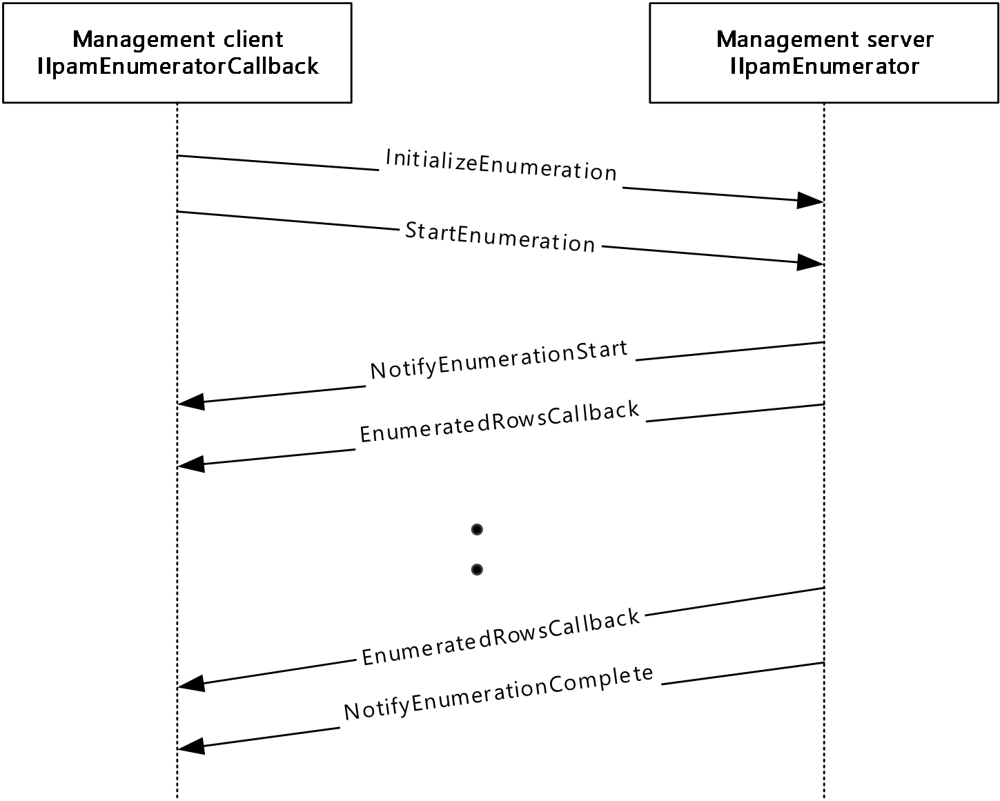

Figure 3: Enumeration Callback Interaction

### 3.5.1 Abstract Data Model

The Abstract Data Model section describes a conceptual model of possible data organization that an implementation maintains to participate in this protocol. The described organization is provided to facilitate the explanation of how the protocol behaves. This document does not mandate that implementations adhere to this model as long as their external behavior is consistent with that described in this document.

#### 3.5.1.1 State Machine

The following figure shows the state machine of the IIpamEnumerator server port type.

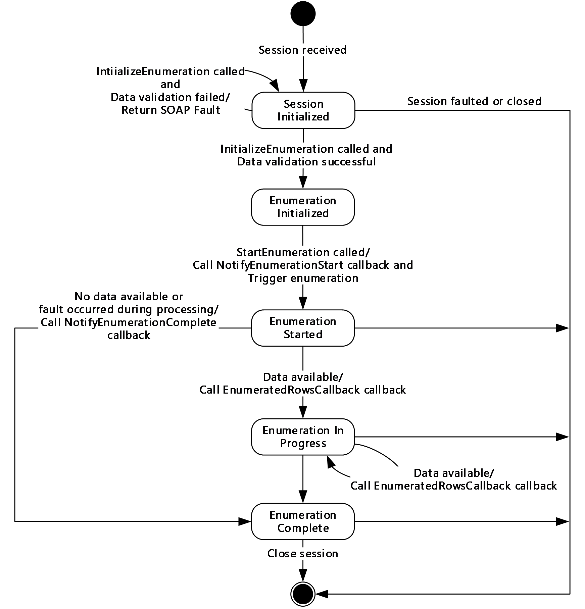

Figure 4: IIpamEnumerator - server state machine

The **IIpamEnumerator** server is session-based and stateful in nature. The **session state** variable will be used to keep track of the current state for each session and it can have the following states as possible values. At any point of the session, if the session is known to be faulted or closed by the lower layer, the state machine ends.

| State | Description |
| --- | --- |
| **Session Initialized** | The initial state of the session when it has been indicated from the lower layer of the protocol. In this state, when the **InitializeEnumeration** operation is invoked (by the client), the data received as a part of the **InitializeEnumeration** is validated. If the data validation succeeds, the state is changed to **Enumeration Initialized**. If the data validation fails, the server returns an appropriate SOAP fault and remains in the **Session Initialized** state itself. |
| **Enumeration Initialized** | The state when the enumerator is initialized and ready to start the processing to return the data back to the client. In this state, the **StartEnumeration** operation is invoked (by the client), the server invokes the **NotifyEnumerationStart** and triggers the enumeration processing. The state is changed to **Enumeration Started**. |
| **Enumeration Started** | This state denotes the enumeration has been initialized successfully and the enumeration processing is currently in progress. If there is data available to be sent across from the enumeration processing, the **EnumeratedRowsCallback** operation is invoked with the data available and the state is changed to **Enumeration In Progress**. If there is no data available but the enumeration processing completes successfully, the **NotifyEnumerationComplete** operation is invoked and the state is changed to **Enumeration Completed**. If there is no data available but the enumeration processing has failed with some error, the **NotifyEnumerationComplete** is called to provide the fault information to the client and the state is changed to **Enumeration Completed**. |
| **Enumeration In Progress** | This state denotes the enumeration is in progress and more data is available to be sent across to the client. If there is data available to be sent across from the enumeration processing, the **EnumeratedRowsCallback** operation is invoked with the data available and the state remains at **Enumeration In Progress.** If there is no data available but the enumeration processing completes successfully, the **NotifyEnumerationComplete** operation is invoked and the state is changed to **Enumeration Completed**. If there is no data available but the enumeration processing has failed with some error, the **NotifyEnumerationComplete** is called to provide the fault information to the client and the state is changed to **Enumeration Completed**. |
| **Enumeration Completed** | This state indicates there is no further processing required in the session and proceeds to close the session itself. |

#### 3.5.1.2 Other Miscellaneous States

**EnumInputParameters**: This is of type **EnumerationParametersBase** and can be any of the extending enumeration parameters type. This is initialized with the parameters received as a part of the **InitializeEnumeration** method.

**EnumOutputData**: This is of type **ArrayOfIpamObject** – a collect of data which have IpamObject as the base type. This will be assigned the data to be sent across to the client in **EnumeratedRowsCallback** operation.

**EnumOutputResult**: This is of type IpamObject to hold any additional data to be sent to the client at the end of the enumeration.

### 3.5.2 Timers

There are no additional timers other than those which are described in section [3.1.2](#Section_3.1.2).

### 3.5.3 Initialization

None.

### 3.5.4 Message Processing Events and Sequencing Rules

#### 3.5.4.1 New Session Indication

The New Session Indication event will be indicated by the lower transport layer of the protocol ([MS-NMFTB](../MS-NMFTB/MS-NMFTB.md)) when a new session is available from the client. The **session state** is initialized to **Session Initialized**.

#### 3.5.4.2 Session Closed or Faulted

The Session Closed or Faulted event will be indicated by the lower transport layer of the protocol ([MS-NMFTB](../MS-NMFTB/MS-NMFTB.md)) when an existing session is either closed by the client or an irrecoverable error has occurred. This event will result in termination of the state machine as the session itself is no longer valid.

#### 3.5.4.3 EnumeratedRowsCallback

The **EnumeratedRowsCallback** operation MUST NOT be invoked by the management client and MUST be ignored by the server.

<wsdl:operation msc:isInitiating="true" msc:isTerminating="false" name="EnumeratedRowsCallback">

<wsdl:output wsaw:Action="http://Microsoft.Windows.Ipam/IIpamEnumerator/EnumeratedRowsCallback" message="ipam:IIpamEnumerator_EnumeratedRowsCallback_OutputCallbackMessage" />

</wsdl:operation>

##### 3.5.4.3.1 Messages

###### 3.5.4.3.1.1 IIpamEnumerator_EnumeratedRowsCallback_OutputCallbackMessage

The **IIpamEnumerator_EnumeratedRowsCallback_OutputCallbackMessage** message is the request for the **EnumeratedRowsCallback** operation.

<wsdl:message name="IIpamEnumerator_EnumeratedRowsCallback_OutputCallbackMessage">

<wsdl:part name="parameters" element="ipam:EnumeratedRowsCallback" />

</wsdl:message>

This message MUST be sent with the following [**SOAP action**](#gt_soap-action).

http://Microsoft.Windows.Ipam/IIpamEnumerator/EnumeratedRowsCallback

The body of the [**SOAP message**](#gt_soap-message) MUST contain the **EnumeratedRowsCallback** element.

##### 3.5.4.3.2 Elements

###### 3.5.4.3.2.1 EnumeratedRowsCallback

The **EnumeratedRowsCallback** element specifies the input values for the **EnumeratedRowsCallback** operation.

<xs:element name="EnumeratedRowsCallback">

<xs:complexType>

<xs:sequence>

<xs:element minOccurs="0" name="data" nillable="true" type="ipam:ArrayOfIpamObject" />

</xs:sequence>

</xs:complexType>

</xs:element>

#### 3.5.4.4 InitializeEnumeration

The **InitializeEnumeration** operation is an [**initiating operation**](#gt_initiating-operation). This operation is used to specify the type of object that is to be enumerated using the enumeration session and the enumeration parameters itself.

<wsdl:operation msc:isInitiating="true" msc:isTerminating="false" name="InitializeEnumeration">

<wsdl:input wsaw:Action="http://Microsoft.Windows.Ipam/IIpamEnumerator/InitializeEnumeration" message="ipam:IIpamEnumerator_InitializeEnumeration_InputMessage" />

<wsdl:output wsaw:Action="http://Microsoft.Windows.Ipam/IIpamEnumerator/InitializeEnumerationResponse" message="ipam:IIpamEnumerator_InitializeEnumeration_OutputMessage" />

</wsdl:operation>

Upon receiving the **IIpamEnumerator_InitializeEnumeration_InputMessage** request message, the server performs the following processing steps. Upon successful completion of the steps specified below, the server MUST respond with the **IIpamEnumerator_InitializeEnumeration_OutputMessage** message. In the event of a failure, an appropriate [**SOAP fault**](#gt_soap-fault) MUST be sent to the client as specified in section [2.2.2.1](#Section_2.2.2.1):

- The **session state** is set to **Enumeration Initialized**.
- The **InitializeEnumeration.parameters.objectType** MUST be a valid value of **EnumerationObjectType** and MUST NOT be None.
- The **InitializeEnumeration.parameters** MUST be valid as per their definitions given in section [2.2.4](#Section_2.2.4). If the data is valid assign **InitializeEnumeration.parameters** to **EnumInputParameters**.
- If the validation of the **InitializeEnumeration.parameters** done fails, an appropriate SOAP fault MUST be sent to the client as specified in section 2.2.2.1.

##### 3.5.4.4.1 Messages

###### 3.5.4.4.1.1 IIpamEnumerator_InitializeEnumeration_InputMessage

The **IIpamEnumerator_InitializeEnumeration_InputMessage** message is the request for the **InitializeEnumeration** operation.

<wsdl:message name="IIpamEnumerator_InitializeEnumeration_InputMessage">

<wsdl:part name="parameters" element="ipam:InitializeEnumeration" />

</wsdl:message>

This message MUST be sent with the following SOAP action.

http://Microsoft.Windows.Ipam/IIpamEnumerator/InitializeEnumeration

The body of the SOAP message MUST contain the **InitializeEnumeration** element.

###### 3.5.4.4.1.2 IIpamEnumerator_InitializeEnumeration_OutputMessage

The **IIpamEnumerator_InitializeEnumeration_OutputMessage** message is the response for the **InitializeEnumeration** operation.

<wsdl:message name="IIpamEnumerator_InitializeEnumeration_OutputMessage">

<wsdl:part name="parameters" element="ipam:InitializeEnumerationResponse" />

</wsdl:message>

This message MUST be sent with the following SOAP action.

http://Microsoft.Windows.Ipam/IIpamEnumerator/InitializeEnumerationResponse

The body of the SOAP message MUST contain the **InitializeEnumerationResponse** element.

##### 3.5.4.4.2 Elements

###### 3.5.4.4.2.1 InitializeEnumeration

The **InitializeEnumeration** element specifies the input values for the **InitializeEnumeration** operation.

<xs:element name="InitializeEnumeration">

<xs:complexType>

<xs:sequence>

<xs:element minOccurs="0" name="parameters" nillable="true" type="ipam:EnumerationParametersBase" />

</xs:sequence>

</xs:complexType>

</xs:element>

###### 3.5.4.4.2.2 InitializeEnumerationResponse

The **InitializeEnumerationResponse** element specifies the output values for the **InitializeEnumeration** operation.

<xs:element name="InitializeEnumerationResponse">

<xs:complexType>

<xs:sequence />

</xs:complexType>

</xs:element>

#### 3.5.4.5 InitializeEnumerationWithModule

The **InitializeEnumerationWithModule** operation is an [**initiating operation**](#gt_initiating-operation). This operation specifies the type of object that is to be enumerated using the enumeration session and the enumeration parameters. This operation is called when the enumeration is invoked from PowerShell. This operation is called for enumerations invoked through any other remoting module and the **InitializeEnumeration** operation defined in section [3.5.4.4.2.1](#Section_3.5.4.4.2.1) deprecated.

<wsdl:operation msc:isInitiating="true" msc:isTerminating="false" name="InitializeEnumerationWithModule">

<wsdl:input wsaw:Action="http://Microsoft.Windows.Ipam/IIpamEnumerator/InitializeEnumerationWithModule" message="ipam:IIpamEnumerator_InitializeEnumerationWithModule_InputMessage" xmlns:wsaw="http://www.w3.org/2006/05/addressing/wsdl" />

<wsdl:output wsaw:Action="http://Microsoft.Windows.Ipam/IIpamEnumerator/InitializeEnumerationWithModuleResponse" message="ipam:IIpamEnumerator_InitializeEnumerationWithModule_OutputMessage" xmlns:wsaw="http://www.w3.org/2006/05/addressing/wsdl" />

</wsdl:operation>

Upon receiving the **IIpamEnumerator_InitializeEnumerationWithModule_InputMessage** request message, the server performs the following processing steps. Upon successful completion of these steps, the server MUST respond with the **IIpamEnumerator_InitializeEnumerationWithModule_OutputMessage** message. In the event of a failure, an appropriate [**SOAP fault**](#gt_soap-fault) MUST be sent to the client as specified in section [2.2.2.1](#Section_2.2.2.1):

- The session state is set to **Enumeration Initialized**.
- The **InitializeEnumerationWithModule.parameters** MUST be valid as defined in section [2.2.4](#Section_2.2.4). If the data is valid, assign **InitializeEnumerationWithModule.parameters** to **EnumInputParameters**.
- The **InitializeEnumerationWithModule.parameters.objectType** MUST be a valid value of **EnumerationObjectType** and MUST NOT be None.
- The **InitializeEnumerationWithModule.parameters.remotingModule** MUST NOT be NULL.
- If the validation of the **InitializeEnumerationWithModule.parameters** done fails, an appropriate SOAP fault MUST be sent to the client as specified section 2.2.2.1.
- Initialize the session with **InitializeEnumerationWithModule.parameters.remotingModule**.

##### 3.5.4.5.1 Messages

###### 3.5.4.5.1.1 IIpamEnumerator_InitializeEnumerationWithModule_InputMessage

The **IIpamEnumerator_InitializeEnumerationWithModule_InputMessage** message is the request for the **InitializeEnumerationWithModule** operation.

<wsdl:message name="IIpamEnumerator_InitializeEnumerationWithModule_InputMessage">

<wsdl:part name="parameters" element="ipam:InitializeEnumerationWithModule" />

</wsdl:message>

This message MUST be sent with the following SOAP action.

http://Microsoft.Windows.Ipam/IIpamEnumerator/InitializeEnumerationWithModule

The body of the SOAP message MUST contain the **InitializeEnumerationWithModule** element.

###### 3.5.4.5.1.2 IIpamEnumerator_InitializeEnumerationWithModule_OutputMessage

The **IIpamEnumerator_InitializeEnumerationWithModule_OutputMessage** message is the response message for the **InitializeEnumerationWithModule** operation.

<wsdl:message name="IIpamEnumerator_InitializeEnumerationWithModule_OutputMessage">

<wsdl:part name="parameters" element="ipam:InitializeEnumerationWithModuleResponse" />

</wsdl:message>

This message MUST be sent with the following SOAP action.

http://Microsoft.Windows.Ipam/IIpamEnumerator/InitializeEnumerationWithModuleResponse

The body of the SOAP message MUST contain the **InitializeEnumerationWithModuleResponse** element.

##### 3.5.4.5.2 Elements

###### 3.5.4.5.2.1 InitializeEnumerationWithModule

The **InitializeEnumerationWithModule** element specifies the input values for the operation **InitializeEnumerationWithModule**.

<xs:element name="InitializeEnumerationWithModule" >

<xs:complexType>

<xs:sequence>

<xs:element minOccurs="0" name="parameters" nillable="true" type="ipam:EnumerationParametersBase" />

<xs:element minOccurs="0" name="remotingModule" nillable="true" type="ipam1:IIpamRemotingModule" />

</xs:sequence>

</xs:complexType>

</xs:element>

###### 3.5.4.5.2.2 InitializeEnumerationWithModuleResponse

The **InitializeEnumerationWithModuleResponse** element specifies the output values for the operation **InitializeEnumerationWithModuleResponse**.

<xs:element name="InitializeEnumerationWithModuleResponse">

<xs:complexType>

<xs:sequence />

</xs:complexType>

</xs:element>

#### 3.5.4.6 NotifyEnumerationComplete

The **NotifyEnumerationComplete** operation MUST NOT be invoked by the management client and MUST be ignored by the server.

<wsdl:operation msc:isInitiating="true" msc:isTerminating="false" name="NotifyEnumerationComplete">

<wsdl:output wsaw:Action="http://Microsoft.Windows.Ipam/IIpamEnumerator/NotifyEnumerationComplete" message="ipam:IIpamEnumerator_NotifyEnumerationComplete_OutputCallbackMessage" />

</wsdl:operation>

##### 3.5.4.6.1 Messages

###### 3.5.4.6.1.1 IIpamEnumerator_NotifyEnumerationComplete_OutputCallbackMessage

The **IIpamEnumerator_NotifyEnumerationComplete_OutputCallbackMessage** message is the response for the **NotifyEnumerationComplete** operation.

<wsdl:message name="IIpamEnumerator_NotifyEnumerationComplete_OutputCallbackMessage">

<wsdl:part name="parameters" element="ipam:NotifyEnumerationComplete" />

</wsdl:message>

This message MUST be sent with the following SOAP action.

http://Microsoft.Windows.Ipam/IIpamEnumerator/NotifyEnumerationComplete

The body of the SOAP message MUST contain the **NotifyEnumerationComplete** element.

##### 3.5.4.6.2 Elements

###### 3.5.4.6.2.1 NotifyEnumerationComplete

The **NotifyEnumerationComplete** element specifies the input values for the **NotifyEnumerationComplete** operation.

<xs:element name="NotifyEnumerationComplete">

<xs:complexType>

<xs:sequence>

<xs:element minOccurs="0" name="result" nillable="true" type="ipam:IpamObject" />

<xs:element minOccurs="0" name="exception" nillable="true" type="ipam1:IpamException" />

</xs:sequence>

</xs:complexType>

</xs:element>

#### 3.5.4.7 NotifyEnumerationStart

The **NotifyEnumerationStart** operation MUST NOT be invoked by the management client and MUST be ignored by the server.

<wsdl:operation msc:isInitiating="true" msc:isTerminating="false" name="NotifyEnumerationStart">

<wsdl:output wsaw:Action="http://Microsoft.Windows.Ipam/IIpamEnumerator/NotifyEnumerationStart" message="ipam:IIpamEnumerator_NotifyEnumerationStart_OutputCallbackMessage" />

</wsdl:operation>

##### 3.5.4.7.1 Messages

###### 3.5.4.7.1.1 IIpamEnumerator_NotifyEnumerationStart_OutputCallbackMessage

The **IIpamEnumerator_NotifyEnumerationStart_OutputCallbackMessage** message is the response for the **NotifyEnumerationStart** operation.

<wsdl:message name="IIpamEnumerator_NotifyEnumerationStart_OutputCallbackMessage">

<wsdl:part name="parameters" element="ipam:NotifyEnumerationStart" />

</wsdl:message>

This message MUST be sent with the following SOAP action.

http://Microsoft.Windows.Ipam/IIpamEnumerator/NotifyEnumerationStart

The body of the SOAP message MUST contain the **NotifyEnumerationStart** element.

##### 3.5.4.7.2 Elements

###### 3.5.4.7.2.1 NotifyEnumerationStart

The **NotifyEnumerationStart** element specifies the input values for the **NotifyEnumerationStart** operation.

<xs:element name="NotifyEnumerationStart">

<xs:complexType>

<xs:sequence />

</xs:complexType>

</xs:element>

#### 3.5.4.8 StartEnumeration

The **StartEnumeration** operation is used to trigger the processing of the enumeration. This causes the session state to be set to **Enumeration Started**.

<wsdl:operation msc:isInitiating="true" msc:isTerminating="false" name="StartEnumeration">

<wsdl:input wsaw:Action="http://Microsoft.Windows.Ipam/IIpamEnumerator/StartEnumeration" message="ipam:IIpamEnumerator_StartEnumeration_InputMessage" />

</wsdl:operation>

Upon receiving the **IIpamEnumerator_StartEnumeration_InputMessage**, the server MUST invoke **NotifyEnumerationStart** operation. The enumeration processing logic as described in section [3.5.4.8.1](#Section_3.5.4.8.1.58) has to be triggered as well.

##### 3.5.4.8.1 Enumeration Processing Logic

This Enumeration Processing Logic section captures the enumeration processing steps for the various types of **EnumInputParameters**. The following table captures the type, which extends the **EnumerationParametersBase** and the corresponding **ObjectType**.

| Enumeration Parameter Type | Object Type |
| --- | --- |
| AddressSpaceByFilterEnumerationParameters | AddressSpace |
| AddressSpaceEnumerationParameters | AddressSpace |
| ConfigurationAuditEnumerationParameters | ConfigurationAudit |
| CustomFieldAssociationEnumerationParameters | CustomFieldAssociation |
| CustomFieldEnumerationParameters | CustomField |
| DHCPEffectiveScopePoliciesEnumerationParameters | DHCPPolicy |
| DHCPEffectiveServerPoliciesEnumerationParameters | DHCPPolicy |
| DHCPFailoverAllEnumerationParameters | DHCPFailover |
| DHCPFailoverByServerIdsEnumerationParameters | DHCPFailover |
| DHCPFailoverEnumerationParameters | DHCPFailover |
| DHCPFailoverScopesEnumerationParameters | DHCPScope |
| DHCPFilterAllEnumerationParameters | DHCPFilter |
| DHCPFilterByServerIdsEnumerationParameters | DHCPFilter |
| DHCPPoliciesByDhcpServerIdListEnumerationParameters | DHCPPolicy |
| DHCPPoliciesEnumerationParameters | DHCPPolicy |
| DHCPReservationAllEnumerationParameters | DHCPReservation |
| DHCPReservationScopeBasedEnumerationParameters | DHCPReservation |
| DhcpScopeAllEnumerationParameters | DhcpScope |
| DhcpScopeAssociatedWithVendorClassesEnumerationParameters | DhcpScope |
| DhcpScopeForIpBlockEnumerationParameters | DhcpScope |
| DHCPScopePoliciesWithoutRangesEnumerationParameters | DHCPPolicy |
| DhcpScopesByDhcpServerIdListEnumerationParameters | DhcpScope |
| DhcpScopeUnmappedEnumerationParameters | DhcpScope |
| DhcpServerAllEnumerationParameters | DhcpServer |
| DhcpServerByServerInfoIdsEnumerationParameters | DhcpServer |
| DHCPSuperscopeByDhcpServerIdListEnumerationParameters | DHCPSuperscope |
| DHCPSuperscopeEnumerationParameters | DHCPSuperscope |
| DiscoverySubnetEnumerationParameters | DiscoveredSubnets |
| DnsConditionalForwarderEnumerationParameters | DnsConditionalForwarder |
| DnsResourceRecordEnumerationParameters | DnsResourceRecord |
| DnsReverseLookupZoneEnumerationParameters | DnsReverseLookupZone |
| DnsServerByServerInfoIdsEnumerationParameters | DnsServer |
| DnsServerEnumerationParameters | DnsServer |
| DnsServerReverseZoneEnumerationParameters | DnsServerReverseZone |
| DnsServerZoneEnumerationParameters | DnsServerZone |
| DnsZoneEnumerationParameters | DnsZone |
| DnsZoneEventEnumerationParameters | DnsZoneEvent |
| IpamIPAddressAllForLogicalGroupEnumerationParameters | IPAddress |
| IpamIPAddressAllForLogicalGroupNodeEnumerationParameters | IPAddress |
| IpamIPAddressByAddressSpaceAndVirtualizationTypeParameters | IPAddress |
| IpamIPAddressByBlockIdEnumerationParameters | IPAddress |
| IpamIPAddressByFilterEnumerationParameters | IPAddress |
| IpamIPAddressByManagedByAndManagedByEntityEnumerationParameters | IPAddress |
| IpamIPAddressByRangeIdEnumerationParameters | IPAddress |
| IpamIPAddressBySubnetIdEnumerationParameters | IPAddress |
| IpamIPAddressByVirtualizationTypeParameters | IPAddress |
| IpamIPAddressForUnmappedRangesEnumerationParameters | IPAddress |
| IpamIPAddressRootAddressesEnumerationParameters | IPAddress |
| IpamIPAddressUnmappedAddressEnumerationParameters | IPAddress |
| IpamIPSubnetByFilterEnumerationParameters | IPSubnet |
| IpamIPSubnetsByAddressCategoryEnumerationParameters | IPSubnet |
| IpamIPSubnetsByAddressSpaceAndVirtualizationTypeEnumerationParameters | IPSubnet |
| IpamIPSubnetsByBlockIdEnumerationParameters | IPSubnet |
| IpamIPSubnetsByUnmappedEnumerationParameters | IPSubnet |
| IpamIPSubnetsByVirtualizationTypeEnumerationParameters | IPSubnet |
| IpamIPSubnetsDirectChildrenByBlockIdEnumerationParameters | IPSubnet |
| IpamProvisioningEnumerationParameters | Provisioning |
| IPBlockChildBlockEnumerationParameters | IPBlock |
| IPBlockGetAllBlocksEnumerationParameters | IPBlock |
| IPBlockRootEnumerationParameters | IPBlock |
| IPRangeAllForBlockEnumerationParameter | IPRange |
| IPRangeAllForDhcpServerEnumerationParameters | IPRange |
| IPRangeAllForLogicalGroupNodeEnumerationParameters | IPRange |
| IPRangeByAddressSpaceAndVirtualizationTypeParameters | IPRange |
| IPRangeByFilterEnumerationParameters | IPRange |
| IPRangeByManagedByAndManagedByEntityEnumerationParameters | IPRange |
| IPRangeByVirtualizationTypeParameters | IPRange |
| IPRangeForBlockEnumerationParameters | IPRange |
| IPRangeForSubnetEnumerationParameter | IPRange |
| IPRangeRootEnumerationParameters | IPRange |
| IPRangeUnmappedEnumerationParameters | IPRange |
| LogicalGroupDataForLogicalGroupNodeEnumerationParameters | LogicalGroupData |
| LogicalGroupDataForRootAlternateItemsEnumerationParameters | LogicalGroupData |
| LogicalGroupDataUnmappedItemsEnumerationParameters | LogicalGroupData |
| LogicalGroupNodeChildrenEnumerationParameters | LogicalGroupNode |
| LogicalGroupNodeRootEnumerationParameters | LogicalGroupNode |
| LogicalGroupsEnumerationParameters | LogicalGroup |
| ServerInfoEnumerationParameters | ServerInfo |
| SubnetLogicalGroupNodeRootEnumerationParameters | LogicalGroupNode |
| UnmappedIpamIPAddressForLogicalGroupEnumerationParameters | IPAddress |
| DhcpScopeObjectSpecificEnumerationParameters | DhcpScope |
| DhcpScopeByPrefixAndServerNameEnumerationParameters | DhcpScope |
| DhcpSuperscopeBySuperscopeAndServerNameEnumerationParameters | DHCPSuperscope |
| DnsConditionalForwarderByFiltersEnumerationParameters | DnsConditionalForwarder |
| DnsResourceRecordFilterEnumerationParameters | DnsResourceRecord |

The following sections describe the processing rules involved in generating the enumerated data. The **EnumInputParameters** will contain the input parameters and on completion the **EnumOutputData** will have the collection of data to be sent to the client. When the data is available in **EnumOutputData** and the **session state** is **Enumeration Started** or **Enumeration In Progress**, the **EnumeratedRowsCallback** operation is invoked multiple times as necessary to send the enumerated data to the client.

When there are no more data to be sent across and the enumeration processing has completed successfully without any faults, the **EnumOutputResult** is set with any additional data to be sent across to the client as a part of enumeration completion. The **NotifyEnumerationComplete** operation MUST be called with **NotifyEnumerationComplete.result** being set to **EnumOutputResult** and the **NotifyEnumerationComplete.exception** being set to NULL.

When the enumeration processing results in a fault getting generated, the **NotifyEnumerationComplete** operation MUST be called with **NotifyEnumerationComplete.result** not being set and **NotifyEnumerationComplete.exception** is set to the fault information.

###### 3.5.4.8.1.1 AddressSpaceByFilterEnumerationParameters

The **AddressSpaceByFilterEnumerationParameters** processing is done when the **EnumInputParameters** contains data of type **AddressSpaceByFilterEnumerationParameters**. The **ObjectType** MUST be **EnumerationObjectType.AddressSpace**. This is used to enumerate all address spaces that meet all the filter criteria in **AddressSpaceByFilterEnumerationParameters.filterInfo**. **AddressSpaceByFilterEnumerationParameters.filterInfo** is a collection of various filter types (specified by **ipam:GetAddressSpaceFilter**) and their values.

The following are the steps involved in identifying the rows to be returned as a part of the enumeration:

- For all rows in **ADM_AddressSpaceTable**, call **GetAddressSpaceById** from **ADM_AddressSpaceTable** by passing the **RecordId** as *Param_AddressSpaceId*.
- If **Result_AddressSpace** object satisfies every subcriteria in **AddressSpaceByFilterEnumerationParameters.FilterInfo**, then add it to **EnumOutputData**.

###### 3.5.4.8.1.2 AddressSpaceEnumerationParameters

The **AddressSpaceEnumerationParameters** processing is done when the **EnumInputParameters** contains data of type **AddressSpaceEnumerationParameters**. The **ObjectType** MUST be **EnumerationObjectType.AddressSpace**. This is used to enumerate all the address spaces of the type **AddressSpaceEnumerationParameters.AddressSpaceType**.

The following steps are used to identify the rows to be returned as a part of the enumeration:

- Call the procedure **GetAllAddressSpaceNames** from **ADM_AddressSpaceTable** by passing **AddressSpaceEnumerationParameters.AddressSpaceType** as *Param_AddressSpaceType*.
- For each tuple in **Result_AddressSpaceNames**, call **GetAddressSpaceById** from **ADM_AddressSpaceTable** with *Param_AddressSpaceId* as **AddressSpaceRecordId** field of the tuple.
- The **Result_AddressSpace** will form the set of **AddressSpace** objects that have to be returned as **EnumOutputData**.

###### 3.5.4.8.1.3 ConfigurationAuditEnumerationParameters

The **ConfigurationAuditEnumerationParameters** processing is done when the **EnumInputParameters** contains data of type **ConfigurationAuditEnumerationParameters**. The **ObjectType** MUST be **EnumerationObjectType.ConfigurationAudit**.

The following are the steps involved in identifying the rows to be returned as a part of the enumeration:

- Validate the **ConfigurationAuditEnumerationParameters** as specified in section [2.2.4.66](#Section_3.5.4.8.1.3). If the validation conditions are not being met, return an appropriate [**SOAP fault**](#gt_soap-fault) as specified in section [2.2.2.1](#Section_2.2.2.1).
- Call the procedure **SearchConfigurationAuditTable** in **ADM_ConfigurationAuditTable**, specifying the **ConfigurationAuditEnumerationParameters.SearchXml** as *Param_searchCriteriaXml* and **ConfigurationAuditEnumerationParameters.NumberOfRecords** as *Param_numberOfRows*.
- The **Result_events** will form the set of events that have to be returned as **EnumOutputData**.

###### 3.5.4.8.1.4 CustomFieldAssociationEnumerationParameters

The **CustomFieldAssociationEnumerationParameters** processing is done when the **EnumInputParameters** contains data of type **CustomFieldAssociationEnumerationParameters**. The **ObjectType** MUST be **EnumerationObjectType.CustomFieldAssociation**. This is used to enumerate all **CustomFieldAssociation** in the IPAM data store.

The following are the steps involved in identifying the rows to be returned as a part of the enumeration:

- Call **GetAllAssociations** from **ADM_MultiValueCustomFieldValueAssociationTable**.
- Create an object of type **CustomFieldAssociation**. Call **GetCustomField** from **ADM_CustomFieldsTable** for the values in the tuples returned in step 1 and store them as **CustomField1** and **CustomField2** of the created object. Store the tuple as **CustomFieldValueAssociations** of the object. Add the object to **EnumOutputData**.

###### 3.5.4.8.1.5 CustomFieldEnumerationParameters

The **CustomFieldEnumerationParameters** processing is done when the **EnumInputParameters** contains the data of type **CustomFieldEnumerationParameters**. The **ObjectType** MUST be **EnumerationObjectType.CustomField**.

The following are the steps involved in identifying the rows to be returned as a part of the enumeration:

- If **CustomFieldEnumerationParameters.CustomFieldName** is specified, enumerate the row in **ADM_CustomFieldsTable** that have **CustomFieldDetails.Name** to be **CustomFieldEnumerationParameters.CustomFieldName**.
- If **CustomFieldEnumerationParameters.CustomFieldName** is not specified, enumerate all the rows in **ADM_CustomFieldsTable**.
- For each enumerated row, perform the following steps:
- Call the procedure **GetCustomField** in **ADM_CustomFieldsTable** passing the following parameter. *Param_Id* is set to the value of **RecordId** of the enumerated row.
- Add **Result_customField** to **EnumOutputData**.

###### 3.5.4.8.1.6 DHCPEffectiveScopePoliciesEnumerationParameters

The **DHCPEffectiveScopePoliciesEnumerationParameters** processing is done when the **EnumInputParameters** contains data of type **DHCPEffectiveScopePoliciesEnumerationParameters**. The **ObjectType** MUST be **EnumerationObjectType.DHCPPolicy**. This is used to enumerate the effective DHCP policies for a given scope. These would be the scope level policies for the given scope in **DHCPEffectiveScopePoliciesEnumerationParameters.DhcpScope** followed by the server level policies corresponding to parent server of **DHCPEffectiveScopePoliciesEnumerationParameters.DhcpScope**.

The following are the steps involved in identifying the rows to be returned as a part of the enumeration:

- Call the procedure **GetPoliciesForScopeByScopeId** of **ADM_DHCPPolicyTable** passing **DHCPEffectiveScopePoliciesEnumerationParameters.DhcpScope** as *Param_scopeId*.
- Add the entries in **Result_scopePolicies** to **EnumOutputData**.
- Retrieve the parent DHCP server ID to which the passed scope belongs to, from **DHCPEffectiveScopePoliciesEnumerationParameters.DhcpScope.DHCPServerRecordId** and initialize that into local variable **serverId**.
- Call the procedure **GetPoliciesForServerByServerId** of **ADM_DHCPPolicyTable** passing **serverId** as *Param_serverId*.
- Add the entries in **Result_serverPolicies** to **EnumOutputData**.

###### 3.5.4.8.1.7 DHCPEffectiveServerPoliciesEnumerationParameters

The **DHCPEffectiveServerPoliciesEnumerationParameters** processing is done when the **EnumInputParameters** contains data of type **DHCPEffectiveServerPoliciesEnumerationParameters**. The **ObjectType** MUST be **EnumerationObjectType.DHCPPolicy**. This is used to enumerate the effective DHCP policies that belong to the given DHCP server specified in **DHCPEffectiveServerPoliciesEnumerationParameters.DhcpServer**.

The following are the steps involved in identifying the rows to be returned as a part of the enumeration:

- Call the procedure **GetPoliciesForServerByServerId** of **ADM_DHCPPolicyTable** passing **DHCPEffectiveServerPoliciesEnumerationParameters.DhcpServer** as *Param_serverId*.
- Add the entries in **Result_serverPolicies** to **EnumOutputData**.

###### 3.5.4.8.1.8 DHCPFailoverAllEnumerationParameters

The **DHCPFailoverAllEnumerationParameters** processing is done when the **EnumInputParameters** contains data of type **DHCPFailoverAllEnumerationParameters**. The **ObjectType** MUST be **EnumerationObjectType.DHCPFailover**. This is used to retrieve all the DHCP failover relationships in the system.

The following are the steps to identify the data to be returned as a part of the enumeration:

- Enumerate all the rows in **ADM_DhcpFailoverRelationTable**.
- Initialize **Result_failoverCollection**.
- For each row retrieved from **ADM_DhcpFailoverRelationTable,create** an instance of **DhcpFailover** with the following assignments and add it to **Result_failoverCollection** collection:
- Assign **DhcpFailover.RecordId** with **RecordId** of the row.
- If **Server1RecordId** is not 0, then copy **Server1RecordId** into **DhcpFailover.Server1RecordId**.
- If **Server2RecordId** is not 0, then copy **Server2RecordId** into **DhcpFailover.Server2RecordId**.
- Copy the **FailoverDetails** into **DhcpFailover**.
- Add all the entries in **Result_failoverCollection** to **EnumOutputData**.

###### 3.5.4.8.1.9 DHCPFailoverByServerIdsEnumerationParameters

The **DHCPFailoverByServerIdsEnumerationParameters** processing is done when the **EnumInputParameters** contains data of type **DHCPFailoverByServerIdsEnumerationParameters**. The **ObjectType** MUST be **EnumerationObjectType.DHCPFailover**. This is used to retrieve the DHCP failover data for all the failover relationships belonging to the list of server IDs specified in **DHCPFailoverByServerIdsEnumerationParameters.ServerIds**.

The following are the steps involved in identifying the rows to be returned as a part of the enumeration:

- For each **ServerId** in **DHCPFailoverByServerIdsEnumerationParameters.ServerIds**, do the following step:
- Call the procedure **GetAllDhcpFailoverByServerId** of **ADM_DHCPFailoverRelationTable** passing **ServerId** as *Param_DhcpServerId*.
- Add all the entries in *Param_failoverCollection* to **EnumOutputData**.

###### 3.5.4.8.1.10 DHCPFailoverEnumerationParameters

The **DHCPFailoverEnumerationParameters** processing is done when the **EnumInputParameters** contains data of type **DHCPFailoverEnumerationParameters**. The **ObjectType** MUST be **EnumerationObjectType.DHCPFailover**. This is used to retrieve the DHCP failover data for the given Failover ID in **DHCPFailoverEnumerationParameters.Failover**.

The following are the steps involved in identifying the data to be returned as a part of the enumeration.

Call the procedure **GetDhcpFailoverById** of **ADM_DHCPFailoverRelationTable** passing **DHCPFailoverEnumerationParameters.Failover** as *Param_FailoverId*.

Add the entry in **Result_Failover** to **EnumOutputData**.

###### 3.5.4.8.1.11 DHCPFailoverScopesEnumerationParameters

The **DHCPFailoverScopesEnumerationParameters** processing is done when the **EnumInputParameters** contains data of type **DHCPFailoverScopesEnumerationParameters**. The **ObjectType** MUST be **EnumerationObjectType.DHCPScope**. This is used to retrieve the DHCP scopes participating in the failover relationship given by **DHCPFailoverScopesEnumerationParameters.failover**.

The following are the steps involved in identifying the rows to be returned as a part of the enumeration:

- Call the procedure **GetDhcpFailoverScopes** of **ADM_DHCPScopeFailoverTable** passing **DHCPFailoverScopesEnumerationParameters.failover** as *Param_Failover*.
- Add the scopes returned in *Param_scopeCollection* to **EnumOutputData**.

###### 3.5.4.8.1.12 DHCPFilterAllEnumerationParameters

The **DHCPFilterAllEnumerationParameters** processing is done when the **EnumInputParameters** contains data of type **DHCPFilterAllEnumerationParameters**. The **ObjectType** MUST be **EnumerationObjectType.DHCPFilter**. This is used to retrieve the DHCP filters in the system.

The following are the steps involved in identifying the rows to be returned as a part of the enumeration.

The following are the processing steps involved:

- Enumerate all the rows in **ADM_DhcpFilterTable**.
- Initialize **Result_Filters** as collection of type **DhcpFilter**.
- Add all the rows from **ADM_DhcpFilterTable** to the **Result_Filters** collection.
- Add all rows from **Result_Filters** to **EnumOutputData**.

###### 3.5.4.8.1.13 DHCPFilterByServerIdsEnumerationParameters

The **DHCPFilterByServerIdsEnumerationParameters** processing is done when the **EnumInputParameters** contains data of type **DHCPFilterByServerIdsEnumerationParameters**. The **ObjectType** MUST be **EnumerationObjectType.DHCPFilter**. This is used to retrieve the DHCP filters belonging to the list of server IDs specified in **DHCPFilterByServerIdsEnumerationParameters.ServerIds**.

The following are the steps involved in identifying the rows to be returned as a part of the enumeration:

- For each **ServerId** in **DHCPFilterByServerIdsEnumerationParameters.ServerIds**, do the following steps:
- Call the procedure **GetFiltersForServer** of **ADM_DHCPFilterTable** passing **ServerId** as *Param_serverId*.
- Add all the entries in **Result_Filters** to **EnumOutputData**.

###### 3.5.4.8.1.14 DHCPPoliciesByDhcpServerIdListEnumerationParameters

The **DHCPPoliciesByDhcpServerIdListEnumerationParameters** processing is done when the **EnumInputParameters** contains data of type **DHCPPoliciesByDhcpServerIdListEnumerationParameters**. The **ObjectType** MUST be **EnumerationObjectType.DHCPPolicy**. This is used to enumerate the DHCP policies that belong to the given set of DHCP servers specified in **DHCPPoliciesByDhcpServerIdListEnumerationParameters.DhcpServers**.

The following are the steps involved in identifying the rows to be returned as a part of the enumeration:

- Retrieve the passed Server IDs in **DHCPPoliciesByDhcpServerIdListEnumerationParameters.DhcpServers** collection and for each retrieved serverID, do the following:
- Call the procedure **GetPoliciesForServerByServerId** of **ADM_DHCPPolicyTable** passing serverID as *Param_serverId*.
- Add the entries in **Result_serverPolicies** to **EnumOutputData**.

###### 3.5.4.8.1.15 DHCPPoliciesEnumerationParameters

The **DHCPPoliciesEnumerationParameters** processing is done when the **EnumInputParameters** contains data of type **DHCPPoliciesEnumerationParameters**. The **ObjectType** MUST be **EnumerationObjectType.DHCPPolicy**. This is used to enumerate the DHCP policies that meet the specified filter condition in **DHCPPoliciesEnumerationParameters**.

The following are the steps involved in identifying the rows to be returned as a part of the enumeration:

- Enumerate the rows in **ADM_DhcpPolicyTable**.
- Initialize **Result_Policies**.
- For each row, perform the following steps:
- Create an instance of **DhcpPolicyV4** with the following assignments and add it to **Result_Policies** collection:
- Assign **DhcpPolicyV4.PolicyId** with **PolicyId** of the row.
- Copy the **PolicyDetails** to **DhcpPolicyV4** instance.
- Initialize **DhcpPolicyV4.Server** with **DhcpServerV4**.
- Assign **DhcpPolicyV4.Server.RecordId** with **Server** of the row.
- Initialize **DhcpPolicyV4.Scope** with **DhcpScopeV4** and assign **DhcpPolicyV4.Scope.RecordId** with **Scope** of the row.
- Add the entries in **Result_Policies** to **EnumOutputData**.

###### 3.5.4.8.1.16 DHCPReservationAllEnumerationParameters

The **DHCPReservationAllEnumerationParameters** processing is done when the **EnumInputParameters** contains data of type **DHCPReservationAllEnumerationParameters**. The **ObjectType** MUST be **EnumerationObjectType.DHCPReservation**. This is used to enumerate the DHCP reservations that meet the specified filter condition in **DHCPreservationAllEnumerationParameters.ReservationAddressFamily** and **DHCPreservationAllEnumerationParameters.ReservationAddressType**.

The following are the steps involved in identifying the rows to be returned as a part of the enumeration:

- Use the **DHCPreservationAllEnumerationParameters.ReservationAddressFamily** and **DHCPreservationAllEnumerationParameters.ReservationAddressType** to determine the simple table within the **ADM_DHCPReservationTable** compound table to perform the rest of the processing.
- For all the reservation entries that match the filter criteria, add the entries to **EnumOutputData**.

###### 3.5.4.8.1.17 DHCPReservationScopeBasedEnumerationParameters

The **DHCPReservationScopeBasedEnumerationParameters** processing is done when the **EnumInputParameters** contains data of type **DHCPReservationScopeBasedEnumerationParameters**. The **ObjectType** MUST be **EnumerationObjectType.DHCPReservation**. This is used to enumerate the DHCP reservations that belong to specific scopes and meet the specified filter condition in **DHCPreservationScopeBasedEnumerationParameters.ReservationAddressFamily** and **DHCPreservationScopeBasedEnumerationParameters.ReservationAddressType**.

The following are the steps involved in identifying the rows to be returned as a part of the enumeration:

- Use the **DHCPreservationScopeBasedEnumerationParameters.Scopes**, **DHCPreservationScopeBasedEnumerationParameters.ReservationAddressFamily** and **DHCPreservationScopeBasedEnumerationParameters.ReservationAddressType** to determine the simple table within the **ADM_DHCPReservationTable** compound table to perform the rest of the processing.
- For all the reservation entries that match the filter criteria, add the entries to **EnumOutputData**.

###### 3.5.4.8.1.18 DhcpScopeAllEnumerationParameters

The **DhcpScopeAllEnumerationParameters** processing is done when the **EnumInputParameters** contains data of type **DhcpScopeAllEnumerationParameters**. The **ObjectType** MUST be **EnumerationObjectType.DhcpScope**. This is used to enumerate all the DHCP scopes that are present in the IPAM data store. The **DhcpScopeAllEnumerationParameters.AddressFamily** is used to determine the simple table within the **ADM_DHCPScopesTable** compound table on which the processing has to be done.

The following are the steps involved in identifying the rows to be returned as a part of the enumeration:

- Enumerate all the rows in the **ADM_DHCPScopesTable**.
- For each row enumerated, perform the following steps:
- Call the procedure **GetScopeFromTable** of the **ADM_DHCPScopesTable** passing the following parameters:
- *Param_Id* is assigned the value of the **RecordId** of the row being enumerated.
- *Param_addressfamily* is assigned the value of **DhcpScopeAllEnumerationParameters.AddressFamily**.
- Add the returned result **Result_scope** to **EnumOutputData**.

###### 3.5.4.8.1.19 DhcpScopeAssociatedWithVendorClassesEnumerationParameters

The **DhcpScopeAssociatedWithVendorClassesEnumerationParameters** processing is done when the **EnumInputParameters** contains data of type **DhcpScopeAssociatedWithVendorClassesEnumerationParameters**. The **ObjectType** MUST be **EnumerationObjectType.DhcpScope**. This is used to enumerate all the DHCP scopes that are present on a specified DHCP server and having an option specified for a particular vendor class. The **DhcpScopeAssociatedWithVendorClassesEnumerationParameters.AddressFamily** is used to determine the simple table within the **ADM_DHCPScopesTable** compound table on which the processing has to be done.

The following are the steps involved in identifying the rows to be returned as a part of the enumeration:

- If **DhcpScopeAssociatedWithVendorClassesEnumerationParameters.VendorClassRecordIds** is not specified or is an empty collection, **EnumOutputData** is assigned an empty collection.
- Fetch the DHCP server against which the scopes having options of the specified vendor classes are required. This is done by calling the procedure **GetDHCPServerFromTable** and passing the following parameters:
- *Param_Id* is set to **DhcpScopeAssociatedWithVendorClassesEnumerationParameters.ParentServerRecordId**.
- *Param_addressfamily* is assigned the value of **DhcpScopeAssociatedWithVendorClassesEnumerationParameters.AddressFamily**.
- If any of the entries in the **DhcpScopeAssociatedWithVendorClassesEnumerationParameters.VendorClassRecordIds** is 0, it means the scopes associated with the default vendor class option is being requested. Perform the following steps to enumerate the rows:
- In this case, enumerate all the scopes in **ADM_DHCPScopesTable** whose **DHCPServerRecordId** is the same as **DhcpScopeAssociatedWithVendorClassesEnumerationParameters.ParentServerRecordId**.
- Otherwise perform the following steps to enumerate the rows of interest:
- Enumerate the option definitions from **Result_server.OptionDefinitions** whose **VendorClassRecordId** is one of the values in the list **DhcpScopeAssociatedWithVendorClassesEnumerationParameters.VendorClassRecordIds**.
- For each of the enumerated option definitions, enumerate the rows in the **ADM_DhcpOptionsTable** whose **ScopeRecordId** is not NULL and **OptionDefinitionRecordId** is the same as the **RecordId** of the option definition that is getting enumerated. This will provide the list of scopes in the form of **RecordId** in **ADM_DHCPScopesTable** that are associated with the specified vendor class.
- Enumerate the scopes with the **RecordId** in the previously generated list.
- For each row enumerated in the **ADM_DHCPScopesTable**, perform the following steps to generate the enumerated data:
- Call the procedure **GetScopeFromTable** of **ADM_DHCPScopesTable** passing the following input parameters:
- *Param_Id* is set to the **RecordId** of the row being enumerated.
- *Param_addressFamily* is set to **DhcpScopeAssociatedWithVendorClassesEnumerationParameters.AddressFamily**.
- Add the **Result_scope** returned by the procedure to **EnumOutputData**.

###### 3.5.4.8.1.20 DhcpScopeForIpBlockEnumerationParameters

The **DhcpScopeForIpBlockEnumerationParameters** processing is done when the **EnumInputParameters** contains data of type **DhcpScopeForIpBlockEnumerationParameters**. The **ObjectType** MUST be **EnumerationObjectType.DhcpScope**. This is used to enumerate all the DHCP scopes that are mapped to a particular IP address block specified as parameter using **DhcpScopeForIpBlockEnumerationParameters.ParentIPBlockRecordId**. The **DhcpScopeForIpBlockEnumerationParameters.AddressFamily** is used to determine the simple table within the **ADM_DHCPScopesTable** compound table on which the processing has to be done.

The following are the steps involved in identifying the rows to be returned as a part of the enumeration:

- Get the IP address block for which the scopes are being requested by calling the procedure **GetIPBlockFromTable** of **ADM_IPBlocksTable** passing the following as input parameters:
- *Param_blockId* is set to **DhcpScopeForIpBlockEnumerationParameters.ParentIPBlockRecordId**.
- *Param_addressFamily* is set to **DhcpScopeForIpBlockEnumerationParameters.AddressFamily**.
- Enumerate the ranges in the **ADM_IPRangeTable** that meet the following criteria:
- **StartIPAddress** is greater than or equal to **result.StartIPAddress**
- **EndIPAddress** is less than or equal to **result.EndIPAddress**
- **PrefixLength** is greater than or equal to **result.PrefixLength**
- **ParentIPBlockRecordId** is not NULL
- **AddressAssignment** is Dynamic
- For each of the previously enumerated rows, perform the following steps to get the associated scopes:
- Call the procedure **GetScopeFromTable** in **ADM_DHCPScopesTable** with the following parameters:
- *Param_Id* is set to the value of **ScopeRecordId** of the row enumerated.
- *Param_addressfamily* is assigned the value of **DhcpScopeForIpBlockEnumerationParameters.AddressFamily**.
- Add the returned **Result_scope** to **EnumOutputData**.

###### 3.5.4.8.1.21 DHCPScopePoliciesWithoutRangesEnumerationParameters

The **DHCPScopePoliciesWithoutRangesEnumerationParameters** processing is done when the **EnumInputParameters** contains data of type **DHCPScopePoliciesWithoutRangesEnumerationParameters**. The **ObjectType** MUST be **EnumerationObjectType.DHCPPolicy**. This is used to enumerate the DHCP policies that belong to the given scope specified in **DHCPScopePoliciesWithoutRangesEnumerationParameters.DhcpScope**.

The following are the steps involved in identifying the rows to be returned as a part of the enumeration:

- Call the procedure **GetPoliciesForScopeByScopeId** of **ADM_DHCPPolicyTable** passing **DHCPScopePoliciesWithoutRangesEnumerationParameters.DhcpScope** as *Param_scopeId*.
- Add the entries in **Result_scopePolicies** to **EnumOutputData**.

###### 3.5.4.8.1.22 DhcpScopesByDhcpServerIdListEnumerationParameters

The **DhcpScopesByDhcpServerIdListEnumerationParameters** processing is done when the **EnumInputParameters** contains data of type **DhcpScopesByDhcpServerIdListEnumerationParameters**. The **ObjectType** MUST be **EnumerationObjectType.DhcpScope**. This is used to enumerate all the DHCP scopes that have DHCP server instances with a record identifier equal to any of the values specified in the **DhcpScopesByDhcpServerIdListEnumerationParameters.DhcpServerIds**. The **DhcpScopesByDhcpServerIdListEnumerationParameters.AddressFamily** value is used to determine the simple table within the **ADM_DHCPScopesTable** compound table on which the processing has to be done.

The following are the steps involved in identifying the rows that are returned as a part of the enumeration:

- Enumerate the rows in the **ADM_DHCPScopesTable** that have a **DHCPServerRecordId** value equal to any of the values specified by **DhcpScopesByDhcpServerIdListEnumerationParameters.DhcpServerIds**.
- For each of the rows enumerated previously, perform the following steps to get the associated scopes:
- Call the procedure **GetScopeFromTable** in **ADM_DHCPScopesTable** with the following parameters:
- *Param_Id* is set to the value of **ScopeRecordId** of the row enumerated.
- *Param_addressfamily* is assigned the value of **DhcpScopesByDhcpServerIdListEnumerationParameters.AddressFamily**.
- Add the returned **Result_scope** to **EnumOutputData**.

###### 3.5.4.8.1.23 DhcpScopeUnmappedEnumerationParameters

The **DhcpScopeUnmappedEnumerationParameters** processing is done when the **EnumInputParameters** contains data of type **DhcpScopeUnmappedEnumerationParameters**. The **ObjectType** MUST be **EnumerationObjectType.DhcpScope**. This is used to enumerate all the DHCP scopes that are not mapped to any of the address blocks. The **DhcpScopeUnmappedEnumerationParameters.AddressFamily** is used to determine the simple table within the **ADM_DHCPScopesTable** compound table on which the processing has to be done. The following are the steps involved in identifying the rows to be returned as a part of the enumeration:

Enumerate the ranges in the **ADM_IPRangeTable** that meet the following criteria:

- **ParentIPBlockRecordId** is NULL
- **AddressAssignment** is Dynamic
- For each of the previously enumerated rows, perform the following steps to get the associated scopes:
- Call the procedure **GetScopeFromTable** in **ADM_DHCPScopesTable** with the following parameters:
- *Param_Id* is set to the value of **ScopeRecordId** of the row enumerated.
- *Param_addressfamily* is assigned the value of **DhcpScopeForIpBlockEnumerationParameters.AddressFamily**.
- Add the returned **Result_scope** to **EnumOutputData**.

###### 3.5.4.8.1.24 DhcpServerAllEnumerationParameters

The **DhcpServerAllEnumerationParameters** processing is done when the **EnumInputParameters** contains data of type **DhcpServerAllEnumerationParameters**. The **ObjectType** MUST be **EnumerationObjectType.DhcpServer**. This is used to enumerate the **DhcpServer** instances that meet a specified set of filter conditions. If no filter conditions are specified, all the **DhcpServer** instances will be returned. The **DhcpServerAllEnumerationParameters.AddressFamily** value is used to determine the simple table within the **ADM_DHCPServersTable** compound table on which the processing has to be done.

The following are the processing steps involved in identifying the rows to be returned as a part of the enumeration:

- The keys in the **DhcpServerAllEnumerationParameters.Filter** MUST be unique and MUST be a valid **ServerInfoGetServerFilter**. Set the Filter to have **ServerInfoGetServerFilter.IPType** to be **DhcpServerAllEnumerationParameters.AddressFamily**. Set the Filter to have **ServerInfoGetServerFilter.Role** to **ServerRoleType.Dhcp**.
- Call the procedure **GetFilteredServerInfoFromTable** passing **DhcpServerAllEnumerationParameters.Filter** as *Param_filters* to get the **ServerInfo** instances that have a DHCP server role that meets the specified filter condition.
- Enumerate the rows in **ADM_ServerRolesTable** whose ServerRecordID is the part of the **Result_filteredServerInfoRows** returned in the previous steps.
- Enumerate the rows in **ADM_DHCPServersTable** whose **ServerRoleRecordId** is a value listed from step 3. For each of the rows, call the procedure **GetDhcpServerFromTable** passing the record identifier of the row as *Param_Id* and **DhcpServerAllEnumerationParameters.AddressFamily** as *Param_addressfamily*. Add the returned **Result_server** to **EnumOutputData**.

###### 3.5.4.8.1.25 DhcpServerByServerInfoIdsEnumerationParameters

The **DhcpServerByServerInfoIdsEnumerationParameters** processing is done when the **EnumInputParameters** contains data of type **DhcpServerByServerInfoIdsEnumerationParameters**. The **ObjectType** MUST be **EnumerationObjectType.DhcpServer**. This is used to return the **DhcpServer** instances that are configured on the server instances specified by the list of record identifiers of the **ServerInfo** instances in **ADM_ServersTable**. The **DhcpServerByServerInfoIdsEnumerationParameters.AddressFamily** value is used to determine the simple table within the **ADM_DHCPServersTable** compound table on which the processing has to be done.

The following are the processing steps involved in identifying the rows to be returned as a part of the enumeration:

- Enumerate the rows in **ADM_ServerRolesTable** whose ServerRecordID is the part of the **DhcpServerByServerInfoIdsEnumerationParameters.ServerInfoIds**.
- Enumerate the rows in **ADM_DHCPServersTable** whose **ServerRoleRecordId** is a value listed in the previous step. For each of the rows, call the procedure **GetDhcpServerFromTable** passing the record identifier of the row as *Param_Id* and **DhcpServerByServerInfoIdsEnumerationParameters.AddressFamily** as *Param_addressfamily*. Add the returned **Result_server** to **EnumOutputData**.

###### 3.5.4.8.1.26 DHCPSuperscopeByDhcpServerIdListEnumerationParameters

The **DHCPSuperscopeByDhcpServerIdListEnumerationParameters** processing is done when the **EnumInputParameters** contains data of type **DHCPSuperscopeByDhcpServerIdListEnumerationParameters**. The **ObjectType** MUST be **EnumerationObjectType.DHCPSuperscope**. This is used to retrieve the DHCP superscopes belonging to the list of server IDs specified in **DHCPSuperscopeByDhcpServerIdListEnumerationParameters.DhcpServers**.

The following are the steps involved in identifying the rows to be returned as a part of the enumeration:

- For each **ServerId** in **DHCPSuperscopeByDhcpServerIdListEnumerationParameters.DhcpServers**, do the following steps:
- Call the procedure **GetSuperscopesForServer** of **ADM_DHCPSuperscopeTable** passing **ServerId** as *Param_serverId*.
- Add all the entries in **Result_Superscopes** to **EnumOutputData**.

###### 3.5.4.8.1.27 DHCPSuperscopeEnumerationParameters

The **DHCPSuperscopeEnumerationParameters** processing is done when the **EnumInputParameters** contains data of type **DHCPSuperscopeEnumerationParameters**. The **ObjectType** MUST be **EnumerationObjectType.DHCPSuperscope**. This is used to retrieve the DHCP superscopes in the system.

The following are the steps involved in identifying the rows to be returned as a part of the enumeration:

- Enumerate all the rows in **ADM_DhcpSuperscopeTable**.
- Add all the rows from **ADM_DhcpSuperscopeTable** to **EnumOutputData**.

###### 3.5.4.8.1.28 DiscoverySubnetEnumerationParameters

The **DiscoverySubnetEnumerationParameters** processing is done when the **EnumInputParameters** contains data of type **DiscoverySubnetEnumerationParameters**. The **ObjectType** MUST be **EnumerationObjectType.DiscoveredSubnets**. The following processing steps identify the rows to be returned as a part of the enumeration:

Enumerate the rows in **ADM_ServersTable** that meet the following conditions:

If **DiscoverySubnetEnumerationParameters.InclusionStatus** is specified, **ServerInfoDetails.ManagementStatus** MUST be equal to **DiscoverySubnetEnumerationParameters.InclusionStatus**.

If **DiscoverySubnetEnumerationParameters.MultipleRole** is specified and has the value of **ServerMultipleRole.DhcpOrDns**, for the row in **ADM_ServersTable** being enumerated, there MUST be a row in **ADM_ServerRolesTable** whose **ServerRecordId** is the **RecordId** of the row in **ADM_ServersTable** and ServerRoleFlag is either **ServerRoleType.Dhcp** or **ServerRoleFlag.Dns**.

If **DiscoverySubnetEnumerationParameters.ServerRole** is specified, for the row in the **ADM_ServersTable** being enumerated, there MUST be a row in **ADM_ServerRolesTable** whose **ServerRecordId** is the **RecordId** of the row in **ADM_ServersTable** and the **ServerRoleFlag** is **DiscoverySubnetEnumerationParameters.ServerRole**.

For each of the rows enumerated that meet the previously mentioned condition, get the addresses specified by **ServerInfoDetails.IPAddresses**. For each of the addresses, perform the following processing:

- If **DiscoverySubnetEnumerationParameters.SubnetType** is specified, filter the addresses based on the address family:
- If it is of value **ServerInfoIPType.IPv4**:
- Filter addresses that are of address family of InterNetwork.
- Get the **subnet** with a /16 prefix.
- Ensure it was not already added to **EnumOutputData** and if not, add it to **EnumOutputData**.
- Similarly, if it is of value **ServerInfoIPType.IPv6**:
- Filter addresses that are of address family InterNetworkV6.
- Get the **subnet** with a /16 prefix.
- Ensure it was not already added to **EnumOutputData** and if not, add it to **EnumOutputData**.

###### 3.5.4.8.1.29 DnsConditionalForwarderEnumerationParameters

The **DnsConditionalForwarderEnumerationParameters** processing is done when the **EnumInputParameters** contains data of type **DnsConditionalForwarderEnumerationParameters**. The **ObjectType** MUST be **EnumerationObjectType.DnsConditionalForwarder**. This is used to retrieve all the DNS conditional forwarder data from the IPAM data store.

The following steps identify the rows to be returned as a part of the enumeration:

- Enumerate all records from **ADM_DNSConditionalForwarderTable**.
- Add all the entries from the above step to **EnumOutputData**.

###### 3.5.4.8.1.30 DnsResourceRecordEnumerationParameters

The **DnsResourceRecordEnumerationParameters** processing is done when the **EnumInputParameters** contains data of type **DnsResourceRecordEnumerationParameters**. The **ObjectType** MUST be **EnumerationObjectType.DnsResourceRecord**. This is used to retrieve all the Dns resource record data associated with a Dns zone specified in **DnsResourceRecordEnumerationParameters.ZoneId**.

The following steps identify the rows to be returned as a part of the enumeration:

- If **DnsResourceRecordEnumerationParameters.ZoneType** is **ZoneLookupType.DNSForwardLookupZone**, enumerate all records from **ADM_DNSResourceRecordTable** where the **DnsForwardLookupZoneId** matches the **DnsResourceRecordEnumerationParameters.ZoneId**.
- If **DnsResourceRecordEnumerationParameters.ZoneType** is **ZoneLookupType.DNSReverseLookupZone**, enumerate all records from **ADM_DNSResourceRecordTable** where the **DnsReverseLookupZoneId** matches the **DnsResourceRecordEnumerationParameters.ZoneId**.
- Add all the entries from the above step in *Param_resourceRecordCollection* to **EnumOutputData**.

###### 3.5.4.8.1.31 DnsReverseLookupZoneEnumerationParameters

The **DnsReverseLookupZoneEnumerationParameters** processing is done when the **EnumInputParameters** is of type **DnsReverseLookupZoneEnumerationParameters**. The **ObjectType** MUST be **EnumerationObjectType.DnsReverseLookupZone**. This is used to enumerate the reverse lookup DNS zones based on the conditions specified as a part of this processing.

The following processing steps identify the rows to be returned for the enumeration:

- Enumerate the rows in **ADM_DNSReverseLookupTable** that meet the following criteria.
- If **DnsReverseLookupZoneEnumerationParameters.Filter** contains a key value pair with the key being **DnsReverseLookupZoneFilterCriteria.IP**, the value MUST be a valid IP address in string format. The row MUST have the value of **DnsReverseLookupZoneFilterCriteria.IP** between **StartIP** and **EndIP**.
- If **DnsReverseLookupZoneEnumerationParameters.Filter** contains a key value pair with the key being **DnsReverseLookupZoneFilterCriteria.IPType**, the value MUST be a valid **AddressFamily** and the row MUST have the **IPType** to be the same as the value specified.
- If **DnsReverseLookupZoneEnumerationParameters.Filter** contains a key value pair with the key being **DnsReverseLookupZoneFilterCriteria.RecordId**, the value MUST be a valid **RecordId** and the row MUST have the **RecordId** be the same as the value specified.
- If **DnsReverseLookupZoneEnumerationParameters.Filter** contains a key value pair with the key being **DnsReverseLookupZoneFilterCriteria.Name**, the value MUST be a valid [**reverse lookup DNS zone**](#gt_reverse-lookup-dns-zone) name and the row MUST have **Name** field to be the same as the specified value.
- For each previously enumerated row that meets the conditions specified in **DnsReverseLookupZoneEnumerationParameters.Filter**:
- Call the procedure **GetDnsReverseLookupZoneFromTable** in **ADM_DNSReverseLookupTable** passing the following parameter.
- *Param_recordId* is set to the **RecordId** of the row.
- Add the **Result_reverseLookupZone** to **EnumOutputData**.

###### 3.5.4.8.1.32 DnsServerByServerInfoIdsEnumerationParameters

The **DnsServerByServerInfoIdsEnumerationParameters** processing is done when the **EnumInputParameters** is of type **DnsServerByServerInfoIdsEnumerationParameters**. The **ObjectType** MUST be **EnumerationObjectType.DnsServer**. This is used to enumerate the DNS server instances corresponding to the **ServerInfo** instances specified in the form of **DnsServerByServerInfoIdsEnumerationParameters.ServerInfoIds**.

The following are the processing steps involved in identifying the rows that have to be returned for the enumeration:

- Enumerate the rows in **ADM_ServerRolesTable** whose **RecordId** is part of the **DnsServerByServerInfoIdsEnumerationParameters.ServerInfoIds** and that have **ServerRoleDetails.ServerRoleFlag** equal to **ServerRoleType.Dns**.
- Enumerate the rows in **ADM_DnsServersTable** whose **ServerRoleRecordId** is present in the rows returned by the previous query.
- For each of the previously enumerated rows, call the procedure **GetDnsServerFromTable** passing the record identifier of the row as *Param_Id*. Add the returned **Result_DnsServer** to **EnumOutputData**.

###### 3.5.4.8.1.33 DnsServerEnumerationParameters

The **DnsServerEnumerationParameters** processing is done when the **EnumInputParameters** is of type **DnsServerEnumerationParameters**. The **ObjectType** MUST be **EnumerationObjectType.DnsServer**. This is used to enumerate the DNS server instances based on certain conditions specified as a part of the **DnsServerEnumerationParameters**.

The following are the processing steps involved in identifying the rows that have to be returned for the enumeration:

- If the **DnsServerEnumerationParameters.Filter** contains the key **ServerInfoGetServerFilter.Role**, replace the filter condition with **ServerRoleType.Dns**. If the filter condition is not specified, add the filter condition for **ServerRoleType.Dns**.
- If the **DnsServerEnumerationParameters.Filter** contains the key **ServerInfoGetServersFilter.RecordId**, the **RecordId** specified will be the **RecordId** of the DNS Server Role and it has to be converted to the ServerInfo **RecordId**. For this, enumerate the row in **ADM_ServerRolesTable** whose **RecordId** is the value of **RecordId** filter specified. Get the **ServerRecordID** out of the row. If the row is not found having the **RecordId** to be the **RecordId** of the filter, an appropriate SOAP fault MUST be returned. Replace the **ServerInfoGetServersFilter.RecordId** with the **ServerRecordId** fetch.
- Call the procedure **GetFilteredServerInfoFromTable** procedure in **ADM_ServersTable** passing the **DnsServerEnumerationParameters.Filter** as *Param_filters*.
- For each row **ServerInfoRow** in the **Result_filteredServerInfoRows**, perform the following processing steps.
- Lookup the **ADM_ServerRolesTable** for the row with **ServerRecordId** being **ServerInfoRow.RecordId** and **ServerRoleDetails.ServerRoleFlag** is **ServerRoleType.Dns**.
- Call the procedure **GetDnsServerFromTable** by passing the **RecordId** of the row in **ADM_ServerRolesTable** as *Param_Id*.
- Add the **Result_DnsServer** to **EnumOutputData**.

###### 3.5.4.8.1.34 DnsServerReverseZoneEnumerationParameters

The **DnsServerReverseZoneEnumerationParameters** processing is done when the **EnumInputParameters** is of type **DnsServerReverseZoneEnumerationParameters**. The **ObjectType** MUST be **EnumerationObjectType.DnsServerReverseZone**. This is used to enumerate the reverse lookup DNS zone hosting information on DNS server instances based on certain conditions specified as a part of the **DnsServerReverseZoneEnumerationParameters**.

The following are the processing steps involved in identifying the rows that need to be returned for the enumeration:

- Enumerate the rows in **ADM_DNSServerReverseLookupZoneTable** that meet the following conditions:
- **DnsReverseZoneId** is **DnsServerReverseZoneEnumerationParameters.DnsReverseLookupZoneId**
- **ServerRecordId** is **DnsServerReverseZoneEnumerationParameters.DnsServerId**
- If **DnsServerReverseZoneEnumerationParameters.ZoneType** is specified, the **ReverseLookupZoneDetails.ZoneType** MUST match the specified value.
- Call the procedure **GetDnsServerReverseLookupZoneFromTable** procedure in **ADM_DNSServerReverseLookupZoneTable** and add the **Result_data** into **EnumOutputData**.

###### 3.5.4.8.1.35 DnsServerZoneEnumerationParameters

The **DnsServerZoneEnumerationParameters** processing is done when the **EnumInputParameters** is of type **DnsServerZoneEnumerationParameters**. The **ObjectType** MUST be **EnumerationObjectType.DnsServerZone**. This is used to enumerate the forward lookup DNS zone hosting information on DNS server instances based on certain conditions specified as a part of the **DnsServerZoneEnumerationParameters**.

The following are the processing steps involved in identifying the rows that have to be returned for the enumeration:

- Enumerate the rows in **ADM_DNSServerForwardLookupZoneTable** that meet the following conditions:
- **DnsZoneId** is **DnsServerZoneEnumerationParameters.DnsZoneId**
- **ServerRecordId** is **DnsServerZoneEnumerationParameters.DnsServerId**
- If **DnsServerZoneEnumerationParameters.ZoneType** is specified, the **ForwardLookupZoneDetails.ZoneType** MUST match the specified value.
- Call the procedure **GetDnsServerZoneFromTable** procedure in **ADM_DNSServerForwardLookupZoneTable** and add the **Result_data** into **EnumOutputData**.

###### 3.5.4.8.1.36 DnsZoneEnumerationParameters

The **DnsZoneEnumerationParameters** processing is done when the **EnumInputParameters** is of type **DnsZoneEnumerationParameters**. The **ObjectType** MUST be **EnumerationObjectType.DnsZone**. This is used to enumerate the forward lookup DNS zones based on certain conditions specified as a part of the **DnsZoneEnumerationParameters**. The following are the processing steps involved in identifying the rows that have to be returned for the enumeration:

1. Enumerate the rows in **ADM_DNSForwardLookupTable** that meet the filter conditions listed in the form of a key value pair in **DnsZoneEnumerationParameters.Filter**. The following are the keys that can be in the Filter and their corresponding value types and filter conditions.

| Filter.Key | Filter.ValueType | Filter Criteria |
| --- | --- | --- |
| ParentRecordId | Integer | ParentId is equal to the specified value. |
| RecordId | Integer | RecordId is equal to the specified value. |
| Name | String | Name is equal to the specified value. |

- For each of the previously enumerated rows, call the procedure **GetDnsZoneFromTable** in **ADM_DNSForwardLookupTable**, passing the **RecordId** of the row as *Param_Id*. Add the returned **Result_zone** to **EnumOutputData**.

###### 3.5.4.8.1.37 DnsZoneEventEnumerationParameters

The **DnsZoneEventEnumerationParameters** processing is done when the **EnumInputParameters** is of type **DnsZoneEventEnumerationParameters**. The **ObjectType** MUST be **EnumerationObjectType.DnsZoneEvent**. This is used to enumerate the DNS zone specific events either for the specified zone or for the specified DNS server.

The following processing steps identify the rows that need to be returned for the enumeration:

- Validate the **DnsZoneEventEnumerationParameters** to ensure it is not NULL and either **DnsServerId** is a nonzero value or **DnsServerZoneId** is specified as a nonzero value but not both. If the condition is not being met, generate an appropriate SOAP fault.
- If **DnsZoneEventEnumerationParameters.DnsServerZoneId** is specified, enumerate the rows in **ADM_DNSZoneEventsTable** where in **DnsServerZoneId** is equal to **DnsZoneEventEnumerationParameters.DnsServerZoneId**.
- If **DnsZoneEventEnumerationParameters.DnsServerId** is specified, enumerate the rows in **ADM_DNSServerForwardLookupTable** whose **DnsServerId** is equal to **DnsZoneEventEnumerationParameters.DnsServerId**. For each of the rows enumerated, enumerate the rows in **ADM_DNSZoneEventsTable** where **DnsServerZoneId** is equal to the **RecordId** of the row in **ADM_DNSServerForwardLookupTable**.
- For the previously enumerated rows, call the procedure **GetDnsZoneEventFromTable** in **ADM_DNSZoneEventsTable** with the parameter *Param_Id* passing the value of **RecordId** of the row and adding **Result_event** to **EnumOutputData**.

###### 3.5.4.8.1.38 IpamIPAddressAllForLogicalGroupEnumerationParameters

The **IpamIPAddressAllForLogicalGroupEnumerationParameters** processing is done when the **EnumInputParameters** contains data of type **IpamIPAddressAllForLogicalGroupEnumerationParameters**. The **ObjectType** MUST be **EnumerationObjectType.IPAddress**. This is used to enumerate the addresses mapped to a particular logical group specified by **IpamIPAddressAllForLogicalGroupEnumerationParameters.LogicalGroupRecordId**. The **IpamIPAddressAllForLogicalGroupEnumerationParameters.AddressFamily** is used to determine the simple table within **ADM_IPAddressTable** on which the processing has to be done. If the **AddressFamily** is InterNetwork, the **EnumOutputData** is a collection of **IpamIPv4Address** and if it is InterNetworkV6, the **EnumOutputData** is a collection of **IpamIPv6Address**.

The following steps identify the rows to be returned as a part of the enumeration:

- Call the procedure **GetObjectIdsForLogicalGroup** in **ADM_CustomFieldValuesAssociationTable** passing the following parameters:
- *Param_logicalGroup* is set to **LogicalGroup** instance corresponding to the **IpamIPAddressAllForLogicalGroupEnumerationParameters.LogicalGroupRecordId** that is retrieved by calling the procedure **GetLogicalGroupFromTable** in **ADM_LogicalGroupsTable**. This is done so by passing *Param_Id* as **IpamIPAddressAllForLogicalGroupEnumerationParameters.LogicalGroupRecordId**. *Param_groupType* is set to **LogicalGroupType.Range** and *Param_addressFamily* is set to **IpamIPAddressAllForLogicalGroupEnumerationParameters.AddressFamily**.
- *Param_objectType* is set to **LogicalGroupType.Range**.
- *Param_addressFamily* is set to **IpamIPAddressAllForLogicalGroupEnumerationParameters.AddressFamily**.
- The previously returned **Result_ObjectIds** comprises a list of address range instances. Get the list of addresses that map to these address ranges by enumerating the rows whose **RangeRecordId** is the value of the range record identifier returned in **Result_ObjectIds**.
- For each of the address instances, call the procedure **GetIPAddressFromTable** in **ADM_IPAddressTable** passing the address instance’s record identifier as *Param_Id* and **IpamIPAddressAllForLogicalGroupEnumerationParameters.AddressFamily** as *Param_addressFamily*.
- Add the returned result to **EnumOutputData**.

###### 3.5.4.8.1.39 IpamIPAddressAllForLogicalGroupNodeEnumerationParameters

The **IpamIPAddressAllForLogicalGroupNodeEnumerationParameters** processing is done when the **EnumInputParameters** contains data of type **IpamIPAddressAllForLogicalGroupNodeEnumerationParameters**. The **ObjectType** MUST be **EnumerationObjectType.IPAddress**. This is used to enumerate addresses mapped to a certain logical group node given by **IpamIPAddressAllForLogicalGroupNodeEnumerationParameters. LogicalGroupNode**. The **IpamIPAddressAllForLogicalGroupNodeEnumerationParameters.addressfamily** is used to determine the simple table within the **ADM_IPAddressTable** on which the processing has to be done. If the **AddressFamily** is InterNetwork, the **EnumOutputData** will be a collection of **IpamIPv4Address** and if it is InterNetworkV6, the **EnumOutputData** will be a collection of **IpamIPv6Address**.

The following are the steps involved in identifying the rows to be returned as a part of the enumeration:

- If the **IpamIPAddressAllForLogicalGroupNodeEnumerationParameters.LogicalGroupType** is not equal to **LogicalGroupType.Range**, generate an appropriate SOAP fault.
- Store the logical group node **IpamIPAddressAllForLogicalGroupNodeEnumerationParameters.LogicalGroupNode** as **specifiedNode**.
- Call the procedure **GetObjectIdsForLogicalGroupNode** in **ADM_CustomFieldValuesAssociationTable** passing the following parameters:
- *Param_logicalGroupNode* is assigned the value of **specifiedNode**.
- *Param_objectType* is assigned the value of **EnumerationObjectType.IPRange**.
- *Param_addressfamily* is assigned the value of **IpamIPAddressAllForLogicalGroupNodeEnumerationParameters.addressfamily**.
- For each **objectId** in the list **Result_objectIds** returned from the previous procedure call:
- Enumerate the rows in **ADM_IPAddressTable** wherein **RangeRecordId** is equal to **objectId**.
- For each of the previously enumerated rows, call the procedure **GetIPAddressFromTable** in **ADM_IPAddressTable** passing the **RecordId** of the row as *Param_Id* and *Param_addressfamily* as parameters.
- Add the returned result to **EnumOutputData**.

###### 3.5.4.8.1.40 IpamIPAddressByAddressSpaceAndVirtualizationTypeParameters

The **IpamIPAddressByAddressSpaceAndVirtualizationTypeParameters** processing is done when the **EnumInputParameters** contains data of type **IpamIPAddressByAddressSpaceAndVirtualizationTypeParameters**. The **ObjectType** MUST be **EnumerationObjectType.IPAddress**. This is used to enumerate all IP addresses that belong to the specified address family, virtualization type and address space.

The following are the steps involved in identifying the rows to be returned as a part of the enumeration:

- Enumerate rows of **ADM_IPAddressTable**, whose **AddressSpaceRecordId** matches **IpamIPAddressByAddressSpaceAndVirtualizationTypeParameters.AddressSpaceRecordID** and its **VirtualizationType** matches **IpamIPAddressByAddressSpaceAndVirtualizationTypeParameters.VirtualizationType**.
- For the previously enumerated rows, call **GetIPAddressFromTable** in **ADM_IPAddressTable** with the following parameters:
- *Param_Id* as **RecordId**.
- *Param_addressfamily* as **IpamIPAddressByAddressSpaceAndVirtualizationTypeParameters.AddressFamily**.
- Add the returned **IPAddress** object into **EnumOutputData**.

###### 3.5.4.8.1.41 IpamIPAddressByBlockIdEnumerationParameters

The **IpamIPAddressByBlockIdEnumerationParameters** processing is done when the **EnumInputParameters** contains data of type **IpamIPAddressByBlockIdEnumerationParameters**. The **ObjectType** MUST be **EnumerationObjectType.IPAddress**. This is used to enumerate addresses mapped to the specified address block given **byIpamIPAddressByBlockIdEnumerationParameters.BlockId**. The **IpamIPAddressByBlockIdEnumerationParameters.AddressFamily** is used to determine the simple table within **ADM_IPAddressTable** on which the processing is done. If the **AddressFamily** is InterNetwork, the **EnumOutputData** is a collection of **IpamIPv4Address** and if it is InterNetworkV6, the **EnumOutputData** is a collection of **IpamIPv6Address**.

The following processing steps identify the rows to be returned as a part of the enumeration:

- Enumerate the rows in **ADM_IPRangeTable** whose **ParentIPBlockRecordId** is equal to **IpamIPAddressByBlockIdEnumerationParameters.BlockId**.
- For each of the address range row enumerated from the above query:
- Enumerate the rows in **ADM_IPAddressTable** wherein **RangeRecordId** is equal to **RecordId** of the rows enumerated in step 1.
- For each of the previously enumerated rows, call the procedure **GetIPAddressFromTable** in **ADM_IPAddressTable** passing the **RecordId** of the row as *Param_Id* and *Param_addressfamil*y as parameters.
- Add the returned **result** to **EnumOutputData**.

###### 3.5.4.8.1.42 IpamIPAddressByFilterEnumerationParameters

The **IpamIPAddressByFilterEnumerationParameters** processing is done when the **EnumInputParameters** contains data of type **IpamIPAddressByFilterEnumerationParameters**. The **ObjectType** MUST be **EnumerationObjectType.IPAddress**. This is used to enumerate all IP addresses that belong to an address family and meet all the filter criteria in **IpamIPAddressByFilterEnumerationParameters.filterInfo**. **IpamIPAddressByFilterEnumerationParameters.filterInfo** is a collection of various filter types (specified by **ipam:GetIpamIPAddressFilter**) and their values.

The following are the steps involved in identifying the rows to be returned as a part of the enumeration:

- Enumerate all the rows in **ADM_IPAddressTable** and call **GetIPAddressFromTable** from **ADM_ IPAddressTable** by passing the **RecordId** as *Param_AddressSpaceId* and **IpamIPAddressByFilterEnumerationParameters.AddressFamily** as *Param_AddressFamily*.
- For each **IPAddress** object, check if it satisfies each subcriteria in **IpamIPAddressByFilterEnumerationParameters.FilterInfo** and add it to **EnumOutputData** if it does.

###### 3.5.4.8.1.43 IpamIPAddressByManagedByAndManagedByEntityEnumerationParameters

The **IpamIPAddressByManagedByAndManagedByEntityEnumerationParameters** processing is done when the **EnumInputParameters** contains data of type **IpamIPAddressByManagedByAndManagedByEntityEnumerationParameters**. The **ObjectType** MUST be **EnumerationObjectType.IPAddress**. This is used to enumerate addresses mapped to the specified address block given by **IpamIPAddressByBlockIdEnumerationParameters.BlockId**. The **IpamIPAddressByBlockIdEnumerationParameters.AddressFamily** is used to determine the simple table within the **ADM_IPAddressTable** on which the processing has to be done. If **AddressFamily** is InterNetwork, the **EnumOutputData** will be a collection of **IpamIPv4Address** and if it is InterNetworkV6, the **EnumOutputData** will be a collection of **IpamIPv6Address**.

The following are the steps involved in identifying the rows to be returned as a part of the enumeration:

- Enumerate the row in **ADM_CustomFieldValues** where **CustomFieldValueDetails**.Value is equal to **IpamIPAddressByManagedByAndManagedByEntityEnumerationParameters.ManagedByValue**. Store the **RecordId** of the row in **requiredManagedByCustomFieldValueId**.
- Enumerate the row in **ADM_CustomFieldValues** where **CustomFieldValueDetails.Value** is equal to **IpamIPAddressByManagedByAndManagedByEntityEnumerationParameters.ManagedByEntityValue**. Store the **RecordId** of the row in **requiredManagedByEntityCustomFieldValueId**.
- Enumerate the rows in **ADM_CustomFieldValuesAssociationTable** that meet the following criteria:
- **ObjectType** is **EnumerationObjectType.IPAddress**.
- **Af** is **IpamIPAddressByManagedByAndManagedByEntityEnumerationParameters.AddressFamily**.
- **CustomFieldId** is equal to **ADM_ManagedByCustomFieldId**.
- **CustomFieldValueId** is equal to **requiredManagedByCustomFieldValueId**.
- The rows enumerated in step 3 will provide the list of IP addresses that have the specified value for the **ManagedBy** custom field. For each of these rows, perform the following steps to filter out the rows that have the specified custom field value as well.
- Enumerate the rows in **ADM_CustomFieldValuesAssociationTable** that meet the following criteria:
- *Param_ObjectType* is **EnumerationObjectType.IPAddress**.
- **Af** is **IpamIPAddressByManagedByAndManagedByEntityEnumerationParameters.AddressFamily**.
- **CustomFieldId** is equal to **ADM_ManagedByEntityCustomFieldId**.
- **CustomFieldValueId** is equal to r**equiredManagedByEntityCustomFieldValueId**.
- **UsedById** is equal to **row.RecordId**.
- If there is a row that meets the previously mentioned criteria, the address with **RecordId** equal to **row.RecordId** meets the required condition. Call the procedure **GetIPAddressFromTable** by passing the following parameters:
- **row.RecordId** as *Param_Id.*
- **IpamIPAddressByManagedByAndManagedByEntityEnumerationParameters.AddressFamily** as *Param_addressfamily*.
- Add **result** to **EnumOutputData**.

###### 3.5.4.8.1.44 IpamIPAddressByRangeIdEnumerationParameters

The **IpamIPAddressByRangeIdEnumerationParameters** processing is done when the **EnumInputParameters** contains data of type **IpamIPAddressByRangeIdEnumerationParameters**. The **ObjectType** MUST be **EnumerationObjectType.IPAddress**. This is used to enumerate addresses mapped to the specified address range given by **IpamIPAddressByRangeIdEnumerationParameters.RangeId**. The **IpamIPAddressByRangeIdEnumerationParameters.AddressFamily** is used to determine the simple table within **ADM_IPAddressTable** on which the processing is done. If the **AddressFamily** is InterNetwork, the **EnumOutputData** is a collection of **IpamIPv4Address** and if it is InterNetworkV6, the **EnumOutputData** is a collection of **IpamIPv6Address**.

The following processing steps identify the rows to be returned as a part of the enumeration:

- If **IpamIPAddressByRangeIdEnumerationParameters.RangeId** is not specified or NULL or 0, an appropriate SOAP fault MUST be generated.
- Enumerate the rows in **ADM_IPAddressTable** that have **RangeRecordId** equal to **IpamIPAddressByRangeIdEnumerationParameters.RangeId** as follows:
- For each row that meets the previous condition, call the procedure **GetIPAddressFromTable** passing the following parameters:
- **RecordId** as *Param_Id*.
- **IpamIPAddressByRangeIdEnumerationParameters.AddressFamily** as *Param_addressfamily*.
- Add **result** to **EnumOutputData**.

###### 3.5.4.8.1.45 IpamIPAddressBySubnetIdEnumerationParameters

The **IpamIPAddressBySubnetIdEnumerationParameters** processing is done when the **EnumInputParameters** contains data of type **IpamIPAddressBySubnetIdEnumerationParameters**. The **ObjectType** MUST be **EnumerationObjectType.IPAddress**. This is used to enumerate all **IpamIPAddress** in the IPAM data store belonging to the specified address family and subnet ID.

The following are the steps involved in identifying the rows to be returned as a part of the enumeration:

- Enumerate the rows in **ADM_IPRangeTable** and find the row whose **ParentIpBlockRecordId** is **IpamIPAddressBySubnetIdEnumerationParameters.SubnetId** (since **RecordId** of **ADM_SubnetTable** is a foreign key into **RecordId** of **ADM_IPBlocksTable**).
- For the enumerated rows, call **GetAllMappingIPAddressesForRange** in **ADM_IPAddressTable** with *Param_id* as **RecordId** and *Param_addressfamily* as **IpamIPAddressBySubnetIdEnumerationParameters.AddressFamily**.
- The returned **IPAddresses** are added to **EnumOutputData**.

###### 3.5.4.8.1.46 IpamIPAddressByVirtualizationTypeParameters

The **IpamIPAddressByVirtualizationTypeParameters** processing is done when the **EnumInputParameters** contains data of type **IpamIPAddressByVirtualizationTypeParameters**. The **ObjectType** MUST be **EnumerationObjectType.IPAddress**. This is used to enumerate all IP address that belong to the specified address family and virtualization type.

The following are the steps involved in identifying the rows to be returned as a part of the enumeration:

- Enumerate all rows in **ADM_IPAddressTable**, if **VirtualizationType** is **IpamIPAddressByVirtualizationTypeParameters.virtualizationType**, then call function **GetIPAddressFromTable** in the same ADM, by passing the **RecordId** as *Param_RecordId* and **IpamIPAddressByVirtualizationTypeParameters.addressFamily** as *Param_AddressFamily*.
- Add the object returned by each call to the function to **EnumOutputData**.

###### 3.5.4.8.1.47 IpamIPAddressForUnmappedRangesEnumerationParameters

The **IpamIPAddressForUnmappedRangesEnumerationParameters** processing is done when the **EnumInputParameters** contains data of type **IpamIPAddressForUnmappedRangesEnumerationParameters**. The **ObjectType** MUST be **EnumerationObjectType.IPAddress**. This is used to enumerate addresses that are mapped to address ranges that are not mapped to an address block. The **IpamIPAddressForUnmappedRangesEnumerationParameters.AddressFamily** is used to determine the processed simple table within **ADM_IPAddressTable** on which the processing has to be done. If the **AddressFamily** is InterNetwork, the **EnumOutputData** is a collection of **IpamIPv4Address**. If it is InterNetworkV6, the **EnumOutputData** is a collection of **IpamIPv6Address**.

The following processing steps identify the rows to be returned as a part of the enumeration:

- Enumerate the rows in **ADM_IPRangeTable** where the **ParentIPBlockRecordId** value is set to zero. This will be the address ranges that are not mapped to the address blocks.
- For each of the previously enumerated rows, enumerate the rows in **ADM_IPAddressTable** whose **RangeRecordId** is equal to the record identifier of the address range enumerated earlier.
- Call the procedure **GetIPAddressFromTable** passing the following parameters:
- **RecordId** of the rows enumerated earlier as *Param_Id*.
- **IpamIPAddressForUnmappedRangesEnumerationParameters.AddressFamily** as *Param_addressfamily*.
- Add **result** to **EnumOutputData**.

###### 3.5.4.8.1.48 IpamIPAddressRootAddressesEnumerationParameters

The **IpamIPAddressRootAddressesEnumerationParameters** processing is done when the **EnumInputParameters** contains data of type **IpamIPAddressRootAddressesEnumerationParameters**. The **ObjectType** MUST be **EnumerationObjectType.IPAddress**. This is used to enumerate all the addresses specific to the address family and also optionally belonging to a specific **AddressCategory** in the IPAM data store. The **IpamIPAddressRootAddressesEnumerationParameters.AddressFamily** is used to determine the simple table within **ADM_IPAddressTable** on which the processing has to be done. If the **AddressFamily** is InterNetwork, the **EnumOutputData** will be a collection of **IpamIPv4Address** and if it is InterNetworkV6, the **EnumOutputData** will be a collection of **IpamIPv6Address**.

The following are the steps involved in identifying the rows to be returned as a part of the enumeration:

- Enumerate the rows in **ADM_IPAddressTable**. If **IpamIPAddressRootAddressesEnumerationParameters.AddressCategory** is specified enumerate only those addresses for which **AddressDetails.AddressCategory** is equal to **IpamIPAddressRootAddressesEnumerationParameters.AddressCategory** as follows:
- For each row that meets the previous condition, call the procedure **GetIPAddressFromTable** passing the following parameters:
- **RecordId** as *Param_Id*.
- **IpamIPAddressByRangeIdEnumerationParameters.AddressFamily** as *Param_addressfamily*.
- Add **result** to **EnumOutputData**.

###### 3.5.4.8.1.49 IpamIPAddressUnmappedAddressEnumerationParameters

The **IpamIPAddressUnmappedAddressEnumerationParameters** processing is done when the **EnumInputParameters** contains data of type **IpamIPAddressUnmappedAddressEnumerationParameters**. The **ObjectType** MUST be **EnumerationObjectType.IPAddress**. This is used to enumerate all the addresses specific to the address family and also not mapped to an address range in the IPAM data store. The **IpamIPAddressUnmappedAddressEnumerationParameters.AddressFamily** is used to determine the simple table within the **ADM_IPAddressTable** on which the processing is done. If the **AddressFamily** is InterNetwork, the **EnumOutputData** is a collection of **IpamIPv4Address** and if it is InterNetworkV6, the **EnumOutputData** is a collection of **IpamIPv6Address**.

The following processing steps identify the rows to be returned as a part of the enumeration:

- Enumerate the rows in **ADM_IPAddressTable** for which **RangeRecordId** is not set.
- For each row that meets the previous condition, call the procedure **GetIPAddressFromTable** passing the following parameters:
- **RecordId** as *Param_Id*.
- **IpamIPAddressByRangeIdEnumerationParameters.AddressFamily** as *Param_addressfamily*.
- Add **result** to **EnumOutputData**.

###### 3.5.4.8.1.50 IpamIPSubnetByFilterEnumerationParameters

The **IpamIPSubnetByFilterEnumerationParameters** processing is done when the **EnumInputParameters** contains data of type **IpamIPSubnetByFilterEnumerationParameters**. The **ObjectType** MUST be **EnumerationObjectType**.**IPSubnet**. This is used to enumerate all IP subnets that belong to an address family and meet all the filter criteria in **IpamIPSubnetByFilterEnumerationParameters.filterInfo**. **IpamIPSubnetByFilterEnumerationParameters.filterInfo** is a collection of various filter types (specified by **ipam**:**GetIPSubnetFilter**) and their values.

The following are the steps involved in identifying the rows to be returned as a part of the enumeration:

- For each row in **ADM_SubnetTable**, call **GetSubnetById** from **ADM_SubnetTable** by passing the **RecordId** as *Param_SubnetId* and **IpamIPSubnetByFilterEnumerationParameters.AddressFamily** as *Param_AddressFamily*.
- Check if each object returned satisfies every subcriteria in **IpamIPSubnetByFilterEnumerationParameters.FilterInfo**, if so, add it to **EnumOutputData**.

###### 3.5.4.8.1.51 IpamIPSubnetsByAddressCategoryEnumerationParameters

The **IpamIPSubnetsByAddressCategoryEnumerationParameters** processing is done when the **EnumInputParameters** contains data of type **IpamIPSubnetsByAddressCategoryEnumerationParameters**. The **ObjectType** MUST be **EnumerationObjectType**.**IPSubnet**. This is used to enumerate all IP subnets in the IPAM data store belonging to the specified address family and address category.

The following are the steps involved in identifying the rows to be returned as a part of the enumeration:

- Enumerate the rows of **ADM_IPBlocksTable** whose **AddressCategory** matches **IpamIPSubnetsByAddressCategoryEnumerationParameters.AddressCategory** and its **IsSubnet** is TRUE.
- For the rows enumerated above, call **GetSubnetByNetworkIdAndAddressSpace** from **ADM_SubnetTable** by passing the following parameters:
- **NetworkId** as *Param_NetworkId*.
- **PrefixLength** as *Param_PrefixLength*.
- **AddressSpaceRecordId** as *Param_AddressSpaceRecordId*.
- Add the **Result_IPSubnet** to **EnumOutputData**.

###### 3.5.4.8.1.52 IpamIPSubnetsByAddressSpaceAndVirtualizationTypeEnumerationParameters

The **IpamIPSubnetsByAddressSpaceAndVirtualizationTypeEnumerationParameters** processing is done when **EnumInputParameters** contains data of type **IpamIPSubnetsByAddressSpaceAndVirtualizationTypeEnumerationParameters**. The **ObjectType** MUST be **EnumerationObjectType**.**IPSubnet**. This is used to enumerate all IP subnets in the IPAM data store belonging to the specified address family, address space, and virtualization type.

- The following steps identify the rows to be returned as a part of the enumeration:
- Call **GetAllSubnetsForAddressSpace** of **ADM_SubnetTable** with the following parameters:
- *Param_AddressSpaceRecordId* as **IpamIPSubnetsByAddressSpaceAndVirtualizationTypeEnumerationParameters.AddressSpaceRecordId**.
- *Param_AddressFamily* as **IpamIPSubnetsByAddressSpaceAndVirtualizationTypeEnumerationParameters.AddressFamily**.
- For each object returned, add those whose **VirtualizationType** matches **IpamIPSubnetsByAddressSpaceAndVirtualizationTypeEnumerationParameters.VirtualizationType** into **EnumOutputData**.

###### 3.5.4.8.1.53 IpamIPSubnetsByBlockIdEnumerationParameters

The **IpamIPSubnetsByBlockIdEnumerationParameters** processing is done when the **EnumInputParameters** contains data of type **IpamIPSubnetsByBlockIdEnumerationParameters**. The **ObjectType** MUST be **EnumerationObjectType**.**IPSubnet**. This is used to enumerate all IP subnets in the IPAM data store belonging to the specified address family and IP block.

The following are the steps involved in identifying the rows to be returned as a part of the enumeration:

- Find the row in **ADM_IPBlocksTable** whose **RecordId** is **IpamIPSubnetsByBlockIdEnumerationParameters**.**ParentBlockRecordId**. Note its **StartIPAddress**, **EndIPAddress**, **PrefixLength** and **AddressSpaceRecordId**.
- Enumerate all rows of **ADM_IPBlocksTable** whose **StartIPAddress**, **EndIPAddress** fall within the boundary of the noted value and **PrefixLength** and **AddressSpaceRecordId** match the noted values and whose **ParentBlockRecordId** is not NULL.
- For each enumerated row, call **GetSubnetById** of **ADM_SubnetTable** with **RecordId** as the *Param_SubnetId* and **IpamIPSubnetsByBlockIdEnumerationParameters**.**AddressFamily** as *Param_addressfamily*.
- Collect the returned **IPSubnet** object into **EnumOutputData**.

###### 3.5.4.8.1.54 IpamIPSubnetsByUnmappedEnumerationParameters

The **IpamIPSubnetsByUnmappedEnumerationParameters** processing is done when the **EnumInputParameters** contains data of type **IpamIPSubnetsByUnmappedEnumerationParameters**. The **ObjectType** MUST be **EnumerationObjectType**.**IPSubnet**. This is used to enumerate all IP subnets in the IPAM data store belonging to the specified address family and virtualization type and that are not associated with an IP block.

The following are the steps involved in identifying the rows to be returned as a part of the enumeration:

- Call function **GetUnmappedSubnets** in **ADM_SubnetTable** with *Param_VirtualizationType* as **IpamIPSubnetsByUnmappedEnumerationParameters**.**VirtualizationType** and *Param_AddressFamily* as **IpamIPSubnetsByUnmappedEnumerationParameters**.**AddressFamily**.
- Add the returned objects from the function to **EnumOutputData**.

###### 3.5.4.8.1.55 IpamIPSubnetsByVirtualizationTypeEnumerationParameters

**The IpamIPSubnetsByVirtualizationTypeEnumerationParameters** processing is done when the **EnumInputParameters** contains data of type **IpamIPSubnetsByVirtualizationTypeEnumerationParameters**. The **ObjectType** MUST be **EnumerationObjectType.IPSubnet**. This is used to enumerate all IP subnets in the IPAM data store belonging to the specified address family, virtualization type. These are further filtered based on whether empty subnets are returned.

The following are the steps involved in identifying the rows to be returned as a part of the enumeration:

- If **IpamIPSubnetsByVirtualizationTypeEnumerationParameters**.**EmptySubnetOnly** is FALSE, then do step 2, otherwise do step 3.
- Enumerate all **IPSubnets** belonging to the specified **IpamIPSubnetsByVirtualizationTypeEnumerationParameters**.**VirtualizationType**:
- Enumerate all the rows in **ADM_SubnetTable** whose **VirtualizationType** matches **IpamIPSubnetsByVirtualizationTypeEnumerationParameters**.**VirtualizationType**.
- For the enumerated rows, call **GetSubnetById** from **ADM_SubnetTable** by passing the **RecordId** as *Param_AddressSpaceId* and **IpamIPSubnetByFilterEnumerationParameters**.**AddressFamily** as *Param_AddressFamily*. Add the returned object to **EnumOutputData**.
- Enumerate all **IPSubnets** belonging to the specified **IpamIPSubnetsByVirtualizationTypeEnumerationParameters**.**VirtualizationType** that do not have a corresponding IP range:
- Enumerate the rows of **ADM_IPBlocksTable**, whose **RecordId** does not correspond to the **ParentIPBlockRecordId** of any row in **ADM_IPRangeTable**.
- For the enumerated rows, call **GetSubnetByNetworkIdAndAddressSpace** from **ADM_SubnetTable** by passing **NetworkId** as *Param_NetworkId*, **PrefixLength** as *Param_PrefixLength* and **AddressSpaceRecordId** as *Param_AddressSpaceRecordId*.
- Add the returned object to **EnumOutputData**.

###### 3.5.4.8.1.56 IpamIPSubnetsDirectChildrenByBlockIdEnumerationParameters

The **IpamIPSubnetsDirectChildrenByBlockIdEnumerationParameters** processing is done when the **EnumInputParameters** contains data of type **IpamIPSubnetsDirectChildrenByBlockIdEnumerationParameters**. The **ObjectType** MUST be **EnumerationObjectType.IPSubnet**. This is used to enumerate all IP Subnets of the specified address family which are associated with the IP Blocks who are direct children of the specified parent IP Block.

The following steps identify the rows to be returned as a part of the enumeration:

- Call **GetChildIPBlocksForBlock** of **ADM_IPBlocksTable** with *Param_blockId* as **IpamIPSubnetsByBlockIdEnumerationParameters.ParentBlockRecordId** and *Param_AddressFamily* as **IpamIPSubnetsByBlockIdEnumerationParameters.AddressFamily**.
- Go through each object of **Result_IPBlock** and find the row in **ADM_IPBlocksTable** corresponding to its **RecordId**.
- For each row found, call **GetSubnetByNetworkIdAndAddressSpace** from **ADM_SubnetTable** by passing **NetworkId** as *Param_NetworkId*, **PrefixLength** as *Param_PrefixLength,* and **AddressSpaceRecordId** as *Param_AddressSpaceRecordId*. Add the returned **IPSubnet** object into **EnumOutputData**.

###### 3.5.4.8.1.57 IpamProvisioningEnumerationParameters

The **IpamProvisioningEnumerationParameters** processing is done when **EnumInputParameters** contains data of type **IpamProvisioningEnumerationParameters**. The **ObjectType** MUST be **EnumerationObjectType.AsyncProvision.** This combines all provisioning settings into one object for use during IPAM provisioning.

###### 3.5.4.8.1.58 IPBlockChildBlockEnumerationParameters

The **IPBlockChildBlockEnumerationParameters** processing is done when the **EnumInputParameters** contains data of type **IPBlockChildBlockEnumerationParameters**. The **ObjectType** MUST be **EnumerationObjectType.IPBlock**. This is used to enumerate all the address blocks specific to the address family and are child blocks of a specific IP address block. The **IPBlockChildBlockEnumerationParameters.AddressFamily** is used to determine the simple table within the **ADM_IPBlocksTable** on which the processing is done. If the **AddressFamily** is InterNetwork, the **EnumOutputData** is a collection of **IPv4Block** and if it is InterNetworkV6, the **EnumOutputData** is a collection of **IPv6Block**.

The following processing steps identify the rows to be returned as a part of the enumeration:

- Enumerate the rows in **ADM_IPBlocksTable** wherein **ParentBlockRecordId** is equal to **IPBlockChildBlockEnumerationParameters.ParentBlockRecordId**.
- For each of the previously enumerated rows, call the procedure **GetIPBlockFromTable** passing **RecordId** of the row as *Param_blockId* and **IPBlockChildBlockEnumerationParameters.AddressFamily** as *Param_addressfamily*. Add the **result** to **EnumOutputData**.

###### 3.5.4.8.1.59 IPBlockGetAllBlocksEnumerationParameters

The **IPBlockGetAllBlocksEnumerationParameters** processing is done when the **EnumInputParameters** contains data of type **IPBlockGetAllBlocksEnumerationParameters**. The **ObjectType** MUST be **EnumerationObjectType.IPBlock**. This is used to enumerate all the address blocks specific to the address family. The **IPBlockGetAllBlocksEnumerationParameters.AddressFamily** is used to determine the simple table within the **ADM_IPBlocksTable** on which the processing is done. If the **AddressFamily** is InterNetwork, the **EnumOutputData** is a collection of **IPv4Block** and if it is InterNetworkV6, the **EnumOutputData** is a collection of **IPv6Block**.

The following processing steps identify the rows to be returned as a part of the enumeration:

- Enumerate all the rows in **ADM_IPBlocksTable**.
- For each of the previously enumerated rows, call the procedure **GetIPBlockFromTable** passing **RecordId** of the row as *Param_blockId* and **IPBlockChildBlockEnumerationParameters.AddressFamily** as *Param_addressfamily*. Add the **result** to **EnumOutputData**.

###### 3.5.4.8.1.60 IPBlockRootEnumerationParameters

The **IPBlockRootEnumerationParameters** processing is done when the **EnumInputParameters** contains data of type **IPBlockRootEnumerationParameters**. The **ObjectType** MUST be **EnumerationObjectType.IPBlock**. This is used to enumerate all the address blocks that are at the root-level, that is, the ones for which **ParentBlockRecordId** is NULL and specific to the address family specified. The **IPBlockRootEnumerationParameters.AddressFamily** is used to determine the simple table within the **ADM_IPBlocksTable** on which the processing has to be done. If the **AddressFamily** is InterNetwork, the **EnumOutputData** will be a collection of **IPv4Block** and if it is InterNetworkV6, the **EnumOutputData** will be a collection of **IPv6Block**.

The following processing steps identify the rows to be returned as a part of the enumeration:

- Enumerate the rows in **ADM_IPBlocksTable** wherein **ParentBlockRecordId** is not set. If **IPBlockRootEnumerationParameters.AddressCategory** is specified, enumerate the rows for which **ParentBlockRecordId** is not set as well as **BlockDetails.AddressCategory** is equal to the **IPBlockRootEnumerationParameters.AddressCategory**.
- For each of the previously enumerated rows, call the procedure **GetIPBlockFromTable** passing **RecordId** of the row as *Param_blockId* and **IPBlockChildBlockEnumerationParameters.AddressFamily** as *Param_addressfamily*. Add the **result** to **EnumOutputData**.

###### 3.5.4.8.1.61 IPRangeAllForBlockEnumerationParameter

The **IPRangeAllForBlockEnumerationParameter** processing is done when the **EnumInputParameters** contains data of type **IPRangeAllForBlockEnumerationParameter**. The **ObjectType** MUST be **EnumerationObjectType.IPRange**. This is used to enumerate address ranges mapped to a certain block given by **IPRangeAllForBlockEnumerationParameter.ParentBlockRecordId**. The **IPRangeAllForBlockEnumerationParameter.AddressFamily** is used to determine the simple table within the IP address range compound table on which the processing has to be done.

The following are the steps involved in identifying the rows to be returned as a part of the enumeration:

- Get the **IPBlock** corresponding to **IPRangeAllForBlockEnumerationParameter.ParentBlockRecordId** that is an identifier for a valid block in the **ADM_IPBlocksTable**. This is done by calling the **GetIPBlockFromTable** procedure of the **ADM_IPBlocksTable** passing the **IPRangeAllForBlockEnumerationParameter.ParentBlockRecordId** as *Param_blockId* and **IPRangeAllForBlockEnumerationParameter.AddressFamily** as *Param_addressfamily*. Store the **result** in **specifiedBlock**.
- If the **specifiedBlock** is NULL, the **ParentBlockRecordId** is an invalid block and return an appropriate SOAP fault as specified in section [2.2.2.1](#Section_2.2.2.1).
- The range enumeration for a block is composed of the ranges that map at a particular block as well as all the blocks that are under the specified block. In order to enumerate all the ranges that belong to the block specified as well as the blocks that are below the specified block, get all the rows in the **ADM_IPRangeTable** that meet the following criteria:
- **StartIPAddress** is greater than or equal to **specifiedBlock.StartIPAddress**
- **EndIPAddress** is less than or equal to **specifiedBlock.EndIPAddress**
- **PrefixLength** is greater than or equal to **specifiedBlock.PrefixLength**
- **ParentIPBlockRecordId** is not 0
- For each of the previously enumerated rows, get the **IPRange** by calling the procedure **GetIPRangeFromTable** passing the record identifier of the row as *Param_id* input parameter and the **IPRangeAllForBlockEnumerationParameter.AddressFamily** as the *Param_addressfamily* input parameter.
- Add the range information returned as **result** to **EnumOutputData** collection.

###### 3.5.4.8.1.62 IPRangeAllForDhcpServerEnumerationParameters

The **IPRangeAllForDhcpServerEnumerationParameters** processing is done when the **EnumInputParameters** contains data of type **IPRangeAllForDhcpServerEnumerationParameters**. The **ObjectType** MUST be **EnumerationObjectType.IPRange**. This is used to enumerate all IP address ranges that correspond to the specified DHCP server.

The following are the steps involved in identifying the rows to be returned as a part of the enumeration:

- Find the row in **ADM_ServersTable** whose **ServerGuid** matches **IPRangeAllForDhcpServerEnumerationParameters.ServerGuid**.
- Call **GetScopesForServer** from the **ADM_DHCPScopesTable** with *Param_serverId* as **RecordId** of the enumerated row, and *Param_addressfamily* as **IPRangeAllForDhcpServerEnumerationParameters.AddressFamily**.
- For each **DhcpScope** object returned, enumerate all the rows in the **ADM_IPRangeTable** whose **ScopeRecordId** matches the **RecordId** of the object.
- Call **GetIPRangeFromTable** with *Param_id* as **RecordId** and *Param_addressfamily* as **IPRangeAllForDhcpServerEnumerationParameters.AddressFamily**. Store the returned **IPRange** object into **EnumOutputData.**

###### 3.5.4.8.1.63 IPRangeAllForLogicalGroupNodeEnumerationParameters

The **IPRangeAllForLogicalGroupNodeEnumerationParameters** processing is done when the **EnumInputParameters** contains data of type **IPRangeAllForLogicalGroupNodeEnumerationParameters**. The **ObjectType** MUST be **EnumerationObjectType.IPRange**. This is used to enumerate all IP address ranges that belong to the specified address family and logical group node.

The following are the steps involved in identifying the rows to be returned as a part of the enumeration:

- Call **GetObjectIdsForLogicalGroupNode** of **ADM_CustomFieldValuesAssociationTable** with *Param_logicalGroupNode* as **IPRangeAllForLogicalGroupNodeEnumerationParameters.LogicalGroupNode**, *Param_objectType* as **EnumerationObjectType.IPRange** and *Param_addressFamily* as **IPRangeAllForLogicalGroupNodeEnumerationParameters.AddressFamily**.
- For each Id obtained from the previous call, identify the row in **ADM_IPRangeTable** whose **RecordId** matches it and call function **GetIPRangeFromTable** in **ADM_IPRangeTable** with *Param_id* as **RecordId** and *Param_addressfamily* as **IPRangeAllForLogicalGroupNodeEnumerationParameters.AddressFamily**. Add the returned **IPRange** object to **EnumOutputData**.

###### 3.5.4.8.1.64 IPRangeByAddressSpaceAndVirtualizationTypeParameters

The **IPRangeByAddressSpaceAndVirtualizationTypeParameters** processing is done when the **EnumInputParameters** contains data of type **IPRangeByAddressSpaceAndVirtualizationTypeParameters**. The **ObjectType** MUST be **EnumerationObjectType.IPRange**. This is used to enumerate all IP address ranges that belong to the specified address family, virtualization type and address space.

The following are the steps involved in identifying the rows to be returned as a part of the enumeration:

- Call function **GetRangesForAddressSpace** in **ADM_IPRangeTable**, by passing the **IPRangeByAddressSpaceAndVirtualizationTypeParameters**.**AddressSpaceRecordId** and the **IPRangeByAddressSpaceAndVirtualizationTypeParameters**.**AddressFamily** as the parameter.
- For each object returned from the previous call, add those whose **VirtualizationType** matches **IPRangeByAddressSpaceAndVirtualizationTypeParameters**.**VirtualizationType** into **EnumOutputData**.

###### 3.5.4.8.1.65 IPRangeByFilterEnumerationParameters

The **IPRangeByFilterEnumerationParameters** processing is done when the **EnumInputParameters** contains data of type **IPRangeByFilterEnumerationParameters.** The **ObjectType** MUST be **EnumerationObjectType.IPRange**. This is used to enumerate all IP ranges that belong to an address family and meet all the filter criteria in **IPRangeByFilterEnumerationParameters.FilterInfo**. **IpamIPAddressByFilterEnumerationParameters.FilterInfo** is a collection of various filter types (specified by **ipam:GetIPRangeFilter**) and their values.

The following are the steps involved in identifying the rows to be returned as a part of the enumeration:

- Enumerate all the rows in **ADM_IPRangeTable** whose **VirtualizationType** matches **IPRangeByFilterEnumerationParameters.VirtualizationType**.
- For all previously enumerated rows, call **GetIPRangeFromTable** from **ADM_IPRangeTable** by passing the **RecordId** as *Param_AddressSpaceId* and **IPRangeByFilterEnumerationParameters.AddressFamily** as *Param_AddressFamily*.
- Add the returned **IPRange** object into **EnumOutputData**.

###### 3.5.4.8.1.66 IPRangeByManagedByAndManagedByEntityEnumerationParameters

The **IPRangeByManagedByAndManagedByEntityEnumerationParameters** processing is done when the **EnumInputParameters** contains data of type **IPRangeByManagedByAndManagedByEntityEnumerationParameters**. The **ObjectType** MUST be **EnumerationObjectType.IPRange**. This will return **IPRange** data that have the specified values for the **ManagedBy** and **ManagedByEntity** built-in custom fields. The **IPRangeByManagedByAndManagedByEntityEnumerationParameters.AddressFamily** is used to determine the simple table within the IP address range compound table on which the processing has to be done. If the **AddressFamily** is InterNetwork, the **EnumOutputData** is a collection of **IPv4Range** and if it is InterNetworkV6, the **EnumOutputData** is a collection of **IPv6Range**.

The following processing steps identify the rows to be returned as a part of the enumeration:

- Get all the rows in the **ADM_IPRangeTable**.
- For each row perform the following:
- Get **IPRange** for the row by calling the procedure **GetIPRangeFromTable** passing the record identifier of the row as *Param_id* input field and the **IPRangeByManagedByAndManagedByEntityEnumerationParameters.AddressFamily** as *Param_addressfamily* input field.
- If the value of the custom field of the range returned earlier (as result) with record identifier being **ADM_ManagedByCustomFieldId** is **IPRangeByManagedByAndManagedByEntityEnumerationParameters.ManagedByValue** and the value of the custom field of the range with record identifier **ManagedByEntityCustomFieldId** is **IPRangeByManagedByAndManagedByEntityEnumerationParameters.ManagedByEntityValue**, and if **IPRangeByManagedByAndManagedByEntityEnumerationParameters.AddressSpaceId** is not NULL, then **IPRange.AddressSpaceRecordId** is equal to **IPRangeByManagedByAndManagedByEntityEnumerationParameters.AddressSpaceId**, add the **result** to **EnumOutputData**.

###### 3.5.4.8.1.67 IPRangeByVirtualizationTypeParameters

The **IPRangeByVirtualizationTypeParameters** processing is done when the **EnumInputParameters** contains data of type **IPRangeByVirtualizationTypeParameters**. The **ObjectType** MUST be **EnumerationObjectType.IPRange**. This is used to enumerate all IP address ranges that belong to the specified address family and virtualization type.

The following are the steps involved in identifying the rows to be returned as a part of the enumeration:

- Enumerate all the rows in **ADM_IPRangeTable**, whose **VirtualizationType** matches **IPRangeByVirtualizationTypeParameters.VirtualizationType**.
- For the previously enumerated rows, call **GetIPRangeFromTabl**e from **ADM_IPRangeTable** by passing the **RecordId** as *Param_AddressSpaceId* and **IPRangeByFilterEnumerationParameters.AddressFamily** as *Param_AddressFamily*.
- Store the returned **IPRange** object into **EnumOutputData**.

###### 3.5.4.8.1.68 IPRangeForBlockEnumerationParameters

The **IPRangeForBlockEnumerationParameters** processing is done when the **EnumInputParameters** contains data of type **IPRangeForBlockEnumerationParameters**. The **ObjectType** MUST be **EnumerationObjectType.IPRange**. This returns **IPRange** data for the address ranges that are mapped to a specified address block. **IPRangeForBlockEnumerationParameters.AddressFamily** specifies the address family used to identify the simple table against which the query processing is done. If the address family specified is InterNetwork, the **EnumOutputData** is a collection of **IPv4Range**. Otherwise, it consists of a collection of **IPv6Range**.

The following processing steps are performed:

- Get the **IPBlock** for which the ranges are requested by calling the procedure **GetIPBlockFromTable** in **ADM_IPBlocksTable** by passing **IPRangeForBlockEnumerationParameters.ParentBlockRecordId** as the *Param_id* input parameter and **IPRangeForBlockEnumerationParameters.AddressFamily** as the *Param_addressfamily* input parameter.
- If the **result** is NULL, that is, the specified **ParentBlockRecordId** value is not found in the table, an appropriate SOAP fault MUST be returned.
- Enumerate the rows in the **ADM_IPRangeTable** that have the **IPBlockRecordId** to be the *ParentBlockRecordId* passed as input parameter. If the **IPRangeForBlockEnumerationParameters.AddressAssignment** is also specified, enumerate rows that have the specific **AddressAssignment** type as well as follows:
- For each row retrieved, get **IPRange** data by calling the procedure **GetIPRangeFromTable** by passing the **RecordId** as the *Param_id* input parameter and **IPRangeForBlockEnumerationParameters.AddressFamily** as the *Param_addressfamily* input parameter. Add the data in **result** to **EnumOutputData**.

###### 3.5.4.8.1.69 IPRangeForSubnetEnumerationParameter

The **IPRangeForSubnetEnumerationParameter** processing is done when the **EnumInputParameters** contains data of type **IPRangeForSubnetEnumerationParameter**. The **ObjectType** MUST be **EnumerationObjectType.IPRange**. This is used to enumerate all IP ranges in the IPAM data store belonging to the specified address family and subnet ID.

The following are the steps involved in identifying the rows to be returned as a part of the enumeration:

- Call **GetChildRangesForBlock** from **ADM_IPRangeTable** with *Param_blockId* as **IPRangeForSubnetEnumerationParameter.SubnetId** (since the **RecordId** for **ADM_SubnetTable** is defined as the same as the **RecordId** of the corresponding **IPBlock** object in **ADM_IPBlocksTable**) and *Param_addressfamily* as **IPRangeForSubnetEnumerationParameter.AddressFamily**.
- Store the returned collection of **IPRanges** to **EnumOutputData**.

###### 3.5.4.8.1.70 IPRangeRootEnumerationParameters

The **IPRangeRootEnumerationParameters** processing is done when the **EnumInputParameters** contains data of type **IPRangeRootEnumerationParameters**. The **ObjectType** MUST be **EnumerationObjectType.IPRange**. This will return **IPRange** data for the address ranges that are mapped to a specified address block. **IPRangeRootEnumerationParameters.AddressFamily** specifies the address family used to identify the simple table against which the query processing is to be done. If the address family specified is InterNetwork, the **EnumOutputData** is a collection of **IPv4Range**. Otherwise it will consist of a collection of **IPv6Range**.

The following are the processing steps involved:

- If **IPRangeRootEnumerationParameters.AddressCategory** is not NULL, enumerate the rows in the **ADM_IPRangeTable** having the specified **AddressCategory**. If **AddressCategory** is NULL, enumerate all the rows in the **ADM_IPRangeTable**.
- For each row retrieved, get **IPRange** data by calling the procedure **GetIPRangeFromTable** by passing the **RecordId** as *Param_id* input parameter and **IPRangeForBlockEnumerationParameters.AddressFamily** as the *Param_addressfamily* input parameter. Add the data in **result** to **EnumOutputData**.

###### 3.5.4.8.1.71 IPRangeUnmappedEnumerationParameters

The **IPRangeUnmappedEnumerationParameters** processing is done when the **EnumInputParameters** contains data of type **IPRangeUnmappedEnumerationParameters**. The **ObjectType** MUST be **EnumerationObjectType.IPRange**. This will return **IPRange** data for the address ranges that are not mapped to an address block. **IPRangeUnmappedEnumerationParameters.AddressFamily** specifies the address family used to identify the simple table against which the query processing is to be done. If the address family specified is InterNetwork, the **EnumOutputData** is a collection of **IPv4Range**. Otherwise it consists of a collection of **IPv6Range**.

The following processing steps are performed:

- Enumerate the rows in the **ADM_IPRangeTable** that have **ParentIPBlockRecordId** set to 0.
- For each row retrieved, get **IPRange** data by calling the procedure **GetIPRangeFromTable** by passing the **RecordId** as *Param_id* input parameter and **IPRangeForBlockEnumerationParameters.AddressFamily** as the *Param_addressfamily* input parameter. Add the data in **result** to **EnumOutputData**.

###### 3.5.4.8.1.72 LogicalGroupDataForLogicalGroupNodeEnumerationParameters

The **LogicalGroupDataForLogicalGroupNodeEnumerationParameters** processing is done when the **EnumInputParameters** contains data of type **LogicalGroupDataForLogicalGroupNodeEnumerationParameters**. The **ObjectType** MUST be **EnumerationObjectType.LogicalGroupData**. This is used to enumerate objects that map to the **LogicalGroupNode** specified. The specific type of **LogicalGroupNode** is used to determine the object type and the address family that is of interest.

The following table specifies the type of **LogicalGroupNode**, the corresponding address family, and the object type that gets enumerated.

| LogicalGroupNode Type | AddressFamily | ObjectType (EnumerationObjectType) |
| --- | --- | --- |
| IPv4RangeLogicalGroupNode | InterNetwork | IPRange |
| IPv6RangeLogicalGroupNode | InterNetworkV6 | IPRange |
| IpamIPv4AddressLogicalGroupNode | InterNetwork | IPAddress |
| IpamIPv6AddressLogicalGroupNode | InterNetworkV6 | IPAddress |
| ActiveServerV4LogicalGroupNode | InterNetwork | ServerInfo |
| ActiveServerV6LogicalGroupNode | InterNetworkV6 | ServerInfo |

The following processing steps identify the rows to be returned as a part of the enumeration:

- Call the procedure **GetObjectIdsForLogicalGroupNode** in **ADM_CustomFieldValuesAssociationTable** with the following parameters:
- *Param_logicalGroupNode* is assigned the value of **LogicalGroupDataForLogicalGroupNodeEnumerationParameters.LogicalGroupNode**.
- *Param_objectType* is assigned the value of **ObjectType** from the previous table based on the type of *Param_logicalGroupNode*.
- *Param_addressFamily* is assigned the value of **AddressFamily** from the previous table based on the type of *Param_logicalGroupNode*. If *Param_objectType* is **EnumerationObjectType.ServerInfo**, *Param_addressFamily* is not specified a value.
- For each **objectId** in **Result_ObjectIds**, perform the following steps:
- Call the procedure **GetObjectForLogicalGroupObjectId** passing the following parameters:
- *Param_objectType* is set to the value of **ObjectType** as computed based on the previous table.
- *Param_addressFamily* is set to the value of **AddressFamily** as computed based on the previous table.
- *Param_Id* is assigned the value of **objectId**.
- *Param_filter* is assigned the value of **LogicalGroupDataForLogicalGroupNodeEnumerationParameters.Filter**.
- Add **Result_object** to **EnumOutputData**.

###### 3.5.4.8.1.73 LogicalGroupDataForRootAlternateItemsEnumerationParameters

The **LogicalGroupDataForRootAlternateItemsEnumerationParameters** processing is done when the **EnumInputParameters** contains data of type **LogicalGroupDataForRootAlternateItemsEnumerationParameters**. The **ObjectType** MUST be **EnumerationObjectType.LogicalGroupData**. This is used to enumerate objects that map to the **LogicalGroup** specified. The specific type of **LogicalGroup** is used to determine the object type and the address family that is of interest.

The following table specifies the type of **LogicalGroup**, the corresponding address family, and the object type that gets enumerated.

| LogicalGroup Type | AddressFamily | ObjectType (EnumerationObjectType) |
| --- | --- | --- |
| IPv4RangeLogicalGroup | InterNetwork | IPRange |
| IPv6RangeLogicalGroup | InterNetworkV6 | IPRange |
| IpamIPv4AddressLogicalGroup | InterNetwork | IPAddress |
| IpamIPv6AddressLogicalGroup | InterNetworkV6 | IPAddress |
| ActiveServerV4LogicalGroup | InterNetwork | ServerInfo |
| ActiveServerV6LogicalGroup | InterNetworkV6 | ServerInfo |

The following processing steps identify the rows to be returned as a part of the enumeration:

- Call the procedure **GetObjectIdsForLogicalGroup** in **ADM_CustomFieldValuesAssociationTable** with the following parameters:
- *Param_logicalGroup* is assigned the value of **LogicalGroupDataForRootAlternateItemsEnumerationParameters.LogicalGroup**.
- *Param_objectType* is assigned the value of **ObjectType** from the previous table based on the type of *Param_logicalGroupNode*.
- *Param_addressFamily* is assigned the value of **AddressFamily** from the previous table based on the type of *Param_logicalGroupNode*. If *Param_objectType* is **EnumerationObjectType.ServerInfo**, *Param_addressFamily* is not specified a value.
- For each **objectId** in **Result_ObjectIds**, perform the following steps:
- Call the procedure **GetObjectForLogicalGroupObjectId** passing the following parameters:
- *Param_objectType* is set the value of **ObjectType** as computed based on the previous table.
- *Param_addressFamily* is set to the value of **AddressFamily** as computed based on the previous table.
- *Param_Id* is assigned the value of **objectId**.
- *Param_filter* is assigned the value of **LogicalGroupDataForLogicalGroupNodeEnumerationParameters.Filter**.
- Add **Result_object** to **EnumOutputData**.

###### 3.5.4.8.1.74 LogicalGroupDataUnmappedItemsEnumerationParameters

The **LogicalGroupDataUnmappedItemsEnumerationParameters** processing is done when the **EnumInputParameters** contains data of type **LogicalGroupDataUnmappedItemsEnumerationParameters**. The **ObjectType** MUST be **EnumerationObjectType.LogicalGroupData**. This is used to enumerate objects that map to the **LogicalGroup** specified. The specific type of **LogicalGroup** is used to determine the object type and the address family that is of interest.

The following table specifies the type of **LogicalGroup**, the corresponding address family, and the object type that gets enumerated.

| LogicalGroup Type | AddressFamily | ObjectType (EnumerationObjectType) |
| --- | --- | --- |
| IPv4RangeLogicalGroup | InterNetwork | IPRange |
| IPv6RangeLogicalGroup | InterNetworkV6 | IPRange |
| IpamIPv4AddressLogicalGroup | InterNetwork | IPAddress |
| IpamIPv6AddressLogicalGroup | InterNetworkV6 | IPAddress |
| ActiveServerV4LogicalGroup | InterNetwork | ServerInfo |
| ActiveServerV6LogicalGroup | InterNetworkV6 | ServerInfo |

The following processing steps identify the rows to be returned as a part of the enumeration:

- Call the procedure **GetUnmappedObjectIdsForLogicalGroup** in **ADM_CustomFieldValuesAssociationTable** with the following parameters:
- *Param_logicalGroup* is assigned the value of **LogicalGroupDataForRootAlternateItemsEnumerationParameters.LogicalGroup**.
- *Param_objectType* is assigned the value of **ObjectType** from the previous table based on the type of *Param_logicalGroupNode*.
- *Param_addressFamily* is assigned the value of **AddressFamily** from the previous table based on the type of *Param_logicalGroupNode*. If *Param_objectType* is **EnumerationObjectType.ServerInfo**, *Param_addressFamily* is not specified a value.
- For each **objectId** in **Result_ObjectIds**, perform the following steps:
- Call the procedure **GetObjectForLogicalGroupObjectId** passing the following parameters:
- *Param_objectType* is set the value of **ObjectType** as computed based on the previous table.
- *Param_addressFamily* is set to the value of **AddressFamily** as computed based on the previous table.
- *Param_Id* is assigned the value of **objectId**.
- *Param_filter* is assigned the value of **LogicalGroupDataForLogicalGroupNodeEnumerationParameters.Filter**.
- Add **Result_object** to **EnumOutputData**.

###### 3.5.4.8.1.75 LogicalGroupNodeChildrenEnumerationParameters

The **LogicalGroupNodeChildrenEnumerationParameters** processing is done when the **EnumInputParameters** contains data of type **LogicalGroupNodeChildrenEnumerationParameters**. The **ObjectType** MUST be **EnumerationObjectType.LogicalGroupNode**. This is used to enumerate the logical group nodes that will form the children of a specified logical group node. The specific type of **LogicalGroupNode** is used to determine the object type and the address family that is of interest.

The following are the steps involved in identifying the rows to be returned as a part of the enumeration:

- Call the procedure **GetNextLevelLogicalGroupNodes** in **ADM_LogicalGroupsTable** with parameter *Param_logicalGroupNode* assigned the value of **LogicalGroupNodeChildrenEnumerationParameters.ParentLogicalGroupNode**.
- Copy the **Result_logicalGroupNodes** to **EnumOutputData**.

###### 3.5.4.8.1.76 LogicalGroupNodeRootEnumerationParameters

The **LogicalGroupNodeRootEnumerationParameters** processing is done when the **EnumInputParameters** contains data of type **LogicalGroupNodeRootEnumerationParameters**. The **ObjectType** MUST be **EnumerationObjectType.LogicalGroupNode**. This is used to enumerate the logical group nodes that will form the top-level children of a specified logical group.

The following are the steps involved in identifying the rows to be returned as a part of the enumeration:

- Call the procedure **GetRootLogicalGroupNodesForLogicalGroup** in **ADM_LogicalGroupsTable** with the parameter *Param_logicalGroup* assigned the value of **LogicalGroupNodeRootEnumerationParameters.LogicalGroup**.
- Copy the **Result_logicalGroupNodes** to **EnumOutputData**.

###### 3.5.4.8.1.77 LogicalGroupsEnumerationParameters

The **LogicalGroupsEnumerationParameters** processing is done when the **EnumInputParameters** contains data of type **LogicalGroupsEnumerationParameters**. The **ObjectType** MUST be **EnumerationObjectType.LogicalGroup**. This is used to enumerate the logical groups of the specified address family and logical group type.

The following are the steps involved in identifying the rows to be returned as a part of the enumeration:

- Enumerate the rows in **ADM_LogicalGroupsTable** that meet the following conditions.
- If **LogicalGroupsEnumerationParameters.LogicalGroupType** is either **Range** or **IPAddress**, **LogicalGroupDetails.Users** is **IPAddressSpaceManagement**. Otherwise **LogicalGroupDetails.Users** is **ServerManagement**.
- If **LogicalGroupsEnumerationParameters.LogicalGroupName** is specified, **LogicalGroupDetails.Name** is **LogicalGroupsEnumerationParameters.LogicalGroupName**.
- For each of the previously enumerated rows, perform the following steps:
- Call the procedure **GetLogicalGroupFromTable** passing the following parameters:
- *Param_Id* is assigned the **RecordId** of the row.
- *Param_groupType* is assigned the value of **LogicalGroupsEnumerationParameters.LogicalGroupType**.
- *Param_addressFamily* is assigned the value of **LogicalGroupsEnumerationParameters.AddressFamily**.
- Add **Result_logicalGroup** to **EnumOutputData**.

###### 3.5.4.8.1.78 ServerInfoEnumerationParameters

The **ServerInfoEnumerationParameters** processing is done when the **EnumInputParameters** contains data of type **ServerInfoEnumerationParameters**. The **ObjectType** MUST be **EnumerationObjectType.ServerInfo**. This is used to enumerate the server instances that meet the specified filter condition in the form of **ServerInfoEnumerationParameters.Filter**.

The following are the steps involved in identifying the rows to be returned as a part of the enumeration:

- Call the procedure **GetFilteredServerInfoFromTable** passing **ServerInfoEnumerationParameters.Filter** as *Param_filters*.
- Add the entries in **Result_filteredServerInfoRows** to **EnumOutputData**.

###### 3.5.4.8.1.79 SubnetLogicalGroupNodeRootEnumerationParameters

The **SubnetLogicalGroupNodeRootEnumerationParameters** processing is done when the **EnumInputParameters** contains data of type **SubnetLogicalGroupNodeRootEnumerationParameters**. The **ObjectType** MUST be **EnumerationObjectType.LogicalGroupNode**. This is used to enumerate all **LogicalGroupNodes** in the IPAM data store belonging to the specified address family, address space and logical group.

The following are the steps involved in identifying the rows to be returned as a part of the enumeration:

- Call function **GetRootLogicalGroupNodesForLogicalGroup** with *Param_logicalGroup* as **SubnetLogicalGroupNodeRootEnumerationParameters.LogicalNode.RecordId**.
- The returned collection of **LogicalGroupNode** is added to **EnumOutputData**.

###### 3.5.4.8.1.80 UnmappedIpamIPAddressForLogicalGroupEnumerationParameters

The **UnmappedIpamIPAddressForLogicalGroupEnumerationParameters** processing is done when the **EnumInputParameters** contains data of type **UnmappedIpamIPAddressForLogicalGroupEnumerationParameters**. The **ObjectType** MUST be **EnumerationObjectType.IPAddress**. This is used to enumerate the address instances belonging to address ranges that do not map to the specified logical group. The **UnmappedIpamIPAddressForLogicalGroupEnumerationParameters.AddressFamily** value is used to determine the simple table within the **ADM_IPAddressTable** on which the processing is done. If the **AddressFamily** is InterNetwork, the **EnumOutputData** is a collection of **IpamIPv4Address**. If it is InterNetworkV6, the **EnumOutputData** is a collection of **IpamIPv6Address**.

The following processing steps involved in identifying the rows to be returned as a part of the enumeration:

- Call the procedure **GetUnmappedObjectIdsForLogicalGroup** in **ADM_CustomFieldValuesAssociationTable** passing the following parameters:
- *Param_logicalGroup* is set to **LogicalGroup** instance corresponding to the **UnmappedIpamIPAddressForLogicalGroupEnumerationParameters.LogicalGroupRecordId** retrieved by calling the procedure **GetLogicalGroupFromTable** in **ADM_LogicalGroupsTable**. This is done by passing the *Param_Id* to **UnmappedIpamIPAddressForLogicalGroupEnumerationParameters.LogicalGroupRecordId**. *Param_groupType* is set to **LogicalGroupType.Range** and *Param_addressFamily* is set to **UnmappedIpamIPAddressForLogicalGroupEnumerationParameters.AddressFamily**.
- *Param_objectType* is set to **LogicalGroupType.Range**.
- *Param_addressFamily* is set to **UnmappedIpamIPAddressForLogicalGroupEnumerationParameters.AddressFamily**.
- The previously returned **Result_ObjectIds** comprises a list of address range instances. Get the list of addresses mapping to these address ranges by enumerating the rows whose **RangeRecordId** is the value of the range record identifier that is returned in **Result_ObjectIds**. For each of the address instances, call the procedure **GetIPAddressFromTable** in **ADM_IPAddressTable** passing the address instance’s record identifier as *Param_Id* and **UnmappedIpamIPAddressForLogicalGroupEnumerationParameters.AddressFamily** as *Param_addressFamily*. Add the returned result to **EnumOutputData**.

###### 3.5.4.8.1.81 DhcpScopeObjectSpecificEnumerationParameters

The **DhcpScopeObjectSpecificEnumerationParameters** processing is done when the **EnumInputParameters** contains data of type **DhcpScopeObjectSpecificEnumerationParameters**. The **ObjectType** MUST be **EnumerationObjectType.DhcpScope**. This is used to enumerate all the DHCP scopes that are mapped to specified DHCP Reservations or DHCP Policies specified as parameters using **DhcpScopeObjectSpecificEnumerationParameters.RecordIds**. The **DhcpScopeObjectSpecificEnumerationParameters.AddressFamily** is used to determine the simple table within the **ADM_DHCPScopesTable** compound table on which it is processed.

The following are the steps involved in identifying the rows to be returned as a part of the enumeration:

- If **DhcpScopeObjectSpecificEnumerationParameters.IpamObjectTypeForEnumeration** is equal to **IpamObjectType.DHCPReservationV4** or is equal to **IpamObjectType.DHCPReservationV6**, get the DHCP Reservations for which the scopes are being requested by doing the following processing:
- Iterate on all the elements of the list of reservation record ids specified by **DhcpScopeObjectSpecificEnumerationParameters.RecordIds**, each id is specified as **ReservationRecordId**. If the **DhcpScopeObjectSpecificEnumerationParameters.RecordIds** list is NULL or is empty, then enumerate all the rows of **ADM_DHCPReservationTable** and perform the folowing operations on all the rows.
- Call the procedure **GetDhcpReservation** of **ADM_DHCPReservationTable** passing the following as input parameters:
- *Param_addressfamily* is set to **DhcpScopeForIpBlockEnumerationParameters.AddressFamily**.
- *Param_Id* is set to **ReservationRecordId**.
- Call the procedure **GetScopeFromTable** of **ADM_DHCPScopesTable** passing the following as input parameters:
- *Param_addressfamily* is set to **DhcpScopeForIpBlockEnumerationParameters.AddressFamily**.
- *Param_reservationId* is set to **Result_Reservation.ScopeRecordId**.
- Add the returned **Result_scope** to **EnumOutputData**.
- If **DhcpScopeObjectSpecificEnumerationParameters.IpamObjectTypeForEnumeration** is equal to **IpamObjectType.DHCPPolicyV4** and **DhcpScopeObjectSpecificEnumerationParameters.AddressFamily** is equal to **AddressFamily.Internetwork**, get the DHCP Policies for which the scopes are being requested by doing the following processing:
- Iterate on all the elements of the list of policy record ids specified by **DhcpScopeObjectSpecificEnumerationParameters.RecordIds**, each id specified as **PolicyRecordId**. If the **DhcpScopeObjectSpecificEnumerationParameters.RecordIds** list is NULL or is empty, then enumerate all the rows of **ADM_DHCPReservationTable** and perform the following operations on all the rows.
- Call the procedure **GetPolicyById** of **ADM_DhcpPolicyTable** passing input parameter *Param_PolicyId* set to **PolicyRecordId**.
- Call the procedure **GetScopeFromTable** of **ADM_DHCPScopesTable** passing the following as input parameters:
- *Param_addressfamily* is set to **DhcpScopeForIpBlockEnumerationParameters.AddressFamily**.
- *Param_reservationId* is set to **Result_Policy.Scope**.
- Add the returned **Result_scope** to **EnumOutputData**.

###### 3.5.4.8.1.82 DhcpScopeByPrefixAndServerNameEnumerationParameters

The **DhcpScopeByPrefixAndServerNameEnumerationParameters** processing is done when the **EnumInputParameters** contains data of type **DhcpScopeByPrefixAndServerNameEnumerationParameters**. The **ObjectType** MUST be **EnumerationObjectType.DhcpScope**. This is used to enumerate the DHCP scope that is present on the specified DHCP server and the specified scope id. The **DhcpScopeByPrefixAndServerNameEnumerationParameters.AddressFamily** is used to determine the simple table within the **ADM_DHCPScopesTable** compound table on which the processing has to be done.

The following procedure identifies the rows to be returned as a part of the enumeration:

- If **DhcpScopeByPrefixAndServerNameEnumerationParameters.ServerName** is NULL or empty string return an empty collection.
- Enumerate all the rows in the **ADM_DHCPServerTable** and retrieve the row with **DhcpScopeByPrefixAndServerNameEnumerationParameters.ServerName**. Store the **ServerId** in a local variable **serverId**. If no such row is found, an appropriate SOAP fault MUST be generated.
- Enumerate all the rows in the **ADM_DHCPScopeTable** and retrieve the rows with **ServerId** as local variable **serverId** and call these as **OutputByServer**. If no such rows are retrieved, then return an empty collection.
- If **DhcpScopeByPrefixAndServerNameEnumerationParameters.ScopeId** is NULL, add the rows in OutputByServer to **EnumOutputData** and return the same.
- If **DhcpScopeByPrefixAndServerNameEnumerationParameters.ScopeId** is not NULL, retrieve the row from OutputByServer with **scopeId** as **DhcpScopeByPrefixAndServerNameEnumerationParameters.ScopeId**. If no row is retrieved, then return an empty collection. Else add this retrieved row to **EnumOutputData** and return the same.

###### 3.5.4.8.1.83 DhcpSuperscopeBySuperscopeAndServerNameEnumerationParameters

The **DhcpSuperscopeBySuperscopeAndServerNameEnumerationParameters** processing is done when the **EnumInputParameters** contains data of type **DhcpSuperscopeBySuperscopeAndServerNameEnumerationParameters**. The **ObjectType** MUST be **EnumerationObjectType.DHCPSuperscope**. This is used to retrieve the DHCP superscope in the system with the specified superscope name and server name.

The following procedure identifies the row to be returned as a part of the enumeration:

- If **DhcpSuperscopeBySuperscopeAndServerNameEnumerationParameters.ServerName** is NULL or empty string, goto step 3.
- Enumerate all the rows in the **ADM_DHCPServerTable** and retrieve the row with **DhcpSuperscopeBySuperscopeAndServerNameEnumerationParameters.ServerName**. Store the **ServerId** in a local variable **serverId**. If no such row is found, an appropriate SOAP fault MUST be generated.
- If **DhcpScopeByPrefixAndServerNameEnumerationParameters.SuperscopeName** is NULL or empty string, an appropriate SOAP fault MUST be generated.
- Enumerate all the rows in the **ADM_DHCPSuperscopeTable** and retrieve the row with **ServerId** as local variable **serverId** and **Name** as **DhcpSuperscopeBySuperscopeAndServerNameEnumerationParameters.SuperscopeName**.
- If such a row is found, add the returned **result** to **EnumOutputData** else return an empty collection.

###### 3.5.4.8.1.84 DnsConditionalForwarderByFiltersEnumerationParameters

The **DnsConditionalForwarderByFiltersEnumerationParameters** processing is done when the **EnumInputParameters** contains data of type **DnsConditionalForwarderByFiltersEnumerationParameters**. The **ObjectType** MUST be **EnumerationObjectType.DnsConditionalForwarder**. This is used to retrieve all the DNS conditional forwarder data based on the filter criteria in **DnsConditionalForwarderByFiltersEnumerationParameters**.

The following procedure identifies the rows to be returned as a part of the enumeration:

- If **DnsConditionalForwarderByFiltersEnumerationParameters.Name** is NULL or empty string, and **DnsConditionalForwarderByFiltersEnumerationParameters.ServerRoleId** is 0, an appropriate SOAP fault MUST be generated.
- If **DnsConditionalForwarderByFiltersEnumerationParameters.Name** is NULL or empty string, enumerate all the rows in the **ADM_DNSConditionalForwarderTable** and retrieve the rows with **ServerId** as **DnsConditionalForwarderByFiltersEnumerationParameters.ServerRoleId** and add the returned **result** to **EnumOutputData**.
- Else If **DnsConditionalForwarderByFiltersEnumerationParameters.ServerRoleId** is 0, enumerate all the rows in **the ADM_DNSConditionalForwarderTable** and retrieve the rows with **Name** as **DnsConditionalForwarderByFiltersEnumerationParameters.Name** and add the returned **result** to **EnumOutputData**.
- Else, enumerate all the rows in the **ADM_DNSConditionalForwarderTable** and retrieve the row with **ServerId** as **DnsConditionalForwarderByFiltersEnumerationParameters.ServerRoleId** and **Name** as **DnsConditionalForwarderByFiltersEnumerationParameters.Name** and add the returned **result** to **EnumOutputData**.

###### 3.5.4.8.1.85 DnsResourceRecordFilterEnumerationParameters

The **DnsResourceRecordFilterEnumerationParameters** processing is done when the **EnumInputParameters** contains data of type **DnsResourceRecordFilterEnumerationParameters**. The **ObjectType** MUST be **EnumerationObjectType.DnsResourceRecord**. This is used to retrieve all the Dns resource record data that meet all the filter criteria specified in **DnsResourceRecordFilterEnumerationParameters**.

The following steps identify the rows to be returned as a part of the enumeration.

- If **DnsResourceRecordFilterEnumerationParameters.ZoneType** is **ZoneLookupType.DNSForwardLookupZone**, and either **DnsResourceRecordFilterEnumerationParameters.RecordName** or **DnsResourceRecordFilterEnumerationParameters.RecordType** is specified, enumerate all records from **ADM_DNSResourceRecordTable** where the **DnsForwardLookupZoneId** matches the **DnsResourceRecordFilterEnumerationParameters.ZoneId** and the **RecordName** and **RecordType** matches the respective values in **DnsResourceRecordFilterEnumerationParameters**.
- If **DnsResourceRecordFilterEnumerationParameters.ZoneType** is **ZoneLookupType.DNSReverseLookupZone**, and either **DnsResourceRecordFilterEnumerationParameters.RecordName** or **DnsResourceRecordFilterEnumerationParameters.RecordType** is specified, enumerate all records from **ADM_DNSResourceRecordTable** where the **DnsReverseLookupZoneId** matches the **DnsResourceRecordFilterEnumerationParameters.ZoneId** and the **RecordName** and **RecordType** matches the respective values in **DnsResourceRecordFilterEnumerationParameters**.
- Add all the entries from the above step in *Param_resourceRecordCollection* to **EnumOutputData**.

##### 3.5.4.8.2 Messages

###### 3.5.4.8.2.1 IIpamEnumerator_StartEnumeration_InputMessage

The **IIpamEnumerator_StartEnumeration_InputMessage** message is the request for the **StartEnumeration** operation.

<wsdl:message name="IIpamEnumerator_StartEnumeration_InputMessage">

<wsdl:part name="parameters" element="ipam:StartEnumeration" />

</wsdl:message>

This message MUST be sent with the following SOAP action.

http://Microsoft.Windows.Ipam/IIpamEnumerator/StartEnumeration

The body of the SOAP message MUST contain the **StartEnumeration** element.

##### 3.5.4.8.3 Elements

###### 3.5.4.8.3.1 StartEnumeration

The **StartEnumeration** element specifies the input values for the **StartEnumeration** operation.

<xs:element name="StartEnumeration">

<xs:complexType>

<xs:sequence />

</xs:complexType>

</xs:element>

### 3.5.5 Timer Events

None.

### 3.5.6 Other Local Events

None.

#### 3.5.6.1 User Authorization

The User Authorization section lists the user authorization requirements for the various operations defined in this port type. After the user authentication is complete, the user MUST be authorized for the operation that is being requested. If the required authorization is not present, the user MUST be denied access to perform the operation by returning an appropriate SOAP fault as specified in section [2.2.2.1](#Section_2.2.2.1).

The following table specifies the operations and the authorization requirements. At least one of the states listed under the column "ADM States to be checked" MUST be TRUE for the user to be authorized to perform the specified operation. Any further granular authorization requirements for an operation will be captured under the section specific to the operation itself. This check is done after the steps listed in section [3.1.4.3](#Section_3.1.4.3) are complete.

| Operation | ADM States to be checked |
| --- | --- |
| InitializeEnumeration | IsIpamUser |
| StartEnumeration | IsIpamUser |

## 3.6 IIpamEnumerator Client Details

The client side of the **IIpamEnumerator** MUST provide the **IIpamEnumeratorCallback** server interface. The **IIpamEnumerator** server will callback into the **IIpamEnumeratorCallback** of the client for notifying the start of enumeration, providing the data and to notify the completion of the enumeration along with status.

In summary, on a single session, the management client implements the **IIpamEnumeratorCallback** port type and the management server implements the **IIpamEnumerator** port type.

### 3.6.1 Abstract Data Model

The Abstract Data Model section describes a conceptual model of possible data organization that an implementation maintains to participate in this protocol. The described organization is provided to facilitate the explanation of how the protocol behaves. This document does not mandate that implementations adhere to this model as long as their external behavior is consistent with that described in this document.

The following states are available on a per-session basis:

**EnumerationInfo:** This is a compound data consisting of the following three portions. This will have the complete information regarding the enumeration – the data if it has completed successfully or not, and the failure information if it has failed.

**EnumeratedData:** This is a collection of **IpamObject** type (or any type extending the **IpamObjectType**). At the end of the successful enumeration completion, this will have the data enumerated.

**EnumerationResult:** This is of type **IpamObject** (or any type extending the **IpamObjectType**). At the end of the successful enumeration completion, this will have any additional data pertaining to the enumeration.

**EnumerationFault:** This contains the **IpamException** having the fault that the server has sent across to the client or any session establishment failure fault that the lower transport layer might have indicated. If this value is set, the enumeration is considered unsuccessful. If this value is not set, the enumeration is considered successful. In this case, **EnumeratedData** and **EnumeratedResult** are considered valid.

### 3.6.2 Timers

There are no additional timers beyond those specified in section [3.2.2](#Section_3.2.2).

### 3.6.3 Initialization

The **IIpamEnumerator** client on initialization will establish the session to the management server. On successfully setting up the session, the **IIpamEnumerator** client MUST initialize the **IIpamEnumeratorCallback** session on the same session so the **IIpamEnumerator** server can callback with the enumerated data. In order to obtain the enumeration data from the **IIpamEnumeratorCallback** port type, the **EnumerationInfo** is passed as a part of the initialization routine. The **IIpamEnumeratorCallback** port type’s server fills the data pertaining to the enumeration in the **EnumerationInfo** for the **IIpamEnumerator** client to provide to the application layer.

### 3.6.4 Message Processing Events and Sequencing Rules

#### 3.6.4.1 Enumeration Completed

The Enumeration Completed event is triggered by the **IIpamEnumerationCallback** server on the session to indicate that the enumeration processing is completed and the **EnumerationInfo** has the data.

### 3.6.5 Timer Events

None.

### 3.6.6 Other Local Events

None.

## 3.7 IIpamEnumeratorCallback Server Details

This port type is implemented by the management client and initialized on the same session used to perform operations against the **IIpamEnumerator** server on the management server. This provides the callback interface, which the **IIpamEnumerator** server invokes to provide the enumeration data.

### 3.7.1 Abstract Data Model

The Abstract Data Model section describes a conceptual model of possible data organization that an implementation maintains to participate in this protocol. The described organization is provided to facilitate the explanation of how the protocol behaves. This document does not mandate that implementations adhere to this model as long as their external behavior is consistent with that described in this document.

#### 3.7.1.1 State Machine

The following figure shows the state machine of the **IIpamEnumeratorCallback** server port type.

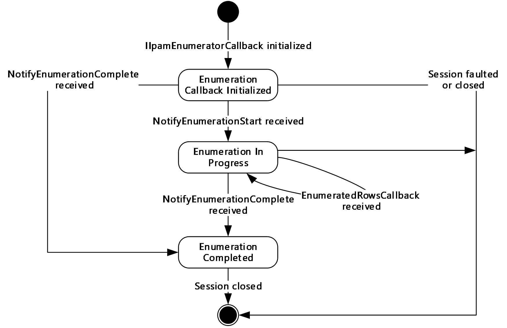

Figure 5: IIpamEnumeratorCallback state machine

The **IIpamEnumeratorCallback** server is session-based, sharing the same session the management client has with the management server using the **IIpamEnumerator** port type. It is also stateful in nature. The **session state** variable is used to keep track of the current state for each session and it can have the following states as possible values. At any point of the session, if the session is known to be faulted or closed by the lower layer, the state machine ends.

| State | Description |
| --- | --- |
| **Enumeration Callback Initialized** | This is the initial state of the **IIpamEnumeratorCallback** when it has been initialized by the **IIpamEnumerator** client. When the **NotifyEnumerationStart** is received in this state from the **IIpamEnumerator** server port on the management server-end of the session, the transition to the **Enumeration In Progress** state will happen. |
| **Enumeration In Progress** | This state indicates the **IIpamEnumeratorCallback** is ready to receive the data. When the **EnumeratedRowsCallback** is received in this state from the **IIpamEnumerator** server port on the management server-end of the session, the state will continue to be in **Enumeration In Progress**. When the **NotifyEnumerationComplete** is received in this state from the **IIpamEnumerator** server port on the management server-end of the session, the state will transition to **Enumeration Completed**. |
| **Enumeration Completed** | This is the state to notify the enumeration interaction between the **IIpamEnumerator** server port on the management server-end and the **IIpamEnumeratorCallback** server port on the management client-end is complete and the full data or result is available. |

#### 3.7.1.2 Other Miscellaneous States

**EnumerationInfo**: This is used to store the **EnumerationInfo** instance provided by the **IIpamEnumerator** client as a part of the initialization to hold the enumeration data and result. See section [3.1.1](#Section_3.1.1) for the details.

### 3.7.2 Timers

There are no additional timers beyond the ones defined by the lower layer of the protocols.

### 3.7.3 Initialization

The **IIpamEnumeratorCallback** interface is initialized by the **IIpamEnumerator** client on the management client-end. The **IIpamEnumerator** client passes the **EnumerationInfo** instance during initialization, which will be updated by the **IIpamEnumeratorCallback** server with the enumeration data received from the server. This instance is stored in **EnumerationInfo**. The session state is set to **Enumeration Callback Initialized**.

### 3.7.4 Message Processing Events and Sequencing Rules

#### 3.7.4.1 Session Faulted or Closed

The Session Faulted or Closed event is triggered by the lower transport layer when the session has received a [**SOAP fault**](#gt_soap-fault), or a forceful session close has occurred. If the **session state** is **Enumeration Callback Initialized** or **Enumeration In Progress**, the **EnumerationInfo.EnumerationFault** has to be set to an appropriate reason associated with the session closure and the **EnumerationInfo.EnumerationData** is discarded.

#### 3.7.4.2 EnumeratedRowsCallback

The **EnumeratedRowsCallback** operation is used to provide the enumeration data.

<wsdl:operation name="EnumeratedRowsCallback">

<wsdl:input wsaw:Action="http://Microsoft.Windows.Ipam/IIpamEnumeratorCallback/EnumeratedRowsCallback" message="ipam:IIpamEnumeratorCallback_EnumeratedRowsCallback_InputMessage" />

</wsdl:operation>

This operation has only the input message and there is no output message associated with it. Upon receiving the message, the **EnumeratedRowsCallback.data** received is added to the **EnumerationInfo.EnumerationData** collection. This operation will be called a number of times during an enumeration with different set of data with each invocation. The data received across all the calls will form the full enumeration data.

##### 3.7.4.2.1 Messages

###### 3.7.4.2.1.1 IIpamEnumeratorCallback_EnumeratedRowsCallback_InputMessage

The **IIpamEnumeratorCallback_EnumeratedRowsCallback_InputMessage** message is the request for the **EnumeratedRowsCallback** operation.

<wsdl:message name="IIpamEnumeratorCallback_EnumeratedRowsCallback_InputMessage">

<wsdl:part name="parameters" element="ipam:EnumeratedRowsCallback" />

</wsdl:message>

This message MUST be sent with the following [**SOAP action**](#gt_soap-action).

http://Microsoft.Windows.Ipam/IIpamEnumeratorCallback/EnumeratedRowsCallback

The body of the [**SOAP message**](#gt_soap-message) MUST contain the **EnumeratedRowsCallback** element.

##### 3.7.4.2.2 Elements

###### 3.7.4.2.2.1 EnumeratedRowsCallback

The **EnumeratedRowsCallback** element specifies the input values for the **EnumeratedRowsCallback** operation.

<xs:element name="EnumeratedRowsCallback">

<xs:complexType>

<xs:sequence>

<xs:element minOccurs="0" name="data" nillable="true" type="ipam:ArrayOfIpamObject" />

</xs:sequence>

</xs:complexType>

</xs:element>

#### 3.7.4.3 NotifyEnumerationComplete

The **NotifyEnumerationComplete** operation is used to indicate the completion of the enumeration.

<wsdl:operation name="NotifyEnumerationComplete">

<wsdl:input wsaw:Action="http://Microsoft.Windows.Ipam/IIpamEnumeratorCallback/NotifyEnumerationComplete" message="ipam:IIpamEnumeratorCallback_NotifyEnumerationComplete_InputMessage" />

</wsdl:operation>

This operation has only the request message. This signifies the completion of the enumeration and the **Enumeration Completed** event of the **IIpamEnumerator** client is invoked. The session state is set to **Enumeration Completed**.

If **NotifyEnumerationComplete.exception** is set, the enumeration has faulted. The **EnumerationInfo.EnumerationData** has to be discarded. The **EnumerationInfo.EnumerationFault** is set to **NotifyEnumerationComplete.exception**.

If **NotifyEnumerationComplete.exception** is NULL, the enumeration has completed successfully. The **EnumerationInfo.EnumerationResult** is set to **NotifyEnumerationComplete.result**.

##### 3.7.4.3.1 Messages

###### 3.7.4.3.1.1 IIpamEnumeratorCallback_NotifyEnumerationComplete_InputMessage

The **IIpamEnumeratorCallback_NotifyEnumerationComplete_InputMessage** message is the request for the **NotifyEnumerationComplete** operation.

<wsdl:message name="IIpamEnumeratorCallback_NotifyEnumerationComplete_InputMessage">

<wsdl:part name="parameters" element="ipam:NotifyEnumerationComplete" />

</wsdl:message>

This message MUST be sent with the following SOAP action.

http://Microsoft.Windows.Ipam/IIpamEnumeratorCallback/NotifyEnumerationComplete

The body of the SOAP message MUST contain the **NotifyEnumerationComplete** element.

##### 3.7.4.3.2 Elements

###### 3.7.4.3.2.1 NotifyEnumerationComplete

The **NotifyEnumerationComplete** element specifies the input values for the **NotifyEnumerationComplete** operation.

<xs:element name="NotifyEnumerationComplete">

<xs:complexType>

<xs:sequence>

<xs:element minOccurs="0" name="result" nillable="true" type="ipam:IpamObject" />

<xs:element minOccurs="0" name="exception" nillable="true" type="ipam1:IpamException" />

</xs:sequence>

</xs:complexType>

</xs:element>

#### 3.7.4.4 NotifyEnumerationStart

The **NotifyEnumerationStart** operation is used to indicate the start of the enumeration.

<wsdl:operation name="NotifyEnumerationStart">

<wsdl:input wsaw:Action="http://Microsoft.Windows.Ipam/IIpamEnumeratorCallback/NotifyEnumerationStart" message="ipam:IIpamEnumeratorCallback_NotifyEnumerationStart_InputMessage" />

</wsdl:operation>

This operation only has the request message to provide the notification. On receiving the message, the session state is set to **Enumeration In Progress**.

##### 3.7.4.4.1 Messages

###### 3.7.4.4.1.1 IIpamEnumeratorCallback_NotifyEnumerationStart_InputMessage

The **IIpamEnumeratorCallback_NotifyEnumerationStart_InputMessage** message is the request for the **NotifyEnumerationStart** operation.

<wsdl:message name="IIpamEnumeratorCallback_NotifyEnumerationStart_InputMessage">

<wsdl:part name="parameters" element="ipam:NotifyEnumerationStart" />

</wsdl:message>

This message MUST be sent with the following SOAP action.

http://Microsoft.Windows.Ipam/IIpamEnumeratorCallback/NotifyEnumerationStart

The body of the SOAP message MUST contain the **NotifyEnumerationStart** element.

##### 3.7.4.4.2 Elements

###### 3.7.4.4.2.1 NotifyEnumerationStart

The **NotifyEnumerationStart** element specifies the input values for the **NotifyEnumerationStart** operation.

<xs:element name="NotifyEnumerationStart">

<xs:complexType>

<xs:sequence />

</xs:complexType>

</xs:element>

### 3.7.5 Timer Events

None.

### 3.7.6 Other Local Events

None.

#### 3.7.6.1 User Authorization

Since the **IIpamEnumeratorCallback** server is initialized on the same session as the **IIpamEnumeration** session, no additional user authentication and authorization is performed beyond what was done for the operations in the **IIpamEnumerator** session.

## 3.8 IIpamEnumeratorCallback Client Details

The **IIpamEnumerator** server is the endpoint that will also be the **IIpamEnumeratorCallback** client. The same session has the **IIpamEnumerator** and the **IIpamEnumeratorCallback** implemented on either ends. The management server will provide the **IIpamEnumerator** server and the **IIpamEnumeratorCallback** client implementations and the management client will provide the **IIpamEnumeratorCallback** server and the **IIpamEnumerator** client implementations. The **IIpamEnumeratorCallback** is only a request interface, which means that there is no data obtained from the **IIpamEnumeratorCallback** server.

### 3.8.1 Abstract Data Model

None.

### 3.8.2 Timers

None.

### 3.8.3 Initialization

None.

### 3.8.4 Message Processing Events and Sequencing Rules

None, other than those captured as a part of the **IIpamEnumerator** server section [3.5](#Section_3.5).

### 3.8.5 Timer Events

None.

### 3.8.6 Other Local Events

None.

## 3.9 IIpamIPAuditEnumerator Server Details

This port type is used for enumerating the IP address audit rows from the management server. The management client establishes a session to the management server, and invokes operations on the management server port to initialize the enumeration parameters and trigger the enumeration. On the same session, the client initializes the server-side of the **IIpamEnumeratorCallback** port type. This port type provides a callback the management server can call into to provide the enumeration rows.

Except for the operation name, the state machine and the interaction with the **IIpamEnumeratorCallback** of this port type remains the same as that of **IIpamEnumerator** server (section [3.5](#Section_3.5)).

### 3.9.1 Abstract Data Model

See section [3.5.1](#Section_3.5.1) for the state machine and the states associated with this port type. The states and interaction remains the same except for the name of the operations.

### 3.9.2 Timers

See section [3.5.2](#Section_3.5.2).

### 3.9.3 Initialization

See section [3.5.3](#Section_3.5.3).

### 3.9.4 Message Processing Events and Sequencing Rules

The message processing events and sequencing rules for this port type remain the same as those specified in section [3.5.4](#Section_3.5.4). The difference in processing rules with the operations in this port type alone will be captured here in detail.

#### 3.9.4.1 EnumeratedRowsCallback

The **EnumeratedRowsCallback** operation MUST NOT be invoked by the management client and MUST be ignored by the server.

<wsdl:operation msc:isInitiating="true" msc:isTerminating="false" name="EnumeratedRowsCallback">

<wsdl:output wsaw:Action="http://Microsoft.Windows.Ipam/IIpamIPAuditEnumerator/EnumeratedRowsCallback" message="ipam:IIpamIPAuditEnumerator_EnumeratedRowsCallback_OutputCallbackMessage" />

</wsdl:operation>

##### 3.9.4.1.1 Messages

###### 3.9.4.1.1.1 IIpamIPAuditEnumerator_EnumeratedRowsCallback_OutputCallbackMessage

The **IIpamIPAuditEnumerator_EnumeratedRowsCallback_OutputCallbackMessage** message is the response for the **EnumeratedRowsCallback** operation.

<wsdl:message name="IIpamIPAuditEnumerator_EnumeratedRowsCallback_OutputCallbackMessage">

<wsdl:part name="parameters" element="ipam:EnumeratedRowsCallback" />

</wsdl:message>

This message MUST be sent with the following [**SOAP action**](#gt_soap-action).

http://Microsoft.Windows.Ipam/IIpamIPAuditEnumerator/EnumeratedRowsCallback

The body of the [**SOAP message**](#gt_soap-message) MUST contain the E**numeratedRowsCallback** element.

##### 3.9.4.1.2 Elements

###### 3.9.4.1.2.1 EnumeratedRowsCallback

The **EnumeratedRowsCallback** element specifies the input values for the **EnumeratedRowsCallback** operation.

<xs:element name="EnumeratedRowsCallback">

<xs:complexType>

<xs:sequence>

<xs:element minOccurs="0" name="data" nillable="true" type="ipam:ArrayOfIpamObject" />

</xs:sequence>

</xs:complexType>

</xs:element>

#### 3.9.4.2 IPAuditInitializeEnumeration

The **IPAuditInitializeEnumeration** operation is the equivalent to **InitializeEnumeration** operation in **IIpamEnumerator** port type (section [3.5](#Section_3.5)). See section [3.5.4.4](#Section_3.5.4.4) for the processing steps involved when this operation is received.

<wsdl:operation msc:isInitiating="true" msc:isTerminating="false" name="IPAuditInitializeEnumeration">

<wsdl:input wsaw:Action="http://Microsoft.Windows.Ipam/IIpamIPAuditEnumerator/IPAuditInitializeEnumeration" message="ipam:IIpamIPAuditEnumerator_IPAuditInitializeEnumeration_InputMessage" />

<wsdl:output wsaw:Action="http://Microsoft.Windows.Ipam/IIpamIPAuditEnumerator/IPAuditInitializeEnumerationResponse" message="ipam:IIpamIPAuditEnumerator_IPAuditInitializeEnumeration_OutputMessage" />

</wsdl:operation>

##### 3.9.4.2.1 Messages

###### 3.9.4.2.1.1 IIpamIPAuditEnumerator_IPAuditInitializeEnumeration_InputMessage

The **IIpamIPAuditEnumerator_IPAuditInitializeEnumeration_InputMessage** message is the request for the **IPAuditInitializeEnumeration** operation.

<wsdl:message name="IIpamIPAuditEnumerator_IPAuditInitializeEnumeration_InputMessage">

<wsdl:part name="parameters" element="ipam:IPAuditInitializeEnumeration" />

</wsdl:message>

This message MUST be sent with the following SOAP action.

http://Microsoft.Windows.Ipam/IIpamIPAuditEnumerator/IPAuditInitializeEnumeration

The body of the SOAP message MUST contain the **IPAuditInitializeEnumeration** element.

###### 3.9.4.2.1.2 IIpamIPAuditEnumerator_IPAuditInitializeEnumeration_OutputMessage

The **IIpamIPAuditEnumerator_IPAuditInitializeEnumeration_OutputMessage** message is the response for the **IPAuditInitializeEnumeration** operation.

<wsdl:message name="IIpamIPAuditEnumerator_IPAuditInitializeEnumeration_OutputMessage">

<wsdl:part name="parameters" element="ipam:IPAuditInitializeEnumerationResponse" />

</wsdl:message>

This message MUST be sent with the following SOAP action.

http://Microsoft.Windows.Ipam/IIpamIPAuditEnumerator/IPAuditInitializeEnumerationResponse

The body of the SOAP message MUST contain the **IPAuditInitializeEnumerationResponse** element.

##### 3.9.4.2.2 Elements

###### 3.9.4.2.2.1 IPAuditInitializeEnumeration

The **IPAuditInitializeEnumeration** element specifies the input values for the **IPAuditInitializeEnumeration** operation.

<xs:element name="IPAuditInitializeEnumeration">

<xs:complexType>

<xs:sequence>

<xs:element minOccurs="0" name="parameters" nillable="true" type="ipam:EnumerationParametersBase" />

</xs:sequence>

</xs:complexType>

</xs:element>

###### 3.9.4.2.2.2 IPAuditInitializeEnumerationResponse

The **IPAuditInitializeEnumerationResponse** element specifies the output values for the **IPAuditInitializeEnumeration** operation.

<xs:element name="IPAuditInitializeEnumerationResponse">

<xs:complexType>

<xs:sequence />

</xs:complexType>

</xs:element>

#### 3.9.4.3 IPAuditStartEnumeration

The **IPAuditStartEnumeration** operation is similar to the **StartEnumeration** operation of the **IIpamEnumerator** port type (section [3.5.4.8](#Section_3.5.4.8)). This causes the session state to be set to **Enumeration Started**.

<wsdl:operation msc:isInitiating="true" msc:isTerminating="false" name="IPAuditStartEnumeration">

<wsdl:input wsaw:Action="http://Microsoft.Windows.Ipam/IIpamIPAuditEnumerator/IPAuditStartEnumeration" message="ipam:IIpamIPAuditEnumerator_IPAuditStartEnumeration_InputMessage" />

</wsdl:operation>

Upon receiving the **IIpamEnumerator_StartEnumeration_InputMessage**, the server MUST invoke **NotifyEnumerationStart** operation. The enumeration processing logic as described in section [3.5.4.8.1](#Section_3.5.4.8.1.58) has to be triggered as well.

##### 3.9.4.3.1 Enumeration Processing Logic

The only supported **EnumInputParameter** type is **IPAuditEnumerationParameters** having the **ObjectType** to be **EnumerationObjectType.IPAudit**. Any other type is not expected and MUST result in an appropriate [**SOAP fault**](#gt_soap-fault) being returned to the client.

The difference between **IIpamIPAuditEnumerator** and **IIpamEnumerator** is only in terms of the data generation logic and the user authorization. The rest of the processing remains the same including the way the generated data is returned back to the management client remains the same. See section [3.5.4.8.1](#Section_3.5.4.8.1.58) for further details.

###### 3.9.4.3.1.1 IPAuditEnumerationParameters

The **IPAuditEnumerationParameters** complex type is used to specify the enumeration parameters for the [**IP address audit**](#gt_ip-address-audit).

The following are the processing steps for generating the data for this enumeration:

- Validate the specified input parameters based on the conditions given below. If any of the validations fail, an appropriate SOAP fault MUST be generated:
- The **IPAuditEnumerationParameters.SearchXml** MUST be a valid Search XML as specified in section [2.2.4.293](#Section_2.2.4.293).
- An **IPSearchNode** with **Name** being TIME_DURATION MUST be present.
- An **IPSearchNode** with **Name** being one of the following MUST be present:
- IP_ADDRESS
- MAC_ADDRESS
- HOST_NAME
- USER_NAME
- Validate the start duration specified using **Value1** of TIME_DURATION **IPSearchNode** is lesser than end duration specified using **Value2** of TIME_DURATION **IPSearchNode**.
- If **Name** is IP_ADDRESS, call the procedure **SearchIPAddressAuditByIPAddress** with the following parameters:
- *Param_IPAddress* is assigned the **IPSearchNode.Value** of the node having **Name** as IP_ADDRESS.
- *Param_StartDate* is assigned the start duration.
- *Param_EndDate* is assigned the end duration.
- **IPAuditEnumerationParameters.IncludeUserInformation** is assigned to *Param_correlateUserLogon*.
- If **Name** is MAC_ADDRESS, call the procedure **SearchIPAddressAuditByMacAddress** with the following parameters:
- *Param_MacAddress* is assigned the **IPSearchNode.Value** of the node having **Name** as MAC_ADDRESS.
- *Param_StartDate* is assigned the start duration.
- *Param_EndDate* is assigned the end duration.
- **IPAuditEnumerationParameters.IncludeUserInformation** is assigned to *Param_correlateUserLogon*.
- If **Name** is USER_ADDRESS, call the procedure **SearchIPAddressAuditByUserName** with the following parameters:
- *Param_UserName* is assigned the **IPSearchNode.Value** of the node having **Name** as USER_NAME.
- *Param_StartDate* is assigned the start duration.
- *Param_EndDate* is assigned the end duration.
- **IPAuditEnumerationParameters.IncludeUserInformation** is assigned to *Param_correlateUserLogon*.
- If **Name** is HOST_NAME, call the procedure **SearchIPAddressAuditByHostName** with the following parameters:
- *Param_HostName* is assigned the **IPSearchNode.Value** of the node having **Name** as HOST_NAME.
- *Param_StartDate* is assigned the start duration.
- *Param_EndDate* is assigned the end duration.
- **IPAuditEnumerationParameters.IncludeUserInformation** is assigned to *Param_correlateUserLogon*.
- If **IPAuditEnumerationParameters.NumberOfRecords** is specified, restrict the output of **Result_searchResult** to have no more than the specified number of records.
- Set **Result_searchResult** to **EnumOutputData** collection.

##### 3.9.4.3.2 Messages

###### 3.9.4.3.2.1 IIpamIPAuditEnumerator_IPAuditStartEnumeration_InputMessage

The **IIpamIPAuditEnumerator_IPAuditStartEnumeration_InputMessage** message is the request for the **IPAuditStartEnumeration** operation.

<wsdl:message name="IIpamIPAuditEnumerator_IPAuditStartEnumeration_InputMessage">

<wsdl:part name="parameters" element="ipam:IPAuditStartEnumeration" />

</wsdl:message>

This message MUST be sent with the following SOAP action.

http://Microsoft.Windows.Ipam/IIpamIPAuditEnumerator/IPAuditStartEnumeration

The body of the SOAP message MUST contain the **IPAuditStartEnumeration** element.

##### 3.9.4.3.3 Elements

###### 3.9.4.3.3.1 IPAuditStartEnumeration

The **IPAuditStartEnumeration** element specifies the input values for the **IPAuditStartEnumeration** operation.

<xs:element name="IPAuditStartEnumeration">

<xs:complexType>

<xs:sequence />

</xs:complexType>

</xs:element>

#### 3.9.4.4 NotifyEnumerationComplete

The **NotifyEnumerationComplete** operation MUST NOT be invoked by the management client and MUST be ignored by the server.

<wsdl:operation msc:isInitiating="true" msc:isTerminating="false" name="NotifyEnumerationComplete">

<wsdl:output wsaw:Action="http://Microsoft.Windows.Ipam/IIpamIPAuditEnumerator/NotifyEnumerationComplete" message="ipam:IIpamIPAuditEnumerator_NotifyEnumerationComplete_OutputCallbackMessage" />

</wsdl:operation>

Upon receiving the **IIpamIPAuditEnumerator_NotifyEnumerationComplete_OutputCallbackMessage** request message, the server performs the following processing steps. In the event of a failure, an appropriate [**SOAP fault**](#gt_soap-fault) MUST be sent to the client as specified in section [2.2.2.1](#Section_2.2.2.1).

##### 3.9.4.4.1 Messages

###### 3.9.4.4.1.1 IIpamIPAuditEnumerator_NotifyEnumerationComplete_OutputCallbackMessage

The **IIpamIPAuditEnumerator_NotifyEnumerationComplete_OutputCallbackMessage** message is the response for the **NotifyEnumerationComplete** operation.

<wsdl:message name="IIpamIPAuditEnumerator_NotifyEnumerationComplete_OutputCallbackMessage">

<wsdl:part name="parameters" element="ipam:NotifyEnumerationComplete" />

</wsdl:message>

This message MUST be sent with the following SOAP action.

http://Microsoft.Windows.Ipam/IIpamIPAuditEnumerator/NotifyEnumerationComplete

The body of the SOAP message MUST contain **the NotifyEnumerationComplete** element.

##### 3.9.4.4.2 Elements

###### 3.9.4.4.2.1 NotifyEnumerationComplete

The **NotifyEnumerationComplete** element specifies the input values for the **NotifyEnumerationComplete** operation.

<xs:element name="NotifyEnumerationComplete">

<xs:complexType>

<xs:sequence>

<xs:element minOccurs="0" name="result" nillable="true" type="ipam:IpamObject" />

<xs:element minOccurs="0" name="exception" nillable="true" type="ipam1:IpamException" />

</xs:sequence>

</xs:complexType>

</xs:element>

#### 3.9.4.5 NotifyEnumerationStart

The **NotifyEnumerationStart** operation MUST NOT be invoked by the management client and MUST be ignored by the server.

<wsdl:operation msc:isInitiating="true" msc:isTerminating="false" name="NotifyEnumerationStart">

<wsdl:output wsaw:Action="http://Microsoft.Windows.Ipam/IIpamIPAuditEnumerator/NotifyEnumerationStart" message="ipam:IIpamIPAuditEnumerator_NotifyEnumerationStart_OutputCallbackMessage" />

</wsdl:operation>

Upon receiving the **IIpamIPAuditEnumerator_NotifyEnumerationStart_OutputCallbackMessage** request message, the server performs the following processing steps. In the event of a failure, an appropriate [**SOAP fault**](#gt_soap-fault) MUST be sent to the client as specified in section [2.2.2.1](#Section_2.2.2.1).

##### 3.9.4.5.1 Messages

###### 3.9.4.5.1.1 IIpamIPAuditEnumerator_NotifyEnumerationStart_OutputCallbackMessage

The **IIpamIPAuditEnumerator_NotifyEnumerationStart_OutputCallbackMessage** message is the response for the **NotifyEnumerationStart** operation.

<wsdl:message name="IIpamIPAuditEnumerator_NotifyEnumerationStart_OutputCallbackMessage">

<wsdl:part name="parameters" element="ipam:NotifyEnumerationStart" />

</wsdl:message>

This message MUST be sent with the following SOAP action.

http://Microsoft.Windows.Ipam/IIpamIPAuditEnumerator/NotifyEnumerationStart

The body of the SOAP message MUST contain the **NotifyEnumerationStart** element.

##### 3.9.4.5.2 Elements

###### 3.9.4.5.2.1 NotifyEnumerationStart

The **NotifyEnumerationStart** element specifies the input values for the **NotifyEnumerationStart** operation.

<xs:element name="NotifyEnumerationStart">

<xs:complexType>

<xs:sequence />

</xs:complexType>

</xs:element>

### 3.9.5 Timer Events

None.

### 3.9.6 Other Local Events

None.

#### 3.9.6.1 User Authorization

The User Authorization section lists the user authorization requirements for the various operations defined in this port type. After the user authentication is complete, the user MUST be authorized for the operation that is being requested. If the required authorization is not present, the user MUST be denied access to perform the operation by returning an appropriate SOAP fault as specified in section [2.2.2.1](#Section_2.2.2.1).

The following table specifies the operations and the authorization requirements. At least one of the states listed under the column "ADM States to be checked" MUST be TRUE for the user to be authorized to perform the specified operation. Any further granular authorization requirements for an operation will be captured under the section specific to the operation itself. This check is done after the steps listed in section [3.1.4.3](#Section_3.1.4.3) are complete.

| Operation | ADM States to be checked |
| --- | --- |
| InitializeEnumeration | IsIpamIPAuditAdministrator |
| StartEnumeration | IsIpamIPAuditAdministrator |

## 3.10 IIpamIPAuditEnumerator Client Details

The client side of the **IIpamIPAuditEnumerator** MUST provide the **IIpamEnumeratorCallback** server interface. The **IIpamIPAuditEnumerator** server will callback into the **IIpamEnumeratorCallback** of the client for notifying the start of enumeration, providing the data and to notify the completion of the enumeration along with status.

In summary, on a single session, the management client implements the **IIpamEnumeratorCallback** port type and the management server implements the **IIpamIPAuditEnumerator** port type.

The processing rules and states remain the same as that of the **IIpamEnumerator** client details specified in section [3.6](#Section_3.6).

### 3.10.1 Abstract Data Model

See section [3.6.1](#Section_3.6.1).

### 3.10.2 Timers

See section [3.6.2](#Section_3.6.2).

### 3.10.3 Initialization

The **IIpamIPAuditEnumerator** client on initialization will establish the session to the management server. On successfully setting up the session, the **IIpamIPAuditEnumerator** client MUST initialize **IIpamEnumeratorCallback** session on the same session so the **IIpamIPAuditEnumerator** server can callback with the enumerated data. In order to obtain the enumeration data from the **IIpamEnumeratorCallback** port type, the **EnumerationInfo** is passed as a part of the initialization routine. The **IIpamEnumeratorCallback** port type’s server fills the data pertaining to the enumeration in the **EnumerationInfo** for the **IIpamEnumerator** client to provide to the application layer.

### 3.10.4 Message Processing Events and Sequencing Rules

See section [3.6.4](#Section_3.6.4).

### 3.10.5 Timer Events

See section [3.6.5](#Section_3.6.5).

### 3.10.6 Other Local Events

See section [3.6.6](#Section_3.6.6).

## 3.11 IIpamAsyncProvision Server Details

This port type enables the provisioning of the IPAM data store, which is required before performing any other management activity. The provisioning activity can be a time-consuming activity. By taking the callback approach, it is possible to perform and complete the activity without running into operation timeouts that are managed by the lower layers. The following diagram shows the interaction between the management client and the management server to enable the provisioning scenario.

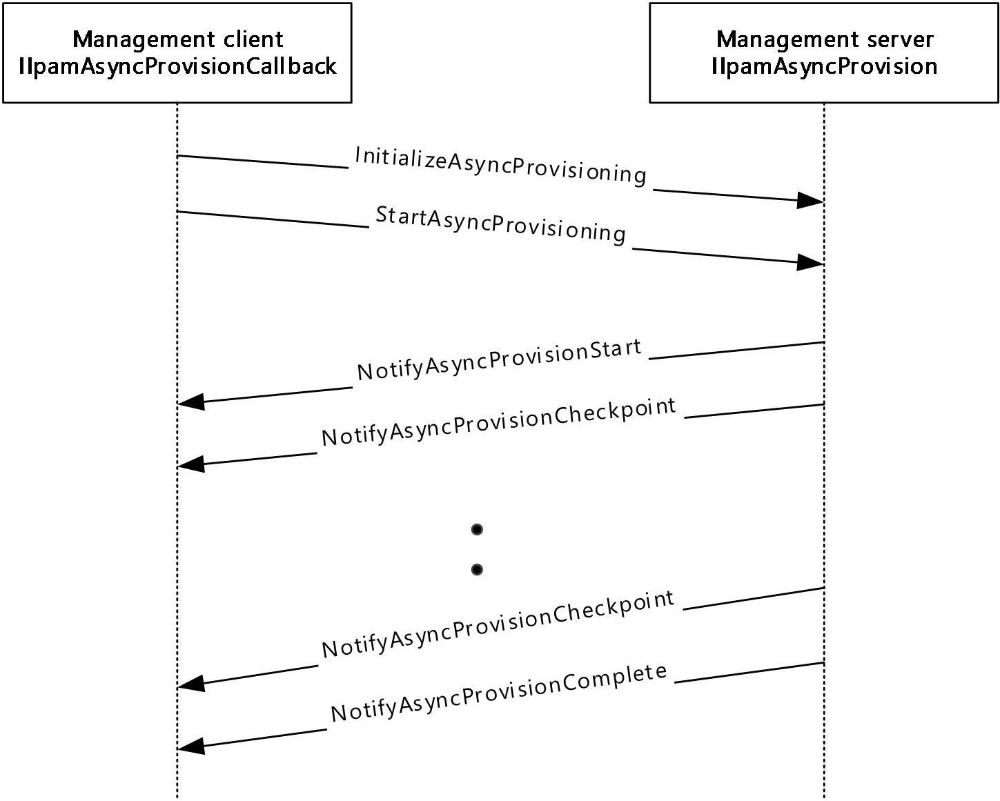

Figure 6: Provisioning – protocol interaction

### 3.11.1 Abstract Data Model

The Abstract Data Model section describes a conceptual model of possible data organization that an implementation maintains to participate in this protocol. The described organization is provided to facilitate the explanation of how the protocol behaves. This document does not mandate that implementations adhere to this model as long as their external behavior is consistent with that described in this document.

#### 3.11.1.1 State Machine

The following figure shows the state machine of the **IIpamEnumerator** server port type.

Figure 7: IIpamAsyncProvision server state machine

The **IIpamAsyncProvision** server is session-based and stateful in nature. The **session state** variable will be used to keep track of the current state for each session and it can have the following states as possible values. At any point of the session, if the session is known to be faulted or closed by the lower layer, the state machine ends.

| State | Description |
| --- | --- |
| **Session Initialized** | The initial state of the session when it has been indicated from the lower layer of the protocol. In this state, when the **InitializeAsyncProvisioning** operation is invoked (by the client), the state is changed to **Provisioning Initialized**. |
| **Provisioning Initialized** | The state when the provisioning is initialized and ready to start the processing. In this state, the **StartAsyncProvisioning** operation request is received from the management client, the server invokes the **NotifyAsyncProvisionStart** callback operation and triggers the provisioning. The state is changed to **Provisioning Started**. |
| **Provisioning Started** | This state denotes the provisioning has been initialized successfully and the provisioning is currently in progress. If there is a checkpoint available to be sent across from the enumeration processing, the **NotifyAsyncProvisionCheckpoint** operation is invoked and the state is changed to **Provisioning In Progress**. When the provisioning has completed successfully, the **NotifyAsyncProvisionComplete** operation is invoked and the state is changed to **Provisioning Completed**. When the provisioning has failed to complete with some error, the **NotifyAsyncProvisionComplete** is called to provide the fault information to the client and the state is changed to **Provisioning Completed**. |
| **Provisioning In Progress** | This state denotes the provisioning is in progress. If there is a checkpoint available to be sent across from the enumeration processing, the **NotifyAsyncProvisionCheckpoint** operation is invoked and the state is changed to **Provisioning In Progress**. When the provisioning has completed successfully, the **NotifyAsyncProvisionComplete** operation is invoked and the state is changed to **Provisioning Completed**. When the provisioning has failed to complete with some error, the **NotifyAsyncProvisionComplete** is called to provide the fault information to the client and the state is changed to **Provisioning Completed**. |
| **Provisioning Completed** | This state indicates there is no further processing required in the session and proceeds to close the session itself. |

### 3.11.2 Timers

There are no additional timers other than those which are described in section [3.1.2](#Section_3.1.2).

### 3.11.3 Initialization

None.

### 3.11.4 Message Processing Events and Sequencing Rules

#### 3.11.4.1 New Session Indication

The New Session Indication event will be indicated by the lower transport layer of the protocol ([MS-NMFTB](../MS-NMFTB/MS-NMFTB.md)) when a new session is available from the client. The **session state** is initialized to **Session Initialized**.

#### 3.11.4.2 Session Closed or Faulted

The Session Closed or Faulted event will be indicated by the lower transport layer of the protocol ([MS-NMFTB](../MS-NMFTB/MS-NMFTB.md)) when an existing session is either closed by the client or an irrecoverable error has occurred. This event will result in termination of the state machine as the session itself is no longer valid.

#### 3.11.4.3 InitializeAsyncProvisioning

The **InitializeAsyncProvisioning** operation is an [**initiating operation**](#gt_initiating-operation). This operation is used to signify the interest of the management client to provision the IPAM data store.

<wsdl:operation msc:isInitiating="true" msc:isTerminating="false" name="InitializeAsyncProvisioning">

<wsdl:input wsaw:Action="http://Microsoft.Windows.Ipam/IIpamAsyncProvision/InitializeAsyncProvisioning" message="ipam:IIpamAsyncProvision_InitializeAsyncProvisioning_InputMessage" />

<wsdl:output wsaw:Action="http://Microsoft.Windows.Ipam/IIpamAsyncProvision/InitializeAsyncProvisioningResponse" message="ipam:IIpamAsyncProvision_InitializeAsyncProvisioning_OutputMessage" />

</wsdl:operation>

Upon receiving the **IIpamAsyncProvision_InitializeAsyncProvisioning_InputMessage** request message, the server performs the following processing steps. Upon successful completion of the steps specified below, the server MUST respond with the **IIpamAsyncProvision_InitializeAsyncProvisioning_OutputMessage** message.In the event of a failure, an appropriate SOAP fault MUST be sent to the client as specified in section [2.2.2.1](#Section_2.2.2.1).

The session state is set to **Provisioning Initialized**.

##### 3.11.4.3.1 Messages

###### 3.11.4.3.1.1 IIpamAsyncProvision_InitializeAsyncProvisioning_InputMessage

The **IIpamAsyncProvision_InitializeAsyncProvisioning_InputMessage** message is the request for the **InitializeAsyncProvisioning** operation.

<wsdl:message name="IIpamAsyncProvision_InitializeAsyncProvisioning_InputMessage">

<wsdl:part name="parameters" element="ipam:InitializeAsyncProvisioning" />

</wsdl:message>

This message MUST be sent with the following [**SOAP action**](#gt_soap-action).

http://Microsoft.Windows.Ipam/IIpamAsyncProvision/InitializeAsyncProvisioning

The body of the [**SOAP message**](#gt_soap-message) MUST contain the **InitializeAsyncProvisioning** element.

###### 3.11.4.3.1.2 IIpamAsyncProvision_InitializeAsyncProvisioning_OutputMessage

The **IIpamAsyncProvision_InitializeAsyncProvisioning_OutputMessage** message is the response for the **InitializeAsyncProvisioning** operation.

<wsdl:message name="IIpamAsyncProvision_InitializeAsyncProvisioning_OutputMessage">

<wsdl:part name="parameters" element="ipam:InitializeAsyncProvisioningResponse" />

</wsdl:message>

This message MUST be sent with the following SOAP action.

http://Microsoft.Windows.Ipam/IIpamAsyncProvision/InitializeAsyncProvisioningResponse

The body of the SOAP message MUST contain the **InitializeAsyncProvisioningResponse** element.

##### 3.11.4.3.2 Elements

###### 3.11.4.3.2.1 InitializeAsyncProvisioning

The **InitializeAsyncProvisioning** element specifies the input values for the **InitializeAsyncProvisioning** operation.

<xs:element name="InitializeAsyncProvisioning">

<xs:complexType>

<xs:sequence>

<xs:element minOccurs="0" name="parameters" nillable="true" type="ipam:EnumerationParametersBase" />

</xs:sequence>

</xs:complexType>

</xs:element>

###### 3.11.4.3.2.2 InitializeAsyncProvisioningResponse

The **InitializeAsyncProvisioningResponse** element specifies the output values for the **InitializeAsyncProvisioning** operation.

<xs:element name="InitializeAsyncProvisioningResponse">

<xs:complexType>

<xs:sequence />

</xs:complexType>

</xs:element>

#### 3.11.4.4 NotifyAsyncProvisionCheckpoint

The **NotifyAsyncProvisionCheckpoint** operation MUST NOT be invoked by the management client and MUST be ignored by the server.

<wsdl:operation msc:isInitiating="true" msc:isTerminating="false" name="NotifyAsyncProvisionCheckpoint">

<wsdl:output wsaw:Action="http://Microsoft.Windows.Ipam/IIpamAsyncProvision/NotifyAsyncProvisionCheckpoint" message="ipam:IIpamAsyncProvision_NotifyAsyncProvisionCheckpoint_OutputCallbackMessage" />

</wsdl:operation>

##### 3.11.4.4.1 Messages

###### 3.11.4.4.1.1 IIpamAsyncProvision_NotifyAsyncProvisionCheckpoint_OutputCallbackMessage

The **IIpamAsyncProvision_NotifyAsyncProvisionCheckpoint_OutputCallbackMessage** message is the response for the **NotifyAsyncProvisionCheckpoint** operation.

<wsdl:message name="IIpamAsyncProvision_NotifyAsyncProvisionCheckpoint_OutputCallbackMessage">

<wsdl:part name="parameters" element="ipam:NotifyAsyncProvisionCheckpoint" />

</wsdl:message>

This message MUST be sent with the following SOAP action.

http://Microsoft.Windows.Ipam/IIpamAsyncProvision/NotifyAsyncProvisionCheckpoint

The body of the SOAP message MUST contain the **NotifyAsyncProvisionCheckpoint** element.

##### 3.11.4.4.2 Elements

###### 3.11.4.4.2.1 NotifyAsyncProvisionCheckpoint

The **NotifyAsyncProvisionCheckpoint** element specifies the input values for the **NotifyAsyncProvisionCheckpoint** operation.

<xs:element name="NotifyAsyncProvisionCheckpoint">

<xs:complexType>

<xs:sequence>

<xs:element minOccurs="0" name="data" nillable="true" type="ipam:ArrayOfIpamObject" />

</xs:sequence>

</xs:complexType>

</xs:element>

#### 3.11.4.5 NotifyAsyncProvisionComplete

The **NotifyAsyncProvisionComplete** operation MUST NOT be invoked by the management client and MUST be ignored by the server.

<wsdl:operation msc:isInitiating="true" msc:isTerminating="false" name="NotifyAsyncProvisionComplete">

<wsdl:output wsaw:Action="http://Microsoft.Windows.Ipam/IIpamAsyncProvision/NotifyAsyncProvisionComplete" message="ipam:IIpamAsyncProvision_NotifyAsyncProvisionComplete_OutputCallbackMessage" />

</wsdl:operation>

##### 3.11.4.5.1 Messages

###### 3.11.4.5.1.1 IIpamAsyncProvision_NotifyAsyncProvisionComplete_OutputCallbackMessage

The **IIpamAsyncProvision_NotifyAsyncProvisionComplete_OutputCallbackMessage** message is the response for the **NotifyAsyncProvisionComplete** operation.

<wsdl:message name="IIpamAsyncProvision_NotifyAsyncProvisionComplete_OutputCallbackMessage">

<wsdl:part name="parameters" element="ipam:NotifyAsyncProvisionComplete" />

</wsdl:message>

This message MUST be sent with the following SOAP action.

http://Microsoft.Windows.Ipam/IIpamAsyncProvision/NotifyAsyncProvisionComplete

The body of the SOAP message MUST contain the **NotifyAsyncProvisionComplete** element.

##### 3.11.4.5.2 Elements

###### 3.11.4.5.2.1 NotifyAsyncProvisionComplete

The **NotifyAsyncProvisionComplete** element specifies the input values for the **NotifyAsyncProvisionComplete** operation.

<xs:element name="NotifyAsyncProvisionComplete">

<xs:complexType>

<xs:sequence>

<xs:element minOccurs="0" name="result" nillable="true" type="ipam:IpamObject" />

<xs:element minOccurs="0" name="exception" nillable="true" type="ipam1:IpamException" />

</xs:sequence>

</xs:complexType>

</xs:element>

#### 3.11.4.6 NotifyAsyncProvisionStart

The **NotifyAsyncProvisionStart** operation MUST NOT be invoked by the management client and MUST be ignored by the server.

<wsdl:operation msc:isInitiating="true" msc:isTerminating="false" name="NotifyAsyncProvisionStart">

<wsdl:output wsaw:Action="http://Microsoft.Windows.Ipam/IIpamAsyncProvision/NotifyAsyncProvisionStart" message="ipam:IIpamAsyncProvision_NotifyAsyncProvisionStart_OutputCallbackMessage" />

</wsdl:operation>

##### 3.11.4.6.1 Messages

###### 3.11.4.6.1.1 IIpamAsyncProvision_NotifyAsyncProvisionStart_OutputCallbackMessage

The **IIpamAsyncProvision_NotifyAsyncProvisionStart_OutputCallbackMessage** message is the response for the **NotifyAsyncProvisionStart** operation.

<wsdl:message name="IIpamAsyncProvision_NotifyAsyncProvisionStart_OutputCallbackMessage">

<wsdl:part name="parameters" element="ipam:NotifyAsyncProvisionStart" />

</wsdl:message>

This message MUST be sent with the following SOAP action.

http://Microsoft.Windows.Ipam/IIpamAsyncProvision/NotifyAsyncProvisionStart

The body of the SOAP message MUST contain the **NotifyAsyncProvisionStart** element.

##### 3.11.4.6.2 Elements

###### 3.11.4.6.2.1 NotifyAsyncProvisionStart

The **NotifyAsyncProvisionStart** element specifies the input values for the **NotifyAsyncProvisionStart** operation.

<xs:element name="NotifyAsyncProvisionStart">

<xs:complexType>

<xs:sequence />

</xs:complexType>

</xs:element>

#### 3.11.4.7 StartAsyncProvisioning

The **StartAsyncProvisioning** operation is invoked by the client to trigger the start of the provisioning. This causes the session state to be set to **Enumeration Started**.

<wsdl:operation msc:isInitiating="true" msc:isTerminating="false" name="StartAsyncProvisioning">

<wsdl:input wsaw:Action="http://Microsoft.Windows.Ipam/IIpamAsyncProvision/StartAsyncProvisioning" message="ipam:IIpamAsyncProvision_StartAsyncProvisioning_InputMessage" />

</wsdl:operation>

Upon receiving the **IIpamAsyncProvision_StartAsyncProvisioning_InputMessage** request message, the server MUST invoke the **NotifyAsyncProvisionStart** operation. The following processing steps are then invoked to provision the IPAM data store. If the processing steps take longer than the lower layer session timeout values, the implementation MUST send checkpoint updates to the management client by invoking the **NotifyAsyncProvisionCheckpoint** callback operation. If a fault is generated in any of the steps following, the **NotifyAsyncProvisionComplete** callback operation MUST be called specifying **NotifyAsyncProvisionComplete.exception** set to the fault information. The **session state** will be set to **Provisioning Completed** when a fault is encountered:

- If **ADM_IsIPAMProvisioningInProgress** is set to TRUE, return an appropriate SOAP fault as there is already a session which has triggered the provisioning.
- If **ADM_IsIPAMConfigured** is FALSE, perform the following steps:
- Setup the IPAM data store **ADM_IPAMDataStore** in an implementation specific manner. Where applicable as described in the ADM section, initialize the tables with the default values as well.
- Setup the **ADM_IPAMSecurityGroups** in an implementation specific manner.
- If the provisioning has been completed successfully, Set **ADM_IsIPAMConfigured** to TRUE.
- If any fault were encountered as a part of the provisioning steps, Set **NotifyAsyncProvisionComplete.exception** to the fault information.
- Set **session state** to **Provisioning Completed**.
- Set the current date and time to **ADM_CommonProperties.IpamConfiguredDate**.
- Set **ADM_IsIPAMProvisioningInProgress** to FALSE.

##### 3.11.4.7.1 Messages

###### 3.11.4.7.1.1 IIpamAsyncProvision_StartAsyncProvisioning_InputMessage

The **IIpamAsyncProvision_StartAsyncProvisioning_InputMessage** message is the request for the **StartAsyncProvisioning** operation.

<wsdl:message name="IIpamAsyncProvision_StartAsyncProvisioning_InputMessage">

<wsdl:part name="parameters" element="ipam:StartAsyncProvisioning" />

</wsdl:message>

This message MUST be sent with the following SOAP action.

http://Microsoft.Windows.Ipam/IIpamAsyncProvision/StartAsyncProvisioning

The body of the SOAP message MUST contain the **StartAsyncProvisioning** element.

##### 3.11.4.7.2 Elements

###### 3.11.4.7.2.1 StartAsyncProvisioning

The **StartAsyncProvisioning** element specifies the input values for the **StartAsyncProvisioning** operation.

<xs:element name="StartAsyncProvisioning">

<xs:complexType>

<xs:sequence />

</xs:complexType>

</xs:element>

### 3.11.5 Timer Events

None.

### 3.11.6 Other Local Events

None.

#### 3.11.6.1 User Authorization

The User Authorization section lists the user authorization requirements for the various operations defined in this port type. After the user authentication is complete, the user MUST be authorized for the operation that is being requested. If the required authorization is not present, the user MUST be denied access to perform the operation by returning an appropriate SOAP fault as specified in section [2.2.2.1](#Section_2.2.2.1).

The following table specifies the operations and the authorization requirements. At least one of the states listed under the column "ADM States to be checked" MUST be TRUE for the user to be authorized to perform the specified operation. Any further granular authorization requirements for an operation will be captured under the section specific to the operation itself. This check is done after the steps listed in section [3.1.4.3](#Section_3.1.4.3) are complete.

| Operation | ADM States to be checked |
| --- | --- |
| InitializeAsyncProvisioning | IsAdministrator |
| StartAsyncProvisioning | IsAdministrator |

## 3.12 IIpamAsyncProvision Client Details

The client side of the **IIpamAsyncProvision** MUST provide the **IIpamAsyncProvisionCallback** server interface. The **IIpamAsyncProvision** server will callback into the **IIpamAsyncProvisionCallback** of the client for notifying the start of provisioning, providing the provisioning checkpoints and to notify the completion of the provisioning along with status.

In summary, on a single session, the management client implements the IIpamAsyncProvisionCallback port type and the management server implements the IIpamAsyncProvision port type.

### 3.12.1 Abstract Data Model

The Abstract Data Model section describes a conceptual model of possible data organization that an implementation maintains to participate in this protocol. The described organization is provided to facilitate the explanation of how the protocol behaves. This document does not mandate that implementations adhere to this model as long as their external behavior is consistent with that described in this document.

The following state is available on a per-session basis:

**ProvisioningFault**: This contains the **IpamException** having the fault that the server has sent across to the client or any session establishment failure fault that the lower transport layer might have indicated. If this value is set, the provisioning is considered unsuccessful. If this value is not set, the provisioning is considered successful.

### 3.12.2 Timers

There are no additional timers beyond those specified in section [3.2.2](#Section_3.2.2).

### 3.12.3 Initialization

The **IIpamAsyncProvision** client on initialization will establish the session to the management server. On successfully setting up the session, the **IIpamAsyncProvision** client MUST initialize the **IIpamAsyncProvisionCallback** session on the same session so the **IIpamAsyncProvision** server can callback with the provisioning status. In order to obtain the provisioning status from the **IIpamAsyncProvisionCallback** port type, the **ProvisioningFault** is passed as a part of the initialization routine. The **IIpamAsyncProvisionCallback** port type’s server sets the provisioning status into **ProvisioningFault** to provide to the application layer.

### 3.12.4 Message Processing Events and Sequencing Rules

#### 3.12.4.1 Provisioning Completed

The Provisioning Completed event is triggered by the **IIpamAsyncProvisionCallback** server on the session to indicate that the provisioning is completed and the **ProvisionFault** has the status of the completion.

### 3.12.5 Timer Events

None.

### 3.12.6 Other Local Events

None.

## 3.13 IIpamAsyncProvisionCallback Server Details

This port type is implemented by the management client and initialized on the same session used to perform operations against the **IIpamAsyncProvision** server on the management server. This provides the callback interface which the **IIpamAsyncProvision** server invokes to provide the provisioning checkpoint and completion status.

### 3.13.1 Abstract Data Model

The Abstract Data Model section describes a conceptual model of possible data organization that an implementation maintains to participate in this protocol. The described organization is provided to facilitate the explanation of how the protocol behaves. This document does not mandate that implementations adhere to this model as long as their external behavior is consistent with that described in this document.

#### 3.13.1.1 State Machine

The following figure shows the state machine of the **IIpamAsyncProvisionCallback** server port type.

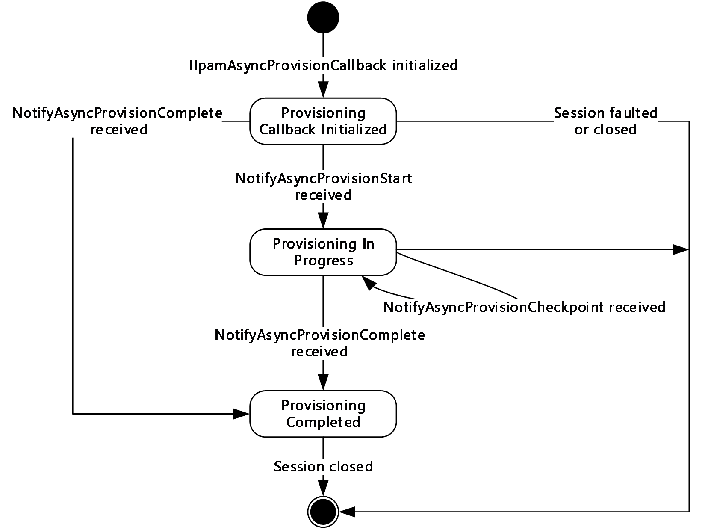

Figure 8: IIpamAsyncProvisionCallback state machine

The **IIpamAsyncProvisionCallback** server is session-based sharing the same session the management client has with the management server using the **IIpamAsyncProvision** port type. It is also stateful in nature. The **session state** variable will be used to keep track of the current state for each session and it can have the following states as possible values. At any point of the session, if the session is known to be faulted or closed by the lower layer, the state machine ends.

| State | Description |
| --- | --- |
| **Provisioning Callback Initialized** | This is the initial state of the **IIpamAsyncProvisionCallback** will be when it has been initialized by the **IIpamAsyncProvision** client. When the **NotifyAsyncProvisionStart** is received in this state from the **IIpamAsyncProvision** server port on the management server-end of the session, the transition to the **Provisioning In Progress** state will happen. |
| **Provisioning In Progress** | This state indicates the **IIpamAsyncProvisionCallback** is ready to receive the provisioning checkpoint and completion status. When the **NotifyAsyncProvisionCheckpoint** is received in this state from the **IIpamAsyncProvision** server port on the management server-end of the session, the state will continue to be in **Provisioning In Progress**. When the **NotifyAsyncProvisionComplete** is received in this state from the **IIpamAsyncProvision** server port on the management server-end of the session, the state will transition to **Provisioning Completed**. |
| **Provisioning Completed** | This is the state to notify the Provisioning interaction between the **IIpamAsyncProvision** server port on the management server-end and the **IIpamAsyncProvisionCallback** server port on the management client-end is complete and the result is available. |

#### 3.13.1.2 Other Miscellaneous States

**ProvisioningFault**: This is used to store the **ProvisioningFault** instance provided by **IIpamAsyncProvision** client as a part of the initialization to hold the provisioning result. See section [3.12.1](#Section_3.12.1) for more details.

### 3.13.2 Timers

There are no additional timers beyond the ones defined by the lower layer of the protocols.

### 3.13.3 Initialization

The **IIpamAsyncProvisionCallback** interface is initialized by the **IIpamAsyncProvision** client on the management client-end. The **IIpamAsyncProvision** client passes the **ProvisionFault** instance during initialization which will be updated by the **IIpamAsyncProvisionCallback** server with the result of the provisioning. The session state is set to **Provisioning Callback Initialized**.

### 3.13.4 Message Processing Events and Sequencing Rules

#### 3.13.4.1 Session Faulted or Closed

The Session Faulted or Closed event is triggered by the lower transport layer when the session has received a [**SOAP fault**](#gt_soap-fault), or a forceful session close has occurred. If the **session state** is **Provisioning Callback Initialized** or **Provisioning In Progress**, the **ProvisioningFault** has to be set to an appropriate reason associated with the session closure.

#### 3.13.4.2 NotifyAsyncProvisionCheckpoint

The **NotifyAsyncProvisionCheckpoint** operation is used to provide the checkpoint when the provisioning is in progress.

<wsdl:operation name="NotifyAsyncProvisionCheckpoint">

<wsdl:input wsaw:Action="http://Microsoft.Windows.Ipam/IIpamAsyncProvisionCallback/NotifyAsyncProvisionCheckpoint" message="ipam:IIpamAsyncProvisionCallback_NotifyAsyncProvisionCheckpoint_InputMessage" />

</wsdl:operation>

This operation has only the input message and there is no output message associated with it. This operation will be called a number of times during the provisioning.

##### 3.13.4.2.1 Messages

###### 3.13.4.2.1.1 IIpamAsyncProvisionCallback_NotifyAsyncProvisionCheckpoint_InputMessage

The **IIpamAsyncProvisionCallback_NotifyAsyncProvisionCheckpoint_InputMessage** message is the request for the **NotifyAsyncProvisionCheckpoint** operation.

<wsdl:message name="IIpamAsyncProvisionCallback_NotifyAsyncProvisionCheckpoint_InputMessage">

<wsdl:part name="parameters" element="ipam:NotifyAsyncProvisionCheckpoint" />

</wsdl:message>

This message MUST be sent with the following [**SOAP action**](#gt_soap-action).

http://Microsoft.Windows.Ipam/IIpamAsyncProvisionCallback/NotifyAsyncProvisionCheckpoint

The body of the [**SOAP message**](#gt_soap-message) MUST contain the **NotifyAsyncProvisionCheckpoint** element.

##### 3.13.4.2.2 Elements

###### 3.13.4.2.2.1 NotifyAsyncProvisionCheckpoint

The **NotifyAsyncProvisionCheckpoint** element specifies the input values for the **NotifyAsyncProvisionCheckpoint** operation.

<xs:element name="NotifyAsyncProvisionCheckpoint">

<xs:complexType>

<xs:sequence>

<xs:element minOccurs="0" name="data" nillable="true" type="ipam:ArrayOfIpamObject" />

</xs:sequence>

</xs:complexType>

</xs:element>

#### 3.13.4.3 NotifyAsyncProvisionComplete

The **NotifyAsyncProvisionComplete** operation is used to indicate the completion of provisioning.

<wsdl:operation name="NotifyAsyncProvisionComplete">

<wsdl:input wsaw:Action="http://Microsoft.Windows.Ipam/IIpamAsyncProvisionCallback/NotifyAsyncProvisionComplete" message="ipam:IIpamAsyncProvisionCallback_NotifyAsyncProvisionComplete_InputMessage" />

</wsdl:operation>

This operation has only the request message. This signifies the completion of the provisioning and the **Provisioning Completed** event of the **IIpamAsyncProvision** client is invoked. The session state is set to **Provisioning Completed**.

If **NotifyAsyncProvisionComplete.exception** is set, the provisioning has faulted. The **ProvisioningFault** is set to **NotifyAsyncProvisionComplete.exception**.

If **NotifyAsyncProvisionComplete.exception** is NULL, the provisioning has completed successfully.

##### 3.13.4.3.1 Messages

###### 3.13.4.3.1.1 IIpamAsyncProvisionCallback_NotifyAsyncProvisionComplete_InputMessage

The **IIpamAsyncProvisionCallback_NotifyAsyncProvisionComplete_InputMessage** message is the request for the **NotifyAsyncProvisionComplete** operation.

<wsdl:message name="IIpamAsyncProvisionCallback_NotifyAsyncProvisionComplete_InputMessage">

<wsdl:part name="parameters" element="ipam:NotifyAsyncProvisionComplete" />

</wsdl:message>

This message MUST be sent with the following SOAP action.

http://Microsoft.Windows.Ipam/IIpamAsyncProvisionCallback/NotifyAsyncProvisionComplete

The body of the SOAP message MUST contain the **NotifyAsyncProvisionComplete** element.

##### 3.13.4.3.2 Elements

###### 3.13.4.3.2.1 NotifyAsyncProvisionComplete

The **NotifyAsyncProvisionComplete** element specifies the input values for the **NotifyAsyncProvisionComplete** operation.

<xs:element name="NotifyAsyncProvisionComplete">

<xs:complexType>

<xs:sequence>

<xs:element minOccurs="0" name="result" nillable="true" type="ipam:IpamObject" />

<xs:element minOccurs="0" name="exception" nillable="true" type="ipam1:IpamException" />

</xs:sequence>

</xs:complexType>

</xs:element>

#### 3.13.4.4 NotifyAsyncProvisionStart

The **NotifyAsyncProvisionStart** operation is used to indicate the start of the provisioning of the IPAM data store.

<wsdl:operation name="NotifyAsyncProvisionStart">

<wsdl:input wsaw:Action="http://Microsoft.Windows.Ipam/IIpamAsyncProvisionCallback/NotifyAsyncProvisionStart" message="ipam:IIpamAsyncProvisionCallback_NotifyAsyncProvisionStart_InputMessage" />

</wsdl:operation>

This operation only has the request message to provide the notification. On receiving the message, the session state is set to **Provisioning In Progress**.

##### 3.13.4.4.1 Messages

###### 3.13.4.4.1.1 IIpamAsyncProvisionCallback_NotifyAsyncProvisionStart_InputMessage

The **IIpamAsyncProvisionCallback_NotifyAsyncProvisionStart_InputMessage** messsage is the request for the **NotifyAsyncProvisionStart** operation.

<wsdl:message name="IIpamAsyncProvisionCallback_NotifyAsyncProvisionStart_InputMessage">

<wsdl:part name="parameters" element="ipam:NotifyAsyncProvisionStart" />

</wsdl:message>

This message MUST be sent with the following SOAP action.

http://Microsoft.Windows.Ipam/IIpamAsyncProvisionCallback/NotifyAsyncProvisionStart

The body of the SOAP message MUST contain the **NotifyAsyncProvisionStart** element.

##### 3.13.4.4.2 Elements

###### 3.13.4.4.2.1 NotifyAsyncProvisionStart

The **NotifyAsyncProvisionStart** element specifies the input values for the **NotifyAsyncProvisionStart** operation.

<xs:element name="NotifyAsyncProvisionStart">

<xs:complexType>

<xs:sequence />

</xs:complexType>

</xs:element>

### 3.13.5 Timer Events

None.

### 3.13.6 Other Local Events

#### 3.13.6.1 User Authorization

Since the **IIpamAsyncProvisionCallback** server is initialized on the same session as the **IIpamAsyncProvision** session, no additional user authentication and authorization is performed beyond what was done for the operations in the **IIpamAsyncProvision** session.

## 3.14 IIpamAsyncProvisionCallback Client Details

The **IIpamAsyncProvision** server is the endpoint which will also be the **IIpamAsyncProvisionCallback** client. The same session has the **IIpamAsyncProvision** and the **IIpamAsyncProvisionCallback** implemented on either ends. The management server provides the **IIpamAsyncProvision** server and the **IIpamAsyncProvisionCallback** client implementations and the management client provides the **IIpamAsyncProvisionCallback** server and the **IIpamAsyncProvision** client implementations. The **IIpamAsyncProvisionCallback** is only a request interface; that is, no data is obtained from the **IIpamAsyncProvisionCallback** server.

### 3.14.1 Abstract Data Model

None.

### 3.14.2 Timers

None.

### 3.14.3 Initialization

None.

### 3.14.4 Message Processing Events and Sequencing Rules

None other than those captured as a part of the **IIpamAsyncProvision** server section [3.11](#Section_3.11).

### 3.14.5 Timer Events

None.

### 3.14.6 Other Local Events

None.

## 3.15 IIpamAsyncSchemaConversion Server Details

This port type enables the [**schema conversion**](#gt_schema-conversion) of the IPAM data store. When the management server determines the need for schema conversion, no other management activity can be performed until the schema conversion is completed. The schema conversion can be time consuming. By taking the callback approach, it is possible to complete the schema conversion without running into operation timeouts that are managed by the lower layers. The following diagram shows the interaction between the management client and the management server to enable the provisioning scenario.

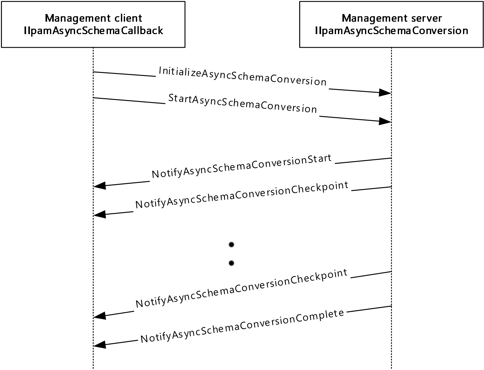

Figure 9: Schema Conversion - Protocol Interaction

### 3.15.1 Abstract Data Model

The Abstract Data Model section describes a conceptual model of possible data organization that an implementation maintains to participate in this protocol. The described organization is provided to facilitate the explanation of how the protocol behaves. This document does not mandate that implementations adhere to this model as long as their external behavior is consistent with that described in this document.

#### 3.15.1.1 State Machine

The following figure shows the state machine of the **IIpamEnumerator** server port type.

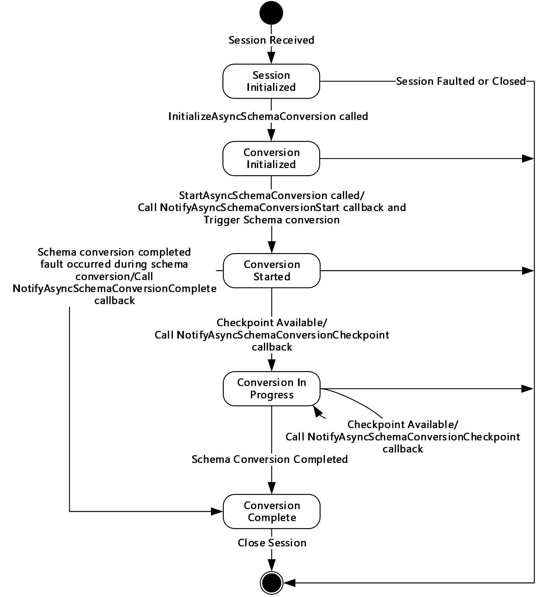

Figure 10: IIpamAsyncSchemaConversion server state machine

The **IIpamAsyncSchemaConversion** server is session-based and stateful in nature. The **session state** variable will be used to keep track of the current state for each session and it can have the following states as possible values. At any point of the session, if the session is known to be faulted or closed by the lower layer, the state machine ends.

| State | Description |
| --- | --- |
| **Session Initialized** | The initial state of the session when it has been indicated from the lower layer of the protocol. In this state, when the **InitializeAsyncSchemaConversion** operation request is received from the management client, the state is changed to **Provisioning Initialized**. |
| **Conversion Initialized** | The state when the schema conversion is initialized and ready to start the processing. In this state, when the **StartAsyncSchemaConversion** operation request is received from the management client, the server invokes the **NotifyAsyncSchemaConversionStart** and triggers the schema conversion. The state is changed to **Conversion Started**. |
| **Conversion Started** | This state denotes the schema conversion has been initialized successfully and is currently in progress. If there is a checkpoint available to be sent across to the management client, the **NotifyAsyncSchemaConversionCheckpoint** operation is invoked and the state is changed to **Conversion In Progress**. When the schema conversion has completed successfully, the **NotifyAsyncSchemaConversionComplete** operation is invoked and the state is changed to **Conversion Completed**. When the scheme conversion has failed to complete with some error, the **NotifyAsyncSchemaConversionComplete** is called to provide the fault information to the client and the state is changed to **Conversion Completed**. |
| **Conversion In Progress** | This state denotes the schema conversion is in progress. If there is a checkpoint available to be sent across to the management client, the **NotifyAsyncSchemaConversionCheckpoin**t operation is invoked and the state is changed to **Conversion In Progress**. When the schema conversion has completed successfully, the **NotifyAsyncSchemaConversionComplete** operation is invoked and the state is changed to **Conversion Completed**. When the scheme conversion has failed to complete with some error, the **NotifyAsyncSchemaConversionComplete** is called to provide the fault information to the client and the state is changed to **Conversion Completed**. |
| **Conversion Completed** | This state indicates there is no further processing required in the session and proceeds to close the session itself. |

### 3.15.2 Timers

There are no additional timers other than those which are described in section [3.1.2](#Section_3.1.2).

### 3.15.3 Initialization

None.

### 3.15.4 Message Processing Events and Sequencing Rules

#### 3.15.4.1 New Session Indication

The New Session Indication event will be indicated by the lower transport layer of the protocol ([MS-NMFTB](../MS-NMFTB/MS-NMFTB.md)) when a new session is available from the client. The **session state** is initialized to **Session Initialized**.

#### 3.15.4.2 Session Closed or Faulted

The Session Closed or Faulted event will be indicated by the lower transport layer of the protocol ([MS-NMFTB](../MS-NMFTB/MS-NMFTB.md)) when an existing session is either closed by the client or an irrecoverable error has occurred. This event will result in termination of the state machine as the session itself is no longer valid.

#### 3.15.4.3 InitializeAsyncSchemaConversion

The **InitializeAsyncSchemaConversion** operation is an [**initiating operation**](#gt_initiating-operation). This operation is used signify the interest of the management client to provision the IPAM data store.

<wsdl:operation msc:isInitiating="true" msc:isTerminating="false" name="InitializeAsyncSchemaConversion">

<wsdl:input wsaw:Action="http://Microsoft.Windows.Ipam/IIpamAsyncSchemaConversion/InitializeAsyncSchemaConversion" message="ipam:IIpamAsyncSchemaConversion_InitializeAsyncSchemaConversion_InputMessage" />

<wsdl:output wsaw:Action="http://Microsoft.Windows.Ipam/IIpamAsyncSchemaConversion/InitializeAsyncSchemaConversionResponse" message="ipam:IIpamAsyncSchemaConversion_InitializeAsyncSchemaConversion_OutputMessage" />

</wsdl:operation>

Upon receiving the **IIpamAsyncSchemaConversion_InitializeAsyncSchemaConversion_InputMessage** request message, the server performs the following processing steps. Upon successful completion of the steps specified below, the server MUST respond with the **IIpamAsyncSchemaConversion_InitializeAsyncSchemaConversion_OutputMessage** message.In the event of a failure, an appropriate SOAP fault MUST be sent to the client as specified in section [2.2.2.1](#Section_2.2.2.1).

The session state is set to **Conversion Initialized**.

##### 3.15.4.3.1 Messages

###### 3.15.4.3.1.1 IIpamAsyncSchemaConversion_InitializeAsyncSchemaConversion_InputMessage

The **IIpamAsyncSchemaConversion_InitializeAsyncSchemaConversion_InputMessage** message is the request for the **InitializeAsyncSchemaConversion** operation.

<wsdl:message name="IIpamAsyncSchemaConversion_InitializeAsyncSchemaConversion_InputMessage">

<wsdl:part name="parameters" element="ipam:InitializeAsyncSchemaConversion" />

</wsdl:message>

This message MUST be sent with the following [**SOAP action**](#gt_soap-action).

http://Microsoft.Windows.Ipam/IIpamAsyncSchemaConversion/InitializeAsyncSchemaConversion

The body of the [**SOAP message**](#gt_soap-message) MUST contain the **InitializeAsyncSchemaConversion** element.

###### 3.15.4.3.1.2 IIpamAsyncSchemaConversion_InitializeAsyncSchemaConversion_OutputMessage

The **IIpamAsyncSchemaConversion_InitializeAsyncSchemaConversion_OutputMessage** message is the response for the **InitializeAsyncSchemaConversion** operation.

<wsdl:message name="IIpamAsyncSchemaConversion_InitializeAsyncSchemaConversion_OutputMessage">

<wsdl:part name="parameters" element="ipam:InitializeAsyncSchemaConversionResponse" />

</wsdl:message>

This message MUST be sent with the following SOAP action.

http://Microsoft.Windows.Ipam/IIpamAsyncSchemaConversion/InitializeAsyncSchemaConversionResponse

The body of the SOAP message MUST contain the **InitializeAsyncSchemaConversionResponse** element.

##### 3.15.4.3.2 Elements

###### 3.15.4.3.2.1 InitializeAsyncSchemaConversion

The **InitializeAsyncSchemaConversion** element specifies the input values for the **InitializeAsyncSchemaConversion** operation.

<xs:element name="InitializeAsyncSchemaConversion">

<xs:complexType>

<xs:sequence>

<xs:element minOccurs="0" name="parameters" nillable="true" type="ipam:EnumerationParametersBase" />

</xs:sequence>

</xs:complexType>

</xs:element>

###### 3.15.4.3.2.2 InitializeAsyncSchemaConversionResponse

The **InitializeAsyncSchemaConversionResponse** element specifies the output values for the **InitializeAsyncSchemaConversion** operation.

<xs:element name="InitializeAsyncSchemaConversionResponse">

<xs:complexType>

<xs:sequence />

</xs:complexType>

</xs:element>

#### 3.15.4.4 NotifyAsyncSchemaConversionCheckpoint

The **NotifyAsyncSchemaConversionCheckpoint** operation MUST NOT be invoked by the management client and MUST be ignored by the server.

<wsdl:operation msc:isInitiating="true" msc:isTerminating="false" name="NotifyAsyncSchemaConversionCheckpoint">

<wsdl:output wsaw:Action="http://Microsoft.Windows.Ipam/IIpamAsyncSchemaConversion/NotifyAsyncSchemaConversionCheckpoint" message="ipam:IIpamAsyncSchemaConversion_NotifyAsyncSchemaConversionCheckpoint_OutputCallbackMessage" />

</wsdl:operation>

##### 3.15.4.4.1 Messages

###### 3.15.4.4.1.1 IIpamAsyncSchemaConversion_NotifyAsyncSchemaConversionCheckpoint_OutputCallbackMessage

The **IIpamAsyncSchemaConversion_NotifyAsyncSchemaConversionCheckpoint_OutputCallbackMessage** message is the response for the **NotifyAsyncSchemaConversionCheckpoint** operation.

<wsdl:message name="IIpamAsyncSchemaConversion_NotifyAsyncSchemaConversionCheckpoint_OutputCallbackMessage">

<wsdl:part name="parameters" element="ipam:NotifyAsyncSchemaConversionCheckpoint" />

</wsdl:message>

This message MUST be sent with the following SOAP action.

http://Microsoft.Windows.Ipam/IIpamAsyncSchemaConversion/NotifyAsyncSchemaConversionCheckpoint

The body of the SOAP message MUST contain the **NotifyAsyncSchemaConversionCheckpoint** element.

##### 3.15.4.4.2 Elements

###### 3.15.4.4.2.1 NotifyAsyncSchemaConversionCheckpoint

The **NotifyAsyncSchemaConversionCheckpoint** element specifies the input values for the **NotifyAsyncSchemaConversionCheckpoint** operation.

<xs:element name="NotifyAsyncSchemaConversionCheckpoint">

<xs:complexType>

<xs:sequence>

<xs:element minOccurs="0" name="data" nillable="true" type="ipam:ArrayOfIpamObject" />

</xs:sequence>

</xs:complexType>

</xs:element>

#### 3.15.4.5 NotifyAsyncSchemaConversionComplete

The **NotifyAsyncSchemaConversionComplete** operation MUST NOT be invoked by the management client and MUST be ignored by the server.

<wsdl:operation msc:isInitiating="true" msc:isTerminating="false" name="NotifyAsyncSchemaConversionComplete">

<wsdl:output wsaw:Action="http://Microsoft.Windows.Ipam/IIpamAsyncSchemaConversion/NotifyAsyncSchemaConversionComplete" message="ipam:IIpamAsyncSchemaConversion_NotifyAsyncSchemaConversionComplete_OutputCallbackMessage" />

</wsdl:operation>

##### 3.15.4.5.1 Messages

###### 3.15.4.5.1.1 IIpamAsyncSchemaConversion_NotifyAsyncSchemaConversionComplete_OutputCallbackMessage

The **IIpamAsyncSchemaConversion_NotifyAsyncSchemaConversionComplete_OutputCallbackMessage** message is the response for the **NotifyAsyncSchemaConversionComplete** operation.

<wsdl:message name="IIpamAsyncSchemaConversion_NotifyAsyncSchemaConversionComplete_OutputCallbackMessage">

<wsdl:part name="parameters" element="ipam:NotifyAsyncSchemaConversionComplete" />

</wsdl:message>

This message MUST be sent with the following SOAP action.

http://Microsoft.Windows.Ipam/IIpamAsyncSchemaConversion/NotifyAsyncSchemaConversionComplete

The body of the SOAP message MUST contain the **NotifyAsyncSchemaConversionComplete** element.

##### 3.15.4.5.2 Elements

###### 3.15.4.5.2.1 NotifyAsyncSchemaConversionComplete

The **NotifyAsyncSchemaConversionComplete** element specifies the input values for the **NotifyAsyncSchemaConversionComplete** operation.

<xs:element name="NotifyAsyncSchemaConversionComplete">

<xs:complexType>

<xs:sequence>

<xs:element minOccurs="0" name="result" nillable="true" type="ipam:IpamObject" />

<xs:element minOccurs="0" name="exception" nillable="true" type="ipam1:IpamException" />

</xs:sequence>

</xs:complexType>

</xs:element>

#### 3.15.4.6 NotifyAsyncSchemaConversionStart

The **NotifyAsyncSchemaConversionStart** operation MUST NOT be invoked by the management client and MUST be ignored by the server.

<wsdl:operation msc:isInitiating="true" msc:isTerminating="false" name="NotifyAsyncSchemaConversionStart">

<wsdl:output wsaw:Action="http://Microsoft.Windows.Ipam/IIpamAsyncSchemaConversion/NotifyAsyncSchemaConversionStart" message="ipam:IIpamAsyncSchemaConversion_NotifyAsyncSchemaConversionStart_OutputCallbackMessage" />

</wsdl:operation>

##### 3.15.4.6.1 Messages

###### 3.15.4.6.1.1 IIpamAsyncSchemaConversion_NotifyAsyncSchemaConversionStart_OutputCallbackMessage

The **IIpamAsyncSchemaConversion_NotifyAsyncSchemaConversionStart_OutputCallbackMessage** message is the response for the **NotifyAsyncSchemaConversionStart** operation.

<wsdl:message name="IIpamAsyncSchemaConversion_NotifyAsyncSchemaConversionStart_OutputCallbackMessage">

<wsdl:part name="parameters" element="ipam:NotifyAsyncSchemaConversionStart" />

</wsdl:message>

This message MUST be sent with the following SOAP action.

http://Microsoft.Windows.Ipam/IIpamAsyncSchemaConversion/NotifyAsyncSchemaConversionStart

The body of the SOAP message MUST contain the **NotifyAsyncSchemaConversionStart** element.

##### 3.15.4.6.2 Elements

###### 3.15.4.6.2.1 NotifyAsyncSchemaConversionStart

The **NotifyAsyncSchemaConversionStart** element specifies the input values for the **NotifyAsyncSchemaConversionStart** operation.

<xs:element name="NotifyAsyncSchemaConversionStart">

<xs:complexType>

<xs:sequence />

</xs:complexType>

</xs:element>

#### 3.15.4.7 StartAsyncSchemaConversion

The **StartAsyncSchemaConversion** operation is invoked by the client to trigger the start of the [**schema conversion**](#gt_schema-conversion). This causes the session state to be set to **Conversion Started**.

<wsdl:operation msc:isInitiating="true" msc:isTerminating="false" name="StartAsyncSchemaConversion">

<wsdl:input wsaw:Action="http://Microsoft.Windows.Ipam/IIpamAsyncSchemaConversion/StartAsyncSchemaConversion" message="ipam:IIpamAsyncSchemaConversion_StartAsyncSchemaConversion_InputMessage" />

</wsdl:operation>

Upon receiving the **IIpamAsyncSchemaConversion_StartAsyncSchemaConversion_InputMessage** request message, the server MUST invoke the **NotifyAsyncProvisionStart** operation. The **session state** is set to **Conversion Started**.

The following are the processing steps involved. If a fault needs to be returned back to the client, the **NotifyAsyncSchemaConversionComplete** operation MUST be called with the fault specified in **NotifyAsyncSchemaConversionComplete.exception**:

- If **ADM_IsSchemaConversionInProgress** is set to TRUE, there is already a schema conversion session currently in progress. The current request cannot be processed. An appropriate SOAP fault MUST be returned to the client.
- Set **ADM_IsSchemaConversionInProgress** to TRUE so that no other schema conversion sessions become active.
- Check if schema conversion is required by checking **ADM_IsSchemaConversionRequired**. If it is FALSE, the schema conversion has been triggered when it is not required. An appropriate SOAP fault MUST be returned to the client.
- Initiate the database conversion schema in an implementation specific manner asynchronously. Provide adequate checkpoint status to the client by invoking **NotifyAsyncSchemaConversionCheckpoint** callback operation and set the **session state** to Conversion In Progress.
- If the schema conversion completes successfully, perform the following:
- Return the success status by invoking **NotifyAsyncSchemaConversionComplete** with **NotifyAsyncSchemaConversionComplete.exception** set to NULL.
- Set **session state** to **Conversion Completed**.
- Set **ADM_IsSchemaConversionRequired** to FALSE.
- Set **ADM_IsSchemaConversionInProgress** to FALSE.
- If the schema conversion has failed, perform the following:
- Specify the fault with which the schema conversion completed by invoking **NotifyAsyncSchemaConversionComplete** with **NotifyAsyncSchemaConversionComplete.exception** set to the fault that occurred.
- Set **session state** to **Conversion Completed**.
- Set **ADM_IsSchemaConversionInProgress** to FALSE.

##### 3.15.4.7.1 Messages

###### 3.15.4.7.1.1 IIpamAsyncSchemaConversion_StartAsyncSchemaConversion_InputMessage

The **IIpamAsyncSchemaConversion_StartAsyncSchemaConversion_InputMessage** message is the request for the **StartAsyncSchemaConversion** operation.

<wsdl:message name="IIpamAsyncSchemaConversion_StartAsyncSchemaConversion_InputMessage">

<wsdl:part name="parameters" element="ipam:StartAsyncSchemaConversion" />

</wsdl:message>

This message MUST be sent with the following SOAP action.

http://Microsoft.Windows.Ipam/IIpamAsyncSchemaConversion/StartAsyncSchemaConversion

The body of the SOAP message MUST contain the **StartAsyncSchemaConversion** element.

##### 3.15.4.7.2 Elements

###### 3.15.4.7.2.1 StartAsyncSchemaConversion

The **StartAsyncSchemaConversion** element specifies the input values for the **StartAsyncSchemaConversion** operation.

<xs:element name="StartAsyncSchemaConversion">

<xs:complexType>

<xs:sequence />

</xs:complexType>

</xs:element>

### 3.15.5 Timer Events

None.

### 3.15.6 Other Local Events

None.

#### 3.15.6.1 User Authorization

The User Authorization section lists the user authorization requirements for the various operations defined in this port type. After the user authentication is complete, the user MUST be authorized for the operation that is being requested. If the required authorization is not present, the user MUST be denied access to perform the operation by returning an appropriate SOAP fault as specified in section [2.2.2.1](#Section_2.2.2.1).

The following table specifies the operations and the authorization requirements. At least one of the states listed under the column "ADM States to be checked" MUST be TRUE for the user to be authorized to perform the specified operation. Any further granular authorization requirements for an operation will be captured under the section specific to the operation itself. This check is done after the steps listed in section [3.1.4.3](#Section_3.1.4.3) are complete.

| Operation | ADM States to be checked |
| --- | --- |
| InitializeAsyncSchemaConversion | IsAdministrator |
| StartAsyncSchemaConversion | IsAdministrator |

## 3.16 IIpamAsyncSchemaConversion Client Details

The client side of the **IIpamAsyncSchemaConversion** MUST provide the **IIpamAsyncSchemaCallback** server interface. The **IIpamAsyncSchemaConversion** server will callback into the **IIpamAsyncSchemaCallback** of the client for notifying the start of [**schema conversion**](#gt_schema-conversion), providing the status checkpoints and to notify the completion of the schema conversion along with status.

In summary, on a single session, the management client implements the **IIpamAsyncSchemaCallback** port type and the management server implements the **IIpamAsyncSchemaConversion** port type.

### 3.16.1 Abstract Data Model

The Abstract Data Model section describes a conceptual model of possible data organization that an implementation maintains to participate in this protocol. The described organization is provided to facilitate the explanation of how the protocol behaves. This document does not mandate that implementations adhere to this model as long as their external behavior is consistent with that described in this document.

The following state is available on a per-session basis:

**ConversionFault**: This contains the **IpamException** having the fault that the server has sent across to the client or any session establishment failure fault that the lower transport layer might have indicated. If this value is set, the schema conversion is considered unsuccessful. If this value is not set, the schema conversion is considered successful.

### 3.16.2 Timers

There are no additional timers beyond those specified in section [3.2.2](#Section_3.2.2).

### 3.16.3 Initialization

The **IIpamAsyncSchemaConversion** client on initialization will establish the session to the management server. On successfully setting up the session, the **IIpamAsyncSchemaConversion** client MUST initialize the **IIpamAsyncSchemaCallback** session on the same session so the **IIpamAsyncSchemaConversion** server can callback with the schema conversion status. In order to obtain the schema conversion status from the **IIpamAsyncSchemaCallback** port type, the **ConversionFault** is passed as a part of the initialization routine. The **IIpamAsyncSchemaCallback** port type’s server sets the schema conversion status into **ConversionFault** to provide to the application layer.

### 3.16.4 Message Processing Events and Sequencing Rules

#### 3.16.4.1 Conversion Completed

The Conversion Completed event which is triggered by the **IIpamAsyncSchemaCallback** server on the session to indicate that the schema conversion is completed and the **ConversionFault** has the status of the completion.

### 3.16.5 Timer Events

None.

### 3.16.6 Other Local Events

None.

## 3.17 IIpamAsyncSchemaCallback Server Details

This port type is implemented by the management client and initialized on the same session used to perform operations against the **IIpamAsyncSchemaConversion** server on the management server. This provides the callback interface which the **IIpamAsyncSchemaConversion** server invokes to provide the [**schema conversion**](#gt_schema-conversion) checkpoint and completion status.

### 3.17.1 Abstract Data Model

The Abstract Data Model section describes a conceptual model of possible data organization that an implementation maintains to participate in this protocol. The described organization is provided to facilitate the explanation of how the protocol behaves. This document does not mandate that implementations adhere to this model as long as their external behavior is consistent with that described in this document.

#### 3.17.1.1 State Machine

The following figure shows the state machine of the **IIpamAsyncSchemaCallback** server port type.

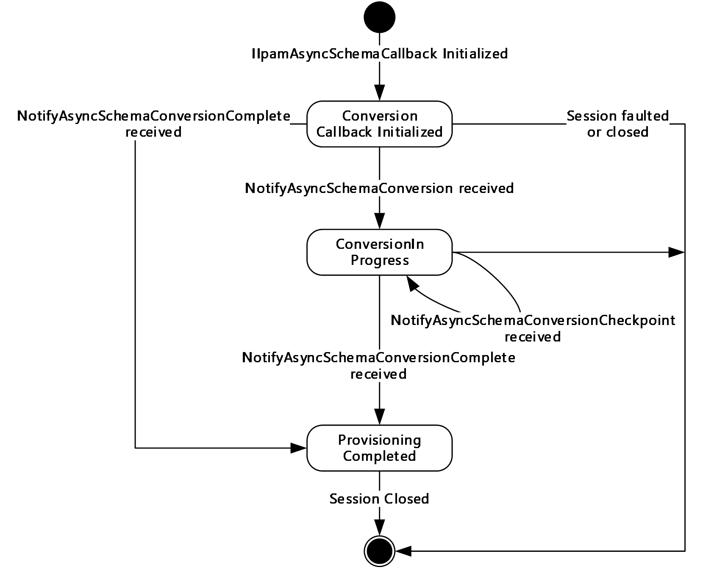

Figure 11: IIpamAsyncSchemaCallback state machine

The **IIpamAsyncSchemaCallback** server is session-based sharing the same session the management client has with the management server using the **IIpamAsyncSchemaConversion** port type. It is also stateful in nature. The **session state** variable will be used to keep track of the current state for each session and it can have the following states as possible values. At any point of the session, if the session is known to be faulted or closed by the lower layer, the state machine ends.

| State | Description |
| --- | --- |
| **Conversion Callback Initialized** | This is the initial state of the **IIpamAsyncSchemaCallback** will be when it has been initialized by the **IIpamAsyncSchemaConversion** client. When the **NotifyAsyncSchemaConversionStart** is received in this state from the **IIpamAsyncSchemaConversion** server port on the management server-end of the session, the transition to the **Conversion In Progress** state will happen. |
| **Conversion In Progress** | This state indicates the **IIpamAsyncSchemaCallback** is ready to receive the schema conversion checkpoint and completion status. When the **NotifyAsyncSchemaConversionCheckpoint** is received in this state from the **IIpamAsyncSchemaConversion** server port on the management server-end of the session, the state will continue to be in **Conversion In Progress**. When the **NotifyAsyncSchemaConversionComplete** is received in this state from the **IIpamAsyncSchemaConversion** server port on the management server-end of the session, the state will transition to **Conversion Completed**. |
| **Conversion Completed** | This is the state to notify the schema conversion status interaction between the **IIpamAsyncSchemaConversion** server port on the management server-end and the **IIpamAsyncSchemaCallback** server port on the management client-end is complete and the result is available. |

#### 3.17.1.2 Other Miscellaneous States

**ConversionFault**: This is used to store the **ConversionFault** instance provided by **IIpamAsyncSchemaConversion** client as a part of the initialization to hold the schema conversion result. See section [3.16.1](#Section_3.16.1) for more details.

### 3.17.2 Timers

There are no additional timers beyond the ones defined by the lower layer of the protocols.

### 3.17.3 Initialization

The **IIpamAsyncSchemaCallback** interface is initialized by the **IIpamAsyncSchemaConversion** client on the management client-end. The **IIpamAsyncSchemaConversion** client passes the **ProvisionFault** instance during initialization which will be updated by the **IIpamAsyncSchemaCallback** server with the result of the schema conversion. The session state is set to **Conversion Callback Initialized**.

### 3.17.4 Message Processing Events and Sequencing Rules

#### 3.17.4.1 Session Faulted or Closed

The Session Faulted or Closed event is triggered by the lower transport layer when the session has received a [**SOAP fault**](#gt_soap-fault), or a forceful session close has occurred. If the session state is **Conversion Callback Initialized** or **Conversion In Progress**, the **ProvisioningFault** has to be set to an appropriate reason associated with the session closure.

#### 3.17.4.2 NotifyAsyncSchemaConversionCheckpoint

The **NotifyAsyncSchemaConversionCheckpoint** operation is used to provide the checkpoint when the schema conversion is in progress.

<wsdl:operation name="NotifyAsyncSchemaConversionCheckpoint">

<wsdl:input wsaw:Action="http://Microsoft.Windows.Ipam/IIpamAsyncSchemaCallback/NotifyAsyncSchemaConversionCheckpoint" message="ipam:IIpamAsyncSchemaCallback_NotifyAsyncSchemaConversionCheckpoint_InputMessage" />

</wsdl:operation>

This operation has only the input message and there is no output message associated with it. This operation will be called a number of times during the schema conversion.

##### 3.17.4.2.1 Messages

###### 3.17.4.2.1.1 IIpamAsyncSchemaCallback_NotifyAsyncSchemaConversionCheckpoint_InputMessage

The **IIpamAsyncSchemaCallback_NotifyAsyncSchemaConversionCheckpoint_InputMessage** message is the request for the **NotifyAsyncSchemaConversionCheckpoint** operation.

<wsdl:message name="IIpamAsyncSchemaCallback_NotifyAsyncSchemaConversionCheckpoint_InputMessage">

<wsdl:part name="parameters" element="ipam:NotifyAsyncSchemaConversionCheckpoint" />

</wsdl:message>

This message MUST be sent with the following [**SOAP action**](#gt_soap-action).

http://Microsoft.Windows.Ipam/IIpamAsyncSchemaCallback/NotifyAsyncSchemaConversionCheckpoint

The body of the [**SOAP message**](#gt_soap-message) MUST contain the **NotifyAsyncSchemaConversionCheckpoint** element.

##### 3.17.4.2.2 Elements

###### 3.17.4.2.2.1 NotifyAsyncSchemaConversionCheckpoint

The **NotifyAsyncSchemaConversionCheckpoint** element specifies the input values for the **NotifyAsyncSchemaConversionCheckpoint** operation.

<xs:element name="NotifyAsyncSchemaConversionCheckpoint">

<xs:complexType>

<xs:sequence>

<xs:element minOccurs="0" name="data" nillable="true" type="ipam:ArrayOfIpamObject" />

</xs:sequence>

</xs:complexType>

</xs:element>

#### 3.17.4.3 NotifyAsyncSchemaConversionComplete

The **NotifyAsyncSchemaConversionComplet**e operation is used to indicate the completion of schema conversion.

<wsdl:operation name="NotifyAsyncSchemaConversionComplete">

<wsdl:input wsaw:Action="http://Microsoft.Windows.Ipam/IIpamAsyncSchemaCallback/NotifyAsyncSchemaConversionComplete" message="ipam:IIpamAsyncSchemaCallback_NotifyAsyncSchemaConversionComplete_InputMessage" />

</wsdl:operation>

This operation has only the request message. This signifies the completion of the schema conversion and the **Conversion Completed** event of the **IIpamAsyncSchemaConversion** client is invoked. The session state is set to **Conversion Completed**.

If **NotifyAsyncSchemaConversionComplete.exception** is set, the schema conversion has faulted. The **ConversionFault** is set to **NotifyAsyncSchemaConversionComplete.exception**.

If **NotifyAsyncSchemaConversionComplete.exception** is NULL, the schema conversion has completed successfully.

##### 3.17.4.3.1 Messages

###### 3.17.4.3.1.1 IIpamAsyncSchemaCallback_NotifyAsyncSchemaConversionComplete_InputMessage

The **IIpamAsyncSchemaCallback_NotifyAsyncSchemaConversionComplete_InputMessage** message is the request for the **NotifyAsyncSchemaConversionComplete** operation.

<wsdl:message name="IIpamAsyncSchemaCallback_NotifyAsyncSchemaConversionComplete_InputMessage">

<wsdl:part name="parameters" element="ipam:NotifyAsyncSchemaConversionComplete" />

</wsdl:message>

This message MUST be sent with the following SOAP action.

http://Microsoft.Windows.Ipam/IIpamAsyncSchemaCallback/NotifyAsyncSchemaConversionComplete

The body of the SOAP message MUST contain the **NotifyAsyncSchemaConversionComplete** element.

##### 3.17.4.3.2 Elements

###### 3.17.4.3.2.1 NotifyAsyncSchemaConversionComplete

The **NotifyAsyncSchemaConversionComplete** element specifies the input values for the **NotifyAsyncSchemaConversionComplete** operation.

<xs:element name="NotifyAsyncSchemaConversionComplete">

<xs:complexType>

<xs:sequence>

<xs:element minOccurs="0" name="result" nillable="true" type="ipam:IpamObject" />

<xs:element minOccurs="0" name="exception" nillable="true" type="ipam1:IpamException" />

</xs:sequence>

</xs:complexType>

</xs:element>

#### 3.17.4.4 NotifyAsyncSchemaConversionStart

The **NotifyAsyncSchemaConversionStart** operation is used to indicate the start of the schema conversion of the IPAM data store.

<wsdl:operation name="NotifyAsyncSchemaConversionStart">

<wsdl:input wsaw:Action="http://Microsoft.Windows.Ipam/IIpamAsyncSchemaCallback/NotifyAsyncSchemaConversionStart" message="ipam:IIpamAsyncSchemaCallback_NotifyAsyncSchemaConversionStart_InputMessage" />

</wsdl:operation>

This operation only has the request message to provide the notification. On receiving the message, the session state is set to **Conversion In Progress**.

##### 3.17.4.4.1 Messages

###### 3.17.4.4.1.1 IIpamAsyncSchemaCallback_NotifyAsyncSchemaConversionStart_InputMessage

The **IIpamAsyncSchemaCallback_NotifyAsyncSchemaConversionStart_InputMessage** message is the request for the **NotifyAsyncSchemaConversionStart** operation.

<wsdl:message name="IIpamAsyncSchemaCallback_NotifyAsyncSchemaConversionStart_InputMessage">

<wsdl:part name="parameters" element="ipam:NotifyAsyncSchemaConversionStart" />

</wsdl:message>

This message MUST be sent with the following SOAP action.

http://Microsoft.Windows.Ipam/IIpamAsyncSchemaCallback/NotifyAsyncSchemaConversionStart

The body of the SOAP message MUST contain the **NotifyAsyncSchemaConversionStart** element.

##### 3.17.4.4.2 Elements

###### 3.17.4.4.2.1 NotifyAsyncSchemaConversionStart

The **NotifyAsyncSchemaConversionStart** element specifies the input values for the **NotifyAsyncSchemaConversionStart** operation.

<xs:element name="NotifyAsyncSchemaConversionStart">

<xs:complexType>

<xs:sequence />

</xs:complexType>

</xs:element>

### 3.17.5 Timer Events

None.

### 3.17.6 Other Local Events

#### 3.17.6.1 User Authorization

Since the **IIpamAsyncSchemaCallback** server is initialized on the same session as the **IIpamAsyncSchemaConversion** session, no additional user authentication and authorization is performed beyond what was done for the operations in the **IIpamAsyncSchemaConversion** session.

## 3.18 IIpamAsyncSchemaCallback Client Details

The **IIpamAsyncSchemaConversion** server is the endpoint, which will also be the **IIpamAsyncSchemaCallback** client. The same session has **IIpamAsyncSchemaConversion** and **IIpamAsyncSchemaCallback** implemented on either end. The management server provides the **IIpamAsyncSchemaConversion** server and the **IIpamAsyncSchemaCallback** client implementations and the management client provides the **IIpamAsyncSchemaCallback** server and the **IIpamAsyncSchemaConversion** client implementations. The **IIpamAsyncSchemaCallback** is only a request interface; that is, no data is obtained from the **IIpamAsyncSchemaCallback** server.

### 3.18.1 Abstract Data Model

None.

### 3.18.2 Timers

None.

### 3.18.3 Initialization

None.

### 3.18.4 Message Processing Events and Sequencing Rules

None other than those captured as a part of the **IIpamAsyncProvision** server in section [3.11](#Section_3.11).

### 3.18.5 Timer Events

None.

### 3.18.6 Other Local Events

None.

## 3.19 IIpamOperationWithProgress Server Details

This port type is used by the management client to track the progress of operations running on the management server. The management client establishes a session by calling the management server port to initialize and start the operation. The client then initializes the **IIpamOperationWithProgressCallback** port type server. This port type enables the management server to call back and provide the status and percent of completion of the operation. The interaction is captured in the following diagram:

- The management client calls **InitializeOperationParameters** to initiate the operation.
- It calls **StartOperationWithCallback** to start the operation.
- The management server calls **StartProgressCallback** on the interface **IIpamOperationWithProgressCallback** indicating to the management client that the management server is starting the operation and will send the **status** and **task** messages back.
- While the operation is in progress, the management server can indicate that some **subtasks** are starting by calling **AddSubTask** and also set the **subtask** status or the overall status by calling the functions **SetSubTaskStatus**, **setOverallStatus**, or **SetCompletionPercentage**.
- The operation ends when the management server calls **SetOverallStatus** with Success and 100 percent completion status.

Figure 12: OperationWithProgress interaction

### 3.19.1 Abstract Data Model

The Abstract Data Model section describes a conceptual model of possible data organization that an implementation maintains to participate in this protocol. The described organization is provided to facilitate the explanation of how the protocol behaves. This document does not mandate that implementations adhere to this model as long as their external behavior is consistent with that described in this document.

#### 3.19.1.1 State Machine

The following figure shows the state machine of the **IIpamOperationWithProgress** server port type.

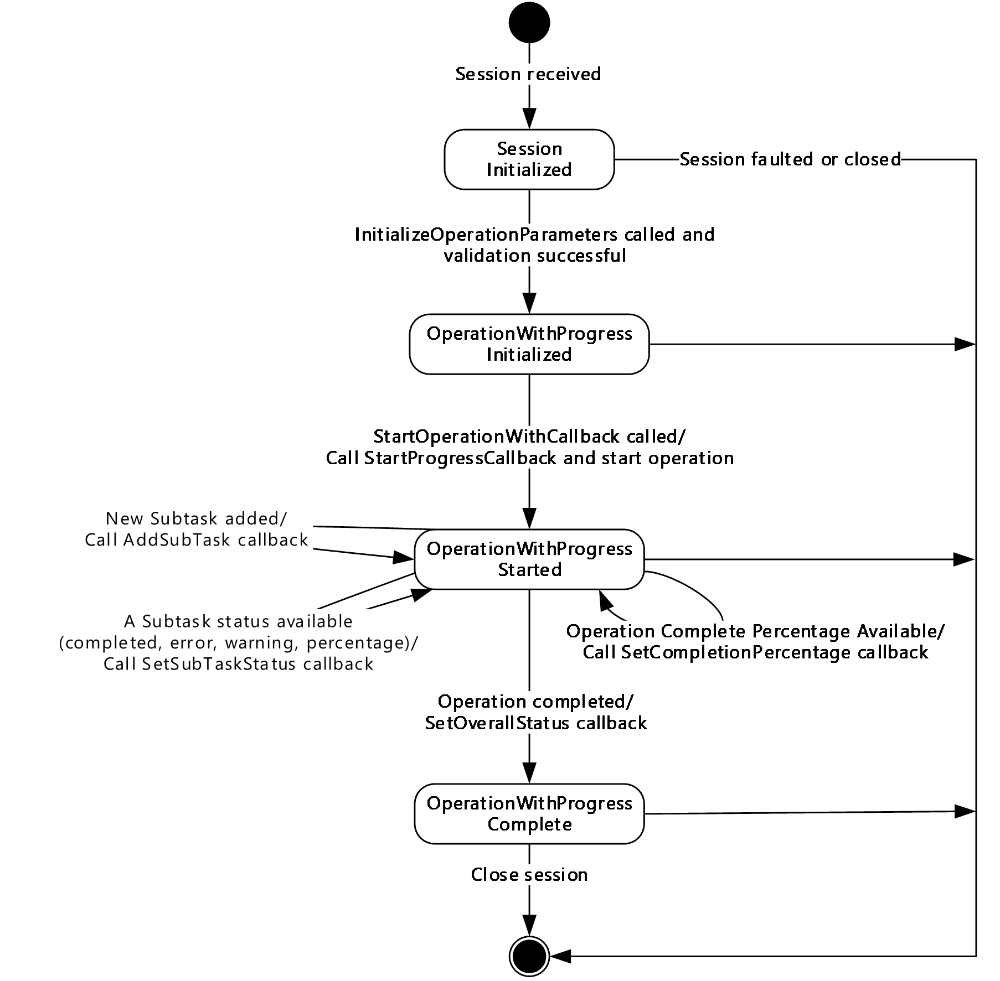

Figure 13: IIpamOperationWithProgress - server state machine

The **IIpamOperationWithProgress** server is session-based and stateful in nature. The session state variable keeps track of the current state for each session, and can have the following states as possible values. At any point of the session, if the session is known to be faulted or closed by the lower layer, the state machine ends.

| State | Description |
| --- | --- |
| **Session Initialized** | This is the initial state of the session, indicated from the lower layer of the protocol. In this state, when the **InitializeOperationParameters** operation is invoked (by the client), the data received as a part of the **InitializeOperationParameters** is validated. If the data validation succeeds, the state is changed to **OperationWithProgressInitialized** If the data validation fails, the server returns an appropriate SOAP fault and closes the session. |
| **OperationWithProgress Initialized** | This is the state when the **IpamOperationWithProgress** is initialized and ready to start the specified operation. In this state, the **StartOperationWithCallback** operation is invoked (by the client), and the server invokes the **StartProgressCallback** and triggers the operation. The state is changed to **OperationWithProgress Started**. |
| **OperationWithProgress Started** | Denotes that the operation has been initialized successfully and is currently in progress. An operation can be divided into subtasks that can be added to the overall operation at any time and be tracked separately. If the operation requires a new subtask, the **AddSubTask** callback operation is invoked. The state remains **OperationWithProgress Started**. As the subtasks progress, the percentage progress will change, and the subtask is completed with success, with error, or with warning. In each of these cases, the **SetSubTaskStatus** operation is invoked. The state remains **OperationWithProgress Started**. If the server operation is tracking the overall operation percentage completion and if the percentage completion of the operation changes, the **SetCompletionPercentage** operation is invoked. The state remains **OperationWithProgress Started**. If all the subtasks and the operation as a whole is completed with success, with error, or with warnings, the **SetOverallStatus** callback operation is invoked. The state is changed to **OperationWithProgress Completed**. |
| **OperationWithProgress Completed** | Indicates that there is no further processing required in the session and proceeds to close the session. |

#### 3.19.1.2 Other Miscellaneous States

**IpamOperationWithProgressParameter:** This is of type **IpamOperationWithProgressParameters** and can correspond to any of the different operations. The **IpamOperationWithProgressParameters.AdminOperationId** specifies the operation to be performed. This is initialized with the parameters received as a part of the **InitializeOperationParameters** method.

### 3.19.2 Timers

Other than those that are described in section [3.1.2](#Section_3.1.2), there are no additional timers.

### 3.19.3 Initialization

None.

### 3.19.4 Message Processing Events and Sequencing Rules

#### 3.19.4.1 New Session Indication

The New Session Indication event will be indicated by the lower transport layer of the protocol ([MS-NMFTB](../MS-NMFTB/MS-NMFTB.md)) when a new session is available from the client. The session state is initialized to **Session** Initialized.

#### 3.19.4.2 Session Closed or Faulted

The Session Closed or Faulted event will be indicated by the lower transport layer of the protocol ([MS-NMFTB](../MS-NMFTB/MS-NMFTB.md)) when an existing session is either closed by the client or an irrecoverable error has occurred. This event will result in termination of the state machine as the session itself is no longer valid.

#### 3.19.4.3 InitializeOperationParameters

The **InitializeOperationParameters** operation is an [**initiating operation**](#gt_initiating-operation). This operation is used to specify the operation to be executed using the session.

<wsdl:operation msc:isInitiating="true" msc:isTerminating="false" name="InitializeOperationParameters">

<wsdl:input wsaw:Action="http://Microsoft.Windows.Ipam/IIpamOperationWithProgress/InitializeOperationParameters" message="ipam:IIpamOperationWithProgress_InitializeOperationParameters_InputMessage" />

<wsdl:output wsaw:Action="http://Microsoft.Windows.Ipam/IIpamOperationWithProgress/InitializeOperationParametersResponse" message="ipam:IIpamOperationWithProgress_InitializeOperationParameters_OutputMessage" />

</wsdl:operation>

Upon receiving the **IIpamOperationWithProgress_InitializeOperationParameters_InputMessage** request message, the server performs the following processing steps. Upon successful completion of these steps, the server MUST respond with the **IIpamOperationWithProgress_InitializeOperationParameters_OutputMessage** message. In the event of a failure, an appropriate SOAP fault MUST be sent to the client as specified in section [2.2.2.1](#Section_2.2.2.1):

- The session state is set to **OperationWithProgressInitialized**.
- The **InitializeOperationParameters.IpamOperationWithProgressParameters** element MUST be valid and MUST NOT be NULL.
- The **IpamOperationWithProgressParameters.OperationId** MUST be valid as per the definition in section [2.2.4.381](#Section_2.2.4.381). If the data is valid, assign **InitializeOperationParameters.IpamOperationWithProgressParameters** to **IpamOperationWithProgressParameter**.
- If the validation of the **IpamOperationWithProgressParameters.OperationId** done fails, an appropriate SOAP fault MUST be sent to the client as specified in section 2.2.2.1.

##### 3.19.4.3.1 Messages

###### 3.19.4.3.1.1 IIpamOperationWithProgress_InitializeOperationParameters_InputMessage

The **IIpamOperationWithProgress_InitializeOperationParameters_InputMessage** message is the request for the **InitializeOperationParameters** operation.

<wsdl:message name="IIpamOperationWithProgress_InitializeOperationParameters_InputMessage">

<wsdl:part name="parameters" element="ipam:InitializeOperationParameters" />

</wsdl:message>

This message MUST be sent with the following [**SOAP action**](#gt_soap-action).

http://Microsoft.Windows.Ipam/IIpamOperationWithProgress/InitializeOperationParameters

The body of the [**SOAP message**](#gt_soap-message) MUST contain the **InitializeOperationParameters** element.

###### 3.19.4.3.1.2 IIpamOperationWithProgress_InitializeOperationParameters_OutputMessage

The **IIpamOperationWithProgress_InitializeOperationParameters_OutputMessage** message is the response for the **InitializeOperationParameters** operation.

<wsdl:message name="IIpamOperationWithProgress_InitializeOperationParameters_OutputMessage">

<wsdl:part name="parameters" element="ipam:InitializeOperationParametersResponse" />

</wsdl:message>

This message MUST be sent with the following SOAP action.

http://Microsoft.Windows.Ipam/IIpamOperationWithProgress/InitializeOperationParametersResponse

The body of the SOAP message MUST contain the **InitializeOperationParametersResponse** element.

##### 3.19.4.3.2 Elements

###### 3.19.4.3.2.1 InitializeOperationParameters

The **InitializeOperationParameters** element specifies the request element for the **InitializeOperationParameter** operation.

<xs:element name="InitializeOperationParameters">

<xs:complexType>

<xs:sequence>

<xs:element minOccurs="0" name="paramters" nillable="true" type="ipam:IpamOperationWithProgressParameters" />

</xs:sequence>

</xs:complexType>

</xs:element>

###### 3.19.4.3.2.2 InitializeOperationParametersResponse

The **InitializeOperationParametersResponse** element specifies the response element for the **InitializeOperationParameter** operation.

<xs:element name="InitializeOperationParametersResponse">

<xs:complexType>

<xs:sequence />

</xs:complexType>

</xs:element>

#### 3.19.4.4 StartOperationWithCallback

The **StartOperationWithCallback** operation is used to trigger the operation specified. The operation that is triggered is determined by the **IpamOperationWithProgressParameters.OperationId** field, which is of type **IpamAdminOperationId** (see section [3.19.4.3](#Section_3.19.4.3.2.1)).

<wsdl:operation msc:isInitiating="true" msc:isTerminating="false" name="StartOperationWithCallback">

<wsdl:input wsaw:Action="http://Microsoft.Windows.Ipam/IIpamOperationWithProgress/StartOperationWithCallback" message="ipam:IIpamOperationWithProgress_StartOperationWithCallback_InputMessage" />

<wsdl:output wsaw:Action="http://Microsoft.Windows.Ipam/IIpamOperationWithProgress/StartOperationWithCallbackResponse" message="ipam:IIpamOperationWithProgress_StartOperationWithCallback_OutputMessage" />

</wsdl:operation>

Upon receiving the **IIpamOperationWithProgress_StartOperationWithCallback_InputMessage** request message, the server performs the following processing steps. Upon successful completion of these steps, the server MUST respond with the **IIpamOperationWithProgress_StartOperationWithCallback_OutputMessage** message. In the event of a failure, an appropriate [**SOAP fault**](#gt_soap-fault) MUST be sent to the client as specified in section [2.2.2.1](#Section_2.2.2.1):

- Invoke the **StartProgressCallback** operation on the **IIpamOperationWithProgressCallback** interface.
- Start the processing of **OperationWithProgress** (section [3.19.4.4.1](#Section_3.19.4.4.1.47)).

##### 3.19.4.4.1 OperationWithProgress Processing Logic

This **OperationWithProgress** Processing Logic section captures the steps to be performed for the processing of different operations passed as parameters to **IpamOperationWithProgress**. The following table captures the operation ID, related sub-section explaining the processing steps and the passed operation parameters.

| Operation Id | Operation steps | Operation Parameters |
| --- | --- | --- |
| EditDhcpServer | UpdateDhcpServerDelegate, section [3.19.4.4.1.1](#Section_3.19.4.4.1.1) | UpdateDhcpServerParameters |
| ApplyServerConfigurationTemplate | ApplyDhcpServerConfigurationDelegate, section [3.19.4.4.1.2](#Section_3.19.4.4.1.2) | ApplyDhcpServerConfigurationParameters |
| CreateDhcpScope | CreateDhcpScopeDelegate, section [3.19.4.4.1.3](#Section_3.19.4.4.1.31) | CreateDhcpScopeParameters |
| EditDhcpScope | UpdateDhcpScopeDelegate, section [3.19.4.4.1.4](#Section_3.19.4.4.1.47) | UpdateDhcpScopeParameters |
| DeleteDhcpScope | DeleteDhcpScopeDelegate, section [3.19.4.4.1.5](#Section_3.19.4.4.1.5) | DeleteDhcpScopeParameters |
| ApplyScopeConfigurationTemplate | ApplyDhcpScopeConfigurationDelegate, section [3.19.4.4.1.6](#Section_3.19.4.4.1.6) | ApplyDhcpScopeConfigurationParameters |
| AddScopesToSuperscope | AddScopesToSuperscopeDelegate, section [3.19.4.4.1.7](#Section_3.19.4.4.1.7) | AddScopesToSuperscopeParameters |
| RemoveScopesfromSuperscope | RemoveScopesFromSuperscopeDelegate, section [3.19.4.4.1.8](#Section_3.19.4.4.1.8) | RemoveScopesFromSuperscopeParameters |
| RenameSuperscope | RenameSuperscopeDelegate, section [3.19.4.4.1.9](#Section_3.19.4.4.1.9) | RenameSuperscopeParameters |
| DeleteSuperscopes | DeleteSuperscopesDelegate, section [3.19.4.4.1.10](#Section_3.19.4.4.1.10) | DeleteSuperscopesParameters |
| SetSuperscopeActivationStatus | SetSuperscopeActivationStatusDelegate, section [3.19.4.4.1.11](#Section_3.19.4.4.1.11) | SetSuperscopeActivationStatusParameters |
| CreateDhcpServerPolicy | CreateServerPolicyDelegate, section [3.19.4.4.1.12](#Section_3.19.4.4.1.12) | CreateDhcpServerPolicyParameters |
| CreateDhcpScopePolicy | CreateScopePolicyDelegate, section [3.19.4.4.1.13](#Section_3.19.4.4.1.13) | CreateDhcpScopePolicyParameters |
| UpdatePolicy | UpdatePolicyDelegate, section [3.19.4.4.1.14](#Section_3.19.4.4.1.14) | UpdatePolicyParameters |
| DeletePolicy | DeletePolicyDelegate, section [3.19.4.4.1.15](#Section_3.19.4.4.1.15) | DeletePolicyParameters |
| UpdatePolicyProperty | UpdatePolicyPropertiesDelegate, section [3.19.4.4.1.16](#Section_3.19.4.4.1.16) | UpdatePolicyPropertiesParameters |
| MovePolicyProcessingOrder | MovePolicyProcessingOrderDelegate, section [3.19.4.4.1.17](#Section_3.19.4.4.1.17) | MovePolicyProcessingOrderParameters |
| CreateDhcpReservation | CreateDhcpReservationDelegate, section [3.19.4.4.1.18](#Section_3.19.4.4.1.18) | CreateDhcpReservationParameters |
| DeleteDhcpReservation | DeleteDhcpReservationDelegate, section [3.19.4.4.1.19](#Section_3.19.4.4.1.19) | DeleteDhcpReservationParameters |
| DeleteDhcpReservationCollection | DeleteDhcpReservationCollectionDelegate, section [3.19.4.4.1.20](#Section_3.19.4.4.1.20) | DeleteDhcpReservationCollectionParameters |
| SetDhcpReservation | SetDhcpReservationDelegate, section [3.19.4.4.1.21](#Section_3.19.4.4.1.21) | SetDhcpReservationParameters |
| SetDhcpReservationCollection | SetDhcpReservationCollectionDelegate, section [3.19.4.4.1.22](#Section_3.19.4.4.1.22) | SetDhcpReservationCollectionParameters |
| CreateDhcpFailover | CreateDhcpFailoverDelegate, section [3.19.4.4.1.23](#Section_3.19.4.4.1.23) | DhcpFailoverWithScopesParameters |
| EditDhcpFailover | UpdateDhcpFailoverDelegate, section [3.19.4.4.1.24](#Section_3.19.4.4.1.24) | DhcpFailoverParameters |
| AddDhcpFailoverScopes | DhcpFailoverAddScopesDelegate, section [3.19.4.4.1.25](#Section_3.19.4.4.1.25) | DhcpFailoverWithScopesParameters |
| RemoveDhcpFailoverScopes | DhcpFailoverRemoveScopesDelegate, section [3.19.4.4.1.26](#Section_3.19.4.4.1.26) | DhcpFailoverRemoveScopesParameters |
| DeleteDhcpFailover | DeleteDhcpFailoverDelegate, section [3.19.4.4.1.27](#Section_3.19.4.4.1.27) | DhcpFailoverDeleteParameters |
| ResetConfigSyncStatus | ResetConfigSyncStatusDelegate, section [3.19.4.4.1.28](#Section_3.19.4.4.1.28) | ResetConfigSyncStatusParameters |
| ReplicateScope | ReplicateFailoverScopeDelegate, section [3.19.4.4.1.29](#Section_3.19.4.4.1.29) | ReplicateScopeParameters |
| ReplicateRelation | DoFailoverReplicationDelegate, section [3.19.4.4.1.30](#Section_3.19.4.4.1.30) | ReplicateRelationParameters |
| ReplicateServer | ReplicateFailoverServerDelegate, section [3.19.4.4.1.31](#Section_3.19.4.4.1.31) | ReplicateServerParameters |
| CreateDhcpFilters | CreateDhcpFiltersDelegate, section [3.19.4.4.1.32](#Section_3.19.4.4.1.32) | CreateDhcpFiltersParameters |
| UpdateDhcpFilter | UpdateDhcpFilterDelegate, section [3.19.4.4.1.33](#Section_3.19.4.4.1.33) | UpdateDhcpFilterParameters |
| UpdateDhcpFilters | UpdateDhcpFiltersDelegate, section [3.19.4.4.1.34](#Section_3.19.4.4.1.34) | UpdateDhcpFiltersParameters |
| DeleteDhcpFilters | DeleteDhcpFiltersDelegate, section [3.19.4.4.1.35](#Section_3.19.4.4.1.35) | DeleteDhcpFiltersParameters |
| CreateIpamIPAddress | SaveIpamIPAddressDelegate, section [3.19.4.4.1.36](#Section_3.19.4.4.1.36) | CreateIpamIPAddressParameters |
| UpdateIpamIPAddress | UpdateIpamIPAddressDelegate, section [3.19.4.4.1.37](#Section_3.19.4.4.1.37) | UpdateIpamIPAddressParameters |
| CreateDnsResourceRecords | CreateDnsResourceRecordsDelegate, section [3.19.4.4.1.38](#Section_3.19.4.4.1.38) | CreateDnsResourceRecordsParameters |
| UpdateDnsResourceRecord | UpdateDnsResourceRecordDelegate, section [3.19.4.4.1.39](#Section_3.19.4.4.1.39) | UpdateDnsResourceRecordParameters |
| UpdateDnsResourceRecords | UpdateDnsResourceRecordsDelegate, section [3.19.4.4.1.40](#Section_3.19.4.4.1.40) | MultiUpdateDnsResourceRecordParameters |
| DeleteDnsResourceRecords | DeleteDnsResourceRecordsDelegate, section [3.19.4.4.1.41](#Section_3.19.4.4.1.41) | DeleteDnsResourceRecordsParameters |
| CreateDnsZone | CreateDnsZoneDelegate, section [3.19.4.4.1.42](#Section_3.19.4.4.1.42) | CreateDnsZoneParameters |
| UpdateDnsZones | UpdateDnsZonesDelegate, section [3.19.4.4.1.43](#Section_3.19.4.4.1.43) | UpdateDnsZonesParameters |
| DeleteDnsZones | DeleteDnsZonesDelegate, section [3.19.4.4.1.44](#Section_3.19.4.4.1.44) | DeleteDnsZonesParameters |
| DnsZonesTransfer | InvokeDnsZonesTransferDelegate, section [3.19.4.4.1.45](#Section_3.19.4.4.1.45) | DnsZonesTransferParameters |
| ReloadDnsZones | ReloadDnsZonesDelegate, section [3.19.4.4.1.46](#Section_3.19.4.4.1.46) | ReloadDnsZonesParameters |
| CreateDnsConditionalForwarders | CreateDnsConditionalForwardersDelegate, section [3.19.4.4.1.47](#Section_3.19.4.4.1.47) | DnsConditionalForwardersParameters |
| UpdateDnsConditionalForwarders | UpdateDnsConditionalForwardersDelegate, section [3.19.4.4.1.48](#Section_3.19.4.4.1.48) | DnsConditionalForwardersParameters |
| DeleteDnsConditionalForwarders | DeleteDnsConditionalForwardersDelegate, section [3.19.4.4.1.49](#Section_3.19.4.4.1.49) | DnsConditionalForwardersParameters |

Different operations are called based on the value of *OperationId* that is passed as a parameter. The following sections describe the processing rules involved in the different operations. The **IpamOperationWithProgressParameter** will contain the input parameters and on completion the **OverallProgressStatus** will have the overall status of the operation.

When the operation has been completed successfully, the **OverallProgressStatus** is updated with the value **CompletedWithSuccess** and the **SetOverallStatus** operation is called.

When the operation processing results in a fault getting generated, an **IPamExceptio**n having the details about the fault is raised and the **SetOverallStatus** operation MUST be called with the value **CompletedWithFailure**.

###### 3.19.4.4.1.1 UpdateDhcpServerDelegate

The **UpdateDhcpServerDelegate** processing is done when the **IpamOperationWithProgressParameter**.**OperationId** is **AdminOperationId.EditDhcpServer**. The **IpamOperationWithProgressParameter** instance MUST be of type **UpdateDhcpServerParameters**.

This operation modifies the server-level properties of a DHCP server instance. In the following processing steps, any time a fault is generated, **SetOverallStatus** SHOULD be called with the fault details:

- If **IpamOperationWithProgressParameter** is NULL or not of type **UpdateDhcpServerParameters**, generate an appropriate SOAP fault as specified in section [2.2.2.1](#Section_2.2.2.1). Put **IpamOperationWithProgressParameter** in a local variable as **UpdateDhcpServerParameters**.
- Validate that **UpdateDhcpServerParameters.Server** is not NULL. If it is NULL, an appropriate SOAP fault MUST be generated.
- The **UpdateDhcpServerParameters.Server** MUST be validated as per the processing rules listed under **ValidateDhcpServer**. If the validation does not succeed, an appropriate SOAP fault MUST be generated.
- If **UpdateDhcpServerParameters.Server** is a **DhcpServerV4** instance, **addressfamily** is initialized to InterNetwork. Otherwise the **addressfamily** is initialized to InterNetworkV6.
- If **UpdateDhcpServerParameters.Server.ModifiedProperties** is empty, there are no properties to update. No further processing is required.
- Compute **dhcpServerExists** to be a flag that indicates whether the **DhcpServer** information is present in the **ADM_DHCPServersTable** by performing a lookup in the table based on **UpdateDhcpServerParameters.Server.RecordId**. If the row is present, **dhcpServerExists** is assigned TRUE. Otherwise **dhcpServerExists** is assigned FALSE.
- If **UpdateDhcpServerParameters.Server.ModifiedProperties** contains **DnsNameProtectionStatus**, **DhcpDnsNotRequestingClientsUpdateType**, **DiscardDnsRecordOnLeaseDeletionStatus**, **DnsUpdateType**, or **DnsDisableDynamicPtrUpdates** (if it is a **DhcpServerV4** instance), perform the following updates to the **ADM_DhcpServersTable**:
- If **dhcpServerExists**, update the row in **ADM_DhcpServersTable** for the following fields. If **dhcpServerExists** is FALSE, insert a new row in **ADM_DhcpServersTable** with the following fields:
- **ServerRoleRecordId** is assigned **UpdateDhcpServerParameters.Server.ServerRoleInfo.RecordId**.
- Set the following values from **UpdateDhcpServerParameters.Server** to the row. Based on whether the **addressfamily** is InterNetwork or InterNetworkV6, the appropriate fields are selected for database update:
- **DnsUpdateType**
- **DiscardDnsRecordOnLeaseDeletionStatus**
- **DhcpDnsNotRequestingClientsUpdateType**
- **DnsNameProtectionStatus**
- Assign the record identifier of the newly inserted row to **dhcpServer.RecordId** for use with subsequent processing.
- If **UpdateDhcpServerParameters.Server.ModifiedProperties** contains **AuditLoggingStatus**, the audit log setting MUST be updated to the table. Update the **AuditLoggingStatus** of the **UpdateDhcpServerParameters.Server** into the table.
- If **UpdateDhcpServerParameters.Server.ModifiedProperties** contains **DnsRegistrationCredentialDomainName**, **DnsRegistrationCredentialUserName**, or **DnsRegistrationCredentialPassword**, the DNS credential user name has to be updated to the table. This consists of the values for fields **DnsRegistrationCredentialDomainName** and **DnsRegistrationCredentialUserName**.
- If **UpdateDhcpServerParameters.Server.ModifiedProperties** contains **PolicyActivationState**, the policy activation status has to be updated to the table. This consists of the value for the field **PolicyActivationStatus**. Initialize the field with **UpdateDhcpServerParameters.Server.PolicyActivationState**.
- If **UpdateDhcpServerParameters.Server.ModifiedProperties** contains **AllowFilterEnabled** or **DenyFilterEnabled**, the filter state has to be updated to the table. This consists of the values for the fields **AllowFilterState** and **DenyFilterState**. Initialize the fields with **UpdateDhcpServerParameters.Server.AllowFilterEnabled** and **UpdateDhcpServerParameters.Server.DenyFilterEnabled**.
- For each entry in the **UserClasses.OperationTracker**, the key specifies the operation to be performed and value specifies the **DhcpUserClass** on which the operation is to be performed:
- If Key is **CollectionOperations.Add**, then add the **DhcpUserClass** to the **DhcpServer.UserClasses** row in **ADM_DHCPServersTable**.
- If Key is **CollectionOperations.Set**, then update the **DhcpUserClass** to the value already present in **DhcpServer.UserClasses** row in **ADM_DHCPServersTable**.
- If the Key is **CollectionOperations.Delete**, then delete the **DhcpUserClass** specified from the **DhcpServer.UserClasses** row.
- For each entry in the **VendorClasses.OperationTracker**, the key specifies the operation to be performed and value specifies the **DhcpVendorClass** on which the operation is to be performed:
- If Key is **CollectionOperations.Add**, then add the **DhcpVendorClass** to the **DhcpServer.VendorClasses** row in **ADM_DHCPServersTable**.
- If Key is **CollectionOperations.Set**, then update the **DhcpVendorClass** to the value already present in the **DhcpServer.VendorClasses** row in **ADM_DHCPServersTable**.
- If the Key is **CollectionOperations.Delete**, then delete the **DhcpVendorClass** specified from the **DhcpServer.VendorClasses** row.
- For each entry in the **OptionDefinitions.OperationTracker**, the key specifies the operation to be performed and value specifies the **DhcpOptionDefinition** on which the operation is to be performed:
- If Key is **CollectionOperations.Add**, then add the **DhcpOptionDefinition** to the **DhcpServer.OptionDefinitions** row in **ADM_DHCPServersTable**.
- If Key is **CollectionOperations.Update**, then update the **DhcpOptionDefinition** to the value already present in the **DhcpServer.OptionDefinitions** row in **ADM_DHCPServersTable**.
- If the Key is **CollectionOperations.Delete**, then delete the **DhcpOptionDefinition** specified from the **DhcpServer.OptionDefinitions** row.
- For each key value pair in **UpdateDhcpServerParameters.Server.Options.OperationTracker**, perform the following operations:
- If the Key is **CollectionOperations.Add** or **CollectionOperations.Set**, add or update the **DhcpOption** in Value portion of the key value pair into **ADM_DhcpOptionsTable** as follows:
- Delete the row from **ADM_DhcpOptionsTable** that meets the following criteria (if it already exists):
- **ServerRecordId** is **dhcpServer.RecordId**
- **ScopeRecordId** is NULL
- **OptionDefinitionRecordId** is **DhcpOption.OptionDefinition.RecordID**
- **UserClassRecordId** is **DhcpOption.UserClass.RecordId**
- Insert a new row into **ADM_DhcpOptionstable** with the following values:
- **ServerRecordId** assigned **dhcpServer.RecordId**.
- **ScopeRecordId** assigned NULL.
- **OptionDefinitionRecordId** assigned **DhcpOption.OptionDefinition.RecordId**.
- **UserClassRecordId** assigned the value of **DhcpOption.UserClass.RecordId**.
- **Values** assigned the value of **DhcpOption.Values**.
- **OptionOwnerType** assigned the value of **DhcpOption.OptionOwnerType**.
- If the Key is **CollectionOperations.Delete**, delete the **DhcpOption** from **ADM_DhcpOptionsTable** by performing a lookup based on the following values:
- **ServerRecordId** is **dhcpServer.RecordId**.
- **ScopeRecordId** is NULL.
- **OptionDefinitionRecordId** is **DhcpOption.OptionDefinition.RecordID**.
- **UserClassRecordId** is **DhcpOption.UserClass.RecordId**.
- Call **SetOverallStatus** with Success and 100 percent completion.

###### 3.19.4.4.1.2 ApplyDhcpServerConfigurationDelegate

The **ApplyDhcpServerConfigurationDelegate** processing is done when the **IpamOperationWithProgressParameter.OperationId** is **AdminOperationId.ApplyServerConfigurationTemplate**. The **IpamOperationWithProgressParameter** instance MUST be of type **ApplyDhcpServerConfigurationParameters**.

This operation is used to update multiple DHCP servers with specific properties. In the following processing steps, any time a fault is generated, the **SetOverallStatus** SHOULD be called with the fault details:

- If **IpamOperationWithProgressParameter** is NULL or not of type **ApplyDhcpServerConfigurationParameters**, generate an appropriate SOAP fault (as specified in section [2.2.2.1](#Section_2.2.2.1)). Put **IpamOperationWithProgressParameter** in a local variable, as A**pplyDhcpServerConfigurationParameters**.
- If **ApplyDhcpServerConfigurationParameters.ServerIds** is NULL or **ApplyDhcpServerConfigurationParameters.ServerIds.Count** is 0 or **ApplyDhcpServerConfigurationParameters.ServerTemplate** is NULL, generate an appropriate SOAP fault.
- For each server specified by **ApplyDhcpServerConfigurationParameters.ServerIds**, perform the following steps:
- Retrieve the server object corresponding to the server ID by calling the procedure **GetServerInfoFromTable** of **ADM_ServersTable** and passing the **serverId** as a parameter in *Param_id*. Assign the server object to a local variable **Server**.
- If **ApplyDhcpServerConfigurationParameters.ServerTemplate.OptionApplyType** is not equal to None, update the server options in the server object through these steps:
- If **ApplyDhcpServerConfigurationParameters.ServerTemplate.OptionApplyType** is **AddorOverwrite**, append or update the options for the **Server** with the list of DHCP options specified in **ApplyDhcpServerConfigurationParameters.ServerTemplate.Options**.
- If **ApplyDhcpServerConfigurationParameters.ServerTemplate.OptionApplyType** is **Delete**, delete the options specified in **ApplyDhcpServerConfigurationParameters.ServerTemplate.Options** from the **Server**.
- If **ApplyDhcpServerConfigurationParameters.ServerTemplate.OptionApplyType** is **Append**, append the options specified in **ApplyDhcpServerConfigurationParameters.ServerTemplate.Options** to the options in the **Server**.
- If **ApplyDhcpServerConfigurationParameters.ServerTemplate.OptionApplyTyp**e is **FindAndreplace**, find the options specified in **ApplyDhcpServerConfigurationParameters.ServerTemplate.Options** in the server configuration, and if they exist, replace with the options specified in **ApplyDhcpServerConfigurationParameters.ServerTemplate.FindAndReplaceOptions**.
- If **ApplyDhcpServerConfigurationParameters.ServerTemplate.UserClassApplyType** is not equal to None or **FindAndReplace**, update the user class in the server object through these steps:
- If **ApplyDhcpServerConfigurationParameters.ServerTemplate.UserClassApplyType** is **AddorOverwrite**, append or update the user class for the **Server** with the user class specified in **ApplyDhcpServerConfigurationParameters.ServerTemplate.UserClasses**.
- If **ApplyDhcpServerConfigurationParameters.ServerTemplate.OptionApplyType** is **Delete**, delete the user classes specified in **ApplyDhcpServerConfigurationParameters.ServerTemplate.UserClasses** from the **Server**.
- If **ApplyDhcpServerConfigurationParameters.ServerTemplate.OptionApplyType** is **Append**, append the user classes specified in **ApplyDhcpServerConfigurationParameters.ServerTemplate.UserClasses** to the **Server**.
- If **ApplyDhcpServerConfigurationParameters.ServerTemplate.VendorClassApplyType** is not equal to None or **FindAndReplace**, update the vendor class in the server object through these steps:
- If **ApplyDhcpServerConfigurationParameters.ServerTemplate.VendorClassType** is **AddorOverwrite**, append or update the vendor class for the **Server** with the vendor class specified in **ApplyDhcpServerConfigurationParameters.ServerTemplate.VendorClasses**.
- If **ApplyDhcpServerConfigurationParameters.ServerTemplate. VendorClassType** is **Delete**, delete the vendor classes specified in **ApplyDhcpServerConfigurationParameters.ServerTemplate.VendorClasses** from the **Server**.
- If **ApplyDhcpServerConfigurationParameters.ServerTemplate. VendorClassType** is **Append**, append the vendor classes specified in **ApplyDhcpServerConfigurationParameters.ServerTemplate.VendorClasses** to the **Server**.
- If **ApplyDhcpServerConfigurationParameters.ServerTemplate.OptionDefinitionApplyType** is not equal to None or **FindAndReplace**, update the option definitions in the server object through these steps:
- If **ApplyDhcpServerConfigurationParameters.ServerTemplate.OptionDefinitionApplyType** is **AddorOverwrite**, **Append** or update the option definitions for the server with the option definitions specified in **ApplyDhcpServerConfigurationParameters.ServerTemplate.OptionDefinitions**.
- If **ApplyDhcpServerConfigurationParameters.ServerTemplate.OptionDefinitionApplyType** is **Delete**, delete the option definitions specified in **ApplyDhcpServerConfigurationParameters.ServerTemplate.OptionDefinitions** from the **Server**.
- If **ApplyDhcpServerConfigurationParameters.ServerTemplate.OptionDefinitionApplyType** is **Append**, append the option definitions specified in **ApplyDhcpServerConfigurationParameters.ServerTemplate.OptionDefinitions** to the **Server**.
- If **ApplyDhcpServerConfigurationParameters.ServerTemplate.DnsNameProtectionStatus** is not equal to None, assign to **Server.DnsNameProtectionStatus** the **ApplyDhcpServerConfigurationParameters.ServerTemplate.DnsNameProtectionStatus**.
- If **ApplyDhcpServerConfigurationParameters.ServerTemplate.DnsUpdateType** is not equal to None, assign to **Server.DnsUpdateType** the **ApplyDhcpServerConfigurationParameters.ServerTemplate.DnsUpdateType**.
- If **ApplyDhcpServerConfigurationParameters.ServerTemplate.DiscardDnsRecordOnLeaseDeletionStatus** is not equal to None, assign to **Server.DiscardDnsRecordOnLeaseDeletionStatus** the **ApplyDhcpServerConfigurationParameters.ServerTemplate.DiscardDnsRecordOnLeaseDeletionStatus**.
- If **ApplyDhcpServerConfigurationParameters.ServerTemplate.DnsRegistrationCredentialUserName** is either NULL or an empty string, assign to **Server.DnsRegistrationCredentialUserName** the **ApplyDhcpServerConfigurationParameters.ServerTemplate.DnsRegistrationCredentialUserName**.
- If **ApplyDhcpServerConfigurationParameters.ServerTemplate.DnsRegistrationCredentialDomainName** is either NULL or an empty string, assign to **Server.DnsRegistrationCredentialDomainName** the **ApplyDhcpServerConfigurationParameters.ServerTemplate.DnsRegistrationCredentialDomainName**.
- If **ApplyDhcpServerConfigurationParameters.ServerTemplate.DnsRegistrationCredentialPassword** is either NULL or an empty string, assign to **Server.DnsRegistrationCredentialPassword** the **ApplyDhcpServerConfigurationParameters.ServerTemplate.DnsRegistrationCredentialPassword**.
- If **ApplyDhcpServerConfigurationParameters.ServerTemplate.AuditLoggingStatus** is not equal to None, assign to **Server.AuditLoggingStatus** the **ApplyDhcpServerConfigurationParameters.ServerTemplate.AuditLoggingStatus**.
- If **ApplyDhcpServerConfigurationParameters.ServerTemplate.Type** is equal to **DhcpServerV6TemplateConfiguration**, then perform the following steps:
- If **ApplyDhcpServerConfigurationParameters.ServerTemplate.StatelessClientInventoryStatus** is not equal to None, assign to **Server.StatelessClientInventoryStatus** the **ApplyDhcpServerConfigurationParameters.ServerTemplate.StatelessClientInventoryStatus**.
- If **ApplyDhcpServerConfigurationParameters.ServerTemplate.PurgeInterval** is not 0, assign to **Server.PurgeInterval** the **ApplyDhcpServerConfigurationParameters.ServerTemplate.PurgeInterval**.
- If the procedure returns any error, generate an appropriate SOAP fault (as specified in section 2.2.2.1).
- Call the **SetOverallStatus** with Success and 100 percent completion.

###### 3.19.4.4.1.3 CreateDhcpScopeDelegate

The **CreateDhcpScopeDelegate** processing is done when the **IpamOperationWithProgressParameter.OperationId** is **AdminOperationId.CreateDhcpScope**. The **IpamOperationWithProgressParameter** instance MUST be of type **CreateDhcpScopeParameters**.

This operation creates a new DHCP scope. In the following steps, any time a fault is generated, **SetOverallStatus** is called with the fault details:

- If I**pamOperationWithProgressParameter** is NULL or not of type **CreateDhcpScopeParameters**, generate an appropriate SOAP fault (section [2.2.2.1](#Section_2.2.2.1)). Project **IpamOperationWithProgressParameter** in a local variable as **CreateDhcpScopeParameters**.
- If **CreateDhcpScopeParameters.Scope** is NULL, generate an appropriate SOAP fault.
- Store **CreateDhcpScopeParameters.Scope** as **scopeToStore** variable.
- If **scopeToStore** is an instance of **DhcpScopeV4**, the **addressfamily** is assigned InterNetwork. Otherwise, the **addressfamily** is assigned InterNetworkV6.
- If **scopeToStore.ParentDhcpServerRecordId** has been specified, fetch the **DhcpServer** instance by calling the procedure **GetDHCPServerFromTable** and passing **scopeToStore.ParentDhcpServerRecordId** as *Param_Id* parameter and **addressfamily** as *Param_addressfamily*.
- If **Result_server** is NULL, generate an appropriate SOAP fault. Otherwise, assign **Result_server** to the **dhcpServer** variable.
- Based on the following conditions, check if the scope already exists. Store the result in **scopeExists** flag:
- If **scopeToStore.RecordId** is specified, look up the row in **ADM_DHCPScopesTable** for the row with **RecordId** equal to **scopeToStore.RecordId**.
- If **scopeToStore.RecordId** is not specified but **ScopeId** is specified, look up the row in **ADM_DHCPScopesTable** wherein **ScopeDetails.ScopeId** is equal to **scopeToStore.ScopeId**.
- If **scopeExists** flag is TRUE, an appropriate SOAP fault MUST be generated.
- Validate the **scopeToStore** data by invoking **ValidateDhcpScope** with **scopeToStore** as the *Param_dhcpScope* parameter. If the validation fails, an appropriate SOAP fault MUST be generated.
- Insert a new row in **ADM_DHCPScopesTable** with **RecordId** being **scopeToStore.RecordId** and with the following values:
- **ScopeId**
- **ScopeName**
- **Status**
- **SubnetDelay**
- **LeaseDurationType**
- **LeaseDuration**
- **ServingClientsType**
- Create a new instance of **IPRange** based on **addressfamily** and assign it to **scopeRange**.
- Update the **scopeRange** with the following values and update the same to the **ADM_IPRangeTable**:
- **StartIPAddress**
- **EndIPAddress**
- **PrefixLength**
- **SubnetId**
- **ScopeId**
- **Description**
- Set or update **scopeRange.CustomFieldValues** to include built-in custom fields--**BuiltinCustomField.ManagedBy** and **BuiltinCustomField.ManagedByEntity**--and assign them to MSDHCP and the **dhcpServer.ServerName**, respectively.
- Add or update the **scopeRange** that was created/modified into **ADM_IPRangeTable**.
- If **CreateDhcpScopeParameters.Scope.ModifiedProperties** contains any **DiscardDnsRecordOnLeaseDeletionStatus**, **DnsNameProtectionStatus**, **DnsUpdateType**, **DnsNotRequestingClientsUpdateType**, or **DnsDisableDynamicPtrUpdates** properties, the DNS settings for the scopes have to be updated as follows:
- For **DhcpScopeV4**, the following properties are updated:
- **DnsNameProtectionStatus**
- **DiscardDnsRecordOnLeaseDeletionStatus**
- **DnsUpdateType**
- **DnsNotRequestingClientsUpdateType**
- For **DhcpScopeV6**, the following properties are updated:
- **DnsNameProtectionStatus**
- **DiscardDnsRecordOnLeaseDeletionStatus**
- **DnsUpdateType**
- For each key value pair in **scopeToStore.Options.OperationTracker**, perform the following operations:
- If the Key is **CollectionOperations.Add** or **CollectionOperations.Set**, add or update the **DhcpOption** in the value portion of the key value pair into **ADM_DhcpOptionsTable** as follows:
- Delete the row from the **ADM_DhcpOptionsTable** that meets the following criteria (if it already exists):
- **ServerRecordId** is assigned **dhcpServer.RecordId**.
- **ScopeRecordId** is assigned **scopeToStore.RecordId**.
- **OptionDefinitionRecordId** is assigned **DhcpOption.OptionDefinition.RecordID**.
- **UserClassRecordId** is assigned **DhcpOption.UserClass.RecordId**.
- Insert a new row into the **ADM_DhcpOptionstable** with the following values:
- **ServerRecordId** is assigned **dhcpServer.RecordId**.
- **ScopeRecordId** is assigned **scopeToStore.RecordId**.
- **OptionDefinitionRecordId** is assigned **DhcpOption.OptionDefinition.RecordId**.
- **UserClassRecordId** is assigned the value of **DhcpOption.UserClass.RecordId**.
- **Values** is assigned the value of **DhcpOption.Values**.
- **OptionOwnerType** is assigned the value of **DhcpOption.OptionOwnerType**.
- If the Key is **CollectionOperations.Delete**, delete the **DhcpOption** from **ADM_DhcpOptionsTable** by looking it up based on the following values:
- **ServerRecordId** is assigned **dhcpServer.RecordId**.
- **ScopeRecordId** is assigned **scopeToStore.RecordId**.
- **OptionDefinitionRecordId** is assigned **DhcpOption.OptionDefinition.RecordID**.
- **UserClassRecordId** is assigned **DhcpOption.UserClass.RecordId**.
- For each Key Value Pair in **scopeToStore.ExclusionRanges**, perform the following operations:
- If Key is **CollectionOperations.Add**, add the **DhcpExclusionRange** specified in Value to **scopeToStore.ScopeDetails.ExclusionRanges**.
- If Key is **CollectionOperations.Delete**, delete the **DhcpExclusionRange** specified in Value to **scopeToStore.ScopeDetails.ExclusionRanges**.
- If the **scopeToStore.ExclusionRanges** is modified, the scopeRange's **IsOverlapping** and address mapping will need to be updated as well. For this, perform the following steps:
- The **IsOverlapping** field and the IP address mapping to the range will need to be reset. This is done by invoking the **ResetCurrentIPRangeMapping** procedure of the **ADM_IPRangeTable** with the *Param_range* parameter is assigned **scopeRange**.
- The **IsOverlapping** field has to be recalculated for the address ranges based on the updated address range. Also, the addresses in **ADM_IPAddressTable** have to be recalculated based on the new range. This is done by performing the steps listed under **SetIPRangeMapping** by passing the **scopeRange** as the *currentRange* parameter.
- Call **SetOverallStatus** with Success and 100 percent completion.

###### 3.19.4.4.1.4 UpdateDhcpScopeDelegate

The **UpdateDhcpScopeDelegate** processing is done when the **IpamOperationWithProgressParameter.OperationId** is **AdminOperationId.EditDhcpScope**. The **IpamOperationWithProgressParameter** instance MUST be of type **UpdateDhcpScopeParameters**.

This operation updates an existing DHCP scope. In the following steps, any time a fault is generated, **SetOverallStatus** is called with the fault details:

- If **IpamOperationWithProgressParameter** is NULL or not of type **UpdateDhcpScopeParameters**, generate an appropriate SOAP fault (as specified in section [2.2.2.1](#Section_2.2.2.1)). Project **IpamOperationWithProgressParameter** in a local variable as **UpdateDhcpScopeParameters**.
- If **UpdateDhcpScopeParameters.scope** is NULL, generate an appropriate SOAP fault.
- Store **UpdateDhcpScopeParameters.scope** as a **scopeToStore** variable.
- If **scopeToStore** is an instance of **DhcpScopeV4**, the **addressfamily** is assigned InterNetwork. Otherwise the **addressfamily** is assigned InterNetworkV6.
- If **scopeToStore.ParentDhcpServerRecordId** has been specified, fetch the **DhcpServer** instance by calling the procedure **GetDHCPServerFromTable** and passing **scopeToStore.ParentDhcpServerRecordId** as *Param_Id* parameter and **addressfamily** as *Param_addressfamily*.
- If **Result_server** is NULL, generate an appropriate SOAP fault. Otherwise assign **Result_server** to **dhcpServer** variable.
- Check whether the scope already exists. Store the result in **scopeExists** flag. This is done based on the following conditions:
- If **scopeToStore.RecordId** is specified, look up the row in **ADM_DHCPScopesTable** for the row in which **RecordId** is equal to **scopeToStore.RecordId**.
- If **scopeToStore.RecordId** is not specified but **ScopeId** is specified, look up the row in **ADM_DHCPScopesTable** wherein **ScopeDetails.ScopeId** is equal to **scopeToStore.ScopeId**.
- If **scopeExists** is FALSE, an appropriate SOAP fault MUST be generated.
- Validate the **scopeToStore** data by invoking **ValidateDhcpScope** with **scopeToStore** as *Param_scope* parameter. If the validation fails, an appropriate SOAP fault MUST be generated.
- Update the existing scope row in **ADM_DHCPScopesTable** with **RecordId** being **scopeToStore.RecordId** for the following values:
- **ScopeId**
- **ScopeName**
- **Status**
- **SubnetDelay**
- **LeaseDurationType**
- **LeaseDuration**
- **ServingClientsType**
- Get the address range corresponding to the scope and store it in **scopeRange**.
- Lookup the **ADM_IPRangeTable** for the row whose **ScopeRecordId** is equal to **scopeToStore.RecordId**.
- Call the procedure **GetIPRangeFromTable**, passing the **RecordId** of the row found as *Param_id* and **addressfamily** as *Param_addressfamily*. Store the **result** into **scopeRange**.
- Update the **scopeRange** with the following values and update the same to the **ADM_IPRangeTable**:
- **StartIPAddress**
- **EndIPAddress**
- **PrefixLength**
- **SubnetId**
- **ScopeId**
- **Description**
- Set or update **scopeRange.CustomFieldValues** to include built-in custom fields--**BuiltinCustomField.ManagedBy** and **BuiltinCustomField.ManagedByEntity**--and assign them to MSDHCP and the **dhcpServer.ServerName**, respectively.
- Add or update the **scopeRange** that was created/modified into the **ADM_IPRangeTable**.
- If **UpdateDhcpScopeParameters.Scope.ModifiedProperties** contains any **DiscardDnsRecordOnLeaseDeletionStatus**, **DnsNameProtectionStatus**, **DnsUpdateType**, **DnsNotRequestingClientsUpdateType**, or **DnsDisableDynamicPtrUpdates** properties, the DNS settings for the scopes have to be updated as follows:
- For **DhcpScopeV4**, the following properties are updated:
- **DnsNameProtectionStatus**
- **DiscardDnsRecordOnLeaseDeletionStatus**
- **DnsUpdateType**
- **DnsNotRequestingClientsUpdateType**
- **DnsDisableDynamicPtrUpdates**
- For **DhcpScopeV6**, the following properties are updated:
- **DnsNameProtectionStatus**
- **DiscardDnsRecordOnLeaseDeletionStatus**
- **DnsUpdateType**
- For each key value pair in **scopeToStore.Options.OperationTracker**, perform the following operations:
- If the Key is **CollectionOperations.Add** or **CollectionOperations.Set**, add or update the **DhcpOption** in Value portion of key value pair into **ADM_DhcpOptionsTable** as follows:
- Delete the row from the **ADM_DhcpOptionsTable** that meets the following criteria (if it already exists):
- **ServerRecordId** is assigned **dhcpServer.RecordId**.
- **ScopeRecordId** is assigned **scopeToStore.RecordId**.
- **OptionDefinitionRecordId** is assigned **DhcpOption.OptionDefinition.RecordID**.
- **UserClassRecordId** is assigned **DhcpOption.UserClass.RecordId**.
- Insert a new row into **ADM_DhcpOptionstable** with the following values:
- **ServerRecordId** is assigned **dhcpServer.RecordId**.
- **ScopeRecordId** is assigned **nullscopeToStore.RecordId**.
- **OptionDefinitionRecordId** is assigned **DhcpOption.OptionDefinition.RecordId**.
- **UserClassRecordId** is assigned the value of **DhcpOption.UserClass.RecordId**.
- **Values** is assigned the value of **DhcpOption.Values**.
- **OptionOwnerType** is assigned the value of **DhcpOption.OptionOwnerType**.
- If the Key is **CollectionOperations.Delete**, delete the **DhcpOption** form **ADM_DhcpOptionsTable** by looking up based on the following values:
- **ServerRecordId** is assigned **dhcpServer.RecordId**.
- **ScopeRecordId** is assigned **scopeToStore.RecordId**.
- **OptionDefinitionRecordId** is assigned **DhcpOption.OptionDefinition.RecordID**.
- **UserClassRecordId** is assigned **DhcpOption.UserClass.RecordId**.
- For each key value pair in **scopeToStore.ExclusionRanges**, perform the following operations:
- If Key is **CollectionOperations.Add**, add the **DhcpExclusionRange** specified in **Value** to **scopeToStore.ScopeDetails.ExclusionRanges**.
- If Key is **CollectionOperations.Delete**, delete the **DhcpExclusionRange** specified in **Value** to **scopeToStore.ScopeDetails.ExclusionRanges**.
- If the **scopeToStore.ExclusionRanges** is modified, the scopeRange's **IsOverlapping** and address mapping will need to be updated as well. For this, perform the following steps:
- The **IsOverlapping** field and the IP address mapping to the range will need to be reset. This is done by invoking the **ResetCurrentIPRangeMapping** procedure of the **ADM_IPRangeTable** with the *Param_range* parameter is assigned **scopeRange**.
- The **IsOverlapping** field has to be recalculated for the address ranges based on the updated address range. Also, the addresses in **ADM_IPAddressTable** have to be recalculated based on the new range. This is done by performing the steps listed under **SetIPRangeMapping** by passing the **scopeRange** as the *currentRange* parameter.
- Call **SetOverallStatus** with Success and 100 percent completion.

###### 3.19.4.4.1.5 DeleteDhcpScopeDelegate

The **DeleteDhcpScopeDelegate** processing is done when the **IpamOperationWithProgressParameter.OperationId** is **AdminOperationId.DeleteDhcpScope**. The **IpamOperationWithProgressParameter** instance in that case MUST be of type **DeleteDhcpScopeParameters**.

This operation deletes an existing DHCP scope. In the following steps, any time a fault is generated, **SetOverallStatus** is called with the fault details:

- If **IpamOperationWithProgressParameter** is NULL or not of type **DeleteDhcpScopeParameters**, generate an appropriate SOAP fault (as specified in section [2.2.2.1](#Section_2.2.2.1)). Project **IpamOperationWithProgressParameter** in a local variable as **DeleteDhcpScopeParameters**.
- Validate that the **DeleteDhcpScopeParameters.Scope.addressFamily** is either InterNetwork or InterNetworkV6. If not, generate an appropriate SOAP fault.
- Look up the **ADM_IPRangeTable** for the row in which the **ScopeRecordId** is **DeleteDhcpScopeParameters.Scope.scopeRecordId** using the **DeleteDhcpScopeParameters.Scope.addressFamily** to select the simple table within the **ADM_IPRangeTable** compound table.
- Using the **RecordId** of the row, delete the **IPRange** by following the steps as described in **DeleteRange** by passing **DeleteRange.rangeRecordId** with the **RecordId** and passing **DeleteDhcpScopeParameters.Scope.addressFamily** as **DeleteRange.addressFamily**.
- Delete the row in **ADM_DHCPScopesTable** that has a **RecordId** value the same as **DeleteDhcpScopeParameters.Scope.scopeRecordId**.
- Call **SetOverallStatus** with Success and 100 percent completion.

###### 3.19.4.4.1.6 ApplyDhcpScopeConfigurationDelegate

The **ApplyDhcpScopeConfigurationDelegate** processing is done when the **IpamOperationWithProgressParameter.OperationId** is **AdminOperationId.ApplyScopeConfigurationTemplate**. The **IpamOperationWithProgressParameter** instance MUST be of type **ApplyDhcpScopeConfigurationParameters**.

This operation is used to update multiple DHCP scopes with specific properties. In the following steps, any time a fault is generated, **SetOverallStatus** is called with the fault details:

- If **IpamOperationWithProgressParameter** is NULL or not of type **ApplyDhcpScopeConfigurationParameters**, generate an appropriate SOAP fault (as specified in section [2.2.2.1](#Section_2.2.2.1)). Project **IpamOperationWithProgressParameter** in a local variable as **ApplyDhcpScopeConfigurationParameters**.
- If **ApplyDhcpServerConfigurationParameters.ScopeIds** is NULL or **ApplyDhcpServerConfigurationParameters.ScopeIds.Count** is 0 or **ApplyDhcpServerConfigurationParameters.ScopeTemplate** is NULL, generate an appropriate SOAP fault.
- For each scope specified by **ApplyDhcpServerConfigurationParameters.ScopeIds**, retrieve the corresponding scope object and create a collection of scopes called **collectionScopes**.
- To retrieve the scope object corresponding to the scope ID, in the step above, call the procedure **GetScopeFromTable** of **ADM_DHCPScopesTable**, passing the **scopeId** as a parameter in *Param_id* and **ApplyDhcpServerConfigurationParameters.ScopeAddressFamily** as a parameter in *param_addressFamily*.
- For each **Scope** in **collectionScopes**, populate the relationship name that the scope belongs to by searching for the **scopeId** in **ADM_DhcpScopeFailoverTable** and then for the corresponding **relationshipId** in the **ADM_DhcpFailoverTable**. Using the relationship names, remove one of the scopes of a given relationship from collectionScopes, if both the scopes of a relationship are in the collection.
- For each **Scope** in **collectionScope**, do the following steps:
- If **ApplyDhcpScopeConfigurationParameters.ScopeTemplate.ModifiedProperties** contains **DnsNameProtectionStatus**, assign to **Scope.DnsNameProtectionStatus** the **ApplyDhcpScopeConfigurationParameters.ScopeTemplate.DnsNameProtectionStatus**.
- If **ApplyDhcpScopeConfigurationParameters.ScopeTemplate.ModifiedProperties** contains **DnsUpdateType**, assign to **Scope.DnsUpdateType** the **ApplyDhcpScopeConfigurationParameters.ScopeTemplate.DnsUpdateType**.
- If **ApplyDhcpScopeConfigurationParameters.ScopeTemplate.ModifiedProperties** contains **DiscardDnsRecordOnLeaseDeletionStatus**, assign to **Scope.DiscardDnsRecordOnLeaseDeletionStatus** the **ApplyDhcpScopeConfigurationParameters.ScopeTemplate.DiscardDnsRecordOnLeaseDeletionStatus**.
- If **ApplyDhcpScopeConfigurationParameters.ScopeTemplate.ModifiedProperties** contains **Status**, assign to **Scope.Status** the **ApplyDhcpScopeConfigurationParameters.ScopeTemplate.Status**.
- If **ApplyDhcpScopeConfigurationParameters.ScopeTemplate.ModifiedProperties** contains **Description**, assign to **Scope.Description** the **ApplyDhcpScopeConfigurationParameters.ScopeTemplate.Description**.
- Call **SetOverallStatus** with Success and 100 percent completion.

###### 3.19.4.4.1.7 AddScopesToSuperscopeDelegate

The **AddScopesToSuperscopeDelegate** processing is done when the **IpamOperationWithProgressParameter.OperationId** is **AdminOperationId.AddScopesToSuperscope**. The **IpamOperationWithProgressParameter** instance in this case MUST be of type **AddScopesToSuperscopeParameters**.

This operation is used to add a collection of scopes to a new or existing super scope. The following are the steps involved. In these steps, any time a fault is generated, the **SetOverallStatus** SHOULD be called with the fault details:

- If **IpamOperationWithProgressParameter** is NULL or not of type **AddScopesToSuperscopeParameters**, generate an appropriate SOAP fault (as specified in section [2.2.2.1](#Section_2.2.2.1)). Project **IpamOperationWithProgressParameter** in a local variable as **AddScopesToSuperscopeParameters**.
- If **AddScopesToSuperscopeParameters.ScopeIds** is NULL, generate an appropriate SOAP fault (as specified in section 2.2.2.1).
- Check if the **SuperScope** already exists, by looking for a row in **ADM_DhcpSuperscopeTable** that has the same **RecordId** as **AddScopesToSuperscopeParameters.SuperScope.RecordId**.
- If the **Superscope** does not already exist, create it by adding a row to **ADM_DhcpSuperscopeTable** and initializing the row with the contents of **AddScopesToSuperscopeParameters.SuperScope**.
- Call the procedure **AddScopesToSuperScope** of the **ADM_DHCPScopesTable**, passing **AddScopesToSuperscopeParameters.SuperScope** as *Param_SuperScope* and **AddScopesToSuperscopeParameters.ScopeIds** as *Param_scopes*.
- For each scope added to the superscope, if it is in a failover relationship, this function is called for the partner scope. This will add the partner scope to a superscope with the same configuration as **AddScopesToSuperscopeParameters.SuperScope**, on the partner server.
- If the procedure returns any error, generate an appropriate SOAP fault (as specified in section 2.2.2.1).
- Call **SetOverallStatus** with Success and 100 percent completion.

###### 3.19.4.4.1.8 RemoveScopesFromSuperscopeDelegate

The **RemoveScopesFromSuperscopeDelegate** processing is done when the **IpamOperationWithProgressParameter.OperationId** is **AdminOperationId.RemoveScopesFromSuperscope**. The **IpamOperationWithProgressParameter** instance in this case MUST be of type **RemoveScopesFromSuperscopeParameters**.

This operation removes a collection of scopes from an existing super scope. In the following processing steps, any time a fault is generated, the **SetOverallStatus** SHOULD be called with the fault details:

- If **IpamOperationWithProgressParameter** is NULL or not of type **RemoveScopesFromSuperscopeParameters**, generate an appropriate SOAP fault (as specified in section [2.2.2.1](#Section_2.2.2.1)). Project **IpamOperationWithProgressParameter** in a local variable as **RemoveScopesFromSuperscopeParameters**.
- If **RemoveScopesFromSuperscopeParameters.ScopeIds** is NULL, generate an appropriate SOAP fault.
- Call the procedure **RemoveScopesFromSuperScope** of the **ADM_DHCPScopesTable**, passing **RemoveScopesFromSuperscopeParameters.ScopeIds** as *Param_scopes*.
- For each scope removed from the superscope, if it is in a failover relationship, this function is called for the partner scope. This removes the partner scope from the superscope with the same configuration as **RemoveScopesFromSuperscopeParameters.SuperScope** on the partner server.
- If the procedure returns any error, generate an appropriate SOAP fault.
- Call **SetOverallStatus** with Success and 100 percent completion.

###### 3.19.4.4.1.9 RenameSuperscopeDelegate

The **RenameSuperscopeDelegate** processing is done when the **IpamOperationWithProgressParameter.OperationId** is **AdminOperationId.RenameSuperscope**. The **IpamOperationWithProgressParameter** instance in that case MUST be of type **RenameSuperscopeParameters**.

This operation renames an existing superscope. In the following steps, any time a fault is generated, the **SetOverallStatus** SHOULD be called with the fault details:

- If **IpamOperationWithProgressParameter** is NULL or not of type **RenameSuperscopeParameters**, generate an appropriate SOAP fault (as specified in section 2.2.2.1). Project **IpamOperationWithProgressParameter** in a local variable as **RenameSuperscopeParameters**.
- If **RenameSuperscopeParameters.Superscope** or **RenameSuperscopeParameters.NewName** is NULL, generate an appropriate SOAP fault.
- Call the procedure **RenameSuperScope** of the **ADM_DhcpSuperscopeTable**, passing **RenameSuperscopeParameters.Superscope** as *Param_Superscope* and **RenameSuperscopeParameters.NewName** as *Param_newName*.
- For each scope belonging to the superscope, if it is in a failover relationship, this function is called for the partner scope. This will rename the superscope of the partner scope to the same configuration as **RenameSuperscopeParameters.SuperScope**, on the partner server.
- If the procedure generates any error, generate an appropriate SOAP fault.
- Call **SetOverallStatus** with Success and 100 percent completion.

###### 3.19.4.4.1.10 DeleteSuperscopesDelegate

The **DeleteSuperscopesDelegate** processing is done when the **IpamOperationWithProgressParameter.OperationId** is **AdminOperationId.DeleteSuperscope**. The **IpamOperationWithProgressParameter** instance in this case MUST be of type **DeleteSuperscopesParameters**.

This operation is used to delete a given superscope. In the following steps, any time a fault is generated, the **SetOverallStatus** SHOULD be called with the fault details:

- If **IpamOperationWithProgressParameter** is NULL or not of type **DeleteSuperscopesParameters**, generate an appropriate SOAP fault (as specified in section [2.2.2.1](#Section_2.2.2.1)). Project **IpamOperationWithProgressParameter** in a local variable as **DeleteSuperscopesParameters**.
- If **DeleteSuperscopesParameters.Superscopes** is NULL, generate an appropriate SOAP fault.
- For each scope belonging to each superscope, if it is in a failover relationship, this function is called for the partner scope. This removes the partner scope from the superscope with the same configuration as **DeleteSuperscopesParameters.SuperScope**, on the partner server.
- For each superscope in the list **DeleteSuperscopesParameters.Superscopes**, retrieve the superScope ID from **SuperScope.RecordId**. Delete the row in **ADM_DhcpSuperScopeTable** that has **ADM_DhcpSuperscopetable.RecordId** equal to retrieved superscope ID.
- Call **SetOverallStatus** with Success and 100 percent completion.

###### 3.19.4.4.1.11 SetSuperscopeActivationStatusDelegate

The **SetSuperscopeActivationStatusDelegate** processing is done when the **IpamOperationWithProgressParameter.OperationId** is **AdminOperationId.SetSuperscopeActivationStatus**. The **IpamOperationWithProgressParameter** instance in this case MUST be of type **SetSuperscopeActivationStatusParameters**.

This operation activates a list of superscopes. In the following processing steps, any time a fault is generated, the **SetOverallStatus** SHOULD be called with the fault details:

- If **IpamOperationWithProgressParameter** is NULL or not of type **SetSuperscopeActivationStatusParameters**, generate an appropriate SOAP fault (as specified in section [2.2.2.1](#Section_2.2.2.1)). Project **IpamOperationWithProgressParameter** in a local variable as **SetSuperscopeActivationStatusParameters**.
- If **SetSuperscopeActivationStatusParameters.Superscopes** is NULL, generate an appropriate SOAP fault.
- For each superscope in the list, extract the scope list from **Superscope.ScopeList** and add it to a local list of scopes names **ScopesList**.
- For each scope in the **ScopesList**, retrieve the row from **ADM_DHCPScopesTable** corresponding to **ADM_DHCPScopesTable.RecordId** that equals the retrieved scope's **RecordId**, and assign to **ADM_DHCPScopesTable.Status** the **SetSuperscopeActivationStatusParameters.ActivationStatus**.
- Call **SetOverallStatus** with Success and 100 percent completion.

###### 3.19.4.4.1.12 CreateServerPolicyDelegate

The **CreateServerPolicyDelegate** processing is done when the **IpamOperationWithProgressParameter.OperationId** is **AdminOperationId.CreateDhcpServerPolicy**. The **IpamOperationWithProgressParameter** instance in this case MUST be of type **CreateDhcpServerPolicyParameters**.

This operation is used to create a new server-level DHCP policy. The following are the steps involved. In these steps, any time a fault is generated, the **SetOverallStatus** SHOULD be called with the fault details:

- If **IpamOperationWithProgressParameter** is NULL or not of type **CreateDhcpServerPolicyParameters**, generate an appropriate SOAP fault (as specified in section [2.2.2.1](#Section_2.2.2.1)). Project **IpamOperationWithProgressParameter** in a local variable as **CreateDhcpServerPolicyParameters**.
- If **CreateDhcpServerPolicyParameters.Policy** is NULL or **CreateDhcpServerPolicyParameters.ServerList** is NULL or **CreateDhcpServerPolicyParameters.ServerList.Count** is 0, generate an appropriate SOAP fault (as specified in section 2.2.2.1).
- Validate the **CreateDhcpServerPolicyParameters.Policy** using the processing rules listed under **ValidateDhcpPolicy** by passing **CreateDhcpServerPolicyParameters.Policy** as *Param_policy*. If any of the processing rules are not met, an appropriate SOAP fault (as specified in section 2.2.2.1) MUST be returned.
- For each server in the **CreateDhcpServerPolicyParameters.ServerList**, put the server object in a local variable **dhcpServe**r, and do the following steps for each server:
- Create a new row in the table **ADM_DhcpPolicyTable**, assigning a new **policyId** to this row. Populate this row as follows:
- **ADM_DhcpPolicyTable.Server** is assigned **dhcpServer**.
- **ADM_DhcpPolicyTable.Scope** is assigned NULL.
- **ADM_DhcpPolicyTable.PolicyName** is assigned **CreateDhcpServerPolicyParameters.Policy.PolicyName**.
- **ADM_DhcpPolicyTable.PolicyDescription** is assigned **CreateDhcpServerPolicyParameters.Policy.PolicyDescription**.
- **ADM_DhcpPolicyTable.ProcessingOrder** is assigned **CreateDhcpServerPolicyParameters.Policy.ProcessingOrder**.
- **ADM_DhcpPolicyTable.State** is assigned **CreateDhcpServerPolicyParameters.Policy.State**.
- **ADM_DhcpPolicyTable.LeaseDurationType** is assigned **CreateDhcpServerPolicyParameters.Policy.LeaseDurationType**.
- **ADM_DhcpPolicyTable.LeaseDuration** is assigned **CreateDhcpServerPolicyParameters.Policy.LeaseDuration**.
- **ADM_DhcpPolicyTable.DnsUpdateType** is assigned **CreateDhcpServerPolicyParameters.Policy.DnsUpdateType**.
- **ADM_DhcpPolicyTable.DiscardDnsRecordOnLeaseDeletionStatus** is assigned **CreateDhcpServerPolicyParameters.Policy.DiscardDnsRecordOnLeaseDeletionStatus**.
- **ADM_DhcpPolicyTable.DnsNameProtectionStatus** is assigned **CreateDhcpServerPolicyParameters.Policy.DnsNameProtectionStatus**.
- **ADM_DhcpPolicyTable.DnsNotRequestingClientUpdateType** is assigned **CreateDhcpServerPolicyParameters.Policy.DnsNotRequestingClientUpdateType**.
- **ADM_DhcpPolicyTable.DnsDisableDynamicPtrUpdate** is assigned **CreateDhcpServerPolicyParameters.Policy.DnsDisableDynamicPtrUpdate**.
- **ADM_DhcpPolicyTable.DnsSuffix** is assigned **CreateDhcpServerPolicyParameters.Policy.DnsSuffix**.
- Create a new row in **ADM_DhcpOptionsTable** with the details set from **CreateDhcpServerPolicyParameters.Policy** and the **PolicyId** assigned the policy ID of the configured policy.
- Call **SetOverallStatus** with Success and 100 percent completion.

###### 3.19.4.4.1.13 CreateScopePolicyDelegate

The **CreateScopePolicyDelegate** processing is done when the **IpamOperationWithProgressParameter.OperationId** is **AdminOperationId.CreateDhcpScopePolicy**. The **IpamOperationWithProgressParameter** instance in this case MUST be of type **CreateDhcpScopePolicyParameters**.

This operation creates a new scope-level DHCP policy. The following are the steps involved. In the following steps, any time a fault is generated, the **SetOverallStatus** SHOULD be called with the fault details:

- If **IpamOperationWithProgressParameter** is NULL or not of type **CreateDhcpScopePolicyParameters**, generate an appropriate SOAP fault (as specified in section [2.2.2.1](#Section_2.2.2.1)). Project **IpamOperationWithProgressParameter** in a local variable as **CreateDhcpScopePolicyParameters**.
- If **CreateDhcpScopePolicyParameters.Policy** is NULL or **CreateDhcpScopePolicyParameters.ScopeList** is NULL or **CreateDhcpScopePolicyParameters.ScopeList.Count** is 0, generate an appropriate SOAP fault.
- Validate the **CreateDhcpScopePolicyParameters.Policy** using the processing rules listed under **ValidateDhcpPolicy** by passing **CreateDhcpScopePolicyParameters.Policy** as *Param_policy*. If any of the processing rules are not met, an appropriate SOAP fault MUST be returned.
- For each scope identifier **ScopeRecordId** in the **CreateDhcpScopePolicyParameters.ScopeList**, get the DHCP Scope by calling the **GetScopeFromTable** procedure of **ADM_DHCPScopesTable**, passing the following values:
- *Param_Id* is assigned **ScopeRecordId**.
- *Param_addressfamily* is assigned **AddressFamily.Internetwork**.
- Assign the **Result_scope** from the procedure call to a local variable **dhcpScope** and do all the following steps for each scope:
- Get the server associated with the scope from the ADM for **scope.dhcpServer** equal to **dhcpScope.ServerId**.
- Create a new row in the table **ADM_DhcpPolicyTable**, assigning a new **policyId** to this row. Populate this row as follows:
- **ADM_DhcpPolicyTable.Server** is assigned **dhcpServer.RecordId**.
- **ADM_DhcpPolicyTable.Scope** is assigned **dhcpScope.RecordId**.
- **ADM_DhcpPolicyTable.PolicyName** is assigned **CreateDhcpScopePolicyParameters.Policy.PolicyName**.
- **ADM_DhcpPolicyTable.PolicyDescription** is assigned **CreateDhcpScopePolicyParameters.Policy.PolicyDescription**.
- **ADM_DhcpPolicyTable.ProcessingOrder** is assigned **CreateDhcpScopePolicyParameters.Policy.ProcessingOrder**.
- **ADM_DhcpPolicyTable.State** is assigned **CreateDhcpScopePolicyParameters.Policy.State**.
- **ADM_DhcpPolicyTable.LeaseDurationType** is assigned **CreateDhcpScopePolicyParameters.Policy.LeaseDurationType**.
- **ADM_DhcpPolicyTable.LeaseDuration** is assigned **CreateDhcpScopePolicyParameters.Policy.LeaseDuration**.
- **ADM_DhcpPolicyTable.DnsUpdateType** is assigned **CreateDhcpScopePolicyParameters.Policy.DnsUpdateType**.
- **ADM_DhcpPolicyTable.DiscardDnsRecordOnLeaseDeletionStatus** is assigned **CreateDhcpScopePolicyParameters.Policy.DiscardDnsRecordOnLeaseDeletionStatus**.
- **ADM_DhcpPolicyTable.DnsNameProtectionStatus** is assigned **CreateDhcpScopePolicyParameters.Policy.DnsNameProtectionStatus**.
- **ADM_DhcpPolicyTable.DnsNotRequestingClientUpdateType** is assigned **CreateDhcpScopePolicyParameters.Policy.DnsNotRequestingClientUpdateType**.
- **ADM_DhcpPolicyTable.DnsDisableDynamicPtrUpdate** is assigned **CreateDhcpScopePolicyParameters.Policy.DnsDisableDynamicPtrUpdate**.
- **ADM_DhcpPolicyTable.DnsSuffix** is assigned **CreateDhcpScopePolicyParameters.Policy.DnsSuffix**.
- Create a new row in **ADM_DhcpPolicyConditionTable**, assigning a new **PolicyConditionId** to this row and to the **PolicyId** added in **ADM_DhcpPolicytable**. Populate all the fields of this row from **CreateDhcpScopePolicyParameters.Policy.Condition**.
- Add any policy ranges corresponding to this policy, if this policy has any **IPranges**. Check whether **CreateDhcpScopePolicyParameters.Policy.Ranges** is NULL or **CreateDhcpScopePolicyParameters.Policy.Ranges.Count** is 0. If so, the policy has no ranges. Otherwise, add a new row to **ADM_DhcpPolicySubrangeTable** for each range in the collection **CreateDhcpScopePolicyParameters.Policy.Ranges**. Assign a new **RecordId** to the new row and the **PolicyId** for the new policy from **ADM_DhcpPolicyTable**. Initialize other fields of the **ADM_DhcpPolicySubrangeTable** as follows:
- **ADM_DhcpPolicySubrangeTable.StartIPAddress** is assigned **CreateDhcpScopePolicyParameters.Policy.Ranges.StartIPAddress**.
- **ADM_DhcpPolicySubrangeTable.EndIPAddress** is assigned **CreateDhcpScopePolicyParameters.Policy.Ranges.EndIPAddress**.
- Call **SetOverallStatus** with Success and 100 percent completion.

###### 3.19.4.4.1.14 UpdatePolicyDelegate

The **UpdatePolicyDelegate** processing is done when the **IpamOperationWithProgressParameter.OperationId** is **AdminOperationId.UpdatePolicy**. The **IpamOperationWithProgressParameter** instance in this case MUST be of type **UpdatePolicyParameters**.

This operation is used to update an existing DHCP policy. In the following steps, any time a fault is generated, the **SetOverallStatus** SHOULD be called with the fault details:

- If **IpamOperationWithProgressParameter** is NULL or not of type **UpdatePolicyParameters**, generate an appropriate SOAP fault (as specified in section [2.2.2.1](#Section_2.2.2.1)). Project **IpamOperationWithProgressParameter** in a local variable as **UpdatePolicyParameters**.
- If **UpdatePolicyParameters.Policy** is NULL, generate an appropriate SOAP fault (as specified in section 2.2.2.1).
- Validate the **UpdatePolicyParameters.Policy** using the processing rules listed under **ValidateDhcpPolicy** by passing **UpdatePolicyParameters.Policy** as *Param_policy*. If any processing rules are not met, an appropriate SOAP fault MUST be returned.
- Get the ADM policy corresponding to the specified Policy by calling the procedure **GetPolicyById** of **ADM_DhcpPolicyTable**. Pass **UpdatePolicyParameters.Policy.recordId** as *Param_PolicyId*. If the procedure returns an error, an appropriate SOAP fault MUST be returned.
- Update the ADM row for the following retrieved elements:
- **ADM_DhcpPolicyTable.Server** is assigned **UpdatePolicyParameters.Policy.Server**.
- **ADM_DhcpPolicyTable.Scope** is assigned **UpdatePolicyParameters.Policy.Scope**.
- **ADM_DhcpPolicyTable.PolicyName** is assigned **UpdatePolicyParameters.Policy.PolicyName**.
- **ADM_DhcpPolicyTable.PolicyDescription** is assigned **UpdatePolicyParameters.Policy.PolicyDescription**.
- **ADM_DhcpPolicyTable.ProcessingOrder** is assigned **UpdatePolicyParameters.Policy.ProcessingOrder**.
- **ADM_DhcpPolicyTable.State** is assigned **UpdatePolicyParameters.Policy.State**.
- **ADM_DhcpPolicyTable.LeaseDurationType** is assigned **UpdatePolicyParameters.Policy.LeaseDurationType**.
- **ADM_DhcpPolicyTable.LeaseDuration** is assigned **UpdatePolicyParameters.Policy.LeaseDuration**.
- **ADM_DhcpPolicyTable.DnsUpdateType** is assigned **UpdatePolicyParameters.Policy.DnsUpdateType**.
- **ADM_DhcpPolicyTable.DiscardDnsRecordOnLeaseDeletionStatus** is assigned **UpdatePolicyParameters.Policy.DiscardDnsRecordOnLeaseDeletionStatus**.
- **ADM_DhcpPolicyTable.DnsNameProtectionStatus** is assigned **UpdatePolicyParameters.Policy.DnsNameProtectionStatus**.
- **ADM_DhcpPolicyTable.DnsNotRequestingClientUpdateType** is assigned **UpdatePolicyParameters.Policy.DnsNotRequestingClientUpdateType**.
- **ADM_DhcpPolicyTable.DnsDisableDynamicPtrUpdate** is assigned **UpdatePolicyParameters.Policy.DnsDisableDynamicPtrUpdate**.
- **ADM_DhcpPolicyTable.DnsSuffix** is assigned **UpdatePolicyParameters.Policy.DnsSuffix**.
- Get the ADM policy condition corresponding to the specified policy by calling the procedure **GetPolicyConditionsForPolicyId** of **ADM_DhcpPolicyConditionTable**. Pass **UpdatePolicyParameters.Policy.recordId** as *Param_PolicyId*. If the procedure returns an error, an appropriate SOAP fault MUST be returned.
- Populate all the fields of this row from **UpdatePolicyParameters.Policy.Condition**.
- Get the ADM policy Subranges corresponding to the specified policy, by calling the procedure **GetPolicySubrangesForPolicyId** of **ADM_DhcpPolicySubrangeTable**. Pass **UpdatePolicyParameters.Policy.recordId** as *Param_PolicyId*. If the procedure returns an error, an appropriate SOAP fault MUST be returned.
- For the returned collection of **PolicyRanges**, for each PolicyRange, do the following:
- Check whether the **PolicyRange.StartIPAddress** is equal to **startIPAddress** of any range in the collection **UpdatePolicyParameters.Policy.Ranges** AND **PolicyRange.EndIPAddress** is equal to **EndIPAddress** of any range in the collection **UpdatePolicyParameters.Policy.Ranges**.
- Delete all ranges from **ADM_DhcpPolicySubrangesTable** for which **ADM_DhcpPolicySubrangeTable.PolicyId** is equal to **UpdatePolicyParameters.Policy.PolicyId** but for which the **StartIPAddress** and the **EndIPAddress** are not in the passed parameter **UpdatePolicyParameters.Policy.Ranges**.
- Add new ranges to **ADM_DhcpPolicySubrangesTable** with **ADM_DhcpPolicySubrangeTable.PolicyId** equal to **UpdatePolicyParameters.Policy.PolicyId** for cases in which the passed range in **UpdatePolicyParameters.Policy.Ranges** does not exist in **ADM_DhcpPolicySubrangeTable**.
- Call **SetOverallStatus** with Success and 100 percent completion.

###### 3.19.4.4.1.15 DeletePolicyDelegate

The **DeletePolicyDelegate** processing is done when the **IpamOperationWithProgressParameter.OperationId** is **AdminOperationId.DeletePolicy**. The **IpamOperationWithProgressParameter** instance in this case MUST be of type **DeletePolicyParameters**.

This operation deletes the DHCP policies. In the following processing steps, any time a fault is generated, **SetOverallStatus** SHOULD be called with the fault details:

- If **IpamOperationWithProgressParameter** is NULL or not of type **DeletePolicyParameters**, generate an appropriate SOAP fault (as specified in section [2.2.2.1](#Section_2.2.2.1)). Project **IpamOperationWithProgressParameter** in a local variable as **DeletePolicyParameters**.
- If **DeletePolicyParameters.Policies** is NULL or if **DeletePolicyParameters.Policies.Count** is 0, generate an appropriate SOAP fault.
- For each **DhcpPolicy** in **DeletePolicyParameters.Policies**, do the following:
- Delete the **ADM** rows from **ADM_DhcpPolicyTable** where **ADM_DhcpPolicyTable.PolicyId** is equal to **DhcpPolicy.PolicyId**.
- Delete the ADM rows from **ADM_DhcpPolicyConditionTable** where **ADM_DhcpPolicyConditionTable.PolicyId** is equal to **DhcpPolicy.PolicyId**.
- Delete the rows in **ADM_DhcpPolicySubRangeTable** where **ADM_DhcpPolicySubRangeTable.PolicyId** is equal to **DhcpPolicy.PolicyId**.
- Delete the rows from **ADM_DhcpOptionsTable** where **ADM_DhcpOptionsTable.PolicyId** is equal to **DhcpPolicy.PolicyId**.
- Call **SetOverallStatus** with Success and 100 percent completion.

###### 3.19.4.4.1.16 UpdatePolicyPropertiesDelegate

The **UpdatePolicyPropertiesDelegate** processing is done when the **IpamOperationWithProgressParameter.OperationId** is **AdminOperationId.UpdatePolicyProperty**. The **IpamOperationWithProgressParameter** instance in that case MUST be of type **UpdatePolicyParameters**.

This operation updates the properties of a DHCP policy. In the following steps, at any time when a fault is generated, the **SetOverallStatus** is called with the fault details:

- If **IpamOperationWithProgressParameter** is NULL or not of type **UpdatePolicyPropertiesParameters**, generate an appropriate SOAP fault (as specified in section [2.2.2.1](#Section_2.2.2.1)). Project **IpamOperationWithProgressParameter** in a local variable as **UpdatePolicyPropertiesParameters**.
- If **UpdatePolicyPropertiesParameters.Policies** is NULL or **UpdatePolicyPropertiesParameters.Policies.Count** is 0, generate an appropriate SOAP fault.
- For each **DhcpPolicy** in **UpdatePolicyPropertiesParameters.Policies**, do the following:
- Get the ADM policy corresponding to the specified Policy, by calling **GetPolicyById** of **ADM_DhcpPolicyTable**. Pass **DhcpPolicy.recordId** as *Param_PolicyId*.
- Update the ADM row for the retrieved policy from the properties passed in the parameter assigned as follows:
- **ADM_DhcpPolicyTable.Server** is assigned **DhcpPolicy.Server**.
- **ADM_DhcpPolicyTable.Scope** is assigned **DhcpPolicy.Scope**.
- **ADM_DhcpPolicyTable.PolicyName** is assigned **DhcpPolicy.PolicyName**.
- **ADM_DhcpPolicyTable.PolicyDescription** is assigned **DhcpPolicy.PolicyDescription**.
- **ADM_DhcpPolicyTable.ProcessingOrder** is assigned **DhcpPo licy.ProcessingOrder**.
- **ADM_DhcpPolicyTable.State** is assigned **DhcpPolicy.State**.
- **ADM_DhcpPolicyTable.LeaseDurationType** is assigned **DhcpPolicy.LeaseDurationType**.
- **ADM_DhcpPolicyTable.LeaseDuration** is assigned **DhcpPolicy.LeaseDuration**.
- **ADM_DhcpPolicyTable.DnsUpdateType** is assigned **DhcpPolicy.DnsUpdateType**.
- **ADM_DhcpPolicyTable.DiscardDnsRecordOnLeaseDeletionStatus** is assigned **DhcpPolicy.DiscardDnsRecordOnLeaseDeletionStatus**.
- **ADM_DhcpPolicyTable.DnsNameProtectionStatus** is assigned **DhcpPolicy.DnsNameProtectionStatus**.
- **ADM_DhcpPolicyTable.DnsNotRequestingClientUpdateType** is assigned **DhcpPolicy.DnsNotRequestingClientUpdateType**.
- **ADM_DhcpPolicyTable.DnsDisableDynamicPtrUpdate** is assigned **DhcpPolicy.DnsDisableDynamicPtrUpdate**.
- **ADM_DhcpPolicyTable.DnsSuffix** is assigned **DhcpPolicy.DnsSuffix**.
- Call **SetOverallStatus** with Success and 100 percent completion.

###### 3.19.4.4.1.17 MovePolicyProcessingOrderDelegate

The **MovePolicyProcessingOrderDelegate** processing is done when the **IpamOperationWithProgressParameter.OperationId** is **AdminOperationId.MovePolicyProcessingOrder**. The **IpamOperationWithProgressParameter** instance in that case MUST be of type **MovePolicyProcessingOrderParameters**.

This operation is used to move a given DHCP policy order either up or down. In the following steps, any time a fault is generated, **SetOverallStatus** is called with the fault details:

- If **IpamOperationWithProgressParameter** is NULL or not of type **MovePolicyProcessingOrderParameters**, generate an appropriate SOAP fault (as specified in section [2.2.2.1](#Section_2.2.2.1)). Project **IpamOperationWithProgressParameter** in a local variable as **MovePolicyProcessingOrderParameters**.
- If **UpdatePolicyPropertiesParameters.Policy** is NULL, generate an appropriate SOAP fault.
- Call the procedure **MovePolicyProcessingOrder** of **ADM_DhcpPolicyTable**, passing **UpdatePolicyPropertiesParameters.Policy** as *Param_Policy* and **UpdatePolicyPropertiesParameters.Direction** as *Param_ProcessingDirection*.
- Call **SetOverallStatus** with Success and 100 percent completion.

###### 3.19.4.4.1.18 CreateDhcpReservationDelegate

The **CreateDhcpReservationDelegate** processing is done when the **IpamOperationWithProgressParameter**.**OperationId** is **AdminOperationId.CreateDhcpReservation**. The **IpamOperationWithProgressParameter** instance in that case MUST be of type **CreateDhcpReservationParameters**.

This operation creates a new DHCP reservation. In the following steps, any time a fault is generated, SetOverallStatus is called with the fault details:

- If **IpamOperationWithProgressParameter** is NULL or not of type **CreateDhcpReservationParameters**, generate an appropriate SOAP fault (as specified in section [2.2.2.1](#Section_2.2.2.1)). Project **IpamOperationWithProgressParameter** in a local variable as **CreateDhcpReservationParameters**.
- If **CreateDhcpReservationParameters**.**Reservation** is NULL, generate an appropriate SOAP fault.
- Validate the **CreateDhcpReservationParameters**.**Reservation** using the processing rules listed under **ValidateDhcpReservation** by passing **CreateDhcpReservationParameters**.**Reservation** as *Param_reservation*. If any of the processing rules are not met, an appropriate SOAP fault MUST be returned.
- Call the procedure **AddOrUpdateReservation** of **ADM_DHCPReservationTable**, passing the following parameters:
- Pass *Param_addressfamily* assigned InterNetwork if **CreateDhcpReservationParameters.Reservation.Address** is **IpamIPv4Address** or assigned InterNetworkV6 if **CreateDhcpReservationParameters.Reservation.Address** is **IpamIPv6Address**.
- Pass *Param_reservationId* assigned **CreateDhcpReservationParameters.Reservation.RecordId**.
- Pass *Param_scopeId* assigned **CreateDhcpReservationParameters.scopeRecordId**.
- Pass *Param_AddressId* assigned **CreateDhcpReservationParameters.Reservation.Address.RecordId**.
- Pass *Param_reservationDetails* assigned **CreateDhcpReservationParameters.Reservation**.
- Call **SetOverallStatus** with Success and 100 percent completion.

###### 3.19.4.4.1.19 DeleteDhcpReservationDelegate

The **DeleteDhcpReservationDelegate** processing is done when the **IpamOperationWithProgressParameter**.**OperationId** is **AdminOperationId.DeleteDhcpReservation**. The **IpamOperationWithProgressParameter** instance in this case MUST be of type **DeleteDhcpReservationParameters**.

The following steps delete an existing DHCP reservation. In these steps, any time a fault is generated, the **SetOverallStatus** is called with the fault details:

- If **IpamOperationWithProgressParameter** is NULL or not of type **DeleteDhcpReservationParameters**, generate an appropriate SOAP fault (as specified in section [2.2.2.1](#Section_2.2.2.1)). Put **IpamOperationWithProgressParameter** in a local variable as **DeleteDhcpReservationParameters**.
- If **DeleteDhcpReservationParameters**.**ReservationRecordId** is NULL, generate an appropriate SOAP fault.
- Call the procedure **DeleteReservation** of **ADM_DHCPReservationTable**, passing the following parameters:
- *Param_addressfamily* assigned **DeleteDhcpReservationParameters.Family**.
- *Param_reservationId* assigned **DeleteDhcpReservationParameters.ReservationRecordId**.
- Call **SetOverallStatus** with Success and 100 percent completion.

###### 3.19.4.4.1.20 DeleteDhcpReservationCollectionDelegate

The **DeleteDhcpReservationCollectionDelegate** operation is done when the **IpamOperationWithProgressParameter**.**OperationId** is **AdminOperationId.DeleteDhcpReservationCollection**. The **IpamOperationWithProgressParameter** instance in this case MUST be of type **DeleteDhcpReservationCollectionParameters**.

This operation deletes a collection of existing DHCP reservations. In the following steps, any time a fault is generated, the **SetOverallStatus** SHOULD be called with the fault details:

- If **IpamOperationWithProgressParameter** is NULL or not of type **DeleteDhcpReservationCollectionParameters**, generate an appropriate SOAP fault (as specified in section [2.2.2.1](#Section_2.2.2.1)). Project **IpamOperationWithProgressParameter** in a local variable as **DeleteDhcpReservationCollectionParameters**.
- If **DeleteDhcpReservationCollectionParameters**.**ReservationRecordIds** is NULL, **DeleteDhcpReservationCollectionParameters.ReservationRecordIds.Count** is 0, **DeleteDhcpReservationCollectionParameters**.**Flag** is greater than **DhcpReservationDeletionFlag**.**DeleteIPAddressAndDnsRecord,** or **DeleteDhcpReservationCollectionParameters**.**Flag** is greater than **DhcpReservationDeletionFlag**.**DeleteIPAddressAndDnsRecord**, generate an appropriate SOAP fault (as specified in section 2.2.2.1).
- For each reservation identifier **ReservationRecordId** in **DeleteDhcpReservationCollectionParameters.ReservationRecordIds**, do the following:
- Call the procedure **DeleteReservation** of **ADM_DHCPReservationTable**, passing the following parameters:
- *Param_addressfamily* assigned **DeleteDhcpReservationCollectionParameters.Family**.
- *Param_reservationId* assigned **ReservationRecordId**.
- Call **SetOverallStatus** with Success and 100 percent completion.

###### 3.19.4.4.1.21 SetDhcpReservationDelegate

The **SetDhcpReservationDelegate** processing is done when the **IpamOperationWithProgressParameter.OperationId** is **AdminOperationId.SetDhcpReservation**. The **IpamOperationWithProgressParameter** instance in this case MUST be of type **SetDhcpReservationParameters**.

This operation is used to update the properties of an existing DHCP reservation. In the following steps, any time a fault is generated, **SetOverallStatus** SHOULD be called with the fault details:

- If **IpamOperationWithProgressParameter** is NULL or not of type **SetDhcpReservationParameters**, generate an appropriate SOAP fault (as specified in section [2.2.2.1](#Section_2.2.2.1)). Project **IpamOperationWithProgressParameter** in a local variable as **SetDhcpReservationParameters**.
- If **SetDhcpReservationParameters**.**Reservation** is NULL, generate an appropriate SOAP fault (as specified in section 2.2.2.1).
- If **SetDhcpReservationParameters.scopeRecordId** is NULL, generate an appropriate SOAP fault (as specified in section 2.2.2.1).
- Validate the **SetDhcpReservationParameters**.**Reservation** using the processing rules listed under **ValidateDhcpReservation** by passing **SetDhcpReservationParameters.Reservation** as *Param_reservation*. If any of the processing rules are not met, an appropriate SOAP fault (as specified in section 2.2.2.1) MUST be returned.
- Call the procedure **AddOrUpdateReservation** of **ADM_DHCPReservationTable**, passing the following parameters:
- Pass *Param_addressfamily* assigned InterNetwork if **SetDhcpReservationParameters.Reservation.Address** is **IpamIPv4Address** or assigned InterNetworkV6 if **SetDhcpReservationParameters.Reservation.Address** is **IpamIPv6Address**.
- Pass *Param_reservationId* is assigned **SetDhcpReservationParameters.Reservation.RecordId**.
- Pass *Param_scopeId* assigned **SetDhcpReservationParameters.Reservation.ParentScope**.
- Pass *Param_addressId* assigned **SetDhcpReservationParameters.Reservation.Address**.
- Pass *Param_reservationDetails* assigned **SetDhcpReservationParameters.Reservation**.
- Call **SetOverallStatus** with Success and 100 percent completion.

###### 3.19.4.4.1.22 SetDhcpReservationCollectionDelegate

The **SetDhcpReservationCollectionDelegate** processing is done when the **IpamOperationWithProgressParameter**.**OperationId** is **AdminOperationId.SetDhcpReservationCollection**. The **IpamOperationWithProgressParameter** instance in this case MUST be of type **SetDhcpReservationCollectionParameters** (section [2.2.4.395](#Section_2.2.4.395)).

This operation updates the properties of a collection of existing DHCP reservations. In the following steps, any time a fault is generated, the **SetOverallStatus** is called with the fault details:

- If **IpamOperationWithProgressParameter** is NULL or not of type **SetDhcpReservationCollectionParameters**, generate an appropriate SOAP fault (as specified in section [2.2.2.1](#Section_2.2.2.1)). Project **IpamOperationWithProgressParameter** in a local variable as **SetDhcpReservationCollectionParameters**.
- If **SetDhcpReservationCollectionParameters.ReservationRecordIds** is NULL or. **SetDhcpReservationCollectionParameters.ReservationRecordIds.Count** is 0, generate an appropriate SOAP fault (as specified in section 2.2.2.1).
- For each reservation identifier **DhcpReservationRecordId** in the **SetDhcpReservationCollectionParameters.ReservationRecordIds** collection, do steps 4 and 5.
- Call the **GetDhcpReservation** procedure of **ADM_DHCPReservationTable** by passing the following values:
- *Param_reservationId* assigned **DhcpReservationRecordId**.
- Local variable **DhcpReservation** is assigned **Result_reservation** output from the procedure.
- Call the procedure **AddOrUpdateReservation** of **ADM_DHCPReservationTable**, passing the following parameters:
- *Param_addressfamily* assigned **SetDhcpReservationCollectionParameters.Family**.
- *Param_reservationId* assigned **DhcpReservationRecordId**.
- *Param_addressId* assigned **DhcpReservation.Address**.
- *Param_scopeId* assigned **DhcpReservation.ParentScope**.
- *Param_reservationDetails* assigned **SetDhcpReservationCollectionParameters.Configuration**.
- Call **SetOverallStatus** with Success and 100 percent completion.

###### 3.19.4.4.1.23 CreateDhcpFailoverDelegate

The **CreateDhcpFailoverDelegate** processing is done when the **IpamOperationWithProgressParameter.OperationId** is **AdminOperationId.CreateDhcpFailover**. The **IpamOperationWithProgressParameter** instance in this case MUST be of type **DhcpFailoverWithScopesParameters**.

This operation is used to create a new DHCP failover relationship. The following steps are involved. In these steps, any time a fault is generated, the **SetOverallStatus** SHOULD be called with the fault details:

- If **IpamOperationWithProgressParameter** is NULL or not of type **DhcpFailoverWithScopesParameters**, generate an appropriate SOAP fault (as specified in section [2.2.2.1](#Section_2.2.2.1)). Project **IpamOperationWithProgressParameter** in a local variable as **CreateDhcpFailoverParameters**.
- If **CreateDhcpFailoverParameters**.**Failover** is NULL, **CreateDhcpFailoverParameters**.**ScopeIds** is NULL, or **CreateDhcpFailoverParameters**.**ScopeIds.Count** is 0, generate an appropriate SOAP fault (as specified in section 2.2.2.1).
- Insert a new row into **ADM_DhcpFailoverRelationTable** with all the field values populated from the corresponding fields of **CreateDhcpFailoverParameters.Failover**. Keep the returned **RecordId** of the new relationship in the local variable **FailoverRecordId**.
- For each scope identifier in **CreateDhcpFailoverParameters.ScopeIds** list, put the reference of the scope identifier in **localDhcpScopeId** variable, and do the following steps:
- Check if a row exists in **ADM_DhcpScopeFailoverTable** that has **localDhcpScopeId** equal to **ADM_DhcpScopeFailoverTable.ScopeId** AND **FailoverRecordId** equal to **ADM_DhcpScopeFailoverTable.FailoverRelationId**.
- If the row does not exist, add a row to **the ADM_DhcpScopeFailoverTable** with **ADM_DhcpScopeFailoverTable.ScopeId** assigned **localDhcpScopeId** and **ADM_DhcpScopeFailoverTable.FailoverRelationId** assigned **FailoverRecordId**.
- Call **SetOverallStatus** with Success and 100 percent completion.

###### 3.19.4.4.1.24 UpdateDhcpFailoverDelegate

The **UpdateDhcpFailoverDelegate** processing is done when the **IpamOperationWithProgressParameter.OperationId** is **AdminOperationId.EditDhcpFailover**. The **IpamOperationWithProgressParameter** instance in this case MUST be of type **DhcpFailoverParameters**.

This operation is used to modify the properties of a DHCP failover relationship. The following are the steps involved. In these steps, any time a fault is generated, the **SetOverallStatus** SHOULD be called with the fault details:

- If **IpamOperationWithProgressParameter** is NULL or not of type **DhcpFailoverParameters**, generate an appropriate SOAP fault (as specified in section [2.2.2.1](#Section_2.2.2.1)). Project **IpamOperationWithProgressParameter** in a local variable as **DhcpFailoverParameters**.
- If **DhcpFailoverParameters.Failover** is NULL, generate an appropriate SOAP fault (as specified in section 2.2.2.1).
- Retrieve the failover relationship row from **ADM_DhcpFailoverTable** by looking for the row in which the value of **RecordId** is equal to **DhcpFailoverParameters.Failover.RecordId**.
- Identify the list of modified properties in the **DhcpFailoverParameters.Failover** by examining the number of properties modified in **DhcpFailoverParameters.Failover.ModifiedProperties**. If there are none, no further processing is required, and the procedure can return successfully.
- For all the properties indicated in **DhcpFailoverParameters.Failover.ModifiedProperties**, update the property in the retrieved row of **ADM_DhcpFailoverTable** from the corresponding properties from **DhcpFailoverParameters.Failover**.
- Call **SetOverallStatus** with Success and 100% completion.

###### 3.19.4.4.1.25 DhcpFailoverAddScopesDelegate

The **DhcpFailoverAddScopesDelegate** processing is done when the **IpamOperationWithProgressParameter**.**OperationId** is **AdminOperationId.AddDhcpFailoverScopes**. The **IpamOperationWithProgressParameter** instance in this case MUST be of type **DhcpFailoverWithScopesParameters**.

This operation is used to add scopes to an existing failover relationship. The following are the steps involved. In these steps, any time a fault is generated, the **SetOverallStatus** SHOULD be called with the fault details:

- If **IpamOperationWithProgressParameter** is NULL or not of type **DhcpFailoverWithScopesParameters**, generate an appropriate SOAP fault (as specified in section [2.2.2.1](#Section_2.2.2.1)). Project **IpamOperationWithProgressParameter** in a local variable as **AddScopesFailoverParameters**.
- If **AddScopesFailoverParameters**.**Failover** is NULL, **AddScopesFailoverParameters**.**ScopeIds** is NULL, or **AddScopesFailoverParameters**.**ScopeIds**.**Count** is 0, generate an appropriate SOAP fault (as specified in section 2.2.2.1).
- Retrieve the failover relationship row from **ADM_DhcpScopeFailoverTable** by looking for the row in which the value of **RecordId** is equal to **AddScopesFailoverParameters.Failover.RecordId**.
- For each scope identifier in **AddScopesFailoverParameters.ScopeIds**, put the reference of the scope identifier in **localDhcpScopeId** variable, and do the following steps:
- Check if a row exists in **ADM_DhcpScopeFailoverTable** that has **localDhcpScopeId** equal to **ADM_DhcpScopeFailoverTable.ScopeId** and **AddScopesFailoverParameters.Failover.RecordId** equal to **ADM_DhcpScopeFailoverTable.FailoverRelationId**.
- If the row does not exist, add a row to the **ADM_DhcpScopeFailoverTable** with **ADM_DhcpScopeFailoverTable.ScopeId** assigned **localDhcpScopeId** and **ADM_DhcpScopeFailoverTable.FailoverRelationId** assigned **AddScopesFailoverParameters.Failover.RecordId**.
- Call **SetOverallStatus** with Success and 100% completion and return the updated **AddScopesFailoverParameters.Failover object**.

###### 3.19.4.4.1.26 DhcpFailoverRemoveScopesDelegate

The **DhcpFailoverRemoveScopesDelegate** processing is done when the **IpamOperationWithProgressParameter.OperationId** is **AdminOperationId.RemoveDhcpFailoverScopes**. The **IpamOperationWithProgressParameter** instance in this case MUST be of type **DhcpFailoverRemoveScopesParameters**.

This operation is used to remove scopes from an existing failover relationship. The following are the steps involved. In these steps, any time a fault is generated, the **SetOverallStatus** SHOULD be called with the fault details:

- If **IpamOperationWithProgressParameter** is NULL or not of type **DhcpFailoverRemoveScopesParameters**, generate an appropriate SOAP fault (as specified in section [2.2.2.1](#Section_2.2.2.1)). Project **IpamOperationWithProgressParameter** in a local variable as **DhcpFailoverRemoveScopesParameters**.
- If **AddScopesFailoverParameters.Failover** is NULL, **AddScopesFailoverParameters.ScopeIds** is NULL, or **AddScopesFailoverParameters.ScopeIds.Count** is 0, generate an appropriate SOAP fault (as specified in section 2.2.2.1).
- For each DHCP scope identifier in the list, **AddScopesFailoverParameters.ScopeIds**, put the reference of the scope identifier in the **localDhcpScopeId** variable, and do the following step:
- Delete the row from the **ADM_DhcpScopeFailoverTable** that has **ADM_DhcpScopeFailoverTable.ScopeId** equal to **localDhcpScopeId**.
- Call **SetOverallStatus** with Success and 100% completion.

###### 3.19.4.4.1.27 DeleteDhcpFailoverDelegate

The **DeleteDhcpFailoverDelegate** processing is done when the **IpamOperationWithProgressParameter.OperationId** is **AdminOperationId.DeleteDhcpFailover**. The **IpamOperationWithProgressParameter** instance in this case MUST be of type **DhcpFailoverDeleteParameters**.

This operation is used to delete an existing failover relationship. The following are the steps involved. In these steps, any time a fault is generated, the **SetOverallStatus** SHOULD be called with the fault details:

- If **IpamOperationWithProgressParameter** is NULL or not of type **DhcpFailoverDeleteParameters**, generate an appropriate SOAP fault (as specified in section [2.2.2.1](#Section_2.2.2.1)). Project **IpamOperationWithProgressParameter** in a local variable as **DhcpFailoverDeleteParameters**.
- If **DhcpFailoverDeleteParameters.Failover** is NULL, generate an appropriate SOAP fault (as specified in section 2.2.2.1).
- Retrieve the failover relationship row from **ADM_DhcpFailoverTable** by looking for the row in which the value of **RecordId** is equal to **DhcpFailoverDeleteParameters.Failover.RecordId**.
- Delete the retrieved row from **ADM_DhcpFailoverTable**.
- Call **SetOverallStatus** with Success and 100% completion.

###### 3.19.4.4.1.28 ResetConfigSyncStatusDelegate

The **ResetConfigSyncStatusDelegate** processing is done when the **IpamOperationWithProgressParameter.OperationId** is **AdminOperationId.ResetConfigSyncStatus**. The **IpamOperationWithProgressParameter** instance in this case MUST be of type **ResetConfigSyncStatusParameters**.

This operation is used to Reset the config sync status of the scopes passed in the parameter to the InSync status. The following are the steps involved. In these steps, any time a fault is generated, the **SetOverallStatus** SHOULD be called with the fault details:

- If **IpamOperationWithProgressParameter** is NULL or not of type **ResetConfigSyncStatusParameters**, generate an appropriate SOAP fault (as specified in section [2.2.2.1](#Section_2.2.2.1)). Project **IpamOperationWithProgressParameter** in a local variable as **ResetConfigSyncStatusParameters**.
- If **ResetConfigSyncStatusParameters.Scopes** is NULL, generate an appropriate SOAP fault (as specified in section 2.2.2.1).
- For each **Scope** in **ResetConfigSyncStatusParameters.Scopes**, put the reference of the scope in **localDhcpScope** variable, and do the following steps:
- Retrieve the row from **ADM_DHCPScopesTable** that has **localDhcpScope.RecordId** equal to **ADM_DHCPScopesTable.ScopeId**.
- If the row exists, set the field **FailoverConfigSyncStatus** of the relevant entry of the **ADM_DHCPScopesTable** to InSync.
- Call **SetOverallStatus** with Success and 100% completion.

###### 3.19.4.4.1.29 ReplicateFailoverScopeDelegate

The **ReplicateFailoverScopeDelegate** processing is done when the **IpamOperationWithProgressParameter.OperationId** is **AdminOperationId.ReplicateScope**. The **IpamOperationWithProgressParameter** instance in this case MUST be of type **ReplicateScopeParameters**.

This operation is used to replicate a scope to the partner server in a DHCP failover relationship. The following are the steps involved. In these steps, any time a fault is generated, the **SetOverallStatus** SHOULD be called with the fault details:

- If **IpamOperationWithProgressParameter** is NULL or not of type **ReplicateScopeParameters**, generate an appropriate SOAP fault (as specified in section [2.2.2.1](#Section_2.2.2.1)). Project **IpamOperationWithProgressParameter** in a local variable as **ReplicateScopeParameters**.
- If **ReplicateScopeParameters.Scopes** is NULL or **ReplicateScopeParameters.Scopes.Count** is 0, generate an appropriate SOAP fault (as specified in section 2.2.2.1).
- For each scope object in **ReplicateScopeParameters.Scopes**, put the scope object in a local variable Scope. Do the following steps for each such reservation in the collection:
- Find the partner server in a failover relationship for this scope. Search for a failover relationship corresponding to a given scope by looking for a row in **ADM_DhcpScopeFailoverTable** that has **ScopeId** equal to **Scope.RecordId**. If no record is found, skip this scope. If the ADM record is found, look for a row in **ADM_FailoverRelationTable** that has **ADM_FailoverRelationTable.RecordId** equal to **ADM_DhcpScopeFailoverTable.FailoverRelationId**. If no such ADM record is found, skip this scope. If the record is found, assign the failover relationship object to a local variable called **Relationship**.
- Create a local variable **DestinationServer**. If **Relationship.Server1RecordId** is equal to **Scope.DHCPServerRecordId**, assign **Relationship.Server1RecordId** to **DestinationServer**. If **Relationship.Server2RecordId** is equal to **Scope.DHCPServerRecordId**, assign **Relationship.Server2RecordId** to **DestinationServer**.
- Clone the **Scope** variable to another local variable **ScopeToStore**. Assign **DestinationServer** to **ScopeToStore.DHCPServerRecordId**.
- Check if **ScopeToStore** already exists in **DestinationServer**. If it does, call **UpdateDhcpScopeDelegate** (section [3.19.4.4.1.4](#Section_3.19.4.4.1.47)), passing *ScopeToStore* as the parameter. If the scope does not exist in the **DestinationServer**, call **CreateDhcpScopeDelegate** (section [3.19.4.4.1.3](#Section_3.19.4.4.1.31)), passing *ScopeToStore* as the parameter.
- Call **SetOverallStatus** with Success and 100% completion.

###### 3.19.4.4.1.30 DoFailoverReplicationDelegate

The **DoFailoverReplicationDelegate** processing is done when the **IpamOperationWithProgressParameter.OperationId** is **AdminOperationId.ReplicateRelation**. The **IpamOperationWithProgressParameter** instance in this case MUST be of type **ReplicateRelationParameters**.

This operation is used to replicate all scopes of a failover relationship to the partner server. The following are the steps involved. In these steps, any time a fault is generated, the **SetOverallStatus** SHOULD be called with the fault details:

- If **IpamOperationWithProgressParameter** is NULL or not of type **ReplicateRelationParameters**, generate an appropriate SOAP fault (as specified in section [2.2.2.1](#Section_2.2.2.1)). Project **IpamOperationWithProgressParameter** in a local variable as **ReplicateRelationParameters**.
- If **ReplicateRelationParameters.relation** is NULL, generate an appropriate SOAP fault (as specified in section 2.2.2.1).
- Retrieve all scopes for the relation, by searching the table **ADM_DHCPScopeFailoverTable** for rows that have **FailoverRelationId** equal to **ReplicateRelationParameters.relation.RecordId**. Populate all the retrieved scopes in a collection of scopes and then call **ReplicateFailoverScopeDelegate** (section [3.19.4.4.1.29](#Section_3.19.4.4.1.29)), passing the scope collection as a parameter.
- Call **SetOverallStatus** with Success and 100% completion.

###### 3.19.4.4.1.31 ReplicateFailoverServerDelegate

The **ReplicateFailoverServerDelegate** processing is done when the **IpamOperationWithProgressParameter.OperationId** is **AdminOperationId.ReplicateServer**. The **IpamOperationWithProgressParameter** instance in this case MUST be of type **ReplicateServerParameters**.

This operation replicates all scopes of a server that participate in any failover relationship to the partner server. In the following steps, any time a fault is generated, **SetOverallStatus** is called with the fault details:

- If **IpamOperationWithProgressParameter** is NULL or not of type **ReplicateServerParameters**, generate an appropriate SOAP fault (as specified in section [2.2.2.1](#Section_2.2.2.1)). Project **IpamOperationWithProgressParameter** in a local variable as **ReplicateServerParameters**.
- If **ReplicateServerParameters.server** is NULL, generate an appropriate SOAP fault.
- Retrieve all scopes for the server, by searching the table **ADM_DHCPScopesTable** for rows that have **DHCPServerRecordId** equal to **ReplicateServerParameters.server.RecordId**. Populate all the retrieved scopes in a collection of scopes and then call **ReplicateFailoverScopeDelegate** (section [3.19.4.4.1.29](#Section_3.19.4.4.1.29)) by passing the scope collection as a parameter.
- Call **SetOverallStatus** with Success and 100% completion.

###### 3.19.4.4.1.32 CreateDhcpFiltersDelegate

The **CreateDhcpFiltersDelegate** processing is done when the **IpamOperationWithProgressParameter.OperationId** is **AdminOperationId.CreateDhcpFilters**. The **IpamOperationWithProgressParameter** instance in this case MUST be of type **CreateDhcpFiltersParameters**.

This operation is used to create DHCP filters. The following are the steps involved. In these steps, at any time a fault is generated, the **SetOverallStatus** SHOULD be called with the fault details:

- If **IpamOperationWithProgressParameter** is NULL or not of type **CreateDhcpFiltersParameters**, generate an appropriate SOAP fault (as specified in section [2.2.2.1](#Section_2.2.2.1)). Project **IpamOperationWithProgressParameter** in a local variable as **CreateDhcpFiltersParameters**.
- If **CreateDhcpFiltersParameters.Filters** is NULL, **CreateDhcpFiltersParameters.Filters.Count** is 0, **CreateDhcpFiltersParameters.DhcpServerIDs** is NULL, or **CreateDhcpFiltersParameters.DhcpServerIds.Count** is 0, generate an appropriate SOAP fault (as specified in section 2.2.2.1).
- For each combination of **FilterId** and **ServerId** from the collections **CreateDhcpFiltersParameters.Filters** and **CreateDhcpFiltersParameters.DhcpServerIDs**, check whether a row exists in **ADM_DhcpFiltersTable** that has **ADM_DhcpFiltersTable.FilterId** equal to **FilterId** and **ADM_DhcpFiltersTable.ServerId** equal to **ServerId**.
- If the row corresponding to **FilterId** and **ServerId** exists, update the row of the **ADM_DhcpFiltersTable** with the properties of the filter specified in the specific filter entry of **CreateDhcpFiltersParameters.Filters**.
- If the row corresponding to **FilterId** and **ServerId** does not exist, create a new row in **ADM_DhcpFiltersTable** and initialize it with the **FilterId** and **ServerId** and the filter properties from the specific filter entry of **CreateDhcpFiltersParameters.Filters**.
- Call **SetOverallStatus** with Success and 100% completion.

###### 3.19.4.4.1.33 UpdateDhcpFilterDelegate

The **UpdateDhcpFilterDelegate** processing is done when the **IpamOperationWithProgressParameter.OperationId** is **AdminOperationId.UpdateDhcpFilter**. The **IpamOperationWithProgressParameter** instance in this case MUST be of type **UpdateDhcpFilterParameters**.

This operation is used to update DHCP filter properties. The following are the steps involved. In these steps, any time a fault is generated, the **SetOverallStatus** SHOULD be called with the fault details:

- If **IpamOperationWithProgressParameter** is NULL or not of type **UpdateDhcpFilterParameters**, generate an appropriate SOAP fault (as specified in section [2.2.2.1](#Section_2.2.2.1)). Project **IpamOperationWithProgressParameter** in a local variable as **UpdateDhcpFilterParameters**.
- If **UpdateDhcpFilterParameters.Filter** is NULL, generate an appropriate SOAP fault (as specified in section 2.2.2.1).
- Check if a row exists in **ADM_DhcpFiltersTable** that has **ADM_DhcpFiltersTable.FilterId** equal to **UpdateDhcpFilterParameters.Filter.FilterId** and **ADM_DhcpFiltersTable.ServerId** equal to **UpdateDhcpFilterParameters.Filter.ServerId**.
- If the row exists, update the row of the **ADM_DhcpFiltersTable** with the properties of the filter specified in the **UpdateDhcpFilterParameters.Filter**.
- If the row does not exist, create a new row in **ADM_DhcpFiltersTable** and initialize it with the **FilterId** and **ServerId** and the filter properties from **UpdateDhcpFilterParameters.Filter**.
- Call **SetOverallStatus** with Success and 100% completion.

###### 3.19.4.4.1.34 UpdateDhcpFiltersDelegate

The **UpdateDhcpFiltersDelegate** processing is done when the **IpamOperationWithProgressParameter.OperationId** is **AdminOperationId.UpdateDhcpFilters**. The **IpamOperationWithProgressParameter** instance in this case MUST be of type **UpdateDhcpFiltersParameters**.

This operation updates the filter properties of a collection of DHCP filters. In the following steps, any time a fault is generated, the **SetOverallStatus** SHOULD be called with the fault details:

- If **IpamOperationWithProgressParameter** is NULL or not of type **UpdateDhcpFiltersParameters**, generate an appropriate SOAP fault (as specified in section [2.2.2.1](#Section_2.2.2.1)). Project **IpamOperationWithProgressParameter** in a local variable as **UpdateDhcpFiltersParameters**.
- If **UpdateDhcpFiltersParameters.Filters** is NULL or **UpdateDhcpFiltersParameters.Filters.Count** is 0, generate an appropriate SOAP fault (as specified in section 2.2.2.1).
- For each **Filter** entry in the collection **UpdateDhcpFiltersParameters.Filters**, copy the filter instance in a local variable **localFilter**, and the do the following steps:
- Check if a row exists in **ADM_DhcpFiltersTable** in which **ADM_DhcpFiltersTable.FilterId** is equal to **localFilter.FilterId** and **ADM_DhcpFiltersTable.ServerId** is equal to **localFilter.ServerId**.
- If the row exists, update the row of **ADM_DhcpFiltersTable** with the properties of the filter specified in the **localFilter**.
- If the row does not exist, create a new row in **ADM_DhcpFiltersTable** and initialize it with the **FilterId** and **ServerId** and the filter properties from **localFilter**.
- Call **SetOverallStatus** with Success and 100% completion.

###### 3.19.4.4.1.35 DeleteDhcpFiltersDelegate

The **DeleteDhcpFiltersDelegate** processing is done when the **IpamOperationWithProgressParameter.OperationId** is **AdminOperationId.DeleteDhcpFilters**. The **IpamOperationWithProgressParameter** instance in this case MUST be of type **DeleteDhcpFiltersParameters**.

This operation deletes the filters specified in the collection of DHCP filters passed as a parameter. In the following steps, any time a fault is generated, **SetOverallStatus** SHOULD be called with the fault details:

- If **IpamOperationWithProgressParameter** is NULL or not of type **DeleteDhcpFiltersParameters**, generate an appropriate SOAP fault (as specified in section [2.2.2.1](#Section_2.2.2.1)). Project **IpamOperationWithProgressParameter** in a local variable as **DeleteDhcpFiltersParameters**.
- If **DeleteDhcpFiltersParameters.Filters** is NULL or **DeleteDhcpFiltersParameters.Filters.Count** is 0, generate an appropriate SOAP fault (as specified in section 2.2.2.1).
- For each **Filter** entry in the collection **DeleteDhcpFiltersParameters.Filters**, copy the filter instance in a local variable **localFilter**, and the do the following steps:
- Check whether a row exists in **ADM_DhcpFiltersTable** that has **ADM_DhcpFiltersTable.FilterId** equal to **localFilter.FilterId** and **ADM_DhcpFiltersTable.ServerId** equal to **localFilter.ServerId**.
- If the row does not exist, go back to step 3, and do the same operation for the next filter in the list.
- If the row exists, delete the row in **ADM_DhcpFiltersTable** that has **ADM_DhcpFiltersTable.FilterId** set to **localFilter.FilterId** and **ADM_DhcpFiltersTable.ServerId** set to **localFilter.ServerId**.
- Call **SetOverallStatus** with Success and 100% completion.

###### 3.19.4.4.1.36 SaveIpamIPAddressDelegate

The **SaveIpamIPAddressDelegate** processing is done when the **IpamOperationWithProgressParameter.OperationId** is **AdminOperationId.CreateIpamIpAddress**. The **IpamOperationWithProgressParameter** instance in this case MUST be of type **CreateIpamIpAddressParameters**.

This operation is used to save an IP address. In the following steps, any time a fault is generated, the **SetOverallStatus** SHOULD be called with the fault details:

- If **IpamOperationWithProgressParameter** is NULL or not of type **CreateIpamIpAddressParameters**, generate an appropriate SOAP fault (as specified in section [2.2.2.1](#Section_2.2.2.1)). Project **IpamOperationWithProgressParameter** in a local variable as **CreateIpamIpAddressParameters**.
- If **CreateIpamIpAddressParameters.Address** is NULL, generate an appropriate SOAP fault (as specified in section 2.2.2.1).
- The **currentIpamIPAddress** is assigned **CreateIpamIpAddressParameters.Address**.
- The **addressfamily** is assigned InterNetwork if the **currentIpamIPAddress** is **IpamIPv4Address** and assigned InterNetworkV6 if the **currentIpamIPAddress** is **IpamIPv6Address**. If the **addressfamily** is InterNetwork, the rest of the processing is done with the IPv4-specific tables. Otherwise IPv6-specific tables are used for further processing.
- Validate the **currentIpamIPAddress** using the processing rules listed under **ValidateIpamIPAddress**, passing **currentIpamIPAddress** as *Param_address*. If any of the processing rules are not met, an appropriate SOAP fault (section 2.2.2.1) MUST be returned.
- If adding **currentIpamIPAddress** leads to any invalid duplicate addresses in the IPAM data store, an appropriate SOAP fault (section 2.2.2.1) MUST be returned. Validation of invalid duplicate address is done as follows:
- Enumerate all rows in **ADM_IPAddressTable** where IPAddress value is same as **currentIpamIPAddress.IPAddress**.
- For each row:
- Calculate the **ManagedBy** value to be the custom field value whose custom field identifier is the same value as **ADM_ManagedByCustomFieldId**.
- Calculate the **ManagedByEntity** value to be the custom field value whose custom field identifier is the same as the **ADM_ManagedByEntityCustomFieldId**.
- If the **ManagedBy** and **ManagedByEntity** values of the row are the same as **currentIpamIPAddress.ManagedByValue** and **currentIpamIPAddress.ManagedByEntityValue**, respectively, the newly added address is an invalid duplicate address.
- Find out whether **currentIpamIPAddress** maps to any existing range by checking the following conditions against the **IPRange** objects in the **ADM_IPRangeTable**. If all of the following conditions are met for an **IPRange**, set the **ParentIPRangeRecordId** of **currentIpamIPAddress** to record identifier of the **IPRange**, otherwise assign it NULL.
- **currentIpamIPAddress.IPAddress** is greater than or equal to **StartIPAddress** of **IPRange**.
- **currentIpamIPAddress.IPAddress** is greater than or equal to **EndIPAddress** of **IPRange**.
- **currentIpamIPAddress.ManagedByValue** is equal to **ManagedByValue** of **IPRange**.
- **currentIpamIPAddress.ManagedByEntityValue** is equal to **ManagedByEntityValue** of **IPRange**.
- Find out whether **currentIpamIPAddress** has any duplicate addresses in the existing **IpamIPAddress** objects in the **ADM_IPAddressTable**. Enumerate all rows in the table whose **IPAddress** value is the same as **currentIpamIPAddress.IPAddress**. If one or more rows are enumerated, update the **IsDuplicate** field of all these rows as TRUE. Also assign the **IsDuplicate** value of **currentIpamIPAddress** to 1.
- Add **currentIpamIPAddress** to **ADM_IPAddressTable** and assign to **currentIpamIPAddress.RecordId** the value of **RecordId**.
- If **CreateIpamIpAddressParameters.CreateDhcpReservation** is TRUE and **currentIpamIPAddress.DhcpScopeId** is specified:
- Call the procedure **AddOrUpdateReservation** in **ADM_DHCPReservationTable** with the following parameters:
- *Param_addressfamily* is assigned **addressfamily**.
- If **currentIpamIPAddress.ReservationId** is specified, assign *Param_reservationId* to the value.
- *Param_scopeId* is assigned **currentIpamIPAddress.DhcpScopeId**.
- *Param_addressId* is assigned **currentIpamIPAddress.RecordId**.
- Copy **ReservationDetails** from **currentIpamIPAddress** to *Param_reservationDetails*.
- If the reservation detail is being added, assign **Result_reservationId** to **currentipamIPAddress.ReservationId** and store it in **ADM_IPAddressTable**.
- If **CreateIpamIpAddressParameters.CreateDnsRecord** is TRUE, call the procedure **AddOrUpdateAddressDNSForwardLookupTable** in **ADM_AddressDNSForwardLookupTable** with the following parameters:
- *Param_addressfamily* is assigned **addressfamily**.
- *Param_addressId* is assigned **currentIpamIPAddress.RecordId**.
- *Param_dnsZoneId* is assigned the value of **currentIpamIPAddress.DnsZoneId**.
- *Param_serverDnsZoneId* is assigned the value of **currentIpamIPAddress.DnsForwardLookupZoneDnsServerId**.
- If **currentIpamIPAddress.DnsForwardLookupZoneRecordId** is specified, assign it to *Param_recordId*.
- On return, assign **Result_recordId** to **currentIpamIPAddress.DnsForwardLookupZoneRecordId**.
- If C**reateIpamIpAddressParameters.CreateDnsRecord** is TRUE, call the procedure **AddOrUpdateAddressDNSReverseLookup** in **ADM_AddressDNSReverseLookupTable** with the following parameters:
- *Param_addressfamily* is assigned **addressfamily**.
- *Param_addressId* is assigned **currentIpamIPAddress.RecordId**.
- *Param_dnsZoneId* is assigned the value of **currentIpamIPAddress.DnsReverseLookupZoneId**.
- *Param_serverDnsZoneId* is assigned the value of **currentIpamIPAddress.DnsReverseLookupZoneDnsServerId**.
- If **currentIpamIPAddress.DnsReverseLookupZoneRecordId** is specified, assign it to *Param_recordId*.
- On return, assign **Result_recordId** to **currentIpamIPAddress.DnsReverseLookupZoneRecordId**.
- Validate the **currentIpamIPAddress.CustomFieldValues** by performing the processing rules listed under the section **ValidateCustomField**. If the custom field values are valid, call the **SetCustomFieldValues** procedure of **ADM_CustomFieldValuesAssociationTable** with the following parameters:
- *Param_ObjectRecordId* is assigned the value of **currentIpamIPAddress.RecordId**.
- *Param_ObjectType* is assigned **EnumerationObjectType.IPAddress**.
- *Param_addressFamily* is assigned the value of **addressfamily**.
- *Param_CustomFieldValuesCollection* is assigned the value of **currentIpamIPAddress.CustomFieldValues**.
- If the **ADM_CommonProperties.ExpiryAlertThreshold** is not 0, and if **currentIpamIPAddress.ExpiryDate** is set, then assign **currentIpamIPAddress.InWarningPeriod** to TRUE if the following conditions are satisfied. Otherwise **InWarningPeriod** is assigned FALSE.
- Current date and time is less than **currentIpamIPAddress.ExpiryDate**.
- Current date and time plus **ADM_CommonProperties.ExpiryAlertThreshold** is greater than **currentIpamIPAddress.ExpiryDate**.
- If current date and time is greater than **currentIpamIPAddress.ExpiryDate**, assign **currentIpamIPAddress.IsExpired** to TRUE. Otherwise **currentIpamIPAddress.IsExpired** is assigned FALSE.
- Call **SetOverallStatus** with Success and 100% completion.

###### 3.19.4.4.1.37 UpdateIpamIPAddressDelegate

The **UpdateIpamIPAddressDelegate** processing is done when the **IpamOperationWithProgressParameter.OperationId** is **AdminOperationId.UpdateIpamIpAddress**. The **IpamOperationWithProgressParameter** instance in this case MUST be of type **UpdateIpamIpAddressParameters**.

This operation is used to update the properties of an IP address. In the following steps, any time a fault is generated, the **SetOverallStatus** SHOULD be called with the fault details:

- If **IpamOperationWithProgressParameter** is NULL or not of type **UpdateIpamIpAddressParameters**, generate an appropriate SOAP fault (as specified in section [2.2.2.1](#Section_2.2.2.1)). Project **IpamOperationWithProgressParameter** in a local variable as **UpdateIpamIpAddressParameters**.
- The **updateIpAddress** is assigned **UpdateIpamIpAddressParameters.Address**.
- The **currentIpAddress** is assigned **UpdateIpamIpAddressParameters.OldAddress**.
- If **updateIpAddress** or **currentIpAddress** is NULL, an appropriate SOAP fault (as specified in section 2.2.2.1) MUST be returned.
- Validate the **updateIpAddress** using the processing rules listed under **ValidateIpamIPAddress**, passing **updateIpAddress** as *Param_address*. If any of the processing rules are not met, an appropriate SOAP fault (as specified in section 2.2.2.1) MUST be returned.
- Identify the list of modified properties in the **updateIpAddress** by finding the number of properties modified in **updateIpAddress.ModifiedProperties**. If there are none, no further processing is required, and success is returned.
- The **addressfamily** is assigned InterNetwork if the **updateIpAddress** is **IpamIPv4Address** and assigned InterNetworkV6 if the **updateIpAddress** is **IpamIPv6Address**. If the **addressFamily** is InterNetwork, the rest of the processing is done with the IPv4-specific tables. Otherwise IPv6-specific tables are used for further processing.
- Fetch the existing **IpamIPAddress** data by invoking the **GetIPAddressFromTable** procedure of **ADM_IPAddressTable** by passing the **currentIpAddress.RecordId** as the *Param_id* parameter and **addressfamily** as *Param_addressfamily*.
- Compare the values of the properties listed in **updateIpAddress.ModifiedProperties** to their corresponding values in **currentIpAddress**. Only those values that have changed will be used to update the values in the data store.
- Identify whether any of the following properties are part of **updateIPAddress.ModifiedProperties** and whether there is a difference in value between the one present in **currentIPAddress** and **updateIPaddress**:
- **IPAddress**.
- **ManagedByValue:** This is a computed field of the **updateIpAddress**. This is the value of the custom field whose record identifier is **ADM_ManagedByCustomFieldId** retrieved from **updateIpAddress.CustomFieldValues**.
- **ManagedByEntityValue:** This is a computed field of the **updateIpAddress**. This is the value of the custom field whose record identifier is **ManagedByEntityCustomFieldId**, retrieved from **updateIpAddress.CustomFieldValues**.
- If any of the above fields have changed and are different from the values in **currentIpAddress**, the following additional processing has to be done:
- Validate if adding updateIpAddress can lead to any invalid duplicate addresses in the IPAM data store as follows:
- Enumerate all rows in **ADM_IPAddressTable** where **IPAddress** value is the same as **updateIpAddress.IPAddress**.
- For each row:
- Calculate the **ManagedBy** value to be the custom field value whose custom field identifier is the same value as **ADM_ManagedByCustomFieldId**.
- Calculate the **ManagedByEntity** value to be the custom field value whose custom field identifier is the same as the **ADM_ManagedByEntityCustomFieldId**.
- If the **ManagedBy** and **ManagedByEntity** values of the row are the same as **updateIpAddress.ManagedByValue** and **updateIpAddress.ManagedByEntityValue**, respectively, then an appropriate SOAP fault (as specified in section 2.2.2.1) MUST be returned.
- The **IsDuplicate** field of the existing IP address needs to be reset for **currentIPAddress**. Enumerate all rows in IP address table, where the value of **IPAddress** is the same as **currentIPAddress.IPAddress**, and the **RecordId** is not the same as **currentIPAddress.RecordId**, to find the duplicate addresses of the address that got modified. If the number of rows found is 1, there is only one duplicate address, and its duplicate status SHOULD be reset. Update the **IsDuplicate** field of the only **IpamIPAddress** found thus as 0.
- The **IsDuplicate** field is recalculated for the addresses based on the new address **updateIpAddress**. Enumerate all rows in the table whose IPAddress value is the same as **updateIpAddress.IPAddress**. If one or more rows are enumerated, update the **IsDuplicate** field of all these rows as 1. Also update the **IsDuplicate** value of **updateIpAddress** to 1.
- Update the modified fields of the address in the IP address table by looking up the row with the **RecordId** being **updateIpAddress.RecordId**.
- If **UpdateIpamIpAddressParameters.CreateDhcpReservation** is TRUE and **updateIpAddress.DhcpScopeId** is specified:
- Call the procedure **AddOrUpdateReservation** in **ADM_DHCPReservationTable** with the following parameters:
- *Param_addressfamily* is assigned to **addressfamily**.
- If **updateIPAddress.ReservationId** is specified, set *Param_reservationId* to the value.
- *Param_scopeId* is assigned **updateIPAddress.DhcpScopeId**.
- *Param_addressId* is assigned **updateIPAddress.RecordId**.
- Copy **ReservationDetails** from **updateIPAddress** to *Param_reservationDetails*.
- If the reservation detail is being added newly, assign **Result_reservationId** to **updateIPAddress.ReservationId** and store it in **ADM_IPAddressTable**.
- If **UpdateIpamIpAddressParameters.CreateDNSRecord** is TRUE, call the procedure **AddOrUpdateAddressDNSForwardLookupTable** in **ADM_AddressDNSForwardLookupTable** with the following parameters:
- *Param_addressfamily* is assigned **addressfamily**.
- *Param_addressId* is assigned **updateIPAddress.RecordId**.
- *Param_dnsZoneId* is assigned the value of **updateIPAddress.DnsZoneId**.
- *Param_serverDnsZoneId* is assigned the value of **updateIPAddress.DnsForwardLookupZoneDnsServerId**.
- If **updateIPAddress.DnsForwardLookupZoneRecordId** is specified assign it to *Param_recordId*.
- On return, assign **Result_recordId** to **updateIPAddress.DnsForwardLookupZoneRecordId**.
- If **UpdateIpamIpAddressParameters.CreateDNSRecord** is TRUE, call the procedure **AddOrUpdateAddressDNSReverseLookup** in **ADM_AddressDNSReverseLookupTable** with the following parameters:
- *Param_addressfamily* is assigned **addressfamily**.
- *Param_addressId* is assigned **updateIPAddress.RecordId**.
- *Param_dnsZoneId* is assigned the value of **updateIPAddress.DnsReverseLookupZoneId**.
- *Param_serverDnsZoneId* is assigned the value of **updateIPAddress.DnsReverseLookupZoneDnsServerId**.
- If **updateIPAddress.DnsReverseLookupZoneRecordId** is specified assign it to *Param_recordId*.
- On return, assign **Result_recordId** to **updateIPAddress.DnsReverseLookupZoneRecordId**.
- Validate the **updateIpAddress.CustomFieldValues** by performing the processing rules listed under the **ValidateCustomFieldValues** section. If the custom field values are valid, call the **SetCustomFieldValues** procedure in **ADM_CustomFieldValuesAssociationTable** with the following parameters:
- *Param_ObjectRecordId* is assigned the value of **updateIpAddress.RecordId**.
- *Param_ObjectType* is assigned **EnumerationObjectType.IPAddress**.
- *Param_addressFamily* is assigned the value of **addressfamily**.
- *Param_CustomFieldValuesCollection* is assigned the value of **updateIpAddress.CustomFieldValues**.
- If the **ADM_CommonProperties.ExpiryAlertThreshold** is not 0, and if **updateIPAddress.ExpiryDate** is modified, then set **updateIPAddress.InWarningPeriod** to TRUE if the following conditions are satisfied. Otherwise, **InWarningPeriod** is assigned FALSE.
- Current date and time is less than **updateIPAddress.ExpiryDate**.
- Current date and time + **ADM_CommonProperties.ExpiryAlertThreshold** is greater than **updateIPAddress.ExpiryDate**.
- If current date and time is greater than **updateIPAddress.ExpiryDate**, set **updateIPAddress.IsExpired** to TRUE. Otherwise, **updateIPAddress.IsExpired** is assigned FALSE.
- Call **SetOverallStatus** with Success and 100 percent completion.

###### 3.19.4.4.1.38 CreateDnsResourceRecordsDelegate

The **CreateDnsResourceRecordsDelegate** processing is done when the **IpamOperationWithProgressParameter.OperationId** is **AdminOperationId.CreateDnsResourceRecords**. The **IpamOperationWithProgressParameter** instance in this case MUST be of type **CreateDnsResourceRecordsParameters**.

This operation creates DNS resource records. In the following steps, at any time a fault is generated, **SetOverallStatus** is called with the fault details:

- If **IpamOperationWithProgressParameter** is NULL or not of type **CreateDnsResourceRecordsParameters**, generate an appropriate SOAP fault (as specified in section [2.2.2.1](#Section_2.2.2.1)). Project **IpamOperationWithProgressParamete**r in a local variable as **CreateDnsResourceRecordsParameters**.
- If **CreateDnsResourceRecordsParameters** is NULL, **CreateDnsResourceRecordsParameters.ResourceRecords** is NULL, **CreateDnsResourceRecordsParameters.ResourceRecords.Count** is 0, **CreateDnsResourceRecordsParameters.ServerZoneId** is 0, or **CreateDnsResourceRecordsParameters.ZoneType equals ZoneLookupType.None**, generate an appropriate SOAP fault.
- If **CreateDnsResourceRecordsParameters.ZoneType** equals **DNSForwardLookupZone**, call the procedure **GetDnsServerZoneFromTable** in **ADM_DNSServerForwardLookupZoneTable** passing **CreateDnsResourceRecordsParameters.ServerZoneId** as a parameter and assign output to a local variable **serverZone**. If **serverZone** is NULL, generate an appropriate SOAP fault.
- If the **CreateDnsResourceRecordsParameters.ZoneType** equals **DNSReverseLookupZone**, call the procedure **GetDnsServerReverseLookupZoneFromTable** in **ADM_DNSServerReverseLookupZoneTable** passing **CreateDnsResourceRecordsParameters.ServerZoneId** as a parameter and assign output to a local variable **serverZone**. If **serverZone** is NULL, generate an appropriate SOAP fault. If **ZoneType** equals **DNSReverseLookupZone**, perform step 9, before steps 6, 7, and 8.
- For all the resource records in **CreateDnsResourceRecordsParameters.ResourceRecords**, validate each resource record using the processing rules listed in **ValidateDnsResourceRecord** (as specified in section [3.1.4.24](#Section_3.1.4.24)) by passing each record as *Param_dnsResourceRecord*. If any of the processing rules are not met, an appropriate SOAP fault MUST be returned.
- For all the resource records in **CreateDnsResourceRecordsParameters.ResourceRecords**, if **RecordType** is not equal to A, AAAA, or PTR, add the tuples to **ADM_DNSResourceRecordTable**, with **RecordId** equal to the **RecordId** of the resource record with the following parameters:
- **RecordName** is assigned **CreateDnsResourceRecordsParameters.ResourceRecords.Name**.
- **RecordClass** is assigned **CreateDnsResourceRecordsParameters.ResourceRecords.RecordClass**.
- **RecordTTL** is assigned **CreateDnsResourceRecordsParameters.ResourceRecords.TTL**.
- **RecordTimestamp** is assigned **CreateDnsResourceRecordsParameters.ResourceRecords.TimeStamp**.
- **RecordType** is assigned **CreateDnsResourceRecordsParameters.ResourceRecords.RecordType**.
- **RecordData** is assigned **CreateDnsResourceRecordsParameters.ResourceRecords.RecordData**.
- If **RecordType** is NS, set **RecordHostName** assigned to **RecordData.NameServer**. If **RecordType** is CNAME, set **RecordHostName** assigned to **RecordData.HostName**. If **RecordType** is MX, set **RecordHostName** assigned to **RecordData.MailServer**. If **RecordType** is SRV, set **RecordHostName** assigned to **RecordData.ServerName**. If **RecordType** is AFSDB, set **RecordHostName** assigned to **RecordData.ServerName**. If **resourceType** is RP, set **RecordHostName** assigned to **RecordData.ResponsiblePerson**. If **RecordType** is RT, set **RecordHostName** assigned to **RecordData.IntermediateHost**.
- Set **RecordFQDN** assigned to **RecordHostName** + "." + **CreateDnsResourceRecordsParameters.ZoneName**.
- Set **DNSZoneId** assigned to **CreateDnsResourceRecordsParameters.ResourceRecords.ZoneRecordId**.
- For all the resource records in **CreateDnsResourceRecordsParameters.ResourceRecords**, if **RecordType** is equal to A, add the rows to **ADM_DNSResourceRecordTable**, with **RecordId** equal to **RecordId** of the resource record with the following parameters:
- Set **RecordName** assigned to **CreateDnsResourceRecordsParameters.ResourceRecords.Name**.
- Set **RecordClass** assigned to **CreateDnsResourceRecordsParameters.ResourceRecords.RecordClass**.
- Set **RecordTTL** assigned to **CreateDnsResourceRecordsParameters.ResourceRecords.TTL**.
- Set **RecordTimestamp** assigned to **CreateDnsResourceRecordsParameters.ResourceRecords.TimeStamp**.
- Set **RecordType** assigned to **CreateDnsResourceRecordsParameters.ResourceRecords.RecordType**.
- Iterate through **ADM_DNSResourceRecordTable** and find a record with **RecordType** as PTR and **IPAddress** as **RecordDataA.Address**. Set **IPv4AddressId** assigned to the **IPv4AddressId** of the PTR record. If no such record exists in the table, set **IPv4AddressId** to NULL.
- Set **IPAddress** assigned to **RecordDataA.Address**.
- Set **DNSZoneId** assigned to **CreateDnsResourceRecordsParameters.ResourceRecords.ZoneRecordId**.
- For all the resource records in **CreateDnsResourceRecordsParameters.ResourceRecords**, if **RecordType** is equal to AAAA, add the rows to **ADM_DNSResourceRecordTable** with **RecordId** as the **RecordId** of the resource record with the following parameters:
- Set **RecordName** assigned to **CreateDnsResourceRecordsParameters.ResourceRecords.Name**.
- Set **RecordClass** assigned to **CreateDnsResourceRecordsParameters.ResourceRecords.RecordClass**.
- Set **RecordTTL** assigned to **CreateDnsResourceRecordsParameters.ResourceRecords.TTL**.
- Set **RecordTimestamp** assigned to **CreateDnsResourceRecordsParameters.ResourceRecords.TimeStamp**.
- Set **RecordType** assigned to **CreateDnsResourceRecordsParameters.ResourceRecords.RecordType**.
- Iterate through rows in **ADM_DNSResourceRecordTable** and find a record with **RecordType** as PTR and **IPAddress** as **RecordDataAAAA.Address**. Set **IPv6AddressId** to the **IPv6AddressId** of the PTR record. If no such record exists in the table, set **IPv6AddressId** to NULL.
- Set **IPAddress** assigned to **RecordDataAAAA.Address**.
- Set **DNSZoneId** assigned to **CreateDnsResourceRecordsParameters.ResourceRecords.ZoneRecordId**.
- For all the resource records in **CreateDnsResourceRecordsParameters.ResourceRecords**, if **RecordType** is equal to PTR, add the rows to **ADM_DNSResourceRecordTable**, with **RecordId** equal to the **RecordId** of the resource record with the following parameters:
- Set **RecordName** assigned to **CreateDnsResourceRecordsParameters.ResourceRecords.Name**.
- Set **RecordClass** assigned to **CreateDnsResourceRecordsParameters.ResourceRecords.RecordClass**.
- Set **RecordTTL** to **CreateDnsResourceRecordsParameters.ResourceRecords.TTL**.
- Set **RecordTimestamp** assigned to **CreateDnsResourceRecordsParameters.ResourceRecords.TimeStamp**.
- Set **RecordType** assigned to **CreateDnsResourceRecordsParameters.ResourceRecords.RecordType**.
- Set **IPAddress** assigned to **RecordDataPtr.RecordName**.
- Set **DNSZoneId** assigned to **CreateDnsResourceRecordsParameters.ResourceRecords.ZoneRecordId**.
- If **CreateDnsResourceRecordsParameters.ZoneType** is not equal to **DNSReverseLookupZone**, set **IPv4AddressId** to NULL and **IPv6AddressId** to NULL.
- If **CreateDnsResourceRecordsParameters.ZoneType** is equal to **DNSReverseLookupZone**, call **GetMappedIPRangesForReverseLookupZone** of **ADM_RangeDNSReverseLookupTable** table with *ZoneRecordId* as the parameter and the object returned is kept in **temp_ranges** variable.
- If **temp_ranges.Count** is NULL, set **IPv4AddressId** and **IPv6AddressId** to NULL. If **RecordDataPTR.RecordName** lies between **StartIPAddress** and **EndIPAddress** of any of the **temp_ranges.range**, store the IP Range in **temp_range** variable.
- Call the **GetAllMappingIPAddressesForRange** procedure of **ADM_IPAddressTable** with **temp_range.RecordId** as parameter. If the **IpAddress** of any row matches the **RecordDataPtr.RecordName**, set **IPv4AddressId** to the **RecordId** of the IP address if the IP address is IPv4. Set **IPv6AddressId** – **RecordId** of the Address if the IP address is IPv6. If no such IP address exists, set **createIP** variable to TRUE.
- If **createIP** variable is TRUE, create a **temp_Var.IPAddress** of type **IpamIPAddres** and set the following:
- **temp_Var.IPAddress.Address** assigned to **RecordName** of the resource record.
- **temp_Var.IPAddress.AddressSpaceRecordId** assigned to **temp_range.addressSpaceRecordId**.
- **temp_Var.IPAddress.CreatedFromDnsResourceRecord** to TRUE.
- If **temp_range.addressSpaceId.Value** is not **ProviderAddressSpace.DefaultProviderAddressSpaceRecordId**, set **temp_Var.IPAddress.VirtualizationType** to **IPVirtualizationType.Fabric**.
- Use **SetCustomFieldValues** of **ADM_CustomFieldValuesAssociationTable** to associate **temp_range.managedByValueId** and **temp_range.serviceInstanceValueId** with custom field with identifier **ADM_ManagedByCustomFieldId** and **ADM_ManagedByEntityCustomFieldId** respectively for **temp_Var.IPAddress**.
- Validate the **temp_Var.IPAddress** using the processing rules listed under **ValidateIpamIPAddress**, passing **temp_Var.IPAddress** as *Param_address*. If any processing rules are not met, an appropriate SOAP fault MUST be returned.
- Add a new record in **ADM_IPAddressTable** using the details of **temp_Var.IPAddress**.
- For all the resource records created, call the **CreateAssociationEntry** procedure of **ADM_AccessScopeAssociationTable** to add access scopes for the new resource record. Pass the following parameters:
- *Param_ObjectType* is assigned **EnumerationObjectType.DnsResourceRecord**.
- *Param_ObjectId* is assigned the value of record ID of the DNS resource record just added.
- Call **SetOverallStatus** with Success and 100 percent completion.

###### 3.19.4.4.1.39 UpdateDnsResourceRecordDelegate

The **UpdateDnsResourceRecordDelegate** processing is done when the **IpamOperationWithProgressParameter.OperationId** is **AdminOperationId.UpdateDnsResourceRecord**. The **IpamOperationWithProgressParameter** instance in this case MUST be of type **UpdateDnsResourceRecordParameters**.

This operation is used to update a DNS resource record. In the following steps, at any time a fault is generated, **SetOverallStatus** (section [3.19.4.8](#Section_3.19.4.8.2)) SHOULD be called with the fault details:

- If **IpamOperationWithProgressParameter** is NULL or not of type **UpdateDnsResourceRecordParameters**, generate an appropriate SOAP fault as specified in section [2.2.2.1](#Section_2.2.2.1). Project **IpamOperationWithProgressParameter** in a local variable as **UpdateDnsResourceRecordParameters**.
- If **UpdateDnsResourceRecordParameters** is NULL, **UpdateDnsResourceRecordParameters.ResourceRecord** is NULL, **UpdateDnsResourceRecordParameters.ServerZoneId** is 0, or **UpdateDnsResourceRecordParameters.ZoneType** equals **ZoneLookupType.None**, generate an appropriate SOAP fault.
- Validate the **UpdateDnsResourceRecordParameters.ResourceRecord** using the processing rules listed in **ValidateDnsResourceRecord** (as specified in section [3.1.4.24](#Section_3.1.4.24)) by passing **UpdateDnsResourceRecordParameters.ResourceRecord** as *Param_dnsResourceRecord*. If any of the processing rules are not met, an appropriate SOAP fault MUST be returned.
- Call the procedure **GetDnsResourceRecordByRecordId** of **ADM_ DNSResourceRecordTable** table with **UpdateDnsResourceRecordParameters.ResourceRecord.recordId** as the parameter and store the output in **oldRecord** variable. If **oldRecord** is NULL, generate an appropriate SOAP fault. Otherwise, replace the following fields of **oldRecord**:
- **RecordName** assigned **UpdateDnsResourceRecordParameters.ResourceRecord.Name**.
- **RecordClass** assigned **UpdateDnsResourceRecordParameters.ResourceRecord.RecordClass**.
- **RecordTTL** assigned **UpdateDnsResourceRecordParameters.ResourceRecord.TTL**.
- **RecordTimestamp** assigned **UpdateDnsResourceRecordParameters.ResourceRecord.TimeStamp**.
- If **RecordType** is not equal to A, AAAA, or PTR, set **RecordData** assigned to **UpdateDnsResourceRecordParameters.ResourceRecords.RecordData**.
- If **RecordType** is NS, set **RecordHostName** assigned to **RecordData.NameServer**. If **RecordType** is CNAME, set **RecordHostName** assigned to **RecordData.HostName**. If **RecordType** is MX, set **RecordHostName** assigned to **RecordData.MailServer**. If **RecordType** is SRV, set **RecordHostName** assigned to **RecordData.ServerName**. If **RecordType** is AFSDB, set **RecordHostName** assigned to **RecordData.ServerName**. If **resourceType** is RP, set **RecordHostName** assigned to **RecordData.ResponsiblePerson**. If **RecordType** is RT, set **RecordHostName** assigned to **RecordData.IntermediateHost**.
- If **RecordType** is not equal to A, AAAA or PTR, set **RecordFQDN** assigned to **RecordHostName** + "." + **CreateDnsResourceRecordsParameters.ResourceRecords.ZoneName**.
- If **RecordType** is equal to A and **Address** field of the resource record has changed, iterate through rows in **ADM_DNSResourceRecordTable** and find a record with **RecordType** equal to PTR and **IPAddress** equal to **UpdateDnsResourceRecordParameters.ResourceRecord.Address**, set **IPv4AddressId** assigned to the **IPv4AddressId** of the PTR record. If no such record exists in the table, set **IPv4AddressId** to NULL. Set **IPAddress** assigned to **UpdateDnsResourceRecordParameters.ResourceRecord.Address**.
- If **RecordType** is equal to AAAA and the **Address** field of the resource record has changed, iterate through rows in **ADM_DNSResourceRecordTable** and find a record with **RecordType** equal to PTR and **IPAddress** equal to **UpdateDnsResourceRecordParameters.ResourceRecord.Address**. Set **IPv6AddressId** assigned to the **IPv6AddressId** of the PTR record. If no such record exists in the table, set **IPv6AddressId** assigned to NULL. Set **IPAddress** assigned to **UpdateDnsResourceRecordParameters.ResourceRecord.Address**.
- Insert **oldRecord** back into the **ADM_DnsResourceRecordTable**.
- Call **SetOverallStatus** with Success and 100 percent completion.

###### 3.19.4.4.1.40 UpdateDnsResourceRecordsDelegate

The **UpdateDnsResourceRecordsDelegate** processing is done when the **IpamOperationWithProgressParameter.OperationId** is **AdminOperationId.UpdateDnsResourceRecords**. The **IpamOperationWithProgressParameter** instance in this case MUST be of type **MultiUpdateDnsResourceRecordParameters**.

This operation is used to update multiple DNS resource records. In the following processing steps, at any time a fault is generated, **SetOverallStatus** (section [3.19.4.8](#Section_3.19.4.8.2)) SHOULD be called with the fault details:

- If **IpamOperationWithProgressParameter** is NULL or not of type **MultiUpdateDnsResourceRecordParameters**, generate an appropriate SOAP fault as specified in section [2.2.2.1](#Section_2.2.2.1). Project **IpamOperationWithProgressParameter** in a local variable as **MultiUpdateDnsResourceRecordParameters**.
- If **MultiUpdateDnsResourceRecordParameters** is NULL, **MultiUpdateDnsResourceRecordParameters.ResourceRecords** is NULL, **MultiUpdateDnsResourceRecordParameters.ResourceRecords.Count** is 0, **MultiUpdateDnsResourceRecordParameters.ServerZoneId** is 0, or **MultiUpdateDnsResourceRecordParameters.ZoneType** is **ZoneLookupType.None**, generate an appropriate SOAP fault.
- For all the resource records in **MultiUpdateDnsResourceRecordParameters.ResourceRecords**, validate each resource record using the processing rules listed under **ValidateDnsResourceRecord** by passing each record as *Param_dnsResourceRecord*. If any of the processing rules are not met, an appropriate SOAP fault MUST be returned.
- Call the procedure **GetDnsResourceRecordByRecordId** of **ADM_DNSResourceRecordTable** with **RecordIds** of **MultiUpdateDnsResourceRecordParameters.ResourceRecords** as the parameter and store the output in the **oldRecords** variable.
- For the records in **oldRecords** that are not NULL, update the **RecordTTL** field with **MultiUpdateDnsResourceRecordParameters.TTL**.
- Call **SetOverallStatus** with Success and 100 percent completion.

###### 3.19.4.4.1.41 DeleteDnsResourceRecordsDelegate

The **DeleteDnsResourceRecordsDelegate** processing is done when the **IpamOperationWithProgressParameter.OperationId** is **AdminOperationId.DeleteDnsResourceRecords**. The **IpamOperationWithProgressParameter** instance in this case MUST be of type **DeleteDnsResourceRecordsParameters**.

This operation deletes DNS resource records. In the following steps, at any time a fault is generated, **SetOverallStatus** (section [3.19.4.8](#Section_3.19.4.8.2)) SHOULD be called with the fault details:

- If **IpamOperationWithProgressParameter** is NULL or not of type **DeleteDnsResourceRecordsParameters**, generate an appropriate SOAP fault (as specified in section [2.2.2.1](#Section_2.2.2.1)). Project **IpamOperationWithProgressParameter** in a local variable as **DeleteDnsResourceRecordsParameters**.
- If any of the following conditions exist, generate an appropriate SOAP fault:
- **DeleteDnsResourceRecordsParameters** is NULL.
- **DeleteDnsResourceRecordsParameters.ResourceRecords** is NULL.
- **DeleteDnsResourceRecordsParameters.ResourceRecords.Count** is 0.
- **DeleteDnsResourceRecordsParameters.ServerZoneId** is 0.
- **DeleteDnsResourceRecordsParameters.ZoneType** is **ZoneLookupType.None**.
- For all the resource records in **DeleteDnsResourceRecordsParameters.ResourceRecords**, validate each resource record using the processing rules listed under **ValidateDnsResourceRecord** by passing each record as *Param_dnsResourceRecord*. If any of the processing rules are not met, an appropriate SOAP fault MUST be returned.
- Delete the rows in **ADM_ DNSResourceRecordTable** that has **RecordId** value equal to **RecordId** of any element in the **DeleteDnsResourceRecordsParameters.ResourceRecords**.
- Call **SetOverallStatus** with Success and 100 percent completion.

###### 3.19.4.4.1.42 CreateDnsZoneDelegate

The **CreateDnsZoneDelegate** processing is done when the **IpamOperationWithProgressParameter.OperationId** is **AdminOperationId.CreateDnsZone**. The **IpamOperationWithProgressParameter** instance in this case MUST be of type **CreateDnsZoneParameters**.

This operation is used to create a DNS zone. The following are the steps involved. In these steps, at any time a fault is generated, the **SetOverallStatus** SHOULD be called with the fault details:

- If **IpamOperationWithProgressParameter** is NULL or not of type **CreateDnsZoneParameters**, generate an appropriate SOAP fault (as specified in section [2.2.2.1](#Section_2.2.2.1)). Project **IpamOperationWithProgressParameter** in a local variable as **CreateDnsZoneParameters**.
- If **CreateDnsZoneParameters** is NULL or **CreateDnsZoneParameters.ServerZone** is NULL or **CreateDnsZoneParameters.ServerId** is 0, generate an appropriate SOAP fault.
- Validate the **CreateDnsZoneParameters.ServerZone** using the processing rules listed under **ValidateBaseDnsServerZone** by passing **CreateDnsZoneParameters.ServerZone** as *Param_baseDnsServerZone*. If any of the processing rules are not met, an appropriate SOAP fault (as specified in section 2.2.2.1) MUST be returned.
- If the **CreateDnsZoneParameters.ZoneType** is equal to **DNSForwardLookupZone**, retrieve the row in **ADM_DNSForwardLookupTable** which has **Name** as **CreateDnsZoneParameters.ServerZone.Zone.Name** and assign output to a local variable **Zone** and perform the following steps:
- If **Zone** is not NULL, keep the **RecordId** of the **Zone** in the local variable **ZoneRecordId**. Else if **Zone** is NULL, insert a new row into **ADM_DNSForwardLookupTable** with all the field values populated from the corresponding fields of **CreateDnsZoneParameters.ServerZone.Zone**. Keep the returned **RecordId** of the new zone in the local variable **ZoneRecordId**.
- Insert a new row into **ADM_DNSServerForwardLookupZoneTable** with all the field values populated from the corresponding fields of **CreateDnsZoneParameters.ServerZone**, along with **DnsZoneId** assigned to **ZoneRecordId** and **DnsServerId** assigned to **CreateDnsZoneParameters.ServerId**.
- If the **CreateDnsZoneParameters.ZoneType** is equal to **DNSReverseLookupZone**, retrieve the row in **ADM_DNSReverseLookupTable** which has **Name** is equal to **CreateDnsZoneParameters.ServerZone.Zone.Name** and assign output to a local variable **Zone** and perform the following steps:
- If **Zone** is not NULL, keep the **RecordId** of the **Zone** in the local variable **ZoneRecordId**. Else if **Zone** is NULL, insert a new row into **ADM_DNSReverseLookupTable** with all the field values populated from the corresponding fields of **CreateDnsZoneParameters.ServerZone.Zone**. Keep the returned **RecordId** of the new zone in the local variable **ZoneRecordId**.
- Insert a new row into **ADM_DNSServerReverseLookupZoneTable** with all the field values populated from the corresponding fields of **CreateDnsZoneParameters.ServerZone**, along with **DnsReverseZoneId** assigned to **ZoneRecordId** and **DnsServerId** assigned to **CreateDnsZoneParameters.ServerId**.
- If **Zone** is NULL, iterate through the **ADM_IPRange** table and retrieve the IP ranges whose **StartIPAddress** and **EndIPAddress** lie within the boundary of Zone's **StartIP** and **EndIP** and store the output in **temp_MappedRangesIds** variable.
- For each range in **temp_MappedRangesIds**, call the **GetOverlappingRanges** procedure procedure in **ADM_IPRangeTable** with **range.Param_StartIPAddress** and **range.Param_EndIPAddress** as input to identify other overlapping ranges with this range. In case there are any such overlapping ranges found, remove both this range and the corresponding overlapping ranges from the set of **temp_MappedRangesIds**.
- Iterate through the remaining list of ranges in **temp_MappedRangesIds** and exclude the ranges from the list whose **RecordId** is present in **RangeRecordId** field of any row in **ADM_RangeDNSReverseLookupTable**.
- For each of the remaining ranges in **temp_MappedRangesIds**, add a new row in **ADM_RangeDNSReverseLookupTable** table with **RangeRecordId** as the element in **temp_MappedRangeIds** and **DNSZoneRecordId** as **ZoneRecordId**.
- Call **SetOverallStatus** with Success and 100 percent completion.

###### 3.19.4.4.1.43 UpdateDnsZonesDelegate

The **UpdateDnsZonesDelegate** processing is done when the **IpamOperationWithProgressParameter.OperationId** is **AdminOperationId.UpdateDnsZones**. The **IpamOperationWithProgressParameter** instance in this case MUST be of type **UpdateDnsZonesParameters**.

This operation is used to update multiple DNS zones. The following are the steps involved. In these steps, at any time a fault is generated, the **SetOverallStatus** SHOULD be called with the fault details:

- If **IpamOperationWithProgressParameter** is NULL or not of type **UpdateDnsZonesParameters**, generate an appropriate SOAP fault (as specified in section [2.2.2.1](#Section_2.2.2.1)). Project **IpamOperationWithProgressParameter** in a local variable as **UpdateDnsZonesParameters**.
- If **UpdateDnsZonesParameters** is NULL or **UpdateDnsZonesParameters.ServerZonesTuple** is NULL or **UpdateDnsZonesParameters.ServerZonesTuple.Count** is 0, generate an appropriate SOAP fault.
- Iteratively go through each element in **UpdateDnsZonesParameters.ServerZonesTuple**, assigning the currently accessed object to a local variable **serverZoneTuple**, and do the following operations for each element.
- Validate the **serverZoneTuple.ServerZone** using the processing rules listed under **ValidateBaseDnsServerZone** by passing **serverZoneTuple.ServerZone** as *Param_baseDnsServerZone*. If any of the processing rules are not met, an appropriate SOAP fault (as specified in section 2.2.2.1) MUST be returned.
- If the **serverZoneTuple.ServerZone.zoneType** is equal to **DNSForwardLookupZone**, call the procedure **GetDnsServerZoneFromTable** in **ADM_DNSServerForwardLookupZoneTable** passing **serverZoneTuple.ServerZone.RecordId** as parameter and assign output to a local variable **oldServerZone**. If **oldServerZone** is NULL, generate an appropriate SOAP fault, else perform the following steps:
- For all the list of modified properties indicated in **serverZoneTuple.ServerZone.ModifiedProperties**, update the properties in the retrieved row of **ADM_DNSServerForwardLookupZoneTable** from the corresponding properties from **serverZoneTuple.ServerZone**.
- Call the procedure **GetDnsZoneFromTable** in **ADM_DNSForwardLookupTable** passing **serverZoneTuple.ServerZone.Zone.RecordId** as parameter. If the retrieved row is NULL, generate an appropriate SOAP fault. Else, for all the properties indicated in **serverZoneTuple.ServerZone.Zone.ModifiedProperties**, update the properties in the retrieved row of **ADM_DNSForwardLookupTable** from the corresponding properties from **serverZoneTuple.ServerZone.Zone**.
- Else if the **serverZoneTuple.ServerZone.zoneType** is equal to **DNSReverseLookupZone**, call the procedure **GetDnsServerReverseLookupZoneFromTable** in **ADM_DNSServerReverseLookupZoneTable** passing **serverZoneTuple.ServerZone.RecordId** as parameter and assign output to a local variable **oldServerZone**. If **oldServerZone** is NULL, generate an appropriate SOAP fault, else perform the following steps:
- For all the list of modified properties indicated in **serverZoneTuple.ServerZone.ModifiedProperties**, update the properties in the retrieved row of **ADM_DNSServerReverseLookupZoneTable** from the corresponding properties from **serverZoneTuple.ServerZone**.
- Call the procedure **GetDnsReverseLookupZoneFromTable** in **ADM_DNSReverseLookupZoneTable** passing **serverZoneTuple.ServerZone.Zone.RecordId** as parameter. If the retrieved row is NULL, generate an appropriate SOAP fault. Else, for all the properties indicated in **serverZoneTuple.ServerZone.Zone.ModifiedProperties**, update the properties in the retrieved row of **ADM_DNSReverseLookupZoneTable** from the corresponding properties from **serverZoneTuple.ServerZone.Zone**.
- Call **SetOverallStatus** with Success and 100 percent completion.

###### 3.19.4.4.1.44 DeleteDnsZonesDelegate

The **DeleteDnsZonesDelegate** processing is done when the **IpamOperationWithProgressParameter.OperationId** is **AdminOperationId.DeleteDnsZones**. The **IpamOperationWithProgressParameter** instance in this case MUST be of type **DeleteDnsZonesParameters**.

This operation is used to delete DNS zones. The following are the steps involved. In these steps, at any time a fault is generated, the **SetOverallStatus** SHOULD be called with the fault details:

- If **IpamOperationWithProgressParameter** is NULL or not of type **DeleteDnsZonesParameters**, generate an appropriate SOAP fault (as specified in section [2.2.2.1](#Section_2.2.2.1)). Project **IpamOperationWithProgressParameter** in a local variable as **DeleteDnsZonesParameters**.
- If **DeleteDnsZonesParameters** is NULL or **DeleteDnsZonesParameters.ServerZoneIds** is NULL or **DeleteDnsZonesParameters.ServerZoneIds.Count** is 0 or **DeleteDnsZonesParameters.ZoneType** is equal to **ZoneLookupType.None**, generate an appropriate SOAP fault.
- If the **DeleteDnsZonesParameters.zoneType** is equal to **DNSForwardLookupZone**, iterate through the elements of **DeleteDnsZonesParameters.ServerZoneIds** and for each element id; perform the following steps:
- Retrieve the row in **ADM_DNSServerForwardLookupZoneTable** table that has **RecordId** value equal to the element id and store the **DnsZoneId** of the retrieved row in a local variable **ZoneId**. If no such row is found, generate an appropriate SOAP fault, else delete the retrieved row from **ADM_DNSServerForwardLookupZoneTable**.
- Iterate over the remaining rows of **ADM_DNSServerForwardLookupZoneTable** and search for rows that have **DnsZoneId** equal to the local variable **ZoneId**. If no such row is found, then delete the row in **ADM_DNSForwardLookupTable** that has **DnsZoneId** equal to the local variable **ZoneId**, else go to next step.
- If the **DeleteDnsZonesParameters.zoneType** is equal to **DNSReverseLookupZone**, iterate through the elements of **DeleteDnsZonesParameters.ServerZoneIds** and for each element id perform the following steps:
- Retrieve the row in **ADM_DNSServerReverseLookupZoneTable** table that has **RecordId** value the equal to the element id and store the **DnsReverseZoneId** of the retrieved row in a local variable **ZoneId**. If no such row is found, generate an appropriate SOAP fault, else delete the retrieved row from **ADM_DNSServerReverseLookupZoneTable**.
- Iterate over the remaining rows of **ADM_DNSServerReverseLookupZoneTable** and search for rows that have **DnsReverseZoneId** equal to the local variable **ZoneId**. If no such row is found, then delete the row in **ADM_DNSReverseLookupTable** that has **DnsReverseZoneId** equal to local variable **ZoneId**, else go to next step.
- Call **SetOverallStatus** with Success and 100 percent completion.

###### 3.19.4.4.1.45 InvokeDnsZonesTransferDelegate

The **InvokeDnsZonesTransferDelegate** processing is done when the **IpamOperationWithProgressParameter.OperationId** is **AdminOperationId.DnsZonesTransfer**. The **IpamOperationWithProgressParameter** instance in this case MUST be of type **DnsZonesTransferParameters**.

This operation is used to invoke DNS zones transfer. The following are the steps involved. In these steps, at any time a fault is generated, the **SetOverallStatus** SHOULD be called with the fault details:

- If **IpamOperationWithProgressParameter** is NULL or not of type **DnsZonesTransferParameters**, generate an appropriate SOAP fault (as specified in section [2.2.2.1](#Section_2.2.2.1)). Project **IpamOperationWithProgressParameter** in a local variable as **DnsZonesTransferParameters**.
- If **DnsZonesTransferParameters** is NULL or **DnsZonesTransferParameters.ServerZoneIds** is NULL or **DnsZonesTransferParameters.ServerZoneIds.Count** is 0 or **DnsZonesTransferParameters.ZoneType** is equal to **ZoneLookupType.None**, generate an appropriate SOAP fault.
- If the **DnsZonesTransferParameters.zoneType** is equal to **DNSForwardLookupZone**, for each object specified by **DnsZonesTransferParameters.ServerZoneIds**, put the object in a local variable **ServerZoneId** and perform the following steps:
- Call the procedure **GetDnsServerZoneFromTable** in **ADM_DNSServerForwardLookupZoneTable** passing *ServerZoneId* as parameter and assign output to a local variable **serverZone**. If **serverZone** is NULL, generate an appropriate SOAP fault.
- If **ZoneTransferParameters.FullTransfer** is TRUE, perform a full zone transfer operation on **serverZone**; else perform an incremental zone transfer operation on **serverZone**. Call **SetOverallStatus** with Success and 100 percent completion.
- If the **DnsZonesTransferParameters.zoneType** is equal to **DNSReverseLookupZone**, for each object specified by **DnsZonesTransferParameters.ServerZoneIds**, put the object in a local variable **ServerZoneId** and perform the following steps:
- Call the procedure **GetDnsServerReverseLookupZoneFromTable** in **ADM_DNSServerReverseLookupZoneTable** passing *ServerZoneId* as parameter and assign output to a local variable **serverZone**. If serverZone is NULL, generate an appropriate SOAP fault.
- If **ZoneTransferParameters.FullTransfer** is TRUE, perform a full zone transfer operation on **serverZone**; else perform an incremental zone transfer operation on **serverZone**.
- Call **SetOverallStatus** with Success and 100 percent completion.

###### 3.19.4.4.1.46 ReloadDnsZonesDelegate

The **ReloadDnsZonesDelegate** processing is done when the **IpamOperationWithProgressParameter.OperationId** is **AdminOperationId.ReloadDnsZones**. The **IpamOperationWithProgressParameter** instance in this case MUST be of type **ReloadDnsZonesParameters**.

This operation is used to reload DNS zones. The following are the steps involved. In these steps, at any time a fault is generated, the **SetOverallStatus** SHOULD be called with the fault details:

- If **IpamOperationWithProgressParameter** is NULL or not of type **ReloadDnsZonesParameters**, generate an appropriate SOAP fault (as specified in section [2.2.2.1](#Section_2.2.2.1)). Project **IpamOperationWithProgressParameter** in a local variable as **ReloadDnsZonesParameters**.
- If **ReloadDnsZonesParameters** is NULL or **ReloadDnsZonesParameters.ServerZoneIds** is NULL or **ReloadDnsZonesParameters.ServerZoneIds.Count** is 0 or **ReloadDnsZonesParameters.ZoneType** is equal to **ZoneLookupType.None**, generate an appropriate SOAP fault.
- If the **ReloadDnsZonesParameters.zoneType** is equal to **DNSForwardLookupZone**, for each object specified by **ReloadDnsZonesParameters.ServerZoneIds**, put the object in a local variable **ServerZoneId** and perform the following steps:
- Call the procedure **GetDnsServerZoneFromTable** in **ADM_DNSServerForwardLookupZoneTable** passing **ServerZoneId** as parameter and assign output to a local variable **serverZone**. If **serverZone** is NULL, generate an appropriate SOAP fault.
- Perform the reload operation on **serverZone** and call **SetOverallStatus** with Success and 100 percent completion.
- If the **ReloadDnsZonesParameters.zoneType** is equal to **DNSReverseLookupZone**, for each object specified by **ReloadDnsZonesParameters.ServerZoneIds**, put the object in a local variable **ServerZoneId** and perform the following steps:
- Call the procedure **GetDnsServerReverseLookupZoneFromTable** in **ADM_DNSServerReverseLookupZoneTable** passing **ServerZoneId** as parameter and assign output to a local variable **serverZone**. If serverZone is NULL, generate an appropriate SOAP fault.
- Perform the reload operation on **serverZone.**
- **c**all **SetOverallStatus** with Success and 100 percent completion.

###### 3.19.4.4.1.47 CreateDnsConditionalForwardersDelegate

The **CreateDnsConditionalForwardersDelegate** processing is done when the **IpamOperationWithProgressParameter.OperationId** is **AdminOperationId.CreateDnsConditionalForwarders**. The **IpamOperationWithProgressParameter** instance in this case MUST be of type **DnsConditionalForwardersParameters** (section [2.2.4.181](#Section_2.2.4.181)).

This operation is used to create DNS conditional forwarders. In the following procedure, any time a fault is generated, **SetOverallStatus** SHOULD be called with the fault details:

- If **IpamOperationWithProgressParameter** is NULL or not of type **DnsConditionalForwardersParameters**, generate an appropriate SOAP fault (section [2.2.2.1](#Section_2.2.2.1)). Project **IpamOperationWithProgressParamete**r in a local variable as **DnsConditionalForwardersParameters**.
- If **DnsConditionalForwardersParameters** is NULL or **DnsConditionalForwardersParameters.ConditionalForwarders** is NULL or **DnsConditionalForwardersParameters.ConditionalForwarders.Count** is 0, generate an appropriate SOAP fault.
- Validate each of the **DnsConditionalForwardersParameters.ConditionalForwarders** using the processing rules listed under **ValidateDnsConditionalForwarder** (section [3.1.4.26](#Section_3.1.4.26)) by passing **DnsConditionalForwardersParameters.ConditionalForwarders** as *Param_dnsConditionalForwarder*. If any processing rules are not met, an appropriate SOAP fault MUST be returned.
- For each DNS conditional forwarder in **DnsConditionalForwardersParameters.ConditionalForwarders**, insert a new row into **ADM_DNSConditionalForwarderTable** with all the field values populated from the corresponding fields of the current iterated DNS conditional forwarder.
- Call **SetOverallStatus** with Success and 100 percent completion.

###### 3.19.4.4.1.48 UpdateDnsConditionalForwardersDelegate

The **UpdateDnsConditionalForwardersDelegate** processing is done when the **IpamOperationWithProgressParameter.OperationId** is **AdminOperationId.UpdateDnsConditionalForwarders**. The **IpamOperationWithProgressParameter** instance MUST be of type **DnsConditionalForwardersParameters**.

This operation updates DNS conditional forwarders. In the following steps, at any time a fault is generated, the **SetOverallStatus** SHOULD be called with the fault details:

- If **IpamOperationWithProgressParameter** is NULL or not of type **DnsConditionalForwardersParameters**, generate an appropriate SOAP fault (section [2.2.2.1](#Section_2.2.2.1)). Project **IpamOperationWithProgressParameter** in a local variable as **DnsConditionalForwardersParameters**.
- If **DnsConditionalForwardersParameters** is NULL, or **DnsConditionalForwardersParameters.ConditionalForwarders** is NULL, or **DnsConditionalForwardersParameters.ConditionalForwarders.Count** is 0, generate an appropriate SOAP fault.
- Validate each of the **DnsConditionalForwardersParameters.ConditionalForwarders** using the **ValidateDnsConditionalForwarder** (section [3.1.4.26](#Section_3.1.4.26)) processing rules by passing **DnsConditionalForwardersParameters.ConditionalForwarders** as *Param_dnsConditionalForwarder*. If any of the processing rules are not met, an appropriate SOAP fault MUST be returned.
- For each DNS conditional forwarder in **DnsConditionalForwardersParameters.ConditionalForwarders**, retrieve the row in **ADM_DNSConditionalForwarderTable** that has a **RecordId** equal to the **RecordId** of the current iterated DNS conditional forwarder. If no such row is found, generate an appropriate SOAP fault. Otherwise, for all the list of modified properties in the current iterated conditional forwarder, update the properties of the retrieved row in **ADM_DNSConditionalForwarderTable** from the corresponding properties of the current iterated forwarder.
- Call **SetOverallStatus** with success and 100 percent completion.

###### 3.19.4.4.1.49 DeleteDnsConditionalForwardersDelegate

The **DeleteDnsConditionalForwardersDelegate** processing is done when the **IpamOperationWithProgressParameter.OperationId** is **AdminOperationId.DeleteDnsConditionalForwarders**. The **IpamOperationWithProgressParameter** instance in this case MUST be of type **DnsConditionalForwardersParameters**.

This operation is used to delete DNS conditional forwarders. In the following steps, at any time a fault is generated, **SetOverallStatus** SHOULD be called with the fault details:

- If **IpamOperationWithProgressParameter** is NULL or not of type **DnsConditionalForwardersParameters**, generate an appropriate SOAP fault (section [2.2.2.1](#Section_2.2.2.1)). Project **IpamOperationWithProgressParameter** in a local variable as **DnsConditionalForwardersParameters**.
- If **DnsConditionalForwardersParameters** is NULL, **DnsConditionalForwardersParameters.ConditionalForwarders** is NULL, or **DnsConditionalForwardersParameters.ConditionalForwarders.Count** is 0, generate an appropriate SOAP fault.
- Validate each of the **DnsConditionalForwardersParameters.ConditionalForwarders** using the **ValidateDnsConditionalForwarder** (section [3.1.4.26](#Section_3.1.4.26)) processing rules by passing **DnsConditionalForwardersParameters.ConditionalForwarders** as *Param_dnsConditionalForwarder*. If any processing rules are not met, an appropriate SOAP fault MUST be returned.
- For each DNS conditional forwarder in **DnsConditionalForwardersParameters.ConditionalForwarders**, retrieve the row in **ADM_DNSConditionalForwarderTable** that has a **RecordId** equal to the **RecordId** of the current iterated DNS conditional forwarder. If no such row is found, generate an appropriate SOAP fault; otherwise, delete the retrieved row from **ADM_DNSConditionalForwarderTable**.
- Call **SetOverallStatus** with success and 100 percent completion.

##### 3.19.4.4.2 Messages

###### 3.19.4.4.2.1 IIpamOperationWithProgress_StartOperationWithCallback_InputMessage

The **IIpamOperationWithProgress_StartOperationWithCallback_InputMessage** message is the request for the **StartOperationWithCallback** operation.

<wsdl:message name="IIpamOperationWithProgress_StartOperationWithCallback_InputMessage">

<wsdl:part name="parameters" element="ipam:StartOperationWithCallback" />

</wsdl:message>

This message MUST be sent with the following SOAP action.

http://Microsoft.Windows.Ipam/IIpamOperationWithProgress/StartOperationWithCallback

The body of the SOAP message MUST contain the **StartOperationWithCallback** element.

###### 3.19.4.4.2.2 IIpamOperationWithProgress_StartOperationWithCallback_OutputMessage

The **IIpamOperationWithProgress_StartOperationWithCallback_OutputMessage** message is the response for the **StartOperationWithCallback** operation.

<wsdl:message name="IIpamOperationWithProgress_StartOperationWithCallback_OutputMessage">

<wsdl:part name="parameters" element="ipam:StartOperationWithCallbackResponse" />

</wsdl:message>

This message MUST be sent with the following SOAP action.

http://Microsoft.Windows.Ipam/IIpamOperationWithProgress/StartOperationWithCallbackResponse

The body of the SOAP message MUST contain the **StartOperationWithCallbackResponse** element.

##### 3.19.4.4.3 Elements

###### 3.19.4.4.3.1 StartOperationWithCallback

The **StartOperationWithCallback** element specifies the input values for the **StartOperationWithCallback** operation.

<xs:element name="StartOperationWithCallback">

<xs:complexType>

<xs:sequence />

</xs:complexType>

</xs:element>

###### 3.19.4.4.3.2 StartOperationWithCallbackResponse

The **StartOperationWithCallbackResponse** element specifies the input values for the **StartOperationWithCallbackResponse** operation.

<xs:element name="StartOperationWithCallbackResponse">

<xs:complexType>

<xs:sequence />

</xs:complexType>

</xs:element>

#### 3.19.4.5 StartProgressCallback

The **StartProgressCallback** operation MUST NOT be invoked by the management client and MUST be ignored by the server. This operation is called by the management server back to the management client once the server operation **StartOperationWithCallback** is called.

<wsdl:operation msc:isInitiating="true" msc:isTerminating="false" name="StartProgressCallback">

<wsdl:output wsaw:Action="http://Microsoft.Windows.Ipam/IIpamOperationWithProgress/StartProgressCallback" message="ipam:IIpamOperationWithProgress_StartProgressCallback_OutputCallbackMessage" />

</wsdl:operation>

##### 3.19.4.5.1 Messages

###### 3.19.4.5.1.1 IIpamOperationWithProgress_StartProgressCallback_OutputCallbackMessage

The **IIpamOperationWithProgress_StartProgressCallback_OutputCallbackMessage** message is the response for the **StartProgressCallback** operation.

<wsdl:message name="IIpamOperationWithProgress_StartProgressCallback_OutputCallbackMessage">

<wsdl:part name="parameters" element="ipam:StartProgressCallback" />

</wsdl:message>

This message MUST be sent with the following SOAP action.

http://Microsoft.Windows.Ipam/IIpamOperationWithProgress/StartProgressCallback

The body of the SOAP message MUST contain the **StartProgressCallback** element.

##### 3.19.4.5.2 Elements

###### 3.19.4.5.2.1 StartProgressCallback

The **StartProgressCallback** element specifies the input values for the **StartProgressCallback** operation.

<xs:element name="StartProgressCallback">

<xs:complexType>

<xs:sequence>

<xs:element minOccurs="0" name="isNonDeterministic" type="xsd:boolean" />

</xs:sequence>

</xs:complexType>

</xs:element>

#### 3.19.4.6 SetCompletionPercentage

The **SetCompletionPercentage** operation MUST NOT be invoked by the management client and MUST be ignored by the server. The management server calls **SetCompletionPercentage** on the management client interface to indicate the completion percentage for the overall task.

<wsdl:operation msc:isInitiating="true" msc:isTerminating="false" name="SetCompletionPercentage">

<wsdl:output wsaw:Action="http://Microsoft.Windows.Ipam/IIpamOperationWithProgress/SetCompletionPercentage" message="ipam:IIpamOperationWithProgress_SetCompletionPercentage_OutputCallbackMessage" />

</wsdl:operation>

##### 3.19.4.6.1 Messages

###### 3.19.4.6.1.1 IIpamOperationWithProgress_SetCompletionPercentage_OutputCallbackMessage

**The IIpamOperationWithProgress_SetCompletionPercentage_OutputCallbackMessage** message is the response for the **SetCompletionPercentage** operation.

<wsdl:message name="IIpamOperationWithProgress_SetCompletionPercentage_OutputCallbackMessage">

<wsdl:part name="parameters" element="ipam:SetCompletionPercentage" />

</wsdl:message>

This message MUST be sent with the following SOAP action.

http://Microsoft.Windows.Ipam/IIpamOperationWithProgress/SetCompletionPercentage

The body of the SOAP message MUST contain the **SetCompletionPercentage** element.

##### 3.19.4.6.2 Elements

##### 3.19.4.6.3 SetCompletionPercentage

The **SetCompletionPercentag**e element specifies the input values for the **SetCompletionPercentage** operation.

<xs:element name="SetCompletionPercentage">

<xs:complexType>

<xs:sequence>

<xs:element minOccurs="0" name="completionPercentage" type="xsd:decimal" />

</xs:sequence>

</xs:complexType>

</xs:element>

#### 3.19.4.7 SetSubTaskStatus

The **SetSubTaskStatus** operation MUST NOT be invoked by the management client and MUST be ignored by the server. The management server calls **SetSubTaskStatus** of the management client interface when it needs to communicate the status of a subtask.

<wsdl:operation msc:isInitiating="true" msc:isTerminating="false" name="SetSubTaskStatus">

<wsdl:output wsaw:Action="http://Microsoft.Windows.Ipam/IIpamOperationWithProgress/SetSubTaskStatus" message="ipam:IIpamOperationWithProgress_SetSubTaskStatus_OutputCallbackMessage" />

</wsdl:operation>

##### 3.19.4.7.1 Messages

###### 3.19.4.7.1.1 IIpamOperationWithProgress_SetSubTaskStatus_OutputCallbackMessage

The **IIpamOperationWithProgress_SetSubTaskStatus_OutputCallbackMessage** message is the response for the **SetSubTaskStatus** operation.

<wsdl:message name="IIpamOperationWithProgress_SetSubTaskStatus_OutputCallbackMessage">

<wsdl:part name="parameters" element="ipam:SetSubTaskStatus" />

</wsdl:message>

This message MUST be sent with the following SOAP action.

http://Microsoft.Windows.Ipam/IIpamOperationWithProgress/SetSubTaskStatus

The body of the SOAP message MUST contain the **SetSubTaskStatus** element.

##### 3.19.4.7.2 Elements

###### 3.19.4.7.2.1 SetSubTaskStatus

The **SetSubTaskStatus** element specifies the input values for the **SetSubTaskStatus** operation.

<xs:element name="SetSubTaskStatus">

<xs:complexType>

<xs:sequence>

<xs:element minOccurs="0" name="subTaskInstance" nillable="true" type="ipam:SubTaskInstance" />

<xs:element minOccurs="0" name="status" type="ipam:SubTaskStatus" />

<xs:element minOccurs="0" name="percentComplete" type="xsd:decimal" />

<xs:element minOccurs="0" name="completionStatus" nillable="true" type="ipam1:IpamException" />

</xs:sequence>

</xs:complexType>

</xs:element>

#### 3.19.4.8 SetOverallStatus

The **SetOverallStatus** operation MUST NOT be invoked by the management client and MUST be ignored by the server. The management server calls **SetOverallStatus** of the management client interface when it needs to communicate the completion and the status of the overall operation.

<wsdl:operation msc:isInitiating="true" msc:isTerminating="false" name="SetOverallStatus">

<wsdl:output wsaw:Action="http://Microsoft.Windows.Ipam/IIpamOperationWithProgress/SetOverallStatus" message="ipam:IIpamOperationWithProgress_SetOverallStatus_OutputCallbackMessage" />

</wsdl:operation>

##### 3.19.4.8.1 Messages

###### 3.19.4.8.1.1 IIpamOperationWithProgress_SetOverallStatus_OutputCallbackMessage

The **IIpamOperationWithProgress_SetOverallStatus_OutputCallbackMessage** message is the response for the **SetOverallStatus** operation.

<wsdl:message name="IIpamOperationWithProgress_SetOverallStatus_OutputCallbackMessage">

<wsdl:part name="parameters" element="ipam:SetOverallStatus" />

</wsdl:message>

This message MUST be sent with the following SOAP action.

http://Microsoft.Windows.Ipam/IIpamOperationWithProgress/SetOverallStatus

The body of the SOAP message MUST contain the **SetOverallStatus** element.

##### 3.19.4.8.2 Elements

###### 3.19.4.8.2.1 SetOverallStatus

The **SetOverallStatus** element specifies the input values for the **SetOverallStatus** operation.

<xs:element name="SetOverallStatus">

<xs:complexType>

<xs:sequence>

<xs:element minOccurs="0" name="overallStatus" type="ipam1:OverallProgressStatus" />

<xs:element minOccurs="0" name="completionStatus" nillable="true" type="ipam:IpamObject" />

</xs:sequence>

</xs:complexType>

</xs:element>

#### 3.19.4.9 AddSubTask

The **AddSubTask** operation MUST NOT be invoked by the management client and MUST be ignored by the server. The management server calls **AddSubTask** of the management client interface when it needs to communicate the completion and the status of the overall operation.

<wsdl:operation msc:isInitiating="true" msc:isTerminating="false" name="AddSubTask">

<wsdl:output wsaw:Action="http://Microsoft.Windows.Ipam/IIpamOperationWithProgress/AddSubTask" message="ipam:IIpamOperationWithProgress_AddSubTask_OutputCallbackMessage" />

</wsdl:operation>

##### 3.19.4.9.1 Messages

###### 3.19.4.9.1.1 IIpamOperationWithProgress_AddSubTask_OutputCallbackMessage

The **IIpamOperationWithProgress_AddSubTask_OutputCallbackMessage** message is the response for the **AddSubTask** operation.

<wsdl:message name="IIpamOperationWithProgress_AddSubTask_OutputCallbackMessage">

<wsdl:part name="parameters" element="ipam:AddSubTask" />

</wsdl:message>

This message MUST be sent with the following SOAP action.

http://Microsoft.Windows.Ipam/IIpamOperationWithProgress/AddSubTask

The body of the SOAP message MUST contain the **AddSubTask** element.

##### 3.19.4.9.2 Elements

###### 3.19.4.9.2.1 AddSubTask

The **AddSubTask** element specifies the input values for the **AddSubTask** operation.

<xs:element name="AddSubTask">

<xs:complexType>

<xs:sequence>

<xs:element minOccurs="0" name="subTaskInstance" nillable="true" type="ipam:SubTaskInstance" />

</xs:sequence>

</xs:complexType>

</xs:element>

### 3.19.5 Timer Events

None.

### 3.19.6 Other Local Events

#### 3.19.6.1 User Authorization

The **User Authorization** section lists the user authorization requirements for the various operations defined in this port type. After the user authentication is complete, the user MUST be authorized for the operation that is being requested. If the required authorization is not present, the user MUST be denied access to perform the operation by returning an appropriate SOAP fault as specified in section [2.2.2.1](#Section_2.2.2.1).

| IIpamOperationWithProgress Operation | ADM States to be checked |
| --- | --- |
| InitializeOperationParameters, section [3.19.4.3.2.1](#Section_3.19.4.3.2.1) | Allowed for all users |
| StartOperationWithCallback, section [3.19.4.4.3.1](#Section_3.19.4.4.3.1) | Permission determined as follows |

The following steps determine if the user is authorized to perform the operation. This check is done after the steps listed in section [3.1.4.3](#Section_3.1.4.3) are complete:

- Determine the mapping **OperationId** of the operation with the help of the table listed following. Call **GetOperationById** procedure of **ADM_AdminOperationsTable** by passing **OperationId** as *Param_operationId*. Process the results from the procedure as follows:
- *Param_OperationGroupId* assigned to **OperationGroupId**.
- *Param_IsAdminRoleOnlyOperation* assigned to **AdminRoleOnlyOperation**.
- *Param_IsNonRBACOperation* assigned to **IsNonRBACOperation**.
- *Param_IsAccessScopeAgnosticOperation* assigned to **IsAccessScopeAgnosticOperation**.
- *Param_NonRBACAdminAccessRequirement* assigned to **NonRBACAdminAccessRequirement**.
- If either **AdminRoleOnlyOperation** or **IsNonRBACOperation** is set to TRUE, then based on the requirements of the security group mentioned in **NonRBACAdminAccessRequirement**, check that **ADM_UserAuthorizationData** has the appropriate role value set to TRUE. If the appropriate role value is set to TRUE, the operation is allowed; otherwise the access to perform operation is denied.
- If both **AdminRoleOnlyOperation** and **IsNonRBACOperation** set to FALSE, then based on the requirements of the security groups mentioned in **NonRBACAdminAccessRequirement**, evaluate that **ADM_UserAuthorizationData** has the appropriate role value set to TRUE. If the appropriate role value is set to TRUE, the operation is allowed.
- If **IsAccessScopeAgnosticOperation** set to FALSE, determine the **AccessScope** association of the object by calling the procedure **GetAccessScopeForObjectIdAndType** of **ADM_AccessScopeAssociationTable** passing the following parameters:
- *Param_objectId* is assigned the appropriate **RecordId.**
- *Param_objectType* is assigned the appropriate Object Type.
- *Param_accessScopeId.*
- *Param_objectInheritanceStatus.*
- *Param_inheritanceId.*
- *Param_accessScopeI*d assigned to **ObjectAccessScopeId**, which is a 64-bit signed integer to represent the **AccessScopeId** associated to a specific object.
- Initialize a collection of **UserAccessPolicies** of type **AccessScopeToUserRoleMapping**.
- For each entry in the **ADM_UserAuthorizationData.MappingPolicyId** collection, call procedure **GetPolicyMapEntriesForPolicyId** by assigning *Param_policyId*, value of entry in **MappingPolicyIds**. Add the entries in **Result_policyEntries** to collection **UserAccessPolicies**.
- For each entry **UserAccessPolicy** in the **UserAccessPolicies**, call procedure **GetAllOperationsForRoleById** of **ADM_RoleOperationMapTable** by assigning **UserAccessPolicy.UserRoleId** to *Param_RoleId*.
- If **Result_operations** collection contains an entry of **OperationId**, do the following:
- If **IsAccessScopeAgnosticOperation** set to TRUE, the operation is allowed for the user.
- If the **UserAccessPolicy.AccessScopeId** is equal to **ObjectAccessScopeId**, the operation is allowed for the user.
- Otherwise, the operation is not allowed for the user.
The following table specifies the operations and the corresponding **OperationId** mapping as mentioned in **ADM_AdminOperationsTable**. For operations that operate on multiple objects of the same type (such as **DeleteSuperscopes**) or have multiple suboperations, the validations for operation being allowed is performed on each individual object and each suboperation.

| Operation | Operation steps | Mapping OperationId | Object for AccessScope Determination |
| --- | --- | --- | --- |
| EditDhcpServer | UpdateDhcpServerDelegate, section [3.19.4.4.1.1](#Section_3.19.4.4.1.1) | MsmDhcpEditServerProperties | DhcpServer |
| ApplyServerConfigurationTemplate | ApplyDhcpServerConfigurationDelegate, section [3.19.4.4.1.2](#Section_3.19.4.4.1.2) | MsmDhcpEditServerProperties | DhcpServer |
| CreateDhcpScope | CreateDhcpScopeDelegate, section [3.19.4.4.1.3](#Section_3.19.4.4.1.31) | MsmDhcpCreateScope | DhcpServer |
| EditDhcpScope | UpdateDhcpScopeDelegate, section [3.19.4.4.1.4](#Section_3.19.4.4.1.47) | MsmDhcpEditScope | DhcpScope |
| DeleteDhcpScope | DeleteDhcpScopeDelegate, section [3.19.4.4.1.5](#Section_3.19.4.4.1.5) | MsmDhcpDeleteScope | DhcpScope |
| ApplyScopeConfigurationTemplate | ApplyDhcpScopeConfigurationDelegate, section [3.19.4.4.1.6](#Section_3.19.4.4.1.6) | MsmDhcpEditScope | DhcpScope |
| AddScopesToSuperscope | AddScopesToSuperscopeDelegate, section [3.19.4.4.1.7](#Section_3.19.4.4.1.7) | MsmDhcpEditSuperscope | DhcpSuperscopeV4 |
| RemoveScopesfromSuperscope | RemoveScopesFromSuperscopeDelegate, section [3.19.4.4.1.8](#Section_3.19.4.4.1.8) | MsmDhcpEditSuperscope | DhcpSuperscopeV4 |
| RenameSuperscope | RenameSuperscopeDelegate, section [3.19.4.4.1.9](#Section_3.19.4.4.1.9) | MsmDhcpEditSuperscope | DhcpSuperscopeV4 |
| DeleteSuperscopes | DeleteSuperscopesDelegate, section [3.19.4.4.1.10](#Section_3.19.4.4.1.10) | MsmDhcpDeleteSuperscope | DhcpSuperscopeV4 |
| SetSuperscopeActivationStatus | SetSuperscopeActivationStatusDelegate, section [3.19.4.4.1.11](#Section_3.19.4.4.1.11) | MsmDhcpEditSuperscope | DhcpSuperscope |
| CreateDhcpServerPolicy | CreateServerPolicyDelegate, section [3.19.4.4.1.12](#Section_3.19.4.4.1.12) | MsmDhcpCreateServerPolicy | DhcpServer |
| CreateDhcpScopePolicy | CreateScopePolicyDelegate, section [3.19.4.4.1.13](#Section_3.19.4.4.1.13) | MsmDhcpCreateScopePolicy | DhcpScope |
| UpdatePolicy | UpdatePolicyDelegate, section [3.19.4.4.1.14](#Section_3.19.4.4.1.14) | MsmDhcpEditScopePolicy/ MsmDhcpEditServerPolicy | DhcpScope/DhcpServer |
| DeletePolicy | DeletePolicyDelegate, section [3.19.4.4.1.15](#Section_3.19.4.4.1.15) | MsmDhcpDeleteScopePolicy/ MsmDhcpDeleteServerPolicy | DhcpScope/DhcpServer |
| UpdatePolicyProperty | UpdatePolicyPropertiesDelegate, section [3.19.4.4.1.16](#Section_3.19.4.4.1.16) | MsmDhcpDeleteScopePolicy/ MsmDhcpDeleteServerPolicy | DhcpScope/DhcpServer |
| MovePolicyProcessingOreder | MovePolicyProcessingOrderDelegate, section [3.19.4.4.1.17](#Section_3.19.4.4.1.17) | MsmDhcpDeleteScopePolicy/ MsmDhcpDeleteServerPolicy | DhcpScope/DhcpServer |
| CreateDhcpReservation | CreateDhcpReservationDelegate, section [3.19.4.4.1.18](#Section_3.19.4.4.1.18) | MsmDhcpScopeCreateOrEditAddressReservation | DhcpScope |
| DeleteDhcpReservation | DeleteDhcpReservationDelegate, section [3.19.4.4.1.19](#Section_3.19.4.4.1.19) | MsmDhcpScopeDeleteAddressReservation | DhcpScope |
| DeleteDhcpReservationCollection | DeleteDhcpReservationCollectionDelegate, section [3.19.4.4.1.20](#Section_3.19.4.4.1.20) | MsmDhcpScopeDeleteAddressReservation | DhcpScope |
| SetDhcpreservation | SetDhcpReservationDelegate, section [3.19.4.4.1.21](#Section_3.19.4.4.1.21) | MsmDhcpScopeCreateOrEditAddressReservation | DhcpScope |
| SetDhcpReservationCollection | SetDhcpReservationCollectionDelegate, section [3.19.4.4.1.22](#Section_3.19.4.4.1.22) | MsmDhcpScopeCreateOrEditAddressReservation | DhcpScope |
| CreateDhcpFailover | CreateDhcpFailoverDelegate, section [3.19.4.4.1.23](#Section_3.19.4.4.1.23) | MsmDhcpCreateFailover | DhcpServer |
| EditDhcpFailover | UpdateDhcpFailoverDelegate, section [3.19.4.4.1.24](#Section_3.19.4.4.1.24) | MsmDhcpEditFailover | DhcpServer |
| AddDhcpFailoverScopes | DhcpFailoverAddScopesDelegate, section [3.19.4.4.1.25](#Section_3.19.4.4.1.25) | MsmDhcpEditFailover | DhcpServer |
| RemoveDhcpFailoverScopes | DhcpFailoverRemoveScopesDelegate, section [3.19.4.4.1.26](#Section_3.19.4.4.1.26) | MsmDhcpEditFailover | DhcpServer |
| DeleteDhcpFailover | DeleteDhcpFailoverDelegate, section [3.19.4.4.1.27](#Section_3.19.4.4.1.27) | MsmDhcpDeleteFailover | DhcpServer |
| ResetConfigSyncStatus | ResetConfigSyncStatusDelegate, section [3.19.4.4.1.28](#Section_3.19.4.4.1.28) | MsmDhcpReplicateOperation | AccessScopeAgnostic |
| ReplicateScope | ReplicateFailoverScopeDelegate, section [3.19.4.4.1.29](#Section_3.19.4.4.1.29) | MsmDhcpReplicateOperation | AccessScopeAgnostic |
| ReplicateRelation | DoFailoverReplicationDelegate, section [3.19.4.4.1.30](#Section_3.19.4.4.1.30) | MsmDhcpReplicateOperation | AccessScopeAgnostic |
| ReplicateServer | ReplicateFailoverServerDelegate, section [3.19.4.4.1.31](#Section_3.19.4.4.1.31) | MsmDhcpReplicateOperation | AccessScopeAgnostic |
| CreateDhcpFilters | CreateDhcpFiltersDelegate, section [3.19.4.4.1.32](#Section_3.19.4.4.1.32) | MsmDhcpCreateEditFilter | DhcpServer |
| UpdateDhcpFilter | UpdateDhcpFilterDelegate, section [3.19.4.4.1.33](#Section_3.19.4.4.1.33) | MsmDhcpCreateEditFilter | DhcpServer |
| UpdateDhcpFilters | UpdateDhcpFiltersDelegate, section [3.19.4.4.1.34](#Section_3.19.4.4.1.34) | MsmDhcpCreateEditFilter | DhcpServer |
| DeleteDhcpFilters | DeleteDhcpFiltersDelegate, section [3.19.4.4.1.35](#Section_3.19.4.4.1.35) | MsmDhcpDeleteFilter | DhcpServer |
| CreateIpamIPAddress | SaveIpamIPAddressDelegate, section [3.19.4.4.1.36](#Section_3.19.4.4.1.36) | CreateIPAddress | IPRange |
| UpdateIpamIPAddress | UpdateIpamIPAddressDelegate, section [3.19.4.4.1.37](#Section_3.19.4.4.1.37) | UpdateIPAddress | IPRange |
| CreateDnsResourceRecords | CreateDnsResourceRecordsDelegate, section [3.19.4.4.1.38](#Section_3.19.4.4.1.38) | CreateDnsResourceRecords | DNSResourceRecords |
| UpdateDnsResourceRecord | UpdateDnsResourceRecordDelegate, section [3.19.4.4.1.39](#Section_3.19.4.4.1.39) | UpdateDnsResourceRecord | DnsResourceRecords |
| UpdateDnsResourceRecords | UpdateDnsResourceRecordsDelegate, section [3.19.4.4.1.40](#Section_3.19.4.4.1.40) | UpdateDnsResourceRecords | DnsResourceRecords |
| DeleteDnsResourceRecords | DeleteDnsResourceRecordsDelegate, section [3.19.4.4.1.41](#Section_3.19.4.4.1.41) | DeleteDnsResourceRecords | DnsResourceRecords |
| CreateDnsZone | CreateDnsZoneDelegate, section [3.19.4.4.1.42](#Section_3.19.4.4.1.42) | CreateDnsZone | DnsServerZone |
| UpdateDnsZones | UpdateDnsZonesDelegate, section [3.19.4.4.1.43](#Section_3.19.4.4.1.43) | UpdateDnsZones | DnsServerZone |
| DeleteDnsZones | DeleteDnsZonesDelegate, section [3.19.4.4.1.44](#Section_3.19.4.4.1.44) | DeleteDnsZones | DnsServerZone |
| DnsZonesTransfer | InvokeDnsZonesTransferDelegate, section [3.19.4.4.1.45](#Section_3.19.4.4.1.45) | DnsZonesTransfer | DnsServerZone |
| ReloadDnsZones | ReloadDnsZonesDelegate, section [3.19.4.4.1.46](#Section_3.19.4.4.1.46) | ReloadDnsZones | DnsServerZone |
| CreateDnsConditionalForwarders | CreateDnsConditionalForwardersDelegate, section [3.19.4.4.1.47](#Section_3.19.4.4.1.47) | CreateDnsConditionalForwarders | DnsServer |
| UpdateDnsConditionalForwarders | UpdateDnsConditionalForwardersDelegate, section [3.19.4.4.1.48](#Section_3.19.4.4.1.48) | UpdateDnsConditionalForwarders | DnsServer |
| DeleteDnsConditionalForwarders | DeleteDnsConditionalForwardersDelegate, section [3.19.4.4.1.49](#Section_3.19.4.4.1.49) | DeleteDnsConditionalForwarders | DnsServer |

## 3.20 IIpamOperationWithProgress Client Details

The client side of the **IIpamOperationWithProgress** MUST provide the **IIpamOperationWithProgressCallback** server interface. The **IIpamOperationWithProgress** server will callback into the **IIpamOperationWithProgressCallback** of the client for notifying the start of the operation, addition of subtasks, the status of the subtasks, percentage completion of the operation and the overall completion of the operation.

In summary, on a single session, the management client implements the **IIpamOperationWithProgressCallback** port type and the management server implements the **IIpamOperationWithProgress** port type.

### 3.20.1 Abstract Data Model

None.

### 3.20.2 Timers

There are no additional timers beyond those specified in section [3.2.2](#Section_3.2.2).

### 3.20.3 Initialization

The **IIpamOperationWithProgress** client on initialization will establish the session to the management server. On successfully setting up the session, the **IIpamOperationWithProgress** client MUST initialize the **IIpamOperationWithProgressCallback** session on the same session so the **IIpamOperationWithProgress** server can callback with the operation status.

### 3.20.4 Message Processing Events and Sequencing Rules

None, other than those captured as part of the **IIpamOperationWithProgressCallback** server.

### 3.20.5 Timer Events

None.

### 3.20.6 Other Local Events

None.

## 3.21 IIpamOperationWithProgressCallback Server Details

This port type is implemented by the management client and initialized on the same session used to perform operations against the **IIpamOperationWithProgress** server on the management server. This provides the callback interface, which the **IIpamOperationWithProgress** server invokes to provide the Operation task and subtask status.

### 3.21.1 Abstract Data Model

The Abstract Data Model section describes a conceptual model of possible data organization that an implementation maintains to participate in this protocol. The described organization is provided to facilitate the explanation of how the protocol behaves. This document does not mandate that implementations adhere to this model as long as their external behavior is consistent with that described in this document.

#### 3.21.1.1 State Machine

The following figure shows the state machine of the **IIpamOperationWithProgressCallback** server port type.

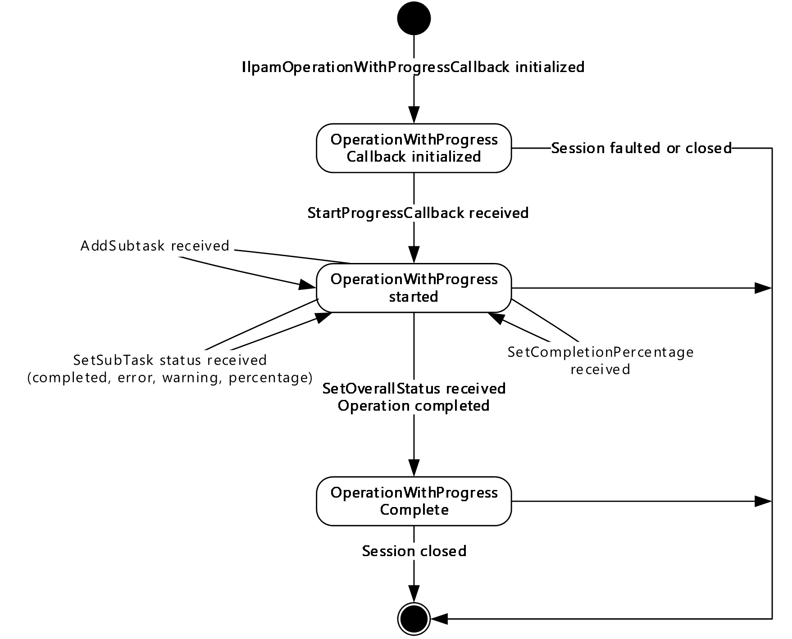

Figure 14: IIpamOperationWithProgressCallback state machine

The **IIpamOperationWithProgressCallback** server is session-based, sharing the same session the management client has with the management server using the **IIpamOperationWithProgress** port type. It is also stateful in nature. The session state variable is used to keep track of the current state for each session and it can have the following states as possible values. At any point of the session, if the session is known to be faulted or closed by the lower layer, the state machine ends.

| State | Description |
| --- | --- |
| **OperationWithProgress Callback initialized** | This is the initial state of the **IIpamOperationWithProgressCallback** when it has been initialized by the **IIpamOperationWithProgress** client. When the **StartProgressCallback** is received in this state from the **IIpamOperationWithProgress** server port on the management server-end of the session, the transition to the **OperationWithProgress started** state will happen. |
| **OperationWithProgress** **started** | This state indicates the **IIpamOperationWithProgressCallback** is ready to receive the task and subtask status. When the **AddSubTask** callback or **SetSubTaskStatus** callback or **SetCompletionPercentage** callback is received in this state from the **IIpamOperationWithProgress** server port on the management server-end of the session, the state will continue to be in **OperationWithProgress Started**. When the **SetOverallStatus** callback is received in this state from the **IIpamOperationWithProgress** server port on the management server-end of the session, the state will transition to **OperationWithProgress Completed**. |
| **OperationWithProgress** **completed** | This is the state to notify that the interaction between the **IIpamOperationWithProgress** server port on the management server-end and the **IIpamOperationWithProgressCallback** server port on the management client-end is complete and the overall status of the operation is available. |

#### 3.21.1.2 Other Miscellaneous States

The following states are maintained on a per-session basis:

**ProgressTracker:** This is a compound data consisting of the following three portions. This will have the complete information regarding the status, percentage completion and errors or warnings of all the subtask and the overall operation.

**SubTasksStatus:** This is a collection of **SubTaskInstance** objects that stores the status information of all subtasks.

**SubTaskInstance:** This is an **IpamObject** that stores the SubTask status, SubTask percentage completion and SubTask Failure or warning data.

**OverallProgressStatus:** This is an **IpamObject** that contains the overall operation status, overall percentage completion and the error or warning information.

### 3.21.2 Timers

There are no additional timers beyond the ones defined by the lower layer of the protocols.

### 3.21.3 Initialization

The **IIpamOperationWithProgressCallback** interface is initialized by the **IIpamOperationWithProgress** client on the management client-end. The **IIpamOperationWithProgress** client initializes the **ProgressTracker** local variable by ensuring that the subtask collection is empty and the overall status is initialized. The session state is set to **OperationWithProgress Callback Initialized**.

### 3.21.4 Message Processing Events and Sequencing Rules

#### 3.21.4.1 Session Faulted or Closed

The Session Faulted or Closed event is triggered by the lower transport layer when the session has received a [**SOAP fault**](#gt_soap-fault), or a forceful session close has occurred. If the session state is **OperationWithProgress Callback Initialized** or **OperationWithProgress Started**, the **ProgressTracker.OverallProgressStatus** has to be set to an appropriate reason associated with the session.

#### 3.21.4.2 AddSubTask

The **AddSubTask** operation is used by the management server to indicate addition of a subtask.

<wsdl:operation name="AddSubTask">

<wsdl:input wsaw:Action="http://Microsoft.Windows.Ipam/IIpamOperationWithProgressCallback/AddSubTask" message="ipam:IIpamOperationWithProgressCallback_AddSubTask_InputMessage" />

</wsdl:operation>

This operation has only the input message and there is no output message associated with it. Upon receiving the message, the **Progresstracker.SubTasksStatus** is updated by adding the received **SubTaskInstance** into the collection and initializing the status of the subtask.

##### 3.21.4.2.1 Messages

###### 3.21.4.2.1.1 IIpamOperationWithProgressCallback_AddSubTask_InputMessage

The **IIpamOperationWithProgressCallback_AddSubTask_InputMessage** message is the request for the **AddSubTask** operation.

<wsdl:message name="IIpamOperationWithProgressCallback_AddSubTask_InputMessage">

<wsdl:part name="parameters" element="ipam:AddSubTask" />

</wsdl:message>

This message MUST be sent with the following [**SOAP action**](#gt_soap-action).

http://Microsoft.Windows.Ipam/IIpamOperationWithProgressCallback/AddSubTask

The body of the [**SOAP message**](#gt_soap-message) MUST contain the **SubTaskInstance** element.

##### 3.21.4.2.2 Elements

###### 3.21.4.2.2.1 AddSubTask

The **AddSubTask** element specifies the input values for the **AddSubTask** operation.

<xs:element name="AddSubTask">

<xs:complexType>

<xs:sequence>

<xs:element minOccurs="0" name="subTaskInstance" nillable="true" type="ipam:SubTaskInstance" />

</xs:sequence>

</xs:complexType>

</xs:element>

#### 3.21.4.3 SetCompletionPercentage

The **SetCompletionPercentage** operation is used to provide the overall completion percentage data.

<wsdl:operation name="SetCompletionPercentage">

<wsdl:input wsaw:Action="http://Microsoft.Windows.Ipam/IIpamOperationWithProgressCallback/SetCompletionPercentage" message="ipam:IIpamOperationWithProgressCallback_SetCompletionPercentage_InputMessage" />

</wsdl:operation>

This operation has only the input message and there is no output message associated with it. Upon receiving the message, the **Progresstracker.OverallProgressStatus** is updated with the overall percentage completion from **SetCompletionPercentage.percentageCompletion**.

##### 3.21.4.3.1 Messages

###### 3.21.4.3.1.1 IIpamOperationWithProgressCallback_SetCompletionPercentage_InputMessage

The **IIpamOperationWithProgressCallback_SetCompletionPercentage_InputMessage** message is the request for the **SetCompletionPercentage** operation.

<wsdl:message name="IIpamOperationWithProgressCallback_SetCompletionPercentage_InputMessage">

<wsdl:part name="parameters" element="ipam:SetCompletionPercentage" />

</wsdl:message>

This message MUST be sent with the following SOAP action.

http://Microsoft.Windows.Ipam/IIpamOperationWithProgressCallback/SetCompletionPercentage

The body of the SOAP message MUST contain the **SetCompletionPercentage** element.

##### 3.21.4.3.2 Elements

###### 3.21.4.3.2.1 SetCompletionPercentage

The **SetCompletionPercentage** element specifies the input values for the **SetCompletionPercentage** operation.

<xs:element name="SetCompletionPercentage">

<xs:complexType>

<xs:sequence>

<xs:element minOccurs="0" name="completionPercentage" type="xsd:decimal" />

</xs:sequence>

</xs:complexType>

</xs:element>

#### 3.21.4.4 SetOverallStatus

The **SetOverallStatus** operation is used to provide the overall status of the operation.

<wsdl:operation name="SetOverallStatus">

<wsdl:input wsaw:Action="http://Microsoft.Windows.Ipam/IIpamOperationWithProgressCallback/SetOverallStatus" message="ipam:IIpamOperationWithProgressCallback_SetOverallStatus_InputMessage" />

</wsdl:operation>

This operation has only the input message and there is no output message associated with it. Upon receiving the message, the **Progresstracker.OverallProgressStatus** is updated with the overall progress status from **SetOverallStatus.OverallProgressStatus**, and any error or warning information is updated from **SetOverallStatus.CompletionStatus**.

##### 3.21.4.4.1 Messages

###### 3.21.4.4.1.1 IIpamOperationWithProgressCallback_SetOverallStatus_InputMessage

The **IIpamOperationWithProgressCallback_SetOverallStatus_InputMessage** message is the request for the **SetOverallStatus** operation.

<wsdl:message name="IIpamOperationWithProgressCallback_SetOverallStatus_InputMessage">

<wsdl:part name="parameters" element="ipam:SetOverallStatus" />

</wsdl:message>

This message MUST be sent with the following SOAP action.

http://Microsoft.Windows.Ipam/IIpamOperationWithProgressCallback/SetOverallStatus

The body of the SOAP message MUST contain the **SetOverallStatus** element.

##### 3.21.4.4.2 Elements

###### 3.21.4.4.2.1 SetOverallStatus

The **SetOverallStatus** element specifies the input values for the **SetOverallStatus** operation.

<xs:element name="SetOverallStatus">

<xs:complexType>

<xs:sequence>

<xs:element minOccurs="0" name="overallStatus" type="ipam1:OverallProgressStatus" />

<xs:element minOccurs="0" name="completionStatus" nillable="true" type="ipam:IpamObject" />

</xs:sequence>

</xs:complexType>

</xs:element>

#### 3.21.4.5 SetSubTaskStatus

The **SetSubTaskStatus** operation is used to provide the completion status and the percentage completion for a subtask.

<wsdl:operation name="SetSubTaskStatus">

<wsdl:input wsaw:Action="http://Microsoft.Windows.Ipam/IIpamOperationWithProgressCallback/SetSubTaskStatus" message="ipam:IIpamOperationWithProgressCallback_SetSubTaskStatus_InputMessage" />

</wsdl:operation>

This operation has only the input message and there is no output message associated with it. Upon receiving the message, the **SetSubTaskStatus.SubTaskInstance** is looked up in the local collection **ProgressTracker.SubTasksStatus**. The **Progresstracker.SubTasksStatus.SubTaskInstance** is then updated with the status, percent complete and the completion status indicated in the message.

##### 3.21.4.5.1 Messages

###### 3.21.4.5.1.1 IIpamOperationWithProgressCallback_SetSubTaskStatus_InputMessage

The **IIpamOperationWithProgressCallback_SetSubTaskStatus_InputMessage** message is the request for the **SetSubTaskStatus** operation.

<wsdl:message name="IIpamOperationWithProgressCallback_SetSubTaskStatus_InputMessage">

<wsdl:part name="parameters" element="ipam:SetSubTaskStatus" />

</wsdl:message>

This message MUST be sent with the following SOAP action.

http://Microsoft.Windows.Ipam/IIpamOperationWithProgressCallback/SetSubTaskStatus

The body of the SOAP message MUST contain the **SetSubTaskStatus** element.

##### 3.21.4.5.2 Elements

###### 3.21.4.5.2.1 SetSubTaskStatus

The **SetSubTaskStatus** element specifies the input values for the **SetSubTaskStatus** operation.

<xs:element name="SetSubTaskStatus">

<xs:complexType>

<xs:sequence>

<xs:element minOccurs="0" name="subTaskInstance" nillable="true" type="ipam:SubTaskInstance" />

<xs:element minOccurs="0" name="status" type="ipam:SubTaskStatus" />

<xs:element minOccurs="0" name="percentComplete" type="xsd:decimal" />

<xs:element minOccurs="0" name="completionStatus" nillable="true" type="ipam1:IpamException" />

</xs:sequence>

</xs:complexType>

</xs:element>

#### 3.21.4.6 StartProgressCallback

The **StartProgressCallback** operation is used to indicate the start of operation tracking.

<wsdl:operation name="StartProgressCallback">

<wsdl:input wsaw:Action="http://Microsoft.Windows.Ipam/IIpamOperationWithProgressCallback/StartProgressCallback" message="ipam:IIpamOperationWithProgressCallback_StartProgressCallback_InputMessage" />

</wsdl:operation>

This operation has only the input message and there is no output message associated with it. Upon receiving the message, initialize the **ProgressTracker** local variable by ensuring that the subtask collection is empty and the overall status is initialized. The session state is set to **OperationWithProgress Callback Initialized**.

##### 3.21.4.6.1 Messages

###### 3.21.4.6.1.1 IIpamOperationWithProgressCallback_StartProgressCallback_InputMessage

The **IIpamOperationWithProgressCallback_StartProgressCallback_InputMessage** message is the request for the **StartProgressCallback** operation.

<wsdl:message name="IIpamOperationWithProgressCallback_StartProgressCallback_InputMessage">

<wsdl:part name="parameters" element="ipam:StartProgressCallback" />

</wsdl:message>

This message MUST be sent with the following SOAP action.

http://Microsoft.Windows.Ipam/IIpamOperationWithProgressCallback/StartProgressCallback

The body of the SOAP message MUST contain the **StartProgresscallback** element.

##### 3.21.4.6.2 Elements

###### 3.21.4.6.2.1 StartProgressCallback

The **StartProgressCallback** element specifies the input values for the **StartProgressCallback** operation.

<xs:element name="StartProgressCallback">

<xs:complexType>

<xs:sequence>

<xs:element minOccurs="0" name="isNonDeterministic" type="xsd:boolean" />

</xs:sequence>

</xs:complexType>

</xs:element>

### 3.21.5 Timer Events

None.

### 3.21.6 Other Local Events

#### 3.21.6.1 User Authorization

Since the **IIpamOperationWithProgressCallback** server is initialized on the same session as the **IIpamOperationWithProgress** session, no additional user authentication and authorization is performed beyond what was done for the operations in the **IIpamOperationWithProgress** session.

## 3.22 IIpamOperationWithProgressCallback Client Details

The **IIpamOperationWithProgress** server is the endpoint that will also be the **IIpamOperationWithProgressCallback** client. The same session has the **IIpamOperationWithProgress** and the **IIpamOperationWithProgressCallback** implemented on either end. The management server will provide the **IIpamOperationWithProgress** server and the **IIpamOperationWithProgressCallback** client implementations and the management client will provide the **IIpamOperationWithProgressCallback** server and the **IIpamOperationWithProgress** client implementations. The **IIpamOperationWithProgressCallback** is only a request interface, which means that there is no data obtained from the **IIpamOperationWithProgressCallback** server.

### 3.22.1 Abstract Data Model

None.

### 3.22.2 Timers

None.

### 3.22.3 Initialization

None.

### 3.22.4 Message Processing Events and Sequencing Rules

None, other than those captured as a part of the **IIpamOperationWithProgress** server section [3.19](#Section_3.19).

### 3.22.5 Timer Events

None.

### 3.22.6 Other Local Events

None.

# 4 Protocol Examples

## 4.1 Querying the Common Property

The following is the SOAP request message that can be sent to query the **MinimumUtilizationThreshold** property.

<s:Envelope xmlns:a="http://www.w3.org/2005/08/addressing" xmlns:s="http://www.w3.org/2003/05/soap-envelope">

<s:Header>

<a:Action

s:mustUnderstand="1">http://Microsoft.Windows.Ipam/IIpamServer/GetCommonPropertyValue</a:Action>

<a:MessageID>urn:uuid:0438627c-633b-4536-846c-31d195c8d51e</a:MessageID>

<a:ReplyTo>

<a:Address>http://www.w3.org/2005/08/addressing/anonymous</a:Address>

</a:ReplyTo>

</s:Header>

<s:Body>

<GetCommonPropertyValue xmlns="http://Microsoft.Windows.Ipam">

<commonProperty>MinimumUtilizationThreshold</commonProperty>

</GetCommonPropertyValue>

</s:Body>

</s:Envelope>

The following is the SOAP response message for the above request.

<s:Envelope xmlns:s="http://www.w3.org/2003/05/soap-envelope" xmlns:a="http://www.w3.org/2005/08/addressing">

<s:Header>

<a:Action s:mustUnderstand="1">http://Microsoft.Windows.Ipam/IIpamServer/GetCommonPropertyValueResponse</a:Action>

<a:RelatesTo>urn:uuid:0438627c-633b-4536-846c-31d195c8d51e</a:RelatesTo>

<a:To s:mustUnderstand="1">http://www.w3.org/2005/08/addressing/anonymous</a:To>

</s:Header>

<s:Body>

<GetCommonPropertyValueResponse xmlns="http://Microsoft.Windows.Ipam">

<GetCommonPropertyValueResult>20</GetCommonPropertyValueResult>

</GetCommonPropertyValueResponse>

</s:Body></s:Envelope>

## 4.2 Creating an Address Range

The following request and response messages specify an example exchange for creating a static address range 192.168.1.0/24.

<s:Envelope xmlns:a="http://www.w3.org/2005/08/addressing" xmlns:s="http://www.w3.org/2003/05/soap-envelope">

<s:Header>

<a:Action s:mustUnderstand="1">http://Microsoft.Windows.Ipam/IIpamServer/SaveRange</a:Action>

<a:MessageID>urn:uuid:c5150214-3f8b-4814-bff1-f5c2cc78fd48</a:MessageID>

<a:ReplyTo>

<a:Address>http://www.w3.org/2005/08/addressing/anonymous</a:Address>

</a:ReplyTo>

</s:Header>

<s:Body>

<SaveRange xmlns="http://Microsoft.Windows.Ipam">

<range xmlns:i="http://www.w3.org/2001/XMLSchema-instance" z:Id="i1" i:type="IPv4Range" xmlns:z="http://schemas.microsoft.com/2003/10/Serialization/">

<ModifiedProperties xmlns:d5p1="http://schemas.microsoft.com/2003/10/Serialization/Arrays">

<d5p1:string>SubnetId</d5p1:string>

<d5p1:string>StartIPAddress</d5p1:string>

<d5p1:string>EndIPAddress</d5p1:string>

<d5p1:string>PrefixLength</d5p1:string>

<d5p1:string>UtilizationStatistics</d5p1:string>

</ModifiedProperties>

<SetProperties xmlns:d5p1="http://schemas.microsoft.com/2003/10/Serialization/Arrays">

<d5p1:string>SubnetId</d5p1:string>

<d5p1:string>StartIPAddress</d5p1:string>

<d5p1:string>EndIPAddress</d5p1:string>

<d5p1:string>PrefixLength</d5p1:string>

<d5p1:string>AddressAssignment</d5p1:string>

<d5p1:string>UtilizationCalculationType</d5p1:string>

<d5p1:string>LastAssignedDate</d5p1:string>

<d5p1:string>Owner</d5p1:string>

<d5p1:string>Description</d5p1:string>

<d5p1:string>UtilizationStatistics</d5p1:string>

<d5p1:string>VirtualizationType</d5p1:string>

<d5p1:string>AddressSpaceRecordId</d5p1:string>

</SetProperties>

<AccessScopeId>0</AccessScopeId>

<AddressAssignment>Static</AddressAssignment>

<AddressCategory>Private</AddressCategory>

<AddressSpaceRecordId>1</AddressSpaceRecordId>

<ConnectionSpecificDNSSuffix i:nil="true" />

<CustomFieldValues>

<CustomFieldValue z:Id="i2">

<ModifiedProperties xmlns:d7p1="http://schemas.microsoft.com/2003/10/Serialization/Arrays">

<d7p1:string>ParentCustomFieldRecordId</d7p1:string>

<d7p1:string>ParentCustomFieldName</d7p1:string>

<d7p1:string>ParentCustomFieldNumber</d7p1:string>

<d7p1:string>Value</d7p1:string>

</ModifiedProperties>

<SetProperties xmlns:d7p1="http://schemas.microsoft.com/2003/10/Serialization/Arrays">

<d7p1:string>ParentCustomFieldRecordId</d7p1:string>

<d7p1:string>ParentCustomFieldName</d7p1:string>

<d7p1:string>ParentCustomFieldNumber</d7p1:string>

<d7p1:string>Value</d7p1:string>

</SetProperties>

<BuiltInCustomFieldValueId>1</BuiltInCustomFieldValueId>

<ParentCustomFieldName>Managed by Service</ParentCustomFieldName>

<ParentCustomFieldNumber>8</ParentCustomFieldNumber>

<ParentCustomFieldRecordId>9</ParentCustomFieldRecordId>

<RecordId>328</RecordId>

<Value>IPAM</Value>

</CustomFieldValue>

<CustomFieldValue z:Id="i3">

<ModifiedProperties xmlns:d7p1="http://schemas.microsoft.com/2003/10/Serialization/Arrays">

<d7p1:string>ParentCustomFieldRecordId</d7p1:string>

<d7p1:string>ParentCustomFieldName</d7p1:string>

<d7p1:string>ParentCustomFieldNumber</d7p1:string>

<d7p1:string>Value</d7p1:string>

</ModifiedProperties>

<SetProperties xmlns:d7p1="http://schemas.microsoft.com/2003/10/Serialization/Arrays">

<d7p1:string>ParentCustomFieldRecordId</d7p1:string>

<d7p1:string>ParentCustomFieldName</d7p1:string>

<d7p1:string>ParentCustomFieldNumber</d7p1:string>

<d7p1:string>Value</d7p1:string>

</SetProperties>

<BuiltInCustomFieldValueId>1</BuiltInCustomFieldValueId>

<ParentCustomFieldName>Service Instance</ParentCustomFieldName>

<ParentCustomFieldNumber>9</ParentCustomFieldNumber>

<ParentCustomFieldRecordId>10</ParentCustomFieldRecordId>

<RecordId>333</RecordId>

<Value>Localhost</Value>

</CustomFieldValue>

</CustomFieldValues>

<CustomerAddressSpaceName i:nil="true" />

<DNSServers xmlns:d5p1="http://schemas.microsoft.com/2003/10/Serialization/Arrays" />

<DNSSuffixes xmlns:d5p1="http://schemas.microsoft.com/2003/10/Serialization/Arrays" />

<Description i:nil="true" />

<DhcpScopeName i:nil="true" />

<DhcpServerGuid i:nil="true" />

<DhcpServerName i:nil="true" />

<EndIPAddress xmlns:d5p1="http://schemas.datacontract.org/2004/07/System.Net">

<d5p1:m_Address>4261412874</d5p1:m_Address>

<d5p1:m_Family>InterNetwork</d5p1:m_Family>

<d5p1:m_HashCode>0</d5p1:m_HashCode>

<d5p1:m_Numbers xmlns:d6p1="http://schemas.microsoft.com/2003/10/Serialization/Arrays">

<d6p1:unsignedShort>0</d6p1:unsignedShort>

<d6p1:unsignedShort>0</d6p1:unsignedShort>

<d6p1:unsignedShort>0</d6p1:unsignedShort>

<d6p1:unsignedShort>0</d6p1:unsignedShort>

<d6p1:unsignedShort>0</d6p1:unsignedShort>

<d6p1:unsignedShort>0</d6p1:unsignedShort>

<d6p1:unsignedShort>0</d6p1:unsignedShort>

<d6p1:unsignedShort>0</d6p1:unsignedShort>

</d5p1:m_Numbers>

<d5p1:m_ScopeId>0</d5p1:m_ScopeId>

</EndIPAddress>

<ExclusionRanges />

<Gateways />

<IsInheritedAccessScope>true</IsInheritedAccessScope>

<IsOverlapping>false</IsOverlapping>

<LastAssignedDate i:nil="true" />

<LastChangeDate i:nil="true" />

<LastReclaimRuntime i:nil="true" />

<NumberOfChildAddresses>0</NumberOfChildAddresses>

<Owner i:nil="true" />

<ParentIPBlockRecordId i:nil="true" />

<PartialCustomFieldValues />

<PrefixLength>24</PrefixLength>

<ProviderAddressSpaceName i:nil="true" />

<RangeOverlapState>NotOverlapping</RangeOverlapState>

<RecordId i:nil="true" />

<ReservedIPRanges xmlns:d5p1="http://schemas.datacontract.org/2004/07/System" />

<ReservedIPs xmlns:d5p1="http://schemas.microsoft.com/2003/10/Serialization/Arrays" />

<ScopeRecordId i:nil="true" />

<StartIPAddress xmlns:d5p1="http://schemas.datacontract.org/2004/07/System.Net">

<d5p1:m_Address>16777226</d5p1:m_Address>

<d5p1:m_Family>InterNetwork</d5p1:m_Family>

<d5p1:m_HashCode>0</d5p1:m_HashCode>

<d5p1:m_Numbers xmlns:d6p1="http://schemas.microsoft.com/2003/10/Serialization/Arrays">

<d6p1:unsignedShort>0</d6p1:unsignedShort>

<d6p1:unsignedShort>0</d6p1:unsignedShort>

<d6p1:unsignedShort>0</d6p1:unsignedShort>

<d6p1:unsignedShort>0</d6p1:unsignedShort>

<d6p1:unsignedShort>0</d6p1:unsignedShort>

<d6p1:unsignedShort>0</d6p1:unsignedShort>

<d6p1:unsignedShort>0</d6p1:unsignedShort>

<d6p1:unsignedShort>0</d6p1:unsignedShort>

</d5p1:m_Numbers>

<d5p1:m_ScopeId>0</d5p1:m_ScopeId>

</StartIPAddress>

<SubnetId xmlns:d5p1="http://schemas.datacontract.org/2004/07/System.Net">

<d5p1:m_Address>10</d5p1:m_Address>

<d5p1:m_Family>InterNetwork</d5p1:m_Family>

<d5p1:m_HashCode>0</d5p1:m_HashCode>

<d5p1:m_Numbers xmlns:d6p1="http://schemas.microsoft.com/2003/10/Serialization/Arrays">

<d6p1:unsignedShort>0</d6p1:unsignedShort>

<d6p1:unsignedShort>0</d6p1:unsignedShort>

<d6p1:unsignedShort>0</d6p1:unsignedShort>

<d6p1:unsignedShort>0</d6p1:unsignedShort>

<d6p1:unsignedShort>0</d6p1:unsignedShort>

<d6p1:unsignedShort>0</d6p1:unsignedShort>

<d6p1:unsignedShort>0</d6p1:unsignedShort>

<d6p1:unsignedShort>0</d6p1:unsignedShort>

</d5p1:m_Numbers>

<d5p1:m_ScopeId>0</d5p1:m_ScopeId>

</SubnetId>

<SubnetMask xmlns:d5p1="http://schemas.datacontract.org/2004/07/System.Net">

<d5p1:m_Address>16777215</d5p1:m_Address>

<d5p1:m_Family>InterNetwork</d5p1:m_Family>

<d5p1:m_HashCode>0</d5p1:m_HashCode>

<d5p1:m_Numbers xmlns:d6p1="http://schemas.microsoft.com/2003/10/Serialization/Arrays">

<d6p1:unsignedShort>0</d6p1:unsignedShort>

<d6p1:unsignedShort>0</d6p1:unsignedShort>

<d6p1:unsignedShort>0</d6p1:unsignedShort>

<d6p1:unsignedShort>0</d6p1:unsignedShort>

<d6p1:unsignedShort>0</d6p1:unsignedShort>

<d6p1:unsignedShort>0</d6p1:unsignedShort>

<d6p1:unsignedShort>0</d6p1:unsignedShort>

<d6p1:unsignedShort>0</d6p1:unsignedShort>

</d5p1:m_Numbers>

<d5p1:m_ScopeId>0</d5p1:m_ScopeId>

</SubnetMask>

<UseForUtilization>true</UseForUtilization>

<UtilizationCalculationType>Auto</UtilizationCalculationType>

<UtilizationEventLogStatus>None</UtilizationEventLogStatus>

<UtilizationStatistics i:nil="true" />

<VIPRanges xmlns:d5p1="http://schemas.datacontract.org/2004/07/System" />

<VIPs xmlns:d5p1="http://schemas.microsoft.com/2003/10/Serialization/Arrays" />

<VirtualizationType>NonVirtualized</VirtualizationType>

<WINSServers xmlns:d5p1="http://schemas.microsoft.com/2003/10/Serialization/Arrays" />

</range>

<createSubnetIfDoesNotExist>true</createSubnetIfDoesNotExist>

</SaveRange>

</s:Body>

</s:Envelope>

The following is a sample response message for the previous request returning the record identifier of the newly created range instance.

<s:Envelope xmlns:s="http://www.w3.org/2003/05/soap-envelope" xmlns:a="http://www.w3.org/2005/08/addressing">

<s:Header>

<a:Action s:mustUnderstand="1">http://Microsoft.Windows.Ipam/IIpamServer/SaveRangeResponse</a:Action>

<a:RelatesTo>urn:uuid:c5150214-3f8b-4814-bff1-f5c2cc78fd48</a:RelatesTo>

<a:To s:mustUnderstand="1">http://www.w3.org/2005/08/addressing/anonymous</a:To>

</s:Header>

<s:Body>

<SaveRangeResponse xmlns="http://Microsoft.Windows.Ipam">

<SaveRangeResult>262165</SaveRangeResult>

</SaveRangeResponse>

</s:Body>

</s:Envelope>

## 4.3 Enumerating the Address Ranges

This section captures the enumeration sequence between the client and server for enumerating the address ranges.

The following is the SOAP message request for enumerating all the address ranges.

<s:Envelope xmlns:a="http://www.w3.org/2005/08/addressing" xmlns:s="http://www.w3.org/2003/05/soap-envelope">

<s:Header>

<a:Action s:mustUnderstand="1">http://Microsoft.Windows.Ipam/IIpamEnumerator/InitializeEnumeration</a:Action>

<a:MessageID>urn:uuid:cada78c6-1a4b-4c58-bf53-b153b893c46a</a:MessageID>

<a:ReplyTo>

<a:Address>http://www.w3.org/2005/08/addressing/anonymous</a:Address>

</a:ReplyTo>

</s:Header>

<s:Body>

<InitializeEnumeration xmlns="http://Microsoft.Windows.Ipam">

<parameters xmlns:i="http://www.w3.org/2001/XMLSchema-instance" i:type="IPRangeByAddressSpaceAndVirtualizationTypeParameters">

<FetchAllData>false</FetchAllData>

<IncludeCustomFieldValues>false</IncludeCustomFieldValues>

<ObjectType>IPRange</ObjectType>

<AddressFamily>InterNetwork</AddressFamily>

<AddressSpaceRecordID>1</AddressSpaceRecordID>

<VirtualizationType i:nil="true" />

</parameters>

</InitializeEnumeration>

</s:Body>

</s:Envelope>

The following is the SOAP response to the previous request denoting the successful processing of the request.

<s:Envelope xmlns:s="http://www.w3.org/2003/05/soap-envelope" xmlns:a="http://www.w3.org/2005/08/addressing">

<s:Header>

<a:Action s:mustUnderstand="1">http://Microsoft.Windows.Ipam/IIpamEnumerator/InitializeEnumerationResponse</a:Action>

<a:RelatesTo>urn:uuid:cada78c6-1a4b-4c58-bf53-b153b893c46a</a:RelatesTo>

<a:To s:mustUnderstand="1">http://www.w3.org/2005/08/addressing/anonymous</a:To>

</s:Header>

<s:Body>

<InitializeEnumerationResponse xmlns="http://Microsoft.Windows.Ipam"></InitializeEnumerationResponse>

</s:Body>

</s:Envelope>

The client sends the following message to start the enumeration.

<s:Envelope xmlns:a="http://www.w3.org/2005/08/addressing" xmlns:s="http://www.w3.org/2003/05/soap-envelope">

<s:Header>

<a:Action s:mustUnderstand="1">http://Microsoft.Windows.Ipam/IIpamEnumerator/StartEnumeration</a:Action>

</s:Header>

<s:Body>

<StartEnumeration xmlns="http://Microsoft.Windows.Ipam" />

</s:Body>

</s:Envelope>

The server sends the following message to denote the start of the enumeration.

<s:Envelope xmlns:s="http://www.w3.org/2003/05/soap-envelope" xmlns:a="http://www.w3.org/2005/08/addressing">

<s:Header>

<a:Action s:mustUnderstand="1">http://Microsoft.Windows.Ipam/IIpamEnumerator/NotifyEnumerationStart</a:Action>

<a:To s:mustUnderstand="1">http://www.w3.org/2005/08/addressing/anonymous</a:To>

</s:Header>

<s:Body>

<NotifyEnumerationStart xmlns="http://Microsoft.Windows.Ipam"></NotifyEnumerationStart>

</s:Body>

</s:Envelope>

The following is the EnumeratedRowsCallback message generated by the server to pass the requested data to the client.

<s:Envelope xmlns:s="http://www.w3.org/2003/05/soap-envelope" xmlns:a="http://www.w3.org/2005/08/addressing">

<s:Header>

<a:Action s:mustUnderstand="1">http://Microsoft.Windows.Ipam/IIpamEnumerator/EnumeratedRowsCallback</a:Action>

<a:To s:mustUnderstand="1">http://www.w3.org/2005/08/addressing/anonymous</a:To>

</s:Header>

<s:Body>

<EnumeratedRowsCallback xmlns="http://Microsoft.Windows.Ipam">

<data xmlns:i="http://www.w3.org/2001/XMLSchema-instance">

<IpamObject z:Id="i1" i:type="IPv4Range" xmlns:z="http://schemas.microsoft.com/2003/10/Serialization/">

<ModifiedProperties i:nil="true" xmlns:b="http://schemas.microsoft.com/2003/10/Serialization/Arrays"></ModifiedProperties>

<SetProperties i:nil="true" xmlns:b="http://schemas.microsoft.com/2003/10/Serialization/Arrays"></SetProperties>

<AccessScopeId>1</AccessScopeId>

<AddressAssignment>Dynamic</AddressAssignment>

<AddressCategory>Private</AddressCategory>

<AddressSpaceRecordId>1</AddressSpaceRecordId>

<ConnectionSpecificDNSSuffix i:nil="true"></ConnectionSpecificDNSSuffix>

<CustomFieldValues>

<CustomFieldValue z:Id="i2">

<ModifiedProperties xmlns:b="http://schemas.microsoft.com/2003/10/Serialization/Arrays">

<b:string>ParentCustomFieldRecordId</b:string>

<b:string>ParentCustomFieldName</b:string>

<b:string>ParentCustomFieldNumber</b:string>

<b:string>Value</b:string>

</ModifiedProperties>

<SetProperties xmlns:b="http://schemas.microsoft.com/2003/10/Serialization/Arrays">

<b:string>ParentCustomFieldRecordId</b:string>

<b:string>ParentCustomFieldName</b:string>

<b:string>ParentCustomFieldNumber</b:string>

<b:string>Value</b:string>

</SetProperties>

<BuiltInCustomFieldValueId>2</BuiltInCustomFieldValueId>

<ParentCustomFieldName>Managed by Service</ParentCustomFieldName>

<ParentCustomFieldNumber>8</ParentCustomFieldNumber>

<ParentCustomFieldRecordId>9</ParentCustomFieldRecordId>

<RecordId>329</RecordId>

<Value>MS DHCP</Value>

</CustomFieldValue>

<CustomFieldValue z:Id="i3">

<ModifiedProperties xmlns:b="http://schemas.microsoft.com/2003/10/Serialization/Arrays">

<b:string>ParentCustomFieldRecordId</b:string>

<b:string>ParentCustomFieldName</b:string>

<b:string>ParentCustomFieldNumber</b:string>

<b:string>Value</b:string>

</ModifiedProperties>

<SetProperties xmlns:b="http://schemas.microsoft.com/2003/10/Serialization/Arrays">

<b:string>ParentCustomFieldRecordId</b:string>

<b:string>ParentCustomFieldName</b:string>

<b:string>ParentCustomFieldNumber</b:string>

<b:string>Value</b:string>

</SetProperties>

<BuiltInCustomFieldValueId>0</BuiltInCustomFieldValueId>

<ParentCustomFieldName>Service Instance</ParentCustomFieldName>

<ParentCustomFieldNumber>9</ParentCustomFieldNumber>

<ParentCustomFieldRecordId>10</ParentCustomFieldRecordId>

<RecordId>441555</RecordId>

<Value>rguptsrvtest2.drguptsrvtest3.ipamtest.idc.local</Value>

</CustomFieldValue>

</CustomFieldValues>

<CustomerAddressSpaceName i:nil="true"></CustomerAddressSpaceName>

<DNSServers xmlns:b="http://schemas.microsoft.com/2003/10/Serialization/Arrays"></DNSServers>

<DNSSuffixes xmlns:b="http://schemas.microsoft.com/2003/10/Serialization/Arrays"></DNSSuffixes>

<Description></Description>

<DhcpScopeName>test</DhcpScopeName>

<DhcpServerGuid>4562f61c-b373-46de-af73-32fb8a58e893</DhcpServerGuid>

<DhcpServerName>rguptsrvtest2.drguptsrvtest3.ipamtest.idc.local</DhcpServerName>

<EndIPAddress xmlns:b="http://schemas.datacontract.org/2004/07/System.Net">

<b:m_Address>1677724170</b:m_Address>

<b:m_Family>InterNetwork</b:m_Family>

<b:m_HashCode>0</b:m_HashCode>

<b:m_Numbers xmlns:c="http://schemas.microsoft.com/2003/10/Serialization/Arrays">

<c:unsignedShort>0</c:unsignedShort>

<c:unsignedShort>0</c:unsignedShort>

<c:unsignedShort>0</c:unsignedShort>

<c:unsignedShort>0</c:unsignedShort>

<c:unsignedShort>0</c:unsignedShort>

<c:unsignedShort>0</c:unsignedShort>

<c:unsignedShort>0</c:unsignedShort>

<c:unsignedShort>0</c:unsignedShort>

</b:m_Numbers>

<b:m_ScopeId>0</b:m_ScopeId>

</EndIPAddress>

<ExclusionRanges></ExclusionRanges>

<Gateways></Gateways>

<IsInheritedAccessScope>true</IsInheritedAccessScope>

<IsOverlapping>false</IsOverlapping>

<LastAssignedDate i:nil="true"></LastAssignedDate>

<LastChangeDate>2013-06-06T10:21:03.6654624</LastChangeDate>

<LastReclaimRuntime i:nil="true"></LastReclaimRuntime>

<NumberOfChildAddresses>0</NumberOfChildAddresses>

<Owner i:nil="true"></Owner>

<ParentIPBlockRecordId>151126</ParentIPBlockRecordId>

<PartialCustomFieldValues>

<CustomFieldPartialValue>

<ParentCustomFieldId>9</ParentCustomFieldId>

<Value>MS DHCP</Value>

<ValueId>329</ValueId>

</CustomFieldPartialValue>

<CustomFieldPartialValue>

<ParentCustomFieldId>10</ParentCustomFieldId>

<Value>rguptsrvtest2.drguptsrvtest3.ipamtest.idc.local</Value>

<ValueId>441555</ValueId>

</CustomFieldPartialValue>

</PartialCustomFieldValues>

<PrefixLength>8</PrefixLength>

<ProviderAddressSpaceName>Default IP Address Space</ProviderAddressSpaceName>

<RangeOverlapState>NotOverlapping</RangeOverlapState>

<RecordId>262164</RecordId>

<ReservedIPRanges xmlns:b="http://schemas.datacontract.org/2004/07/System"></ReservedIPRanges>

<ReservedIPs xmlns:b="http://schemas.microsoft.com/2003/10/Serialization/Arrays"></ReservedIPs>

<ScopeRecordId>262142</ScopeRecordId>

<StartIPAddress xmlns:b="http://schemas.datacontract.org/2004/07/System.Net">

<b:m_Address>16779786</b:m_Address>

<b:m_Family>InterNetwork</b:m_Family>

<b:m_HashCode>0</b:m_HashCode>

<b:m_Numbers xmlns:c="http://schemas.microsoft.com/2003/10/Serialization/Arrays">

<c:unsignedShort>0</c:unsignedShort>

<c:unsignedShort>0</c:unsignedShort>

<c:unsignedShort>0</c:unsignedShort>

<c:unsignedShort>0</c:unsignedShort>

<c:unsignedShort>0</c:unsignedShort>

<c:unsignedShort>0</c:unsignedShort>

<c:unsignedShort>0</c:unsignedShort>

<c:unsignedShort>0</c:unsignedShort>

</b:m_Numbers>

<b:m_ScopeId>0</b:m_ScopeId>

</StartIPAddress>

<SubnetId xmlns:b="http://schemas.datacontract.org/2004/07/System.Net">

<b:m_Address>10</b:m_Address>

<b:m_Family>InterNetwork</b:m_Family>

<b:m_HashCode>0</b:m_HashCode>

<b:m_Numbers xmlns:c="http://schemas.microsoft.com/2003/10/Serialization/Arrays">

<c:unsignedShort>0</c:unsignedShort>

<c:unsignedShort>0</c:unsignedShort>

<c:unsignedShort>0</c:unsignedShort>

<c:unsignedShort>0</c:unsignedShort>

<c:unsignedShort>0</c:unsignedShort>

<c:unsignedShort>0</c:unsignedShort>

<c:unsignedShort>0</c:unsignedShort>

<c:unsignedShort>0</c:unsignedShort>

</b:m_Numbers>

<b:m_ScopeId>0</b:m_ScopeId>

</SubnetId>

<SubnetMask xmlns:b="http://schemas.datacontract.org/2004/07/System.Net">

<b:m_Address>255</b:m_Address>

<b:m_Family>InterNetwork</b:m_Family>

<b:m_HashCode>0</b:m_HashCode>

<b:m_Numbers xmlns:c="http://schemas.microsoft.com/2003/10/Serialization/Arrays">

<c:unsignedShort>0</c:unsignedShort>

<c:unsignedShort>0</c:unsignedShort>

<c:unsignedShort>0</c:unsignedShort>

<c:unsignedShort>0</c:unsignedShort>

<c:unsignedShort>0</c:unsignedShort>

<c:unsignedShort>0</c:unsignedShort>

<c:unsignedShort>0</c:unsignedShort>

<c:unsignedShort>0</c:unsignedShort>

</b:m_Numbers>

<b:m_ScopeId>0</b:m_ScopeId>

</SubnetMask>

<UseForUtilization>true</UseForUtilization>

<UtilizationCalculationType>Auto</UtilizationCalculationType>

<UtilizationEventLogStatus>Under</UtilizationEventLogStatus>

<UtilizationStatistics z:Id="i4" i:type="IPv4Utilization">

<EndTime i:nil="true"></EndTime>

<IsValid>true</IsValid>

<StartTime i:nil="true"></StartTime>

<TotalAssignedAddresses>100</TotalAssignedAddresses>

<TotalAvailableAddresses>100</TotalAvailableAddresses>

<TotalUtilizedAddresses>0</TotalUtilizedAddresses>

</UtilizationStatistics>

<VIPRanges xmlns:b="http://schemas.datacontract.org/2004/07/System"></VIPRanges>

<VIPs xmlns:b="http://schemas.microsoft.com/2003/10/Serialization/Arrays"></VIPs>

<VirtualizationType>NonVirtualized</VirtualizationType>

<WINSServers xmlns:b="http://schemas.microsoft.com/2003/10/Serialization/Arrays"></WINSServers>

</IpamObject>

</data>

</EnumeratedRowsCallback>

</s:Body>

</s:Envelope>

The following is the enumeration completion notification by the server to the client.

<s:Envelope xmlns:s="http://www.w3.org/2003/05/soap-envelope" xmlns:a="http://www.w3.org/2005/08/addressing">

<s:Header>

<a:Action s:mustUnderstand="1">http://Microsoft.Windows.Ipam/IIpamEnumerator/NotifyEnumerationComplete</a:Action>

<a:To s:mustUnderstand="1">http://www.w3.org/2005/08/addressing/anonymous</a:To>

</s:Header>

<s:Body>

<NotifyEnumerationComplete xmlns="http://Microsoft.Windows.Ipam">

<result i:nil="true" xmlns:i="http://www.w3.org/2001/XMLSchema-instance"></result>

<exception i:nil="true" xmlns:i="http://www.w3.org/2001/XMLSchema-instance"></exception>

</NotifyEnumerationComplete>

</s:Body>

</s:Envelope>

# 5 Security

## 5.1 Security Considerations for Implementers

This security protocol does not introduce any additional security considerations beyond those that apply to its underlying protocol.

## 5.2 Index of Security Parameters

| Security parameter | Section |
| --- | --- |
| Authentication and Encryption Mechanism | section [2.1](#Section_2.1) |

# 6 Appendix A: Full WSDL

For ease of implementation, the full WSDL and schema are provided in this appendix.

<?xml version="1.0" encoding="utf-8"?>

<wsdl:definitions targetNamespace="http://Microsoft.Windows.Ipam" xmlns:msc="http://schemas.microsoft.com/ws/2005/12/wsdl/contract" xmlns:xsd="http://www.w3.org/2001/XMLSchema" xmlns:ipam="http://Microsoft.Windows.Ipam" xmlns:soap="http://schemas.xmlsoap.org/wsdl/soap/" xmlns:wsaw="http://www.w3.org/2006/05/addressing/wsdl" xmlns:wsdl="http://schemas.xmlsoap.org/wsdl/">

<wsdl:types>

<xsd:schema targetNamespace="http://Microsoft.Windows.Ipam/Imports">

<xsd:import namespace="http://Microsoft.Windows.Ipam" />

<xsd:import namespace="http://schemas.microsoft.com/2003/10/Serialization/" />

<xsd:import namespace="http://schemas.microsoft.com/2003/10/Serialization/Arrays" />

<xsd:import namespace="http://schemas.datacontract.org/2004/07/System.Net" />

<xsd:import namespace="http://schemas.datacontract.org/2004/07/System.Net.Sockets" />

<xsd:import namespace="http://schemas.datacontract.org/2004/07/System.Collections.Generic" />

<xsd:import namespace="http://schemas.datacontract.org/2004/07/System" />

<xsd:import namespace="http://schemas.datacontract.org/2004/07/Microsoft.Windows.Ipam" />

</xsd:schema>

</wsdl:types>

<wsdl:binding name="DefaultBinding_IIpamAsyncProvision" type="ipam:IIpamAsyncProvision">

<soap:binding transport="http://schemas.xmlsoap.org/soap/http" />

<wsdl:operation name="InitializeAsyncProvisioning">

<soap:operation soapAction="http://Microsoft.Windows.Ipam/IIpamAsyncProvision/InitializeAsyncProvisioning" style="document" />

<wsdl:input>

<soap:body use="literal" />

</wsdl:input>

<wsdl:output>

<soap:body use="literal" />

</wsdl:output>

</wsdl:operation>

<wsdl:operation name="StartAsyncProvisioning">

<soap:operation soapAction="http://Microsoft.Windows.Ipam/IIpamAsyncProvision/StartAsyncProvisioning" style="document" />

<wsdl:input>

<soap:body use="literal" />

</wsdl:input>

</wsdl:operation>

<wsdl:operation name="NotifyAsyncProvisionStart">

<soap:operation soapAction="http://Microsoft.Windows.Ipam/IIpamAsyncProvision/NotifyAsyncProvisionStart" style="document" />

<wsdl:output>

<soap:body use="literal" />

</wsdl:output>

</wsdl:operation>

<wsdl:operation name="NotifyAsyncProvisionCheckpoint">

<soap:operation soapAction="http://Microsoft.Windows.Ipam/IIpamAsyncProvision/NotifyAsyncProvisionCheckpoint" style="document" />

<wsdl:output>

<soap:body use="literal" />

</wsdl:output>

</wsdl:operation>

<wsdl:operation name="NotifyAsyncProvisionComplete">

<soap:operation soapAction="http://Microsoft.Windows.Ipam/IIpamAsyncProvision/NotifyAsyncProvisionComplete" style="document" />

<wsdl:output>

<soap:body use="literal" />

</wsdl:output>

</wsdl:operation>

</wsdl:binding>

<wsdl:binding name="DefaultBinding_IIpamAsyncProvisionCallback" type="ipam:IIpamAsyncProvisionCallback">

<soap:binding transport="http://schemas.xmlsoap.org/soap/http" />

<wsdl:operation name="NotifyAsyncProvisionStart">

<soap:operation soapAction="http://Microsoft.Windows.Ipam/IIpamAsyncProvisionCallback/NotifyAsyncProvisionStart" style="document" />

<wsdl:input>

<soap:body use="literal" />

</wsdl:input>

</wsdl:operation>

<wsdl:operation name="NotifyAsyncProvisionCheckpoint">

<soap:operation soapAction="http://Microsoft.Windows.Ipam/IIpamAsyncProvisionCallback/NotifyAsyncProvisionCheckpoint" style="document" />

<wsdl:input>

<soap:body use="literal" />

</wsdl:input>

</wsdl:operation>

<wsdl:operation name="NotifyAsyncProvisionComplete">

<soap:operation soapAction="http://Microsoft.Windows.Ipam/IIpamAsyncProvisionCallback/NotifyAsyncProvisionComplete" style="document" />

<wsdl:input>

<soap:body use="literal" />

</wsdl:input>

</wsdl:operation>

</wsdl:binding>

<wsdl:binding name="DefaultBinding_IIpamAsyncSchemaCallback" type="ipam:IIpamAsyncSchemaCallback">

<soap:binding transport="http://schemas.xmlsoap.org/soap/http" />

<wsdl:operation name="NotifyAsyncSchemaConversionStart">

<soap:operation soapAction="http://Microsoft.Windows.Ipam/IIpamAsyncSchemaCallback/NotifyAsyncSchemaConversionStart" style="document" />

<wsdl:input>

<soap:body use="literal" />

</wsdl:input>

</wsdl:operation>

<wsdl:operation name="NotifyAsyncSchemaConversionCheckpoint">

<soap:operation soapAction="http://Microsoft.Windows.Ipam/IIpamAsyncSchemaCallback/NotifyAsyncSchemaConversionCheckpoint" style="document" />

<wsdl:input>

<soap:body use="literal" />

</wsdl:input>

</wsdl:operation>

<wsdl:operation name="NotifyAsyncSchemaConversionComplete">

<soap:operation soapAction="http://Microsoft.Windows.Ipam/IIpamAsyncSchemaCallback/NotifyAsyncSchemaConversionComplete" style="document" />

<wsdl:input>

<soap:body use="literal" />

</wsdl:input>

</wsdl:operation>

</wsdl:binding>

<wsdl:binding name="DefaultBinding_IIpamAsyncSchemaConversion" type="ipam:IIpamAsyncSchemaConversion">

<soap:binding transport="http://schemas.xmlsoap.org/soap/http" />

<wsdl:operation name="InitializeAsyncSchemaConversion">

<soap:operation soapAction="http://Microsoft.Windows.Ipam/IIpamAsyncSchemaConversion/InitializeAsyncSchemaConversion" style="document" />

<wsdl:input>

<soap:body use="literal" />

</wsdl:input>

<wsdl:output>

<soap:body use="literal" />

</wsdl:output>

</wsdl:operation>

<wsdl:operation name="StartAsyncSchemaConversion">

<soap:operation soapAction="http://Microsoft.Windows.Ipam/IIpamAsyncSchemaConversion/StartAsyncSchemaConversion" style="document" />

<wsdl:input>

<soap:body use="literal" />

</wsdl:input>

</wsdl:operation>

<wsdl:operation name="NotifyAsyncSchemaConversionStart">

<soap:operation soapAction="http://Microsoft.Windows.Ipam/IIpamAsyncSchemaConversion/NotifyAsyncSchemaConversionStart" style="document" />

<wsdl:output>

<soap:body use="literal" />

</wsdl:output>

</wsdl:operation>

<wsdl:operation name="NotifyAsyncSchemaConversionCheckpoint">

<soap:operation soapAction="http://Microsoft.Windows.Ipam/IIpamAsyncSchemaConversion/NotifyAsyncSchemaConversionCheckpoint" style="document" />

<wsdl:output>

<soap:body use="literal" />

</wsdl:output>

</wsdl:operation>

<wsdl:operation name="NotifyAsyncSchemaConversionComplete">

<soap:operation soapAction="http://Microsoft.Windows.Ipam/IIpamAsyncSchemaConversion/NotifyAsyncSchemaConversionComplete" style="document" />

<wsdl:output>

<soap:body use="literal" />

</wsdl:output>

</wsdl:operation>

</wsdl:binding>

<wsdl:binding name="DefaultBinding_IIpamEnumerator" type="ipam:IIpamEnumerator">

<soap:binding transport="http://schemas.xmlsoap.org/soap/http" />

<wsdl:operation name="InitializeEnumeration">

<soap:operation soapAction="http://Microsoft.Windows.Ipam/IIpamEnumerator/InitializeEnumeration" style="document" />

<wsdl:input>

<soap:body use="literal" />

</wsdl:input>

<wsdl:output>

<soap:body use="literal" />

</wsdl:output>

</wsdl:operation>

<wsdl:operation name="InitializeEnumerationWithModule">

<soap:operation soapAction="http://Microsoft.Windows.Ipam/IIpamEnumerator/InitializeEnumerationWithModule" style="document" />

<wsdl:input>

<soap:body use="literal" />

</wsdl:input>

<wsdl:output>

<soap:body use="literal" />

</wsdl:output>

</wsdl:operation>

<wsdl:operation name="StartEnumeration">

<soap:operation soapAction="http://Microsoft.Windows.Ipam/IIpamEnumerator/StartEnumeration" style="document" />

<wsdl:input>

<soap:body use="literal" />

</wsdl:input>

</wsdl:operation>

<wsdl:operation name="NotifyEnumerationStart">

<soap:operation soapAction="http://Microsoft.Windows.Ipam/IIpamEnumerator/NotifyEnumerationStart" style="document" />

<wsdl:output>

<soap:body use="literal" />

</wsdl:output>

</wsdl:operation>

<wsdl:operation name="EnumeratedRowsCallback">

<soap:operation soapAction="http://Microsoft.Windows.Ipam/IIpamEnumerator/EnumeratedRowsCallback" style="document" />

<wsdl:output>

<soap:body use="literal" />

</wsdl:output>

</wsdl:operation>

<wsdl:operation name="NotifyEnumerationComplete">

<soap:operation soapAction="http://Microsoft.Windows.Ipam/IIpamEnumerator/NotifyEnumerationComplete" style="document" />

<wsdl:output>

<soap:body use="literal" />

</wsdl:output>

</wsdl:operation>

</wsdl:binding>

<wsdl:binding name="DefaultBinding_IIpamEnumeratorCallback" type="ipam:IIpamEnumeratorCallback">

<soap:binding transport="http://schemas.xmlsoap.org/soap/http" />

<wsdl:operation name="NotifyEnumerationStart">

<soap:operation soapAction="http://Microsoft.Windows.Ipam/IIpamEnumeratorCallback/NotifyEnumerationStart" style="document" />

<wsdl:input>

<soap:body use="literal" />

</wsdl:input>

</wsdl:operation>

<wsdl:operation name="EnumeratedRowsCallback">

<soap:operation soapAction="http://Microsoft.Windows.Ipam/IIpamEnumeratorCallback/EnumeratedRowsCallback" style="document" />

<wsdl:input>

<soap:body use="literal" />

</wsdl:input>

</wsdl:operation>

<wsdl:operation name="NotifyEnumerationComplete">

<soap:operation soapAction="http://Microsoft.Windows.Ipam/IIpamEnumeratorCallback/NotifyEnumerationComplete" style="document" />

<wsdl:input>

<soap:body use="literal" />

</wsdl:input>

</wsdl:operation>

</wsdl:binding>

<wsdl:binding name="DefaultBinding_IIpamIPAuditEnumerator" type="ipam:IIpamIPAuditEnumerator">

<soap:binding transport="http://schemas.xmlsoap.org/soap/http" />

<wsdl:operation name="IPAuditInitializeEnumeration">

<soap:operation soapAction="http://Microsoft.Windows.Ipam/IIpamIPAuditEnumerator/IPAuditInitializeEnumeration" style="document" />

<wsdl:input>

<soap:body use="literal" />

</wsdl:input>

<wsdl:output>

<soap:body use="literal" />

</wsdl:output>

</wsdl:operation>

<wsdl:operation name="IPAuditStartEnumeration">

<soap:operation soapAction="http://Microsoft.Windows.Ipam/IIpamIPAuditEnumerator/IPAuditStartEnumeration" style="document" />

<wsdl:input>

<soap:body use="literal" />

</wsdl:input>

</wsdl:operation>

<wsdl:operation name="NotifyEnumerationStart">

<soap:operation soapAction="http://Microsoft.Windows.Ipam/IIpamIPAuditEnumerator/NotifyEnumerationStart" style="document" />

<wsdl:output>

<soap:body use="literal" />

</wsdl:output>

</wsdl:operation>

<wsdl:operation name="EnumeratedRowsCallback">

<soap:operation soapAction="http://Microsoft.Windows.Ipam/IIpamIPAuditEnumerator/EnumeratedRowsCallback" style="document" />

<wsdl:output>

<soap:body use="literal" />

</wsdl:output>

</wsdl:operation>

<wsdl:operation name="NotifyEnumerationComplete">

<soap:operation soapAction="http://Microsoft.Windows.Ipam/IIpamIPAuditEnumerator/NotifyEnumerationComplete" style="document" />

<wsdl:output>

<soap:body use="literal" />

</wsdl:output>

</wsdl:operation>

</wsdl:binding>

<wsdl:binding name="DefaultBinding_IIpamOperationWithProgress" type="ipam:IIpamOperationWithProgress">

<soap:binding transport="http://schemas.xmlsoap.org/soap/http" />

<wsdl:operation name="InitializeOperationParameters">

<soap:operation soapAction="http://Microsoft.Windows.Ipam/IIpamOperationWithProgress/InitializeOperationParameters" style="document" />

<wsdl:input>

<soap:body use="literal" />

</wsdl:input>

<wsdl:output>

<soap:body use="literal" />

</wsdl:output>

</wsdl:operation>

<wsdl:operation name="StartOperationWithCallback">

<soap:operation soapAction="http://Microsoft.Windows.Ipam/IIpamOperationWithProgress/StartOperationWithCallback" style="document" />

<wsdl:input>

<soap:body use="literal" />

</wsdl:input>

<wsdl:output>

<soap:body use="literal" />

</wsdl:output>

</wsdl:operation>

<wsdl:operation name="StartProgressCallback">

<soap:operation soapAction="http://Microsoft.Windows.Ipam/IIpamOperationWithProgress/StartProgressCallback" style="document" />

<wsdl:output>

<soap:body use="literal" />

</wsdl:output>

</wsdl:operation>

<wsdl:operation name="SetCompletionPercentage">

<soap:operation soapAction="http://Microsoft.Windows.Ipam/IIpamOperationWithProgress/SetCompletionPercentage" style="document" />

<wsdl:output>

<soap:body use="literal" />

</wsdl:output>

</wsdl:operation>

<wsdl:operation name="SetSubTaskStatus">

<soap:operation soapAction="http://Microsoft.Windows.Ipam/IIpamOperationWithProgress/SetSubTaskStatus" style="document" />

<wsdl:output>

<soap:body use="literal" />

</wsdl:output>

</wsdl:operation>

<wsdl:operation name="SetOverallStatus">

<soap:operation soapAction="http://Microsoft.Windows.Ipam/IIpamOperationWithProgress/SetOverallStatus" style="document" />

<wsdl:output>

<soap:body use="literal" />

</wsdl:output>

</wsdl:operation>

<wsdl:operation name="AddSubTask">

<soap:operation soapAction="http://Microsoft.Windows.Ipam/IIpamOperationWithProgress/AddSubTask" style="document" />

<wsdl:output>

<soap:body use="literal" />

</wsdl:output>

</wsdl:operation>

</wsdl:binding>

<wsdl:binding name="DefaultBinding_IIpamOperationWithProgressCallback" type="ipam:IIpamOperationWithProgressCallback">

<soap:binding transport="http://schemas.xmlsoap.org/soap/http" />

<wsdl:operation name="StartProgressCallback">

<soap:operation soapAction="http://Microsoft.Windows.Ipam/IIpamOperationWithProgressCallback/StartProgressCallback" style="document" />

<wsdl:input>

<soap:body use="literal" />

</wsdl:input>

</wsdl:operation>

<wsdl:operation name="SetCompletionPercentage">

<soap:operation soapAction="http://Microsoft.Windows.Ipam/IIpamOperationWithProgressCallback/SetCompletionPercentage" style="document" />

<wsdl:input>

<soap:body use="literal" />

</wsdl:input>

</wsdl:operation>

<wsdl:operation name="SetSubTaskStatus">

<soap:operation soapAction="http://Microsoft.Windows.Ipam/IIpamOperationWithProgressCallback/SetSubTaskStatus" style="document" />

<wsdl:input>

<soap:body use="literal" />

</wsdl:input>

</wsdl:operation>

<wsdl:operation name="SetOverallStatus">

<soap:operation soapAction="http://Microsoft.Windows.Ipam/IIpamOperationWithProgressCallback/SetOverallStatus" style="document" />

<wsdl:input>

<soap:body use="literal" />

</wsdl:input>

</wsdl:operation>

<wsdl:operation name="AddSubTask">

<soap:operation soapAction="http://Microsoft.Windows.Ipam/IIpamOperationWithProgressCallback/AddSubTask" style="document" />

<wsdl:input>

<soap:body use="literal" />

</wsdl:input>

</wsdl:operation>

</wsdl:binding>

<wsdl:binding name="DefaultBinding_IIpamServer" type="ipam:IIpamServer">

<soap:binding transport="http://schemas.xmlsoap.org/soap/http" />

<wsdl:operation name="GetPolicyConditionFromDB">

<soap:operation soapAction="http://Microsoft.Windows.Ipam/IIpamServer/GetPolicyConditionFromDB" style="document" />

<wsdl:input>

<soap:body use="literal" />

</wsdl:input>

<wsdl:output>

<soap:body use="literal" />

</wsdl:output>

</wsdl:operation>

<wsdl:operation name="GetPolicyRangesFromDB">

<soap:operation soapAction="http://Microsoft.Windows.Ipam/IIpamServer/GetPolicyRangesFromDB" style="document" />

<wsdl:input>

<soap:body use="literal" />

</wsdl:input>

<wsdl:output>

<soap:body use="literal" />

</wsdl:output>

</wsdl:operation>

<wsdl:operation name="GetPolicyOptionsFromDB">

<soap:operation soapAction="http://Microsoft.Windows.Ipam/IIpamServer/GetPolicyOptionsFromDB" style="document" />

<wsdl:input>

<soap:body use="literal" />

</wsdl:input>

<wsdl:output>

<soap:body use="literal" />

</wsdl:output>

</wsdl:operation>

<wsdl:operation name="GetScopesForSuperscope">

<soap:operation soapAction="http://Microsoft.Windows.Ipam/IIpamServer/GetScopesForSuperscope" style="document" />

<wsdl:input>

<soap:body use="literal" />

</wsdl:input>

<wsdl:output>

<soap:body use="literal" />

</wsdl:output>

</wsdl:operation>

<wsdl:operation name="GetFilters">

<soap:operation soapAction="http://Microsoft.Windows.Ipam/IIpamServer/GetFilters" style="document" />

<wsdl:input>

<soap:body use="literal" />

</wsdl:input>

<wsdl:output>

<soap:body use="literal" />

</wsdl:output>

</wsdl:operation>

<wsdl:operation name="GetSuperscopes">

<soap:operation soapAction="http://Microsoft.Windows.Ipam/IIpamServer/GetSuperscopes" style="document" />

<wsdl:input>

<soap:body use="literal" />

</wsdl:input>

<wsdl:output>

<soap:body use="literal" />

</wsdl:output>

</wsdl:operation>

<wsdl:operation name="PurgeAuditData">

<soap:operation soapAction="http://Microsoft.Windows.Ipam/IIpamServer/PurgeAuditData" style="document" />

<wsdl:input>

<soap:body use="literal" />

</wsdl:input>

<wsdl:output>

<soap:body use="literal" />

</wsdl:output>

</wsdl:operation>

<wsdl:operation name="IsPurgeTaskRunning">

<soap:operation soapAction="http://Microsoft.Windows.Ipam/IIpamServer/IsPurgeTaskRunning" style="document" />

<wsdl:input>

<soap:body use="literal" />

</wsdl:input>

<wsdl:output>

<soap:body use="literal" />

</wsdl:output>

</wsdl:operation>

<wsdl:operation name="IsIpamConfigured">

<soap:operation soapAction="http://Microsoft.Windows.Ipam/IIpamServer/IsIpamConfigured" style="document" />

<wsdl:input>

<soap:body use="literal" />

</wsdl:input>

<wsdl:output>

<soap:body use="literal" />

</wsdl:output>

</wsdl:operation>

<wsdl:operation name="GetIpamVersion">

<soap:operation soapAction="http://Microsoft.Windows.Ipam/IIpamServer/GetIpamVersion" style="document" />

<wsdl:input>

<soap:body use="literal" />

</wsdl:input>

<wsdl:output>

<soap:body use="literal" />

</wsdl:output>

</wsdl:operation>

<wsdl:operation name="IsSchemaConversionRequired">

<soap:operation soapAction="http://Microsoft.Windows.Ipam/IIpamServer/IsSchemaConversionRequired" style="document" />

<wsdl:input>

<soap:body use="literal" />

</wsdl:input>

<wsdl:output>

<soap:body use="literal" />

</wsdl:output>

</wsdl:operation>

<wsdl:operation name="IsSchemaConversionInProgress">

<soap:operation soapAction="http://Microsoft.Windows.Ipam/IIpamServer/IsSchemaConversionInProgress" style="document" />

<wsdl:input>

<soap:body use="literal" />

</wsdl:input>

<wsdl:output>

<soap:body use="literal" />

</wsdl:output>

</wsdl:operation>

<wsdl:operation name="GetSchemaConversionInfo">

<soap:operation soapAction="http://Microsoft.Windows.Ipam/IIpamServer/GetSchemaConversionInfo" style="document" />

<wsdl:input>

<soap:body use="literal" />

</wsdl:input>

<wsdl:output>

<soap:body use="literal" />

</wsdl:output>

</wsdl:operation>

<wsdl:operation name="ValidateIfUpgradeIsPossible">

<soap:operation soapAction="http://Microsoft.Windows.Ipam/IIpamServer/ValidateIfUpgradeIsPossible" style="document" />

<wsdl:input>

<soap:body use="literal" />

</wsdl:input>

<wsdl:output>

<soap:body use="literal" />

</wsdl:output>

</wsdl:operation>

<wsdl:operation name="GenerateUpgradeValidationFailureLog">

<soap:operation soapAction="http://Microsoft.Windows.Ipam/IIpamServer/GenerateUpgradeValidationFailureLog" style="document" />

<wsdl:input>

<soap:body use="literal" />

</wsdl:input>

<wsdl:output>

<soap:body use="literal" />

</wsdl:output>

</wsdl:operation>

<wsdl:operation name="DoProvisioningWithEnumerator">

<soap:operation soapAction="http://Microsoft.Windows.Ipam/IIpamServer/DoProvisioningWithEnumerator" style="document" />

<wsdl:input>

<soap:body use="literal" />

</wsdl:input>

<wsdl:output>

<soap:body use="literal" />

</wsdl:output>

</wsdl:operation>

<wsdl:operation name="CreateUserRole">

<soap:operation soapAction="http://Microsoft.Windows.Ipam/IIpamServer/CreateUserRole" style="document" />

<wsdl:input>

<soap:body use="literal" />

</wsdl:input>

<wsdl:output>

<soap:body use="literal" />

</wsdl:output>

</wsdl:operation>

<wsdl:operation name="UpdateUserRole">

<soap:operation soapAction="http://Microsoft.Windows.Ipam/IIpamServer/UpdateUserRole" style="document" />

<wsdl:input>

<soap:body use="literal" />

</wsdl:input>

<wsdl:output>

<soap:body use="literal" />

</wsdl:output>

</wsdl:operation>

<wsdl:operation name="DeleteUserRole">

<soap:operation soapAction="http://Microsoft.Windows.Ipam/IIpamServer/DeleteUserRole" style="document" />

<wsdl:input>

<soap:body use="literal" />

</wsdl:input>

<wsdl:output>

<soap:body use="literal" />

</wsdl:output>

</wsdl:operation>

<wsdl:operation name="GetUserRole">

<soap:operation soapAction="http://Microsoft.Windows.Ipam/IIpamServer/GetUserRole" style="document" />

<wsdl:input>

<soap:body use="literal" />

</wsdl:input>

<wsdl:output>

<soap:body use="literal" />

</wsdl:output>

</wsdl:operation>

<wsdl:operation name="GetAccessScope">

<soap:operation soapAction="http://Microsoft.Windows.Ipam/IIpamServer/GetAccessScope" style="document" />

<wsdl:input>

<soap:body use="literal" />

</wsdl:input>

<wsdl:output>

<soap:body use="literal" />

</wsdl:output>

</wsdl:operation>

<wsdl:operation name="CreateAccessScope">

<soap:operation soapAction="http://Microsoft.Windows.Ipam/IIpamServer/CreateAccessScope" style="document" />

<wsdl:input>

<soap:body use="literal" />

</wsdl:input>

<wsdl:output>

<soap:body use="literal" />

</wsdl:output>

</wsdl:operation>

<wsdl:operation name="UpdateAccessScope">

<soap:operation soapAction="http://Microsoft.Windows.Ipam/IIpamServer/UpdateAccessScope" style="document" />

<wsdl:input>

<soap:body use="literal" />

</wsdl:input>

<wsdl:output>

<soap:body use="literal" />

</wsdl:output>

</wsdl:operation>

<wsdl:operation name="DeleteAccessScope">

<soap:operation soapAction="http://Microsoft.Windows.Ipam/IIpamServer/DeleteAccessScope" style="document" />

<wsdl:input>

<soap:body use="literal" />

</wsdl:input>

<wsdl:output>

<soap:body use="literal" />

</wsdl:output>

</wsdl:operation>

<wsdl:operation name="GetUserAccessPolicy">

<soap:operation soapAction="http://Microsoft.Windows.Ipam/IIpamServer/GetUserAccessPolicy" style="document" />

<wsdl:input>

<soap:body use="literal" />

</wsdl:input>

<wsdl:output>

<soap:body use="literal" />

</wsdl:output>

</wsdl:operation>

<wsdl:operation name="CreateUserAccessPolicy">

<soap:operation soapAction="http://Microsoft.Windows.Ipam/IIpamServer/CreateUserAccessPolicy" style="document" />

<wsdl:input>

<soap:body use="literal" />

</wsdl:input>

<wsdl:output>

<soap:body use="literal" />

</wsdl:output>

</wsdl:operation>

<wsdl:operation name="UpdateUserAccessPolicy">

<soap:operation soapAction="http://Microsoft.Windows.Ipam/IIpamServer/UpdateUserAccessPolicy" style="document" />

<wsdl:input>

<soap:body use="literal" />

</wsdl:input>

<wsdl:output>

<soap:body use="literal" />

</wsdl:output>

</wsdl:operation>

<wsdl:operation name="DeleteUserAccessPolicy">

<soap:operation soapAction="http://Microsoft.Windows.Ipam/IIpamServer/DeleteUserAccessPolicy" style="document" />

<wsdl:input>

<soap:body use="literal" />

</wsdl:input>

<wsdl:output>

<soap:body use="literal" />

</wsdl:output>

</wsdl:operation>

<wsdl:operation name="SetAccessScopeForObjects">

<soap:operation soapAction="http://Microsoft.Windows.Ipam/IIpamServer/SetAccessScopeForObjects" style="document" />

<wsdl:input>

<soap:body use="literal" />

</wsdl:input>

<wsdl:output>

<soap:body use="literal" />

</wsdl:output>

</wsdl:operation>

<wsdl:operation name="GetOperationGroupHierarchy">

<soap:operation soapAction="http://Microsoft.Windows.Ipam/IIpamServer/GetOperationGroupHierarchy" style="document" />

<wsdl:input>

<soap:body use="literal" />

</wsdl:input>

<wsdl:output>

<soap:body use="literal" />

</wsdl:output>

</wsdl:operation>

<wsdl:operation name="SetAccessScopeForDnsResourceRecords">

<soap:operation soapAction="http://Microsoft.Windows.Ipam/IIpamServer/SetAccessScopeForDnsResourceRecords" style="document" />

<wsdl:input>

<soap:body use="literal" />

</wsdl:input>

<wsdl:output>

<soap:body use="literal" />

</wsdl:output>

</wsdl:operation>

<wsdl:operation name="GetCurrentDatabaseConfiguration">

<soap:operation soapAction="http://Microsoft.Windows.Ipam/IIpamServer/GetCurrentDatabaseConfiguration" style="document" />

<wsdl:input>

<soap:body use="literal" />

</wsdl:input>

<wsdl:output>

<soap:body use="literal" />

</wsdl:output>

</wsdl:operation>

<wsdl:operation name="SetDatabaseConfiguration">

<soap:operation soapAction="http://Microsoft.Windows.Ipam/IIpamServer/SetDatabaseConfiguration" style="document" />

<wsdl:input>

<soap:body use="literal" />

</wsdl:input>

<wsdl:output>

<soap:body use="literal" />

</wsdl:output>

</wsdl:operation>

<wsdl:operation name="PurgeIPUtilizationData">

<soap:operation soapAction="http://Microsoft.Windows.Ipam/IIpamServer/PurgeIPUtilizationData" style="document" />

<wsdl:input>

<soap:body use="literal" />

</wsdl:input>

<wsdl:output>

<soap:body use="literal" />

</wsdl:output>

</wsdl:operation>

<wsdl:operation name="IsUtilizationPurgeTaskRunning">

<soap:operation soapAction="http://Microsoft.Windows.Ipam/IIpamServer/IsUtilizationPurgeTaskRunning" style="document" />

<wsdl:input>

<soap:body use="literal" />

</wsdl:input>

<wsdl:output>

<soap:body use="literal" />

</wsdl:output>

</wsdl:operation>

<wsdl:operation name="GetDefaultProviderAddressSpaceRecordId">

<soap:operation soapAction="http://Microsoft.Windows.Ipam/IIpamServer/GetDefaultProviderAddressSpaceRecordId" style="document" />

<wsdl:input>

<soap:body use="literal" />

</wsdl:input>

<wsdl:output>

<soap:body use="literal" />

</wsdl:output>

</wsdl:operation>

<wsdl:operation name="GetAddressSpaceById">

<soap:operation soapAction="http://Microsoft.Windows.Ipam/IIpamServer/GetAddressSpaceById" style="document" />

<wsdl:input>

<soap:body use="literal" />

</wsdl:input>

<wsdl:output>

<soap:body use="literal" />

</wsdl:output>

</wsdl:operation>

<wsdl:operation name="GetAddressSpaceByName">

<soap:operation soapAction="http://Microsoft.Windows.Ipam/IIpamServer/GetAddressSpaceByName" style="document" />

<wsdl:input>

<soap:body use="literal" />

</wsdl:input>

<wsdl:output>

<soap:body use="literal" />

</wsdl:output>

</wsdl:operation>

<wsdl:operation name="GetAddressSpacesByIds">

<soap:operation soapAction="http://Microsoft.Windows.Ipam/IIpamServer/GetAddressSpacesByIds" style="document" />

<wsdl:input>

<soap:body use="literal" />

</wsdl:input>

<wsdl:output>

<soap:body use="literal" />

</wsdl:output>

</wsdl:operation>

<wsdl:operation name="SaveAddressSpace">

<soap:operation soapAction="http://Microsoft.Windows.Ipam/IIpamServer/SaveAddressSpace" style="document" />

<wsdl:input>

<soap:body use="literal" />

</wsdl:input>

<wsdl:output>

<soap:body use="literal" />

</wsdl:output>

</wsdl:operation>

<wsdl:operation name="UpdateAddressSpace">

<soap:operation soapAction="http://Microsoft.Windows.Ipam/IIpamServer/UpdateAddressSpace" style="document" />

<wsdl:input>

<soap:body use="literal" />

</wsdl:input>

<wsdl:output>

<soap:body use="literal" />

</wsdl:output>

</wsdl:operation>

<wsdl:operation name="DeleteAddressSpace">

<soap:operation soapAction="http://Microsoft.Windows.Ipam/IIpamServer/DeleteAddressSpace" style="document" />

<wsdl:input>

<soap:body use="literal" />

</wsdl:input>

<wsdl:output>

<soap:body use="literal" />

</wsdl:output>

</wsdl:operation>

<wsdl:operation name="BulkUpdateAddressSpaces">

<soap:operation soapAction="http://Microsoft.Windows.Ipam/IIpamServer/BulkUpdateAddressSpaces" style="document" />

<wsdl:input>

<soap:body use="literal" />

</wsdl:input>

<wsdl:output>

<soap:body use="literal" />

</wsdl:output>

</wsdl:operation>

<wsdl:operation name="GetAllAddressSpaceNames">

<soap:operation soapAction="http://Microsoft.Windows.Ipam/IIpamServer/GetAllAddressSpaceNames" style="document" />

<wsdl:input>

<soap:body use="literal" />

</wsdl:input>

<wsdl:output>

<soap:body use="literal" />

</wsdl:output>

</wsdl:operation>

<wsdl:operation name="SaveSubnet">

<soap:operation soapAction="http://Microsoft.Windows.Ipam/IIpamServer/SaveSubnet" style="document" />

<wsdl:input>

<soap:body use="literal" />

</wsdl:input>

<wsdl:output>

<soap:body use="literal" />

</wsdl:output>

</wsdl:operation>

<wsdl:operation name="UpdateSubnet">

<soap:operation soapAction="http://Microsoft.Windows.Ipam/IIpamServer/UpdateSubnet" style="document" />

<wsdl:input>

<soap:body use="literal" />

</wsdl:input>

<wsdl:output>

<soap:body use="literal" />

</wsdl:output>

</wsdl:operation>

<wsdl:operation name="DeleteSubnet">

<soap:operation soapAction="http://Microsoft.Windows.Ipam/IIpamServer/DeleteSubnet" style="document" />

<wsdl:input>

<soap:body use="literal" />

</wsdl:input>

<wsdl:output>

<soap:body use="literal" />

</wsdl:output>

</wsdl:operation>

<wsdl:operation name="GetSubnetById">

<soap:operation soapAction="http://Microsoft.Windows.Ipam/IIpamServer/GetSubnetById" style="document" />

<wsdl:input>

<soap:body use="literal" />

</wsdl:input>

<wsdl:output>

<soap:body use="literal" />

</wsdl:output>

</wsdl:operation>

<wsdl:operation name="GetSubnetByNetworkIdAndAddressSpace">

<soap:operation soapAction="http://Microsoft.Windows.Ipam/IIpamServer/GetSubnetByNetworkIdAndAddressSpace" style="document" />

<wsdl:input>

<soap:body use="literal" />

</wsdl:input>

<wsdl:output>

<soap:body use="literal" />

</wsdl:output>

</wsdl:operation>

<wsdl:operation name="GetSubnetsByIds">

<soap:operation soapAction="http://Microsoft.Windows.Ipam/IIpamServer/GetSubnetsByIds" style="document" />

<wsdl:input>

<soap:body use="literal" />

</wsdl:input>

<wsdl:output>

<soap:body use="literal" />

</wsdl:output>

</wsdl:operation>

<wsdl:operation name="RemapSubnet">

<soap:operation soapAction="http://Microsoft.Windows.Ipam/IIpamServer/RemapSubnet" style="document" />

<wsdl:input>

<soap:body use="literal" />

</wsdl:input>

<wsdl:output>

<soap:body use="literal" />

</wsdl:output>

</wsdl:operation>

<wsdl:operation name="GetSubnetUtilization">

<soap:operation soapAction="http://Microsoft.Windows.Ipam/IIpamServer/GetSubnetUtilization" style="document" />

<wsdl:input>

<soap:body use="literal" />

</wsdl:input>

<wsdl:output>

<soap:body use="literal" />

</wsdl:output>

</wsdl:operation>

<wsdl:operation name="BulkUpdateSubnets">

<soap:operation soapAction="http://Microsoft.Windows.Ipam/IIpamServer/BulkUpdateSubnets" style="document" />

<wsdl:input>

<soap:body use="literal" />

</wsdl:input>

<wsdl:output>

<soap:body use="literal" />

</wsdl:output>

</wsdl:operation>

<wsdl:operation name="GetBlockUtilization">

<soap:operation soapAction="http://Microsoft.Windows.Ipam/IIpamServer/GetBlockUtilization" style="document" />

<wsdl:input>

<soap:body use="literal" />

</wsdl:input>

<wsdl:output>

<soap:body use="literal" />

</wsdl:output>

</wsdl:operation>

<wsdl:operation name="SaveBlock">

<soap:operation soapAction="http://Microsoft.Windows.Ipam/IIpamServer/SaveBlock" style="document" />

<wsdl:input>

<soap:body use="literal" />

</wsdl:input>

<wsdl:output>

<soap:body use="literal" />

</wsdl:output>

</wsdl:operation>

<wsdl:operation name="UpdateBlock">

<soap:operation soapAction="http://Microsoft.Windows.Ipam/IIpamServer/UpdateBlock" style="document" />

<wsdl:input>

<soap:body use="literal" />

</wsdl:input>

<wsdl:output>

<soap:body use="literal" />

</wsdl:output>

</wsdl:operation>

<wsdl:operation name="DeleteBlock">

<soap:operation soapAction="http://Microsoft.Windows.Ipam/IIpamServer/DeleteBlock" style="document" />

<wsdl:input>

<soap:body use="literal" />

</wsdl:input>

<wsdl:output>

<soap:body use="literal" />

</wsdl:output>

</wsdl:operation>

<wsdl:operation name="GetBlockById">

<soap:operation soapAction="http://Microsoft.Windows.Ipam/IIpamServer/GetBlockById" style="document" />

<wsdl:input>

<soap:body use="literal" />

</wsdl:input>

<wsdl:output>

<soap:body use="literal" />

</wsdl:output>

</wsdl:operation>

<wsdl:operation name="GetBlocksByIds">

<soap:operation soapAction="http://Microsoft.Windows.Ipam/IIpamServer/GetBlocksByIds" style="document" />

<wsdl:input>

<soap:body use="literal" />

</wsdl:input>

<wsdl:output>

<soap:body use="literal" />

</wsdl:output>

</wsdl:operation>

<wsdl:operation name="GetBlockByIPAddressAndPrefixLength">

<soap:operation soapAction="http://Microsoft.Windows.Ipam/IIpamServer/GetBlockByIPAddressAndPrefixLength" style="document" />

<wsdl:input>

<soap:body use="literal" />

</wsdl:input>

<wsdl:output>

<soap:body use="literal" />

</wsdl:output>

</wsdl:operation>

<wsdl:operation name="GetBlockHierarchy">

<soap:operation soapAction="http://Microsoft.Windows.Ipam/IIpamServer/GetBlockHierarchy" style="document" />

<wsdl:input>

<soap:body use="literal" />

</wsdl:input>

<wsdl:output>

<soap:body use="literal" />

</wsdl:output>

</wsdl:operation>

<wsdl:operation name="BulkUpdateBlocks">

<soap:operation soapAction="http://Microsoft.Windows.Ipam/IIpamServer/BulkUpdateBlocks" style="document" />

<wsdl:input>

<soap:body use="literal" />

</wsdl:input>

<wsdl:output>

<soap:body use="literal" />

</wsdl:output>

</wsdl:operation>

<wsdl:operation name="GetBlockHierarchyForRangeId">

<soap:operation soapAction="http://Microsoft.Windows.Ipam/IIpamServer/GetBlockHierarchyForRangeId" style="document" />

<wsdl:input>

<soap:body use="literal" />

</wsdl:input>

<wsdl:output>

<soap:body use="literal" />

</wsdl:output>

</wsdl:operation>

<wsdl:operation name="GetBlockHierarchyForSubnetId">

<soap:operation soapAction="http://Microsoft.Windows.Ipam/IIpamServer/GetBlockHierarchyForSubnetId" style="document" />

<wsdl:input>

<soap:body use="literal" />

</wsdl:input>

<wsdl:output>

<soap:body use="literal" />

</wsdl:output>

</wsdl:operation>

<wsdl:operation name="EnumerateIpamIPBlock">

<soap:operation soapAction="http://Microsoft.Windows.Ipam/IIpamServer/EnumerateIpamIPBlock" style="document" />

<wsdl:input>

<soap:body use="literal" />

</wsdl:input>

<wsdl:output>

<soap:body use="literal" />

</wsdl:output>

</wsdl:operation>

<wsdl:operation name="GetBuiltInCustomField">

<soap:operation soapAction="http://Microsoft.Windows.Ipam/IIpamServer/GetBuiltInCustomField" style="document" />

<wsdl:input>

<soap:body use="literal" />

</wsdl:input>

<wsdl:output>

<soap:body use="literal" />

</wsdl:output>

</wsdl:operation>

<wsdl:operation name="GetCustomFieldById">

<soap:operation soapAction="http://Microsoft.Windows.Ipam/IIpamServer/GetCustomFieldById" style="document" />

<wsdl:input>

<soap:body use="literal" />

</wsdl:input>

<wsdl:output>

<soap:body use="literal" />

</wsdl:output>

</wsdl:operation>

<wsdl:operation name="SaveCustomField">

<soap:operation soapAction="http://Microsoft.Windows.Ipam/IIpamServer/SaveCustomField" style="document" />

<wsdl:input>

<soap:body use="literal" />

</wsdl:input>

<wsdl:output>

<soap:body use="literal" />

</wsdl:output>

</wsdl:operation>

<wsdl:operation name="UpdateCustomField">

<soap:operation soapAction="http://Microsoft.Windows.Ipam/IIpamServer/UpdateCustomField" style="document" />

<wsdl:input>

<soap:body use="literal" />

</wsdl:input>

<wsdl:output>

<soap:body use="literal" />

</wsdl:output>

</wsdl:operation>

<wsdl:operation name="DeleteCustomField">

<soap:operation soapAction="http://Microsoft.Windows.Ipam/IIpamServer/DeleteCustomField" style="document" />

<wsdl:input>

<soap:body use="literal" />

</wsdl:input>

<wsdl:output>

<soap:body use="literal" />

</wsdl:output>

</wsdl:operation>

<wsdl:operation name="EnumerateCustomFields">

<soap:operation soapAction="http://Microsoft.Windows.Ipam/IIpamServer/EnumerateCustomFields" style="document" />

<wsdl:input>

<soap:body use="literal" />

</wsdl:input>

<wsdl:output>

<soap:body use="literal" />

</wsdl:output>

</wsdl:operation>

<wsdl:operation name="SaveCustomFieldAssociation">

<soap:operation soapAction="http://Microsoft.Windows.Ipam/IIpamServer/SaveCustomFieldAssociation" style="document" />

<wsdl:input>

<soap:body use="literal" />

</wsdl:input>

<wsdl:output>

<soap:body use="literal" />

</wsdl:output>

</wsdl:operation>

<wsdl:operation name="UpdateCustomFieldAssociation">

<soap:operation soapAction="http://Microsoft.Windows.Ipam/IIpamServer/UpdateCustomFieldAssociation" style="document" />

<wsdl:input>

<soap:body use="literal" />

</wsdl:input>

<wsdl:output>

<soap:body use="literal" />

</wsdl:output>

</wsdl:operation>

<wsdl:operation name="DeleteCustomFieldAssociation">

<soap:operation soapAction="http://Microsoft.Windows.Ipam/IIpamServer/DeleteCustomFieldAssociation" style="document" />

<wsdl:input>

<soap:body use="literal" />

</wsdl:input>

<wsdl:output>

<soap:body use="literal" />

</wsdl:output>

</wsdl:operation>

<wsdl:operation name="EnumerateCustomFieldAssociations">

<soap:operation soapAction="http://Microsoft.Windows.Ipam/IIpamServer/EnumerateCustomFieldAssociations" style="document" />

<wsdl:input>

<soap:body use="literal" />

</wsdl:input>

<wsdl:output>

<soap:body use="literal" />

</wsdl:output>

</wsdl:operation>

<wsdl:operation name="SaveRange">

<soap:operation soapAction="http://Microsoft.Windows.Ipam/IIpamServer/SaveRange" style="document" />

<wsdl:input>

<soap:body use="literal" />

</wsdl:input>

<wsdl:output>

<soap:body use="literal" />

</wsdl:output>

</wsdl:operation>

<wsdl:operation name="UpdateRange">

<soap:operation soapAction="http://Microsoft.Windows.Ipam/IIpamServer/UpdateRange" style="document" />

<wsdl:input>

<soap:body use="literal" />

</wsdl:input>

<wsdl:output>

<soap:body use="literal" />

</wsdl:output>

</wsdl:operation>

<wsdl:operation name="BulkUpdateRanges">

<soap:operation soapAction="http://Microsoft.Windows.Ipam/IIpamServer/BulkUpdateRanges" style="document" />

<wsdl:input>

<soap:body use="literal" />

</wsdl:input>

<wsdl:output>

<soap:body use="literal" />

</wsdl:output>

</wsdl:operation>

<wsdl:operation name="DeleteRange">

<soap:operation soapAction="http://Microsoft.Windows.Ipam/IIpamServer/DeleteRange" style="document" />

<wsdl:input>

<soap:body use="literal" />

</wsdl:input>

<wsdl:output>

<soap:body use="literal" />

</wsdl:output>

</wsdl:operation>

<wsdl:operation name="RemapRange">

<soap:operation soapAction="http://Microsoft.Windows.Ipam/IIpamServer/RemapRange" style="document" />

<wsdl:input>

<soap:body use="literal" />

</wsdl:input>

<wsdl:output>

<soap:body use="literal" />

</wsdl:output>

</wsdl:operation>

<wsdl:operation name="GetRangeUtilization">

<soap:operation soapAction="http://Microsoft.Windows.Ipam/IIpamServer/GetRangeUtilization" style="document" />

<wsdl:input>

<soap:body use="literal" />

</wsdl:input>

<wsdl:output>

<soap:body use="literal" />

</wsdl:output>

</wsdl:operation>

<wsdl:operation name="GetIPRangeById">

<soap:operation soapAction="http://Microsoft.Windows.Ipam/IIpamServer/GetIPRangeById" style="document" />

<wsdl:input>

<soap:body use="literal" />

</wsdl:input>

<wsdl:output>

<soap:body use="literal" />

</wsdl:output>

</wsdl:operation>

<wsdl:operation name="GetIPRangesByIds">

<soap:operation soapAction="http://Microsoft.Windows.Ipam/IIpamServer/GetIPRangesByIds" style="document" />

<wsdl:input>

<soap:body use="literal" />

</wsdl:input>

<wsdl:output>

<soap:body use="literal" />

</wsdl:output>

</wsdl:operation>

<wsdl:operation name="GetTotalUnmappedRanges">

<soap:operation soapAction="http://Microsoft.Windows.Ipam/IIpamServer/GetTotalUnmappedRanges" style="document" />

<wsdl:input>

<soap:body use="literal" />

</wsdl:input>

<wsdl:output>

<soap:body use="literal" />

</wsdl:output>

</wsdl:operation>

<wsdl:operation name="GetFreeIPAddresses">

<soap:operation soapAction="http://Microsoft.Windows.Ipam/IIpamServer/GetFreeIPAddresses" style="document" />

<wsdl:input>

<soap:body use="literal" />

</wsdl:input>

<wsdl:output>

<soap:body use="literal" />

</wsdl:output>

</wsdl:operation>

<wsdl:operation name="IsIPAddressMapped">

<soap:operation soapAction="http://Microsoft.Windows.Ipam/IIpamServer/IsIPAddressMapped" style="document" />

<wsdl:input>

<soap:body use="literal" />

</wsdl:input>

<wsdl:output>

<soap:body use="literal" />

</wsdl:output>

</wsdl:operation>

<wsdl:operation name="GetRangeByScopeRecordId">

<soap:operation soapAction="http://Microsoft.Windows.Ipam/IIpamServer/GetRangeByScopeRecordId" style="document" />

<wsdl:input>

<soap:body use="literal" />

</wsdl:input>

<wsdl:output>

<soap:body use="literal" />

</wsdl:output>

</wsdl:operation>

<wsdl:operation name="GetRangeByIPAddress">

<soap:operation soapAction="http://Microsoft.Windows.Ipam/IIpamServer/GetRangeByIPAddress" style="document" />

<wsdl:input>

<soap:body use="literal" />

</wsdl:input>

<wsdl:output>

<soap:body use="literal" />

</wsdl:output>

</wsdl:operation>

<wsdl:operation name="GetRangeByAddressSpaceIdAndManagedByManagedByEntity">

<soap:operation soapAction="http://Microsoft.Windows.Ipam/IIpamServer/GetRangeByAddressSpaceIdAndManagedByManagedByEntity" style="document" />

<wsdl:input>

<soap:body use="literal" />

</wsdl:input>

<wsdl:output>

<soap:body use="literal" />

</wsdl:output>

</wsdl:operation>

<wsdl:operation name="BulkUpdateIPAddresses">

<soap:operation soapAction="http://Microsoft.Windows.Ipam/IIpamServer/BulkUpdateIPAddresses" style="document" />

<wsdl:input>

<soap:body use="literal" />

</wsdl:input>

<wsdl:output>

<soap:body use="literal" />

</wsdl:output>

</wsdl:operation>

<wsdl:operation name="DeleteIpamIPAddress">

<soap:operation soapAction="http://Microsoft.Windows.Ipam/IIpamServer/DeleteIpamIPAddress" style="document" />

<wsdl:input>

<soap:body use="literal" />

</wsdl:input>

<wsdl:output>

<soap:body use="literal" />

</wsdl:output>

</wsdl:operation>

<wsdl:operation name="FetchIpamIPAddress">

<soap:operation soapAction="http://Microsoft.Windows.Ipam/IIpamServer/FetchIpamIPAddress" style="document" />

<wsdl:input>

<soap:body use="literal" />

</wsdl:input>

<wsdl:output>

<soap:body use="literal" />

</wsdl:output>

</wsdl:operation>

<wsdl:operation name="FetchIpamIPAddressByManagedByAndManagedByEntity">

<soap:operation soapAction="http://Microsoft.Windows.Ipam/IIpamServer/FetchIpamIPAddressByManagedByAndManagedByEntity" style="document" />

<wsdl:input>

<soap:body use="literal" />

</wsdl:input>

<wsdl:output>

<soap:body use="literal" />

</wsdl:output>

</wsdl:operation>

<wsdl:operation name="FetchIpamIPAddressByManagedByAndManagedByEntityAndAddressSpace">

<soap:operation soapAction="http://Microsoft.Windows.Ipam/IIpamServer/FetchIpamIPAddressByManagedByAndManagedByEntityAndAddressSpace" style="document" />

<wsdl:input>

<soap:body use="literal" />

</wsdl:input>

<wsdl:output>

<soap:body use="literal" />

</wsdl:output>

</wsdl:operation>

<wsdl:operation name="GetIPAddressById">

<soap:operation soapAction="http://Microsoft.Windows.Ipam/IIpamServer/GetIPAddressById" style="document" />

<wsdl:input>

<soap:body use="literal" />

</wsdl:input>

<wsdl:output>

<soap:body use="literal" />

</wsdl:output>

</wsdl:operation>

<wsdl:operation name="GetIPAddressesByIds">

<soap:operation soapAction="http://Microsoft.Windows.Ipam/IIpamServer/GetIPAddressesByIds" style="document" />

<wsdl:input>

<soap:body use="literal" />

</wsdl:input>

<wsdl:output>

<soap:body use="literal" />

</wsdl:output>

</wsdl:operation>

<wsdl:operation name="FindAvailableDhcpServersForReservation">

<soap:operation soapAction="http://Microsoft.Windows.Ipam/IIpamServer/FindAvailableDhcpServersForReservation" style="document" />

<wsdl:input>

<soap:body use="literal" />

</wsdl:input>

<wsdl:output>

<soap:body use="literal" />

</wsdl:output>

</wsdl:operation>

<wsdl:operation name="FindAvailableScopeForReservationInDhcpServer">

<soap:operation soapAction="http://Microsoft.Windows.Ipam/IIpamServer/FindAvailableScopeForReservationInDhcpServer" style="document" />

<wsdl:input>

<soap:body use="literal" />

</wsdl:input>

<wsdl:output>

<soap:body use="literal" />

</wsdl:output>

</wsdl:operation>

<wsdl:operation name="SaveLogicalGroup">

<soap:operation soapAction="http://Microsoft.Windows.Ipam/IIpamServer/SaveLogicalGroup" style="document" />

<wsdl:input>

<soap:body use="literal" />

</wsdl:input>

<wsdl:output>

<soap:body use="literal" />

</wsdl:output>

</wsdl:operation>

<wsdl:operation name="UpdateLogicalGroup">

<soap:operation soapAction="http://Microsoft.Windows.Ipam/IIpamServer/UpdateLogicalGroup" style="document" />

<wsdl:input>

<soap:body use="literal" />

</wsdl:input>

<wsdl:output>

<soap:body use="literal" />

</wsdl:output>

</wsdl:operation>

<wsdl:operation name="DeleteLogicalGroup">

<soap:operation soapAction="http://Microsoft.Windows.Ipam/IIpamServer/DeleteLogicalGroup" style="document" />

<wsdl:input>

<soap:body use="literal" />

</wsdl:input>

<wsdl:output>

<soap:body use="literal" />

</wsdl:output>

</wsdl:operation>

<wsdl:operation name="GetBuiltInLogicalGroup">

<soap:operation soapAction="http://Microsoft.Windows.Ipam/IIpamServer/GetBuiltInLogicalGroup" style="document" />

<wsdl:input>

<soap:body use="literal" />

</wsdl:input>

<wsdl:output>

<soap:body use="literal" />

</wsdl:output>

</wsdl:operation>

<wsdl:operation name="GetLogicalGroupById">

<soap:operation soapAction="http://Microsoft.Windows.Ipam/IIpamServer/GetLogicalGroupById" style="document" />

<wsdl:input>

<soap:body use="literal" />

</wsdl:input>

<wsdl:output>

<soap:body use="literal" />

</wsdl:output>

</wsdl:operation>

<wsdl:operation name="GetLogicalGroupUtilizationByPeriod">

<soap:operation soapAction="http://Microsoft.Windows.Ipam/IIpamServer/GetLogicalGroupUtilizationByPeriod" style="document" />

<wsdl:input>

<soap:body use="literal" />

</wsdl:input>

<wsdl:output>

<soap:body use="literal" />

</wsdl:output>

</wsdl:operation>

<wsdl:operation name="GetLogicalGroupUtilizationByType">

<soap:operation soapAction="http://Microsoft.Windows.Ipam/IIpamServer/GetLogicalGroupUtilizationByType" style="document" />

<wsdl:input>

<soap:body use="literal" />

</wsdl:input>

<wsdl:output>

<soap:body use="literal" />

</wsdl:output>

</wsdl:operation>

<wsdl:operation name="DeleteServer">

<soap:operation soapAction="http://Microsoft.Windows.Ipam/IIpamServer/DeleteServer" style="document" />

<wsdl:input>

<soap:body use="literal" />

</wsdl:input>

<wsdl:output>

<soap:body use="literal" />

</wsdl:output>

</wsdl:operation>

<wsdl:operation name="ManuallyUpdateServer">

<soap:operation soapAction="http://Microsoft.Windows.Ipam/IIpamServer/ManuallyUpdateServer" style="document" />

<wsdl:input>

<soap:body use="literal" />

</wsdl:input>

<wsdl:output>

<soap:body use="literal" />

</wsdl:output>

</wsdl:operation>

<wsdl:operation name="ManuallyAddServer">

<soap:operation soapAction="http://Microsoft.Windows.Ipam/IIpamServer/ManuallyAddServer" style="document" />

<wsdl:input>

<soap:body use="literal" />

</wsdl:input>

<wsdl:output>

<soap:body use="literal" />

</wsdl:output>

</wsdl:operation>

<wsdl:operation name="GetServersForMultipleId">

<soap:operation soapAction="http://Microsoft.Windows.Ipam/IIpamServer/GetServersForMultipleId" style="document" />

<wsdl:input>

<soap:body use="literal" />

</wsdl:input>

<wsdl:output>

<soap:body use="literal" />

</wsdl:output>

</wsdl:operation>

<wsdl:operation name="BulkUpdateServers">

<soap:operation soapAction="http://Microsoft.Windows.Ipam/IIpamServer/BulkUpdateServers" style="document" />

<wsdl:input>

<soap:body use="literal" />

</wsdl:input>

<wsdl:output>

<soap:body use="literal" />

</wsdl:output>

</wsdl:operation>

<wsdl:operation name="UpdateGpoForMultipleServers">

<soap:operation soapAction="http://Microsoft.Windows.Ipam/IIpamServer/UpdateGpoForMultipleServers" style="document" />

<wsdl:input>

<soap:body use="literal" />

</wsdl:input>

<wsdl:output>

<soap:body use="literal" />

</wsdl:output>

</wsdl:operation>

<wsdl:operation name="EnumerateServerInfo">

<soap:operation soapAction="http://Microsoft.Windows.Ipam/IIpamServer/EnumerateServerInfo" style="document" />

<wsdl:input>

<soap:body use="literal" />

</wsdl:input>

<wsdl:output>

<soap:body use="literal" />

</wsdl:output>

</wsdl:operation>

<wsdl:operation name="GetDiscoveryConfig">

<soap:operation soapAction="http://Microsoft.Windows.Ipam/IIpamServer/GetDiscoveryConfig" style="document" />

<wsdl:input>

<soap:body use="literal" />

</wsdl:input>

<wsdl:output>

<soap:body use="literal" />

</wsdl:output>

</wsdl:operation>

<wsdl:operation name="SaveDiscoveryConfig">

<soap:operation soapAction="http://Microsoft.Windows.Ipam/IIpamServer/SaveDiscoveryConfig" style="document" />

<wsdl:input>

<soap:body use="literal" />

</wsdl:input>

<wsdl:output>

<soap:body use="literal" />

</wsdl:output>

</wsdl:operation>

<wsdl:operation name="UpdateDiscoveryConfig">

<soap:operation soapAction="http://Microsoft.Windows.Ipam/IIpamServer/UpdateDiscoveryConfig" style="document" />

<wsdl:input>

<soap:body use="literal" />

</wsdl:input>

<wsdl:output>

<soap:body use="literal" />

</wsdl:output>

</wsdl:operation>

<wsdl:operation name="DeleteDiscoveryConfig">

<soap:operation soapAction="http://Microsoft.Windows.Ipam/IIpamServer/DeleteDiscoveryConfig" style="document" />

<wsdl:input>

<soap:body use="literal" />

</wsdl:input>

<wsdl:output>

<soap:body use="literal" />

</wsdl:output>

</wsdl:operation>

<wsdl:operation name="GetAllIpamForests">

<soap:operation soapAction="http://Microsoft.Windows.Ipam/IIpamServer/GetAllIpamForests" style="document" />

<wsdl:input>

<soap:body use="literal" />

</wsdl:input>

<wsdl:output>

<soap:body use="literal" />

</wsdl:output>

</wsdl:operation>

<wsdl:operation name="IsTaskRunning">

<soap:operation soapAction="http://Microsoft.Windows.Ipam/IIpamServer/IsTaskRunning" style="document" />

<wsdl:input>

<soap:body use="literal" />

</wsdl:input>

<wsdl:output>

<soap:body use="literal" />

</wsdl:output>

</wsdl:operation>

<wsdl:operation name="TaskLastRuntime">

<soap:operation soapAction="http://Microsoft.Windows.Ipam/IIpamServer/TaskLastRuntime" style="document" />

<wsdl:input>

<soap:body use="literal" />

</wsdl:input>

<wsdl:output>

<soap:body use="literal" />

</wsdl:output>

</wsdl:operation>

<wsdl:operation name="TaskLastRunResult">

<soap:operation soapAction="http://Microsoft.Windows.Ipam/IIpamServer/TaskLastRunResult" style="document" />

<wsdl:input>

<soap:body use="literal" />

</wsdl:input>

<wsdl:output>

<soap:body use="literal" />

</wsdl:output>

</wsdl:operation>

<wsdl:operation name="TaskNextRuntime">

<soap:operation soapAction="http://Microsoft.Windows.Ipam/IIpamServer/TaskNextRuntime" style="document" />

<wsdl:input>

<soap:body use="literal" />

</wsdl:input>

<wsdl:output>

<soap:body use="literal" />

</wsdl:output>

</wsdl:operation>

<wsdl:operation name="TaskRecurrenceDuration">

<soap:operation soapAction="http://Microsoft.Windows.Ipam/IIpamServer/TaskRecurrenceDuration" style="document" />

<wsdl:input>

<soap:body use="literal" />

</wsdl:input>

<wsdl:output>

<soap:body use="literal" />

</wsdl:output>

</wsdl:operation>

<wsdl:operation name="StartTask">

<soap:operation soapAction="http://Microsoft.Windows.Ipam/IIpamServer/StartTask" style="document" />

<wsdl:input>

<soap:body use="literal" />

</wsdl:input>

<wsdl:output>

<soap:body use="literal" />

</wsdl:output>

</wsdl:operation>

<wsdl:operation name="GetIpamTasksInfo">

<soap:operation soapAction="http://Microsoft.Windows.Ipam/IIpamServer/GetIpamTasksInfo" style="document" />

<wsdl:input>

<soap:body use="literal" />

</wsdl:input>

<wsdl:output>

<soap:body use="literal" />

</wsdl:output>

</wsdl:operation>

<wsdl:operation name="GetCommonPropertyValue">

<soap:operation soapAction="http://Microsoft.Windows.Ipam/IIpamServer/GetCommonPropertyValue" style="document" />

<wsdl:input>

<soap:body use="literal" />

</wsdl:input>

<wsdl:output>

<soap:body use="literal" />

</wsdl:output>

</wsdl:operation>

<wsdl:operation name="SetCommonPropertyValue">

<soap:operation soapAction="http://Microsoft.Windows.Ipam/IIpamServer/SetCommonPropertyValue" style="document" />

<wsdl:input>

<soap:body use="literal" />

</wsdl:input>

<wsdl:output>

<soap:body use="literal" />

</wsdl:output>

</wsdl:operation>

<wsdl:operation name="GetNumberOfForwardLookupZonesForServers">

<soap:operation soapAction="http://Microsoft.Windows.Ipam/IIpamServer/GetNumberOfForwardLookupZonesForServers" style="document" />

<wsdl:input>

<soap:body use="literal" />

</wsdl:input>

<wsdl:output>

<soap:body use="literal" />

</wsdl:output>

</wsdl:operation>

<wsdl:operation name="FetchDnsServerReverseZoneById">

<soap:operation soapAction="http://Microsoft.Windows.Ipam/IIpamServer/FetchDnsServerReverseZoneById" style="document" />

<wsdl:input>

<soap:body use="literal" />

</wsdl:input>

<wsdl:output>

<soap:body use="literal" />

</wsdl:output>

</wsdl:operation>

<wsdl:operation name="FetchDnsServerZoneById">

<soap:operation soapAction="http://Microsoft.Windows.Ipam/IIpamServer/FetchDnsServerZoneById" style="document" />

<wsdl:input>

<soap:body use="literal" />

</wsdl:input>

<wsdl:output>

<soap:body use="literal" />

</wsdl:output>

</wsdl:operation>

<wsdl:operation name="CheckIfDnsServerReverseZoneHostedOnServer">

<soap:operation soapAction="http://Microsoft.Windows.Ipam/IIpamServer/CheckIfDnsServerReverseZoneHostedOnServer" style="document" />

<wsdl:input>

<soap:body use="literal" />

</wsdl:input>

<wsdl:output>

<soap:body use="literal" />

</wsdl:output>

</wsdl:operation>

<wsdl:operation name="CheckIfDnsServerZoneHostedOnServer">

<soap:operation soapAction="http://Microsoft.Windows.Ipam/IIpamServer/CheckIfDnsServerZoneHostedOnServer" style="document" />

<wsdl:input>

<soap:body use="literal" />

</wsdl:input>

<wsdl:output>

<soap:body use="literal" />

</wsdl:output>

</wsdl:operation>

<wsdl:operation name="ResetZoneHealth">

<soap:operation soapAction="http://Microsoft.Windows.Ipam/IIpamServer/ResetZoneHealth" style="document" />

<wsdl:input>

<soap:body use="literal" />

</wsdl:input>

<wsdl:output>

<soap:body use="literal" />

</wsdl:output>

</wsdl:operation>

<wsdl:operation name="GetResourceRecords">

<soap:operation soapAction="http://Microsoft.Windows.Ipam/IIpamServer/GetResourceRecords" style="document" />

<wsdl:input>

<soap:body use="literal" />

</wsdl:input>

<wsdl:output>

<soap:body use="literal" />

</wsdl:output>

</wsdl:operation>

<wsdl:operation name="CreateIPAddressFromDnsResourceRecords">

<soap:operation soapAction="http://Microsoft.Windows.Ipam/IIpamServer/CreateIPAddressFromDnsResourceRecords" style="document" />

<wsdl:input>

<soap:body use="literal" />

</wsdl:input>

<wsdl:output>

<soap:body use="literal" />

</wsdl:output>

</wsdl:operation>

<wsdl:operation name="MapRangeToReverseLookupZone">

<soap:operation soapAction="http://Microsoft.Windows.Ipam/IIpamServer/MapRangeToReverseLookupZone" style="document" />

<wsdl:input>

<soap:body use="literal" />

</wsdl:input>

<wsdl:output>

<soap:body use="literal" />

</wsdl:output>

</wsdl:operation>

<wsdl:operation name="GetMappableReverseLookupZonesForRange">

<soap:operation soapAction="http://Microsoft.Windows.Ipam/IIpamServer/GetMappableReverseLookupZonesForRange" style="document" />

<wsdl:input>

<soap:body use="literal" />

</wsdl:input>

<wsdl:output>

<soap:body use="literal" />

</wsdl:output>

</wsdl:operation>

<wsdl:operation name="GetAllResourceRecordsForIPAddress">

<soap:operation soapAction="http://Microsoft.Windows.Ipam/IIpamServer/GetAllResourceRecordsForIPAddress" style="document" />

<wsdl:input>

<soap:body use="literal" />

</wsdl:input>

<wsdl:output>

<soap:body use="literal" />

</wsdl:output>

</wsdl:operation>

<wsdl:operation name="GetSpecificDnsConditionalForwarders">

<soap:operation soapAction="http://Microsoft.Windows.Ipam/IIpamServer/GetSpecificDnsConditionalForwarders" style="document" />

<wsdl:input>

<soap:body use="literal" />

</wsdl:input>

<wsdl:output>

<soap:body use="literal" />

</wsdl:output>

</wsdl:operation>

<wsdl:operation name="FetchDnsZonesByIds">

<soap:operation soapAction="http://Microsoft.Windows.Ipam/IIpamServer/FetchDnsZonesByIds" style="document" />

<wsdl:input>

<soap:body use="literal" />

</wsdl:input>

<wsdl:output>

<soap:body use="literal" />

</wsdl:output>

</wsdl:operation>

<wsdl:operation name="FetchDnsReverseLookupZonesByIds">

<soap:operation soapAction="http://Microsoft.Windows.Ipam/IIpamServer/FetchDnsReverseLookupZonesByIds" style="document" />

<wsdl:input>

<soap:body use="literal" />

</wsdl:input>

<wsdl:output>

<soap:body use="literal" />

</wsdl:output>

</wsdl:operation>

<wsdl:operation name="SetPreferredServerForZones">

<soap:operation soapAction="http://Microsoft.Windows.Ipam/IIpamServer/SetPreferredServerForZones" style="document" />

<wsdl:input>

<soap:body use="literal" />

</wsdl:input>

<wsdl:output>

<soap:body use="literal" />

</wsdl:output>

</wsdl:operation>

<wsdl:operation name="CreateOrUpdateIPv4Reservation">

<soap:operation soapAction="http://Microsoft.Windows.Ipam/IIpamServer/CreateOrUpdateIPv4Reservation" style="document" />

<wsdl:input>

<soap:body use="literal" />

</wsdl:input>

<wsdl:output>

<soap:body use="literal" />

</wsdl:output>

</wsdl:operation>

<wsdl:operation name="CreateOrUpdateIPV6Reservation">

<soap:operation soapAction="http://Microsoft.Windows.Ipam/IIpamServer/CreateOrUpdateIPV6Reservation" style="document" />

<wsdl:input>

<soap:body use="literal" />

</wsdl:input>

<wsdl:output>

<soap:body use="literal" />

</wsdl:output>

</wsdl:operation>

<wsdl:operation name="DeleteIPV4Reservation">

<soap:operation soapAction="http://Microsoft.Windows.Ipam/IIpamServer/DeleteIPV4Reservation" style="document" />

<wsdl:input>

<soap:body use="literal" />

</wsdl:input>

<wsdl:output>

<soap:body use="literal" />

</wsdl:output>

</wsdl:operation>

<wsdl:operation name="DeleteIPV6Reservation">

<soap:operation soapAction="http://Microsoft.Windows.Ipam/IIpamServer/DeleteIPV6Reservation" style="document" />

<wsdl:input>

<soap:body use="literal" />

</wsdl:input>

<wsdl:output>

<soap:body use="literal" />

</wsdl:output>

</wsdl:operation>

<wsdl:operation name="CreateDNSHostRecord">

<soap:operation soapAction="http://Microsoft.Windows.Ipam/IIpamServer/CreateDNSHostRecord" style="document" />

<wsdl:input>

<soap:body use="literal" />

</wsdl:input>

<wsdl:output>

<soap:body use="literal" />

</wsdl:output>

</wsdl:operation>

<wsdl:operation name="DeleteDNSHostRecord">

<soap:operation soapAction="http://Microsoft.Windows.Ipam/IIpamServer/DeleteDNSHostRecord" style="document" />

<wsdl:input>

<soap:body use="literal" />

</wsdl:input>

<wsdl:output>

<soap:body use="literal" />

</wsdl:output>

</wsdl:operation>

<wsdl:operation name="CreateDNSPTRRecord">

<soap:operation soapAction="http://Microsoft.Windows.Ipam/IIpamServer/CreateDNSPTRRecord" style="document" />

<wsdl:input>

<soap:body use="literal" />

</wsdl:input>

<wsdl:output>

<soap:body use="literal" />

</wsdl:output>

</wsdl:operation>

<wsdl:operation name="DeleteDNSPTRRecord">

<soap:operation soapAction="http://Microsoft.Windows.Ipam/IIpamServer/DeleteDNSPTRRecord" style="document" />

<wsdl:input>

<soap:body use="literal" />

</wsdl:input>

<wsdl:output>

<soap:body use="literal" />

</wsdl:output>

</wsdl:operation>

<wsdl:operation name="GetFreeIPAddressesFromScope">

<soap:operation soapAction="http://Microsoft.Windows.Ipam/IIpamServer/GetFreeIPAddressesFromScope" style="document" />

<wsdl:input>

<soap:body use="literal" />

</wsdl:input>

<wsdl:output>

<soap:body use="literal" />

</wsdl:output>

</wsdl:operation>

<wsdl:operation name="DBGetScopeFromRecordId">

<soap:operation soapAction="http://Microsoft.Windows.Ipam/IIpamServer/DBGetScopeFromRecordId" style="document" />

<wsdl:input>

<soap:body use="literal" />

</wsdl:input>

<wsdl:output>

<soap:body use="literal" />

</wsdl:output>

</wsdl:operation>

<wsdl:operation name="DBGetScopeFromNetworkIDAndServer">

<soap:operation soapAction="http://Microsoft.Windows.Ipam/IIpamServer/DBGetScopeFromNetworkIDAndServer" style="document" />

<wsdl:input>

<soap:body use="literal" />

</wsdl:input>

<wsdl:output>

<soap:body use="literal" />

</wsdl:output>

</wsdl:operation>

<wsdl:operation name="DBGetDhcpServerFromServerInfoRecordId">

<soap:operation soapAction="http://Microsoft.Windows.Ipam/IIpamServer/DBGetDhcpServerFromServerInfoRecordId" style="document" />

<wsdl:input>

<soap:body use="literal" />

</wsdl:input>

<wsdl:output>

<soap:body use="literal" />

</wsdl:output>

</wsdl:operation>

<wsdl:operation name="DBGetDhcpServerFromRecordId">

<soap:operation soapAction="http://Microsoft.Windows.Ipam/IIpamServer/DBGetDhcpServerFromRecordId" style="document" />

<wsdl:input>

<soap:body use="literal" />

</wsdl:input>

<wsdl:output>

<soap:body use="literal" />

</wsdl:output>

</wsdl:operation>

<wsdl:operation name="GetScopesByIds">

<soap:operation soapAction="http://Microsoft.Windows.Ipam/IIpamServer/GetScopesByIds" style="document" />

<wsdl:input>

<soap:body use="literal" />

</wsdl:input>

<wsdl:output>

<soap:body use="literal" />

</wsdl:output>

</wsdl:operation>

<wsdl:operation name="GetPolicyFromDB">

<soap:operation soapAction="http://Microsoft.Windows.Ipam/IIpamServer/GetPolicyFromDB" style="document" />

<wsdl:input>

<soap:body use="literal" />

</wsdl:input>

<wsdl:output>

<soap:body use="literal" />

</wsdl:output>

</wsdl:operation>

<wsdl:operation name="GetAllPoliciesFromDB">

<soap:operation soapAction="http://Microsoft.Windows.Ipam/IIpamServer/GetAllPoliciesFromDB" style="document" />

<wsdl:input>

<soap:body use="literal" />

</wsdl:input>

<wsdl:output>

<soap:body use="literal" />

</wsdl:output>

</wsdl:operation>

<wsdl:operation name="GetReservations">

<soap:operation soapAction="http://Microsoft.Windows.Ipam/IIpamServer/GetReservations" style="document" />

<wsdl:input>

<soap:body use="literal" />

</wsdl:input>

<wsdl:output>

<soap:body use="literal" />

</wsdl:output>

</wsdl:operation>

<wsdl:operation name="GetDhcpReservationOptions">

<soap:operation soapAction="http://Microsoft.Windows.Ipam/IIpamServer/GetDhcpReservationOptions" style="document" />

<wsdl:input>

<soap:body use="literal" />

</wsdl:input>

<wsdl:output>

<soap:body use="literal" />

</wsdl:output>

</wsdl:operation>

</wsdl:binding>

<wsdl:portType msc:usingSession="true" name="IIpamAsyncProvision">

<wsdl:operation msc:isInitiating="true" msc:isTerminating="false" name="InitializeAsyncProvisioning">

<wsdl:input wsaw:Action="http://Microsoft.Windows.Ipam/IIpamAsyncProvision/InitializeAsyncProvisioning" message="ipam:IIpamAsyncProvision_InitializeAsyncProvisioning_InputMessage" />

<wsdl:output wsaw:Action="http://Microsoft.Windows.Ipam/IIpamAsyncProvision/InitializeAsyncProvisioningResponse" message="ipam:IIpamAsyncProvision_InitializeAsyncProvisioning_OutputMessage" />

</wsdl:operation>

<wsdl:operation msc:isInitiating="true" msc:isTerminating="false" name="StartAsyncProvisioning">

<wsdl:input wsaw:Action="http://Microsoft.Windows.Ipam/IIpamAsyncProvision/StartAsyncProvisioning" message="ipam:IIpamAsyncProvision_StartAsyncProvisioning_InputMessage" />

</wsdl:operation>

<wsdl:operation msc:isInitiating="true" msc:isTerminating="false" name="NotifyAsyncProvisionStart">

<wsdl:output wsaw:Action="http://Microsoft.Windows.Ipam/IIpamAsyncProvision/NotifyAsyncProvisionStart" message="ipam:IIpamAsyncProvision_NotifyAsyncProvisionStart_OutputCallbackMessage" />

</wsdl:operation>

<wsdl:operation msc:isInitiating="true" msc:isTerminating="false" name="NotifyAsyncProvisionCheckpoint">

<wsdl:output wsaw:Action="http://Microsoft.Windows.Ipam/IIpamAsyncProvision/NotifyAsyncProvisionCheckpoint" message="ipam:IIpamAsyncProvision_NotifyAsyncProvisionCheckpoint_OutputCallbackMessage" />

</wsdl:operation>

<wsdl:operation msc:isInitiating="true" msc:isTerminating="false" name="NotifyAsyncProvisionComplete">

<wsdl:output wsaw:Action="http://Microsoft.Windows.Ipam/IIpamAsyncProvision/NotifyAsyncProvisionComplete" message="ipam:IIpamAsyncProvision_NotifyAsyncProvisionComplete_OutputCallbackMessage" />

</wsdl:operation>

</wsdl:portType>

<wsdl:message name="IIpamAsyncProvision_InitializeAsyncProvisioning_InputMessage">

<wsdl:part name="parameters" element="ipam:InitializeAsyncProvisioning" />

</wsdl:message>

<wsdl:message name="IIpamAsyncProvision_InitializeAsyncProvisioning_OutputMessage">

<wsdl:part name="parameters" element="ipam:InitializeAsyncProvisioningResponse" />

</wsdl:message>

<wsdl:message name="IIpamAsyncProvision_NotifyAsyncProvisionCheckpoint_OutputCallbackMessage">

<wsdl:part name="parameters" element="ipam:NotifyAsyncProvisionCheckpoint" />

</wsdl:message>

<wsdl:message name="IIpamAsyncProvision_NotifyAsyncProvisionComplete_OutputCallbackMessage">

<wsdl:part name="parameters" element="ipam:NotifyAsyncProvisionComplete" />

</wsdl:message>

<wsdl:message name="IIpamAsyncProvision_NotifyAsyncProvisionStart_OutputCallbackMessage">

<wsdl:part name="parameters" element="ipam:NotifyAsyncProvisionStart" />

</wsdl:message>

<wsdl:message name="IIpamAsyncProvision_StartAsyncProvisioning_InputMessage">

<wsdl:part name="parameters" element="ipam:StartAsyncProvisioning" />

</wsdl:message>

<wsdl:portType name="IIpamAsyncProvisionCallback">

<wsdl:operation name="NotifyAsyncProvisionStart">

<wsdl:input wsaw:Action="http://Microsoft.Windows.Ipam/IIpamAsyncProvisionCallback/NotifyAsyncProvisionStart" message="ipam:IIpamAsyncProvisionCallback_NotifyAsyncProvisionStart_InputMessage" />

</wsdl:operation>

<wsdl:operation name="NotifyAsyncProvisionCheckpoint">

<wsdl:input wsaw:Action="http://Microsoft.Windows.Ipam/IIpamAsyncProvisionCallback/NotifyAsyncProvisionCheckpoint" message="ipam:IIpamAsyncProvisionCallback_NotifyAsyncProvisionCheckpoint_InputMessage" />

</wsdl:operation>

<wsdl:operation name="NotifyAsyncProvisionComplete">

<wsdl:input wsaw:Action="http://Microsoft.Windows.Ipam/IIpamAsyncProvisionCallback/NotifyAsyncProvisionComplete" message="ipam:IIpamAsyncProvisionCallback_NotifyAsyncProvisionComplete_InputMessage" />

</wsdl:operation>

</wsdl:portType>

<wsdl:message name="IIpamAsyncProvisionCallback_NotifyAsyncProvisionCheckpoint_InputMessage">

<wsdl:part name="parameters" element="ipam:NotifyAsyncProvisionCheckpoint" />

</wsdl:message>

<wsdl:message name="IIpamAsyncProvisionCallback_NotifyAsyncProvisionComplete_InputMessage">

<wsdl:part name="parameters" element="ipam:NotifyAsyncProvisionComplete" />

</wsdl:message>

<wsdl:message name="IIpamAsyncProvisionCallback_NotifyAsyncProvisionStart_InputMessage">

<wsdl:part name="parameters" element="ipam:NotifyAsyncProvisionStart" />

</wsdl:message>

<wsdl:portType name="IIpamAsyncSchemaCallback">

<wsdl:operation name="NotifyAsyncSchemaConversionStart">

<wsdl:input wsaw:Action="http://Microsoft.Windows.Ipam/IIpamAsyncSchemaCallback/NotifyAsyncSchemaConversionStart" message="ipam:IIpamAsyncSchemaCallback_NotifyAsyncSchemaConversionStart_InputMessage" />

</wsdl:operation>

<wsdl:operation name="NotifyAsyncSchemaConversionCheckpoint">

<wsdl:input wsaw:Action="http://Microsoft.Windows.Ipam/IIpamAsyncSchemaCallback/NotifyAsyncSchemaConversionCheckpoint" message="ipam:IIpamAsyncSchemaCallback_NotifyAsyncSchemaConversionCheckpoint_InputMessage" />

</wsdl:operation>

<wsdl:operation name="NotifyAsyncSchemaConversionComplete">

<wsdl:input wsaw:Action="http://Microsoft.Windows.Ipam/IIpamAsyncSchemaCallback/NotifyAsyncSchemaConversionComplete" message="ipam:IIpamAsyncSchemaCallback_NotifyAsyncSchemaConversionComplete_InputMessage" />

</wsdl:operation>

</wsdl:portType>

<wsdl:message name="IIpamAsyncSchemaCallback_NotifyAsyncSchemaConversionCheckpoint_InputMessage">

<wsdl:part name="parameters" element="ipam:NotifyAsyncSchemaConversionCheckpoint" />

</wsdl:message>

<wsdl:message name="IIpamAsyncSchemaCallback_NotifyAsyncSchemaConversionComplete_InputMessage">

<wsdl:part name="parameters" element="ipam:NotifyAsyncSchemaConversionComplete" />

</wsdl:message>

<wsdl:message name="IIpamAsyncSchemaCallback_NotifyAsyncSchemaConversionStart_InputMessage">

<wsdl:part name="parameters" element="ipam:NotifyAsyncSchemaConversionStart" />

</wsdl:message>

<wsdl:portType msc:usingSession="true" name="IIpamAsyncSchemaConversion">

<wsdl:operation msc:isInitiating="true" msc:isTerminating="false" name="InitializeAsyncSchemaConversion">

<wsdl:input wsaw:Action="http://Microsoft.Windows.Ipam/IIpamAsyncSchemaConversion/InitializeAsyncSchemaConversion" message="ipam:IIpamAsyncSchemaConversion_InitializeAsyncSchemaConversion_InputMessage" />

<wsdl:output wsaw:Action="http://Microsoft.Windows.Ipam/IIpamAsyncSchemaConversion/InitializeAsyncSchemaConversionResponse" message="ipam:IIpamAsyncSchemaConversion_InitializeAsyncSchemaConversion_OutputMessage" />

</wsdl:operation>

<wsdl:operation msc:isInitiating="true" msc:isTerminating="false" name="StartAsyncSchemaConversion">

<wsdl:input wsaw:Action="http://Microsoft.Windows.Ipam/IIpamAsyncSchemaConversion/StartAsyncSchemaConversion" message="ipam:IIpamAsyncSchemaConversion_StartAsyncSchemaConversion_InputMessage" />

</wsdl:operation>

<wsdl:operation msc:isInitiating="true" msc:isTerminating="false" name="NotifyAsyncSchemaConversionStart">

<wsdl:output wsaw:Action="http://Microsoft.Windows.Ipam/IIpamAsyncSchemaConversion/NotifyAsyncSchemaConversionStart" message="ipam:IIpamAsyncSchemaConversion_NotifyAsyncSchemaConversionStart_OutputCallbackMessage" />

</wsdl:operation>

<wsdl:operation msc:isInitiating="true" msc:isTerminating="false" name="NotifyAsyncSchemaConversionCheckpoint">

<wsdl:output wsaw:Action="http://Microsoft.Windows.Ipam/IIpamAsyncSchemaConversion/NotifyAsyncSchemaConversionCheckpoint" message="ipam:IIpamAsyncSchemaConversion_NotifyAsyncSchemaConversionCheckpoint_OutputCallbackMessage" />

</wsdl:operation>

<wsdl:operation msc:isInitiating="true" msc:isTerminating="false" name="NotifyAsyncSchemaConversionComplete">

<wsdl:output wsaw:Action="http://Microsoft.Windows.Ipam/IIpamAsyncSchemaConversion/NotifyAsyncSchemaConversionComplete" message="ipam:IIpamAsyncSchemaConversion_NotifyAsyncSchemaConversionComplete_OutputCallbackMessage" />

</wsdl:operation>

</wsdl:portType>

<wsdl:message name="IIpamAsyncSchemaConversion_InitializeAsyncSchemaConversion_InputMessage">

<wsdl:part name="parameters" element="ipam:InitializeAsyncSchemaConversion" />

</wsdl:message>

<wsdl:message name="IIpamAsyncSchemaConversion_InitializeAsyncSchemaConversion_OutputMessage">

<wsdl:part name="parameters" element="ipam:InitializeAsyncSchemaConversionResponse" />

</wsdl:message>

<wsdl:message name="IIpamAsyncSchemaConversion_NotifyAsyncSchemaConversionCheckpoint_OutputCallbackMessage">

<wsdl:part name="parameters" element="ipam:NotifyAsyncSchemaConversionCheckpoint" />

</wsdl:message>

<wsdl:message name="IIpamAsyncSchemaConversion_NotifyAsyncSchemaConversionComplete_OutputCallbackMessage">

<wsdl:part name="parameters" element="ipam:NotifyAsyncSchemaConversionComplete" />

</wsdl:message>

<wsdl:message name="IIpamAsyncSchemaConversion_NotifyAsyncSchemaConversionStart_OutputCallbackMessage">

<wsdl:part name="parameters" element="ipam:NotifyAsyncSchemaConversionStart" />

</wsdl:message>

<wsdl:message name="IIpamAsyncSchemaConversion_StartAsyncSchemaConversion_InputMessage">

<wsdl:part name="parameters" element="ipam:StartAsyncSchemaConversion" />

</wsdl:message>

<wsdl:portType msc:usingSession="true" name="IIpamEnumerator">

<wsdl:operation msc:isInitiating="true" msc:isTerminating="false" name="InitializeEnumeration">

<wsdl:input wsaw:Action="http://Microsoft.Windows.Ipam/IIpamEnumerator/InitializeEnumeration" message="ipam:IIpamEnumerator_InitializeEnumeration_InputMessage" />

<wsdl:output wsaw:Action="http://Microsoft.Windows.Ipam/IIpamEnumerator/InitializeEnumerationResponse" message="ipam:IIpamEnumerator_InitializeEnumeration_OutputMessage" />

</wsdl:operation>

<wsdl:operation msc:isInitiating="true" msc:isTerminating="false" name="InitializeEnumerationWithModule">

<wsdl:input wsaw:Action="http://Microsoft.Windows.Ipam/IIpamEnumerator/InitializeEnumerationWithModule" message="ipam:IIpamEnumerator_InitializeEnumerationWithModule_InputMessage" />

<wsdl:output wsaw:Action="http://Microsoft.Windows.Ipam/IIpamEnumerator/InitializeEnumerationWithModuleResponse" message="ipam:IIpamEnumerator_InitializeEnumerationWithModule_OutputMessage" />

</wsdl:operation>

<wsdl:operation msc:isInitiating="true" msc:isTerminating="false" name="StartEnumeration">

<wsdl:input wsaw:Action="http://Microsoft.Windows.Ipam/IIpamEnumerator/StartEnumeration" message="ipam:IIpamEnumerator_StartEnumeration_InputMessage" />

</wsdl:operation>

<wsdl:operation msc:isInitiating="true" msc:isTerminating="false" name="NotifyEnumerationStart">

<wsdl:output wsaw:Action="http://Microsoft.Windows.Ipam/IIpamEnumerator/NotifyEnumerationStart" message="ipam:IIpamEnumerator_NotifyEnumerationStart_OutputCallbackMessage" />

</wsdl:operation>

<wsdl:operation msc:isInitiating="true" msc:isTerminating="false" name="EnumeratedRowsCallback">

<wsdl:output wsaw:Action="http://Microsoft.Windows.Ipam/IIpamEnumerator/EnumeratedRowsCallback" message="ipam:IIpamEnumerator_EnumeratedRowsCallback_OutputCallbackMessage" />

</wsdl:operation>

<wsdl:operation msc:isInitiating="true" msc:isTerminating="false" name="NotifyEnumerationComplete">

<wsdl:output wsaw:Action="http://Microsoft.Windows.Ipam/IIpamEnumerator/NotifyEnumerationComplete" message="ipam:IIpamEnumerator_NotifyEnumerationComplete_OutputCallbackMessage" />

</wsdl:operation>

</wsdl:portType>

<wsdl:message name="IIpamEnumerator_EnumeratedRowsCallback_OutputCallbackMessage">

<wsdl:part name="parameters" element="ipam:EnumeratedRowsCallback" />

</wsdl:message>

<wsdl:message name="IIpamEnumerator_InitializeEnumeration_InputMessage">

<wsdl:part name="parameters" element="ipam:InitializeEnumeration" />

</wsdl:message>

<wsdl:message name="IIpamEnumerator_InitializeEnumeration_OutputMessage">

<wsdl:part name="parameters" element="ipam:InitializeEnumerationResponse" />

</wsdl:message>

<wsdl:message name="IIpamEnumerator_InitializeEnumerationWithModule_InputMessage">

<wsdl:part name="parameters" element="ipam:InitializeEnumerationWithModule" />

</wsdl:message>

<wsdl:message name="IIpamEnumerator_InitializeEnumerationWithModule_OutputMessage">

<wsdl:part name="parameters" element="ipam:InitializeEnumerationWithModuleResponse" />

</wsdl:message>

<wsdl:message name="IIpamEnumerator_NotifyEnumerationComplete_OutputCallbackMessage">

<wsdl:part name="parameters" element="ipam:NotifyEnumerationComplete" />

</wsdl:message>

<wsdl:message name="IIpamEnumerator_NotifyEnumerationStart_OutputCallbackMessage">

<wsdl:part name="parameters" element="ipam:NotifyEnumerationStart" />

</wsdl:message>

<wsdl:message name="IIpamEnumerator_StartEnumeration_InputMessage">

<wsdl:part name="parameters" element="ipam:StartEnumeration" />

</wsdl:message>

<wsdl:portType name="IIpamEnumeratorCallback">

<wsdl:operation name="NotifyEnumerationStart">

<wsdl:input wsaw:Action="http://Microsoft.Windows.Ipam/IIpamEnumeratorCallback/NotifyEnumerationStart" message="ipam:IIpamEnumeratorCallback_NotifyEnumerationStart_InputMessage" />

</wsdl:operation>

<wsdl:operation name="EnumeratedRowsCallback">

<wsdl:input wsaw:Action="http://Microsoft.Windows.Ipam/IIpamEnumeratorCallback/EnumeratedRowsCallback" message="ipam:IIpamEnumeratorCallback_EnumeratedRowsCallback_InputMessage" />

</wsdl:operation>

<wsdl:operation name="NotifyEnumerationComplete">

<wsdl:input wsaw:Action="http://Microsoft.Windows.Ipam/IIpamEnumeratorCallback/NotifyEnumerationComplete" message="ipam:IIpamEnumeratorCallback_NotifyEnumerationComplete_InputMessage" />

</wsdl:operation>

</wsdl:portType>

<wsdl:message name="IIpamEnumeratorCallback_EnumeratedRowsCallback_InputMessage">

<wsdl:part name="parameters" element="ipam:EnumeratedRowsCallback" />

</wsdl:message>

<wsdl:message name="IIpamEnumeratorCallback_NotifyEnumerationComplete_InputMessage">

<wsdl:part name="parameters" element="ipam:NotifyEnumerationComplete" />

</wsdl:message>

<wsdl:message name="IIpamEnumeratorCallback_NotifyEnumerationStart_InputMessage">

<wsdl:part name="parameters" element="ipam:NotifyEnumerationStart" />

</wsdl:message>

<wsdl:portType msc:usingSession="true" name="IIpamIPAuditEnumerator">

<wsdl:operation msc:isInitiating="true" msc:isTerminating="false" name="IPAuditInitializeEnumeration">

<wsdl:input wsaw:Action="http://Microsoft.Windows.Ipam/IIpamIPAuditEnumerator/IPAuditInitializeEnumeration" message="ipam:IIpamIPAuditEnumerator_IPAuditInitializeEnumeration_InputMessage" />

<wsdl:output wsaw:Action="http://Microsoft.Windows.Ipam/IIpamIPAuditEnumerator/IPAuditInitializeEnumerationResponse" message="ipam:IIpamIPAuditEnumerator_IPAuditInitializeEnumeration_OutputMessage" />

</wsdl:operation>

<wsdl:operation msc:isInitiating="true" msc:isTerminating="false" name="IPAuditStartEnumeration">

<wsdl:input wsaw:Action="http://Microsoft.Windows.Ipam/IIpamIPAuditEnumerator/IPAuditStartEnumeration" message="ipam:IIpamIPAuditEnumerator_IPAuditStartEnumeration_InputMessage" />

</wsdl:operation>

<wsdl:operation msc:isInitiating="true" msc:isTerminating="false" name="NotifyEnumerationStart">

<wsdl:output wsaw:Action="http://Microsoft.Windows.Ipam/IIpamIPAuditEnumerator/NotifyEnumerationStart" message="ipam:IIpamIPAuditEnumerator_NotifyEnumerationStart_OutputCallbackMessage" />

</wsdl:operation>

<wsdl:operation msc:isInitiating="true" msc:isTerminating="false" name="EnumeratedRowsCallback">

<wsdl:output wsaw:Action="http://Microsoft.Windows.Ipam/IIpamIPAuditEnumerator/EnumeratedRowsCallback" message="ipam:IIpamIPAuditEnumerator_EnumeratedRowsCallback_OutputCallbackMessage" />

</wsdl:operation>

<wsdl:operation msc:isInitiating="true" msc:isTerminating="false" name="NotifyEnumerationComplete">

<wsdl:output wsaw:Action="http://Microsoft.Windows.Ipam/IIpamIPAuditEnumerator/NotifyEnumerationComplete" message="ipam:IIpamIPAuditEnumerator_NotifyEnumerationComplete_OutputCallbackMessage" />

</wsdl:operation>

</wsdl:portType>

<wsdl:message name="IIpamIPAuditEnumerator_EnumeratedRowsCallback_OutputCallbackMessage">

<wsdl:part name="parameters" element="ipam:EnumeratedRowsCallback" />

</wsdl:message>

<wsdl:message name="IIpamIPAuditEnumerator_IPAuditInitializeEnumeration_InputMessage">

<wsdl:part name="parameters" element="ipam:IPAuditInitializeEnumeration" />

</wsdl:message>

<wsdl:message name="IIpamIPAuditEnumerator_IPAuditInitializeEnumeration_OutputMessage">

<wsdl:part name="parameters" element="ipam:IPAuditInitializeEnumerationResponse" />

</wsdl:message>

<wsdl:message name="IIpamIPAuditEnumerator_IPAuditStartEnumeration_InputMessage">

<wsdl:part name="parameters" element="ipam:IPAuditStartEnumeration" />

</wsdl:message>

<wsdl:message name="IIpamIPAuditEnumerator_NotifyEnumerationComplete_OutputCallbackMessage">

<wsdl:part name="parameters" element="ipam:NotifyEnumerationComplete" />

</wsdl:message>

<wsdl:message name="IIpamIPAuditEnumerator_NotifyEnumerationStart_OutputCallbackMessage">

<wsdl:part name="parameters" element="ipam:NotifyEnumerationStart" />

</wsdl:message>

<wsdl:portType msc:usingSession="true" name="IIpamOperationWithProgress">

<wsdl:operation msc:isInitiating="true" msc:isTerminating="false" name="InitializeOperationParameters">

<wsdl:input wsaw:Action="http://Microsoft.Windows.Ipam/IIpamOperationWithProgress/InitializeOperationParameters" message="ipam:IIpamOperationWithProgress_InitializeOperationParameters_InputMessage" />

<wsdl:output wsaw:Action="http://Microsoft.Windows.Ipam/IIpamOperationWithProgress/InitializeOperationParametersResponse" message="ipam:IIpamOperationWithProgress_InitializeOperationParameters_OutputMessage" />

</wsdl:operation>

<wsdl:operation msc:isInitiating="true" msc:isTerminating="false" name="StartOperationWithCallback">

<wsdl:input wsaw:Action="http://Microsoft.Windows.Ipam/IIpamOperationWithProgress/StartOperationWithCallback" message="ipam:IIpamOperationWithProgress_StartOperationWithCallback_InputMessage" />

<wsdl:output wsaw:Action="http://Microsoft.Windows.Ipam/IIpamOperationWithProgress/StartOperationWithCallbackResponse" message="ipam:IIpamOperationWithProgress_StartOperationWithCallback_OutputMessage" />

</wsdl:operation>

<wsdl:operation msc:isInitiating="true" msc:isTerminating="false" name="StartProgressCallback">

<wsdl:output wsaw:Action="http://Microsoft.Windows.Ipam/IIpamOperationWithProgress/StartProgressCallback" message="ipam:IIpamOperationWithProgress_StartProgressCallback_OutputCallbackMessage" />

</wsdl:operation>

<wsdl:operation msc:isInitiating="true" msc:isTerminating="false" name="SetCompletionPercentage">

<wsdl:output wsaw:Action="http://Microsoft.Windows.Ipam/IIpamOperationWithProgress/SetCompletionPercentage" message="ipam:IIpamOperationWithProgress_SetCompletionPercentage_OutputCallbackMessage" />

</wsdl:operation>

<wsdl:operation msc:isInitiating="true" msc:isTerminating="false" name="SetSubTaskStatus">

<wsdl:output wsaw:Action="http://Microsoft.Windows.Ipam/IIpamOperationWithProgress/SetSubTaskStatus" message="ipam:IIpamOperationWithProgress_SetSubTaskStatus_OutputCallbackMessage" />

</wsdl:operation>

<wsdl:operation msc:isInitiating="true" msc:isTerminating="false" name="SetOverallStatus">

<wsdl:output wsaw:Action="http://Microsoft.Windows.Ipam/IIpamOperationWithProgress/SetOverallStatus" message="ipam:IIpamOperationWithProgress_SetOverallStatus_OutputCallbackMessage" />

</wsdl:operation>

<wsdl:operation msc:isInitiating="true" msc:isTerminating="false" name="AddSubTask">

<wsdl:output wsaw:Action="http://Microsoft.Windows.Ipam/IIpamOperationWithProgress/AddSubTask" message="ipam:IIpamOperationWithProgress_AddSubTask_OutputCallbackMessage" />

</wsdl:operation>

</wsdl:portType>

<wsdl:message name="IIpamOperationWithProgress_AddSubTask_OutputCallbackMessage">

<wsdl:part name="parameters" element="ipam:AddSubTask" />

</wsdl:message>

<wsdl:message name="IIpamOperationWithProgress_InitializeOperationParameters_InputMessage">

<wsdl:part name="parameters" element="ipam:InitializeOperationParameters" />

</wsdl:message>

<wsdl:message name="IIpamOperationWithProgress_InitializeOperationParameters_OutputMessage">

<wsdl:part name="parameters" element="ipam:InitializeOperationParametersResponse" />

</wsdl:message>

<wsdl:message name="IIpamOperationWithProgress_SetCompletionPercentage_OutputCallbackMessage">

<wsdl:part name="parameters" element="ipam:SetCompletionPercentage" />

</wsdl:message>

<wsdl:message name="IIpamOperationWithProgress_SetOverallStatus_OutputCallbackMessage">

<wsdl:part name="parameters" element="ipam:SetOverallStatus" />

</wsdl:message>

<wsdl:message name="IIpamOperationWithProgress_SetSubTaskStatus_OutputCallbackMessage">

<wsdl:part name="parameters" element="ipam:SetSubTaskStatus" />

</wsdl:message>

<wsdl:message name="IIpamOperationWithProgress_StartOperationWithCallback_InputMessage">

<wsdl:part name="parameters" element="ipam:StartOperationWithCallback" />

</wsdl:message>

<wsdl:message name="IIpamOperationWithProgress_StartOperationWithCallback_OutputMessage">

<wsdl:part name="parameters" element="ipam:StartOperationWithCallbackResponse" />

</wsdl:message>

<wsdl:message name="IIpamOperationWithProgress_StartProgressCallback_OutputCallbackMessage">

<wsdl:part name="parameters" element="ipam:StartProgressCallback" />

</wsdl:message>

<wsdl:portType name="IIpamOperationWithProgressCallback">

<wsdl:operation name="StartProgressCallback">

<wsdl:input wsaw:Action="http://Microsoft.Windows.Ipam/IIpamOperationWithProgressCallback/StartProgressCallback" message="ipam:IIpamOperationWithProgressCallback_StartProgressCallback_InputMessage" />

</wsdl:operation>

<wsdl:operation name="SetCompletionPercentage">

<wsdl:input wsaw:Action="http://Microsoft.Windows.Ipam/IIpamOperationWithProgressCallback/SetCompletionPercentage" message="ipam:IIpamOperationWithProgressCallback_SetCompletionPercentage_InputMessage" />

</wsdl:operation>

<wsdl:operation name="SetSubTaskStatus">

<wsdl:input wsaw:Action="http://Microsoft.Windows.Ipam/IIpamOperationWithProgressCallback/SetSubTaskStatus" message="ipam:IIpamOperationWithProgressCallback_SetSubTaskStatus_InputMessage" />

</wsdl:operation>

<wsdl:operation name="SetOverallStatus">

<wsdl:input wsaw:Action="http://Microsoft.Windows.Ipam/IIpamOperationWithProgressCallback/SetOverallStatus" message="ipam:IIpamOperationWithProgressCallback_SetOverallStatus_InputMessage" />

</wsdl:operation>

<wsdl:operation name="AddSubTask">

<wsdl:input wsaw:Action="http://Microsoft.Windows.Ipam/IIpamOperationWithProgressCallback/AddSubTask" message="ipam:IIpamOperationWithProgressCallback_AddSubTask_InputMessage" />

</wsdl:operation>

</wsdl:portType>

<wsdl:message name="IIpamOperationWithProgressCallback_AddSubTask_InputMessage">

<wsdl:part name="parameters" element="ipam:AddSubTask" />

</wsdl:message>

<wsdl:message name="IIpamOperationWithProgressCallback_SetCompletionPercentage_InputMessage">

<wsdl:part name="parameters" element="ipam:SetCompletionPercentage" />

</wsdl:message>

<wsdl:message name="IIpamOperationWithProgressCallback_SetOverallStatus_InputMessage">

<wsdl:part name="parameters" element="ipam:SetOverallStatus" />

</wsdl:message>

<wsdl:message name="IIpamOperationWithProgressCallback_SetSubTaskStatus_InputMessage">

<wsdl:part name="parameters" element="ipam:SetSubTaskStatus" />

</wsdl:message>

<wsdl:message name="IIpamOperationWithProgressCallback_StartProgressCallback_InputMessage">

<wsdl:part name="parameters" element="ipam:StartProgressCallback" />

</wsdl:message>

<wsdl:portType name="IIpamServer">

<wsdl:operation name="GetPolicyConditionFromDB">

<wsdl:input wsaw:Action="http://Microsoft.Windows.Ipam/IIpamServer/GetPolicyConditionFromDB" message="ipam:IIpamServer_GetPolicyConditionFromDB_InputMessage" />

<wsdl:output wsaw:Action="http://Microsoft.Windows.Ipam/IIpamServer/GetPolicyConditionFromDBResponse" message="ipam:IIpamServer_GetPolicyConditionFromDB_OutputMessage" />

</wsdl:operation>

<wsdl:operation name="GetPolicyRangesFromDB">

<wsdl:input wsaw:Action="http://Microsoft.Windows.Ipam/IIpamServer/GetPolicyRangesFromDB" message="ipam:IIpamServer_GetPolicyRangesFromDB_InputMessage" />

<wsdl:output wsaw:Action="http://Microsoft.Windows.Ipam/IIpamServer/GetPolicyRangesFromDBResponse" message="ipam:IIpamServer_GetPolicyRangesFromDB_OutputMessage" />

</wsdl:operation>

<wsdl:operation name="GetPolicyOptionsFromDB">

<wsdl:input wsaw:Action="http://Microsoft.Windows.Ipam/IIpamServer/GetPolicyOptionsFromDB" message="ipam:IIpamServer_GetPolicyOptionsFromDB_InputMessage" />

<wsdl:output wsaw:Action="http://Microsoft.Windows.Ipam/IIpamServer/GetPolicyOptionsFromDBResponse" message="ipam:IIpamServer_GetPolicyOptionsFromDB_OutputMessage" />

</wsdl:operation>

<wsdl:operation name="GetScopesForSuperscope">

<wsdl:input wsaw:Action="http://Microsoft.Windows.Ipam/IIpamServer/GetScopesForSuperscope" message="ipam:IIpamServer_GetScopesForSuperscope_InputMessage" />

<wsdl:output wsaw:Action="http://Microsoft.Windows.Ipam/IIpamServer/GetScopesForSuperscopeResponse" message="ipam:IIpamServer_GetScopesForSuperscope_OutputMessage" />

</wsdl:operation>

<wsdl:operation name="GetFilters">

<wsdl:input wsaw:Action="http://Microsoft.Windows.Ipam/IIpamServer/GetFilters" message="ipam:IIpamServer_GetFilters_InputMessage" />

<wsdl:output wsaw:Action="http://Microsoft.Windows.Ipam/IIpamServer/GetFiltersResponse" message="ipam:IIpamServer_GetFilters_OutputMessage" />

</wsdl:operation>

<wsdl:operation name="GetSuperscopes">

<wsdl:input wsaw:Action="http://Microsoft.Windows.Ipam/IIpamServer/GetSuperscopes" message="ipam:IIpamServer_GetSuperscopes_InputMessage" />

<wsdl:output wsaw:Action="http://Microsoft.Windows.Ipam/IIpamServer/GetSuperscopesResponse" message="ipam:IIpamServer_GetSuperscopes_OutputMessage" />

</wsdl:operation>

<wsdl:operation name="PurgeAuditData">

<wsdl:input wsaw:Action="http://Microsoft.Windows.Ipam/IIpamServer/PurgeAuditData" message="ipam:IIpamServer_PurgeAuditData_InputMessage" />

<wsdl:output wsaw:Action="http://Microsoft.Windows.Ipam/IIpamServer/PurgeAuditDataResponse" message="ipam:IIpamServer_PurgeAuditData_OutputMessage" />

</wsdl:operation>

<wsdl:operation name="IsPurgeTaskRunning">

<wsdl:input wsaw:Action="http://Microsoft.Windows.Ipam/IIpamServer/IsPurgeTaskRunning" message="ipam:IIpamServer_IsPurgeTaskRunning_InputMessage" />

<wsdl:output wsaw:Action="http://Microsoft.Windows.Ipam/IIpamServer/IsPurgeTaskRunningResponse" message="ipam:IIpamServer_IsPurgeTaskRunning_OutputMessage" />

</wsdl:operation>

<wsdl:operation name="IsIpamConfigured">

<wsdl:input wsaw:Action="http://Microsoft.Windows.Ipam/IIpamServer/IsIpamConfigured" message="ipam:IIpamServer_IsIpamConfigured_InputMessage" />

<wsdl:output wsaw:Action="http://Microsoft.Windows.Ipam/IIpamServer/IsIpamConfiguredResponse" message="ipam:IIpamServer_IsIpamConfigured_OutputMessage" />

</wsdl:operation>

<wsdl:operation name="GetIpamVersion">

<wsdl:input wsaw:Action="http://Microsoft.Windows.Ipam/IIpamServer/GetIpamVersion" message="ipam:IIpamServer_GetIpamVersion_InputMessage" />

<wsdl:output wsaw:Action="http://Microsoft.Windows.Ipam/IIpamServer/GetIpamVersionResponse" message="ipam:IIpamServer_GetIpamVersion_OutputMessage" />

</wsdl:operation>

<wsdl:operation name="IsSchemaConversionRequired">

<wsdl:input wsaw:Action="http://Microsoft.Windows.Ipam/IIpamServer/IsSchemaConversionRequired" message="ipam:IIpamServer_IsSchemaConversionRequired_InputMessage" />

<wsdl:output wsaw:Action="http://Microsoft.Windows.Ipam/IIpamServer/IsSchemaConversionRequiredResponse" message="ipam:IIpamServer_IsSchemaConversionRequired_OutputMessage" />

</wsdl:operation>

<wsdl:operation name="IsSchemaConversionInProgress">

<wsdl:input wsaw:Action="http://Microsoft.Windows.Ipam/IIpamServer/IsSchemaConversionInProgress" message="ipam:IIpamServer_IsSchemaConversionInProgress_InputMessage" />

<wsdl:output wsaw:Action="http://Microsoft.Windows.Ipam/IIpamServer/IsSchemaConversionInProgressResponse" message="ipam:IIpamServer_IsSchemaConversionInProgress_OutputMessage" />

</wsdl:operation>

<wsdl:operation name="GetSchemaConversionInfo">

<wsdl:input wsaw:Action="http://Microsoft.Windows.Ipam/IIpamServer/GetSchemaConversionInfo" message="ipam:IIpamServer_GetSchemaConversionInfo_InputMessage" />

<wsdl:output wsaw:Action="http://Microsoft.Windows.Ipam/IIpamServer/GetSchemaConversionInfoResponse" message="ipam:IIpamServer_GetSchemaConversionInfo_OutputMessage" />

</wsdl:operation>

<wsdl:operation name="ValidateIfUpgradeIsPossible">

<wsdl:input wsaw:Action="http://Microsoft.Windows.Ipam/IIpamServer/ValidateIfUpgradeIsPossible" message="ipam:IIpamServer_ValidateIfUpgradeIsPossible_InputMessage" />

<wsdl:output wsaw:Action="http://Microsoft.Windows.Ipam/IIpamServer/ValidateIfUpgradeIsPossibleResponse" message="ipam:IIpamServer_ValidateIfUpgradeIsPossible_OutputMessage" />

</wsdl:operation>

<wsdl:operation name="GenerateUpgradeValidationFailureLog">

<wsdl:input wsaw:Action="http://Microsoft.Windows.Ipam/IIpamServer/GenerateUpgradeValidationFailureLog" message="ipam:IIpamServer_GenerateUpgradeValidationFailureLog_InputMessage" />

<wsdl:output wsaw:Action="http://Microsoft.Windows.Ipam/IIpamServer/GenerateUpgradeValidationFailureLogResponse" message="ipam:IIpamServer_GenerateUpgradeValidationFailureLog_OutputMessage" />

</wsdl:operation>

<wsdl:operation name="DoProvisioningWithEnumerator">

<wsdl:input wsaw:Action="http://Microsoft.Windows.Ipam/IIpamServer/DoProvisioningWithEnumerator" message="ipam:IIpamServer_DoProvisioningWithEnumerator_InputMessage" />

<wsdl:output wsaw:Action="http://Microsoft.Windows.Ipam/IIpamServer/DoProvisioningWithEnumeratorResponse" message="ipam:IIpamServer_DoProvisioningWithEnumerator_OutputMessage" />

</wsdl:operation>

<wsdl:operation name="CreateUserRole">

<wsdl:input wsaw:Action="http://Microsoft.Windows.Ipam/IIpamServer/CreateUserRole" message="ipam:IIpamServer_CreateUserRole_InputMessage" />

<wsdl:output wsaw:Action="http://Microsoft.Windows.Ipam/IIpamServer/CreateUserRoleResponse" message="ipam:IIpamServer_CreateUserRole_OutputMessage" />

</wsdl:operation>

<wsdl:operation name="UpdateUserRole">

<wsdl:input wsaw:Action="http://Microsoft.Windows.Ipam/IIpamServer/UpdateUserRole" message="ipam:IIpamServer_UpdateUserRole_InputMessage" />

<wsdl:output wsaw:Action="http://Microsoft.Windows.Ipam/IIpamServer/UpdateUserRoleResponse" message="ipam:IIpamServer_UpdateUserRole_OutputMessage" />

</wsdl:operation>

<wsdl:operation name="DeleteUserRole">

<wsdl:input wsaw:Action="http://Microsoft.Windows.Ipam/IIpamServer/DeleteUserRole" message="ipam:IIpamServer_DeleteUserRole_InputMessage" />

<wsdl:output wsaw:Action="http://Microsoft.Windows.Ipam/IIpamServer/DeleteUserRoleResponse" message="ipam:IIpamServer_DeleteUserRole_OutputMessage" />

</wsdl:operation>

<wsdl:operation name="GetUserRole">

<wsdl:input wsaw:Action="http://Microsoft.Windows.Ipam/IIpamServer/GetUserRole" message="ipam:IIpamServer_GetUserRole_InputMessage" />

<wsdl:output wsaw:Action="http://Microsoft.Windows.Ipam/IIpamServer/GetUserRoleResponse" message="ipam:IIpamServer_GetUserRole_OutputMessage" />

</wsdl:operation>

<wsdl:operation name="GetAccessScope">

<wsdl:input wsaw:Action="http://Microsoft.Windows.Ipam/IIpamServer/GetAccessScope" message="ipam:IIpamServer_GetAccessScope_InputMessage" />

<wsdl:output wsaw:Action="http://Microsoft.Windows.Ipam/IIpamServer/GetAccessScopeResponse" message="ipam:IIpamServer_GetAccessScope_OutputMessage" />

</wsdl:operation>

<wsdl:operation name="CreateAccessScope">

<wsdl:input wsaw:Action="http://Microsoft.Windows.Ipam/IIpamServer/CreateAccessScope" message="ipam:IIpamServer_CreateAccessScope_InputMessage" />

<wsdl:output wsaw:Action="http://Microsoft.Windows.Ipam/IIpamServer/CreateAccessScopeResponse" message="ipam:IIpamServer_CreateAccessScope_OutputMessage" />

</wsdl:operation>

<wsdl:operation name="UpdateAccessScope">

<wsdl:input wsaw:Action="http://Microsoft.Windows.Ipam/IIpamServer/UpdateAccessScope" message="ipam:IIpamServer_UpdateAccessScope_InputMessage" />

<wsdl:output wsaw:Action="http://Microsoft.Windows.Ipam/IIpamServer/UpdateAccessScopeResponse" message="ipam:IIpamServer_UpdateAccessScope_OutputMessage" />

</wsdl:operation>

<wsdl:operation name="DeleteAccessScope">

<wsdl:input wsaw:Action="http://Microsoft.Windows.Ipam/IIpamServer/DeleteAccessScope" message="ipam:IIpamServer_DeleteAccessScope_InputMessage" />

<wsdl:output wsaw:Action="http://Microsoft.Windows.Ipam/IIpamServer/DeleteAccessScopeResponse" message="ipam:IIpamServer_DeleteAccessScope_OutputMessage" />

</wsdl:operation>

<wsdl:operation name="GetUserAccessPolicy">

<wsdl:input wsaw:Action="http://Microsoft.Windows.Ipam/IIpamServer/GetUserAccessPolicy" message="ipam:IIpamServer_GetUserAccessPolicy_InputMessage" />

<wsdl:output wsaw:Action="http://Microsoft.Windows.Ipam/IIpamServer/GetUserAccessPolicyResponse" message="ipam:IIpamServer_GetUserAccessPolicy_OutputMessage" />

</wsdl:operation>

<wsdl:operation name="CreateUserAccessPolicy">

<wsdl:input wsaw:Action="http://Microsoft.Windows.Ipam/IIpamServer/CreateUserAccessPolicy" message="ipam:IIpamServer_CreateUserAccessPolicy_InputMessage" />

<wsdl:output wsaw:Action="http://Microsoft.Windows.Ipam/IIpamServer/CreateUserAccessPolicyResponse" message="ipam:IIpamServer_CreateUserAccessPolicy_OutputMessage" />

</wsdl:operation>

<wsdl:operation name="UpdateUserAccessPolicy">

<wsdl:input wsaw:Action="http://Microsoft.Windows.Ipam/IIpamServer/UpdateUserAccessPolicy" message="ipam:IIpamServer_UpdateUserAccessPolicy_InputMessage" />

<wsdl:output wsaw:Action="http://Microsoft.Windows.Ipam/IIpamServer/UpdateUserAccessPolicyResponse" message="ipam:IIpamServer_UpdateUserAccessPolicy_OutputMessage" />

</wsdl:operation>

<wsdl:operation name="DeleteUserAccessPolicy">

<wsdl:input wsaw:Action="http://Microsoft.Windows.Ipam/IIpamServer/DeleteUserAccessPolicy" message="ipam:IIpamServer_DeleteUserAccessPolicy_InputMessage" />

<wsdl:output wsaw:Action="http://Microsoft.Windows.Ipam/IIpamServer/DeleteUserAccessPolicyResponse" message="ipam:IIpamServer_DeleteUserAccessPolicy_OutputMessage" />

</wsdl:operation>

<wsdl:operation name="SetAccessScopeForObjects">

<wsdl:input wsaw:Action="http://Microsoft.Windows.Ipam/IIpamServer/SetAccessScopeForObjects" message="ipam:IIpamServer_SetAccessScopeForObjects_InputMessage" />

<wsdl:output wsaw:Action="http://Microsoft.Windows.Ipam/IIpamServer/SetAccessScopeForObjectsResponse" message="ipam:IIpamServer_SetAccessScopeForObjects_OutputMessage" />

</wsdl:operation>

<wsdl:operation name="GetOperationGroupHierarchy">

<wsdl:input wsaw:Action="http://Microsoft.Windows.Ipam/IIpamServer/GetOperationGroupHierarchy" message="ipam:IIpamServer_GetOperationGroupHierarchy_InputMessage" />

<wsdl:output wsaw:Action="http://Microsoft.Windows.Ipam/IIpamServer/GetOperationGroupHierarchyResponse" message="ipam:IIpamServer_GetOperationGroupHierarchy_OutputMessage" />

</wsdl:operation>

<wsdl:operation name="SetAccessScopeForDnsResourceRecords">

<wsdl:input wsaw:Action="http://Microsoft.Windows.Ipam/IIpamServer/SetAccessScopeForDnsResourceRecords" message="ipam:IIpamServer_SetAccessScopeForDnsResourceRecords_InputMessage" />

<wsdl:output wsaw:Action="http://Microsoft.Windows.Ipam/IIpamServer/SetAccessScopeForDnsResourceRecordsResponse" message="ipam:IIpamServer_SetAccessScopeForDnsResourceRecords_OutputMessage" />

</wsdl:operation>

<wsdl:operation name="GetCurrentDatabaseConfiguration">

<wsdl:input wsaw:Action="http://Microsoft.Windows.Ipam/IIpamServer/GetCurrentDatabaseConfiguration" message="ipam:IIpamServer_GetCurrentDatabaseConfiguration_InputMessage" />

<wsdl:output wsaw:Action="http://Microsoft.Windows.Ipam/IIpamServer/GetCurrentDatabaseConfigurationResponse" message="ipam:IIpamServer_GetCurrentDatabaseConfiguration_OutputMessage" />

</wsdl:operation>

<wsdl:operation name="SetDatabaseConfiguration">

<wsdl:input wsaw:Action="http://Microsoft.Windows.Ipam/IIpamServer/SetDatabaseConfiguration" message="ipam:IIpamServer_SetDatabaseConfiguration_InputMessage" />

<wsdl:output wsaw:Action="http://Microsoft.Windows.Ipam/IIpamServer/SetDatabaseConfigurationResponse" message="ipam:IIpamServer_SetDatabaseConfiguration_OutputMessage" />

</wsdl:operation>

<wsdl:operation name="PurgeIPUtilizationData">

<wsdl:input wsaw:Action="http://Microsoft.Windows.Ipam/IIpamServer/PurgeIPUtilizationData" message="ipam:IIpamServer_PurgeIPUtilizationData_InputMessage" />

<wsdl:output wsaw:Action="http://Microsoft.Windows.Ipam/IIpamServer/PurgeIPUtilizationDataResponse" message="ipam:IIpamServer_PurgeIPUtilizationData_OutputMessage" />

</wsdl:operation>

<wsdl:operation name="IsUtilizationPurgeTaskRunning">

<wsdl:input wsaw:Action="http://Microsoft.Windows.Ipam/IIpamServer/IsUtilizationPurgeTaskRunning" message="ipam:IIpamServer_IsUtilizationPurgeTaskRunning_InputMessage" />

<wsdl:output wsaw:Action="http://Microsoft.Windows.Ipam/IIpamServer/IsUtilizationPurgeTaskRunningResponse" message="ipam:IIpamServer_IsUtilizationPurgeTaskRunning_OutputMessage" />

</wsdl:operation>

<wsdl:operation name="GetDefaultProviderAddressSpaceRecordId">

<wsdl:input wsaw:Action="http://Microsoft.Windows.Ipam/IIpamServer/GetDefaultProviderAddressSpaceRecordId" message="ipam:IIpamServer_GetDefaultProviderAddressSpaceRecordId_InputMessage" />

<wsdl:output wsaw:Action="http://Microsoft.Windows.Ipam/IIpamServer/GetDefaultProviderAddressSpaceRecordIdResponse" message="ipam:IIpamServer_GetDefaultProviderAddressSpaceRecordId_OutputMessage" />

</wsdl:operation>

<wsdl:operation name="GetAddressSpaceById">

<wsdl:input wsaw:Action="http://Microsoft.Windows.Ipam/IIpamServer/GetAddressSpaceById" message="ipam:IIpamServer_GetAddressSpaceById_InputMessage" />

<wsdl:output wsaw:Action="http://Microsoft.Windows.Ipam/IIpamServer/GetAddressSpaceByIdResponse" message="ipam:IIpamServer_GetAddressSpaceById_OutputMessage" />

</wsdl:operation>

<wsdl:operation name="GetAddressSpaceByName">

<wsdl:input wsaw:Action="http://Microsoft.Windows.Ipam/IIpamServer/GetAddressSpaceByName" message="ipam:IIpamServer_GetAddressSpaceByName_InputMessage" />

<wsdl:output wsaw:Action="http://Microsoft.Windows.Ipam/IIpamServer/GetAddressSpaceByNameResponse" message="ipam:IIpamServer_GetAddressSpaceByName_OutputMessage" />

</wsdl:operation>

<wsdl:operation name="GetAddressSpacesByIds">

<wsdl:input wsaw:Action="http://Microsoft.Windows.Ipam/IIpamServer/GetAddressSpacesByIds" message="ipam:IIpamServer_GetAddressSpacesByIds_InputMessage" />

<wsdl:output wsaw:Action="http://Microsoft.Windows.Ipam/IIpamServer/GetAddressSpacesByIdsResponse" message="ipam:IIpamServer_GetAddressSpacesByIds_OutputMessage" />

</wsdl:operation>

<wsdl:operation name="SaveAddressSpace">

<wsdl:input wsaw:Action="http://Microsoft.Windows.Ipam/IIpamServer/SaveAddressSpace" message="ipam:IIpamServer_SaveAddressSpace_InputMessage" />

<wsdl:output wsaw:Action="http://Microsoft.Windows.Ipam/IIpamServer/SaveAddressSpaceResponse" message="ipam:IIpamServer_SaveAddressSpace_OutputMessage" />

</wsdl:operation>

<wsdl:operation name="UpdateAddressSpace">

<wsdl:input wsaw:Action="http://Microsoft.Windows.Ipam/IIpamServer/UpdateAddressSpace" message="ipam:IIpamServer_UpdateAddressSpace_InputMessage" />

<wsdl:output wsaw:Action="http://Microsoft.Windows.Ipam/IIpamServer/UpdateAddressSpaceResponse" message="ipam:IIpamServer_UpdateAddressSpace_OutputMessage" />

</wsdl:operation>

<wsdl:operation name="DeleteAddressSpace">

<wsdl:input wsaw:Action="http://Microsoft.Windows.Ipam/IIpamServer/DeleteAddressSpace" message="ipam:IIpamServer_DeleteAddressSpace_InputMessage" />

<wsdl:output wsaw:Action="http://Microsoft.Windows.Ipam/IIpamServer/DeleteAddressSpaceResponse" message="ipam:IIpamServer_DeleteAddressSpace_OutputMessage" />

</wsdl:operation>

<wsdl:operation name="BulkUpdateAddressSpaces">

<wsdl:input wsaw:Action="http://Microsoft.Windows.Ipam/IIpamServer/BulkUpdateAddressSpaces" message="ipam:IIpamServer_BulkUpdateAddressSpaces_InputMessage" />

<wsdl:output wsaw:Action="http://Microsoft.Windows.Ipam/IIpamServer/BulkUpdateAddressSpacesResponse" message="ipam:IIpamServer_BulkUpdateAddressSpaces_OutputMessage" />

</wsdl:operation>

<wsdl:operation name="GetAllAddressSpaceNames">

<wsdl:input wsaw:Action="http://Microsoft.Windows.Ipam/IIpamServer/GetAllAddressSpaceNames" message="ipam:IIpamServer_GetAllAddressSpaceNames_InputMessage" />

<wsdl:output wsaw:Action="http://Microsoft.Windows.Ipam/IIpamServer/GetAllAddressSpaceNamesResponse" message="ipam:IIpamServer_GetAllAddressSpaceNames_OutputMessage" />

</wsdl:operation>

<wsdl:operation name="SaveSubnet">

<wsdl:input wsaw:Action="http://Microsoft.Windows.Ipam/IIpamServer/SaveSubnet" message="ipam:IIpamServer_SaveSubnet_InputMessage" />

<wsdl:output wsaw:Action="http://Microsoft.Windows.Ipam/IIpamServer/SaveSubnetResponse" message="ipam:IIpamServer_SaveSubnet_OutputMessage" />

</wsdl:operation>

<wsdl:operation name="UpdateSubnet">

<wsdl:input wsaw:Action="http://Microsoft.Windows.Ipam/IIpamServer/UpdateSubnet" message="ipam:IIpamServer_UpdateSubnet_InputMessage" />

<wsdl:output wsaw:Action="http://Microsoft.Windows.Ipam/IIpamServer/UpdateSubnetResponse" message="ipam:IIpamServer_UpdateSubnet_OutputMessage" />

</wsdl:operation>

<wsdl:operation name="DeleteSubnet">

<wsdl:input wsaw:Action="http://Microsoft.Windows.Ipam/IIpamServer/DeleteSubnet" message="ipam:IIpamServer_DeleteSubnet_InputMessage" />

<wsdl:output wsaw:Action="http://Microsoft.Windows.Ipam/IIpamServer/DeleteSubnetResponse" message="ipam:IIpamServer_DeleteSubnet_OutputMessage" />

</wsdl:operation>

<wsdl:operation name="GetSubnetById">

<wsdl:input wsaw:Action="http://Microsoft.Windows.Ipam/IIpamServer/GetSubnetById" message="ipam:IIpamServer_GetSubnetById_InputMessage" />

<wsdl:output wsaw:Action="http://Microsoft.Windows.Ipam/IIpamServer/GetSubnetByIdResponse" message="ipam:IIpamServer_GetSubnetById_OutputMessage" />

</wsdl:operation>

<wsdl:operation name="GetSubnetByNetworkIdAndAddressSpace">

<wsdl:input wsaw:Action="http://Microsoft.Windows.Ipam/IIpamServer/GetSubnetByNetworkIdAndAddressSpace" message="ipam:IIpamServer_GetSubnetByNetworkIdAndAddressSpace_InputMessage" />

<wsdl:output wsaw:Action="http://Microsoft.Windows.Ipam/IIpamServer/GetSubnetByNetworkIdAndAddressSpaceResponse" message="ipam:IIpamServer_GetSubnetByNetworkIdAndAddressSpace_OutputMessage" />

</wsdl:operation>

<wsdl:operation name="GetSubnetsByIds">

<wsdl:input wsaw:Action="http://Microsoft.Windows.Ipam/IIpamServer/GetSubnetsByIds" message="ipam:IIpamServer_GetSubnetsByIds_InputMessage" />

<wsdl:output wsaw:Action="http://Microsoft.Windows.Ipam/IIpamServer/GetSubnetsByIdsResponse" message="ipam:IIpamServer_GetSubnetsByIds_OutputMessage" />

</wsdl:operation>

<wsdl:operation name="RemapSubnet">

<wsdl:input wsaw:Action="http://Microsoft.Windows.Ipam/IIpamServer/RemapSubnet" message="ipam:IIpamServer_RemapSubnet_InputMessage" />

<wsdl:output wsaw:Action="http://Microsoft.Windows.Ipam/IIpamServer/RemapSubnetResponse" message="ipam:IIpamServer_RemapSubnet_OutputMessage" />

</wsdl:operation>

<wsdl:operation name="GetSubnetUtilization">

<wsdl:input wsaw:Action="http://Microsoft.Windows.Ipam/IIpamServer/GetSubnetUtilization" message="ipam:IIpamServer_GetSubnetUtilization_InputMessage" />

<wsdl:output wsaw:Action="http://Microsoft.Windows.Ipam/IIpamServer/GetSubnetUtilizationResponse" message="ipam:IIpamServer_GetSubnetUtilization_OutputMessage" />

</wsdl:operation>

<wsdl:operation name="BulkUpdateSubnets">

<wsdl:input wsaw:Action="http://Microsoft.Windows.Ipam/IIpamServer/BulkUpdateSubnets" message="ipam:IIpamServer_BulkUpdateSubnets_InputMessage" />

<wsdl:output wsaw:Action="http://Microsoft.Windows.Ipam/IIpamServer/BulkUpdateSubnetsResponse" message="ipam:IIpamServer_BulkUpdateSubnets_OutputMessage" />

</wsdl:operation>

<wsdl:operation name="GetBlockUtilization">

<wsdl:input wsaw:Action="http://Microsoft.Windows.Ipam/IIpamServer/GetBlockUtilization" message="ipam:IIpamServer_GetBlockUtilization_InputMessage" />

<wsdl:output wsaw:Action="http://Microsoft.Windows.Ipam/IIpamServer/GetBlockUtilizationResponse" message="ipam:IIpamServer_GetBlockUtilization_OutputMessage" />

</wsdl:operation>

<wsdl:operation name="SaveBlock">

<wsdl:input wsaw:Action="http://Microsoft.Windows.Ipam/IIpamServer/SaveBlock" message="ipam:IIpamServer_SaveBlock_InputMessage" />

<wsdl:output wsaw:Action="http://Microsoft.Windows.Ipam/IIpamServer/SaveBlockResponse" message="ipam:IIpamServer_SaveBlock_OutputMessage" />

</wsdl:operation>

<wsdl:operation name="UpdateBlock">

<wsdl:input wsaw:Action="http://Microsoft.Windows.Ipam/IIpamServer/UpdateBlock" message="ipam:IIpamServer_UpdateBlock_InputMessage" />

<wsdl:output wsaw:Action="http://Microsoft.Windows.Ipam/IIpamServer/UpdateBlockResponse" message="ipam:IIpamServer_UpdateBlock_OutputMessage" />

</wsdl:operation>

<wsdl:operation name="DeleteBlock">

<wsdl:input wsaw:Action="http://Microsoft.Windows.Ipam/IIpamServer/DeleteBlock" message="ipam:IIpamServer_DeleteBlock_InputMessage" />

<wsdl:output wsaw:Action="http://Microsoft.Windows.Ipam/IIpamServer/DeleteBlockResponse" message="ipam:IIpamServer_DeleteBlock_OutputMessage" />

</wsdl:operation>

<wsdl:operation name="GetBlockById">

<wsdl:input wsaw:Action="http://Microsoft.Windows.Ipam/IIpamServer/GetBlockById" message="ipam:IIpamServer_GetBlockById_InputMessage" />

<wsdl:output wsaw:Action="http://Microsoft.Windows.Ipam/IIpamServer/GetBlockByIdResponse" message="ipam:IIpamServer_GetBlockById_OutputMessage" />

</wsdl:operation>

<wsdl:operation name="GetBlocksByIds">

<wsdl:input wsaw:Action="http://Microsoft.Windows.Ipam/IIpamServer/GetBlocksByIds" message="ipam:IIpamServer_GetBlocksByIds_InputMessage" />

<wsdl:output wsaw:Action="http://Microsoft.Windows.Ipam/IIpamServer/GetBlocksByIdsResponse" message="ipam:IIpamServer_GetBlocksByIds_OutputMessage" />

</wsdl:operation>

<wsdl:operation name="GetBlockByIPAddressAndPrefixLength">

<wsdl:input wsaw:Action="http://Microsoft.Windows.Ipam/IIpamServer/GetBlockByIPAddressAndPrefixLength" message="ipam:IIpamServer_GetBlockByIPAddressAndPrefixLength_InputMessage" />

<wsdl:output wsaw:Action="http://Microsoft.Windows.Ipam/IIpamServer/GetBlockByIPAddressAndPrefixLengthResponse" message="ipam:IIpamServer_GetBlockByIPAddressAndPrefixLength_OutputMessage" />

</wsdl:operation>

<wsdl:operation name="GetBlockHierarchy">

<wsdl:input wsaw:Action="http://Microsoft.Windows.Ipam/IIpamServer/GetBlockHierarchy" message="ipam:IIpamServer_GetBlockHierarchy_InputMessage" />

<wsdl:output wsaw:Action="http://Microsoft.Windows.Ipam/IIpamServer/GetBlockHierarchyResponse" message="ipam:IIpamServer_GetBlockHierarchy_OutputMessage" />

</wsdl:operation>

<wsdl:operation name="BulkUpdateBlocks">

<wsdl:input wsaw:Action="http://Microsoft.Windows.Ipam/IIpamServer/BulkUpdateBlocks" message="ipam:IIpamServer_BulkUpdateBlocks_InputMessage" />

<wsdl:output wsaw:Action="http://Microsoft.Windows.Ipam/IIpamServer/BulkUpdateBlocksResponse" message="ipam:IIpamServer_BulkUpdateBlocks_OutputMessage" />

</wsdl:operation>

<wsdl:operation name="GetBlockHierarchyForRangeId">

<wsdl:input wsaw:Action="http://Microsoft.Windows.Ipam/IIpamServer/GetBlockHierarchyForRangeId" message="ipam:IIpamServer_GetBlockHierarchyForRangeId_InputMessage" />

<wsdl:output wsaw:Action="http://Microsoft.Windows.Ipam/IIpamServer/GetBlockHierarchyForRangeIdResponse" message="ipam:IIpamServer_GetBlockHierarchyForRangeId_OutputMessage" />

</wsdl:operation>

<wsdl:operation name="GetBlockHierarchyForSubnetId">

<wsdl:input wsaw:Action="http://Microsoft.Windows.Ipam/IIpamServer/GetBlockHierarchyForSubnetId" message="ipam:IIpamServer_GetBlockHierarchyForSubnetId_InputMessage" />

<wsdl:output wsaw:Action="http://Microsoft.Windows.Ipam/IIpamServer/GetBlockHierarchyForSubnetIdResponse" message="ipam:IIpamServer_GetBlockHierarchyForSubnetId_OutputMessage" />

</wsdl:operation>

<wsdl:operation name="EnumerateIpamIPBlock">

<wsdl:input wsaw:Action="http://Microsoft.Windows.Ipam/IIpamServer/EnumerateIpamIPBlock" message="ipam:IIpamServer_EnumerateIpamIPBlock_InputMessage" />

<wsdl:output wsaw:Action="http://Microsoft.Windows.Ipam/IIpamServer/EnumerateIpamIPBlockResponse" message="ipam:IIpamServer_EnumerateIpamIPBlock_OutputMessage" />

</wsdl:operation>

<wsdl:operation name="GetBuiltInCustomField">

<wsdl:input wsaw:Action="http://Microsoft.Windows.Ipam/IIpamServer/GetBuiltInCustomField" message="ipam:IIpamServer_GetBuiltInCustomField_InputMessage" />

<wsdl:output wsaw:Action="http://Microsoft.Windows.Ipam/IIpamServer/GetBuiltInCustomFieldResponse" message="ipam:IIpamServer_GetBuiltInCustomField_OutputMessage" />

</wsdl:operation>

<wsdl:operation name="GetCustomFieldById">

<wsdl:input wsaw:Action="http://Microsoft.Windows.Ipam/IIpamServer/GetCustomFieldById" message="ipam:IIpamServer_GetCustomFieldById_InputMessage" />

<wsdl:output wsaw:Action="http://Microsoft.Windows.Ipam/IIpamServer/GetCustomFieldByIdResponse" message="ipam:IIpamServer_GetCustomFieldById_OutputMessage" />

</wsdl:operation>

<wsdl:operation name="SaveCustomField">

<wsdl:input wsaw:Action="http://Microsoft.Windows.Ipam/IIpamServer/SaveCustomField" message="ipam:IIpamServer_SaveCustomField_InputMessage" />

<wsdl:output wsaw:Action="http://Microsoft.Windows.Ipam/IIpamServer/SaveCustomFieldResponse" message="ipam:IIpamServer_SaveCustomField_OutputMessage" />

</wsdl:operation>

<wsdl:operation name="UpdateCustomField">

<wsdl:input wsaw:Action="http://Microsoft.Windows.Ipam/IIpamServer/UpdateCustomField" message="ipam:IIpamServer_UpdateCustomField_InputMessage" />

<wsdl:output wsaw:Action="http://Microsoft.Windows.Ipam/IIpamServer/UpdateCustomFieldResponse" message="ipam:IIpamServer_UpdateCustomField_OutputMessage" />

</wsdl:operation>

<wsdl:operation name="DeleteCustomField">

<wsdl:input wsaw:Action="http://Microsoft.Windows.Ipam/IIpamServer/DeleteCustomField" message="ipam:IIpamServer_DeleteCustomField_InputMessage" />

<wsdl:output wsaw:Action="http://Microsoft.Windows.Ipam/IIpamServer/DeleteCustomFieldResponse" message="ipam:IIpamServer_DeleteCustomField_OutputMessage" />

</wsdl:operation>

<wsdl:operation name="EnumerateCustomFields">

<wsdl:input wsaw:Action="http://Microsoft.Windows.Ipam/IIpamServer/EnumerateCustomFields" message="ipam:IIpamServer_EnumerateCustomFields_InputMessage" />

<wsdl:output wsaw:Action="http://Microsoft.Windows.Ipam/IIpamServer/EnumerateCustomFieldsResponse" message="ipam:IIpamServer_EnumerateCustomFields_OutputMessage" />

</wsdl:operation>

<wsdl:operation name="SaveCustomFieldAssociation">

<wsdl:input wsaw:Action="http://Microsoft.Windows.Ipam/IIpamServer/SaveCustomFieldAssociation" message="ipam:IIpamServer_SaveCustomFieldAssociation_InputMessage" />

<wsdl:output wsaw:Action="http://Microsoft.Windows.Ipam/IIpamServer/SaveCustomFieldAssociationResponse" message="ipam:IIpamServer_SaveCustomFieldAssociation_OutputMessage" />

</wsdl:operation>

<wsdl:operation name="UpdateCustomFieldAssociation">

<wsdl:input wsaw:Action="http://Microsoft.Windows.Ipam/IIpamServer/UpdateCustomFieldAssociation" message="ipam:IIpamServer_UpdateCustomFieldAssociation_InputMessage" />

<wsdl:output wsaw:Action="http://Microsoft.Windows.Ipam/IIpamServer/UpdateCustomFieldAssociationResponse" message="ipam:IIpamServer_UpdateCustomFieldAssociation_OutputMessage" />

</wsdl:operation>

<wsdl:operation name="DeleteCustomFieldAssociation">

<wsdl:input wsaw:Action="http://Microsoft.Windows.Ipam/IIpamServer/DeleteCustomFieldAssociation" message="ipam:IIpamServer_DeleteCustomFieldAssociation_InputMessage" />

<wsdl:output wsaw:Action="http://Microsoft.Windows.Ipam/IIpamServer/DeleteCustomFieldAssociationResponse" message="ipam:IIpamServer_DeleteCustomFieldAssociation_OutputMessage" />

</wsdl:operation>

<wsdl:operation name="EnumerateCustomFieldAssociations">

<wsdl:input wsaw:Action="http://Microsoft.Windows.Ipam/IIpamServer/EnumerateCustomFieldAssociations" message="ipam:IIpamServer_EnumerateCustomFieldAssociations_InputMessage" />

<wsdl:output wsaw:Action="http://Microsoft.Windows.Ipam/IIpamServer/EnumerateCustomFieldAssociationsResponse" message="ipam:IIpamServer_EnumerateCustomFieldAssociations_OutputMessage" />

</wsdl:operation>

<wsdl:operation name="SaveRange">

<wsdl:input wsaw:Action="http://Microsoft.Windows.Ipam/IIpamServer/SaveRange" message="ipam:IIpamServer_SaveRange_InputMessage" />

<wsdl:output wsaw:Action="http://Microsoft.Windows.Ipam/IIpamServer/SaveRangeResponse" message="ipam:IIpamServer_SaveRange_OutputMessage" />

</wsdl:operation>

<wsdl:operation name="UpdateRange">

<wsdl:input wsaw:Action="http://Microsoft.Windows.Ipam/IIpamServer/UpdateRange" message="ipam:IIpamServer_UpdateRange_InputMessage" />

<wsdl:output wsaw:Action="http://Microsoft.Windows.Ipam/IIpamServer/UpdateRangeResponse" message="ipam:IIpamServer_UpdateRange_OutputMessage" />

</wsdl:operation>

<wsdl:operation name="BulkUpdateRanges">

<wsdl:input wsaw:Action="http://Microsoft.Windows.Ipam/IIpamServer/BulkUpdateRanges" message="ipam:IIpamServer_BulkUpdateRanges_InputMessage" />

<wsdl:output wsaw:Action="http://Microsoft.Windows.Ipam/IIpamServer/BulkUpdateRangesResponse" message="ipam:IIpamServer_BulkUpdateRanges_OutputMessage" />

</wsdl:operation>

<wsdl:operation name="DeleteRange">

<wsdl:input wsaw:Action="http://Microsoft.Windows.Ipam/IIpamServer/DeleteRange" message="ipam:IIpamServer_DeleteRange_InputMessage" />

<wsdl:output wsaw:Action="http://Microsoft.Windows.Ipam/IIpamServer/DeleteRangeResponse" message="ipam:IIpamServer_DeleteRange_OutputMessage" />

</wsdl:operation>

<wsdl:operation name="RemapRange">

<wsdl:input wsaw:Action="http://Microsoft.Windows.Ipam/IIpamServer/RemapRange" message="ipam:IIpamServer_RemapRange_InputMessage" />

<wsdl:output wsaw:Action="http://Microsoft.Windows.Ipam/IIpamServer/RemapRangeResponse" message="ipam:IIpamServer_RemapRange_OutputMessage" />

</wsdl:operation>

<wsdl:operation name="GetRangeUtilization">

<wsdl:input wsaw:Action="http://Microsoft.Windows.Ipam/IIpamServer/GetRangeUtilization" message="ipam:IIpamServer_GetRangeUtilization_InputMessage" />

<wsdl:output wsaw:Action="http://Microsoft.Windows.Ipam/IIpamServer/GetRangeUtilizationResponse" message="ipam:IIpamServer_GetRangeUtilization_OutputMessage" />

</wsdl:operation>

<wsdl:operation name="GetIPRangeById">

<wsdl:input wsaw:Action="http://Microsoft.Windows.Ipam/IIpamServer/GetIPRangeById" message="ipam:IIpamServer_GetIPRangeById_InputMessage" />

<wsdl:output wsaw:Action="http://Microsoft.Windows.Ipam/IIpamServer/GetIPRangeByIdResponse" message="ipam:IIpamServer_GetIPRangeById_OutputMessage" />

</wsdl:operation>

<wsdl:operation name="GetIPRangesByIds">

<wsdl:input wsaw:Action="http://Microsoft.Windows.Ipam/IIpamServer/GetIPRangesByIds" message="ipam:IIpamServer_GetIPRangesByIds_InputMessage" />

<wsdl:output wsaw:Action="http://Microsoft.Windows.Ipam/IIpamServer/GetIPRangesByIdsResponse" message="ipam:IIpamServer_GetIPRangesByIds_OutputMessage" />

</wsdl:operation>

<wsdl:operation name="GetTotalUnmappedRanges">

<wsdl:input wsaw:Action="http://Microsoft.Windows.Ipam/IIpamServer/GetTotalUnmappedRanges" message="ipam:IIpamServer_GetTotalUnmappedRanges_InputMessage" />

<wsdl:output wsaw:Action="http://Microsoft.Windows.Ipam/IIpamServer/GetTotalUnmappedRangesResponse" message="ipam:IIpamServer_GetTotalUnmappedRanges_OutputMessage" />

</wsdl:operation>

<wsdl:operation name="GetFreeIPAddresses">

<wsdl:input wsaw:Action="http://Microsoft.Windows.Ipam/IIpamServer/GetFreeIPAddresses" message="ipam:IIpamServer_GetFreeIPAddresses_InputMessage" />

<wsdl:output wsaw:Action="http://Microsoft.Windows.Ipam/IIpamServer/GetFreeIPAddressesResponse" message="ipam:IIpamServer_GetFreeIPAddresses_OutputMessage" />

</wsdl:operation>

<wsdl:operation name="IsIPAddressMapped">

<wsdl:input wsaw:Action="http://Microsoft.Windows.Ipam/IIpamServer/IsIPAddressMapped" message="ipam:IIpamServer_IsIPAddressMapped_InputMessage" />

<wsdl:output wsaw:Action="http://Microsoft.Windows.Ipam/IIpamServer/IsIPAddressMappedResponse" message="ipam:IIpamServer_IsIPAddressMapped_OutputMessage" />

</wsdl:operation>

<wsdl:operation name="GetRangeByScopeRecordId">

<wsdl:input wsaw:Action="http://Microsoft.Windows.Ipam/IIpamServer/GetRangeByScopeRecordId" message="ipam:IIpamServer_GetRangeByScopeRecordId_InputMessage" />

<wsdl:output wsaw:Action="http://Microsoft.Windows.Ipam/IIpamServer/GetRangeByScopeRecordIdResponse" message="ipam:IIpamServer_GetRangeByScopeRecordId_OutputMessage" />

</wsdl:operation>

<wsdl:operation name="GetRangeByIPAddress">

<wsdl:input wsaw:Action="http://Microsoft.Windows.Ipam/IIpamServer/GetRangeByIPAddress" message="ipam:IIpamServer_GetRangeByIPAddress_InputMessage" />

<wsdl:output wsaw:Action="http://Microsoft.Windows.Ipam/IIpamServer/GetRangeByIPAddressResponse" message="ipam:IIpamServer_GetRangeByIPAddress_OutputMessage" />

</wsdl:operation>

<wsdl:operation name="GetRangeByAddressSpaceIdAndManagedByManagedByEntity">

<wsdl:input wsaw:Action="http://Microsoft.Windows.Ipam/IIpamServer/GetRangeByAddressSpaceIdAndManagedByManagedByEntity" message="ipam:IIpamServer_GetRangeByAddressSpaceIdAndManagedByManagedByEntity_InputMessage" />

<wsdl:output wsaw:Action="http://Microsoft.Windows.Ipam/IIpamServer/GetRangeByAddressSpaceIdAndManagedByManagedByEntityResponse" message="ipam:IIpamServer_GetRangeByAddressSpaceIdAndManagedByManagedByEntity_OutputMessage" />

</wsdl:operation>

<wsdl:operation name="BulkUpdateIPAddresses">

<wsdl:input wsaw:Action="http://Microsoft.Windows.Ipam/IIpamServer/BulkUpdateIPAddresses" message="ipam:IIpamServer_BulkUpdateIPAddresses_InputMessage" />

<wsdl:output wsaw:Action="http://Microsoft.Windows.Ipam/IIpamServer/BulkUpdateIPAddressesResponse" message="ipam:IIpamServer_BulkUpdateIPAddresses_OutputMessage" />

</wsdl:operation>

<wsdl:operation name="DeleteIpamIPAddress">

<wsdl:input wsaw:Action="http://Microsoft.Windows.Ipam/IIpamServer/DeleteIpamIPAddress" message="ipam:IIpamServer_DeleteIpamIPAddress_InputMessage" />

<wsdl:output wsaw:Action="http://Microsoft.Windows.Ipam/IIpamServer/DeleteIpamIPAddressResponse" message="ipam:IIpamServer_DeleteIpamIPAddress_OutputMessage" />

</wsdl:operation>

<wsdl:operation name="FetchIpamIPAddress">

<wsdl:input wsaw:Action="http://Microsoft.Windows.Ipam/IIpamServer/FetchIpamIPAddress" message="ipam:IIpamServer_FetchIpamIPAddress_InputMessage" />

<wsdl:output wsaw:Action="http://Microsoft.Windows.Ipam/IIpamServer/FetchIpamIPAddressResponse" message="ipam:IIpamServer_FetchIpamIPAddress_OutputMessage" />

</wsdl:operation>

<wsdl:operation name="FetchIpamIPAddressByManagedByAndManagedByEntity">

<wsdl:input wsaw:Action="http://Microsoft.Windows.Ipam/IIpamServer/FetchIpamIPAddressByManagedByAndManagedByEntity" message="ipam:IIpamServer_FetchIpamIPAddressByManagedByAndManagedByEntity_InputMessage" />

<wsdl:output wsaw:Action="http://Microsoft.Windows.Ipam/IIpamServer/FetchIpamIPAddressByManagedByAndManagedByEntityResponse" message="ipam:IIpamServer_FetchIpamIPAddressByManagedByAndManagedByEntity_OutputMessage" />

</wsdl:operation>

<wsdl:operation name="FetchIpamIPAddressByManagedByAndManagedByEntityAndAddressSpace">

<wsdl:input wsaw:Action="http://Microsoft.Windows.Ipam/IIpamServer/FetchIpamIPAddressByManagedByAndManagedByEntityAndAddressSpace" message="ipam:IIpamServer_FetchIpamIPAddressByManagedByAndManagedByEntityAndAddressSpace_InputMessage" />

<wsdl:output wsaw:Action="http://Microsoft.Windows.Ipam/IIpamServer/FetchIpamIPAddressByManagedByAndManagedByEntityAndAddressSpaceResponse" message="ipam:IIpamServer_FetchIpamIPAddressByManagedByAndManagedByEntityAndAddressSpace_OutputMessage" />

</wsdl:operation>

<wsdl:operation name="GetIPAddressById">

<wsdl:input wsaw:Action="http://Microsoft.Windows.Ipam/IIpamServer/GetIPAddressById" message="ipam:IIpamServer_GetIPAddressById_InputMessage" />

<wsdl:output wsaw:Action="http://Microsoft.Windows.Ipam/IIpamServer/GetIPAddressByIdResponse" message="ipam:IIpamServer_GetIPAddressById_OutputMessage" />

</wsdl:operation>

<wsdl:operation name="GetIPAddressesByIds">

<wsdl:input wsaw:Action="http://Microsoft.Windows.Ipam/IIpamServer/GetIPAddressesByIds" message="ipam:IIpamServer_GetIPAddressesByIds_InputMessage" />

<wsdl:output wsaw:Action="http://Microsoft.Windows.Ipam/IIpamServer/GetIPAddressesByIdsResponse" message="ipam:IIpamServer_GetIPAddressesByIds_OutputMessage" />

</wsdl:operation>

<wsdl:operation name="FindAvailableDhcpServersForReservation">

<wsdl:input wsaw:Action="http://Microsoft.Windows.Ipam/IIpamServer/FindAvailableDhcpServersForReservation" message="ipam:IIpamServer_FindAvailableDhcpServersForReservation_InputMessage" />

<wsdl:output wsaw:Action="http://Microsoft.Windows.Ipam/IIpamServer/FindAvailableDhcpServersForReservationResponse" message="ipam:IIpamServer_FindAvailableDhcpServersForReservation_OutputMessage" />

</wsdl:operation>

<wsdl:operation name="FindAvailableScopeForReservationInDhcpServer">

<wsdl:input wsaw:Action="http://Microsoft.Windows.Ipam/IIpamServer/FindAvailableScopeForReservationInDhcpServer" message="ipam:IIpamServer_FindAvailableScopeForReservationInDhcpServer_InputMessage" />

<wsdl:output wsaw:Action="http://Microsoft.Windows.Ipam/IIpamServer/FindAvailableScopeForReservationInDhcpServerResponse" message="ipam:IIpamServer_FindAvailableScopeForReservationInDhcpServer_OutputMessage" />

</wsdl:operation>

<wsdl:operation name="SaveLogicalGroup">

<wsdl:input wsaw:Action="http://Microsoft.Windows.Ipam/IIpamServer/SaveLogicalGroup" message="ipam:IIpamServer_SaveLogicalGroup_InputMessage" />

<wsdl:output wsaw:Action="http://Microsoft.Windows.Ipam/IIpamServer/SaveLogicalGroupResponse" message="ipam:IIpamServer_SaveLogicalGroup_OutputMessage" />

</wsdl:operation>

<wsdl:operation name="UpdateLogicalGroup">

<wsdl:input wsaw:Action="http://Microsoft.Windows.Ipam/IIpamServer/UpdateLogicalGroup" message="ipam:IIpamServer_UpdateLogicalGroup_InputMessage" />

<wsdl:output wsaw:Action="http://Microsoft.Windows.Ipam/IIpamServer/UpdateLogicalGroupResponse" message="ipam:IIpamServer_UpdateLogicalGroup_OutputMessage" />

</wsdl:operation>

<wsdl:operation name="DeleteLogicalGroup">

<wsdl:input wsaw:Action="http://Microsoft.Windows.Ipam/IIpamServer/DeleteLogicalGroup" message="ipam:IIpamServer_DeleteLogicalGroup_InputMessage" />

<wsdl:output wsaw:Action="http://Microsoft.Windows.Ipam/IIpamServer/DeleteLogicalGroupResponse" message="ipam:IIpamServer_DeleteLogicalGroup_OutputMessage" />

</wsdl:operation>

<wsdl:operation name="GetBuiltInLogicalGroup">

<wsdl:input wsaw:Action="http://Microsoft.Windows.Ipam/IIpamServer/GetBuiltInLogicalGroup" message="ipam:IIpamServer_GetBuiltInLogicalGroup_InputMessage" />

<wsdl:output wsaw:Action="http://Microsoft.Windows.Ipam/IIpamServer/GetBuiltInLogicalGroupResponse" message="ipam:IIpamServer_GetBuiltInLogicalGroup_OutputMessage" />

</wsdl:operation>

<wsdl:operation name="GetLogicalGroupById">

<wsdl:input wsaw:Action="http://Microsoft.Windows.Ipam/IIpamServer/GetLogicalGroupById" message="ipam:IIpamServer_GetLogicalGroupById_InputMessage" />

<wsdl:output wsaw:Action="http://Microsoft.Windows.Ipam/IIpamServer/GetLogicalGroupByIdResponse" message="ipam:IIpamServer_GetLogicalGroupById_OutputMessage" />

</wsdl:operation>

<wsdl:operation name="GetLogicalGroupUtilizationByPeriod">

<wsdl:input wsaw:Action="http://Microsoft.Windows.Ipam/IIpamServer/GetLogicalGroupUtilizationByPeriod" message="ipam:IIpamServer_GetLogicalGroupUtilizationByPeriod_InputMessage" />

<wsdl:output wsaw:Action="http://Microsoft.Windows.Ipam/IIpamServer/GetLogicalGroupUtilizationByPeriodResponse" message="ipam:IIpamServer_GetLogicalGroupUtilizationByPeriod_OutputMessage" />

</wsdl:operation>

<wsdl:operation name="GetLogicalGroupUtilizationByType">

<wsdl:input wsaw:Action="http://Microsoft.Windows.Ipam/IIpamServer/GetLogicalGroupUtilizationByType" message="ipam:IIpamServer_GetLogicalGroupUtilizationByType_InputMessage" />

<wsdl:output wsaw:Action="http://Microsoft.Windows.Ipam/IIpamServer/GetLogicalGroupUtilizationByTypeResponse" message="ipam:IIpamServer_GetLogicalGroupUtilizationByType_OutputMessage" />

</wsdl:operation>

<wsdl:operation name="DeleteServer">

<wsdl:input wsaw:Action="http://Microsoft.Windows.Ipam/IIpamServer/DeleteServer" message="ipam:IIpamServer_DeleteServer_InputMessage" />

<wsdl:output wsaw:Action="http://Microsoft.Windows.Ipam/IIpamServer/DeleteServerResponse" message="ipam:IIpamServer_DeleteServer_OutputMessage" />

</wsdl:operation>

<wsdl:operation name="ManuallyUpdateServer">

<wsdl:input wsaw:Action="http://Microsoft.Windows.Ipam/IIpamServer/ManuallyUpdateServer" message="ipam:IIpamServer_ManuallyUpdateServer_InputMessage" />

<wsdl:output wsaw:Action="http://Microsoft.Windows.Ipam/IIpamServer/ManuallyUpdateServerResponse" message="ipam:IIpamServer_ManuallyUpdateServer_OutputMessage" />

</wsdl:operation>

<wsdl:operation name="ManuallyAddServer">

<wsdl:input wsaw:Action="http://Microsoft.Windows.Ipam/IIpamServer/ManuallyAddServer" message="ipam:IIpamServer_ManuallyAddServer_InputMessage" />

<wsdl:output wsaw:Action="http://Microsoft.Windows.Ipam/IIpamServer/ManuallyAddServerResponse" message="ipam:IIpamServer_ManuallyAddServer_OutputMessage" />

</wsdl:operation>

<wsdl:operation name="GetServersForMultipleId">

<wsdl:input wsaw:Action="http://Microsoft.Windows.Ipam/IIpamServer/GetServersForMultipleId" message="ipam:IIpamServer_GetServersForMultipleId_InputMessage" />

<wsdl:output wsaw:Action="http://Microsoft.Windows.Ipam/IIpamServer/GetServersForMultipleIdResponse" message="ipam:IIpamServer_GetServersForMultipleId_OutputMessage" />

</wsdl:operation>

<wsdl:operation name="BulkUpdateServers">

<wsdl:input wsaw:Action="http://Microsoft.Windows.Ipam/IIpamServer/BulkUpdateServers" message="ipam:IIpamServer_BulkUpdateServers_InputMessage" />

<wsdl:output wsaw:Action="http://Microsoft.Windows.Ipam/IIpamServer/BulkUpdateServersResponse" message="ipam:IIpamServer_BulkUpdateServers_OutputMessage" />

</wsdl:operation>

<wsdl:operation name="UpdateGpoForMultipleServers">

<wsdl:input wsaw:Action="http://Microsoft.Windows.Ipam/IIpamServer/UpdateGpoForMultipleServers" message="ipam:IIpamServer_UpdateGpoForMultipleServers_InputMessage" />

<wsdl:output wsaw:Action="http://Microsoft.Windows.Ipam/IIpamServer/UpdateGpoForMultipleServersResponse" message="ipam:IIpamServer_UpdateGpoForMultipleServers_OutputMessage" />

</wsdl:operation>

<wsdl:operation name="EnumerateServerInfo">

<wsdl:input wsaw:Action="http://Microsoft.Windows.Ipam/IIpamServer/EnumerateServerInfo" message="ipam:IIpamServer_EnumerateServerInfo_InputMessage" />

<wsdl:output wsaw:Action="http://Microsoft.Windows.Ipam/IIpamServer/EnumerateServerInfoResponse" message="ipam:IIpamServer_EnumerateServerInfo_OutputMessage" />

</wsdl:operation>

<wsdl:operation name="GetDiscoveryConfig">

<wsdl:input wsaw:Action="http://Microsoft.Windows.Ipam/IIpamServer/GetDiscoveryConfig" message="ipam:IIpamServer_GetDiscoveryConfig_InputMessage" />

<wsdl:output wsaw:Action="http://Microsoft.Windows.Ipam/IIpamServer/GetDiscoveryConfigResponse" message="ipam:IIpamServer_GetDiscoveryConfig_OutputMessage" />

</wsdl:operation>

<wsdl:operation name="SaveDiscoveryConfig">

<wsdl:input wsaw:Action="http://Microsoft.Windows.Ipam/IIpamServer/SaveDiscoveryConfig" message="ipam:IIpamServer_SaveDiscoveryConfig_InputMessage" />

<wsdl:output wsaw:Action="http://Microsoft.Windows.Ipam/IIpamServer/SaveDiscoveryConfigResponse" message="ipam:IIpamServer_SaveDiscoveryConfig_OutputMessage" />

</wsdl:operation>

<wsdl:operation name="UpdateDiscoveryConfig">

<wsdl:input wsaw:Action="http://Microsoft.Windows.Ipam/IIpamServer/UpdateDiscoveryConfig" message="ipam:IIpamServer_UpdateDiscoveryConfig_InputMessage" />

<wsdl:output wsaw:Action="http://Microsoft.Windows.Ipam/IIpamServer/UpdateDiscoveryConfigResponse" message="ipam:IIpamServer_UpdateDiscoveryConfig_OutputMessage" />

</wsdl:operation>

<wsdl:operation name="DeleteDiscoveryConfig">

<wsdl:input wsaw:Action="http://Microsoft.Windows.Ipam/IIpamServer/DeleteDiscoveryConfig" message="ipam:IIpamServer_DeleteDiscoveryConfig_InputMessage" />

<wsdl:output wsaw:Action="http://Microsoft.Windows.Ipam/IIpamServer/DeleteDiscoveryConfigResponse" message="ipam:IIpamServer_DeleteDiscoveryConfig_OutputMessage" />

</wsdl:operation>

<wsdl:operation name="GetAllIpamForests">

<wsdl:input wsaw:Action="http://Microsoft.Windows.Ipam/IIpamServer/GetAllIpamForests" message="ipam:IIpamServer_GetAllIpamForests_InputMessage" />

<wsdl:output wsaw:Action="http://Microsoft.Windows.Ipam/IIpamServer/GetAllIpamForestsResponse" message="ipam:IIpamServer_GetAllIpamForests_OutputMessage" />

</wsdl:operation>

<wsdl:operation name="IsTaskRunning">

<wsdl:input wsaw:Action="http://Microsoft.Windows.Ipam/IIpamServer/IsTaskRunning" message="ipam:IIpamServer_IsTaskRunning_InputMessage" />

<wsdl:output wsaw:Action="http://Microsoft.Windows.Ipam/IIpamServer/IsTaskRunningResponse" message="ipam:IIpamServer_IsTaskRunning_OutputMessage" />

</wsdl:operation>

<wsdl:operation name="TaskLastRuntime">

<wsdl:input wsaw:Action="http://Microsoft.Windows.Ipam/IIpamServer/TaskLastRuntime" message="ipam:IIpamServer_TaskLastRuntime_InputMessage" />

<wsdl:output wsaw:Action="http://Microsoft.Windows.Ipam/IIpamServer/TaskLastRuntimeResponse" message="ipam:IIpamServer_TaskLastRuntime_OutputMessage" />

</wsdl:operation>

<wsdl:operation name="TaskLastRunResult">

<wsdl:input wsaw:Action="http://Microsoft.Windows.Ipam/IIpamServer/TaskLastRunResult" message="ipam:IIpamServer_TaskLastRunResult_InputMessage" />

<wsdl:output wsaw:Action="http://Microsoft.Windows.Ipam/IIpamServer/TaskLastRunResultResponse" message="ipam:IIpamServer_TaskLastRunResult_OutputMessage" />

</wsdl:operation>

<wsdl:operation name="TaskNextRuntime">

<wsdl:input wsaw:Action="http://Microsoft.Windows.Ipam/IIpamServer/TaskNextRuntime" message="ipam:IIpamServer_TaskNextRuntime_InputMessage" />

<wsdl:output wsaw:Action="http://Microsoft.Windows.Ipam/IIpamServer/TaskNextRuntimeResponse" message="ipam:IIpamServer_TaskNextRuntime_OutputMessage" />

</wsdl:operation>

<wsdl:operation name="TaskRecurrenceDuration">

<wsdl:input wsaw:Action="http://Microsoft.Windows.Ipam/IIpamServer/TaskRecurrenceDuration" message="ipam:IIpamServer_TaskRecurrenceDuration_InputMessage" />

<wsdl:output wsaw:Action="http://Microsoft.Windows.Ipam/IIpamServer/TaskRecurrenceDurationResponse" message="ipam:IIpamServer_TaskRecurrenceDuration_OutputMessage" />

</wsdl:operation>

<wsdl:operation name="StartTask">

<wsdl:input wsaw:Action="http://Microsoft.Windows.Ipam/IIpamServer/StartTask" message="ipam:IIpamServer_StartTask_InputMessage" />

<wsdl:output wsaw:Action="http://Microsoft.Windows.Ipam/IIpamServer/StartTaskResponse" message="ipam:IIpamServer_StartTask_OutputMessage" />

</wsdl:operation>

<wsdl:operation name="GetIpamTasksInfo">

<wsdl:input wsaw:Action="http://Microsoft.Windows.Ipam/IIpamServer/GetIpamTasksInfo" message="ipam:IIpamServer_GetIpamTasksInfo_InputMessage" />

<wsdl:output wsaw:Action="http://Microsoft.Windows.Ipam/IIpamServer/GetIpamTasksInfoResponse" message="ipam:IIpamServer_GetIpamTasksInfo_OutputMessage" />

</wsdl:operation>

<wsdl:operation name="GetCommonPropertyValue">

<wsdl:input wsaw:Action="http://Microsoft.Windows.Ipam/IIpamServer/GetCommonPropertyValue" message="ipam:IIpamServer_GetCommonPropertyValue_InputMessage" />

<wsdl:output wsaw:Action="http://Microsoft.Windows.Ipam/IIpamServer/GetCommonPropertyValueResponse" message="ipam:IIpamServer_GetCommonPropertyValue_OutputMessage" />

</wsdl:operation>

<wsdl:operation name="SetCommonPropertyValue">

<wsdl:input wsaw:Action="http://Microsoft.Windows.Ipam/IIpamServer/SetCommonPropertyValue" message="ipam:IIpamServer_SetCommonPropertyValue_InputMessage" />

<wsdl:output wsaw:Action="http://Microsoft.Windows.Ipam/IIpamServer/SetCommonPropertyValueResponse" message="ipam:IIpamServer_SetCommonPropertyValue_OutputMessage" />

</wsdl:operation>

<wsdl:operation name="GetNumberOfForwardLookupZonesForServers">

<wsdl:input wsaw:Action="http://Microsoft.Windows.Ipam/IIpamServer/GetNumberOfForwardLookupZonesForServers" message="ipam:IIpamServer_GetNumberOfForwardLookupZonesForServers_InputMessage" />

<wsdl:output wsaw:Action="http://Microsoft.Windows.Ipam/IIpamServer/GetNumberOfForwardLookupZonesForServersResponse" message="ipam:IIpamServer_GetNumberOfForwardLookupZonesForServers_OutputMessage" />

</wsdl:operation>

<wsdl:operation name="FetchDnsServerReverseZoneById">

<wsdl:input wsaw:Action="http://Microsoft.Windows.Ipam/IIpamServer/FetchDnsServerReverseZoneById" message="ipam:IIpamServer_FetchDnsServerReverseZoneById_InputMessage" />

<wsdl:output wsaw:Action="http://Microsoft.Windows.Ipam/IIpamServer/FetchDnsServerReverseZoneByIdResponse" message="ipam:IIpamServer_FetchDnsServerReverseZoneById_OutputMessage" />

</wsdl:operation>

<wsdl:operation name="FetchDnsServerZoneById">

<wsdl:input wsaw:Action="http://Microsoft.Windows.Ipam/IIpamServer/FetchDnsServerZoneById" message="ipam:IIpamServer_FetchDnsServerZoneById_InputMessage" />

<wsdl:output wsaw:Action="http://Microsoft.Windows.Ipam/IIpamServer/FetchDnsServerZoneByIdResponse" message="ipam:IIpamServer_FetchDnsServerZoneById_OutputMessage" />

</wsdl:operation>

<wsdl:operation name="CheckIfDnsServerReverseZoneHostedOnServer">

<wsdl:input wsaw:Action="http://Microsoft.Windows.Ipam/IIpamServer/CheckIfDnsServerReverseZoneHostedOnServer" message="ipam:IIpamServer_CheckIfDnsServerReverseZoneHostedOnServer_InputMessage" />

<wsdl:output wsaw:Action="http://Microsoft.Windows.Ipam/IIpamServer/CheckIfDnsServerReverseZoneHostedOnServerResponse" message="ipam:IIpamServer_CheckIfDnsServerReverseZoneHostedOnServer_OutputMessage" />

</wsdl:operation>

<wsdl:operation name="CheckIfDnsServerZoneHostedOnServer">

<wsdl:input wsaw:Action="http://Microsoft.Windows.Ipam/IIpamServer/CheckIfDnsServerZoneHostedOnServer" message="ipam:IIpamServer_CheckIfDnsServerZoneHostedOnServer_InputMessage" />

<wsdl:output wsaw:Action="http://Microsoft.Windows.Ipam/IIpamServer/CheckIfDnsServerZoneHostedOnServerResponse" message="ipam:IIpamServer_CheckIfDnsServerZoneHostedOnServer_OutputMessage" />

</wsdl:operation>

<wsdl:operation name="ResetZoneHealth">

<wsdl:input wsaw:Action="http://Microsoft.Windows.Ipam/IIpamServer/ResetZoneHealth" message="ipam:IIpamServer_ResetZoneHealth_InputMessage" />

<wsdl:output wsaw:Action="http://Microsoft.Windows.Ipam/IIpamServer/ResetZoneHealthResponse" message="ipam:IIpamServer_ResetZoneHealth_OutputMessage" />

</wsdl:operation>

<wsdl:operation name="GetResourceRecords">

<wsdl:input wsaw:Action="http://Microsoft.Windows.Ipam/IIpamServer/GetResourceRecords" message="ipam:IIpamServer_GetResourceRecords_InputMessage" />

<wsdl:output wsaw:Action="http://Microsoft.Windows.Ipam/IIpamServer/GetResourceRecordsResponse" message="ipam:IIpamServer_GetResourceRecords_OutputMessage" />

</wsdl:operation>

<wsdl:operation name="CreateIPAddressFromDnsResourceRecords">

<wsdl:input wsaw:Action="http://Microsoft.Windows.Ipam/IIpamServer/CreateIPAddressFromDnsResourceRecords" message="ipam:IIpamServer_CreateIPAddressFromDnsResourceRecords_InputMessage" />

<wsdl:output wsaw:Action="http://Microsoft.Windows.Ipam/IIpamServer/CreateIPAddressFromDnsResourceRecordsResponse" message="ipam:IIpamServer_CreateIPAddressFromDnsResourceRecords_OutputMessage" />

</wsdl:operation>

<wsdl:operation name="MapRangeToReverseLookupZone">

<wsdl:input wsaw:Action="http://Microsoft.Windows.Ipam/IIpamServer/MapRangeToReverseLookupZone" message="ipam:IIpamServer_MapRangeToReverseLookupZone_InputMessage" />

<wsdl:output wsaw:Action="http://Microsoft.Windows.Ipam/IIpamServer/MapRangeToReverseLookupZoneResponse" message="ipam:IIpamServer_MapRangeToReverseLookupZone_OutputMessage" />

</wsdl:operation>

<wsdl:operation name="GetMappableReverseLookupZonesForRange">

<wsdl:input wsaw:Action="http://Microsoft.Windows.Ipam/IIpamServer/GetMappableReverseLookupZonesForRange" message="ipam:IIpamServer_GetMappableReverseLookupZonesForRange_InputMessage" />

<wsdl:output wsaw:Action="http://Microsoft.Windows.Ipam/IIpamServer/GetMappableReverseLookupZonesForRangeResponse" message="ipam:IIpamServer_GetMappableReverseLookupZonesForRange_OutputMessage" />

</wsdl:operation>

<wsdl:operation name="GetAllResourceRecordsForIPAddress">

<wsdl:input wsaw:Action="http://Microsoft.Windows.Ipam/IIpamServer/GetAllResourceRecordsForIPAddress" message="ipam:IIpamServer_GetAllResourceRecordsForIPAddress_InputMessage" />

<wsdl:output wsaw:Action="http://Microsoft.Windows.Ipam/IIpamServer/GetAllResourceRecordsForIPAddressResponse" message="ipam:IIpamServer_GetAllResourceRecordsForIPAddress_OutputMessage" />

</wsdl:operation>

<wsdl:operation name="GetSpecificDnsConditionalForwarders">

<wsdl:input wsaw:Action="http://Microsoft.Windows.Ipam/IIpamServer/GetSpecificDnsConditionalForwarders" message="ipam:IIpamServer_GetSpecificDnsConditionalForwarders_InputMessage" />

<wsdl:output wsaw:Action="http://Microsoft.Windows.Ipam/IIpamServer/GetSpecificDnsConditionalForwardersResponse" message="ipam:IIpamServer_GetSpecificDnsConditionalForwarders_OutputMessage" />

</wsdl:operation>

<wsdl:operation name="FetchDnsZonesByIds">

<wsdl:input wsaw:Action="http://Microsoft.Windows.Ipam/IIpamServer/FetchDnsZonesByIds" message="ipam:IIpamServer_FetchDnsZonesByIds_InputMessage" />

<wsdl:output wsaw:Action="http://Microsoft.Windows.Ipam/IIpamServer/FetchDnsZonesByIdsResponse" message="ipam:IIpamServer_FetchDnsZonesByIds_OutputMessage" />

</wsdl:operation>

<wsdl:operation name="FetchDnsReverseLookupZonesByIds">

<wsdl:input wsaw:Action="http://Microsoft.Windows.Ipam/IIpamServer/FetchDnsReverseLookupZonesByIds" message="ipam:IIpamServer_FetchDnsReverseLookupZonesByIds_InputMessage" />

<wsdl:output wsaw:Action="http://Microsoft.Windows.Ipam/IIpamServer/FetchDnsReverseLookupZonesByIdsResponse" message="ipam:IIpamServer_FetchDnsReverseLookupZonesByIds_OutputMessage" />

</wsdl:operation>

<wsdl:operation name="SetPreferredServerForZones">

<wsdl:input wsaw:Action="http://Microsoft.Windows.Ipam/IIpamServer/SetPreferredServerForZones" message="ipam:IIpamServer_SetPreferredServerForZones_InputMessage" />

<wsdl:output wsaw:Action="http://Microsoft.Windows.Ipam/IIpamServer/SetPreferredServerForZonesResponse" message="ipam:IIpamServer_SetPreferredServerForZones_OutputMessage" />

</wsdl:operation>

<wsdl:operation name="CreateOrUpdateIPv4Reservation">

<wsdl:input wsaw:Action="http://Microsoft.Windows.Ipam/IIpamServer/CreateOrUpdateIPv4Reservation" message="ipam:IIpamServer_CreateOrUpdateIPv4Reservation_InputMessage" />

<wsdl:output wsaw:Action="http://Microsoft.Windows.Ipam/IIpamServer/CreateOrUpdateIPv4ReservationResponse" message="ipam:IIpamServer_CreateOrUpdateIPv4Reservation_OutputMessage" />

</wsdl:operation>

<wsdl:operation name="CreateOrUpdateIPV6Reservation">

<wsdl:input wsaw:Action="http://Microsoft.Windows.Ipam/IIpamServer/CreateOrUpdateIPV6Reservation" message="ipam:IIpamServer_CreateOrUpdateIPV6Reservation_InputMessage" />

<wsdl:output wsaw:Action="http://Microsoft.Windows.Ipam/IIpamServer/CreateOrUpdateIPV6ReservationResponse" message="ipam:IIpamServer_CreateOrUpdateIPV6Reservation_OutputMessage" />

</wsdl:operation>

<wsdl:operation name="DeleteIPV4Reservation">

<wsdl:input wsaw:Action="http://Microsoft.Windows.Ipam/IIpamServer/DeleteIPV4Reservation" message="ipam:IIpamServer_DeleteIPV4Reservation_InputMessage" />

<wsdl:output wsaw:Action="http://Microsoft.Windows.Ipam/IIpamServer/DeleteIPV4ReservationResponse" message="ipam:IIpamServer_DeleteIPV4Reservation_OutputMessage" />

</wsdl:operation>

<wsdl:operation name="DeleteIPV6Reservation">

<wsdl:input wsaw:Action="http://Microsoft.Windows.Ipam/IIpamServer/DeleteIPV6Reservation" message="ipam:IIpamServer_DeleteIPV6Reservation_InputMessage" />

<wsdl:output wsaw:Action="http://Microsoft.Windows.Ipam/IIpamServer/DeleteIPV6ReservationResponse" message="ipam:IIpamServer_DeleteIPV6Reservation_OutputMessage" />

</wsdl:operation>

<wsdl:operation name="CreateDNSHostRecord">

<wsdl:input wsaw:Action="http://Microsoft.Windows.Ipam/IIpamServer/CreateDNSHostRecord" message="ipam:IIpamServer_CreateDNSHostRecord_InputMessage" />

<wsdl:output wsaw:Action="http://Microsoft.Windows.Ipam/IIpamServer/CreateDNSHostRecordResponse" message="ipam:IIpamServer_CreateDNSHostRecord_OutputMessage" />

</wsdl:operation>

<wsdl:operation name="DeleteDNSHostRecord">

<wsdl:input wsaw:Action="http://Microsoft.Windows.Ipam/IIpamServer/DeleteDNSHostRecord" message="ipam:IIpamServer_DeleteDNSHostRecord_InputMessage" />

<wsdl:output wsaw:Action="http://Microsoft.Windows.Ipam/IIpamServer/DeleteDNSHostRecordResponse" message="ipam:IIpamServer_DeleteDNSHostRecord_OutputMessage" />

</wsdl:operation>

<wsdl:operation name="CreateDNSPTRRecord">

<wsdl:input wsaw:Action="http://Microsoft.Windows.Ipam/IIpamServer/CreateDNSPTRRecord" message="ipam:IIpamServer_CreateDNSPTRRecord_InputMessage" />

<wsdl:output wsaw:Action="http://Microsoft.Windows.Ipam/IIpamServer/CreateDNSPTRRecordResponse" message="ipam:IIpamServer_CreateDNSPTRRecord_OutputMessage" />

</wsdl:operation>

<wsdl:operation name="DeleteDNSPTRRecord">

<wsdl:input wsaw:Action="http://Microsoft.Windows.Ipam/IIpamServer/DeleteDNSPTRRecord" message="ipam:IIpamServer_DeleteDNSPTRRecord_InputMessage" />

<wsdl:output wsaw:Action="http://Microsoft.Windows.Ipam/IIpamServer/DeleteDNSPTRRecordResponse" message="ipam:IIpamServer_DeleteDNSPTRRecord_OutputMessage" />

</wsdl:operation>

<wsdl:operation name="GetFreeIPAddressesFromScope">

<wsdl:input wsaw:Action="http://Microsoft.Windows.Ipam/IIpamServer/GetFreeIPAddressesFromScope" message="ipam:IIpamServer_GetFreeIPAddressesFromScope_InputMessage" />

<wsdl:output wsaw:Action="http://Microsoft.Windows.Ipam/IIpamServer/GetFreeIPAddressesFromScopeResponse" message="ipam:IIpamServer_GetFreeIPAddressesFromScope_OutputMessage" />

</wsdl:operation>

<wsdl:operation name="DBGetScopeFromRecordId">

<wsdl:input wsaw:Action="http://Microsoft.Windows.Ipam/IIpamServer/DBGetScopeFromRecordId" message="ipam:IIpamServer_DBGetScopeFromRecordId_InputMessage" />

<wsdl:output wsaw:Action="http://Microsoft.Windows.Ipam/IIpamServer/DBGetScopeFromRecordIdResponse" message="ipam:IIpamServer_DBGetScopeFromRecordId_OutputMessage" />

</wsdl:operation>

<wsdl:operation name="DBGetScopeFromNetworkIDAndServer">

<wsdl:input wsaw:Action="http://Microsoft.Windows.Ipam/IIpamServer/DBGetScopeFromNetworkIDAndServer" message="ipam:IIpamServer_DBGetScopeFromNetworkIDAndServer_InputMessage" />

<wsdl:output wsaw:Action="http://Microsoft.Windows.Ipam/IIpamServer/DBGetScopeFromNetworkIDAndServerResponse" message="ipam:IIpamServer_DBGetScopeFromNetworkIDAndServer_OutputMessage" />

</wsdl:operation>

<wsdl:operation name="DBGetDhcpServerFromServerInfoRecordId">

<wsdl:input wsaw:Action="http://Microsoft.Windows.Ipam/IIpamServer/DBGetDhcpServerFromServerInfoRecordId" message="ipam:IIpamServer_DBGetDhcpServerFromServerInfoRecordId_InputMessage" />

<wsdl:output wsaw:Action="http://Microsoft.Windows.Ipam/IIpamServer/DBGetDhcpServerFromServerInfoRecordIdResponse" message="ipam:IIpamServer_DBGetDhcpServerFromServerInfoRecordId_OutputMessage" />

</wsdl:operation>

<wsdl:operation name="DBGetDhcpServerFromRecordId">

<wsdl:input wsaw:Action="http://Microsoft.Windows.Ipam/IIpamServer/DBGetDhcpServerFromRecordId" message="ipam:IIpamServer_DBGetDhcpServerFromRecordId_InputMessage" />

<wsdl:output wsaw:Action="http://Microsoft.Windows.Ipam/IIpamServer/DBGetDhcpServerFromRecordIdResponse" message="ipam:IIpamServer_DBGetDhcpServerFromRecordId_OutputMessage" />

</wsdl:operation>

<wsdl:operation name="GetScopesByIds">

<wsdl:input wsaw:Action="http://Microsoft.Windows.Ipam/IIpamServer/GetScopesByIds" message="ipam:IIpamServer_GetScopesByIds_InputMessage" />

<wsdl:output wsaw:Action="http://Microsoft.Windows.Ipam/IIpamServer/GetScopesByIdsResponse" message="ipam:IIpamServer_GetScopesByIds_OutputMessage" />

</wsdl:operation>

<wsdl:operation name="GetPolicyFromDB">

<wsdl:input wsaw:Action="http://Microsoft.Windows.Ipam/IIpamServer/GetPolicyFromDB" message="ipam:IIpamServer_GetPolicyFromDB_InputMessage" />

<wsdl:output wsaw:Action="http://Microsoft.Windows.Ipam/IIpamServer/GetPolicyFromDBResponse" message="ipam:IIpamServer_GetPolicyFromDB_OutputMessage" />

</wsdl:operation>

<wsdl:operation name="GetAllPoliciesFromDB">

<wsdl:input wsaw:Action="http://Microsoft.Windows.Ipam/IIpamServer/GetAllPoliciesFromDB" message="ipam:IIpamServer_GetAllPoliciesFromDB_InputMessage" />

<wsdl:output wsaw:Action="http://Microsoft.Windows.Ipam/IIpamServer/GetAllPoliciesFromDBResponse" message="ipam:IIpamServer_GetAllPoliciesFromDB_OutputMessage" />

</wsdl:operation>

<wsdl:operation name="GetReservations">

<wsdl:input wsaw:Action="http://Microsoft.Windows.Ipam/IIpamServer/GetReservations" message="ipam:IIpamServer_GetReservations_InputMessage" />

<wsdl:output wsaw:Action="http://Microsoft.Windows.Ipam/IIpamServer/GetReservationsResponse" message="ipam:IIpamServer_GetReservations_OutputMessage" />

</wsdl:operation>

<wsdl:operation name="GetDhcpReservationOptions">

<wsdl:input wsaw:Action="http://Microsoft.Windows.Ipam/IIpamServer/GetDhcpReservationOptions" message="ipam:IIpamServer_GetDhcpReservationOptions_InputMessage" />

<wsdl:output wsaw:Action="http://Microsoft.Windows.Ipam/IIpamServer/GetDhcpReservationOptionsResponse" message="ipam:IIpamServer_GetDhcpReservationOptions_OutputMessage" />

</wsdl:operation>

</wsdl:portType>

<wsdl:message name="IIpamServer_BulkUpdateAddressSpaces_InputMessage">

<wsdl:part name="parameters" element="ipam:BulkUpdateAddressSpaces" />

</wsdl:message>

<wsdl:message name="IIpamServer_BulkUpdateAddressSpaces_OutputMessage">

<wsdl:part name="parameters" element="ipam:BulkUpdateAddressSpacesResponse" />

</wsdl:message>

<wsdl:message name="IIpamServer_BulkUpdateBlocks_InputMessage">

<wsdl:part name="parameters" element="ipam:BulkUpdateBlocks" />

</wsdl:message>

<wsdl:message name="IIpamServer_BulkUpdateBlocks_OutputMessage">

<wsdl:part name="parameters" element="ipam:BulkUpdateBlocksResponse" />

</wsdl:message>

<wsdl:message name="IIpamServer_BulkUpdateIPAddresses_InputMessage">

<wsdl:part name="parameters" element="ipam:BulkUpdateIPAddresses" />

</wsdl:message>

<wsdl:message name="IIpamServer_BulkUpdateIPAddresses_OutputMessage">

<wsdl:part name="parameters" element="ipam:BulkUpdateIPAddressesResponse" />

</wsdl:message>

<wsdl:message name="IIpamServer_BulkUpdateRanges_InputMessage">

<wsdl:part name="parameters" element="ipam:BulkUpdateRanges" />

</wsdl:message>

<wsdl:message name="IIpamServer_BulkUpdateRanges_OutputMessage">

<wsdl:part name="parameters" element="ipam:BulkUpdateRangesResponse" />

</wsdl:message>

<wsdl:message name="IIpamServer_BulkUpdateServers_InputMessage">

<wsdl:part name="parameters" element="ipam:BulkUpdateServers" />

</wsdl:message>

<wsdl:message name="IIpamServer_BulkUpdateServers_OutputMessage">

<wsdl:part name="parameters" element="ipam:BulkUpdateServersResponse" />

</wsdl:message>

<wsdl:message name="IIpamServer_BulkUpdateSubnets_InputMessage">

<wsdl:part name="parameters" element="ipam:BulkUpdateSubnets" />

</wsdl:message>

<wsdl:message name="IIpamServer_BulkUpdateSubnets_OutputMessage">

<wsdl:part name="parameters" element="ipam:BulkUpdateSubnetsResponse" />

</wsdl:message>

<wsdl:message name="IIpamServer_CheckIfDnsServerReverseZoneHostedOnServer_InputMessage">

<wsdl:part name="parameters" element="ipam:CheckIfDnsServerReverseZoneHostedOnServer" />

</wsdl:message>

<wsdl:message name="IIpamServer_CheckIfDnsServerReverseZoneHostedOnServer_OutputMessage">

<wsdl:part name="parameters" element="ipam:CheckIfDnsServerReverseZoneHostedOnServerResponse" />

</wsdl:message>

<wsdl:message name="IIpamServer_CheckIfDnsServerZoneHostedOnServer_InputMessage">

<wsdl:part name="parameters" element="ipam:CheckIfDnsServerZoneHostedOnServer" />

</wsdl:message>

<wsdl:message name="IIpamServer_CheckIfDnsServerZoneHostedOnServer_OutputMessage">

<wsdl:part name="parameters" element="ipam:CheckIfDnsServerZoneHostedOnServerResponse" />

</wsdl:message>

<wsdl:message name="IIpamServer_CreateAccessScope_InputMessage">

<wsdl:part name="parameters" element="ipam:CreateAccessScope" />

</wsdl:message>

<wsdl:message name="IIpamServer_CreateAccessScope_OutputMessage">

<wsdl:part name="parameters" element="ipam:CreateAccessScopeResponse" />

</wsdl:message>

<wsdl:message name="IIpamServer_CreateDNSHostRecord_InputMessage">

<wsdl:part name="parameters" element="ipam:CreateDNSHostRecord" />

</wsdl:message>

<wsdl:message name="IIpamServer_CreateDNSHostRecord_OutputMessage">

<wsdl:part name="parameters" element="ipam:CreateDNSHostRecordResponse" />

</wsdl:message>

<wsdl:message name="IIpamServer_CreateDNSPTRRecord_InputMessage">

<wsdl:part name="parameters" element="ipam:CreateDNSPTRRecord" />

</wsdl:message>

<wsdl:message name="IIpamServer_CreateDNSPTRRecord_OutputMessage">

<wsdl:part name="parameters" element="ipam:CreateDNSPTRRecordResponse" />

</wsdl:message>

<wsdl:message name="IIpamServer_CreateIPAddressFromDnsResourceRecords_InputMessage">

<wsdl:part name="parameters" element="ipam:CreateIPAddressFromDnsResourceRecords" />

</wsdl:message>

<wsdl:message name="IIpamServer_CreateIPAddressFromDnsResourceRecords_OutputMessage">

<wsdl:part name="parameters" element="ipam:CreateIPAddressFromDnsResourceRecordsResponse" />

</wsdl:message>

<wsdl:message name="IIpamServer_CreateOrUpdateIPv4Reservation_InputMessage">

<wsdl:part name="parameters" element="ipam:CreateOrUpdateIPv4Reservation" />

</wsdl:message>

<wsdl:message name="IIpamServer_CreateOrUpdateIPv4Reservation_OutputMessage">

<wsdl:part name="parameters" element="ipam:CreateOrUpdateIPv4ReservationResponse" />

</wsdl:message>

<wsdl:message name="IIpamServer_CreateOrUpdateIPV6Reservation_InputMessage">

<wsdl:part name="parameters" element="ipam:CreateOrUpdateIPV6Reservation" />

</wsdl:message>

<wsdl:message name="IIpamServer_CreateOrUpdateIPV6Reservation_OutputMessage">

<wsdl:part name="parameters" element="ipam:CreateOrUpdateIPV6ReservationResponse" />

</wsdl:message>

<wsdl:message name="IIpamServer_CreateUserAccessPolicy_InputMessage">

<wsdl:part name="parameters" element="ipam:CreateUserAccessPolicy" />

</wsdl:message>

<wsdl:message name="IIpamServer_CreateUserAccessPolicy_OutputMessage">

<wsdl:part name="parameters" element="ipam:CreateUserAccessPolicyResponse" />

</wsdl:message>

<wsdl:message name="IIpamServer_CreateUserRole_InputMessage">

<wsdl:part name="parameters" element="ipam:CreateUserRole" />

</wsdl:message>

<wsdl:message name="IIpamServer_CreateUserRole_OutputMessage">

<wsdl:part name="parameters" element="ipam:CreateUserRoleResponse" />

</wsdl:message>

<wsdl:message name="IIpamServer_DBGetDhcpServerFromRecordId_InputMessage">

<wsdl:part name="parameters" element="ipam:DBGetDhcpServerFromRecordId" />

</wsdl:message>

<wsdl:message name="IIpamServer_DBGetDhcpServerFromRecordId_OutputMessage">

<wsdl:part name="parameters" element="ipam:DBGetDhcpServerFromRecordIdResponse" />

</wsdl:message>

<wsdl:message name="IIpamServer_DBGetDhcpServerFromServerInfoRecordId_InputMessage">

<wsdl:part name="parameters" element="ipam:DBGetDhcpServerFromServerInfoRecordId" />

</wsdl:message>

<wsdl:message name="IIpamServer_DBGetDhcpServerFromServerInfoRecordId_OutputMessage">

<wsdl:part name="parameters" element="ipam:DBGetDhcpServerFromServerInfoRecordIdResponse" />

</wsdl:message>

<wsdl:message name="IIpamServer_DBGetScopeFromNetworkIDAndServer_InputMessage">

<wsdl:part name="parameters" element="ipam:DBGetScopeFromNetworkIDAndServer" />

</wsdl:message>

<wsdl:message name="IIpamServer_DBGetScopeFromNetworkIDAndServer_OutputMessage">

<wsdl:part name="parameters" element="ipam:DBGetScopeFromNetworkIDAndServerResponse" />

</wsdl:message>

<wsdl:message name="IIpamServer_DBGetScopeFromRecordId_InputMessage">

<wsdl:part name="parameters" element="ipam:DBGetScopeFromRecordId" />

</wsdl:message>

<wsdl:message name="IIpamServer_DBGetScopeFromRecordId_OutputMessage">

<wsdl:part name="parameters" element="ipam:DBGetScopeFromRecordIdResponse" />

</wsdl:message>

<wsdl:message name="IIpamServer_DeleteAccessScope_InputMessage">

<wsdl:part name="parameters" element="ipam:DeleteAccessScope" />

</wsdl:message>

<wsdl:message name="IIpamServer_DeleteAccessScope_OutputMessage">

<wsdl:part name="parameters" element="ipam:DeleteAccessScopeResponse" />

</wsdl:message>

<wsdl:message name="IIpamServer_DeleteAddressSpace_InputMessage">

<wsdl:part name="parameters" element="ipam:DeleteAddressSpace" />

</wsdl:message>

<wsdl:message name="IIpamServer_DeleteAddressSpace_OutputMessage">

<wsdl:part name="parameters" element="ipam:DeleteAddressSpaceResponse" />

</wsdl:message>

<wsdl:message name="IIpamServer_DeleteBlock_InputMessage">

<wsdl:part name="parameters" element="ipam:DeleteBlock" />

</wsdl:message>

<wsdl:message name="IIpamServer_DeleteBlock_OutputMessage">

<wsdl:part name="parameters" element="ipam:DeleteBlockResponse" />

</wsdl:message>

<wsdl:message name="IIpamServer_DeleteCustomField_InputMessage">

<wsdl:part name="parameters" element="ipam:DeleteCustomField" />

</wsdl:message>

<wsdl:message name="IIpamServer_DeleteCustomField_OutputMessage">

<wsdl:part name="parameters" element="ipam:DeleteCustomFieldResponse" />

</wsdl:message>

<wsdl:message name="IIpamServer_DeleteCustomFieldAssociation_InputMessage">

<wsdl:part name="parameters" element="ipam:DeleteCustomFieldAssociation" />

</wsdl:message>

<wsdl:message name="IIpamServer_DeleteCustomFieldAssociation_OutputMessage">

<wsdl:part name="parameters" element="ipam:DeleteCustomFieldAssociationResponse" />

</wsdl:message>

<wsdl:message name="IIpamServer_DeleteDiscoveryConfig_InputMessage">

<wsdl:part name="parameters" element="ipam:DeleteDiscoveryConfig" />

</wsdl:message>

<wsdl:message name="IIpamServer_DeleteDiscoveryConfig_OutputMessage">

<wsdl:part name="parameters" element="ipam:DeleteDiscoveryConfigResponse" />

</wsdl:message>

<wsdl:message name="IIpamServer_DeleteDNSHostRecord_InputMessage">

<wsdl:part name="parameters" element="ipam:DeleteDNSHostRecord" />

</wsdl:message>

<wsdl:message name="IIpamServer_DeleteDNSHostRecord_OutputMessage">

<wsdl:part name="parameters" element="ipam:DeleteDNSHostRecordResponse" />

</wsdl:message>

<wsdl:message name="IIpamServer_DeleteDNSPTRRecord_InputMessage">

<wsdl:part name="parameters" element="ipam:DeleteDNSPTRRecord" />

</wsdl:message>

<wsdl:message name="IIpamServer_DeleteDNSPTRRecord_OutputMessage">

<wsdl:part name="parameters" element="ipam:DeleteDNSPTRRecordResponse" />

</wsdl:message>

<wsdl:message name="IIpamServer_DeleteIpamIPAddress_InputMessage">

<wsdl:part name="parameters" element="ipam:DeleteIpamIPAddress" />

</wsdl:message>

<wsdl:message name="IIpamServer_DeleteIpamIPAddress_OutputMessage">

<wsdl:part name="parameters" element="ipam:DeleteIpamIPAddressResponse" />

</wsdl:message>

<wsdl:message name="IIpamServer_DeleteIPV4Reservation_InputMessage">

<wsdl:part name="parameters" element="ipam:DeleteIPV4Reservation" />

</wsdl:message>

<wsdl:message name="IIpamServer_DeleteIPV4Reservation_OutputMessage">

<wsdl:part name="parameters" element="ipam:DeleteIPV4ReservationResponse" />

</wsdl:message>

<wsdl:message name="IIpamServer_DeleteIPV6Reservation_InputMessage">

<wsdl:part name="parameters" element="ipam:DeleteIPV6Reservation" />

</wsdl:message>

<wsdl:message name="IIpamServer_DeleteIPV6Reservation_OutputMessage">

<wsdl:part name="parameters" element="ipam:DeleteIPV6ReservationResponse" />

</wsdl:message>

<wsdl:message name="IIpamServer_DeleteLogicalGroup_InputMessage">

<wsdl:part name="parameters" element="ipam:DeleteLogicalGroup" />

</wsdl:message>

<wsdl:message name="IIpamServer_DeleteLogicalGroup_OutputMessage">

<wsdl:part name="parameters" element="ipam:DeleteLogicalGroupResponse" />

</wsdl:message>

<wsdl:message name="IIpamServer_DeleteRange_InputMessage">

<wsdl:part name="parameters" element="ipam:DeleteRange" />

</wsdl:message>

<wsdl:message name="IIpamServer_DeleteRange_OutputMessage">

<wsdl:part name="parameters" element="ipam:DeleteRangeResponse" />

</wsdl:message>

<wsdl:message name="IIpamServer_DeleteServer_InputMessage">

<wsdl:part name="parameters" element="ipam:DeleteServer" />

</wsdl:message>

<wsdl:message name="IIpamServer_DeleteServer_OutputMessage">

<wsdl:part name="parameters" element="ipam:DeleteServerResponse" />

</wsdl:message>

<wsdl:message name="IIpamServer_DeleteSubnet_InputMessage">

<wsdl:part name="parameters" element="ipam:DeleteSubnet" />

</wsdl:message>

<wsdl:message name="IIpamServer_DeleteSubnet_OutputMessage">

<wsdl:part name="parameters" element="ipam:DeleteSubnetResponse" />

</wsdl:message>

<wsdl:message name="IIpamServer_DeleteUserAccessPolicy_InputMessage">

<wsdl:part name="parameters" element="ipam:DeleteUserAccessPolicy" />

</wsdl:message>

<wsdl:message name="IIpamServer_DeleteUserAccessPolicy_OutputMessage">

<wsdl:part name="parameters" element="ipam:DeleteUserAccessPolicyResponse" />

</wsdl:message>

<wsdl:message name="IIpamServer_DeleteUserRole_InputMessage">

<wsdl:part name="parameters" element="ipam:DeleteUserRole" />

</wsdl:message>

<wsdl:message name="IIpamServer_DeleteUserRole_OutputMessage">

<wsdl:part name="parameters" element="ipam:DeleteUserRoleResponse" />

</wsdl:message>

<wsdl:message name="IIpamServer_DoProvisioningWithEnumerator_InputMessage">

<wsdl:part name="parameters" element="ipam:DoProvisioningWithEnumerator" />

</wsdl:message>

<wsdl:message name="IIpamServer_DoProvisioningWithEnumerator_OutputMessage">

<wsdl:part name="parameters" element="ipam:DoProvisioningWithEnumeratorResponse" />

</wsdl:message>

<wsdl:message name="IIpamServer_EnumerateCustomFieldAssociations_InputMessage">

<wsdl:part name="parameters" element="ipam:EnumerateCustomFieldAssociations" />

</wsdl:message>

<wsdl:message name="IIpamServer_EnumerateCustomFieldAssociations_OutputMessage">

<wsdl:part name="parameters" element="ipam:EnumerateCustomFieldAssociationsResponse" />

</wsdl:message>

<wsdl:message name="IIpamServer_EnumerateCustomFields_InputMessage">

<wsdl:part name="parameters" element="ipam:EnumerateCustomFields" />

</wsdl:message>

<wsdl:message name="IIpamServer_EnumerateCustomFields_OutputMessage">

<wsdl:part name="parameters" element="ipam:EnumerateCustomFieldsResponse" />

</wsdl:message>

<wsdl:message name="IIpamServer_EnumerateIpamIPBlock_InputMessage">

<wsdl:part name="parameters" element="ipam:EnumerateIpamIPBlock" />

</wsdl:message>

<wsdl:message name="IIpamServer_EnumerateIpamIPBlock_OutputMessage">

<wsdl:part name="parameters" element="ipam:EnumerateIpamIPBlockResponse" />

</wsdl:message>

<wsdl:message name="IIpamServer_EnumerateServerInfo_InputMessage">

<wsdl:part name="parameters" element="ipam:EnumerateServerInfo" />

</wsdl:message>

<wsdl:message name="IIpamServer_EnumerateServerInfo_OutputMessage">

<wsdl:part name="parameters" element="ipam:EnumerateServerInfoResponse" />

</wsdl:message>

<wsdl:message name="IIpamServer_FetchDnsReverseLookupZonesByIds_InputMessage">

<wsdl:part name="parameters" element="ipam:FetchDnsReverseLookupZonesByIds" />

</wsdl:message>

<wsdl:message name="IIpamServer_FetchDnsReverseLookupZonesByIds_OutputMessage">

<wsdl:part name="parameters" element="ipam:FetchDnsReverseLookupZonesByIdsResponse" />

</wsdl:message>

<wsdl:message name="IIpamServer_FetchDnsServerReverseZoneById_InputMessage">

<wsdl:part name="parameters" element="ipam:FetchDnsServerReverseZoneById" />

</wsdl:message>

<wsdl:message name="IIpamServer_FetchDnsServerReverseZoneById_OutputMessage">

<wsdl:part name="parameters" element="ipam:FetchDnsServerReverseZoneByIdResponse" />

</wsdl:message>

<wsdl:message name="IIpamServer_FetchDnsServerZoneById_InputMessage">

<wsdl:part name="parameters" element="ipam:FetchDnsServerZoneById" />

</wsdl:message>

<wsdl:message name="IIpamServer_FetchDnsServerZoneById_OutputMessage">

<wsdl:part name="parameters" element="ipam:FetchDnsServerZoneByIdResponse" />

</wsdl:message>

<wsdl:message name="IIpamServer_FetchDnsZonesByIds_InputMessage">

<wsdl:part name="parameters" element="ipam:FetchDnsZonesByIds" />

</wsdl:message>

<wsdl:message name="IIpamServer_FetchDnsZonesByIds_OutputMessage">

<wsdl:part name="parameters" element="ipam:FetchDnsZonesByIdsResponse" />

</wsdl:message>

<wsdl:message name="IIpamServer_FetchIpamIPAddress_InputMessage">

<wsdl:part name="parameters" element="ipam:FetchIpamIPAddress" />

</wsdl:message>

<wsdl:message name="IIpamServer_FetchIpamIPAddress_OutputMessage">

<wsdl:part name="parameters" element="ipam:FetchIpamIPAddressResponse" />

</wsdl:message>

<wsdl:message name="IIpamServer_FetchIpamIPAddressByManagedByAndManagedByEntity_InputMessage">

<wsdl:part name="parameters" element="ipam:FetchIpamIPAddressByManagedByAndManagedByEntity" />

</wsdl:message>

<wsdl:message name="IIpamServer_FetchIpamIPAddressByManagedByAndManagedByEntity_OutputMessage">

<wsdl:part name="parameters" element="ipam:FetchIpamIPAddressByManagedByAndManagedByEntityResponse" />

</wsdl:message>

<wsdl:message name="IIpamServer_FetchIpamIPAddressByManagedByAndManagedByEntityAndAddressSpace_InputMessage">

<wsdl:part name="parameters" element="ipam:FetchIpamIPAddressByManagedByAndManagedByEntityAndAddressSpace" />

</wsdl:message>

<wsdl:message name="IIpamServer_FetchIpamIPAddressByManagedByAndManagedByEntityAndAddressSpace_OutputMessage">

<wsdl:part name="parameters" element="ipam:FetchIpamIPAddressByManagedByAndManagedByEntityAndAddressSpaceResponse" />

</wsdl:message>

<wsdl:message name="IIpamServer_FindAvailableDhcpServersForReservation_InputMessage">

<wsdl:part name="parameters" element="ipam:FindAvailableDhcpServersForReservation" />

</wsdl:message>

<wsdl:message name="IIpamServer_FindAvailableDhcpServersForReservation_OutputMessage">

<wsdl:part name="parameters" element="ipam:FindAvailableDhcpServersForReservationResponse" />

</wsdl:message>

<wsdl:message name="IIpamServer_FindAvailableScopeForReservationInDhcpServer_InputMessage">

<wsdl:part name="parameters" element="ipam:FindAvailableScopeForReservationInDhcpServer" />

</wsdl:message>

<wsdl:message name="IIpamServer_FindAvailableScopeForReservationInDhcpServer_OutputMessage">

<wsdl:part name="parameters" element="ipam:FindAvailableScopeForReservationInDhcpServerResponse" />

</wsdl:message>

<wsdl:message name="IIpamServer_GenerateUpgradeValidationFailureLog_InputMessage">

<wsdl:part name="parameters" element="ipam:GenerateUpgradeValidationFailureLog" />

</wsdl:message>

<wsdl:message name="IIpamServer_GenerateUpgradeValidationFailureLog_OutputMessage">

<wsdl:part name="parameters" element="ipam:GenerateUpgradeValidationFailureLogResponse" />

</wsdl:message>

<wsdl:message name="IIpamServer_GetAccessScope_InputMessage">

<wsdl:part name="parameters" element="ipam:GetAccessScope" />

</wsdl:message>

<wsdl:message name="IIpamServer_GetAccessScope_OutputMessage">

<wsdl:part name="parameters" element="ipam:GetAccessScopeResponse" />

</wsdl:message>

<wsdl:message name="IIpamServer_GetAddressSpaceById_InputMessage">

<wsdl:part name="parameters" element="ipam:GetAddressSpaceById" />

</wsdl:message>

<wsdl:message name="IIpamServer_GetAddressSpaceById_OutputMessage">

<wsdl:part name="parameters" element="ipam:GetAddressSpaceByIdResponse" />

</wsdl:message>

<wsdl:message name="IIpamServer_GetAddressSpaceByName_InputMessage">

<wsdl:part name="parameters" element="ipam:GetAddressSpaceByName" />

</wsdl:message>

<wsdl:message name="IIpamServer_GetAddressSpaceByName_OutputMessage">

<wsdl:part name="parameters" element="ipam:GetAddressSpaceByNameResponse" />

</wsdl:message>

<wsdl:message name="IIpamServer_GetAddressSpacesByIds_InputMessage">

<wsdl:part name="parameters" element="ipam:GetAddressSpacesByIds" />

</wsdl:message>

<wsdl:message name="IIpamServer_GetAddressSpacesByIds_OutputMessage">

<wsdl:part name="parameters" element="ipam:GetAddressSpacesByIdsResponse" />

</wsdl:message>

<wsdl:message name="IIpamServer_GetAllAddressSpaceNames_InputMessage">

<wsdl:part name="parameters" element="ipam:GetAllAddressSpaceNames" />

</wsdl:message>

<wsdl:message name="IIpamServer_GetAllAddressSpaceNames_OutputMessage">

<wsdl:part name="parameters" element="ipam:GetAllAddressSpaceNamesResponse" />

</wsdl:message>

<wsdl:message name="IIpamServer_GetAllIpamForests_InputMessage">

<wsdl:part name="parameters" element="ipam:GetAllIpamForests" />

</wsdl:message>

<wsdl:message name="IIpamServer_GetAllIpamForests_OutputMessage">

<wsdl:part name="parameters" element="ipam:GetAllIpamForestsResponse" />

</wsdl:message>

<wsdl:message name="IIpamServer_GetAllPoliciesFromDB_InputMessage">

<wsdl:part name="parameters" element="ipam:GetAllPoliciesFromDB" />

</wsdl:message>

<wsdl:message name="IIpamServer_GetAllPoliciesFromDB_OutputMessage">

<wsdl:part name="parameters" element="ipam:GetAllPoliciesFromDBResponse" />

</wsdl:message>

<wsdl:message name="IIpamServer_GetAllResourceRecordsForIPAddress_InputMessage">

<wsdl:part name="parameters" element="ipam:GetAllResourceRecordsForIPAddress" />

</wsdl:message>

<wsdl:message name="IIpamServer_GetAllResourceRecordsForIPAddress_OutputMessage">

<wsdl:part name="parameters" element="ipam:GetAllResourceRecordsForIPAddressResponse" />

</wsdl:message>

<wsdl:message name="IIpamServer_GetBlockById_InputMessage">

<wsdl:part name="parameters" element="ipam:GetBlockById" />

</wsdl:message>

<wsdl:message name="IIpamServer_GetBlockById_OutputMessage">

<wsdl:part name="parameters" element="ipam:GetBlockByIdResponse" />

</wsdl:message>

<wsdl:message name="IIpamServer_GetBlockByIPAddressAndPrefixLength_InputMessage">

<wsdl:part name="parameters" element="ipam:GetBlockByIPAddressAndPrefixLength" />

</wsdl:message>

<wsdl:message name="IIpamServer_GetBlockByIPAddressAndPrefixLength_OutputMessage">

<wsdl:part name="parameters" element="ipam:GetBlockByIPAddressAndPrefixLengthResponse" />

</wsdl:message>

<wsdl:message name="IIpamServer_GetBlockHierarchy_InputMessage">

<wsdl:part name="parameters" element="ipam:GetBlockHierarchy" />

</wsdl:message>

<wsdl:message name="IIpamServer_GetBlockHierarchy_OutputMessage">

<wsdl:part name="parameters" element="ipam:GetBlockHierarchyResponse" />

</wsdl:message>

<wsdl:message name="IIpamServer_GetBlockHierarchyForRangeId_InputMessage">

<wsdl:part name="parameters" element="ipam:GetBlockHierarchyForRangeId" />

</wsdl:message>

<wsdl:message name="IIpamServer_GetBlockHierarchyForRangeId_OutputMessage">

<wsdl:part name="parameters" element="ipam:GetBlockHierarchyForRangeIdResponse" />

</wsdl:message>

<wsdl:message name="IIpamServer_GetBlockHierarchyForSubnetId_InputMessage">

<wsdl:part name="parameters" element="ipam:GetBlockHierarchyForSubnetId" />

</wsdl:message>

<wsdl:message name="IIpamServer_GetBlockHierarchyForSubnetId_OutputMessage">

<wsdl:part name="parameters" element="ipam:GetBlockHierarchyForSubnetIdResponse" />

</wsdl:message>

<wsdl:message name="IIpamServer_GetBlocksByIds_InputMessage">

<wsdl:part name="parameters" element="ipam:GetBlocksByIds" />

</wsdl:message>

<wsdl:message name="IIpamServer_GetBlocksByIds_OutputMessage">

<wsdl:part name="parameters" element="ipam:GetBlocksByIdsResponse" />

</wsdl:message>

<wsdl:message name="IIpamServer_GetBlockUtilization_InputMessage">

<wsdl:part name="parameters" element="ipam:GetBlockUtilization" />

</wsdl:message>

<wsdl:message name="IIpamServer_GetBlockUtilization_OutputMessage">

<wsdl:part name="parameters" element="ipam:GetBlockUtilizationResponse" />

</wsdl:message>

<wsdl:message name="IIpamServer_GetBuiltInCustomField_InputMessage">

<wsdl:part name="parameters" element="ipam:GetBuiltInCustomField" />

</wsdl:message>

<wsdl:message name="IIpamServer_GetBuiltInCustomField_OutputMessage">

<wsdl:part name="parameters" element="ipam:GetBuiltInCustomFieldResponse" />

</wsdl:message>

<wsdl:message name="IIpamServer_GetBuiltInLogicalGroup_InputMessage">

<wsdl:part name="parameters" element="ipam:GetBuiltInLogicalGroup" />

</wsdl:message>

<wsdl:message name="IIpamServer_GetBuiltInLogicalGroup_OutputMessage">

<wsdl:part name="parameters" element="ipam:GetBuiltInLogicalGroupResponse" />

</wsdl:message>

<wsdl:message name="IIpamServer_GetCommonPropertyValue_InputMessage">

<wsdl:part name="parameters" element="ipam:GetCommonPropertyValue" />

</wsdl:message>

<wsdl:message name="IIpamServer_GetCommonPropertyValue_OutputMessage">

<wsdl:part name="parameters" element="ipam:GetCommonPropertyValueResponse" />

</wsdl:message>

<wsdl:message name="IIpamServer_GetCurrentDatabaseConfiguration_InputMessage">

<wsdl:part name="parameters" element="ipam:GetCurrentDatabaseConfiguration" />

</wsdl:message>

<wsdl:message name="IIpamServer_GetCurrentDatabaseConfiguration_OutputMessage">

<wsdl:part name="parameters" element="ipam:GetCurrentDatabaseConfigurationResponse" />

</wsdl:message>

<wsdl:message name="IIpamServer_GetCustomFieldById_InputMessage">

<wsdl:part name="parameters" element="ipam:GetCustomFieldById" />

</wsdl:message>

<wsdl:message name="IIpamServer_GetCustomFieldById_OutputMessage">

<wsdl:part name="parameters" element="ipam:GetCustomFieldByIdResponse" />

</wsdl:message>

<wsdl:message name="IIpamServer_GetDefaultProviderAddressSpaceRecordId_InputMessage">

<wsdl:part name="parameters" element="ipam:GetDefaultProviderAddressSpaceRecordId" />

</wsdl:message>

<wsdl:message name="IIpamServer_GetDefaultProviderAddressSpaceRecordId_OutputMessage">

<wsdl:part name="parameters" element="ipam:GetDefaultProviderAddressSpaceRecordIdResponse" />

</wsdl:message>

<wsdl:message name="IIpamServer_GetDhcpReservationOptions_InputMessage">

<wsdl:part name="parameters" element="ipam:GetDhcpReservationOptions" />

</wsdl:message>

<wsdl:message name="IIpamServer_GetDhcpReservationOptions_OutputMessage">

<wsdl:part name="parameters" element="ipam:GetDhcpReservationOptionsResponse" />

</wsdl:message>

<wsdl:message name="IIpamServer_GetDiscoveryConfig_InputMessage">

<wsdl:part name="parameters" element="ipam:GetDiscoveryConfig" />

</wsdl:message>

<wsdl:message name="IIpamServer_GetDiscoveryConfig_OutputMessage">

<wsdl:part name="parameters" element="ipam:GetDiscoveryConfigResponse" />

</wsdl:message>

<wsdl:message name="IIpamServer_GetFilters_InputMessage">

<wsdl:part name="parameters" element="ipam:GetFilters" />

</wsdl:message>

<wsdl:message name="IIpamServer_GetFilters_OutputMessage">

<wsdl:part name="parameters" element="ipam:GetFiltersResponse" />

</wsdl:message>

<wsdl:message name="IIpamServer_GetFreeIPAddresses_InputMessage">

<wsdl:part name="parameters" element="ipam:GetFreeIPAddresses" />

</wsdl:message>

<wsdl:message name="IIpamServer_GetFreeIPAddresses_OutputMessage">

<wsdl:part name="parameters" element="ipam:GetFreeIPAddressesResponse" />

</wsdl:message>

<wsdl:message name="IIpamServer_GetFreeIPAddressesFromScope_InputMessage">

<wsdl:part name="parameters" element="ipam:GetFreeIPAddressesFromScope" />

</wsdl:message>

<wsdl:message name="IIpamServer_GetFreeIPAddressesFromScope_OutputMessage">

<wsdl:part name="parameters" element="ipam:GetFreeIPAddressesFromScopeResponse" />

</wsdl:message>

<wsdl:message name="IIpamServer_GetIPAddressById_InputMessage">

<wsdl:part name="parameters" element="ipam:GetIPAddressById" />

</wsdl:message>

<wsdl:message name="IIpamServer_GetIPAddressById_OutputMessage">

<wsdl:part name="parameters" element="ipam:GetIPAddressByIdResponse" />

</wsdl:message>

<wsdl:message name="IIpamServer_GetIPAddressesByIds_InputMessage">

<wsdl:part name="parameters" element="ipam:GetIPAddressesByIds" />

</wsdl:message>

<wsdl:message name="IIpamServer_GetIPAddressesByIds_OutputMessage">

<wsdl:part name="parameters" element="ipam:GetIPAddressesByIdsResponse" />

</wsdl:message>

<wsdl:message name="IIpamServer_GetIpamTasksInfo_InputMessage">

<wsdl:part name="parameters" element="ipam:GetIpamTasksInfo" />

</wsdl:message>

<wsdl:message name="IIpamServer_GetIpamTasksInfo_OutputMessage">

<wsdl:part name="parameters" element="ipam:GetIpamTasksInfoResponse" />

</wsdl:message>

<wsdl:message name="IIpamServer_GetIpamVersion_InputMessage">

<wsdl:part name="parameters" element="ipam:GetIpamVersion" />

</wsdl:message>

<wsdl:message name="IIpamServer_GetIpamVersion_OutputMessage">

<wsdl:part name="parameters" element="ipam:GetIpamVersionResponse" />

</wsdl:message>

<wsdl:message name="IIpamServer_GetIPRangeById_InputMessage">

<wsdl:part name="parameters" element="ipam:GetIPRangeById" />

</wsdl:message>

<wsdl:message name="IIpamServer_GetIPRangeById_OutputMessage">

<wsdl:part name="parameters" element="ipam:GetIPRangeByIdResponse" />

</wsdl:message>

<wsdl:message name="IIpamServer_GetIPRangesByIds_InputMessage">

<wsdl:part name="parameters" element="ipam:GetIPRangesByIds" />

</wsdl:message>

<wsdl:message name="IIpamServer_GetIPRangesByIds_OutputMessage">

<wsdl:part name="parameters" element="ipam:GetIPRangesByIdsResponse" />

</wsdl:message>

<wsdl:message name="IIpamServer_GetLogicalGroupById_InputMessage">

<wsdl:part name="parameters" element="ipam:GetLogicalGroupById" />

</wsdl:message>

<wsdl:message name="IIpamServer_GetLogicalGroupById_OutputMessage">

<wsdl:part name="parameters" element="ipam:GetLogicalGroupByIdResponse" />

</wsdl:message>

<wsdl:message name="IIpamServer_GetLogicalGroupUtilizationByPeriod_InputMessage">

<wsdl:part name="parameters" element="ipam:GetLogicalGroupUtilizationByPeriod" />

</wsdl:message>

<wsdl:message name="IIpamServer_GetLogicalGroupUtilizationByPeriod_OutputMessage">

<wsdl:part name="parameters" element="ipam:GetLogicalGroupUtilizationByPeriodResponse" />

</wsdl:message>

<wsdl:message name="IIpamServer_GetLogicalGroupUtilizationByType_InputMessage">

<wsdl:part name="parameters" element="ipam:GetLogicalGroupUtilizationByType" />

</wsdl:message>

<wsdl:message name="IIpamServer_GetLogicalGroupUtilizationByType_OutputMessage">

<wsdl:part name="parameters" element="ipam:GetLogicalGroupUtilizationByTypeResponse" />

</wsdl:message>

<wsdl:message name="IIpamServer_GetMappableReverseLookupZonesForRange_InputMessage">

<wsdl:part name="parameters" element="ipam:GetMappableReverseLookupZonesForRange" />

</wsdl:message>

<wsdl:message name="IIpamServer_GetMappableReverseLookupZonesForRange_OutputMessage">

<wsdl:part name="parameters" element="ipam:GetMappableReverseLookupZonesForRangeResponse" />

</wsdl:message>

<wsdl:message name="IIpamServer_GetNumberOfForwardLookupZonesForServers_InputMessage">

<wsdl:part name="parameters" element="ipam:GetNumberOfForwardLookupZonesForServers" />

</wsdl:message>

<wsdl:message name="IIpamServer_GetNumberOfForwardLookupZonesForServers_OutputMessage">

<wsdl:part name="parameters" element="ipam:GetNumberOfForwardLookupZonesForServersResponse" />

</wsdl:message>

<wsdl:message name="IIpamServer_GetOperationGroupHierarchy_InputMessage">

<wsdl:part name="parameters" element="ipam:GetOperationGroupHierarchy" />

</wsdl:message>

<wsdl:message name="IIpamServer_GetOperationGroupHierarchy_OutputMessage">

<wsdl:part name="parameters" element="ipam:GetOperationGroupHierarchyResponse" />

</wsdl:message>

<wsdl:message name="IIpamServer_GetPolicyConditionFromDB_InputMessage">

<wsdl:part name="parameters" element="ipam:GetPolicyConditionFromDB" />

</wsdl:message>

<wsdl:message name="IIpamServer_GetPolicyConditionFromDB_OutputMessage">

<wsdl:part name="parameters" element="ipam:GetPolicyConditionFromDBResponse" />

</wsdl:message>

<wsdl:message name="IIpamServer_GetPolicyFromDB_InputMessage">

<wsdl:part name="parameters" element="ipam:GetPolicyFromDB" />

</wsdl:message>

<wsdl:message name="IIpamServer_GetPolicyFromDB_OutputMessage">

<wsdl:part name="parameters" element="ipam:GetPolicyFromDBResponse" />

</wsdl:message>

<wsdl:message name="IIpamServer_GetPolicyOptionsFromDB_InputMessage">

<wsdl:part name="parameters" element="ipam:GetPolicyOptionsFromDB" />

</wsdl:message>

<wsdl:message name="IIpamServer_GetPolicyOptionsFromDB_OutputMessage">

<wsdl:part name="parameters" element="ipam:GetPolicyOptionsFromDBResponse" />

</wsdl:message>

<wsdl:message name="IIpamServer_GetPolicyRangesFromDB_InputMessage">

<wsdl:part name="parameters" element="ipam:GetPolicyRangesFromDB" />

</wsdl:message>

<wsdl:message name="IIpamServer_GetPolicyRangesFromDB_OutputMessage">

<wsdl:part name="parameters" element="ipam:GetPolicyRangesFromDBResponse" />

</wsdl:message>

<wsdl:message name="IIpamServer_GetRangeByAddressSpaceIdAndManagedByManagedByEntity_InputMessage">

<wsdl:part name="parameters" element="ipam:GetRangeByAddressSpaceIdAndManagedByManagedByEntity" />

</wsdl:message>

<wsdl:message name="IIpamServer_GetRangeByAddressSpaceIdAndManagedByManagedByEntity_OutputMessage">

<wsdl:part name="parameters" element="ipam:GetRangeByAddressSpaceIdAndManagedByManagedByEntityResponse" />

</wsdl:message>

<wsdl:message name="IIpamServer_GetRangeByIPAddress_InputMessage">

<wsdl:part name="parameters" element="ipam:GetRangeByIPAddress" />

</wsdl:message>

<wsdl:message name="IIpamServer_GetRangeByIPAddress_OutputMessage">

<wsdl:part name="parameters" element="ipam:GetRangeByIPAddressResponse" />

</wsdl:message>

<wsdl:message name="IIpamServer_GetRangeByScopeRecordId_InputMessage">

<wsdl:part name="parameters" element="ipam:GetRangeByScopeRecordId" />

</wsdl:message>

<wsdl:message name="IIpamServer_GetRangeByScopeRecordId_OutputMessage">

<wsdl:part name="parameters" element="ipam:GetRangeByScopeRecordIdResponse" />

</wsdl:message>

<wsdl:message name="IIpamServer_GetRangeUtilization_InputMessage">

<wsdl:part name="parameters" element="ipam:GetRangeUtilization" />

</wsdl:message>

<wsdl:message name="IIpamServer_GetRangeUtilization_OutputMessage">

<wsdl:part name="parameters" element="ipam:GetRangeUtilizationResponse" />

</wsdl:message>

<wsdl:message name="IIpamServer_GetReservations_InputMessage">

<wsdl:part name="parameters" element="ipam:GetReservations" />

</wsdl:message>

<wsdl:message name="IIpamServer_GetReservations_OutputMessage">

<wsdl:part name="parameters" element="ipam:GetReservationsResponse" />

</wsdl:message>

<wsdl:message name="IIpamServer_GetResourceRecords_InputMessage">

<wsdl:part name="parameters" element="ipam:GetResourceRecords" />

</wsdl:message>

<wsdl:message name="IIpamServer_GetResourceRecords_OutputMessage">

<wsdl:part name="parameters" element="ipam:GetResourceRecordsResponse" />

</wsdl:message>

<wsdl:message name="IIpamServer_GetSchemaConversionInfo_InputMessage">

<wsdl:part name="parameters" element="ipam:GetSchemaConversionInfo" />

</wsdl:message>

<wsdl:message name="IIpamServer_GetSchemaConversionInfo_OutputMessage">

<wsdl:part name="parameters" element="ipam:GetSchemaConversionInfoResponse" />

</wsdl:message>

<wsdl:message name="IIpamServer_GetScopesByIds_InputMessage">

<wsdl:part name="parameters" element="ipam:GetScopesByIds" />

</wsdl:message>

<wsdl:message name="IIpamServer_GetScopesByIds_OutputMessage">

<wsdl:part name="parameters" element="ipam:GetScopesByIdsResponse" />

</wsdl:message>

<wsdl:message name="IIpamServer_GetScopesForSuperscope_InputMessage">

<wsdl:part name="parameters" element="ipam:GetScopesForSuperscope" />

</wsdl:message>

<wsdl:message name="IIpamServer_GetScopesForSuperscope_OutputMessage">

<wsdl:part name="parameters" element="ipam:GetScopesForSuperscopeResponse" />

</wsdl:message>

<wsdl:message name="IIpamServer_GetServersForMultipleId_InputMessage">

<wsdl:part name="parameters" element="ipam:GetServersForMultipleId" />

</wsdl:message>

<wsdl:message name="IIpamServer_GetServersForMultipleId_OutputMessage">

<wsdl:part name="parameters" element="ipam:GetServersForMultipleIdResponse" />

</wsdl:message>

<wsdl:message name="IIpamServer_GetSpecificDnsConditionalForwarders_InputMessage">

<wsdl:part name="parameters" element="ipam:GetSpecificDnsConditionalForwarders" />

</wsdl:message>

<wsdl:message name="IIpamServer_GetSpecificDnsConditionalForwarders_OutputMessage">

<wsdl:part name="parameters" element="ipam:GetSpecificDnsConditionalForwardersResponse" />

</wsdl:message>

<wsdl:message name="IIpamServer_GetSubnetById_InputMessage">

<wsdl:part name="parameters" element="ipam:GetSubnetById" />

</wsdl:message>

<wsdl:message name="IIpamServer_GetSubnetById_OutputMessage">

<wsdl:part name="parameters" element="ipam:GetSubnetByIdResponse" />

</wsdl:message>

<wsdl:message name="IIpamServer_GetSubnetByNetworkIdAndAddressSpace_InputMessage">

<wsdl:part name="parameters" element="ipam:GetSubnetByNetworkIdAndAddressSpace" />

</wsdl:message>

<wsdl:message name="IIpamServer_GetSubnetByNetworkIdAndAddressSpace_OutputMessage">

<wsdl:part name="parameters" element="ipam:GetSubnetByNetworkIdAndAddressSpaceResponse" />

</wsdl:message>

<wsdl:message name="IIpamServer_GetSubnetsByIds_InputMessage">

<wsdl:part name="parameters" element="ipam:GetSubnetsByIds" />

</wsdl:message>

<wsdl:message name="IIpamServer_GetSubnetsByIds_OutputMessage">

<wsdl:part name="parameters" element="ipam:GetSubnetsByIdsResponse" />

</wsdl:message>

<wsdl:message name="IIpamServer_GetSubnetUtilization_InputMessage">

<wsdl:part name="parameters" element="ipam:GetSubnetUtilization" />

</wsdl:message>

<wsdl:message name="IIpamServer_GetSubnetUtilization_OutputMessage">

<wsdl:part name="parameters" element="ipam:GetSubnetUtilizationResponse" />

</wsdl:message>

<wsdl:message name="IIpamServer_GetSuperscopes_InputMessage">

<wsdl:part name="parameters" element="ipam:GetSuperscopes" />

</wsdl:message>

<wsdl:message name="IIpamServer_GetSuperscopes_OutputMessage">

<wsdl:part name="parameters" element="ipam:GetSuperscopesResponse" />

</wsdl:message>

<wsdl:message name="IIpamServer_GetTotalUnmappedRanges_InputMessage">

<wsdl:part name="parameters" element="ipam:GetTotalUnmappedRanges" />

</wsdl:message>

<wsdl:message name="IIpamServer_GetTotalUnmappedRanges_OutputMessage">

<wsdl:part name="parameters" element="ipam:GetTotalUnmappedRangesResponse" />

</wsdl:message>

<wsdl:message name="IIpamServer_GetUserAccessPolicy_InputMessage">

<wsdl:part name="parameters" element="ipam:GetUserAccessPolicy" />

</wsdl:message>

<wsdl:message name="IIpamServer_GetUserAccessPolicy_OutputMessage">

<wsdl:part name="parameters" element="ipam:GetUserAccessPolicyResponse" />

</wsdl:message>

<wsdl:message name="IIpamServer_GetUserRole_InputMessage">

<wsdl:part name="parameters" element="ipam:GetUserRole" />

</wsdl:message>

<wsdl:message name="IIpamServer_GetUserRole_OutputMessage">

<wsdl:part name="parameters" element="ipam:GetUserRoleResponse" />

</wsdl:message>

<wsdl:message name="IIpamServer_IsIPAddressMapped_InputMessage">

<wsdl:part name="parameters" element="ipam:IsIPAddressMapped" />

</wsdl:message>

<wsdl:message name="IIpamServer_IsIPAddressMapped_OutputMessage">

<wsdl:part name="parameters" element="ipam:IsIPAddressMappedResponse" />

</wsdl:message>

<wsdl:message name="IIpamServer_IsIpamConfigured_InputMessage">

<wsdl:part name="parameters" element="ipam:IsIpamConfigured" />

</wsdl:message>

<wsdl:message name="IIpamServer_IsIpamConfigured_OutputMessage">

<wsdl:part name="parameters" element="ipam:IsIpamConfiguredResponse" />

</wsdl:message>

<wsdl:message name="IIpamServer_IsPurgeTaskRunning_InputMessage">

<wsdl:part name="parameters" element="ipam:IsPurgeTaskRunning" />

</wsdl:message>

<wsdl:message name="IIpamServer_IsPurgeTaskRunning_OutputMessage">

<wsdl:part name="parameters" element="ipam:IsPurgeTaskRunningResponse" />

</wsdl:message>

<wsdl:message name="IIpamServer_IsSchemaConversionInProgress_InputMessage">

<wsdl:part name="parameters" element="ipam:IsSchemaConversionInProgress" />

</wsdl:message>

<wsdl:message name="IIpamServer_IsSchemaConversionInProgress_OutputMessage">

<wsdl:part name="parameters" element="ipam:IsSchemaConversionInProgressResponse" />

</wsdl:message>

<wsdl:message name="IIpamServer_IsSchemaConversionRequired_InputMessage">

<wsdl:part name="parameters" element="ipam:IsSchemaConversionRequired" />

</wsdl:message>

<wsdl:message name="IIpamServer_IsSchemaConversionRequired_OutputMessage">

<wsdl:part name="parameters" element="ipam:IsSchemaConversionRequiredResponse" />

</wsdl:message>

<wsdl:message name="IIpamServer_IsTaskRunning_InputMessage">

<wsdl:part name="parameters" element="ipam:IsTaskRunning" />

</wsdl:message>

<wsdl:message name="IIpamServer_IsTaskRunning_OutputMessage">

<wsdl:part name="parameters" element="ipam:IsTaskRunningResponse" />

</wsdl:message>

<wsdl:message name="IIpamServer_IsUtilizationPurgeTaskRunning_InputMessage">

<wsdl:part name="parameters" element="ipam:IsUtilizationPurgeTaskRunning" />

</wsdl:message>

<wsdl:message name="IIpamServer_IsUtilizationPurgeTaskRunning_OutputMessage">

<wsdl:part name="parameters" element="ipam:IsUtilizationPurgeTaskRunningResponse" />

</wsdl:message>

<wsdl:message name="IIpamServer_ManuallyAddServer_InputMessage">

<wsdl:part name="parameters" element="ipam:ManuallyAddServer" />

</wsdl:message>

<wsdl:message name="IIpamServer_ManuallyAddServer_OutputMessage">

<wsdl:part name="parameters" element="ipam:ManuallyAddServerResponse" />

</wsdl:message>

<wsdl:message name="IIpamServer_ManuallyUpdateServer_InputMessage">

<wsdl:part name="parameters" element="ipam:ManuallyUpdateServer" />

</wsdl:message>

<wsdl:message name="IIpamServer_ManuallyUpdateServer_OutputMessage">

<wsdl:part name="parameters" element="ipam:ManuallyUpdateServerResponse" />

</wsdl:message>

<wsdl:message name="IIpamServer_MapRangeToReverseLookupZone_InputMessage">

<wsdl:part name="parameters" element="ipam:MapRangeToReverseLookupZone" />

</wsdl:message>

<wsdl:message name="IIpamServer_MapRangeToReverseLookupZone_OutputMessage">

<wsdl:part name="parameters" element="ipam:MapRangeToReverseLookupZoneResponse" />

</wsdl:message>

<wsdl:message name="IIpamServer_PurgeAuditData_InputMessage">

<wsdl:part name="parameters" element="ipam:PurgeAuditData" />

</wsdl:message>

<wsdl:message name="IIpamServer_PurgeAuditData_OutputMessage">

<wsdl:part name="parameters" element="ipam:PurgeAuditDataResponse" />

</wsdl:message>

<wsdl:message name="IIpamServer_PurgeIPUtilizationData_InputMessage">

<wsdl:part name="parameters" element="ipam:PurgeIPUtilizationData" />

</wsdl:message>

<wsdl:message name="IIpamServer_PurgeIPUtilizationData_OutputMessage">

<wsdl:part name="parameters" element="ipam:PurgeIPUtilizationDataResponse" />

</wsdl:message>

<wsdl:message name="IIpamServer_RemapRange_InputMessage">

<wsdl:part name="parameters" element="ipam:RemapRange" />

</wsdl:message>

<wsdl:message name="IIpamServer_RemapRange_OutputMessage">

<wsdl:part name="parameters" element="ipam:RemapRangeResponse" />

</wsdl:message>

<wsdl:message name="IIpamServer_RemapSubnet_InputMessage">

<wsdl:part name="parameters" element="ipam:RemapSubnet" />

</wsdl:message>

<wsdl:message name="IIpamServer_RemapSubnet_OutputMessage">

<wsdl:part name="parameters" element="ipam:RemapSubnetResponse" />

</wsdl:message>

<wsdl:message name="IIpamServer_ResetZoneHealth_InputMessage">

<wsdl:part name="parameters" element="ipam:ResetZoneHealth" />

</wsdl:message>

<wsdl:message name="IIpamServer_ResetZoneHealth_OutputMessage">

<wsdl:part name="parameters" element="ipam:ResetZoneHealthResponse" />

</wsdl:message>

<wsdl:message name="IIpamServer_SaveAddressSpace_InputMessage">

<wsdl:part name="parameters" element="ipam:SaveAddressSpace" />

</wsdl:message>

<wsdl:message name="IIpamServer_SaveAddressSpace_OutputMessage">

<wsdl:part name="parameters" element="ipam:SaveAddressSpaceResponse" />

</wsdl:message>

<wsdl:message name="IIpamServer_SaveBlock_InputMessage">

<wsdl:part name="parameters" element="ipam:SaveBlock" />

</wsdl:message>

<wsdl:message name="IIpamServer_SaveBlock_OutputMessage">

<wsdl:part name="parameters" element="ipam:SaveBlockResponse" />

</wsdl:message>

<wsdl:message name="IIpamServer_SaveCustomField_InputMessage">

<wsdl:part name="parameters" element="ipam:SaveCustomField" />

</wsdl:message>

<wsdl:message name="IIpamServer_SaveCustomField_OutputMessage">

<wsdl:part name="parameters" element="ipam:SaveCustomFieldResponse" />

</wsdl:message>

<wsdl:message name="IIpamServer_SaveCustomFieldAssociation_InputMessage">

<wsdl:part name="parameters" element="ipam:SaveCustomFieldAssociation" />

</wsdl:message>

<wsdl:message name="IIpamServer_SaveCustomFieldAssociation_OutputMessage">

<wsdl:part name="parameters" element="ipam:SaveCustomFieldAssociationResponse" />

</wsdl:message>

<wsdl:message name="IIpamServer_SaveDiscoveryConfig_InputMessage">

<wsdl:part name="parameters" element="ipam:SaveDiscoveryConfig" />

</wsdl:message>

<wsdl:message name="IIpamServer_SaveDiscoveryConfig_OutputMessage">

<wsdl:part name="parameters" element="ipam:SaveDiscoveryConfigResponse" />

</wsdl:message>

<wsdl:message name="IIpamServer_SaveLogicalGroup_InputMessage">

<wsdl:part name="parameters" element="ipam:SaveLogicalGroup" />

</wsdl:message>

<wsdl:message name="IIpamServer_SaveLogicalGroup_OutputMessage">

<wsdl:part name="parameters" element="ipam:SaveLogicalGroupResponse" />

</wsdl:message>

<wsdl:message name="IIpamServer_SaveRange_InputMessage">

<wsdl:part name="parameters" element="ipam:SaveRange" />

</wsdl:message>

<wsdl:message name="IIpamServer_SaveRange_OutputMessage">

<wsdl:part name="parameters" element="ipam:SaveRangeResponse" />

</wsdl:message>

<wsdl:message name="IIpamServer_SaveSubnet_InputMessage">

<wsdl:part name="parameters" element="ipam:SaveSubnet" />

</wsdl:message>

<wsdl:message name="IIpamServer_SaveSubnet_OutputMessage">

<wsdl:part name="parameters" element="ipam:SaveSubnetResponse" />

</wsdl:message>

<wsdl:message name="IIpamServer_SetAccessScopeForDnsResourceRecords_InputMessage">

<wsdl:part name="parameters" element="ipam:SetAccessScopeForDnsResourceRecords" />

</wsdl:message>

<wsdl:message name="IIpamServer_SetAccessScopeForDnsResourceRecords_OutputMessage">

<wsdl:part name="parameters" element="ipam:SetAccessScopeForDnsResourceRecordsResponse" />

</wsdl:message>

<wsdl:message name="IIpamServer_SetAccessScopeForObjects_InputMessage">

<wsdl:part name="parameters" element="ipam:SetAccessScopeForObjects" />

</wsdl:message>

<wsdl:message name="IIpamServer_SetAccessScopeForObjects_OutputMessage">

<wsdl:part name="parameters" element="ipam:SetAccessScopeForObjectsResponse" />

</wsdl:message>

<wsdl:message name="IIpamServer_SetCommonPropertyValue_InputMessage">

<wsdl:part name="parameters" element="ipam:SetCommonPropertyValue" />

</wsdl:message>

<wsdl:message name="IIpamServer_SetCommonPropertyValue_OutputMessage">

<wsdl:part name="parameters" element="ipam:SetCommonPropertyValueResponse" />

</wsdl:message>

<wsdl:message name="IIpamServer_SetDatabaseConfiguration_InputMessage">

<wsdl:part name="parameters" element="ipam:SetDatabaseConfiguration" />

</wsdl:message>

<wsdl:message name="IIpamServer_SetDatabaseConfiguration_OutputMessage">

<wsdl:part name="parameters" element="ipam:SetDatabaseConfigurationResponse" />

</wsdl:message>

<wsdl:message name="IIpamServer_SetPreferredServerForZones_InputMessage">

<wsdl:part name="parameters" element="ipam:SetPreferredServerForZones" />

</wsdl:message>

<wsdl:message name="IIpamServer_SetPreferredServerForZones_OutputMessage">

<wsdl:part name="parameters" element="ipam:SetPreferredServerForZonesResponse" />

</wsdl:message>

<wsdl:message name="IIpamServer_StartTask_InputMessage">

<wsdl:part name="parameters" element="ipam:StartTask" />

</wsdl:message>

<wsdl:message name="IIpamServer_StartTask_OutputMessage">

<wsdl:part name="parameters" element="ipam:StartTaskResponse" />

</wsdl:message>

<wsdl:message name="IIpamServer_TaskLastRunResult_InputMessage">

<wsdl:part name="parameters" element="ipam:TaskLastRunResult" />

</wsdl:message>

<wsdl:message name="IIpamServer_TaskLastRunResult_OutputMessage">

<wsdl:part name="parameters" element="ipam:TaskLastRunResultResponse" />

</wsdl:message>

<wsdl:message name="IIpamServer_TaskLastRuntime_InputMessage">

<wsdl:part name="parameters" element="ipam:TaskLastRuntime" />

</wsdl:message>

<wsdl:message name="IIpamServer_TaskLastRuntime_OutputMessage">

<wsdl:part name="parameters" element="ipam:TaskLastRuntimeResponse" />

</wsdl:message>

<wsdl:message name="IIpamServer_TaskNextRuntime_InputMessage">

<wsdl:part name="parameters" element="ipam:TaskNextRuntime" />

</wsdl:message>

<wsdl:message name="IIpamServer_TaskNextRuntime_OutputMessage">

<wsdl:part name="parameters" element="ipam:TaskNextRuntimeResponse" />

</wsdl:message>

<wsdl:message name="IIpamServer_TaskRecurrenceDuration_InputMessage">

<wsdl:part name="parameters" element="ipam:TaskRecurrenceDuration" />

</wsdl:message>

<wsdl:message name="IIpamServer_TaskRecurrenceDuration_OutputMessage">

<wsdl:part name="parameters" element="ipam:TaskRecurrenceDurationResponse" />

</wsdl:message>

<wsdl:message name="IIpamServer_UpdateAccessScope_InputMessage">

<wsdl:part name="parameters" element="ipam:UpdateAccessScope" />

</wsdl:message>

<wsdl:message name="IIpamServer_UpdateAccessScope_OutputMessage">

<wsdl:part name="parameters" element="ipam:UpdateAccessScopeResponse" />

</wsdl:message>

<wsdl:message name="IIpamServer_UpdateAddressSpace_InputMessage">

<wsdl:part name="parameters" element="ipam:UpdateAddressSpace" />

</wsdl:message>

<wsdl:message name="IIpamServer_UpdateAddressSpace_OutputMessage">

<wsdl:part name="parameters" element="ipam:UpdateAddressSpaceResponse" />

</wsdl:message>

<wsdl:message name="IIpamServer_UpdateBlock_InputMessage">

<wsdl:part name="parameters" element="ipam:UpdateBlock" />

</wsdl:message>

<wsdl:message name="IIpamServer_UpdateBlock_OutputMessage">

<wsdl:part name="parameters" element="ipam:UpdateBlockResponse" />

</wsdl:message>

<wsdl:message name="IIpamServer_UpdateCustomField_InputMessage">

<wsdl:part name="parameters" element="ipam:UpdateCustomField" />

</wsdl:message>

<wsdl:message name="IIpamServer_UpdateCustomField_OutputMessage">

<wsdl:part name="parameters" element="ipam:UpdateCustomFieldResponse" />

</wsdl:message>

<wsdl:message name="IIpamServer_UpdateCustomFieldAssociation_InputMessage">

<wsdl:part name="parameters" element="ipam:UpdateCustomFieldAssociation" />

</wsdl:message>

<wsdl:message name="IIpamServer_UpdateCustomFieldAssociation_OutputMessage">

<wsdl:part name="parameters" element="ipam:UpdateCustomFieldAssociationResponse" />

</wsdl:message>

<wsdl:message name="IIpamServer_UpdateDiscoveryConfig_InputMessage">

<wsdl:part name="parameters" element="ipam:UpdateDiscoveryConfig" />

</wsdl:message>

<wsdl:message name="IIpamServer_UpdateDiscoveryConfig_OutputMessage">

<wsdl:part name="parameters" element="ipam:UpdateDiscoveryConfigResponse" />

</wsdl:message>

<wsdl:message name="IIpamServer_UpdateGpoForMultipleServers_InputMessage">

<wsdl:part name="parameters" element="ipam:UpdateGpoForMultipleServers" />

</wsdl:message>

<wsdl:message name="IIpamServer_UpdateGpoForMultipleServers_OutputMessage">

<wsdl:part name="parameters" element="ipam:UpdateGpoForMultipleServersResponse" />

</wsdl:message>

<wsdl:message name="IIpamServer_UpdateLogicalGroup_InputMessage">

<wsdl:part name="parameters" element="ipam:UpdateLogicalGroup" />

</wsdl:message>

<wsdl:message name="IIpamServer_UpdateLogicalGroup_OutputMessage">

<wsdl:part name="parameters" element="ipam:UpdateLogicalGroupResponse" />

</wsdl:message>

<wsdl:message name="IIpamServer_UpdateRange_InputMessage">

<wsdl:part name="parameters" element="ipam:UpdateRange" />

</wsdl:message>

<wsdl:message name="IIpamServer_UpdateRange_OutputMessage">

<wsdl:part name="parameters" element="ipam:UpdateRangeResponse" />

</wsdl:message>

<wsdl:message name="IIpamServer_UpdateSubnet_InputMessage">

<wsdl:part name="parameters" element="ipam:UpdateSubnet" />

</wsdl:message>

<wsdl:message name="IIpamServer_UpdateSubnet_OutputMessage">

<wsdl:part name="parameters" element="ipam:UpdateSubnetResponse" />

</wsdl:message>

<wsdl:message name="IIpamServer_UpdateUserAccessPolicy_InputMessage">

<wsdl:part name="parameters" element="ipam:UpdateUserAccessPolicy" />

</wsdl:message>

<wsdl:message name="IIpamServer_UpdateUserAccessPolicy_OutputMessage">

<wsdl:part name="parameters" element="ipam:UpdateUserAccessPolicyResponse" />

</wsdl:message>

<wsdl:message name="IIpamServer_UpdateUserRole_InputMessage">

<wsdl:part name="parameters" element="ipam:UpdateUserRole" />

</wsdl:message>

<wsdl:message name="IIpamServer_UpdateUserRole_OutputMessage">

<wsdl:part name="parameters" element="ipam:UpdateUserRoleResponse" />

</wsdl:message>

<wsdl:message name="IIpamServer_ValidateIfUpgradeIsPossible_InputMessage">

<wsdl:part name="parameters" element="ipam:ValidateIfUpgradeIsPossible" />

</wsdl:message>

<wsdl:message name="IIpamServer_ValidateIfUpgradeIsPossible_OutputMessage">

<wsdl:part name="parameters" element="ipam:ValidateIfUpgradeIsPossibleResponse" />

</wsdl:message>

</wsdl:definitions>

# 7 Appendix B: Full XML Schema

For ease of implementation, the following sections provide the full XML schemas for this protocol.

| Schema name | Prefix | Section |
| --- | --- | --- |
| Microsoft.Windows.Ipam.xsd | ipam | section [7.1](#Section_7.1) |
| Microsoft.Windows.Ipam1.xsd | ipam1 | section [7.2](#Section_7.2) |
| schemas.microsoft.com.2003.10.Serialization.Arrays.xsd | serarr | section [7.3](#Section_7.3) |
| schemas.microsoft.com.2003.10.Serialization.xsd | ser | section [7.4](#Section_7.4) |
| System.Collections.Generic.xsd | sysgen | section [7.5](#Section_7.5) |
| System.Net.Sockets.xsd | syssock | section [7.6](#Section_7.6) |
| System.Net.xsd | sysnet | section [7.7](#Section_7.7) |
| System.xsd | sys | section [7.8](#Section_7.8) |

## 7.1 Microsoft.Windows.Ipam.xsd Schema

<?xml version="1.0" encoding="utf-8"?>

<xs:schema elementFormDefault="qualified" targetNamespace="http://Microsoft.Windows.Ipam" xmlns:ser="http://schemas.microsoft.com/2003/10/Serialization/" xmlns:ipam="http://Microsoft.Windows.Ipam" xmlns:xsd="http://www.w3.org/2001/XMLSchema" xmlns:ipam1="http://schemas.datacontract.org/2004/07/Microsoft.Windows.Ipam" xmlns:serarr="http://schemas.microsoft.com/2003/10/Serialization/Arrays" xmlns:sysnet="http://schemas.datacontract.org/2004/07/System.Net" xmlns:sys="http://schemas.datacontract.org/2004/07/System" xmlns:sysgen="http://schemas.datacontract.org/2004/07/System.Collections.Generic" xmlns:syssock="http://schemas.datacontract.org/2004/07/System.Net.Sockets" xmlns:xs="http://www.w3.org/2001/XMLSchema">

<xs:import namespace="http://schemas.datacontract.org/2004/07/Microsoft.Windows.Ipam" />

<xs:import namespace="http://schemas.microsoft.com/2003/10/Serialization/" />

<xs:import namespace="http://schemas.microsoft.com/2003/10/Serialization/Arrays" />

<xs:import namespace="http://schemas.datacontract.org/2004/07/System.Net" />

<xs:import namespace="http://schemas.datacontract.org/2004/07/System" />

<xs:import namespace="http://schemas.datacontract.org/2004/07/System.Collections.Generic" />

<xs:import namespace="http://schemas.datacontract.org/2004/07/System.Net.Sockets" />

<xs:complexType name="AccessScope">

<xs:complexContent mixed="false">

<xs:extension base="ipam:BaseIpamObject">

<xs:sequence>

<xs:element minOccurs="0" name="AccessScopeId" nillable="true" type="xsd:long" />

<xs:element minOccurs="0" name="Description" nillable="true" type="xsd:string" />

<xs:element minOccurs="0" name="FullScopePath" nillable="true" type="xsd:string" />

<xs:element minOccurs="0" name="IsBuiltIn" type="xsd:boolean" />

<xs:element minOccurs="0" name="Label" nillable="true" type="xsd:string" />

<xs:element minOccurs="0" name="ParentAccessScopeID" nillable="true" type="xsd:long" />

</xs:sequence>

</xs:extension>

</xs:complexContent>

</xs:complexType>

<xs:complexType name="AccessScopeToUserRoleMapping">

<xs:complexContent mixed="false">

<xs:extension base="ipam:BaseIpamObject">

<xs:sequence>

<xs:element minOccurs="0" name="AccessScopeId" nillable="true" type="xsd:long" />

<xs:element minOccurs="0" name="AccessScopeName" nillable="true" type="xsd:string" />

<xs:element minOccurs="0" name="UserRoleId" nillable="true" type="xsd:long" />

<xs:element minOccurs="0" name="UserRoleName" nillable="true" type="xsd:string" />

</xs:sequence>

</xs:extension>

</xs:complexContent>

</xs:complexType>

<xs:complexType name="ActiveServerV4LogicalGroup">

<xs:complexContent mixed="false">

<xs:extension base="ipam:LogicalGroup">

<xs:sequence />

</xs:extension>

</xs:complexContent>

</xs:complexType>

<xs:complexType name="ActiveServerV4LogicalGroupNode">

<xs:complexContent mixed="false">

<xs:extension base="ipam:LogicalGroupNode">

<xs:sequence />

</xs:extension>

</xs:complexContent>

</xs:complexType>

<xs:complexType name="ActiveServerV6LogicalGroup">

<xs:complexContent mixed="false">

<xs:extension base="ipam:LogicalGroup">

<xs:sequence />

</xs:extension>

</xs:complexContent>

</xs:complexType>

<xs:complexType name="ActiveServerV6LogicalGroupNode">

<xs:complexContent mixed="false">

<xs:extension base="ipam:LogicalGroupNode">

<xs:sequence />

</xs:extension>

</xs:complexContent>

</xs:complexType>

<xs:simpleType name="ADDomainConfigurationStatus">

<xs:restriction base="xsd:string">

<xs:enumeration value="None" />

<xs:enumeration value="NotConfigured" />

<xs:enumeration value="Configured" />

</xs:restriction>

</xs:simpleType>

<xs:simpleType name="AddressAssignment">

<xs:restriction base="xsd:string">

<xs:enumeration value="None" />

<xs:enumeration value="Static" />

<xs:enumeration value="Dynamic" />

<xs:enumeration value="Auto" />

<xs:enumeration value="VIP" />

<xs:enumeration value="Reserved" />

</xs:restriction>

</xs:simpleType>

<xs:simpleType name="AddressCategory">

<xs:restriction base="xsd:string">

<xs:enumeration value="None" />

<xs:enumeration value="Public" />

<xs:enumeration value="Private" />

<xs:enumeration value="GlobalIPv6Unicast" />

</xs:restriction>

</xs:simpleType>

<xs:complexType name="AddressSpace">

<xs:complexContent mixed="false">

<xs:extension base="ipam:BaseIpamObject">

<xs:sequence>

<xs:element minOccurs="0" name="AccessScopeId" type="xsd:long" />

<xs:element minOccurs="0" name="AddressSpaceType" type="ipam:IPAddressSpaceType" />

<xs:element minOccurs="0" name="CustomFieldValues" nillable="true" type="ipam:ArrayOfCustomFieldValue" />

<xs:element minOccurs="0" name="Description" nillable="true" type="xsd:string" />

<xs:element minOccurs="0" name="IPv4UtilizationStatistics" nillable="true" type="ipam:IPv4Utilization" />

<xs:element minOccurs="0" name="IPv6UtilizationStatistics" nillable="true" type="ipam:IPv6Utilization" />

<xs:element minOccurs="0" name="IsInheritedAccessScope" type="xsd:boolean" />

<xs:element minOccurs="0" name="Name" nillable="true" type="xsd:string" />

<xs:element minOccurs="0" name="Owner" nillable="true" type="xsd:string" />

<xs:element minOccurs="0" name="PartialCustomFieldValues" nillable="true" type="ipam:ArrayOfCustomFieldPartialValue" />

<xs:element minOccurs="0" name="RecordId" nillable="true" type="xsd:long" />

</xs:sequence>

</xs:extension>

</xs:complexContent>

</xs:complexType>

<xs:complexType name="AddressSpaceByFilterEnumerationParameters">

<xs:complexContent mixed="false">

<xs:extension base="ipam:EnumerationParametersBase">

<xs:sequence>

<xs:element minOccurs="0" name="FilterInfo" nillable="true" type="sys:ArrayOfTupleOfGetAddressSpaceFilteranyType2zwQHvQz" />

</xs:sequence>

</xs:extension>

</xs:complexContent>

</xs:complexType>

<xs:complexType name="AddressSpaceEnumerationParameters">

<xs:complexContent mixed="false">

<xs:extension base="ipam:EnumerationParametersBase">

<xs:sequence>

<xs:element minOccurs="0" name="AddressSpaceType" nillable="true" type="ipam:IPAddressSpaceType" />

</xs:sequence>

</xs:extension>

</xs:complexContent>

</xs:complexType>

<xs:simpleType name="AddressType">

<xs:restriction base="xsd:string">

<xs:enumeration value="None" />

<xs:enumeration value="Public" />

<xs:enumeration value="Private" />

<xs:enumeration value="Unmapped" />

<xs:enumeration value="GlobalIPv6Unicast" />

<xs:enumeration value="Dhcp" />

<xs:enumeration value="All" />

</xs:restriction>

</xs:simpleType>

<xs:complexType name="AddScopesToSuperscopeParameters">

<xs:complexContent mixed="false">

<xs:extension base="ipam:IpamOperationWithProgressParameters">

<xs:sequence>

<xs:element minOccurs="0" name="ScopeIds" nillable="true" type="serarr:ArrayOflong" />

<xs:element minOccurs="0" name="Superscope" nillable="true" type="ipam:DhcpSuperscopeV4" />

</xs:sequence>

</xs:extension>

</xs:complexContent>

</xs:complexType>

<xs:element name="AddSubTask">

<xs:complexType>

<xs:sequence>

<xs:element minOccurs="0" name="subTaskInstance" nillable="true" type="ipam:SubTaskInstance" />

</xs:sequence>

</xs:complexType>

</xs:element>

<xs:complexType name="ApplyDhcpScopeConfigurationparameters">

<xs:complexContent mixed="false">

<xs:extension base="ipam:IpamOperationWithProgressParameters">

<xs:sequence>

<xs:element minOccurs="0" name="ScopeAddressFamily" type="syssock:AddressFamily" />

<xs:element minOccurs="0" name="ScopeId" nillable="true" type="serarr:ArrayOflong" />

<xs:element minOccurs="0" name="ScopeTemplate" nillable="true" type="ipam:DhcpScopeTemplateConfiguration" />

</xs:sequence>

</xs:extension>

</xs:complexContent>

</xs:complexType>

<xs:complexType name="ApplyDhcpServerConfigurationParameters">

<xs:complexContent mixed="false">

<xs:extension base="ipam:IpamOperationWithProgressParameters">

<xs:sequence>

<xs:element minOccurs="0" name="ServerAddressFamily" type="syssock:AddressFamily" />

<xs:element minOccurs="0" name="ServerIds" nillable="true" type="serarr:ArrayOflong" />

<xs:element minOccurs="0" name="ServerTemplate" nillable="true" type="ipam:DhcpServerTemplateConfiguration" />

</xs:sequence>

</xs:extension>

</xs:complexContent>

</xs:complexType>

<xs:complexType name="ArrayOfAccessScopeToUserRoleMapping">

<xs:sequence>

<xs:element minOccurs="0" maxOccurs="unbounded" name="AccessScopeToUserRoleMapping" nillable="true" type="ipam:AccessScopeToUserRoleMapping" />

</xs:sequence>

</xs:complexType>

<xs:complexType name="ArrayOfAddressSpace">

<xs:sequence>

<xs:element minOccurs="0" maxOccurs="unbounded" name="AddressSpace" nillable="true" type="ipam:AddressSpace" />

</xs:sequence>

</xs:complexType>

<xs:complexType name="ArrayOfCustomField">

<xs:sequence>

<xs:element minOccurs="0" maxOccurs="unbounded" name="CustomField" nillable="true" type="ipam:CustomField" />

</xs:sequence>

</xs:complexType>

<xs:complexType name="ArrayOfCustomFieldAssociation">

<xs:sequence>

<xs:element minOccurs="0" maxOccurs="unbounded" name="CustomFieldAssociation" nillable="true" type="ipam:CustomFieldAssociation" />

</xs:sequence>

</xs:complexType>

<xs:complexType name="ArrayOfCustomFieldPartialValue">

<xs:sequence>

<xs:element minOccurs="0" maxOccurs="unbounded" name="CustomFieldPartialValue" nillable="true" type="ipam:CustomFieldPartialValue" />

</xs:sequence>

</xs:complexType>

<xs:complexType name="ArrayOfCustomFieldValue">

<xs:sequence>

<xs:element minOccurs="0" maxOccurs="unbounded" name="CustomFieldValue" nillable="true" type="ipam:CustomFieldValue" />

</xs:sequence>

</xs:complexType>

<xs:complexType name="ArrayOfDhcpExclusionRange">

<xs:sequence>

<xs:element minOccurs="0" maxOccurs="unbounded" name="DhcpExclusionRange" nillable="true" type="ipam:DhcpExclusionRange" />

</xs:sequence>

</xs:complexType>

<xs:complexType name="ArrayOfDhcpFailoverOperations">

<xs:sequence>

<xs:element minOccurs="0" maxOccurs="unbounded" name="DhcpFailoverOperations" type="ipam:DhcpFailoverOperations" />

</xs:sequence>

</xs:complexType>

<xs:complexType name="ArrayOfDhcpFilter">

<xs:sequence>

<xs:element minOccurs="0" maxOccurs="unbounded" name="DhcpFilter" nillable="true" type="ipam:DhcpFilter" />

</xs:sequence>

</xs:complexType>

<xs:complexType name="ArrayOfDhcpFindAndReplaceOption">

<xs:sequence>

<xs:element minOccurs="0" maxOccurs="unbounded" name="DhcpFindAndReplaceOption" nillable="true" type="ipam:DhcpFindAndReplaceOption" />

</xs:sequence>

</xs:complexType>

<xs:complexType name="ArrayOfDhcpOption">

<xs:sequence>

<xs:element minOccurs="0" maxOccurs="unbounded" name="DhcpOption" nillable="true" type="ipam:DhcpOption" />

</xs:sequence>

</xs:complexType>

<xs:complexType name="ArrayOfDhcpOptionDefinition">

<xs:sequence>

<xs:element minOccurs="0" maxOccurs="unbounded" name="DhcpOptionDefinition" nillable="true" type="ipam:DhcpOptionDefinition" />

</xs:sequence>

</xs:complexType>

<xs:complexType name="ArrayOfDhcpPolicyRangeV4">

<xs:sequence>

<xs:element minOccurs="0" maxOccurs="unbounded" name="DhcpPolicyRangeV4" nillable="true" type="ipam:DhcpPolicyRangeV4" />

</xs:sequence>

</xs:complexType>

<xs:complexType name="ArrayOfDhcpPolicyV4">

<xs:sequence>

<xs:element minOccurs="0" maxOccurs="unbounded" name="DhcpPolicyV4" nillable="true" type="ipam:DhcpPolicyV4" />

</xs:sequence>

</xs:complexType>

<xs:complexType name="ArrayOfDhcpReservation">

<xs:sequence>

<xs:element minOccurs="0" maxOccurs="unbounded" name="DhcpReservation" nillable="true" type="ipam:DhcpReservation" />

</xs:sequence>

</xs:complexType>

<xs:complexType name="ArrayOfDhcpScope">

<xs:sequence>

<xs:element minOccurs="0" maxOccurs="unbounded" name="DhcpScope" nillable="true" type="ipam:DhcpScope" />

</xs:sequence>

</xs:complexType>

<xs:complexType name="ArrayOfDhcpScopeV4">

<xs:sequence>

<xs:element minOccurs="0" maxOccurs="unbounded" name="DhcpScopeV4" nillable="true" type="ipam:DhcpScopeV4" />

</xs:sequence>

</xs:complexType>

<xs:complexType name="ArrayOfDhcpServer">

<xs:sequence>

<xs:element minOccurs="0" maxOccurs="unbounded" name="DhcpServer" nillable="true" type="ipam:DhcpServer" />

</xs:sequence>

</xs:complexType>

<xs:complexType name="ArrayOfDhcpServerV4">

<xs:sequence>

<xs:element minOccurs="0" maxOccurs="unbounded" name="DhcpServerV4" nillable="true" type="ipam:DhcpServerV4" />

</xs:sequence>

</xs:complexType>

<xs:complexType name="ArrayOfDhcpSuperscopeV4">

<xs:sequence>

<xs:element minOccurs="0" maxOccurs="unbounded" name="DhcpSuperscopeV4" nillable="true" type="ipam:DhcpSuperscopeV4" />

</xs:sequence>

</xs:complexType>

<xs:complexType name="ArrayOfDhcpUserClass">

<xs:sequence>

<xs:element minOccurs="0" maxOccurs="unbounded" name="DhcpUserClass" nillable="true" type="ipam:DhcpUserClass" />

</xs:sequence>

</xs:complexType>

<xs:complexType name="ArrayOfDhcpVendorClass">

<xs:sequence>

<xs:element minOccurs="0" maxOccurs="unbounded" name="DhcpVendorClass" nillable="true" type="ipam:DhcpVendorClass" />

</xs:sequence>

</xs:complexType>

<xs:complexType name="ArrayOfDiscoveryConfig">

<xs:sequence>

<xs:element minOccurs="0" maxOccurs="unbounded" name="DiscoveryConfig" nillable="true" type="ipam:DiscoveryConfig" />

</xs:sequence>

</xs:complexType>

<xs:complexType name="ArrayOfDnsConditionalForwarder">

<xs:sequence>

<xs:element minOccurs="0" maxOccurs="unbounded" name="DnsConditionalForwarder" nillable="true" type="ipam:DnsConditionalForwarder" />

</xs:sequence>

</xs:complexType>

<xs:complexType name="ArrayOfDnsResourceRecord">

<xs:sequence>

<xs:element minOccurs="0" maxOccurs="unbounded" name="DnsResourceRecord" nillable="true" type="ipam:DnsResourceRecord" />

</xs:sequence>

</xs:complexType>

<xs:complexType name="ArrayOfDnsReverseLookupZone">

<xs:sequence>

<xs:element minOccurs="0" maxOccurs="unbounded" name="DnsReverseLookupZone" nillable="true" type="ipam:DnsReverseLookupZone" />

</xs:sequence>

</xs:complexType>

<xs:complexType name="ArrayOfDnsZone">

<xs:sequence>

<xs:element minOccurs="0" maxOccurs="unbounded" name="DnsZone" nillable="true" type="ipam:DnsZone" />

</xs:sequence>

</xs:complexType>

<xs:complexType name="ArrayOfEntityStatus">

<xs:sequence>

<xs:element minOccurs="0" maxOccurs="unbounded" name="EntityStatus" nillable="true" type="ipam:EntityStatus" />

</xs:sequence>

</xs:complexType>

<xs:complexType name="ArrayOfGatewayAddress">

<xs:sequence>

<xs:element minOccurs="0" maxOccurs="unbounded" name="GatewayAddress" nillable="true" type="ipam:GatewayAddress" />

</xs:sequence>

</xs:complexType>

<xs:complexType name="ArrayOfIpamAdminOperation">

<xs:sequence>

<xs:element minOccurs="0" maxOccurs="unbounded" name="IpamAdminOperation" nillable="true" type="ipam:IpamAdminOperation" />

</xs:sequence>

</xs:complexType>

<xs:complexType name="ArrayOfIpamForest">

<xs:sequence>

<xs:element minOccurs="0" maxOccurs="unbounded" name="IpamForest" nillable="true" type="ipam:IpamForest" />

</xs:sequence>

</xs:complexType>

<xs:complexType name="ArrayOfIpamGpoError">

<xs:sequence>

<xs:element minOccurs="0" maxOccurs="unbounded" name="IpamGpoError" nillable="true" type="ipam:IpamGpoError" />

</xs:sequence>

</xs:complexType>

<xs:complexType name="ArrayOfIpamGpoErrorInfo">

<xs:sequence>

<xs:element minOccurs="0" maxOccurs="unbounded" name="IpamGpoErrorInfo" nillable="true" type="ipam:IpamGpoErrorInfo" />

</xs:sequence>

</xs:complexType>

<xs:complexType name="ArrayOfIpamIPAddress">

<xs:sequence>

<xs:element minOccurs="0" maxOccurs="unbounded" name="IpamIPAddress" nillable="true" type="ipam:IpamIPAddress" />

</xs:sequence>

</xs:complexType>

<xs:complexType name="ArrayOfIpamObject">

<xs:sequence>

<xs:element minOccurs="0" maxOccurs="unbounded" name="IpamObject" nillable="true" type="ipam:IpamObject" />

</xs:sequence>

</xs:complexType>

<xs:complexType name="ArrayOfIpamUpgradeValidationRuleStatus">

<xs:sequence>

<xs:element minOccurs="0" maxOccurs="unbounded" name="IpamUpgradeValidationRuleStatus" nillable="true" type="ipam:IpamUpgradeValidationRuleStatus" />

</xs:sequence>

</xs:complexType>

<xs:complexType name="ArrayOfIPBlock">

<xs:sequence>

<xs:element minOccurs="0" maxOccurs="unbounded" name="IPBlock" nillable="true" type="ipam:IPBlock" />

</xs:sequence>

</xs:complexType>

<xs:complexType name="ArrayOfIPRange">

<xs:sequence>

<xs:element minOccurs="0" maxOccurs="unbounded" name="IPRange" nillable="true" type="ipam:IPRange" />

</xs:sequence>

</xs:complexType>

<xs:complexType name="ArrayOfIPSubnet">

<xs:sequence>

<xs:element minOccurs="0" maxOccurs="unbounded" name="IPSubnet" nillable="true" type="ipam:IPSubnet" />

</xs:sequence>

</xs:complexType>

<xs:complexType name="ArrayOfIPUtilization">

<xs:sequence>

<xs:element minOccurs="0" maxOccurs="unbounded" name="IPUtilization" nillable="true" type="ipam:IPUtilization" />

</xs:sequence>

</xs:complexType>

<xs:complexType name="ArrayOfLogicalGroupField">

<xs:sequence>

<xs:element minOccurs="0" maxOccurs="unbounded" name="LogicalGroupField" nillable="true" type="ipam:LogicalGroupField" />

</xs:sequence>

</xs:complexType>

<xs:complexType name="ArrayOfLogicalGroupNode">

<xs:sequence>

<xs:element minOccurs="0" maxOccurs="unbounded" name="LogicalGroupNode" nillable="true" type="ipam:LogicalGroupNode" />

</xs:sequence>

</xs:complexType>

<xs:complexType name="ArrayOfPolicyOperations">

<xs:sequence>

<xs:element minOccurs="0" maxOccurs="unbounded" name="PolicyOperations" type="ipam:PolicyOperations" />

</xs:sequence>

</xs:complexType>

<xs:complexType name="ArrayOfReservationOperations">

<xs:sequence>

<xs:element minOccurs="0" maxOccurs="unbounded" name="ReservationOperations" type="ipam:ReservationOperations" />

</xs:sequence>

</xs:complexType>

<xs:complexType name="ArrayOfServerInfo">

<xs:sequence>

<xs:element minOccurs="0" maxOccurs="unbounded" name="ServerInfo" nillable="true" type="ipam:ServerInfo" />

</xs:sequence>

</xs:complexType>

<xs:complexType name="ArrayOfServerRole">

<xs:sequence>

<xs:element minOccurs="0" maxOccurs="unbounded" name="ServerRole" nillable="true" type="ipam:ServerRole" />

</xs:sequence>

</xs:complexType>

<xs:complexType name="ArrayOfSuperscopeOperations">

<xs:sequence>

<xs:element minOccurs="0" maxOccurs="unbounded" name="SuperscopeOperations" type="ipam:SuperscopeOperations" />

</xs:sequence>

</xs:complexType>

<xs:complexType name="ArrayOfTaskInfo">

<xs:sequence>

<xs:element minOccurs="0" maxOccurs="unbounded" name="TaskInfo" nillable="true" type="ipam:TaskInfo" />

</xs:sequence>

</xs:complexType>

<xs:complexType name="AuditPurgeSettings">

<xs:complexContent mixed="false">

<xs:extension base="ipam:BaseIpamObject">

<xs:sequence>

<xs:element minOccurs="0" name="EndDate" nillable="true" type="xsd:dateTime" />

<xs:element minOccurs="0" name="PurgeDhcpConfigurationAudit" type="xsd:boolean" />

<xs:element minOccurs="0" name="PurgeIPAddressAudit" type="xsd:boolean" />

<xs:element minOccurs="0" name="PurgeIpamConfigurationAudit" type="xsd:boolean" />

</xs:sequence>

</xs:extension>

</xs:complexContent>

</xs:complexType>

<xs:complexType name="BaseDnsServerZone">

<xs:complexContent mixed="false">

<xs:extension base="ipam:BaseIpamObject">

<xs:sequence>

<xs:element minOccurs="0" name="DirectoryPartitionName" nillable="true" type="xsd:string" />

<xs:element minOccurs="0" name="IsLastCollectedServer" type="xsd:boolean" />

<xs:element minOccurs="0" name="IsPreferredServer" type="xsd:boolean" />

<xs:element minOccurs="0" name="LoadExisting" type="xsd:boolean" />

<xs:element minOccurs="0" name="MasterServers" nillable="true" type="sysnet:ArrayOfIPAddress" />

<xs:element minOccurs="0" name="NotifySecondaries" type="ipam1:DnsNotifySecondariesSetting" />

<xs:element minOccurs="0" name="NotifyServers" nillable="true" type="sysnet:ArrayOfIPAddress" />

<xs:element minOccurs="0" name="RecordId" type="xsd:long" />

<xs:element minOccurs="0" name="ReplicationScope" nillable="true" type="xsd:string" />

<xs:element minOccurs="0" name="SecondaryServers" nillable="true" type="sysnet:ArrayOfIPAddress" />

<xs:element minOccurs="0" name="SecureSecondaries" type="ipam1:DnsSecureSecondariesSetting" />

<xs:element minOccurs="0" name="Server" nillable="true" type="ipam:DnsServer" />

<xs:element minOccurs="0" name="ZoneConfiguration" type="ipam:ZoneConfiguration" />

<xs:element minOccurs="0" name="ZoneFileName" nillable="true" type="xsd:string" />

<xs:element minOccurs="0" name="ZoneState" type="ipam1:DnsZoneStatus" />

<xs:element minOccurs="0" name="ZoneType" type="ipam:ZoneHostingDnsServerType" />

</xs:sequence>

</xs:extension>

</xs:complexContent>

</xs:complexType>

<xs:complexType name="BaseDnsZone">

<xs:complexContent mixed="false">

<xs:extension base="ipam:BaseIpamObject">

<xs:sequence>

<xs:element minOccurs="0" name="AccessScopeId" type="xsd:long" />

<xs:element minOccurs="0" name="DynamicUpdateStatus" type="ipam:DnsDynamicUpdateSetting" />

<xs:element minOccurs="0" name="IsInheritedAccessScope" type="xsd:boolean" />

<xs:element minOccurs="0" name="IsSignedZone" nillable="true" type="xsd:boolean" />

<xs:element minOccurs="0" name="LastCollectedFromServerName" nillable="true" type="xsd:string" />

<xs:element minOccurs="0" name="NSRecords" nillable="true" type="ipam:ArrayOfDnsResourceRecord" />

<xs:element minOccurs="0" name="Name" nillable="true" type="xsd:string" />

<xs:element minOccurs="0" name="NorefreshInterval" nillable="true" type="ser:duration" />

<xs:element minOccurs="0" name="PreferredServerName" nillable="true" type="xsd:string" />

<xs:element minOccurs="0" name="RecordId" type="xsd:long" />

<xs:element minOccurs="0" name="RefreshInterval" nillable="true" type="ser:duration" />

<xs:element minOccurs="0" name="ScavengeStaleRecords" nillable="true" type="xsd:boolean" />

<xs:element minOccurs="0" name="SoaRecord" nillable="true" type="ipam:DnsResourceRecord" />

</xs:sequence>

</xs:extension>

</xs:complexContent>

</xs:complexType>

<xs:complexType name="BaseIpamObject">

<xs:complexContent mixed="false">

<xs:extension base="ipam:IpamObject">

<xs:sequence>

<xs:element minOccurs="0" name="ModifiedProperties" nillable="true" type="serarr:ArrayOfstring" />

<xs:element minOccurs="0" name="SetProperties" nillable="true" type="serarr:ArrayOfstring" />

</xs:sequence>

</xs:extension>

</xs:complexContent>

</xs:complexType>

<xs:simpleType name="BuiltInCustomField">

<xs:restriction base="xsd:string">

<xs:enumeration value="None" />

<xs:enumeration value="Rir" />

<xs:enumeration value="RegionLegacy" />

<xs:enumeration value="CountryOrRegion" />

<xs:enumeration value="TypeOfNetworks" />

<xs:enumeration value="ADSite" />

<xs:enumeration value="MicrosoftServerRole" />

<xs:enumeration value="DeviceType" />

<xs:enumeration value="ManagedBy" />

<xs:enumeration value="ManagedByEntity" />

<xs:enumeration value="IPAddressState" />

<xs:enumeration value="IPAddressPoolName" />

<xs:enumeration value="LogicalNetwork" />

<xs:enumeration value="DnsSuffix" />

<xs:enumeration value="NetworkSite" />

<xs:enumeration value="VMNetwork" />

<xs:enumeration value="Tenant" />

<xs:enumeration value="Isolation" />

<xs:enumeration value="Region" />

</xs:restriction>

</xs:simpleType>

<xs:simpleType name="BuiltInLogicalGroup">

<xs:restriction base="xsd:string">

<xs:enumeration value="None" />

<xs:enumeration value="NetworkDevices" />

<xs:enumeration value="ManagedBy" />

<xs:enumeration value="VirtualizedProviderAddressSpace" />

</xs:restriction>

</xs:simpleType>

<xs:element name="BulkUpdateAddressSpaces">

<xs:complexType>

<xs:sequence>

<xs:element minOccurs="0" name="addressesSpacesToUpdate" nillable="true" type="ipam:ArrayOfAddressSpace" />

</xs:sequence>

</xs:complexType>

</xs:element>

<xs:element name="BulkUpdateAddressSpacesResponse">

<xs:complexType>

<xs:sequence>

<xs:element minOccurs="0" name="BulkUpdateAddressSpacesResult" nillable="true" type="sysgen:ArrayOfKeyValuePairOflongIpamExceptionmhTjmZB3" />

</xs:sequence>

</xs:complexType>

</xs:element>

<xs:element name="BulkUpdateBlocks">

<xs:complexType>

<xs:sequence>

<xs:element minOccurs="0" name="blocksToUpdate" nillable="true" type="ipam:ArrayOfIPBlock" />

<xs:element minOccurs="0" name="addressFamily" type="syssock:AddressFamily" />

</xs:sequence>

</xs:complexType>

</xs:element>

<xs:element name="BulkUpdateBlocksResponse">

<xs:complexType>

<xs:sequence>

<xs:element minOccurs="0" name="BulkUpdateBlocksResult" nillable="true" type="sysgen:ArrayOfKeyValuePairOflongIpamExceptionmhTjmZB3" />

</xs:sequence>

</xs:complexType>

</xs:element>

<xs:element name="BulkUpdateIPAddresses">

<xs:complexType>

<xs:sequence>

<xs:element minOccurs="0" name="addressesToUpdate" nillable="true" type="ipam:ArrayOfIpamIPAddress" />

<xs:element minOccurs="0" name="addressFamily" type="syssock:AddressFamily" />

</xs:sequence>

</xs:complexType>

</xs:element>

<xs:element name="BulkUpdateIPAddressesResponse">

<xs:complexType>

<xs:sequence>

<xs:element minOccurs="0" name="BulkUpdateIPAddressesResult" nillable="true" type="sysgen:ArrayOfKeyValuePairOflongIpamExceptionmhTjmZB3" />

</xs:sequence>

</xs:complexType>

</xs:element>

<xs:element name="BulkUpdateRanges">

<xs:complexType>

<xs:sequence>

<xs:element minOccurs="0" name="rangesToUpdate" nillable="true" type="ipam:ArrayOfIPRange" />

<xs:element minOccurs="0" name="addressFamily" type="syssock:AddressFamily" />

<xs:element minOccurs="0" name="createSubnetIfDoesNotExist" type="xsd:boolean" />

</xs:sequence>

</xs:complexType>

</xs:element>

<xs:element name="BulkUpdateRangesResponse">

<xs:complexType>

<xs:sequence>

<xs:element minOccurs="0" name="BulkUpdateRangesResult" nillable="true" type="sysgen:ArrayOfKeyValuePairOflongIpamExceptionmhTjmZB3" />

</xs:sequence>

</xs:complexType>

</xs:element>

<xs:element name="BulkUpdateServers">

<xs:complexType>

<xs:sequence>

<xs:element minOccurs="0" name="serversToUpdate" nillable="true" type="ipam:ArrayOfServerInfo" />

</xs:sequence>

</xs:complexType>

</xs:element>

<xs:element name="BulkUpdateServersResponse">

<xs:complexType>

<xs:sequence>

<xs:element minOccurs="0" name="BulkUpdateServersResult" nillable="true" type="sysgen:ArrayOfKeyValuePairOflongIpamExceptionmhTjmZB3" />

</xs:sequence>

</xs:complexType>

</xs:element>

<xs:element name="BulkUpdateSubnets">

<xs:complexType>

<xs:sequence>

<xs:element minOccurs="0" name="subnetsToUpdate" nillable="true" type="ipam:ArrayOfIPSubnet" />

<xs:element minOccurs="0" name="addressFamily" type="syssock:AddressFamily" />

</xs:sequence>

</xs:complexType>

</xs:element>

<xs:element name="BulkUpdateSubnetsResponse">

<xs:complexType>

<xs:sequence>

<xs:element minOccurs="0" name="BulkUpdateSubnetsResult" nillable="true" type="sysgen:ArrayOfKeyValuePairOflongIpamExceptionmhTjmZB3" />

</xs:sequence>

</xs:complexType>

</xs:element>

<xs:complexType name="ChangeDatabaseSettingsNotAllowedForDBTypesIpamExceptionData">

<xs:complexContent mixed="false">

<xs:extension base="ipam:IpamExceptionData">

<xs:sequence>

<xs:element minOccurs="0" name="DestinationDatabaseType" type="ipam:IpamDatabaseType" />

<xs:element minOccurs="0" name="SourceDatabaseType" type="ipam:IpamDatabaseType" />

</xs:sequence>

</xs:extension>

</xs:complexContent>

</xs:complexType>

<xs:element name="CheckIfDnsServerReverseZoneHostedOnServer">

<xs:complexType>

<xs:sequence>

<xs:element minOccurs="0" name="reverseZoneId" type="xsd:long" />

<xs:element minOccurs="0" name="dnsServerId" type="xsd:long" />

</xs:sequence>

</xs:complexType>

</xs:element>

<xs:element name="CheckIfDnsServerReverseZoneHostedOnServerResponse">

<xs:complexType>

<xs:sequence>

<xs:element minOccurs="0" name="CheckIfDnsServerReverseZoneHostedOnServerResult" type="xsd:boolean" />

</xs:sequence>

</xs:complexType>

</xs:element>

<xs:element name="CheckIfDnsServerZoneHostedOnServer">

<xs:complexType>

<xs:sequence>

<xs:element minOccurs="0" name="zoneId" type="xsd:long" />

<xs:element minOccurs="0" name="dnsServerId" type="xsd:long" />

</xs:sequence>

</xs:complexType>

</xs:element>

<xs:element name="CheckIfDnsServerZoneHostedOnServerResponse">

<xs:complexType>

<xs:sequence>

<xs:element minOccurs="0" name="CheckIfDnsServerZoneHostedOnServerResult" type="xsd:boolean" />

</xs:sequence>

</xs:complexType>

</xs:element>

<xs:simpleType name="CollectionOperations">

<xs:restriction base="xsd:string">

<xs:enumeration value="None" />

<xs:enumeration value="Add" />

<xs:enumeration value="Set" />

<xs:enumeration value="Delete" />

<xs:enumeration value="PartnerAdd" />

<xs:enumeration value="PartnerSet" />

<xs:enumeration value="PartnerDelete" />

</xs:restriction>

</xs:simpleType>

<xs:simpleType name="CommonProperties">

<xs:restriction base="xsd:string">

<xs:enumeration value="None" />

<xs:enumeration value="MaximumUtilizationThreshold" />

<xs:enumeration value="MinimumUtilizationThreshold" />

<xs:enumeration value="LastAddressUtilizationCollectionTaskRuntime" />

<xs:enumeration value="GpoPrefix">

<xs:annotation>

<xs:appinfo>

<EnumerationValue xmlns="http://schemas.microsoft.com/2003/10/Serialization/">5</EnumerationValue>

</xs:appinfo>

</xs:annotation>

</xs:enumeration>

<xs:enumeration value="DeploymentType">

<xs:annotation>

<xs:appinfo>

<EnumerationValue xmlns="http://schemas.microsoft.com/2003/10/Serialization/">6</EnumerationValue>

</xs:appinfo>

</xs:annotation>

</xs:enumeration>

<xs:enumeration value="ExpiryAlertThreshold">

<xs:annotation>

<xs:appinfo>

<EnumerationValue xmlns="http://schemas.microsoft.com/2003/10/Serialization/">8</EnumerationValue>

</xs:appinfo>

</xs:annotation>

</xs:enumeration>

<xs:enumeration value="IpamExpiryLoggingPeriodicity">

<xs:annotation>

<xs:appinfo>

<EnumerationValue xmlns="http://schemas.microsoft.com/2003/10/Serialization/">9</EnumerationValue>

</xs:appinfo>

</xs:annotation>

</xs:enumeration>

<xs:enumeration value="IpamSecurityGroupIpamUsers">

<xs:annotation>

<xs:appinfo>

<EnumerationValue xmlns="http://schemas.microsoft.com/2003/10/Serialization/">10</EnumerationValue>

</xs:appinfo>

</xs:annotation>

</xs:enumeration>

<xs:enumeration value="IpamSecurityGroupIpamAdministrators">

<xs:annotation>

<xs:appinfo>

<EnumerationValue xmlns="http://schemas.microsoft.com/2003/10/Serialization/">11</EnumerationValue>

</xs:appinfo>

</xs:annotation>

</xs:enumeration>

<xs:enumeration value="IpamSecurityGroupIpamAsmAdministrators">

<xs:annotation>

<xs:appinfo>

<EnumerationValue xmlns="http://schemas.microsoft.com/2003/10/Serialization/">12</EnumerationValue>

</xs:appinfo>

</xs:annotation>

</xs:enumeration>

<xs:enumeration value="IpamSecurityGroupIpamMsmAdministrators">

<xs:annotation>

<xs:appinfo>

<EnumerationValue xmlns="http://schemas.microsoft.com/2003/10/Serialization/">13</EnumerationValue>

</xs:appinfo>

</xs:annotation>

</xs:enumeration>

<xs:enumeration value="IpamSecurityGroupIpamIPAuditAdministrators">

<xs:annotation>

<xs:appinfo>

<EnumerationValue xmlns="http://schemas.microsoft.com/2003/10/Serialization/">14</EnumerationValue>

</xs:appinfo>

</xs:annotation>

</xs:enumeration>

<xs:enumeration value="IpamConfiguredDate">

<xs:annotation>

<xs:appinfo>

<EnumerationValue xmlns="http://schemas.microsoft.com/2003/10/Serialization/">26</EnumerationValue>

</xs:appinfo>

</xs:annotation>

</xs:enumeration>

<xs:enumeration value="LastPurgeAuditResult">

<xs:annotation>

<xs:appinfo>

<EnumerationValue xmlns="http://schemas.microsoft.com/2003/10/Serialization/">27</EnumerationValue>

</xs:appinfo>

</xs:annotation>

</xs:enumeration>

<xs:enumeration value="IPAuditTracking">

<xs:annotation>

<xs:appinfo>

<EnumerationValue xmlns="http://schemas.microsoft.com/2003/10/Serialization/">28</EnumerationValue>

</xs:appinfo>

</xs:annotation>

</xs:enumeration>

<xs:enumeration value="LastUtilizationPurgeResult">

<xs:annotation>

<xs:appinfo>

<EnumerationValue xmlns="http://schemas.microsoft.com/2003/10/Serialization/">29</EnumerationValue>

</xs:appinfo>

</xs:annotation>

</xs:enumeration>

<xs:enumeration value="RowCountOnFirstFetch">

<xs:annotation>

<xs:appinfo>

<EnumerationValue xmlns="http://schemas.microsoft.com/2003/10/Serialization/">30</EnumerationValue>

</xs:appinfo>

</xs:annotation>

</xs:enumeration>

</xs:restriction>

</xs:simpleType>

<xs:complexType name="ConfigurationAuditEnumerationParameters">

<xs:complexContent mixed="false">

<xs:extension base="ipam:EnumerationParametersBase">

<xs:sequence>

<xs:element minOccurs="0" name="NumberOfRecords" type="xsd:int" />

<xs:element minOccurs="0" name="SearchCriteriaXml" nillable="true" type="xsd:string" />

</xs:sequence>

</xs:extension>

</xs:complexContent>

</xs:complexType>

<xs:complexType name="ConfigurationAuditRecord">

<xs:complexContent mixed="false">

<xs:extension base="ipam:IpamObject">

<xs:sequence>

<xs:element minOccurs="0" name="EventID" type="xsd:int" />

<xs:element minOccurs="0" name="EventParameters" nillable="true" type="xsd:string" />

<xs:element minOccurs="0" name="Keywords" nillable="true" type="xsd:base64Binary" />

<xs:element minOccurs="0" name="Opcode" nillable="true" type="xsd:int" />

<xs:element minOccurs="0" name="RecordId" type="xsd:long" />

<xs:element minOccurs="0" name="ServerName" nillable="true" type="xsd:string" />

<xs:element minOccurs="0" name="ServerType" type="ipam:ServerAuditType" />

<xs:element minOccurs="0" name="ServerVersion" type="xsd:decimal" />

<xs:element minOccurs="0" name="TaskCategory" nillable="true" type="xsd:int" />

<xs:element minOccurs="0" name="TimeOfEvent" nillable="true" type="xsd:dateTime" />

<xs:element minOccurs="0" name="UserDomainName" nillable="true" type="xsd:string" />

<xs:element minOccurs="0" name="UserForestName" nillable="true" type="xsd:string" />

<xs:element minOccurs="0" name="UserName" nillable="true" type="xsd:string" />

</xs:sequence>

</xs:extension>

</xs:complexContent>

</xs:complexType>

<xs:complexType name="ConflictingIPAddressFailureIpamExceptionData">

<xs:complexContent mixed="false">

<xs:extension base="ipam:IpamExceptionData">

<xs:sequence>

<xs:element minOccurs="0" name="AddressSpaceName" nillable="true" type="xsd:string" />

<xs:element minOccurs="0" name="IPAddress" nillable="true" type="xsd:string" />

<xs:element minOccurs="0" name="ManagedBy" nillable="true" type="xsd:string" />

<xs:element minOccurs="0" name="ManagedByEntity" nillable="true" type="xsd:string" />

</xs:sequence>

</xs:extension>

</xs:complexContent>

</xs:complexType>

<xs:complexType name="ConflictingIPBlockFailureIpamExceptionData">

<xs:complexContent mixed="false">

<xs:extension base="ipam:IpamExceptionData">

<xs:sequence>

<xs:element minOccurs="0" name="ConflictingIPBlock" nillable="true" type="xsd:string" />

<xs:element minOccurs="0" name="IPBlock" nillable="true" type="xsd:string" />

</xs:sequence>

</xs:extension>

</xs:complexContent>

</xs:complexType>

<xs:complexType name="ConflictingIPRangeFailureIpamExceptionData">

<xs:complexContent mixed="false">

<xs:extension base="ipam:IpamExceptionData">

<xs:sequence>

<xs:element minOccurs="0" name="ConflictingIPRangesManaged" nillable="true" type="xsd:string" />

<xs:element minOccurs="0" name="IPRangeManaged" nillable="true" type="xsd:string" />

</xs:sequence>

</xs:extension>

</xs:complexContent>

</xs:complexType>

<xs:element name="CreateAccessScope">

<xs:complexType>

<xs:sequence>

<xs:element minOccurs="0" name="accessScope" nillable="true" type="ipam:AccessScope" />

<xs:element minOccurs="0" name="parentFullScopePath" nillable="true" type="xsd:string" />

</xs:sequence>

</xs:complexType>

</xs:element>

<xs:element name="CreateAccessScopeResponse">

<xs:complexType>

<xs:sequence>

<xs:element minOccurs="0" name="CreateAccessScopeResult" type="xsd:long" />

</xs:sequence>

</xs:complexType>

</xs:element>

<xs:complexType name="CreateDhcpFiltersParameters">

<xs:complexContent mixed="false">

<xs:extension base="ipam:IpamOperationWithProgressParameters">

<xs:sequence>

<xs:element minOccurs="0" name="DhcpServerIds" nillable="true" type="serarr:ArrayOflong" />

<xs:element minOccurs="0" name="Filters" nillable="true" type="ipam:ArrayOfDhcpFilter" />

</xs:sequence>

</xs:extension>

</xs:complexContent>

</xs:complexType>

<xs:complexType name="CreateDhcpReservationParameters">

<xs:complexContent mixed="false">

<xs:extension base="ipam:IpamOperationWithProgressParameters">

<xs:sequence>

<xs:element minOccurs="0" name="Reservation" nillable="true" type="ipam:DhcpReservation" />

<xs:element minOccurs="0" name="scopeRecordId" type="xsd:long" />

</xs:sequence>

</xs:extension>

</xs:complexContent>

</xs:complexType>

<xs:complexType name="CreateDhcpScopeParameters">

<xs:complexContent mixed="false">

<xs:extension base="ipam:IpamOperationWithProgressParameters">

<xs:sequence>

<xs:element minOccurs="0" name="Scope" nillable="true" type="ipam:DhcpScope" />

</xs:sequence>

</xs:extension>

</xs:complexContent>

</xs:complexType>

<xs:complexType name="CreateDhcpScopePolicyParameters">

<xs:complexContent mixed="false">

<xs:extension base="ipam:IpamOperationWithProgressParameters">

<xs:sequence>

<xs:element minOccurs="0" name="Policy" nillable="true" type="ipam:DhcpPolicyV4" />

<xs:element minOccurs="0" name="ScopeList" nillable="true" type="serarr:ArrayOflong" />

</xs:sequence>

</xs:extension>

</xs:complexContent>

</xs:complexType>

<xs:complexType name="CreateDhcpServerPolicyParameters">

<xs:complexContent mixed="false">

<xs:extension base="ipam:IpamOperationWithProgressParameters">

<xs:sequence>

<xs:element minOccurs="0" name="Policy" nillable="true" type="ipam:DhcpPolicyV4" />

<xs:element minOccurs="0" name="ServerList" nillable="true" type="ipam:ArrayOfDhcpServerV4" />

</xs:sequence>

</xs:extension>

</xs:complexContent>

</xs:complexType>

<xs:element name="CreateDNSHostRecord">

<xs:complexType>

<xs:sequence>

<xs:element minOccurs="0" name="address" nillable="true" type="ipam:IpamIPAddress" />

</xs:sequence>

</xs:complexType>

</xs:element>

<xs:element name="CreateDNSHostRecordResponse">

<xs:complexType>

<xs:sequence>

<xs:element minOccurs="0" name="address" nillable="true" type="ipam:IpamIPAddress" />

</xs:sequence>

</xs:complexType>

</xs:element>

<xs:element name="CreateDNSPTRRecord">

<xs:complexType>

<xs:sequence>

<xs:element minOccurs="0" name="address" nillable="true" type="ipam:IpamIPAddress" />

</xs:sequence>

</xs:complexType>

</xs:element>

<xs:element name="CreateDNSPTRRecordResponse">

<xs:complexType>

<xs:sequence>

<xs:element minOccurs="0" name="address" nillable="true" type="ipam:IpamIPAddress" />

</xs:sequence>

</xs:complexType>

</xs:element>

<xs:complexType name="CreateDnsResourceRecordsParameters">

<xs:complexContent mixed="false">

<xs:extension base="ipam:IpamOperationWithProgressParameters">

<xs:sequence>

<xs:element minOccurs="0" name="ResourceRecords" nillable="true" type="ipam:ArrayOfDnsResourceRecord" />

<xs:element minOccurs="0" name="ServerZoneId" type="xsd:long" />

<xs:element minOccurs="0" name="ZoneType" type="ipam:ZoneLookupType" />

</xs:sequence>

</xs:extension>

</xs:complexContent>

</xs:complexType>

<xs:complexType name="CreateDnsZoneParameters">

<xs:complexContent mixed="false">

<xs:extension base="ipam:IpamOperationWithProgressParameters">

<xs:sequence>

<xs:element minOccurs="0" name="ServerId" type="xsd:long" />

<xs:element minOccurs="0" name="ServerZone" nillable="true" type="ipam:BaseDnsServerZone" />

</xs:sequence>

</xs:extension>

</xs:complexContent>

</xs:complexType>

<xs:element name="CreateIPAddressFromDnsResourceRecords">

<xs:complexType>

<xs:sequence>

<xs:element minOccurs="0" name="records" nillable="true" type="sys:ArrayOfTupleOflongDnsResourceRecordTypem1ahUJFx" />

<xs:element minOccurs="0" name="dnsZoneId" type="xsd:long" />

<xs:element minOccurs="0" name="addressSpaceId" type="xsd:long" />

<xs:element minOccurs="0" name="managedByValueId" type="xsd:long" />

<xs:element minOccurs="0" name="serviceInstanceValueId" type="xsd:long" />

<xs:element minOccurs="0" name="deviceTypeValueId" type="xsd:long" />

<xs:element minOccurs="0" name="ipAddressStateValueId" type="xsd:long" />

</xs:sequence>

</xs:complexType>

</xs:element>

<xs:element name="CreateIPAddressFromDnsResourceRecordsResponse">

<xs:complexType>

<xs:sequence>

<xs:element minOccurs="0" name="CreateIPAddressFromDnsResourceRecordsResult" nillable="true" type="serarr:ArrayOfKeyValueOfDnsResourceRecordAsmFormatterIpamException0cupfWA8" />

</xs:sequence>

</xs:complexType>

</xs:element>

<xs:complexType name="CreateIpamIPAddressParameters">

<xs:complexContent mixed="false">

<xs:extension base="ipam:IpamOperationWithProgressParameters">

<xs:sequence>

<xs:element minOccurs="0" name="Address" nillable="true" type="ipam:IpamIPAddress" />

<xs:element minOccurs="0" name="CreateDhcpReservation" type="xsd:boolean" />

<xs:element minOccurs="0" name="CreateDnsRecord" type="xsd:boolean" />

<xs:element minOccurs="0" name="OverrideMBEAndSI" type="xsd:boolean" />

</xs:sequence>

</xs:extension>

</xs:complexContent>

</xs:complexType>

<xs:element name="CreateOrUpdateIPv4Reservation">

<xs:complexType>

<xs:sequence>

<xs:element minOccurs="0" name="ipAddress" nillable="true" type="ipam:IpamIPAddress" />

</xs:sequence>

</xs:complexType>

</xs:element>

<xs:element name="CreateOrUpdateIPv4ReservationResponse">

<xs:complexType>

<xs:sequence>

<xs:element minOccurs="0" name="ipAddress" nillable="true" type="ipam:IpamIPAddress" />

</xs:sequence>

</xs:complexType>

</xs:element>

<xs:element name="CreateOrUpdateIPV6Reservation">

<xs:complexType>

<xs:sequence>

<xs:element minOccurs="0" name="ipAddress" nillable="true" type="ipam:IpamIPAddress" />

</xs:sequence>

</xs:complexType>

</xs:element>

<xs:element name="CreateOrUpdateIPV6ReservationResponse">

<xs:complexType>

<xs:sequence>

<xs:element minOccurs="0" name="ipAddress" nillable="true" type="ipam:IpamIPAddress" />

</xs:sequence>

</xs:complexType>

</xs:element>

<xs:element name="CreateUserAccessPolicy">

<xs:complexType>

<xs:sequence>

<xs:element minOccurs="0" name="policy" nillable="true" type="ipam:UserAccessPolicy" />

</xs:sequence>

</xs:complexType>

</xs:element>

<xs:element name="CreateUserAccessPolicyResponse">

<xs:complexType>

<xs:sequence>

<xs:element minOccurs="0" name="CreateUserAccessPolicyResult" nillable="true" type="ipam:UserAccessPolicy" />

</xs:sequence>

</xs:complexType>

</xs:element>

<xs:element name="CreateUserRole">

<xs:complexType>

<xs:sequence>

<xs:element minOccurs="0" name="role" nillable="true" type="ipam:UserRole" />

</xs:sequence>

</xs:complexType>

</xs:element>

<xs:element name="CreateUserRoleResponse">

<xs:complexType>

<xs:sequence>

<xs:element minOccurs="0" name="CreateUserRoleResult" type="xsd:long" />

</xs:sequence>

</xs:complexType>

</xs:element>

<xs:complexType name="CustomerAddressSpace">

<xs:complexContent mixed="false">

<xs:extension base="ipam:AddressSpace">

<xs:sequence>

<xs:element minOccurs="0" name="ProviderAddressSpaceName" nillable="true" type="xsd:string" />

<xs:element minOccurs="0" name="ProviderAddressSpaceRecordId" type="xsd:long" />

</xs:sequence>

</xs:extension>

</xs:complexContent>

</xs:complexType>

<xs:complexType name="CustomField">

<xs:complexContent mixed="false">

<xs:extension base="ipam:BaseIpamObject">

<xs:sequence>

<xs:element minOccurs="0" name="BuiltInCustomFieldNumber" type="ipam:BuiltInCustomField" />

<xs:element minOccurs="0" name="Name" nillable="true" type="xsd:string" />

<xs:element minOccurs="0" name="Origin" type="ipam:CustomFieldOrigin" />

<xs:element minOccurs="0" name="RecordId" nillable="true" type="xsd:long" />

<xs:element minOccurs="0" name="Type" type="ipam:CustomFieldType" />

<xs:element minOccurs="0" name="Values" nillable="true" type="ipam:ArrayOfCustomFieldValue" />

</xs:sequence>

</xs:extension>

</xs:complexContent>

</xs:complexType>

<xs:complexType name="CustomFieldAssociation">

<xs:complexContent mixed="false">

<xs:extension base="ipam:BaseIpamObject">

<xs:sequence>

<xs:element minOccurs="0" name="CustomField1" nillable="true" type="ipam:CustomField" />

<xs:element minOccurs="0" name="CustomField2" nillable="true" type="ipam:CustomField" />

<xs:element minOccurs="0" name="CustomFieldValueAssociations" nillable="true" type="sys:ArrayOfTupleOfCustomFieldValueCustomFieldValuenTEz2bI_S" />

</xs:sequence>

</xs:extension>

</xs:complexContent>

</xs:complexType>

<xs:complexType name="CustomFieldAssociationEnumerationParameters">

<xs:complexContent mixed="false">

<xs:extension base="ipam:EnumerationParametersBase">

<xs:sequence />

</xs:extension>

</xs:complexContent>

</xs:complexType>

<xs:complexType name="CustomFieldEnumerationParameters">

<xs:complexContent mixed="false">

<xs:extension base="ipam:EnumerationParametersBase">

<xs:sequence>

<xs:element minOccurs="0" name="CustomFieldName" nillable="true" type="xsd:string" />

</xs:sequence>

</xs:extension>

</xs:complexContent>

</xs:complexType>

<xs:simpleType name="CustomFieldOrigin">

<xs:restriction base="xsd:string">

<xs:enumeration value="None" />

<xs:enumeration value="BuiltIn" />

<xs:enumeration value="External" />

</xs:restriction>

</xs:simpleType>

<xs:complexType name="CustomFieldPartialValue">

<xs:sequence>

<xs:element minOccurs="0" name="ParentCustomFieldId" nillable="true" type="xsd:long" />

<xs:element minOccurs="0" name="Value" nillable="true" type="xsd:string" />

<xs:element minOccurs="0" name="ValueId" nillable="true" type="xsd:long" />

</xs:sequence>

</xs:complexType>

<xs:simpleType name="CustomFieldType">

<xs:restriction base="xsd:string">

<xs:enumeration value="None" />

<xs:enumeration value="Freeform" />

<xs:enumeration value="Multivalued" />

</xs:restriction>

</xs:simpleType>

<xs:complexType name="CustomFieldValue">

<xs:complexContent mixed="false">

<xs:extension base="ipam:BaseIpamObject">

<xs:sequence>

<xs:element minOccurs="0" name="BuiltInCustomFieldValueId" type="xsd:long" />

<xs:element minOccurs="0" name="ParentCustomFieldName" nillable="true" type="xsd:string" />

<xs:element minOccurs="0" name="ParentCustomFieldNumber" type="xsd:int" />

<xs:element minOccurs="0" name="ParentCustomFieldRecordId" nillable="true" type="xsd:long" />

<xs:element minOccurs="0" name="RecordId" nillable="true" type="xsd:long" />

<xs:element minOccurs="0" name="Value" nillable="true" type="xsd:string" />

</xs:sequence>

</xs:extension>

</xs:complexContent>

</xs:complexType>

<xs:complexType name="DatabaseLocaleMismatchIpamExceptionData">

<xs:complexContent mixed="false">

<xs:extension base="ipam:IpamExceptionData">

<xs:sequence>

<xs:element minOccurs="0" name="DatabaseLocale" nillable="true" type="xsd:string" />

<xs:element minOccurs="0" name="DatabaseName" nillable="true" type="xsd:string" />

<xs:element minOccurs="0" name="IPAMServerLocale" nillable="true" type="xsd:string" />

</xs:sequence>

</xs:extension>

</xs:complexContent>

</xs:complexType>

<xs:complexType name="DatabaseSchemaVersionMismatchIpamExceptionData">

<xs:complexContent mixed="false">

<xs:extension base="ipam:IpamExceptionData">

<xs:sequence>

<xs:element minOccurs="0" name="DatabaseSchemaVersion" nillable="true" type="ipam:IpamSchemaVersion" />

<xs:element minOccurs="0" name="IPAMServerSchemaVersion" nillable="true" type="ipam:IpamSchemaVersion" />

</xs:sequence>

</xs:extension>

</xs:complexContent>

</xs:complexType>

<xs:complexType name="DatabaseServerEditionNotSupportedIpamExceptionData">

<xs:complexContent mixed="false">

<xs:extension base="ipam:IpamExceptionData">

<xs:sequence>

<xs:element minOccurs="0" name="DatabaseServerEdition" nillable="true" type="xsd:string" />

<xs:element minOccurs="0" name="DatabaseServerNameOrIP" nillable="true" type="xsd:string" />

<xs:element minOccurs="0" name="ExpectedDatabaseServerEdition" nillable="true" type="xsd:string" />

</xs:sequence>

</xs:extension>

</xs:complexContent>

</xs:complexType>

<xs:complexType name="DatabaseServerVersionNotSupportedIpamExceptionData">

<xs:complexContent mixed="false">

<xs:extension base="ipam:IpamExceptionData">

<xs:sequence>

<xs:element minOccurs="0" name="DatabaseServerNameOrIP" nillable="true" type="xsd:string" />

<xs:element minOccurs="0" name="DatabaseServerVersion" nillable="true" type="xsd:string" />

<xs:element minOccurs="0" name="MinSupportedDatabaseServerVersion" nillable="true" type="xsd:string" />

</xs:sequence>

</xs:extension>

</xs:complexContent>

</xs:complexType>

<xs:element name="DBGetDhcpServerFromRecordId">

<xs:complexType>

<xs:sequence>

<xs:element minOccurs="0" name="recordId" type="xsd:long" />

<xs:element minOccurs="0" name="addressFamily" type="syssock:AddressFamily" />

</xs:sequence>

</xs:complexType>

</xs:element>

<xs:element name="DBGetDhcpServerFromRecordIdResponse">

<xs:complexType>

<xs:sequence>

<xs:element minOccurs="0" name="DBGetDhcpServerFromRecordIdResult" nillable="true" type="ipam:DhcpServer" />

</xs:sequence>

</xs:complexType>

</xs:element>

<xs:element name="DBGetDhcpServerFromServerInfoRecordId">

<xs:complexType>

<xs:sequence>

<xs:element minOccurs="0" name="serverInfoRecordId" type="xsd:long" />

<xs:element minOccurs="0" name="addressFamily" type="syssock:AddressFamily" />

</xs:sequence>

</xs:complexType>

</xs:element>

<xs:element name="DBGetDhcpServerFromServerInfoRecordIdResponse">

<xs:complexType>

<xs:sequence>

<xs:element minOccurs="0" name="DBGetDhcpServerFromServerInfoRecordIdResult" nillable="true" type="ipam:DhcpServer" />

</xs:sequence>

</xs:complexType>

</xs:element>

<xs:element name="DBGetScopeFromNetworkIDAndServer">

<xs:complexType>

<xs:sequence>

<xs:element minOccurs="0" name="scopeId" nillable="true" type="sysnet:IPAddress" />

<xs:element minOccurs="0" name="dhcpServerRecordId" type="xsd:long" />

<xs:element minOccurs="0" name="addressFamily" type="syssock:AddressFamily" />

</xs:sequence>

</xs:complexType>

</xs:element>

<xs:element name="DBGetScopeFromNetworkIDAndServerResponse">

<xs:complexType>

<xs:sequence>

<xs:element minOccurs="0" name="DBGetScopeFromNetworkIDAndServerResult" nillable="true" type="ipam:DhcpScope" />

</xs:sequence>

</xs:complexType>

</xs:element>

<xs:element name="DBGetScopeFromRecordId">

<xs:complexType>

<xs:sequence>

<xs:element minOccurs="0" name="recordId" type="xsd:long" />

<xs:element minOccurs="0" name="addressFamily" type="syssock:AddressFamily" />

</xs:sequence>

</xs:complexType>

</xs:element>

<xs:element name="DBGetScopeFromRecordIdResponse">

<xs:complexType>

<xs:sequence>

<xs:element minOccurs="0" name="DBGetScopeFromRecordIdResult" nillable="true" type="ipam:DhcpScope" />

</xs:sequence>

</xs:complexType>

</xs:element>

<xs:element name="DeleteAccessScope">

<xs:complexType>

<xs:sequence>

<xs:element minOccurs="0" name="accessScopeId" type="xsd:long" />

</xs:sequence>

</xs:complexType>

</xs:element>

<xs:element name="DeleteAccessScopeResponse">

<xs:complexType>

<xs:sequence>

<xs:element minOccurs="0" name="DeleteAccessScopeResult" type="xsd:int" />

</xs:sequence>

</xs:complexType>

</xs:element>

<xs:element name="DeleteAddressSpace">

<xs:complexType>

<xs:sequence>

<xs:element minOccurs="0" name="addressSpace" nillable="true" type="ipam:AddressSpace" />

</xs:sequence>

</xs:complexType>

</xs:element>

<xs:element name="DeleteAddressSpaceResponse">

<xs:complexType>

<xs:sequence />

</xs:complexType>

</xs:element>

<xs:element name="DeleteBlock">

<xs:complexType>

<xs:sequence>

<xs:element minOccurs="0" name="blockRecordId" type="xsd:long" />

<xs:element minOccurs="0" name="addressFamily" type="syssock:AddressFamily" />

<xs:element minOccurs="0" name="deleteChildBlocks" type="xsd:boolean" />

</xs:sequence>

</xs:complexType>

</xs:element>

<xs:element name="DeleteBlockResponse">

<xs:complexType>

<xs:sequence>

<xs:element minOccurs="0" name="DeleteBlockResult" nillable="true" type="serarr:ArrayOfKeyValueOfIPBlockDataFormatterIpamException0cupfWA8" />

</xs:sequence>

</xs:complexType>

</xs:element>

<xs:element name="DeleteCustomField">

<xs:complexType>

<xs:sequence>

<xs:element minOccurs="0" name="customField" nillable="true" type="ipam:CustomField" />

</xs:sequence>

</xs:complexType>

</xs:element>

<xs:element name="DeleteCustomFieldAssociation">

<xs:complexType>

<xs:sequence>

<xs:element minOccurs="0" name="customFieldAssociation" nillable="true" type="ipam:CustomFieldAssociation" />

</xs:sequence>

</xs:complexType>

</xs:element>

<xs:element name="DeleteCustomFieldAssociationResponse">

<xs:complexType>

<xs:sequence />

</xs:complexType>

</xs:element>

<xs:element name="DeleteCustomFieldResponse">

<xs:complexType>

<xs:sequence />

</xs:complexType>

</xs:element>

<xs:complexType name="DeleteDhcpFiltersParameters">

<xs:complexContent mixed="false">

<xs:extension base="ipam:IpamOperationWithProgressParameters">

<xs:sequence>

<xs:element minOccurs="0" name="Filters" nillable="true" type="ipam:ArrayOfDhcpFilter" />

</xs:sequence>

</xs:extension>

</xs:complexContent>

</xs:complexType>

<xs:complexType name="DeleteDhcpReservationCollectionParameters">

<xs:complexContent mixed="false">

<xs:extension base="ipam:IpamOperationWithProgressParameters">

<xs:sequence>

<xs:element minOccurs="0" name="Family" type="syssock:AddressFamily" />

<xs:element minOccurs="0" name="Flag" type="ipam:DhcpReservationDeletionFlag" />

<xs:element minOccurs="0" name="ReservationRecordIds" nillable="true" type="serarr:ArrayOflong" />

</xs:sequence>

</xs:extension>

</xs:complexContent>

</xs:complexType>

<xs:complexType name="DeleteDhcpReservationParameters">

<xs:complexContent mixed="false">

<xs:extension base="ipam:IpamOperationWithProgressParameters">

<xs:sequence>

<xs:element minOccurs="0" name="Family" type="syssock:AddressFamily" />

<xs:element minOccurs="0" name="Flag" type="ipam:DhcpReservationDeletionFlag" />

<xs:element minOccurs="0" name="ReservationRecordId" type="xsd:long" />

</xs:sequence>

</xs:extension>

</xs:complexContent>

</xs:complexType>

<xs:complexType name="DeleteDhcpScopeParameters">

<xs:complexContent mixed="false">

<xs:extension base="ipam:IpamOperationWithProgressParameters">

<xs:sequence>

<xs:element minOccurs="0" name="Scope" nillable="true" type="ipam:DhcpScope" />

</xs:sequence>

</xs:extension>

</xs:complexContent>

</xs:complexType>

<xs:element name="DeleteDiscoveryConfig">

<xs:complexType>

<xs:sequence>

<xs:element minOccurs="0" name="discConfig" nillable="true" type="ipam:DiscoveryConfig" />

</xs:sequence>

</xs:complexType>

</xs:element>

<xs:element name="DeleteDiscoveryConfigResponse">

<xs:complexType>

<xs:sequence />

</xs:complexType>

</xs:element>

<xs:element name="DeleteDNSHostRecord">

<xs:complexType>

<xs:sequence>

<xs:element minOccurs="0" name="address" nillable="true" type="ipam:IpamIPAddress" />

</xs:sequence>

</xs:complexType>

</xs:element>

<xs:element name="DeleteDNSHostRecordResponse">

<xs:complexType>

<xs:sequence>

<xs:element minOccurs="0" name="DeleteDNSHostRecordResult" nillable="true" type="serarr:ArrayOfKeyValueOfDnsResourceRecordFormatterIpamException0cupfWA8" />

<xs:element minOccurs="0" name="address" nillable="true" type="ipam:IpamIPAddress" />

</xs:sequence>

</xs:complexType>

</xs:element>

<xs:element name="DeleteDNSPTRRecord">

<xs:complexType>

<xs:sequence>

<xs:element minOccurs="0" name="address" nillable="true" type="ipam:IpamIPAddress" />

</xs:sequence>

</xs:complexType>

</xs:element>

<xs:element name="DeleteDNSPTRRecordResponse">

<xs:complexType>

<xs:sequence>

<xs:element minOccurs="0" name="DeleteDNSPTRRecordResult" nillable="true" type="serarr:ArrayOfKeyValueOfDnsResourceRecordFormatterIpamException0cupfWA8" />

<xs:element minOccurs="0" name="address" nillable="true" type="ipam:IpamIPAddress" />

</xs:sequence>

</xs:complexType>

</xs:element>

<xs:complexType name="DeleteDnsResourceRecordsParameters">

<xs:complexContent mixed="false">

<xs:extension base="ipam:IpamOperationWithProgressParameters">

<xs:sequence>

<xs:element minOccurs="0" name="ResourceRecords" nillable="true" type="ipam:ArrayOfDnsResourceRecord" />

<xs:element minOccurs="0" name="ServerZoneId" type="xsd:long" />

<xs:element minOccurs="0" name="ZoneType" type="ipam:ZoneLookupType" />

</xs:sequence>

</xs:extension>

</xs:complexContent>

</xs:complexType>

<xs:complexType name="DeleteDnsZonesParameters">

<xs:complexContent mixed="false">

<xs:extension base="ipam:IpamOperationWithProgressParameters">

<xs:sequence>

<xs:element minOccurs="0" name="ServerZoneIds" nillable="true" type="serarr:ArrayOflong" />

<xs:element minOccurs="0" name="ZoneType" type="ipam:ZoneLookupType" />

</xs:sequence>

</xs:extension>

</xs:complexContent>

</xs:complexType>

<xs:element name="DeleteIpamIPAddress">

<xs:complexType>

<xs:sequence>

<xs:element minOccurs="0" name="ipAddressRecordId" type="xsd:long" />

<xs:element minOccurs="0" name="addressFamily" type="syssock:AddressFamily" />

</xs:sequence>

</xs:complexType>

</xs:element>

<xs:element name="DeleteIpamIPAddressResponse">

<xs:complexType>

<xs:sequence />

</xs:complexType>

</xs:element>

<xs:element name="DeleteIPV4Reservation">

<xs:complexType>

<xs:sequence>

<xs:element minOccurs="0" name="ipAddress" nillable="true" type="ipam:IpamIPAddress" />

</xs:sequence>

</xs:complexType>

</xs:element>

<xs:element name="DeleteIPV4ReservationResponse">

<xs:complexType>

<xs:sequence>

<xs:element minOccurs="0" name="ipAddress" nillable="true" type="ipam:IpamIPAddress" />

</xs:sequence>

</xs:complexType>

</xs:element>

<xs:element name="DeleteIPV6Reservation">

<xs:complexType>

<xs:sequence>

<xs:element minOccurs="0" name="ipAddress" nillable="true" type="ipam:IpamIPAddress" />

</xs:sequence>

</xs:complexType>

</xs:element>

<xs:element name="DeleteIPV6ReservationResponse">

<xs:complexType>

<xs:sequence>

<xs:element minOccurs="0" name="ipAddress" nillable="true" type="ipam:IpamIPAddress" />

</xs:sequence>

</xs:complexType>

</xs:element>

<xs:element name="DeleteLogicalGroup">

<xs:complexType>

<xs:sequence>

<xs:element minOccurs="0" name="logicalgroup" nillable="true" type="ipam:LogicalGroup" />

</xs:sequence>

</xs:complexType>

</xs:element>

<xs:element name="DeleteLogicalGroupResponse">

<xs:complexType>

<xs:sequence />

</xs:complexType>

</xs:element>

<xs:complexType name="DeletePolicyParameters">

<xs:complexContent mixed="false">

<xs:extension base="ipam:IpamOperationWithProgressParameters">

<xs:sequence>

<xs:element minOccurs="0" name="Policies" nillable="true" type="ipam:ArrayOfDhcpPolicyV4" />

</xs:sequence>

</xs:extension>

</xs:complexContent>

</xs:complexType>

<xs:element name="DeleteRange">

<xs:complexType>

<xs:sequence>

<xs:element minOccurs="0" name="rangeRecordId" type="xsd:long" />

<xs:element minOccurs="0" name="addressFamily" type="syssock:AddressFamily" />

<xs:element minOccurs="0" name="deleteMappedAddresses" type="xsd:boolean" />

</xs:sequence>

</xs:complexType>

</xs:element>

<xs:element name="DeleteRangeResponse">

<xs:complexType>

<xs:sequence />

</xs:complexType>

</xs:element>

<xs:element name="DeleteServer">

<xs:complexType>

<xs:sequence>

<xs:element minOccurs="0" name="serverInfoRecordId" type="xsd:long" />

</xs:sequence>

</xs:complexType>

</xs:element>

<xs:element name="DeleteServerResponse">

<xs:complexType>

<xs:sequence />

</xs:complexType>

</xs:element>

<xs:element name="DeleteSubnet">

<xs:complexType>

<xs:sequence>

<xs:element minOccurs="0" name="id" type="xsd:long" />

<xs:element minOccurs="0" name="addressFamily" type="syssock:AddressFamily" />

<xs:element minOccurs="0" name="deleteChildRanges" type="xsd:boolean" />

<xs:element minOccurs="0" name="deleteChildAddresses" type="xsd:boolean" />

</xs:sequence>

</xs:complexType>

</xs:element>

<xs:element name="DeleteSubnetResponse">

<xs:complexType>

<xs:sequence>

<xs:element minOccurs="0" name="DeleteSubnetResult" nillable="true" type="serarr:ArrayOfKeyValueOfIPRangeDataFormatterIpamException0cupfWA8" />

</xs:sequence>

</xs:complexType>

</xs:element>

<xs:complexType name="DeleteSuperscopesParameters">

<xs:complexContent mixed="false">

<xs:extension base="ipam:IpamOperationWithProgressParameters">

<xs:sequence>

<xs:element minOccurs="0" name="Superscopes" nillable="true" type="ipam:ArrayOfDhcpSuperscopeV4" />

</xs:sequence>

</xs:extension>

</xs:complexContent>

</xs:complexType>

<xs:element name="DeleteUserAccessPolicy">

<xs:complexType>

<xs:sequence>

<xs:element minOccurs="0" name="policyId" type="xsd:long" />

</xs:sequence>

</xs:complexType>

</xs:element>

<xs:element name="DeleteUserAccessPolicyResponse">

<xs:complexType>

<xs:sequence>

<xs:element minOccurs="0" name="DeleteUserAccessPolicyResult" type="xsd:int" />

</xs:sequence>

</xs:complexType>

</xs:element>

<xs:element name="DeleteUserRole">

<xs:complexType>

<xs:sequence>

<xs:element minOccurs="0" name="roleRecordId" type="xsd:long" />

</xs:sequence>

</xs:complexType>

</xs:element>

<xs:element name="DeleteUserRoleResponse">

<xs:complexType>

<xs:sequence>

<xs:element minOccurs="0" name="DeleteUserRoleResult" type="xsd:long" />

</xs:sequence>

</xs:complexType>

</xs:element>

<xs:simpleType name="DhcpAuditLoggingStatus">

<xs:restriction base="xsd:string">

<xs:enumeration value="None" />

<xs:enumeration value="Enabled" />

<xs:enumeration value="Disabled" />

</xs:restriction>

</xs:simpleType>

<xs:simpleType name="DhcpDiscardDnsRecordOnLeaseDeletionStatus">

<xs:restriction base="xsd:string">

<xs:enumeration value="None" />

<xs:enumeration value="Enabled" />

<xs:enumeration value="Disabled" />

</xs:restriction>

</xs:simpleType>

<xs:simpleType name="DhcpDnsNameProtectionStatus">

<xs:restriction base="xsd:string">

<xs:enumeration value="None" />

<xs:enumeration value="Enabled" />

<xs:enumeration value="Disabled" />

</xs:restriction>

</xs:simpleType>

<xs:simpleType name="DhcpDnsNotRequestingClientsUpdateType">

<xs:restriction base="xsd:string">

<xs:enumeration value="None" />

<xs:enumeration value="Enabled" />

<xs:enumeration value="Disabled" />

</xs:restriction>

</xs:simpleType>

<xs:simpleType name="DhcpDnsUpdateType">

<xs:restriction base="xsd:string">

<xs:enumeration value="None" />

<xs:enumeration value="Never" />

<xs:enumeration value="DynamicUpdateOnRequestByClient" />

<xs:enumeration value="DynamicUpdateAlways" />

</xs:restriction>

</xs:simpleType>

<xs:complexType name="DhcpEffectiveScopePoliciesEnumerationParameters">

<xs:complexContent mixed="false">

<xs:extension base="ipam:EnumerationParametersBase">

<xs:sequence>

<xs:element minOccurs="0" name="DhcpScope" nillable="true" type="ipam:DhcpScopeV4" />

</xs:sequence>

</xs:extension>

</xs:complexContent>

</xs:complexType>

<xs:complexType name="DhcpEffectiveServerPoliciesEnumerationParameters">

<xs:complexContent mixed="false">

<xs:extension base="ipam:EnumerationParametersBase">

<xs:sequence>

<xs:element minOccurs="0" name="DhcpServer" nillable="true" type="ipam:DhcpServerV4" />

</xs:sequence>

</xs:extension>

</xs:complexContent>

</xs:complexType>

<xs:complexType name="DhcpExclusionRange">

<xs:complexContent mixed="false">

<xs:extension base="ipam:BaseIpamObject">

<xs:sequence>

<xs:element minOccurs="0" name="EndAddress" nillable="true" type="sysnet:IPAddress" />

<xs:element minOccurs="0" name="RecordId" type="xsd:long" />

<xs:element minOccurs="0" name="StartAddress" nillable="true" type="sysnet:IPAddress" />

</xs:sequence>

</xs:extension>

</xs:complexContent>

</xs:complexType>

<xs:complexType name="DhcpExclusionRangeCollection">

<xs:complexContent mixed="false">

<xs:extension base="ipam:IpamObject">

<xs:sequence>

<xs:element minOccurs="0" name="ExclusionRangesInCollection" nillable="true" type="ipam:ArrayOfDhcpExclusionRange" />

<xs:element minOccurs="0" name="OperationTracker" nillable="true" type="sysgen:ArrayOfKeyValuePairOfCollectionOperationsDhcpExclusionRangenTEz2bI_S" />

<xs:element minOccurs="0" name="UpdatedExclusionRanges" nillable="true" type="ipam:ArrayOfDhcpExclusionRange" />

</xs:sequence>

</xs:extension>

</xs:complexContent>

</xs:complexType>

<xs:complexType name="DhcpExclusionRangeV4">

<xs:complexContent mixed="false">

<xs:extension base="ipam:DhcpExclusionRange">

<xs:sequence />

</xs:extension>

</xs:complexContent>

</xs:complexType>

<xs:complexType name="DhcpExclusionRangeV6">

<xs:complexContent mixed="false">

<xs:extension base="ipam:DhcpExclusionRange">

<xs:sequence />

</xs:extension>

</xs:complexContent>

</xs:complexType>

<xs:complexType name="DhcpFailover">

<xs:complexContent mixed="false">

<xs:extension base="ipam:BaseIpamObject">

<xs:sequence>

<xs:element minOccurs="0" name="AutoStateTransition" type="xsd:boolean" />

<xs:element minOccurs="0" name="MCLT" type="ser:duration" />

<xs:element minOccurs="0" name="Mode" type="ipam:DhcpFailoverMode" />

<xs:element minOccurs="0" name="OperationTracker" nillable="true" type="ipam:ArrayOfDhcpFailoverOperations" />

<xs:element minOccurs="0" name="RecordId" type="xsd:long" />

<xs:element minOccurs="0" name="RelationshipName" nillable="true" type="xsd:string" />

<xs:element minOccurs="0" name="Server1IP" nillable="true" type="sysnet:IPAddress" />

<xs:element minOccurs="0" name="Server1Name" nillable="true" type="xsd:string" />

<xs:element minOccurs="0" name="Server1PSName" nillable="true" type="xsd:string" />

<xs:element minOccurs="0" name="Server1Percentage" type="xsd:unsignedInt" />

<xs:element minOccurs="0" name="Server1RecordId" type="xsd:long" />

<xs:element minOccurs="0" name="Server1State" type="ipam:DhcpFailoverState" />

<xs:element minOccurs="0" name="Server2IP" nillable="true" type="sysnet:IPAddress" />

<xs:element minOccurs="0" name="Server2Name" nillable="true" type="xsd:string" />

<xs:element minOccurs="0" name="Server2PSName" nillable="true" type="xsd:string" />

<xs:element minOccurs="0" name="Server2RecordId" type="xsd:long" />

<xs:element minOccurs="0" name="Server2State" type="ipam:DhcpFailoverState" />

<xs:element minOccurs="0" name="ServerOwner" type="ipam:DhcpFailoverOperationOwner" />

<xs:element minOccurs="0" name="SharedSecret" nillable="true" type="xsd:base64Binary" />

<xs:element minOccurs="0" name="SharedSecretEnabled" type="xsd:boolean" />

<xs:element minOccurs="0" name="StateSwitchInterval" type="ser:duration" />

</xs:sequence>

</xs:extension>

</xs:complexContent>

</xs:complexType>

<xs:complexType name="DhcpFailoverAllEnumerationParameters">

<xs:complexContent mixed="false">

<xs:extension base="ipam:EnumerationParametersBase">

<xs:sequence />

</xs:extension>

</xs:complexContent>

</xs:complexType>

<xs:complexType name="DhcpFailoverByServerIdsEnumerationParameters">

<xs:complexContent mixed="false">

<xs:extension base="ipam:EnumerationParametersBase">

<xs:sequence>

<xs:element minOccurs="0" name="ServerIds" nillable="true" type="serarr:ArrayOflong" />

</xs:sequence>

</xs:extension>

</xs:complexContent>

</xs:complexType>

<xs:simpleType name="DhcpFailoverConfigSyncStatus">

<xs:restriction base="xsd:string">

<xs:enumeration value="Unknown" />

<xs:enumeration value="InSync" />

<xs:enumeration value="OutOfSync" />

</xs:restriction>

</xs:simpleType>

<xs:complexType name="DhcpFailoverDeleteParameters">

<xs:complexContent mixed="false">

<xs:extension base="ipam:IpamOperationWithProgressParameters">

<xs:sequence>

<xs:element minOccurs="0" name="Failover" nillable="true" type="ipam:DhcpFailover" />

<xs:element minOccurs="0" name="Force" type="xsd:boolean" />

</xs:sequence>

</xs:extension>

</xs:complexContent>

</xs:complexType>

<xs:complexType name="DhcpFailoverEnumerationParameters">

<xs:complexContent mixed="false">

<xs:extension base="ipam:EnumerationParametersBase">

<xs:sequence>

<xs:element minOccurs="0" name="Failover" nillable="true" type="ipam:DhcpFailover" />

</xs:sequence>

</xs:extension>

</xs:complexContent>

</xs:complexType>

<xs:simpleType name="DhcpFailoverMode">

<xs:restriction base="xsd:string">

<xs:enumeration value="None" />

<xs:enumeration value="LoadBalance" />

<xs:enumeration value="HotStandby" />

</xs:restriction>

</xs:simpleType>

<xs:simpleType name="DhcpFailoverOperationOwner">

<xs:restriction base="xsd:string">

<xs:enumeration value="ServerOne" />

<xs:enumeration value="ServerTwo" />

</xs:restriction>

</xs:simpleType>

<xs:simpleType name="DhcpFailoverOperations">

<xs:restriction base="xsd:string">

<xs:enumeration value="None" />

<xs:enumeration value="FailoverCreate" />

<xs:enumeration value="FailoverUpdate" />

<xs:enumeration value="FailoverAddScopes" />

<xs:enumeration value="FailoverRemoveScopes" />

<xs:enumeration value="FailoverDelete" />

</xs:restriction>

</xs:simpleType>

<xs:complexType name="DhcpFailoverParameters">

<xs:complexContent mixed="false">

<xs:extension base="ipam:IpamOperationWithProgressParameters">

<xs:sequence>

<xs:element minOccurs="0" name="Failover" nillable="true" type="ipam:DhcpFailover" />

</xs:sequence>

</xs:extension>

</xs:complexContent>

</xs:complexType>

<xs:complexType name="DhcpFailoverRemoveScopesParameters">

<xs:complexContent mixed="false">

<xs:extension base="ipam:IpamOperationWithProgressParameters">

<xs:sequence>

<xs:element minOccurs="0" name="Force" type="xsd:boolean" />

<xs:element minOccurs="0" name="ScopeIds" nillable="true" type="serarr:ArrayOflong" />

</xs:sequence>

</xs:extension>

</xs:complexContent>

</xs:complexType>

<xs:complexType name="DhcpFailoverScopesEnumerationParameters">

<xs:complexContent mixed="false">

<xs:extension base="ipam:EnumerationParametersBase">

<xs:sequence>

<xs:element minOccurs="0" name="Failover" nillable="true" type="ipam:DhcpFailover" />

</xs:sequence>

</xs:extension>

</xs:complexContent>

</xs:complexType>

<xs:simpleType name="DhcpFailoverState">

<xs:restriction base="xsd:string">

<xs:enumeration value="Unknown" />

<xs:enumeration value="NoState" />

<xs:enumeration value="Init" />

<xs:enumeration value="Startup" />

<xs:enumeration value="Normal" />

<xs:enumeration value="CommunicationsInterrupted" />

<xs:enumeration value="PartnerDown" />

<xs:enumeration value="PotentialConflict" />

<xs:enumeration value="ConflictDone" />

<xs:enumeration value="ResolutionInterrupted" />

<xs:enumeration value="Recover" />

<xs:enumeration value="RecoverWait" />

<xs:enumeration value="RecoverDone" />

</xs:restriction>

</xs:simpleType>

<xs:complexType name="DhcpFailoverWithScopesParameters">

<xs:complexContent mixed="false">

<xs:extension base="ipam:IpamOperationWithProgressParameters">

<xs:sequence>

<xs:element minOccurs="0" name="Failover" nillable="true" type="ipam:DhcpFailover" />

<xs:element minOccurs="0" name="ScopeIds" nillable="true" type="serarr:ArrayOflong" />

</xs:sequence>

</xs:extension>

</xs:complexContent>

</xs:complexType>

<xs:complexType name="DhcpFilter">

<xs:complexContent mixed="false">

<xs:extension base="ipam:BaseIpamObject">

<xs:sequence>

<xs:element minOccurs="0" name="Description" nillable="true" type="xsd:string" />

<xs:element minOccurs="0" name="IsAllow" type="xsd:boolean" />

<xs:element minOccurs="0" name="MacAddress" nillable="true" type="xsd:string" />

<xs:element minOccurs="0" name="OperationTrackerServerIds" nillable="true" type="serarr:ArrayOflong" />

<xs:element minOccurs="0" name="RecordId" type="xsd:long" />

<xs:element minOccurs="0" name="ServerName" nillable="true" type="xsd:string" />

<xs:element minOccurs="0" name="ServerRecordId" type="xsd:long" />

</xs:sequence>

</xs:extension>

</xs:complexContent>

</xs:complexType>

<xs:complexType name="DhcpFilterAllEnumerationParameters">

<xs:complexContent mixed="false">

<xs:extension base="ipam:EnumerationParametersBase">

<xs:sequence />

</xs:extension>

</xs:complexContent>

</xs:complexType>

<xs:complexType name="DhcpFilterByServerIdsEnumerationParameters">

<xs:complexContent mixed="false">

<xs:extension base="ipam:EnumerationParametersBase">

<xs:sequence>

<xs:element minOccurs="0" name="ServerIds" nillable="true" type="serarr:ArrayOflong" />

</xs:sequence>

</xs:extension>

</xs:complexContent>

</xs:complexType>

<xs:simpleType name="DhcpFilterMultiEditFields">

<xs:restriction base="xsd:string">

<xs:enumeration value="AllowOrDeny" />

<xs:enumeration value="Description" />

<xs:enumeration value="Both" />

</xs:restriction>

</xs:simpleType>

<xs:complexType name="DhcpFindAndReplaceOption">

<xs:sequence>

<xs:element minOccurs="0" name="NewValue" nillable="true" type="xsd:anyType" />

<xs:element minOccurs="0" name="OldValue" nillable="true" type="xsd:anyType" />

<xs:element minOccurs="0" name="Option" nillable="true" type="ipam:DhcpOption" />

</xs:sequence>

<xs:attribute ref="ser:Id" />

<xs:attribute ref="ser:Ref" />

</xs:complexType>

<xs:complexType name="DhcpFindAndReplaceOptionV4">

<xs:complexContent mixed="false">

<xs:extension base="ipam:DhcpFindAndReplaceOption">

<xs:sequence />

</xs:extension>

</xs:complexContent>

</xs:complexType>

<xs:complexType name="DhcpFindAndReplaceOptionV6">

<xs:complexContent mixed="false">

<xs:extension base="ipam:DhcpFindAndReplaceOption">

<xs:sequence />

</xs:extension>

</xs:complexContent>

</xs:complexType>

<xs:simpleType name="DhcpLeaseDurationType">

<xs:restriction base="xsd:string">

<xs:enumeration value="None" />

<xs:enumeration value="Limited" />

<xs:enumeration value="Unlimited" />

</xs:restriction>

</xs:simpleType>

<xs:complexType name="DhcpMsmOverallCompletionStatus">

<xs:complexContent mixed="false">

<xs:extension base="ipam:IpamObject">

<xs:sequence>

<xs:element minOccurs="0" name="EntityStatusCollectionObject" nillable="true" type="ipam:IpamObject" />

<xs:element minOccurs="0" name="ErrorInfo" nillable="true" type="ipam1:IpamException" />

<xs:element minOccurs="0" name="HasIpamUpdateError" type="xsd:boolean" />

<xs:element minOccurs="0" name="ReturnObject" nillable="true" type="ipam:IpamObject" />

</xs:sequence>

</xs:extension>

</xs:complexContent>

</xs:complexType>

<xs:simpleType name="DhcpOperationState">

<xs:restriction base="xsd:string">

<xs:enumeration value="None" />

<xs:enumeration value="Enabled" />

<xs:enumeration value="Disabled" />

</xs:restriction>

</xs:simpleType>

<xs:complexType name="DhcpOption">

<xs:complexContent mixed="false">

<xs:extension base="ipam:BaseIpamObject">

<xs:sequence>

<xs:element minOccurs="0" name="OptionDefinition" nillable="true" type="ipam:DhcpOptionDefinition" />

<xs:element minOccurs="0" name="OptionOwnerType" type="ipam:DhcpOptionOwnerType" />

<xs:element minOccurs="0" name="RecordId" type="xsd:long" />

<xs:element minOccurs="0" name="UserClass" nillable="true" type="ipam:DhcpUserClass" />

<xs:element minOccurs="0" name="Values" nillable="true" type="serarr:ArrayOfanyType" />

</xs:sequence>

</xs:extension>

</xs:complexContent>

</xs:complexType>

<xs:simpleType name="DhcpOptionApplyType">

<xs:restriction base="xsd:string">

<xs:enumeration value="None" />

<xs:enumeration value="AddOrOverwrite" />

<xs:enumeration value="Delete" />

<xs:enumeration value="Append" />

<xs:enumeration value="FindAndReplace" />

</xs:restriction>

</xs:simpleType>

<xs:complexType name="DhcpOptionCollection">

<xs:sequence>

<xs:element minOccurs="0" name="OperationTracker" nillable="true" type="sysgen:ArrayOfKeyValuePairOfCollectionOperationsDhcpOptionnTEz2bI_S" />

<xs:element minOccurs="0" name="OptionsInCollection" nillable="true" type="ipam:ArrayOfDhcpOption" />

<xs:element minOccurs="0" name="OwnerType" type="ipam:DhcpOptionOwnerType" />

<xs:element minOccurs="0" name="UpdatedOptions" nillable="true" type="ipam:ArrayOfDhcpOption" />

</xs:sequence>

<xs:attribute ref="ser:Id" />

<xs:attribute ref="ser:Ref" />

</xs:complexType>

<xs:simpleType name="DhcpOptionCollectionType">

<xs:restriction base="xsd:string">

<xs:enumeration value="None" />

<xs:enumeration value="SingleValue" />

<xs:enumeration value="MultiValue" />

</xs:restriction>

</xs:simpleType>

<xs:complexType name="DhcpOptionDefinition">

<xs:complexContent mixed="false">

<xs:extension base="ipam:BaseIpamObject">

<xs:sequence>

<xs:element minOccurs="0" name="Description" nillable="true" type="xsd:string" />

<xs:element minOccurs="0" name="Name" nillable="true" type="xsd:string" />

<xs:element minOccurs="0" name="OptionCollectionType" type="ipam:DhcpOptionCollectionType" />

<xs:element minOccurs="0" name="OptionId" type="xsd:int" />

<xs:element minOccurs="0" name="OptionType" type="ipam:DhcpOptionType" />

<xs:element minOccurs="0" name="RecordId" type="xsd:long" />

<xs:element minOccurs="0" name="Values" nillable="true" type="serarr:ArrayOfanyType" />

<xs:element minOccurs="0" name="VendorClass" nillable="true" type="ipam:DhcpVendorClass" />

</xs:sequence>

</xs:extension>

</xs:complexContent>

</xs:complexType>

<xs:simpleType name="DhcpOptionDefinitionApplyType">

<xs:restriction base="xsd:string">

<xs:enumeration value="None" />

<xs:enumeration value="AddOrOverwrite" />

<xs:enumeration value="Append" />

<xs:enumeration value="Delete" />

</xs:restriction>

</xs:simpleType>

<xs:complexType name="DhcpOptionDefinitionCollection">

<xs:complexContent mixed="false">

<xs:extension base="ipam:IpamObject">

<xs:sequence>

<xs:element minOccurs="0" name="OperationTracker" nillable="true" type="sysgen:ArrayOfKeyValuePairOfCollectionOperationsDhcpOptionDefinitionnTEz2bI_S" />

<xs:element minOccurs="0" name="OptionDefinitionsInCollection" nillable="true" type="ipam:ArrayOfDhcpOptionDefinition" />

<xs:element minOccurs="0" name="UpdatedOptionDefinitions" nillable="true" type="sys:ArrayOfTupleOfDhcpVendorClassArrayOfDhcpOptionDefinitionDhcpServerKSQw48VL" />

</xs:sequence>

</xs:extension>

</xs:complexContent>

</xs:complexType>

<xs:complexType name="DhcpOptionDefinitionV4">

<xs:complexContent mixed="false">

<xs:extension base="ipam:DhcpOptionDefinition">

<xs:sequence />

</xs:extension>

</xs:complexContent>

</xs:complexType>

<xs:complexType name="DhcpOptionDefinitionV6">

<xs:complexContent mixed="false">

<xs:extension base="ipam:DhcpOptionDefinition">

<xs:sequence />

</xs:extension>

</xs:complexContent>

</xs:complexType>

<xs:simpleType name="DhcpOptionOwnerType">

<xs:restriction base="xsd:string">

<xs:enumeration value="None" />

<xs:enumeration value="Scope" />

<xs:enumeration value="Server" />

<xs:enumeration value="Policy" />

<xs:enumeration value="Reservation" />

</xs:restriction>

</xs:simpleType>

<xs:simpleType name="DhcpOptionType">

<xs:restriction base="xsd:string">

<xs:enumeration value="None" />

<xs:enumeration value="Byte" />

<xs:enumeration value="Word" />

<xs:enumeration value="DWord" />

<xs:enumeration value="DWordDWord" />

<xs:enumeration value="Encapsulated" />

<xs:enumeration value="String" />

<xs:enumeration value="IPAddress" />

<xs:enumeration value="BinaryData" />

<xs:enumeration value="IPv6Address" />

</xs:restriction>

</xs:simpleType>

<xs:complexType name="DhcpOptionV4">

<xs:complexContent mixed="false">

<xs:extension base="ipam:DhcpOption">

<xs:sequence>

<xs:element minOccurs="0" name="PolicyOwner" nillable="true" type="ipam:DhcpPolicyV4" />

</xs:sequence>

</xs:extension>

</xs:complexContent>

</xs:complexType>

<xs:complexType name="DhcpOptionV6">

<xs:complexContent mixed="false">

<xs:extension base="ipam:DhcpOption">

<xs:sequence />

</xs:extension>

</xs:complexContent>

</xs:complexType>

<xs:complexType name="DhcpPoliciesByDhcpServerIdListEnumerationParameters">

<xs:complexContent mixed="false">

<xs:extension base="ipam:EnumerationParametersBase">

<xs:sequence>

<xs:element minOccurs="0" name="DhcpServers" nillable="true" type="ipam:ArrayOfDhcpServerV4" />

</xs:sequence>

</xs:extension>

</xs:complexContent>

</xs:complexType>

<xs:complexType name="DhcpPoliciesEnumerationParameters">

<xs:complexContent mixed="false">

<xs:extension base="ipam:EnumerationParametersBase">

<xs:sequence />

</xs:extension>

</xs:complexContent>

</xs:complexType>

<xs:complexType name="DhcpPolicyConditionV4">

<xs:complexContent mixed="false">

<xs:extension base="ipam:BaseIpamObject">

<xs:sequence>

<xs:element minOccurs="0" name="ClientId" nillable="true" type="serarr:ArrayOfstring" />

<xs:element minOccurs="0" name="Fqdn" nillable="true" type="serarr:ArrayOfstring" />

<xs:element minOccurs="0" name="MacAddress" nillable="true" type="serarr:ArrayOfstring" />

<xs:element minOccurs="0" name="Operator" type="ipam:PolicyOperator" />

<xs:element minOccurs="0" name="RelayAgentCidInfo" nillable="true" type="serarr:ArrayOfstring" />

<xs:element minOccurs="0" name="RelayAgentInfo" nillable="true" type="serarr:ArrayOfstring" />

<xs:element minOccurs="0" name="RelayAgentRidInfo" nillable="true" type="serarr:ArrayOfstring" />

<xs:element minOccurs="0" name="RelayAgentSidInfo" nillable="true" type="serarr:ArrayOfstring" />

<xs:element minOccurs="0" name="UserClass" nillable="true" type="serarr:ArrayOfstring" />

<xs:element minOccurs="0" name="VendorClass" nillable="true" type="serarr:ArrayOfstring" />

</xs:sequence>

</xs:extension>

</xs:complexContent>

</xs:complexType>

<xs:simpleType name="DhcpPolicyPropertyUpdate">

<xs:restriction base="xsd:string">

<xs:enumeration value="EnablePolicy" />

<xs:enumeration value="DisablePolicy" />

</xs:restriction>

</xs:simpleType>

<xs:complexType name="DhcpPolicyRangeV4">

<xs:complexContent mixed="false">

<xs:extension base="ipam:BaseIpamObject">

<xs:sequence>

<xs:element minOccurs="0" name="EndIPAddress" nillable="true" type="sysnet:IPAddress" />

<xs:element minOccurs="0" name="RecordId" type="xsd:long" />

<xs:element minOccurs="0" name="StartIPAddress" nillable="true" type="sysnet:IPAddress" />

</xs:sequence>

</xs:extension>

</xs:complexContent>

</xs:complexType>

<xs:complexType name="DhcpPolicyV4">

<xs:complexContent mixed="false">

<xs:extension base="ipam:BaseIpamObject">

<xs:sequence>

<xs:element minOccurs="0" name="Condition" nillable="true" type="ipam:DhcpPolicyConditionV4" />

<xs:element minOccurs="0" name="DiscardDnsRecordOnLeaseDeletionStatus" type="ipam:DhcpDiscardDnsRecordOnLeaseDeletionStatus" />

<xs:element minOccurs="0" name="DnsDisableDynamicPtrUpdates" type="ipam:DnsDisableDynamicPtrUpdateType" />

<xs:element minOccurs="0" name="DnsNameProtectionStatus" type="ipam:DhcpDnsNameProtectionStatus" />

<xs:element minOccurs="0" name="DnsNotRequestingClientsUpdateType" type="ipam:DhcpDnsNotRequestingClientsUpdateType" />

<xs:element minOccurs="0" name="DnsSuffix" nillable="true" type="xsd:string" />

<xs:element minOccurs="0" name="DnsUpdateType" type="ipam:DhcpDnsUpdateType" />

<xs:element minOccurs="0" name="LeaseDuration" type="ser:duration" />

<xs:element minOccurs="0" name="LeaseDurationType" type="ipam:DhcpLeaseDurationType" />

<xs:element minOccurs="0" name="OperationTracker" nillable="true" type="ipam:ArrayOfPolicyOperations" />

<xs:element minOccurs="0" name="Options" nillable="true" type="ipam:DhcpOptionCollection" />

<xs:element minOccurs="0" name="PolicyDescription" nillable="true" type="xsd:string" />

<xs:element minOccurs="0" name="PolicyId" type="xsd:long" />

<xs:element minOccurs="0" name="PolicyName" nillable="true" type="xsd:string" />

<xs:element minOccurs="0" name="ProcessingOrder" type="xsd:unsignedInt" />

<xs:element minOccurs="0" name="Ranges" nillable="true" type="ipam:ArrayOfDhcpPolicyRangeV4" />

<xs:element minOccurs="0" name="Scope" nillable="true" type="ipam:DhcpScope" />

<xs:element minOccurs="0" name="ScopeRecordId" type="xsd:long" />

<xs:element minOccurs="0" name="Server" nillable="true" type="ipam:DhcpServer" />

<xs:element minOccurs="0" name="ServerRecordId" type="xsd:long" />

<xs:element minOccurs="0" name="State" type="xsd:boolean" />

</xs:sequence>

</xs:extension>

</xs:complexContent>

</xs:complexType>

<xs:complexType name="DhcpReservation">

<xs:complexContent mixed="false">

<xs:extension base="ipam:BaseIpamObject">

<xs:sequence>

<xs:element minOccurs="0" name="Address" nillable="true" type="sysnet:IPAddress" />

<xs:element minOccurs="0" name="Description" nillable="true" type="xsd:string" />

<xs:element minOccurs="0" name="DiscardDnsRecordOnLeaseDeletionStatus" type="ipam:DhcpDiscardDnsRecordOnLeaseDeletionStatus" />

<xs:element minOccurs="0" name="DnsNameProtectionStatus" type="ipam:DhcpDnsNameProtectionStatus" />

<xs:element minOccurs="0" name="DnsUpdateType" type="ipam:DhcpDnsUpdateType" />

<xs:element minOccurs="0" name="Name" nillable="true" type="xsd:string" />

<xs:element minOccurs="0" name="OperationTracker" nillable="true" type="ipam:ArrayOfReservationOperations" />

<xs:element minOccurs="0" name="Options" nillable="true" type="ipam:DhcpOptionCollection" />

<xs:element minOccurs="0" name="ParentScope" nillable="true" type="ipam:DhcpScope" />

<xs:element minOccurs="0" name="RecordId" type="xsd:long" />

<xs:element minOccurs="0" name="Status" type="ipam:DhcpReservationStatus" />

</xs:sequence>

</xs:extension>

</xs:complexContent>

</xs:complexType>

<xs:complexType name="DhcpReservationDataFormatter">

<xs:complexContent mixed="false">

<xs:extension base="ipam:IpamObject">

<xs:sequence>

<xs:element minOccurs="0" name="ScopeId" nillable="true" type="xsd:string" />

<xs:element minOccurs="0" name="ServerName" nillable="true" type="xsd:string" />

</xs:sequence>

</xs:extension>

</xs:complexContent>

</xs:complexType>

<xs:simpleType name="DhcpReservationDeletionFlag">

<xs:restriction base="xsd:string">

<xs:enumeration value="Default" />

<xs:enumeration value="DeleteReservationRecord" />

<xs:enumeration value="DeleteIPAddressRecord" />

<xs:enumeration value="DeleteDnsRecord" />

<xs:enumeration value="DeleteIPAddressAndDnsRecord" />

</xs:restriction>

</xs:simpleType>

<xs:complexType name="DhcpReservationForIpBlockEnumerationParameters">

<xs:complexContent mixed="false">

<xs:extension base="ipam:EnumerationParametersBase">

<xs:sequence>

<xs:element minOccurs="0" name="AddressFamily" type="syssock:AddressFamily" />

<xs:element minOccurs="0" name="ParentIPBlockRecordId" type="xsd:long" />

</xs:sequence>

</xs:extension>

</xs:complexContent>

</xs:complexType>

<xs:simpleType name="DhcpReservationStatus">

<xs:restriction base="xsd:string">

<xs:enumeration value="Inactive" />

<xs:enumeration value="Active" />

</xs:restriction>

</xs:simpleType>

<xs:simpleType name="DhcpReservationSyncStatus">

<xs:restriction base="xsd:string">

<xs:enumeration value="None" />

<xs:enumeration value="NotAttempted" />

<xs:enumeration value="CreateSuccess" />

<xs:enumeration value="CreateFailure" />

<xs:enumeration value="DeleteSuccess" />

<xs:enumeration value="DeleteFailure" />

<xs:enumeration value="Exists" />

<xs:enumeration value="Deleted" />

</xs:restriction>

</xs:simpleType>

<xs:complexType name="DhcpReservationTemplateConfiguration">

<xs:complexContent mixed="false">

<xs:extension base="ipam:BaseIpamObject">

<xs:sequence>

<xs:element minOccurs="0" name="Description" nillable="true" type="xsd:string" />

<xs:element minOccurs="0" name="DiscardDnsRecordOnLeaseDeletionStatus" type="ipam:DhcpDiscardDnsRecordOnLeaseDeletionStatus" />

<xs:element minOccurs="0" name="DnsNameProtectionStatus" type="ipam:DhcpDnsNameProtectionStatus" />

<xs:element minOccurs="0" name="DnsUpdateType" type="ipam:DhcpDnsUpdateType" />

<xs:element minOccurs="0" name="FindAndReplaceOptions" nillable="true" type="ipam:ArrayOfDhcpFindAndReplaceOption" />

<xs:element minOccurs="0" name="Name" nillable="true" type="xsd:string" />

<xs:element minOccurs="0" name="OptionApplyType" type="ipam:DhcpOptionApplyType" />

<xs:element minOccurs="0" name="Options" nillable="true" type="ipam:ArrayOfDhcpOption" />

<xs:element minOccurs="0" name="Status" type="ipam:DhcpReservationStatus" />

</xs:sequence>

</xs:extension>

</xs:complexContent>

</xs:complexType>

<xs:complexType name="DhcpReservationV4">

<xs:complexContent mixed="false">

<xs:extension base="ipam:DhcpReservation">

<xs:sequence>

<xs:element minOccurs="0" name="DnsDisableDynamicPtrUpdates" type="ipam:DnsDisableDynamicPtrUpdateType" />

<xs:element minOccurs="0" name="DnsNotRequestingClientsUpdateType" type="ipam:DhcpDnsNotRequestingClientsUpdateType" />

<xs:element minOccurs="0" name="MacAddress" nillable="true" type="xsd:string" />

<xs:element minOccurs="0" name="ServingClientsType" type="ipam:DhcpServingClientsType" />

</xs:sequence>

</xs:extension>

</xs:complexContent>

</xs:complexType>

<xs:complexType name="DhcpReservationV4TemplateConfiguration">

<xs:complexContent mixed="false">

<xs:extension base="ipam:DhcpReservationTemplateConfiguration">

<xs:sequence>

<xs:element minOccurs="0" name="DnsDisableDynamicPtrUpdatesType" type="ipam:DnsDisableDynamicPtrUpdateType" />

<xs:element minOccurs="0" name="DnsNotRequestingClientsUpdateType" type="ipam:DhcpDnsNotRequestingClientsUpdateType" />

<xs:element minOccurs="0" name="ServingClientsType" type="ipam:DhcpServingClientsType" />

</xs:sequence>

</xs:extension>

</xs:complexContent>

</xs:complexType>

<xs:complexType name="DhcpReservationV6">

<xs:complexContent mixed="false">

<xs:extension base="ipam:DhcpReservation">

<xs:sequence>

<xs:element minOccurs="0" name="Duid" nillable="true" type="xsd:string" />

<xs:element minOccurs="0" name="Iaid" type="xsd:unsignedInt" />

</xs:sequence>

</xs:extension>

</xs:complexContent>

</xs:complexType>

<xs:complexType name="DhcpReservationV6TemplateConfiguration">

<xs:complexContent mixed="false">

<xs:extension base="ipam:DhcpReservationTemplateConfiguration">

<xs:sequence />

</xs:extension>

</xs:complexContent>

</xs:complexType>

<xs:complexType name="DhcpScope">

<xs:complexContent mixed="false">

<xs:extension base="ipam:BaseIpamObject">

<xs:sequence>

<xs:element minOccurs="0" name="AccessScopeId" type="xsd:long" />

<xs:element minOccurs="0" name="Description" nillable="true" type="xsd:string" />

<xs:element minOccurs="0" name="DiscardDnsRecordOnLeaseDeletionStatus" type="ipam:DhcpDiscardDnsRecordOnLeaseDeletionStatus" />

<xs:element minOccurs="0" name="DnsNameProtectionStatus" type="ipam:DhcpDnsNameProtectionStatus" />

<xs:element minOccurs="0" name="DnsUpdateType" type="ipam:DhcpDnsUpdateType" />

<xs:element minOccurs="0" name="EndAddress" nillable="true" type="sysnet:IPAddress" />

<xs:element minOccurs="0" name="ExclusionRanges" nillable="true" type="ipam:DhcpExclusionRangeCollection" />

<xs:element minOccurs="0" name="IsInheritedAccessScope" type="xsd:boolean" />

<xs:element minOccurs="0" name="NumberOfActiveLeases" type="xsd:double" />

<xs:element minOccurs="0" name="Options" nillable="true" type="ipam:DhcpOptionCollection" />

<xs:element minOccurs="0" name="ParentDhcpServerRecordId" type="xsd:long" />

<xs:element minOccurs="0" name="PrefixLength" type="xsd:int" />

<xs:element minOccurs="0" name="RecordId" type="xsd:long" />

<xs:element minOccurs="0" name="ScopeId" nillable="true" type="sysnet:IPAddress" />

<xs:element minOccurs="0" name="ScopeName" nillable="true" type="xsd:string" />

<xs:element minOccurs="0" name="StartAddress" nillable="true" type="sysnet:IPAddress" />

<xs:element minOccurs="0" name="Status" type="ipam:DhcpScopeStatus" />

<xs:element minOccurs="0" name="SubnetMask" nillable="true" type="sysnet:IPAddress" />

<xs:element minOccurs="0" name="TotalNumberOfAddressesInScope" type="xsd:double" />

<xs:element minOccurs="0" name="TotalNumberOfExcludedAddressesInScope" type="xsd:double" />

</xs:sequence>

</xs:extension>

</xs:complexContent>

</xs:complexType>

<xs:complexType name="DhcpScopeAllEnumerationParameters">

<xs:complexContent mixed="false">

<xs:extension base="ipam:EnumerationParametersBase">

<xs:sequence>

<xs:element minOccurs="0" name="AddressCategory" nillable="true" type="ipam:AddressCategory" />

<xs:element minOccurs="0" name="AddressFamily" type="syssock:AddressFamily" />

</xs:sequence>

</xs:extension>

</xs:complexContent>

</xs:complexType>

<xs:complexType name="DhcpScopeAssociatedWithVendorClassesEnumerationParameters">

<xs:complexContent mixed="false">

<xs:extension base="ipam:EnumerationParametersBase">

<xs:sequence>

<xs:element minOccurs="0" name="AddressFamily" type="syssock:AddressFamily" />

<xs:element minOccurs="0" name="ParentServerRecordId" type="xsd:long" />

<xs:element minOccurs="0" name="VendorClassRecordIds" nillable="true" type="serarr:ArrayOflong" />

</xs:sequence>

</xs:extension>

</xs:complexContent>

</xs:complexType>

<xs:complexType name="DhcpScopeByPrefixAndServerNameEnumerationParameters">

<xs:complexContent mixed="false">

<xs:extension base="ipam:EnumerationParametersBase">

<xs:sequence>

<xs:element minOccurs="0" name="AddressFamily" type="syssock:AddressFamily" />

<xs:element minOccurs="0" name="ScopeId" nillable="true" type="sysnet:IPAddress" />

<xs:element minOccurs="0" name="ServerName" nillable="true" type="xsd:string" />

</xs:sequence>

</xs:extension>

</xs:complexContent>

</xs:complexType>

<xs:complexType name="DhcpScopeForIpBlockEnumerationParameters">

<xs:complexContent mixed="false">

<xs:extension base="ipam:EnumerationParametersBase">

<xs:sequence>

<xs:element minOccurs="0" name="AddressFamily" type="syssock:AddressFamily" />

<xs:element minOccurs="0" name="ParentIPBlockRecordId" type="xsd:long" />

</xs:sequence>

</xs:extension>

</xs:complexContent>

</xs:complexType>

<xs:complexType name="DhcpScopeObjectSpecificEnumerationParameters">

<xs:complexContent mixed="false">

<xs:extension base="ipam:EnumerationParametersBase">

<xs:sequence>

<xs:element minOccurs="0" name="AddressFamily" type="syssock:AddressFamily" />

<xs:element minOccurs="0" name="IpamObjectTypeForEnumeration" type="ipam:IpamObjectType" />

<xs:element minOccurs="0" name="RecordIds" nillable="true" type="serarr:ArrayOflong" />

</xs:sequence>

</xs:extension>

</xs:complexContent>

</xs:complexType>

<xs:complexType name="DhcpScopePoliciesWithoutRangesEnumerationParameters">

<xs:complexContent mixed="false">

<xs:extension base="ipam:EnumerationParametersBase">

<xs:sequence>

<xs:element minOccurs="0" name="DhcpScope" nillable="true" type="ipam:DhcpScopeV4" />

</xs:sequence>

</xs:extension>

</xs:complexContent>

</xs:complexType>

<xs:complexType name="DhcpScopesByDhcpServerIdListEnumerationParameters">

<xs:complexContent mixed="false">

<xs:extension base="ipam:EnumerationParametersBase">

<xs:sequence>

<xs:element minOccurs="0" name="AddressFamily" type="syssock:AddressFamily" />

<xs:element minOccurs="0" name="DhcpServerIds" nillable="true" type="serarr:ArrayOflong" />

</xs:sequence>

</xs:extension>

</xs:complexContent>

</xs:complexType>

<xs:simpleType name="DhcpScopeStatus">

<xs:restriction base="xsd:string">

<xs:enumeration value="None" />

<xs:enumeration value="Activated" />

<xs:enumeration value="Deactivated" />

</xs:restriction>

</xs:simpleType>

<xs:complexType name="DhcpScopeTemplateConfiguration">

<xs:complexContent mixed="false">

<xs:extension base="ipam:BaseIpamObject">

<xs:sequence>

<xs:element minOccurs="0" name="Description" nillable="true" type="xsd:string" />

<xs:element minOccurs="0" name="DiscardDnsRecordOnLeaseDeletionStatus" type="ipam:DhcpDiscardDnsRecordOnLeaseDeletionStatus" />

<xs:element minOccurs="0" name="DnsNameProtectionStatus" type="ipam:DhcpDnsNameProtectionStatus" />

<xs:element minOccurs="0" name="DnsUpdateType" type="ipam:DhcpDnsUpdateType" />

<xs:element minOccurs="0" name="FindAndReplaceOptions" nillable="true" type="ipam:ArrayOfDhcpFindAndReplaceOption" />

<xs:element minOccurs="0" name="OptionApplyType" type="ipam:DhcpOptionApplyType" />

<xs:element minOccurs="0" name="Options" nillable="true" type="ipam:ArrayOfDhcpOption" />

<xs:element minOccurs="0" name="Status" type="ipam:DhcpScopeStatus" />

</xs:sequence>

</xs:extension>

</xs:complexContent>

</xs:complexType>

<xs:complexType name="DhcpScopeUnmappedEnumerationParameters">

<xs:complexContent mixed="false">

<xs:extension base="ipam:EnumerationParametersBase">

<xs:sequence>

<xs:element minOccurs="0" name="AddressFamily" type="syssock:AddressFamily" />

</xs:sequence>

</xs:extension>

</xs:complexContent>

</xs:complexType>

<xs:complexType name="DhcpScopeV4">

<xs:complexContent mixed="false">

<xs:extension base="ipam:DhcpScope">

<xs:sequence>

<xs:element minOccurs="0" name="BootpLeaseDuration" type="ser:duration" />

<xs:element minOccurs="0" name="BootpLeaseDurationType" type="ipam:DhcpLeaseDurationType" />

<xs:element minOccurs="0" name="DnsDisableDynamicPtrUpdates" type="ipam:DnsDisableDynamicPtrUpdateType" />

<xs:element minOccurs="0" name="DnsNotRequestingClientsUpdateType" type="ipam:DhcpDnsNotRequestingClientsUpdateType" />

<xs:element minOccurs="0" name="FailoverConfigSyncStatus" type="ipam:DhcpFailoverConfigSyncStatus" />

<xs:element minOccurs="0" name="FailoverRelationshipName" nillable="true" type="xsd:string" />

<xs:element minOccurs="0" name="LeaseDuration" type="ser:duration" />

<xs:element minOccurs="0" name="LeaseDurationType" type="ipam:DhcpLeaseDurationType" />

<xs:element minOccurs="0" name="PolicyActivationState" type="ipam:PolicyState" />

<xs:element minOccurs="0" name="ServingClientsType" type="ipam:DhcpServingClientsType" />

<xs:element minOccurs="0" name="SubnetDelay" type="xsd:long" />

<xs:element minOccurs="0" name="SuperscopeName" nillable="true" type="xsd:string" />

<xs:element minOccurs="0" name="SuperscopeRecordId" type="xsd:long" />

</xs:sequence>

</xs:extension>

</xs:complexContent>

</xs:complexType>

<xs:complexType name="DhcpScopeV4TemplateConfiguration">

<xs:complexContent mixed="false">

<xs:extension base="ipam:DhcpScopeTemplateConfiguration">

<xs:sequence>

<xs:element minOccurs="0" name="BootpLeaseDuration" type="ser:duration" />

<xs:element minOccurs="0" name="BootpLeaseDurationType" type="ipam:DhcpLeaseDurationType" />

<xs:element minOccurs="0" name="DnsDisableDynamicPtrUpdatesType" type="ipam:DnsDisableDynamicPtrUpdateType" />

<xs:element minOccurs="0" name="DnsNotRequestingClientsUpdateType" type="ipam:DhcpDnsNotRequestingClientsUpdateType" />

<xs:element minOccurs="0" name="LeaseDuration" type="ser:duration" />

<xs:element minOccurs="0" name="LeaseDurationType" type="ipam:DhcpLeaseDurationType" />

<xs:element minOccurs="0" name="PolicyActivationState" type="ipam:PolicyState" />

<xs:element minOccurs="0" name="ServingClientsType" type="ipam:DhcpServingClientsType" />

<xs:element minOccurs="0" name="SubnetDelay" type="xsd:long" />

</xs:sequence>

</xs:extension>

</xs:complexContent>

</xs:complexType>

<xs:complexType name="DhcpScopeV6">

<xs:complexContent mixed="false">

<xs:extension base="ipam:DhcpScope">

<xs:sequence>

<xs:element minOccurs="0" name="PreferredLeaseTime" type="ser:duration" />

<xs:element minOccurs="0" name="PurgeInterval" type="ser:duration" />

<xs:element minOccurs="0" name="ScopePreference" type="xsd:unsignedByte" />

<xs:element minOccurs="0" name="ScopeType" type="ipam:AddressAssignment" />

<xs:element minOccurs="0" name="StatelessClientInventoryStatus" type="ipam:DhcpStatelessClientInventoryStatus" />

<xs:element minOccurs="0" name="ValidLeaseTime" type="ser:duration" />

</xs:sequence>

</xs:extension>

</xs:complexContent>

</xs:complexType>

<xs:complexType name="DhcpScopeV6TemplateConfiguration">

<xs:complexContent mixed="false">

<xs:extension base="ipam:DhcpScopeTemplateConfiguration">

<xs:sequence>

<xs:element minOccurs="0" name="PreferredLeaseTime" type="ser:duration" />

<xs:element minOccurs="0" name="PurgeInterval" type="ser:duration" />

<xs:element minOccurs="0" name="ScopePreference" type="xsd:unsignedByte" />

<xs:element minOccurs="0" name="StatelessClientInventoryStatus" type="ipam:DhcpStatelessClientInventoryStatus" />

<xs:element minOccurs="0" name="ValidLeaseTime" type="ser:duration" />

</xs:sequence>

</xs:extension>

</xs:complexContent>

</xs:complexType>

<xs:complexType name="DhcpServer">

<xs:complexContent mixed="false">

<xs:extension base="ipam:BaseIpamObject">

<xs:sequence>

<xs:element minOccurs="0" name="AccessScopeId" type="xsd:long" />

<xs:element minOccurs="0" name="AuditLoggingStatus" type="ipam:DhcpAuditLoggingStatus" />

<xs:element minOccurs="0" name="DiscardDnsRecordOnLeaseDeletionStatus" type="ipam:DhcpDiscardDnsRecordOnLeaseDeletionStatus" />

<xs:element minOccurs="0" name="DnsNameProtectionStatus" type="ipam:DhcpDnsNameProtectionStatus" />

<xs:element minOccurs="0" name="DnsRegistrationCredentialDomainName" nillable="true" type="xsd:string" />

<xs:element minOccurs="0" name="DnsRegistrationCredentialPassword" nillable="true" type="xsd:base64Binary" />

<xs:element minOccurs="0" name="DnsRegistrationCredentialUserName" nillable="true" type="xsd:string" />

<xs:element minOccurs="0" name="DnsUpdateType" type="ipam:DhcpDnsUpdateType" />

<xs:element minOccurs="0" name="IsInheritedAccessScope" type="xsd:boolean" />

<xs:element minOccurs="0" name="NumberOfActiveLeases" type="xsd:double" />

<xs:element minOccurs="0" name="NumberOfAvailableAddresses" type="xsd:double" />

<xs:element minOccurs="0" name="NumberOfScopes" type="xsd:int" />

<xs:element minOccurs="0" name="OptionDefinitions" nillable="true" type="ipam:DhcpOptionDefinitionCollection" />

<xs:element minOccurs="0" name="Options" nillable="true" type="ipam:DhcpOptionCollection" />

<xs:element minOccurs="0" name="RecordId" type="xsd:long" />

<xs:element minOccurs="0" name="ServerRoleInfo" nillable="true" type="ipam:ServerRoleDhcp" />

<xs:element minOccurs="0" name="UserClasses" nillable="true" type="ipam:DhcpUserClassCollection" />

<xs:element minOccurs="0" name="VendorClasses" nillable="true" type="ipam:DhcpVendorClassCollection" />

</xs:sequence>

</xs:extension>

</xs:complexContent>

</xs:complexType>

<xs:complexType name="DhcpServerAllEnumerationParameters">

<xs:complexContent mixed="false">

<xs:extension base="ipam:EnumerationParametersBase">

<xs:sequence>

<xs:element minOccurs="0" name="AddressFamily" nillable="true" type="syssock:AddressFamily" />

<xs:element minOccurs="0" name="Filter" nillable="true" type="serarr:ArrayOfKeyValueOfintanyType" />

</xs:sequence>

</xs:extension>

</xs:complexContent>

</xs:complexType>

<xs:complexType name="DhcpServerByServerInfoIdsEnumerationParameters">

<xs:complexContent mixed="false">

<xs:extension base="ipam:EnumerationParametersBase">

<xs:sequence>

<xs:element minOccurs="0" name="AddressFamily" type="syssock:AddressFamily" />

<xs:element minOccurs="0" name="ServerInfoIds" nillable="true" type="serarr:ArrayOflong" />

</xs:sequence>

</xs:extension>

</xs:complexContent>

</xs:complexType>

<xs:complexType name="DhcpServerTemplateConfiguration">

<xs:complexContent mixed="false">

<xs:extension base="ipam:BaseIpamObject">

<xs:sequence>

<xs:element minOccurs="0" name="AuditLoggingStatus" type="ipam:DhcpAuditLoggingStatus" />

<xs:element minOccurs="0" name="DiscardDnsRecordOnLeaseDeletionStatus" type="ipam:DhcpDiscardDnsRecordOnLeaseDeletionStatus" />

<xs:element minOccurs="0" name="DnsNameProtectionStatus" type="ipam:DhcpDnsNameProtectionStatus" />

<xs:element minOccurs="0" name="DnsRegistrationCredentialDomainName" nillable="true" type="xsd:string" />

<xs:element minOccurs="0" name="DnsRegistrationCredentialPassword" nillable="true" type="xsd:base64Binary" />

<xs:element minOccurs="0" name="DnsRegistrationCredentialUserName" nillable="true" type="xsd:string" />

<xs:element minOccurs="0" name="DnsUpdateType" type="ipam:DhcpDnsUpdateType" />

<xs:element minOccurs="0" name="FindAndReplaceOptions" nillable="true" type="ipam:ArrayOfDhcpFindAndReplaceOption" />

<xs:element minOccurs="0" name="OptionApplyType" type="ipam:DhcpOptionApplyType" />

<xs:element minOccurs="0" name="OptionDefinitionApplyType" type="ipam:DhcpOptionDefinitionApplyType" />

<xs:element minOccurs="0" name="OptionDefinitions" nillable="true" type="ipam:ArrayOfDhcpOptionDefinition" />

<xs:element minOccurs="0" name="Options" nillable="true" type="ipam:ArrayOfDhcpOption" />

<xs:element minOccurs="0" name="UserClassApplyType" type="ipam:DhcpUserClassApplyType" />

<xs:element minOccurs="0" name="UserClasses" nillable="true" type="ipam:ArrayOfDhcpUserClass" />

<xs:element minOccurs="0" name="VendorClassApplyType" type="ipam:DhcpVendorClassApplyType" />

<xs:element minOccurs="0" name="VendorClasses" nillable="true" type="ipam:ArrayOfDhcpVendorClass" />

</xs:sequence>

</xs:extension>

</xs:complexContent>

</xs:complexType>

<xs:complexType name="DhcpServerV4">

<xs:complexContent mixed="false">

<xs:extension base="ipam:DhcpServer">

<xs:sequence>

<xs:element minOccurs="0" name="AllowFilterEnabled" type="ipam:DhcpOperationState" />

<xs:element minOccurs="0" name="DenyFilterEnabled" type="ipam:DhcpOperationState" />

<xs:element minOccurs="0" name="DhcpDnsNotRequestingClientsUpdateType" type="ipam:DhcpDnsNotRequestingClientsUpdateType" />

<xs:element minOccurs="0" name="DnsDisableDynamicPtrUpdates" type="ipam:DnsDisableDynamicPtrUpdateType" />

<xs:element minOccurs="0" name="PolicyActivationState" type="ipam:PolicyState" />

</xs:sequence>

</xs:extension>

</xs:complexContent>

</xs:complexType>

<xs:complexType name="DhcpServerV4TemplateConfiguration">

<xs:complexContent mixed="false">

<xs:extension base="ipam:DhcpServerTemplateConfiguration">

<xs:sequence>

<xs:element minOccurs="0" name="AllowFilterEnabled" type="ipam:DhcpOperationState" />

<xs:element minOccurs="0" name="DenyFilterEnabled" type="ipam:DhcpOperationState" />

<xs:element minOccurs="0" name="DnsDisableDynamicPtrUpdatesType" type="ipam:DnsDisableDynamicPtrUpdateType" />

<xs:element minOccurs="0" name="DnsNotRequestingClientsUpdateType" type="ipam:DhcpDnsNotRequestingClientsUpdateType" />

<xs:element minOccurs="0" name="PolicyActivationState" type="ipam:PolicyState" />

</xs:sequence>

</xs:extension>

</xs:complexContent>

</xs:complexType>

<xs:complexType name="DhcpServerV6">

<xs:complexContent mixed="false">

<xs:extension base="ipam:DhcpServer">

<xs:sequence>

<xs:element minOccurs="0" name="PurgeInterval" type="ser:duration" />

<xs:element minOccurs="0" name="StatelessClientInventoryStatus" type="ipam:DhcpStatelessClientInventoryStatus" />

</xs:sequence>

</xs:extension>

</xs:complexContent>

</xs:complexType>

<xs:complexType name="DhcpServerV6TemplateConfiguration">

<xs:complexContent mixed="false">

<xs:extension base="ipam:DhcpServerTemplateConfiguration">

<xs:sequence>

<xs:element minOccurs="0" name="PurgeInterval" type="ser:duration" />

<xs:element minOccurs="0" name="StatelessClientInventoryStatus" type="ipam:DhcpStatelessClientInventoryStatus" />

</xs:sequence>

</xs:extension>

</xs:complexContent>

</xs:complexType>

<xs:simpleType name="DhcpServingClientsType">

<xs:restriction base="xsd:string">

<xs:enumeration value="None" />

<xs:enumeration value="Dhcp" />

<xs:enumeration value="Bootp" />

<xs:enumeration value="Both" />

</xs:restriction>

</xs:simpleType>

<xs:simpleType name="DhcpStatelessClientInventoryStatus">

<xs:restriction base="xsd:string">

<xs:enumeration value="None" />

<xs:enumeration value="Enabled" />

<xs:enumeration value="Disabled" />

</xs:restriction>

</xs:simpleType>

<xs:complexType name="DhcpSuperscopeByDhcpServerIdListEnumerationParameters">

<xs:complexContent mixed="false">

<xs:extension base="ipam:EnumerationParametersBase">

<xs:sequence>

<xs:element minOccurs="0" name="DhcpServers" nillable="true" type="ipam:ArrayOfDhcpServerV4" />

</xs:sequence>

</xs:extension>

</xs:complexContent>

</xs:complexType>

<xs:complexType name="DhcpSuperscopeBySuperscopeAndServerNameEnumerationParameters">

<xs:complexContent mixed="false">

<xs:extension base="ipam:EnumerationParametersBase">

<xs:sequence>

<xs:element minOccurs="0" name="ServerName" nillable="true" type="xsd:string" />

<xs:element minOccurs="0" name="SuperscopeName" nillable="true" type="xsd:string" />

</xs:sequence>

</xs:extension>

</xs:complexContent>

</xs:complexType>

<xs:complexType name="DhcpSuperscopeEnumerationParameters">

<xs:complexContent mixed="false">

<xs:extension base="ipam:EnumerationParametersBase">

<xs:sequence />

</xs:extension>

</xs:complexContent>

</xs:complexType>

<xs:complexType name="DhcpSuperscopeV4">

<xs:complexContent mixed="false">

<xs:extension base="ipam:BaseIpamObject">

<xs:sequence>

<xs:element minOccurs="0" name="AccessScopeId" type="xsd:long" />

<xs:element minOccurs="0" name="AccessScopePath" nillable="true" type="xsd:string" />

<xs:element minOccurs="0" name="IsInheritedAccessScope" type="xsd:boolean" />

<xs:element minOccurs="0" name="Name" nillable="true" type="xsd:string" />

<xs:element minOccurs="0" name="OperationTracker" nillable="true" type="ipam:ArrayOfSuperscopeOperations" />

<xs:element minOccurs="0" name="ParentServerId" type="xsd:long" />

<xs:element minOccurs="0" name="PercentageUsed" type="xsd:double" />

<xs:element minOccurs="0" name="RecordId" type="xsd:long" />

<xs:element minOccurs="0" name="Server" nillable="true" type="ipam:DhcpServerV4" />

<xs:element minOccurs="0" name="Status" type="ipam:DhcpScopeStatus" />

</xs:sequence>

</xs:extension>

</xs:complexContent>

</xs:complexType>

<xs:complexType name="DhcpUserClass">

<xs:complexContent mixed="false">

<xs:extension base="ipam:BaseIpamObject">

<xs:sequence>

<xs:element minOccurs="0" name="Description" nillable="true" type="xsd:string" />

<xs:element minOccurs="0" name="IsDefault" type="xsd:boolean" />

<xs:element minOccurs="0" name="Name" nillable="true" type="xsd:string" />

<xs:element minOccurs="0" name="RecordId" type="xsd:long" />

<xs:element minOccurs="0" name="Value" nillable="true" type="serarr:ArrayOfunsignedByte" />

</xs:sequence>

</xs:extension>

</xs:complexContent>

</xs:complexType>

<xs:simpleType name="DhcpUserClassApplyType">

<xs:restriction base="xsd:string">

<xs:enumeration value="None" />

<xs:enumeration value="Create" />

<xs:enumeration value="AddOrOverwrite" />

<xs:enumeration value="Delete" />

</xs:restriction>

</xs:simpleType>

<xs:complexType name="DhcpUserClassCollection">

<xs:sequence>

<xs:element minOccurs="0" name="OperationTracker" nillable="true" type="sysgen:ArrayOfKeyValuePairOfCollectionOperationsDhcpUserClassnTEz2bI_S" />

<xs:element minOccurs="0" name="UpdatedUserClasses" nillable="true" type="ipam:ArrayOfDhcpUserClass" />

<xs:element minOccurs="0" name="UserClassesInCollection" nillable="true" type="ipam:ArrayOfDhcpUserClass" />

</xs:sequence>

<xs:attribute ref="ser:Id" />

<xs:attribute ref="ser:Ref" />

</xs:complexType>

<xs:complexType name="DhcpUserClassV4">

<xs:complexContent mixed="false">

<xs:extension base="ipam:DhcpUserClass">

<xs:sequence />

</xs:extension>

</xs:complexContent>

</xs:complexType>

<xs:complexType name="DhcpUserClassV6">

<xs:complexContent mixed="false">

<xs:extension base="ipam:DhcpUserClass">

<xs:sequence />

</xs:extension>

</xs:complexContent>

</xs:complexType>

<xs:complexType name="DhcpVendorClass">

<xs:complexContent mixed="false">

<xs:extension base="ipam:BaseIpamObject">

<xs:sequence>

<xs:element minOccurs="0" name="Description" nillable="true" type="xsd:string" />

<xs:element minOccurs="0" name="IsDefault" type="xsd:boolean" />

<xs:element minOccurs="0" name="Name" nillable="true" type="xsd:string" />

<xs:element minOccurs="0" name="RecordId" type="xsd:long" />

<xs:element minOccurs="0" name="Value" nillable="true" type="serarr:ArrayOfunsignedByte" />

</xs:sequence>

</xs:extension>

</xs:complexContent>

</xs:complexType>

<xs:simpleType name="DhcpVendorClassApplyType">

<xs:restriction base="xsd:string">

<xs:enumeration value="None" />

<xs:enumeration value="Create" />

<xs:enumeration value="AddOrOverwrite" />

<xs:enumeration value="Delete" />

</xs:restriction>

</xs:simpleType>

<xs:complexType name="DhcpVendorClassCollection">

<xs:sequence>

<xs:element minOccurs="0" name="OperationTracker" nillable="true" type="sysgen:ArrayOfKeyValuePairOfCollectionOperationsDhcpVendorClassnTEz2bI_S" />

<xs:element minOccurs="0" name="UpdatedVendorClasses" nillable="true" type="ipam:ArrayOfDhcpVendorClass" />

<xs:element minOccurs="0" name="VendorClassesInCollection" nillable="true" type="ipam:ArrayOfDhcpVendorClass" />

</xs:sequence>

<xs:attribute ref="ser:Id" />

<xs:attribute ref="ser:Ref" />

</xs:complexType>

<xs:complexType name="DhcpVendorClassV4">

<xs:complexContent mixed="false">

<xs:extension base="ipam:DhcpVendorClass">

<xs:sequence />

</xs:extension>

</xs:complexContent>

</xs:complexType>

<xs:complexType name="DhcpVendorClassV6">

<xs:complexContent mixed="false">

<xs:extension base="ipam:DhcpVendorClass">

<xs:sequence>

<xs:element minOccurs="0" name="IanaVendorID" type="xsd:unsignedInt" />

</xs:sequence>

</xs:extension>

</xs:complexContent>

</xs:complexType>

<xs:complexType name="DiscoveryConfig">

<xs:complexContent mixed="false">

<xs:extension base="ipam:BaseIpamObject">

<xs:sequence>

<xs:element minOccurs="0" name="DiscoverDhcpServers" type="xsd:boolean" />

<xs:element minOccurs="0" name="DiscoverDnsServers" type="xsd:boolean" />

<xs:element minOccurs="0" name="DiscoverDomainControllers" type="xsd:boolean" />

<xs:element minOccurs="0" name="DiscoveryConfigurationStatus" type="ipam:ADDomainConfigurationStatus" />

<xs:element minOccurs="0" name="DiscoveryDomain" nillable="true" type="xsd:string" />

<xs:element minOccurs="0" name="DomainGuid" nillable="true" type="xsd:string" />

<xs:element minOccurs="0" name="Forest" nillable="true" type="ipam:IpamForest" />

<xs:element minOccurs="0" name="RecordId" type="xsd:int" />

</xs:sequence>

</xs:extension>

</xs:complexContent>

</xs:complexType>

<xs:complexType name="DiscoverySubnetEnumerationParameters">

<xs:complexContent mixed="false">

<xs:extension base="ipam:EnumerationParametersBase">

<xs:sequence>

<xs:element minOccurs="0" name="InclusionStatus" nillable="true" type="ipam:ManagementStatus" />

<xs:element minOccurs="0" name="MultipleRole" nillable="true" type="ipam:ServerMultipleRole" />

<xs:element minOccurs="0" name="ServerRole" nillable="true" type="ipam:ServerRoleType" />

<xs:element minOccurs="0" name="SubnetType" nillable="true" type="syssock:AddressFamily" />

</xs:sequence>

</xs:extension>

</xs:complexContent>

</xs:complexType>

<xs:complexType name="DnsConditionalForwarder">

<xs:complexContent mixed="false">

<xs:extension base="ipam:BaseIpamObject">

<xs:sequence>

<xs:element minOccurs="0" name="AccessScopeId" type="xsd:long" />

<xs:element minOccurs="0" name="ConditionalForwarderType" type="ipam1:DnsConditionalForwarderType" />

<xs:element minOccurs="0" name="DirectoryPartitionName" nillable="true" type="xsd:string" />

<xs:element minOccurs="0" name="DnsServerId" type="xsd:long" />

<xs:element minOccurs="0" name="ForwarderTimeout" type="xsd:unsignedInt" />

<xs:element minOccurs="0" name="IsInheritedAccessScope" type="xsd:boolean" />

<xs:element minOccurs="0" name="MasterServers" nillable="true" type="sysnet:ArrayOfIPAddress" />

<xs:element minOccurs="0" name="Name" nillable="true" type="xsd:string" />

<xs:element minOccurs="0" name="RecordId" type="xsd:long" />

<xs:element minOccurs="0" name="ReplicationScope" nillable="true" type="xsd:string" />

<xs:element minOccurs="0" name="ServerName" nillable="true" type="xsd:string" />

</xs:sequence>

</xs:extension>

</xs:complexContent>

</xs:complexType>

<xs:complexType name="DnsConditionalForwarderByFiltersEnumerationParameters">

<xs:complexContent mixed="false">

<xs:extension base="ipam:EnumerationParametersBase">

<xs:sequence>

<xs:element minOccurs="0" name="DnsServerRoleId" type="xsd:long" />

<xs:element minOccurs="0" name="Name" nillable="true" type="xsd:string" />

</xs:sequence>

</xs:extension>

</xs:complexContent>

</xs:complexType>

<xs:complexType name="DnsConditionalForwarderEnumerationParameters">

<xs:complexContent mixed="false">

<xs:extension base="ipam:EnumerationParametersBase">

<xs:sequence />

</xs:extension>

</xs:complexContent>

</xs:complexType>

<xs:complexType name="DnsConditionalForwarderFormatter">

<xs:complexContent mixed="false">

<xs:extension base="ipam:IpamObject">

<xs:sequence>

<xs:element minOccurs="0" name="ConditionalForwarderName" nillable="true" type="xsd:string" />

<xs:element minOccurs="0" name="ServerName" nillable="true" type="xsd:string" />

</xs:sequence>

</xs:extension>

</xs:complexContent>

</xs:complexType>

<xs:complexType name="DnsConditionalForwardersParameters">

<xs:complexContent mixed="false">

<xs:extension base="ipam:IpamOperationWithProgressParameters">

<xs:sequence>

<xs:element minOccurs="0" name="ConditionalForwarders" nillable="true" type="ipam:ArrayOfDnsConditionalForwarder" />

</xs:sequence>

</xs:extension>

</xs:complexContent>

</xs:complexType>

<xs:simpleType name="DnsDisableDynamicPtrUpdateType">

<xs:restriction base="xsd:string">

<xs:enumeration value="None" />

<xs:enumeration value="Enabled" />

<xs:enumeration value="Disabled" />

</xs:restriction>

</xs:simpleType>

<xs:simpleType name="DnsDynamicUpdateSetting">

<xs:restriction base="xsd:string">

<xs:enumeration value="NotApplicable" />

<xs:enumeration value="None" />

<xs:enumeration value="NonSecureAndSecure" />

<xs:enumeration value="Secure" />

</xs:restriction>

</xs:simpleType>

<xs:complexType name="DnsResourceRecord">

<xs:complexContent mixed="false">

<xs:extension base="ipam:BaseIpamObject">

<xs:sequence>

<xs:element minOccurs="0" name="AccessScopeId" type="xsd:long" />

<xs:element minOccurs="0" name="Address" nillable="true" type="sysnet:IPAddress" />

<xs:element minOccurs="0" name="AllowUpdate" type="xsd:boolean" />

<xs:element minOccurs="0" name="AssociatedIPAddressId" nillable="true" type="xsd:long" />

<xs:element minOccurs="0" name="IsInheritedAccessScope" type="xsd:boolean" />

<xs:element minOccurs="0" name="Name" nillable="true" type="xsd:string" />

<xs:element minOccurs="0" name="RecordClass" nillable="true" type="xsd:string" />

<xs:element minOccurs="0" name="RecordData" nillable="true" type="ipam:DnsResourceRecordData" />

<xs:element minOccurs="0" name="RecordId" type="xsd:long" />

<xs:element minOccurs="0" name="RecordType" type="ipam:DnsResourceRecordType" />

<xs:element minOccurs="0" name="SetAging" type="xsd:boolean" />

<xs:element minOccurs="0" name="TTL" nillable="true" type="ser:duration" />

<xs:element minOccurs="0" name="Timestamp" nillable="true" type="xsd:dateTime" />

<xs:element minOccurs="0" name="ZoneName" nillable="true" type="xsd:string" />

<xs:element minOccurs="0" name="ZoneRecordId" type="xsd:long" />

<xs:element minOccurs="0" name="ZoneType" type="ipam:ZoneLookupType" />

</xs:sequence>

</xs:extension>

</xs:complexContent>

</xs:complexType>

<xs:complexType name="DnsResourceRecordAsmFormatter">

<xs:complexContent mixed="false">

<xs:extension base="ipam:IpamObject">

<xs:sequence>

<xs:element minOccurs="0" name="RecordName" nillable="true" type="xsd:string" />

<xs:element minOccurs="0" name="ZoneName" nillable="true" type="xsd:string" />

</xs:sequence>

</xs:extension>

</xs:complexContent>

</xs:complexType>

<xs:complexType name="DnsResourceRecordData">

<xs:sequence />

<xs:attribute ref="ser:Id" />

<xs:attribute ref="ser:Ref" />

</xs:complexType>

<xs:complexType name="DnsResourceRecordDataA">

<xs:complexContent mixed="false">

<xs:extension base="ipam:DnsResourceRecordData">

<xs:sequence>

<xs:element minOccurs="0" name="Address" nillable="true" type="sysnet:IPAddress" />

<xs:element minOccurs="0" name="CreatePtr" type="xsd:boolean" />

</xs:sequence>

</xs:extension>

</xs:complexContent>

</xs:complexType>

<xs:complexType name="DnsResourceRecordDataAaaa">

<xs:complexContent mixed="false">

<xs:extension base="ipam:DnsResourceRecordData">

<xs:sequence>

<xs:element minOccurs="0" name="Address" nillable="true" type="sysnet:IPAddress" />

<xs:element minOccurs="0" name="CreatePtr" type="xsd:boolean" />

</xs:sequence>

</xs:extension>

</xs:complexContent>

</xs:complexType>

<xs:complexType name="DnsResourceRecordDataAfsdb">

<xs:complexContent mixed="false">

<xs:extension base="ipam:DnsResourceRecordData">

<xs:sequence>

<xs:element minOccurs="0" name="ServerName" nillable="true" type="xsd:string" />

<xs:element minOccurs="0" name="Subtype" type="xsd:unsignedInt" />

</xs:sequence>

</xs:extension>

</xs:complexContent>

</xs:complexType>

<xs:complexType name="DnsResourceRecordDataAtma">

<xs:complexContent mixed="false">

<xs:extension base="ipam:DnsResourceRecordData">

<xs:sequence>

<xs:element minOccurs="0" name="Address" nillable="true" type="xsd:string" />

<xs:element minOccurs="0" name="_addressType" nillable="true" type="xsd:string" />

</xs:sequence>

</xs:extension>

</xs:complexContent>

</xs:complexType>

<xs:complexType name="DnsResourceRecordDataCname">

<xs:complexContent mixed="false">

<xs:extension base="ipam:DnsResourceRecordData">

<xs:sequence>

<xs:element minOccurs="0" name="HostnameAlias" nillable="true" type="xsd:string" />

</xs:sequence>

</xs:extension>

</xs:complexContent>

</xs:complexType>

<xs:complexType name="DnsResourceRecordDataDhcid">

<xs:complexContent mixed="false">

<xs:extension base="ipam:DnsResourceRecordData">

<xs:sequence>

<xs:element minOccurs="0" name="Dhcid" nillable="true" type="xsd:string" />

</xs:sequence>

</xs:extension>

</xs:complexContent>

</xs:complexType>

<xs:complexType name="DnsResourceRecordDataDname">

<xs:complexContent mixed="false">

<xs:extension base="ipam:DnsResourceRecordData">

<xs:sequence>

<xs:element minOccurs="0" name="DomainNameAlias" nillable="true" type="xsd:string" />

</xs:sequence>

</xs:extension>

</xs:complexContent>

</xs:complexType>

<xs:complexType name="DnsResourceRecordDataHinfo">

<xs:complexContent mixed="false">

<xs:extension base="ipam:DnsResourceRecordData">

<xs:sequence>

<xs:element minOccurs="0" name="Cpu" nillable="true" type="xsd:string" />

<xs:element minOccurs="0" name="OperatingSystem" nillable="true" type="xsd:string" />

</xs:sequence>

</xs:extension>

</xs:complexContent>

</xs:complexType>

<xs:complexType name="DnsResourceRecordDataIsdn">

<xs:complexContent mixed="false">

<xs:extension base="ipam:DnsResourceRecordData">

<xs:sequence>

<xs:element minOccurs="0" name="IsdnNumber" nillable="true" type="xsd:string" />

<xs:element minOccurs="0" name="IsdnSubAddress" nillable="true" type="xsd:string" />

</xs:sequence>

</xs:extension>

</xs:complexContent>

</xs:complexType>

<xs:complexType name="DnsResourceRecordDataMx">

<xs:complexContent mixed="false">

<xs:extension base="ipam:DnsResourceRecordData">

<xs:sequence>

<xs:element minOccurs="0" name="MailServer" nillable="true" type="xsd:string" />

<xs:element minOccurs="0" name="Preference" type="xsd:unsignedInt" />

</xs:sequence>

</xs:extension>

</xs:complexContent>

</xs:complexType>

<xs:complexType name="DnsResourceRecordDataNs">

<xs:complexContent mixed="false">

<xs:extension base="ipam:DnsResourceRecordData">

<xs:sequence>

<xs:element minOccurs="0" name="NameServer" nillable="true" type="xsd:string" />

</xs:sequence>

</xs:extension>

</xs:complexContent>

</xs:complexType>

<xs:complexType name="DnsResourceRecordDataPtr">

<xs:complexContent mixed="false">

<xs:extension base="ipam:DnsResourceRecordData">

<xs:sequence>

<xs:element minOccurs="0" name="Hostname" nillable="true" type="xsd:string" />

</xs:sequence>

</xs:extension>

</xs:complexContent>

</xs:complexType>

<xs:complexType name="DnsResourceRecordDataRp">

<xs:complexContent mixed="false">

<xs:extension base="ipam:DnsResourceRecordData">

<xs:sequence>

<xs:element minOccurs="0" name="Description" nillable="true" type="xsd:string" />

<xs:element minOccurs="0" name="ResponsiblePerson" nillable="true" type="xsd:string" />

</xs:sequence>

</xs:extension>

</xs:complexContent>

</xs:complexType>

<xs:complexType name="DnsResourceRecordDataRt">

<xs:complexContent mixed="false">

<xs:extension base="ipam:DnsResourceRecordData">

<xs:sequence>

<xs:element minOccurs="0" name="IntermediateHost" nillable="true" type="xsd:string" />

<xs:element minOccurs="0" name="Preference" type="xsd:unsignedInt" />

</xs:sequence>

</xs:extension>

</xs:complexContent>

</xs:complexType>

<xs:complexType name="DnsResourceRecordDataSoa">

<xs:complexContent mixed="false">

<xs:extension base="ipam:DnsResourceRecordData">

<xs:sequence>

<xs:element minOccurs="0" name="ExpireLimit" type="ser:duration" />

<xs:element minOccurs="0" name="MinimumTtl" type="ser:duration" />

<xs:element minOccurs="0" name="PrimaryServer" nillable="true" type="xsd:string" />

<xs:element minOccurs="0" name="RefreshInterval" type="ser:duration" />

<xs:element minOccurs="0" name="ResponsiblePerson" nillable="true" type="xsd:string" />

<xs:element minOccurs="0" name="RetryDelay" type="ser:duration" />

<xs:element minOccurs="0" name="SerialNumber" type="xsd:unsignedInt" />

</xs:sequence>

</xs:extension>

</xs:complexContent>

</xs:complexType>

<xs:complexType name="DnsResourceRecordDataSrv">

<xs:complexContent mixed="false">

<xs:extension base="ipam:DnsResourceRecordData">

<xs:sequence>

<xs:element minOccurs="0" name="Port" type="xsd:unsignedInt" />

<xs:element minOccurs="0" name="Priority" type="xsd:unsignedInt" />

<xs:element minOccurs="0" name="ServerName" nillable="true" type="xsd:string" />

<xs:element minOccurs="0" name="Weight" type="xsd:unsignedInt" />

</xs:sequence>

</xs:extension>

</xs:complexContent>

</xs:complexType>

<xs:complexType name="DnsResourceRecordDataTxt">

<xs:complexContent mixed="false">

<xs:extension base="ipam:DnsResourceRecordData">

<xs:sequence>

<xs:element minOccurs="0" name="Text" nillable="true" type="xsd:string" />

</xs:sequence>

</xs:extension>

</xs:complexContent>

</xs:complexType>

<xs:complexType name="DnsResourceRecordDataWins">

<xs:complexContent mixed="false">

<xs:extension base="ipam:DnsResourceRecordData">

<xs:sequence>

<xs:element minOccurs="0" name="CacheTimeout" type="ser:duration" />

<xs:element minOccurs="0" name="LookupTimeout" type="ser:duration" />

<xs:element minOccurs="0" name="Replicate" type="xsd:boolean" />

<xs:element minOccurs="0" name="WinsServers" nillable="true" type="sysnet:ArrayOfIPAddress" />

</xs:sequence>

</xs:extension>

</xs:complexContent>

</xs:complexType>

<xs:complexType name="DnsResourceRecordDataWinsr">

<xs:complexContent mixed="false">

<xs:extension base="ipam:DnsResourceRecordData">

<xs:sequence>

<xs:element minOccurs="0" name="CacheTimeout" type="ser:duration" />

<xs:element minOccurs="0" name="LookupTimeout" type="ser:duration" />

<xs:element minOccurs="0" name="Replicate" type="xsd:boolean" />

<xs:element minOccurs="0" name="ResultDomain" nillable="true" type="xsd:string" />

</xs:sequence>

</xs:extension>

</xs:complexContent>

</xs:complexType>

<xs:complexType name="DnsResourceRecordDataWks">

<xs:complexContent mixed="false">

<xs:extension base="ipam:DnsResourceRecordData">

<xs:sequence>

<xs:element minOccurs="0" name="Address" nillable="true" type="sysnet:IPAddress" />

<xs:element minOccurs="0" name="Protocol" nillable="true" type="xsd:string" />

<xs:element minOccurs="0" name="Services" nillable="true" type="serarr:ArrayOfstring" />

</xs:sequence>

</xs:extension>

</xs:complexContent>

</xs:complexType>

<xs:complexType name="DnsResourceRecordDataX25">

<xs:complexContent mixed="false">

<xs:extension base="ipam:DnsResourceRecordData">

<xs:sequence>

<xs:element minOccurs="0" name="PsdnAddress" nillable="true" type="xsd:string" />

</xs:sequence>

</xs:extension>

</xs:complexContent>

</xs:complexType>

<xs:complexType name="DnsResourceRecordEnumerationParameters">

<xs:complexContent mixed="false">

<xs:extension base="ipam:EnumerationParametersBase">

<xs:sequence>

<xs:element minOccurs="0" name="ZoneId" type="xsd:long" />

<xs:element minOccurs="0" name="ZoneType" type="ipam:ZoneLookupType" />

</xs:sequence>

</xs:extension>

</xs:complexContent>

</xs:complexType>

<xs:complexType name="DnsResourceRecordFilterEnumerationParameters">

<xs:complexContent mixed="false">

<xs:extension base="ipam:EnumerationParametersBase">

<xs:sequence>

<xs:element minOccurs="0" name="RecordName" nillable="true" type="xsd:string" />

<xs:element minOccurs="0" name="RecordType" type="ipam:DnsResourceRecordType" />

<xs:element minOccurs="0" name="ZoneId" type="xsd:long" />

<xs:element minOccurs="0" name="ZoneType" type="ipam:ZoneLookupType" />

</xs:sequence>

</xs:extension>

</xs:complexContent>

</xs:complexType>

<xs:complexType name="DnsResourceRecordFormatter">

<xs:complexContent mixed="false">

<xs:extension base="ipam:IpamObject">

<xs:sequence>

<xs:element minOccurs="0" name="RecordName" nillable="true" type="xsd:string" />

<xs:element minOccurs="0" name="ServerName" nillable="true" type="xsd:string" />

<xs:element minOccurs="0" name="ZoneName" nillable="true" type="xsd:string" />

</xs:sequence>

</xs:extension>

</xs:complexContent>

</xs:complexType>

<xs:complexType name="DnsResourceRecordIsAlreadyMappedIpamExceptionData">

<xs:complexContent mixed="false">

<xs:extension base="ipam:IpamExceptionData">

<xs:sequence>

<xs:element minOccurs="0" name="AddressSpaceName" nillable="true" type="xsd:string" />

<xs:element minOccurs="0" name="IPAddress" nillable="true" type="xsd:string" />

<xs:element minOccurs="0" name="ManagedBy" nillable="true" type="xsd:string" />

<xs:element minOccurs="0" name="ManagedByEntity" nillable="true" type="xsd:string" />

</xs:sequence>

</xs:extension>

</xs:complexContent>

</xs:complexType>

<xs:simpleType name="DnsResourceRecordMultiEditFields">

<xs:list>

<xs:simpleType>

<xs:restriction base="xsd:string">

<xs:enumeration value="TTL" />

</xs:restriction>

</xs:simpleType>

</xs:list>

</xs:simpleType>

<xs:simpleType name="DnsResourceRecordType">

<xs:restriction base="xsd:string">

<xs:enumeration value="NONE" />

<xs:enumeration value="A" />

<xs:enumeration value="AAAA" />

<xs:enumeration value="PTR" />

<xs:enumeration value="SOA" />

<xs:enumeration value="NS" />

<xs:enumeration value="CNAME" />

<xs:enumeration value="DNAME" />

<xs:enumeration value="MX" />

<xs:enumeration value="SRV" />

<xs:enumeration value="TXT" />

<xs:enumeration value="AFSDB" />

<xs:enumeration value="ATMA" />

<xs:enumeration value="DHCID" />

<xs:enumeration value="HINFO" />

<xs:enumeration value="ISDN" />

<xs:enumeration value="RP" />

<xs:enumeration value="RT" />

<xs:enumeration value="WINS" />

<xs:enumeration value="WINSR" />

<xs:enumeration value="WKS" />

<xs:enumeration value="X25" />

</xs:restriction>

</xs:simpleType>

<xs:complexType name="DnsReverseLookupZone">

<xs:complexContent mixed="false">

<xs:extension base="ipam:BaseDnsZone">

<xs:sequence>

<xs:element minOccurs="0" name="EndIP" nillable="true" type="sysnet:IPAddress" />

<xs:element minOccurs="0" name="IPType" type="syssock:AddressFamily" />

<xs:element minOccurs="0" name="Prefix" nillable="true" type="xsd:int" />

<xs:element minOccurs="0" name="StartIP" nillable="true" type="sysnet:IPAddress" />

</xs:sequence>

</xs:extension>

</xs:complexContent>

</xs:complexType>

<xs:complexType name="DnsReverseLookupZoneEnumerationParameters">

<xs:complexContent mixed="false">

<xs:extension base="ipam:EnumerationParametersBase">

<xs:sequence>

<xs:element minOccurs="0" name="Filter" nillable="true" type="serarr:ArrayOfKeyValueOfDnsReverseLookupZoneFilterCriteriaanyType2zwQHvQz" />

</xs:sequence>

</xs:extension>

</xs:complexContent>

</xs:complexType>

<xs:simpleType name="DnsReverseLookupZoneFilterCriteria">

<xs:restriction base="xsd:string">

<xs:enumeration value="None" />

<xs:enumeration value="IP" />

<xs:enumeration value="RecordId" />

<xs:enumeration value="ZoneIds" />

<xs:enumeration value="Name" />

<xs:enumeration value="IPType" />

<xs:enumeration value="IPRange" />

</xs:restriction>

</xs:simpleType>

<xs:complexType name="DnsServer">

<xs:complexContent mixed="false">

<xs:extension base="ipam:BaseIpamObject">

<xs:sequence>

<xs:element minOccurs="0" name="AccessScopeId" type="xsd:long" />

<xs:element minOccurs="0" name="IsInheritedAccessScope" type="xsd:boolean" />

<xs:element minOccurs="0" name="ServerRoleInfo" nillable="true" type="ipam:ServerRoleDns" />

<xs:element minOccurs="0" name="ZoneHealthSummary" type="ipam:HealthStatus" />

<xs:element minOccurs="0" name="ZoneHealthSummaryLastUpdateTime" nillable="true" type="xsd:dateTime" />

</xs:sequence>

</xs:extension>

</xs:complexContent>

</xs:complexType>

<xs:complexType name="DnsServerByServerInfoIdsEnumerationParameters">

<xs:complexContent mixed="false">

<xs:extension base="ipam:EnumerationParametersBase">

<xs:sequence>

<xs:element minOccurs="0" name="ServerInfoIds" nillable="true" type="serarr:ArrayOflong" />

</xs:sequence>

</xs:extension>

</xs:complexContent>

</xs:complexType>

<xs:complexType name="DnsServerEnumerationParameters">

<xs:complexContent mixed="false">

<xs:extension base="ipam:EnumerationParametersBase">

<xs:sequence>

<xs:element minOccurs="0" name="Filter" nillable="true" type="serarr:ArrayOfKeyValueOfServerInfoGetServerFilteranyType2zwQHvQz" />

</xs:sequence>

</xs:extension>

</xs:complexContent>

</xs:complexType>

<xs:complexType name="DnsServerReverseZone">

<xs:complexContent mixed="false">

<xs:extension base="ipam:BaseDnsServerZone">

<xs:sequence>

<xs:element minOccurs="0" name="Zone" nillable="true" type="ipam:DnsReverseLookupZone" />

</xs:sequence>

</xs:extension>

</xs:complexContent>

</xs:complexType>

<xs:complexType name="DnsServerReverseZoneEnumerationParameters">

<xs:complexContent mixed="false">

<xs:extension base="ipam:EnumerationParametersBase">

<xs:sequence>

<xs:element minOccurs="0" name="DnsReverseLookupZoneId" type="xsd:long" />

<xs:element minOccurs="0" name="DnsServerId" type="xsd:long" />

<xs:element minOccurs="0" name="ZoneType" nillable="true" type="ipam:ZoneHostingDnsServerType" />

</xs:sequence>

</xs:extension>

</xs:complexContent>

</xs:complexType>

<xs:complexType name="DnsServerZone">

<xs:complexContent mixed="false">

<xs:extension base="ipam:BaseDnsServerZone">

<xs:sequence>

<xs:element minOccurs="0" name="Zone" nillable="true" type="ipam:DnsZone" />

<xs:element minOccurs="0" name="ZoneHealth" type="ipam:HealthStatus" />

<xs:element minOccurs="0" name="ZoneHealthLastUpdateTime" nillable="true" type="xsd:dateTime" />

</xs:sequence>

</xs:extension>

</xs:complexContent>

</xs:complexType>

<xs:complexType name="DnsServerZoneEnumerationParameters">

<xs:complexContent mixed="false">

<xs:extension base="ipam:EnumerationParametersBase">

<xs:sequence>

<xs:element minOccurs="0" name="DnsServerId" type="xsd:long" />

<xs:element minOccurs="0" name="DnsZoneId" type="xsd:long" />

<xs:element minOccurs="0" name="ZoneType" nillable="true" type="ipam:ZoneHostingDnsServerType" />

</xs:sequence>

</xs:extension>

</xs:complexContent>

</xs:complexType>

<xs:complexType name="DnsSetPreferredServerInvalidZoneTypeExceptionData">

<xs:complexContent mixed="false">

<xs:extension base="ipam:IpamExceptionData">

<xs:sequence>

<xs:element minOccurs="0" name="ZoneNames" nillable="true" type="xsd:string" />

</xs:sequence>

</xs:extension>

</xs:complexContent>

</xs:complexType>

<xs:simpleType name="DnsSyncStatus">

<xs:restriction base="xsd:string">

<xs:enumeration value="None" />

<xs:enumeration value="NotAttempted" />

<xs:enumeration value="CreateSuccess" />

<xs:enumeration value="CreateFailure" />

<xs:enumeration value="DeleteSuccess" />

<xs:enumeration value="DeleteFailure" />

</xs:restriction>

</xs:simpleType>

<xs:complexType name="DnsZone">

<xs:complexContent mixed="false">

<xs:extension base="ipam:BaseDnsZone">

<xs:sequence>

<xs:element minOccurs="0" name="ParentId" type="xsd:long" />

<xs:element minOccurs="0" name="ParentZone" nillable="true" type="ipam:DnsZone" />

<xs:element minOccurs="0" name="ShortName" nillable="true" type="xsd:string" />

<xs:element minOccurs="0" name="ZoneOverallHealth" type="ipam:HealthStatus" />

<xs:element minOccurs="0" name="ZoneOverallHealthLastUpdateTime" nillable="true" type="xsd:dateTime" />

</xs:sequence>

</xs:extension>

</xs:complexContent>

</xs:complexType>

<xs:complexType name="DnsZoneEnumerationParameters">

<xs:complexContent mixed="false">

<xs:extension base="ipam:EnumerationParametersBase">

<xs:sequence>

<xs:element minOccurs="0" name="Filter" nillable="true" type="serarr:ArrayOfKeyValueOfDnsZoneFilterCriteriaanyType2zwQHvQz" />

</xs:sequence>

</xs:extension>

</xs:complexContent>

</xs:complexType>

<xs:complexType name="DnsZoneEvent">

<xs:complexContent mixed="false">

<xs:extension base="ipam:BaseIpamObject">

<xs:sequence>

<xs:element minOccurs="0" name="EventId" type="xsd:long" />

<xs:element minOccurs="0" name="EventParametersString" nillable="true" type="xsd:string" />

<xs:element minOccurs="0" name="LoggedEventLevel" type="ipam:EventLevel" />

<xs:element minOccurs="0" name="LoggedOn" nillable="true" type="xsd:dateTime" />

<xs:element minOccurs="0" name="RecordId" type="xsd:long" />

<xs:element minOccurs="0" name="ServerZone" nillable="true" type="ipam:DnsServerZone" />

<xs:element minOccurs="0" name="ServerZoneId" type="xsd:long" />

<xs:element minOccurs="0" name="TaskCategory" nillable="true" type="xsd:int" />

</xs:sequence>

</xs:extension>

</xs:complexContent>

</xs:complexType>

<xs:complexType name="DnsZoneEventEnumerationParameters">

<xs:complexContent mixed="false">

<xs:extension base="ipam:EnumerationParametersBase">

<xs:sequence>

<xs:element minOccurs="0" name="DnsServerId" type="xsd:long" />

<xs:element minOccurs="0" name="DnsServerZoneId" type="xsd:long" />

</xs:sequence>

</xs:extension>

</xs:complexContent>

</xs:complexType>

<xs:simpleType name="DnsZoneFilterCriteria">

<xs:restriction base="xsd:string">

<xs:enumeration value="None" />

<xs:enumeration value="ParentRecordId" />

<xs:enumeration value="RecordId" />

<xs:enumeration value="ZoneIds" />

<xs:enumeration value="Name" />

</xs:restriction>

</xs:simpleType>

<xs:complexType name="DnsZoneFormatter">

<xs:complexContent mixed="false">

<xs:extension base="ipam:IpamObject">

<xs:sequence>

<xs:element minOccurs="0" name="ServerName" nillable="true" type="xsd:string" />

<xs:element minOccurs="0" name="ZoneName" nillable="true" type="xsd:string" />

</xs:sequence>

</xs:extension>

</xs:complexContent>

</xs:complexType>

<xs:complexType name="DnsZonesTransferParameters">

<xs:complexContent mixed="false">

<xs:extension base="ipam:IpamOperationWithProgressParameters">

<xs:sequence>

<xs:element minOccurs="0" name="FullTransfer" type="xsd:boolean" />

<xs:element minOccurs="0" name="ServerZoneIds" nillable="true" type="serarr:ArrayOflong" />

<xs:element minOccurs="0" name="ZoneType" type="ipam:ZoneLookupType" />

</xs:sequence>

</xs:extension>

</xs:complexContent>

</xs:complexType>

<xs:element name="DoProvisioningWithEnumerator">

<xs:complexType>

<xs:sequence>

<xs:element minOccurs="0" name="parametersInput" nillable="true" type="ipam:EnumerationParametersBase" />

</xs:sequence>

</xs:complexType>

</xs:element>

<xs:element name="DoProvisioningWithEnumeratorResponse">

<xs:complexType>

<xs:sequence />

</xs:complexType>

</xs:element>

<xs:simpleType name="EntityOperationType">

<xs:restriction base="xsd:string">

<xs:enumeration value="Unknown" />

<xs:enumeration value="Add" />

<xs:enumeration value="Update" />

<xs:enumeration value="Delete" />

</xs:restriction>

</xs:simpleType>

<xs:complexType name="EntityStatus">

<xs:sequence>

<xs:element minOccurs="0" name="IsSuccessful" type="xsd:boolean" />

<xs:element minOccurs="0" name="ObjectType" type="ipam:IpamObjectType" />

<xs:element minOccurs="0" name="OperationType" type="ipam:EntityOperationType" />

<xs:element minOccurs="0" name="RecordId" type="xsd:long" />

</xs:sequence>

</xs:complexType>

<xs:complexType name="EntityStatusCollection">

<xs:complexContent mixed="false">

<xs:extension base="ipam:IpamObject">

<xs:sequence>

<xs:element minOccurs="0" name="EntityStatusList" nillable="true" type="ipam:ArrayOfEntityStatus" />

</xs:sequence>

</xs:extension>

</xs:complexContent>

</xs:complexType>

<xs:complexType name="EntityStatusForDnsResourceRecord">

<xs:complexContent mixed="false">

<xs:extension base="ipam:EntityStatus">

<xs:sequence>

<xs:element minOccurs="0" name="RecordType" type="ipam:DnsResourceRecordType" />

<xs:element minOccurs="0" name="Zone" nillable="true" type="ipam:BaseDnsZone" />

</xs:sequence>

</xs:extension>

</xs:complexContent>

</xs:complexType>

<xs:element name="EnumerateCustomFieldAssociations">

<xs:complexType>

<xs:sequence>

<xs:element minOccurs="0" name="parametersInput" nillable="true" type="ipam:EnumerationParametersBase" />

</xs:sequence>

</xs:complexType>

</xs:element>

<xs:element name="EnumerateCustomFieldAssociationsResponse">

<xs:complexType>

<xs:sequence>

<xs:element minOccurs="0" name="EnumerateCustomFieldAssociationsResult" nillable="true" type="ipam:ArrayOfCustomFieldAssociation" />

</xs:sequence>

</xs:complexType>

</xs:element>

<xs:element name="EnumerateCustomFields">

<xs:complexType>

<xs:sequence>

<xs:element minOccurs="0" name="parametersInput" nillable="true" type="ipam:EnumerationParametersBase" />

</xs:sequence>

</xs:complexType>

</xs:element>

<xs:element name="EnumerateCustomFieldsResponse">

<xs:complexType>

<xs:sequence>

<xs:element minOccurs="0" name="EnumerateCustomFieldsResult" nillable="true" type="ipam:ArrayOfCustomField" />

</xs:sequence>

</xs:complexType>

</xs:element>

<xs:element name="EnumeratedRowsCallback">

<xs:complexType>

<xs:sequence>

<xs:element minOccurs="0" name="data" nillable="true" type="ipam:ArrayOfIpamObject" />

</xs:sequence>

</xs:complexType>

</xs:element>

<xs:element name="EnumerateIpamIPBlock">

<xs:complexType>

<xs:sequence>

<xs:element minOccurs="0" name="parametersInput" nillable="true" type="ipam:EnumerationParametersBase" />

</xs:sequence>

</xs:complexType>

</xs:element>

<xs:element name="EnumerateIpamIPBlockResponse">

<xs:complexType>

<xs:sequence>

<xs:element minOccurs="0" name="EnumerateIpamIPBlockResult" nillable="true" type="ipam:ArrayOfIPBlock" />

</xs:sequence>

</xs:complexType>

</xs:element>

<xs:element name="EnumerateServerInfo">

<xs:complexType>

<xs:sequence>

<xs:element minOccurs="0" name="parametersInput" nillable="true" type="ipam:EnumerationParametersBase" />

</xs:sequence>

</xs:complexType>

</xs:element>

<xs:element name="EnumerateServerInfoResponse">

<xs:complexType>

<xs:sequence>

<xs:element minOccurs="0" name="EnumerateServerInfoResult" nillable="true" type="ipam:ArrayOfServerInfo" />

</xs:sequence>

</xs:complexType>

</xs:element>

<xs:simpleType name="EnumerationObjectType">

<xs:restriction base="xsd:string">

<xs:enumeration value="None" />

<xs:enumeration value="ServerInfo" />

<xs:enumeration value="IPAddress" />

<xs:enumeration value="IPRange" />

<xs:enumeration value="IPBlock" />

<xs:enumeration value="LogicalGroupData" />

<xs:enumeration value="CustomField" />

<xs:enumeration value="CustomFieldAssociation" />

<xs:enumeration value="LogicalGroup" />

<xs:enumeration value="LogicalGroupNode" />

<xs:enumeration value="DiscoveredSubnets" />

<xs:enumeration value="DhcpServer" />

<xs:enumeration value="DhcpScope" />

<xs:enumeration value="DhcpReservation" />

<xs:enumeration value="DhcpVendorClass" />

<xs:enumeration value="DhcpUserClass" />

<xs:enumeration value="DhcpOptionDefinition" />

<xs:enumeration value="DhcpOption" />

<xs:enumeration value="DhcpExclusionRange" />

<xs:enumeration value="ConfigurationAudit" />

<xs:enumeration value="IPAudit" />

<xs:enumeration value="DnsServerReverseZone" />

<xs:enumeration value="DnsReverseLookupZone" />

<xs:enumeration value="DnsServerZone" />

<xs:enumeration value="DnsZone" />

<xs:enumeration value="DnsServer" />

<xs:enumeration value="DnsZoneEvent" />

<xs:enumeration value="AsyncProvision" />

<xs:enumeration value="AsyncSchemaConversion" />

<xs:enumeration value="Operations" />

<xs:enumeration value="UserRoles" />

<xs:enumeration value="AddressSpace" />

<xs:enumeration value="AccessScopes" />

<xs:enumeration value="UserAccessPolicies" />

<xs:enumeration value="IPSubnet" />

<xs:enumeration value="DhcpPolicy" />

<xs:enumeration value="DhcpFailover" />

<xs:enumeration value="DhcpSuperscope" />

<xs:enumeration value="DhcpFilter" />

<xs:enumeration value="DnsResourceRecord" />

<xs:enumeration value="DnsConditionalForwarder" />

</xs:restriction>

</xs:simpleType>

<xs:complexType name="EnumerationParametersBase">

<xs:sequence>

<xs:element name="FetchAllData" type="xsd:boolean" />

<xs:element name="IncludeCustomFieldValues" type="xsd:boolean" />

<xs:element name="ObjectType" type="ipam:EnumerationObjectType" />

</xs:sequence>

</xs:complexType>

<xs:simpleType name="EventLevel">

<xs:restriction base="xsd:string">

<xs:enumeration value="None" />

<xs:enumeration value="Information" />

<xs:enumeration value="Warning" />

<xs:enumeration value="Error" />

</xs:restriction>

</xs:simpleType>

<xs:complexType name="ExclusionRangeDataFormatter">

<xs:complexContent mixed="false">

<xs:extension base="ipam:IpamObject">

<xs:sequence>

<xs:element minOccurs="0" name="EndIPAddress" nillable="true" type="sysnet:IPAddress" />

<xs:element minOccurs="0" name="ScopeId" nillable="true" type="sysnet:IPAddress" />

<xs:element minOccurs="0" name="ServerName" nillable="true" type="xsd:string" />

<xs:element minOccurs="0" name="StartIPAddress" nillable="true" type="sysnet:IPAddress" />

</xs:sequence>

</xs:extension>

</xs:complexContent>

</xs:complexType>

<xs:complexType name="FailoverDataFormatter">

<xs:complexContent mixed="false">

<xs:extension base="ipam:IpamObject">

<xs:sequence>

<xs:element minOccurs="0" name="FailoverName" nillable="true" type="xsd:string" />

<xs:element minOccurs="0" name="Server1Name" nillable="true" type="xsd:string" />

<xs:element minOccurs="0" name="Server2Name" nillable="true" type="xsd:string" />

</xs:sequence>

</xs:extension>

</xs:complexContent>

</xs:complexType>

<xs:element name="FetchDnsReverseLookupZonesByIds">

<xs:complexType>

<xs:sequence>

<xs:element minOccurs="0" name="ids" nillable="true" type="serarr:ArrayOflong" />

</xs:sequence>

</xs:complexType>

</xs:element>

<xs:element name="FetchDnsReverseLookupZonesByIdsResponse">

<xs:complexType>

<xs:sequence>

<xs:element minOccurs="0" name="FetchDnsReverseLookupZonesByIdsResult" nillable="true" type="ipam:ArrayOfDnsReverseLookupZone" />

</xs:sequence>

</xs:complexType>

</xs:element>

<xs:element name="FetchDnsServerReverseZoneById">

<xs:complexType>

<xs:sequence>

<xs:element minOccurs="0" name="id" type="xsd:long" />

</xs:sequence>

</xs:complexType>

</xs:element>

<xs:element name="FetchDnsServerReverseZoneByIdResponse">

<xs:complexType>

<xs:sequence>

<xs:element minOccurs="0" name="FetchDnsServerReverseZoneByIdResult" nillable="true" type="ipam:DnsServerReverseZone" />

</xs:sequence>

</xs:complexType>

</xs:element>

<xs:element name="FetchDnsServerZoneById">

<xs:complexType>

<xs:sequence>

<xs:element minOccurs="0" name="id" type="xsd:long" />

</xs:sequence>

</xs:complexType>

</xs:element>

<xs:element name="FetchDnsServerZoneByIdResponse">

<xs:complexType>

<xs:sequence>

<xs:element minOccurs="0" name="FetchDnsServerZoneByIdResult" nillable="true" type="ipam:DnsServerZone" />

</xs:sequence>

</xs:complexType>

</xs:element>

<xs:element name="FetchDnsZonesByIds">

<xs:complexType>

<xs:sequence>

<xs:element minOccurs="0" name="ids" nillable="true" type="serarr:ArrayOflong" />

</xs:sequence>

</xs:complexType>

</xs:element>

<xs:element name="FetchDnsZonesByIdsResponse">

<xs:complexType>

<xs:sequence>

<xs:element minOccurs="0" name="FetchDnsZonesByIdsResult" nillable="true" type="ipam:ArrayOfDnsZone" />

</xs:sequence>

</xs:complexType>

</xs:element>

<xs:element name="FetchIpamIPAddress">

<xs:complexType>

<xs:sequence>

<xs:element minOccurs="0" name="addressFamily" type="syssock:AddressFamily" />

<xs:element minOccurs="0" name="address" nillable="true" type="sysnet:IPAddress" />

</xs:sequence>

</xs:complexType>

</xs:element>

<xs:element name="FetchIpamIPAddressByManagedByAndManagedByEntity">

<xs:complexType>

<xs:sequence>

<xs:element minOccurs="0" name="addressFamily" type="syssock:AddressFamily" />

<xs:element minOccurs="0" name="address" nillable="true" type="sysnet:IPAddress" />

<xs:element minOccurs="0" name="managedBy" nillable="true" type="xsd:string" />

<xs:element minOccurs="0" name="managedByEntity" nillable="true" type="xsd:string" />

</xs:sequence>

</xs:complexType>

</xs:element>

<xs:element name="FetchIpamIPAddressByManagedByAndManagedByEntityAndAddressSpace">

<xs:complexType>

<xs:sequence>

<xs:element minOccurs="0" name="addressFamily" type="syssock:AddressFamily" />

<xs:element minOccurs="0" name="address" nillable="true" type="sysnet:IPAddress" />

<xs:element minOccurs="0" name="managedBy" nillable="true" type="xsd:string" />

<xs:element minOccurs="0" name="managedByEntity" nillable="true" type="xsd:string" />

<xs:element minOccurs="0" name="addressSpaceId" type="xsd:long" />

</xs:sequence>

</xs:complexType>

</xs:element>

<xs:element name="FetchIpamIPAddressByManagedByAndManagedByEntityAndAddressSpaceResponse">

<xs:complexType>

<xs:sequence>

<xs:element minOccurs="0" name="FetchIpamIPAddressByManagedByAndManagedByEntityAndAddressSpaceResult" nillable="true" type="ipam:IpamIPAddress" />

</xs:sequence>

</xs:complexType>

</xs:element>

<xs:element name="FetchIpamIPAddressByManagedByAndManagedByEntityResponse">

<xs:complexType>

<xs:sequence>

<xs:element minOccurs="0" name="FetchIpamIPAddressByManagedByAndManagedByEntityResult" nillable="true" type="ipam:IpamIPAddress" />

</xs:sequence>

</xs:complexType>

</xs:element>

<xs:element name="FetchIpamIPAddressResponse">

<xs:complexType>

<xs:sequence>

<xs:element minOccurs="0" name="FetchIpamIPAddressResult" nillable="true" type="ipam:ArrayOfIpamIPAddress" />

</xs:sequence>

</xs:complexType>

</xs:element>

<xs:complexType name="FilterDataFormatter">

<xs:complexContent mixed="false">

<xs:extension base="ipam:IpamObject">

<xs:sequence>

<xs:element minOccurs="0" name="MacAddress" nillable="true" type="xsd:string" />

<xs:element minOccurs="0" name="ServerName" nillable="true" type="xsd:string" />

</xs:sequence>

</xs:extension>

</xs:complexContent>

</xs:complexType>

<xs:element name="FindAvailableDhcpServersForReservation">

<xs:complexType>

<xs:sequence>

<xs:element minOccurs="0" name="addressFamily" type="syssock:AddressFamily" />

<xs:element minOccurs="0" name="ipAddress" nillable="true" type="sysnet:IPAddress" />

</xs:sequence>

</xs:complexType>

</xs:element>

<xs:element name="FindAvailableDhcpServersForReservationResponse">

<xs:complexType>

<xs:sequence>

<xs:element minOccurs="0" name="FindAvailableDhcpServersForReservationResult" nillable="true" type="ipam:ArrayOfDhcpServer" />

</xs:sequence>

</xs:complexType>

</xs:element>

<xs:element name="FindAvailableScopeForReservationInDhcpServer">

<xs:complexType>

<xs:sequence>

<xs:element minOccurs="0" name="addressFamily" type="syssock:AddressFamily" />

<xs:element minOccurs="0" name="dhcpServerRecordId" type="xsd:long" />

<xs:element minOccurs="0" name="ipAddress" nillable="true" type="sysnet:IPAddress" />

</xs:sequence>

</xs:complexType>

</xs:element>

<xs:element name="FindAvailableScopeForReservationInDhcpServerResponse">

<xs:complexType>

<xs:sequence>

<xs:element minOccurs="0" name="FindAvailableScopeForReservationInDhcpServerResult" nillable="true" type="ipam:DhcpScope" />

</xs:sequence>

</xs:complexType>

</xs:element>

<xs:complexType name="GatewayAddress">

<xs:complexContent mixed="false">

<xs:extension base="ipam:BaseIpamObject">

<xs:sequence>

<xs:element minOccurs="0" name="GatewayIP" nillable="true" type="sysnet:IPAddress" />

<xs:element minOccurs="0" name="IsAutomatic" type="xsd:boolean" />

<xs:element minOccurs="0" name="Metric" type="xsd:int" />

</xs:sequence>

</xs:extension>

</xs:complexContent>

</xs:complexType>

<xs:element name="GenerateUpgradeValidationFailureLog">

<xs:complexType>

<xs:sequence />

</xs:complexType>

</xs:element>

<xs:element name="GenerateUpgradeValidationFailureLogResponse">

<xs:complexType>

<xs:sequence />

</xs:complexType>

</xs:element>

<xs:element name="GetAccessScope">

<xs:complexType>

<xs:sequence>

<xs:element minOccurs="0" name="accessScopeId" type="xsd:long" />

</xs:sequence>

</xs:complexType>

</xs:element>

<xs:element name="GetAccessScopeResponse">

<xs:complexType>

<xs:sequence>

<xs:element minOccurs="0" name="GetAccessScopeResult" nillable="true" type="ipam:AccessScope" />

</xs:sequence>

</xs:complexType>

</xs:element>

<xs:element name="GetAddressSpaceById">

<xs:complexType>

<xs:sequence>

<xs:element minOccurs="0" name="id" type="xsd:long" />

<xs:element minOccurs="0" name="addressSpaceType" nillable="true" type="ipam:IPAddressSpaceType" />

</xs:sequence>

</xs:complexType>

</xs:element>

<xs:element name="GetAddressSpaceByIdResponse">

<xs:complexType>

<xs:sequence>

<xs:element minOccurs="0" name="GetAddressSpaceByIdResult" nillable="true" type="ipam:AddressSpace" />

</xs:sequence>

</xs:complexType>

</xs:element>

<xs:element name="GetAddressSpaceByName">

<xs:complexType>

<xs:sequence>

<xs:element minOccurs="0" name="name" nillable="true" type="xsd:string" />

<xs:element minOccurs="0" name="addressSpaceType" nillable="true" type="ipam:IPAddressSpaceType" />

</xs:sequence>

</xs:complexType>

</xs:element>

<xs:element name="GetAddressSpaceByNameResponse">

<xs:complexType>

<xs:sequence>

<xs:element minOccurs="0" name="GetAddressSpaceByNameResult" nillable="true" type="ipam:AddressSpace" />

</xs:sequence>

</xs:complexType>

</xs:element>

<xs:simpleType name="GetAddressSpaceFilter">

<xs:restriction base="xsd:string">

<xs:enumeration value="IPAddressSpaceType" />

<xs:enumeration value="MappingProviderAddressSpaceName" />

</xs:restriction>

</xs:simpleType>

<xs:element name="GetAddressSpacesByIds">

<xs:complexType>

<xs:sequence>

<xs:element minOccurs="0" name="ids" nillable="true" type="serarr:ArrayOflong" />

<xs:element minOccurs="0" name="addressSpaceType" nillable="true" type="ipam:IPAddressSpaceType" />

</xs:sequence>

</xs:complexType>

</xs:element>

<xs:element name="GetAddressSpacesByIdsResponse">

<xs:complexType>

<xs:sequence>

<xs:element minOccurs="0" name="GetAddressSpacesByIdsResult" nillable="true" type="sysgen:ArrayOfKeyValuePairOflongAddressSpacem1ahUJFx" />

</xs:sequence>

</xs:complexType>

</xs:element>

<xs:element name="GetAllAddressSpaceNames">

<xs:complexType>

<xs:sequence>

<xs:element minOccurs="0" name="addressSpaceType" nillable="true" type="ipam:IPAddressSpaceType" />

</xs:sequence>

</xs:complexType>

</xs:element>

<xs:element name="GetAllAddressSpaceNamesResponse">

<xs:complexType>

<xs:sequence>

<xs:element minOccurs="0" name="GetAllAddressSpaceNamesResult" nillable="true" type="sys:ArrayOfTupleOflongstringstring" />

</xs:sequence>

</xs:complexType>

</xs:element>

<xs:element name="GetAllIpamForests">

<xs:complexType>

<xs:sequence />

</xs:complexType>

</xs:element>

<xs:element name="GetAllIpamForestsResponse">

<xs:complexType>

<xs:sequence>

<xs:element minOccurs="0" name="GetAllIpamForestsResult" nillable="true" type="ipam:ArrayOfIpamForest" />

</xs:sequence>

</xs:complexType>

</xs:element>

<xs:element name="GetAllPoliciesFromDB">

<xs:complexType>

<xs:sequence>

<xs:element minOccurs="0" name="policyIds" nillable="true" type="serarr:ArrayOflong" />

</xs:sequence>

</xs:complexType>

</xs:element>

<xs:element name="GetAllPoliciesFromDBResponse">

<xs:complexType>

<xs:sequence>

<xs:element minOccurs="0" name="GetAllPoliciesFromDBResult" nillable="true" type="ipam:ArrayOfDhcpPolicyV4" />

</xs:sequence>

</xs:complexType>

</xs:element>

<xs:element name="GetAllResourceRecordsForIPAddress">

<xs:complexType>

<xs:sequence>

<xs:element minOccurs="0" name="address" nillable="true" type="ipam:IpamIPAddress" />

<xs:element minOccurs="0" name="maxLimit" type="xsd:int" />

</xs:sequence>

</xs:complexType>

</xs:element>

<xs:element name="GetAllResourceRecordsForIPAddressResponse">

<xs:complexType>

<xs:sequence>

<xs:element minOccurs="0" name="GetAllResourceRecordsForIPAddressResult" nillable="true" type="ipam:ArrayOfDnsResourceRecord" />

</xs:sequence>

</xs:complexType>

</xs:element>

<xs:element name="GetBlockById">

<xs:complexType>

<xs:sequence>

<xs:element minOccurs="0" name="id" type="xsd:long" />

<xs:element minOccurs="0" name="addressFamily" type="syssock:AddressFamily" />

</xs:sequence>

</xs:complexType>

</xs:element>

<xs:element name="GetBlockByIdResponse">

<xs:complexType>

<xs:sequence>

<xs:element minOccurs="0" name="GetBlockByIdResult" nillable="true" type="ipam:IPBlock" />

</xs:sequence>

</xs:complexType>

</xs:element>

<xs:element name="GetBlockByIPAddressAndPrefixLength">

<xs:complexType>

<xs:sequence>

<xs:element minOccurs="0" name="startIPAddress" nillable="true" type="sysnet:IPAddress" />

<xs:element minOccurs="0" name="endIPAddress" nillable="true" type="sysnet:IPAddress" />

<xs:element minOccurs="0" name="prefixLength" type="xsd:int" />

<xs:element minOccurs="0" name="addressFamily" type="syssock:AddressFamily" />

</xs:sequence>

</xs:complexType>

</xs:element>

<xs:element name="GetBlockByIPAddressAndPrefixLengthResponse">

<xs:complexType>

<xs:sequence>

<xs:element minOccurs="0" name="GetBlockByIPAddressAndPrefixLengthResult" nillable="true" type="ipam:IPBlock" />

</xs:sequence>

</xs:complexType>

</xs:element>

<xs:element name="GetBlockHierarchy">

<xs:complexType>

<xs:sequence>

<xs:element minOccurs="0" name="blockId" type="xsd:long" />

<xs:element minOccurs="0" name="addressFamily" type="syssock:AddressFamily" />

</xs:sequence>

</xs:complexType>

</xs:element>

<xs:element name="GetBlockHierarchyForRangeId">

<xs:complexType>

<xs:sequence>

<xs:element minOccurs="0" name="rangeId" type="xsd:long" />

<xs:element minOccurs="0" name="addressFamily" type="syssock:AddressFamily" />

</xs:sequence>

</xs:complexType>

</xs:element>

<xs:element name="GetBlockHierarchyForRangeIdResponse">

<xs:complexType>

<xs:sequence>

<xs:element minOccurs="0" name="GetBlockHierarchyForRangeIdResult" nillable="true" type="ipam:ArrayOfIPBlock" />

</xs:sequence>

</xs:complexType>

</xs:element>

<xs:element name="GetBlockHierarchyForSubnetId">

<xs:complexType>

<xs:sequence>

<xs:element minOccurs="0" name="subnetId" type="xsd:long" />

<xs:element minOccurs="0" name="addressFamily" type="syssock:AddressFamily" />

</xs:sequence>

</xs:complexType>

</xs:element>

<xs:element name="GetBlockHierarchyForSubnetIdResponse">

<xs:complexType>

<xs:sequence>

<xs:element minOccurs="0" name="GetBlockHierarchyForSubnetIdResult" nillable="true" type="ipam:ArrayOfIPBlock" />

</xs:sequence>

</xs:complexType>

</xs:element>

<xs:element name="GetBlockHierarchyResponse">

<xs:complexType>

<xs:sequence>

<xs:element minOccurs="0" name="GetBlockHierarchyResult" nillable="true" type="ipam:ArrayOfIPBlock" />

</xs:sequence>

</xs:complexType>

</xs:element>

<xs:element name="GetBlocksByIds">

<xs:complexType>

<xs:sequence>

<xs:element minOccurs="0" name="ids" nillable="true" type="serarr:ArrayOflong" />

<xs:element minOccurs="0" name="addressFamily" type="syssock:AddressFamily" />

</xs:sequence>

</xs:complexType>

</xs:element>

<xs:element name="GetBlocksByIdsResponse">

<xs:complexType>

<xs:sequence>

<xs:element minOccurs="0" name="GetBlocksByIdsResult" nillable="true" type="ipam:ArrayOfIPBlock" />

</xs:sequence>

</xs:complexType>

</xs:element>

<xs:element name="GetBlockUtilization">

<xs:complexType>

<xs:sequence>

<xs:element minOccurs="0" name="blockRecordId" type="xsd:long" />

<xs:element minOccurs="0" name="addressFamily" type="syssock:AddressFamily" />

<xs:element minOccurs="0" name="requestedIPUtilizationType" type="ipam:IPUtilizationType" />

<xs:element minOccurs="0" name="startDate" nillable="true" type="xsd:dateTime" />

<xs:element minOccurs="0" name="endDate" nillable="true" type="xsd:dateTime" />

</xs:sequence>

</xs:complexType>

</xs:element>

<xs:element name="GetBlockUtilizationResponse">

<xs:complexType>

<xs:sequence>

<xs:element minOccurs="0" name="GetBlockUtilizationResult" nillable="true" type="ipam:IPCumulativeUtilization" />

</xs:sequence>

</xs:complexType>

</xs:element>

<xs:element name="GetBuiltInCustomField">

<xs:complexType>

<xs:sequence>

<xs:element minOccurs="0" name="builtInCustomField" type="ipam:BuiltInCustomField" />

</xs:sequence>

</xs:complexType>

</xs:element>

<xs:element name="GetBuiltInCustomFieldResponse">

<xs:complexType>

<xs:sequence>

<xs:element minOccurs="0" name="GetBuiltInCustomFieldResult" nillable="true" type="ipam:CustomField" />

</xs:sequence>

</xs:complexType>

</xs:element>

<xs:element name="GetBuiltInLogicalGroup">

<xs:complexType>

<xs:sequence>

<xs:element minOccurs="0" name="builtInLogicalGroup" type="ipam:BuiltInLogicalGroup" />

<xs:element minOccurs="0" name="addressFamily" type="syssock:AddressFamily" />

<xs:element minOccurs="0" name="groupType" type="ipam:LogicalGroupType" />

</xs:sequence>

</xs:complexType>

</xs:element>

<xs:element name="GetBuiltInLogicalGroupResponse">

<xs:complexType>

<xs:sequence>

<xs:element minOccurs="0" name="GetBuiltInLogicalGroupResult" nillable="true" type="ipam:LogicalGroup" />

</xs:sequence>

</xs:complexType>

</xs:element>

<xs:element name="GetCommonPropertyValue">

<xs:complexType>

<xs:sequence>

<xs:element minOccurs="0" name="commonProperty" type="ipam:CommonProperties" />

</xs:sequence>

</xs:complexType>

</xs:element>

<xs:element name="GetCommonPropertyValueResponse">

<xs:complexType>

<xs:sequence>

<xs:element minOccurs="0" name="GetCommonPropertyValueResult" nillable="true" type="xsd:string" />

</xs:sequence>

</xs:complexType>

</xs:element>

<xs:element name="GetCurrentDatabaseConfiguration">

<xs:complexType>

<xs:sequence />

</xs:complexType>

</xs:element>

<xs:element name="GetCurrentDatabaseConfigurationResponse">

<xs:complexType>

<xs:sequence>

<xs:element minOccurs="0" name="GetCurrentDatabaseConfigurationResult" nillable="true" type="ipam:IpamDatabaseConfiguration" />

</xs:sequence>

</xs:complexType>

</xs:element>

<xs:element name="GetCustomFieldById">

<xs:complexType>

<xs:sequence>

<xs:element minOccurs="0" name="id" type="xsd:long" />

</xs:sequence>

</xs:complexType>

</xs:element>

<xs:element name="GetCustomFieldByIdResponse">

<xs:complexType>

<xs:sequence>

<xs:element minOccurs="0" name="GetCustomFieldByIdResult" nillable="true" type="ipam:CustomField" />

</xs:sequence>

</xs:complexType>

</xs:element>

<xs:element name="GetDefaultProviderAddressSpaceRecordId">

<xs:complexType>

<xs:sequence />

</xs:complexType>

</xs:element>

<xs:element name="GetDefaultProviderAddressSpaceRecordIdResponse">

<xs:complexType>

<xs:sequence>

<xs:element minOccurs="0" name="GetDefaultProviderAddressSpaceRecordIdResult" nillable="true" type="xsd:long" />

</xs:sequence>

</xs:complexType>

</xs:element>

<xs:element name="GetDhcpReservationOptions">

<xs:complexType>

<xs:sequence>

<xs:element minOccurs="0" name="Reservation" nillable="true" type="ipam:DhcpReservation" />

</xs:sequence>

</xs:complexType>

</xs:element>

<xs:element name="GetDhcpReservationOptionsResponse">

<xs:complexType>

<xs:sequence>

<xs:element minOccurs="0" name="GetDhcpReservationOptionsResult" nillable="true" type="ipam:DhcpOptionCollection" />

</xs:sequence>

</xs:complexType>

</xs:element>

<xs:element name="GetDiscoveryConfig">

<xs:complexType>

<xs:sequence>

<xs:element minOccurs="0" name="filter" nillable="true" type="serarr:ArrayOfKeyValueOfintanyType" />

</xs:sequence>

</xs:complexType>

</xs:element>

<xs:element name="GetDiscoveryConfigResponse">

<xs:complexType>

<xs:sequence>

<xs:element minOccurs="0" name="GetDiscoveryConfigResult" nillable="true" type="ipam:ArrayOfDiscoveryConfig" />

</xs:sequence>

</xs:complexType>

</xs:element>

<xs:element name="GetFilters">

<xs:complexType>

<xs:sequence>

<xs:element minOccurs="0" name="filters" nillable="true" type="ipam:ArrayOfDhcpFilter" />

</xs:sequence>

</xs:complexType>

</xs:element>

<xs:element name="GetFiltersResponse">

<xs:complexType>

<xs:sequence>

<xs:element minOccurs="0" name="GetFiltersResult" nillable="true" type="ipam:ArrayOfDhcpFilter" />

</xs:sequence>

</xs:complexType>

</xs:element>

<xs:element name="GetFreeIPAddresses">

<xs:complexType>

<xs:sequence>

<xs:element minOccurs="0" name="rangeRecordId" type="xsd:long" />

<xs:element minOccurs="0" name="addressFamily" type="syssock:AddressFamily" />

<xs:element minOccurs="0" name="startIPAddress" nillable="true" type="sysnet:IPAddress" />

<xs:element minOccurs="0" name="endIPAddress" nillable="true" type="sysnet:IPAddress" />

<xs:element minOccurs="0" name="numFreeIPAddresses" type="xsd:int" />

</xs:sequence>

</xs:complexType>

</xs:element>

<xs:element name="GetFreeIPAddressesFromScope">

<xs:complexType>

<xs:sequence>

<xs:element minOccurs="0" name="scope" nillable="true" type="ipam:DhcpScope" />

<xs:element minOccurs="0" name="numAddresses" type="xsd:int" />

<xs:element minOccurs="0" name="startIPAddress" nillable="true" type="sysnet:IPAddress" />

<xs:element minOccurs="0" name="endIPAddress" nillable="true" type="sysnet:IPAddress" />

</xs:sequence>

</xs:complexType>

</xs:element>

<xs:element name="GetFreeIPAddressesFromScopeResponse">

<xs:complexType>

<xs:sequence>

<xs:element minOccurs="0" name="GetFreeIPAddressesFromScopeResult" nillable="true" type="sysnet:ArrayOfIPAddress" />

</xs:sequence>

</xs:complexType>

</xs:element>

<xs:element name="GetFreeIPAddressesResponse">

<xs:complexType>

<xs:sequence>

<xs:element minOccurs="0" name="GetFreeIPAddressesResult" nillable="true" type="sysnet:ArrayOfIPAddress" />

</xs:sequence>

</xs:complexType>

</xs:element>

<xs:element name="GetIPAddressById">

<xs:complexType>

<xs:sequence>

<xs:element minOccurs="0" name="addressFamily" type="syssock:AddressFamily" />

<xs:element minOccurs="0" name="id" type="xsd:long" />

</xs:sequence>

</xs:complexType>

</xs:element>

<xs:element name="GetIPAddressByIdResponse">

<xs:complexType>

<xs:sequence>

<xs:element minOccurs="0" name="GetIPAddressByIdResult" nillable="true" type="ipam:IpamIPAddress" />

</xs:sequence>

</xs:complexType>

</xs:element>

<xs:element name="GetIPAddressesByIds">

<xs:complexType>

<xs:sequence>

<xs:element minOccurs="0" name="ids" nillable="true" type="serarr:ArrayOflong" />

<xs:element minOccurs="0" name="addressFamily" type="syssock:AddressFamily" />

</xs:sequence>

</xs:complexType>

</xs:element>

<xs:element name="GetIPAddressesByIdsResponse">

<xs:complexType>

<xs:sequence>

<xs:element minOccurs="0" name="GetIPAddressesByIdsResult" nillable="true" type="ipam:ArrayOfIpamIPAddress" />

</xs:sequence>

</xs:complexType>

</xs:element>

<xs:simpleType name="GetIpamIPAddressFilter">

<xs:restriction base="xsd:string">

<xs:enumeration value="VirtualizationType" />

<xs:enumeration value="AddressCategory" />

<xs:enumeration value="AddressSpaceName" />

<xs:enumeration value="ManagedByService" />

<xs:enumeration value="ServiceInstance" />

<xs:enumeration value="Unmapped" />

<xs:enumeration value="IpAddress" />

</xs:restriction>

</xs:simpleType>

<xs:element name="GetIpamTasksInfo">

<xs:complexType>

<xs:sequence />

</xs:complexType>

</xs:element>

<xs:element name="GetIpamTasksInfoResponse">

<xs:complexType>

<xs:sequence>

<xs:element minOccurs="0" name="GetIpamTasksInfoResult" nillable="true" type="ipam:ArrayOfTaskInfo" />

</xs:sequence>

</xs:complexType>

</xs:element>

<xs:element name="GetIpamVersion">

<xs:complexType>

<xs:sequence />

</xs:complexType>

</xs:element>

<xs:element name="GetIpamVersionResponse">

<xs:complexType>

<xs:sequence>

<xs:element minOccurs="0" name="GetIpamVersionResult" nillable="true" type="sys:Version" />

</xs:sequence>

</xs:complexType>

</xs:element>

<xs:element name="GetIPRangeById">

<xs:complexType>

<xs:sequence>

<xs:element minOccurs="0" name="id" type="xsd:long" />

<xs:element minOccurs="0" name="addressFamily" type="syssock:AddressFamily" />

</xs:sequence>

</xs:complexType>

</xs:element>

<xs:element name="GetIPRangeByIdResponse">

<xs:complexType>

<xs:sequence>

<xs:element minOccurs="0" name="GetIPRangeByIdResult" nillable="true" type="ipam:IPRange" />

</xs:sequence>

</xs:complexType>

</xs:element>

<xs:simpleType name="GetIPRangeFilter">

<xs:restriction base="xsd:string">

<xs:enumeration value="VirtualizationType" />

<xs:enumeration value="AddressCategory" />

<xs:enumeration value="AddressSpaceName" />

<xs:enumeration value="ManagedByService" />

<xs:enumeration value="ServiceInstance" />

<xs:enumeration value="Unmapped" />

<xs:enumeration value="AddressSpaceId" />

<xs:enumeration value="StartIP" />

<xs:enumeration value="EndIP" />

</xs:restriction>

</xs:simpleType>

<xs:element name="GetIPRangesByIds">

<xs:complexType>

<xs:sequence>

<xs:element minOccurs="0" name="ids" nillable="true" type="serarr:ArrayOflong" />

<xs:element minOccurs="0" name="addressFamily" type="syssock:AddressFamily" />

</xs:sequence>

</xs:complexType>

</xs:element>

<xs:element name="GetIPRangesByIdsResponse">

<xs:complexType>

<xs:sequence>

<xs:element minOccurs="0" name="GetIPRangesByIdsResult" nillable="true" type="ipam:ArrayOfIPRange" />

</xs:sequence>

</xs:complexType>

</xs:element>

<xs:simpleType name="GetIPSubnetFilter">

<xs:restriction base="xsd:string">

<xs:enumeration value="VirtualizationType" />

<xs:enumeration value="AddressSpaceName" />

<xs:enumeration value="NetworkId" />

<xs:enumeration value="PrefixLength" />

<xs:enumeration value="EmptySubnets" />

<xs:enumeration value="LogicalNetwork" />

</xs:restriction>

</xs:simpleType>

<xs:element name="GetLogicalGroupById">

<xs:complexType>

<xs:sequence>

<xs:element minOccurs="0" name="id" type="xsd:long" />

<xs:element minOccurs="0" name="addressFamily" type="syssock:AddressFamily" />

<xs:element minOccurs="0" name="groupType" type="ipam:LogicalGroupType" />

</xs:sequence>

</xs:complexType>

</xs:element>

<xs:element name="GetLogicalGroupByIdResponse">

<xs:complexType>

<xs:sequence>

<xs:element minOccurs="0" name="GetLogicalGroupByIdResult" nillable="true" type="ipam:LogicalGroup" />

</xs:sequence>

</xs:complexType>

</xs:element>

<xs:element name="GetLogicalGroupUtilizationByPeriod">

<xs:complexType>

<xs:sequence>

<xs:element minOccurs="0" name="startDate" nillable="true" type="xsd:dateTime" />

<xs:element minOccurs="0" name="endDate" nillable="true" type="xsd:dateTime" />

<xs:element minOccurs="0" name="groupNode" nillable="true" type="ipam:LogicalGroupNode" />

<xs:element minOccurs="0" name="addressFamily" type="syssock:AddressFamily" />

<xs:element minOccurs="0" name="groupType" type="ipam:LogicalGroupType" />

</xs:sequence>

</xs:complexType>

</xs:element>

<xs:element name="GetLogicalGroupUtilizationByPeriodResponse">

<xs:complexType>

<xs:sequence>

<xs:element minOccurs="0" name="GetLogicalGroupUtilizationByPeriodResult" nillable="true" type="ipam:IPCumulativeUtilization" />

</xs:sequence>

</xs:complexType>

</xs:element>

<xs:element name="GetLogicalGroupUtilizationByType">

<xs:complexType>

<xs:sequence>

<xs:element minOccurs="0" name="ipUtilizationType" type="ipam:IPUtilizationType" />

<xs:element minOccurs="0" name="groupNode" nillable="true" type="ipam:LogicalGroupNode" />

<xs:element minOccurs="0" name="addressFamily" type="syssock:AddressFamily" />

<xs:element minOccurs="0" name="groupType" type="ipam:LogicalGroupType" />

</xs:sequence>

</xs:complexType>

</xs:element>

<xs:element name="GetLogicalGroupUtilizationByTypeResponse">

<xs:complexType>

<xs:sequence>

<xs:element minOccurs="0" name="GetLogicalGroupUtilizationByTypeResult" nillable="true" type="ipam:IPCumulativeUtilization" />

</xs:sequence>

</xs:complexType>

</xs:element>

<xs:element name="GetMappableReverseLookupZonesForRange">

<xs:complexType>

<xs:sequence>

<xs:element minOccurs="0" name="range" nillable="true" type="ipam:IPRange" />

</xs:sequence>

</xs:complexType>

</xs:element>

<xs:element name="GetMappableReverseLookupZonesForRangeResponse">

<xs:complexType>

<xs:sequence>

<xs:element minOccurs="0" name="GetMappableReverseLookupZonesForRangeResult" nillable="true" type="ipam:ArrayOfDnsReverseLookupZone" />

</xs:sequence>

</xs:complexType>

</xs:element>

<xs:element name="GetNumberOfForwardLookupZonesForServers">

<xs:complexType>

<xs:sequence>

<xs:element minOccurs="0" name="dnsServers" nillable="true" type="serarr:ArrayOflong" />

</xs:sequence>

</xs:complexType>

</xs:element>

<xs:element name="GetNumberOfForwardLookupZonesForServersResponse">

<xs:complexType>

<xs:sequence>

<xs:element minOccurs="0" name="GetNumberOfForwardLookupZonesForServersResult" nillable="true" type="sysgen:ArrayOfKeyValuePairOflongint" />

</xs:sequence>

</xs:complexType>

</xs:element>

<xs:element name="GetOperationGroupHierarchy">

<xs:complexType>

<xs:sequence />

</xs:complexType>

</xs:element>

<xs:element name="GetOperationGroupHierarchyResponse">

<xs:complexType>

<xs:sequence>

<xs:element minOccurs="0" name="GetOperationGroupHierarchyResult" nillable="true" type="serarr:ArrayOfKeyValueOfOperationGroupArrayOfOperationGroupxXhs3_PxJ" />

</xs:sequence>

</xs:complexType>

</xs:element>

<xs:element name="GetPolicyConditionFromDB">

<xs:complexType>

<xs:sequence>

<xs:element minOccurs="0" name="policyId" type="xsd:long" />

</xs:sequence>

</xs:complexType>

</xs:element>

<xs:element name="GetPolicyConditionFromDBResponse">

<xs:complexType>

<xs:sequence>

<xs:element minOccurs="0" name="GetPolicyConditionFromDBResult" nillable="true" type="ipam:DhcpPolicyConditionV4" />

</xs:sequence>

</xs:complexType>

</xs:element>

<xs:element name="GetPolicyFromDB">

<xs:complexType>

<xs:sequence>

<xs:element minOccurs="0" name="policyId" type="xsd:long" />

</xs:sequence>

</xs:complexType>

</xs:element>

<xs:element name="GetPolicyFromDBResponse">

<xs:complexType>

<xs:sequence>

<xs:element minOccurs="0" name="GetPolicyFromDBResult" nillable="true" type="ipam:DhcpPolicyV4" />

</xs:sequence>

</xs:complexType>

</xs:element>

<xs:element name="GetPolicyOptionsFromDB">

<xs:complexType>

<xs:sequence>

<xs:element minOccurs="0" name="policy" nillable="true" type="ipam:DhcpPolicyV4" />

</xs:sequence>

</xs:complexType>

</xs:element>

<xs:element name="GetPolicyOptionsFromDBResponse">

<xs:complexType>

<xs:sequence>

<xs:element minOccurs="0" name="GetPolicyOptionsFromDBResult" nillable="true" type="ipam:DhcpOptionCollection" />

</xs:sequence>

</xs:complexType>

</xs:element>

<xs:element name="GetPolicyRangesFromDB">

<xs:complexType>

<xs:sequence>

<xs:element minOccurs="0" name="policyId" type="xsd:long" />

</xs:sequence>

</xs:complexType>

</xs:element>

<xs:element name="GetPolicyRangesFromDBResponse">

<xs:complexType>

<xs:sequence>

<xs:element minOccurs="0" name="GetPolicyRangesFromDBResult" nillable="true" type="ipam:ArrayOfDhcpPolicyRangeV4" />

</xs:sequence>

</xs:complexType>

</xs:element>

<xs:element name="GetRangeByAddressSpaceIdAndManagedByManagedByEntity">

<xs:complexType>

<xs:sequence>

<xs:element minOccurs="0" name="startIP" nillable="true" type="sysnet:IPAddress" />

<xs:element minOccurs="0" name="endIP" nillable="true" type="sysnet:IPAddress" />

<xs:element minOccurs="0" name="managedBy" nillable="true" type="xsd:string" />

<xs:element minOccurs="0" name="managedByEntity" nillable="true" type="xsd:string" />

<xs:element minOccurs="0" name="addressSpaceId" type="xsd:long" />

<xs:element minOccurs="0" name="addressFamily" type="syssock:AddressFamily" />

</xs:sequence>

</xs:complexType>

</xs:element>

<xs:element name="GetRangeByAddressSpaceIdAndManagedByManagedByEntityResponse">

<xs:complexType>

<xs:sequence>

<xs:element minOccurs="0" name="GetRangeByAddressSpaceIdAndManagedByManagedByEntityResult" nillable="true" type="ipam:IPRange" />

</xs:sequence>

</xs:complexType>

</xs:element>

<xs:element name="GetRangeByIPAddress">

<xs:complexType>

<xs:sequence>

<xs:element minOccurs="0" name="startIP" nillable="true" type="sysnet:IPAddress" />

<xs:element minOccurs="0" name="endIP" nillable="true" type="sysnet:IPAddress" />

<xs:element minOccurs="0" name="prefixLength" type="xsd:int" />

<xs:element minOccurs="0" name="addressFamily" type="syssock:AddressFamily" />

</xs:sequence>

</xs:complexType>

</xs:element>

<xs:element name="GetRangeByIPAddressResponse">

<xs:complexType>

<xs:sequence>

<xs:element minOccurs="0" name="GetRangeByIPAddressResult" nillable="true" type="ipam:ArrayOfIPRange" />

</xs:sequence>

</xs:complexType>

</xs:element>

<xs:element name="GetRangeByScopeRecordId">

<xs:complexType>

<xs:sequence>

<xs:element minOccurs="0" name="scopeId" type="xsd:long" />

<xs:element minOccurs="0" name="addressFamily" type="syssock:AddressFamily" />

</xs:sequence>

</xs:complexType>

</xs:element>

<xs:element name="GetRangeByScopeRecordIdResponse">

<xs:complexType>

<xs:sequence>

<xs:element minOccurs="0" name="GetRangeByScopeRecordIdResult" nillable="true" type="ipam:IPRange" />

</xs:sequence>

</xs:complexType>

</xs:element>

<xs:element name="GetRangeUtilization">

<xs:complexType>

<xs:sequence>

<xs:element minOccurs="0" name="ipRangeRecordId" type="xsd:long" />

<xs:element minOccurs="0" name="addressFamily" type="syssock:AddressFamily" />

<xs:element minOccurs="0" name="requestedIPUtilizationType" type="ipam:IPUtilizationType" />

<xs:element minOccurs="0" name="startDate" nillable="true" type="xsd:dateTime" />

<xs:element minOccurs="0" name="endDate" nillable="true" type="xsd:dateTime" />

</xs:sequence>

</xs:complexType>

</xs:element>

<xs:element name="GetRangeUtilizationResponse">

<xs:complexType>

<xs:sequence>

<xs:element minOccurs="0" name="GetRangeUtilizationResult" nillable="true" type="ipam:IPCumulativeUtilization" />

</xs:sequence>

</xs:complexType>

</xs:element>

<xs:element name="GetReservations">

<xs:complexType>

<xs:sequence>

<xs:element minOccurs="0" name="reservationRecordIds" nillable="true" type="serarr:ArrayOflong" />

<xs:element minOccurs="0" name="addressFamily" type="syssock:AddressFamily" />

</xs:sequence>

</xs:complexType>

</xs:element>

<xs:element name="GetReservationsResponse">

<xs:complexType>

<xs:sequence>

<xs:element minOccurs="0" name="GetReservationsResult" nillable="true" type="ipam:ArrayOfDhcpReservation" />

</xs:sequence>

</xs:complexType>

</xs:element>

<xs:element name="GetResourceRecords">

<xs:complexType>

<xs:sequence>

<xs:element minOccurs="0" name="zone" nillable="true" type="ipam:BaseDnsZone" />

<xs:element minOccurs="0" name="resourceRecordCollection" nillable="true" type="sys:ArrayOfTupleOflongDnsResourceRecordTypem1ahUJFx" />

</xs:sequence>

</xs:complexType>

</xs:element>

<xs:element name="GetResourceRecordsResponse">

<xs:complexType>

<xs:sequence>

<xs:element minOccurs="0" name="GetResourceRecordsResult" nillable="true" type="ipam:ArrayOfDnsResourceRecord" />

</xs:sequence>

</xs:complexType>

</xs:element>

<xs:element name="GetSchemaConversionInfo">

<xs:complexType>

<xs:sequence />

</xs:complexType>

</xs:element>

<xs:element name="GetSchemaConversionInfoResponse">

<xs:complexType>

<xs:sequence>

<xs:element minOccurs="0" name="GetSchemaConversionInfoResult" type="xsd:boolean" />

<xs:element minOccurs="0" name="configuredVersion" nillable="true" type="ipam:IpamSchemaVersion" />

<xs:element minOccurs="0" name="nextVersion" nillable="true" type="ipam:IpamSchemaVersion" />

<xs:element minOccurs="0" name="installedVersion" nillable="true" type="ipam:IpamSchemaVersion" />

</xs:sequence>

</xs:complexType>

</xs:element>

<xs:element name="GetScopesByIds">

<xs:complexType>

<xs:sequence>

<xs:element minOccurs="0" name="ids" nillable="true" type="serarr:ArrayOflong" />

<xs:element minOccurs="0" name="addressFamily" type="syssock:AddressFamily" />

</xs:sequence>

</xs:complexType>

</xs:element>

<xs:element name="GetScopesByIdsResponse">

<xs:complexType>

<xs:sequence>

<xs:element minOccurs="0" name="GetScopesByIdsResult" nillable="true" type="serarr:ArrayOfKeyValueOflongDhcpScopem1ahUJFx" />

</xs:sequence>

</xs:complexType>

</xs:element>

<xs:element name="GetScopesForSuperscope">

<xs:complexType>

<xs:sequence>

<xs:element minOccurs="0" name="superscope" nillable="true" type="ipam:DhcpSuperscopeV4" />

</xs:sequence>

</xs:complexType>

</xs:element>

<xs:element name="GetScopesForSuperscopeResponse">

<xs:complexType>

<xs:sequence>

<xs:element minOccurs="0" name="GetScopesForSuperscopeResult" nillable="true" type="ipam:ArrayOfDhcpScopeV4" />

</xs:sequence>

</xs:complexType>

</xs:element>

<xs:element name="GetServersForMultipleId">

<xs:complexType>

<xs:sequence>

<xs:element minOccurs="0" name="serverIds" nillable="true" type="serarr:ArrayOflong" />

</xs:sequence>

</xs:complexType>

</xs:element>

<xs:element name="GetServersForMultipleIdResponse">

<xs:complexType>

<xs:sequence>

<xs:element minOccurs="0" name="GetServersForMultipleIdResult" nillable="true" type="ipam:ArrayOfServerInfo" />

</xs:sequence>

</xs:complexType>

</xs:element>

<xs:element name="GetSpecificDnsConditionalForwarders">

<xs:complexType>

<xs:sequence>

<xs:element minOccurs="0" name="conditionalForwarderIds" nillable="true" type="serarr:ArrayOflong" />

</xs:sequence>

</xs:complexType>

</xs:element>

<xs:element name="GetSpecificDnsConditionalForwardersResponse">

<xs:complexType>

<xs:sequence>

<xs:element minOccurs="0" name="GetSpecificDnsConditionalForwardersResult" nillable="true" type="ipam:ArrayOfDnsConditionalForwarder" />

</xs:sequence>

</xs:complexType>

</xs:element>

<xs:element name="GetSubnetById">

<xs:complexType>

<xs:sequence>

<xs:element minOccurs="0" name="id" type="xsd:long" />

<xs:element minOccurs="0" name="addressFamily" type="syssock:AddressFamily" />

</xs:sequence>

</xs:complexType>

</xs:element>

<xs:element name="GetSubnetByIdResponse">

<xs:complexType>

<xs:sequence>

<xs:element minOccurs="0" name="GetSubnetByIdResult" nillable="true" type="ipam:IPSubnet" />

</xs:sequence>

</xs:complexType>

</xs:element>

<xs:element name="GetSubnetByNetworkIdAndAddressSpace">

<xs:complexType>

<xs:sequence>

<xs:element minOccurs="0" name="networkId" nillable="true" type="sysnet:IPAddress" />

<xs:element minOccurs="0" name="prefixLength" type="xsd:int" />

<xs:element minOccurs="0" name="addressSpaceRecordId" type="xsd:long" />

</xs:sequence>

</xs:complexType>

</xs:element>

<xs:element name="GetSubnetByNetworkIdAndAddressSpaceResponse">

<xs:complexType>

<xs:sequence>

<xs:element minOccurs="0" name="GetSubnetByNetworkIdAndAddressSpaceResult" nillable="true" type="ipam:IPSubnet" />

</xs:sequence>

</xs:complexType>

</xs:element>

<xs:element name="GetSubnetsByIds">

<xs:complexType>

<xs:sequence>

<xs:element minOccurs="0" name="ids" nillable="true" type="serarr:ArrayOflong" />

<xs:element minOccurs="0" name="addressFamily" type="syssock:AddressFamily" />

</xs:sequence>

</xs:complexType>

</xs:element>

<xs:element name="GetSubnetsByIdsResponse">

<xs:complexType>

<xs:sequence>

<xs:element minOccurs="0" name="GetSubnetsByIdsResult" nillable="true" type="ipam:ArrayOfIPSubnet" />

</xs:sequence>

</xs:complexType>

</xs:element>

<xs:element name="GetSubnetUtilization">

<xs:complexType>

<xs:sequence>

<xs:element minOccurs="0" name="id" type="xsd:long" />

<xs:element minOccurs="0" name="addressFamily" type="syssock:AddressFamily" />

<xs:element minOccurs="0" name="requestedIPUtilizationType" type="ipam:IPUtilizationType" />

<xs:element minOccurs="0" name="startDate" nillable="true" type="xsd:dateTime" />

<xs:element minOccurs="0" name="endDate" nillable="true" type="xsd:dateTime" />

</xs:sequence>

</xs:complexType>

</xs:element>

<xs:element name="GetSubnetUtilizationResponse">

<xs:complexType>

<xs:sequence>

<xs:element minOccurs="0" name="GetSubnetUtilizationResult" nillable="true" type="ipam:IPCumulativeUtilization" />

</xs:sequence>

</xs:complexType>

</xs:element>

<xs:element name="GetSuperscopes">

<xs:complexType>

<xs:sequence>

<xs:element minOccurs="0" name="superscopes" nillable="true" type="ipam:ArrayOfDhcpSuperscopeV4" />

</xs:sequence>

</xs:complexType>

</xs:element>

<xs:element name="GetSuperscopesResponse">

<xs:complexType>

<xs:sequence>

<xs:element minOccurs="0" name="GetSuperscopesResult" nillable="true" type="ipam:ArrayOfDhcpSuperscopeV4" />

</xs:sequence>

</xs:complexType>

</xs:element>

<xs:element name="GetTotalUnmappedRanges">

<xs:complexType>

<xs:sequence>

<xs:element minOccurs="0" name="addressFamily" type="syssock:AddressFamily" />

</xs:sequence>

</xs:complexType>

</xs:element>

<xs:element name="GetTotalUnmappedRangesResponse">

<xs:complexType>

<xs:sequence>

<xs:element minOccurs="0" name="GetTotalUnmappedRangesResult" type="xsd:int" />

</xs:sequence>

</xs:complexType>

</xs:element>

<xs:element name="GetUserAccessPolicy">

<xs:complexType>

<xs:sequence>

<xs:element minOccurs="0" name="policyId" type="xsd:long" />

</xs:sequence>

</xs:complexType>

</xs:element>

<xs:element name="GetUserAccessPolicyResponse">

<xs:complexType>

<xs:sequence>

<xs:element minOccurs="0" name="GetUserAccessPolicyResult" nillable="true" type="ipam:UserAccessPolicy" />

</xs:sequence>

</xs:complexType>

</xs:element>

<xs:element name="GetUserRole">

<xs:complexType>

<xs:sequence>

<xs:element minOccurs="0" name="roleRecordId" type="xsd:long" />

</xs:sequence>

</xs:complexType>

</xs:element>

<xs:element name="GetUserRoleResponse">

<xs:complexType>

<xs:sequence>

<xs:element minOccurs="0" name="GetUserRoleResult" nillable="true" type="ipam:UserRole" />

</xs:sequence>

</xs:complexType>

</xs:element>

<xs:simpleType name="HealthStatus">

<xs:restriction base="xsd:string">

<xs:enumeration value="None" />

<xs:enumeration value="Healthy" />

<xs:enumeration value="HealthyWithWarnings" />

<xs:enumeration value="Unhealthy" />

<xs:enumeration value="NotApplicable" />

<xs:enumeration value="Unknown" />

<xs:enumeration value="Unchecked" />

</xs:restriction>

</xs:simpleType>

<xs:element name="InitializeAsyncProvisioning">

<xs:complexType>

<xs:sequence>

<xs:element minOccurs="0" name="parameters" nillable="true" type="ipam:EnumerationParametersBase" />

</xs:sequence>

</xs:complexType>

</xs:element>

<xs:element name="InitializeAsyncProvisioningResponse">

<xs:complexType>

<xs:sequence />

</xs:complexType>

</xs:element>

<xs:element name="InitializeAsyncSchemaConversion">

<xs:complexType>

<xs:sequence>

<xs:element minOccurs="0" name="parameters" nillable="true" type="ipam:EnumerationParametersBase" />

</xs:sequence>

</xs:complexType>

</xs:element>

<xs:element name="InitializeAsyncSchemaConversionResponse">

<xs:complexType>

<xs:sequence />

</xs:complexType>

</xs:element>

<xs:element name="InitializeEnumeration">

<xs:complexType>

<xs:sequence>

<xs:element minOccurs="0" name="parameters" nillable="true" type="ipam:EnumerationParametersBase" />

</xs:sequence>

</xs:complexType>

</xs:element>

<xs:element name="InitializeEnumerationResponse">

<xs:complexType>

<xs:sequence />

</xs:complexType>

</xs:element>

<xs:element name="InitializeEnumerationWithModule">

<xs:complexType>

<xs:sequence>

<xs:element minOccurs="0" name="parameters" nillable="true" type="ipam:EnumerationParametersBase" />

<xs:element minOccurs="0" name="remotingModule" nillable="true" type="ipam1:IIpamRemotingModule" />

</xs:sequence>

</xs:complexType>

</xs:element>

<xs:element name="InitializeEnumerationWithModuleResponse">

<xs:complexType>

<xs:sequence />

</xs:complexType>

</xs:element>

<xs:element name="InitializeOperationParameters">

<xs:complexType>

<xs:sequence>

<xs:element minOccurs="0" name="paramters" nillable="true" type="ipam:IpamOperationWithProgressParameters" />

</xs:sequence>

</xs:complexType>

</xs:element>

<xs:element name="InitializeOperationParametersResponse">

<xs:complexType>

<xs:sequence />

</xs:complexType>

</xs:element>

<xs:complexType name="InvalidDBConfigDatabaseTypeNotValidIpamExceptionData">

<xs:complexContent mixed="false">

<xs:extension base="ipam:IpamExceptionData">

<xs:sequence>

<xs:element minOccurs="0" name="DatabaseType" type="xsd:int" />

</xs:sequence>

</xs:extension>

</xs:complexContent>

</xs:complexType>

<xs:complexType name="InvalidSQLDBConfigAuthNotSupportedIpamExceptionData">

<xs:complexContent mixed="false">

<xs:extension base="ipam:IpamExceptionData">

<xs:sequence>

<xs:element minOccurs="0" name="DatabaseAuthenticationType" type="xsd:int" />

</xs:sequence>

</xs:extension>

</xs:complexContent>

</xs:complexType>

<xs:complexType name="InvalidSQLDBConfigInvalidPortIpamExceptionData">

<xs:complexContent mixed="false">

<xs:extension base="ipam:IpamExceptionData">

<xs:sequence>

<xs:element minOccurs="0" name="InputPort" type="xsd:unsignedInt" />

<xs:element minOccurs="0" name="MaxAllowedPort" type="xsd:unsignedInt" />

<xs:element minOccurs="0" name="MinAllowedPort" type="xsd:unsignedInt" />

</xs:sequence>

</xs:extension>

</xs:complexContent>

</xs:complexType>

<xs:complexType name="InvalidWIDDBConfigAuthNotSupportedIpamExceptionData">

<xs:complexContent mixed="false">

<xs:extension base="ipam:IpamExceptionData">

<xs:sequence>

<xs:element minOccurs="0" name="DatabaseAuthenticationType" type="xsd:int" />

</xs:sequence>

</xs:extension>

</xs:complexContent>

</xs:complexType>

<xs:complexType name="InvalidWIDDBConfigDirectoryDoesNotExistIpamExceptionData">

<xs:complexContent mixed="false">

<xs:extension base="ipam:IpamExceptionData">

<xs:sequence>

<xs:element minOccurs="0" name="Path" nillable="true" type="xsd:string" />

</xs:sequence>

</xs:extension>

</xs:complexContent>

</xs:complexType>

<xs:complexType name="InvalidWIDDBConfigInvalidCredentialIpamExceptionData">

<xs:complexContent mixed="false">

<xs:extension base="ipam:IpamExceptionData">

<xs:sequence>

<xs:element minOccurs="0" name="Username" nillable="true" type="xsd:string" />

</xs:sequence>

</xs:extension>

</xs:complexContent>

</xs:complexType>

<xs:complexType name="InvalidWIDDBConfigNameMustBeIPAMIpamExceptionData">

<xs:complexContent mixed="false">

<xs:extension base="ipam:IpamExceptionData">

<xs:sequence>

<xs:element minOccurs="0" name="ExpectedDatabaseName" nillable="true" type="xsd:string" />

<xs:element minOccurs="0" name="InputDatabaseName" nillable="true" type="xsd:string" />

</xs:sequence>

</xs:extension>

</xs:complexContent>

</xs:complexType>

<xs:complexType name="InvalidWIDDBConfigPortNotAllowedIpamExceptionData">

<xs:complexContent mixed="false">

<xs:extension base="ipam:IpamExceptionData">

<xs:sequence>

<xs:element minOccurs="0" name="Port" type="xsd:unsignedInt" />

</xs:sequence>

</xs:extension>

</xs:complexContent>

</xs:complexType>

<xs:complexType name="InvalidWIDDBConfigServerNotAllowedIpamExceptionData">

<xs:complexContent mixed="false">

<xs:extension base="ipam:IpamExceptionData">

<xs:sequence>

<xs:element minOccurs="0" name="DatabaseServerNameOrIP" nillable="true" type="xsd:string" />

</xs:sequence>

</xs:extension>

</xs:complexContent>

</xs:complexType>

<xs:simpleType name="IPAddressExpiryStatus">

<xs:restriction base="xsd:string">

<xs:enumeration value="None" />

<xs:enumeration value="Active" />

<xs:enumeration value="Alert" />

<xs:enumeration value="Expired" />

</xs:restriction>

</xs:simpleType>

<xs:simpleType name="IPAddressSpaceType">

<xs:list>

<xs:simpleType>

<xs:restriction base="xsd:string">

<xs:enumeration value="None">

<xs:annotation>

<xs:appinfo>

<EnumerationValue xmlns="http://schemas.microsoft.com/2003/10/Serialization/">0</EnumerationValue>

</xs:appinfo>

</xs:annotation>

</xs:enumeration>

<xs:enumeration value="Provider">

<xs:annotation>

<xs:appinfo>

<EnumerationValue xmlns="http://schemas.microsoft.com/2003/10/Serialization/">1</EnumerationValue>

</xs:appinfo>

</xs:annotation>

</xs:enumeration>

<xs:enumeration value="Customer">

<xs:annotation>

<xs:appinfo>

<EnumerationValue xmlns="http://schemas.microsoft.com/2003/10/Serialization/">2</EnumerationValue>

</xs:appinfo>

</xs:annotation>

</xs:enumeration>

</xs:restriction>

</xs:simpleType>

</xs:list>

</xs:simpleType>

<xs:complexType name="IpamAddressObject">

<xs:complexContent mixed="false">

<xs:extension base="ipam:IpamObject">

<xs:sequence>

<xs:element minOccurs="0" name="Address" nillable="true" type="sysnet:IPAddress" />

</xs:sequence>

</xs:extension>

</xs:complexContent>

</xs:complexType>

<xs:complexType name="IpamAdminOperation">

<xs:complexContent mixed="false">

<xs:extension base="ipam:BaseIpamObject">

<xs:sequence>

<xs:element minOccurs="0" name="Category" type="xsd:int" />

<xs:element minOccurs="0" name="CategoryName" nillable="true" type="xsd:string" />

<xs:element minOccurs="0" name="IsAdminRoleOnlyOperation" type="xsd:boolean" />

<xs:element minOccurs="0" name="OperationId" type="xsd:int" />

<xs:element minOccurs="0" name="OperationName" nillable="true" type="xsd:string" />

</xs:sequence>

</xs:extension>

</xs:complexContent>

</xs:complexType>

<xs:complexType name="IpamCredential">

<xs:complexContent mixed="false">

<xs:extension base="ipam:BaseIpamObject">

<xs:sequence>

<xs:element minOccurs="0" name="Password" nillable="true" type="xsd:base64Binary" />

<xs:element minOccurs="0" name="UserName" nillable="true" type="xsd:string" />

</xs:sequence>

</xs:extension>

</xs:complexContent>

</xs:complexType>

<xs:simpleType name="IpamDatabaseAuthenticationType">

<xs:restriction base="xsd:string">

<xs:enumeration value="AuthenticationNotConfigured" />

<xs:enumeration value="WindowsAuthentication" />

<xs:enumeration value="SQLAuthentication" />

</xs:restriction>

</xs:simpleType>

<xs:complexType name="IpamDatabaseConfiguration">

<xs:complexContent mixed="false">

<xs:extension base="ipam:BaseIpamObject">

<xs:sequence>

<xs:element minOccurs="0" name="DatabaseAuthenticationType" type="ipam:IpamDatabaseAuthenticationType" />

<xs:element minOccurs="0" name="DatabaseCredential" nillable="true" type="ipam:IpamCredential" />

<xs:element minOccurs="0" name="DatabaseName" nillable="true" type="xsd:string" />

<xs:element minOccurs="0" name="DatabasePath" nillable="true" type="xsd:string" />

<xs:element minOccurs="0" name="DatabasePort" type="xsd:unsignedInt" />

<xs:element minOccurs="0" name="DatabaseServerNameOrIP" nillable="true" type="xsd:string" />

<xs:element minOccurs="0" name="DatabaseType" type="ipam:IpamDatabaseType" />

</xs:sequence>

</xs:extension>

</xs:complexContent>

</xs:complexType>

<xs:simpleType name="IpamDatabaseType">

<xs:restriction base="xsd:string">

<xs:enumeration value="DatabaseTypeNotConfigured" />

<xs:enumeration value="WindowsInternalDatabase" />

<xs:enumeration value="MSSQLServer" />

</xs:restriction>

</xs:simpleType>

<xs:complexType name="IpamExceptionData">

<xs:complexContent mixed="false">

<xs:extension base="ipam:IpamObject">

<xs:sequence>

<xs:element minOccurs="0" name="ExceptionId" type="ipam1:IpamExceptionId" />

<xs:element minOccurs="0" name="ExceptionMessage" nillable="true" type="xsd:string" />

</xs:sequence>

</xs:extension>

</xs:complexContent>

</xs:complexType>

<xs:complexType name="IpamForest">

<xs:complexContent mixed="false">

<xs:extension base="ipam:BaseIpamObject">

<xs:sequence>

<xs:element minOccurs="0" name="ForestName" nillable="true" type="xsd:string" />

<xs:element minOccurs="0" name="RecordId" type="xsd:long" />

<xs:element minOccurs="0" name="RootDomainGuid" nillable="true" type="xsd:string" />

</xs:sequence>

</xs:extension>

</xs:complexContent>

</xs:complexType>

<xs:complexType name="IpamGenericExceptionData">

<xs:complexContent mixed="false">

<xs:extension base="ipam:IpamExceptionData">

<xs:sequence />

</xs:extension>

</xs:complexContent>

</xs:complexType>

<xs:complexType name="IpamGpoError">

<xs:complexContent mixed="false">

<xs:extension base="ipam:BaseIpamObject">

<xs:sequence>

<xs:element minOccurs="0" name="DomainName" nillable="true" type="xsd:string" />

<xs:element minOccurs="0" name="ErrorInfoCollection" nillable="true" type="ipam:ArrayOfIpamGpoErrorInfo" />

<xs:element minOccurs="0" name="GpoName" nillable="true" type="xsd:string" />

</xs:sequence>

</xs:extension>

</xs:complexContent>

</xs:complexType>

<xs:complexType name="IpamGpoErrorInfo">

<xs:complexContent mixed="false">

<xs:extension base="ipam:BaseIpamObject">

<xs:sequence>

<xs:element minOccurs="0" name="Domain" nillable="true" type="xsd:string" />

<xs:element minOccurs="0" name="GpoErrorType" type="ipam:IpamGpoErrorType" />

<xs:element minOccurs="0" name="GpoName" nillable="true" type="xsd:string" />

<xs:element minOccurs="0" name="InnerErrorMessage" nillable="true" type="xsd:string" />

<xs:element minOccurs="0" name="IpamGpoOperation" type="ipam:IpamGpoOperation" />

<xs:element minOccurs="0" name="ServerInfo" nillable="true" type="ipam:ServerInfo" />

</xs:sequence>

</xs:extension>

</xs:complexContent>

</xs:complexType>

<xs:simpleType name="IpamGpoErrorType">

<xs:restriction base="xsd:string">

<xs:enumeration value="IpamApiErrorGpoGenericFailure" />

<xs:enumeration value="IpamApiErrorGpoOperationFailed" />

</xs:restriction>

</xs:simpleType>

<xs:simpleType name="IpamGpoOperation">

<xs:restriction base="xsd:string">

<xs:enumeration value="Add" />

<xs:enumeration value="Delete" />

<xs:enumeration value="NoOperation" />

<xs:enumeration value="NotApplicable" />

</xs:restriction>

</xs:simpleType>

<xs:complexType name="IpamIPAddress">

<xs:complexContent mixed="false">

<xs:extension base="ipam:BaseIpamObject">

<xs:sequence>

<xs:element minOccurs="0" name="AccessScopeId" type="xsd:long" />

<xs:element minOccurs="0" name="Address" nillable="true" type="sysnet:IPAddress" />

<xs:element minOccurs="0" name="AddressAssignment" type="ipam:AddressAssignment" />

<xs:element minOccurs="0" name="AddressCategory" type="ipam:AddressCategory" />

<xs:element minOccurs="0" name="AddressSpaceRecordId" type="xsd:long" />

<xs:element minOccurs="0" name="AssetTag" nillable="true" type="xsd:string" />

<xs:element minOccurs="0" name="AssignedDate" nillable="true" type="xsd:dateTime" />

<xs:element minOccurs="0" name="ChangedDate" nillable="true" type="xsd:dateTime" />

<xs:element minOccurs="0" name="CreatedFromDnsResourceRecord" type="xsd:boolean" />

<xs:element minOccurs="0" name="CustomFieldValues" nillable="true" type="ipam:ArrayOfCustomFieldValue" />

<xs:element minOccurs="0" name="CustomerAddressSpaceName" nillable="true" type="xsd:string" />

<xs:element minOccurs="0" name="DeviceName" nillable="true" type="xsd:string" />

<xs:element minOccurs="0" name="DhcpScopeDescription" nillable="true" type="sysnet:IPAddress" />

<xs:element minOccurs="0" name="DhcpScopeId" nillable="true" type="xsd:long" />

<xs:element minOccurs="0" name="DhcpScopeName" nillable="true" type="xsd:string" />

<xs:element minOccurs="0" name="DhcpScopeSubnetId" nillable="true" type="sysnet:IPAddress" />

<xs:element minOccurs="0" name="DnsForwardLookupZoneDnsServerId" nillable="true" type="xsd:long" />

<xs:element minOccurs="0" name="DnsForwardLookupZoneServerName" nillable="true" type="xsd:string" />

<xs:element minOccurs="0" name="DnsForwardSyncStatus" type="ipam:DnsSyncStatus" />

<xs:element minOccurs="0" name="DnsReverseLookupZoneDnsServerId" nillable="true" type="xsd:long" />

<xs:element minOccurs="0" name="DnsReverseLookupZoneId" nillable="true" type="xsd:long" />

<xs:element minOccurs="0" name="DnsReverseLookupZoneName" nillable="true" type="xsd:string" />

<xs:element minOccurs="0" name="DnsReverseLookupZonePrefix" nillable="true" type="xsd:int" />

<xs:element minOccurs="0" name="DnsReverseLookupZoneServerName" nillable="true" type="xsd:string" />

<xs:element minOccurs="0" name="DnsReverseSyncStatus" type="ipam:DnsSyncStatus" />

<xs:element minOccurs="0" name="DnsZoneId" nillable="true" type="xsd:long" />

<xs:element minOccurs="0" name="DnsZoneName" nillable="true" type="xsd:string" />

<xs:element minOccurs="0" name="ExpiryAndAlertEventLoggingStatus" type="ipam:IPAddressExpiryStatus" />

<xs:element minOccurs="0" name="ExpiryDate" nillable="true" type="xsd:dateTime" />

<xs:element minOccurs="0" name="InWarningPeriod" type="xsd:boolean" />

<xs:element minOccurs="0" name="IsDuplicate" type="xsd:boolean" />

<xs:element minOccurs="0" name="IsExpired" type="xsd:boolean" />

<xs:element minOccurs="0" name="MacAddress" nillable="true" type="ipam:MACAddress" />

<xs:element minOccurs="0" name="Notes" nillable="true" type="xsd:string" />

<xs:element minOccurs="0" name="OSName" nillable="true" type="xsd:string" />

<xs:element minOccurs="0" name="OSVersion" nillable="true" type="xsd:string" />

<xs:element minOccurs="0" name="Owner" nillable="true" type="xsd:string" />

<xs:element minOccurs="0" name="ParentIPRangeEndIP" nillable="true" type="sysnet:IPAddress" />

<xs:element minOccurs="0" name="ParentIPRangeRecordId" nillable="true" type="xsd:long" />

<xs:element minOccurs="0" name="ParentIPRangeStartIP" nillable="true" type="sysnet:IPAddress" />

<xs:element minOccurs="0" name="PartialCustomFieldValues" nillable="true" type="ipam:ArrayOfCustomFieldPartialValue" />

<xs:element minOccurs="0" name="ProviderAddressSpaceName" nillable="true" type="xsd:string" />

<xs:element minOccurs="0" name="RecordId" nillable="true" type="xsd:long" />

<xs:element minOccurs="0" name="ReservationDescription" nillable="true" type="xsd:string" />

<xs:element minOccurs="0" name="ReservationName" nillable="true" type="xsd:string" />

<xs:element minOccurs="0" name="ReservationRecordId" nillable="true" type="xsd:long" />

<xs:element minOccurs="0" name="ReservationServerName" nillable="true" type="xsd:string" />

<xs:element minOccurs="0" name="ReservationSyncStatus" type="ipam:DhcpReservationSyncStatus" />

<xs:element minOccurs="0" name="SerialNumber" nillable="true" type="xsd:string" />

<xs:element minOccurs="0" name="VirtualizationType" type="ipam:IPVirtualizationType" />

</xs:sequence>

</xs:extension>

</xs:complexContent>

</xs:complexType>

<xs:complexType name="IpamIPAddressAllForLogicalGroupEnumerationParameters">

<xs:complexContent mixed="false">

<xs:extension base="ipam:EnumerationParametersBase">

<xs:sequence>

<xs:element minOccurs="0" name="AddressFamily" type="syssock:AddressFamily" />

<xs:element minOccurs="0" name="LogicalGroupRecordId" type="xsd:long" />

<xs:element minOccurs="0" name="LogicalGroupType" type="ipam:LogicalGroupType" />

</xs:sequence>

</xs:extension>

</xs:complexContent>

</xs:complexType>

<xs:complexType name="IpamIPAddressAllForLogicalGroupNodeEnumerationParameters">

<xs:complexContent mixed="false">

<xs:extension base="ipam:EnumerationParametersBase">

<xs:sequence>

<xs:element minOccurs="0" name="AddressFamily" type="syssock:AddressFamily" />

<xs:element minOccurs="0" name="LogicalGroupNode" nillable="true" type="ipam:LogicalGroupNode" />

<xs:element minOccurs="0" name="LogicalGroupType" type="ipam:LogicalGroupType" />

</xs:sequence>

</xs:extension>

</xs:complexContent>

</xs:complexType>

<xs:complexType name="IpamIPAddressByAddressSpaceAndVirtualizationTypeParameters">

<xs:complexContent mixed="false">

<xs:extension base="ipam:EnumerationParametersBase">

<xs:sequence>

<xs:element minOccurs="0" name="AddressFamily" type="syssock:AddressFamily" />

<xs:element minOccurs="0" name="AddressSpaceRecordID" type="xsd:long" />

<xs:element minOccurs="0" name="VirtualizationType" nillable="true" type="ipam:IPVirtualizationType" />

</xs:sequence>

</xs:extension>

</xs:complexContent>

</xs:complexType>

<xs:complexType name="IpamIPAddressByBlockIdEnumerationParameters">

<xs:complexContent mixed="false">

<xs:extension base="ipam:EnumerationParametersBase">

<xs:sequence>

<xs:element minOccurs="0" name="AddressFamily" type="syssock:AddressFamily" />

<xs:element minOccurs="0" name="BlockId" nillable="true" type="xsd:long" />

</xs:sequence>

</xs:extension>

</xs:complexContent>

</xs:complexType>

<xs:complexType name="IpamIPAddressByFilterEnumerationParameters">

<xs:complexContent mixed="false">

<xs:extension base="ipam:EnumerationParametersBase">

<xs:sequence>

<xs:element minOccurs="0" name="AddressFamily" type="syssock:AddressFamily" />

<xs:element minOccurs="0" name="FilterInfo" nillable="true" type="sys:ArrayOfTupleOfGetIpamIPAddressFilteranyType2zwQHvQz" />

</xs:sequence>

</xs:extension>

</xs:complexContent>

</xs:complexType>

<xs:complexType name="IpamIPAddressByManagedByAndManagedByEntityEnumerationParameters">

<xs:complexContent mixed="false">

<xs:extension base="ipam:EnumerationParametersBase">

<xs:sequence>

<xs:element minOccurs="0" name="AddressFamily" type="syssock:AddressFamily" />

<xs:element minOccurs="0" name="ManagedByEntityValue" nillable="true" type="xsd:string" />

<xs:element minOccurs="0" name="ManagedByValue" nillable="true" type="xsd:string" />

</xs:sequence>

</xs:extension>

</xs:complexContent>

</xs:complexType>

<xs:complexType name="IpamIPAddressByRangeIdEnumerationParameters">

<xs:complexContent mixed="false">

<xs:extension base="ipam:EnumerationParametersBase">

<xs:sequence>

<xs:element minOccurs="0" name="AddressFamily" type="syssock:AddressFamily" />

<xs:element minOccurs="0" name="RangeId" nillable="true" type="xsd:long" />

</xs:sequence>

</xs:extension>

</xs:complexContent>

</xs:complexType>

<xs:complexType name="IpamIPAddressBySubnetIdEnumerationParameters">

<xs:complexContent mixed="false">

<xs:extension base="ipam:EnumerationParametersBase">

<xs:sequence>

<xs:element minOccurs="0" name="AddressFamily" type="syssock:AddressFamily" />

<xs:element minOccurs="0" name="SubnetId" type="xsd:long" />

</xs:sequence>

</xs:extension>

</xs:complexContent>

</xs:complexType>

<xs:complexType name="IpamIPAddressByVirtualizationTypeParameters">

<xs:complexContent mixed="false">

<xs:extension base="ipam:EnumerationParametersBase">

<xs:sequence>

<xs:element minOccurs="0" name="AddressFamily" type="syssock:AddressFamily" />

<xs:element minOccurs="0" name="VirtualizationType" nillable="true" type="ipam:IPVirtualizationType" />

</xs:sequence>

</xs:extension>

</xs:complexContent>

</xs:complexType>

<xs:complexType name="IpamIPAddressDataFormatter">

<xs:complexContent mixed="false">

<xs:extension base="ipam:IpamObject">

<xs:sequence>

<xs:element minOccurs="0" name="Address" nillable="true" type="xsd:string" />

<xs:element minOccurs="0" name="ServerName" nillable="true" type="xsd:string" />

</xs:sequence>

</xs:extension>

</xs:complexContent>

</xs:complexType>

<xs:complexType name="IpamIPAddressForUnmappedRangesEnumerationParameters">

<xs:complexContent mixed="false">

<xs:extension base="ipam:EnumerationParametersBase">

<xs:sequence>

<xs:element minOccurs="0" name="AddressFamily" type="syssock:AddressFamily" />

</xs:sequence>

</xs:extension>

</xs:complexContent>

</xs:complexType>

<xs:complexType name="IpamIPAddressRootAddressesEnumerationParameters">

<xs:complexContent mixed="false">

<xs:extension base="ipam:EnumerationParametersBase">

<xs:sequence>

<xs:element minOccurs="0" name="AddressCategory" nillable="true" type="ipam:AddressCategory" />

<xs:element minOccurs="0" name="AddressFamily" type="syssock:AddressFamily" />

</xs:sequence>

</xs:extension>

</xs:complexContent>

</xs:complexType>

<xs:complexType name="IpamIPAddressUnmappedAddressEnumerationParameters">

<xs:complexContent mixed="false">

<xs:extension base="ipam:EnumerationParametersBase">

<xs:sequence>

<xs:element minOccurs="0" name="AddressFamily" type="syssock:AddressFamily" />

</xs:sequence>

</xs:extension>

</xs:complexContent>

</xs:complexType>

<xs:complexType name="IpamIPSubnetByFilterEnumerationParameters">

<xs:complexContent mixed="false">

<xs:extension base="ipam:EnumerationParametersBase">

<xs:sequence>

<xs:element minOccurs="0" name="AddressFamily" type="syssock:AddressFamily" />

<xs:element minOccurs="0" name="FilterInfo" nillable="true" type="sys:ArrayOfTupleOfGetIPSubnetFilteranyType2zwQHvQz" />

</xs:sequence>

</xs:extension>

</xs:complexContent>

</xs:complexType>

<xs:complexType name="IpamIPSubnetsByAddressCategoryEnumerationParameters">

<xs:complexContent mixed="false">

<xs:extension base="ipam:EnumerationParametersBase">

<xs:sequence>

<xs:element minOccurs="0" name="AddressCategory" type="ipam:AddressCategory" />

<xs:element minOccurs="0" name="AddressFamily" type="syssock:AddressFamily" />

</xs:sequence>

</xs:extension>

</xs:complexContent>

</xs:complexType>

<xs:complexType name="IpamIPSubnetsByAddressSpaceAndVirtualizationTypeEnumerationParameters">

<xs:complexContent mixed="false">

<xs:extension base="ipam:EnumerationParametersBase">

<xs:sequence>

<xs:element minOccurs="0" name="AddressFamily" type="syssock:AddressFamily" />

<xs:element minOccurs="0" name="AddressSpaceRecordId" type="xsd:long" />

<xs:element minOccurs="0" name="VirtualizationType" nillable="true" type="ipam:IPVirtualizationType" />

</xs:sequence>

</xs:extension>

</xs:complexContent>

</xs:complexType>

<xs:complexType name="IpamIPSubnetsByBlockIdEnumerationParameters">

<xs:complexContent mixed="false">

<xs:extension base="ipam:EnumerationParametersBase">

<xs:sequence>

<xs:element minOccurs="0" name="AddressFamily" type="syssock:AddressFamily" />

<xs:element minOccurs="0" name="ParentBlockRecordId" type="xsd:long" />

</xs:sequence>

</xs:extension>

</xs:complexContent>

</xs:complexType>

<xs:complexType name="IpamIPSubnetsByUnmappedEnumerationParameters">

<xs:complexContent mixed="false">

<xs:extension base="ipam:EnumerationParametersBase">

<xs:sequence>

<xs:element minOccurs="0" name="AddressFamily" type="syssock:AddressFamily" />

<xs:element minOccurs="0" name="VirtualizationType" nillable="true" type="ipam:IPVirtualizationType" />

</xs:sequence>

</xs:extension>

</xs:complexContent>

</xs:complexType>

<xs:complexType name="IpamIPSubnetsByVirtualizationTypeEnumerationParameters">

<xs:complexContent mixed="false">

<xs:extension base="ipam:EnumerationParametersBase">

<xs:sequence>

<xs:element minOccurs="0" name="AddressFamily" type="syssock:AddressFamily" />

<xs:element minOccurs="0" name="EmptySubnetsOnly" type="xsd:boolean" />

<xs:element minOccurs="0" name="VirtualizationType" nillable="true" type="ipam:IPVirtualizationType" />

</xs:sequence>

</xs:extension>

</xs:complexContent>

</xs:complexType>

<xs:complexType name="IpamIPSubnetsDirectChildrenByBlockIdEnumerationParameters">

<xs:complexContent mixed="false">

<xs:extension base="ipam:EnumerationParametersBase">

<xs:sequence>

<xs:element minOccurs="0" name="AddressFamily" type="syssock:AddressFamily" />

<xs:element minOccurs="0" name="ParentBlockRecordId" type="xsd:long" />

</xs:sequence>

</xs:extension>

</xs:complexContent>

</xs:complexType>

<xs:complexType name="IpamIPv4Address">

<xs:complexContent mixed="false">

<xs:extension base="ipam:IpamIPAddress">

<xs:sequence>

<xs:element minOccurs="0" name="ClientID" nillable="true" type="xsd:string" />

<xs:element minOccurs="0" name="ReservationType" type="ipam:DhcpServingClientsType" />

</xs:sequence>

</xs:extension>

</xs:complexContent>

</xs:complexType>

<xs:complexType name="IpamIPv4AddressLogicalGroup">

<xs:complexContent mixed="false">

<xs:extension base="ipam:LogicalGroup">

<xs:sequence />

</xs:extension>

</xs:complexContent>

</xs:complexType>

<xs:complexType name="IpamIPv4AddressLogicalGroupNode">

<xs:complexContent mixed="false">

<xs:extension base="ipam:LogicalGroupNode">

<xs:sequence />

</xs:extension>

</xs:complexContent>

</xs:complexType>

<xs:complexType name="IpamIPv6Address">

<xs:complexContent mixed="false">

<xs:extension base="ipam:IpamIPAddress">

<xs:sequence>

<xs:element minOccurs="0" name="Duid" nillable="true" type="xsd:string" />

<xs:element minOccurs="0" name="Iaid" nillable="true" type="xsd:unsignedInt" />

</xs:sequence>

</xs:extension>

</xs:complexContent>

</xs:complexType>

<xs:complexType name="IpamIPv6AddressLogicalGroup">

<xs:complexContent mixed="false">

<xs:extension base="ipam:LogicalGroup">

<xs:sequence />

</xs:extension>

</xs:complexContent>

</xs:complexType>

<xs:complexType name="IpamIPv6AddressLogicalGroupNode">

<xs:complexContent mixed="false">

<xs:extension base="ipam:LogicalGroupNode">

<xs:sequence />

</xs:extension>

</xs:complexContent>

</xs:complexType>

<xs:complexType name="IpamNumberOfRowsObject">

<xs:complexContent mixed="false">

<xs:extension base="ipam:IpamObject">

<xs:sequence>

<xs:element minOccurs="0" name="NumberOfRows" type="xsd:int" />

</xs:sequence>

</xs:extension>

</xs:complexContent>

</xs:complexType>

<xs:complexType name="IpamObject">

<xs:sequence />

<xs:attribute ref="ser:Id" />

<xs:attribute ref="ser:Ref" />

</xs:complexType>

<xs:simpleType name="IpamObjectType">

<xs:restriction base="xsd:string">

<xs:enumeration value="None" />

<xs:enumeration value="IPv4AddressSpace" />

<xs:enumeration value="IPv6AddressSpace" />

<xs:enumeration value="IPv4Block" />

<xs:enumeration value="IPv6Block" />

<xs:enumeration value="IPv4Subnet" />

<xs:enumeration value="IPv6Subnet" />

<xs:enumeration value="IPv4Range" />

<xs:enumeration value="IPv6Range" />

<xs:enumeration value="IPv4Address" />

<xs:enumeration value="IPv6Address" />

<xs:enumeration value="DHCPServerv4" />

<xs:enumeration value="DHCPServerv6" />

<xs:enumeration value="DHCPScopev4" />

<xs:enumeration value="DHCPScopev6" />

<xs:enumeration value="DHCPReservationv4" />

<xs:enumeration value="DHCPReservationv6" />

<xs:enumeration value="DHCPPolicyV4" />

<xs:enumeration value="DHCPSuperscopeV4" />

<xs:enumeration value="DHCPFailover" />

<xs:enumeration value="DHCPFilter" />

<xs:enumeration value="DNSServer" />

<xs:enumeration value="DNSForwardLookupZone" />

<xs:enumeration value="DNSReverseLookupZone" />

<xs:enumeration value="AccessScope" />

<xs:enumeration value="UserAccessPolicy" />

<xs:enumeration value="DHCPSuperscopev4" />

<xs:enumeration value="DnsZoneVirtualContainer" />

<xs:enumeration value="DnsReverseZoneVirtualContainer" />

<xs:enumeration value="DnsResourceRecord" />

<xs:enumeration value="DnsConditionalForwarder" />

<xs:enumeration value="Max" />

</xs:restriction>

</xs:simpleType>

<xs:complexType name="IpamOperationWithProgressParameters">

<xs:complexContent mixed="false">

<xs:extension base="ipam:IpamObject">

<xs:sequence>

<xs:element minOccurs="0" name="OperationId" type="ipam1:IpamAdminOperationId" />

</xs:sequence>

</xs:extension>

</xs:complexContent>

</xs:complexType>

<xs:complexType name="IpamProvisioningEnumerationParameters">

<xs:complexContent mixed="false">

<xs:extension base="ipam:EnumerationParametersBase">

<xs:sequence>

<xs:element minOccurs="0" name="IpamProvisioningSetting" nillable="true" type="ipam:IpamProvisioningSetting" />

</xs:sequence>

</xs:extension>

</xs:complexContent>

</xs:complexType>

<xs:complexType name="IpamProvisioningSetting">

<xs:complexContent mixed="false">

<xs:extension base="ipam:IpamObject">

<xs:sequence>

<xs:element minOccurs="0" name="CreateNewSchema" type="xsd:boolean" />

<xs:element minOccurs="0" name="DatabaseConfiguration" nillable="true" type="ipam:IpamDatabaseConfiguration" />

<xs:element minOccurs="0" name="GpoPrefix" nillable="true" type="xsd:string" />

<xs:element minOccurs="0" name="ProvisioningMethod" type="ipam:ProvisioningMethod" />

</xs:sequence>

</xs:extension>

</xs:complexContent>

</xs:complexType>

<xs:complexType name="IpamSchemaVersion">

<xs:complexContent mixed="false">

<xs:extension base="ipam:BaseIpamObject">

<xs:sequence>

<xs:element minOccurs="0" name="MajorVersion" type="xsd:int" />

<xs:element minOccurs="0" name="MinorVersion" type="xsd:int" />

<xs:element minOccurs="0" name="PatchVersion" type="xsd:int" />

<xs:element minOccurs="0" name="SPVersion" type="xsd:int" />

</xs:sequence>

</xs:extension>

</xs:complexContent>

</xs:complexType>

<xs:simpleType name="IpamTaskState">

<xs:restriction base="xsd:string">

<xs:enumeration value="None" />

<xs:enumeration value="Disabled" />

<xs:enumeration value="Queued" />

<xs:enumeration value="Ready" />

<xs:enumeration value="Running" />

<xs:enumeration value="Unknown" />

</xs:restriction>

</xs:simpleType>

<xs:simpleType name="IpamTaskType">

<xs:restriction base="xsd:string">

<xs:enumeration value="None" />

<xs:enumeration value="Discovery" />

<xs:enumeration value="Utilization" />

<xs:enumeration value="Audit" />

<xs:enumeration value="Configuration" />

<xs:enumeration value="ServerAvailability" />

<xs:enumeration value="Monitoring" />

<xs:enumeration value="Expiry" />

<xs:enumeration value="DnsConfiguration" />

</xs:restriction>

</xs:simpleType>

<xs:complexType name="IpamUpgradeValidationRuleInfo">

<xs:complexContent mixed="false">

<xs:extension base="ipam:BaseIpamObject">

<xs:sequence>

<xs:element minOccurs="0" name="RuleDescription" nillable="true" type="xsd:string" />

<xs:element minOccurs="0" name="RuleDescriptionId" type="ipam1:IpamUpgradeValidationRuleDescriptionId" />

<xs:element minOccurs="0" name="RuleName" nillable="true" type="xsd:string" />

<xs:element minOccurs="0" name="RuleNameId" type="ipam1:IpamUpgradeValidationRuleNameId" />

</xs:sequence>

</xs:extension>

</xs:complexContent>

</xs:complexType>

<xs:complexType name="IpamUpgradeValidationRuleStatus">

<xs:complexContent mixed="false">

<xs:extension base="ipam:BaseIpamObject">

<xs:sequence>

<xs:element minOccurs="0" name="RuleInfo" nillable="true" type="ipam:IpamUpgradeValidationRuleInfo" />

<xs:element minOccurs="0" name="RuleStatus" type="ipam:IpamUpgradeValidationStatus" />

</xs:sequence>

</xs:extension>

</xs:complexContent>

</xs:complexType>

<xs:simpleType name="IpamUpgradeValidationStatus">

<xs:restriction base="xsd:string">

<xs:enumeration value="UpgradeAllowed" />

<xs:enumeration value="UpgradeAllowedWithDefaultChanges" />

</xs:restriction>

</xs:simpleType>

<xs:complexType name="IpamUpgradeWarningInfo">

<xs:complexContent mixed="false">

<xs:extension base="ipam:BaseIpamObject">

<xs:sequence>

<xs:element minOccurs="0" name="HasUpgradeCompletedWithWarnings" type="xsd:boolean" />

</xs:sequence>

</xs:extension>

</xs:complexContent>

</xs:complexType>

<xs:complexType name="IPAuditEnumerationParameters">

<xs:complexContent mixed="false">

<xs:extension base="ipam:EnumerationParametersBase">

<xs:sequence>

<xs:element minOccurs="0" name="IncludeUserInformation" type="xsd:boolean" />

<xs:element minOccurs="0" name="NumberOfRecords" type="xsd:int" />

<xs:element minOccurs="0" name="SearchCriteriaXml" nillable="true" type="xsd:string" />

</xs:sequence>

</xs:extension>

</xs:complexContent>

</xs:complexType>

<xs:simpleType name="IPAuditEventType">

<xs:restriction base="xsd:string">

<xs:enumeration value="None" />

<xs:enumeration value="DHCPNewLease" />

<xs:enumeration value="DHCPRenewLease" />

<xs:enumeration value="DHCPReleaseLease" />

<xs:enumeration value="DHCPLeaseExpired" />

<xs:enumeration value="DHCPDeleteLease" />

<xs:enumeration value="DHCPBootpLease" />

<xs:enumeration value="DHCPBootpDynamicLease" />

<xs:enumeration value="DHCPStatelessInfoReq" />

<xs:enumeration value="DHCPStatelessClientPurged" />

<xs:enumeration value="DCAuthentication" />

<xs:enumeration value="NPSAuthentication" />

</xs:restriction>

</xs:simpleType>

<xs:element name="IPAuditInitializeEnumeration">

<xs:complexType>

<xs:sequence>

<xs:element minOccurs="0" name="parameters" nillable="true" type="ipam:EnumerationParametersBase" />

</xs:sequence>

</xs:complexType>

</xs:element>

<xs:element name="IPAuditInitializeEnumerationResponse">

<xs:complexType>

<xs:sequence />

</xs:complexType>

</xs:element>

<xs:complexType name="IPAuditRecord">

<xs:complexContent mixed="false">

<xs:extension base="ipam:IpamObject">

<xs:sequence>

<xs:element minOccurs="0" name="ClientId" nillable="true" type="xsd:base64Binary" />

<xs:element minOccurs="0" name="DomainName" nillable="true" type="xsd:string" />

<xs:element minOccurs="0" name="EventType" type="ipam:IPAuditEventType" />

<xs:element minOccurs="0" name="ForestName" nillable="true" type="xsd:string" />

<xs:element minOccurs="0" name="HostName" nillable="true" type="xsd:string" />

<xs:element minOccurs="0" name="IPAddress" nillable="true" type="sysnet:IPAddress" />

<xs:element minOccurs="0" name="RecordId" type="xsd:long" />

<xs:element minOccurs="0" name="ServerType" type="ipam:ServerAuditType" />

<xs:element minOccurs="0" name="SourceServerName" nillable="true" type="xsd:string" />

<xs:element minOccurs="0" name="TimeOfEvent" nillable="true" type="xsd:dateTime" />

<xs:element minOccurs="0" name="UserName" nillable="true" type="xsd:string" />

</xs:sequence>

</xs:extension>

</xs:complexContent>

</xs:complexType>

<xs:element name="IPAuditStartEnumeration">

<xs:complexType>

<xs:sequence />

</xs:complexType>

</xs:element>

<xs:complexType name="IPBlock">

<xs:complexContent mixed="false">

<xs:extension base="ipam:BaseIpamObject">

<xs:sequence>

<xs:element minOccurs="0" name="AccessScopeId" type="xsd:long" />

<xs:element minOccurs="0" name="AddressCategory" type="ipam:AddressCategory" />

<xs:element minOccurs="0" name="AddressSpaceRecordId" type="xsd:long" />

<xs:element minOccurs="0" name="CustomFieldValues" nillable="true" type="ipam:ArrayOfCustomFieldValue" />

<xs:element minOccurs="0" name="Description" nillable="true" type="xsd:string" />

<xs:element minOccurs="0" name="EndIPAddress" nillable="true" type="sysnet:IPAddress" />

<xs:element minOccurs="0" name="IsInheritedAccessScope" type="xsd:boolean" />

<xs:element minOccurs="0" name="LastAssignedDate" nillable="true" type="xsd:dateTime" />

<xs:element minOccurs="0" name="LastModifiedDate" nillable="true" type="xsd:dateTime" />

<xs:element minOccurs="0" name="NetworkId" nillable="true" type="sysnet:IPAddress" />

<xs:element minOccurs="0" name="NumberOfChildBlocks" type="xsd:int" />

<xs:element minOccurs="0" name="Owner" nillable="true" type="xsd:string" />

<xs:element minOccurs="0" name="ParentIPBlockRecordId" nillable="true" type="xsd:long" />

<xs:element minOccurs="0" name="PartialCustomFieldValues" nillable="true" type="ipam:ArrayOfCustomFieldPartialValue" />

<xs:element minOccurs="0" name="PrefixLength" type="xsd:int" />

<xs:element minOccurs="0" name="RIRReceivedDate" nillable="true" type="xsd:dateTime" />

<xs:element minOccurs="0" name="RecordId" nillable="true" type="xsd:long" />

<xs:element minOccurs="0" name="StartIPAddress" nillable="true" type="sysnet:IPAddress" />

<xs:element minOccurs="0" name="SubnetMask" nillable="true" type="sysnet:IPAddress" />

<xs:element minOccurs="0" name="UtilizationStatistics" nillable="true" type="ipam:IPUtilization" />

</xs:sequence>

</xs:extension>

</xs:complexContent>

</xs:complexType>

<xs:complexType name="IPBlockChildBlockEnumerationParameters">

<xs:complexContent mixed="false">

<xs:extension base="ipam:EnumerationParametersBase">

<xs:sequence>

<xs:element minOccurs="0" name="AddressFamily" type="syssock:AddressFamily" />

<xs:element minOccurs="0" name="ParentBlockRecordId" type="xsd:long" />

</xs:sequence>

</xs:extension>

</xs:complexContent>

</xs:complexType>

<xs:complexType name="IPBlockDataFormatter">

<xs:complexContent mixed="false">

<xs:extension base="ipam:IpamObject">

<xs:sequence>

<xs:element minOccurs="0" name="EndIP" nillable="true" type="sysnet:IPAddress" />

<xs:element minOccurs="0" name="NetwordkId" nillable="true" type="sysnet:IPAddress" />

<xs:element minOccurs="0" name="PrefixLength" type="xsd:int" />

<xs:element minOccurs="0" name="StartIP" nillable="true" type="sysnet:IPAddress" />

</xs:sequence>

</xs:extension>

</xs:complexContent>

</xs:complexType>

<xs:complexType name="IPBlockGetAllBlocksEnumerationParameters">

<xs:complexContent mixed="false">

<xs:extension base="ipam:EnumerationParametersBase">

<xs:sequence>

<xs:element minOccurs="0" name="AddressFamily" type="syssock:AddressFamily" />

</xs:sequence>

</xs:extension>

</xs:complexContent>

</xs:complexType>

<xs:complexType name="IPBlockRootEnumerationParameters">

<xs:complexContent mixed="false">

<xs:extension base="ipam:EnumerationParametersBase">

<xs:sequence>

<xs:element minOccurs="0" name="AddressCategory" nillable="true" type="ipam:AddressCategory" />

<xs:element minOccurs="0" name="AddressFamily" type="syssock:AddressFamily" />

</xs:sequence>

</xs:extension>

</xs:complexContent>

</xs:complexType>

<xs:complexType name="IPCumulativeUtilization">

<xs:complexContent mixed="false">

<xs:extension base="ipam:IpamObject">

<xs:sequence>

<xs:element minOccurs="0" name="IPUtilizationType" type="ipam:IPUtilizationType" />

<xs:element minOccurs="0" name="IpUtilization" nillable="true" type="ipam:ArrayOfIPUtilization" />

</xs:sequence>

</xs:extension>

</xs:complexContent>

</xs:complexType>

<xs:complexType name="IPRange">

<xs:complexContent mixed="false">

<xs:extension base="ipam:BaseIpamObject">

<xs:sequence>

<xs:element minOccurs="0" name="AccessScopeId" type="xsd:long" />

<xs:element minOccurs="0" name="AddressAssignment" type="ipam:AddressAssignment" />

<xs:element minOccurs="0" name="AddressCategory" type="ipam:AddressCategory" />

<xs:element minOccurs="0" name="AddressSpaceRecordId" type="xsd:long" />

<xs:element minOccurs="0" name="ConnectionSpecificDNSSuffix" nillable="true" type="xsd:string" />

<xs:element minOccurs="0" name="CustomFieldValues" nillable="true" type="ipam:ArrayOfCustomFieldValue" />

<xs:element minOccurs="0" name="CustomerAddressSpaceName" nillable="true" type="xsd:string" />

<xs:element minOccurs="0" name="DNSServers" nillable="true" type="serarr:ArrayOfstring" />

<xs:element minOccurs="0" name="DNSSuffixes" nillable="true" type="serarr:ArrayOfstring" />

<xs:element minOccurs="0" name="Description" nillable="true" type="xsd:string" />

<xs:element minOccurs="0" name="DhcpScopeName" nillable="true" type="xsd:string" />

<xs:element minOccurs="0" name="DhcpServerGuid" nillable="true" type="xsd:string" />

<xs:element minOccurs="0" name="DhcpServerName" nillable="true" type="xsd:string" />

<xs:element minOccurs="0" name="EndIPAddress" nillable="true" type="sysnet:IPAddress" />

<xs:element minOccurs="0" name="ExclusionRanges" nillable="true" type="ipam:ArrayOfDhcpExclusionRange" />

<xs:element minOccurs="0" name="Gateways" nillable="true" type="ipam:ArrayOfGatewayAddress" />

<xs:element minOccurs="0" name="IsInheritedAccessScope" type="xsd:boolean" />

<xs:element minOccurs="0" name="IsOverlapping" type="xsd:boolean" />

<xs:element minOccurs="0" name="LastAssignedDate" nillable="true" type="xsd:dateTime" />

<xs:element minOccurs="0" name="LastChangeDate" nillable="true" type="xsd:dateTime" />

<xs:element minOccurs="0" name="LastReclaimRuntime" nillable="true" type="xsd:dateTime" />

<xs:element minOccurs="0" name="MappedReverseLookupZone" nillable="true" type="xsd:string" />

<xs:element minOccurs="0" name="NumberOfChildAddresses" type="xsd:int" />

<xs:element minOccurs="0" name="Owner" nillable="true" type="xsd:string" />

<xs:element minOccurs="0" name="ParentIPBlockRecordId" nillable="true" type="xsd:long" />

<xs:element minOccurs="0" name="PartialCustomFieldValues" nillable="true" type="ipam:ArrayOfCustomFieldPartialValue" />

<xs:element minOccurs="0" name="PrefixLength" type="xsd:int" />

<xs:element minOccurs="0" name="ProviderAddressSpaceName" nillable="true" type="xsd:string" />

<xs:element minOccurs="0" name="RangeOverlapState" type="ipam:IPRangeOverlap" />

<xs:element minOccurs="0" name="RecordId" nillable="true" type="xsd:long" />

<xs:element minOccurs="0" name="ReservedIPRanges" nillable="true" type="sys:ArrayOfTupleOfstringstring" />

<xs:element minOccurs="0" name="ReservedIPs" nillable="true" type="serarr:ArrayOfstring" />

<xs:element minOccurs="0" name="ScopeRecordId" nillable="true" type="xsd:long" />

<xs:element minOccurs="0" name="StartIPAddress" nillable="true" type="sysnet:IPAddress" />

<xs:element minOccurs="0" name="SubnetId" nillable="true" type="sysnet:IPAddress" />

<xs:element minOccurs="0" name="SubnetMask" nillable="true" type="sysnet:IPAddress" />

<xs:element minOccurs="0" name="UseForUtilization" type="xsd:boolean" />

<xs:element minOccurs="0" name="UtilizationCalculationType" type="ipam:IPUtilizationCalculationType" />

<xs:element minOccurs="0" name="UtilizationEventLogStatus" type="ipam:UtilizationStatus" />

<xs:element minOccurs="0" name="UtilizationStatistics" nillable="true" type="ipam:IPUtilization" />

<xs:element minOccurs="0" name="VIPRanges" nillable="true" type="sys:ArrayOfTupleOfstringstring" />

<xs:element minOccurs="0" name="VIPs" nillable="true" type="serarr:ArrayOfstring" />

<xs:element minOccurs="0" name="VirtualizationType" type="ipam:IPVirtualizationType" />

</xs:sequence>

</xs:extension>

</xs:complexContent>

</xs:complexType>

<xs:complexType name="IPRangeAllForBlockEnumerationParameter">

<xs:complexContent mixed="false">

<xs:extension base="ipam:EnumerationParametersBase">

<xs:sequence>

<xs:element minOccurs="0" name="AddressFamily" type="syssock:AddressFamily" />

<xs:element minOccurs="0" name="ParentBlockRecordId" type="xsd:long" />

</xs:sequence>

</xs:extension>

</xs:complexContent>

</xs:complexType>

<xs:complexType name="IPRangeAllForDhcpServerEnumerationParameters">

<xs:complexContent mixed="false">

<xs:extension base="ipam:EnumerationParametersBase">

<xs:sequence>

<xs:element minOccurs="0" name="AddressFamily" type="syssock:AddressFamily" />

<xs:element minOccurs="0" name="IncludeAutoTypeRanges" type="xsd:boolean" />

<xs:element minOccurs="0" name="ServerGuid" nillable="true" type="xsd:string" />

</xs:sequence>

</xs:extension>

</xs:complexContent>

</xs:complexType>

<xs:complexType name="IPRangeAllForLogicalGroupNodeEnumerationParameters">

<xs:complexContent mixed="false">

<xs:extension base="ipam:EnumerationParametersBase">

<xs:sequence>

<xs:element minOccurs="0" name="AddressFamily" type="syssock:AddressFamily" />

<xs:element minOccurs="0" name="LogicalGroupNode" nillable="true" type="ipam:LogicalGroupNode" />

<xs:element minOccurs="0" name="LogicalGroupType" type="ipam:LogicalGroupType" />

</xs:sequence>

</xs:extension>

</xs:complexContent>

</xs:complexType>

<xs:complexType name="IPRangeByAddressSpaceAndVirtualizationTypeParameters">

<xs:complexContent mixed="false">

<xs:extension base="ipam:EnumerationParametersBase">

<xs:sequence>

<xs:element minOccurs="0" name="AddressFamily" type="syssock:AddressFamily" />

<xs:element minOccurs="0" name="AddressSpaceRecordID" type="xsd:long" />

<xs:element minOccurs="0" name="VirtualizationType" nillable="true" type="ipam:IPVirtualizationType" />

</xs:sequence>

</xs:extension>

</xs:complexContent>

</xs:complexType>

<xs:complexType name="IPRangeByFilterEnumerationParameters">

<xs:complexContent mixed="false">

<xs:extension base="ipam:EnumerationParametersBase">

<xs:sequence>

<xs:element minOccurs="0" name="AddressFamily" type="syssock:AddressFamily" />

<xs:element minOccurs="0" name="FilterInfo" nillable="true" type="sys:ArrayOfTupleOfGetIPRangeFilteranyType2zwQHvQz" />

</xs:sequence>

</xs:extension>

</xs:complexContent>

</xs:complexType>

<xs:complexType name="IPRangeByManagedByAndManagedByEntityEnumerationParameters">

<xs:complexContent mixed="false">

<xs:extension base="ipam:EnumerationParametersBase">

<xs:sequence>

<xs:element minOccurs="0" name="AddressFamily" type="syssock:AddressFamily" />

<xs:element minOccurs="0" name="AddressSpaceId" nillable="true" type="xsd:long" />

<xs:element minOccurs="0" name="ManagedByEntityValue" nillable="true" type="xsd:string" />

<xs:element minOccurs="0" name="ManagedByValue" nillable="true" type="xsd:string" />

</xs:sequence>

</xs:extension>

</xs:complexContent>

</xs:complexType>

<xs:complexType name="IPRangeByVirtualizationTypeParameters">

<xs:complexContent mixed="false">

<xs:extension base="ipam:EnumerationParametersBase">

<xs:sequence>

<xs:element minOccurs="0" name="AddressFamily" type="syssock:AddressFamily" />

<xs:element minOccurs="0" name="VirtualizationType" nillable="true" type="ipam:IPVirtualizationType" />

</xs:sequence>

</xs:extension>

</xs:complexContent>

</xs:complexType>

<xs:complexType name="IPRangeDataFormatter">

<xs:complexContent mixed="false">

<xs:extension base="ipam:IpamObject">

<xs:sequence>

<xs:element minOccurs="0" name="AddressSpaceName" nillable="true" type="xsd:string" />

<xs:element minOccurs="0" name="EndIP" nillable="true" type="sysnet:IPAddress" />

<xs:element minOccurs="0" name="ManagedByService" nillable="true" type="xsd:string" />

<xs:element minOccurs="0" name="NetwordkId" nillable="true" type="sysnet:IPAddress" />

<xs:element minOccurs="0" name="PrefixLength" type="xsd:int" />

<xs:element minOccurs="0" name="ServiceInstance" nillable="true" type="xsd:string" />

<xs:element minOccurs="0" name="StartIP" nillable="true" type="sysnet:IPAddress" />

<xs:element minOccurs="0" name="VirtualizationType" type="ipam:IPVirtualizationType" />

</xs:sequence>

</xs:extension>

</xs:complexContent>

</xs:complexType>

<xs:complexType name="IPRangeForBlockEnumerationParameters">

<xs:complexContent mixed="false">

<xs:extension base="ipam:EnumerationParametersBase">

<xs:sequence>

<xs:element minOccurs="0" name="AddressAssignment" nillable="true" type="ipam:AddressAssignment" />

<xs:element minOccurs="0" name="AddressFamily" type="syssock:AddressFamily" />

<xs:element minOccurs="0" name="ParentBlockRecordId" type="xsd:long" />

</xs:sequence>

</xs:extension>

</xs:complexContent>

</xs:complexType>

<xs:complexType name="IPRangeForSubnetEnumerationParameter">

<xs:complexContent mixed="false">

<xs:extension base="ipam:EnumerationParametersBase">

<xs:sequence>

<xs:element minOccurs="0" name="AddressFamily" type="syssock:AddressFamily" />

<xs:element minOccurs="0" name="SubnetId" type="xsd:long" />

</xs:sequence>

</xs:extension>

</xs:complexContent>

</xs:complexType>

<xs:simpleType name="IPRangeOverlap">

<xs:restriction base="xsd:string">

<xs:enumeration value="NotOverlapping" />

<xs:enumeration value="Overlapping" />

<xs:enumeration value="OverlappingBecauseFailover" />

</xs:restriction>

</xs:simpleType>

<xs:complexType name="IPRangeRootEnumerationParameters">

<xs:complexContent mixed="false">

<xs:extension base="ipam:EnumerationParametersBase">

<xs:sequence>

<xs:element minOccurs="0" name="AddressCategory" nillable="true" type="ipam:AddressCategory" />

<xs:element minOccurs="0" name="AddressFamily" type="syssock:AddressFamily" />

</xs:sequence>

</xs:extension>

</xs:complexContent>

</xs:complexType>

<xs:complexType name="IPRangeUnmappedEnumerationParameters">

<xs:complexContent mixed="false">

<xs:extension base="ipam:EnumerationParametersBase">

<xs:sequence>

<xs:element minOccurs="0" name="AddressFamily" type="syssock:AddressFamily" />

</xs:sequence>

</xs:extension>

</xs:complexContent>

</xs:complexType>

<xs:complexType name="IPSubnet">

<xs:complexContent mixed="false">

<xs:extension base="ipam:IPBlock">

<xs:sequence>

<xs:element minOccurs="0" name="CustomerAddressSpaceName" nillable="true" type="xsd:string" />

<xs:element minOccurs="0" name="IsOverlapping" type="xsd:boolean" />

<xs:element minOccurs="0" name="Name" nillable="true" type="xsd:string" />

<xs:element minOccurs="0" name="ProviderAddressSpaceName" nillable="true" type="xsd:string" />

<xs:element minOccurs="0" name="UseForUtilization" type="xsd:boolean" />

<xs:element minOccurs="0" name="VLANId" nillable="true" type="serarr:ArrayOfint" />

<xs:element minOccurs="0" name="VSId" type="xsd:int" />

<xs:element minOccurs="0" name="VirtualizationType" type="ipam:IPVirtualizationType" />

</xs:sequence>

</xs:extension>

</xs:complexContent>

</xs:complexType>

<xs:complexType name="IPUtilization">

<xs:complexContent mixed="false">

<xs:extension base="ipam:IpamObject">

<xs:sequence>

<xs:element minOccurs="0" name="EndTime" nillable="true" type="xsd:dateTime" />

<xs:element minOccurs="0" name="IsValid" type="xsd:boolean" />

<xs:element minOccurs="0" name="StartTime" nillable="true" type="xsd:dateTime" />

<xs:element minOccurs="0" name="TotalAssignedAddresses" type="xsd:double" />

<xs:element minOccurs="0" name="TotalAvailableAddresses" type="xsd:double" />

<xs:element minOccurs="0" name="TotalUtilizedAddresses" type="xsd:double" />

</xs:sequence>

</xs:extension>

</xs:complexContent>

</xs:complexType>

<xs:simpleType name="IPUtilizationCalculationType">

<xs:restriction base="xsd:string">

<xs:enumeration value="None" />

<xs:enumeration value="Auto" />

<xs:enumeration value="Manual" />

</xs:restriction>

</xs:simpleType>

<xs:simpleType name="IPUtilizationType">

<xs:restriction base="xsd:string">

<xs:enumeration value="None" />

<xs:enumeration value="Current" />

<xs:enumeration value="OneDay" />

<xs:enumeration value="Week" />

<xs:enumeration value="OneMonth" />

<xs:enumeration value="ThreeMonth" />

<xs:enumeration value="SixMonth" />

<xs:enumeration value="OneYear" />

<xs:enumeration value="TwoYear" />

<xs:enumeration value="FiveYear" />

</xs:restriction>

</xs:simpleType>

<xs:complexType name="IPv4Block">

<xs:complexContent mixed="false">

<xs:extension base="ipam:IPBlock">

<xs:sequence />

</xs:extension>

</xs:complexContent>

</xs:complexType>

<xs:complexType name="IPv4Range">

<xs:complexContent mixed="false">

<xs:extension base="ipam:IPRange">

<xs:sequence>

<xs:element minOccurs="0" name="WINSServers" nillable="true" type="serarr:ArrayOfstring" />

</xs:sequence>

</xs:extension>

</xs:complexContent>

</xs:complexType>

<xs:complexType name="IPv4RangeLogicalGroup">

<xs:complexContent mixed="false">

<xs:extension base="ipam:LogicalGroup">

<xs:sequence>

<xs:element minOccurs="0" name="UtilizationStatistics" nillable="true" type="ipam:IPv4Utilization" />

</xs:sequence>

</xs:extension>

</xs:complexContent>

</xs:complexType>

<xs:complexType name="IPv4RangeLogicalGroupNode">

<xs:complexContent mixed="false">

<xs:extension base="ipam:LogicalGroupNode">

<xs:sequence>

<xs:element minOccurs="0" name="UtilizationStatistics" nillable="true" type="ipam:IPv4Utilization" />

</xs:sequence>

</xs:extension>

</xs:complexContent>

</xs:complexType>

<xs:complexType name="IPv4Subnet">

<xs:complexContent mixed="false">

<xs:extension base="ipam:IPSubnet">

<xs:sequence />

</xs:extension>

</xs:complexContent>

</xs:complexType>

<xs:complexType name="IPv4SubnetLogicalGroup">

<xs:complexContent mixed="false">

<xs:extension base="ipam:LogicalGroup">

<xs:sequence />

</xs:extension>

</xs:complexContent>

</xs:complexType>

<xs:complexType name="IPv4SubnetLogicalGroupNode">

<xs:complexContent mixed="false">

<xs:extension base="ipam:LogicalGroupNode">

<xs:sequence>

<xs:element minOccurs="0" name="AddressSpaceRecordId" type="xsd:long" />

<xs:element minOccurs="0" name="UtilizationStatistics" nillable="true" type="ipam:IPv4Utilization" />

</xs:sequence>

</xs:extension>

</xs:complexContent>

</xs:complexType>

<xs:complexType name="IPv4Utilization">

<xs:complexContent mixed="false">

<xs:extension base="ipam:IPUtilization">

<xs:sequence />

</xs:extension>

</xs:complexContent>

</xs:complexType>

<xs:complexType name="IPv6Block">

<xs:complexContent mixed="false">

<xs:extension base="ipam:IPBlock">

<xs:sequence />

</xs:extension>

</xs:complexContent>

</xs:complexType>

<xs:complexType name="IPv6Range">

<xs:complexContent mixed="false">

<xs:extension base="ipam:IPRange">

<xs:sequence />

</xs:extension>

</xs:complexContent>

</xs:complexType>

<xs:complexType name="IPv6RangeLogicalGroup">

<xs:complexContent mixed="false">

<xs:extension base="ipam:LogicalGroup">

<xs:sequence>

<xs:element minOccurs="0" name="UtilizationStatistics" nillable="true" type="ipam:IPv6Utilization" />

</xs:sequence>

</xs:extension>

</xs:complexContent>

</xs:complexType>

<xs:complexType name="IPv6RangeLogicalGroupNode">

<xs:complexContent mixed="false">

<xs:extension base="ipam:LogicalGroupNode">

<xs:sequence>

<xs:element minOccurs="0" name="UtilizationStatistics" nillable="true" type="ipam:IPv6Utilization" />

</xs:sequence>

</xs:extension>

</xs:complexContent>

</xs:complexType>

<xs:complexType name="IPv6Subnet">

<xs:complexContent mixed="false">

<xs:extension base="ipam:IPSubnet">

<xs:sequence />

</xs:extension>

</xs:complexContent>

</xs:complexType>

<xs:complexType name="IPv6SubnetLogicalGroup">

<xs:complexContent mixed="false">

<xs:extension base="ipam:LogicalGroup">

<xs:sequence />

</xs:extension>

</xs:complexContent>

</xs:complexType>

<xs:complexType name="IPv6SubnetLogicalGroupNode">

<xs:complexContent mixed="false">

<xs:extension base="ipam:LogicalGroupNode">

<xs:sequence>

<xs:element minOccurs="0" name="AddressSpaceRecordId" type="xsd:long" />

<xs:element minOccurs="0" name="UtilizationStatistics" nillable="true" type="ipam:IPv6Utilization" />

</xs:sequence>

</xs:extension>

</xs:complexContent>

</xs:complexType>

<xs:complexType name="IPv6Utilization">

<xs:complexContent mixed="false">

<xs:extension base="ipam:IPUtilization">

<xs:sequence>

<xs:element minOccurs="0" name="TotalStatefulAddresses" type="xsd:double" />

<xs:element minOccurs="0" name="TotalStatelessAddresses" type="xsd:double" />

</xs:sequence>

</xs:extension>

</xs:complexContent>

</xs:complexType>

<xs:simpleType name="IPVirtualizationType">

<xs:list>

<xs:simpleType>

<xs:restriction base="xsd:string">

<xs:enumeration value="NonVirtualized" />

<xs:enumeration value="Fabric" />

<xs:enumeration value="Virtual" />

</xs:restriction>

</xs:simpleType>

</xs:list>

</xs:simpleType>

<xs:element name="IsIPAddressMapped">

<xs:complexType>

<xs:sequence>

<xs:element minOccurs="0" name="rangeRecordId" type="xsd:long" />

<xs:element minOccurs="0" name="addressFamily" type="syssock:AddressFamily" />

<xs:element minOccurs="0" name="ipaddress" nillable="true" type="sysnet:IPAddress" />

</xs:sequence>

</xs:complexType>

</xs:element>

<xs:element name="IsIPAddressMappedResponse">

<xs:complexType>

<xs:sequence>

<xs:element minOccurs="0" name="IsIPAddressMappedResult" type="xsd:boolean" />

</xs:sequence>

</xs:complexType>

</xs:element>

<xs:element name="IsIpamConfigured">

<xs:complexType>

<xs:sequence />

</xs:complexType>

</xs:element>

<xs:element name="IsIpamConfiguredResponse">

<xs:complexType>

<xs:sequence>

<xs:element minOccurs="0" name="IsIpamConfiguredResult" type="xsd:boolean" />

</xs:sequence>

</xs:complexType>

</xs:element>

<xs:element name="IsPurgeTaskRunning">

<xs:complexType>

<xs:sequence />

</xs:complexType>

</xs:element>

<xs:element name="IsPurgeTaskRunningResponse">

<xs:complexType>

<xs:sequence>

<xs:element minOccurs="0" name="IsPurgeTaskRunningResult" type="xsd:boolean" />

</xs:sequence>

</xs:complexType>

</xs:element>

<xs:element name="IsSchemaConversionInProgress">

<xs:complexType>

<xs:sequence />

</xs:complexType>

</xs:element>

<xs:element name="IsSchemaConversionInProgressResponse">

<xs:complexType>

<xs:sequence>

<xs:element minOccurs="0" name="IsSchemaConversionInProgressResult" type="xsd:boolean" />

</xs:sequence>

</xs:complexType>

</xs:element>

<xs:element name="IsSchemaConversionRequired">

<xs:complexType>

<xs:sequence />

</xs:complexType>

</xs:element>

<xs:element name="IsSchemaConversionRequiredResponse">

<xs:complexType>

<xs:sequence>

<xs:element minOccurs="0" name="IsSchemaConversionRequiredResult" type="xsd:boolean" />

</xs:sequence>

</xs:complexType>

</xs:element>

<xs:element name="IsTaskRunning">

<xs:complexType>

<xs:sequence>

<xs:element minOccurs="0" name="taskType" type="ipam:IpamTaskType" />

</xs:sequence>

</xs:complexType>

</xs:element>

<xs:element name="IsTaskRunningResponse">

<xs:complexType>

<xs:sequence>

<xs:element minOccurs="0" name="IsTaskRunningResult" type="xsd:boolean" />

</xs:sequence>

</xs:complexType>

</xs:element>

<xs:element name="IsUtilizationPurgeTaskRunning">

<xs:complexType>

<xs:sequence />

</xs:complexType>

</xs:element>

<xs:element name="IsUtilizationPurgeTaskRunningResponse">

<xs:complexType>

<xs:sequence>

<xs:element minOccurs="0" name="IsUtilizationPurgeTaskRunningResult" type="xsd:boolean" />

</xs:sequence>

</xs:complexType>

</xs:element>

<xs:complexType name="LogicalGroup">

<xs:complexContent mixed="false">

<xs:extension base="ipam:BaseIpamObject">

<xs:sequence>

<xs:element minOccurs="0" name="BuiltInLogicalGroupNumber" type="ipam:BuiltInLogicalGroup" />

<xs:element minOccurs="0" name="Fields" nillable="true" type="ipam:ArrayOfLogicalGroupField" />

<xs:element minOccurs="0" name="Name" nillable="true" type="xsd:string" />

<xs:element minOccurs="0" name="Origin" type="ipam:LogicalGroupOrigin" />

<xs:element minOccurs="0" name="RecordId" nillable="true" type="xsd:long" />

<xs:element minOccurs="0" name="Users" type="ipam:LogicalGroupUsers" />

</xs:sequence>

</xs:extension>

</xs:complexContent>

</xs:complexType>

<xs:complexType name="LogicalGroupDataForLogicalGroupNodeEnumerationParameters">

<xs:complexContent mixed="false">

<xs:extension base="ipam:EnumerationParametersBase">

<xs:sequence>

<xs:element minOccurs="0" name="Filter" nillable="true" type="serarr:ArrayOfKeyValueOfintanyType" />

<xs:element minOccurs="0" name="LogicalGroupNode" nillable="true" type="ipam:LogicalGroupNode" />

</xs:sequence>

</xs:extension>

</xs:complexContent>

</xs:complexType>

<xs:complexType name="LogicalGroupDataForRootAlternateItemsEnumerationParameters">

<xs:complexContent mixed="false">

<xs:extension base="ipam:EnumerationParametersBase">

<xs:sequence>

<xs:element minOccurs="0" name="Filter" nillable="true" type="serarr:ArrayOfKeyValueOfintanyType" />

<xs:element minOccurs="0" name="LogicalGroup" nillable="true" type="ipam:LogicalGroup" />

<xs:element minOccurs="0" name="LogicalGroupType" type="ipam:LogicalGroupType" />

</xs:sequence>

</xs:extension>

</xs:complexContent>

</xs:complexType>

<xs:complexType name="LogicalGroupDataUnmappedItemsEnumerationParameters">

<xs:complexContent mixed="false">

<xs:extension base="ipam:EnumerationParametersBase">

<xs:sequence>

<xs:element minOccurs="0" name="Filter" nillable="true" type="serarr:ArrayOfKeyValueOfintanyType" />

<xs:element minOccurs="0" name="LogicalGroup" nillable="true" type="ipam:LogicalGroup" />

<xs:element minOccurs="0" name="LogicalGroupType" type="ipam:LogicalGroupType" />

</xs:sequence>

</xs:extension>

</xs:complexContent>

</xs:complexType>

<xs:complexType name="LogicalGroupField">

<xs:sequence>

<xs:element minOccurs="0" name="CustomFieldName" nillable="true" type="xsd:string" />

<xs:element minOccurs="0" name="CustomFieldRecordId" nillable="true" type="xsd:long" />

<xs:element minOccurs="0" name="RecordId" nillable="true" type="xsd:long" />

</xs:sequence>

</xs:complexType>

<xs:complexType name="LogicalGroupNode">

<xs:complexContent mixed="false">

<xs:extension base="ipam:BaseIpamObject">

<xs:sequence>

<xs:element minOccurs="0" name="AncestorNodes" nillable="true" type="ipam:ArrayOfLogicalGroupNode" />

<xs:element minOccurs="0" name="CustomFieldRecordId" nillable="true" type="xsd:long" />

<xs:element minOccurs="0" name="LogicalGroupRecordId" nillable="true" type="xsd:long" />

<xs:element minOccurs="0" name="NodeCustomFieldValueId" nillable="true" type="xsd:long" />

<xs:element minOccurs="0" name="NodeLevel" nillable="true" type="xsd:long" />

<xs:element minOccurs="0" name="NodeValue" nillable="true" type="xsd:string" />

</xs:sequence>

</xs:extension>

</xs:complexContent>

</xs:complexType>

<xs:complexType name="LogicalGroupNodeChildrenEnumerationParameters">

<xs:complexContent mixed="false">

<xs:extension base="ipam:EnumerationParametersBase">

<xs:sequence>

<xs:element minOccurs="0" name="ParentLogicalGroupNode" nillable="true" type="ipam:LogicalGroupNode" />

</xs:sequence>

</xs:extension>

</xs:complexContent>

</xs:complexType>

<xs:complexType name="LogicalGroupNodeRootEnumerationParameters">

<xs:complexContent mixed="false">

<xs:extension base="ipam:EnumerationParametersBase">

<xs:sequence>

<xs:element minOccurs="0" name="LogicalGroup" nillable="true" type="ipam:LogicalGroup" />

<xs:element minOccurs="0" name="LogicalGroupType" type="ipam:LogicalGroupType" />

</xs:sequence>

</xs:extension>

</xs:complexContent>

</xs:complexType>

<xs:simpleType name="LogicalGroupOrigin">

<xs:restriction base="xsd:string">

<xs:enumeration value="None" />

<xs:enumeration value="BuiltIn" />

<xs:enumeration value="External" />

</xs:restriction>

</xs:simpleType>

<xs:complexType name="LogicalGroupsEnumerationParameters">

<xs:complexContent mixed="false">

<xs:extension base="ipam:EnumerationParametersBase">

<xs:sequence>

<xs:element minOccurs="0" name="AddressFamily" type="syssock:AddressFamily" />

<xs:element minOccurs="0" name="LogicalGroupName" nillable="true" type="xsd:string" />

<xs:element minOccurs="0" name="LogicalGroupType" type="ipam:LogicalGroupType" />

</xs:sequence>

</xs:extension>

</xs:complexContent>

</xs:complexType>

<xs:simpleType name="LogicalGroupType">

<xs:restriction base="xsd:string">

<xs:enumeration value="None" />

<xs:enumeration value="Range" />

<xs:enumeration value="IPAddress" />

<xs:enumeration value="ManagedServer" />

<xs:enumeration value="Subnet" />

</xs:restriction>

</xs:simpleType>

<xs:simpleType name="LogicalGroupUsers">

<xs:list>

<xs:simpleType>

<xs:restriction base="xsd:string">

<xs:enumeration value="None">

<xs:annotation>

<xs:appinfo>

<EnumerationValue xmlns="http://schemas.microsoft.com/2003/10/Serialization/">0</EnumerationValue>

</xs:appinfo>

</xs:annotation>

</xs:enumeration>

<xs:enumeration value="IPAddressSpaceManagement">

<xs:annotation>

<xs:appinfo>

<EnumerationValue xmlns="http://schemas.microsoft.com/2003/10/Serialization/">1</EnumerationValue>

</xs:appinfo>

</xs:annotation>

</xs:enumeration>

<xs:enumeration value="ServerManagement">

<xs:annotation>

<xs:appinfo>

<EnumerationValue xmlns="http://schemas.microsoft.com/2003/10/Serialization/">2</EnumerationValue>

</xs:appinfo>

</xs:annotation>

</xs:enumeration>

</xs:restriction>

</xs:simpleType>

</xs:list>

</xs:simpleType>

<xs:complexType name="MACAddress">

<xs:sequence>

<xs:element minOccurs="0" name="Address" nillable="true" type="xsd:base64Binary" />

</xs:sequence>

</xs:complexType>

<xs:simpleType name="ManagementStatus">

<xs:restriction base="xsd:string">

<xs:enumeration value="None" />

<xs:enumeration value="Unspecified" />

<xs:enumeration value="Unmanaged" />

<xs:enumeration value="Managed" />

</xs:restriction>

</xs:simpleType>

<xs:element name="ManuallyAddServer">

<xs:complexType>

<xs:sequence>

<xs:element minOccurs="0" name="serverInfo" nillable="true" type="ipam:ServerInfo" />

</xs:sequence>

</xs:complexType>

</xs:element>

<xs:element name="ManuallyAddServerResponse">

<xs:complexType>

<xs:sequence>

<xs:element minOccurs="0" name="ManuallyAddServerResult" type="xsd:long" />

</xs:sequence>

</xs:complexType>

</xs:element>

<xs:element name="ManuallyUpdateServer">

<xs:complexType>

<xs:sequence>

<xs:element minOccurs="0" name="serverInfo" nillable="true" type="ipam:ServerInfo" />

</xs:sequence>

</xs:complexType>

</xs:element>

<xs:element name="ManuallyUpdateServerResponse">

<xs:complexType>

<xs:sequence />

</xs:complexType>

</xs:element>

<xs:element name="MapRangeToReverseLookupZone">

<xs:complexType>

<xs:sequence>

<xs:element minOccurs="0" name="range" nillable="true" type="ipam:IPRange" />

<xs:element minOccurs="0" name="reverseZone" nillable="true" type="ipam:DnsReverseLookupZone" />

</xs:sequence>

</xs:complexType>

</xs:element>

<xs:element name="MapRangeToReverseLookupZoneResponse">

<xs:complexType>

<xs:sequence>

<xs:element minOccurs="0" name="MapRangeToReverseLookupZoneResult" type="xsd:boolean" />

</xs:sequence>

</xs:complexType>

</xs:element>

<xs:complexType name="MovePolicyProcessingOrderParameters">

<xs:complexContent mixed="false">

<xs:extension base="ipam:IpamOperationWithProgressParameters">

<xs:sequence>

<xs:element minOccurs="0" name="Direction" type="ipam:PolicyProcessingOrderDirection" />

<xs:element minOccurs="0" name="Policy" nillable="true" type="ipam:DhcpPolicyV4" />

</xs:sequence>

</xs:extension>

</xs:complexContent>

</xs:complexType>

<xs:complexType name="MultiUpdateDnsResourceRecordParameters">

<xs:complexContent mixed="false">

<xs:extension base="ipam:IpamOperationWithProgressParameters">

<xs:sequence>

<xs:element minOccurs="0" name="ModifiedFields" type="ipam:DnsResourceRecordMultiEditFields" />

<xs:element minOccurs="0" name="ResourceRecords" nillable="true" type="ipam:ArrayOfDnsResourceRecord" />

<xs:element minOccurs="0" name="ServerZoneId" type="xsd:long" />

<xs:element minOccurs="0" name="TTL" type="ser:duration" />

<xs:element minOccurs="0" name="ZoneType" type="ipam:ZoneLookupType" />

</xs:sequence>

</xs:extension>

</xs:complexContent>

</xs:complexType>

<xs:element name="NotifyAsyncProvisionCheckpoint">

<xs:complexType>

<xs:sequence>

<xs:element minOccurs="0" name="data" nillable="true" type="ipam:ArrayOfIpamObject" />

</xs:sequence>

</xs:complexType>

</xs:element>

<xs:element name="NotifyAsyncProvisionComplete">

<xs:complexType>

<xs:sequence>

<xs:element minOccurs="0" name="result" nillable="true" type="ipam:IpamObject" />

<xs:element minOccurs="0" name="exception" nillable="true" type="ipam1:IpamException" />

</xs:sequence>

</xs:complexType>

</xs:element>

<xs:element name="NotifyAsyncProvisionStart">

<xs:complexType>

<xs:sequence />

</xs:complexType>

</xs:element>

<xs:element name="NotifyAsyncSchemaConversionCheckpoint">

<xs:complexType>

<xs:sequence>

<xs:element minOccurs="0" name="data" nillable="true" type="ipam:ArrayOfIpamObject" />

</xs:sequence>

</xs:complexType>

</xs:element>

<xs:element name="NotifyAsyncSchemaConversionComplete">

<xs:complexType>

<xs:sequence>

<xs:element minOccurs="0" name="result" nillable="true" type="ipam:IpamObject" />

<xs:element minOccurs="0" name="exception" nillable="true" type="ipam1:IpamException" />

</xs:sequence>

</xs:complexType>

</xs:element>

<xs:element name="NotifyAsyncSchemaConversionStart">

<xs:complexType>

<xs:sequence />

</xs:complexType>

</xs:element>

<xs:element name="NotifyEnumerationComplete">

<xs:complexType>

<xs:sequence>

<xs:element minOccurs="0" name="result" nillable="true" type="ipam:IpamObject" />

<xs:element minOccurs="0" name="exception" nillable="true" type="ipam1:IpamException" />

</xs:sequence>

</xs:complexType>

</xs:element>

<xs:element name="NotifyEnumerationStart">

<xs:complexType>

<xs:sequence />

</xs:complexType>

</xs:element>

<xs:complexType name="OptionDefinitionDataFormatter">

<xs:complexContent mixed="false">

<xs:extension base="ipam:IpamObject">

<xs:sequence>

<xs:element minOccurs="0" name="OptionId" type="xsd:int" />

<xs:element minOccurs="0" name="ServerName" nillable="true" type="xsd:string" />

<xs:element minOccurs="0" name="VendorClassName" nillable="true" type="xsd:string" />

</xs:sequence>

</xs:extension>

</xs:complexContent>

</xs:complexType>

<xs:simpleType name="PolicyOperations">

<xs:restriction base="xsd:string">

<xs:enumeration value="PolicyCreate" />

<xs:enumeration value="PolicyAddRange" />

<xs:enumeration value="PolicyAddOptions" />

<xs:enumeration value="PolicyRemoveRange" />

<xs:enumeration value="PolicyCoreSet" />

<xs:enumeration value="PolicyRemove" />

<xs:enumeration value="PolicySetDnsProperties" />

<xs:enumeration value="PartnerPolicyCreate" />

<xs:enumeration value="PartnerPolicyAddRange" />

<xs:enumeration value="PartnerPolicyAddOptions" />

<xs:enumeration value="PartnerPolicyRemoveRange" />

<xs:enumeration value="PartnerPolicyCoreSet" />

<xs:enumeration value="PartnerPolicyRemove" />

<xs:enumeration value="PartnerPolicySetDnsProperties" />

</xs:restriction>

</xs:simpleType>

<xs:simpleType name="PolicyOperator">

<xs:restriction base="xsd:string">

<xs:enumeration value="Or" />

<xs:enumeration value="And" />

</xs:restriction>

</xs:simpleType>

<xs:simpleType name="PolicyProcessingOrderDirection">

<xs:restriction base="xsd:string">

<xs:enumeration value="up" />

<xs:enumeration value="down" />

</xs:restriction>

</xs:simpleType>

<xs:simpleType name="PolicyState">

<xs:restriction base="xsd:string">

<xs:enumeration value="none" />

<xs:enumeration value="enabled" />

<xs:enumeration value="disabled" />

</xs:restriction>

</xs:simpleType>

<xs:complexType name="PropertiesCouldNotBeValidatedIpamExceptionData">

<xs:complexContent mixed="false">

<xs:extension base="ipam:IpamExceptionData">

<xs:sequence>

<xs:element minOccurs="0" name="PropertiesNotValidated" nillable="true" type="serarr:ArrayOfstring" />

</xs:sequence>

</xs:extension>

</xs:complexContent>

</xs:complexType>

<xs:complexType name="ProviderAddressSpace">

<xs:complexContent mixed="false">

<xs:extension base="ipam:AddressSpace">

<xs:sequence>

<xs:element minOccurs="0" name="IsDefault" type="xsd:boolean" />

</xs:sequence>

</xs:extension>

</xs:complexContent>

</xs:complexType>

<xs:simpleType name="ProvisioningMethod">

<xs:restriction base="xsd:string">

<xs:enumeration value="None" />

<xs:enumeration value="Automatic" />

<xs:enumeration value="Manual" />

</xs:restriction>

</xs:simpleType>

<xs:element name="PurgeAuditData">

<xs:complexType>

<xs:sequence>

<xs:element minOccurs="0" name="auditPurgeObject" nillable="true" type="ipam:AuditPurgeSettings" />

</xs:sequence>

</xs:complexType>

</xs:element>

<xs:element name="PurgeAuditDataResponse">

<xs:complexType>

<xs:sequence />

</xs:complexType>

</xs:element>

<xs:element name="PurgeIPUtilizationData">

<xs:complexType>

<xs:sequence>

<xs:element minOccurs="0" name="endDate" type="xsd:dateTime" />

</xs:sequence>

</xs:complexType>

</xs:element>

<xs:element name="PurgeIPUtilizationDataResponse">

<xs:complexType>

<xs:sequence />

</xs:complexType>

</xs:element>

<xs:complexType name="ReloadDnsZonesParameters">

<xs:complexContent mixed="false">

<xs:extension base="ipam:IpamOperationWithProgressParameters">

<xs:sequence>

<xs:element minOccurs="0" name="ServerZoneIds" nillable="true" type="serarr:ArrayOflong" />

<xs:element minOccurs="0" name="ZoneType" type="ipam:ZoneLookupType" />

</xs:sequence>

</xs:extension>

</xs:complexContent>

</xs:complexType>

<xs:element name="RemapRange">

<xs:complexType>

<xs:sequence>

<xs:element minOccurs="0" name="rangeRecordId" type="xsd:long" />

<xs:element minOccurs="0" name="addressFamily" type="syssock:AddressFamily" />

</xs:sequence>

</xs:complexType>

</xs:element>

<xs:element name="RemapRangeResponse">

<xs:complexType>

<xs:sequence />

</xs:complexType>

</xs:element>

<xs:element name="RemapSubnet">

<xs:complexType>

<xs:sequence>

<xs:element minOccurs="0" name="id" type="xsd:long" />

<xs:element minOccurs="0" name="addressFamily" type="syssock:AddressFamily" />

</xs:sequence>

</xs:complexType>

</xs:element>

<xs:element name="RemapSubnetResponse">

<xs:complexType>

<xs:sequence />

</xs:complexType>

</xs:element>

<xs:complexType name="RemoveScopesFromSuperscopeParameters">

<xs:complexContent mixed="false">

<xs:extension base="ipam:IpamOperationWithProgressParameters">

<xs:sequence>

<xs:element minOccurs="0" name="ScopeIds" nillable="true" type="serarr:ArrayOflong" />

</xs:sequence>

</xs:extension>

</xs:complexContent>

</xs:complexType>

<xs:complexType name="RenameSuperscopeParameters">

<xs:complexContent mixed="false">

<xs:extension base="ipam:IpamOperationWithProgressParameters">

<xs:sequence>

<xs:element minOccurs="0" name="NewName" nillable="true" type="xsd:string" />

<xs:element minOccurs="0" name="Superscope" nillable="true" type="ipam:DhcpSuperscopeV4" />

</xs:sequence>

</xs:extension>

</xs:complexContent>

</xs:complexType>

<xs:complexType name="ReplicateRelationDataFormatter">

<xs:complexContent mixed="false">

<xs:extension base="ipam:IpamObject">

<xs:sequence>

<xs:element minOccurs="0" name="RelationName" nillable="true" type="xsd:string" />

<xs:element minOccurs="0" name="ServerName" nillable="true" type="xsd:string" />

</xs:sequence>

</xs:extension>

</xs:complexContent>

</xs:complexType>

<xs:complexType name="ReplicateRelationParameters">

<xs:complexContent mixed="false">

<xs:extension base="ipam:IpamOperationWithProgressParameters">

<xs:sequence>

<xs:element minOccurs="0" name="FailoverRelation" nillable="true" type="ipam:DhcpFailover" />

</xs:sequence>

</xs:extension>

</xs:complexContent>

</xs:complexType>

<xs:complexType name="ReplicateScopeParameters">

<xs:complexContent mixed="false">

<xs:extension base="ipam:IpamOperationWithProgressParameters">

<xs:sequence>

<xs:element minOccurs="0" name="Scopes" nillable="true" type="ipam:ArrayOfDhcpScope" />

</xs:sequence>

</xs:extension>

</xs:complexContent>

</xs:complexType>

<xs:complexType name="ReplicateScopesDataFormatter">

<xs:complexContent mixed="false">

<xs:extension base="ipam:IpamObject">

<xs:sequence>

<xs:element minOccurs="0" name="ServerName" nillable="true" type="xsd:string" />

<xs:element minOccurs="0" name="scopeListString" nillable="true" type="xsd:string" />

</xs:sequence>

</xs:extension>

</xs:complexContent>

</xs:complexType>

<xs:complexType name="ReplicateServerDataFormatter">

<xs:complexContent mixed="false">

<xs:extension base="ipam:IpamObject">

<xs:sequence>

<xs:element minOccurs="0" name="ServerName" nillable="true" type="xsd:string" />

</xs:sequence>

</xs:extension>

</xs:complexContent>

</xs:complexType>

<xs:complexType name="ReplicateServerParameters">

<xs:complexContent mixed="false">

<xs:extension base="ipam:IpamOperationWithProgressParameters">

<xs:sequence>

<xs:element minOccurs="0" name="Server" nillable="true" type="ipam:DhcpServerV4" />

</xs:sequence>

</xs:extension>

</xs:complexContent>

</xs:complexType>

<xs:complexType name="ReservationDataFormatter">

<xs:complexContent mixed="false">

<xs:extension base="ipam:IpamObject">

<xs:sequence>

<xs:element minOccurs="0" name="ReservationAddress" nillable="true" type="sysnet:IPAddress" />

<xs:element minOccurs="0" name="ScopeId" nillable="true" type="sysnet:IPAddress" />

<xs:element minOccurs="0" name="ServerName" nillable="true" type="xsd:string" />

</xs:sequence>

</xs:extension>

</xs:complexContent>

</xs:complexType>

<xs:simpleType name="ReservationOperations">

<xs:restriction base="xsd:string">

<xs:enumeration value="None" />

<xs:enumeration value="ReservationPropertyCreate" />

<xs:enumeration value="ReservationOptionsCreate" />

<xs:enumeration value="ReservationPropertyUpdate" />

<xs:enumeration value="ReservationDnsUpdate" />

<xs:enumeration value="ReservationOptionsUpdate" />

<xs:enumeration value="ReservationDelete" />

<xs:enumeration value="ReservationIPAddressDelete" />

<xs:enumeration value="ReservationDNSRecordDelete" />

<xs:enumeration value="PartnerReservationPropertyCreate" />

<xs:enumeration value="PartnerReservationOptionsCreate" />

<xs:enumeration value="PartnerReservationPropertyUpdate" />

<xs:enumeration value="PartnerReservationDnsUpdate" />

<xs:enumeration value="PartnerReservationOptionsUpdate" />

<xs:enumeration value="PartnerReservationDelete" />

</xs:restriction>

</xs:simpleType>

<xs:complexType name="ReservationOptionDataFormatter">

<xs:complexContent mixed="false">

<xs:extension base="ipam:IpamObject">

<xs:sequence>

<xs:element minOccurs="0" name="OptionId" type="xsd:int" />

<xs:element minOccurs="0" name="ReservationAddress" nillable="true" type="sysnet:IPAddress" />

<xs:element minOccurs="0" name="ScopeId" nillable="true" type="sysnet:IPAddress" />

<xs:element minOccurs="0" name="ServerName" nillable="true" type="xsd:string" />

<xs:element minOccurs="0" name="UserClassName" nillable="true" type="xsd:string" />

<xs:element minOccurs="0" name="VendorClassName" nillable="true" type="xsd:string" />

</xs:sequence>

</xs:extension>

</xs:complexContent>

</xs:complexType>

<xs:complexType name="ResetConfigSyncStatusDataFormatter">

<xs:complexContent mixed="false">

<xs:extension base="ipam:IpamObject">

<xs:sequence>

<xs:element minOccurs="0" name="Scopes" nillable="true" type="ipam:ArrayOfDhcpScope" />

</xs:sequence>

</xs:extension>

</xs:complexContent>

</xs:complexType>

<xs:complexType name="ResetConfigSyncStatusParameters">

<xs:complexContent mixed="false">

<xs:extension base="ipam:IpamOperationWithProgressParameters">

<xs:sequence>

<xs:element minOccurs="0" name="Scopes" nillable="true" type="ipam:ArrayOfDhcpScope" />

</xs:sequence>

</xs:extension>

</xs:complexContent>

</xs:complexType>

<xs:element name="ResetZoneHealth">

<xs:complexType>

<xs:sequence>

<xs:element minOccurs="0" name="zoneId" type="xsd:long" />

<xs:element minOccurs="0" name="dnsServerId" type="xsd:long" />

</xs:sequence>

</xs:complexType>

</xs:element>

<xs:element name="ResetZoneHealthResponse">

<xs:complexType>

<xs:sequence />

</xs:complexType>

</xs:element>

<xs:element name="SaveAddressSpace">

<xs:complexType>

<xs:sequence>

<xs:element minOccurs="0" name="addressSpace" nillable="true" type="ipam:AddressSpace" />

</xs:sequence>

</xs:complexType>

</xs:element>

<xs:element name="SaveAddressSpaceResponse">

<xs:complexType>

<xs:sequence>

<xs:element minOccurs="0" name="SaveAddressSpaceResult" type="xsd:long" />

</xs:sequence>

</xs:complexType>

</xs:element>

<xs:element name="SaveBlock">

<xs:complexType>

<xs:sequence>

<xs:element minOccurs="0" name="block" nillable="true" type="ipam:IPBlock" />

</xs:sequence>

</xs:complexType>

</xs:element>

<xs:element name="SaveBlockResponse">

<xs:complexType>

<xs:sequence>

<xs:element minOccurs="0" name="SaveBlockResult" type="xsd:long" />

</xs:sequence>

</xs:complexType>

</xs:element>

<xs:element name="SaveCustomField">

<xs:complexType>

<xs:sequence>

<xs:element minOccurs="0" name="customField" nillable="true" type="ipam:CustomField" />

</xs:sequence>

</xs:complexType>

</xs:element>

<xs:element name="SaveCustomFieldAssociation">

<xs:complexType>

<xs:sequence>

<xs:element minOccurs="0" name="customFieldAssociation" nillable="true" type="ipam:CustomFieldAssociation" />

</xs:sequence>

</xs:complexType>

</xs:element>

<xs:element name="SaveCustomFieldAssociationResponse">

<xs:complexType>

<xs:sequence />

</xs:complexType>

</xs:element>

<xs:element name="SaveCustomFieldResponse">

<xs:complexType>

<xs:sequence>

<xs:element minOccurs="0" name="SaveCustomFieldResult" type="xsd:long" />

</xs:sequence>

</xs:complexType>

</xs:element>

<xs:element name="SaveDiscoveryConfig">

<xs:complexType>

<xs:sequence>

<xs:element minOccurs="0" name="discConfig" nillable="true" type="ipam:DiscoveryConfig" />

</xs:sequence>

</xs:complexType>

</xs:element>

<xs:element name="SaveDiscoveryConfigResponse">

<xs:complexType>

<xs:sequence>

<xs:element minOccurs="0" name="SaveDiscoveryConfigResult" type="xsd:int" />

</xs:sequence>

</xs:complexType>

</xs:element>

<xs:element name="SaveLogicalGroup">

<xs:complexType>

<xs:sequence>

<xs:element minOccurs="0" name="logicalgroup" nillable="true" type="ipam:LogicalGroup" />

</xs:sequence>

</xs:complexType>

</xs:element>

<xs:element name="SaveLogicalGroupResponse">

<xs:complexType>

<xs:sequence>

<xs:element minOccurs="0" name="SaveLogicalGroupResult" nillable="true" type="xsd:long" />

</xs:sequence>

</xs:complexType>

</xs:element>

<xs:element name="SaveRange">

<xs:complexType>

<xs:sequence>

<xs:element minOccurs="0" name="range" nillable="true" type="ipam:IPRange" />

<xs:element minOccurs="0" name="createSubnetIfDoesNotExist" type="xsd:boolean" />

</xs:sequence>

</xs:complexType>

</xs:element>

<xs:element name="SaveRangeResponse">

<xs:complexType>

<xs:sequence>

<xs:element minOccurs="0" name="SaveRangeResult" type="xsd:long" />

</xs:sequence>

</xs:complexType>

</xs:element>

<xs:element name="SaveSubnet">

<xs:complexType>

<xs:sequence>

<xs:element minOccurs="0" name="subnet" nillable="true" type="ipam:IPSubnet" />

</xs:sequence>

</xs:complexType>

</xs:element>

<xs:element name="SaveSubnetResponse">

<xs:complexType>

<xs:sequence>

<xs:element minOccurs="0" name="SaveSubnetResult" type="xsd:long" />

</xs:sequence>

</xs:complexType>

</xs:element>

<xs:complexType name="ScopeDataFormatter">

<xs:complexContent mixed="false">

<xs:extension base="ipam:IpamObject">

<xs:sequence>

<xs:element minOccurs="0" name="ScopeId" nillable="true" type="sysnet:IPAddress" />

<xs:element minOccurs="0" name="ServerName" nillable="true" type="xsd:string" />

</xs:sequence>

</xs:extension>

</xs:complexContent>

</xs:complexType>

<xs:complexType name="ScopeOptionDataFormatter">

<xs:complexContent mixed="false">

<xs:extension base="ipam:IpamObject">

<xs:sequence>

<xs:element minOccurs="0" name="OptionId" type="xsd:int" />

<xs:element minOccurs="0" name="ScopeId" nillable="true" type="sysnet:IPAddress" />

<xs:element minOccurs="0" name="ServerName" nillable="true" type="xsd:string" />

<xs:element minOccurs="0" name="UserClassName" nillable="true" type="xsd:string" />

<xs:element minOccurs="0" name="VendorClassName" nillable="true" type="xsd:string" />

</xs:sequence>

</xs:extension>

</xs:complexContent>

</xs:complexType>

<xs:complexType name="ScopePolicyDataFormatter">

<xs:complexContent mixed="false">

<xs:extension base="ipam:IpamObject">

<xs:sequence>

<xs:element minOccurs="0" name="PolicyName" nillable="true" type="xsd:string" />

<xs:element minOccurs="0" name="ScopeId" nillable="true" type="sysnet:IPAddress" />

<xs:element minOccurs="0" name="ServerName" nillable="true" type="xsd:string" />

</xs:sequence>

</xs:extension>

</xs:complexContent>

</xs:complexType>

<xs:complexType name="ScopePolicyIpRangeDataFormatter">

<xs:complexContent mixed="false">

<xs:extension base="ipam:IpamObject">

<xs:sequence>

<xs:element minOccurs="0" name="PolicyName" nillable="true" type="xsd:string" />

<xs:element minOccurs="0" name="PolicyRange" nillable="true" type="ipam:DhcpPolicyRangeV4" />

<xs:element minOccurs="0" name="ScopeId" nillable="true" type="sysnet:IPAddress" />

<xs:element minOccurs="0" name="ServerName" nillable="true" type="xsd:string" />

</xs:sequence>

</xs:extension>

</xs:complexContent>

</xs:complexType>

<xs:complexType name="ScopePolicyOptionDataFormatter">

<xs:complexContent mixed="false">

<xs:extension base="ipam:IpamObject">

<xs:sequence>

<xs:element minOccurs="0" name="OptionId" type="xsd:int" />

<xs:element minOccurs="0" name="PolicyName" nillable="true" type="xsd:string" />

<xs:element minOccurs="0" name="ScopeId" nillable="true" type="sysnet:IPAddress" />

<xs:element minOccurs="0" name="ServerName" nillable="true" type="xsd:string" />

<xs:element minOccurs="0" name="VendorClassName" nillable="true" type="xsd:string" />

</xs:sequence>

</xs:extension>

</xs:complexContent>

</xs:complexType>

<xs:simpleType name="ServerAuditType">

<xs:restriction base="xsd:string">

<xs:enumeration value="None" />

<xs:enumeration value="Ipam" />

<xs:enumeration value="Dhcp" />

<xs:enumeration value="Nps" />

<xs:enumeration value="Dc" />

</xs:restriction>

</xs:simpleType>

<xs:complexType name="ServerDataFormatter">

<xs:complexContent mixed="false">

<xs:extension base="ipam:IpamObject">

<xs:sequence>

<xs:element minOccurs="0" name="ServerName" nillable="true" type="xsd:string" />

</xs:sequence>

</xs:extension>

</xs:complexContent>

</xs:complexType>

<xs:complexType name="ServerInfo">

<xs:complexContent mixed="false">

<xs:extension base="ipam:BaseIpamObject">

<xs:sequence>

<xs:element minOccurs="0" name="ADDomain" nillable="true" type="xsd:string" />

<xs:element minOccurs="0" name="ADDomainRecordId" type="xsd:int" />

<xs:element minOccurs="0" name="ConfigurationRetrievalFlag" type="ipam:ServerInfoConfigRetrievalStatus" />

<xs:element minOccurs="0" name="Description" nillable="true" type="xsd:string" />

<xs:element minOccurs="0" name="Domain" nillable="true" type="xsd:string" />

<xs:element minOccurs="0" name="ForestName" nillable="true" type="xsd:string" />

<xs:element minOccurs="0" name="IPAddresses" nillable="true" type="sysnet:ArrayOfIPAddress" />

<xs:element minOccurs="0" name="LastModified" type="xsd:dateTime" />

<xs:element minOccurs="0" name="ManagementStatus" type="ipam:ManagementStatus" />

<xs:element minOccurs="0" name="Name" nillable="true" type="xsd:string" />

<xs:element minOccurs="0" name="NewFlag" type="ipam:ServerInfoNewFlag" />

<xs:element minOccurs="0" name="OSName" nillable="true" type="xsd:string" />

<xs:element minOccurs="0" name="OSVersion" type="xsd:decimal" />

<xs:element minOccurs="0" name="Owner" nillable="true" type="xsd:string" />

<xs:element minOccurs="0" name="RecordId" type="xsd:long" />

<xs:element minOccurs="0" name="SamAccountName" nillable="true" type="xsd:string" />

<xs:element minOccurs="0" name="ServerCustomDataCollection" nillable="true" type="ipam:ArrayOfCustomFieldValue" />

<xs:element minOccurs="0" name="ServerGuid" nillable="true" type="xsd:string" />

<xs:element minOccurs="0" name="ServerRoleCollection" nillable="true" type="ipam:ArrayOfServerRole" />

</xs:sequence>

</xs:extension>

</xs:complexContent>

</xs:complexType>

<xs:simpleType name="ServerInfoConfigRetrievalStatus">

<xs:restriction base="xsd:string">

<xs:enumeration value="None" />

<xs:enumeration value="NotStarted" />

<xs:enumeration value="InProgress" />

<xs:enumeration value="Completed" />

</xs:restriction>

</xs:simpleType>

<xs:complexType name="ServerInfoEnumerationParameters">

<xs:complexContent mixed="false">

<xs:extension base="ipam:EnumerationParametersBase">

<xs:sequence>

<xs:element minOccurs="0" name="Filter" nillable="true" type="serarr:ArrayOfKeyValueOfintanyType" />

</xs:sequence>

</xs:extension>

</xs:complexContent>

</xs:complexType>

<xs:simpleType name="ServerInfoGetServerFilter">

<xs:restriction base="xsd:string">

<xs:enumeration value="IPSubnet" />

<xs:enumeration value="RecordId" />

<xs:enumeration value="Guid" />

<xs:enumeration value="Role" />

<xs:enumeration value="ManagementStatus" />

<xs:enumeration value="Name" />

<xs:enumeration value="IpType" />

<xs:enumeration value="MultipleRole" />

<xs:enumeration value="Fqdn" />

</xs:restriction>

</xs:simpleType>

<xs:simpleType name="ServerInfoNewFlag">

<xs:restriction base="xsd:string">

<xs:enumeration value="None" />

<xs:enumeration value="Old" />

<xs:enumeration value="New" />

<xs:enumeration value="Modified" />

</xs:restriction>

</xs:simpleType>

<xs:simpleType name="ServerMultipleRole">

<xs:restriction base="xsd:string">

<xs:enumeration value="None" />

<xs:enumeration value="DhcpOrDns" />

<xs:enumeration value="DhcpOrDcOrNps" />

</xs:restriction>

</xs:simpleType>

<xs:complexType name="ServerOptionDataFormatter">

<xs:complexContent mixed="false">

<xs:extension base="ipam:IpamObject">

<xs:sequence>

<xs:element minOccurs="0" name="OptionId" type="xsd:int" />

<xs:element minOccurs="0" name="ServerName" nillable="true" type="xsd:string" />

<xs:element minOccurs="0" name="UserClassName" nillable="true" type="xsd:string" />

<xs:element minOccurs="0" name="VendorClassName" nillable="true" type="xsd:string" />

</xs:sequence>

</xs:extension>

</xs:complexContent>

</xs:complexType>

<xs:complexType name="ServerPolicyDataFormatter">

<xs:complexContent mixed="false">

<xs:extension base="ipam:IpamObject">

<xs:sequence>

<xs:element minOccurs="0" name="PolicyName" nillable="true" type="xsd:string" />

<xs:element minOccurs="0" name="ServerName" nillable="true" type="xsd:string" />

</xs:sequence>

</xs:extension>

</xs:complexContent>

</xs:complexType>

<xs:complexType name="ServerPolicyOptionDataFormatter">

<xs:complexContent mixed="false">

<xs:extension base="ipam:IpamObject">

<xs:sequence>

<xs:element minOccurs="0" name="OptionId" type="xsd:int" />

<xs:element minOccurs="0" name="PolicyName" nillable="true" type="xsd:string" />

<xs:element minOccurs="0" name="ServerName" nillable="true" type="xsd:string" />

<xs:element minOccurs="0" name="VendorClassName" nillable="true" type="xsd:string" />

</xs:sequence>

</xs:extension>

</xs:complexContent>

</xs:complexType>

<xs:complexType name="ServerRole">

<xs:complexContent mixed="false">

<xs:extension base="ipam:BaseIpamObject">

<xs:sequence>

<xs:element minOccurs="0" name="AuditFileAccessStatus" type="ipam:ServerRoleAuditFileAccess" />

<xs:element minOccurs="0" name="EventViewerAccessStatus" type="ipam:ServerRoleEventViewerAccess" />

<xs:element minOccurs="0" name="LastRefreshTime" type="xsd:dateTime" />

<xs:element minOccurs="0" name="ParentServer" nillable="true" type="ipam:ServerInfo" />

<xs:element minOccurs="0" name="RecordId" type="xsd:long" />

<xs:element minOccurs="0" name="RpcAccessStatus" type="ipam:ServerRoleRpcAccess" />

<xs:element minOccurs="0" name="ServerRoleFlag" type="ipam:ServerRoleType" />

<xs:element minOccurs="0" name="ServerRoleInclusionStatus" type="xsd:boolean" />

<xs:element minOccurs="0" name="ServiceStatus" type="ipam:ServiceRunningStatus" />

<xs:element minOccurs="0" name="ServiceStatusModifiedTime" nillable="true" type="xsd:dateTime" />

</xs:sequence>

</xs:extension>

</xs:complexContent>

</xs:complexType>

<xs:simpleType name="ServerRoleAuditFileAccess">

<xs:restriction base="xsd:string">

<xs:enumeration value="NotChecked" />

<xs:enumeration value="NotApplicable" />

<xs:enumeration value="Denied" />

<xs:enumeration value="Success" />

</xs:restriction>

</xs:simpleType>

<xs:complexType name="ServerRoleDc">

<xs:complexContent mixed="false">

<xs:extension base="ipam:ServerRole">

<xs:sequence />

</xs:extension>

</xs:complexContent>

</xs:complexType>

<xs:complexType name="ServerRoleDhcp">

<xs:complexContent mixed="false">

<xs:extension base="ipam:ServerRole">

<xs:sequence>

<xs:element minOccurs="0" name="BackupPath" nillable="true" type="xsd:string" />

<xs:element minOccurs="0" name="DatabasePath" nillable="true" type="xsd:string" />

<xs:element minOccurs="0" name="DhcpCommonInfoId" type="xsd:long" />

<xs:element minOccurs="0" name="ServerVersion" nillable="true" type="ipam:ServerRoleDhcp.Version" />

</xs:sequence>

</xs:extension>

</xs:complexContent>

</xs:complexType>

<xs:complexType name="ServerRoleDhcp.Version">

<xs:sequence>

<xs:element minOccurs="0" name="MajorVersion" type="xsd:unsignedInt" />

<xs:element minOccurs="0" name="MinorVersion" type="xsd:unsignedInt" />

</xs:sequence>

</xs:complexType>

<xs:complexType name="ServerRoleDns">

<xs:complexContent mixed="false">

<xs:extension base="ipam:ServerRole">

<xs:sequence />

</xs:extension>

</xs:complexContent>

</xs:complexType>

<xs:simpleType name="ServerRoleEventViewerAccess">

<xs:restriction base="xsd:string">

<xs:enumeration value="NotChecked" />

<xs:enumeration value="NotApplicable" />

<xs:enumeration value="Denied" />

<xs:enumeration value="Success" />

</xs:restriction>

</xs:simpleType>

<xs:complexType name="ServerRoleNps">

<xs:complexContent mixed="false">

<xs:extension base="ipam:ServerRole">

<xs:sequence />

</xs:extension>

</xs:complexContent>

</xs:complexType>

<xs:simpleType name="ServerRoleRpcAccess">

<xs:restriction base="xsd:string">

<xs:enumeration value="NotChecked" />

<xs:enumeration value="NotApplicable" />

<xs:enumeration value="NotFound" />

<xs:enumeration value="Denied" />

<xs:enumeration value="Success" />

</xs:restriction>

</xs:simpleType>

<xs:simpleType name="ServerRoleType">

<xs:restriction base="xsd:string">

<xs:enumeration value="None" />

<xs:enumeration value="Dc" />

<xs:enumeration value="Dns" />

<xs:enumeration value="Dhcp" />

<xs:enumeration value="Nps" />

</xs:restriction>

</xs:simpleType>

<xs:simpleType name="ServiceRunningStatus">

<xs:restriction base="xsd:string">

<xs:enumeration value="NotChecked" />

<xs:enumeration value="Stopped" />

<xs:enumeration value="StartPending" />

<xs:enumeration value="StopPending" />

<xs:enumeration value="Running" />

<xs:enumeration value="ContinuePending" />

<xs:enumeration value="PausePending" />

<xs:enumeration value="Paused" />

<xs:enumeration value="NotApplicable" />

<xs:enumeration value="NotReachable" />

<xs:enumeration value="Unknown" />

<xs:enumeration value="AccessDenied" />

</xs:restriction>

</xs:simpleType>

<xs:element name="SetAccessScopeForDnsResourceRecords">

<xs:complexType>

<xs:sequence>

<xs:element minOccurs="0" name="dnsZoneId" type="xsd:long" />

<xs:element minOccurs="0" name="zoneType" type="ipam:ZoneLookupType" />

<xs:element minOccurs="0" name="resourceRecords" nillable="true" type="sys:ArrayOfTupleOflongDnsResourceRecordTypem1ahUJFx" />

<xs:element minOccurs="0" name="accessScopeId" nillable="true" type="xsd:long" />

</xs:sequence>

</xs:complexType>

</xs:element>

<xs:element name="SetAccessScopeForDnsResourceRecordsResponse">

<xs:complexType>

<xs:sequence>

<xs:element minOccurs="0" name="SetAccessScopeForDnsResourceRecordsResult" nillable="true" type="serarr:ArrayOfKeyValueOfTupleOflongDnsResourceRecordTypem1ahUJFxIpamExceptionVfr71_PXs" />

</xs:sequence>

</xs:complexType>

</xs:element>

<xs:element name="SetAccessScopeForObjects">

<xs:complexType>

<xs:sequence>

<xs:element minOccurs="0" name="objects" nillable="true" type="serarr:ArrayOflong" />

<xs:element minOccurs="0" name="accessScopeId" nillable="true" type="xsd:long" />

<xs:element minOccurs="0" name="objectType" type="ipam:IpamObjectType" />

</xs:sequence>

</xs:complexType>

</xs:element>

<xs:element name="SetAccessScopeForObjectsResponse">

<xs:complexType>

<xs:sequence>

<xs:element minOccurs="0" name="SetAccessScopeForObjectsResult" nillable="true" type="serarr:ArrayOfKeyValueOflongIpamExceptionmhTjmZB3" />

</xs:sequence>

</xs:complexType>

</xs:element>

<xs:element name="SetCommonPropertyValue">

<xs:complexType>

<xs:sequence>

<xs:element minOccurs="0" name="commonProperty" type="ipam:CommonProperties" />

<xs:element minOccurs="0" name="value" nillable="true" type="xsd:string" />

</xs:sequence>

</xs:complexType>

</xs:element>

<xs:element name="SetCommonPropertyValueResponse">

<xs:complexType>

<xs:sequence />

</xs:complexType>

</xs:element>

<xs:element name="SetCompletionPercentage">

<xs:complexType>

<xs:sequence>

<xs:element minOccurs="0" name="completionPercentage" type="xsd:decimal" />

</xs:sequence>

</xs:complexType>

</xs:element>

<xs:element name="SetDatabaseConfiguration">

<xs:complexType>

<xs:sequence>

<xs:element minOccurs="0" name="newDBConfig" nillable="true" type="ipam:IpamDatabaseConfiguration" />

</xs:sequence>

</xs:complexType>

</xs:element>

<xs:element name="SetDatabaseConfigurationResponse">

<xs:complexType>

<xs:sequence />

</xs:complexType>

</xs:element>

<xs:complexType name="SetDhcpReservationCollectionParameters">

<xs:complexContent mixed="false">

<xs:extension base="ipam:IpamOperationWithProgressParameters">

<xs:sequence>

<xs:element minOccurs="0" name="Configuration" nillable="true" type="ipam:DhcpReservationTemplateConfiguration" />

<xs:element minOccurs="0" name="Family" type="syssock:AddressFamily" />

<xs:element minOccurs="0" name="ReservationRecordIds" nillable="true" type="serarr:ArrayOflong" />

</xs:sequence>

</xs:extension>

</xs:complexContent>

</xs:complexType>

<xs:complexType name="SetDhcpReservationParameters">

<xs:complexContent mixed="false">

<xs:extension base="ipam:IpamOperationWithProgressParameters">

<xs:sequence>

<xs:element minOccurs="0" name="Reservation" nillable="true" type="ipam:DhcpReservation" />

<xs:element minOccurs="0" name="scopeRecordId" type="xsd:long" />

</xs:sequence>

</xs:extension>

</xs:complexContent>

</xs:complexType>

<xs:element name="SetOverallStatus">

<xs:complexType>

<xs:sequence>

<xs:element minOccurs="0" name="overallStatus" type="ipam1:OverallProgressStatus" />

<xs:element minOccurs="0" name="completionStatus" nillable="true" type="ipam:IpamObject" />

</xs:sequence>

</xs:complexType>

</xs:element>

<xs:element name="SetPreferredServerForZones">

<xs:complexType>

<xs:sequence>

<xs:element minOccurs="0" name="zoneType" type="ipam:ZoneLookupType" />

<xs:element minOccurs="0" name="zoneId" nillable="true" type="serarr:ArrayOflong" />

<xs:element minOccurs="0" name="dnsServerId" type="xsd:long" />

</xs:sequence>

</xs:complexType>

</xs:element>

<xs:element name="SetPreferredServerForZonesResponse">

<xs:complexType>

<xs:sequence />

</xs:complexType>

</xs:element>

<xs:element name="SetSubTaskStatus">

<xs:complexType>

<xs:sequence>

<xs:element minOccurs="0" name="subTaskInstance" nillable="true" type="ipam:SubTaskInstance" />

<xs:element minOccurs="0" name="status" type="ipam:SubTaskStatus" />

<xs:element minOccurs="0" name="percentComplete" type="xsd:decimal" />

<xs:element minOccurs="0" name="completionStatus" nillable="true" type="ipam1:IpamException" />

</xs:sequence>

</xs:complexType>

</xs:element>

<xs:complexType name="SetSuperscopeActivationStatusParameters">

<xs:complexContent mixed="false">

<xs:extension base="ipam:IpamOperationWithProgressParameters">

<xs:sequence>

<xs:element minOccurs="0" name="ActivationStatus" type="xsd:boolean" />

<xs:element minOccurs="0" name="Superscopes" nillable="true" type="ipam:ArrayOfDhcpSuperscopeV4" />

</xs:sequence>

</xs:extension>

</xs:complexContent>

</xs:complexType>

<xs:element name="StartAsyncProvisioning">

<xs:complexType>

<xs:sequence />

</xs:complexType>

</xs:element>

<xs:element name="StartAsyncSchemaConversion">

<xs:complexType>

<xs:sequence />

</xs:complexType>

</xs:element>

<xs:element name="StartEnumeration">

<xs:complexType>

<xs:sequence />

</xs:complexType>

</xs:element>

<xs:element name="StartOperationWithCallback">

<xs:complexType>

<xs:sequence />

</xs:complexType>

</xs:element>

<xs:element name="StartOperationWithCallbackResponse">

<xs:complexType>

<xs:sequence />

</xs:complexType>

</xs:element>

<xs:element name="StartProgressCallback">

<xs:complexType>

<xs:sequence>

<xs:element minOccurs="0" name="isNonDeterministic" type="xsd:boolean" />

</xs:sequence>

</xs:complexType>

</xs:element>

<xs:element name="StartTask">

<xs:complexType>

<xs:sequence>

<xs:element minOccurs="0" name="taskType" type="ipam:IpamTaskType" />

<xs:element minOccurs="0" name="server" nillable="true" type="xsd:string" />

</xs:sequence>

</xs:complexType>

</xs:element>

<xs:element name="StartTaskResponse">

<xs:complexType>

<xs:sequence />

</xs:complexType>

</xs:element>

<xs:complexType name="SubnetLogicalGroupNodeRootEnumerationParameters">

<xs:complexContent mixed="false">

<xs:extension base="ipam:EnumerationParametersBase">

<xs:sequence>

<xs:element minOccurs="0" name="AddressFamily" type="syssock:AddressFamily" />

<xs:element minOccurs="0" name="AddressSpaceId" type="xsd:long" />

<xs:element minOccurs="0" name="LogicalGroup" nillable="true" type="ipam:LogicalGroup" />

</xs:sequence>

</xs:extension>

</xs:complexContent>

</xs:complexType>

<xs:complexType name="SubTaskInstance">

<xs:complexContent mixed="false">

<xs:extension base="ipam:IpamObject">

<xs:sequence>

<xs:element minOccurs="0" name="FailedCompletionStatus" nillable="true" type="ipam1:IpamException" />

<xs:element minOccurs="0" name="IsNonDeterministicProgress" type="xsd:boolean" />

<xs:element minOccurs="0" name="ProgressStatusDescriptions" nillable="true" type="xsd:string" />

<xs:element minOccurs="0" name="SubTaskInstanceDetails" nillable="true" type="ipam:IpamObject" />

<xs:element minOccurs="0" name="SubTaskInstanceId" type="xsd:int" />

<xs:element minOccurs="0" name="SubTaskName" nillable="true" type="xsd:string" />

<xs:element minOccurs="0" name="SubTaskStatus" type="ipam:SubTaskStatus" />

<xs:element minOccurs="0" name="SubTaskUniqueId" type="xsd:int" />

</xs:sequence>

</xs:extension>

</xs:complexContent>

</xs:complexType>

<xs:simpleType name="SubTaskStatus">

<xs:restriction base="xsd:string">

<xs:enumeration value="NotStarted" />

<xs:enumeration value="InProgress" />

<xs:enumeration value="CompletedWithError" />

<xs:enumeration value="CompletedWithWarning" />

<xs:enumeration value="CompletedWithSuccess" />

<xs:enumeration value="NotApplicable" />

<xs:enumeration value="NotRun" />

</xs:restriction>

</xs:simpleType>

<xs:simpleType name="SuperscopeOperations">

<xs:restriction base="xsd:string">

<xs:enumeration value="AddScopes" />

<xs:enumeration value="RemoveScopes" />

<xs:enumeration value="DeleteSuperscope" />

<xs:enumeration value="AddFailover" />

<xs:enumeration value="RemoveFailover" />

<xs:enumeration value="RenameSuperscope" />

</xs:restriction>

</xs:simpleType>

<xs:complexType name="SuperscopeV4DataFormatter">

<xs:complexContent mixed="false">

<xs:extension base="ipam:IpamObject">

<xs:sequence>

<xs:element minOccurs="0" name="ServerName" nillable="true" type="xsd:string" />

<xs:element minOccurs="0" name="SuperscopeName" nillable="true" type="xsd:string" />

</xs:sequence>

</xs:extension>

</xs:complexContent>

</xs:complexType>

<xs:complexType name="TaskInfo">

<xs:sequence>

<xs:element minOccurs="0" name="LastRunTime" nillable="true" type="xsd:dateTime" />

<xs:element minOccurs="0" name="NextRunTime" nillable="true" type="xsd:dateTime" />

<xs:element minOccurs="0" name="State" type="ipam:IpamTaskState" />

<xs:element minOccurs="0" name="TaskType" type="ipam:IpamTaskType" />

<xs:element minOccurs="0" name="Triggers" nillable="true" type="xsd:string" />

</xs:sequence>

</xs:complexType>

<xs:element name="TaskLastRunResult">

<xs:complexType>

<xs:sequence>

<xs:element minOccurs="0" name="taskType" type="ipam:IpamTaskType" />

</xs:sequence>

</xs:complexType>

</xs:element>

<xs:element name="TaskLastRunResultResponse">

<xs:complexType>

<xs:sequence>

<xs:element minOccurs="0" name="TaskLastRunResultResult" type="xsd:int" />

</xs:sequence>

</xs:complexType>

</xs:element>

<xs:element name="TaskLastRuntime">

<xs:complexType>

<xs:sequence>

<xs:element minOccurs="0" name="taskType" type="ipam:IpamTaskType" />

</xs:sequence>

</xs:complexType>

</xs:element>

<xs:element name="TaskLastRuntimeResponse">

<xs:complexType>

<xs:sequence>

<xs:element minOccurs="0" name="TaskLastRuntimeResult" type="xsd:dateTime" />

</xs:sequence>

</xs:complexType>

</xs:element>

<xs:element name="TaskNextRuntime">

<xs:complexType>

<xs:sequence>

<xs:element minOccurs="0" name="taskType" type="ipam:IpamTaskType" />

</xs:sequence>

</xs:complexType>

</xs:element>

<xs:element name="TaskNextRuntimeResponse">

<xs:complexType>

<xs:sequence>

<xs:element minOccurs="0" name="TaskNextRuntimeResult" type="xsd:dateTime" />

</xs:sequence>

</xs:complexType>

</xs:element>

<xs:element name="TaskRecurrenceDuration">

<xs:complexType>

<xs:sequence>

<xs:element minOccurs="0" name="taskType" type="ipam:IpamTaskType" />

</xs:sequence>

</xs:complexType>

</xs:element>

<xs:element name="TaskRecurrenceDurationResponse">

<xs:complexType>

<xs:sequence>

<xs:element minOccurs="0" name="TaskRecurrenceDurationResult" type="ser:duration" />

</xs:sequence>

</xs:complexType>

</xs:element>

<xs:complexType name="UnmappedIpamIPAddressForLogicalGroupEnumerationParameters">

<xs:complexContent mixed="false">

<xs:extension base="ipam:EnumerationParametersBase">

<xs:sequence>

<xs:element minOccurs="0" name="AddressFamily" type="syssock:AddressFamily" />

<xs:element minOccurs="0" name="LogicalGroupId" type="xsd:long" />

<xs:element minOccurs="0" name="LogicalGroupType" type="ipam:LogicalGroupType" />

</xs:sequence>

</xs:extension>

</xs:complexContent>

</xs:complexType>

<xs:element name="UpdateAccessScope">

<xs:complexType>

<xs:sequence>

<xs:element minOccurs="0" name="accessScope" nillable="true" type="ipam:AccessScope" />

</xs:sequence>

</xs:complexType>

</xs:element>

<xs:element name="UpdateAccessScopeResponse">

<xs:complexType>

<xs:sequence />

</xs:complexType>

</xs:element>

<xs:element name="UpdateAddressSpace">

<xs:complexType>

<xs:sequence>

<xs:element minOccurs="0" name="addressSpace" nillable="true" type="ipam:AddressSpace" />

</xs:sequence>

</xs:complexType>

</xs:element>

<xs:element name="UpdateAddressSpaceResponse">

<xs:complexType>

<xs:sequence />

</xs:complexType>

</xs:element>

<xs:element name="UpdateBlock">

<xs:complexType>

<xs:sequence>

<xs:element minOccurs="0" name="block" nillable="true" type="ipam:IPBlock" />

</xs:sequence>

</xs:complexType>

</xs:element>

<xs:element name="UpdateBlockResponse">

<xs:complexType>

<xs:sequence />

</xs:complexType>

</xs:element>

<xs:element name="UpdateCustomField">

<xs:complexType>

<xs:sequence>

<xs:element minOccurs="0" name="customField" nillable="true" type="ipam:CustomField" />

</xs:sequence>

</xs:complexType>

</xs:element>

<xs:element name="UpdateCustomFieldAssociation">

<xs:complexType>

<xs:sequence>

<xs:element minOccurs="0" name="customFieldAssociation" nillable="true" type="ipam:CustomFieldAssociation" />

</xs:sequence>

</xs:complexType>

</xs:element>

<xs:element name="UpdateCustomFieldAssociationResponse">

<xs:complexType>

<xs:sequence />

</xs:complexType>

</xs:element>

<xs:element name="UpdateCustomFieldResponse">

<xs:complexType>

<xs:sequence />

</xs:complexType>

</xs:element>

<xs:complexType name="UpdateDhcpFilterParameters">

<xs:complexContent mixed="false">

<xs:extension base="ipam:IpamOperationWithProgressParameters">

<xs:sequence>

<xs:element minOccurs="0" name="Filter" nillable="true" type="ipam:DhcpFilter" />

</xs:sequence>

</xs:extension>

</xs:complexContent>

</xs:complexType>

<xs:complexType name="UpdateDhcpFiltersParameters">

<xs:complexContent mixed="false">

<xs:extension base="ipam:IpamOperationWithProgressParameters">

<xs:sequence>

<xs:element minOccurs="0" name="Description" nillable="true" type="xsd:string" />

<xs:element minOccurs="0" name="EditFields" type="ipam:DhcpFilterMultiEditFields" />

<xs:element minOccurs="0" name="Filters" nillable="true" type="ipam:ArrayOfDhcpFilter" />

<xs:element minOccurs="0" name="IsAllow" type="xsd:boolean" />

</xs:sequence>

</xs:extension>

</xs:complexContent>

</xs:complexType>

<xs:complexType name="UpdateDhcpScopeParameters">

<xs:complexContent mixed="false">

<xs:extension base="ipam:IpamOperationWithProgressParameters">

<xs:sequence>

<xs:element minOccurs="0" name="Scope" nillable="true" type="ipam:DhcpScope" />

</xs:sequence>

</xs:extension>

</xs:complexContent>

</xs:complexType>

<xs:complexType name="UpdateDhcpServerParameters">

<xs:complexContent mixed="false">

<xs:extension base="ipam:IpamOperationWithProgressParameters">

<xs:sequence>

<xs:element minOccurs="0" name="Server" nillable="true" type="ipam:DhcpServer" />

</xs:sequence>

</xs:extension>

</xs:complexContent>

</xs:complexType>

<xs:element name="UpdateDiscoveryConfig">

<xs:complexType>

<xs:sequence>

<xs:element minOccurs="0" name="discConfig" nillable="true" type="ipam:DiscoveryConfig" />

</xs:sequence>

</xs:complexType>

</xs:element>

<xs:element name="UpdateDiscoveryConfigResponse">

<xs:complexType>

<xs:sequence>

<xs:element minOccurs="0" name="UpdateDiscoveryConfigResult" type="xsd:int" />

</xs:sequence>

</xs:complexType>

</xs:element>

<xs:complexType name="UpdateDnsResourceRecordParameters">

<xs:complexContent mixed="false">

<xs:extension base="ipam:IpamOperationWithProgressParameters">

<xs:sequence>

<xs:element minOccurs="0" name="ResourceRecord" nillable="true" type="ipam:DnsResourceRecord" />

<xs:element minOccurs="0" name="ServerZoneId" type="xsd:long" />

<xs:element minOccurs="0" name="ZoneType" type="ipam:ZoneLookupType" />

</xs:sequence>

</xs:extension>

</xs:complexContent>

</xs:complexType>

<xs:complexType name="UpdateDnsZonesParameters">

<xs:complexContent mixed="false">

<xs:extension base="ipam:IpamOperationWithProgressParameters">

<xs:sequence>

<xs:element minOccurs="0" name="ServerZonesTuple" nillable="true" type="sys:ArrayOfTupleOfBaseDnsServerZonelong2zwQHvQz" />

</xs:sequence>

</xs:extension>

</xs:complexContent>

</xs:complexType>

<xs:element name="UpdateGpoForMultipleServers">

<xs:complexType>

<xs:sequence>

<xs:element minOccurs="0" name="oldServerInfoCollection" nillable="true" type="ipam:ArrayOfServerInfo" />

<xs:element minOccurs="0" name="newServerInfoCollection" nillable="true" type="ipam:ArrayOfServerInfo" />

</xs:sequence>

</xs:complexType>

</xs:element>

<xs:element name="UpdateGpoForMultipleServersResponse">

<xs:complexType>

<xs:sequence>

<xs:element minOccurs="0" name="UpdateGpoForMultipleServersResult" nillable="true" type="ipam:ArrayOfIpamGpoError" />

</xs:sequence>

</xs:complexType>

</xs:element>

<xs:complexType name="UpdateIpamIPAddressParameters">

<xs:complexContent mixed="false">

<xs:extension base="ipam:IpamOperationWithProgressParameters">

<xs:sequence>

<xs:element minOccurs="0" name="Address" nillable="true" type="ipam:IpamIPAddress" />

<xs:element minOccurs="0" name="CreateDhcpReservation" type="xsd:boolean" />

<xs:element minOccurs="0" name="CreateDnsRecord" type="xsd:boolean" />

<xs:element minOccurs="0" name="OldAddress" nillable="true" type="ipam:IpamIPAddress" />

<xs:element minOccurs="0" name="OverrideMBEAndSI" type="xsd:boolean" />

</xs:sequence>

</xs:extension>

</xs:complexContent>

</xs:complexType>

<xs:element name="UpdateLogicalGroup">

<xs:complexType>

<xs:sequence>

<xs:element minOccurs="0" name="logicalgroup" nillable="true" type="ipam:LogicalGroup" />

</xs:sequence>

</xs:complexType>

</xs:element>

<xs:element name="UpdateLogicalGroupResponse">

<xs:complexType>

<xs:sequence />

</xs:complexType>

</xs:element>

<xs:complexType name="UpdatePolicyParameters">

<xs:complexContent mixed="false">

<xs:extension base="ipam:IpamOperationWithProgressParameters">

<xs:sequence>

<xs:element minOccurs="0" name="Policy" nillable="true" type="ipam:DhcpPolicyV4" />

</xs:sequence>

</xs:extension>

</xs:complexContent>

</xs:complexType>

<xs:complexType name="UpdatePolicyPropertiesParameters">

<xs:complexContent mixed="false">

<xs:extension base="ipam:IpamOperationWithProgressParameters">

<xs:sequence>

<xs:element minOccurs="0" name="Policies" nillable="true" type="ipam:ArrayOfDhcpPolicyV4" />

<xs:element minOccurs="0" name="Update" type="ipam:DhcpPolicyPropertyUpdate" />

</xs:sequence>

</xs:extension>

</xs:complexContent>

</xs:complexType>

<xs:element name="UpdateRange">

<xs:complexType>

<xs:sequence>

<xs:element minOccurs="0" name="range" nillable="true" type="ipam:IPRange" />

<xs:element minOccurs="0" name="createSubnetIfDoesNotExist" type="xsd:boolean" />

</xs:sequence>

</xs:complexType>

</xs:element>

<xs:element name="UpdateRangeResponse">

<xs:complexType>

<xs:sequence />

</xs:complexType>

</xs:element>

<xs:element name="UpdateSubnet">

<xs:complexType>

<xs:sequence>

<xs:element minOccurs="0" name="subnet" nillable="true" type="ipam:IPSubnet" />

</xs:sequence>

</xs:complexType>

</xs:element>

<xs:element name="UpdateSubnetResponse">

<xs:complexType>

<xs:sequence />

</xs:complexType>

</xs:element>

<xs:element name="UpdateUserAccessPolicy">

<xs:complexType>

<xs:sequence>

<xs:element minOccurs="0" name="policy" nillable="true" type="ipam:UserAccessPolicy" />

</xs:sequence>

</xs:complexType>

</xs:element>

<xs:element name="UpdateUserAccessPolicyResponse">

<xs:complexType>

<xs:sequence />

</xs:complexType>

</xs:element>

<xs:element name="UpdateUserRole">

<xs:complexType>

<xs:sequence>

<xs:element minOccurs="0" name="role" nillable="true" type="ipam:UserRole" />

</xs:sequence>

</xs:complexType>

</xs:element>

<xs:element name="UpdateUserRoleResponse">

<xs:complexType>

<xs:sequence>

<xs:element minOccurs="0" name="UpdateUserRoleResult" type="xsd:long" />

</xs:sequence>

</xs:complexType>

</xs:element>

<xs:complexType name="UserAccessPolicy">

<xs:complexContent mixed="false">

<xs:extension base="ipam:BaseIpamObject">

<xs:sequence>

<xs:element minOccurs="0" name="Description" nillable="true" type="xsd:string" />

<xs:element minOccurs="0" name="IsUserAliasValid" nillable="true" type="xsd:boolean" />

<xs:element minOccurs="0" name="PolicyDefinition" nillable="true" type="ipam:ArrayOfAccessScopeToUserRoleMapping" />

<xs:element minOccurs="0" name="PolicyId" nillable="true" type="xsd:long" />

<xs:element minOccurs="0" name="UserAlias" nillable="true" type="xsd:string" />

<xs:element minOccurs="0" name="UserForest" nillable="true" type="xsd:string" />

<xs:element minOccurs="0" name="UserGroupId" nillable="true" type="xsd:long" />

<xs:element minOccurs="0" name="UserGroupSecurityIdentifierBytes" nillable="true" type="xsd:base64Binary" />

<xs:element minOccurs="0" name="UserName" nillable="true" type="xsd:string" />

</xs:sequence>

</xs:extension>

</xs:complexContent>

</xs:complexType>

<xs:complexType name="UserClassDataFormatter">

<xs:complexContent mixed="false">

<xs:extension base="ipam:IpamObject">

<xs:sequence>

<xs:element minOccurs="0" name="ServerName" nillable="true" type="xsd:string" />

<xs:element minOccurs="0" name="UserClassName" nillable="true" type="xsd:string" />

</xs:sequence>

</xs:extension>

</xs:complexContent>

</xs:complexType>

<xs:complexType name="UserRole">

<xs:complexContent mixed="false">

<xs:extension base="ipam:BaseIpamObject">

<xs:sequence>

<xs:element minOccurs="0" name="Description" nillable="true" type="xsd:string" />

<xs:element minOccurs="0" name="IsBuiltinRole" type="xsd:boolean" />

<xs:element minOccurs="0" name="Name" nillable="true" type="xsd:string" />

<xs:element minOccurs="0" name="Operations" nillable="true" type="ipam:ArrayOfIpamAdminOperation" />

<xs:element minOccurs="0" name="UserRoleID" nillable="true" type="xsd:long" />

</xs:sequence>

</xs:extension>

</xs:complexContent>

</xs:complexType>

<xs:complexType name="UsingExistingSchemaNotSupportedIpamExceptionData">

<xs:complexContent mixed="false">

<xs:extension base="ipam:IpamExceptionData">

<xs:sequence>

<xs:element minOccurs="0" name="DatabaseType" nillable="true" type="xsd:string" />

</xs:sequence>

</xs:extension>

</xs:complexContent>

</xs:complexType>

<xs:simpleType name="UtilizationStatus">

<xs:restriction base="xsd:string">

<xs:enumeration value="None" />

<xs:enumeration value="Under" />

<xs:enumeration value="Optimal" />

<xs:enumeration value="Over" />

</xs:restriction>

</xs:simpleType>

<xs:element name="ValidateIfUpgradeIsPossible">

<xs:complexType>

<xs:sequence />

</xs:complexType>

</xs:element>

<xs:element name="ValidateIfUpgradeIsPossibleResponse">

<xs:complexType>

<xs:sequence>

<xs:element minOccurs="0" name="ValidateIfUpgradeIsPossibleResult" type="ipam:IpamUpgradeValidationStatus" />

<xs:element minOccurs="0" name="rules" nillable="true" type="ipam:ArrayOfIpamUpgradeValidationRuleStatus" />

</xs:sequence>

</xs:complexType>

</xs:element>

<xs:complexType name="VendorClassDataFormatter">

<xs:complexContent mixed="false">

<xs:extension base="ipam:IpamObject">

<xs:sequence>

<xs:element minOccurs="0" name="ServerName" nillable="true" type="xsd:string" />

<xs:element minOccurs="0" name="VendorClassName" nillable="true" type="xsd:string" />

</xs:sequence>

</xs:extension>

</xs:complexContent>

</xs:complexType>

<xs:simpleType name="ZoneConfiguration">

<xs:restriction base="xsd:string">

<xs:enumeration value="None" />

<xs:enumeration value="ADIntegrated" />

<xs:enumeration value="FileBacked" />

<xs:enumeration value="NotApplicable" />

</xs:restriction>

</xs:simpleType>

<xs:simpleType name="ZoneHostingDnsServerType">

<xs:restriction base="xsd:string">

<xs:enumeration value="None" />

<xs:enumeration value="Primary" />

<xs:enumeration value="Secondary" />

<xs:enumeration value="Stub" />

</xs:restriction>

</xs:simpleType>

<xs:simpleType name="ZoneLookupType">

<xs:restriction base="xsd:string">

<xs:enumeration value="None" />

<xs:enumeration value="DNSForwardLookupZone" />

<xs:enumeration value="DNSReverseLookupZone" />

</xs:restriction>

</xs:simpleType>

</xs:schema>

## 7.2 Microsoft.Windows.Ipam1.xsd Schema

<?xml version="1.0" encoding="utf-8"?>

<xs:schema elementFormDefault="qualified" targetNamespace="http://schemas.datacontract.org/2004/07/Microsoft.Windows.Ipam" xmlns:ipam1="http://schemas.datacontract.org/2004/07/Microsoft.Windows.Ipam" xmlns:xsd="http://www.w3.org/2001/XMLSchema" xmlns:sys="http://schemas.datacontract.org/2004/07/System" xmlns:ipam="http://Microsoft.Windows.Ipam" xmlns:syssock="http://schemas.datacontract.org/2004/07/System.Net.Sockets" xmlns:ser="http://schemas.microsoft.com/2003/10/Serialization/" xmlns:xs="http://www.w3.org/2001/XMLSchema">

<xs:import namespace="http://schemas.datacontract.org/2004/07/System" />

<xs:import namespace="http://schemas.datacontract.org/2004/07/System.Net.Sockets" />

<xs:import namespace="http://Microsoft.Windows.Ipam" />

<xs:import namespace="http://schemas.microsoft.com/2003/10/Serialization/" />

<xs:complexType name="ArrayOfOperationGroup">

<xs:sequence>

<xs:element minOccurs="0" maxOccurs="unbounded" name="OperationGroup" type="ipam1:OperationGroup" />

</xs:sequence>

</xs:complexType>

<xs:complexType name="DhcpReservationAllEnumerationParameters">

<xs:complexContent mixed="false">

<xs:extension base="ipam:EnumerationParametersBase">

<xs:sequence>

<xs:element minOccurs="0" name="ReservationAddressFamily" type="syssock:AddressFamily" />

<xs:element minOccurs="0" name="ReservationAddressType" type="ipam:AddressType" />

</xs:sequence>

</xs:extension>

</xs:complexContent>

</xs:complexType>

<xs:complexType name="DhcpReservationScopeBasedEnumerationParameters">

<xs:complexContent mixed="false">

<xs:extension base="ipam:EnumerationParametersBase">

<xs:sequence>

<xs:element minOccurs="0" name="ReservationAddressFamily" type="syssock:AddressFamily" />

<xs:element minOccurs="0" name="ReservationAddressType" type="ipam:AddressType" />

<xs:element minOccurs="0" name="Scopes" nillable="true" type="ipam:ArrayOfDhcpScope" />

</xs:sequence>

</xs:extension>

</xs:complexContent>

</xs:complexType>

<xs:simpleType name="DnsConditionalForwarderType">

<xs:restriction base="xsd:string">

<xs:enumeration value="None" />

<xs:enumeration value="ADIntegrated" />

<xs:enumeration value="Registry" />

</xs:restriction>

</xs:simpleType>

<xs:simpleType name="DnsNotifySecondariesSetting">

<xs:restriction base="xsd:string">

<xs:enumeration value="None" />

<xs:enumeration value="Notify" />

<xs:enumeration value="NoNotify" />

<xs:enumeration value="NotifyServers" />

</xs:restriction>

</xs:simpleType>

<xs:simpleType name="DnsSecureSecondariesSetting">

<xs:restriction base="xsd:string">

<xs:enumeration value="None" />

<xs:enumeration value="NoTransfer" />

<xs:enumeration value="TransferAnyServer" />

<xs:enumeration value="TransferToZoneNameServer" />

<xs:enumeration value="TransferToSecureServers" />

</xs:restriction>

</xs:simpleType>

<xs:simpleType name="DnsZoneStatus">

<xs:restriction base="xsd:string">

<xs:enumeration value="None" />

<xs:enumeration value="Running" />

<xs:enumeration value="Paused" />

<xs:enumeration value="Shutdown" />

</xs:restriction>

</xs:simpleType>

<xs:complexType name="IIpamRemotingModule">

<xs:sequence />

</xs:complexType>

<xs:simpleType name="IpamAdminOperationId">

<xs:restriction base="xsd:string">

<xs:enumeration value="EditDhcpServer" />

<xs:enumeration value="ApplyServerConfigurationTemplate" />

<xs:enumeration value="CreateDhcpScope" />

<xs:enumeration value="EditDhcpScope" />

<xs:enumeration value="DeleteDhcpScope" />

<xs:enumeration value="ApplyScopeConfigurationTemplate" />

<xs:enumeration value="AddScopesToSuperscope" />

<xs:enumeration value="RemoveScopesFromSuperscope" />

<xs:enumeration value="RenameSuperscope" />

<xs:enumeration value="DeleteSuperscopes" />

<xs:enumeration value="SetSuperscopeActivationStatus" />

<xs:enumeration value="CreateDhcpServerPolicy" />

<xs:enumeration value="CreateDhcpScopePolicy" />

<xs:enumeration value="UpdatePolicy" />

<xs:enumeration value="DeletePolicy" />

<xs:enumeration value="UpdatePolicyProperty" />

<xs:enumeration value="MovePolicyProcessingOrder" />

<xs:enumeration value="CreateDhcpReservation" />

<xs:enumeration value="DeleteDhcpReservation" />

<xs:enumeration value="DeleteDhcpReservationCollection" />

<xs:enumeration value="SetDhcpReservation" />

<xs:enumeration value="SetDhcpReservationCollection" />

<xs:enumeration value="CreateDhcpFailover" />

<xs:enumeration value="EditDhcpFailover" />

<xs:enumeration value="AddDhcpFailoverScopes" />

<xs:enumeration value="RemoveDhcpFailoverScopes" />

<xs:enumeration value="DeleteDhcpFailover" />

<xs:enumeration value="ResetConfigSyncStatus" />

<xs:enumeration value="ReplicateScope" />

<xs:enumeration value="ReplicateRelation" />

<xs:enumeration value="ReplicateServer" />

<xs:enumeration value="CreateDhcpFilters" />

<xs:enumeration value="UpdateDhcpFilter" />

<xs:enumeration value="UpdateDhcpFilters" />

<xs:enumeration value="DeleteDhcpFilters" />

<xs:enumeration value="CreateIpamIPAddress" />

<xs:enumeration value="UpdateIpamIPAddress" />

<xs:enumeration value="CreateDnsResourceRecords" />

<xs:enumeration value="DeleteDnsResourceRecords" />

<xs:enumeration value="UpdateDnsResourceRecords" />

<xs:enumeration value="UpdateDnsResourceRecord" />

<xs:enumeration value="CreateDnsZone" />

<xs:enumeration value="DeleteDnsZones" />

<xs:enumeration value="UpdateDnsZones" />

<xs:enumeration value="DnsZonesTransfer" />

<xs:enumeration value="ReloadDnsZones" />

<xs:enumeration value="CreateDnsConditionalForwarders" />

<xs:enumeration value="UpdateDnsConditionalForwarders" />

<xs:enumeration value="DeleteDnsConditionalForwarders" />

</xs:restriction>

</xs:simpleType>

<xs:complexType name="IpamException">

<xs:complexContent mixed="false">

<xs:extension base="sys:Exception" />

</xs:complexContent>

</xs:complexType>

<xs:simpleType name="IpamExceptionId">

<xs:restriction base="xsd:string">

<xs:enumeration value="None" />

<xs:enumeration value="IpamApiAccessDenied" />

<xs:enumeration value="IpamApiInvalidParameter" />

<xs:enumeration value="IpamApiCustomFieldValueExists" />

<xs:enumeration value="IpamApiInvalidIPAddress" />

<xs:enumeration value="IpamApiMaxChildrenReached" />

<xs:enumeration value="IpamApiFindParentFailed" />

<xs:enumeration value="IpamApiFailedToAdd" />

<xs:enumeration value="IpamApiServerRoleEntryUnavailable" />

<xs:enumeration value="IpamApiDataUpdateErrorInServerAuditBookmark" />

<xs:enumeration value="IpamApiFailedToDelete" />

<xs:enumeration value="IpamApiFailedToUpdate" />

<xs:enumeration value="IpamApiObjectStateIsInvalid" />

<xs:enumeration value="IpamApiGetIPBlockAddressAssignmentFailed" />

<xs:enumeration value="IpamApiAdjustChildBlocksFailed" />

<xs:enumeration value="IpamApiAdjustChildRangesFailed" />

<xs:enumeration value="IpamApiAdjustChildIPAddressesFailed" />

<xs:enumeration value="IpamApiGetIPBlockChildrenFailed" />

<xs:enumeration value="IpamApiGetIPBlockDepthFailed" />

<xs:enumeration value="IpamApiObjectNotFound" />

<xs:enumeration value="IpamApiNonadjustableConflictingRangesFound" />

<xs:enumeration value="IpamApiServerDoesNotExist" />

<xs:enumeration value="IpamApiAddScopeFailed" />

<xs:enumeration value="IpamApiFetchFailed" />

<xs:enumeration value="IpamApiCheckForConflictsFailed" />

<xs:enumeration value="IpamApiDeleteScopeFailed" />

<xs:enumeration value="IpamApiMaxCustomFieldsReached" />

<xs:enumeration value="IpamApiCannotAddBuiltInField" />

<xs:enumeration value="IpamApiCannotDeleteBuiltInField" />

<xs:enumeration value="IpamApiAdjustUnmappedRangesFailed" />

<xs:enumeration value="IpamApiTaskTriggerDoesNotExist" />

<xs:enumeration value="IpamApiTaskActionDoesNotExist" />

<xs:enumeration value="IpamApiTaskDoesNotExist" />

<xs:enumeration value="IpamApiTaskError" />

<xs:enumeration value="IpamApiAddressCategoryCheckFailed" />

<xs:enumeration value="IpamApiInvalidAddressRange" />

<xs:enumeration value="IpamApiIPBlockOverlapCheckFailed" />

<xs:enumeration value="IpamApiConflictingIPBlocksExist" />

<xs:enumeration value="IpamApiNoDhcpLogFilesAvailable" />

<xs:enumeration value="IpamApiErrorObtainingRemoteServerTimeZoneDifference" />

<xs:enumeration value="IpamApiFailedToSaveIPAddress" />

<xs:enumeration value="IpamApiFailedToDeleteIPAddress" />

<xs:enumeration value="IpamApiServerNotFoundInDC" />

<xs:enumeration value="IpamApiOSNotSupported" />

<xs:enumeration value="IpamApiFetchGuidFailed" />

<xs:enumeration value="IpamApiGuidDoesntMatch" />

<xs:enumeration value="IpamApiInvalidServerNameAndDomain" />

<xs:enumeration value="IpamApiAddressResolutionFailed" />

<xs:enumeration value="IpamApiServerNotFoundInDB" />

<xs:enumeration value="IpamApiServerAlreadyInDB" />

<xs:enumeration value="IpamApiGetServersFailed" />

<xs:enumeration value="IpamApiInvalidServerRole" />

<xs:enumeration value="IpamApiDnsServersNotFound" />

<xs:enumeration value="IpamApiGetDomains" />

<xs:enumeration value="IpamApiFailedToAddServerToIpam" />

<xs:enumeration value="IpamApiFailedToProcessDhcpServer" />

<xs:enumeration value="IpamApiFailedToFetchDCServers" />

<xs:enumeration value="IpamApiFailedToFetchDhcpServers" />

<xs:enumeration value="IpamApiDhcpInformNotAcknowledged" />

<xs:enumeration value="IpamApiDnsnsQueryFailed" />

<xs:enumeration value="IpamApiCantGetSelfIP" />

<xs:enumeration value="IpamApiCannotCreateUdpState" />

<xs:enumeration value="IpamApiFailedToValidateDhcpServers" />

<xs:enumeration value="IpamApiFailedToSendToValidateDhcpServers" />

<xs:enumeration value="IpamApiFailedToReceiveToValidateDhcpServers" />

<xs:enumeration value="IpamApiFailedToCloseUdpState" />

<xs:enumeration value="IpamApiFailedToFetchBindingAddress" />

<xs:enumeration value="IpamApiFieldIdNotSpecified" />

<xs:enumeration value="IpamApiInvalidUpdate" />

<xs:enumeration value="IpamApiCustomFieldValueForMultiValueCustomFieldDoesntExist" />

<xs:enumeration value="IpamApiSetCustomFieldsValuesFailed" />

<xs:enumeration value="IpamApiGetCustomFieldsValuesFailed" />

<xs:enumeration value="IpamApiLogicalGroupContainsInvalidFields" />

<xs:enumeration value="IpamApiLogicalGroupCannotContainFreeformCustomFields" />

<xs:enumeration value="IpamApiFailedToSetUtilizationData" />

<xs:enumeration value="IpamApiFailedToGetUtilizationData" />

<xs:enumeration value="IpamApiFailedToClearUtilizationData" />

<xs:enumeration value="IpamApiFailedToRollupUtilizationData" />

<xs:enumeration value="IpamApiFailedToRetrieveProperty" />

<xs:enumeration value="IpamApiFailedToSaveProperty" />

<xs:enumeration value="IpamApiImportAddressFailed" />

<xs:enumeration value="IpamApiInvalidImportColumn" />

<xs:enumeration value="IpamApiInvalidImportColumnType" />

<xs:enumeration value="IpamApiDeviceTypeDoNotExists" />

<xs:enumeration value="IpamApiInvalidDeviceType" />

<xs:enumeration value="IpamApiExportAddressFailed" />

<xs:enumeration value="IpamApiTaskWriteScopesFailed" />

<xs:enumeration value="IpamApiIPAddressExists" />

<xs:enumeration value="IpamApiUnsupportedDhcpServerVersionForConfigurationAudit" />

<xs:enumeration value="IpamApiGetLogicalNodeUtilizationFailed" />

<xs:enumeration value="IpamApiGetLogicalGroupUtilizationFailed" />

<xs:enumeration value="IpamApiAdditionOfIncompatibleIPUtilizations" />

<xs:enumeration value="IpamApiNoStaticAddressToExport" />

<xs:enumeration value="IpamApiImportStaticAddressFailed" />

<xs:enumeration value="IpamApiNoStaticAddressToImport" />

<xs:enumeration value="IpamApiDynamicRangeHasNoAssociatedScope" />

<xs:enumeration value="IpamApiAuditSearchEndTimeLessThanStartTime" />

<xs:enumeration value="IpamApiGenericErrorOccurred" />

<xs:enumeration value="IpamApiCannotUpdateOrDeleteBuiltInValues" />

<xs:enumeration value="IpamApiCannotUpdateValueOfManagedByServiceCustomField" />

<xs:enumeration value="IpamApiEnumerationAborted" />

<xs:enumeration value="IpamApiDuplicateCustomFieldsSpecified" />

<xs:enumeration value="IpamApiInvalidIPAddressConflict" />

<xs:enumeration value="IpamApiFetchFreeIPAccessDenied" />

<xs:enumeration value="IpamApiCallsAreNotAllowedUntilProvisioningIsDone" />

<xs:enumeration value="IpamApiCallsAreNotAllowedUntilSchemaConversionIsDone" />

<xs:enumeration value="IpamApiUpdateAddressExpiryStatusFailed" />

<xs:enumeration value="IpamApiAdjustingOverlappingRangesFailed" />

<xs:enumeration value="IpamApiGetOverlappingRangesFailed" />

<xs:enumeration value="IpamApiRemapRangeFailedNoParentBlock" />

<xs:enumeration value="IpamApiRemapRangeFailed" />

<xs:enumeration value="IpamApiCannotUpdateManagedByValueForMsDhcpRange" />

<xs:enumeration value="IpamApiImportFailed" />

<xs:enumeration value="IpamApiNameCollidesWithBuiltInImportableColumnName" />

<xs:enumeration value="IpamApiInvalidPrefixLength" />

<xs:enumeration value="IpamApiOwnerStringLengthNotAcceptable" />

<xs:enumeration value="IpamApiMandatoryFieldNotSpecified" />

<xs:enumeration value="IpamApiISubnetIDSubnetMaskMismatch" />

<xs:enumeration value="IpamApiInvalidStartIPAddress" />

<xs:enumeration value="IpamApiIpAddressOutOfRange" />

<xs:enumeration value="IpamApiRIRNotSpecifiedForAPublicIPv4Block" />

<xs:enumeration value="IpamApiRIRSpecifiedForAPrivateIPv4Block" />

<xs:enumeration value="IpamApiRIRReceivedDateSpecifiedForAPrivateIPv4Block" />

<xs:enumeration value="IpamApiFailedWithUniqueKeyViolation" />

<xs:enumeration value="IpamApiInvalidAddressAssignment" />

<xs:enumeration value="IpamApiInvalidUtilizationCalculationType" />

<xs:enumeration value="IpamApiInvalidUtilizationStatistics" />

<xs:enumeration value="IpamApiMandatoryCustomFieldsNotSpecified" />

<xs:enumeration value="IpamApiDhcpDataSpecifiedForStaticRange" />

<xs:enumeration value="IpamApiUtilizationDataNotSpecifiedForStaticRange" />

<xs:enumeration value="IpamApiInvalidExclusionRanges" />

<xs:enumeration value="IpamApiInvalidMacAddress" />

<xs:enumeration value="IpamApiStringLengthNotAcceptable" />

<xs:enumeration value="IpamMsmInvalidReservationSyncStatus" />

<xs:enumeration value="IpamMsmInvalidDnsSyncStatus" />

<xs:enumeration value="IpamApiDnsServerSpecifiedWithNoDnsZone" />

<xs:enumeration value="IpamApiForwardLookUpDnsServerDoesNotBelongToZone" />

<xs:enumeration value="IpamApiInvalidAddressExpiryDate" />

<xs:enumeration value="IpamApiInvalidIPv4ReservationType" />

<xs:enumeration value="IpamApiInvalidIaid" />

<xs:enumeration value="IpamApiInvalidDuidFormat" />

<xs:enumeration value="IpamApiValueSpecifiedForFreeformCustomField" />

<xs:enumeration value="IpamApiCustomFieldValueCannotBeNull" />

<xs:enumeration value="IpamApiInvalidEnumeration" />

<xs:enumeration value="IpamApiCustomFieldValueCollectionHasMultipleParents" />

<xs:enumeration value="IpamApiFailedToAddBlock" />

<xs:enumeration value="IpamApiFailedToDeleteBlock" />

<xs:enumeration value="IpamApiFailedToUpdateBlock" />

<xs:enumeration value="IpamApiFailedToFetchBlocks" />

<xs:enumeration value="IpamApiFailedToAddRange" />

<xs:enumeration value="IpamApiFailedToDeleteRange" />

<xs:enumeration value="IpamApiFailedToUpdateRange" />

<xs:enumeration value="IpamApiFailedToFetchRanges" />

<xs:enumeration value="IpamApiFailedToAddAddress" />

<xs:enumeration value="IpamApiFailedToDeleteAddress" />

<xs:enumeration value="IpamApiFailedToUpdateAddress" />

<xs:enumeration value="IpamApiFailedToFetchAddresses" />

<xs:enumeration value="IpamApiFailedToAddCustomField" />

<xs:enumeration value="IpamApiFailedToDeleteCustomField" />

<xs:enumeration value="IpamApiFailedToUpdateCustomField" />

<xs:enumeration value="IpamApiFailedToFetchCustomFields" />

<xs:enumeration value="IpamApiInvalidDnsServer" />

<xs:enumeration value="IpamApiFailedToFetchRangeCount" />

<xs:enumeration value="IpamApiFailedToUpdateRanges" />

<xs:enumeration value="IpamApiFailedToUpdateBlocks" />

<xs:enumeration value="IpamApiFailedToUpdateAddresses" />

<xs:enumeration value="IpamApiFailedToFetchScopes" />

<xs:enumeration value="IpamApiFailedToFetchLogicalGroups" />

<xs:enumeration value="IpamApiFailedToAddLogicalGroup" />

<xs:enumeration value="IpamApiFailedToUpdateLogicalGroup" />

<xs:enumeration value="IpamApiFailedToDeleteLogicalGroup" />

<xs:enumeration value="IpamApiFailedToFetchLogicalGroupNodes" />

<xs:enumeration value="IpamApiScopeNameAndMbeMismatch" />

<xs:enumeration value="IpamApInvalidUpdateOriginModified" />

<xs:enumeration value="IpamApInvalidUpdateTypeModified" />

<xs:enumeration value="IpamApiCustomFieldInvalidBuiltInUpdate" />

<xs:enumeration value="IpamApiLogicalFieldInvalidBuiltInUpdate" />

<xs:enumeration value="IpamApiFailedToFetchLogicalGroupChildren" />

<xs:enumeration value="IpamApiCannotUpdateDifferentServerManagedByEntityValueForMsDhcpRange" />

<xs:enumeration value="IpamApiErrorImportOfMsDhcpRangesNotAllowed" />

<xs:enumeration value="IpamApiIPAddressOutsideReverseLookupZoneBounds" />

<xs:enumeration value="IpamUnableToEstablishSession" />

<xs:enumeration value="IpamApiInvalidExpiryEventsLoggingPeriodicity" />

<xs:enumeration value="IpamApiDuplicateCustomFieldValuesSpecified" />

<xs:enumeration value="IpamApiImportInvalidManagedByValue" />

<xs:enumeration value="IpamApiImportInvalidServiceInstanceValue" />

<xs:enumeration value="IpamApiReverseLookUpDnsServerDoesNotBelongToZone" />

<xs:enumeration value="IpamApiEndIpAddressOutOfRange" />

<xs:enumeration value="IpamApiInvalidDeviceName" />

<xs:enumeration value="IpamApiInvalidAssetTag" />

<xs:enumeration value="IpamApiInvalidSerialNumber" />

<xs:enumeration value="IpamApiInvalidDescription" />

<xs:enumeration value="IpamApiInvalidReservationDescription" />

<xs:enumeration value="IpamApiInvalidReservationName" />

<xs:enumeration value="IpamApiCustomFieldValueCollidesWithBuiltInImportableCustomFieldValue" />

<xs:enumeration value="IpamApiInvalidStartIPWithAllZeroes" />

<xs:enumeration value="IpamApiInvalidEndIPHostIdAllOnes" />

<xs:enumeration value="IpamApiCustomFieldNameExists" />

<xs:enumeration value="IpamApiInvalidAlertThreshold" />

<xs:enumeration value="IpamApiObjectNotFoundInDatabase" />

<xs:enumeration value="IpamApiInvalidIPv6GlobalAddress" />

<xs:enumeration value="IpamApiUnableToQueryDefaultAddressSpace" />

<xs:enumeration value="IpamApiFailedToAddAddressSpace" />

<xs:enumeration value="IpamApiFailedToUpdateAddressSpace" />

<xs:enumeration value="IpamApiFailedToAddOrUpdateAddressSpace" />

<xs:enumeration value="IpamApiFailedToDeleteAddressSpace" />

<xs:enumeration value="IpamApiFailedToFetchAddressSpaces" />

<xs:enumeration value="IpamApiAddressSpaceTypeCanNotBeChanged" />

<xs:enumeration value="IpamApiAddressSpaceNameNotSpecified" />

<xs:enumeration value="IpamApiAddressSpaceTypeNotSpecified" />

<xs:enumeration value="IpamApiIsolationMethodNotSpecified" />

<xs:enumeration value="IpamApiAddressSpaceNameAlreadyExists" />

<xs:enumeration value="IpamApiInvalidProviderAddressSpace" />

<xs:enumeration value="IpamApiDefaultProviderAddressSpaceCannotBeModified" />

<xs:enumeration value="IpamApiDefaultProviderAddressSpaceCannotBeDeleted" />

<xs:enumeration value="IpamApiInvalidAddressSpace" />

<xs:enumeration value="IpamApiReservedIPNotInRange" />

<xs:enumeration value="IpamApiVIPNotInRange" />

<xs:enumeration value="IpamApiVirtualizationTypeCanNotBeChanged" />

<xs:enumeration value="IpamApiInvalidAddressesInDnsServersCollection" />

<xs:enumeration value="IpamApiInvalidAddressesInWinsServersCollection" />

<xs:enumeration value="IpamApiInvalidAddressesInGatewaysCollection" />

<xs:enumeration value="IpamApiInvalidAddressesInVIPsCollection" />

<xs:enumeration value="IpamApiInvalidAddressesInReservedIPsCollection" />

<xs:enumeration value="IpamApiInvalidReservedIPRangesCollection" />

<xs:enumeration value="IpamApiInvalidVIPRangesCollection" />

<xs:enumeration value="IpamApiInvalidVirtualizationTypeUpdation" />

<xs:enumeration value="IpamApiInvalidDNSSuffixCollection" />

<xs:enumeration value="IpamApiInvalidConnectionsSpecificDNSSuffix" />

<xs:enumeration value="IpamApiInvalidMetricValueInGatewaysCollection" />

<xs:enumeration value="IpamApiAddressSpaceNameStringLengthNotAcceptable" />

<xs:enumeration value="IpamApiAddressSpaceOwnerStringLengthNotAcceptable" />

<xs:enumeration value="IpamApiFindFreeIPAddressesFailed" />

<xs:enumeration value="IpamApiInvalidUsedAsParameter" />

<xs:enumeration value="IpamApiInvalidCustomerAddressSpaceNameParameter" />

<xs:enumeration value="IpamApiInvalidProviderAddressSpaceNameParameter" />

<xs:enumeration value="IpamApiFailedToAddSubnet" />

<xs:enumeration value="IpamApiFailedToUpdateSubnet" />

<xs:enumeration value="IpamApiFailedToDeleteSubnet" />

<xs:enumeration value="IpamApiFailedToFetchSubnets" />

<xs:enumeration value="IpamApiConflictingSubnet" />

<xs:enumeration value="IpamApiRangesDependentOnSubnet" />

<xs:enumeration value="IpamApiSubnetDoesNotExistForRange" />

<xs:enumeration value="IpamApiSubnetNameNotSpecified" />

<xs:enumeration value="IpamApiSubnetNameStringLengthNotAcceptable" />

<xs:enumeration value="IpamApiInvalidVirtualizationType" />

<xs:enumeration value="IpamApiInvalidVSId" />

<xs:enumeration value="IpamApiInvalidVLANIdCollection" />

<xs:enumeration value="IpamApiInvalidVirtualizationTypeUpdationForSubnet" />

<xs:enumeration value="IpamApiFailedToRemapSubnet" />

<xs:enumeration value="IpamApiMsDhcpRangesDependentOnSubnet" />

<xs:enumeration value="IpamApiInvalidParameterServerInfoIPType" />

<xs:enumeration value="IpamApiInvalidParameterServerRoleEN" />

<xs:enumeration value="IpamApiInvalidParameterServerMultipleRoleEN" />

<xs:enumeration value="IpamApiDiscoveredSubnetsFailedToFetch" />

<xs:enumeration value="IpamApiDiscoveryConfigFailedToUpdate" />

<xs:enumeration value="IpamApiDiscoveryConfigFailedToFetch" />

<xs:enumeration value="IpamApiDiscoveryConfigFailedToAdd" />

<xs:enumeration value="IpamApiDiscoveryConfigFailedToDelete" />

<xs:enumeration value="IpamApiInvalidDiscoveryDomain" />

<xs:enumeration value="IpamApiDiscoveryConfigObjectNotFoundInDatabase" />

<xs:enumeration value="IpamApiServerInfoFailedToAdd" />

<xs:enumeration value="IpamApiServerInfoFailedToDelete" />

<xs:enumeration value="IpamApiServerInfoFailedToUpdate" />

<xs:enumeration value="IpamApiFailedToFetchIpAddressFromNetwork" />

<xs:enumeration value="IpamApiServerInfoFailedToFetch" />

<xs:enumeration value="IpamApiInvalidRpcAccessStatus" />

<xs:enumeration value="IpamApiFailedToGetOverallRpcAccessStatus" />

<xs:enumeration value="IpamApiFailedToGetOverallServerAccessStatus" />

<xs:enumeration value="IpamApiInvalidEventViewerAccessStatus" />

<xs:enumeration value="IpamApiFailedToGetOverallEventViewerAccessStatus" />

<xs:enumeration value="IpamApiFailedToGetOverallAuditFileAccessStatus" />

<xs:enumeration value="IpamApiServerRoleCollectionInvalidParentServer" />

<xs:enumeration value="IpamApiFailedInCheckObjectConsistency" />

<xs:enumeration value="IpamApiInvalidServerGuid" />

<xs:enumeration value="IpamApiInvalidServerDescription" />

<xs:enumeration value="IpamApiInvalidServerOwner" />

<xs:enumeration value="IpamApiInvalidIgnoreStatus" />

<xs:enumeration value="IpamApiInvalidServerNewFlag" />

<xs:enumeration value="IpamApiInvalidServerConfigRetrievalFlag" />

<xs:enumeration value="IpamApiServerRoleCollectionInvalid" />

<xs:enumeration value="IpamApiServerRoleFailedToDelete" />

<xs:enumeration value="IpamApiServerRoleFailedToAdd" />

<xs:enumeration value="IpamApiServerRoleFailedToUpdate" />

<xs:enumeration value="IpamApiInvalidRPCStatus" />

<xs:enumeration value="IpamApiInvalidAuditFileAccessStatus" />

<xs:enumeration value="IpamApiInvalidServiceStatus" />

<xs:enumeration value="IpamApiInvalidLastRefreshTime" />

<xs:enumeration value="IpamApiInvalidServiceStatusModifiedTime" />

<xs:enumeration value="IpamApiInvalidServerAndRoleRelation" />

<xs:enumeration value="IpamApiInvalidDatabasePath" />

<xs:enumeration value="IpamApiInvalidBackupPath" />

<xs:enumeration value="IpamApiDhcpExclusionRangeFailedToFetch" />

<xs:enumeration value="IpamApiFailedToGetAllExclusionRanges" />

<xs:enumeration value="IpamApiInvalidServerADDomain" />

<xs:enumeration value="IpamApiInvalidADDomainGuid" />

<xs:enumeration value="IpamApiInvalidADDomain" />

<xs:enumeration value="IpamApiInvalidADDomainConfigurationStatus" />

<xs:enumeration value="IpamApiInvalidADDomainRecordId" />

<xs:enumeration value="IpamApiInvalidGetDiscoveryConfigFilter" />

<xs:enumeration value="IpamApiFetchNameAndOsFromGuidFailed" />

<xs:enumeration value="IpamApiFetchSamAccountNameFailed" />

<xs:enumeration value="IpamApiInvalidServerSamAccountName" />

<xs:enumeration value="IpamApiInvalidServerDistinguishedName" />

<xs:enumeration value="IpamApiFailedToFetchADDomain" />

<xs:enumeration value="IpamApiServerNotFoundInGlobalCatalog" />

<xs:enumeration value="IpamApiErrorSQLServiceConfigurationFailed" />

<xs:enumeration value="IpamApiErrorDatabaseCreationOrPopulationFailed" />

<xs:enumeration value="IpamApiErrorSecurityGroupCreationFailed" />

<xs:enumeration value="IpamApiErrorDatabasePostProcessingFailed" />

<xs:enumeration value="IpamApiErrorUpdatingIpamTaskPermissionsFailed" />

<xs:enumeration value="IpamApiErrorUpdatingAuditFolderPermissionsFailed" />

<xs:enumeration value="IpamApiErrorUpdatingEventLogReaderGroupFailed" />

<xs:enumeration value="IpamMigrationResolvingUserCredentialsFailed" />

<xs:enumeration value="IpamUpgradeAttachingDatabaseFailed" />

<xs:enumeration value="IpamSchemaConversionAnotherOperationInProgress" />

<xs:enumeration value="IpamSchemaConversionCouldNotBeDoneForThisVersion" />

<xs:enumeration value="IpamApiErrorUpdatingDatabaseFolderPermissionsFailed" />

<xs:enumeration value="IpamSchemaForSomeVersionsNotAvailable" />

<xs:enumeration value="IpamSchemaConversionCouldNotBeDoneForThisMigratedDatabase" />

<xs:enumeration value="IpamSchemaConversionFailed" />

<xs:enumeration value="IpamApiErrorUnabletoGetIpamConfigurationStatus" />

<xs:enumeration value="IpamApiErrorUnabletoGetSchemaOfIpam" />

<xs:enumeration value="IpamApiUnabletoProvisionIpam" />

<xs:enumeration value="IpamApiProvisioningAlreadyInProgress" />

<xs:enumeration value="IpamSchemaConversionNotRequired" />

<xs:enumeration value="IpamTimeoutErrorWhileStartingDatabaseService" />

<xs:enumeration value="IpamApiRegisterPSSessionConfigurationFailed" />

<xs:enumeration value="IpamApiUnregisterPSSessionConfigurationFailed" />

<xs:enumeration value="IpamApiErrorInvalidPortConfiguration" />

<xs:enumeration value="IpamApiPortReconfigurationFailed" />

<xs:enumeration value="IpamApiUnableToCloseWCFEndpoints" />

<xs:enumeration value="IpamApiGetServerPortAccessDenied" />

<xs:enumeration value="IpamApiFailedToGetServerConfiguration" />

<xs:enumeration value="IpamApiReconfigurePortAccessFailure" />

<xs:enumeration value="IpamApiErrorUnabletoGetSchemaOfIpamDueToDatabaseFailure" />

<xs:enumeration value="IpamLoginErrorWhileMigratingDatabase" />

<xs:enumeration value="IpamLoginErrorAfterUpgrading" />

<xs:enumeration value="IpamUpgradeAnotherOperationInProgress" />

<xs:enumeration value="IpamApiUpdateWinrmPermissionsFailed" />

<xs:enumeration value="IpamApiServiceNotFound" />

<xs:enumeration value="IpamApiInvalidPSObject" />

<xs:enumeration value="IpamApiDhcpServerQueryDnsRegCredentialsFailed" />

<xs:enumeration value="IpamApiGetDhcpServersFailed" />

<xs:enumeration value="IpamApiOptionDoesNotExist" />

<xs:enumeration value="IpamApiRangeDoesNotExistForScope" />

<xs:enumeration value="IpamApiOptionDefinitionAssociatedVendorClassNotFound" />

<xs:enumeration value="IpamApiOptionDefinitionAlreadyExists" />

<xs:enumeration value="IpamApiOptionDefinitionDoesNotExist" />

<xs:enumeration value="IpamApiOptionAssociatedOptionDefinitionNotFound" />

<xs:enumeration value="IpamApiOptionAssociatedUserClassNotFound" />

<xs:enumeration value="IpamApiOptionAlreadyExists" />

<xs:enumeration value="IpamApiUserClassAlreadyExists" />

<xs:enumeration value="IpamApiUserClassDoesNotExist" />

<xs:enumeration value="IpamApiVendorClassAlreadyExists" />

<xs:enumeration value="IpamApiVendorClassDoesNotExist" />

<xs:enumeration value="IpamApiExclusionRangeAlreadyExists" />

<xs:enumeration value="IpamApiExclusionRangeDoesNotExist" />

<xs:enumeration value="IpamMsmLeaseDurationValuesCannotAllZero" />

<xs:enumeration value="IpamMsmPreferredLifeTimeCannotExceedValidLifeTime" />

<xs:enumeration value="IpamMsmCreateReservationFailed" />

<xs:enumeration value="IpamMsmDeleteReservationFailed" />

<xs:enumeration value="IpamMsmGetReservationFailed" />

<xs:enumeration value="IpamMsmApplyReservationFailed" />

<xs:enumeration value="IpamMsmSetReservationFailed" />

<xs:enumeration value="IpamMsmCheckReservationParametersFailed" />

<xs:enumeration value="IpamMsmGetFreeIPAddressFailed" />

<xs:enumeration value="IpamMsmDnsRegistrationFailed" />

<xs:enumeration value="IpamMsmDnsDeregistrationFailed" />

<xs:enumeration value="IpamMsmGetDnsResourceRecordFailed" />

<xs:enumeration value="IpamMsmCheckDnsSyncParametersFailed" />

<xs:enumeration value="IpamApiExclusionRangeFailedToDelete" />

<xs:enumeration value="IpamApiDhcpOptionFailedToDeleteInIpamDatabase" />

<xs:enumeration value="IpamApiDhcpScopeFailedToFetchFromIpamDatabase" />

<xs:enumeration value="IpamApiDhcpScopeFailedToDeleteInIpamDatabase" />

<xs:enumeration value="IpamApiInvalidNumberOfActiveLeases" />

<xs:enumeration value="IpamApiInvalidTotalNumberOfAddressesInScope" />

<xs:enumeration value="IpamApiInvalidTotalNumberOfExcludedAddressesInScope" />

<xs:enumeration value="IpamApiInvalidScopeStartAddress" />

<xs:enumeration value="IpamApiInvalidScopeEndAddress" />

<xs:enumeration value="IpamApiDhcpServerCollectionFailedToGetFromDhcpScopeCollectionObject" />

<xs:enumeration value="IpamApiInvalidScopePrefix" />

<xs:enumeration value="IpamApiInvalidSubnetMask" />

<xs:enumeration value="IpamApiInvalidSubnetDelay" />

<xs:enumeration value="IpamApiInvalidEndIPAddress" />

<xs:enumeration value="IpamApiStartIPGreaterThanEndIP" />

<xs:enumeration value="IpamApiDhcpScopeFailedToGetAllScopeIds" />

<xs:enumeration value="IpamApiDhcpScopeFailedToGetAllStatelessScopeIds" />

<xs:enumeration value="IpamApiInvalidDhcpServerRoleInfo" />

<xs:enumeration value="IpamApiInvalidNumberOfAvailableAddresses" />

<xs:enumeration value="IpamApiInvalidDnsRegistrationCredentialUserName" />

<xs:enumeration value="IpamApiInvalidDnsRegistrationCredentialDomainName" />

<xs:enumeration value="IpamApiInvalidDnsRegistrationCredentialPassword" />

<xs:enumeration value="IpamApiInvalidAuditLoggingStatus" />

<xs:enumeration value="IpamApiInvalidDnsNameProtectionStatus" />

<xs:enumeration value="IpamApiInvalidDiscardDnsRecordOnLeaseDeletionStatus" />

<xs:enumeration value="IpamApiInvalidDnsUpdateType" />

<xs:enumeration value="IpamApiDhcpServerFailedToFetchFromIpamDatabase" />

<xs:enumeration value="IpamApiDhcpServerFailedToFetchFromRemoteServer" />

<xs:enumeration value="IpamApiInvalidDhcpDnsNotRequestingClientsUpdateType" />

<xs:enumeration value="IpamApiInvalidDhcpServerRecordId" />

<xs:enumeration value="IpamApiGetVendorClassFromObjectFailed" />

<xs:enumeration value="IpamApiUpdateVendorClassCollectionWithNewVendorClassesFailed" />

<xs:enumeration value="IpamApiFailedToResetDhcpCommonInfo" />

<xs:enumeration value="IpamApiFailedToCollectDhcpConfigurationInfo" />

<xs:enumeration value="IpamApiFailedToRefreshDhcpServiceStatus" />

<xs:enumeration value="IpamApiExclusionRangeFailedToAdd" />

<xs:enumeration value="IpamApiDnsServerFailedToFetchFromIpamDatabase" />

<xs:enumeration value="IpamApiDnsServerReverseZoneFailedToFetch" />

<xs:enumeration value="IpamApiDnsServerZoneFailedToFetch" />

<xs:enumeration value="IpamApiVendorClassFailedToFetchFromIpamDatabase" />

<xs:enumeration value="IpamApiVendorClassFailedToAddInIpamDatabase" />

<xs:enumeration value="IpamApiVendorClassFailedToDeleteInIpamDatabase" />

<xs:enumeration value="IpamApiUserClassFailedToFetchFromIpamDatabase" />

<xs:enumeration value="IpamApiUserClassFailedToAddInIpamDatabase" />

<xs:enumeration value="IpamApiUserClassFailedToDeleteInIpamDatabase" />

<xs:enumeration value="IpamApiUserClassFailedToUpdateInIpamDatabase" />

<xs:enumeration value="IpamApiOptionDefinitionFailedToFetchFromIpamDatabase" />

<xs:enumeration value="IpamApiOptionDefinitionFailedToAddInIpamDatabase" />

<xs:enumeration value="IpamApiOptionDefinitionFailedToDeleteInIpamDatabase" />

<xs:enumeration value="IpamApiOptionDefinitionFailedToUpdateInIpamDatabase" />

<xs:enumeration value="IpamApiDhcpOptionFailedToUpdateInIpamDatabase" />

<xs:enumeration value="IpamApiDhcpScopeFailedToAddInIpamDatabase" />

<xs:enumeration value="IpamApiDnsSettingsFailedToUpdateInIpamDatabase" />

<xs:enumeration value="IpamApiStatelessSettingsFailedToUpdateInIpamDatabase" />

<xs:enumeration value="IpamApiAuditLogFailedToUpdateInIpamDatabase" />

<xs:enumeration value="IpamApiDnsRegCredentialsFailedToUpdateInIpamDatabase" />

<xs:enumeration value="IpamApiUpdateExclusionRangeCollectionWithNewExclusionRangesFailed" />

<xs:enumeration value="IpamApiDhcpOptionFailedToGetFromCollection" />

<xs:enumeration value="IpamApiFailedCheckCollectionContainsDhcpOption" />

<xs:enumeration value="IpamApiDhcpOptionDefinitionFailedToGetFromCollection" />

<xs:enumeration value="IpamApiUpdateDhcpOptionDefinitionWithNewOptionDefinitionsFailed" />

<xs:enumeration value="IpamApiDhcpScopeFailedToUpdateInIpamDatabase" />

<xs:enumeration value="IpamApiDhcpScopeFailedToAddInRemoteServer" />

<xs:enumeration value="IpamApiDhcpScopeFailedToDeleteInRemoteServer" />

<xs:enumeration value="IpamApiDhcpScopeFailedToApplyConfiguration" />

<xs:enumeration value="IpamApiDhcpServerFailedToGetFromCollection" />

<xs:enumeration value="IpamApiFreeIPAddressesFailedToFetchFromRemoteServer" />

<xs:enumeration value="IpamApiIPv4ReservationFailedToDeleteInRemoteServer" />

<xs:enumeration value="IpamApiIPv4ReservationFailedToUpdateInRemoteServer" />

<xs:enumeration value="IpamApiIPv6ReservationFailedToUpdateInRemoteServer" />

<xs:enumeration value="IpamApiIPv6ReservationFailedToDeleteInRemoteServer" />

<xs:enumeration value="IpamApiDhcpServerFailedToUpdateInIpamDatabase" />

<xs:enumeration value="IpamApiDhcpServerFailedToUpdateInRemoteServer" />

<xs:enumeration value="IpamApiDhcpServerFailedToApplyConfiguration" />

<xs:enumeration value="IpamApiAssociatedScopesForVendorClassFailedToGetUnionFromCollection" />

<xs:enumeration value="IpamApiOptionDefinitionsForVendorClassFailedToGetUnionFromCollection" />

<xs:enumeration value="IpamApiUserClassesFailedToGetUnionFromCollection" />

<xs:enumeration value="IpamApiVendorClassesFailedToGetUnionFromCollection" />

<xs:enumeration value="IpamApiUserClassFailedToUpdateInRemoteServer" />

<xs:enumeration value="IpamApiUserClassesFailedToGetFromCollection" />

<xs:enumeration value="IpamApiUpdateUserClassesWithNewUserClassesFailed" />

<xs:enumeration value="IpamApiVendorClassFailedToUpdateInIpamDatabase" />

<xs:enumeration value="IpamApiVendorClassFailedToUpdateInRemoteServer" />

<xs:enumeration value="IpamApiVendorClassesFailedToGetFromCollection" />

<xs:enumeration value="IpamApiUpdateVendorClassesWithNewVendorClassesFailed" />

<xs:enumeration value="IpamApiRefreshScopeFailed" />

<xs:enumeration value="IpamApiOptionDefinitionDataTypeChanged" />

<xs:enumeration value="IpamApiOptionDefinitionArrayTypeChanged" />

<xs:enumeration value="IpamApiInvalidZoneType" />

<xs:enumeration value="IpamApiInvalidZoneConfiguration" />

<xs:enumeration value="IpamApiGetDnsServersFailed" />

<xs:enumeration value="IpamApiFailedToGetIPAddressesFromName" />

<xs:enumeration value="IpamApiCmdletGetDnsServerZoneFailed" />

<xs:enumeration value="IpamApiCmdletGetDnsServerRecursionFailed" />

<xs:enumeration value="IpamApiInvalidDnsZoneName" />

<xs:enumeration value="IpamApiFailedToFindParentZone" />

<xs:enumeration value="IpamApiFailedToFindChildZones" />

<xs:enumeration value="IpamApiReverseLookupZoneAlreadyExists" />

<xs:enumeration value="IpamApiForwardLookupZoneAlreadyExists" />

<xs:enumeration value="IpamApiInvalidZoneEvent" />

<xs:enumeration value="IpamApiEventIdNotSupported" />

<xs:enumeration value="IpamApiMappingZoneNotFoundForEvent" />

<xs:enumeration value="IpamApiInvalidMonitoringEvent" />

<xs:enumeration value="IpamApiDataUpdateErrorInServerBookmark" />

<xs:enumeration value="IpamApiInvalidNewHealth" />

<xs:enumeration value="IpamApiInvalidZoneName" />

<xs:enumeration value="IpamApiDnsReverseLookupZoneFailedToFetch" />

<xs:enumeration value="IpamApiDnsZoneEventFailedToFetch" />

<xs:enumeration value="IpamApiInvalidDnsServerRecordId" />

<xs:enumeration value="IpamApiFailedToGetNoOfForwardLookupZones" />

<xs:enumeration value="IpamApiFailedToRegisterIPAddress" />

<xs:enumeration value="IpamApiFailedToDeRegisterIPAddress" />

<xs:enumeration value="IpamApiDnsZoneFailedToFetch" />

<xs:enumeration value="IpamApiInvalidIPAddressFamily" />

<xs:enumeration value="IpamApiInvalidDnsServerRoleInfo" />

<xs:enumeration value="IpamApiInvalidServerAllZoneHealth" />

<xs:enumeration value="IpamApiInvalidServerAllZoneHealthModified" />

<xs:enumeration value="IpamApiInvalidZone" />

<xs:enumeration value="IpamApiInvalidZoneEventHealth" />

<xs:enumeration value="IpamApiInvalidZoneEventHealthModified" />

<xs:enumeration value="IpamApiInvalidParentZoneId" />

<xs:enumeration value="IpamApiInvalidZoneOverallHealthModified" />

<xs:enumeration value="IpamApiInvalidZoneOverallHealth" />

<xs:enumeration value="IpamApiInvalidZoneShortName" />

<xs:enumeration value="IpamApiMonitoredEventsFailedtoFetch" />

<xs:enumeration value="IpamApiMonitoredEventsFailedtoFetchFromCollection" />

<xs:enumeration value="IpamApiInvalidDnsReverseLookupZoneRecordId" />

<xs:enumeration value="IpamApiDnsReverseLookupZoneFailedToAdd" />

<xs:enumeration value="IpamApiDnsReverseLookupZoneFailedToDelete" />

<xs:enumeration value="IpamApiDnsReverseLookupZoneFailedToUpdate" />

<xs:enumeration value="IpamApiDnsServerFailedToUpdateInIpamDatabase" />

<xs:enumeration value="IpamApiDnsZoneEventFailedToFetchFromRemoteServer" />

<xs:enumeration value="IpamApiFailedToUpdateZonesHealthAndDeleteOldEvents" />

<xs:enumeration value="IpamApiFailedToGetNumberOfForwardLookupZones" />

<xs:enumeration value="IpamApiInvalidDnsZoneEventGroup" />

<xs:enumeration value="IpamApiInvalidDnsZoneEvent" />

<xs:enumeration value="IpamApiInvalidDnsServerReverseZoneRecordId" />

<xs:enumeration value="IpamApiDnsServerReverseZoneFailedToUpdate" />

<xs:enumeration value="IpamApiDnsServerReverseZoneFailedToDelete" />

<xs:enumeration value="IpamApiDnsServerReverseZoneFailedToAdd" />

<xs:enumeration value="IpamApiDnsServerZoneFailedToAdd" />

<xs:enumeration value="IpamApiInvalidDnsServerZoneRecordId" />

<xs:enumeration value="IpamApiDnsServerZoneFailedToDelete" />

<xs:enumeration value="IpamApiDnsServerZoneFailedToUpdate" />

<xs:enumeration value="IpamApiInvalidDnsZoneRecordId" />

<xs:enumeration value="IpamApiFailedToRemoveFromChildAndParentRelation" />

<xs:enumeration value="IpamApiDnsZoneFailedToAdd" />

<xs:enumeration value="IpamApiDnsZoneFailedToDelete" />

<xs:enumeration value="IpamApiDnsZoneFailedToUpdate" />

<xs:enumeration value="IpamApiDnsZoneEventFailedToAdd" />

<xs:enumeration value="IpamApiInvalidDnsZoneEventRecordId" />

<xs:enumeration value="IpamApiDnsZoneEventFailedToDelete" />

<xs:enumeration value="IpamApiFailedToDeleteOldEventsMapping" />

<xs:enumeration value="IpamApiFailedToDeleteEventsNotUsed" />

<xs:enumeration value="IpamApiInvalidGroupHealth" />

<xs:enumeration value="IpamApiInvalidGroup" />

<xs:enumeration value="IpamApiInvalidServerZone" />

<xs:enumeration value="IpamApiDnsZoneEventGroupFailedToAdd" />

<xs:enumeration value="IpamApiInvalidDnsZoneEventGroupRecordId" />

<xs:enumeration value="IpamApiDnsZoneEventGroupFailedToDelete" />

<xs:enumeration value="IpamApiDnsZoneEventGroupFailedToUpdate" />

<xs:enumeration value="IpamApiDnsZoneEventGroupFailedToFetch" />

<xs:enumeration value="IpamApiServerRoleFailedToFetch" />

<xs:enumeration value="IpamApiFailedToRefreshServiceStatus" />

<xs:enumeration value="IpamApiFailedToCollectConfigurationInfo" />

<xs:enumeration value="IpamApiDnsZoneFailedToResetHealth" />

<xs:enumeration value="IpamApiCmdletGetServiceFailed" />

<xs:enumeration value="IpamApiCmdletGetDhcpServerDatabaseConfigurationFailed" />

<xs:enumeration value="IpamApiCmdletSetDhcpServerAuditLogConfigurationFailed" />

<xs:enumeration value="IpamApiCmdletGetDhcpServerAuditLogConfigurationFailed" />

<xs:enumeration value="IpamApiErrorFetchCountryOrRegionListFailed" />

<xs:enumeration value="IpamApiDatabaseConnectionLost" />

<xs:enumeration value="IpamApiGenericDatabaseError" />

<xs:enumeration value="IpamUnableToStartDatabaseService" />

<xs:enumeration value="IpamDeleteFailedDueToReferences" />

<xs:enumeration value="IpamApiInvalidServersCountAllowedForTask" />

<xs:enumeration value="IpamApiInvalidIpRangesCountAllowedForTask" />

<xs:enumeration value="IpamApiInvalidCharactersSpecified" />

<xs:enumeration value="IpamApiValidationFailure" />

<xs:enumeration value="IpamClientInvalidDestinationSpecified" />

<xs:enumeration value="IpamClientNoActiveSession" />

<xs:enumeration value="IpamApiTaskDisabled" />

<xs:enumeration value="IpamClientOperationTimedOut" />

<xs:enumeration value="IpamClientCommunicationFailure" />

<xs:enumeration value="IpamClientMessageSizeExceeded" />

<xs:enumeration value="IpamAuditPurgeInvalidDate" />

<xs:enumeration value="IpamApiSearchIPAuditFailed" />

<xs:enumeration value="IpamApiSearchConfigurationAuditFailed" />

<xs:enumeration value="IpamApiFailedToCollectIpamConfigurationAuditInfo" />

<xs:enumeration value="IpamApiFailedToGetIPAuditBookmarkInformation" />

<xs:enumeration value="IpamApiFailedToGetConfigurationAuditBookmarkInformation" />

<xs:enumeration value="IpamApiFailedToSetIPAuditBookmarkInformation" />

<xs:enumeration value="IpamApiFailedToSetConfigurationAuditBookmarkInformation" />

<xs:enumeration value="IpamApiFailedToCollectDcIPAuditInfo" />

<xs:enumeration value="IpamApiFailedToCollectDhcpIPAuditInfo" />

<xs:enumeration value="IpamApiFailedToCollectNpsIPAuditInfo" />

<xs:enumeration value="IpamApiFailedToCollectDhcpConfigurationAuditInfo" />

<xs:enumeration value="IpamApiFailedToAddConfigurationAuditRecord" />

<xs:enumeration value="IpamApiFailedToCheckAvailabilityConfigurationAuditRecord" />

<xs:enumeration value="IpamApiFailedToDeleteConfigurationAuditRecord" />

<xs:enumeration value="IpamApiFailedToAddIPAuditRecord" />

<xs:enumeration value="IpamApiFailedToCheckAvailabilityIPAuditRecord" />

<xs:enumeration value="IpamApiFailedToDeleteIPAuditRecord" />

<xs:enumeration value="IpamApiFailedToPurgeAuditData" />

<xs:enumeration value="IpamApiAuditPurgeAlreadyInProgress" />

<xs:enumeration value="IpamApiDhcpFailedToRetrieveDataFromIpamDatabase" />

<xs:enumeration value="IpamApiReservationFailedToCreateInDatabase" />

<xs:enumeration value="IpamApiReservationFailedToDeleteInDatabase" />

<xs:enumeration value="IpamApiReservationFailedToUpdateInDatabase" />

<xs:enumeration value="IpamApiReservationFailedToGetFromDatabase" />

<xs:enumeration value="IpamApiReservationServerSpecifiedWithoutReservationName" />

<xs:enumeration value="IpamApiReservationServerSpecifiedWithoutReservationType" />

<xs:enumeration value="IpamApiReservationServerSpecifiedWithoutClientId" />

<xs:enumeration value="IpamApiReservationServerSpecifiedWithoutDuid" />

<xs:enumeration value="IpamApiReservationServerSpecifiedWithoutIaid" />

<xs:enumeration value="IpamApiForwardLookupSpecifiedWithoutDeviceName" />

<xs:enumeration value="IpamApiForwardLookupSpecifiedWithoutForwardLookupServer" />

<xs:enumeration value="IpamApiReverseLookupSpecifiedWithoutDeviceName" />

<xs:enumeration value="IpamApiReverseLookupSpecifiedWithoutReverseLookupServer" />

<xs:enumeration value="IpamApiIPAddressDeleteDenied" />

<xs:enumeration value="IpamApiDhcpScopesNotPartOfSameServer" />

<xs:enumeration value="IpamApiDhcpFailedToAddScopesToSuperscope" />

<xs:enumeration value="IpamApiDhcpFailedToRemoveScopesFromSuperscope" />

<xs:enumeration value="IpamApiDhcpFailedToSetSuperscopeActivateStatus" />

<xs:enumeration value="IpamApiDhcpFailedToRenameSuperscope" />

<xs:enumeration value="IpamApiDhcpFailedToDeleteSuperscopes" />

<xs:enumeration value="IpamApiDhcpFailedToGetScopesForSuperscope" />

<xs:enumeration value="IpamApiDhcpFailedToGetSuperscopes" />

<xs:enumeration value="IpamApiDhcpFailedToAddScopesToSuperscopeInDatabase" />

<xs:enumeration value="IpamApiDhcpFailedToRemoveScopesFromSuperscopeInDatabase" />

<xs:enumeration value="IpamApiDhcpFailedToRenameSuperscopeInDatabase" />

<xs:enumeration value="IpamApiDhcpFailedToDeleteSuperscopesInDatabase" />

<xs:enumeration value="IpamApiDhcpFailedToCreatePolicyInRemoteServer" />

<xs:enumeration value="IpamApiDhcpFailedToUpdatePolicyInRemoteServer" />

<xs:enumeration value="IpamApiDhcpFailedToDeletePolicyInRemoteServer" />

<xs:enumeration value="IpamApiDhcpFailedToDeletePolicyInDatabase" />

<xs:enumeration value="IpamApiDhcpFailedToCreatePolicyInDatabase" />

<xs:enumeration value="IpamApiDhcpFailedToUpdatePolicyInDatabase" />

<xs:enumeration value="IpamApiDhcpFailedToFetchPolicyFromIpamDatabase" />

<xs:enumeration value="IpamApiDhcpFailedToFetchPolicyPropertyFromIpamDatabase" />

<xs:enumeration value="IpamApiInvalidClientId" />

<xs:enumeration value="IpamApiRBACProvisioningFailed" />

<xs:enumeration value="IpamApiBuiltinRoleCannotBeManaged" />

<xs:enumeration value="IpamApiInvalidRoleName" />

<xs:enumeration value="IpamApiOperationNotAvailableForSelection" />

<xs:enumeration value="IpamApiFailedToCreateUserRole" />

<xs:enumeration value="IpamApiDhcpScopeFailedToUpdateInRemoteServer" />

<xs:enumeration value="IpamApiDhcpScopeNotFoundInDB" />

<xs:enumeration value="IpamApiTaskCouldNotBeCompletedDueToCommunicationFailure" />

<xs:enumeration value="IpamApiInvalidAccessScopeLabel" />

<xs:enumeration value="IpamApiFailedToUpdateUserRole" />

<xs:enumeration value="IpamApiFailedToDeleteUserRole" />

<xs:enumeration value="IpamApiFailedToAddAccessScope" />

<xs:enumeration value="IpamApiFailedToDeleteAccessScope" />

<xs:enumeration value="IpamApiFailedToUpdateAccessScope" />

<xs:enumeration value="IpamApiParentAccessScopeNotFound" />

<xs:enumeration value="IpamApiBuiltinaccessScopeCannotbeManaged" />

<xs:enumeration value="IpamApiMaximumAccessScopeLevelReached" />

<xs:enumeration value="IpamApiSetAccessScopeForObjectsFailed" />

<xs:enumeration value="IpamApiAccessScopeManagementNotApplicable" />

<xs:enumeration value="IpamApiGetAccessScopeForObjectsFailed" />

<xs:enumeration value="IpamApiMethodNotImplemented" />

<xs:enumeration value="IpamApiFailedToCreateAccessScopeAssociation" />

<xs:enumeration value="IpamApiFailedToDeleteAccessScopeAssociation" />

<xs:enumeration value="IpamApiFailedToValidateAccessScopeAssociationEntries" />

<xs:enumeration value="IpamApiCannotConnectUntilConfigurationCompleted" />

<xs:enumeration value="IpamApiAccessScopeMigrationFailed" />

<xs:enumeration value="IpamApiSecretKeyUnavailableOperationDenied" />

<xs:enumeration value="IpamApiHashRecomputationAlreadyInProgress" />

<xs:enumeration value="IpamApiHashRecomputationFailed" />

<xs:enumeration value="IpamApiOperationDeniedDueToAccessScopeTampering" />

<xs:enumeration value="IpamApiAccessScopeCannotBeSetOnDefaultProviderAddressSpace" />

<xs:enumeration value="IpamApiDhcpFailoverFailedToAddInRemoteServer" />

<xs:enumeration value="IpamApiDhcpFailoverFailedToAddInIpamDatabase" />

<xs:enumeration value="IpamApiDhcpFailoverFailedToUpdateInRemoteServer" />

<xs:enumeration value="IpamApiDhcpFailoverFailedToUpdateInIpamDatabase" />

<xs:enumeration value="IpamApiDhcpFailoverFailedToAddScopesInRemoteServer" />

<xs:enumeration value="IpamApiDhcpFailoverFailedToAddScopesInIpamDatabase" />

<xs:enumeration value="IpamApiDhcpFailoverFailedToRemoveScopesFromRemoteServer" />

<xs:enumeration value="IpamApiDhcpFailoverFailedToRemoveScopesFromIpamDatabase" />

<xs:enumeration value="IpamApiDhcpFailoverFailedToDeleteInRemoteServer" />

<xs:enumeration value="IpamApiDhcpFailoverFailedToDeleteInIpamDatabase" />

<xs:enumeration value="IpamApiDhcpFailoverFailedToFetchFromIpamDatabase" />

<xs:enumeration value="IpamApiDhcpFailoverFailedToReplicateRelation" />

<xs:enumeration value="IpamApiDhcpFailoverFailedToReplicateScopes" />

<xs:enumeration value="IpamApiDhcpFailoverFailedToReplicateServer" />

<xs:enumeration value="IpamApiDhcpFailoverFailedToResetConfigSyncStatus" />

<xs:enumeration value="IpamApiDhcpFilterFailedToAddInRemoteServer" />

<xs:enumeration value="IpamApiDhcpFilterFailedToAddInIpamDatabase" />

<xs:enumeration value="IpamApiDhcpFilterFailedToUpdateInRemoteServer" />

<xs:enumeration value="IpamApiDhcpFilterFailedToUpdateInIpamDatabase" />

<xs:enumeration value="IpamApiDhcpFilterFailedToDeleteInRemoteServer" />

<xs:enumeration value="IpamApiDhcpFilterFailedToDeleteInIpamDatabase" />

<xs:enumeration value="IpamApiDhcpFilterFailedToFetchFromIpamDatabase" />

<xs:enumeration value="IpamApiUnableToResolveUserToSid" />

<xs:enumeration value="IpamApiFailedToAddUserAccessPolicy" />

<xs:enumeration value="IpamApiFailedToDeleteUserAccessPolicy" />

<xs:enumeration value="IpamApiFailedToUpdateUserAccessPolicy" />

<xs:enumeration value="IpamApiInsufficientPrivilege" />

<xs:enumeration value="IpamApiInvalidAddressFamily" />

<xs:enumeration value="IpamApiAccessDeniedForDeletionOfChildrenBlocks" />

<xs:enumeration value="IpamErrorGetConfigurationStatusFailed" />

<xs:enumeration value="IpamErrorIPAMNotProvisioned" />

<xs:enumeration value="IpamApiErrorInvalidDBConfigDatabaseTypeNotValid" />

<xs:enumeration value="IpamApiErrorInvalidWIDDBConfigNameMustBeIPAM" />

<xs:enumeration value="IpamApiErrorInvalidWIDDBConfigPathCannotBeEmpty" />

<xs:enumeration value="IpamApiErrorInvalidWIDDBConfigPathIsNotRooted" />

<xs:enumeration value="IpamApiErrorInvalidWIDDBConfigDirectoryDoesNotExist" />

<xs:enumeration value="IpamApiErrorInvalidWIDDBConfigPathFormatError" />

<xs:enumeration value="IpamApiErrorInvalidWIDDBConfigServerNotAllowed" />

<xs:enumeration value="IpamApiErrorInvalidWIDDBConfigAuthNotSupported" />

<xs:enumeration value="IpamApiErrorInvalidWIDDBConfigInvalidCredential" />

<xs:enumeration value="IpamApiErrorInvalidWIDDBConfigPortNotAllowed" />

<xs:enumeration value="IpamApiErrorInvalidSQLDBConfigDatabaseNameCannotBeEmpty" />

<xs:enumeration value="IpamApiErrorInvalidSQLDBConfigDatabasePathNotSupported" />

<xs:enumeration value="IpamApiErrorInvalidSQLDBConfigDatabaseServerCannotBeEmpty" />

<xs:enumeration value="IpamApiErrorInvalidSQLDBConfigInvalidPort" />

<xs:enumeration value="IpamApiErrorInvalidSQLDBConfigAuthNotSupported" />

<xs:enumeration value="IpamApiErrorInvalidSQLDBConfigCredentialRequiredForSQLAuth" />

<xs:enumeration value="IpamApiErrorInvalidSQLDBConfigUsernameCannotBeEmptyForSQLAuth" />

<xs:enumeration value="IpamApiErrorInvalidSQLDBConfigCredentialNotSupportedForWindowsAuth" />

<xs:enumeration value="IpamApiErrorIpamAlreadyProvisioned" />

<xs:enumeration value="IpamApiErrorUsingExistingSchemaNotSupported" />

<xs:enumeration value="IpamApiErrorDatabaseDoesNotExist" />

<xs:enumeration value="IpamApiErrorDatabaseIsEmpty" />

<xs:enumeration value="IpamApiErrorDatabaseSchemaExists" />

<xs:enumeration value="IpamApiErrorDatabaseCreateFailed" />

<xs:enumeration value="IpamApiErrorDatabaseSchemaCreateFailed" />

<xs:enumeration value="IpamErrorExpandPath" />

<xs:enumeration value="IpamApiErrorDatabaseFileAlreadyExists" />

<xs:enumeration value="IpamApiErrorConfigureDatabasServerFailed" />

<xs:enumeration value="IpamApiErrorStartDatabaseServiceFailed" />

<xs:enumeration value="IpamApiErrorCreateDatabasePreProcessingFailed" />

<xs:enumeration value="IpamApiErrorCreateDatabasePostProcessingFailed" />

<xs:enumeration value="IpamApiErrorFailedToConnectToDatabaseServer" />

<xs:enumeration value="IpamApiErrorDatabaseLoginFailed" />

<xs:enumeration value="IpamApiErrorDatabaseLoginFailedInvalidUserId" />

<xs:enumeration value="IpamApiErrorDatabaseLoginFailedInvalidPassword" />

<xs:enumeration value="IpamApiErrorDatabaseLoginFailedPasswordChangeRequired" />

<xs:enumeration value="IpamErrorFailedToConnectToDatabase" />

<xs:enumeration value="IpamApiErrorInvalidDatabaseConfiguration" />

<xs:enumeration value="IpamApiErrorChangeDatabaseSettingsNotAllowedForDBTypes" />

<xs:enumeration value="IpamApiErrorFailedToChangeDatabaseSettings" />

<xs:enumeration value="IpamApiErrorMoveDBNotAllowedFromCurrentDBType" />

<xs:enumeration value="IpamApiErrorMoveDBAllowedOnlyToMSSQL" />

<xs:enumeration value="IpamApiErrorFailedToMoveDatabase" />

<xs:enumeration value="IpamApiErrorMoveDatabaseFailedInSettingDatabaseConfiguration" />

<xs:enumeration value="IpamApiErrorFailedToGetDBServerVersion" />

<xs:enumeration value="IpamApiErrorDatabaseServerVersionNotSupported" />

<xs:enumeration value="IpamApiErrorDatabaseServerEditionNotSupported" />

<xs:enumeration value="IpamApiErrorFailedToGetDatabaseLocale" />

<xs:enumeration value="IpamApiErrorDatabaseLocaleMismatch" />

<xs:enumeration value="IpamApiErrorFailedToGetDatabaseSchemaVersion" />

<xs:enumeration value="IpamApiErrorDatabaseSchemaVersionMismatch" />

<xs:enumeration value="IpamApiErrorFailedToGetSchemaValidationScript" />

<xs:enumeration value="IpamApiErrorVerifySchemaFailed" />

<xs:enumeration value="IpamApiErrorInvalidCredentialStoreType" />

<xs:enumeration value="IpamApiErrorInvalidCredentialIdentifierFormat" />

<xs:enumeration value="IpamApiErrorFailedToCreateCredentialRootKey" />

<xs:enumeration value="IpamApiErrorFailedToOpenCredentialRootKey" />

<xs:enumeration value="IpamApiErrorCredentialAlreadyExist" />

<xs:enumeration value="IpamAPiErrorCredentialDoesNotExist" />

<xs:enumeration value="IpamApiErrorCreateCredentialFailed" />

<xs:enumeration value="IpamApiErrorReadCredentialFailed" />

<xs:enumeration value="IpamApiErrorUpdateCredentialFailed" />

<xs:enumeration value="IpamApiErrorDeleteCredentialFailed" />

<xs:enumeration value="IpamApiErrorInvalidDBConfigurationStoreType" />

<xs:enumeration value="IpamApiErrorFailedToCreateDBConfigurationRootKey" />

<xs:enumeration value="IpamApiErrorFailedToOpenDBConfigurationRootKey" />

<xs:enumeration value="IpamApiErrorSaveDBConfigurationFailed" />

<xs:enumeration value="IpamApiErrorReadDBConfigurationFailed" />

<xs:enumeration value="IpamApiErrorDeleteDBConfigurationFailed" />

<xs:enumeration value="IpamApiFailedToRetrieveDatabaseConfiguration" />

<xs:enumeration value="IpamApiFailedToConnectToDatabase" />

<xs:enumeration value="IpamApiErrorDatabaseSchemaIsModified" />

<xs:enumeration value="IpamApiErrorUpgradePathNotAvailable" />

<xs:enumeration value="IpamApiErrorDatabaseIsAtHigherVersion" />

<xs:enumeration value="IpamApiErrorSchemaVersionNumberFormatError" />

<xs:enumeration value="IpamMsmGetDnsResourceRecordNonExistentRecord" />

<xs:enumeration value="IpamApiSameCustomFieldsInAssociation" />

<xs:enumeration value="IpamApiInvalidCustomFieldAssociationValues" />

<xs:enumeration value="IpamApiInvalidCustomFieldTypeInAssociation" />

<xs:enumeration value="IpamApiDuplicateCustomFieldAssociationValues" />

<xs:enumeration value="IpamApiCustomFieldAssociationIntersectionEmpty" />

<xs:enumeration value="IpamApiFailedToAddCustomFieldAssociation" />

<xs:enumeration value="IpamApiFailedToDeleteCustomFieldAssociation" />

<xs:enumeration value="IpamApiFailedToUpdateCustomFieldAssociation" />

<xs:enumeration value="IpamApiFailedToFetchCustomFieldAssociations" />

<xs:enumeration value="IpamApiCustomFieldAssociationAlreadyExists" />

<xs:enumeration value="IpamApiInvalidIPAuditTrackingSetting" />

<xs:enumeration value="IpamApiInvalidGpoPrefix" />

<xs:enumeration value="IpamApiErrorReadSecretKeyFailed" />

<xs:enumeration value="IpamApiErrorCreateSecretKeyFailed" />

<xs:enumeration value="IpamApiErrorDeleteSecretKeyFailed" />

<xs:enumeration value="IpamApiErrorUpdateSecretKeyFailed" />

<xs:enumeration value="IpamApiErrorSecretKeyIsNotGUID" />

<xs:enumeration value="IpamApiInvalidNumberOfSubnets" />

<xs:enumeration value="IpamApiSubnetPrefixLargerThanBlock" />

<xs:enumeration value="IpamApiFailedToFindFreeIpSubnet" />

<xs:enumeration value="IpamApiRangeSizeLargerThanSubnet" />

<xs:enumeration value="IpamApiInvalidNumberOfRanges" />

<xs:enumeration value="IpamApiFailedToFindFreeIpRange" />

<xs:enumeration value="IpamApiInvalidNumberOfAddressesInRange" />

<xs:enumeration value="IpamApiInvalidCompletePrefixLength" />

<xs:enumeration value="IpamApiInvalidIPUtilizationPurgeDate" />

<xs:enumeration value="IpamApiIPUtilizationPurgeInProgress" />

<xs:enumeration value="IpamWmiInvalidUnmanagedObject" />

<xs:enumeration value="IpamwmiInvalidManagedObject" />

<xs:enumeration value="IpamWmiInvalidIPRangeRecordId" />

<xs:enumeration value="IpamWmiInvalidNetworkId" />

<xs:enumeration value="IpamWmiInvalidInstanceId" />

<xs:enumeration value="IpamWmiInvalidIpamIPAddressRecordId" />

<xs:enumeration value="IpamApiDnsZoneDoesNotExist" />

<xs:enumeration value="IpamApiFailedToAddResourceRecord" />

<xs:enumeration value="IpamApiFailedToDeleteResourceRecord" />

<xs:enumeration value="IpamApiFailedToUpdateResourceRecord" />

<xs:enumeration value="IpamApiFailedToFetchResourceRecord" />

<xs:enumeration value="IpamApiDnsResourceRecordFailedToAddInRemoteServer" />

<xs:enumeration value="IpamApiDnsResourceRecordFailedToDeleteInRemoteServer" />

<xs:enumeration value="IpamApiDnsResourceRecordFailedToUpdateInRemoteServer" />

<xs:enumeration value="IpamApiDnsResourceRecordFailedToFetchFromIpamDatabase" />

<xs:enumeration value="IpamApiDnsZonesFailedToAddInRemoteServer" />

<xs:enumeration value="IpamApiDnsZonesFailedToDeleteInRemoteServer" />

<xs:enumeration value="IpamApiDnsZonesFailedToUpdateInRemoteServer" />

<xs:enumeration value="IpamApiDnsZonesFailedToInvokeZoneTransferInRemoteServer" />

<xs:enumeration value="IpamApiDnsZonesFailedToReloadInRemoteServer" />

<xs:enumeration value="IpamApiInvalidDnsResourceRecordType" />

<xs:enumeration value="IpamApiDnsZoneFailedToSetPreferredServer" />

<xs:enumeration value="IpamApiDnsResourceRecordCreateOrDeleteSoa" />

<xs:enumeration value="IpamApiFailedToMapReverseLookupZoneToIPRange" />

<xs:enumeration value="IpamApiReverseLookupZoneAlreadyMappedToOverlappingRange" />

<xs:enumeration value="IpamApiOperationNotSupportedForDnsRecord" />

<xs:enumeration value="IpamApiDnsResourceRecordIsAlreadyMapped" />

<xs:enumeration value="IpamApiFailedToGetPreferredServer" />

<xs:enumeration value="IpamApiRangeIsAlreadyMappedToReverseLookupZone" />

<xs:enumeration value="IpamApiCustomerAddressSpaceRangeCannotBeMappedToReverseLookupZone" />

<xs:enumeration value="IpamApiUserDoesNotHavePermissionToEditIPAddress" />

<xs:enumeration value="IpamApiUserDoesNotHavePermissionToCreateIPAddress" />

<xs:enumeration value="IpamApiInvalidZoneHostingServerConfiguration" />

<xs:enumeration value="IpamApiInvalidZoneConfigurationOperation" />

<xs:enumeration value="IpamApiInvalidDnsZoneStatus" />

<xs:enumeration value="IpamApiInvalidDnsZoneTypeForPreferredServer" />

<xs:enumeration value="IpamApiConditionalForwarderFailedToAdd" />

<xs:enumeration value="IpamApiInvalidConditionalForwarderType" />

<xs:enumeration value="IpamApiConditionalForwardersFailedToFetch" />

<xs:enumeration value="IpamApiConditionalForwarderFailedToDelete" />

<xs:enumeration value="IpamApiConditionalForwarderFailedToUpdate" />

<xs:enumeration value="IpamApiInvalidDnsServerId" />

<xs:enumeration value="IpamApiReplicationScopeNotApplicable" />

<xs:enumeration value="IpamApiDirectoryPartitionNameNotApplicable" />

<xs:enumeration value="IpamApiInvalidConditionalForwarderName" />

<xs:enumeration value="IpamApiDnsConditionalForwarderFailedToAddInRemoteServer" />

<xs:enumeration value="IpamApiDnsConditionalForwarderFailedToUpdateInRemoteServer" />

<xs:enumeration value="IpamApiDnsConditionalForwarderFailedToDeleteInRemoteServer" />

<xs:enumeration value="IpamApiFailedToFetchForestForServer" />

<xs:enumeration value="IpamApiInvalidForestName" />

<xs:enumeration value="IpamApiFailedToSaveForest" />

<xs:enumeration value="IpamApiFailedToUpdateForest" />

<xs:enumeration value="IpamApiFailedToFetchForests" />

<xs:enumeration value="IpamApiInvalidADDomainForest" />

<xs:enumeration value="IpamApiUnableToReachDefaultGlobalCatalog" />

<xs:enumeration value="IpamApiUnableToReachGlobalCatalogForForest" />

<xs:enumeration value="IpamApiErrorWhileSearchingGlobalCatalogForForest" />

<xs:enumeration value="IpamApiErrorWhileSearchingDefaultGlobalCatalog" />

<xs:enumeration value="IpamApiUpgradeNotAllowedForNonDomainUsers" />

<xs:enumeration value="IpamApiUpgradeFailedAsCurrentForestCouldNotBeReached" />

<xs:enumeration value="IpamApiOperationNotAllowed" />

</xs:restriction>

</xs:simpleType>

<xs:simpleType name="IpamUpgradeValidationRuleDescriptionId">

<xs:restriction base="xsd:string">

<xs:enumeration value="None" />

<xs:enumeration value="RangeToValidSubnetValidationRuleDesc" />

<xs:enumeration value="ObjectsWithMultipleMBandSIValidationRuleDesc" />

<xs:enumeration value="ObjectsWithoutMBandSIValidationRuleDesc" />

<xs:enumeration value="DnsAdminRoleValidationRuleDesc" />

</xs:restriction>

</xs:simpleType>

<xs:simpleType name="IpamUpgradeValidationRuleNameId">

<xs:restriction base="xsd:string">

<xs:enumeration value="None" />

<xs:enumeration value="RangeToValidSubnetValidationRuleId" />

<xs:enumeration value="ObjectsWithMultipleMBandSIValidationRuleId" />

<xs:enumeration value="ObjectsWithoutMBandSIValidationRuleId" />

<xs:enumeration value="DnsAdminRoleValidationRuleId" />

</xs:restriction>

</xs:simpleType>

<xs:simpleType name="OperationGroup">

<xs:restriction base="xsd:string">

<xs:enumeration value="AccessPolicyOperations">

<xs:annotation>

<xs:appinfo>

<EnumerationValue xmlns="http://schemas.microsoft.com/2003/10/Serialization/">1</EnumerationValue>

</xs:appinfo>

</xs:annotation>

</xs:enumeration>

<xs:enumeration value="AccessScopeOperations">

<xs:annotation>

<xs:appinfo>

<EnumerationValue xmlns="http://schemas.microsoft.com/2003/10/Serialization/">2</EnumerationValue>

</xs:appinfo>

</xs:annotation>

</xs:enumeration>

<xs:enumeration value="AddressBlockOperations">

<xs:annotation>

<xs:appinfo>

<EnumerationValue xmlns="http://schemas.microsoft.com/2003/10/Serialization/">3</EnumerationValue>

</xs:appinfo>

</xs:annotation>

</xs:enumeration>

<xs:enumeration value="AddressOperations">

<xs:annotation>

<xs:appinfo>

<EnumerationValue xmlns="http://schemas.microsoft.com/2003/10/Serialization/">4</EnumerationValue>

</xs:appinfo>

</xs:annotation>

</xs:enumeration>

<xs:enumeration value="AddressRangeOperations">

<xs:annotation>

<xs:appinfo>

<EnumerationValue xmlns="http://schemas.microsoft.com/2003/10/Serialization/">5</EnumerationValue>

</xs:appinfo>

</xs:annotation>

</xs:enumeration>

<xs:enumeration value="DhcpScopeOperations">

<xs:annotation>

<xs:appinfo>

<EnumerationValue xmlns="http://schemas.microsoft.com/2003/10/Serialization/">6</EnumerationValue>

</xs:appinfo>

</xs:annotation>

</xs:enumeration>

<xs:enumeration value="DhcpSuperscopeOperations">

<xs:annotation>

<xs:appinfo>

<EnumerationValue xmlns="http://schemas.microsoft.com/2003/10/Serialization/">7</EnumerationValue>

</xs:appinfo>

</xs:annotation>

</xs:enumeration>

<xs:enumeration value="DhcpScopeReservationOperations">

<xs:annotation>

<xs:appinfo>

<EnumerationValue xmlns="http://schemas.microsoft.com/2003/10/Serialization/">8</EnumerationValue>

</xs:appinfo>

</xs:annotation>

</xs:enumeration>

<xs:enumeration value="DhcpServerOperations">

<xs:annotation>

<xs:appinfo>

<EnumerationValue xmlns="http://schemas.microsoft.com/2003/10/Serialization/">9</EnumerationValue>

</xs:appinfo>

</xs:annotation>

</xs:enumeration>

<xs:enumeration value="DnsZoneOperations">

<xs:annotation>

<xs:appinfo>

<EnumerationValue xmlns="http://schemas.microsoft.com/2003/10/Serialization/">10</EnumerationValue>

</xs:appinfo>

</xs:annotation>

</xs:enumeration>

<xs:enumeration value="DnsRecordOperations">

<xs:annotation>

<xs:appinfo>

<EnumerationValue xmlns="http://schemas.microsoft.com/2003/10/Serialization/">11</EnumerationValue>

</xs:appinfo>

</xs:annotation>

</xs:enumeration>

<xs:enumeration value="GlobalConfigurationOperations">

<xs:annotation>

<xs:appinfo>

<EnumerationValue xmlns="http://schemas.microsoft.com/2003/10/Serialization/">12</EnumerationValue>

</xs:appinfo>

</xs:annotation>

</xs:enumeration>

<xs:enumeration value="LogicalGroupOperations">

<xs:annotation>

<xs:appinfo>

<EnumerationValue xmlns="http://schemas.microsoft.com/2003/10/Serialization/">13</EnumerationValue>

</xs:appinfo>

</xs:annotation>

</xs:enumeration>

<xs:enumeration value="UserRoleOperations">

<xs:annotation>

<xs:appinfo>

<EnumerationValue xmlns="http://schemas.microsoft.com/2003/10/Serialization/">14</EnumerationValue>

</xs:appinfo>

</xs:annotation>

</xs:enumeration>

<xs:enumeration value="ServerInventoryOperations">

<xs:annotation>

<xs:appinfo>

<EnumerationValue xmlns="http://schemas.microsoft.com/2003/10/Serialization/">15</EnumerationValue>

</xs:appinfo>

</xs:annotation>

</xs:enumeration>

<xs:enumeration value="TaskOperations">

<xs:annotation>

<xs:appinfo>

<EnumerationValue xmlns="http://schemas.microsoft.com/2003/10/Serialization/">16</EnumerationValue>

</xs:appinfo>

</xs:annotation>

</xs:enumeration>

<xs:enumeration value="AuditOperations">

<xs:annotation>

<xs:appinfo>

<EnumerationValue xmlns="http://schemas.microsoft.com/2003/10/Serialization/">17</EnumerationValue>

</xs:appinfo>

</xs:annotation>

</xs:enumeration>

<xs:enumeration value="AddressSpaceOperations">

<xs:annotation>

<xs:appinfo>

<EnumerationValue xmlns="http://schemas.microsoft.com/2003/10/Serialization/">18</EnumerationValue>

</xs:appinfo>

</xs:annotation>

</xs:enumeration>

<xs:enumeration value="AddressSubnetOperations">

<xs:annotation>

<xs:appinfo>

<EnumerationValue xmlns="http://schemas.microsoft.com/2003/10/Serialization/">19</EnumerationValue>

</xs:appinfo>

</xs:annotation>

</xs:enumeration>

<xs:enumeration value="CustomFieldOperations">

<xs:annotation>

<xs:appinfo>

<EnumerationValue xmlns="http://schemas.microsoft.com/2003/10/Serialization/">20</EnumerationValue>

</xs:appinfo>

</xs:annotation>

</xs:enumeration>

<xs:enumeration value="GenericOperations">

<xs:annotation>

<xs:appinfo>

<EnumerationValue xmlns="http://schemas.microsoft.com/2003/10/Serialization/">21</EnumerationValue>

</xs:appinfo>

</xs:annotation>

</xs:enumeration>

<xs:enumeration value="DhcpFailoverOperations">

<xs:annotation>

<xs:appinfo>

<EnumerationValue xmlns="http://schemas.microsoft.com/2003/10/Serialization/">22</EnumerationValue>

</xs:appinfo>

</xs:annotation>

</xs:enumeration>

<xs:enumeration value="SecretKeyOperations">

<xs:annotation>

<xs:appinfo>

<EnumerationValue xmlns="http://schemas.microsoft.com/2003/10/Serialization/">23</EnumerationValue>

</xs:appinfo>

</xs:annotation>

</xs:enumeration>

<xs:enumeration value="CNAMERecordOperations">

<xs:annotation>

<xs:appinfo>

<EnumerationValue xmlns="http://schemas.microsoft.com/2003/10/Serialization/">24</EnumerationValue>

</xs:appinfo>

</xs:annotation>

</xs:enumeration>

<xs:enumeration value="DNAMERecordOperations">

<xs:annotation>

<xs:appinfo>

<EnumerationValue xmlns="http://schemas.microsoft.com/2003/10/Serialization/">25</EnumerationValue>

</xs:appinfo>

</xs:annotation>

</xs:enumeration>

<xs:enumeration value="ARecordOperations">

<xs:annotation>

<xs:appinfo>

<EnumerationValue xmlns="http://schemas.microsoft.com/2003/10/Serialization/">26</EnumerationValue>

</xs:appinfo>

</xs:annotation>

</xs:enumeration>

<xs:enumeration value="AAAARecordOperations">

<xs:annotation>

<xs:appinfo>

<EnumerationValue xmlns="http://schemas.microsoft.com/2003/10/Serialization/">27</EnumerationValue>

</xs:appinfo>

</xs:annotation>

</xs:enumeration>

<xs:enumeration value="MXRecordOperations">

<xs:annotation>

<xs:appinfo>

<EnumerationValue xmlns="http://schemas.microsoft.com/2003/10/Serialization/">28</EnumerationValue>

</xs:appinfo>

</xs:annotation>

</xs:enumeration>

<xs:enumeration value="NSRecordOperations">

<xs:annotation>

<xs:appinfo>

<EnumerationValue xmlns="http://schemas.microsoft.com/2003/10/Serialization/">29</EnumerationValue>

</xs:appinfo>

</xs:annotation>

</xs:enumeration>

<xs:enumeration value="PTRRecordOperations">

<xs:annotation>

<xs:appinfo>

<EnumerationValue xmlns="http://schemas.microsoft.com/2003/10/Serialization/">30</EnumerationValue>

</xs:appinfo>

</xs:annotation>

</xs:enumeration>

<xs:enumeration value="SRVRecordOperations">

<xs:annotation>

<xs:appinfo>

<EnumerationValue xmlns="http://schemas.microsoft.com/2003/10/Serialization/">31</EnumerationValue>

</xs:appinfo>

</xs:annotation>

</xs:enumeration>

<xs:enumeration value="TxtRecordOperations">

<xs:annotation>

<xs:appinfo>

<EnumerationValue xmlns="http://schemas.microsoft.com/2003/10/Serialization/">32</EnumerationValue>

</xs:appinfo>

</xs:annotation>

</xs:enumeration>

<xs:enumeration value="AFSDBRecordOperations">

<xs:annotation>

<xs:appinfo>

<EnumerationValue xmlns="http://schemas.microsoft.com/2003/10/Serialization/">33</EnumerationValue>

</xs:appinfo>

</xs:annotation>

</xs:enumeration>

<xs:enumeration value="ATMARecordOperations">

<xs:annotation>

<xs:appinfo>

<EnumerationValue xmlns="http://schemas.microsoft.com/2003/10/Serialization/">34</EnumerationValue>

</xs:appinfo>

</xs:annotation>

</xs:enumeration>

<xs:enumeration value="DHCIDRecordOperations">

<xs:annotation>

<xs:appinfo>

<EnumerationValue xmlns="http://schemas.microsoft.com/2003/10/Serialization/">35</EnumerationValue>

</xs:appinfo>

</xs:annotation>

</xs:enumeration>

<xs:enumeration value="HInfoRecordOperations">

<xs:annotation>

<xs:appinfo>

<EnumerationValue xmlns="http://schemas.microsoft.com/2003/10/Serialization/">36</EnumerationValue>

</xs:appinfo>

</xs:annotation>

</xs:enumeration>

<xs:enumeration value="ISDNRecordOperations">

<xs:annotation>

<xs:appinfo>

<EnumerationValue xmlns="http://schemas.microsoft.com/2003/10/Serialization/">37</EnumerationValue>

</xs:appinfo>

</xs:annotation>

</xs:enumeration>

<xs:enumeration value="RPRecordOperations">

<xs:annotation>

<xs:appinfo>

<EnumerationValue xmlns="http://schemas.microsoft.com/2003/10/Serialization/">38</EnumerationValue>

</xs:appinfo>

</xs:annotation>

</xs:enumeration>

<xs:enumeration value="RTRecordOperations">

<xs:annotation>

<xs:appinfo>

<EnumerationValue xmlns="http://schemas.microsoft.com/2003/10/Serialization/">39</EnumerationValue>

</xs:appinfo>

</xs:annotation>

</xs:enumeration>

<xs:enumeration value="OtherRecordOperations">

<xs:annotation>

<xs:appinfo>

<EnumerationValue xmlns="http://schemas.microsoft.com/2003/10/Serialization/">40</EnumerationValue>

</xs:appinfo>

</xs:annotation>

</xs:enumeration>

<xs:enumeration value="WKSRecordOperations">

<xs:annotation>

<xs:appinfo>

<EnumerationValue xmlns="http://schemas.microsoft.com/2003/10/Serialization/">41</EnumerationValue>

</xs:appinfo>

</xs:annotation>

</xs:enumeration>

<xs:enumeration value="X25RecordOperations">

<xs:annotation>

<xs:appinfo>

<EnumerationValue xmlns="http://schemas.microsoft.com/2003/10/Serialization/">42</EnumerationValue>

</xs:appinfo>

</xs:annotation>

</xs:enumeration>

<xs:enumeration value="WINSRecordOperations">

<xs:annotation>

<xs:appinfo>

<EnumerationValue xmlns="http://schemas.microsoft.com/2003/10/Serialization/">43</EnumerationValue>

</xs:appinfo>

</xs:annotation>

</xs:enumeration>

<xs:enumeration value="WINSRRecordOperations">

<xs:annotation>

<xs:appinfo>

<EnumerationValue xmlns="http://schemas.microsoft.com/2003/10/Serialization/">44</EnumerationValue>

</xs:appinfo>

</xs:annotation>

</xs:enumeration>

<xs:enumeration value="DNSServerOperations">

<xs:annotation>

<xs:appinfo>

<EnumerationValue xmlns="http://schemas.microsoft.com/2003/10/Serialization/">45</EnumerationValue>

</xs:appinfo>

</xs:annotation>

</xs:enumeration>

</xs:restriction>

</xs:simpleType>

<xs:simpleType name="OverallProgressStatus">

<xs:restriction base="xsd:string">

<xs:enumeration value="NotStarted" />

<xs:enumeration value="InProgress" />

<xs:enumeration value="CompletedWithSuccess" />

<xs:enumeration value="CompletedWithFailure" />

</xs:restriction>

</xs:simpleType>

</xs:schema>

## 7.3 schemas.microsoft.com.2003.10.Serialization.Arrays.xsd Schema

<?xml version="1.0" encoding="utf-8"?>

<xs:schema elementFormDefault="qualified" targetNamespace="http://schemas.microsoft.com/2003/10/Serialization/Arrays" xmlns:serarr="http://schemas.microsoft.com/2003/10/Serialization/Arrays" xmlns:xsd="http://www.w3.org/2001/XMLSchema" xmlns:ser="http://schemas.microsoft.com/2003/10/Serialization/" xmlns:ipam="http://Microsoft.Windows.Ipam" xmlns:ipam1="http://schemas.datacontract.org/2004/07/Microsoft.Windows.Ipam" xmlns:sys="http://schemas.datacontract.org/2004/07/System" xmlns:xs="http://www.w3.org/2001/XMLSchema">

<xs:import namespace="http://Microsoft.Windows.Ipam" />

<xs:import namespace="http://schemas.datacontract.org/2004/07/Microsoft.Windows.Ipam" />

<xs:import namespace="http://schemas.datacontract.org/2004/07/System" />

<xs:complexType name="ArrayOfanyType">

<xs:sequence>

<xs:element minOccurs="0" maxOccurs="unbounded" name="anyType" nillable="true" type="xsd:anyType" />

</xs:sequence>

</xs:complexType>

<xs:complexType name="ArrayOfint">

<xs:sequence>

<xs:element minOccurs="0" maxOccurs="unbounded" name="int" type="xsd:int" />

</xs:sequence>

</xs:complexType>

<xs:complexType name="ArrayOfKeyValueOfDnsResourceRecordAsmFormatterIpamException0cupfWA8">

<xs:annotation>

<xs:appinfo>

<IsDictionary xmlns="http://schemas.microsoft.com/2003/10/Serialization/">true</IsDictionary>

</xs:appinfo>

</xs:annotation>

<xs:sequence>

<xs:element minOccurs="0" maxOccurs="unbounded" name="KeyValueOfDnsResourceRecordAsmFormatterIpamException0cupfWA8">

<xs:complexType>

<xs:sequence>

<xs:element name="Key" nillable="true" type="ipam:DnsResourceRecordAsmFormatter" />

<xs:element name="Value" nillable="true" type="ipam1:IpamException" />

</xs:sequence>

</xs:complexType>

</xs:element>

</xs:sequence>

</xs:complexType>

<xs:complexType name="ArrayOfKeyValueOfDnsResourceRecordFormatterIpamException0cupfWA8">

<xs:annotation>

<xs:appinfo>

<IsDictionary xmlns="http://schemas.microsoft.com/2003/10/Serialization/">true</IsDictionary>

</xs:appinfo>

</xs:annotation>

<xs:sequence>

<xs:element minOccurs="0" maxOccurs="unbounded" name="KeyValueOfDnsResourceRecordFormatterIpamException0cupfWA8">

<xs:complexType>

<xs:sequence>

<xs:element name="Key" nillable="true" type="ipam:DnsResourceRecordFormatter" />

<xs:element name="Value" nillable="true" type="ipam1:IpamException" />

</xs:sequence>

</xs:complexType>

</xs:element>

</xs:sequence>

</xs:complexType>

<xs:complexType name="ArrayOfKeyValueOfDnsReverseLookupZoneFilterCriteriaanyType2zwQHvQz">

<xs:annotation>

<xs:appinfo>

<IsDictionary xmlns="http://schemas.microsoft.com/2003/10/Serialization/">true</IsDictionary>

</xs:appinfo>

</xs:annotation>

<xs:sequence>

<xs:element minOccurs="0" maxOccurs="unbounded" name="KeyValueOfDnsReverseLookupZoneFilterCriteriaanyType2zwQHvQz">

<xs:complexType>

<xs:sequence>

<xs:element name="Key" type="ipam:DnsReverseLookupZoneFilterCriteria" />

<xs:element name="Value" nillable="true" type="xsd:anyType" />

</xs:sequence>

</xs:complexType>

</xs:element>

</xs:sequence>

</xs:complexType>

<xs:complexType name="ArrayOfKeyValueOfDnsZoneFilterCriteriaanyType2zwQHvQz">

<xs:annotation>

<xs:appinfo>

<IsDictionary xmlns="http://schemas.microsoft.com/2003/10/Serialization/">true</IsDictionary>

</xs:appinfo>

</xs:annotation>

<xs:sequence>

<xs:element minOccurs="0" maxOccurs="unbounded" name="KeyValueOfDnsZoneFilterCriteriaanyType2zwQHvQz">

<xs:complexType>

<xs:sequence>

<xs:element name="Key" type="ipam:DnsZoneFilterCriteria" />

<xs:element name="Value" nillable="true" type="xsd:anyType" />

</xs:sequence>

</xs:complexType>

</xs:element>

</xs:sequence>

</xs:complexType>

<xs:complexType name="ArrayOfKeyValueOfintanyType">

<xs:annotation>

<xs:appinfo>

<IsDictionary xmlns="http://schemas.microsoft.com/2003/10/Serialization/">true</IsDictionary>

</xs:appinfo>

</xs:annotation>

<xs:sequence>

<xs:element minOccurs="0" maxOccurs="unbounded" name="KeyValueOfintanyType">

<xs:complexType>

<xs:sequence>

<xs:element name="Key" type="xsd:int" />

<xs:element name="Value" nillable="true" type="xsd:anyType" />

</xs:sequence>

</xs:complexType>

</xs:element>

</xs:sequence>

</xs:complexType>

<xs:complexType name="ArrayOfKeyValueOfIPBlockDataFormatterIpamException0cupfWA8">

<xs:annotation>

<xs:appinfo>

<IsDictionary xmlns="http://schemas.microsoft.com/2003/10/Serialization/">true</IsDictionary>

</xs:appinfo>

</xs:annotation>

<xs:sequence>

<xs:element minOccurs="0" maxOccurs="unbounded" name="KeyValueOfIPBlockDataFormatterIpamException0cupfWA8">

<xs:complexType>

<xs:sequence>

<xs:element name="Key" nillable="true" type="ipam:IPBlockDataFormatter" />

<xs:element name="Value" nillable="true" type="ipam1:IpamException" />

</xs:sequence>

</xs:complexType>

</xs:element>

</xs:sequence>

</xs:complexType>

<xs:complexType name="ArrayOfKeyValueOfIPRangeDataFormatterIpamException0cupfWA8">

<xs:annotation>

<xs:appinfo>

<IsDictionary xmlns="http://schemas.microsoft.com/2003/10/Serialization/">true</IsDictionary>

</xs:appinfo>

</xs:annotation>

<xs:sequence>

<xs:element minOccurs="0" maxOccurs="unbounded" name="KeyValueOfIPRangeDataFormatterIpamException0cupfWA8">

<xs:complexType>

<xs:sequence>

<xs:element name="Key" nillable="true" type="ipam:IPRangeDataFormatter" />

<xs:element name="Value" nillable="true" type="ipam1:IpamException" />

</xs:sequence>

</xs:complexType>

</xs:element>

</xs:sequence>

</xs:complexType>

<xs:complexType name="ArrayOfKeyValueOflongDhcpScopem1ahUJFx">

<xs:annotation>

<xs:appinfo>

<IsDictionary xmlns="http://schemas.microsoft.com/2003/10/Serialization/">true</IsDictionary>

</xs:appinfo>

</xs:annotation>

<xs:sequence>

<xs:element minOccurs="0" maxOccurs="unbounded" name="KeyValueOflongDhcpScopem1ahUJFx">

<xs:complexType>

<xs:sequence>

<xs:element name="Key" type="xsd:long" />

<xs:element name="Value" nillable="true" type="ipam:DhcpScope" />

</xs:sequence>

</xs:complexType>

</xs:element>

</xs:sequence>

</xs:complexType>

<xs:complexType name="ArrayOfKeyValueOflongIpamExceptionmhTjmZB3">

<xs:annotation>

<xs:appinfo>

<IsDictionary xmlns="http://schemas.microsoft.com/2003/10/Serialization/">true</IsDictionary>

</xs:appinfo>

</xs:annotation>

<xs:sequence>

<xs:element minOccurs="0" maxOccurs="unbounded" name="KeyValueOflongIpamExceptionmhTjmZB3">

<xs:complexType>

<xs:sequence>

<xs:element name="Key" type="xsd:long" />

<xs:element name="Value" nillable="true" type="ipam1:IpamException" />

</xs:sequence>

</xs:complexType>

</xs:element>

</xs:sequence>

</xs:complexType>

<xs:complexType name="ArrayOfKeyValueOfOperationGroupArrayOfOperationGroupxXhs3_PxJ">

<xs:annotation>

<xs:appinfo>

<IsDictionary xmlns="http://schemas.microsoft.com/2003/10/Serialization/">true</IsDictionary>

</xs:appinfo>

</xs:annotation>

<xs:sequence>

<xs:element minOccurs="0" maxOccurs="unbounded" name="KeyValueOfOperationGroupArrayOfOperationGroupxXhs3_PxJ">

<xs:complexType>

<xs:sequence>

<xs:element name="Key" type="ipam1:OperationGroup" />

<xs:element name="Value" nillable="true" type="ipam1:ArrayOfOperationGroup" />

</xs:sequence>

</xs:complexType>

</xs:element>

</xs:sequence>

</xs:complexType>

<xs:complexType name="ArrayOfKeyValueOfServerInfoGetServerFilteranyType2zwQHvQz">

<xs:annotation>

<xs:appinfo>

<IsDictionary xmlns="http://schemas.microsoft.com/2003/10/Serialization/">true</IsDictionary>

</xs:appinfo>

</xs:annotation>

<xs:sequence>

<xs:element minOccurs="0" maxOccurs="unbounded" name="KeyValueOfServerInfoGetServerFilteranyType2zwQHvQz">

<xs:complexType>

<xs:sequence>

<xs:element name="Key" type="ipam:ServerInfoGetServerFilter" />

<xs:element name="Value" nillable="true" type="xsd:anyType" />

</xs:sequence>

</xs:complexType>

</xs:element>

</xs:sequence>

</xs:complexType>

<xs:complexType name="ArrayOfKeyValueOfTupleOflongDnsResourceRecordTypem1ahUJFxIpamExceptionVfr71_PXs">

<xs:annotation>

<xs:appinfo>

<IsDictionary xmlns="http://schemas.microsoft.com/2003/10/Serialization/">true</IsDictionary>

</xs:appinfo>

</xs:annotation>

<xs:sequence>

<xs:element minOccurs="0" maxOccurs="unbounded" name="KeyValueOfTupleOflongDnsResourceRecordTypem1ahUJFxIpamExceptionVfr71_PXs">

<xs:complexType>

<xs:sequence>

<xs:element name="Key" nillable="true" type="sys:TupleOflongDnsResourceRecordTypem1ahUJFx" />

<xs:element name="Value" nillable="true" type="ipam1:IpamException" />

</xs:sequence>

</xs:complexType>

</xs:element>

</xs:sequence>

</xs:complexType>

<xs:complexType name="ArrayOflong">

<xs:sequence>

<xs:element minOccurs="0" maxOccurs="unbounded" name="long" type="xsd:long" />

</xs:sequence>

</xs:complexType>

<xs:complexType name="ArrayOfstring">

<xs:sequence>

<xs:element minOccurs="0" maxOccurs="unbounded" name="string" nillable="true" type="xsd:string" />

</xs:sequence>

</xs:complexType>

<xs:complexType name="ArrayOfunsignedByte">

<xs:sequence>

<xs:element minOccurs="0" maxOccurs="unbounded" name="unsignedByte" type="xsd:unsignedByte" />

</xs:sequence>

</xs:complexType>

<xs:complexType name="ArrayOfunsignedShort">

<xs:sequence>

<xs:element minOccurs="0" maxOccurs="unbounded" name="unsignedShort" type="xsd:unsignedShort" />

</xs:sequence>

</xs:complexType>

</xs:schema>

## 7.4 schemas.microsoft.com.2003.10.Serialization.xsd Schema

<?xml version="1.0" encoding="utf-8"?>

<xs:schema xmlns:tns="http://schemas.microsoft.com/2003/10/Serialization/" attributeFormDefault="qualified" elementFormDefault="qualified" targetNamespace="http://schemas.microsoft.com/2003/10/Serialization/" xmlns:xs="http://www.w3.org/2001/XMLSchema">

<xs:element name="anyType" nillable="true" type="xs:anyType" />

<xs:element name="anyURI" nillable="true" type="xs:anyURI" />

<xs:element name="base64Binary" nillable="true" type="xs:base64Binary" />

<xs:element name="boolean" nillable="true" type="xs:boolean" />

<xs:element name="byte" nillable="true" type="xs:byte" />

<xs:element name="dateTime" nillable="true" type="xs:dateTime" />

<xs:element name="decimal" nillable="true" type="xs:decimal" />

<xs:element name="double" nillable="true" type="xs:double" />

<xs:element name="float" nillable="true" type="xs:float" />

<xs:element name="int" nillable="true" type="xs:int" />

<xs:element name="long" nillable="true" type="xs:long" />

<xs:element name="QName" nillable="true" type="xs:QName" />

<xs:element name="short" nillable="true" type="xs:short" />

<xs:element name="string" nillable="true" type="xs:string" />

<xs:element name="unsignedByte" nillable="true" type="xs:unsignedByte" />

<xs:element name="unsignedInt" nillable="true" type="xs:unsignedInt" />

<xs:element name="unsignedLong" nillable="true" type="xs:unsignedLong" />

<xs:element name="unsignedShort" nillable="true" type="xs:unsignedShort" />

<xs:element name="char" nillable="true" type="tns:char" />

<xs:simpleType name="char">

<xs:restriction base="xs:int" />

</xs:simpleType>

<xs:element name="duration" nillable="true" type="tns:duration" />

<xs:simpleType name="duration">

<xs:restriction base="xs:duration">

<xs:pattern value="\-?P(\d*D)?(T(\d*H)?(\d*M)?(\d*(\.\d*)?S)?)?" />

<xs:minInclusive value="-P10675199DT2H48M5.4775808S" />

<xs:maxInclusive value="P10675199DT2H48M5.4775807S" />

</xs:restriction>

</xs:simpleType>

<xs:element name="guid" nillable="true" type="tns:guid" />

<xs:simpleType name="guid">

<xs:restriction base="xs:string">

<xs:pattern value="[\da-fA-F]{8}-[\da-fA-F]{4}-[\da-fA-F]{4}-[\da-fA-F]{4}-[\da-fA-F]{12}" />

</xs:restriction>

</xs:simpleType>

<xs:attribute name="FactoryType" type="xs:QName" />

<xs:attribute name="Id" type="xs:ID" />

<xs:attribute name="Ref" type="xs:IDREF" />

</xs:schema>

## 7.5 System.Collections.Generic.xsd Schema

<?xml version="1.0" encoding="utf-8"?>

<xs:schema xmlns:tns="http://schemas.datacontract.org/2004/07/System.Collections.Generic" elementFormDefault="qualified" targetNamespace="http://schemas.datacontract.org/2004/07/System.Collections.Generic" xmlns:xs="http://www.w3.org/2001/XMLSchema">

<xs:import namespace="http://Microsoft.Windows.Ipam" />

<xs:import namespace="http://schemas.microsoft.com/2003/10/Serialization/" />

<xs:import namespace="http://schemas.datacontract.org/2004/07/Microsoft.Windows.Ipam" />

<xs:complexType name="ArrayOfKeyValuePairOfCollectionOperationsDhcpOptionDefinitionnTEz2bI_S">

<xs:sequence>

<xs:element minOccurs="0" maxOccurs="unbounded" name="KeyValuePairOfCollectionOperationsDhcpOptionDefinitionnTEz2bI_S" type="tns:KeyValuePairOfCollectionOperationsDhcpOptionDefinitionnTEz2bI_S" />

</xs:sequence>

</xs:complexType>

<xs:element name="ArrayOfKeyValuePairOfCollectionOperationsDhcpOptionDefinitionnTEz2bI_S" nillable="true" type="tns:ArrayOfKeyValuePairOfCollectionOperationsDhcpOptionDefinitionnTEz2bI_S" />

<xs:complexType name="KeyValuePairOfCollectionOperationsDhcpOptionDefinitionnTEz2bI_S">

<xs:annotation>

<xs:appinfo>

<GenericType Name="KeyValuePairOf{0}{1}{#}" Namespace="http://schemas.datacontract.org/2004/07/System.Collections.Generic" xmlns="http://schemas.microsoft.com/2003/10/Serialization/">

<GenericParameter Name="CollectionOperations" Namespace="http://Microsoft.Windows.Ipam" />

<GenericParameter Name="DhcpOptionDefinition" Namespace="http://Microsoft.Windows.Ipam" />

</GenericType>

<IsValueType xmlns="http://schemas.microsoft.com/2003/10/Serialization/">true</IsValueType>

</xs:appinfo>

</xs:annotation>

<xs:sequence>

<xs:element name="key" xmlns:q1="http://Microsoft.Windows.Ipam" type="q1:CollectionOperations" />

<xs:element name="value" nillable="true" xmlns:q2="http://Microsoft.Windows.Ipam" type="q2:DhcpOptionDefinition" />

</xs:sequence>

</xs:complexType>

<xs:element name="KeyValuePairOfCollectionOperationsDhcpOptionDefinitionnTEz2bI_S" nillable="true" type="tns:KeyValuePairOfCollectionOperationsDhcpOptionDefinitionnTEz2bI_S" />

<xs:complexType name="ArrayOfKeyValuePairOfCollectionOperationsDhcpExclusionRangenTEz2bI_S">

<xs:sequence>

<xs:element minOccurs="0" maxOccurs="unbounded" name="KeyValuePairOfCollectionOperationsDhcpExclusionRangenTEz2bI_S" type="tns:KeyValuePairOfCollectionOperationsDhcpExclusionRangenTEz2bI_S" />

</xs:sequence>

</xs:complexType>

<xs:element name="ArrayOfKeyValuePairOfCollectionOperationsDhcpExclusionRangenTEz2bI_S" nillable="true" type="tns:ArrayOfKeyValuePairOfCollectionOperationsDhcpExclusionRangenTEz2bI_S" />

<xs:complexType name="KeyValuePairOfCollectionOperationsDhcpExclusionRangenTEz2bI_S">

<xs:annotation>

<xs:appinfo>

<GenericType Name="KeyValuePairOf{0}{1}{#}" Namespace="http://schemas.datacontract.org/2004/07/System.Collections.Generic" xmlns="http://schemas.microsoft.com/2003/10/Serialization/">

<GenericParameter Name="CollectionOperations" Namespace="http://Microsoft.Windows.Ipam" />

<GenericParameter Name="DhcpExclusionRange" Namespace="http://Microsoft.Windows.Ipam" />

</GenericType>

<IsValueType xmlns="http://schemas.microsoft.com/2003/10/Serialization/">true</IsValueType>

</xs:appinfo>

</xs:annotation>

<xs:sequence>

<xs:element name="key" xmlns:q3="http://Microsoft.Windows.Ipam" type="q3:CollectionOperations" />

<xs:element name="value" nillable="true" xmlns:q4="http://Microsoft.Windows.Ipam" type="q4:DhcpExclusionRange" />

</xs:sequence>

</xs:complexType>

<xs:element name="KeyValuePairOfCollectionOperationsDhcpExclusionRangenTEz2bI_S" nillable="true" type="tns:KeyValuePairOfCollectionOperationsDhcpExclusionRangenTEz2bI_S" />

<xs:complexType name="ArrayOfKeyValuePairOfCollectionOperationsDhcpOptionnTEz2bI_S">

<xs:sequence>

<xs:element minOccurs="0" maxOccurs="unbounded" name="KeyValuePairOfCollectionOperationsDhcpOptionnTEz2bI_S" type="tns:KeyValuePairOfCollectionOperationsDhcpOptionnTEz2bI_S" />

</xs:sequence>

</xs:complexType>

<xs:element name="ArrayOfKeyValuePairOfCollectionOperationsDhcpOptionnTEz2bI_S" nillable="true" type="tns:ArrayOfKeyValuePairOfCollectionOperationsDhcpOptionnTEz2bI_S" />

<xs:complexType name="KeyValuePairOfCollectionOperationsDhcpOptionnTEz2bI_S">

<xs:annotation>

<xs:appinfo>

<GenericType Name="KeyValuePairOf{0}{1}{#}" Namespace="http://schemas.datacontract.org/2004/07/System.Collections.Generic" xmlns="http://schemas.microsoft.com/2003/10/Serialization/">

<GenericParameter Name="CollectionOperations" Namespace="http://Microsoft.Windows.Ipam" />

<GenericParameter Name="DhcpOption" Namespace="http://Microsoft.Windows.Ipam" />

</GenericType>

<IsValueType xmlns="http://schemas.microsoft.com/2003/10/Serialization/">true</IsValueType>

</xs:appinfo>

</xs:annotation>

<xs:sequence>

<xs:element name="key" xmlns:q5="http://Microsoft.Windows.Ipam" type="q5:CollectionOperations" />

<xs:element name="value" nillable="true" xmlns:q6="http://Microsoft.Windows.Ipam" type="q6:DhcpOption" />

</xs:sequence>

</xs:complexType>

<xs:element name="KeyValuePairOfCollectionOperationsDhcpOptionnTEz2bI_S" nillable="true" type="tns:KeyValuePairOfCollectionOperationsDhcpOptionnTEz2bI_S" />

<xs:complexType name="ArrayOfKeyValuePairOfCollectionOperationsDhcpUserClassnTEz2bI_S">

<xs:sequence>

<xs:element minOccurs="0" maxOccurs="unbounded" name="KeyValuePairOfCollectionOperationsDhcpUserClassnTEz2bI_S" type="tns:KeyValuePairOfCollectionOperationsDhcpUserClassnTEz2bI_S" />

</xs:sequence>

</xs:complexType>

<xs:element name="ArrayOfKeyValuePairOfCollectionOperationsDhcpUserClassnTEz2bI_S" nillable="true" type="tns:ArrayOfKeyValuePairOfCollectionOperationsDhcpUserClassnTEz2bI_S" />

<xs:complexType name="KeyValuePairOfCollectionOperationsDhcpUserClassnTEz2bI_S">

<xs:annotation>

<xs:appinfo>

<GenericType Name="KeyValuePairOf{0}{1}{#}" Namespace="http://schemas.datacontract.org/2004/07/System.Collections.Generic" xmlns="http://schemas.microsoft.com/2003/10/Serialization/">

<GenericParameter Name="CollectionOperations" Namespace="http://Microsoft.Windows.Ipam" />

<GenericParameter Name="DhcpUserClass" Namespace="http://Microsoft.Windows.Ipam" />

</GenericType>

<IsValueType xmlns="http://schemas.microsoft.com/2003/10/Serialization/">true</IsValueType>

</xs:appinfo>

</xs:annotation>

<xs:sequence>

<xs:element name="key" xmlns:q7="http://Microsoft.Windows.Ipam" type="q7:CollectionOperations" />

<xs:element name="value" nillable="true" xmlns:q8="http://Microsoft.Windows.Ipam" type="q8:DhcpUserClass" />

</xs:sequence>

</xs:complexType>

<xs:element name="KeyValuePairOfCollectionOperationsDhcpUserClassnTEz2bI_S" nillable="true" type="tns:KeyValuePairOfCollectionOperationsDhcpUserClassnTEz2bI_S" />

<xs:complexType name="ArrayOfKeyValuePairOfCollectionOperationsDhcpVendorClassnTEz2bI_S">

<xs:sequence>

<xs:element minOccurs="0" maxOccurs="unbounded" name="KeyValuePairOfCollectionOperationsDhcpVendorClassnTEz2bI_S" type="tns:KeyValuePairOfCollectionOperationsDhcpVendorClassnTEz2bI_S" />

</xs:sequence>

</xs:complexType>

<xs:element name="ArrayOfKeyValuePairOfCollectionOperationsDhcpVendorClassnTEz2bI_S" nillable="true" type="tns:ArrayOfKeyValuePairOfCollectionOperationsDhcpVendorClassnTEz2bI_S" />

<xs:complexType name="KeyValuePairOfCollectionOperationsDhcpVendorClassnTEz2bI_S">

<xs:annotation>

<xs:appinfo>

<GenericType Name="KeyValuePairOf{0}{1}{#}" Namespace="http://schemas.datacontract.org/2004/07/System.Collections.Generic" xmlns="http://schemas.microsoft.com/2003/10/Serialization/">

<GenericParameter Name="CollectionOperations" Namespace="http://Microsoft.Windows.Ipam" />

<GenericParameter Name="DhcpVendorClass" Namespace="http://Microsoft.Windows.Ipam" />

</GenericType>

<IsValueType xmlns="http://schemas.microsoft.com/2003/10/Serialization/">true</IsValueType>

</xs:appinfo>

</xs:annotation>

<xs:sequence>

<xs:element name="key" xmlns:q9="http://Microsoft.Windows.Ipam" type="q9:CollectionOperations" />

<xs:element name="value" nillable="true" xmlns:q10="http://Microsoft.Windows.Ipam" type="q10:DhcpVendorClass" />

</xs:sequence>

</xs:complexType>

<xs:element name="KeyValuePairOfCollectionOperationsDhcpVendorClassnTEz2bI_S" nillable="true" type="tns:KeyValuePairOfCollectionOperationsDhcpVendorClassnTEz2bI_S" />

<xs:complexType name="ArrayOfKeyValuePairOflongAddressSpacem1ahUJFx">

<xs:sequence>

<xs:element minOccurs="0" maxOccurs="unbounded" name="KeyValuePairOflongAddressSpacem1ahUJFx" type="tns:KeyValuePairOflongAddressSpacem1ahUJFx" />

</xs:sequence>

</xs:complexType>

<xs:element name="ArrayOfKeyValuePairOflongAddressSpacem1ahUJFx" nillable="true" type="tns:ArrayOfKeyValuePairOflongAddressSpacem1ahUJFx" />

<xs:complexType name="KeyValuePairOflongAddressSpacem1ahUJFx">

<xs:annotation>

<xs:appinfo>

<GenericType Name="KeyValuePairOf{0}{1}{#}" Namespace="http://schemas.datacontract.org/2004/07/System.Collections.Generic" xmlns="http://schemas.microsoft.com/2003/10/Serialization/">

<GenericParameter Name="long" Namespace="http://www.w3.org/2001/XMLSchema" />

<GenericParameter Name="AddressSpace" Namespace="http://Microsoft.Windows.Ipam" />

</GenericType>

<IsValueType xmlns="http://schemas.microsoft.com/2003/10/Serialization/">true</IsValueType>

</xs:appinfo>

</xs:annotation>

<xs:sequence>

<xs:element name="key" type="xs:long" />

<xs:element name="value" nillable="true" xmlns:q11="http://Microsoft.Windows.Ipam" type="q11:AddressSpace" />

</xs:sequence>

</xs:complexType>

<xs:element name="KeyValuePairOflongAddressSpacem1ahUJFx" nillable="true" type="tns:KeyValuePairOflongAddressSpacem1ahUJFx" />

<xs:complexType name="ArrayOfKeyValuePairOflongIpamExceptionmhTjmZB3">

<xs:sequence>

<xs:element minOccurs="0" maxOccurs="unbounded" name="KeyValuePairOflongIpamExceptionmhTjmZB3" type="tns:KeyValuePairOflongIpamExceptionmhTjmZB3" />

</xs:sequence>

</xs:complexType>

<xs:element name="ArrayOfKeyValuePairOflongIpamExceptionmhTjmZB3" nillable="true" type="tns:ArrayOfKeyValuePairOflongIpamExceptionmhTjmZB3" />

<xs:complexType name="KeyValuePairOflongIpamExceptionmhTjmZB3">

<xs:annotation>

<xs:appinfo>

<GenericType Name="KeyValuePairOf{0}{1}{#}" Namespace="http://schemas.datacontract.org/2004/07/System.Collections.Generic" xmlns="http://schemas.microsoft.com/2003/10/Serialization/">

<GenericParameter Name="long" Namespace="http://www.w3.org/2001/XMLSchema" />

<GenericParameter Name="IpamException" Namespace="http://schemas.datacontract.org/2004/07/Microsoft.Windows.Ipam" />

</GenericType>

<IsValueType xmlns="http://schemas.microsoft.com/2003/10/Serialization/">true</IsValueType>

</xs:appinfo>

</xs:annotation>

<xs:sequence>

<xs:element name="key" type="xs:long" />

<xs:element name="value" nillable="true" xmlns:q12="http://schemas.datacontract.org/2004/07/Microsoft.Windows.Ipam" type="q12:IpamException" />

</xs:sequence>

</xs:complexType>

<xs:element name="KeyValuePairOflongIpamExceptionmhTjmZB3" nillable="true" type="tns:KeyValuePairOflongIpamExceptionmhTjmZB3" />

<xs:complexType name="ArrayOfKeyValuePairOflongint">

<xs:sequence>

<xs:element minOccurs="0" maxOccurs="unbounded" name="KeyValuePairOflongint" type="tns:KeyValuePairOflongint" />

</xs:sequence>

</xs:complexType>

<xs:element name="ArrayOfKeyValuePairOflongint" nillable="true" type="tns:ArrayOfKeyValuePairOflongint" />

<xs:complexType name="KeyValuePairOflongint">

<xs:annotation>

<xs:appinfo>

<GenericType Name="KeyValuePairOf{0}{1}{#}" Namespace="http://schemas.datacontract.org/2004/07/System.Collections.Generic" xmlns="http://schemas.microsoft.com/2003/10/Serialization/">

<GenericParameter Name="long" Namespace="http://www.w3.org/2001/XMLSchema" />

<GenericParameter Name="int" Namespace="http://www.w3.org/2001/XMLSchema" />

</GenericType>

<IsValueType xmlns="http://schemas.microsoft.com/2003/10/Serialization/">true</IsValueType>

</xs:appinfo>

</xs:annotation>

<xs:sequence>

<xs:element name="key" type="xs:long" />

<xs:element name="value" type="xs:int" />

</xs:sequence>

</xs:complexType>

<xs:element name="KeyValuePairOflongint" nillable="true" type="tns:KeyValuePairOflongint" />

</xs:schema>

## 7.6 System.Net.Sockets.xsd Schema

<?xml version="1.0" encoding="utf-8"?>

<xs:schema xmlns:tns="http://schemas.datacontract.org/2004/07/System.Net.Sockets" elementFormDefault="qualified" targetNamespace="http://schemas.datacontract.org/2004/07/System.Net.Sockets" xmlns:xs="http://www.w3.org/2001/XMLSchema">

<xs:import namespace="http://schemas.microsoft.com/2003/10/Serialization/" />

<xs:simpleType name="AddressFamily">

<xs:restriction base="xs:string">

<xs:enumeration value="Unknown">

<xs:annotation>

<xs:appinfo>

<EnumerationValue xmlns="http://schemas.microsoft.com/2003/10/Serialization/">-1</EnumerationValue>

</xs:appinfo>

</xs:annotation>

</xs:enumeration>

<xs:enumeration value="Unspecified">

<xs:annotation>

<xs:appinfo>

<EnumerationValue xmlns="http://schemas.microsoft.com/2003/10/Serialization/">0</EnumerationValue>

</xs:appinfo>

</xs:annotation>

</xs:enumeration>

<xs:enumeration value="Unix">

<xs:annotation>

<xs:appinfo>

<EnumerationValue xmlns="http://schemas.microsoft.com/2003/10/Serialization/">1</EnumerationValue>

</xs:appinfo>

</xs:annotation>

</xs:enumeration>

<xs:enumeration value="InterNetwork">

<xs:annotation>

<xs:appinfo>

<EnumerationValue xmlns="http://schemas.microsoft.com/2003/10/Serialization/">2</EnumerationValue>

</xs:appinfo>

</xs:annotation>

</xs:enumeration>

<xs:enumeration value="ImpLink">

<xs:annotation>

<xs:appinfo>

<EnumerationValue xmlns="http://schemas.microsoft.com/2003/10/Serialization/">3</EnumerationValue>

</xs:appinfo>

</xs:annotation>

</xs:enumeration>

<xs:enumeration value="Pup">

<xs:annotation>

<xs:appinfo>

<EnumerationValue xmlns="http://schemas.microsoft.com/2003/10/Serialization/">4</EnumerationValue>

</xs:appinfo>

</xs:annotation>

</xs:enumeration>

<xs:enumeration value="Chaos">

<xs:annotation>

<xs:appinfo>

<EnumerationValue xmlns="http://schemas.microsoft.com/2003/10/Serialization/">5</EnumerationValue>

</xs:appinfo>

</xs:annotation>

</xs:enumeration>

<xs:enumeration value="NS">

<xs:annotation>

<xs:appinfo>

<EnumerationValue xmlns="http://schemas.microsoft.com/2003/10/Serialization/">6</EnumerationValue>

</xs:appinfo>

</xs:annotation>

</xs:enumeration>

<xs:enumeration value="Ipx">

<xs:annotation>

<xs:appinfo>

<EnumerationValue xmlns="http://schemas.microsoft.com/2003/10/Serialization/">6</EnumerationValue>

</xs:appinfo>

</xs:annotation>

</xs:enumeration>

<xs:enumeration value="Iso">

<xs:annotation>

<xs:appinfo>

<EnumerationValue xmlns="http://schemas.microsoft.com/2003/10/Serialization/">7</EnumerationValue>

</xs:appinfo>

</xs:annotation>

</xs:enumeration>

<xs:enumeration value="Osi">

<xs:annotation>

<xs:appinfo>

<EnumerationValue xmlns="http://schemas.microsoft.com/2003/10/Serialization/">7</EnumerationValue>

</xs:appinfo>

</xs:annotation>

</xs:enumeration>

<xs:enumeration value="Ecma">

<xs:annotation>

<xs:appinfo>

<EnumerationValue xmlns="http://schemas.microsoft.com/2003/10/Serialization/">8</EnumerationValue>

</xs:appinfo>

</xs:annotation>

</xs:enumeration>

<xs:enumeration value="DataKit">

<xs:annotation>

<xs:appinfo>

<EnumerationValue xmlns="http://schemas.microsoft.com/2003/10/Serialization/">9</EnumerationValue>

</xs:appinfo>

</xs:annotation>

</xs:enumeration>

<xs:enumeration value="Ccitt">

<xs:annotation>

<xs:appinfo>

<EnumerationValue xmlns="http://schemas.microsoft.com/2003/10/Serialization/">10</EnumerationValue>

</xs:appinfo>

</xs:annotation>

</xs:enumeration>

<xs:enumeration value="Sna">

<xs:annotation>

<xs:appinfo>

<EnumerationValue xmlns="http://schemas.microsoft.com/2003/10/Serialization/">11</EnumerationValue>

</xs:appinfo>

</xs:annotation>

</xs:enumeration>

<xs:enumeration value="DecNet">

<xs:annotation>

<xs:appinfo>

<EnumerationValue xmlns="http://schemas.microsoft.com/2003/10/Serialization/">12</EnumerationValue>

</xs:appinfo>

</xs:annotation>

</xs:enumeration>

<xs:enumeration value="DataLink">

<xs:annotation>

<xs:appinfo>

<EnumerationValue xmlns="http://schemas.microsoft.com/2003/10/Serialization/">13</EnumerationValue>

</xs:appinfo>

</xs:annotation>

</xs:enumeration>

<xs:enumeration value="Lat">

<xs:annotation>

<xs:appinfo>

<EnumerationValue xmlns="http://schemas.microsoft.com/2003/10/Serialization/">14</EnumerationValue>

</xs:appinfo>

</xs:annotation>

</xs:enumeration>

<xs:enumeration value="HyperChannel">

<xs:annotation>

<xs:appinfo>

<EnumerationValue xmlns="http://schemas.microsoft.com/2003/10/Serialization/">15</EnumerationValue>

</xs:appinfo>

</xs:annotation>

</xs:enumeration>

<xs:enumeration value="AppleTalk">

<xs:annotation>

<xs:appinfo>

<EnumerationValue xmlns="http://schemas.microsoft.com/2003/10/Serialization/">16</EnumerationValue>

</xs:appinfo>

</xs:annotation>

</xs:enumeration>

<xs:enumeration value="NetBios">

<xs:annotation>

<xs:appinfo>

<EnumerationValue xmlns="http://schemas.microsoft.com/2003/10/Serialization/">17</EnumerationValue>

</xs:appinfo>

</xs:annotation>

</xs:enumeration>

<xs:enumeration value="VoiceView">

<xs:annotation>

<xs:appinfo>

<EnumerationValue xmlns="http://schemas.microsoft.com/2003/10/Serialization/">18</EnumerationValue>

</xs:appinfo>

</xs:annotation>

</xs:enumeration>

<xs:enumeration value="FireFox">

<xs:annotation>

<xs:appinfo>

<EnumerationValue xmlns="http://schemas.microsoft.com/2003/10/Serialization/">19</EnumerationValue>

</xs:appinfo>

</xs:annotation>

</xs:enumeration>

<xs:enumeration value="Banyan">

<xs:annotation>

<xs:appinfo>

<EnumerationValue xmlns="http://schemas.microsoft.com/2003/10/Serialization/">21</EnumerationValue>

</xs:appinfo>

</xs:annotation>

</xs:enumeration>

<xs:enumeration value="Atm">

<xs:annotation>

<xs:appinfo>

<EnumerationValue xmlns="http://schemas.microsoft.com/2003/10/Serialization/">22</EnumerationValue>

</xs:appinfo>

</xs:annotation>

</xs:enumeration>

<xs:enumeration value="InterNetworkV6">

<xs:annotation>

<xs:appinfo>

<EnumerationValue xmlns="http://schemas.microsoft.com/2003/10/Serialization/">23</EnumerationValue>

</xs:appinfo>

</xs:annotation>

</xs:enumeration>

<xs:enumeration value="Cluster">

<xs:annotation>

<xs:appinfo>

<EnumerationValue xmlns="http://schemas.microsoft.com/2003/10/Serialization/">24</EnumerationValue>

</xs:appinfo>

</xs:annotation>

</xs:enumeration>

<xs:enumeration value="Ieee12844">

<xs:annotation>

<xs:appinfo>

<EnumerationValue xmlns="http://schemas.microsoft.com/2003/10/Serialization/">25</EnumerationValue>

</xs:appinfo>

</xs:annotation>

</xs:enumeration>

<xs:enumeration value="Irda">

<xs:annotation>

<xs:appinfo>

<EnumerationValue xmlns="http://schemas.microsoft.com/2003/10/Serialization/">26</EnumerationValue>

</xs:appinfo>

</xs:annotation>

</xs:enumeration>

<xs:enumeration value="NetworkDesigners">

<xs:annotation>

<xs:appinfo>

<EnumerationValue xmlns="http://schemas.microsoft.com/2003/10/Serialization/">28</EnumerationValue>

</xs:appinfo>

</xs:annotation>

</xs:enumeration>

<xs:enumeration value="Max">

<xs:annotation>

<xs:appinfo>

<EnumerationValue xmlns="http://schemas.microsoft.com/2003/10/Serialization/">29</EnumerationValue>

</xs:appinfo>

</xs:annotation>

</xs:enumeration>

</xs:restriction>

</xs:simpleType>

<xs:element name="AddressFamily" nillable="true" type="tns:AddressFamily" />

</xs:schema>

## 7.7 System.Net.xsd Schema

<?xml version="1.0" encoding="utf-8"?>

<xs:schema xmlns:tns="http://schemas.datacontract.org/2004/07/System.Net" elementFormDefault="qualified" targetNamespace="http://schemas.datacontract.org/2004/07/System.Net" xmlns:xs="http://www.w3.org/2001/XMLSchema">

<xs:import namespace="http://schemas.datacontract.org/2004/07/System.Net.Sockets" />

<xs:import namespace="http://schemas.microsoft.com/2003/10/Serialization/Arrays" />

<xs:complexType name="IPAddress">

<xs:sequence>

<xs:element name="m_Address" type="xs:long" />

<xs:element name="m_Family" xmlns:q1="http://schemas.datacontract.org/2004/07/System.Net.Sockets" type="q1:AddressFamily" />

<xs:element name="m_HashCode" type="xs:int" />

<xs:element name="m_Numbers" nillable="true" xmlns:q2="http://schemas.microsoft.com/2003/10/Serialization/Arrays" type="q2:ArrayOfunsignedShort" />

<xs:element name="m_ScopeId" type="xs:long" />

</xs:sequence>

</xs:complexType>

<xs:element name="IPAddress" nillable="true" type="tns:IPAddress" />

<xs:complexType name="ArrayOfIPAddress">

<xs:sequence>

<xs:element minOccurs="0" maxOccurs="unbounded" name="IPAddress" nillable="true" type="tns:IPAddress" />

</xs:sequence>

</xs:complexType>

<xs:element name="ArrayOfIPAddress" nillable="true" type="tns:ArrayOfIPAddress" />

</xs:schema>

## 7.8 System.xsd Schema

<?xml version="1.0" encoding="utf-8"?>

<xs:schema elementFormDefault="qualified" targetNamespace="http://schemas.datacontract.org/2004/07/System" xmlns:ser="http://schemas.microsoft.com/2003/10/Serialization/" xmlns:sys="http://schemas.datacontract.org/2004/07/System" xmlns:xsd="http://www.w3.org/2001/XMLSchema" xmlns:ipam="http://Microsoft.Windows.Ipam" xmlns:xs="http://www.w3.org/2001/XMLSchema">

<xs:import namespace="http://Microsoft.Windows.Ipam" />

<xs:import namespace="http://schemas.microsoft.com/2003/10/Serialization/" />

<xs:complexType name="ArrayOfTupleOfBaseDnsServerZonelong2zwQHvQz">

<xs:sequence>

<xs:element minOccurs="0" maxOccurs="unbounded" name="TupleOfBaseDnsServerZonelong2zwQHvQz" nillable="true" type="sys:TupleOfBaseDnsServerZonelong2zwQHvQz" />

</xs:sequence>

</xs:complexType>

<xs:complexType name="ArrayOfTupleOfCustomFieldValueCustomFieldValuenTEz2bI_S">

<xs:sequence>

<xs:element minOccurs="0" maxOccurs="unbounded" name="TupleOfCustomFieldValueCustomFieldValuenTEz2bI_S" nillable="true" type="sys:TupleOfCustomFieldValueCustomFieldValuenTEz2bI_S" />

</xs:sequence>

</xs:complexType>

<xs:complexType name="ArrayOfTupleOfDhcpVendorClassArrayOfDhcpOptionDefinitionDhcpServerKSQw48VL">

<xs:sequence>

<xs:element minOccurs="0" maxOccurs="unbounded" name="TupleOfDhcpVendorClassArrayOfDhcpOptionDefinitionDhcpServerKSQw48VL" nillable="true" type="sys:TupleOfDhcpVendorClassArrayOfDhcpOptionDefinitionDhcpServerKSQw48VL" />

</xs:sequence>

</xs:complexType>

<xs:complexType name="ArrayOfTupleOfGetAddressSpaceFilteranyType2zwQHvQz">

<xs:sequence>

<xs:element minOccurs="0" maxOccurs="unbounded" name="TupleOfGetAddressSpaceFilteranyType2zwQHvQz" nillable="true" type="sys:TupleOfGetAddressSpaceFilteranyType2zwQHvQz" />

</xs:sequence>

</xs:complexType>

<xs:complexType name="ArrayOfTupleOfGetIpamIPAddressFilteranyType2zwQHvQz">

<xs:sequence>

<xs:element minOccurs="0" maxOccurs="unbounded" name="TupleOfGetIpamIPAddressFilteranyType2zwQHvQz" nillable="true" type="sys:TupleOfGetIpamIPAddressFilteranyType2zwQHvQz" />

</xs:sequence>

</xs:complexType>

<xs:complexType name="ArrayOfTupleOfGetIPRangeFilteranyType2zwQHvQz">

<xs:sequence>

<xs:element minOccurs="0" maxOccurs="unbounded" name="TupleOfGetIPRangeFilteranyType2zwQHvQz" nillable="true" type="sys:TupleOfGetIPRangeFilteranyType2zwQHvQz" />

</xs:sequence>

</xs:complexType>

<xs:complexType name="ArrayOfTupleOfGetIPSubnetFilteranyType2zwQHvQz">

<xs:sequence>

<xs:element minOccurs="0" maxOccurs="unbounded" name="TupleOfGetIPSubnetFilteranyType2zwQHvQz" nillable="true" type="sys:TupleOfGetIPSubnetFilteranyType2zwQHvQz" />

</xs:sequence>

</xs:complexType>

<xs:complexType name="ArrayOfTupleOflongDnsResourceRecordTypem1ahUJFx">

<xs:sequence>

<xs:element minOccurs="0" maxOccurs="unbounded" name="TupleOflongDnsResourceRecordTypem1ahUJFx" nillable="true" type="sys:TupleOflongDnsResourceRecordTypem1ahUJFx" />

</xs:sequence>

</xs:complexType>

<xs:complexType name="ArrayOfTupleOflongstringstring">

<xs:sequence>

<xs:element minOccurs="0" maxOccurs="unbounded" name="TupleOflongstringstring" nillable="true" type="sys:TupleOflongstringstring" />

</xs:sequence>

</xs:complexType>

<xs:complexType name="ArrayOfTupleOfstringstring">

<xs:sequence>

<xs:element minOccurs="0" maxOccurs="unbounded" name="TupleOfstringstring" nillable="true" type="sys:TupleOfstringstring" />

</xs:sequence>

</xs:complexType>

<xs:complexType name="Exception">

<xs:sequence>

<xs:any minOccurs="0" maxOccurs="unbounded" namespace="##local" processContents="skip" />

</xs:sequence>

<xs:attribute ref="ser:FactoryType" />

</xs:complexType>

<xs:complexType name="TupleOfBaseDnsServerZonelong2zwQHvQz">

<xs:annotation>

<xs:appinfo>

<GenericType Name="TupleOf{0}{1}{#}" Namespace="http://schemas.datacontract.org/2004/07/System" xmlns="http://schemas.microsoft.com/2003/10/Serialization/">

<GenericParameter Name="BaseDnsServerZone" Namespace="http://Microsoft.Windows.Ipam" />

<GenericParameter Name="long" Namespace="http://www.w3.org/2001/XMLSchema" />

</GenericType>

</xs:appinfo>

</xs:annotation>

<xs:sequence>

<xs:element name="m_Item1" nillable="true" type="ipam:BaseDnsServerZone" />

<xs:element name="m_Item2" type="xsd:long" />

</xs:sequence>

</xs:complexType>

<xs:complexType name="TupleOfCustomFieldValueCustomFieldValuenTEz2bI_S">

<xs:annotation>

<xs:appinfo>

<GenericType Name="TupleOf{0}{1}{#}" Namespace="http://schemas.datacontract.org/2004/07/System" xmlns="http://schemas.microsoft.com/2003/10/Serialization/">

<GenericParameter Name="CustomFieldValue" Namespace="http://Microsoft.Windows.Ipam" />

<GenericParameter Name="CustomFieldValue" Namespace="http://Microsoft.Windows.Ipam" />

</GenericType>

</xs:appinfo>

</xs:annotation>

<xs:sequence>

<xs:element name="m_Item1" nillable="true" type="ipam:CustomFieldValue" />

<xs:element name="m_Item2" nillable="true" type="ipam:CustomFieldValue" />

</xs:sequence>

</xs:complexType>

<xs:complexType name="TupleOfDhcpVendorClassArrayOfDhcpOptionDefinitionDhcpServerKSQw48VL">

<xs:annotation>

<xs:appinfo>

<GenericType Name="TupleOf{0}{1}{2}{#}" Namespace="http://schemas.datacontract.org/2004/07/System" xmlns="http://schemas.microsoft.com/2003/10/Serialization/">

<GenericParameter Name="DhcpVendorClass" Namespace="http://Microsoft.Windows.Ipam" />

<GenericParameter Name="ArrayOfDhcpOptionDefinition" Namespace="http://Microsoft.Windows.Ipam" />

<GenericParameter Name="DhcpServer" Namespace="http://Microsoft.Windows.Ipam" />

</GenericType>

</xs:appinfo>

</xs:annotation>

<xs:sequence>

<xs:element name="m_Item1" nillable="true" type="ipam:DhcpVendorClass" />

<xs:element name="m_Item2" nillable="true" type="ipam:ArrayOfDhcpOptionDefinition" />

<xs:element name="m_Item3" nillable="true" type="ipam:DhcpServer" />

</xs:sequence>

</xs:complexType>

<xs:complexType name="TupleOfGetAddressSpaceFilteranyType2zwQHvQz">

<xs:annotation>

<xs:appinfo>

<GenericType Name="TupleOf{0}{1}{#}" Namespace="http://schemas.datacontract.org/2004/07/System" xmlns="http://schemas.microsoft.com/2003/10/Serialization/">

<GenericParameter Name="GetAddressSpaceFilter" Namespace="http://Microsoft.Windows.Ipam" />

<GenericParameter Name="anyType" Namespace="http://www.w3.org/2001/XMLSchema" />

</GenericType>

</xs:appinfo>

</xs:annotation>

<xs:sequence>

<xs:element name="m_Item1" type="ipam:GetAddressSpaceFilter" />

<xs:element name="m_Item2" nillable="true" type="xsd:anyType" />

</xs:sequence>

</xs:complexType>

<xs:complexType name="TupleOfGetIpamIPAddressFilteranyType2zwQHvQz">

<xs:annotation>

<xs:appinfo>

<GenericType Name="TupleOf{0}{1}{#}" Namespace="http://schemas.datacontract.org/2004/07/System" xmlns="http://schemas.microsoft.com/2003/10/Serialization/">

<GenericParameter Name="GetIpamIPAddressFilter" Namespace="http://Microsoft.Windows.Ipam" />

<GenericParameter Name="anyType" Namespace="http://www.w3.org/2001/XMLSchema" />

</GenericType>

</xs:appinfo>

</xs:annotation>

<xs:sequence>

<xs:element name="m_Item1" type="ipam:GetIpamIPAddressFilter" />

<xs:element name="m_Item2" nillable="true" type="xsd:anyType" />

</xs:sequence>

</xs:complexType>

<xs:complexType name="TupleOfGetIPRangeFilteranyType2zwQHvQz">

<xs:annotation>

<xs:appinfo>

<GenericType Name="TupleOf{0}{1}{#}" Namespace="http://schemas.datacontract.org/2004/07/System" xmlns="http://schemas.microsoft.com/2003/10/Serialization/">

<GenericParameter Name="GetIPRangeFilter" Namespace="http://Microsoft.Windows.Ipam" />

<GenericParameter Name="anyType" Namespace="http://www.w3.org/2001/XMLSchema" />

</GenericType>

</xs:appinfo>

</xs:annotation>

<xs:sequence>

<xs:element name="m_Item1" type="ipam:GetIPRangeFilter" />

<xs:element name="m_Item2" nillable="true" type="xsd:anyType" />

</xs:sequence>

</xs:complexType>

<xs:complexType name="TupleOfGetIPSubnetFilteranyType2zwQHvQz">

<xs:annotation>

<xs:appinfo>

<GenericType Name="TupleOf{0}{1}{#}" Namespace="http://schemas.datacontract.org/2004/07/System" xmlns="http://schemas.microsoft.com/2003/10/Serialization/">

<GenericParameter Name="GetIPSubnetFilter" Namespace="http://Microsoft.Windows.Ipam" />

<GenericParameter Name="anyType" Namespace="http://www.w3.org/2001/XMLSchema" />

</GenericType>

</xs:appinfo>

</xs:annotation>

<xs:sequence>

<xs:element name="m_Item1" type="ipam:GetIPSubnetFilter" />

<xs:element name="m_Item2" nillable="true" type="xsd:anyType" />

</xs:sequence>

</xs:complexType>

<xs:complexType name="TupleOflongDnsResourceRecordTypem1ahUJFx">

<xs:annotation>

<xs:appinfo>

<GenericType Name="TupleOf{0}{1}{#}" Namespace="http://schemas.datacontract.org/2004/07/System" xmlns="http://schemas.microsoft.com/2003/10/Serialization/">

<GenericParameter Name="long" Namespace="http://www.w3.org/2001/XMLSchema" />

<GenericParameter Name="DnsResourceRecordType" Namespace="http://Microsoft.Windows.Ipam" />

</GenericType>

</xs:appinfo>

</xs:annotation>

<xs:sequence>

<xs:element name="m_Item1" type="xsd:long" />

<xs:element name="m_Item2" type="ipam:DnsResourceRecordType" />

</xs:sequence>

</xs:complexType>

<xs:complexType name="TupleOflongstringstring">

<xs:annotation>

<xs:appinfo>

<GenericType Name="TupleOf{0}{1}{2}{#}" Namespace="http://schemas.datacontract.org/2004/07/System" xmlns="http://schemas.microsoft.com/2003/10/Serialization/">

<GenericParameter Name="long" Namespace="http://www.w3.org/2001/XMLSchema" />

<GenericParameter Name="string" Namespace="http://www.w3.org/2001/XMLSchema" />

<GenericParameter Name="string" Namespace="http://www.w3.org/2001/XMLSchema" />

</GenericType>

</xs:appinfo>

</xs:annotation>

<xs:sequence>

<xs:element name="m_Item1" type="xsd:long" />

<xs:element name="m_Item2" nillable="true" type="xsd:string" />

<xs:element name="m_Item3" nillable="true" type="xsd:string" />

</xs:sequence>

</xs:complexType>

<xs:complexType name="TupleOfstringstring">

<xs:annotation>

<xs:appinfo>

<GenericType Name="TupleOf{0}{1}{#}" Namespace="http://schemas.datacontract.org/2004/07/System" xmlns="http://schemas.microsoft.com/2003/10/Serialization/">

<GenericParameter Name="string" Namespace="http://www.w3.org/2001/XMLSchema" />

<GenericParameter Name="string" Namespace="http://www.w3.org/2001/XMLSchema" />

</GenericType>

</xs:appinfo>

</xs:annotation>

<xs:sequence>

<xs:element name="m_Item1" nillable="true" type="xsd:string" />

<xs:element name="m_Item2" nillable="true" type="xsd:string" />

</xs:sequence>

</xs:complexType>

<xs:complexType name="Version">

<xs:sequence>

<xs:element name="_Build" type="xsd:int" />

<xs:element name="_Major" type="xsd:int" />

<xs:element name="_Minor" type="xsd:int" />

<xs:element name="_Revision" type="xsd:int" />

</xs:sequence>

</xs:complexType>

</xs:schema>

# 8 Appendix C: Product Behavior

The information in this specification is applicable to the following Microsoft products or supplemental software. References to product versions include updates to those products.

- Windows 8.1 operating system
- Windows Server 2012 R2 operating system
- Windows 10 operating system
- Windows Server 2016 operating system
- Windows Server operating system
- Windows Server 2019 operating system
- Windows Server 2022 operating system
- Windows 11 operating system
- Windows Server 2025 operating system
Exceptions, if any, are noted in this section. If an update version, service pack or Knowledge Base (KB) number appears with a product name, the behavior changed in that update. The new behavior also applies to subsequent updates unless otherwise specified. If a product edition appears with the product version, behavior is different in that product edition.

Unless otherwise specified, any statement of optional behavior in this specification that is prescribed using the terms "SHOULD" or "SHOULD NOT" implies product behavior in accordance with the SHOULD or SHOULD NOT prescription. Unless otherwise specified, the term "MAY" implies that the product does not follow the prescription.

<1> Section 1.7: IPAM Management Protocol Version 1 is implemented in Windows 8 operating system and Windows Server 2012 operating system only. IPAM Management Protocol Version 2 is implemented in the Windows versions in the applicability list in this appendix.

<2> Section 2.2.4.36: The **ArrayOfDnsConditionalForwarder** is not available in Windows 8.1 and Windows Server 2012 R2.

<3> Section 2.2.4.37: The **ArrayOfDnsResourceRecord** is not available in Windows 8.1 and Windows Server 2012 R2.

<4> Section 2.2.4.43: The **ArrayOfIpamForest** complex type is not available in Windows 8.1 and Windows Server 2012 R2.

<5> Section 2.2.4.76: The **CreateDnsResourceRecordsParameters** complex type is not available in Windows 8.1 and Windows Server 2012 R2.

<6> Section 2.2.4.77: The **CreateDnsZoneParameters** complex type is not available in Windows 8.1 and Windows Server 2012 R2.

<7> Section 2.2.4.94: The **DeleteDnsResourceRecordsParameters** complex type is not available in Windows 8.1 and Windows Server 2012 R2.

<8> Section 2.2.4.95: The **DeleteDnsZonesParameters** complex type is not available in Windows 8.1 and Windows Server 2012 R2.

<9> Section 2.2.4.135: The **DhcpReservationForIpBlockEnumerationParameters** is not available in Windows 8.1 and Windows Server 2012 R2.

<10> Section 2.2.4.144: The **DhcpScopeByPrefixAndServerNameEnumerationParameters** complex type is not available in Windows 8.1 and Windows Server 2012 R2.

<11> Section 2.2.4.164: The **DhcpSuperscopeBySuperscopeAndServerNameEnumerationParameters** complex type is not available in Windows 8.1 and Windows Server 2012 R2.

<12> Section 2.2.4.177: The **DnsConditionalForwarder** complex type is not implemented in Windows 8.1 and Windows Server 2012 R2.

<13> Section 2.2.4.178: The **DnsConditionalForwarderByFiltersEnumerationParameters** complex type is not available in Windows 8.1 and Windows Server 2012 R2.

<14> Section 2.2.4.179: The **DnsConditionalForwarderEnumerationParameters** complex type is not implemented in Windows 8.1 and Windows Server 2012 R2.

<15> Section 2.2.4.180: The **DnsConditionalForwarderFormatter** complex type is not available in Windows 8.1 and Windows Server 2012 R2.

<16> Section 2.2.4.181: The **DnsConditionalForwardersParameters** complex type is not available in Windows 8.1 and Windows Server 2012 R2.

<17> Section 2.2.4.182: The **DnsResourceRecord** complex type is not available in Windows 8.1 and Windows Server 2012 R2.

<18> Section 2.2.4.183: The **DnsRecordAsmFormatter** complex type is not available in Windows 8.1 and Windows Server 2012 R2.

<19> Section 2.2.4.184: The **DnsResourceRecordData** complex type is not available in Windows 8.1 and Windows Server 2012 R2.

<20> Section 2.2.4.185: The **DnsResourceRecordDataA** complex type is not available in Windows 8.1 and Windows Server 2012 R2.

<21> Section 2.2.4.186: The **DnsResourceRecordDataAaaa** complex type is not available in Windows 8.1 and Windows Server 2012 R2.

<22> Section 2.2.4.187: The **DnsResourceRecordDataAfsdb** complex type is not available in Windows 8.1 and Windows Server 2012 R2.

<23> Section 2.2.4.188: The **DnsResourceRecordDataAtma** complex type is not available in Windows 8.1 and Windows Server 2012 R2.

<24> Section 2.2.4.189: The **DnsResourceRecordDataCname** complex type is not available in Windows 8.1 and Windows Server 2012 R2.

<25> Section 2.2.4.190: The **DnsResourceRecordDataDhcid** complex type is not available in Windows 8.1 and Windows Server 2012 R2.

<26> Section 2.2.4.191: The **DnsResourceRecordDataDname** complex type is not available in Windows 8.1 and Windows Server 2012 R2.

<27> Section 2.2.4.192: The **DnsResourceRecordDataHinfo** complex type is not available in Windows 8.1 and Windows Server 2012 R2.

<28> Section 2.2.4.193: The **DnsResourceRecordDataIsdn** complex type is not available in Windows 8.1 and Windows Server 2012 R2.

<29> Section 2.2.4.194: The **DnsResourceRecordDataMx** complex type is not available in Windows 8.1 and Windows Server 2012 R2.

<30> Section 2.2.4.195: The **DnsResourceRecordDataNs** complex type is not available in Windows 8.1 and Windows Server 2012 R2.

<31> Section 2.2.4.196: The **DnsResourceRecordDataPtr** complex type is not available in Windows 8.1 and Windows Server 2012 R2.

<32> Section 2.2.4.197: The **DnsResourceRecordDataRp** complex type is not available in Windows 8.1 and Windows Server 2012 R2.

<33> Section 2.2.4.198: The **DnsResourceRecordDataRt** complex type is not available in Windows 8.1 and Windows Server 2012 R2.

<34> Section 2.2.4.199: The **DnsResourceRecordDataSoa** complex type is not available in Windows 8.1 and Windows Server 2012 R2.

<35> Section 2.2.4.200: The **DnsResourceRecordDataSrv** complex type is not available in Windows 8.1 and Windows Server 2012 R2.

<36> Section 2.2.4.201: The **DnsResourceRecordDataTxt** complex type is not available in Windows 8.1 and Windows Server 2012 R2.

<37> Section 2.2.4.202: The **DnsResourceRecordDataWins** complex type is not available in Windows 8.1 and Windows Server 2012 R2.

<38> Section 2.2.4.203: The **DnsResourceRecordDataWinsr** complex type is not available in Windows 8.1 and Windows Server 2012 R2.

<39> Section 2.2.4.204: The **DnsResourceRecordDataWks** complex type is not available in Windows 8.1 and Windows Server 2012 R2.

<40> Section 2.2.4.205: The **DnsResourceRecordDataX25** complex type is not available in Windows 8.1 and Windows Server 2012 R2.

<41> Section 2.2.4.206: The **DnsResourceRecordEnumerationParameters** complex type is not available in Windows 8.1 and Windows Server 2012 R2.

<42> Section 2.2.4.207: The **DnsResourceRecordFilterEnumerationParameters** complex type is not available in Windows 8.1 and Windows Server 2012 R2.

<43> Section 2.2.4.208: The **DnsResourceRecordFormatter** complex type is not available in Windows 8.1 and Windows Server 2012 R2.

<44> Section 2.2.4.209: The **DnsResourceRecordIsAlreadyMappedIpamExceptionData** complex type is not available in Windows 8.1 and Windows Server 2012 R2.

<45> Section 2.2.4.219: The **DnsSetPreferredServerInvalidZoneTypeExceptionData** complex type is not implemented in Windows 8.1 and Windows Server 2012 R2.

<46> Section 2.2.4.224: The **DnsZoneFormatter** complex type is not available in Windows 8.1 and Windows Server 2012 R2.

<47> Section 2.2.4.225: The **DnsZonesTransferParameters** complex type is not available in Windows 8.1 and Windows Server 2012 R2.

<48> Section 2.2.4.228: The **EntityStatusForDnsResourceRecord** complex type is not available in Windows 8.1 and Windows Server 2012 R2.

<49> Section 2.2.4.243: The **ArrayofOperationGroup** complex type is not available in Windows 8.1 and Windows Server 2012 R2.

<50> Section 2.2.4.253: The **IpamForest** complex type is not implemented in Windows 8.1 and Windows Server 2012 R2.

<51> Section 2.2.4.292: The **IpamUpgradeWarningInfo** complex type is not implemented in Windows 8.1 and Windows Server 2012 R2.

<52> Section 2.2.4.343: The **MultiUpdateDnsResourceRecordParameters** complex type is not available in Windows 8.1 and Windows Server 2012 R2.

<53> Section 2.2.4.347: The **ReloadDnsZonesParameters** complex type is not implemented in Windows 8.1 and Windows Server 2012 R2.

<54> Section 2.2.4.367: The **serarr:ArrayOfKeyValueOfDnsResourceRecordAsmFormatterIpamException0cupfWA8** complex type is not implemented in Windows 8.1 and Windows Server 2012 R2.

<55> Section 2.2.4.368: The **serarr:ArrayOfKeyValueOfDnsResourceRecordFormatterIpamException0cupfWA8** complex type is not implemented in Windows 8.1 and Windows Server 2012 R2.

<56> Section 2.2.4.376: The **serarr:ArrayOfKeyValueOfOperationGroupArrayOfOperationGroupxXhs3_PxJ** complex type is not implemented in Windows 8.1 and Windows Server 2012 R2.

<57> Section 2.2.4.378: The **serarr:ArrayOfKeyValueOfTupleOflongDnsResourceRecordTypem1ahUJFxIpamExceptionVfr71_PXs** complex type is not implemented in Windows 8.1 and Windows Server 2012 R2.

<58> Section 2.2.4.401: The **sys:ArrayOfTupleOfBaseDnsServerZonelong2zwQHvQz** complex type is not implemented in Windows 8.1 and Windows Server 2012 R2.

<59> Section 2.2.4.403: The **sys:ArrayOfTupleOfDhcpVendorClassArrayOfDhcpOptionDefinitionDhcpServerKSQw48VL** complex type is not implemented in Windows 8.1 and Windows Server 2012 R2.

<60> Section 2.2.4.408: The **sys:ArrayOfTupleOflongDnsResourceRecordTypem1ahUJFx** complex type is not implemented in Windows 8.1 and Windows Server 2012 R2.

<61> Section 2.2.4.412: The **sys:TupleOfBaseDnsServerZonelong2zwQHvQz** is not implemented in Windows 8.1 and Windows Server 2012 R2.

<62> Section 2.2.4.414: The **sys:TupleOfDhcpVendorClassArrayOfDhcpOptionDefinitionDhcpServerKSQw48VL** complex type is not implemented in Windows 8.1 and Windows Server 2012 R2.

<63> Section 2.2.4.419: The **sys:TupleOflongDnsResourceRecordTypem1ahUJFx** complex type is not implemented in Windows 8.1 and Windows Server 2012 R2.

<64> Section 2.2.4.448: The **UpdateDnsResourceRecordParameters** complex type is not implemented in Windows 8.1 and Windows Server 2012 R2.

<65> Section 2.2.4.449: The **UpdateDnsZonesParameters** complex type is not implemented in Windows 8.1 and Windows Server 2012 R2.

<66> Section 2.2.5.39: The **DnsDynamicUpdateSetting** simple type is not implemented in Windows 8.1 and Windows Server 2012 R2.

<67> Section 2.2.5.40: The **DnsResourceRecordMultiEditFields** simple type is not implemented in Windows 8.1 and Windows Server 2012 R2.

<68> Section 2.2.5.41: The **DnsResourceRecordType** simple type is not implemented in Windows 8.1 and Windows Server 2012 R2.

<69> Section 2.2.5.64: The **ipam1:DnsNotifySecondariesSetting** simple type is not implemented in Windows 8.1 and Windows Server 2012 R2.

<70> Section 2.2.5.65: The **ipam1:DnsSecureSecondariesSetting** simple type is not implemented in Windows 8.1 and Windows Server 2012 R2.

<71> Section 2.2.5.66: The **ipam1:DnsZoneStatus** simple type is not implemented in Windows 8.1 and Windows Server 2012 R2.

<72> Section 2.2.5.70: The **ipam1:OperationGroup** simple type is not implemented in Windows 8.1 and Windows Server 2012 R2.

<73> Section 2.2.5.105: The **ZoneLookupType** simple type is not implemented in Windows 8.1 and Windows Server 2012 R2.

<74> Section 2.2.5.107: The **ipam1:DnsConditionalForwarderType** simple type is not implemented in Windows 8.1 and Windows Server 2012 R2 operating system.

<75> Section 3.1.1.1.12: The **DNSResourceRecordTable** is not implemented in Windows 8.1 and Windows Server 2012 R2.

<76> Section 3.1.1.1.35: The **ADM_AdminOperationGroupsTable** is not implemented in Windows 8.1 and Windows Server 2012 R2.

<77> Section 3.1.1.1.37: The **ADM_AdminOperationGroupHierarchyTable** is not implemented in Windows 8.1 and Windows Server 2012 R2.

<78> Section 3.1.1.3: Windows implementations calculate this value using the maximum operation timeout value that can be configured in the registry. The registry value is under the key HKLM\SOFTWARE\Microsoft\IPAM and with the name **OperationTimeoutMins**. This is of type REG_DWORD. The value retrieved is used to compute the **KeepaliveGraceCount** as **KeepaliveGraceCount** = (**OperationTimeoutMins** * 60000)/15000.

<79> Section 3.1.4.12: The minimum operating system version supported by the Windows implementation of this protocol is Windows Server 2008 operating system.

<80> Section 3.3.4.81: Windows IPAM server returns a version with **MajorVersion** 6 and **MinorVersion** 2.

# 9 Change Tracking

This section identifies changes that were made to this document since the last release. Changes are classified as Major, Minor, or None.

The revision class **Major** means that the technical content in the document was significantly revised. Major changes affect protocol interoperability or implementation. Examples of major changes are:

- A document revision that incorporates changes to interoperability requirements.
- A document revision that captures changes to protocol functionality.
The revision class **Minor** means that the meaning of the technical content was clarified. Minor changes do not affect protocol interoperability or implementation. Examples of minor changes are updates to clarify ambiguity at the sentence, paragraph, or table level.

The revision class **None** means that no new technical changes were introduced. Minor editorial and formatting changes may have been made, but the relevant technical content is identical to the last released version.

The changes made to this document are listed in the following table. For more information, please contact [dochelp@microsoft.com](mailto:dochelp@microsoft.com).

| Section | Description | Revision class |
| --- | --- | --- |
| [8](#Section_8) Appendix C: Product Behavior | Added Windows Server 2025 to the list of applicable products. | Major |

## Revision History

| Date | Version | Revision Class | Comments |
| --- | --- | --- | --- |
| 8/8/2013 | 1.0 | New | Released new document. |
| 11/14/2013 | 2.0 | Major | Significantly changed the technical content. |
| 2/13/2014 | 3.0 | Major | Significantly changed the technical content. |
| 5/15/2014 | 3.0 | None | No change to the meaning, language, or formatting of the technical content. |
| 6/30/2015 | 4.0 | Major | Significantly changed the technical content. |
| 10/16/2015 | 5.0 | Major | Significantly changed the technical content. |
| 7/14/2016 | 6.0 | Major | Significantly changed the technical content. |
| 6/1/2017 | 7.0 | Major | Significantly changed the technical content. |
| 9/15/2017 | 8.0 | Major | Significantly changed the technical content. |
| 12/1/2017 | 8.0 | None | No changes to the meaning, language, or formatting of the technical content. |
| 9/12/2018 | 9.0 | Major | Significantly changed the technical content. |
| 3/15/2019 | 9.0 | None | No changes to the meaning, language, or formatting of the technical content. |
| 4/7/2021 | 10.0 | Major | Significantly changed the technical content. |
| 6/25/2021 | 11.0 | Major | Significantly changed the technical content. |
| 4/23/2024 | 12.0 | Major | Significantly changed the technical content. |
