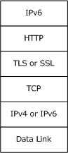
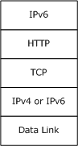
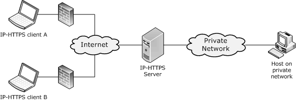
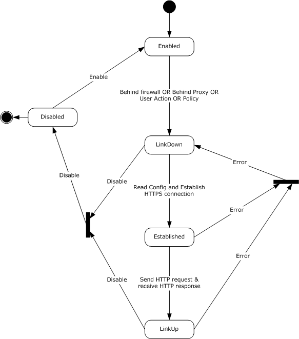
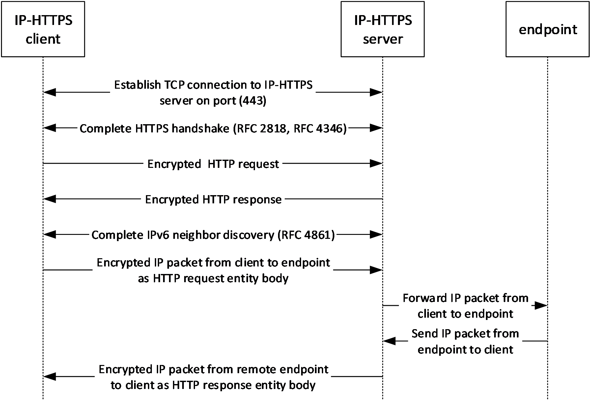
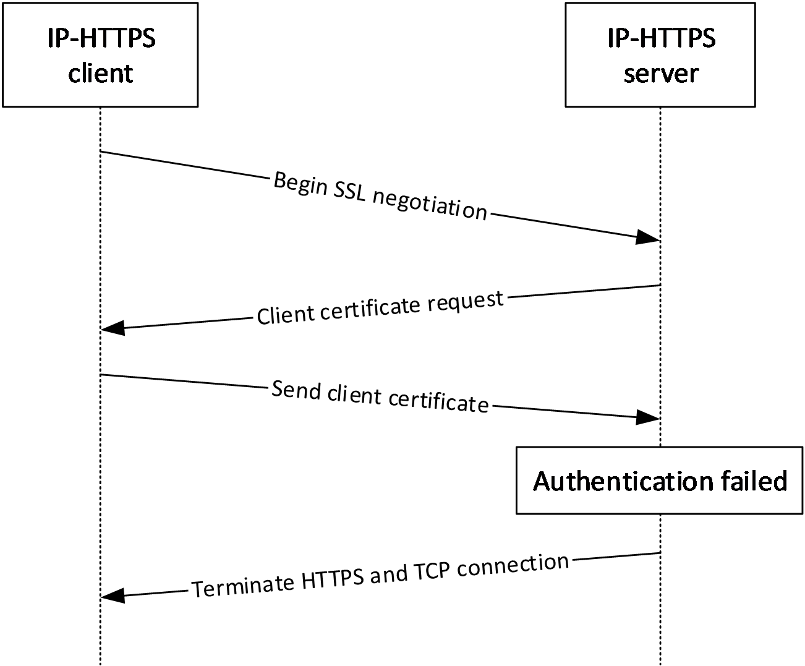
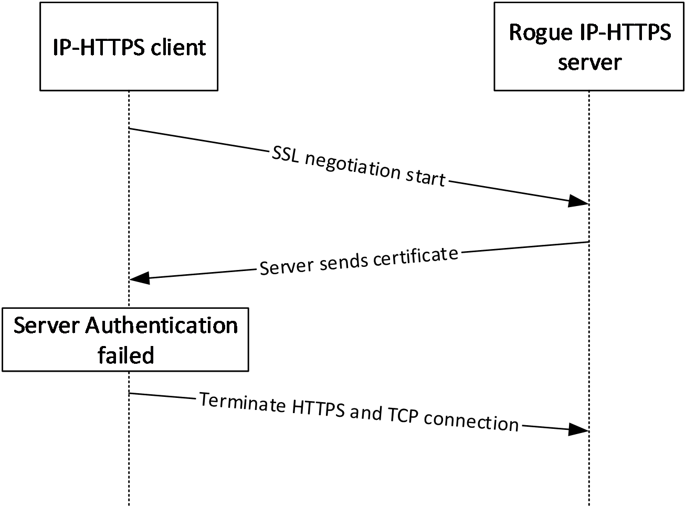

# [MS-IPHTTPS]: IP over HTTPS (IP-HTTPS) Tunneling Protocol

Table of Contents

1 Introduction

- [1 Introduction](#Section_1)
  - [1.1 Glossary](#Section_1.1)
  - [1.2 References](#Section_1.2)
    - [1.2.1 Normative References](#Section_1.2.1)
    - [1.2.2 Informative References](#Section_1.2.2)
  - [1.3 Overview](#Section_1.3)
  - [1.4 Relationship to Other Protocols](#Section_1.4)
  - [1.5 Prerequisites/Preconditions](#Section_1.5)
  - [1.6 Applicability Statement](#Section_1.6)
  - [1.7 Versioning and Capability Negotiation](#Section_1.7)
  - [1.8 Vendor-Extensible Fields](#Section_1.8)
  - [1.9 Standards Assignments](#Section_1.9)

2 Messages

- [2 Messages](#Section_2)
  - [2.1 Transport](#Section_2.1)
  - [2.2 Message Syntax](#Section_2.2)

3 Protocol Details

- [3 Protocol Details](#Section_3)
  - [3.1 IP-HTTPS Client Details](#Section_3.1)
    - [3.1.1 Abstract Data Model](#Section_3.1.1)
    - [3.1.2 Timers](#Section_3.1.2)
      - [3.1.2.1 Reconnect Timer](#Section_3.1.2.1)
    - [3.1.3 Initialization](#Section_3.1.3)
    - [3.1.4 Higher-Layer Triggered Events](#Section_3.1.4)
      - [3.1.4.1 Enable IP-HTTPS Link](#Section_3.1.4.1)
      - [3.1.4.2 Disable IP-HTTPS Link](#Section_3.1.4.2)
    - [3.1.5 Processing Events and Sequencing Rules](#Section_3.1.5)
      - [3.1.5.1 Establishing the HTTPS Connection](#Section_3.1.5.1)
      - [3.1.5.2 Bringing the IP-HTTPS Link Up](#Section_3.1.5.2)
      - [3.1.5.3 Data Transfer](#Section_3.1.5.3)
      - [3.1.5.4 Error Handling](#Section_3.1.5.4)
    - [3.1.6 Timer Events](#Section_3.1.6)
    - [3.1.7 Other Local Events](#Section_3.1.7)
  - [3.2 IP-HTTPS Server Details](#Section_3.2)
    - [3.2.1 Abstract Data Model](#Section_3.2.1)
    - [3.2.2 Timers](#Section_3.2.2)
    - [3.2.3 Initialization](#Section_3.2.3)
      - [3.2.3.1 Entering the Listen State](#Section_3.2.3.1)
    - [3.2.4 Higher-Layer Triggered Events](#Section_3.2.4)
      - [3.2.4.1 Enable IP-HTTPS Link](#Section_3.2.4.1)
      - [3.2.4.2 Disable IP-HTTPS Link](#Section_3.2.4.2)
    - [3.2.5 Processing Events and Sequencing Rules](#Section_3.2.5)
      - [3.2.5.1 Accepting IP-HTTPS Clients](#Section_3.2.5.1)
      - [3.2.5.2 Data Transfer](#Section_3.2.5.2)
        - [3.2.5.2.1 Sending a Packet to a Client](#Section_3.2.5.2.1)
        - [3.2.5.2.2 Receiving a Packet from a Client](#Section_3.2.5.2.2)
      - [3.2.5.3 Error Handling](#Section_3.2.5.3)
    - [3.2.6 Timer Events](#Section_3.2.6)
    - [3.2.7 Other Local Events](#Section_3.2.7)
      - [3.2.7.1 Changing Authentication Mode](#Section_3.2.7.1)
      - [3.2.7.2 Client Disconnection](#Section_3.2.7.2)
      - [3.2.7.3 Shutdown](#Section_3.2.7.3)

4 Protocol Examples

- [4 Protocol Examples](#Section_4)
  - [4.1 Packet Flow and Connection Establishment](#Section_4.1)
  - [4.2 Attack Scenarios](#Section_4.2)
    - [4.2.1 Unauthorized Client Connecting to an IP-HTTPS Server (When Authentication Mode Is Set to Certificates)](#Section_4.2.1)
    - [4.2.2 Unauthorized Client Connecting to an IP-HTTPS Server (When Authentication Mode Is Set to None)](#Section_4.2.2)
    - [4.2.3 Unauthorized IP-HTTPS Server Accepting Connections from a Genuine IP-HTTPS Client](#Section_4.2.3)

5 Security

- [5 Security](#Section_5)
  - [5.1 Security Considerations for Implementers](#Section_5.1)
  - [5.2 Index of Security Parameters](#Section_5.2)

6 Appendix A: Product Behavior

- [6 Appendix A: Product Behavior](#Section_6)

7 Change Tracking

- [7 Change Tracking](#Section_7)

For the legal notice and IP terms, see [LEGAL.md](../LEGAL.md).
Last updated: 4/23/2024.
See [Revision History](#revision-history) for full version history.

# 1 Introduction

This document specifies the IP over HTTPS (IP-HTTPS) Protocol, a mechanism to transport IPv6 packets on an HTTPS connection.

Sections 1.5, 1.8, 1.9, 2, and 3 of this specification are normative. All other sections and examples in this specification are informative.

## 1.1 Glossary

This document uses the following terms:

**IP-HTTPS client**: A computer that implements the IP over HTTPS (IP-HTTPS) Protocol and that initiates an IP-HTTPS connection to an [**IP-HTTPS server**](#gt_ip-https-server) over TCP port 443.

**IP-HTTPS endpoint**: An entity that communicates to an [**IP-HTTPS client**](#gt_ip-https-client) via the [**IP-HTTPS server**](#gt_ip-https-server).

**IP-HTTPS server**: A computer that implements the IP over HTTPS (IP-HTTPS) Protocol and listens and accepts IP-HTTPS connections from [**IP-HTTPS clients**](#gt_ip-https-client) over TCP port 443.

**Uniform Resource Identifier (URI)**: A string that identifies a resource. The URI is an addressing mechanism defined in Internet Engineering Task Force (IETF) Uniform Resource Identifier (URI): Generic Syntax [[RFC3986]](https://go.microsoft.com/fwlink/?LinkId=90453).

**MAY, SHOULD, MUST, SHOULD NOT, MUST NOT:** These terms (in all caps) are used as defined in [[RFC2119]](https://go.microsoft.com/fwlink/?LinkId=90317). All statements of optional behavior use either MAY, SHOULD, or SHOULD NOT.

## 1.2 References

Links to a document in the Microsoft Open Specifications library point to the correct section in the most recently published version of the referenced document. However, because individual documents in the library are not updated at the same time, the section numbers in the documents may not match. You can confirm the correct section numbering by checking the [Errata](https://go.microsoft.com/fwlink/?linkid=850906).

### 1.2.1 Normative References

We conduct frequent surveys of the normative references to assure their continued availability. If you have any issue with finding a normative reference, please contact [dochelp@microsoft.com](mailto:dochelp@microsoft.com). We will assist you in finding the relevant information.

[RFC1945] Berners-Lee, T., Fielding, R., and Frystyk, H., "Hypertext Transfer Protocol -- HTTP/1.0", RFC 1945, May 1996, [https://www.rfc-editor.org/info/rfc1945](https://go.microsoft.com/fwlink/?LinkId=90300)

[RFC2119] Bradner, S., "Key words for use in RFCs to Indicate Requirement Levels", BCP 14, RFC 2119, March 1997, [https://www.rfc-editor.org/info/rfc2119](https://go.microsoft.com/fwlink/?LinkId=90317)

[RFC2460] Deering, S., and Hinden, R., "Internet Protocol, Version 6 (IPv6) Specification", RFC 2460, December 1998, [https://www.rfc-editor.org/info/rfc2460](https://go.microsoft.com/fwlink/?LinkId=90357)

[RFC2616] Fielding, R., Gettys, J., Mogul, J., et al., "Hypertext Transfer Protocol -- HTTP/1.1", RFC 2616, June 1999, [https://www.rfc-editor.org/info/rfc2616](https://go.microsoft.com/fwlink/?LinkId=90372)

[RFC2818] Rescorla, E., "HTTP Over TLS", RFC 2818, May 2000, [https://www.rfc-editor.org/info/rfc2818](https://go.microsoft.com/fwlink/?LinkId=90383)

[RFC4346] Dierks, T., and Rescorla, E., "The Transport Layer Security (TLS) Protocol Version 1.1", RFC 4346, April 2006, [https://www.rfc-editor.org/info/rfc4346](https://go.microsoft.com/fwlink/?LinkId=90474)

[RFC4861] Narten, T., Nordmark, E., Simpson, W., and Soliman, H., "Neighbor Discovery for IP version 6 (IPv6)", RFC 4861, September 2007, [https://www.rfc-editor.org/info/rfc4861](https://go.microsoft.com/fwlink/?LinkId=116156)

[SSLPROXY] Luotonen, A., "Tunneling TCP based protocols through Web proxy servers", Version 01, August 1998, [https://datatracker.ietf.org/doc/html/draft-luotonen-web-proxy-tunneling-01](https://go.microsoft.com/fwlink/?LinkId=90535)

### 1.2.2 Informative References

[RFC1661] Simpson, W., Ed., "The Point-to-Point Protocol (PPP)", STD 51, RFC 1661, July 1994, [https://www.rfc-editor.org/info/rfc1661](https://go.microsoft.com/fwlink/?LinkId=90283)

[RFC3971] Arkko, J., Ed., Kempf, J., Zill, B., and Nikander, P., "SEcure Neighbor Discovery (SEND)", RFC 3971, March 2005, [http://www.rfc-editor.org/rfc/rfc3971.txt](https://go.microsoft.com/fwlink/?LinkId=214331)

## 1.3 Overview

Many virtual private network (VPN) services provide a way for mobile and home users to access the corporate network remotely by using the Point-to-Point Tunneling Protocol (PPTP) and the Layer Two Tunneling Protocol/Internet Protocol security (L2TP/IPsec). However, with the popularization of firewalls and web proxies, many service providers (for example, hotels) do not allow the PPTP and L2TP/IPsec traffic. This results in users not receiving ubiquitous connectivity to their corporate networks. For example, generic routing encapsulation (GRE) port blocking by many Internet service providers (ISPs) is a common problem when using PPTP.

The IP over HTTPS (IP-HTTPS) Tunneling Protocol Specification defines the IP over HTTPS (IP-HTTPS) Protocol. IP-HTTPS is a mechanism to encapsulate IP traffic over an HTTPS protocol, as defined in [[RFC1945]](https://go.microsoft.com/fwlink/?LinkId=90300), [[RFC2616]](https://go.microsoft.com/fwlink/?LinkId=90372), and [[RFC2818]](https://go.microsoft.com/fwlink/?LinkId=90383). This protocol enables remote users behind a protocol blocking firewall or proxy server to access a private network using HTTPS. The use of HTTPS enables traversal of most firewalls and web proxies. IP-HTTPS supports HTTP proxy authentication.

This protocol employs two main roles: client and server. The [**IP-HTTPS client**](#gt_ip-https-client) and [**IP-HTTPS server**](#gt_ip-https-server) can use either HTTPS or HTTP as a transport.

**An IP-HTTPS client:** This component is similar to a VPN client. The IP-HTTPS client initiates connections to a configured IP-HTTPS server. The client could become active either automatically (for example, when the client machine is located behind an HTTP firewall and/or HTTP proxy), or based on administrative policy (for example, always on), or based on an explicit user action.

When an IP-HTTPS client is behind an HTTP proxy, the client first establishes a tunnel to the IP-HTTPS server using the CONNECT method, as described in [[SSLPROXY]](https://go.microsoft.com/fwlink/?LinkId=90535).

**An IP-HTTPS server:** This component is similar to a VPN server, and it is typically positioned at the edge of a network. The IP-HTTPS server directly accepts HTTPS connections made by IP-HTTPS clients. When positioned behind a device that terminates HTTPS on its behalf (such as a reverse proxy or a TLS/SSL load balancer), the server can be configured to listen over HTTP.

## 1.4 Relationship to Other Protocols

The IP over HTTPS (IP-HTTPS) Protocol allows encapsulation of IPv6 traffic over HTTPS. To do so, it depends on the following protocols:

- Hypertext Transfer Protocol -- HTTP/1.0 [[RFC1945]](https://go.microsoft.com/fwlink/?LinkId=90300).
- Hypertext Transfer Protocol -- HTTP/1.1 [[RFC2616]](https://go.microsoft.com/fwlink/?LinkId=90372).
- HTTP Over TLS [[RFC2818]](https://go.microsoft.com/fwlink/?LinkId=90383).
- Tunneling SSL Through a WWW Proxy [[SSLPROXY]](https://go.microsoft.com/fwlink/?LinkId=90535).
- The Transport Layer Security (TLS) Protocol Version 1.1 [[RFC4346]](https://go.microsoft.com/fwlink/?LinkId=90474).
Once the underlying transport is established, IP-HTTPS enables IPv6 traffic exchanges per usual IPv6 specifications such as:

- Neighbor Discovery for IP Version 6 (IPv6) [[RFC4861]](https://go.microsoft.com/fwlink/?LinkId=116156).
- Protocol, Version 6 (IPv6) Specification [[RFC2460]](https://go.microsoft.com/fwlink/?LinkId=90357).
**Note** The IP-HTTPS Protocol itself does not have any security or authentication methods. Instead, it relies on HTTPS for authentication, data integrity, and confidentiality.

The relationship between these protocols is illustrated in the following diagram:

Figure 1: Protocol relationships

## 1.5 Prerequisites/Preconditions

The IP-HTTPS Protocol requires IPv6 and either HTTP or HTTPS. If HTTPS is used, TLS/SSL is also required for operation.

IP-HTTPS supports both HTTP and HTTPS transports. Unless otherwise noted, the rest of this document uses the term "HTTPS" to also refer to operation over HTTP.

When the transport is HTTPS (as opposed to HTTP), the IP-HTTPS Protocol requires a certificate to be installed on each client and server machine. It also requires the client and the server to be configured with the [**Uniform Resource Identifier (URI)**](#gt_uniform-resource-identifier-uri) of the server.

The HTTPS connection can be set up over an IPv4 or an IPv6 network.

## 1.6 Applicability Statement

The IP-HTTPS Protocol is useful for enabling remote users behind a protocol blocking firewall or proxy server to access a private network using HTTPS.

IP-HTTPS only supports IPv6 encapsulation over HTTPS.

## 1.7 Versioning and Capability Negotiation

The IP over HTTPS (IP-HTTPS) Protocol is a simple encapsulation of IP over HTTPS. It does not have any versioning or capability negotiations with peers.

## 1.8 Vendor-Extensible Fields

The IP-HTTPS Protocol has no vendor-extensible fields.

## 1.9 Standards Assignments

There are no standards assignments for this protocol.

# 2 Messages

## 2.1 Transport

The following diagrams show the IP-HTTPS protocol stack options for client and server.

Figure 2: IP-HTTPS client protocol stack

Figure 3: IP-HTTPS server protocol stack when using HTTPS encapsulation

Figure 4: IP-HTTPS server protocol stack when using HTTP encapsulation

IPv6 packets are carried directly within the HTTP payload. HTTP requests and responses are transmitted as described in [[RFC2616]](https://go.microsoft.com/fwlink/?LinkId=90372). The content type of the HTTP entity body carrying IPv6 packets is "application/octet-stream". The sender of the HTTP payload MAY include a Content-Type header in the HTTP request or response to indicate that the content type is an application/octet-stream.

## 2.2 Message Syntax

The IP-HTTPS Protocol uses HTTP, HTTPS, TLS/SSL and IPv6 as described in section [2.1](#Section_2.1). The IP-HTTPS Protocol does not introduce any new packet formats.

# 3 Protocol Details

The IP-HTTPS Protocol encapsulates IPv6 packets over an HTTPS connection. This is achieved by creating a tunneled interface, which provides a symmetric link, with multicast and neighbor discovery capabilities, including unreachable neighbor detection and duplicate address detection per [[RFC4861]](https://go.microsoft.com/fwlink/?LinkId=116156). Like other point-to-point links, for instance PPP [[RFC1661]](https://go.microsoft.com/fwlink/?LinkId=90283), IP-HTTPS uses a static network-layer to link-layer address mapping.

There are two main components to IP-HTTPS: [**IP-HTTPS clients**](#gt_ip-https-client) that are connecting to resources inside a private network (such as an enterprise network) and [**IP-HTTPS servers**](#gt_ip-https-server) that facilitate the connection, as illustrated in the diagram below.

Figure 5: IP-HTTPS clients connected to an IP-HTTPS server

## 3.1 IP-HTTPS Client Details

The following figure shows the state machine when a client establishes the outgoing IP-HTTPS tunnel.

Figure 6: IP-HTTPS client state diagram

### 3.1.1 Abstract Data Model

This section describes a conceptual model of possible data organization that an implementation maintains to participate in this protocol. The described organization is provided to facilitate the explanation of how the protocol behaves. This document does not mandate that implementations adhere to this model as long as their external behavior is consistent with that described in this document.

**URI:** The URI on which the IP-HTTPS server will accept incoming IP-HTTPS connections. [**IP-HTTPS clients**](#gt_ip-https-client) must be configured with this address in order to use it.

**State:** Specifies the current state of the IP-HTTPS client. The possible states are:

**Enabled:** In this state, the IP-HTTPS client waits for the pre-conditions specified in Section [3.1.3](#Section_3.1.3) to happen. These preconditions transition the IP-HTTPS client to the **LinkDown** state.

**LinkDown:** In this state, the IP-HTTPS client reads the configuration and tries to establish an HTTPS connection to the server. Once the HTTPS connection is established, the IP-HTTPS client transitions to the **Established** state.

**Established:** In this state the IP-HTTPS client establishes a bidirectional HTTP stream. It achieves this by sending an HTTP request message to the server and waiting for a HTTP response. Upon receiving a successful HTTP response, it transitions to the **LinkUp** state.

**LinkUp:** In this state the IP-HTTPS link is up and usable for sending and receiving IPv6 traffic.

**Disabled:** A higher-layer trigger (such as a user action to disable IP-HTTPS) transitions the IP-HTTPS client to the disabled state. IP-HTTPS operations are not possible in this state.

Further details about state processing, handling error conditions, and state transitions are specified below.

### 3.1.2 Timers

#### 3.1.2.1 Reconnect Timer

To work around transient failures (for example, lack of resources on the local machine, on the network, proxy, or at the [**IP-HTTPS server**](#gt_ip-https-server)), the [**IP-HTTPS clients**](#gt_ip-https-client) SHOULD use a reconnect timer to retry an unsuccessful HTTPS connection or to reestablish a successful HTTPS connection that was terminated abnormally.

The reconnection attempts follow an exponential back-off algorithm. The first failure marks the beginning of the reconnection algorithm. Upon the first failure, the reconnection timer is started for an initial timeout of 30 seconds. Each subsequent failure starts a reconnection timer with a timeout set to the time elapsed since the beginning of the algorithm, up to a maximum timeout of 15 minutes. Following this algorithm, reconnection attempts will be made after the following intervals since the first failure, where *T* represents the time taken for the connection attempt to fail.

- 30 seconds
- 30 + T seconds
- 60 + 2T seconds
- 120 + 3T seconds
- ... and so on, up to 15 minutes.
- Every 15 minutes thereafter.
A successful HTTPS connection resets the timer.

It is possible that other timing logic is dictated by the other protocols upon which the IP-HTTPS Protocol relies.

### 3.1.3 Initialization

If the IP-HTTPS link is **Enabled** (section [3.1.4.1](#Section_3.1.4.1)), the IP-HTTPS link MUST be initialized when any of the following conditions are met.

- Client detects that it is behind an HTTP proxy.
- Client is detected behind a port/protocol blocking firewall.
- Administrative policy requires the IP-HTTPS link to be always on.
- User chooses to bring up the IP-HTTPS link.
Initialization of the client involves the client reading the **URI** of the server.

### 3.1.4 Higher-Layer Triggered Events

The following events are triggered by an end user or by administrative policy.

#### 3.1.4.1 Enable IP-HTTPS Link

The Enable IP-HTTPS Link event transitions the client from the **Disabled** to **Enabled** state, making initialization possible as defined in section [3.1.3](#Section_3.1.3).

#### 3.1.4.2 Disable IP-HTTPS Link

The Disable IP-HTTPS Link event transitions the client to the **Disabled** state. The underlying transport protocols tear down their state. No further IP-HTTPS operations are possible while in this state.

### 3.1.5 Processing Events and Sequencing Rules

The [**IP-HTTPS client**](#gt_ip-https-client) waits for the pre-conditions specified in section [3.1.3](#Section_3.1.3) to happen and triggers the following events.

#### 3.1.5.1 Establishing the HTTPS Connection

Immediately following initialization per section [3.1.3](#Section_3.1.3), the [**IP-HTTPS client**](#gt_ip-https-client) MUST establish an HTTPS connection to the [**IP-HTTPS server**](#gt_ip-https-server) (per the configuration in section 3.1.3), as defined in [[RFC1945]](https://go.microsoft.com/fwlink/?LinkId=90300), [[RFC2616]](https://go.microsoft.com/fwlink/?LinkId=90372), [[RFC2818]](https://go.microsoft.com/fwlink/?LinkId=90383), [[RFC4346]](https://go.microsoft.com/fwlink/?LinkId=90474), and [[SSLPROXY]](https://go.microsoft.com/fwlink/?LinkId=90535).

The IP-HTTPS client SHOULD<1> support proxy authentication as specified in [SSLPROXY].

#### 3.1.5.2 Bringing the IP-HTTPS Link Up

After the HTTPS connection is established, the [**IP-HTTPS client**](#gt_ip-https-client) MUST send an HTTP POST request to the configured **URI**. The POST request SHOULD use content length encoding [[RFC2616]](https://go.microsoft.com/fwlink/?LinkId=90372), and the value SHOULD be set to 18446744073709551615. After receiving a successful HTTP response, the IP-HTTPS client transitions to the **LinkUp** state.

The IP-HTTPS link is now usable to send and receive IPv6 traffic (including neighbor and router discovery). The default MTU for the IP-HTTPS link is set to the minimum IPv6 MTU of 1280 [[RFC2460]](https://go.microsoft.com/fwlink/?LinkId=90357).

Sections [3.1.5.3](#Section_3.1.5.3) and [3.1.5.4](#Section_3.2.5.3) apply when the IP-HTTPS client is in **LinkUp** state.

#### 3.1.5.3 Data Transfer

Framing in the IP-HTTPS Protocol relies exclusively on the length of the IPv6 header.

Outgoing IPv6 packets MUST be sent within the HTTP request entity body, and incoming IPv6 packets MUST be received as HTTP response entity body. The HTTP entity body is received as a byte stream; therefore, the [**IP-HTTPS client**](#gt_ip-https-client) MUST delimit the IPv6 packet boundaries using the Payload Length field in the IPv6 header. The IP-HTTPS client MUST discard non IPv6 packets.

#### 3.1.5.4 Error Handling

Upon loss of connectivity in any of the underlying transports that [**IP-HTTPS client**](#gt_ip-https-client) relies on (section [2.1](#Section_2.1)), the client MUST attempt to establish the HTTPS connection as specified above.

### 3.1.6 Timer Events

**Re-connect timer:** When this timer expires, the IP-HTTPS tunnel MUST be re-established, as described in [3.1.5.2](#Section_3.1.5.2).

### 3.1.7 Other Local Events

None.

## 3.2 IP-HTTPS Server Details

### 3.2.1 Abstract Data Model

This section describes a conceptual model of possible data organization that an implementation maintains to participate in this protocol. The described organization is provided to facilitate the explanation of how the protocol behaves. This document does not mandate that implementations adhere to this model as long as their external behavior is consistent with that described in this document.

**URI:** The URI on which the [**IP-HTTPS server**](#gt_ip-https-server) will accept incoming IP-HTTPS connections.

**State:** Specifies the current state of the IP-HTTPS server. The possible states are as follows:

**Stopped:** This is the initial state. IP-HTTPS operations are not possible until the IP-HTTPS server is started.

**Listen:** In this state, the IP-HTTPS server enables its HTTP stack to listen on the configured **URI** waiting for [**IP-HTTPS clients**](#gt_ip-https-client) to connect. When the IP-HTTPS server is in the **Listen** state, it is usable for sending and receiving IPv6 traffic. In the **Listen** state, the IP-HTTPS server uses Neighbor Discovery [[RFC4861]](https://go.microsoft.com/fwlink/?LinkId=116156) to maintain the link to which the IP-HTTPS clients connect.

**Disabled:** IP-HTTPS operations are not possible in this state. The IP-HTTPS server transitions to this state based on user actions or administrative policy.

**Authentication Mode:** Specifies whether the server needs to authenticate the incoming IP-HTTPS client connections. This parameter SHOULD<2> be configurable by an administrator. The possible states are as follows:

**Certificates:** In this state, the IP-HTTPS server is required to authenticate IP-HTTPS clients. This state MUST be supported.

**None:** In this state, the IP-HTTPS server does not authenticate IP-HTTPS clients. This state SHOULD<3> be supported.

**Client Table:** For each IP-HTTPS client connected, the server maintains the following state:

**HTTP Connection:** The HTTP connection over which the client has connected.

Further details about state processing, handling error conditions, and state transitions are specified in subsequent sections.

### 3.2.2 Timers

The IP-HTTPS Protocol does not introduce any new timers. It is possible that other timing logic is dictated by the other protocols upon which IP-HTTPS relies.

### 3.2.3 Initialization

If the IP-HTTPS server is in the **Stopped** state, the IP-HTTPS server MUST transition to the **Listen** state as specified in section [3.2.3.1](#Section_3.2.3.1).

#### 3.2.3.1 Entering the Listen State

When the IP-HTTPS server transitions to the **Listen** state, the IP-HTTPS link at the server is considered to be up. The default MTU for the IP-HTTPS link MUST be set to the minimum IPv6 MTU, which is 1,280 octets per [[RFC2460]](https://go.microsoft.com/fwlink/?LinkId=90357). The server SHOULD then act as a router between its [**IP-HTTPS clients**](#gt_ip-https-client) and other networks to which it is connected.

### 3.2.4 Higher-Layer Triggered Events

The following events are triggered by an end user or administrative policy.

#### 3.2.4.1 Enable IP-HTTPS Link

When this event is triggered and the server is in the **Disabled** state, the IP-HTTPS server MUST transition to the **Listen** state, as specified in section [3.2.3.1](#Section_3.2.3.1).

#### 3.2.4.2 Disable IP-HTTPS Link

This transitions the server to the **Disabled** state. If there are any client connections, the IP-HTTPS server MUST disconnect them, causing the underlying transport protocols to tear down their state. No further IP-HTTPS operations are possible while in this state.

### 3.2.5 Processing Events and Sequencing Rules

The [**IP-HTTPS server**](#gt_ip-https-server) stays in the **Listen** state waiting for clients to connect to it. When a client tries to connect to the server the following events are triggered.

#### 3.2.5.1 Accepting IP-HTTPS Clients

When an HTTP request for the configured server **URI** is received from a client, the server MUST attempt to add an entry to its HTTP Client Table. If the attempt fails, it MUST disconnect the client. Otherwise, it MUST send an HTTP 200 OK reply with the Date and Server headers.

Sections [3.2.5.2.1](#Section_3.2.5.2.1) and [3.2.5.2.2](#Section_3.2.5.2.2) apply when the [**IP-HTTPS server**](#gt_ip-https-server) is in the **Listen** state.

#### 3.2.5.2 Data Transfer

Framing in the IP-HTTPS Protocol relies exclusively on the length of the IPv6 header.

##### 3.2.5.2.1 Sending a Packet to a Client

Outgoing IPv6 packets are sent within the HTTP response entity body.

If the Authentication Mode is set to None, Router Advertisement (RA) packets sent or forwarded from the server SHOULD be allowed to be multicast to clients and the IP-HTTPS server MUST NOT send or forward any other multicast traffic over the IP-HTTPS link.

##### 3.2.5.2.2 Receiving a Packet from a Client

The HTTP entity body is received as a byte stream; therefore, the [**IP-HTTPS server**](#gt_ip-https-server) MUST delimit the IPv6 packet boundaries using the Payload Length field in the IPv6 header. The IP-HTTPS server MUST discard non-IPv6 packets and SHOULD terminate the IP-HTTPS session with the offending client.

If the **Authentication Mode** on the IP-HTTPS server is set to None, the following processing MUST be enforced on the IP-HTTPS server to ensure that unauthenticated IP-HTTPS client peers do not abuse the IP-HTTPS link.

- All link-local unicast packets MUST be dropped unless the destination is the server itself.
- When a multicast packet is received, the IP-HTTPS server MUST drop the packet except in the following conditions:
- Router Solicitation packets MUST NOT be dropped.
- When a Neighbor Solicitation packet with an unspecified source address and a solicited-node multicast destination address is received from a client, the following processing MUST be done.
If the target address in the Neighbor Solicitation packet is being used by another client (determined by checking the Neighbor Cache), the packet MUST NOT be forwarded, but a multicast Neighbor Advertisement (NA) MUST be created as if the IP-HTTPS server were the client with the target address (for example, the Router flag MUST NOT be set). The NA MUST NOT contain a Target Link-Layer option. Then the NA MUST be sent back over the HTTP connection.

- If the Authentication Mode is set to Certificates, the following processing MUST be done.
- When a multicast packet is received, the IP-HTTPS server MUST forward the packet to all other IP-HTTPS clients, except in the following conditions:
- When the packet is either a multicast Neighbor Advertisement packet, or a Neighbor Solicitation packet with an unspecified source address and a solicited-node multicast destination address:
- If the Target Address in the packet is present in at least one entry in the Neighbor Cache, then the packet SHOULD NOT<4> be forwarded to a client that has no such entry in the Neighbor Cache.

#### 3.2.5.3 Error Handling

When any of the underlying transport connections to an [**IP-HTTPS client**](#gt_ip-https-client) terminate, the [**IP-HTTPS server**](#gt_ip-https-server) tears down the state for that client and remains in or transitions to **Listen** state.

### 3.2.6 Timer Events

None.

### 3.2.7 Other Local Events

None.

#### 3.2.7.1 Changing Authentication Mode

When the Authentication Mode is changed, all existing connections from IP-HTTPS clients MUST be terminated.

#### 3.2.7.2 Client Disconnection

When any of the underlying transport connections to an IP-HTTPS client terminate, the IP-HTTPS server MUST remove the Client Table entry for that client.

#### 3.2.7.3 Shutdown

When the IP-HTTPS server is shut down, the server MUST disconnect all IP-HTTPS clients and transition to the **Stopped** state.

# 4 Protocol Examples

These examples assume HTTPS is used as transport for IP-HTTPS.

## 4.1 Packet Flow and Connection Establishment

The following diagram shows packet flows between an [**IP-HTTPS client**](#gt_ip-https-client), [**IP-HTTPS server**](#gt_ip-https-server), and an [**IP-HTTPS endpoint**](#gt_ip-https-endpoint).

Figure 7: IP-HTTPS packet flow

When an IP-HTTPS client is behind an HTTP proxy, the client first establishes a tunnel using the CONNECT method, as described in [[SSLPROXY]](https://go.microsoft.com/fwlink/?LinkId=90535). Subsequent message exchanges are identical to the above diagram and happen over the established tunnel.

The HTTP request sent to the IP-HTTPS server is described below.

POST /IPTLS HTTP/1.1 \r\n

Content-Length: 18446744073709551615 \r\n

Host: <IP-address of IP-HTTPS server> \r\n

\r\n

The HTTP response sent from the IP-HTTPS server to the IP-HTTPS client is described below.

HTTP/1.1 200 OK \r\n

Server: Microsoft-HTTPAPI/2.0 \r\n

Date: Sun, 10 Aug 2008 03:51:52 GMT \r\n

\r\n

## 4.2 Attack Scenarios

### 4.2.1 Unauthorized Client Connecting to an IP-HTTPS Server (When Authentication Mode Is Set to Certificates)

In this scenario, an unauthorized attacker poses as a valid IP-HTTPS client and tries to connect to a valid IP-HTTPS server. The HTTPS connection is not allowed to go through, as the attacker will not have a valid client certificate to present to the IP-HTTPS server.

Figure 8: Unauthorized IP-HTTPS client when configured to use client authentication

### 4.2.2 Unauthorized Client Connecting to an IP-HTTPS Server (When Authentication Mode Is Set to None)

In this scenario, an unauthorized client poses as an IP-HTTPS client and tries to connect to a valid IP-HTTPS server. The HTTPS connection is allowed to go through, as the server has been configured not to require client authentication.

Figure 9: IP-HTTPS server configured not to use client authentication

### 4.2.3 Unauthorized IP-HTTPS Server Accepting Connections from a Genuine IP-HTTPS Client

In this scenario, a valid [**IP-HTTPS client**](#gt_ip-https-client) is redirected by an attacker to an unauthorized [**IP-HTTPS server**](#gt_ip-https-server) (for example, by DNS poisoning). In this scenario, the HTTPS connection is terminated by the client when the client is unable to validate the server’s identity using its certificate. It is recommended that the IP-HTTPS client validate the certificate per normal TLS certificate validation procedures.

Figure 10: Unauthorized IP-HTTPS server

# 5 Security

## 5.1 Security Considerations for Implementers

IP-HTTPS does not implement any form of security mechanism. It can use security mechanisms implemented by HTTPS (TLS), as described in [[RFC2818]](https://go.microsoft.com/fwlink/?LinkId=90383) and [[RFC4346]](https://go.microsoft.com/fwlink/?LinkId=90474).

As a transport for IP-HTTPS, HTTP provides none of the security services offered by HTTPS. Accordingly, when using HTTP as a transport, it is recommended that the IP-HTTPS payload be protected by some other means. Additionally, some proxies are known to inspect HTTP exchanges, and prevent communications when these do not appear to be normal web traffic. Because of these security and operational considerations, it is recommended that IP-HTTPS use HTTPS as a transport.

When the [**IP-HTTPS server**](#gt_ip-https-server) is configured to use the HTTP transport, it is possible to use it in conjunction with another device (such as a reverse proxy or an SSL/TLS load balancer), which terminates the HTTPS connection from the client on behalf of the server. In this case, the security mechanisms are ensured by that device. There is an implicit relationship of trust between the IP-HTTPS server and the device that terminates HTTPS on its behalf.

It is not possible to use the SEcure Neighbor Discovery (SEND) protocol [[RFC3971]](https://go.microsoft.com/fwlink/?LinkId=214331) when the server authentication mode is **None** because the server generates Neighbor Advertisements on behalf of clients.

## 5.2 Index of Security Parameters

IP-HTTPS assumes that security has already been negotiated by the HTTPS/TLS layers, as described in section ([1.5](#Section_1.5)).

| Security Parameter | Section |
| --- | --- |
| Mutual authentication, Hashing/Encryption algorithms, and so on. | 1.5 |

# 6 Appendix A: Product Behavior

The information in this specification is applicable to the following Microsoft products or supplemental software. References to product versions include updates to those products.

- Windows 7 operating system
- Windows Server 2008 R2 operating system
- Windows 8 operating system
- Windows Server 2012 operating system
- Windows 8.1 operating system
- Windows Server 2012 R2 operating system
- Windows 10 operating system
- Windows Server 2016 operating system
- Windows Server operating system
- Windows Server 2019 operating system
- Windows Server 2022 operating system
- Windows 11 operating system
- Windows Server 2025 operating system
Exceptions, if any, are noted in this section. If an update version, service pack or Knowledge Base (KB) number appears with a product name, the behavior changed in that update. The new behavior also applies to subsequent updates unless otherwise specified. If a product edition appears with the product version, behavior is different in that product edition.

Unless otherwise specified, any statement of optional behavior in this specification that is prescribed using the terms "SHOULD" or "SHOULD NOT" implies product behavior in accordance with the SHOULD or SHOULD NOT prescription. Unless otherwise specified, the term "MAY" implies that the product does not follow the prescription.

<1> Section 3.1.5.1: Windows 7 and Windows Server 2008 R2 operating system did not support proxy authentication for IP-HTTPS.

<2> Section 3.2.1: Windows 7 and Windows Server 2008 R2 do not support configuration of the **Authentication Mode** ADM element.

<3> Section 3.2.1: Windows 7 and Windows Server 2008 R2 do not support a state value of None for the **Authentication Mode** ADM element.

<4> Section 3.2.5.2.2: Windows 7 and Windows Server 2008 R2 forward multicast Neighbor Solicitations and Neighbor Advertisements to all other IP-HTTPS clients.

# 7 Change Tracking

This section identifies changes that were made to this document since the last release. Changes are classified as Major, Minor, or None.

The revision class **Major** means that the technical content in the document was significantly revised. Major changes affect protocol interoperability or implementation. Examples of major changes are:

- A document revision that incorporates changes to interoperability requirements.
- A document revision that captures changes to protocol functionality.
The revision class **Minor** means that the meaning of the technical content was clarified. Minor changes do not affect protocol interoperability or implementation. Examples of minor changes are updates to clarify ambiguity at the sentence, paragraph, or table level.

The revision class **None** means that no new technical changes were introduced. Minor editorial and formatting changes may have been made, but the relevant technical content is identical to the last released version.

The changes made to this document are listed in the following table. For more information, please contact [dochelp@microsoft.com](mailto:dochelp@microsoft.com).

| Section | Description | Revision class |
| --- | --- | --- |
| [6](#Section_6) Appendix A: Product Behavior | Added Windows Server 2025 to the list of applicable products. | Major |

## Revision History

| Date | Version | Revision Class | Comments |
| --- | --- | --- | --- |
| 12/5/2008 | 0.1 | Major | Initial Availability |
| 1/16/2009 | 0.1.1 | Editorial | Changed language and formatting in the technical content. |
| 2/27/2009 | 0.1.2 | Editorial | Changed language and formatting in the technical content. |
| 4/10/2009 | 0.1.3 | Editorial | Changed language and formatting in the technical content. |
| 5/22/2009 | 1.0 | Major | Updated and revised the technical content. |
| 7/2/2009 | 1.0.1 | Editorial | Changed language and formatting in the technical content. |
| 8/14/2009 | 1.0.2 | Editorial | Changed language and formatting in the technical content. |
| 9/25/2009 | 2.0 | Major | Updated and revised the technical content. |
| 11/6/2009 | 3.0 | Major | Updated and revised the technical content. |
| 12/18/2009 | 4.0 | Major | Updated and revised the technical content. |
| 1/29/2010 | 5.0 | Major | Updated and revised the technical content. |
| 3/12/2010 | 5.0.1 | Editorial | Changed language and formatting in the technical content. |
| 4/23/2010 | 5.0.2 | Editorial | Changed language and formatting in the technical content. |
| 6/4/2010 | 5.0.3 | Editorial | Changed language and formatting in the technical content. |
| 7/16/2010 | 5.0.3 | None | No changes to the meaning, language, or formatting of the technical content. |
| 8/27/2010 | 5.0.3 | None | No changes to the meaning, language, or formatting of the technical content. |
| 10/8/2010 | 5.0.3 | None | No changes to the meaning, language, or formatting of the technical content. |
| 11/19/2010 | 5.0.3 | None | No changes to the meaning, language, or formatting of the technical content. |
| 1/7/2011 | 5.0.3 | None | No changes to the meaning, language, or formatting of the technical content. |
| 2/11/2011 | 5.0.3 | None | No changes to the meaning, language, or formatting of the technical content. |
| 3/25/2011 | 5.0.3 | None | No changes to the meaning, language, or formatting of the technical content. |
| 5/6/2011 | 5.0.3 | None | No changes to the meaning, language, or formatting of the technical content. |
| 6/17/2011 | 5.1 | Minor | Clarified the meaning of the technical content. |
| 9/23/2011 | 5.1 | None | No changes to the meaning, language, or formatting of the technical content. |
| 12/16/2011 | 6.0 | Major | Updated and revised the technical content. |
| 3/30/2012 | 6.0 | None | No changes to the meaning, language, or formatting of the technical content. |
| 7/12/2012 | 7.0 | Major | Updated and revised the technical content. |
| 10/25/2012 | 7.0 | None | No changes to the meaning, language, or formatting of the technical content. |
| 1/31/2013 | 7.0 | None | No changes to the meaning, language, or formatting of the technical content. |
| 8/8/2013 | 8.0 | Major | Updated and revised the technical content. |
| 11/14/2013 | 8.0 | None | No changes to the meaning, language, or formatting of the technical content. |
| 2/13/2014 | 8.0 | None | No changes to the meaning, language, or formatting of the technical content. |
| 5/15/2014 | 8.0 | None | No changes to the meaning, language, or formatting of the technical content. |
| 6/30/2015 | 9.0 | Major | Significantly changed the technical content. |
| 10/16/2015 | 9.0 | None | No changes to the meaning, language, or formatting of the technical content. |
| 7/14/2016 | 9.0 | None | No changes to the meaning, language, or formatting of the technical content. |
| 6/1/2017 | 9.0 | None | No changes to the meaning, language, or formatting of the technical content. |
| 9/15/2017 | 10.0 | Major | Significantly changed the technical content. |
| 9/12/2018 | 11.0 | Major | Significantly changed the technical content. |
| 4/7/2021 | 12.0 | Major | Significantly changed the technical content. |
| 6/25/2021 | 13.0 | Major | Significantly changed the technical content. |
| 4/23/2024 | 14.0 | Major | Significantly changed the technical content. |
