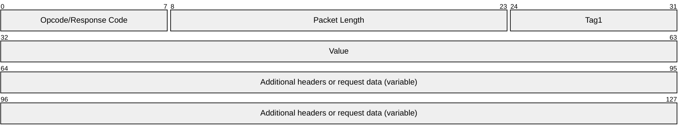

# [MS-IRDA]: IrDA Object Exchange (OBEX) Protocol Profile

Table of Contents

1 Introduction

- [1 Introduction](#Section_1)
  - [1.1 Glossary](#Section_1.1)
  - [1.2 References](#Section_1.2)
    - [1.2.1 Normative References](#Section_1.2.1)
    - [1.2.2 Informative References](#Section_1.2.2)
  - [1.3 Overview](#Section_1.3)
  - [1.4 Relationship to Other Protocols](#Section_1.4)
  - [1.5 Prerequisites/Preconditions](#Section_1.5)
  - [1.6 Applicability Statement](#Section_1.6)
  - [1.7 Versioning and Capability Negotiation](#Section_1.7)
  - [1.8 Vendor-Extensible Fields](#Section_1.8)
  - [1.9 Standards Assignments](#Section_1.9)

2 Messages

- [2 Messages](#Section_2)
  - [2.1 Transport](#Section_2.1)
  - [2.2 Message Syntax](#Section_2.2)
    - [2.2.1 Header Types](#Section_2.2.1)
      - [2.2.1.1 Win32 Error Message Header](#Section_2.2.1.1)
    - [2.2.2 Message Types](#Section_2.2.2)

3 Protocol Details

- [3 Protocol Details](#Section_3)
  - [3.1 Server Details](#Section_3.1)
    - [3.1.1 Abstract Data Model](#Section_3.1.1)
    - [3.1.2 Timers](#Section_3.1.2)
    - [3.1.3 Initialization](#Section_3.1.3)
    - [3.1.4 Higher-Layer Triggered Events](#Section_3.1.4)
    - [3.1.5 Processing Events and Sequencing Rules](#Section_3.1.5)
      - [3.1.5.1 Receiving a CONNECT Message](#Section_3.1.5.1)
      - [3.1.5.2 Sending a CONNECT Response Message](#Section_3.1.5.2)
      - [3.1.5.3 Receiving a PUT Message](#Section_3.1.5.3)
      - [3.1.5.4 Sending a PUT Response Message](#Section_3.1.5.4)
      - [3.1.5.5 Receiving a GET Message](#Section_3.1.5.5)
      - [3.1.5.6 Receiving a SETPATH Message](#Section_3.1.5.6)
      - [3.1.5.7 Sending a SETPATH Response Message](#Section_3.1.5.7)
    - [3.1.6 Timer Events](#Section_3.1.6)
    - [3.1.7 Other Local Events](#Section_3.1.7)
  - [3.2 Client Details](#Section_3.2)
    - [3.2.1 Abstract Data Model](#Section_3.2.1)
    - [3.2.2 Timers](#Section_3.2.2)
    - [3.2.3 Initialization](#Section_3.2.3)
    - [3.2.4 Higher-Layer Triggered Events](#Section_3.2.4)
    - [3.2.5 Processing Events and Sequencing Rules](#Section_3.2.5)
      - [3.2.5.1 Sending a CONNECT Message](#Section_3.2.5.1)
      - [3.2.5.2 Sending a PUT Message](#Section_3.2.5.2)
      - [3.2.5.3 Receiving a PUT Response Message](#Section_3.2.5.3)
      - [3.2.5.4 Receiving a SETPATH Response Message](#Section_3.2.5.4)
    - [3.2.6 Timer Events](#Section_3.2.6)
    - [3.2.7 Other Local Events](#Section_3.2.7)

4 Protocol Examples

- [4 Protocol Examples](#Section_4)

5 Security

- [5 Security](#Section_5)
  - [5.1 Security Considerations for Implementers](#Section_5.1)
  - [5.2 Index of Security Parameters](#Section_5.2)

6 Appendix A: Product Behavior

- [6 Appendix A: Product Behavior](#Section_6)

7 Change Tracking

- [7 Change Tracking](#Section_7)

For the legal notice and IP terms, see [LEGAL.md](../LEGAL.md).
Last updated: 6/25/2021.
See [Revision History](#revision-history) for full version history.

# 1 Introduction

The Infrared Data Association (IrDA) Object Exchange (OBEX) Protocol specified in [IROBEX] is a binary protocol that enables transfer of opaque data objects via the Infrared link. A major use of [IROBEX] is a "push" and/or "pull" of opaque data objects, meaning the local system can "push" or "pull" data to or from the other system via the Infrared link. Only the "push" portion of the protocol is implemented in this specification. Thus, our implementation is described as a profile of the [IROBEX] protocol as IrOBEX.

This IrDA OBEX Protocol Profile [MS-IRDA] specifies an additional user-defined header for Win32 error codes introduced in this profile with implementation details. It also specifies optional behaviors from [IROBEX] that are implemented, whereas other behaviors (such as pull operations) that are not. The information is included in the appropriate sections of this specification.

Sections 1.5, 1.8, 1.9, 2, and 3 of this specification are normative. All other sections and examples in this specification are informative.

## 1.1 Glossary

This document uses the following terms:

**Information Access Service (IAS)**: Each device that implements the set of infrared protocols, specifically [[IRLMP]](https://go.microsoft.com/fwlink/?LinkId=90686), maintains an information base so that one IrDA device can discover what services another IrDA-compliant device offers, as well as gain information about the device itself. This information is held in a number of objects in the information base and is accessed by communicating with the IAS.

**IrDA**: The Infrared Data Association, often referred to as [**IrDA**](#gt_irda), is a nonprofit organization whose goal is to develop globally adopted specifications for infrared wireless communication.

**IrOBEX**: An acronym for the IrDA-defined Infrared Object Exchange protocol, as specified in [[IROBEX]](https://go.microsoft.com/fwlink/?LinkId=92765).

**Link Service Access Point Selector (LSAP-SEL)**: A selector that distinguishes between LSAPs within a station. Legal values for an LSAP-SEL lie in the range 0x00–0x7F. With the exception of the special LSAP-SEL values 0x00 (LM-IAS), 0x70 (Connectionless Data service), 0x71-0x7E (reserved), and 0x7F (reserved for broadcast and currently not implemented), the assignment of LSAP-SEL values is arbitrary. See [IRLMP] section 3.1.2 for more details.

**service access point (SAP)**: An identifying label for network endpoints that are used in Open Systems Interconnection (OSI) networking. The [**SAP**](#gt_service-access-point-sap) is a conceptual location at which one OSI layer can request the services of another OSI layer.

**TinyTP**: Infrared Data Association Tiny Transport Protocol, as specified in [[IRTTP]](https://go.microsoft.com/fwlink/?LinkId=90688).

**MAY, SHOULD, MUST, SHOULD NOT, MUST NOT:** These terms (in all caps) are used as defined in [[RFC2119]](https://go.microsoft.com/fwlink/?LinkId=90317). All statements of optional behavior use either MAY, SHOULD, or SHOULD NOT.

## 1.2 References

Links to a document in the Microsoft Open Specifications library point to the correct section in the most recently published version of the referenced document. However, because individual documents in the library are not updated at the same time, the section numbers in the documents may not match. You can confirm the correct section numbering by checking the [Errata](https://go.microsoft.com/fwlink/?linkid=850906).

### 1.2.1 Normative References

We conduct frequent surveys of the normative references to assure their continued availability. If you have any issue with finding a normative reference, please contact [dochelp@microsoft.com](mailto:dochelp@microsoft.com). We will assist you in finding the relevant information.

[IRLMP] Infrared Data Association, "IrDA Link Management Protocol v1.1", January 1996, [http://irdajp.info/specifications.html](https://go.microsoft.com/fwlink/?LinkId=90686)

**Note** There is a charge to download the specification.

[IROBEX] Infrared Data Association, "IrDA Object Exchange Protocol v1.2", March 1999, [http://irdajp.info/specifications.html](https://go.microsoft.com/fwlink/?LinkId=92765)

**Note** There is a charge to download the specification.

[IRTTP] Infrared Data Association, "IrDA Tiny TP v1.1", October 1996, [http://irdajp.info/specifications.html](https://go.microsoft.com/fwlink/?LinkId=90688)

**Note** There is a charge to download the specification.

[ISO-8601] International Organization for Standardization, "Data Elements and Interchange Formats - Information Interchange - Representation of Dates and Times", ISO/IEC 8601:2004, December 2004, [http://www.iso.org/iso/en/CatalogueDetailPage.CatalogueDetail?CSNUMBER=40874&ICS1=1&ICS2=140&ICS3=30](https://go.microsoft.com/fwlink/?LinkId=89920)

**Note** There is a charge to download the specification.

[MS-ERREF] Microsoft Corporation, "[Windows Error Codes](../MS-ERREF/MS-ERREF.md)".

[RFC2119] Bradner, S., "Key words for use in RFCs to Indicate Requirement Levels", BCP 14, RFC 2119, March 1997, [http://www.rfc-editor.org/rfc/rfc2119.txt](https://go.microsoft.com/fwlink/?LinkId=90317)

### 1.2.2 Informative References

None.

## 1.3 Overview

The Infrared Data Association (IrDA) Object Exchange (OBEX) Protocol is specified by the Infrared Data Association in [[IROBEX]](https://go.microsoft.com/fwlink/?LinkId=92765). The primary use of the protocol is to connect two devices by using an infrared link and to allow sending and receiving of opaque data objects across the infrared link. [IROBEX] specifies the two major elements of the protocol: a model for representing objects with information that describes the objects, and a session protocol that provides a structure for the "conversation" between devices. The session protocol resides on top of and is used to transport opaque data objects over [**TinyTP**](#gt_tinytp) which provides a reliable transport between the two devices, as specified in [[IRTTP]](https://go.microsoft.com/fwlink/?LinkId=90688).

A major use of [IROBEX] is a "push" or "pull" application, allowing rapid and impromptu communications between portable devices. For instance, a laptop user pushes a file to another laptop or PDA, or an industrial computer pulls status and diagnostic information from a piece of factory machinery. Only the "push" portion of the [IROBEX] standards specification is implemented in this profile. Thus, our implementation is described as a profile of the [IROBEX] protocol as [**IrOBEX**](#gt_irobex).

[IROBEX] describes message and header formats and defines how the client and server exchange messages. This IrDA Object Exchange (OBEX) Protocol Profile [MS-IRDA] specifies an additional user-defined header introduced in this profile that provides the ability for the inclusion of Win32 error codes. This profile specifies the header implementation details, and the portions of [IROBEX] that are not implemented. Certain optional behaviors from [IROBEX] are also implemented, whereas other behaviors (such as pull operations) are not. For implementation-specific behavior with this profile, see [Appendix A](#Section_6).

## 1.4 Relationship to Other Protocols

This profile does not introduce any new dependencies on lower layer or parallel protocols beyond those specified in [[IROBEX]](https://go.microsoft.com/fwlink/?LinkId=92765) section 1.3.

## 1.5 Prerequisites/Preconditions

Although not explicitly specified in [[IROBEX]](https://go.microsoft.com/fwlink/?LinkId=92765), as part of the initialization an [**IrOBEX**](#gt_irobex) server registers a [**service access point (SAP)**](#gt_service-access-point-sap) with the [**Information Access Service (IAS)**](#gt_information-access-service-ias), as specified in [[IRLMP]](https://go.microsoft.com/fwlink/?LinkId=90686) section 3.1.2, for clients to be able to discover the service provided by the server.

## 1.6 Applicability Statement

The applicability of this profile is limited in the following ways:

- Data objects, specifically files, can be "pushed" only to the PC or by the PC. The reasons for this limitation are specified in section [3.1.5](#Section_3.1.5). In brief, this profile does not implement the GET operations defined in [[IROBEX]](https://go.microsoft.com/fwlink/?LinkId=92765) section 3.3.4.
- Devices that implement this profile cannot exchange data objects with devices that require [**IrOBEX**](#gt_irobex) authentication as specified in [IROBEX] section 3.5. The reasons for this limitation are specified in sections 3.1.5 and [3.2.5](#Section_3.1.5). In brief, this profile does not implement the authentication sequence as specified in [IROBEX] section 3.5.

## 1.7 Versioning and Capability Negotiation

This profile does not introduce any new versioning issues. This profile is based on version 1.0 of the [**IrDA**](#gt_irda) OBEX Protocol.

## 1.8 Vendor-Extensible Fields

Portions of this profile use Win32 error codes. These values are taken from the error number space specified in [MS-ERREF](../MS-ERREF/MS-ERREF.md). Vendors SHOULD reuse those values with their indicated meaning. Choosing any other value runs the risk of a collision in the future.

Section [3.1.5.1](#Section_3.2.5.1) describes how a **CONNECT** message that contains a **WHO** header is parsed. The **WHO** header used in this profile contains a **UUID** used to identify itself to the IrOBEX server, the specific **UUID** (16 byte) value b9c7fd98-e5f8-11d1-bfce-0000f8753890.

Vendors who want to receive Win32 error codes using the Win32 Error Message header MUST use the previous specific **UUID** in a **WHO** header, as specified in section [2.2.1.1](#Section_2.2.1.1), in addition to the IrOBEX error codes as specified in [[IROBEX]](https://go.microsoft.com/fwlink/?LinkId=92765) section 3.2.1. The effect of using this **UUID** in a **WHO** header is specified in section [3.1.5](#Section_3.1.5) and section [3.2.5](#Section_3.1.5).

## 1.9 Standards Assignments

There are no standards assignments other than what is specified in [[IROBEX]](https://go.microsoft.com/fwlink/?LinkId=92765) section 6.

# 2 Messages

## 2.1 Transport

All [**IrOBEX**](#gt_irobex) messages are transported over [**TinyTP**](#gt_tinytp), as specified in [[IROBEX]](https://go.microsoft.com/fwlink/?LinkId=92765) section 1.4.1.

## 2.2 Message Syntax

The message syntax remains unchanged and is as specified in [[IROBEX]](https://go.microsoft.com/fwlink/?LinkId=92765) sections 3.1 and 3.2.

### 2.2.1 Header Types

Information about how a custom [**IrOBEX**](#gt_irobex) header can be constructed and used is specified in [[IROBEX]](https://go.microsoft.com/fwlink/?LinkId=92765) sections 2.1 and 2.2.12. The custom header used in this protocol profile, section [3](#Section_1.3), is specified in section [2.2.1.1](#Section_2.2.1.1).

Beyond this, the header types and syntax remain unchanged and is as specified in [IROBEX] section 2.1.

#### 2.2.1.1 Win32 Error Message Header

The custom [**IrOBEX**](#gt_irobex) header "Win32 Error Message", referred to in the rest of this document as the **WIN32ERR** header, is defined following the semantics specified in [[IROBEX]](https://go.microsoft.com/fwlink/?LinkId=92765) section 2.2.12. The **WIN32ERR** header can be part of both a request message and a response message,<1> as specified in [IROBEX] sections 3.1 and 3.2.

**Opcode/Response Code (1 byte):** This value can be used as an opcode in the request message or as a response code in the response message, and it defines the IrOBEX operation associated with this packet, as defined in [IROBEX] section 3.3. If this message is a response message, as defined in [IROBEX] section 3.2, the response code value MUST be taken from [IROBEX] section 3.2.1.

**Packet Length (2 bytes):** Describes the length (in bytes) of the entire packet including the opcode, packet length, all optional headers, and data.<2> More details are specified in [IROBEX] section 3.1.

**Tag1 (1 byte):** Describes the implementation-defined header identifier. The value for this field is 0xF0. This value is the bitwise OR of 0x30 and 0xC0. This signifies that the header identifier is "user-defined" (0x30) and that the length of the **Value** field is 4 bytes (0xC0). The values 0x30 and 0xC0 and the bitwise OR operation used to arrive at the final value of 0xF0 for this field are specified in [IROBEX] section 2.1.

**Value (4 bytes):** A 4-byte value containing a Win32 error code; see section [1.8](#Section_1.8).

**Additional headers or request data (variable):** This variable length segment contains the rest of the IrOBEX message, as specified in [IROBEX] sections 3.1 and 3.2.

### 2.2.2 Message Types

The message types and syntax remain unchanged and are as specified in [[IROBEX]](https://go.microsoft.com/fwlink/?LinkId=92765) section 3.

# 3 Protocol Details

The protocol details for both client and server are specified in [[IROBEX]](https://go.microsoft.com/fwlink/?LinkId=92765). The purpose of this section is to provide a context for implementation-specific notes about the client and server sides of the [**IrDA**](#gt_irda) OBEX Protocol profile.

## 3.1 Server Details

### 3.1.1 Abstract Data Model

This section describes a conceptual model of possible data organization that an implementation maintains to participate in this protocol. The described organization is provided to facilitate the explanation of how the protocol behaves. This document does not mandate that implementations adhere to this model as long as their external behavior is consistent with that described in this document.

No state is necessary other than that specified in [[IROBEX]](https://go.microsoft.com/fwlink/?LinkId=92765) section 2.

### 3.1.2 Timers

No new timers are required beyond those in the base protocol, as specified in [[IROBEX]](https://go.microsoft.com/fwlink/?LinkId=92765) section 3.4.

### 3.1.3 Initialization

No initialization is necessary other than that specified in [[IROBEX]](https://go.microsoft.com/fwlink/?LinkId=92765).<3>

### 3.1.4 Higher-Layer Triggered Events

No higher-layer triggered events are required other than those specified in [[IROBEX]](https://go.microsoft.com/fwlink/?LinkId=92765).

### 3.1.5 Processing Events and Sequencing Rules

Message processing events MUST remain the same as specified in [[IROBEX]](https://go.microsoft.com/fwlink/?LinkId=92765) section 3, except as described in this section.<4>

#### 3.1.5.1 Receiving a CONNECT Message

**CONNECT** messages MUST be parsed as specified in [[IROBEX]](https://go.microsoft.com/fwlink/?LinkId=92765) section 3.3.1. Optional headers MAY be parsed as specified in [IROBEX] section 2.1.<5> As a result of this message, the server MUST respond with a **CONNECT** Response message as specified in section [3.1.5.2](#Section_3.1.5.2).<6>

[IROBEX] section 2.2.7 asserts that a **TARGET** header MAY be used in conjunction with a **WHO** header. This profile does not use or rely on the **TARGET** header and instead relies only on the **WHO** header for identification of the IrOBEX client type.

#### 3.1.5.2 Sending a CONNECT Response Message

A **CONNECT Response** message MUST be sent as specified in [[IROBEX]](https://go.microsoft.com/fwlink/?LinkId=92765) section 3.3.1.8. If the **CONNECT** message contained a **WHO** header carrying a **UUID**, section [1.8](#Section_1.8), the **CONNEC**T **Response** message also contains a **WHO** header carrying the same **UUID**. The **WIN32ERR** header, as specified in section [2.2.1.1](#Section_2.2.1.1), is appended to the **CONNECT** Response message.

#### 3.1.5.3 Receiving a PUT Message

A **PUT** message MUST be handled as specified in [[IROBEX]](https://go.microsoft.com/fwlink/?LinkId=92765) section 3.3.3. Optional headers MAY be parsed as specified in [IROBEX] section 2.1.

[IROBEX] section 3.3.1.10 states that "...IrOBEX implementations MAY choose to accept **PUT** and **GET** operations without first requiring a **CONNECT** operation by assuming default values for the connection parameters." This profile does not support acceptance of **PUT** operations without the required **CONNECT** operation.<7>

#### 3.1.5.4 Sending a PUT Response Message

A **PUT Response** message MUST be sent as specified in [[IROBEX]](https://go.microsoft.com/fwlink/?LinkId=92765) section 3.3.3.2. When the **PUT Response** returns an IrOBEX error response code, the message is processed as follows: If the **PUT Response** message was preceded by a **CONNECT** - **CONNECT Response** exchange containing a **UUID**, section [1.8](#Section_1.8), in a **WHO** header, then the **PUT Response** message will contain the **WIN32ERR** header, section [2.2.1.1](#Section_2.2.1.1).

#### 3.1.5.5 Receiving a GET Message

This profile does not support processing of **GET** messages. Implementations of this profile discard the **GET** message by responding with a "Not implemented" IrOBEX response code (0xD1), as specified in section [3.2.1](#Section_3.1.1).

#### 3.1.5.6 Receiving a SETPATH Message

A **SETPATH** message MUST be handled as specified in [[IROBEX]](https://go.microsoft.com/fwlink/?LinkId=92765) section 3.3.6.

#### 3.1.5.7 Sending a SETPATH Response Message

A **SETPATH Response** message MUST be sent as specified in [[IROBEX]](https://go.microsoft.com/fwlink/?LinkId=92765) section 3.3.6. If the **SETPATH** message was preceded by a **CONNECT** - **CONNECT Response** exchange that contained a **WHO** header carrying the **UUID**, section [1.8](#Section_1.8), this profile requires the **WIN32ERR** header to be appended to the **SETPATH Response** message, as specified in section [2.2.1.1](#Section_2.2.1.1).

### 3.1.6 Timer Events

No new timer events are required beyond those in the base protocol, as specified in [[IROBEX]](https://go.microsoft.com/fwlink/?LinkId=92765) section 3.4.

### 3.1.7 Other Local Events

None.

## 3.2 Client Details

### 3.2.1 Abstract Data Model

This section describes a conceptual model of possible data organization that an implementation maintains to participate in this protocol. The described organization is provided to facilitate the explanation of how the protocol behaves. This document does not mandate that implementations adhere to this model as long as their external behavior is consistent with that described in this document.

Filenames used in this protocol MUST be limited to 260 characters or less.

No other state is necessary other than that specified in [[IROBEX]](https://go.microsoft.com/fwlink/?LinkId=92765) section 2.

### 3.2.2 Timers

No new timers are required beyond those in the base protocol, as specified in [[IROBEX]](https://go.microsoft.com/fwlink/?LinkId=92765) section 3.4.

### 3.2.3 Initialization

No initialization is necessary other than that specified in [[IROBEX]](https://go.microsoft.com/fwlink/?LinkId=92765).

Although not explicitly stated in [IROBEX], a client that wants to establish a [**TinyTP**](#gt_tinytp) connection to be used by the [**IrDA**](#gt_irda) OBEX protocol profile MUST perform an IAS **GetValueByClass** call on the class name "OBEX" or "OBEX:IrXfer", attribute "IrDA:TinyTP:LsapSel", as specified in [[IRLMP]](https://go.microsoft.com/fwlink/?LinkId=90686) section 4.2.4. The client MUST initiate the TinyTP connection to the [**Link Service Access Point Selector (LSAP-SEL)**](#gt_link-service-access-point-selector-lsap-sel) value returned by the server, as specified in [[IRTTP]](https://go.microsoft.com/fwlink/?LinkId=90688) section 2.2.1.

### 3.2.4 Higher-Layer Triggered Events

No higher-layer triggered events are required other than those specified in [[IROBEX]](https://go.microsoft.com/fwlink/?LinkId=92765).

### 3.2.5 Processing Events and Sequencing Rules

Message processing events remain the same as specified in [[IROBEX]](https://go.microsoft.com/fwlink/?LinkId=92765) section 3, except as described in this section.

#### 3.2.5.1 Sending a CONNECT Message

The **CONNECT** message MUST be sent as specified in [[IROBEX]](https://go.microsoft.com/fwlink/?LinkId=92765) section 3.3.1. Optional headers MAY be sent as specified in [IROBEX] section 2.1.

This profile uses the following values and optional headers in a **CONNECT** message:

- Maximum IrOBEX packet length = 32,672 bytes
- **WHO** header carrying the **UUID** as defined in section [1.8](#Section_1.8)

#### 3.2.5.2 Sending a PUT Message

The **PUT** message MUST be sent as specified in [[IROBEX]](https://go.microsoft.com/fwlink/?LinkId=92765) section 3.3.3. Optional headers MAY be sent as specified in [IROBEX] section 2.1.

This profile sends the following optional headers in a **PUT** message:

- **NAME** header
- **LENGTH** header
- **TIME** header: [[ISO-8601]](https://go.microsoft.com/fwlink/?LinkId=89920) time format is used, as specified in [IROBEX] section 2.2.5.

#### 3.2.5.3 Receiving a PUT Response Message

The **PUT Response** message MUST be handled as specified in [[IROBEX]](https://go.microsoft.com/fwlink/?LinkId=92765) section 3.3.3.2.

If the **PUT Response** message was preceded by a **CONNECT** - **CONNECT Response** exchange that contained a **UUID**, section [1.8](#Section_1.8), in a **WHO** header, the **PUT Response** message will contain the **WIN32ERR** header if the **PUT Response** also contains an IrOBEX error response code, section [2.2.1.1](#Section_2.2.1.1). Implementations of this profile MUST ABORT the transfer as defined in [IROBEX] if error codes that are not equal to zero are present in the **WIN32ERR** header.

#### 3.2.5.4 Receiving a SETPATH Response Message

A **SETPATH** Response message MUST be handled as specified in [[IROBEX]](https://go.microsoft.com/fwlink/?LinkId=92765) section 3.3.6.

### 3.2.6 Timer Events

No new timer events are required beyond those in the base protocol as specified in [[IROBEX]](https://go.microsoft.com/fwlink/?LinkId=92765) section 3.4.

### 3.2.7 Other Local Events

None.

# 4 Protocol Examples

Protocol examples are specified in [[IROBEX]](https://go.microsoft.com/fwlink/?LinkId=92765) section 7.

# 5 Security

## 5.1 Security Considerations for Implementers

This protocol profile does not implement any security function specified in [[IROBEX]](https://go.microsoft.com/fwlink/?LinkId=92765). Specifically, it does not support the authentication challenge as specified in [IROBEX] section 2.2.13.

Protocol implementers need to exercise caution when using this protocol profile. The mandatory physical proximity of 1 meter and line-of-sight positioning between the IrOBEX devices mitigates the potential security issues.

Protocol implementers need to consider allowing users to turn off the functionality provided by this protocol profile.

## 5.2 Index of Security Parameters

None.

# 6 Appendix A: Product Behavior

The information in this specification is applicable to the following Microsoft products or supplemental software. References to product versions include updates to those products.

- Windows NT operating system
- Windows 98 operating system
- Windows 2000 operating system
- Windows Millennium Edition operating system
- Windows XP operating system
- Windows Server 2003 operating system
- Windows Vista operating system
- Windows 7 operating system
- Windows 8 operating system
- Windows 8.1 operating system
- Windows 10 operating system
- Windows 11 operating system
Exceptions, if any, are noted in this section. If an update version, service pack or Knowledge Base (KB) number appears with a product name, the behavior changed in that update. The new behavior also applies to subsequent updates unless otherwise specified. If a product edition appears with the product version, behavior is different in that product edition.

Unless otherwise specified, any statement of optional behavior in this specification that is prescribed using the terms "SHOULD" or "SHOULD NOT" implies product behavior in accordance with the SHOULD or SHOULD NOT prescription. Unless otherwise specified, the term "MAY" implies that the product does not follow the prescription.

<1> Section 2.2.1.1: The Windows **WIN32ERR** header is only sent when condition 1 and at least one of the following conditions 2–9 are met:

- The NT5 dialect of the protocol is in use (not the Win95 dialect).
- A **CONNECT**, **PUT**, or **SETPATH** request is received and both of the following conditions are true:
- The request has one or more of the following headers: **NAME**, **LENGTH**, **TIME**, **BODY**, **BODY END**, **WHO**, and **WIN32ERR**.
- The value in the header is invalid or is not formatted correctly. For instance, the (nonzero) value length is less than what is expected for that header, or the file name is invalid.
If a file name is invalid—for instance, the file name is longer than 260 characters—Microsoft implementations will always return an error.

- A **CONNECT** message is received and any of the following conditions are true:
- The HKCU\Control Panel\Infrared\File Transfer\Allow Send registry value is set to 0.
- The system is going to sleep.
- A **CONNECT** request is received and there is an error while creating a base file reception directory that does not already exist.
- A **PUT** or **SETPATH** request is received and any of the following conditions are true:
- There is an error while creating the file or directory; for instance, access is denied.
- The user denies permission to receive the file.
- The user denies permission to create the directory through the UI.
- A **PUT** request is received and there is an error while trying to write the data to the file; for instance, the disk is full.
- A **PUT** request is being sent and the transfer is canceled.
- There is an error reading the file to be sent or there is an error during the transmission (sending) of the file data.
- Data is being received and either the transfer is canceled, or a transmission error occurs.
- If the incoming **CONNECT**/**PUT**/**SETPATH** request contains a **WIN32ERR** header with a nonzero error code, a **WIN32ERR** header will be sent out in the response with the same code.
<2> Section 2.2.1.1: Certain Microsoft implementations of this protocol behave differently when processing this header.

In some cases, the packet length field does not include the length of the **WIN32ERR** header even though the **WIN32ERR** header is sent. This behavior, as listed in the previous behavior note, occurs in the following four condition cases: 2 (except for receiving a **CONNECT** message), 5, 6, and 9.

In addition, for cases 7 and 8, the length will be wrong if the Win95 dialect of the protocol is used. The packet length will include the length of the **WIN32ERR** header even though the header is not sent out in the Win95 dialect. This behavior is consistent in all implementations of the Win95 dialect. All applicable Windows releases are capable of using the Win95 dialect of this profile.

<3> Section 3.1.3: At initialization time, Windows registers two class names for the [**IrOBEX**](#gt_irobex) service in the IAS store: OBEX and OBEX:IrXfer as specified in [[IROBEX]](https://go.microsoft.com/fwlink/?LinkId=92765) section 6.1. There is no difference in behavior by the server irrespective of which class name that the client uses to connect to the server.

<4> Section 3.1.5: [IROBEX] section 3 does not explicitly state that any headers have to be supported. Unless otherwise stated, Windows discards all headers it receives and does not include any headers in messages that it sends over the link.

<5> Section 3.1.5.1: Windows parses the following optional headers as part of a **CONNECT** message as specified in [IROBEX] section 2.1:

- **NAME** header
- **LENGTH** header
- **TIME** header: Both [[ISO-8601]](https://go.microsoft.com/fwlink/?LinkId=89920) and UNIX time formats are parsed.
- **WHO** Header
<6> Section 3.1.5.1: A device that relies on authenticating the server will not interoperate with the Windows implementation of the [**IrDA**](#gt_irda) OBEX protocol profile because the authentication header in a **CONNECT** message is discarded.

<7> Section 3.1.5.3: Windows implementations parse the following optional headers as part of a **PUT** message as specified in [IROBEX] section 2.1:

- **NAME** header
- **LENGTH** header
- **TIME** header: Both [ISO-8601] and UNIX time formats are parsed.

# 7 Change Tracking

This section identifies changes that were made to this document since the last release. Changes are classified as Major, Minor, or None.

The revision class **Major** means that the technical content in the document was significantly revised. Major changes affect protocol interoperability or implementation. Examples of major changes are:

- A document revision that incorporates changes to interoperability requirements.
- A document revision that captures changes to protocol functionality.
The revision class **Minor** means that the meaning of the technical content was clarified. Minor changes do not affect protocol interoperability or implementation. Examples of minor changes are updates to clarify ambiguity at the sentence, paragraph, or table level.

The revision class **None** means that no new technical changes were introduced. Minor editorial and formatting changes may have been made, but the relevant technical content is identical to the last released version.

The changes made to this document are listed in the following table. For more information, please contact [dochelp@microsoft.com](mailto:dochelp@microsoft.com).

| Section | Description | Revision class |
| --- | --- | --- |
| [6](#Section_6) Appendix A: Product Behavior | Updated for this version of Windows Client. | Major |

## Revision History

| Date | Version | Revision Class | Comments |
| --- | --- | --- | --- |
| 7/20/2007 | 0.1 | Major | MCPP Milestone 5 Initial Availability |
| 9/28/2007 | 0.1.1 | Editorial | Changed language and formatting in the technical content. |
| 10/23/2007 | 0.1.2 | Editorial | Changed language and formatting in the technical content. |
| 11/30/2007 | 0.1.3 | Editorial | Changed language and formatting in the technical content. |
| 1/25/2008 | 0.1.4 | Editorial | Changed language and formatting in the technical content. |
| 3/14/2008 | 0.1.5 | Editorial | Changed language and formatting in the technical content. |
| 5/16/2008 | 0.1.6 | Editorial | Changed language and formatting in the technical content. |
| 6/20/2008 | 1.0 | Major | Updated and revised the technical content. |
| 7/25/2008 | 1.0.1 | Editorial | Changed language and formatting in the technical content. |
| 8/29/2008 | 2.0 | Major | Updated and revised the technical content. |
| 10/24/2008 | 3.0 | Major | Updated and revised the technical content. |
| 12/5/2008 | 4.0 | Major | Updated and revised the technical content. |
| 1/16/2009 | 4.0.1 | Editorial | Changed language and formatting in the technical content. |
| 2/27/2009 | 4.0.2 | Editorial | Changed language and formatting in the technical content. |
| 4/10/2009 | 4.0.3 | Editorial | Changed language and formatting in the technical content. |
| 5/22/2009 | 4.0.4 | Editorial | Changed language and formatting in the technical content. |
| 7/2/2009 | 4.0.5 | Editorial | Changed language and formatting in the technical content. |
| 8/14/2009 | 4.0.6 | Editorial | Changed language and formatting in the technical content. |
| 9/25/2009 | 4.1 | Minor | Clarified the meaning of the technical content. |
| 11/6/2009 | 4.1.1 | Editorial | Changed language and formatting in the technical content. |
| 12/18/2009 | 4.1.2 | Editorial | Changed language and formatting in the technical content. |
| 1/29/2010 | 5.0 | Major | Updated and revised the technical content. |
| 3/12/2010 | 6.0 | Major | Updated and revised the technical content. |
| 4/23/2010 | 6.0.1 | Editorial | Changed language and formatting in the technical content. |
| 6/4/2010 | 6.0.2 | Editorial | Changed language and formatting in the technical content. |
| 7/16/2010 | 6.0.2 | None | No changes to the meaning, language, or formatting of the technical content. |
| 8/27/2010 | 6.0.2 | None | No changes to the meaning, language, or formatting of the technical content. |
| 10/8/2010 | 6.0.2 | None | No changes to the meaning, language, or formatting of the technical content. |
| 11/19/2010 | 6.0.2 | None | No changes to the meaning, language, or formatting of the technical content. |
| 1/7/2011 | 6.0.2 | None | No changes to the meaning, language, or formatting of the technical content. |
| 2/11/2011 | 6.0.2 | None | No changes to the meaning, language, or formatting of the technical content. |
| 3/25/2011 | 6.0.2 | None | No changes to the meaning, language, or formatting of the technical content. |
| 5/6/2011 | 6.0.2 | None | No changes to the meaning, language, or formatting of the technical content. |
| 6/17/2011 | 6.1 | Minor | Clarified the meaning of the technical content. |
| 9/23/2011 | 6.1 | None | No changes to the meaning, language, or formatting of the technical content. |
| 12/16/2011 | 7.0 | Major | Updated and revised the technical content. |
| 3/30/2012 | 7.0 | None | No changes to the meaning, language, or formatting of the technical content. |
| 7/12/2012 | 7.0 | None | No changes to the meaning, language, or formatting of the technical content. |
| 10/25/2012 | 7.0 | None | No changes to the meaning, language, or formatting of the technical content. |
| 1/31/2013 | 7.0 | None | No changes to the meaning, language, or formatting of the technical content. |
| 8/8/2013 | 8.0 | Major | Updated and revised the technical content. |
| 11/14/2013 | 8.0 | None | No changes to the meaning, language, or formatting of the technical content. |
| 2/13/2014 | 8.0 | None | No changes to the meaning, language, or formatting of the technical content. |
| 5/15/2014 | 8.0 | None | No changes to the meaning, language, or formatting of the technical content. |
| 6/30/2015 | 9.0 | Major | Significantly changed the technical content. |
| 10/16/2015 | 9.0 | None | No changes to the meaning, language, or formatting of the technical content. |
| 7/14/2016 | 9.0 | None | No changes to the meaning, language, or formatting of the technical content. |
| 6/1/2017 | 9.0 | None | No changes to the meaning, language, or formatting of the technical content. |
| 6/25/2021 | 10.0 | Major | Significantly changed the technical content. |
