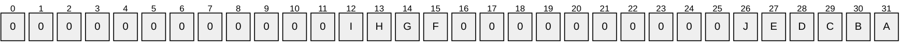

# [MS-KILE]: Kerberos Protocol Extensions

Table of Contents

1 Introduction

- [1 Introduction](#Section_1)
  - [1.1 Glossary](#Section_1.1)
  - [1.2 References](#Section_1.2)
    - [1.2.1 Normative References](#Section_1.2.1)
    - [1.2.2 Informative References](#Section_1.2.2)
  - [1.3 Overview](#Section_1.3)
    - [1.3.1 Security Background](#Section_1.3.1)
    - [1.3.2 Kerberos Network Authentication Service (V5) Synopsis](#Section_1.3.2)
    - [1.3.3 FAST](#Section_1.3.3)
    - [1.3.4 Compound Identity](#Section_1.3.4)
    - [1.3.5 KILE Synopsis](#Section_1.3.5)
  - [1.4 Relationship to Other Protocols](#Section_1.4)
  - [1.5 Prerequisites/Preconditions](#Section_1.5)
  - [1.6 Applicability Statement](#Section_1.6)
  - [1.7 Versioning and Capability Negotiation](#Section_1.7)
    - [1.7.1 Pre-Authentication](#Section_1.7.1)
    - [1.7.2 Encryption Types](#Section_1.7.2)
  - [1.8 Vendor-Extensible Fields](#Section_1.8)
  - [1.9 Standards Assignments](#Section_1.9)
    - [1.9.1 Use of Constants Assigned Elsewhere](#Section_1.9.1)

2 Messages

- [2 Messages](#Section_2)
  - [2.1 Transport](#Section_2.1)
  - [2.2 Message Syntax](#Section_2.2)
    - [2.2.1 KERB-EXT-ERROR](#Section_2.2.1)
    - [2.2.2 KERB-ERROR-DATA](#Section_2.2.2)
    - [2.2.3 KERB-PA-PAC-REQUEST](#Section_2.2.3)
    - [2.2.4 KERB_AUTH_DATA_LOOPBACK](#Section_2.2.4)
    - [2.2.5 LSAP_TOKEN_INFO_INTEGRITY](#Section_2.2.5)
    - [2.2.6 KERB-AD-RESTRICTION-ENTRY](#Section_2.2.6)
    - [2.2.7 Supported Encryption Types Bit Flags](#Section_2.2.7)
    - [2.2.8 PA-SUPPORTED-ENCTYPES](#Section_2.2.8)
    - [2.2.9 OCTET STRING](#Section_2.2.9)
    - [2.2.10 PA-PAC-OPTIONS](#Section_2.2.10)
    - [2.2.11 KERB-KEY-LIST-REQ](#Section_2.2.11)
    - [2.2.12 KERB-KEY-LIST-REP](#Section_2.2.12)
    - [2.2.13 KERB-SUPERSEDED-BY-USER](#Section_2.2.13)
    - [2.2.14 KERB-DMSA-KEY-PACKAGE](#Section_2.2.14)
  - [2.3 Directory Service Schema Elements](#Section_2.3)

3 Protocol Details

- [3 Protocol Details](#Section_3)
  - [3.1 Common Details](#Section_3.1)
    - [3.1.1 Abstract Data Model](#Section_3.1.1)
      - [3.1.1.1 Replay Cache](#Section_3.1.1.1)
      - [3.1.1.2 Cryptographic Material](#Section_3.1.1.2)
      - [3.1.1.3 Ticket Cache](#Section_3.1.1.3)
      - [3.1.1.4 Machine ID](#Section_3.1.1.4)
      - [3.1.1.5 SupportedEncryptionTypes](#Section_3.1.1.5)
      - [3.1.1.6 Kerberos OID](#Section_3.1.1.6)
    - [3.1.2 Timers](#Section_3.1.2)
    - [3.1.3 Initialization](#Section_3.1.3)
    - [3.1.4 Higher-Layer Triggered Events](#Section_3.1.4)
    - [3.1.5 Message Processing Events and Sequencing Rules](#Section_3.1.5)
      - [3.1.5.1 Pre-authentication Data](#Section_3.1.5.1)
      - [3.1.5.2 Encryption Types](#Section_3.1.5.2)
      - [3.1.5.3 Encryption Checksum Types](#Section_3.1.5.3)
      - [3.1.5.4 Ticket Flag Details](#Section_3.1.5.4)
      - [3.1.5.5 Other Elements and Options](#Section_3.1.5.5)
      - [3.1.5.6 Addressing](#Section_3.1.5.6)
      - [3.1.5.7 Internationalization and Case Sensitivity](#Section_3.1.5.7)
      - [3.1.5.8 Key Version Numbers](#Section_3.1.5.8)
      - [3.1.5.9 Key Usage Numbers](#Section_3.1.5.9)
      - [3.1.5.10 Referrals](#Section_3.1.5.10)
      - [3.1.5.11 Naming](#Section_3.1.5.11)
      - [3.1.5.12 Password Change and Set](#Section_3.1.5.12)
    - [3.1.6 Timer Events](#Section_3.1.6)
    - [3.1.7 Other Local Events](#Section_3.1.7)
    - [3.1.8 Implementing Public Keys](#Section_3.1.8)
  - [3.2 Client Details](#Section_3.2)
    - [3.2.1 Abstract Data Model](#Section_3.2.1)
    - [3.2.2 Timers](#Section_3.2.2)
    - [3.2.3 Initialization](#Section_3.2.3)
    - [3.2.4 Higher-Layer Triggered Events](#Section_3.2.4)
      - [3.2.4.1 Initial Logon](#Section_3.2.4.1)
      - [3.2.4.2 Authentication to Services](#Section_3.2.4.2)
    - [3.2.5 Message Processing Events and Sequencing Rules](#Section_3.2.5)
      - [3.2.5.1 Request Flags Details](#Section_3.2.5.1)
      - [3.2.5.2 Authenticator Checksum Flags](#Section_3.2.5.2)
      - [3.2.5.3 Locate a DS_BEHAVIOR_WIN2012 DC](#Section_3.2.5.3)
      - [3.2.5.4 Using FAST When the Realm Supports FAST](#Section_3.2.5.4)
      - [3.2.5.5 AS Exchange](#Section_3.2.5.5)
      - [3.2.5.6 Forwardable TGT Request](#Section_3.2.5.6)
      - [3.2.5.7 TGS Exchange](#Section_3.2.5.7)
      - [3.2.5.8 AP Exchange](#Section_3.2.5.8)
    - [3.2.6 Timer Events](#Section_3.2.6)
    - [3.2.7 Other Local Events](#Section_3.2.7)
  - [3.3 KDC Details](#Section_3.3)
    - [3.3.1 Abstract Data Model](#Section_3.3.1)
      - [3.3.1.1 Account Database Extensions](#Section_3.3.1.1)
    - [3.3.2 Timers](#Section_3.3.2)
    - [3.3.3 Initialization](#Section_3.3.3)
    - [3.3.4 Higher-Layer Triggered Events](#Section_3.3.4)
      - [3.3.4.1 KDC Configuration Changes](#Section_3.3.4.1)
    - [3.3.5 Message Processing Events and Sequencing Rules](#Section_3.3.5)
      - [3.3.5.1 Request Flag Ticket-issuing Behavior](#Section_3.3.5.1)
        - [3.3.5.1.1 Server Principal Lookup](#Section_3.3.5.1.1)
        - [3.3.5.1.2 Canonicalization of Server Principals](#Section_3.3.5.1.2)
      - [3.3.5.2 User Account Objects Without UPN](#Section_3.3.5.2)
      - [3.3.5.3 PAC Generation](#Section_3.3.5.3)
      - [3.3.5.4 Determining Authentication Policy Silo Membership](#Section_3.3.5.4)
      - [3.3.5.5 Determining Authentication Policy Settings](#Section_3.3.5.5)
      - [3.3.5.6 AS Exchange](#Section_3.3.5.6)
        - [3.3.5.6.1 Client Principal Lookup](#Section_3.3.5.6.1)
        - [3.3.5.6.2 Referrals](#Section_3.3.5.6.2)
        - [3.3.5.6.3 Check Account Policy for Every TGT Request](#Section_3.3.5.6.3)
        - [3.3.5.6.4 Initial Population of the PAC](#Section_3.3.5.6.4)
          - [3.3.5.6.4.1 KERB_VALIDATION_INFO Structure](#Section_3.3.5.6.4.1)
          - [3.3.5.6.4.2 PAC_CLIENT_INFO Structure](#Section_3.3.5.6.4.2)
          - [3.3.5.6.4.3 Server Signature](#Section_3.3.5.6.4.3)
          - [3.3.5.6.4.4 KDC Signatures](#Section_3.3.5.6.4.4)
          - [3.3.5.6.4.5 UPN_DNS_INFO Structure](#Section_3.3.5.6.4.5)
          - [3.3.5.6.4.6 PAC_CLIENT_CLAIMS_INFO Structure](#Section_3.3.5.6.4.6)
          - [3.3.5.6.4.7 PAC_ATTRIBUTES_INFO Structure](#Section_3.3.5.6.4.7)
          - [3.3.5.6.4.8 PAC_REQUESTOR SID](#Section_3.3.5.6.4.8)
      - [3.3.5.7 TGS Exchange](#Section_3.3.5.7)
        - [3.3.5.7.1 Check Account Policy for Every Session Ticket Request](#Section_3.3.5.7.1)
        - [3.3.5.7.2 TGT without a PAC](#Section_3.3.5.7.2)
        - [3.3.5.7.3 Domain Local Group Membership](#Section_3.3.5.7.3)
        - [3.3.5.7.4 Compound Identity](#Section_3.3.5.7.4)
        - [3.3.5.7.5 Cross-Domain Trust and Referrals](#Section_3.3.5.7.5)
        - [3.3.5.7.6 FORWARDED TGT etype](#Section_3.3.5.7.6)
        - [3.3.5.7.7 Read-only Domain Controller (RODC)](#Section_3.3.5.7.7)
        - [3.3.5.7.8 Key List Request](#Section_3.3.5.7.8)
        - [3.3.5.7.9 PAC Requestor and Attributes Info Structures](#Section_3.3.5.7.9)
      - [3.3.5.8 Network Ticket Logon](#Section_3.3.5.8)
        - [3.3.5.8.1 Key Distribution Center Processes Request](#Section_3.3.5.8.1)
    - [3.3.6 Timer Events](#Section_3.3.6)
    - [3.3.7 Other Local Events](#Section_3.3.7)
  - [3.4 Application Server Details](#Section_3.4)
    - [3.4.1 Abstract Data Model](#Section_3.4.1)
    - [3.4.2 Timers](#Section_3.4.2)
    - [3.4.3 Initialization](#Section_3.4.3)
      - [3.4.3.1 msDS-SupportedEncryptionTypes attribute](#Section_3.4.3.1)
    - [3.4.4 Higher-Layer Triggered Events](#Section_3.4.4)
    - [3.4.5 Message Processing Events and Sequencing Rules](#Section_3.4.5)
      - [3.4.5.1 Three-Leg DCE-Style Mutual Authentication](#Section_3.4.5.1)
      - [3.4.5.2 Datagram-Style Authentication](#Section_3.4.5.2)
      - [3.4.5.3 Processing Authorization Data](#Section_3.4.5.3)
      - [3.4.5.4 GSS_WrapEx() Call](#Section_3.4.5.4)
        - [3.4.5.4.1 Kerberos Binding of GSS_WrapEx()](#Section_3.4.5.4.1)
      - [3.4.5.5 GSS_UnwrapEx() Call](#Section_3.4.5.5)
      - [3.4.5.6 GSS_GetMICEx() Call](#Section_3.4.5.6)
      - [3.4.5.7 GSS_VerifyMICEx() Call](#Section_3.4.5.7)
    - [3.4.6 Timer Events](#Section_3.4.6)
    - [3.4.7 Other Local Events](#Section_3.4.7)

4 Protocol Examples

- [4 Protocol Examples](#Section_4)
  - [4.1 Interactive Logon Using Passwords](#Section_4.1)
  - [4.2 Network Logon](#Section_4.2)
  - [4.3 GSS_WrapEx with AES128-CTS-HMAC-SHA1-96](#Section_4.3)
  - [4.4 AES 128 Key Creation](#Section_4.4)
  - [4.5 RC4 GSS_WrapEx](#Section_4.5)

5 Security

- [5 Security](#Section_5)
  - [5.1 Security Considerations for Implementers](#Section_5.1)
    - [5.1.1 RODC Key Version Numbers](#Section_5.1.1)
    - [5.1.2 SPNs with Serviceclass Equal to "RestrictedKrbHost"](#Section_5.1.2)
    - [5.1.3 Account Revocation Checking](#Section_5.1.3)
    - [5.1.4 FORWARDED TGT etype](#Section_5.1.4)
    - [5.1.5 DES Downgrade Protection](#Section_5.1.5)
  - [5.2 Index of Security Parameters](#Section_5.2)

6 Appendix A: Product Behavior

- [6 Appendix A: Product Behavior](#Section_6)

7 Change Tracking

- [7 Change Tracking](#Section_7)

For the legal notice and IP terms, see [LEGAL.md](../LEGAL.md).
Last updated: 8/11/2025.
See [Revision History](#revision-history) for full version history.

# 1 Introduction

Kerberos Network Authentication Service V5 Extensions apply to the Kerberos Network Authentication Service (V5) protocol [[RFC4120]](https://go.microsoft.com/fwlink/?LinkId=90458) referred to simply as Kerberos V5 throughout the remainder of this specification. These extensions provide additional capability for authorization information including group memberships, interactive logon information, and integrity levels.

Sections 1.5, 1.8, 1.9, 2, and 3 of this specification are normative. All other sections and examples in this specification are informative.

## 1.1 Glossary

This document uses the following terms:

**Active Directory**: The Windows implementation of a general-purpose [**directory service**](#gt_directory-service-ds), which uses LDAP as its primary access protocol. Active Directory stores information about a variety of objects in the network such as user accounts, computer accounts, groups, and all related credential information used by Kerberos [MS-KILE](#Section_2a32282edd484ad9a542609804b02cc9). Active Directory is either deployed as Active Directory Domain Services (AD DS) or Active Directory Lightweight Directory Services (AD LDS), which are both described in [MS-ADOD](../MS-ADOD/MS-ADOD.md): Active Directory Protocols Overview.

**Authentication Protocol (AP) exchange**: The Kerberos subprotocol called the "authentication protocol", sometimes referred to as the "Client/Server Authentication Exchange", in which the client presents a [**service ticket**](#gt_service-ticket) and an [**authenticator**](#gt_authenticator) to a service to establish an authenticated communication session with the service (see [[RFC4120]](https://go.microsoft.com/fwlink/?LinkId=90458) section 3.2).

**Authentication Service (AS)**: A service that issues ticket granting tickets (TGTs), which are used for authenticating principals within the [**realm**](#gt_realm) or [**domain**](#gt_domain) served by the [**Authentication Service**](#gt_authentication-service-as).

**Authentication Service (AS) exchange**: The Kerberos subprotocol in which the [**Authentication Service (AS)**](#gt_authentication-service-as) component of the [**key distribution center (KDC)**](#gt_key-distribution-center-kdc) accepts an initial logon or authentication request from a client and provides the client with a [**ticket-granting ticket (TGT)**](#gt_ticket-granting-ticket-tgt) and necessary cryptographic keys to make use of the [**ticket**](#gt_ticket). This is specified in [RFC4120] section 3.1. The [**AS exchange**](#gt_authentication-service-as-exchange) is always initiated by the client, usually in response to the initial logon of a principal such as a user.

**authenticator**: When used in reference to Kerberos, see [**Kerberos authenticator**](#gt_kerberos-authenticator).

**authorization data**: An extensible field within a Kerberos [**ticket**](#gt_ticket), used to pass authorization data about the principal on whose behalf the [**ticket**](#gt_ticket) was issued to the application service.

**claim**: An assertion about a security principal expressed as the n-tuple {Identifier, ValueType, m Value(s) of type ValueType} where m is greater than or equal to 1. A claim with only one Value in the n-tuple is called a single-valued claim; a claim with more than one Value is called a multi-valued claim.

**Compound identity TGS-REQ**: A [**FAST**](#gt_flexible-authentication-secure-tunneling-fast) TGS-REQ that uses explicit [**FAST**](#gt_flexible-authentication-secure-tunneling-fast) armoring using the computer's [**ticket-granting ticket (TGT)**](#gt_ticket-granting-ticket-tgt).

**Data Encryption Standard (DES)**: A specification for encryption of computer data that uses a 56-bit key developed by IBM and adopted by the U.S. government as a standard in 1976. For more information see [[FIPS46-3]](https://go.microsoft.com/fwlink/?LinkId=89872).

**datagram**: A style of communication offered by a network transport protocol where each message is contained within a single network packet. In this style, there is no requirement for establishing a session prior to communication, as opposed to a connection-oriented style.

**directory**: The database that stores information about objects such as users, groups, computers, printers, and the [**directory service**](#gt_directory-service-ds) that makes this information available to users and applications.

**directory service (DS)**: A service that stores and organizes information about a computer network's users and network shares, and that allows network administrators to manage users' access to the shares. See also [**Active Directory**](#gt_active-directory).

**distinguished name (DN)**: A name that uniquely identifies an object by using the relative distinguished name (RDN) for the object, and the names of container objects and domains that contain the object. The distinguished name (DN) identifies the object and its location in a tree.

**domain**: A set of users and computers sharing a common namespace and management infrastructure. At least one computer member of the set has to act as a [**domain controller (DC)**](#gt_domain-controller-dc) and host a member list that identifies all members of the domain, as well as optionally hosting the [**Active Directory**](#gt_active-directory) service. The domain controller provides authentication of members, creating a unit of trust for its members. Each domain has an identifier that is shared among its members. For more information, see [MS-AUTHSOD](../MS-AUTHSOD/MS-AUTHSOD.md) section 1.1.1.5 and [MS-ADTS](../MS-ADTS/MS-ADTS.md).

**domain controller (DC)**: The service, running on a server, that implements [**Active Directory**](#gt_active-directory), or the server hosting this service. The service hosts the data store for objects and interoperates with other [**DCs**](#gt_domain-controller-dc) to ensure that a local change to an object replicates correctly across all [**DCs**](#gt_domain-controller-dc). When [**Active Directory**](#gt_active-directory) is operating as Active Directory Domain Services (AD DS), the [**DC**](#gt_domain-controller-dc) contains full NC replicas of the configuration naming context (config NC), schema naming context (schema NC), and one of the domain NCs in its forest. If the AD DS [**DC**](#gt_domain-controller-dc) is a global catalog server (GC server), it contains partial NC replicas of the remaining domain NCs in its forest. For more information, see [MS-AUTHSOD] section 1.1.1.5.2 and [MS-ADTS]. When [**Active Directory**](#gt_active-directory) is operating as Active Directory Lightweight Directory Services (AD LDS), several AD LDS [**DCs**](#gt_domain-controller-dc) can run on one server. When [**Active Directory**](#gt_active-directory) is operating as AD DS, only one AD DS [**DC**](#gt_domain-controller-dc) can run on one server. However, several AD LDS [**DCs**](#gt_domain-controller-dc) can coexist with one AD DS [**DC**](#gt_domain-controller-dc) on one server. The AD LDS [**DC**](#gt_domain-controller-dc) contains full NC replicas of the config NC and the schema NC in its forest. The domain controller is the server side of Authentication Protocol Domain Support [MS-APDS](../MS-APDS/MS-APDS.md).

**Domain Name System (DNS)**: A hierarchical, distributed database that contains mappings of domain names to various types of data, such as IP addresses. DNS enables the location of computers and services by user-friendly names, and it also enables the discovery of other information stored in the database.

**FAST armor**: Using a [**ticket-granting ticket (TGT)**](#gt_ticket-granting-ticket-tgt) for the principal to protect Kerberos messages, as described in [[RFC6113]](https://go.microsoft.com/fwlink/?LinkId=226316).

**Flexible Authentication Secure Tunneling (FAST)**: FAST provides a protected channel between the client and the [**Key Distribution Center (KDC)**](#gt_key-distribution-center-kdc).

**fully qualified domain name (FQDN)**: An unambiguous domain name that gives an absolute location in the [**Domain Name System's (DNS)**](#gt_domain-name-system-dns) hierarchy tree, as defined in [[RFC1035]](https://go.microsoft.com/fwlink/?LinkId=90264) section 3.1 and [[RFC2181]](https://go.microsoft.com/fwlink/?LinkId=127732) section 11.

**Generic Security Services (GSS)**: An Internet standard, as described in [[RFC2743]](https://go.microsoft.com/fwlink/?LinkId=90378), for providing security services to applications. It consists of an application programming interface (GSS-API) set, as well as standards that describe the structure of the security data.

**integrity level**: The attributed trustworthiness of an entity or object.

**Internet host name**: The name of a host as defined in [[RFC1123]](https://go.microsoft.com/fwlink/?LinkId=90268) section 2.1, with the extensions described in [MS-HNDS](../MS-HNDS/MS-HNDS.md).

**Kerberos authenticator**: A record sent with a [**ticket**](#gt_ticket) to a server to certify the client's knowledge of the [**session key**](#gt_session-key) in the [**ticket**](#gt_ticket); to help the server detect replay attacks by proving that the authenticator is recently constructed; and to help the two parties select additional [**session keys**](#gt_session-key) for a particular connection authenticated by Kerberos. The use of authenticators, including how authenticators are validated, is specified in [RFC4120] section 5.5.1. For more information, see [KAUFMAN].

**Kerberos principal**: A unique individual account known to the [**Key Distribution Center (KDC)**](#gt_key-distribution-center-kdc). Often a user, but it can be a service offering a resource on the network.

**key**: In cryptography, a generic term used to refer to cryptographic data that is used to initialize a cryptographic algorithm. [**Keys**](#gt_key) are also sometimes referred to as keying material.

**Key Distribution Center (KDC)**: The Kerberos service that implements the authentication and [**ticket**](#gt_ticket) granting services specified in the Kerberos protocol. The service runs on computers selected by the administrator of the [**realm**](#gt_realm) or domain; it is not present on every machine on the network. It has to have access to an account database for the realm that it serves. KDCs are integrated into the [**domain controller**](#gt_domain-controller-dc) role. It is a network service that supplies tickets to clients for use in authenticating to services.

**little-endian**: Multiple-byte values that are byte-ordered with the least significant byte stored in the memory location with the lowest address.

**mutual authentication**: A mode in which each party verifies the identity of the other party, as described in [[RFC3748]](https://go.microsoft.com/fwlink/?LinkId=90444) section 7.2.1.

**object identifier (OID)**: In the context of an object server, a 64-bit number that uniquely identifies an object.

**objectGUID**: The attribute on an [**Active Directory**](#gt_active-directory) object whose value is a GUID that uniquely identifies the object. The GUID value of an object's objectGUID is assigned when the object was created and is immutable thereafter. The integrity of object references between NCs and of replication depends on the integrity of the objectGUID attribute. For a descrption of the general concept of an "object", see [MS-ADTS] section 1. For more detailed information see [MS-ADTS] section 3.1.1.1.3.

**pre-authentication**: In Kerberos, a state in which a [**key distribution center (KDC)**](#gt_key-distribution-center-kdc) demands that the requestor in the [**Authentication Service (AS) exchange**](#gt_authentication-service-as-exchange) demonstrate knowledge of the key associated with the account. If the requestor cannot demonstrate this knowledge, the [**KDC**](#gt_key-distribution-center-kdc) will not issue a [**ticket-granting ticket (TGT)**](#gt_ticket-granting-ticket-tgt) ([RFC4120] sections 5.2.7 and 7.5.2).

**privilege attribute certificate (PAC)**: A Microsoft-specific authorization data present in the authorization data field of a ticket. The [**PAC**](#gt_privilege-attribute-certificate-pac) contains several logical components, including group membership data for authorization, alternate credentials for non-Kerberos authentication protocols, and policy control information for supporting interactive logon.

**read-only domain controller (RODC)**: A [**domain controller (DC)**](#gt_domain-controller-dc) that does not accept originating updates. Additionally, an [**RODC**](#gt_read-only-domain-controller-rodc) does not perform outbound replication. An RODC cannot be the primary domain controller (PDC) for its domain.

**realm**: A collection of key distribution centers (KDCs) with a common set of principals, as described in [RFC4120] section 1.2.

**RestrictedKrbHost services**: The class of services that use SPNs with the serviceclass string equal to RestrictedKrbHost, whose service tickets use the computer account's key and share a session key. For information on the serviceclass string, see section 3.1.5.11.

**secret key**: A symmetric encryption key shared by two entities, such as between a user and the [**domain controller (DC)**](#gt_domain-controller-dc), with a long lifetime. A password is a common example of a secret key. When used in a context that implies Kerberos only, a principal's secret key.

**security identifier (SID)**: An identifier for security principals that is used to identify an account or a group. Conceptually, the [**SID**](#gt_security-identifier-sid) is composed of an account authority portion (typically a [**domain**](#gt_domain)) and a smaller integer representing an identity relative to the account authority, termed the relative identifier (RID). The [**SID**](#gt_security-identifier-sid) format is specified in [MS-DTYP](../MS-DTYP/MS-DTYP.md) section 2.4.2; a string representation of [**SIDs**](#gt_security-identifier-sid) is specified in [MS-DTYP] section 2.4.2 and [MS-AZOD](../MS-AZOD/MS-AZOD.md) section 1.1.1.2.

**Security Support Provider Interface (SSPI)**: An API that allows connected applications to call one of several security providers to establish authenticated connections and to exchange data securely over those connections. It is equivalent to Generic Security Services (GSS)-API, and the two are on-the-wire compatible.

**service**: A process or agent that is available on the network, offering resources or services for clients. Examples of services include file servers, web servers, and so on.

**service principal name (SPN)**: The name a client uses to identify a service for mutual authentication. (For more information, see [[RFC1964]](https://go.microsoft.com/fwlink/?LinkId=90304) section 2.1.1.) An [**SPN**](#gt_service-principal-name-spn) consists of either two parts or three parts, each separated by a forward slash ('/'). The first part is the service class, the second part is the host name, and the third part (if present) is the service name. For example, "ldap/dc-01.fabrikam.com/fabrikam.com" is a three-part [**SPN**](#gt_service-principal-name-spn) where "ldap" is the service class name, "dc-01.fabrikam.com" is the host name, and "fabrikam.com" is the service name. See [[SPNNAMES]](https://go.microsoft.com/fwlink/?LinkId=90532) for more information about [**SPN**](#gt_service-principal-name-spn) format and composing a unique [**SPN**](#gt_service-principal-name-spn).

**service ticket**: A [**ticket**](#gt_ticket) for any service other than the [**ticket-granting service (TGS)**](#gt_ticket-granting-service-tgs). A [**service ticket**](#gt_service-ticket) serves only to classify a [**ticket**](#gt_ticket) as not a [**ticket-granting ticket (TGT)**](#gt_ticket-granting-ticket-tgt) or cross-realm TGT, as specified in [RFC4120].

**session**: In Kerberos, an active communication channel established through Kerberos that also has an associated cryptographic [**key**](#gt_key), message counters, and other state.

**session key**: A relatively short-lived symmetric key (a cryptographic key negotiated by the client and the server based on a shared secret). A [**session key's**](#gt_session-key) lifespan is bounded by the [**session**](#gt_session) to which it is associated. A [**session key**](#gt_session-key) has to be strong enough to withstand cryptanalysis for the lifespan of the [**session**](#gt_session).

**SRV record**: A type of information record in DNS that maps the name of a service to the DNS name of a server that offers that service. [**domain controllers (DCs)**](#gt_domain-controller-dc) advertise their capabilities by publishing [**SRV records**](#gt_srv-record) in DNS.

**ticket**: A record generated by the [**key distribution center (KDC)**](#gt_key-distribution-center-kdc) that helps a client authenticate to a service. It contains the client's identity, a unique cryptographic key for use with this ticket (the [**session key**](#gt_session-key)), a time stamp, and other information, all sealed using the service's [**secret key**](#gt_secret-key). It only serves to authenticate a client when presented along with a valid authenticator.

**ticket-granting service (TGS)**: A service that issues [**tickets**](#gt_ticket) for admission to other services in its own domain or for admission to the ticket-granting service in another domain.

**ticket-granting service (TGS) exchange**: The Kerberos subprotocol in which the [**key distribution center (KDC)**](#gt_key-distribution-center-kdc) distributes a session key and a ticket for the service requested by the client, as specified in [RFC4120] section 3.3. This exchange is initiated when the client sends the [**KDC**](#gt_key-distribution-center-kdc) a KRB_TGS_REQ message.

**ticket-granting ticket (TGT)**: A special type of [**ticket**](#gt_ticket) that can be used to obtain other [**tickets**](#gt_ticket). The TGT is obtained after the initial authentication in the [**Authentication Service (AS) exchange**](#gt_authentication-service-as-exchange); thereafter, users do not need to present their credentials, but can use the TGT to obtain subsequent tickets.

**Transmission Control Protocol (TCP)**: A protocol used with the Internet Protocol (IP) to send data in the form of message units between computers over the Internet. TCP handles keeping track of the individual units of data (called packets) that a message is divided into for efficient routing through the Internet.

**trusted domain object (TDO)**: A collection of properties that define a trust relationship with another domain, such as direction (outbound, inbound, or both), trust attributes, name, and security identifier of the other domain. For more information, see [MS-ADTS].

**User Datagram Protocol (UDP)**: The connectionless protocol within TCP/IP that corresponds to the transport layer in the ISO/OSI reference model.

**user principal name (UPN)**: A user account name (sometimes referred to as the user logon name) and a domain name that identifies the domain in which the user account is located. This is the standard usage for logging on to a Windows domain. The format is: someone@example.com (in the form of an email address). In [**Active Directory**](#gt_active-directory), the userPrincipalName attribute of the account object, as described in [MS-ADTS].

**MAY, SHOULD, MUST, SHOULD NOT, MUST NOT:** These terms (in all caps) are used as defined in [[RFC2119]](https://go.microsoft.com/fwlink/?LinkId=90317). All statements of optional behavior use either MAY, SHOULD, or SHOULD NOT.

## 1.2 References

Links to a document in the Microsoft Open Specifications library point to the correct section in the most recently published version of the referenced document. However, because individual documents in the library are not updated at the same time, the section numbers in the documents may not match. You can confirm the correct section numbering by checking the [Errata](https://go.microsoft.com/fwlink/?linkid=850906).

### 1.2.1 Normative References

We conduct frequent surveys of the normative references to assure their continued availability. If you have any issue with finding a normative reference, please contact [dochelp@microsoft.com](mailto:dochelp@microsoft.com). We will assist you in finding the relevant information.

[C706] The Open Group, "DCE 1.1: Remote Procedure Call", C706, August 1997, [https://publications.opengroup.org/c706](https://go.microsoft.com/fwlink/?LinkId=89824)

**Note** Registration is required to download the document.

[FIPS140] FIPS PUBS, "Security Requirements for Cryptographic Modules", FIPS PUB 140-2, May 2001, [https://csrc.nist.gov/csrc/media/publications/fips/140/2/final/documents/fips1402.pdf](https://go.microsoft.com/fwlink/?LinkId=89866)

[MS-ADA1] Microsoft Corporation, "[Active Directory Schema Attributes A-L](../MS-ADA1/MS-ADA1.md)".

[MS-ADA2] Microsoft Corporation, "[Active Directory Schema Attributes M](../MS-ADA2/MS-ADA2.md)".

[MS-ADA3] Microsoft Corporation, "[Active Directory Schema Attributes N-Z](../MS-ADA3/MS-ADA3.md)".

[MS-ADSC] Microsoft Corporation, "[Active Directory Schema Classes](../MS-ADSC/MS-ADSC.md)".

[MS-ADTS] Microsoft Corporation, "[Active Directory Technical Specification](../MS-ADTS/MS-ADTS.md)".

[MS-DRSR] Microsoft Corporation, "[Directory Replication Service (DRS) Remote Protocol](../MS-DRSR/MS-DRSR.md)".

[MS-DTYP] Microsoft Corporation, "[Windows Data Types](../MS-DTYP/MS-DTYP.md)".

[MS-ERREF] Microsoft Corporation, "[Windows Error Codes](../MS-ERREF/MS-ERREF.md)".

[MS-KKDCP] Microsoft Corporation, "[Kerberos Key Distribution Center (KDC) Proxy Protocol](../MS-KKDCP/MS-KKDCP.md)".

[MS-LSAD] Microsoft Corporation, "[Local Security Authority (Domain Policy) Remote Protocol](../MS-LSAD/MS-LSAD.md)".

[MS-NRPC] Microsoft Corporation, "[Netlogon Remote Protocol](../MS-NRPC/MS-NRPC.md)".

[MS-PAC] Microsoft Corporation, "[Privilege Attribute Certificate Data Structure](../MS-PAC/MS-PAC.md)".

[MS-PKCA] Microsoft Corporation, "[Public Key Cryptography for Initial Authentication (PKINIT) in Kerberos Protocol](../MS-PKCA/MS-PKCA.md)".

[MS-RPCE] Microsoft Corporation, "[Remote Procedure Call Protocol Extensions](../MS-RPCE/MS-RPCE.md)".

[MS-RRP] Microsoft Corporation, "[Windows Remote Registry Protocol](../MS-RRP/MS-RRP.md)".

[MS-SAMR] Microsoft Corporation, "[Security Account Manager (SAM) Remote Protocol (Client-to-Server)](../MS-SAMR/MS-SAMR.md)".

[MS-SFU] Microsoft Corporation, "[Kerberos Protocol Extensions: Service for User and Constrained Delegation Protocol](../MS-SFU/MS-SFU.md)".

[MS-SNTP] Microsoft Corporation, "[Network Time Protocol (NTP) Authentication Extensions](../MS-SNTP/MS-SNTP.md)".

[MS-SPNG] Microsoft Corporation, "[Simple and Protected GSS-API Negotiation Mechanism (SPNEGO) Extension](../MS-SPNG/MS-SPNG.md)".

[MS-UCODEREF] Microsoft Corporation, "[Windows Protocols Unicode Reference](../MS-UCODEREF/MS-UCODEREF.md)".

[MS-WKST] Microsoft Corporation, "[Workstation Service Remote Protocol](../MS-WKST/MS-WKST.md)".

[Referrals-11] Raeburn, K., and Zhu, L., "Kerberos Principal Name Canonicalization and KDC-Generated Cross-Realm Referrals", July 2008, [http://tools.ietf.org/internet-drafts/draft-ietf-krb-wg-kerberos-referrals-11](https://go.microsoft.com/fwlink/?LinkId=139781)

[RFC1964] Linn, J., "The Kerberos Version 5 GSS-API Mechanism", RFC 1964, June 1996, [https://www.rfc-editor.org/info/rfc1964](https://go.microsoft.com/fwlink/?LinkId=90304)

[RFC2119] Bradner, S., "Key words for use in RFCs to Indicate Requirement Levels", BCP 14, RFC 2119, March 1997, [https://www.rfc-editor.org/info/rfc2119](https://go.microsoft.com/fwlink/?LinkId=90317)

[RFC2279] Yergeau, F., "UTF-8, a transformation format of ISO 10646", RFC 2279, January 1998, [http://www.rfc-editor.org/rfc/rfc2279](https://go.microsoft.com/fwlink/?LinkId=90331)

[RFC2743] Linn, J., "Generic Security Service Application Program Interface Version 2, Update 1", RFC 2743, January 2000, [https://www.rfc-editor.org/info/rfc2743](https://go.microsoft.com/fwlink/?LinkId=90378)

[RFC2744] Wray, J., "Generic Security Service API Version 2 : C-bindings", RFC 2744, January 2000, [https://www.rfc-editor.org/info/rfc2744](https://go.microsoft.com/fwlink/?LinkId=125716)

[RFC3244] Swift, M., Trostle, J., and Brezak, J., "Microsoft Windows 2000 Kerberos Change Password and Set Password Protocols", RFC 3244, February 2002, [https://www.rfc-editor.org/info/rfc3244](https://go.microsoft.com/fwlink/?LinkId=90409)

[RFC3961] Raeburn, K., "Encryption and Checksum Specifications for Kerberos 5", RFC 3961, February 2005, [https://www.rfc-editor.org/info/rfc3961](https://go.microsoft.com/fwlink/?LinkId=90450)

[RFC3962] Raeburn, K., "Advanced Encryption Standard (AES) Encryption for Kerberos 5", RFC 3962, February 2005, [https://www.rfc-editor.org/info/rfc3962](https://go.microsoft.com/fwlink/?LinkId=90451)

[RFC4120] Neuman, C., Yu, T., Hartman, S., and Raeburn, K., "The Kerberos Network Authentication Service (V5)", RFC 4120, July 2005, [https://www.rfc-editor.org/rfc/rfc4120](https://go.microsoft.com/fwlink/?LinkId=90458)

[RFC4121] Zhu, L., Jaganathan, K., and Hartman, S., "The Kerberos Version 5 Generic Security Service Application Program Interface (GSS-API) Mechanism: Version 2", RFC 4121, July 2005, [https://www.rfc-editor.org/info/rfc4121](https://go.microsoft.com/fwlink/?LinkId=90459)

[RFC4556] Zhu, L., and Tung, B., "Public Key Cryptography for Initial Authentication in Kerberos", RFC 4556, June 2006, [https://www.rfc-editor.org/info/rfc4556](https://go.microsoft.com/fwlink/?LinkId=90482)

[RFC4757] Jaganathan, K., Zhu, L., and Brezak, J., "The RC4-HMAC Kerberos Encryption Types Used by Microsoft Windows", RFC 4757, December 2006, [https://www.rfc-editor.org/info/rfc4757](https://go.microsoft.com/fwlink/?LinkId=90488)

[RFC5349] Zhu, L., Jaganathan, K., and Lauter, K., "Elliptic Curve Cryptography (ECC) Support for Public Key Cryptography for Initial Authentication in Kerberos (PKINIT)", RFC 5349, September 2008, [https://www.rfc-editor.org/info/rfc5349](https://go.microsoft.com/fwlink/?LinkId=129652)

[RFC6113] Hartman, S., and Zhu, L., "A Generalized Framework for Kerberos Pre-Authentication", RFC 6113, April 2011, [https://www.rfc-editor.org/info/rfc6113](https://go.microsoft.com/fwlink/?LinkId=226316)

[RFC6806] Hartman, S. Ed., Raeburn, K., and Zhu, L., "Kerberos Principal Name Canonicalization and Cross-Realm Referrals", RFC 6806, November 2012, [https://www.rfc-editor.org/info/rfc6806](https://go.microsoft.com/fwlink/?linkid=2095478)

[X680] ITU-T, "Abstract Syntax Notation One (ASN.1): Specification of Basic Notation", Recommendation X.680, July 2002, [http://www.itu.int/rec/T-REC-X.680/en](https://go.microsoft.com/fwlink/?LinkId=90594)

[X690] ITU-T, "Information Technology - ASN.1 Encoding Rules: Specification of Basic Encoding Rules (BER), Canonical Encoding Rules (CER) and Distinguished Encoding Rules (DER)", Recommendation X.690, July 2002, [http://www.itu.int/rec/T-REC-X.690/en](https://go.microsoft.com/fwlink/?LinkId=90593)

### 1.2.2 Informative References

[DIALOGUE] Bryant, B., and Ts'o, T., "Designing an Authentication System: A Dialogue in Four Scenes", February 1997, [http://web.mit.edu/kerberos/www/dialogue.html](https://go.microsoft.com/fwlink/?LinkId=89846)

[KAUFMAN] Kaufman, C., Perlman, R., and M. Speciner, "Network Security: Private Communication in a Public World, Second Edition", Prentice Hall, 2002, ISBN: 0130460192.

[MS-APDS] Microsoft Corporation, "[Authentication Protocol Domain Support](../MS-APDS/MS-APDS.md)".

[MS-GPOD] Microsoft Corporation, "[Group Policy Protocols Overview](../MS-GPOD/MS-GPOD.md)".

[MS-GPSB] Microsoft Corporation, "[Group Policy: Security Protocol Extension](../MS-GPSB/MS-GPSB.md)".

[MSFT-CVE-2022-33647] Microsoft Corporation, "Windows Kerberos Elevation of Privilege Vulnerability", CVE-2022-33647 September 13, 2022, [https://msrc.microsoft.com/update-guide/en-US/vulnerability/CVE-2022-33647](https://go.microsoft.com/fwlink/?linkid=2230247)

[MSFT-CVE-2022-33679] Microsoft Corporation, "Windows Kerberos Elevation of Privilege Vulnerability", CVE-2022-33679 September 13, 2022, [https://msrc.microsoft.com/update-guide/en-US/vulnerability/CVE-2022-33679](https://go.microsoft.com/fwlink/?linkid=2230352)

[MSFT-CVE-2022-37966] Microsoft Corporation, "Windows Kerberos RC4-HMAC Elevation of Privilege Vulnerability", CVE-2022-37966 November 8, 2022, [https://msrc.microsoft.com/update-guide/vulnerability/CVE-2022-37966](https://go.microsoft.com/fwlink/?linkid=2230628)

[MSFT-CVE-2022-37967] Microsoft Corporation, "Windows Kerberos Elevation of Privilege Vulnerability", CVE-2022-37967 November 8, 2022, [https://msrc.microsoft.com/update-guide/vulnerability/CVE-2022-37967](https://go.microsoft.com/fwlink/?linkid=2230351)

[MSKB-4490425] Microsoft Corporation, "Updates to TGT delegation across incoming trusts in Windows Server", [https://support.microsoft.com/en-us/help/4490425/updates-to-tgt-delegation-across-incoming-trusts-in-windows-server](https://go.microsoft.com/fwlink/?linkid=2102428)

[RFC1510] Kohl, J., and Neuman, C., "The Kerberos Network Authentication Service (V5)", RFC 1510, September 1993, [https://www.rfc-editor.org/info/rfc1510](https://go.microsoft.com/fwlink/?LinkId=90279)

[RFC2222] Myers, J., "Simple Authentication and Security Layer (SASL)", RFC 2222, October 1997, [https://www.rfc-editor.org/info/rfc2222](https://go.microsoft.com/fwlink/?LinkId=90322)

[RFC2396] Berners-Lee, T., Fielding, R., and Masinter, L., "Uniform Resource Identifiers (URI): Generic Syntax", RFC 2396, August 1998, [https://www.rfc-editor.org/info/rfc2396](https://go.microsoft.com/fwlink/?LinkId=90339)

[UNICODE] The Unicode Consortium, "The Unicode Consortium Home Page", [http://www.unicode.org/](https://go.microsoft.com/fwlink/?LinkId=90550)

[UUKA-GSSAPI] Swift, M., Brezak, J., and Moore, P., "User to User Kerberos Authentication using GSS-API", October 2001, [https://tools.ietf.org/html/draft-swift-win2k-krb-user2user-03](https://go.microsoft.com/fwlink/?LinkId=107082)

## 1.3 Overview

Kerberos Network Authentication Service V5 Extensions (KILE) is a security protocol that authenticates entities on a network and provides additional [**services**](#gt_service) after the parties are authenticated with each other. KILE specifies extensions to the Kerberos Network [**Authentication Service (AS)**](#gt_authentication-service-as) (V5) protocol [[RFC4120]](https://go.microsoft.com/fwlink/?LinkId=90458) hereafter referred to as Kerberos V5. These extensions provide additional capability for authorization information including group memberships, interactive logon information, and [**integrity levels**](#gt_integrity-level).

### 1.3.1 Security Background

Because KILE is a security protocol, the normative references (section [1.2.1)](#Section_1.2.1) and this specification use terms that are commonly used in the security field. In this specification, every effort was made to use terms (such as [**kerberos principal**](#gt_kerberos-principal), [**key**](#gt_key), and [**service**](#gt_service)) in the same way that they are used in [[RFC4120]](https://go.microsoft.com/fwlink/?LinkId=90458) section 1.7.

A working knowledge of the Kerberos protocol is required to be able to understand the variations between KILE and Kerberos V5, or among all the Kerberos implementations. Several informative references (section [1.2.2)](#Section_1.2.2), specifically [[DIALOGUE]](https://go.microsoft.com/fwlink/?LinkId=89846) and [KAUFMAN], provide an excellent high-level understanding of the Kerberos protocol and message flow. [KAUFMAN] also provides an excellent survey of other security protocols and concepts and helps explain the terminology that is used in this document.

Finally, there are descriptions in [RFC4120] and [[RFC4121]](https://go.microsoft.com/fwlink/?LinkId=90459), and the predecessor documents [[RFC1964]](https://go.microsoft.com/fwlink/?LinkId=90304), [[RFC2743]](https://go.microsoft.com/fwlink/?LinkId=90378), and [[RFC1510]](https://go.microsoft.com/fwlink/?LinkId=90279), that are not always immediately apparent. The implementer has to study carefully how [**Generic Security Services (GSS)**](#gt_generic-security-services-gss) [RFC2743] and the Kerberos implementation of GSS [RFC4121] tie together.

### 1.3.2 Kerberos Network Authentication Service (V5) Synopsis

The Kerberos V5 protocol provides a mechanism for [**mutual authentication**](#gt_mutual-authentication) between a client and a server before application data is transmitted between them. Kerberos V5 is composed of three exchanges described in detail in [[RFC4120]](https://go.microsoft.com/fwlink/?LinkId=90458) sections 1.1 and 3.

Figure 1: Kerberos V5 Exchanges

**Note** The terms client, server and [**Key Distribution Center (KDC)**](#gt_key-distribution-center-kdc), as used in this section, refer to Kerberos V5 implementations of each entity. Unless explicitly noted, use of these terms in the remainder of this specification refers to KILE implementations of each entity.

The [**Authentication Service (AS) exchange**](#gt_authentication-service-as-exchange) ([RFC4120] section 3.1):<1>

- **Kerberos authentication service request** message (**KRB_AS_REQ**) ([RFC4120] section 5.4.1): The client sends a request to the KDC for a [**ticket-granting ticket (TGT)**](#gt_ticket-granting-ticket-tgt) ([RFC4120] section 5.3). The client presents its principal name and can present [**pre-authentication**](#gt_pre-authentication) information.
- **Kerberos authentication service response** message (**KRB_AS_REP**) ([RFC4120] section 5.4.2): The KDC returns a TGT and a [**session key**](#gt_session-key) the client can use to encrypt and authenticate communication with the KDC for ticket-granting service (TGS) requests, without reusing the persistent [**key**](#gt_key).
The Ticket-Granting Service (TGS) exchange ([RFC4120] section 3.3):

- **Kerberos ticket-granting service (TGS) request** message (**KRB_TGS_REQ**) ([RFC4120] section 5.4.1): The client sends a request to the KDC for a [**ticket**](#gt_ticket) ([RFC4120] section 5.3) for the server. The client presents the TGT ([RFC4120] section 5.3), a [**Kerberos authenticator**](#gt_kerberos-authenticator) ([RFC4120] section 5.5.1), and the [**service principal name (SPN)**](#gt_service-principal-name-spn).
- **Kerberos ticket-granting service (TGS) response** message (**KRB_TGS_REP**) ([RFC4120] section 5.4.2): The KDC validates the TGT ([RFC4120] section 5.3) and the [**authenticator**](#gt_authenticator) ([RFC4120] section 5.5.1). If these are valid, the KDC returns a [**service ticket**](#gt_service-ticket) ([RFC4120] section 5.3) and session key the client can use to encrypt communication with the server.
The Client/Server [**Authentication Protocol (AP) exchange**](#gt_authentication-protocol-ap-exchange) ([RFC4120] section 3.2):

- **Kerberos application server request** message (**KRB_AP_REQ**) ([RFC4120] section 5.5.1): The client requests access to the server. The client presents the ticket ([RFC4120] section 5.3) and a new authenticator ([RFC4120] section 5.5.1). The server will decrypt the ticket, validate the authenticator, and can use any [**authorization data**](#gt_authorization-data) ([RFC4120] section 5.2.6) contained in the ticket for access control.
- **Kerberos application server response** message (**KRB_AP_REP**) ([RFC4120] section 5.5.2): Optionally, the client might request that the server verify its own identity. If mutual authentication is requested, the server returns the client's timestamp from the authenticator encrypted with the session key.
The AS exchange and [**TGS exchange**](#gt_21570d00-ea16-46a0-b9d0-7c87ce4f489d) are transported by Kerberos implementations. The AP exchange is passive and relies on an upper-layer application protocol to carry the AP exchange messages. Applications that use AP exchange messages directly are typically called "kerberized" applications. Most applications use the Generic Security Service Application Program Interface ([**GSS**](#gt_generic-security-services-gss)-API) and can even be wrapped by higher-level abstractions such as Simple Authentication and Security Layer (SASL) [[RFC2222]](https://go.microsoft.com/fwlink/?LinkId=90322), which allows for "kerberized" connections to mail servers.

### 1.3.3 FAST

[**Flexible Authentication Secure Tunneling (FAST)**](#gt_flexible-authentication-secure-tunneling-fast) provides a protected channel between the client and the [**Key Distribution Center (KDC)**](#gt_key-distribution-center-kdc). FAST is only available for [**Authentication Service (AS)**](#gt_authentication-service-as) and [**ticket-granting service (TGS) exchanges**](#gt_ticket-granting-service-tgs-exchange).

[**FAST armor**](#gt_fast-armor) uses a [**ticket-granting ticket (TGT)**](#gt_ticket-granting-ticket-tgt) for the computer to protect [**Authentication Service (AS) exchanges**](#gt_authentication-service-as-exchange) with the KDC, so the computer’s AS exchange is not armored. The user’s TGT is used to protect its TGS exchanges with the KDC.

### 1.3.4 Compound Identity

KILE extends [**FAST**](#gt_flexible-authentication-secure-tunneling-fast) to support compound identity in the following manner. The client sends a [**compound identity TGS-REQ**](#gt_compound-identity-tgs-req) which is a FAST **TGS-REQ** by using explicit armoring with the computer's [**TGT**](#gt_ticket-granting-ticket-tgt). When a [**KDC**](#gt_key-distribution-center-kdc) receives a compound identity **TGS-REQ** for an application server which supports compound identity, then the KDC adds the computer’s [**authorization data**](#gt_authorization-data) to the [**privilege attribute certificate (PAC)**](#gt_privilege-attribute-certificate-pac). By providing authorization data for the computer in the PAC, the application server can create a compound identity for the caller which is a combination of the user's and computer's authorization data.

### 1.3.5 KILE Synopsis

By extending the [**authorization data**](#gt_authorization-data) ([[RFC4120]](https://go.microsoft.com/fwlink/?LinkId=90458) section 5.2.6), KILE provides the server with additional information such as:

- Group membership
- Claims
- Interactive logon information
- Integrity levels
By extending [**FAST**](#gt_flexible-authentication-secure-tunneling-fast), KILE provides the server with additional information such as:

- Group membership and [**claims**](#gt_claim) for the computer on which the client is running
By extending the [**KDC's**](#gt_key-distribution-center-kdc) account database, KILE provides control at the principal level for things such as delegation and [**Data Encryption Standard (DES)**](#gt_data-encryption-standard-des) usage.

How authorization is accomplished using [**Privilege Attribute Certificate (PAC)**](#gt_privilege-attribute-certificate-pac) data is described in [MS-PAC](../MS-PAC/MS-PAC.md).

## 1.4 Relationship to Other Protocols

Kerberos V5 [**Authentication Service (AS)**](#gt_authentication-service-as) and [**TGS exchanges**](#gt_21570d00-ea16-46a0-b9d0-7c87ce4f489d) rely on either the [**User Datagram Protocol (UDP)**](#gt_user-datagram-protocol-udp) or the [**Transmission Control Protocol (TCP)**](#gt_transmission-control-protocol-tcp) ([[RFC4120]](https://go.microsoft.com/fwlink/?LinkId=90458) section 7.2.1) as a transport. KILE relies on a working [**Domain Name System (DNS)**](#gt_domain-name-system-dns) infrastructure.

Kerberos V5 [**Authentication Protocol (AP) exchange**](#gt_authentication-protocol-ap-exchange) messages are only carried in other application protocols and never exist by themselves on the network. Almost any application can (theoretically) use Kerberos V5 authentication; applications that already adopt a [**GSS**](#gt_generic-security-services-gss)-style approach to security are most applicable.

Other non-RFC standard specifications relevant to the implementation of Kerberos are:

- [**Active Directory**](#gt_active-directory), including: Active Directory Schema Attributes A-L [MS-ADA1](../MS-ADA1/MS-ADA1.md), Active Directory Schema Attributes M [MS-ADA2](../MS-ADA2/MS-ADA2.md), Active Directory Schema Attributes N-Z [MS-ADA3](../MS-ADA3/MS-ADA3.md), Active Directory Schema Classes [MS-ADSC](../MS-ADSC/MS-ADSC.md), and Active Directory Technical Specification [MS-ADTS](../MS-ADTS/MS-ADTS.md).
- Group Policy: Security Protocol Extension [MS-GPSB](../MS-GPSB/MS-GPSB.md)
- Local Security Authority (Domain Policy) Remote Protocol Specification [MS-LSAD](../MS-LSAD/MS-LSAD.md)
The following are additional Kerberos extensions:

- Authentication Protocol Domain Support Specification [MS-APDS](../MS-APDS/MS-APDS.md)
- Privilege Attribute Certificate Data Structure [MS-PAC](../MS-PAC/MS-PAC.md)
- Public Key Cryptography for Initial Authentication (PKINIT) in Kerberos Protocol Specification [MS-PKCA](../MS-PKCA/MS-PKCA.md)
- Kerberos Protocol Extensions: [**Service**](#gt_service) for User and Constrained Delegation Protocol Specification [MS-SFU](../MS-SFU/MS-SFU.md)
- User to User Kerberos Authentication using GSS-API [[UUKA-GSSAPI]](https://go.microsoft.com/fwlink/?LinkId=107082)

## 1.5 Prerequisites/Preconditions

The Kerberos V5 protocol assumes the following:

- The clocks of the participants (clients, servers, and [**KDCs**](#gt_key-distribution-center-kdc)) are synchronized within a reasonable window of time. In [[RFC4120]](https://go.microsoft.com/fwlink/?LinkId=90458), the recommended acceptable clock skew is five minutes. Time synchronization uses the Network Time Protocol and Authentication Extensions [MS-SNTP](../MS-SNTP/MS-SNTP.md), for synchronization of the time between the three parties, but a conformant implementation can use another protocol if they choose.
- The KDC shares a [**secret key**](#gt_secret-key) with the client and a separate secret key with the server. The provisioning of these secret keys is done out-of-band and is not part of KILE. Kerberos V5 implementations have a [**directory**](#gt_directory) or database that contains at least the list of accounts and the associated secret keys.
- A source of cryptographically useful random numbers is available for generating [**keys**](#gt_key) and other cryptographically sensitive information.
General Kerberos V5 protocol assumptions are as specified in [RFC4120] section 1.6.

## 1.6 Applicability Statement

The Kerberos V5 protocol provides suitable authentication for clients and servers on a network that receives some level of management. The Kerberos V5 protocol is not applicable for stand-alone machines or among machines that do not have a common management infrastructure (for example, between clients and web servers on the Internet).

KILE is applicable to any application protocol that also requires integrated authorization and group management. These extensions are also applicable to any other use for which the Kerberos V5 protocol alone is suitable.

## 1.7 Versioning and Capability Negotiation

Kerberos Network Authentication Service (V5) Extensions do not extend the Kerberos V5 [[RFC4120]](https://go.microsoft.com/fwlink/?LinkId=90458) protocol version number.

### 1.7.1 Pre-Authentication

The Kerberos V5 protocol supports [**pre-authentication**](#gt_pre-authentication), which takes place during the [**AS exchange**](#gt_authentication-service-as-exchange) and occurs when the client first authenticates to the [**KDC**](#gt_key-distribution-center-kdc). A client pre-authenticates if it supplies additional information that proves it knows the [**key**](#gt_key) it shares with the KDC before the [**TGT**](#gt_ticket-granting-ticket-tgt) is issued. See **Pre-authentication Data** (section [3.1.5.1](#Section_3.1.5.1)) for a complete specification of these types supported by KILE.

### 1.7.2 Encryption Types

The Kerberos V5 protocol supports multiple encryption types, which are the actual algorithms for encrypting the [**tickets**](#gt_ticket) or other data. The Kerberos V5 protocol negotiates which encryption type to use for a particular connection ([[RFC4120]](https://go.microsoft.com/fwlink/?LinkId=90458) section 3.1.3). See **Encryption Types** (section [3.1.5.2](#Section_3.1.5.2)) for a complete specification of these types supported by KILE.

## 1.8 Vendor-Extensible Fields

The Kerberos V5 protocol includes several areas for vendor extension.

The Generalized Framework for Kerberos Pre-Authentication ([[RFC6113]](https://go.microsoft.com/fwlink/?LinkId=226316)) includes several areas for vendor extension.

KILE does not provide vendor extensibility beyond what is specified in [[RFC4120]](https://go.microsoft.com/fwlink/?LinkId=90458) and [RFC6113].

## 1.9 Standards Assignments

Assignment of Kerberos V5 IANA numbers is as specified in [[RFC4120]](https://go.microsoft.com/fwlink/?LinkId=90458) section 9 and [[RFC6113]](https://go.microsoft.com/fwlink/?LinkId=226316) sections 6 and 7. UDP port 88 and TCP port 88 are used when communication between the client and the [**KDC**](#gt_key-distribution-center-kdc) occurs.

### 1.9.1 Use of Constants Assigned Elsewhere

Kerberos V5 protocol has been assigned the following [**object identifier (OID)**](#gt_object-identifier-oid): iso.member-body.United States.mit.infosys.gssapi.krb5<2> (1.2.840.113554.1.2.2).

# 2 Messages

## 2.1 Transport

The Kerberos V5 protocol uses UDP and TCP for transport ([[RFC4120]](https://go.microsoft.com/fwlink/?LinkId=90458) section 7.2). KILE uses UDP by default; however, if the message size exceeds a specific configurable value (message size threshold), TCP SHOULD<3> be used. The threshold applies to [**AS**](#gt_authentication-service-as) and [**TGS**](#gt_ticket-granting-service-tgs) messages. They do not apply to [**AP exchange**](#gt_authentication-protocol-ap-exchange) messages because the transport is controlled by the application protocol.

KILE MUST have a working [**DNS**](#gt_domain-name-system-dns) infrastructure. KILE SHOULD NOT use the Internet Protocol (IP) addresses of the [**KDCs**](#gt_key-distribution-center-kdc). DC [**SRV records**](#gt_srv-record) registration is defined in [MS-ADTS](../MS-ADTS/MS-ADTS.md) section 6.3.2.3.

## 2.2 Message Syntax

KILE does not alter the syntax of any Kerberos V5 messages ([[RFC4120]](https://go.microsoft.com/fwlink/?LinkId=90458) sections 5.4 through 5.9). KILE extensions provide platform-specific data to support encoding of [**authorization data**](#gt_authorization-data) ([MS-PAC](../MS-PAC/MS-PAC.md) section 2) in the authorization data field ([RFC4120] sections 5.2.6 and 5.2.7) of the [**ticket**](#gt_ticket).

The authorization data, which MUST be encoded as a [**PAC**](#gt_privilege-attribute-certificate-pac), MUST be marked as AD-IF-RELEVANT, which means that it is ignored by implementations that do not understand the format.

Kerberos V5 messages are defined using Abstract Syntax Notation One (ASN.1), as specified in [[X680]](https://go.microsoft.com/fwlink/?LinkId=90594), and encoded using Distinguished Encoding Rules (DER), as specified in [[X690]](https://go.microsoft.com/fwlink/?LinkId=90593) section 10.

### 2.2.1 KERB-EXT-ERROR

The **KERB-EXT-ERROR** structure SHOULD<4> be returned by the [**KDC**](#gt_key-distribution-center-kdc) to provide extended error information.

typedef struct KERB_EXT_ERROR {

unsigned long status;

unsigned long reserved;

unsigned long flags;

} KERB_EXT_ERROR;

**Status:** An NTSTATUS value. For details about NTSTATUS values, see [MS-ERREF](../MS-ERREF/MS-ERREF.md) section 2.3.

**Reserved:** Set to zero and MUST be ignored on receipt.

**Flags:** Set to 0x00000001. Other bit values SHOULD be ignored on receipt.

### 2.2.2 KERB-ERROR-DATA

The **KERB-ERROR-DATA** structure SHOULD<5> be returned by the application server in the e-data field in the **KRB-ERROR** message ([[RFC4120]](https://go.microsoft.com/fwlink/?LinkId=90458) section 5.9.1) when clock skew recovery is attempted, and by the [**KDC**](#gt_key-distribution-center-kdc) for extended errors.

KERB-ERROR-DATA ::= SEQUENCE {

data-type [1] INTEGER,

data-value [2] OCTET STRING OPTIONAL

}

**data-type**: This value is as follows.

| Integer Value | Meaning |
| --- | --- |
| 2 KERB_AP_ERR_TYPE_SKEW_RECOVERY | Clock skew recovery was attempted. |
| 3 KERB_ERR_TYPE_EXTENDED | The **data-value** field contains extended, implementation-specific error information. |

**data-value**: This value is as follows.

| Data Type | Data Value |
| --- | --- |
| KERB_AP_ERR_TYPE_SKEW_RECOVERY | NULL. |
| KERB_ERR_TYPE_EXTENDED | A **KERB-EXT-ERROR** structure (section [2.2.1](#Section_2.2.1)). |

### 2.2.3 KERB-PA-PAC-REQUEST

The **KERB-PA-PAC-REQUEST** structure is a padata type that is defined to explicitly request to include or exclude a [**PAC**](#gt_privilege-attribute-certificate-pac) in the [**ticket**](#gt_ticket). Its structure is defined using ASN.1 notation and the syntax is as follows.

KERB-PA-PAC-REQUEST ::= SEQUENCE {

include-pac[0] BOOLEAN --If TRUE, and no pac present, include PAC.

--If FALSE, and PAC present, remove PAC

}

**include-pac:** a BOOLEAN data type ([MS-DTYP](../MS-DTYP/MS-DTYP.md) section 2.2.4) contains one of two values:

- TRUE: no PAC is present, include the PAC.
- FALSE: a PAC is present, exclude or remove the PAC.

### 2.2.4 KERB_AUTH_DATA_LOOPBACK

The **KERB_AUTH_DATA_LOOPBACK** structure SHOULD<6> contain implementation-specific data used when the Kerberos client and application server are on the same host. Its structure is defined using ASN.1 notation, and the syntax is as follows.

KERB_AUTH_DATA_LOOPBACK ::= OCTET STRING -- Implementation-specific data which MUST be

-- ignored if Kerberos client is not local.

### 2.2.5 LSAP_TOKEN_INFO_INTEGRITY

The **LSAP_TOKEN_INFO_INTEGRITY** structure specifies the [**integrity level**](#gt_integrity-level) information for the client.<7>

typedef struct _LSAP_TOKEN_INFO_INTEGRITY {

unsigned long Flags;

unsigned long TokenIL;

unsigned char MachineID[32];

} LSAP_TOKEN_INFO_INTEGRITY,

*PLSAP_TOKEN_INFO_INTEGRITY;

**Flags:** A 32-bit unsigned integer indicating the token information type. This value MUST be one of the following.

| Value | Meaning |
| --- | --- |
| 0x00000000 | Full token. |
| 0x00000001 | User Account Control (UAC) restricted token. |

**TokenIL:** A 32-bit unsigned integer indicating the integrity level of the calling process. This value MUST be one of the following.

| Value | Meaning |
| --- | --- |
| 0x00000000 | Untrusted. |
| 0x00001000 | Low. |
| 0x00002000 | Medium. |
| 0x00003000 | High. |
| 0x00004000 | System. |
| 0x00005000 | Protected process. |

**MachineID:** The machine ID (section [3.1.1.4](#Section_3.1.1.4)), which is used to identify the calling machine.

### 2.2.6 KERB-AD-RESTRICTION-ENTRY

The **KERB-AD-RESTRICTION-ENTRY** structure SHOULD<8> specify additional restrictions for the client. Its structure is defined using ASN.1 notation and the syntax is as follows:

KERB-AD-RESTRICTION-ENTRY ::= SEQUENCE {

restriction-type [0] Int32,

restriction [1] OCTET STRING

}

**restriction-type**: MUST be set to 0x00000000.

**restriction:** An **LSAP_TOKEN_INFO_INTEGRITY** structure (section [2.2.5](#Section_2.2.5)) that contains the integrity information for the client.

### 2.2.7 Supported Encryption Types Bit Flags

The data in the **msDS-SupportedEncryptionTypes** attribute ([MS-ADA2](../MS-ADA2/MS-ADA2.md) section 2.481), and in fields that specify which encryption types are supported, contains a 32-bit unsigned integer in [**little-endian**](#gt_little-endian) format that contains a combination of the following flags, and which specifies what encryption types are supported by the server or [**service**](#gt_service). An encryption type is supported if its value is equal to 1.

Where the bits are defined as:

| Value | Description |
| --- | --- |
| A | DES-CBC-CRC |
| B | DES-CBC-MD5 |
| C | RC4-HMAC |
| D | AES128-CTS-HMAC-SHA1-96 |
| E | AES256-CTS-HMAC-SHA1-96 |
| F | FAST-supported<9> |
| G | Compound-identity-supported<10> |
| H | Claims-supported<11> |
| I | Resource-SID-compression-disabled<12> |
| J | AES256-CTS-HMAC-SHA1-96-SK |

**AES256-CTS-HMAC-SHA1-96-SK:** Enforce AES session keys when legacy ciphers are in use. When the bit is set, this indicates to the KDC that all cases where RC4 session keys can be used will be superseded with AES keys.

**Note:** The encryption types AES128-CTC-HMAC-SHA1-96/AES256-CTC-HMAC-SHA1-96 or including AES256-CTS-HMAC-SHA1-96-SK if RC4 encryption types is selected is recommended. Setting RC4/DES only is weak and not recommended.

All other bits MUST be set to zero when sent and MUST be ignored when they are received.

For more details see section [3.1.5.2](#Section_3.1.5.2) Encryption Types, and sections thereafter.

### 2.2.8 PA-SUPPORTED-ENCTYPES

The **PA-SUPPORTED-ENCTYPES** structure SHOULD<13> specify the encryption types supported and contains a bit field of the supported encryption types bit flags (section [2.2.7](#Section_2.2.7)).

PA-SUPPORTED-ENCTYPES ::= Int32 – Supported Encryption Types Bit Field --

### 2.2.9 OCTET STRING

An ASN.1 **OCTET STRING**, which is binary data whose length is a multiple of eight, as defined in [[X680]](https://go.microsoft.com/fwlink/?LinkId=90594) section 22.

### 2.2.10 PA-PAC-OPTIONS

The **PA-PAC-OPTIONS** structure SHOULD<14> specify explicitly requested options in the [**PAC**](#gt_privilege-attribute-certificate-pac). Its structure is defined using ASN.1 notation. The syntax is as follows:

PA-PAC-OPTIONS ::= SEQUENCE {

KerberosFlags

-- Claims (0)

-- Branch Aware (1)

-- Forward to Full DC (2)

}

Note: KerberosFlags ::= BIT STRING (SIZE (32..MAX))

-- minimum number of bits shall be sent, but no fewer than 32

### 2.2.11 KERB-KEY-LIST-REQ

The **KERB-KEY-LIST-REQ** structure<15> is used to request a list of key types the KDC can supply to the client to support single sign-on capabilities in legacy protocols. Its structure is defined using ASN.1 notation. The syntax is as follows:

KERB-KEY-LIST-REQ ::= SEQUENCE OF Int32 -- encryption type --

### 2.2.12 KERB-KEY-LIST-REP

The **KERB-KEY-LIST-REP** structure<16> contains a list of key types the KDC has supplied to the client to support single sign-on capabilities in legacy protocols. Its structure is defined using ASN.1 notation. The syntax is as follows:

KERB-KEY-LIST-REP ::= SEQUENCE OF EncryptionKey

### 2.2.13 KERB-SUPERSEDED-BY-USER

The **KERB-SUPERSEDED-BY-USER** structure contains the name and the realm of a Kerberos principal that supersedes the existing principal, [[RFC4120]](https://go.microsoft.com/fwlink/?LinkId=90458) section 5.2.2.

KERB-SUPERSEDED-BY-USER ::= SEQUENCE {

name [0] PrincipalName,

realm [1] Realm,

...

}

**name**: A STRING that contains the name of the Kerberos principal.

**realm**: A STRING that contains the realm of the of the Kerberos principal.

**KERB-SUPERSEDED-BY-USER** is sent inside PA-DATA (in e-data) but is not pre-auth data. It is sent by the [**KDC**](#gt_key-distribution-center-kdc) in its reply when a user or service tries to authenticate with an account that has been superseded (typically due to migration to a dMSA).

In this case, the KDC does not issue a ticket but instead sends this structure in a KRB-ERROR response so that the client can try authenticating as the user specified in **KERB-SUPERSEDED-BY-USER**.

### 2.2.14 KERB-DMSA-KEY-PACKAGE

The **KERB-DMSA-KEY-PACKAGE** structure contains a list of keys supplied by the [**KDC**](#gt_key-distribution-center-kdc) to an authorized client when the client sends KDC-REQ-BODY as per [[RFC4120]](https://go.microsoft.com/fwlink/?LinkId=90458) with the ticket granting service as the sname using service for user as defined in [MS-SFU](../MS-SFU/MS-SFU.md)

KERB-DMSA-KEY-PACKAGE ::= SEQUENCE {

current-keys [0] SEQUENCE OF EncryptionKey,

previous-keys [1] SEQUENCE OF EncryptionKey OPTIONAL,

expiration-interval [2] KerberosTime,

fetch-interval [4] KerberosTime,

...

}

**current-keys**: A **KERB-KEY-LIST-REP** structure (section [2.2.12](#Section_2.2.12)) that contains a list of keys associated with the principal’s current password.

**previous-keys**: A **KERB-KEY-LIST-REP** structure (section 2.2.12) that contains a list of keys associated with the principal’s previous password.

**expiration-interval**: A GeneralizedTime ([RFC4120] section 5.2.3) that contains an interval after which the KDC will have new keys.

**fetch-interval**: A GeneralizedTime ([RFC4120] section 5.2.3) that contains an interval after which the KDC may have new keys.

**KERB-DMSA-KEY-PACKAGE** includes both the current and previous keys. (from the dMSA acount and the legacy user account used to run service). It is pre-authentication data when the client sends it in PA-DATA structure within PA-FX-FAST. It is authorization data (not pre-auth data) when embedded in authorization-data field within the [**TGT**](#gt_ticket-granting-ticket-tgt) issued by KDC.

## 2.3 Directory Service Schema Elements

KILE accesses the [**directory service**](#gt_directory-service-ds) schema classes and attributes listed in the following table.

For the syntactic specifications of the following <Class> or <Class><Attribute> pairs, refer to Active Directory Domain Services (AD DS) ([MS-ADA2](../MS-ADA2/MS-ADA2.md), [MS-ADA3](../MS-ADA3/MS-ADA3.md) and [MS-ADSC](../MS-ADSC/MS-ADSC.md)).

| Class | Attribute |
| --- | --- |
| trustedDomain | msDS-SupportedEncryptionTypes |
| user | logonHours msDS-SupportedEncryptionTypes servicePrincipalName userAccountControl userPrincipalName sAMAccountName |

# 3 Protocol Details

This section specifies details of KILE, including abstract data models and message processing rules, as follows:

- **Common Details** (section [3.1](#Section_3.1)) specifies extensions to common elements.
- **Client Details** (section [3.2](#Section_3.2)) specifies extensions specific to the client during the [**AS**](#gt_authentication-service-as), [**TGS**](#gt_ticket-granting-service-tgs), and [**AP exchanges**](#gt_authentication-protocol-ap-exchange).
- **KDC Details** (section [3.3](#Section_3.3)) specifies extensions specific to the [**KDC**](#gt_key-distribution-center-kdc) processing of AS and TGS requests.
- **Application Server Details** (section [3.4](#Section_3.4)) specifies extensions to the server processing of the AP exchange requests.

## 3.1 Common Details

### 3.1.1 Abstract Data Model

This section describes a conceptual model of possible data organization that an implementation maintains to participate in this protocol. The described organization is provided to facilitate the explanation of how the protocol behaves. This document does not mandate that implementations adhere to this model as long as their external behavior is consistent with that described in this document.

Kerberos V5 specifies the abstract data model for common elements.

KILE specifies the following extensions to common elements:

- **Replay Cache**
- **Cryptographic Material**
- **Ticket Cache**
- **Machine ID**
- **Kerberos** [**OID**](#gt_object-identifier-oid)

#### 3.1.1.1 Replay Cache

Kerberos V5 specifies that servers MUST utilize a **replay cache** unless the application server provides replay protection ([[RFC4120]](https://go.microsoft.com/fwlink/?LinkId=90458) section 3.2.3).

KILE MUST implement a **replay cache** regardless of the application server replay functionality.

#### 3.1.1.2 Cryptographic Material

Kerberos V5 establishes a [**secret key**](#gt_secret-key) that is shared by a principal and the [**KDC**](#gt_key-distribution-center-kdc) and a [**session key**](#gt_session-key) that forms the basis for privacy or integrity in the communication channel between client and server. When KILE creates an AES128 [**key**](#gt_key), the password MUST be converted from a Unicode (UTF16) string to a UTF8 string ([[UNICODE]](https://go.microsoft.com/fwlink/?LinkId=90550), chapter 3.9). KILE concatenates the following information to use as the key salt for principals:

- User accounts: < DNS of the [**realm**](#gt_realm), converted to uppercase> | <user name>
- Computer accounts: < DNS name of the realm, converted to uppercase > | "host" | < computer name, converted to lower case with trailing "$" stripped off > | "." | < DNS name of the realm, converted to lower case >
Using KILE, application clients (for example, CIFS/SMB clients) can use the negotiated key directly. When an application client uses the session key, the application protocol MUST document the explicit use of the key in its protocol specification. The key can be exported as an attribute of the completed security context in the [**SSPI**](#gt_security-support-provider-interface-sspi) API.

The subkey in the **EncAPRepPart** of the **KRB_AP_REP** message (defined in [[RFC4120]](https://go.microsoft.com/fwlink/?LinkId=90458) section 5.5.2) is used as the session key when **MutualAuthentication** is requested. When DES and RC4 are used, the implementation is as defined in [[RFC1964]](https://go.microsoft.com/fwlink/?LinkId=90304). With DES and RC4, the subkey in the **KRB_AP_REQ** message can be used as the session key, as it is the same as the subkey in **KRB_AP_REP** message. However, when AES is used (see [[RFC4121]](https://go.microsoft.com/fwlink/?LinkId=90459)), the subkeys are different and the subkey in the **KRB_AP_REP** message is used. (The **KRB_AP_REQ** message is defined in [RFC4120] section 5.5.1).

#### 3.1.1.3 Ticket Cache

Kerberos V5 specifies that clients can cache [**TGTs**](#gt_ticket-granting-ticket-tgt) ([[RFC4120]](https://go.microsoft.com/fwlink/?LinkId=90458) section 3.3.1).

KILE implements a [**ticket**](#gt_ticket) cache that preserves [**service tickets**](#gt_service-ticket) and TGTs.<17>

#### 3.1.1.4 Machine ID

KILE implements a 32-byte binary random string machine ID.<18>

#### 3.1.1.5 SupportedEncryptionTypes

KILE implements a 32-bit unsigned integer that contains a combination of flags that specify what encryption types (section [2.2.7](#Section_2.2.7)) are supported by Kerberos.<19> The default is 0000001C.<20>

#### 3.1.1.6 Kerberos OID

Kerberos V5 specifies the [**Kerberos principal**](#gt_kerberos-principal) name form ([[RFC1964]](https://go.microsoft.com/fwlink/?LinkId=90304) section 2.1.1). KILE also implements a truncated Kerberos [**OID**](#gt_object-identifier-oid) value: (1.2.840.48018.1.2.2)

### 3.1.2 Timers

None.

### 3.1.3 Initialization

The random number generator for [**keys**](#gt_key) and nonces is initialized by other components but complies with [[FIPS140]](https://go.microsoft.com/fwlink/?LinkId=89866) section 4.7.1.

A machine ID (section [3.1.1.4](#Section_3.1.1.4)) is created at computer startup.

### 3.1.4 Higher-Layer Triggered Events

None.

### 3.1.5 Message Processing Events and Sequencing Rules

The following sections detail variations in [**tickets**](#gt_ticket) and naming that are common to all parts of the Kerberos protocol.

#### 3.1.5.1 Pre-authentication Data

[**Pre-authentication**](#gt_pre-authentication) ([[RFC4120]](https://go.microsoft.com/fwlink/?LinkId=90458) sections 3.1.1, 5.4.1, and 5.2.7) is an extensibility point for the Kerberos V5 protocol. Pre-authentication is performed by supplying one or more pre-authentication messages in the padata field of the **AS-REQ** and **AS-REP** messages.

KILE supports the following pre-authentication types specified in ([RFC4120] section 7.5.2):

- PA-TGS-REQ [1]
- PA-ENC-TIMESTAMP [2]
- PA-ETYPE-INFO [11]
- PA-PK-AS-REQ_OLD [14]
- PA-PK-AS-REP_OLD [15]
- PA-PK-AS-REQ [16]
- PA-PK-AS-REP [17]
- PA-ETYPE-INFO2 [19]
- PA-PAC-REQUEST [128]
KILE supports the following pre-authentication types specified in ([[Referrals-11]](https://go.microsoft.com/fwlink/?LinkId=139781) Appendix A):

- PA-SVR-REFERRAL-INFO [20]
KILE supports the following pre-authentication types specified in [[RFC6113]](https://go.microsoft.com/fwlink/?LinkId=226316) section 7.1:

- PA-FX-COOKIE [133]
- PA-FX-FAST [136]
- PA-FX-ERROR [137]
- PA-ENCRYPTED-CHALLENGE [138]
KILE adds the following pre-authentication types:

- PA-SUPPORTED-ENCTYPES [165] (section [2.2.8](#Section_2.2.8))
- PA-PAC-OPTIONS [167] (section [2.2.10](#Section_2.2.10))
- KERB-KEY-LIST-REQ [161] (section [2.2.11](#Section_2.2.11))<21>
- KERB-KEY-LIST-REP [162] (section [2.2.12](#Section_2.2.12))<22>
Unknown pre-authentication types MUST be ignored by [**KDCs**](#gt_key-distribution-center-kdc).

When clients perform a password-based initial authentication, they MUST supply the PA-ENC-TIMESTAMP [2] pre-authentication type when they construct the initial [**AS**](#gt_authentication-service-as) request. They can request, via the PA-PAC-REQUEST [128] pre-authentication type, that a [**privilege attribute certificate (PAC)**](#gt_privilege-attribute-certificate-pac) be included in issued [**tickets**](#gt_ticket).

If the KDC does not receive the required pre-authentication message in the [**AS exchange**](#gt_authentication-service-as-exchange), an error MUST be returned to the client. The exact error depends on what pre-authentication types were supplied.

#### 3.1.5.2 Encryption Types

KILE MUST<23> support the Advanced Encryption Standard (AES) encryption types:

- AES256-CTS-HMAC-SHA1-96 [18] ([[RFC3962]](https://go.microsoft.com/fwlink/?LinkId=90451) section 7)
- AES128-CTS-HMAC-SHA1-96 [17] ([RFC3962] section 7)
and SHOULD<24> support the following encryption types, which are listed in order of relative strength:

- RC4-HMAC [23] [[RFC4757]](https://go.microsoft.com/fwlink/?LinkId=90488)
- DES-CBC-MD5 [3] [[RFC3961]](https://go.microsoft.com/fwlink/?LinkId=90450)
- DES-CBC-CRC [1] [RFC3961]
All other Encryption Types SHOULD<25> be rejected. Kerberos V5 encryption type assigned numbers are specified in [RFC3961] section 8, [RFC4757] section 5, and [RFC3962] section 7.<26>

#### 3.1.5.3 Encryption Checksum Types

KILE supports the following checksum types. Each checksum type is described, and a number is specified, in the corresponding RFC.

- CRC32 [1] [[RFC3961]](https://go.microsoft.com/fwlink/?LinkId=90450)
- rsa-md4 [2] [RFC3961]
- rsa-md4-des [3] [RFC3961]
- des-mac [4] [RFC3961]
- des-mac-k [5] [RFC3961]
- rsa-md4-des-k [6] [RFC3961]
- rsa-md5 [7] [RFC3961]
- rsa-md5-des [8] [RFC3961]
- sha1 (unkeyed) [-131] [RFC3961]
- hmac-sha1-96-aes128 [15] [[RFC3962]](https://go.microsoft.com/fwlink/?LinkId=90451)
- hmac-sha1-96-aes256 [16] [RFC3962]
- hmac-md5-string [-138] [[RFC4757]](https://go.microsoft.com/fwlink/?LinkId=90488)

#### 3.1.5.4 Ticket Flag Details

The Kerberos V5 protocol specifies a number of options and behaviors with regard to the flags ([[RFC4120]](https://go.microsoft.com/fwlink/?LinkId=90458) section 2) that are encoded in a [**ticket**](#gt_ticket).

KILE implements the following ticket flags:

- The INITIAL and PRE-AUTHENT flags ([RFC4120] section 2.1): By default, [**KDCs**](#gt_key-distribution-center-kdc) require [**pre-authentication**](#gt_pre-authentication) when they issue tickets. Clients SHOULD pre-authenticate. KDCs MUST enforce pre-authentication. Therefore, unless the account has been explicitly set to not require Kerberos pre-authentication, the ticket will have the PRE-AUTHENT flag set.
- The HW-AUTHENT flag ([RFC4120] section 2.1): This flag was originally intended to indicate that hardware-supported authentication was used during pre-authentication. This flag is no longer recommended in the Kerberos V5 protocol. KDCs MUST NOT issue a ticket with this flag set or preserve this flag if it is set by another KDC.
- The RENEWABLE flag ([RFC4120] section 2.3): Renewable tickets are supported in KILE.
- The POSTDATED/MAY-POSTDATE flag ([RFC4120] section 2.4): Postdated tickets are not supported in KILE.
- The FORWARDABLE/FORWARDED flag ([RFC4120] section 2.6): Forwarded tickets are supported in KILE.
- The TRANSITED-POLICY-CHECKED flag ([RFC4120] section 2.7): KILE does not check for transited [**domains**](#gt_domain) on servers or a KDC. Application servers MUST ignore the TRANSITED-POLICY-CHECKED flag. For details on decoding a cross-realm [**TGT**](#gt_ticket-granting-ticket-tgt) and crealm filtering see [MS-PAC](../MS-PAC/MS-PAC.md) section 4.1.2.3.
- The OK-AS-DELEGATE flag ([RFC4120] section 2.8): The KDC MUST set the OK-AS-DELEGATE flag if the [**service**](#gt_service) account is trusted for delegation (section [3.3.1.1](#Section_3.3.1.1)).

#### 3.1.5.5 Other Elements and Options

The Kerberos V5 protocol defines optional [**authorization data**](#gt_authorization-data) elements ([[RFC4120]](https://go.microsoft.com/fwlink/?LinkId=90458) section 5.2.6).

KILE has added the following elements:

- AD-AUTH-DATA-AP-OPTIONS (143) (section [3.2.5.8](#Section_3.2.5.8)).
- KERB_AUTH_DATA_TOKEN_RESTRICTIONS (141) (sections 3.2.5.8 and [3.4.5.3](#Section_3.4.5.3)).
KILE does not support the following elements:

- The AD-KDC-ISSUED element ([RFC4120] section 5.2.6.2).
- The AD-AN30430D-OR element ([RFC4120] section 5.2.6.3).
- The AD-MANDATORY-FOR-KDC element ([RFC4120] section 5.2.6.4).
KILE does not fail on unknown authorization data ([RFC4120] section 1.5.1). The server does not generate an error; instead, it ignores the unknown data and proceeds to authenticate the client.

KILE MUST support the **KRB_ERR_RESPONSE_TOO_BIG** error message ([RFC4120] section 7.2.1).

#### 3.1.5.6 Addressing

KILE SHOULD<27> support IPv6 addresses ([[RFC4120]](https://go.microsoft.com/fwlink/?LinkId=90458) section 7.1).

KILE MUST NOT support directional addresses ([RFC4120] section 7.1). If the directional addresses are present, they MUST be ignored.

#### 3.1.5.7 Internationalization and Case Sensitivity

The Kerberos V5 protocol specifies rules for encoding and processing names, both for character set and case ([[RFC4120]](https://go.microsoft.com/fwlink/?LinkId=90458) section 6).

Name comparisons, whether for users or [**domains**](#gt_domain), MUST NOT be case sensitive in KILE. KILE MUST use UTF-8 encoding of these names [[RFC2279]](https://go.microsoft.com/fwlink/?LinkId=90331). Normalization MUST NOT be performed and surrogates MUST NOT be supported. Names SHOULD<28> match.

#### 3.1.5.8 Key Version Numbers

The Kerberos V5 protocol specifies key version numbers ([[RFC4120]](https://go.microsoft.com/fwlink/?LinkId=90458) section 5.2.9). Key version numbers are used in the Kerberos V5 protocol to distinguish between different keys in the same [**domain**](#gt_domain). KILE key version numbers are encoded and decoded as signed 32-bit integers.

KILE supports key version numbers for [**read-only domain controllers (RODCs)**](#gt_read-only-domain-controller-rodc). Each RODC will have a different key version number.<29> This allows the [**Domain Controller (DC)**](#gt_domain-controller-dc) to distinguish between keys that are issued to different RODCs.

The key version number consists of 32 bits. The first 16 bits, including the most significant bit, are an unsigned 16-bit number that identifies the RODC. The remaining 16 bits are the version number of the key.

#### 3.1.5.9 Key Usage Numbers

The Kerberos V5 protocol specifies [**key**](#gt_key) usage numbers ([[RFC4120]](https://go.microsoft.com/fwlink/?LinkId=90458) section 7.5.1).

Kerberos Network Authentication Service (V5) Extensions define the following additional key usage numbers:

- KERB_NON_KERB_SALT [16]
- KERB_NON_KERB_CKSUM_SALT [17]

#### 3.1.5.10 Referrals

The Kerberos V5 protocol specifies cross-realm behavior and the nature of referrals ([[RFC4120]](https://go.microsoft.com/fwlink/?LinkId=90458) section 1.2).

KILE MUST support cross-realm referrals ([RFC4120] sections 1.2 and 3.3.1) and extended referrals [[Referrals-11]](https://go.microsoft.com/fwlink/?LinkId=139781).

#### 3.1.5.11 Naming

Kerberos V5 specifies a variety of name types ([[RFC4120]](https://go.microsoft.com/fwlink/?LinkId=90458) section 7.5.8) for specifying the name of the server during a [**TGS**](#gt_ticket-granting-service-tgs) request.

KILE uses [**service principal names (SPNs)**](#gt_service-principal-name-spn) to identify servers in **TGS-REQ**s. An SPN is a single-string representation of a [**Kerberos principal**](#gt_kerberos-principal) name as defined in [[RFC1964]](https://go.microsoft.com/fwlink/?LinkId=90304) section 2.1.1, that identifies the server. The Directory Service attribute **servicePrincipalName**, as defined in [MS-ADA3](../MS-ADA3/MS-ADA3.md) section 2.252, is a multi-value attribute on a user or computer object that contains a list of SPNs, with each list item corresponding to a string representation of a Kerberos name that can be used to identify the server.

An SPN is a string of the following format.

SPN = serviceclass "/" hostname [":"port] ["/" servicename]

serviceclass = alphanum

servicename = alphanum

Where:

- *serviceclass* is a string that identifies the class of the [**service**](#gt_service), such as "www" for a Web service or "ldap" for a [**directory service**](#gt_directory-service-ds).
- *hostname* ([[RFC2396]](https://go.microsoft.com/fwlink/?LinkId=90339) section 3.2.2) is a string that is the [**fully qualified domain name (FQDN)**](#gt_fully-qualified-domain-name-fqdn) of the system.
- *port* ([RFC2396] section 3.2.2) is a number that is the port number for the service.
- The *servicename* segment is a string that is the [**distinguished name (DN)**](#gt_distinguished-name-dn), [**objectGUID**](#gt_objectguid), [**Internet host name**](#gt_internet-host-name), or FQDN for the service.
**Note**: <alphanum> element is defined in [RFC2396] section 1.6.

An application can supply a name of the form "RestrictedKrbHost/<hostname>" when its callers have provided the hostname but not the correct SPN for the service. Applications MAY<30> use "RestrictedKrbHost/<hostname>" with awareness of the security considerations described in section [5.1.2](#Section_5.1.2). Applications calling [**GSS**](#gt_generic-security-services-gss)-API directly MUST provide a target name that is an SPN for their service applications for Kerberos authentication.

#### 3.1.5.12 Password Change and Set

[[RFC3244]](https://go.microsoft.com/fwlink/?LinkId=90409) describes the message flow for the Windows extension to the password change mechanism which enables setting passwords. [RFC3244] section 2 shows that **targname** and **targrealm** are optional fields, but does not describe when they should be set. If the fields are present, then this is a request to set a password and the initial flag is not required. If the fields are absent, then this is a password change.

### 3.1.6 Timer Events

None.

### 3.1.7 Other Local Events

None.

### 3.1.8 Implementing Public Keys

The use of public [**keys**](#gt_key) in KILE is specified in [MS-PKCA](../MS-PKCA/MS-PKCA.md).

## 3.2 Client Details

### 3.2.1 Abstract Data Model

This section describes a conceptual model of possible data organization that an implementation maintains to participate in this protocol. The described organization is provided to facilitate the explanation of how the protocol behaves. This document does not mandate that implementations adhere to this model as long as their external behavior is consistent with that described in this document.

The KILE client has the following configuration setting for [**claims**](#gt_claim), compound authentication, and [**FAST**](#gt_flexible-authentication-secure-tunneling-fast):

**EnableCBACandArmor:** A Boolean setting that SHOULD<31> indicate that the Kerberos client is claims-, compound authentication-, and FAST-aware. The default is FALSE.

The KILE client has the following configuration setting for FAST:

**RequireFAST:** A Boolean setting that SHOULD<32> indicate that the Kerberos FAST client MUST enforce FAST. The default is FALSE.

The KILE client has the following configuration setting for non-KILE [**realms**](#gt_realm):

**RealmCanonicalize:** SHOULD<33> be initialized in an implementation specific way.

After a connection is established through the [**AP exchange**](#gt_authentication-protocol-ap-exchange), Kerberos V5 does not directly influence the application protocol. The client parameters MUST be set when establishing a security context that supports the signing or encryption of messages. The higher-layer application protocol will invoke the per-message functions. The following parameters are logically available for the application to set. These logical parameters can influence various protocol-defined flags.

**Note** The following variables are logical, abstract parameters that an implementation MUST maintain and expose to provide the proper level of [**service**](#gt_service). How these variables are maintained and exposed is up to the implementation.

**ChannelBinding:** A Boolean setting that indicates the caller's channel binding information ([[RFC2743]](https://go.microsoft.com/fwlink/?LinkId=90378) section 1.1.6 and [[RFC2744]](https://go.microsoft.com/fwlink/?LinkId=125716)).

**Confidentiality:** A Boolean setting that indicates that the caller is requiring encryption of messages so that they cannot be read while in transit.

**DatagramStyle:** A Boolean setting that indicates that the caller is requiring the use of [**datagram**](#gt_datagram) semantics (section [3.4.5.2](#Section_3.4.5.2)).

**DCE Style:** A Boolean setting that indicates that the caller requires three-leg, DCE Style authentication ([MS-RPCE](../MS-RPCE/MS-RPCE.md) and [[C706]](https://go.microsoft.com/fwlink/?LinkId=89824)).

**Delegate:** A Boolean setting that indicates that the caller is requiring the use of forwardable [**tickets**](#gt_ticket).

**ExtendedError:** A Boolean setting that indicates that the caller requires additional error handling, possibly including retries, with the context of the [**GSS**](#gt_generic-security-services-gss) exchange in progress.

**Identify:** A Boolean setting that indicates that the caller shares its identity with the server but does not allow the server to impersonate the caller to resources on that system.

**Integrity:** A Boolean setting that indicates that the caller has elected to sign messages so that they cannot be tampered with while in transit.

**MessageBlockSize:** An integer that indicates the minimum size of the input_message for GSS_WrapEx (section [3.4.5.4](#Section_3.4.5.4)). The size of the input_message MUST be a multiple of this value. This value depends on the encryption type:

- For AES, the value equals the message block size ([[RFC3962]](https://go.microsoft.com/fwlink/?LinkId=90451) section 6)
- For RC4, it equals 1 ([[RFC4757]](https://go.microsoft.com/fwlink/?LinkId=90488) section 7.3)
- For DES, it equals 8 ([[RFC1964]](https://go.microsoft.com/fwlink/?LinkId=90304) section 1.2.2.3)
**MutualAuthentication:** A Boolean setting that indicates that the client requires authentication of the server. Even with this flag, mutual authentication cannot be assured until the first message is passed by the application protocol and the message is signed or encrypted.

**ReplayDetect:** A Boolean setting that indicates that the caller requires replay detection so that the application can determine when messages are replayed.

**SequenceDetect:** A Boolean setting that indicates that the caller requires sequence detection so that messages cannot be received out of order.

**UnverifiedTargetName:** A Boolean setting that indicates that the caller received the specified target name from an untrusted source (rather than it being deliberately typed/specified by the user).

**UseSessionKey:** A Boolean setting that indicates that the caller requests user-to-user authentication exchanges ([[RFC4120]](https://go.microsoft.com/fwlink/?LinkId=90458) section 3.7).

### 3.2.2 Timers

When the client sends an **AS-REQ** or **TGS-REQ** to the [**KDC**](#gt_key-distribution-center-kdc), it uses a timer to determine when to retry. The operation of this timer, along with its default values, is as specified in section [3.2.6](#Section_3.2.6).

### 3.2.3 Initialization

Before the client can send an [**AS**](#gt_authentication-service-as) or [**TGS**](#gt_ticket-granting-service-tgs) message, it MUST discover the [**KDC**](#gt_key-distribution-center-kdc) to which the AS or TGS message will be sent. Clients use [**SRV record**](#gt_srv-record) discovery ([[RFC4120]](https://go.microsoft.com/fwlink/?LinkId=90458) section 7.2.3.2) by default. When SRV record discovery is not supported by KDCs, clients can use a list of KDCs for a specified [**realm**](#gt_realm).

If the client has a [**ticket**](#gt_ticket) cache, the ticket cache MUST be initialized to an empty state.

All parameters that are specified in section [3.2.1](#Section_3.2.1) are reset and then set according to the higher-layer protocols request.

### 3.2.4 Higher-Layer Triggered Events

#### 3.2.4.1 Initial Logon

Initial logon is the process by which a user first authenticates to the [**KDC**](#gt_key-distribution-center-kdc). The client engages in an [**AS exchange**](#gt_authentication-service-as-exchange) (see section [1.3.2](#Section_1.3.2)) with the KDC, using [**domain**](#gt_domain) password or smartcard authentication and receives a [**TGT**](#gt_ticket-granting-ticket-tgt) and [**session key**](#gt_session-key). The TGT and session key are then used in subsequent protocol exchanges with the KDC in requesting [**service tickets**](#gt_service-ticket).

The client requests a service ticket to its own workstation during initial logon from the KDC because the service ticket contains information about the logged on user contained in the user's [**PAC**](#gt_privilege-attribute-certificate-pac) within the service ticket. The client can use the information in that PAC for access control purposes.

Kerberos requires that the [**user principal name (UPN)**](#gt_user-principal-name-upn) refers to a valid domain the KDC defines (for example, user@windows.example.com). KILE allows authentication with valid [**Active Directory**](#gt_active-directory) [**DS**](#gt_directory-service-ds) UPNs ([MS-ADTS](../MS-ADTS/MS-ADTS.md) section 5.1.1.1.1).

#### 3.2.4.2 Authentication to Services

When the initial authentication is complete and the [**TGT**](#gt_ticket-granting-ticket-tgt) is obtained, the user typically wants to use a network resource. For a Kerberos-aware application, the Kerberos client initiates a [**TGS exchange**](#gt_21570d00-ea16-46a0-b9d0-7c87ce4f489d) requesting a [**service ticket**](#gt_service-ticket) to the named [**service**](#gt_service), for example, "host/hostname.domain.name".

The Kerberos client then initiates an [**AP exchange**](#gt_authentication-protocol-ap-exchange) which can be encoded in a [**GSS**](#gt_generic-security-services-gss)–API style wrapper, if the Kerberos-aware application requests it.

KILE provides no support for direct access to the Kerberos KRB_SAFE or KRB_PRIV messages.

The client application then takes the AP exchange message and supplies it, in band with the application protocol, to the server. The Kerberos server processes the message as specified in [[RFC4120]](https://go.microsoft.com/fwlink/?LinkId=90458) and completes the connection. The AP exchange is covered further in section [3.4](#Section_3.4).

**Note**: The KRB_SAFE and KRB_PRIV messages are part of the KRB_SAFE exchange and KRB_PRIV exchange, respectively.

### 3.2.5 Message Processing Events and Sequencing Rules

#### 3.2.5.1 Request Flags Details

Kerberos V5 specifies Kerberos ticket-issuing behavior defined by a set of options that are passed to the [**KDC**](#gt_key-distribution-center-kdc) during the [**AS exchange**](#gt_authentication-service-as-exchange) or TGS exchange.

Clients set the canonicalize flag ([[RFC4120]](https://go.microsoft.com/fwlink/?LinkId=90458) section 5.4.1, and [[Referrals-11]](https://go.microsoft.com/fwlink/?LinkId=139781) section 3). For non-KILE [**realms**](#gt_realm), if **RealmCanonicalize** is not set for the realm, the client does not set the canonicalize flag.

The client does not set the PROXY or PROXIABLE option ([RFC4120] section 2.5).

If **Delegate** is set to TRUE, the client sets the FORWARDABLE option in the TGS request. When the client receives a forwardable [**ticket**](#gt_ticket), it puts the ticket in a **KRB_CRED** structure ([RFC4120] section 3.6). The client does not forward the ticket unless the TGT is marked OK-AS-DELEGATE ([RFC4120] section 2.8).

If MutualAuthentication is set to TRUE, the client sets the MUTUAL-REQUIRED flag in the **KRB_AP_REQ** message ([RFC4120] sections 3.2.2 and 3.2.4).

If the Kerberos client does not have network access to the KDC and KKDCP is supported, the Kerberos client calls **ProxyMessage()** ([MS-KKDCP](../MS-KKDCP/MS-KKDCP.md) section 3.1.5.1) where:

- kerb-message contains the **KRB_AS_REQ** or **KRB_TGS_REQ** message.
- target-domain contains the realm field of the **KRB_AS_REQ** or **KRB_TGS_REQ** message ([RFC4120] section 5.4.1).
- dclocator-hint is the *Flags* parameter ([MS-NRPC](../MS-NRPC/MS-NRPC.md) section 3.5.4.3.1) the client used to find a [**domain controller**](#gt_domain-controller-dc) for the Kerberos message to determine that a KDC was not accessible.
If Output_kerb_message is returned, then process the **KRB_AS_REP**, **KRB_TGS_REP**, or **KRB_ERROR** message contained in **Output_kerb_message.kerb-message**. Otherwise, the Kerberos client fails.

#### 3.2.5.2 Authenticator Checksum Flags

If the following variables are set to TRUE, the client sets the corresponding [**GSS**](#gt_generic-security-services-gss) flag ([[RFC4121]](https://go.microsoft.com/fwlink/?LinkId=90459) section 4.1.1) to TRUE in the authenticator's checksum:

**Confidentiality:** GSS_C_CONF_FLAG ([[RFC1964]](https://go.microsoft.com/fwlink/?LinkId=90304) section 1.1.1).

**Delegate:** GSS_C_DELEG_FLAG ([RFC4121] section 4.1.1.1).

**ExtendedError:** GSS_C_EXTENDED_ERROR_FLAG ([[RFC4757]](https://go.microsoft.com/fwlink/?LinkId=90488) section 7.1).

**Identify:** GSS_C_IDENTIFY_FLAG ([RFC4757] section 7.1); set in the GSS_Init_sec_context call ([RFC1964] section 1.1.1).

**Integrity:** GSS_C_INTEG_FLAG ([RFC1964] section 1.1.1).

**MutualAuthentication:** GSS_C_MUTUAL_FLAG ([RFC1964] section 1.1.1).

**ReplayDetect:** GSS_C_REPLAY_FLAG ([RFC1964] section 1.1.1).

**SequenceDetect:** GSS_C_SEQUENCE_FLAG ([RFC1964] section 1.1.1).

#### 3.2.5.3 Locate a DS_BEHAVIOR_WIN2012 DC

When a DS_BEHAVIOR_WIN2012 ([MS-ADTS](../MS-ADTS/MS-ADTS.md) section 3.1.1.3.2.25) [**Domain Controller (DC)**](#gt_domain-controller-dc) is required, **DsrGetDcNameEx2** method ([MS-NRPC](../MS-NRPC/MS-NRPC.md) section 3.5.4.3.1) is called where:

- AccountName is the client account name.
- AllowableAccountControlBits has bits A, B, C, D, E, and F set.
- DomainName is the client [**domain**](#gt_domain) name.
- Flags has bits G, H, and U set.
- All other fields are set to NULL.
The IP address of the DS_BEHAVIOR_WIN2012 DC is returned in DomainControllerInfo.DomainControllerAddress.

#### 3.2.5.4 Using FAST When the Realm Supports FAST

In addition to the RFC behavior ([[RFC6113]](https://go.microsoft.com/fwlink/?LinkId=226316)), the Kerberos client SHOULD use the **PA-SUPPORTED-ENCTYPES** [165] structure (section [2.2.8](#Section_2.2.8)) from the [**TGT**](#gt_ticket-granting-ticket-tgt) obtained from a [**realm**](#gt_realm) to determine if a realm supports [**FAST**](#gt_flexible-authentication-secure-tunneling-fast).

- If the client does not have a TGT for the realm and is creating an:
- **AS-REQ:** the client obtains a TGT for the computer principal from the user principal's [**domain**](#gt_domain).
- **TGS-REQ:** the client obtains a referral TGT for the user principal for the target domain.
- [**Compound identity TGS-REQ**](#gt_compound-identity-tgs-req): the client obtains a user principal TGT and computer principal TGT for the target domain with the same [**key**](#gt_key) version numbers (section [3.1.5.8](#Section_3.1.5.8)).
If a TGT for the required principals cannot be obtained and **RequireFAST** is:

- **TRUE:** the client fails the request.
- **FALSE:** the client continues without FAST.
- When processing the **KRB_AS_REP** or **KRB_TGS_REP** message, if the FAST-supported bit in the in **PA-SUPPORTED-ENCTYPES** [165] structure (section 2.2.8) of the TGT received in step 1 is:
- Not set and **RequireFAST** is TRUE: the client fails the request.
- Not set and **RequireFAST** is FALSE: the client continues without FAST.
- Set: the client finds a [**DC**](#gt_domain-controller-dc) that supports FAST and use FAST:
Locate a DS_BEHAVIOR_WIN2012 DC (section [3.2.5.3](#Section_3.2.5.3)).

If a DS_BEHAVIOR_WIN2012 DC is not found and **RequireFAST** is:

- TRUE: the client fails the request.
- FALSE: the client continues without FAST.
If a DS_BEHAVIOR_WIN2012 DC is found, the client uses the TGT obtained in step 1 to armor the message it is creating ([RFC6113] sections 5.4.2, 5.4.3 and 5.4.4) to the DS_BEHAVIOR_WIN2012 DC. If the request fails without an authenticated Kerberos error message and **RequireFAST** is TRUE, then the client fails the request.

#### 3.2.5.5 AS Exchange

The Kerberos V5 protocol specifies the [**AS exchange**](#gt_authentication-service-as-exchange) ([[RFC4120]](https://go.microsoft.com/fwlink/?LinkId=90458) section 3.1). KILE also supports extensions to the AS exchange as specified in [[Referrals-11]](https://go.microsoft.com/fwlink/?LinkId=139781), [[RFC5349]](https://go.microsoft.com/fwlink/?LinkId=129652), [[RFC4556]](https://go.microsoft.com/fwlink/?LinkId=90482), and [MS-PKCA](../MS-PKCA/MS-PKCA.md).

The client will always include a [**PAC**](#gt_privilege-attribute-certificate-pac) request padata type when generating an **KRB_AS-REQ** message. The PAC is specified in [MS-PAC](../MS-PAC/MS-PAC.md).

If **EnableCBACandArmor** is TRUE, the client SHOULD<34> behave as follows:

- When sending the **AS-REQ**, add a **PA-PAC-OPTIONS** [167] (section [2.2.10](#Section_2.2.10)) padata type with the Claims bit set in the **AS-REQ** to request [**claims**](#gt_claim) [**authorization data**](#gt_authorization-data).
- When receiving the **KRB_AS_REP** message, if the Claims bit is set in **PA-SUPPORTED-ENCTYPES** [165] structure (section [2.2.8](#Section_2.2.8)), and not set in **PA-PAC-OPTIONS** [167] structure (section 2.2.10), the client locates a DS_BEHAVIOR_WIN2012 DC (section [3.2.5.3](#Section_3.2.5.3)) and returns to step 1.
If **EnableCBACandArmor** is TRUE, the principal is not the computer account, and the client is running on a domain-joined computer, the Kerberos client SHOULD<35> use [**FAST**](#gt_flexible-authentication-secure-tunneling-fast) [[RFC6113]](https://go.microsoft.com/fwlink/?LinkId=226316) when the principal’s Realm supports FAST (section [3.2.5.4](#Section_3.2.5.4)).

#### 3.2.5.6 Forwardable TGT Request

When the client requests a forwardable [**TGT**](#gt_ticket-granting-ticket-tgt) ([[RFC4120]](https://go.microsoft.com/fwlink/?LinkId=90458) Section 2.6) for the application server, the client SHOULD:<36>

- Set the **etype** field of the **TGS-REQ** to the contents of the **keytype** field in the previous TGS-REP to specify the common encryption type.
- Provide a **PA-SUPPORTED-ENCTYPES** [165] value (section [2.2.7](#Section_2.2.7)) for padata, based on the encryption types (section [3.1.5.2](#Section_3.1.5.2)) mutually supported by the [**KDC**](#gt_key-distribution-center-kdc) and the application server for the [**session key**](#gt_session-key) with the delegated TGT. The client uses the KDC encryption types provided in the **AS-REP** from the KDC and the application server encryption types provided in the previous **TGS-REP** message for the application server.

#### 3.2.5.7 TGS Exchange

When the server name is not Krbtgt, the client sends an authorization data field ([[RFC4120]](https://go.microsoft.com/fwlink/?LinkId=90458) section 5.2.6) with ad-type KERB_AUTH_DATA_LOOPBACK (142) and ad-data containing **KERB_AUTH_DATA_LOOPBACK** structure (section [2.2.4](#Section_2.2.4)) in an AD-IF-RELEVANT element ([RFC4120] section 5.2.6.1) in the enc-authorization-data field.

The Kerberos client adds a PA-PAC-OPTIONS [167] (section [2.2.10](#Section_2.2.10)) padata type with the Branch Aware bit set to the TGS REQ. If a server principal unknown with a substatus of NTSTATUS STATUS_NO_SECRETS message ([MS-ERREF](../MS-ERREF/MS-ERREF.md) section 2.3.1) is returned, the client sends an **AS-REQ** adding a PA-PAC-OPTIONS [167] (section 2.2.10) padata type, with the Forward to Full DC bit set, to a full [**DC**](#gt_domain-controller-dc), and then send a new **KRB_TGS_REQ** message using this [**TGT**](#gt_ticket-granting-ticket-tgt) to the full DC.

If **EnableCBACandArmor** is TRUE, the Kerberos client adds a PA-PAC-OPTIONS [167] (section 2.2.10) padata type with the Claims bit (specified in section [2.2.7](#Section_2.2.7)) set in the TGS REQ to notify the [**KDC**](#gt_key-distribution-center-kdc) that the client is [**claims**](#gt_claim) aware.

If **EnableCBACandArmor** is TRUE, the Kerberos client SHOULD<37> use [**FAST**](#gt_flexible-authentication-secure-tunneling-fast) [[RFC6113]](https://go.microsoft.com/fwlink/?LinkId=226316) when the [**realm**](#gt_realm) supports FAST (section [3.2.5.4](#Section_3.2.5.4)).

If **EnableCBACandArmor** is TRUE and the application server's realm TGT's **PA-SUPPORTED-ENCTYPES** [165] structure (section [2.2.8](#Section_2.2.8)) Compound Identity bit is set, the Kerberos client SHOULD<38> send a [**compound identity TGS-REQ**](#gt_compound-identity-tgs-req) by using FAST with explicit armoring, using the computer's TGT.

#### 3.2.5.8 AP Exchange

If **UseSessionKey** is set to TRUE, the client sets the USE-SESSION-KEY flag to TRUE in the ap-options field of the AP-REQ ([[RFC4120]](https://go.microsoft.com/fwlink/?LinkId=90458) section 5.5.1).

When the server name is not Krbtgt, the client sends an AP request as an authorization data field ([RFC4120] section 5.2.6), initialized as follows:

- ad-type KERB_AUTH_DATA_LOOPBACK (142) and ad-data containing **KERB_AUTH_DATA_LOOPBACK** structure (section [2.2.4](#Section_2.2.4)).
- KERB_AUTH_DATA_TOKEN_RESTRICTIONS (141), containing the **KERB-AD-RESTRICTION-ENTRY** structure (section [2.2.6](#Section_2.2.6)) inside the first AD-IF-RELEVANT element.<39>
- KERB_AUTH_DATA_CLIENT_TARGET (144), containing the server’s name qualified with the realm name inside the first AD-IF-RELEVANT element.
- If **ChannelBinding** is set to TRUE, the client sends the Authorization Data Type AD-AUTH-DATA-AP-OPTIONS (143) data in the first AD-IF-RELEVANT element ([RFC4120] section 5.2.6.1) and the ad-data of KERB_AP_OPTIONS_CBT (0x4000), encoded as a four byte little-endian unsigned integer. The presence of this element indicates that the client expects the applications running on it to include channel binding information ([[RFC2743]](https://go.microsoft.com/fwlink/?LinkId=90378) section 1.1.6 and [[RFC2744]](https://go.microsoft.com/fwlink/?LinkId=125716)) in AP requests whenever Kerberos authentication takes place over an "outer channel" such as TLS. Channel binding is provided using the **ChannelBinding** variable specified in section [3.2.1](#Section_3.2.1).
- If **UnverifiedTargetName** is set to TRUE, the client additionally sets KERB_AP_OPTIONS_UNVERIFIED_TARGET_NAME (0x8000) in the AD_AUTH_DATA_AP_OPTIONS.
When the client receives a KRB_AP_ERR_SKEW error ([RFC4120] section 3.2.3) with a **KERB-ERROR-DATA** structure (section [2.2.2](#Section_2.2.2)) in the e-data field of the KRB-ERROR message ([RFC4120] section 5.9.1), the client retries the AP-REQ using the time in the KRB-ERROR message to create the [**authenticator**](#gt_authenticator).

### 3.2.6 Timer Events

The Kerberos V5 protocol requires the client to contact the [**KDC**](#gt_key-distribution-center-kdc) and recognizes that a specific KDC could be offline or unavailable to [**service**](#gt_service) the request. The actual behavior is not specified in [[RFC4120]](https://go.microsoft.com/fwlink/?LinkId=90458); these behavior details are determined by the implementation. Detection of a KDC's failure to reply requires a timer. Clients can use the initial time-out and increase the time-out by some interval to retry multiple times before failing the **AS-REQ** or **TGS-REQ** message.<40>

### 3.2.7 Other Local Events

None.

## 3.3 KDC Details

### 3.3.1 Abstract Data Model

This section describes a conceptual model of possible data organization that an implementation maintains to participate in this protocol. The described organization is provided to facilitate the explanation of how the protocol behaves. This document does not mandate that implementations adhere to this model as long as their external behavior is consistent with that described in this document.

KILE uses the abstract data model and default values specified in Kerberos V5, except for the following default configuration values ([[RFC4120]](https://go.microsoft.com/fwlink/?LinkId=90458) section 8.2):

- **Minimum lifetime**: 0 minutes.
- **MaxRenewAge**: A 64-bit signed integer containing the maximum renewable lifetime. KILE implementations, which use the LSAD for the configuration database, can directly access the **MaxRenewAge** field in the Kerberos Policy Information ([MS-LSAD](../MS-LSAD/MS-LSAD.md) section 3.1.1.1).
- **MaxClockSkew**: A 64-bit signed integer containing the Acceptable clock skew. KILE implementations, which use the LSAD for the configuration database, can directly access the **MaxClockSkew** field in the Kerberos Policy Information.
The maximum [**ticket**](#gt_ticket) lifetime is configured separately for [**TGTs**](#gt_ticket-granting-ticket-tgt) and [**service tickets**](#gt_service-ticket):

- **MaxServiceTicketAge:** A 64-bit signed integer containing the maximum service ticket lifetime. KILE implementations, which use the LSAD for the configuration database, can directly access the **MaxServiceTicketAge** field in the Kerberos Policy Information. The default is 10 hours.
- **MaxTicketAge:** A 64-bit signed integer containing the maximum TGT lifetime. KILE implementations, which use the LSAD for the configuration database, can directly access the **MaxTicketAge** field in the Kerberos Policy Information. The default is 10 hours.
KILE also adds the following new [**KDC**](#gt_key-distribution-center-kdc) configuration setting:

- **AuthenticationOptions**: A 32-bit unsigned integer containing the POLICY_KERBEROS_VALIDATE_CLIENT flag ([MS-LSAD] section 2.2.4.19). KILE implementations, which use the LSAD for the configuration database, can directly access the **AuthenticationOptions** field in the Kerberos Policy Information. Only the POLICY_KERBEROS_VALIDATE_CLIENT flag is supported and set by default.
- **ClaimsCompIdFASTSupport:** A registry key for the KDC configuration setting. This 32-bit unsigned integer SHOULD<41> be used as follows:
- If set to 0, there are no new behaviors.
- If set to 1, the KDC supports [**claims**](#gt_claim), compound identity, and [**FAST**](#gt_flexible-authentication-secure-tunneling-fast) and other KDCs in the [**domain**](#gt_domain) do not.
- If set to 2, all KDCs in the domain support claims, compound identity, and FAST.
- If set to 3, all KDCs in the domain support claims and compound identity and enforce FAST.
The implementation SHOULD<42> also expose the key and value at the specified registry path.

KILE implementations that use [**Active Directory**](#gt_active-directory) for the account database support the following variables:

- **NetbiosServerName:** The NetBIOS name for the server. This Abstract Data Model element is shared with **ComputerName.NetBIOS** ([MS-WKST](../MS-WKST/MS-WKST.md) section 3.2.1.2).
- **NetbiosDomainName:** The NetBIOS domain name for the domain to which the server belongs. This Abstract Data Model element is shared with **DomainName.NetBIOS** ([MS-WKST] section 3.2.1.6).
- **DomainSid:** A [**security identifier (SID)**](#gt_security-identifier-sid) for the domain. This Abstract Data Model element is shared with **DomainSid** ([MS-WKST] section 3.2.1.6).

#### 3.3.1.1 Account Database Extensions

The Kerberos V5 protocol specifies which [**KDCs**](#gt_key-distribution-center-kdc) MUST maintain a database of principals with their [**secret keys**](#gt_secret-key) and corresponding supported encryption types:

- **Secret keys:** KILE implementations that use [**Active Directory**](#gt_active-directory) for the account database use the **supplementalCredentials** attribute ([MS-ADA3](../MS-ADA3/MS-ADA3.md) section 2.287).
- **KerbSupportedEncryptionTypes:** A 32-bit unsigned integer that contains a combination of flags that specify what encryption types (section [3.1.5.2](#Section_3.1.5.2)) are supported by the application server, and whether compound identity (section [2.2.7](#Section_2.2.7)) is supported.<43> KILE implementations that use Active Directory for the account database use the **msDS-SupportedEncryptionTypes** attribute ([MS-ADA2](../MS-ADA2/MS-ADA2.md) section 2.481).
To support all functionality of KILE, the account database MUST be extended to support the following additional information for each principal:

- **AuthorizationDataNotRequired:** A Boolean setting to control when to include a [**PAC**](#gt_privilege-attribute-certificate-pac) in the [**service ticket**](#gt_service-ticket). KILE implementations that use Active Directory for the account database use the userAccountControl attribute ([MS-ADTS](../MS-ADTS/MS-ADTS.md) section 2.2.16) NA flag. The default is FALSE.
- **AssignedPolicy:** A link to the policy. KILE implementations that use Active Directory for the account database use the msDS-AssignedAuthNPolicy attribute ([MS-ADA2] section 2.224).
- **AssignedSilo:** A link to the silo. KILE implementations that use Active Directory for the account database use the msDS-AssignedAuthNPolicySilo attribute ([MS-ADA2] section 2.226).
- **Illustrative KDC pseudo variables**
- **BelongsToSilo:** A KDC pseudo variable that is a Boolean variable used for illustrative purposes in the processing instructions of section [3.3.5.4](#Section_3.3.5.4) and section [3.3.5.5](#Section_3.3.5.5). The value of **BelongsToSilo** is not persisted across client requests. The KDC sets **BelongsToSilo** value based on processing rules in section 3.3.5.4 to determine an account's Authentication Policy Silo membership. If TRUE, then the account belongs to an **AssignedSilo**. If **BelongsToSilo** is FALSE, and **AssignedPolicy** is not NULL, the account belongs to an **AssignedPolicy**.
- The KDC sets the following pseudo variables based on processing rules in section 3.3.5.5, for account types (<acctype>): User ([MS-ADSC](../MS-ADSC/MS-ADSC.md) section 2.269), Service (ManagedServiceAccount [MS-ADSC] section 2.142), or Computer ([MS-ADSC] section 2.21):
- **PolicyName:** A pseudo variable for the KDC's counterpart of the relative distinguished name (RDN) in msDS-<acctype>AuthNPolicy.RDN ([MS-ADA2] section 2.224). The KDC sets the value to one of the following:
- AssignedSilo.msDS-<acctype>AuthNPolicy.RDN ([MS-ADSC] section 2.121),
- AssignedPolicy.RDN ([MS-ADSC] section 2.120), or
- NULL.
- **Enforced:** A pseudo variable for a Boolean variable that is the KDC's counterpart of msDS-AuthNPolicyEnforced ([MS-ADA2] section 2.230). The KDC sets the value to either of the folowing:
- AssignedSilo.msDS-AuthNPolicyEnforced ([MS-ADSC] section 2.121), or
- FALSE.
- **TGTLifetime:** A pseudo variable for the KDC's counterpart of msDS-<acctype>TGTLifetime ([MS-ADA2] section 2.505 User, section 2.469 Service, and section 2.297 Computer), used in msDS-AuthNPolicy ([MS-ADSC] section 2.120). The KDC sets the value to either of the following:
- AssignedSilo.msDS-<acctype>AuthNPolicy.msDS-<acctype>TGTLifetime, or
- AssignedPolicy.msDS-<acctype>AuthNPolicy.msDS-<acctype>TGTLifetime.
- **AllowedToAuthenticateTo:** A pseudo variable for the KDC's counterpart of msDS-<acctype>AllowedToAuthenticateTo ([MS-ADA2] section 2.501), used in msDS-AuthNPolicy. The KDC sets the value to either of the following:
- AssignedSilo.msDS-<acctype>AuthNPolicy.msDS-<acctype>AllowedToAuthenticateTo, or
- AssignedPolicy.msDS-<acctype>AuthNPolicy.msDS-<acctype>AllowedToAuthenticateTo
- **AllowedToAuthenticateFrom:** A pseudo variable for the KDC's counterpart of msDS-<User/Service>AuthNPolicy.msDS-<User/Service>AllowedToAuthenticateFrom ([MS-ADA2] section 2.500 User, and section 2.465 Service, used in [MS-ADSC] section 2.120). The KDC sets the value to one of the following:
- AssignedSilo.msDS-<User/Service>AuthNPolicy.msDS-<User/Service>AllowedToAuthenticateFrom,
- AssignedPolicy.msDS-<User/Service>UserAuthNPolicy.msDS-<User/Service>AllowedToAuthenticateFrom, or
- NULL
- **DelegationNotAllowed:** A Boolean setting to prevent PROXIABLE or FORWARDABLE [**ticket**](#gt_ticket) flags ([[RFC4120]](https://go.microsoft.com/fwlink/?LinkId=90458) sections 2.5 and 2.6) in tickets for the principal. KILE implementations that use Active Directory for the account database use the **userAccountControl** attribute ([MS-ADTS] section 2.2.16) ND flag. The default is FALSE.
- **Disabled:** A Boolean setting to control when the account is disabled. KILE implementations that use Active Directory for the account database use the **userAccountControl** attribute D flag. The default is FALSE.
- **Expired:** A Boolean setting to control when the password has expired. KILE implementations that use Active Directory for the account database use the **userAccountControl** attribute PE flag. The default is FALSE.
- **GroupMembership:** A list of **GROUP_MEMBERSHIP** structures ([MS-PAC](../MS-PAC/MS-PAC.md) section 2.2.2) that contain the groups to which the account belongs in the [**realm**](#gt_realm).
- **Locked:** A Boolean setting to control when the account is locked out. KILE implementations that use Active Directory for the account database use the **userAccountControl** attribute L flag. The default is FALSE.
- **LogonHours:** A binary value with the **SAMPR_LOGON_HOURS** structure ([MS-SAMR](../MS-SAMR/MS-SAMR.md) section 2.2.6), indicating a logon policy describing the time periods during which the user can authenticate. KILE implementations that use Active Directory for the account database use the **logonHours** attribute ([MS-ADA1](../MS-ADA1/MS-ADA1.md) section 2.376).
- **PasswordMustChange:** A FILETIME value indicating when the password must change. Setting to 0x7FFFFFFF FFFFFFFF never requires password change. KILE implementations that use Active Directory for the account database generate the value with the same method as the SAM ([MS-SAMR] section 3.1.5.14.4). The default is 0.
- **Pre-AuthenticationNotRequired:** A Boolean setting to control when [**pre-authentication**](#gt_pre-authentication) data is required. KILE implementations that use Active Directory for the account database use the **userAccountControl** attribute DR flag. The default is 0.
- **TrustedForDelegation:** A Boolean setting to control when to set the OK-AS-DELEGATE ticket flag ([RFC4120] section 2.8) in tickets for the principal. KILE implementations that use Active Directory for the account database use the **userAccountControl** attribute TD flag. The default is FALSE.
- **UseDESOnly:** A Boolean setting to control when only the des-cbc-md5 and/or des-cbc-crc keys [[RFC3961]](https://go.microsoft.com/fwlink/?LinkId=90450) are used in the Kerberos exchanges for this account. KILE implementations that use Active Directory for the account database use the **userAccountControl** attribute DK flag. The default is FALSE.
For KILE implementations that use Active Directory for the account database, the previous Boolean settings are accessible in the **userAccountControl** attribute:

- D flag: Disabled
- DK flag: UseDESOnly
- DR flag: Pre-AuthenticationNotRequired
- L flag: Locked
- NA flag: AuthorizationDataNotRequired
- ND flag: DelegationNotAllowed
- PE flag: Expired
- TA flag: TrustedToAuthenticationForDelegation
- TD flag: TrustedForDelegation

### 3.3.2 Timers

None.

### 3.3.3 Initialization

Kerberos V5 specifies that all [**KDCs**](#gt_key-distribution-center-kdc) in a [**domain**](#gt_domain) MUST have the same [**key**](#gt_key), and the name of the [**service**](#gt_service) for the [**TGS**](#gt_ticket-granting-service-tgs) is "krbtgt/domain-name" [**SPN**](#gt_service-principal-name-spn) ([[RFC4120]](https://go.microsoft.com/fwlink/?LinkId=90458) section 6.2).

KILE implementations that use the LSAD for the configuration database load the KDC configuration from the Kerberos Policy Information ([MS-LSAD](../MS-LSAD/MS-LSAD.md) section 3.1.1.1). The KDC calls the **LsarQueryDomainInformationPolicy** method ([MS-LSAD] section 3.1.4.4.7), and the *InformationClass* parameter is set to the value of PolicyDomainKerberosTicketInformation in order to retrieve the current values. The KDC configuration settings are set as follows:

- **MaxRenewAge** (section [3.3.1](#Section_3.3.1)) to the value of the **MaxRenewAge** field.
- **MaxClockSkew** (section 3.3.1) to the value of the **MaxClockSkew** field.
- **MaxServiceTicketAge** (section 3.3.1) to the value of the **MaxServiceTicketAge** field.
- **MaxTicketAge** (section 3.3.1) to the value of the **MaxTicketAge** field.
- **AuthenticationOptions** (section 3.3.1) to the value of the **AuthenticationOptions** field.
Implementations of KILE KDCs which use [**Active Directory**](#gt_active-directory) for the account database MUST use the krbtgt account in the Active Directory.

If the KDC has a [**ticket**](#gt_ticket) replay cache, it MUST be reset when the KDC starts up.

If the KDC has a ticket cache, the ticket cache MUST be initialized to an empty state.

If the KDC supports:<44>

- **FAST:** the KDC sets the FAST-supported bit on the krbtgt account’s **KerbSupportedEncryptionTypes**.
- **Claims:** the KDC sets the claims-supported bit (specified in section [2.2.7](#Section_2.2.7)) on the krbtgt account’s **KerbSupportedEncryptionTypes**.

### 3.3.4 Higher-Layer Triggered Events

For KILE implementations which use the LSAD for the configuration database, a [**KDC**](#gt_key-distribution-center-kdc) ConfigurationChange event ([MS-LSAD](../MS-LSAD/MS-LSAD.md) section 3.1.4.4.8) is triggered whenever the KDC configuration policy is changed in the LSAD database.

#### 3.3.4.1 KDC Configuration Changes

If an implementation supports multiple [**KDCs**](#gt_key-distribution-center-kdc) for a [**realm**](#gt_realm), then it needs a mechanism for keeping the KDC configuration database consistent across all the KDCs. KDC configuration change details are determined by the implementation.

When KILE implementations that use the LSAD for the configuration database receive a KDC ConfigurationChange event, the KDC SHOULD call the LsarQueryDomainInformationPolicy method ([MS-LSAD](../MS-LSAD/MS-LSAD.md) section 3.1.4.4.7). The *InformationClass* parameter SHOULD be set to the value of PolicyDomainKerberosTicketInformation in order to retrieve the current values. The KDC configuration settings are set as follows:

- **MaxRenewAge** (section [3.3.1](#Section_3.3.1)) to the value of the **MaxRenewAge** field.
- **MaxClockSkew** (section 3.3.1) to the value of the **MaxClockSkew** field.
- **MaxServiceTicketAge** (section 3.3.1) to the value of the **MaxServiceTicketAge** field.
- **MaxTicketAge** (section 3.3.1) to the value of the **MaxTicketAge** field.
- **AuthenticationOptions** (section 3.3.1) to the value of the **AuthenticationOptions** field.

### 3.3.5 Message Processing Events and Sequencing Rules

#### 3.3.5.1 Request Flag Ticket-issuing Behavior

Kerberos V5 specifies Kerberos ticket-issuing behavior defined by the kdc-options ([[RFC4120]](https://go.microsoft.com/fwlink/?LinkId=90458) section 5.4.1) that are passed to the KDC during the [**AS**](#gt_authentication-service-as) or [**TGS exchange**](#gt_21570d00-ea16-46a0-b9d0-7c87ce4f489d).

Kerberos V5 specifies Kerberos **TicketFlags** ([RFC4120] Section 5.3) that can be set by the KDC on [**tickets**](#gt_ticket).

KILE KDCs use the following account variables to enforce **TicketFlags**:

- If DelegationNotAllowed is set to TRUE on the principal (or if **domainControllerFunctionality** returns a value >= 6 ([MS-ADTS](../MS-ADTS/MS-ADTS.md) section 3.1.1.3.2.25) and the principal is a member of PROTECTED_USERS ([MS-DTYP](../MS-DTYP/MS-DTYP.md) section 2.4.2.4)), the KILE KDC MUST NOT set the PROXIABLE or FORWARDABLE ticket flags ([RFC4120] sections 2.5 and 2.6).
- If TrustedForDelegation is set to TRUE on the principal, the KILE KDC MUST set the OK-AS-DELEGATE ticket flag ([RFC4120] section 2.8).
If **ClaimsCompIdFASTSupport** is set to:

- 0: The KDC responds as if it does not process [**FAST**](#gt_flexible-authentication-secure-tunneling-fast).
- 1, and a KDC_ERR_PREAUTH_REQUIRED is returned in the KRB_ERROR: The KDC SHOULD NOT return PA-FX-FAST [136] in the KRB_ERROR.
- 1, 2, or 3 and an armored **AS-REQ** is received: The KDC processes per FAST ([[RFC6113]](https://go.microsoft.com/fwlink/?LinkId=226316)).
- 1 or 2, and an unarmored **AS-REQ** is received: The KDC continues without FAST.
- 3, and an **AS-REQ** is received: If the principal is a computer account, then the KDC continues without FAST. Otherwise, the KDC returns KDC_ERR_PREAUTH_REQUIRED and return PA-FX-FAST [136] ([RFC6113] section 5.4.2).<45>

##### 3.3.5.1.1 Server Principal Lookup

This section is relevant only for KILE implementations that use Active Directory for the account database.

**Note** Some of the data types in the following procedures are defined in [[RFC4120]](https://go.microsoft.com/fwlink/?LinkId=90458) section 5.2.

If the Name Type ([RFC4120] section 6.2) is NT-PRINCIPAL, NT-SRV-HST, or NT-SRV-INST, then the KDC SHOULD:

- If the KerberosString[0] element of **name-string** of the PrincipalName is "krbtgt" and there are only two KerberosString elements in **name-string**, then call **GetUserLogonInfoByAttribute** ([MS-ADTS](../MS-ADTS/MS-ADTS.md) section 3.1.1.13.6) where:
- *SearchKey* is set to KerberosString[1].
- *Attribute* is set to the **sAMAccountName** attribute ([MS-ADA3](../MS-ADA3/MS-ADA3.md) section 2.222).
- Otherwise:
- Call **GetUserLogonInfoByAttribute** where:
- *SearchKey* is set to KerberosString[0] + "/" + the concatenation of the remaining **KerberosString** elements in order.
- *Attribute* is set to the **userPrincipalName** attribute ([MS-ADA3] section 2.349).
- If STATUS_NOT_FOUND or STATUS_NO_SUCH_USER is returned ([MS-ERREF](../MS-ERREF/MS-ERREF.md) section 2.3.1) and there is only one **KerberosString** element in name-string, then:
- Call **GetUserLogonInfoByAttribute** where:
- *SearchKey* is set to KerberosString[0].
- *Attribute* is set to **sAMAccountName**.
- If STATUS_NOT_FOUND or STATUS_NO_SUCH_USER is returned, then call **GetUserLogonInfoByAttribute** where:
- *SearchKey* is set to KerberosString[0] + "$".
- *Attribute* is set to **sAMAccountName**.
- If STATUS_NOT_FOUND or STATUS_NO_SUCH_USER is returned, then the KDC MUST return KDC_ERR_S_PRINCIPAL_UNKNOWN ([RFC4120] section 7.5.9).
If the Name Type is NT-ENTERPRISE, then the KDC SHOULD:

- Set local variable *UPNServerName* to the contents of the **sname** field of the request before the @ character.
- If there is only one **KerberosString** element in name-string, then call **GetUserLogonInfoByAttribute** where:
- *SearchKey* is set to KerberosString[0].
- *Attribute* is set to the **servicePrincipalName** element.
- If STATUS_NOT_FOUND or STATUS_NO_SUCH_USER is returned, then call **GetUserLogonInfoByAttribute** where:
- *SearchKey* is set to *UPNServerName*.
- *Attribute* is set to **sAMAccountName**.
- If ERROR_SUCCESS is returned and the account has no SPNs registered, then the KDC MUST return KDC_ERR_S_PRINCIPAL_UNKNOWN.
- Or if STATUS_NOT_FOUND or STATUS_NO_SUCH_USER is returned, then call **GetUserLogonInfoByAttribute** where:
- *SearchKey* is set to *UPNServerName* + "$".
- *Attribute* is set to **sAMAccountName**.
- If STATUS_NOT_FOUND or STATUS_NO_SUCH_USER is returned, then the KDC MUST return KDC_ERR_S_PRINCIPAL_UNKNOWN.
In all cases, if the call succeeds, the Active Directory account for the requested principal was found.

##### 3.3.5.1.2 Canonicalization of Server Principals

For initial [**TGTs**](#gt_ticket-granting-ticket-tgt) and referral TGTs, KILE [**KDCs**](#gt_key-distribution-center-kdc) SHOULD return the krbtgt/[**FQDN**](#gt_fully-qualified-domain-name-fqdn) for the server principal.

If the canonicalize flag ([[RFC4120]](https://go.microsoft.com/fwlink/?LinkId=90458) section 5.4.1) is set, KILE KDCs can canonicalize other server principals unless:

- The server principal is kadmin/changepw.
- The server principal’s account has UseDESOnly set to TRUE.

#### 3.3.5.2 User Account Objects Without UPN

If the user account object does not have the **userPrincipalName** attribute ([MS-ADA3](../MS-ADA3/MS-ADA3.md) section 2.349) set, the [**KDC**](#gt_key-distribution-center-kdc) SHOULD<46> send a **UPN_DNS_INFO** structure ([MS-PAC](../MS-PAC/MS-PAC.md) section 2.10) containing a [**user principal name (UPN)**](#gt_user-principal-name-upn), constructed by concatenating the user name, the "@" symbol, and the [**DNS**](#gt_domain-name-system-dns) name of the [**domain**](#gt_domain).

#### 3.3.5.3 PAC Generation

In either of the following two cases, a [**PAC**](#gt_privilege-attribute-certificate-pac) [MS-PAC](../MS-PAC/MS-PAC.md) MUST be generated and included in the response by the [**KDC**](#gt_key-distribution-center-kdc):<47>

- During an [**Authentication Service (AS)**](#gt_authentication-service-as) request or Ticket Granting Service ([**TGS**](#gt_ticket-granting-service-tgs)) request where the requested ticket is a Ticket-Granting Ticket ([**TGT**](#gt_ticket-granting-ticket-tgt)) (including referrals and tickets to Read-Only Domain Controllers ([**RODCs**](#gt_read-only-domain-controller-rodc))).
- During a TGS request that results in a service ticket unless the NA bit is set in the **UserAccountControl** field in the **KERB_VALIDATION_INFO** structure ([MS-PAC] section 2.5) or the source ticket PAC contains a **PAC_ATTRIBUTES_INFO** structure ([MS-PAC] section 2.14) showing that the PAC was not requested (implicitly or explicitly).
Otherwise, the response will not contain a PAC.

**Note** Population of the PAC is covered in the corresponding KDC details sections.

#### 3.3.5.4 Determining Authentication Policy Silo Membership

If **domainControllerFunctionality** returns a value < 6 ([MS-ADTS](../MS-ADTS/MS-ADTS.md) section 3.1.1.3.2.25), the KDC SHOULD<48> set **BelongsToSilo** to FALSE. See section [3.3.1.1](#Section_3.3.1.1) for the following KDC pseudo variable definitions.

**Note** The **BelongsToSilo** variable is a Boolean variable that is used for illustrative purposes in the processing rules of this section and section [3.3.5.5](#Section_3.3.5.5). The value of **BelongsToSilo** is not persisted across client requests.

If **domainControllerFunctionality** returns a value >= 6, the [**KDC**](#gt_key-distribution-center-kdc) checks whether the account is a member of an Authentication Policy Silo:

- If the **AssignedSilo** (section 3.3.1.1) is NULL, the KDC sets **BelongsToSilo** to FALSE.
- If the **AssignedSilo** is not NULL and **AssignedSilo.msDS-AuthNPolicySiloMembers** does not contain the account, the KDC sets **BelongsToSilo** to FALSE.
- If the **AssignedSilo** is not NULL and **AssignedSilo.msDS-AuthNPolicySiloMembers** contains the account, the KDC sets **BelongsToSilo** to TRUE.

#### 3.3.5.5 Determining Authentication Policy Settings

If **domainControllerFunctionality** returns a value < 6 ([MS-ADTS](../MS-ADTS/MS-ADTS.md) section 3.1.1.3.2.25), the [**KDC**](#gt_key-distribution-center-kdc) SHOULD<49> set **PolicyName** to NULL. See section [3.3.1.1](#Section_3.3.1.1) for the following KDC pseudo variable definitions.

If **domainControllerFunctionality** returns a value >= 6, the KDC checks whether the account has an Authentication Policy:

- If **BelongsToSilo** == TRUE (section [3.3.5.4](#Section_3.3.5.4)) for the account, the account belongs to a Silo. In this case, when the account is of type:
- User ([MS-ADSC](../MS-ADSC/MS-ADSC.md) section 2.269): the KDC sets:
- **PolicyName** to AssignedSilo.msDS-UserAuthNPolicy.RDN.
- **Enforced** to AssignedSilo.msDS-AuthNPolicyEnforced
- **TGTLifetime** to AssignedSilo.msDS-UserAuthNPolicy.msDS-UserTGTLifetime
- **AllowedToAuthenticateTo** to AssignedSilo.msDS-UserAuthNPolicy.msDS-UserAllowedToAuthenticateTo
- **AllowedToAuthenticateFrom** to AssignedSilo.msDS-UserAuthNPolicy.msDS-UserAllowedToAuthenticateFrom
- ManagedServiceAccount ([MS-ADSC] sections 2.140 and 2.142): the KDC sets:
- **PolicyName** to AssignedSilo.msDS-ServiceAuthNPolicy.RDN.
- **Enforced** to AssignedSilo.msDS-AuthNPolicyEnforced
- **TGTLifetime** to AssignedSilo.msDS-ServiceAuthNPolicy.msDS-ServiceTGTLifetime
- **AllowedToAuthenticateTo** to AssignedSilo.msDS-ServiceAuthNPolicy.msDS-ServiceAllowedToAuthenticateTo
- **AllowedToAuthenticateFrom** to AssignedSilo.msDS-ServiceAuthNPolicy.msDS-ServiceAllowedToAuthenticateFrom
- Computer ([MS-ADSC] section 2.21): the KDC sets:
- **PolicyName** to AssignedSilo.msDS-ComputerAuthNPolicy.RDN.
- **Enforced** to AssignedSilo.msDS-AuthNPolicyEnforced
- **TGTLifetime** to AssignedSilo.msDS-ComputerAuthNPolicy.msDS-ComputerTGTLifetime
- **AllowedToAuthenticateTo** to AssignedSilo.msDS-ComputerAuthNPolicy.msDS-ComputerAllowedToAuthenticateTo
- **AllowedToAuthenticateFrom** to NULL
- If the account does not belong to a Silo (**BelongsToSilo** == FALSE (section 3.3.5.4)) and AssignedPolicy (section 3.3.1.1) is NULL, the KDC sets **PolicyName** to NULL and **Enforced** to FALSE.
- If the account does not belong to a Silo (**BelongsToSilo** == FALSE (section 3.3.5.4)) and the AssignedPolicy is not NULL, the KDC sets **PolicyName** to AssignedPolicy.RDN, **Enforced** to AssignedPolicy.msDS-AuthNPolicyEnforced, and when the account is of type:
- User: the KDC sets:
- **TGTLifetime** to AssignedPolicy.msDS-UserAuthNPolicy.msDS-UserTGTLifetime
- **AllowedToAuthenticateTo** to AssignedPolicy.msDS-UserAuthNPolicy.msDS-UserAllowedToAuthenticateTo
- **AllowedToAuthenticateFrom** to AssignedPolicy.msDS-UserAuthNPolicy.msDS-UserAllowedToAuthenticateFrom
- ManagedServiceAccount: the KDC sets:
- **TGTLifetime** to AssignedPolicy.msDS-ServiceAuthNPolicy.msDS-ServiceTGTLifetime
- **AllowedToAuthenticateTo** to AssignedPolicy.msDS-ServiceAuthNPolicy.msDS-ServiceAllowedToAuthenticateTo
- **AllowedToAuthenticateFrom** to AssignedPolicy.msDS-ServiceAuthNPolicy.msDS-ServiceAllowedToAuthenticateFrom
- Computer: the KDC sets:
- **TGTLifetime** to AssignedPolicy.msDS-ComputerAuthNPolicy.msDS-ComputerTGTLifetime
- **AllowedToAuthenticateTo** to AssignedPolicy.msDS-ComputerAuthNPolicy.msDS-ComputerAllowedToAuthenticateTo
- **AllowedToAuthenticateFrom** to NULL

#### 3.3.5.6 AS Exchange

Kerberos V5 specifies the [**AS exchange**](#gt_authentication-service-as-exchange) ([[RFC4120]](https://go.microsoft.com/fwlink/?LinkId=90458) section 3.1). KILE also supports extensions to the AS exchange specified in [[Referrals-11]](https://go.microsoft.com/fwlink/?LinkId=139781), [[RFC5349]](https://go.microsoft.com/fwlink/?LinkId=129652), [[RFC4556]](https://go.microsoft.com/fwlink/?LinkId=90482), and [MS-PKCA](../MS-PKCA/MS-PKCA.md).

If Pre-AuthenticationNotRequired is set to TRUE on the principal, the [**KDC**](#gt_key-distribution-center-kdc) MUST issue a [**TGT**](#gt_ticket-granting-ticket-tgt) without validating [**pre-authentication**](#gt_pre-authentication) data ([RFC4120] section 7.5.2) provided.

If DES is used for pre-authentication, the KDC MUST:<50>

- If UseDESOnly is not set: the KDC MUST return KDC_ERR_ETYPE_NOTSUPP.
- Otherwise, if the account is:
- krbtgt: the KDC MUST return KDC_ERR_ETYPE_NOTSUPP.
- The computer account of a KDC: the KDC MUST return KDC_ERR_ETYPE_NOTSUPP.
The KDC SHOULD<51> return in the encrypted part of the **AS-REP** message a **PA-DATA** structure with padata-type set to **PA-SUPPORTED-ENCTYPES** [165] (section [2.2.8](#Section_2.2.8)), to indicate what encryption types (section [2.2.7](#Section_2.2.7)) are supported by the KDC, and whether Claims or [**FAST**](#gt_flexible-authentication-secure-tunneling-fast) are supported.<52>

If **domainControllerFunctionality** returns a value >= 6 ([MS-ADTS](../MS-ADTS/MS-ADTS.md) section 3.1.1.3.2.25), the KDC MUST check whether the account is a member of PROTECTED_USERS ([MS-DTYP](../MS-DTYP/MS-DTYP.md) section 2.4.2.4). If it is a member of PROTECTED_USERS, then:<53>

- If pre-authentication used DES or RC4, the KDC MUST return KDC_ERR_ETYPE_NOTSUPP.
- **MaxRenewAge** (section [3.3.1](#Section_3.3.1)) for the TGT is 4 hours unless specified by policy.
- **MaxTicketAge** (section 3.3.1) for the TGT is 4 hours unless specified by policy.
If **domainControllerFunctionality** returns a value >= 6, the KDC MUST determine whether an Authentication Policy is applied to the account (section [3.3.5.5](#Section_3.3.5.5)). If **Enforced** is TRUE, then:<54>

- If **TGTLifetime** is not 0: MaxRenewAge for the TGT is **TGTLifetime**.
- If **TGTLifetime** is not 0: MaxTicketAge for the TGT is **TGTLifetime**.
- If **AllowedToAuthenticateFrom** is not NULL, the [**PAC**](#gt_privilege-attribute-certificate-pac) of the armor TGT MUST be used to perform an access check for the ACTRL_DS_CONTROL_ACCESS right against the **AllowedToAuthenticateFrom**. If the access check fails, the KDC MUST return KDC_ERR_POLICY, as specified in [RFC4120] section 7.5.9.
The KDC checks whether the **domainControllerFunctionality** ([MS-ADTS] section 3.1.1.3.2.25) returns a value:

- < 3: the KDC, in the encrypted pre-auth data part ([Referrals-11], Appendix A) of the **AS-REP** message, includes a **PA-DATA** structure with padata-type set to **PA-SUPPORTED-ENCTYPES** [165], and padata-value is set to 0x7 (section 2.2.7).
- >= 3: the KDC, in the encrypted pre-auth data part of the **AS-REP** message, includes a **PA-DATA** structure with padata-type set to **PA-SUPPORTED-ENCTYPES** [165], and padata-value is set to 0x1F (section 2.2.7).

##### 3.3.5.6.1 Client Principal Lookup

This section is relevant only for KILE implementations that use [**Active Directory**](#gt_active-directory) for the account database.

If the Name Type ([[RFC4120]](https://go.microsoft.com/fwlink/?LinkId=90458) Section 6.2) is NT-PRINCIPAL, then the KDC SHOULD:

- If the **realm** field is not present in the request or is the DC's domain name, call **GetUserLogonInfoByAttribute** ([MS-ADTS](../MS-ADTS/MS-ADTS.md) section 3.1.1.13.6) where:
- *SearchKey* is set to the **cname** field of the request.
- *Attribute* is set to the **sAMAccountName** attribute ([MS-ADA3](../MS-ADA3/MS-ADA3.md) section 2.222).
- If STATUS_NOT_FOUND or STATUS_NO_SUCH_USER is returned ([MS-ERREF](../MS-ERREF/MS-ERREF.md) section 2.3.1), then if **realm** is not present or is the DC's domain name, call **GetUserLogonInfoByAttribute** where:
- *SearchKey* is set to **cname** + "$".
- *Attribute* is set to **sAMAccountName**.
- If STATUS_NOT_FOUND or STATUS_NO_SUCH_USER is returned, then call **GetUserLogonInfoByUPNOrAccountName** ([MS-ADTS] section 3.1.1.13.7) where *UPNOrName* is set to:
- If **realm** is present, cname@realm.
- Otherwise, cname@DC's domain name.
- If STATUS_NOT_FOUND or STATUS_NO_SUCH_USER is returned and:
- If no preauthentication data was provided, then call **IDL_DRSCrackNames** ([MS-DRSR](../MS-DRSR/MS-DRSR.md) section 4.1.4) where:
- **pmsgIn.dwFlags** is set to GC and TR.
- **pmsgIn.formatOffered** is set to DS_USER_PRINCIPAL_NAME_AND_ALTSECID ([MS-DRSR] section 4.1.4.1.2).
- **pmsgIn.cNames** is set to 1.
- **pmsgIn.rpNames** is set to:
- If **realm** is present, cname@realm.
- Otherwise, cname@DC's domain name.
- If preauthentication data was provided, then call **IDL_DRSCrackNames** where:
- **pmsgIn.dwFlags** is set to GC and TR.
- **pmsgIn.formatOffered** is set to DS_USER_PRINCIPAL_NAME ([MS-DRSR] section 4.1.4.1.3).
- **pmsgIn.cNames** is set to 1.
- **pmsgIn.rpNames** is set to:
- If **realm** is present, cname@realm.
- Otherwise, cname@DC's domain name.
- If DS_NAME_ERROR_NOT_FOUND is returned ([MS-DRSR] section 4.1.4.1.8), then the KDC MUST return KDC_ERR_C_PRINCIPAL_UNKNOWN ([RFC4120] section 7.5.9).
If the Name Type is NT-ENTERPRISE, then the KDC SHOULD:

- Set local variable *UPNClientName* to the contents of **cname** before the @ character.
- Set local variable *UPNDomainName* to the contents of **cname** after the @ character.
- Call GetUserLogonInfoByUPNOrAccountName where *UPNOrName* is set to **cname**.
- If STATUS_NOT_FOUND or STATUS_NO_SUCH_USER is returned and *UPNDomainName* is the same as the DC's domain name, then call **GetUserLogonInfoByAttribute** where:
- *SearchKey* is set to *UPNClientName*.
- *Attribute* is set to **sAMAccountName**.
- If STATUS_NOT_FOUND or STATUS_NO_SUCH_USER is returned and *UPNDomainName* is the same as the DC's domain name, then call **GetUserLogonInfoByAttribute** where:
- *SearchKey* is set to *UPNClientName* + "$".
- *Attribute* is set to **sAMAccountName**.
- If STATUS_NOT_FOUND or STATUS_NO_SUCH_USER is returned and:
- If no preauthentication data was provided, then call **IDL_DRSCrackNames** where:
- **pmsgIn.dwFlags** is set to GC and TR.
- **pmsgIn.formatOffered** is set to DS_USER_PRINCIPAL_NAME_AND_ALTSECID.
- **pmsgIn.cNames** is set to 1.
- **pmsgIn.rpNames** is set to **cname**.
- If preauthentication data was provided, then call **IDL_DRSCrackNames** where:
- **pmsgIn.dwFlags** is set to GC and TR.
- **pmsgIn.formatOffered** is set to DS_USER_PRINCIPAL_NAME.
- **pmsgIn.cNames** is set to 1.
- **pmsgIn.rpNames** is set to **cname**.
- If STATUS_NOT_FOUND or STATUS_NO_SUCH_USER is returned, then the KDC MUST return KDC_ERR_C_PRINCIPAL_UNKNOWN.
In all cases, if the call succeeds, the Active Directory account for the requested principal was found.

##### 3.3.5.6.2 Referrals

The [**KDC**](#gt_key-distribution-center-kdc) supports referral processing [[Referrals-11]](https://go.microsoft.com/fwlink/?LinkId=139781) sending a KDC and [**domain**](#gt_domain) to use to answer a client's request.

KILE concatenates the following information to use as the [**key**](#gt_key) salt for [**realm**](#gt_realm) trusts:

- Inbound trusts: <all uppercase name of the remote realm> | "krbtgt" | <all uppercase name of the local realm>
- Outbound trusts: <all uppercase name of the local realm> | "krbtgt" | <all uppercase name of the remote realm>

##### 3.3.5.6.3 Check Account Policy for Every TGT Request

Kerberos V5 does not enforce revocation of accounts prior to the expiration of issued [**tickets**](#gt_ticket).

If the POLICY_KERBEROS_VALIDATE_CLIENT bit is set in the **AuthenticationOptions** (section [3.3.1](#Section_3.3.1)) setting on the [**KDC**](#gt_key-distribution-center-kdc), then KILE will enforce revocation on the KDCs and the KDC MUST verify that the account and return the following errors:

- If **Disabled** is TRUE, then the KDC MUST return KDC_ERR_CLIENT_REVOKED.
- If **Expired** is TRUE, then the KDC MUST return KDC_ERR_CLIENT_REVOKED.
- If **Locked** is TRUE, then the KDC MUST return KDC_ERR_CLIENT_REVOKED.
- If the current time is not within **LogonHours**, then the KDC MUST return KDC_ERR_CLIENT_REVOKED.
- If **PasswordMustChange** is in the past, then the KDC MUST return KDC_ERR_KEY_EXPIRED.
- If **PasswordMustChange** is zero, then the KDC MUST return KDC_ERR_KEY_EXPIRED.
- If the KILE implementation uses [**Active Directory**](#gt_active-directory) for the account database and the **userAccountControl** attribute ([MS-ADTS](../MS-ADTS/MS-ADTS.md) section 2.2.16) SR flag is set to TRUE, because this is a password-based logon the KDC MUST return STATUS_SMARTCARD_LOGON_REQUIRED.

##### 3.3.5.6.4 Initial Population of the PAC

For KILE implementations that use [**Active Directory**](#gt_active-directory) for the account database, the [**KDC**](#gt_key-distribution-center-kdc) will create a [**PAC**](#gt_privilege-attribute-certificate-pac). During processing of the [**AS**](#gt_authentication-service-as) request, the KDC searches Active Directory for the user or computer account that matches the cname that was sent in the **AS-REQ** message. The KDC then creates the **PAC** structure [MS-PAC](../MS-PAC/MS-PAC.md) and encodes that into the [**TGT**](#gt_ticket-granting-ticket-tgt) using the AD-IF-RELEVANT element ([[RFC4120]](https://go.microsoft.com/fwlink/?LinkId=90458) section 5.2.6.1). The KDC MUST ensure that the **PAC** structure does not end with a zero-length buffer.

###### 3.3.5.6.4.1 KERB_VALIDATION_INFO Structure

For KILE implementations that use [**Active Directory**](#gt_active-directory) for the account database, [**KDCs**](#gt_key-distribution-center-kdc) retrieve the following attributes from local [**directory service**](#gt_directory-service-ds) instance with the same processing rules as defined in SamrQueryInformationUser2 method ([MS-SAMR](../MS-SAMR/MS-SAMR.md) section 3.1.5.5.5) message processing. The **Buffer.SAMPR_USER_ALL_INFORMATION** structure is defined in [MS-SAMR] section 2.2.6.6 where the common fields are defined in section 2.2.6.1. The KDC populates the returned **KERB_VALIDATION_INFO** structure ([MS-PAC](../MS-PAC/MS-PAC.md) section 2.5) fields as follows:

- The **LogonTime** field is set to the **Buffer.SAMPR_USER_ALL_INFORMATION.LastLogon** field of the SamrQueryInformationUser2 response message.
- The **LogoffTime** field is computed and set as follows:
- Convert the local machine time into an offset from the beginning of the week ([MS-SAMR] section 2.2.6.5). This conversion must use the same granularity as the **UnitsPerWeek** field of the **Buffer.SAMPR_USER_ALL_INFORMATION.LogonHours** of the SamrQueryInformationUser2 response message.
- Starting at the offset determined in step 1, examine the remaining entries in the **Buffer.SAMPR_USER_ALL_INFORMATION.LogonHours**. If the value at the initial offset is disabled for authentication, the KDC MUST return Kerb Error KDC_ERROR_CLIENT_REVOKED with status code STATUS_INVALID_LOGON_HOURS. If none of the remaining entries are disabled, use the time stamp value 0x7FFFFFFFFFFFFFFF. Otherwise, compute a time stamp by adding the offset of the next disabled authentication unit to the current time.
- Set the **LogoffTime** field to the lesser of the value determined in step 2 and the value of the **Buffer.SAMPR_USER_ALL_INFORMATION.AccountExpires** field of the SamrQueryInformationUser2 response message.
- The **KickOffTime** field is set to the **LogoffTime** + the **Buffer.SAMPR_USER_ALL_INFORMATION.ForceLogoff** field of the SamrQueryInformationUser2 response message.
- The **PasswordLastSet** field is set to the **Buffer.SAMPR_USER_ALL_INFORMATION.PasswordLastSet** field of the SamrQueryInformationUser2 response message.
- The **PasswordCanChange** field is set to the **Buffer.SAMPR_USER_ALL_INFORMATION.PasswordCanChange** field of the SamrQueryInformationUser2 response message.
- The **PasswordMustChange** field is set to the **Buffer.SAMPR_USER_ALL_INFORMATION.PasswordMustChange** field of the SamrQueryInformationUser2 response message.
- The **EffectiveName** field is set to the **Buffer.SAMPR_USER_ALL_INFORMATION.UserName** field of the SamrQueryInformationUser2 response message.
- The **FullName** field is set to the **Buffer.SAMPR_USER_ALL_INFORMATION.FullName** field of the SamrQueryInformationUser2 response message.
- The **LogonScript** field is set to the **Buffer.SAMPR_USER_ALL_INFORMATION.ScriptPath** field of the SamrQueryInformationUser2 response message.
- The **ProfilePath** field is set to the **Buffer.SAMPR_USER_ALL_INFORMATION.ProfilePath** field of the SamrQueryInformationUser2 response message.
- The **HomeDirectory** field is set to the **Buffer.SAMPR_USER_ALL_INFORMATION.HomeDirectory** field of the SamrQueryInformationUser2 response message.
- The **HomeDirectoryDrive** field is set to the **Buffer.SAMPR_USER_ALL_INFORMATION.HomeDirectoryDrive** field of the SamrQueryInformationUser2 response message.
- The **LogonCount** field is set to the **Buffer.SAMPR_USER_ALL_INFORMATION.LogonCount** field of the SamrQueryInformationUser2 response message.
- The **BadPasswordCount** field is set to the **Buffer.SAMPR_USER_ALL_INFORMATION.BadPasswordCount** field of the SamrQueryInformationUser2 response message.
- The **UserId** field is set to the **Buffer.SAMPR_USER_ALL_INFORMATION.UserId** field of the SamrQueryInformationUser2 response message.
- The **PrimaryGroupId** field is set to the **Buffer.SAMPR_USER_ALL_INFORMATION.PrimaryGroupId** field of the SamrQueryInformationUser2 response message.
- The **UserAccountControl** field is set to the **Buffer.SAMPR_USER_ALL_INFORMATION.UserAccountControl** field of the SamrQueryInformationUser2 response message.
For KILE implementations that use Active Directory for the account database, KDCs MUST retrieve the following attributes from the local directory service instance using the processing rules defined in the **GetUserLogonInfo** procedure ([MS-ADTS](../MS-ADTS/MS-ADTS.md) section 3.1.1.13.3). The KDC populates the returned **KERB_VALIDATION_INFO** structure as follows:

- The **GroupCount** field is set to the count of [**SIDs**](#gt_security-identifier-sid) returned in the *ExpandedSids* parameter of the **GetUserLogonInfo** procedure.
- The **GroupIds** field is set to the set of SIDs returned in the *ExpandedSids* parameter of the **GetUserLogonInfo** procedure.
The KDC populates the returned **KERB_VALIDATION_INFO** structure fields as follows:

- The **UserSessionKey** field MUST be set to zero.
- The **LogonServer** is set to **NetbiosServerName**.
- The **LogonDomainName** is set to **NetbiosDomainName**.
- The **LogonDomainId** is set to **DomainSid**.
- The **Reserved1** field MUST be set to a two-element array of unsigned 32-bit integers and each element of the array MUST be zero.
- The **Reserved3** field MUST be set to a seven-element array of unsigned 32-bit integers and each element of the array MUST be zero.
- The **SidCount** field contains the number of SIDs in the **ExtraSids** field. The **ExtraSids** field SHOULD<55> contain the AUTHENTICATION_AUTHORITY_ASSERTED_IDENTITY SID ([MS-DTYP](../MS-DTYP/MS-DTYP.md) section 2.4.2.4), and the D bit SHOULD be set in the **UserFlags** field.
- The **ResourceGroupDomainSid** field MUST be set to NULL.
- The **ResourceGroupCount** field contains the number of SIDs in the **ResourceGroupIds** field.
- The **ResourceGroupIds** field MUST be set to NULL.

###### 3.3.5.6.4.2 PAC_CLIENT_INFO Structure

The [**KDC**](#gt_key-distribution-center-kdc) populates the returned **PAC_CLIENT_INFO** structure ([MS-PAC](../MS-PAC/MS-PAC.md) section 2.7) fields as follows:

- The **ClientId** field is the Kerberos initial [**ticket-granting ticket (TGT)**](#gt_ticket-granting-ticket-tgt) authentication time ([[RFC4120]](https://go.microsoft.com/fwlink/?LinkId=90458) section 5.3).
- The **NameLength** field is the length of the **Name** field, in bytes.
- The **Name** field is set to cname.

###### 3.3.5.6.4.3 Server Signature

The [**KDC**](#gt_key-distribution-center-kdc) creates a keyed hash ([[RFC4757]](https://go.microsoft.com/fwlink/?LinkId=90488)) of the entire [**PAC**](#gt_privilege-attribute-certificate-pac) message with the Signature fields of both **PAC_SIGNATURE_DATA** structures set to zero using the server account [**key**](#gt_key) with the strongest cryptography that the [**domain**](#gt_domain) supports<56> and populates the returned **PAC_SIGNATURE_DATA** structure ([MS-PAC](../MS-PAC/MS-PAC.md) section 2.8) fields as follows:

- The **SignatureType** is the value corresponding to the cryptographic system used to calculate the checksum.
- The **Signature** field is the keyed hash of the entire PAC message with the Signature fields of both **PAC_SIGNATURE_DATA** structures set to zero.

###### 3.3.5.6.4.4 KDC Signatures

The [**KDC**](#gt_key-distribution-center-kdc) creates a keyed hash ([[RFC4757]](https://go.microsoft.com/fwlink/?LinkId=90488)) of the Server Signature field using the strongest "krbtgt" account [**key**](#gt_key) and populates the returned **PAC_SIGNATURE_DATA** structure field ([MS-PAC](../MS-PAC/MS-PAC.md) section 2.8) as follows:

- The **SignatureType** is the value corresponding to the cryptographic system used to calculate the checksum.
- The **Signature** field is the keyed hash of the Server Signature field in the [**PAC**](#gt_privilege-attribute-certificate-pac) message.

###### 3.3.5.6.4.5 UPN_DNS_INFO Structure

The [**KDC**](#gt_key-distribution-center-kdc) SHOULD<57> populate the returned **UPN_DNS_INFO** structure ([MS-PAC](../MS-PAC/MS-PAC.md) section 2.10) fields as follows:

- The **UpnLength** field is the length of the **UPN** field, in bytes.
- The **UpnOffset** field is the offset of the **UPN** field to the beginning of the buffer, in bytes, from the beginning of the **UPN_DNS_INFO** structure.
- The **DnsDomainNameLength** field is the length of the **DnsDomainName** field, in bytes.
- The **DnsDomainNameOffset** field is the offset of the **DnsDomainName** field to the beginning of the buffer, in bytes, from the beginning of the **UPN_DNS_INFO** structure.
- The **Flags** field is set the U bit if the user account object does not have the **userPrincipalName** attribute ([MS-ADA3](../MS-ADA3/MS-ADA3.md) section 2.349) set.
The KDC inserts the [**DNS**](#gt_domain-name-system-dns) and [**UPN**](#gt_user-principal-name-upn) information after the **UPN_DNS_INFO** structure following the header and starting with the corresponding offset in a consecutive buffer. The UPN and [**FQDN**](#gt_fully-qualified-domain-name-fqdn) are encoded using a two-byte UTF16 scheme, in [**little-endian**](#gt_little-endian) order.

###### 3.3.5.6.4.6 PAC_CLIENT_CLAIMS_INFO Structure

If **ClaimsCompIdFASTSupport** is set to:

- 0: The [**KDC**](#gt_key-distribution-center-kdc) does not insert into the returned [**PAC**](#gt_privilege-attribute-certificate-pac) a **PAC_CLIENT_CLAIMS_INFO** structure ([MS-PAC](../MS-PAC/MS-PAC.md) section 2.11).
- 1: If a PA-PAC-OPTIONS [167] (section [2.2.10](#Section_2.2.10)) padata type with the Claims bit set is in the **AS-REQ**, the KDC behaves as noted in the next step, "2 or 3". Otherwise, the KDC does not provide a **PAC_CLIENT_CLAIMS_INFO** structure.
- 2 or 3: The KDC SHOULD<58>
- Add the CLAIMS_VALID [**SID**](#gt_security-identifier-sid) ([MS-DTYP](../MS-DTYP/MS-DTYP.md) section 2.4.2.4) to **KERB_VALIDATION_INFO.ExtraSids**.
- Increment **SidCount**.
- Add a **PAC_CLIENT_CLAIMS_INFO** structure as follows:
For KILE implementations that use [**Active Directory**](#gt_active-directory) for the account database, KDCs retrieve the [**claims**](#gt_claim) from the local [**directory service**](#gt_directory-service-ds) instance with the same processing rules as defined in **GetClaimsForPrincipal** procedure ([MS-ADTS](../MS-ADTS/MS-ADTS.md) section 3.1.1.11.2.1) for message processing. The KDC populates the returned **PAC_CLIENT_CLAIMS_INFO** structure fields as follows:

- The **Claims** field SHOULD be set to the **ClaimsBlob**.

###### 3.3.5.6.4.7 PAC_ATTRIBUTES_INFO Structure

The KDC SHOULD<59> include the **PAC_ATTRIBUTES_INFO** structure ([MS-PAC](../MS-PAC/MS-PAC.md) section 2.14) only in TGTs (including referrals and tickets to RODCs).

The KDC SHOULD populate the bits in the structure as follows:

- PAC_WAS_REQUESTED is set if the ticket was issued in response to an Authentication Service (AS) request in which the client requested that a PAC be included. The request to include a PAC is expressed with a **KERB-PA-PAC-REQUEST** structure (section [2.2.3](#Section_2.2.3)) padata type that is set to TRUE:
- PAC_WAS_GIVEN_IMPLICITLY is set if the ticket was issued in a different transaction where PACs are mandatory, such as delegation ticket issued as specified in [MS-SFU](../MS-SFU/MS-SFU.md).

###### 3.3.5.6.4.8 PAC_REQUESTOR SID

The KDC SHOULD<60> include the **PAC_REQUESTOR** [**SID**](#gt_security-identifier-sid) ([MS-PAC](../MS-PAC/MS-PAC.md) section 2.15) only in TGTs (including referrals and tickets to RODCs).

The KDC SHOULD populate the **PAC_REQUESTOR** SID with the SID of the account that requested the ticket. This will be the same as the account named in the **cname** ([MS-SFU](../MS-SFU/MS-SFU.md) section 2.2.2) except in delegation scenarios as documented in [MS-SFU], where this will be the delegating service.

#### 3.3.5.7 TGS Exchange

Kerberos V5 specifies the [**TGS exchange**](#gt_21570d00-ea16-46a0-b9d0-7c87ce4f489d) ([[RFC4120]](https://go.microsoft.com/fwlink/?LinkId=90458) section 3.3).

KILE supports the following extensions to the TGS exchange:

- Check Account Policy for Every Session Ticket Request
- [**TGT**](#gt_ticket-granting-ticket-tgt) without a [**PAC**](#gt_privilege-attribute-certificate-pac)
- Domain Local Group Membership
- Cross-Domain Trust and Referrals
If the TGT received is encrypted with DES and not a referral TGT from a [**realm**](#gt_realm) that only supports DES, then the [**KDC**](#gt_key-distribution-center-kdc) MUST return KDC_ERR_ETYPE_NOTSUPP.<61>

If the server or [**service**](#gt_service) has a **KerbSupportedEncryptionTypes** populated with supported encryption types,<62> then the KDC SHOULD<63> return in the encrypted part ([[Referrals-11]](https://go.microsoft.com/fwlink/?LinkId=139781) Appendix A) of **TGS-REP** message, a **PA-DATA** structure with padata-type set to **PA-SUPPORTED-ENCTYPES** [165] to indicate what encryption types (section [2.2.7](#Section_2.2.7)) are supported by the server or service. If not, the KDC SHOULD<64> check the server or service account's UseDESOnly flag:

- If **UseDESOnly** is set: the KDC SHOULD, in the encrypted pre-auth data part ([Referrals-11], Appendix A) of the TGS-REP message, include a **PA-DATA** structure with padata-type set to **PA-SUPPORTED-ENCTYPES** [165], and padata-value set to 0x3 (section 2.2.7).
- Otherwise:
- If the account is krbtgt, and **domainControllerFunctionality** returns a value < 3 ([MS-ADTS](../MS-ADTS/MS-ADTS.md) section 3.1.1.3.2.25): the KDC SHOULD, in the encrypted pre-auth data part of the **TGS-REP** message, include a **PA-DATA** structure with padata-type set to **PA-SUPPORTED-ENCTYPES** [165], and padata-value set to 0x7 (section 2.2.7).
- If the account is krbtgt, and **domainControllerFunctionality** returns greater than or equal to3: the KDC SHOULD, in the encrypted pre-auth data part of the TGS-REP message, include a **PA-DATA** structure with padata-type set to **PA-SUPPORTED-ENCTYPES** [165], padata-value set to 0x1F (section 2.2.7), the Claims-supported bit if [**claims**](#gt_claim) is supported, and the FAST-supported bit if [**FAST**](#gt_flexible-authentication-secure-tunneling-fast) is supported.<65>
- DES MUST NOT be used to protect the [**service ticket**](#gt_service-ticket). If DES is the only configured etype, the KDC MUST return KDC_ERR_ETYPE_NOTSUPP.<66>
If the Application Server's service account **AuthorizationDataNotRequired** is set to TRUE, the KDC MUST NOT include a PAC in the service ticket.

If the Application Server's service account does not have a registered SPN, the KDC MUST return KDC_ERR_MUST_USE_USER2USER.

If the OTHER_ORGANIZATION [**SID**](#gt_security-identifier-sid) ([MS-DTYP](../MS-DTYP/MS-DTYP.md) section 2.4.2.4) is in **KERB_VALIDATION_INFO.ExtraSids**, the PAC MUST be used to perform an access check for the Allowed-To-Authenticate right ([MS-ADTS] section 6.1.1.2.7.41) against the [**Active Directory**](#gt_active-directory) object of the account for which the service ticket request is being made. If the access check succeeds, the service ticket MUST be issued; otherwise, the KDC MUST return KDC_ERR_POLICY.

If **domainControllerFunctionality** returns a value >= 6 ([MS-ADTS] section 3.1.1.3.2.25) and the account is not also the application service account, the KDC MUST determine whether an Authentication Policy is applied to the server or service (section [3.3.5.5](#Section_3.3.5.5)); if Enforced is TRUE then:<67>

- If AllowedToAuthenticateTo is not NULL, the PAC of the user and the PAC of the armor TGT MUST be used to perform an access check for the ACTRL_DS_CONTROL_ACCESS right against the AllowedToAuthenticateTo. If the access check fails, the KDC MUST return KDC_ERR_POLICY.
- If the TGT is issued by a read-only Domain Controller (RODC) (section [3.3.5.7.7](#Section_3.3.5.7.7)), the KDC MUST reject the request and return KDC_ERR_POLICY. Clients SHOULD send an AS-REQ to a full DC with PA-PAC-OPTIONS [167] (section [2.2.10](#Section_2.2.10)) padata type with the Branch Aware bit set to the TGS REQ (section [3.2.5.7](#Section_3.2.5.7)).
If there are no claims in the PAC and the PA-PAC-OPTIONS [167] (section 2.2.10) padata type does not have the Claims bit set (section 2.2.7), then the KDC does not call the TransformClaimsOnTrustTraversal procedure ([MS-ADTS] section 3.1.1.11.2.11). Otherwise the KDC calls this procedure.

When **KERB_AUTH_DATA_LOOPBACK** data is present, the KDC copies the [**authorization data**](#gt_authorization-data) field ([RFC4120] section 5.2.6) with ad-type KERB_AUTH_DATA_LOOPBACK (142) and ad-data containing **KERB_AUTH_DATA_LOOPBACK** structure (section [2.2.4](#Section_2.2.4)) as an AD-IF-RELEVANT to the end of authorization data in the service ticket.

If the **PAC_REQUESTOR** SID is present in the PAC and the client is from the KDC’s realm, the KDC MUST verify that the **cname** on the ticket resolves to an account with the same SID as the **PAC_REQUESTOR** SID (see section [3.3.5.6.1](#Section_3.3.5.6.1)). If it does not, the KDC MUST return KDC_ERR_TGT_REVOKED.

The KILE KDC MUST copy the populated fields from the PAC in the TGT to the newly created PAC and, after processing all fields it supports, the KILE KDC MUST generate a new [Server Signature (section 3.3.5.6.4.3)](#Section_3.3.5.6.4.3) and [KDC Signature (section 3.3.5.6.4.4)](#Section_3.3.5.6.4.4) which replace the existing signature fields in the PAC. The KDC MUST ensure that the **PAC** structure specified in [MS-PAC](../MS-PAC/MS-PAC.md) does not end with a zero-length buffer.

##### 3.3.5.7.1 Check Account Policy for Every Session Ticket Request

Kerberos V5 does not enforce revocation of accounts prior to the expiration of issued [**tickets**](#gt_ticket).

If the POLICY_KERBEROS_VALIDATE_CLIENT bit is set in the **AuthenticationOptions** (section [3.3.1](#Section_3.3.1)) setting on the [**KDC**](#gt_key-distribution-center-kdc), then KILE will enforce revocation on the account KDCs. When this property is set on the account KDC for the client's domain, and the [**TGT**](#gt_ticket-granting-ticket-tgt) is older than an implementation-specific time<68>, the account KDC MUST verify that the account is still in good standing. Good standing means the account has not expired, been locked out, been disabled, or otherwise is not allowed to log on. If the KDC receiving the [**session**](#gt_session) ticket request is not in the user account’s [**domain**](#gt_domain), then the check cannot be made.

- If Disabled is TRUE, then the KDC MUST return KDC_ERR_CLIENT_REVOKED.
- If Expired is TRUE, then the KDC MUST return KDC_ERR_CLIENT_REVOKED.
- If Locked is TRUE, then the KDC MUST return KDC_ERR_CLIENT_REVOKED.
- If current time is not within the LogonHours, then the KDC MUST return KDC_ERR_CLIENT_REVOKED.

##### 3.3.5.7.2 TGT without a PAC

If a [**TGS**](#gt_ticket-granting-service-tgs) request includes a [**TGT**](#gt_ticket-granting-ticket-tgt) without a [**PAC**](#gt_privilege-attribute-certificate-pac), the [**KDC**](#gt_key-distribution-center-kdc) SHOULD add a PAC before issuing the [**service ticket**](#gt_service-ticket). This occurs when the TGT was issued by a pure [**realm**](#gt_realm) [[RFC4120]](https://go.microsoft.com/fwlink/?LinkId=90458) that is trusted by the [**domain**](#gt_domain). The PAC MUST be inserted when there is a mapping to a domain user. There are two ways to discover the mapped user:

- If the KDC is configured locally to map principals in the realm to accounts based on name [RFC4120]. In this case, the KDC MUST search the mapping for a principal with the same name.
- If there is no default mapping rule established, the KDC MUST search [**Active Directory**](#gt_active-directory) for an account which is associated with the name in the TGT.
If a matching account is found and the Application Server's [**service**](#gt_service) account **AuthorizationDataNotRequired** is set to FALSE, the KDC MUST use that account to construct a PAC and insert it into the resulting service ticket. Otherwise, the service ticket MUST be issued without a PAC.

##### 3.3.5.7.3 Domain Local Group Membership

Groups can be created so that they are only visible to servers in the same [**domain**](#gt_domain). For every [**service ticket**](#gt_service-ticket) that is issued during a [**TGS**](#gt_ticket-granting-service-tgs) request, except for cross-realm [**TGTs**](#gt_ticket-granting-ticket-tgt), the [**KDC**](#gt_key-distribution-center-kdc) MUST populate the [**PAC**](#gt_privilege-attribute-certificate-pac) with domain local group membership for the user.

For KILE implementations that use [**Active Directory**](#gt_active-directory) for the account database, KDCs MUST call the **GetResourceDomainInfo** procedure ([MS-ADTS](../MS-ADTS/MS-ADTS.md) section 3.1.1.13.4) where:

- *InputSids* is an array of [**SIDs**](#gt_security-identifier-sid) that identify the user and also the groups, contained in GroupIds ([MS-PAC](../MS-PAC/MS-PAC.md) section 2.2.2 and section 2.5), that the user is a member of.
Note that each SID is calculated as follows:

- For the user, the SID contains the SID of the user created by concatenating **LogonDomainId** and **UserId**.
- For each account domain group, the SID contains the SID of the group created by concatenating **LogonDomainId** and **GroupIds.RelativeID**.
- For each group in other domains, the SID contains **ExtraSids.Sid**.
Then the KDC MUST copy the populated fields from the PAC in the TGT to the newly created PAC and add to the **KERB_VALIDATION_INFO** structure ([MS-PAC] section 2.5) of the new PAC the domain local groups that are returned by the **GetResourceDomainInfo** procedure to the existing fields as follows:

- If the Resource-SID-compression-disabled bit is not set in the Application Server's [**service**](#gt_service) account's KerbSupportedEncryptionTypes and not set in the krbtgt's account's KerbSupportedEncryptionTypes:<69>
- The **ResourceGroupDomainSid** field contains the SID for the domain.
- The **ResourceGroupCount** field contains the number of groups in the **ResourceGroupIds** field.
- The **ResourceGroupIds** field contains the pointer to a list which is the list copied from the PAC in the TGT plus a list constructed from the domain local groups (GROUP_MEMBERSHIP [MS-PAC] section 2.2.2) where:
- **RelativeId** contains the RID of the value from the *ResourceSids* parameter ([MS-ADTS] section 3.1.1.13.4).
- **Attributes** has the A, B, C, and E bits set to 1, and all other bits set to zero.
- Otherwise:
- The **SidCount** field contains the number of groups in the **ExtraSids** field.
- The **ExtraSids** field contains the pointer to a list which is the list copied from the PAC in the TGT plus a list constructed from the domain local groups (KERB_SID_AND_ATTRIBUTES [MS-PAC] section 2.2.1) where:
- **Sid** contains the value from the *ResourceSids* parameter ([MS-ADTS] section 3.1.1.13.4).
- **Attributes** has the A, B, C, and E bits set to 1, and all other bits set to zero.

##### 3.3.5.7.4 Compound Identity

If a [**compound identity TGS-REQ**](#gt_compound-identity-tgs-req) ([**FAST**](#gt_flexible-authentication-secure-tunneling-fast) **TGS-REQ** explicitly armored with the computer's [**TGT**](#gt_ticket-granting-ticket-tgt) is received and a Compound-Identity-supported bit is set in the application server's [**service**](#gt_service) account’s KerbSupportedEncryptionTypes, the [**KDC**](#gt_key-distribution-center-kdc) SHOULD<70> add to the [**PAC**](#gt_privilege-attribute-certificate-pac) a **PAC_DEVICE_INFO** structure ([MS-PAC](../MS-PAC/MS-PAC.md) section 2.12) and **PAC_DEVICE_CLAIMS_INFO** structure ([MS-PAC] section 2.13) with the group membership and [**claims**](#gt_claim) for the computer.

The armor [**key**](#gt_key) for an explicitly armored TGT is generated as follows:

explicit_armor_key = KRB-FX-CF2(armor_subkey, ticket_session_key, "subkeyarmor", "ticketarmor" )

The armor_subkey is the ap-req subkey in the armor [**ticket**](#gt_ticket). Then the explicit armor key is used to create the armor key, which is used per [[RFC6113]](https://go.microsoft.com/fwlink/?LinkId=226316).

armor_key = KRB-FX-CF2( explicit_armor_key, subkey, " explicitarmor", " tgsarmor" )

The KDC adds the COMPOUNDED_AUTHENTICATION [**SID**](#gt_security-identifier-sid) ([MS-DTYP](../MS-DTYP/MS-DTYP.md) section 2.4.2.4) to **KERB_VALIDATION_INFO.ExtraSids** and increment **SidCount**.

The KDC populates the following **PAC_DEVICE_INFO** structure ([MS-PAC] section 2.12) fields by using the following fields from the **KERB_VALIDATION_INFO** structure from the computer’s TGT:

- **UserId:** from the **UserId** field
- **PrimaryGroupId:** from the **PrimaryGroupId** field
- **AccountDomainId:** from the **LogonDomainId** field
- **AccountGroupCount:** from the **GroupCount** field
- **AccountGroupIds:** from the **GroupIds** field
The non-account [**domain**](#gt_domain) fields MUST be initialized as follows:

- **SidCount** field set to zero
- **ExtraSids** field is NULL
- **DomainGroupCount** field set to zero
- **DomainGroup** field is NULL
The KDC MUST call IDL_DRSGetMemberships ([MS-DRSR](../MS-DRSR/MS-DRSR.md) section 4.1.8) to obtain the Domain Local Group Membership as defined in section [3.3.5.7.3](#Section_3.3.5.7.3) using the computer TGT. If **ExtraSids.Sid** in the Domain Local Group Membership (section 3.3.5.7.3) is the only SID from a domain, then **ExtraSids** is used:

- Add one to the **SidCount** field.
- The **ExtraSids** field is populated with the value of the **ExtraSids** field in the Domain Local Group Membership (section 3.3.5.7.3), using the computer principal.
For the rest of the **ExtraSids.Sid**, **DomainGroup** is used:

- The **DomainGroupCount** field contains the number of domains with **DomainGroup** populated.
- The **DomainGroup** field is populated for each **DOMAIN_GROUP_MEMBERSHIP** structure ([MS-PAC] section 2.2.3) domain where:
- The **DomainId** field contains the SID for the domain.
- The **GroupCount** field contains the number of groups in **GroupIds** field.
- For each **ExtraSids.Sid** in the DomainId domain, the **GroupIds** field is populated with the value of the **ResourceGroupIds** field in the Domain Local Group Membership (section 3.3.5.7.3) using the computer principal.
The KDC populates the following **PAC_DEVICE_CLAIMS_INFO** structure ([MS-PAC] section 2.13) fields using the following fields from the **PAC_CLIENT_CLAIMS_INFO** structure from the computer's TGT:

- **Claims: Claims** field.

##### 3.3.5.7.5 Cross-Domain Trust and Referrals

The [**KDC**](#gt_key-distribution-center-kdc) derives its knowledge of cross-domain trusts from [**trusted domain objects (TDOs)**](#gt_trusted-domain-object-tdo) in [**Active Directory**](#gt_active-directory).

If a cross-domain referral is determined to be necessary ([[RFC4120]](https://go.microsoft.com/fwlink/?LinkId=90458) section 1.2 and [[Referrals-11]](https://go.microsoft.com/fwlink/?LinkId=139781)), the appropriate inter-realm [**key**](#gt_key) MUST be retrieved from the TDO and used as specified in [RFC4120]. DES MUST NOT be used unless no other etype is supported.<71>

If the TRUST_ATTRIBUTE_CROSS_ORGANIZATION flag is set in the TrustAttributes field ([MS-ADTS](../MS-ADTS/MS-ADTS.md) section 6.1.6.7.9), the OTHER_ORGANIZATION [**SID**](#gt_security-identifier-sid) ([MS-DTYP](../MS-DTYP/MS-DTYP.md) section 2.4.2.4) MUST be added to **KERB_VALIDATION_INFO.ExtraSids** and the **SidCount** field MUST be incremented in the user's [**PAC**](#gt_privilege-attribute-certificate-pac). The KDC MUST perform an ACL check while processing the TGS request as follows.

- The security descriptor MUST be that of the server Active Directory account object,
- the client principal MUST be that of the client user,
- and the requested access MUST be ACTRL_DS_CONTROL_ACCESS.
If there is a failure in the check, the KDC MUST reject the authentication request with KDC_ERROR_POLICY.

The KDC MUST NOT return a ticket with the ok-as-delegate flag set in **TicketFlags** unless the following conditions are TRUE for the following flags in the source ticket or in the **trustAttributes** field. The **trustAttributes** field flags are defined in [MS-ADTS] section 6.1.6.7.9.

DisableConditions = Source ticket does not have ok-as-delegate, OR trust attributes include TRUST_ATTRIBUTE_CROSS_ORGANIZATION_NO_TGT_DELEGATION, OR trust attributes include TRUST_ATTRIBUTE_QUARANTINED_DOMAIN.

EnableConditions = Trust attributes include TRUST_ATTRIBUTE_WITHIN_FOREST, OR TRUST_ATTRIBUTE_CROSS_ORGANIZATION_ENABLE_TGT_DELEGATION.<72>

If EnableConditions and not DisableConditions then set ok-as-delegate flag.

##### 3.3.5.7.6 FORWARDED TGT etype

When the [**KDC**](#gt_key-distribution-center-kdc) receives a **TGS-REQ** message, it will create the random [**session key**](#gt_session-key) as specified in [[RFC4120]](https://go.microsoft.com/fwlink/?LinkId=90458) section 3.1.3. If a **TGS-REQ** message requesting a FORWARDED ([RFC4120] section 2.6) [**TGT**](#gt_ticket-granting-ticket-tgt) provides an **etype** value that is not supported by the KDC, and the client provides a **PA-SUPPORTED-ENCTYPES** [165] structure (section [2.2.8](#Section_2.2.8)) with encryption types (section [2.2.7](#Section_2.2.7)) the KDC supports, then the KDC SHOULD<73> select the strongest encryption type that is both included in the **PA-SUPPORTED-ENCTYPES** [165] structure (section 2.2.8) and supported by the KDC to generate the random session key. See section [3.1.5.2](#Section_3.1.5.2) for the relative strengths of KILE-supported encryption types.

##### 3.3.5.7.7 Read-only Domain Controller (RODC)

When a [**Key Distribution Center (KDC)**](#gt_key-distribution-center-kdc) which is a [**read-only domain controller (RODC)**](#gt_read-only-domain-controller-rodc) receives:

- An **AS-REQ** message with a PA-PAC-OPTIONS [167] (section [2.2.10](#Section_2.2.10)) padata type with the forward to full [**DC**](#gt_domain-controller-dc) bit set, the RODC forwards the **AS-REQ** to a full DC.
- A **TGS-REQ** message with a PA-PAC-OPTIONS [167] (section 2.2.10) padata type with the Branch Aware bit set, and the application server (sname) is not in its database, the RODC returns server principal unknown with the substatus message of NTSTATUS STATUS_NO_SECRETS ([MS-ERREF](../MS-ERREF/MS-ERREF.md) section 2.3.1).

##### 3.3.5.7.8 Key List Request

When a [**Key Distribution Center (KDC)**](#gt_key-distribution-center-kdc) receives a **TGS-REQ** message for the krbtgt service name (sname) containing a **KERB-KEY-LIST-REQ** [161] (section [3.1.5.1](#Section_3.1.5.1)) padata type the KDC SHOULD include the long-term secrets of the client for the requested encryption types in the **KERB-KEY-LIST-REP** [162] response message and insert it into the encrypted-pa-data of the **EncKDCRepPart** structure, as defined in [[RFC6806]](https://go.microsoft.com/fwlink/?linkid=2095478).<74>

##### 3.3.5.7.9 PAC Requestor and Attributes Info Structures

When issuing a service ticket for which Domain Local Group Membership is processed (as in section [3.3.5.7.3](#Section_3.3.5.7.3)), the KDC MUST remove the **PAC_REQUESTOR** and **PAC_ATTRIBUTES_INFO** structures from the PAC in the resulting ticket.

#### 3.3.5.8 Network Ticket Logon

Network ticket logon is offered as a replacement for PAC validation and makes use of Kerberos. For description of the process, see [MS-NRPC](../MS-NRPC/MS-NRPC.md) section 3.2.4.2. This and the following section concern the steps involving Kerberos.

If at any point, error STATUS_INVALID_INFO_CLASS or error RPC_NT_BAD_STUB_DATA occurs (see [MS-ERREF](../MS-ERREF/MS-ERREF.md) section 2.3.1 for both), the chain of domain controllers does not support this form of validation and the client should use the PAC form of validation.

**Note**: If, at any point in processing, required bits of the response message are unrecognized, the request fails.

##### 3.3.5.8.1 Key Distribution Center Processes Request

The [**key distribution center (KDC)**](#gt_key-distribution-center-kdc) returns validation information in the form of a NETLOGON_VALIDATION_TICKET_LOGON message (see [MS-NRPC](../MS-NRPC/MS-NRPC.md) section 2.2.1.4.20).

When the KDC receives the request, it must decrypt the service ticket. If present, the additional ticket is decrypted first to find the session key needed to decrypt the service ticket. If the KDC is able to attempt decryption, but the decryption fails then the call to the KDC returns success and passes ticket validation information back to the caller. The validation information has the bits **LogonFailed** and **TicketDecryptionFailed** set to true. The **KerberosStatus** field is set either to STATUS_WRONG_PASSWORD if the decryption key fails or STATUS_NO_SECRETS if this is a read-only domain controller (RODC) and the request needs to be forwarded to a hub DC.

If the request does not contain the flag **SkipPacSignatures** then the KDC will verify all the signatures in the decrypted ticket. These are the server signature, KDC countersignature, ticket signature, and the KDC full PAC signatures. If any of the signatures fail to verify then the KDC returns validation information where **LogonFailed** and **SkipPacSignatures** are both set to TRUE and where **KerberosStatus** is set to STATUS_WRONG_PASSWORD. If the validation succeeded and the privilege attribute certificate (PAC) contained the KDC full PAC signature then the KDC sets the **FullSignaturePresent** flag to true in the validation information.

If the request has **NoAuthorizationData** set, then the KDC is done and returns the validation information as-is (with at most the **FullSignaturePresent** bit set). Otherwise, the KDC proceeds to extract the validation information from the PAC.

Tickets must always have at least user groups. User groups are re-encoded into a NETLOGON_VALIDATION_SAM_INFO4 structure (see [MS-NRPC] section 2.2.1.4.13) and put in the **UserInformation** field of the validation information, NETLOGON_VALIDATION_TICKET_LOGON (see [MS-NRPC] section 2.2.1.4.20).

If the PAC has user claims then the KDC must check the user SIDs for the claims sentinel SID. Only if present will the KDC copy them into the **UserClaims** field of the validation information and set the **SourceUserClaims** bit.

If the PAC contains device groups, then the KDC must check the user groups for the compound sentinel SID. Only if it is present will the KDC encode the device information as a NETLOGON_VALIDATION_SAM_INFO4 structure (see [MS-NRPC] section 2.2.1.4.13) in the **DeviceInformation** field of the validation info and set the **CompoundSource** bit in NETLOGON_VALIDATION_TICKET_LOGON.

If the PAC device groups are included and there are device claims, then the KDC must check the device groups for the claims sentinel SID. Only if it is present will the KDC copy the device claims to the **DeviceClaims** field of the validation information and set the **SourceDeviceClaims** to true.

Finally, the KDC checks if the request contains the **RemoveResourceGroups** flag. If so, the KDC filters the **UserInformation** and **DeviceInformation** (if present) in the validation information to remove all groups with the SE_GROUP_RESOURCE attribute. Once done, the KDC sets the **ResourceGroupsRemoved** bit in the validation information.

### 3.3.6 Timer Events

None.

### 3.3.7 Other Local Events

None.

## 3.4 Application Server Details

Kerberos V5 defines a protocol subordinate to some other application protocol, via [**GSS**](#gt_generic-security-services-gss)-API [[RFC4121]](https://go.microsoft.com/fwlink/?LinkId=90459). KILE extends GSS-API (see [GSS_WrapEx (section 3.4.5.4)](#Section_3.4.5.4) and [GSS_UnwrapEx (section 3.4.5.5)](#Section_3.4.5.5)).

The [**AP exchange**](#gt_authentication-protocol-ap-exchange) is controlled by several logical parameters that are passed in by the higher-layer application protocol that is invoking KILE.

### 3.4.1 Abstract Data Model

This section describes a conceptual model of possible data organization that an implementation maintains to participate in this protocol. The described organization is provided to facilitate the explanation of how the protocol behaves. This document does not mandate that implementations adhere to this model as long as their external behavior is consistent with that described in this document.

The abstract data model for the Application Server is identical to that specified in section [3.2.1](#Section_3.2.1).

Additionally, the server maintains the following parameter:

- ApplicationRequiresCBT: A Boolean setting from the application requiring channel binding.<75>
For KILE implementations that use a [**security identifier (SID)**](#gt_security-identifier-sid)-based authorization model, the server maintains the following parameter:

- **ImpersonationAccessToken** (Public): A Token/Authorization Context (see [MS-DTYP](../MS-DTYP/MS-DTYP.md) section 2.5.2).

### 3.4.2 Timers

None.

### 3.4.3 Initialization

All parameters that are specified in section [3.4.1](#Section_3.4.1) are reset and then set according to the higher-layer protocols request.

The replay cache MUST be initialized with no entries.

#### 3.4.3.1 msDS-SupportedEncryptionTypes attribute

If the [**realm**](#gt_realm) is a KILE implementation that uses [**Active Directory**](#gt_active-directory) for the account database, the server SHOULD ensure that the **msDS-SupportedEncryptionTypes** attribute ([MS-ADA2](../MS-ADA2/MS-ADA2.md) section 2.481) of its account object is set to the value of SupportedEncryptionTypes (section [3.1.1.5](#Section_3.1.1.5)).

When an application server is running under the machine account and NRPC is supported on the machine, the server calls NetrLogonGetDomainInfo ([MS-NRPC](../MS-NRPC/MS-NRPC.md) section 3.4.5.2.10) with the *Level* parameter set to 1 and **WkstaBuffer.WorkstationInfo.KerberosSupportedEncryptionTypes** set to zero.<76>If the **WkstaBuffer.WorkstationInfo.KerberosSupportedEncryptionTypes** returned is not equal to SupportedEncryptionTypes (section 3.1.1.5), then LDAP is used to update the setting:

- Establish an LDAP connection with server information set to NULL ([MS-ADTS](../MS-ADTS/MS-ADTS.md) section 7.1).
- Perform an LDAP modify operation to set the msDS-SupportedEncryptionTypes attribute ([MS-ADA2] section 2.481) of the computer account object to the value of SupportedEncryptionTypes (section 3.1.1.5).

### 3.4.4 Higher-Layer Triggered Events

The [**AP exchange**](#gt_authentication-protocol-ap-exchange) is triggered by a higher-layer application protocol that requests security [**services**](#gt_service) for a connection or message exchange. The higher-layer application protocol MUST specify the name of the server to which it is attempting authentication and also MUST specify any of the parameters from section [3.4.1](#Section_3.4.1) that are required for Kerberos V5 [[RFC4120]](https://go.microsoft.com/fwlink/?LinkId=90458) to perform the authentication.

Calling applications use the [**SSPI**](#gt_security-support-provider-interface-sspi) API family to establish the connection and specify the target. Optionally, certain higher-layer protocols, such as Simple and Protected Generic Security Service Application Program Interface Negotiation Mechanism (SPNEGO) [MS-SPNG](../MS-SPNG/MS-SPNG.md), will also specify the parameters.

### 3.4.5 Message Processing Events and Sequencing Rules

Kerberos V5 specifies several additional messages ([[RFC4120]](https://go.microsoft.com/fwlink/?LinkId=90458) sections 3.4 through 3.6) that are associated with the [**session**](#gt_session) after the [**AP exchange**](#gt_authentication-protocol-ap-exchange) has completed.

KILE does not implement **KRB_SAFE** messages ([RFC4120] section 3.4).

KILE does not implement **KRB_PRIV** messages with a time stamp ([RFC4120] section 3.5). KILE implements **KRB_PRIV** messages with a sequence number ([RFC4120] section 3.5).

KILE implements **KRB_CRED** messages ([RFC4120] section 3.6).

KILE will return a zero-length message whenever it receives a message that is either not well-formed or not supported.

If the decryption of the [**ticket**](#gt_ticket) fails and the KILE server has older versions of the server [**key**](#gt_key), the server retries decrypting the ticket with the older keys.

If the decryption routines detect a modification of the ticket, the **KRB_AP_ERR_MODIFIED** error message is returned.

If decryption shows that the [**authenticator**](#gt_authenticator) has been modified, the **KRB_AP_ERR_MODIFIED** error message is returned.

When clock skew errors occur during AP exchanges, the application server attempts a clock skew recovery by returning a KRB_AP_ERR_SKEW error ([RFC4120] section 3.2.3) containing a **KERB-ERROR-DATA** structure (section [2.2.2](#Section_2.2.2)) in the e-data field of the **KRB-ERROR** message ([RFC4120] section 5.9.1).

When the checksum field is not present, the application server processes the requests as though none of the flags ([[RFC4121]](https://go.microsoft.com/fwlink/?LinkId=90459) section 4.1.1.1) are set and does not check channel binding information ([RFC4121] section 4.1.1.2) as it is likewise not present.

When the server receives AP exchange requests for SPNs with the serviceclass string equal to [**"RestrictedKrbHost"**](#gt_0827ff28-3f7e-40d8-94ec-cd9dc5995677), it will decrypt the ticket with the computer account's key and either create or use the [**session key**](#gt_session-key) for the "RestrictedKrbHost", regardless of the account the target [**service**](#gt_service) is running as.<77>

If the ApplicationRequiresCBT parameter (section [3.4.1](#Section_3.4.1)) is set to TRUE, the server, if so configured, SHOULD<78> return GSS_S_BAD_BINDINGS whenever the AP exchange request message contains an all-zero channel binding value and does not contain the AD-IF-RELEVANT element ([RFC4120] section 5.2.6.1) KERB_AP_OPTIONS_CBT.

If the [**service ticket**](#gt_service-ticket) received for the computer's principal is encrypted with DES, the KILE server MUST return KRB_AP_ERR_MODIFIED regardless of supporting DES.<79>

#### 3.4.5.1 Three-Leg DCE-Style Mutual Authentication

An application protocol using the Kerberos protocol must exchange application protocol messages with Kerberos signing or encryption applied in order to verify mutual authentication. DCE, in the authn_dce_secret [**authentication service**](#gt_authentication-service-as) (as specified in [[C706]](https://go.microsoft.com/fwlink/?LinkId=89824)) mandated that mutual authentication be verified before any RPC messages were exchanged. To accommodate that requirement, the DCE Kerberos implementation issued an additional [**AP exchange**](#gt_authentication-protocol-ap-exchange) reply message from the client to the server as part of the AP exchange subprotocol.

Kerberos V5 is not interoperable with the DCE authn_dce_secret security protocol. KILE MUST have compatible extensions for third-party extensions. KILE emulates this behavior as follows:

- The **AP-REQ** message MUST NOT have [**GSS**](#gt_generic-security-services-gss)-API wrapping. It is sent as is without encapsulating it in a header ([[RFC2743]](https://go.microsoft.com/fwlink/?LinkId=90378) section 3.1).
- The signature message and the encryption message MUST NOT include the length of the application data; they are no longer RFC 1964–compliant [[RFC1964]](https://go.microsoft.com/fwlink/?LinkId=90304).
- The client MUST generate an additional AP exchange reply message exactly as the server would ([[RFC4120]](https://go.microsoft.com/fwlink/?LinkId=90458) section 3.2.4) as the final message to send to the server. The client sets the GSS_C_DCE_STYLE flag ([[RFC4757]](https://go.microsoft.com/fwlink/?LinkId=90488) section 7.1) to TRUE in the authenticator's checksum field ([[RFC4121]](https://go.microsoft.com/fwlink/?LinkId=90459) section 4.1.1). In GSS terms, the client must return success and a message to the server. It is up to the application to deliver the message to the server.
- The server MUST receive the additional AP exchange reply message and verify that the message is constructed correctly ([RFC4120] section 3.2.5).
The **GSS_Wrap()** and **GSS_WrapEx()** methods are not supported with DCE Style authentication.

#### 3.4.5.2 Datagram-Style Authentication

Datagram-style authentication is another DCE RPC-inspired variation. In summary, [**datagram**](#gt_datagram) style initializes the security context but does not transmit the authentication message. Instead, the first application data packet is signed or encrypted as decided by the higher-level application protocol and sent to the server. The server, presented with a packet for which it has no security context, sends a demand for authentication back to the client. At that point, the client sends the authentication token previously obtained from the authentication mechanism. Authentication proceeds as normal.

When authentication is complete, the server verifies or decrypts the application packet. An application protocol that uses this datagram capability MUST have the means within the application protocol to indicate the nature of the security mechanism that is used (if mechanisms other than the Kerberos V5 protocol are possible), and the nature of the protection (signature or encryption) that is applied to the application protocol message. For DCE RPC the application packet is not retransmitted. Therefore, the [**session key**](#gt_session-key) that will be used MUST be decided by the client before any communication with the server. This precludes the sub-session key option of the Kerberos V5 protocol.

#### 3.4.5.3 Processing Authorization Data

Kerberos V5 specifies rules for processing the authorization data field in [[RFC4120]](https://go.microsoft.com/fwlink/?LinkId=90458) section 5.2.6.

KILE MUST unpack the authorization data field and look for an **AD-WIN2K-PAC** structure ([RFC4120] section 7.5.4). If the structure is valid as defined in [MS-PAC](../MS-PAC/MS-PAC.md), the server MUST verify the server signature. To verify the server signature, the **Signature** field values are removed from the [**PAC**](#gt_privilege-attribute-certificate-pac) buffer and replaced with zeros. Then the hash is generated [[RFC4757]](https://go.microsoft.com/fwlink/?LinkId=90488) and the resulting hash is compared with the server signature ([MS-PAC] section 2.8.4) **Signature** field value. If the PAC is valid, it is used as the authorization information.

The server MUST search all AD-IF-RELEVANT containers for the KERB_AUTH_DATA_TOKEN_RESTRICTIONS (141) and KERB_AUTH_DATA_LOOPBACK (142) authorization data entries. The server MAY<80> search all AD-IF-RELEVANT containers for all other authorization data entries. The server MUST check if **KERB-AD-RESTRICTION-ENTRY.Restriction.MachineID** (section [2.2.6](#Section_2.2.6)) is equal to machine ID (section [3.1.1.4](#Section_3.1.1.4)):

- If equal, the server processes the authentication as a local one, because the client and server are on the same machine, and can use the **KERB_AUTH_DATA_LOOPBACK** structure (section [2.2.4](#Section_2.2.4)) AuthorizationData for any local implementation purposes.
- Otherwise, the server MUST ignore the KERB_AUTH_DATA_TOKEN_RESTRICTIONS (141) Authorization Data Type, the **KERB-AD-RESTRICTION-ENTRY** structure (section 2.2.6), the KERB_AUTH_DATA_LOOPBACK (142), and the containing **KERB_AUTH_DATA_LOOPBACK** structure (section 2.2.4).
For KILE implementations that use a [**security identifier (SID)**](#gt_security-identifier-sid)-based authorization model, the server populates the User SID and Security Group SIDs in the **ImpersonationAccessToken** parameter (section [3.4.1](#Section_3.4.1)) as follows:

- Concatenate **LogonDomainId** and **UserId** [MS-PAC] section 2.5), add to the **ImpersonationAccessToken.Sids** array, and set the **ImpersonationAccessToken.UserIndex** field to this index.
- Concatenate **LogonDomainId** and **PrimaryGroupId** ([MS-NRPC](../MS-NRPC/MS-NRPC.md) sections 2.2.1.4.11, 2.2.1.4.12, and 2.2.1.4.13), add the result to the **ImpersonationAccessToken.Sids** array, and set the **ImpersonationAccessToken.PrimaryGroup** field to this index.
- For each **GroupIds** ([MS-PAC] section 2.2.2), concatenate **LogonDomainId** ([MS-PAC] section 2.5) and **GroupIds.RelativeID** and add to the **ImpersonationAccessToken.Sids** array.
- For each **ExtraSids** ([MS-PAC] section 2.2.2), add the **ExtraSids.Sid** to the **ImpersonationAccessToken.Sids** array.
- If a **PAC_CLIENT_CLAIMS_INFO** structure ([MS-PAC] section 2.11) and CLAIMS_VALID SID ([MS-DTYP](../MS-DTYP/MS-DTYP.md) section 2.4.2.4) are in **KERB_VALIDATION_INFO.ExtraSids**, then the server SHOULD<81> set the **ImpersonationAccessToken.UserClaims** field to the value of the **Claims** field.
- If a **PAC_DEVICE_INFO** structure ([MS-PAC] section 2.12) and COMPOUNDED_AUTHENTICATION SID ([MS-DTYP] section 2.4.2.4) are in **KERB_VALIDATION_INFO.ExtraSids**, then the server SHOULD<82> populate the User SID and Security Group SIDs in the **ImpersonationAccessToken.DeviceSids** array (section 3.4.1) as follows:
- Concatenate the **AccountDomainId** and **PrimaryGroupId** ([MS-PAC] section 2.12) fields, add the result to the ImpersonationAccessToken.DeviceSids array, and set the **ImpersonationAccessToken.DevicePrimaryGroup** field to the index of the newly added SID.
- For each **AccountGroupIds** ([MS-PAC] section 2.5), concatenate **AccountDomainId** and **AccountGroupIds.DevieRelativeID** ([MS-PAC] section 2.2.2) and add to the ImpersonationAccessToken.DeviceSids array.
- For each **ExtraSids** ([MS-PAC] section 2.5), add the **ExtraSids.Sid** to the ImpersonationAccessToken.DeviceSids array.
- For each DomainGroup: for each **DomainGroup.DomainId** ([MS-PAC] section 2.2.3), concatenate **DomainGroup.DomainId** and **DomainGroup.GroupIds.RelativeID** ([MS-PAC] section 2.2.2) and add to the ImpersonationAccessToken.DeviceSids array.
- If CLAIMS_VALID SID is in **PAC_DEVICE_INFO.ExtraSids** and COMPOUNDED_AUTHENTICATION SID ([MS-DTYP] section 2.4.2.4) is in **KERB_VALIDATION_INFO.ExtraSids**, then the server sets **ImpersonationAccessToken.DeviceClaims** to **Claims**.
The server calls GatherGroupMembershipForSystem ([MS-DTYP] section 2.5.2.1.1) where **InitialMembership** contains the **ImpersonationAccessToken.Sids** array and sets **ImpersonationAccessToken.Sids** array to **FinalMembership**.

The server calls AddPrivilegesToToken ([MS-DTYP] section 2.5.2.1.2) where **Token** contains **ImpersonationAccessToken**.

Other SIDs can be added to the ImpersonationAccessToken following authentication (see [MS-DTYP] section 2.7.1).

#### 3.4.5.4 GSS_WrapEx() Call

This call is an extension to GSS_Wrap ([[RFC2743]](https://go.microsoft.com/fwlink/?LinkId=90378) section 2.3.3) that passes multiple buffers.

Inputs:

- context_handle CONTEXT HANDLE
- qop_req INTEGER -- 0 specifies default Quality of Protection (QOP)
- input_message ORDERED LIST of:
- conf_req_flag BOOLEAN
- sign BOOLEAN
- data OCTET STRING
Outputs:

- major_status INTEGER
- minor_status INTEGER
- output_message ORDERED LIST (in same order as input_message) of:
- conf_state BOOLEAN
- signed BOOLEAN
- data OCTET STRING
- signature OCTET STRING
This call is identical to GSS_Wrap, except that it supports multiple input buffers. Input data buffers for which conf_req_flag==TRUE are encrypted in output_message. Input data buffers for which sign==TRUE are included in the message, as specified in section [3.4.5.4.1](#Section_3.4.5.4.1).

##### 3.4.5.4.1 Kerberos Binding of GSS_WrapEx()

Kerberos **GSS_WrapEx()** depends on the encryption type of the [**session key**](#gt_session-key) for the context. The algorithms depend on which Kerberos encryption ciphers are negotiated by the Kerberos protocol.

If the session key encryption type is AES128-CTS-HMAC-SHA1-96 or AES256-CTS-HMAC-SHA1-96 (as specified in [[RFC3961]](https://go.microsoft.com/fwlink/?LinkId=90450)):

- The base line is [[RFC4121]](https://go.microsoft.com/fwlink/?LinkId=90459).
- The encrypted data is per [RFC3961] (on which [RFC4121] is based), as follows.
C1 | H1[1..h]

where

(C1, newIV) = E(Ke, conf | plaintext | pad, oldstate.ivec)

H1 = HMAC(Ki, conf | plaintext | pad)

where the "plaintext" is all the input data buffers supply to **GSS_WrapEx()** concatenated in the order provided in the ordered list, input_message.

The "plaintext" in [RFC3961] corresponds to "plaintext-data | filler | header" in [RFC4121] GSS_Wrap, see section 4.2.4. In GSS_WrapEx AES-SHA1 ciphers use different values for "plaintext-data" and thus "plaintext" for encryption and checksum. For encryption, the plaintext-data is the concatenation in order of all the buffers where Conf_req_flag == TRUE. For checksum, the "plaintext-data" is the concatenation in order of all the input buffers including those that are only marked with sign == TRUE.

Pad: For AES-SHA1 ciphers using GSS_WrapEx, the extra count (EC) must not be zero. The sender should set extra count (EC) to 1 block - 16 bytes. The recipient must follow the extra count (EC) field in the wrap header to know how many of the decrypted bytes are just padding and must be discarded from the result.

The **RRC** field ([RFC4121] section 4.2.5) is 12 if no encryption is requested or 28 if encryption is requested. The **RRC** field is chosen such that all the data can be encrypted in place. The trailing meta-data H1 is rotated by **RRC**+EC bytes, which is different from **RRC** alone. Thus, the token buffer contains the header ([RFC4121] section 4.2.6.2) with the rotated H1 that is placed before the encrypted confounder and after the header.

If the session key encryption type is DES-CBC-MD5 or DES-CBC-CRC per [RFC3961]:

- The base line is [[RFC1964]](https://go.microsoft.com/fwlink/?LinkId=90304).
- The ordered list contains the header ([RFC1964] 1.2.2 ) and errata, then DER(Kerberos OID | Token | Encrypted Data | Padding).
- The data is encrypted in place.
The "to-be-signed data" in [RFC1964] section 1.2.2.1 is a concatenation of all the input_message data for which sign == TRUE. Only the input data with encrypt set to TRUE is encrypted in output_message. The InitialContextToken header as specified in [RFC1964] section 1.1 is included at the beginning of the ordered list.

For [MS-RPCE](../MS-RPCE/MS-RPCE.md), the length field in the above pseudo ASN.1 header does not include the length of the concatenated data if [RFC1964] is used.

If the session key encryption type is RC4-HMAC or RC4-HMAC-EXP per [RFC3961]:

- The base line is [[RFC4757]](https://go.microsoft.com/fwlink/?LinkId=90488).
- The ordered list contains the header ([RFC4757] section 7.3).
- The data (excluding the conf_req_flag set to FALSE) is encrypted in place.
The "to-be-signed data" is a concatenation of all the input buffers for which sign==TRUE. The InitialContextToken pseudo ASN.1 header is included at the beginning of the token header.

#### 3.4.5.5 GSS_UnwrapEx() Call

This call is an extension to GSS_Unwrap ([[RFC2743]](https://go.microsoft.com/fwlink/?LinkId=90378) section 2.3.4) that passes multiple buffers.

Inputs:

- context_handle CONTEXT HANDLE
- input_message ORDERED LIST of:
- conf_state BOOLEAN
- signed BOOLEAN
- data OCTET STRING
- signature OCTET STRING
Outputs:

- qop_req INTEGER, -- 0 specifies default QOP
- major_status INTEGER
- minor_status INTEGER
- output_message ORDERED LIST (in same order as input_message) of:
- conf_state BOOLEAN
- data OCTET STRING
This call is identical to GSS_Unwrap, except that it supports multiple input buffers. Input data buffers for which conf_state==TRUE are decrypted in output_message. The signature is verified for the input data buffers where signed==TRUE, that are concatenated as specified in section [3.4.5.4.1](#Section_3.4.5.4.1).

#### 3.4.5.6 GSS_GetMICEx() Call

Inputs:

- context_handle CONTEXT HANDLE
- qop_req INTEGER, -- 0 specifies default QOP
- message ORDERED LIST of:
- sign BOOLEAN
- data OCTET STRING
Outputs:

- major_status INTEGER
- minor_status INTEGER
- message ORDERED LIST of:
- signed BOOLEAN
- data OCTET STRING
- per_msg_token OCTET STRING
This call is identical to GSS_GetMIC ([[RFC2743]](https://go.microsoft.com/fwlink/?LinkId=90378) section 2.3.1), except that it supports multiple input buffers. Input data buffers where sign==TRUE are concatenated together and the resulting OCTET STRING is signed as specified by the following RFCs, depending on the [**session key**](#gt_session-key) encryption type:

- DES-CBC-MD5 or DES-CBC-CRC [[RFC1964]](https://go.microsoft.com/fwlink/?LinkId=90304) [[RFC3961]](https://go.microsoft.com/fwlink/?LinkId=90450)
- RC4-HMAC or RC4-HMAC-EXP per [RFC3961] [[RFC4757]](https://go.microsoft.com/fwlink/?LinkId=90488)
- AES128-CTS-HMAC-SHA1-96 or AES256-CTS-HMAC-SHA1-96 [RFC3961] [[RFC4121]](https://go.microsoft.com/fwlink/?LinkId=90459)

#### 3.4.5.7 GSS_VerifyMICEx() Call

Inputs:

- context_handle CONTEXT HANDLE
- message ORDERED LIST of:
- signed BOOLEAN
- data OCTET STRING
- per_msg_token OCTET STRING
Outputs:

- qop_state INTEGER
- major_status INTEGER
- minor_status INTEGER
This call is identical to GSS_VerifyMIC ([[RFC2743]](https://go.microsoft.com/fwlink/?LinkId=90378) section 2.3.2), except that it supports multiple input buffers. Input data buffers where signed==TRUE are concatenated together and the signature is verified against the resulting concatenated buffer.

### 3.4.6 Timer Events

None.

### 3.4.7 Other Local Events

None.

# 4 Protocol Examples

The following sections describe four common scenarios to illustrate the function of the KILE.

## 4.1 Interactive Logon Using Passwords

Figure 2: Interactive logon that uses passwords

Step 1: A user attempts to log on to a client and types a password at the logon screen, and an **AS-REQ** for a [**ticket-granting ticket (TGT)**](#gt_ticket-granting-ticket-tgt) with [**pre-authentication**](#gt_pre-authentication) data is generated. The **AS-REQ**, which uses the user name and password, is sent to the [**Key Distribution Center (KDC)**](#gt_key-distribution-center-kdc).

Step 2: In response to receiving the **AS-REQ** for a TGT, the KDC authenticates the user by checking that the credentials that are used in the **AS-REQ** are the same as that of the user's ([[RFC4120]](https://go.microsoft.com/fwlink/?LinkId=90458) section 3.1). The KDC builds an **AS-REP** from the TGT and other requisite data and sends it back to the client.

The KDC builds a [**PAC**](#gt_privilege-attribute-certificate-pac) (section [3.3.5.6](#Section_3.3.5.6)). Data in the PAC includes account data for the user that is used for logging onto the client. The account data is expected to be supplied by the KDC that queries an account service for the account data. The KDC inserts the PAC that contains the account data that is received from the account service into the authorization_data field of the TGT.

Step 3: The client then sends a **TGS-REQ** based on the TGT that is obtained in step 2 to obtain a [**service ticket**](#gt_service-ticket) that is formatted according to the Kerberos protocol for completing a logon process at the local workstation. The client runtime issues a request to host/hostname.domain, where hostname is the actual name of the client machine, and [**domain**](#gt_domain) is the domain or [**realm**](#gt_realm) of the client machine.

Step 4: The KDC responds to the **TGS-REQ** with a TGS-REP that contains the service ticket for the local workstation. The [**authorization data**](#gt_authorization-data) from step 2 is carried forward to the service ticket, with additional group processing (section [3.3.5.7](#Section_3.3.5.7)). The service ticket is then interpreted by the Kerberos runtime within the local workstation.

The following fields from the PAC are required by interactive logon to authorize the user for local logon and to establish the necessary management profile for the user. [MS-PAC](../MS-PAC/MS-PAC.md) is the authoritative reference for formatting and encoding these fields.

- **LogonTime**
- **LogoffTime**
- **KickOffTime**
- **PasswordLastSet**
- **PasswordCanChange**
- **EffectiveName**
- **FullName**
- **LogonScript**
- **ProfilePath**
- **HomeDirectory**
- **HomeDirectoryDrive**
- **LogonCount**
- **BadPasswordCount**
- **LogonServer**
- **LogonDomainName**
- **UserAccountControl**

## 4.2 Network Logon

Figure 3: Network Logon

When an application wants to use Kerberos-based authentication, it uses either the higher-level [**SSPI**](#gt_security-support-provider-interface-sspi) API to invoke Kerberos directly; or it uses SPNEGO [MS-SPNG](../MS-SPNG/MS-SPNG.md), which in turn invokes Kerberos.

This might cause steps 1 to 4 (section [4.1](#Section_4.1)) to be repeated if there are new credentials supplied. It might also cause steps 3 and 4 (section 4.1) to be repeated if the server has not previously cached a [**ticket**](#gt_ticket) for the client.

Step 5: When the [**service ticket**](#gt_service-ticket) to the application server is obtained, the client authenticates itself to the server by sending an AP-REQ wrapped in [**Generic Security Services (GSS)**](#gt_generic-security-services-gss) formatting (section [3.4](#Section_3.4) and [[RFC1964]](https://go.microsoft.com/fwlink/?LinkId=90304)).

Step 6: The Kerberos runtime on the server validates the ticket by decrypting it, and it validates the [**authenticator**](#gt_authenticator) by decrypting and checking for replay and other attacks ([[RFC4120]](https://go.microsoft.com/fwlink/?LinkId=90458) section 3.2).

Invoking the Kerberos runtime to authenticate a [**session**](#gt_session) is typically done through the SSPI API. Higher-level constructs, for example, remote file access, can also trigger the connection. After the server-side Kerberos runtime validates the ticket and authenticator, it makes the [**authorization data**](#gt_authorization-data) from the ticket available to the service, typically through an access token, which is used with authorization functions.

## 4.3 GSS_WrapEx with AES128-CTS-HMAC-SHA1-96

This is an example of using the encryption type AES128-CTS-HMAC-SHA1-96 with **GSS_WrapEx()** called with an input_message with four buffers:

- sign1 which has Conf_req_flag == FALSE, sign == TRUE
- enc1 which has Conf_req_flag == TRUE, sign == FALSE
- enc2 which has Conf_req_flag == TRUE, sign == FALSE
- sign2 which has Conf_req_flag == FALSE, sign == TRUE
Processing will proceed as illustrated in the following diagram.

Figure 4: Example of RRC with output message with 4 buffers

The **clearhdr** is the descriptive header ([[RFC4121]](https://go.microsoft.com/fwlink/?LinkId=90459) section 4.2.6.2). The **enchdr** is the header ([RFC4121] section 4.2.4) for encrypted buffers. **GSS_WrapEx()** will return an output_message with a signature that contains the clearhdr + padding + enchdr + checksum + confounder and four buffers:

- buffer 1 contains the cleartext sign1 which has Conf_state == FALSE, signed == TRUE
- buffer 2 contains the encrypted enc1 which has Conf_state == TRUE, signed == FALSE
- buffer 3 contains the encrypted enc2 which has Conf_state == TRUE, signed == FALSE
- buffer 4 contains the cleartext sign2 which has Conf_state == FALSE, signed == TRUE
The order of operations is as follows:

- build
- sign
- encrypt
- right rotation by (EC+RRC) count
- split
The extra count (EC) is generated during the encryption process ([RFC4121] section 4.2.4).

## 4.4 AES 128 Key Creation

The following values are used during AES 128 key creation:

User or computer password:

0000000: ff ff ff ff ff ff ff ff ff ff ff ff ff ff ff ff ................

0000010: ff ff ff ff ff ff ff ff ff ff ff ff ff ff ff ff ................

0000020: ff ff ff ff ff ff ff ff ff ff ff ff ff ff ff ff ................

0000030: ff ff ff ff ff ff ff ff ff ff ff ff ff ff ff ff ................

0000040: ff ff ff ff ff ff ff ff ff ff ff ff ff ff ff ff ................

0000050: ff ff ff ff ff ff ff ff ff ff ff ff ff ff ff ff ................

0000060: ff ff ff ff ff ff ff ff ff ff ff ff ff ff ff ff ................

0000070: ff ff ff ff ff ff ff ff ff ff ff ff ff ff ff ff ................

0000080: ff ff ff ff ff ff ff ff ff ff ff ff ff ff ff ff ................

0000090: ff ff ff ff ff ff ff ff ff ff ff ff ff ff ff ff ................

00000a0: ff ff ff ff ff ff ff ff ff ff ff ff ff ff ff ff ................

00000b0: ff ff ff ff ff ff ff ff ff ff ff ff ff ff ff ff ................

00000c0: ff ff ff ff ff ff ff ff ff ff ff ff ff ff ff ff ................

00000d0: ff ff ff ff ff ff ff ff ff ff ff ff ff ff ff ff ................

00000e0: ff ff ff ff ff ff ff ff ff ff ff ff ff ff ff ff ................

Salt:

0000000: 44 00 4f 00 4d 00 41 00 49 00 4e 00 2e 00 43 00 D•O•M•A•I•N•.•C•

0000010: 4f 00 4d 00 68 00 6f 00 73 00 74 00 63 00 6c 00 O•M•h•o•s•t•c•l•

0000020: 69 00 65 00 6e 00 74 00 2e 00 64 00 6f 00 6d 00 i•e•n•t•.•d•o•m•

0000030: 61 00 69 00 6e 00 2e 00 63 00 6f 00 6d 00 a•i•n•.•c•o•m•

IterationCount:

0000000: 00 00 00 00 00 00 03 e8 ........

The AES 128 key is created by first converting the password from a Unicode (UTF16) string to a UTF8 string ([[UNICODE]](https://go.microsoft.com/fwlink/?LinkId=90550), chapter 3.9).

UTF8String:

0000000: ef bf bf ef bf bf ef bf bf ef bf bf ef bf bf ef ................

0000010: bf bf ef bf bf ef bf bf ef bf bf ef bf bf ef bf ................

0000020: bf ef bf bf ef bf bf ef bf bf ef bf bf ef bf bf ................

0000030: ef bf bf ef bf bf ef bf bf ef bf bf ef bf bf ef ................

0000040: bf bf ef bf bf ef bf bf ef bf bf ef bf bf ef bf ................

0000050: bf ef bf bf ef bf bf ef bf bf ef bf bf ef bf bf ................

0000060: ef bf bf ef bf bf ef bf bf ef bf bf ef bf bf ef ................

0000070: bf bf ef bf bf ef bf bf ef bf bf ef bf bf ef bf ................

0000080: bf ef bf bf ef bf bf ef bf bf ef bf bf ef bf bf ................

0000090: ef bf bf ef bf bf ef bf bf ef bf bf ef bf bf ef ................

00000a0: bf bf ef bf bf ef bf bf ef bf bf ef bf bf ef bf ................

00000b0: bf ef bf bf ef bf bf ef bf bf ef bf bf ef bf bf ................

00000c0: ef bf bf ef bf bf ef bf bf ef bf bf ef bf bf ef ................

00000d0: bf bf ef bf bf ef bf bf ef bf bf ef bf bf ef bf ................

00000e0: bf ef bf bf ef bf bf ef bf bf ef bf bf ef bf bf ................

00000f0: ef bf bf ef bf bf ef bf bf ef bf bf ef bf bf ef ................

0000100: bf bf ef bf bf ef bf bf ef bf bf ef bf bf ef bf ................

0000110: bf ef bf bf ef bf bf ef bf bf ef bf bf ef bf bf ................

0000120: ef bf bf ef bf bf ef bf bf ef bf bf ef bf bf ef ................

0000130: bf bf ef bf bf ef bf bf ef bf bf ef bf bf ef bf ................

0000140: bf ef bf bf ef bf bf ef bf bf ef bf bf ef bf bf ................

0000150: ef bf bf ef bf bf ef bf bf ef bf bf ef bf bf ef ................

0000160: bf bf ef bf bf ef bf bf ........

The salt is converted from a Unicode (UTF16) string to a UTF8 string.

UTF8Salt:

0000000: 44 4f 4d 41 49 4e 2e 43 4f 4D 68 6f 73 74 63 6c DOMAIN.COMhostcl

0000010: 69 65 6e 74 2e 64 6f 6d 61 69 6e 2e 63 6f 6d ient.domain.com

Next, the UTF8 string is converted to the key ([[RFC3962]](https://go.microsoft.com/fwlink/?LinkId=90451) section 4). When calculating the AES base 128 key, using the values above, then random2key(PBKDF2(UTF8String, UTF8Salt, IterationCount, 128)) is:

0000000: c7 73 0d aa 23 52 1b c1 6a b8 3c be e3 b3 7f 41 .s..#R..j.<....A

The Kerberos key is then created using the AES 128 key above in DK(AES 128 key, "kerberos") ([RFC3962] section 4).

This results in a 128-bit key:

0000000: b8 2e e1 22 53 1c 2d 94 82 1a c7 55 bc cb 58 79 ..."S.-....U..Xy

## 4.5 RC4 GSS_WrapEx

The **GSS_WrapEx()** is specified in section [3.4.5.4.1](#Section_3.4.5.4.1). The RC4-HMAC usage is specified in [[RFC4757]](https://go.microsoft.com/fwlink/?LinkId=90488) and corresponding errata. The following data is part of the security context state for the Kerberos session when the client is the initiator.

Confidentiality == TRUE

DCE-Style == FALSE

Session Key:

0000000: 81 a2 cb 90 af 7f c2 d1 95 54 a1 50 d8 18 53 59 üó╦É»⌂┬╤òTíP╪·SY

qop_req == 0

Plaintext data where `conf_req_flag == TRUE` and `sign == TRUE`:

0000000: 11 22 33 44 55 66 77 88 99 aa bb cc dd ee ff ·"3DUfwêÖ¬╗╠▌ε

The signature is created as specified in [RFC4757] section 7.3 with the following inputs:

Kss:

0000000: 81 a2 cb 90 af 7f c2 d1 95 54 a1 50 d8 18 53 59 üó╦É»⌂┬╤òTíP╪·SY

Encrypt == TRUE

Direction == sender_is_initiator

Export == FALSE

Seq_num (in big-endian order as specified in [RFC4757] section 7.1):

0000000: 60 cb ac d3 `╦¼╙

Data:

0000000: 11 22 33 44 55 66 77 88 99 aa bb cc dd ee ff ·"3DUfwêÖ¬╗╠▌ε

Confounder:

0000000: 52 56 f3 fb 63 0c f1 2a RV≤√c·±*

Padding == 01

The output message data and signature is created using **SEAL()** specified in section [3.4.4](#Section_3.4.4). **Output_message** will contain `conf_state == TRUE`, `signed == TRUE` and the following:

Data:

0000000: 8e d6 3f 0a c8 38 15 33 5b 72 e2 93 ba e1 f6 60 Ä╓?·╚8·3[rΓô║ß÷`

Signature:

0000000: 60 3b 06 09 2a 86 48 86 f7 12 01 02 02 02 01 11 `;··*åHå≈·······

0000010: 00 10 00 ff ff e2 9e 8b bc 63 48 e7 40 eb aa 61 ··· Γ₧ï╝cHτ@δ¬a

0000020: 92 44 a1 56 a1 3b 5c f6 5e 3c 21 b9 aa ÆDíVí;\÷^<!╣¬

# 5 Security

Older versions of MIT Kerberos do not support RC4, and therefore, the only common option for interoperability is DES. To obtain the security benefits of a stronger 128-bit key, upgrade to the latest version of MIT Kerberos.

Other general Kerberos security considerations are specified in [[RFC4120]](https://go.microsoft.com/fwlink/?LinkId=90458) section 10.

## 5.1 Security Considerations for Implementers

KILE has the same security considerations as Kerberos V5 ([[RFC4120]](https://go.microsoft.com/fwlink/?LinkId=90458), [[RFC3961]](https://go.microsoft.com/fwlink/?LinkId=90450), [[RFC3962]](https://go.microsoft.com/fwlink/?LinkId=90451), and [[RFC4757]](https://go.microsoft.com/fwlink/?LinkId=90488)) and [**GSS**](#gt_generic-security-services-gss)-API ([[RFC2743]](https://go.microsoft.com/fwlink/?LinkId=90378), [[RFC1964]](https://go.microsoft.com/fwlink/?LinkId=90304), and [[RFC4121]](https://go.microsoft.com/fwlink/?LinkId=90459)).

The encryption types AES128-CTC-HMAC-SHA1-96/AES256-CTC-HMAC-SHA1-96 or including AES256-CTS-HMAC-SHA1-96-SK if RC4 encryption types is selected is recommended. Setting RC4/DES only is weak and not recommended. For more information see section [2.2.7](#Section_2.2.7).

### 5.1.1 RODC Key Version Numbers

Because [**read-only domain controllers (RODCs)**](#gt_read-only-domain-controller-rodc) can be deployed in less secure locations, RODCs have different [**key**](#gt_key) version numbers (section [3.1.5.8](#Section_3.1.5.8)) to ensure they are using a different key than the [**domain**](#gt_domain)'s DCs. This protects the domain if an RODC is compromised.

### 5.1.2 SPNs with Serviceclass Equal to "RestrictedKrbHost"

Supporting the [**"RestrictedKrbHost" service class**](#gt_0827ff28-3f7e-40d8-94ec-cd9dc5995677) allows client applications to use Kerberos authentication when they do not have the identity of the [**service**](#gt_service) but have the server name. This does not provide client-to-service mutual authentication, but rather client-to-server computer authentication. Services of different privilege levels have the same [**session key**](#gt_session-key) and could decrypt each other's data if the underlying service does not ensure that data cannot be accessed by higher services.

### 5.1.3 Account Revocation Checking

Kerberos V5 does not provide account revocation checking for [**TGS**](#gt_ticket-granting-service-tgs) requests, which allows [**TGT**](#gt_ticket-granting-ticket-tgt) renewals and [**service tickets**](#gt_service-ticket) to be issued as long as the TGT is valid even if the account has been revoked. KILE provides a check account policy (section [3.3.5.7.1](#Section_3.3.5.7.1)) that limits the exposure to a shorter time. KILE [**KDCs**](#gt_key-distribution-center-kdc) in the account [**domain**](#gt_domain) are required to check accounts when the TGT is older than 20 minutes. This limits the period that a client can get a [**ticket**](#gt_ticket) with a revoked account while limiting the performance cost for [**Active Directory**](#gt_active-directory) queries.

### 5.1.4 FORWARDED TGT etype

When the [**KDC**](#gt_key-distribution-center-kdc) can determine the **etype** in accordance with [[RFC4120]](https://go.microsoft.com/fwlink/?LinkId=90458) section 3.1.3, **PA-SUPPORTED-ENCTYPES** [165] is not used because the field is not protected.

### 5.1.5 DES Downgrade Protection

Since KILE has the ability to configure a principal as supporting only DES, and unarmored [**AS exchanges**](#gt_authentication-service-as-exchange) are vulnerable to downgrade attacks, the [**KDC**](#gt_key-distribution-center-kdc) can protect against DES downgrade attacks by not supporting DES for principals that are not DES-only. DES usage is required only for trusts to non-KILE [**realms**](#gt_realm) and [**services**](#gt_service) using non-KILE servers that do not support RC4 or AES.

## 5.2 Index of Security Parameters

There are no security parameters for this protocol extension.

# 6 Appendix A: Product Behavior

The information in this specification is applicable to the following Microsoft products or supplemental software. References to product versions include updates to those products.

The terms "earlier" and "later", when used with a product version, refer to either all preceding versions or all subsequent versions, respectively. The term "through" refers to the inclusive range of versions. Applicable Microsoft products are listed chronologically in this section.

**Windows Client**

- Windows 2000 Professional operating system
- Windows XP operating system
- Windows Vista operating system
- Windows 7 operating system
- Windows 8 operating system
- Windows 8.1 operating system
- Windows 10 operating system
- Windows 11 operating system
**Windows Server**

- Windows 2000 Server operating system
- Windows Server 2003 operating system
- Windows Server 2008 operating system
- Windows Server 2008 R2 operating system
- Windows Server 2012 operating system
- Windows Server 2012 R2 operating system
- Windows Server 2016 operating system
- Windows Server operating system
- Windows Server 2019 operating system
- Windows Server 2022 operating system
- Windows Server 2025 operating system
Exceptions, if any, are noted in this section. If an update version, service pack or Knowledge Base (KB) number appears with a product name, the behavior changed in that update. The new behavior also applies to subsequent updates unless otherwise specified. If a product edition appears with the product version, behavior is different in that product edition.

Unless otherwise specified, any statement of optional behavior in this specification that is prescribed using the terms "SHOULD" or "SHOULD NOT" implies product behavior in accordance with the SHOULD or SHOULD NOT prescription. Unless otherwise specified, the term "MAY" implies that the product does not follow the prescription.

<1> Section 1.3.2: Added a PA-Data request in the **TGS-REQ** message and an encrypted PA-Data response in the **TGS-REP** message that includes the NTLM hash for the authenticated user in Windows 10 v1607 operating system client version and in Windows Server 2016 server version and later.

<2> Section 1.9.1: Windows 2000 operating system does not support the RFC Kerberos [**OID**](#gt_object-identifier-oid).

<3> Section 2.1: The default message size threshold in Windows is 1465 bytes except in the following releases.

| Bit Range | Field | Description |
| --- | --- | --- |
| Variable | Windows 2000 (initial release)– Windows 2000 operating system Service Pack 3 (SP3) | 2000 bytes |
| Variable | Windows 2000 operating system Service Pack 4 (SP4) | 1465 bytes |
| Variable | Windows XP (initial release), Windows XP operating system Service Pack 1 (SP1) | 2000 bytes |
| Variable | Windows XP operating system Service Pack 2 (SP2) | 1500 bytes |

<4> Section 2.2.1: The **KERB-EXT-ERROR** structure is Windows-specific.

<5> Section 2.2.2: The **KERB-ERROR-DATA** structure is Windows-specific.

<6> Section 2.2.4: Windows 2000, Windows XP, Windows Server 2003, Windows Vista, Windows Server 2008, Windows 7, and Windows Server 2008 R2 do not support transmitting the **KERB_AUTH_DATA_LOOPBACK** structure.

<7> Section 2.2.5: The **LSAP_TOKEN_INFO_INTEGRITY** structure is not supported in Windows 2000, Windows XP, Windows Server 2003, or Windows Vista.

<8> Section 2.2.6: The **KERB-AD-RESTRICTION-ENTRY** structure is not supported in Windows 2000, Windows XP, Windows Server 2003, or Windows Vista.

<9> Section 2.2.7: The [**FAST**](#gt_flexible-authentication-secure-tunneling-fast)-supported bit is not supported in Windows 2000, Windows XP, Windows Server 2003, Windows Vista, Windows Server 2008, Windows 7 or Windows Server 2008 R2.

<10> Section 2.2.7: The Compound-identity-supported bit is not supported in Windows 2000, Windows XP, Windows Server 2003, Windows Vista, Windows Server 2008, Windows 7, or Windows Server 2008 R2.

<11> Section 2.2.7: The Claims-supported bit is not supported in Windows 2000, Windows XP, Windows Server 2003, Windows Vista, Windows Server 2008, Windows 7, or Windows Server 2008 R2.

<12> Section 2.2.7: The Resource-SID-compression-disabled bit is not supported in Windows 2000, Windows Server 2003, Windows Server 2008, or Windows Server 2008 R2 [**KDCs**](#gt_key-distribution-center-kdc).

<13> Section 2.2.8: The **PA-SUPPORTED-ENCTYPES** structure is not supported by Windows 2000, Windows XP, or Windows Server 2003.

<14> Section 2.2.10: The **PA-PAC-OPTIONS** structure is not supported in Windows 2000, Windows XP, Windows Server 2003, Windows Vista, Windows Server 2008, Windows 7 or Windows Server 2008 R2.

<15> Section 2.2.11: The **KERB-KEY-LIST-REQ** structure is not supported in Windows 10 v1909 operating system or Windows Server v1909 operating system or earlier.

<16> Section 2.2.12: The **KERB-KEY-LIST-REP** structure is not supported in Windows 10 v1909 or Windows Server v1909 or earlier.

<17> Section 3.1.1.3: Windows has a ticket cache and makes the ticket cache available to client applications at their request. Programmatic methods for querying the contents, purging the contents, or purging individual tickets are also available.

In Windows 2000 and Windows XP, [**TGTs**](#gt_ticket-granting-ticket-tgt) are not automatically renewed. Where supported, renewal attempts begin at 15 minutes prior to expiration (except for Windows Server 2003 which is 10 minutes), unless the renew-till time (see [[RFC4120]](https://go.microsoft.com/fwlink/?LinkId=90458) section 2.3) of the TGT is within five minutes.

<18> Section 3.1.1.4: In Windows 2000, Windows XP, Windows Server 2003, and Windows Vista, a 32-byte binary random string machine ID is not sent on the wire. When sent, this machine ID is not used by KILE.

<19> Section 3.1.1.5: **SupportedEncryptionTypes** are not supported in Windows 2000, Windows XP, and Windows Server 2003.

<20> Section 3.1.1.5: The default for **SupportedEncryptionTypes** in Windows Vista and Windows Server 2008 is 0000001F. The default for Windows Server 2008 R2 DCs is 0000001F.

<21> Section 3.1.5.1: The KERB-KEY-LIST-REQ [161] pre-authentication type is not available in Windows 10 v1909 or Windows Server v1909 or earlier.

<22> Section 3.1.5.1: The KERB-KEY-LIST-REP [162] pre-authentication type is not available in Windows 10 v1909 or Windows Server v1909 or earlier.

<23> Section 3.1.5.2: Not supported in Windows 2000, Windows XP, or Windows Server 2003.

<24> Section 3.1.5.2: In Windows 2000 and Windows Server 2003, KDCs select the encryption type based on the preference order in the client request. Otherwise, KDCs select the encryption type used for [**pre-authentication**](#gt_pre-authentication) or, when pre-authentication is not used, the encryption type is based on the preference order in the client request.

Only Windows 2000, Windows XP, Windows Server 2003, Windows Vista, and Windows Server 2008, and Windows 7 support DES by default.

RC4-HMAC is supported in Windows. For more information on RC4 and encryption type updates see Windows Kerberos RC4-HMAC Elevation of Privilege Vulnerability security update November 2022 [[MSFT-CVE-2022-37966]](https://go.microsoft.com/fwlink/?linkid=2230628) and Windows Kerberos Elevation of Privilege Vulnerability security update November 2022 [[MSFT-CVE-2022-37967]](https://go.microsoft.com/fwlink/?linkid=2230351). These updates apply to Windows Server 2008 operating system with Service Pack 2 (SP2) and later.

<25> Section 3.1.5.2: For more information see Windows Kerberos Elevation of Privilege Vulnerability security updates September 2022 [[MSFT-CVE-2022-33647]](https://go.microsoft.com/fwlink/?linkid=2230247) and [[MSFT-CVE-2022-33679]](https://go.microsoft.com/fwlink/?linkid=2230352). These updates apply to Windows Server 2008 with SP2 and later.

<26> Section 3.1.5.2: In addition to the encryption type values specified in section [3.1.5.2](#Section_3.1.5.2), Windows sends the value –135. Windows 2000 and Windows XP additionally send the values –133, and –128.

<27> Section 3.1.5.6: IPv6 addresses are not supported in Windows 2000, Windows XP and Windows Server 2003.

<28> Section 3.1.5.7: To match names, the **GetWindowsSortKey** algorithm ([MS-UCODEREF](../MS-UCODEREF/MS-UCODEREF.md) section 3.1.5.2.4) is used with the following flags: NORM_IGNORECASE, NORM_IGNOREKANATYPE, NORM_IGNORENONSPACE, and NORM_IGNOREWIDTH. Then the **CompareSortKey** algorithm ([MS-UCODEREF] section 3.1.5.2.2) is used to compare the names. Note that this applies only to names; passwords (and the transformation of a password to a [**key**](#gt_key)) are governed by the actual key generation specification ([RFC4120], [[RFC4757]](https://go.microsoft.com/fwlink/?LinkId=90488), and [[RFC3962]](https://go.microsoft.com/fwlink/?LinkId=90451)).

<29> Section 3.1.5.8: **RODCs** are not supported in Windows 2000 and Windows Server 2003.

<30> Section 3.1.5.11: Windows 7, Windows Server 2008 R2, Windows 8, and Windows Server 2012 support "RestrictedKrbHost/<hostname>" to allow developer frameworks to enable Kerberos authentication for code written prior to SPN support.

<31> Section 3.2.1: The following Windows registry path is used to persistently store and retrieve the **EnableCBACandArmor** variable:

HKEY_LOCAL_MACHINE\Software\Microsoft\Windows\CurrentVersion\Policies\System\Kerberos\Parameters

<32> Section 3.2.1: The following Windows registry path is used to persistently store and retrieve the **RequireFast** variable:

HKEY_LOCAL_MACHINE\Software\Microsoft\Windows\CurrentVersion\Policies\System\Kerberos\Parameters

<33> Section 3.2.1: The following registry path is used by implementations that use the Windows registry to persistently store and retrieve the **RealmCanonicalize** variable:

HKEY_LOCAL_MACHINE\SYSTEM\CurrentControlSet\Control\Lsa\Kerberos\Domains\ registry path

This is the name of the [**realm**](#gt_realm), and RealmFlags key bit 0x8 is set when the non-KILE realm supports canonicalization.

<34> Section 3.2.5.5: Claims are not supported in Windows 2000, Windows XP, Windows Server 2003, Windows Vista, Windows Server 2008, Windows 7 or Windows Server 2008 R2.

<35> Section 3.2.5.5: FAST is not supported in Windows 2000, Windows XP, Windows Server 2003, Windows Vista, Windows Server 2008, Windows 7 or Windows Server 2008 R2.

<36> Section 3.2.5.6: Not supported in Windows 2000, Windows XP, Windows Server 2003, Windows Vista, and Windows Server 2008.

<37> Section 3.2.5.7: FAST is not supported in Windows 2000, Windows XP, Windows Server 2003, Windows Vista, Windows Server 2008, Windows 7, or Windows Server 2008 R2.

<38> Section 3.2.5.7: Compound Identity and FAST are not supported in Windows 2000, Windows XP, Windows Server 2003, Windows Vista, Windows Server 2008, Windows 7, or Windows Server 2008 R2. Windows Server 2012 operating system, Windows Server 2012 R2, Windows Server 2016, Windows Server operating system, and Windows Server 2019 do not completely conform to [[RFC6806]](https://go.microsoft.com/fwlink/?linkid=2095478), in that they will set the Enc-Pa-Rep flag in the Ticket flags, despite not supporting encrypted PA data in **TGS-REP** messages, if they have FAST enabled.

<39> Section 3.2.5.8: Windows does not use the KERB_AUTH_DATA_TOKEN_RESTRICTIONS field. However, except for Windows Vista operating system with Service Pack 1 (SP1), Windows 7, Windows Server 2008, and Windows Server 2008 R2, Windows sends this field over the wire.

<40> Section 3.2.6: Windows clients include configured values for the initial time-out of 5 seconds, and an increase factor of 5 seconds and 10 seconds to retry 3 times.

<41> Section 3.3.1: Claims, compound identity, FAST, and mixed mode are not supported in Windows 2000, Windows XP, Windows Server 2003, Windows Vista, Windows Server 2008, Windows 7, or Windows Server 2008 R2.

Implementations that use the Windows registry to persistently store and retrieve this variable use the following registry path:

- RegistryValueName: HKEY_LOCAL_MACHINE\SOFTWARE\Microsoft\Windows\CurrentVersion\Policies\System\KDC\Parameters
- RegistryValueType: 4
- RegistryValue: CbacAndArmorLevel
<42> Section 3.3.1: Windows implementations use the Registry Windows Remote Registry Protocol ([MS-RRP](../MS-RRP/MS-RRP.md)) to expose the key and value. For each abstract data model element that is loaded from the registry, there is one instance that is shared between the Windows Remote Registry Protocol and any protocols that use the abstract data model element. Any changes made to the registry keys will be reflected in the abstract data model elements when a PolicyChange event is received ([MS-GPOD](../MS-GPOD/MS-GPOD.md) section 2.8.2) or on KDC start up.

<43> Section 3.3.1.1: The **KerbSupportedEncryptionTypes** are not supported in Windows 2000, Windows XP, and Windows Server 2003. Compound identity is not supported in Windows 2000, Windows XP, Windows Server 2003, Windows Vista, Windows Server 2008, Windows 7, and Windows Server 2008 R2.

<44> Section 3.3.3: Claims and FAST are not supported in Windows 2000, Windows XP, Windows Server 2003, Windows Vista, Windows Server 2008, Windows 7, or Windows Server 2008 R2.

<45> Section 3.3.5.1: For Active Directory with the **msDS-Behavior-Version** attribute on a domain NC root object equal to DS_BEHAVIOR_WIN2000, DS_BEHAVIOR_WIN2003_WITH_MIXED_DOMAINS, DS_BEHAVIOR_WIN2003, DS_BEHAVIOR_WIN2008, or DS_BEHAVIOR_WIN2008R2, KDCs continue without FAST.

<46> Section 3.3.5.2: Windows 2000 and Windows Server 2003 KDCs do not support the provisioning of [**UPNs**](#gt_user-principal-name-upn).

<47> Section 3.3.5.3: In Windows 2000 Server, Windows Server 2003, and Windows Server 2008 Service Pack 1 KDCs issue PACs according to this logic:

In either of the following two cases, a [**PAC**](#gt_privilege-attribute-certificate-pac) [MS-PAC](../MS-PAC/MS-PAC.md) MUST be generated and included in the response by the KDC when the client has requested that a PAC be included. The request to include a PAC is expressed with a **KERB-PA-PAC-REQUEST** structure (section [2.2.3](#Section_2.2.3)) padata type that is set to TRUE:

- During an Authentication Service ([**AS**](#gt_authentication-service-as)) request that has been validated with pre-authentication and for which the account has AuthorizationDataNotRequired set to FALSE.
- During a [**TGS**](#gt_ticket-granting-service-tgs) request that results in a service ticket unless the NA bit is set in the UserAccountControl field in the **KERB_VALIDATION_INFO** structure ([MS-PAC] section 2.5).
Otherwise, the response will not contain a PAC.

<48> Section 3.3.5.4: Authentication Policy Silos are not supported by Windows 2000, Windows Server 2003, Windows Server 2008, Windows Server 2008 R2, or Windows Server 2012 DCs.

<49> Section 3.3.5.5: Authentication Policies are not supported by Windows 2000, Windows Server 2003, Windows Server 2008, Windows Server 2008 R2, or Windows Server 2012 DCs.

<50> Section 3.3.5.6: DES downgrade protection is not supported in Windows 2000, Windows Server 2003, Windows Server 2008, Windows Server 2008 R2, or Windows Server 2012 KDCs.

<51> Section 3.3.5.6: Not supported in Windows 2000 and Windows Server 2003.

<52> Section 3.3.5.6: Claims and FAST are not supported in Windows 2000, Windows XP, Windows Server 2003, Windows Vista, Windows Server 2008, Windows 7 or Windows Server 2008 R2.

<53> Section 3.3.5.6: PROTECTED_USERS is not supported in Windows 2000, Windows Server 2003, Windows Server 2008, Windows Server 2008 R2, or Windows Server 2012 KDCs.

<54> Section 3.3.5.6: Authentication Policies are not supported by Windows 2000, Windows Server 2003, Windows Server 2008, Windows Server 2008 R2, or Windows Server 2012 KDCs.

<55> Section 3.3.5.6.4.1: In Windows 2000, Windows XP, Windows Server 2003, Windows Vista, Windows Server 2008, Windows 7, and Windows Server 2008 R2, the **ExtraSids** field is NULL and the **UserFlags** field is zero.

<56> Section 3.3.5.6.4.3: Active Directory with the **msDS-Behavior-Version** attribute on a domain NC root object equal to DS_BEHAVIOR_WIN2000, DS_BEHAVIOR_WIN2003_WITH_MIXED_DOMAINS, or DS_BEHAVIOR_WIN2003 cannot support AES.

<57> Section 3.3.5.6.4.5: Windows 2000 and Windows Server 2003 do not support UPN and [**DNS**](#gt_domain-name-system-dns) information.

<58> Section 3.3.5.6.4.6: For Active Directory with the **msDS-Behavior-Version** attribute on a domain NC root object equal to DS_BEHAVIOR_WIN2000, DS_BEHAVIOR_WIN2003_WITH_MIXED_DOMAINS, DS_BEHAVIOR_WIN2003, DS_BEHAVIOR_WIN2008, or DS_BEHAVIOR_WIN2008R2, KDCs will behave as if 1 is set.

<59> Section 3.3.5.6.4.7: The **PAC_ATTRIBUTES_INFO** structure is not supported in Windows 7 and earlier or in Windows Server 2008 with Service Pack 1 and earlier.

<60> Section 3.3.5.6.4.8: The **PAC_REQUESTOR** SID is not supported in Windows 7 and earlier or in Windows Server 2008 with Service Pack 1 and earlier.

<61> Section 3.3.5.7: DES downgrade protection is not supported in Windows 2000, Windows Server 2003, Windows Server 2008, Windows Server 2008 R2, or Windows Server 2012 KDCs.

<62> Section 3.3.5.7: When the account is for a computer object and the value of **OperatingSystemVersion** ([MS-ADA3](../MS-ADA3/MS-ADA3.md) section 2.56) is less than 6, **KerbSupportedEncryptionTypes** is treated as if it were not populated to ensure that newer encryption types are not attempted with Windows 2000, Windows XP, and Windows Server 2003, which do not support setting **KerbSupportedEncryptionTypes**.

<63> Section 3.3.5.7: Not supported in Windows 2000 and Windows Server 2003.

<64> Section 3.3.5.7: Not supported in Windows 2000 and Windows Server 2003.

<65> Section 3.3.5.7: Claims and FAST are not supported in Windows 2000, Windows XP, Windows Server 2003, Windows Vista, Windows Server 2008, Windows 7 or Windows Server 2008 R2.

<66> Section 3.3.5.7: DES downgrade protection is not supported in Windows 2000, Windows Server 2003, Windows Server 2008, Windows Server 2008 R2, or Windows Server 2012 KDCs.

<67> Section 3.3.5.7: Authentication Policies are not supported in Windows 2000, Windows Server 2003, Windows Server 2008, Windows Server 2008 R2, or Windows Server 2012 KDCs.

<68> Section 3.3.5.7.1: Windows uses 20 minutes as the time value at which a TGT is verified to be in good standing.

<69> Section 3.3.5.7.3: Resource SID compression is not supported in Windows 2000, Windows Server 2003, Windows Server 2008, or Windows Server 2008 R2 KDCs.

<70> Section 3.3.5.7.4: Compound identity is not supported in Windows 2000, Windows Server 2003, Windows Server 2008, or Windows Server 2008 R2 KDCs.

<71> Section 3.3.5.7.5: DES downgrade protection is not supported in Windows 2000, Windows Server 2003, Windows Server 2008, Windows Server 2008 R2, or Windows Server 2012 KDCs.

<72> Section 3.3.5.7.5: The TRUST_ATTRIBUTE_CROSS_ORGANIZATION_ENABLE_TGT_DELEGATION flag is supported on Windows Server 2008 and later when [[MSKB-4490425]](https://go.microsoft.com/fwlink/?linkid=2102428) is installed.

<73> Section 3.3.5.7.6: Not supported in Windows 2000 and Windows Server 2003.

<74> Section 3.3.5.7.8: The **KERB-KEY-LIST-REQ** [161] structure and **KERB-KEY-LIST-REP** [162] structure padata types are not supported in Windows 10 v1909 or Windows Server v1909 or earlier.

<75> Section 3.4.1: Channel binding is not supported in Windows 2000, Windows XP, Windows Server 2003, Windows Vista, and Windows Server 2008.

<76> Section 3.4.3.1: Not supported in Windows 2000, Windows XP and Windows Server 2003.

<77> Section 3.4.5: **SPNs** with serviceclass string equal to [**"RestrictedKrbHost"**](#gt_0827ff28-3f7e-40d8-94ec-cd9dc5995677) are not supported in Windows 2000, Windows XP, Windows Server 2003, Windows Vista, or Windows Server 2008.

<78> Section 3.4.5: The *ApplicationRequiresCBT* parameter is not supported in Windows 2000, Windows XP, Windows Server 2003, Windows Vista, or Windows Server 2008.

<79> Section 3.4.5: DES downgrade protection is not supported in Windows 2000, Windows XP, Windows Server 2003, Windows Vista, Windows Server 2008, Windows 7, Windows Server 2008 R2, Windows 8, or Windows Server 2012.

<80> Section 3.4.5.3: Windows only searches the first AD-IF-RELEVANT container.

<81> Section 3.4.5.3: Claims is not supported in Windows 2000, Windows XP, Windows Server 2003, Windows Vista, Windows Server 2008, Windows 7 or Windows Server 2008 R2.

<82> Section 3.4.5.3: Compound identity is not supported in Windows 2000, Windows XP, Windows Server 2003, Windows Vista, Windows Server 2008, Windows 7 or Windows Server 2008 R2.

# 7 Change Tracking

This section identifies changes that were made to this document since the last release. Changes are classified as Major, Minor, or None.

The revision class **Major** means that the technical content in the document was significantly revised. Major changes affect protocol interoperability or implementation. Examples of major changes are:

- A document revision that incorporates changes to interoperability requirements.
- A document revision that captures changes to protocol functionality.
The revision class **Minor** means that the meaning of the technical content was clarified. Minor changes do not affect protocol interoperability or implementation. Examples of minor changes are updates to clarify ambiguity at the sentence, paragraph, or table level.

The revision class **None** means that no new technical changes were introduced. Minor editorial and formatting changes may have been made, but the relevant technical content is identical to the last released version.

The changes made to this document are listed in the following table. For more information, please contact [dochelp@microsoft.com](mailto:dochelp@microsoft.com).

| Section | Description | Revision class |
| --- | --- | --- |
| [2.2.4](#Section_2.2.4) KERB_AUTH_DATA_LOOPBACK | 30440 : Renamed KERB-LOCAL to KERB_AUTH_DATA_LOOPBACK | Major |
| [2.2.13](#Section_2.2.13) KERB-SUPERSEDED-BY-USER | 30440 : Provided additional details about the structure. | Major |
| [2.2.14](#Section_2.2.14) KERB-DMSA-KEY-PACKAGE | 30440 : Provided additional details about the structure. | Major |
| [3.1.5.5](#Section_3.1.5.5) Other Elements and Options | 30430 : Appended "(143)" to AD_AUTH-DATA-AP-OPTIONS to be consistent with treatment of other constants. | Minor |
| [3.2.5.7](#Section_3.2.5.7) TGS Exchange | 30440 : Renamed KERB-LOCAL to KERB_AUTH_DATA_LOOPBACK | Major |
| [3.2.5.8](#Section_3.2.5.8) AP Exchange | 30440 : Renamed KERB-LOCAL to KERB_AUTH_DATA_LOOPBACK. | Major |
| [3.3.5.7](#Section_3.3.5.7) TGS Exchange | 30440 : Renamed KERB-LOCAL to KERB_AUTH_DATA_LOOPBACK. | Major |
| [3.4.5.3](#Section_3.4.5.3) Processing Authorization Data | 30440 : Renamed KERB-LOCAL to KERB_AUTH_DATA_LOOPBACK. | Major |

## Revision History

| Date | Version | Revision Class | Comments |
| --- | --- | --- | --- |
| 10/22/2006 | 0.01 | New | Version 0.01 release |
| 1/19/2007 | 1.0 | Major | Version 1.0 release |
| 3/2/2007 | 1.1 | Minor | Version 1.1 release |
| 4/3/2007 | 1.2 | Minor | Version 1.2 release |
| 5/11/2007 | 1.3 | Minor | Version 1.3 release |
| 6/1/2007 | 1.3.1 | Editorial | Changed language and formatting in the technical content. |
| 7/3/2007 | 2.0 | Major | Revised technical content in several sections and created two new sections. |
| 7/20/2007 | 2.0.1 | Editorial | Changed language and formatting in the technical content. |
| 8/10/2007 | 3.0 | Major | Updated content based on feedback. |
| 9/28/2007 | 3.1 | Minor | Made technical and editorial changes based on feedback. |
| 10/23/2007 | 3.2 | Minor | Made technical and editorial changes based on feedback. |
| 11/30/2007 | 3.3 | Minor | Made technical and editorial changes based on feedback. |
| 1/25/2008 | 3.3.1 | Editorial | Changed language and formatting in the technical content. |
| 3/14/2008 | 3.4 | Minor | Clarified the meaning of the technical content. |
| 5/16/2008 | 4.0 | Major | Updated and revised the technical content. |
| 6/20/2008 | 5.0 | Major | Updated and revised the technical content. |
| 7/25/2008 | 5.1 | Minor | Clarified the meaning of the technical content. |
| 8/29/2008 | 6.0 | Major | Updated and revised the technical content. |
| 10/24/2008 | 6.1 | Minor | Clarified the meaning of the technical content. |
| 12/5/2008 | 7.0 | Major | Updated and revised the technical content. |
| 1/16/2009 | 7.1 | Minor | Clarified the meaning of the technical content. |
| 2/27/2009 | 8.0 | Major | Updated and revised the technical content. |
| 4/10/2009 | 9.0 | Major | Updated and revised the technical content. |
| 5/22/2009 | 10.0 | Major | Updated and revised the technical content. |
| 7/2/2009 | 11.0 | Major | Updated and revised the technical content. |
| 8/14/2009 | 11.1 | Minor | Clarified the meaning of the technical content. |
| 9/25/2009 | 12.0 | Major | Updated and revised the technical content. |
| 11/6/2009 | 13.0 | Major | Updated and revised the technical content. |
| 12/18/2009 | 14.0 | Major | Updated and revised the technical content. |
| 1/29/2010 | 15.0 | Major | Updated and revised the technical content. |
| 3/12/2010 | 15.1 | Minor | Clarified the meaning of the technical content. |
| 4/23/2010 | 16.0 | Major | Updated and revised the technical content. |
| 6/4/2010 | 16.1 | Minor | Clarified the meaning of the technical content. |
| 7/16/2010 | 16.2 | Minor | Clarified the meaning of the technical content. |
| 8/27/2010 | 16.3 | Minor | Clarified the meaning of the technical content. |
| 10/8/2010 | 16.4 | Minor | Clarified the meaning of the technical content. |
| 11/19/2010 | 17.0 | Major | Updated and revised the technical content. |
| 1/7/2011 | 18.0 | Major | Updated and revised the technical content. |
| 2/11/2011 | 18.1 | Minor | Clarified the meaning of the technical content. |
| 3/25/2011 | 19.0 | Major | Updated and revised the technical content. |
| 5/6/2011 | 20.0 | Major | Updated and revised the technical content. |
| 6/17/2011 | 21.0 | Major | Updated and revised the technical content. |
| 9/23/2011 | 21.0 | None | No changes to the meaning, language, or formatting of the technical content. |
| 12/16/2011 | 22.0 | Major | Updated and revised the technical content. |
| 3/30/2012 | 23.0 | Major | Updated and revised the technical content. |
| 7/12/2012 | 24.0 | Major | Updated and revised the technical content. |
| 10/25/2012 | 25.0 | Major | Updated and revised the technical content. |
| 1/31/2013 | 26.0 | Major | Updated and revised the technical content. |
| 8/8/2013 | 27.0 | Major | Updated and revised the technical content. |
| 11/14/2013 | 28.0 | Major | Updated and revised the technical content. |
| 2/13/2014 | 29.0 | Major | Updated and revised the technical content. |
| 5/15/2014 | 29.0 | None | No changes to the meaning, language, or formatting of the technical content. |
| 6/30/2015 | 30.0 | Major | Significantly changed the technical content. |
| 10/16/2015 | 31.0 | Major | Significantly changed the technical content. |
| 7/14/2016 | 32.0 | Major | Significantly changed the technical content. |
| 6/1/2017 | 32.0 | None | No changes to the meaning, language, or formatting of the technical content. |
| 9/15/2017 | 33.0 | Major | Significantly changed the technical content. |
| 12/1/2017 | 33.0 | None | No changes to the meaning, language, or formatting of the technical content. |
| 9/12/2018 | 34.0 | Major | Significantly changed the technical content. |
| 3/4/2020 | 35.0 | Major | Significantly changed the technical content. |
| 8/26/2020 | 36.0 | Major | Significantly changed the technical content. |
| 4/7/2021 | 37.0 | Major | Significantly changed the technical content. |
| 6/25/2021 | 38.0 | Major | Significantly changed the technical content. |
| 4/29/2022 | 39.0 | Major | Significantly changed the technical content. |
| 12/1/2022 | 40.0 | Major | Significantly changed the technical content. |
| 9/20/2023 | 41.0 | Major | Significantly changed the technical content. |
| 1/29/2024 | 42.0 | Major | Significantly changed the technical content. |
| 4/23/2024 | 43.0 | Major | Significantly changed the technical content. |
| 6/10/2024 | 44.0 | Major | Significantly changed the technical content. |
| 8/11/2025 | 45.0 | Major | Significantly changed the technical content. |
