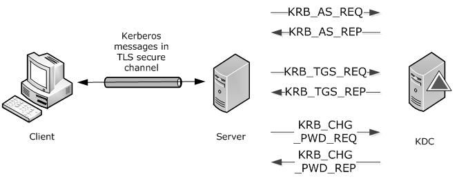
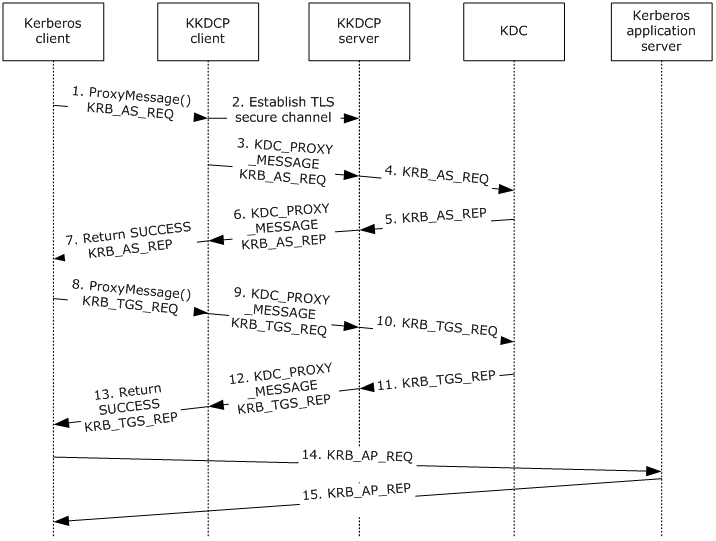
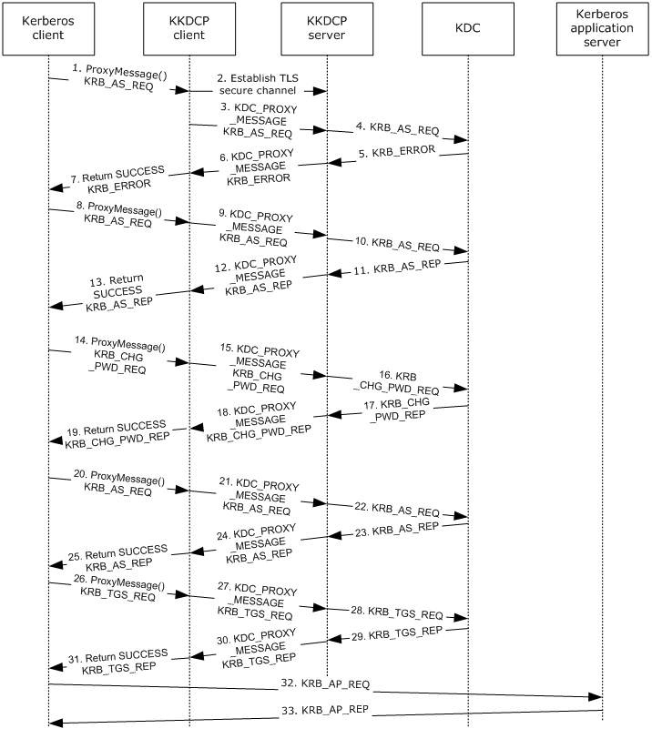

# [MS-KKDCP]: Kerberos Key Distribution Center (KDC) Proxy Protocol

Table of Contents

1 Introduction

- [1 Introduction](#Section_1)
  - [1.1 Glossary](#Section_1.1)
  - [1.2 References](#Section_1.2)
    - [1.2.1 Normative References](#Section_1.2.1)
    - [1.2.2 Informative References](#Section_1.2.2)
  - [1.3 Overview](#Section_1.3)
  - [1.4 Relationship to Other Protocols](#Section_1.4)
  - [1.5 Prerequisites/Preconditions](#Section_1.5)
  - [1.6 Applicability Statement](#Section_1.6)
  - [1.7 Versioning and Capability Negotiation](#Section_1.7)
  - [1.8 Vendor-Extensible Fields](#Section_1.8)
  - [1.9 Standards Assignments](#Section_1.9)

2 Messages

- [2 Messages](#Section_2)
  - [2.1 Transport](#Section_2.1)
  - [2.2 Message Syntax](#Section_2.2)
    - [2.2.1 Namespaces](#Section_2.2.1)
    - [2.2.2 KDC_PROXY_MESSAGE](#Section_2.2.2)

3 Protocol Details

- [3 Protocol Details](#Section_3)
  - [3.1 Client Details](#Section_3.1)
    - [3.1.1 Abstract Data Model](#Section_3.1.1)
    - [3.1.2 Timers](#Section_3.1.2)
    - [3.1.3 Initialization](#Section_3.1.3)
    - [3.1.4 Higher-Layer Triggered Events](#Section_3.1.4)
    - [3.1.5 Message Processing Events and Sequencing Rules](#Section_3.1.5)
      - [3.1.5.1 ProxyMessage() Call](#Section_3.1.5.1)
      - [3.1.5.2 Receiving a KDC_PROXY_MESSAGE](#Section_3.1.5.2)
      - [3.1.5.3 Receiving a HTTP Error or Dropped Connection](#Section_3.1.5.3)
    - [3.1.6 Timer Events](#Section_3.1.6)
    - [3.1.7 Other Local Events](#Section_3.1.7)
  - [3.2 Server Details](#Section_3.2)
    - [3.2.1 Abstract Data Model](#Section_3.2.1)
    - [3.2.2 Timers](#Section_3.2.2)
    - [3.2.3 Initialization](#Section_3.2.3)
    - [3.2.4 Higher-Layer Triggered Events](#Section_3.2.4)
    - [3.2.5 Message Processing Events and Sequencing Rules](#Section_3.2.5)
      - [3.2.5.1 Receiving a KDC_PROXY_MESSAGE](#Section_3.2.5.1)
      - [3.2.5.2 Receiving a Kerberos Message Response](#Section_3.2.5.2)
    - [3.2.6 Timer Events](#Section_3.2.6)
    - [3.2.7 Other Local Events](#Section_3.2.7)

4 Protocol Examples

- [4 Protocol Examples](#Section_4)
  - [4.1 Obtaining a Service Ticket](#Section_4.1)
  - [4.2 Obtaining a Service Ticket with Password Change](#Section_4.2)

5 Security

- [5 Security](#Section_5)
  - [5.1 Security Considerations for Implementers](#Section_5.1)
  - [5.2 Index of Security Parameters](#Section_5.2)

6 Appendix A: Product Behavior

- [6 Appendix A: Product Behavior](#Section_6)

7 Change Tracking

- [7 Change Tracking](#Section_7)

For the legal notice and IP terms, see [LEGAL.md](../LEGAL.md).
Last updated: 4/23/2024.
See [Revision History](#revision-history) for full version history.

# 1 Introduction

The Kerberos Key Distribution Center (KDC) Proxy Protocol (KKDCP) is used by an HTTP-based KKDCP server and KKDCP client to relay the Kerberos Network Authentication Service (V5) protocol [[RFC4120]](https://go.microsoft.com/fwlink/?LinkId=90458) and [**Kerberos**](#gt_kerberos) change password [[RFC3244]](https://go.microsoft.com/fwlink/?LinkId=90409) messages between a Kerberos client and a [**KDC**](#gt_key-distribution-center-kdc).

**Note** Throughout the remainder of this specification the Kerberos Network Authentication Service (V5) protocol will be referred to simply as Kerberos V5. Kerberos Network Authentication Service (V5) protocol [RFC4120] and Kerberos change password [RFC3244] messages will be referred to simply as Kerberos messages.

Sections 1.5, 1.8, 1.9, 2, and 3 of this specification are normative. All other sections and examples in this specification are informative.

## 1.1 Glossary

This document uses the following terms:

**domain controller (DC)**: The service, running on a server, that implements Active Directory, or the server hosting this service. The service hosts the data store for objects and interoperates with other [**DCs**](#gt_domain-controller-dc) to ensure that a local change to an object replicates correctly across all [**DCs**](#gt_domain-controller-dc). When Active Directory is operating as Active Directory Domain Services (AD DS), the [**DC**](#gt_domain-controller-dc) contains full NC replicas of the configuration naming context (config NC), schema naming context (schema NC), and one of the domain NCs in its forest. If the AD DS [**DC**](#gt_domain-controller-dc) is a global catalog server (GC server), it contains partial NC replicas of the remaining domain NCs in its forest. For more information, see [MS-AUTHSOD](../MS-AUTHSOD/MS-AUTHSOD.md) section 1.1.1.5.2 and [MS-ADTS](../MS-ADTS/MS-ADTS.md). When Active Directory is operating as Active Directory Lightweight Directory Services (AD LDS), several AD LDS [**DCs**](#gt_domain-controller-dc) can run on one server. When Active Directory is operating as AD DS, only one AD DS [**DC**](#gt_domain-controller-dc) can run on one server. However, several AD LDS [**DCs**](#gt_domain-controller-dc) can coexist with one AD DS [**DC**](#gt_domain-controller-dc) on one server. The AD LDS [**DC**](#gt_domain-controller-dc) contains full NC replicas of the config NC and the schema NC in its forest. The domain controller is the server side of Authentication Protocol Domain Support [MS-APDS](../MS-APDS/MS-APDS.md).

**Hypertext Transfer Protocol Secure (HTTPS)**: An extension of HTTP that securely encrypts and decrypts web page requests. In some older protocols, "Hypertext Transfer Protocol over Secure Sockets Layer" is still used (Secure Sockets Layer has been deprecated). For more information, see [[SSL3]](https://go.microsoft.com/fwlink/?LinkId=90534) and [[RFC5246]](https://go.microsoft.com/fwlink/?LinkId=129803).

**Kerberos**: An authentication system that enables two parties to exchange private information across an otherwise open network by assigning a unique key (called a ticket) to each user that logs on to the network and then embedding these tickets into messages sent by the users. For more information, see [MS-KILE](../MS-KILE/MS-KILE.md).

**Key Distribution Center (KDC)**: The [**Kerberos**](#gt_kerberos) service that implements the authentication and ticket granting services specified in the [**Kerberos**](#gt_kerberos) protocol. The service runs on computers selected by the administrator of the [**realm**](#gt_realm) or domain; it is not present on every machine on the network. It has to have access to an account database for the [**realm**](#gt_realm) that it serves. [**KDCs**](#gt_key-distribution-center-kdc) are integrated into the [**domain controller**](#gt_domain-controller-dc) role. It is a network service that supplies tickets to clients for use in authenticating to services.

**realm**: A collection of key distribution centers (KDCs) with a common set of principals, as described in [[RFC4120]](https://go.microsoft.com/fwlink/?LinkId=90458) section 1.2.

**ticket-granting ticket (TGT)**: A special type of ticket that can be used to obtain other tickets. The TGT is obtained after the initial authentication in the Authentication Service (AS) exchange; thereafter, users do not need to present their credentials, but can use the TGT to obtain subsequent tickets.

**Transport Layer Security (TLS)**: A security protocol that supports confidentiality and integrity of messages in client and server applications communicating over open networks. TLS supports server and, optionally, client authentication by using X.509 certificates (as specified in [[X509]](https://go.microsoft.com/fwlink/?LinkId=90590)). TLS is standardized in the IETF TLS working group.

**Uniform Resource Identifier (URI)**: A string that identifies a resource. The URI is an addressing mechanism defined in Internet Engineering Task Force (IETF) Uniform Resource Identifier (URI): Generic Syntax [[RFC3986]](https://go.microsoft.com/fwlink/?LinkId=90453).

**MAY, SHOULD, MUST, SHOULD NOT, MUST NOT:** These terms (in all caps) are used as defined in [[RFC2119]](https://go.microsoft.com/fwlink/?LinkId=90317). All statements of optional behavior use either MAY, SHOULD, or SHOULD NOT.

## 1.2 References

Links to a document in the Microsoft Open Specifications library point to the correct section in the most recently published version of the referenced document. However, because individual documents in the library are not updated at the same time, the section numbers in the documents may not match. You can confirm the correct section numbering by checking the [Errata](https://go.microsoft.com/fwlink/?linkid=850906).

### 1.2.1 Normative References

We conduct frequent surveys of the normative references to assure their continued availability. If you have any issue with finding a normative reference, please contact [dochelp@microsoft.com](mailto:dochelp@microsoft.com). We will assist you in finding the relevant information.

[MS-NRPC] Microsoft Corporation, "[Netlogon Remote Protocol](../MS-NRPC/MS-NRPC.md)".

[RFC2119] Bradner, S., "Key words for use in RFCs to Indicate Requirement Levels", BCP 14, RFC 2119, March 1997, [https://www.rfc-editor.org/info/rfc2119](https://go.microsoft.com/fwlink/?LinkId=90317)

[RFC2616] Fielding, R., Gettys, J., Mogul, J., et al., "Hypertext Transfer Protocol -- HTTP/1.1", RFC 2616, June 1999, [https://www.rfc-editor.org/info/rfc2616](https://go.microsoft.com/fwlink/?LinkId=90372)

[RFC2818] Rescorla, E., "HTTP Over TLS", RFC 2818, May 2000, [https://www.rfc-editor.org/info/rfc2818](https://go.microsoft.com/fwlink/?LinkId=90383)

[RFC3244] Swift, M., Trostle, J., and Brezak, J., "Microsoft Windows 2000 Kerberos Change Password and Set Password Protocols", RFC 3244, February 2002, [https://www.rfc-editor.org/info/rfc3244](https://go.microsoft.com/fwlink/?LinkId=90409)

[RFC4120] Neuman, C., Yu, T., Hartman, S., and Raeburn, K., "The Kerberos Network Authentication Service (V5)", RFC 4120, July 2005, [https://www.rfc-editor.org/rfc/rfc4120](https://go.microsoft.com/fwlink/?LinkId=90458)

[RFC6113] Hartman, S., and Zhu, L., "A Generalized Framework for Kerberos Pre-Authentication", RFC 6113, April 2011, [https://www.rfc-editor.org/info/rfc6113](https://go.microsoft.com/fwlink/?LinkId=226316)

[X680] ITU-T, "Abstract Syntax Notation One (ASN.1): Specification of Basic Notation", Recommendation X.680, July 2002, [http://www.itu.int/rec/T-REC-X.680/en](https://go.microsoft.com/fwlink/?LinkId=90594)

[X690] ITU-T, "Information Technology - ASN.1 Encoding Rules: Specification of Basic Encoding Rules (BER), Canonical Encoding Rules (CER) and Distinguished Encoding Rules (DER)", Recommendation X.690, July 2002, [http://www.itu.int/rec/T-REC-X.690/en](https://go.microsoft.com/fwlink/?LinkId=90593)

### 1.2.2 Informative References

None.

## 1.3 Overview

Kerberos V5 [[RFC4120]](https://go.microsoft.com/fwlink/?LinkId=90458) requires client connectivity to the [**Key Distribution Center (KDC)**](#gt_key-distribution-center-kdc) for authentication. Kerberos Key Distribution Center (KDC) Proxy Protocol (KKDCP) provides a mechanism for a client to use a KKDCP server to change passwords and securely obtain [**Kerberos**](#gt_kerberos) service tickets. The KKDCP client sends Kerberos messages using [**HTTPS**](#gt_hypertext-transfer-protocol-secure-https) to the KKDCP server. The KKDCP server locates a KDC for the request and sends the request to the KDC on behalf of the Kerberos V5 client. Since the messages received by the KDC are Kerberos messages, the KDC does not have a role in KKDCP. Once the KKDCP server receives the response from the KDC it sends the Kerberos message using HTTPS to the KKDCP client.

Figure 1: Messages between client, server, and KDC

## 1.4 Relationship to Other Protocols

KKDCP relies on either HTTP [[RFC2616]](https://go.microsoft.com/fwlink/?LinkId=90372) or [**HTTPS**](#gt_hypertext-transfer-protocol-secure-https) [[RFC2818]](https://go.microsoft.com/fwlink/?LinkId=90383) for network transport.

The [**KDC**](#gt_key-distribution-center-kdc) proxy server relies on [**domain controller (DC)**](#gt_domain-controller-dc) location ([MS-NRPC](../MS-NRPC/MS-NRPC.md) section 3.4.5.1.1) to find KDCs.

## 1.5 Prerequisites/Preconditions

KKDCP assumes the following:

- The KKDCP client is configured with the URL of the KKDCP server.
- The KKDCP client and server is configured for [**Transport Layer Security (TLS)**](#gt_transport-layer-security-tls).

## 1.6 Applicability Statement

KKDCP provides suitable [**Kerberos**](#gt_kerberos) message proxying capability for Kerberos V5 clients where the client does not have connectivity to the [**KDC**](#gt_key-distribution-center-kdc) and a KKDCP server does.

## 1.7 Versioning and Capability Negotiation

None.

## 1.8 Vendor-Extensible Fields

None.

## 1.9 Standards Assignments

None.

# 2 Messages

## 2.1 Transport

Messages are transported by using HTTP POST as specified in [[RFC2616]](https://go.microsoft.com/fwlink/?LinkId=90372). These messages are sent via [**Hypertext Transfer Protocol over Secure Sockets Layer (HTTPS)**](#gt_hypertext-transfer-protocol-secure-https) by default. The [**URI**](#gt_uniform-resource-identifier-uri) uses the virtual directory /KdcProxy unless otherwise configured. The body of the HTTP message contains the KDC_PROXY_MESSAGE (section [2.2.2](#Section_2.2.2)).

[**KDC**](#gt_key-distribution-center-kdc) proxy messages are defined using Abstract Syntax Notation One (ASN.1), as specified in [[X680]](https://go.microsoft.com/fwlink/?LinkId=90594), and encoded using Distinguished Encoding Rules (DER), as specified in [[X690]](https://go.microsoft.com/fwlink/?LinkId=90593) section 10.

## 2.2 Message Syntax

KKDCP does not alter the syntax of any [**Kerberos**](#gt_kerberos) messages.

### 2.2.1 Namespaces

None.

### 2.2.2 KDC_PROXY_MESSAGE

This structure is a [**KDC**](#gt_key-distribution-center-kdc) proxy message that contains the [**Kerberos**](#gt_kerberos) message to be proxied and optional information for [**DC**](#gt_domain-controller-dc) location at the KKDCP server.

KDC-PROXY-MESSAGE::= SEQUENCE {

kerb-message [0] OCTET STRING,

target-domain [1] KERB-REALM OPTIONAL,

dclocator-hint [2] INTEGER OPTIONAL

}

**kerb-message:** A Kerberos message, including the 4 octet length value specified in [[RFC4120]](https://go.microsoft.com/fwlink/?LinkId=90458) section 7.2.2 in network byte order.

**target-domain:** An optional KerberosString ([RFC4120] section 5.2.1) that represents the [**realm**](#gt_realm) to which the Kerberos message is sent, which is required for client messages and is not used in server messages. This value is not case-sensitive.

**dclocator-hint:** An optional **Flags** ([MS-NRPC](../MS-NRPC/MS-NRPC.md) section 3.5.4.3.1) which contains additional data to be used to find a domain controller for the Kerberos message.

# 3 Protocol Details

## 3.1 Client Details

This section describes details of protocol processing that must be understood in order to implement a client that can correctly perform its role in the protocol message exchange.

### 3.1.1 Abstract Data Model

This section describes a conceptual model of possible data organization that an implementation maintains to participate in this protocol. The described organization is provided to facilitate the explanation of how the protocol behaves. This document does not mandate that implementations adhere to this model as long as their external behavior is consistent with that described in this document.

The KKDCP client has the following configuration setting:

**KKDCPServerURL**: A string containing the URL of the KKDCP server.

The following parameters are set when the [**Kerberos**](#gt_kerberos) client calls ProxyMessage():

**KerberosMessage**: A temporary variable that contains a Kerberos message.

**Error**: A temporary variable that contains an error message or NULL. By default, it is set to NULL.

**TargetDomain**: The **realm** field of the Kerberos message ([[RFC4120]](https://go.microsoft.com/fwlink/?LinkId=90458) section 5.4.1).

### 3.1.2 Timers

None.

### 3.1.3 Initialization

As stated in section [1.5](#Section_1.5), the KKDCP client MUST be configured with the URL of the KKDCP server.

### 3.1.4 Higher-Layer Triggered Events

The KKDCP client is triggered when the [**Kerberos**](#gt_kerberos) client calls ProxyMessage() and when [**HTTPS**](#gt_hypertext-transfer-protocol-secure-https) returns an error or data.

### 3.1.5 Message Processing Events and Sequencing Rules

#### 3.1.5.1 ProxyMessage() Call

Inputs:

- Input_kerb_message OCTET STRING
- Target_domain KERB-REALM - optional
- dclocator-hint INTEGER - optional
Outputs:

- Output_kerb_message OCTET STRING
The ProxyMessage() call enables [**Kerberos**](#gt_kerberos) clients to pass Kerberos messages and [**realm**](#gt_realm) data to the KKDCP client to proxy.

The KKDCP client SHOULD:

Establish an [**HTTPS**](#gt_hypertext-transfer-protocol-secure-https) connection using **KKDCPServerURL**.

Create a **KDC_PROXY_MESSAGE** (section [2.2.2](#Section_2.2.2)) where:

**kerb-message** is set to **KerberosMessage** (section [3.1.1](#Section_3.2.1)).

**target-domain** is set to the **realm** field of the Kerberos message ([[RFC4120]](https://go.microsoft.com/fwlink/?LinkId=90458) section 5.4.1).

**dclocator-hint**: If the Kerberos client used only **Flags** G and H in **DsrGetDcNameEx2** ([MS-NRPC](../MS-NRPC/MS-NRPC.md) section 3.5.4.3.1) when attempting to locate the [**domain controller**](#gt_domain-controller-dc), then this setting is not used. Otherwise, it is set to the **Flags** used.

Send the **KDC_PROXY_MESSAGE** using the HTTPS connection to the KKDCP server.

If the KKDCP client receives:

- A Kerberos message reply, the client SHOULD set *Output_kerb_message* to **KerberosMessage** (section 3.1.1) and return SUCCESS.
- Otherwise, the client SHOULD return Error, and SHOULD NOT return *Output_kerb_message*.

#### 3.1.5.2 Receiving a KDC_PROXY_MESSAGE

When the KKDCP client receives the **KDC_PROXY_MESSAGE** (section [2.2.2](#Section_2.2.2)), it SHOULD set **KerberosMessage** (section [3.1.1](#Section_3.2.1)) to **KDC_PROXY_MESSAGE.kerb-message**.

#### 3.1.5.3 Receiving a HTTP Error or Dropped Connection

When the KKDCP client receives an HTTP error or dropped connection:

- On HTTP 403 errors, the client SHOULD set **Error** (section [3.1.1](#Section_3.2.1)) to STATUS_AUTHENTICATION_FIREWALL_FAILED.
- Otherwise, the client SHOULD set **Error** (section 3.1.1) to STATUS_NO_LOGON_SERVERS.

### 3.1.6 Timer Events

None.

### 3.1.7 Other Local Events

None.

## 3.2 Server Details

This section describes details of protocol processing that must be understood to implement a server that can correctly perform its role in the protocol message exchange.

### 3.2.1 Abstract Data Model

None.

### 3.2.2 Timers

None.

### 3.2.3 Initialization

Prior to receiving request messages, the server MUST open an HTTP/HTTPS endpoint, which will receive requests by clients with the URL for which they are configured.

### 3.2.4 Higher-Layer Triggered Events

None.

### 3.2.5 Message Processing Events and Sequencing Rules

#### 3.2.5.1 Receiving a KDC_PROXY_MESSAGE

When the KKDCP server receives the **KDC_PROXY_MESSAGE** (section [2.2.2](#Section_2.2.2)), it SHOULD:

- Validate that the **KDC_PROXY_MESSAGE.kerb-message** is a well-formed [**Kerberos**](#gt_kerberos) message. If not, then the KKDCP server SHOULD drop the connection and stop processing.
- If target-domain is not present, return ERROR_BAD_FORMAT.
- Before the KKDCP server can send a Kerberos message, it MUST discover the [**KDC**](#gt_key-distribution-center-kdc) to which the message will be sent. The KKDCP server SHOULD perform the equivalent of calling DsrGetDcNameEx2 ([MS-NRPC](../MS-NRPC/MS-NRPC.md) section 3.5.4.3.1) where:
- *AllowableAccountControlBits* has bits A, B, C, D, E, and F set.
- *DomainName* is **TargetDomain**.
- *Flags* is **KDC_PROXY_MESSAGE.dclocator-hint**. If there is no **dclocator-hint** in the message, *Flags* has bits G and H set.
- If the Kerberos message is "FAST armored", then also set bit U.
- All other fields are set to NULL.
- Return the IP address of the [**DC**](#gt_domain-controller-dc) in *DomainControllerInfo*.**DomainControllerAddress**.
- Send the **KDC_PROXY_MESSAGE.kerb-message** to the KDC.

#### 3.2.5.2 Receiving a Kerberos Message Response

When the KKDCP server receives the [**Kerberos**](#gt_kerberos) message response, it SHOULD:

Create a **KDC_PROXY_MESSAGE** (section [2.2.2](#Section_2.2.2)) where:

- **kerb-message** is set to the Kerberos message response.
- **target-domain** is not used.
- **dclocator-hint** is not used.
- Send the **KDC_PROXY_MESSAGE** using the HTTP connection to the KKDCP client.

### 3.2.6 Timer Events

None.

### 3.2.7 Other Local Events

None.

# 4 Protocol Examples

The following sections describe two common scenarios to illustrate the function of the KKDCP.

## 4.1 Obtaining a Service Ticket

Figure 2: Obtaining a service ticket

When a [**Kerberos**](#gt_kerberos) client wants to use Kerberos-based authentication and cannot locate a [**DC**](#gt_domain-controller-dc) for the [**realm**](#gt_realm), it uses ProxyMessage() (section [3.1.5.1](#Section_3.1.5.1)) to invoke the KKDCP client.

- Because the Kerberos client does not have a [**ticket-granting ticket (TGT)**](#gt_ticket-granting-ticket-tgt), it calls ProxyMessage with a KRB_AS_REQ.
- The KKDCP client establishes a [**TLS**](#gt_transport-layer-security-tls) secure channel with the KKDCP server.
- The KKDCP client sends a KDC_PROXY_MESSAGE containing the KRB_AS_REQ to the KKDCP server.
- The KKDCP server finds the [**KDC**](#gt_key-distribution-center-kdc) and sends the KRB_AS_REQ to the KDC.
- The KDC returns a KRB_AS_REP to the KKDCP server.
- The KKDCP server sends a KDC_PROXY_MESSAGE containing the KRB_AS_REP to the KKDCP client.
- The KKDCP client returns the KRB_AS_REP and SUCCESS to the Kerberos client.
- The Kerberos client processes the KRB_AS_REP and calls ProxyMessage with a KRB_TGS_REQ.
- The KKDCP client sends a KDC_PROXY_MESSAGE containing the KRB_TGS_REQ to the KKDCP server.
- The KKDCP server finds the KDC and sends the KRB_TGS_REQ to the KDC.
- The KDC returns a KRB_TGS_REP to the KKDCP server.
- The KKDCP server sends a KDC_PROXY_MESSAGE containing the KRB_TGS_REP to the KKDCP client.
- The KKDCP client returns the KRB_TGS_REP and SUCCESS to the Kerberos client.
- The Kerberos client processes the KRB_TGS_REP and sends a KRB_AP_REQ to the Kerberos application server.
- The Kerberos application server processes the KRB_AP_REQ and sends a KRB_AP_REP to the Kerberos client.

## 4.2 Obtaining a Service Ticket with Password Change

Figure 3: Obtaining a service ticket with password change

When a [**Kerberos**](#gt_kerberos) client wants to use Kerberos-based authentication and cannot locate a [**DC**](#gt_domain-controller-dc) for the [**realm**](#gt_realm), it uses ProxyMessage() (section [3.1.5.1](#Section_3.1.5.1)) to invoke the KKDCP client. If the logon requires the user to change the password prior to logon, applications can use KKDCP for Kerberos password change.

- Since the Kerberos client does not have a [**TGT**](#gt_ticket-granting-ticket-tgt), it calls ProxyMessage with a KRB_AS_REQ.
- The KKDCP client establishes a [**TLS**](#gt_transport-layer-security-tls) secure channel with the KKDCP server.
- The KKDCP client sends a KDC_PROXY_MESSAGE containing the KRB_AS_REQ to the KKDCP server.
- The KKDCP server finds the [**KDC**](#gt_key-distribution-center-kdc) and sends the KRB_AS_REQ to the KDC.
- The KDC returns KRB_ERROR for password change required before logon to the KKDCP server.
- The KKDCP server sends a KDC_PROXY_MESSAGE containing the KRB_ERROR to the KKDCP client.
- The KKDCP client returns the KRB_ERROR and SUCCESS to the Kerberos client.
- The Kerberos client processes the KRB_ERROR and returns a password change required before logon error to the application. Since the application supports change password, it initiates a Kerberos change password. The Kerberos client calls ProxyMessage with a KRB_AS_REQ for kadmin/changepw.
- The KKDCP client sends a KDC_PROXY_MESSAGE containing the KRB_AS_REQ to the KKDCP server.
- The KKDCP server finds the KDC and sends the KRB_AS_REQ to the KDC.
- The KDC returns a KRB_AS_REP to the KKDCP server.
- The KKDCP server sends a KDC_PROXY_MESSAGE containing the KRB_AS_REP to the KKDCP client.
- The KKDCP client returns the KRB_AS_REP and SUCCESS to the Kerberos client.
- The Kerberos client processes the KRB_AS_REP and creates a Kerberos change password request (KRB_CHG_PWD_REQ) and calls ProxyMessage.
- The KKDCP client sends a KDC_PROXY_MESSAGE containing the KRB_CHG_PWD_REQ to the KKDCP server.
- The KKDCP server finds the KDC and sends the KRB_CHG_PWD_REQ to the KDC.
- The KDC returns a Kerberos change password request (KRB_CHG_PWD_REP) to the KKDCP server.
- The KKDCP server sends a KDC_PROXY_MESSAGE containing the KRB_CHG_PWD_REP to the KKDCP client.
- The KKDCP client returns the KRB_CHG_PWD_REP and SUCCESS to the Kerberos client.
- The Kerberos client processes the KRB_CHG_PWD_REP. The application initiates a logon with the new password. The Kerberos client calls ProxyMessage with a KRB_AS_REQ.
- The KKDCP client sends a KDC_PROXY_MESSAGE containing the KRB_AS_REQ to the KKDCP server.
- The KKDCP server finds the KDC and sends the KRB_AS_REQ to the KDC.
- The KDC returns a KRB_AS_REP to the KKDCP server.
- The KKDCP server sends a KDC_PROXY_MESSAGE containing the KRB_AS_REP to the KKDCP client.
- The KKDCP client returns the KRB_AS_REP and SUCCESS to the Kerberos client.
- The Kerberos client processes the KRB_AS_REP and calls ProxyMessage with a KRB_TGS_REQ.
- The KKDCP client sends a KDC_PROXY_MESSAGE containing the KRB_TGS_REQ to the KKDCP server.
- The KKDCP server finds the KDC and sends the KRB_TGS_REQ to the KDC.
- The KDC returns a KRB_TGS_REP to the KKDCP server.
- The KKDCP server sends a KDC_PROXY_MESSAGE containing the KRB_TGS_REP to the KKDCP client.
- The KKDCP client returns the KRB_TGS_REP and SUCCESS to the Kerberos client.
- The Kerberos client processes the KRB_TGS_REP and sends a KRB_AP_REQ to the Kerberos application server.
- The Kerberos application server processes the KRB_AP_REQ and sends a KRB_AP_REP to the Kerberos client.

# 5 Security

## 5.1 Security Considerations for Implementers

Because KKDCP is typically used in the Internet, messages are only protected when [**HTTPS**](#gt_hypertext-transfer-protocol-secure-https) is used, and the KKDCP server’s certificate is valid. When using HTTP, the KKDCP client is sending clear text [**Kerberos**](#gt_kerberos) messages, which are vulnerable to attacks discussed in Kerberos V5 ([[RFC4120]](https://go.microsoft.com/fwlink/?LinkId=90458) section 10), unless FAST [[RFC6113]](https://go.microsoft.com/fwlink/?LinkId=226316) is used.

When the KKDCP server relays messages from Internet KKDCP clients to the [**KDC**](#gt_key-distribution-center-kdc), it opens unauthenticated access to the KDC from the Internet, unless [**TLS**](#gt_transport-layer-security-tls) client authentication is required. KKDCP servers can also provide some level of protection by only relaying valid Kerberos messages, and by throttling messages. KKDCP servers open KDCs to the Internet, exposing them to denial-of-service attacks (using Kerberos messages) that were previously only possible via other authentication protocols, such as NTLM.

## 5.2 Index of Security Parameters

None.

# 6 Appendix A: Product Behavior

The information in this specification is applicable to the following Microsoft products or supplemental software. References to product versions include updates to those products.

- Windows 8 operating system
- Windows Server 2012 operating system
- Windows 8.1 operating system
- Windows Server 2012 R2 operating system
- Windows 10 operating system
- Windows Server 2016 operating system
- Windows Server operating system
- Windows Server 2019 operating system
- Windows Server 2022 operating system
- Windows 11 operating system
- Windows Server 2025 operating system
Exceptions, if any, are noted in this section. If an update version, service pack or Knowledge Base (KB) number appears with a product name, the behavior changed in that update. The new behavior also applies to subsequent updates unless otherwise specified. If a product edition appears with the product version, behavior is different in that product edition.

Unless otherwise specified, any statement of optional behavior in this specification that is prescribed using the terms "SHOULD" or "SHOULD NOT" implies product behavior in accordance with the SHOULD or SHOULD NOT prescription. Unless otherwise specified, the term "MAY" implies that the product does not follow the prescription.

# 7 Change Tracking

This section identifies changes that were made to this document since the last release. Changes are classified as Major, Minor, or None.

The revision class **Major** means that the technical content in the document was significantly revised. Major changes affect protocol interoperability or implementation. Examples of major changes are:

- A document revision that incorporates changes to interoperability requirements.
- A document revision that captures changes to protocol functionality.
The revision class **Minor** means that the meaning of the technical content was clarified. Minor changes do not affect protocol interoperability or implementation. Examples of minor changes are updates to clarify ambiguity at the sentence, paragraph, or table level.

The revision class **None** means that no new technical changes were introduced. Minor editorial and formatting changes may have been made, but the relevant technical content is identical to the last released version.

The changes made to this document are listed in the following table. For more information, please contact [dochelp@microsoft.com](mailto:dochelp@microsoft.com).

| Section | Description | Revision class |
| --- | --- | --- |
| [6](#Section_6) Appendix A: Product Behavior | Added Windows Server 2025 to the list of applicable products. | Major |

## Revision History

| Date | Version | Revision Class | Comments |
| --- | --- | --- | --- |
| 12/16/2011 | 1.0 | New | Released new document. |
| 3/30/2012 | 1.0 | None | No changes to the meaning, language, or formatting of the technical content. |
| 7/12/2012 | 1.1 | Minor | Clarified the meaning of the technical content. |
| 10/25/2012 | 1.1 | None | No changes to the meaning, language, or formatting of the technical content. |
| 1/31/2013 | 1.2 | Minor | Clarified the meaning of the technical content. |
| 8/8/2013 | 2.0 | Major | Significantly changed the technical content. |
| 11/14/2013 | 2.1 | Minor | Clarified the meaning of the technical content. |
| 2/13/2014 | 3.0 | Major | Significantly changed the technical content. |
| 5/15/2014 | 3.1 | Minor | Clarified the meaning of the technical content. |
| 6/30/2015 | 4.0 | Major | Significantly changed the technical content. |
| 10/16/2015 | 4.0 | None | No changes to the meaning, language, or formatting of the technical content. |
| 7/14/2016 | 4.0 | None | No changes to the meaning, language, or formatting of the technical content. |
| 6/1/2017 | 4.0 | None | No changes to the meaning, language, or formatting of the technical content. |
| 9/15/2017 | 5.0 | Major | Significantly changed the technical content. |
| 9/12/2018 | 6.0 | Major | Significantly changed the technical content. |
| 4/7/2021 | 7.0 | Major | Significantly changed the technical content. |
| 6/25/2021 | 8.0 | Major | Significantly changed the technical content. |
| 4/23/2024 | 9.0 | Major | Significantly changed the technical content. |
