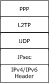
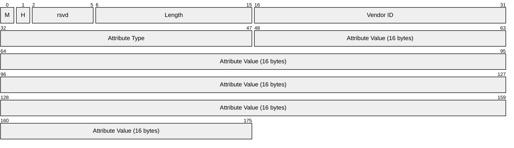

# [MS-L2TPIE]: Layer 2 Tunneling Protocol (L2TP) IPsec Extensions

Table of Contents

1 Introduction

- [1 Introduction](#Section_1)
  - [1.1 Glossary](#Section_1.1)
  - [1.2 References](#Section_1.2)
    - [1.2.1 Normative References](#Section_1.2.1)
    - [1.2.2 Informative References](#Section_1.2.2)
  - [1.3 Overview](#Section_1.3)
  - [1.4 Relationship to Other Protocols](#Section_1.4)
  - [1.5 Prerequisites/Preconditions](#Section_1.5)
  - [1.6 Applicability Statement](#Section_1.6)
  - [1.7 Versioning and Capability Negotiation](#Section_1.7)
  - [1.8 Vendor-Extensible Fields](#Section_1.8)
  - [1.9 Standards Assignments](#Section_1.9)

2 Messages

- [2 Messages](#Section_2)
  - [2.1 Transport](#Section_2.1)
  - [2.2 Message Syntax](#Section_2.2)
    - [2.2.1 L2TP AV pairs](#Section_2.2.1)
      - [2.2.1.1 L2TP AV Pair: Microsoft Vendor-specific Correlation ID Type (0x01)](#Section_2.2.1.1)
    - [2.2.2 L2TP Congestion Control (Reset)](#Section_2.2.2)

3 Protocol Details

- [3 Protocol Details](#Section_3)
  - [3.1 Common (LAC/LNS) Details](#Section_3.1)
    - [3.1.1 Abstract Data Model](#Section_3.1.1)
    - [3.1.2 Timers](#Section_3.1.2)
    - [3.1.3 Initialization](#Section_3.1.3)
      - [3.1.3.1 Securing L2TP with IPsec](#Section_3.1.3.1)
    - [3.1.4 Higher-Layer Triggered Events](#Section_3.1.4)
    - [3.1.5 Message Processing Events and Sequencing Rules](#Section_3.1.5)
      - [3.1.5.1 Header Format](#Section_3.1.5.1)
      - [3.1.5.2 Control Message AV Pairs](#Section_3.1.5.2)
      - [3.1.5.3 Start-Control-Connection-Request (SCCRQ)](#Section_3.1.5.3)
      - [3.1.5.4 Start-Control-Connection-Reply (SCCRP)](#Section_3.1.5.4)
      - [3.1.5.5 Start-Control-Connection-Connected (SCCCN)](#Section_3.1.5.5)
      - [3.1.5.6 Stop-Control-Connection-Notification (StopCCN)](#Section_3.1.5.6)
      - [3.1.5.7 Hello (HELLO)](#Section_3.1.5.7)
      - [3.1.5.8 Call-Disconnect-Notify (CDN)](#Section_3.1.5.8)
      - [3.1.5.9 Set-Link-Info (SLI)](#Section_3.1.5.9)
    - [3.1.6 Timer Events](#Section_3.1.6)
    - [3.1.7 Other Local Events](#Section_3.1.7)
  - [3.2 LAC/Client Details](#Section_3.2)
    - [3.2.1 Abstract Data Model](#Section_3.2.1)
    - [3.2.2 Timers](#Section_3.2.2)
    - [3.2.3 Initialization](#Section_3.2.3)
    - [3.2.4 Higher-Layer Triggered Events](#Section_3.2.4)
    - [3.2.5 Message Processing Events and Sequencing Rules](#Section_3.2.5)
      - [3.2.5.1 Incoming-Call-Request (ICRQ)](#Section_3.2.5.1)
      - [3.2.5.2 Incoming-Call-Connected (ICCN)](#Section_3.2.5.2)
      - [3.2.5.3 Outgoing-Call-Reply (OCRP)](#Section_3.2.5.3)
      - [3.2.5.4 Outgoing-Call-Connected (OCCN)](#Section_3.2.5.4)
      - [3.2.5.5 WAN-Error-Notify (WEN)](#Section_3.2.5.5)
    - [3.2.6 Timer Events](#Section_3.2.6)
    - [3.2.7 Other Local Events](#Section_3.2.7)
  - [3.3 LNS/Server Details](#Section_3.3)
    - [3.3.1 Abstract Data Model](#Section_3.3.1)
    - [3.3.2 Timers](#Section_3.3.2)
    - [3.3.3 Initialization](#Section_3.3.3)
    - [3.3.4 Higher-Layer Triggered Events](#Section_3.3.4)
    - [3.3.5 Message Processing Events and Sequencing Rules](#Section_3.3.5)
      - [3.3.5.1 Incoming-Call-Reply (ICRP)](#Section_3.3.5.1)
      - [3.3.5.2 Incoming-Call-Connected (ICCN)](#Section_3.3.5.2)
      - [3.3.5.3 Outgoing-Call-Request (OCRQ)](#Section_3.3.5.3)
      - [3.3.5.4 Outgoing-Call-Reply (OCRP)](#Section_3.3.5.4)
      - [3.3.5.5 Outgoing-Call-Connected (OCCN)](#Section_3.3.5.5)
      - [3.3.5.6 WAN-Error-Notify (WEN)](#Section_3.3.5.6)
    - [3.3.6 Timer Events](#Section_3.3.6)
    - [3.3.7 Other Local Events](#Section_3.3.7)

4 Protocol Examples

- [4 Protocol Examples](#Section_4)

5 Security

- [5 Security](#Section_5)
  - [5.1 Security Considerations for Implementers](#Section_5.1)
  - [5.2 Index of Security Parameters](#Section_5.2)

6 Appendix A: Product Behavior

- [6 Appendix A: Product Behavior](#Section_6)

7 Change Tracking

- [7 Change Tracking](#Section_7)

For the legal notice and IP terms, see [LEGAL.md](../LEGAL.md).
Last updated: 4/23/2024.
See [Revision History](#revision-history) for full version history.

# 1 Introduction

The Layer 2 Tunneling Protocol (L2TP) is an Internet Engineering Task Force (IETF) standard protocol that allows IP, IPX, or NetBEUI traffic to be encrypted, and then sent over any medium that supports point-to-point (PPP) datagram delivery, such as IP, X.25, Frame Relay, or ATM (See Point to Point Protocol [[RFC1661]](https://go.microsoft.com/fwlink/?LinkId=90283)).

Layer 2 Tunneling Protocol (L2TP) IPsec Extensions (L2TPIE) specifies a set of vendor-specific options as well as non-standard options for Layer 2 Tunneling Protocol Internet Protocol security (IPsec). In this document, L2TP Access Concentrator (LAC) and client are used interchangeably; similarly, L2TP Network Server (LNS) and server are used interchangeably.

Sections 1.5, 1.8, 1.9, 2, and 3 of this specification are normative. All other sections and examples in this specification are informative.

## 1.1 Glossary

This document uses the following terms:

**AV pair**: An attribute/value pair. The name of some attribute, along with its value. [**AV pairs**](#gt_av-pair) in NTLM have a structure specifying the encoding of the information stored in them.

**globally unique identifier (GUID)**: A term used interchangeably with universally unique identifier (UUID) in Microsoft protocol technical documents (TDs). Interchanging the usage of these terms does not imply or require a specific algorithm or mechanism to generate the value. Specifically, the use of this term does not imply or require that the algorithms described in [[RFC4122]](https://go.microsoft.com/fwlink/?LinkId=90460) or [[C706]](https://go.microsoft.com/fwlink/?LinkId=89824) must be used for generating the [**GUID**](#gt_globally-unique-identifier-guid). See also universally unique identifier (UUID).

**Internet Protocol security (IPsec)**: A framework of open standards for ensuring private, secure communications over Internet Protocol (IP) networks through the use of cryptographic security services. IPsec supports network-level peer authentication, data origin authentication, data integrity, data confidentiality (encryption), and replay protection.

**L2TP Access Concentrator (LAC)**: A node that acts as one side of an L2TP tunnel endpoint and is a peer to the L2TP Network Server (LNS). The LAC sits between an LNS and a remote system and forwards packets to and from each. Packets sent from the LAC to the LNS require tunneling with the L2TP protocol as defined in this document. The connection from the LAC to the remote system is either local or a PPP link.

**L2TP Network Server (LNS)**: A node that acts as one side of an L2TP tunnel endpoint and is a peer to the L2TP Access Concentrator (LAC). The LNS is the logical termination point of a PPP session that is being tunneled from the remote system by the LAC.

**session**: An authenticated communication channel between the client and server correlating a group of messages into a conversation.

**tunnel**: The encapsulation of one network protocol within another.

**MAY, SHOULD, MUST, SHOULD NOT, MUST NOT:** These terms (in all caps) are used as defined in [[RFC2119]](https://go.microsoft.com/fwlink/?LinkId=90317). All statements of optional behavior use either MAY, SHOULD, or SHOULD NOT.

## 1.2 References

Links to a document in the Microsoft Open Specifications library point to the correct section in the most recently published version of the referenced document. However, because individual documents in the library are not updated at the same time, the section numbers in the documents may not match. You can confirm the correct section numbering by checking the [Errata](https://go.microsoft.com/fwlink/?linkid=850906).

### 1.2.1 Normative References

We conduct frequent surveys of the normative references to assure their continued availability. If you have any issue with finding a normative reference, please contact [dochelp@microsoft.com](mailto:dochelp@microsoft.com). We will assist you in finding the relevant information.

[IANA-ENT] Internet Assigned Numbers Authority, "Private Enterprise Numbers", January 2007, [http://www.iana.org/assignments/enterprise-numbers](https://go.microsoft.com/fwlink/?LinkId=89883)

[L2TP-draft] Townsley, W., Valencia, A., Rubens, A., et al., "Layer Two Tunneling Protocol "L2TP" Multi-Protocol Label Switching Extension", draft-ietf-pppext-l2tp-12.txt, February 1999, [https://tools.ietf.org/id/draft-ietf-pppext-l2tp-mpls-02.txt](https://go.microsoft.com/fwlink/?LinkId=130752)

[MS-DTYP] Microsoft Corporation, "[Windows Data Types](../MS-DTYP/MS-DTYP.md)".

[RFC2119] Bradner, S., "Key words for use in RFCs to Indicate Requirement Levels", BCP 14, RFC 2119, March 1997, [https://www.rfc-editor.org/info/rfc2119](https://go.microsoft.com/fwlink/?LinkId=90317)

[RFC2661] Townsley, W., Valencia, A., Rubens, A., et al., "Layer Two Tunneling Protocol L2TP", RFC 2661, August 1999, [https://www.rfc-editor.org/info/rfc2661](https://go.microsoft.com/fwlink/?LinkId=92843)

[RFC3193] Patel, B., Aboba, B., Zorn, G., and Booth, S., "Securing L2TP using IPsec", RFC 3193, November 2001, [https://www.rfc-editor.org/info/rfc3193](https://go.microsoft.com/fwlink/?LinkId=92847)

### 1.2.2 Informative References

[RFC1661] Simpson, W., Ed., "The Point-to-Point Protocol (PPP)", STD 51, RFC 1661, July 1994, [https://www.rfc-editor.org/info/rfc1661](https://go.microsoft.com/fwlink/?LinkId=90283)

[RFC2401] Kent, S. and Atkinson, R., "Security Architecture for the Internet Protocol", RFC 2401, November 1998, [https://tools.ietf.org/html/rfc2401](https://go.microsoft.com/fwlink/?LinkId=90341)

[RFC768] Postel, J., "User Datagram Protocol", STD 6, RFC 768, August 1980, [https://www.rfc-editor.org/info/rfc768](https://go.microsoft.com/fwlink/?LinkId=90490)

## 1.3 Overview

Layer 2 Tunneling Protocol (L2TP) [**Internet Protocol security (IPsec)**](#gt_internet-protocol-security-ipsec) Extensions (L2TPIE) provides extensions to the Layer 2 Tunneling Protocol (L2TP) specification [[RFC2661]](https://go.microsoft.com/fwlink/?LinkId=92843) and to securing L2TP using IPsec [[RFC3193]](https://go.microsoft.com/fwlink/?LinkId=92847) in order to provide traceability and data control flow features. In this extension a new Microsoft vendor-specific attribute value pair ([**AV pair**](#gt_av-pair)) is sent in control messages from the [**LAC**](#gt_l2tp-access-concentrator-lac)/client to the [**LNS**](#gt_l2tp-network-server-lns)/server so that tracing events on the server specific to a client can be correlated. This extension uses the data control flow mechanism specified in [[L2TP-draft]](https://go.microsoft.com/fwlink/?LinkId=130752).

L2TPIE defines additional AV pairs other than those defined in L2TP. It also defines changes to the behavior in processing messages or AV Pairs other than those that are defined in the L2TP specification [RFC2661]. These extensions also define subset of [RFC3193]. For example, support for changing the IP address and port is restricted.

See [RFC2661] section 1 for an introduction to L2TP. [RFC3193] specifies an Internet Engineering Task Force (IETF) standard protocol designed to use IPsec [[RFC2401]](https://go.microsoft.com/fwlink/?LinkId=90341) to provide for [**tunnel**](#gt_tunnel) authentication, privacy protection, and integrity checking and replay protection of L2TP.

## 1.4 Relationship to Other Protocols

Layer 2 Tunneling Protocol (L2TP) IPsec Extensions (L2TPIE) is based on L2TP [[RFC2661]](https://go.microsoft.com/fwlink/?LinkId=92843), [[L2TP-draft]](https://go.microsoft.com/fwlink/?LinkId=130752), and securing L2TP with [**IPsec**](#gt_internet-protocol-security-ipsec) [[RFC3193]](https://go.microsoft.com/fwlink/?LinkId=92847) protocols. L2TPIE supports only IPsec transport mode. The following network stack diagram demonstrates the L2TP relationship with other protocols in an IPsec transport mode.

Figure 1: L2TP network stack

## 1.5 Prerequisites/Preconditions

None beyond those specified in [[RFC2661]](https://go.microsoft.com/fwlink/?LinkId=92843), [[L2TP-draft]](https://go.microsoft.com/fwlink/?LinkId=130752), and [[RFC3193]](https://go.microsoft.com/fwlink/?LinkId=92847).

## 1.6 Applicability Statement

Layer 2 Tunneling Protocol (L2TP) IPsec Extensions (L2TPIE) is applicable when the implementation uses L2TP [[RFC2661]](https://go.microsoft.com/fwlink/?LinkId=92843) and secures L2TP with IPsec [[RFC3193]](https://go.microsoft.com/fwlink/?LinkId=92847).

## 1.7 Versioning and Capability Negotiation

Layer 2 Tunneling Protocol (L2TP) IPsec Extensions (L2TPIE) is based on version 2 of the L2TP protocol, as specified in section 3.1 of [[RFC2661]](https://go.microsoft.com/fwlink/?LinkId=92843).

## 1.8 Vendor-Extensible Fields

The vendor-extensible fields comply with section 4.1 of [[RFC2661]](https://go.microsoft.com/fwlink/?LinkId=92843), which specifies how vendor-specific [**AV pairs**](#gt_av-pair) are passed. The vendor ID for Microsoft vendor-specific AV pairs is 0x137. The vendor-extensible options used by L2TP are specified in section [2.2.1](#Section_2.2.1).

## 1.9 Standards Assignments

The only standards assignment required for this protocol is *Private Enterprise Number*. The required value for this parameter is 311 (see [[IANA-ENT]](https://go.microsoft.com/fwlink/?LinkId=89883) for details).

| Parameter | Value | Reference |
| --- | --- | --- |
| *Private Enterprise Number* | 311 | [IANA-ENT] |

# 2 Messages

## 2.1 Transport

All Layer 2 Tunneling Protocol (L2TP) attributes are transported within L2TP, which is transported over UDP [[RFC768]](https://go.microsoft.com/fwlink/?LinkId=90490) as specified in section 8.1 of [[RFC2661]](https://go.microsoft.com/fwlink/?LinkId=92843) and IPsec, as specified in [[RFC3193]](https://go.microsoft.com/fwlink/?LinkId=92847). [**L2TP Network Server (LNS)**](#gt_l2tp-network-server-lns) listens for L2TP messages on the UDP port.<1>

## 2.2 Message Syntax

These Layer 2 Tunneling Protocol (L2TP) IPsec extensions use the message format for vendor-specific options, as specified in [[RFC2661]](https://go.microsoft.com/fwlink/?LinkId=92843) section 4.1. All option fields and values described in this document are sent in network-byte order unless indicated otherwise.

### 2.2.1 L2TP AV pairs

Layer 2 Tunneling Protocol (L2TP) [**AV pairs**](#gt_av-pair) have **Vendor ID** fields. The value 0, corresponding to the IETF adopted attribute values, is used for all AV pairs defined in [[RFC2661]](https://go.microsoft.com/fwlink/?LinkId=92843). This specification defines the Microsoft vendor-specific AV pair ATTR_VEN_MS_CorrID_Type. The **Vendor ID** for Microsoft vendor-specific AV pairs is 0x137.<2>

| Bit Range | Field | Description |
| --- | --- | --- |
| Variable | Attribute Type | 0x01 (ATTR_VEN_MS_CorrID_Type) Microsoft vendor-specific correlation ID type ([2.2.1.1](#Section_2.2.1.1)) |

#### 2.2.1.1 L2TP AV Pair: Microsoft Vendor-specific Correlation ID Type (0x01)

The Microsoft vendor-specific correlation ID type option is sent in Incoming-Call-Request (ICRQ) control messages so that any tracing application is able to correlate the messages pertaining to a particular [**tunnel**](#gt_tunnel) context on the [**L2TP Access Concentrator (LAC)**](#gt_l2tp-access-concentrator-lac) and [**L2TP Network Server (LNS)**](#gt_l2tp-network-server-lns).

**M (1 bit):** Mandatory (M) bit. MUST be set to 0.

**H (1 bit):** Hidden (H) bit. MUST be set to 0.

**rsvd (4 bits):** Reserved bits. MUST be set to 0.

**Length (10 bits):** MUST be set to 22.

**Vendor ID (2 bytes):** MUST be set to 0x137.

**Attribute Type (2 bytes):** MUST be set to 0x01.

**Attribute Value (16 bytes):** MUST be a 16-byte [**GUID**](#gt_globally-unique-identifier-guid), as specified in [MS-DTYP](../MS-DTYP/MS-DTYP.md) section 2.3.4.2. This SHOULD be unique for every ICRQ request on a LAC/LNS combination.

### 2.2.2 L2TP Congestion Control (Reset)

Layer 2 Tunneling Protocol (L2TP) IPsec Extensions (L2TPIE) implement the flow control for data packets, as defined in section 4.3 of [[L2TP-draft]](https://go.microsoft.com/fwlink/?LinkId=130752). (Flow control was removed from [[RFC2661]](https://go.microsoft.com/fwlink/?LinkId=92843).)

# 3 Protocol Details

## 3.1 Common (LAC/LNS) Details

### 3.1.1 Abstract Data Model

The Layer 2 Tunneling Protocol (L2TP) IPsec Extensions (L2TPIE) state machine MUST conform to the state machine specified in section 7 of [[RFC2661]](https://go.microsoft.com/fwlink/?LinkId=92843).

### 3.1.2 Timers

Layer 2 Tunneling Protocol (L2TP) IPsec Extensions do not define any timers beyond those described in [[RFC2661]](https://go.microsoft.com/fwlink/?LinkId=92843) and [[RFC3193]](https://go.microsoft.com/fwlink/?LinkId=92847).

### 3.1.3 Initialization

Layer 2 Tunneling Protocol (L2TP) IPsec Extensions do not define any initialization beyond that specified in [[RFC2661]](https://go.microsoft.com/fwlink/?LinkId=92843) and [[RFC3193]](https://go.microsoft.com/fwlink/?LinkId=92847). The configuration values of various configurable parameters are read from the registry.<3>

#### 3.1.3.1 Securing L2TP with IPsec

The L2TP per-packet security check is specified in section 3.3 of [[RFC3193]](https://go.microsoft.com/fwlink/?LinkId=92847). The [**LAC**](#gt_l2tp-access-concentrator-lac)/[**LNS**](#gt_l2tp-network-server-lns) MAY verify the UDP port value in the packet that is received with the socket information that is used to set up the L2TP [**tunnel**](#gt_tunnel).

Section 4 of [RFC3193] specifies [**IPsec**](#gt_internet-protocol-security-ipsec) filtering details when protecting L2TP.

Section 4.2.3 of [RFC3193] specifies how a responder chooses a new address, if it is capable of doing so. The responder MUST NOT choose a new IP address during L2TP negotiation. The client SHOULD disconnect the [**session**](#gt_session) when it receives a StopCCN message. It SHOULD NOT check the result code or the error code.

Section 2 of [RFC3193] specifies the L2TP security requirements.

Section 4.2.2 of [RFC3193] specifies filters for protecting L2TP.

Section 5.1.4 of [RFC3193] specifies usage of pre-shared keys.

### 3.1.4 Higher-Layer Triggered Events

The higher layer can initiate a request to disconnect an established call [**session**](#gt_session). When the higher layer requests to disconnect an established call session, the [**LAC**](#gt_l2tp-access-concentrator-lac)/[**LNS**](#gt_l2tp-network-server-lns) MUST initiate the session teardown, as specified in section 5.6 of [[RFC2661]](https://go.microsoft.com/fwlink/?LinkId=92843). After the session teardown is complete, if no more call sessions exist between LAC and LNS, the control connection between LAC and LNS SHOULD be disconnected by initiating the control connection teardown, as specified in section 5.7 of [RFC2661].

### 3.1.5 Message Processing Events and Sequencing Rules

None beyond those specified in [[RFC2661]](https://go.microsoft.com/fwlink/?LinkId=92843) and [[RFC3193]](https://go.microsoft.com/fwlink/?LinkId=92847).

#### 3.1.5.1 Header Format

All reserved bits MUST be set to 0 on outgoing messages and ignored on incoming messages (section 3.1 of [[RFC2661]](https://go.microsoft.com/fwlink/?LinkId=92843)). If the L2TP header of a received packet has any bits set other than T, L, and S (the reserved bits as specified in [RFC2661]), the [**LAC**](#gt_l2tp-access-concentrator-lac)/[**LNS**](#gt_l2tp-network-server-lns) discards the packet. For outgoing calls, the LNS will stop the session setup attempt and will not resend the Outgoing-Call-Request (OCRQ).<4>

Section 5.8 of [RFC2661] specifies the sequence number in the Header.<5>

#### 3.1.5.2 Control Message AV Pairs

Section 4 of [[RFC2661]](https://go.microsoft.com/fwlink/?LinkId=92843) specifies control message AV pairs.

If a received message has an [**AV pair**](#gt_av-pair) with

- any of the reserved bits set to 1 or,
- the **M** bit set and a non-IETF vendor-ID value or,
- an unrecognized **Attribute Value** or,
- the **M** and **H** bits set, and the AV pair has an attribute other than the following:
- Proxy Authen Name
- Proxy Authen Challenge
- Proxy Authen Id
- Proxy Authen Response
- Called Number
- Calling Number
- Sub-Address
- Initial Received LCP CONFREQ
- Last Sent LCP CONFREQ
- Last Received LCP CONFREQ
- ACCM
- Private Group ID
then

- If the control message AV pair is in a control connection management message, the control connection MUST be torn down.
- If the control message AV pair is in the call session management messages, the corresponding call session MUST be torn down.
The following AV pairs are ignored if they are hidden (**H** bit set to 1), even if the **M** bit is set.

- Proxy Authen Name
- Proxy Authen Challenge
- Proxy Authen ID
- Proxy Authen Response
- Called Number
- Calling Number
- Sub Address
- Initial Received LCP CONFREQ
- Last Sent LCP CONFREQ
- Last Received LCP CONFREQ:
- ACCM
- Private Group ID
None of the AV pairs sent by [**LAC**](#gt_l2tp-access-concentrator-lac)/[**LNS**](#gt_l2tp-network-server-lns) have the **H** bit set to 1.

Section 4.4 of [RFC2661] provides a list of all L2TP AV pairs, some of which are hidden.

#### 3.1.5.3 Start-Control-Connection-Request (SCCRQ)

Section 6.1 of [[RFC2661]](https://go.microsoft.com/fwlink/?LinkId=92843) specifies the [**AV pairs**](#gt_av-pair) for the Start-Control-Connection-Request (SCCRQ) message.<6>

#### 3.1.5.4 Start-Control-Connection-Reply (SCCRP)

Start-Control-Connection-Reply (SCCRP) is the control message sent in response to SCCRQ. Section 6.2 of [[RFC2661]](https://go.microsoft.com/fwlink/?LinkId=92843) specifies the [**AV pairs**](#gt_av-pair) used with SCCRP.<7>

#### 3.1.5.5 Start-Control-Connection-Connected (SCCCN)

Start-Control-Connection-Connected (SCCCN) is the control message sent in response to SCCRP. Section 6.3 of [[RFC2661]](https://go.microsoft.com/fwlink/?LinkId=92843) specifies the [**AV pairs**](#gt_av-pair) used with SCCCN.<8>

#### 3.1.5.6 Stop-Control-Connection-Notification (StopCCN)

Stop-Control-Connection-Notification (StopCCN) is the control message sent to inform the peer that the [**tunnel**](#gt_tunnel) is being shut down and the control connection closed. Section 6.4 of [[RFC2661]](https://go.microsoft.com/fwlink/?LinkId=92843) specifies the [**AV pairs**](#gt_av-pair) used by StopCCN.<9>

#### 3.1.5.7 Hello (HELLO)

Hello (HELLO) is the control message used as a "keepalive" for the [**tunnel**](#gt_tunnel); see section 6.5 of [[RFC2661]](https://go.microsoft.com/fwlink/?LinkId=92843) for details.<10>

#### 3.1.5.8 Call-Disconnect-Notify (CDN)

Call-Disconnect-Notify (CDN) is the control message sent by a [**LAC**](#gt_l2tp-access-concentrator-lac) or [**LNS**](#gt_l2tp-network-server-lns) to request disconnection of a specified call within a [**tunnel**](#gt_tunnel), as specified in section 6.2 of [[RFC2661]](https://go.microsoft.com/fwlink/?LinkId=92843).<11>

#### 3.1.5.9 Set-Link-Info (SLI)

The Set-Link-Info (SLI) message is an L2TP control message sent by the [**LNS**](#gt_l2tp-network-server-lns) to the [**LAC**](#gt_l2tp-access-concentrator-lac) to set PPP-negotiated options, as specified in section 6.14 of [[RFC2661]](https://go.microsoft.com/fwlink/?LinkId=92843). The LAC MUST ignore this message and it SHOULD NOT be sent by the LNS.

### 3.1.6 Timer Events

None beyond those specified in [[RFC2661]](https://go.microsoft.com/fwlink/?LinkId=92843) and [[RFC3193]](https://go.microsoft.com/fwlink/?LinkId=92847).

### 3.1.7 Other Local Events

None.

## 3.2 LAC/Client Details

### 3.2.1 Abstract Data Model

The Layer 2 Tunneling Protocol (L2TP) IPsec Extensions (L2TPIE) state machine MUST conform to the state machine specified in [[RFC2661]](https://go.microsoft.com/fwlink/?LinkId=92843) section 7.<12>

### 3.2.2 Timers

No timers are defined beyond those described in [[RFC2661]](https://go.microsoft.com/fwlink/?LinkId=92843) and [[RFC3193]](https://go.microsoft.com/fwlink/?LinkId=92847).

### 3.2.3 Initialization

None beyond those specified in [[RFC2661]](https://go.microsoft.com/fwlink/?LinkId=92843) and [[RFC3193]](https://go.microsoft.com/fwlink/?LinkId=92847).

### 3.2.4 Higher-Layer Triggered Events

Apart from the disconnect event specified in section [3.1.4](#Section_3.2.4), a [**LAC**](#gt_l2tp-access-concentrator-lac) can receive a request to establish an L2TP call session from the higher layer. To establish an L2TP call [**session**](#gt_session), the LAC MUST establish a control connection with [**LNS**](#gt_l2tp-network-server-lns), as specified in section 5.1 of [[RFC2661]](https://go.microsoft.com/fwlink/?LinkId=92843), if not already established. Once the control connection is available, LAC MUST send the Incoming-Call-Request (ICRQ) message (section 6.6 of [RFC2661]), as specified in section 5.2.1 of [RFC2661], to establish the L2TP call session with LNS.

### 3.2.5 Message Processing Events and Sequencing Rules

None beyond those specified in [[RFC2661]](https://go.microsoft.com/fwlink/?LinkId=92843) and [[RFC3193]](https://go.microsoft.com/fwlink/?LinkId=92847).

#### 3.2.5.1 Incoming-Call-Request (ICRQ)

Incoming-Call-Request (ICRQ) specifies the control message sent by the [**LAC**](#gt_l2tp-access-concentrator-lac) to a [**LNS**](#gt_l2tp-network-server-lns) when an incoming call is detected (see section 6.6 of [[RFC2661]](https://go.microsoft.com/fwlink/?LinkId=92843)).<13>

The Microsoft vendor-specific correlation ID type (section [2.2.1.1](#Section_2.2.1.1)) [**AV pair**](#gt_av-pair) SHOULD be sent in the ICRQ message and SHOULD also be logged on the client machine for debugging.

#### 3.2.5.2 Incoming-Call-Connected (ICCN)

Incoming-Call-Connected (ICCN) is the control message sent by the [**LAC**](#gt_l2tp-access-concentrator-lac) to [**LNS**](#gt_l2tp-network-server-lns) in response to a received Incoming-Call-Reply (ICRP) message (see section 6.8 of [[RFC2661]](https://go.microsoft.com/fwlink/?LinkId=92843)). The LAC MAY send a Receive Window Size AV pair in the ICCN message.<14>

#### 3.2.5.3 Outgoing-Call-Reply (OCRP)

Outgoing-Call-Reply (OCRP) is the control message sent by the [**LAC**](#gt_l2tp-access-concentrator-lac) to a [**LNS**](#gt_l2tp-network-server-lns) in response to an OCRQ (see section 6.10 of [[RFC2661]](https://go.microsoft.com/fwlink/?LinkId=92843)). <15>

#### 3.2.5.4 Outgoing-Call-Connected (OCCN)

Outgoing-Call-Connected (OCCN) is the control message sent by [**LAC**](#gt_l2tp-access-concentrator-lac) to [**LNS**](#gt_l2tp-network-server-lns) following the OCRP, and after the outgoing call has been completed (see section 6.11 of [[RFC2661]](https://go.microsoft.com/fwlink/?LinkId=92843)). The LAC MAY send a Receive Window Size AV pair and Sequencing Required AV pair in the OCCN message.<16>

#### 3.2.5.5 WAN-Error-Notify (WEN)

WAN-Error-Notify (WEN) specifies the control message sent by [**LAC**](#gt_l2tp-access-concentrator-lac) to [**LNS**](#gt_l2tp-network-server-lns) to indicate a WAN error condition (see section 6.13 of [[RFC2661]](https://go.microsoft.com/fwlink/?LinkId=92843)).<17>

### 3.2.6 Timer Events

None beyond those specified in [[RFC2661]](https://go.microsoft.com/fwlink/?LinkId=92843) and [[RFC3193]](https://go.microsoft.com/fwlink/?LinkId=92847).

### 3.2.7 Other Local Events

Tracing or debugging logs on the [**LAC**](#gt_l2tp-access-concentrator-lac)/client SHOULD include the ATTR_VEN_MS_CorrID_Type specified in section [2.2.1](#Section_2.2.1). Debugging connection setup issues on the LAC/client is made easy by looking for the corresponding log on the [**LNS**](#gt_l2tp-network-server-lns)/server. Because ATTR_VEN_MS_CorrID_Type is unique for every connection a tracing/debugging application will be able to correlate the events specific to a connection on the LNS/server.

## 3.3 LNS/Server Details

### 3.3.1 Abstract Data Model

The Layer 2 Tunneling Protocol (L2TP) IPsec Extensions (L2TPIE) state machine MUST conform to the state machine specified in section 7 of [[RFC2661]](https://go.microsoft.com/fwlink/?LinkId=92843).

### 3.3.2 Timers

None beyond than those required for implementation as specified in section 5.8 of [[RFC2661]](https://go.microsoft.com/fwlink/?LinkId=92843).

### 3.3.3 Initialization

None beyond those specified in [[RFC2661]](https://go.microsoft.com/fwlink/?LinkId=92843) and [[RFC3193]](https://go.microsoft.com/fwlink/?LinkId=92847).

### 3.3.4 Higher-Layer Triggered Events

None beyond the specification in section [3.1.4](#Section_3.2.4).

### 3.3.5 Message Processing Events and Sequencing Rules

None beyond those specified in [[RFC2661]](https://go.microsoft.com/fwlink/?LinkId=92843) and [[RFC3193]](https://go.microsoft.com/fwlink/?LinkId=92847).

#### 3.3.5.1 Incoming-Call-Reply (ICRP)

Incoming-Call-Reply (ICRP) specifies the control message sent by the [**LNS**](#gt_l2tp-network-server-lns) to a [**LAC**](#gt_l2tp-access-concentrator-lac) in response to ICRQ (see section 6.7 of [[RFC2661]](https://go.microsoft.com/fwlink/?LinkId=92843)).<18>

#### 3.3.5.2 Incoming-Call-Connected (ICCN)

Incoming-Call-Connected (ICCN) is the control message sent by the [**LAC**](#gt_l2tp-access-concentrator-lac) to [**LNS**](#gt_l2tp-network-server-lns) in response to a received ICRP message (see section 6.8 of [[RFC2661]](https://go.microsoft.com/fwlink/?LinkId=92843)). The LAC MAY send the Receive Window Size AV pair. The LNS MAY close the call if the received Framing Type [**AV pair**](#gt_av-pair) has a value other than synchronous framing in the ICCN message.<19>

#### 3.3.5.3 Outgoing-Call-Request (OCRQ)

Outgoing-Call-Request (OCRQ) is the control message sent by the [**LNS**](#gt_l2tp-network-server-lns) to the [**LAC**](#gt_l2tp-access-concentrator-lac) to indicate that an outbound call from the LAC is to be established (see section 6.6 of [[L2TP-draft]](https://go.microsoft.com/fwlink/?LinkId=130752)).<20> The LNS SHOULD NOT send the Called Number [**AV pair**](#gt_av-pair) in the OCRQ message.

#### 3.3.5.4 Outgoing-Call-Reply (OCRP)

Outgoing-Call-Reply (OCRP) specifies the control message sent by the [**LAC**](#gt_l2tp-access-concentrator-lac) to the [**LNS**](#gt_l2tp-network-server-lns) in response to OCRQ (see section 6.10 of [[RFC2661]](https://go.microsoft.com/fwlink/?LinkId=92843)). <21>

#### 3.3.5.5 Outgoing-Call-Connected (OCCN)

Outgoing-Call-Connected (OCCN) specifies the control message sent by a [**LAC**](#gt_l2tp-access-concentrator-lac) to a [**LNS**](#gt_l2tp-network-server-lns) following the OCRP and after the outgoing call has been completed (see section 6.11 of [[RFC2661]](https://go.microsoft.com/fwlink/?LinkId=92843)).<22>

#### 3.3.5.6 WAN-Error-Notify (WEN)

WAN-Error-Notify (WEN) specifies the control message sent by a [**LAC**](#gt_l2tp-access-concentrator-lac) to a [**LNS**](#gt_l2tp-network-server-lns) to indicate a WAN error condition (see section 6.13 of [[RFC2661]](https://go.microsoft.com/fwlink/?LinkId=92843)).<23>

### 3.3.6 Timer Events

None beyond those specified in [[RFC2661]](https://go.microsoft.com/fwlink/?LinkId=92843) and [[RFC3193]](https://go.microsoft.com/fwlink/?LinkId=92847).

### 3.3.7 Other Local Events

Tracing or debugging logs on the [**LNS**](#gt_l2tp-network-server-lns)/server SHOULD include the ATTR_VEN_MS_CorrID_Type specified in [2.2.1.1](#Section_2.2.1.1). Debugging connection setup issues on the [**LAC**](#gt_l2tp-access-concentrator-lac)/client is made easy by looking for the corresponding log on the LNS/server. Because ATTR_VEN_MS_CorrID_Type is unique for every connection a tracing/debugging application will be able to correlate the events specific to a connection on the LNS/server.

# 4 Protocol Examples

The following example shows the sequence of messages exchanged when a machine running Windows Vista operating system with Service Pack 1 (SP1) (name: "testclient.contoso.com") with IP address 1.1.1.1(client 100mbps connection) establishes an L2TP tunnel with a machine running Windows Server 2008 operating system (name: "testserver.contoso.com") with IP address 2.2.2.2 (server, 100mbps connection).

Before starting L2TP protocol the following filters are applied.

Server plumbs following IPsec filters during its initialization.

**Inbound Filters**

Source Address: Any, Destination Address: 2.2.2.2, Protocol: UDP, Source port:1701,

Destination Port: Any

Source Address: Any, Destination Address: 2.2.2.2, Protocol: UDP, Source port:1701,

Destination Port: 1701

Source Address: Any, Destination Address: 2.2.2.2, Protocol: UDP, Source port: Any,

Destination Port: 1701

**Outbound Filters**

Source Address: 2.2.2.2, Destination Address: Any, Protocol: UDP, Source port: Any,

Destination Port: 1701

Source Address: 2.2.2.2, Destination Address: Any, Protocol: UDP, Source port: 1701,

Destination Port: 1701

Source Address: 2.2.2.2, Destination Address: Any, Protocol: UDP, Source port: 1701,

Destination Port: Any

Client plumbs following IPsec filters before it connects to VPN server.

**Inbound Filters**

Source Address: 2.2.2.2, Destination Address: 1.1.1.1, Protocol: UDP,

Source port: Any, Destination Port: 1701

Source Address: 2.2.2.2, Destination Address: 1.1.1.1, Protocol: UDP,

Source port: 1701, Destination Port: 1701

**Outbound Filters**

Source Address: 1.1.1.1, Destination Address: 2.2.2.2, Protocol: UDP,

Source port: 1701, Destination Port: Any

Source Address: 1.1.1.1, Destination Address: 2.2.2.2, Protocol: UDP,

Source port: 1701, Destination Port: 1701

**Process**

Start-Control-Connection-Request (SCCRQ) is a control message used to

initialize a tunnel between a LNS and a LAC. LAC initiates the tunnel

establishment process in this example. A UDP packet with source IP address

1.1.1.1 and source port 1701 is sent by LAC to destination IP address

2.2.2.2 and destination port 1701 to begin the tunnel establishment process.

Following are the details of the L2TP packets:

Header:

T bit is set to 1 to indicate control message

L bit is set to 1 to indicate length is present

S bit is set to indicate Nr and Ns are present

Version field is set to 0x02

Length field is set to 0x84

All other fields in the header are set to 0

The following AV pairs are sent:

Message Type:

Flags: M is set to 0x1, length is set to 0x8, rest are 0x0

VendorId is set to 0x0 (IETF)

Attribute Type is set to 0x0 (Message type)

Message Type in Attribute Value is set to 0x0001 (SCCRQ)

Length is set to 0x8

Protocol Version:

Flags: M is set to 0x1, length is set to 0x8, all other flags are 0x0

VendorId is set to 0x0 (IETF)

Attribute Type is set to 0x2 (Protocol Version)

Ver field is set to 0x01

Rev field is set to 0x0

Framing Capabilities:

Flags: M is set to 0x1, length is set to 0x10, all other flags are 0x0

VendorId is set to 0x0 (IETF)

Attribute Type is set to 0x3 (Framing Capabilities)

S bit is set to 0x1(Synchronous framing), all other bits are 0x0

Bearer Capabilities:

Flags: length is set to 0x10, all other flags are 0x0

VendorId is set to 0x0 (IETF)

Attribute Type is set to 0x4 (Bearer Capabilities)

all other fields are 0x0

Firmware revision:

Flags: length is set to 0x8, all other flags are 0x0

VendorId is set to 0x0 (IETF)

Attribute Type is set to 0x6 (Firmware revision)

Firmware version is set to (0x600)

Host name:

Flags: M is set to 0x1, length is set to 0x16 rest are 0x0

VendorId is set to 0x0 (IETF)

Attribute Type is set to 0x7 (Host name)

Hostname is set to ASCII string "testclient.contoso.com"

Vendor name:

Flags: length is set to 0x0F, all other flags are 0x0

VendorId is set to 0x0 (IETF)

Attribute Type is set to 0x8 (Vendor name)

Vendor name is set to ASCII string "Microsoft"

Assigned Tunnel

Flags: M is set to 0x1, length is set to 0x8, all other flags are 0x0

VendorId is set to 0x0 (IETF)

Attribute Type is set to 0x9 (Assigned Tunnel)

Assigned tunnelID is set to 0xD (just a sample)

Receive Window

Flags: M is set to 0x1, length is set to 0x8, all other flags are 0x0

VendorId is set to 0x0 (IETF)

Attribute Type is set to 0xA (Receive Window)

Window size is set to 0x8

On Receiving the previous packet, the server responds with SCCRP with the following details:

Header:

T bit is set to 1 to indicate control message

L bit is set to 1 to indicate length is present

S bit is set to indicate Nr and Ns are present

Version field is set to 0x02

Length field is set to 0x68

TunnelId is set to 0xD (this value is extracted from Assigned Tunnel

AV pair in SCCRP)

Sequence Number expected is set to 0x1

All other fields in the header are set to 0

The following AV pairs are sent:

Message Type:

Flags: M is set to 0x1, length is set to 0x8, all other flags are 0x0

VendorId is set to 0x0 (IETF)

Attribute Type is set to 0x0 (Message type)

Message Type in Attribute Value is set to 0x0002 (SCCRP)

Length is set to 0x8

Protocol Version:

Flags: M is set to 0x1, length is set to 0x8, all other flags are 0x0

VendorId is set to 0x0 (IETF)

Attribute Type is set to 0x2 (Protocol Version)

Ver field is set to 0x01

Rev field is set to 0x0

Framing Capabilities:

Flags: M is set to 0x1, length is set to 0x10, all other flags are 0x0

VendorId is set to 0x0 (IETF)

Attribute Type is set to 0x3 (Framing Capabilities)

S bit is set to 0x1(Synchronous framing), all other bits are 0x0

Bearer Capabilities:

Flags: length is set to 0x10, all other flags are 0x0

VendorId is set to 0x0 (IETF)

Attribute Type is set to 0x4 (Bearer Capabilities)

All other fields are 0x0

Host name:

Flags: M is set to 0x1, length is set to 0x16, all other flags are 0x0

VendorId is set to 0x0 (IETF)

Attribute Type is set to 0x7 (Host name)

Hostname is set to ASCII string "testserver.contoso.com"

Vendor name:

Flags: length is set to 0x0F, all other flags are 0x0

VendorId is set to 0x0 (IETF)

Attribute Type is set to 0x8 (Vendor name)

Hostname is set to ASCII string "Microsoft"

Assigned Tunnel

Flags: M is set to 0x1, length is set to 0x8, all other flags are 0x0

VendorId is set to 0x0 (IETF)

Attribute Type is set to 0x9 (Assigned Tunnel)

Assigned tunnelID is set to 0xD

Receive Window

Flags: M is set to 0x1, length is set to 0x8, all other flags are 0x0

VendorId is set to 0x0 (IETF)

Attribute Type is set to 0xA (Receive Window)

Window size is set to 0x8

On receiving the SCCRP the client responds with SCCCN with the following details:

Header:

T bit is set to 1 to indicate control message

L bit is set to 1 to indicate length is present

S bit is set to indicate Nr and Ns are present

Version field is set to 0x02

Length field is set to 0x14

TunnelId is set to 0xD

Sequence Number expected is set to 0x1

Sequence Number is set to 0x1

All other fields in the header are set to 0

The following AV pairs are sent:

Message Type:

Flags: M is set to 0x1, length is set to 0x8, all other flags are 0x0

VendorId is set to 0x0 (IETF)

Attribute Type is set to 0x0 (Message type)

Message Type in Attribute Value is set to 0x0003 (SCCCN)

Length is set to 0x8

The client then sends ICRQ with the following details:

Header:

T bit is set to 1 to indicate control message

L bit is set to 1 to indicate length is present

S bit is set to indicate Nr and Ns are present

Version field is set to 0x02

Length field is set to 0x46

TunnelId is set to 0xD

Sequence Number expected is set to 0x1

Sequence Number is set to 0x2

All other fields in the header are set to 0

The following AV pairs are sent:

Message Type:

Flags: M is set to 0x1, length is set to 0x8, all other flags are 0x0

VendorId is set to 0x0 (IETF)

Attribute Type is set to 0x0 (Message type)

Message Type in Attribute Value is set to 0x000A (ICRQ)

Length is set to 0x8

Assigned Session Id:

Flags: M is set to 0x1, length is set to 0x8, all other flags are 0x0

VendorId is set to 0x0 (IETF)

Attribute Type is set to 0xE (Assigned Session Id)

Assigned Session Id field is set to 0x01

Call Serial Number:

Flags: M is set to 0x1, length is set to 0xA, all other flags are 0x0

VendorId is set to 0x0 (IETF)

Attribute Type is set to 0xF (Call Serial Number)

Call Serial Number is set to 0x0

Bearer Type:

Flags: length is set to 0xA, all other flags are 0x0

VendorId is set to 0x0 (IETF)

Attribute Type is set to 0x12 (Bearer Type)

Bearer Type: A bit is set to 0x1 (Analog channel), all other bits are 0x0

Correlation Id:

Flags: length is set to 0x2D, all other flags are 0x0

VendorId is set to 0x137 (Microsoft)

Attribute Type is set to 0x1 (Correlation Id)

Attribute value in this example is the following 16 bit value:

15 78 28 BF 3C 66 C0 4A 9D D9 6D 93 35 D4 32 B3 (randomly

generated value)

The client logs the correlation ID so that tracing and debugging applications

can use this correlation ID to look at the logs on the server and correlate the

events on the client and server.

The server then responds with ICRP with the following

details:

Header:

T bit is set to 1 to indicate control message

L bit is set to 1 to indicate length is present

S bit is set to indicate Nr and Ns are present

Version field is set to 0x02

Length field is set to 0x28

TunnelId is set to 0xD

Session ID is set to 0x1

Sequence Number expected is set to 0x3

Sequence Number is set to 0x1

All other fields in the header are set to 0

The following AV pairs are sent:

Message Type:

Flags: M is set to 0x1, length is set to 0x8, all other flags are 0x0

VendorId is set to 0x0 (IETF)

Attribute Type is set to 0x0 (Message type)

Message Type in Attribute Value is set to 0x000B (ICRP)

Length is set to 0x8

Assigned Session Id:

Flags: M is set to 0x1, length is set to 0x8, all other flags are 0x0

VendorId is set to 0x0 (IETF)

Attribute Type is set to 0xE (Assigned Session Id)

Assigned Session Id field is set to 0x01

The server logs the correlation ID received in ICRP request in its trace logs

so that if the connection is torn down, an administrator will be able to find

out why a particular client connection could not go through.

The client then sends ICCN with the following details:

Header:

T bit is set to 1 to indicate control message

L bit is set to 1 to indicate length is present

S bit is set to indicate Nr and Ns are present

Version field is set to 0x02

Length field is set to 0x48

TunnelId is set to 0xD

Sequence Number expected is set to 0x2

Sequence Number is set to 0x3

All other fields in the header are set to 0

The following AV pairs are sent:

Message Type:

Flags: M is set to 0x1, length is set to 0x8, all other flags are 0x0

VendorId is set to 0x0 (IETF)

Attribute Type is set to 0x0 (Message type)

Message Type in Attribute Value is set to 0x000C (ICCN)

Length is set to 0x8

Tx Connection Speed:

Flags: M is set to 0x1, length is set to 0xA, all other flags are 0x0

VendorId is set to 0x0 (IETF)

Attribute Type is set to 0xE (Tx Connection Speed)

Tx Connection Speed field is set to 0x5F5E100 (100 mbps)

Framing type:

Flags: M is set to 0x1, length is set to 0xA, all other flags are 0x0

VendorId is set to 0x0 (IETF)

Attribute Type is set to 0x3 (Framing Type)

S bit in Framing type is set to 0x1 rest are set to 0x0

Proxy Authen Type:

Flags: length is set to 0xA, all other flags are 0x0

VendorId is set to 0x0 (IETF)

Attribute Type is set to 0x1D (Proxy Authen Type)

Proxy Authen Type is set to 0x4 (No Authentication)

The client sends CDN in order to disconnect with the

following details:

Header:

T bit is set to 1 to indicate control message

L bit is set to 1 to indicate length is present

S bit is set to indicate Nr and Ns are present

Version field is set to 0x02

Length field is set to 0x38

TunnelId is set to 0xD

Sequence Number expected is set to 0x2

Sequence Number is set to 0x4

All other fields in the header are set to 0

The following AV pairs are sent:

Message Type:

Flags: M is set to 0x1, length is set to 0x8, all other flags are 0x0

VendorId is set to 0x0 (IETF)

Attribute Type is set to 0x0 (Message type)

Message Type in Attribute Value is set to 0x000E (CDN)

Length is set to 0x8

Assigned Session Id:

Flags: M is set to 0x1, length is set to 0x8, all other flags are 0x0

VendorId is set to 0x0 (IETF)

Attribute Type is set to 0xE (Assigned Session Id)

Assigned Session Id field is set to 0x01

Result Code

Flags: M is set to 0x1, length is set to 0x8, all other flags are 0x0

VendorId is set to 0x0 (IETF)

Attribute Type is set to 0x1 (Result Code)

Result Code is set to 0x0003

Error Code is set to 0x0000

Length is set to 0x0A

The client then sends StopCCN the following details:

Header:

T bit is set to 1 to indicate control message

L bit is set to 1 to indicate length is present

S bit is set to indicate Nr and Ns are present

Version field is set to 0x02

Length field is set to 0x26

TunnelId is set to 0xD

Sequence Number expected is set to 0x2

Sequence Number is set to 0x5

All other fields in the header are set to 0

The following AV pairs are sent:

Message Type:

Flags: M is set to 0x1, length is set to 0x8, all other flags are 0x0

VendorId is set to 0x0 (IETF)

Attribute Type is set to 0x0 (Message type)

Message Type in Attribute Value is set to 0x0004 (StopCCN)

Length is set to 0x8

Assigned Tunnel

Flags: M is set to 0x1, length is set to 0x8, all other flags are 0x0

VendorId is set to 0x0 (IETF)

Attribute Type is set to 0x9 (Assigned Tunnel)

Assigned tunnelID is set to 0xD

Length is set to 0x8

Result Code

Flags: M is set to 0x1, length is set to 0x8, all other flags are 0x0

VendorId is set to 0x0 (IETF)

Attribute Type is set to 0x1 (Result Code)

Result Code is set to 0x0001

Error Code is set to 0x0000

Length is set to 0x0A

# 5 Security

## 5.1 Security Considerations for Implementers

All of the security considerations that are applicable to L2TP [[RFC2661]](https://go.microsoft.com/fwlink/?LinkId=92843) and securing L2TP with IPsec [[RFC3193]](https://go.microsoft.com/fwlink/?LinkId=92847) also apply to the Layer 2 Tunneling Protocol (L2TP) IPsec Extensions.

## 5.2 Index of Security Parameters

None.

# 6 Appendix A: Product Behavior

The information in this specification is applicable to the following Microsoft products or supplemental software. References to product versions include updates to those products.

- Windows 2000 operating system
- Windows XP operating system
- Windows Server 2003 operating system
- Windows Vista operating system
- Windows Server 2008 operating system
- Windows 7 operating system
- Windows Server 2008 R2 operating system
- Windows 8 operating system
- Windows Server 2012 operating system
- Windows 8.1 operating system
- Windows Server 2012 R2 operating system
- Windows 10 operating system
- Windows Server 2016 operating system
- Windows Server operating system
- Windows Server 2019 operating system
- Windows Server 2022 operating system
- Windows 11 operating system
- Windows Server 2025 operating system
Exceptions, if any, are noted in this section. If an update version, service pack or Knowledge Base (KB) number appears with a product name, the behavior changed in that update. The new behavior also applies to subsequent updates unless otherwise specified. If a product edition appears with the product version, behavior is different in that product edition.

Unless otherwise specified, any statement of optional behavior in this specification that is prescribed using the terms "SHOULD" or "SHOULD NOT" implies product behavior in accordance with the SHOULD or SHOULD NOT prescription. Unless otherwise specified, the term "MAY" implies that the product does not follow the prescription.

<1> Section 2.1: Source port used is 0x6A5.

<2> Section 2.2.1: The use of Microsoft vendor-specific AV pairs and the ATTR_VEN_MS_CorrID_Type are supported beginning with Windows Vista operating system with Service Pack 1 (SP1) and Windows Server 2008.

<3> Section 3.1.3: The registry subkey used by Windows to store configuration data for WAN Miniport devices using the Layer 2 Tunneling Protocol (L2TP) driver is HKEY_LOCAL_MACHINE\SYSTEM\CurrentControlSet\Control\Class\{4D36E972-E325-11CE-BFC1-08002BE10318}\<Device-number>, where <Device-number> is the number of one of the 4-digit numbered subkeys in the {4D36E972-E325-11CE-BFC1-08002BE10318} subkey. The particular subkey differs between computers. To determine which of the numbered subkeys stores L2TP driver data on your computer, look for the value "Wan Miniport (L2TP)" (without quotes), in the DriverDesc entry in each numbered subkey.

<4> Section 3.1.5.1: Applicable Windows releases send the congestion control bit R as specified in section 4.3 of [[L2TP-draft]](https://go.microsoft.com/fwlink/?LinkId=130752). The R bit sending mechanism can be controlled using the registry key HKLM\SYSTEM\CurrentControlSet\Control\Class\{4D36E972-E325-11CE-BFC1-08002BE10318}\<Device-number>\PayloadReceiveWindow.

If the key is absent, or is present with value 0, sequencing is disabled and hence the R bit is not sent.

<5> Section 3.1.5.1: The LAC/LNS accepts messages with sequence number Ns from Nr up to Nr+Nx-1, where Nx is a number indicating how many out-of-order messages the receiver can buffer. The default value for Nx is 100, which can be changed by adding the registry key HKEY_LOCAL_MACHINE\SYSTEM\CurrentControlSet\Control\Class\{4D36E972-E325-11CE-BFC1-08002BE10318}\MaxOutOfOrder. The acceptable values for this registry key are between 0 and 0x4000, both inclusive. The newly received out-of-order message is queued for reordering. If the newly received message is a duplicate of a message already in the out-of-order queue, it is silently discarded.

When a packet is received with the value of Ns being greater than or equal to Nr+Nx, the packet is silently dropped (the state machine behaves as though it never received this packet).

<6> Section 3.1.5.3: The SCCRQ message sent by Windows LAC/LNS would have the following optional AV pairs:

- Bearer Capabilities
- Receive Window Size
- Challenge
- Firmware Revision
- Vendor Name: The vendor name is "Microsoft" (without quotes) in ASCII encoding.
The SCCRQ message received at LAC/LNS does not check for the presence of the Host Name AV pair.

If the SCCRQ message received has a Bearer Capabilities AV pair, then the tunnel's Bearer Capability is set to the received value; else it is set to 0.

If the received SCCRQ message has a Receive Window AV pair, then the tunnel's Send Window is set to the received value, else the Send Window is set to 4.

The Tie Breaker AV pair is not processed by the LAC/LNS.

<7> Section 3.1.5.4: The following AV pairs are present in the SCCRP message sent by LAC/LNS as specified in section 6.2 of [[RFC2661]](https://go.microsoft.com/fwlink/?LinkId=92843).

- Bearer Capabilities
- Firmware Revision
- Vendor Name: The vendor name is "Microsoft" (without quotes) in ASCII encoding.
- Receive Window Size: This is sent with the **M** bit set to 1. The value of the Receive Windows Size is configurable with the default being 4.
- Challenge
- Challenge Response
The SCCRP message received at LAC/LNS does not check for the presence of the Host Name AV pairs.

If the SCCRP message received has Bearer Capabilities AV pairs, then the tunnel's Bearer Capability is set to the received value; else it is set to 0.

If the received SCCRP message has Receive Window AV pairs, then the tunnel's Send Window is set to the received value; else the Send Window is set to 4.

<8> Section 3.1.5.5: The following AV pair is present in the SCCCN message sent by a LAC/LNS:

- Challenge Response: This AV pair is sent if a Challenge AV pair was received in the corresponding SCCRP message.
<9> Section 3.1.5.6: The LAC/LNS does not send an Error Message string in the Result Code AV pair of the StopCCN message.

<10> Section 3.1.5.7: This message is implemented by the LAC/LNS. The Hello Timer value (in milliseconds) can be set by using the registry key HKLM\SYSTEM\CurrentControlSet\Control\Class\{4D36E972-E325-11CE-BFC1-08002BE10318}\<Device-number>\HelloMs. If the registry key is present with value 0, then the Hello timer is disabled. If the registry key is absent, then the default value used is 40 seconds.

<11> Section 3.1.5.8: The Result Code AV pair sent by the LAC/LNS does not contain an Error Message string.

<12> Section 3.2.1: The LAC/LNS neither sends the Tie Breaker AV pair nor processes it. If the TunnelId present in the Start-Control-Connection-Request (SCCRQ) message received from the peer is the same as the TunnelId sent to the peer, the SCCRQ message is ignored and the state machine does not transition from the wait-ctl-reply state. If the TunnelId present in the SCCRQ message received from the peer is different from the TunnelId sent to the peer, the SCCRQ message received is treated as a new control connection request. The state machine for the new control connection will transition from idle to wait-ctl-conn state. This will result in two control channels which are agnostic of each other. Call sessions can be negotiated over either of these control tunnels. Since each tunnel provides a data channel between the LAC/LNS, the data packets can flow over either of them. The choice of the data channel for sending or receiving data packets is not deterministic.

<13> Section 3.2.5.1: The LAC sends the following AV pairs in the ICRQ message:

- Bearer Type
- Physical Channel ID
The LNS server ignores the Bearer Type AV pair, and the server's behavior is unaffected by the presence or absence of a Bearer Type AV pair.

If the LNS does not receive a Physical Channel ID AV pair, it assumes a value of 0xFFFFFFFF.

<14> Section 3.2.5.2: The LAC sends the following AV pairs in the ICCN message:

- Proxy Authen Type (Proxy Authen Type = No Authentication = 4)
- Sequencing Required
If the registry key HKEY_LOCAL_MACHINE\SYSTEM\CurrentControlSet\Control\Class\{4D36E972-E325-11CE-BFC1-08002BE10318}\<Device-number>\PayloadReceiveWindow is present and has a non-zero value, then a Receive Window Size ([RFC2661] section 4.4.3) AV pair is sent by the Windows LAC. If this registry key is absent, which is the default case, or if the key has a value of zero, then the Receive Window Size AV pair is not sent.

<15> Section 3.2.5.3: LAC sends the Physical Channel ID AV pair in the OCRP message. If the LNS does not receive a Physical Channel ID it assumes a value of 0xFFFFFFFF.

<16> Section 3.2.5.4: The LAC sends a Receive Window Size AV pair in the OCCN message. The AV pair is sent with the M bit set to 1. The LAC sends the Sequencing Required AV pair in the OCCN message. The behavior of the LNS is defined in section 5.3 of [L2TP-draft].

<17> Section 3.2.5.5: The LAC does not send this message.

<18> Section 3.3.5.1: The LNS sends the Receive Window Size AV pair in the ICRP message if the registry key HKLM\SYSTEM\CurrentControlSet\Control\Class\{4D36E972-E325-11CE-BFC1-08002BE10318}\<Device-number>\PayloadReceiveWindowhas a nonzero value. If the registry key is absent or has value zero, then the LNS does not send the Receive Window Size AV pair in the ICRP message. The LAC, not the LNS, checks for the absence of any of the required AV pairs in the ICRP message returned in response to the ICRQ (see section 6.7 of [RFC2661]).

<19> Section 3.3.5.2: The LNS does not check for the absence of any of the required AV pairs in the ICCN message. If the (Tx) Connect Speed AV pair is absent in the received ICCN message, then the Windows LNS uses 9600 bps as the default value.

The LNS supports only synchronous framing. The behavior when any other value is received in the Framing Type AV pair in the ICCN message depends on the value set for the registry key HKLM\SYSTEM\CurrentControlSet\Control\Class\{4D36E972-E325-11CE-BFC1-08002BE10318}\<Device-number>\IgnoreFramingMismatch, as defined in the following table.

| Value | Meaning |
| --- | --- |
| Key not present | The error is ignored. |
| 0 | Do not ignore framing mismatch. The tunnel is terminated. |
| Any nonzero value | The error is ignored. |

If the Receive Window Size AV pair is not received in the ICCN message, then the LNS does not support sequencing on this call. If the Receive Window Size AV pair is received with value 0, then the LNS uses a Send Window of 10000.

The LNS accepts the Packet Processing Delay AV pair [L2TP-draft] (not as defined in IETF [RFC2661]) and derives Round Trip milliseconds from the value of this AV pair.

<20> Section 3.3.5.3: The Windows LNS sends the Receive Window Size AV pair with the **M** bit set to 1 in the OCRQ message if it is configured to do so.

If the registry key HKEY_LOCAL_MACHINE\SYSTEM\CurrentControlSet\Control\Class\{4D36E972-E325-11CE-BFC1-08002BE10318}\<Device-number>\PayloadReceiveWindow is present and has a non-zero value, then a Receive Window Size ([RFC2661] section 4.4.3) AV pair is sent by the Windows LNS. If this registry key is absent, which is the default case, or if the key has a value of zero, then the Receive Window Size AV pair is not sent.

<21> Section 3.3.5.4: The Windows LNS disconnects the tunnel by sending a StopCCN message when it receives a zero value for Assigned Session ID AV pair in OCRP message.

<22> Section 3.3.5.5: Windows LNS does not check for the absence of any of the required AV pairs of the OCCN message.

<23> Section 3.3.5.6: Windows LNS does not check for the absence of any of the required AV pairs of the WEN message.

# 7 Change Tracking

This section identifies changes that were made to this document since the last release. Changes are classified as Major, Minor, or None.

The revision class **Major** means that the technical content in the document was significantly revised. Major changes affect protocol interoperability or implementation. Examples of major changes are:

- A document revision that incorporates changes to interoperability requirements.
- A document revision that captures changes to protocol functionality.
The revision class **Minor** means that the meaning of the technical content was clarified. Minor changes do not affect protocol interoperability or implementation. Examples of minor changes are updates to clarify ambiguity at the sentence, paragraph, or table level.

The revision class **None** means that no new technical changes were introduced. Minor editorial and formatting changes may have been made, but the relevant technical content is identical to the last released version.

The changes made to this document are listed in the following table. For more information, please contact [dochelp@microsoft.com](mailto:dochelp@microsoft.com).

| Section | Description | Revision class |
| --- | --- | --- |
| [6](#Section_6) Appendix A: Product Behavior | Added Windows Server 2025 to the list of applicable products. | Major |

## Revision History

| Date | Version | Revision Class | Comments |
| --- | --- | --- | --- |
| 10/24/2008 | 0.1 | New | Version 0.1 release |
| 12/5/2008 | 0.1.1 | Editorial | Editorial Update. |
| 1/16/2009 | 1.0 | Major | Updated and revised the technical content. |
| 2/27/2009 | 1.1 | Minor | Clarified the meaning of the technical content. |
| 4/10/2009 | 1.2 | Minor | Clarified the meaning of the technical content. |
| 5/22/2009 | 1.3 | Minor | Clarified the meaning of the technical content. |
| 7/2/2009 | 1.4 | Minor | Clarified the meaning of the technical content. |
| 8/14/2009 | 1.4.1 | Editorial | Changed language and formatting in the technical content. |
| 9/25/2009 | 1.5 | Minor | Clarified the meaning of the technical content. |
| 11/6/2009 | 2.0 | Major | Updated and revised the technical content. |
| 12/18/2009 | 2.0.1 | Editorial | Changed language and formatting in the technical content. |
| 1/29/2010 | 2.1 | Minor | Clarified the meaning of the technical content. |
| 3/12/2010 | 2.1.1 | Editorial | Changed language and formatting in the technical content. |
| 4/23/2010 | 2.1.2 | Editorial | Changed language and formatting in the technical content. |
| 6/4/2010 | 2.1.3 | Editorial | Changed language and formatting in the technical content. |
| 7/16/2010 | 2.1.3 | None | No changes to the meaning, language, or formatting of the technical content. |
| 8/27/2010 | 3.0 | Major | Updated and revised the technical content. |
| 10/8/2010 | 4.0 | Major | Updated and revised the technical content. |
| 11/19/2010 | 4.0 | None | No changes to the meaning, language, or formatting of the technical content. |
| 1/7/2011 | 4.1 | Minor | Clarified the meaning of the technical content. |
| 2/11/2011 | 4.2 | Minor | Clarified the meaning of the technical content. |
| 3/25/2011 | 4.2 | None | No changes to the meaning, language, or formatting of the technical content. |
| 5/6/2011 | 4.2 | None | No changes to the meaning, language, or formatting of the technical content. |
| 6/17/2011 | 4.3 | Minor | Clarified the meaning of the technical content. |
| 9/23/2011 | 4.3 | None | No changes to the meaning, language, or formatting of the technical content. |
| 12/16/2011 | 5.0 | Major | Updated and revised the technical content. |
| 3/30/2012 | 5.0 | None | No changes to the meaning, language, or formatting of the technical content. |
| 7/12/2012 | 5.0 | None | No changes to the meaning, language, or formatting of the technical content. |
| 10/25/2012 | 5.0 | None | No changes to the meaning, language, or formatting of the technical content. |
| 1/31/2013 | 5.0 | None | No changes to the meaning, language, or formatting of the technical content. |
| 8/8/2013 | 6.0 | Major | Updated and revised the technical content. |
| 11/14/2013 | 6.0 | None | No changes to the meaning, language, or formatting of the technical content. |
| 2/13/2014 | 6.0 | None | No changes to the meaning, language, or formatting of the technical content. |
| 5/15/2014 | 6.0 | None | No changes to the meaning, language, or formatting of the technical content. |
| 6/30/2015 | 7.0 | Major | Significantly changed the technical content. |
| 10/16/2015 | 7.0 | None | No changes to the meaning, language, or formatting of the technical content. |
| 7/14/2016 | 7.0 | None | No changes to the meaning, language, or formatting of the technical content. |
| 6/1/2017 | 7.0 | None | No changes to the meaning, language, or formatting of the technical content. |
| 9/15/2017 | 8.0 | Major | Significantly changed the technical content. |
| 9/12/2018 | 9.0 | Major | Significantly changed the technical content. |
| 4/7/2021 | 10.0 | Major | Significantly changed the technical content. |
| 6/25/2021 | 11.0 | Major | Significantly changed the technical content. |
| 4/23/2024 | 12.0 | Major | Significantly changed the technical content. |
