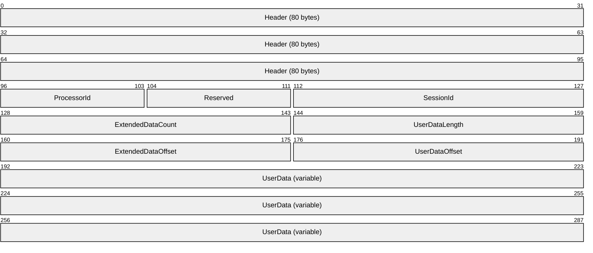
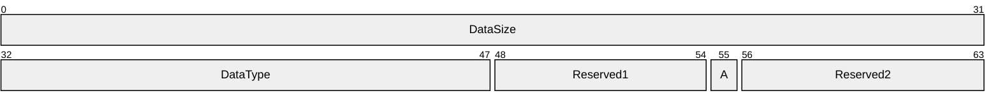
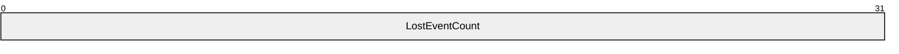

# [MS-LREC]: Live Remote Event Capture (LREC) Protocol

Table of Contents

1 Introduction

- [1 Introduction](#Section_1)
  - [1.1 Glossary](#Section_1.1)
  - [1.2 References](#Section_1.2)
    - [1.2.1 Normative References](#Section_1.2.1)
    - [1.2.2 Informative References](#Section_1.2.2)
  - [1.3 Overview](#Section_1.3)
  - [1.4 Relationship to Other Protocols](#Section_1.4)
  - [1.5 Prerequisites/Preconditions](#Section_1.5)
  - [1.6 Applicability Statement](#Section_1.6)
  - [1.7 Versioning and Capability Negotiation](#Section_1.7)
  - [1.8 Vendor Extensible Fields](#Section_1.8)
  - [1.9 Standards Assignments](#Section_1.9)

2 Messages

- [2 Messages](#Section_2)
  - [2.1 Transport](#Section_2.1)
    - [2.1.1 RPC Server Settings](#Section_2.1.1)
    - [2.1.2 RPC Client Settings](#Section_2.1.2)
  - [2.2 Common Data Types](#Section_2.2)
    - [2.2.1 Data Types](#Section_2.2.1)
      - [2.2.1.1 PSESSION_HANDLE](#Section_2.2.1.1)
    - [2.2.2 Structures](#Section_2.2.2)
      - [2.2.2.1 EVENT_BUFFER](#Section_2.2.2.1)
  - [2.3 Message Syntax](#Section_2.3)
    - [2.3.1 Managed Object Format (MOF) Structures](#Section_2.3.1)
      - [2.3.1.1 MSFT_NetEventSession Class](#Section_2.3.1.1)
      - [2.3.1.2 MSFT_NetEventProvider Class](#Section_2.3.1.2)
    - [2.3.2 RPC Structures](#Section_2.3.2)
      - [2.3.2.1 EventRecord Structure](#Section_2.3.2.1)
      - [2.3.2.2 NET_EVENT_DATA_HEADER Structure](#Section_2.3.2.2)
      - [2.3.2.3 NET_EVENT_LOST Structure](#Section_2.3.2.3)

3 Protocol Details

- [3 Protocol Details](#Section_3)
  - [3.1 NetEventForwarder Server Details](#Section_3.1)
    - [3.1.1 Abstract Data Model](#Section_3.1.1)
    - [3.1.2 Timers](#Section_3.1.2)
    - [3.1.3 Initialization](#Section_3.1.3)
    - [3.1.4 Message Processing Events and Sequencing Rules](#Section_3.1.4)
      - [3.1.4.1 WS-Management Method Calls](#Section_3.1.4.1)
        - [3.1.4.1.1 MSFT_NetEventSession CreateInstance](#Section_3.1.4.1.1)
        - [3.1.4.1.2 MSFT_NetEventSession Start](#Section_3.1.4.1.2)
        - [3.1.4.1.3 MSFT_NetEventSession Stop](#Section_3.1.4.1.3)
        - [3.1.4.1.4 MSFT_NetEventSession DeleteInstance](#Section_3.1.4.1.4)
        - [3.1.4.1.5 MSFT_NetEventProvider CreateInstance](#Section_3.1.4.1.5)
        - [3.1.4.1.6 MSFT_NetEventProvider ModifyInstance](#Section_3.1.4.1.6)
        - [3.1.4.1.7 MSFT_NetEventProvider DeleteInstance](#Section_3.1.4.1.7)
      - [3.1.4.2 RPC Opnum Method Calls](#Section_3.1.4.2)
        - [3.1.4.2.1 RpcNetEventOpenSession (Opnum 0)](#Section_3.1.4.2.1)
        - [3.1.4.2.2 RpcNetEventReceiveData (Opnum 1)](#Section_3.1.4.2.2)
        - [3.1.4.2.3 RpcNetEventCloseSession (Opnum 2)](#Section_3.1.4.2.3)
    - [3.1.5 Timer Events](#Section_3.1.5)
    - [3.1.6 Other Local Events](#Section_3.1.6)
      - [3.1.6.1 RPC Connection Termination](#Section_3.1.6.1)
      - [3.1.6.2 Accumulating Events](#Section_3.1.6.2)

4 Protocol Examples

- [4 Protocol Examples](#Section_4)

5 Security

- [5 Security](#Section_5)
  - [5.1 Security Considerations for Implementers](#Section_5.1)
  - [5.2 Index of Security Parameters](#Section_5.2)

6 Appendix A: Full IDL

- [6 Appendix A: Full IDL](#Section_6)

7 Appendix B: Full MOF

- [7 Appendix B: Full MOF](#Section_7)

8 Appendix C: Product Behavior

- [8 Appendix C: Product Behavior](#Section_8)

9 Change Tracking

- [9 Change Tracking](#Section_9)

For the legal notice and IP terms, see [LEGAL.md](../LEGAL.md).
Last updated: 4/23/2024.
See [Revision History](#revision-history) for full version history.

# 1 Introduction

The Live Remote Event Capture (LREC) Protocol allows a management station to monitor [**events**](#gt_event) on a target system across a network. The protocol consists of two components:

- A WS-Management-based control channel for starting and stopping an event capture.
- A [**remote procedure call (RPC)**](#gt_remote-procedure-call-rpc)-based data channel for retrieving events as they are logged on the remote system.
Together, these components can be used to support monitoring scenarios and provide a "first line of defense" for troubleshooting scenarios, especially when the remote system does not support the ability to locally log events.

Sections 1.5, 1.8, 1.9, 2, and 3 of this specification are normative. All other sections and examples in this specification are informative.

## 1.1 Glossary

This document uses the following terms:

**dynamic endpoint**: A network-specific server address that is requested and assigned at run time. For more information, see [[C706]](https://go.microsoft.com/fwlink/?LinkId=89824).

**endpoint**: A network-specific address of a remote procedure call (RPC) server process for remote procedure calls. The actual name and type of the endpoint depends on the [**RPC**](#gt_remote-procedure-call-rpc) protocol sequence that is being used. For example, for RPC over TCP (RPC Protocol Sequence ncacn_ip_tcp), an endpoint might be TCP port 1025. For RPC over Server Message Block (RPC Protocol Sequence ncacn_np), an endpoint might be the name of a named pipe. For more information, see [C706].

**event**: A discrete unit of historical data that an application exposes that may be relevant to other applications. An example of an event would be a particular user logging on to the computer.

**event provider**: A component that is instrumented for reporting events. An event provider defines a provider manifest and reports events in a format specified in the provider manifest.

**event session**: A user-configured group of event providers that can be started or stopped by a client.

**event template**: A portion of a provider manifest that defines event-specific data, if any, included by the event provider with each event.

**globally unique identifier (GUID)**: A term used interchangeably with [**universally unique identifier (UUID)**](#gt_universally-unique-identifier-uuid) in Microsoft protocol technical documents (TDs). Interchanging the usage of these terms does not imply or require a specific algorithm or mechanism to generate the value. Specifically, the use of this term does not imply or require that the algorithms described in [[RFC4122]](https://go.microsoft.com/fwlink/?LinkId=90460) or [C706] must be used for generating the [**GUID**](#gt_globally-unique-identifier-guid). See also [**universally unique identifier (UUID)**](#gt_universally-unique-identifier-uuid).

**Interface Definition Language (IDL)**: The International Standards Organization (ISO) standard language for specifying the interface for remote procedure calls. For more information, see [C706] section 4.

**little-endian**: Multiple-byte values that are byte-ordered with the least significant byte stored in the memory location with the lowest address.

**Managed Object Format (MOF)**: A textual encoding for Common Information Model (CIM) objects, this representation is not used within protocol operations defined in [MS-WMI](../MS-WMI/MS-WMI.md). MOF is defined in [[DMTF-DSP0004]](https://go.microsoft.com/fwlink/?LinkId=89848) section 3. The MOF text encoding is only used for illustrative purposes. The binary encoding can be translated to and from the MOF format.

**opnum**: An operation number or numeric identifier that is used to identify a specific [**remote procedure call (RPC)**](#gt_remote-procedure-call-rpc) method or a method in an interface. For more information, see [C706] section 12.5.2.12 or [MS-RPCE](../MS-RPCE/MS-RPCE.md).

**provider manifest**: A set of metadata for an event provider that defines the events, event filtering criteria, such as levels and keywords, and a unique ID of the event provider.

**remote procedure call (RPC)**: A communication protocol used primarily between client and server. The term has three definitions that are often used interchangeably: a runtime environment providing for communication facilities between computers (the RPC runtime); a set of request-and-response message exchanges between computers (the RPC exchange); and the single message from an RPC exchange (the RPC message). For more information, see [C706].

**RPC transport**: The underlying network services used by the remote procedure call (RPC) runtime for communications between network nodes. For more information, see [C706] section 2.

**security provider**: A pluggable security module that is specified by the protocol layer above the [**remote procedure call (RPC)**](#gt_remote-procedure-call-rpc) layer, and will cause the [**RPC**](#gt_remote-procedure-call-rpc) layer to use this module to secure messages in a communication session with the server. The security provider is sometimes referred to as an authentication service. For more information, see [C706] and [MS-RPCE].

**security support provider (SSP)**: A dynamic-link library (DLL) that implements the [**Security Support Provider Interface (SSPI)**](#gt_security-support-provider-interface-sspi) by making one or more security packages available to applications. Each security package provides mappings between an application's [**SSPI**](#gt_security-support-provider-interface-sspi) function calls and an actual security model's functions. Security packages support security protocols such as Kerberos authentication and NTLM.

**Security Support Provider Interface (SSPI)**: An API that allows connected applications to call one of several security providers to establish authenticated connections and to exchange data securely over those connections. It is equivalent to Generic Security Services (GSS)-API, and the two are on-the-wire compatible.

**universally unique identifier (UUID)**: A 128-bit value. UUIDs can be used for multiple purposes, from tagging objects with an extremely short lifetime, to reliably identifying very persistent objects in cross-process communication such as client and server interfaces, manager entry-point vectors, and [**RPC**](#gt_remote-procedure-call-rpc) objects. UUIDs are highly likely to be unique. UUIDs are also known as [**globally unique identifiers (GUIDs)**](#gt_globally-unique-identifier-guid) and these terms are used interchangeably in the Microsoft protocol technical documents (TDs). Interchanging the usage of these terms does not imply or require a specific algorithm or mechanism to generate the UUID. Specifically, the use of this term does not imply or require that the algorithms described in [RFC4122] or [C706] must be used for generating the UUID.

**XML**: The Extensible Markup Language, as described in [[XML1.0]](https://go.microsoft.com/fwlink/?LinkId=90599).

**MAY, SHOULD, MUST, SHOULD NOT, MUST NOT:** These terms (in all caps) are used as defined in [[RFC2119]](https://go.microsoft.com/fwlink/?LinkId=90317). All statements of optional behavior use either MAY, SHOULD, or SHOULD NOT.

## 1.2 References

Links to a document in the Microsoft Open Specifications library point to the correct section in the most recently published version of the referenced document. However, because individual documents in the library are not updated at the same time, the section numbers in the documents may not match. You can confirm the correct section numbering by checking the [Errata](https://go.microsoft.com/fwlink/?linkid=850906).

### 1.2.1 Normative References

We conduct frequent surveys of the normative references to assure their continued availability. If you have any issue with finding a normative reference, please contact [dochelp@microsoft.com](mailto:dochelp@microsoft.com). We will assist you in finding the relevant information.

[C706] The Open Group, "DCE 1.1: Remote Procedure Call", C706, August 1997, [https://publications.opengroup.org/c706](https://go.microsoft.com/fwlink/?LinkId=89824)

**Note** Registration is required to download the document.

[DMTF-DSP0200] DMTF, "Specification for CIM Operations over HTTP", version 1.2, January 2007, [http://www.dmtf.org/sites/default/files/standards/documents/DSP200.html](https://go.microsoft.com/fwlink/?LinkId=299237)

[DMTF-DSP0226] Distributed Management Task Force, Inc., "Web Services for Management (WS-Management) Specification", version 1.0.0, February 2008, [http://dmtf.org/sites/default/files/standards/documents/DSP0226_1.0.0.pdf](https://go.microsoft.com/fwlink/?LinkId=89849)

[MS-DTYP] Microsoft Corporation, "[Windows Data Types](../MS-DTYP/MS-DTYP.md)".

[MS-ERREF] Microsoft Corporation, "[Windows Error Codes](../MS-ERREF/MS-ERREF.md)".

[MS-EVEN6] Microsoft Corporation, "[EventLog Remoting Protocol Version 6.0](../MS-EVEN6/MS-EVEN6.md)".

[MS-EVEN] Microsoft Corporation, "[EventLog Remoting Protocol](../MS-EVEN/MS-EVEN.md)".

[MS-RPCE] Microsoft Corporation, "[Remote Procedure Call Protocol Extensions](../MS-RPCE/MS-RPCE.md)".

[RFC2119] Bradner, S., "Key words for use in RFCs to Indicate Requirement Levels", BCP 14, RFC 2119, March 1997, [https://www.rfc-editor.org/info/rfc2119](https://go.microsoft.com/fwlink/?LinkId=90317)

[RFC4122] Leach, P., Mealling, M., and Salz, R., "A Universally Unique Identifier (UUID) URN Namespace", RFC 4122, July 2005, [https://www.rfc-editor.org/info/rfc4122](https://go.microsoft.com/fwlink/?LinkId=90460)

### 1.2.2 Informative References

[MSDN-DefiningEventData] Microsoft Corporation, "Defining Event Data Templates", [http://msdn.microsoft.com/en-us/library/dd996913(v=vs.85).aspx](https://go.microsoft.com/fwlink/?LinkId=299238)

[MSDN-EVENT_HEADER] Microsoft Corporation, "EVENT_HEADER structure", [http://msdn.microsoft.com/en-us/library/aa363759(v=VS.85).aspx](https://go.microsoft.com/fwlink/?LinkId=208337)

[MSDN-EvntManifest] Microsoft Corporation, "EventManifest Schema", [http://msdn.microsoft.com/en-us/library/aa384043(v=vs.85).aspx](https://go.microsoft.com/fwlink/?LinkId=299240)

## 1.3 Overview

The Live Remote Event Capture (LREC) protocol allows a client to connect to a server to monitor critical information and detect issues as they occur on the server. For example, to detect under-provisioned servers, an administrator can use this protocol to remotely see the [**events**](#gt_event) that indicate under-provisioning which are logged as high memory utilization. The remote visibility into the event logging enables the administrator to re-balance the load on the server, immediately observe the fix, and continue to make improvements as necessary.

In the LREC protocol, information is sent over the network to a client as a sequential stream of records each of which is referred to as an event. Multiple software components and applications on the server can report events using the protocol. These are referred to [**event providers**](#gt_event-provider). Each event provider is identified by a unique "provider ID" and its event types are described in a [**provider manifest**](#gt_provider-manifest) organized in any implementation-specific way, such as the XML schema specified in [[MSDN-EvntManifest]](https://go.microsoft.com/fwlink/?LinkId=299240).

Event providers can define multiple kinds of events. For example, a user logging on could be one kind of event and a user logging off could be another. When a provider reports an event, it specifies an event provider-specific Event Type ID (referred to as an event ID) that indicates the specific kind of event being reported. The event ID is reused whenever another event of the same type is reported. Therefore, each event type is uniquely identified by a provider ID and an event ID.

Different server configurations and application workloads have varying requirements for monitoring and troubleshooting. To ensure flexible support for these scenarios, multiple event providers can be added into an event session to enable simultaneous event recording. When using multiple event providers, two techniques in particular enable the broad coverage of a session containing many event providers, yet narrow the number of observed events:

- The server filters events based on the "error level" or criticality of the events.
- The server filters events based on keywords, such as authentication, input/output, or user interface.
In the LREC protocol, an [**event session**](#gt_event-session) is configured and started using a WS-Management-based control channel. When the session is started, the server initializes an [**RPC**](#gt_remote-procedure-call-rpc) [**endpoint**](#gt_endpoint) and the client connects to the server using the RPC endpoint to receive reported events. When the client is finished observing reported events, the client stops the session using the WS-Management-based control channel. When all event sessions are stopped, the RPC endpoint is removed.

## 1.4 Relationship to Other Protocols

The LREC protocol uses the WS-Management protocol [[DMTF-DSP0226]](https://go.microsoft.com/fwlink/?LinkId=89849) as a transport for its control channel for [**event session**](#gt_event-session) configuration. The LREC protocol uses [**RPC**](#gt_remote-procedure-call-rpc) [MS-RPCE](../MS-RPCE/MS-RPCE.md) as a transport for its data channel for [**event**](#gt_event) data retrieval. The diagram below illustrates the relationship of the LREC protocol to other protocols in the networking stack.

Figure 1: Relationship to other protocols

The LREC protocol is related to the EventLog Remoting Protocol [MS-EVEN](../MS-EVEN/MS-EVEN.md) and EventLog Remoting Protocol Version 6.0 [MS-EVEN6](../MS-EVEN6/MS-EVEN6.md), but the LREC protocol is designed for a different purpose. The event log protocols specified in [MS-EVEN] and [MS-EVEN6] are designed for accessing event log files on a remote computer. The LREC protocol is designed for configuration and remote monitoring of live event sessions.

## 1.5 Prerequisites/Preconditions

This protocol has the prerequisites specified in [MS-RPCE](../MS-RPCE/MS-RPCE.md) which are common to protocols that depend on [**RPC**](#gt_remote-procedure-call-rpc).

The prerequisites for the WS-Management protocol are specified in [[DMTF-DSP0226]](https://go.microsoft.com/fwlink/?LinkId=89849). In addition, the LREC protocol requires the client to have the [**provider manifests**](#gt_provider-manifest) available before attempting to de-serialize [**event**](#gt_event) messages.

## 1.6 Applicability Statement

The LREC protocol is used for monitoring [**events**](#gt_event) on a remote computer. For example, for monitoring service deployments to ensure administrators can immediately react to configuration errors, or for troubleshooting time-critical service outages.

The LREC protocol is designed for monitoring events in real time and is not suitable for retrieving events that have occurred in the past.

The LREC protocol is only applicable in scenarios where a given [**event session**](#gt_event-session) is controlled by a single client. The protocol is not applicable in cases where multiple management stations require simultaneous management of the same event stream.

## 1.7 Versioning and Capability Negotiation

**Protocol Version:** The [**RPC**](#gt_remote-procedure-call-rpc) interface for the LREC protocol is version 1.0. The protocol can be extended by adding RPC messages to the interface with [**opnums**](#gt_opnum) higher than those defined in this specification. An RPC client determines whether a method is supported by attempting to invoke the method. If the method is not supported, the RPC runtime returns an "opnum out of range" error as specified in [[C706]](https://go.microsoft.com/fwlink/?LinkId=89824) and [MS-RPCE](../MS-RPCE/MS-RPCE.md). RPC versioning and capacity negotiation in these situations is as specified in [C706] and [MS-RPCE].

**Security and Authentication Methods:** The LREC protocol supports the following authentication methods: NTLM and Kerberos as specified in [MS-RPCE] section 1.7.

## 1.8 Vendor Extensible Fields

The LREC protocol uses Win32 error codes as defined in [MS-ERREF](../MS-ERREF/MS-ERREF.md) section 2.2 and Vendors SHOULD reuse these values with their indicated meaning. Specifying any other value runs the risk of a future collision.

## 1.9 Standards Assignments

The LREC protocol has no standards assignments. It uses private allocations for the [**RPC**](#gt_remote-procedure-call-rpc) interface [**universally unique identifier (UUID)**](#gt_universally-unique-identifier-uuid).

| Parameter | Value | Reference |
| --- | --- | --- |
| UUID for NetEventForwarder | 22e5386d-8b12-4bf0-b0ec-6a1ea419e366 | [[C706]](https://go.microsoft.com/fwlink/?LinkId=89824) |

# 2 Messages

## 2.1 Transport

All implementations MUST use the [**RPC**](#gt_remote-procedure-call-rpc) over TCP protocol sequence (ncacn_ip_tcp), as specified in [MS-RPCE](../MS-RPCE/MS-RPCE.md) section 2.1.1.1, with [**dynamic endpoints**](#gt_dynamic-endpoint).

The protocol MUST use the NetEventForwarder [**UUID**](#gt_universally-unique-identifier-uuid): 22e5386d-8b12-4bf0-b0ec-6a1ea419e366.

The protocol MUST use an [**Interface Definition Language (IDL)**](#gt_interface-definition-language-idl) version of 1.0.

WS-Management [[DMTF-DSP0226]](https://go.microsoft.com/fwlink/?LinkId=89849) MUST be used as the transport provider for the LREC protocol control channel.

### 2.1.1 RPC Server Settings

The LREC protocol uses [**Security Support Provider Interface (SSPI)**](#gt_security-support-provider-interface-sspi) security provided by [**RPC**](#gt_remote-procedure-call-rpc), as specified in [MS-RPCE](../MS-RPCE/MS-RPCE.md) section 3.3.1.5.2, for sessions using TCP as the transport protocol. The server MUST register RPC_C_AUTHN_GSS_NEGOTIATE as the [**security provider**](#gt_security-provider).

The server MUST allow only authenticated access to RPC clients. The server MUST NOT allow anonymous RPC clients.

The server MUST limit access only to clients that negotiate an authentication level equal or higher than that of RPC_C_AUTHN_LEVEL_PKT (see [MS-RPCE] section 2.2.1.1.8).

### 2.1.2 RPC Client Settings

The [**RPC**](#gt_remote-procedure-call-rpc) client MUST use [**security support provider (SSP)**](#gt_security-support-provider-ssp) security provided over RPC as specified in [MS-RPCE](../MS-RPCE/MS-RPCE.md), for sessions using TCP as the [**RPC transport**](#gt_rpc-transport) protocol. A client MUST authenticate using RPC_C_AUTHN_GSS_NEGOTIATE.

A client MUST use TCP as the RPC transport.

A client SHOULD<1> request the RPC_C_AUTHN_LEVEL_PKT_PRIVACY authentication level. A client MAY request RPC_C_AUTHN_LEVEL_PKT_INTEGRITY authentication level instead, when data encryption is not required.

## 2.2 Common Data Types

In addition to the [**RPC**](#gt_remote-procedure-call-rpc)-based data types and definitions specified in [[C706]](https://go.microsoft.com/fwlink/?LinkId=89824), [MS-RPCE](../MS-RPCE/MS-RPCE.md), and [MS-DTYP](../MS-DTYP/MS-DTYP.md), additional data types are defined below.

All multi-byte integer values in the messages declared in this section use [**little-endian**](#gt_little-endian) byte order unless otherwise noted.

### 2.2.1 Data Types

The LREC protocol defines the following data types.

| DataType name | Section | Description |
| --- | --- | --- |
| PSESSION_HANDLE | [2.2.1.1](#Section_2.2.1.1) | An [**RPC**](#gt_remote-procedure-call-rpc) client context handle that identifies the current [**event session**](#gt_event-session). |

#### 2.2.1.1 PSESSION_HANDLE

The PSESSION_HANDLE data type is an [**RPC**](#gt_remote-procedure-call-rpc) client context handle that identifies the current [**event session**](#gt_event-session). A client receives this handle using the **RpcNetEventOpenSession** (section [3.1.4.2.1](#Section_3.1.4.2.1)) method.

typedef [context_handle] void* PSESSION_HANDLE;

### 2.2.2 Structures

The LREC protocol defines the following structures.

| Structure name | Section | Description |
| --- | --- | --- |
| EVENT_BUFFER | [2.2.2.1](#Section_2.2.2.1) | An [**event**](#gt_event) record from a server. |

#### 2.2.2.1 EVENT_BUFFER

The **EVENT_BUFFER** structure defines a data structure for transferring a generic payload. The LREC protocol uses this structure to pass [**event**](#gt_event) records in the **RpcNetEventReceiveData** (section [3.1.4.2.2](#Section_3.1.4.2.2)) method.

typedef struct _EVENT_BUFFER {

unsigned long BufferLength;

[size_is(BufferLength)] byte* Buffer;

} EVENT_BUFFER;

**BufferLength:** This property specifies the length, in bytes, of the data stored in the **Buffer** field.

**Buffer:** This property specifies a collection of one or more **NET_EVENT_DATA_HEADER** (section [2.3.2.2](#Section_2.3.2.2)) structures each followed by an event payload.

## 2.3 Message Syntax

### 2.3.1 Managed Object Format (MOF) Structures

The following sections specify the [**Managed Object Format (MOF)**](#gt_managed-object-format-mof) classes implemented by the LREC protocol.

#### 2.3.1.1 MSFT_NetEventSession Class

The **MSFT_NetEventSession** MOF class is used for configuring and starting an [**event session**](#gt_event-session) on a remote computer. After an instance is created, all properties are read-only via WS-Management [[DMTF-DSP0226]](https://go.microsoft.com/fwlink/?LinkId=89849) and cannot be changed by a client.

class MSFT_NetEventSession {

string Guid;

string Name;

uint8 CaptureMode;

string LocalFilePath;

uint32 MaxFileSize;

uint32 TraceBufferSize;

uint8 MaxNumberOfBuffers;

uint8 SessionStatus;

uint8 Start();

uint8 Stop();

};

**Guid:** This property specifies a [**globally unique identifier (GUID)**](#gt_globally-unique-identifier-guid) for the session in curly braced string representation, as defined in [MS-DTYP](../MS-DTYP/MS-DTYP.md) section 2.3.4.3.

**Name:** This property specifies a friendly name for the event session that was assigned by the client when the session was created.

**CaptureMode:** This property MUST be set to 0x02 (RealtimeRPC).

**LocalFilePath:** This property is reserved and MUST be set to an empty string.

**MaxFileSize:** This property is reserved and MUST be set to 0.

**TraceBufferSize:** This property specifies the amount of memory allocated for each [**event**](#gt_event) tracing session buffer, in kilobytes. The maximum value is 0x00000400 (decimal 1024). A value of zero (0x00000000) indicates that it is permissible for the server to specify a different value.

**MaxNumberOfBuffers:** This property specifies the maximum number of buffers allocated for the event tracing session. A value of 0x00 indicates that it is permissible for the server to specify a different value.

**SessionStatus:** This property indicates the current event session state which MUST be set to one of the following values.

| Value | Meaning |
| --- | --- |
| Stopped 1 | The event session is stopped. |
| Running 2 | The event session is running. |

**Start:** A method that is used to start an event session that has been previously associated with at least one **MSFT_NetEventProvider** object (section [2.3.1.2](#Section_2.3.1.2)). The method is defined in section [3.1.4.1.2](#Section_3.1.4.1.2).

**Stop:** A method that is used to stop a previously started event session. The method is defined in section [3.1.4.1.3](#Section_3.1.4.1.3).

#### 2.3.1.2 MSFT_NetEventProvider Class

The **MSFT_NetEventProvider** MOF class is used for configuring an [**event session**](#gt_event-session) on a remote computer. A client can add [**event providers**](#gt_event-provider) to a session by creating MSFT_NetEventProvider objects with the SessionGuid property equal to the [**GUID**](#gt_globally-unique-identifier-guid) of an existing **MSFT_NetEventSession** object (section [2.3.1.1](#Section_2.3.1.1)).

After an instance is created, all properties are read-only via WS-Management [[DMTF-DSP0226]](https://go.microsoft.com/fwlink/?LinkId=89849), except the **Level**, **MatchAnyKeyword**, and **MatchAllKeyword** properties which are read-write.

class MSFT_NetEventProvider {

string Guid;

string SessionGuid;

string Name;

string SessionName;

uint8 Level;

uint64 MatchAnyKeyword;

uint64 MatchAllKeyword;

};

**Guid:** This property specifies a GUID for the provider ID from a [**provider manifest**](#gt_provider-manifest).

**SessionGuid:** This property specifies the identifier of an existing **MSFT_NetEventSession** object (section 2.3.1.1). The value of this member corresponds to the **MSFT_NetEventSession.Guid** property.

**Name:** This property specifies a unique provider name from the provider manifest.

**SessionName:** This property specifies a unique session name that corresponds to the value of the **MSFT_NetEventSession.Name** member (see section 2.3.1.1).

**Level:** This property specifies the maximum level of [**events**](#gt_event) to include in the session, as shown in the following table. A value of 0x00 indicates that all levels are to be included in the session.

| Value | Meaning |
| --- | --- |
| TRACE_LEVEL_CRITICAL 0x01 | Only include abnormal exit or termination events. |
| TRACE_LEVEL_ERROR 0x02 | Include all events corresponding to event level 1 and severe error events. |
| TRACE_LEVEL_WARNING 0x03 | Include all events corresponding to lower event levels 1 and 2 and warning events, such as allocation failures. |
| TRACE_LEVEL_INFORMATION 0x04 | Include all events corresponding to lower event levels 1 through 3 and non-error event, such as entry or exit events. |
| TRACE_LEVEL_VERBOSE 0x05 | Include all events corresponding to lower event levels 1 through 4 and detailed trace events. |

**MatchAnyKeyword:** This property specifies a bitmask of keywords that is used to determine the category of events to include in the event session. The keyword values are event provider-specific and defined in the provider manifest. When any keyword assigned to an event matches any bit set in the MatchAnyKeyword property, then that event is included in the event session. A value of zero is equivalent to 0xFFFFFFFFFFFFFFFF and indicates to include all categories of events.

**MatchAllKeyword:** This property specifies a bitmask of keywords from the provider manifest which is used to further restrict the categories of events to includ in the event session. When a keyword for an event satisfies the conditions specified in the MatchAnyKeyword property, the event is included in the event session only if all of the bits in the MatchAllKeyword mask exist in the keyword. This mask is not used when the MatchAnyKeyword property is set to zero.

### 2.3.2 RPC Structures

The following sections specify the [**RPC**](#gt_remote-procedure-call-rpc) structures implemented by the LREC protocol.

#### 2.3.2.1 EventRecord Structure

The **EventRecord** structure provides the payload in an **EVENT_BUFFER** (section [2.2.2.1](#Section_2.2.2.1)) structure. The structure defines an event recorded by an [**event provider**](#gt_event-provider).

**Header (80 bytes):** This field specifies an **EVENT_HEADER** structure as defined in [MS-DTYP](../MS-DTYP/MS-DTYP.md) section 2.3.2. For more information, see [[MSDN-EVENT_HEADER]](https://go.microsoft.com/fwlink/?LinkId=208337).

**ProcessorId (1 byte):** This field specifies an implementation-specific identifier for the CPU on which the **event provider** process was running at the time of the event recording.

**Reserved (1 byte):** This field is reserved and MUST be set to 0x08.

**SessionId (2 bytes):** This field specifies an identifier of the session that logged the event**.**

**ExtendedDataCount (2 bytes):** This field is reserved for future use. The field MUST be set to zero when sent and ignored upon receipt.

**UserDataLength (2 bytes):** This field specifies the size, in bytes, of the **UserData** field.

**ExtendedDataOffset (2 bytes):** This field is reserved for future use. The field MUST be set to zero when sent and ignored upon receipt.

**UserDataOffset (2 bytes):** This field specifies an offset, in bytes, from the beginning of the structure to the **UserData** field. The field MUST be set to 0x0060 (96 bytes).

**UserData (variable):** This field contains data as specified in the [**event template**](#gt_event-template) that corresponds to the event identified by the **Header.EventDescriptor.Id** field. The event template is defined in the [**provider manifest**](#gt_provider-manifest) corresponding to the provider ID from the **Header.ProviderId** field.

#### 2.3.2.2 NET_EVENT_DATA_HEADER Structure

The **NET_EVENT_DATA_HEADER** structure specifies the size and type of the message payload in an **EVENT_BUFFER** (section [2.2.2.1](#Section_2.2.2.1)) structure. The buffer contains one or more **NET_EVENT_DATA_HEADER** structures.

**DataSize (4 bytes):** This field specifies the size, in bytes, of the **NET_EVENT_DATA_HEADER** structure and the payload specified in the **DataType** field. The value MUST be greater than or equal to 6 and less or equal to 65,535.

**DataType (2 bytes):** This field specifies the type of data that follows after the **NET_EVENT_DATA_HEADER** structure. The field MUST be set to one of the following values.

| Value | Meaning |
| --- | --- |
| NetEventDataEventRecord 0x0001 | The data is an **EventRecord** (section [2.3.2.1](#Section_2.3.2.1)) structure. |
| NetEventDataLost 0x0002 | The data is a **NET_EVENT_LOST** (section [2.3.2.3](#Section_2.3.2.3)) structure. |

**Reserved1 (7 bits):** This field MUST be set to zero when sent and ignored upon receipt.

**A (1 bit):** If set, this field indicates the last data item in the buffer.

**Reserved2 (8 bits):** This field MUST be set to zero when sent and ignored upon receipt.

#### 2.3.2.3 NET_EVENT_LOST Structure

The **NET_EVENT_LOST** structure provides payload in an **EVENT_BUFFER** (section [2.2.2.1](#Section_2.2.2.1)) structure and contains the number of [**events**](#gt_event) lost due to slow event retrieval.

**LostEventCount (4 bytes):** This field specifies the number of lost events between two sequential calls to the **RpcNetEventReceiveData** (section [3.1.4.2.2](#Section_3.1.4.2.2)) method. If more than 2^32 (two to the thirty-second power) events are lost, the field MUST be set to the value 0xFFFFFFFF.

# 3 Protocol Details

The LREC protocol is used for monitoring an [**event session**](#gt_event-session) on a remote computer over a network. Therefore, a client configures and starts an event session by first creating an instance of the **MSFT_NetEventSession Class** (section [2.3.1.1](#Section_2.3.1.1)). After the object is created, the client can connect to the newly created session using the **RpcNetEventOpenSession** (section [3.1.4.2.1](#Section_3.1.4.2.1)) method and start retrieving [**events**](#gt_event) from the session using the **RpcNetEventReceiveData** (section [3.1.4.2.2](#Section_3.1.4.2.2)) method.

## 3.1 NetEventForwarder Server Details

### 3.1.1 Abstract Data Model

This section describes a conceptual model of a possible data organization that an implementation maintains to participate in this protocol. The described organization is provided to facilitate the explanation of how the protocol behaves. This document does not mandate that implementations adhere to this model as long as their external behavior is consistent with that described in this document.

- **Provider Manifest Table:** A set of [**provider manifests**](#gt_provider-manifest) for available [**event providers**](#gt_event-provider) that can be added to a session. This metadata can be expressed in any implementation-dependent<2> format.
- **Session Table:** A set of [**event sessions**](#gt_event-session), where each event session contains the following properties:
- **Session ID:** A [**GUID**](#gt_globally-unique-identifier-guid) that uniquely identifies the event session.
- **Session Name:** A human-readable event session name assigned by the client when the event session was created.
- **Session State:** The session's state, either Stopped or Running, where the initial value is Stopped.
- **Associated Provider List:** A list of event providers associated with the event session, where each entry contains the following properties:
- **Event Provider:** An event provider that has an entry in the provider manifest table.
- **Level:** The maximum level (as defined in the associated provider manifest) of [**events**](#gt_event) to include in the event session.
- **Match Any Keyword:** A set of keywords defined in the associated provider manifest, where at least one keyword is required to match a keyword of an event in order for the event to be included in the event session.
- **Match All Keywords:** A set of keywords defined in the associated provider manifest, where all keywords are required to be present in an event in order for the event to be included in the event session.
- **Session Handle:** An RPC Session Handle allocated by **the RpcNetEventOpenSession** (section [3.1.4.2.1](#Section_3.1.4.2.1)) method.
- **Queued Event List:** A list of events waiting to be returned by a call to the **RpcNetEventReceiveData** (section [3.1.4.2.2](#Section_3.1.4.2.2)) method.
- **Lost Event Count:** The number of events between two sequential calls to the **RpcNetEventReceiveData** method that were lost due to overflow of the Queued Event List.
- **Outstanding RpcNetEventReceiveData Call:** Either empty, or holds a pending call to the **RpcNetEventReceiveData** method to be completed later.

### 3.1.2 Timers

Each [**event session**](#gt_event-session) contains the following:

**Data Completion Timer:** A timer that is used to control completion of the **RpcNetEventReceiveData** (section [3.1.4.2.2](#Section_3.1.4.2.2)) method. The exact value of the timeout is implementation-specific, but it MUST be between 100 and 1000 milliseconds.

### 3.1.3 Initialization

None.

### 3.1.4 Message Processing Events and Sequencing Rules

#### 3.1.4.1 WS-Management Method Calls

##### 3.1.4.1.1 MSFT_NetEventSession CreateInstance

**CreateInstance** is an intrinsic method of the **MSFT_NetEventSession Class** (section [2.3.1.1](#Section_2.3.1.1)) that is used to create a new instance of an **MSFT_NetEventSession** object on the server. The method returns the newly created instance. For more information, see [[DMTF-DSP0200]](https://go.microsoft.com/fwlink/?LinkId=299237) section 2.3.2.6.

The client MUST specify the **Name** property for the newly created instance.

When the **CreateInstance** method is called, the server MUST check the **Name** value for uniqueness in the **Session Table** and return a NULL object if a session with the same **Name** already exists.

Otherwise, the server MUST attempt to create an [**event session**](#gt_event-session) entry in its **Session Table** and assign a unique value to the **Guid** property, created as specified in [[RFC4122]](https://go.microsoft.com/fwlink/?LinkId=90460). If the entry cannot be created, the server MUST return a NULL object. A server MAY<3> limit the number of available entries in the **Session Table**.

When the server is able to create the entry, the **Associated Provider List** and **Queued Event List** MUST be initialized as empty and the **CreateInstance** method MUST be completed successfully.

##### 3.1.4.1.2 MSFT_NetEventSession Start

The client calls the **Start** method of an **MSFT_NetEventSession** object (section [2.3.1.1](#Section_2.3.1.1)) to start an [**event session**](#gt_event-session) that has been previously associated with at least one **MSFT_NetEventProvider** object (section [2.3.1.2](#Section_2.3.1.2)).

uint32 Start();

**Return Values:** The **Start** method MUST return ERROR_SUCCESS (0x00000000) on success or a nonzero Win32 error code value if an error occurred. All error values MUST be treated the same.

When the **Start** method is called on an event session, the server MUST check the **Associated Provider List** in the event session entry in the **Session Table**. The server MUST return a nonzero error code when no [**event providers**](#gt_event-provider) are associated with the event session.

Otherwise, the server MUST attempt to initialize the [**RPC**](#gt_remote-procedure-call-rpc) [**endpoint**](#gt_endpoint) if it is not already running. If the server is unable to initialize the RPC endpoint, it MUST return a nonzero error code.

When the server is able to initialize the RPC endpoint, the **Session State** MUST be set to Running, and the server MUST return success.

##### 3.1.4.1.3 MSFT_NetEventSession Stop

The client calls the **Stop** method of an **MSFT_NetEventSession** object (section [2.3.1.1](#Section_2.3.1.1)) to stop a previously started [**event session**](#gt_event-session).

uint32 Stop();

**Return Values:** The **Stop** method MUST return ERROR_SUCCESS (0x00000000) on success or a nonzero Win32 error code value if an error occurred. All error values MUST be treated the same.

When the **Stop** method is called on an **MSFT_NetEventSession** object, the server MUST check that the specified session is already in the Running state, and if it is not, return a nonzero error code.

The server MUST set the **Session State** to Stopped.

When there are no event sessions present in the **Session Table** in the Running state, the server MUST stop the [**RPC**](#gt_remote-procedure-call-rpc) [**endpoint**](#gt_endpoint).

##### 3.1.4.1.4 MSFT_NetEventSession DeleteInstance

**DeleteInstance** is an intrinsic method of the **MSFT_NetEventSessionClass** (section [2.3.1.1](#Section_2.3.1.1)) and is used to delete an instance of an **MSFT_NetEventSession** object on the server. For more information, see [[DMTF-DSP0200]](https://go.microsoft.com/fwlink/?LinkId=299237) section 2.3.2.4.

When the **DeleteInstance** method is called, the server MUST first check if the [**event session**](#gt_event-session) state is Running, and if it is, stop accumulating [**events**](#gt_event).

The server MUST then remove the event session entry from its **Session Table** and free all associated resources.

##### 3.1.4.1.5 MSFT_NetEventProvider CreateInstance

**CreateInstance** is an intrinsic method of the **MSFT_NetEventProviderClass** (section [2.3.1.2](#Section_2.3.1.2)) and is used to create a new instance of a **MSFT_NetEventProvider** class on the server. This method returns the newly created instance. For more information, see [[DMTF-DSP0200]](https://go.microsoft.com/fwlink/?LinkId=299237) section 2.3.2.6.

The client MUST assign a valid value to the **Guid** property identifying one of the [**event providers**](#gt_event-provider) on the server.

The client MUST assign a valid value to the **SessionGuid** property. The value MUST identify an existing **MSFT_NetEventSession** object.

When the **CreateInstance** method is called, the server MUST check that the event provider identified in the **Guid** property and the **MSFT_NetEventSession** object identified in the **SessionGuid** property are present on the system. If they are not present, the server MUST return a NULL object.

Otherwise, the server MUST verify that the value of the **Name** property matches the name of the event provider in the [**provider manifest**](#gt_provider-manifest), and that the value of the **SessionName** property matches the **Session Name** field of the [**event session**](#gt_event-session). If both values do not match, the server MUST return a NULL object.

When both values do match, the server MUST attempt to create an entry in the **Associated Provider List** of the event session, and if it cannot do so, return a NULL object.

On success, the server MUST return the resulting **MSFT_NetEventProvider** object.

##### 3.1.4.1.6 MSFT_NetEventProvider ModifyInstance

**ModifyInstance** is an intrinsic method of the **MSFT_NetEventProvider Class** (section [2.3.1.2](#Section_2.3.1.2)) and is used to modify the **Level**, **Match Any Keyword**, and **Match All Keywords** properties of an existing **MSFT_NetEventProvider** instance on the server. For more information, see [[DMTF-DSP0200]](https://go.microsoft.com/fwlink/?LinkId=299237) section 2.3.2.8.

When the **ModifyInstance** method is called, the server MUST check the **Session State** of the associated [**event session**](#gt_event-session) and fail the call if the state is Running.

Otherwise, the server MUST update the properties of the entry in the **Associated Provider List** and complete the call successfully.

##### 3.1.4.1.7 MSFT_NetEventProvider DeleteInstance

**DeleteInstance** is an intrinsic method of the **MSFT_NetEventProvider Class** (section [2.3.1.2](#Section_2.3.1.2)) and is used to delete an instance of an **MSFT_NetEventProvider** object on the server. For more information, see [[DMTF-DSP0200]](https://go.microsoft.com/fwlink/?LinkId=299237) section 2.3.2.4.

When the **DeleteInstance** method is called, the server MUST first check the state of the associated [**event session**](#gt_event-session) and fail the call if the state is Running.

Otherwise, the server MUST find the corresponding event session in the **Session Table** and remove the provider from its **Associated Provider List**.

#### 3.1.4.2 RPC Opnum Method Calls

The **NetEventForwarder** interface provides methods for remote monitoring of an [**event session**](#gt_event-session). The version for this interface is 1.0.

To receive incoming remote calls for this interface, the server MUST implement an [**RPC**](#gt_remote-procedure-call-rpc) [**endpoint**](#gt_endpoint) using the [**UUID**](#gt_universally-unique-identifier-uuid) 22e5386d-8b12-4bf0-b0ec-6a1ea419e366.

Methods in RPC Opnum Order

| Method | Description |
| --- | --- |
| **RpcNetEventOpenSession** (section [3.1.4.2.1](#Section_3.1.4.2.1)) | This method opens a context handle to a running event session. Opnum: 0 |
| **RpcNetEventReceiveData** (section [3.1.4.2.2](#Section_3.1.4.2.2)) | This method retrieves a buffer with one or more **NET_EVENT_DATA_HEADER** structures (section [2.3.2.2](#Section_2.3.2.2)) followed by the [**event**](#gt_event) payload. Opnum: 1 |
| **RpcNetEventCloseSession** (section [3.1.4.2.3](#Section_3.1.4.2.3)) | This method closes the RPC binding handle returned by the **RpcNetEventOpenSession** method. Opnum: 2 |

##### 3.1.4.2.1 RpcNetEventOpenSession (Opnum 0)

The **RpcNetEventOpenSession** method opens a context handle to a running [**event session**](#gt_event-session).

DWORD RpcNetEventOpenSession (

[in] handle_t BindingHandle,

[in] [string] wchar_t* LoggerName,

[out] PSESSION_HANDLE* SessionHandle

);

**BindingHandle:** An [**RPC**](#gt_remote-procedure-call-rpc) binding handle to the server. Details concerning binding handles are specified in [[C706]](https://go.microsoft.com/fwlink/?LinkId=89824) section 2.3

**LoggerName:** The name of the current event session. The value of this field MUST correspond to the **Name** property of a previously started **MSFT_NetEventSession** object (section [2.3.1.1](#Section_2.3.1.1)).

**SessionHandle:** An out parameter that receives an RPC context handle (as specified in section [2.2.1.1](#Section_2.2.1.1)) that represents a reference to an active event session on the server.

**Return Values:** The method MUST return ERROR_SUCCESS (0x00000000) on success or a nonzero Win32 error code value if an error occurred. All error values MUST be treated the same.

The [**opnum**](#gt_opnum) field value for this method is 0.

When processing this call, the server MUST do the following:

- When the **RpcNetEventOpenSession** method is called, the server MUST check its **Session Table** for an event session with a **Session Name** that matches the value specified in the **LoggerName** member. When a match is not found, the server MUST return an error.
- When a match is found, the server MUST attempt to allocate a **Session Handle** for the client and store it in its event session, and if it cannot perform the allocation, return an error.
- When the server can allocate the **Session Handle** for the client, the server MUST start collecting [**events**](#gt_event) from the [**event providers**](#gt_event-provider) and accumulate in the **Queued Event List**, all events matching the event session objects **Level**, **Match Any Keyword**, and **Match All Keywords** filters.
- The server MUST return the **Session Handle** to the caller and complete the call with success.
**Exceptions Thrown:** Exceptions SHOULD NOT be thrown beyond those thrown by the underlying RPC protocol specified in [MS-RPCE](../MS-RPCE/MS-RPCE.md).

##### 3.1.4.2.2 RpcNetEventReceiveData (Opnum 1)

The **RpcNetEventReceiveData** method retrieves a buffer with one or more NET_EVENT_DATA_HEADER structures, followed by the [**event**](#gt_event) payload. The size of the buffer is determined by the server.

DWORD RpcNetEventReceiveData (

[in] PSESSION_HANDLE SessionHandle,

[out] EVENT_BUFFER* EventBuffer

);

**SessionHandle:** Contains an [**RPC**](#gt_remote-procedure-call-rpc) context handle (as specified in section [2.2.1.1](#Section_2.2.1.1)) returned by the **RpcNetEventOpenSession** (section [3.1.4.2.1](#Section_3.1.4.2.1)) method.

**EventBuffer:** An out parameter that receives an **EVENT_BUFFER** (section [2.2.2.1](#Section_2.2.2.1)).

**Return Values:** The method MUST return ERROR_SUCCESS (0x00000000) on success or a nonzero Win32 error code value if an error occurred. All error values MUST be treated the same.

The [**opnum**](#gt_opnum) field value for this method is 1.

When processing this call, the server MUST do the following:

- When the **RpcNetEventReceiveData** method is called, the server MUST first check its **Session Table** for an [**event session**](#gt_event-session) object where the **Session Handle** matches the value supplied in the **SessionHandle** member, and if a match cannot be found, fail the call.
- When a match can be found, if the **Outstanding RpcNetEventReceiveData Call** of the event session is not empty, the server MUST fail this call to **RpcNetEventReceiveData**.
- When the **Outstanding RpcNetEventReceiveData Call** of the event session is empty, the server MUST determine, in any implementation-specific manner, an appropriate number of events to return. If enough events are already in the **Queued Event List**, the events MUST be removed from the list and returned in the **EventBuffer** member. If the **Lost Event Count** is nonzero, the server MUST also include a **NET_EVENT_LOST** structure (section [2.3.2.3](#Section_2.3.2.3)) at the end of the **EventBuffer**.
- When the **Outstanding RpcNetEventReceiveData Call** of the event session is not empty, the server MUST store the pending call in the **Outstanding RpcNetEventReceiveData Call** of the event session to be completed later when enough events are collected in the **Queued Event List** or the **Data Completion Timer** expires.
**Exceptions Thrown:** Exceptions SHOULD NOT be thrown beyond those thrown by the underlying RPC protocol specified in [MS-RPCE](../MS-RPCE/MS-RPCE.md).

##### 3.1.4.2.3 RpcNetEventCloseSession (Opnum 2)

The **RpcNetEventCloseSession** method closes the [**RPC**](#gt_remote-procedure-call-rpc) binding handle returned by the **RpcNetEventOpenSession** (section [3.1.4.2.1](#Section_3.1.4.2.1)) method.

void RpcNetEventCloseSession (

[in, out] PSESSION_HANDLE* SessionHandle

);

**SessionHandle:** On input, this member contains an RPC context handle (as specified in section [2.2.1.1](#Section_2.2.1.1)) returned by the **RpcNetEventOpenSession** method. On output, the member MUST contain NULL.

The [**opnum**](#gt_opnum) field value for this method is 2.

When processing this call, the server MUST do the following:

- When the **RpcNetEventCloseSession** method is called, the server MUST first check its **Session Table** for an [**event session**](#gt_event-session) object where the **Session Handle** matches the value supplied in the **SessionHandle** member, and if a match cannot be found, fail the call.
- When a match can be found, the server MUST remove the **Session Handle** from the event session and stop accumulating [**events**](#gt_event) from [**event providers**](#gt_event-provider).
**Exceptions Thrown:** Exceptions SHOULD NOT be thrown beyond those thrown by the underlying RPC protocol specified in [MS-RPCE](../MS-RPCE/MS-RPCE.md).

### 3.1.5 Timer Events

When a **Data Completion Timer** for the [**event session**](#gt_event-session) expires, the server MUST complete the outstanding call to the **RpcNetEventReceiveData** (section [3.1.4.2.2](#Section_3.1.4.2.2)) method stored in the **Outstanding RpcNetEventReceiveData Call** for the event session. That is, the [**events**](#gt_event) MUST be removed from the list and returned in the **RpcNetEventReceiveData.EventBuffer** member, and the **Outstanding RpcNetEventReceiveData Call** MUST be cleared.

### 3.1.6 Other Local Events

#### 3.1.6.1 RPC Connection Termination

The server MUST treat an [**RPC**](#gt_remote-procedure-call-rpc) connection termination the same as a call to the **MSFT_NetEventSession Stop** (section [3.1.4.1.3](#Section_3.1.4.1.3)) method.

#### 3.1.6.2 Accumulating Events

When an [**event provider**](#gt_event-provider) provides an [**event**](#gt_event), the server MUST, for each [**event session**](#gt_event-session) with that event provider associated, check whether the event meets the filter criteria in the **Level**, **Match Any Keyword**, and **Match All Keywords** properties of the **Associated Provider List** entry. If the event matches the filter criteria, the server MUST do the following:

- If the **Queued Event List** is considered full (according to some implementation-specific criteria), then increment the **Lost Event Count**.
- If the **Queued Event List** is not full, add the event to the **Queued Event List**. If the **Queued Event List** is now considered full, and the **Outstanding RpcNetEventReceiveData Call** is not empty, then complete the outstanding call as follows.
- The events MUST be removed from the **Queued Event List** and returned in the **EventBuffer** argument
- The **Outstanding RpcNetEventReceiveData Call** property is cleared.
- The **Data Completion Timer** (section [3.1.2](#Section_3.1.2)) is stopped.
- If the **Queued Event List** is still not full or if the **Outstanding RpcNetEventReceiveData Call** is empty, then if the new event is the only event in the **Queued Event List**, start the **Data Completion Timer**.

# 4 Protocol Examples

In the following example, a client requests to receive critical [**events**](#gt_event) from two providers on a given remote machine that queues a maximum of 10 events per session.

According to the [**provider manifests**](#gt_provider-manifest), the provider GUIDs are 080197d0-d2c7-4b03-a559-aa63191c21a0 and f4fc081a-13f7-4979-b79f-9e9ce7873b18.

- The client specifies a **Session Name** of "Example Session" and calls the **MSFT_NetEventSession CreateInstance** (section [3.1.4.1.1](#Section_3.1.4.1.1)) intrinsic method on the server.
- The server verifies that the name "Example Session" is not already in use, and if it is not, allocates a new [**GUID**](#gt_globally-unique-identifier-guid) (120d3b52-1607-49cb-9d3f-5080002d0eaf) for the **Session ID**, creates an [**event session**](#gt_event-session) entry with the **Session ID** and the clients **Session Name**, and returns the object reference to the client.
- The client calls the **MSFT_NetEventProvider CreateInstance** (section [3.1.4.1.5](#Section_3.1.4.1.5)) intrinsic method on the server, passing the GUID of the first provider (080197d0-d2c7-4b03-a559-aa63191c21a0) and the **Session ID** allocated in step 2.
- The server locates the event session object in its **Session Table**, verifies that the provider GUID matches a provider ID in a provider manifest, and adds an **Event Provider** entry to its **Associated Provider List** for the first [**event provider**](#gt_event-provider).
- The client calls the **MSFT_NetEventProvider CreateInstance** intrinsic method on the server, passing the GUID of the second provider (f4fc081a-13f7-4979-b79f-9e9ce7873b18) and the **Session ID** allocated in step 2.
- The server locates the event session object in its **Session Table**, verifies that the provider GUID matches a provider ID in a provider manifest, and adds an **Event Provider** entry to its **Associated Provider List** for the second event provider.
- The client calls the **MSFT_NetEventSession Start** (section [3.1.4.1.2](#Section_3.1.4.1.2)) method.
- The server verifies that the **Associated Provider List** is not empty, starts an [**RPC**](#gt_remote-procedure-call-rpc) [**endpoint**](#gt_endpoint), and changes the **Session State** to Running.
- The client calls the **RpcNetEventOpenSession** (section [3.1.4.2.1](#Section_3.1.4.2.1)) method, passing the name from **Session Name** from step 1, "Example Session".
- The server searches its **Session Table** for a session with a matching name, and when one is located, allocates a **Session Handle** and stores it in the session entry. The server then begins collecting events from the associated event providers into the event session entrys **Queued Event List** and returns the **Session Handle** to the client.
- In this example, the server collects more events than the maximum amount specified for storage in the **Queued Event List**. Therefore, after the **Queued Event List** is full, the server starts incrementing the event session entrys **Lost Event Count**.
- The client calls the **RpcNetEventReceiveData** (section [3.1.4.2.2](#Section_3.1.4.2.2)) method to retrieve the events, passing in the **Session Handle** acquired in step 10.
- The server locates the event session entry corresponding to the specified **Session Handle** and determines that the **Queued Event List** is full. The server immediately completes the call to **RpcNetEventReceiveData** with an **EVENT_BUFFER** (section [2.2.2.1](#Section_2.2.2.1)) containing 11 structures. The first ten structures are **EventRecord** structures (section [2.3.2.1](#Section_2.3.2.1)) holding the 10 queued events, and the last is a **NET_EVENT_LOST** structure (section [2.3.2.3](#Section_2.3.2.3)) containing the number of lost events. The events are removed from the **Queued Event List**, allowing more events to start being queued for delivery in the next call from the client.
- The client determines that the call to **RpcNetEventReceiveData** has completed and then calls the **MSFT_NetEventSession Stop** (section [3.1.4.1.3](#Section_3.1.4.1.3)) method.
- The server stops the RPC endpoint, removes all state for the event session, including any queued events, and completes the call to **RpcNetEventReceiveData** as successful.
In the example above, the client could have called the **RpcNetEventCloseSession** (section [3.1.4.2.3](#Section_3.1.4.2.3)) method. However, calling this method was not necessary because the call to **MSFT_NetEventSession Stop** removed all of the resources that this method would have removed.

# 5 Security

## 5.1 Security Considerations for Implementers

The LREC protocol allows a user to establish a connection to an [**RPC**](#gt_remote-procedure-call-rpc) server. The LREC protocol uses the underlying RPC protocol to retrieve the identity of the caller that made the method call as specified in [MS-RPCE](../MS-RPCE/MS-RPCE.md) section 3.3.3.4.3. Clients are required to create an authenticated RPC connection and servers are required to use this identity to perform method-specific access checks.

The client can request data channel encryption by specifying the RPC_C_AUTHN_LEVEL_PKT_PRIVACY RPC authentication level. When it is possible for [**events**](#gt_event) to contain confidential information, it is important for clients to either access the server over a secure network or use data channel encryption.

## 5.2 Index of Security Parameters

| Security Parameter | Section |
| --- | --- |
| RPC_C_AUTHN_GSS_NEGOTIATE | section [2.1.1](#Section_2.1.1) |

# 6 Appendix A: Full IDL

For ease of implementation the full [**IDL**](#gt_interface-definition-language-idl) is provided below, where "ms-dtyp.idl" refers to the IDL found in [MS-DTYP](../MS-DTYP/MS-DTYP.md) Appendix A. The syntax uses the IDL syntax extensions defined in [MS-RPCE](../MS-RPCE/MS-RPCE.md) sections 2.2.4 and 3.1.1.5.1. For example, as noted in [MS-RPCE] section 2.2.4.9, a pointer_default declaration is not required and pointer_default(unique) is assumed.

import "ms-dtyp.idl";

[uuid(22e5386d-8b12-4bf0-b0ec-6a1ea419e366)]

[version(1.0)]

interface NetEventForwarder {

typedef [context_handle] void* PSESSION_HANDLE;

typedef struct _EVENT_BUFFER {

unsigned long BufferLength;

[size_is(BufferLength)] byte* Buffer;

} EVENT_BUFFER;

DWORD RpcNetEventOpenSession(

[in] handle_t BindingHandle,

[in] [string] wchar_t* LoggerName,

[out] PSESSION_HANDLE* SessionHandle

);

DWORD RpcNetEventReceiveData(

[in] PSESSION_HANDLE SessionHandle,

[out] EVENT_BUFFER* EventBuffer

);

void RpcNetEventCloseSession(

[in, out] PSESSION_HANDLE* SessionHandle

);

};

# 7 Appendix B: Full MOF

For ease of implementation, the following is the full MOF syntax for this protocol.

[

ClassVersion("1.0"),

Description("This class encapsulates event capture session on a host")

]

class MSFT_NetEventSession

{

[Key, Description("GUID, the unique of the session, a read-only property")]

string Guid;

[Description("The friendly Name of the session")]

string Name;

[Description("Specifies event session mode (RealtimeRPC, SaveToFile)")]

uint8 CaptureMode;

[Description("Local filename. Only valid when CaptureMode is set toSaveToFile")]

string LocalFilePath;

[Description("Maximum file size in MB. Only valid when CaptureMode is set

toSaveToFile")]

uint32 MaxFileSize;

[Description("Specifies the trace buffer size in KB")]

uint32 TraceBufferSize;

[Description("Specifies the maximum number of trace buffers")]

uint8 MaxNumberOfBuffers;

[Description("Current Status of the Session")]

uint8 SessionStatus;

[Description("Starts the event capture on the host")]

uint32 Start();

[Description("Stops the event capture")]

uint32 Stop();

};

[

ClassVersion("1.0"),

Description("This class encapsulates event provider on a host for the event capture")

]

class MSFT_NetEventProvider

{

[Key, Description("Guid, the unique id of the provider installed on the system")]

string Guid;

[Key, Description("Guid, the unique id of the session, when part of a session.

NULL Guid otherwise.")]

string SessionGuid;

[Description("Name of the provider")]

string Name;

[Description("Name of the associated trace session")]

string SessionName;

[Description("Maximum event level for the event capture, when part of a session")]

uint8 Level;

[Description("MatchAnyKeyword mask specified for the event capture")]

uint64 MatchAnyKeyword;

[Description("MatchAllKeyword mask specified for the event capture")]

uint64 MatchAllKeyword;

};

# 8 Appendix C: Product Behavior

The information in this specification is applicable to the following Microsoft products or supplemental software. References to product versions include updates to those products.

- Windows Server 2012 R2 operating system
- Windows Server 2016 operating system
- Windows Server operating system
- Windows Server 2019 operating system
- Windows Server 2022 operating system
- Windows Server 2025 operating system
Exceptions, if any, are noted in this section. If an update version, service pack or Knowledge Base (KB) number appears with a product name, the behavior changed in that update. The new behavior also applies to subsequent updates unless otherwise specified. If a product edition appears with the product version, behavior is different in that product edition.

Unless otherwise specified, any statement of optional behavior in this specification that is prescribed using the terms "SHOULD" or "SHOULD NOT" implies product behavior in accordance with the SHOULD or SHOULD NOT prescription. Unless otherwise specified, the term "MAY" implies that the product does not follow the prescription.

<1> Section 2.1.2: Windows requests RPC_C_AUTHN_LEVEL_PKT_PRIVACY by default.

<2> Section 3.1.1: Windows expresses a provider manifest in an [**XML**](#gt_xml) file as described in [[MSDN-EvntManifest]](https://go.microsoft.com/fwlink/?LinkId=299240). For more information on defining [**event templates**](#gt_event-template) in a provider manifest, see [[MSDN-DefiningEventData]](https://go.microsoft.com/fwlink/?LinkId=299238).

<3> Section 3.1.4.1.1: Windows supports only one event session.

# 9 Change Tracking

This section identifies changes that were made to this document since the last release. Changes are classified as Major, Minor, or None.

The revision class **Major** means that the technical content in the document was significantly revised. Major changes affect protocol interoperability or implementation. Examples of major changes are:

- A document revision that incorporates changes to interoperability requirements.
- A document revision that captures changes to protocol functionality.
The revision class **Minor** means that the meaning of the technical content was clarified. Minor changes do not affect protocol interoperability or implementation. Examples of minor changes are updates to clarify ambiguity at the sentence, paragraph, or table level.

The revision class **None** means that no new technical changes were introduced. Minor editorial and formatting changes may have been made, but the relevant technical content is identical to the last released version.

The changes made to this document are listed in the following table. For more information, please contact [dochelp@microsoft.com](mailto:dochelp@microsoft.com).

| Section | Description | Revision class |
| --- | --- | --- |
| [8](#Section_8) Appendix C: Product Behavior | Added Windows Server 2025 to the list of applicable products. | Major |

## Revision History

| Date | Version | Revision Class | Comments |
| --- | --- | --- | --- |
| 8/8/2013 | 1.0 | New | Released new document. |
| 11/14/2013 | 1.0 | None | No changes to the meaning, language, or formatting of the technical content. |
| 2/13/2014 | 1.0 | None | No changes to the meaning, language, or formatting of the technical content. |
| 5/15/2014 | 1.0 | None | No changes to the meaning, language, or formatting of the technical content. |
| 6/30/2015 | 1.0 | None | No changes to the meaning, language, or formatting of the technical content. |
| 7/14/2016 | 1.0 | None | No changes to the meaning, language, or formatting of the technical content. |
| 6/1/2017 | 1.0 | None | No changes to the meaning, language, or formatting of the technical content. |
| 9/15/2017 | 2.0 | Major | Significantly changed the technical content. |
| 9/12/2018 | 3.0 | Major | Significantly changed the technical content. |
| 4/7/2021 | 4.0 | Major | Significantly changed the technical content. |
| 4/23/2024 | 5.0 | Major | Significantly changed the technical content. |
