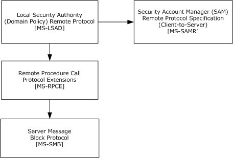
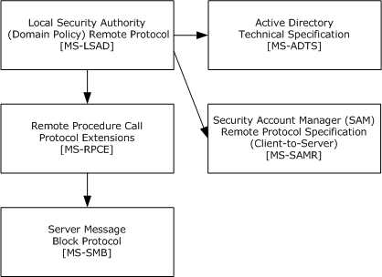
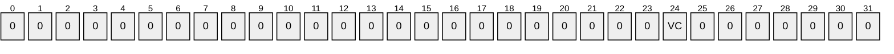
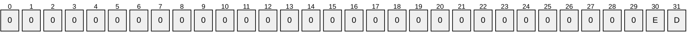
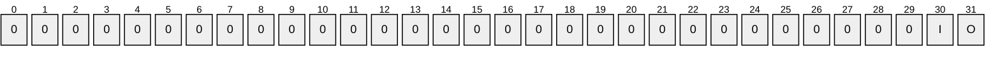
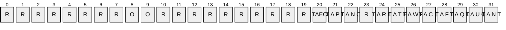
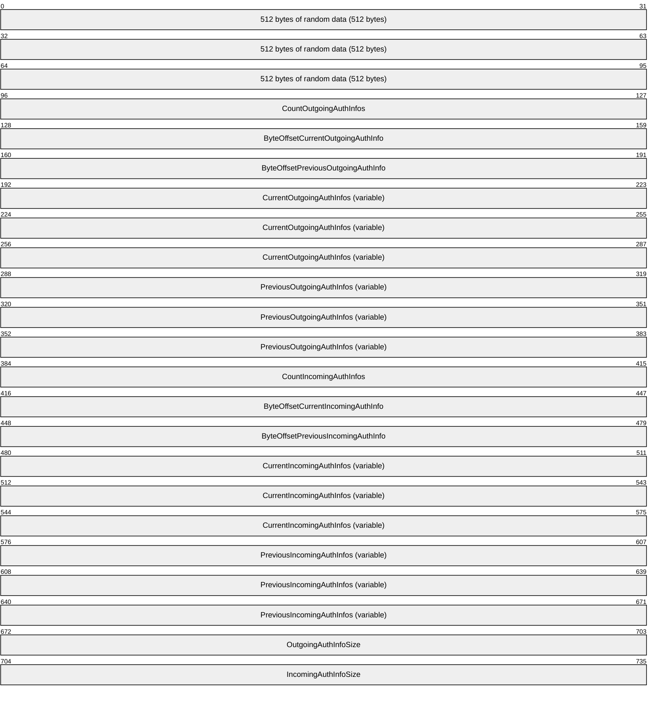
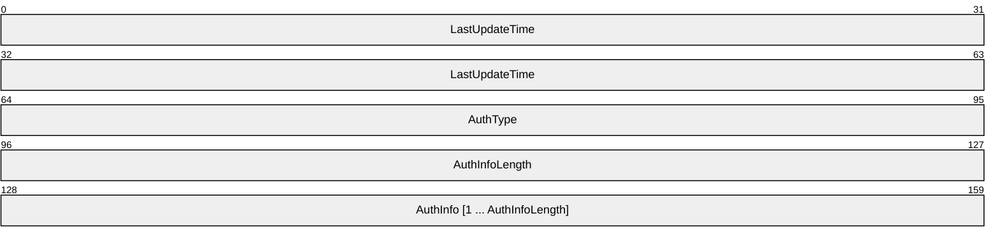
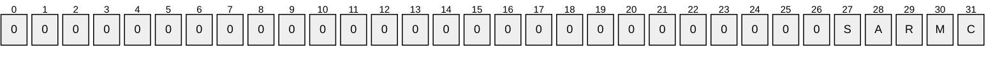

# [MS-LSAD]: Local Security Authority (Domain Policy) Remote Protocol

Table of Contents

1 Introduction

- [1 Introduction](#Section_1)
  - [1.1 Glossary](#Section_1.1)
  - [1.2 References](#Section_1.2)
    - [1.2.1 Normative References](#Section_1.2.1)
    - [1.2.2 Informative References](#Section_1.2.2)
  - [1.3 Overview](#Section_1.3)
  - [1.4 Relationship to Other Protocols](#Section_1.4)
  - [1.5 Prerequisites/Preconditions](#Section_1.5)
  - [1.6 Applicability Statement](#Section_1.6)
  - [1.7 Versioning and Capability Negotiation](#Section_1.7)
  - [1.8 Vendor-Extensible Fields](#Section_1.8)
  - [1.9 Standards Assignments](#Section_1.9)

2 Messages

- [2 Messages](#Section_2)
  - [2.1 Transport](#Section_2.1)
  - [2.2 Common Data Types](#Section_2.2)
    - [2.2.1 Constant Value Definitions](#Section_2.2.1)
      - [2.2.1.1 ACCESS_MASK](#Section_2.2.1.1)
        - [2.2.1.1.1 ACCESS_MASK for All Objects](#Section_2.2.1.1.1)
        - [2.2.1.1.2 ACCESS_MASK for Policy Objects](#Section_2.2.1.1.2)
        - [2.2.1.1.3 ACCESS_MASK for Account Objects](#Section_2.2.1.1.3)
        - [2.2.1.1.4 ACCESS_MASK for Secret Objects](#Section_2.2.1.1.4)
        - [2.2.1.1.5 ACCESS_MASK for Trusted Domain Objects](#Section_2.2.1.1.5)
      - [2.2.1.2 POLICY_SYSTEM_ACCESS_MODE](#Section_2.2.1.2)
      - [2.2.1.3 SECURITY_INFORMATION](#Section_2.2.1.3)
      - [2.2.1.4 AEAD-AES-256-CBC-HMAC-SHA512 Constants](#Section_2.2.1.4)
      - [2.2.1.5 LSA Trust Record Flags](#Section_2.2.1.5)
    - [2.2.2 Basic Data Types](#Section_2.2.2)
      - [2.2.2.1 LSAPR_HANDLE](#Section_2.2.2.1)
      - [2.2.2.2 PLSAPR_HANDLE](#Section_2.2.2.2)
      - [2.2.2.3 LSA_UNICODE_STRING](#Section_2.2.2.3)
      - [2.2.2.4 LSAPR_OBJECT_ATTRIBUTES](#Section_2.2.2.4)
      - [2.2.2.5 LSAPR_SR_SECURITY_DESCRIPTOR](#Section_2.2.2.5)
      - [2.2.2.6 LSAPR_REVISION_INFO_V1](#Section_2.2.2.6)
      - [2.2.2.7 LSAPR_REVISION_INFO](#Section_2.2.2.7)
    - [2.2.3 Data Types Referenced by Basic Data Types](#Section_2.2.3)
      - [2.2.3.1 STRING](#Section_2.2.3.1)
      - [2.2.3.2 LSAPR_ACL](#Section_2.2.3.2)
      - [2.2.3.3 SECURITY_DESCRIPTOR_CONTROL](#Section_2.2.3.3)
      - [2.2.3.4 LSAPR_SECURITY_DESCRIPTOR](#Section_2.2.3.4)
      - [2.2.3.5 SECURITY_IMPERSONATION_LEVEL](#Section_2.2.3.5)
      - [2.2.3.6 SECURITY_CONTEXT_TRACKING_MODE](#Section_2.2.3.6)
      - [2.2.3.7 SECURITY_QUALITY_OF_SERVICE](#Section_2.2.3.7)
    - [2.2.4 Policy Query/Set Data Types](#Section_2.2.4)
      - [2.2.4.1 POLICY_INFORMATION_CLASS](#Section_2.2.4.1)
      - [2.2.4.2 LSAPR_POLICY_INFORMATION](#Section_2.2.4.2)
      - [2.2.4.3 POLICY_AUDIT_LOG_INFO](#Section_2.2.4.3)
      - [2.2.4.4 LSAPR_POLICY_AUDIT_EVENTS_INFO](#Section_2.2.4.4)
      - [2.2.4.5 LSAPR_POLICY_PRIMARY_DOM_INFO](#Section_2.2.4.5)
      - [2.2.4.6 LSAPR_POLICY_ACCOUNT_DOM_INFO](#Section_2.2.4.6)
      - [2.2.4.7 LSAPR_POLICY_PD_ACCOUNT_INFO](#Section_2.2.4.7)
      - [2.2.4.8 POLICY_LSA_SERVER_ROLE](#Section_2.2.4.8)
      - [2.2.4.9 POLICY_LSA_SERVER_ROLE_INFO](#Section_2.2.4.9)
      - [2.2.4.10 LSAPR_POLICY_REPLICA_SRCE_INFO](#Section_2.2.4.10)
      - [2.2.4.11 POLICY_MODIFICATION_INFO](#Section_2.2.4.11)
      - [2.2.4.12 POLICY_AUDIT_FULL_SET_INFO](#Section_2.2.4.12)
      - [2.2.4.13 POLICY_AUDIT_FULL_QUERY_INFO](#Section_2.2.4.13)
      - [2.2.4.14 LSAPR_POLICY_DNS_DOMAIN_INFO](#Section_2.2.4.14)
      - [2.2.4.15 POLICY_DOMAIN_INFORMATION_CLASS](#Section_2.2.4.15)
      - [2.2.4.16 LSAPR_POLICY_DOMAIN_INFORMATION](#Section_2.2.4.16)
      - [2.2.4.17 POLICY_DOMAIN_QUALITY_OF_SERVICE_INFO](#Section_2.2.4.17)
      - [2.2.4.18 LSAPR_POLICY_DOMAIN_EFS_INFO](#Section_2.2.4.18)
      - [2.2.4.19 POLICY_DOMAIN_KERBEROS_TICKET_INFO](#Section_2.2.4.19)
      - [2.2.4.20 POLICY_AUDIT_EVENT_TYPE](#Section_2.2.4.20)
      - [2.2.4.21 LSAPR_POLICY_MACHINE_ACCT_INFO](#Section_2.2.4.21)
    - [2.2.5 Account Query/Set Data Types](#Section_2.2.5)
      - [2.2.5.1 LSAPR_ACCOUNT_INFORMATION](#Section_2.2.5.1)
      - [2.2.5.2 LSAPR_ACCOUNT_ENUM_BUFFER](#Section_2.2.5.2)
      - [2.2.5.3 LSAPR_USER_RIGHT_SET](#Section_2.2.5.3)
      - [2.2.5.4 LSAPR_LUID_AND_ATTRIBUTES](#Section_2.2.5.4)
      - [2.2.5.5 LSAPR_PRIVILEGE_SET](#Section_2.2.5.5)
    - [2.2.6 Secret Query/Set Data Types](#Section_2.2.6)
      - [2.2.6.1 LSAPR_CR_CIPHER_VALUE](#Section_2.2.6.1)
      - [2.2.6.2 LSAPR_AES_CIPHER_VALUE](#Section_2.2.6.2)
    - [2.2.7 Trusted Domain Query/Set Data Types](#Section_2.2.7)
      - [2.2.7.1 LSAPR_TRUST_INFORMATION](#Section_2.2.7.1)
      - [2.2.7.2 TRUSTED_INFORMATION_CLASS](#Section_2.2.7.2)
      - [2.2.7.3 LSAPR_TRUSTED_DOMAIN_INFO](#Section_2.2.7.3)
      - [2.2.7.4 LSAPR_TRUSTED_DOMAIN_NAME_INFO](#Section_2.2.7.4)
      - [2.2.7.5 LSAPR_TRUSTED_CONTROLLERS_INFO](#Section_2.2.7.5)
      - [2.2.7.6 TRUSTED_POSIX_OFFSET_INFO](#Section_2.2.7.6)
      - [2.2.7.7 LSAPR_TRUSTED_PASSWORD_INFO](#Section_2.2.7.7)
      - [2.2.7.8 LSAPR_TRUSTED_DOMAIN_INFORMATION_BASIC](#Section_2.2.7.8)
      - [2.2.7.9 LSAPR_TRUSTED_DOMAIN_INFORMATION_EX](#Section_2.2.7.9)
      - [2.2.7.10 LSAPR_TRUSTED_DOMAIN_INFORMATION_EX2](#Section_2.2.7.10)
      - [2.2.7.11 LSAPR_TRUSTED_DOMAIN_AUTH_INFORMATION](#Section_2.2.7.11)
      - [2.2.7.12 LSAPR_TRUSTED_DOMAIN_AUTH_INFORMATION_INTERNAL](#Section_2.2.7.12)
      - [2.2.7.13 LSAPR_TRUSTED_DOMAIN_FULL_INFORMATION](#Section_2.2.7.13)
      - [2.2.7.14 LSAPR_TRUSTED_DOMAIN_FULL_INFORMATION_INTERNAL](#Section_2.2.7.14)
      - [2.2.7.15 LSAPR_TRUSTED_DOMAIN_FULL_INFORMATION2](#Section_2.2.7.15)
      - [2.2.7.16 LSAPR_TRUSTED_DOMAIN_AUTH_BLOB](#Section_2.2.7.16)
      - [2.2.7.17 LSAPR_AUTH_INFORMATION](#Section_2.2.7.17)
      - [2.2.7.18 TRUSTED_DOMAIN_SUPPORTED_ENCRYPTION_TYPES](#Section_2.2.7.18)
      - [2.2.7.19 LSAPR_TRUSTED_ENUM_BUFFER](#Section_2.2.7.19)
      - [2.2.7.20 LSAPR_TRUSTED_ENUM_BUFFER_EX](#Section_2.2.7.20)
      - [2.2.7.21 LSA_FOREST_TRUST_RECORD](#Section_2.2.7.21)
      - [2.2.7.22 LSA_FOREST_TRUST_RECORD_TYPE](#Section_2.2.7.22)
      - [2.2.7.23 LSA_FOREST_TRUST_BINARY_DATA](#Section_2.2.7.23)
      - [2.2.7.24 LSA_FOREST_TRUST_DOMAIN_INFO](#Section_2.2.7.24)
      - [2.2.7.25 LSA_FOREST_TRUST_INFORMATION](#Section_2.2.7.25)
      - [2.2.7.26 LSA_FOREST_TRUST_COLLISION_RECORD_TYPE](#Section_2.2.7.26)
      - [2.2.7.27 LSA_FOREST_TRUST_COLLISION_RECORD](#Section_2.2.7.27)
      - [2.2.7.28 LSA_FOREST_TRUST_COLLISION_INFORMATION](#Section_2.2.7.28)
      - [2.2.7.29 LSAPR_TRUSTED_DOMAIN_AUTH_INFORMATION_INTERNAL_AES](#Section_2.2.7.29)
      - [2.2.7.30 LSAPR_TRUSTED_DOMAIN_FULL_INFORMATION_INTERNAL_AES](#Section_2.2.7.30)
      - [2.2.7.31 LSA_FOREST_TRUST_SCANNER_INFO](#Section_2.2.7.31)
      - [2.2.7.32 LSA_FOREST_TRUST_RECORD2](#Section_2.2.7.32)
      - [2.2.7.33 LSA_FOREST_TRUST_INFORMATION2](#Section_2.2.7.33)
    - [2.2.8 Privilege Data Types](#Section_2.2.8)
      - [2.2.8.1 LSAPR_POLICY_PRIVILEGE_DEF](#Section_2.2.8.1)
      - [2.2.8.2 LSAPR_PRIVILEGE_ENUM_BUFFER](#Section_2.2.8.2)
  - [2.3 Directory Service Schema Elements](#Section_2.3)

3 Protocol Details

- [3 Protocol Details](#Section_3)
  - [3.1 Server Details](#Section_3.1)
    - [3.1.1 Abstract Data Model](#Section_3.1.1)
      - [3.1.1.1 Policy Object Data Model](#Section_3.1.1.1)
      - [3.1.1.2 Accounts Rights Data Model](#Section_3.1.1.2)
        - [3.1.1.2.1 Privilege Data Model](#Section_3.1.1.2.1)
        - [3.1.1.2.2 System Access Rights Data Model](#Section_3.1.1.2.2)
      - [3.1.1.3 Account Object Data Model](#Section_3.1.1.3)
      - [3.1.1.4 Secret Object Data Model](#Section_3.1.1.4)
      - [3.1.1.5 Trusted Domain Object Data Model](#Section_3.1.1.5)
      - [3.1.1.6 Configuration Settings](#Section_3.1.1.6)
        - [3.1.1.6.1 Block Anonymous Access to Objects](#Section_3.1.1.6.1)
      - [3.1.1.7 LsaContextHandle Data Model](#Section_3.1.1.7)
      - [3.1.1.8 Attribute Listing](#Section_3.1.1.8)
      - [3.1.1.9 Object Class Listing](#Section_3.1.1.9)
      - [3.1.1.10 Access for Public Abstract Data Model Elements](#Section_3.1.1.10)
        - [3.1.1.10.1 Example Patterns for Direct Access of Policy Object ADM Elements](#Section_3.1.1.10.1)
          - [3.1.1.10.1.1 Query Pattern for Policy Object ADM](#Section_3.1.1.10.1.1)
          - [3.1.1.10.1.2 Set Pattern for Policy Object ADM](#Section_3.1.1.10.1.2)
    - [3.1.2 Timers](#Section_3.1.2)
    - [3.1.3 Initialization](#Section_3.1.3)
    - [3.1.4 Message Processing Events and Sequencing Rules](#Section_3.1.4)
      - [3.1.4.1 Obtaining Handles](#Section_3.1.4.1)
      - [3.1.4.2 Access Rights and Access Checks](#Section_3.1.4.2)
        - [3.1.4.2.1 Access Checks Applied on Handle Open](#Section_3.1.4.2.1)
        - [3.1.4.2.2 Access Checks Applied for Object Operations](#Section_3.1.4.2.2)
        - [3.1.4.2.3 Determining If Requestors Are Anonymous](#Section_3.1.4.2.3)
      - [3.1.4.3 Closing Handles](#Section_3.1.4.3)
      - [3.1.4.4 Policy Object Methods](#Section_3.1.4.4)
        - [3.1.4.4.1 LsarOpenPolicy2 (Opnum 44)](#Section_3.1.4.4.1)
        - [3.1.4.4.2 LsarOpenPolicy (Opnum 6)](#Section_3.1.4.4.2)
        - [3.1.4.4.3 LsarQueryInformationPolicy2 (Opnum 46)](#Section_3.1.4.4.3)
        - [3.1.4.4.4 LsarQueryInformationPolicy (Opnum 7)](#Section_3.1.4.4.4)
        - [3.1.4.4.5 LsarSetInformationPolicy2 (Opnum 47)](#Section_3.1.4.4.5)
        - [3.1.4.4.6 LsarSetInformationPolicy (Opnum 8)](#Section_3.1.4.4.6)
        - [3.1.4.4.7 LsarQueryDomainInformationPolicy (Opnum 53)](#Section_3.1.4.4.7)
        - [3.1.4.4.8 LsarSetDomainInformationPolicy (Opnum 54)](#Section_3.1.4.4.8)
        - [3.1.4.4.9 LsarOpenPolicy3 (Opnum 130)](#Section_3.1.4.4.9)
        - [3.1.4.4.10 LsarOpenPolicyWithCreds (Opnum 135)](#Section_3.1.4.4.10)
      - [3.1.4.5 Account Object Methods](#Section_3.1.4.5)
        - [3.1.4.5.1 LsarCreateAccount (Opnum 10)](#Section_3.1.4.5.1)
        - [3.1.4.5.2 LsarEnumerateAccounts (Opnum 11)](#Section_3.1.4.5.2)
        - [3.1.4.5.3 LsarOpenAccount (Opnum 17)](#Section_3.1.4.5.3)
        - [3.1.4.5.4 LsarEnumeratePrivilegesAccount (Opnum 18)](#Section_3.1.4.5.4)
        - [3.1.4.5.5 LsarAddPrivilegesToAccount (Opnum 19)](#Section_3.1.4.5.5)
        - [3.1.4.5.6 LsarRemovePrivilegesFromAccount (Opnum 20)](#Section_3.1.4.5.6)
        - [3.1.4.5.7 LsarGetSystemAccessAccount (Opnum 23)](#Section_3.1.4.5.7)
        - [3.1.4.5.8 LsarSetSystemAccessAccount (Opnum 24)](#Section_3.1.4.5.8)
        - [3.1.4.5.9 LsarEnumerateAccountsWithUserRight (Opnum 35)](#Section_3.1.4.5.9)
        - [3.1.4.5.10 LsarEnumerateAccountRights (Opnum 36)](#Section_3.1.4.5.10)
        - [3.1.4.5.11 LsarAddAccountRights (Opnum 37)](#Section_3.1.4.5.11)
        - [3.1.4.5.12 LsarRemoveAccountRights (Opnum 38)](#Section_3.1.4.5.12)
      - [3.1.4.6 Secret Object Methods](#Section_3.1.4.6)
        - [3.1.4.6.1 LsarCreateSecret (Opnum 16)](#Section_3.1.4.6.1)
        - [3.1.4.6.2 LsarOpenSecret (Opnum 28)](#Section_3.1.4.6.2)
        - [3.1.4.6.3 LsarSetSecret (Opnum 29)](#Section_3.1.4.6.3)
        - [3.1.4.6.4 LsarQuerySecret (Opnum 30)](#Section_3.1.4.6.4)
        - [3.1.4.6.5 LsarStorePrivateData (Opnum 42)](#Section_3.1.4.6.5)
        - [3.1.4.6.6 LsarRetrievePrivateData (Opnum 43)](#Section_3.1.4.6.6)
        - [3.1.4.6.7 LsarOpenSecret2 (Opnum 136)](#Section_3.1.4.6.7)
        - [3.1.4.6.8 LsarCreateSecret2 (Opnum 137)](#Section_3.1.4.6.8)
        - [3.1.4.6.9 LsarSetSecret2 (Opnum 138)](#Section_3.1.4.6.9)
        - [3.1.4.6.10 LsarQuerySecret2 (Opnum 139)](#Section_3.1.4.6.10)
        - [3.1.4.6.11 LsarStorePrivateData2 (Opnum 140)](#Section_3.1.4.6.11)
        - [3.1.4.6.12 LsarRetrievePrivateData2 (Opnum 141)](#Section_3.1.4.6.12)
      - [3.1.4.7 Trusted Domain Object Methods](#Section_3.1.4.7)
        - [3.1.4.7.1 LsarOpenTrustedDomain (Opnum 25)](#Section_3.1.4.7.1)
        - [3.1.4.7.2 LsarQueryTrustedDomainInfo (Opnum 39)](#Section_3.1.4.7.2)
        - [3.1.4.7.3 LsarSetTrustedDomainInfo (Opnum 40)](#Section_3.1.4.7.3)
        - [3.1.4.7.4 LsarDeleteTrustedDomain (Opnum 41)](#Section_3.1.4.7.4)
        - [3.1.4.7.5 LsarQueryTrustedDomainInfoByName (Opnum 48)](#Section_3.1.4.7.5)
        - [3.1.4.7.6 LsarSetTrustedDomainInfoByName (Opnum 49)](#Section_3.1.4.7.6)
        - [3.1.4.7.7 LsarEnumerateTrustedDomainsEx (Opnum 50)](#Section_3.1.4.7.7)
        - [3.1.4.7.8 LsarEnumerateTrustedDomains (Opnum 13)](#Section_3.1.4.7.8)
        - [3.1.4.7.9 LsarOpenTrustedDomainByName (Opnum 55)](#Section_3.1.4.7.9)
        - [3.1.4.7.10 LsarCreateTrustedDomainEx2 (Opnum 59)](#Section_3.1.4.7.10)
        - [3.1.4.7.11 LsarCreateTrustedDomainEx (Opnum 51)](#Section_3.1.4.7.11)
        - [3.1.4.7.12 LsarCreateTrustedDomain (Opnum 12)](#Section_3.1.4.7.12)
        - [3.1.4.7.13 LsarQueryInfoTrustedDomain (Opnum 26)](#Section_3.1.4.7.13)
        - [3.1.4.7.14 LsarSetInformationTrustedDomain (Opnum 27)](#Section_3.1.4.7.14)
        - [3.1.4.7.15 LsarQueryForestTrustInformation (Opnum 73)](#Section_3.1.4.7.15)
        - [3.1.4.7.16 LsarSetForestTrustInformation (Opnum 74)](#Section_3.1.4.7.16)
          - [3.1.4.7.16.1 Forest Trust Collision Generation](#Section_3.1.4.7.16.1)
        - [3.1.4.7.17 LsarCreateTrustedDomainEx3 (Opnum 129)](#Section_3.1.4.7.17)
        - [3.1.4.7.18 LsarQueryForestTrustInformation2 (Opnum 132)](#Section_3.1.4.7.18)
        - [3.1.4.7.19 LsarSetForestTrustInformation2 (Opnum 133)](#Section_3.1.4.7.19)
      - [3.1.4.8 Privilege Methods](#Section_3.1.4.8)
        - [3.1.4.8.1 LsarEnumeratePrivileges (Opnum 2)](#Section_3.1.4.8.1)
        - [3.1.4.8.2 LsarLookupPrivilegeValue (Opnum 31)](#Section_3.1.4.8.2)
        - [3.1.4.8.3 LsarLookupPrivilegeName (Opnum 32)](#Section_3.1.4.8.3)
        - [3.1.4.8.4 LsarLookupPrivilegeDisplayName (Opnum 33)](#Section_3.1.4.8.4)
      - [3.1.4.9 Common Object Methods](#Section_3.1.4.9)
        - [3.1.4.9.1 LsarQuerySecurityObject (Opnum 3)](#Section_3.1.4.9.1)
        - [3.1.4.9.2 LsarSetSecurityObject (Opnum 4)](#Section_3.1.4.9.2)
        - [3.1.4.9.3 LsarDeleteObject (Opnum 34)](#Section_3.1.4.9.3)
        - [3.1.4.9.4 LsarClose (Opnum 0)](#Section_3.1.4.9.4)
      - [3.1.4.10 Data Validation](#Section_3.1.4.10)
    - [3.1.5 Timer Events](#Section_3.1.5)
    - [3.1.6 Other Local Events](#Section_3.1.6)
      - [3.1.6.1 LSAPR_HANDLE_rundown](#Section_3.1.6.1)

4 Protocol Examples

- [4 Protocol Examples](#Section_4)
  - [4.1 Manipulating Account Objects](#Section_4.1)
  - [4.2 Manipulating Secret Objects](#Section_4.2)
  - [4.3 Manipulating Trusted Domain Objects](#Section_4.3)
  - [4.4 Structure Example of LSAPR_TRUSTED_DOMAIN_AUTH_BLOB](#Section_4.4)

5 Security

- [5 Security](#Section_5)
  - [5.1 Security Considerations for Implementers](#Section_5.1)
    - [5.1.1 RC4 Cipher Usage](#Section_5.1.1)
    - [5.1.2 Secret Encryption and Decryption](#Section_5.1.2)
    - [5.1.3 DES-ECB-LM Cipher Definition](#Section_5.1.3)
    - [5.1.4 Encryption and Decryption Examples](#Section_5.1.4)
      - [5.1.4.1 Encryption Example](#Section_5.1.4.1)
      - [5.1.4.2 Decryption Example](#Section_5.1.4.2)
    - [5.1.5 AES Cipher Usage](#Section_5.1.5)
  - [5.2 Index of Security Parameters](#Section_5.2)

6 Appendix A: Full IDL

- [6 Appendix A: Full IDL](#Section_6)

7 Appendix B: Product Behavior

- [7 Appendix B: Product Behavior](#Section_7)

8 Change Tracking

- [8 Change Tracking](#Section_8)

For the legal notice and IP terms, see [LEGAL.md](../LEGAL.md).
Last updated: 6/10/2025.
See [Revision History](#revision-history) for full version history.

# 1 Introduction

The Local Security Authority (Domain Policy) Remote Protocol is used to manage various machine and [**domain**](#gt_domain) security policies. All versions of Windows NT operating system–based products, in all configurations, implement and listen on the server side of this protocol. However, not all operations are meaningful in all configurations.

This protocol, with minor exceptions, enables remote policy-management scenarios. Therefore, the majority of this interface does not need to be implemented to achieve Windows client-to-server ([**domain controller**](#gt_domain-controller-dc) configuration and otherwise) interoperability, as defined by the ability for Windows clients to retrieve policy settings from servers.

Policy settings controlled by this protocol relate to the following:

- **Account objects**: The rights and [**privileges**](#gt_privilege) that [**security principals**](#gt_security-principal) have on the server.
- **Secret objects**: Mechanisms that securely store data on the server.
- **Trusted domain objects**: Mechanisms that the Windows operating system uses for describing [**trust**](#gt_trust) relationships between domains and [**forests**](#gt_forest).
- Other miscellaneous settings, such as lifetimes of Kerberos tickets, states of domain controller (backup or primary), and other unrelated pieces of policy.
All of these types of policy are addressed in sections of this document that specify the server data model.

Sections 1.5, 1.8, 1.9, 2, and 3 of this specification are normative. All other sections and examples in this specification are informative.

## 1.1 Glossary

This document uses the following terms:

**64-bit Network Data Representation (NDR64)**: A specific instance of a remote procedure call (RPC) transfer syntax. For more information about RPC transfer syntax, see [[C706]](https://go.microsoft.com/fwlink/?LinkId=89824) section 14.

**access control list (ACL)**: A list of access control entries (ACEs) that collectively describe the security rules for authorizing access to some resource; for example, an object or set of objects.

**account domain**: A [**domain**](#gt_domain), identified by a [**security identifier (SID)**](#gt_security-identifier-sid), that is the [**SID**](#gt_security-identifier-sid) namespace for which a given machine is authoritative. The [**account domain**](#gt_account-domain) is the same as the [**primary domain**](#gt_primary-domain) for a [**domain controller (DC)**](#gt_domain-controller-dc) and is its default [**domain**](#gt_domain). For a machine that is joined to a [**domain**](#gt_domain), the [**account domain**](#gt_account-domain) is the [**SID**](#gt_security-identifier-sid) namespace defined by the local Security Accounts Manager [MS-SAMR](#Section_5).

**account object**: An element of a Local Security Authority (LSA) policy database that describes the rights and privileges granted by the server to a [**security principal**](#gt_security-principal). The [**security identifier (SID)**](#gt_security-identifier-sid) of the [**security principal**](#gt_security-principal) matches that of the [**account object**](#gt_account-object).

**ACID**: A term that refers to the four properties that any database system has to achieve in order to be considered transactional: Atomicity, Consistency, Isolation, and Durability.

**Active Directory**: The Windows implementation of a general-purpose [**directory service**](#gt_directory-service-ds), which uses LDAP as its primary access protocol. Active Directory stores information about a variety of objects in the network such as user accounts, computer accounts, groups, and all related credential information used by Kerberos [MS-KILE](../MS-KILE/MS-KILE.md). Active Directory is either deployed as Active Directory Domain Services (AD DS) or Active Directory Lightweight Directory Services (AD LDS), which are both described in [MS-ADOD](../MS-ADOD/MS-ADOD.md): Active Directory Protocols Overview.

**backup domain controller (BDC)**: A [**domain controller (DC)**](#gt_domain-controller-dc) that receives a copy of the [**domain**](#gt_domain) directory database from the [**primary domain controller (PDC)**](#gt_primary-domain-controller-pdc). This copy is synchronized periodically and automatically with the [**primary domain controller (PDC)**](#gt_primary-domain-controller-pdc). BDCs also authenticate user logons and can be promoted to function as the [**PDC**](#gt_primary-domain-controller-pdc). There is only one [**PDC**](#gt_primary-domain-controller-pdc) or [**PDC**](#gt_primary-domain-controller-pdc) emulator in a [**domain**](#gt_domain), and the rest are [**backup domain controllers**](#gt_ce1138c6-7ab4-4c37-98b4-95599071c3c3).

**content encryption key**: A cryptographic key that is used to encrypt data. [**Content encryption keys**](#gt_content-encryption-key) are used not only to encrypt content, but also to encrypt other secrets, such as the proximity detection nonce.

**Coordinated Universal Time (UTC)**: A high-precision atomic time standard that approximately tracks Universal Time (UT). It is the basis for legal, civil time all over the Earth. Time zones around the world are expressed as positive and negative offsets from UTC. In this role, it is also referred to as Zulu time (Z) and Greenwich Mean Time (GMT). In these specifications, all references to UTC refer to the time at UTC-0 (or GMT).

**directory**: The database that stores information about objects such as users, groups, computers, printers, and the [**directory service**](#gt_directory-service-ds) that makes this information available to users and applications.

**directory service (DS)**: A service that stores and organizes information about a computer network's users and network shares, and that allows network administrators to manage users' access to the shares. See also [**Active Directory**](#gt_active-directory).

**discretionary access control list (DACL)**: An [**access control list (ACL)**](#gt_access-control-list-acl) that is controlled by the owner of an object and that specifies the access particular users or groups can have to the object.

**DNS name**: A fully qualified domain name (FQDN).

**domain**: A set of users and computers sharing a common namespace and management infrastructure. At least one computer member of the set has to act as a [**domain controller (DC)**](#gt_domain-controller-dc) and host a member list that identifies all members of the domain, as well as optionally hosting the [**Active Directory**](#gt_active-directory) service. The domain controller provides authentication of members, creating a unit of trust for its members. Each domain has an identifier that is shared among its members. For more information, see [MS-AUTHSOD](../MS-AUTHSOD/MS-AUTHSOD.md) section 1.1.1.5 and [MS-ADTS](../MS-ADTS/MS-ADTS.md).

**domain controller (DC)**: The service, running on a server, that implements [**Active Directory**](#gt_active-directory), or the server hosting this service. The service hosts the data store for objects and interoperates with other [**DCs**](#gt_domain-controller-dc) to ensure that a local change to an object replicates correctly across all [**DCs**](#gt_domain-controller-dc). When [**Active Directory**](#gt_active-directory) is operating as Active Directory Domain Services (AD DS), the [**DC**](#gt_domain-controller-dc) contains full NC replicas of the configuration naming context (config NC), schema naming context (schema NC), and one of the [**domain NCs**](#gt_domain-naming-context-domain-nc) in its [**forest**](#gt_forest). If the AD DS [**DC**](#gt_domain-controller-dc) is a [**global catalog server (GC server)**](#gt_global-catalog-server-gc-server), it contains partial NC replicas of the remaining [**domain NCs**](#gt_domain-naming-context-domain-nc) in its [**forest**](#gt_forest). For more information, see [MS-AUTHSOD] section 1.1.1.5.2 and [MS-ADTS]. When [**Active Directory**](#gt_active-directory) is operating as Active Directory Lightweight Directory Services (AD LDS), several AD LDS [**DCs**](#gt_domain-controller-dc) can run on one server. When [**Active Directory**](#gt_active-directory) is operating as AD DS, only one AD DS [**DC**](#gt_domain-controller-dc) can run on one server. However, several AD LDS [**DCs**](#gt_domain-controller-dc) can coexist with one AD DS [**DC**](#gt_domain-controller-dc) on one server. The AD LDS [**DC**](#gt_domain-controller-dc) contains full NC replicas of the config NC and the schema NC in its [**forest**](#gt_forest). The domain controller is the server side of Authentication Protocol Domain Support [MS-APDS](../MS-APDS/MS-APDS.md).

**domain member (member machine)**: A machine that is joined to a domain by sharing a secret between the machine and the domain.

**domain name**: A domain name or a NetBIOS name that identifies a [**domain**](#gt_domain).

**domain naming context (domain NC)**: A specific type of naming context (NC), or an instance of that type, that represents a [**domain**](#gt_domain). A [**domain NC**](#gt_domain-naming-context-domain-nc) can contain security principal objects; no other type of NC can contain security principal objects. [**Domain NCs**](#gt_domain-naming-context-domain-nc) appear in the global catalog (GC). A [**domain NC**](#gt_domain-naming-context-domain-nc) is hosted by one or more [**domain controllers (DCs)**](#gt_domain-controller-dc) operating as AD DS. In AD DS, a [**forest**](#gt_forest) has one or more [**domain NCs**](#gt_domain-naming-context-domain-nc). A domain NC cannot exist in AD LDS. The root of a [**domain NC**](#gt_domain-naming-context-domain-nc) is an object of class domainDNS; for directory replication [MS-DRSR](../MS-DRSR/MS-DRSR.md), see domainDNS.

**endpoint**: A network-specific address of a [**remote procedure call (RPC) server**](#gt_rpc-server) process for remote procedure calls. The actual name and type of the endpoint depends on the [**RPC**](#gt_remote-procedure-call-rpc) protocol sequence that is being used. For example, for RPC over TCP (RPC Protocol Sequence ncacn_ip_tcp), an endpoint might be TCP port 1025. For RPC over Server Message Block (RPC Protocol Sequence ncacn_np), an endpoint might be the name of a named pipe. For more information, see [C706].

**forest**: One or more [**domains**](#gt_domain) that share a common schema and trust each other transitively. An organization can have multiple [**forests**](#gt_forest). A [**forest**](#gt_forest) establishes the security and administrative boundary for all the objects that reside within the [**domains**](#gt_domain) that belong to the [**forest**](#gt_forest). In contrast, a [**domain**](#gt_domain) establishes the administrative boundary for managing objects, such as users, groups, and computers. In addition, each [**domain**](#gt_domain) has individual security policies and trust relationships with other [**domains**](#gt_domain).

**forest functional level**: A specification of functionality available in a [**forest**](#gt_forest). It has to be less than or equal to the [**domain controller (DC)**](#gt_domain-controller-dc) functional level of every DC in the forest. See [MS-ADTS] section 6.1.4.4 for information on how the forest functional level is determined.

**forest trust**: A type of [**trust**](#gt_trust) where the trusted party is a [**forest**](#gt_forest), which means that all [**domains**](#gt_domain) in that [**forest**](#gt_forest) are trusted.

**forest trust information**: Information about namespaces, [**domain names**](#gt_domain-name), and [**security identifiers (SIDs)**](#gt_security-identifier-sid) owned by a trusted [**forest**](#gt_forest).

**FSMO role**: A set of objects that can be updated in only one naming context (NC) replica (the FSMO role owner's replica) at any given time. For more information, see [MS-ADTS] section 3.1.1.1.11. See also FSMO role owner.

**global catalog server (GC server)**: A [**domain controller (DC)**](#gt_domain-controller-dc) that contains a naming context (NC) replica (one full, the rest partial) for each [**domain naming context**](#gt_domain-naming-context-domain-nc) in the [**forest**](#gt_forest).

**globally unique identifier (GUID)**: A term used interchangeably with [**universally unique identifier (UUID)**](#gt_universally-unique-identifier-uuid) in Microsoft protocol technical documents (TDs). Interchanging the usage of these terms does not imply or require a specific algorithm or mechanism to generate the value. Specifically, the use of this term does not imply or require that the algorithms described in [[RFC4122]](https://go.microsoft.com/fwlink/?LinkId=90460) or [C706] have to be used for generating the GUID. See also universally unique identifier (UUID).

**interdomain trust account**: An account that stores information associated with a [**domain**](#gt_domain) [**trust**](#gt_trust) in the [**domain controllers (DCs)**](#gt_domain-controller-dc) of the [**domain**](#gt_domain) that is trusted to perform authentication.

**local account domain**: A [**domain**](#gt_domain), identified by a [**security identifier (SID)**](#gt_security-identifier-sid), that is a [**SID**](#gt_security-identifier-sid) namespace for which a given machine is authoritative. The [**local account domain**](#gt_local-account-domain) is the same as the [**account domain**](#gt_account-domain) for any non–[**domain controller (DC)**](#gt_domain-controller-dc). On a [**DC**](#gt_domain-controller-dc), the [**local account domain**](#gt_local-account-domain) is an [**account domain**](#gt_account-domain) local to the [**DC**](#gt_domain-controller-dc).

**locally unique identifier (LUID)**: A 64-bit value guaranteed to be unique within the scope of a single machine.

**Network Data Representation (NDR)**: A specification that defines a mapping from Interface Definition Language (IDL) data types onto octet streams. [**NDR**](#gt_network-data-representation-ndr) also refers to the runtime environment that implements the mapping facilities (for example, data provided to [**NDR**](#gt_network-data-representation-ndr)). For more information, see [MS-RPCE](../MS-RPCE/MS-RPCE.md) and [C706] section 14.

**opnum**: An operation number or numeric identifier that is used to identify a specific [**remote procedure call (RPC)**](#gt_remote-procedure-call-rpc) method or a method in an interface. For more information, see [C706] section 12.5.2.12 or [MS-RPCE].

**original equipment manufacturer (OEM) code page**: A code page used to translate between non-Unicode encoded strings and UTF-16 encoded strings.

**primary domain**: A [**domain**](#gt_domain) (identified by a [**security identifier (SID)**](#gt_security-identifier-sid)) that the server is joined to. For a [**domain controller (DC)**](#gt_domain-controller-dc), the [**primary domain**](#gt_primary-domain) is that of the [**domain**](#gt_domain) itself.

**primary domain controller (PDC)**: A [**domain controller (DC)**](#gt_domain-controller-dc) designated to track changes made to the accounts of all computers on a [**domain**](#gt_domain). It is the only computer to receive these changes directly, and is specialized so as to ensure consistency and to eliminate the potential for conflicting entries in the [**Active Directory**](#gt_active-directory) database. A [**domain**](#gt_domain) has only one [**PDC**](#gt_primary-domain-controller-pdc).

**primary domain controller (PDC) role owner**: The [**domain controller (DC)**](#gt_domain-controller-dc) that hosts the [**primary domain controller**](#gt_primary-domain-controller-pdc) emulator FSMO role for a given domain naming context (NC).

**privilege**: The capability of a security principal to perform a type of operation on a computer system regardless of restrictions placed by discretionary access control.

**RC4**: Means Rivest Cipher 4 invented by Ron Rivest in 1987 for RSA Security. It is a variable key-length symmetric encryption algorithm stream cipher that operates on a stream of data byte by byte. It's simple to apply, does not consume more memory, and works quickly on very large pieces of data such as WEP/WPA for wireless network encryption and SSL/ TLS for internet security. RC4 stream ciphers cannot be implemented on small streams of data. RC4 weaknesses make it vulnerable to various cryptographic attacks. For more information, see [SCHNEIER] section 17.1.

**read-only domain controller (RODC)**: A [**domain controller (DC)**](#gt_domain-controller-dc) that does not accept originating updates. Additionally, an [**RODC**](#gt_read-only-domain-controller-rodc) does not perform outbound replication. An RODC cannot be the primary domain controller (PDC) for its domain.

**remote procedure call (RPC)**: A communication protocol used primarily between client and server. The term has three definitions that are often used interchangeably: a runtime environment providing for communication facilities between computers (the RPC runtime); a set of request-and-response message exchanges between computers (the RPC exchange); and the single message from an RPC exchange (the RPC message). For more information, see [C706].

**root domain**: The unique [**domain naming contexts (domain NCs)**](#gt_domain-naming-context-domain-nc) of an Active Directory [**forest**](#gt_forest) that is the parent of the [**forest's**](#gt_forest) config NC. The config NC's relative distinguished name (RDN) is "cn=Configuration" relative to the root object of the root domain. The root domain is the domain that is created first in a [**forest**](#gt_forest).

**RPC client**: A computer on the network that sends messages using remote procedure call (RPC) as its transport, waits for responses, and is the initiator in an RPC exchange.

**RPC context handle**: A representation of state maintained between a remote procedure call (RPC) client and server. The state is maintained on the server on behalf of the client. An RPC context handle is created by the server and given to the client. The client passes the RPC context handle back to the server in method calls to assist in identifying the state. For more information, see [C706].

**RPC protocol sequence**: A character string that represents a valid combination of a [**remote procedure call (RPC)**](#gt_remote-procedure-call-rpc) protocol, a network layer protocol, and a transport layer protocol, as described in [C706] and [MS-RPCE].

**RPC server**: A computer on the network that waits for messages, processes them when they arrive, and sends responses using RPC as its transport acts as the responder during a remote procedure call (RPC) exchange.

**RPC transport**: The underlying network services used by the remote procedure call (RPC) runtime for communications between network nodes. For more information, see [C706] section 2.

**secret object**: An element of the Local Security Authority (LSA) Policy Database, which contains a value that is secret in that access to it is strictly controlled through cryptographic protections and restrictive access control mechanisms.

**security descriptor**: A data structure containing the security information associated with a securable object. A [**security descriptor**](#gt_security-descriptor) identifies an object's owner by its [**security identifier (SID)**](#gt_security-identifier-sid). If access control is configured for the object, its [**security descriptor**](#gt_security-descriptor) contains a [**discretionary access control list (DACL)**](#gt_discretionary-access-control-list-dacl) with [**SIDs**](#gt_security-identifier-sid) for the [**security principals**](#gt_security-principal) who are allowed or denied access. Applications use this structure to set and query an object's security status. The [**security descriptor**](#gt_security-descriptor) is used to guard access to an object as well as to control which type of auditing takes place when the object is accessed. The [**security descriptor**](#gt_security-descriptor) format is specified in [MS-DTYP](../MS-DTYP/MS-DTYP.md) section 2.4.6; a string representation of [**security descriptors**](#gt_security-descriptor), called SDDL, is specified in [MS-DTYP] section 2.5.1.

**security identifier (SID)**: An identifier for [**security principals**](#gt_security-principal) that is used to identify an account or a group. Conceptually, the [**SID**](#gt_security-identifier-sid) is composed of an account authority portion (typically a [**domain**](#gt_domain)) and a smaller integer representing an identity relative to the account authority, termed the relative identifier (RID). The [**SID**](#gt_security-identifier-sid) format is specified in [MS-DTYP] section 2.4.2; a string representation of [**SIDs**](#gt_security-identifier-sid) is specified in [MS-DTYP] section 2.4.2 and [MS-AZOD](../MS-AZOD/MS-AZOD.md) section 1.1.1.2.

**security principal**: A unique entity, also referred to as a principal, that can be authenticated by [**Active Directory**](#gt_active-directory). It frequently corresponds to a human user, but also can be a service that offers a resource to other security principals. Other security principals might be a group, which is a set of principals. Groups are supported by [**Active Directory**](#gt_active-directory).

**Server Message Block (SMB)**: A protocol that is used to request file and print services from server systems over a network. The SMB protocol extends the CIFS protocol with additional security, file, and disk management support. For more information, see [[CIFS]](https://go.microsoft.com/fwlink/?linkid=2109334) and [MS-SMB](../MS-SMB/MS-SMB.md).

**server role**: The state of a [**domain controller (DC)**](#gt_domain-controller-dc), which can be one of two values--primary DC or backup DC.

**service**: A process or agent that is available on the network, offering resources or services for clients. Examples of services include file servers, web servers, and so on.

**system access control list (SACL)**: An [**access control list (ACL)**](#gt_access-control-list-acl) that controls the generation of audit messages for attempts to access a securable object. The ability to get or set an object's [**SACL**](#gt_system-access-control-list-sacl) is controlled by a privilege typically held only by system administrators.

**trust**: To accept another authority's statements for the purposes of authentication and authorization, especially in the case of a relationship between two domains. If [**domain**](#gt_domain) A trusts [**domain**](#gt_domain) B, [**domain**](#gt_domain) A accepts [**domain**](#gt_domain) B's authentication and authorization statements for principals represented by security principal objects in [**domain**](#gt_domain) B; for example, the list of groups to which a particular user belongs. As a noun, a [**trust**](#gt_trust) is the relationship between two [**domains**](#gt_domain) described in the previous sentence.

**trust attributes**: A collection of attributes that define different characteristics of a trust within a domain or a forest.

**trusted domain**: A domain that is trusted to make authentication decisions for security principals in that domain.

**trusted domain object (TDO)**: A collection of properties that define a trust relationship with another domain, such as direction (outbound, inbound, or both), trust attributes, name, and security identifier of the other domain. For more information, see [MS-ADTS].

**trusted forest**: A forest that is trusted to make authentication statements for security principals in that forest. Assuming forest A trusts forest B, all domains belonging to forest A will trust all domains in forest B, subject to policy configuration.

**universally unique identifier (UUID)**: A 128-bit value. UUIDs can be used for multiple purposes, from tagging objects with an extremely short lifetime, to reliably identifying very persistent objects in cross-process communication such as client and server interfaces, manager entry-point vectors, and [**RPC**](#gt_remote-procedure-call-rpc) objects. UUIDs are highly likely to be unique. UUIDs are also known as [**globally unique identifiers (GUIDs)**](#gt_globally-unique-identifier-guid) and these terms are used interchangeably in the Microsoft protocol technical documents (TDs). Interchanging the usage of these terms does not imply or require a specific algorithm or mechanism to generate the UUID. Specifically, the use of this term does not imply or require that the algorithms described in [RFC4122] or [C706] has to be used for generating the UUID.

**MAY, SHOULD, MUST, SHOULD NOT, MUST NOT:** These terms (in all caps) are used as defined in [[RFC2119]](https://go.microsoft.com/fwlink/?LinkId=90317). All statements of optional behavior use either MAY, SHOULD, or SHOULD NOT.

## 1.2 References

Links to a document in the Microsoft Open Specifications library point to the correct section in the most recently published version of the referenced document. However, because individual documents in the library are not updated at the same time, the section numbers in the documents may not match. You can confirm the correct section numbering by checking the [Errata](https://go.microsoft.com/fwlink/?linkid=850906).

### 1.2.1 Normative References

We conduct frequent surveys of the normative references to assure their continued availability. If you have any issue with finding a normative reference, please contact [dochelp@microsoft.com](mailto:dochelp@microsoft.com). We will assist you in finding the relevant information.

[AES-CBC] McGrew, D. and Foley, J., "Authenticated Encryption with AES-CBC and HMAC-SHA", [https://tools.ietf.org/id/draft-mcgrew-aead-aes-cbc-hmac-sha2-03.html](https://go.microsoft.com/fwlink/?linkid=2162731)

[C706] The Open Group, "DCE 1.1: Remote Procedure Call", C706, August 1997, [https://publications.opengroup.org/c706](https://go.microsoft.com/fwlink/?LinkId=89824)

**Note** Registration is required to download the document.

[FIPS81] FIPS PUBS, "DES Modes of Operation", December 1980, [https://csrc.nist.gov/csrc/media/publications/fips/81/archive/1980-12-02/documents/fips81.pdf](https://go.microsoft.com/fwlink/?LinkId=89874)

[GRAY] Gray, J., and Reuter, A., "Transaction Processing: Concepts and Techniques", The Morgan Kaufmann Series in Data Management Systems, San Francisco: Morgan Kaufmann Publishers, 1992, Hardcover ISBN: 9781558601901.

[MS-ADA1] Microsoft Corporation, "[Active Directory Schema Attributes A-L](../MS-ADA1/MS-ADA1.md)".

[MS-ADA2] Microsoft Corporation, "[Active Directory Schema Attributes M](../MS-ADA2/MS-ADA2.md)".

[MS-ADA3] Microsoft Corporation, "[Active Directory Schema Attributes N-Z](../MS-ADA3/MS-ADA3.md)".

[MS-ADSC] Microsoft Corporation, "[Active Directory Schema Classes](../MS-ADSC/MS-ADSC.md)".

[MS-ADTS] Microsoft Corporation, "[Active Directory Technical Specification](../MS-ADTS/MS-ADTS.md)".

[MS-DTYP] Microsoft Corporation, "[Windows Data Types](../MS-DTYP/MS-DTYP.md)".

[MS-ERREF] Microsoft Corporation, "[Windows Error Codes](../MS-ERREF/MS-ERREF.md)".

[MS-GPEF] Microsoft Corporation, "[Group Policy: Encrypting File System Extension](../MS-GPEF/MS-GPEF.md)".

[MS-GPSB] Microsoft Corporation, "[Group Policy: Security Protocol Extension](#Section_5)".

[MS-KILE] Microsoft Corporation, "[Kerberos Protocol Extensions](../MS-KILE/MS-KILE.md)".

[MS-LSAT] Microsoft Corporation, "[Local Security Authority (Translation Methods) Remote Protocol](#Section_5)".

[MS-NRPC] Microsoft Corporation, "[Netlogon Remote Protocol](../MS-NRPC/MS-NRPC.md)".

[MS-RPCE] Microsoft Corporation, "[Remote Procedure Call Protocol Extensions](../MS-RPCE/MS-RPCE.md)".

[MS-SAMR] Microsoft Corporation, "[Security Account Manager (SAM) Remote Protocol (Client-to-Server)](#Section_5)".

[MS-SMB2] Microsoft Corporation, "[Server Message Block (SMB) Protocol Versions 2 and 3](../MS-SMB2/MS-SMB2.md)".

[MS-SMB] Microsoft Corporation, "[Server Message Block (SMB) Protocol](../MS-SMB/MS-SMB.md)".

[MS-WKST] Microsoft Corporation, "[Workstation Service Remote Protocol](../MS-WKST/MS-WKST.md)".

[MSKB-3149090] Microsoft Corporation, "MS16-047: Description of the security update for SAM and LSAD remote protocols", April 2016, [https://support.microsoft.com/en-us/kb/3149090](https://go.microsoft.com/fwlink/?LinkId=786963)

[RFC1088] McLaughlin III, L., "A Standard for the Transmission of IP Datagrams over NetBIOS Networks", RFC 1088, February 1989, [https://www.rfc-editor.org/info/rfc1088](https://go.microsoft.com/fwlink/?LinkId=90266)

[RFC2119] Bradner, S., "Key words for use in RFCs to Indicate Requirement Levels", BCP 14, RFC 2119, March 1997, [https://www.rfc-editor.org/info/rfc2119](https://go.microsoft.com/fwlink/?LinkId=90317)

[RFC3961] Raeburn, K., "Encryption and Checksum Specifications for Kerberos 5", RFC 3961, February 2005, [https://www.rfc-editor.org/info/rfc3961](https://go.microsoft.com/fwlink/?LinkId=90450)

[RFC4120] Neuman, C., Yu, T., Hartman, S., and Raeburn, K., "The Kerberos Network Authentication Service (V5)", RFC 4120, July 2005, [https://www.rfc-editor.org/rfc/rfc4120](https://go.microsoft.com/fwlink/?LinkId=90458)

[RFC4757] Jaganathan, K., Zhu, L., and Brezak, J., "The RC4-HMAC Kerberos Encryption Types Used by Microsoft Windows", RFC 4757, December 2006, [https://www.rfc-editor.org/info/rfc4757](https://go.microsoft.com/fwlink/?LinkId=90488)

### 1.2.2 Informative References

[MS-DRSR] Microsoft Corporation, "[Directory Replication Service (DRS) Remote Protocol](../MS-DRSR/MS-DRSR.md)".

[MSDN-RPCDB] Microsoft Corporation, "The RPC Name Service Database", [http://msdn.microsoft.com/en-us/library/aa378865.aspx](https://go.microsoft.com/fwlink/?LinkId=90076)

[MSFT-CVE-2022-21857] Microsoft Corporation, "Active Directory Domain Services Elevation of Privilege Vulnerability", CVE-2022-21857, January 11, 2022, [https://msrc.microsoft.com/update-guide/vulnerability/CVE-2022-21857](https://go.microsoft.com/fwlink/?linkid=2184901)

[MSFT-CVE-2022-21913] Microsoft Corporation, "Local Security Authority (Domain Policy) Remote Protocol Security Feature Bypass", CVE-2022-21913, January 11, 2022, [https://msrc.microsoft.com/update-guide/vulnerability/CVE-2022-21913](https://go.microsoft.com/fwlink/?linkid=2184935)

[MSFT-CVE-2024-20692] Microsoft Corporation, "Microsoft Local Security Authority Subsystem Service Information Disclosure Vulnerability", CVE-2024-20692, January 9, 2024, [https://msrc.microsoft.com/update-guide/vulnerability/](https://go.microsoft.com/fwlink/?linkid=2256891)

[MSFT-LSA-IDL] Microsoft Corporation, "Local Security Authority Merged IDL File", March 2018, [https://www.microsoft.com/en-us/download/details.aspx?id=3367](https://go.microsoft.com/fwlink/?LinkId=150268)

[MSKB-3155495] Microsoft Corporation, "You can't use the Active Directory shadow principal groups feature for groups that are always filtered out in Windows", revision 2.0, May 2016, [https://support.microsoft.com/en-us/kb/3155495](https://go.microsoft.com/fwlink/?LinkId=808755)

[MSKB-4490425] Microsoft Corporation, "Updates to TGT delegation across incoming trusts in Windows Server", [https://support.microsoft.com/en-us/help/4490425/updates-to-tgt-delegation-across-incoming-trusts-in-windows-server](https://go.microsoft.com/fwlink/?linkid=2102428)

[MSKB-5060842] Microsoft Corporation, "Cumulative Security Release", June 2025, [https://www.catalog.update.microsoft.com/Search.aspx?q=5060842](https://go.microsoft.com/fwlink/?linkid=2321706)

[SCHNEIER] Schneier, B., "Applied Cryptography, Second Edition", John Wiley and Sons, 1996, ISBN: 0471117099.

## 1.3 Overview

The Local Security Authority (Domain Policy) Remote Protocol provides a [**remote procedure call (RPC)**](#gt_remote-procedure-call-rpc) interface used for providing remote management for policy settings related to [**account objects**](#gt_account-object), [**secret objects**](#gt_secret-object), [**trusted domain objects (TDOs)**](#gt_trusted-domain-object-tdo), and other miscellaneous security-related policy settings. The client end of the Local Security Authority (Domain Policy) Remote Protocol is an application that issues method calls on the RPC interface. The server end of the Local Security Authority (Domain Policy) Remote Protocol is a [**service**](#gt_service) that implements support for this RPC interface.

The following represent primary use cases for remote management:

- Creating, deleting, enumerating, and modifying [**trusts**](#gt_trust), account objects, and secret objects.
- Querying and modifying policy settings unrelated to TDOs, account objects or secret objects, such as lifetimes of Kerberos tickets.
This protocol is used by Windows clients for the "domain join" operation (as specified in [MS-ADTS](../MS-ADTS/MS-ADTS.md) section 6.4) as an implementation choice to achieve the end state, as specified in [MS-ADTS]. The specific profile of the Local Security Authority (Domain Policy) Remote Protocol for the "domain join" scenario is specified in section [1.6](#Section_1.6) as "Retrieval of policy settings by clients".

The server end of the Local Security Authority (Domain Policy) Remote Protocol can be implemented on a [**domain controller (DC)**](#gt_domain-controller-dc), including [**primary domain controllers (PDCs)**](#gt_primary-domain-controller-pdc), [**backup domain controllers (BDCs)**](#gt_backup-domain-controller-bdc), [**global catalog servers (GC servers)**](#gt_global-catalog-server-gc-server), and [**read-only domain controllers (RODCs)**](#gt_read-only-domain-controller-rodc), or on a non–domain controller. In the case of a DC, including PDCs, BDCs, GC servers, and RODCs, the server end of this protocol can be in one of the [**forest functional levels**](#gt_forest-functional-level). The behavior of the server end of the Local Security Authority (Domain Policy) Remote Protocol is the same in these cases, except when noted in the message processing descriptions for the methods of this protocol. See sections [3.1.4.4.1](#Section_3.1.4.4.10), [3.1.4.4.3](#Section_3.1.4.4.3), [3.1.4.4.5](#Section_3.1.4.4.5), [3.1.4.7](#Section_2.2.1.1.5), [3.1.4.7.3](#Section_3.1.4.7.3), [3.1.4.7.4](#Section_3.1.4.7.4), [3.1.4.7.10](#Section_3.1.4.7.10), [3.1.4.7.14](#Section_3.1.4.7.14), and [3.1.4.7.16](#Section_3.1.4.7.16) for details.

This protocol is a simple request/response-based RPC protocol. Typically, there are no long-lived sessions, although clients can cache the RPC connection and reuse it over time. A sample sequence of requests and responses is specified in section [4](#Section_5.1.4).

It is helpful to consider two perspectives when understanding and implementing this protocol: an object-based perspective and a method-based perspective.

The object-based perspective shows that the protocol exposes four main object abstractions: a policy object, an account object, a secret object, and a trusted domain object. A requester obtains a "handle" (an [**RPC context handle**](#gt_rpc-context-handle)) to one of these objects and then performs one or more actions on the object. The following is a brief listing of methods that operate on each of the respective object types.

Policy object:

- LsarOpenPolicy3
- LsarOpenPolicy2
- LsarQueryInformationPolicy2
- LsarSetInformationPolicy2
- LsarClose
- LsarQueryDomainInformationPolicy
- LsarEnumeratePrivileges
- LsarLookupPrivilegeName
- LsarLookupPrivilegeValue
- LsarLookupPrivilegeDisplayName
- LsarSetDomainInformationPolicy
- LsarQuerySecurityObject
- LsarSetSecurityObject
Account object:

- LsarCreateAccount
- LsarOpenAccount
- LsarEnumerateAccounts
- LsarClose
- LsarDeleteObject
- LsarSetSystemAccessAccount
- LsarQuerySecurityObject
- LsarAddAccountRights
- LsarRemoveAccountRights
- LsarAddPrivilegesToAccount
- LsarRemovePrivilegesFromAccount
- LsarEnumerateAccountsWithUserRight
- LsarGetSystemAccessAccount
- LsarSetSecurityObject
- LsarEnumeratePrivilegesAccount
- LsarEnumerateAccountRights
Secret object:

- LsarCreateSecret
- LsarOpenSecret
- LsarClose
- LsarDeleteObject
- LsarRetrievePrivateData
- LsarStorePrivateData
- LsarSetSecret
- LsarQuerySecret
- LsarQuerySecurityObject
- LsarSetSecurityObject
Trusted domain object:

- LsarCreateTrustedDomainEx3
- LsarCreateTrustedDomainEx2
- LsarOpenTrustedDomain
- LsarClose
- LsarDeleteObject
- LsarOpenTrustedDomainByName
- LsarDeleteTrustedDomain
- LsarEnumerateTrustedDomainsEx
- LsarQueryInfoTrustedDomain
- LsarSetInformationTrustedDomain
- LsarQueryForestTrustInformation
- LsarSetForestTrustInformation
- LsarQueryTrustedDomainInfo
- LsarSetTrustedDomainInfo
- LsarQueryTrustedDomainInfoByName
- LsarSetTrustedDomainInfoByName
For example, to set a policy that controls the lifetime of Kerberos tickets, a requester opens a handle to the Policy object and updates the maximum service ticket age policy setting via a parameter called *MaxServiceTicketAge*. The call sequence from the requester appears as follows (with the parameter information removed for brevity):

- Send LsarOpenPolicy3 request; receive LsarOpenPolicy3 reply.
- Send LsarQueryDomainInformationPolicy request; receive LsarQueryDomainInformationPolicy reply.
- Send LsarSetDomainInformationPolicy request; receive LsarSetDomainInformationPolicy reply.
- Send LsarClose request; receive LsarClose reply.
The following is a brief explanation of the call sequence:

- Using the network address of a responder that implements this protocol, a requester makes an LsarOpenPolicy3 request to obtain a handle to the policy object. This handle is necessary to examine and manipulate [**domain**](#gt_domain) policy information.
- Using the handle returned from LsarOpenPolicy3, the requester makes an LsarQueryDomainInformationPolicy request to retrieve the current policy settings that affect Kerberos tickets.
- After modifying the portions of the Kerberos ticket policy information to suit the requester, the requester makes the LsarSetDomainInformationPolicy request to set the policy to the new values.
- The requester closes the policy handle returned from LsarOpenPolicy3. This releases responder resources associated with the handle.
In the method-based perspective, there is a common set of operations for each object type. The operations fall into patterns. The following is a list of the patterns and associated methods, along with a description of the pattern.

- **Open pattern**: This pattern returns an RPC context handle that references a specific object type. A requester uses this pattern by specifying a specific access for the handle in the request and using the returned handle to call other methods that require the returned handle and the associated access. For example, calling the LsarSetSecret method requires a secret object handle that has been opened with SECRET_WRITE access.
LsarOpenPolicy3 is distinguished from the other methods in this pattern in two ways. First, the requestor calls this method before calling any other handle-based methods. Second, a network address, rather than a context handle, is required to indicate the responder.

The following are the methods that follow the open pattern:

- LsarOpenPolicy3
- LsarOpenPolicy2
- LsarOpenPolicy
- LsarOpenAccount
- LsarOpenSecret
- LsarOpenTrustedDomain
- LsarOpenTrustedDomainByName
- **Enumerate pattern**: This pattern enables a requester to obtain a complete listing of all objects of a certain type (account or [**trusted domain**](#gt_trusted-domain)) or to get all values of a certain type out of an object (for example, [**privileges**](#gt_privilege) known to the server).
The following are the methods that follow the enumerate pattern:

- LsarEnumerateTrustedDomainsEx
- LsarEnumerateAccounts
- LsarEnumeratePrivileges
- LsarEnumeratePrivilegesAccount
- LsarEnumerateAccountRights
- LsarEnumerateAccountsWithUserRight
- **Create pattern**: Methods in this pattern enable specified objects to be created. A handle to the newly created object is also returned.
The following are the methods that follow the create pattern:

- LsarCreateAccount
- LsarCreateSecret
- LsarCreateTrustedDomainEx2
- LsarCreateTrustedDomainEx3
- **Query pattern**: This pattern enables specified attributes of an object to be returned. The requester indicates which attributes to return by specifying an "information class". This is an enumeration that the responder understands and translates to a specific structure to return (the structure contains the attributes indicated by the information class).
For example, to retrieve the name of a trusted domain, a requester would specify the information level "TrustedDomainNameInformation" to the LsarQueryTrustedDomainInfo method.

The following are the methods that follow the query pattern:

- LsarQueryDomainInformationPolicy
- LsarQueryForestTrustInformation
- LsarQueryInformationPolicy2
- LsarQuerySecret
- LsarQueryTrustedDomainInfo
- LsarQueryTrustedDomainInfoByName
- LsarQueryInfoTrustedDomain
- **Set pattern**: This pattern enables specified object attributes to be set. The requester makes a request for which attributes to update by specifying an "information class". Similar to the Query pattern, this information level allows the caller to specify to the responder which attributes are being sent in the request.
The following are the methods that follow the set pattern:

- LsarSetDomainInformationPolicy
- LsarSetForestTrustInformation
- LsarSetInformationPolicy2
- LsarSetSecret
- LsarAddPrivilegesToAccount
- LsarRemovePrivilegesFromAccount
- LsarAddAccountRights
- LsarRemoveAccountRights
- **Delete pattern**: This pattern enables a requester to delete a specified object.
The following are the methods that follow the delete pattern:

- LsarDeleteObject
- LsarDeleteTrustedDomain
- **Lookup pattern**: This pattern enables a caller to translate between different representations of an entity (in the case of this protocol, names and identifiers of privileges).
The following are the methods that follow the lookup pattern:

- LsarLookupPrivilegeName
- LsarLookupPrivilegeValue
- LsarLookupPrivilegeDisplayName
- **Security pattern**: This pattern enables a caller to specify or query the access control at the level of individual objects.
The following are the methods that follow the security pattern:

- LsarSetSecurityObject
- LsarQuerySecurityObject
- **Miscellaneous**: The following method does not fall into a general pattern. A brief description is given here. See the message processing section for details.
LsarClose: This method releases responder resources associated with the RPC context handle that is passed as a parameter.

## 1.4 Relationship to Other Protocols

The Local Security Authority (Domain Policy) Remote Protocol is composed of a subset of [**opnums**](#gt_opnum) in an interface that also includes the Local Security Authority (Translation Methods) Remote Protocol [MS-LSAT](#Section_5).

The Local Security Authority (Domain Policy) Remote Protocol is dependent on [**RPC**](#gt_remote-procedure-call-rpc), which is used for communication between [**domain members**](#gt_6234a38c-ed1b-4c69-969f-6e6479566f65) and [**domain controllers**](#gt_domain-controller-dc).

This protocol shares the **Domain Name** field of the abstract data Account Domain Information, as specified in section [3.1.1.1](#Section_3.1.1.7) of this specification, with the Workstation Service Remote Protocol [MS-WKST](../MS-WKST/MS-WKST.md).

This protocol depends on [**Server Message Block (SMB)**](#gt_server-message-block-smb) protocols for sending messages on the wire.

Authentication protocols like the Kerberos Protocol Extensions [MS-KILE](../MS-KILE/MS-KILE.md) and translation protocols like the Directory Replication Service (DRS) Remote Protocol [MS-DRSR](../MS-DRSR/MS-DRSR.md) and Local Security Authority (Translation Methods) Remote Protocol [MS-LSAT] depend on the abstract data model introduced by this protocol in section [3.1.1](#Section_3.1.1). These protocols use the information in the Local Security Authority (Domain Policy) Remote Protocol to locate a [**domain**](#gt_domain) that can process further requirements on that protocol.

The Active Directory Technical Specification [MS-ADTS](../MS-ADTS/MS-ADTS.md) discusses [**Active Directory**](#gt_active-directory), which is used by this protocol when running on a domain controller.

The server-side protocol relationships for non-domain controller and domain controller configurations are illustrated in the following diagrams.

Figure 1: Server-side protocol relationships for a non-domain controller configuration

Figure 2: Server-side protocol relationships for a domain controller configuration

## 1.5 Prerequisites/Preconditions

This protocol has the prerequisites specified in [MS-RPCE](../MS-RPCE/MS-RPCE.md) as being common to protocols that depend on [**RPC**](#gt_remote-procedure-call-rpc).

## 1.6 Applicability Statement

This protocol is applicable to the following two high-level scenarios:

- Remote management of [**trusted domains**](#gt_trusted-domain), [**account objects**](#gt_account-object) or [**secret objects**](#gt_secret-object), or other miscellaneous machine and [**domain**](#gt_domain) policy settings controlled by the protocol.
- Retrieval of policy settings by clients.
To achieve the first scenario, this entire specification has to be implemented.

To achieve the second scenario, only [**RPC**](#gt_remote-procedure-call-rpc) methods [LsarOpenPolicy2 (section 3.1.4.4.1)](#Section_3.1.4.4.10) or LsarOpenPolicy3, [LsarOpenPolicy (section 3.1.4.4.2)](#Section_3.1.4.4.10), [LsarQueryInformationPolicy2 (section 3.1.4.4.3)](#Section_3.1.4.4.3), [LsarQueryInformationPolicy (section 3.1.4.4.4)](#Section_3.1.4.4.3), and [LsarClose (section 3.1.4.9.4)](#Section_3.1.4.9.4) (and associated data structures specified in these method definitions) have to be implemented by a listener of this protocol.

Although significant protocol functionality is not dependent on server configuration, some functionality might depend on server configuration. Certain aspects of this protocol might depend on the server being a [**DC**](#gt_domain-controller-dc), including [**PDCs**](#gt_primary-domain-controller-pdc), [**BDCs**](#gt_backup-domain-controller-bdc), [**GC servers**](#gt_global-catalog-server-gc-server), and [**RODCs**](#gt_read-only-domain-controller-rodc), or on being a non–DC, and also on the server reaching a certain [**forest functional level**](#gt_forest-functional-level). These requirements are explained in their respective message processing sections.

## 1.7 Versioning and Capability Negotiation

- **Supported transports**: The protocol runs over [**RPC**](#gt_remote-procedure-call-rpc)-named pipes and TCP/IP, as specified in section [2.1](#Section_2.1).
- **Protocol version**: This protocol's RPC interface has a single version number, but the interface has been extended by placing additional methods at the end. The use of these methods is specified in section [3.1](#Section_1.3).
- **Structure version**: [LSAPR_ACL (section 2.2.3.2)](#Section_2.2.3.2) structures are versioned using the first field in the structure. Only one version of those structures is used in this protocol.
- **Localization**: This protocol uses text strings in various functions. Localization considerations for such strings are specified in section [3.1.1.2.1](#Section_3.1.1.2.1).

## 1.8 Vendor-Extensible Fields

This protocol uses NTSTATUS values as specified in [MS-ERREF](../MS-ERREF/MS-ERREF.md) section 2.3. Vendors are free to choose their own values for this field, provided that the C bit (0x20000000) is set, which indicates that it is a customer code.

## 1.9 Standards Assignments

This protocol has no standards assignments. It uses private allocations for the [**RPC**](#gt_remote-procedure-call-rpc) interface [**universally unique identifier (UUID)**](#gt_universally-unique-identifier-uuid) and the RPC [**endpoint**](#gt_endpoint).

| Parameter | Value | Reference |
| --- | --- | --- |
| lsarpc Interface UUID | {12345778-1234-ABCD-EF00-0123456789AB} | [C706] section A.2.5. |
| RPC endpoint | \PIPE\lsarpc | section [2.1](#Section_2.1) |

# 2 Messages

This section describes the supported transports and details of the messages defined for this protocol.

## 2.1 Transport

This protocol MUST use [**Server Message Block (SMB)**](#gt_server-message-block-smb) [**RPC protocol sequences**](#gt_rpc-protocol-sequence).

This protocol MUST use "\PIPE\lsarpc" as the [**RPC**](#gt_remote-procedure-call-rpc) [**endpoint**](#gt_endpoint) when using RPC over SMB.<1>

RPC clients MUST use RPC over TCP/IP for the LsarOpenPolicyWithCreds method (section [3.1.4.4.10](#Section_3.1.4.4.10)).<2>

For authentication and authorization [**services**](#gt_service), both the requester and responder of this protocol MUST use the SMB transport to communicate the identity of the requester, as specified in [MS-SMB](../MS-SMB/MS-SMB.md) section 3.2.4.2.4 and [MS-SMB2](../MS-SMB2/MS-SMB2.md) section 3.2.4.2.3.

For confidentiality and tamper resistance services, the requester and responder MAY use the functionality provided by the SMB transport, as specified in [MS-SMB] sections 2.2.3.1 and 2.2.4.5.2.1 and [MS-SMB2] sections 2.2.3 and 2.2.4.<3>

The requester MUST NOT use the RPC-provided security-support-provider mechanisms (for authentication, authorization, confidentiality, or tamper-resistance services).<4>

The responder MAY use the RPC-provided security-support-provider mechanisms as specified in [MS-RPCE](../MS-RPCE/MS-RPCE.md) section 3.2.1.4.1.1.<5>

The server SHOULD<6> reject calls that do not use an authentication level of RPC_C_AUTHN_LEVEL_NONE, RPC_C_AUTHN_LEVEL_PKT_INTEGRITY, or RPC_C_AUTHN_LEVEL_PKT_PRIVACY ([MS-RPCE] section 2.2.1.1.8).

Cryptographic operations (as specified in section [5.1](#Section_5)) MUST utilize a session key obtained from the SMB session on the client or server.

This protocol MUST use the [**UUID**](#gt_universally-unique-identifier-uuid) and version number as follows:

- UUID: See Standards Assignments in section [1.9](#Section_1.9).
- Version number: 0.0.
The security settings used in this protocol vary depending on the role of the [**RPC client**](#gt_rpc-client) and [**RPC server**](#gt_rpc-server), the function being used, and the specific parameters being used. Security settings are therefore specified in message processing sections for each message.

This protocol SHOULD<7> configure RPC to enforce Maximum Server Input Data Size of 1 MB. Additional details are available in [MS-RPCE] section 3.3.3.5.4. This configuration introduces additional restrictions on the upper limits for the sizes of data types defined under section [2.2](#Section_2.2) when those data types are used in RPC messages.

## 2.2 Common Data Types

This protocol MUST indicate to the [**RPC**](#gt_remote-procedure-call-rpc) runtime that it is to support both the [**NDR**](#gt_network-data-representation-ndr) and [**NDR64**](#gt_64-bit-network-data-representation-ndr64) transfer syntaxes and provide a negotiation mechanism for determining which transfer syntax will be used, as specified in [[C706]](https://go.microsoft.com/fwlink/?LinkId=89824) section 12 and in [MS-RPCE](../MS-RPCE/MS-RPCE.md) section 3.3.1.5.6.

This protocol contains messages with parameters that do not have any effect on message processing in any environment; however, the parameters remain for backward compatibility of the interfaces. These will be called out as ignored in sections on data type definition, message definition, and message processing. These values MUST be ignored on receipt and SHOULD be set to zero when sent, unless specified otherwise.

In addition to RPC base types and definitions specified in [C706] and [MS-DTYP](../MS-DTYP/MS-DTYP.md), other data types are defined in this specification.<8>

The following lists summarize the types defined in this specification.

**Note** [**LUID**](#gt_locally-unique-identifier-luid), NTSTATUS, RPC_SID, and RPC_UNICODE_STRING are specified in [MS-DTYP] sections 2.3.7, 2.2.38, 2.4. 2.4.2.3, and 2.3.10, respectively.

**Note** The LARGE INTEGER structure, when it represents time in this protocol, is used as a 64-bit value that represents the number of 100-nanosecond intervals since January 1, 1601, [**Coordinated Universal Time (UTC)**](#gt_coordinated-universal-time-utc).

Constant value definitions:

- [ACCESS_MASK (section 2.2.1.1)](#Section_2.2.1.1)
- [POLICY_SYSTEM_ACCESS_MODE (section 2.2.1.2)](#Section_2.2.1.2)
- [SECURITY_INFORMATION (section 2.2.1.3)](#Section_5)
- AEAD-AES-256-CBC-HMAC-SHA512 Constants (section 2.2.1.4)<9>
Basic data types:

- [LSAPR_HANDLE (section 2.2.2.1)](#Section_2.2.2.1)
- [PLSAPR_HANDLE (section 2.2.2.2)](#Section_2.2.2.1)
- [LSA_UNICODE_STRING (section 2.2.2.3)](#Section_2.2.2.3)
- [LSAPR_OBJECT_ATTRIBUTES (section 2.2.2.4)](#Section_2.2.2.4)
- [LSAPR_SR_SECURITY_DESCRIPTOR (section 2.2.2.5)](#Section_5)
Data types referenced by basic data types:

- [STRING (section 2.2.3.1)](#Section_2.2.3.1)
- [LSAPR_ACL (section 2.2.3.2)](#Section_2.2.3.2)
- [SECURITY_DESCRIPTOR_CONTROL (section 2.2.3.3)](#Section_5)
- [LSAPR_SECURITY_DESCRIPTOR (section 2.2.3.4)](#Section_5)
- [SECURITY_IMPERSONATION_LEVEL (section 2.2.3.5)](#Section_5)
- [SECURITY_CONTEXT_TRACKING_MODE (section 2.2.3.6)](#Section_5)
- [SECURITY_QUALITY_OF_SERVICE (section 2.2.3.7)](#Section_5)
Policy query/set data types:

- [POLICY_INFORMATION_CLASS (section 2.2.4.1)](#Section_2.2.4.1)
- [LSAPR_POLICY_INFORMATION (section 2.2.4.2)](#Section_2.2.4.2)
- [POLICY_AUDIT_LOG_INFO (section 2.2.4.3)](#Section_2.2.4.3)
- [LSAPR_POLICY_AUDIT_EVENTS_INFO (section 2.2.4.4)](#Section_2.2.4.4)
- [LSAPR_POLICY_PRIMARY_DOM_INFO (section 2.2.4.5)](#Section_2.2.4.5)
- [LSAPR_POLICY_ACCOUNT_DOM_INFO (section 2.2.4.6)](#Section_2.2.4.6)
- [LSAPR_POLICY_PD_ACCOUNT_INFO (section 2.2.4.7)](#Section_2.2.4.7)
- [POLICY_LSA_SERVER_ROLE (section 2.2.4.8)](#Section_2.2.4.8)
- [POLICY_LSA_SERVER_ROLE_INFO (section 2.2.4.9)](#Section_2.2.4.8)
- [LSAPR_POLICY_REPLICA_SRCE_INFO (section 2.2.4.10)](#Section_2.2.4.10)
- [POLICY_MODIFICATION_INFO (section 2.2.4.11)](#Section_2.2.4.11)
- [POLICY_AUDIT_FULL_SET_INFO (section 2.2.4.12)](#Section_2.2.4.12)
- [POLICY_AUDIT_FULL_QUERY_INFO (section 2.2.4.13)](#Section_2.2.4.13)
- [LSAPR_POLICY_DNS_DOMAIN_INFO (section 2.2.4.14)](#Section_2.2.4.14)
- [POLICY_DOMAIN_INFORMATION_CLASS (section 2.2.4.15)](#Section_2.2.4.15)
- [LSAPR_POLICY_DOMAIN_INFORMATION (section 2.2.4.16)](#Section_2.2.4.16)
- [POLICY_DOMAIN_QUALITY_OF_SERVICE_INFO (section 2.2.4.17)](#Section_2.2.4.17)
- [LSAPR_POLICY_DOMAIN_EFS_INFO (section 2.2.4.18)](#Section_2.2.4.18)
- [LSAPR_DOMAIN_KERBEROS_TICKET_INFO (section 2.2.4.19)](#Section_2.2.4.19)
- [LSAPR_POLICY_MACHINE_ACCT_INFO (section 2.2.4.21)](#Section_2.2.4.21)
Account query/set data types:

- [LSAPR_ACCOUNT_INFORMATION (section 2.2.5.1)](#Section_2.2.5.1)
- [LSAPR_ACCOUNT_ENUM_BUFFER (section 2.2.5.2)](#Section_2.2.5.2)
- [LSAPR_USER_RIGHT_SET (section 2.2.5.3)](#Section_2.2.5.3)
- [LSAPR_LUID_AND_ATTRIBUTES (section 2.2.5.4)](#Section_2.2.5.4)
- [LSAPR_PRIVILEGE_SET (section 2.2.5.5)](#Section_2.2.5.5)
Secret query/set data types:

- [LSAPR_CR_CIPHER_VALUE (section 2.2.6.1)](#Section_2.2.6.1)
Trusted domain query/set data types:

- [LSAPR_TRUST_INFORMATION (section 2.2.7.1)](#Section_2.2.7.1)
- [TRUSTED_INFORMATION_CLASS (section 2.2.7.2)](#Section_2.2.7.2)
- [LSAPR_TRUSTED_DOMAIN_INFO (section 2.2.7.3)](#Section_2.2.7.3)
- [LSAPR_TRUSTED_DOMAIN_NAME_INFO (section 2.2.7.4)](#Section_2.2.7.4)
- [LSAPR_TRUSTED_CONTROLLERS_INFO (section 2.2.7.5)](#Section_2.2.7.5)
- [TRUSTED_POSIX_OFFSET_INFO (section 2.2.7.6)](#Section_2.2.7.6)
- [LSAPR_TRUSTED_PASSWORD_INFO (section 2.2.7.7)](#Section_2.2.7.7)
- [LSAPR_TRUSTED_DOMAIN_INFORMATION_BASIC (section 2.2.7.8)](#Section_2.2.7.3)
- [LSAPR_TRUSTED_DOMAIN_INFORMATION_EX (section 2.2.7.9)](#Section_2.2.7.3)
- [LSAPR_TRUSTED_DOMAIN_INFORMATION_EX2 (section 2.2.7.10)](#Section_2.2.7.3)
- [LSAPR_TRUSTED_DOMAIN_AUTH_INFORMATION (section 2.2.7.11)](#Section_2.2.7.11)
- [LSAPR_TRUSTED_DOMAIN_AUTH_INFORMATION_INTERNAL (section 2.2.7.12)](#Section_2.2.7.11)
- [LSAPR_TRUSTED_DOMAIN_FULL_INFORMATION (section 2.2.7.13)](#Section_2.2.7.13)
- [LSAPR_TRUSTED_DOMAIN_FULL_INFORMATION_INTERNAL (section 2.2.7.14)](#Section_2.2.7.14)
- [LSAPR_TRUSTED_DOMAIN_FULL_INFORMATION2 (section 2.2.7.15)](#Section_2.2.7.15)
- [LSAPR_TRUSTED_DOMAIN_AUTH_BLOB (section 2.2.7.16)](#Section_2.2.7.16)
- [LSAPR_AUTH_INFORMATION (section 2.2.7.17)](#Section_2.2.7.17)
- [TRUSTED_DOMAIN_SUPPORTED_ENCRYPTION_TYPES (section 2.2.7.18)](#Section_2.2.7.18)
- [LSAPR_TRUSTED_ENUM_BUFFER (section 2.2.7.19)](#Section_2.2.7.19)
- [LSAPR_TRUSTED_ENUM_BUFFER_EX (section 2.2.7.20)](#Section_2.2.7.19)
- [LSA_FOREST_TRUST_RECORD (section 2.2.7.21)](#Section_2.2.7.21)
- [LSA_FOREST_TRUST_RECORD_TYPE (section 2.2.7.22)](#Section_2.2.7.21)
- [LSA_FOREST_TRUST_BINARY_DATA (section 2.2.7.23)](#Section_2.2.7.23)
- [LSA_FOREST_TRUST_DOMAIN_INFO (section 2.2.7.24)](#Section_2.2.7.24)
- [LSA_FOREST_TRUST_INFORMATION (section 2.2.7.25)](#Section_2.2.7.25)
- LSA_FOREST_TRUST_RECORD2 (section [2.2.7.32](#Section_2.2.7.32))
- LSA_FOREST_TRUST_INFORMATION2 (section [2.2.7.33](#Section_2.2.7.33))
- [LSA_FOREST_TRUST_COLLISION_RECORD_TYPE (section 2.2.7.26)](#Section_2.2.7.26)
- [LSA_FOREST_TRUST_COLLISION_RECORD (section 2.2.7.27)](#Section_2.2.7.27)
- [LSA_FOREST_TRUST_COLLISION_INFORMATION (section 2.2.7.28)](#Section_2.2.7.28)
- LSAPR_TRUSTED_DOMAIN_AUTH_INFORMATION_INTERNAL_AES (section 2.2.7.29)
- LSAPR_TRUSTED_DOMAIN_FULL_INFORMATION_INTERNAL_AES (section 2.2.7.30)
Privilege data types:

- [LSAPR_POLICY_PRIVILEGE_DEF (section 2.2.8.1)](#Section_2.2.8.1)
- [LSAPR_PRIVILEGE_ENUM_BUFFER (section 2.2.8.2)](#Section_2.2.8.2)
The following citation contains a timeline of when each structure, data type, or enumeration was introduced.<10>

### 2.2.1 Constant Value Definitions

#### 2.2.1.1 ACCESS_MASK

The ACCESS_MASK data type is a bitmask that defines the user rights that an object is to be granted. Access types are reconciled with the [**discretionary access control list (DACL)**](#gt_discretionary-access-control-list-dacl) of the object to determine whether the access requested is assigned or denied.

The ACCESS_MASK data type is defined in [MS-DTYP](../MS-DTYP/MS-DTYP.md) section 2.4.3. The following declaration is an alternative definition.

This type is declared as follows:

typedef unsigned long ACCESS_MASK;

##### 2.2.1.1.1 ACCESS_MASK for All Objects

Certain [ACCESS_MASK](#Section_2.2.1.1) flags apply equally to all types of objects. These flags are described in the following table.

| Value | Meaning |
| --- | --- |
| DELETE 0x00010000 | Delete object. |
| READ_CONTROL 0x00020000 | The read value of a [**DACL**](#gt_discretionary-access-control-list-dacl) and owner in a [**security descriptor**](#gt_security-descriptor). |
| WRITE_DAC 0x00040000 | The write value of a DACL in a security descriptor. |
| WRITE_OWNER 0x00080000 | The write value of the owner in a security descriptor. |
| MAXIMUM_ALLOWED 0x02000000 | Used in requesting access; get as much access as the server will allow. |

The four high-order bits in ACCESS_MASK values are translated by the responder into specific ACCESS_MASK values using the following tables, depending on the type of the object that the operation is performed on. For numeric values of the symbolic names used in these tables, refer to section [2.2.1.1.2](#Section_2.2.1.1.2) for policy objects, section [2.2.1.1.3](#Section_2.2.1.1.3) for [**account objects**](#gt_account-object), section [2.2.1.1.4](#Section_2.2.1.1.4) for [**secret objects**](#gt_secret-object), and section [2.2.1.1.5](#Section_2.2.1.1.5) for [**trusted domain objects**](#gt_trusted-domain-object-tdo). In the following tables, the symbol '|' is used to indicate that the value represented by the symbol is to be logically combined by using the bitwise OR operation with the other operant.

| ACCESS_MASK value to be translated | Translated to when used with policy object |
| --- | --- |
| 0x80000000 | POLICY_VIEW_AUDIT_INFORMATION \| POLICY_GET_PRIVATE_INFORMATION \| READ_CONTROL 0x00020006 |
| 0x40000000 | POLICY_TRUST_ADMIN \| POLICY_CREATE_ACCOUNT \| POLICY_CREATE_SECRET \| POLICY_CREATE_PRIVILEGE \| POLICY_SET_DEFAULT_QUOTA_LIMITS \| POLICY_SET_AUDIT_REQUIREMENTS \| POLICY_AUDIT_LOG_ADMIN \| POLICY_SERVER_ADMIN \| READ_CONTROL 0x000207F8 |
| 0x20000000 | POLICY_VIEW_LOCAL_INFORMATION \| POLICY_LOOKUP_NAMES \| READ_CONTROL 0x00020801 |
| 0x10000000 | POLICY_VIEW_LOCAL_INFORMATION \| POLICY_VIEW_AUDIT_INFORMATION \| POLICY_GET_PRIVATE_INFORMATION \| POLICY_TRUST_ADMIN \| POLICY_CREATE_ACCOUNT \| POLICY_CREATE_SECRET \| POLICY_CREATE_PRIVILEGE \| POLICY_SET_DEFAULT_QUOTA_LIMITS \| POLICY_SET_AUDIT_REQUIREMENTS \| POLICY_AUDIT_LOG_ADMIN \| POLICY_SERVER_ADMIN \| POLICY_LOOKUP_NAMES \| DELETE \| READ_CONTROL \| WRITE_DAC \| WRITE_OWNER 0x000F0FFF |

| ACCESS_MASK value to be translated | Translated to when used with account object |
| --- | --- |
| 0x80000000 | ACCOUNT_VIEW \| READ_CONTROL 0x00020001 |
| 0x40000000 | ACCOUNT_ADJUST_PRIVILEGES \| ACCOUNT_ADJUST_QUOTAS \| ACCOUNT_ADJUST_SYSTEM_ACCESS \| READ_CONTROL 0x0002000E |
| 0x20000000 | READ_CONTROL 0x00020000 |
| 0x10000000 | ACCOUNT_VIEW \| ACCOUNT_ADJUST_PRIVILEGES \| ACCOUNT_ADJUST_QUOTAS \| ACCOUNT_ADJUST_SYSTEM_ACCESS \| DELETE \| READ_CONTROL \| WRITE_DAC \| WRITE_OWNER 0x000F000F |

| ACCESS_MASK value to be translated | Translated to when used with secret object |
| --- | --- |
| 0x80000000 | SECRET_QUERY_VALUE \| READ_CONTROL 0x00020002 |
| 0x40000000 | SECRET_SET_VALUE \| READ_CONTROL 0x00020001 |
| 0x20000000 | READ_CONTROL 0x00020000 |
| 0x10000000 | SECRET_QUERY_VALUE \| SECRET_SET_VALUE \| DELETE \| READ_CONTROL \| WRITE_DAC \| WRITE_OWNER 0x000F0003 |

| ACCESS_MASK value to be translated | Translated to when used with trusted domain object |
| --- | --- |
| 0x80000000 | TRUSTED_QUERY_DOMAIN_NAME \| READ_CONTROL 0x00020001 |
| 0x40000000 | TRUSTED_SET_CONTROLLERS \| TRUSTED_SET_POSIX \| READ_CONTROL 0x00020014 |
| 0x20000000 | TRUSTED_QUERY_CONTROLLERS \| TRUSTED_QUERY_POSIX \| READ_CONTROL 0x0002000A |
| 0x10000000 | TRUSTED_QUERY_DOMAIN_NAME \| TRUSTED_QUERY_CONTROLLERS \| TRUSTED_SET_CONTROLLERS \| TRUSTED_QUERY_POSIX \| TRUSTED_SET_POSIX \| TRUSTED_SET_AUTH \| TRUSTED_QUERY_AUTH \| DELETE \| READ_CONTROL \| WRITE_DAC \| WRITE_OWNER 0x000F007F |

##### 2.2.1.1.2 ACCESS_MASK for Policy Objects

The following [ACCESS_MASK](#Section_2.2.1.1) flags apply to policy objects.

| Value | Meaning |
| --- | --- |
| 0x00000000 | No access. |
| POLICY_VIEW_LOCAL_INFORMATION 0x00000001 | Access to view local information. |
| POLICY_VIEW_AUDIT_INFORMATION 0x00000002 | Access to view audit information. |
| POLICY_GET_PRIVATE_INFORMATION 0x00000004 | Access to view private information. |
| POLICY_TRUST_ADMIN 0x00000008 | Access to administer [**trust**](#gt_trust) relationships. |
| POLICY_CREATE_ACCOUNT 0x00000010 | Access to create [**account objects**](#gt_account-object). |
| POLICY_CREATE_SECRET 0x00000020 | Access to create [**secret objects**](#gt_secret-object). |
| POLICY_CREATE_PRIVILEGE 0x00000040 | Access to create [**privileges**](#gt_privilege). **Note** New privilege creation is not currently a part of the protocol, so this flag is not actively used. |
| POLICY_SET_DEFAULT_QUOTA_LIMITS 0x00000080 | Access to set default quota limits. **Note** Quota limits are not currently a part of the protocol, so this flag is not actively used. |
| POLICY_SET_AUDIT_REQUIREMENTS 0x00000100 | Access to set audit requirements. |
| POLICY_AUDIT_LOG_ADMIN 0x00000200 | Access to administer the audit log. |
| POLICY_SERVER_ADMIN 0x00000400 | Access to administer policy on the server. |
| POLICY_LOOKUP_NAMES 0x00000800 | Access to translate names and [**security identifiers (SIDs)**](#gt_security-identifier-sid). |
| POLICY_NOTIFICATION 0x00001000 | Access to be notified of policy changes.<11> |

##### 2.2.1.1.3 ACCESS_MASK for Account Objects

The following [ACCESS_MASK](#Section_2.2.1.1) flags apply to [**account objects**](#gt_account-object).

| Value | Meaning |
| --- | --- |
| ACCOUNT_VIEW 0x00000001 | View account information. |
| ACCOUNT_ADJUST_PRIVILEGES 0x00000002 | Change [**privileges**](#gt_privilege) on an account. |
| ACCOUNT_ADJUST_QUOTAS 0x00000004 | Change quotas on an account. |
| ACCOUNT_ADJUST_SYSTEM_ACCESS 0x00000008 | Change system access. |

##### 2.2.1.1.4 ACCESS_MASK for Secret Objects

The following [ACCESS_MASK](#Section_2.2.1.1) flags apply to [**secret objects**](#gt_secret-object).

| Value | Meaning |
| --- | --- |
| SECRET_SET_VALUE 0x00000001 | Set secret value. |
| SECRET_QUERY_VALUE 0x00000002 | Query secret value. |

##### 2.2.1.1.5 ACCESS_MASK for Trusted Domain Objects

The following [ACCESS_MASK](#Section_2.2.1.1) flags apply to [**trusted domain objects**](#gt_trusted-domain-object-tdo).<12>

| Value | Meaning |
| --- | --- |
| TRUSTED_QUERY_DOMAIN_NAME 0x00000001 | View [**domain name**](#gt_domain-name) information. |
| TRUSTED_QUERY_CONTROLLERS 0x00000002 | View "Domain Controllers" information. |
| TRUSTED_SET_CONTROLLERS 0x00000004 | Change "Domain Controllers" information. |
| TRUSTED_QUERY_POSIX 0x00000008 | View POSIX information. |
| TRUSTED_SET_POSIX 0x00000010 | Change POSIX information. |
| TRUSTED_SET_AUTH 0x00000020 | Change authentication information. |
| TRUSTED_QUERY_AUTH 0x00000040 | View authentication information. |

#### 2.2.1.2 POLICY_SYSTEM_ACCESS_MODE

The POLICY_SYSTEM_ACCESS_MODE data type determines the way in which a user (member of a group or alias) is allowed to access the system. All values can be combined in any way by using bitwise OR operations.

| Value | Meaning |
| --- | --- |
| 0x00000000 | No access The user is not granted any access to the system. |
| POLICY_MODE_INTERACTIVE 0x00000001 | The user can logon locally to the system. |
| POLICY_MODE_NETWORK 0x00000002 | The user can logon to the system over the network. |
| POLICY_MODE_BATCH 0x00000004 | The user can logon to the system as a batch job. |
| 0x00000008 | Reserved |
| POLICY_MODE_SERVICE 0x00000010 | The user can logon to the system as a [**service**](#gt_service). |
| 0x00000020 | Reserved |
| POLICY_MODE_DENY_INTERACTIVE 0x00000040 | The user is denied the right to interactively logon to the system. This setting supersedes POLICY_MODE_INTERACTIVE. |
| POLICY_MODE_DENY_NETWORK 0x00000080 | The user is denied the right to logon to the system from the network. This setting supersedes POLICY_MODE_NETWORK. |
| POLICY_MODE_DENY_BATCH 0x00000100 | The user is denied the right to logon to the system as a batch job. This setting supersedes POLICY_MODE_BATCH. |
| POLICY_MODE_DENY_SERVICE 0x00000200 | The user is denied the right to logon to the system as a service. This setting supersedes POLICY_MODE_SERVICE. |
| POLICY_MODE_REMOTE_INTERACTIVE 0x00000400 | The user can logon to the system as a Remote Desktop client. |
| POLICY_MODE_DENY_REMOTE_INTERACTIVE 0x00000800 | The user is denied the right to logon to the system as a Remote Desktop client. |
| POLICY_MODE_ALL 0x00000FF7 | This flag indicates all allowed bits.<13> |
| POLICY_MODE_ALL_NT4 0x00000037 | This flag indicates all allowed bits.<14> |

The following citation contains a timeline of when each mode was introduced.<15>

#### 2.2.1.3 SECURITY_INFORMATION

The SECURITY_INFORMATION type is used to specify which portions of a [**security descriptor**](#gt_security-descriptor) the caller would like to retrieve or set on an object.

The SECURITY_INFORMATION data type is defined in [MS-DTYP](../MS-DTYP/MS-DTYP.md) section 2.4.7. The following declaration is an alternative definition.

This type is declared as follows:

typedef unsigned long SECURITY_INFORMATION;

The following table defines the bits that are relevant to the Local Security Authority (Domain Policy) Remote Protocol.

| Value | Meaning |
| --- | --- |
| OWNER_SECURITY_INFORMATION 0x00000001 | Return the Owner portion of the security descriptor. |
| GROUP_SECURITY_INFORMATION 0x00000002 | Return the Group portion of the security descriptor. |
| DACL_SECURITY_INFORMATION 0x00000004 | Return the [**DACL**](#gt_discretionary-access-control-list-dacl) portion of the security descriptor. |
| SACL_SECURITY_INFORMATION 0x00000008 | Return the [**SACL**](#gt_system-access-control-list-sacl) portion of the security descriptor. |

The server honors the request to set or retrieve security information only if the caller has the appropriate rights to the object.

The following table lists the SECURITY_INFORMATION bits and the corresponding user rights required of the caller requesting to query information.

| Security information access requested | Rights required of caller on server | Privileges required of caller on server |
| --- | --- | --- |
| OWNER_SECURITY_INFORMATION | READ_CONTROL | Does not apply. |
| GROUP_SECURITY_INFORMATION | READ_CONTROL | Does not apply. |
| DACL_SECURITY_INFORMATION | READ_CONTROL | Does not apply. |
| SACL_SECURITY_INFORMATION | Does not apply. | Security [**privilege**](#gt_privilege). |

The following table lists the SECURITY_INFORMATION bits and the corresponding user rights required of the caller requesting to set information.

| Security information access requested | Rights required of caller on server | Privileges required of caller on server |
| --- | --- | --- |
| OWNER_SECURITY_INFORMATION | WRITE_OWNER | Take ownership privilege. **Note** Either the access bit or the privilege is sufficient; the caller does not need both. |
| GROUP_SECURITY_INFORMATION | WRITE_OWNER | Take-ownership privilege. |
| DACL_SECURITY_INFORMATION | WRITE_DAC | Does not apply. |
| SACL_SECURITY_INFORMATION | Does not apply. | Security privilege. |

#### 2.2.1.4 AEAD-AES-256-CBC-HMAC-SHA512 Constants

The following constants are used for wire encryption of sensitive data with the AEAD-AES-256-CBC-HMAC-SHA512 cipher<16>, as specified in [[AES-CBC]](https://go.microsoft.com/fwlink/?linkid=2162731) and in section [5.1.5](#Section_5.1.5).

| **Value** | **Meaning** |
| --- | --- |
| Versionbyte 0x01 | Version identifier. |
| versionbyte_length 1 | Version identifier length. |
| LSAD_AES_256_ALG "AEAD-AES-256-CBC-HMAC-SHA512" | A NULL terminated ANSI string. |
| LSAD_AES256_ENC_KEY_STRING "Microsoft LSAD encryption key AEAD-AES-256-CBC-HMAC-SHA512 16" | A NULL terminated ANSI string. |
| LSAD_AES256_MAC_KEY_STRING "Microsoft LSAD MAC key AEAD-AES-256-CBC-HMAC-SHA512 16" | A NULL terminated ANSI string. |
| LSAD_AES256_ENC_KEY_STRING_LENGTH sizeof(LSAD_AES256_ENC_KEY_STRING) (62) | The length of LSAD_AES256_ENC_KEY_STRING, including the null terminator. |
| LSAD_AES256_MAC_KEY_STRING_LENGTH sizeof(LSAD_AES256_MAC_KEY_STRING) (55) | The length of LSAD_AES256_MAC_KEY_STRING, including the null terminator. |

#### 2.2.1.5 LSA Trust Record Flags

This section provides a cross reference of Flag values with associated descriptions of the Forest record types that use such Flag values.<17>

**Note** Some flag values are reused for different forest record types. See the **Meaning** column for more information.

| Value | Meaning |
| --- | --- |
| LSA_TLN_DISABLED_NEW 0x00000001 | The top-level name [**trust**](#gt_trust) record is disabled during initial creation. **Note** This flag MUST be used with forest trust records of type ForestTrustTopLevelName or ForestTrustTopLevelNameEx only (section [2.2.7.21](#Section_2.2.7.21)). |
| LSA_TLN_DISABLED_ADMIN 0x00000002 | The top-level name trust record is disabled by the [**Domain**](#gt_domain) administrator. **Note** This flag MUST be used with forest trust records of type ForestTrustTopLevelName or ForestTrustTopLevelNameEx only (section 2.2.7.21). |
| LSA_TLN_DISABLED_CONFLICT 0x00000004 | The top-level name trust record is disabled due to a conflict. **Note** This flag MUST be used with forest trust records of type ForestTrustTopLevelName or ForestTrustTopLevelNameEx only (section 2.2.7.21). |
| LSA_SID_DISABLED_ADMIN 0x00000001 | The Domain information trust record is disabled by the domain administrator. **Note** This flag MUST be used with a forest trust record of type ForestTrustDomainInfo only (section [2.2.7.24](#Section_2.2.7.24)). |
| LSA_SID_DISABLED_CONFLICT 0x00000002 | The domain information trust record is disabled due to a conflict. **Note** This flag MUST be used with a forest trust record of type ForestTrustDomainInfo only (section 2.2.7.24). |
| LSA_NB_DISABLED_ADMIN 0x00000004 | The domain information trust record is disabled by the domain administrator. **Note** This flag MUST be used with a forest trust record of type ForestTrustDomainInfo only (section 2.2.7.24). |
| LSA_NB_DISABLED_CONFLICT 0x00000008 | The domain information trust record is disabled due to a conflict. **Note** This flag MUST be used with a forest trust record of type ForestTrustDomainInfo only (section 2.2.7.24). |
| LSA_FTRECORD_DISABLED_REASONS 0x0000FFFF | The domain information trust record is disabled. **Note** This set of flags is reserved; for current and future reasons, the trust is disabled. |
| LSA_SCANNER_INFO_DISABLE_AUTH_TARGET_VALIDATION (0x00000001) | Domain name validation during NTLM pass-through authentication is disabled. This flag can be set and queried on ForestTrustScannerInfo records (sections [2.2.7.22](#Section_2.2.7.21) and [2.2.7.31](#Section_2.2.7.31)), but otherwise MUST be ignored. |

### 2.2.2 Basic Data Types

#### 2.2.2.1 LSAPR_HANDLE

The LSAPR_HANDLE type defines a context handle (as specified in [[C706]](https://go.microsoft.com/fwlink/?LinkId=89824) section 6) to the target server.

This type is declared as follows:

typedef [context_handle] void* LSAPR_HANDLE;

**Note** For information about the relevance of the context_handle attribute in this data type, see section [3.1.1.7](#Section_3.1.1.7).

#### 2.2.2.2 PLSAPR_HANDLE

The PLSAPR_HANDLE type defines a pointer to a context handle (as specified in [[C706]](https://go.microsoft.com/fwlink/?LinkId=89824) section 6).

This type is declared as follows:

typedef LSAPR_HANDLE* PLSAPR_HANDLE;

#### 2.2.2.3 LSA_UNICODE_STRING

The LSA_UNICODE_STRING type is identical to RPC_UNICODE_STRING, as specified in [MS-DTYP](../MS-DTYP/MS-DTYP.md) section 2.3.10.

This type is declared as follows:

typedef RPC_UNICODE_STRING LSA_UNICODE_STRING, *PLSA_UNICODE_STRING;

#### 2.2.2.4 LSAPR_OBJECT_ATTRIBUTES

The LSAPR_OBJECT_ATTRIBUTES structure specifies an object and its properties. This structure MUST be ignored except for the **RootDirectory** field, which MUST be NULL.<18>

typedef struct _LSAPR_OBJECT_ATTRIBUTES {

unsigned long Length;

unsigned char* RootDirectory;

PSTRING ObjectName;

unsigned long Attributes;

PLSAPR_SECURITY_DESCRIPTOR SecurityDescriptor;

PSECURITY_QUALITY_OF_SERVICE SecurityQualityOfService;

} LSAPR_OBJECT_ATTRIBUTES,

*PLSAPR_OBJECT_ATTRIBUTES;

**Length:** The length of the structure, in bytes. This field is not used and MUST be ignored.

**RootDirectory:** This field is not used and MUST be NULL.

**ObjectName:** A pointer to a STRING structure that contains the object name. This field MUST be ignored. The content is unspecified and no requirements are placed on its value because it is never used.

**Attributes:** This field MUST be ignored. The content is unspecified and no requirements are placed on its value because it is never used.

**SecurityDescriptor:** This field contains the security attributes of the object. This field MUST be ignored. The content is unspecified and no requirements are placed on its value because it is never used.

**SecurityQualityOfService:** This field MUST be ignored. The content is unspecified and no requirements are placed on its value because it is never used.

#### 2.2.2.5 LSAPR_SR_SECURITY_DESCRIPTOR

The LSAPR_SR_SECURITY_DESCRIPTOR structure is used to communicate a self-relative [**security descriptor**](#gt_security-descriptor), as specified in [MS-DTYP](../MS-DTYP/MS-DTYP.md) section 2.4.6.

typedef struct _LSAPR_SR_SECURITY_DESCRIPTOR {

[range(0, 262144)] unsigned long Length;

[size_is(Length)] unsigned char* SecurityDescriptor;

} LSAPR_SR_SECURITY_DESCRIPTOR,

*PLSAPR_SR_SECURITY_DESCRIPTOR;

**Length:** The count of bytes in SecurityDescriptor.<19>

**SecurityDescriptor:** The contiguous buffer containing the self-relative security descriptor. This field MUST contain the **Length** number of bytes. If the **Length** field has a value other than 0, this field MUST NOT be NULL.

#### 2.2.2.6 LSAPR_REVISION_INFO_V1

The LSAPR_REVISION_INFO_V1 structure is used to communicate the revision and capabilities of client and server. For related information, see **LsarOpenPolicy3** (section [3.1.4.4.9](#Section_3.1.4.4.9)).

typedef struct _LSAPR_REVISION_INFO_V1{

ULONG Revision;

ULONG SupportedFeatures;

} LSAPR_REVISION_INFO_V1, *PLSAPR_REVISION_INFO_V1;

**Revision**: The revision of the client or server side of this protocol (depending on which side sends the structure). Upon sending, the value MUST be set to 1 and MUST be ignored upon receipt.

**SupportedFeatures (4 bytes):** A bit field. When sent from the client, this field MUST be zero and ignored upon receipt by the server. When returned from the server, the following fields are handled by the client; all other bits are ignored by the client and MUST be zero when returned from the server.

| Value | Meaning |
| --- | --- |
| 0x00000001 | Upon receipt by the client, this value, when set, indicates that the client SHOULD use AES encryption with the LSAPR_TRUSTED_DOMAIN_AUTH_INFORMATION_INTERNAL_AES structure (section [2.2.7.29](#Section_2.2.7.29)) to encrypt password buffers when sent over the wire. Also see AES Cipher Usage (section [5.1.5](#Section_5.1.5)). |
| 0x00000002 | Upon receipt by the client, this value, when set, indicates that the client can use authentication other than the RPC_C_AUTHN_NETLOGON security provider when it calls LsarLookupNames4 and LsarLookupSids3 ([MS-LSAT](#Section_5) sections 3.1.4.5 and 3.1.4.9). It also indicates that the server supports the method LsarOpenPolicyWithCreds (section [3.1.4.4.10](#Section_3.1.4.4.10)).<20> |
| 0x00000004 | Upon receipt by the client, this value, when set, indicates that the client SHOULD use AES encryption with the LSAPR_AES_CIPHER_VALUE structure (section [2.2.6.2](#Section_2.2.6.2)) to encrypt private data when sent over the wire. Also see AES Cipher Usage (section 5.1.5).<21> |

#### 2.2.2.7 LSAPR_REVISION_INFO

The LSAPR_REVISION_INFO union holds revision information structures that are used in the **LsarOpenPolicy3** method (section [3.1.4.4.9](#Section_3.1.4.4.9)).

typedef [switch_type(ULONG)] union {

[case(1)] LSAPR_REVISION_INFO_V1 V1;

} LSAPR_REVISION_INFO, *PLSAPR_REVISION_INFO;

**V1**: Version 1 revision information, as described in LSAPR_REVISION_INFO_V1 (section [2.2.2.6](#Section_2.2.2.6)).

### 2.2.3 Data Types Referenced by Basic Data Types

#### 2.2.3.1 STRING

The STRING structure holds a counted string encoded in the [**OEM code page**](#gt_442ab13f-d2c1-4128-b1db-f3bea4b8224e).

This structure has no effect on message processing in any environment.

typedef struct _STRING {

unsigned short Length;

unsigned short MaximumLength;

[size_is(MaximumLength), length_is(Length)]

char* Buffer;

} STRING,

*PSTRING;

**Length:** The length, in bytes, of the string pointed to by the **Buffer** member, not including the terminating null character (if any).

**MaximumLength:** This field contains the total number of bytes in the **Buffer** field.

**Buffer:** A pointer to the actual string. If **Length** is greater than 0, this field MUST contain a non-NULL value. If **Length** is 0, this field MUST be ignored.

#### 2.2.3.2 LSAPR_ACL

The LSAPR_ACL structure defines the header of an [**access control list (ACL)**](#gt_access-control-list-acl) that specifies a list of security protections applied to an object.

This structure has no effect on message processing in any environment.

typedef struct _LSAPR_ACL {

unsigned char AclRevision;

unsigned char Sbz1;

unsigned short AclSize;

[size_is(AclSize - 4)] unsigned char Dummy1[*];

} LSAPR_ACL,

*PLSAPR_ACL;

**AclRevision:** The revision level of the LSAPR_ACL structure. This field MUST be ignored. The content is unspecified, and no requirements are placed on its value because it is never used.

**Sbz1:** This field is used for alignment. This field MUST be ignored. The content is unspecified, and no requirements are placed on its value because it is never used.

**AclSize:** The size of this structure in bytes, including the size of the variable sized **Dummy1** field.

**Dummy1:** This field MUST be ignored. The content is unspecified, and no requirements are placed on its value because it is never used.

The ACL structure is specified in [MS-DTYP](../MS-DTYP/MS-DTYP.md) section 2.4.5.

#### 2.2.3.3 SECURITY_DESCRIPTOR_CONTROL

The SECURITY_DESCRIPTOR_CONTROL type contains a set of bit flags that qualify the meaning of a [**security descriptor**](#gt_security-descriptor) or its components.

This type has no effect on message processing in any environment.

This type is declared as follows:

typedef unsigned short SECURITY_DESCRIPTOR_CONTROL, *PSECURITY_DESCRIPTOR_CONTROL;

The flags that are used with this type are as specified in [MS-DTYP](../MS-DTYP/MS-DTYP.md) section 2.4.6, under the **Control** member of the SECURITY_DESCRIPTOR structure.

#### 2.2.3.4 LSAPR_SECURITY_DESCRIPTOR

The LSAPR_SECURITY_DESCRIPTOR structure defines an object's [**security descriptor**](#gt_security-descriptor).

This structure has no effect on message processing in any environment.

typedef struct _LSAPR_SECURITY_DESCRIPTOR {

unsigned char Revision;

unsigned char Sbz1;

SECURITY_DESCRIPTOR_CONTROL Control;

PRPC_SID Owner;

PRPC_SID Group;

PLSAPR_ACL Sacl;

PLSAPR_ACL Dacl;

} LSAPR_SECURITY_DESCRIPTOR,

*PLSAPR_SECURITY_DESCRIPTOR;

**Revision:** The security descriptor revision level. This field MUST be ignored. The content is unspecified, and no requirements are placed on its value because it is never used.

**Sbz1:** This field is used for alignment. This field MUST be ignored. The content is unspecified, and no requirements are placed on its value because it is never used.

**Control:** A set of flags (as specified in section [2.2.3.3](#Section_5)) that qualify the meaning of the security descriptor or its individual fields.

**Owner:** A pointer to the RPC_SID structure that represents an object's owner as a [**SID**](#gt_security-identifier-sid).

**Group:** A pointer to the RPC_SID structure that represents an object's primary group as a SID.

**Sacl:** A pointer to an [**ACL**](#gt_access-control-list-acl) structure (as specified in [2.2.3.2](#Section_2.2.3.2)) that contains a [**system access control list (SACL)**](#gt_system-access-control-list-sacl).

**Dacl:** A pointer to an ACL structure that contains a [**discretionary access control list (DACL)**](#gt_discretionary-access-control-list-dacl).

The SECURITY_DESCRIPTOR structure is specified in [MS-DTYP](../MS-DTYP/MS-DTYP.md) section 2.4.6.

#### 2.2.3.5 SECURITY_IMPERSONATION_LEVEL

The SECURITY_IMPERSONATION_LEVEL enumeration defines a set of values that specifies security impersonation levels. These levels govern the degree to which a server process can act on behalf of a client process.

This enumeration has no effect on message processing in any environment.

typedef enum _SECURITY_IMPERSONATION_LEVEL

{

SecurityAnonymous = 0,

SecurityIdentification = 1,

SecurityImpersonation = 2,

SecurityDelegation = 3

} SECURITY_IMPERSONATION_LEVEL,

*PSECURITY_IMPERSONATION_LEVEL;

**SecurityAnonymous:** The server cannot obtain information about the client and cannot impersonate the client.

**SecurityIdentification:** The server can obtain information such as [**security identifiers**](#gt_security-identifier-sid) and [**privileges**](#gt_privilege), but the server cannot impersonate the client.

**SecurityImpersonation:** The server can impersonate the client's security context on its local system, but cannot impersonate the client when communicating with [**services**](#gt_service) on remote systems.

**SecurityDelegation:** The server can impersonate the client's security context when communicating with services on remote systems.

#### 2.2.3.6 SECURITY_CONTEXT_TRACKING_MODE

The SECURITY_CONTEXT_TRACKING_MODE type specifies whether the server is to be given a snapshot of the client's security context (called "static tracking") or is to be continually updated to track changes to the client's security context (called "dynamic tracking").

This structure has no effect on message processing in any environment and SHOULD be ignored.

This type is declared as follows:

typedef unsigned char SECURITY_CONTEXT_TRACKING_MODE, *PSECURITY_CONTEXT_TRACKING_MODE;

The following values are possible.

| Value | Meaning |
| --- | --- |
| 0x00 | The server is given a snapshot of the client's security context. |
| 0x01 | The server is continually updated with changes. |

All other values SHOULD be ignored.

#### 2.2.3.7 SECURITY_QUALITY_OF_SERVICE

The SECURITY_QUALITY_OF_SERVICE structure defines information used to support client impersonation.

This structure has no effect on message processing in any environment.

typedef struct _SECURITY_QUALITY_OF_SERVICE {

unsigned long Length;

SECURITY_IMPERSONATION_LEVEL ImpersonationLevel;

SECURITY_CONTEXT_TRACKING_MODE ContextTrackingMode;

unsigned char EffectiveOnly;

} SECURITY_QUALITY_OF_SERVICE,

*PSECURITY_QUALITY_OF_SERVICE;

**Length:** This value MUST be ignored. No requirements are placed on its value because it is never used.

**ImpersonationLevel:** This field contains information (as specified in section [2.2.3.5](#Section_5)) given to the server about the client that describes how the server can represent, or impersonate, the client.

**ContextTrackingMode:** This field specifies how the server tracks changes to the client's security context (as specified in section [2.2.3.6](#Section_5)).

**EffectiveOnly:** This field specifies whether the server can enable or disable [**privileges**](#gt_privilege) and groups that the client's security context might include. This value MUST be TRUE (nonzero) if the server has this right; otherwise, it MUST be FALSE (0).

### 2.2.4 Policy Query/Set Data Types

#### 2.2.4.1 POLICY_INFORMATION_CLASS

The POLICY_INFORMATION_CLASS enumeration type contains values that specify the type of policy being queried or set by the client.

typedef enum _POLICY_INFORMATION_CLASS

{

PolicyAuditLogInformation = 1,

PolicyAuditEventsInformation,

PolicyPrimaryDomainInformation,

PolicyPdAccountInformation,

PolicyAccountDomainInformation,

PolicyLsaServerRoleInformation,

PolicyReplicaSourceInformation,

PolicyInformationNotUsedOnWire,

PolicyModificationInformation,

PolicyAuditFullSetInformation,

PolicyAuditFullQueryInformation,

PolicyDnsDomainInformation,

PolicyDnsDomainInformationInt,

PolicyLocalAccountDomainInformation,

PolicyMachineAccountInformation,

PolicyLastEntry

} POLICY_INFORMATION_CLASS,

*PPOLICY_INFORMATION_CLASS;

**PolicyAuditLogInformation:** Information about audit log.

**PolicyAuditEventsInformation:** Auditing options.

**PolicyPrimaryDomainInformation:** Primary domain information.

**PolicyPdAccountInformation:** Obsolete information class.

**PolicyAccountDomainInformation:** Account domain information.

**PolicyLsaServerRoleInformation:** Server role information.

**PolicyReplicaSourceInformation:** Replica source information.

**PolicyInformationNotUsedOnWire:** This enumeration value does not appear on the wire.

**PolicyModificationInformation:** Obsolete information class.

**PolicyAuditFullSetInformation:** Obsolete information class.

**PolicyAuditFullQueryInformation:** Audit log state.

**PolicyDnsDomainInformation:** DNS domain information.

**PolicyDnsDomainInformationInt:** DNS domain information.

**PolicyLocalAccountDomainInformation:** [**Local account domain**](#gt_local-account-domain) information.

**PolicyMachineAccountInformation**: Machine account information.

**PolicyLastEntry:** Not used in this protocol. Present to mark the end of the enumeration.

The following citation contains a timeline of when each enumeration value was introduced.<22>

The values in this enumeration are used to define the contents of the [LSAPR_POLICY_INFORMATION (section 2.2.4.2)](#Section_2.2.4.2) union, where the structure associated with each enumeration value is specified. The structure associated with each enumeration value defines the meaning of that value to this protocol.

#### 2.2.4.2 LSAPR_POLICY_INFORMATION

The LSAPR_POLICY_INFORMATION union is defined as follows, where the structure depends on the [POLICY_INFORMATION_CLASS](#Section_2.2.4.1) specified in this message.

typedef

[switch_type(POLICY_INFORMATION_CLASS)]

union _LSAPR_POLICY_INFORMATION {

[case(PolicyAuditLogInformation)]

POLICY_AUDIT_LOG_INFO PolicyAuditLogInfo;

[case(PolicyAuditEventsInformation)]

LSAPR_POLICY_AUDIT_EVENTS_INFO PolicyAuditEventsInfo;

[case(PolicyPrimaryDomainInformation)]

LSAPR_POLICY_PRIMARY_DOM_INFO PolicyPrimaryDomainInfo;

[case(PolicyAccountDomainInformation)]

LSAPR_POLICY_ACCOUNT_DOM_INFO PolicyAccountDomainInfo;

[case(PolicyPdAccountInformation)]

LSAPR_POLICY_PD_ACCOUNT_INFO PolicyPdAccountInfo;

[case(PolicyLsaServerRoleInformation)]

POLICY_LSA_SERVER_ROLE_INFO PolicyServerRoleInfo;

[case(PolicyReplicaSourceInformation)]

LSAPR_POLICY_REPLICA_SRCE_INFO PolicyReplicaSourceInfo;

[case(PolicyModificationInformation)]

POLICY_MODIFICATION_INFO PolicyModificationInfo;

[case(PolicyAuditFullSetInformation)]

POLICY_AUDIT_FULL_SET_INFO PolicyAuditFullSetInfo;

[case(PolicyAuditFullQueryInformation)]

POLICY_AUDIT_FULL_QUERY_INFO PolicyAuditFullQueryInfo;

[case(PolicyDnsDomainInformation)]

LSAPR_POLICY_DNS_DOMAIN_INFO PolicyDnsDomainInfo;

[case(PolicyDnsDomainInformationInt)]

LSAPR_POLICY_DNS_DOMAIN_INFO PolicyDnsDomainInfoInt;

[case(PolicyLocalAccountDomainInformation)]

LSAPR_POLICY_ACCOUNT_DOM_INFO PolicyLocalAccountDomainInfo;

[case(PolicyMachineAccountInformation)]

LSAPR_POLICY_MACHINE_ACCT_INFO PolicyMachineAccountInfo;

} LSAPR_POLICY_INFORMATION,

*PLSAPR_POLICY_INFORMATION;

#### 2.2.4.3 POLICY_AUDIT_LOG_INFO

The POLICY_AUDIT_LOG_INFO structure contains information about the state of the audit log. The following structure corresponds to the PolicyAuditLogInformation information class.

typedef struct _POLICY_AUDIT_LOG_INFO {

unsigned long AuditLogPercentFull;

unsigned long MaximumLogSize;

LARGE_INTEGER AuditRetentionPeriod;

unsigned char AuditLogFullShutdownInProgress;

LARGE_INTEGER TimeToShutdown;

unsigned long NextAuditRecordId;

} POLICY_AUDIT_LOG_INFO,

*PPOLICY_AUDIT_LOG_INFO;

**AuditLogPercentFull:** A measure of how full the audit log is, as a percentage.

**MaximumLogSize:** The maximum size of the auditing log, in kilobytes (KB).

**AuditRetentionPeriod:** The auditing log retention period (64-bit signed integer), a 64-bit value that represents the number of 100-nanosecond intervals since January 1, 1601, [**UTC**](#gt_coordinated-universal-time-utc). An audit record can be discarded if its time stamp predates the current time minus the retention period.

**AuditLogFullShutdownInProgress:** A Boolean flag; indicates whether or not a system shutdown is being initiated due to the security audit log becoming full. This condition occurs only if the system is configured to shut down when the log becomes full.

After a shutdown has been initiated, this flag MUST be set to TRUE (nonzero). If an administrator can correct the situation before the shutdown becomes irreversible, this flag MUST be reset to FALSE (0).

This field MUST be ignored for set operations.

**TimeToShutdown:** A 64-bit value that represents the number of 100-nanosecond intervals since January 1, 1601, UTC. If the AuditLogFullShutdownInProgress flag is set, this field MUST contain the time left before the shutdown becomes irreversible.

**NextAuditRecordId:** Not in use. This field SHOULD be set to zero when sent, and MUST be ignored on receipt.

#### 2.2.4.4 LSAPR_POLICY_AUDIT_EVENTS_INFO

The LSAPR_POLICY_AUDIT_EVENTS_INFO structure contains auditing options on the server.

typedef struct _LSAPR_POLICY_AUDIT_EVENTS_INFO {

unsigned char AuditingMode;

[size_is(MaximumAuditEventCount)]

unsigned long* EventAuditingOptions;

[range(0,1000)] unsigned long MaximumAuditEventCount;

} LSAPR_POLICY_AUDIT_EVENTS_INFO,

*PLSAPR_POLICY_AUDIT_EVENTS_INFO;

**AuditingMode:** 0 indicates that auditing is disabled. All other values indicate that auditing is enabled.

**EventAuditingOptions:** An array of values specifying the auditing options for a particular audit type. The auditing type of an element is represented by its index in the array, which is identified by the [POLICY_AUDIT_EVENT_TYPE](#Section_2.2.4.20) enumeration (see section 2.2.4.20). Each element MUST contain one or more of the values in the table below.

If the **MaximumAuditEventCount** field has a value other than 0, this field MUST NOT be NULL.

| Value | Meaning |
| --- | --- |
| POLICY_AUDIT_EVENT_UNCHANGED 0x00000000 | Leave existing auditing options unchanged for events of this type; used only for set operations. This value cannot be combined with values in this table. |
| POLICY_AUDIT_EVENT_NONE 0x00000004 | Upon updates, this value causes the existing auditing options for events of this type to be deleted and replaced with any other new values specified. If specified by itself, this value cancels all auditing options for events of this type. This value is used only for set operations. |
| POLICY_AUDIT_EVENT_SUCCESS 0x00000001 | When auditing is enabled, audit all successful occurrences of events of the given type. |
| POLICY_AUDIT_EVENT_FAILURE 0x00000002 | When auditing is enabled, audit all unsuccessful occurrences of events of the given type. |

**MaximumAuditEventCount:** The number of entries in the EventAuditingOptions array.<23>

#### 2.2.4.5 LSAPR_POLICY_PRIMARY_DOM_INFO

The LSAPR_POLICY_PRIMARY_DOM_INFO structure defines the server's [**primary domain**](#gt_primary-domain).

The following structure corresponds to the PolicyPrimaryDomainInformation information class.

typedef struct _LSAPR_POLICY_PRIMARY_DOM_INFO {

RPC_UNICODE_STRING Name;

PRPC_SID Sid;

} LSAPR_POLICY_PRIMARY_DOM_INFO,

*PLSAPR_POLICY_PRIMARY_DOM_INFO;

**Name:** This field contains a name for the primary domain that is subject to the restrictions of a NetBIOS name, as specified in [[RFC1088]](https://go.microsoft.com/fwlink/?LinkId=90266). The value SHOULD be used (by implementations external to this protocol) to identify the [**domain**](#gt_domain) via the NetBIOS API, as specified in [RFC1088].

**Sid:** The [**SID**](#gt_security-identifier-sid) of the primary domain.

#### 2.2.4.6 LSAPR_POLICY_ACCOUNT_DOM_INFO

The LSAPR_POLICY_ACCOUNT_DOM_INFO structure contains information about the server's [**account domain**](#gt_account-domain). The following structure corresponds to the PolicyAccountDomainInformation and PolicyLocalAccountDomainInformation information classes.

typedef struct _LSAPR_POLICY_ACCOUNT_DOM_INFO {

RPC_UNICODE_STRING DomainName;

PRPC_SID DomainSid;

} LSAPR_POLICY_ACCOUNT_DOM_INFO,

*PLSAPR_POLICY_ACCOUNT_DOM_INFO;

**DomainName:** This field contains a name for the account domain that is subjected to the restrictions of a NetBIOS name, as specified in [[RFC1088]](https://go.microsoft.com/fwlink/?LinkId=90266). This value SHOULD be used (by implementations external to this protocol) to identify the [**domain**](#gt_domain) via the NetBIOS API, as specified in [RFC1088].

**DomainSid:** The [**SID**](#gt_security-identifier-sid) of the account domain. This field MUST NOT be NULL.

#### 2.2.4.7 LSAPR_POLICY_PD_ACCOUNT_INFO

The LSAPR_POLICY_PD_ACCOUNT_INFO structure is obsolete and exists for backward compatibility purposes only.

**Name:** Represents the name of an account in the domain that is to be used for authentication and name/ID lookup requests.

typedef struct _LSAPR_POLICY_PD_ACCOUNT_INFO {

RPC_UNICODE_STRING Name;

} LSAPR_POLICY_PD_ACCOUNT_INFO,

*PLSAPR_POLICY_PD_ACCOUNT_INFO;

#### 2.2.4.8 POLICY_LSA_SERVER_ROLE

The POLICY_LSA_SERVER_ROLE enumeration takes one of two possible values, depending on which capacity the [**account domain**](#gt_account-domain) database is in: primary or backup. Certain operations of the protocol are allowed only against a primary account database. On non–[**domain controller**](#gt_domain-controller-dc) machines, the account domain database is in primary state. On domain controllers, if the machine is the [**primary domain controller (PDC) role owner**](#gt_primary-domain-controller-pdc-role-owner), then the account domain database is in primary state; otherwise, it is in backup state.

typedef enum _POLICY_LSA_SERVER_ROLE

{

PolicyServerRoleBackup = 2,

PolicyServerRolePrimary

} POLICY_LSA_SERVER_ROLE,

*PPOLICY_LSA_SERVER_ROLE;

**PolicyServerRoleBackup:** A backup account database.

**PolicyServerRolePrimary:** A primary account database.

#### 2.2.4.9 POLICY_LSA_SERVER_ROLE_INFO

The POLICY_LSA_SERVER_ROLE_INFO structure is used to allow callers to query and set whether the [**account domain**](#gt_account-domain) database acts as the primary copy or backup copy. The following structure corresponds to the PolicyLsaServerRoleInformation information class.

typedef struct _POLICY_LSA_SERVER_ROLE_INFO {

POLICY_LSA_SERVER_ROLE LsaServerRole;

} POLICY_LSA_SERVER_ROLE_INFO,

*PPOLICY_LSA_SERVER_ROLE_INFO;

**LsaServerRole:** One of the values of the [POLICY_LSA_SERVER_ROLE](#Section_2.2.4.8) enumeration on return.

#### 2.2.4.10 LSAPR_POLICY_REPLICA_SRCE_INFO

The LSAPR_POLICY_REPLICA_SRCE_INFO structure corresponds to the PolicyReplicaSourceInformation information class.

typedef struct _LSAPR_POLICY_REPLICA_SRCE_INFO {

RPC_UNICODE_STRING ReplicaSource;

RPC_UNICODE_STRING ReplicaAccountName;

} LSAPR_POLICY_REPLICA_SRCE_INFO,

*PLSAPR_POLICY_REPLICA_SRCE_INFO;

**ReplicaSource:** A string.

**ReplicaAccountName:** A string.

#### 2.2.4.11 POLICY_MODIFICATION_INFO

The POLICY_MODIFICATION_INFO structure is obsolete and exists for backward compatibility purposes only. Callers of this protocol MUST NOT be able to set or retrieve this structure.

typedef struct _POLICY_MODIFICATION_INFO {

LARGE_INTEGER ModifiedId;

LARGE_INTEGER DatabaseCreationTime;

} POLICY_MODIFICATION_INFO,

*PPOLICY_MODIFICATION_INFO;

**ModifiedId:** A 64-bit unsigned integer that is incremented each time anything in the Local Security Authority (LSA) database is modified.

**DatabaseCreationTime:** The date and time when the LSA database was created. It is a 64-bit value that represents the number of 100-nanosecond intervals since January 1, 1601, [**UTC**](#gt_coordinated-universal-time-utc).

#### 2.2.4.12 POLICY_AUDIT_FULL_SET_INFO

The POLICY_AUDIT_FULL_SET_INFO structure contains information to set on the server that is controlling audit log behavior. The following structure corresponds to the PolicyAuditFullSetInformation information class. This information class is not supported.

typedef struct _POLICY_AUDIT_FULL_SET_INFO {

unsigned char ShutDownOnFull;

} POLICY_AUDIT_FULL_SET_INFO,

*PPOLICY_AUDIT_FULL_SET_INFO;

**ShutDownOnFull:** A nonzero value means that the system MUST shut down when the event log is full, while zero means that the system MUST NOT shut down when the event log is full.

#### 2.2.4.13 POLICY_AUDIT_FULL_QUERY_INFO

The POLICY_AUDIT_FULL_QUERY_INFO structure is used to query information about the state of the audit log on the server. The following structure corresponds to the PolicyAuditFullQueryInformation information class.

This information class is obsolete and exists for backward compatibility purposes only.

typedef struct _POLICY_AUDIT_FULL_QUERY_INFO {

unsigned char ShutDownOnFull;

unsigned char LogIsFull;

} POLICY_AUDIT_FULL_QUERY_INFO,

*PPOLICY_AUDIT_FULL_QUERY_INFO;

**ShutDownOnFull:** This field indicates whether the system MUST shut down when the event log is full.

**LogIsFull:** This field indicates whether the event log is full or not.

#### 2.2.4.14 LSAPR_POLICY_DNS_DOMAIN_INFO

The LSAPR_POLICY_DNS_DOMAIN_INFO structure is used to allow callers to query and set the server's [**primary domain**](#gt_primary-domain).<24>

The following structure corresponds to the PolicyDnsDomainInformation and PolicyDnsDomainInformationInt information classes.

typedef struct _LSAPR_POLICY_DNS_DOMAIN_INFO {

RPC_UNICODE_STRING Name;

RPC_UNICODE_STRING DnsDomainName;

RPC_UNICODE_STRING DnsForestName;

GUID DomainGuid;

PRPC_SID Sid;

} LSAPR_POLICY_DNS_DOMAIN_INFO,

*PLSAPR_POLICY_DNS_DOMAIN_INFO;

**Name:** This field contains a name for the [**domain**](#gt_domain) that is subject to the restrictions of a NetBIOS name, as specified in [[RFC1088]](https://go.microsoft.com/fwlink/?LinkId=90266). This value SHOULD be used (by implementations external to this protocol) to identify the domain via the NetBIOS API, as specified in [RFC1088].

**DnsDomainName:** The fully qualified [**DNS name**](#gt_dns-name) of the domain.

**DnsForestName:** The fully qualified DNS name of the [**forest**](#gt_forest) containing this domain.

**DomainGuid:** The [**globally unique identifier (GUID)**](#gt_globally-unique-identifier-guid), as specified in [MS-DTYP](../MS-DTYP/MS-DTYP.md) section 2.3.4.1, of the domain.

**Sid:** The [**SID**](#gt_security-identifier-sid) of the domain.

#### 2.2.4.15 POLICY_DOMAIN_INFORMATION_CLASS

The POLICY_DOMAIN_INFORMATION_CLASS enumeration type contains values that specify the type of policy being queried or set by the client.

typedef enum _POLICY_DOMAIN_INFORMATION_CLASS

{

PolicyDomainQualityOfServiceInformation = 1,

PolicyDomainEfsInformation = 2,

PolicyDomainKerberosTicketInformation = 3

} POLICY_DOMAIN_INFORMATION_CLASS,

*PPOLICY_DOMAIN_INFORMATION_CLASS;

The values in this enumeration are used in defining the contents of the [LSAPR_POLICY_DOMAIN_INFORMATION](#Section_2.2.4.16) union.

#### 2.2.4.16 LSAPR_POLICY_DOMAIN_INFORMATION

The LSAPR_POLICY_DOMAIN_INFORMATION union is defined as follows, where the structure depends on the [POLICY_DOMAIN_INFORMATION_CLASS](#Section_2.2.4.15) that is specified in the message.

typedef

[switch_type(POLICY_DOMAIN_INFORMATION_CLASS)]

union _LSAPR_POLICY_DOMAIN_INFORMATION {

[case(PolicyDomainQualityOfServiceInformation)]

POLICY_DOMAIN_QUALITY_OF_SERVICE_INFO PolicyDomainQualityOfServiceInfo;

[case(PolicyDomainEfsInformation)]

LSAPR_POLICY_DOMAIN_EFS_INFO PolicyDomainEfsInfo;

[case(PolicyDomainKerberosTicketInformation)]

POLICY_DOMAIN_KERBEROS_TICKET_INFO PolicyDomainKerbTicketInfo;

} LSAPR_POLICY_DOMAIN_INFORMATION,

*PLSAPR_POLICY_DOMAIN_INFORMATION;

**PolicyDomainQualityOfServiceInfo:** The complete description is as specified in section [2.2.4.17](#Section_2.2.4.17).<25>

**PolicyDomainEfsInfo:** The complete description is as specified in section [2.2.4.18](#Section_2.2.4.18).

**PolicyDomainKerbTicketInfo:** The complete description is as specified in section [2.2.4.19](#Section_2.2.4.19).

#### 2.2.4.17 POLICY_DOMAIN_QUALITY_OF_SERVICE_INFO

The POLICY_DOMAIN_QUALITY_OF_SERVICE_INFO structure is obsolete and exists for backward compatibility purposes only.

typedef struct _POLICY_DOMAIN_QUALITY_OF_SERVICE_INFO {

unsigned long QualityOfService;

} POLICY_DOMAIN_QUALITY_OF_SERVICE_INFO,

*PPOLICY_DOMAIN_QUALITY_OF_SERVICE_INFO;

**QualityOfService:** Quality of [**service**](#gt_service) of the responder. MUST be set to zero when sent and MUST be ignored on receipt.

#### 2.2.4.18 LSAPR_POLICY_DOMAIN_EFS_INFO

The LSAPR_POLICY_DOMAIN_EFS_INFO structure communicates a counted binary byte array.

typedef struct _LSAPR_POLICY_DOMAIN_EFS_INFO {

unsigned long InfoLength;

[size_is(InfoLength)] unsigned char* EfsBlob;

} LSAPR_POLICY_DOMAIN_EFS_INFO,

*PLSAPR_POLICY_DOMAIN_EFS_INFO;

**InfoLength:** The count of bytes in the **EfsBlob**.

**EfsBlob:** An array of bytes, of size **InfoLength** bytes. If the value of **InfoLength** is other than 0, this field MUST NOT be NULL. The syntax of this blob SHOULD<26> conform to the layout specified in [MS-GPEF](../MS-GPEF/MS-GPEF.md) section 2.2.1.2.1.

#### 2.2.4.19 POLICY_DOMAIN_KERBEROS_TICKET_INFO

The POLICY_DOMAIN_KERBEROS_TICKET_INFO structure communicates policy information about the Kerberos security provider.

typedef struct _POLICY_DOMAIN_KERBEROS_TICKET_INFO {

unsigned long AuthenticationOptions;

LARGE_INTEGER MaxServiceTicketAge;

LARGE_INTEGER MaxTicketAge;

LARGE_INTEGER MaxRenewAge;

LARGE_INTEGER MaxClockSkew;

LARGE_INTEGER Reserved;

} POLICY_DOMAIN_KERBEROS_TICKET_INFO,

*PPOLICY_DOMAIN_KERBEROS_TICKET_INFO;

**AuthenticationOptions:** Optional flags that affect validations performed during authentication.

Where the bits are defined as:

| Value | Description |
| --- | --- |
| VC POLICY_KERBEROS_VALIDATE_CLIENT (0x00000080) | This is the only flag that is currently defined. When this bit is set, the AuthenticationOptions flag of the Key Distribution Center (KDC) configuration setting will be set to POLICY_KERBEROS_VALIDATE_CLIENT (as described in [MS-KILE](../MS-KILE/MS-KILE.md) section 3.3.1). All other bits SHOULD be set to 0 and ignored upon receipt. |

**MaxServiceTicketAge:** This is in units of 10^(-7) seconds. It corresponds to Maximum ticket lifetime (as specified in [[RFC4120]](https://go.microsoft.com/fwlink/?LinkId=90458) section 8.2) for [**service**](#gt_service) tickets only. The default value of this setting is 10 hours.

**MaxTicketAge:** This is in units of 10^(-7) seconds. It corresponds to the Maximum ticket lifetime (as specified in [RFC4120] section 8.2) for ticket-granting ticket (TGT) only. The default value of this setting is 10 hours.

**MaxRenewAge:** This is in units of 10^(-7) seconds. It corresponds to the Maximum renewable lifetime, as specified in [RFC4120] section 8.2. The default value of this setting is one week.

**MaxClockSkew:** This is in units of 10^(-7) seconds. It corresponds to the Acceptable clock skew, as specified in [RFC4120] section 8.2. The default value of this setting is five minutes.

**Reserved:** The value of this field SHOULD be set to zero when sent or on receipt.

#### 2.2.4.20 POLICY_AUDIT_EVENT_TYPE

typedef enum _POLICY_AUDIT_EVENT_TYPE

{

AuditCategorySystem = 0,

AuditCategoryLogon,

AuditCategoryObjectAccess,

AuditCategoryPrivilegeUse,

AuditCategoryDetailedTracking,

AuditCategoryPolicyChange,

AuditCategoryAccountManagement,

AuditCategoryDirectoryServiceAccess,

AuditCategoryAccountLogon

} POLICY_AUDIT_EVENT_TYPE,

*PPOLICY_AUDIT_EVENT_TYPE;

**AuditCategorySystem:** Manages auditing of system-related events

**AuditCategoryLogon:** Manages auditing of account logon events

**AuditCategoryObjectAccess:** Manages auditing of object access events

**AuditCategoryPrivilegeUse:** Manages auditing of [**privilege**](#gt_privilege) use events

**AuditCategoryDetailedTracking:** Manages detailed auditing

**AuditCategoryPolicyChange:** Manages auditing of policy change events

**AuditCategoryAccountManagement:** Manages auditing of account management events

**AuditCategoryDirectoryServiceAccess:** Manages auditing of [**Active Directory**](#gt_active-directory) access events

**AuditCategoryAccountLogon:** Manages auditing of account logon events

The values in this enumeration are used as indices into the **EventAuditingOptions** field of the [LSAPR_POLICY_AUDIT_EVENTS_INFO](#Section_2.2.4.4) structure (see section 2.2.4.4).

#### 2.2.4.21 LSAPR_POLICY_MACHINE_ACCT_INFO

The LSAPR_POLICY_MACHINE_ACCT_INFO structure is used to identify the machine account whose security policy is to be queried or set.

typedef struct _LSAPR_POLICY_MACHINE_ACCT_INFO {

unsigned long Rid;

PRPC_SID Sid;

} LSAPR_POLICY_MACHINE_ACCT_INFO,

*PLSAPR_POLICY_MACHINE_ACCT_INFO;

**Rid**: The RID of the machine account.

**Sid**: The SID of the machine account.

### 2.2.5 Account Query/Set Data Types

#### 2.2.5.1 LSAPR_ACCOUNT_INFORMATION

The LSAPR_ACCOUNT_INFORMATION structure specifies a [**security principal**](#gt_security-principal) [**security identifier (SID)**](#gt_security-identifier-sid).

typedef struct _LSAPR_ACCOUNT_INFORMATION {

PRPC_SID Sid;

} LSAPR_ACCOUNT_INFORMATION,

*PLSAPR_ACCOUNT_INFORMATION;

**Sid:** This field contains the SID of the security principal. This field MUST NOT be NULL.

#### 2.2.5.2 LSAPR_ACCOUNT_ENUM_BUFFER

The LSAPR_ACCOUNT_ENUM_BUFFER structure specifies a collection of [**security principal**](#gt_security-principal) [**SIDs**](#gt_security-identifier-sid) represented in an array of structures of type LSAPR_ACCOUNT_INFORMATION.

typedef struct _LSAPR_ACCOUNT_ENUM_BUFFER {

unsigned long EntriesRead;

[size_is(EntriesRead)] PLSAPR_ACCOUNT_INFORMATION Information;

} LSAPR_ACCOUNT_ENUM_BUFFER,

*PLSAPR_ACCOUNT_ENUM_BUFFER;

**EntriesRead:** This field contains the number of security principals.

**Information:** This field contains a set of structures that define the security principal SID, as specified in section [2.2.5.1](#Section_2.2.5.1). If the EntriesRead field has a value other than 0, this field MUST NOT be NULL.

#### 2.2.5.3 LSAPR_USER_RIGHT_SET

The LSAPR_USER_RIGHT_SET structure specifies a collection of user rights.

typedef struct _LSAPR_USER_RIGHT_SET {

[range(0,256)] unsigned long Entries;

[size_is(Entries)] PRPC_UNICODE_STRING UserRights;

} LSAPR_USER_RIGHT_SET,

*PLSAPR_USER_RIGHT_SET;

**Entries:** This field contains the number of rights.<27>

**UserRights:** An array of strings specifying the rights. These can be string names corresponding to either [**privilege**](#gt_privilege) names or system access names, as specified in section [3.1.1.2](#Section_3.1.1.2). If the **Entries** field has a value other than 0, this field MUST NOT be NULL.

#### 2.2.5.4 LSAPR_LUID_AND_ATTRIBUTES

The LSAPR_LUID_AND_ATTRIBUTES structure is a tuple defining a [**locally unique identifier (LUID)**](#gt_locally-unique-identifier-luid) and a field defining the attributes of the LUID.

typedef struct _LSAPR_LUID_AND_ATTRIBUTES {

LUID Luid;

unsigned long Attributes;

} LSAPR_LUID_AND_ATTRIBUTES,

*PLSAPR_LUID_AND_ATTRIBUTES;

**Luid:** The locally unique identifier.

**Attributes:** This field contains bitmapped values that define the properties of the [**privilege**](#gt_privilege) set. One or more of the following flags can be set.

**D:** The privilege is enabled by default.

**E:** The privilege is enabled.

All other bits SHOULD be 0 and ignored upon receipt.

#### 2.2.5.5 LSAPR_PRIVILEGE_SET

The LSAPR_PRIVILEGE_SET structure defines a set of [**privileges**](#gt_privilege) that belong to an account.

typedef struct _LSAPR_PRIVILEGE_SET {

[range(0,1000)] unsigned long PrivilegeCount;

unsigned long Control;

[size_is(PrivilegeCount)] LSAPR_LUID_AND_ATTRIBUTES Privilege[*];

} LSAPR_PRIVILEGE_SET,

*PLSAPR_PRIVILEGE_SET;

**PrivilegeCount:** This field contains the number of privileges.<28>

**Control:** This field contains bitmapped values that define the properties of the privilege set.

**O:** Valid for a set operation indicating that all specified privileges that are not already assigned are to be assigned.

All other bits SHOULD be set to zero when sent, and ignored on receipt.

**Privilege:** An array of [LSAPR_LUID_AND_ATTRIBUTES](#Section_2.2.5.4) structures. If the **PrivilegeCount** field has a value different than 0, this field MUST NOT be NULL.

### 2.2.6 Secret Query/Set Data Types

#### 2.2.6.1 LSAPR_CR_CIPHER_VALUE

The LSAPR_CR_CIPHER_VALUE structure is a counted buffer of bytes containing a [**secret object**](#gt_secret-object).

typedef struct _LSAPR_CR_CIPHER_VALUE {

[range(0,131088)] unsigned long Length;

[range(0,131088)] unsigned long MaximumLength;

[size_is(MaximumLength), length_is(Length)]

unsigned char* Buffer;

} LSAPR_CR_CIPHER_VALUE,

*PLSAPR_CR_CIPHER_VALUE;

**Length:** This field contains the number of valid bytes in the **Buffer** field.<29>

**MaximumLength:** This field contains the number of allocated bytes in the **Buffer** field.<30>

**Buffer:** This field contains the actual secret data. If the value of the **MaximumLength** field is greater than 0, this field MUST contain a non-NULL value. This field is always encrypted using algorithms as specified in section [5.1.2](#Section_5.1.4.2).

#### 2.2.6.2 LSAPR_AES_CIPHER_VALUE

The LSAPR_AES_CIPHER_VALUE structure is a buffer used to carry AES encrypted secret data and secret names.<31>

typedef struct _LSAPR_AES_CIPHER_VALUE {

UCHAR AuthData[64];

UCHAR Salt[16];

[range(0, MAX_CIPHER_SIZE)] ULONG cbCipher;

[size_is(cbCipher)] PUCHAR Cipher;

} LSAPR_AES_CIPHER_VALUE, *PLSAPR_AES_CIPHER_VALUE;

**AuthData:** An array containing the authentication signature. The signature is the HMAC-SHA-512 hash of the value of Cipher+versionbyte+versionbyte length as specified in "AES Cipher Usage" (section [5.1.5](#Section_5.1.5)).

**Salt:** An array containing the random number used by the client to encrypt the data stored in the **Cipher** location with AES.

**cbCipher:** The size of the **Cipher** buffer in bytes.

**Cipher:** A pointer to a UCHAR buffer to carry encrypted cleartext secret data. The encryption key is method-specific, while the algorithm is specified in AES Cipher Usage (section 5.1.5) and is common for all methods that use this structure. If the value of **cbCipher** is greater than 0, this field must contain a non-NULL value.

### 2.2.7 Trusted Domain Query/Set Data Types

#### 2.2.7.1 LSAPR_TRUST_INFORMATION

The LSAPR_TRUST_INFORMATION structure identifies a [**domain**](#gt_domain).

typedef struct _LSAPR_TRUST_INFORMATION {

RPC_UNICODE_STRING Name;

PRPC_SID Sid;

} LSAPR_TRUST_INFORMATION,

*PLSAPR_TRUST_INFORMATION;

**Name:** This field contains a name for the domain that is subject to the restrictions of a NetBIOS name, as specified in [[RFC1088]](https://go.microsoft.com/fwlink/?LinkId=90266). This value SHOULD be used (by implementations external to this protocol) to identify the domain via the NetBIOS, as specified in [RFC1088].

**Sid:** The [**SID**](#gt_security-identifier-sid) of the domain. This field MUST NOT be NULL.

#### 2.2.7.2 TRUSTED_INFORMATION_CLASS

The TRUSTED_INFORMATION_CLASS enumeration type contains values that specify the type of [**trusted domain**](#gt_trusted-domain) information queried or set by the client.

typedef enum _TRUSTED_INFORMATION_CLASS

{

TrustedDomainNameInformation = 1,

TrustedControllersInformation,

TrustedPosixOffsetInformation,

TrustedPasswordInformation,

TrustedDomainInformationBasic,

TrustedDomainInformationEx,

TrustedDomainAuthInformation,

TrustedDomainFullInformation,

TrustedDomainAuthInformationInternal,

TrustedDomainFullInformationInternal,

TrustedDomainInformationEx2Internal,

TrustedDomainFullInformation2Internal,

TrustedDomainSupportedEncryptionTypes,

TrustedDomainAuthInformationInternalAes,

TrustedDomainFullInformationInternalAes

} TRUSTED_INFORMATION_CLASS,

*PTRUSTED_INFORMATION_CLASS;

**TrustedDomainNameInformation:** The trusted domain information contains the LSAPR_TRUSTED_DOMAIN_NAME_INFO structure specified in section [2.2.7.4](#Section_2.2.7.4).

**TrustedControllersInformation:** The trusted domain information contains the LSAPR_TRUSTED_CONTROLLERS_INFO structure specified in section [2.2.7.5](#Section_2.2.7.5).

**TrustedPosixOffsetInformation:** The trusted domain information contains the TRUSTED_POSIX_OFFSET_INFO structure specified in section [2.2.7.6](#Section_2.2.7.6).

**TrustedPasswordInformation:** The trusted domain information contains the LSAPR_TRUSTED_PASSWORD_INFO structure specified in section [2.2.7.7](#Section_2.2.7.7).

**TrustedDomainInformationBasic:** The trusted domain information contains the LSAPR_TRUSTED_DOMAIN_INFORMATION_BASIC structure specified in section [2.2.7.8](#Section_2.2.7.8).

**TrustedDomainInformationEx:** The trusted domain information contains the LSAPR_TRUSTED_ DOMAIN_INFORMATION_EX structure specified in section [2.2.7.9](#Section_2.2.7.9).

**TrustedDomainAuthInformation:** The trusted domain information contains the LSAPR_TRUSTED_DOMAIN_AUTH_INFORMATION structure specified in section [2.2.7.11](#Section_2.2.7.11).

**TrustedDomainFullInformation:** The trusted domain information contains the LSAPR_TRUSTED_DOMAIN_FULL_INFORMATION structure specified in section [2.2.7.13](#Section_2.2.7.13).

**TrustedDomainAuthInformationInternal:** The trusted domain information contains the LSAPR_TRUSTED_DOMAIN_AUTH_INFORMATION_INTERNAL structure specified in section [2.2.7.12](#Section_2.2.7.12).

**TrustedDomainFullInformationInternal:** The trusted domain information contains the LSAPR_TRUSTED_DOMAIN_FULL_INFORMATION_INTERNAL structure specified in section [2.2.7.14](#Section_2.2.7.14).

**TrustedDomainInformationEx2Internal:** The trusted domain information contains the LSAPR_TRUSTED_DOMAIN_INFORMATION_EX2 structure specified in section [2.2.7.10](#Section_2.2.7.10).

**TrustedDomainFullInformation2Internal:** The trusted domain information contains the LSAPR_TRUSTED_DOMAIN_FULL_INFORMATION2 structure specified in section [2.2.7.15](#Section_2.2.7.15).

**TrustedDomainSupportedEncryptionTypes:** The trusted domain information contains the TRUSTED_DOMAIN_SUPPORTED_ENCRYPTION_TYPES structure specified in section [2.2.7.18](#Section_2.2.7.18).

**TrustedDomainAuthInformationInternalAes**: The **trusted domain** information contains the LSAPR_TRUSTED_DOMAIN_AUTH_INFORMATION_INTERNAL_AES structure specified in section [2.2.7.29](#Section_2.2.7.29).

**TrustedDomainFullInformationInternalAes**: The trusted domain information contains the LSAPR_TRUSTED_DOMAIN_FULL_INFORMATION_INTERNAL_AES structure specified in section [2.2.7.30](#Section_2.2.7.30).

The following citation contains a timeline of when each enumeration value was introduced.<32>

The values in this enumeration are used in defining the contents of the [LSAPR_TRUSTED_DOMAIN_INFO](#Section_2.2.7.3) union.

#### 2.2.7.3 LSAPR_TRUSTED_DOMAIN_INFO

The LSAPR_TRUSTED_DOMAIN_INFO union is defined as follows, where the structure depends on the [TRUSTED_INFORMATION_CLASS](#Section_2.2.7.2) that is specified in the message.

typedef

[switch_type(TRUSTED_INFORMATION_CLASS)]

union _LSAPR_TRUSTED_DOMAIN_INFO {

[case(TrustedDomainNameInformation)]

LSAPR_TRUSTED_DOMAIN_NAME_INFO TrustedDomainNameInfo;

[case(TrustedControllersInformation)]

LSAPR_TRUSTED_CONTROLLERS_INFO TrustedControllersInfo;

[case(TrustedPosixOffsetInformation)]

TRUSTED_POSIX_OFFSET_INFO TrustedPosixOffsetInfo;

[case(TrustedPasswordInformation)]

LSAPR_TRUSTED_PASSWORD_INFO TrustedPasswordInfo;

[case(TrustedDomainInformationBasic)]

LSAPR_TRUSTED_DOMAIN_INFORMATION_BASIC TrustedDomainInfoBasic;

[case(TrustedDomainInformationEx)]

LSAPR_TRUSTED_DOMAIN_INFORMATION_EX TrustedDomainInfoEx;

[case(TrustedDomainAuthInformation)]

LSAPR_TRUSTED_DOMAIN_AUTH_INFORMATION TrustedAuthInfo;

[case(TrustedDomainFullInformation)]

LSAPR_TRUSTED_DOMAIN_FULL_INFORMATION TrustedFullInfo;

[case(TrustedDomainAuthInformationInternal)]

LSAPR_TRUSTED_DOMAIN_AUTH_INFORMATION_INTERNAL TrustedAuthInfoInternal;

[case(TrustedDomainFullInformationInternal)]

LSAPR_TRUSTED_DOMAIN_FULL_INFORMATION_INTERNAL TrustedFullInfoInternal;

[case(TrustedDomainInformationEx2Internal)]

LSAPR_TRUSTED_DOMAIN_INFORMATION_EX2 TrustedDomainInfoEx2;

[case(TrustedDomainFullInformation2Internal)]

LSAPR_TRUSTED_DOMAIN_FULL_INFORMATION2 TrustedFullInfo2;

[case(TrustedDomainSupportedEncryptionTypes)]

TRUSTED_DOMAIN_SUPPORTED_ENCRYPTION_TYPES TrustedDomainSETs;

[case(TrustedDomainAuthInformationInternalAes)]

LSAPR_TRUSTED_DOMAIN_AUTH_INFORMATION_INTERNAL_AES TrustedAuthInfoInternalAes;

[case(TrustedDomainFullInformationInternalAes)]

LSAPR_TRUSTED_DOMAIN_FULL_INFORMATION_INTERNAL_AES TrustedFullInfoInternalAes

} LSAPR_TRUSTED_DOMAIN_INFO,

*PLSAPR_TRUSTED_DOMAIN_INFO;

**TrustedDomainNameInfo:** An instance of the LSAPR_TRUSTED_DOMAIN_NAME_INFO structure specified in section [2.2.7.4](#Section_2.2.7.4).

**TrustedControllersInfo:** An instance of the LSAPR_TRUSTED_CONTROLLERS_INFO structure specified in section [2.2.7.5](#Section_2.2.7.5).

**TrustedPosixOffsetInfo:** An instance of the TRUSTED_POSIX_OFFSET_INFO structure specified in section [2.2.7.6](#Section_2.2.7.6).

**TrustedPasswordInfo:** An instance of the LSAPR_TRUSTED_PASSWORD_INFO structure specified in section [2.2.7.7](#Section_2.2.7.7).

**TrustedDomainInfoBasic:** An instance of the LSAPR_TRUSTED_DOMAIN_INFORMATION_BASIC structure specified in section [2.2.7.8](#Section_2.2.7.3).

**TrustedDomainInfoEx:** An instance of the LSAPR_TRUSTED_DOMAIN_INFORMATION_EX structure specified in section [2.2.7.9](#Section_2.2.7.3).

**TrustedAuthInfo:** An instance of the LSAPR_TRUSTED_DOMAIN_AUTH_INFORMATION structure specified in section [2.2.7.11](#Section_2.2.7.11).

**TrustedFullInfo:** An instance of the LSAPR_TRUSTED_DOMAIN_FULL_INFORMATION structure specified in section [2.2.7.13](#Section_2.2.7.13).

**TrustedAuthInfoInternal:** An instance of the LSAPR_TRUSTED_DOMAIN_AUTH_INFORMATION_INTERNAL structure specified in section [2.2.7.12](#Section_2.2.7.11).

**TrustedFullInfoInternal:** An instance of the LSAPR_TRUSTED_DOMAIN_FULL_INFORMATION_INTERNAL structure specified in section [2.2.7.14](#Section_2.2.7.14).

**TrustedDomainInfoEx2:** An instance of the LSAPR_TRUSTED_DOMAIN_INFORMATION_EX2 structure specified in section [2.2.7.10](#Section_2.2.7.3).

**TrustedFullInfo2:** An instance of the LSAPR_TRUSTED_DOMAIN_FULL_INFORMATION2 structure specified in section [2.2.7.15](#Section_2.2.7.15).

**TrustedDomainSETs:** An instance of the TRUSTED_DOMAIN_SUPPORTED_ENCRYPTION_TYPES structure specified in section [2.2.7.18](#Section_2.2.7.18).

**TrustedAuthInfoInternalAes**: An instance of the LSAPR_TRUSTED_DOMAIN_AUTH_INFORMATION_INTERNAL_AES structure specified in section [2.2.7.29](#Section_2.2.7.29).

**TrustedFullInfoInternalAes**: An instance of the [case(TrustedDomainFullInformationInternalAes)] LSAPR_TRUSTED_DOMAIN_FULL_INFORMATION_INTERNAL_AES structure specified in section [2.2.7.30](#Section_2.2.7.30).

#### 2.2.7.4 LSAPR_TRUSTED_DOMAIN_NAME_INFO

The LSAPR_TRUSTED_DOMAIN_NAME_INFO structure is used to communicate the name of a [**trusted domain**](#gt_trusted-domain). The following structure corresponds to the TrustedDomainNameInformation information class.

typedef struct _LSAPR_TRUSTED_DOMAIN_NAME_INFO {

RPC_UNICODE_STRING Name;

} LSAPR_TRUSTED_DOMAIN_NAME_INFO,

*PLSAPR_TRUSTED_DOMAIN_NAME_INFO;

**Name:** This field contains a name for the [**domain**](#gt_domain) that is subject to the restrictions of a NetBIOS name, as specified in [[RFC1088]](https://go.microsoft.com/fwlink/?LinkId=90266). This field SHOULD be used (by implementations external to this protocol) to identify the domain via the NetBIOS API, as specified in [RFC1088].

#### 2.2.7.5 LSAPR_TRUSTED_CONTROLLERS_INFO

The LSAPR_TRUSTED_CONTROLLERS_INFO structure is used to communicate a set of names of [**domain controllers (DCs)**](#gt_domain-controller-dc) in a [**trusted domain**](#gt_trusted-domain). The following structure corresponds to the TrustedControllersInformation information class.

typedef struct _LSAPR_TRUSTED_CONTROLLERS_INFO {

[range(0,5)] unsigned long Entries;

[size_is(Entries)] PRPC_UNICODE_STRING Names;

} LSAPR_TRUSTED_CONTROLLERS_INFO,

*PLSAPR_TRUSTED_CONTROLLERS_INFO;

**Entries:** The count of names.<33>

**Names:** This field contains an array of DC names that are subject to the restrictions of a NetBIOS name, as specified in [[RFC1088]](https://go.microsoft.com/fwlink/?LinkId=90266). This field SHOULD be used (by implementations external to this protocol) to identify the DCs via the NetBIOS API, as specified in [RFC1088]. If the **Entries** field has a value other than 0, this field MUST NOT be NULL.

#### 2.2.7.6 TRUSTED_POSIX_OFFSET_INFO

The TRUSTED_POSIX_OFFSET_INFO structure communicates any offset necessary for POSIX compliance. The following structure corresponds to the TrustedPosixOffsetInformation information class.

typedef struct _TRUSTED_POSIX_OFFSET_INFO {

unsigned long Offset;

} TRUSTED_POSIX_OFFSET_INFO,

*PTRUSTED_POSIX_OFFSET_INFO;

**Offset:** The offset to use for the generation of POSIX IDs for users and groups, as specified in "trustPosixOffset" in [MS-ADTS](../MS-ADTS/MS-ADTS.md) section 6.1.6.7.14.

#### 2.2.7.7 LSAPR_TRUSTED_PASSWORD_INFO

The LSAPR_TRUSTED_PASSWORD_INFO structure is used to communicate [**trust**](#gt_trust)-authentication material. The following structure corresponds to the TrustedPasswordInformation information class.

typedef struct _LSAPR_TRUSTED_PASSWORD_INFO {

PLSAPR_CR_CIPHER_VALUE Password;

PLSAPR_CR_CIPHER_VALUE OldPassword;

} LSAPR_TRUSTED_PASSWORD_INFO,

*PLSAPR_TRUSTED_PASSWORD_INFO;

**Password:** The current authentication material. See section [2.2.6.1](#Section_2.2.6.1).

**OldPassword:** The version prior to the current version of the authentication material. See section 2.2.6.1.

#### 2.2.7.8 LSAPR_TRUSTED_DOMAIN_INFORMATION_BASIC

The LSAPR_TRUSTED_DOMAIN_INFORMATION_BASIC type is identical to the [LSAPR_TRUST_INFORMATION](#Section_2.2.7.1) structure. This type corresponds to the TrustedDomainInformationBasic information class.

This type is declared as follows:

typedef LSAPR_TRUST_INFORMATION LSAPR_TRUSTED_DOMAIN_INFORMATION_BASIC;

#### 2.2.7.9 LSAPR_TRUSTED_DOMAIN_INFORMATION_EX

The LSAPR_TRUSTED_DOMAIN_INFORMATION_EX structure communicates properties of a [**trusted domain**](#gt_trusted-domain). The following structure corresponds to the TrustedDomainInformationEx information class. [**Domain**](#gt_domain) [**trusts**](#gt_trust) are specified in [MS-ADTS](../MS-ADTS/MS-ADTS.md) section 6.1.6.

typedef struct _LSAPR_TRUSTED_DOMAIN_INFORMATION_EX {

RPC_UNICODE_STRING Name;

RPC_UNICODE_STRING FlatName;

PRPC_SID Sid;

unsigned long TrustDirection;

unsigned long TrustType;

unsigned long TrustAttributes;

} LSAPR_TRUSTED_DOMAIN_INFORMATION_EX,

*PLSAPR_TRUSTED_DOMAIN_INFORMATION_EX;

**Name:** The [**DNS name**](#gt_dns-name) of the domain. Maps to the **Name** field, as specified in section [3.1.1.5](#Section_3.1.1.7).

**FlatName:** The NetBIOS name of the trusted domain, as specified in [[RFC1088]](https://go.microsoft.com/fwlink/?LinkId=90266). Maps to the **Flat Name** field, as specified in section 3.1.1.5.

**Sid:** The domain [**SID**](#gt_security-identifier-sid). Maps to the **Security Identifier** field, as specified in section 3.1.1.5.

**TrustDirection:** This field contains bitmapped values that define the properties of the direction of trust between the local domain and the named domain. One or more of the valid flags can be set. If all bits are 0, the trust is said to be disabled.

**I:** The trust is inbound.

**O:** The trust is outbound.

All other bits SHOULD be 0 and ignored upon receipt.

Maps to the **Trust Direction** field, as specified in section 3.1.1.5.

**TrustType:** This field specifies the type of trust between the local domain and the named domain.

| Value | Meaning |
| --- | --- |
| 0x00000001 | Trust with a Windows domain that is not running [**Active Directory**](#gt_active-directory). |
| 0x00000002 | Trust with a Windows domain that is running Active Directory. |
| 0x00000003 | Trust with a non–Windows-compliant Kerberos distribution, as specified in [[RFC4120]](https://go.microsoft.com/fwlink/?LinkId=90458). |
| 0x00000004 | Trust with a distributed computing environment (DCE) realm. This is a historical reference and is not used. |

**Note** Other values SHOULD NOT be set.

Maps to the **Trust Type** field, as specified in section 3.1.1.5.

**TrustAttributes:** This field contains bitmapped values that define the attributes of the trust.<34>

TrustAttribute values are described in section 3.1.1.5. The following table shows how these values map to the Trust Attributes field in section 3.1.1.5.

| Value | Mapping |
| --- | --- |
| TANT (TRUST_ATTRIBUTE_NON_TRANSITIVE) | Trust Attributes: Non-transitive |
| TAUO (TRUST_ATTRIBUTE_UPLEVEL_ONLY) | Trust Attributes: Uplevel only |
| TAQD (TRUST_ATTRIBUTE_QUARANTINED_DOMAIN) | Trust Attributes: Quarantined |
| TAFT (TRUST_ATTRIBUTE_FOREST_TRANSITIVE) | Trust Attributes: Forest trust |
| TACO (TRUST_ATTRIBUTE_CROSS_ORGANIZATION) | Trust Attributes: Cross organization |
| TAWF (TRUST_ATTRIBUTE_WITHIN_FOREST) | Trust Attributes: Within [**forest**](#gt_forest) |
| TATE (TRUST_ATTRIBUTE_TREAT_AS_EXTERNAL) | Trust Attributes: Treat as external |
| TARC (TRUST_ATTRIBUTE_USES_RC4_ENCRYPTION) | Trust Attributes: Use [**RC4**](#gt_rc4) Encryption (for more information about RC4, see [SCHNEIER] section 17.1). |
| TANC (TRUST_ATTRIBUTE_CROSS_ORGANIZATION_NO_TGT_DELEGATION) | Trust Attributes: Do not trust tokens for delegation. |
| TAPT (TRUST_ATTRIBUTE_PIM_TRUST) | Trust Attributes: PrivilegedIdentityManagement (PIM) trust. |
| TAEC (TRUST_ATTRIBUTE_CROSS_ORGANIZATION_ENABLE_TGT_DELEGATION) | Trust Attributes: Tokens must be trusted for delegation. |
| O | Obsolete. SHOULD be set to 0. |
| R | Reserved for future use. SHOULD be set to zero. |

#### 2.2.7.10 LSAPR_TRUSTED_DOMAIN_INFORMATION_EX2

The LSAPR_TRUSTED_DOMAIN_INFORMATION_EX2 structure communicates properties of a [**trusted domain**](#gt_trusted-domain). The following structure corresponds to the TrustedDomainInformationEx2Internal information class. [**Domain**](#gt_domain) [**trusts**](#gt_trust) are specified in [MS-ADTS](../MS-ADTS/MS-ADTS.md) section 6.1.6.

typedef struct _LSAPR_TRUSTED_DOMAIN_INFORMATION_EX2 {

RPC_UNICODE_STRING Name;

RPC_UNICODE_STRING FlatName;

PRPC_SID Sid;

unsigned long TrustDirection;

unsigned long TrustType;

unsigned long TrustAttributes;

unsigned long ForestTrustLength;

[size_is(ForestTrustLength)] unsigned char* ForestTrustInfo;

} LSAPR_TRUSTED_DOMAIN_INFORMATION_EX2,

*PLSAPR_TRUSTED_DOMAIN_INFORMATION_EX2;

**Name:** The [**DNS name**](#gt_dns-name) of the domain. Maps to the **Name** field, as specified in section [3.1.1.5](#Section_3.1.1.7).

**FlatName:** The NetBIOS name of the trusted domain, as specified in [[RFC1088]](https://go.microsoft.com/fwlink/?LinkId=90266). Maps to the **Flat Name** field, as specified in section 3.1.1.5.

**Sid:** The domain [**SID**](#gt_security-identifier-sid). Maps to the **Security Identifier** field, as specified in section 3.1.1.5.

**TrustDirection:** This field contains bitmapped values that define the properties of the direction of trust between the local domain and the named domain. See section [2.2.7.9](#Section_2.2.7.3) for valid values and a description of each flag. Maps to the Trusted Direction field, as specified in section 3.1.1.5.

**TrustType:** This field specifies the type of trust between the local domain and the named domain. See section 2.2.7.9 for valid values and a description of each value. Maps to the Trusted Type field, as specified in section 3.1.1.5.

**TrustAttributes:** This field contains bitmapped values that define the attributes of the trust. See section 2.2.7.9 for valid values and a description of each flag. Maps to the Trusted Attributes field, as specified in section 3.1.1.5.

**ForestTrustLength:** The count of bytes in **ForestTrustInfo**.

**ForestTrustInfo:** Binary data for the [**forest trust**](#gt_forest-trust). For more information, see "Trust Objects" in [MS-ADTS] section 6.1.6. Maps to the Forest Trust Information field, as specified in section 3.1.1.5. Conversion from this binary format to the [LSA_FOREST_TRUST_INFORMATION](#Section_2.2.7.25) format is specified in [MS-ADTS] section 6.1.6.9.3. If the **ForestTrustLength** field has a value other than 0, this field MUST NOT be NULL.

#### 2.2.7.11 LSAPR_TRUSTED_DOMAIN_AUTH_INFORMATION

The LSAPR_TRUSTED_DOMAIN_AUTH_INFORMATION structure communicates authentication material. The following structure corresponds to the TrustedDomainAuthInformation information class. [**Domain**](#gt_domain) [**trust**](#gt_trust) authentication is specified in [MS-ADTS](../MS-ADTS/MS-ADTS.md) section 6.1.6.9.1. This structure maps to the Incoming and Outgoing Trust Password fields, as specified in section [3.1.1.5](#Section_3.1.1.7).

typedef struct _LSAPR_TRUSTED_DOMAIN_AUTH_INFORMATION {

[range(0,1)] unsigned long IncomingAuthInfos;

PLSAPR_AUTH_INFORMATION IncomingAuthenticationInformation;

PLSAPR_AUTH_INFORMATION IncomingPreviousAuthenticationInformation;

[range(0,1)] unsigned long OutgoingAuthInfos;

PLSAPR_AUTH_INFORMATION OutgoingAuthenticationInformation;

PLSAPR_AUTH_INFORMATION OutgoingPreviousAuthenticationInformation;

} LSAPR_TRUSTED_DOMAIN_AUTH_INFORMATION,

*PLSAPR_TRUSTED_DOMAIN_AUTH_INFORMATION;

**IncomingAuthInfos:** The count of [LSAPR_AUTH_INFORMATION](#Section_2.2.7.17) entries (section 2.2.7.17) in the **IncomingAuthenticationInformation** field.<35>

**IncomingAuthenticationInformation:** An array of LSAPR_AUTH_INFORMATION structures. The values are used to compute keys used in inbound trust validation, as specified in [MS-ADTS] section 6.1.6.9.1.

**IncomingPreviousAuthenticationInformation:** Same as **IncomingAuthenticationInformation**, but the data is the previous version of the authentication information.

**OutgoingAuthInfos:** The count of LSAPR_AUTH_INFORMATION entries in the OutgoingAuthenticationInformation field.<36>

**OutgoingAuthenticationInformation:** An array of LSAPR_AUTH_INFORMATION structures. The values are used to compute keys used in outbound trust validation, as specified in [MS-ADTS] section 6.1.6.9.1.

**OutgoingPreviousAuthenticationInformation:** Same as **OutgoingAuthenticationInformation**, but the data is the previous version of the authentication information.

#### 2.2.7.12 LSAPR_TRUSTED_DOMAIN_AUTH_INFORMATION_INTERNAL

The LSAPR_TRUSTED_DOMAIN_AUTH_INFORMATION_INTERNAL structure communicates authentication material. The following structure corresponds to the TrustedDomainAuthInformationInternal information class. For more information about [**domain**](#gt_domain) [**trust**](#gt_trust) authentication material, see [MS-ADTS](../MS-ADTS/MS-ADTS.md) section 6.1.6.9.1.

typedef struct _LSAPR_TRUSTED_DOMAIN_AUTH_INFORMATION_INTERNAL {

LSAPR_TRUSTED_DOMAIN_AUTH_BLOB AuthBlob;

} LSAPR_TRUSTED_DOMAIN_AUTH_INFORMATION_INTERNAL,

*PLSAPR_TRUSTED_DOMAIN_AUTH_INFORMATION_INTERNAL;

**AuthBlob:** An [LSAPR_TRUSTED_DOMAIN_AUTH_BLOB](#Section_2.2.7.16).

#### 2.2.7.13 LSAPR_TRUSTED_DOMAIN_FULL_INFORMATION

The LSAPR_TRUSTED_DOMAIN_FULL_INFORMATION structure communicates identification, POSIX compatibility, and authentication information for a [**trusted domain**](#gt_trusted-domain). The following structure corresponds to the TrustedDomainFullInformation information class.

typedef struct _LSAPR_TRUSTED_DOMAIN_FULL_INFORMATION {

LSAPR_TRUSTED_DOMAIN_INFORMATION_EX Information;

TRUSTED_POSIX_OFFSET_INFO PosixOffset;

LSAPR_TRUSTED_DOMAIN_AUTH_INFORMATION AuthInformation;

} LSAPR_TRUSTED_DOMAIN_FULL_INFORMATION,

*PLSAPR_TRUSTED_DOMAIN_FULL_INFORMATION;

**Information:** A structure containing name, [**SID**](#gt_security-identifier-sid), and [**trust attributes**](#gt_trust-attributes), as specified in section [2.2.7.9](#Section_2.2.7.3).

**PosixOffset:** Any offset required for POSIX compliance, as specified in section [2.2.7.6](#Section_2.2.7.6).

**AuthInformation:** Authentication material, as specified in section [2.2.7.11](#Section_2.2.7.11).

#### 2.2.7.14 LSAPR_TRUSTED_DOMAIN_FULL_INFORMATION_INTERNAL

The LSAPR_TRUSTED_DOMAIN_FULL_INFORMATION_INTERNAL structure communicates identification and authentication information for a [**trusted domain**](#gt_trusted-domain). The following structure corresponds to the TrustedDomainFullInformationInternal information class.

typedef struct _LSAPR_TRUSTED_DOMAIN_FULL_INFORMATION_INTERNAL {

LSAPR_TRUSTED_DOMAIN_INFORMATION_EX Information;

TRUSTED_POSIX_OFFSET_INFO PosixOffset;

LSAPR_TRUSTED_DOMAIN_AUTH_INFORMATION_INTERNAL AuthInformation;

} LSAPR_TRUSTED_DOMAIN_FULL_INFORMATION_INTERNAL,

*PLSAPR_TRUSTED_DOMAIN_FULL_INFORMATION_INTERNAL;

**Information:** A structure containing name, [**SID**](#gt_security-identifier-sid), and [**trust attributes**](#gt_trust-attributes), as specified in section [2.2.7.9](#Section_2.2.7.3).

**PosixOffset:** Any offset required for POSIX compliance, as specified in section [2.2.7.6](#Section_2.2.7.6).

**AuthInformation:** Authentication material, as specified in section [2.2.7.12](#Section_2.2.7.11).

#### 2.2.7.15 LSAPR_TRUSTED_DOMAIN_FULL_INFORMATION2

The LSAPR_TRUSTED_DOMAIN_FULL_INFORMATION2 structure is used to communicate identification, POSIX compatibility, and authentication information for a [**trusted domain**](#gt_trusted-domain). The following structure corresponds to the TrustedDomainFullInformation2Internal information class.

typedef struct _LSAPR_TRUSTED_DOMAIN_FULL_INFORMATION2 {

LSAPR_TRUSTED_DOMAIN_INFORMATION_EX2 Information;

TRUSTED_POSIX_OFFSET_INFO PosixOffset;

LSAPR_TRUSTED_DOMAIN_AUTH_INFORMATION AuthInformation;

} LSAPR_TRUSTED_DOMAIN_FULL_INFORMATION2,

*PLSAPR_TRUSTED_DOMAIN_FULL_INFORMATION2;

**Information:** A structure containing name, [**SID**](#gt_security-identifier-sid), and [**trust attributes**](#gt_trust-attributes), as specified in section [2.2.7.10](#Section_2.2.7.3).

**PosixOffset:** Any offset required for POSIX compliance, as specified in section [2.2.7.6](#Section_2.2.7.6).

**AuthInformation:** Authentication material, as specified in section [2.2.7.11](#Section_2.2.7.11).

#### 2.2.7.16 LSAPR_TRUSTED_DOMAIN_AUTH_BLOB

The LSAPR_TRUSTED_DOMAIN_AUTH_BLOB structure contains a counted buffer of authentication material. [**Domain**](#gt_domain) [**trust**](#gt_trust) authentication is specified in [MS-ADTS](../MS-ADTS/MS-ADTS.md) section 6.1.6.9.1.

typedef struct _LSAPR_TRUSTED_DOMAIN_AUTH_BLOB {

[range(0,65536)] unsigned long AuthSize;

[size_is(AuthSize)] unsigned char* AuthBlob;

} LSAPR_TRUSTED_DOMAIN_AUTH_BLOB,

*PLSAPR_TRUSTED_DOMAIN_AUTH_BLOB;

**AuthSize:** The count of bytes in **AuthBlob**.<37>

**AuthBlob:** An array of bytes containing the authentication material. If the **AuthSize** field has a value other than 0, this field MUST NOT be NULL. Always encrypted using algorithms, as specified in section [5.1.1](#Section_5.1.1). The plaintext layout is in the following format.

The incoming and outgoing authentication information buffer size included at the end of the LSAPR_TRUSTED_DOMAIN_AUTH_BLOB can be used to extract the incoming and outgoing authentication information buffers from the LSAPR_TRUSTED_DOMAIN_AUTH_BLOB. Each of these buffers contains the byte offset to both the current and the previous authentication information. This information can be used to extract current and (if any) previous authentication information.

**CountOutgoingAuthInfos (4 bytes):** Specifies the count of entries present in the CurrentOutgoingAuthInfos field. If optional field PreviousOutgoingAuthInfos is present, the number of entries in PreviousOutgoingAuthInfos is also equal to CountOutgoingAuthInfos.

**ByteOffsetCurrentOutgoingAuthInfo (4 bytes):** Specifies the byte offset from the beginning of CountOutgoingAuthInfos to the start of the CurrentOutgoingAuthInfos field. If CountOutgoingAuthInfos is 0, this field MUST be ignored.

**ByteOffsetPreviousOutgoingAuthInfo (4 bytes):** Specifies the byte offset from the beginning of CountOutgoingAuthInfos to the start of the PreviousOutgoingAuthInfos field. If the difference between ByteOffsetPreviousOutgoingAuthInfo and OutgoingAuthInfoSize is 0, the PreviousOutgoingAuthInfos field has zero entries.

**CurrentOutgoingAuthInfo**s: Contains an array of CountOutgoingAuthInfos of [LSAPR_AUTH_INFORMATION (section 2.2.7.17)](#Section_2.2.7.17) entries in self-relative format. Each LSAPR_AUTH_INFORMATION entry in the array MUST be 4-byte aligned. When it is necessary to insert unused padding bytes into a buffer for data alignment, such bytes MUST be set to 0.

**PreviousOutgoingAuthInfos**: Contains an array of **CountOutgoingAuthInfos** LSAPR_AUTH_INFORMATION entries in self-relative format. See the comments for the **ByteOffsetPreviousOutgoingAuthInfo** field to determine when this field is present. Each LSAPR_AUTH_INFORMATION entry in the array MUST be 4-byte aligned. When it is necessary to insert unused padding bytes into a buffer for data alignment, such bytes MUST be set to 0.

**CountIncomingAuthInfos (4 bytes)**: Specifies the count of entries present in the **CurrentIncomingAuthInfos** field. If optional field **PreviousIncomingAuthInfos** is present, the number of entries in **PreviousIncomingAuthInfos** is also equal to **CountIncomingAuthInfos**.

**ByteOffsetCurrentIncomingAuthInfo (4 bytes)**: Specifies the byte offset from the beginning of **CountIncomingAuthInfos** to the start of the **CurrentIncomingAuthInfos** field. If **CountIncomingAuthInfos** is 0, this field MUST be ignored.

**ByteOffsetPreviousIncomingAuthInfo (4 bytes)**: Specifies the byte offset from the beginning of **CountIncomingAuthInfos** to the start of the **PreviousIncomingAuthInfos** field. If the difference between **ByteOffsetPreviousIncomingAuthInfo** and **IncomingAuthInfoSize** is 0, the **PreviousIncomingAuthInfos** field has zero entries.

**CurrentIncomingAuthInfos**: Contains an array of **CountIncomingAuthInfos** LSAPR_AUTH_INFORMATION entries in self-relative format. Each LSAPR_AUTH_INFORMATION entry in the array MUST be 4-byte aligned. When it is necessary to insert unused padding bytes into a buffer for data alignment, such bytes MUST be set to 0.

**PreviousIncomingAuthInfos**: Contains an array of **CountIncomingAuthInfos** LSAPR_AUTH_INFORMATION entries in self-relative format. See the comments for the **ByteOffsetPreviousIncomingAuthInfo** field to determine when this field is present. Each LSAPR_AUTH_INFORMATION entry in the array MUST be 4-byte aligned. When it is necessary to insert unused padding bytes into a buffer for data alignment, such bytes MUST be set to 0.

**OutgoingAuthInfoSize (4 bytes)**: Specifies the size, in bytes, of the subportion of the structure from the beginning of the **CountOutgoingAuthInfos** field through the end of the of the **PreviousOutgoingAuthInfos** field.

**IncomingAuthInfoSize (4 bytes)**: Specifies the size, in bytes, of the sub-portion of the structure from the beginning of the **CountIncomingAuthInfos** field through the end of the of the **PreviousIncomingAuthInfos** field.

#### 2.2.7.17 LSAPR_AUTH_INFORMATION

The LSAPR_AUTH_INFORMATION structure communicates information about authentication between [**trusted domains**](#gt_trusted-domain). [**Domain**](#gt_domain) [**trust**](#gt_trust) authentication is specified in [MS-ADTS](../MS-ADTS/MS-ADTS.md) section 6.1.6.9.1.

typedef struct _LSAPR_AUTH_INFORMATION {

LARGE_INTEGER LastUpdateTime;

unsigned long AuthType;

[range(0,65536)] unsigned long AuthInfoLength;

[size_is(AuthInfoLength)] unsigned char* AuthInfo;

} LSAPR_AUTH_INFORMATION,

*PLSAPR_AUTH_INFORMATION;

**LastUpdateTime:** The date and time when this authentication information was last updated. It is a 64-bit value that represents the number of 100-nanosecond intervals since January 1, 1601, [**UTC**](#gt_coordinated-universal-time-utc).

**AuthType:** A type for the AuthInfo, as specified in the following table.

| Value | Meaning |
| --- | --- |
| 0x00000000 | This type MUST be ignored. |
| 0x00000001 | Derived RC4HMAC key. For more information, see [[RFC4757]](https://go.microsoft.com/fwlink/?LinkId=90488). |
| 0x00000002 | A plaintext password. Indicates that the information stored in the attribute is a Unicode plaintext password. If this AuthType is present, Kerberos can then use this password to derive additional key types that are needed to encrypt and decrypt cross-realm TGTs. |
| 0x00000003 | A plaintext password version number that is a single, unsigned long integer consisting of 32 bits. |

**AuthInfoLength:** The count of bytes in AuthInfo buffer.<38>

**AuthInfo:** Authentication data that depends on the **AuthType**.

The self-relative form of the LSAPR_AUTH_INFORMATION structure is used in [LSAPR_TRUSTED_DOMAIN_AUTH_BLOB](#Section_2.2.7.16); in that case, the structure memory layout looks like the following.

#### 2.2.7.18 TRUSTED_DOMAIN_SUPPORTED_ENCRYPTION_TYPES

The TRUSTED_DOMAIN_SUPPORTED_ENCRYPTION_TYPES structure is used to present the encryption types that are allowed through a [**trust**](#gt_trust).

typedef struct _TRUSTED_DOMAIN_SUPPORTED_ENCRYPTION_TYPES {

unsigned long SupportedEncryptionTypes;

} TRUSTED_DOMAIN_SUPPORTED_ENCRYPTION_TYPES,

*PTRUSTED_DOMAIN_SUPPORTED_ENCRYPTION_TYPES;

**SupportedEncryptionTypes:** This field contains bitmapped values that define the encryption types supported by this trust relationship. The flags can be set in any combination.

**C:** Supports CRC32, as specified in [[RFC3961]](https://go.microsoft.com/fwlink/?LinkId=90450) page 31.

**M:** Supports RSA-MD5, as specified in [RFC3961] page 31.

**R:** Supports RC4-HMAC-MD5, as specified in [[RFC4757]](https://go.microsoft.com/fwlink/?LinkId=90488).

**A:** Supports HMAC-SHA1-96-AES128, as specified in [RFC3961] page 31.

**S:** Supports HMAC-SHA1-96-AES256, as specified in [RFC3961] page 31.

All other bits SHOULD be 0 and ignored upon receipt.

#### 2.2.7.19 LSAPR_TRUSTED_ENUM_BUFFER

The LSAPR_TRUSTED_ENUM_BUFFER structure specifies a collection of [**trust**](#gt_trust) information structures of type [LSAPR_TRUST_INFORMATION](#Section_2.2.7.1).

typedef struct _LSAPR_TRUSTED_ENUM_BUFFER {

unsigned long EntriesRead;

[size_is(EntriesRead)] PLSAPR_TRUST_INFORMATION Information;

} LSAPR_TRUSTED_ENUM_BUFFER,

*PLSAPR_TRUSTED_ENUM_BUFFER;

**EntriesRead:** This field contains the number of trust information structures.

**Information:** This field contains a set of structures that define the trust information, as specified in section 2.2.7.1. If the **EntriesRead** field has a value other than 0, this field MUST NOT be NULL.

#### 2.2.7.20 LSAPR_TRUSTED_ENUM_BUFFER_EX

The LSAPR_TRUSTED_ENUM_BUFFER_EX structure specifies a collection of [**trust**](#gt_trust) information structures of type [LSAPR_TRUSTED_DOMAIN_INFORMATION_EX](#Section_2.2.7.3).

typedef struct _LSAPR_TRUSTED_ENUM_BUFFER_EX {

unsigned long EntriesRead;

[size_is(EntriesRead)] PLSAPR_TRUSTED_DOMAIN_INFORMATION_EX EnumerationBuffer;

} LSAPR_TRUSTED_ENUM_BUFFER_EX,

*PLSAPR_TRUSTED_ENUM_BUFFER_EX;

**EntriesRead:** This field contains the number of trust information structures.

**EnumerationBuffer:** This field contains a set of structures that define the trust information, as specified in section 2.2.7.9. If the **EntriesRead** field has a value other than 0, this field MUST NOT be NULL.

#### 2.2.7.21 LSA_FOREST_TRUST_RECORD

The LSA_FOREST_TRUST_RECORD structure is used to communicate the type, creation time, and data for a [**forest trust**](#gt_forest-trust) record. The data is determined by the [**trust**](#gt_trust) type as follows in the definition of the contained union.

typedef struct _LSA_FOREST_TRUST_RECORD {

unsigned long Flags;

LSA_FOREST_TRUST_RECORD_TYPE ForestTrustType;

LARGE_INTEGER Time;

[switch_type(LSA_FOREST_TRUST_RECORD_TYPE), switch_is(ForestTrustType)]

union {

[case(ForestTrustTopLevelName,ForestTrustTopLevelNameEx)]

LSA_UNICODE_STRING TopLevelName;

[case(ForestTrustDomainInfo)]

LSA_FOREST_TRUST_DOMAIN_INFO DomainInfo;

[case(ForestTrustScannerInfo)]

LSA_FOREST_TRUST_SCANNER_INFO ScannerInfo;

[default] LSA_FOREST_TRUST_BINARY_DATA Data;

} ForestTrustData;

} LSA_FOREST_TRUST_RECORD,

*PLSA_FOREST_TRUST_RECORD;

**Flags:** Contains zero or more flags from LSA Trust Record Flags (section [2.2.1.5](#Section_2.2.1.5)). See the **Meaning** column in the table of that section for related information.

**ForestTrustType:** This value is one of [LSA_FOREST_TRUST_RECORD_TYPE](#Section_2.2.7.21).

**Time:** The date and time when this entry was created. It is a 64-bit value that represents the number of 100-nanosecond intervals since January 1, 1601, [**UTC**](#gt_coordinated-universal-time-utc).

**ForestTrustData:** An [LSA_UNICODE_STRING](#Section_2.2.2.3), [LSA_FOREST_TRUST_DOMAIN_INFO](#Section_2.2.7.24), or [LSA_FOREST_TRUST_SCANNER_INFO](#Section_2.2.7.31) structure, depending on the value of ForestTrustType as specified in the structure definition for LSA_FOREST_TRUST_RECORD.

#### 2.2.7.22 LSA_FOREST_TRUST_RECORD_TYPE

The LSA_FOREST_TRUST_RECORD_TYPE enumeration specifies a type of [**forest trust**](#gt_forest-trust) record.

typedef enum _LSA_FOREST_TRUST_RECORD_TYPE

{

ForestTrustTopLevelName = 0,

ForestTrustTopLevelNameEx = 1,

ForestTrustDomainInfo = 2,

ForestTrustBinaryInfo = 3,

ForestTrustScannerInfo = 4,

ForestTrustRecordTypeLast = ForestTrustScannerInfo

} LSA_FOREST_TRUST_RECORD_TYPE;

**ForestTrustTopLevelName:** The [**DNS name**](#gt_dns-name) of the [**trusted forest**](#gt_trusted-forest). The structure used for this record type is equivalent to [LSA_UNICODE_STRING (section 2.2.2.3)](#Section_2.2.2.3).

**ForestTrustTopLevelNameEx:** The DNS name of the trusted forest. This is the same as **ForestTrustTopLevelName**. The structure used for this record type is equivalent to LSA_UNICODE_STRING.

**ForestTrustDomainInfo:** This field specifies a record containing identification and name information.

**ForestTrustBinaryInfo**: This field specifies an opaque record.

**ForestTrustScannerInfo**: This field specifies a record containing identification and name information created by the PDC [**FSMO Role**](#gt_fsmo-role) DC (see [MS-ADTS](../MS-ADTS/MS-ADTS.md) section 3.1.1.6.4).

**ForestTrustRecordTypeLast**: The highest record value for this type is equal to the **ForestTrustScannerInfo** enum value (4).

#### 2.2.7.23 LSA_FOREST_TRUST_BINARY_DATA

The LSA_FOREST_TRUST_BINARY_DATA structure is used to communicate a [**forest trust**](#gt_forest-trust) record. This structure is not used in the current version of the protocol.

typedef struct _LSA_FOREST_TRUST_BINARY_DATA {

[range(0,131072)] unsigned long Length;

[size_is(Length)] unsigned char* Buffer;

} LSA_FOREST_TRUST_BINARY_DATA,

*PLSA_FOREST_TRUST_BINARY_DATA;

**Length:** The count of bytes in **Buffer**.<39>

**Buffer:** The [**trust**](#gt_trust) record. If the **Length** field has a value other than 0, this field MUST NOT be NULL.

#### 2.2.7.24 LSA_FOREST_TRUST_DOMAIN_INFO

The LSA_FOREST_TRUST_DOMAIN_INFO structure is used to communicate a [**forest trust**](#gt_forest-trust) record corresponding to the LSA_FOREST_TRUST_DOMAIN_INFO value of ForestTrustDomainInfo.

typedef struct _LSA_FOREST_TRUST_DOMAIN_INFO {

PRPC_SID Sid;

LSA_UNICODE_STRING DnsName;

LSA_UNICODE_STRING NetbiosName;

} LSA_FOREST_TRUST_DOMAIN_INFO,

*PLSA_FOREST_TRUST_DOMAIN_INFO;

**Sid:** [**Domain**](#gt_domain) [**SID**](#gt_security-identifier-sid) for the [**trusted domain**](#gt_trusted-domain).

**DnsName:** The [**DNS name**](#gt_dns-name) of the trusted domain.

**NetbiosName:** The NetBIOS name of the trusted domain, as specified in [[RFC1088]](https://go.microsoft.com/fwlink/?LinkId=90266).

#### 2.2.7.25 LSA_FOREST_TRUST_INFORMATION

The LSA_FOREST_TRUST_INFORMATION structure is a collection of [LSA_FOREST_TRUST_RECORD (section 2.2.7.21)](#Section_2.2.7.21) structures.

typedef struct _LSA_FOREST_TRUST_INFORMATION {

[range(0,4000)] unsigned long RecordCount;

[size_is(RecordCount)] PLSA_FOREST_TRUST_RECORD* Entries;

} LSA_FOREST_TRUST_INFORMATION,

*PLSA_FOREST_TRUST_INFORMATION;

**RecordCount:** A count of elements in the Entries array.<40>

**Entries:** An array of LSA_FOREST_TRUST_RECORD structures. If the **RecordCount** field has a value other than 0, this field MUST NOT be NULL.

#### 2.2.7.26 LSA_FOREST_TRUST_COLLISION_RECORD_TYPE

The LSA_FOREST_TRUST_COLLISION_RECORD_TYPE type specifies the type of a collision record in the message.

typedef enum _LSA_FOREST_TRUST_COLLISION_RECORD_TYPE

{

CollisionTdo = 0,

CollisionXref,

CollisionOther

} LSA_FOREST_TRUST_COLLISION_RECORD_TYPE;

**CollisionTdo:** A [**forest trust**](#gt_forest-trust) record that a caller attempted to set on a [**trusted domain object**](#gt_trusted-domain-object-tdo) has suffered a collision with another trusted domain object in [**Active Directory**](#gt_active-directory), as specified in [MS-ADTS](../MS-ADTS/MS-ADTS.md), section 6.1.6.

**CollisionXref:** A forest trust record that a caller attempted to set on a trusted domain object has suffered a collision with a cross-reference object belonging to the [**forest**](#gt_forest) to which the server belongs, as specified in [MS-ADTS], section 6.1.6.

**CollisionOther:** A forest trust record that a caller attempted to set on a trusted domain object has suffered a collision for an unknown reason.

#### 2.2.7.27 LSA_FOREST_TRUST_COLLISION_RECORD

The LSA_FOREST_TRUST_COLLISION_RECORD structure is used to communicate [**forest trust**](#gt_forest-trust) collision information. For more information about [**trusted domain objects**](#gt_trusted-domain-object-tdo), see [MS-ADTS](../MS-ADTS/MS-ADTS.md) section 6.1.6.

typedef struct _LSA_FOREST_TRUST_COLLISION_RECORD {

unsigned long Index;

LSA_FOREST_TRUST_COLLISION_RECORD_TYPE Type;

unsigned long Flags;

LSA_UNICODE_STRING Name;

} LSA_FOREST_TRUST_COLLISION_RECORD,

*PLSA_FOREST_TRUST_COLLISION_RECORD;

**Index:** An ordinal number of a forest trust record in the [**forest trust information**](#gt_forest-trust-information) supplied by the caller that suffered a collision. For rules about collisions, see sections [3.1.4.7.16](#Section_3.1.4.7.16) and [3.1.4.7.16.1](#Section_3.1.4.7.16.1).

**Type:** The type of collision record, as specified in section [2.2.7.26](#Section_2.2.7.26).

**Flags:** A set of bits specifying the nature of the collision. These flags and the rules for generating them are specified in sections 3.1.4.7.16 and 3.1.4.7.16.1.

**Name:** The name of the existing entity (a top-level name entry, a [**domain**](#gt_domain) information entry, or a top-level name exclusion entry) that caused the collision.

#### 2.2.7.28 LSA_FOREST_TRUST_COLLISION_INFORMATION

The LSA_FOREST_TRUST_COLLISION_INFORMATION structure is used to communicate a set of [LSA_FOREST_TRUST_COLLISION_RECORD](#Section_2.2.7.27) structures.

typedef struct _LSA_FOREST_TRUST_COLLISION_INFORMATION {

unsigned long RecordCount;

[size_is(RecordCount)] PLSA_FOREST_TRUST_COLLISION_RECORD* Entries;

} LSA_FOREST_TRUST_COLLISION_INFORMATION,

*PLSA_FOREST_TRUST_COLLISION_INFORMATION;

**RecordCount:** The count of elements in the Entries array.

**Entries:** An array of LSA_FOREST_TRUST_COLLISION_RECORD (section 2.2.7.27) structures. If the **RecordCount** field has a value other than zero, this field MUST NOT be NULL.

#### 2.2.7.29 LSAPR_TRUSTED_DOMAIN_AUTH_INFORMATION_INTERNAL_AES

The LSAPR_TRUSTED_DOMAIN_AUTH_INFORMATION_INTERNAL_AES structure communicates authentication material. The cleartext password data is in the form of a LSAPR_TRUSTED_DOMAIN_AUTH_BLOB (section [2.2.7.16](#Section_2.2.7.16)). The following structure corresponds to the TrustedDomainAuthInformationInternalAes information class (section [2.2.7.2](#Section_2.2.7.2)).

For more information about domain trust authentication material, see [MS-ADTS](../MS-ADTS/MS-ADTS.md) section 6.1.6.9.1.

typedef struct _LSAPR_TRUSTED_DOMAIN_AUTH_INFORMATION_INTERNAL_AES {

UCHAR AuthData[64];

UCHAR Salt[16];

[range(0, MAX_AUTHBLOB_SIZE)] ULONG cbCipher;

[size_is(cbCipher)] PUCHAR Cipher;

} LSAPR_TRUSTED_DOMAIN_AUTH_INFORMATION_INTERNAL_AES, *PLSAPR_TRUSTED_DOMAIN_AUTH_INFORMATION_INTERNAL_AES;

**AuthData**: An authentication signature HMAC-SHA-512 hash of the value of Cipher+versionbyte+versionbyte length as specified in AES Cipher Usage (section [5.1.5](#Section_5.1.5)).

**Salt**: A random number used by the client to encrypt the data stored in the Cipher location with AES.

**cbCipher**: The size of Cipher in bytes.

**Cipher**: A pointer to a UCHAR buffer to carry encrypted cleartext password data. The encryption key is method-specific, while the algorithm is specified in AES Cipher Usage (section 5.1.5) and is common for all methods that use this structure.

#### 2.2.7.30 LSAPR_TRUSTED_DOMAIN_FULL_INFORMATION_INTERNAL_AES

The LSAPR_TRUSTED_DOMAIN_FULL_INFORMATION_INTERNAL_AES structure communicates identification and authentication information for a trusted domain. The following structure corresponds to the TrustedDomainFullInformationInternalAes information class (section [2.2.7.2](#Section_2.2.7.2)).

typedef struct _LSAPR_TRUSTED_DOMAIN_FULL_INFORMATION_INTERNAL_AES {

LSAPR_TRUSTED_DOMAIN_INFORMATION_EX Information;

TRUSTED_POSIX_OFFSET_INFO PosixOffset;

LSAPR_TRUSTED_DOMAIN_AUTH_INFORMATION_INTERNAL_AES AuthInformation;

} LSAPR_TRUSTED_DOMAIN_FULL_INFORMATION_INTERNAL_AES, *PLSAPR_TRUSTED_DOMAIN_FULL_INFORMATION_INTERNAL_AES;

**Information:** A structure containing **Name**, **Sid**, and **TrustAttributes**, as specified in section [2.2.7.9](#Section_2.2.7.3).

**PosixOffset:** Consists of any offset required for POSIX compliance, as specified in section [2.2.7.6](#Section_2.2.7.6).

**AuthInformation:** Contains authentication material, as specified in section [2.2.7.29](#Section_2.2.7.29).

#### 2.2.7.31 LSA_FOREST_TRUST_SCANNER_INFO

The LSA_FOREST_TRUST_SCANNER_INFO structure is used to communicate a scanner information record corresponding to the LSA_FOREST_TRUST_SCANNER_INFO value of ForestTrustScannerInfo (persisted in ForestTrustScannerInfo records in the msdsForestTrustInfo attribute of the trust object for each respective forest trust; see [MS-ADTS](../MS-ADTS/MS-ADTS.md) section 3.1.1.6.4.1).

typedef struct _LSA_FOREST_TRUST_SCANNER_INFO {

PRPC_SID DomainSid;

LSA_UNICODE_STRING DnsName;

LSA_UNICODE_STRING NetbiosName;

} LSA_FOREST_TRUST_SCANNER_INFO,

*PLSA_FOREST_TRUST_SCANNER_INFO;

**DomainSid**: Domain SID for the domain. Can be NULL.

**DnsName**: The DNS name of the domain.

**NetbiosName**: The NetBIOS name of the domain.

For more information, see [MS-ADTS] section 3.1.1.6.4, PDC Forest Trust Update.

#### 2.2.7.32 LSA_FOREST_TRUST_RECORD2

The LSA_FOREST_TRUST_RECORD2 structure is used to communicate the type, creation time, and data for a forest trust record. The data is determined by the trust type in the union definition that is contained in this structure.

typedef struct _LSA_FOREST_TRUST_RECORD2 {

unsigned long Flags;

LSA_FOREST_TRUST_RECORD_TYPE ForestTrustType;

LARGE_INTEGER Time;

[switch_type(LSA_FOREST_TRUST_RECORD_TYPE), switch_is(ForestTrustType)]

union {

[case(ForestTrustTopLevelName,ForestTrustTopLevelNameEx)]

LSA_UNICODE_STRING TopLevelName;

[case(ForestTrustDomainInfo)]

LSA_FOREST_TRUST_DOMAIN_INFO DomainInfo;

[case( ForestTrustBinaryInfo )]

LSA_FOREST_TRUST_BINARY_DATA BinaryData;

[case(ForestTrustScannerInfo)]

LSA_FOREST_TRUST_SCANNER_INFO ScannerInfo;

} ForestTrustData;

} LSA_FOREST_TRUST_RECORD2,

*PLSA_FOREST_TRUST_RECORD2;

**Flags**: Contains zero or more flags from LSA Trust Record Flags (section [2.2.1.5](#Section_2.2.1.5)). For more information, see the **Meaning** column in the table of that section.

**ForestTrustType**: This value is one of LSA_FOREST_TRUST_RECORD_TYPE (section [2.2.7.22](#Section_2.2.7.21)).

**Time**: The date and time when this entry was created. It is a 64-bit value that represents the number of 100-nanosecond intervals since January 1, 1601, UTC.

**ForestTrustData**: A LSA_UNICODE_STRING, LSA_FOREST_TRUST_DOMAIN_INFO, LSA_FOREST_TRUST_BINARY_DATA, or LSA_FOREST_TRUST_SCANNER_INFO structure, depending on the value of ForestTrustType, as specified in the structure definition for LSA_FOREST_TRUST_RECORD (section [2.2.7.21](#Section_2.2.7.21)).

#### 2.2.7.33 LSA_FOREST_TRUST_INFORMATION2

The LSA_FOREST_TRUST_INFORMATION2 structure is a collection of LSA_FOREST_TRUST_RECORD2 (section [2.2.7.32](#Section_2.2.7.32)) structures.

typedef struct _LSA_FOREST_TRUST_INFORMATION2 {

[range(0,4000)] unsigned long RecordCount;

[size_is(RecordCount)] PLSA_FOREST_TRUST_RECORD2* Entries;

} LSA_FOREST_TRUST_INFORMATION2,

*PLSA_FOREST_TRUST_INFORMATION2;

**RecordCount**: The count of elements in the Entries array.

**Entries**: An array of LSA_FOREST_TRUST_RECORD2 structures (section 2.2.7.32). If the RecordCount field has a value other than 0, it MUST NOT be NULL.

### 2.2.8 Privilege Data Types

#### 2.2.8.1 LSAPR_POLICY_PRIVILEGE_DEF

The LSAPR_POLICY_PRIVILEGE_DEF structure specifies a [**privilege**](#gt_privilege) definition, which consists of a pairing of a human-readable name with a [**locally unique identifier (LUID)**](#gt_locally-unique-identifier-luid).

typedef struct _LSAPR_POLICY_PRIVILEGE_DEF {

RPC_UNICODE_STRING Name;

LUID LocalValue;

} LSAPR_POLICY_PRIVILEGE_DEF,

*PLSAPR_POLICY_PRIVILEGE_DEF;

**Name:** An RPC_UNICODE_STRING that contains the privilege name.

**LocalValue:** This field contains the LUID value assigned locally for efficient representation of the privilege. This value is meaningful only on the system where it was assigned.

#### 2.2.8.2 LSAPR_PRIVILEGE_ENUM_BUFFER

The LSAPR_PRIVILEGE_ENUM_BUFFER structure specifies a collection of [**privilege**](#gt_privilege) definitions of type [LSAPR_POLICY_PRIVILEGE_DEF](#Section_2.2.8.1).

typedef struct _LSAPR_PRIVILEGE_ENUM_BUFFER {

unsigned long Entries;

[size_is(Entries)] PLSAPR_POLICY_PRIVILEGE_DEF Privileges;

} LSAPR_PRIVILEGE_ENUM_BUFFER,

*PLSAPR_PRIVILEGE_ENUM_BUFFER;

**Entries:** This field contains the number of privileges in the structure.

**Privileges:** This field contains a set of structures that define the privileges, as specified in section 2.2.8.1. If the **Entries** field has a value other than 0, this field MUST NOT be NULL.

## 2.3 Directory Service Schema Elements

This protocol is part of the [**Active Directory**](#gt_active-directory) core family of protocols. In order to be fully compliant with Active Directory, an implementation of this protocol MUST be used in conjunction with the full Active Directory schema, containing all the schema attributes and classes specified in [MS-ADA1](../MS-ADA1/MS-ADA1.md), [MS-ADA2](../MS-ADA2/MS-ADA2.md), [MS-ADA3](../MS-ADA3/MS-ADA3.md), and [MS-ADSC](../MS-ADSC/MS-ADSC.md).

# 3 Protocol Details

The client side of this protocol is a pass-through; that is, the client side requires no additional timers or other state. Calls made by the higher-layer protocol or application are passed directly to the transport, and the results returned by the transport are passed directly back to the higher-layer protocol or application.

## 3.1 Server Details

The Local Security Authority (Domain Policy) Remote Protocol server handles client requests for any of the messages described in section [3.1.4](#Section_3.1.4), and operates on the security policy settings stored on the server. For each message, the behavior of the server while processing messages is described in section 3.1.4.

### 3.1.1 Abstract Data Model

The Local Security Authority (Domain Policy) Remote Protocol defines an abstract data model that contains information about three types of objects: [**account objects**](#gt_account-object), [**secret objects**](#gt_secret-object), and [**trusted domain objects**](#gt_trusted-domain-object-tdo). In addition, this abstract data model contains the policy object that holds miscellaneous policy settings that are unrelated to any of these three types of objects, but apply to the operation of the host of the server implementation of the protocol. Each object contains a few fields; operations on these fields MUST satisfy the [**ACID**](#gt_acid) properties [GRAY]. Thus, if fields are defined by structures, it is expected that the entire structure be operated on as a unit.

This data model MUST consist of variables whose values are maintained across system restarts and [**RPC**](#gt_remote-procedure-call-rpc) method invocations and that store those values for retrieval and update, unless otherwise specified.

**Note** The abstract notation (Public) indicates that this Abstract Data Model element can be directly accessed from outside this protocol, for the purpose of documentary convenience. Such direct access MUST NOT be construed as a relaxation of the security constraints specified within this document; rather, the same authorization decisions that are applied when clients access such data elements using protocol primitives MUST also be applied during direct access of the elements. See section [3.1.1.10](#Section_3.1.1.10.1.1) for more details.

#### 3.1.1.1 Policy Object Data Model

The policy object contains miscellaneous policy settings. There is one object of this type on the server. This object cannot be deleted, and a new object of this type cannot be created. Its fields, however, can be changed when they adhere to the rules in the specification. The data model is presented here as a collection of structures defined in section [2.2](#Section_2.2) to ensure that syntax and other consistency rules are met in the data model.<41>

| Name | Type |
| --- | --- |
| Auditing Log Information | POLICY_AUDIT_LOG_INFO |
| Audit Full Information | POLICY_AUDIT_FULL_QUERY_INFO |
| Event Auditing Options | LSAPR_POLICY_AUDIT_EVENTS_INFO |
| Primary Domain Information | LSAPR_POLICY_PRIMARY_DOM_INFO |
| DNS Domain Information (Public)<42> | LSAPR_POLICY_DNS_DOMAIN_INFO |
| Account Domain Information | LSAPR_POLICY_ACCOUNT_DOM_INFO |
| Server Role Information | POLICY_LSA_SERVER_ROLE_INFO |
| Replica Source Information | LSAPR_POLICY_REPLICA_SRCE_INFO |
| * Kerberos Policy Information<43> | POLICY_DOMAIN_KERBEROS_TICKET_INFO |
| Encrypting File System (EFS) Policy Information<44> | LSAPR_POLICY_DOMAIN_EFS_INFO |
| Quality of Service Information<45> | POLICY_DOMAIN_QUALITY_OF_SERVICE_INFO |
| Security Descriptor | LSAPR_SR_SECURITY_DESCRIPTOR |
| Machine Account Information | LSAPR_POLICY_MACHINE_ACCT_INFO |

* The Kerberos Policy Information abstract data contains the following public ADM elements (whose meaning is described in section [2.2.4.19](#Section_2.2.4.19)):

- **AuthenticationOptions** (Public): Optional flags that affect validations.
- **MaxServiceTicketAge** (Public): The maximum ticket lifetime for a [**service**](#gt_service) ticket.
- **MaxTicketAge** (Public): The maximum ticket lifetime for a ticket-granting ticket.
- **MaxRenewAge** (Public): The maximum renewable lifetime.
- **MaxClockSkew** (Public): The acceptable clock skew.
- **Reserved**: Reserved for future use.
The server MUST notify the Kerberos protocol [MS-KILE](../MS-KILE/MS-KILE.md) when any field of the Kerberos Policy Information ADM element is changed; see section [3.1.4.4.8](#Section_3.1.4.4.8) for more details.

The following element also pertains to the Policy Object data model:

- **ComputerNetBIOSName**: This ADM element represents the NetBIOS name of the computer. It is shared with the **ComputerName.NetBIOS** element from [MS-WKST](../MS-WKST/MS-WKST.md) section 3.2.1.2.
Auditing Log Information is constant information about the state of the auditing system. The server MUST store the following constant information.

- MaximumLogSize = 8192 for non–[**domain controllers (DCs)**](#gt_domain-controller-dc)
- MaximumLogSize = 20480 for domain controllers
- AuditLogPercentFull = 0
- AuditRetentionPeriod = 8533315
- AuditLogFullShutdownInProgress = FALSE
- TimeToShutdown = 288342
- NextAuditRecordId = 0
Account Domain Information stores information about the [**local account domain**](#gt_local-account-domain) of the machine. Note that Primary Domain Information is returned to clients who issue [LsarQueryInformationPolicy2](#Section_3.1.4.4.3) messages (section 3.1.4.4.3) with PolicyAccountDomainInformation to a domain controller.

For domain-joined machines, Primary Domain Information and DNS Domain Information store information about the domain to which the machine is joined. If the machine is not joined to a domain, these abstract data elements store information about the workgroup the machine is in.

The value of the Server Role Information ADM element is determined by the following series of calls to the local SAM Remote Protocol implementation:

- Invoke **SamrConnect** ([MS-SAMR](#Section_5) section 3.1.5.1.4), specifying SAM_SERVER_CONNECT for the *DesiredAccess* parameter.
- Invoke **SamrLookupDomainInSamServer** ([MS-SAMR] section 3.1.5.11.1), specifying the **Name** field of the Primary Domain Information ADM element for the *Name* parameter
- Invoke **SamrOpenDomain** ([MS-SAMR] section 3.1.5.1.5), specifying the *ServerHandle* that was obtained in step 1, DOMAIN_ALL_ACCESS for the *DesiredAccess* parameter, and the *DomainId* that was obtained in step 2.
- Invoke **SamrQueryInformationDomain2** ([MS-SAMR] section 3.1.5.5.1), specifying the *DomainHandle* that was obtained in step 3, and DomainServerRoleInformation for the *DomainInformationClass* parameter.
- The value obtained in step 4 is then used for the Server Role Information ADM element. If DomainServerRolePrimary is returned, then PolicyServerRolePrimary is used; if DomainServerRoleBackup is returned, PolicyServerRoleBackup is used.
- Call **SamrCloseHandle** ([MS-SAMR] section 3.1.5.13.1) on the handle from step 3.
- Call **SamrCloseHandle** on the handle from step 1.
Replica Source Information and Encrypting File System (EFS) Policy Information are obsolete abstract data in this version of the protocol. However, an implementation SHOULD support this data for compatibility with previous versions of this protocol.

Audit Full Information and Quality of Service Information are obsolete abstract data in this version of the protocol. An implementation SHOULD choose not to implement this abstract data model.

A [**security descriptor**](#gt_security-descriptor) is used during handle open for access check. The content of this security descriptor is implementation-specific, but a server MUST assign a default security descriptor.<46>

If the responder for this protocol is a domain controller, the values of the implementation-specific instantiation of Event Auditing Options and Kerberos Policy Information abstract data MUST converge between the domain controllers in the same [**domain**](#gt_domain).<47> There is no requirement on the length of time to reach convergence.

For domain-joined machines, the **Machine Account Information** abstract data contains information about the account object in the domain to which the machine is joined.

#### 3.1.1.2 Accounts Rights Data Model

Account Rights is composed of two submodels, Privilege and System Access Rights. When used with [**account objects**](#gt_account-object), they can be used separately in messages, as in [LsarEnumeratePrivileges](#Section_3.1.4.5.4) and [LsarGetSystemAccessAccount](#Section_3.1.4.5.7), or together, as in [LsarAddAccountRights](#Section_3.1.4.5.11). The **Name** fields in the following data models are used to identify the [**privilege**](#gt_privilege) or system access right uniquely.

##### 3.1.1.2.1 Privilege Data Model

The server MUST maintain a list of [**privileges**](#gt_privilege) that it recognizes. A privilege is defined by a language-independent human-readable name, a [**locally unique identifier (LUID)**](#gt_locally-unique-identifier-luid), and a language-dependent description of the privilege. Two different privileges MUST have different names as well as different LUIDs. The list of privileges known by the server SHOULD NOT change unless a major event, such as an operating system upgrade, takes place. The set of names identifying privileges and their LUIDs MUST be the same across all servers running the same revision of the operating system.

| Name | Type |
| --- | --- |
| Name | RPC_UNICODE_STRING |
| Locally Unique Identifier | LUID |
| Privilege descriptions in different languages | An array of RPC_UNICODE_STRINGs |

The Name and Locally Unique Identifier pair are communicated by the Local Security Authority (Domain Policy) Remote Protocol via the [LSAPR_PRIVILEGE_ENUM_BUFFER](#Section_2.2.8.2) structure.

Privilege Description is communicated by the Local Security Authority (Domain Policy) Remote Protocol via the [LsarLookupPrivilegeDisplayName](#Section_3.1.4.8.4) method.

The data model in this version of the protocol defines the privileges described in the table below. The descriptions that are provided are in English.<48>

| Name | LUID | Privilege description |
| --- | --- | --- |
| SE_ASSIGNPRIMARYTOKEN_NAME "SeAssignPrimaryTokenPrivilege" | {0,3} | Replace a process-level token. |
| SE_AUDIT_NAME "SeAuditPrivilege" | {0,21} | Generate security audits. |
| SE_BACKUP_NAME "SeBackupPrivilege" | {0,17} | Back up files and directories. |
| SE_CHANGE_NOTIFY_NAME "SeChangeNotifyPrivilege" | {0,23} | Bypass traverse checking. |
| SE_CREATE_GLOBAL_NAME "SeCreateGlobalPrivilege" | {0,30} | Create global objects. |
| SE_CREATE_PAGEFILE_NAME "SeCreatePagefilePrivilege" | {0,15} | Create a page file. |
| SE_CREATE_PERMANENT_NAME "SeCreatePermanentPrivilege" | {0,16} | Create permanent shared objects. |
| SE_CREATE_TOKEN_NAME "SeCreateTokenPrivilege" | {0,2} | Create a token object. |
| SE_DEBUG_NAME "SeDebugPrivilege" | {0,20} | Debug programs. |
| SE_ENABLE_DELEGATION_NAME "SeEnableDelegationPrivilege" | {0,27} | Enable computer and user accounts to be [**trusted**](#gt_trust) for delegation. |
| SE_IMPERSONATE_NAME "SeImpersonatePrivilege" | {0,29} | Impersonate a client after authentication. |
| SE_INC_BASE_PRIORITY_NAME "SeIncreaseBasePriorityPrivilege" | {0,14} | Increase scheduling priority. |
| SE_INCREASE_QUOTA_NAME "SeIncreaseQuotaPrivilege" | {0,5} | Adjust memory quotas for a process. |
| SE_LOAD_DRIVER_NAME "SeLoadDriverPrivilege" | {0,10} | Load and unload device drivers. |
| SE_LOCK_MEMORY_NAME "SeLockMemoryPrivilege" | {0,4} | Lock pages in memory. |
| SE_MACHINE_ACCOUNT_NAME "SeMachineAccountPrivilege" | {0,6} | Add workstations to domain. |
| SE_MANAGE_VOLUME_NAME "SeManageVolumePrivilege" | {0,28} | Manage the files on a volume. |
| SE_PROF_SINGLE_PROCESS_NAME "SeProfileSingleProcessPrivilege" | {0,13} | Profile single process. |
| SE_REMOTE_SHUTDOWN_NAME "SeRemoteShutdownPrivilege" | {0,24} | Force shutdown from a remote system. |
| SE_RESTORE_NAME "SeRestorePrivilege" | {0,18} | Restore files and directories. |
| SE_SECURITY_NAME "SeSecurityPrivilege" | {0,8} | Manage auditing and security log. |
| SE_SHUTDOWN_NAME "SeShutdownPrivilege" | {0,19} | Shut down the system. |
| SE_SYNC_AGENT_NAME "SeSyncAgentPrivilege" | {0,26} | Synchronize [**directory service**](#gt_directory-service-ds) data. |
| SE_SYSTEM_ENVIRONMENT_NAME "SeSystemEnvironment" | {0,22} | Modify firmware environment values. |
| SE_SYSTEM_PROFILE_NAME "SeSystemProfilePrivilege" | {0,11} | Profile system performance. |
| SE_SYSTEMTIME_NAME "SeSystemtimePrivilege" | {0,12} | Change system time. |
| SE_TAKE_OWNERSHIP_NAME "SeTakeOwnershipPrivilege" | {0,9} | Take ownership of files or other objects. |
| SE_TCB_NAME "SeTcbPrivilege" | {0,7} | Act as part of the operating system. |
| SE_UNDOCK_NAME "SeUndockPrivilege" | {0,25} | Remove computer from docking station. |
| SE_CREATE_SYMBOLIC_LINK_NAME "SeCreateSymbolicLinkPrivilege" | {0,35} | Create symbolic links. |
| SE_INC_WORKING_SET_NAME "SeIncreaseWorkingSetPrivilege" | {0,33} | Increase a process working set. |
| SE_RELABEL_NAME "SeRelabelPrivilege" | {0,32} | Modify an object label. |
| SE_TIME_ZONE_NAME "SeTimeZonePrivilege" | {0,34} | Change time zone. |
| SE_TRUSTED_CREDMAN_ACCESS_NAME "SeTrustedCredManAccessPrivilege" | {0,31} | Access Credential Manager as a trusted caller. |

##### 3.1.1.2.2 System Access Rights Data Model

The server MUST maintain a list of system access rights that it recognizes. A system access right is identified by a bit flag and a name. The name is a human-readable form of a system access right. The flag is a representation of the same system access right for data representation.

Fields:

- Name
- Flag
Two different system accesses MUST have different names and different bit flags.

The list of system access rights that MUST be supported are specified in section [2.2.1.2](#Section_2.2.1.2).<49>

The following table contains the string name that is associated with each system access right. The string name is used in methods that associate a system access with a particular account and that also specify the system access not by a POLICY_SYSTEM_ACCESS_MODE, but by the string specified in this table.

| Name | Flag |
| --- | --- |
| SeInteractiveLogonRight | POLICY_MODE_INTERACTIVE 0x00000001 |
| SeNetworkLogonRight | POLICY_MODE_NETWORK 0x00000002 |
| SeBatchLogonRight | POLICY_MODE_BATCH 0x00000004 |
| SeServiceLogonRight | POLICY_MODE_SERVICE 0x00000010 |
| SeDenyInteractiveLogonRight | POLICY_MODE_DENY_INTERACTIVE 0x00000040 |
| SeDenyNetworkLogonRight | POLICY_MODE_DENY_NETWORK 0x00000080 |
| SeDenyBatchLogonRight | POLICY_MODE_DENY_BATCH 0x00000100 |
| SeDenyServiceLogonRight | POLICY_MODE_DENY_SERVICE 0x00000200 |
| SeRemoteInteractiveLogonRight | POLICY_MODE_REMOTE_INTERACTIVE 0x00000400 |
| SeDenyRemoteInteractiveLogonRight | POLICY_MODE_DENY_REMOTE_INTERACTIVE 0x00000800 |

#### 3.1.1.3 Account Object Data Model

Inside the Local Security Authority (Domain Policy) Remote Protocol database, the [**account object**](#gt_account-object) MUST be represented by four pieces of data as follows.

| Name | Type |
| --- | --- |
| Security Identifier (Public) | RPC_SID |
| Security Descriptor | LSAPR_SR_SECURITY_DESCRIPTOR |
| Privileges (Public) | LSAPR_PRIVILEGE_SET |
| System Access Rights | unsigned int with combination of POLICY_SYSTEM_ACCESS_MODE flags |

The **Security Identifier** field identifies the account object and MUST be present. Two different account objects MUST NOT have the same [**security identifier (SID)**](#gt_security-identifier-sid). The **Security Identifier** field MUST be read-only. Any valid SID can be used to identify an account object.

The **Security Descriptor** field controls access to the account object. Every account object in the Local Security Authority (Domain Policy) Remote Protocol database MUST have a valid [**security descriptor**](#gt_security-descriptor). The security descriptor can be queried by calling the [LsarQuerySecurityObject](#Section_5) method and changed by calling the [LsarSetSecurityObject](#Section_5) method. The server MUST assign a default security descriptor to every newly created account object, even if the client did not specify a default value.<50>

The **Privileges** field is a potentially empty set of "global" rights granted to the account by the server. Every "right" in the set is a pair of a [**LUIDs**](#gt_locally-unique-identifier-luid) and a bitmask of attributes. The right can be controlled by calling the [LsarAddAccountRights](#Section_3.1.4.5.11), [LsarAddPrivilegesToAccount](#Section_3.1.4.5.5), [LsarRemoveAccountRights](#Section_3.1.4.5.12), and [LsarRemovePrivilegesFromAccount](#Section_3.1.4.5.6) methods. Because there are no "negative" rights, the order of rights in the set is not relevant and the server MUST NOT associate any special semantics with the order of rights.

The **System Access Rights** field is a bitmask of flags indicating the system access of the account.

This field can be set to 0.

If the responder for this protocol is a [**domain controller**](#gt_domain-controller-dc), the values of the implementation-specific instantiation of this abstract data model MUST converge between the domain controller in the same [**domain**](#gt_domain).<51> There is no requirement on the length of time to reach convergence.

#### 3.1.1.4 Secret Object Data Model

Inside the Local Security Authority (Domain Policy) Remote Protocol database, a [**secret object**](#gt_secret-object) is represented by the following pieces of data.

| Name | Type | Attribute name |
| --- | --- | --- |
| Name | RPC_UNICODE_STRING | ldapDisplayName ([MS-ADA1](../MS-ADA1/MS-ADA1.md) section 2.356) |
| Security Descriptor | LSAPR_SR_SECURITY_DESCRIPTOR | securityIdentifier ([MS-ADA3](../MS-ADA3/MS-ADA3.md) section 2.237) |
| Old Set Time | LARGE_INTEGER | priorSetTime ([MS-ADA3] section 2.159) |
| Old Value | binary data | priorValue ([MS-ADA3] section 2.160) |
| New Set Time | LARGE_INTEGER | lastSetTime ([MS-ADA1] section 2.353) |
| New Value | binary data | currentValue ([MS-ADA1] section 2.139) |

The **Name** field uniquely identifies the secret by using a Unicode string. Two different secrets MUST have different names (the comparison is case-sensitive). The **Name** field MUST be read-only. To be considered valid, the length of the name in bytes MUST be even; it MUST be greater than 0 and less than 0x101. The secret name MUST NOT contain the "\" character. Special values of the **Name** field indicate secret types. The different secret types are as follows:

- Global
- Local
- Trusted Domain
- System
The following rules govern secret type assignments.

The term "starts with" literally means "MUST have a nonzero number of characters following the prefix". Names consisting of only a reserved prefix are invalid.

The following table indicates the secret name pattern and the associated secret type.

| Secret name or name pattern | Type of secret |
| --- | --- |
| Starts with "G$$" | Trusted domain |
| Starts with "G$" | Global |
| Starts with "L$" | Local |
| Starts with "M$" | System |
| Starts with "_sc_" | System |
| Starts with "NL$" | System |
| Starts with "RasDialParams" | Local |
| Starts with "RasCredentials" | Local |
| Equal to "$MACHINE.ACC" | System |
| Equal to "SAC" | Local |
| Equal to "SAI" | Local |
| Equal to "SANSC" | Local |

The type of a secret defines the access and availability boundary for a given secret object.

System Secret: Cannot be accessed by any clients.

Local Secret: Can be accessed only by a client that is on the same machine as the server.

Global Secret: Replicates between [**domain controllers**](#gt_domain-controller-dc) in the same [**domain**](#gt_domain), allowing each domain controller to be able to respond to secret requests of this type.

Trusted Domain Secret: Used with [**trusted domain objects**](#gt_trusted-domain-object-tdo) to store [**trust**](#gt_trust) passwords. Trusted domain secrets also replicate between domain controllers in the same domain.<52>

The [**security descriptor**](#gt_security-descriptor) field controls access to the secret object. Every secret object in the Local Security Authority (Domain Policy) Remote Protocol database that has Local Secret type MUST have a valid security descriptor. The security descriptor of Local Secret objects can be queried by calling the [LsarQuerySecurityObject (section 3.1.4.9.1)](#Section_5) method and changed by calling the [LsarSetSecurityObject (section 3.1.4.9.2)](#Section_5) method. The server MUST assign a default security descriptor to every newly created secret object, even if the client did not specify a default value.<53>

The value of a secret is a byte BLOB. Depending on the caller's choices, the server stores 0, 1, or 2 values for the secret, the 2 values being "current" and "previous" and 1 value being either "current" or "previous". Both versions of the secret's value are accompanied by a 64-bit time stamp in [**Coordinated Universal Time (UTC)**](#gt_coordinated-universal-time-utc), sometimes referred to as Greenwich Mean Time, in units of 100 nanoseconds since January 1, 1601.

#### 3.1.1.5 Trusted Domain Object Data Model

Familiarity with [MS-ADTS](../MS-ADTS/MS-ADTS.md) section 6.1.6 is required to understand the role of [**trusts**](#gt_trust) in [**Active Directory**](#gt_active-directory) and to understand the data model in this specification.

Inside the Local Security Authority (Domain Policy) Remote Protocol database, a [**trusted domain object (TDO)**](#gt_trusted-domain-object-tdo) is represented by the following table. Each abstract data field listed in the Name column of the table contains a link to the appropriate section in [MS-ADTS] section 6.1.6.7. See these sections for detailed information, including how each abstract data field is mapped to an Active Directory attribute. The Type column lists the data type for its corresponding abstract data field. The Attribute Name column lists the ldapDisplayName and a link to the appropriate section in [MS-ADA1](../MS-ADA1/MS-ADA1.md), [MS-ADA2](../MS-ADA2/MS-ADA2.md), or [MS-ADA3](../MS-ADA3/MS-ADA3.md) for the corresponding abstract data field stored in Active Directory.

| Name | Type | Attribute name |
| --- | --- | --- |
| Name ([MS-ADTS] section 6.1.6.7.13) | RPC_UNICODE_STRING | trustPartner ([MS-ADA3] section 2.325) |
| Flat Name ([MS-ADTS] section 6.1.6.7.1) | RPC_UNICODE_STRING | flatName ([MS-ADA1] section 2.232) |
| Security Identifier ([MS-ADTS] section 6.1.6.7.8) | RPC_SID | securityIdentifier ([MS-ADA3] section 2.237) |
| Trust Type ([MS-ADTS] section 6.1.6.7.15) | unsigned int (as specified in section [2.2.7.9](#Section_2.2.7.3) TrustType) | trustType ([MS-ADA3] section 2.327) |
| Trust Direction ([MS-ADTS] section 6.1.6.7.12) | unsigned int (as specified in section 2.2.7.9 TrustDirection) | trustDirection ([MS-ADA3] section 2.323) |
| Trust Attributes ([MS-ADTS] section 6.1.6.7.9) | unsigned int (as specified in section 2.2.7.9 TrustAttributes) | trustAttributes ([MS-ADA3] section 2.320) |
| Posix Offset ([MS-ADTS] section 6.1.6.7.14) | [TRUSTED_POSIX_OFFSET_INFO](#Section_2.2.7.6) | trustPosixOffset ([MS-ADA3] section 2.326) |
| Trust Incoming Passwords ([MS-ADTS] section 6.1.6.7.10) | Array of [LSAPR_AUTH_INFORMATION](#Section_2.2.7.17) | trustAuthIncoming ([MS-ADA3] section 2.321) |
| Trust Outgoing Passwords ([MS-ADTS] section 6.1.6.7.11) | Array of LSAPR_AUTH_INFORMATION | trustAuthOutgoing ([MS-ADA3] section 2.322) |
| Supported Encryption Types ([MS-ADTS] section 6.1.6.7.3) | [TRUSTED_DOMAIN_SUPPORTED_ENCRYPTION_TYPES](#Section_2.2.7.18) | msDS-SupportedEncryptionTypes ([MS-ADA2] section 2.481) |
| Forest Trust Information ([MS-ADTS] section 6.1.6.7.4) | [LSA_FOREST_TRUST_INFORMATION2](#Section_2.2.7.33) | msDS-TrustForestTrustInfo ([MS-ADA2] section 2.496) |
| Security Descriptor ([MS-ADTS] section 6.1.6.7.5) | [LSAPR_SR_SECURITY_DESCRIPTOR](#Section_5) | nTSecurityDescriptor ([MS-ADA3] section 2.37) |

The following citation contains a timeline of when each information value was introduced.<54>

#### 3.1.1.6 Configuration Settings

##### 3.1.1.6.1 Block Anonymous Access to Objects

| Name | Type |
| --- | --- |
| LsaRestrictAnonymous | Boolean |

The LsaRestrictAnonymous setting is used to restrict the ability of anonymous requestors to query or modify security-sensitive data.<55> See sections [3.1.4.4.1](#Section_3.1.4.4.10), [3.1.4.5.1](#Section_3.1.4.5.1), [3.1.4.5.2](#Section_3.1.4.5.2), [3.1.4.5.3](#Section_3.1.4.5.3), [3.1.4.5.10](#Section_3.1.4.5.10), [3.1.4.5.12](#Section_3.1.4.5.12), [3.1.4.6.1](#Section_3.1.4.6.1), [3.1.4.6.2](#Section_3.1.4.6.2), and [3.1.4.6.6](#Section_3.1.4.6.6) for information on how message processing is affected with this setting. The server message-processing behavior MUST always reflect the current value of this setting.

This setting MUST be persisted across protocol and system restarts.

#### 3.1.1.7 LsaContextHandle Data Model

This protocol is based largely on the use of [**RPC**](#gt_remote-procedure-call-rpc) context handles to maintain session state between the client and the server. The basic context-handle programming model is described in [[C706]](https://go.microsoft.com/fwlink/?LinkId=89824) section 6.1.6. Also see sections 3.2.3.1.9 and 3.3.1.4.1 in [MS-RPCE](../MS-RPCE/MS-RPCE.md).

The server MUST maintain the following data elements for each context handle that is returned to a client.

| Name | Type |
| --- | --- |
| GrantedAccess | ACCESS_MASK |
| HandleType | HandleType MUST be one of the following: Policy Account Secret Trusted Domain |
| Object | A reference to an object in the database that has the type specified in HandleType. |

#### 3.1.1.8 Attribute Listing

The following attributes are referenced by this protocol (listed by ldapDisplayName). For a normative description of the syntax, see [MS-ADA1](../MS-ADA1/MS-ADA1.md), [MS-ADA2](../MS-ADA2/MS-ADA2.md), and [MS-ADA3](../MS-ADA3/MS-ADA3.md).

- currentValue
- flatName
- lastSetTime
- ldapDisplayName
- msDS-AllUsersTrustQuota
- msDS-PerUserTrustQuota
- msDS-PerUserTrustTombstonesQuota
- msDS-SupportedEncryptionTypes
- msDS-TrustForestTrustInfo
- priorSetTime
- priorValue
- securityIdentifier
- trustAuthIncoming
- trustAuthOutgoing
- trustDirection
- trustPartner
- trustPosixOffset
- trustType
- unicodePwd

#### 3.1.1.9 Object Class Listing

The following classes are referenced by this protocol (listed by ldapDisplayName). For a normative description of these classes, see [MS-ADSC](../MS-ADSC/MS-ADSC.md).

- secret
- trustedDomain

#### 3.1.1.10 Access for Public Abstract Data Model Elements

As described in section [3.1.1](#Section_3.1.1), direct access (query or set) of data elements tagged as "(Public)" MUST use the same authorization policies, enforced as if the elements were being accessed via the [**RPC**](#gt_remote-procedure-call-rpc)-based protocol methods in this document. The calling patterns described in section [1.3](#Section_1.3) provide an overview for understanding the basic flow of the query and set patterns. Section [3.1.1.10.1](#Section_3.1.1.10.1.1) provides detailed examples for the Policy Object Data Model (section [3.1.1.1](#Section_3.1.1.7)); the other object types use similar patterns.

The following table describes the level of access that MUST be enforced during direct access of the described public ADM elements.

| Object type | DesiredAccess required for Query pattern | DesiredAccess required for Set pattern |
| --- | --- | --- |
| Policy (section 3.1.1.1) | POLICY_VIEW_AUDIT_INFORMATION \| POLICY_GET_PRIVATE_INFORMATION \| POLICY_VIEW_LOCAL_INFORMATION \| READ_CONTROL | POLICY_TRUST_ADMIN \| POLICY_CREATE_ACCOUNT \| POLICY_CREATE_SECRET \| POLICY_CREATE_PRIVILEGE \| POLICY_SET_DEFAULT_QUOTA_LIMITS \| POLICY_SET_AUDIT_REQUIREMENTS \| POLICY_AUDIT_LOG_ADMIN \| POLICY_SERVER_ADMIN \| READ_CONTROL |
| Account (section [3.1.1.3](#Section_3.1.1.7)) | ACCOUNT_VIEW \| READ_CONTROL | ACCOUNT_ADJUST_PRIVILEGES \| ACCOUNT_ADJUST_QUOTAS \| ACCOUNT_ADJUST_SYSTEM_ACCESS \| READ_CONTROL |
| Secret (section [3.1.1.4](#Section_3.1.1.7)) | SECRET_QUERY_VALUE \| READ_CONTROL | SECRET_SET_VALUE \| READ_CONTROL |
| TrustedDomain (section [3.1.1.5](#Section_3.1.1.7)) | TRUSTED_QUERY_DOMAIN_NAME \| READ_CONTROL | TRUSTED_SET_CONTROLLERS \| TRUSTED_SET_POSIX \| READ_CONTROL |

##### 3.1.1.10.1 Example Patterns for Direct Access of Policy Object ADM Elements

###### 3.1.1.10.1.1 Query Pattern for Policy Object ADM

Direct querying of any of the (Public) ADM elements listed in section [3.1.1](#Section_3.1.1) MUST be performed as follows:

- The client MUST invoke [LsarOpenPolicy2 (section 3.1.4.4.1)](#Section_3.1.4.4.10), specifying NULL for the *SystemName* parameter and POLICY_VIEW_AUDIT_INFORMATION | POLICY_VIEW_LOCAL_INFORMATION | POLICY_GET_PRIVATE_INFORMATION | READ_CONTROL for the *DesiredAccess* parameter.
- The client MUST invoke [LsarQueryInformationPolicy2 (section 3.1.4.4.3)](#Section_3.1.4.4.3), specifying the policy handle obtained in step 1 for the *PolicyHandle* parameter and PolicyDnsDomainInformation for the *InformationClass* parameter.
- The client MUST invoke [LsarClose (section 3.1.4.9.4)](#Section_3.1.4.9.4), specifying the policy handle obtained in step 1 for the *ObjectHandle* parameter.
- The ADM elements of interest are then read from the **LSAPR_POLICY_INFORMATION.PolicyDnsDomainInfo** structure (section [2.2.4.14](#Section_2.2.4.14)) that was returned in step 2.

###### 3.1.1.10.1.2 Set Pattern for Policy Object ADM

Direct setting of any of the (Public) ADM elements listed in section [3.1.1](#Section_3.1.1) MUST be performed as follows:

- The client MUST invoke [LsarOpenPolicy2 (section 3.1.4.4.1)](#Section_3.1.4.4.10), specifying NULL for the *SystemName* parameter and POLICY_TRUST_ADMIN | POLICY_CREATE_ACCOUNT | POLICY_CREATE_SECRET | POLICY_CREATE_PRIVILEGE | POLICY_SET_DEFAULT_QUOTA_LIMITS | POLICY_SET_AUDIT_REQUIREMENTS | POLICY_AUDIT_LOG_ADMIN | POLICY_SERVER_ADMIN | READ_CONTROL for the *DesiredAccess* parameter.
- The client MUST invoke [LsarQueryInformationPolicy2 (section 3.1.4.4.3)](#Section_3.1.4.4.3), specifying the policy handle obtained in step 1 for the *PolicyHandle* parameter and PolicyDnsDomainInformation for the *InformationClass* parameter.
- The client MUST set the ADM elements of interest in the **LSAPR_POLICY_INFORMATION.PolicyDnsDomainInfo** structure (section [2.2.4.14](#Section_2.2.4.14)) that was returned in step 2 to the desired new values, leaving the remaining elements unmodified.
- The client MUST invoke [LsarSetInformationPolicy2 (section 3.1.4.4.5)](#Section_3.1.4.4.5), specifying the policy handle obtained in step 1 for the *PolicyHandle* parameter.
- The client MUST invoke [LsarClose (section 3.1.4.9.4)](#Section_3.1.4.9.4), specifying the policy handle obtained in step 1 for the *ObjectHandle* parameter.

### 3.1.2 Timers

No protocol timers are required other than those internal ones used in [**RPC**](#gt_remote-procedure-call-rpc) to implement resiliency to network outages, as specified in [MS-RPCE](../MS-RPCE/MS-RPCE.md).

### 3.1.3 Initialization

The server MUST start listening on the well-known named pipe for the [**RPC**](#gt_remote-procedure-call-rpc) interface, as specified in section [2.1](#Section_2.1).

The **ComputerNetBIOSName** element (specified in section [3.1.1.1](#Section_3.1.1.1)) MUST be copied into the **DomainName** field in Account Domain Information (also specified in section 3.1.1.1).

### 3.1.4 Message Processing Events and Sequencing Rules

This section contains detailed information about each protocol message and the steps taken by the server to process caller requests.<56> <57> <58>

Methods in RPC Opnum Order

| Method | Description |
| --- | --- |
| [LsarClose](#Section_3.1.4.9.4) | This method closes an open handle. Opnum: 0 |
| Opnum1NotUsedOnWire | Opnum: 1 |
| [LsarEnumeratePrivileges](#Section_3.1.4.5.4) | This method is invoked to enumerate all [**privileges**](#gt_privilege) known to the system. Opnum: 2 |
| [LsarQuerySecurityObject](#Section_5) | This method is invoked to query security information that is assigned to a database object. It returns the [**security descriptor**](#gt_security-descriptor) of the object. Opnum: 3 |
| [LsarSetSecurityObject](#Section_5) | This method is invoked to set a security descriptor on an object. Opnum: 4 |
| Opnum5NotUsedOnWire | Opnum: 5 |
| [LsarOpenPolicy](#Section_3.1.4.4.10) | This method is exactly the same as [LsarOpenPolicy2](#Section_3.1.4.4.10), except that the *SystemName* parameter in this function, because of its syntactic definition, contains only one character instead of a full string. Opnum: 6 |
| [LsarQueryInformationPolicy](#Section_3.1.4.4.3) | This method is invoked to query values representing the server's information policy. Opnum: 7 |
| [LsarSetInformationPolicy](#Section_3.1.4.4.6) | This method is invoked to set some policy on the server. Opnum: 8 |
| Opnum9NotUsedOnWire | Opnum: 9 |
| [LsarCreateAccount](#Section_3.1.4.5.1) | This method is invoked to create a new [**account object**](#gt_account-object) in the server's database. Opnum: 10 |
| [LsarEnumerateAccounts](#Section_3.1.4.5.2) | This method is invoked to request a list of account objects in the server's database. Opnum: 11 |
| [LsarCreateTrustedDomain](#Section_3.1.4.7.10) | This method is invoked to create an object of type [**trusted domain**](#gt_trusted-domain) in the server's database. Opnum: 12 |
| [LsarEnumerateTrustedDomains](#Section_3.1.4.7.8) | This method is invoked to request a list of [**TDOs**](#gt_trusted-domain-object-tdo) in the server's database. Opnum: 13 |
| Lsar_LSA_TM_14 | Opnum: 14 |
| Lsar_LSA_TM_15 | Opnum: 15 |
| [LsarCreateSecret](#Section_3.1.4.6.11) | This method is invoked to create a new [**secret object**](#gt_secret-object) in the server's database. Opnum: 16 |
| [LsarOpenAccount](#Section_3.1.4.5.3) | This method is invoked to obtain a handle to an account object. Opnum: 17 |
| [LsarEnumeratePrivilegesAccount](#Section_3.1.4.5.4) | This method is invoked to retrieve a list of privileges granted to an account on the server. Opnum: 18 |
| [LsarAddPrivilegesToAccount](#Section_3.1.4.5.5) | This method is invoked to add new privileges to an existing account object. Opnum: 19 |
| [LsarRemovePrivilegesFromAccount](#Section_3.1.4.5.6) | This method is invoked to remove privileges from an account object. Opnum: 20 |
| Opnum21NotUsedOnWire | Opnum: 21 |
| Opnum22NotUsedOnWire | Opnum: 22 |
| [LsarGetSystemAccessAccount](#Section_3.1.4.5.7) | This method is invoked to retrieve system access account flags for an account object. Opnum: 23 |
| [LsarSetSystemAccessAccount](#Section_3.1.4.5.8) | This method is invoked to set system access account flags for an account object. Opnum: 24 |
| [LsarOpenTrustedDomain](#Section_3.1.4.7.1) | This method is invoked to obtain a handle to a TDO. Opnum: 25 |
| [LsarQueryInfoTrustedDomain](#Section_3.1.4.7.13) | This method is invoked to retrieve information on a TDO. Opnum: 26 |
| [LsarSetInformationTrustedDomain](#Section_3.1.4.7.14) | This method is invoked to set information on a TDO. Opnum: 27 |
| [LsarOpenSecret](#Section_3.1.4.6.2) | This method is invoked to obtain a handle to an existing secret object. Opnum: 28 |
| [LsarSetSecret](#Section_3.1.4.6.9) | This method is invoked to set the current and old values of the secret object. Opnum: 29 |
| [LsarQuerySecret](#Section_3.1.4.6.10) | This method is invoked to retrieve the current and old (or previous) value of the secret object. Opnum: 30 |
| [LsarLookupPrivilegeValue](#Section_3.1.4.8.2) | This method is invoked to map the name of a privilege into the [**LUID**](#gt_locally-unique-identifier-luid) by which the privilege is known on the server. Opnum: 31 |
| [LsarLookupPrivilegeName](#Section_3.1.4.8.3) | This method is invoked to map the LUID of a privilege into the string name by which the privilege is known on the server. Opnum: 32 |
| [LsarLookupPrivilegeDisplayName](#Section_3.1.4.8.4) | This method is invoked to map the name of a privilege into a display text string in the caller's language. Opnum: 33 |
| [LsarDeleteObject](#Section_3.1.4.9.3) | This method is invoked to delete an open account, secret, or TDO. Opnum: 34 |
| [LsarEnumerateAccountsWithUserRight](#Section_3.1.4.5.9) | This method is invoked to return a list of account objects that have the user right equal to the passed-in value. Opnum: 35 |
| [LsarEnumerateAccountRights](#Section_3.1.4.5.10) | This method is invoked to retrieve a list of rights that are associated with an existing account. Opnum: 36 |
| [LsarAddAccountRights](#Section_3.1.4.5.11) | This method is invoked to add new rights to an account object. Opnum: 37 |
| [LsarRemoveAccountRights](#Section_3.1.4.5.12) | This method is invoked to remove rights from an account object. Opnum: 38 |
| [LsarQueryTrustedDomainInfo](#Section_3.1.4.7.2) | This method is invoked to retrieve information on a TDO. Opnum: 39 |
| [LsarSetTrustedDomainInfo](#Section_3.1.4.7.3) | This method is invoked to set information on a TDO. Opnum: 40 |
| [LsarDeleteTrustedDomain](#Section_3.1.4.7.4) | This method is invoked to delete a TDO. Opnum: 41 |
| [LsarStorePrivateData](#Section_3.1.4.6.11) | This method is invoked to store a secret value. Opnum: 42 |
| [LsarRetrievePrivateData](#Section_3.1.4.6.6) | This method is invoked to retrieve a secret value. Opnum: 43 |
| LsarOpenPolicy2 | This method opens a context handle to the [**RPC server**](#gt_rpc-server). Opnum: 44 |
| Lsar_LSA_TM_45 | Opnum: 45 |
| [LsarQueryInformationPolicy2](#Section_3.1.4.4.3) | This method is identical to LsarQueryInformationPolicy. Opnum: 46 |
| [LsarSetInformationPolicy2](#Section_3.1.4.4.5) | This method is identical to LsarSetInformationPolicy. Opnum: 47 |
| [LsarQueryTrustedDomainInfoByName](#Section_3.1.4.7.5) | This method is invoked to retrieve information on a TDO by its string name. Opnum: 48 |
| [LsarSetTrustedDomainInfoByName](#Section_3.1.4.7.6) | This method is invoked to set information on a TDO by its string name. Opnum: 49 |
| [LsarEnumerateTrustedDomainsEx](#Section_3.1.4.7.7) | This method is invoked to enumerate TDOs in the server's database. Opnum: 50 |
| [LsarCreateTrustedDomainEx](#Section_3.1.4.7.10) | This method is invoked to create a new TDO. Opnum: 51 |
| Opnum52NotUsedOnWire | Opnum: 52 |
| [LsarQueryDomainInformationPolicy](#Section_3.1.4.4.7) | This method is invoked to retrieve policy settings pertaining to the current [**domain**](#gt_domain). Opnum: 53 |
| [LsarSetDomainInformationPolicy](#Section_3.1.4.4.8) | This method is invoked to change policy settings pertaining to the current domain. Opnum: 54 |
| [LsarOpenTrustedDomainByName](#Section_3.1.4.7.9) | This method is invoked to open a TDO handle by supplying the name of the trusted domain. Opnum: 55 |
| Opnum56NotUsedOnWire | Opnum: 56 |
| Lsar_LSA_TM_57 | Opnum: 57 |
| Lsar_LSA_TM_58 | Opnum: 58 |
| [LsarCreateTrustedDomainEx2](#Section_3.1.4.7.10) | This method is invoked to create a new TDO. Opnum: 59 |
| Opnum60NotUsedOnWire | Opnum: 60 |
| Opnum61NotUsedOnWire | Opnum: 61 |
| Opnum62NotUsedOnWire | Opnum: 62 |
| Opnum63NotUsedOnWire | Opnum: 63 |
| Opnum64NotUsedOnWire | Opnum: 64 |
| Opnum65NotUsedOnWire | Opnum: 65 |
| Opnum66NotUsedOnWire | Opnum: 66 |
| Opnum67NotUsedOnWire | Opnum: 67 |
| Lsar_LSA_TM_68 | Opnum: 68 |
| Opnum69NotUsedOnWire | Opnum: 69 |
| Opnum70NotUsedOnWire | Opnum: 70 |
| Opnum71NotUsedOnWire | Opnum: 71 |
| Opnum72NotUsedOnWire | Opnum: 72 |
| LsarQueryForestTrustInformation | This method is invoked to retrieve information on a **trust** relationship with another **forest**. Opnum: 73 |
| LsarSetForestTrustInformation | This method is invoked to establish a trust relationship with another forest by attaching a set of records called the **forest trust information** to the TDO. Opnum: 74 |
| Opnum75NotUsedOnWire | Opnum: 75 |
| LsarLookupSids3 | Opnum: 76 |
| LsarLookupNames4 | Opnum: 77 |
| Opnum78NotUsedOnWire | Opnum: 78 |
| Opnum79NotUsedOnWire | Opnum: 79 |
| Opnum80NotUsedOnWire | Opnum: 80 |
| Opnum81NotUsedOnWire | Opnum: 81 |
| Opnum82NotUsedOnWire | Opnum: 82 |
| Opnum83NotUsedOnWire | Opnum: 83 |
| Opnum84NotUsedOnWire | Opnum: 84 |
| Opnum85NotUsedOnWire | Opnum: 85 |
| Opnum86NotUsedOnWire | Opnum: 86 |
| Opnum87NotUsedOnWire | Opnum: 87 |
| Opnum88NotUsedOnWire | Opnum: 88 |
| Opnum89NotUsedOnWire | Opnum: 89 |
| Opnum90NotUsedOnWire | Opnum: 90 |
| Opnum91NotUsedOnWire | Opnum: 91 |
| Opnum92NotUsedOnWire | Opnum: 92 |
| Opnum93NotUsedOnWire | Opnum: 93 |
| Opnum94NotUsedOnWire | Opnum: 94 |
| Opnum95NotUsedOnWire | Opnum: 95 |
| Opnum96NotUsedOnWire | Opnum: 96 |
| Opnum97NotUsedOnWire | Opnum: 97 |
| Opnum98NotUsedOnWire | Opnum: 98 |
| Opnum99NotUsedOnWire | Opnum: 99 |
| Opnum100NotUsedOnWire | Opnum: 100 |
| Opnum101NotUsedOnWire | Opnum: 101 |
| Opnum102NotUsedOnWire | Opnum: 102 |
| Opnum103NotUsedOnWire | Opnum: 103 |
| Opnum104NotUsedOnWire | Opnum: 104 |
| Opnum105NotUsedOnWire | Opnum: 105 |
| Opnum106NotUsedOnWire | Opnum: 106 |
| Opnum107NotUsedOnWire | Opnum: 107 |
| Opnum108NotUsedOnWire | Opnum: 108 |
| Opnum109NotUsedOnWire | Opnum: 109 |
| Opnum110NotUsedOnWire | Opnum: 110 |
| Opnum111NotUsedOnWire | Opnum: 111 |
| Opnum112NotUsedOnWire | Opnum: 112 |
| Opnum113NotUsedOnWire | Opnum: 113 |
| Opnum114NotUsedOnWire | Opnum: 114 |
| Opnum115NotUsedOnWire | Opnum: 115 |
| Opnum116NotUsedOnWire | Opnum: 116 |
| Opnum117NotUsedOnWire | Opnum: 117 |
| Opnum118NotUsedOnWire | Opnum: 118 |
| Opnum119NotUsedOnWire | Opnum: 119 |
| Opnum120NotUsedOnWire | Opnum: 120 |
| Opnum121NotUsedOnWire | Opnum: 121 |
| Opnum122NotUsedOnWire | Opnum: 122 |
| Opnum123NotUsedOnWire | Opnum: 123 |
| Opnum124NotUsedOnWire | Opnum: 124 |
| Opnum125NotUsedOnWire | Opnum: 125 |
| Opnum126NotUsedOnWire | Opnum: 126 |
| Opnum127NotUsedOnWire | Opnum: 127 |
| Opnum128NotUsedOnWire | Opnum: 128 |
| LsarCreateTrustedDomainEx3 | This method creates a new trusted domain object (TDO). Opnum: 129 |
| LsarOpenPolicy3 | This method opens a context handle to the RPC server. Opnum: 130 |
| Opnum131NotUsedOnWire | Opnum: 131 |
| LsarQueryForestTrustInformation2 | This method retrieves information about a trust relationship with another forest. Opnum: 132 |
| LsarSetForestTrustInformation2 | This method is invoked to establish a [**trust**](#gt_trust) relationship with another [**forest**](#gt_forest) by attaching a set of records known as [**forest trust information**](#gt_forest-trust-information) to a trusted domain object (TDO). Opnum: 133 |
| Opnum134NotUsedOnWire | Opnum: 134 |
| LsarOpenPolicyWithCreds | This method opens a context handle to the RPC server. Opnum: 135 |
| LsarOpenSecret2 | This method is invoked to obtain a handle to an existing secret object. Opnum: 136 |
| LsarCreateSecret2 | This method is invoked to create a new secret object in the server's database. Opnum: 137 |
| LsarSetSecret2 | This method is invoked to set the current and old values of the secret object. Opnum: 138 |
| LsarQuerySecret2 | This method is invoked to retrieve the current and old (or previous) value of the secret object. Opnum: 139 |
| LsarStorePrivateData2 | This method is invoked to store a secret value. Opnum: 140 |
| LsarRetrievePrivateData2 | This method is invoked to retrieve a secret value. Opnum: 141 |

The following citation contains a timeline of when each method value was introduced.<59>

**Note** Gaps in the [**opnum**](#gt_opnum) numbering sequence represent opnums of methods that are specified in [MS-LSAT](#Section_5), or opnums that MUST NOT be used over the wire.<60>

**Note** Exceptions MUST NOT be thrown beyond those thrown by the underlying [**RPC**](#gt_remote-procedure-call-rpc) protocol (as specified in [MS-RPCE](../MS-RPCE/MS-RPCE.md)), unless otherwise specified.

The return values of all methods MUST conform to the specification of NTSTATUS, as specified in [MS-ERREF](../MS-ERREF/MS-ERREF.md) section 2.3. Specific return values for normative processing conditions are specified in this document in the subsections of this section.

Unless otherwise specified, all negative values returned by an implementation are treated equivalently by the client as a message processing error. Unless otherwise specified, all non-negative values returned by an implementation are treated equivalently by the client as a success (of message processing).

Return values for implementation-specific conditions are left to the implementer's discretion, subject to the constraints specified in [MS-ERREF]. For example, an implementation can re-use an existing value in [MS-ERREF], such as 0xC0000017 (no memory).

All methods in this protocol MUST perform data validation (as specified in section [3.1.4.10](#Section_3.1.4.10)) for all parameters that are specified as input parameters. If data validation fails for some reason, processing MUST end, and the server MUST respond back with a failure.

In the following sections, the first general idea behind the common operations is explained in sections [3.1.4.1](#Section_3.1.4.1), [3.1.4.2](#Section_3.1.4.2), and [3.1.4.3](#Section_3.1.4.3). The methods are grouped by functionality: policies, accounts, secrets, trusted domains, privileges, and common object methods. Section 3.1.4.10 explains the data validation rules.

#### 3.1.4.1 Obtaining Handles

The Local Security Authority (Domain Policy) Remote Protocol recognizes four types of handles: Policy, Account, Secret, and Trusted Domain. A handle of each type can be obtained only by calling one of a well-defined set of methods. These handles are listed in the following table.

| Handle type | Methods that return this type of handle |
| --- | --- |
| Policy | [LsarOpenPolicy](#Section_3.1.4.4.10) [LsarOpenPolicy2](#Section_3.1.4.4.10) |
| Account | [LsarCreateAccount](#Section_3.1.4.5.1) [LsarOpenAccount](#Section_3.1.4.5.3) |
| Secret | [LsarCreateSecret](#Section_3.1.4.6.11) [LsarOpenSecret](#Section_3.1.4.6.2) |
| Trusted Domain | [LsarCreateTrustedDomain](#Section_3.1.4.7.10) [LsarOpenTrustedDomain](#Section_3.1.4.7.1) [LsarCreateTrustedDomainEx](#Section_3.1.4.7.10) [LsarOpenTrustedDomainByName](#Section_3.1.4.7.9) [LsarCreateTrustedDomainEx2](#Section_3.1.4.7.10) |

The server MUST keep track of all handles of each type that every caller opens, from the moment of creation until the handle has been closed (by calling [LsarClose](#Section_3.1.4.9.4) or [LsarDeleteObject](#Section_3.1.4.9.3)) or until the client disconnects.

Upon receipt of a handle parameter, the server MUST check to see that the handle is one of the valid handles of a type relevant for that operation; if the handle is not valid, the server MUST fail the request by returning STATUS_INVALID_HANDLE.

The [**RPC**](#gt_remote-procedure-call-rpc) protocol provides a mechanism to clean up any resources related to a context handle if a client that is holding the context handle exits, dies, disconnects, or reboots. See section [3.1.6.1](#Section_3.1.6.1) for this protocol's context handle rundown specification.

#### 3.1.4.2 Access Rights and Access Checks

Methods in this protocol perform one or more of the access checks that are specified in the following sections.

| Access check (section) | Methods that use it |
| --- | --- |
| [3.1.4.2.1](#Section_3.1.4.2.1) | **LsarOpenPolicy** **LsarOpenPolicy2** **LsarCreateAccount** **LsarOpenAccount** **LsarCreateSecret** **LsarOpenSecret** **LsarCreateTrustedDomain** **LsarOpenTrustedDomain** **LsarCreateTrustedDomainEx** **LsarOpenTrustedDomainByName** **LsarCreateTrustedDomainEx2** |
| [3.1.4.2.2](#Section_3.1.4.2.2) | **LsarQueryInformationPolicy2** **LsarQueryInformationPolicy** **LsarSetInformationPolicy2** **LsarSetInformationPolicy** **LsarQueryDomainInformationPolicy** **LsarSetDomainInformationPolicy** **LsarCreateAccount** **LsarEnumerateAccounts** **LsarEnmeratePrivilegesAccount** **LsarAddPrivilegesToAccount** **LsarRemovePrivilegesFromAccount** **LsarGetSystemAccessAccount** **LsarSetSystemAccessAcount** **LsarEnumerateAccountsWithUserRight** **LsarEnumerateAccountRights** **LsarAddAccountRights** **LsarRemoveAccountRights** **LsarCreateSecret** **LsarSetSecret** **LsarQuerySecret** **LsarStorePrivateData** **LsarRetrievePrivateData** **LsarQueryTrustedDomainInfo** **LsarDeleteTrustedDomain** **LsarQueryTrustedDomainInfoByName** **LsarEnumerateTrustedDomainsEx** **LsarEnumerateTrustedDomains** **LsarQueryInfoTrustedDomain** **LsarSetInformationTrustedDomain** **LsarEnumeratePrivileges** **LsarLookupPrivilegeValue** **LsarLookupPrivilegeName** **LsarLookupPrivilegeDisplayName** **LsarQuerySecurityObject** **LsarSetSecurityObject** **LsarDeleteObject** |
| [3.1.4.2.3](#Section_3.1.4.2.3) | **LsarOpenPolicy2** **LsarOpenPolicy** **LsarCreateAccount** **LsarEnumerateAccounts** **LsarOpenAccount** **LsarEnumerateAccountRights** **LsarRemoveAccountRights** **LsarCreateSecret** **LsarOpenSecret** **LsarRetrievePrivateData** |

##### 3.1.4.2.1 Access Checks Applied on Handle Open

When opening a handle, the server MUST associate with it a set of ACCESS_MASK bits, as defined in section [2.2.1.1](#Section_2.2.1.1). These access bits control which type of subsequent operations the caller can perform with this handle.

All methods that open handles (as specified in section [3.1.4.1](#Section_3.1.4.1)) allow the caller to specify a "desired access" bitmask. The meaning of the bits within this bitmask depends on the type of object. The bits are documented in sections [2.2.1.1.1](#Section_2.2.1.1.1), [2.2.1.1.2](#Section_2.2.1.1.2), [2.2.1.1.3](#Section_2.2.1.1.3), [2.2.1.1.4](#Section_2.2.1.1.4), and [2.2.1.1.5](#Section_2.2.1.1.5). All methods that open handles (as specified in section 3.1.4.1) perform an access check based on the desired access mask, whose general form is:

IF (method specific check fails) THEN

Return STATUS_ACCESS_DENIED

END IF

IF (security descriptor check fails) THEN

Return STATUS_ACCESS_DENIED

END IF

The method-specific checks are detailed in the sections for individual methods that open handles. The security-descriptor check is performed by using the Access Check Algorithm Pseudocode ([MS-DTYP](../MS-DTYP/MS-DTYP.md) section 2.5.3.2). For this protocol, the input parameters of that algorithm are mapped as follows:

- *SecurityDescriptor*: The [**security descriptor**](#gt_security-descriptor) of the object to which the handle is being opened, as specified in section [3.1.1](#Section_3.1.1).
- *Token*: This MUST be the token ([MS-DTYP] section 2.5.2) of the client, obtained by invoking GetRpcImpersonationAccessToken(NULL). The **GetRpcImpersonationAccessToken** interface is specified in [MS-RPCE](../MS-RPCE/MS-RPCE.md) section 3.3.3.4.3.1.
- *Access Request mask*: The *DesiredAccess* parameter of the method being invoked, or the *DesiredAccess* value specified in the method description.
- *Object Tree*: This parameter MUST be NULL.
- *PrincipalSelfSubst SID*: This parameter MUST be NULL.
- *GrantedAccess*: The value returned by this parameter MUST be stored in a local variable *LocalGrantedAccess* (of type ACCESS_MASK).
In the case that the access check is successful, the server MUST NOT grant more access bits than the caller has asked for, but MUST grant only those access bits that the client has explicitly requested. The caller is permitted to request the maximum access permitted by the server by specifying the special constant MAXIMUM_ALLOWED, as specified in section 2.2.1.1.1.

If *DesiredAccess* contains the MAXIMUM_ALLOWED bit, the server MUST create and return an LsaContextHandle (section [3.1.1.7](#Section_3.1.1.7)) via the method's LSAPR_HANDLE* output parameter, with its fields initialized as follows:

- LsaContextHandle.HandleType = "Policy", "Account", "Secret", or "Trusted Domain", depending on the type of the database object
- LsaContextHandle.Object = the database object
- LsaContextHandle.GrantedAccess = *LocalGrantedAccess*
If *DesiredAccess* does not contain the MAXIMUM_ALLOWED bit, the following constraint MUST be satisfied:

- If *DesiredAccess* contains bits that are not in *GrantedAccess*, the server MUST return STATUS_ACCESS_DENIED. Otherwise, the server MUST create and return an LsaContextHandle (section 3.1.1.7) via the method's LSAPR_HANDLE* output parameter, with its fields initialized as follows:
- LsaContextHandle.HandleType = "Policy", "Account", "Secret", or "Trusted Domain", depending on the type of the database object
- LsaContextHandle.Object = the database object
- LsaContextHandle.GrantedAccess = *DesiredAccess*
The server MUST NOT allow the caller to add more access bits to the handle in a subsequent operation. In order to obtain more access, a new handle MUST be obtained.

##### 3.1.4.2.2 Access Checks Applied for Object Operations

Each method that consumes a handle requires that certain access bits be set on the handle, which is defined as *RequiredAccess* for the purposes of this specification, and returns STATUS_ACCESS_DENIED according to the pseudocode shown below, if necessary. The required bits vary on a per-method basis and might depend on method arguments. Therefore, the value of RequiredAccess is specified on a per-method basis in sections [3.1.4.4](#Section_3.1.4.4), [3.1.4.5](#Section_3.1.4.5), [3.1.4.6](#Section_3.1.4.6), [3.1.4.7](#Section_3.1.4.7), [3.1.4.8](#Section_3.1.4.8), and [3.1.4.9](#Section_3.1.4.9).

IF (any bit set in RequiredAccess is not set in LsaContextHandle.GrantedAccess) THEN

Return STATUS_ACCESS_DENIED

END IF

For example, if a method-processing rule specifies a required access bit of POLICY_VIEW_LOCAL_INFORMATION, the server MUST check that this bit is set in the granted access field on the context handle. If the check is unsuccessful, the server MUST return STATUS_ACCESS_DENIED.

##### 3.1.4.2.3 Determining If Requestors Are Anonymous

procedure IsRequestorAnonymous() : boolean

The IsRequestorAnonymous procedure returns TRUE if the requestor is anonymous. On entrance:

- AnonymousSid: This MUST be the ANONYMOUS [**SID**](#gt_security-identifier-sid) as specified in [MS-DTYP](../MS-DTYP/MS-DTYP.md) section 2.4.2.4.
- RpcImpersonationAccessToken: This MUST be the token ([MS-DTYP] section 2.5.2) of the client, obtained by invoking the **GetRpcImpersonationAccessToken** interface as specified in [MS-RPCE](../MS-RPCE/MS-RPCE.md) section 3.3.3.4.3.1, specifying NULL for *Input Parameter*.
Return RpcImpersonationAccessToken.Sids[RpcImpersonationAccessToken.UserIndex] equals AnonymousSid

#### 3.1.4.3 Closing Handles

A handle of any type can be closed by calling [LsarClose](#Section_3.1.4.9.4). Successful calls to [LsarDeleteObject](#Section_3.1.4.9.3), which deletes an object to which the caller has an open handle, MUST also close the handle. The fact that a handle is closed is communicated to the [**RPC transport**](#gt_rpc-transport) by returning a NULL value in the handle parameter, as specified in [[C706]](https://go.microsoft.com/fwlink/?LinkId=89824) section 5.1.6.

Closing one handle MUST NOT affect any other handle on the server; that is, handles obtained using a policy handle MUST continue to be valid after that policy handle is closed.

#### 3.1.4.4 Policy Object Methods

The message processing of methods in this section MUST use the abstract data model defined in section [3.1.1.1](#Section_3.1.1.7).

| Method (opnum) | Summary |
| --- | --- |
| LsarOpenPolicy2 (opnum 44) | Opens a context handle to the [**RPC server**](#gt_rpc-server). |
| LsarOpenPolicy (opnum 6) | Superseded by [LsarOpenPolicy2](#Section_3.1.4.4.10). |
| LsarQueryInformationPolicy2 (opnum 46) | Obtains information from the policy object. |
| LsarQueryInformationPolicy (opnum 7) | Obtains information from the policy object. |
| LsarSetInformationPolicy2 (opnum 47) | Sets information on the policy object. |
| LsarSetInformationPolicy (opnum 8) | Sets information on the policy object. |
| LsarQueryDomainInformationPolicy (opnum 53) | Obtains information from the policy object pertaining to the [**domain**](#gt_domain). |
| LsarSetDomainInformationPolicy (opnum 54) | Sets information on the policy object pertaining to the domain. |
| LsarOpenPolicy3 (opnum 130) | Opens a context handle to the RPC server. The first function that is called to contact the Local Security Authority (Domain Policy) (LSAD) Remote Protocol database. |
| LsarOpenPolicyWithCreds (opnum 135) | Opens a context handle to the RPC server using the credentials in the provided RPC binding handle. |

##### 3.1.4.4.1 LsarOpenPolicy2 (Opnum 44)

The LsarOpenPolicy2 method opens a context handle to the [**RPC server**](#gt_rpc-server). This is the first function that MUST be called to contact the Local Security Authority (Domain Policy) Remote Protocol database.

NTSTATUS LsarOpenPolicy2(

[in, unique, string] wchar_t* SystemName,

[in] PLSAPR_OBJECT_ATTRIBUTES ObjectAttributes,

[in] ACCESS_MASK DesiredAccess,

[out] LSAPR_HANDLE* PolicyHandle

);

**SystemName:** This parameter does not have any effect on message processing in any environment. It MUST be ignored on receipt.

**ObjectAttributes:** This parameter does not have any effect on message processing in any environment. All fields MUST<61> be ignored except **RootDirectory** which MUST be NULL.

**DesiredAccess:** An [ACCESS_MASK](#Section_2.2.1.1) value that specifies the requested access rights that MUST be granted on the returned PolicyHandle if the request is successful.

**PolicyHandle:** An [**RPC**](#gt_remote-procedure-call-rpc) context handle (as specified in section [2.2.2.1](#Section_2.2.2.1)) that represents a reference to the abstract data model of a policy object, as specified in section [3.1.1.1](#Section_3.1.1.7).

**Return Values:** The following is a summary of the return values that an implementation MUST return, as specified by the message processing below.

| Return value/code | Description |
| --- | --- |
| 0x00000000 STATUS_SUCCESS | The request was successfully completed. |
| 0xC0000022 STATUS_ACCESS_DENIED | The caller does not have the permissions to perform this operation. |
| 0xC000000D STATUS_INVALID_PARAMETER | One of the supplied parameters is incorrect. For example, this can happen when *ObjectAttributes* is NULL or *DesiredAccess* is zero. |

Processing:

*DesiredAccess*: A bitmask specifying the access that the caller attempts to obtain on the policy object, which is access-checked according to section [3.1.4.2.1](#Section_3.1.4.2.1). The method-specific portion of the check is the following:

LET serverInfo be a SERVER_INFO_101 structure

CALL ServerGetInfo(101, &serverInfo)

LET isDomainController be a boolean initialized to FALSE

IF (serverInfo.sv101_version_type & (SV_TYPE_DOMAIN_CTRL | SV_TYPE_DOMAIN_BAKCTRL)) THEN

Set isDomainController equal to TRUE

END IF

IF ((isDomainController equals FALSE) and (IsRequestorAnonymous() and LsaRestrictAnonymous is set to TRUE)) THEN

Return STATUS_ACCESS_DENIED

END IF

SERVER_INFO_101, SV_TYPE_DOMAIN_CTRL, and SV_TYPE_DOMAIN_BACKCTRL are specified in [MS-DTYP](../MS-DTYP/MS-DTYP.md) section 2.3.12. The ServerGetInfo procedure is specified in [MS-DTYP] section 2.6. The valid account-rights bits are specified in section [2.2.1.1.2](#Section_2.2.1.1.2), and the [**security descriptor**](#gt_security-descriptor) is specified in section 3.1.1.1. The IsRequestorAnonymous procedure is specified in section [3.1.4.2.3](#Section_3.1.4.2.3).

*PolicyHandle*: If the request is successful, the server MUST create and return a context handle (section [3.1.1.7](#Section_3.1.1.7)) via *PolicyHandle*, with its fields initialized as follows:

- LsaContextHandle.HandleType = "Policy"
- LsaContextHandle.Object = the policy object
- LsaContextHandle.GrantedAccess = as specified in section 3.1.4.2.1
The return value MUST be set to STATUS_SUCCESS in this case.

The LsarOpenPolicy3 method supersedes this message and MUST be used whenever possible.

##### 3.1.4.4.2 LsarOpenPolicy (Opnum 6)

The LsarOpenPolicy method is exactly the same as [LsarOpenPolicy2](#Section_3.1.4.4.10), except that the *SystemName* parameter in this function, because of its syntactic definition, contains only one character instead of a full string. This *SystemName* parameter does not have any effect on message processing in any environment. It MUST be ignored.

NTSTATUS LsarOpenPolicy(

[in, unique] wchar_t* SystemName,

[in] PLSAPR_OBJECT_ATTRIBUTES ObjectAttributes,

[in] ACCESS_MASK DesiredAccess,

[out] LSAPR_HANDLE* PolicyHandle

);

**SystemName:** This parameter does not have any effect on message processing in any environment. It MUST be ignored on receipt.

**ObjectAttributes:** This parameter does not have any effect on message processing in any environment. All fields MUST<62> be ignored except **RootDirectory**, which MUST be NULL.

**DesiredAccess:** An [ACCESS_MASK](#Section_2.2.1.1) value that specifies the requested access rights that MUST be granted on the returned PolicyHandle, if the request is successful.

**PolicyHandle:** An [**RPC**](#gt_remote-procedure-call-rpc) context handle (as specified in section [2.2.2.1](#Section_2.2.2.1)) that represents a reference to the abstract data model of a policy object, as specified in section [3.1.1.1](#Section_3.1.1.7).

Processing:

The processing is the same as for LsarOpenPolicy2. LsarOpenPolicy2 supersedes this message and MUST be used when possible.

##### 3.1.4.4.3 LsarQueryInformationPolicy2 (Opnum 46)

The LsarQueryInformationPolicy2 method is invoked to query values that represent the server's security policy.

NTSTATUS LsarQueryInformationPolicy2(

[in] LSAPR_HANDLE PolicyHandle,

[in] POLICY_INFORMATION_CLASS InformationClass,

[out, switch_is(InformationClass)]

PLSAPR_POLICY_INFORMATION* PolicyInformation

);

**PolicyHandle:** An [**RPC**](#gt_remote-procedure-call-rpc) context handle obtained from either [LsarOpenPolicy](#Section_3.1.4.4.10) or [LsarOpenPolicy2](#Section_3.1.4.4.10).

**InformationClass:** A parameter that specifies what type of information the caller is requesting.

**PolicyInformation:** A parameter that references policy information structure on return.

**Return Values:** The following is a summary of the return values that an implementation MUST return, as specified by the message processing below.

| Return value/code | Description |
| --- | --- |
| 0x00000000 STATUS_SUCCESS | The request was successfully completed. |
| 0xC000009A STATUS_INSUFFICIENT_RESOURCES | There are insufficient resources to complete the request. |
| 0xC0000022 STATUS_ACCESS_DENIED | The caller does not have the permissions to perform the operation. |
| 0xC000000D STATUS_INVALID_PARAMETER | One of the parameters is incorrect. For instance, this can happen if *InformationClass* is out of range or if *PolicyInformation* is NULL. |
| 0xC0000008 STATUS_INVALID_HANDLE | *PolicyHandle* is not a valid handle. |

Processing:

*PolicyHandle* MUST be a handle to an open policy object, and *PolicyHandle*.HandleType MUST equal "Policy"; otherwise, STATUS_INVALID_HANDLE MUST be returned.

The server MUST verify that *PolicyHandle* grants access as specified in section [3.1.4.2.2](#Section_3.1.4.2.2). The following table specifies the RequiredAccess value to use in this access check for each *InformationClass* value or indicates if no processing is supported, regardless of access granted.

| InformationClass value | RequiredAccess value |
| --- | --- |
| PolicyAuditLogInformation | POLICY_VIEW_AUDIT_INFORMATION |
| PolicyAuditEventsInformation | POLICY_VIEW_AUDIT_INFORMATION |
| PolicyPrimaryDomainInformation | POLICY_VIEW_LOCAL_INFORMATION |
| PolicyPdAccountInformation | POLICY_GET_PRIVATE_INFORMATION |
| PolicyAccountDomainInformation | POLICY_VIEW_LOCAL_INFORMATION |
| PolicyLsaServerRoleInformation | POLICY_VIEW_LOCAL_INFORMATION |
| PolicyReplicaSourceInformation | POLICY_VIEW_LOCAL_INFORMATION |
| PolicyModificationInformation | Not applicable: This information class cannot be queried. The request MUST fail with STATUS_INVALID_PARAMETER. |
| PolicyAuditFullSetInformation | Not applicable: This information class cannot be queried. The request MUST fail with STATUS_INVALID_PARAMETER. |
| PolicyAuditFullQueryInformation | POLICY_VIEW_AUDIT_INFORMATION |
| PolicyDnsDomainInformation | POLICY_VIEW_LOCAL_INFORMATION |
| PolicyDnsDomainInformationInt | POLICY_VIEW_LOCAL_INFORMATION |
| PolicyLocalAccountDomainInformation | POLICY_VIEW_LOCAL_INFORMATION |
| PolicyMachineAccountInformation | POLICY_VIEW_LOCAL_INFORMATION |

The *InformationClass* parameter can take on any value in the POLICY_INFORMATION_CLASS enumeration range. For all values outside this range, the server MUST return a STATUS_INVALID_PARAMETER error code.

*PolicyInformation* is an output parameter. The server MUST fill it in with the information requested by the client, based on the value of the *InformationClass* parameter and the abstract data model specified in section [3.1.1.1](#Section_3.1.1.7), as follows.

| Value of InformationClass parameter | Information returned to caller from abstract data model |
| --- | --- |
| PolicyAuditLogInformation | Auditing Log Information |
| PolicyAuditEventsInformation | Event Auditing Options |
| PolicyPrimaryDomainInformation | Primary Domain Information |
| PolicyPdAccountInformation | MUST return an [LSAPR_POLICY_PD_ACCOUNT_INFO](#Section_2.2.4.7) information structure, its **Name** member being an RPC_UNICODE_STRING with **Length** set to 0 and **Buffer** initialized to NULL. |
| PolicyAccountDomainInformation | On non–[**domain controllers**](#gt_domain-controller-dc): Account Domain On domain controller: Primary Domain Information |
| PolicyLsaServerRoleInformation | Server Role Information |
| PolicyReplicaSourceInformation | Replica Source Information |
| PolicyModificationInformation | MUST return STATUS_INVALID_PARAMETER |
| PolicyAuditFullSetInformation | MUST return STATUS_INVALID_PARAMETER |
| PolicyAuditFullQueryInformation | Audit Full Information<63> |
| PolicyDnsDomainInformation | DNS Domain Information<64> |
| PolicyDnsDomainInformationInt | DNS Domain Information |
| PolicyLocalAccountDomainInformation | Account Domain Information |
| PolicyMachineAccountInformation | Machine Account Information |

##### 3.1.4.4.4 LsarQueryInformationPolicy (Opnum 7)

The LsarQueryInformationPolicy method is invoked to query values that represent the server's information policy.

NTSTATUS LsarQueryInformationPolicy(

[in] LSAPR_HANDLE PolicyHandle,

[in] POLICY_INFORMATION_CLASS InformationClass,

[out, switch_is(InformationClass)]

PLSAPR_POLICY_INFORMATION* PolicyInformation

);

**PolicyHandle:** An [**RPC**](#gt_remote-procedure-call-rpc) context handle obtained from either [LsarOpenPolicy](#Section_3.1.4.4.10) or [LsarOpenPolicy2](#Section_3.1.4.4.10).

**InformationClass:** A parameter that specifies what type of information the caller is requesting.

**PolicyInformation:** A parameter that references policy information structure on return.

**Return Values:** The following is a summary of the return values that an implementation MUST return, as specified by the message processing below.

| Return value/code | Description |
| --- | --- |
| 0x00000000 STATUS_SUCCESS | The request was successfully completed. |
| 0xC000009A STATUS_INSUFFICIENT_RESOURCES | There are insufficient resources to complete the request. |
| 0xC0000022 STATUS_ACCESS_DENIED | The caller does not have the permissions to perform the operation. |
| 0xC000000D STATUS_INVALID_PARAMETER | One of the parameters is incorrect. For instance, this can happen if *InformationClass* is out of range or if *PolicyInformation* is NULL. |
| 0xC0000008 STATUS_INVALID_HANDLE | *PolicyHandle* is not a valid handle. |

Processing:

This message MUST be processed in an identical manner to [LsarQueryInformationPolicy2](#Section_3.1.4.4.3).

##### 3.1.4.4.5 LsarSetInformationPolicy2 (Opnum 47)

The LsarSetInformationPolicy2 method is invoked to set a policy on the server.

NTSTATUS LsarSetInformationPolicy2(

[in] LSAPR_HANDLE PolicyHandle,

[in] POLICY_INFORMATION_CLASS InformationClass,

[in, switch_is(InformationClass)]

PLSAPR_POLICY_INFORMATION PolicyInformation

);

**PolicyHandle:** An [**RPC**](#gt_remote-procedure-call-rpc) context handle obtained from either [LsarOpenPolicy](#Section_3.1.4.4.10) or [LsarOpenPolicy2](#Section_3.1.4.4.10).

**InformationClass:** A parameter that specifies what type of information the caller is setting.

**PolicyInformation:** Data that represents policy being set.

**Return Values:** The following is a summary of the return values that an implementation MUST return, as specified by the message processing that follows.

| Return value/code | Description |
| --- | --- |
| 0x00000000 STATUS_SUCCESS | The request was successfully completed. |
| 0xC0000022 STATUS_ACCESS_DENIED | The caller does not have the permissions to perform this operation. |
| 0xC000000D STATUS_INVALID_PARAMETER | One of the parameters is incorrect. For instance, this can happen if *InformationClass* is not supported or some of the supplied policy data is invalid. |
| 0xC0000002 STATUS_NOT_IMPLEMENTED | This information class cannot be set. |
| 0xC0000008 STATUS_INVALID_HANDLE | *PolicyHandle* is not a valid handle. |

Processing:

*PolicyHandle* MUST reference a context that was granted an access commensurate with the *InformationClass* value requested. If *PolicyHandle* is not a valid context handle or *PolicyHandle*.HandleType does not equal "Policy", the server MUST return STATUS_INVALID_HANDLE. If the context does not have sufficient access, the server MUST return STATUS_ACCESS_DENIED.

The server MUST verify that *PolicyHandle* grants access as specified in section [3.1.4.2.2](#Section_3.1.4.2.2). The following table specifies the RequiredAccess value to use in this access check for each *InformationClass* value or indicates if no processing is supported, regardless of access granted.

| InformationClass value | RequiredAccess value |
| --- | --- |
| PolicyAuditLogInformation | POLICY_AUDIT_LOG_ADMIN |
| PolicyAuditEventsInformation | POLICY_SET_AUDIT_REQUIREMENTS |
| PolicyPrimaryDomainInformation | POLICY_TRUST_ADMIN |
| PolicyPdAccountInformation | Not applicable: This information class cannot be set; the request MUST fail with STATUS_INVALID_PARAMETER. |
| PolicyAccountDomainInformation | Not applicable: This information class cannot be set; the request MUST fail with STATUS_INVALID_PARAMETER. |
| PolicyLsaServerRoleInformation | POLICY_SERVER_ADMIN |
| PolicyReplicaSourceInformation | POLICY_SERVER_ADMIN |
| PolicyModificationInformation | Not applicable: This information class cannot be set; the request MUST fail with STATUS_INVALID_PARAMETER. |
| PolicyAuditFullSetInformation | Not applicable: This information class cannot be set; the request MUST fail with STATUS_INVALID_PARAMETER. |
| PolicyAuditFullQueryInformation | Not applicable: This information class cannot be set; the request MUST fail with STATUS_INVALID_PARAMETER. |
| PolicyDnsDomainInformation | POLICY_TRUST_ADMIN |
| PolicyDnsDomainInformationInt | POLICY_TRUST_ADMIN |
| PolicyLocalAccountDomainInformation | POLICY_TRUST_ADMIN |
| PolicyMachineAccountInformation | POLICY_TRUST_ADMIN |

The *InformationClass* parameter can take on any value in the POLICY_INFORMATION_CLASS enumeration range. For all values outside this range, the server MUST return the STATUS_INVALID_PARAMETER error code.

The *PolicyInformation* parameter contains the data that the caller wishes to set, based on the value of the *InformationClass* parameter. The server MUST update its abstract data model, specified in section [3.1.1.1](#Section_3.1.1.7), as follows.

| Value of InformationClass parameter | Information updated in abstract data model |
| --- | --- |
| PolicyAuditLogInformation | Server MUST return the STATUS_NOT_IMPLEMENTED error code because this is not a policy element that can be set. |
| PolicyAuditEventsInformation | Event Auditing Options. |
| PolicyPrimaryDomainInformation | Primary Domain Information. |
| PolicyPdAccountInformation | Server MUST return STATUS_INVALID_PARAMETER because this is not a policy element that can be set. |
| PolicyAccountDomainInformation | On a [**domain controller**](#gt_domain-controller-dc), the server MUST fail this request with the STATUS_INVALID_PARAMETER. On non-domain controllers: Account Domain Information. |
| PolicyLsaServerRoleInformation | Server Role Information. |
| PolicyReplicaSourceInformation | Replica Source Information. |
| PolicyModificationInformation | Server MUST return STATUS_INVALID_PARAMETER because this is not a policy element that can be set. |
| PolicyAuditFullSetInformation | **ShutDownOnFull** field of Audit Full Information.<65> |
| PolicyAuditFullQueryInformation | Server MUST record STATUS_INVALID_PARAMETER because this is not a policy element that can be set. |
| PolicyDnsDomainInformation | DNS Domain Information.<66> |
| PolicyDnsDomainInformationInt | DNS Domain Information. |
| PolicyLocalAccountDomainInformation | Account Domain Information. |
| PolicyMachineAccountInformation | Machine Account Information. |

##### 3.1.4.4.6 LsarSetInformationPolicy (Opnum 8)

The LsarSetInformationPolicy method is invoked to set a policy on the server.

NTSTATUS LsarSetInformationPolicy(

[in] LSAPR_HANDLE PolicyHandle,

[in] POLICY_INFORMATION_CLASS InformationClass,

[in, switch_is(InformationClass)]

PLSAPR_POLICY_INFORMATION PolicyInformation

);

**PolicyHandle:** An [**RPC**](#gt_remote-procedure-call-rpc) context handle obtained from either [LsarOpenPolicy](#Section_3.1.4.4.10) or [LsarOpenPolicy2](#Section_3.1.4.4.10).

**InformationClass:** A parameter that specifies what type of information the caller is setting.

**PolicyInformation:** Data that represents the policy being set.

**Return Values:** The following is a summary of the return values that an implementation MUST return, as specified by the message processing that follows.

| Return value/code | Description |
| --- | --- |
| 0x00000000 STATUS_SUCCESS | The request was successfully completed. |
| 0xC0000022 STATUS_ACCESS_DENIED | The caller does not have the permissions to perform this operation. |
| 0xC000000D STATUS_INVALID_PARAMETER | One of the parameters is incorrect. For instance, this can happen if *InformationClass* is not supported or some of the supplied policy data is invalid. |
| 0xC0000002 STATUS_NOT_IMPLEMENTED | This information class cannot be set. |
| 0xC0000008 STATUS_INVALID_HANDLE | *PolicyHandle* is not a valid handle. |

Processing:

This message MUST be processed in an identical manner to [LsarSetInformationPolicy2](#Section_3.1.4.4.5).

##### 3.1.4.4.7 LsarQueryDomainInformationPolicy (Opnum 53)

The LsarQueryDomainInformationPolicy method is invoked to retrieve policy settings in addition to those exposed through [LsarQueryInformationPolicy](#Section_3.1.4.4.3) and [LsarSetInformationPolicy2](#Section_3.1.4.4.5). Despite the term "Domain" in the name of the method, processing of this message occurs with local data, and furthermore, there is no requirement that this data have any relationship with the LSA information in the [**domain**](#gt_domain) to which the machine is joined.

NTSTATUS LsarQueryDomainInformationPolicy(

[in] LSAPR_HANDLE PolicyHandle,

[in] POLICY_DOMAIN_INFORMATION_CLASS InformationClass,

[out, switch_is(InformationClass)]

PLSAPR_POLICY_DOMAIN_INFORMATION* PolicyDomainInformation

);

**PolicyHandle:** An [**RPC**](#gt_remote-procedure-call-rpc) context handle obtained from either [LsarOpenPolicy](#Section_3.1.4.4.10) or [LsarOpenPolicy2](#Section_3.1.4.4.10).

**InformationClass:** A parameter that specifies what type of information the caller is requesting.

**PolicyDomainInformation:** A parameter that references policy information structure on return.

**Return Values:** The following is a summary of the return values that an implementation MUST return, as specified by the message processing that follows.

| Return value/code | Description |
| --- | --- |
| 0x00000000 STATUS_SUCCESS | The request was successfully completed. |
| 0xC0000022 STATUS_ACCESS_DENIED | The caller does not have the permissions to perform this operation. |
| 0xC000000D STATUS_INVALID_PARAMETER | One of the supplied arguments was invalid. |
| 0xC0000034 STATUS_OBJECT_NAME_NOT_FOUND | No value has been set for this policy. |
| 0xC0000008 STATUS_INVALID_HANDLE | *PolicyHandle* is not a valid handle. |

Processing:

If the *InformationClass* parameter is PolicyDomainEfsInformation, and the responder does not support Encrypting File System (EFS) Policy Information as specified in section [3.1.1.1](#Section_3.1.1.7), the request MUST fail with STATUS_OBJECT_NAME_NOT_FOUND.

If the *InformationClass* parameter is PolicyDomainQualityOfServiceInformation, and the responder implementation does not support Quality Of Service Information as specified in section 3.1.1.1, the request MUST fail with STATUS_INVALID_PARAMETER.

If *PolicyHandle* is not a valid context handle or *PolicyHandle*.HandleType does not equal "Policy", the server MUST return STATUS_INVALID_HANDLE.

The server MUST verify that *PolicyHandle* grants access as specified in section [3.1.4.2.2](#Section_3.1.4.2.2). The following table specifies the RequiredAccess value to use in this access check for each *InformationClass* value.

| InformationClass value | RequiredAccess value |
| --- | --- |
| PolicyDomainQualityOfServiceInformation | POLICY_VIEW_AUDIT_INFORMATION |
| PolicyDomainEfsInformation | POLICY_VIEW_LOCAL_INFORMATION |
| PolicyDomainKerberosTicketInformation | POLICY_VIEW_LOCAL_INFORMATION |

The *InformationClass* parameter can take on any value in the POLICY_DOMAIN_INFORMATION_CLASS enumeration range. For all values outside this range, the server MUST return the STATUS_INVALID_PARAMETER error code.

*PolicyDomainInformation* is an output parameter. The server MUST fill it with the information requested by the client, based on the value of the *InformationClass* parameter and the abstract data model specified in section 3.1.1.1. If the information has not been set before, the request MUST fail with STATUS_OBJECT_NAME_NOT_FOUND.

| Value of InformationClass parameter | Information returned to caller from abstract data model |
| --- | --- |
| PolicyDomainQualityOfServiceInformation | Quality Of Service Information |
| PolicyDomainEfsInformation | EFS Policy Information |
| PolicyDomainKerberosTicketInformation | Kerberos Policy Information |

##### 3.1.4.4.8 LsarSetDomainInformationPolicy (Opnum 54)

The LsarSetDomainInformationPolicy method is invoked to change policy settings in addition to those exposed through [LsarQueryInformationPolicy](#Section_3.1.4.4.3) and [LsarSetInformationPolicy2](#Section_3.1.4.4.5). Despite the term "Domain" in the name of the method, processing of this message occurs with local data. Also, there is no requirement that this data have any relationship with the LSA information in the [**domain**](#gt_domain) in which the machine is joined.

NTSTATUS LsarSetDomainInformationPolicy(

[in] LSAPR_HANDLE PolicyHandle,

[in] POLICY_DOMAIN_INFORMATION_CLASS InformationClass,

[in, unique, switch_is(InformationClass)]

PLSAPR_POLICY_DOMAIN_INFORMATION PolicyDomainInformation

);

**PolicyHandle:** An [**RPC**](#gt_remote-procedure-call-rpc) context handle obtained from either [LsarOpenPolicy](#Section_3.1.4.4.10) or [LsarOpenPolicy2](#Section_3.1.4.4.10).

**InformationClass:** A parameter that specifies what type of information the caller is setting.

**PolicyDomainInformation:** Data representing policy being set.

**Return Values:** The following is a summary of the return values that an implementation MUST return, as specified by the following message processing.

| Return value/code | Description |
| --- | --- |
| 0x00000000 STATUS_SUCCESS | The request was successfully completed. |
| 0xC0000022 STATUS_ACCESS_DENIED | The caller does not have the permissions to perform this operation. |
| 0xC000000D STATUS_INVALID_PARAMETER | One of the supplied arguments was invalid. |
| 0xC0000008 STATUS_INVALID_HANDLE | *PolicyHandle* is not a valid handle. |

Processing:

If the *InformationClass* parameter is PolicyDomainEfsInformation, and the responder implementation does not support Encrypting File System (EFS) Policy Information as specified in section [3.1.1.1](#Section_3.1.1.7), the request MUST fail with STATUS_INVALID_PARAMETER.

If the *InformationClass* parameter is PolicyDomainQualityOfServiceInformation, and the responder implementation does not support Quality Of Service Information as specified in section 3.1.1.1, the request MUST fail with an RPC exception RPC_S_INVALID_TAG.

If *PolicyHandle* is not a valid context handle or *PolicyHandle*.HandleType does not equal "Policy", the server MUST return STATUS_INVALID_HANDLE.

The server MUST verify that *PolicyHandle* grants access as specified in section [3.1.4.2.2](#Section_3.1.4.2.2). The following table specifies the RequiredAccess value to use in this access check for each *InformationClass* value.

| InformationClass value | RequiredAccess value |
| --- | --- |
| PolicyDomainQualityOfServiceInformation | POLICY_SERVER_ADMIN |
| PolicyDomainEfsInformation | POLICY_SERVER_ADMIN |
| PolicyDomainKerberosTicketInformation | POLICY_SERVER_ADMIN |

The *InformationClass* parameter can take on any value in the POLICY_DOMAIN_INFORMATION_CLASS enumeration range. For all values outside this range, the server MUST return the STATUS_INVALID_PARAMETER error code.

The *PolicyDomainInformation* parameter contains the data that the caller needs to set, based on the value of the *InformationClass* parameter. The server MUST update its abstract data model, specified in section 3.1.1.1, as follows.

| Value of InformationClass parameter | Information returned to caller from abstract data model |
| --- | --- |
| PolicyDomainQualityOfServiceInformation | Quality Of Service Information |
| PolicyDomainEfsInformation | EFS Policy Information |
| PolicyDomainKerberosTicketInformation | Kerberos Policy Information |

If the abstract data model update succeeds and the *InformationClass* parameter is PolicyDomainKerberosTicketInformation, the server MUST invoke the KDC ConfigurationChange event (see [MS-KILE](../MS-KILE/MS-KILE.md) section 3.3.4.1) and MUST ignore any errors that are returned.

##### 3.1.4.4.9 LsarOpenPolicy3 (Opnum 130)

The **LsarOpenPolicy3** method, as specified below, opens a context handle to the RPC server. This is the first function that MUST be called to contact the Local Security Authority (Domain Policy) (LSAD) Remote Protocol database.

NTSTATUS

LsarOpenPolicy3(

[in,unique,string] PLSAPR_SERVER_NAME SystemName,

[in] PLSAPR_OBJECT_ATTRIBUTES ObjectAttributes,

[in] ACCESS_MASK DesiredAccess,

[in] ULONG InVersion,

[in] [switch_is(InVersion)] LSAPR_REVISION_INFO* InRevisionInfo,

[out] ULONG* OutVersion,

[out] [switch_is(*OutVersion)] LSAPR_REVISION_INFO* OutRevisionInfo,

[out] LSAPR_HANDLE* PolicyHandle

);

**SystemName**: This parameter has no effect on message processing in any environment. It MUST be ignored on receipt.

**ObjectAttributes**: This parameter has no effect on message processing in any environment. All fields MUST<67> be ignored except **RootDirectory**, which MUST be NULL.

**DesiredAccess**: An ACCESS_MASK value (section [2.2.1.1](#Section_2.2.1.1)) that specifies the requested access rights that MUST be granted on the returned PolicyHandle, if the request is successful.

**InVersion**: Indicates which field of the InRevisionInfo union is used.

**InRevisionInfo**: Revision information. For details, see the definition of the LSAPR_REVISION_INFO_V1 structure (section [2.2.2.6](#Section_2.2.2.6)), which is contained in the LSAPR_REVISION_INFO union (section [2.2.2.7](#Section_2.2.2.7)).

**OutVersion**: Indicates which field of the OutRevisionInfo union is used.

**OutRevisionInfo**: Revision information. For details, see the definition of the LSAPR_REVISION_INFO_V1 structure (section 2.2.2.6), which is contained in the LSAPR_REVISION_INFO union (section 2.2.2.7).

**PolicyHandle**: An RPC context handle (section [2.2.2.1](#Section_2.2.2.1)) that represents a reference to the abstract data model of a policy object, as specified in section [3.1.1.1](#Section_3.1.1.7).

**Return Values:** The following is a summary of the return values that an implementation MUST return, as specified by the message processing below.

| Return value/code | Description |
| --- | --- |
| 0x00000000 STATUS_SUCCESS | The request was successfully completed. |
| 0xC0000022 STATUS_ACCESS_DENIED | The caller does not have the permissions to perform this operation. |
| 0xC000000D STATUS_INVALID_PARAMETER | One of the supplied parameters is incorrect. For example, this can happen when *ObjectAttributes* is NULL or *DesiredAccess* is zero. |
| 0xC00000BB STATUS_NOT_SUPPORTED | The operation is not supported for this object. |

Server processing instructions upon receiving this message are the same as LsarOpenPolicy2 with exception of the following:

- If *InVersion* is not equal to 1, the server MUST return STATUS_NOT_SUPPORTED (0xC00000BB).
- The server MUST set *OutVersion* to 1 and OutRevisionInfo.Revision to 1.
- To indicate support for AES encryption of trust authentication information (sections [2.2.7.29](#Section_2.2.7.29) and [2.2.7.30](#Section_2.2.7.30)), the OutRevisionInfo.SupportedFeatures field MUST be set to 1.
- To indicate support for name lookups with authentication other than RPC_C_AUTHN_NETLOGON security provider, the OutRevisionInfo.SupportedFeatures field MUST be set to 2.<68>
- To indicate support for AES encryption of secrets (section [2.2.6.2](#Section_2.2.6.2)), the OutRevisionInfo.SupportedFeatures field MUST be set to 4.
**Note**: LsarOpenPolicy3 supersedes LsarOpenPolicy2 and MUST be used whenever possible.

##### 3.1.4.4.10 LsarOpenPolicyWithCreds (Opnum 135)

The LsarOpenPolicyWithCreds method, as specified below, opens a context handle to the RPC server using the credentials in the provided BindingHandle.<69>

NTSTATUS

LsarOpenPolicyWithCreds(

[in] handle_t BindingHandle,

[in] PLSAPR_OBJECT_ATTRIBUTES ObjectAttributes,

[in] ACCESS_MASK DesiredAccess,

[in] ULONG InVersion,

[in] [switch_is(InVersion)] LSAPR_REVISION_INFO* InRevisionInfo,

[out] ULONG* OutVersion,

[out] [switch_is(*OutVersion)] LSAPR_REVISION_INFO* OutRevisionInfo,

[out] LSAPR_HANDLE* PolicyHandle

);

**BindingHandle:** An RPC binding handle, as specified in [[C706]](https://go.microsoft.com/fwlink/?LinkId=89824). RPC binding handles are used by RPC internally and are not transmitted over the network.

This handle can be obtained by calling RPC runtime binding routines. For more information, see [[MSDN-RPCDB]](https://go.microsoft.com/fwlink/?LinkId=90076).

**ObjectAttributes:** This parameter has no effect on message processing in any environment. All fields MUST be ignored except RootDirectory, which MUST be NULL.

**DesiredAccess:** An ACCESS_MASK value (section [2.2.1.1](#Section_2.2.1.1)) that specifies the requested access rights that MUST be granted on the returned *PolicyHandle*, if the request is successful.

**InVersion:** Indicates which field of the *InRevisionInfo* union is used.

**InRevisionInfo:** Revision information. For details, see the definition of the LSAPR_REVISION_INFO_V1 structure (section [2.2.2.6](#Section_2.2.2.6)), which is contained in the LSAPR_REVISION_INFO union (section [2.2.2.7](#Section_2.2.2.7)).

**OutVersion:** Indicates which field of the *OutRevisionInfo* union is used.

**OutRevisionInfo:** Revision information. For details, see the definition of the LSAPR_REVISION_INFO_V1 structure (section 2.2.2.6), which is contained in the LSAPR_REVISION_INFO union (section 2.2.2.7).

**PolicyHandle:** An RPC context handle (section [2.2.2.1](#Section_2.2.2.1)) that represents a reference to the abstract data model of a policy object, as specified in section [3.1.1.1](#Section_3.1.1.7).

The return values and server processing of this method is the same as LsarOpenPolicy3.

#### 3.1.4.5 Account Object Methods

The message processing of methods in this section MUST use the abstract data model, as specified in section [3.1.1.3](#Section_3.1.1.7).

| Method (opnum) | Summary |
| --- | --- |
| LsarCreateAccount (opnum 10) | Creates a new [**account object**](#gt_account-object) in the policy database. |
| LsarEnumerateAccounts (opnum 11) | Enumerates all account objects in the policy database. |
| LsarOpenAccount (opnum 17) | Opens a handle to an existing account object. |
| LsarEnumeratePrivilegesAccount (opnum 18) | Enumerates all rights and [**privileges**](#gt_privilege) of an account. |
| LsarAddPrivilegesToAccount (opnum 19) | Adds new privileges to an existing account object. |
| LsarRemovePrivilegesFromAccount (opnum 20) | Removes privileges from an existing account object. |
| LsarGetSystemAccessAccount (opnum 23) | Retrieves system access flags from the account object. |
| LsarSetSystemAccessAccount (opnum 24) | Sets system access flags on the account object. |
| LsarEnumerateAccountsWithUserRight (opnum 35) | Enumerates all account objects in the server's policy database that match a given user right. |
| LsarEnumerateAccountRights (opnum 36) | Enumerates all rights of an account object in the server's policy database. |
| LsarAddAccountRights (opnum 37) | Adds new rights to an account object in the server's policy database. |
| LsarRemoveAccountRights (opnum 38) | Removes rights from an account object in the server's policy database. |

##### 3.1.4.5.1 LsarCreateAccount (Opnum 10)

The LsarCreateAccount method is invoked to create a new [**account object**](#gt_account-object) in the server's database.

NTSTATUS LsarCreateAccount(

[in] LSAPR_HANDLE PolicyHandle,

[in] PRPC_SID AccountSid,

[in] ACCESS_MASK DesiredAccess,

[out] LSAPR_HANDLE* AccountHandle

);

**PolicyHandle:** An [**RPC**](#gt_remote-procedure-call-rpc) context handle obtained from either [LsarOpenPolicy](#Section_3.1.4.4.10) or [LsarOpenPolicy2](#Section_3.1.4.4.10).

**AccountSid:** The [**security identifier (SID)**](#gt_security-identifier-sid) of the account to be created.

**DesiredAccess:** A bitmask specifying accesses to be granted to the newly created and opened account at this time.

**AccountHandle:** Used to return a handle to the newly created account object.

**Return Values:** The following is a summary of the return values that an implementation MUST return, as specified by the message processing that follows.

| Return value/code | Description |
| --- | --- |
| 0x00000000 STATUS_SUCCESS | The request was successfully completed. |
| 0xC0000022 STATUS_ACCESS_DENIED | The caller does not have the permissions to perform this operation. |
| 0xC0000035 STATUS_OBJECT_NAME_COLLISION | An account with this SID already exists. |
| 0xC0000008 STATUS_INVALID_HANDLE | *PolicyHandle* is not a valid handle. |
| 0xC000000D STATUS_INVALID_PARAMETER | Some of the parameters supplied were invalid. |

Processing:

This message takes four arguments:

*PolicyHandle*: A handle to an open policy object. If the handle is not a valid context handle to the policy object or *PolicyHandle*.HandleType does not equal "Policy", the server MUST return STATUS_INVALID_HANDLE. The server MUST verify that *PolicyHandle* grants access as specified in section [3.1.4.2.2](#Section_3.1.4.2.2) with RequiredAccess set to POLICY_CREATE_ACCOUNT.

*AccountSid*: The SID of the account to be created. The server MUST validate that *AccountSid* represents a valid SID and fail the request with STATUS_INVALID_PARAMETER if it is not.<70>

*DesiredAccess*: A set of access bits that the caller attempts to receive from the account object after it has been created, which is access-checked according to section 3.1.4.2.2. The method-specific portion of the check is the following.

IF (IsRequestorAnonymous() and LsaRestrictAnonymous is set to TRUE) THEN

Return STATUS_OBJECT_NAME_NOT_FOUND

END IF

The valid account-rights bits are specified in section [2.2.1.1.3](#Section_2.2.1.1.3), and the [**security descriptor**](#gt_security-descriptor) is specified in section [3.1.1.3](#Section_3.1.1.3). The IsRequestorAnonymous procedure is specified in section [3.1.4.2.3](#Section_3.1.4.2.3).

*AccountHandle*: If the request is successful, the server MUST create and return a context handle (section [3.1.1.7](#Section_3.1.1.7)) via *AccountHandle*, with its fields initialized as follows:

- LsaContextHandle.HandleType = "Account"
- LsaContextHandle.Object = the account object
- LsaContextHandle.GrantedAccess = as specified in section [3.1.4.2.1](#Section_3.1.4.2.1)
This mechanism allows the caller to skip the additional step of opening the account object after creating it.

The server MUST check whether another account object already exists in its policy database with the same SID, and fail the request with STATUS_OBJECT_NAME_COLLISION if it does.

The server MUST associate a security descriptor with a newly created account object. See section 3.1.1.3 for the data model of this object type.

##### 3.1.4.5.2 LsarEnumerateAccounts (Opnum 11)

The LsarEnumerateAccounts method is invoked to request a list of [**account objects**](#gt_account-object) in the server's database. The method can be called multiple times to return its output in fragments.

NTSTATUS LsarEnumerateAccounts(

[in] LSAPR_HANDLE PolicyHandle,

[in] [out] unsigned long *EnumerationContext,

[out] PLSAPR_ACCOUNT_ENUM_BUFFER EnumerationBuffer,

[in] unsigned long PreferedMaximumLength

);

**PolicyHandle:** An [**RPC**](#gt_remote-procedure-call-rpc) context handle obtained from either [LsarOpenPolicy](#Section_3.1.4.4.10) or [LsarOpenPolicy2](#Section_3.1.4.4.10).

**EnumerationContext:** A pointer to a context value that is used to resume enumeration, if necessary.

**EnumerationBuffer:** A pointer to a structure that will contain the results of the enumeration.

**PreferedMaximumLength:** A value that indicates the approximate size of the data to return.

**Return Values:** The following is a summary of the return values that an implementation MUST return, as specified by the message processing that follows.

| Return value/code | Description |
| --- | --- |
| 0x00000000 STATUS_SUCCESS | The request was successfully completed. |
| 0xC0000022 STATUS_ACCESS_DENIED | The caller does not have the permissions to perform this operation. |
| 0x00000105 STATUS_MORE_ENTRIES | More information is available to successive calls. |
| 0x8000001A STATUS_NO_MORE_ENTRIES | No more entries are available from the enumeration. |
| 0xC0000008 STATUS_INVALID_HANDLE | *PolicyHandle* is not a valid handle. |

Processing:

This message takes four arguments:

*PolicyHandle*: An open handle to the policy object. If the handle is not a valid context handle to the policy object or *PolicyHandle*.HandleType does not equal "Policy", the server MUST return STATUS_INVALID_HANDLE. The server MUST verify that *PolicyHandle* grants access as specified in section [3.1.4.2.2](#Section_3.1.4.2.2) with RequiredAccess set to POLICY_VIEW_LOCAL_INFORMATION. If IsRequestorAnonymous() returns TRUE (section [3.1.4.2.3](#Section_3.1.4.2.3)) and LsaRestrictAnonymous is set to TRUE, the call MUST fail with STATUS_ACCESS_DENIED.

*EnumerationContext*: A number that indicates a starting index at which to begin the enumeration. The server MUST always return all account objects in the same order, starting at the object whose index is *EnumerationContext*. To initiate a new enumeration, the client sets *EnumerationContext* to zero; otherwise, the client sets *EnumerationContext* to a value returned by a previous call to the method.

The server MUST return STATUS_INVALID_PARAMETER if the *EnumerationContext* parameter is NULL.

*EnumerationBuffer*: Used to return the results of enumeration. The server MUST fill *EnumerationBuffer* with as many account objects as possible, as determined by *PreferedMaximumLength*. If the size of all remaining objects is less than or equal to *PreferedMaximumLength*, the server MUST fill *EnumerationBuffer* with all objects. If the size of all remaining objects is greater than *PreferedMaximumLength*, the server MUST fill *EnumerationBuffer* with objects such that the size of the account objects returned is greater than or equal to *PreferedMaximumLength*, but would be less than *PreferedMaximumLength* if the last object had not been added to *EnumerationBuffer*. If there are no more objects than are returned in *EnumerationBuffer*, the server MUST return STATUS_NO_MORE_ENTRIES. If there are more database objects than are returned in *EnumerationBuffer*, the server MUST set the *EnumerationContext* value to the index value that would allow it to resume enumeration correctly when this method is called again, and the server MUST return STATUS_MORE_ENTRIES. Note that this return value is not an error status.

*PreferedMaximumLength*: An indication about the approximate size, in bytes, of the data to return. Any unsigned 32-bit value is valid for the *PreferedMaximumLength* parameter.

##### 3.1.4.5.3 LsarOpenAccount (Opnum 17)

The LsarOpenAccount method is invoked to obtain a handle to an [**account object**](#gt_account-object).

NTSTATUS LsarOpenAccount(

[in] LSAPR_HANDLE PolicyHandle,

[in] PRPC_SID AccountSid,

[in] ACCESS_MASK DesiredAccess,

[out] LSAPR_HANDLE* AccountHandle

);

**PolicyHandle:** An [**RPC**](#gt_remote-procedure-call-rpc) context handle obtained from either [LsarOpenPolicy](#Section_3.1.4.4.10) or [LsarOpenPolicy2](#Section_3.1.4.4.10).

**AccountSid:** A [**SID**](#gt_security-identifier-sid) of the account to be opened.

**DesiredAccess:** A bitmask specifying accesses to be granted to the opened account at this time.

**AccountHandle:** Used to return a handle to the opened account object.

**Return Values:** The following is a summary of the return values that an implementation MUST return, as specified by the message processing that follows.

| Return value/code | Description |
| --- | --- |
| 0x00000000 STATUS_SUCCESS | The request was successfully completed. |
| 0xC0000022 STATUS_ACCESS_DENIED | The caller does not have the permissions to perform this operation. |
| 0xC000000D STATUS_INVALID_PARAMETER | Some of the parameters supplied are incorrect. For instance, this can happen when *AccountSid* is NULL. |
| 0xC0000034 STATUS_OBJECT_NAME_NOT_FOUND | An account with this SID does not exist in the server's database. |
| 0xC0000008 STATUS_INVALID_HANDLE | *PolicyHandle* is not a valid handle. |

Processing:

This message takes four arguments:

*PolicyHandle*: An open handle to the policy object. If the handle is not a valid context handle to the policy object or *PolicyHandle*.HandleType does not equal "Policy", the server MUST return STATUS_INVALID_HANDLE. *PolicyHandle*.GrantedAccess MUST NOT be considered for this call, because the access check MUST happen on the account object.

*AccountSid*: The SID of the account to be opened. The server MUST verify that the SID is valid and fail the request with STATUS_INVALID_PARAMETER otherwise. The server MUST verify that the account object with this SID exists in its policy database and fail the request with STATUS_OBJECT_NAME_NOT_FOUND otherwise.

*DesiredAccess*: A bitmask specifying the type of access the caller attempts to obtain from the account object, which is access-checked according to section [3.1.4.2.1](#Section_3.1.4.2.1). The method-specific portion of the check is the following.

IF (IsRequestorAnonymous() and LsaRestrictAnonymous is set to TRUE) THEN

Return STATUS_OBJECT_NAME_NOT_FOUND

END IF

The valid account rights bits are specified in section [2.2.1.1.3](#Section_2.2.1.1.3), and the [**security descriptor**](#gt_security-descriptor) is specified in section [3.1.1.3](#Section_3.1.1.3). The IsRequestorAnonymous procedure is specified in section [3.1.4.2.3](#Section_3.1.4.2.3).

*AccountHandle*: If the request is successful, this parameter is used to return a handle (section [3.1.1.7](#Section_3.1.1.7)) to the opened account object with its fields initialized as follows:

- LsaContextHandle.HandleType = "Account"
- LsaContextHandle.Object = the account object
- LsaContextHandle.GrantedAccess = as specified in section 3.1.4.2.1

##### 3.1.4.5.4 LsarEnumeratePrivilegesAccount (Opnum 18)

The LsarEnumeratePrivilegesAccount method is invoked to retrieve a list of [**privileges**](#gt_privilege) granted to an account on the server.

NTSTATUS LsarEnumeratePrivilegesAccount(

[in] LSAPR_HANDLE AccountHandle,

[out] PLSAPR_PRIVILEGE_SET* Privileges

);

**AccountHandle:** An open [**account object**](#gt_account-object) handle obtained from either [LsarCreateAccount (section 3.1.4.5.1)](#Section_3.1.4.5.1) or [LsarOpenAccount (section 3.1.4.5.3)](#Section_3.1.4.5.3).

**Privileges:** Used to return a list of privileges granted to the account.

**Return Values:** The following is a summary of the return values that an implementation MUST return, as specified by the message processing that follows.

| Return value/code | Description |
| --- | --- |
| 0x00000000 STATUS_SUCCESS | The request was successfully completed. |
| 0xC000009A STATUS_INSUFFICIENT_RESOURCES | There are insufficient resources to complete the request. |
| 0xC0000022 STATUS_ACCESS_DENIED | The caller does not have the permissions to perform this operation. |
| 0xC0000008 STATUS_INVALID_HANDLE | *AccountHandle* is not a valid handle. |

Processing:

This message takes two arguments:

*AccountHandle*: An open handle to an account object. If the handle is not a valid context handle to an account object or *AccountHandle*.HandleType does not equal "Account", the server MUST return STATUS_INVALID_HANDLE. The server MUST verify that *AccountHandle* grants access as specified in section [3.1.4.2.2](#Section_3.1.4.2.2) with RequiredAccess set to ACCOUNT_VIEW.

*Privileges*: Used to return a set of privileges associated with the account. It is valid for the set of privileges to be empty.

The server MUST return STATUS_INSUFFICIENT_RESOURCES if it runs out of memory while processing this request.

##### 3.1.4.5.5 LsarAddPrivilegesToAccount (Opnum 19)

The LsarAddPrivilegesToAccount method is invoked to add new [**privileges**](#gt_privilege) to an existing [**account object**](#gt_account-object).

NTSTATUS LsarAddPrivilegesToAccount(

[in] LSAPR_HANDLE AccountHandle,

[in] PLSAPR_PRIVILEGE_SET Privileges

);

**AccountHandle:** An open account object handle obtained from either [LsarCreateAccount (section 3.1.4.5.1)](#Section_3.1.4.5.1) or [LsarOpenAccount (section 3.1.4.5.3)](#Section_3.1.4.5.3).

**Privileges:** Contains a list of privileges to add to the account.

**Return Values:** The following is a summary of the return values that an implementation MUST return, as specified by the message processing that follows.

| Return value/code | Description |
| --- | --- |
| 0x00000000 STATUS_SUCCESS | The request was successfully completed. |
| 0xC0000022 STATUS_ACCESS_DENIED | The caller does not have permissions to perform this operation. |
| 0xC000000D STATUS_INVALID_PARAMETER | Some of the parameters supplied were invalid. |
| 0xC0000008 STATUS_INVALID_HANDLE | *AccountHandle* is not a valid handle. |

Processing:

This message takes two arguments:

*AccountHandle*: An open handle to an account object. If the handle is not a valid context handle to an account object or *AccountHandle*.HandleType does not equal "Account", the server MUST return STATUS_INVALID_HANDLE. The server MUST verify that *AccountHandle* grants access as specified in section [3.1.4.2.2](#Section_3.1.4.2.2) with RequiredAccess set to ACCOUNT_ADJUST_PRIVILEGES.

*Privileges*: A set of privileges to add to an account. Each privilege is a [**LUID**](#gt_locally-unique-identifier-luid)-Attributes pair where the **Luid** field MUST match a LUID of a privilege on the server. The attributes replace any attributes of the privilege if one was associated with the account previously. Any LUID not recognized as valid by the server SHOULD cause the message to be rejected with STATUS_INVALID_PARAMETER.<71>

##### 3.1.4.5.6 LsarRemovePrivilegesFromAccount (Opnum 20)

The LsarRemovePrivilegesFromAccount method is invoked to remove [**privileges**](#gt_privilege) from an [**account object**](#gt_account-object).

NTSTATUS LsarRemovePrivilegesFromAccount(

[in] LSAPR_HANDLE AccountHandle,

[in] unsigned char AllPrivileges,

[in, unique] PLSAPR_PRIVILEGE_SET Privileges

);

**AccountHandle:** An open account object handle obtained from either [LsarCreateAccount (section 3.1.4.5.1)](#Section_3.1.4.5.1) or [LsarOpenAccount (section 3.1.4.5.3)](#Section_3.1.4.5.3).

**AllPrivileges:** If this parameter is not FALSE (0), all privileges will be stripped from the account object.

**Privileges:** Contains a (possibly empty) list of privileges to remove from the account object.

**Return Values:** The following is a summary of the return values that an implementation MUST return, as specified by the message processing that follows.

| Return value/code | Description |
| --- | --- |
| 0x00000000 STATUS_SUCCESS | The request was successfully completed. |
| 0xC0000022 STATUS_ACCESS_DENIED | The caller does not have the permissions to perform this operation. |
| 0xC000000D STATUS_INVALID_PARAMETER | Some of the parameters supplied were invalid. |
| 0xC0000008 STATUS_INVALID_HANDLE | *AccountHandle* is not a valid handle. |

Processing:

This message takes three arguments:

*AccountHandle*: An open handle to an account object. If the handle is not a valid context handle to an account object or *AccountHandle*.HandleType does not equal "Account", the server MUST return STATUS_INVALID_HANDLE. The server MUST verify that *AccountHandle* grants access as specified in section [3.1.4.2.2](#Section_3.1.4.2.2) with RequiredAccess set to ACCOUNT_ADJUST_PRIVILEGES.

*AllPrivileges*: A Boolean value; if not FALSE (0), all privileges associated with the account are removed. In this case, the server MUST check that the *Privileges* parameter is NULL, and fail the request with STATUS_INVALID_PARAMETER otherwise.

*Privileges*: If *AllPrivileges* is FALSE (0), this parameter cannot be NULL. It will be used to remove *Privileges* from the account object. The server MUST verify that *Privileges* is not NULL and fail the request with STATUS_INVALID_PARAMETER otherwise.<72>

##### 3.1.4.5.7 LsarGetSystemAccessAccount (Opnum 23)

The LsarGetSystemAccessAccount method is invoked to retrieve system access account flags for an [**account object**](#gt_account-object). System access account flags are described as part of the account object data model, as specified in section [3.1.1.3](#Section_3.1.1.7).

NTSTATUS LsarGetSystemAccessAccount(

[in] LSAPR_HANDLE AccountHandle,

[out] unsigned long* SystemAccess

);

**AccountHandle:** An open account object handle obtained from either [LsarCreateAccount (section 3.1.4.5.1)](#Section_3.1.4.5.1) or [LsarOpenAccount (section 3.1.4.5.3)](#Section_3.1.4.5.3).

**SystemAccess:** Used to return a bitmask of access flags associated with the account.

**Return Values:** The following is a summary of the return values that an implementation MUST return, as specified by the message processing that follows.

| Return value/code | Description |
| --- | --- |
| 0x00000000 STATUS_SUCCESS | The request was successfully completed. |
| 0xC0000022 STATUS_ACCESS_DENIED | The caller does not have the permissions to perform this operation. |
| 0xC0000008 STATUS_INVALID_HANDLE | *AccountHandle* is not a valid handle. |

Processing:

This message takes two arguments:

*AccountHandle*: An open handle to an account object. If the handle is not a valid context handle to an account object or *AccountHandle*.HandleType does not equal "Account", the server MUST return STATUS_INVALID_HANDLE. The server MUST verify that *AccountHandle* grants access as specified in section [3.1.4.2.2](#Section_3.1.4.2.2) with RequiredAccess set to ACCOUNT_VIEW.

*SystemAccess*: Used to return a bitmask of system access bits.

##### 3.1.4.5.8 LsarSetSystemAccessAccount (Opnum 24)

The LsarSetSystemAccessAccount method is invoked to set system access account flags for an [**account object**](#gt_account-object).

NTSTATUS LsarSetSystemAccessAccount(

[in] LSAPR_HANDLE AccountHandle,

[in] unsigned long SystemAccess

);

**AccountHandle:** An open account object handle obtained from either [LsarCreateAccount (section 3.1.4.5.1)](#Section_3.1.4.5.1) or [LsarOpenAccount (section 3.1.4.5.3)](#Section_3.1.4.5.3).

**SystemAccess:** A bitmask containing the account flags to be set on the account.

**Return Values:** The following is a summary of the return values that an implementation MUST return, as specified by the message processing that follows.

| Return value/code | Description |
| --- | --- |
| 0x00000000 STATUS_SUCCESS | The request was successfully completed. |
| 0xC0000022 STATUS_ACCESS_DENIED | The caller does not have the permissions to perform this operation. |
| 0xC000000D STATUS_INVALID_PARAMETER | One of the supplied parameters was invalid. |
| 0xC0000008 STATUS_INVALID_HANDLE | *AccountHandle* is not a valid handle. |

Processing:

This message takes two arguments:

*AccountHandle*: An open handle to an account object. If the handle is not a valid context handle to an account object or *AccountHandle*.HandleType does not equal "Account", the server MUST return STATUS_INVALID_HANDLE. The server MUST verify that AccountHandle grants access as specified in section [3.1.4.2.2](#Section_3.1.4.2.2) with RequiredAccess set to ACCOUNT_ADJUST_SYSTEM_ACCESS.

*SystemAccess*: Specifies the set of access bits to be added to account's system access. The server MUST verify that the bits do not fall outside the set of system access rights defined on the system, and fail the request with STATUS_INVALID_PARAMETER otherwise. The new system access bits replace the old ones.

##### 3.1.4.5.9 LsarEnumerateAccountsWithUserRight (Opnum 35)

The LsarEnumerateAccountsWithUserRight method is invoked to return a list of [**account objects**](#gt_account-object) that have the user right equal to the passed-in value.

NTSTATUS LsarEnumerateAccountsWithUserRight(

[in] LSAPR_HANDLE PolicyHandle,

[in, unique] PRPC_UNICODE_STRING UserRight,

[out] PLSAPR_ACCOUNT_ENUM_BUFFER EnumerationBuffer

);

**PolicyHandle:** An [**RPC**](#gt_remote-procedure-call-rpc) context handle obtained from either [LsarOpenPolicy](#Section_3.1.4.4.10) or [LsarOpenPolicy2](#Section_3.1.4.4.10).

**UserRight:** The name of the right to use in enumeration.

**EnumerationBuffer:** Used to return the list of account objects that have the specified right.

**Return Values:** The following is a summary of the return values that an implementation MUST return, as specified by the message processing that follows.

| Return value/code | Description |
| --- | --- |
| 0x00000000 STATUS_SUCCESS | The request was successfully completed. |
| 0xC0000022 STATUS_ACCESS_DENIED | The caller does not have the permissions to perform this operation. |
| 0xC0000008 STATUS_INVALID_HANDLE | *PolicyHandle* is not a valid handle. |
| 0xC0000060 STATUS_NO_SUCH_PRIVILEGE | The supplied name is not recognized by the server. |
| 0xC000000D STATUS_INVALID_PARAMETER | One of the supplied arguments is invalid. |
| 0x8000001A STATUS_NO_MORE_ENTRIES | No account was found with the specified [**privilege**](#gt_privilege). |

Processing:

This message takes three arguments:

*PolicyHandle*: An open handle to the policy object. If the handle is not a valid context handle to the policy object or *PolicyHandle*.HandleType does not equal "Policy", the server MUST return STATUS_INVALID_HANDLE. The server MUST verify that *PolicyHandle* grants access as specified in section [3.1.4.2.2](#Section_3.1.4.2.2) with RequiredAccess set to POLICY_VIEW_LOCAL_INFORMATION.<73>

*UserRight*: A string representation of an account right. If the server does not recognize the account right, it MUST return STATUS_NO_SUCH_PRIVILEGE.

The server executes the request by going through all accounts in its policy database and returning a set of all account object [**SIDs**](#gt_security-identifier-sid) that have that right or privilege.

*EnumerationBuffer*: Used to return a set of account SIDs that have the specified UserRight.

##### 3.1.4.5.10 LsarEnumerateAccountRights (Opnum 36)

The LsarEnumerateAccountRights method is invoked to retrieve a list of rights associated with an existing account.

NTSTATUS LsarEnumerateAccountRights(

[in] LSAPR_HANDLE PolicyHandle,

[in] PRPC_SID AccountSid,

[out] PLSAPR_USER_RIGHT_SET UserRights

);

**PolicyHandle:** An [**RPC**](#gt_remote-procedure-call-rpc) context handle obtained from either [LsarOpenPolicy](#Section_3.1.4.4.10) or [LsarOpenPolicy2](#Section_3.1.4.4.10).

**AccountSid:** A [**SID**](#gt_security-identifier-sid) of the [**account object**](#gt_account-object) that the caller is inquiring about.

**UserRights:** Used to return a list of right names associated with the account.

**Return Values:** The following is a summary of the return values that an implementation MUST return, as specified by the message processing that follows.

| Return value/code | Description |
| --- | --- |
| 0x00000000 STATUS_SUCCESS | The request was successfully completed. |
| 0xC0000022 STATUS_ACCESS_DENIED | The caller does not have the permissions to perform this operation. |
| 0xC000000D STATUS_INVALID_PARAMETER | One or more of the supplied parameters was invalid. |
| 0xC0000034 STATUS_OBJECT_NAME_NOT_FOUND | The specified account object does not exist. |
| 0xC0000008 STATUS_INVALID_HANDLE | *PolicyHandle* is not a valid handle. |

Processing:

This message takes two arguments:

*PolicyHandle*: An open handle to the policy object. If the handle is not a valid context handle to the policy object or *PolicyHandle*.HandleType does not equal "Policy", the server MUST return STATUS_INVALID_HANDLE. The server MUST verify that *PolicyHandle* grants access as specified in section [3.1.4.2.2](#Section_3.1.4.2.2) with RequiredAccess set to ACCOUNT_VIEW.

*AccountSid*: A SID of the account to query. The server MUST verify that the SID pointed to by *AccountSid* is valid and fail the request with STATUS_INVALID_PARAMETER otherwise. If IsRequestorAnonymous() returns TRUE (section [3.1.4.2.3](#Section_3.1.4.2.3)) and LsaRestrictAnonymous is set to TRUE, the call MUST fail with STATUS_OBJECT_NAME_NOT_FOUND. The server MUST verify that such an account exists in its database and fail the request with STATUS_OBJECT_NAME_NOT_FOUND otherwise.

The server MUST return the string names of all the system access rights and [**privileges**](#gt_privilege) associated with the account. It is valid for the server to return an empty set if the account object does not contain any rights.

##### 3.1.4.5.11 LsarAddAccountRights (Opnum 37)

The LsarAddAccountRights method is invoked to add new rights to an [**account object**](#gt_account-object). If the account object does not exist, the system will attempt to create one.

NTSTATUS LsarAddAccountRights(

[in] LSAPR_HANDLE PolicyHandle,

[in] PRPC_SID AccountSid,

[in] PLSAPR_USER_RIGHT_SET UserRights

);

**PolicyHandle:** An [**RPC**](#gt_remote-procedure-call-rpc) context handle obtained from either [LsarOpenPolicy](#Section_3.1.4.4.10) or [LsarOpenPolicy2](#Section_3.1.4.4.10).

**AccountSid:** A [**security identifier**](#gt_security-identifier-sid) of an account to add the rights to.

**UserRights:** A set of right names to add to the account.

**Return Values:** The following is a summary of the return values that an implementation MUST return, as specified by the message processing that follows.

| Return value/code | Description |
| --- | --- |
| 0x00000000 STATUS_SUCCESS | The request was successfully completed. |
| 0xC0000022 STATUS_ACCESS_DENIED | The caller does not have the permissions to perform this operation. |
| 0xC000000D STATUS_INVALID_PARAMETER | One or more of the supplied parameters was invalid. |
| 0xC0000060 STATUS_NO_SUCH_PRIVILEGE | The rights supplied were not recognized. |
| 0xC0000008 STATUS_INVALID_HANDLE | *PolicyHandle* is not a valid handle. |

Processing:

This message takes three arguments:

*PolicyHandle*: An open handle to the policy object. If the handle is not a valid context handle to the policy object or *PolicyHandle*.HandleType does not equal "Policy", the server MUST return STATUS_INVALID_HANDLE. The server MUST verify that *PolicyHandle* grants access as specified in section [3.1.4.2.2](#Section_3.1.4.2.2) with:

- RequiredAccess set to POLICY_CREATE_ACCOUNT if the account identified by the *AccountSid* parameter does not exist in the server's database, or
- RequiredAccess set to ACCOUNT_ADJUST_PRIVILEGES | ACCOUNT_ADJUST_SYSTEM_ACCESS | ACCOUNT_VIEW if the account identified by the *AccountSid* parameter exists in the server's database
*AccountSid*: A security identifier of the account object. The server MUST create the account object if one does not exist.

*UserRights*: A set of system access rights and [**privileges**](#gt_privilege) to be added to the account. If the server does not recognize any of the rights, it MUST return STATUS_NO_SUCH_PRIVILEGE.

##### 3.1.4.5.12 LsarRemoveAccountRights (Opnum 38)

The LsarRemoveAccountRights method is invoked to remove rights from an [**account object**](#gt_account-object).

NTSTATUS LsarRemoveAccountRights(

[in] LSAPR_HANDLE PolicyHandle,

[in] PRPC_SID AccountSid,

[in] unsigned char AllRights,

[in] PLSAPR_USER_RIGHT_SET UserRights

);

**PolicyHandle:** An [**RPC**](#gt_remote-procedure-call-rpc) context handle obtained from either [LsarOpenPolicy](#Section_3.1.4.4.10) or [LsarOpenPolicy2](#Section_3.1.4.4.10).

**AccountSid:** A [**security descriptor**](#gt_security-descriptor) of an account object.

**AllRights:** If this field is not set to 0, all rights will be removed.

**UserRights:** A set of rights to remove from the account.

**Return Values:** The following is a summary of the return values that an implementation MUST return, as specified by the message processing that follows.

| Return value/code | Description |
| --- | --- |
| 0x00000000 STATUS_SUCCESS | The request was successfully completed. |
| 0xC0000022 STATUS_ACCESS_DENIED | The caller does not have the permissions to perform this operation. |
| 0xC000000D STATUS_INVALID_PARAMETER | One or more of the supplied parameters was invalid. |
| 0xC0000060 STATUS_NO_SUCH_PRIVILEGE | The rights supplied were not recognized. |
| 0xC0000034 STATUS_OBJECT_NAME_NOT_FOUND | An account with this [**SID**](#gt_security-identifier-sid) does not exist. |
| 0xC0000008 STATUS_INVALID_HANDLE | *PolicyHandle* is not a valid handle. |
| 0xC00000BB STATUS_NOT_SUPPORTED | The operation is not supported by the server. |

Processing:

This message takes four arguments:

*PolicyHandle*: An open handle to the policy object. If the handle is not a valid context handle to the policy object or *PolicyHandle*.HandleType does not equal "Policy", the server MUST return STATUS_INVALID_HANDLE. The server MUST verify that *PolicyHandle* grants access as specified in section [3.1.4.2.2](#Section_3.1.4.2.2) with RequiredAccess set to ACCOUNT_ADJUST_PRIVILEGES | ACCOUNT_ADJUST_SYSTEM_ACCESS | ACCOUNT_VIEW | DELETE.

If IsRequestorAnonymous() returns TRUE (section [3.1.4.2.3](#Section_3.1.4.2.3)) and LsaRestrictAnonymous is set to TRUE, the call MUST fail with STATUS_OBJECT_NAME_NOT_FOUND.

*AccountSid*: The security identifier of the account to modify. The server MUST verify that such an account exists in its database and fail the request with STATUS_OBJECT_NAME_NOT_FOUND otherwise.

*AllRights*: If nonzero, all system access rights and [**privileges**](#gt_privilege) will be stripped from the account.

*UserRights*: A set of rights and privileges to remove from the account. If the server does not recognize any of the rights, server MUST return STATUS_NO_SUCH_PRIVILEGE.

The server MUST NOT allow removal of "SeAuditPrivilege", "SeChangeNotifyPrivilege", "SeImpersonatePrivilege", and "SeCreateGlobalPrivilege" from accounts represented with SIDs "S-1-5-19" and "S-1-5-20". The request MUST be rejected with STATUS_NOT_SUPPORTED.<74>

If the resulting set of access rights and privileges is empty, the server MUST delete the account object from its database.

#### 3.1.4.6 Secret Object Methods

The message processing of methods in this section MUST use the abstract data model defined in section [3.1.1.4](#Section_3.1.1.7).

| Method (opnum) | Summary |
| --- | --- |
| LsarCreateSecret (opnum 16) | Creates a new [**secret object**](#gt_secret-object) in the policy database. |
| LsarOpenSecret (opnum 28) | Opens a handle to an existing secret object. |
| LsarSetSecret (opnum 29) | Sets the value of the secret object. |
| LsarQuerySecret (opnum 30) | Retrieves the value of the secret object. |
| LsarStorePrivateData (opnum 42) | Stores private data in the server's policy database as a secret object. |
| LsarRetrievePrivateData (opnum 43) | Retrieves private data from a secret object in the server's policy database. |

The server SHOULD<75> support the following methods:

- [LsarSetSecret](#Section_3.1.4.6.9)
- [LsarQuerySecret](#Section_3.1.4.6.10)
- [LsarStorePrivateData](#Section_3.1.4.6.11)
- [LsarRetrievePrivateData](#Section_3.1.4.6.6)
If the server does not support these methods, the server MUST respond with an [**RPC**](#gt_remote-procedure-call-rpc) exception. If the server supports these methods, the server MUST perform the operations in the message processing section for each method.

##### 3.1.4.6.1 LsarCreateSecret (Opnum 16)

The LsarCreateSecret method is invoked to create a new [**secret object**](#gt_secret-object) in the server's database.

NTSTATUS LsarCreateSecret(

[in] LSAPR_HANDLE PolicyHandle,

[in] PRPC_UNICODE_STRING SecretName,

[in] ACCESS_MASK DesiredAccess,

[out] LSAPR_HANDLE* SecretHandle

);

**PolicyHandle:** An [**RPC**](#gt_remote-procedure-call-rpc) context handle obtained from either [LsarOpenPolicy](#Section_3.1.4.4.10) or [LsarOpenPolicy2](#Section_3.1.4.4.10).

**SecretName:** The name of the secret object to be created.

**DesiredAccess:** A bitmask that specifies accesses to be granted to the newly created and opened secret object at this time.

**SecretHandle:** Used to return a handle to the newly created secret object.

**Return Values:** The following is a summary of the return values that an implementation MUST return, as specified by the message processing that follows.

| Return value/code | Description |
| --- | --- |
| 0x00000000 STATUS_SUCCESS | The request was successfully completed. |
| 0xC0000022 STATUS_ACCESS_DENIED | The caller does not have the permissions to perform this operation. |
| 0xC000000D STATUS_INVALID_PARAMETER | One of the supplied parameters is invalid. This can happen, for example, if *SecretHandle* is NULL or if *SecretName* is not a valid name for a secret object. Secret naming rules are specified in the processing rules shown below for the *SecretName* parameter. |
| 0xC0000035 STATUS_OBJECT_NAME_COLLISION | The secret object by the specified name already exists. |
| 0xC0000106 STATUS_NAME_TOO_LONG | The length of specified secret name exceeds the maximum set by the server. |
| 0xC0000008 STATUS_INVALID_HANDLE | *PolicyHandle* is not a valid handle. |

Processing:

This message takes four arguments:

*PolicyHandle*: An open handle to the policy object. If the handle is not a valid context handle to the policy object or *PolicyHandle*.HandleType does not equal "Policy", the server MUST return STATUS_INVALID_HANDLE. The server MUST verify that *PolicyHandle* grants access as specified in section [3.1.4.2.2](#Section_3.1.4.2.2) with RequiredAccess set to POLICY_CREATE_SECRET.

*SecretName*: Name of the secret object to be created. The server MUST verify that the string satisfies the RPC_UNICODE_STRING syntax restrictions specified in section [3.1.4.10](#Section_3.1.4.10), and fail the request with STATUS_INVALID_PARAMETER otherwise. The server MUST also check that the following constraints are satisfied by *SecretName*, and fail the request with STATUS_INVALID_PARAMETER if the name does not check out:

- Must not be empty.
- Must not contain the "\" character.<76><77><78>
*DesiredAccess*: Contains the access bits that the caller is asking to receive for the handle returned in *SecretHandle*. *DesiredAccess* is access-checked according to section [3.1.4.2.1](#Section_3.1.4.2.1). The method-specific portion of the check is the following.

IF (IsRequestorAnonymous() and LsaRestrictAnonymous is set to TRUE) THEN

Return STATUS_OBJECT_NAME_NOT_FOUND

END IF

The valid secret-rights bits are specified in section [2.2.1.1.4](#Section_2.2.1.1.4), and the [**security descriptor**](#gt_security-descriptor) is specified in section [3.1.1.4](#Section_3.1.1.4). The IsRequestorAnonymous procedure is specified in section [3.1.4.2.3](#Section_3.1.4.2.3).

*SecretHandle*: If the request is successful, this parameter is used to return a handle (section [3.1.1.7](#Section_3.1.1.7)) to the newly created secret object with its fields initialized as follows:

- LsaContextHandle.HandleType = "Secret"
- LsaContextHandle.Object = the secret object
- LsaContextHandle.GrantedAccess = as specified in section 3.1.4.2.1
Both "current time" and "old time" attributes of a secret will be set to the server's current time at the instance of creation. Both "old value" and "current value" will be set to NULL until they are modified by the [LsarSetSecret](#Section_3.1.4.6.9) message.

The server MUST check that the secret by the name *SecretName* does not already exist and fail the request with STATUS_OBJECT_NAME_COLLISION otherwise.<79>

##### 3.1.4.6.2 LsarOpenSecret (Opnum 28)

The LsarOpenSecret method is invoked to obtain a handle to an existing [**secret object**](#gt_secret-object).

NTSTATUS LsarOpenSecret(

[in] LSAPR_HANDLE PolicyHandle,

[in] PRPC_UNICODE_STRING SecretName,

[in] ACCESS_MASK DesiredAccess,

[out] LSAPR_HANDLE* SecretHandle

);

**PolicyHandle:** An [**RPC**](#gt_remote-procedure-call-rpc) context handle obtained from either [LsarOpenPolicy](#Section_3.1.4.4.10) or [LsarOpenPolicy2](#Section_3.1.4.4.10).

**SecretName:** The name of the secret object to open.

**DesiredAccess:** The requested type of access.

**SecretHandle:** Used to return the handle to the opened secret object.

**Return Values:** The following is a summary of the return values that an implementation MUST return, as specified by the message processing that follows.

| Return value/code | Description |
| --- | --- |
| 0x00000000 STATUS_SUCCESS | The request was successfully completed. |
| 0xC0000022 STATUS_ACCESS_DENIED | The caller does not have the permissions to perform this operation. |
| 0xC0000034 STATUS_OBJECT_NAME_NOT_FOUND | The secret with the specified name was not found. |
| 0xC0000008 STATUS_INVALID_HANDLE | *PolicyHandle* is not a valid handle. |
| 0xC000000D STATUS_INVALID_PARAMETER | Some of the parameters supplied were invalid. |

Processing:

This message takes four arguments:

*PolicyHandle*: An open handle to the policy object. If the handle is not a valid context handle to the policy object or *PolicyHandle*.HandleType does not equal "Policy", the server MUST return STATUS_INVALID_HANDLE. *PolicyHandle*.GrantedAccess MUST NOT be considered for this call because the access check MUST happen on the secret object.

*SecretName*: The name of the secret to be opened. The server MUST verify that the name syntax restrictions on secrets specified in section [3.1.4.6.1](#Section_3.1.4.6.11) are satisfied, and fail the request with STATUS_INVALID_PARAMETER otherwise. The server MUST verify that the secret object with this name exists in its policy database and fail the request with STATUS_OBJECT_NAME_NOT_FOUND otherwise.<80>

*DesiredAccess*: A bitmask specifying the type of access that the caller attempts to obtain from the secret object, which is access-checked according to section [3.1.4.2.1](#Section_3.1.4.2.1). The method-specific portion of the check is as follows:

IF (IsRequestorAnonymous() and LsaRestrictAnonymous is set to TRUE) THEN

Return STATUS_OBJECT_NAME_NOT_FOUND

END IF

The valid secret-rights bits are specified in section [2.2.1.1.4](#Section_2.2.1.1.4) and the [**security descriptor**](#gt_security-descriptor) is specified in section [3.1.1.4](#Section_3.1.1.4). The IsRequestorAnonymous procedure is specified in section [3.1.4.2.3](#Section_3.1.4.2.3).

*SecretHandle*: If the request is successful, this parameter is used to return a handle (section [3.1.1.7](#Section_3.1.1.7)) to the opened secret object with its fields initialized as follows:

- LsaContextHandle.HandleType = "Secret"
- LsaContextHandle.Object = the secret object
- LsaContextHandle.GrantedAccess = as specified in section 3.1.4.2.1

##### 3.1.4.6.3 LsarSetSecret (Opnum 29)

The LsarSetSecret method is invoked to set the current and old values of the [**secret object**](#gt_secret-object).

NTSTATUS LsarSetSecret(

[in] LSAPR_HANDLE SecretHandle,

[in, unique] PLSAPR_CR_CIPHER_VALUE EncryptedCurrentValue,

[in, unique] PLSAPR_CR_CIPHER_VALUE EncryptedOldValue

);

**SecretHandle:** An open secret object handle.

**EncryptedCurrentValue:** A binary large object (BLOB) representing a new encrypted cipher value. It is valid for this parameter to be NULL, in which case the value is deleted from the server's policy database.

**EncryptedOldValue:** A BLOB representing the encrypted old value. It is valid for this parameter to be NULL, in which case the current value in the policy database is copied.

**Return Values:** The following is a summary of the return values that an implementation MUST return, as specified by the message processing that follows.

| Return value/code | Description |
| --- | --- |
| 0x00000000 STATUS_SUCCESS | The request was successfully completed. |
| 0xC0000022 STATUS_ACCESS_DENIED | The caller does not have the permissions to perform this operation. |
| 0xC000000D STATUS_INVALID_PARAMETER | One or more of the supplied parameters was invalid. |
| 0xC0000008 STATUS_INVALID_HANDLE | *SecretHandle* is not a valid handle. |

Processing:

This message contains three input parameters:

*SecretHandle*: An open handle to a secret object. If the handle is not a valid context handle to a secret object or *SecretHandle*.HandleType does not equal "Secret", the server MUST return STATUS_INVALID_HANDLE. The server MUST verify that *SecretHandle* grants access as specified in section [3.1.4.2.2](#Section_3.1.4.2.2) with RequiredAccess set to SECRET_SET_VALUE.<81>

*EncryptedCurrentValue*: The version of the new secret value that is being set, encrypted as specified in section [5.1.2](#Section_5.1.4.2). It is valid for this parameter to be NULL, in which case the server MUST delete the current value in its database. If decryption fails, the server MUST return an implementation-specific error.<82>

*EncryptedOldValue*: The version of the old secret value that is being set, encrypted as specified in section 5.1.2. It is valid for this parameter to be NULL, in which case the server MUST delete the old value in its database and replace it with the previous version of "CurrentValue". If decryption fails, the server MUST return an implementation-specific error.<83>

The server MUST also maintain "time stamp" values for current and old values of the secret object. The following table lists the rules by which the time stamps are computed.

| Old secret value | New secret value | Effect on old time | Effect on new time |
| --- | --- | --- | --- |
| NULL | NULL | Old value of "new secret time" | Current server time |
| NULL | Non-NULL | Old value of "new secret time" | Current server time |
| Non-NULL | NULL | Current server time | Current server time |
| Non-NULL | Non-NULL | Current server time | Current server time |

##### 3.1.4.6.4 LsarQuerySecret (Opnum 30)

The LsarQuerySecret method is invoked to retrieve the current and old (or previous) value of the [**secret object**](#gt_secret-object).

NTSTATUS LsarQuerySecret(

[in] LSAPR_HANDLE SecretHandle,

[in, out, unique] PLSAPR_CR_CIPHER_VALUE* EncryptedCurrentValue,

[in, out, unique] PLARGE_INTEGER CurrentValueSetTime,

[in, out, unique] PLSAPR_CR_CIPHER_VALUE* EncryptedOldValue,

[in, out, unique] PLARGE_INTEGER OldValueSetTime

);

**SecretHandle:** An open secret object handle.

**EncryptedCurrentValue:** Used to return the encrypted current value of the secret object.

**CurrentValueSetTime:** Used to return the time when the current value was set.

**EncryptedOldValue:** A BLOB representing the encrypted old value. It is valid for this parameter to be NULL, in which case the current value in the policy database is copied.

**OldValueSetTime:** The time corresponding to the instant that the old value was last changed.

**Return Values:** The following is a summary of the return values that an implementation MUST return, as specified by the message processing that follows.

| Return value/code | Description |
| --- | --- |
| 0x00000000 STATUS_SUCCESS | The request was successfully completed. |
| 0xC0000022 STATUS_ACCESS_DENIED | The caller does not have the permissions to perform this operation. |
| 0xC0000008 STATUS_INVALID_HANDLE | *SecretHandle* is not a valid handle. |

Processing:

This message takes five arguments:

*SecretHandle*: An open handle to a secret object. If the handle is not a valid context handle to a secret object or *SecretHandle*.HandleType does not equal "Secret", the server MUST return STATUS_INVALID_HANDLE. The server MUST verify that *SecretHandle* grants access as specified in section [3.1.4.2.2](#Section_3.1.4.2.2) with RequiredAccess set to SECRET_QUERY_VALUE.<84>

*EncryptedCurrentValue*: Used to return the current value of the secret, encrypted as specified in section [5.1.2](#Section_5.1.4.2). This parameter can be NULL if the caller is not interested in this information.<85>

*CurrentValueSetTime:* The time corresponding to the instant that the current value was last changed. This parameter can be NULL if the caller is not interested in this information.

*EncryptedOldValue*: Used to return the old value of the secret, encrypted as specified in section 5.1.2. This parameter can be NULL if the caller is not interested in this information.<86>

*OldValueSetTime*: The time corresponding to the instance that the old value was last changed. This parameter can be NULL if the caller is not interested in this information.

##### 3.1.4.6.5 LsarStorePrivateData (Opnum 42)

The LsarStorePrivateData method is invoked to store a secret value.

NTSTATUS LsarStorePrivateData(

[in] LSAPR_HANDLE PolicyHandle,

[in] PRPC_UNICODE_STRING KeyName,

[in, unique] PLSAPR_CR_CIPHER_VALUE EncryptedData

);

**PolicyHandle:** An [**RPC**](#gt_remote-procedure-call-rpc) context handle obtained from either [LsarOpenPolicy](#Section_3.1.4.4.10) or [LsarOpenPolicy2](#Section_3.1.4.4.10).

**KeyName:** The name under which private data will be stored.

**EncryptedData:** The secret value to be stored.

**Return Values:** The following is a summary of the return values that an implementation MUST return, as specified by the message processing that follows.

| Return value/code | Description |
| --- | --- |
| 0x00000000 STATUS_SUCCESS | The request was successfully completed. |
| 0xC0000022 STATUS_ACCESS_DENIED | The caller does not have the permissions to perform this operation. |
| 0xC0000008 STATUS_INVALID_HANDLE | *PolicyHandle* is not a valid handle. |
| 0xC000000D STATUS_INVALID_PARAMETER | One or more of the supplied parameters was invalid. |

Processing:

This message takes three arguments:

*PolicyHandle*: An open handle to the policy object. If the handle is not a valid context handle to the policy object or *PolicyHandle*.HandleType does not equal "Policy", the server MUST return STATUS_INVALID_HANDLE. The server MUST verify that *PolicyHandle* grants access as specified in section [3.1.4.2.2](#Section_3.1.4.2.2) with RequiredAccess set to POLICY_CREATE_SECRET.

*KeyName*: A string identifying the name of the [**secret object**](#gt_secret-object) under which the private data would be stored. The server MUST verify that *KeyName* is syntactically valid and reject the request with STATUS_INVALID_PARAMETER otherwise. If a secret object by this name does not exist and the *EncryptedData* parameter is not NULL, the server MUST verify that the caller has POLICY_CREATE_SECRET access. If the secret does exist and the *EncryptedData* parameter is not NULL, the access check is performed for the SECRET_SET_VALUE right against the secret's [**security descriptor**](#gt_security-descriptor). If the access check fails, the server MUST return STATUS_ACCESS_DENIED. If the *EncryptedData* parameter is NULL, the server MUST check that the caller has DELETE access to the secret object and, if so, delete the secret object from the policy database.

*EncryptedData*: The value of the secret to be stored. This value is encrypted as specified in section [5.1.2](#Section_5.1.4.2). As mentioned already, a caller that wants the secret to be deleted simply passes NULL for this value. If decryption fails, the server MUST return an implementation-specific error.<87>

##### 3.1.4.6.6 LsarRetrievePrivateData (Opnum 43)

The LsarRetrievePrivateData method is invoked to retrieve a secret value.

NTSTATUS LsarRetrievePrivateData(

[in] LSAPR_HANDLE PolicyHandle,

[in] PRPC_UNICODE_STRING KeyName,

[in, out] PLSAPR_CR_CIPHER_VALUE* EncryptedData

);

**PolicyHandle:** An [**RPC**](#gt_remote-procedure-call-rpc) context handle obtained from either [LsarOpenPolicy](#Section_3.1.4.4.10) or [LsarOpenPolicy2](#Section_3.1.4.4.10).

**KeyName:** The name identifying the secret value to be retrieved.

**EncryptedData:** Receives the encrypted value of the [**secret object**](#gt_secret-object).

**Return Values:** The following is a summary of the return values that an implementation MUST return, as specified by the message processing that follows.

| Return value/code | Description |
| --- | --- |
| 0x00000000 STATUS_SUCCESS | The request was successfully completed. |
| 0xC0000022 STATUS_ACCESS_DENIED | The caller does not have the permissions to perform this operation. |
| 0xC000000D STATUS_INVALID_PARAMETER | One of the supplied parameters was invalid. |
| 0xC0000008 STATUS_INVALID_HANDLE | *PolicyHandle* is not a valid handle. |
| 0xC0000034 STATUS_OBJECT_NAME_NOT_FOUND | The key with the specified name was not found. |

Processing:

This message takes three arguments:

*PolicyHandle*: An open handle to the policy object. If the handle is not a valid context handle to the policy object or *PolicyHandle*.HandleType does not equal "Policy", the server MUST return STATUS_INVALID_HANDLE. The server MUST verify that *PolicyHandle* grants access as specified in section [3.1.4.2.2](#Section_3.1.4.2.2) with RequiredAccess set to SECRET_QUERY_VALUE.

*KeyName*: A string identifying the name of the secret object to be queried. If IsRequestorAnonymous() returns TRUE (section [3.1.4.2.3](#Section_3.1.4.2.3)) and LsaRestrictAnonymous is set to TRUE, the call MUST fail with STATUS_OBJECT_NAME_NOT_FOUND. If a secret object by this name does not exist, the server MUST return STATUS_OBJECT_NAME_NOT_FOUND.

*EncryptedData*: Used to return an encrypted version of the secret value. This value is encrypted as specified in section [5.1.2](#Section_5.1.4.2).

##### 3.1.4.6.7 LsarOpenSecret2 (Opnum 136)

The LsarOpenSecret2 method is invoked to obtain a handle to an existing secret object.<88>

NTSTATUS LsarOpenSecret2(

[in] LSAPR_HANDLE PolicyHandle,

[in] PLSAPR_AES_CIPHER_VALUE EncryptedSecretName,

[in] ACCESS_MASK DesiredAccess,

[out] LSAPR_HANDLE *SecretHandle

);

**PolicyHandle:** An RPC context handle obtained from LsarOpenPolicy3 (section [3.1.4.4.9](#Section_3.1.4.4.9)).

**EncryptedSecretName:** The name of the secret to be opened, encrypted to specification per AES Cipher Usage (section [5.1.5](#Section_5.1.5)).

**DesiredAccess:** An ACCESS_MASK indicating the requested type of access (section [2.2.1.1.4](#Section_2.2.1.1.4)).

**SecretHandle:** Used to return the handle to the opened secret object.

**Return Values:** The return values are the same as specified for LsarOpenSecret (section [3.1.4.6.2](#Section_3.1.4.6.2)).

Processing:

The processing is the same as LsarOpenSecret with the exception that the encrypted secret name is first decrypted.

##### 3.1.4.6.8 LsarCreateSecret2 (Opnum 137)

The LsarCreateSecret2 method is invoked to create a new secret object in the server's database.<89>

NTSTATUS LsarCreateSecret2(

[in] LSAPR_HANDLE PolicyHandle,

[in] PLSAPR_AES_CIPHER_VALUE EncryptedSecretName,

[in] ACCESS_MASK DesiredAccess,

[out] LSAPR_HANDLE *SecretHandle

);

**PolicyHandle:** An RPC context handle obtained from LsarOpenPolicy3 (section [3.1.4.4.9](#Section_3.1.4.4.9)).

**EncryptedSecretName:** The name of the secret to be created, encrypted to specification per AES Cipher Usage (section [5.1.5](#Section_5.1.5)).

**DesiredAccess:** A bitmask that specifies the accesses to be granted to the newly created and opened secret object at this time (section [2.2.1.1.4](#Section_2.2.1.1.4)).

**SecretHandle:** Used to return a handle to the newly created secret object.

**Return Values:** The return values are the same as specified for LsarOpenSecret (section [3.1.4.6.2](#Section_3.1.4.6.2)).

Processing:

The processing is the same as LsarCreateSecret section ([3.1.4.6.1](#Section_3.1.4.6.11)) with the exception that the encrypted secret name is first decrypted.

##### 3.1.4.6.9 LsarSetSecret2 (Opnum 138)

The LsarSetSecret2 method is invoked to set the current and old values of the secret object.<90>

NTSTATUS LsarSetSecret2(

[in] LSAPR_HANDLE SecretHandle,

[in, unique] PLSAPR_AES_CIPHER_VALUE EncryptedCurrentValue,

[in, unique] PLSAPR_AES_CIPHER_VALUE EncryptedOldValue

);

**SecretHandle:** A handle to an open secret object.

**EncryptedCurrentValue:** The current value encrypted to specification per AES Cipher Usage (section [5.1.5](#Section_5.1.5)). It is valid for this parameter to be NULL, in which case the value is deleted from the server's policy database.

**EncryptedOldValue:** The old value encrypted to specification per AES Cipher Usage (section 5.1.5). It is valid for this parameter to be NULL, in which case the current value in the policy database is copied.

**Return Values:** The return values are the same as specified for LsarSetSecret (section [3.1.4.6.3](#Section_3.1.4.6.9)).

Processing:

The processing is the same as LsarSetSecret (section 3.1.4.6.3) with the exception that, when non-NULL, the encrypted *EncryptedCurrentValue* and *EncryptedOldValue* are first decrypted.

##### 3.1.4.6.10 LsarQuerySecret2 (Opnum 139)

The LsarQuerySecret2 method is invoked to retrieve the current and old (or previous) value of the secret object.<91>

NTSTATUS LsarQuerySecret2(

[in] LSAPR_HANDLE SecretHandle,

[in, out, unique] PLSAPR_AES_CIPHER_VALUE *EncryptedCurrentValue,

[in, out, unique] PLARGE_INTEGER CurrentValueSetTime,

[in, out, unique] PLSAPR_AES_CIPHER_VALUE *EncryptedOldValue,

[in, out, unique] PLARGE_INTEGER OldValueSetTime

);

**SecretHandle:** A handle to an open secret object.

**EncryptedCurrentValue:** Used to return the current value of the secret object encrypted to specification per AES Cipher Usage (section [5.1.5](#Section_5.1.5)). It is valid for this parameter to be NULL, in which case no value is returned.

**CurrentValueSetTime:** Used to return the time when the current value was set. It is valid for this parameter to be NULL, in which case no value is returned.

**EncryptedOldValue:** Used to return the old value of the secret object encrypted to specification per AES Cipher Usage (section 5.1.5). It is valid for this parameter to be NULL, in which case no value is returned.

**OldValueSetTime:** The time corresponding to the instant that the old value was last changed. It is valid for this parameter to be NULL, in which case no value is returned.

**Return Values:** The return values are the same as specified for LsarQuerySecret (section [3.1.4.6.4](#Section_3.1.4.6.10)).

Processing:

The processing is the same as LsarQuerySecret with the exception that, when non-NULL, the encrypted *EncryptedCurrentValue* and *EncryptedOldValue* is encrypted to specification per AES Cipher Usage (section 5.1.5).

##### 3.1.4.6.11 LsarStorePrivateData2 (Opnum 140)

The LsarStorePrivateData2 method is invoked to store a secret value.<92>

NTSTATUS LsarStorePrivateData2(

[in] LSAPR_HANDLE PolicyHandle,

[in] PLSAPR_AES_CIPHER_VALUE EncryptedKeyName,

[in,unique] PLSAPR_AES_CIPHER_VALUE EncryptedData

);

**PolicyHandle:** An RPC context handle obtained from LsarOpenPolicy3 (section [3.1.4.4.9](#Section_3.1.4.4.9)).

**EncryptedKeyName:** The name under which private data will be stored. This is encrypted to specification per AES Cipher Usage (section [5.1.5](#Section_5.1.5)).

**EncryptedData:** The secret value to be stored. This is encrypted to specification per AES Cipher Usage (section 5.1.5).

**Return Values:** The return values are the same as specified for LsarStorePrivateData (section [3.1.4.6.5](#Section_3.1.4.6.11)).

Processing:

The processing is the same as LsarStorePrivateData with the exception that the encrypted *EncryptedKeyName* and *EncryptedData* are first decrypted.

##### 3.1.4.6.12 LsarRetrievePrivateData2 (Opnum 141)

The LsarRetrievePrivateData2 method is invoked to retrieve a secret value.<93>

NTSTATUS LsarRetrievePrivateData2(

[in] LSAPR_HANDLE PolicyHandle,

[in] PLSAPR_AES_CIPHER_VALUE EncryptedKeyName,

[in, out, unique] PLSAPR_AES_CIPHER_VALUE *EncryptedData

);

**PolicyHandle:** An RPC context handle obtained from either LsarOpenPolicy (section [3.1.4.4.2](#Section_3.1.4.4.10)) or LsarOpenPolicy2 (section [3.1.4.4.1](#Section_3.1.4.4.10)).

**EncryptedKeyName:** The name identifying the secret value to be retrieved. This is encrypted to specification per AES Cipher Usage (section [5.1.5](#Section_5.1.5)).

**EncryptedData:** Receives the encrypted value of the secret object. This is encrypted to specification per AES Cipher Usage (section 5.1.5).

**Return Values:** The return values are the same as specified for LsarRetrievePrivateData (section [3.1.4.6.6](#Section_3.1.4.6.6)).

Processing:

The processing is the same as LsarRetrievePrivateData (section 3.1.4.6.6) with the exception that, the encrypted *EncryptedKeyName* and *EncryptedData* are encrypted.

#### 3.1.4.7 Trusted Domain Object Methods

Trusted domain objects SHOULD be created only on a server implementation that is in the [**domain controller**](#gt_domain-controller-dc) configuration.<94>

The message processing of methods in this section MUST use the abstract data model as specified in section [3.1.1.5](#Section_3.1.1.7).

| Method (opnum) | Summary |
| --- | --- |
| LsarCreateTrustedDomainEx2 (opnum 59) | Creates a new [**trusted domain object**](#gt_trusted-domain-object-tdo) in the server's policy database. |
| LsarCreateTrustedDomainEx (opnum 51) | Superseded by [LsarCreateTrustedDomainEx2](#Section_3.1.4.7.10). |
| LsarCreateTrustedDomain (opnum 12) | Superseded by LsarCreateTrustedDomainEx2. |
| LsarOpenTrustedDomain (opnum 25) | Opens a handle to an existing trusted domain object that matches the given [**domain**](#gt_domain) [**security identifier**](#gt_security-identifier-sid). |
| LsarOpenTrustedDomainByName (opnum 55) | Opens a handle to an existing trusted domain object that matches the given DNS or NetBIOS name. |
| LsarQueryTrustedDomainInfo (opnum 39) | Obtains information about a trusted domain object. |
| LsarSetTrustedDomainInfo (opnum 40) | Sets information on a trusted domain object. |
| LsarSetTrustedDomainInfoByName (opnum 49) | Sets information on a trusted domain object without having to first open a handle to it. |
| LsarSetInformationTrustedDomain (opnum 27) | Sets information on a trusted domain object. |
| LsarQueryTrustedDomainInfoByName (opnum 48) | Obtains information about a trusted domain object without having to first open a handle to it. |
| LsarQueryInfoTrustedDomain (opnum 26) | Obtains information about a trusted domain object. |
| LsarDeleteTrustedDomain (opnum 41) | Removes a trusted domain object from the server's policy database. |
| LsarEnumerateTrustedDomainsEx (opnum 50) | Enumerates all trusted domain objects in the server's policy database. |
| LsarEnumerateTrustedDomains (opnum 13) | Enumerates trusted domain objects in the server's policy database. |
| LsarQueryForestTrustInformation (opnum 73) | Obtains information from a trusted domain object corresponding to a [**forest trust**](#gt_forest-trust) relationship. |
| LsarSetForestTrustInformation (opnum 74) | Sets information on a trusted domain object corresponding to a cross-forest trust relationship. |

##### 3.1.4.7.1 LsarOpenTrustedDomain (Opnum 25)

The LsarOpenTrustedDomain method is invoked to obtain a handle to a [**trusted domain object**](#gt_trusted-domain-object-tdo).

NTSTATUS LsarOpenTrustedDomain(

[in] LSAPR_HANDLE PolicyHandle,

[in] PRPC_SID TrustedDomainSid,

[in] ACCESS_MASK DesiredAccess,

[out] LSAPR_HANDLE* TrustedDomainHandle

);

**PolicyHandle:** An [**RPC**](#gt_remote-procedure-call-rpc) context handle obtained from either [LsarOpenPolicy](#Section_3.1.4.4.10) or [LsarOpenPolicy2](#Section_3.1.4.4.10).

**TrustedDomainSid:** A [**security identifier**](#gt_security-identifier-sid) of the [**trusted domain**](#gt_trusted-domain) that is being opened.

**DesiredAccess:** A bitmask of access rights to open the object with.

**TrustedDomainHandle:** Used to return the trusted domain object handle.

**Return Values:** The following is a summary of the return values that an implementation MUST return, as specified by the message processing that follows.

| Return value/code | Description |
| --- | --- |
| 0x00000000 STATUS_SUCCESS | The request was successfully completed. |
| 0xC0000022 STATUS_ACCESS_DENIED | The caller does not have the permissions to perform this operation. |
| 0xC000000D STATUS_INVALID_PARAMETER | One of the supplied parameters is invalid. For instance, this can happen if the security identifier *TrustedDomainSid* is not a valid [**domain**](#gt_domain) security identifier. Section [3.1.4.10](#Section_3.1.4.10) specifies data validation rules, including what constitutes a valid domain security identifier. |
| 0xC0000008 STATUS_INVALID_HANDLE | *PolicyHandle* is not a valid handle. |
| 0xC00000DF STATUS_NO_SUCH_DOMAIN | The specified trusted domain object does not exist. |
| 0xC00002B1 STATUS_DIRECTORY_SERVICE_REQUIRED | The [**Active Directory**](#gt_active-directory) [**service**](#gt_service) was not available on the server. |

Processing:

If Active Directory is not running on this machine, the server MUST return STATUS_DIRECTORY_SERVICE_REQUIRED.

This message takes four arguments:

*PolicyHandle*: An open handle to the policy object. If the handle is not a valid context handle to the policy object or *PolicyHandle*.HandleType does not equal "Policy", the server MUST return STATUS_INVALID_HANDLE. *PolicyHandle*.GrantedAccess MUST NOT be considered for this call because the access check MUST happen on the trusted domain object.

*TrustedDomainSid*: A SID of the trusted domain object. The server MUST verify that the SID is a valid domain SID and reject the request with STATUS_INVALID_PARAMETER otherwise. If the trusted domain object with this SID does not exist, the server MUST fail the request with STATUS_NO_SUCH_DOMAIN error code.

*DesiredAccess*: A bitmask specifying the type of access the caller attempts to obtain from the trusted domain object, which is access-checked according to section [3.1.4.2.1](#Section_3.1.4.2.1). There is no method-specific portion of the check. The valid trusted-domain-rights bits are specified in section [2.2.1.1.5](#Section_2.2.1.1.5), and the [**security descriptor**](#gt_security-descriptor) is specified in section [3.1.1.5](#Section_3.1.1.5).

*TrustedDomainHandle*: If the request is successful, this parameter is used to return a handle (section [3.1.1.7](#Section_3.1.1.7)) to the opened trusted domain object with its fields initialized as follows:<95><96>

- LsaContextHandle.HandleType = "Trusted Domain"
- LsaContextHandle.Object = the trusted domain object
- LsaContextHandle.GrantedAccess = as specified in section 3.1.4.2.1

##### 3.1.4.7.2 LsarQueryTrustedDomainInfo (Opnum 39)

The LsarQueryTrustedDomainInfo method is invoked to retrieve information on a [**trusted domain object**](#gt_trusted-domain-object-tdo).

NTSTATUS LsarQueryTrustedDomainInfo(

[in] LSAPR_HANDLE PolicyHandle,

[in] PRPC_SID TrustedDomainSid,

[in] TRUSTED_INFORMATION_CLASS InformationClass,

[out, switch_is(InformationClass)]

PLSAPR_TRUSTED_DOMAIN_INFO* TrustedDomainInformation

);

**PolicyHandle:** An [**RPC**](#gt_remote-procedure-call-rpc) context handle obtained from either [LsarOpenPolicy](#Section_3.1.4.4.10) or [LsarOpenPolicy2](#Section_3.1.4.4.10).

**TrustedDomainSid:** A [**security descriptor**](#gt_security-descriptor) of the trusted domain object.

**InformationClass:** Identifies the type of information the caller is interested in.

**TrustedDomainInformation:** Used to return the information on the trusted domain object to the caller.

**Return Values:** The following is a summary of the return values that an implementation MUST return, as specified by the message processing that follows.

| Return value/code | Description |
| --- | --- |
| 0x00000000 STATUS_SUCCESS | The request was successfully completed. |
| 0xC0000022 STATUS_ACCESS_DENIED | The caller does not have the permissions to perform this operation. |
| 0xC000000D STATUS_INVALID_PARAMETER | One or more of the supplied parameters was invalid. |
| 0xC0000002 STATUS_NOT_IMPLEMENTED | The specified information class is not supported. |
| 0xC0000003 STATUS_INVALID_INFO_CLASS | The *InformationClass* argument is outside the allowed range. |
| 0xC0000008 STATUS_INVALID_HANDLE | *PolicyHandle* is not a valid handle. |
| 0xC00000DF STATUS_NO_SUCH_DOMAIN | The specified trusted domain object does not exist. |
| 0xC00002B1 STATUS_DIRECTORY_SERVICE_REQUIRED | The [**Active Directory**](#gt_active-directory) [**service**](#gt_service) was not available on the server. |

Processing:

If Active Directory is not running on this machine, the server MUST return STATUS_DIRECTORY_SERVICE_REQUIRED.

This message takes four arguments:

*PolicyHandle*: An open handle to the policy object. If the handle is not a valid context handle to the policy object or *PolicyHandle*.HandleType does not equal "Policy", the server MUST return STATUS_INVALID_HANDLE. The server MUST verify that *PolicyHandle* grants access as specified in section [3.1.4.2.2](#Section_3.1.4.2.2) with RequiredAccess set as specified in section [3.1.4.7.13](#Section_3.1.4.7.13).

*TrustedDomainSid*: The [**SID**](#gt_security-identifier-sid) of the trusted domain object to query. The server MUST verify that the caller has supplied a valid [**domain**](#gt_domain) SID for this parameter and fail the request with STATUS_INVALID_PARAMETER if the check fails. The server MUST verify that a trusted domain object with this SID exists in its policy database and fail the request with STATUS_NO_SUCH_DOMAIN otherwise.

*InformationClass*: A value from the [TRUSTED_INFORMATION_CLASS](#Section_2.2.7.2) enumeration that specifies which type of information the caller is requesting. Not all values are valid. For values outside the TRUSTED_INFORMATION_CLASS enumeration range, the server MUST reject the request with STATUS_INVALID_PARAMETER. For *InformationClass* values TrustedControllersInformation, TrustedDomainAuthInformationInternal, TrustedDomainFullInformationInternal, and for any values that would be rejected by an LsarQueryInfoTrustedDomain call, the server MUST reject the request with an implementation-specific error. For all other *InformationClass* values, the server MUST behave as if it is processing an LsarQueryInfoTrustedDomain call with a [**trusted domain**](#gt_trusted-domain) handle to the trusted domain identified by the *TrustedDomainSid* parameter.

*TrustedDomainInformation*: Used to return the requested information.

##### 3.1.4.7.3 LsarSetTrustedDomainInfo (Opnum 40)

The LsarSetTrustedDomainInfo method is invoked to set information on a [**trusted domain object**](#gt_trusted-domain-object-tdo). In some cases, if the trusted domain object does not exist, it will be created.

NTSTATUS LsarSetTrustedDomainInfo(

[in] LSAPR_HANDLE PolicyHandle,

[in] PRPC_SID TrustedDomainSid,

[in] TRUSTED_INFORMATION_CLASS InformationClass,

[in, switch_is(InformationClass)]

PLSAPR_TRUSTED_DOMAIN_INFO TrustedDomainInformation

);

**PolicyHandle:** An [**RPC**](#gt_remote-procedure-call-rpc) context handle obtained from either [LsarOpenPolicy](#Section_3.1.4.4.10) or [LsarOpenPolicy2](#Section_3.1.4.4.10).

**TrustedDomainSid:** A [**SID**](#gt_security-identifier-sid) of the trusted domain object to be modified.

**InformationClass:** Identifies the type of information to be set on the trusted domain object.

**TrustedDomainInformation:** Information to be set on the trusted domain object.

**Return Values:** The following is a summary of the return values that an implementation MUST return, as specified by the message processing that follows.

| Return value/code | Description |
| --- | --- |
| 0x00000000 STATUS_SUCCESS | The request was successfully completed. |
| 0xC0000022 STATUS_ACCESS_DENIED | The caller does not have the permissions to perform this operation. |
| 0xC000000D STATUS_INVALID_PARAMETER | One or more of the supplied parameters was invalid. |
| 0xC0000008 STATUS_INVALID_HANDLE | *PolicyHandle* is not a valid handle. |
| 0xC00000DF STATUS_NO_SUCH_DOMAIN | The specified trusted domain object does not exist. |
| 0xC00002B1 STATUS_DIRECTORY_SERVICE_REQUIRED | The [**Active Directory**](#gt_active-directory) [**service**](#gt_service) was not available on the server. |

Processing:

If Active Directory is not running on this machine, the server MUST return STATUS_DIRECTORY_SERVICE_REQUIRED.

This method is similar to the [LsarSetInformationTrustedDomain](#Section_3.1.4.7.14) method, with some important differences. For one, this method takes a policy object handle instead of a trusted domain object handle. Another important distinction is that for some information classes this method, unlike LsarSetInformationTrustedDomain, will create a trusted domain object if one does not exist already.

This message takes four arguments:

*PolicyHandle*: An open handle to the policy object. The access rights required to perform the operation depend on the value of the *InformationClass* parameter. The access bits required for each information class are specified in section 3.1.4.7.14. If the handle is not a valid context handle to the policy object or *PolicyHandle*.HandleType does not equal "Policy", the server MUST return STATUS_INVALID_HANDLE. *PolicyHandle*.GrantedAccess MUST NOT be considered for this call because the access check MUST happen on the trusted domain object. If the server is a [**read-only domain controller**](#gt_read-only-domain-controller-rodc), it MUST return an error.<97>

*TrustedDomainSid*: A SID of the trusted domain object to modify. The server MUST verify that the caller has supplied a valid [**domain**](#gt_domain) SID for this parameter and fail the request with STATUS_INVALID_PARAMETER if the check fails.

*InformationClass*: A value from the [TRUSTED_INFORMATION_CLASS](#Section_2.2.7.2) enumeration that specifies which type of information the caller is setting. Not all *InformationClass* values are valid. The valid *InformationClass* values for this method are as follows:

- TrustedDomainNameInformation: The server MUST act as if an [LsarCreateTrustedDomain](#Section_3.1.4.7.10) message came in with its *TrustedDomainInformation.Name* parameter as the name passed in the *TrustedDomainInformation* parameter, its *TrustedDomainInformation.Sid* parameter as the SID passed in the *TrustedDomainSid* parameter, and its *DesiredAccess* parameter set to zero.
- TrustedPosixOffsetInformation: The server MUST verify that a trusted domain object with this SID exists in its policy database. If the object does not exist, the call MUST fail with STATUS_NO_SUCH_DOMAIN. Otherwise, the server MUST verify that the caller has access to the trusted domain object as specified in section [3.1.4.2.1](#Section_3.1.4.2.1) with *DesiredAccess* set to TRUSTED_SET_POSIX. There is no method-specific portion of this check.
Then the server MUST act as if an LsarSetInformationTrustedDomain message is being processed.

The server MAY support the following *InformationClass* values.<98> If the server does not support these values, it MUST return STATUS_INVALID_PARAMETER. If the server supports these values, it MUST perform the corresponding operations:

- TrustedDomainInformationEx: The server MUST check that a trusted domain object with this SID exists in its policy database. If the object does not exist, the server MUST create a new trusted domain object using the same processing rules as [LsarCreateTrustedDomainEx2](#Section_3.1.4.7.10), and using the following parameters for the LsarCreateTrustedDomainEx2 processing rules:
- *PolicyHandle* set to the same *PolicyHandle* in the original message.
- *TrustedDomainInformation* set to the same *TrustedDomainInformation* in the original message.
- *AuthenticationInformation* set to NULL.
- *DesiredAccess* set to zero.
If the object does exist, the server MUST set the [**trusted domain**](#gt_trusted-domain) information using the same processing rules as LsarSetInformationTrustedDomain, and using the following parameters for the LsarSetInformationTrustedDomain processing rules:

- *TrustDomainHandle* set to the handle to the trusted domain object.
- *InformationClass* set to the same *InformationClass* in the original message.
- *TrustedDomainInformation* set to the same *TrustedDomainInformation* in the original message.
- TrustedPasswordInformation: The server MUST verify that a trusted domain object with this SID exists in its policy database. If the object does not exist, the call MUST fail with STATUS_NO_SUCH_DOMAIN. Otherwise, the server MUST open the [**secret object**](#gt_secret-object), as defined in section [3.1.1.4](#Section_3.1.1.7), (or create a secret object, if one does not already exist) with "Name" set to "G$$<Trusted Domain Name>". The server MUST then set "Old Value" of the secret object to the "OldPassword" value in *TrustedDomainInformation* and set "New Value" of the secret object to the "Password" value in *TrustedDomainInformation*, similar to the processing when an [LsarSetSecret](#Section_3.1.4.6.9) request has been made.
The server MUST return STATUS_INVALID_PARAMETER for all other *InformationClass* arguments.

*TrustedDomainInformation*: Contains the data supplied by the caller to be set on the trusted domain object.

##### 3.1.4.7.4 LsarDeleteTrustedDomain (Opnum 41)

The LsarDeleteTrustedDomain method is invoked to delete a [**trusted domain object (TDO)**](#gt_trusted-domain-object-tdo).

NTSTATUS LsarDeleteTrustedDomain(

[in] LSAPR_HANDLE PolicyHandle,

[in] PRPC_SID TrustedDomainSid

);

**PolicyHandle:** An [**RPC**](#gt_remote-procedure-call-rpc) context handle obtained from either [LsarOpenPolicy](#Section_3.1.4.4.10) or [LsarOpenPolicy2](#Section_3.1.4.4.10).

**TrustedDomainSid:** A [**security descriptor**](#gt_security-descriptor) of the TDO to be deleted.

**Return Values:** The following is a summary of the return values that an implementation MUST return, as specified by the message processing that follows.

| Return value/code | Description |
| --- | --- |
| 0x00000000 STATUS_SUCCESS | The request was successfully completed. |
| 0xC0000022 STATUS_ACCESS_DENIED | The caller does not have the permissions to perform this operation. |
| 0xC00000DF STATUS_NO_SUCH_DOMAIN | The specified TDO does not exist. |
| 0xC000000D STATUS_INVALID_PARAMETER | One or more of the supplied parameters was invalid. |
| 0xC0000008 STATUS_INVALID_HANDLE | *PolicyHandle* is not a valid handle. |
| 0xC00002B1 STATUS_DIRECTORY_SERVICE_REQUIRED | The [**Active Directory**](#gt_active-directory) [**service**](#gt_service) was not available on the server. |
| 0xC0000403 STATUS_USER_DELETE_TRUST_QUOTA_EXCEEDED | The caller's quota for the maximum allowed number of deleted TDOs is exceeded. |

Processing:

If Active Directory is not running on this machine, the server MUST return STATUS_DIRECTORY_SERVICE_REQUIRED.

If the number of deleted TDOs that were created by the caller through the control access right Create-Inbound-Trust (defined in [MS-ADTS](../MS-ADTS/MS-ADTS.md) section 5.1.3.2.1) exceeds the value in the msDS-PerUserTrustTombstonesQuota attribute of the [**domain naming context (domain NC)**](#gt_domain-naming-context-domain-nc) root object (defined in [MS-ADTS] section 6.1.1.1.4), the server MUST return STATUS_USER_DELETE_TRUST_QUOTA_EXCEEDED. For the syntax of the msDS-PerUserTrustTombstonesQuota attribute, refer to [MS-ADA2](../MS-ADA2/MS-ADA2.md) section 2.424. The server MUST enforce the quota check only for the TDOs created by control access right Create-Inbound-Trust and if the caller is the creator of that TDO.

This message takes two arguments:

*PolicyHandle*: An open handle to the policy object. If the handle is not a valid context handle to the policy object or *PolicyHandle*.HandleType does not equal "Policy", the server MUST return STATUS_INVALID_HANDLE. The server MUST verify that *PolicyHandle* grants access as specified in section [3.1.4.2.2](#Section_3.1.4.2.2) with RequiredAccess set to TRUSTED_QUERY_DOMAIN_NAME | DELETE.

*TrustedDomainSid*: The [**SID**](#gt_security-identifier-sid) of a TDO to be deleted. The server MUST verify that the caller has supplied a valid [**domain**](#gt_domain) SID for this parameter and fail the request with STATUS_INVALID_PARAMETER if the check fails. The server MUST verify that a TDO with this SID exists in its policy database and fail the request with STATUS_NO_SUCH_DOMAIN otherwise.

If the server is a [**read-only domain controller**](#gt_read-only-domain-controller-rodc), it MUST return an error.<99>

The server MUST also check whether a secret with name "G$$<Trusted Domain Name>" exists or not. If it exists, the server MUST delete that secret along with the [**trusted domain**](#gt_trusted-domain).

The server MUST also check whether an [**interdomain trust account**](#gt_interdomain-trust-account) with name "<Trusted Domain NetBIOS Name>$" exists. If it exists, the server MUST delete that account along with the trusted domain.

##### 3.1.4.7.5 LsarQueryTrustedDomainInfoByName (Opnum 48)

The LsarQueryTrustedDomainInfoByName method is invoked to retrieve information about a [**trusted domain object**](#gt_trusted-domain-object-tdo) by its string name.

NTSTATUS LsarQueryTrustedDomainInfoByName(

[in] LSAPR_HANDLE PolicyHandle,

[in] PRPC_UNICODE_STRING TrustedDomainName,

[in] TRUSTED_INFORMATION_CLASS InformationClass,

[out, switch_is(InformationClass)]

PLSAPR_TRUSTED_DOMAIN_INFO* TrustedDomainInformation

);

**PolicyHandle:** An [**RPC**](#gt_remote-procedure-call-rpc) context handle obtained from either [LsarOpenPolicy](#Section_3.1.4.4.10) or [LsarOpenPolicy2](#Section_3.1.4.4.10).

**TrustedDomainName:** The name of the trusted domain object to query.

**InformationClass:** One of the [TRUSTED_INFORMATION_CLASS](#Section_2.2.7.2) values identifying the type of information the caller is interested in.

**TrustedDomainInformation:** Used to return the information requested by the caller.

**Return Values:** The following is a summary of the return values that an implementation MUST return, as specified by the message processing that follows.

| Return value/code | Description |
| --- | --- |
| 0x00000000 STATUS_SUCCESS | The request was successfully completed. |
| 0xC0000022 STATUS_ACCESS_DENIED | The caller does not have the permissions to perform this operation. |
| 0xC000000D STATUS_INVALID_PARAMETER | One of the supplied parameters was invalid. |
| 0xC0000034 STATUS_OBJECT_NAME_NOT_FOUND | The trusted domain object with the specified name could not be found. |
| 0xC0000008 STATUS_INVALID_HANDLE | *PolicyHandle* is not a valid handle. |

Processing:

This message is identical in its operation to [LsarQueryInfoTrustedDomain](#Section_3.1.4.7.13); the only exception is that the *TrustedDomainName* parameter is used to locate the trusted domain object, rather than having the caller supply the trusted domain object handle.

The trusted domain object is located by matching the *TrustedDomainName* parameter against the trusted domain object in the server's policy database. The trailing period on [**DNS names**](#gt_dns-name) is ignored for the purposes of comparison.

##### 3.1.4.7.6 LsarSetTrustedDomainInfoByName (Opnum 49)

The LsarSetTrustedDomainInfoByName method is invoked to set information about a [**trusted domain object**](#gt_trusted-domain-object-tdo) by its string name.

NTSTATUS LsarSetTrustedDomainInfoByName(

[in] LSAPR_HANDLE PolicyHandle,

[in] PRPC_UNICODE_STRING TrustedDomainName,

[in] TRUSTED_INFORMATION_CLASS InformationClass,

[in, switch_is(InformationClass)]

PLSAPR_TRUSTED_DOMAIN_INFO TrustedDomainInformation

);

**PolicyHandle:** An [**RPC**](#gt_remote-procedure-call-rpc) context handle obtained from either [LsarOpenPolicy](#Section_3.1.4.4.10) or [LsarOpenPolicy2](#Section_3.1.4.4.10).

**TrustedDomainName:** The name of the trusted domain object to set information on.

**InformationClass:** One of the [TRUSTED_INFORMATION_CLASS](#Section_2.2.7.2) values indicating the type of information the caller is trying to set.

**TrustedDomainInformation:** The data being set.

**Return Values:** The following is a summary of the return values that an implementation MUST return, as specified by the message processing that follows.

| Return value/code | Description |
| --- | --- |
| 0x00000000 STATUS_SUCCESS | The request was successfully completed. |
| 0xC0000022 STATUS_ACCESS_DENIED | The caller does not have the permissions to perform this operation. |
| 0xC000000D STATUS_INVALID_PARAMETER | One of the supplied arguments is invalid. |
| 0xC0000034 STATUS_OBJECT_NAME_NOT_FOUND | The trusted domain object with the specified name could not be found. |
| 0xC0000008 STATUS_INVALID_HANDLE | *PolicyHandle* is not a valid handle. |

Processing:

This message is identical in its operation to [LsarSetInformationTrustedDomain](#Section_3.1.4.7.14); the only exception is that the *TrustedDomainName* parameter is used to locate the trusted domain object, rather than having the caller supply the trusted domain object handle.

The trusted domain object is located by matching the *TrustedDomainName* parameter against the trusted domain object in the server's policy database. The trailing period on [**DNS names**](#gt_dns-name) is ignored for the purposes of comparison.

##### 3.1.4.7.7 LsarEnumerateTrustedDomainsEx (Opnum 50)

The LsarEnumerateTrustedDomainsEx method is invoked to enumerate [**trusted domain objects**](#gt_trusted-domain-object-tdo) in the server's database. The method is designed to be invoked multiple times to retrieve the data in fragments.

NTSTATUS LsarEnumerateTrustedDomainsEx(

[in] LSAPR_HANDLE PolicyHandle,

[in, out] unsigned long* EnumerationContext,

[out] PLSAPR_TRUSTED_ENUM_BUFFER_EX EnumerationBuffer,

[in] unsigned long PreferedMaximumLength

);

**PolicyHandle:** An [**RPC**](#gt_remote-procedure-call-rpc) context handle obtained from either [LsarOpenPolicy](#Section_3.1.4.4.10) or [LsarOpenPolicy2](#Section_3.1.4.4.10).

**EnumerationContext:** Used to keep track of the state of the enumeration in cases where the caller obtains its information in several fragments.

**EnumerationBuffer:** Contains a fragment of requested information.

**PreferedMaximumLength:** A value that indicates the approximate size of the data to be returned.

**Return Values:** The following is a summary of the return values that an implementation MUST return, as specified by the message processing that follows.

| Return value/code | Description |
| --- | --- |
| 0x00000000 STATUS_SUCCESS | The request was successfully completed. |
| 0xC0000022 STATUS_ACCESS_DENIED | The caller does not have the permissions to perform this operation. |
| 0x8000001A STATUS_NO_MORE_ENTRIES | No more information is available. |
| 0x00000105 STATUS_MORE_ENTRIES | More information is available by calling this method again. |
| 0xC0000008 STATUS_INVALID_HANDLE | *PolicyHandle* is not a valid handle. |

Processing:

This message takes four arguments:

*PolicyHandle*: An open handle to the policy object. If the handle is not a valid context handle to the policy object or *PolicyHandle*.HandleType does not equal "Policy", the server MUST return STATUS_INVALID_HANDLE. The server MUST verify that *PolicyHandle* grants access as specified in section [3.1.4.2.2](#Section_3.1.4.2.2) with RequiredAccess set to POLICY_VIEW_LOCAL_INFORMATION.

*EnumerationContext*: A number that indicates a starting index at which to begin the enumeration. The server MUST always return all trusted domain objects in the same order, starting at the object whose index is *EnumerationContext*. To initiate a new enumeration, the client sets *EnumerationContext* to zero; otherwise, the client sets *EnumerationContext* to a value returned by a previous call to the method.

The server MUST return STATUS_INVALID_PARAMETER if the *EnumerationContext* parameter is NULL.

*EnumerationBuffer*: Used to return the results of enumeration. The server MUST fill *EnumerationBuffer* with as many trusted domain objects as possible, as determined by *PreferedMaximumLength*. If the size of all remaining objects is less than or equal to *PreferedMaximumLength*, the server MUST fill *EnumerationBuffer* with all objects. If the size of all remaining objects is greater than *PreferedMaximumLength*, the server MUST fill *EnumerationBuffer* with objects such that the size of the trusted domain objects returned is greater than or equal to *PreferedMaximumLength*, but would be less than *PreferedMaximumLength* if the last object had not been added to *EnumerationBuffer*. If there are no more objects than are returned in *EnumerationBuffer*, the server MUST return STATUS_NO_MORE_ENTRIES. If there are more database objects than are returned in *EnumerationBuffer*, the server MUST set the *EnumerationContext* value to the index value that would allow it to resume enumeration correctly when this method is called again, and the server MUST return STATUS_MORE_ENTRIES. Note that this return value is not an error status.

*PreferedMaximumLength*: An indication about the approximate size, in bytes, of the data to be returned. Any unsigned 32-bit value is valid for the *PreferedMaximumLength* parameter.

If [**Active Directory**](#gt_active-directory) is not running on this machine, the server MUST fill 0 objects in *EnumerationBuffer*, and return STATUS_NO_MORE_ENTRIES.

##### 3.1.4.7.8 LsarEnumerateTrustedDomains (Opnum 13)

The LsarEnumerateTrustedDomains method is invoked to request a list of [**trusted domain objects**](#gt_trusted-domain-object-tdo) in the server's database. The method can be called multiple times to return its output in fragments.

NTSTATUS LsarEnumerateTrustedDomains(

[in] LSAPR_HANDLE PolicyHandle,

[in] [out] unsigned long *EnumerationContext,

[out] PLSAPR_TRUSTED_ENUM_BUFFER EnumerationBuffer,

[in] unsigned long PreferedMaximumLength

);

**PolicyHandle:** An [**RPC**](#gt_remote-procedure-call-rpc) context handle obtained from either [LsarOpenPolicy](#Section_3.1.4.4.10) or [LsarOpenPolicy2](#Section_3.1.4.4.10).

**EnumerationContext:** A pointer to a context value that is used to resume enumeration, if necessary.

**EnumerationBuffer:** A pointer to a structure that will contain the results of the enumeration.

**PreferedMaximumLength:** A value that indicates the approximate size of the data to be returned.

**Return Values:** The following is a summary of the return values that an implementation MUST return, as specified by the message processing that follows.

| Return value/code | Description |
| --- | --- |
| 0x00000000 STATUS_SUCCESS | The request was successfully completed. |
| 0xC0000022 STATUS_ACCESS_DENIED | The caller does not have the permissions to perform this operation. |
| 0xC0000105 STATUS_MORE_ENTRIES | More information is available to successive calls. |
| 0xC000001A STATUS_NO_MORE_ENTRIES | No more entries are available from the enumeration. |
| 0xC0000008 STATUS_INVALID_HANDLE | *PolicyHandle* is not a valid handle. |

Processing:

This message takes four arguments:

*PolicyHandle*: An open handle to the policy object. If the handle is not a valid context handle to the policy object or *PolicyHandle*.HandleType does not equal "Policy", the server MUST return STATUS_INVALID_HANDLE. The server MUST verify that *PolicyHandle* grants access as specified in section [3.1.4.2.2](#Section_3.1.4.2.2) with RequiredAccess set to POLICY_VIEW_LOCAL_INFORMATION.

*EnumerationContext*: A number that indicates a starting index at which to begin the enumeration. The server MUST always return all trusted domain objects in the same order, starting at the object whose index is *EnumerationContext*. To initiate a new enumeration, the client sets *EnumerationContext* to zero; otherwise, the client sets *EnumerationContext* to a value returned by a previous call to the method.

The server MUST return STATUS_INVALID_PARAMETER if the *EnumerationContext* parameter is NULL.

This method differs from the [LsarEnumerateTrustedDomainsEx](#Section_3.1.4.7.7) method in one significant way-in mixed-mode [**forests**](#gt_forest), this method returns to the caller an entire set of [**domains**](#gt_domain) within the forest by enumerating all the cross-referenced objects in [**Active Directory**](#gt_active-directory) in addition to domains that are [**trusted**](#gt_trust) explicitly.

*EnumerationBuffer*: Used to return the results of enumeration. The server MUST fill *EnumerationBuffer* with as many trusted domain objects as possible, as determined by *PreferedMaximumLength*. If the size of all remaining objects is less than or equal to *PreferedMaximumLength*, the server MUST fill *EnumerationBuffer* with all objects. If the size of all remaining objects is greater than *PreferedMaximumLength*, the server MUST fill *EnumerationBuffer* with objects such that the size of the trusted domain objects returned is greater than or equal to *PreferedMaximumLength*, but would be less than *PreferedMaximumLength* if the last object had not been added to *EnumerationBuffer*. If there are no more objects than are returned in *EnumerationBuffer*, the server MUST return STATUS_NO_MORE_ENTRIES. If there are more database objects than are returned in *EnumerationBuffer*, the server MUST set the *EnumerationContext* value to the index value that would allow it to resume enumeration correctly when this method is called again, and the server MUST return STATUS_MORE_ENTRIES. Note that this return value is not an error status.

When enumerating trusted domain objects for this message, the server MUST limit the trusted domain objects returned to the following subset only:

- Outbound Trusts: The trust direction has the TRUST_DIRECTION_OUTBOUND bit set.
- Uplevel or Downlevel Trusts: The trust type is TRUST_TYPE_DOWNLEVEL or TRUST_TYPE_UPLEVEL.
- Non-uplevel-only Trusts: The Trust Attributes field does not have the TRUST_ATTRIBUTE_UPLEVEL_ONLY bit set.
Trust types and attributes are specified in [MS-ADTS](../MS-ADTS/MS-ADTS.md) section 6.1.6.

*PreferedMaximumLength*: An indication about the approximate size, in bytes, of the data to be returned. Any unsigned 32-bit value is valid for the *PreferedMaximumLength* parameter.

If Active Directory is not running on this machine, the server MUST fill 0 objects in *EnumerationBuffer*, and return STATUS_NO_MORE_ENTRIES.

##### 3.1.4.7.9 LsarOpenTrustedDomainByName (Opnum 55)

The LsarOpenTrustedDomainByName method is invoked to open a [**trusted domain object**](#gt_trusted-domain-object-tdo) handle by supplying the name of the [**trusted domain**](#gt_trusted-domain).

NTSTATUS LsarOpenTrustedDomainByName(

[in] LSAPR_HANDLE PolicyHandle,

[in] PRPC_UNICODE_STRING TrustedDomainName,

[in] ACCESS_MASK DesiredAccess,

[out] LSAPR_HANDLE* TrustedDomainHandle

);

**PolicyHandle:** An [**RPC**](#gt_remote-procedure-call-rpc) context handle obtained from either [LsarOpenPolicy](#Section_3.1.4.4.10) or [LsarOpenPolicy2](#Section_3.1.4.4.10).

**TrustedDomainName:** The name of the trusted domain object.

**DesiredAccess:** The type of access requested by the caller.

**TrustedDomainHandle:** Used to return the opened trusted domain handle.

**Return Values:** The following is a summary of the return values that an implementation MUST return, as specified by the message processing that follows.

| Return value/code | Description |
| --- | --- |
| 0x00000000 STATUS_SUCCESS | The request was successfully completed. |
| 0xC0000022 STATUS_ACCESS_DENIED | The caller does not have the permissions to perform this operation. |
| 0xC000000D STATUS_INVALID_PARAMETER | One of the supplied arguments was invalid. |
| 0xC0000034 STATUS_OBJECT_NAME_NOT_FOUND | A trusted domain object by this name was not found. |
| 0xC0000008 STATUS_INVALID_HANDLE | *PolicyHandle* is not a valid handle. |

Processing:

This message takes four arguments:

*PolicyHandle*: An open handle to the policy object. If the handle is not a valid context handle to the policy object or *PolicyHandle*.HandleType does not equal "Policy", the server MUST return STATUS_INVALID_HANDLE. *PolicyHandle*.GrantedAccess MUST NOT be considered for this call because the access check MUST happen on the trusted domain object.

*TrustedDomainName*: Contains the name of the trusted domain to be opened. This can be a DNS or a NetBIOS name. If the server cannot locate a trusted domain object by this name in its policy database, the server MUST return STATUS_OBJECT_NAME_NOT_FOUND. The same status code MUST be returned by the server if [**Active Directory**](#gt_active-directory) is not running on this machine.

*DesiredAccess*: The set of rights that the caller attempts to obtain from the trusted domain object, which is access-checked according to section [3.1.4.2.1](#Section_3.1.4.2.1). There is no method-specific portion of the check. The valid trusted-domain-rights bits are specified in section [2.2.1.1.5](#Section_2.2.1.1.5), and the [**security descriptor**](#gt_security-descriptor) is specified in section [3.1.1.5](#Section_3.1.1.5).

*TrustedDomainHandle*: If the request is successful, this parameter is used to return a handle (section [3.1.1.7](#Section_3.1.1.7)) to the opened trusted domain object with its fields initialized as follows:

- LsaContextHandle.HandleType = "Trusted Domain"
- LsaContextHandle.Object = the trusted domain object
- LsaContextHandle.GrantedAccess = as specified in section 3.1.4.2.1

##### 3.1.4.7.10 LsarCreateTrustedDomainEx2 (Opnum 59)

The LsarCreateTrustedDomainEx2 method is invoked to create a new [**trusted domain object (TDO)**](#gt_trusted-domain-object-tdo).<100>

NTSTATUS LsarCreateTrustedDomainEx2(

[in] LSAPR_HANDLE PolicyHandle,

[in] PLSAPR_TRUSTED_DOMAIN_INFORMATION_EX TrustedDomainInformation,

[in] PLSAPR_TRUSTED_DOMAIN_AUTH_INFORMATION_INTERNAL AuthenticationInformation,

[in] ACCESS_MASK DesiredAccess,

[out] LSAPR_HANDLE* TrustedDomainHandle

);

**PolicyHandle:** An [**RPC**](#gt_remote-procedure-call-rpc) context handle obtained from either [LsarOpenPolicy](#Section_3.1.4.4.10) or [LsarOpenPolicy2](#Section_3.1.4.4.10).

**TrustedDomainInformation:** Information about the new TDO to be created.

**AuthenticationInformation:** Encrypted authentication information for the new TDO.

**DesiredAccess:** An access mask specifying desired access to the TDO handle.

**TrustedDomainHandle:** Used to return the handle for the newly created TDO.

**Return Values:** The following is a summary of the return values that an implementation MUST return, as specified by the message processing that follows.

| Return value/code | Description |
| --- | --- |
| 0x00000000 STATUS_SUCCESS | The request was successfully completed. |
| 0xC0000022 STATUS_ACCESS_DENIED | The caller does not have the permissions to perform this operation. |
| 0xC000000D STATUS_INVALID_PARAMETER | One of the supplied arguments is invalid. |
| 0xC0000300 STATUS_NOT_SUPPORTED_ON_SBS | The operation is not supported on a particular product.<101> |
| 0xC00000DD STATUS_INVALID_DOMAIN_STATE | The operation cannot complete in the current state of the [**domain**](#gt_domain). |
| 0xC00002B1 STATUS_DIRECTORY_SERVICE_REQUIRED | The [**Active Directory**](#gt_active-directory) [**service**](#gt_service) was not available on the server. |
| 0xC0000078 STATUS_INVALID_SID | The [**security identifier**](#gt_security-identifier-sid) of the [**trusted domain**](#gt_trusted-domain) is not valid. |
| 0xC00002E9 STATUS_CURRENT_DOMAIN_NOT_ALLOWED | [**Trust**](#gt_trust) cannot be established with the current domain. |
| 0xC0000035 STATUS_OBJECT_NAME_COLLISION | Another TDO already exists that matches some of the identifying information of the supplied information. |
| 0xC0000008 STATUS_INVALID_HANDLE | *PolicyHandle* is not a valid handle. |
| 0xC0000401 STATUS_PER_USER_TRUST_QUOTA_EXCEEDED | The caller's quota for maximum number of TDOs that can be created by control access right Create-Inbound-Trust is exceeded. |
| 0xC0000402 STATUS_ALL_USER_TRUST_QUOTA_EXCEEDED | The combined users' quota for maximum number of TDOs that can be created by control access right Create-Inbound-Trust is exceeded. |

Processing:

If Active Directory is not running on this machine, the server MUST return STATUS_DIRECTORY_SERVICE_REQUIRED.<102> If the server is a [**read-only domain controller**](#gt_read-only-domain-controller-rodc), it MUST return an error.<103>

If the caller is not a member of the Domain Admins group, the server MUST return STATUS_ACCESS_DENIED for policy handle access checking.

If the TDO creation failed due to the caller not having standard access rights to create the TDO, then the server MUST check the caller's control access right (defined in [MS-ADTS](../MS-ADTS/MS-ADTS.md) section 5.1.3.2.1). The TDO creation by control access right is allowed if:

- The trust is an inbound-only [**forest trust**](#gt_forest-trust). The server MUST return STATUS_ACCESS_DENIED if the trust to be created is not an inbound-only forest trust.
- The caller has the control access right to create an inbound trust on the domain object.
- The caller's quota for trust object creations has not been exceeded. If the number of TDOs that have been created by the caller through control access right Create-Inbound-Trust exceeds the value in the msDS-PerUserTrustQuota attribute of the [**domain NC**](#gt_domain-naming-context-domain-nc) root object, then the server MUST return STATUS_PER_USER_TRUST_QUOTA_EXCEEDED. For the syntax of the msDS-PerUserTrustQuota attribute, refer to [MS-ADA2](../MS-ADA2/MS-ADA2.md) section 2.423.
- The combined users' quota for trust object creations has not been exceeded. If the number of TDOs that have been created through control access right Create-Inbound-Trust exceeds the value in the msDS-AllUsersTrustQuota attribute of the domain NC root object (defined in [MS-ADTS] section 6.1.1.1.4), then the server MUST return STATUS_ALL_USER_TRUST_QUOTA_EXCEEDED. For the syntax of the msDS-AllUsersTrustQuota attribute, refer to [MS-ADA2] section 2.220.
This message takes five arguments:

*PolicyHandle*: An open handle to the policy object. If the handle is not a valid context handle to the policy object or *PolicyHandle*.HandleType does not equal "Policy", the server MUST return STATUS_INVALID_HANDLE. *PolicyHandle*.GrantedAccess MUST NOT be considered for this call because the access check MUST happen on the TDO.

*TrustedDomainInformation*: A structure containing most components of a TDO makeup. The data provided in this parameter MUST be checked for validity in accordance with rules for TDO consistency specified in "Trust Objects" in [MS-ADTS] section 6.1.6. The server MUST reject invalid input with STATUS_INVALID_PARAMETER. The server MUST return STATUS_INVALID_DOMAIN_STATE in the following cases:

- The TrustAttributes TRUST_ATTRIBUTE_FOREST_TRANSITIVE flag is set and the forestFunctionality specified in [MS-ADTS] section 3.1.1.3.2.27 is DS_BEHAVIOR_WIN2003 or higher.
- The TrustAttributes TRUST_ATTRIBUTE_FOREST_TRANSITIVE flag is set and the **DnsForestName** and **DnsDomainName** fields in DNS Domain Information (see section [3.1.1.1](#Section_3.1.1.7)) do not contain the same value.
- The TrustAttributes TRUST_ATTRIBUTE_CROSS_ORGANIZATION flag is set and the forestFunctionality specified in [MS-ADTS] section 3.1.1.3.2.27 is DS_BEHAVIOR_WIN2003 or higher.
If one or more properties in *TrustedDomainInformation* points to the current domain (such as the domain that the server is a part of), the server MUST return STATUS_CURRENT_DOMAIN_NOT_ALLOWED. If there is another domain that claims the same properties, the server MUST return STATUS_OBJECT_NAME_COLLISION. Each field in this structure maps to a field in the TDO model, as specified in section [3.1.1.5](#Section_3.1.1.7). If the operation succeeds, the server MUST update its database with a new TDO field populated from this input parameter.

*AuthenticationInformation*: A structure containing an encrypted LSAPR_TRUSTED_DOMAIN_AUTH_BLOB (section [2.2.7.16](#Section_2.2.7.16)) which specifies the authentication information for the trusted domain. The server first MUST decrypt this data structure using an algorithm (as specified in section [5.1.1](#Section_5.1.1)) with the key being the session key negotiated by the transport. The server then MUST unmarshal the data inside this structure and then store it into a structure whose format is specified in section [2.2.7.11](#Section_2.2.7.11). This structure MUST then be stored on Trust Incoming and Outgoing Password properties.

*DesiredAccess*: A bitmask containing a set of access rights that the caller attempts to obtain from the TDO, which is access-checked as specified in section [3.1.4.2.1](#Section_3.1.4.2.1). Whatever the set of access rights requested by the caller, the server MUST also set the TRUSTED_SET_AUTH bit inside *DesiredAccess* before performing the [**security descriptor**](#gt_security-descriptor) check. There is no method-specific portion of the check.

The valid trusted-domain-rights bits are specified in section [2.2.1.1.5](#Section_2.2.1.1.5), and the security descriptor is specified in section 3.1.1.5.

*TrustedDomainHandle*: If the request is successful, this parameter is used to return a handle (section [3.1.1.7](#Section_3.1.1.7)) to the newly created TDO with its fields initialized as follows:

- LsaContextHandle.HandleType = "Trusted Domain"
- LsaContextHandle.Object = the TDO
- LsaContextHandle.GrantedAccess = as specified in section 3.1.4.2.1
New TDOs are always created without [**forest trust information**](#gt_forest-trust-information). The **ForestTrustInfo** and **ForestTrustLength** fields of the TDO are thus set to NULL and 0, respectively.

If the trust being created is inbound or bidirectional as defined in the **TrustDirection** field of the *TrustedDomainInformation* parameter, then the server MUST also update its database with a new [**interdomain trust account**](#gt_interdomain-trust-account) populated as specified in [MS-ADTS] section 6.1.6.8.

##### 3.1.4.7.11 LsarCreateTrustedDomainEx (Opnum 51)

The LsarCreateTrustedDomainEx method is invoked to create a new [**trusted domain object (TDO)**](#gt_trusted-domain-object-tdo).

NTSTATUS LsarCreateTrustedDomainEx(

[in] LSAPR_HANDLE PolicyHandle,

[in] PLSAPR_TRUSTED_DOMAIN_INFORMATION_EX TrustedDomainInformation,

[in] PLSAPR_TRUSTED_DOMAIN_AUTH_INFORMATION AuthenticationInformation,

[in] ACCESS_MASK DesiredAccess,

[out] LSAPR_HANDLE* TrustedDomainHandle

);

**PolicyHandle:** An [**RPC**](#gt_remote-procedure-call-rpc) context handle obtained from either [LsarOpenPolicy](#Section_3.1.4.4.10) or [LsarOpenPolicy2](#Section_3.1.4.4.10).

**TrustedDomainInformation:** Information about the new TDO to be created.

**AuthenticationInformation:** Encrypted authentication information for the new TDO.

**DesiredAccess:** An access mask that specifies desired access to the TDO handle.

**TrustedDomainHandle:** Used to return the handle for the newly created TDO.

**Return Values:** The following is a summary of the return values that an implementation MUST return, as specified by the message processing that follows.

| Return value/code | Description |
| --- | --- |
| 0x00000000 STATUS_SUCCESS | The request was successfully completed. |
| 0xC0000022 STATUS_ACCESS_DENIED | The caller does not have the permissions to perform this operation. |
| 0xC000000D STATUS_INVALID_PARAMETER | One of the supplied arguments is invalid. |
| 0xC0000300 STATUS_NOT_SUPPORTED_ON_SBS | The operation is not supported on a particular product.<104> |
| 0xC00000DD STATUS_INVALID_DOMAIN_STATE | The operation cannot complete in the current state of the [**domain**](#gt_domain). |
| 0xC00002B1 STATUS_DIRECTORY_SERVICE_REQUIRED | The [**Active Directory**](#gt_active-directory) [**service**](#gt_service) was not available on the server. |
| 0xC0000078 STATUS_INVALID_SID | The [**security identifier**](#gt_security-identifier-sid) of the [**trusted domain**](#gt_trusted-domain) is not valid. |
| 0xC00002E9 STATUS_CURRENT_DOMAIN_NOT_ALLOWED | [**Trust**](#gt_trust) cannot be established with the current domain. |
| 0xC0000035 STATUS_OBJECT_NAME_COLLISION | Another TDO already exists that matches some of the identifying information of the supplied information. |
| 0xC0000008 STATUS_INVALID_HANDLE | *PolicyHandle* is not a valid handle. |
| 0xC0000401 STATUS_PER_USER_TRUST_QUOTA_EXCEEDED | The caller's quota for the maximum number of TDOs that can be created by control access right Create-Inbound-Trust is exceeded. |
| 0xC0000402 STATUS_ALL_USER_TRUST_QUOTA_EXCEEDED | The combined users' quota for the maximum number of TDOs that can be created by control access right Create-Inbound-Trust is exceeded. |

Processing:

This message MUST be processed in an identical manner to [LsarCreateTrustedDomainEx2](#Section_3.1.4.7.10), with the following exceptions.

*AuthenticationInformation* is a structure containing authentication information for the trusted domain. The authentication information is not encrypted, which makes this an insecure message to call. As a result, callers SHOULD NOT invoke this message and SHOULD instead call LsarCreateTrustedDomainEx2.

##### 3.1.4.7.12 LsarCreateTrustedDomain (Opnum 12)

The LsarCreateTrustedDomain method is invoked to create an object of type [**trusted domain**](#gt_trusted-domain) in the server's database.

NTSTATUS LsarCreateTrustedDomain(

[in] LSAPR_HANDLE PolicyHandle,

[in] PLSAPR_TRUST_INFORMATION TrustedDomainInformation,

[in] ACCESS_MASK DesiredAccess,

[out] LSAPR_HANDLE* TrustedDomainHandle

);

**PolicyHandle:** An [**RPC**](#gt_remote-procedure-call-rpc) context handle obtained from either [LsarOpenPolicy](#Section_3.1.4.4.10) or [LsarOpenPolicy2](#Section_3.1.4.4.10).

**TrustedDomainInformation:** Information about the new [**trusted domain object (TDO)**](#gt_trusted-domain-object-tdo) to be created.

**DesiredAccess:** An access mask that specifies the desired access to the TDO handle.

**TrustedDomainHandle:** Used to return the handle for the newly created TDO.

**Return Values:** The following is a summary of the return values that an implementation MUST return, as specified by the message processing that follows.

| Return value/code | Description |
| --- | --- |
| 0x00000000 STATUS_SUCCESS | The request was successfully completed. |
| 0xC0000022 STATUS_ACCESS_DENIED | The caller does not have the permissions to perform this operation. |
| 0xC000000D STATUS_INVALID_PARAMETER | One of the supplied arguments is invalid. |
| 0xC0000300 STATUS_NOT_SUPPORTED_ON_SBS | The operation is not supported on a particular product.<105> |
| 0xC00002B1 STATUS_DIRECTORY_SERVICE_REQUIRED | The [**Active Directory**](#gt_active-directory) [**service**](#gt_service) was not available on the server. |
| 0xC0000078 STATUS_INVALID_SID | The [**security identifier**](#gt_security-identifier-sid) of the trusted domain is not valid. |
| 0xC00002E9 STATUS_CURRENT_DOMAIN_NOT_ALLOWED | [**Trust**](#gt_trust) cannot be established with the current [**domain**](#gt_domain). |
| 0xC0000035 STATUS_OBJECT_NAME_COLLISION | Another TDO already exists that matches some of the identifying information of the supplied information. |
| 0xC0000008 STATUS_INVALID_HANDLE | *PolicyHandle* is not a valid handle. |
| 0xC0000401 STATUS_PER_USER_TRUST_QUOTA_EXCEEDED | The caller's quota for the maximum number of TDOs that can be created by control access right Create-Inbound-Trust is exceeded. |
| 0xC0000402 STATUS_ALL_USER_TRUST_QUOTA_EXCEEDED | The combined users' quota for the maximum number of TDOs that can be created by control access right Create-Inbound-Trust is exceeded. |

Processing:

This message MUST be processed in an identical manner to [LsarCreateTrustedDomainEx](#Section_3.1.4.7.10) with the following mapping as input parameters.

*PolicyHandle*: Same.

*TrustedDomainInformation*:

- **Name**: Comes from *TrustedDomainInformation*. Name input parameter.
- **FlatName**: Comes from *TrustedDomainInformation*. Name input parameter.
- **SID**: Comes from *TrustedDomainInformation*. Security identifier (SID) input parameter.
- **TrustDirection**: TRUST_DIRECTION_OUTBOUND.
- **TrustType**: TRUST_TYPE_DOWNLEVEL.
- **TrustAttributes**: 0.
*AuthenticationInformation*: NULL.

*DesiredAccess*: Same.

*TrustedDomainHandle*: Same.

##### 3.1.4.7.13 LsarQueryInfoTrustedDomain (Opnum 26)

The LsarQueryInfoTrustedDomain method is invoked to retrieve information about the [**trusted domain object**](#gt_trusted-domain-object-tdo).

NTSTATUS LsarQueryInfoTrustedDomain(

[in] LSAPR_HANDLE TrustedDomainHandle,

[in] TRUSTED_INFORMATION_CLASS InformationClass,

[out, switch_is(InformationClass)]

PLSAPR_TRUSTED_DOMAIN_INFO* TrustedDomainInformation

);

**TrustedDomainHandle:** An open trusted domain object handle.

**InformationClass:** One of the [TRUSTED_INFORMATION_CLASS](#Section_2.2.7.2) values indicating the type of information the caller is interested in.

**TrustedDomainInformation:** Used to return requested information about the trusted domain object.

**Return Values:** The following is a summary of the return values that an implementation MUST return, as specified by the message processing that follows.

| Return value/code | Description |
| --- | --- |
| 0x00000000 STATUS_SUCCESS | The request was successfully completed. |
| 0xC0000022 STATUS_ACCESS_DENIED | The caller does not have the permissions to perform this operation. |
| 0xC000000D STATUS_INVALID_PARAMETER | One of the arguments supplied to the function was invalid. |
| 0xC0000003 STATUS_INVALID_INFO_CLASS | The *InformationClass* argument is outside the allowed range. |
| 0xC0000008 STATUS_INVALID_HANDLE | *TrustedDomainHandle* is not a valid handle. |

Processing:

This message takes three arguments:

*TrustedDomainHandle*: An open handle to a trusted domain object. If the handle is not a valid context handle to a trusted domain object or *TrustedDomainHandle*.HandleType does not equal "Trusted Domain", the server MUST return STATUS_INVALID_HANDLE. The server MUST verify that *TrustedDomainHandle* grants access as specified in section [3.1.4.2.2](#Section_3.1.4.2.2). The following table specifies the RequiredAccess value to use in this access check for each *InformationClass* value, or indicates if no processing is supported, regardless of access granted. There are several methods in the Local Security Authority (Domain Policy) Remote Protocol that query [**trusted domain**](#gt_trusted-domain) information. All of them enforce the same rights assignments based on information class as described in the following table.

| Value of InformationClass parameter | RequiredAccess value |
| --- | --- |
| TrustedDomainNameInformation TrustedDomainInformationBasic TrustedDomainInformationEx TrustedDomainInformationEx2Internal | TRUSTED_QUERY_DOMAIN_NAME |
| TrustedControllersInformation | Does not apply: This information class is obsolete and cannot be set or queried. The server MUST return STATUS_INVALID_PARAMETER. |
| TrustedPosixOffsetInformation TrustedDomainSupportedEncryptionTypes | TRUSTED_QUERY_POSIX |
| TrustedPasswordInformation TrustedDomainAuthInformation TrustedDomainAuthInformationInternal | TRUSTED_QUERY_AUTH |
| TrustedDomainFullInformation TrustedDomainFullInformationInternal TrustedDomainFullInformation2Internal | TRUSTED_QUERY_DOMAIN_NAME \| TRUSTED_QUERY_POSIX \| TRUSTED_QUERY_AUTH |

*InformationClass*: A value from the TRUSTED_INFORMATION_CLASS enumeration specifying what type of information the caller is requesting. Not all values are valid. For values outside the TRUSTED_INFORMATION_CLASS range, the server MUST reject the request with STATUS_INVALID_PARAMETER. Information class values TrustedDomainAuthInformationInternal and TrustedDomainFullInformationInternal MUST be rejected with STATUS_INVALID_INFO_CLASS.

*TrustedDomainInformation*: Used to return the data requested by the caller, in a structure form corresponding to the *InformationClass* parameter. Information MUST be collected from the abstract data model specified in section [3.1.1.5](#Section_3.1.1.7).

| Value of InformationClass parameter | Information to return |
| --- | --- |
| TrustedDomainNameInformation | Flat Name |
| TrustedPosixOffsetInformation | Posix Offset |
| TrustedDomainInformationEx | Name Flat Name Security Identifier Posix Offset Trust Type Trust Direction Trust Attributes |
| TrustedDomainAuthInformation TrustedDomainAuthInformationInternal TrustedDomainFullInformationInternal | Not applicable: This information class cannot be queried. Server MUST return STATUS_INVALID_INFO_CLASS. |
| TrustedDomainFullInformation | Name Flat Name Security Identifier Posix Offset Trust Type Trust Direction Trust Attributes Trust Incoming and Outgoing Password values MUST be set to 0. |
| TrustedDomainFullInformation2Internall | Name Flat Name Security Identifier Posix Offset Trust Type Trust Direction Trust Attributes Forest Trust Attributes, as stored in [**Active Directory**](#gt_active-directory) under the msDs-TrustForestTrustInfo attribute ([MS-ADTS](../MS-ADTS/MS-ADTS.md) section 6.1.6.9.3). [**Trust**](#gt_trust) Incoming and Outgoing Password values MUST be set to 0. |
| TrustedDomainSupportedEncryptionTypes | Supported Encryption Types |
| Other values | Server MUST return STATUS_INVALID_PARAMETER. |

If the server is not at DS_BEHAVIOR_WIN2003 [**forest functional level**](#gt_forest-functional-level), the presence of the TRUST_ATTRIBUTE_FOREST_TRANSITIVE bit in the **Trust Attributes** field of a trusted domain object MUST NOT be returned by the server.<106>

##### 3.1.4.7.14 LsarSetInformationTrustedDomain (Opnum 27)

The LsarSetInformationTrustedDomain method is invoked to set information on a [**trusted domain object**](#gt_trusted-domain-object-tdo).

NTSTATUS LsarSetInformationTrustedDomain(

[in] LSAPR_HANDLE TrustedDomainHandle,

[in] TRUSTED_INFORMATION_CLASS InformationClass,

[in, switch_is(InformationClass)]

PLSAPR_TRUSTED_DOMAIN_INFO TrustedDomainInformation

);

**TrustedDomainHandle:** A handle to a trusted domain object.

**InformationClass:** A value indicating the type of information requested by the caller.

**TrustedDomainInformation:** Used to supply the information to be set.

**Return Values:** The following is a summary of the return values that an implementation MUST return, as specified by the message processing that follows.

| Return value/code | Description |
| --- | --- |
| 0x00000000 STATUS_SUCCESS | The request was successfully completed. |
| 0xC0000022 STATUS_ACCESS_DENIED | The caller does not have the permissions to perform this operation. |
| 0xC000000D STATUS_INVALID_PARAMETER | One of the arguments supplied to the function was invalid. |
| 0xC00000DD STATUS_INVALID_DOMAIN_STATE | The [**domain**](#gt_domain) is in the wrong state to perform the stated operation. |
| 0xC0000008 STATUS_INVALID_HANDLE | *TrustedDomainHandle* is not a valid handle. |

Processing:

This message takes three arguments:

*TrustedDomainHandle*: An open handle to a trusted domain object. If the handle is not a valid context handle to a trusted domain object or *TrustedDomainHandle*.HandleType does not equal "Trusted Domain", the server MUST return STATUS_INVALID_HANDLE. The server MUST verify that *TrustedDomainHandle* grants access as specified in section [3.1.4.2.2](#Section_3.1.4.2.2). The following table specifies the RequiredAccess value to use in this access check for each *InformationClass* value, or indicates if no processing is supported, regardless of access granted. There are several methods in the Local Security Authority (Domain Policy) Remote Protocol that set [**trusted domain**](#gt_trusted-domain) information. All of them enforce the same rights assignments based on information class.

| Value of InformationClass parameter | RequiredAccess value |
| --- | --- |
| TrustedPosixOffsetInformation TrustedDomainInformationEx | TRUSTED_SET_POSIX |
| TrustedDomainFullInformation TrustedDomainFullInformationInternal | TRUSTED_SET_POSIX \| TRUSTED_SET_AUTH |
| TrustedDomainAuthInformation TrustedDomainAuthInformationInternal | TRUSTED_SET_AUTH |
| TrustedDomainSupportedEncryptionTypes | TRUSTED_SET_POSIX |

*InformationClass*: A value from the [TRUSTED_INFORMATION_CLASS](#Section_2.2.7.2) enumeration specifying what type of information the caller is setting. Not all values are valid. For values outside the TRUSTED_INFORMATION_CLASS range, the server MUST reject the request with STATUS_INVALID_PARAMETER. Information class values other than the following set SHOULD<107> be rejected with STATUS_INVALID_PARAMETER. The set of allowed information class values is:

- TrustedPosixOffsetInformation
- TrustedDomainInformationEx
- TrustedDomainAuthInformation
- TrustedDomainFullInformation
- TrustedDomainAuthInformationInternal
- TrustedDomainFullInformationInternal
- TrustedDomainSupportedEncryptionTypes
*TrustedDomainInformation*: Contains information to be set, appropriate for the *InformationClass* parameter. The server MUST validate the *TrustedDomainInformation* parameter according to information class–specific rules. The rules for internal consistency checking of trusted domain objects are specified in [MS-ADTS](../MS-ADTS/MS-ADTS.md) section 6.1.6.

Information in the abstract data model specified in section [3.1.1.5](#Section_3.1.1.7) MUST be updated using *TrustedDomainInformation* and *InformationClass* parameters as follows:

| Value of InformationClass parameter | Information to set |
| --- | --- |
| TrustedPosixOffsetInformation | Posix Offset |
| TrustedDomainInformationEx | Trust Type Trust Direction Trust Attributes Forest Trust Attributes MUST be set to 0 if new [**trust attributes**](#gt_trust-attributes) do not contain TRUST_ATTRIBUTE_FOREST_TRANSITIVE flag. |
| TrustedDomainAuthInformation TrustedDomainAuthInformationInternal | Trust Incoming Password Trust Outgoing Password |
| TrustedDomainFullInformation TrustedDomainFullInformationInternal | Posix Offset Trust Type Trust Direction Trust Attributes Trust Incoming Password Trust Outgoing Password Forest Trust Attributes MUST be set to 0 if new trust attributes do not contain TRUST_ATTRIBUTE_FOREST_TRANSITIVE flag. |
| TrustedDomainSupportedEncryptionTypes | Supported Encryption Types |
| Other values | Server MUST return STATUS_INVALID_PARAMETER. |

The server MUST return STATUS_INVALID_DOMAIN_STATE in the following cases:

- The TrustAttributes TRUST_ATTRIBUTE_FOREST_TRANSITIVE flag is set and the forestFunctionality specified in [MS-ADTS] section 3.1.1.3.2.27 is DS_BEHAVIOR_WIN2003 or higher.
- The TrustAttributes TRUST_ATTRIBUTE_FOREST_TRANSITIVE flag is set and the **DnsForestName** and **DnsDomainName** fields in DNS Domain Information (see section [3.1.1.1](#Section_3.1.1.7)) do not contain the same value.
- The TrustAttributes TRUST_ATTRIBUTE_CROSS_ORGANIZATION flag is set and the forestFunctionality specified in [MS-ADTS] section 3.1.1.3.2.27 is DS_BEHAVIOR_WIN2003 or higher.
If the server is a [**read-only domain controller**](#gt_read-only-domain-controller-rodc), it MUST return an error.<108>

If the [**trust**](#gt_trust) direction is being set to incoming or bidirectional, then the server MUST create an [**interdomain trust account**](#gt_interdomain-trust-account) for this trust, if such an account does not yet exist, and populate it as specified in [MS-ADTS] section 6.1.6.8. The unicodePwd attribute of the account is updated (as specified in [MS-SAMR](#Section_5) section 3.1.1.8.7) with the clear text password (that is, the password value with AuthType being equal to 0x2) in the "Trust Incoming Passwords" information provided.

##### 3.1.4.7.15 LsarQueryForestTrustInformation (Opnum 73)

The LsarQueryForestTrustInformation method is invoked to retrieve information about a [**trust**](#gt_trust) relationship with another [**forest**](#gt_forest).

NTSTATUS LsarQueryForestTrustInformation(

[in] LSAPR_HANDLE PolicyHandle,

[in] PLSA_UNICODE_STRING TrustedDomainName,

[in] LSA_FOREST_TRUST_RECORD_TYPE HighestRecordType,

[out] PLSA_FOREST_TRUST_INFORMATION* ForestTrustInfo

);

**PolicyHandle:** An [**RPC**](#gt_remote-procedure-call-rpc) context handle obtained from either [LsarOpenPolicy](#Section_3.1.4.4.10) or [LsarOpenPolicy2](#Section_3.1.4.4.10).

**TrustedDomainName:** The name of the [**trusted domain**](#gt_trusted-domain) to query.

**HighestRecordType:** The highest ordinal number of [**forest trust**](#gt_forest-trust) record type that the caller understands.

**ForestTrustInfo:** Used to return the [**forest trust information**](#gt_forest-trust-information).

**Return Values:** The following is a summary of the return values that an implementation MUST return, as specified by the message processing that follows.

| Return value/code | Description |
| --- | --- |
| 0x00000000 STATUS_SUCCESS | The request was successfully completed. |
| 0xC0000022 STATUS_ACCESS_DENIED | The caller does not have the permissions to perform this operation. |
| 0xC000000D STATUS_INVALID_PARAMETER | One of the supplied arguments was invalid. |
| 0xC00000DD STATUS_INVALID_DOMAIN_STATE | The [**domain**](#gt_domain) is in the wrong state of this operation. |
| 0xC00000DF STATUS_NO_SUCH_DOMAIN | The *TrustedDomainName* is not a recognized domain name. |
| 0xC0000008 STATUS_INVALID_HANDLE | *PolicyHandle* is not a valid handle. |
| 0xC0000225 STATUS_NOT_FOUND | Forest trust information does not exist for this [**trusted domain object**](#gt_trusted-domain-object-tdo). |

Processing:

This message takes four arguments:

*PolicyHandle*: An open handle to the policy object. If the handle is not a valid context handle to the policy object or *PolicyHandle*.HandleType does not equal "Policy", the server MUST return STATUS_INVALID_HANDLE. *PolicyHandle*.GrantedAccess MUST NOT be considered for this call because the access check MUST happen on the trusted domain object.

*TrustedDomainName*: The name of the trusted domain object to query.

The server MUST return STATUS_INVALID_DOMAIN_STATE if any of the following conditions is TRUE:

- The **DnsForestName** and **DnsDomainName** fields in DNS Domain Information (see section [3.1.1.1](#Section_3.1.1.7)) do not contain the same value.
- The forestFunctionality specified in [MS-ADTS](../MS-ADTS/MS-ADTS.md) section 3.1.1.3.2.27 is not DS_BEHAVIOR_WIN2003 or higher.
- [**Active Directory**](#gt_active-directory) is not running on this machine.
If a trusted domain object by the name TrustedDomainName does not exist, the server MUST return STATUS_NO_SUCH_DOMAIN.

*HighestRecordType*: The caller sets this argument to the highest [LSA_FOREST_TRUST_RECORD_TYPE](#Section_2.2.7.21) enum value recognized by the caller. This parameter is ignored by the server.

*ForestTrustInfo*: Used to return the forest trust information associated with the trusted domain object. This corresponds to the Forest Trust Information abstract data model specified in section [3.1.1.5](#Section_3.1.1.7). Any records of type ForestTrustBinaryInfo and later MUST be returned to the caller as ForestTrustBinaryInfo type records (sections [2.2.7.21](#Section_2.2.7.21) and 2.2.7.22).

If the trusted domain object is not of the type that supports a forest trust (as determined by the presence or absence of the TRUST_ATTRIBUTE_FOREST_TRANSITIVE attribute), the server MUST return STATUS_INVALID_PARAMETER. If the forest trust information does not exist on a trusted domain object that otherwise can support a forest trust, the server MUST return STATUS_NOT_FOUND.

The server MUST verify that the caller has access to the trusted domain object as specified in section [3.1.4.2.1](#Section_3.1.4.2.1) with *DesiredAccess* set to TRUSTED_QUERY_AUTH. There is no method-specific portion of this check.

##### 3.1.4.7.16 LsarSetForestTrustInformation (Opnum 74)

The LsarSetForestTrustInformation method is invoked to establish a [**trust**](#gt_trust) relationship with another [**forest**](#gt_forest) by attaching a set of records called the [**forest trust information**](#gt_forest-trust-information) to the [**trusted domain object**](#gt_trusted-domain-object-tdo).

NTSTATUS LsarSetForestTrustInformation(

[in] LSAPR_HANDLE PolicyHandle,

[in] PLSA_UNICODE_STRING TrustedDomainName,

[in] LSA_FOREST_TRUST_RECORD_TYPE HighestRecordType,

[in] PLSA_FOREST_TRUST_INFORMATION ForestTrustInfo,

[in] unsigned char CheckOnly,

[out] PLSA_FOREST_TRUST_COLLISION_INFORMATION* CollisionInfo

);

**PolicyHandle:** An [**RPC**](#gt_remote-procedure-call-rpc) context handle obtained from either [LsarOpenPolicy](#Section_3.1.4.4.10) or [LsarOpenPolicy2](#Section_3.1.4.4.10).

**TrustedDomainName:** The name of the trusted domain object on which to set the forest trust information.

**HighestRecordType:** The highest ordinal [**forest trust**](#gt_forest-trust) record type that the caller understands.

**ForestTrustInfo:** The forest trust information that the caller is trying to set on the trusted domain object.

**CheckOnly:** If not 0, the operation is read-only and does not alter the state of the server's database.

**CollisionInfo:** Used to return information about collisions between different sets of forest trust information in the server's database.

**Return Values:** The following is a summary of the return values that an implementation MUST return, as specified by the message processing that follows.

| Return value/code | Description |
| --- | --- |
| 0x00000000 STATUS_SUCCESS | The request was successfully completed. |
| 0xC0000022 STATUS_ACCESS_DENIED | The caller does not have the permissions to perform this operation. |
| 0xC00000DD STATUS_INVALID_DOMAIN_STATE | The [**domain**](#gt_domain) is not the [**root domain**](#gt_root-domain) of the forest, or the forest is not at DS_BEHAVIOR_WIN2003 [**forest functional level**](#gt_forest-functional-level). |
| 0xC00000DE STATUS_INVALID_DOMAIN_ROLE | The server is not the [**primary domain controller**](#gt_primary-domain-controller-pdc). |
| 0xC00000DF STATUS_NO_SUCH_DOMAIN | The trusted domain object with the name in the *TrustedDomainName* parameter does not exist. |
| 0xC0000008 STATUS_INVALID_HANDLE | *PolicyHandle* is not a valid handle. |
| 0xC000000D STATUS_INVALID_PARAMETER | Some of the parameters supplied were invalid. |

Processing instructions:

This message takes six arguments:

*PolicyHandle*: Open handle to the policy object. If the handle is not a valid context handle to the policy object or *PolicyHandle*.HandleType does not equal "Policy", the server MUST return STATUS_INVALID_HANDLE. *PolicyHandle*.GrantedAccess MUST NOT be considered for this call because the access check MUST happen on the trusted domain object.

*TrustedDomainName*: The name of the trusted domain object to set forest trust information on.

The server MUST return STATUS_INVALID_DOMAIN_STATE if any of the following conditions is TRUE.

- The **DnsForestName** and **DnsDomainName** fields in DNS Domain Information (see section [3.1.1.1](#Section_3.1.1.7)) do not contain the same value.
- [**Active Directory**](#gt_active-directory) is not running on this machine.
The server MUST return STATUS_INVALID_DOMAIN_ROLE if the IsEffectiveRoleOwner function specified in [MS-ADTS](../MS-ADTS/MS-ADTS.md) section 3.1.1.5.1.8 returns FALSE with the roleObject parameter set to default NC.

If a trusted domain object by the name *TrustedDomainName* does not exist, the server MUST return STATUS_NO_SUCH_DOMAIN.

The server MUST verify that the caller has access to the trusted domain object as specified in section [3.1.4.2.1](#Section_3.1.4.2.1) with *DesiredAccess* set to TRUSTED_SET_AUTH. There is no method-specific portion of this check.

The server MUST also make sure that the [**trust attributes**](#gt_trust-attributes) associated with the trusted domain object referenced by the *TrustedDomainName* parameter has the TRUST_ATTRIBUTE_FOREST_TRANSITIVE set. If the attribute is not present, the server MUST return STATUS_INVALID_PARAMETER.

*HighestRecordType*: The caller sets this argument to the highest [LSA_FOREST_TRUST_RECORD_TYPE](#Section_2.2.7.21) enumeration value recognized by the caller. If this argument is greater in value than the highest record type recognized by the server, the server MUST return STATUS_INVALID_PARAMETER.

*ForestTrustInfo*: A collection of forest trust records identifying the topology of the [**trusted forest**](#gt_trusted-forest). The server MUST verify that the forest trust information supplied by the caller is valid by performing a consistency check, as specified in [MS-ADTS] section 6.1.6. Note that "consistent" does not necessarily mean "collision-free". The method for determining collisions is specified in section [3.1.4.7.16.1](#Section_3.1.4.7.16.1).

Records supplied by the caller in the Data field (section [2.2.7.21](#Section_2.2.7.21)), using the opaque LSA_FOREST_TRUST_BINARY_DATA structure (section [2.2.7.23](#Section_2.2.7.23)), MUST be parsed using the SubRecordType field. If SubRecordType ([MS-ADTS] section 6.1.6.9.3) is a known record type, the record MUST be validated\persisted as that record type (section [3.1.1.5](#Section_3.1.1.7)).

ForestTrustScannerInfo (section [2.2.7.31](#Section_2.2.7.31)) records MUST contain DnsName and NetbiosName data, but are not otherwise validated. Note that collision name checking is not done on ForestTrustScannerInfo records.

*CheckOnly*: Perform a read-only probing operation. The results will not be persisted in the Local Security Authority (Domain Policy) database, but the set of collision records returned in *CollisionInfo* will be accurate as though the information was persisted.

*CollisionInfo*: A list of collision records. The request is considered successful even if a non-empty set of collisions is returned. The rules for generating collision information are specified in section 3.1.4.7.16.1.

The server MUST store the generated *ForestTrustInfo* in the Forest Trust Information attribute specified in section 3.1.1.5.

###### 3.1.4.7.16.1 Forest Trust Collision Generation

This section describes the rules that the server MUST follow to compute a set of collisions when setting [**forest trust information**](#gt_forest-trust-information) on a [**trusted domain object**](#gt_trusted-domain-object-tdo).

Forest trust information across all [**trusted forests**](#gt_trusted-forest) is always internally consistent. This is an invariant that the server MUST enforce. When new forest trust information is added to the server's policy database, the server MUST ensure that the overall forest trust information remains consistent. The server does so by disabling the entries in the new forest trust information structure that would violate this internal consistency. The server communicates the entries that are inconsistent with existing forest trust information back to the client by computing and returning a set of "collision entries".

The rules that govern consistency of forest trust information are specified in [MS-ADTS](../MS-ADTS/MS-ADTS.md) section 6.1.6 and are listed here for convenience. To be exact, there are two sets of rules, one for top-level name entries, and one for [**domain**](#gt_domain) information entries.

The rules for top-level name entries are as follows:

- An enabled (that is, non-conflict) top-level name record MUST not be equal to an enabled top-level name for another trusted domain object or to any of the DNS tree names within the current [**forest**](#gt_forest). Equality is computed using case-insensitive string comparison. If the strings differ only by one trailing '.' character, the difference is ignored.
- The top-level name MUST not be subordinate to an enabled top-level name for another trusted domain object, unless the other trusted domain object has a corresponding exclusion record.
- A top-level name MUST not be superior to an enabled top-level name for another trusted domain object, unless the current trusted domain object has a corresponding exclusion record.
If any of these rules are violated, a top-level name is considered in conflict. In this case, a collision record is generated with the following values:

**Index**: Ordinal number of a [**forest trust**](#gt_forest-trust) record supplied by the caller that generated the collision.

**Type**: CollisionTdo or CollisionXref, depending on whether the collision was caused by an external-to-forest domain or an internal-to-forest domain.

**Flags**: LSA_TLN_DISABLED_CONFLICT

**Name**: [**DNS name**](#gt_dns-name) of the TDO that contained the forest trust information with which this entry has collided.

The rules for domain information entries are as follows:

- The [**security identifier**](#gt_security-identifier-sid) of this entry MUST not be equal to that of an enabled domain information entry belonging to a different forest or any of the domains that comprise the current forest.
- The NetBIOS name of this entry MUST not be claimed by any other forest with which this forest has a [**trust**](#gt_trust) relationship or by any domain within the current forest.
- The DNS name of this entry MUST not be claimed by any other forest with which this forest has a trust relationship or by the current forest.
If any of these rules are violated, a domain information entry is considered to be in conflict. In this case, a collision record is generated with the following values:

**Index**: Ordinal number of a forest trust record supplied by the caller that generated the collision.

**Type**: CollisionTdo or CollisionXref, depending on whether the collision was caused by an external-to-forest or internal-to-forest domain.

**Flags**: LSA_SID_DISABLED_CONFLICT if the collision was caused by a security identifier component of the record. LSA_NB_DISABLED_CONFLICT if the collision was caused by a NetBIOS name component of the record.

Entries that have been disabled by administrative action or through conflict are not considered in computing consistency checks.

##### 3.1.4.7.17 LsarCreateTrustedDomainEx3 (Opnum 129)

The LsarCreateTrustedDomainEx3 method is invoked to create a new [**TDO**](#gt_trusted-domain-object-tdo).<109>

NTSTATUS

LsarCreateTrustedDomainEx3(

[in] LSAPR_HANDLE PolicyHandle,

[in] PLSAPR_TRUSTED_DOMAIN_INFORMATION_EX TrustedDomainInformation,

[in] PLSAPR_TRUSTED_DOMAIN_AUTH_INFORMATION_INTERNAL_AES AuthenticationInformation,

[in] ACCESS_MASK DesiredAccess,

[out] LSAPR_HANDLE* TrustedDomainHandle

);

**PolicyHandle**: An [**RPC context handle**](#gt_rpc-context-handle) obtained from either LsarOpenPolicy3 (section [3.1.4.4.9](#Section_3.1.4.4.9)), LsarOpenPolicy2 (section [3.1.4.4.1](#Section_3.1.4.4.10)), or LsarOpenPolicy (section [3.1.4.4.2](#Section_3.1.4.4.10)).

**TrustedDomainInformation**: Information about the new TDO to be created.

**AuthenticationInformation**: Encrypted authentication information for the new TDO encrypted to specification per AES Cipher Usage (section [5.1.5](#Section_5.1.5)).

**DesiredAccess**: An access mask (section [2.2.1.1](#Section_2.2.1.1)) specifying the desired access to the TDO handle.

**TrustedDomainHandle**: Used to return the handle for the newly created TDO.

**Return Values**: The same as LsarCreateTrustedDomainEx2 (section [3.1.4.7.10](#Section_3.1.4.7.10)).

Processing instructions:

The processing is the same as LsarCreateTrustedDomainEx2 (section 3.1.4.7.10) with the following exception:

*AuthenticationInformation*: A structure containing encrypted LSAPR_TRUSTED_DOMAIN_AUTH_BLOB (section [2.2.7.16](#Section_2.2.7.16)) authentication information for the trusted domain.

If the length of **cbCipher** in *AuthenticationInformation* is less than (512 + **IncomingAuthInfoSize** + **OutgoingAuthInfoSize**) the server MUST return STATUS_INVALID_PARAMETER.

The server MUST first decrypt this data structure using the algorithm specified in AES Cipher Usage (section 5.1.5) with the key being the session key negotiated by the transport. Next, the server MUST unmarshal the data inside this structure and store it in a structure, the format of which is specified in section [2.2.7.11](#Section_2.2.7.11). This structure MUST then be stored in Trust Incoming and Outgoing Password properties (section [3.1.1.5](#Section_3.1.1.7)).

##### 3.1.4.7.18 LsarQueryForestTrustInformation2 (Opnum 132)

The LsarQueryForestTrustInformation2 method is invoked to retrieve information about a trust relationship with another forest.<110>

NTSTATUS

LsarQueryForestTrustInformation2(

[in] LSAPR_HANDLE PolicyHandle,

[in] PLSA_UNICODE_STRING TrustedDomainName,

[in] LSA_FOREST_TRUST_RECORD_TYPE HighestRecordType,

[out] PLSA_FOREST_TRUST_INFORMATION2* ForestTrustInfo2

);

**PolicyHandle:** An [**RPC context handle**](#gt_rpc-context-handle) obtained from either the LsarOpenPolicy (section [3.1.4.4.2](#Section_3.1.4.4.10)) or LsarOpenPolicy2 (section [3.1.4.4.1](#Section_3.1.4.4.10)) method.

**TrustedDomainName:** The name of the [**trusted domain**](#gt_trusted-domain) to query.

**HighestRecordType:** The highest ordinal number of [**forest trust**](#gt_forest-trust) record type that the caller understands.

**ForestTrustInfo2:** Used to return the [**forest trust information**](#gt_forest-trust-information).

**Return Values:** The following is a summary of the return values that an implementation MUST return, as specified by the message processing that follows.

| Return value/code | Description |
| --- | --- |
| 0x00000000 STATUS_SUCCESS | The request was successfully completed. |
| 0xC0000022 STATUS_ACCESS_DENIED | The caller does not have the permissions to perform this operation. |
| 0xC000000D STATUS_INVALID_PARAMETER | One of the supplied arguments was invalid. |
| 0xC00000DD STATUS_INVALID_DOMAIN_STATE | The [**domain**](#gt_domain) is in the wrong state for this operation. |
| 0xC00000DF STATUS_NO_SUCH_DOMAIN | The *TrustedDomainName* is not a recognized domain name. |
| 0xC0000008 STATUS_INVALID_HANDLE | *PolicyHandle* is not a valid handle. |
| 0xC0000225 STATUS_NOT_FOUND | Forest trust information does not exist for this [**trusted domain object**](#gt_trusted-domain-object-tdo). |

Processing instructions:

This message takes four arguments:

*PolicyHandle*: An open handle to the policy object. If the handle is not a valid context handle to the policy object or *PolicyHandle*.HandleType does not equal "Policy", the server MUST return STATUS_INVALID_HANDLE. *PolicyHandle*.GrantedAccess MUST NOT be considered for this call because the access check MUST happen on the trusted domain object.

*TrustedDomainName*: The name of the trusted domain object to query.

The server MUST return STATUS_INVALID_DOMAIN_STATE if any of the following conditions are TRUE:

- The **DnsForestName** and **DnsDomainName** fields in DNS Domain Information (section [3.1.1.1](#Section_3.1.1.7)) do not contain the same value.
- The forestFunctionality specified in [MS-ADTS](../MS-ADTS/MS-ADTS.md) section 3.1.1.3.2.27 is not DS_BEHAVIOR_WIN2003 or higher.
- **Active Directory** is not running on this machine.
If a trusted domain object named TrustedDomainName does not exist, the server MUST return STATUS_NO_SUCH_DOMAIN.

*HighestRecordType*: The caller sets this argument to the highest LSA_FOREST_TRUST_RECORD_TYPE enum value (section [2.2.7.22](#Section_2.2.7.21)) recognized by the caller.

*ForestTrustInfo2*: Used to return the forest trust information associated with the trusted domain object. This corresponds to the Forest Trust Information abstract data model specified in section [3.1.1.5](#Section_3.1.1.7). If any of the forest trust info records in the data model are of a type that is greater than **HighestRecordType**, these records MUST be returned to the caller as **ForestTrustBinaryInfo** records.

If the trusted domain object is not of the type that supports a forest trust (as determined by the presence or absence of the TRUST_ATTRIBUTE_FOREST_TRANSITIVE attribute), the server MUST return STATUS_INVALID_PARAMETER. If the forest trust information does not exist on a trusted domain object that otherwise can support a forest trust, the server MUST return STATUS_NOT_FOUND.

The server MUST verify that the caller has access to the trusted domain object as specified in section [3.1.4.2.1](#Section_3.1.4.2.1) with *DesiredAccess* set to TRUSTED_QUERY_AUTH (section [2.2.1.1.5](#Section_2.2.1.1.5)). There is no method-specific portion of this check.

##### 3.1.4.7.19 LsarSetForestTrustInformation2 (Opnum 133)

The LsarSetForestTrustInformation2 method is invoked to establish a trust relationship with another forest by attaching a set of records known as *forest trust information* to the [**trusted domain object**](#gt_trusted-domain-object-tdo).<111>

NTSTATUS LsarSetForestTrustInformation2(

[in] LSAPR_HANDLE PolicyHandle,

[in] PLSA_UNICODE_STRING TrustedDomainName,

[in] LSA_FOREST_TRUST_RECORD_TYPE HighestRecordType,

[in] PLSA_FOREST_TRUST_INFORMATION2 ForestTrustInfo2,

[in] unsigned char CheckOnly,

[out] PLSA_FOREST_TRUST_COLLISION_INFORMATION* CollisionInfo

);

**PolicyHandle:** An [**RPC context handle**](#gt_rpc-context-handle) obtained from either the LsarOpenPolicy (section [3.1.4.4.2](#Section_3.1.4.4.10)) or LsarOpenPolicy2 (section [3.1.4.4.1](#Section_3.1.4.4.10)) method.

**TrustedDomainName:** The name of the trusted domain object on which to set the forest trust information.

**HighestRecordType:** The highest ordinal [**forest trust**](#gt_forest-trust) record type that the caller understands.

**ForestTrustInfo2:** The forest trust information that the caller is trying to set on the trusted domain object.

**CheckOnly:** If not 0, the operation is read-only and does not alter the state of the server’s database.

**CollisionInfo:** Used to return information about collisions between different sets of forest trust information in the server’s database.

**Return Values:** The following is a summary of the return values that an implementation MUST return, as appropriate, as specified by the message processing that follows.

| Return value/code | Description |
| --- | --- |
| 0x00000000 STATUS_SUCCESS | The request was successfully completed. |
| 0xC0000022 STATUS_ACCESS_DENIED | The caller does not have the permissions to perform this operation. |
| 0xC00000DD STATUS_INVALID_DOMAIN_STATE | The [**domain**](#gt_domain) is not the [**root domain**](#gt_root-domain) of the forest, or the forest is not at DS_BEHAVIOR_WIN2003 [**forest functional level**](#gt_forest-functional-level). |
| 0xC00000DE STATUS_INVALID_DOMAIN_ROLE | The server is not the [**primary domain controller**](#gt_primary-domain-controller-pdc) |
| 0xC00000DF STATUS_NO_SUCH_DOMAIN | The trusted domain object with the name in the *TrustedDomainName* parameter does not exist. |
| 0xC0000008 STATUS_INVALID_HANDLE | *PolicyHandle* is not a valid handle. |
| 0xC000000D STATUS_INVALID_PARAMETER | Some of the parameters supplied were invalid. |

Processing instructions:

This message takes six arguments:

*PolicyHandle*: Open handle to the policy object. If the handle is not a valid context handle to the policy object or *PolicyHandle*.HandleType does not equal "Policy", the server MUST return STATUS_INVALID_HANDLE. *PolicyHandle*.GrantedAccess MUST NOT be considered for this call because the access check MUST happen on the trusted domain object.

*TrustedDomainName*: The name of the trusted domain object on which to set forest trust information.

The server MUST return STATUS_INVALID_DOMAIN_STATE if any of the following conditions are TRUE.

- The **DnsForestName** and **DnsDomainName** fields in DNS Domain Information (section [3.1.1.1](#Section_3.1.1.7)) do not contain the same value.
- **Active Directory** is not running on this machine.
The server MUST return STATUS_INVALID_DOMAIN_ROLE if the IsEffectiveRoleOwner function specified in [MS-ADTS](../MS-ADTS/MS-ADTS.md) section 3.1.1.5.1.8 returns FALSE with the roleObject parameter set to default NC.

If a trusted domain object named *TrustedDomainName* does not exist, the server MUST return STATUS_NO_SUCH_DOMAIN.

The server MUST verify that the caller has access to the trusted domain object as specified in section [3.1.4.2.1](#Section_3.1.4.2.1) with *DesiredAccess* set to TRUSTED_SET_AUTH. There is no method-specific portion of this check.

The server MUST also make sure that the **trust attributes** associated with the trusted domain object referenced by the *TrustedDomainName* parameter has the TRUST_ATTRIBUTE_FOREST_TRANSITIVE set. If the attribute is not present, the server MUST return STATUS_INVALID_PARAMETER.

*HighestRecordType*: The caller sets this argument to the highest LSA_FOREST_TRUST_RECORD_TYPE enumeration value (section [2.2.7.22](#Section_2.2.7.21)) recognized by the caller. If this argument is greater in value than the highest record type recognized by the server, the server MUST return STATUS_INVALID_PARAMETER.

*ForestTrustInfo*: A collection of forest trust records identifying the topology of the [**trusted forest**](#gt_trusted-forest). The server MUST verify that the forest trust information supplied by the caller is valid by performing a consistency check, as specified in [MS-ADTS] section 6.1.6. Note that "consistent" does not necessarily mean "collision-free". The method for determining collisions is specified in section [3.1.4.7.16.1](#Section_3.1.4.7.16.1).

ForestTrustScannerInfo records MUST contain DnsName and NetbiosName data but are not otherwise validated. No collision name checking is done on ForestTrustScannerInfo records.

*CheckOnly*: Perform a read-only probing operation. The results will not be persisted in the Local Security Authority (Domain Policy) database, but the set of collision records returned in *CollisionInfo* will be accurate as though the information was persisted.

*CollisionInfo*: A list of collision records. The request is considered successful even if a non-empty set of collisions is returned. The rules for generating collision information are specified in section 3.1.4.7.16.1.

The server MUST store the generated *ForestTrustInfo* in the Forest Trust Information attribute specified in section [3.1.1.5](#Section_3.1.1.7).

#### 3.1.4.8 Privilege Methods

The message processing of methods in this section MUST use the abstract data model specified in section [3.1.1.2.1](#Section_3.1.1.2.1).

| Method (opnum) | Summary |
| --- | --- |
| LsarEnumeratePrivileges (opnum 2) | Enumerates all [**privileges**](#gt_privilege) known to the server. |
| LsarLookupPrivilegeValue (opnum 31) | Maps the well-known name of a privilege into the server-specific [**locally unique identifier (LUID)**](#gt_locally-unique-identifier-luid). |
| LsarLookupPrivilegeName (opnum 32) | Maps the server-specific LUID of a privilege into a well-known privilege name. |
| LsarLookupPrivilegeDisplayName (opnum 33) | Maps the well-known name of a privilege into a human-readable name in the caller's language. |

##### 3.1.4.8.1 LsarEnumeratePrivileges (Opnum 2)

The LsarEnumeratePrivileges method is invoked to enumerate all [**privileges**](#gt_privilege) known to the system. This method can be called multiple times to return its output in fragments.

NTSTATUS LsarEnumeratePrivileges(

[in] LSAPR_HANDLE PolicyHandle,

[in, out] unsigned long* EnumerationContext,

[out] PLSAPR_PRIVILEGE_ENUM_BUFFER EnumerationBuffer,

[in] unsigned long PreferedMaximumLength

);

**PolicyHandle:** An [**RPC**](#gt_remote-procedure-call-rpc) context handle obtained from either [LsarOpenPolicy](#Section_3.1.4.4.10) or [LsarOpenPolicy2](#Section_3.1.4.4.10).

**EnumerationContext:** A pointer to a context value that is used to resume enumeration, if necessary.

**EnumerationBuffer:** A pointer to a structure that will contain the results of the enumeration.

**PreferedMaximumLength:** A value that indicates the approximate size of the data to be returned.

**Return Values:** The following is a summary of the return values that an implementation MUST return, as specified by the message processing that follows.

| Return value/code | Description |
| --- | --- |
| 0x00000000 STATUS_SUCCESS | The request was successfully completed. |
| 0xC0000022 STATUS_ACCESS_DENIED | The caller does not have the permissions to perform this operation. |
| 0x00000105 STATUS_MORE_ENTRIES | More information is available to successive calls. |
| 0x8000001A STATUS_NO_MORE_ENTRIES | No more entries are available from the enumeration. |
| 0xC000000D STATUS_INVALID_PARAMETER | One of the parameters supplied was invalid. This can happen if *EnumerationBuffer* is NULL or *EnumerationContext* is NULL. |
| 0xC0000008 STATUS_INVALID_HANDLE | *PolicyHandle* is not a valid handle. |

Processing:

This method takes four arguments:

*PolicyHandle*: Open handle to the policy object. If the handle is not a valid context handle to the policy object or *PolicyHandle*.HandleType does not equal "Policy", the server MUST return STATUS_INVALID_HANDLE. The server MUST verify that *PolicyHandle* grants access as specified in section [3.1.4.2.2](#Section_3.1.4.2.2) with RequiredAccess set to POLICY_VIEW_LOCAL_INFORMATION.

*EnumerationContext*: A number that indicates a starting index at which to begin the enumeration. The server MUST always return all privileges in the same order, starting at the object whose index is *EnumerationContext*. To initiate a new enumeration, the client sets *EnumerationContext* to zero; otherwise, the client sets *EnumerationContext* to a value returned by a previous call to the method.

The server MUST return STATUS_INVALID_PARAMETER if the *EnumerationContext* parameter is NULL.

*EnumerationBuffer*: Used to return the results of enumeration. The server MUST fill *EnumerationBuffer* with as many privilege objects as possible, as determined by *PreferedMaximumLength*. If the size of all remaining objects is less than or equal to *PreferedMaximumLength*, the server MUST fill *EnumerationBuffer* with all objects. If the size of all remaining objects is greater than *PreferedMaximumLength*, the server MUST fill *EnumerationBuffer* with objects such that the size of the privilege objects returned is greater than or equal to *PreferedMaximumLength*, but would be less than *PreferedMaximumLength* if the last object had not been added to *EnumerationBuffer*. If there are no more objects than are returned in *EnumerationBuffer*, the server MUST return STATUS_NO_MORE_ENTRIES. If there are more database objects than are returned in *EnumerationBuffer*, the server MUST set the *EnumerationContext* value to the index value that would allow it to resume enumeration correctly when this method is called again, and the server MUST return STATUS_MORE_ENTRIES. Note that this return value is not an error status.

*PreferedMaximumLength*: An indication about the approximate size, in bytes, of the data to return. Any unsigned 32-bit value is valid for the *PreferedMaximumLength* parameter.

##### 3.1.4.8.2 LsarLookupPrivilegeValue (Opnum 31)

The LsarLookupPrivilegeValue method is invoked to map the name of a [**privilege**](#gt_privilege) into a [**locally unique identifier (LUID)**](#gt_locally-unique-identifier-luid) by which the privilege is known on the server. The locally unique value of the privilege can then be used in subsequent calls to other methods, such as [LsarAddPrivilegesToAccount](#Section_3.1.4.5.5).

NTSTATUS LsarLookupPrivilegeValue(

[in] LSAPR_HANDLE PolicyHandle,

[in] PRPC_UNICODE_STRING Name,

[out] PLUID Value

);

**PolicyHandle:** An [**RPC**](#gt_remote-procedure-call-rpc) context handle obtained from either [LsarOpenPolicy](#Section_3.1.4.4.10) or [LsarOpenPolicy2](#Section_3.1.4.4.10).

**Name:** A string containing the name of a privilege.

**Value:** Used to return a LUID assigned by the server to the privilege by this name.

**Return Values:** The following is a summary of the return values that an implementation MUST return, as specified by the message processing that follows.

| Return value/code | Description |
| --- | --- |
| 0x00000000 STATUS_SUCCESS | The request was successfully completed. |
| 0xC0000022 STATUS_ACCESS_DENIED | The caller does not have the permissions to perform this operation. |
| 0xC000000D STATUS_INVALID_PARAMETER | One or more of the supplied parameters was invalid. |
| 0xC0000060 STATUS_NO_SUCH_PRIVILEGE | The privilege name is not recognized by the server. |
| 0xC0000008 STATUS_INVALID_HANDLE | *PolicyHandle* is not a valid handle. |

Processing:

This message takes three arguments:

*PolicyHandle*: An open handle to the policy object. If the handle is not a valid context handle to the policy object or *PolicyHandle*.HandleType does not equal "Policy", the server MUST return STATUS_INVALID_HANDLE. The server MUST verify that *PolicyHandle* grants access as specified in section [3.1.4.2.2](#Section_3.1.4.2.2) with RequiredAccess set to POLICY_LOOKUP_NAMES.

*Name*: The string name of the privilege.

*Value*: Used to return the LUID corresponding to the *Name* argument.

If the value in the *Name* argument is not recognized by the server, the server MUST fail the request with STATUS_NO_SUCH_PRIVILEGE. The privileges recognized by the server are specified in section [3.1.1.2.1](#Section_3.1.1.2.1).

##### 3.1.4.8.3 LsarLookupPrivilegeName (Opnum 32)

The LsarLookupPrivilegeName method is invoked to map the [**LUID**](#gt_locally-unique-identifier-luid) of a [**privilege**](#gt_privilege) into a string name by which the privilege is known on the server.

NTSTATUS LsarLookupPrivilegeName(

[in] LSAPR_HANDLE PolicyHandle,

[in] PLUID Value,

[out] PRPC_UNICODE_STRING* Name

);

**PolicyHandle:** An [**RPC**](#gt_remote-procedure-call-rpc) context handle obtained from either [LsarOpenPolicy](#Section_3.1.4.4.10) or [LsarOpenPolicy2](#Section_3.1.4.4.10).

**Value:** A LUID that the caller wishes to map to a string name.

**Name:** Used to return the string name corresponding to the supplied LUID.

**Return Values:** The following is a summary of the return values that an implementation MUST return, as specified by the message processing that follows.

| Return value/code | Description |
| --- | --- |
| 0x00000000 STATUS_SUCCESS | The request was successfully completed. |
| 0xC0000022 STATUS_ACCESS_DENIED | The caller does not have the permissions to perform this operation. |
| 0xC0000060 STATUS_NO_SUCH_PRIVILEGE | The supplied LUID is not recognized by the server. |
| 0xC0000008 STATUS_INVALID_HANDLE | *PolicyHandle* is not a valid handle. |

Processing:

This message takes three arguments:

*PolicyHandle*: An open handle to the policy object. If the handle is not a valid context handle to the policy object or *PolicyHandle*.HandleType does not equal "Policy", the server MUST return STATUS_INVALID_HANDLE. The server MUST verify that *PolicyHandle* grants access as specified in section [3.1.4.2.2](#Section_3.1.4.2.2) with RequiredAccess set to POLICY_LOOKUP_NAMES.

*Value*: The LUID of the privilege.

*Name*: Used to return the name corresponding to the LUID contained in the *Value* argument.

If the LUID in the *Value* argument is not recognized by the server, the server MUST fail the request with STATUS_NO_SUCH_PRIVILEGE. The privileges recognized by the server are specified in section [3.1.1.2.1](#Section_3.1.1.2.1).

##### 3.1.4.8.4 LsarLookupPrivilegeDisplayName (Opnum 33)

The LsarLookupPrivilegeDisplayName method is invoked to map the name of a [**privilege**](#gt_privilege) into a display text string in the caller's language.

NTSTATUS LsarLookupPrivilegeDisplayName(

[in] LSAPR_HANDLE PolicyHandle,

[in] PRPC_UNICODE_STRING Name,

[in] short ClientLanguage,

[in] short ClientSystemDefaultLanguage,

[out] PRPC_UNICODE_STRING* DisplayName,

[out] unsigned short* LanguageReturned

);

**PolicyHandle:** An [**RPC**](#gt_remote-procedure-call-rpc) context handle obtained from either [LsarOpenPolicy](#Section_3.1.4.4.10) or [LsarOpenPolicy2](#Section_3.1.4.4.10).

**Name:** A string containing the name of a privilege.

**ClientLanguage:** An identifier of the client's language.

**ClientSystemDefaultLanguage:** An identifier of the default language of the caller's machine.

**DisplayName:** Used to return the display name of the privilege in the language pointed to by the *LanguageReturned* value.

**LanguageReturned:** An identifier of the language in which *DisplayName* was returned.

**Return Values:** The following is a summary of the return values that an implementation MUST return, as specified by the message processing that follows.

| Return value/code | Description |
| --- | --- |
| 0x00000000 STATUS_SUCCESS | The request was successfully completed. |
| 0xC0000022 STATUS_ACCESS_DENIED | The caller does not have the permissions to perform this operation. |
| 0xC000000D STATUS_INVALID_PARAMETER | One or more of the supplied parameters was invalid. |
| 0xC0000060 STATUS_NO_SUCH_PRIVILEGE | The supplied [**LUID**](#gt_locally-unique-identifier-luid) is not recognized by the server. |
| 0xC0000008 STATUS_INVALID_HANDLE | *PolicyHandle* is not a valid handle. |

Processing:

This method takes six arguments:

*PolicyHandle*: An open handle to the policy object. If the handle is not a valid context handle to the policy object or *PolicyHandle*.HandleType does not equal "Policy", the server MUST return STATUS_INVALID_HANDLE. The server MUST verify that *PolicyHandle* grants access as specified in section [3.1.4.2.2](#Section_3.1.4.2.2) with RequiredAccess set to POLICY_LOOKUP_NAMES.

*Name*: A string name of the privilege. The server MUST attempt to locate the entry with the same name in the data store specified in section [3.1.1.2.1](#Section_3.1.1.2.1). If the entry cannot be located, the server MUST return STATUS_NO_SUCH_PRIVILEGE.

*ClientLanguage*: A numerical identifier of the language in which the caller wishes to receive the display name. The server MUST try to locate the privilege description in the language that is identified by this parameter. If the data store does not have this language, the server MUST try the next parameter.

*ClientSystemDefaultLanguage*: An identifier of the default language of the caller. This might be different than the *ClientLanguage* parameter. If the data store does not have the description in the previous language, the server MUST try to find the description in this language.

*DisplayName*: Used to return the description of the privilege. If neither *ClientLanguage* nor *ClientSystemDefaultLanguage* can be found, the server MUST return the description in the server's own language.

*LanguageReturned*: Used to return the language ID of *DisplayName*. This might be different from the language ID that was requested.

#### 3.1.4.9 Common Object Methods

The message processing of methods in this section MUST use the abstract data model defined in section [3.1.1](#Section_3.1.1).

| Method (Opnum) | Summary |
| --- | --- |
| LsarQuerySecurityObject (opnum 3) | Retrieves the [**security descriptor**](#gt_security-descriptor) associated with an object. |
| LsarSetSecurityObject (opnum 4) | Sets a security descriptor on an object. |
| LsarDeleteObject (opnum 34) | Deletes an object from the policy database. |
| LsarClose (opnum 0) | Closes an open handle. |

##### 3.1.4.9.1 LsarQuerySecurityObject (Opnum 3)

The LsarQuerySecurityObject method is invoked to query security information that is assigned to a database object. It returns the [**security descriptor**](#gt_security-descriptor) of the object.

NTSTATUS LsarQuerySecurityObject(

[in] LSAPR_HANDLE ObjectHandle,

[in] SECURITY_INFORMATION SecurityInformation,

[out] PLSAPR_SR_SECURITY_DESCRIPTOR* SecurityDescriptor

);

**ObjectHandle:** An open object handle of any type.

**SecurityInformation:** A bitmask specifying which portions of the security descriptor the caller is interested in.

**SecurityDescriptor:** Used to return the security descriptor containing the elements requested by the caller.

**Return Values:** The following is a summary of the return values that an implementation MUST return, as specified by the message processing that follows.

| Return value/code | Description |
| --- | --- |
| 0x00000000 STATUS_SUCCESS | The request was successfully completed. |
| 0xC0000022 STATUS_ACCESS_DENIED | The caller does not have the permissions to perform this operation. |
| 0xC00000BB STATUS_NOT_SUPPORTED | The request is not supported. |
| 0xC0000008 STATUS_INVALID_HANDLE | *ObjectHandle* is not a valid handle. |

Processing:

This message takes three arguments:

*ObjectHandle*: Can be an open handle of any type. If the handle is not a valid context handle to an object or *ObjectHandle*.PolicyType is not one of the following:

- "Policy" for handles to policy objects
- "Account" for handles to [**account objects**](#gt_account-object)
- "Secret" for handles to [**secret objects**](#gt_secret-object)
- "Trusted Domain" for handles to [**trusted domain objects**](#gt_trusted-domain-object-tdo)
The server MUST return STATUS_INVALID_HANDLE. The access required for a successful completion of this request depends on the *SecurityInformation* parameter. The server MUST verify that *ObjectHandle* grants access as specified in section [3.1.4.2.2](#Section_3.1.4.2.2). The following pseudocode specifies the RequiredAccess value to use in this access check.

Set RequiredAccess equal to 0

IF ((SecurityInformation & OWNER_SECURITY_INFORMATION) || (SecurityInformation & GROUP_SECURITY_INFORMATION) || (SecurityInformation & DACL_SECURITY_INFORMATION)) THEN

RequiredAccess |= READ_CONTROL

END IF

IF (SecurityInformation & SACL_SECURITY_INFORMATION) THEN

RequiredAccess |= ACCESS_SYSTEM_SECURITY

END IF

*SecurityInformation*: A set of bits specifying which portions of the security descriptor the caller is interested in retrieving. The various bits and the associated access rights are specified in section [2.2.1.3](#Section_5). The server MUST reject calls that specify a bit that is not defined in section 2.2.1.3.<112>

*SecurityDescriptor*: An output parameter. If access checks pass, the server MUST fill this information with a valid self-relative security descriptor containing only the fields requested by the caller. The server MUST NOT put information into the security descriptor that the caller did not request.

It is valid for the server to not support this method for all object types. If an object does not support this method, the server MUST return STATUS_NOT_SUPPORTED.<113>

##### 3.1.4.9.2 LsarSetSecurityObject (Opnum 4)

The LsarSetSecurityObject method is invoked to set a [**security descriptor**](#gt_security-descriptor) on an object.

NTSTATUS LsarSetSecurityObject(

[in] LSAPR_HANDLE ObjectHandle,

[in] SECURITY_INFORMATION SecurityInformation,

[in] PLSAPR_SR_SECURITY_DESCRIPTOR SecurityDescriptor

);

**ObjectHandle:** An open handle to an existing object.

**SecurityInformation:** A bitmask specifying which portions of the security descriptor are to be set. The server MUST reject calls that specify a bit that is not defined in section [2.2.1.3](#Section_5).<114>

**SecurityDescriptor:** The security descriptor to be set.

**Return Values:** The following is a summary of the return values that an implementation MUST return, as specified by the message processing that follows.

| Return value/code | Description |
| --- | --- |
| 0x00000000 STATUS_SUCCESS | The request was successfully completed. |
| 0xC000009A STATUS_INSUFFICIENT_RESOURCES | There are insufficient resources to complete the request. |
| 0xC0000022 STATUS_ACCESS_DENIED | The caller does not have the permissions to perform this operation. |
| 0xC0000079 STATUS_INVALID_SECURITY_DESCR | The supplied security descriptor is invalid. |
| 0xC000000D STATUS_INVALID_PARAMETER | One of the parameters supplied was invalid. For instance, *SecurityDescriptor* is NULL. |
| 0xC00000BB STATUS_NOT_SUPPORTED | The operation is not supported for this object. |
| 0xC0000008 STATUS_INVALID_HANDLE | *ObjectHandle* is not a valid handle. |

Processing:

This message takes three arguments:

*ObjectHandle*: Can be an open handle of any type. If the handle is not a valid context handle to an object or *ObjectHandle*.PolicyType is not one of the following:

- "Policy" for handles to policy objects
- "Account" for handles to [**account objects**](#gt_account-object)
- "Secret" for handles to [**secret objects**](#gt_secret-object)
- "Trusted Domain" for handles to [**trusted domain objects**](#gt_trusted-domain-object-tdo)
The server MUST return STATUS_INVALID_HANDLE. The access required for a successful completion of this request depends on the *SecurityInformation* parameter. The server MUST verify that *ObjectHandle* grants access as specified in section [3.1.4.2.2](#Section_3.1.4.2.2). The following pseudocode specifies the RequiredAccess value to use in this access check.

Set RequiredAccess equal to 0

IF ((SecurityInformation & OWNER_SECURITY_INFORMATION) || (SecurityInformation & GROUP_SECURITY_INFORMATION) || (SecurityInformation & DACL_SECURITY_INFORMATION)) THEN

RequiredAccess |= READ_CONTROL

END IF

IF (SecurityInformation & SACL_SECURITY_INFORMATION) THEN

RequiredAccess |= ACCESS_SYSTEM_SECURITY

END IF

*SecurityInformation*: A set of bits specifying which portions of the security descriptor the caller is interested in setting. The various bits and the associated access rights are specified in section 2.2.1.3.

*SecurityDescriptor*: Expects a valid self-relative security descriptor that the caller is trying to set. If this security descriptor is invalid, the server MUST return the STATUS_INVALID_SECURITY_DESCR status code. If the security descriptor is NULL, the server MUST return STATUS_INVALID_PARAMETER.

It is valid for the server to not support this method for all object types.<115>

The server MUST return STATUS_INSUFFICIENT_RESOURCES if it runs out of memory while servicing the request.

##### 3.1.4.9.3 LsarDeleteObject (Opnum 34)

The LsarDeleteObject method is invoked to delete an open [**account object**](#gt_account-object), [**secret object**](#gt_secret-object), or [**trusted domain object**](#gt_trusted-domain-object-tdo).

NTSTATUS LsarDeleteObject(

[in, out] LSAPR_HANDLE* ObjectHandle

);

**ObjectHandle:** A handle to an open object of the correct type to be deleted. After successful completion of the call, the handle value cannot be reused.

**Return Values:** The following is a summary of the return values that an implementation MUST return, as specified by the message processing that follows.

| Return value/code | Description |
| --- | --- |
| 0x00000000 STATUS_SUCCESS | The request was successfully completed. |
| 0xC0000022 STATUS_ACCESS_DENIED | The caller does not have the permissions to perform this operation. |
| 0xC000000D STATUS_INVALID_PARAMETER | One or more of the supplied parameters was invalid. |
| 0xC0000008 STATUS_INVALID_HANDLE | *ObjectHandle* is not a valid handle. |

Processing:

This message takes one input parameter.

*ObjectHandle*: An open handle to an object that is to be deleted. If the handle is not a valid context handle to an object or *ObjectHandle*.PolicyType is not one of the following:

- "Policy" for handles to policy objects
- "Account" for handles to account objects
- "Secret" for handles to secret objects
- "Trusted Domain" for handles to trusted domain objects
The server MUST return STATUS_INVALID_HANDLE. Policy objects cannot be deleted. Attempts to delete policy objects MUST fail with STATUS_INVALID_PARAMETER. For other object types, the server MUST verify that *ObjectHandle* grants access as specified in section [3.1.4.2.2](#Section_3.1.4.2.2) with RequiredAccess set to DELETE.

The server MUST make all subsequent requests to deleted objects through already opened handles fail with STATUS_INVALID_HANDLE. The deleted handle MUST be automatically closed by the server; the caller need not close it.

If the object being deleted is a [**trusted domain**](#gt_trusted-domain), then the server MUST also check whether an [**interdomain trust account**](#gt_interdomain-trust-account) with name "<Trusted Domain NetBIOS Name>$" exists. If it exists, the server MUST delete that account along with the trusted domain.

The server MUST free any resources associated with the LsaContextHandle element (section [3.1.1.7](#Section_3.1.1.7)) that is represented by *ObjectHandle*, as specified in section [3.1.6.1](#Section_3.1.6.1), LSAPR_HANDLE_rundown.

The fact that a handle is no longer usable is communicated to the [**RPC transport**](#gt_rpc-transport) by returning a NULL value in the handle parameter, as specified in [[C706]](https://go.microsoft.com/fwlink/?LinkId=89824) section 5.1.6.

##### 3.1.4.9.4 LsarClose (Opnum 0)

The LsarClose method frees the resources held by a context handle that was opened earlier. After response, the context handle will no longer be usable, and any subsequent uses of this handle will fail.

NTSTATUS LsarClose(

[in, out] LSAPR_HANDLE* ObjectHandle

);

**ObjectHandle:** The context handle to be freed. On response, it MUST be set to 0.

**Return Values:** The following is a summary of the return values that an implementation MUST return, as specified by the message processing that follows.

| Return value/code | Description |
| --- | --- |
| 0x00000000 STATUS_SUCCESS | The request was successfully completed. |
| 0xC0000008 STATUS_INVALID_HANDLE | *ObjectHandle* is not a valid handle. |

Processing:

A handle of any type can be closed by calling LsarClose. Successful calls to [LsarDeleteObject](#Section_3.1.4.9.3), which deletes an object to which the caller has an open handle, will also close the handle.

If *ObjectHandle* is invalid, the server MUST return STATUS_INVALID_HANDLE.

The server MUST free any resources associated with the LsaContextHandle element (section [3.1.1.7](#Section_3.1.1.7)) that is represented by *ObjectHandle*, as specified in section [3.1.6.1](#Section_3.1.6.1), LSAPR_HANDLE_rundown.

The fact that a handle is closed is communicated to the [**RPC transport**](#gt_rpc-transport) by returning a NULL value in the handle parameter, as specified in [[C706]](https://go.microsoft.com/fwlink/?LinkId=89824) section 5.1.6.

Closing one handle MUST NOT affect any other handle on the server; that is, handles obtained using a policy handle MUST continue to be valid after that policy handle is closed.

#### 3.1.4.10 Data Validation

Data types defined in section [2.2](#Section_2.2) are subject to a set of validation rules, in addition to any already noted. For structures that contain other structures or sets of other structures, the validation for those structures MUST be enforced when validating the containing structure. All constraints in the following tables MUST be satisfied; on failure, an error NTSTATUS code MUST be returned.

| Data type | Validations |
| --- | --- |
| LSA_UNICODE_STRING RPC_UNICODE_STRING LSAPR_CR_CIPHER_VALUE | Length MUST be a multiple of 2.<116> Length MUST be less than or equal to MaximumLength. If Length is not 0, Buffer MUST NOT be NULL. The **Buffer** field MUST NOT contain any NULL Unicode characters in the first **Length** bytes.<117> |
| RPC_SID | Revision MUST be 1. SubAuthorityCount MUST be less than or equal to 15. Additionally, if the [**security identifier (SID)**](#gt_security-identifier-sid) is a [**domain**](#gt_domain) SID: IdentifierAuthority MUST be {0,0,0,0,0,5}. SubAuthorityCount MUST be greater than 3. SubAuthority[0] MUST be 0x15. |
| LSAPR_SR_SECURITY_DESCRIPTOR | Revision MUST be 1. The [**security descriptor**](#gt_security-descriptor) MUST conform to the definition for self-relative security descriptor in [MS-DTYP](../MS-DTYP/MS-DTYP.md) section 2.4.6. |
| LSAPR_LUID_AND_ATTRIBUTES | Luid.HighPart SHOULD NOT be 0.<118> Luid.LowPart SHOULD be less than or equal to 35.<119> Attributes SHOULD have only combinations of bits (0x00000001 & 0x00000002) set.<120> |
| LSAPR_PRIVILEGE_SET | If PrivilegeCount is not 0, Privilege MUST NOT be NULL. Each Privilege MUST pass validation for LSAPR_LUID_AND_ATTRIBUTES. There MUST be no duplicate elements in the Privilege array. |
| LSAPR_OBJECT_ATTRIBUTES | RootDirectory MUST be NULL. |
| ACCESS_MASK | SHOULD conform to the defined bits for ACCESS_MASK. |
| POLICY_INFORMATION_CLASS | MUST be greater than or equal to one and MUST be less than the PolicyLastEntry enumeration value (section [2.2.4.1](#Section_2.2.4.1)). |
| POLICY_AUDIT_LOG_INFO | No additional validation. |
| LSAPR_POLICY_AUDIT_EVENTS_INFO | MaximumAuditEventCount MUST NOT be 0. MaximumAuditEventCount MUST be less than or equal to 8. EventAuditingOptions MUST NOT be NULL. EventAuditingOptions and 0xFFFFFFF8 MUST be 0. |
| LSAPR_POLICY_ACCOUNT_DOM_INFO | DomainName MUST satisfy RPC_UNICODE_STRING validations. DomainSid MUST satisfy RPC_SID validations, including those for domain SIDs. |
| LSAPR_POLICY_PRIMARY_DOM_INFO | Name MUST satisfy RPC_UNICODE_STRING validations. Name.Length MUST be less than or equal 30. SID MUST either be NULL or satisfy RPC_SID validations, including those for domain SIDs. |
| LSAPR_POLICY_DNS_DOMAIN_INFO | Name MUST pass RPC_UNICODE_STRING validations. Name.Length MUST be less than or equal to 30. DnsDomainName MUST satisfy RPC_UNICODE_STRING validations. DnsForestName MUST satisfy RPC_UNICODE_STRING validations. SID MUST either be NULL or satisfy RPC_SID validations, including those for domain SID. |
| LSAPR_POLICY_PD_ACCOUNT_INFO | Name MUST satisfy RPC_UNICODE_STRING validations. |
| POLICY_LSA_SERVER_ROLE_INFO | LsaServerRole MUST be 2 OR 3. |
| LSAPR_POLICY_MACHINE_ACCT_INFO | Rid MUST be 0 or greater than 0x000003E7. If Rid is 0, Sid MUST be NULL. If Rid is not 0, Sid MUST NOT be NULL. In this case, Rid MUST equal the last sub-authority of Sid. If Sid is not NULL, it MUST satisfy RPC_SID validations, including those for domain SID. |
| LSAPR_CR_CIPHER_VALUE | MaximumLength MUST be greater than or equal to Length. |
| LSAPR_POLICY_REPLICA_SRCE_INFO | ReplicaSource MUST satisfy RPC_UNICODE_STRING validation. ReplicaAccountName MUST satisfy RPC_UNICODE_STRING validation. |
| POLICY_MODIFICATION_INFO | ModifiedId MUST not be 0. |
| POLICY_AUDIT_FULL_SET_INFO | No validation. |
| LSAPR_POLICY_DOMAIN_EFS_INFO | If InfoLength is not 0, EfsBlob MUST NOT be NULL. |
| TRUSTED_INFORMATION_CLASS | MUST be greater than or equal to 1 and less than or equal to 13. |
| LSAPR_TRUSTED_DOMAIN_AUTH_INFORMATION | If IncomingAuthInfos is not 0, IncomingAuthenticationInformation MUST NOT be NULL. IncomingAuthInfos MUST be 0 or 1. If OutgoingAuthInfos is not 0, OutgoingAuthenticationInformation MUST NOT be NULL. OutgoingAuthInfos MUST be 0 or 1. Each IncomingPreviousAuthenticationInformation MUST satisfy validation for LSAPR_AUTH_INFORMATION. Each IncomingAuthenticationInformation MUST satisfy validation for LSAPR_AUTH_INFORMATION. Each OutgoingPreviousAuthenticationInformation MUST satisfy validation for LSAPR_AUTH_INFORMATION. Each OutgoingAuthenticationInformation MUST satisfy validation for LSAPR_AUTH_INFORMATION. |
| LSAPR_TRUSTED_DOMAIN_FULL_INFORMATION | Information MUST satisfy LSAPR_TRUSTED_DOMAIN_INFORMATION_EX validation. AuthInformation MUST satisfy LSAPR_TRUSTED_DOMAIN_AUTH_INFORMATION validation. |
| LSAPR_TRUSTED_DOMAIN_FULL_INFORMATION2 | Information MUST satisfy LSAPR_TRUSTED_DOMAIN_INFORMATION_EX2 validation. FlatName MUST satisfy RPC_UNICODE_STRING validation. SID MUST be NULL or satisfy RPC_SID validation, including domain SID validation. If ForestTrustLength is not 0, ForestTrustInfo MUST NOT be NULL. |
| LSAPR_AUTH_INFORMATION | If AuthInfoLength is not 0, AuthInfo MUST NOT be NULL. |
| LSA_FOREST_TRUST_DOMAIN_INFO | SID MUST satisfy RPC_SID validation, including domain SID validation. DnsName MUST satisfy RPC_UNICODE_STRING validation. NetbiosName MUST satisfy RPC_UNICODE_STRING validation. |
| LSA_FOREST_TRUST_BINARY_DATA | If Length is not 0, Buffer MUST NOT be NULL. |
| LSA_FOREST_TRUST_RECORD | For ForestTrustType = ForestTrustTopLevelName or ForestTrustTopLevelNameEx, ForestTrustData.TopLevelName MUST satisfy RPC_UNICODE_STRING validation. For ForestTrustType = ForestTrustDomainInfo, ForestTrustData.DomainInfo MUST satisfy LSA_FOREST_TRUST_DOMAIN_INFO validation. |
| LSA_FOREST_TRUST_INFORMATION | If RecordCount is not 0, Entries MUST NOT be NULL. Each one of Entries MUST satisfy LSA_FOREST_TRUST_RECORD validation. |
| LSA_FOREST_TRUST_COLLISION_RECORD | Name MUST satisfy RPC_UNICODE_STRING validation. |
| LSA_FOREST_TRUST_COLLISION_INFORMATION | If RecordCount is not 0, Entries MUST NOT be NULL. Each one of Entries MUST satisfy LSA_FOREST_TRUST_COLLISION_RECORD validation. |
| LSAPR_HANDLE | MUST not be NULL. |
| LSAPR_ACCOUNT_INFORMATION | SID MUST satisfy RPC_SID validation. |
| LSAPR_ACCOUNT_ENUM_BUFFER | If EntriesRead is not 0, Information MUST NOT be NULL. Each Information element MUST satisfy LSAPR_ACCOUNT_INFORMATION validation. |
| LSAPR_POLICY_PRIVILEGE_DEF | Name MUST satisfy RPC_UNICODE_STRING validation. |
| LSAPR_PRIVILEGE_ENUM_BUFFER | If Entries is not 0, Privileges MUST NOT be NULL. Each element in Entries MUST satisfy LSAPR_POLICY_PRIVILEGE_DEF validation. |
| LSAPR_TRUSTED_DOMAIN_INFORMATION_BASIC | Name MUST satisfy RPC_UNICODE_STRING validation. SID MUST be NULL or MUST satisfy RPC_SID validation including domain SID validation. |
| LSAPR_TRUSTED_ENUM_BUFFER | If EntriesRead is not 0, Information MUST NOT be NULL. Each element in Information MUST satisfy LSAPR_TRUST_INFORMATION validation. |
| LSAPR_TRUSTED_PASSWORD_INFO | OldPassword and Password MUST satisfy LSAPR_CR_CIPHER_VALUE validation. |
| LSAPR_TRUSTED_DOMAIN_NAME_INFO | Name MUST satisfy RPC_UNICODE_STRING validation. |
| LSAPR_USER_RIGHT_SET | If Entries is not 0, UserRights MUST NOT be NULL. Each element in UserRights MUST satisfy RPC_UNICODE_STRING validation. |
| LSAPR_TRUSTED_DOMAIN_INFORMATION_EX | Name MUST satisfy RPC_UNICODE_STRING validation. FlatName MUST satisfy RPC_UNICODE_STRING validation. SID MUST be NULL or MUST satisfy RPC_SID validation including domain SID validation. |

### 3.1.5 Timer Events

No protocol timer events are required on the [**RPC server**](#gt_rpc-server) other than the timers required in the underlying [**RPC transport**](#gt_rpc-transport).

### 3.1.6 Other Local Events

No additional local events are used on the [**RPC server**](#gt_rpc-server) other than the events maintained in the underlying [**RPC transport**](#gt_rpc-transport).

#### 3.1.6.1 LSAPR_HANDLE_rundown

This function implements the [**RPC**](#gt_remote-procedure-call-rpc) context handle rundown routine for the LsaContextHandle context handle type (section [3.1.1.7](#Section_3.1.1.7)). When invoked, the LSAPR_HANDLE_rundown procedure MUST free all server resources associated with LsaContextHandle.Object. The server MUST then set LsaContextHandle.Object to 0.

For more information, see [[C706]](https://go.microsoft.com/fwlink/?LinkId=89824) section 5.1.6. An implementation of this protocol SHOULD use this functionality.

# 4 Protocol Examples

The following sections describe several common scenarios from the client's perspective to illustrate the function of the Local Security Authority (Domain Policy) Remote Protocol. "Send" implies that the direction is from client to server, and "Receive" implies the opposite direction.

## 4.1 Manipulating Account Objects

This section illustrates a message exchange pertaining to [**account objects**](#gt_account-object).

- Message 1: Open the policy object.
| Bit Range | Field | Description |
| --- | --- | --- |
| Variable | Send LsarOpenPolicy2 | SystemName "Arbitrary String" |
| Variable | Send LsarOpenPolicy2 | ObjectAttributes Ignored, except for the **RootDirectory** field, which is NULL. |
| Variable | Send LsarOpenPolicy2 | DesiredAccess POLICY_VIEW_LOCAL_INFORMATION \ POLICY_CREATE_ACCOUNT \ POLICY_LOOKUP_NAMES |

- Message 2: Success; return the policy object handle.
| Bit Range | Field | Description |
| --- | --- | --- |
| Variable | Receive LsarOpenPolicy2 | Status STATUS_SUCCESS |
| Variable | Receive LsarOpenPolicy2 | PolicyHandle [Implementation-specific value] |

- Message 3: Attempt to create an account object with [**security identifier (SID)**](#gt_security-identifier-sid) S-1-5-21-123-123-123-1005.
| Bit Range | Field | Description |
| --- | --- | --- |
| Variable | Send LsarCreateAccount | PolicyHandle [Implementation-specific value returned in Step 2.] |
| "S-1-5-21-123-123-123-1005" | Send LsarCreateAccount | AccountSid |
| Variable | Send LsarCreateAccount | DesiredAccess READ_CONTROL \ WRITE_DAC \ ACCOUNT_ADJUST_PRIVILEGES \ ACCOUNT_ADJUST_SYSTEM_ACCESS \ ACCOUNT_VIEW |

- Message 4: Failure: Account already exists.
| Bit Range | Field | Description |
| --- | --- | --- |
| Variable | Receive LsarCreateAccount | Status STATUS_OBJECT_NAME_COLLISION |
| Variable | Receive LsarCreateAccount | AccountHandle NULL |

- Message 5: Attempt to open the account object with SID S-1-5-21-123-123-123-1005.
| Bit Range | Field | Description |
| --- | --- | --- |
| Variable | Send LsarOpenAccount | PolicyHandle [Implementation-specific value] |
| "S-1-5-21-123-123-123-1005" | Send LsarOpenAccount | AccountSid |
| Variable | Send LsarOpenAccount | DesiredAccess READ_CONTROL \ WRITE_DAC \ ACCOUNT_ADJUST_PRIVILEGES \ ACCOUNT_ADJUST_SYSTEM_ACCESS \ ACCOUNT_VIEW |

- Message 6: Success: Return the account object handle.
| Bit Range | Field | Description |
| --- | --- | --- |
| Variable | Receive LsarOpenAccount | Status STATUS_SUCCESS |
| Variable | Receive LsarOpenAccount | AccountHandle [Implementation-specific value] |

- Message 7: Retrieve the [**security descriptor**](#gt_security-descriptor) of the account object.
| Bit Range | Field | Description |
| --- | --- | --- |
| Variable | Send LsarQuerySecurityObject | ObjectHandle [Implementation-specific value returned in Step 6.] |
| Variable | Send LsarQuerySecurityObject | SecurityInformation DACL_SECURITY_INFORMATION |

- Message 8: Success: Return the security descriptor.
| Bit Range | Field | Description |
| --- | --- | --- |
| Variable | Receive LsarQuerySecurityObject | Status STATUS_SUCCESS |
| Variable | Receive LsarQuerySecurityObject | SecurityDescriptor Security descriptor of the account object in self-relative form. |

- Message 9: Update the [**discretionary access control list (DACL)**](#gt_discretionary-access-control-list-dacl) on the account object.
| Bit Range | Field | Description |
| --- | --- | --- |
| Variable | Send LsarSetSecurityObject | ObjectHandle [Implementation-specific value returned in Step 6.] |
| Variable | Send LsarSetSecurityObject | SecurityInformation DACL_SECURITY_INFORMATION |
| Variable | Send LsarSetSecurityObject | SecurityDescriptor Security descriptor representation of the DACL in self-relative form. |

- Message 10: Success: Security descriptor of the account object has been updated.
| Bit Range | Field | Description |
| --- | --- | --- |
| Variable | Receive LsarSetSecurityObject | Status STATUS_SUCCESS |

- Message 11: Retrieve the Locally Unique Identifier (LUID) that the server assigns to the "SeTcbPrivilege" [**privilege**](#gt_privilege).
| Bit Range | Field | Description |
| --- | --- | --- |
| Variable | Send LsarLookupPrivilegeValue | PolicyHandle [Implementation-specific value returned in Step 2.] |
| Variable | Send LsarLookupPrivilegeValue | Name "SeTcbPrivilege" |

- Message 12: Success: Return the [**LUID**](#gt_locally-unique-identifier-luid) of SeTcbPrivilege.
| Bit Range | Field | Description |
| --- | --- | --- |
| Variable | Receive LsarLookupPrivilegeValue | Status STATUS_SUCCESS |
| Variable | Receive LsarLookupPrivilegeValue | Value The LUID assigned by the server to SeTcbPrivilege. |

- Message 13: Add a privilege to the account object.
| Bit Range | Field | Description |
| --- | --- | --- |
| Variable | Send LsarAddPrivilegesToAccount | AccountHandle [Implementation-specific value returned in Step 6.] |
| Variable | Send LsarAddPrivilegesToAccount | Privileges A LSAPR_PRIVILEGE_SET structure containing one privilege (the LUID of which was returned in Step 12). |

- Message 14: Success: Privilege has been added to the account object.
| Bit Range | Field | Description |
| --- | --- | --- |
| Variable | Receive LsarAddPrivilegesToAccount | Status STATUS_SUCCESS |

- Message 15: Add a system access right to the account object.
| Bit Range | Field | Description |
| --- | --- | --- |
| Variable | Send LsarSetSystemAccessAccount | AccountHandle [Implementation-specific value returned in Step 6.] |
| Variable | Send LsarSetSystemAccessAccount | SystemAccess An unsigned long value with the POLICY_MODE_NETWORK flag set |

- Message 16: Success: Access right has been recorded.
| Bit Range | Field | Description |
| --- | --- | --- |
| Variable | Receive LsarSetSystemAccessAccount | Status STATUS_SUCCESS |

- Message 17: Done with this account object: Close the handle.
| Bit Range | Field | Description |
| --- | --- | --- |
| Variable | Send LsarClose | ObjectHandle [Implementation-specific value returned in Step 6.] |

- Message 18: Success: Account objects handle has been closed.
| Bit Range | Field | Description |
| --- | --- | --- |
| Variable | Receive LsarClose | Status STATUS_SUCCESS |

- Message 19: Done with the policy object: Close the handle.
| Bit Range | Field | Description |
| --- | --- | --- |
| Variable | Send LsarClose | ObjectHandle [Implementation-specific value returned in Step 2.] |

- Message 20: Success: Policy object has been closed.
| Bit Range | Field | Description |
| --- | --- | --- |
| Variable | Receive LsarClose | Status STATUS_SUCCESS |

## 4.2 Manipulating Secret Objects

This section illustrates a message exchange pertaining to [**secret objects**](#gt_secret-object).

- Message 1: Open the policy object.
| Bit Range | Field | Description |
| --- | --- | --- |
| Variable | Send LsarOpenPolicy2 | SystemName "Arbitrary String" |
| Variable | Send LsarOpenPolicy2 | ObjectAttributes Ignored, except for the **RootDirectory** field, which is NULL. |
| Variable | Send LsarOpenPolicy2 | DesiredAccess POLICY_VIEW_LOCAL_INFORMATION \ POLICY_CREATE_SECRET |

- Message 2: Success: Policy object opened successfully.
| Bit Range | Field | Description |
| --- | --- | --- |
| Variable | Receive LsarOpenPolicy2 | Status STATUS_SUCCESS |
| Variable | Receive LsarOpenPolicy2 | PolicyHandle [Implementation-specific value] |

- Message 3: Attempt to create a secret objects with name "NL$".
| Bit Range | Field | Description |
| --- | --- | --- |
| Variable | Send LsarCreateSecret | PolicyHandle [Implementation-specific value returned in Step 2.] |
| Variable | Send LsarCreateSecret | Secretname "NL$" |
| Variable | Send LsarCreateSecret | DesiredAccess SECRET_SET_VALUE |

- Message 4: Failure: Secret name "NL$" is a reserved prefix name and cannot be used.
| Bit Range | Field | Description |
| --- | --- | --- |
| Variable | Receive LsarCreateSecret | Status STATUS_INVALID_PARAMETER |
| Variable | Receive LsarCreateSecret | SecretHandle NULL |

- Message 5: Attempt to create a secret object with name "MyBigSecret".
| Bit Range | Field | Description |
| --- | --- | --- |
| Variable | Send LsarCreateSecret | PolicyHandle [Implementation-specific value returned in Step 2.] |
| Variable | Send LsarCreateSecret | Secretname "MyBigSecret" |
| Variable | Send LsarCreateSecret | DesiredAccess SECRET_SET_VALUE |

- Message 6: Success: Secret created.
| Bit Range | Field | Description |
| --- | --- | --- |
| Variable | Receive LsarCreateSecret | Status STATUS_SUCCESS |
| Variable | Receive LsarCreateSecret | SecretHandle [Implementation-specific value] |

- Message 7: Set the value of the secret object.
| Bit Range | Field | Description |
| --- | --- | --- |
| Variable | Send LsarSetSecret | SecretHandle [Implementation-specific value returned in Step 6.] |
| Byte BLOB value encrypted with session key. | Send LsarSetSecret | EncryptedCurrentValue |
| Variable | Send LsarSetSecret | EncryptedOldValue NULL |

- Message 8: Success: Secret value set.
| Bit Range | Field | Description |
| --- | --- | --- |
| Variable | Receive LsarSetSecret | Status STATUS_SUCCESS |

- Message 9: Done with this secret; close the handle.
| Bit Range | Field | Description |
| --- | --- | --- |
| Variable | Send LsarClose | ObjectHandle [Implementation-specific value returned in Step 6.] |

- Message 10: Success: Secret handle has been closed.
| Bit Range | Field | Description |
| --- | --- | --- |
| Variable | Receive LsarClose | Status STATUS_SUCCESS |

- Message 11: Done with the policy handle; close the handle.
| Bit Range | Field | Description |
| --- | --- | --- |
| Variable | Send LsarClose | ObjectHandle [Implementation-specific value returned in Step 2.] |

- Message 12: Success: Policy handle has been closed.
| Bit Range | Field | Description |
| --- | --- | --- |
| Variable | Receive LsarClose | Status STATUS_SUCCESS |

## 4.3 Manipulating Trusted Domain Objects

This section illustrates a message exchange pertaining to [**trusted domain objects**](#gt_trusted-domain-object-tdo).

- Message 1: Open the policy object.
| Bit Range | Field | Description |
| --- | --- | --- |
| Variable | Send LsarOpenPolicy2 | SystemName "Arbitrary String" |
| Variable | Send LsarOpenPolicy2 | ObjectAttributes Ignored, except for the **RootDirectory** field, which is NULL. |
| Variable | Send LsarOpenPolicy2 | DesiredAccess POLICY_VIEW_LOCAL_INFORMATION |

- Message 2: Success; return the policy object handle.
| Bit Range | Field | Description |
| --- | --- | --- |
| Variable | Receive LsarOpenPolicy2 | Status STATUS_SUCCESS |
| Variable | Receive LsarOpenPolicy2 | PolicyHandle [Implementation-specific value] |

- Message 3: Enumerate trusted domain objects.
| Bit Range | Field | Description |
| --- | --- | --- |
| Variable | Send LsarEnumerateTrustedDomainsEx | PolicyHandle [Implementation-specific value returned in Step 2.] |
| Variable | Send LsarEnumerateTrustedDomainsEx | EnumerationContext 0 |
| Variable | Send LsarEnumerateTrustedDomainsEx | PreferredMaximumLength 0x100 |

- Message 4: Success; return some trusted domain objects, with more to come.
| Bit Range | Field | Description |
| --- | --- | --- |
| Variable | Receive LsarEnumerateTrustedDomainsEx | Status STATUS_MORE_ENTRIES |
| Variable | Receive LsarEnumerateTrustedDomainsEx | EnumerationContext [Implementation-specific value] |
| Variable | Receive LsarEnumerateTrustedDomainsEx | TrustedDomainInformation EntriesRead: 2 EnumerationBuffer: Contains information about two different trusted domain objects. |

- Message 5: Finish enumerating the trusted domain objects.
| Bit Range | Field | Description |
| --- | --- | --- |
| Variable | Send LsarEnumerateTrustedDomainsEx | PolicyHandle [Implementation-specific value returned in Step 2.] |
| Variable | Send LsarEnumerateTrustedDomainsEx | EnumerationContext [Value returned in Step 4.] |
| Variable | Send LsarEnumerateTrustedDomainsEx | PreferredMaximumLength 0x10000 |

- Message 6: Success; all trusted domain objects have been enumerated.
| Bit Range | Field | Description |
| --- | --- | --- |
| Variable | Receive LsarEnumerateTrustedDomainsEx | Status STATUS_NO_MORE_ENTRIES |
| Variable | Receive LsarEnumerateTrustedDomainsEx | EnumerationContext [Implementation-specific value] |
| Variable | Receive LsarEnumerateTrustedDomainsEx | TrustedDomainInformation EntriesRead: 3 EnumerationBuffer: Contains information about three different trusted domain objects. |

- Message 7: Open a trusted domain object by name.
| Bit Range | Field | Description |
| --- | --- | --- |
| Variable | Send LsarOpenTrustedDomainByName | PolicyHandle [Implementation-specific value returned in Step 2.] |
| [One of the [**DNS names**](#gt_dns-name) returned in Step 4 or Step 6.] | Send LsarOpenTrustedDomainByName | TrustedDomainName |
| Variable | Send LsarOpenTrustedDomainByName | DesiredAccess POLICY_TRUST_ADMIN |

- Message 8: Success; the trusted domain object has been opened successfully.
| Bit Range | Field | Description |
| --- | --- | --- |
| Variable | Receive LsarOpenTrustedDomainByName | Status STATUS_SUCCESS |
| Variable | Receive LsarOpenTrustedDomainByName | TrustedDomainHandle [Implementation-specific value] |

- Message 9: Done with this trusted domain object: Close the handle.
| Bit Range | Field | Description |
| --- | --- | --- |
| Variable | Send LsarClose | ObjectHandle [Implementation-specific value returned in Step 8.] |

- Message 10: Success: Trusted domain object has been closed.
| Bit Range | Field | Description |
| --- | --- | --- |
| Variable | Receive LsarClose | Status STATUS_SUCCESS |

- Message 11: Done with the policy object: Close the handle.
| Bit Range | Field | Description |
| --- | --- | --- |
| Variable | Send LsarClose | ObjectHandle [Implementation-specific value returned in Step 2.] |

- Message 12: Success: Policy object has been closed.
| Bit Range | Field | Description |
| --- | --- | --- |
| Variable | Receive LsarClose | Status STATUS_SUCCESS |

## 4.4 Structure Example of LSAPR_TRUSTED_DOMAIN_AUTH_BLOB

The following is an annotated dump of [LSAPR_TRUSTED_DOMAIN_AUTH_BLOB](#Section_2.2.7.16).

00000000 93 1e 54 57 83 78 c6 c1 15 f1 13 85 3d 93 18 1d ..TW.x......=...

00000010 b4 eb ee 6b fa 79 f5 2e 8d cb b4 e3 e3 54 8a 81 ...k.y.......T..

00000020 b6 38 0f 6c 4d 6b 2b 36 4f a5 ce d8 82 44 52 23 .8.lMk+6O....DR#

00000030 fc 40 b4 fd e2 71 78 95 f4 d5 29 e1 11 7a 8c 67 .@...qx...)..z.g

00000040 2f 3d 69 a3 54 cd 47 79 ca 3f a8 a9 4f 08 85 9d /=i.T.Gy.?..O...

00000050 93 fb 56 0b db 84 9e bb da c4 fd 58 3d 88 55 c7 ..V........X=.U.

00000060 bb 5a 2d aa e3 26 23 a5 12 b1 1c 23 1a aa 72 26 .Z-..&#....#..r&

00000070 9f 57 b2 89 be 37 ec 32 83 25 6c fe 7c ae 09 2b .W...7.2.%l.|..+

00000080 27 15 20 01 c2 7a d3 2a e1 e5 5e 0c 16 17 10 4d '. ..z.*..^....M

00000090 6a dc 9b 3e 09 43 5a 66 8e 17 4c 27 d1 40 9b 19 j..>.CZf..L'.@..

000000a0 82 ab d4 81 07 83 78 98 78 a1 f8 2a b2 9b 7c 5f ......x.x..*..|_

000000b0 81 6f 11 37 e1 e5 90 4b 47 b4 0d 9a ac 3b 35 40 .o.7...KG....;5@

000000c0 79 45 04 0e 59 07 67 ea f2 ea 57 c2 5d 25 03 94 yE..Y.g...W.]%..

000000d0 46 35 7c 1f 01 e4 89 d9 1b 9d fe 94 e8 9e 3f 4e F5|...........?N

000000e0 b1 18 43 2f 27 a7 f1 0a ff 1d 42 e2 ce 54 f9 2a ..C/'.....B..T.*

000000f0 b9 b2 43 81 f0 ed 22 2d e0 a0 37 2a c1 19 67 f0 ..C..."-..7*..g.

00000100 fa 5f 37 0a 9f 58 90 77 eb 0a 95 1c fe 5f a0 e7 ._7..X.w....._..

00000110 dc 4f 28 fa 18 d7 22 23 9b 54 e7 fd e5 ed 67 a2 .O(..."#.T....g.

00000120 da a4 3d cb 0b f3 5a ce e9 dd de 0b d6 e7 e5 91 ..=...Z.........

00000130 92 20 8f ac 2f bc be 11 55 b1 5e 0a 79 ed 00 4a . ../...U.^.y..J

00000140 e6 94 34 8e 29 09 ef b5 2e 36 62 73 84 4d 4a 77 ..4.)....6bs.MJw

00000150 3f df 9a 6f 4f 3c 3e 1a 11 e7 1c 8d 84 43 2e 1a ?..oO<>......C..

00000160 aa 59 88 96 47 0b f0 6d 29 27 7b 68 c2 7b 2e be .Y..G..m)'{h.{..

00000170 03 07 43 bf 8a 96 80 30 b9 1c 1e 36 e4 c0 d1 a6 ..C....0...6....

00000180 a0 35 75 71 d5 ac f1 a3 1c d4 29 ee 40 50 68 93 .5uq......).@Ph.

00000190 02 e7 aa 96 43 c2 46 1d cd f3 ba 9c 94 ff f6 74 ....C.F........t

000001a0 3c 19 5f f6 1d 1c 11 42 ff 3e 34 0b 94 48 dc de <._....B.>4..H..

000001b0 5d 74 7e 33 d8 cd 58 20 20 38 1a d5 e4 b6 fd 1d ]t~3..X 8......

000001c0 c3 a7 ef 40 82 11 4c dc 2b 7e b4 ea 1a 85 ce f8 ...@..L.+~......

000001d0 87 a3 ed 20 ff 50 4f ee 6c c3 b1 4c 2a 17 96 61 ... .PO.l..L*..a

000001e0 bc 5b 5e 17 52 d0 92 9e 11 70 d0 1d 98 a7 56 fa .[^.R....p....V.

000001f0 69 95 6c 78 22 34 70 03 75 77 60 c5 3b 2f 42 e0 i.lx"4p.uw`.;/B.

00000200 01 00 00 00 0c 00 00 00 30 00 00 00 49 42 b8 1c ........0...IB..

00000210 b4 55 c9 01 02 00 00 00 11 00 00 00 4f 75 74 67 .U..........Outg

00000220 6f 69 6e 67 41 75 74 68 49 6e 66 6f 00 00 00 00 oingAuthInfo....

00000230 49 42 b8 1c b4 55 c9 01 02 00 00 00 19 00 00 00 IB...U..........

00000240 4f 75 74 67 6f 69 6e 67 50 72 65 76 69 6f 75 73 OutgoingPrevious

00000250 41 75 74 68 49 6e 66 6f 00 00 00 00 01 00 00 00 AuthInfo........

00000260 0c 00 00 00 30 00 00 00 49 42 b8 1c b4 55 c9 01 ....0...IB...U..

00000270 02 00 00 00 11 00 00 00 49 6e 63 6f 6d 69 6e 67 ........Incoming

00000280 41 75 74 68 49 6e 66 6f 00 00 00 00 49 42 b8 1c AuthInfo....IB..

00000290 b4 55 c9 01 02 00 00 00 19 00 00 00 49 6e 63 6f .U..........Inco

000002a0 6d 69 6e 67 50 72 65 76 69 6f 75 73 41 75 74 68 mingPreviousAuth

000002b0 49 6e 66 6f 00 00 00 00 5c 00 00 00 5c 00 00 00 Info....\...\...

The LSAPR_TRUSTED_DOMAIN_AUTH_BLOB leads with 512 bytes of random data:

00000000 93 1e 54 57 83 78 c6 c1 15 f1 13 85 3d 93 18 1d ..TW.x......=...

00000010 b4 eb ee 6b fa 79 f5 2e 8d cb b4 e3 e3 54 8a 81 ...k.y.......T..

00000020 b6 38 0f 6c 4d 6b 2b 36 4f a5 ce d8 82 44 52 23 .8.lMk+6O....DR#

00000030 fc 40 b4 fd e2 71 78 95 f4 d5 29 e1 11 7a 8c 67 .@...qx...)..z.g

00000040 2f 3d 69 a3 54 cd 47 79 ca 3f a8 a9 4f 08 85 9d /=i.T.Gy.?..O...

00000050 93 fb 56 0b db 84 9e bb da c4 fd 58 3d 88 55 c7 ..V........X=.U.

00000060 bb 5a 2d aa e3 26 23 a5 12 b1 1c 23 1a aa 72 26 .Z-..&#....#..r&

00000070 9f 57 b2 89 be 37 ec 32 83 25 6c fe 7c ae 09 2b .W...7.2.%l.|..+

00000080 27 15 20 01 c2 7a d3 2a e1 e5 5e 0c 16 17 10 4d '. ..z.*..^....M

00000090 6a dc 9b 3e 09 43 5a 66 8e 17 4c 27 d1 40 9b 19 j..>.CZf..L'.@..

000000a0 82 ab d4 81 07 83 78 98 78 a1 f8 2a b2 9b 7c 5f ......x.x..*..|_

000000b0 81 6f 11 37 e1 e5 90 4b 47 b4 0d 9a ac 3b 35 40 .o.7...KG....;5@

000000c0 79 45 04 0e 59 07 67 ea f2 ea 57 c2 5d 25 03 94 yE..Y.g...W.]%..

000000d0 46 35 7c 1f 01 e4 89 d9 1b 9d fe 94 e8 9e 3f 4e F5|...........?N

000000e0 b1 18 43 2f 27 a7 f1 0a ff 1d 42 e2 ce 54 f9 2a ..C/'.....B..T.*

000000f0 b9 b2 43 81 f0 ed 22 2d e0 a0 37 2a c1 19 67 f0 ..C..."-..7*..g.

00000100 fa 5f 37 0a 9f 58 90 77 eb 0a 95 1c fe 5f a0 e7 ._7..X.w....._..

00000110 dc 4f 28 fa 18 d7 22 23 9b 54 e7 fd e5 ed 67 a2 .O(..."#.T....g.

00000120 da a4 3d cb 0b f3 5a ce e9 dd de 0b d6 e7 e5 91 ..=...Z.........

00000130 92 20 8f ac 2f bc be 11 55 b1 5e 0a 79 ed 00 4a . ../...U.^.y..J

00000140 e6 94 34 8e 29 09 ef b5 2e 36 62 73 84 4d 4a 77 ..4.)....6bs.MJw

00000150 3f df 9a 6f 4f 3c 3e 1a 11 e7 1c 8d 84 43 2e 1a ?..oO<>......C..

00000160 aa 59 88 96 47 0b f0 6d 29 27 7b 68 c2 7b 2e be .Y..G..m)'{h.{..

00000170 03 07 43 bf 8a 96 80 30 b9 1c 1e 36 e4 c0 d1 a6 ..C....0...6....

00000180 a0 35 75 71 d5 ac f1 a3 1c d4 29 ee 40 50 68 93 .5uq......).@Ph.

00000190 02 e7 aa 96 43 c2 46 1d cd f3 ba 9c 94 ff f6 74 ....C.F........t

000001a0 3c 19 5f f6 1d 1c 11 42 ff 3e 34 0b 94 48 dc de <._....B.>4..H..

000001b0 5d 74 7e 33 d8 cd 58 20 20 38 1a d5 e4 b6 fd 1d ]t~3..X 8......

000001c0 c3 a7 ef 40 82 11 4c dc 2b 7e b4 ea 1a 85 ce f8 ...@..L.+~......

000001d0 87 a3 ed 20 ff 50 4f ee 6c c3 b1 4c 2a 17 96 61 ... .PO.l..L*..a

000001e0 bc 5b 5e 17 52 d0 92 9e 11 70 d0 1d 98 a7 56 fa .[^.R....p....V.

000001f0 69 95 6c 78 22 34 70 03 75 77 60 c5 3b 2f 42 e0 i.lx"4p.uw`.;/B.

The data following that is for **CountOutgoingAuthInfos**, in little-endian byte order:

00000200 01 00 00 00 ....

This indicates that there is one entry present in the **CurrentOutgoingAuthInfos** field.

The data following that is for **ByteOffsetCurrentOutgoingAuthInfo**, in little-endian byte order:

00000204 0c 00 00 00 ....

This means that the byte offset from the beginning of **CountOutgoingAuthInfos** to the start of the **CurrentOutgoingAuthInfos** field is 0x0000000c.

The data following that is for **ByteOffsetPreviousOutgoingAuthInfo**, in little-endian byte order:

00000208 30 00 00 00 0...

This means that the byte offset from the beginning of **CountOutgoingAuthInfos** to the start of the **PreviousOutgoingAuthInfos** field is 0x00000030, so the size of **CurrentOutgoingAuthInfos** is 0x30 – 0xc = 0x24 bytes.

The data following that is for **CurrentOutgoingAuthInfos**; the last 3 padding bytes are for data alignment purposes:

0000020c 49 42 b8 1c IB..

00000210 b4 55 c9 01 02 00 00 00 11 00 00 00 4f 75 74 67 .U..........Outg

00000220 6f 69 6e 67 41 75 74 68 49 6e 66 6f 00 00 00 00 oingAuthInfo....

This is an array of **CountOutgoingAuthInfos** of [LSAPR_AUTH_INFORMATION (section 2.2.7.17)](#Section_2.2.7.17) entries in self-relative format.

The data following that is for **PreviousOutgoingAuthInfos**; the last 3 padding bytes are for data alignment purposes:

00000230 49 42 b8 1c b4 55 c9 01 02 00 00 00 19 00 00 00 IB...U..........

00000240 4f 75 74 67 6f 69 6e 67 50 72 65 76 69 6f 75 73 OutgoingPrevious

00000250 41 75 74 68 49 6e 66 6f 00 00 00 00 AuthInfo....

This is an array of **CountOutgoingAuthInfos** of LSAPR_AUTH_INFORMATION entries in self-relative format.

The data following that is for **CountIncomingAuthInfos**, in little-endian byte order:

0000025c 01 00 00 00 ....

This means there is one entry present in the **CountIncomingAuthInfos** field.

The data following that is for **ByteOffsetCurrentIncomingAuthInfo**, in little-endian byte order:

00000260 0c 00 00 00 ....

This means that the byte offset from the beginning of **CountIncomingAuthInfos** to the start of the **CurrentIncomingAuthInfos** field is 0x0000000c.

The data following that is for **ByteOffsetPreviousIncomingAuthInfo**, in little-endian byte order:

00000264 30 00 00 00 0...

This means that the byte offset from the beginning of **CountIncomingAuthInfos** to the start of the **PreviousIncomingAuthInfos** field is 0x00000030, so the size of **CurrentIncomingAuthInfos** is 0x30 – 0xc = 0x24 bytes.

The data following that is for **CurrentIncomingAuthInfos**; the last 3 padding bytes are for data alignment purposes:

00000268 49 42 b8 1c b4 55 c9 01 IB...U..

00000270 02 00 00 00 11 00 00 00 49 6e 63 6f 6d 69 6e 67 ........Incoming

00000280 41 75 74 68 49 6e 66 6f 00 00 00 00 AuthInfo....

This is an array of **CountIncomingAuthInfos** of LSAPR_AUTH_INFORMATION entries in self-relative format.

The data following that is for **PreviousIncomingAuthInfos**; the last 3 padding bytes are for data alignment purposes:

0000028c 49 42 b8 1c IB..

00000290 b4 55 c9 01 02 00 00 00 19 00 00 00 49 6e 63 6f .U..........Inco

000002a0 6d 69 6e 67 50 72 65 76 69 6f 75 73 41 75 74 68 mingPreviousAuth

000002b0 49 6e 66 6f 00 00 00 00 Info....

This is an array of **CountIncomingAuthInfos** of LSAPR_AUTH_INFORMATION entries in self-relative format.

The data following that is for **OutgoingAuthInfoSize**, in little-endian byte order:

000002b8 5c 00 00 00 \...

This means that the size, in bytes, of the sub-portion of the structure from the beginning of the **CountOutgoingAuthInfos** field through the end of the of the **PreviousOutgoingAuthInfos** field is 0x0000005c.

The data following that is for **IncomingAuthInfoSize**, in little-endian byte order:

000002bc 5c 00 00 00 \...

This means that the size, in bytes, of the sub-portion of the structure from the beginning of the **CountIncomingAuthInfos** field through the end of the of the **PreviousIncomingAuthInfos** field is 0x0000005c.

# 5 Security

## 5.1 Security Considerations for Implementers

Usage of [**RC4**](#gt_rc4) is specified in section [5.1.1](#Section_5.1.1). This protocol employs an implementation that reuses RC4 key stream, which subjects it to Xor and other cryptanalysis attacks. This vulnerability is applicable when multiple RC4-encrypted [**opnum**](#gt_opnum) requests are made over the same transport session, as specified in section [2.1](#Section_2.1).

Usage of Data Encryption Standard (DES) in Electronic Code Book (ECB) mode is specified in section [5.1.2](#Section_5.1.4.2). This algorithm is considered inadequate for maintaining confidentiality considering the efficiency of brute-force and cryptanalysis attacks that are enabled by using year 2006, off-the-shelf computer hardware.

The session key for sections 5.1.1 and 5.1.2 is obtained from the [**SMB**](#gt_server-message-block-smb) transport, as specified in section 2.1. The session key is obtained from the SMB transport every time a message that needs encryption is to be sent or a message that needs decryption is to be received.

### 5.1.1 RC4 Cipher Usage

Implementations of this protocol protect the [LSAPR_TRUSTED_DOMAIN_AUTH_BLOB](#Section_2.2.7.16) structure by encrypting the data referenced by that structure's **AuthBlob** field. The [**RC4**](#gt_rc4) algorithm is used to encrypt the data on request (and reply) and decrypt the data on receipt. The key, required during runtime by the RC4 algorithm, is the 16-byte key specified by the method that uses this structure (for example, see section [3.1.4.7.10](#Section_3.1.4.7.10)). The size of data (the **AuthSize** field of LSAPR_TRUSTED_DOMAIN_AUTH_BLOB) MUST remain unencrypted.

### 5.1.2 Secret Encryption and Decryption

This cipher is used to provide confidentiality of wire traffic for operations that reference this section.

The encrypt_secret routine is used to encrypt a cleartext value into ciphertext prior to transmission. The decrypt_secret routine is used to decrypt a ciphertext value into cleartext after receipt. The appropriate mode is selected based on the requirements of the interface.

The definitions of **des_ecb_lm_dec** and **des_ecb_lm_enc** are specified in section [5.1.3](#Section_5.1.3).

encrypt_secret(input : LSA_UNICODE_STRING, sessionkey : byte[16],

output : LSA_UNICODE_STRING)

{

LET blocklen be 8

LET keyindex be 0

// Set version, length

// temporary buffer.

LET buffer be an array of blocklen bytes

DECLEARE Version as ULONG

SET Version to 1

SET buffer to input->length

SET (buffer + 4) to Version

CALL des_ecb_lm_enc(buffer, sessionkey[keyindex],

output->buffer)

INCREMENT output->buffer by blocklen

INCREMENT output->length by blocklen

SET keyindex to AdvanceKey(keyindex)

LET remaining be input->length

WHILE remaining > blocklen

CALL des_ecb_lm_enc(input->buffer,

sessionkey[keyindex], output->buffer)

INCREMENT input->buffer by blocklen

INCREMENT output->buffer by blocklen

INCREMENT output->length by blocklen

SET keyindex to AdvanceKey(keyindex)

DECREMENT remaining by blocklen

ENDWHILE

IF (remaining > 0) THEN

// zero pad the last block.

SET bytes in buffer to 0

COPY remaining bytes from input->buffer to buffer

CALL des_ecb_lm_enc(buffer, sessionkey[keyindex],

output->buffer)

INCREMENT output->length by blocklen

ENDIF

}

decrypt_secret(input : LSA_UNICODE_STRING, sessionkey : byte[16],

output : LSA_UNICODE_STRING)

{

LET keyindex be 0

LET blocklen be 8

// Check version, get clear length.

CALL des_ecb_lm_dec(input->buffer, sessionkey[keyindex],

output->buffer)

LET outputlength be output[0]

LET version be output[1]

IF (version ≠ 1) THEN // version check

FAIL

ENDIF

INCREMENT input->buffer by blocklen

SET keyindex to AdvanceKey(keyindex)

LET remaining be outputlength

WHILE remaining > blocklen

CALL des_ecb_lm_dec(input->buffer,

sessionkey[keyindex], output->buffer)

INCREMENT input->buffer by blocklen

INCREMENT output->buffer by blocklen

SET keyindex to AdvanceKey(keyindex)

DECREMENT remaining by blocklen

ENDWHILE

IF (remaining > 0) THEN

CALL des_ecb_lm_dec(input->buffer,

sessionkey[keyindex], output->buffer)

ENDIF

SET output->length to outputlength

}

ULONG AdvanceKey(pos : ULONG)

{

LET KeyBlockLen be 7;

DECLARE overrun as ULONG

DECLARE currpos as ULONG;

DECLARE nextpos as ULONG;

LET pos = pos + KeyBlockLen;

LET currpos = pos;

LET nextpos = pos + KeyBlockLen;

IF (nextpos > sizeof(sessionKey)) THEN

LET overrun = nextpos- sizeof(sessionKey);

LET currpos = (KeyBlockLen - overrun);

ENDIF

RETURN currpos;

}

### 5.1.3 DES-ECB-LM Cipher Definition

des_ecb_lm_dec utilizes DES-ECB-LM in cipher-mode decryption.

des_ecb_lm_enc utilizes DES-ECB-LM in cipher-mode encryption.

DES-ECB-LM is defined as follows.

des_ecb_lm( input:byte[8], encryptionKey: byte[8],

output:byte[8])

InputKey:byte[7]

OutputKey:byte[8]

Let InputKey be the first 7 bytes of encryptionKey [0-6]

OutputKey[0] = InputKey[0] >> 0x01;

OutputKey[1] = ((InputKey[0]&0x01)<<6) | (InputKey[1]>>2);

OutputKey[2] = ((InputKey[1]&0x03)<<5) | (InputKey[2]>>3);

OutputKey[3] = ((InputKey[2]&0x07)<<4) | (InputKey[3]>>4);

OutputKey[4] = ((InputKey[3]&0x0F)<<3) | (InputKey[4]>>5);

OutputKey[5] = ((InputKey[4]&0x1F)<<2) | (InputKey[5]>>6);

OutputKey[6] = ((InputKey[5]&0x3F)<<1) | (InputKey[6]>>7);

OutputKey[7] = InputKey[6] & 0x7F;

((unsigned long*)OutputKey)[0] <<= 1;

((unsigned long*)OutputKey)[1] <<= 1;

((unsigned long*)OutputKey)[0] &= 0xfefefefe;

((unsigned long*)OutputKey)[1] &= 0xfefefefe;

Let the left-most bit of OutputKey be the parity bit. That is,

if the sum of the other 7 bits is odd, the parity bit is zero;

otherwise the parity bit is one. The processing starts at the

left-most bit of OutputKey.

des_ecb( input, OutputKey, output )

END

The algorithm des_ecb is the Data Encryption Standard (DES) encryption in Electronic Code Book (ECB) mode, as specified in [[FIPS81]](https://go.microsoft.com/fwlink/?LinkId=89874).

### 5.1.4 Encryption and Decryption Examples

This section provides an encryption and decryption example of the algorithms specified in section [5.1.2](#Section_5.1.2).

#### 5.1.4.1 Encryption Example

This section provides an example of how the encrypt_secret routine defined in section [5.1.2](#Section_5.1.2) encrypts a given cleartext value into a ciphertext using a session key, and given the following parameters:

| Parameters | Value |
| --- | --- |
| *input* | 50 00 61 00 73 00 73 00 77 00 6f 00 72 00 64 00 31 00 32 00 33 00 |
| *sessionkey* | 4e 98 c9 10 b2 a9 88 d7 92 fb 5a a3 3e 8e f7 86 |

The following table describes the values *keyindex* (defined in **encrypt_secret**) and *input*, *InputKey*, *OutputKey*, and *output* (defined in **des_ecb_lm**) after successive calls to **des_ecb_lm_enc**.

| keyindex | input | InputKey | OutputKey | output |
| --- | --- | --- | --- | --- |
| 0 | 16 00 00 00 01 00 00 00 | 4e 98 c9 10 b2 a9 88 | 4f 4c 32 23 0b 94 a7 10 | af 78 44 03 fb a0 92 27 |
| 7 | 50 00 61 00 73 00 73 00 | d7 92 fb 5a a3 3e 8e | d6 c8 bf 6b ab 19 fb 1c | 8c 95 fc 7e 88 56 4c cd |
| 2 | 77 00 6f 00 72 00 64 00 | c9 10 b2 a9 88 d7 92 | c8 89 2c 54 98 46 5e 25 | 7c d0 c2 41 da 6f 14 41 |
| 9 | 31 00 32 00 33 00 00 00 | fb 5a a3 3e 8e f7 86 | fb ad a8 67 e9 76 df 0d | 56 26 cd a5 81 e9 22 3d |

The *output* variable fields are:

| Parameters | Value |
| --- | --- |
| *output->buffer* | af 78 44 03 fb a0 92 27 8c 95 fc 7e 88 56 4c cd 7c d0 c2 41 da 6f 14 41 56 26 cd a5 81 e9 22 3d |
| *output->length* | 0x20 |

#### 5.1.4.2 Decryption Example

This section provides an example of how the **decrypt_secret** routine defined in section [5.1.2](#Section_5.1.2) decrypts a given ciphertext value into cleartext using a session key, and given the following parameters:

| Parameters | Value |
| --- | --- |
| *Input* | af 78 44 03 fb a0 92 27 8c 95 fc 7e 88 56 4c cd 7c d0 c2 41 da 6f 14 41 56 26 cd a5 81 e9 22 3d |
| *sessionkey* | 4e 98 c9 10 b2 a9 88 d7 92 fb 5a a3 3e 8e f7 86 |

The following table describes the values *keyindex* (defined in **decrypt_secret**) and *input*, *InputKey*, *OutputKey*, and *output* (defined in **des_ecb_lm**) after successive calls to **des_ecb_lm_dec**.

| keyindex | input | InputKey | OutputKey | output |
| --- | --- | --- | --- | --- |
| 0 | af 78 44 03 fb a0 92 27 | 4e 98 c9 10 b2 a9 88 | 4f 4c 32 23 0b 94 a7 10 | 16 00 00 00 01 00 00 00 |
| 7 | 8c 95 fc 7e 88 56 4c cd | d7 92 fb 5a a3 3e 8e | d6 c8 bf 6b ab 19 fb 1c | 50 00 61 00 73 00 73 00 |
| 2 | 7c d0 c2 41 da 6f 14 41 | c9 10 b2 a9 88 d7 92 | c8 89 2c 54 98 46 5e 25 | 77 00 6f 00 72 00 64 00 |
| 9 | 56 26 cd a5 81 e9 22 3d | fb 5a a3 3e 8e f7 86 | fb ad a8 67 e9 76 df 0d | 31 00 32 00 33 00 00 00 |

The *output* variable fields are:

| Parameters | Value |
| --- | --- |
| *output->buffer* | 50 00 61 00 73 00 73 00 77 00 6f 00 72 00 64 00 31 00 32 00 33 00 00 00 |
| *output->length* | 0x16 |

### 5.1.5 AES Cipher Usage

Advanced Encryption Standard (AES) encryption is achieved in this protocol by using the AEAD-AES-256-CBC-HMAC-SHA512 cipher<121>, as specified in [[AES-CBC]](https://go.microsoft.com/fwlink/?linkid=2162731). In order to use an encryption key, AES encryption requires a shared secret between the server and the client - a [**Content Encryption key**](#gt_content-encryption-key). The Content Encryption key used is the session key negotiated by the transport. In this case, it is a 16-byte SMB session key.

The data MUST be encrypted and decrypted using AEAD-AES-256-CBC-HMAC-SHA512, as follows:

- Let IV be a random 16-byte number.
- Let CEK be the shared secret.
- Encryption is then completed as follows:
- Let enc_key ::= HMAC-SHA-512(CEK, LSAD_AES256_ENC_KEY_STRING)
- Let mac_key ::= HMAC-SHA-512(CEK, LSAD_AES256_MAC_KEY_STRING)
- Let Cipher ::= AES-CBC(enc_key, IV, secret_plaintext)
- Let AuthData ::= HMAC-SHA-512(mac_key, versionbyte + IV + Cipher + versionbyte_length)
Note that enc_key is truncated to 32-bytes and the entire 64-byte mac_key is used.

## 5.2 Index of Security Parameters

| Security parameter | Section |
| --- | --- |
| Usage of [**RC4**](#gt_rc4) stream cipher | [5.1.1](#Section_5.1.1) |
| Usage of DES_ECB_LM | [5.1.3](#Section_5.1.3) |
| Usage of AES cipher AEAD-AES-256-CBC-HMAC-SHA512 | [5.1.5](#Section_5.1.5) |

# 6 Appendix A: Full IDL

For ease of implementation, the full IDL is provided, where ms-dtyp.idl is the IDL specified in [MS-DTYP](../MS-DTYP/MS-DTYP.md) Appendix A.

**Note** The lsarpc interface is shared between this protocol and the Local Security Authority (Translation Methods) Remote Protocol [MS-LSAT](#Section_5). For convenience, the IDL definitions that appear below and the IDL definitions in [MS-LSAT] section 6 have been merged and are available for download. For more information, see [[MSFT-LSA-IDL]](https://go.microsoft.com/fwlink/?LinkId=150268).

import "ms-dtyp.idl";

[

uuid(12345778-1234-ABCD-EF00-0123456789AB),

version(0.0),

ms_union,

pointer_default(unique)

]

interface lsarpc

{

//

// Type definitions.

//

//

// Start of common types.

//

- #define MAX_CIPHER_SIZE ( 2 * ( ( 64 * 1024 ) + 8 ) )
typedef [context_handle] void * LSAPR_HANDLE;

typedef unsigned char SECURITY_CONTEXT_TRACKING_MODE,

*PSECURITY_CONTEXT_TRACKING_MODE;

typedef unsigned short SECURITY_DESCRIPTOR_CONTROL,

*PSECURITY_DESCRIPTOR_CONTROL;

typedef struct _STRING {

unsigned short Length;

unsigned short MaximumLength;

[size_is(MaximumLength), length_is(Length)]

char * Buffer;

} STRING, *PSTRING;

typedef struct _LSAPR_ACL {

unsigned char AclRevision;

unsigned char Sbz1;

unsigned short AclSize;

[size_is(AclSize - 4)] unsigned char Dummy1[*];

} LSAPR_ACL, *PLSAPR_ACL;

typedef struct _LSAPR_SECURITY_DESCRIPTOR {

unsigned char Revision;

unsigned char Sbz1;

SECURITY_DESCRIPTOR_CONTROL Control;

PRPC_SID Owner;

PRPC_SID Group;

PLSAPR_ACL Sacl;

PLSAPR_ACL Dacl;

} LSAPR_SECURITY_DESCRIPTOR, *PLSAPR_SECURITY_DESCRIPTOR;

typedef enum _SECURITY_IMPERSONATION_LEVEL {

SecurityAnonymous = 0,

SecurityIdentification = 1,

SecurityImpersonation = 2,

SecurityDelegation = 3

} SECURITY_IMPERSONATION_LEVEL, * PSECURITY_IMPERSONATION_LEVEL;

typedef struct _SECURITY_QUALITY_OF_SERVICE {

unsigned long Length;

SECURITY_IMPERSONATION_LEVEL ImpersonationLevel;

SECURITY_CONTEXT_TRACKING_MODE ContextTrackingMode;

unsigned char EffectiveOnly;

} SECURITY_QUALITY_OF_SERVICE, * PSECURITY_QUALITY_OF_SERVICE;

typedef struct _LSAPR_OBJECT_ATTRIBUTES {

unsigned long Length;

unsigned char * RootDirectory;

PSTRING ObjectName;

unsigned long Attributes;

PLSAPR_SECURITY_DESCRIPTOR SecurityDescriptor;

PSECURITY_QUALITY_OF_SERVICE SecurityQualityOfService;

} LSAPR_OBJECT_ATTRIBUTES, *PLSAPR_OBJECT_ATTRIBUTES;

typedef struct _LSAPR_TRUST_INFORMATION {

RPC_UNICODE_STRING Name;

PRPC_SID Sid;

} LSAPR_TRUST_INFORMATION, *PLSAPR_TRUST_INFORMATION;

//

// End of common types.

//

typedef enum _POLICY_INFORMATION_CLASS {

PolicyAuditLogInformation = 1,

PolicyAuditEventsInformation,

PolicyPrimaryDomainInformation,

PolicyPdAccountInformation,

PolicyAccountDomainInformation,

PolicyLsaServerRoleInformation,

PolicyReplicaSourceInformation,

PolicyInformationNotUsedOnWire,

PolicyModificationInformation,

PolicyAuditFullSetInformation,

PolicyAuditFullQueryInformation,

PolicyDnsDomainInformation,

PolicyDnsDomainInformationInt,

PolicyLocalAccountDomainInformation,

PolicyMachineAccountInformation,

PolicyLastEntry

} POLICY_INFORMATION_CLASS, *PPOLICY_INFORMATION_CLASS;

typedef enum _POLICY_AUDIT_EVENT_TYPE {

AuditCategorySystem = 0,

AuditCategoryLogon,

AuditCategoryObjectAccess,

AuditCategoryPrivilegeUse,

AuditCategoryDetailedTracking,

AuditCategoryPolicyChange,

AuditCategoryAccountManagement,

AuditCategoryDirectoryServiceAccess,

AuditCategoryAccountLogon

} POLICY_AUDIT_EVENT_TYPE, *PPOLICY_AUDIT_EVENT_TYPE;

typedef RPC_UNICODE_STRING LSA_UNICODE_STRING,

*PLSA_UNICODE_STRING;

typedef struct _POLICY_AUDIT_LOG_INFO {

unsigned long AuditLogPercentFull;

unsigned long MaximumLogSize;

LARGE_INTEGER AuditRetentionPeriod;

unsigned char AuditLogFullShutdownInProgress;

LARGE_INTEGER TimeToShutdown;

unsigned long NextAuditRecordId;

} POLICY_AUDIT_LOG_INFO, *PPOLICY_AUDIT_LOG_INFO;

typedef enum _POLICY_LSA_SERVER_ROLE {

PolicyServerRoleBackup = 2,

PolicyServerRolePrimary

} POLICY_LSA_SERVER_ROLE, *PPOLICY_LSA_SERVER_ROLE;

typedef struct _POLICY_LSA_SERVER_ROLE_INFO {

POLICY_LSA_SERVER_ROLE LsaServerRole;

} POLICY_LSA_SERVER_ROLE_INFO, *PPOLICY_LSA_SERVER_ROLE_INFO;

typedef struct _POLICY_MODIFICATION_INFO {

LARGE_INTEGER ModifiedId;

LARGE_INTEGER DatabaseCreationTime;

} POLICY_MODIFICATION_INFO, *PPOLICY_MODIFICATION_INFO;

typedef struct _POLICY_AUDIT_FULL_SET_INFO {

unsigned char ShutDownOnFull;

} POLICY_AUDIT_FULL_SET_INFO,

*PPOLICY_AUDIT_FULL_SET_INFO;

typedef struct _POLICY_AUDIT_FULL_QUERY_INFO {

unsigned char ShutDownOnFull;

unsigned char LogIsFull;

} POLICY_AUDIT_FULL_QUERY_INFO,

*PPOLICY_AUDIT_FULL_QUERY_INFO;

typedef enum _POLICY_DOMAIN_INFORMATION_CLASS {

PolicyDomainQualityOfServiceInformation = 1,

PolicyDomainEfsInformation = 2,

PolicyDomainKerberosTicketInformation = 3

} POLICY_DOMAIN_INFORMATION_CLASS,

*PPOLICY_DOMAIN_INFORMATION_CLASS;

typedef struct _POLICY_DOMAIN_KERBEROS_TICKET_INFO {

unsigned long AuthenticationOptions;

LARGE_INTEGER MaxServiceTicketAge;

LARGE_INTEGER MaxTicketAge;

LARGE_INTEGER MaxRenewAge;

LARGE_INTEGER MaxClockSkew;

LARGE_INTEGER Reserved;

} POLICY_DOMAIN_KERBEROS_TICKET_INFO,

*PPOLICY_DOMAIN_KERBEROS_TICKET_INFO;

typedef struct _TRUSTED_POSIX_OFFSET_INFO {

unsigned long Offset;

} TRUSTED_POSIX_OFFSET_INFO,

*PTRUSTED_POSIX_OFFSET_INFO;

typedef enum _TRUSTED_INFORMATION_CLASS {

TrustedDomainNameInformation = 1,

TrustedControllersInformation,

TrustedPosixOffsetInformation,

TrustedPasswordInformation,

TrustedDomainInformationBasic,

TrustedDomainInformationEx,

TrustedDomainAuthInformation,

TrustedDomainFullInformation,

TrustedDomainAuthInformationInternal,

TrustedDomainFullInformationInternal,

TrustedDomainInformationEx2Internal,

TrustedDomainFullInformation2Internal,

TrustedDomainSupportedEncryptionTypes,

TrustedDomainAuthInformationInternalAes,

TrustedDomainFullInformationInternalAes

} TRUSTED_INFORMATION_CLASS,

*PTRUSTED_INFORMATION_CLASS;

typedef enum _LSA_FOREST_TRUST_RECORD_TYPE {

ForestTrustTopLevelName = 0,

ForestTrustTopLevelNameEx = 1,

ForestTrustDomainInfo = 2,

ForestTrustBinaryInfo = 3,

ForestTrustScannerInfo = 4,

ForestTrustRecordTypeLast = ForestTrustDomainInfo

} LSA_FOREST_TRUST_RECORD_TYPE;

typedef struct _LSA_FOREST_TRUST_BINARY_DATA {

[range(0, 131072)] unsigned long Length;

[size_is( Length )] unsigned char * Buffer;

} LSA_FOREST_TRUST_BINARY_DATA,

*PLSA_FOREST_TRUST_BINARY_DATA;

typedef struct _LSA_FOREST_TRUST_DOMAIN_INFO {

PRPC_SID Sid;

LSA_UNICODE_STRING DnsName;

LSA_UNICODE_STRING NetbiosName;

} LSA_FOREST_TRUST_DOMAIN_INFO,

*PLSA_FOREST_TRUST_DOMAIN_INFO;

typedef struct _LSA_FOREST_TRUST_SCANNER_INFO {

PRPC_SID DomainSid;

LSA_UNICODE_STRING DnsName;

LSA_UNICODE_STRING NetbiosName;

- } LSA_FOREST_TRUST_SCANNER_INFO, * PLSA_FOREST_TRUST_SCANNER_INFO;
typedef struct _LSA_FOREST_TRUST_RECORD {

unsigned long Flags;

LSA_FOREST_TRUST_RECORD_TYPE ForestTrustType;

LARGE_INTEGER Time;

[switch_type( LSA_FOREST_TRUST_RECORD_TYPE ),

switch_is( ForestTrustType )]

union

{

[case( ForestTrustTopLevelName,

ForestTrustTopLevelNameEx )]

LSA_UNICODE_STRING TopLevelName;

[case( ForestTrustDomainInfo )]

LSA_FOREST_TRUST_DOMAIN_INFO DomainInfo;

[case( ForestTrustScannerInfo )]

LSA_FOREST_TRUST_SCANNER_INFO ScannerInfo;

[default] LSA_FOREST_TRUST_BINARY_DATA Data;

} ForestTrustData;

} LSA_FOREST_TRUST_RECORD, *PLSA_FOREST_TRUST_RECORD;

typedef struct _LSA_FOREST_TRUST_RECORD2 {

unsigned long Flags;

LSA_FOREST_TRUST_RECORD_TYPE ForestTrustType;

LARGE_INTEGER Time;

[switch_type(LSA_FOREST_TRUST_RECORD_TYPE), switch_is(ForestTrustType)]

union {

[case( ForestTrustTopLevelName, ForestTrustTopLevelNameEx )]

LSA_UNICODE_STRING TopLevelName;

[case( ForestTrustDomainInfo )]

LSA_FOREST_TRUST_DOMAIN_INFO DomainInfo;

[case( ForestTrustBinaryInfo )]

LSA_FOREST_TRUST_BINARY_DATA BinaryData;

[case( ForestTrustScannerInfo )]

LSA_FOREST_TRUST_SCANNER_INFO ScannerInfo;

} ForestTrustData;

- } LSA_FOREST_TRUST_RECORD2, * PLSA_FOREST_TRUST_RECORD2;
typedef struct _LSA_FOREST_TRUST_INFORMATION {

[range(0,4000)] unsigned long RecordCount;

[size_is( RecordCount )] PLSA_FOREST_TRUST_RECORD * Entries;

} LSA_FOREST_TRUST_INFORMATION, *PLSA_FOREST_TRUST_INFORMATION;

typedef struct _LSA_FOREST_TRUST_INFORMATION2 {

[range(0, 4000)] unsigned long RecordCount;

[size_is(RecordCount)] PLSA_FOREST_TRUST_RECORD2* Entries;

- } LSA_FOREST_TRUST_INFORMATION2, * PLSA_FOREST_TRUST_INFORMATION2;
typedef enum _LSA_FOREST_TRUST_COLLISION_RECORD_TYPE {

CollisionTdo = 0,

CollisionXref,

CollisionOther

} LSA_FOREST_TRUST_COLLISION_RECORD_TYPE;

typedef struct _LSA_FOREST_TRUST_COLLISION_RECORD {

unsigned long Index;

LSA_FOREST_TRUST_COLLISION_RECORD_TYPE Type;

unsigned long Flags;

LSA_UNICODE_STRING Name;

} LSA_FOREST_TRUST_COLLISION_RECORD,

*PLSA_FOREST_TRUST_COLLISION_RECORD;

typedef struct _LSA_FOREST_TRUST_COLLISION_INFORMATION {

unsigned long RecordCount;

[size_is( RecordCount )]

PLSA_FOREST_TRUST_COLLISION_RECORD * Entries;

} LSA_FOREST_TRUST_COLLISION_INFORMATION,

*PLSA_FOREST_TRUST_COLLISION_INFORMATION;

typedef LSAPR_HANDLE *PLSAPR_HANDLE;

typedef struct _LSAPR_ACCOUNT_INFORMATION {

PRPC_SID Sid;

} LSAPR_ACCOUNT_INFORMATION, *PLSAPR_ACCOUNT_INFORMATION;

typedef struct _LSAPR_ACCOUNT_ENUM_BUFFER {

unsigned long EntriesRead;

[size_is(EntriesRead)] PLSAPR_ACCOUNT_INFORMATION Information;

} LSAPR_ACCOUNT_ENUM_BUFFER, *PLSAPR_ACCOUNT_ENUM_BUFFER;

typedef struct _LSAPR_SR_SECURITY_DESCRIPTOR {

[range(0,262144)] unsigned long Length;

[size_is(Length)] unsigned char * SecurityDescriptor;

} LSAPR_SR_SECURITY_DESCRIPTOR, *PLSAPR_SR_SECURITY_DESCRIPTOR;

typedef struct _LSAPR_LUID_AND_ATTRIBUTES {

LUID Luid;

unsigned long Attributes;

} LSAPR_LUID_AND_ATTRIBUTES, * PLSAPR_LUID_AND_ATTRIBUTES;

typedef struct _LSAPR_PRIVILEGE_SET {

[range(0,1000)] unsigned long PrivilegeCount;

unsigned long Control;

[size_is(PrivilegeCount)] LSAPR_LUID_AND_ATTRIBUTES Privilege[*];

} LSAPR_PRIVILEGE_SET, *PLSAPR_PRIVILEGE_SET;

typedef struct _LSAPR_POLICY_PRIVILEGE_DEF {

RPC_UNICODE_STRING Name;

LUID LocalValue;

} LSAPR_POLICY_PRIVILEGE_DEF, *PLSAPR_POLICY_PRIVILEGE_DEF;

typedef struct _LSAPR_PRIVILEGE_ENUM_BUFFER {

unsigned long Entries;

[size_is(Entries)] PLSAPR_POLICY_PRIVILEGE_DEF Privileges;

} LSAPR_PRIVILEGE_ENUM_BUFFER, *PLSAPR_PRIVILEGE_ENUM_BUFFER;

typedef struct _LSAPR_CR_CIPHER_VALUE {

[range(0, 131088)] unsigned long Length;

[range(0, 131088)] unsigned long MaximumLength;

[size_is(MaximumLength), length_is(Length)]

unsigned char *Buffer;

} LSAPR_CR_CIPHER_VALUE, *PLSAPR_CR_CIPHER_VALUE;

typedef struct _LSAPR_AES_CIPHER_VALUE {

UCHAR AuthData[64];

UCHAR Salt[16];

[range(0, MAX_CIPHER_SIZE)] ULONG cbCipher;

[size_is(cbCipher)] PUCHAR Cipher;

- } LSAPR_AES_CIPHER_VALUE, *PLSAPR_AES_CIPHER_VALUE;
typedef struct _LSAPR_TRUSTED_ENUM_BUFFER {

unsigned long EntriesRead;

[size_is(EntriesRead)] PLSAPR_TRUST_INFORMATION Information;

} LSAPR_TRUSTED_ENUM_BUFFER, *PLSAPR_TRUSTED_ENUM_BUFFER;

typedef struct _LSAPR_POLICY_ACCOUNT_DOM_INFO {

RPC_UNICODE_STRING DomainName;

PRPC_SID DomainSid;

} LSAPR_POLICY_ACCOUNT_DOM_INFO, *PLSAPR_POLICY_ACCOUNT_DOM_INFO;

typedef struct _LSAPR_POLICY_PRIMARY_DOM_INFO {

RPC_UNICODE_STRING Name;

PRPC_SID Sid;

} LSAPR_POLICY_PRIMARY_DOM_INFO, *PLSAPR_POLICY_PRIMARY_DOM_INFO;

typedef struct _LSAPR_POLICY_DNS_DOMAIN_INFO {

RPC_UNICODE_STRING Name;

RPC_UNICODE_STRING DnsDomainName;

RPC_UNICODE_STRING DnsForestName;

GUID DomainGuid;

PRPC_SID Sid;

} LSAPR_POLICY_DNS_DOMAIN_INFO, *PLSAPR_POLICY_DNS_DOMAIN_INFO;

typedef struct _LSAPR_POLICY_PD_ACCOUNT_INFO {

RPC_UNICODE_STRING Name;

} LSAPR_POLICY_PD_ACCOUNT_INFO, *PLSAPR_POLICY_PD_ACCOUNT_INFO;

typedef struct _LSAPR_POLICY_REPLICA_SRCE_INFO {

RPC_UNICODE_STRING ReplicaSource;

RPC_UNICODE_STRING ReplicaAccountName;

} LSAPR_POLICY_REPLICA_SRCE_INFO, *PLSAPR_POLICY_REPLICA_SRCE_INFO;

typedef struct _LSAPR_POLICY_AUDIT_EVENTS_INFO {

unsigned char AuditingMode;

[size_is(MaximumAuditEventCount)]

unsigned long *EventAuditingOptions;

[range(0,1000)] unsigned long MaximumAuditEventCount;

} LSAPR_POLICY_AUDIT_EVENTS_INFO, *PLSAPR_POLICY_AUDIT_EVENTS_INFO;

typedef struct _LSAPR_POLICY_MACHINE_ACCT_INFO {

unsigned long Rid;

PRPC_SID Sid;

} LSAPR_POLICY_MACHINE_ACCT_INFO, *PLSAPR_POLICY_MACHINE_ACCT_INFO;

typedef [switch_type(POLICY_INFORMATION_CLASS)]

union _LSAPR_POLICY_INFORMATION {

[case(PolicyAuditLogInformation)]

POLICY_AUDIT_LOG_INFO PolicyAuditLogInfo;

[case(PolicyAuditEventsInformation)]

LSAPR_POLICY_AUDIT_EVENTS_INFO PolicyAuditEventsInfo;

[case(PolicyPrimaryDomainInformation)]

LSAPR_POLICY_PRIMARY_DOM_INFO PolicyPrimaryDomainInfo;

[case(PolicyAccountDomainInformation)]

LSAPR_POLICY_ACCOUNT_DOM_INFO PolicyAccountDomainInfo;

[case(PolicyPdAccountInformation)]

LSAPR_POLICY_PD_ACCOUNT_INFO PolicyPdAccountInfo;

[case(PolicyLsaServerRoleInformation)]

POLICY_LSA_SERVER_ROLE_INFO PolicyServerRoleInfo;

[case(PolicyReplicaSourceInformation)]

LSAPR_POLICY_REPLICA_SRCE_INFO PolicyReplicaSourceInfo;

[case(PolicyModificationInformation)]

POLICY_MODIFICATION_INFO PolicyModificationInfo;

[case(PolicyAuditFullSetInformation)]

POLICY_AUDIT_FULL_SET_INFO PolicyAuditFullSetInfo;

[case(PolicyAuditFullQueryInformation)]

POLICY_AUDIT_FULL_QUERY_INFO PolicyAuditFullQueryInfo;

[case(PolicyDnsDomainInformation)]

LSAPR_POLICY_DNS_DOMAIN_INFO PolicyDnsDomainInfo;

[case(PolicyDnsDomainInformationInt)]

LSAPR_POLICY_DNS_DOMAIN_INFO PolicyDnsDomainInfoInt;

[case(PolicyLocalAccountDomainInformation)]

LSAPR_POLICY_ACCOUNT_DOM_INFO PolicyLocalAccountDomainInfo;

[case(PolicyMachineAccountInformation)]

LSAPR_POLICY_MACHINE_ACCT_INFO PolicyMachineAccountInfo;

} LSAPR_POLICY_INFORMATION, *PLSAPR_POLICY_INFORMATION;

typedef struct _POLICY_DOMAIN_QUALITY_OF_SERVICE_INFO {

unsigned long QualityOfService;

} POLICY_DOMAIN_QUALITY_OF_SERVICE_INFO,

*PPOLICY_DOMAIN_QUALITY_OF_SERVICE_INFO;

typedef struct _LSAPR_POLICY_DOMAIN_EFS_INFO {

unsigned long InfoLength;

[size_is(InfoLength)] unsigned char * EfsBlob;

} LSAPR_POLICY_DOMAIN_EFS_INFO, *PLSAPR_POLICY_DOMAIN_EFS_INFO;

typedef [switch_type(POLICY_DOMAIN_INFORMATION_CLASS)]

union _LSAPR_POLICY_DOMAIN_INFORMATION {

[case(PolicyDomainQualityOfServiceInformation)]

POLICY_DOMAIN_QUALITY_OF_SERVICE_INFO

PolicyDomainQualityOfServiceInfo;

[case(PolicyDomainEfsInformation)]

LSAPR_POLICY_DOMAIN_EFS_INFO PolicyDomainEfsInfo;

[case(PolicyDomainKerberosTicketInformation)]

POLICY_DOMAIN_KERBEROS_TICKET_INFO

PolicyDomainKerbTicketInfo;

} LSAPR_POLICY_DOMAIN_INFORMATION, *PLSAPR_POLICY_DOMAIN_INFORMATION;

typedef struct _LSAPR_TRUSTED_DOMAIN_NAME_INFO {

RPC_UNICODE_STRING Name;

} LSAPR_TRUSTED_DOMAIN_NAME_INFO, *PLSAPR_TRUSTED_DOMAIN_NAME_INFO;

typedef struct _LSAPR_TRUSTED_CONTROLLERS_INFO {

[range(0,5)] unsigned long Entries;

[size_is(Entries)] PRPC_UNICODE_STRING Names;

} LSAPR_TRUSTED_CONTROLLERS_INFO, *PLSAPR_TRUSTED_CONTROLLERS_INFO;

typedef struct _LSAPR_TRUSTED_PASSWORD_INFO {

PLSAPR_CR_CIPHER_VALUE Password;

PLSAPR_CR_CIPHER_VALUE OldPassword;

} LSAPR_TRUSTED_PASSWORD_INFO, *PLSAPR_TRUSTED_PASSWORD_INFO;

typedef struct _LSAPR_TRUSTED_DOMAIN_INFORMATION_EX {

RPC_UNICODE_STRING Name;

RPC_UNICODE_STRING FlatName;

PRPC_SID Sid;

unsigned long TrustDirection;

unsigned long TrustType;

unsigned long TrustAttributes;

} LSAPR_TRUSTED_DOMAIN_INFORMATION_EX,

*PLSAPR_TRUSTED_DOMAIN_INFORMATION_EX;

typedef struct _LSAPR_AUTH_INFORMATION {

LARGE_INTEGER LastUpdateTime;

unsigned long AuthType;

[range(0,65536)] unsigned long AuthInfoLength;

[size_is(AuthInfoLength)] unsigned char * AuthInfo;

} LSAPR_AUTH_INFORMATION, *PLSAPR_AUTH_INFORMATION;

typedef struct _LSAPR_TRUSTED_DOMAIN_AUTH_INFORMATION {

[range(0,1)] unsigned long IncomingAuthInfos;

PLSAPR_AUTH_INFORMATION IncomingAuthenticationInformation;

PLSAPR_AUTH_INFORMATION

IncomingPreviousAuthenticationInformation;

[range(0,1)] unsigned long OutgoingAuthInfos;

PLSAPR_AUTH_INFORMATION OutgoingAuthenticationInformation;

PLSAPR_AUTH_INFORMATION

OutgoingPreviousAuthenticationInformation;

} LSAPR_TRUSTED_DOMAIN_AUTH_INFORMATION,

*PLSAPR_TRUSTED_DOMAIN_AUTH_INFORMATION;

typedef struct _LSAPR_TRUSTED_DOMAIN_FULL_INFORMATION {

LSAPR_TRUSTED_DOMAIN_INFORMATION_EX Information;

TRUSTED_POSIX_OFFSET_INFO PosixOffset;

LSAPR_TRUSTED_DOMAIN_AUTH_INFORMATION AuthInformation;

} LSAPR_TRUSTED_DOMAIN_FULL_INFORMATION,

*PLSAPR_TRUSTED_DOMAIN_FULL_INFORMATION;

typedef LSAPR_TRUST_INFORMATION

LSAPR_TRUSTED_DOMAIN_INFORMATION_BASIC;

typedef struct _LSAPR_TRUSTED_DOMAIN_AUTH_BLOB {

[range(0, 65536)] unsigned long AuthSize;

[size_is( AuthSize )] unsigned char * AuthBlob;

} LSAPR_TRUSTED_DOMAIN_AUTH_BLOB, *PLSAPR_TRUSTED_DOMAIN_AUTH_BLOB;

typedef struct _LSAPR_TRUSTED_DOMAIN_AUTH_INFORMATION_INTERNAL {

LSAPR_TRUSTED_DOMAIN_AUTH_BLOB AuthBlob;

} LSAPR_TRUSTED_DOMAIN_AUTH_INFORMATION_INTERNAL,

*PLSAPR_TRUSTED_DOMAIN_AUTH_INFORMATION_INTERNAL;

typedef struct _LSAPR_TRUSTED_DOMAIN_FULL_INFORMATION_INTERNAL {

LSAPR_TRUSTED_DOMAIN_INFORMATION_EX Information;

TRUSTED_POSIX_OFFSET_INFO PosixOffset;

LSAPR_TRUSTED_DOMAIN_AUTH_INFORMATION_INTERNAL AuthInformation;

} LSAPR_TRUSTED_DOMAIN_FULL_INFORMATION_INTERNAL,

*PLSAPR_TRUSTED_DOMAIN_FULL_INFORMATION_INTERNAL;

#define MAX_AUTHBLOB_SIZE ( 64 * 1024 )

typedef struct _LSAPR_TRUSTED_DOMAIN_AUTH_INFORMATION_INTERNAL_AES {

UCHAR AuthData[64];

UCHAR Salt[16];

[range(0, MAX_AUTHBLOB_SIZE)] ULONG cbCipher;

[size_is(cbCipher)] PUCHAR Cipher;

} LSAPR_TRUSTED_DOMAIN_AUTH_INFORMATION_INTERNAL_AES, *PLSAPR_TRUSTED_DOMAIN_AUTH_INFORMATION_INTERNAL_AES;

typedef struct _LSAPR_TRUSTED_DOMAIN_FULL_INFORMATION_INTERNAL_AES {

LSAPR_TRUSTED_DOMAIN_INFORMATION_EX Information;

TRUSTED_POSIX_OFFSET_INFO PosixOffset;

LSAPR_TRUSTED_DOMAIN_AUTH_INFORMATION_INTERNAL_AES AuthInformation;

- } LSAPR_TRUSTED_DOMAIN_FULL_INFORMATION_INTERNAL_AES, *PLSAPR_TRUSTED_DOMAIN_FULL_INFORMATION_INTERNAL_AES;
typedef struct _LSAPR_TRUSTED_DOMAIN_INFORMATION_EX2 {

RPC_UNICODE_STRING Name;

RPC_UNICODE_STRING FlatName;

PRPC_SID Sid;

unsigned long TrustDirection;

unsigned long TrustType;

unsigned long TrustAttributes;

unsigned long ForestTrustLength;

[size_is(ForestTrustLength)] unsigned char * ForestTrustInfo;

} LSAPR_TRUSTED_DOMAIN_INFORMATION_EX2,

*PLSAPR_TRUSTED_DOMAIN_INFORMATION_EX2;

typedef struct _LSAPR_TRUSTED_DOMAIN_FULL_INFORMATION2 {

LSAPR_TRUSTED_DOMAIN_INFORMATION_EX2 Information;

TRUSTED_POSIX_OFFSET_INFO PosixOffset;

LSAPR_TRUSTED_DOMAIN_AUTH_INFORMATION AuthInformation;

} LSAPR_TRUSTED_DOMAIN_FULL_INFORMATION2,

*PLSAPR_TRUSTED_DOMAIN_FULL_INFORMATION2;

typedef struct _TRUSTED_DOMAIN_SUPPORTED_ENCRYPTION_TYPES {

unsigned long SupportedEncryptionTypes;

} TRUSTED_DOMAIN_SUPPORTED_ENCRYPTION_TYPES,

*PTRUSTED_DOMAIN_SUPPORTED_ENCRYPTION_TYPES;

typedef [switch_type(TRUSTED_INFORMATION_CLASS)]

union _LSAPR_TRUSTED_DOMAIN_INFO {

[case(TrustedDomainNameInformation)]

LSAPR_TRUSTED_DOMAIN_NAME_INFO TrustedDomainNameInfo;

[case(TrustedControllersInformation)]

LSAPR_TRUSTED_CONTROLLERS_INFO TrustedControllersInfo;

[case(TrustedPosixOffsetInformation)]

TRUSTED_POSIX_OFFSET_INFO TrustedPosixOffsetInfo;

[case(TrustedPasswordInformation)]

LSAPR_TRUSTED_PASSWORD_INFO TrustedPasswordInfo;

[case(TrustedDomainInformationBasic)]

LSAPR_TRUSTED_DOMAIN_INFORMATION_BASIC TrustedDomainInfoBasic;

[case(TrustedDomainInformationEx)]

LSAPR_TRUSTED_DOMAIN_INFORMATION_EX TrustedDomainInfoEx;

[case(TrustedDomainAuthInformation)]

LSAPR_TRUSTED_DOMAIN_AUTH_INFORMATION TrustedAuthInfo;

[case(TrustedDomainFullInformation)]

LSAPR_TRUSTED_DOMAIN_FULL_INFORMATION TrustedFullInfo;

[case(TrustedDomainAuthInformationInternal)]

LSAPR_TRUSTED_DOMAIN_AUTH_INFORMATION_INTERNAL

TrustedAuthInfoInternal;

[case(TrustedDomainFullInformationInternal)]

LSAPR_TRUSTED_DOMAIN_FULL_INFORMATION_INTERNAL

TrustedFullInfoInternal;

[case(TrustedDomainInformationEx2Internal)]

LSAPR_TRUSTED_DOMAIN_INFORMATION_EX2 TrustedDomainInfoEx2;

[case(TrustedDomainFullInformation2Internal)]

LSAPR_TRUSTED_DOMAIN_FULL_INFORMATION2 TrustedFullInfo2;

[case(TrustedDomainSupportedEncryptionTypes)]

TRUSTED_DOMAIN_SUPPORTED_ENCRYPTION_TYPES TrustedDomainSETs;

[case(TrustedDomainAuthInformationInternalAes)]

LSAPR_TRUSTED_DOMAIN_AUTH_INFORMATION_INTERNAL_AES TrustedAuthInfoInternalAes;

[case(TrustedDomainFullInformationInternalAes)]

LSAPR_TRUSTED_DOMAIN_FULL_INFORMATION_INTERNAL_AES TrustedFullInfoInternalAes;

} LSAPR_TRUSTED_DOMAIN_INFO, *PLSAPR_TRUSTED_DOMAIN_INFO;

typedef struct _LSAPR_USER_RIGHT_SET {

[range(0,256)] unsigned long Entries;

[size_is(Entries)] PRPC_UNICODE_STRING UserRights;

} LSAPR_USER_RIGHT_SET, *PLSAPR_USER_RIGHT_SET;

typedef struct _LSAPR_TRUSTED_ENUM_BUFFER_EX {

unsigned long EntriesRead;

[size_is(EntriesRead)]

PLSAPR_TRUSTED_DOMAIN_INFORMATION_EX EnumerationBuffer;

} LSAPR_TRUSTED_ENUM_BUFFER_EX, *PLSAPR_TRUSTED_ENUM_BUFFER_EX;

//

// Methods

//

//

// The following notation conventions are used for some IDL methods:

//

// void

// Lsar_LSA_TM_XX( void );

//

// (where XX represents the opnum.)

//

// This notation indicates that the method is defined in this

// interface but is described in the

// Local Security Authority (Translation Methods) protocol

// specification.

//

// void OpnumXXNotUsedOnWire(void);

//

// (where XX represents the opnum.)

//

// This notation indicates that the method is defined in this

// interface but is not seen on the wire.

//

// Opnum 0

NTSTATUS

LsarClose(

[in,out] LSAPR_HANDLE *ObjectHandle

);

// Opnum 1

void Opnum1NotUsedOnWire(void);

// Opnum 2

NTSTATUS

LsarEnumeratePrivileges(

[in] LSAPR_HANDLE PolicyHandle,

[in, out] unsigned long *EnumerationContext,

[out] PLSAPR_PRIVILEGE_ENUM_BUFFER EnumerationBuffer,

[in] unsigned long PreferedMaximumLength

);

// Opnum 3

NTSTATUS

LsarQuerySecurityObject(

[in] LSAPR_HANDLE ObjectHandle,

[in] SECURITY_INFORMATION SecurityInformation,

[out] PLSAPR_SR_SECURITY_DESCRIPTOR *SecurityDescriptor

);

// Opnum 4

NTSTATUS

LsarSetSecurityObject(

[in] LSAPR_HANDLE ObjectHandle,

[in] SECURITY_INFORMATION SecurityInformation,

[in] PLSAPR_SR_SECURITY_DESCRIPTOR SecurityDescriptor

);

// Opnum 5

void Opnum5NotUsedOnWire(void);

// Opnum 6

NTSTATUS

LsarOpenPolicy(

[in,unique] wchar_t *SystemName,

[in] PLSAPR_OBJECT_ATTRIBUTES ObjectAttributes,

[in] ACCESS_MASK DesiredAccess,

[out] LSAPR_HANDLE *PolicyHandle

);

// Opnum 7

NTSTATUS

LsarQueryInformationPolicy(

[in] LSAPR_HANDLE PolicyHandle,

[in] POLICY_INFORMATION_CLASS InformationClass,

[out, switch_is(InformationClass)]

PLSAPR_POLICY_INFORMATION *PolicyInformation

);

// Opnum 8

NTSTATUS

LsarSetInformationPolicy(

[in] LSAPR_HANDLE PolicyHandle,

[in] POLICY_INFORMATION_CLASS InformationClass,

[in, switch_is(InformationClass)]

PLSAPR_POLICY_INFORMATION PolicyInformation

);

// Opnum 9

void Opnum9NotUsedOnWire(void);

// Opnum 10

NTSTATUS

LsarCreateAccount(

[in] LSAPR_HANDLE PolicyHandle,

[in] PRPC_SID AccountSid,

[in] ACCESS_MASK DesiredAccess,

[out] LSAPR_HANDLE *AccountHandle

);

// Opnum 11

NTSTATUS

LsarEnumerateAccounts(

[in] LSAPR_HANDLE PolicyHandle,

[in] [out] unsigned long *EnumerationContext,

[out] PLSAPR_ACCOUNT_ENUM_BUFFER EnumerationBuffer,

[in] unsigned long PreferedMaximumLength

);

// Opnum 12

NTSTATUS

LsarCreateTrustedDomain(

[in] LSAPR_HANDLE PolicyHandle,

[in] PLSAPR_TRUST_INFORMATION TrustedDomainInformation,

[in] ACCESS_MASK DesiredAccess,

[out] LSAPR_HANDLE *TrustedDomainHandle

);

// Opnum 13

NTSTATUS

LsarEnumerateTrustedDomains(

[in] LSAPR_HANDLE PolicyHandle,

[in] [out] unsigned long *EnumerationContext,

[out] PLSAPR_TRUSTED_ENUM_BUFFER EnumerationBuffer,

[in] unsigned long PreferedMaximumLength

);

// Opnum 14

void

Lsar_LSA_TM_14( void );

// Opnum 15

void

Lsar_LSA_TM_15( void );

// Opnum 16

NTSTATUS

LsarCreateSecret(

[in] LSAPR_HANDLE PolicyHandle,

[in] PRPC_UNICODE_STRING SecretName,

[in] ACCESS_MASK DesiredAccess,

[out] LSAPR_HANDLE *SecretHandle

);

// Opnum 17

NTSTATUS

LsarOpenAccount(

[in] LSAPR_HANDLE PolicyHandle,

[in] PRPC_SID AccountSid,

[in] ACCESS_MASK DesiredAccess,

[out] LSAPR_HANDLE *AccountHandle

);

// Opnum 18

NTSTATUS

LsarEnumeratePrivilegesAccount(

[in] LSAPR_HANDLE AccountHandle,

[out] PLSAPR_PRIVILEGE_SET *Privileges

);

// Opnum 19

NTSTATUS

LsarAddPrivilegesToAccount(

[in] LSAPR_HANDLE AccountHandle,

[in] PLSAPR_PRIVILEGE_SET Privileges

);

// Opnum 20

NTSTATUS

LsarRemovePrivilegesFromAccount(

[in] LSAPR_HANDLE AccountHandle,

[in] unsigned char AllPrivileges,

[in, unique] PLSAPR_PRIVILEGE_SET Privileges

);

// Opnum 21

void Opnum21NotUsedOnWire(void);

// Opnum 22

void Opnum22NotUsedOnWire(void);

// Opnum 23

NTSTATUS

LsarGetSystemAccessAccount(

[in] LSAPR_HANDLE AccountHandle,

[out] unsigned long *SystemAccess

);

// Opnum 24

NTSTATUS

LsarSetSystemAccessAccount(

[in] LSAPR_HANDLE AccountHandle,

[in] unsigned long SystemAccess

);

// Opnum 25

NTSTATUS

LsarOpenTrustedDomain(

[in] LSAPR_HANDLE PolicyHandle,

[in] PRPC_SID TrustedDomainSid,

[in] ACCESS_MASK DesiredAccess,

[out] LSAPR_HANDLE *TrustedDomainHandle

);

// Opnum 26

NTSTATUS

LsarQueryInfoTrustedDomain(

[in] LSAPR_HANDLE TrustedDomainHandle,

[in] TRUSTED_INFORMATION_CLASS InformationClass,

[out, switch_is(InformationClass)]

PLSAPR_TRUSTED_DOMAIN_INFO *TrustedDomainInformation

);

// Opnum 27

NTSTATUS

LsarSetInformationTrustedDomain(

[in] LSAPR_HANDLE TrustedDomainHandle,

[in] TRUSTED_INFORMATION_CLASS InformationClass,

[in, switch_is(InformationClass)]

PLSAPR_TRUSTED_DOMAIN_INFO TrustedDomainInformation

);

// Opnum 28

NTSTATUS

LsarOpenSecret(

[in] LSAPR_HANDLE PolicyHandle,

[in] PRPC_UNICODE_STRING SecretName,

[in] ACCESS_MASK DesiredAccess,

[out] LSAPR_HANDLE *SecretHandle

);

// Opnum 29

NTSTATUS

LsarSetSecret(

[in] LSAPR_HANDLE SecretHandle,

[in, unique] PLSAPR_CR_CIPHER_VALUE EncryptedCurrentValue,

[in, unique] PLSAPR_CR_CIPHER_VALUE EncryptedOldValue

);

// Opnum 30

NTSTATUS

LsarQuerySecret(

[in] LSAPR_HANDLE SecretHandle,

[in, out, unique] PLSAPR_CR_CIPHER_VALUE *EncryptedCurrentValue,

[in, out, unique] PLARGE_INTEGER CurrentValueSetTime,

[in, out, unique] PLSAPR_CR_CIPHER_VALUE *EncryptedOldValue,

[in, out, unique] PLARGE_INTEGER OldValueSetTime

);

// Opnum 31

NTSTATUS

LsarLookupPrivilegeValue(

[in] LSAPR_HANDLE PolicyHandle,

[in] PRPC_UNICODE_STRING Name,

[out] PLUID Value

);

// Opnum 32

NTSTATUS

LsarLookupPrivilegeName(

[in] LSAPR_HANDLE PolicyHandle,

[in] PLUID Value,

[out] PRPC_UNICODE_STRING *Name

);

// Opnum 33

NTSTATUS

LsarLookupPrivilegeDisplayName(

[in] LSAPR_HANDLE PolicyHandle,

[in] PRPC_UNICODE_STRING Name,

[in] short ClientLanguage,

[in] short ClientSystemDefaultLanguage,

[out] PRPC_UNICODE_STRING *DisplayName,

[out] unsigned short *LanguageReturned

);

// Opnum 34

NTSTATUS

LsarDeleteObject(

[in,out] LSAPR_HANDLE *ObjectHandle

);

// Opnum 35

NTSTATUS

LsarEnumerateAccountsWithUserRight(

[in] LSAPR_HANDLE PolicyHandle,

[in,unique] PRPC_UNICODE_STRING UserRight,

[out] PLSAPR_ACCOUNT_ENUM_BUFFER EnumerationBuffer

);

// Opnum 36

NTSTATUS

LsarEnumerateAccountRights(

[in] LSAPR_HANDLE PolicyHandle,

[in] PRPC_SID AccountSid,

[out] PLSAPR_USER_RIGHT_SET UserRights

);

// Opnum 37

NTSTATUS

LsarAddAccountRights(

[in] LSAPR_HANDLE PolicyHandle,

[in] PRPC_SID AccountSid,

[in] PLSAPR_USER_RIGHT_SET UserRights

);

// Opnum 38

NTSTATUS

LsarRemoveAccountRights(

[in] LSAPR_HANDLE PolicyHandle,

[in] PRPC_SID AccountSid,

[in] unsigned char AllRights,

[in] PLSAPR_USER_RIGHT_SET UserRights

);

// Opnum 39

NTSTATUS

LsarQueryTrustedDomainInfo(

[in] LSAPR_HANDLE PolicyHandle,

[in] PRPC_SID TrustedDomainSid,

[in] TRUSTED_INFORMATION_CLASS InformationClass,

[out, switch_is(InformationClass)]

PLSAPR_TRUSTED_DOMAIN_INFO * TrustedDomainInformation

);

// Opnum 40

NTSTATUS

LsarSetTrustedDomainInfo(

[in] LSAPR_HANDLE PolicyHandle,

[in] PRPC_SID TrustedDomainSid,

[in] TRUSTED_INFORMATION_CLASS InformationClass,

[in, switch_is(InformationClass)]

PLSAPR_TRUSTED_DOMAIN_INFO TrustedDomainInformation

);

// Opnum 41

NTSTATUS

LsarDeleteTrustedDomain(

[in] LSAPR_HANDLE PolicyHandle,

[in] PRPC_SID TrustedDomainSid

);

// Opnum 42

NTSTATUS

LsarStorePrivateData(

[in] LSAPR_HANDLE PolicyHandle,

[in] PRPC_UNICODE_STRING KeyName,

[in,unique] PLSAPR_CR_CIPHER_VALUE EncryptedData

);

// Opnum 43

NTSTATUS

LsarRetrievePrivateData(

[in] LSAPR_HANDLE PolicyHandle,

[in] PRPC_UNICODE_STRING KeyName,

[in, out] PLSAPR_CR_CIPHER_VALUE *EncryptedData

);

// Opnum 44

NTSTATUS

LsarOpenPolicy2(

[in,unique,string] wchar_t *SystemName,

[in] PLSAPR_OBJECT_ATTRIBUTES ObjectAttributes,

[in] ACCESS_MASK DesiredAccess,

[out] LSAPR_HANDLE *PolicyHandle

);

// Opnum 45

void

Lsar_LSA_TM_45( void );

// Opnum 46

NTSTATUS

LsarQueryInformationPolicy2(

[in] LSAPR_HANDLE PolicyHandle,

[in] POLICY_INFORMATION_CLASS InformationClass,

[out, switch_is(InformationClass)]

PLSAPR_POLICY_INFORMATION *PolicyInformation

);

// Opnum 47

NTSTATUS

LsarSetInformationPolicy2(

[in] LSAPR_HANDLE PolicyHandle,

[in] POLICY_INFORMATION_CLASS InformationClass,

[in, switch_is(InformationClass)]

PLSAPR_POLICY_INFORMATION PolicyInformation

);

// Opnum 48

NTSTATUS

LsarQueryTrustedDomainInfoByName(

[in] LSAPR_HANDLE PolicyHandle,

[in] PRPC_UNICODE_STRING TrustedDomainName,

[in] TRUSTED_INFORMATION_CLASS InformationClass,

[out, switch_is(InformationClass)]

PLSAPR_TRUSTED_DOMAIN_INFO *TrustedDomainInformation

);

// Opnum 49

NTSTATUS

LsarSetTrustedDomainInfoByName(

[in] LSAPR_HANDLE PolicyHandle,

[in] PRPC_UNICODE_STRING TrustedDomainName,

[in] TRUSTED_INFORMATION_CLASS InformationClass,

[in, switch_is(InformationClass)]

PLSAPR_TRUSTED_DOMAIN_INFO TrustedDomainInformation

);

// Opnum 50

NTSTATUS

LsarEnumerateTrustedDomainsEx(

[in] LSAPR_HANDLE PolicyHandle,

[in, out] unsigned long *EnumerationContext,

[out] PLSAPR_TRUSTED_ENUM_BUFFER_EX EnumerationBuffer,

[in] unsigned long PreferedMaximumLength

);

// Opnum 51

NTSTATUS

LsarCreateTrustedDomainEx(

[in] LSAPR_HANDLE PolicyHandle,

[in] PLSAPR_TRUSTED_DOMAIN_INFORMATION_EX

TrustedDomainInformation,

[in] PLSAPR_TRUSTED_DOMAIN_AUTH_INFORMATION

AuthenticationInformation,

[in] ACCESS_MASK DesiredAccess,

[out] LSAPR_HANDLE *TrustedDomainHandle

);

// Opnum 52

void Opnum52NotUsedOnWire(void);

// Opnum 53

NTSTATUS

LsarQueryDomainInformationPolicy(

[in] LSAPR_HANDLE PolicyHandle,

[in] POLICY_DOMAIN_INFORMATION_CLASS InformationClass,

[out, switch_is(InformationClass)]

PLSAPR_POLICY_DOMAIN_INFORMATION *PolicyDomainInformation

);

// Opnum 54

NTSTATUS

LsarSetDomainInformationPolicy(

[in] LSAPR_HANDLE PolicyHandle,

[in] POLICY_DOMAIN_INFORMATION_CLASS InformationClass,

[in, unique, switch_is(InformationClass)]

PLSAPR_POLICY_DOMAIN_INFORMATION PolicyDomainInformation

);

// Opnum 55

NTSTATUS

LsarOpenTrustedDomainByName(

[in] LSAPR_HANDLE PolicyHandle,

[in] PRPC_UNICODE_STRING TrustedDomainName,

[in] ACCESS_MASK DesiredAccess,

[out] LSAPR_HANDLE *TrustedDomainHandle

);

// Opnum 56

void Opnum56NotUsedOnWire(void);

// Opnum 57

void

Lsar_LSA_TM_57( void );

// Opnum 58

void

Lsar_LSA_TM_58( void );

// Opnum 59

NTSTATUS

LsarCreateTrustedDomainEx2(

[in] LSAPR_HANDLE PolicyHandle,

[in] PLSAPR_TRUSTED_DOMAIN_INFORMATION_EX

TrustedDomainInformation,

[in] PLSAPR_TRUSTED_DOMAIN_AUTH_INFORMATION_INTERNAL

AuthenticationInformation,

[in] ACCESS_MASK DesiredAccess,

[out] LSAPR_HANDLE *TrustedDomainHandle

);

// Opnum 60

void Opnum60NotUsedOnWire(void);

// Opnum 61

void Opnum61NotUsedOnWire(void);

// Opnum 62

void Opnum62NotUsedOnWire(void);

// Opnum 63

void Opnum63NotUsedOnWire(void);

// Opnum 64

void Opnum64NotUsedOnWire(void);

// Opnum 65

void Opnum65NotUsedOnWire(void);

// Opnum 66

void Opnum66NotUsedOnWire(void);

// Opnum 67

void Opnum67NotUsedOnWire(void);

// Opnum 68

void

Lsar_LSA_TM_68( void );

// Opnum 69

void Opnum69NotUsedOnWire(void);

// Opnum 70

void Opnum70NotUsedOnWire(void);

// Opnum 71

void Opnum71NotUsedOnWire(void);

// Opnum 72

void Opnum72NotUsedOnWire(void);

// Opnum 73

NTSTATUS

LsarQueryForestTrustInformation(

[in] LSAPR_HANDLE PolicyHandle,

[in] PLSA_UNICODE_STRING TrustedDomainName,

[in] LSA_FOREST_TRUST_RECORD_TYPE HighestRecordType,

[out] PLSA_FOREST_TRUST_INFORMATION * ForestTrustInfo

);

// Opnum 74

NTSTATUS

LsarSetForestTrustInformation(

[in] LSAPR_HANDLE PolicyHandle,

[in] PLSA_UNICODE_STRING TrustedDomainName,

[in] LSA_FOREST_TRUST_RECORD_TYPE HighestRecordType,

[in] PLSA_FOREST_TRUST_INFORMATION ForestTrustInfo,

[in] unsigned char CheckOnly,

[out] PLSA_FOREST_TRUST_COLLISION_INFORMATION * CollisionInfo

);

// Opnum 75

void Opnum75NotUsedOnWire(void);

// Opnum 76

void Opnum76NotUsedOnWire(void);

// Opnum 77

void Opnum77NotUsedOnWire(void);

// Opnum 78

void Opnum78NotUsedOnWire(void);

// Opnum 79

void Opnum79NotUsedOnWire(void);

// Opnum 80

void Opnum80NotUsedOnWire(void);

// Opnum 81

void Opnum81NotUsedOnWire(void);

// Opnum 82

void Opnum82NotUsedOnWire(void);

// Opnum 83

void Opnum83NotUsedOnWire(void);

// Opnum 84

void Opnum84NotUsedOnWire(void);

// Opnum 85

void Opnum85NotUsedOnWire(void);

// Opnum 86

void Opnum86NotUsedOnWire(void);

// Opnum 87

void Opnum87NotUsedOnWire(void);

// Opnum 88

void Opnum88NotUsedOnWire(void);

// Opnum 89

void Opnum89NotUsedOnWire(void);

// Opnum 90

void Opnum90NotUsedOnWire(void);

// Opnum 91

void Opnum91NotUsedOnWire(void);

// Opnum 92

void Opnum92NotUsedOnWire(void);

// Opnum 93

void Opnum93NotUsedOnWire(void);

// Opnum 94

void Opnum94NotUsedOnWire(void);

// Opnum 95

void Opnum95NotUsedOnWire(void);

// Opnum 96

void Opnum96NotUsedOnWire(void);

// Opnum 97

void Opnum97NotUsedOnWire(void);

// Opnum 98

void Opnum98NotUsedOnWire(void);

// Opnum 99

void Opnum99NotUsedOnWire(void);

// Opnum 100

void Opnum100NotUsedOnWire(void);

// Opnum 101

void Opnum101NotUsedOnWire(void);

// Opnum 102

void Opnum102NotUsedOnWire(void);

// Opnum 103

void Opnum103NotUsedOnWire(void);

// Opnum 104

void Opnum104NotUsedOnWire(void);

// Opnum 105

void Opnum105NotUsedOnWire(void);

// Opnum 106

void Opnum106NotUsedOnWire(void);

// Opnum 107

void Opnum107NotUsedOnWire(void);

// Opnum 108

void Opnum108NotUsedOnWire(void);

// Opnum 109

void Opnum109NotUsedOnWire(void);

// Opnum 110

void Opnum110NotUsedOnWire(void);

// Opnum 111

void Opnum111NotUsedOnWire(void);

// Opnum 112

void Opnum112NotUsedOnWire(void);

// Opnum 113

void Opnum113NotUsedOnWire(void);

// Opnum 114

void Opnum114NotUsedOnWire(void);

// Opnum 115

void Opnum115NotUsedOnWire(void);

// Opnum 116

void Opnum116NotUsedOnWire(void);

// Opnum 117

void Opnum117NotUsedOnWire(void);

// Opnum 118

void Opnum118NotUsedOnWire(void);

// Opnum 119

void Opnum119NotUsedOnWire(void);

// Opnum 120

void Opnum120NotUsedOnWire(void);

// Opnum 121

void Opnum121NotUsedOnWire(void);

// Opnum 122

void Opnum122NotUsedOnWire(void);

// Opnum 123

void Opnum123NotUsedOnWire(void);

// Opnum 124

void Opnum124NotUsedOnWire(void);

// Opnum 125

void Opnum125NotUsedOnWire(void);

// Opnum 126

void Opnum126NotUsedOnWire(void);

// Opnum 127

void Opnum127NotUsedOnWire(void);

// Opnum 128

void Opnum128NotUsedOnWire(void);

// Opnum 129

NTSTATUS

LsarCreateTrustedDomainEx3(

[in] LSAPR_HANDLE PolicyHandle,

[in] PLSAPR_TRUSTED_DOMAIN_INFORMATION_EX TrustedDomainInformation,

[in] PLSAPR_TRUSTED_DOMAIN_AUTH_INFORMATION_INTERNAL_AES AuthenticationInformation,

[in] ACCESS_MASK DesiredAccess,

[out] LSAPR_HANDLE* TrustedDomainHandle

);

- // Opnum 130
- typedef [handle] LPWSTR PLSAPR_SERVER_NAME, *PPLSAPR_SERVER_NAME;

typedef struct _LSAPR_REVISION_INFO_V1

{

ULONG Revision;

ULONG SupportedFeatures;

} LSAPR_REVISION_INFO_V1, *PLSAPR_REVISION_INFO_V1;

typedef [switch_type(ULONG)] union

{

[case(1)] LSAPR_REVISION_INFO_V1 V1;

- } LSAPR_REVISION_INFO, *PLSAPR_REVISION_INFO;

NTSTATUS

LsarOpenPolicy3(

[in,unique,string] PLSAPR_SERVER_NAME SystemName,

[in] PLSAPR_OBJECT_ATTRIBUTES ObjectAttributes,

[in] ACCESS_MASK DesiredAccess,

[in] ULONG InVersion,

[in] [switch_is(InVersion)] LSAPR_REVISION_INFO* InRevisionInfo,

[out] ULONG* OutVersion,

[out] [switch_is(*OutVersion)] LSAPR_REVISION_INFO* OutRevisionInfo,

[out] LSAPR_HANDLE* PolicyHandle

- );
// Opnum 131

void Opnum131NotUsedOnWire(void);

// Opnum 132

NTSTATUS

LsarQueryForestTrustInformation2(

[in] LSAPR_HANDLE PolicyHandle,

[in] PLSA_UNICODE_STRING TrustedDomainName,

[in] LSA_FOREST_TRUST_RECORD_TYPE HighestRecordType,

[out] PLSA_FOREST_TRUST_INFORMATION2* ForestTrustInfo2

);

// Opnum 133

NTSTATUS LsarSetForestTrustInformation2(

[in] LSAPR_HANDLE PolicyHandle,

[in] PLSA_UNICODE_STRING TrustedDomainName,

[in] LSA_FOREST_TRUST_RECORD_TYPE HighestRecordType,

[in] PLSA_FOREST_TRUST_INFORMATION2 ForestTrustInfo2,

[in] unsigned char CheckOnly,

[out] PLSA_FOREST_TRUST_COLLISION_INFORMATION* CollisionInfo

);

// Opnum 134

void Opnum134NotUsedOnWire(void);

// Opnum 135

NTSTATUS

LsarOpenPolicyWithCreds(

[in] handle_t BindingHandle,

[in] PLSAPR_OBJECT_ATTRIBUTES ObjectAttributes,

[in] ACCESS_MASK DesiredAccess,

[in] ULONG InVersion,

[in] [switch_is(InVersion)] LSAPR_REVISION_INFO* InRevisionInfo,

[out] ULONG* OutVersion,

[out] [switch_is(*OutVersion)] LSAPR_REVISION_INFO* OutRevisionInfo,

[out] LSAPR_HANDLE* PolicyHandle

);

// Opnum 136

NTSTATUS

LsarOpenSecret2(

[in] LSAPR_HANDLE PolicyHandle,

[in] PLSAPR_AES_CIPHER_VALUE EncryptedSecretName,

[in] ACCESS_MASK DesiredAccess,

[out] LSAPR_HANDLE *SecretHandle

);

// Opnum 137

NTSTATUS

LsarCreateSecret2(

[in] LSAPR_HANDLE PolicyHandle,

[in] PLSAPR_AES_CIPHER_VALUE EncryptedSecretName,

[in] ACCESS_MASK DesiredAccess,

[out] LSAPR_HANDLE *SecretHandle

);

// Opnum 138

NTSTATUS

LsarSetSecret2(

[in] LSAPR_HANDLE SecretHandle,

[in, unique] PLSAPR_AES_CIPHER_VALUE EncryptedCurrentValue,

[in, unique] PLSAPR_AES_CIPHER_VALUE EncryptedOldValue

);

// Opnum 139

NTSTATUS

LsarQuerySecret2(

[in] LSAPR_HANDLE SecretHandle,

[in, out, unique] PLSAPR_AES_CIPHER_VALUE *EncryptedCurrentValue,

[in, out, unique] PLARGE_INTEGER CurrentValueSetTime,

[in, out, unique] PLSAPR_AES_CIPHER_VALUE *EncryptedOldValue,

[in, out, unique] PLARGE_INTEGER OldValueSetTime

);

// Opnum 140

NTSTATUS

LsarStorePrivateData2(

[in] LSAPR_HANDLE PolicyHandle,

[in] PLSAPR_AES_CIPHER_VALUE EncryptedKeyName,

[in,unique] PLSAPR_AES_CIPHER_VALUE EncryptedData

);

// Opnum 141

NTSTATUS

LsarRetrievePrivateData2(

[in] LSAPR_HANDLE PolicyHandle,

[in] PLSAPR_AES_CIPHER_VALUE EncryptedKeyName,

[in, out, unique] PLSAPR_AES_CIPHER_VALUE *EncryptedData

- );
}

# 7 Appendix B: Product Behavior

The information in this specification is applicable to the following Microsoft products or supplemental software. References to product versions include updates to those products.

The terms "earlier" and "later", when used with a product version, refer to either all preceding versions or all subsequent versions, respectively. The term "through" refers to the inclusive range of versions. Applicable Microsoft products are listed chronologically in this section.

The following tables show the relationships between Microsoft product versions or supplemental software and the roles they perform.

| Windows Client releases | Client role | Server role |
| --- | --- | --- |
| Windows NT operating system | Yes | Yes |
| Windows 2000 Professional operating system | Yes | Yes |
| Windows XP operating system | Yes | Yes |
| Windows Vista operating system | Yes | Yes |
| Windows 7 operating system | Yes | Yes |
| Windows 8 operating system | Yes | Yes |
| Windows 8.1 operating system | Yes | Yes |
| Windows 10 operating system | Yes | Yes |
| Windows 11 operating system | Yes | Yes |

| Windows Server releases | Client role | Server role |
| --- | --- | --- |
| Windows NT | Yes | Yes |
| Windows 2000 Server operating system | Yes | Yes |
| Windows Server 2003 operating system | Yes | Yes |
| Windows Server 2003 for Small Business Server 2003 | Yes | Yes |
| Windows Server 2003 R2 operating system | Yes | Yes |
| Windows Server 2008 operating system | Yes | Yes |
| Windows Server 2008 R2 operating system | Yes | Yes |
| Windows Server 2012 operating system | Yes | Yes |
| Windows Server 2012 R2 operating system | Yes | Yes |
| Windows Server 2016 operating system | Yes | Yes |
| Windows Server operating system | Yes | Yes |
| Windows Server 2019 operating system | Yes | Yes |
| Windows Server 2022 operating system | Yes | Yes |
| Windows Server 2025 operating system | Yes | Yes |

Exceptions, if any, are noted in this section. If an update version, service pack or Knowledge Base (KB) number appears with a product name, the behavior changed in that update. The new behavior also applies to subsequent updates unless otherwise specified. If a product edition appears with the product version, behavior is different in that product edition.

Unless otherwise specified, any statement of optional behavior in this specification that is prescribed using the terms "SHOULD" or "SHOULD NOT" implies product behavior in accordance with the SHOULD or SHOULD NOT prescription. Unless otherwise specified, the term "MAY" implies that the product does not follow the prescription.

<1> Section 2.1: By default, the "\PIPE\lsarpc" [**endpoint**](#gt_endpoint) allows anonymous access on Windows NT 3.1 operating system, Windows NT 3.5 operating system, Windows NT 3.51 operating system, Windows NT 4.0 operating system, Windows 2000 operating system, Windows XP, Windows Server 2003, Windows Server 2003 R2, and Windows Vista RTM. Anonymous access to this pipe is removed by default on Windows Vista operating system with Service Pack 1 (SP1) and later and Windows Server 2008 and later in both the non-[**domain controller**](#gt_domain-controller-dc) configuration and the [**read-only domain controller**](#gt_read-only-domain-controller-rodc) configuration. The pipe access check happens before any other access check; therefore, it overrides any other access.

<2> Section 2.1: Applies only to Windows 11, version 24H2 operating system and later, and Windows Server 2025 and later.

<3> Section 2.1: Windows implementations of the client and [**server role**](#gt_server-role) for this protocol use the tamper-resistance functionality provided by [**SMB**](#gt_server-message-block-smb) transport on the products that are available, and are enabled as specified in [MS-SMB](../MS-SMB/MS-SMB.md) section 3.1.1.1 (the *MessageSigningPolicy* parameter), and [MS-SMB2](../MS-SMB2/MS-SMB2.md) section 3.1.1.1 (the *RequireMessageSigning* parameter).

<4> Section 2.1: If an implementation of the client role violates this specification and uses the [**RPC**](#gt_remote-procedure-call-rpc)-provided security-support-provider mechanism for the RPC connection to a Windows implementation, Windows processes all messages as specified in section [3.1](#Section_1.3) (that is, there is no change in message processing behavior), except for the messages that use encryption specified in section [5.1](#Section_5). During encryption and decryption, Windows implementations for the server role use a hard-coded key instead of the SMB transport–provided session key. The hard-coded key is represented below as bytes in hexadecimal form.

"53 79 73 74 65 6d 4c 69-62 72 61 72 79 44 54 43"

<5> Section 2.1: The Windows implementation of the server role for this protocol supports the RPC-provided security-support-provider mechanisms, as specified in [MS-RPCE](../MS-RPCE/MS-RPCE.md) section 3.2.1.4.1. The following security-support providers are registered by the responder.

| Windows version | Security support provider registered |
| --- | --- |
| Windows NT and Windows 2000 Professional and later | RPC_C_AUTHN_WINNT |
| Windows 2000 Server, Windows Server 2003, and Windows Server 2003 R2 and later | RPC_C_AUTHN_WINNT On the domain controllers the following are also supported: RPC_C_AUTHN_GSS_KERBEROS RPC_C_AUTHN_GSS_NEGOTIATE |

<6> Section 2.1: Servers running Windows 2000, Windows XP, and Windows Server 2003 accept calls at any authentication level. Without [[MSKB-3149090]](https://go.microsoft.com/fwlink/?LinkId=786963) installed, servers running Windows Vista, Windows Server 2008, Windows 7, Windows Server 2008 R2, Windows 8, Windows Server 2012, Windows 8.1, Windows Server 2012 R2, Windows 10 v1507 operating system, or Windows 10 v1511 operating system also accept calls at any authentication level.

<7> Section 2.1: The server implementation of this protocol in Windows 2000 and earlier does not enforce a limit. The limit in Windows XP and Windows Server 2003 is 4 MB.

<8> Section 2.2: Data type fields that are described as "Reserved" or "MUST be ignored" are sent as 0 (or NULL in the case of pointers) by the Windows implementation of the protocol client, and are ignored upon receipt by the Windows implementation of the protocol server.

<9> Section 2.2: Windows operating systems that support the current security updates to this protocol via the installation of KB articles are specified in [[MSFT-CVE-2022-21913]](https://go.microsoft.com/fwlink/?linkid=2184935), immediately following its publication.

<10> Section 2.2: The following table is a timeline of when each structure, data type, or enumeration was introduced. All structures, data types, and enumerations listed in the table continue to be available in subsequent versions of Windows according to the applicability lists at the beginning of this section.

| Data type | Product |
| --- | --- |
| [LSAPR_HANDLE (section 2.2.2.1)](#Section_2.2.2.1) | Windows NT 3.1 |
| [STRING (section 2.2.3.1)](#Section_2.2.3.1) | Windows NT 3.1 |
| [LSAPR_ACL (section 2.2.3.2)](#Section_2.2.3.2) | Windows NT 3.1 |
| [SECURITY_DESCRIPTOR_CONTROL (section 2.2.3.3)](#Section_5) | Windows NT 3.1 |
| [LSAPR_SECURITY_DESCRIPTOR (section 2.2.3.4)](#Section_5) | Windows NT 3.1 |
| [SECURITY_IMPERSONATION_LEVEL (section 2.2.3.5)](#Section_5) | Windows NT 3.1 |
| [SECURITY_CONTEXT_TRACKING_MODE (section 2.2.3.6)](#Section_5) | Windows NT 3.1 |
| [SECURITY_QUALITY_OF_SERVICE (section 2.2.3.7)](#Section_5) | Windows NT 3.1 |
| [LSAPR_OBJECT_ATTRIBUTES (section 2.2.2.4)](#Section_2.2.2.4) | Windows NT 3.1 |
| [ACCESS_MASK (section 2.2.1.1)](#Section_2.2.1.1) | Windows NT 3.1 |
| [SECURITY_INFORMATION (section 2.2.1.3)](#Section_5) | Windows NT 3.1 |
| [LSAPR_POLICY_PRIVILEGE_DEF (section 2.2.8.1)](#Section_2.2.8.1) | Windows NT 3.1 |
| [LSAPR_PRIVILEGE_ENUM_BUFFER (section 2.2.8.2)](#Section_2.2.8.2) | Windows NT 3.1 |
| [LSAPR_ACCOUNT_INFORMATION (section 2.2.5.1)](#Section_2.2.5.1) | Windows NT 3.1 |
| [LSAPR_ACCOUNT_ENUM_BUFFER (section 2.2.5.2)](#Section_2.2.5.2) | Windows NT 3.1 |
| [POLICY_SYSTEM_ACCESS_CODE (section 2.2.1.2)](#Section_2.2.1.2) | Windows NT 3.1 |
| [LSA_UNICODE_STRING (section 2.2.2.3)](#Section_2.2.2.3) | Windows NT 3.1 |
| [LSAPR_TRUST_INFORMATION (section 2.2.7.1)](#Section_2.2.7.1) | Windows NT 3.1 |
| [LSAPR_TRUSTED_DOMAIN_INFORMATION_BASIC (section 2.2.7.8)](#Section_2.2.7.3) | Windows NT 3.1 |
| [LSAPR_SR_SECURITY_DESCRIPTOR (section 2.2.2.5)](#Section_5) | Windows NT 3.1 |
| [POLICY_INFORMATION_CLASS (section 2.2.4.1)](#Section_2.2.4.1) | Windows NT 3.1 |
| [POLICY_AUDIT_LOG_INFO (section 2.2.4.3)](#Section_2.2.4.3) | Windows NT 3.1 |
| [LSAPR_POLICY_AUDIT_EVENTS_INFO (section 2.2.4.4)](#Section_2.2.4.4) | Windows NT 3.1 |
| [LSAPR_POLICY_PRIMARY_DOM_INFO (section 2.2.4.5)](#Section_2.2.4.5) | Windows NT 3.1 |
| [LSAPR_POLICY_ACCOUNT_DOM_INFO (section 2.2.4.6)](#Section_2.2.4.6) | Windows NT 3.1 |
| [LSAPR_POLICY_PD_ACCOUNT_INFO (section 2.2.4.7)](#Section_2.2.4.7) | Windows NT 3.1 |
| [POLICY_LSA_SERVER_ROLE (section 2.2.4.8)](#Section_2.2.4.8) | Windows NT 3.1 |
| [POLICY_LSA_SERVER_ROLE_INFO (section 2.2.4.9)](#Section_2.2.4.8) | Windows NT 3.1 |
| [LSAPR_POLICY_REPLICA_SRCE_INFO (section 2.2.4.10)](#Section_2.2.4.10) | Windows NT 3.1 |
| [POLICY_MODIFICATION_INFO (section 2.2.4.11)](#Section_2.2.4.11) | Windows NT 3.1 |
| [POLICY_AUDIT_FULL_SET_INFO (section 2.2.4.12)](#Section_2.2.4.12) | Windows NT 3.1 |
| [POLICY_AUDIT_FULL_QUERY_INFO (section 2.2.4.13)](#Section_2.2.4.13) | Windows NT 3.1 |
| [LSAPR_POLICY_DNS_DOMAIN_INFO (section 2.2.4.14)](#Section_2.2.4.14) | Windows NT 3.1 |
| [LSAPR_POLICY_INFORMATION (section 2.2.4.2)](#Section_2.2.4.2) | Windows 2000 |
| [LSAPR_TRUSTED_ENUM_BUFFER (section 2.2.7.19)](#Section_2.2.7.19) | Windows NT 3.1 |
| [LSAPR_PRIVILEGE_SET (section 2.2.5.5)](#Section_2.2.5.5) | Windows NT 3.1 |
| [TRUSTED_INFORMATION_CLASS (section 2.2.7.2)](#Section_2.2.7.2) | Windows NT 3.1 |
| [LSAPR_TRUSTED_DOMAIN_INFO (section 2.2.7.3)](#Section_2.2.7.3) | Windows NT 3.1 |
| [LSAPR_TRUSTED_DOMAIN_NAME_INFO (section 2.2.7.4)](#Section_2.2.7.4) | Windows NT 3.1 |
| [LSAPR_TRUSTED_CONTROLLERS_INFO (section 2.2.7.5)](#Section_2.2.7.5) | Windows NT 3.1 |
| [TRUSTED_POSIX_OFFSET_INFO (section 2.2.7.6)](#Section_2.2.7.6) | Windows NT 3.1 |
| [LSAPR_TRUSTED_PASSWORD_INFO (section 2.2.7.7)](#Section_2.2.7.7) | Windows NT 3.1 |
| [LSAPR_CR_CIPHER_VALUE (section 2.2.6.1)](#Section_2.2.6.1) | Windows NT 3.51 |
| [LSAPR_USER_RIGHT_SET (section 2.2.5.3)](#Section_2.2.5.3) | Windows NT 3.1 |
| [POLICY_DOMAIN_INFORMATION_CLASS (section 2.2.4.15)](#Section_2.2.4.15) | Windows NT 3.51 |
| [LSAPR_POLICY_DOMAIN_INFORMATION (section 2.2.4.16)](#Section_2.2.4.16) | Windows 2000 |
| [LSAPR_POLICY_DOMAIN_EFS_INFO (section 2.2.4.18)](#Section_2.2.4.18) | Windows 2000 |
| [LSAPR_DOMAIN_KERBEROS_TICKET_INFO (section 2.2.4.19)](#Section_2.2.4.19) | Windows 2000 |
| [LSAPR_TRUSTED_DOMAIN_INFORMATION_EX (section 2.2.7.9)](#Section_2.2.7.3) | Windows 2000 |
| [LSAPR_TRUSTED_DOMAIN_INFORMATION_EX2 (section 2.2.7.10)](#Section_2.2.7.3) | Windows 2000 |
| [LSAPR_AUTH_INFORMATION (section 2.2.7.17)](#Section_2.2.7.17) | Windows XP and Windows Server 2003 |
| [LSAPR_TRUSTED_DOMAIN_AUTH_INFORMATION (section 2.2.7.11)](#Section_2.2.7.11) | Windows 2000 |
| [LSAPR_TRUSTED_DOMAIN_AUTH_BLOB (section 2.2.7.16)](#Section_2.2.7.16) | Windows 2000 |
| [LSAPR_TRUSTED_DOMAIN_AUTH_INFORMATION_INTERNAL (section 2.2.7.12)](#Section_2.2.7.11) | Windows 2000 |
| [LSAPR_TRUSTED_DOMAIN_FULL_INFORMATION (section 2.2.7.13)](#Section_2.2.7.13) | Windows 2000 |
| [LSAPR_TRUSTED_DOMAIN_FULL_INFORMATION_INTERNAL (section 2.2.7.14)](#Section_2.2.7.14) | Windows 2000 |
| [LSAPR_TRUSTED_DOMAIN_FULL_INFORMATION2 (section 2.2.7.15)](#Section_2.2.7.15) | Windows XP and Windows Server 2003 |
| LUID ([MS-DTYP](../MS-DTYP/MS-DTYP.md) section 2.3.7) | Windows NT 3.1 |
| [TRUSTED_DOMAIN_SUPPORTED_ENCRYPTION_TYPES (section 2.2.7.18)](#Section_2.2.7.18) | Windows Vista and Windows Server 2008 |
| [LSAPR_LUID_AND_ATTRIBUTES (section 2.2.5.4)](#Section_2.2.5.4) | Windows NT 3.1 |
| [LSA_FOREST_TRUST_RECORD_TYPE (section 2.2.7.22)](#Section_2.2.7.21) | Windows XP and Windows Server 2003 |
| [LSA_FOREST_TRUST_BINARY_DATA (section 2.2.7.23)](#Section_2.2.7.23) | Windows XP and Windows Server 2003 |
| [LSA_FOREST_TRUST_DOMAIN_INFO (section 2.2.7.24)](#Section_2.2.7.24) | Windows XP and Windows Server 2003 |
| [LSA_FOREST_TRUST_RECORD (section 2.2.7.21)](#Section_2.2.7.21) | Windows XP and Windows Server 2003 |
| [LSA_FOREST_TRUST_INFORMATION (section 2.2.7.25)](#Section_2.2.7.25) | Windows XP and Windows Server 2003 |
| [LSA_FOREST_TRUST_COLLISION_RECORD_TYPE (section 2.2.7.26)](#Section_2.2.7.26) | Windows XP and Windows Server 2003 |
| [LSA_FOREST_TRUST_COLLISION_RECORD (section 2.2.7.27)](#Section_2.2.7.27) | Windows XP and Windows Server 2003 |
| [LSA_FOREST_TRUST_COLLISION_INFORMATION (section 2.2.7.28)](#Section_2.2.7.28) | Windows XP and Windows Server 2003 |
| [LSAPR_POLICY_MACHINE_ACCT_INFO (section 2.2.4.21)](#Section_2.2.4.21) | Windows 10 v1803 operating system and Windows Server v1803 operating system |

<11> Section 2.2.1.1.2: The following is a timeline of when each access mask was introduced. All access masks continue to be available in subsequent versions of Windows according to the applicability lists at the beginning of this section.

| Value | Product |
| --- | --- |
| 0x00000000 | Windows NT 3.1 |
| POLICY_VIEW_LOCAL_INFORMATION 0x00000001 | Windows NT 3.1 |
| POLICY_VIEW_AUDIT_INFORMATION 0x00000002 | Windows NT 3.1 |
| POLICY_GET_PRIVATE_INFORMATION 0x00000004 | Windows NT 3.1 |
| POLICY_TRUST_ADMIN 0x00000008 | Windows NT 3.1 |
| POLICY_CREATE_ACCOUNT 0x00000010 | Windows NT 3.1 |
| POLICY_CREATE_SECRET 0x00000020 | Windows NT 3.1 |
| POLICY_CREATE_PRIVILEGE 0x00000040 | Windows NT 3.1 |
| POLICY_SET_DEFAULT_QUOTA_LIMITS 0x00000080 | Windows NT 3.1 |
| POLICY_SET_AUDIT_REQUIREMENTS 0x00000100 | Windows NT 3.1 |
| POLICY_AUDIT_LOG_ADMIN 0x00000200 | Windows NT 3.1 |
| POLICY_SERVER_ADMIN 0x00000400 | Windows NT 3.1 |
| POLICY_LOOKUP_NAMES 0x00000800 | Windows NT 3.1 |
| POLICY_NOTIFICATION 0x00001000 | Windows 2000 |

<12> Section 2.2.1.1.5: The following is a timeline of when each access mask was introduced. All access masks continue to be available in subsequent versions of Windows according to the applicability lists at the beginning of this section.

| Value | Product |
| --- | --- |
| TRUSTED_QUERY_DOMAIN_NAME 0x00000001 | Windows NT 3.1 |
| TRUSTED_QUERY_CONTROLLERS 0x00000002 | Windows NT 3.1 |
| TRUSTED_SET_CONTROLLERS 0x00000004 | Windows NT 3.1 |
| TRUSTED_QUERY_POSIX 0x00000008 | Windows NT 3.1 |
| TRUSTED_SET_POSIX 0x00000010 | Windows NT 3.1 |
| TRUSTED_SET_AUTH 0x00000020 | Windows 2000 |
| TRUSTED_QUERY_AUTH 0x00000040 | Windows 2000 |

<13> Section 2.2.1.2: The POLICY_MODE_ALL flag applies to Windows 2000 and later.

<14> Section 2.2.1.2: The POLICY_MODE_ALL_NT4 flag applies to Windows NT 3.1 through Windows NT 4.0.

<15> Section 2.2.1.2: The following is a timeline of when each mode was introduced. All modes continue to be available in subsequent versions of Windows according to the applicability lists at the beginning of this section.

| Value | Product |
| --- | --- |
| 0x00000000 No access | Windows NT 3.1 |
| 0x00000001 POLICY_MODE_INTERACTIVE | Windows NT 3.1 |
| 0x00000002 POLICY_MODE_NETWORK | Windows NT 3.1 |
| 0x00000004 POLICY_MODE_BATCH | Windows NT 3.1 |
| 0x00000010 POLICY_MODE_SERVICE | Windows NT 3.1 |
| 0x00000020 POLICY_MODE_PROXY | Windows NT 3.1 |
| 0x00000040 POLICY_MODE_DENY_INTERACTIVE | Windows 2000 |
| 0x00000080 POLICY_MODE_DENY_NETWORK | Windows 2000 |
| 0x00000100 POLICY_MODE_DENY_BATCH | Windows 2000 |
| 0x00000200 POLICY_MODE_DENY_SERVICE | Windows 2000 |
| 0x00000400 POLICY_MODE_REMOTE_INTERACTIVE | Windows XP and Windows Server 2003 |
| 0x00000800 POLICY_MODE_DENY_REMOTE_INTERACTIVE | Windows XP and Windows Server 2003 |

<16> Section 2.2.1.4: The AES cipher AEAD-AES-256-CBC-HMAC-SHA512 and supporting methods, structures, and processing details that enable AES wire encryption protections of sensitive data with this protocol are supported on the operating systems specified in [MSFT-CVE-2022-21913], each with its related KB article download installed.

<17> Section 2.2.1.5: Information records for Active Directory domains in trusted forests that are queried and set in this protocol are supported by the operating systems specified in [[MSFT-CVE-2022-21857]](https://go.microsoft.com/fwlink/?linkid=2184901), each with its related KB article download installed.

<18> Section 2.2.2.4: The Windows implementation of the [**RPC client**](#gt_rpc-client) for this protocol leaves this structure to be filled by a higher-layer application and does not verify the structure's contents except for **RootDirectory**, which MUST be NULL.

<19> Section 2.2.2.5: In Windows NT, Windows 2000, Windows XP, and Windows XP operating system Service Pack 1 (SP1), the Windows [**RPC server**](#gt_rpc-server) and RPC client do not enforce restrictions on the **Length** field of this structure (using the range primitive specified in [MS-RPCE]).

<20> Section 2.2.2.6: Available in Windows 11, version 24H2 and later, and Windows Server 2025 and later.

<21> Section 2.2.2.6: Available in client versions later than Windows 11, version 23H2 operating system, server versions later than Windows Server 2022, 23H2 operating system, and versions updated with [[MSFT-CVE-2024-20692]](https://go.microsoft.com/fwlink/?linkid=2256891).

<22> Section 2.2.4.1: The following is a timeline of when each enumeration value was introduced. All enumeration values continue to be available in subsequent versions of Windows according to the applicability lists at the beginning of this section.

| Value | Product |
| --- | --- |
| PolicyAuditLogInformation | Windows NT 3.1 |
| PolicyAuditEventsInformation | Windows NT 3.1 |
| PolicyPrimaryDomainInformation | Windows NT 3.1 |
| PolicyPdAccountInformation | Windows NT 3.1 |
| PolicyAccountDomainInformation | Windows NT 3.1 |
| PolicyLsaServerRoleInformation | Windows NT 3.1 |
| PolicyReplicaSourceInformation | Windows NT 3.1 |
| PolicyInformationNotUsedOnWire | Windows NT 3.1 |
| PolicyModificationInformation | Windows NT 3.1 |
| PolicyAuditFullSetInformation | Windows NT 3.1 |
| PolicyAuditFullQueryInformation | Windows NT 3.1 |
| PolicyDnsDomainInformation | Windows 2000 |
| PolicyDnsDomainInformationInt | Windows 2000 |
| PolicyLocalAccountDomainInformation | Windows Vista and Windows Server 2008 |
| PolicyMachineAccountInformation | Windows 10 v1803 and Windows Server v1803 |

<23> Section 2.2.4.4: In Windows NT, Windows 2000, Windows XP, and Windows XP SP1, the Windows RPC server and RPC client do not enforce restrictions on the **MaximumAuditEventCount** field of this structure (using the range primitive, as specified in [MS-RPCE]).

<24> Section 2.2.4.14: The following applies to Windows 2000 Professional and later and to Windows 2000 Server, Windows Server 2003, and Windows Server 2003 R2 and later.

The Windows RPC server always throws an RPC_S_PROCNUM_OUT_OF_RANGE exception for the message processing of LsarQueryInformationPolicy, LsarQueryInformationPolicy2, LsarSetInformationPolicy, and LsarSetInformationPolicy2, if the server is configured to emulate Windows NT 4.0 for PolicyDnsDomainInformation information level.

<25> Section 2.2.4.16: The PolicyDomainQualityOfServiceInformation enumeration value and corresponding [POLICY_DOMAIN_QUALITY_OF_SERVICE_INFO](#Section_2.2.4.17) structure are parts of LSAPR_POLICY_DOMAIN_INFORMATION only in the Windows 2000 Server implementation of this protocol.

<26> Section 2.2.4.18: Microsoft implementations of the Local Security Authority (Domain Policy) Remote Protocol do not enforce data in **EfsBlob** to conform to the layout specified in [MS-GPEF](../MS-GPEF/MS-GPEF.md) section 2.2.1.2.1.

<27> Section 2.2.5.3: In Windows NT, Windows 2000, Windows XP, and Windows XP SP1, the Windows RPC server and RPC client do not enforce restrictions on the **Entries** field of this structure (using the range primitive defined in [MS-RPCE]).

<28> Section 2.2.5.5: In Windows NT, Windows 2000, Windows XP, and Windows XP SP1, the Windows RPC server and RPC client do not enforce restrictions on the **PrivilegeCount** field of this structure (using the range primitive specified in [MS-RPCE]).

<29> Section 2.2.6.1: In Windows NT, Windows 2000, Windows XP, and Windows XP SP1, the Windows RPC server and RPC client do not enforce restrictions on the **Length** field of this structure (using the range primitive as specified in [MS-RPCE]).

<30> Section 2.2.6.1: In Windows NT, Windows 2000, Windows XP, and Windows XP SP1, the Windows RPC server and RPC client do not enforce restrictions on the **MaximumLength** field of this structure (using the range primitive defined in [MS-RPCE]).

<31> Section 2.2.6.2: Available in client versions later than Windows 11, version 23H2, server versions later than Windows Server 2022, 23H2, and versions updated with [MSFT-CVE-2024-20692].

<32> Section 2.2.7.2: The following is a timeline of when each enumeration value was introduced. All enumeration values continue to be available in subsequent versions of Windows according to the applicability lists at the beginning of this section.

| Value | Product |
| --- | --- |
| TrustedDomainNameInformation | Windows NT 3.1 |
| TrustedControllersInformation | Windows NT 3.1 |
| TrustedPosixOffsetInformation | Windows NT 3.1 |
| TrustedPasswordInformation | Windows NT 3.51 |
| TrustedDomainInformationBasic | Windows 2000 |
| TrustedDomainInformationEx | Windows 2000 |
| TrustedDomainAuthInformation | Windows 2000 |
| TrustedDomainFullInformation | Windows 2000 |
| TrustedDomainAuthInformationInternal | Windows 2000 |
| TrustedDomainFullInformationInternal | Windows 2000 |
| TrustedDomainInformationEx2Internal | Windows XP and Windows Server 2003 |
| TrustedDomainFullInformation2Internal | Windows XP and Windows Server 2003 |
| TrustedDomainSupportedEncryptionTypes | Windows Vista and Windows Server 2008 |
| TrustedDomainAuthInformationInternalAes | Windows Server 2008 with [MSFT-CVE-2022-21913] |
| TrustedDomainFullInformationInternalAes | Windows Server 2008 with [MSFT-CVE-2022-21913] |

<33> Section 2.2.7.5: In Windows NT, Windows 2000, Windows XP, and Windows XP SP1, the Windows RPC server and RPC client do not enforce restrictions on the **Entries** field of this structure (using the range primitive defined in [MS-RPCE]).

<34> Section 2.2.7.9: The following is a timeline of when each flag value was introduced. Unless otherwise specified, all flag values continue to be available in subsequent versions of Windows according to the applicability lists at the beginning of this section.

| Possible value | Value | Product |
| --- | --- | --- |
| TANT (TRUST_ATTRIBUTE_NON_TRANSITIVE) | 0x00000001 | Windows 2000 |
| TAUO (TRUST_ATTRIBUTE_UPLEVEL_ONLY) | 0x00000002 | Windows 2000 |
| TAQD (TRUST_ATTRIBUTE_QUARANTINED_DOMAIN) | 0x00000004 | Windows 2000 operating system Service Pack 2 (SP2) and Windows XP |
| TAFT (TRUST_ATTRIBUTE_FOREST_TRANSITIVE) | 0x00000008 | Windows XP and Windows Server 2003 |
| TACO (TRUST_ATTRIBUTE_CROSS_ORGANIZATION) | 0x00000010 | Windows Server 2003 and Windows Vista |
| TAWF (TRUST_ATTRIBUTE_WITHIN_FOREST) | 0x00000020 | Windows Server 2003 and Windows Vista |
| TATE (TRUST_ATTRIBUTE_TREAT_AS_EXTERNAL) | 0x00000040 | Windows Server 2003 and Windows Vista |
| TANC (TRUST_ATTRIBUTE_CROSS_ORGANIZATION_NO_TGT_DELEGATION) | 0x00000200 | Windows 8 and Windows Server 2012 operating system |
| TAPT (TRUST_ATTRIBUTE_PIM_TRUST) | 0x00000400 | Windows 10 and Windows Server 2016 (Also supported on Windows 8.1 and Windows Server 2012 R2 if [[MSKB-3155495]](https://go.microsoft.com/fwlink/?LinkId=808755) is installed.) |
| TAEC (TRUST_ATTRIBUTE_CROSS_ORGANIZATION_ENABLE_TGT_DELEGATION) | 0x00000800 | Windows Server 2008 operating system and later after [[MSKB-4490425]](https://go.microsoft.com/fwlink/?linkid=2102428) updates installed. |
| Obsolete | 0x00400000 | Introduced in Windows 2000 RTM. Became obsolete in Windows 2000 operating system Service Pack 4 (SP4). |
| Obsolete | 0x00800000 | Introduced in Windows 2000 RTM. Became obsolete in Windows 2000 SP4. |

<35> Section 2.2.7.11: In Windows NT, Windows 2000, Windows XP, Windows Server 2003, Windows Server 2003 R2, Windows Vista, and Windows Server 2008, the Windows RPC server and RPC client do not enforce restrictions on the **IncomingAuthInfos** field of this structure (using the range primitive defined in [MS-RPCE]).

<36> Section 2.2.7.11: In Windows NT, Windows 2000, Windows XP, Windows Server 2003, Windows Server 2003 R2, Windows Vista, and Windows Server 2008, the Windows RPC server and RPC client do not enforce restrictions on the **OutgoingAuthInfos** field of this structure (using the range primitive defined in [MS-RPCE]).

<37> Section 2.2.7.16: In Windows NT, Windows 2000, Windows XP, and Windows XP SP1, the Windows RPC server and RPC client do not enforce restrictions on the **AuthSize** field of this structure (using the range primitive defined in [MS-RPCE]).

<38> Section 2.2.7.17: In Windows NT, Windows 2000, Windows XP, and Windows XP SP1, the Windows RPC server and RPC client do not enforce restrictions on the **AuthInfoLength** field of this structure (using the range primitive defined in [MS-RPCE]).

<39> Section 2.2.7.23: In Windows NT, Windows 2000, Windows XP, and Windows XP SP1, the Windows RPC server and RPC client do not enforce restrictions on the **Length** field of this structure (using the range primitive defined in [MS-RPCE]).

<40> Section 2.2.7.25: In Windows NT, Windows 2000, Windows XP, and Windows XP SP1, the Windows RPC server and RPC client do not enforce restrictions on the **RecordCount** field of this structure (using the range primitive defined in [MS-RPCE]).

<41> Section 3.1.1.1: A Windows responder for this protocol contains the following values for the policy object after setup.

| Name | Value |
| --- | --- |
| Auditing Log Information | Windows maintains the following hard-coded information about the state of the audit log: MaximumLogSize = 8192 AuditLogPercentFull = 0 AuditRetentionPeriod = 8533315 AuditLogFullShutdownInProgress = FALSE TimeToShutdown = 288342 NextAuditRecordId = 0 |
| Audit Full Information | Windows XP and later, and Windows Server 2003 and Windows Server 2003 R2 and later return STATUS_INVALID_PARAMETER for this information class. |
| Event Auditing Options | On Windows 2000 and Windows XP: AuditingMode = FALSE MaximumAuditEventCount = 9 EventAuditingOptions = { 0, 0, 0, 0, 0, 0, 0, 0, 0 } On Windows Server 2003 and Windows Server 2003 R2: AuditingMode = TRUE MaximumAuditEventCount = 9 EventAuditingOptions = { 0, 1, 0, 0, 0, 0, 0, 0, 1 } On Windows Vista and later and Windows Server 2008 and later: AuditingMode = TRUE MaximumAuditEventCount = 9 EventAuditingOptions = { 0, 0, 0, 0, 0, 0, 0, 0, 0 } |
| Primary Domain Information | Name = <Workgroup Name> Sid = NULL |
| DNS Domain Information | Name = <Workgroup Name> DnsDomainName = <Empty String> DnsForestName = <Empty String> DomainGuid = { 0 } Sid = NULL |
| Account Domain Information | DomainName = <Machine Netbios name> DomainSid = < S-1-5-21-X-Y-Z> where X, Y, Z are random numbers |
| Server Role Information | LsaServerRole = PolicyServerRolePrimary |
| Replica Source Information | ReplicaSource=<Empty String> ReplicaAccountName=<Empty String> |
| Kerberos Policy Information | <No value> |
| Encrypting File System (EFS) Policy Information | <No value> |
| Security Descriptor | The [**security descriptor**](#gt_security-descriptor) in Windows NT 3.1, Windows NT 3.5, Windows NT 3.51, Windows NT 4.0, and Windows 2000 can be expressed in Security Description Definition Language (SDDL), as specified in [MS-DTYP] section 2.5.1, as follows: O:BAG:SYD:(A;;GA;;;BA)(A;;GX;;;WD) In Windows XP and in Windows Server 2003 and Windows Server 2003 R2 and later, the security descriptor can be expressed in SDDL as follows: O:BAG:SYD:(A;;GA;;;BA)(A;;GX;;;WD)(A;;0x0000801;;;AN)(A;;0x00001000;;;LS)(A;;0x00001000;;;NS) In Windows Vista and later, the security descriptor can be expressed in SDDL as follows: O:BAG:SYD:(A;;GA;;;BA)(A;;GX;;;WD)(A;;0x0000801;;;AN)(A;;0x00001000;;;LS)(A;;0x00001000;;;NS)(A;;0x00001000;;;S-1-5-17) See sections [2.2.1.1.1](#Section_2.2.1.1.1) and [2.2.1.1.2](#Section_2.2.1.1.2) for the definitions of the generic and object-specific access rights, respectively, that are included in these security descriptors. |
| Machine Account Information | Rid = 0 Sid = NULL |

<42> Section 3.1.1.1: Windows NT 3.1, Windows NT 3.5, Windows NT 3.51, and Windows NT 4.0 do not store this information.

<43> Section 3.1.1.1: Windows NT 3.1, Windows NT 3.5, Windows NT 3.51, and Windows NT 4.0 do not store this information.

<44> Section 3.1.1.1: Windows NT 3.1, Windows NT 3.5, Windows NT 3.51, and Windows NT 4.0 do not store this information.

<45> Section 3.1.1.1: Only the Windows 2000 implementation of this protocol stores quality of [**service**](#gt_service) information.

<46> Section 3.1.1.1: The security descriptor in Windows NT 3.1, Windows NT 3.5, Windows NT 3.51, Windows NT 4.0, and Windows 2000 can be expressed in Security Description Definition Language (SDDL), as specified in [MS-DTYP] section 2.5.1, as follows:

O:BAG:SYD:(A;;GA;;;BA)(A;;GX;;;WD)

In Windows XP, Windows Server 2003, and Windows Server 2003 R2, the security descriptor can be expressed in SDDL as follows:

O:BAG:SYD:(A;;GA;;;BA)(A;;GX;;;WD)(A;;0x0000801;;;AN)(A;;0x00001000;;;LS) (A;;0x00001000;;;NS)

In Windows Vista and later and in Windows Server 2008 and later, the security descriptor can be expressed in SDDL as follows:

O:BAG:SYD:(A;;GA;;;BA)(A;;GX;;;WD)(A;;0x0000801;;;AN)(A;;0x00001000;;;LS) (A;;0x00001000;;;NS) (A;;0x00001000;;;S-1-5-17)

See sections 2.2.1.1.1 and 2.2.1.1.2 for the definitions of the generic and object-specific access rights, respectively, that are included in these security descriptors.

<47> Section 3.1.1.1: Windows NT 3.1, Windows NT 3.5, Windows NT 3.51, and Windows NT 4.0 domain controllers use the Netlogon Remote Protocol, as specified in [MS-NRPC](../MS-NRPC/MS-NRPC.md) section 1.3.3, to converge Event Auditing Options abstract data. These versions of Windows do not implement Kerberos Policy Information abstract data.

Windows 2000 Server, Windows Server 2003, and Windows Server 2003 R2 and later domain controllers use the Group Policy: Security Protocol Extension, as specified in [MS-GPSB](#Section_5) section 2.2.2 to converge Kerberos Policy Information abstract data and [MS-GPSB] section 2.2.4 to converge Event Auditing Options abstract data.

<48> Section 3.1.1.2.1: The following is a timeline of when each [**privilege**](#gt_privilege) value was introduced. All privilege values continue to be supported in all subsequent versions of Windows according to the applicability lists at the beginning of this section.

| Name | Product |
| --- | --- |
| SE_ASSIGNPRIMARYTOKEN_NAME "SeAssignPrimaryTokenPrivilege" | Windows NT 3.1 |
| SE_AUDIT_NAME "SeAuditPrivilege" | Windows NT 3.1 |
| SE_BACKUP_NAME "SeBackupPrivilege" | Windows NT 3.1 |
| SE_CHANGE_NOTIFY_NAME "SeChangeNotifyPrivilege" | Windows NT 3.1 |
| SE_CREATE_GLOBAL_NAME "SeCreateGlobalPrivilege" | Windows 2000 SP4, Windows XP operating system Service Pack 2 (SP2), and Windows Server 2003 |
| SE_CREATE_PAGEFILE_NAME "SeCreatePagefilePrivilege" | Windows NT 3.1 |
| SE_CREATE_PERMANENT_NAME "SeCreatePermanentPrivilege" | Windows NT 3.1 |
| SE_CREATE_TOKEN_NAME "SeCreateTokenPrivilege" | Windows NT 3.1 |
| SE_DEBUG_NAME "SeDebugPrivilege" | Windows NT 3.1 |
| SE_ENABLE_DELEGATION_NAME "SeEnableDelegationPrivilege" | Windows 2000 |
| SE_IMPERSONATE_NAME "SeImpersonatePrivilege" | Windows 2000 SP4, Windows XP SP2, and Windows Server 2003 |
| SE_INC_BASE_PRIORITY_NAME "SeIncreaseBasePriorityPrivilege" | Windows NT 3.1 |
| SE_INCREASE_QUOTA_NAME "SeIncreaseQuotaPrivilege" | Windows NT 3.1 |
| SE_LOAD_DRIVER_NAME "SeLoadDriverPrivilege" | Windows NT 3.1 |
| SE_LOCK_MEMORY_NAME "SeLockMemoryPrivilege" | Windows NT 3.1 |
| SE_MACHINE_ACCOUNT_NAME "SeMachineAccountPrivilege" | Windows NT 3.5 |
| SE_MANAGE_VOLUME_NAME "SeManageVolumePrivilege" | Windows 2000 SP4 and Windows XP |
| SE_PROF_SINGLE_PROCESS_NAME "SeProfileSingleProcessPrivilege" | Windows NT 3.1 |
| SE_REMOTE_SHUTDOWN_NAME "SeRemoteShutdownPrivilege" | Windows NT 3.1 |
| SE_RESTORE_NAME "SeRestorePrivilege" | Windows NT 3.1 |
| SE_SECURITY_NAME "SeSecurityPrivilege" | Windows NT 3.1 |
| SE_SHUTDOWN_NAME "SeShutdownPrivilege" | Windows NT 3.1 |
| SE_SYNC_AGENT_NAME "SeSyncAgentPrivilege" | Windows 2000 |
| SE_SYSTEM_ENVIRONMENT_NAME "SeSystemEnvironment" | Windows NT 3.1 |
| SE_SYSTEM_PROFILE_NAME "SeSystemProfilePrivilege" | Windows NT 3.1 |
| SE_SYSTEMTIME_NAME "SeSystemtimePrivilege" | Windows NT 3.1 |
| SE_TAKE_OWNERSHIP_NAME "SeTakeOwnershipPrivilege" | Windows NT 3.1 |
| SE_TCB_NAME "SeTcbPrivilege" | Windows NT 3.1 |
| SE_UNDOCK_NAME "SeUndockPrivilege" | Windows NT 3.1 |
| SE_CREATE_SYMBOLIC_LINK_NAME "SeCreateSymbolicLinkPrivilege" | Windows Vista and Windows Server 2008 |
| SE_INC_WORKING_SET_NAME "SeIncreaseWorkingSetPrivilege" | Windows Vista and Windows Server 2008 |
| SE_RELABEL_NAME "SeRelabelPrivilege" | Windows Vista and Windows Server 2008 |
| SE_TIME_ZONE_NAME "SeTimeZonePrivilege" | Windows Vista and Windows Server 2008 |
| SE_TRUSTED_CREDMAN_ACCESS_NAME "SeTrustedCredManAccessPrivilege" | Windows Vista and Windows Server 2008 |

<49> Section 3.1.1.2.2: Windows products implement the exact set of system access rights that the protocol supports for a given version. See the Windows behavior note in section 2.2.1.2 for a timeline of the system access introduction.

<50> Section 3.1.1.3: The default security descriptor that is assigned to newly created [**account objects**](#gt_account-object) can be expressed in Security Description Definition Language (SDDL) as O:BAG:SYD:(A;;GA;;;BA)(A;;GX;;;WD).

See section 2.2.1.1.1 for the definitions of the generic access rights that are included in this security descriptor.

<51> Section 3.1.1.3: Windows NT 3.1, Windows NT 3.5, Windows NT 3.51, and Windows NT 4.0 domain controllers use the Netlogon Remote Protocol, as specified in [MS-NRPC] section 1.3.3.

Windows 2000 Server, Windows Server 2003, and Windows Server 2003 R2 and later domain controllers use the Group Policy: Security Protocol Extension, as specified in [MS-GPSB] section 2.2.6.

<52> Section 3.1.1.4: The following is a timeline of when each secret name or name pattern was introduced. All secret names and name patterns continue to be available in subsequent versions of Windows according to the applicability lists at the beginning of this section.

| Secret name or name pattern | Product |
| --- | --- |
| Starts with "G$$" | Windows NT 3.1 |
| Starts with "G$" | Windows NT 3.1 |
| Starts with "L$" | Windows 2000 |
| Starts with "M$" | Windows 2000 |
| Starts with "_sc_" | Windows 2000 |
| Starts with "NL$" | Windows 2000 |
| Starts with "RasDialParams" | Windows 2000 |
| Starts with "RasCredentials" | Windows 2000 |
| Equal to "$MACHINE.ACC" | Windows NT 3.1 |
| Equal to "SAC" | Windows 2000 |
| Equal to "SAI" | Windows 2000 |
| Equal to "SANSC" | Windows 2000 |

The Trusted Domain Secret type is used only in Windows NT 3.1, Windows NT 3.5, Windows NT 3.51, and Windows NT 4.0.

For replication of secrets, Windows NT 3.1, Windows NT 3.5, Windows NT 3.51, and Windows NT 4.0 use Netlogon-based replication, while Windows 2000 Server, Windows Server 2003, and Windows Server 2003 R2 and later use [**Active Directory**](#gt_active-directory) replication.

<53> Section 3.1.1.4: By default, the security descriptor assigned to newly created [**secret objects**](#gt_secret-object) of type Local Secret can be expressed in Security Description Definition Language (SDDL) as O:BAG:SYD:(A;;GA;;;BA)(A;;GX;;;WD). This security descriptor implies that the secrets are shared between users by default, which means that a secret object created by an administrator is available to another administrator. An implementation can disallow this behavior by assigning a different security descriptor.

See section 2.2.1.1.1 for the definitions of the generic access rights that are included in this security descriptor.

<54> Section 3.1.1.5: The following is a timeline of when each information value was introduced. All information values continue to be available in subsequent versions of Windows according to the applicability lists at the beginning of this section.

| Name | Product |
| --- | --- |
| Name | Windows NT 3.1 |
| Flat Name | Windows 2000 |
| Security Identifier | Windows NT 3.1 |
| Trust Type | Windows 2000 |
| Trust Direction | Windows 2000 |
| Trust Attributes | Windows 2000 |
| Posix Offset | Windows NT 3.1 |
| Trust Incoming Passwords | Windows NT 3.51 |
| Trust Outgoing Passwords | Windows NT 3.51 |
| Forest Trust Information | Windows XP, Windows Server 2003 |
| Supported Encryption Types | Windows Vista, Windows Server 2008 |
| Security Descriptor | Windows NT 3.1 |

<55> Section 3.1.1.6.1: The default setting value is FALSE for Windows NT, Windows 2000, and Windows XP. The default setting value is TRUE for Windows Server 2003 and Windows Server 2003 R2 and later and for Windows Vista and later.

This setting can be set to FALSE on Windows Server 2003 and Windows Server 2003 R2 and later and on Windows Vista and later by setting a "non-0" value on the following REG_DWORD registry value:

HKEY_LOCAL_MACHINE\SYSTEM\CurrentControlSet\Control\Lsa\TurnOffAnonymousBlock

Changes made to this setting MUST take effect immediately.

Note that the Boolean meaning of the TurnOffAnonymousBlock registry value is reversed from that of the LsaRestrictAnonymous setting in section [3.1.1.6.1](#Section_3.1.1.6.1).

<56> Section 3.1.4: The Windows implementation of this protocol asks the RPC engine to perform a strict [**Network Data Representation (NDR)**](#gt_network-data-representation-ndr) data consistency check at target level 5.0 (as specified in [MS-RPCE] section 3) in Windows 2000 Professional and later and in Windows 2000 Server, Windows Server 2003, and Windows Server 2003 R2 and later.

<57> Section 3.1.4: The Windows implementation of this protocol asks the RPC engine to include support for both NDR and [**NDR64**](#gt_64-bit-network-data-representation-ndr64) transfer syntaxes, in addition to the negotiation mechanism for determining what transfer syntax will be used (as specified in [MS-RPCE] section 3) in Windows XP and later and in Windows Server 2003 and Windows Server 2003 R2 and later.

<58> Section 3.1.4: The Windows implementation of this protocol asks the RPC engine via the strict_context_handle attribute to reject use of context handles created by a method of a different RPC interface from this one, as specified in [MS-RPCE] section 3.

<59> Section 3.1.4: The following is a timeline of when each method was introduced. All methods continue to be available in subsequent versions of Windows according to the applicability list at the beginning of this section.

| Method | Product |
| --- | --- |
| [LsarClose (section 3.1.4.9.4)](#Section_3.1.4.9.4) | Windows NT 3.1 |
| [LsarEnumeratePrivileges (section 3.1.4.8.1)](#Section_3.1.4.5.4) | Windows NT 3.1 |
| [LsarQuerySecurityObject (section 3.1.4.9.1)](#Section_5) | Windows NT 3.1 |
| [LsarSetSecurityObject (section 3.1.4.9.2)](#Section_5) | Windows NT 3.1 |
| [LsarOpenPolicy (section 3.1.4.4.2)](#Section_3.1.4.4.10) | Windows NT 3.1 |
| [LsarQueryInformationPolicy (section 3.1.4.4.4)](#Section_3.1.4.4.3) | Windows NT 3.1 |
| [LsarSetInformationPolicy (section 3.1.4.4.6)](#Section_3.1.4.4.6) | Windows NT 3.1 |
| [LsarCreateAccount (section 3.1.4.5.1)](#Section_3.1.4.5.1) | Windows NT 3.1 |
| [LsarEnumerateAccounts (section 3.1.4.5.2)](#Section_3.1.4.5.2) | Windows NT 3.1 |
| [LsarCreateTrustedDomain (section 3.1.4.7.12)](#Section_3.1.4.7.10) | Windows NT 3.1 |
| [LsarEnumerateTrustedDomains (section 3.1.4.7.8)](#Section_3.1.4.7.8) | Windows NT 3.1 |
| [LsarCreateSecret (section 3.1.4.6.1)](#Section_3.1.4.6.11) | Windows NT 3.1 |
| [LsarOpenAccount (section 3.1.4.5.3)](#Section_3.1.4.5.3) | Windows NT 3.1 |
| [LsarEnumeratePrivilegesAccount (section 3.1.4.5.4)](#Section_3.1.4.5.4) | Windows NT 3.1 |
| [LsarAddPrivilegesToAccount (section 3.1.4.5.5)](#Section_3.1.4.5.5) | Windows NT 3.1 |
| [LsarRemovePrivilegesFromAccount (section 3.1.4.5.6)](#Section_3.1.4.5.6) | Windows NT 3.1 |
| [LsarGetSystemAccessAccount (section 3.1.4.5.7)](#Section_3.1.4.5.7) | Windows NT 3.1 |
| [LsarSetSystemAccessAccount (section 3.1.4.5.8)](#Section_3.1.4.5.8) | Windows NT 3.1 |
| [LsarOpenTrustedDomain (section 3.1.4.7.1)](#Section_3.1.4.7.1) | Windows NT 3.1 |
| [LsarQueryInfoTrustedDomain (section 3.1.4.7.13)](#Section_3.1.4.7.13) | Windows NT 3.1 |
| [LsarSetInformationTrustedDomain (section 3.1.4.7.14)](#Section_3.1.4.7.14) | Windows NT 3.1 |
| [LsarOpenSecret (section 3.1.4.6.2)](#Section_3.1.4.6.2) | Windows NT 3.1 |
| [LsarSetSecret (section 3.1.4.6.3)](#Section_3.1.4.6.9) | Windows NT 3.1 |
| [LsarQuerySecret (section 3.1.4.6.4)](#Section_3.1.4.6.10) | Windows NT 3.1 |
| [LsarLookupPrivilegeValue (section 3.1.4.8.2)](#Section_3.1.4.8.2) | Windows NT 3.1 |
| [LsarLookupPrivilegeName (section 3.1.4.8.3)](#Section_3.1.4.8.3) | Windows NT 3.1 |
| [LsarLookupPrivilegeDisplayName (section 3.1.4.8.4)](#Section_3.1.4.8.4) | Windows NT 3.1 |
| [LsarDeleteObject (section 3.1.4.9.3)](#Section_3.1.4.9.3) | Windows NT 3.1 |
| [LsarEnumerateAccountsWithUserRight (section 3.1.4.5.9)](#Section_3.1.4.5.9) | Windows NT 3.51 |
| [LsarEnumerateAccountRights (section 3.1.4.5.10)](#Section_3.1.4.5.10) | Windows NT 3.51 |
| [LsarAddAccountRights (section 3.1.4.5.11)](#Section_3.1.4.5.11) | Windows NT 3.51 |
| [LsarRemoveAccountRights (section 3.1.4.5.12)](#Section_3.1.4.5.12) | Windows NT 3.51 |
| [LsarQueryTrustedDomainInfo (section 3.1.4.7.2)](#Section_3.1.4.7.2) | Windows NT 3.51 |
| [LsarSetTrustedDomainInfo (section 3.1.4.7.3)](#Section_3.1.4.7.3) | Windows NT 3.51 |
| [LsarDeleteTrustedDomain (section 3.1.4.7.4)](#Section_3.1.4.7.4) | Windows NT 3.51 |
| [LsarStorePrivateData (section 3.1.4.6.5)](#Section_3.1.4.6.11) | Windows NT 3.51 |
| [LsarRetrievePrivateData (section 3.1.4.6.6)](#Section_3.1.4.6.6) | Windows NT 3.51 |
| [LsarOpenPolicy2 (section 3.1.4.4.1)](#Section_3.1.4.4.10) | Windows NT 3.51 |
| [LsarQueryInformationPolicy2 (section 3.1.4.4.3)](#Section_3.1.4.4.3) | Windows 2000 |
| [LsarSetInformationPolicy2 (section 3.1.4.4.5)](#Section_3.1.4.4.5) | Windows 2000 |
| [LsarQueryTrustedDomainInfoByName (section 3.1.4.7.5)](#Section_3.1.4.7.5) | Windows 2000 |
| [LsarSetTrustedDomainInfoByName (section 3.1.4.7.6)](#Section_3.1.4.7.6) | Windows 2000 |
| [LsarEnumerateTrustedDomainsEx (section 3.1.4.7.7)](#Section_3.1.4.7.7) | Windows 2000 |
| [LsarCreateTrustedDomainEx (section 3.1.4.7.11)](#Section_3.1.4.7.10) | Windows 2000 |
| [LsarQueryDomainInformationPolicy (section 3.1.4.4.7)](#Section_3.1.4.4.7) | Windows 2000 |
| [LsarSetDomainInformationPolicy (section 3.1.4.4.8)](#Section_3.1.4.4.8) | Windows 2000 |
| [LsarOpenTrustedDomainByName (section 3.1.4.7.9)](#Section_3.1.4.7.9) | Windows 2000 |
| [LsarCreateTrustedDomainEx2 (section 3.1.4.7.10)](#Section_3.1.4.7.10) | Windows 2000 |
| [LsarQueryForestTrustInformation (section 3.1.4.7.15)](#Section_3.1.4.7.15) | Windows XP, Windows Server 2003 |
| [LsarSetForestTrustInformation (section 3.1.4.7.16)](#Section_3.1.4.7.16) | Windows XP, Windows Server 2003 |
| [LsarOpenPolicy3 (section 3.1.4.4.9)](#Section_3.1.4.4.9) | Windows Server 2008 with [MSFT-CVE-2022-21913] |
| [LsarCreateTrustedDomainEx3 (section 3.1.4.7.17)](#Section_3.1.4.7.17) | Windows Server 2008 with [MSFT-CVE-2022-21913] |

<60> Section 3.1.4: Some gaps in the [**opnum**](#gt_opnum) numbering sequence correspond to opnums that are specified in [MS-LSAT](#Section_5). All other gaps in the opnum numbering sequence apply to Windows as follows.

| Opnum | Description |
| --- | --- |
| 1 | Used only locally by Windows, never remotely. |
| 5 | Not used by Windows. |
| 9 | Not used by Windows. |
| 21 | Not used by Windows. |
| 22 | Not used by Windows. |
| 52 | Not used by Windows. |
| 56 | Used only locally by Windows, never remotely. |
| 60 | Used only locally by Windows, never remotely. |
| 61 | Used only locally by Windows, never remotely. |
| 62 | Used only locally by Windows, never remotely. |
| 63 | Used only locally by Windows, never remotely. |
| 64 | Used only locally by Windows, never remotely. |
| 65 | Used only locally by Windows, never remotely. |
| 66 | Used only locally by Windows, never remotely. |
| 67 | Used only locally by Windows, never remotely. |
| 69 | Used only locally by Windows, never remotely. |
| 70 | Used only locally by Windows, never remotely. |
| 71 | Used only locally by Windows, never remotely. |
| 72 | Used only locally by Windows, never remotely. |
| 75 | Used only locally by Windows, never remotely. |

<61> Section 3.1.4.4.1: The Windows RPC server for this protocol ignores this parameter except for the **RootDirectory** field. It verifies whether the value is NULL and returns STATUS_INVALID_PARAMETER if it is not.

<62> Section 3.1.4.4.2: The Windows RPC server for this protocol ignores this parameter except for the **RootDirectory** field. It verifies whether the value is NULL and returns STATUS_INVALID_PARAMETER if it is not.

<63> Section 3.1.4.4.3: Windows XP and later, and Windows Server 2003 and Windows Server 2003 R2 and later return STATUS_INVALID_PARAMETER for this information class.

<64> Section 3.1.4.4.3: In the case of Windows 2000 Professional and later, and Windows 2000 Server, Windows Server 2003, and Windows Server 2003 R2 and later, the Windows RPC server always throws an RPC_NT_PROCNUM_OUT_OF_RANGE exception if the server is configured to emulate NT4 for PolicyDnsDomainInformation information level.

<65> Section 3.1.4.4.5: Windows XP and later, and Windows Server 2003 and Windows Server 2003 R2 and later return STATUS_INVALID_PARAMETER for this information class.

<66> Section 3.1.4.4.5: Windows 2000 Professional and later, and Windows 2000 Server, Windows Server 2003, and Windows Server 2003 R2 and later behavior: The Windows RPC server always throws an RPC_NT_PROCNUM_OUT_OF_RANGE exception if the server is configured to emulate NT4 for PolicyDnsDomainInformation information level.

<67> Section 3.1.4.4.9: The Windows RPC server for this protocol ignores this parameter except for the **RootDirectory** field. It verifies whether the value is NULL and returns STATUS_INVALID_PARAMETER if it is not NULL.

<68> Section 3.1.4.4.9: This and the following exception apply to Windows 11, version 24H2 and later, and Windows Server 2025 and later.

<69> Section 3.1.4.4.10: This method is available in Windows 11, version 24H2 and later, and Windows Server 2025 and later.

<70> Section 3.1.4.5.1: Windows checks whether the [**SID**](#gt_security-identifier-sid) is valid, but does not validate the structure of the SID.

<71> Section 3.1.4.5.5: Windows 2000, Windows XP, Windows Server 2003, and Windows Server 2003 R2 ignore invalid [**LUIDs**](#gt_locally-unique-identifier-luid) and return STATUS_SUCCESS instead of STATUS_INVALID_PARAMETER.

<72> Section 3.1.4.5.6: Windows Vista and later do not allow removal of "SeAuditPrivilege", "SeChangeNotifyPrivilege", "SeImpersonatePrivilege", and "SeCreateGlobalPrivilege" from accounts represented with SIDs "S-1-5-19" and "S-1-5-20". Such requests are rejected with STATUS_NOT_SUPPORTED.

<73> Section 3.1.4.5.9: Furthermore, Windows checks that the caller is a member of Builtin Administrators.

<74> Section 3.1.4.5.12: Windows Vista and later and Windows Server 2008 and later do not allow removal of "SeAuditPrivilege", "SeChangeNotifyPrivilege", "SeImpersonatePrivilege", and "SeCreateGlobalPrivilege" from accounts represented with SIDs "S-1-5-19" and "S-1-5-20". Such requests are rejected with STATUS_NOT_SUPPORTED.

<75> Section 3.1.4.6: Windows 2000 Server, Windows XP, Windows Server 2003, Windows Server 2003 R2, Windows Vista, and Windows Server 2008 support these methods. Windows 7 and later and Windows Server 2008 R2 and later support these methods by default, but can be configured not to support them.

<76> Section 3.1.4.6.1: Windows NT 4.0 and Windows 2000 Professional and later, and Windows NT 4.0, Windows 2000 Server, Windows Server 2003, and Windows Server 2003 R2 and later limit the secret name length to 128 characters. Windows NT 4.0, Windows 2000, Windows XP, Windows Server 2003, and Windows Server 2003 R2 return STATUS_NAME_TOO_LONG for lengths that are greater than 128 characters. Windows Vista and later and Windows Server 2008 and later return STATUS_INVALID_PARAMETER for lengths that are greater than 128 characters.

<77> Section 3.1.4.6.1: Windows 2000 Professional and later, and Windows 2000 Server, Windows Server 2003, and Windows Server 2003 R2 and later do not allow a secret whose name is prefixed by "G$$" to be created, and return STATUS_INVALID_PARAMETER to indicate this constraint failure to the caller.

<78> Section 3.1.4.6.1: Windows Server 2003 and Windows Server 2003 R2 and later, and Windows Vista and later do not allow the secret name to be "G$$", "G$", "L$", "M$", "_sc_", "NL$", "RasDialParams" or "RasCredentials". They return STATUS_INVALID_PARAMETER to indicate this constraint failure to the caller.

<79> Section 3.1.4.6.1: Global secrets (those that are prefixed with "G$") cannot be created on domain controllers on which the [**directory**](#gt_directory) service is stopped. A request to create a global secret on a domain controller on which the [**directory service**](#gt_directory-service-ds) is stopped fails with status code STATUS_DIRECTORY_SERVICE_REQUIRED.

<80> Section 3.1.4.6.2: Windows 2000 Server, Windows Server 2003, and Windows Server 2003 R2 and later have a special case for secret name search for downlevel compatibility with Windows NT 3.1, Windows NT 3.5, and Windows NT 3.51. If the secret name is in the form "G$$<NAME>", where "<NAME>" matches the name of a [**trusted domain**](#gt_trusted-domain), the response is STATUS_SUCCESS. In this case, secret information is Authentication Information of type TRUST_AUTH_TYPE_CLEAR ([MS-ADTS](../MS-ADTS/MS-ADTS.md) section 6.1.6.9.1.1, the **AuthType** field) from the [**trusted domain object**](#gt_trusted-domain-object-tdo).

<81> Section 3.1.4.6.3: Windows 2000 Server, Windows Server 2003, and Windows Server 2003 R2 and later have a special case for secret set operation for downlevel compatibility with Windows NT 3.1, Windows NT 3.5, and Windows NT 3.51. If the secret name is in the form "G$$<NAME>", where "<NAME>" matches the name of a trusted domain, the result is that the set request writes the secret value into the authentication information section of the trusted domain object. The access check in this case is identical to that required for setting authentication information on a trusted domain object, rather than that pertaining to changing a secret value.

<82> Section 3.1.4.6.3: If decryption of *EncryptedCurrentValue* fails, Windows NT 4.0, Windows 2000, Windows XP, Windows Server 2003, Windows Server 2003 R2, and Windows Vista return STATUS_UNKNOWN_REVISION (0xC0000058); Windows Server 2008 and later and Windows 7 and later return STATUS_INVALID_PARAMETER_1 (0xC00000EF).

<83> Section 3.1.4.6.3: If decryption of *EncryptedOldValue* fails, Windows NT 4.0, Windows 2000, Windows XP, Windows Server 2003, Windows Server 2003 R2, and Windows Vista return STATUS_UNKNOWN_REVISION (0xC0000058); Windows Server 2008 and later and Windows 7 and later return STATUS_INVALID_PARAMETER_1 (0xC00000EF).

<84> Section 3.1.4.6.4: Windows rejects the secret query requests of type "system" by returning STATUS_ACCESS_DENIED. Windows also rejects the secret query requests of type "local" from network clients with STATUS_ACCESS_DENIED.

<85> Section 3.1.4.6.4: If Windows 2000 Server, Windows Server 2003, or Windows Server 2003 R2 process a global secret with a value that has its **Length** field set to 0, they fill in the *EncryptedCurrentValue* with the following values before encryption.

Length = 0

MaximumLength = 0

Windows Server 2008 and later set the value of *EncryptedCurrentValue* to NULL.

<86> Section 3.1.4.6.4: If Windows 2000 Server, Windows Server 2003, or Windows Server 2003 R2 process a global secret with a value that has its **Length** field set to 0, they fill in the *EncryptedOldValue* with the following values before encryption.

Length = 0

MaximumLength = 0

Windows Server 2008 and later set the value of *EncryptedOldValue* to NULL.

<87> Section 3.1.4.6.5: If decryption of *EncryptedData* fails, Windows NT 4.0, Windows 2000, Windows XP, Windows Server 2003, Windows Server 2003 R2, and Windows Vista return STATUS_UNKNOWN_REVISION (0xC0000058); Windows Server 2008 and later and Windows 7 and later return STATUS_INVALID_PARAMETER_1 (0xC00000EF).

<88> Section 3.1.4.6.7: Available in client versions later than Windows 11, version 23H2, server versions later than Windows Server 2022, 23H2, and versions updated with [MSFT-CVE-2024-20692].

<89> Section 3.1.4.6.8: Available in client versions later than Windows 11, version 23H2, server versions later than Windows Server 2022, 23H2, and versions updated with [MSFT-CVE-2024-20692].

<90> Section 3.1.4.6.9: Available in client versions later than Windows 11, version 23H2, server versions later than Windows Server 2022, 23H2, and versions updated with [MSFT-CVE-2024-20692].

<91> Section 3.1.4.6.10: Available in client versions later than Windows 11, version 23H2, server versions later than Windows Server 2022, 23H2, and versions updated with [MSFT-CVE-2024-20692].

<92> Section 3.1.4.6.11: Available in client versions later than Windows 11, version 23H2, server versions later than Windows Server 2022, 23H2, and versions updated with [MSFT-CVE-2024-20692].

<93> Section 3.1.4.6.12: Available in client versions later than Windows 11, version 23H2, server versions later than Windows Server 2022, 23H2, and versions updated with [MSFT-CVE-2024-20692].

<94> Section 3.1.4.7: Windows NT 3.1, Windows NT 3.5, Windows NT 3.51, and Windows NT 4.0 use trusted domain objects on non–domain controllers to join a machine to a [**domain**](#gt_domain). Therefore, trusted domain object methods are allowed on these products even when the machine is not a domain controller. There is, however, one extra check in this case, which is that the trusted domain object's security identifier has to be the same as the security identifier in Primary Domain Information. This also artificially limits the number of trusted domain objects on such systems to one.

<95> Section 3.1.4.7.1: Windows Server 2003 and Windows Server 2003 R2 and later disallow callers that do not have the AuthenticatedUsers SID in their token from accessing trusted domain objects. Requests by such users are rejected with STATUS_ACCESS_DENIED.

<96> Section 3.1.4.7.1: On Windows 2000 Server, Windows Server 2003, and Windows Server 2003 R2 and later, Active Directory has to be running on the server in order for this request to succeed. Failing that, the STATUS_DIRECTORY_SERVICE_REQUIRED status code is returned.

<97> Section 3.1.4.7.3: Read-only domain controllers are supported on servers running Windows Server 2008 and later. They return the STATUS_OBJECT_NAME_NOT_FOUND error.

<98> Section 3.1.4.7.3: Windows 2000 Server, Windows Server 2003, and Windows Server 2003 R2 support these *InformationClass* values.

<99> Section 3.1.4.7.4: Read-only domain controllers are supported on servers running Windows Server 2008 and later. They return the STATUS_OBJECT_NAME_NOT_FOUND error.

<100> Section 3.1.4.7.10: Windows Server 2003 for Small Business Server 2003 does not support this message. Attempts to create a TDO in this environment causes the server to return STATUS_NOT_SUPPORTED_ON_SBS.

<101> Section 3.1.4.7.10: The operation is not supported on Windows Server 2003 for Small Business Server 2003.

<102> Section 3.1.4.7.10: Servers running Windows Server 2003, Windows Server 2003 R2, Windows Server 2008, or Windows Server 2008 R2 return the STATUS_INVALID_DOMAIN_STATE error when the TRUST_ATTRIBUTE_FOREST_TRANSITIVE or the TRUST_ATTRIBUTE_CROSS_ORGANIZATION bit is set in the **TrustAttributes** field of the *TrustedDomainInformation* input parameter.

<103> Section 3.1.4.7.10: Read-only domain controllers are supported on servers running Windows Server 2008 and later. They return the STATUS_OBJECT_NAME_NOT_FOUND error.

<104> Section 3.1.4.7.11: The operation is not supported on Windows Server 2003 for Small Business Server 2003.

<105> Section 3.1.4.7.12: The operation is not supported on Windows Server 2003 for Small Business Server 2003.

<106> Section 3.1.4.7.13: When not at DS_BEHAVIOR_WIN2003 [**forest functional level**](#gt_forest-functional-level), Windows Server 2003 and Windows Server 2003 R2 and later hide the presence of the TRUST_ATTRIBUTE_FOREST_TRANSITIVE bit in the **Trust Attributes** field of a trusted domain object.

<107> Section 3.1.4.7.14: Servers running Windows 2000 Server, Windows Server 2003, and Windows Server 2003 R2 return the STATUS_INVALID_INFO_CLASS error when the information class is TrustedDomainInformationBasic.

<108> Section 3.1.4.7.14: Servers running Windows Server 2008 and later return the STATUS_OBJECT_NAME_NOT_FOUND error.

<109> Section 3.1.4.7.17: Windows Server 2003 for Windows Small Business Server 2003 (Windows SBS) server software does not support this message. Attempts to create a TDO in this environment causes the server to return STATUS_NOT_SUPPORTED_ON_SBS (0xC0000300), as specified in Return Values of section 3.1.4.7.12.

<110> Section 3.1.4.7.18: Retrieving information about a trust relationship with another forest is supported by the operating systems specified in [MSFT-CVE-2022-21857], each with its related KB article download installed.

<111> Section 3.1.4.7.19: The manipulation of forest trust information is supported by the operating systems specified in [MSFT-CVE-2022-21857], each with its related KB article download installed.

<112> Section 3.1.4.9.1: Servers running Windows 2000 operating system, Windows XP operating system, and Windows Server 2003 operating system do not validate this parameter. Without [[MSKB-5060842]](https://go.microsoft.com/fwlink/?linkid=2321706) installed, servers running Windows Vista operating system, Windows Server 2008 operating system with Service Pack 2 (SP2), Windows 7 operating system, Windows Server 2008 R2 operating system, Windows 8 operating system, Windows Server 2012 operating system, Windows 8.1, Windows Server 2012 R2, Windows 10 v1507, or Windows 10 v1511 also do not validate this parameter.

<113> Section 3.1.4.9.1: The server will not return the security descriptor of objects that it stores in Active Directory. It will return the security descriptor of objects in its local policy only. The objects stored in Active Directory include Global Secrets and trusted domain objects in Windows 2000 Server, Windows Server 2003, and Windows Server 2003 R2 and later. For objects that fall into this category, the server will return the STATUS_NOT_SUPPORTED status code.

<114> Section 3.1.4.9.2: Servers running Windows 2000, Windows XP, and Windows Server 2003 do not validate this parameter. Without [MSKB-5060842] installed, servers running Windows Vista, Windows Server 2008, Windows 7, Windows Server 2008 R2, Windows 8, Windows Server 2012, Windows 8.1, Windows Server 2012 R2, Windows 10 v1507, or Windows 10 v1511 also do not validate this parameter.

<115> Section 3.1.4.9.2: The server will not return the security descriptor of objects that it stores in Active Directory. It will return the security descriptor of objects in its local policy only. The objects stored in Active Directory include Global Secrets and trusted domain objects. For objects that fall into this category, the server returns the STATUS_NOT_SUPPORTED status code.

<116> Section 3.1.4.10: On Windows Server 2008 and later, when processing the LsarOpenSecret (section 3.1.4.6.2) and LsarCreateSecret (section 3.1.4.6.1) methods, the length of the string is allowed to not be a multiple of 2. If **Length** is not a multiple of 2, the length of the Unicode string will be assumed to be **Length** – 1.

<117> Section 3.1.4.10: Windows NT, Windows 2000, Windows XP, Windows Server 2003, and Windows Server 2003 R2 do not perform this check. On Windows Server 2008 and later, when processing the LsarOpenSecret and LSarCreateSecret methods, the **Buffer** field is allowed to contain zero or many NULL Unicode characters at the end of the string.

<118> Section 3.1.4.10: Windows 2000, Windows XP, Windows Server 2003, and Windows Server 2003 R2 implementations of this protocol do not validate the Luid.HighPart field.

<119> Section 3.1.4.10: Windows 2000, Windows XP, Windows Server 2003, and Windows Server 2003 R2 implementations of this protocol do not validate the Luid.LowPart field.

<120> Section 3.1.4.10: Windows 2000, Windows XP, Windows Server 2003, and Windows Server 2003 R2 implementations of this protocol do not validate the Attributes field.

<121> Section 5.1.5: The AES cipher AEAD-AES-256-CBC-HMAC-SHA512 and supporting methods, structures, and processing details that enable AES wire encryption protections of sensitive data with this protocol are supported on the operating systems specified in [MSFT-CVE-2022-21913], each with its related KB article download installed.

# 8 Change Tracking

This section identifies changes that were made to this document since the last release. Changes are classified as Major, Minor, or None.

The revision class **Major** means that the technical content in the document was significantly revised. Major changes affect protocol interoperability or implementation. Examples of major changes are:

- A document revision that incorporates changes to interoperability requirements.
- A document revision that captures changes to protocol functionality.
The revision class **Minor** means that the meaning of the technical content was clarified. Minor changes do not affect protocol interoperability or implementation. Examples of minor changes are updates to clarify ambiguity at the sentence, paragraph, or table level.

The revision class **None** means that no new technical changes were introduced. Minor editorial and formatting changes may have been made, but the relevant technical content is identical to the last released version.

The changes made to this document are listed in the following table. For more information, please contact [dochelp@microsoft.com](mailto:dochelp@microsoft.com).

| Section | Description | Revision class |
| --- | --- | --- |
| [2.2.1.3](#Section_5) SECURITY_INFORMATION | Removed the recommendation against setting flags other than those in the table of bits relevant to the Local Security Authority (Domain Policy) Remote Protocol. | Major |
| [2.2.2.6](#Section_2.2.2.6) LSAPR_REVISION_INFO_V1 | 11824 : Revised to remove use of lowercase "may". | None |
| [2.2.6.2](#Section_2.2.6.2) LSAPR_AES_CIPHER_VALUE | 11824 : Changed lowercase "must" to uppercase "MUST". | None |
| [2.2.7.9](#Section_2.2.7.3) LSAPR_TRUSTED_DOMAIN_INFORMATION_EX | 11825 : Revised to avoid lowercase "must". | None |
| [2.3](#Section_2.3) Directory Service Schema Elements | 11825 : Changed "must" to "MUST". | None |
| [3.1.1.4](#Section_3.1.1.7) Secret Object Data Model | 11825 : Changed "must" to "MUST". | None |
| [3.1.1.5](#Section_3.1.1.7) Trusted Domain Object Data Model | 11825 : Revised text to avoid using lowercase "must". | None |
| [3.1.4.2.1](#Section_3.1.4.2.1) Access Checks Applied on Handle Open | 11825 : Changed lowercase "must" to "MUST". | None |
| [3.1.4.6.3](#Section_3.1.4.6.9) LsarSetSecret (Opnum 29) | 11825 : Changed lowercase "must" to "MUST". | None |
| [3.1.4.6.5](#Section_3.1.4.6.11) LsarStorePrivateData (Opnum 42) | 11825 : Changed lowercase "must" to "MUST". | None |
| [3.1.4.7.15](#Section_3.1.4.7.15) LsarQueryForestTrustInformation (Opnum 73) | 11825 : Changed lowercase "must" to "MUST". | None |
| [3.1.4.7.16.1](#Section_3.1.4.7.16.1) Forest Trust Collision Generation | 11825 : Changed lowercase "must" to "MUST". | None |
| [3.1.4.9.1](#Section_5) LsarQuerySecurityObject (Opnum 3) | Added a sentence to the processing for SecurityInformation that the server reject calls specifying a bit other than those defined in 2.2.1.3. | Major |
| [3.1.4.9.2](#Section_5) LsarSetSecurityObject (Opnum 4) | Added a sentence to the description of SecurityInformation that the server reject calls specifying a bit other than those defined in 2.2.1.3. | Major |

## Revision History

| Date | Version | Revision Class | Comments |
| --- | --- | --- | --- |
| 2/22/2007 | 0.01 | New | Version 0.01 release |
| 6/1/2007 | 1.0 | Major | Updated and revised the technical content. |
| 7/3/2007 | 2.0 | Major | Updated and revised the technical content. |
| 7/20/2007 | 3.0 | Major | Added new content. |
| 8/10/2007 | 4.0 | Major | New content added. |
| 9/28/2007 | 5.0 | Major | Updated and revised the technical content. |
| 10/23/2007 | 5.1 | Minor | Clarified the meaning of the technical content. |
| 11/30/2007 | 5.1.1 | Editorial | Changed language and formatting in the technical content. |
| 1/25/2008 | 6.0 | Major | Updated and revised the technical content. |
| 3/14/2008 | 7.0 | Major | Updated and revised the technical content. |
| 5/16/2008 | 8.0 | Major | Updated and revised the technical content. |
| 6/20/2008 | 9.0 | Major | Updated and revised the technical content. |
| 7/25/2008 | 9.0.1 | Editorial | Changed language and formatting in the technical content. |
| 8/29/2008 | 10.0 | Major | Updated and revised the technical content. |
| 10/24/2008 | 11.0 | Major | Updated and revised the technical content. |
| 12/5/2008 | 12.0 | Major | Updated and revised the technical content. |
| 1/16/2009 | 13.0 | Major | Updated and revised the technical content. |
| 2/27/2009 | 14.0 | Major | Updated and revised the technical content. |
| 4/10/2009 | 15.0 | Major | Updated and revised the technical content. |
| 5/22/2009 | 16.0 | Major | Updated and revised the technical content. |
| 7/2/2009 | 17.0 | Major | Updated and revised the technical content. |
| 8/14/2009 | 18.0 | Major | Updated and revised the technical content. |
| 9/25/2009 | 19.0 | Major | Updated and revised the technical content. |
| 11/6/2009 | 20.0 | Major | Updated and revised the technical content. |
| 12/18/2009 | 21.0 | Major | Updated and revised the technical content. |
| 1/29/2010 | 22.0 | Major | Updated and revised the technical content. |
| 3/12/2010 | 23.0 | Major | Updated and revised the technical content. |
| 4/23/2010 | 23.1 | Minor | Clarified the meaning of the technical content. |
| 6/4/2010 | 24.0 | Major | Updated and revised the technical content. |
| 7/16/2010 | 25.0 | Major | Updated and revised the technical content. |
| 8/27/2010 | 26.0 | Major | Updated and revised the technical content. |
| 10/8/2010 | 27.0 | Major | Updated and revised the technical content. |
| 11/19/2010 | 28.0 | Major | Updated and revised the technical content. |
| 1/7/2011 | 29.0 | Major | Updated and revised the technical content. |
| 2/11/2011 | 30.0 | Major | Updated and revised the technical content. |
| 3/25/2011 | 31.0 | Major | Updated and revised the technical content. |
| 5/6/2011 | 32.0 | Major | Updated and revised the technical content. |
| 6/17/2011 | 33.0 | Major | Updated and revised the technical content. |
| 9/23/2011 | 33.0 | None | No changes to the meaning, language, or formatting of the technical content. |
| 12/16/2011 | 34.0 | Major | Updated and revised the technical content. |
| 3/30/2012 | 35.0 | Major | Updated and revised the technical content. |
| 7/12/2012 | 35.0 | None | No changes to the meaning, language, or formatting of the technical content. |
| 10/25/2012 | 36.0 | Major | Updated and revised the technical content. |
| 1/31/2013 | 36.0 | None | No changes to the meaning, language, or formatting of the technical content. |
| 8/8/2013 | 37.0 | Major | Updated and revised the technical content. |
| 11/14/2013 | 37.0 | None | No changes to the meaning, language, or formatting of the technical content. |
| 2/13/2014 | 37.0 | None | No changes to the meaning, language, or formatting of the technical content. |
| 5/15/2014 | 37.0 | None | No changes to the meaning, language, or formatting of the technical content. |
| 6/30/2015 | 38.0 | Major | Significantly changed the technical content. |
| 10/16/2015 | 38.0 | None | No changes to the meaning, language, or formatting of the technical content. |
| 7/14/2016 | 39.0 | Major | Significantly changed the technical content. |
| 6/1/2017 | 40.0 | Major | Significantly changed the technical content. |
| 9/15/2017 | 41.0 | Major | Significantly changed the technical content. |
| 12/1/2017 | 41.0 | None | No changes to the meaning, language, or formatting of the technical content. |
| 3/16/2018 | 42.0 | Major | Significantly changed the technical content. |
| 9/12/2018 | 43.0 | Major | Significantly changed the technical content. |
| 4/7/2021 | 44.0 | Major | Significantly changed the technical content. |
| 6/25/2021 | 45.0 | Major | Significantly changed the technical content. |
| 4/29/2022 | 46.0 | Major | Significantly changed the technical content. |
| 9/20/2023 | 47.0 | Major | Significantly changed the technical content. |
| 4/23/2024 | 48.0 | Major | Significantly changed the technical content. |
| 6/10/2025 | 49.0 | Major | Significantly changed the technical content. |
