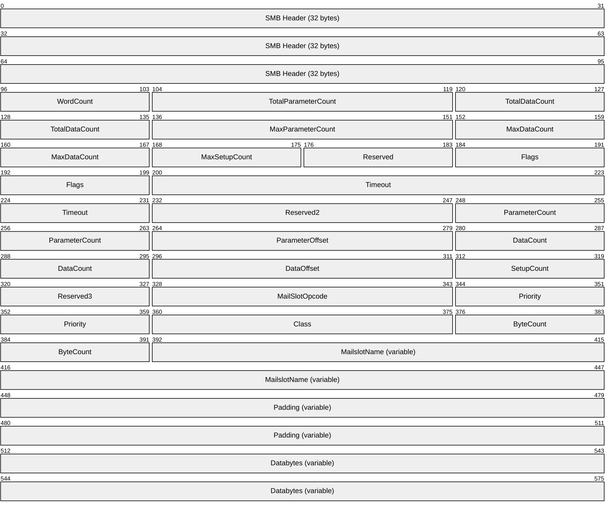

# [MS-MAIL]: Remote Mailslot Protocol

Table of Contents

1 Introduction

- [1 Introduction](#Section_1)
  - [1.1 Glossary](#Section_1.1)
  - [1.2 References](#Section_1.2)
    - [1.2.1 Normative References](#Section_1.2.1)
    - [1.2.2 Informative References](#Section_1.2.2)
  - [1.3 Overview](#Section_1.3)
  - [1.4 Relationship to Other Protocols](#Section_1.4)
  - [1.5 Prerequisites/Preconditions](#Section_1.5)
  - [1.6 Applicability Statement](#Section_1.6)
  - [1.7 Versioning and Capability Negotiation](#Section_1.7)
  - [1.8 Vendor-Extensible Fields](#Section_1.8)
  - [1.9 Standards Assignments](#Section_1.9)

2 Messages

- [2 Messages](#Section_2)
  - [2.1 Transport](#Section_2.1)
  - [2.2 Message Syntax](#Section_2.2)
    - [2.2.1 Mailslot Write Message](#Section_2.2.1)

3 Protocol Details

- [3 Protocol Details](#Section_3)
  - [3.1 Client Details](#Section_3.1)
    - [3.1.1 Abstract Data Model](#Section_3.1.1)
    - [3.1.2 Timers](#Section_3.1.2)
    - [3.1.3 Initialization](#Section_3.1.3)
    - [3.1.4 Higher-Layer Triggered Events](#Section_3.1.4)
      - [3.1.4.1 Application Writes to a Mailslot](#Section_3.1.4.1)
    - [3.1.5 Message Processing Events and Sequencing Rules](#Section_3.1.5)
    - [3.1.6 Timer Events](#Section_3.1.6)
    - [3.1.7 Other Local Events](#Section_3.1.7)
  - [3.2 Server Details](#Section_3.2)
    - [3.2.1 Abstract Data Model](#Section_3.2.1)
      - [3.2.1.1 Global](#Section_3.2.1.1)
      - [3.2.1.2 Per Mailslot](#Section_3.2.1.2)
    - [3.2.2 Timers](#Section_3.2.2)
    - [3.2.3 Initialization](#Section_3.2.3)
    - [3.2.4 Higher-Layer Triggered Events](#Section_3.2.4)
      - [3.2.4.1 Application Creates a Mailslot](#Section_3.2.4.1)
      - [3.2.4.2 Application Reads from a Mailslot](#Section_3.2.4.2)
      - [3.2.4.3 Application Closes a Mailslot](#Section_3.2.4.3)
    - [3.2.5 Message Processing Events and Sequencing Rules](#Section_3.2.5)
      - [3.2.5.1 Server Receives a Mailslot Write](#Section_3.2.5.1)
    - [3.2.6 Timer Events](#Section_3.2.6)
    - [3.2.7 Other Local Events](#Section_3.2.7)

4 Protocol Examples

- [4 Protocol Examples](#Section_4)

5 Security

- [5 Security](#Section_5)
  - [5.1 Security Considerations for Implementers](#Section_5.1)
  - [5.2 Index of Security Parameters](#Section_5.2)

6 Appendix A: Product Behavior

- [6 Appendix A: Product Behavior](#Section_6)

7 Change Tracking

- [7 Change Tracking](#Section_7)

For the legal notice and IP terms, see [LEGAL.md](../LEGAL.md).
Last updated: 7/29/2024.
See [Revision History](#revision-history) for full version history.

# 1 Introduction

The Remote Mailslot Protocol is a simple, unreliable, insecure, and unidirectional interprocess communications (IPC) protocol between a client and server. A mailslot server creates a mailslot, and a mailslot client writes messages to the mailslot created by the server. The server then reads these messages, thus achieving communication between the client and server. A mailslot is represented locally on the server as a file.

Sections 1.5, 1.8, 1.9, 2, and 3 of this specification are normative. All other sections and examples in this specification are informative.

## 1.1 Glossary

This document uses the following terms:

**little-endian**: Multiple-byte values that are byte-ordered with the least significant byte stored in the memory location with the lowest address.

**named pipe**: A named, one-way, or duplex pipe for communication between a pipe server and one or more pipe clients.

**NetBIOS datagram service**: An implementation of NetBIOS services in a datagram environment as specified in [[RFC1001]](https://go.microsoft.com/fwlink/?LinkId=90260) section 17.

**MAY, SHOULD, MUST, SHOULD NOT, MUST NOT:** These terms (in all caps) are used as defined in [[RFC2119]](https://go.microsoft.com/fwlink/?LinkId=90317). All statements of optional behavior use either MAY, SHOULD, or SHOULD NOT.

## 1.2 References

Links to a document in the Microsoft Open Specifications library point to the correct section in the most recently published version of the referenced document. However, because individual documents in the library are not updated at the same time, the section numbers in the documents may not match. You can confirm the correct section numbering by checking the [Errata](https://go.microsoft.com/fwlink/?linkid=850906).

### 1.2.1 Normative References

We conduct frequent surveys of the normative references to assure their continued availability. If you have any issue with finding a normative reference, please contact [dochelp@microsoft.com](mailto:dochelp@microsoft.com). We will assist you in finding the relevant information.

[MS-BRWS] Microsoft Corporation, "[Common Internet File System (CIFS) Browser Protocol](../MS-BRWS/MS-BRWS.md)".

[MS-CIFS] Microsoft Corporation, "[Common Internet File System (CIFS) Protocol](../MS-CIFS/MS-CIFS.md)".

[MS-DTYP] Microsoft Corporation, "[Windows Data Types](../MS-DTYP/MS-DTYP.md)".

[MS-NRPC] Microsoft Corporation, "[Netlogon Remote Protocol](../MS-NRPC/MS-NRPC.md)".

[MS-SMB] Microsoft Corporation, "[Server Message Block (SMB) Protocol](../MS-SMB/MS-SMB.md)".

[NETBEUI] IBM Corporation, "LAN Technical Reference: 802.2 and NetBIOS APIs", 1986, [https://www.ardent-tool.com/docs/boo/bk8p7001.boo](https://go.microsoft.com/fwlink/?LinkId=90224)

**Note** Requires IBM Softcopy Reader for Windows V4.0 to read the file.

[RFC1001] Network Working Group, "Protocol Standard for a NetBIOS Service on a TCP/UDP Transport: Concepts and Methods", RFC 1001, March 1987, [https://www.rfc-editor.org/info/rfc1001](https://go.microsoft.com/fwlink/?LinkId=90260)

[RFC1002] Network Working Group, "Protocol Standard for a NetBIOS Service on a TCP/UDP Transport: Detailed Specifications", STD 19, RFC 1002, March 1987, [https://www.rfc-editor.org/info/rfc1002](https://go.microsoft.com/fwlink/?LinkId=90261)

[RFC2119] Bradner, S., "Key words for use in RFCs to Indicate Requirement Levels", BCP 14, RFC 2119, March 1997, [https://www.rfc-editor.org/info/rfc2119](https://go.microsoft.com/fwlink/?LinkId=90317)

### 1.2.2 Informative References

[MSLOT] Microsoft Corporation, "Mailslots", [http://msdn.microsoft.com/en-us/library/aa365576.aspx](https://go.microsoft.com/fwlink/?LinkId=90218)

[PIPE] Microsoft Corporation, "Named Pipes", [http://msdn.microsoft.com/en-us/library/aa365590.aspx](https://go.microsoft.com/fwlink/?LinkId=90247)

## 1.3 Overview

The Remote Mailslot Protocol is a simple, unreliable, insecure, and unidirectional interprocess communications (IPC) protocol between a client and server or among a group of servers that use the [**NetBIOS datagram service**](#gt_netbios-datagram-service) (as specified in [[RFC1001]](https://go.microsoft.com/fwlink/?LinkId=90260) section 17) as the transport protocol. A mailslot server creates a mailslot, and a mailslot client writes messages to the mailslot created by the server. The server then reads these messages, thus achieving communication between the client and server applications. If the server closes the mailslot, the client will no longer be able to send messages to this mailslot.

This protocol specifies a means of carrying SMB_COM_TRANSACTION messages (as specified in section [2.2.1](#Section_2.2.1)) over a NetBIOS datagram service. The sender of the mailslot message formats the SMB_COM_TRANSACTION message and sends it as a NetBIOS datagram. This protocol is not transported over SMB.

## 1.4 Relationship to Other Protocols

The Remote Mailslot Protocol relies on the transport mechanisms of the [**NetBIOS datagram service**](#gt_netbios-datagram-service) (as specified in section [2.1](#Section_2.1)).

The Remote Mailslot Protocol is used by the Netlogon Remote Protocol, as described in [MS-NRPC](../MS-NRPC/MS-NRPC.md) to locate domain controllers. The Netlogon Remote Protocol uses "\MAILSLOT\NET\NETLOGON".

The Remote Mailslot Protocol is used by the Common Internet File System (CIFS) Browser Protocol, as described in [MS-BRWS](../MS-BRWS/MS-BRWS.md) to accomplish inter-machine communication. The Common Internet File System (CIFS) Browser Protocol uses "\MAILSLOT\LANMAN" and "\MAILSLOT\BROWSE".

## 1.5 Prerequisites/Preconditions

The server needs to have a NetBIOS name registered, as described in [[RFC1001]](https://go.microsoft.com/fwlink/?LinkId=90260) section 15. The higher-layer application that uses the Remote Mailslot Protocol needs to know the NetBIOS name of the server to which it is trying to connect. The higher-layer application needs to also know the name of the mailslot.

## 1.6 Applicability Statement

Remote mailslot messages are used in scenarios that require sending simple, short messages to one or more computers on the network. Neither the sender nor the receiver can expect reliable or ordered delivery of these messages.

Due to the unordered, unreliable, and unidirectional nature of the Remote Mailslot Protocol, it is recommended that clients that need a more robust or bidirectional communication mechanism with the server use other, more reliable protocols such as [**named pipes**](#gt_named-pipe), as specified in [[PIPE]](https://go.microsoft.com/fwlink/?LinkId=90247). Also, because the Remote Mailslot Protocol has no authentication, it is unsuitable for applications requiring a secure communication between the sender and receiver.<1>

## 1.7 Versioning and Capability Negotiation

The Remote Mailslot Protocol does not contain any version or capability negotiation.

## 1.8 Vendor-Extensible Fields

None.

## 1.9 Standards Assignments

There are no standards assignments other than those implied by the use of the [**NetBIOS datagram service**](#gt_netbios-datagram-service), as specified in [[RFC1001]](https://go.microsoft.com/fwlink/?LinkId=90260) section 17.

# 2 Messages

The Remote Mailslot Protocol defines exactly one message: a mailslot write command.

## 2.1 Transport

Mailslot writes are delivered over the [**NetBIOS datagram service**](#gt_netbios-datagram-service) by using one of the following transports:

- NetBIOS over UDP datagram service, as specified in [[RFC1001]](https://go.microsoft.com/fwlink/?LinkId=90260) section 5.4. For this transport, the maximum allowed size for the **MailslotName** and **Databytes** fields (see section [2.2.1](#Section_2.2.1)) of a mailslot write message is 443 bytes.
- NetBIOS over IPX.
- NetBIOS Extended User Interface, as specified in [[NETBEUI]](https://go.microsoft.com/fwlink/?LinkId=90224).
For NetBIOS Extended User Interface and NetBIOS over IPX, the maximum size is dependent on the frame size of the underlying physical media. When using UDP as the underlying transport, the protocol implementation SHOULD restrict the maximum allowed data in the **MailslotName** and **Databytes** fields (see section 2.2.1) of a mailslot write message to no more than 443 bytes.<2>

## 2.2 Message Syntax

A mailslot write message shares the structure of **SMB_COM_TRANSACTION**, as specified in [MS-CIFS](../MS-CIFS/MS-CIFS.md) section 2.2.4.33, and redefines some of the structure fields as specified in section [2.2.1](#Section_2.2.1).

This section specifies the syntax of the Transaction SMB data structure as it applies to a mailslot write message. The byte ordering used is [**little-endian**](#gt_little-endian) unless specified otherwise.

### 2.2.1 Mailslot Write Message

The SMB_COM_TRANSACTION data structure (see [MS-CIFS](../MS-CIFS/MS-CIFS.md) section 2.2.4.33) for a mailslot write message required to be as follows:

**Note** The empty fields in the following table represent the continuation of the fields preceding them.

**SMB Header (32 bytes):** The format of the 32-byte SMB header is specified in [MS-SMB](../MS-SMB/MS-SMB.md) section 2.2.3.1. For a mailslot write message, the header fields are required to be set to the following values:

- **Protocol**: MUST be set to (0xFF, 'S', 'M', 'B'), as specified in [MS-SMB] section 2.2.3.1.
- **Command**: MUST be set to 0x25 to represent the SMB_COM_TRANSACTION, as specified in [MS-SMB] section 2.2.3.1.
- **Status**: SHOULD be set to 0 and MUST be ignored on receipt.
- **Flags**: SHOULD<3> be set to 0x18 and MUST be ignored on receipt.
- **Flags2**: SHOULD<4> be set to 0x04 and MUST be ignored on receipt.
- **PidHigh**: SHOULD be set to 0 and MUST be ignored on receipt.
- **SecurityFeatures**: SHOULD be set to 0 and MUST be ignored on receipt.
- **TID**: SHOULD be set to 0 and MUST be ignored on receipt.
- **PIDLow**: SHOULD<5> be set to 0xFEFF and MUST be ignored on receipt.
- **UID**: SHOULD be set to 0 and MUST be ignored on receipt.
- **MID**: SHOULD be set to 0 and MUST be ignored on receipt.
**WordCount (1 byte):** An unsigned 8-bit integer that specifies the count of words that occur between the **WordCount** field and the **ByteCount** field. For a mailslot write request, the **WordCount** value MUST be set to 0x11.

**TotalParameterCount (2 bytes):** An unsigned 16-bit integer that specifies the number of bytes in the parameter buffer. For a mailslot write request, the **TotalParameterCount** value MUST be set to zero and be ignored on receipt. Because this value MUST be set to zero, it indicates that no parameter array is being sent in this request.

**TotalDataCount (2 bytes):** An unsigned 16-bit integer that specifies the number of bytes in the **DataBytes** field. For a mailslot write request, the **TotalDataCount** value MUST be set to the size in bytes of the **DataBytes** field to be sent to the receiver. This value is always the same as the **DataCount** field for a mailslot write request.

**MaxParameterCount (2 bytes):** An unsigned 16-bit integer field. For a mailslot write request, the **MaxParameterCount** value SHOULD<6> be set to zero and MUST be ignored on receipt.

**MaxDataCount (2 bytes):** An unsigned 16-bit integer field. For a mailslot write request, the **MaxDataCount** field MUST be set to zero and MUST be ignored on receipt.

**MaxSetupCount (1 byte):** An unsigned 8-bit integer field. For a mailslot write request, the **MaxSetupCount** field MUST be set to zero and MUST be ignored on receipt.

**Reserved (1 byte):** An unsigned 8-bit integer reserved for future use. The **Reserved** field MUST be set to zero and ignored on receipt.

**Flags (2 bytes):** An unsigned 16-bit integer that consists of a set of options that provide additional information to the server on this request. The client MAY set either of the bits shown in the following table. Unused bit fields SHOULD be set to 0 by the client when sending a request and MUST be ignored when received by the server.

| Value | Meaning |
| --- | --- |
| DISCONNECT_TID 0x0001 | The server MUST disconnect the tree connect associated with the Tid received in the SMB header of this request after the request is completed. The client SHOULD NOT send an SMB_COM_TREE_DISCONNECT for this tree connect. |
| NO_RESPONSE 0x0002 | The server MUST process this client request as a one-way transaction and MUST NOT send a response back to the client.<7> |

**Timeout (4 bytes):** An unsigned 32-bit integer that represents the maximum amount of time in milliseconds to wait for the operation to be completed. The client MAY set this field to 0 to indicate that no time-out is given. If the operation is not completed within the specified time, the server MAY abort the request and send a failure response.<8>

**Reserved2 (2 bytes):** An unsigned 16-bit integer reserved for future use. The **Reserved2** field MUST be set to zero and ignored on receipt.

**ParameterCount (2 bytes):** An unsigned 16-bit integer that specifies the count of bytes in the parameter buffer of this packet. For a mailslot write request, the **ParameterCount** field MUST be set to zero and ignored on receipt. Because this value MUST be set to zero, it indicates that no parameter array is being sent in this request.

**ParameterOffset (2 bytes):** An unsigned 16-bit integer that specifies the offset in bytes from the beginning of the SMB_COM_TRANSACTION packet to where the parameter buffer begins.

**DataCount (2 bytes):** An unsigned 16-bit integer that specifies the count of bytes in the **DataBytes** field. For a mailslot write request, the **DataCount** field MUST be set to the size in bytes of the **DataBytes** field to be sent to the receiver. This value is always the same as the **TotalDataCount** field.

**DataOffset (2 bytes):** An unsigned 16-bit integer that specifies the offset to the **DataBytes** field in this packet. For a mailslot write request, the **DataOffset** field MUST be set to the offset of the **Databytes** field from the beginning of the SMB_COM_TRANSACTION message.

**SetupCount (1 byte):** An unsigned 8-bit integer that MUST be set to 0x03.

**Reserved3 (1 byte):** An unsigned 8-bit integer reserved for future use. The **Reserved3** field MUST be set to zero and ignored on receipt.

**MailSlotOpcode (2 bytes):** An unsigned 16-bit integer. The **MailSlotOpcode** field MUST be set to 0x0001.

**Priority (2 bytes):** An unsigned 16-bit integer that represents the numeric priority of the message being written to the mailslot. The **Priority** field MUST be in the range of 0 through 9. The larger the value, the higher the priority.<9>

**Class (2 bytes):** An unsigned 16-bit integer that represents the class of the mailslot request.<10> The **Class** field MUST be set to one of the following values.

| Value | Meaning |
| --- | --- |
| Class 1 0x0001 | A first-class mailslot is reliable and guarantees delivery of the message. This class MAY transmit messages of up to 65,535 bytes. Messages to class 1 mailslots MUST not be broadcast. |
| Class 2 0x0002 | A second-class mailslot is unreliable and does not guarantee delivery of the message. This class MAY transmit messages up to a maximum length that depends on the configuration of the server but will never be less than 360 bytes. Messages to class 2 mailslots MAY be broadcast, which allows a message to be sent to a particular mailslot on all systems. |

**ByteCount (2 bytes):** An unsigned 16-bit integer that MUST specify the number of bytes that follow this field. For a mailslot write request, the **ByteCount** field MAY be ignored on receipt, and the number of bytes that follow this field is determined by using the values in the **DataOffset** and **DataCount** fields.<11>

**MailslotName (variable):** A null-terminated, case-insensitive ASCII string that denotes the name of the mailslot to which the message is being sent. The string in the **MailslotName** field MUST be of the form "\mailslot\<name>", where <name> is the name of the mailslot. The <name> MUST be a non-empty string and names are not case sensitive. The name field MAY contain multiple directory levels, such as "\mailslot\directory\ms1", or a single level such as "\mailslot\ms1".<12>

**Padding (variable):** Padding data. The **Padding** field MUST be large enough so that the **DataBytes** field is 32-bit aligned. To that end, this field MUST be 0 through 3 bytes long, inclusive. The **Padding** field MUST be set to zero and ignored on receipt.

**Databytes (variable):** Buffer containing the mailslot message to be delivered to the server. The size of the mailslot message MUST NOT exceed the maximum allowed size, as specified in section [2.1](#Section_2.1).

# 3 Protocol Details

## 3.1 Client Details

The Remote Mailslot Protocol clients are higher-layer applications that use the mailslot protocol to send a message to the server, as described in section [3.1.4.1](#Section_3.1.4). Because this is an unreliable, unidirectional protocol, there is neither a connection phase nor an acknowledgment from the server for the send from the client.

### 3.1.1 Abstract Data Model

None.

### 3.1.2 Timers

None.

### 3.1.3 Initialization

None.

### 3.1.4 Higher-Layer Triggered Events

#### 3.1.4.1 Application Writes to a Mailslot

The application provides the following:

**TargetName**: The 16-character NetBIOS name of the target to which the mailslot message MUST be sent. The name MAY be a "unique name" or a "group name" as specified in [[RFC1001]](https://go.microsoft.com/fwlink/?LinkId=90260) section 5.2.

**MailslotName**: The name of the mailslot on the target server to which the message MUST be delivered.

**Message**: The mailslot message to be sent. The maximum length of the message is limited by the underlying transport protocol.

On receipt of a request from a higher-layer application to send a mailslot message, the client mailslot implementation MUST package the data to be sent and the destination mailslot name in a **SMB_COM_TRANSACTION** data structure by filling in the various fields, as specified in section [2.2.1](#Section_2.2.1). The **MailslotName** in the **SMB_COM_TRANSACTION** request MUST be of the form "\MAILSLOT\MailslotName."

The client MUST send the **SMB_COM_TRANSACTION** request to **TargetName** using the "send datagram" primitive described in [RFC1001] section 5.4. The NetBIOS datagram service on the client machine determines whether the supplied **TargetName** is a "unique" or "group" name by using one of the mechanisms described in [RFC1001] section 15.1.2 and section 15.3. Based on the type of name, it sends a NetBIOS datagram to the target(s) as described in [RFC1001] section 17. <13>

The Remote Mailslot Protocol itself does not provide for multi-packet segmentation. As a result, if the invoking application specifies data that is too large to be handled by the NetBIOS datagram service, the request MUST be failed with an implementation-specific error.

### 3.1.5 Message Processing Events and Sequencing Rules

Multipacket segmentation is not supported by the Remote Mailslot Protocol. If the packet is too large to fit into a single NetBIOS datagram, it MUST be discarded.

### 3.1.6 Timer Events

None.

### 3.1.7 Other Local Events

None.

## 3.2 Server Details

### 3.2.1 Abstract Data Model

The Remote Mailslot Protocol servers require higher-layer applications (running on the server) that use the protocol to specify individual mailslots. Each mailslot MUST be identified by an ASCII name that is unique for that server. The name MUST follow the format "\mailslot\<name>", where <name> MUST be the unique name of the mailslot for that server. Names are not case sensitive.

The server maintains a lookup table for the list of active mailslots indexed by the mailslot name. Each active mailslot has a queue, called the message queue, associated with it. This message queue holds pending incoming mailslot messages. The length of the queue is implementation specific.<14>

#### 3.2.1.1 Global

The following element is part of the abstract data model for MS-MAIL servers:

**MailslotList :** A list of active mailslots on the system.

#### 3.2.1.2 Per Mailslot

The following elements are part of the abstract data model for each mailslot on a mailslot server:

**Mailslot.Name :** The name of the mailslot, which has the format described in section [3.2.1](#Section_1.3).

**Mailslot.MessageQueue :** A queue of pending, incoming mailslot messages received on the mailslot. The length of the queue is implementation-specific.<15>

### 3.2.2 Timers

None.

### 3.2.3 Initialization

The server MUST initialize MailslotList (section [3.2.1.1](#Section_3.2.1.1)) to an empty list.

The server MUST register with the [**NetBIOS datagram service**](#gt_netbios-datagram-service) to receive mailslot messages that are sent as NetBIOS datagrams. Based on the designated role(s) of the server, the following NetBIOS names MUST be registered. The role of the server MUST be determined by querying the current server configuration by calling the abstract interface **ServerGetInfo** specified in [MS-DTYP](../MS-DTYP/MS-DTYP.md) section 2.6, specifying a level of 101. The resulting **bufptr** contains a **SERVER_INFO_101** structure, as specified in [MS-DTYP] section 2.3.12. The value of the field **sv101** type determines the following initialization:

- All servers MUST register their computer names to receive NetBIOS datagrams directed to the computer. The computer name MUST be converted to a valid NetBIOS name by padding it with spaces to the right, up to 15 characters. The 16th character MUST be set to 0. The resulting name MUST be registered with NetBIOS as a "unique name" as described in [[RFC1001]](https://go.microsoft.com/fwlink/?LinkId=90260) section 15.1.1.
- If **sv101** type contains **SV_TYPE_WORKSTATION**, the server MUST register with the NetBIOS datagram service to receive NetBIOS datagrams directed to all computers in the domain. The domain name MUST be converted to a valid NetBIOS name by padding it with spaces to the right, up to 15 characters. The 16th character MUST be set to 0. The resulting name MUST be registered with NetBIOS as a "group name" as described in [RFC1001] section 15.1.1.
- If **sv101** type contains **SV_TYPE_DOMAIN_CTRL** or **SV_TYPE_DOMAIN_BACKCTRL**, the server MUST register with the NetBIOS datagram service to receive NetBIOS datagrams directed to all domain controllers in the domain. The domain name MUST be converted to a valid NetBIOS name by padding it with spaces to the right, up to 15 characters. The 16th character MUST be set to 0x1c. The resulting name MUST be registered with NetBIOS as a "group name" as described in [RFC1001] section 15.1.1.
- If **sv101** contains **SV_TYPE_DOMAIN_CTRL**, the server MUST register with the NetBIOS datagram service to receive NetBIOS datagrams directed to the primary domain controller in the domain. The domain name MUST be converted to a valid NetBIOS name by padding it with spaces to the right, up to 15 characters. The 16th character MUST be set to 0x1b. The resulting name MUST be registered with NetBIOS as a "unique name" as described in [RFC1001] section 15.1.1.
For more information about receiving broadcast NetBIOS datagrams by NetBIOS datagram service, see [RFC1001] section 17.

### 3.2.4 Higher-Layer Triggered Events

The Remote Mailslot Protocol server MUST expose interfaces to upper-layer applications to allow them to create, read, and close mailslots on the server, as specified in this section.

#### 3.2.4.1 Application Creates a Mailslot

The application provides the following data:

- The name of the mailslot in the format specified in section [3.2.1](#Section_1.3).
On a mailslot create request from an application running on the server, the server MUST search through the mailslots contained in **MailslotList** (section [3.2.1.1](#Section_3.2.1.1)) to find a mailslot for which **Mailslot.Name** (section [3.2.1.2](#Section_3.2.4.3)) matches the application-supplied name.

- If a match is found, the server MUST fail the request with an implementation-specific error.
- If a match is not found, the server MUST create a new mailslot, initialize **Mailslot.MessageQueue** (section 3.2.1.2) to an empty queue, and add the newly-created mailslot to **MailslotList**.

#### 3.2.4.2 Application Reads from a Mailslot

The application provides the following data:

- The name of the mailslot to read from, in the format specified in section [3.2.1](#Section_1.3).
The server MUST search **MailslotList** (section [3.2.1.1](#Section_3.2.1.1)) for a mailslot whose **Mailslot.Name** field (section [3.2.1.2](#Section_3.2.4.3)) matches the application-supplied name.

- If a match is not found, the server MUST return an implementation-specific error to the caller.
- If a match is found and **Mailslot.MessageQueue** (section 3.2.1.2) is empty, the server MAY block until a message arrives in the queue, wait for an implementation-specific timeout interval, or return an error.<16>
If a message is available in **Mailslot.MessageQueue**, the message MUST be deleted from the head of the queue and returned to the application.

#### 3.2.4.3 Application Closes a Mailslot

The application provides the following data:

- The name of the mailslot to close, in the format specified in section [3.2.1](#Section_1.3).
The server MUST search **MailslotList** (section [3.2.1.1](#Section_3.2.1.1)) for a mailslot whose **Mailslot.Name** field (section [3.2.1.2](#Section_3.2.4.3)) matches the application-supplied name.

- If the server does not find a match, it MUST return an implementation-specific error to the caller.
- If the server finds a match, it MUST perform the following steps:
- Delete all messages from **Mailslot.MessageQueue** (section 3.2.1.2).
- Remove the mailslot from **MailslotList**.
- Delete the mailslot.

### 3.2.5 Message Processing Events and Sequencing Rules

#### 3.2.5.1 Server Receives a Mailslot Write

On receiving a mailslot write request from a client, the mailslot server MUST verify that the request conforms to the syntax specified in section [2.2.1](#Section_2.2.1). If either the format or the contents do not conform to the specified syntax, the mailslot server MUST ignore and discard the request.

For all valid requests, the mailslot server MUST read the name of the mailslot from the **MailslotName** field of the request (see section 2.2.1).

The mailslot server MUST search **MailslotList** (section [3.2.1.1](#Section_3.2.1.1)) for a mailslot whose **Mailslot.Name** field (section [3.2.1.2](#Section_3.2.4.3)) matches the name of the mailslot in the request.

- If the server does not find a match, it MUST ignore and discard the request.
- If the server finds a match, it MUST read the **DataOffset** field of the request (see section 3.2.1.2) to calculate the offset from the beginning of the SMB_COM_TRANSACTION message to the **Databytes** field (see section 3.2.1.2) that contains the mailslot message.
**Note** Only the act of adding a message to the mailslot needs to be atomic, not the entire block of operations from reading, parsing, and updating.

The mailslot server MUST read the **DataCount** field of the request (see section 2.2.1) to determine the size of the mailslot message and MUST read the number of bytes given in the **DataCount** field, beginning at the start of the **Databytes** buffer, to obtain the actual mailslot message. The mailslot server MUST attempt to add the actual message atomically to the tail of the queue specified in **Mailslot.MessageQueue** (section 3.2.1.2). If the message cannot be added to the message queue for any reason, the mailslot server MUST discard the request.

### 3.2.6 Timer Events

None.

### 3.2.7 Other Local Events

None.

# 4 Protocol Examples

Mailslots are supported by three higher-level specialized functions, **CreateMailslot**, **GetMailslotInfo**, and **SetMailslotInfo**. These functions are used by the mailslot server. Note that none of these translate into SMB commands, as specified in [MS-SMB](../MS-SMB/MS-SMB.md) section 2.2.3.1.

It is recommended that **CreateMailslot** create a local mailslot, return the server-side handle to this mailslot, and map to the higher-level server-side event (see section [3.2.4.1](#Section_3.2.4.1)). **GetMailslotInfo** and **SetMailslotInfo** are server-specific configurations about how long the server will block a read request while waiting for the message to arrive before failing back to the application, and they are implementation-specific API for local operations and not related to how the protocol functions.

The client would call the **CreateFile** function to open a mailslot and then call the **WriteFile** function (for more information, see [[MSLOT]](https://go.microsoft.com/fwlink/?LinkId=90218)) to write to it. It is this write file call that generates traffic, as specified in section [3.1.4.1](#Section_3.1.4).

The following network traffic capture depicts the protocol message sequence for a mailslot write from a client to a mailslot server with the mailslot name \MAILSLOT\test1\sample_mailslot. This network trace is generated when a client application invokes the Remote Mailslot Protocol to send a mailslot message to a remote server, as specified in section 3.1.4.1. For a detailed description of the fields in this example, see section [2.2.1](#Section_2.2.1).

FRAME 1 – SMB_COM_TRANSACTION MailSlot Write

Unparsed:

FF 53 4D 42 25 00 00 00 00 18 04 00 00 00 00 00

SMB%............

00 00 00 00 00 00 00 00 00 00 FF FE 00 00 00 00

.........ÿþ.....

11 00 00 24 00 02 00 00 00 00 00 02 00 00 00 00

..$.............

00 00 00 00 00 68 00 24 00 68 00 03 00 01 00 00

....h.$.h.......

00 02 00 47 00 5C 4D 41 49 4C 53 4C 4F 54 5C 74

..G.\MAILSLOT\te

65 73 74 31 5C 73 61 6D 70 6C 65 5F 6D 61 69 6C

st1\sample_mails

73 6C 6F 74 00 00 00 00 CA CA CA CA CA CA CA CA

lot....ÊÊÊÊÊÊÊÊÊ

CA CA CA CA CA CA CA CA CA CA CA CA CA CA CA CA

ÊÊÊÊÊÊÊÊÊÊÊÊÊÊÊÊ

CA CA CA CA CA CA CA CA CA CA CA CA

ÊÊÊÊÊÊÊÊÊÊÊ

Parsed:

Smb: C; Transact, Mail Slots, Write Mail Slot,

FileName = \MAILSLOT\test1\sample_mailslot

Protocol: SMB

Command: Transact 37(0x25)

DOSError: No Error

ErrorClass: No Error

Reserved: 0 (0x0)

Error: No Error

SMBHeader: Command, TID: 0x0000, PID: 0xFEFF,

UID: 0x0000, MID: 0x0000

Flags: 24 (0x18)

Flags2: 4 (0x4)

PIDHigh: 0 (0x0)

SecuritySignature: 0x0

Reserved: 0 (0x0)

TreeID: 0 (0x0)

ProcessID: 65279 (0xFEFF)

UserID: 0 (0x0)

MultiplexID: 0 (0x0)

CTransaction:

WordCount: 17 (0x11)

TotalParameterCount: 0 (0x0)

TotalDataCount: 36 (0x24)

MaxParameterCount: 2 (0x2)

MaxDataCount: 0 (0x0)

MaxSetupCount: 0 (0x0)

Reserved1: 0 (0x0)

Flags: Do not disconnect TID

Timeout: 0 sec(s)

Reserved2: 0 (0x0)

ParameterCount: 0 (0x0)

ParameterOffset: 104 (0x68)

DataCount: 36 (0x24)

DataOffset: 104 (0x68)

SetupCount: 3 (0x3)

Reserved3: 0 (0x0)

MailSlotsSetupWords:

MailSlotOpcode: Write Mail Slot

TransactionPriority: 0 (0x0)

MailSlotClass: Unreliable & Broadcast

ByteCount: 71 (0x47)

MailSlotsBuffer:

FileName: \MAILSLOT\test1\sample_mailslot

Pad2: Binary Large Object (3 Bytes)

MailSlotData: Binary Large Object (36 Bytes)

CA CA CA CA CA CA CA CA CA CA CA CA CA CA CA CA

CA CA CA CA CA CA CA CA CA CA CA CA CA CA CA CA

CA CA CA CA

# 5 Security

## 5.1 Security Considerations for Implementers

The Remote Mailslot Protocol is not a secure protocol. Do not use the Remote Mailslot Protocol if applications need secure communication between client and server.

## 5.2 Index of Security Parameters

None.

# 6 Appendix A: Product Behavior

The information in this specification is applicable to the following Microsoft products or supplemental software. References to product versions include updates to those products.

- Windows NT operating system
- Windows 2000 operating system
- Windows XP operating system
- Windows Server 2003 operating system
- Windows Vista operating system
- Windows Server 2008 operating system
- Windows 7 operating system
- Windows Server 2008 R2 operating system
- Windows 8 operating system
- Windows Server 2012 operating system
- Windows 8.1 operating system
- Windows Server 2012 R2 operating system
- Windows 10 operating system
- Windows Server 2016 operating system
- Windows Server operating system
- Windows Server 2019 operating system
- Windows Server 2022 operating system
- Windows 11 operating system
- Windows Server 2025 operating system
Exceptions, if any, are noted in this section. If an update version, service pack or Knowledge Base (KB) number appears with a product name, the behavior changed in that update. The new behavior also applies to subsequent updates unless otherwise specified. If a product edition appears with the product version, behavior is different in that product edition.

Unless otherwise specified, any statement of optional behavior in this specification that is prescribed using the terms "SHOULD" or "SHOULD NOT" implies product behavior in accordance with the SHOULD or SHOULD NOT prescription. Unless otherwise specified, the term "MAY" implies that the product does not follow the prescription.

<1> Section 1.6: Windows supports the Remote Mailslot Protocol.

<2> Section 2.1: The use of NetBIOS over IPX or NetBEUI is deprecated and not used by default. NetBIOS datagrams over TCP/IP (NBT datagrams), as defined in [[RFC1001]](https://go.microsoft.com/fwlink/?LinkId=90260) and [[RFC1002]](https://go.microsoft.com/fwlink/?LinkId=90261), is the default transport used by the Windows implementation of the Remote Mailslot Protocol.

- When using NBT datagrams the Windows implementation limits the maximum size of a Mailslot write request (including the SMB header, the TRANSACT request, the name of the Mailslot, any padding, and the data to be written) to 512 bytes. The maximum size of the write payload depends on the length of the Mailslot name and any padding added to the request by the client.
The length of the write payload in bytes is given by:

432 – ROUND_UP_TO_DWORD (Mailslot name length, excluding the \mailslot\ prefix.)

The following table shows the relationship:

| Bit Range | Field | Description |
| --- | --- | --- |
| 1-4 characters | 428 | - |
| 5-8 characters | 424 | - |
| 9-12 characters | 420 | - |
| 13-16 characters | 416 | - |

<3> Section 2.2.1: Applicable Windows Server releases set this field to 0.

<4> Section 2.2.1: Applicable Windows Server releases set this field to 0.

<5> Section 2.2.1: Applicable Windows Server releases set this field to 0.

<6> Section 2.2.1: Windows Client operating system sets this field to 0x2.

<7> Section 2.2.1: Applicable Windows Server releases set the **Flags** field to 0 when this request is received.

<8> Section 2.2.1: Applicable Windows Server releases ignore the **Timeout** field when the request is received.

<9> Section 2.2.1: Applicable Windows Server releases ignore the **Priority** field when the request is received.

<10> Section 2.2.1: Applicable Windows Server releases ignore the **Class** field when the request is received.

<11> Section 2.2.1: Windows implementations ignore this field.

<12> Section 2.2.1: Windows supports multiple directory levels in the mailslot name and passes such names in the mailslot write operation if the application requests it.

<13> Section 3.1.4.1: The NetBIOS datagram is formatted as described in [RFC1002] sections 4.4.1 and 4.4.2. For group names, **MSG_TYPE** is set to 0x11 (DIRECT_GROUP). For unique names, **MSG_TYPE** is 0x10 (DIRECT_UNIQUE). In all cases the Flags will be as follows:

- M – clear (0x00)
- F – set (0x01)
- SNT – local node type. Windows uses a fourth node type referred to as h-node. This is the default type and has a SNT value of 0x11, which the RFC specifies for use by the NetBIOS Datagram Distribution (NBDD) node.
- RESERVED – clear (0x00)
For group names, if the name data lists only a single entry for the broadcast address (and the node is not a p-node), a single datagram will be sent to the configured broadcast address. Otherwise a separate datagram is sent to each address listed. For unique names, a single datagram is sent to the address listed.

As specified in [RFC1001] section 17.3, if the NBDD cannot distribute a datagram, the end-node has the option of getting the name's owner list from the NetBIOS Datagram Name Server (NBNS) and sending the datagram directly to each of the owners.

<14> Section 3.2.1: There is no enforced limit on the number of entries in the queue.

<15> Section 3.2.1.2: No limit is enforced on the number of entries in the queue.

<16> Section 3.2.4.2: When the queue has no messages, Windows waits for a user-specified timeout interval in milliseconds. If the specified timeout interval is zero, the read returns immediately with a specific failure error code that indicates an empty message queue.

# 7 Change Tracking

This section identifies changes that were made to this document since the last release. Changes are classified as Major, Minor, or None.

The revision class **Major** means that the technical content in the document was significantly revised. Major changes affect protocol interoperability or implementation. Examples of major changes are:

- A document revision that incorporates changes to interoperability requirements.
- A document revision that captures changes to protocol functionality.
The revision class **Minor** means that the meaning of the technical content was clarified. Minor changes do not affect protocol interoperability or implementation. Examples of minor changes are updates to clarify ambiguity at the sentence, paragraph, or table level.

The revision class **None** means that no new technical changes were introduced. Minor editorial and formatting changes may have been made, but the relevant technical content is identical to the last released version.

The changes made to this document are listed in the following table. For more information, please contact [dochelp@microsoft.com](mailto:dochelp@microsoft.com).

| Section | Description | Revision class |
| --- | --- | --- |
| [2.1](#Section_2.1) Transport | 11751 : Reinstated [NETBEUI] as reference with download link | Major |

## Revision History

| Date | Version | Revision Class | Comments |
| --- | --- | --- | --- |
| 12/18/2006 | 0.01 | New | Version 0.01 release |
| 3/2/2007 | 1.0 | Major | Version 1.0 release |
| 4/3/2007 | 1.1 | Minor | Version 1.1 release |
| 5/11/2007 | 1.2 | Minor | Version 1.2 release |
| 6/1/2007 | 1.2.1 | Editorial | Changed language and formatting in the technical content. |
| 7/3/2007 | 1.2.2 | Editorial | Changed language and formatting in the technical content. |
| 7/20/2007 | 1.2.3 | Editorial | Changed language and formatting in the technical content. |
| 8/10/2007 | 1.2.4 | Editorial | Changed language and formatting in the technical content. |
| 9/28/2007 | 1.2.5 | Editorial | Changed language and formatting in the technical content. |
| 10/23/2007 | 1.2.6 | Editorial | Changed language and formatting in the technical content. |
| 11/30/2007 | 1.2.7 | Editorial | Changed language and formatting in the technical content. |
| 1/25/2008 | 1.2.8 | Editorial | Changed language and formatting in the technical content. |
| 3/14/2008 | 1.2.9 | Editorial | Changed language and formatting in the technical content. |
| 5/16/2008 | 2.0 | Major | Updated and revised the technical content. |
| 6/20/2008 | 2.0.1 | Editorial | Changed language and formatting in the technical content. |
| 7/25/2008 | 2.0.2 | Editorial | Changed language and formatting in the technical content. |
| 8/29/2008 | 2.0.3 | Editorial | Changed language and formatting in the technical content. |
| 10/24/2008 | 2.0.4 | Editorial | Changed language and formatting in the technical content. |
| 12/5/2008 | 3.0 | Major | Updated and revised the technical content. |
| 1/16/2009 | 3.0.1 | Editorial | Changed language and formatting in the technical content. |
| 2/27/2009 | 3.0.2 | Editorial | Changed language and formatting in the technical content. |
| 4/10/2009 | 3.0.3 | Editorial | Changed language and formatting in the technical content. |
| 5/22/2009 | 3.1 | Minor | Clarified the meaning of the technical content. |
| 7/2/2009 | 3.1.1 | Editorial | Changed language and formatting in the technical content. |
| 8/14/2009 | 3.2 | Minor | Clarified the meaning of the technical content. |
| 9/25/2009 | 4.0 | Major | Updated and revised the technical content. |
| 11/6/2009 | 4.1 | Minor | Clarified the meaning of the technical content. |
| 12/18/2009 | 5.0 | Major | Updated and revised the technical content. |
| 1/29/2010 | 6.0 | Major | Updated and revised the technical content. |
| 3/12/2010 | 6.0.1 | Editorial | Changed language and formatting in the technical content. |
| 4/23/2010 | 6.0.2 | Editorial | Changed language and formatting in the technical content. |
| 6/4/2010 | 6.1 | Minor | Clarified the meaning of the technical content. |
| 7/16/2010 | 6.1 | None | No changes to the meaning, language, or formatting of the technical content. |
| 8/27/2010 | 6.1 | None | No changes to the meaning, language, or formatting of the technical content. |
| 10/8/2010 | 7.0 | Major | Updated and revised the technical content. |
| 11/19/2010 | 8.0 | Major | Updated and revised the technical content. |
| 1/7/2011 | 8.0 | None | No changes to the meaning, language, or formatting of the technical content. |
| 2/11/2011 | 8.0 | None | No changes to the meaning, language, or formatting of the technical content. |
| 3/25/2011 | 8.0 | None | No changes to the meaning, language, or formatting of the technical content. |
| 5/6/2011 | 8.0 | None | No changes to the meaning, language, or formatting of the technical content. |
| 6/17/2011 | 8.1 | Minor | Clarified the meaning of the technical content. |
| 9/23/2011 | 8.1 | None | No changes to the meaning, language, or formatting of the technical content. |
| 12/16/2011 | 9.0 | Major | Updated and revised the technical content. |
| 3/30/2012 | 9.0 | None | No changes to the meaning, language, or formatting of the technical content. |
| 7/12/2012 | 9.1 | Minor | Clarified the meaning of the technical content. |
| 10/25/2012 | 9.1 | None | No changes to the meaning, language, or formatting of the technical content. |
| 1/31/2013 | 9.1 | None | No changes to the meaning, language, or formatting of the technical content. |
| 8/8/2013 | 10.0 | Major | Updated and revised the technical content. |
| 11/14/2013 | 10.0 | None | No changes to the meaning, language, or formatting of the technical content. |
| 2/13/2014 | 10.0 | None | No changes to the meaning, language, or formatting of the technical content. |
| 5/15/2014 | 10.0 | None | No changes to the meaning, language, or formatting of the technical content. |
| 6/30/2015 | 11.0 | Major | Significantly changed the technical content. |
| 10/16/2015 | 11.0 | None | No changes to the meaning, language, or formatting of the technical content. |
| 7/14/2016 | 11.0 | None | No changes to the meaning, language, or formatting of the technical content. |
| 6/1/2017 | 11.0 | None | No changes to the meaning, language, or formatting of the technical content. |
| 9/15/2017 | 12.0 | Major | Significantly changed the technical content. |
| 9/12/2018 | 13.0 | Major | Significantly changed the technical content. |
| 4/7/2021 | 14.0 | Major | Significantly changed the technical content. |
| 6/25/2021 | 15.0 | Major | Significantly changed the technical content. |
| 4/23/2024 | 16.0 | Major | Significantly changed the technical content. |
| 7/8/2024 | 17.0 | Major | Significantly changed the technical content. |
| 7/29/2024 | 18.0 | Major | Significantly changed the technical content. |
