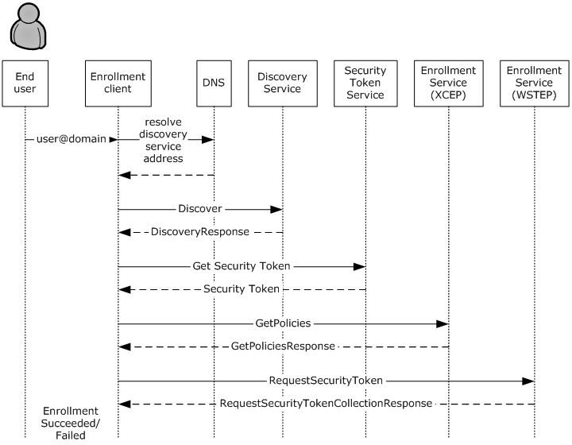
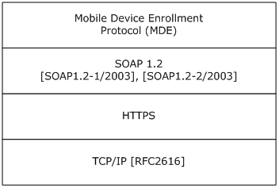
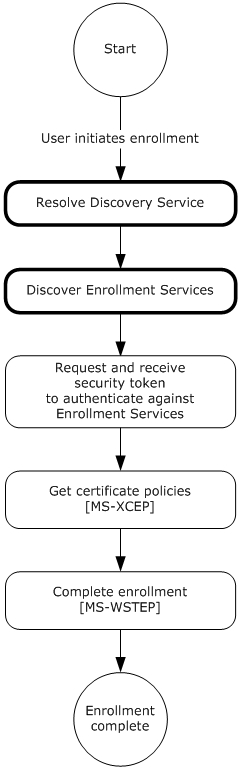
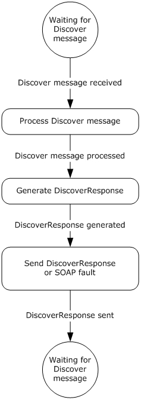
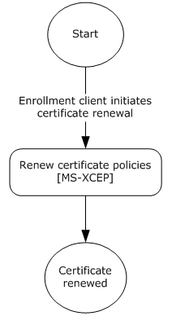

# [MS-MDE]: Mobile Device Enrollment Protocol

Table of Contents

1 Introduction

- [1 Introduction](#Section_1)
  - [1.1 Glossary](#Section_1.1)
  - [1.2 References](#Section_1.2)
    - [1.2.1 Normative References](#Section_1.2.1)
    - [1.2.2 Informative References](#Section_1.2.2)
  - [1.3 Overview](#Section_1.3)
  - [1.4 Relationship to Other Protocols](#Section_1.4)
  - [1.5 Prerequisites/Preconditions](#Section_1.5)
  - [1.6 Applicability Statement](#Section_1.6)
  - [1.7 Versioning and Capability Negotiation](#Section_1.7)
  - [1.8 Vendor-Extensible Fields](#Section_1.8)
  - [1.9 Standards Assignments](#Section_1.9)

2 Messages

- [2 Messages](#Section_2)
  - [2.1 Transport](#Section_2.1)
  - [2.2 Common Message Syntax](#Section_2.2)
    - [2.2.1 Namespaces](#Section_2.2.1)
    - [2.2.2 Messages](#Section_2.2.2)
    - [2.2.3 Elements](#Section_2.2.3)
    - [2.2.4 Complex Types](#Section_2.2.4)
    - [2.2.5 Simple Types](#Section_2.2.5)
    - [2.2.6 Attributes](#Section_2.2.6)
    - [2.2.7 Groups](#Section_2.2.7)
    - [2.2.8 Attribute Groups](#Section_2.2.8)

3 Protocol Details

- [3 Protocol Details](#Section_3)
  - [3.1 IDiscoveryService Server Details](#Section_3.1)
    - [3.1.1 Abstract Data Model](#Section_3.1.1)
    - [3.1.2 Timers](#Section_3.1.2)
    - [3.1.3 Initialization](#Section_3.1.3)
    - [3.1.4 Message Processing Events and Sequencing Rules](#Section_3.1.4)
      - [3.1.4.1 Discover](#Section_3.1.4.1)
        - [3.1.4.1.1 Messages](#Section_3.1.4.1.1)
          - [3.1.4.1.1.1 IDiscoveryService_Discover_InputMessage Message](#Section_3.1.4.1.1.1)
          - [3.1.4.1.1.2 IDiscoveryService_Discover_OutputMessage Message](#Section_3.1.4.1.1.2)
        - [3.1.4.1.2 Elements](#Section_3.1.4.1.2)
          - [3.1.4.1.2.1 Discover](#Section_3.1.4.1.2.1)
          - [3.1.4.1.2.2 DiscoverResponse](#Section_3.1.4.1.2.2)
        - [3.1.4.1.3 Complex Types](#Section_3.1.4.1.3)
          - [3.1.4.1.3.1 DiscoveryRequest](#Section_3.1.4.1.3.1)
          - [3.1.4.1.3.2 DiscoveryResponse](#Section_3.1.4.1.3.2)
    - [3.1.5 Timer Events](#Section_3.1.5)
    - [3.1.6 Other Local Events](#Section_3.1.6)
  - [3.2 Interaction with Security Token Service (STS)](#Section_3.2)
  - [3.3 Interaction with X.509 Certificate Enrollment Policy](#Section_3.3)
    - [3.3.1 Abstract Data Model](#Section_3.3.1)
    - [3.3.2 Timers](#Section_3.3.2)
    - [3.3.3 Initialization](#Section_3.3.3)
    - [3.3.4 Message Processing Events and Sequencing Rules](#Section_3.3.4)
      - [3.3.4.1 GetPolicies Operation](#Section_3.3.4.1)
        - [3.3.4.1.1 Messages](#Section_3.3.4.1.1)
          - [3.3.4.1.1.1 GetPolicies](#Section_3.3.4.1.1.1)
          - [3.3.4.1.1.2 GetPoliciesResponse](#Section_3.3.4.1.1.2)
    - [3.3.5 Timer Events](#Section_3.3.5)
    - [3.3.6 Other Local Events](#Section_3.3.6)
  - [3.4 Interaction with WS-Trust X.509v3 Token Enrollment](#Section_3.4)
    - [3.4.1 Abstract Data Model](#Section_3.4.1)
    - [3.4.2 Timers](#Section_3.4.2)
    - [3.4.3 Initialization](#Section_3.4.3)
    - [3.4.4 Message Processing Events and Sequencing Rules](#Section_3.4.4)
      - [3.4.4.1 RequestSecurityToken Operation](#Section_3.4.4.1)
        - [3.4.4.1.1 Messages](#Section_3.4.4.1.1)
          - [3.4.4.1.1.1 RequestSecurityToken](#Section_3.4.4.1.1.1)
          - [3.4.4.1.1.2 RequestSecurityTokenOnBehalfOf](#Section_3.4.4.1.1.2)
          - [3.4.4.1.1.3 RequestSecurityTokenResponseCollection](#Section_3.4.4.1.1.3)
    - [3.4.5 Timer Events](#Section_3.4.5)
    - [3.4.6 Other Local Events](#Section_3.4.6)
  - [3.5 Certificate Renewal](#Section_3.5)
    - [3.5.1 Abstract Data Model](#Section_3.5.1)
    - [3.5.2 Timers](#Section_3.5.2)
    - [3.5.3 Initialization](#Section_3.5.3)
    - [3.5.4 Message Processing Events and Sequencing Rules](#Section_3.5.4)
      - [3.5.4.1 RequestSecurityToken Operation](#Section_3.5.4.1)
        - [3.5.4.1.1 Messages](#Section_3.5.4.1.1)
          - [3.5.4.1.1.1 RequestSecurityToken](#Section_3.5.4.1.1.1)
          - [3.5.4.1.1.2 RequestSecurityTokenCollectionResponse](#Section_3.5.4.1.1.2)
    - [3.5.5 Timer Events](#Section_3.5.5)
    - [3.5.6 Other Local Events](#Section_3.5.6)
  - [3.6 XML Provisioning Document Schema](#Section_3.6)

4 Protocol Examples

- [4 Protocol Examples](#Section_4)
  - [4.1 Discovery Example](#Section_4.1)
    - [4.1.1 Discovery Example: Request](#Section_4.1.1)
    - [4.1.2 Discovery Example: Response](#Section_4.1.2)
  - [4.2 GetPolicies Example](#Section_4.2)
    - [4.2.1 GetPolicies Example: Request](#Section_4.2.1)
    - [4.2.2 GetPolicies Example: Response](#Section_4.2.2)
  - [4.3 RequestSecurityToken Example](#Section_4.3)
    - [4.3.1 RequestSecurityToken Example: Request](#Section_4.3.1)
    - [4.3.2 RequestSecurityToken Example: Response](#Section_4.3.2)

5 Security

- [5 Security](#Section_5)
  - [5.1 Security Considerations for Implementers](#Section_5.1)
  - [5.2 Index of Security Parameters](#Section_5.2)

6 Appendix A: Full WSDL

- [6 Appendix A: Full WSDL](#Section_6)

7 Appendix B: Product Behavior

- [7 Appendix B: Product Behavior](#Section_7)

8 Change Tracking

- [8 Change Tracking](#Section_8)

For the legal notice and IP terms, see [LEGAL.md](../LEGAL.md).
Last updated: 4/23/2024.
See [Revision History](#revision-history) for full version history.

# 1 Introduction

An industry trend has been developing in which employees connect their personal mobile computing devices to the corporate network and resources (either on premise or through the cloud) to perform workplace tasks. This trend requires support for easy configuration of the network and resources, such that employees can register personal devices with the company for work-related purposes. Applications and technology to support easy configuration also enable IT professionals to manage the risk associated with having uncontrolled devices connected to the corporate network.

The Mobile Device Management Protocol (MDM) [MS-MDM](../MS-MDM/MS-MDM.md) specifies a protocol for managing devices through a [**Device Management Service (DMS)**](#gt_device-management-service-dms). This document describes the Mobile Device Enrollment Protocol (MDE), which enables enrolling a device with the [**DMS**](#gt_digital-media-server-dms) through an [**Enrollment Service (ES)**](#gt_enrollment-service-es). The protocol includes the discovery of the [**Management Enrollment Service (MES)**](#gt_management-enrollment-service-mes) and enrollment with the ES.

Sections 1.5, 1.8, 1.9, 2, and 3 of this specification are normative. All other sections and examples in this specification are informative.

## 1.1 Glossary

This document uses the following terms:

**base64 encoding**: A binary-to-text encoding scheme whereby an arbitrary sequence of bytes is converted to a sequence of printable ASCII characters, as described in [[RFC4648]](https://go.microsoft.com/fwlink/?LinkId=90487).

**certificate**: A certificate is a collection of attributes and extensions that can be stored persistently. The set of attributes in a certificate can vary depending on the intended usage of the certificate. A certificate securely binds a public key to the entity that holds the corresponding private key. A certificate is commonly used for authentication and secure exchange of information on open networks, such as the Internet, extranets, and intranets. Certificates are digitally signed by the issuing [**certification authority (CA)**](#gt_certification-authority-ca) and can be issued for a user, a computer, or a service. The most widely accepted format for certificates is defined by the ITU-T X.509 version 3 international standards. For more information about attributes and extensions, see [[RFC3280]](https://go.microsoft.com/fwlink/?LinkId=90414) and [[X509]](https://go.microsoft.com/fwlink/?LinkId=90590) sections 7 and 8.

**certificate enrollment policy**: The collection of certificate templates and [**certificate**](#gt_certificate) issuers available to the requestor for [**X.509**](#gt_x509) certificate enrollment.

**certificate policy**: A document that identifies the actors of a public key infrastructure (PKI), along with their roles and tasks.

**certificate signing request**: In a public key infrastructure (PKI) configuration, a request message sent from a requestor to a certification authority (CA) to apply for a digital identity certificate.

**certification authority (CA)**: A third party that issues public key [**certificates**](#gt_certificate). Certificates serve to bind public keys to a user identity. Each user and certification authority (CA) can decide whether to trust another user or CA for a specific purpose, and whether this trust is to be transitive. For more information, see [RFC3280].

**device management client**: An application or agent running on a device that implements the Mobile Device Management Protocol [MS-MDM].

**Device Management Service (DMS)**: Server software that secures, monitors, manages, and supports devices deployed across mobile operators, service providers, and enterprises.

**Digital Media Server (DMS)**: A device class defined in the DLNA Guidelines. A [**DMS**](#gt_digital-media-server-dms) is an UPnP device that implements the UPnP MediaServer device type.

**Discovery Service (DS)**: A simple protocol based on an endpoint with a known portion of an address that is used to discover services which have no upfront name or location hints.

**Domain Name System (DNS)**: A hierarchical, distributed database that contains mappings of domain names to various types of data, such as IP addresses. DNS enables the location of computers and services by user-friendly names, and it also enables the discovery of other information stored in the database.

**enrollment client**: An application or agent that implements the initiator or client portion of MDE.

**Enrollment Service (ES)**: A server or collection of servers implementing the WS-Trust X.509v3 Token Enrollment Extensions [MS-WSTEP].

**ES endpoint**: A service endpoint for handling enrollment requests from clients.

**HTML form**: A component of a web page that allows a user to enter data that is sent to a server for processing.

**Hypertext Transfer Protocol (HTTP)**: An application-level protocol for distributed, collaborative, hypermedia information systems (text, graphic images, sound, video, and other multimedia files) on the World Wide Web.

**Management Enrollment Service (MES)**: A server or collection of servers implementing the server side of MDE.

**object identifier (OID)**: In the context of an object server, a 64-bit number that uniquely identifies an object.

**provisioning information**: In MDE, the service endpoint to the DMS which is a prerequisite for the device management client to initiate a session.

**query string**: The part of a Uniform Resource Locator (URL) that contains the data to be passed to a web application.

**root certificate**: A self-signed [**certificate**](#gt_certificate) that identifies the public key of a root [**certification authority (CA)**](#gt_certification-authority-ca) and has been trusted to terminate a certificate chain.

**Secure Sockets Layer (SSL)**: A security protocol that supports confidentiality and integrity of messages in client and server applications that communicate over open networks. SSL supports server and, optionally, client authentication using [**X.509**](#gt_x509) certificates [X509] and [[RFC5280]](https://go.microsoft.com/fwlink/?LinkId=131034). SSL is superseded by [**Transport Layer Security (TLS)**](#gt_transport-layer-security-tls). TLS version 1.0 is based on SSL version 3.0 [[SSL3]](https://go.microsoft.com/fwlink/?LinkId=90534).

**security token**: A collection of one or more claims. Specifically in the case of mobile devices, a [**security token**](#gt_security-token) represents a previously authenticated user as defined in the Mobile Device Enrollment Protocol [MS-MDE](#Section_5c841535042e489e913c9d783d741267).

**security token service (STS)**: A web service that issues claims and packages them in encrypted security tokens.

**service endpoint**: A server or collection of servers that expose one or more service endpoints to which messages can be sent.

**SOAP action**: The HTTP request header field used to indicate the intent of the SOAP request, using a URI value. See [[SOAP1.1]](https://go.microsoft.com/fwlink/?LinkId=90520) section 6.1.1 for more information.

**SOAP body**: A container for the payload data being delivered by a SOAP message to its recipient. See [[SOAP1.2-1/2007]](https://go.microsoft.com/fwlink/?LinkId=94664) section 5.3 for more information.

**SOAP header**: A mechanism for implementing extensions to a SOAP message in a decentralized manner without prior agreement between the communicating parties. See [SOAP1.2-1/2007] section 5.2 for more information.

**Transmission Control Protocol (TCP)**: A protocol used with the Internet Protocol (IP) to send data in the form of message units between computers over the Internet. TCP handles keeping track of the individual units of data (called packets) that a message is divided into for efficient routing through the Internet.

**Transport Layer Security (TLS)**: A security protocol that supports confidentiality and integrity of messages in client and server applications communicating over open networks. TLS supports server and, optionally, client authentication by using X.509 certificates (as specified in [X509]). TLS is standardized in the IETF TLS working group.

**Uniform Resource Locator (URL)**: A string of characters in a standardized format that identifies a document or resource on the World Wide Web. The format is as specified in [[RFC1738]](https://go.microsoft.com/fwlink/?LinkId=90287).

**URL scheme**: The top level of an URL naming structure. All URL references are formed with a scheme name, followed by a colon character ":". For example, in the URL http://contoso.com, the URL scheme name is http.

**user principal name (UPN)**: A user account name (sometimes referred to as the user logon name) and a domain name that identifies the domain in which the user account is located. This is the standard usage for logging on to a Windows domain. The format is: someone@example.com (in the form of an email address). In Active Directory, the userPrincipalName attribute of the account object, as described in [MS-ADTS](../MS-ADTS/MS-ADTS.md).

**web service**: A unit of application logic that provides data and services to other applications and can be called by using standard Internet transport protocols such as [**HTTP**](#gt_hypertext-transfer-protocol-http), Simple Mail Transfer Protocol (SMTP), or File Transfer Protocol (FTP). Web services can perform functions that range from simple requests to complicated business processes.

**Web Services Description Language (WSDL)**: An XML format for describing network services as a set of endpoints that operate on messages that contain either document-oriented or procedure-oriented information. The operations and messages are described abstractly and are bound to a concrete network protocol and message format in order to define an endpoint. Related concrete endpoints are combined into abstract endpoints, which describe a network service. WSDL is extensible, which allows the description of endpoints and their messages regardless of the message formats or network protocols that are used.

**X.509**: An ITU-T standard for public key infrastructure subsequently adapted by the IETF, as specified in [RFC3280].

**XML**: The Extensible Markup Language, as described in [[XML1.0]](https://go.microsoft.com/fwlink/?LinkId=90599).

**XML namespace**: A collection of names that is used to identify elements, types, and attributes in XML documents identified in a URI reference [[RFC3986]](https://go.microsoft.com/fwlink/?LinkId=90453). A combination of XML namespace and local name allows XML documents to use elements, types, and attributes that have the same names but come from different sources. For more information, see [[XMLNS-2ED]](https://go.microsoft.com/fwlink/?LinkId=90602).

**XML Path Language (XPath)**: A language used to create expressions that can address parts of an XML document, manipulate strings, numbers, and Booleans, and can match a set of nodes in the document, as specified in [XPATH]. XPath models an XML document as a tree of nodes of different types, including element, attribute, and text. XPath expressions can identify the nodes in an XML document based on their type, name, and values, as well as the relationship of a node to other nodes in the document.

**MAY, SHOULD, MUST, SHOULD NOT, MUST NOT:** These terms (in all caps) are used as defined in [[RFC2119]](https://go.microsoft.com/fwlink/?LinkId=90317). All statements of optional behavior use either MAY, SHOULD, or SHOULD NOT.

## 1.2 References

Links to a document in the Microsoft Open Specifications library point to the correct section in the most recently published version of the referenced document. However, because individual documents in the library are not updated at the same time, the section numbers in the documents may not match. You can confirm the correct section numbering by checking the [Errata](https://go.microsoft.com/fwlink/?linkid=850906).

### 1.2.1 Normative References

We conduct frequent surveys of the normative references to assure their continued availability. If you have any issue with finding a normative reference, please contact [dochelp@microsoft.com](mailto:dochelp@microsoft.com). We will assist you in finding the relevant information.

[MS-MDM] Microsoft Corporation, "[Mobile Device Management Protocol](../MS-MDM/MS-MDM.md)".

[MS-WSTEP] Microsoft Corporation, "[WS-Trust X.509v3 Token Enrollment Extensions](../MS-WSTEP/MS-WSTEP.md)".

[MS-XCEP] Microsoft Corporation, "[X.509 Certificate Enrollment Policy Protocol](../MS-XCEP/MS-XCEP.md)".

[RFC2119] Bradner, S., "Key words for use in RFCs to Indicate Requirement Levels", BCP 14, RFC 2119, March 1997, [https://www.rfc-editor.org/info/rfc2119](https://go.microsoft.com/fwlink/?LinkId=90317)

[RFC2616] Fielding, R., Gettys, J., Mogul, J., et al., "Hypertext Transfer Protocol -- HTTP/1.1", RFC 2616, June 1999, [https://www.rfc-editor.org/info/rfc2616](https://go.microsoft.com/fwlink/?LinkId=90372)

[SOAP1.1-Envelope] Box, D., Ehnebuske, D., Kakivaya, G., et al., "Simple Object Access Protocol (SOAP) 1.1 Envelope", May 2001, [https://schemas.xmlsoap.org/soap/envelope/](https://go.microsoft.com/fwlink/?LinkId=111315)

[SOAP1.1] Box, D., Ehnebuske, D., Kakivaya, G., et al., "Simple Object Access Protocol (SOAP) 1.1", W3C Note, May 2000, [https://www.w3.org/TR/2000/NOTE-SOAP-20000508/](https://go.microsoft.com/fwlink/?LinkId=90520)

[WSDL] Christensen, E., Curbera, F., Meredith, G., and Weerawarana, S., "Web Services Description Language (WSDL) 1.1", W3C Note, March 2001, [https://www.w3.org/TR/2001/NOTE-wsdl-20010315](https://go.microsoft.com/fwlink/?LinkId=90577)

[WSS] OASIS, "Web Services Security: SOAP Message Security 1.1 (WS-Security 2004)", February 2006, [https://www.oasis-open.org/committees/download.php/16790/wss-v1.1-spec-os-SOAPMessageSecurity.pdf](https://go.microsoft.com/fwlink/?LinkId=130727)

[WSTrust1.3] Lawrence, K., Kaler, C., Nadalin, A., et al., "WS-Trust 1.3", OASIS Standard March 2007, [https://docs.oasis-open.org/ws-sx/ws-trust/200512/ws-trust-1.3-os.html](https://go.microsoft.com/fwlink/?LinkId=131548)

[XMLNS] Bray, T., Hollander, D., Layman, A., et al., Eds., "Namespaces in XML 1.0 (Third Edition)", W3C Recommendation, December 2009, [https://www.w3.org/TR/2009/REC-xml-names-20091208/](https://go.microsoft.com/fwlink/?LinkId=191840)

[XMLSCHEMA1] Thompson, H., Beech, D., Maloney, M., and Mendelsohn, N., Eds., "XML Schema Part 1: Structures", W3C Recommendation, May 2001, [https://www.w3.org/TR/2001/REC-xmlschema-1-20010502/](https://go.microsoft.com/fwlink/?LinkId=90608)

[XMLSCHEMA2] Biron, P.V., Ed. and Malhotra, A., Ed., "XML Schema Part 2: Datatypes", W3C Recommendation, May 2001, [https://www.w3.org/TR/2001/REC-xmlschema-2-20010502/](https://go.microsoft.com/fwlink/?LinkId=90610)

### 1.2.2 Informative References

[MSKB-2909569] Microsoft Corporation, "Update that fixes issues and adds support to MDM client in Windows RT 8.1 and Windows 8.1", December 2013, [http://support.microsoft.com/kb/2909569](https://go.microsoft.com/fwlink/?LinkId=389613)

## 1.3 Overview

MDE enables a device to be enrolled with the [**Device Management Service (DMS)**](#gt_device-management-service-dms) through an [**Enrollment Service (ES)**](#gt_enrollment-service-es), including the discovery of the [**Management Enrollment Service (MES)**](#gt_management-enrollment-service-mes) and enrollment with the ES. After a device is enrolled, the device can be managed with the [**DMS**](#gt_digital-media-server-dms) using MDM.

The process for enrolling a device using MDE is shown in the following diagram.

Figure 1: Typical sequence for enrolling a message using MDE

The enrollment process consists of the following steps.

- The user’s email name is entered via the [**enrollment client**](#gt_enrollment-client).
- The enrollment client extracts the domain suffix from the email address, prepends the domain name with a well-known label, and resolves the address to the [**Discovery Service (DS)**](#gt_discovery-service-ds). The administrator configures the network name resolution service (that is, the [**Domain Name System (DNS)**](#gt_domain-name-system-dns)) appropriately.
- The enrollment client sends an [**HTTP**](#gt_hypertext-transfer-protocol-http) GET request to the Discovery Service (DS) to validate the existence of the [**service endpoint**](#gt_service-endpoint).
- The enrollment client sends a **Discover** message (section [3.1.4.1.1.1](#Section_3.1.4.1.1.1)) to the Discovery Service (DS). The Discovery Service (DS) responds with a **DiscoverResponse** message (section [3.1.4.1.1.2](#Section_3.1.4.1.1.2)) containing the Uniform Resource Locators (URLs) of service endpoints required for the following steps.
- The enrollment client communicates with the [**security token service (STS)**](#gt_security-token-service-sts) (section [3.2](#Section_3.2)) to obtain a [**security token**](#gt_security-token) to authenticate with the ES.
- The enrollment client sends a **GetPolicies** message (section [3.3.4.1.1.1](#Section_3.3.4.1.1.1)) the [**ES endpoint**](#gt_es-endpoint) [MS-XCEP](../MS-XCEP/MS-XCEP.md) using the security token received in the previous step. The ES endpoint [MS-XCEP] responds with a **GetPoliciesResponse** message (section [3.3.4.1.1.2](#Section_3.3.4.1.1.2)) containing the [**certificate policies**](#gt_certificate-policy) required for the next step. For more information about these messages, see [MS-XCEP] sections 3.1.4.1.1.1 and 3.1.4.1.1.2.
- **Part a.** The enrollment client can send a **RequestSecurityToken** message (section [3.4.4.1.1.1](#Section_3.4.4.1.1.1)) to the ES endpoint [MS-WSTEP](../MS-WSTEP/MS-WSTEP.md) using the security token received in step 4. The ES endpoint [MS-WSTEP] responds with a **RequestSecurityTokenResponseCollection** message (section [3.4.4.1.1.3](#Section_3.4.4.1.1.3)) containing the identity and [**provisioning information**](#gt_provisioning-information) for the [**device management client**](#gt_device-management-client) [MS-MDM](../MS-MDM/MS-MDM.md). For more information about these messages, see [MS-WSTEP] sections 3.1.4.1.1.1 and 3.1.4.1.1.2.
**Part b.** The enrollment client can send a **RequestSecurityTokenOnBehalfOf** message (section 3.4.4.1.1.3) to the ES endpoint [MS-WSTEP] using the security token received in step 4. The ES endpoint [MS-WSTEP] responds with a **RequestSecurityTokenResponseCollection** message (section 3.4.4.1.1.3) containing the identity and provisioning information for the device management client [MS-MDM]. For more information about these messages, see [MS-WSTEP] sections 3.1.4.1.1.1 and 3.1.4.1.1.2.

The steps for MDE device enrollment correspond to five phases as shown in the following diagram.

Figure 2: MDE device enrollment phases

## 1.4 Relationship to Other Protocols

MDE depends on the WS-Trust X.509v3 Token Enrollment Extensions [MS-WSTEP](../MS-WSTEP/MS-WSTEP.md).

MDE depends on the X.509 Certificate Enrollment Policy Protocol [MS-XCEP](../MS-XCEP/MS-XCEP.md).

The Mobile Device Management Protocol (MDM) depends on MDE. A device has to be enrolled in an [**MES**](#gt_management-enrollment-service-mes) through the use of MDE before the device can be managed using MDM [MS-MDM](../MS-MDM/MS-MDM.md).

Figure 3: Relationship to other protocols

## 1.5 Prerequisites/Preconditions

MDE issues X.509v3 [MS-WSTEP](../MS-WSTEP/MS-WSTEP.md) certificates and [**provisioning information**](#gt_provisioning-information) for [**device management clients**](#gt_device-management-client) [MS-MDM](../MS-MDM/MS-MDM.md) to enable a relationship between the user and a device in the [**DMS**](#gt_digital-media-server-dms).

The [**MES**](#gt_management-enrollment-service-mes) issues a [**security token**](#gt_security-token) (after appropriate authentication) that is used to authenticate to the [**ES**](#gt_enrollment-service-es).

The ES communicates with a [**certification authority (CA)**](#gt_certification-authority-ca) to issue an [**X.509**](#gt_x509) [**certificate**](#gt_certificate).

The ES issues provisioning information for a device management client [MS-MDM]. The ES has to be configured with this information or be able to retrieve it from the DMS.

## 1.6 Applicability Statement

A device has to be enrolled in an [**MES**](#gt_management-enrollment-service-mes) through the use of MDE before the device can be managed using MDM [MS-MDM](../MS-MDM/MS-MDM.md).

## 1.7 Versioning and Capability Negotiation

None.

## 1.8 Vendor-Extensible Fields

None.

## 1.9 Standards Assignments

None.

# 2 Messages

## 2.1 Transport

MDE is a client-to-server protocol that consists of a SOAP-based Web service.

MDE operates over the following [**Web services**](#gt_web-service) transport:

- SOAP 1.1 ([[SOAP1.1]](https://go.microsoft.com/fwlink/?LinkId=90520), [[SOAP1.1-Envelope]](https://go.microsoft.com/fwlink/?LinkId=111315)) over HTTPS over [**TCP**](#gt_transmission-control-protocol-tcp)/IP [[RFC2616]](https://go.microsoft.com/fwlink/?LinkId=90372)

## 2.2 Common Message Syntax

This section contains common definitions used by this protocol. The syntax of the definitions uses the XML Schema as defined in [[XMLSCHEMA1]](https://go.microsoft.com/fwlink/?LinkId=90608) and [[XMLSCHEMA2]](https://go.microsoft.com/fwlink/?LinkId=90610), and the [**Web Services Description Language (WSDL)**](#gt_web-services-description-language-wsdl) as defined in [[WSDL]](https://go.microsoft.com/fwlink/?LinkId=90577).

### 2.2.1 Namespaces

This specification defines and references various [**XML namespaces**](#gt_xml-namespace) using the mechanisms specified in [[XMLNS]](https://go.microsoft.com/fwlink/?LinkId=191840). Although this specification associates a specific XML namespace prefix for each XML namespace that is used, the choice of any particular XML namespace prefix is implementation-specific and not significant for interoperability.

Prefixes and XML namespaces used in this specification are as follows.

| Prefix | Namespace URI | Reference |
| --- | --- | --- |
| ac | http://schemas.microsoft.com/windows/pki/2009/01/enrollment | [MS-WSTEP](../MS-WSTEP/MS-WSTEP.md) |
| tns | http://schemas.microsoft.com/windows/pki/2012/01/enrollment | This specification |
| wsaw | http://www.w3.org/2006/05/addressing/wsdl | - |
| wsdl | http://schemas.xmlsoap.org/wsdl/ | [[WSDL]](https://go.microsoft.com/fwlink/?LinkId=90577) |
| wst | http://docs.oasis-open.org/ws-sx/ws-trust/200512 | [[WSTrust1.3]](https://go.microsoft.com/fwlink/?LinkId=131548) |
| xcep | http://schemas.microsoft.com/windows/pki/2009/01/enrollmentpolicy | [MS-XCEP](../MS-XCEP/MS-XCEP.md) |
| xsd | http://www.w3.org/2001/XMLSchema | [[XMLSCHEMA1]](https://go.microsoft.com/fwlink/?LinkId=90608) |

### 2.2.2 Messages

This specification does not define any common XML Schema message definitions.

### 2.2.3 Elements

This specification does not define any common XML Schema element definitions.

### 2.2.4 Complex Types

This specification does not define any common XML Schema complex type definitions.

### 2.2.5 Simple Types

This specification does not define any common XML Schema simple type definitions.

### 2.2.6 Attributes

This specification does not define any common XML Schema attribute definitions.

### 2.2.7 Groups

This specification does not define any common XML Schema group definitions.

### 2.2.8 Attribute Groups

This specification does not define any common XML Schema attribute group definitions.

# 3 Protocol Details

## 3.1 IDiscoveryService Server Details

This section describes the first and second phases in MDE device enrollment: resolving the [**Discovery Service (DS)**](#gt_discovery-service-ds) and discovering the [**ES**](#gt_enrollment-service-es). The following diagram highlights these two phases.

Figure 4: MDE device enrollment: resolving the DS and discovering the ES

The **IDiscoveryService** DS in MDE hosts an endpoint to receive messages from the [**enrollment client**](#gt_enrollment-client). When a **Discover** request message (section [3.1.4.1.1.1](#Section_3.1.4.1.1.1)) is received from the client, the server processes the request and returns a **DiscoverResponse** message (section [3.1.4.1.1.2](#Section_3.1.4.1.1.2)) to the client. The response identifies the endpoints to be used by the client to obtain the security tokens and enroll via the ES. After the response message is sent to the client, the server returns to the waiting state.

The following diagram shows the role of the server in resolving the Discovery Service (DS) for the enrollment client:

Figure 5: Role of server in resolving the DS

As a prerequisite for enabling the enrollment client to discover the Discovery Service (DS), the administrator MUST configure the [**DNS**](#gt_domain-name-system-dns), such that the name "EnterpriseEnrollment.*[User's Domain]*" resolves to the Discovery Service (DS). The enrollment client extracts the domain suffix from the email address of the enrolling user and prepends it with the DNS to construct the address for the **DS**. For example, if the email address for the user is "user1@contoso.com", the enrollment client extracts the domain suffix "contoso.com" and prepends it with the DNS to construct the **DS** address "EnterpriseEnrollment.*contoso.com*".

In the example, the full URL sent by the client to the **DS** is "https://EnterpriseEnrollment.contoso.com/EnrollmentServer/Discovery.svc".

The path portion of the URL "/EnrollmentServer/Discovery.svc" is always constant.

The enrollment client validates the [**Secure Sockets Layer (SSL)**](#gt_secure-sockets-layer-ssl) [**certificate**](#gt_certificate) that is protecting the **DS** endpoint, along with any intermediary certificates that are signed by a trusted [**CA**](#gt_certification-authority-ca).

### 3.1.1 Abstract Data Model

This section describes a conceptual model of possible data organization that an implementation maintains to participate in this protocol. The described organization is provided to facilitate the explanation of how the protocol behaves. This document does not mandate that implementations adhere to this model as long as their external behavior is consistent with that described in this document.

**EnrollmentServiceDirectory:** A repository which stores the URLs for the services used during enrollment.

### 3.1.2 Timers

None.

### 3.1.3 Initialization

The **EnrollmentServiceDirectory** element MUST be initialized with the list of [**ES**](#gt_enrollment-service-es)'s.

### 3.1.4 Message Processing Events and Sequencing Rules

The following table summarizes the list of WSDL operations as defined by this specification for discovering the [**ES**](#gt_enrollment-service-es):

| WSDL Operation | Description |
| --- | --- |
| [Discover](#Section_3.1.4.1) | Describes the messages for discovering [**service endpoints**](#gt_service-endpoint) to complete enrollment. Service endpoints include the [**security token**](#gt_security-token) issuance endpoints and the [**ES endpoints**](#gt_es-endpoint). |

#### 3.1.4.1 Discover

The **Discover** operation defines the client request and server response messages that are used to complete the process of discovering URLs for the [**ES**](#gt_enrollment-service-es)'s.

This operation is specified by the following WSDL.

<wsdl:operation name="Discover">

<wsdl:input wsaw:Action="http://schemas.microsoft.com/windows/management/2012/01/enrollment/IDiscoveryService/Discover" name="IDiscoveryService_Discover_InputMessage" message="tns:IDiscoveryService_Discover_InputMessage"/>

<wsdl:output wsaw:Action="http://schemas.microsoft.com/windows/management/2012/01/enrollment/IDiscoveryService/DiscoverResponse" name="IDiscoveryService_Discover_OutputMessage" message="tns:IDiscoveryService_Discover_OutputMessage"/>

</wsdl:operation>

The following sections specify the request commands used in conjunction with the SyncML message specified in [MS-MDM](../MS-MDM/MS-MDM.md) section 2.2.4.1.

##### 3.1.4.1.1 Messages

The following table summarizes the set of WSDL message definitions that are specific to this operation.

| Message | Description |
| --- | --- |
| [IDiscoveryService_Discover_InputMessage](#Section_3.1.4.1.1.1) | Sent from the client to the server to discover [**service endpoints**](#gt_service-endpoint). |
| [IDiscoveryService_Discover_OutputMessage](#Section_3.1.4.1.1.2) | Sent from the server to the client and contains the information about the service endpoints. |

###### 3.1.4.1.1.1 IDiscoveryService_Discover_InputMessage Message

The **IDiscoveryService_Discover_InputMessage** message contains the **Discover** request message for the **Discover** operation.

The [**SOAP action**](#gt_soap-action) value is:

http://schemas.microsoft.com/windows/management/2012/01/enrollment/IDiscoveryService/Discover

The **Discover** request message is sent from the client to the server to discover [**ES endpoints**](#gt_es-endpoint).

<wsdl:message name="IDiscoveryService_Discover_InputMessage">

<wsdl:part name="Discover" element="tns:Discover"/>

</wsdl:message>

**tns:Discover:** An instance of a <Discover> element (section [3.1.4.1.2.1](#Section_3.1.4.1.2.1)).

###### 3.1.4.1.1.2 IDiscoveryService_Discover_OutputMessage Message

The **IDiscoveryService_Discover_OutputMessage** message contains the **DiscoverResponse** response message for the **Discover** operation.

The [**SOAP action**](#gt_soap-action) value is:

http://schemas.microsoft.com/windows/management/2012/01/enrollment/IDiscoveryService/DiscoverResponse

The **DiscoverResponse** response message is sent from the server to the client and contains information about the [**ES endpoints**](#gt_es-endpoint).

<wsdl:message name="IDiscoveryService_Discover_OutputMessage">

<wsdl:part name="DiscoverResponse" element="tns:DiscoverResponse"/>

</wsdl:message>

**tns:DiscoverResponse:** An instance of a <DiscoverResponse> element (section [3.1.4.1.2.2](#Section_3.1.4.1.2.2)).

##### 3.1.4.1.2 Elements

The following table summarizes the set of XML Schema element definitions that are specific to this operation.

| Element | Description |
| --- | --- |
| [Discover](#Section_3.1.4.1.2.1) | Contains the body of the Discover request message sent by the client. |
| [DiscoverResponse](#Section_3.1.4.1.2.2) | Contains the body of the Discover response message sent by the server in response to the request message received from the client. |

###### 3.1.4.1.2.1 Discover

The <Discover> element contains the client request to the server.

<xsd:element name="Discover" nillable="true">

<xsd:complexType>

<xsd:sequence>

<xsd:element minOccurs="1" maxOccurs="1" name="request" nillable="true" type="tns:DiscoveryRequest"/>

</xsd:sequence>

</xsd:complexType>

</xsd:element>

**request:** This element is of type <DiscoveryRequest> (section [3.1.4.1.3.1](#Section_3.1.4.1.3.1)) and contains information about the request.

###### 3.1.4.1.2.2 DiscoverResponse

The <DiscoverResponse> element contains the information to send in the response from the server to the client.

<xsd:element name="DiscoverResponse" nillable="true">

<xsd:complexType>

<xsd:sequence>

<xsd:element minOccurs="1" maxOccurs="1" name="DiscoverResult" nillable="true" type="tns:DiscoveryResponse"/>

</xsd:sequence>

</xsd:complexType>

</xsd:element>

**DiscoverResult:** This element is of type <DiscoveryResponse> (section [3.1.4.1.3.2](#Section_3.1.4.1.3.2)) and contains response information from the server.

##### 3.1.4.1.3 Complex Types

The following table summarizes the set of XML Schema complex type definitions that are specific to this operation.

| ComplexType | Description |
| --- | --- |
| [DiscoveryRequest](#Section_3.1.4.1.3.1) | Specifies the type of the <Discover> element for the **Discover** (section [3.1.4.1.1.1](#Section_3.1.4.1.1.1)) message. |
| [DiscoveryResponse](#Section_3.1.4.1.3.2) | Specifies the type of the <DiscoverResponse> element for the **DiscoverResponse** (section [3.1.4.1.1.2](#Section_3.1.4.1.1.2)) message. |

###### 3.1.4.1.3.1 DiscoveryRequest

The <DiscoveryRequest> complex type describes the information to send to the server in the <Discover> request element (section [3.1.4.1.2.1](#Section_3.1.4.1.2.1)).

**Namespace:** http://schemas.microsoft.com/windows/management/2012/01/enrollment

<xsd:complexType name="DiscoveryRequest">

<xsd:sequence>

<xsd:element minOccurs="0" maxOccurs="1" name="EmailAddress" nillable="true" type="xsd:string"/>

<xsd:element minOccurs="0" maxOccurs="1" name="RequestVersion" nillable="true" type="xsd:string"/>

</xsd:sequence>

</xsd:complexType>

**EmailAddress:** This element supplies the name of the user making the enrollment request. The <EmailAddress> value is used by the **DS** to identify the [**ES**](#gt_enrollment-service-es)s to return to the client.

**RequestVersion:** The value MUST be set to nil.

###### 3.1.4.1.3.2 DiscoveryResponse

The <DiscoveryResponse> complex type describes the information to send to the client in the <DiscoverResponse> request element (section [3.1.4.1.2.2](#Section_3.1.4.1.2.2)).

**Namespace:** http://schemas.microsoft.com/windows/management/2012/01/enrollment

<xsd:complexType name="DiscoveryResponse">

<xsd:sequence>

<xsd:element minOccurs="0" maxOccurs="1" name="AuthPolicy" nillable="true" type="xsd:string"/>

<xsd:element minOccurs="0" maxOccurs="1" name="AuthenticationServiceUrl" nillable="true" type="xsd:string"/>

<xsd:element minOccurs="0" maxOccurs="1" name="EnrollmentPolicyServiceUrl" nillable="true" type="xsd:string"/>

<xsd:element minOccurs="0" maxOccurs="1" name="EnrollmentServiceUrl" nillable="true" type="xsd:string"/>

</xsd:sequence>

</xsd:complexType>

**AuthPolicy:** The value of <AuthPolicy> MUST be the string "Federated".

**AuthenticationServiceUrl:** The value of <AuthenticationServiceUrl> MUST be the name of the [**STS**](#gt_security-token-service-sts) from which the client will retrieve a [**security token**](#gt_security-token).

**EnrollmentPolicyServiceUrl:** The value of <EnrollmentPolicyServiceUrl> MUST be the address of the **DS** against which the X.509 Certificate Enrollment Policy Protocol [MS-XCEP](../MS-XCEP/MS-XCEP.md) operations are performed.

**EnrollmentServiceUrl:** The value of <EnrollmentServiceUrl> MUST be the address of the **DS** against which the WS-Trust X.509v3 Token Enrollment Extensions [MS-WSTEP](../MS-WSTEP/MS-WSTEP.md) operations are performed.

### 3.1.5 Timer Events

None.

### 3.1.6 Other Local Events

None.

## 3.2 Interaction with Security Token Service (STS)

This section describes the third phase in MDE device enrollment: requesting and receiving the [**security token**](#gt_security-token). The following diagram highlights this phase.

Figure 6: MDE device enrollment: requesting and receiving the security token

After the [**enrollment client**](#gt_enrollment-client) receives the **DiscoverResponse** message (section [3.1.4.1.1.2](#Section_3.1.4.1.1.2)), the client obtains a security token from the [**STS**](#gt_security-token-service-sts) specified in the value for the <DiscoveryResponse><AuthenticationServiceUrl> element (section [3.1.4.1.3.2](#Section_3.1.4.1.3.2)).

**Note** The enrollment client is agnostic with regards to the protocol flows for authenticating and returning the security token. While the STS might prompt for user credentials directly or enter into a federation protocol with an STS and directory service, MDE is agnostic to all of this. To remain agnostic, all protocol flows pertaining to authentication that involve the enrollment client are passive, that is, browser-implemented.

The following are the explicit requirements for the STS:

The <DiscoveryResponse><AuthenticationServiceUrl> element (section 3.1.4.1.3.2) MUST support HTTPS.

The enrollment client issues an HTTPS request as follows:

AuthenticationServiceUrl?appru=<appid>&login_hint=<User Principal Name>

`<appid>` is of the form `ms-app://string`

`<User Principal Name>` is the name of the enrolling user, for example, `user@constoso.com`. The value of this attribute serves as a hint that can be used by the STS as part of the authentication.

After authentication is complete, the STS SHOULD return an [**HTML form**](#gt_html-form) document with a POST method action of `appid` identified in the [**query string**](#gt_query-string) parameter. For example:

HTTP/1.1 200 OK

Content-Type: text/html; charset=UTF-8

Vary: Accept-Encoding

Content-Length: 556

<!DOCTYPE>

<html>

<head>

<title>Working...</title>

</head>

<body>

<form method="post" action="ms-app://windows.immersivecontrolpanel">

<input type="hidden" name="wresult" value="token value"/>

<input type="submit"/>

</form>

</body>

</html>

The STS has to send a POST to a redirect [**URL**](#gt_uniform-resource-locator-url) of the form `ms-app://string` (the [**URL scheme**](#gt_url-scheme) is `ms-app`) as indicated in the POST method action. The security token value is the [**base64**](#gt_179b9392-9019-45a3-880b-26f6890522b7)-encoded string `"http://docs.oasis-open.org/wss/2004/01/oasis-200401-wss-wssecurity-secext-1.0.xsd#base64binary"` contained in the <wsse:BinarySecurityToken> EncodingType attribute (section [3.3](#Section_3.3)).

Sequentially, the string is HTML encoded before it is base64 encoded, so that when it is unencoded from base64 it can be returned embedded in HTML.

This string is opaque to the enrollment client; the client does not interpret the string.

## 3.3 Interaction with X.509 Certificate Enrollment Policy

This section describes the fourth phase in MDE device enrollment: interacting with the X.509 Certificate Enrollment Policy Protocol [MS-XCEP](../MS-XCEP/MS-XCEP.md) to obtain the [**certificate policies**](#gt_certificate-policy). The following diagram highlights this phase.

Figure 7: MDE device enrollment: getting the certificate policies

The X.509 Certificate Enrollment Policy Protocol [MS-XCEP] enables a client to request [**certificate enrollment policies**](#gt_b8b89448-1696-4337-aeb3-7f6fbf117915) from a server. The communication is initiated by the [**enrollment client**](#gt_enrollment-client) request to the server for the certificate enrollment policies. The server authenticates the client, validates the request, and returns a response with a collection of certificate enrollment policy objects. As described in section [3.2](../MS-XCEP/MS-XCEP.md), the enrollment client uses the certificate enrollment policies to complete the enrollment process [MS-WSTEP](../MS-WSTEP/MS-WSTEP.md). MDE uses the policies to allow the [**ES**](#gt_enrollment-service-es) to specify the hash algorithm and key length as described in the following section.

**Authentication**

MDE implements the authentication provisions in WS-Security 2004 [[WSS]](https://go.microsoft.com/fwlink/?LinkId=130727) to enable the ES [MS-XCEP] to authenticate the **GetPolicies** requestor [MS-XCEP]. This section defines the schema used to express the credential descriptor for the credential type. The [**security token**](#gt_security-token) credential is provided in a request message using the <wsse:BinarySecurityToken> element [WSS]. The security token is retrieved as described in section 3.2. The authentication information is as follows:

**wsse:Security:** MDE implements the <wsse:Security> element defined in [WSS] section 5. The <wsse:Security> element MUST be a child of the <s:Header> element (see [MS-XCEP] section 4).

**wsse:BinarySecurityToken:** MDE implements the <wsse:BinarySecurityToken> element defined in [WSS] section 6.3. The <wsse:BinarySecurityToken> element MUST be included as a child of the <wsse:Security> element in the [**SOAP header**](#gt_soap-header).

- As was described in section 3.2, inclusion of the <wsse:BinarySecurityToken> element is opaque to the enrollment client and the client does not interpret the string and inclusion of the element is agreed upon by the [**STS**](#gt_security-token-service-sts) (as identified in the **DS** <AuthenticationServiceUrl> element of <DiscoveryResponse> (section [3.1.4.1.3.2](#Section_3.1.4.1.3.2))) and the ES.
- The <wsse:BinarySecurityToken> element contains a [**base64**](#gt_179b9392-9019-45a3-880b-26f6890522b7)-encoded string. The enrollment client uses the security token received from the STS and base64-encodes the token to populate the <wsse:BinarySecurityToken> element.
**wsse:BinarySecurityToken/attributes/ValueType:** The <wsse:BinarySecurityToken> ValueType attribute MUST be `"http://schemas.microsoft.com/5.0.0.0/ConfigurationManager/Enrollment/DeviceEnrollmentUserToken".`

**wsse:BinarySecurityToken/attributes/EncodingType:** The <wsse:BinarySecurityToken> EncodingType attribute MUST be `"http://docs.oasis-open.org/wss/2004/01/oasis-200401-wss-wssecurity-secext-1.0.xsd#base64binary".`

### 3.3.1 Abstract Data Model

None.

### 3.3.2 Timers

None.

### 3.3.3 Initialization

None.

### 3.3.4 Message Processing Events and Sequencing Rules

The following table summarizes the list of WSDL operations as defined by this specification for obtaining the [**certificate policies**](#gt_certificate-policy):

| Operation | Description |
| --- | --- |
| [GetPolicies](#Section_3.3.4.1.1.1) | Defines the client request and server response messages for completing the process of retrieving a certificate policy for enrollment. |

This section specifies the details for how MDE uses messages defined by the X.509 Certificate Enrollment Policy Protocol [MS-XCEP](../MS-XCEP/MS-XCEP.md).

#### 3.3.4.1 GetPolicies Operation

The **GetPolicies** operation defines the client request and server response messages that are used to complete the process of retrieving a [**certificate policy**](#gt_certificate-policy) for enrollment.

<wsdl:operation name="GetPolicies">

<wsdl:input wsaw:Action=http://schemas.microsoft.com/windows/pki/2009/01/enrollmentpolicy/IPolicy/GetPolicies message="xcep:IPolicy_GetPolicies_InputMessage"/>

<wsdl:output

wsaw:Action=http://schemas.microsoft.com/windows/pki/2009/01/enrollmentpolicy/IPolicy/GetPoliciesResponse message="xcep:IPolicy_GetPolicies_OutputMessage"/>

</wsdl:operation>

##### 3.3.4.1.1 Messages

The following table summarizes the set of WSDL message definitions that are specific to this operation.

| Message | Description |
| --- | --- |
| [GetPolicies](#Section_3.3.4.1.1.1) | Sent from the client to the server to retrieve the [**certificate policies**](#gt_certificate-policy) for enrollment. |
| [GetPoliciesResponse](#Section_3.3.4.1.1.2) | Sent from the server to the client and contains the requested certificate policy objects for enrollment. |

###### 3.3.4.1.1.1 GetPolicies

The **GetPolicies** message contains the request for the **GetPolicies** operation.

The [**SOAP action**](#gt_soap-action) value is:

http://schemas.microsoft.com/windows/pki/2009/01/enrollmentpolicy/IPolicy/GetPolicies

The **GetPolicies** request message is sent from the client to the server to retrieve the certificate policies for enrollment.

<wsdl:message name="IPolicy_GetPolicies_InputMessage">

<wsdl:part name="request" element="xcep:GetPolicies"/>

</wsdl:message>

**xcep:GetPolicies:** An instance of a <GetPolicies> element as specified in [MS-XCEP](../MS-XCEP/MS-XCEP.md) section 3.1.4.1.2.1. MDE modifies the **GetPolicies** message defined in [MS-XCEP] section 3.1.4.1.1.1.

Authentication MUST be implemented for this message as defined in section [3.3](#Section_3.3). In summary, the following elements and attributes MUST be specified in the [**SOAP header**](#gt_soap-header):

**wsse:Security:** The <wsse:Security> element MUST be a child of <s:Header>.

**wsse:BinarySecurityToken:** The <wsse:BinarySecurityToken> element MUST be a child of <wsse:Security> in <s:Header>.

**wsse:BinarySecurityToken/attributes/ValueType:** The <wsse:BinarySecurityToken> ValueType attribute MUST be `"http://schemas.microsoft.com/5.0.0.0/ConfigurationManager/Enrollment/DeviceEnrollmentUserToken".`

**wsse:BinarySecurityToken/attributes/EncodingType:** The <wsse:BinarySecurityToken> EncodingType attribute MUST be "http://docs.oasis-open.org/wss/2004/01/oasis-200401-wss-wssecurity-secext-1.0.xsd#base64binary".

The following elements with their specified values MUST be included in the [**SOAP body**](#gt_soap-body) of the request message.

**xcep:requestfilter:** MDE modifies the <GetPolicies> element by setting the <requestFilter> element xsi:nil attribute to "true" (see [MS-XCEP] section 3.1.4.1.2.1).

**xcep:lastUpdate:** MDE modifies the <GetPolicies> **xcep:client** attribute by setting the <Client> <lastUpdate> element **xsi:nil** attribute to "true" (see [MS-XCEP] section 3.1.4.1.3.9).

**xcep:preferredLanguage:** MDE modifies the <GetPolicies> **xcep:client** attribute by setting the <Client> <preferredLanguage> element **xsi:nil** attribute to "true" (see [MS-XCEP] section 3.1.4.1.3.9).

###### 3.3.4.1.1.2 GetPoliciesResponse

The **GetPoliciesResponse** message contains the response for the **GetPolicies** operation.

The [**SOAP action**](#gt_soap-action) value is:

http://schemas.microsoft.com/windows/pki/2009/01/enrollmentpolicy/IPolicy/GetPoliciesResponse

The **GetPoliciesResponse** message is sent from the server to the client and contains the requested [**certificate enrollment policies**](#gt_b8b89448-1696-4337-aeb3-7f6fbf117915).

<wsdl:message name="IPolicy_GetPolicies_OutputMessage">

<wsdl:part name="response" element="xcep:GetPoliciesResponse"/>

</wsdl:message>

**xcep:GetPoliciesResponse:** An instance of a <GetPoliciesResponse> element as specified in [MS-XCEP](../MS-XCEP/MS-XCEP.md) section 3.1.4.1.2.2.

The [**enrollment client**](#gt_enrollment-client) evaluates the following child elements of the <GetPoliciesResponse> element to determine whether to include the child element in the [**SOAP body**](#gt_soap-body) of the response message. When a child element is included, the element and value are specified using syntax similar to [**XML Path Language (XPath)**](#gt_xml-path-language-xpath).

**xcep:GetPoliciesResponse/response/policies/policy/attributes/policyschema:** The value MUST be 3 (see [MS-XCEP] section 3.1.4.1.3.1).

**xcep:GetPoliciesResponse/response/policies/policy/attributes/privatekeyattributes/minimalkeylength:** see [MS-XCEP] section 3.1.4.1.3.20.

**xcep:GetPoliciesResponse/response/policies/policy/attributes/privatekeyattributes/algorithmOIDReference:** see [MS-XCEP] section 3.1.4.1.3.20.

**xcep:GetPoliciesResponse/response/policies/policy/attributes/hashAlgorithmOIDReference:** The referenced object identifier ([**OID**](#gt_object-identifier-oid)) MUST be in the <GetPoliciesResponse> element (see [MS-XCEP] section 3.1.4.1.3.1).

**xcep:GetPoliciesResponse/oIDs/oID:** The OID referred to by the value of the **hashAlgorithmOIDReference** element specified in the previous point (see [MS-XCEP] section 3.1.4.1.2.2). The value MUST conform to the constraints specified in [MS-XCEP] section 3.1.4.1.3.16. For example, the <group> element value is 1.

### 3.3.5 Timer Events

None.

### 3.3.6 Other Local Events

None.

## 3.4 Interaction with WS-Trust X.509v3 Token Enrollment

This section describes the fifth phase in MDE device enrollment: interacting with the WS-Trust X.509v3 Token Enrollment Extensions [MS-WSTEP](../MS-WSTEP/MS-WSTEP.md) to complete enrollment. The following diagram highlights this final phase.

Figure 8: MDE device enrollment: completing enrollment

The WS-Trust X509v3 Enrollment Extensions [MS-WSTEP] are extensions of WS-Trust Security 2004 [[WSS]](https://go.microsoft.com/fwlink/?LinkId=130727) that are used by a system to request that a [**certificate**](#gt_certificate) be issued. MDE implements an extension profile of the extensions defined in [MS-WSTEP], to enable a device to be enrolled and receive an identity. The following sections specify the details of the MDE profile of and extensions defined in [MS-WSTEP].

**Authentication**

The WS-Trust X509v3 Enrollment Extensions [MS-WSTEP] use the authentication provisions in WS-Security 2004 [WSS] to enable the X509v3 [**security token**](#gt_security-token) issuer to authenticate the X509v3 security token requestor. This section defines the schema used to express the credential descriptor for each supported credential type. The security token credential is provided in a request message using the <wsse:BinarySecurityToken> element [WSS]. The security token is retrieved as described in section [3.2](../MS-WSTEP/MS-WSTEP.md). The authentication information is as follows:

**wsse:Security:** MDE implements the <wsse:Security> element defined in [WSS] section 5. The <wsse:Security> element MUST be a child of the <s:Header> element (see [MS-XCEP](../MS-XCEP/MS-XCEP.md) section 4).

**wsse:BinarySecurityToken:** MDE implements the <wsse:BinarySecurityToken> element defined in [WSS] section 6.3. The <wsse:BinarySecurityToken> element MUST be included as a child of the <wsse:Security> element in the [**SOAP header**](#gt_soap-header).

- As was described in section 3.2, inclusion of the <wsse:BinarySecurityToken> element is opaque to the [**enrollment client**](#gt_enrollment-client) and is agreed upon by the [**STS**](#gt_security-token-service-sts) (as identified in the **DS** <AuthenticationServiceUrl> element of <DiscoveryResponse> (section [3.1.4.1.3.2](#Section_3.1.4.1.3.2))) and the [**ES**](#gt_enrollment-service-es).
- The <wsse:BinarySecurityToken> element contains a [**base64**](#gt_179b9392-9019-45a3-880b-26f6890522b7)-encoded security token. The enrollment client uses the security token received from the STS to populate the <wsse:BinarySecurityToken> element.
**wsse:BinarySecurityToken/attributes/ValueType:** The <wsse:BinarySecurityToken> ValueType attribute MUST be `"http://schemas.microsoft.com/5.0.0.0/ConfigurationManager/Enrollment/DeviceEnrollmentUserToken".`

**wsse:BinarySecurityToken/attributes/EncodingType:** The <wsse:BinarySecurityToken> EncodingType attribute MUST be `"http://docs.oasis-open.org/wss/2004/01/oasis-200401-wss-wssecurity-secext-1.0.xsd#base64binary".`

### 3.4.1 Abstract Data Model

None.

### 3.4.2 Timers

None.

### 3.4.3 Initialization

None.

### 3.4.4 Message Processing Events and Sequencing Rules

The following table summarizes the list of WSDL operations as defined by this specification for completing enrollment:

| Operation | Description |
| --- | --- |
| [RequestSecurityToken](../MS-WSTEP/MS-WSTEP.md) | Provides the mechanism for completing the enrollment process. MDE uses the messages defined by this operation as specified in the WS-Trust X.509v3 Token Enrollment Extensions (see [MS-WSTEP](../MS-WSTEP/MS-WSTEP.md) section 3.1.4). |

#### 3.4.4.1 RequestSecurityToken Operation

The **RequestSecurityToken** operation is called by the client to register a device.

<wsdl:operation name="RequestSecurityToken">

<wsdl:input wsaw:Action="http://schemas.microsoft.com/windows/pki/2009/01/enrollment/RST/wstep" message="tns:IWindowsDeviceEnrollmentService_RequestSecurityToken_InputMessage"/>

<wsdl:output wsaw:Action="http://schemas.microsoft.com/windows/pki/2009/01/enrollment/RSTRC/wstep" message="tns:IWindowsDeviceEnrollmentService_RequestSecurityToken_OutputMessage"/>

<wsdl:fault wsaw:Action="http://schemas.microsoft.com/windows/pki/2009/01/enrollment/IWindowsDeviceEnrollmentService/RequestSecurityTokenWindowsDeviceEnrollmentServiceErrorFault" name="WindowsDeviceEnrollmentServiceErrorFault" message="tns:IWindowsDeviceEnrollmentService_RequestSecurityToken_WindowsDeviceEnrollmentServiceErrorFault_FaultMessage"/>

</wsdl:operation>

##### 3.4.4.1.1 Messages

The following table summarizes the set of WSDL message definitions that are specific to this operation<1>.

| Message | Description |
| --- | --- |
| [RequestSecurityToken](#Section_3.4.4.1.1.1) | Sent from the client to the server to enroll a user. |
| [RequestSecurityTokenOnBehalfOf](#Section_3.4.4.1.1.2) | Sent from the client to the server to enroll a user on behalf of another user. |
| [RequestSecurityTokenResponseCollection](#Section_3.4.4.1.1.3) | Sent from the server to the client and contains the requested [**certificate**](#gt_certificate) and [**provisioning information**](#gt_provisioning-information). |

###### 3.4.4.1.1.1 RequestSecurityToken

The **RequestSecurityToken** message contains the request for the **RequestSecurityToken** operation.

The [**SOAP action**](#gt_soap-action) value is:

http://schemas.microsoft.com/windows/pki/2009/01/enrollment/RST/wstep

The **RequestSecurityToken** request message ([[WSTrust1.3]](https://go.microsoft.com/fwlink/?LinkId=131548) section 3.1) is sent from the client to the server to enroll a [**certificate**](#gt_certificate) and to retrieve [**provisioning information**](#gt_provisioning-information).

<wsdl:message name="RequestSecurityTokenMsg">

<wsdl:part name="request" element="wst:RequestSecurityToken" />

</wsdl:message>

**wst:RequestSecurityToken:** MDE modifies the implementation of the **RequestSecurityToken** message as defined in [MS-WSTEP](../MS-WSTEP/MS-WSTEP.md) section 3.1.4.1.1.1 and its associated protocols.

Authentication MUST be implemented for this message as defined in section [3.4](#Section_3.4). In summary, the following elements and attributes MUST be specified in the [**SOAP header**](#gt_soap-header):

wsse:Security: The <wsse:Security> element MUST be a child of <s:Header>.

wsse:BinarySecurityToken: The <wsse:BinarySecurityToken> element MUST be a child of <wsse:Security> in <s:Header>.

wsse:BinarySecurityToken/attributes/ValueType: The <wsse:BinarySecurityToken> ValueType attribute MUST be "http://schemas.microsoft.com/5.0.0.0/ConfigurationManager/Enrollment/DeviceEnrollmentUserToken".

wsse:BinarySecurityToken/attributes/EncodingType: The <wsse:BinarySecurityToken> EncodingType attribute MUST be "http://docs.oasis-open.org/wss/2004/01/oasis-200401-wss-wssecurity-secext-1.0.xsd#base64binary".

The following elements and attributes MUST be specified in the [**SOAP body**](#gt_soap-body) of the request message.

wst:RequestSecurityToken: The <wst:RequestSecurityToken> element MUST be a child of <s:Body>.

wst:RequestType: The <wst:RequestType> element MUST be a child of <wst:RequestSecurityToken> and the value MUST be "http://docs.oasis-open.org/ws-sx/ws-trust/200512/Issue" (see [WSTrust1.3] section 3.1).

wst:TokenType: The <wst:tokentype> element MUST be a child of <wst:RequestSecurityToken> and the value MUST be "http://schemas.microsoft.com/5.0.0.0/ConfigurationManager/ Enrollment/DeviceEnrollmentToken" (see [WSTrust1.3] section 3.1).

wsse:BinarySecurityToken: The <wsse:BinarySecurityToken> element MUST be a child of <wst:RequestSecurityToken> and MUST contain a [**base64**](#gt_179b9392-9019-45a3-880b-26f6890522b7)-encoded [**certificate signing request**](#gt_certificate-signing-request).

wsse:BinarySecurityToken/attributes/ValueType: The <wsse:BinarySecurityToken> ValueType attribute MUST be "http://schemas.microsoft.com/windows/pki/2009/01/ enrollment#PKCS10".

wsse:BinarySecurityToken/attributes/EncodingType: The <wsse:BinarySecurityToken> EncodingType attribute MUST be "http://docs.oasis-open.org/wss/2004/01/oasis-200401-wss-wssecurity-secext-1.0.xsd#base64binary".

ac:AdditionalContext: The <ac:AdditionalContext> element MUST be a child of <wst:RequestSecurityToken> (see [MS-WSTEP] section 3.1.4.1.3.3).

ac:ContextItem: One or more <ac:ContextItem> elements MUST be specified as child elements of <ac:AdditionalContext> to represent the device type.

ac:ContextItem/attributes/Name: The <ac:ContextItem> Name attribute MUST be the literal string "DeviceType".

ac:Value: The <ac:Value> element MUST be a child of <ac:AdditionalContext> and the value MUST be CIMClient_Windows.

###### 3.4.4.1.1.2 RequestSecurityTokenOnBehalfOf

The RequestSecurityTokenOnBehalfOf message contains the request for the RequestSecurityTokenOnBehalfOf operation<2>.

This message is used when the administrator is enrolling on behalf of another user<3>.

The [**SOAP action**](#gt_soap-action) value is:

http://schemas.microsoft.com/windows/pki/2009/01/enrollment/RST/wstep

The RequestSecurityTokenOnBehalfOf message ([[WSTrust1.3]](https://go.microsoft.com/fwlink/?LinkId=131548) section 3.1) is sent from the client to the server to enroll a [**certificate**](#gt_certificate) and to retrieve provisioning information.

<wsdl:message name="RequestSecurityTokenOnBehalfOfMsg">

<wsdl:part name="request" element="wst:RequestSecurityTokenOnBehalfOf"/>

</wsdl:message>

wst:RequestSecurityTokenOnBehalfOf: MDE modifies the implementation of the RequestSecurityTokenOnBehalfOf message as defined in [MS-WSTEP](../MS-WSTEP/MS-WSTEP.md) section 3.1.4.1.1.1 and its associated protocols.

Authentication MUST be implemented for this message as defined in section [3.4](#Section_3.4). In summary, the following elements and attributes MUST be specified in the [**SOAP header**](#gt_soap-header):

wsse:Security: The <wsse:Security> element MUST be a child of <s:Header>.

wsse:BinarySecurityToken: The <wsse:BinarySecurityToken> element MUST be a child of <wsse:Security> in <s:Header>.

wsse:BinarySecurityToken/attributes/ValueType: The <wsse:BinarySecurityToken> ValueType attribute MUST be "http://schemas.microsoft.com/5.0.0.0/ConfigurationManager/Enrollment/DeviceEnrollmentUserToken".

wsse:BinarySecurityToken/attributes/EncodingType: The <wsse:BinarySecurityToken> EncodingType attribute MUST be "http://docs.oasis-open.org/wss/2004/01/oasis-200401-wss-wssecurity-secext-1.0.xsd#base64binary".

The following elements and attributes MUST be specified in the [**SOAP body**](#gt_soap-body) of the request message.

wst:RequestSecurityTokenOnBehalfOf: The <wst:RequestSecurityTokenOnBehalfOf> element MUST be a child of <s:Body>.

wst:RequestType: The <wst:RequestType> element MUST be a child of <wst:RequestSecurityTokenOnBehalfOf> and the value MUST be "http://docs.oasis-open.org/ws-sx/ws-trust/200512/Issue" (see [WSTrust1.3] section 3.1).

wst:TokenType: The <wst:TokenType> element MUST be a child of <wst:RequestSecurityTokenOnBehalfOf> and the value MUST be "http://schemas.microsoft.com/5.0.0.0/ConfigurationManager/ Enrollment/DeviceEnrollmentOnBehalfOfToken" (see [WSTrust1.3] section 3.1).

wsse:BinarySecurityToken: The <wsse:BinarySecurityToken> element MUST be a child of <wst:RequestSecurityTokenOnBehalfOf> and MUST contain a [**base64**](#gt_179b9392-9019-45a3-880b-26f6890522b7)-encoded [**certificate signing request**](#gt_certificate-signing-request).

wsse:BinarySecurityToken/attributes/ValueType: The <wsse:BinarySecurityToken> ValueType attribute MUST be "http://schemas.microsoft.com/windows/pki/2009/01/enrollment#PKCS10".

wsse:BinarySecurityToken/attributes/EncodingType: The <wsse:BinarySecurityToken> EncodingType attribute MUST be "http://docs.oasis-open.org/wss/2004/01/oasis-200401-wss-wssecurity-secext-1.0.xsd#base64binary".

ac:AdditionalContext: The <ac:AdditionalContext> element MUST be a child of <wst:RequestSecurityTokenOnBehalfOf> (see [MS-WSTEP] section 3.1.4.1.3.3).

ac:ContextItem: One or more <ac:ContextItem> elements MUST be specified as child elements of <ac:AdditionalContext> to represent the device type.

ac:ContextItem/attributes/Name: The <ac:ContextItem> Name attribute MUST be the literal string "DeviceType".

ac:Value: The <ac:Value> element MUST be a child of <ac:AdditionalContext> and the value MUST be CIMClient_Windows.

ac:ContextItem/attributes/Name: The <ac:ContextItem> Name attribute MUST be the literal string "EnrollmentOnBehalfOfUser".

ac:Value: The <ac:Value> element MUST be a child of <ac:AdditionalContext> and the value MUST be the [**user principal name (UPN)**](#gt_user-principal-name-upn) of the user on whose behalf the administrator is enrolling.

ac:ContextItem/attributes/Name: The <ac:ContextItem> Name attribute MUST be the literal string "ApplicationVersion".

ac:Value: The <ac:Value> element MUST be a child of <ac:AdditionalContext> and the value MUST be "8.0.0.0".

###### 3.4.4.1.1.3 RequestSecurityTokenResponseCollection

The **RequestSecurityTokenResponseCollection** message contains the response for the **RequestSecurityToken** and **RequestSecurityTokenOnBehalfOf** operations.

The [**SOAP action**](#gt_soap-action) value is:

http://schemas.microsoft.com/windows/pki/2009/01/enrollment/RSTRC/wstep

The **RequestSecurityTokenResponseCollection** message ([[WSTrust1.3]](https://go.microsoft.com/fwlink/?LinkId=131548) section 3.2) is sent from the server to the client and contains the requested [**certificate**](#gt_certificate) and [**provisioning information**](#gt_provisioning-information).

<wsdl:message name="RequestSecurityTokenResponseCollectionMsg">

<wsdl:part name="responseCollection" element="wst:RequestSecurityTokenResponseCollection"/>

</wsdl:message>

**wst:RequestSecurityTokenResponseCollection:** MDE modifies the implementation of the **RequestSecurityTokenResponseCollection** message as defined in [MS-WSTEP](../MS-WSTEP/MS-WSTEP.md) section 3.1.4.1.1.2 and its associated protocols.

The following elements and attributes MUST be specified in the [**SOAP body**](#gt_soap-body) of the response message.

**wst:RequestSecurityTokenResponseCollection:** The <wst:RequestSecurityTokenResponseCollection> element MUST be a child of <s:Body>.

**wst:RequestSecurityTokenResponse:** The <wst:RequestSecurityTokenResponse> element MUST be a child of <wst:RequestSecurityTokenResponseCollection> (see [WSTrust1.3] section 3.2`)`.

**wst:RequestedSecurityToken:** The <wst:RequestedSecurityToken> element MUST be a child of <wst:RequestSecurityTokenResponse> (see [WSTrust1.3] section 3.2`)`.

**wst:TokenType:** The <wst:TokenType> element MUST be a child of <wst:RequestedSecurityToken> and the value MUST be `"http://schemas.microsoft.com/5.0.0.0/ConfigurationManager/Enrollment/DeviceEnrollmentToken"` (see [WSTrust1.3] section 3.1)`.`

**wsse:BinarySecurityToken:** The <wsse:BinarySecurityToken> element MUST be a child of <wst:RequestedSecurityToken> and MUST contain a [**base64**](#gt_179b9392-9019-45a3-880b-26f6890522b7)-encoded [**XML**](#gt_xml) provisioning document that consists of an X509 certificate and provisioning information for the [**device management client**](#gt_device-management-client). The provisioning document schema is described in section [3.6](#Section_3.6).

**wsse:BinarySecurityToken/attributes/ValueType:** The <wsse:BinarySecurityToken> ValueType attribute MUST be `"http://schemas.microsoft.com/5.0.0.0/ConfigurationManager/Enrollment/DeviceEnrollmentProvisionDoc".`

**wsse:BinarySecurityToken/attributes/EncodingType:** The <wsse:BinarySecurityToken> EncodingType attribute MUST be `"http://docs.oasis-open.org/wss/2004/01/oasis-200401-wss-wssecurity-secext-1.0.xsd#base64binary".`

### 3.4.5 Timer Events

None.

### 3.4.6 Other Local Events

None.

## 3.5 Certificate Renewal

The [**enrollment client**](#gt_enrollment-client) can request to renew an existing [**certificate**](#gt_certificate). This section defines how the **RequestSecurityToken** message (section [3.5.4.1.1.1](#Section_3.5.4.1.1.1)) and **RequestSecurityTokenResponseCollection** message (section [3.5.4.1.1.2](#Section_3.5.4.1.1.2)) are called using the existing certificate for authentication.

Figure 9: Enrollment client certificate renewal

### 3.5.1 Abstract Data Model

None.

### 3.5.2 Timers

None.

### 3.5.3 Initialization

None.

### 3.5.4 Message Processing Events and Sequencing Rules

The WSDL operations for [**certificate**](#gt_certificate) renewal are as specified in section [3.4.4](#Section_3.4.4).

#### 3.5.4.1 RequestSecurityToken Operation

MDE does not modify the RequestSecurityToken operation for the [**certificate**](#gt_certificate) renewal process. The operation is as specified in section [3.4.4.1](#Section_3.4.4.1).

##### 3.5.4.1.1 Messages

MDE does not modify the set of messages for the RequestSecurityToken operation for the [**certificate**](#gt_certificate) renewal process. The set of messages are as specified in section [3.4.4.1.1](#Section_3.4.4.1.1.2).

###### 3.5.4.1.1.1 RequestSecurityToken

For the [**certificate**](#gt_certificate) renewal process, MDE modifies the **RequestSecurityToken** message as follows. The remainder of the definition for the **RequestSecurityToken** message is as specified in section [3.4.4.1.1.1](#Section_3.4.4.1.1.1).

Because the [**enrollment client**](#gt_enrollment-client) uses the existing certificate to perform client [**Transport Layer Security (TLS)**](#gt_transport-layer-security-tls), the [**security token**](#gt_security-token) is not populated in the [**SOAP header**](#gt_soap-header). As a result, the [**ES**](#gt_enrollment-service-es) is required to support client TLS.

The following elements and attributes MUST be included as specified in the [**SOAP body**](#gt_soap-body) of the request message.

wst:RequestType: The <wst:RequestType> element MUST be the value "http://docs.oasis-open.org/ws-sx/ws-trust/200512/Renew" (see [[WSTrust1.3]](https://go.microsoft.com/fwlink/?LinkId=131548) section 3.1).

wsse:BinarySecurityToken/attributes/ValueType: The <wsse:BinarySecurityToken> ValueType attribute MUST be "http://schemas.microsoft.com/windows/pki/2009/01/ enrollment#PKCS7".

###### 3.5.4.1.1.2 RequestSecurityTokenCollectionResponse

For the [**certificate**](#gt_certificate) renewal process, MDE modifies the RequestSecurityTokenCollectionResponse message as follows. The remainder of the definition for the RequestSecurityTokenCollectionResponse message is as specified in section [3.4.4.1.1.3](#Section_3.4.4.1.1.3).

For the certificate renewal process, the same provisioning document is used as specified in section [3.6](#Section_3.6). However, only the CertificateStore/My/User/EncodedCertificate is returned.

<wap-provisioningdoc version="1.1">

<!-- This contains information about issued certificate. -->

<characteristic type="CertificateStore">

<characteristic type="My" >

<characteristic type="User">

<!-- Certificate thumbprint. -->

<characteristic type="B692158116B7B82EDA4600FF4145414933B0D5AB">

<!-- Base64 encoding of issued certificate. -->

<parm name="EncodedCertificate" value="MIIDFDCCAoGgAwIBAgIQ4DQRvmm9g7NKpQ7Tnb0HyjAJBgUrDgMCHQUAMBwxGjAYBgNVBAMTEVNDX09ubGluZV9Jc3N1aW5nMB4XDTEzMDQwMzIzMDYwM1oXDTE0MDQwMzIzMTEwM1owLzEtMCsGA1UEAxMkZTRjNmI4OTMtMDdhNy00YjI0LTg3OGUtOWQ4NjAyYzNkMjg5MIIBIjANBgkqhkiG9w0BAQEAAAOCAQ8AMIIBCgKCAQEAvwSr/T+vRwucCDor5XBN+bEFdsdCGzU3DWMhnfQKAv1j70THsEgm90yo8x6XwNBI/DO/3qU0J4Ns8eXK6aRN64IyisfciKZn1gXnboFsZVbxf4Y8ADqprfilCU2k/0oFEHuNDCpmYDZWwyuNOirtK/Yu/SbVyZMPmCpdZwu5iXZnwAj5GvSpgyzqVfOanhHFNCHZ4M9qHRFy3sDUoQTF1UPHLkiIbT9TwQt8+MFUlI7EwqjFQJTa1WI7hfPb9J8jKY8gfYjEbAlT4z6iqdFHaXM9bCeKOHI/cgFloE/TRuAkEspsk0m1ph7mgsHFhUKLtQ5J7SITMIDqy3KnDThq/QIDAQABgREAWsMuaEI/OEep7JiBYhBzaYIRAJO4xuSnByRLh46dhgLD0omjgaEwgZ4wDAYDVR0TAQH/BAIwADAcBggqhkiG9xQFBgQQNcMmZjkH+kSlhNkaw23C2TAcBggqhkiG9xQFAwQQBikH6Jq4/0+cSMjvuzoazjAcBggqhkiG9xQFBAQQk7jG5KcHJEuHjp2GAsPSiTAWBgNVHSUBAf8EDDAKBggrBgEFBQcDAjAcBggqhkiG9xQFCgQQSnqw5rqYgkOz+p8pEAnLFzAJBgUrDgMCHQUAA4GBAMWTO5MPoRRn+/LMo+hgF06h8EMiyLG2t81BOI72440vyJzE9Xsb1uej0miHOFqBRi/jedYvbJ0G3K3R7HYtH49lhVSZ2v6vA9WduKh1CaGnXdkvseZiHe7AAr+EXyafcQwjTWGDEB53/87qIlnkslw35DS+LaRGrpCvRvG3Y9Cn" />

</characteristic>

</characteristic>

</characteristic>

</characteristic>

</wap-provisioningdoc>

### 3.5.5 Timer Events

None.

### 3.5.6 Other Local Events

None.

## 3.6 XML Provisioning Document Schema

As described in section [3.4.4.1.1.3](#Section_3.4.4.1.1.3), the <RequestSecurityTokenResponseCollection><wsse:BinarySecurityToken> element contains an [**XML**](#gt_xml) provisioning document. The entire XML provisioning document is [**base64**](#gt_179b9392-9019-45a3-880b-26f6890522b7)-encoded in the **RequestSecurityTokenResponseCollection** message (section 3.4.4.1.1.3). The document contains:

- The requested client [**certificate**](#gt_certificate), the trusted [**root certificate**](#gt_root-certificate), and intermediate certificates.
- The provisioning information for the device management client.
The enrollment client installs the client certificate, as well as the trusted root certificate and intermediate certificates. The provisioning information includes content such as the location of the DMS and various properties that the device management client uses to communicate with the DMS.

The following schema is an example of the XML required for the provisioning document<4>. The explanation for each field in the document appears inline in the example as XML comments.

<wap-provisioningdoc version="1.1">

<!-- This contains information about issued and trusted certificates. -->

<characteristic type="CertificateStore">

<!-- This contains trust certificates. -->

<characteristic type="Root">

<characteristic type="System">

<!--The thumbprint of the certificate to be added to the trusted root store -->

<characteristic type="5BE128213D05DC6CB87A059469130FC6686992EF">

<!-- Base64 encoding of the trust root certificate -->

<parm name="EncodedCertificate" value="MIIB2TCCAUagAwIBAgIQyRjUagpgKYJP1AZXnPL4SDAJBgUrDgMCHQUAMBwxGjAYBgNVBAMTEVNDX09ubGluZV9Jc3N1aW5nMB4XDTA4MTEyNjAyMDAzMloXDTE0MDMyNjAyMDAzMlowHDEaMBgGA1UEAxMRU0NfT25saW5lX0lzc3VpbmcwgZ8wDQYJKoZIhvcNAQEBBQADgY0AMIGJAoGBAM6CkO62YpeXEl8cwkN7ycAfl/L2Z9bdbyfqxGLx89zwSiUBrvoEDtnt9fWGkTQ5LVz+lJy/k/TRLiM/3h94FT00QzBkE6yICLq7UCX5z8LRFEHSsGGaBgkotrkPsX3pG6agczNqF2h4Bngq+4BVbsA2PMpsXiVtWUtVHt45PD/JAgMBAAGBEQBawy5oQj84R6nsmIFiEHNpghEAWsMuaEI/OEep7JiBYhBzaTAJBgUrDgMCHQUAA4GBAC331598+rVBg+ipGb0Q4rreQFBlkFWa2Xv4EaOOxInq0PMtRxCxMCuLJIkSeg8IMSaAU0xGZYPaHSNHF1vUqrUkLEjjyXNa5URbo322KCR2iTu5URddxD1FCE5SXwzZ/YHD3U9GvKfSQXZNDiF+VI8mtNll5jUhjzaIFtWL4dMe" />

</characteristic>

</characteristic>

</characteristic>

<!-- This contains intermediate certificates. -->

<characteristic type="CA">

<characteristic type="System">

<!—the thumbprint of the intermediate certificate 

<characteristic type="5DF7DE78255449CFEBD82CD626011982378F40F1">

<parm name="EncodedCertificate" value="MIIEwzCCA6ugAwIBAgIQAnwmjIOWnIlJSqpCJpUIrzANBgkqhkiG9w0BAQUFADBIMRMwEQYKCZImiZPyLGQBGRYDY29tMRkwFwYKCZImiZPyLGQBGRYJbWljcm9zb2Z0MRYwFAYDVQQDEw1TQ09ubGluZS1GQUtFMB4XDTEzMDkyNDE5NTcyOVoXDTE0MDkyNTE5NTcyOVowHzEdMBsGA1UEAwwUbWFuYWdlLm1pY3Jvc29mdC5jb20wggEiMA0GCSqGSIb3DQEBAQUAA4IBDwAwggEKAoIBAQC6EU35UODG4AncmJ4k8HAUzzRDNgcbntgznnBmurOzmRa2TrFZzabsMCT6TYjjejQsu0jDXfa8iKx7798T9RLo7/h79+DJHOCR7VRtA5PxYXu/s3ps9desic6RrKDibC0o/r7Mdo5CMcytSyk74DrNR6JzYGqY7Ge77OUx1zsev/9qRRx36nU6ZVgIIFnJtFm7y7rozPPWj9mKdXD3pBGqq3x6MiwBfvBwH3oCukRDAHBz/wmNoSQb+HjWwyuEhUNmn6KwrMmaArfCQTT2I8FyjMMpUaE+iVosk1uHI5L8dUHFS5aseNV3+yBwMTY2RVah/3/Sp8l913qmTfqDHLENAgMBAAGjggHQMIIBzDCCAYcGA1UdEQSCAX4wggF6gh1sb2dpbi5taWNyb3NvZnRvbmxpbmUtaW50LmNvbYIZbG9naW4ubWljcm9zb2Z0b25saW5lLmNvbYIkRW50ZXJwcmlzZUVucm9sbG1lbnQuV0lOLThCQkc5RzBTUUIygiZFbnRlcnByaXNlRW5yb2xsbWVudC1zLldJTi04QkJHOUcwU1FCMoIdbG9naW4ubWljcm9zb2Z0b25saW5lLWludC5jb22CGWxvZ2luLm1pY3Jvc29mdG9ubGluZS5jb22CIkVudGVycHJpc2VFbnJvbGxtZW50Lm1pY3Jvc29mdC5jb22CJEVudGVycHJpc2VFbnJvbGxtZW50LXMubWljcm9zb2Z0LmNvbYIpRW50ZXJwcmlzZUVucm9sbG1lbnQubWFuYWdlLm1pY3Jvc29mdC5jb22CK0VudGVycHJpc2VFbnJvbGxtZW50LXMubWFuYWdlLm1pY3Jvc29mdC5jb22CFG1hbmFnZS5taWNyb3NvZnQuY29tMB0GA1UdDgQWBBTUvgeWP3R8TpdNrqZ++ixKnJspLjATBgNVHSUEDDAKBggrBgEFBQcDATALBgNVHQ8EBAMCBLAwDQYJKoZIhvcNAQEFBQADggEBAJaVYeqsejoM3INNi11nvPnS+ttodnQweeCiv+U6EoTGIEsTztwqsdSRhc0PnfssfuegjqgdkKN/lAkysSqretYvEj/wIgKmrX0JqFFIkLjFRp3PrD5MFLLdlnxCZ65bVBLo607UlLe+tBlHhdebJEvwZF72RalYvPG33SU3pssSMczN3Mte6BbjtCpFUDSIwDEX+aUBs8kx35tiLNg8GpGtrVGem3MW3d5dOVvuYuWrgB86Yug09WHwsDGnck0cEyoJlsmoavkeYR5OYJnCylPDjZ5LX+ewlWFlWiUf8pD9Ph6fx292bE6/B5eVWxHXjxdvswYklJWNfbBis47mXRI=" />

</characteristic>

</characteristic>

</characteristic>

<characteristic type="My" >

<characteristic type="User">

<!-- Client certificate thumbprint. -->

<characteristic type="B692158116B7B82EDA4600FF4145414933B0D5AB">

<!-- Base64 encoding of the client certificate -->

<parm name="EncodedCertificate" value="MIIDFDCCAoGgAwIBAgIQ4DQRvmm9g7NKpQ7Tnb0HyjAJBgUrDgMCHQUAMBwxGjAYBgNVBAMTEVNDX09ubGluZV9Jc3N1aW5nMB4XDTEzMDQwMzIzMDYwM1oXDTE0MDQwMzIzMTEwM1owLzEtMCsGA1UEAxMkZTRjNmI4OTMtMDdhNy00YjI0LTg3OGUtOWQ4NjAyYzNkMjg5MIIBIjANBgkqhkiG9w0BAQEAAAOCAQ8AMIIBCgKCAQEAvwSr/T+vRwucCDor5XBN+bEFdsdCGzU3DWMhnfQKAv1j70THsEgm90yo8x6XwNBI/DO/3qU0J4Ns8eXK6aRN64IyisfciKZn1gXnboFsZVbxf4Y8ADqprfilCU2k/0oFEHuNDCpmYDZWwyuNOirtK/Yu/SbVyZMPmCpdZwu5iXZnwAj5GvSpgyzqVfOanhHFNCHZ4M9qHRFy3sDUoQTF1UPHLkiIbT9TwQt8+MFUlI7EwqjFQJTa1WI7hfPb9J8jKY8gfYjEbAlT4z6iqdFHaXM9bCeKOHI/cgFloE/TRuAkEspsk0m1ph7mgsHFhUKLtQ5J7SITMIDqy3KnDThq/QIDAQABgREAWsMuaEI/OEep7JiBYhBzaYIRAJO4xuSnByRLh46dhgLD0omjgaEwgZ4wDAYDVR0TAQH/BAIwADAcBggqhkiG9xQFBgQQNcMmZjkH+kSlhNkaw23C2TAcBggqhkiG9xQFAwQQBikH6Jq4/0+cSMjvuzoazjAcBggqhkiG9xQFBAQQk7jG5KcHJEuHjp2GAsPSiTAWBgNVHSUBAf8EDDAKBggrBgEFBQcDAjAcBggqhkiG9xQFCgQQSnqw5rqYgkOz+p8pEAnLFzAJBgUrDgMCHQUAA4GBAMWTO5MPoRRn+/LMo+hgF06h8EMiyLG2t81BOI72440vyJzE9Xsb1uej0miHOFqBRi/jedYvbJ0G3K3R7HYtH49lhVSZ2v6vA9WduKh1CaGnXdkvseZiHe7AAr+EXyafcQwjTWGDEB53/87qIlnkslw35DS+LaRGrpCvRvG3Y9Cn" />

<characteristic type="PrivateKeyContainer">

<parm name="KeySpec" value="2"/>

<parm name="ContainerName" value="ConfigMgrEnrollment"/>

<parm name="ProviderType" value="1"/>

</characteristic>

</characteristic>

</characteristic>

</characteristic>

</characteristic>

<!-- Contains information about the management service and configuration for the management agent -->

<characteristic type="APPLICATION">

<parm name="APPID" value="w7"/>

<!-- Management Service Name. -->

<parm name="PROVIDER-ID" value="Contoso Management Service"/>

<parm name="NAME" value="BecMobile"/>

<!-- Link to an application that the management service may provide eg a Windows Store application link. The Enrollment Client may show this link in its UX.-->

<parm name="SSPHyperlink" value="http://go.microsoft.com/fwlink/?LinkId=255310" />

<!-- Management Service URL. -->

<parm name="ADDR" value="https://ContosoManagementService.com/MDMHandler"/>

<parm name="ServerList" value="https://ContosoManagementService.com/MDMHandler" />

<parm name="ROLE" value="4294967295"/>

<!-- Discriminator to set whether the client should do Certificate Revocation List checking. -->

<parm name="CRLCheck" value="0"/>

<parm name="CONNRETRYFREQ" value="6" />

<parm name="INITIALBACKOFFTIME" value="30000" />

<parm name="MAXBACKOFFTIME" value="120000" />

<parm name="BACKCOMPATRETRYDISABLED" />

<parm name="DEFAULTENCODING" value="application/vnd.syncml.dm+wbxml" />

<!-- Search criteria for client to find the client certificate using subject name of the certificate -->

<parm name="SSLCLIENTCERTSEARCHCRITERIA" value="Subject=CN%3de4c6b893-07a7-4b24-878e-9d8602c3d289&Stores=MY%5CUser"/>

<characteristic type="APPAUTH">

<parm name="AAUTHLEVEL" value="CLIENT"/>

<parm name="AAUTHTYPE" value="DIGEST"/>

<parm name="AAUTHSECRET" value="dummy"/>

<parm name="AAUTHDATA" value="nonce"/>

</characteristic>

<characteristic type="APPAUTH">

<parm name="AAUTHLEVEL" value="APPSRV"/>

<parm name="AAUTHTYPE" value="DIGEST"/>

<parm name="AAUTHNAME" value="dummy"/>

<parm name="AAUTHSECRET" value="dummy"/>

<parm name="AAUTHDATA" value="nonce"/>

</characteristic>

</characteristic>

<!-- Extra Information to seed the management agent’s behavior . -->

<characteristic type="Registry">

<characteristic type="HKLM\Security\MachineEnrollment">

<parm name="RenewalPeriod" value="363" datatype="integer" />

</characteristic>

<characteristic type="HKLM\Security\MachineEnrollment\OmaDmRetry">

<!-- Number of retries if client fails to connect to the management service. -->

<parm name="NumRetries" value="8" datatype="integer" />

<!--Interval in minutes between retries. -->

<parm name="RetryInterval" value="15" datatype="integer" />

<parm name="AuxNumRetries" value="5" datatype="integer" />

<parm name="AuxRetryInterval" value="3" datatype="integer" />

<parm name="Aux2NumRetries" value="0" datatype="integer" />

<parm name="Aux2RetryInterval" value="480" datatype="integer" />

</characteristic>

</characteristic>

<!-- Extra Information about where to find device identity information. This is redundant in that it is duplicative to what is above, but it is required in the current version of the protocol. -->

<characteristic type="Registry">

<characteristic type="HKLM\Software\Windows\CurrentVersion\MDM\MachineEnrollment">

<parm name="DeviceName" value="" datatype="string" />

</characteristic>

</characteristic>

<characteristic type="Registry">

<characteristic type="HKLM\SOFTWARE\Windows\CurrentVersion\MDM\MachineEnrollment">

<!--Thumbprint of root certificate. -->

<parm name="SslServerRootCertHash" value="5BE128213D05DC6CB87A059469130FC6686992EF" datatype="string" />

<!-- Store for device certificate. -->

<parm name="SslClientCertStore" value="MY%5CSystem" datatype="string" />

<!-- Common name of issued certificate. -->

<parm name="SslClientCertSubjectName" value="CN%3de4c6b893-07a7-4b24-878e-9d8602c3d289" datatype="string" />

<!--Thumbprint of issued certificate. -->

<parm name="SslClientCertHash" value="B692158116B7B82EDA4600FF4145414933B0D5AB" datatype="string" />

</characteristic>

<characteristic type="HKLM\Security\Provisioning\OMADM\Accounts\037B1F0D3842015588E753CDE76EC724">

<parm name="SslClientCertReference" value="My;System;B692158116B7B82EDA4600FF4145414933B0D5AB" datatype="string" />

</characteristic>

</characteristic>

</wap-provisioningdoc>

# 4 Protocol Examples

## 4.1 Discovery Example

The following example is a full request/response sequence using the Discovery protocol to auto-discover a management enrollment server based on the user’s email address.

### 4.1.1 Discovery Example: Request

The following snippet demonstrates the call to the **Discovery** (section [3.1.4.1.1.1](#Section_3.1.4.1.1.1)) input message.

<s:Envelope xmlns:a="http://www.w3.org/2005/08/addressing" xmlns:s="http://www.w3.org/2003/05/soap-envelope">

<s:Header>

<a:Action s:mustUnderstand="1">http://schemas.microsoft.com/windows/management/2012/01/enrollment/IDiscoveryService/Discover

</a:Action>

<a:MessageID>urn:uuid:748132ec-a575-4329-b01b-6171a9cf8478</a:MessageID>

<a:ReplyTo>

<a:Address>http://www.w3.org/2005/08/addressing/anonymous</a:Address>

</a:ReplyTo>

<a:To s:mustUnderstand="1">

https://manage.contoso.com:443/EnrollmentServer/Discovery.svc

</a:To>

</s:Header>

<s:Body>

<Discover xmlns="http://schemas.microsoft.com/windows/management/2012/01/enrollment">

<request xmlns:i="http://www.w3.org/2001/XMLSchema-instance">

<EmailAddress>johndoe@contoso.com</EmailAddress>

<RequestVersion></RequestVersion>

</request>

</Discover>

</s:Body>

</s:Envelope>

### 4.1.2 Discovery Example: Response

The following snippet demonstrates the call to the **Discovery** (section [3.1.4.1.1.2](#Section_3.1.4.1.1.2)) output message.

<s:Envelope xmlns:s="http://www.w3.org/2003/05/soap-envelope" xmlns:a="http://www.w3.org/2005/08/addressing">

<s:Header>

<a:Action s:mustUnderstand="1">http://schemas.microsoft.com/windows/management/2012/01/enrollment/IDiscoveryService/DiscoverResponse

</a:Action>

<ActivityId CorrelationId="48915517-66c6-4ab7-8f77-c8277e45b3cf" xmlns="http://schemas.microsoft.com/2004/09/ServiceModel/Diagnostics">a4067bc9-ce15-446b-a3f7-5ea1006256f5

</ActivityId>

<a:RelatesTo>

urn:uuid:748132ec-a575-4329-b01b-6171a9cf8478

</a:RelatesTo>

</s:Header>

<s:Body>

<DiscoverResponse xmlns="http://schemas.microsoft.com/windows/management/2012/01/enrollment">

<DiscoverResult xmlns:i="http://www.w3.org/2001/XMLSchema-instance">

<AuthPolicy>Federated</AuthPolicy>

<AuthenticationServiceUrl>

https://portal.manage.contoso.com/LoginRedirect.aspx

</AuthenticationServiceUrl>

<EnrollmentPolicyServiceUrl>

https://manage.contoso.com/DeviceEnrollment/WinDeviceEnrollmentService.svc

</EnrollmentPolicyServiceUrl>

<EnrollmentServiceUrl>

https://manage.contoso.com/DeviceEnrollment/WinDeviceEnrollmentService.svc

</EnrollmentServiceUrl>

</DiscoverResult>

</DiscoverResponse>

</s:Body>

</s:Envelope>

## 4.2 GetPolicies Example

The following example is a full request/response sequence where the caller requests [**certificate policies**](#gt_certificate-policy) that are used to determine if the enrollment service is compliant with the caller’s requirements.

### 4.2.1 GetPolicies Example: Request

The following snippet demonstrates the call to the **GetPolicies** (section [3.3.4.1.1.1](#Section_3.3.4.1.1.1)) message.

<s:Envelope

xmlns:s="http://www.w3.org/2003/05/soap-envelope"

xmlns:a="http://www.w3.org/2005/08/addressing"

xmlns:u="http://docs.oasis-open.org/wss/2004/01/oasis-200401-wss-wssecurity-utility-1.0.xsd">

<s:Header>

<a:Action s:mustUnderstand="1">

http://schemas.microsoft.com/windows/pki/2009/01/enrollmentpolicy/IPolicy/GetPolicies

</a:Action>

<a:MessageID>

urn:uuid:5fb5f6fd-4709-414b-8afa-0c05f6686d1c

</a:MessageID>

<a:ReplyTo>

<a:Address>

http://www.w3.org/2005/08/addressing/anonymous

</a:Address>

</a:ReplyTo>

<a:To s:mustUnderstand="1">

https://sts.contoso.com/service.svc/cep

</a:To>

<wsse:Security

s:mustUnderstand="1"

xmlns:o="http://docs.oasis-open.org/wss/2004/01/oasis-200401-wss-wssecurity-secext-1.0.xsd">

<wsse:BinarySecurityToken

ValueType="http://schemas.microsoft.com/5.0.0.0/

ConfigurationManager/Enrollment/DeviceEnrollmentUserToken"

EncodingType="http://docs.oasis-open.org/wss/2004/01/oasis-200401-wss-wssecurity-secext-1.0.xsd#base64binary">

<!-- Security token removed -->

</wsse:BinarySecurityToken>

</wsse:Security>

</s:Header>

<s:Body

xmlns:xsi="http://www.w3.org/2001/XMLSchema-instance"

xmlns:xsd="http://www.w3.org/2001/XMLSchema">

<GetPolicies xmlns="http://schemas.microsoft.com/windows/pki/2009/01/enrollmentpolicy">

<Client>

<lastUpdate>0001-01-01T00:00:00</lastUpdate>

<preferredLanguage xsi:nil="true"></preferredLanguage>

</Client>

<requestFilter xsi:nil="true"></requestFilter>

</GetPolicies>

</s:Body>

</s:Envelope>

### 4.2.2 GetPolicies Example: Response

The following snippet demonstrates the call to the **GetPoliciesResponse** (section [3.3.4.1.1.2](#Section_3.3.4.1.1.2)) message.

<s:Envelope

xmlns:a="http://www.w3.org/2005/08/addressing"

xmlns:s="http://www.w3.org/2003/05/soap-envelope">

<s:Header>

<a:Action s:mustUnderstand="1">

http://schemas.microsoft.com/windows/pki/2009/01/enrollmentpolicy/IPolicy/GetPoliciesResponse

</a:Action>

</s:Header>

<s:Body

xmlns:xsi="http://www.w3.org/2001/XMLSchema-instance"

xmlns:xsd="http://www.w3.org/2001/XMLSchema">

<GetPoliciesResponse xmlns="http://schemas.microsoft.com/windows/pki/2009/01/enrollmentpolicy">

<response>

<policies>

<policy>

<attributes>

<policySchema>3</policySchema>

<privateKeyAttributes>

<minimalKeyLength>2048</minimalKeyLength>

<algorithmOIDReferencexsi:nil="true"/>

</privateKeyAttributes>

<hashAlgorithmOIDReference xsi:nil="true"></hashAlgorithmOIDReference>

</attributes>

</policy>

</policies>

</response>

<oIDs>

<oID>

<value>1.3.6.1.4.1.311.20.2</value>

<group>1</group>

<oIDReferenceID>5</oIDReferenceID>

<defaultName>Certificate Template Name</defaultName>

</oID>

</oIDs>

</GetPoliciesResponse>

</s:Body>

</s:Envelope>

## 4.3 RequestSecurityToken Example

The following example is a full request/response sequence where the caller requests a [**security token**](#gt_security-token) (provisioning document) for the device type "CIMClient_Windows".

### 4.3.1 RequestSecurityToken Example: Request

The following snippet demonstrates the call to the RequestSecurityToken (section [3.4.4.1.1.1](#Section_3.4.4.1.1.1)) message.

<s:Envelope xmlns:a="http://www.w3.org/2005/08/addressing"

xmlns:s="http://www.w3.org/2003/05/soap-envelope">

<s:Header>

<a:Action s:mustUnderstand="1">

http://schemas.microsoft.com/windows/pki/2009/01/enrollment/RST/wstep

</a:Action>

<a:MessageID>urn:uuid:b5d1a601-5091-4a7d-b34b-5204c18b5919</a:MessageID>

<a:ReplyTo>

<a:Address>http://www.w3.org/2005/08/addressing/anonymous</a:Address>

</a:ReplyTo>

<wsse:Security>

<wsse:BinarySecurityToken

ValueType=http://schemas.microsoft.com/5.0.0.0/

ConfigurationManager/Enrollment/DeviceEnrollmentUserToken

EncodingType=""http://docs.oasis-open.org/wss/2004/01/oasis-200401-wss-wssecurity-secext-1.0.xsd#base64binary"">

<!-- Token Removed -->

</wsse:BinarySecurityToken>

</wsse:Security>

</s:Header>

<s:Body xmlns:xsi="http://www.w3.org/2001/XMLSchema-instance"

xmlns:xsd="http://www.w3.org/2001/XMLSchema">

<wst:RequestSecurityToken xmlns="http://docs.oasis-open.org/ws-sx/ws-trust/200512">

<wst:TokenType>

"http://schemas.microsoft.com/5.0.0.0/ConfigurationManager/Enrollment/DeviceEnrollmentToken"

</wst:TokenType>

<wst:RequestType>

http://docs.oasis-open.org/ws-sx/ws-trust/200512/Issue

</wst:RequestType>

<wsse:BinarySecurityToken

EncodingType="http://docs.oasis-open.org/wss/2004/01/oasis-200401-wss-wssecurity-secext-1.0.xsd#base64binary"

ValueType="http://schemas.microsoft.com/windows/pki/2009/01/enrollment#PKCS10"

xmlns="http://docs.oasis-open.org/wss/2004/01/oasis-200401-wss-wssecurity-secext-1.0.xsd">

<!-- Token removed -->

</wsse:BinarySecurityToken>

<ac:AdditionalContext>

<ac:ContextItem Name="DeviceType">

<ac:Value>CIMClient_Windows</ac:Value>

</ac:ContextItem>

</ac:AdditionalContext>

</wst:RequestSecurityToken>

</s:Body>

</s:Envelope>

### 4.3.2 RequestSecurityToken Example: Response

The following snippet demonstrates the call to the RequestSecurityTokenResponseCollection (section [3.4.4.1.1.3](#Section_3.4.4.1.1.3)) message.

<s:Envelope

xmlns:s="http://www.w3.org/2003/05/soap-envelope"

xmlns:a="http://www.w3.org/2005/08/addressing">

<s:Header>

<a:Action s:mustUnderstand="1">

http://schemas.microsoft.com/windows/pki/2009/01/enrollment/RSTRC/wstep

</a:Action>

</s:Header>

<s:Body>

<wst:RequestSecurityTokenResponseCollection

xmlns="http://docs.oasis-open.org/ws-sx/ws-trust/200512">

<wst:RequestSecurityTokenResponse>

<wst:RequestedSecurityToken>

<wst:TokenType>

"http://schemas.microsoft.com/5.0.0.0/ConfigurationManager/Enrollment/DeviceEnrollmentToken"

</wst:TokenType>

<wsse:BinarySecurityToken

ValueType="http://schemas.microsoft.com/5.0.0.0/Configuration Manager/Enrollment/DeviceEnrollmentProvisionDoc"

EncodingType="http://docs.oasis-open.org/wss/2004/01/oasis-200401-wss-wssecurity-secext-1.0.xsd#base64binary">

<!-- base64 encoded provisioning document removed -->

</wsse:BinarySecurityToken>

</wst:RequestedSecurityToken>

</wst:RequestSecurityTokenResponse>

</wst:RequestSecurityTokenResponseCollection>

</s:Body>

</s:Envelope>

# 5 Security

## 5.1 Security Considerations for Implementers

MDE does not provide message-level signing or message-level encryption for any messages. Implementers can make use of transport protection as available in HTTPS to provide security to the client/server interaction.

MDE does not define a mechanism to limit a client's use of server resources, such as CPU, network bandwidth, and memory.

## 5.2 Index of Security Parameters

None.

# 6 Appendix A: Full WSDL

For ease of implementation, the full WSDL and schema are provided in this appendix.

<?xml version="1.0" encoding="utf-8"?>

<wsdl:definitions xmlns:xsd="http://www.w3.org/2001/XMLSchema" xmlns:soap12="http://schemas.xmlsoap.org/wsdl/soap12/" xmlns:tns="http://schemas.microsoft.com/windows/management/2012/01/enrollment" xmlns:wsaw="http://www.w3.org/2006/05/addressing/wsdl" targetNamespace="http://schemas.microsoft.com/windows/management/2012/01/enrollment" xmlns:wsdl="http://schemas.xmlsoap.org/wsdl/">

<wsdl:types>

<xsd:schema elementFormDefault="qualified" targetNamespace="http://schemas.microsoft.com/windows/management/2012/01/enrollment">

<xsd:element name="Discover" nillable="true">

<xsd:complexType>

<xsd:sequence>

<xsd:element minOccurs="1" maxOccurs="1" name="request" nillable="true" type="tns:DiscoveryRequest"/>

</xsd:sequence>

</xsd:complexType>

</xsd:element>

<xsd:complexType name="DiscoveryRequest">

<xsd:sequence>

<xsd:element minOccurs="0" maxOccurs="1" name="EmailAddress" nillable="true" type="xsd:string"/>

<xsd:element minOccurs="0" maxOccurs="1" name="RequestVersion" nillable="true" type="xsd:string"/>

</xsd:sequence>

</xsd:complexType>

<xsd:element name="DiscoverResponse" nillable="true">

<xsd:complexType>

<xsd:sequence>

<xsd:element minOccurs="1" maxOccurs="1" name="DiscoverResult" nillable="true" type="tns:DiscoveryResponse"/>

</xsd:sequence>

</xsd:complexType>

</xsd:element>

<xsd:complexType name="DiscoveryResponse">

<xsd:sequence>

<xsd:element minOccurs="0" maxOccurs="1" name="AuthPolicy" nillable="true" type="xsd:string"/>

<xsd:element minOccurs="0" maxOccurs="1" name="AuthenticationServiceUrl" nillable="true" type="xsd:string"/>

<xsd:element minOccurs="0" maxOccurs="1" name="EnrollmentPolicyServiceUrl" nillable="true" type="xsd:string"/>

<xsd:element minOccurs="0" maxOccurs="1" name="EnrollmentServiceUrl" nillable="true" type="xsd:string"/>

</xsd:sequence>

</xsd:complexType>

</xsd:schema>

</wsdl:types>

<wsdl:portType name="IDiscoveryService">

<wsdl:operation name="Discover">

<wsdl:input wsaw:Action="http://schemas.microsoft.com/windows/management/2012/01/enrollment/IDiscoveryService/Discover" name="IDiscoveryService_Discover_InputMessage" message="tns:IDiscoveryService_Discover_InputMessage"/>

<wsdl:output wsaw:Action="http://schemas.microsoft.com/windows/management/2012/01/enrollment/IDiscoveryService/DiscoverResponse" name="IDiscoveryService_Discover_OutputMessage" message="tns:IDiscoveryService_Discover_OutputMessage"/>

</wsdl:operation>

</wsdl:portType>

<wsdl:binding name="IDiscoveryServiceSoap12" type="tns:IDiscoveryService">

<soap12:binding transport="http://schemas.xmlsoap.org/soap/http"/>

<wsdl:operation name="Discover">

<soap12:operation soapAction="http://schemas.microsoft.com/windows/management/2012/01/enrollment/IDiscoveryService/Discover" style="document"/>

<wsdl:input name="IDiscoveryService_Discover_InputMessage">

<soap12:body use="literal"/>

</wsdl:input>

<wsdl:output name="IDiscoveryService_Discover_OutputMessage">

<soap12:body use="literal"/>

</wsdl:output>

</wsdl:operation>

</wsdl:binding>

<wsdl:message name="IDiscoveryService_Discover_InputMessage">

<wsdl:part name="Discover" element="tns:Discover"/>

</wsdl:message>

<wsdl:message name="IDiscoveryService_Discover_OutputMessage">

<wsdl:part name="DiscoverResponse" element="tns:DiscoverResponse"/>

</wsdl:message>

</wsdl:definitions>

# 7 Appendix B: Product Behavior

The information in this specification is applicable to the following Microsoft products or supplemental software. References to product versions include updates to those products.

- Windows 8.1 operating system
Exceptions, if any, are noted in this section. If an update version, service pack or Knowledge Base (KB) number appears with a product name, the behavior changed in that update. The new behavior also applies to subsequent updates unless otherwise specified. If a product edition appears with the product version, behavior is different in that product edition.

Unless otherwise specified, any statement of optional behavior in this specification that is prescribed using the terms "SHOULD" or "SHOULD NOT" implies product behavior in accordance with the SHOULD or SHOULD NOT prescription. Unless otherwise specified, the term "MAY" implies that the product does not follow the prescription.

<1> Section 3.4.4.1.1: The RequestSecurityTokenOnBehalfOf message is added as described in Knowledge Base Article 2909569, December 2013 GDR [[MSKB-2909569]](https://go.microsoft.com/fwlink/?LinkId=389613). This General Distribution Release (GDR) applies to Windows 8.1.

<2> Section 3.4.4.1.1.2: The RequestSecurityTokenOnBehalfOf message is added as described in Knowledge Base Article 2909569, December 2013 GDR [MSKB-2909569]. This General Distribution Release (GDR) applies to Windows 8.1.

<3> Section 3.4.4.1.1.2: In Windows 8.1, use of the RequestSecurityTokenOnBehalfOf message requires configuration of the following three registry keys as a prerequisite to performing enrollment:

- MachineMDMEnrollment is set to 1.
- MachineMDMEnrollmentUserUPN is set to a value that the server can identify and associate with the locally managed user.
- MachineMDMEnrollmentUserSID is set to the SID of the local user on whose behalf the administrator is enrolling.
For example, the registry keys are defined as follows:

[HKEY_LOCAL_MACHINE\SOFTWARE\Policies\Microsoft\Windows\CurrentVersion\MDM]

"MachineMDMEnrollment"=dword:00000001

"MachineMDMEnrollmentUserUPN"="joe@contoso.com"

"MachineMDMEnrollmentUserSID"="S-1-5-21-425223123-4157917690-3751521321-1002"]

<4> Section 3.6: For the most current version of the example provisioning document schema, see Knowledge Base Article 2909569, December 2013 GDR [MSKB-2909569]. This General Distribution Release (GDR) applies to Windows 8.1.

# 8 Change Tracking

This section identifies changes that were made to this document since the last release. Changes are classified as Major, Minor, or None.

The revision class **Major** means that the technical content in the document was significantly revised. Major changes affect protocol interoperability or implementation. Examples of major changes are:

- A document revision that incorporates changes to interoperability requirements.
- A document revision that captures changes to protocol functionality.
The revision class **Minor** means that the meaning of the technical content was clarified. Minor changes do not affect protocol interoperability or implementation. Examples of minor changes are updates to clarify ambiguity at the sentence, paragraph, or table level.

The revision class **None** means that no new technical changes were introduced. Minor editorial and formatting changes may have been made, but the relevant technical content is identical to the last released version.

The changes made to this document are listed in the following table. For more information, please contact [dochelp@microsoft.com](mailto:dochelp@microsoft.com).

| Section | Description | Revision class |
| --- | --- | --- |
| [7](#Section_7) Appendix B: Product Behavior | Removed Windows 11. Doc is legacy for Windows 8.1 only. | Major |

## Revision History

| Date | Version | Revision Class | Comments |
| --- | --- | --- | --- |
| 8/8/2013 | 1.0 | New | Released new document. |
| 11/14/2013 | 1.0 | None | No changes to the meaning, language, or formatting of the technical content. |
| 2/13/2014 | 2.0 | Major | Significantly changed the technical content. |
| 5/15/2014 | 3.0 | Major | Significantly changed the technical content. |
| 6/30/2015 | 3.0 | None | No changes to the meaning, language, or formatting of the technical content. |
| 10/16/2015 | 4.0 | Major | Significantly changed the technical content. |
| 7/14/2016 | 5.0 | Major | Significantly changed the technical content. |
| 6/1/2017 | 5.0 | None | No changes to the meaning, language, or formatting of the technical content. |
| 9/15/2017 | 6.0 | Major | Significantly changed the technical content. |
| 12/1/2017 | 6.0 | None | No changes to the meaning, language, or formatting of the technical content. |
| 6/25/2021 | 7.0 | Major | Significantly changed the technical content. |
| 4/23/2024 | 8.0 | Major | Significantly changed the technical content. |
