# [MS-MDE2]: Mobile Device Enrollment Protocol Version 2

Table of Contents

1 Introduction

- [1 Introduction](#Section_1)
  - [1.1 Glossary](#Section_1.1)
  - [1.2 References](#Section_1.2)
    - [1.2.1 Normative References](#Section_1.2.1)
    - [1.2.2 Informative References](#Section_1.2.2)
  - [1.3 Overview](#Section_1.3)
  - [1.4 Relationship to Other Protocols](#Section_1.4)
  - [1.5 Prerequisites/Preconditions](#Section_1.5)
  - [1.6 Applicability Statement](#Section_1.6)
  - [1.7 Versioning and Capability Negotiation](#Section_1.7)
  - [1.8 Vendor-Extensible Fields](#Section_1.8)
  - [1.9 Standards Assignments](#Section_1.9)

2 Messages

- [2 Messages](#Section_2)
  - [2.1 Transport](#Section_2.1)
  - [2.2 Common Message Syntax](#Section_2.2)
    - [2.2.1 Namespaces](#Section_2.2.1)
    - [2.2.2 Messages](#Section_2.2.2)
    - [2.2.3 Elements](#Section_2.2.3)
    - [2.2.4 Complex Types](#Section_2.2.4)
    - [2.2.5 Simple Types](#Section_2.2.5)
    - [2.2.6 Attributes](#Section_2.2.6)
    - [2.2.7 Groups](#Section_2.2.7)
    - [2.2.8 Attribute Groups](#Section_2.2.8)
    - [2.2.9 Common Data Structures](#Section_2.2.9)
      - [2.2.9.1 XML Provisioning Schema](#Section_2.2.9.1)
      - [2.2.9.2 CertificateStore Configuration Service Provider](#Section_2.2.9.2)
      - [2.2.9.3 DMClient Configuration Service Provider](#Section_2.2.9.3)
      - [2.2.9.4 RootCATrustedCertificates Configuration Service Provider](#Section_2.2.9.4)
      - [2.2.9.5 w7 APPLICATION Configuration Service Provider](#Section_2.2.9.5)
      - [2.2.9.6 OSEdition Enumeration](#Section_2.2.9.6)
    - [2.2.10 Faults](#Section_2.2.10)

3 Protocol Details

- [3 Protocol Details](#Section_3)
  - [3.1 IDiscoveryService Server Details](#Section_3.1)
    - [3.1.1 Abstract Data Model](#Section_3.1.1)
    - [3.1.2 Timers](#Section_3.1.2)
    - [3.1.3 Initialization](#Section_3.1.3)
    - [3.1.4 Message Processing Events and Sequencing Rules](#Section_3.1.4)
      - [3.1.4.1 Discover](#Section_3.1.4.1)
        - [3.1.4.1.1 Messages](#Section_3.1.4.1.1)
          - [3.1.4.1.1.1 IDiscoveryService_Discover_InputMessage Message](#Section_3.1.4.1.1.1)
          - [3.1.4.1.1.2 IDiscoveryService_Discover_OutputMessage Message](#Section_3.1.4.1.1.2)
        - [3.1.4.1.2 Elements](#Section_3.1.4.1.2)
          - [3.1.4.1.2.1 Discover](#Section_3.1.4.1.2.1)
          - [3.1.4.1.2.2 DiscoverResponse](#Section_3.1.4.1.2.2)
        - [3.1.4.1.3 Complex Types](#Section_3.1.4.1.3)
          - [3.1.4.1.3.1 DiscoveryRequest](#Section_3.1.4.1.3.1)
          - [3.1.4.1.3.2 DiscoveryResponse](#Section_3.1.4.1.3.2)
    - [3.1.5 Timer Events](#Section_3.1.5)
    - [3.1.6 Other Local Events](#Section_3.1.6)
  - [3.2 Interaction with Security Token Service (STS)](#Section_3.2)
  - [3.3 Interaction with X.509 Certificate Enrollment Policy](#Section_3.3)
    - [3.3.1 Abstract Data Model](#Section_3.3.1)
    - [3.3.2 Timers](#Section_3.3.2)
    - [3.3.3 Initialization](#Section_3.3.3)
    - [3.3.4 Message Processing Events and Sequencing Rules](#Section_3.3.4)
      - [3.3.4.1 GetPolicies Operation](#Section_3.3.4.1)
        - [3.3.4.1.1 Messages](#Section_3.3.4.1.1)
          - [3.3.4.1.1.1 GetPolicies](#Section_3.3.4.1.1.1)
            - [3.3.4.1.1.1.1 Get Policies using Federated Authentication](#Section_3.3.4.1.1.1.1)
            - [3.3.4.1.1.1.2 GetPolicies using Certificate Authentication](#Section_3.3.4.1.1.1.2)
            - [3.3.4.1.1.1.3 GetPolicies using On-Premise Authentication](#Section_3.3.4.1.1.1.3)
          - [3.3.4.1.1.2 GetPoliciesResponse](#Section_3.3.4.1.1.2)
    - [3.3.5 Timer Events](#Section_3.3.5)
    - [3.3.6 Other Local Events](#Section_3.3.6)
  - [3.4 Interaction with WS-Trust X.509v3 Token Enrollment](#Section_3.4)
    - [3.4.1 Abstract Data Model](#Section_3.4.1)
    - [3.4.2 Timers](#Section_3.4.2)
    - [3.4.3 Initialization](#Section_3.4.3)
    - [3.4.4 Message Processing Events and Sequencing Rules](#Section_3.4.4)
      - [3.4.4.1 RequestSecurityToken Operation](#Section_3.4.4.1)
        - [3.4.4.1.1 Messages](#Section_3.4.4.1.1)
          - [3.4.4.1.1.1 RequestSecurityToken](#Section_3.4.4.1.1.1)
            - [3.4.4.1.1.1.1 RequestSecurityToken using Federated Authentication](#Section_3.4.4.1.1.1.1)
            - [3.4.4.1.1.1.2 RequestSecurityToken using Certificate Authentication](#Section_3.4.4.1.1.1.2)
            - [3.4.4.1.1.1.3 RequestSecurityToken using On-Premise Authentication](#Section_3.4.4.1.1.1.3)
          - [3.4.4.1.1.2 RequestSecurityTokenResponseCollection](#Section_3.4.4.1.1.2)
    - [3.4.5 Timer Events](#Section_3.4.5)
    - [3.4.6 Other Local Events](#Section_3.4.6)
  - [3.5 Certificate Renewal](#Section_3.5)
    - [3.5.1 Abstract Data Model](#Section_3.5.1)
    - [3.5.2 Timers](#Section_3.5.2)
    - [3.5.3 Initialization](#Section_3.5.3)
    - [3.5.4 Message Processing Events and Sequencing Rules](#Section_3.5.4)
      - [3.5.4.1 RequestSecurityToken Operation](#Section_3.5.4.1)
        - [3.5.4.1.1 Messages](#Section_3.5.4.1.1)
          - [3.5.4.1.1.1 RequestSecurityToken](#Section_3.5.4.1.1.1)
          - [3.5.4.1.1.2 RequestSecurityTokenCollectionResponse](#Section_3.5.4.1.1.2)
    - [3.5.5 Timer Events](#Section_3.5.5)
    - [3.5.6 Other Local Events](#Section_3.5.6)
  - [3.6 Certificate Recovery](#Section_3.6)
    - [3.6.1 Abstract Data Model](#Section_3.6.1)
    - [3.6.2 Timers](#Section_3.6.2)
    - [3.6.3 Initialization](#Section_3.6.3)
    - [3.6.4 Message Processing Events and Sequencing Rules](#Section_3.6.4)
      - [3.6.4.1 RequestSecurityToken Operation](#Section_3.6.4.1)
        - [3.6.4.1.1 Messages](#Section_3.6.4.1.1)
          - [3.6.4.1.1.1 RequestSecurityToken](#Section_3.6.4.1.1.1)
    - [3.6.5 Timer Events](#Section_3.6.5)
    - [3.6.6 Other Local Events](#Section_3.6.6)

4 Protocol Examples

- [4 Protocol Examples](#Section_4)
  - [4.1 Discovery Example](#Section_4.1)
    - [4.1.1 Discovery Example: Request](#Section_4.1.1)
      - [4.1.1.1 Discovery Example Request Using Federated Authentication](#Section_4.1.1.1)
      - [4.1.1.2 Discovery Example Request Using Certificate Authentication](#Section_4.1.1.2)
      - [4.1.1.3 Discovery Example Request Using On-Premise Authentication](#Section_4.1.1.3)
    - [4.1.2 Discovery Example: Response](#Section_4.1.2)
      - [4.1.2.1 Discovery Example Response using Federated Authentication](#Section_4.1.2.1)
      - [4.1.2.2 Discovery Example Response using Certificate Authentication](#Section_4.1.2.2)
      - [4.1.2.3 Discovery Example Response using On-Premise Authentication](#Section_4.1.2.3)
  - [4.2 GetPolicies Example](#Section_4.2)
    - [4.2.1 GetPolicies Example: Request](#Section_4.2.1)
      - [4.2.1.1 GetPolicies Example Request using Federated Authentication](#Section_4.2.1.1)
      - [4.2.1.2 GetPolicies Example Request using Certificate Authentication](#Section_4.2.1.2)
      - [4.2.1.3 GetPolicies Example Request using On-Premise Authentication](#Section_4.2.1.3)
    - [4.2.2 GetPolicies Example: Response](#Section_4.2.2)
    - [4.2.3 GetPolicies With Azure Attestation Example: Response](#Section_4.2.3)
  - [4.3 RequestSecurityToken Example](#Section_4.3)
    - [4.3.1 RequestSecurityToken Example: Request](#Section_4.3.1)
      - [4.3.1.1 RequestSecurityToken Example: Request using Federated Authentication](#Section_4.3.1.1)
      - [4.3.1.2 RequestSecurityToken Example: Request using Federated Authentication with Azure Attestation](#Section_4.3.1.2)
      - [4.3.1.3 RequestSecurityToken Example: Request using Certificate Authentication](#Section_4.3.1.3)
      - [4.3.1.4 RequestSecurityToken Example: Request using On-Premise Authentication](#Section_4.3.1.4)
    - [4.3.2 RequestSecurityToken Example: Response](#Section_4.3.2)

5 Security

- [5 Security](#Section_5)
  - [5.1 Security Considerations for Implementers](#Section_5.1)
  - [5.2 Index of Security Parameters](#Section_5.2)

6 Appendix A: XSD Schema

- [6 Appendix A: XSD Schema](#Section_6)

7 Appendix B: Product Behavior

- [7 Appendix B: Product Behavior](#Section_7)

8 Change Tracking

- [8 Change Tracking](#Section_8)

For the legal notice and IP terms, see [LEGAL.md](../LEGAL.md).
Last updated: 1/26/2026.
See [Revision History](#revision-history) for full version history.

# 1 Introduction

An industry trend has been developing in which employees connect their personal mobile computing devices to the corporate network and resources (either on premise or through the cloud) to perform workplace tasks. This trend requires support for easy configuration of the network and resources, such that employees can register personal devices with the company for work-related purposes. Applications and technology that support easy configuration also enable IT professionals to manage the risk associated with having uncontrolled devices connected to the corporate network.

The Mobile Device Management Protocol (MDM) [MS-MDM](../MS-MDM/MS-MDM.md) specifies a protocol for managing devices through a Device Management Service (DMS). This document describes Version 2 of the Mobile Device Enrollment Protocol (MDE), which enables enrolling a device with the DMS through an Enrollment Service (ES). The protocol includes the discovery of the Management Enrollment Service (MES) and enrollment with the ES.

Sections 1.5, 1.8, 1.9, 2, and 3 of this specification are normative. All other sections and examples in this specification are informative.

## 1.1 Glossary

This document uses the following terms:

**Azure Active Directory (Azure AD)**: The identity service in Microsoft Azure that provides identity management and access control capabilities through a REST-based API, an Azure portal, or a PowerShell command window.

**base64 encoding**: A binary-to-text encoding scheme whereby an arbitrary sequence of bytes is converted to a sequence of printable ASCII characters, as described in [[RFC4648]](https://go.microsoft.com/fwlink/?LinkId=90487).

**certificate**: A certificate is a collection of attributes and extensions that can be stored persistently. The set of attributes in a certificate can vary depending on the intended usage of the certificate. A certificate securely binds a public key to the entity that holds the corresponding private key. A certificate is commonly used for authentication and secure exchange of information on open networks, such as the Internet, extranets, and intranets. Certificates are digitally signed by the issuing [**certification authority (CA)**](#gt_certification-authority-ca) and can be issued for a user, a computer, or a service. The most widely accepted format for certificates is defined by the ITU-T X.509 version 3 international standards. For more information about attributes and extensions, see [[RFC3280]](https://go.microsoft.com/fwlink/?LinkId=90414) and [[X509]](https://go.microsoft.com/fwlink/?LinkId=90590) sections 7 and 8.

**certificate attestation**: The process of attesting that the private key for the MDM certificate is properly protected by the TPM or other such protection method. This behavior is only available with enrollment version 5.0.

**certificate enrollment**: The process of acquiring a digital certificate from a [**certificate authority (CA)**](#gt_certification-authority-ca), which typically requires an end entity to first makes itself known to the CA (either directly, or through a registration authority). This certificate and its associated [**private key**](#gt_private-key) establish a trusted identity for an entity that is using the [**public key**](#gt_public-key)–based services and applications. Also referred to as simply "enrollment".

**certificate enrollment policy**: The collection of [**certificate templates**](#gt_certificate-template) and [**certificate**](#gt_certificate) issuers available to the requestor for [**X.509**](#gt_x509) [**certificate enrollment**](#gt_certificate-enrollment).

**certificate policy**: A document that identifies the actors of a public key infrastructure (PKI), along with their roles and tasks.

**certificate signing request**: In a public key infrastructure (PKI) configuration, a request message sent from a requestor to a certification authority (CA) to apply for a digital identity certificate.

**certificate template**: A list of attributes that define a blueprint for creating an [**X.509**](#gt_x509) [**certificate**](#gt_certificate). It is often referred to in non-Microsoft documentation as a "certificate profile". A [**certificate template**](#gt_certificate-template) is used to define the content and purpose of a digital certificate, including issuance requirements (certificate policies), implemented [**X.509**](#gt_x509) extensions such as application policies, key usage, or extended key usage as specified in [X509], and enrollment permissions. Enrollment permissions define the rules by which a [**certification authority (CA)**](#gt_certification-authority-ca) will issue or deny certificate requests. In Windows environments, [**certificate templates**](#gt_certificate-template) are stored as objects in the Active Directory and used by Microsoft enterprise [**CAs**](#gt_certification-authority-ca).

**certification authority (CA)**: A third party that issues [**public key**](#gt_public-key) [**certificates**](#gt_certificate). Certificates serve to bind public keys to a user identity. Each user and certification authority (CA) can decide whether to trust another user or CA for a specific purpose, and whether this trust is to be transitive. For more information, see [RFC3280].

**client**: A client device that is capable of issuing OMA-DM commands to a server and responding to OMA-DM commands issued by a server.

**device management client**: An application or agent running on a device that implements the Mobile Device Management Protocol [MS-MDM].

**Device Management Service (DMS)**: Server software that secures, monitors, manages, and supports devices deployed across mobile operators, service providers, and enterprises.

**Digital Media Server (DMS)**: A device class defined in the DLNA Guidelines. A [**DMS**](#gt_digital-media-server-dms) is an UPnP device that implements the UPnP MediaServer device type.

**Discovery Service (DS)**: A simple protocol based on an endpoint with a known portion of an address that is used to discover services which have no upfront name or location hints.

**Domain Name System (DNS)**: A hierarchical, distributed database that contains mappings of domain names to various types of data, such as IP addresses. DNS enables the location of computers and services by user-friendly names, and it also enables the discovery of other information stored in the database.

**enrollment client**: An application or agent that implements the initiator or client portion of MDE.

**Enrollment Service (ES)**: A server or collection of servers implementing the WS-Trust X.509v3 Token Enrollment Extensions [MS-WSTEP].

**ES endpoint**: A service endpoint for handling enrollment requests from clients.

**hash**: A fixed-size result that is obtained by applying a one-way mathematical function, which is sometimes referred to as a hash algorithm, to an arbitrary amount of data. If the input data changes, the hash also changes. The hash can be used in many operations, including authentication and digital signing.

**HTML form**: A component of a web page that allows a user to enter data that is sent to a server for processing.

**Hypertext Transfer Protocol (HTTP)**: An application-level protocol for distributed, collaborative, hypermedia information systems (text, graphic images, sound, video, and other multimedia files) on the World Wide Web.

**Management Enrollment Service (MES)**: A server or collection of servers implementing the server side of MDE.

**MD5 hash**: A hashing algorithm, as described in [[RFC1321]](https://go.microsoft.com/fwlink/?LinkId=90275), that was developed by RSA Data Security, Inc. An MD5 hash is used by the File Replication Service (FRS) to verify that a file on each replica member is identical.

**Media Access Control (MAC) address**: A hardware address provided by the network interface vendor that uniquely identifies each interface on a physical network for communication with other interfaces, as specified in [[IEEE802.3]](https://go.microsoft.com/fwlink/?LinkId=89911). It is used by the media access control sublayer of the data link layer of a network connection.

**network interface card (NIC)**: A physical network interface card adapter used for connecting a computer to a network either through cables or wirelessly. It is connected to your physical switch and is responsible for the transfer of data packets to a server.

**object identifier (OID)**: In the context of an object server, a 64-bit number that uniquely identifies an object.

**OMA-DM**: OMA Device Management Protocol (OMA-DM) specified by the Open Mobile Alliance (OMA). See Open Mobile Alliance (OMA) Device Management.

**Open Mobile Alliance (OMA) Device Management**: OMA is the industry organization that specifies the OMA Device Management (OMA-DM) protocol with the goal of specifying protocols and mechanisms to achieve the management of mobile devices (OMA DM), including the configuration of services access and the management of software on mobile devices.

**private key**: One of a pair of keys used in public-key cryptography. The private key is kept secret and is used to decrypt data that has been encrypted with the corresponding public key. For an introduction to this concept, see [[CRYPTO]](https://go.microsoft.com/fwlink/?LinkId=89841) section 1.8 and [[IEEE1363]](https://go.microsoft.com/fwlink/?LinkId=89899) section 3.1.

**provisioning information**: In MDE, the service endpoint to the DMS which is a prerequisite for the device management client to initiate a session.

**public key**: One of a pair of keys used in public-key cryptography. The public key is distributed freely and published as part of a digital certificate. For an introduction to this concept, see [CRYPTO] section 1.8 and [IEEE1363] section 3.1.

**query string**: The part of a Uniform Resource Locator (URL) that contains the data to be passed to a web application.

**Secure Sockets Layer (SSL)**: A security protocol that supports confidentiality and integrity of messages in client and server applications that communicate over open networks. SSL supports server and, optionally, client authentication using [**X.509**](#gt_x509) certificates [X509] and [[RFC5280]](https://go.microsoft.com/fwlink/?LinkId=131034). SSL is superseded by Transport Layer Security (TLS). TLS version 1.0 is based on SSL version 3.0 [[SSL3]](https://go.microsoft.com/fwlink/?LinkId=90534).

**security token**: A collection of one or more claims. Specifically in the case of mobile devices, a [**security token**](#gt_security-token) represents a previously authenticated user as defined in the Mobile Device Enrollment Protocol [MS-MDE](../MS-MDE/MS-MDE.md).

**security token service (STS)**: A web service that issues claims and packages them in encrypted security tokens.

**service endpoint**: A server or collection of servers that expose one or more service endpoints to which messages can be sent.

**SHA-1**: An algorithm that generates a 160-bit hash value from an arbitrary amount of input data, as described in [[RFC3174]](https://go.microsoft.com/fwlink/?LinkId=90408). SHA-1 is used with the Digital Signature Algorithm (DSA) in the Digital Signature Standard (DSS), in addition to other algorithms and standards.

**SHA-1 hash**: A hashing algorithm as specified in [[FIPS180-2]](https://go.microsoft.com/fwlink/?LinkId=89868) that was developed by the National Institute of Standards and Technology (NIST) and the National Security Agency (NSA).

**SOAP action**: The HTTP request header field used to indicate the intent of the SOAP request, using a URI value. See [[SOAP1.1]](https://go.microsoft.com/fwlink/?LinkId=90520) section 6.1.1 for more information.

**Transmission Control Protocol (TCP)**: A protocol used with the Internet Protocol (IP) to send data in the form of message units between computers over the Internet. TCP handles keeping track of the individual units of data (called packets) that a message is divided into for efficient routing through the Internet.

**trusted platform module (TPM)**: A component of a trusted computing platform. The TPM stores keys, passwords, and digital certificates. See [[TCG-Architect]](https://go.microsoft.com/fwlink/?LinkId=301944) for more information.

**Uniform Resource Locator (URL)**: A string of characters in a standardized format that identifies a document or resource on the World Wide Web. The format is as specified in [[RFC1738]](https://go.microsoft.com/fwlink/?LinkId=90287).

**URL scheme**: The top level of an URL naming structure. All URL references are formed with a scheme name, followed by a colon character ":". For example, in the URL http://contoso.com, the URL scheme name is http.

**user principal name (UPN)**: A user account name (sometimes referred to as the user logon name) and a domain name that identifies the domain in which the user account is located. This is the standard usage for logging on to a Windows domain. The format is: someone@example.com (in the form of an email address). In Active Directory, the userPrincipalName attribute of the account object, as described in [MS-ADTS](../MS-ADTS/MS-ADTS.md).

**UTC (Coordinated Universal Time)**: A high-precision atomic time standard that approximately tracks Universal Time (UT). It is the basis for legal, civil time all over the Earth. Time zones around the world are expressed as positive and negative offsets from UTC. In this role, it is also referred to as Zulu time (Z) and Greenwich Mean Time (GMT). In these specifications, all references to UTC refer to the time at UTC–0 (or GMT).

**UTF-8**: A byte-oriented standard for encoding Unicode characters, defined in the Unicode standard. Unless specified otherwise, this term refers to the UTF-8 encoding form specified in [[UNICODE5.0.0/2007]](https://go.microsoft.com/fwlink/?LinkId=154659) section 3.9.

**web service**: A unit of application logic that provides data and services to other applications and can be called by using standard Internet transport protocols such as [**HTTP**](#gt_hypertext-transfer-protocol-http), Simple Mail Transfer Protocol (SMTP), or File Transfer Protocol (FTP). Web services can perform functions that range from simple requests to complicated business processes.

**Web Services Description Language (WSDL)**: An XML format for describing network services as a set of endpoints that operate on messages that contain either document-oriented or procedure-oriented information. The operations and messages are described abstractly and are bound to a concrete network protocol and message format in order to define an endpoint. Related concrete endpoints are combined into abstract endpoints, which describe a network service. WSDL is extensible, which allows the description of endpoints and their messages regardless of the message formats or network protocols that are used.

**Windows Notification Service (WNS)**: A Microsoft-provided cloud service that is responsible for sending out notifications to targeted clients.

**Wireless Application Protocol (WAP) Binary XML (WBXML)**: A compact binary representation of XML that is designed to reduce the transmission size of XML documents over narrowband communication channels.

**X.509**: An ITU-T standard for public key infrastructure subsequently adapted by the IETF, as specified in [RFC3280].

**XML namespace**: A collection of names that is used to identify elements, types, and attributes in XML documents identified in a URI reference [[RFC3986]](https://go.microsoft.com/fwlink/?LinkId=90453). A combination of XML namespace and local name allows XML documents to use elements, types, and attributes that have the same names but come from different sources. For more information, see [[XMLNS-2ED]](https://go.microsoft.com/fwlink/?LinkId=90602).

**XML Path Language (XPath)**: A language used to create expressions that can address parts of an XML document, manipulate strings, numbers, and Booleans, and can match a set of nodes in the document, as specified in [XPATH]. XPath models an XML document as a tree of nodes of different types, including element, attribute, and text. XPath expressions can identify the nodes in an XML document based on their type, name, and values, as well as the relationship of a node to other nodes in the document.

**MAY, SHOULD, MUST, SHOULD NOT, MUST NOT:** These terms (in all caps) are used as defined in [[RFC2119]](https://go.microsoft.com/fwlink/?LinkId=90317). All statements of optional behavior use either MAY, SHOULD, or SHOULD NOT.

## 1.2 References

Links to a document in the Microsoft Open Specifications library point to the correct section in the most recently published version of the referenced document. However, because individual documents in the library are not updated at the same time, the section numbers in the documents may not match. You can confirm the correct section numbering by checking the [Errata](https://go.microsoft.com/fwlink/?linkid=850906).

### 1.2.1 Normative References

We conduct frequent surveys of the normative references to assure their continued availability. If you have any issue with finding a normative reference, please contact [dochelp@microsoft.com](mailto:dochelp@microsoft.com). We will assist you in finding the relevant information.

[MS-MDE] Microsoft Corporation, "[Mobile Device Enrollment Protocol](../MS-MDE/MS-MDE.md)".

[MS-MDM] Microsoft Corporation, "[Mobile Device Management Protocol](../MS-MDM/MS-MDM.md)".

[MS-WSTEP] Microsoft Corporation, "[WS-Trust X.509v3 Token Enrollment Extensions](../MS-WSTEP/MS-WSTEP.md)".

[MS-XCEP] Microsoft Corporation, "[X.509 Certificate Enrollment Policy Protocol](../MS-XCEP/MS-XCEP.md)".

[RFC2119] Bradner, S., "Key words for use in RFCs to Indicate Requirement Levels", BCP 14, RFC 2119, March 1997, [https://www.rfc-editor.org/info/rfc2119](https://go.microsoft.com/fwlink/?LinkId=90317)

[RFC2396] Berners-Lee, T., Fielding, R., and Masinter, L., "Uniform Resource Identifiers (URI): Generic Syntax", RFC 2396, August 1998, [https://www.rfc-editor.org/info/rfc2396](https://go.microsoft.com/fwlink/?LinkId=90339)

[RFC2616] Fielding, R., Gettys, J., Mogul, J., et al., "Hypertext Transfer Protocol -- HTTP/1.1", RFC 2616, June 1999, [https://www.rfc-editor.org/info/rfc2616](https://go.microsoft.com/fwlink/?LinkId=90372)

[SOAP1.1-Envelope] Box, D., Ehnebuske, D., Kakivaya, G., et al., "Simple Object Access Protocol (SOAP) 1.1 Envelope", May 2001, [https://schemas.xmlsoap.org/soap/envelope/](https://go.microsoft.com/fwlink/?LinkId=111315)

[SOAP1.1] Box, D., Ehnebuske, D., Kakivaya, G., et al., "Simple Object Access Protocol (SOAP) 1.1", W3C Note, May 2000, [https://www.w3.org/TR/2000/NOTE-SOAP-20000508/](https://go.microsoft.com/fwlink/?LinkId=90520)

[WSDL] Christensen, E., Curbera, F., Meredith, G., and Weerawarana, S., "Web Services Description Language (WSDL) 1.1", W3C Note, March 2001, [https://www.w3.org/TR/2001/NOTE-wsdl-20010315](https://go.microsoft.com/fwlink/?LinkId=90577)

[WSS] OASIS, "Web Services Security: SOAP Message Security 1.1 (WS-Security 2004)", February 2006, [https://www.oasis-open.org/committees/download.php/16790/wss-v1.1-spec-os-SOAPMessageSecurity.pdf](https://go.microsoft.com/fwlink/?LinkId=130727)

[WSTrust1.3] Lawrence, K., Kaler, C., Nadalin, A., et al., "WS-Trust 1.3", OASIS Standard March 2007, [https://docs.oasis-open.org/ws-sx/ws-trust/200512/ws-trust-1.3-os.html](https://go.microsoft.com/fwlink/?LinkId=131548)

[XMLNS] Bray, T., Hollander, D., Layman, A., et al., Eds., "Namespaces in XML 1.0 (Third Edition)", W3C Recommendation, December 2009, [https://www.w3.org/TR/2009/REC-xml-names-20091208/](https://go.microsoft.com/fwlink/?LinkId=191840)

[XMLSCHEMA1] Thompson, H., Beech, D., Maloney, M., and Mendelsohn, N., Eds., "XML Schema Part 1: Structures", W3C Recommendation, May 2001, [https://www.w3.org/TR/2001/REC-xmlschema-1-20010502/](https://go.microsoft.com/fwlink/?LinkId=90608)

[XMLSCHEMA2] Biron, P.V., Ed. and Malhotra, A., Ed., "XML Schema Part 2: Datatypes", W3C Recommendation, May 2001, [https://www.w3.org/TR/2001/REC-xmlschema-2-20010502/](https://go.microsoft.com/fwlink/?LinkId=90610)

### 1.2.2 Informative References

[MSDN-WinMAM] Micorosoft Corporation, "Implement server-side support for mobile application management on Windows", [https://msdn.microsoft.com/en-us/windows/hardware/commercialize/customize/mdm/implement-server-side-mobile-application-management](https://go.microsoft.com/fwlink/?linkid=842818)

[MSDOCS-CERT_INFO] Microsoft Corporation, "CERT_INFO structure (wincrypt.h)", [https://learn.microsoft.com/en-us/windows/win32/api/wincrypt/ns-wincrypt-cert_info](https://go.microsoft.com/fwlink/?linkid=2191816)

[MSDOCS-ClientCertInstall-CSP] Microsoft Corporation, "ClientCertificateInstall CSP", [https://learn.microsoft.com/en-us/windows/client-management/mdm/clientcertificateinstall-csp](https://go.microsoft.com/fwlink/?linkid=2191842)

[MSDOCS-DMClient-CSP] Microsoft Corporation, "DMClient CSP", [https://learn.microsoft.com/en-us/windows/client-management/mdm/dmclient-csp](https://go.microsoft.com/fwlink/?linkid=2161995)

[MSDOCS-NCryptCreateClaim] Microsoft Corporation, "NCryptCreateClaim function (ncrypt.h)", [https://learn.microsoft.com/en-us/windows/win32/api/ncrypt/nf-ncrypt-ncryptcreateclaim](https://go.microsoft.com/fwlink/?linkid=2192142)

[MSKB-5032288] Microsoft Corporation, "December 4, 2023—KB5032288", December 2023, [https://support.microsoft.com/en-us/topic/december-4-2023-kb5032288-os-builds-22621-2792-and-22631-2792-preview-538fbe4a-e9de-4312-85cd-d870444341d0](https://go.microsoft.com/fwlink/?linkid=2344397)

[MSKB-5033369] Microsoft Corporation, "December 12, 2023—KB5033369", December 2023, [https://support.microsoft.com/en-us/topic/december-12-2023-kb5033369-os-build-22000-2652-b69fad53-d61b-4ed6-898e-1ae6a17dfd13](https://go.microsoft.com/fwlink/?linkid=2345101)

[MSKB-5034843] Microsoft Corporation, "February 2024 – 5034843", February 2024, [https://support.microsoft.com/en-us/topic/february-29-2024-kb5034843-os-build-19045-4123-preview-c576e1b5-9b0d-4411-9be8-57328f41954d](https://go.microsoft.com/fwlink/?linkid=2260343)

[MSKB-5034848] Microsoft Corporation, "February 2024 - MSKB-5034848", February 2024, [https://support.microsoft.com/en-us/topic/february-29-2024-kb5034848-os-builds-22621-3235-and-22631-3235-preview-5b718126-82b1-4e14-bf01-da3500a3fc88](https://go.microsoft.com/fwlink/?linkid=2260150)

[MSKB-5053656] Microsoft Corporation, "March 27, 2025— KB5053656 (OS Build 26100.3624) Preview", March 2025, [https://support.microsoft.com/en-us/topic/march-27-2025-kb5053656-os-build-26100-3624-preview-4c35f1c4-1ae6-41ef-a317-3d8ee2e73975](https://go.microsoft.com/fwlink/?linkid=2306437)

[MSKB-5053657] Microsoft Corporation, "March 25, 2025—KB5053657 (OS Builds 22621.5126 and 22631.5126) Preview", March 2025, [https://support.microsoft.com/en-us/topic/march-25-2025-kb5053657-os-builds-22621-5126-and-22631-5126-preview-87a95447-6e12-4cd6-a7cf-ef525b8a489f](https://go.microsoft.com/fwlink/?linkid=2306438)

[RFC2985] Nystrom, M. and Kaliski, B., "PKCS #9: Selected Object Classes and Attribute Types Version 2.0", RFC 2985, November 2000, [https://www.rfc-editor.org/info/rfc2985](https://go.microsoft.com/fwlink/?LinkId=90400)

[WBXML1.2] Martin, B., and Jano, B., Eds., "WAP Binary XML Content Format", W3C Note, June 1999, [http://www.w3.org/1999/06/NOTE-wbxml-19990624](https://go.microsoft.com/fwlink/?LinkId=160492)

## 1.3 Overview

**The Mobile Device Enrollment (**MDE) protocol enables a device to be enrolled with a [**Device Management Service (DMS)**](#gt_device-management-service-dms) through an [**Enrollment Service (ES)**](#gt_enrollment-service-es), including the discovery of the [**Management Enrollment Service (MES)**](#gt_management-enrollment-service-mes) and enrollment with the ES. After a device is enrolled, the device can be managed with the DMS using MDM.

The process for enrolling a device using MDE2 is shown in the following diagram.

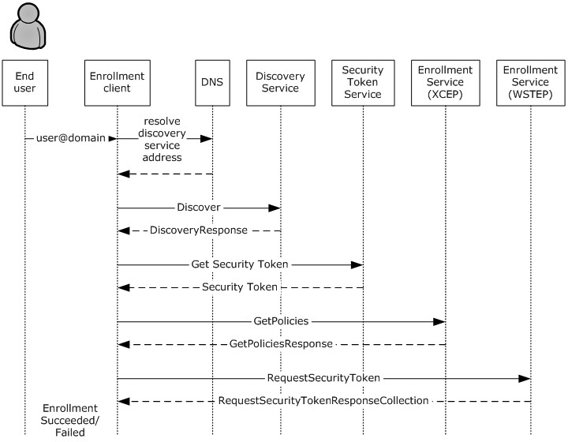

Figure 1: Typical sequence for enrolling a message using MDE2

The enrollment process consists of the following steps.

- The user’s email name is entered via the [**enrollment client**](#gt_enrollment-client).
- The enrollment client extracts the domain suffix from the email address, prepends the domain name with a well-known label, and resolves the address to the [**Discovery Service (DS)**](#gt_discovery-service-ds). The administrator configures the network name resolution service (that is, the [**Domain Name System (DNS)**](#gt_domain-name-system-dns)) appropriately.
- The enrollment client sends an [**HTTP**](#gt_hypertext-transfer-protocol-http) GET request to the Discovery Service to validate the existence of the [**service endpoint**](#gt_service-endpoint).
- The enrollment client sends a **Discover** message (section [3.1.4.1.1.1](#Section_3.1.4.1.1.1)) to the Discovery Service. The Discovery Service responds with a **DiscoverResponse** message (section [3.1.4.1.1.2](#Section_3.1.4.1.1.2)) containing the Uniform Resource Locators (URLs) of service endpoints required for the following steps.
- The enrollment client communicates with the [**security token service (STS)**](#gt_security-token-service-sts) (section [3.2](#Section_3.2)) to obtain a [**security token**](#gt_security-token) to authenticate with the ES.
- The enrollment client sends a **GetPolicies** message (section [3.3.4.1.1.1](#Section_3.3.4.1.1.1)) the [**ES endpoint**](#gt_es-endpoint) [MS-XCEP](../MS-XCEP/MS-XCEP.md) using the security token received in the previous step. The ES endpoint [MS-XCEP] responds with a **GetPoliciesResponse** message (section [3.3.4.1.1.2](#Section_3.3.4.1.1.2)) containing the [**certificate policies**](#gt_certificate-policy) required for the next step. For more information about these messages, see [MS-XCEP] sections 3.1.4.1.1.1 and 3.1.4.1.1.2.
- The enrollment client can send a **RequestSecurityToken** message (section [3.4.4.1.1.1](#Section_3.4.4.1.1.1)) to the ES endpoint [MS-WSTEP](../MS-WSTEP/MS-WSTEP.md) using the security token received in step 5. The ES endpoint [MS-WSTEP] responds with a **RequestSecurityTokenResponseCollection** message (section [3.4.4.1.1.2](#Section_3.4.4.1.1.2)) containing the identity and [**provisioning information**](#gt_provisioning-information) for the [**device management client**](#gt_device-management-client) [MS-MDM](../MS-MDM/MS-MDM.md). For more information about these messages, see [MS-WSTEP] sections 3.1.4.1.1.1 and 3.1.4.1.1.2.
The steps for MDE2 device enrollment correspond to five phases as shown in the following diagram.

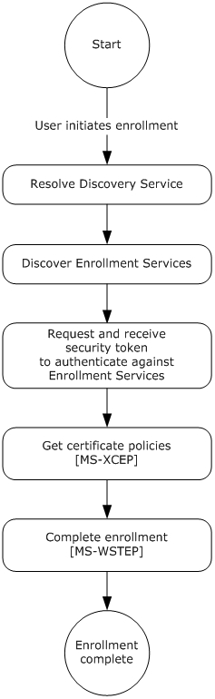

Figure 2: MDE2 device enrollment phases

For Mobile Application Management (MAM), the server skips the discover, get security token, and get policies phases and goes straight to the request security token phase (see MAM product notes section [2.2.9.1](#Section_2.2.9.1) and section [2.2.9.5](#Section_2.2.9.5)). For more information on MAM, see [[MSDN-WinMAM]](https://go.microsoft.com/fwlink/?linkid=842818).

## 1.4 Relationship to Other Protocols

MDE2 depends on the WS-Trust X.509v3 Token Enrollment Extensions [MS-WSTEP](../MS-WSTEP/MS-WSTEP.md).

MDE2 depends on the X.509 Certificate Enrollment Policy Protocol [MS-XCEP](../MS-XCEP/MS-XCEP.md).

The Mobile Device Management Protocol (MDM) depends on MDE2. A device has to be enrolled in an [**MES**](#gt_management-enrollment-service-mes) through the use of MDE2 before the device can be managed using MDM [MS-MDM](../MS-MDM/MS-MDM.md).

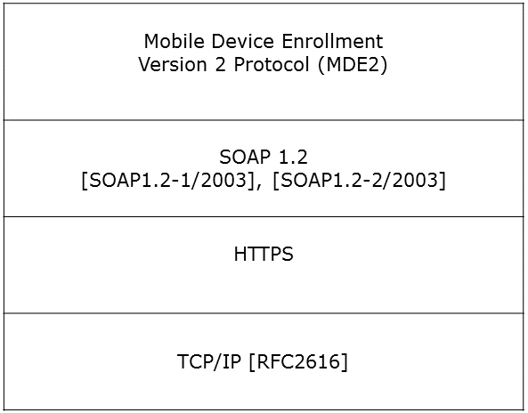

Figure 3: Relationship to other protocols

## 1.5 Prerequisites/Preconditions

MDE2 issues X.509v3 [MS-WSTEP](../MS-WSTEP/MS-WSTEP.md) certificates and [**provisioning information**](#gt_provisioning-information) for [**device management clients**](#gt_device-management-client) [MS-MDM](../MS-MDM/MS-MDM.md) to enable a relationship between the user and a device in the [**DMS**](#gt_digital-media-server-dms).

The MES issues a [**security token**](#gt_security-token) (after appropriate authentication) that is used to authenticate to the [**ES**](#gt_enrollment-service-es).

The ES communicates with a [**certification authority (CA)**](#gt_certification-authority-ca) to issue an [**X.509**](#gt_x509) [**certificate**](#gt_certificate).

The ES issues provisioning information for a device management client [MS-MDM]. The ES has to be configured with this information or be able to retrieve it from the DMS.

## 1.6 Applicability Statement

A device has to be enrolled in an [**MES**](#gt_management-enrollment-service-mes) through the use of MDE2 before the device can be managed using MDM [MS-MDM](../MS-MDM/MS-MDM.md).

## 1.7 Versioning and Capability Negotiation

None.

## 1.8 Vendor-Extensible Fields

None.

## 1.9 Standards Assignments

None.

# 2 Messages

## 2.1 Transport

MDE2 is a client-to-server protocol that consists of a SOAP-based Web service.

MDE2 operates over the following [**Web services**](#gt_web-service) transport:

- SOAP 1.1 ([[SOAP1.1]](https://go.microsoft.com/fwlink/?LinkId=90520), [[SOAP1.1-Envelope]](https://go.microsoft.com/fwlink/?LinkId=111315)) over HTTPS over [**TCP**](#gt_transmission-control-protocol-tcp)/IP [[RFC2616]](https://go.microsoft.com/fwlink/?LinkId=90372)

## 2.2 Common Message Syntax

This section contains common definitions used by this protocol. The syntax of the definitions uses the XML Schema as defined in [[XMLSCHEMA1]](https://go.microsoft.com/fwlink/?LinkId=90608) and [[XMLSCHEMA2]](https://go.microsoft.com/fwlink/?LinkId=90610), and the [**Web Services Description Language (WSDL)**](#gt_web-services-description-language-wsdl) as defined in [[WSDL]](https://go.microsoft.com/fwlink/?LinkId=90577).

### 2.2.1 Namespaces

This specification defines and references various [**XML namespaces**](#gt_xml-namespace) using the mechanisms specified in [[XMLNS]](https://go.microsoft.com/fwlink/?LinkId=191840). Although this specification associates a specific XML namespace prefix for each XML namespace that is used, the choice of any specific XML namespace prefix is implementation-specific and not significant for interoperability.

Prefixes and XML namespaces used in this specification are as follows.

| Prefix | Namespace URI | Reference |
| --- | --- | --- |
| ac | http://schemas.microsoft.com/windows/pki/2009/01/enrollment | [MS-WSTEP](../MS-WSTEP/MS-WSTEP.md) |
| tns | http://schemas.microsoft.com/windows/pki/2012/01/enrollment | This specification |
| wsaw | http://www.w3.org/2006/05/addressing/wsdl | - |
| wsdl | http://schemas.xmlsoap.org/wsdl/ | [[WSDL]](https://go.microsoft.com/fwlink/?LinkId=90577) |
| wst | http://docs.oasis-open.org/ws-sx/ws-trust/200512 | [[WSTrust1.3]](https://go.microsoft.com/fwlink/?LinkId=131548) |
| xcep | http://schemas.microsoft.com/windows/pki/2009/01/enrollmentpolicy | [MS-XCEP](../MS-XCEP/MS-XCEP.md) |
| xsd | http://www.w3.org/2001/XMLSchema | [[XMLSCHEMA1]](https://go.microsoft.com/fwlink/?LinkId=90608) |
| u | http://docs.oasis-open.org/wss/2004/01/oasis-200401-wss-wssecurity-utility-1.0.xsd | - |
| ds | http://www.w3.org/2000/09/xmldsig# | - |
| wsse | http://docs.oasis-open.org/wss/2004/01/oasis-200401-wss-wssecurity-secext-1.0.xsd | - |

### 2.2.2 Messages

This specification does not define any common XML Schema message definitions.

### 2.2.3 Elements

This specification does not define any common XML Schema element definitions.

### 2.2.4 Complex Types

This specification does not define any common XML Schema complex type definitions.

### 2.2.5 Simple Types

This specification does not define any common XML Schema simple type definitions.

### 2.2.6 Attributes

This specification does not define any common XML Schema attribute definitions.

### 2.2.7 Groups

This specification does not define any common XML Schema group definitions.

### 2.2.8 Attribute Groups

This specification does not define any common XML Schema attribute group definitions.

### 2.2.9 Common Data Structures

#### 2.2.9.1 XML Provisioning Schema

The entire XML provisioning document is [**base64-encoded**](#gt_179b9392-9019-45a3-880b-26f6890522b7). The document contains:

- The requested client [**certificate**](#gt_certificate), the trusted root certificate, and intermediate certificates.
- The provisioning information for the [**device management client**](#gt_device-management-client).
The [**enrollment client**](#gt_enrollment-client) installs the client certificate, as well as the trusted root certificate and intermediate certificates. The [**provisioning information**](#gt_provisioning-information) includes content such as the location of the [**Device Management Service (DMS)**](#gt_device-management-service-dms) and various properties that the device management client uses to communicate with the DMS.

The following schemas are examples of the XML required for the provisioning document. The explanation for each field in the document appears inline in the example as XML comments.

The following XML is a provisioning example for Mobile Device Management (MDM) in user context.

<wap-provisioningdoc version="1.1">

<characteristic type="CertificateStore">

<characteristic type="Root">

<characteristic type="System">

<characteristic type="031336C933CC7E228B88880D78824FB2909A0A2F">

<parm name="EncodedCertificate" value="B64 encoded cert insert here" />

</characteristic>

</characteristic>

</characteristic>

</characteristic>

<characteristic type="CertificateStore">

<characteristic type="My" >

<characteristic type="User">

<characteristic type="F9A4F20FC50D990FDD0E3DB9AFCBF401818D5462">

<parm name="EncodedCertificate" value="B64EncodedCertInsertedHere" />

</characteristic>

<characteristic type="PrivateKeyContainer"/>

<!-- This tag must be present for XML syntax correctness. -->

</characteristic>

<characteristic type="WSTEP">

<characteristic type="Renew">

<!--If the datatype for ROBOSupport, RenewPeriod, and RetryInterval tags exist, they must be set explicitly. -->

<parm name="ROBOSupport" value="true" datatype="boolean"/>

<parm name="RenewPeriod" value="60" datatype="integer"/>

<parm name="RetryInterval" value="4" datatype="integer"/>

</characteristic>

</characteristic>

</characteristic>

</characteristic>

<characteristic type="APPLICATION">

<parm name="APPID" value="w7"/>

<parm name="PROVIDER-ID" value="TestMDMServer"/>

<parm name="NAME" value="Microsoft"/>

<parm name="ADDR" value="https://DM.contoso.com:443/omadm/Windows.ashx"/>

<parm name="CONNRETRYFREQ" value="6" />

<parm name="INITIALBACKOFFTIME" value="30000" />

<parm name="MAXBACKOFFTIME" value="120000" />

<parm name="BACKCOMPATRETRYDISABLED" />

<parm name="DEFAULTENCODING" value="application/vnd.syncml.dm+wbxml" />

<parm name="SSLCLIENTCERTSEARCHCRITERIA" value=

"Subject=DC%3dcom%2cDC%3dmicrosoft%2cCN%3dUsers%2cCN%3dAdministrator&Stores=My%5CUser"/>

<characteristic type="APPAUTH">

<parm name="AAUTHLEVEL" value="CLIENT"/>

<parm name="AAUTHTYPE" value="DIGEST"/>

<parm name="AAUTHSECRET" value="password1"/>

<parm name="AAUTHDATA" value="B64encodedBinaryNonceInsertedHere"/>

</characteristic>

<characteristic type="APPAUTH">

<parm name="AAUTHLEVEL" value="APPSRV"/>

<parm name="AAUTHTYPE" value="BASIC"/>

<parm name="AAUTHNAME" value="testclient"/>

<parm name="AAUTHSECRET" value="password2"/>

</characteristic>

</characteristic>

<characteristic type="DMClient"> <!--When available, an enrollment server should use DMClient CSP XML to configure DM polling schedules. -->

<characteristic type="Provider">

<!-- ProviderID in DMClient CSP must match to PROVIDER-ID in w7 APPLICATION characteristics -->

<characteristic type="TestMDMServer">

<parm name="UPN" value="UserPrincipalName@domain.com" datatype="string" />

<characteristic type="Poll">

<parm name="NumberOfFirstRetries" value="8" datatype="integer" />

<parm name="IntervalForFirstSetOfRetries" value="15" datatype="integer" />

<parm name="NumberOfSecondRetries" value="5" datatype="integer" />

<parm name="IntervalForSecondSetOfRetries" value="3" datatype="integer" />

<parm name="NumberOfRemainingScheduledRetries" value="0" datatype="integer" />

<!-- MDM push can be used where avaialble to support real-time communication. The DM client long term polling schedule’s retry waiting interval should be more than 24 hours (1440) to reduce the impact to data consumption and battery life. Refer to the DMClient Configuration Service Provider section for information about polling schedule parameters.-->

<parm name="IntervalForRemainingScheduledRetries" value="1560" datatype="integer" />

<parm name="PollOnLogin" value="true" datatype="boolean" />

</characteristic>

<parm name="EntDeviceName" value="Administrator_Windows" datatype="string" />

</characteristic>

</characteristic>

</characteristic>

<!-- The EnterpriseAppManagement Configuration Service Provider is being deprecated. A

replacement will be provided in the future for company hub installation. -->

</wap-provisioningdoc>

The following XML is a provisioning example for Mobile Device Management (MDM) in device context.

<wap-provisioningdoc version="1.1">

<characteristic type="CertificateStore">

<characteristic type="Root">

<characteristic type="System">

<characteristic type="031336C933CC7E228B88880D78824FB2909A0A2F">

<parm name="EncodedCertificate" value="B64 encoded cert insert here" />

</characteristic>

</characteristic>

</characteristic>

</characteristic>

<characteristic type="CertificateStore">

<characteristic type="My" >

<characteristic type="System">

<characteristic type="F9A4F20FC50D990FDD0E3DB9AFCBF401818D5462">

<parm name="EncodedCertificate" value="B64EncodedCertInsertedHere" />

</characteristic>

<characteristic type="PrivateKeyContainer"/>

<!-- This tag must be present for XML syntax correctness. -->

</characteristic>

<characteristic type="WSTEP">

<characteristic type="Renew">

<!-- If the datatype for ROBOSupport, RenewPeriod, and RetryInterval tags exist, they must be set explicitly. -->

<parm name="ROBOSupport" value="true" datatype="boolean"/>

<parm name="RenewPeriod" value="60" datatype="integer"/>

<parm name="RetryInterval" value="4" datatype="integer"/>

</characteristic>

</characteristic>

</characteristic>

</characteristic>

<characteristic type="APPLICATION">

<parm name="APPID" value="w7"/>

<parm name="PROVIDER-ID" value="TestMDMServer"/>

<parm name="NAME" value="Microsoft"/>

<parm name="ADDR" value="https://DM.contoso.com:443/omadm/Windows.ashx"/>

<parm name="CONNRETRYFREQ" value="6" />

<parm name="INITIALBACKOFFTIME" value="30000" />

<parm name="MAXBACKOFFTIME" value="120000" />

<parm name="BACKCOMPATRETRYDISABLED" />

<parm name="DEFAULTENCODING" value="application/vnd.syncml.dm+wbxml" />

<parm name="SSLCLIENTCERTSEARCHCRITERIA" value=

"Subject=DC%3dcom%2cDC%3dmicrosoft%2cCN%3dUsers%2cCN%3dAdministrator&Stores=My%5CUser"/>

<characteristic type="APPAUTH">

<parm name="AAUTHLEVEL" value="CLIENT"/>

<parm name="AAUTHTYPE" value="DIGEST"/>

<parm name="AAUTHSECRET" value="password1"/>

<parm name="AAUTHDATA" value="B64encodedBinaryNonceInsertedHere"/>

</characteristic>

<characteristic type="APPAUTH">

<parm name="AAUTHLEVEL" value="APPSRV"/>

<parm name="AAUTHTYPE" value="BASIC"/>

<parm name="AAUTHNAME" value="testclient"/>

<parm name="AAUTHSECRET" value="password2"/>

</characteristic>

</characteristic>

<characteristic type="DMClient"> <!-- When available, an enrollment server should use DMClient CSP XML to configure DM polling schedules. -->

<characteristic type="Provider">

<!-- ProviderID in DMClient CSP must match to PROVIDER-ID in w7 APPLICATION characteristics -->

<characteristic type="TestMDMServer">

<parm name="UPN" value="UserPrincipalName@domain.com" datatype="string" />

<characteristic type="Poll">

<parm name="NumberOfFirstRetries" value="8" datatype="integer" />

<parm name="IntervalForFirstSetOfRetries" value="15" datatype="integer" />

<parm name="NumberOfSecondRetries" value="5" datatype="integer" />

<parm name="IntervalForSecondSetOfRetries" value="3" datatype="integer" />

<parm name="NumberOfRemainingScheduledRetries" value="0" datatype="integer" />

<!-- MDM push can be used where avaialble to support real-time communication. The DM client long term polling schedule’s retry waiting interval should be more than 24 hours (1440) to reduce the impact to data consumption and battery life. Refer to the DMClient Configuration Service Provider section for information about polling schedule parameters.-->

<parm name="IntervalForRemainingScheduledRetries" value="1560" datatype="integer" />

<parm name="PollOnLogin" value="true" datatype="boolean" />

</characteristic>

<parm name="EntDeviceName" value="Administrator_Windows" datatype="string" />

</characteristic>

</characteristic>

</characteristic>

<!-- The EnterpriseAppManagement Configuration Service Provider is being deprecated. A

replacement will be provided in the future for company hub installation. -->

</wap-provisioningdoc>

The following XML is a provisioning example for Mobile Application Management (MAM).<1>

<wap-provisioningdoc version="1.1">

<characteristic type="APPLICATION">

<parm name="APPID" value="w7"/>

<parm name="PROVIDER-ID" value="MAM SyncML Server"/>

<parm name="NAME" value="mddprov account"/>

<parm name="ADDR" value="http://localhost:88"/>

<parm name="DEFAULTENCODING" value="application/vnd.syncml.dm+xml" />

</characteristic>

<characteristic type="DMClient">

<characteristic type="Provider">

<characteristic type="MAM SyncML Server">

<characteristic type="Poll">

<parm name="NumberOfRemainingScheduledRetries" value="0" datatype="integer" />

<parm name="IntervalForRemainingScheduledRetries" value="480" datatype="integer" />

</characteristic>

</characteristic>

</characteristic>

</characteristic>

</wap-provisioningdoc>

#### 2.2.9.2 CertificateStore Configuration Service Provider

The CertificateStore configuration service provider is used to add [**Secure Sockets Layer (SSL)**](#gt_secure-sockets-layer-ssl), intermediate, and self-signed [**certificates**](#gt_certificate).

**Note**: The CertificateStore configuration service provider does not support installing [**client**](#gt_client) certificates.

**Note**: For the CertificateStore CSP, the Replace command cannot be used unless the node already exists.

The following diagram shows the CertificateStore configuration service provider management object in tree format.

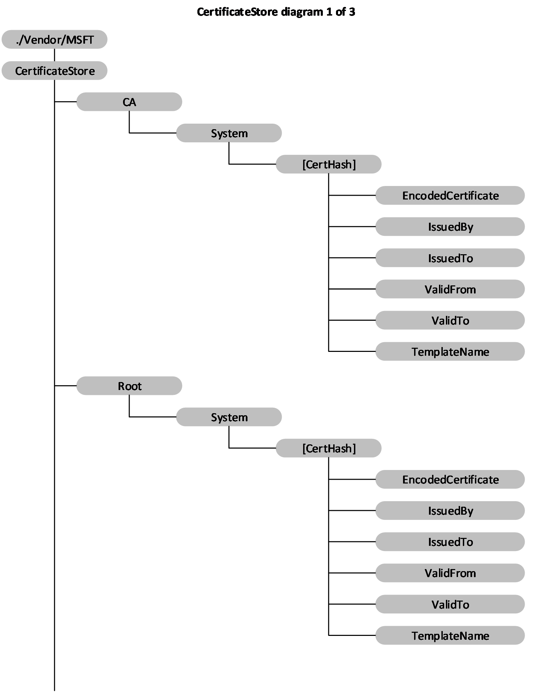

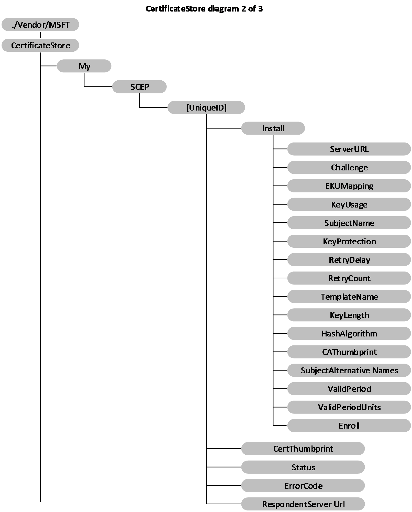

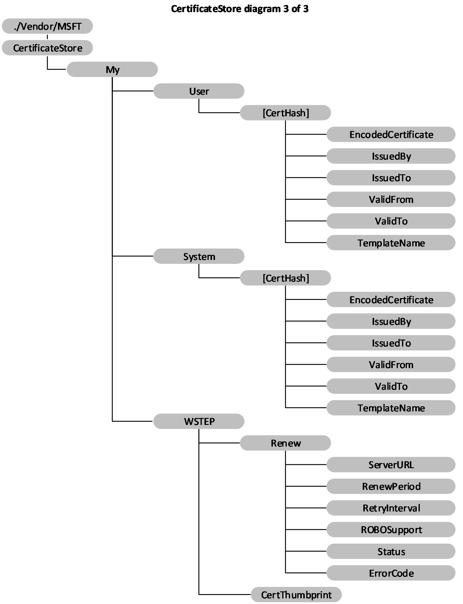

Figure 4: The CertificateStore configuration service provider management object in tree format

**Root/System:** Defines the certificate store that contains root, or self-signed, certificates. Supported operation is **Get**. Note that Root/System is case sensitive.

**CA/System:** Defines the certificate store that contains cryptographic information, including intermediary certification authorities. Supported operation is **Get**. Note that CA/System is case sensitive.

**My/User:** Defines the certificate store that contains public keys for client certificates. This is only used by enterprise servers to push down the public key of a client certificate. The client certificate is used by the device client to authenticate itself to the enterprise server for device management and downloading enterprise applications. Supported operation is **Get**. Note that My/User is case sensitive.

**My/System:** Defines the certificate store that contains the [**public key**](#gt_public-key) for the client certificate. This is only used by enterprise server to push down the public key of the client certificate. The client certificate is used by the device to authenticate itself to the enterprise server for device management and enterprise app downloading. Supported operation is **Get**. Note that My/System is case sensitive.

**[CertHash]:** Defines the [**SHA-1 hash**](#gt_sha-1-hash) for the certificate. The 20-byte value of the [**SHA-1**](#gt_sha-1) certificate [**hash**](#gt_hash) is specified as a hexadecimal string value. Supported operations are **Get**, **Delete**, and **Replace**.

**[CertHash]/EncodedCertificate:** Required. Specifies the [**X.509**](#gt_x509) certificate as a [**base64-encoded**](#gt_179b9392-9019-45a3-880b-26f6890522b7) string. The Base-64 string value cannot include extra formatting characters such as embedded linefeeds, etc. Supported operations are **Add**, **Delete**, **Get**, and **Replace**.

**[CertHash]/IssuedBy:** Returns the name of the certificate issuer. This is equivalent to the Issuer member in the **CERT_INFO** data structure (see [[MSDOCS-CERT_INFO]](https://go.microsoft.com/fwlink/?linkid=2191816)). Supported operation is **Get**.

**[CertHash]/IssuedTo:** Returns the name of the certificate subject. This is equivalent to the Subject member in the **CERT_INFO** data structure. Supported operation is **Get**.

**[CertHash]/ValidFrom:** Returns the starting date of the certificate 's validity. This is equivalent to the **NotBefore** member in the **CERT_INFO** structure. Supported operation is **Get**.

**[CertHash]/ValidTo:** Returns the expiration date of the certificate. This is equivalent to the **NotAfter** member in the **CERT_INFO** structure. Supported operation is **Get**.

**[CertHash]/TemplateName:** Returns the [**certificate template**](#gt_certificate-template) name. Supported operation is **Get**.

**My/SCEP:** Required for Simple Certificate Enrollment Protocol (SCEP) [**certificate enrollment**](#gt_certificate-enrollment). The parent node grouping the SCEP certificate related settings. Supported operation is **Get**.

**My/SCEP/[UniqueID]:** Required for SCEP certificate enrollment. A unique ID to differentiate certificate enrollment requests. Format is node. Supported operations are **Add**, **Get**, **Delete**, and **Replace**.

**My/SCEP/[UniqueID]/Install:** Required for SCEP certificate enrollment. Parent node to group SCEP certificate install related request. Format is node. Supported operations are **Add**, **Replace**, and **Delete**.

**Note:** Though the children nodes under Install support **Replace** commands, after the **Exec** command is sent to the device, the device takes the values that are set when the **Exec** command is accepted. The node value change that occurs after the **Exec** command is accepted might not impact the current node undergoing enrollment. Implementers can check the Status node value to determine whether the device is not at an unknown stage previous to changing the children node values.

**My/SCEP/[UniqueID]/Install/ServerURL:** Required for SCEP certificate enrollment. Specifies the certificate enrollment server. The server could specify multiple server URLs separated by a semicolon. Value type is string. Supported operations are **Add**, **Get**, **Delete**, and **Replace**.

**My/SCEP/[UniqueID]/Install/Challenge:** Required for SCEP certificate enrollment. Base64 encoded SCEP enrollment challenge. Value type is chr. Supported operations are **Add**, **Get**, **Delete**, and **Replace**. Challenge will be deleted shortly after the **Exec** command is accepted.

**My/SCEP/[UniqueID]/Install/EKUMapping:** Required. Specifies the extended key usages and is subject to SCEP server configuration. The list of [**object identifiers (OIDs)**](#gt_object-identifier-oid) are separated by plus sign (+), such as OID1+OID2+OID3. Value type is chr. Supported operations are **Add**, **Delete**, **Get**, and **Replace**.

**My/SCEP/[UniqueID]/Install/KeyUsage:** Required for enrollment. Specifies the key usage bits (0x80, 0x20, 0xA0, etc.) for the certificate in decimal format. The value MUST have at least the second (0x20) or fourth (0x80) or both bits set. If the value does not have those bits set, configuration will fail. Value type is int. Supported operations are **Add**, **Delete**, **Get**, and **Replace**.

**My/SCEP/[UniqueID]/Install/SubjectName:** Required. Specifies the subject name. Value type is chr. Supported operations are **Add**, **Delete**, **Get**, and **Replace**.

**My/SCEP/[UniqueID]/Install/KeyProtection:** Optional. Specifies the location of the private key. Although the [**private key**](#gt_private-key) is protected by [**trusted platform module (TPM)**](#gt_trusted-platform-module-tpm), it is not protected with TPM PIN. SCEP enrolled certificate does not support TPM PIN protection.

Valid values:

1 – the private key is protected by device TPM.

2 – the private key is protected by device TPM if the device supports TPM.

3 (default) – the private key is only saved in the software Key Storage Provider (KSP).

4 – the private key is protected by Microsoft .NET Passport. If this option is specified, the container name MUST be specified, otherwise the enrollment will fail.

Value type is int. Supported operations are **Add**, **Delete**, **Get**, and **Replace**.

**My/SCEP/[UniqueID]/Install/RetryDelay:** Optional. Specifies the device retry waiting time in minutes when the SCEP server sends the pending status. Default value is 5 and the minimum value is 1. Value type is int. Supported operations are **Add**, **Get**, and **Delete**.

**My/SCEP/[UniqueID]/Install/RetryCount:** Optional. Special to SCEP. Specifies the device retry times when the SCEP server sends pending status. Value type is int. Default value is 3. Max value cannot be larger than 30. If it is larger than 30, the device will use 30.The min value is 0 which means no retry. Supported operations are **Add**, **Delete**, **Get**, and **Replace**.

**My/SCEP/[UniqueID]/Install/TemplateName:** Optional. OID of certificate template name. Note that this name is typically ignored by the SCEP server; therefore, the MDM server typically does not need to provide it. Value type is chr. Supported operations are **Add**, **Get**, and **Delete**.

**My/SCEP/[UniqueID]/Install/KeyLength:** Required for enrollment. Specifies private key length (RSA). Value type is int. Valid values are 1024, 2048, 4096<2>. Supported operations are **Add**, **Delete**, **Get**, and **Replace**.

**My/SCEP/[UniqueID]/Install/HashAlgorithm:** Required for enrollment. Hash algorithm family (SHA-1, SHA-2, SHA-3) specified by the MDM server. If multiple hash algorithm families are specified, they MUST be separated with a +. Value type is chr. Supported operations are **Add**, **Delete**, **Get**, and **Replace**.

**My/SCEP/[UniqueID]/Install/CAThumbprint:** Required. Specifies the root CA thumbprint. It is a 20-byte value of the SHA-1 certificate hash specified as a hexadecimal string value. When a client authenticates a SCEP server, it checks the CA certificate from the SCEP server for a match with this certificate. If it does not match, the authentication fails. Value type is chr. Supported operations are **Add**, **Delete**, **Get**, and **Replace**.

**My/SCEP/[UniqueID]/Install/SubjectAlternativeNames:** Optional. Specifies the subject alternative name. Multiple alternative names can be specified. Each name is the combination of name format+actual name. For more information on the name type definition see [[MSDOCS-ClientCertInstall-CSP]](https://go.microsoft.com/fwlink/?linkid=2191842). Each pair is separated by semicolon. For example, multiple subject alternative names are presented in the format <nameformat1>+<actual name1>;<name format 2>+<actual name2>. Value type is chr. Supported operations are **Add**, **Delete**, **Get**, and **Replace**.

**My/SCEP/[UniqueID]/Install/ValidPeriod:** Optional. Specifies the units for valid period. Valid values are Days (Default), Months, Years. Value type is chr. Supported operations are **Add**, **Delete**, **Get**, and **Replace**.

**Note:** The device only sends the MDM server expected certificate validation period (ValidPeriodUnits + ValidPeriod) of the SCEP server as part of certificate enrollment request. How this valid period is used to create the certificate depends on the MDM server.

**My/SCEP/[UniqueID]/Install/ValidPeriodUnits:** Optional. Specifies desired number of units used in validity period and subject to SCEP server configuration. Default is 0. The units are defined in ValidPeriod node. The valid period specified by MDM overwrites the valid period specified in the certificate template. For example, if ValidPeriod is days and ValidPeriodUnits is 30, it means the total valid duration is 30 days. Value type is int. Supported operations are **Add**, **Delete**, **Get**, and **Replace**.

**Note:** The device only sends the MDM server expected certificate validation period (ValidPeriodUnits + ValidPeriod) of the SCEP server as part of certificate enrollment request. How this valid period is used to create the certificate depends on the MDM server.

**My/SCEP/[UniqueID]/Install/Enroll:** Required. Triggers the device to start the certificate enrollment. The MDM server can later query the device to find out whether the new certificate is added. Value type is null, which means that this node does not contain a value. Supported operation is **Exec**.

**My/SCEP/[UniqueID]/CertThumbprint:** Optional. Specifies the current certificate thumbprint if certificate enrollment succeeds. It is a 20-byte value of the SHA-1 certificate hash specified as a hexadecimal string value. Value type is chr. Supported operation is **Get**.

**My/SCEP/[UniqueID]/Status:** Required. Specifies the latest status for the certificate due to enrollment request. Value type is chr. Supported operation is **Get**.

Valid values:

1 – Finished successfully.

2 – Pending. The device has not finished the action, but has received the SCEP server pending response.

32 – Unknown.

16 - Action failed.

**My/SCEP/[UniqueID]/ErrorCode:** Optional. The integer value that indicates the HRESULT of the last enrollment error code. Supported operation is **Get**.

**My/SCEP/[UniqueID]/RespondentServerUrl:** Required. Returns the URL of the SCEP server that responded to the enrollment request. Value type is string. Supported operation is **Get**.

**My/WSTEP:** Required for MDM enrolled device. The parent node that hosts the MDM enrollment client certificate related settings that is enrolled via WSTEP. The nodes under WSTEP are mostly for MDM client certificate renew requests. Value type is node. Supported operation is **Get**.

**My/WSTEP/Renew:** Optional. The parent node to group renewal related settings. Supported operation is **Get**.

**My/WSTEP/Renew/ServerURL:** Optional. Specifies the URL of certificate renewal server. If this node does not exist, the client uses the initial discovery URL from enrollment. Supported operations are **Add**, **Delete**, **Get**, and **Replace**.

**My/WSTEP/Renew/RenewalPeriod:** Optional. The time (in days) to trigger the client to initiate the MDM client certificate renew process before the MDM certificate expires. The MDM server cannot set and update the certificate expiration date. It is recommended that the renew period is set a couple months before the certificate expires to ensure that the certificate gets renewed successfully with data connectivity.

The default value is 42 and the valid values are 1 – 1000. Value type is int. Supported operations are **Add**, **Delete**, **Get**, and **Replace**.

**Note:** When the renewal schedule is set over SyncML DM commands to ROBOSupport, RenewalPeriod, and RetryInterval, it MUST be wrapped in **Atomic** commands as specified in [MS-MDM](../MS-MDM/MS-MDM.md).

**My/WSTEP/Renew/RetryInterval:** Optional. Specifies the retry interval (in days) when the previous renewal failed. The retry schedule stops at the certificate expiration date.

The default value is 7 and the valid values are 1 – 1000 AND =< RenewalPeriod, otherwise it will result in error.. Value type is int. Supported operations are **Add**, **Delete**, **Get**, and **Replace**.

**Note:** When the renewal schedule is set over SyncML DM commands to ROBOSupport, RenewalPeriod, and RetryInterval, it MUST be wrapped in **Atomic** commands as specified in [MS-MDM].

**My/WSTEP/Renew/ROBOSupport:** Optional. Notifies the client if the MDM enrollment server supports ROBO auto certificate renewal. Value type is bool.<3>

**Note:** When the renewal schedule is set over SyncML DM commands to ROBOSupport, RenewalPeriod, and RetryInterval, it MUST be wrapped in **Atomic** commands as specified in [MS-MDM].

**My/WSTEP/Renew/Status:** Required. Shows the latest action status for this certificate. Value type is int. Supported operation is **Get**.

Valid values:

0 – Not started.

1 – Renewal in progress.

2 – Renewal succeeded.

3 – Renewal failed.

**My/WSTEP/Renew/ErrorCode:** Optional. If certificate renewal fails, this integer value indicates the HRESULT of the last error code during the renewal process. Value type is int. Supported operation is **Get**.

**My/WSTEP/CertThumbprint:** Optional. Returns the current MDM client certificate thumbprint. If renewal succeeds, it shows the renewed certificate thumbprint. If renewal fails or is in progress, it shows the thumbprint of the certificate that needs to be renewed. Value type is chr. Supported operation is **Get**.

#### 2.2.9.3 DMClient Configuration Service Provider

The DMClient configuration service provider is used to specify additional enterprise-specific mobile device management configuration settings for identifying the device in the enterprise domain, security mitigation for [**certificate**](#gt_certificate) renewal, and server-triggered enterprise unenrollment.

The following diagram shows the DMClient configuration service provider in tree format.

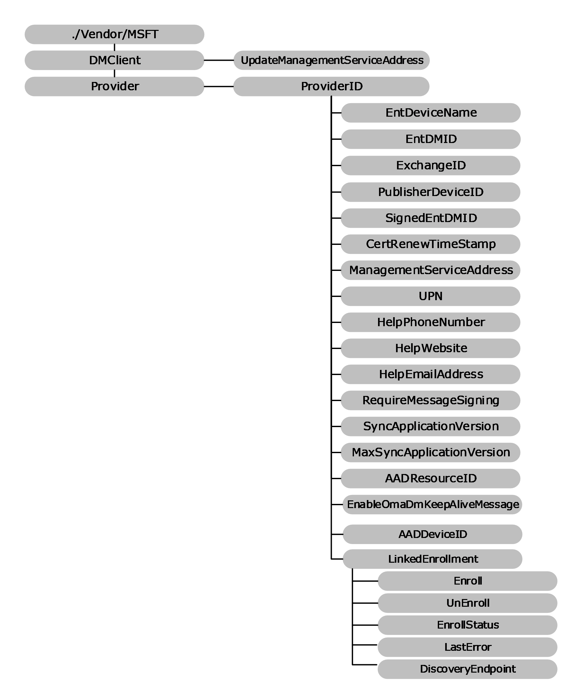

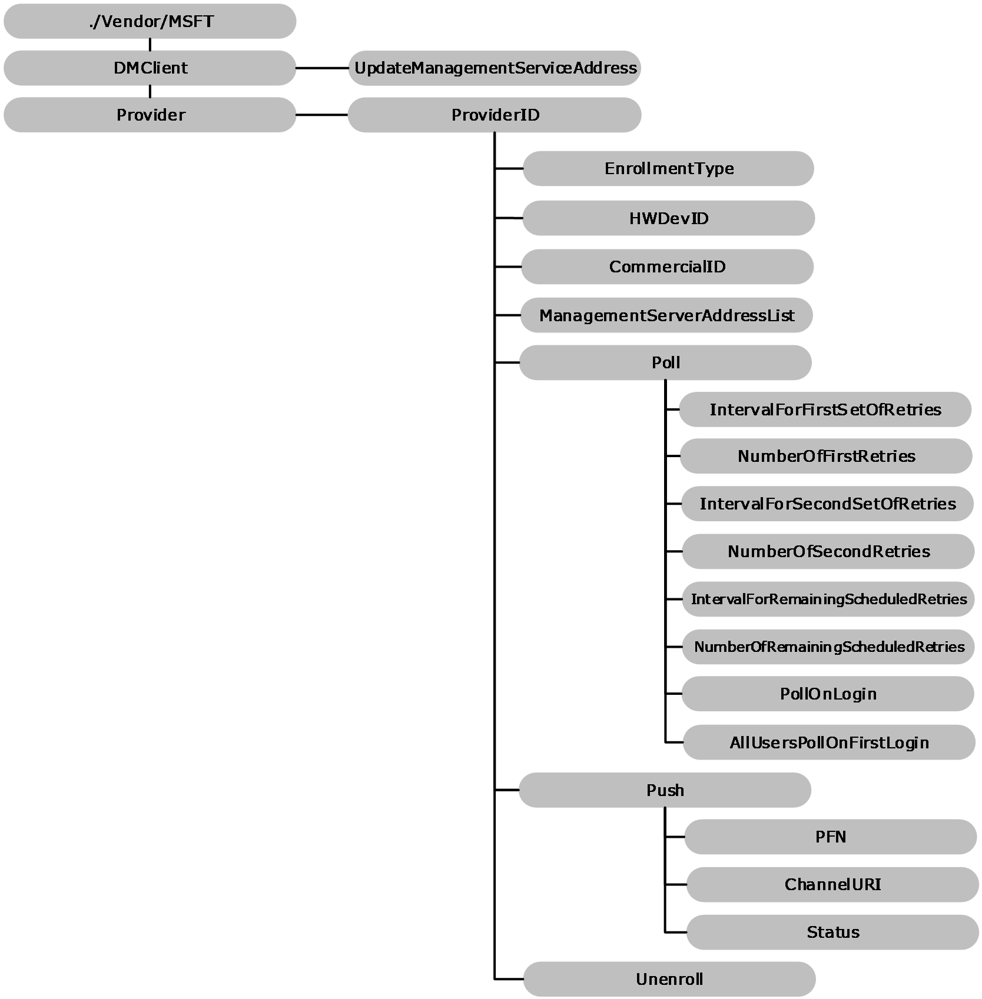

Figure 5: The DMClient configuration service provider in tree format

**DMClient:** Root node for the CSP.

**UpdateManagementServiceAddress:** For provisioning packages only. Specifies the semicolon-delimited list of servers. The first server in the list is the server that will be used to instantiate MDM sessions. The list can be a permutation or a subset of the existing server list. New servers cannot be added to the list using this node

**Provider:** Required. The root node for all settings that belong to a single management server. Scope is permanent. Supported operation is **Get**.

***ProviderID*:** Optional. This node contains the URI-encoded value of the bootstrapped device management account's Provider ID. Scope is dynamic. As a best practice, use text that doesn't require XML/URI escaping. Supported operations are **Add** and **Get**.

***ProviderID*/EntDeviceName:** Optional. The character string that contains the user-friendly device name used by the IT admin console. The value is set during the enrollment process by way of the DMClient configuration service provider. It can be retrieved later during an [**OMA DM**](#gt_d6471a40-dc75-4bb9-9ff3-003dc318cf31) session. Supported operations are **Add** and **Get**.

***ProviderID*/EntDMID:** Optional. The character string that contains the unique enterprise device ID. The value is set by the management server during the enrollment process by way of the DMClient configuration service provider. It can be retrieved later during an OMA DM session. Supported operations are **Add** and **Get**.

Although hardware device IDs are guaranteed to be unique, there is a concern that this is not ultimately enforceable during a DM session. The device ID could be changed through the w7 APPLICATION configuration service provider's USEHWDEVID parmeter by another management server. So during enterprise bootstrap and enrollment, a new device ID is specified by the enterprise server.

This node is required and MUST be set by the server before the client certificate renewal is triggered.

***ProviderID*/ExchangeID:** Optional. The character string that contains the unique Exchange device ID used by the Outlook account. This is useful for the enterprise management server to correlate and merge records for a device that is managed by exchange and natively managed by a dedicated management server. Supported operation is **Get**. The following is a **Get** command sample. Implementers MUST replace "TestMDMServer" with the actual name of the configured Provider ID. The **ExchangeID** is per user and for [**Azure Active Directory (Azure AD)**](#gt_azure-active-directory-azure-ad) enrollments the value depends on the logged in user.

<Get>

<CmdID>12</CmdID>

<Item>

<Target>

<LocURI>./Vendor/MSFT/DMClient/<*ProviderID*>/TestMDMServer/ExchangeID</LocURI>

</Target>

</Item>

</Get>

***ProviderID/*LinkedEnrollment/Enroll:** The LinkedEnrollment/Enroll command will trigger an enrollment in a Declared Configuration environment. This is an enrollment type that exists side-by-side with the existing enrollment, and which provides instruction to the device using the Declared Configuration format. This uses the device token from the device which MUST be joined to Azure AD. Supported operation is **Exec**.<4>

***ProviderID*/LinkedEnrollment/UnEnroll:** The LinkedEnrollment/Unenroll command will trigger a silent unenrollment from a side-by-side Declared Configuration environment. When the device is unenrolled all settings and resources provisioned by the Declared Configuration environment MUST be rolled back or removed. Supported operation is **Exec**.<5>

***ProviderID/*LinkedEnrollment/EnrollStatus:** Required. LinkedEnrollment/EnrollStatus is an integer value used to check whether a device has a linked enrollment in a Declared Configuration environment. The value MUST be one of those in the following table.<6>

| Name | Value |
| --- | --- |
| Undefined | 0 |
| NotStarted | 1 |
| InProgress | 2 |
| Failed | 3 |
| Succeeded | 4 |

***ProviderID/*LinkedEnrollment/LastError:** Optional. The integer value that indicates the HRESULT of the last enrollment error code. Supported operation is **Get**.<7>

***ProviderID/*LinkedEnrollment/DiscoveryEndpoint:** Optional. The DiscoveryEndpoint is a URL that indicates the location of a specific discovery service (section [3.1](#Section_3.1)). If present, the value indicates the discovery service that is used to create a linked Declared Configuration enrollment. If the value is not present, then the client will return an empty string. Supported operations are **Set**, **Get**, and **Delete**.**<8>**

The following is an example of the SyncML for setting the discovery endpoint for LinkedEnrollment/Enroll:

<SyncML xmlns="SYNCML:SYNCML1.1">

<SyncBody>

<Replace>

<CmdID>2</CmdID>

<Item>

<Target>

<LocURI>./Device/Vendor/MSFT/DMClient/Provider/MS%20DM%20SERVER/LinkedEnrollment/DiscoveryEndpoint</LocURI>

</Target>

<Data>https://contoso.com/declaredconfigrationendpoint?api-version=1.0</Data>

</Item>

</Replace>

<Final/>

</SyncBody>

</SyncML>

<SyncML xmlns="SYNCML:SYNCML1.1">

<SyncBody>

<Exec>

<CmdID>2</CmdID>

<Item>

<Target>

<LocURI>./Device/Vendor/MSFT/DMClient/Provider/MS%20DM%20SERVER/LinkedEnrollment/Enroll</LocURI>

</Target>

</Item>

</Exec>

<Final/>

</SyncBody>

</SyncML>

***ProviderID*/PublisherDeviceID:** (Only for phones). Optional. The **PublisherDeviceID** is a device-unique ID created based on the enterprise Publisher ID. Publisher ID is created based on the enterprise application token and enterprise ID via ./Vendor/MSFT/EnterpriseAppManagement/<enterprise id>/EnrollmentToken. It is to ensure that for one enterprise, each device has a unique ID associated with it. For the same device, if it has multiple enterprises' applications, each enterprise is identified differently. Supported operation is **Get**.

***ProviderID*/SignedEntDMID:** Optional. The character string that contains the device ID. This node and the nodes **CertRenewTimeStamp** and **SignedCertRenewStamp** can be used by the mobile device management server to verify client identity in order to update the registration record after the device certificate is renewed. The device signs the EntDMID with the old client certificate during the certificate renewal process and saves the signature locally. Supported operation is **Get**.

***ProviderID*/CertRenewTimeStamp:** Optional. The time in OMA DM standard time format. This node and the **SignedCertRenewTimeStamp** node are designed to reduce the risk of the certificate being used by another device. The device records the time that the new certificate was created. Supported operation is **Get**.

***ProviderID/*ManagementServiceAddress:** Required. The character string that contains the device management server address. It can be updated during an OMA DM session by the management server to allow the server to load balance to another server in situations where too many devices are connected to the server.

The DMClient configuration service provider saves the address to the same location used by the w7 and DMS configuration service providers, to ensure that the management client has a single place to retrieve the current server address.

The initial value for this node is the same server address value that is bootstrapped via the w7 APPLICATION configuration service provider. Supported operations are **Get** and **Replace**.

This node supports multiple server addresses in the format <URL1><URL2><URL3><9>. If there is only a single URL, then the angle brackets are not required. This is supported for both desktop and mobile devices.

During a DM session, the device will use the first address on the list, and then process the list until a successful connection is achieved. The DM client caches the successfully connected server URL for the next session.

***ProviderID/*UPN:** Optional. Allows the management server to update the [**user principal name (UPN)**](#gt_user-principal-name-upn) of the enrolled user. This is useful in scenarios where the user email address changes in the identity system, or in the scenario where the user enters an invalid UPN during enrollment, and fixes the UPN during federated authentication. The UPN is recorded and the UX displays the updated UPN. Supported operations are **Delete**, **Get**, and **Replace**.

***ProviderID/*HelpPhoneNumber:** Optional. A character string value that contains the customized help phone number that the end user can use if they need help or support. Supported operations are **Get**, **Replace**, and **Delete**.

***ProviderID/*HelpWebsite:** Optional. A character string value that contains the customized help website that the end user can use if they need help or support. Supported operations are **Delete**, **Get**, and **Replace**.

***ProviderID/*HelpEmailAddress:** Optional. A character string value that contains the customized help email address that the end user can use if they need help or support. Supported operations are **Get**, **Replace**, and **Delete**.

***ProviderID*/RequireMessageSigning:** Optional. Boolean type. Primarily used for [**SSL**](#gt_secure-sockets-layer-ssl) bridging mode where firewalls and proxies are deployed and where device client identity is required. When enabled, every SyncML message from the device will carry an additional HTTP header named MDM-Signature. This header contains [**Base64**](#gt_179b9392-9019-45a3-880b-26f6890522b7)-encoded Cryptographic Message Syntax using a Detached Signature of the complete SyncML message SHA-2 (inclusive of the SyncHdr and SyncBody tags). Signing is performed using the private key of the management session certificate that was enrolled as part of the MDE2 enrollment process. The device's public key and PKCS9 [**UTC (Coordinated Universal Time)**](#gt_utc-coordinated-universal-time) signing time stamp are included as part of the authenticated attributes in the signature. For more information on PKCS9 see [[RFC2985]](https://go.microsoft.com/fwlink/?LinkId=90400).

The default value is false, where the device management client does not include authentication information in the management session HTTP header. Optionally set to true, where client authentication information is provided in the management session HTTP header.

When enabled, the MDM server validates the signature and the timestamp using the device identify certificate enrolled as part of MDE2, ensure the certificate and time are valid, and verify that the signature is trusted by the MDM server. Supported operations are **Delete**, **Get**, and **Replace**.

***ProviderID/*SyncApplicationVersion:** Optional. Allows the management server to set the maximum current version of the management session protocol. A management server can update this if it detects a newer **MaxSyncApplicationVersion** that the client and server support. All changes to the **MaxSyncApplicationVersion** go into effect on the next session. Supported operations are **Add** and **Get**. Once this value is set to 2.0, it cannot be re-set to 1.0.

***ProviderID/*MaxSyncApplicationVersion:** Optional. Returns a character string that is the highest supported management session protocol version supported by the current platform. Supported operation is **Get**.

***ProviderID/*AADResourceID:** Optional. This is the ResourceID used when requesting the user token from the OMA DM session for Azure AD enrollments (AAD Join or Add Accounts). The token is audience specific, which allows for different service principals (enrollment vs. device management). It can be an application ID or the endpoint that you are trying to access.

***ProviderID/*EnableOmaDmKeepAliveMessage:** A boolean value that specifies whether the DM client sends a request pending alert if the device client response to a DM request is too slow. By default, the MDM client does not send an alert that a DM request is pending.<10>

When the server sends a configuration request, sometimes it takes the client longer than the HTTP timeout to get all information together and then the session ends unexpectedly due to timeout

To work around the timeout, this setting can be used to keep the session alive by sending a heartbeat message back to the server. This is achieved by sending a SyncML message with a specific device alert element in the body until the client can respond back to the server with the requested information.

Here is an example of DM message sent by the device when it is in pending state.

<SyncML xmlns="SYNCML:SYNCML1.2">

<SyncHdr>

<VerDTD>1.2</VerDTD>

<VerProto>DM/1.2</VerProto>

<SessionID>10</SessionID>

<MsgID>2</MsgID>

<Target>

<LocURI>https://www.contoso.com/mgmt-server</LocURI>

</Target>

<Source>

<LocURI>{unique device ID}</LocURI>

</Source>

</SyncHdr>

<SyncBody>

<Alert>

<CmdID>2</CmdID>

<Data>1224</Data>

<Item>

<Meta>

<Type xmlns="syncml:metinf">Reversed-Domain-Name:com.microsoft.mdm.requestpending</Type>

</Meta>

<Data>1</Data>

</Item>

</Alert>

</SyncBody>

</SyncML>

***ProviderID/*AADDeviceID:** Returns the device ID for the Azure Active Directory device registration. Supported operation is **Get**.<11>

***ProviderID/*EnrollmentType:** Returns the enrollment type (Device, Full, or AppManagement). Supported operation is **Get**.<12>

***ProviderID/*HWDevID:** Returns the hardware device ID. Supported operation is **Get**.<13>

***ProviderID/*CommercialID:** Configures the identifier used to uniquely associate this telemetry data of this device as belonging to a given organization. <14> If your organization is participating in a program that requires this device to be identified as belonging to your organization then use this setting to provide that identification. The value for this setting will be provided by Microsoft as part of the onboarding process for the program. If you disable or do not configure this policy setting, then Microsoft will not be able to use this identifier to associate this machine and its telemetry data with your organization. Supported operations are **Add**, **Delete**, **Get**, and **Replace**.

***ProviderID/*ManagementServerAddressList:** The list of management server URLs in the format <URL1<URL2><URL3>, etc.<15> If there is only one, the angle brackets (<>) are not required. Not that the < and > should be escaped.

<Replace>

<CmdID>101</CmdID>

<Item>

<Target>

<LocURI>

./Vendor/MSFT/DMClient/Provider/TestServer/ManagementServerAddressList

</LocURI>

</Target>

<Data><https://server1><https:// server2> </Data>

</Item>

</Replace>

If ManagementServerAddressList node is set, the device will only use the server URL configured in this node.

When the server is not responding after a specified number of retries, the device tries to use the next server URL in the list until it gets a successful connection. After the server list is updated, the client uses the updated list at the next session starting with the first on in the list. Supported operations are **Get** and **Replace**. Value type is string.

***ProviderID*/Poll:** Optional. Polling schedules MUST utilize the DMClient CSP, see [[MSDOCS-DMClient-CSP]](https://go.microsoft.com/fwlink/?linkid=2161995). Supported operations are **Add** and **Get**.

There are three schedules managed under the Poll node which enable a rich polling schedule experience to provide greater flexibility in managing the way in which devices poll the management server. There are a variety of ways in which polling schedules are set. If an invalid polling configuration is set, the device will correct or remove the schedules in order to restore the polling schedules back to a valid configuration.

If there is no infinite schedule set, then a 24-hour schedule is created and scheduled to launch in the maintenance window.

**Valid poll schedule: sigmoid polling schedule with infinite schedule (Recommended)**

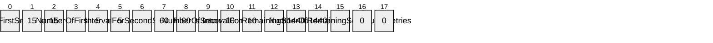

**Valid poll schedule: initial enrollment only [no infinite schedule]**

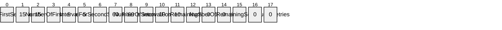

**Invalid poll schedule: disable all poll schedules**

**Note:** Disabling poll schedules results in UNDEFINED behavior and enrollment MAY fail if poll schedules are all set to zero.

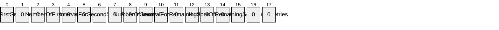

**Invalid poll schedule: two infinite schedules**

If the device was previously enrolled in MDM with a polling schedule directly configured via registry key values the MDM server that supports using DMClient CSP to update polling schedule sends an **Add** command to add a ./Vendor/MSFT/DMClient/Enrollment/<ProviderID>/Poll node before it sends a **Get** or **Replace** command to query or update polling parameters via DMClient CSP. When using the DMClient CSP to configure polling schedule parameters, the server MUST NOT set all 6 polling parameters to 0 and MUST NOT set all 3 number of retries nodes to 0 because it will cause a configuration failure.

***ProviderID*/Poll/IntervalForFirstSetOfRetries:** Optional. The waiting time (in minutes) for the initial set of retries as specified by the number of retries in <ProviderID>/Poll/**NumberOfFirstRetries**. If **IntervalForFirstSetOfRetries** is not set, then the default value is used. The default value is 15. If the value is set to 0, this schedule is disabled. The supported operations are **Get** and **Replace**.

***ProviderID*/Poll/NumberOfFirstRetries:** Optional. The number of times the [**device management client**](#gt_device-management-client) can retry to connect to the server when the client is initially configured or enrolled to communicate with the server. If the value is set to 0 and the **IntervalForFirstSetOfRetries** value is not 0, then the schedule will be set to repeat an infinite number of times and second set will not set in this case. The default value is 10. The supported operations are **Get** and **Replace**.

The first set of retries is intended to give the management server some buffered time to be ready to send policies and settings configuration to the device. It is best practice to not have the first set of retries go beyond a few hours. The server MUST NOT set NumberOfFirstRetries to 0. RemainingScheduledRetries is used for the long run device polling schedule.

***ProviderID*/Poll/IntervalForSecondSetOfRetries:** Optional. The waiting time (in minutes) for the second set of retries as specified by the number of retries in /<ProviderID>/Poll/NumberOfSecondRetries. Default value is 0. If this value is set to zero, then this schedule is disabled. The supported operations are **Get** and **Replace**.

***ProviderID*/Poll/NumberOfSecondRetries:** Optional. The number of times the device management client can retry a second round of connecting to the server when the client is initially configured/enrolled to communicate with the server. Default value is 0. If the value is set to 0 and **IntervalForSecondSetOfRetries** is not set to 0 AND the first set of retries is not set as infinite retries, then the schedule repeats an infinite number of times. However, if the first set of retries is set at infinite, then this schedule is disabled. Supported operations are **Get** and **Replace**.

**IntervalForSecondSetOfRetries** SHOULD be longer than **IntervalForFirstSetOfRetries**. The total duration of retries can be more than 24 hours. **RemainingScheduledRetries** is used for the long run device polling schedule.

***ProviderID*/Poll/IntervalForRemainingScheduledRetries:** Optional. The waiting time (in minutes) for the initial set of retries as specified by the number of retries in /<ProviderID>/Poll/NumberOfRemainingScheduledRetries. Default value is 0. If IntervalForRemainingScheduledRetries is set to 0, then this schedule is disabled. Supported operations are **Get** and **Replace**.

The **IntervalForRemainingScheduledRetries** replaces the deprecated HKLM\Software\Microsoft\Enrollment\OmaDmRetry\Aux2RetryInterval path that previously utilized the Registry CSP.

***ProviderID*/Poll/NumberOfRemainingScheduledRetries:** Optional. The number of times the device management client can retry connecting to the server when the client is initially configured/enrolled to communicate with the server. Default value is 0. If the value is set to 0 and **IntervalForRemainingScheduledRetries** AND the first and second set of retries are not set as infinite retries, then the schedule will be set to repeat for an infinite number of times. However, if either or both of the first and second set of retries are set as infinite, then this schedule will be disabled. Supported operations are **Get** and **Replace**.

The **NumberOfRemainingScheduledRetries** replaces the deprecated HKLM\Software\Microsoft\Enrollment\OmaDmRetry\Aux2NumRetries path that previously utilized the Registry CSP.

**RemainingScheduledRetries** is used for the long run device polling schedule. IntervalForRemainingScheduledRetries MUST NOT be smaller than 1440 minutes (24 hours).

***ProviderID*/Poll/PollOnLogin:** Optional. Allows the IT admin to require the device to start a management session on any user login, regardless of whether the user has previously logged in. Login is not the same as device unlock. Default value is false, where polling is disabled on first login. Supported values are true or false. Supported operations are **Add**, **Get** and **Replace**.

***ProviderID*/Poll/AllUsersPollOnFirstLogin:** Optional. Allows the IT admin to require the device to start a management session on first user login for all NT users. A session is only kicked off the first time a user logs in to the system; subsequent logins will not trigger an MDM session. Login is not the same as device unlock. Default value is false, where polling is disabled on first login. Supported values are true or false. Supported operations are **Add**, **Get** and **Replace**.

***ProviderID*/Push:** Optional. Not configurable during Wireless Application Protocol (WAP) Provisioning XML ([[WBXML1.2]](https://go.microsoft.com/fwlink/?LinkId=160492)). If removed, DM sessions triggered by Push will no longer be supported. Supported operations are **Add** and **Delete**.

***ProviderID*/Push/PFN:** Required. The Package Family Name (**PFN**) is a string used to register a device for push notifications. The server MUST use the same **PFN** as the devices it is managing. Supported operations are **Add**, **Get**, and **Replace**.

***ProviderID*/Push/ChannelURI:** Required. A string that contains the channel that the [**Windows Notification Service (WNS)**](#gt_windows-notification-service-wns) client has negotiated for the OMA DM client on the device based on the **PFN** that was provided. If no valid **PFN** is currently set, **ChannelURI** will return null. Supported operation is **Get**.

***ProviderID*/Push/Status:** Required. An integer that maps to a known error state or condition on the system. The status error mapping is listed below. Supported operation is **Get**.

| Status | Description |
| --- | --- |
| 0 | Success! |
| 1 | Failure: invalid PFN |
| 2 | Failure: invalid or expired device authentication with MSA (MS Account) |
| 3 | Failure: WNS client registration failed due to an invalid or revoked PFN |
| 4 | Failure: no Channel URI assigned |
| 5 | Failure: Channel URI has expired |
| 6 | Failure: Channel URI failed to be revoked |
| 7 | Failure: Push notification received, but unable to establish an OMA DM session due to power or connectivity limitations. |
| 8 | Push Not Available On the SKU |

***ProviderID*/Unenroll:** Required. The node accepts unenrollment requests by way of the OMA DM **Exec** command and calls the enrollment client to unenroll the device from the management server whose provider ID is specified in the <Data> tag under the <Item> element. Scope is permanent. Supported operations are **Get** and **Exec**.

**Note:** <LocURI>/Vendor/MSFT/DMClient/Unenroll</LocURI> is supported for backward compatibility.

The following SyncML shows how to remotely unenroll the device. Note that this command can be inserted in the general DM packages sent from the server to the device.

<Exec>

<CmdID>2</CmdID>

<Item>

<Target>

<LocURI>./Vendor/MSFT/DMClient/Provider/<*ProviderID*>/TestMDMServer/Unenroll</LocURI>

</Target>

<Meta>

<Format xmlns="syncml:metinf">chr</Format>

</Meta>

<Data>TestMDMServer</Data>

<!-- Data Field in Threshold is now IGNORED node -->

</Item>

</Exec>

#### 2.2.9.4 RootCATrustedCertificates Configuration Service Provider

The RootCATrustedCertificates configuration service provider enables the enterprise to set the Root [**Certificate Authority (CA)**](#gt_certification-authority-ca) [**certificates**](#gt_certificate). The ./User/ configuration is not supported in RootCATrustedCertificates/Root/ node.

The following image shows the RootCATrustedCertificates configuration service provider in tree format.

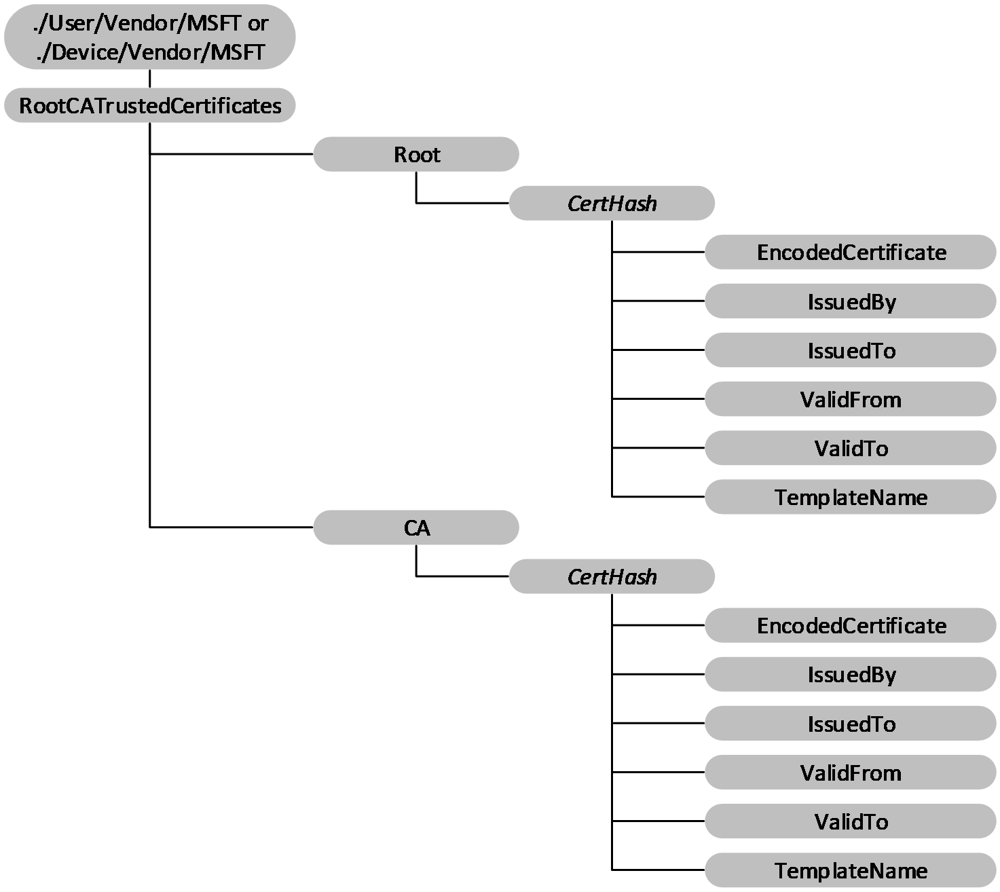

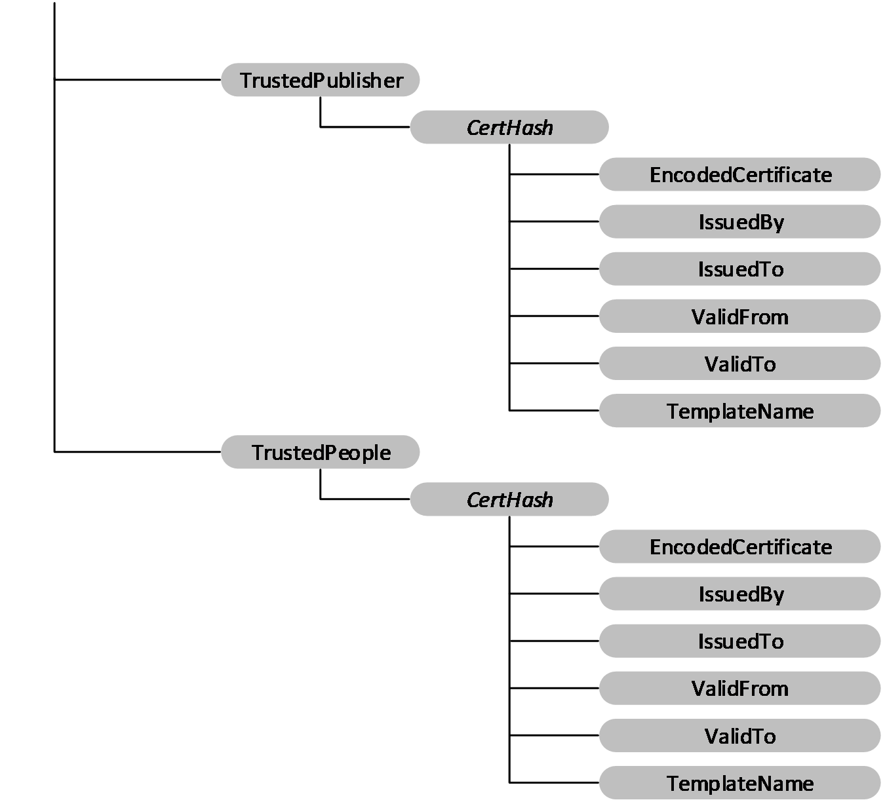

Figure 6: The RootCACertificate configuration service provider in tree format

**Device or User:** The root node for the RootCATrustedCertificates configuration service provider. For device certificates, use ./Device/Vendor/MSFT path and for user certificates use ./User/Vendor/MSFT path.

**RootCATrustedCertificates/Root:** Node for Root (self-signed) certificates.

**RootCATrustedCertificates/CA:** The node for CA certificates.

**RootCATrustedCertificates/TrustedPublisher:** The node for trusted publisher certificates.

**RootCATrustedCertificates/TrustedPeople:** The node for trusted people certificates.

**/CertHash:** Defines the [**SHA-1 hash**](#gt_sha-1-hash) for the certificate. The 20-byte value of the [**SHA-1**](#gt_sha-1) certificate [**hash**](#gt_hash) is specified as a hexadecimal string value. The supported operations are **Add**, **Delete**, and **Replace**.

**/EncodedCertificate:** Specifies the [**X.509**](#gt_x509) certificate as a [**base64-encoded**](#gt_179b9392-9019-45a3-880b-26f6890522b7) string. The base64 string value cannot include extra formatting characters such as embedded linefeeds. The supported operations are **Add**, **Delete**, **Get**, and **Replace**.

**/IssuedBy:** Returns the name of the certificate issuer. This is equivalent to the Issuer member in the **CERT_INFO** data structure. The only supported operation is **Get**.

**/IssuedTo:** Returns the name of the certificate subject. This is equivalent to the Subject member in the **CERT_INFO** data structure. The only supported operation is **Get**.

**/ValidFrom:** Returns the starting date of the certificate's validity. This is equivalent to the NotBefore member in the **CERT_INFO** structure. The only supported operation is **Get**.

**/ValidTo:** Returns the expiration date of the certificate. This is equivalent to the NotAfter member in the **CERT_INFO** structure. The only supported operation is **Get**.

**/TemplateName:** Returns the [**certificate template**](#gt_certificate-template) name. The only supported operation is **Get**.

#### 2.2.9.5 w7 APPLICATION Configuration Service Provider

The APPLICATION configuration service provider that has an APPID of w7 is used for bootstrapping a device with an [**OMA DM**](#gt_d6471a40-dc75-4bb9-9ff3-003dc318cf31) account. Although this configuration service provider is used to set up an OMA DM account, it is managed over OMA Client Provisioning.

**Note:** All parameter names and characteristic types are case sensitive and MUST use all uppercase. Both APPSRV and CLIENT credentials MUST be provided in the provisioning XML.

The following diagram shows the w7 APPLICATION configuration service provider in tree format.

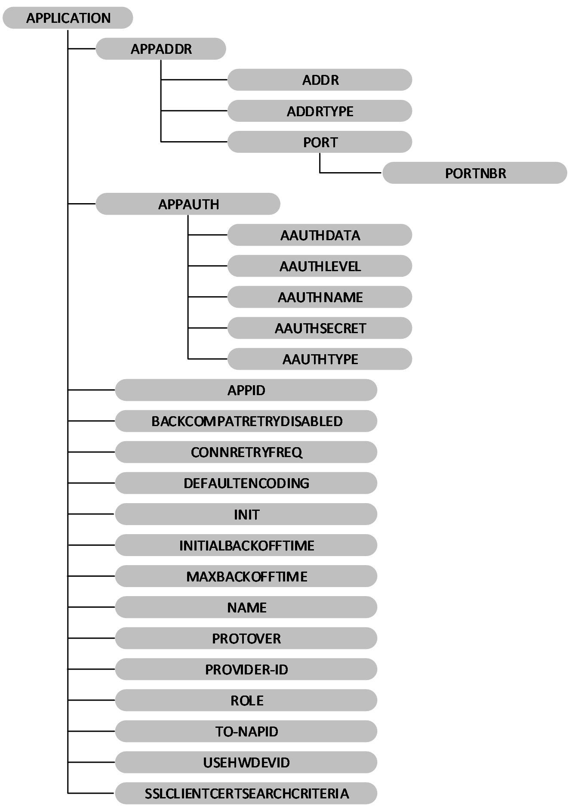

Figure 7: The w7 APPLICATION configuration service provider in tree format

**APPADDR:** This characteristic is used in the w7 APPLICATION characteristic to specify the DM server address.

**APPADDR/ADDR:** Optional. The ADDR parameter is used in the APPADR characteristic to get or set the address of the OMA DM server. This parameter takes a string value.

**APPADDR/ADDRTYPE:** Optional. The ADDRTYPE parameter is used in the APPADDR Characteristic to get or set the format of the ADDR parameter. This parameter takes a string value. In OMA DM XML, if there are multiple instances of this parameter, the first valid parameter value is used.

**APPADDR/PORT:** This characteristic is used in the APPADDR characteristic to specify port information.

**APPADDR/PORT/PORTNBR:** Required. The PORTNBR parameter is used in the PORT characteristic to get or set the number of the port to connect to. This parameter takes a numeric value in string format.

**APPAUTH:** This characteristic is used in the w7 APPLICATION characteristic to specify authentication information. This node is optional for MAM.<16> If this is not specified, it is assumed that transport-level authentication will be used.

**APPAUTH/AAUTHDATA:** Optional. The AAUTHDATA parameter is used in the APPAUTH characteristic to get or set additional data used in authentication. This parameter is used to convey the nonce for digest authentication type. This parameter takes a string value. The value of this parameter is a [**base64-encoded**](#gt_179b9392-9019-45a3-880b-26f6890522b7) string in the form of a series of bytes. Note that if the AAUTHTYPE is DIGEST, this is used as a nonce value in the [**MD5 hash**](#gt_md5-hash) calculation, and the octal form of the binary data is used to calculate the hash at the server side and device side.

**APPAUTH/AAUTHLEVEL:** Required. The AAUTHLEVEL parameter is used in the APPAUTH characteristic to indicate whether credentials are for server authentication or client authentication. This parameter takes a string value. Implementers can set this value.

Valid values:

- APPSRV - Specifies that the client authenticates itself to the OMA DM Server at the DM protocol level.
- CLIENT - Specifies that the server authenticates itself to the OMA DM Client at the DM protocol level.
**APPAUTH/AAUTHNAME:** Optional. The AAUTHNAME parameter is used in the APPAUTH characteristic to differentiate OMA DM client names. This parameter takes a string value. Implementers can set this value.

**APPAUTH/AAUTHSECRET:** Required. The AAUTHSECRET parameter is used in the APPAUTH characteristic to get or set the authentication secret used to authenticate the user. This parameter takes a string value.

**APPAUTH/AAUTHTYPE:** Optional. The AAUTHTYPE parameter of the APPAUTH characteristic is used to get or set the method of authentication. This parameter takes a string value.

Valid values:

- BASIC - Specifies the SyncML DM 'syncml:auth-basic' authentication type.
- DIGEST - Specifies the SyncML DM 'syncml:auth-md5' authentication type.
When AAUTHLEVEL is CLIENT, AAUTHTYPE MUST contain DIGEST. When AAUTHLEVEL is APPSRV, AAUTHTYPE can be BASIC or DIGEST.

**APPID:** Required. The APPID parameter is used in the APPLICATION characteristic to differentiate the types of available application services and protocols. This parameter takes a string value. Implementers can get or set this value. The only valid value to configure the OMA Client Provisioning bootstrap APPID is w7.

**BACKCOMPATRETRYDISABLED:** Optional. The BACKCOMPATRETRYDISABLED parameter is used in the APPLICATION characteristic to specify whether to retry resending a package with an older protocol version (for example, 1.1) in the SyncHdr (not including the first time).

**Note:** This parameter does not contain a value. The existence of this parameter means backward compatibility retry is disabled. If the parameter is missing, it means backward compatibility retry is enabled.

**CONNRETRYFREQ:** Optional. The CONNRETRYFREQ parameter is used in the APPLICATION characteristic to specify how many retries the [**device management client**](#gt_device-management-client) performs when there are Connection Manager-level or WinInet-level errors. This parameter takes a numeric value in string format. The default value is "3". Implementers can set this parameter.

**DEFAULTENCODING:** Optional. The DEFAULTENCODING parameter is used in the APPLICATION characteristic to specify whether the device management client uses [**Wireless Application Protocol (WAP) Binary XML (WBXML)**](#gt_wireless-application-protocol-wap-binary-xml-wbxml) ([[WBXML1.2]](https://go.microsoft.com/fwlink/?LinkId=160492)) or XML for the DM package when communicating with the server. Implementers can get or set this parameter.

Valid values:

- application/vnd.syncml.dm+xml (Default)
- application/vnd.syncml.dm+wbxml
**INIT:** Optional. The INIT parameter is used in the APPLICATION characteristic to indicate that the management server wants the client to initiate a management session immediately after settings approval. If the current w7 APPLICATION document will be put in ROM, the INIT parameter MUST not be present.

**Note:** This parameter is only for mobile operators and MDM servers that try to use this will fail. This parameter forces the device to attempt to connect with the OMA DM server. The connection attempt fails if the XML is set during the coldinit phase. A common cause of this failure is that immediately after coldinit is finished the radio is not yet ready.

**INITIALBACKOFFTIME:** Optional. The INITIALBACKOFFTIME parameter is used in the APPLICATION characteristic to specify the initial wait time in milliseconds when the device management client retries for the first time. The wait time grows exponentially. This parameter takes a numeric value in string format. The default value is "16000". Implementers can get or set this parameter.

**MAXBACKOFFTIME:** Optional. The MAXBACKOFFTIME parameter is used in the APPLICATION characteristic to specify the maximum number of milliseconds to sleep after package-sending failure. This parameter takes a numeric value in string format. The default value is "86400000". Implementers can set this parameter.

**NAME:** Optional. The NAME parameter is used in the APPLICATION characteristic to specify a user readable application identity. This parameter is used to define part of the registry path for the APPLICATION parameters. Implementers can set this parameter. The NAME parameter can be a string or null (no value). If no value is specified, the registry location will default to <unnamed>.

**PROTOVER:** Optional. The PROTOVER parameter is used in the APPLICATION characteristic to specify the [**OMA-DM**](#gt_oma-dm) Protocol version the server supports. No default value is assumed. The protocol version set by this node will match the protocol version that the device management client reports to the server in SyncHdr in package 1. If this node is not specified when adding a DM server account, the latest DM protocol version that the client supports is used. This is a custom parameter.<17> Implementers can set this parameter.

Possible values:

- 1.1
- 1.2
**PROVIDER-ID:** Optional. The PROVIDER-ID parameter is used in the APPLICATION characteristic to differentiate OMA DM servers. It specifies the server identifier for a management server used in the current management session. This parameter takes a string value. Implementers can set this parameter.

**ROLE:** Optional. The ROLE parameter is used in the APPLICATION characteristic to specify the security application chamber that the DM session runs with when communicating with the DM server. The only supported roles are 8 (mobile operator) and 32 (enterprise). If this parameter is not present, the mobile operator role is assumed. The enterprise role can only be set by the enterprise enrollment client. The enterprise client cannot set the mobile operator role. This parameter takes a numeric value in string format. This is a custom parameter.<18> Implementers can get or set this parameter.

**TO-NAPID:** Optional. The TO-NAPID parameter is used in the APPLICATION characteristic to specify the Network Access Point the client will use to connect to the OMA DM server. If multiple TO-NAPID parameters are specified, only the first TO-NAPID value will be stored. This parameter takes a string value. Implementers can set this parameter.

**USEHWDEVID:** Optional. The USEHWDEVID parameter is used in the APPLICATION characteristic to specify use of device hardware identification. It does not have a value. If the parameter is not present, the default behavior is to use an application-specific GUID rather than the hardware device ID.

If the parameter is present, the hardware device ID will be provided at the ./DevInfo/DevID node and in the Source LocURI for the DM package sent to the server. International Mobile Subscriber Identity (IMEI) is returned for a Global System for Mobile (GSM) device.

**SSLCLIENTCERTSEARCHCRITERIA:** Optional. The SSLCLIENTCERTSEARCHCRITERIA parameter is used in the APPLICATION characteristic to specify the client certificate search criteria. This parameter supports search by subject attribute and certificate stores. If any other criteria are provided, it is ignored.

The string is a concatenation of name/value pairs, each member of the pair delimited by the "&" character. The name and values are delimited by the "=" character. If there are multiple values, each value is delimited by the Unicode character "U+F000". If the name or value contains characters not in the UNRESERVED set, as specified in [[RFC2396]](https://go.microsoft.com/fwlink/?LinkId=90339), then those characters are URI-escaped.

The supported names are Subject and Stores; wildcard certificate search is not supported. Stores specifies which certificate stores the device management client will search to find the SSL/TLS client certificate. The valid store value is "My%5CUser". The store name is not case-sensitive.

**Note:** %EF%80%80 is the UTF8-encoded character U+F000.

Subject specifies the certificate to search for. For example, to specify a certificate with a particular Subject attribute ("CN=Tester,O=Microsoft"), implementers can use the following:

<parm name="SSLCLIENTCERTSEARCHCRITERIA"

value="Subject=CN%3DTester,O%3DMicrosoft&Stores=My%5CUser" />

#### 2.2.9.6 OSEdition Enumeration

This section provides the product enumerations for the OSEdition element.

#define PRODUCT_UNDEFINED 0x00000000

#define PRODUCT_ULTIMATE 0x00000001

#define PRODUCT_HOME_BASIC 0x00000002

#define PRODUCT_HOME_PREMIUM 0x00000003

#define PRODUCT_ENTERPRISE 0x00000004

#define PRODUCT_HOME_BASIC_N 0x00000005

#define PRODUCT_BUSINESS 0x00000006

#define PRODUCT_STANDARD_SERVER 0x00000007

#define PRODUCT_DATACENTER_SERVER 0x00000008

#define PRODUCT_SMALLBUSINESS_SERVER 0x00000009

#define PRODUCT_ENTERPRISE_SERVER 0x0000000A

#define PRODUCT_STARTER 0x0000000B

#define PRODUCT_DATACENTER_SERVER_CORE 0x0000000C

#define PRODUCT_STANDARD_SERVER_CORE 0x0000000D

#define PRODUCT_ENTERPRISE_SERVER_CORE 0x0000000E

#define PRODUCT_ENTERPRISE_SERVER_IA64 0x0000000F

#define PRODUCT_BUSINESS_N 0x00000010

#define PRODUCT_WEB_SERVER 0x00000011

#define PRODUCT_CLUSTER_SERVER 0x00000012

#define PRODUCT_HOME_SERVER 0x00000013

#define PRODUCT_STORAGE_EXPRESS_SERVER 0x00000014

#define PRODUCT_STORAGE_STANDARD_SERVER 0x00000015

#define PRODUCT_STORAGE_WORKGROUP_SERVER 0x00000016

#define PRODUCT_STORAGE_ENTERPRISE_SERVER 0x00000017

#define PRODUCT_SERVER_FOR_SMALLBUSINESS 0x00000018

#define PRODUCT_SMALLBUSINESS_SERVER_PREMIUM 0x00000019

#define PRODUCT_HOME_PREMIUM_N 0x0000001A

#define PRODUCT_ENTERPRISE_N 0x0000001B

#define PRODUCT_ULTIMATE_N 0x0000001C

#define PRODUCT_WEB_SERVER_CORE 0x0000001D

#define PRODUCT_MEDIUMBUSINESS_SERVER_MANAGEMENT 0x0000001E

#define PRODUCT_MEDIUMBUSINESS_SERVER_SECURITY 0x0000001F

#define PRODUCT_MEDIUMBUSINESS_SERVER_MESSAGING 0x00000020

#define PRODUCT_SERVER_FOUNDATION 0x00000021

#define PRODUCT_HOME_PREMIUM_SERVER 0x00000022

#define PRODUCT_SERVER_FOR_SMALLBUSINESS_V 0x00000023

#define PRODUCT_STANDARD_SERVER_V 0x00000024

#define PRODUCT_DATACENTER_SERVER_V 0x00000025

#define PRODUCT_ENTERPRISE_SERVER_V 0x00000026

#define PRODUCT_DATACENTER_SERVER_CORE_V 0x00000027

#define PRODUCT_STANDARD_SERVER_CORE_V 0x00000028

#define PRODUCT_ENTERPRISE_SERVER_CORE_V 0x00000029

#define PRODUCT_HYPERV 0x0000002A

#define PRODUCT_STORAGE_EXPRESS_SERVER_CORE 0x0000002B

#define PRODUCT_STORAGE_STANDARD_SERVER_CORE 0x0000002C

#define PRODUCT_STORAGE_WORKGROUP_SERVER_CORE 0x0000002D

#define PRODUCT_STORAGE_ENTERPRISE_SERVER_CORE 0x0000002E

#define PRODUCT_STARTER_N 0x0000002F

#define PRODUCT_PROFESSIONAL 0x00000030

#define PRODUCT_PROFESSIONAL_N 0x00000031

#define PRODUCT_SB_SOLUTION_SERVER 0x00000032

#define PRODUCT_SERVER_FOR_SB_SOLUTIONS 0x00000033

#define PRODUCT_STANDARD_SERVER_SOLUTIONS 0x00000034

#define PRODUCT_STANDARD_SERVER_SOLUTIONS_CORE 0x00000035

#define PRODUCT_SB_SOLUTION_SERVER_EM 0x00000036

#define PRODUCT_SERVER_FOR_SB_SOLUTIONS_EM 0x00000037

#define PRODUCT_SOLUTION_EMBEDDEDSERVER 0x00000038

#define PRODUCT_SOLUTION_EMBEDDEDSERVER_CORE 0x00000039

#define PRODUCT_ESSENTIALBUSINESS_SERVER_MGMT 0x0000003B

#define PRODUCT_ESSENTIALBUSINESS_SERVER_ADDL 0x0000003C

#define PRODUCT_ESSENTIALBUSINESS_SERVER_MGMTSVC 0x0000003D

#define PRODUCT_ESSENTIALBUSINESS_SERVER_ADDLSVC 0x0000003E

#define PRODUCT_SMALLBUSINESS_SERVER_PREMIUM_CORE 0x0000003F

#define PRODUCT_CLUSTER_SERVER_V 0x00000040

#define PRODUCT_EMBEDDED 0x00000041

#define PRODUCT_STARTER_E 0x00000042

#define PRODUCT_HOME_BASIC_E 0x00000043

#define PRODUCT_HOME_PREMIUM_E 0x00000044

#define PRODUCT_PROFESSIONAL_E 0x00000045

#define PRODUCT_ENTERPRISE_E 0x00000046

#define PRODUCT_ULTIMATE_E 0x00000047

#define PRODUCT_ENTERPRISE_EVALUATION 0x00000048

#define PRODUCT_MULTIPOINT_STANDARD_SERVER 0x0000004C

#define PRODUCT_MULTIPOINT_PREMIUM_SERVER 0x0000004D

#define PRODUCT_STANDARD_EVALUATION_SERVER 0x0000004F

#define PRODUCT_DATACENTER_EVALUATION_SERVER 0x00000050

#define PRODUCT_ENTERPRISE_N_EVALUATION 0x00000054

#define PRODUCT_EMBEDDED_AUTOMOTIVE 0x00000055

#define PRODUCT_EMBEDDED_INDUSTRY_A 0x00000056

#define PRODUCT_THINPC 0x00000057

#define PRODUCT_EMBEDDED_A 0x00000058

#define PRODUCT_EMBEDDED_INDUSTRY 0x00000059

#define PRODUCT_EMBEDDED_E 0x0000005A

#define PRODUCT_EMBEDDED_INDUSTRY_E 0x0000005B

#define PRODUCT_EMBEDDED_INDUSTRY_A_E 0x0000005C

#define PRODUCT_STORAGE_WORKGROUP_EVALUATION_SERVER 0x0000005F

#define PRODUCT_STORAGE_STANDARD_EVALUATION_SERVER 0x00000060

#define PRODUCT_CORE_ARM 0x00000061

#define PRODUCT_CORE_N 0x00000062

#define PRODUCT_CORE_COUNTRYSPECIFIC 0x00000063

#define PRODUCT_CORE_SINGLELANGUAGE 0x00000064

#define PRODUCT_CORE 0x00000065

#define PRODUCT_PROFESSIONAL_WMC 0x00000067

#define PRODUCT_MOBILE_CORE 0x00000068

#define PRODUCT_EMBEDDED_INDUSTRY_EVAL 0x00000069

#define PRODUCT_EMBEDDED_INDUSTRY_E_EVAL 0x0000006A

#define PRODUCT_EMBEDDED_EVAL 0x0000006B

#define PRODUCT_EMBEDDED_E_EVAL 0x0000006C

#define PRODUCT_NANO_SERVER 0x0000006D

#define PRODUCT_CLOUD_STORAGE_SERVER 0x0000006E

#define PRODUCT_CORE_CONNECTED 0x0000006F

#define PRODUCT_PROFESSIONAL_STUDENT 0x00000070

#define PRODUCT_CORE_CONNECTED_N 0x00000071

#define PRODUCT_PROFESSIONAL_STUDENT_N 0x00000072

#define PRODUCT_CORE_CONNECTED_SINGLELANGUAGE 0x00000073

#define PRODUCT_CORE_CONNECTED_COUNTRYSPECIFIC 0x00000074

#define PRODUCT_CONNECTED_CAR 0x00000075

#define PRODUCT_INDUSTRY_HANDHELD 0x00000076

#define PRODUCT_PPI_PRO 0x00000077

#define PRODUCT_ARM64_SERVER 0x00000078

#define PRODUCT_EDUCATION 0x00000079

#define PRODUCT_EDUCATION_N 0x0000007A

#define PRODUCT_IOTUAP 0x0000007B

#define PRODUCT_CLOUD_HOST_INFRASTRUCTURE_SERVER 0x0000007C

#define PRODUCT_ENTERPRISE_S 0x0000007D

#define PRODUCT_ENTERPRISE_S_N 0x0000007E

#define PRODUCT_PROFESSIONAL_S 0x0000007F

#define PRODUCT_PROFESSIONAL_S_N 0x00000080

#define PRODUCT_ENTERPRISE_S_EVALUATION 0x00000081

#define PRODUCT_ENTERPRISE_S_N_EVALUATION 0x00000082

#define PRODUCT_HOLOGRAPHIC 0x00000087

#define PRODUCT_HOLOGRAPHIC_BUSINESS 0x00000088

#define PRODUCT_SERVERRDSH 0x000000AF

### 2.2.10 Faults

The enrollment server can decline enrollment messages using the SOAP Fault format. Errors created can be sent as follows.

<s:envelope xmlns:s="http://www.w3.org/2003/05/soap-envelope" xmlns:a="http://www.w3.org/2005/08/addressing">

<s:header>

<a:action s:mustunderstand="1">http://schemas.microsoft.com/windows/pki/2009/01/enrollment/rstrc/wstep</a:action>

<activityid correlationid="2493ee37-beeb-4cb9-833c-cadde9067645" xmlns="http://schemas.microsoft.com/2004/09/servicemodel/diagnostics">2493ee37-beeb-4cb9-833c-cadde9067645</activityid>

<a:relatesto>urn:uuid:urn:uuid:0d5a1441-5891-453b-becf-a2e5f6ea3749</a:relatesto>

</s:header>

<s:body>

<s:fault>

<s:code>

<s:value>s:receiver</s:value>

<s:subcode>

<s:value>s:authorization</s:value>

</s:subcode>

</s:code>

<s:reason>

<s:text xml:lang="en-us">This User is not authorized to enroll</s:text>

</s:reason>

</s:fault>

</s:body>

</s:envelope>

| Namespace | Subcode | Error | Description | HRESULT |
| --- | --- | --- | --- | --- |
| s: | MessageFormat | MENROLL_E_DEVICE_MESSAGE_FORMAT_ERROR | Message format is bad. | 80180001 |
| s: | Authentication | MENROLL_E_DEVICE_AUTHENTICATION_ERROR | User not recognized. | 80180002 |
| s: | Authorization | MENROLL_E_DEVICE_AUTHORIZATION_ERROR | User not allowed to enroll. | 80180003 |
| s: | CertificateRequest | MENROLL_E_DEVICE_CERTIFCATEREQUEST_ERROR | Failed to get certificate. | 80180004 |
| s: | EnrollmentServer | MENROLL_E_DEVICE_CONFIGMGRSERVER_ERROR | Generic failure from management server, such as a database access error. | 80180005 |
| a: | InternalServiceFault | MENROLL_E_DEVICE_INTERNALSERVICE_ERROR | The server hit an unexpected issue. | 80180006 |
| a: | InvalidSecurity | MENROLL_E_DEVICE_INVALIDSECURITY_ERROR | Cannot parse the security header. | 80180007 |

The following is an example of the **deviceenrollmentserviceerror** detail element, which in this case, specifies the MENROLL_E_DEVICE_AUTHORIZATION_ERROR caused by reaching a capacity limit on the number of devices.

<s:envelope xmlns:s="http://www.w3.org/2003/05/soap-envelope" xmlns:a="http://www.w3.org/2005/08/addressing">

<s:header>

<a:action s:mustunderstand="1">http://schemas.microsoft.com/windows/pki/2009/01/enrollment/rstrc/wstep</a:action>

<activityid correlationid="2493ee37-beeb-4cb9-833c-cadde9067645" xmlns="http://schemas.microsoft.com/2004/09/servicemodel/diagnostics">2493ee37-beeb-4cb9-833c-cadde9067645</activityid>

<a:relatesto>urn:uuid:urn:uuid:0d5a1441-5891-453b-becf-a2e5f6ea3749</a:relatesto>

</s:header>

<s:body>

<s:fault>

<s:code>

<s:value>s:receiver</s:value>

<s:subcode>

<s:value>s:authorization</s:value>

</s:subcode>

</s:code>

<s:reason>

<s:text xml:lang="en-us">device cap reached</s:text>

</s:reason>

<s:detail>

<deviceenrollmentserviceerror xmlns="http://schemas.microsoft.com/windows/pki/2009/01/enrollment">

<errortype>devicecapreached</errortype>

<message>device cap reached</message>

<traceid>2493ee37-beeb-4cb9-833c-cadde9067645</traceid>

</deviceenrollmentserviceerror>

</s:detail>

</s:fault>

</s:body>

</s:envelope>

The detail element can specify any of the following error messages:

| Subcode | Error | Description | HRESULT |
| --- | --- | --- | --- |
| DeviceCapReached | MENROLL_E_DEVICECAPREACHED | User already enrolled in too many devices. Delete or unenroll old ones to fix this error. The user can fix it without admin help. | 80180013 |
| DeviceNotSupported | MENROLL_E_DEVICENOTSUPPORTED | Specific platform or version is not supported. There is no point retrying or calling admin. User could upgrade device. | 80180014 |
| NotSupported | MENROLL_E_NOTSUPPORTED | Mobile device management generally not supported (would save an admin call). | 80180015 |
| NotEligibleToRenew | MENROLL_E_NOTELIGIBLETORENEW | Device is trying to renew but server rejects the request. Client might show notification for this if Robo fails. Check time on device. The user can fix it by re-enrolling. | 80180016 |
| InMaintenance | MENROLL_E_INMAINTENANCE | Account is in maintenance; retry later. The user can retry later, but they may need to contact the admin because they would not know when the problem was solved. | 80180017 |
| UserLicense | MENROLL_E_USERLICENSE | License of user is in bad state and blocking the enrollment. The user needs to call the admin. | 80180018 |
| InvalidEnrollmentData | MENROLL_E_ENROLLMENTDATAINVALID | The server rejected the enrollment data. The server may not be configured correctly. | 80180019 |
| CustomServerError | MENROLL_E_CUSTOMSERVERERROR | The server responded with a custom error string, see DeviceManagement-Enterprise-Diagnostics for details. In this case, s:reason/s:text would show as the server message.<19> | 80180032 |

**TraceID** is a freeform text node which is logged. It should identify the server-side state for this enrollment attempt. This information may be used by support to look up why the server declined the enrollment.

# 3 Protocol Details

## 3.1 IDiscoveryService Server Details

This section describes the first and second phases in MDE2 device enrollment: resolving the [**Discovery Service (DS)**](#gt_discovery-service-ds) and discovering the [**ES**](#gt_enrollment-service-es). The following diagram highlights these two phases.

Figure 8: MDE2 device enrollment: resolving the DS and discovering the ES

The **IDiscoveryService** in MDE2 hosts an endpoint to receive messages from the [**enrollment client**](#gt_enrollment-client). When a **Discover** request message (section [3.1.4.1.1.1](#Section_3.1.4.1.1.1)) is received from the client, the server processes the request and returns a **DiscoverResponse** message (section [3.1.4.1.1.2](#Section_3.1.4.1.1.2)) to the client. The response identifies the endpoints to be used by the client to obtain the security tokens and enroll via the ES. After the response message is sent to the client, the server returns to the waiting state.

The following diagram shows the role of the server in resolving the Discovery Service (DS) for the enrollment client.

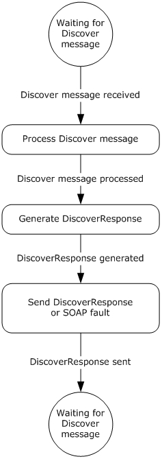

Figure 9: Role of server in resolving the DS

As a prerequisite for enabling the enrollment client to discover the Discovery Service (DS), the administrator MUST configure the [**DNS**](#gt_domain-name-system-dns), such that the name "EnterpriseEnrollment.*[User's Domain]*" resolves to the Discovery Service (DS). The enrollment client extracts the domain suffix from the email address of the enrolling user and prepends it with the DNS to construct the address for the DS. For example, if the email address for the user is "user1@contoso.com", the enrollment client extracts the domain suffix "contoso.com" and prepends it with the DNS to construct the DS address "EnterpriseEnrollment.*contoso.com*".

In the example, the full URL sent by the client to the DS is "`https://EnterpriseEnrollment.contoso.com/EnrollmentServer/Discovery.svc`".

The path portion of the URL "`/EnrollmentServer/Discovery.svc`" is always constant.

The enrollment client validates the [**Secure Sockets Layer (SSL)**](#gt_secure-sockets-layer-ssl) [**certificate**](#gt_certificate) that is protecting the DS endpoint, along with any intermediary certificates that are signed by a trusted [**CA**](#gt_certification-authority-ca).

### 3.1.1 Abstract Data Model

This section describes a conceptual model of possible data organization that an implementation maintains to participate in this protocol. The described organization is provided to facilitate the explanation of how the protocol behaves. This document does not mandate that implementations adhere to this model as long as their external behavior is consistent with that described in this document.

**EnrollmentServiceDirectory:** A repository which stores the URLs for the services used during enrollment.

### 3.1.2 Timers

None.

### 3.1.3 Initialization

The **EnrollmentServiceDirectory** element MUST be initialized with the list of [**ES**](#gt_enrollment-service-es)'s.

### 3.1.4 Message Processing Events and Sequencing Rules

The following table summarizes the list of WSDL operations for discovering the [**ES**](#gt_enrollment-service-es).

| WSDL Operation | Description |
| --- | --- |
| Discover | Describes the messages for discovering [**service endpoints**](#gt_service-endpoint) to complete enrollment. Service endpoints include the [**security token**](#gt_security-token) issuance endpoints and the [**ES endpoints**](#gt_es-endpoint). |

#### 3.1.4.1 Discover

The **Discover** operation defines the client request and server response messages that are used to complete the process of discovering URLs for the [**ES**](#gt_enrollment-service-es)'s.

This operation is specified by the following WSDL.

<wsdl:operation name="Discover">

<wsdl:input wsaw:Action="http://schemas.microsoft.com/windows/management/2012/01/enrollment/IDiscoveryService/Discover" name="IDiscoveryService_Discover_InputMessage" message="tns:IDiscoveryService_Discover_InputMessage"/>

<wsdl:output wsaw:Action="http://schemas.microsoft.com/windows/management/2012/01/enrollment/IDiscoveryService/DiscoverResponse" name="IDiscoveryService_Discover_OutputMessage" message="tns:IDiscoveryService_Discover_OutputMessage"/>

</wsdl:operation>

The following sections specify the request commands used in conjunction with the SyncML message specified in [MS-MDM](../MS-MDM/MS-MDM.md) section 2.2.4.1.

##### 3.1.4.1.1 Messages

The following table summarizes the set of WSDL message definitions that are specific to this operation.

| Message | Description |
| --- | --- |
| IDiscoveryService_Discover_InputMessage | Sent from the client to the server to discover [**service endpoints**](#gt_service-endpoint). |
| IDiscoveryService_Discover_OutputMessage | Sent from the server to the client and contains the information about the service endpoints. |

###### 3.1.4.1.1.1 IDiscoveryService_Discover_InputMessage Message

The **IDiscoveryService_Discover_InputMessage** message contains the **Discover** request message for the **Discover** operation.

The [**SOAP action**](#gt_soap-action) value is

http://schemas.microsoft.com/windows/management/2012/01/enrollment/IDiscoveryService/Discover

The **Discover** request message is sent from the client to the server to discover [**ES endpoints**](#gt_es-endpoint).

<wsdl:message name="IDiscoveryService_Discover_InputMessage">

<wsdl:part name="Discover" element="tns:Discover"/>

</wsdl:message>

**tns:Discover:** An instance of a <Discover> element (section [3.1.4.1.2.1](#Section_3.1.4.1.2.1)).

###### 3.1.4.1.1.2 IDiscoveryService_Discover_OutputMessage Message

The **IDiscoveryService_Discover_OutputMessage** message contains the **DiscoverResponse** response message for the **Discover** operation.

The [**SOAP action**](#gt_soap-action) value is

http://schemas.microsoft.com/windows/management/2012/01/enrollment/IDiscoveryService/DiscoverResponse

The **DiscoverResponse** response message is sent from the server to the client and contains information about the [**ES endpoints**](#gt_es-endpoint).

<wsdl:message name="IDiscoveryService_Discover_OutputMessage">

<wsdl:part name="DiscoverResponse" element="tns:DiscoverResponse"/>

</wsdl:message>

**tns:DiscoverResponse:** An instance of a <DiscoverResponse> element (section [3.1.4.1.2.2](#Section_3.1.4.1.2.2)).

##### 3.1.4.1.2 Elements

The following table summarizes the set of XML Schema element definitions that are specific to this operation.

| Element | Description |
| --- | --- |
| [Discover](#Section_3.1.4.1.2.1) | Contains the body of the Discover request message sent by the client (section 3.1.4.1.2.1). |
| [DiscoverResponse](#Section_3.1.4.1.2.2) | Contains the body of the Discover response message sent by the server in response to the request message received from the client (section 3.1.4.1.2.2). |

###### 3.1.4.1.2.1 Discover

The <Discover> element contains the client request to the server.

<xsd:element name="Discover" nillable="true">

<xsd:complexType>

<xsd:sequence>

<xsd:element minOccurs="1" maxOccurs="1" name="request" nillable="true" type="tns:DiscoveryRequest"/>

</xsd:sequence>

</xsd:complexType>

</xsd:element>

**request:** This element is of type <DiscoveryRequest> (section [3.1.4.1.3.1](#Section_3.1.4.1.3.1)) and contains information about the request.

###### 3.1.4.1.2.2 DiscoverResponse

The <DiscoverResponse> element contains the information to send in the response from the server to the client.

<xsd:element name="DiscoverResponse" nillable="true">

<xsd:complexType>

<xsd:sequence>

<xsd:element minOccurs="1" maxOccurs="1" name="DiscoverResult" nillable="true" type="tns:DiscoveryResponse"/>

</xsd:sequence>

</xsd:complexType>

</xsd:element>

**DiscoverResult:** This element is of type <DiscoveryResponse> (section [3.1.4.1.3.2](#Section_3.1.4.1.3.2)) and contains response information from the server.

##### 3.1.4.1.3 Complex Types

The following table summarizes the set of XML Schema complex type definitions that are specific to this operation.

| ComplexType | Description |
| --- | --- |
| [DiscoveryRequest](#Section_3.1.4.1.3.1) | Specifies the type of the <Discover> element for the **Discover** message (section [3.1.4.1.1.1](#Section_3.1.4.1.1.1)). |
| [DiscoveryResponse](#Section_3.1.4.1.3.2) | Specifies the type of the <DiscoverResponse> element for the **DiscoverResponse** message (section [3.1.4.1.1.2](#Section_3.1.4.1.1.2)). |

###### 3.1.4.1.3.1 DiscoveryRequest

The <DiscoveryRequest> complex type describes the information to send to the server in the <Discover> request element (section [3.1.4.1](#Section_3.1.4.1)).

**Namespace:** http://schemas.microsoft.com/windows/management/2012/01/enrollment

<xsd:element name="request">

<xsd:complexType>

<xsd:all>

<xsd:element name="request">

<xsd:complexType>

<xsd:all>

<xsd:element minOccurs="1" maxOccurs="1" name="EmailAddress" type="enroll:EmailAddressType"/>

<xsd:element minOccurs="1" maxOccurs="1" name="RequestVersion" type="xsd:decimal"/>

<xsd:element minOccurs="1" maxOccurs="1" name="DeviceType" type="enroll:DeviceType"/>

<xsd:element minOccurs="1" maxOccurs="1" name="ApplicationVersion" type="enroll:DottedQuadType"/>

<xsd:element minOccurs="1" maxOccurs="1" name="OSEdition" type="xsd:unsignedInt"/>

<xsd:element name="AuthPolicies">

<xsd:complexType>

<xsd:sequence>

<xsd:element minOccurs="1" maxOccurs="3" name="AuthPolicy" type="enroll:AuthPolicyType"/>

</xsd:sequence>

</xsd:complexType>

</xsd:element>

</xsd:all>

</xsd:complexType>

</xsd:element>

</xsd:all>

</xsd:complexType>

</xsd:element>

**EmailAddress:** This element supplies the name of the user making the enrollment request. The <EmailAddress> value is used by the **DS** to identify the [**ES**](#gt_enrollment-service-es)s to return to the client.

**OSEdition:** This element specifies the type of Operating System (OS) and MUST be set to the decimal value as an int (integer) of the product enumeration defined in section [2.2.9.6](#Section_2.2.9.6).

**DeviceType:** This element specifies the device type and MAY be set to WindowsPhone or CIMClient_Windows.

**RequestVersion:** The value MUST be set to 1.0, 2.0, 3.0, 4.0, 5.0, 6.0, or 7.0.<20>

**ApplicationVersion:** This element specifies the application version and MUST be in the format int.int.int.int.

**AuthPolicies:** This element contains child AuthPolicy elements.

**AuthPolicy:** This element specifies the authentication method and MUST be set to Federated, Certificate, or OnPremise.

###### 3.1.4.1.3.2 DiscoveryResponse

The <DiscoveryResponse> complex type describes the information to send to the client in the <DiscoverResponse> request element (section [3.1.4.1.2.2](#Section_3.1.4.1.2.2)).

**Namespace:** http://schemas.microsoft.com/windows/management/2012/01/enrollment

<xsd:element name="DiscoveryResponse">

<xsd:complexType>

<xsd:all>

<xsd:element name="DiscoverResult">

<xsd:complexType>

<xsd:all>

<xsd:element minOccurs="1" maxOccurs="1" name="AuthPolicy" type="enroll:AuthPolicyType"/>

<xsd:element minOccurs="0" maxOccurs="1" name="EnrollmentPolicyServiceUrl" nillable="true" type="xsd:anyURI"/>

<xsd:element minOccurs="1" maxOccurs="1" name="EnrollmentServiceUrl" type="xsd:anyURI"/>

<xsd:element minOccurs="0" maxOccurs="1" name="AuthenticationServiceUrl" nillable="true" type="xsd:anyURI"/>

<xsd:element minOccurs="0" maxOccurs="1" name="EnrollmentVersion" nillable="true" type="xsd:decimal"/>

</xsd:all>

</xsd:complexType>

</xsd:element>

</xsd:all>

</xsd:complexType>

</xsd:element>

**AuthPolicy:** The value is a string and MUST be set to Federated, Certificate, or OnPremise.

**AuthenticationServiceUrl:** The value of <AuthenticationServiceUrl> is the name of the [**STS**](#gt_security-token-service-sts) from which the client will retrieve a [**security token**](#gt_security-token).

**EnrollmentPolicyServiceUrl:** The value of <EnrollmentPolicyServiceUrl> is the address of the **DS** against which the X.509 Certificate Enrollment Policy Protocol [MS-XCEP](../MS-XCEP/MS-XCEP.md) operations are performed.

**EnrollmentServiceUrl:** The value of <EnrollmentServiceUrl> is the address of the **DS** against which the WS-Trust X.509v3 Token Enrollment Extensions [MS-WSTEP](../MS-WSTEP/MS-WSTEP.md) operations are performed.

**EnrollmentVersion:** The value can be 3.0, 4.0, 5.0, 6.0, or 7.0.<21>

### 3.1.5 Timer Events

None.

### 3.1.6 Other Local Events

None.

## 3.2 Interaction with Security Token Service (STS)

This section describes the third phase in MDE2 device enrollment: requesting and receiving the [**security token**](#gt_security-token). The following diagram highlights this phase.

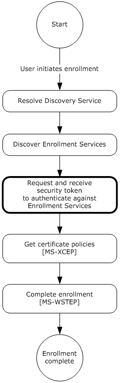

Figure 10: MDE2 device enrollment: requesting and receiving the security token

After the [**enrollment client**](#gt_enrollment-client) receives the **DiscoverResponse** message (section [3.1.4.1.1.2](#Section_3.1.4.1.1.2)), the client obtains a security token from the [**STS**](#gt_security-token-service-sts) specified in the value for the <DiscoveryResponse><AuthenticationServiceUrl> element (section [3.1.4.1.3.2](#Section_3.1.4.1.3.2)).

**Note** The enrollment client is agnostic with regards to the protocol flows for authenticating and returning the security token. While the STS might prompt for user credentials directly or enter into a federation protocol with an STS and directory service, MDE2 is agnostic to all of this. To remain agnostic, all protocol flows pertaining to authentication that involve the enrollment client are passive, that is, browser-implemented.

The following are the explicit requirements for the STS.

The <DiscoveryResponse><AuthenticationServiceUrl> element (section 3.1.4.1.3.2) MUST support HTTPS.

The enrollment client issues an HTTPS request as follows.

AuthenticationServiceUrl?appru=<appid>&login_hint=<User Principal Name>

`<appid>` is of the form `ms-app://string`

<User Principal Name> is the name of the enrolling user, for example, `user@constoso.com`. The value of this attribute serves as a hint that can be used by the STS as part of the authentication.

After authentication is complete, the STS SHOULD return an [**HTML form**](#gt_html-form) document with a POST method action of `appid` identified in the [**query string**](#gt_query-string) parameter. For example,

HTTP/1.1 200 OK

Content-Type: text/html; charset=UTF-8

Vary: Accept-Encoding

Content-Length: 556

<!DOCTYPE>

<html>

<head>

<title>Working...</title>

</head>

<body>

<form method="post" action="ms-app://windows.immersivecontrolpanel">

<input type="hidden" name="wresult" value="token value"/>

<input type="submit"/>

</form>

</body>

</html>

The STS has to send a POST to a redirect [**URL**](#gt_uniform-resource-locator-url) of the form `ms-app://string` (the [**URL scheme**](#gt_url-scheme) is `ms-app`) as indicated in the POST method action. The security token in *wresult* is later passed back in <wsse:BinarySecurityToken> (section [3.3](#Section_3.3)). This string is opaque to the enrollment client; the client does not interpret the string.

## 3.3 Interaction with X.509 Certificate Enrollment Policy

This section describes the fourth phase in MDE2 device enrollment: interacting with the X.509 Certificate Enrollment Policy Protocol [MS-XCEP](../MS-XCEP/MS-XCEP.md) to obtain the [**certificate policies**](#gt_certificate-policy). The following diagram highlights this phase.

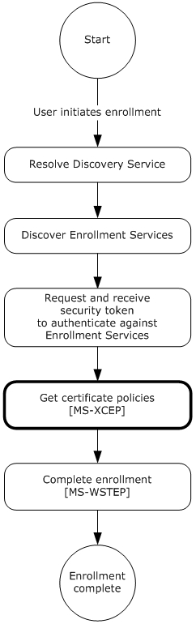

Figure 11: MDE2 device enrollment: getting the certificate policies

The X.509 Certificate Enrollment Policy Protocol [MS-XCEP] enables a client to request [**certificate enrollment policies**](#gt_b8b89448-1696-4337-aeb3-7f6fbf117915) from a server. The communication is initiated by the [**enrollment client**](#gt_enrollment-client) request to the server for the certificate enrollment policies. The server authenticates the client, validates the request, and returns a response with a collection of certificate enrollment policy objects. As specified in section [3.2](#Section_3.2), the enrollment client uses the [**certificate**](#gt_certificate) enrollment policies to complete the enrollment process [MS-WSTEP](../MS-WSTEP/MS-WSTEP.md). MDE2 uses the policies to allow the [**ES**](#gt_enrollment-service-es) to specify the hash algorithm and key length as described in the following section.

**Authentication**

MDE2 implements the authentication provisions in WS-Security 2004 [[WSS]](https://go.microsoft.com/fwlink/?LinkId=130727) to enable the ES [MS-XCEP] to authenticate the **GetPolicies** requestor [MS-XCEP]. This section defines the schema used to express the credential descriptor for the credential type. The [**security token**](#gt_security-token) credential is provided in a request message using the <wsse:BinarySecurityToken> element [WSS]. The security token is retrieved as specified in section 3.2. The authentication information is as follows:

**wsse:Security:** MDE2 implements the <wsse:Security> element defined in [WSS] section 5. The <wsse:Security> element MUST be a child of the <s:Header> element (see [MS-XCEP] section 4).

**wsse:BinarySecurityToken:** MDE2 implements the <wsse:BinarySecurityToken> element defined in [WSS] section 6.3. The <wsse:BinarySecurityToken> element MUST be included as a child of the <wsse:Security> element in the SOAP header.

- As specified in section 3.2, inclusion of the <wsse:BinarySecurityToken> element is opaque to the enrollment client and the client does not interpret the string and inclusion of the element is agreed upon by the [**STS**](#gt_security-token-service-sts) (as identified in the **DS** <AuthenticationServiceUrl> element of <DiscoveryResponse> (section [3.1.4.1.3.2](#Section_3.1.4.1.3.2)) and the ES.
- The <wsse:BinarySecurityToken> element contains a [**base64**](#gt_179b9392-9019-45a3-880b-26f6890522b7)-encoded string. The enrollment client uses the security token received from the STS and base64-encodes the token to populate the <wsse:BinarySecurityToken> element.
**wsse:BinarySecurityToken/attributes/ValueType:** The <wsse:BinarySecurityToken> ValueType attribute MUST be `"http://schemas.microsoft.com/5.0.0.0/ConfigurationManager/Enrollment/DeviceEnrollmentUserToken".`

**wsse:BinarySecurityToken/attributes/EncodingType:** The <wsse:BinarySecurityToken> EncodingType attribute MUST be `"http://docs.oasis-open.org/wss/2004/01/oasis-200401-wss-wssecurity-secext-1.0.xsd#base64binary".`

### 3.3.1 Abstract Data Model

None.

### 3.3.2 Timers

None.

### 3.3.3 Initialization

None.

### 3.3.4 Message Processing Events and Sequencing Rules

The following table summarizes the list of WSDL operations for obtaining the [**certificate policies**](#gt_certificate-policy).

| Operation | Description |
| --- | --- |
| [GetPolicies](#Section_3.3.4.1.1.1) | Defines the client request and server response messages for completing the process of retrieving a certificate policy for enrollment (section 3.3.4.1). |

This section specifies the details for how MDE2 uses messages defined by the X.509 Certificate Enrollment Policy Protocol [MS-XCEP](../MS-XCEP/MS-XCEP.md).

#### 3.3.4.1 GetPolicies Operation

The **GetPolicies** operation defines the client request and server response messages that are used to complete the process of retrieving a [**certificate policy**](#gt_certificate-policy) for enrollment.

<wsdl:operation name="GetPolicies">

<wsdl:input wsaw:Action="http://schemas.microsoft.com/windows/pki/2009/01/enrollmentpolicy/IPolicy/GetPolicies" message="xcep:IPolicy_GetPolicies_InputMessage"/>

<wsdl:output wsaw:Action="http://schemas.microsoft.com/windows/pki/2009/01/enrollmentpolicy/IPolicy/GetPoliciesResponse" message="xcep:IPolicy_GetPolicies_OutputMessage"/>

</wsdl:operation>

##### 3.3.4.1.1 Messages

The following table summarizes the set of WSDL message definitions that are specific to this operation.

| Message | Description |
| --- | --- |
| [GetPolicies](#Section_3.3.4.1.1.1) | Sent from the client to the server to retrieve the [**certificate policies**](#gt_certificate-policy) for enrollment (section 3.3.4.1.1.1). |
| [GetPoliciesResponse](#Section_3.3.4.1.1.2) | Sent from the server to the client and contains the requested certificate policy objects for enrollment (section 3.3.4.1.1.2). |

###### 3.3.4.1.1.1 GetPolicies

The **GetPolicies** message contains the request for the **GetPolicies** operation.

The [**SOAP action**](#gt_soap-action) value is

http://schemas.microsoft.com/windows/pki/2009/01/enrollmentpolicy/IPolicy/GetPolicies

Get Policies using Federated Authentication

The **GetPolicies** request message is sent from the client to the server to retrieve the [**certificate policies**](#gt_certificate-policy) for enrollment.

<wsdl:message name="IPolicy_GetPolicies_InputMessage">

<wsdl:part name="request" element="xcep:GetPolicies"/>

</wsdl:message>

**xcep:GetPolicies:** An instance of a <GetPolicies> element as specified in [MS-XCEP](../MS-XCEP/MS-XCEP.md) section 3.1.4.1.2.1. MDE2 modifies the **GetPolicies** message defined in [MS-XCEP] section 3.1.4.1.1.1.

Authentication MUST be implemented for this message as defined in section [3.3](#Section_3.3). In summary, the following elements and attributes MUST be specified in the SOAP header:

**wsse:Security:** The <wsse:Security> element MUST be a child of <s:Header>.

**wsse:BinarySecurityToken:** The <wsse:BinarySecurityToken> element MUST be a child of <wsse:Security> in <s:Header>.

**wsse:BinarySecurityToken/attributes/ValueType:** The <wsse:BinarySecurityToken> ValueType attribute MUST be `"http://schemas.microsoft.com/5.0.0.0/ConfigurationManager/Enrollment/DeviceEnrollmentUserToken".`

**wsse:BinarySecurityToken/attributes/EncodingType:** The <wsse:BinarySecurityToken> EncodingType attribute MUST be "`http://docs.oasis-open.org/wss/2004/01/oasis-200401-wss-wssecurity-secext-1.0.xsd#base64binary".`

The following elements with their specified values MUST be included in the SOAP body of the request message.

**xcep:requestfilter:** MDE2 modifies the <GetPolicies> element by setting the <requestFilter> element **xsi:nil** attribute to `"true"` (see [MS-XCEP] section 3.1.4.1.2.1).

**xcep:lastUpdate:** MDE2 modifies the <GetPolicies> **xcep:client** attribute by setting the <Client> <lastUpdate> element **xsi:nil** attribute to `"true"` (see [MS-XCEP] section 3.1.4.1.3.9).

**xcep:preferredLanguage:** MDE2 modifies the <GetPolicies> **xcep:client** attribute by setting the <Client> <preferredLanguage> element **xsi:nil** attribute to `"true"` (see [MS-XCEP] section 3.1.4.1.3.9).

GetPolicies using Certificate Authentication

The **GetPolicies** request message is sent from the client to the server to retrieve the [**certificate policies**](#gt_certificate-policy) for enrollment.

<wsdl:message name="IPolicy_GetPolicies_InputMessage">

<wsdl:part name="request" element="xcep:GetPolicies"/>

</wsdl:message>

**xcep:GetPolicies:** An instance of a <GetPolicies> element as specified in [MS-XCEP](../MS-XCEP/MS-XCEP.md) section 3.1.4.1.2.1. MDE2 modifies the **GetPolicies** message defined in [MS-XCEP] section 3.1.4.1.1.1.

Authentication MUST be implemented for this message as defined in section [3.3](#Section_3.3). In summary, the following elements and attributes MUST be specified in the SOAP header:

**wsse:Security:** The <wsse:Security> element MUST be a child of <s:Header>.

**u:Timestamp:** The <u:Timestamp> element MUST be a child of <wsse:Security> in <s:Header> for certificate authentication.

**u:Created:** The <u:Created> element MUST be a child of <u:Timestamp> in <s:Header> for certificate authentication. The value is a date/time.

**u:Expires:** The <u:Expires> element MUST be a child of <u:Timestamp> in <s:Header> for certificate authentication. The value is a date/time.

**wsse:BinarySecurityToken:** The <wsse:BinarySecurityToken> element MUST be a child of <wsse:Security> in <s:Header> for [**certificate**](#gt_certificate) authentication.

**wsse:BinarySecurityToken/attributes/ValueType:** The value type MUST be `"http://docs.oasis-open.org/wss/2004/01/oasis-200401-wss-x509-token-profile-1.0#X509v3"` for certificate authentication.

**wsse:BinarySecurityToken/attributes/Id:** The value is a string.

**wsse:BinarySecurityToken/attributes/EncodingType:** The <wsse:BinarySecurityToken> EncodingType attribute MUST be "`http://docs.oasis-open.org/wss/2004/01/oasis-200401-wss-wssecurity-secext-1.0.xsd#base64binary"` for certificate authentication`.`

**ds:Signature:** The <ds:Signature> element MUST be a child of <wsse:Security> in <s:Header> for certificate authentication.

**ds:SignedInfo:** The <ds:Signature> element MUST be a child of <ds:Signature> in <s:Header> for certificate authentication.

**ds:CanonicalizationMethod:** The <ds:CanonicalizationMethod> element MUST be a child of <ds:SignedInfo> in <s:Header> for certificate authentication.

**ds:CanonicalizationMethod/attributes/Algorithm:** The <ds:CanonicalizationMethod> Algorithm attribute MUST be `"http://www.w3.org/2001/10/xml-exc-c14n#"`.

**ds:SignatureMethod:** The <ds:SignatureMethod> element MUST be a child of <ds:SignedInfo> in <s:Header> for certificate authentication.

**ds:SignatureMethod/attributes/Algorithm:** The <ds:SignatureMethod> Algorithm attribute MUST be `"http://www.w3.org/2001/04/xmldsig-more#rsa-sha256"`.

**ds:Reference:** The <ds:Reference> element MUST be a child of <ds:SignedInfo> in <s:Header> for certificate authentication.

**ds:Reference/attributes/URI:** The <ds**:**Reference> URI attribute MUST be "".

**ds:Transforms:** The <ds:Transforms> element MUST be a child of <ds:Reference> in <s:Header> for certificate authentication.

**ds:Transform:** The <ds:Transform> element MUST be a child of <ds:Reference> in <s:Header> for certificate authentication.

**ds:Transform/attributes/Algorithm:** The <ds:SignatureMethod> Algorithm attribute MUST be `"http://www.w3.org/2000/09/xmldsig#enveloped-signature"`.

**ds:DigestMethod:** The <ds:DigestMethod> element MUST be a child of <ds:Reference> in <s:Header> for certificate authentication.

**ds:DigestMethod/attributes/Algorithm:** The <ds:DigestMethod> Algorithm attribute MUST be `"http://www.w3.org/2001/04/xmlenc#sha256"`.

**ds:DigestValue:** The <ds:DigestValue> element MUST be a child of <ds:Reference> in <s:Header> for certificate authentication. The value is a string.

**ds:SignatureValue:** The <ds:SignatureValue> element MUST be a child of <ds:Signature> in <s:Header> for certificate authentication. The value is a string.

**ds:KeyInfo:** The <ds:KeyInfo> element MUST be a child of <ds:Signature> in <s:Header> for certificate authentication.

**wsse:SecurityTokenReference:** The <wsse`:`SecurityTokenReference> element MUST be a child of <ds:KeyInfo> in <ds:Signature> in <s:Header> for certificate authentication.

**wsse:Reference:** The <wsse`:`Reference> element MUST be a child of <wsse:SecurityTokenReference> in <s:Header> for certificate authentication.

**wsse:Reference/attributes/URI:** The <wsse:Reference> URI attribute is a string.

**wsse:Reference/attributes/ValueType:** The <wsse:Reference> ValueType attribute MUST be `"http://docs.oasis-open.org/wss/2004/01/oasis-200401-wss-x509-token-profile-1.0#X509"`.

The following elements with their specified values MUST be included in the SOAP body of the request message.

**xcep:requestfilter:** MDE2 modifies the <GetPolicies> element by setting the <requestFilter> element **xsi:nil** attribute to `"true"` (see [MS-XCEP] section 3.1.4.1.2.1).

**xcep:lastUpdate:** MDE2 modifies the <GetPolicies> **xcep:client** attribute by setting the <Client> <lastUpdate> element **xsi:nil** attribute to `"true"` (see [MS-XCEP] section 3.1.4.1.3.9).

**xcep:preferredLanguage:** MDE2 modifies the <GetPolicies> **xcep:client** attribute by setting the <Client> <preferredLanguage> element **xsi:nil** attribute to `"true"` (see [MS-XCEP] section 3.1.4.1.3.9).

GetPolicies using On-Premise Authentication

The **GetPolicies** request message is sent from the client to the server to retrieve the [**certificate policies**](#gt_certificate-policy) for enrollment.

<wsdl:message name="IPolicy_GetPolicies_InputMessage">

<wsdl:part name="request" element="xcep:GetPolicies"/>

</wsdl:message>

**xcep:GetPolicies:** An instance of a <GetPolicies> element as specified in [MS-XCEP](../MS-XCEP/MS-XCEP.md) section 3.1.4.1.2.1. MDE2 modifies the **GetPolicies** message specified in [MS-XCEP] section 3.1.4.1.1.1.

Authentication MUST be implemented for this message as specified in section [3.3](#Section_3.3). In summary, the following elements and attributes are specified in the SOAP header:

**wsse:Security:** The <wsse:Security> element MUST be a child of <s:Header>.

**wsse:UsernameToken:** The <wsse: UsernameToken> element MUST be a child of <wsse:Security> in <s:Header> for on-premise authentication.

**wsse:Username:** The <wsse: Username> element MUST be a child of <wsse:UsernameToken> in <s:Header> and the value specifies the user name.

**wsse:UsernameToken/attributes/u:Id:** The type MUST be `"uuid-cc1ccc1f-2fba-4bcf-b063-ffc0cac77917-4"` for on-premise authentication`.`

**wsse:Password:** The <wsse: Password> element MUST be a child of <wsse: UsernameToken> in <s:Header> and the value specifies the user password.

**wsse: Password/attributes/Type:** The type MUST be `"http://docs.oasis-open.org/wss/2004/01/oasis-200401-wss-username-token-profile-1.0#PasswordText"` for on-premise authentication`.`

The following elements with their specified values MUST be included in the SOAP body of the request message.

**xcep:requestfilter:** MDE2 modifies the <GetPolicies> element by setting the <requestFilter> element **xsi:nil** attribute to TRUE (see [MS-XCEP] section 3.1.4.1.2.1).

**xcep:lastUpdate:** MDE2 modifies the <GetPolicies> **xcep:client** attribute by setting the <Client> <lastUpdate> element **xsi:nil** attribute to TRUE (see [MS-XCEP] section 3.1.4.1.3.9).

**xcep:preferredLanguage:** MDE2 modifies the <GetPolicies> **xcep:client** attribute by setting the <Client> <preferredLanguage> element **xsi:nil** attribute to TRUE (see [MS-XCEP] section 3.1.4.1.3.9).

###### 3.3.4.1.1.2 GetPoliciesResponse

The **GetPoliciesResponse** message contains the response for the **GetPolicies** operation.

The [**SOAP action**](#gt_soap-action) value is

http://schemas.microsoft.com/windows/pki/2009/01/enrollmentpolicy/IPolicy/GetPoliciesResponse

The **GetPoliciesResponse** message is sent from the server to the client and contains the requested [**certificate enrollment policies**](#gt_b8b89448-1696-4337-aeb3-7f6fbf117915).

<wsdl:message name="IPolicy_GetPolicies_OutputMessage">

<wsdl:part name="response" element="xcep:GetPoliciesResponse"/>

</wsdl:message>

**xcep:GetPoliciesResponse:** An instance of a <GetPoliciesResponse> element as specified in [MS-XCEP](../MS-XCEP/MS-XCEP.md) section 3.1.4.1.2.2.

The [**enrollment client**](#gt_enrollment-client) evaluates the following child elements of the <GetPoliciesResponse> element to determine whether to include the child element in the SOAP body of the response message. When a child element is included, the element and value are specified using syntax similar to [**XML Path Language (XPath)**](#gt_xml-path-language-xpath).

**xcep:GetPoliciesResponse/response/policyFriendlyName** (see [MS-XCEP] section 3.1.4.1.3.23).

**xcep:GetPoliciesResponse/response/nextUpdateHours** (see [MS-XCEP] section 3.1.4.1.3.23).

**xcep:GetPoliciesResponse/response/policiesNotChanged** (see [MS-XCEP] section 3.1.4.1.3.23).

**xcep:GetPoliciesResponse/response/policyID** (see [MS-XCEP] section 3.1.4.1.3.23).

**xcep:GetPoliciesResponse/response/policies/policy/policyOIDReference:** (see [MS-XCEP] section 3.1.4.1.3.7)

**xcep:GetPoliciesResponse/response/policies/policy/cAs** (see [MS-XCEP] section 3.1.4.1.3.7).

**xcep:GetPoliciesResponse/response/policies/policy/attributes/commonName** (see [MS-XCEP] section 3.1.4.1.3.1)

**xcep:GetPoliciesResponse/response/policies/policy/attributes/policySchema:** The value MUST be 3 (see [MS-XCEP] section 3.1.4.1.3.1).

**xcep:GetPoliciesResponse/response/policies/policy/attributes/certificateValidity** (see [MS-XCEP] section 3.1.4.1.3.8).

**xcep:GetPoliciesResponse/response/policies/policy/attributes/permission/enroll** (see [MS-XCEP] section 3.1.4.1.3.11).

**xcep:GetPoliciesResponse/response/policies/policy/attributes/permission/autoEnroll** (see [MS-XCEP] section 3.1.4.1.3.11).

**xcep:GetPoliciesResponse/response/policies/policy/attributes/privatekeyattributes/minimalkeylength** (see [MS-XCEP] section 3.1.4.1.3.20).

**xcep:GetPoliciesResponse/response/policies/policy/attributes/privatekeyattributes/algorithmOIDReference** (see [MS-XCEP] section 3.1.4.1.3.20).

**xcep:GetPoliciesResponse/response/policies/policy/attributes/privatekeyattributes/keySpec** (see [MS-XCEP] section 3.1.4.1.3.20).

**xcep:GetPoliciesResponse/response/policies/policy/attributes/privatekeyattributes/keyUsageProperty** (see [MS-XCEP] section 3.1.4.1.3.20).

**xcep:GetPoliciesResponse/response/policies/policy/attributes/privatekeyattributes/permissions** (see [MS-XCEP] section 3.1.4.1.3.20).

**xcep:GetPoliciesResponse/response/policies/policy/attributes/privatekeyattributes/AttestationFailureBehavior:** This is an optional node if the **EnrollmentVersion** value is 5.0 or higher.<22> If used, this node MUST have a value FailOnError, IgnoreOnError, or RetryOnError. If FailOnError is used, [**Certificate Attestation**](#gt_certificate-attestation) will be attempted once, and if it fails, Enrollment will fail. If IgnoreOnError is used, **Certificate Attestation** will be attempted once, and if it fails, Enrollment will continue. If RetryOnError is chosen, **Certificate Attestation** will be attempted as many times as allowed by the timeout specified by the xcep:GetPoliciesResponse/response/policies/policy/attributes/privatekeyattributes/OperationTimeout tag. If **Certificate Attestation** still fails, Enrollment will continue. If no value is specified and **Certificate Attestation** is still used, the default OS behavior will be RetryOnError.

**xcep:GetPoliciesResponse/response/policies/policy/attributes/privatekeyattributes/OperationTimeout:** This is an optional node if the **EnrollmentVersion** value is 5.0 or higher.<23> If used, this lists the time, in seconds, that the OS will continue attempting to perform **Certificate Attestation** in case of errors. If no value is specified here and **Certificate Attestation** is still used, the default OS behavior will be 100 seconds.

**xcep:GetPoliciesResponse/response/policies/policy/attributes/revision/majorRevision** (see [MS-XCEP] section 3.1.4.1.3.24).

**xcep:GetPoliciesResponse/response/policies/policy/attributes/revision/minorRevision** (see [MS-XCEP] section 3.1.4.1.3.24).

**xcep:GetPoliciesResponse/response/policies/policy/attributes/privatekeyattributes/cryptoProviders** (see [MS-XCEP] section 3.1.4.1.3.20).

**xcep:GetPoliciesResponse/response/policies/policy/attributes/hashAlgorithmOIDReference:** The referenced object identifier ([**OID**](#gt_object-identifier-oid)) MUST be in the <GetPoliciesResponse> element (see [MS-XCEP] section 3.1.4.1.3.1).

**xcep:GetPoliciesResponse/response/policies/policy/attributes/supersededPolicies** (see [MS-XCEP] section 3.1.4.1.3.1)**.**

**xcep:GetPoliciesResponse/response/policies/policy/attributes/privateKeyFlags** (see [MS-XCEP] section 3.1.4.1.3.1).

**xcep:GetPoliciesResponse/response/policies/policy/attributes/subjectNameFlags** (see [MS-XCEP] section 3.1.4.1.3.1).

**xcep:GetPoliciesResponse/response/policies/policy/attributes/enrollmentFlags** (see [MS-XCEP] section 3.1.4.1.3.1).

**xcep:GetPoliciesResponse/response/policies/policy/attributes/generalFlags** (see [MS-XCEP] section 3.1.4.1.3.1).

**xcep:GetPoliciesResponse/response/policies/policy/attributes/rARequirements** (see [MS-XCEP] section 3.1.4.1.3.1).

**xcep:GetPoliciesResponse/response/policies/policy/attributes/keyArchivalAttributes** (see [MS-XCEP] section 3.1.4.1.3.1).

**xcep:GetPoliciesResponse/response/policies/policy/attributes/extensions** (see [MS-XCEP] section 3.1.4.1.3.1).

**xcep:GetPoliciesResponse/response/policies/policy/attributes/attestation/attestationFailureBehavior**: This functions identically to the xcepGetPoliciesResponse/response/policies/policy/attributes/privatekeyattributes/AttestationFailureBehavior node, except this one takes precedence if both are set. This node is available on EnrollmentVersion value 6.0 or higher.

**xcep:GetPoliciesResponse/response/policies/policy/attributes/attestation/operationTimeout**: This functions identically to the xcepGetPoliciesResponse/response/policies/policy/attributes/privatekeyattributes/operationTimeout node, except this one takes precedence if both are set. This node is available on EnrollmentVersion value 6.0 or higher.

**xcep:GetPoliciesResponse/response/policies/policy/attributes/attestation/azureAttestation/nonce**: This optional node should contain the nonce used for the AzureAttestation flow. This node is available on EnrollmentVersion value 6.0 or higher.

**xcep:GetPoliciesResponse/response/policies/policy/attributes/attestation/azureAttestation/relyingPartyId**: This optional node should contain the Relying Party ID used for the AzureAttestation flow to uniquely identify the relying party. This node is available on EnrollmentVersion value 6.0 or higher.

**xcep:GetPoliciesResponse/response/policies/policy/attributes/attestation/azureAttestation/endpointUri**: This optional node should contain the URI used for Azure Attestation. The client code will call this Azure Attestation endpoint to perform the AzureAttestation flow. This node is available on EnrollmentVersion value 6.0 or higher.

**xcep:GetPoliciesResponse/cAs** (see [MS-XCEP] section 3.1.4.1.2.2).

**xcep:GetPoliciesResponse/oIDs/oID:** The OID referred to by the value of the **hashAlgorithmOIDReference** element specified in the previous point (see [MS-XCEP] section 3.1.4.1.2.2). The value MUST conform to the constraints specified in [MS-XCEP] section 3.1.4.1.3.16. For example, the <group> element value is 1.

### 3.3.5 Timer Events

None.

### 3.3.6 Other Local Events

None.

## 3.4 Interaction with WS-Trust X.509v3 Token Enrollment

This section describes the fifth phase in MDE2 device enrollment: interacting with the WS-Trust X.509v3 Token Enrollment Extensions [MS-WSTEP](../MS-WSTEP/MS-WSTEP.md) to complete enrollment. The following diagram highlights this final phase.

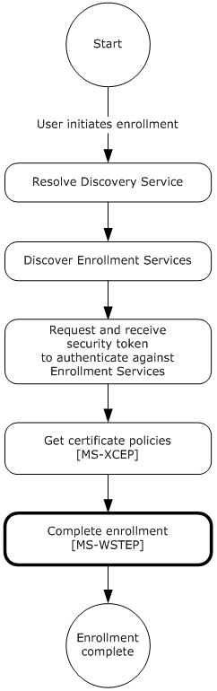

Figure 12: MDE device enrollment: completing enrollment

The WS-Trust X509v3 Enrollment Extensions [MS-WSTEP] are extensions of WS-Trust Security 2004 [[WSS]](https://go.microsoft.com/fwlink/?LinkId=130727) that are used by a system to request that a [**certificate**](#gt_certificate) be issued. MDE2 implements an extension profile of the extensions defined in [MS-WSTEP], to enable a device to be enrolled and receive an identity. The following sections specify the details of the MDE2 profile of and extensions defined in [MS-WSTEP].

**Authentication**

The WS-Trust X509v3 Enrollment Extensions [MS-WSTEP] use the authentication provisions in WS-Security 2004 [WSS] to enable the X509v3 [**security token**](#gt_security-token) issuer to authenticate the X509v3 security token requestor. This section defines the schema used to express the credential descriptor for each supported credential type. The security token credential is provided in a request message using the <wsse:BinarySecurityToken> element [WSS]. The security token is retrieved as specified in section [3.2](#Section_3.2). The authentication information is as follows:

**wsse:Security:** MDE implements the <wsse:Security> element defined in [WSS] section 5. The <wsse:Security> element MUST be a child of the <s:Header> element (see [MS-XCEP](../MS-XCEP/MS-XCEP.md) section 4).

**wsse:BinarySecurityToken:** MDE implements the <wsse:BinarySecurityToken> element defined in [WSS] section 6.3. The <wsse:BinarySecurityToken> element MUST be included as a child of the <wsse:Security> element in the SOAP header.

- As was specified in section 3.2, inclusion of the <wsse:BinarySecurityToken> element is opaque to the [**enrollment client**](#gt_enrollment-client) and is agreed upon by the [**STS**](#gt_security-token-service-sts), as identified in the **DS** <AuthenticationServiceUrl> element of <DiscoveryResponse> (section [3.1.4.1.3.2](#Section_3.1.4.1.3.2)) and the [**ES**](#gt_enrollment-service-es).
- The <wsse:BinarySecurityToken> element contains a [**base64**](#gt_179b9392-9019-45a3-880b-26f6890522b7)-encoded security token. The enrollment client uses the security token received from the STS to populate the <wsse:BinarySecurityToken> element.
**wsse:BinarySecurityToken/attributes/ValueType:** The <wsse:BinarySecurityToken> ValueType attribute MUST be `"http://schemas.microsoft.com/5.0.0.0/ConfigurationManager/Enrollment/DeviceEnrollmentUserToken".`

**wsse:BinarySecurityToken/attributes/EncodingType:** The <wsse:BinarySecurityToken> EncodingType attribute MUST be `"http://docs.oasis-open.org/wss/2004/01/oasis-200401-wss-wssecurity-secext-1.0.xsd#base64binary".`

### 3.4.1 Abstract Data Model

None.

### 3.4.2 Timers

None.

### 3.4.3 Initialization

None.

### 3.4.4 Message Processing Events and Sequencing Rules

The following table summarizes the list of WSDL operations for completing enrollment.

| Operation | Description |
| --- | --- |
| [RequestSecurityToken](#Section_3.4.4.1.1.1) | Provides the mechanism for completing the enrollment process. MDE2 uses the messages as specified in the WS-Trust X.509v3 Token Enrollment Extensions (see [MS-WSTEP](../MS-WSTEP/MS-WSTEP.md) section 3.1.4). |

#### 3.4.4.1 RequestSecurityToken Operation

The **RequestSecurityToken** operation is called by the client to register a device.

<wsdl:operation name="RequestSecurityToken">

<wsdl:input wsaw:Action="http://schemas.microsoft.com/windows/pki/2009/01/enrollment/RST/wstep" name="RequestSecurityTokenRequest" message="tns:RequestSecurityTokenMsg"/>

<wsdl:output wsaw:Action="http://schemas.microsoft.com/windows/pki/2009/01/enrollment/RSTRC/wstep" name="RequestSecurityTokenResponse" message="tns:RequestSecurityTokenResponseCollectionMsg"/>

</wsdl:operation>

##### 3.4.4.1.1 Messages

The following table summarizes the set of WSDL message definitions that are specific to this operation.

| Message | Description |
| --- | --- |
| [RequestSecurityToken](#Section_3.4.4.1.1.1) | Sent from the client to the server to enroll a user (section 3.4.4.1.1.1). |
| [RequestSecurityTokenResponseCollection](#Section_3.4.4.1.1.2) | Sent from the server to the client and contains the requested [**certificate**](#gt_certificate) and [**provisioning information**](#gt_provisioning-information) (section 3.4.4.1.1.2). |

###### 3.4.4.1.1.1 RequestSecurityToken

The **RequestSecurityToken** message contains the request for the **RequestSecurityToken** operation.

The [**SOAP action**](#gt_soap-action) value is

http://schemas.microsoft.com/windows/pki/2009/01/enrollment/RST/wstep

The **RequestSecurityToken** request message ([[WSTrust1.3]](https://go.microsoft.com/fwlink/?LinkId=131548) section 3.1) is sent from the client to the server to enroll a [**certificate**](#gt_certificate) and to retrieve [**provisioning information**](#gt_provisioning-information).

<wsdl:message name="RequestSecurityTokenMsg">

<wsdl:part name="request" element="wst:RequestSecurityToken" />

</wsdl:message>

**wst:RequestSecurityToken:** MDE2 modifies the implementation of the **RequestSecurityToken** message as defined in [MS-WSTEP](../MS-WSTEP/MS-WSTEP.md) section 3.1.4.1.1.1 and its associated protocols.

RequestSecurityToken using Federated Authentication

Authentication MUST be implemented for this message as defined in section [3.4](#Section_3.4). In summary, the following elements and attributes MUST be specified in the SOAP header:

**wsse:Security:** The <wsse:Security> element MUST be a child of <s:Header>.

**wsse:BinarySecurityToken:** The <wsse:BinarySecurityToken> element MUST be a child of <wsse:Security> in <s:Header>.

**wsse:BinarySecurityToken/attributes/ValueType:** The <wsse:BinarySecurityToken> ValueType attribute MUST be `"http://schemas.microsoft.com/5.0.0.0/ConfigurationManager/Enrollment/DeviceEnrollmentUserToken".`

**wsse:BinarySecurityToken/attributes/EncodingType:** The <wsse:BinarySecurityToken> EncodingType attribute MUST be `"http://docs.oasis-open.org/wss/2004/01/oasis-200401-wss-wssecurity-secext-1.0.xsd#base64binary".`

The following elements and attributes MUST be specified in the SOAP body of the request message.

**wst:RequestSecurityToken:** The <wst:RequestSecurityToken> element MUST be a child of <s:Body>.

**wst:TokenType:** The <wst:tokentype> element MUST be a child of <wst:RequestSecurityToken> and the value is `"http://schemas.microsoft.com/5.0.0.0/ConfigurationManager/ Enrollment/DeviceEnrollmentToken"` (see [[WSTrust1.3]](https://go.microsoft.com/fwlink/?LinkId=131548) section 3.1).

**wst:RequestType:** The <wst:RequestType> element MUST be a child of <wst:RequestSecurityToken> and the value is `"http://docs.oasis-open.org/ws-sx/ws-trust/200512/Issue"` (see [WSTrust1.3] section 3.1).

**wsse:BinarySecurityToken:** The <wsse:BinarySecurityToken> element MUST be a child of <wst:RequestSecurityToken> and contains a [**base64-encoded**](#gt_179b9392-9019-45a3-880b-26f6890522b7) [**certificate signing request**](#gt_certificate-signing-request).

**wsse:BinarySecurityToken/attributes/ValueType:** The <wsse:BinarySecurityToken> ValueType attribute MUST be `"http://schemas.microsoft.com/windows/pki/2009/01/ enrollment#PKCS10".`

**wsse:BinarySecurityToken/attributes/EncodingType:** The <wsse:BinarySecurityToken> EncodingType attribute MUST be `"http://docs.oasis-open.org/wss/2004/01/oasis-200401-wss-wssecurity-secext-1.0.xsd#base64binary".`

**Namespace:** http://docs.oasis-open.org/wss/2004/01/oasis-200401-wss-wssecurity-secext-1.0.xsd

The following elements and their values are specified in the SOAP body of the request message:

**ac:AdditionalContext:** The <ac:AdditionalContext> element MUST be a child of <wst:RequestSecurityToken> (see [MS-WSTEP](../MS-WSTEP/MS-WSTEP.md) section 3.1.4.1.3.3).

**ac:ContextItem:** One or more <ac:ContextItem> Name attributes MUST be specified as child elements of <ac:AdditionalContext> to represent the device.

**ac:ContextItem/attributes/Name:** The <ac:ContextItem> Name attribute MUST be the literal string "OSEdition".

**ac:Value:** The <ac:Value> element MUST be a child of <ac:AdditionalContext> and the value is set to the decimal value as an int (integer) of the product enumeration defined in section [2.2.9.6](#Section_2.2.9.6).

**ac:ContextItem/attributes/Name:** The <ac:ContextItem> Name attribute MUST be the literal string "OSVersion".

**ac:Value:** The <ac:Value> element is a child of <ac:AdditionalContext> and the value MUST be a string (UTF-8) in the format int.int.int.int.

**ac:ContextItem/attributes/Name:** The <ac:ContextItem> Name attribute MUST be the literal string "DeviceName".

**ac:Value:** The <ac:Value> element MUST be a child of <ac:AdditionalContext> and the value is a string (UTF-8) name of the device.

**ac:ContextItem/attributes/Name:** The <ac:ContextItem> Name attribute MUST be the literal string "EnrollmentType.

**ac:Value:** The <ac:Value> element MUST be a child of <ac:AdditionalContext> and the value is a string (UTF-8) that MUST be Full or Device.

**ac:ContextItem/attributes/Name:** The <ac:ContextItem> Name attribute MUST be the literal string "DeviceType".

**ac:Value:** The <ac:Value> element MUST be a child of <ac:AdditionalContext> and the value is a string (UTF 8) that MUST be WindowsPhone for mobile devices, CIMClient_Windows for desktop devices, or WindowsHandheld for enterprise handheld devices.

**ac:ContextItem/attributes/Name:** The <ac:ContextItem> Name attribute MUST be the literal string "ApplicationVersion".

**ac:Value:** The <ac:Value> element MUST be a child of <ac:AdditionalContext> and the value is a string that specifies the application version in the format int.int.int.int.

**ac:ContextItem/attributes/Name:** The <ac:ContextItem> Name attribute MUST be the literal string "DeviceID".

**ac:Value:** The <ac:Value> element MUST be a child of <ac:AdditionalContext> and the value specifies the unique device identifier.

**ac:ContextItem/attributes/Name:** The <ac:ContextItem> Name attribute MUST be the literal string "EnrollmentData".

**ac:Value:** The <ac:Value> element MUST be a child of <ac:AdditionalContext> and the value contains the enrollment data.

**ac:ContextItem/attributes/Name:** The <ac:ContextItem> Name attribute MUST be the literal string "MAC". Multiple MAC addresses are supported if a device has multiple [**NIC**](#gt_network-interface-card-nic)s.

**ac:Value:** The <ac:Value> element MUST be a child of <ac:AdditionalContext> and the value is a string (UTF-8) that specifies the MAC address of the device.

**ac:ContextItem/attributes/Name:** The <ac:ContextItem> Name attribute MUST be the literal string "IMEI".

**ac:Value:** The <ac:Value> element MUST be a child of <ac:AdditionalContext> and the value is an int (integer) that specifies the mobile equipment ID.

**ac:ContextItem/attributes/Name:** The <ac:ContextItem> Name attribute MUST be the literal string "TargetedUserLoggedIn".

**ac:Value:** The <ac:Value> element MUST be a child of <ac:AdditionalContext> and the value is true or false that indicates whether the user is logged in.

The following elements are supported in an implementation-specific manner.<24>

**ac:ContextItem/attributes/Name:** The <ac:ContextItem> Name attribute MUST be the literal string "Locale".

**ac:Value:** The <ac:Value> element MUST be a child of <ac:AdditionalContext> and the value is a [**UTF-8**](#gt_utf-8) string that specifies the locale of the device.

**ac:ContextItem/attributes/Name:** The <ac:ContextItem> Name attribute MUST be the literal string "HWDevID".

**ac:Value:** The <ac:Value> element MUST be a child of <ac:AdditionalContext> and the value is a 64-hex character length UTF-8 string that specifies the hardware device ID.

**ac:ContextItem/attributes/Name:** The <ac:ContextItem> Name attribute MUST be the literal string "BulkAADJ". This attribute will be present only if the enrollment is taking place as part of Bulk Azure Active Directory Join.

**ac:Value:** If included, this <ac:Value> element MUST be a child of <ac:AdditionalContext> and MUST be the literal string “true” indicating that the enrollment is taking place as part of Bulk Azure Active Directory Join.

**ac:ContextItem/attributes/Name:** The <ac:ContextItem> Name attribute MUST be the literal string "ZeroTouchProvisioning". This attribute will be present only if the enrollment is taking place on a device registered with Zero Touch Provisioning.

**ac:Value:** If included, this <ac:Value> element MUST be a child of <ac:AdditionalContext> and the value is a UTF-8 string that represents a GUID used by Zero Touch Provisioning.

**ac:ContextItem/attributes/Name:** The <ac:ContextItem> Name attribute MUST be the literal string "OfflineAutoPilotEnrollmentCorrelator". This attribute will be present only if the enrollment is taking place on a device registered with Zero Touch Provisioning via offline registration.

**ac:Value:** If included, this <ac:Value> element MUST be a child of <ac:AdditionalContext> and the value is a UTF-8 string that serves as a correlator from the offline registration initiator to the enrollment server. The string length must be greater than 0 and less than or equal to 100, contains alphanumeric character and single hyphen only, and cannot be started with a hyphen.

**ac:ContextItem/attributes/Name:** The <ac:ContextItem> Name attribute MUST be the literal string "UXInitiated".

**ac:Value:** If included, this <ac:Value> element MUST be a child of <ac:AdditionalContext> and MUST be a boolean value that indicates whether the enrollment is user-initiated from the Settings page**.**

**ac:ContextItem/attributes/Name:** The <ac:ContextItem> Name attribute MUST be the literal string "ExternalMgmtAgentHint".

**ac:Value:** If included, this <ac:Value> element MUST be a child of <ac:AdditionalContext> and the value is a UTF-8 string the agent uses to give hints the enrollment server may need.

**ac:ContextItem/attributes/Name:** The <ac:ContextItem> Name attribute MUST be the literal string "DomainName".

**ac:Value:** If included, this <ac:Value> element MUST be a child of <ac:AdditionalContext> and the value is a UTF-8 string specifying the fully qualified domain name, if the device is domain-joined.

**ac:ContextItem/attributes/Name:** The <ac:ContextItem> Name attribute MUST be the literal string "BootstrapDomainJoin".

**ac:Value:** If included, this <ac:Value> element MUST be a child of <ac:AdditionalContext> and MUST be a boolean value that indicates whether a hint will be sent when attempting to Domain Join during OOBE. The MDM can use this hint to send down any Domain Join information and connectivity profiles to the domain that it needs.

**ac:ContextItem/attributes/Name:** The <ac:ContextItem> Name attribute MUST be the literal string "PlugandForget".

**ac:Value:** If included, this <ac:Value> element MUST be a child of <ac:AdditionalContext> and MUST be a boolean value that indicates to the server whether the client is in the PlugandForget scenario and can be managed as if the device has no [**Azure AD**](#gt_azure-active-directory-azure-ad) users.

**ac:ContextItem/attributes/Name:** The <ac:ContextItem> Name attribute MUST be the literal string "WhiteGlove".

**ac:Value:** If included, this <ac:Value> element MUST be a child of <ac:AdditionalContext> and MUST be a boolean value that indicates whether the device is in 'whiteglove' mode in which the server can provision policies and resources prior to the user enrolling into management (with AAD Join).

**ac:ContextItem/attributes/Name:** The <ac:ContextItem> Name attribute MUST be the literal string "WhiteGloveHybridJoin".

**ac:Value:** If included, this <ac:Value> element MUST be a child of <ac:AdditionalContext> and MUST be a boolean value that indicates whether the device is in 'whiteglove' mode, in which the server can provision policies and resources prior to the user enrolling into management (with Hybrid AAD Join).

**ac:ContextItem/attributes/Name:** The <ac:ContextItem> Name attribute MUST be the literal string "NotInOobe".<25>

**ac:Value:** If included, this <ac:Value> element MUST be a child of <ac:AdditionalContext> and MUST be a boolean value. When true, indicates to the MDM server that the device is not in the out-of-box-experience (OOBE) mode.

The following elements are supported in an implementation-specific manner where **EnrollmentVersion** value is 5.0 or higher.<26>

**ac:ContextItem/attributes/Name:** The <ac:ContextItem> Name attribute MUST be the literal string "AIKAttestationClaim".

**ac:Value:** If included, this <ac:Value> element MUST be a child of <ac:AdditionalContext> and MUST be a string value. This value contains a base64-encoded claim blob generated by NCryptCreateClaim (see [[MSDOCS-NCryptCreateClaim]](https://go.microsoft.com/fwlink/?linkid=2192142)), with the MDM private key as the subject and the device’s AIK key as the authority. This node will only be present if claim creation succeeds, an attestable crypto provider stored the MDM private key, and the **EnrollmentVersion** value is 5.0 or higher.

**ac:ContextItem/attributes/Name:** The <ac:ContextItem> Name attribute MUST be the literal string "AIKPub".

**ac:Value:** If included, this <ac:Value> element MUST be a child of <ac:AdditionalContext> and MUST be a string value. This value contains the base64-encoded AIK public key. This node will only be present if claim creation succeeds, an attestable crypto provider stored the MDM private key, and the **EnrollmentVersion** value is 5.0 or higher.

**ac:ContextItem/attributes/Name:** The <ac:ContextItem> Name attribute MUST be the literal string "AIKCert".

**ac:Value:** If included, this <ac:Value> element MUST be a child of <ac:AdditionalContext> and MUST be a string value. This value contains the base64-encoded AIK certificate on the device. This node will only be present if claim creation succeeds, an AIK certificate is present on the device, an attestable crypto provider stored the MDM private key, and the **EnrollmentVersion** value is 5.0 or higher.

**ac:ContextItem/attributes/Name:** The <ac:ContextItem> Name attribute MUST be the literal string "AadAIKAttestationClaim".

**ac:Value:** If included, this <ac:Value> element MUST be a child of <ac:AdditionalContext> and MUST be a string value. This value contains a base64-encoded claim blob generated by NCryptCreateClaim, with the AAD private key as the subject and the device’s AIK key as the authority. This node will only be present if claim creation succeeds, an attestable crypto provider stored the MDM private key, the enrollment is using AAD, and the **EnrollmentVersion** value is 5.0 or higher.

**ac:ContextItem/attributes/Name:** The <ac:ContextItem> Name attribute MUST be the literal string "AADPub".

**ac:Value:** If included, this <ac:Value> element MUST be a child of <ac:AdditionalContext> and MUST be a string value. This value contains the base64-encoded AAD public key. This node will only be present if claim creation succeeds, an attestable crypto provider stored the MDM private key, the enrollment is using AAD, and the **EnrollmentVersion** value is 5.0 or higher.

**ac:ContextItem/attributes/Name:** The <ac:ContextItem> Name attribute MUST be the literal string "EmmDeviceId".

**ac:Value:** If included, this <ac:Value> element MUST be a child of <ac:AdditionalContext> and MUST be a string value. This value contains the EmmDeviceId, as specified by ./Vendor/MSFT/DMClient/Provider/ProviderID/EntDMID CSP node, if the node has been populated.

**ac:ContextItem/attributes/Name:** The <ac:ContextItem> Name attribute MUST be the literal string "RequestVersion".

**ac:Value:** If included, this <ac:Value> element MUST be a child of <ac:AdditionalContext> and MUST be a string value. This value contains the enrollment version currently being used by the client. This node will only be present with **EnrollmentVersion** value 5.0 or higher.

**ac:ContextItem/attributes/Name:** The <ac:ContextItem> Name attribute MUST be the literal string "AzureAttestationBlob".

**ac:Value:** If included, this <ac:Value> element MUST be a child of <ac:AdditionalContext> and MUST be a string value. This value contains a base64-encoded JSON token generated by the Azure Attestation Flow. This node will only be present if claim creation succeeds, an attestable crypto provider stored the MDM private key, the Azure Attestation fields were supplied in the earlier message, and the **EnrollmentVersion** value is 6.0 or higher. If this tag is present, the AIKAttestationClaim, AIKPub, AIKCert, AadAIKAttestationClaim, and AADPub fields will not be present.

**ac:ContextItem/attributes/Name**: The <ac:ContextItem> Name attribute MUST be the literal string "AttestationStatus".<27>

**ac:Value**: If included, this element MUST be a child of <ac:AdditionalContext> and MUST be a string value. This value contains a string describing the attestation status of the feature, along with any error messages provided from the stack. The string will be in the form “Status=AttestationStatus;AttestationErrorMsg=ErrorMessageFromStack”. This node will only be present if the **EnrollmentVersion** value is 7.0 or higher.

**ac:ContextItem/attributes/Name**: The <ac:ContextItem> Name attribute MUST be the literal string "AttestationStatusHResult".

**ac:Value**: If included, this element MUST be a child of <ac:AdditionalContext> and MUST be a string value. This value contains the HRESULT of any attestation failures in the stack. This node will only be present if the **EnrollmentVersion** value is 7.0 or higher.

**ac:ContextItem/attributes/Name**: The <ac:ContextItem> Name attribute MUST be the literal string "AzureAttestationCorrelationVector".

**ac:Value**: If included, this element MUST be a child of <ac:AdditionalContext> and MUST be a string value. This value contains the Correlation Vectors of any failed calls to the Azure Attestation service. This node will only be present if the **EnrollmentVersion** value is 7.0 or higher and if the Azure Attestation fields were supplied in the earlier message.

**Namespace:** http://schemas.xmlsoap.org/ws/2006/12/authorization

RequestSecurityToken using Certificate Authentication

Authentication MUST be implemented for this message as defined in section [3.4](#Section_3.4). In summary, the following elements and attributes MUST be specified in the SOAP header:

**wsse:Security:** The <wsse:Security> element MUST be a child of <s:Header>.

**u:Timestamp:** The <u:Timestamp> element MUST be a child of <wsse:Security> in <s:Header> for certificate authentication.

**u:Created:** The <u:Created> element MUST be a child of <u:Timestamp> in <s:Header> for certificate authentication. The value is a date/time.

**u:Expires:** The <u:Expires> element MUST be a child of <u:Timestamp> in <s:Header> for certificate authentication. The value is a date/time.

**wsse:BinarySecurityToken:** The <wsse:BinarySecurityToken> element MUST be a child of <wsse:Security> in <s:Header>.

**wsse:BinarySecurityToken/attributes/ValueType:** The <wsse:BinarySecurityToken> ValueType attribute MUST be `"http://schemas.microsoft.com/5.0.0.0/ConfigurationManager/Enrollment/DeviceEnrollmentUserToken"`.

**wsse:BinarySecurityToken/attributes/EncodingType:** The <wsse:BinarySecurityToken> EncodingType attribute MUST be `"http://docs.oasis-open.org/wss/2004/01/oasis-200401-wss-wssecurity-secext-1.0.xsd#base64binary"`.

**ds**`:`**Signature:** The <ds:Signature> element MUST be a child of <wsse:Security> in <s:Header> for certificate authentication.

**ds:SignedInfo:** The <ds:Signature> element MUST be a child of <ds:Signature> in <s:Header> for certificate authentication.

**ds:CanonicalizationMethod:** The <ds:CanonicalizationMethod> element MUST be a child of <ds:SignedInfo> in <s:Header> for certificate authentication.

**ds:CanonicalizationMethod/attributes/Algorithm:** The <ds:CanonicalizationMethod> Algorithm attribute MUST contain `"http://www.w3.org/2001/10/xml-exc-c14n#"`.

**ds:SignatureMethod:** The <ds:SignatureMethod> element MUST be a child of <ds:SignedInfo> in <s:Header> for certificate authentication.

**ds:SignatureMethod/attributes/Algorithm:** The <ds:SignatureMethod> Algorithm attribute MUST contain `"http://www.w3.org/2001/04/xmldsig-more#rsa-sha256"`.

**ds:Reference:** The <ds:Reference> element MUST be a child of <ds:SignedInfo> in <s:Header> for certificate authentication.

**ds:Reference/attributes/URI:** The <ds:Reference> URI attribute MUST be "".

**ds:Transforms:** The <ds:Transforms> element MUST be a child of <ds:Reference> in <s:Header> for certificate authentication.

**ds:Transform:** The <ds:Transform> element MUST be a child of <ds:Reference> in <s:Header> for certificate authentication.

**ds:Transform/attributes/Algorithm:** The <ds:SignatureMethod> Algorithm attribute MUST be `"http://www.w3.org/2000/09/xmldsig#enveloped-signature"`.

**ds:DigestMethod:** The <ds:DigestMethod> element MUST be a child of <ds:Reference> in <s:Header> for certificate authentication.

**ds:DigestMethod/attributes/Algorithm:** The <ds:DigestMethod> Algorithm attribute MUST be `"http://www.w3.org/2001/04/xmlenc#sha256"`.

**ds:DigestValue:** The <ds:DigestValue> element MUST be a child of <ds:Reference> in <s:Header> for certificate authentication. The value is a string.

**ds:SignatureValue:** The <ds:SignatureValue> element MUST be a child of <ds:Signature> in <s:Header> for certificate authentication. The value is a string.

**ds:KeyInfo:** The <ds:KeyInfo> element MUST be a child of <ds:Signature> in <s:Header> for certificate authentication.

**wsse:SecurityTokenReference:** The <wsse`:`SecurityTokenReference> element MUST be a child of <ds:KeyInfo> in <ds:Signature> in <s:Header> for certificate authentication.

**wsse:Reference:** The <wsse`:`Reference> element MUST be a child of <wsse:SecurityTokenReference> in <s:Header> for certificate authentication.

**wsse:Reference/attributes/URI:** The <wsse:Reference> URI attribute is a string

**wsse:Reference/attributes/ValueType:** The <wsse:Reference> ValueType attribute MUST be `"http://docs.oasis-open.org/wss/2004/01/oasis-200401-wss-x509-token-profile-1.0#X509"`.

**Namespace:** http://www.w3.org/2000/09/xmldsig

The following elements and attributes are specified in the SOAP body of the request message.

**wst:RequestSecurityToken:** The <wst:RequestSecurityToken> element MUST be a child of <s:Body>.

**wst:TokenType:** The <wst:tokentype> element MUST be a child of <wst:RequestSecurityToken> and the value MUST be `"http://schemas.microsoft.com/5.0.0.0/ConfigurationManager/ Enrollment/DeviceEnrollmentToken"` ([[WSTrust1.3]](https://go.microsoft.com/fwlink/?LinkId=131548) section 3.1).

**wst:RequestType:** The <wst:RequestType> element MUST be a child of <wst:RequestSecurityToken> and the value MUST be `"http://docs.oasis-open.org/ws-sx/ws-trust/200512/Issue"` ([WSTrust1.3] section 3.1).

**wsse:BinarySecurityToken:** The <wsse:BinarySecurityToken> element MUST be a child of <wst:RequestSecurityToken> and MUST contain a [**base64-encoded**](#gt_179b9392-9019-45a3-880b-26f6890522b7) [**certificate signing request**](#gt_certificate-signing-request).

**wsse:BinarySecurityToken/attributes/ValueType:** The <wsse:BinarySecurityToken> ValueType attribute MUST be `"http://schemas.microsoft.com/windows/pki/2009/01/ enrollment#PKCS10"`.

**wsse:BinarySecurityToken/attributes/EncodingType:** The <wsse:BinarySecurityToken> EncodingType attribute MUST be "http://docs.oasis-open.org/wss/2004/01/oasis-200401-wss-wssecurity-secext-1.0.xsd#base64binary".

The following elements and their values are specified in the SOAP body of the request message.

**ac:ContextItem/attributes/Name:** The <ac:ContextItem> Name attribute MUST be the literal string "OSEdition".

**ac:Value:** The <ac:Value> element MUST be a child of <ac:AdditionalContext> and the value MUST be set to the decimal value as an int (integer) of the product enumeration defined in section [2.2.9.6](#Section_2.2.9.6).

**ac:ContextItem/attributes/Name:** The <ac:ContextItem> Name attribute MUST be the literal string "OSVersion".

**ac:Value:** The <ac:Value> element MUST be a child of <ac:AdditionalContext> and the value MUST be a string (UTF-8) in the format int.int.int.int.

**ac:ContextItem/attributes/Name:** The <ac:ContextItem> Name attribute MUST be the literal string "DeviceName".

**ac:Value:** The <ac:Value> element MUST be a child of <ac:AdditionalContext> and the value is a string (UTF-8)name of the device.

**ac:ContextItem/attributes/Name:** The <ac:ContextItem> Name attribute MUST be the literal string "EnrollmentType.

**ac:Value:** The <ac:Value> element MUST be a child of <ac:AdditionalContext> and the value is a string (UTF-8) that MUST be Full or Device.

**ac:ContextItem/attributes/Name:** The <ac:ContextItem> Name attribute MUST be the literal string "DeviceType".

**ac:Value:** The <ac:Value> element MUST be a child of <ac:AdditionalContext> and the value is a string (UTF 8) that MUST be WindowsPhone for mobile devices, CIMClient_Windows for desktop devices, or WindowsHandheld for enterprise handheld devices.

**ac:ContextItem/attributes/Name:** The <ac:ContextItem> Name attribute MUST be the literal string "ApplicationVersion".

**ac:Value:** The <ac:Value> element MUST be a child of <ac:AdditionalContext> and the value MUST be a string that specifies the application version in the format int.int.int.int.

**ac:ContextItem/attributes/Name:** The <ac:ContextItem> Name attribute MUST be the literal string "DeviceID".

**ac:Value:** The <ac:Value> element MUST be a child of <ac:AdditionalContext> and the value specifies the unique device identifier.

**ac:ContextItem/attributes/Name:** The <ac:ContextItem> Name attribute MUST be the literal string "EnrollmentData"

**ac:Value:** The <ac:Value> element MUST be a child of <ac:AdditionalContext> and the value contains the enrollment data.

**ac:ContextItem/attributes/Name:** The <ac:ContextItem> Name attribute MUST be the literal string "MAC". Multiple MAC addresses are supported if a device has multiple NICs.

**ac:Value:** The <ac:Value> element MUST be a child of <ac:AdditionalContext> and the value is a string (UTF-8) that specifies the MAC address of the device.

**ac:ContextItem/attributes/Name:** The <ac:ContextItem> Name attribute MUST be the literal string "IMEI".

**ac:Value:** The <ac:Value> element MUST be a child of <ac:AdditionalContext> and the value is an int (integer) that specifies the mobile equipment ID.

**ac:ContextItem/attributes/Name:** The <ac:ContextItem> Name attribute MUST be the literal string "TargetedUserLoggedIn".

**ac:Value:** The <ac:Value> element MUST be a child of <ac:AdditionalContext> and the value is true or false that indicates whether the user is logged in.

The following elements are supported in an implementation-specific manner.<28>

**ac:ContextItem/attributes/Name:** The <ac:ContextItem> Name attribute MUST be the literal string "Locale".

**ac:Value:** The <ac:Value> element MUST be a child of <ac:AdditionalContext> and the value is a [**UTF-8**](#gt_utf-8) string that specifies the locale of the device.

**ac:ContextItem/attributes/Name:** The <ac:ContextItem> Name attribute MUST be the literal string "HWDevID".

**ac:Value:** The <ac:Value> element MUST be a child of <ac:AdditionalContext> and the value is a 64-hex character length UTF-8 string that specifies the hardware device ID.

**ac:ContextItem/attributes/Name:** The <ac:ContextItem> Name attribute MUST be the literal string "ZeroTouchProvisioning". This attribute will be present only if the enrollment is taking place on a device registered with Zero Touch Provisioning.

**ac:Value:** If included, this <ac:Value> element MUST be a child of <ac:AdditionalContext> and the value is a UTF-8 string that represents a GUID used by Zero Touch Provisioning.

**ac:ContextItem/attributes/Name:** The <ac:ContextItem> Name attribute MUST be the literal string "OfflineAutoPilotEnrollmentCorrelator". This attribute will be present only if the enrollment is taking place on a device registered with Zero Touch Provisioning via offline registration.

**ac:Value:** If included, this <ac:Value> element MUST be a child of <ac:AdditionalContext> and the value is a UTF-8 string that serves as a correlator from the offline registration initiator to the enrollment server. The string length must be greater than 0 and less than or equal to 100, contains alphanumeric character and single hyphen only, and cannot be started with a hyphen.

**ac:ContextItem/attributes/Name:** The <ac:ContextItem> Name attribute MUST be the literal string "UXInitiated".

**ac:Value:** If included, this <ac:Value> element MUST be a child of <ac:AdditionalContext> and MUST be a boolean value that indicates whether the enrollment is user-initiated from the Settings page**.**

**ac:ContextItem/attributes/Name:** The <ac:ContextItem> Name attribute MUST be the literal string "ExternalMgmtAgentHint".

**ac:Value:** If included, this <ac:Value> element MUST be a child of <ac:AdditionalContext> and the value is a UTF-8 string the agent uses to give hints the enrollment server may need.

**ac:ContextItem/attributes/Name:** The <ac:ContextItem> Name attribute MUST be the literal string "DomainName".

**ac:Value:** If included, this <ac:Value> element MUST be a child of <ac:AdditionalContext> and the value is a UTF-8 string specifying the fully qualified domain name, if the device is domain-joined.

**ac:ContextItem/attributes/Name:** The <ac:ContextItem> Name attribute MUST be the literal string "NotInOobe".<29>

**ac:Value:** If included, this <ac:Value> element MUST be a child of <ac:AdditionalContext> and MUST be a boolean value. When true, indicates to the MDM server that the device is not in the out-of-box-experience (OOBE) mode.

The following elements are supported in an implementation-specific manner when the **EnrollmentVersion** value is 5.0 or higher.<30>

**ac:ContextItem/attributes/Name:** The <ac:ContextItem> Name attribute MUST be the literal string "AIKAttestationClaim".

**ac:Value:** If included, this <ac:Value> element MUST be a child of <ac:AdditionalContext> and MUST be a string value. This value contains a base64-encoded claim blob generated by NCryptCreateClaim, with the MDM private key as the subject and the device’s AIK key as the authority. This node will be present only if claim creation succeeds, an attestable crypto provider stored the MDM private key, and the **EnrollmentVersion** value is 5.0 or higher.

**ac:ContextItem/attributes/Name:** The <ac:ContextItem> Name attribute MUST be the literal string "AIKPub".

**ac:Value:** If included, this <ac:Value> element MUST be a child of <ac:AdditionalContext> and MUST be a string value. This value contains the base64-encoded AIK public key. This node will be present only if claim creation succeeds, an attestable crypto provider stored the MDM private key, and the **EnrollmentVersion** value is 5.0 or higher.

**ac:ContextItem/attributes/Name:** The <ac:ContextItem> Name attribute MUST be the literal string "AIKCert".

**ac:Value:** If included, this <ac:Value> element MUST be a child of <ac:AdditionalContext> and MUST be a string value. This value contains the base64-encoded AIK certificate on the device. This node will be present only if claim creation succeeds, an AIK certificate is present on the device, an attestable crypto provider stored the MDM private key, and the **EnrollmentVersion** value is 5.0 or higher.

**ac:ContextItem/attributes/Name:** The <ac:ContextItem> Name attribute MUST be the literal string "AadAIKAttestationClaim".

**ac:Value:** If included, this <ac:Value> element MUST be a child of <ac:AdditionalContext> and MUST be a string value. This value contains a base64-encoded claim blob generated by NCryptCreateClaim, with the AAD private key as the subject and the device’s AIK key as the authority. This node will be present only if claim creation succeeds, an attestable crypto provider stored the MDM private key, the enrollment is using AAD, and the **EnrollmentVersion** value is 5.0 or higher.

**ac:ContextItem/attributes/Name:** The <ac:ContextItem> Name attribute MUST be the literal string "AADPub".

**ac:Value:** If included, this <ac:Value> element MUST be a child of <ac:AdditionalContext> and MUST be a string value. This value contains the base64-encoded AAD public key. This node will be present only if claim creation succeeds, an attestable crypto provider stored the MDM private key, the enrollment is using AAD, and the **EnrollmentVersion** value is 5.0 or higher.

**ac:ContextItem/attributes/Name:** The <ac:ContextItem> Name attribute MUST be the literal string "EmmDeviceId".

**ac:Value:** If included, this <ac:Value> element MUST be a child of <ac:AdditionalContext> and MUST be a string value. This value contains the EmmDeviceId as specified by ./Vendor/MSFT/DMClient/Provider/ProviderID/EntDMID CSP node, if the node has been populated.

**ac:ContextItem/attributes/Name:** The <ac:ContextItem> Name attribute MUST be the literal string "RequestVersion".

**ac:Value:** If included, this <ac:Value> element MUST be a child of <ac:AdditionalContext> and MUST be a string value. This value contains the enrollment version value currently being used by the client. This node will be present only with **EnrollmentVersion** value 5.0 or higher.

**Namespace:** http://schemas.xmlsoap.org/ws/2006/12/authorization

RequestSecurityToken using On-Premise Authentication

Authentication MUST be implemented for this message as defined in section [3.4](#Section_3.4). In summary, the following elements and attributes MUST be specified in the SOAP header:

**wsse:Security:** The <wsse:Security> element MUST be a child of <s:Header>.

**wsse:UsernameToken:** The <wsse: UsernameToken> element MUST be a child of <wsse:Security> in <s:Header>.

**wsse:UsernameToken/attributes/u:Id:** The type MUST be "uuid-cc1ccc1f-2fba-4bcf-b063-ffc0cac77917-4" for on-premise authentication`.`

**wsse:UserName:** The <wsse: Username> element MUST be a child of <wsse:UsernameToken> in <s:Header>and the value specifies the user name.

**wsse:Password:** The <wsse: Password> element MUST be a child of <wsse:UsernameToken> in <s:Header> and the value specifies the user password.

**wsse:Password/attributes/Type:** This value MUST be "`http://docs.oasis-open.org/wss/2004/01/oasis-200401-wss-username-token-profile-1.0#PasswordText".`

**Namespace:** http://docs.oasis-open.org/wss/2004/01/oasis-200401-wss-wssecurity-secext-1.0.xsd

The following elements and attributes are specified in the SOAP body of the request message.

**wst:RequestSecurityToken:** The <wst:RequestSecurityToken> element MUST be a child of <s:Body>.

**wst:RequestType:** The <wst:RequestType> element MUST be a child of <wst:RequestSecurityToken> and the value MUST be `"http://docs.oasis-open.org/ws-sx/ws-trust/200512/Issue"` (see [[WSTrust1.3]](https://go.microsoft.com/fwlink/?LinkId=131548) section 3.1).

**wst:TokenType:** The <wst:tokentype> element MUST be a child of <wst:RequestSecurityToken> and the value MUST be `"http://schemas.microsoft.com/5.0.0.0/ConfigurationManager/ Enrollment/DeviceEnrollmentToken"` (see [WSTrust1.3] section 3.1).

**wsse:BinarySecurityToken:** The <wsse:BinarySecurityToken> element MUST be a child of <wst:RequestSecurityToken> and MUST contain a [**base64-encoded**](#gt_179b9392-9019-45a3-880b-26f6890522b7) [**certificate signing request**](#gt_certificate-signing-request).

**wsse:BinarySecurityToken/attributes/ValueType:** The <wsse:BinarySecurityToken> ValueType attribute MUST be `"http://schemas.microsoft.com/windows/pki/2009/01/ enrollment#PKCS10".`

**wsse:BinarySecurityToken/attributes/EncodingType:** The <wsse:BinarySecurityToken> EncodingType attribute MUST be `"http://docs.oasis-open.org/wss/2004/01/oasis-200401-wss-wssecurity-secext-1.0.xsd#base64binary".`

The following elements and their values are specified in the SOAP body of the request message.

**ac:AdditionalContext:** The <ac:AdditionalContext> element MUST be a child of <wst:RequestSecurityToken> (see [MS-WSTEP](../MS-WSTEP/MS-WSTEP.md) section 3.1.4.1.3.3).

**ac:ContextItem:** One or more <ac:ContextItem> Name attribute MUST be specified as child elements of < ac:AdditionalContext >.

**ac:ContextItem/attributes/Name:** The <ac:ContextItem> Name attribute MUST be the literal string "OSEdition".

**ac:Value:** The <ac:Value> element MUST be a child of <ac:AdditionalContext> and the value MUST be set to the decimal value as an int (integer) of the product enumeration defined in section [2.2.9.6](#Section_2.2.9.6).

**ac:ContextItem/attributes/Name:** The <ac:ContextItem> Name attribute MUST be the literal string "OSVersion".

**ac:Value:** The <ac:Value> element MUST be a child of <ac:AdditionalContext> and the value MUST be a string (UTF-8) in the format int.int.int.int.

**ac:ContextItem/attributes/Name:** The <ac:ContextItem> Name attribute MUST be the literal string "DeviceName".

**ac:Value:** The <ac:Value> element MUST be a child of <ac:AdditionalContext> and the value is a string (UTF-8) name of the device.

**ac:ContextItem/attributes/Name:** The <ac:ContextItem> Name attribute MUST be the literal string "EnrollmentType.

**ac:Value:** The <ac:Value> element is a child of <ac:AdditionalContext> and the value MUST be a string (UTF-8) that MUST be Full or Device.

**ac:ContextItem/attributes/Name:** The <ac:ContextItem> Name attribute MUST be the literal string "DeviceType".

**ac:Value:** The <ac:Value> element MUST be a child of <ac:AdditionalContext> and the value is a string (UTF 8) that MUST be WindowsPhone for mobile devices, CIMClient_Windows for desktop devices, or WindowsHandheld for enterprise handheld devices.

**ac:ContextItem/attributes/Name:** The <ac:ContextItem> Name attribute MUST be the literal string "ApplicationVersion".

**ac:Value:** The <ac:Value> element MUST be a child of <ac:AdditionalContext> and the value MUST be a string that specifies the application version in the format int.int.int.int.

**ac:ContextItem/attributes/Name:** The <ac:ContextItem> Name attribute MUST be the literal string "DeviceID".

**ac:Value:** The <ac:Value> element MUST be a child of <ac:AdditionalContext> and the value specifies the unique device identifier.

**ac:ContextItem/attributes/Name:** The <ac:ContextItem> Name attribute MUST be the literal string "EnrollmentData"

**ac:Value:** The <ac:Value> element MUST be a child of <ac:AdditionalContext> and the value contains the enrollment data.

**ac:ContextItem/attributes/Name:** The <ac:ContextItem> Name attribute MUST be the literal string "MAC". Multiple MAC addresses are supported if a device has multiple NICs.

**ac:Value:** The <ac:Value> element MUST be a child of <ac:AdditionalContext> and the value is a string (UTF-8) that specifies the MAC address of the device.

**ac:ContextItem/attributes/Name:** The <ac:ContextItem> Name attribute MUST be the literal string "IMEI".

**ac:Value:** The <ac:Value> element MUST be a child of <ac:AdditionalContext> and the value is an int (integer) that specifies the mobile equipment ID.

**ac:ContextItem/attributes/Name:** The <ac:ContextItem> Name attribute MUST be the literal string "TargetedUserLoggedIn".

**ac:Value:** The <ac:Value> element MUST be a child of <ac:AdditionalContext> and the value is true or false that indicates whether the user is logged in.

The following elements are supported in an implementation-specific manner.<31>

**ac:ContextItem/attributes/Name:** The <ac:ContextItem> Name attribute MUST be the literal string "Locale".

**ac:Value:** The <ac:Value> element MUST be a child of <ac:AdditionalContext> and the value is a [**UTF-8**](#gt_utf-8) string that specifies the locale of the device.

**ac:ContextItem/attributes/Name:** The <ac:ContextItem> Name attribute MUST be the literal string "HWDevID".

**ac:Value:** The <ac:Value> element MUST be a child of <ac:AdditionalContext> and the value is a 64 hex character length UTF-8 string that specifies the hardware device ID.

**ac:ContextItem/attributes/Name:** The <ac:ContextItem> Name attribute MUST be the literal string "ZeroTouchProvisioning". This attribute will be present only if the enrollment is taking place on a device registered with Zero Touch Provisioning.

**ac:Value:** If included, this <ac:Value> element MUST be a child of <ac:AdditionalContext> and the value is a UTF-8 string that represents a GUID used by Zero Touch Provisioning.

**ac:ContextItem/attributes/Name:** The <ac:ContextItem> Name attribute MUST be the literal string "OfflineAutoPilotEnrollmentCorrelator". This attribute will be present only if the enrollment is taking place on a device registered with Zero Touch Provisioning via offline registration.

**ac:Value:** If included, this <ac:Value> element MUST be a child of <ac:AdditionalContext> and the value is a UTF-8 string that serves as a correlator from the offline registration initiator to the enrollment server. The string length must be greater than 0 and less than or equal to 100, contains alphanumeric character and single hyphen only, and cannot be started with a hyphen.

**ac:ContextItem/attributes/Name:** The <ac:ContextItem> Name attribute MUST be the literal string "UXInitiated".

**ac:Value:** If included, this <ac:Value> element MUST be a child of <ac:AdditionalContext> and MUST be a boolean value that indicates whether the enrollment is user-initiated from the Settings page**.**

**ac:ContextItem/attributes/Name:** The <ac:ContextItem> Name attribute MUST be the literal string "ExternalMgmtAgentHint".

**ac:Value:** If included, this <ac:Value> element MUST be a child of <ac:AdditionalContext> and the value is a UTF-8 string the agent uses to give hints the enrollment server may need.

**ac:ContextItem/attributes/Name:** The <ac:ContextItem> Name attribute MUST be the literal string "DomainName".

**ac:Value:** If included, this <ac:Value> element MUST be a child of <ac:AdditionalContext> and the value is a UTF-8 string specifying the fully qualified domain name, if the device is domain-joined.

**ac:ContextItem/attributes/Name:** The <ac:ContextItem> Name attribute MUST be the literal string "NotInOobe".<32>

**ac:Value:** If included, this <ac:Value> element MUST be a child of <ac:AdditionalContext> and MUST be a boolean value. When true, indicates to the MDM server that the device is not in the out-of-box-experience (OOBE) mode.

The following elements are supported in an implementation-specific manner when the **EnrollmentVersion** value is 5.0 or higher.<33>

**ac:ContextItem/attributes/Name:** The <ac:ContextItem> Name attribute MUST be the literal string "AIKAttestationClaim".

**ac:Value:** If included, this <ac:Value> element MUST be a child of <ac:AdditionalContext> and MUST be a string value. This value contains a base64-encoded claim blob generated by NCryptCreateClaim, with the MDM private key as the subject and the device’s AIK key as the authority. This node will only be present if claim creation succeeds, an attestable crypto provider stored the MDM private key, and the **EnrollmentVersion** value is 5.0 or higher.

**ac:ContextItem/attributes/Name:** The <ac:ContextItem> Name attribute MUST be the literal string "AIKPub".

**ac:Value:** If included, this <ac:Value> element MUST be a child of <ac:AdditionalContext> and MUST be a string value. This value contains the base64-encoded AIK public key. This node will only be present if claim creation succeeds, an attestable crypto provider stored the MDM private key, and the **EnrollmentVersion** value is 5.0 or higher.

**ac:ContextItem/attributes/Name:** The <ac:ContextItem> Name attribute MUST be the literal string "AIKCert".

**ac:Value:** If included, this <ac:Value> element MUST be a child of <ac:AdditionalContext> and MUST be a string value. This value contains the base64-encoded AIK certificate on the device. This node will only be present if claim creation succeeds, an AIK certificate is present on the device, an attestable crypto provider stored the MDM private key, and the **EnrollmentVersion** value is 5.0 or higher.

**ac:ContextItem/attributes/Name:** The <ac:ContextItem> Name attribute MUST be the literal string "AadAIKAttestationClaim".

**ac:Value:** If included, this <ac:Value> element MUST be a child of <ac:AdditionalContext> and MUST be a string value. This value contains a base64-encoded claim blob generated by NCryptCreateClaim, with the AAD private key as the subject and the device’s AIK key as the authority. -This node will only be present if claim creation succeeds, an attestable crypto provider stored the MDM private key, the enrollment is using AAD, and the **EnrollmentVersion** value is 5.0 or higher.

**ac:ContextItem/attributes/Name:** The <ac:ContextItem> Name attribute MUST be the literal string "AADPub".

**ac:Value:** If included, this <ac:Value> element MUST be a child of <ac:AdditionalContext> and MUST be a string value. This value contains the base64-encoded AAD public key. This node will only be present if claim creation succeeds, an attestable crypto provider stored the MDM private key, the enrollment is using AAD, and the **EnrollmentVersion** value is 5.0 or higher.

**ac:ContextItem/attributes/Name:** The <ac:ContextItem> Name attribute MUST be the literal string "EmmDeviceId".

**ac:Value:** If included, this <ac:Value> element MUST be a child of <ac:AdditionalContext> and MUST be a string value. This value contains the EmmDeviceId, as specified by ./Vendor/MSFT/DMClient/Provider/ProviderID/EntDMID CSP node, if the node has been populated.

**ac:ContextItem/attributes/Name:** The <ac:ContextItem> Name attribute MUST be the literal string "RequestVersion".

**ac:Value:** If included, this <ac:Value> element MUST be a child of <ac:AdditionalContext> and MUST be a string value. This value contains the enrollment version currently being used by the client. This node will only be present with **EnrollmentVersion** value is 5.0 and higher.

**Namespace:** http://schemas.xmlsoap.org/ws/2006/12/authorization

###### 3.4.4.1.1.2 RequestSecurityTokenResponseCollection

The **RequestSecurityTokenResponseCollection** message contains the response for the **RequestSecurityToken** operation.

The [**SOAP action**](#gt_soap-action) value is

http://schemas.microsoft.com/windows/pki/2009/01/enrollment/RSTRC/wstep

The **RequestSecurityTokenResponseCollection** message ([[WSTrust1.3]](https://go.microsoft.com/fwlink/?LinkId=131548) section 3.2) is sent from the server to the client and contains the requested [**certificate**](#gt_certificate) and [**provisioning information**](#gt_provisioning-information).

<wsdl:message name="RequestSecurityTokenResponseCollectionMsg">

<wsdl:part name="responseCollection" element="wst:RequestSecurityTokenResponseCollection"/>

</wsdl:message>

**wst:RequestSecurityTokenResponseCollection:** MDE2 modifies the implementation of the **RequestSecurityTokenResponseCollection** message as defined in [MS-WSTEP](../MS-WSTEP/MS-WSTEP.md) section 3.1.4.1.1.2 and its associated protocols.

The following elements and attributes are specified in the SOAP body of the response message.

**wst:RequestSecurityTokenResponseCollection:** The <wst:RequestSecurityTokenResponseCollection> element MUST be a child of <s:Body>.

**wst:RequestSecurityTokenResponse:** The <wst:RequestSecurityTokenResponse> element MUST be a child of <wst:RequestSecurityTokenResponseCollection> (see [WSTrust1.3] section 3.2).

**wst:RequestedSecurityToken:** The <wst:RequestedSecurityToken> element MUST be a child of <wst:RequestSecurityTokenResponse> (see [WSTrust1.3] section 3.2).

**wst:TokenType:** The <wst:TokenType> element MUST be a child of <wst: RequestSecurityTokenResponse> and the value MUST be `"http://schemas.microsoft.com/5.0.0.0/ConfigurationManager/Enrollment/DeviceEnrollmentToken"` (see [WSTrust1.3] section 3.1)`.`

**wsse:BinarySecurityToken:** The <wsse:BinarySecurityToken> element MUST be a child of <wst:RequestedSecurityToken> and MUST contain a [**base64**](#gt_179b9392-9019-45a3-880b-26f6890522b7)-encoded XML provisioning document that consists of an X509 certificate and provisioning information for the [**device management client**](#gt_device-management-client). The provisioning document schema is described in [MS-MDE](../MS-MDE/MS-MDE.md) section 3.6.

**wsse:BinarySecurityToken/attributes/ValueType:** The <wsse:BinarySecurityToken> ValueType attribute MUST be `"http://schemas.microsoft.com/5.0.0.0/ConfigurationManager/Enrollment/DeviceEnrollmentProvisionDoc".`

**wsse:BinarySecurityToken/attributes/EncodingType:** The <wsse:BinarySecurityToken> EncodingType attribute is `"http://docs.oasis-open.org/wss/2004/01/oasis-200401-wss-wssecurity-secext-1.0.xsd#base64binary".`

### 3.4.5 Timer Events

None.

### 3.4.6 Other Local Events

None.

## 3.5 Certificate Renewal

The [**enrollment client**](#gt_enrollment-client) can request to renew an existing [**certificate**](#gt_certificate). This section defines how the **RequestSecurityToken** message (section [3.5.4.1.1.1](#Section_3.5.4.1.1.1)) and **RequestSecurityTokenResponseCollection** message (section [3.5.4.1.1.2](#Section_3.5.4.1.1.2)) are called using the existing certificate for authentication.

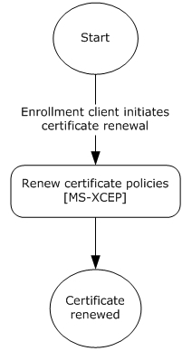

Figure 13: Enrollment client certificate renewal

### 3.5.1 Abstract Data Model

None.

### 3.5.2 Timers

None.

### 3.5.3 Initialization

None.

### 3.5.4 Message Processing Events and Sequencing Rules

The WSDL operations for certificate renewal are as specified in section [3.4.4](#Section_3.4.4).

#### 3.5.4.1 RequestSecurityToken Operation

MDE2 does not modify the RequestSecurityToken operation for the certificate renewal process. The operation is as specified in section [3.4.4.1](#Section_3.4.4.1).

##### 3.5.4.1.1 Messages

MDE2 does not modify the set of messages for the RequestSecurityToken operation for the certificate renewal process. The set of messages are as specified in section [3.4.4.1.1](#Section_3.4.4.1.1).

###### 3.5.4.1.1.1 RequestSecurityToken

For the [**certificate**](#gt_certificate) renewal process, MDE2 modifies the **RequestSecurityToken** message as follows. The remainder of the definition for the **RequestSecurityToken** message is as specified in section [3.4.4.1.1.1](#Section_3.4.4.1.1.1).

Authentication MUST be implemented for this message as defined in section [3.4](#Section_3.4). In summary, the following elements and attributes MUST be specified in the SOAP header:

**wsse:Security:** The <wsse:Security> element MUST be a child of <s:Header>.

**wsse:UsernameToken:** The <wsse: UsernameToken> element MUST be a child of <wsse:Security> in <s:Header>.

**wsse:UsernameToken/attributes/u:Id:** The type MUST be `"uuid-cc1ccc1f-2fba-4bcf-b063-ffc0cac77917-4"` for on-premise authentication`.`

**wsse:UserName:** The <wsse: Username> element MUST be a child of <wsse:UsernameToken> in <s:Header>and the value specifies the user name.

**wsse:Password:** The <wsse: Password> element MUST be a child of <wsse:UsernameToken> in <s:Header> and the value specifies the user password.

**wsse:Password/attributes/Type:** This value MUST be "`http://docs.oasis-open.org/wss/2004/01/oasis-200401-wss-username-token-profile-1.0#PasswordText"`

**Namespace:** http://docs.oasis-open.org/wss/2004/01/oasis-200401-wss-wssecurity-secext-1.0.xsd

The following elements and attributes are specified in the SOAP body of the request message.

**wst:RequestType:** The <wst:RequestType> element MUST be the value `"http://docs.oasis-open.org/ws-sx/ws-trust/200512/Renew"` (see [[WSTrust1.3]](https://go.microsoft.com/fwlink/?LinkId=131548) section 3.1).

**wsse:BinarySecurityToken/attributes/ValueType:** The <wsse:BinarySecurityToken> ValueType attribute MUST be `"http://docs.oasis-open.org/wss/2004/01/oasis-200401-wss-wssecurity-secext-1.0.xsd#PKCS7".`

**wsse:BinarySecurityToken/attributes/EncodingType:** The <wsse:BinarySecurityToken> EncodingType attribute MUST be `"http://docs.oasis-open.org/wss/2004/01/oasis-200401-wss-wssecurity-secext-1.0.xsd#base64binary"`.

**ac:AdditionalContext:** The <ac:AdditionalContext> element MUST be a child of <wst:RequestSecurityToken> (see [MS-WSTEP](../MS-WSTEP/MS-WSTEP.md) section 3.1.4.1.3.3).

**ac:AdditionalContext:** The < ac:AdditionalContext> element MUST be a child of <s:body>

**ac:ContextItem:** One or more <ac:ContextItem> Name attributes MUST be specified as child elements of < ac:AdditionalContext >.

**ac:ContextItem/attributes/Name:** The <ac:ContextItem> Name attribute MUST be the literal string "OSEdition".

**ac:Value:** The <ac:Value> element MUST be a child of <ac:AdditionalContext> and the value is set to the decimal value as an int (integer) of the product enumeration defined in section [2.2.9.6](#Section_2.2.9.6).

**ac:ContextItem/attributes/Name:** The <ac:ContextItem> Name attribute MUST be the literal string "OSVersion".

**ac:Value:** The <ac:Value> element MUST be a child of <ac:AdditionalContext> and the value MUST be a string (UTF-8) in the format int.int.int.int.

**ac:ContextItem/attributes/Name:** The <ac:ContextItem> Name attribute MUST be the literal string "DeviceName".

**ac:Value:** The <ac:Value> element MUST be a child of <ac:AdditionalContext> and the value is a string (UTF-8) name of the device.

**ac:ContextItem/attributes/Name:** The <ac:ContextItem> Name attribute MUST be the literal string "EnrollmentType.

**ac:Value:** The <ac:Value> element MUST be a child of <ac:AdditionalContext> and the value is a string (UTF-8) that MUST be Full or Device.

**ac:ContextItem/attributes/Name:** The <ac:ContextItem> Name attribute MUST be the literal string "DeviceType".

**ac:Value:** The <ac:Value> element MUST be a child of <ac:AdditionalContext> and the value is a string (UTF 8) that MUST be WindowsPhone for mobile devices, CIMClient_Windows for desktop devices, or WindowsHandheld for enterprise handheld devices.

**ac:ContextItem/attributes/Name:** The <ac:ContextItem> Name attribute MUST be the literal string "ApplicationVersion".

**ac:Value:** The <ac:Value> element MUST be a child of <ac:AdditionalContext> and the value MUST be a string that specifies the application version in the format int.int.int.int.

**ac:ContextItem/attributes/Name:** The <ac:ContextItem> Name attribute MUST be the literal string "DeviceID".

**ac:Value:** The <ac:Value> element MUST be a child of <ac:AdditionalContext> and the value specifies the unique device identifier.

The following elements are supported in an implementation-specific manner.<34>

**ac:ContextItem/attributes/Name:** The <ac:ContextItem> Name attribute MUST be the literal string "Locale".

**ac:Value:** The <ac:Value> element MUST be a child of <ac:AdditionalContext> and the value is a [**UTF-8**](#gt_utf-8) string that specifies the locale of the device.

**ac:ContextItem/attributes/Name:** The <ac:ContextItem> Name attribute MUST be the literal string "HWDevID".

**ac:Value:** The <ac:Value> element MUST be a child of <ac:AdditionalContext> and the value is a 64-hex character length UTF-8 string that specifies the hardware device ID.

**ac:ContextItem/attributes/Name:** The <ac:ContextItem> Name attribute MUST be the literal string "ZeroTouchProvisioning". This attribute will be present only if the enrollment is taking place on a device registered with Zero Touch Provisioning.

**ac:Value:** If included, this <ac:Value> element MUST be a child of <ac:AdditionalContext> and the value is a UTF-8 string that represents a GUID used by Zero Touch Provisioning.

The following elements and attributes are specified in the SOAP header:

**ac:ContextItem/attributes/Name:** The <ac:ContextItem> Name attribute MUST be the literal string "MAC". Multiple [**MAC addresses**](#gt_5f9ccdf4-2607-4855-9a72-2010aa3300bf) are supported if a device has multiple [**NIC**](#gt_network-interface-card-nic)s.

**ac:Value:** The <ac:Value> element MUST be a child of <ac:AdditionalContext> and the value is a string (UTF-8) that specifies the MAC address of the device.

**ac:ContextItem/attributes/Name:** The <ac:ContextItem> Name attribute MUST be the literal string "IMEI".

**ac:Value:** The <ac:Value> element MUST be a child of <ac:AdditionalContext> and the value is an int (integer) that specifies the mobile equipment ID.

###### 3.5.4.1.1.2 RequestSecurityTokenCollectionResponse

For the [**certificate**](#gt_certificate) renewal process, MDE2 modifies the RequestSecurityTokenCollectionResponse message as follows. The remainder of the definition for the RequestSecurityTokenCollectionResponse message is as specified in section [3.4.4.1.1.2](#Section_3.4.4.1.1.2).

For the certificate renewal process, the same provisioning document is used as specified in section [2.2.9.1](#Section_2.2.9.1). However, only the CertificateStore/My/User/EncodedCertificate is returned.

<characteristic type="CertificateStore">

<!-- Root certificate provision is only needed here if it is not in the device already -->

<characteristic type="Root">

<characteristic type="System">

<characteristic type="*EncodedRootCertHashInsertedHere* ">

<parm name="EncodedCertificate" value="*EncodedCertInsertedHere*" />

</characteristic>

</characteristic>

</characteristic>

<characteristic type="My" >

<characteristic type="User">

<characteristic type="*EncodedClientCertHashInsertedHere*">

<parm name="EncodedCertificate" value="*EncodedCertInsertedHere*" />

<characteristic type="PrivateKeyContainer"/>

</characteristic>

</characteristic>

</characteristic>

</characteristic>

### 3.5.5 Timer Events

None.

### 3.5.6 Other Local Events

None.

## 3.6 Certificate Recovery

The enrollment client can request to recover an existing certificate if the existing certificate is lost or corrupted in some way. This section defines how the **RequestSecurityToken** message (section 3.6.4.1.1.1) is called. Client will only initiate recovery if the CSP node ./Vendor/MSFT/DMClient/Provider/ProviderID/Recovery/Recovery/AllowRecovery is set to 1, or if the server executes ./Vendor/MSFT/DMClient/Provider/ProviderID/Recovery/InitiateRecovery.

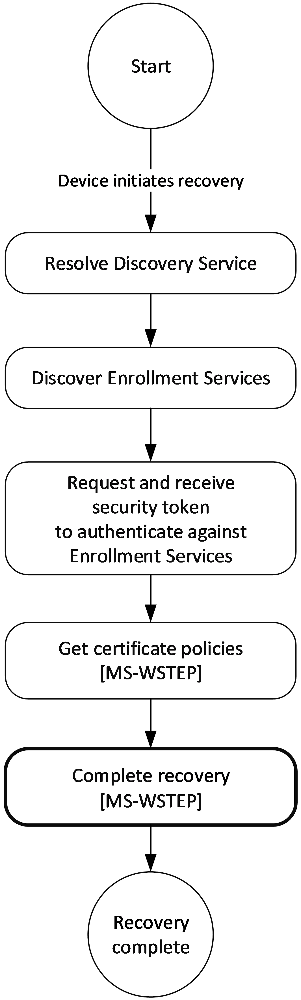

Figure 14: Enrollment client certificate recovery

### 3.6.1 Abstract Data Model

None.

### 3.6.2 Timers

None.

### 3.6.3 Initialization

None.

### 3.6.4 Message Processing Events and Sequencing Rules

The WSDL operations for certificate recovery are as specified in section [3.4.4](#Section_3.4.4).

#### 3.6.4.1 RequestSecurityToken Operation

MDE2 does not modify the **RequestSecurityToken** operation for the certificate recovery process. The operation is as specified in section [3.4.4.1](#Section_3.4.4.1).

##### 3.6.4.1.1 Messages

MDE2 does not modify the set of messages for the **RequestSecurityToken** operation for the certificate recovery process. The set of messages are as specified in section [3.4.4.1.1](#Section_3.4.4.1.1).

###### 3.6.4.1.1.1 RequestSecurityToken

For the certificate recovery process, MDE2 modifies the **RequestSecurityToken** message as follows. The remainder of the definition for the **RequestSecurityToken** message is as specified in section [3.4.4.1.1.1](#Section_3.4.4.1.1.1).

**wst:RequestType:** The <wst:RequestType> element MUST be the value "`http://docs.oasis-open.org/ws-sx/ws-trust/200512/Recovery`".

### 3.6.5 Timer Events

None.

### 3.6.6 Other Local Events

None.

# 4 Protocol Examples

## 4.1 Discovery Example

The examples in the following subsections demonstrate a full request/response sequence using the Discovery protocol to auto-discover a management enrollment server based on the user’s email address.

### 4.1.1 Discovery Example: Request

The following subsections demonstrate requests using different authentication methods.

#### 4.1.1.1 Discovery Example Request Using Federated Authentication

The following snippet demonstrates the call to the Discovery input message using <AuthPolicy> "Federated".

<?xml version="1.0"?>

<s:Envelope xmlns:a="http://www.w3.org/2005/08/addressing"

xmlns:s="http://www.w3.org/2003/05/soap-envelope">

<s:Header>

<a:Action s:mustUnderstand="1">

http://schemas.microsoft.com/windows/management/2012/01/enrollment/IDiscoveryService/Discover

</a:Action>

<a:MessageID>urn:uuid: 748132ec-a575-4329-b01b-6171a9cf8478</a:MessageID>

<a:ReplyTo>

<a:Address>http://www.w3.org/2005/08/addressing/anonymous</a:Address>

</a:ReplyTo>

<a:To s:mustUnderstand="1">

https://ENROLLTEST.CONTOSO.COM/EnrollmentServer/Discovery.svc

</a:To>

</s:Header>

<s:Body>

<Discover xmlns="http://schemas.microsoft.com/windows/management/2012/01/enrollment/">

<request xmlns:i="http://www.w3.org/2001/XMLSchema-instance">

<EmailAddress>user@contoso.com</EmailAddress>

<OSEdition>3</OSEdition> <!-- New -->

<RequestVersion>5.0</RequestVersion> <!-- Updated -->

<DeviceType>WindowsPhone</DeviceType> <!-- Updated -->

<ApplicationVersion>10.0.0.0</ApplicationVersion>

<AuthPolicies>

<AuthPolicy>Federated</AuthPolicy>

</AuthPolicies>

</request>

</Discover>

</s:Body>

</s:Envelope>

#### 4.1.1.2 Discovery Example Request Using Certificate Authentication

The following snippet demonstrates the call to the Discovery input message using <AuthPolicy> "Certificate".

<?xml version="1.0"?>

<s:Envelope xmlns:a="http://www.w3.org/2005/08/addressing"

xmlns:s="http://www.w3.org/2003/05/soap-envelope">

<s:Header>

<a:Action s:mustUnderstand="1">

http://schemas.microsoft.com/windows/management/2012/01/enrollment/IDiscoveryService/Discover

</a:Action>

<a:MessageID>urn:uuid: 748132ec-a575-4329-b01b-6171a9cf8478</a:MessageID>

<a:ReplyTo>

<a:Address>http://www.w3.org/2005/08/addressing/anonymous</a:Address>

</a:ReplyTo>

<a:To s:mustUnderstand="1">

https://ENROLLTEST.CONTOSO.COM/EnrollmentServer/Discovery.svc

</a:To>

</s:Header>

<s:Body>

<Discover xmlns="http://schemas.microsoft.com/windows/management/2012/01/enrollment/">

<request xmlns:i="http://www.w3.org/2001/XMLSchema-instance">

<EmailAddress>user@contoso.com</EmailAddress>

<OSEdition>3</OSEdition> <!--New -->

<RequestVersion>3.0</RequestVersion> <!-- Updated -->

<DeviceType>WindowsPhone</DeviceType> <!--Updated -->

<ApplicationVersion>10.0.0.0</ApplicationVersion>

<AuthPolicies>

<AuthPolicy>Certificate</AuthPolicy>

</AuthPolicies>

</request>

</Discover>

</s:Body>

</s:Envelope>

#### 4.1.1.3 Discovery Example Request Using On-Premise Authentication

The following snippet demonstrates the call to the Discovery input message using <AuthPolicy> "OnPremise".

<?xml version="1.0"?>

<s:Envelope xmlns:a="http://www.w3.org/2005/08/addressing"

xmlns:s="http://www.w3.org/2003/05/soap-envelope">

<s:Header>

<a:Action s:mustUnderstand="1">

http://schemas.microsoft.com/windows/management/2012/01/enrollment/IDiscoveryService/Discover

</a:Action>

<a:MessageID>urn:uuid: 748132ec-a575-4329-b01b-6171a9cf8478</a:MessageID>

<a:ReplyTo>

<a:Address>http://www.w3.org/2005/08/addressing/anonymous</a:Address>

</a:ReplyTo>

<a:To s:mustUnderstand="1">

https://ENROLLTEST.CONTOSO.COM/EnrollmentServer/Discovery.svc

</a:To>

</s:Header>

<s:Body>

<Discover xmlns="http://schemas.microsoft.com/windows/management/2012/01/enrollment/">

<request xmlns:i="http://www.w3.org/2001/XMLSchema-instance">

<EmailAddress>user@contoso.com</EmailAddress>

<OSEdition>3</OSEdition> <!--New -->

<RequestVersion>3.0</RequestVersion> <!-- Updated -->

<DeviceType>WindowsPhone</DeviceType> <!--Updated -->

<ApplicationVersion>10.0.0.0</ApplicationVersion>

<AuthPolicies>

<AuthPolicy>OnPremise</AuthPolicy>

</AuthPolicies>

</request>

</Discover>

</s:Body>

</s:Envelope>

### 4.1.2 Discovery Example: Response

The following sections are examples of responses using different authentication methods.

#### 4.1.2.1 Discovery Example Response using Federated Authentication

The following snippet demonstrates the call to the Discovery output message using <AuthPolicy> "Federated".

<s:Envelope xmlns:s="http://www.w3.org/2003/05/soap-envelope"

xmlns:a="http://www.w3.org/2005/08/addressing">

<s:Header>

<a:Action s:mustUnderstand="1">

http://schemas.microsoft.com/windows/management/2012/01/enrollment/IDiscoveryService/DiscoverResponse

</a:Action>

<ActivityId>

d9eb2fdd-e38a-46ee-bd93-aea9dc86a3b8

</ActivityId>

<a:RelatesTo>urn:uuid: 748132ec-a575-4329-b01b-6171a9cf8478</a:RelatesTo>

</s:Header>

<s:Body xmlns:xsi="http://www.w3.org/2001/XMLSchema-instance"

xmlns:xsd="http://www.w3.org/2001/XMLSchema">

<DiscoverResponse

xmlns="http://schemas.microsoft.com/windows/management/2012/01/enrollment">

<DiscoverResult>

<AuthPolicy>Federated</AuthPolicy>

<EnrollmentVersion>5.0</EnrollmentVersion>

<EnrollmentPolicyServiceUrl>

https://enrolltest.contoso.com/ENROLLMENTSERVER/DEVICEENROLLMENTWEBSERVICE.SVC

</EnrollmentPolicyServiceUrl>

<EnrollmentServiceUrl>

https://enrolltest.contoso.com/ENROLLMENTSERVER/DEVICEENROLLMENTWEBSERVICE.SVC

</EnrollmentServiceUrl>

<AuthenticationServiceUrl>

https://portal.manage.contoso.com/LoginRedirect.aspx

</AuthenticationServiceUrl>

</DiscoverResult>

</DiscoverResponse>

</s:Body>

</s:Envelope>

#### 4.1.2.2 Discovery Example Response using Certificate Authentication

The following snippet demonstrates the call to the Discovery output message using <AuthPolicy> "Certificate".

<s:Envelope xmlns:s="http://www.w3.org/2003/05/soap-envelope"

xmlns:a="http://www.w3.org/2005/08/addressing">

<s:Header>

<a:Action s:mustUnderstand="1">

http://schemas.microsoft.com/windows/management/2012/01/enrollment/IDiscoveryService/DiscoverResponse

</a:Action>

<ActivityId>

d9eb2fdd-e38a-46ee-bd93-aea9dc86a3b8

</ActivityId>

<a:RelatesTo>urn:uuid: 748132ec-a575-4329-b01b-6171a9cf8478</a:RelatesTo>

</s:Header>

<s:Body xmlns:xsi="http://www.w3.org/2001/XMLSchema-instance"

xmlns:xsd="http://www.w3.org/2001/XMLSchema">

<DiscoverResponse

xmlns="http://schemas.microsoft.com/windows/management/2012/01/enrollment">

<DiscoverResult>

<AuthPolicy>Certificate</AuthPolicy>

<EnrollmentVersion>3.0</EnrollmentVersion>

<EnrollmentPolicyServiceUrl>

https://enrolltest.contoso.com/ENROLLMENTSERVER/DEVICEENROLLMENTWEBSERVICE.SVC

</EnrollmentPolicyServiceUrl>

<EnrollmentServiceUrl>

https://enrolltest.contoso.com/ENROLLMENTSERVER/DEVICEENROLLMENTWEBSERVICE.SVC

</EnrollmentServiceUrl>

</DiscoverResult>

</DiscoverResponse>

</s:Body>

</s:Envelope>

#### 4.1.2.3 Discovery Example Response using On-Premise Authentication

The following snippet demonstrates the call to the Discovery output message using <AuthPolicy> "OnPremise".

<s:Envelope xmlns:s="http://www.w3.org/2003/05/soap-envelope"

xmlns:a="http://www.w3.org/2005/08/addressing">

<s:Header>

<a:Action s:mustUnderstand="1">

http://schemas.microsoft.com/windows/management/2012/01/enrollment/IDiscoveryService/DiscoverResponse

</a:Action>

<ActivityId>

d9eb2fdd-e38a-46ee-bd93-aea9dc86a3b8

</ActivityId>

<a:RelatesTo>urn:uuid: 748132ec-a575-4329-b01b-6171a9cf8478</a:RelatesTo>

</s:Header>

<s:Body xmlns:xsi="http://www.w3.org/2001/XMLSchema-instance"

xmlns:xsd="http://www.w3.org/2001/XMLSchema">

<DiscoverResponse

xmlns="http://schemas.microsoft.com/windows/management/2012/01/enrollment">

<DiscoverResult>

<AuthPolicy>OnPremise</AuthPolicy>

<EnrollmentVersion>3.0</EnrollmentVersion>

<EnrollmentPolicyServiceUrl>

https://enrolltest.contoso.com/ENROLLMENTSERVER/DEVICEENROLLMENTWEBSERVICE.SVC

</EnrollmentPolicyServiceUrl>

<EnrollmentServiceUrl>

https://enrolltest.contoso.com/ENROLLMENTSERVER/DEVICEENROLLMENTWEBSERVICE.SVC

</EnrollmentServiceUrl>

</DiscoverResult>

</DiscoverResponse>

</s:Body>

</s:Envelope>

## 4.2 GetPolicies Example

The examples in the following subsections demonstrate a full request/response sequence where the caller requests [**certificate policies**](#gt_certificate-policy) that are used to determine if the enrollment service is compliant with the caller’s requirements.

### 4.2.1 GetPolicies Example: Request

The following subsections demonstrate the call to the **GetPolicies** message (section [3.3.4.1.1.1](#Section_3.3.4.1.1.1)) using different authentication methods.

#### 4.2.1.1 GetPolicies Example Request using Federated Authentication

The following snippet demonstrates a call to the GetPolicies message using <AuthPolicy> "Federated".

<s:Envelope xmlns:s="http://www.w3.org/2003/05/soap-envelope"

xmlns:a="http://www.w3.org/2005/08/addressing"

xmlns:u="http://docs.oasis-open.org/wss/2004/01/oasis-200401-wss-wssecurity-utility-1.0.xsd"

xmlns:wsse="http://docs.oasis-open.org/wss/2004/01/oasis-200401-wss-wssecurity-secext-1.0.xsd"

xmlns:wst="http://docs.oasis-open.org/ws-sx/ws-trust/200512"

xmlns:ac="http://schemas.xmlsoap.org/ws/2006/12/authorization">

<s:Header>

<a:Action s:mustUnderstand="1">

http://schemas.microsoft.com/windows/pki/2009/01/enrollmentpolicy/IPolicy/GetPolicies

</a:Action>

<a:MessageID>urn:uuid:72048B64-0F19-448F-8C2E-B4C661860AA0</a:MessageID>

<a:ReplyTo>

<a:Address>http://www.w3.org/2005/08/addressing/anonymous</a:Address>

</a:ReplyTo>

<a:To s:mustUnderstand="1">

https://enrolltest.contoso.com/ENROLLMENTSERVER/DEVICEENROLLMENTWEBSERVICE.SVC

</a:To>

<wsse:Security s:mustUnderstand="1">

<wsse:BinarySecurityToken ValueType=

"http://schemas.microsoft.com/5.0.0.0/ConfigurationManager/Enrollment/DeviceEnrollmentUserToken"

EncodingType=

"http://docs.oasis-open.org/wss/2004/01/oasis-200401-wss-wssecurity-secext-1.0.xsd#base64binary"

xmlns=

"http://docs.oasis-open.org/wss/2004/01/oasis-200401-wss-wssecurity-secext-1.0.xsd">

B64EncodedSampleBinarySecurityToken

</wsse:BinarySecurityToken>

</wsse:Security>

</s:Header>

<s:Body xmlns:xsi="http://www.w3.org/2001/XMLSchema-instance"

xmlns:xsd="http://www.w3.org/2001/XMLSchema">

<GetPolicies

xmlns="http://schemas.microsoft.com/windows/pki/2009/01/enrollmentpolicy">

<client>

<lastUpdate xsi:nil="true"/>

<preferredLanguage xsi:nil="true"/>

</client>

<requestFilter xsi:nil="true"/>

</GetPolicies>

</s:Body>

</s:Envelope>

#### 4.2.1.2 GetPolicies Example Request using Certificate Authentication

The following snippet demonstrates a call to the **GetPolicies** message using <AuthPolicy> "Certificate".

<s:Envelope xmlns:s="http://www.w3.org/2003/05/soap-envelope"

xmlns:a="http://www.w3.org/2005/08/addressing"

xmlns:u="http://docs.oasis-open.org/wss/2004/01/oasis-200401-wss-wssecurity-utility-1.0.xsd"

xmlns:wsse="http://docs.oasis-open.org/wss/2004/01/oasis-200401-wss-wssecurity-secext-1.0.xsd"

xmlns:wst="http://docs.oasis-open.org/ws-sx/ws-trust/200512"

xmlns:ac="http://schemas.xmlsoap.org/ws/2006/12/authorization">

<s:Header>

<a:Action s:mustUnderstand="1">

http://schemas.microsoft.com/windows/pki/2009/01/enrollmentpolicy/IPolicy/GetPolicies

</a:Action>

<a:MessageID>urn:uuid:72048B64-0F19-448F-8C2E-B4C661860AA0</a:MessageID>

<a:ReplyTo>

<a:Address>http://www.w3.org/2005/08/addressing/anonymous</a:Address>

</a:ReplyTo>

<a:To s:mustUnderstand="1">

https://enrolltest.contoso.com/ENROLLMENTSERVER/DEVICEENROLLMENTWEBSERVICE.SVC

</a:To>

<wsse:Security s:mustUnderstand="1">

<u:Timestamp>

<u:Created>2015-06-13T21:13:37Z</u:Created>

<u:Expires>2015-06-13T21:18:37Z</u:Expires>

</u:Timestamp>

<wsse:BinarySecurityToken ValueType="http://docs.oasis-open.org/wss/2004/01/oasis-200401-wss-x509-token-profile-1.0#X509v3" Id="uuid-29801C2F-F26B-46AD-984B-AFAEFB545FF8" EncodingType="http://docs.oasis-open.org/wss/2004/01/oasis-200401-wss-wssecurity-secext-1.0.xsd#base64binary">B64EncodedSampleBinarySecurityToken

</wsse:BinarySecurityToken>

<Signature xmlns="http://www.w3.org/2000/09/xmldsig#">

<SignedInfo>

<CanonicalizationMethod Algorithm="http://www.w3.org/2001/10/xml-exc-c14n#" />

<SignatureMethod Algorithm="http://www.w3.org/2001/04/xmldsig-more#rsa-sha256" />

<Reference URI="">

<Transforms>

<Transform Algorithm="http://www.w3.org/2000/09/xmldsig#enveloped-signature" />

</Transforms>

<DigestMethod Algorithm="http://www.w3.org/2001/04/xmlenc#sha256" />

<DigestValue>hash</DigestValue>

</Reference>

</SignedInfo>

<SignatureValue>signature</SignatureValue>

<KeyInfo>

<wsse:SecurityTokenReference>

<wsse:Reference URI="29801C2F-F26B-46AD-984B-AFAEFB545FF8" ValueType="http://docs.oasis-open.org/wss/2004/01/oasis-200401-wss-x509-token-profile-1.0#X509" />

</wsse:SecurityTokenReference>

</KeyInfo>

</Signature>

</wsse:Security>

</s:Header>

<s:Body xmlns:xsi="http://www.w3.org/2001/XMLSchema-instance"

xmlns:xsd="http://www.w3.org/2001/XMLSchema">

<GetPolicies

xmlns="http://schemas.microsoft.com/windows/pki/2009/01/enrollmentpolicy">

<client>

<lastUpdate xsi:nil="true"/>

<preferredLanguage xsi:nil="true"/>

</client>

<requestFilter xsi:nil="true"/>

</GetPolicies>

</s:Body>

</s:Envelope>

#### 4.2.1.3 GetPolicies Example Request using On-Premise Authentication

The following snippet demonstrates a call to the **GetPolicies** message using <AuthPolicy> "OnPremise".

<s:Envelope xmlns:s="http://www.w3.org/2003/05/soap-envelope"

xmlns:a="http://www.w3.org/2005/08/addressing"

xmlns:u="http://docs.oasis-open.org/wss/2004/01/oasis-200401-wss-wssecurity-utility-1.0.xsd"

xmlns:wsse="http://docs.oasis-open.org/wss/2004/01/oasis-200401-wss-wssecurity-secext-1.0.xsd"

xmlns:wst="http://docs.oasis-open.org/ws-sx/ws-trust/200512"

xmlns:ac="http://schemas.xmlsoap.org/ws/2006/12/authorization">

<s:Header>

<a:Action s:mustUnderstand="1">

http://schemas.microsoft.com/windows/pki/2009/01/enrollmentpolicy/IPolicy/GetPolicies

</a:Action>

<a:MessageID>urn:uuid:72048B64-0F19-448F-8C2E-B4C661860AA0</a:MessageID>

<a:ReplyTo>

<a:Address>http://www.w3.org/2005/08/addressing/anonymous</a:Address>

</a:ReplyTo>

<a:To s:mustUnderstand="1">

https://enrolltest.contoso.com/ENROLLMENTSERVER/DEVICEENROLLMENTWEBSERVICE.SVC

</a:To>

<wsse:Security s:mustUnderstand="1">

<wsse:UsernameToken u:Id="uuid-cc1ccc1f-2fba-4bcf-b063-ffc0cac77917-4">

<wsse:Username>user@contoso.com</wsse:Username>

<wsse:Password wsse:Type="http://docs.oasis-open.org/wss/2004/01/oasis-200401-wss-username-token-profile-1.0#PasswordText">mypassword</wsse:Password>

</wsse:UsernameToken>

</wsse:Security>

</s:Header>

<s:Body xmlns:xsi="http://www.w3.org/2001/XMLSchema-instance"

xmlns:xsd="http://www.w3.org/2001/XMLSchema">

<GetPolicies

xmlns="http://schemas.microsoft.com/windows/pki/2009/01/enrollmentpolicy">

<client>

<lastUpdate xsi:nil="true"/>

<preferredLanguage xsi:nil="true"/>

</client>

<requestFilter xsi:nil="true"/>

</GetPolicies>

</s:Body>

</s:Envelope>

### 4.2.2 GetPolicies Example: Response

The following snippet demonstrates the call to the **GetPoliciesResponse** message.

<s:Envelope

xmlns:u="http://docs.oasis-open.org/wss/2004/01/oasis-200401-wss-wssecurity-utility-1.0.xsd"

xmlns:s="http://www.w3.org/2003/05/soap-envelope"

xmlns:a="http://www.w3.org/2005/08/addressing">

<s:Header>

<a:Action s:mustUnderstand="1">

http://schemas.microsoft.com/windows/pki/2009/01/enrollmentpolicy/IPolicy/GetPoliciesResponse

</a:Action>

<a:RelatesTo>urn:uuid: 69960163-adad-4a72-82d2-bb0e5cff5598</a:RelatesTo>

</s:Header>

<s:Body xmlns:xsi="http://www.w3.org/2001/XMLSchema-instance"

xmlns:xsd="http://www.w3.org/2001/XMLSchema">

<GetPoliciesResponse

xmlns="http://schemas.microsoft.com/windows/pki/2009/01/enrollmentpolicy">

<response>

<policyID />

<policyFriendlyName xsi:nil="true"

xmlns:xsi="http://www.w3.org/2001/XMLSchema-instance"/>

<nextUpdateHours xsi:nil="true"

xmlns:xsi="http://www.w3.org/2001/XMLSchema-instance"/>

<policiesNotChanged xsi:nil="true"

xmlns:xsi="http://www.w3.org/2001/XMLSchema-instance"/>

<policies>

<policy>

<policyOIDReference>0</policyOIDReference>

<cAs xsi:nil="true" />

<attributes>

<commonName>CEPUnitTest</commonName>

<policySchema>3</policySchema>

<certificateValidity>

<validityPeriodSeconds>1209600</validityPeriodSeconds>

<renewalPeriodSeconds>172800</renewalPeriodSeconds>

</certificateValidity>

<permission>

<enroll>true</enroll>

<autoEnroll>false</autoEnroll>

</permission>

<privateKeyAttributes>

<minimalKeyLength>2048</minimalKeyLength>

<keySpec xsi:nil="true" />

<keyUsageProperty xsi:nil="true" />

<permissions xsi:nil="true" />

<algorithmOIDReference xsi:nil="true" />

<AttestationFailureBehavior>RetryOnError</AttestationFailureBehavior>

<OperationTimeout>100</OperationTimeout>

<cryptoProviders>

<provider>Microsoft Platform Crypto Provider</provider>

<provider>Microsoft Software Key Storage Provider</provider>

</cryptoProviders>

</privateKeyAttributes>

<revision>

<majorRevision>101</majorRevision>

<minorRevision>0</minorRevision>

</revision>

<supersededPolicies xsi:nil="true" />

<privateKeyFlags xsi:nil="true" />

<subjectNameFlags xsi:nil="true" />

<enrollmentFlags xsi:nil="true" />

<generalFlags xsi:nil="true" />

<hashAlgorithmOIDReference>0</hashAlgorithmOIDReference>

<rARequirements xsi:nil="true" />

<keyArchivalAttributes xsi:nil="true" />

<extensions xsi:nil="true" />

</attributes>

</policy>

</policies>

</response>

<cAs xsi:nil="true" />

<oIDs>

<oID>

<value>2.16.840.1.101.3.4.2.1</value>

<group>4</group>

<oIDReferenceID>0</oIDReferenceID>

<defaultName> szOID_NIST_sha256</defaultName>

</oID>

</oIDs>

</GetPoliciesResponse>

</s:Body>

</s:Envelope>

### 4.2.3 GetPolicies With Azure Attestation Example: Response

The following snippet demonstrates the call to the **GetPoliciesResponse** message with the fields required for Azure Attestation present.

- <s:Envelope
- xmlns:u="http://docs.oasis-open.org/wss/2004/01/oasis-200401-wss-wssecurity-utility-1.0.xsd"
- xmlns:s="http://www.w3.org/2003/05/soap-envelope"
- xmlns:a="http://www.w3.org/2005/08/addressing">
- <s:Header>
- <a:Action s:mustUnderstand="1">
- http://schemas.microsoft.com/windows/pki/2009/01/enrollmentpolicy/IPolicy/GetPoliciesResponse
- </a:Action>
- <a:RelatesTo>urn:uuid: 69960163-adad-4a72-82d2-bb0e5cff5598</a:RelatesTo>
- </s:Header>
- <s:Body xmlns:xsi="http://www.w3.org/2001/XMLSchema-instance"
- xmlns:xsd="http://www.w3.org/2001/XMLSchema">
- <GetPoliciesResponse
- xmlns="http://schemas.microsoft.com/windows/pki/2009/01/enrollmentpolicy">
- <response>
- <policyID />
- <policyFriendlyName xsi:nil="true"
- xmlns:xsi="http://www.w3.org/2001/XMLSchema-instance"/>
- <nextUpdateHours xsi:nil="true"
- xmlns:xsi="http://www.w3.org/2001/XMLSchema-instance"/>
- <policiesNotChanged xsi:nil="true"
- xmlns:xsi="http://www.w3.org/2001/XMLSchema-instance"/>
- <policies>
- <policy>
- <policyOIDReference>0</policyOIDReference>
- <cAs xsi:nil="true" />
- <attributes>
- <commonName>CEPUnitTest</commonName>
- <policySchema>3</policySchema>
- <certificateValidity>
- <validityPeriodSeconds>1209600</validityPeriodSeconds>
- <renewalPeriodSeconds>172800</renewalPeriodSeconds>
- </certificateValidity>
- <permission>
- <enroll>true</enroll>
- <autoEnroll>false</autoEnroll>
- </permission>
- <privateKeyAttributes>
- <minimalKeyLength>2048</minimalKeyLength>
- <keySpec xsi:nil="true" />
- <keyUsageProperty xsi:nil="true" />
- <permissions xsi:nil="true" />
- <algorithmOIDReference xsi:nil="true" />
- <AttestationFailureBehavior>RetryOnError</AttestationFailureBehavior>
- <OperationTimeout>100</OperationTimeout>
- <cryptoProviders>
- <provider>Microsoft Platform Crypto Provider</provider>
- <provider>Microsoft Software Key Storage Provider</provider>
- </cryptoProviders>
- </privateKeyAttributes>
- <revision>
- <majorRevision>101</majorRevision>
- <minorRevision>0</minorRevision>
- </revision>
- <supersededPolicies xsi:nil="true" />
- <privateKeyFlags xsi:nil="true" />
- <subjectNameFlags xsi:nil="true" />
- <enrollmentFlags xsi:nil="true" />
- <generalFlags xsi:nil="true" />
- <hashAlgorithmOIDReference>0</hashAlgorithmOIDReference>
- <rARequirements xsi:nil="true" />
- <keyArchivalAttributes xsi:nil="true" />
- <extensions xsi:nil="true" />
- <attestation>
- <attestationFailureBehavior p10:nil="true" xmlns:p10="http://www.w3.org/2001/XMLSchema-instance">IgnoreOnError</attestationFailureBehavior>
- <operationTimeout p10:nil="true" xmlns:p10="http://www.w3.org/2001/XMLSchema-instance">100</operationTimeout>
- <azureAttestation>
- <nonce>NonceBlob</nonce>
- <relyingPartyId>PartyId</relyingPartyId>
- <endpointUri>attest.azure.net/attest</endpointUri>
- </azureAttestation>
- </attestation>
- </attributes>
- </policy>
- </policies>
- </response>
- <cAs xsi:nil="true" />
- <oIDs>
- <oID>
- <value>1.3.14.3.2.29</value>
- <group>1</group>
- <oIDReferenceID>0</oIDReferenceID>
- <defaultName> szOID_NIST_sha256</defaultName>
- </oID>
- </oIDs>
- </GetPoliciesResponse>
- </s:Body>
- </s:Envelope>

## 4.3 RequestSecurityToken Example

The examples in the following subsections demonstrate a full request/response sequence where the caller requests a [**security token**](#gt_security-token) (provisioning document) for the device type "CIMClient_Windows".

### 4.3.1 RequestSecurityToken Example: Request

The following subsections demonstrate the call to the **RequestSecurityToken** message using different authentication methods.

#### 4.3.1.1 RequestSecurityToken Example: Request using Federated Authentication

The following snippet demonstrates features of the call to the **RequestSecurityToken** message using <AuthPolicy> "Federated". The example below is for illustrative purposes only and does not demonstrate a particular valid-use case.

<s:Envelope xmlns:s="http://www.w3.org/2003/05/soap-envelope"

xmlns:a="http://www.w3.org/2005/08/addressing"

xmlns:u="http://docs.oasis-open.org/wss/2004/01/oasis-200401-wss-wssecurity-utility-1.0.xsd"

xmlns:wsse="http://docs.oasis-open.org/wss/2004/01/oasis-200401-wss-wssecurity-secext-1.0.xsd"

xmlns:wst="http://docs.oasis-open.org/ws-sx/ws-trust/200512"

xmlns:ac="http://schemas.xmlsoap.org/ws/2006/12/authorization">

<s:Header>

<a:Action s:mustUnderstand="1">

http://schemas.microsoft.com/windows/pki/2009/01/enrollment/RST/wstep

</a:Action>

<a:MessageID>urn:uuid:0d5a1441-5891-453b-becf-a2e5f6ea3749</a:MessageID>

<a:ReplyTo>

<a:Address>http://www.w3.org/2005/08/addressing/anonymous</a:Address>

</a:ReplyTo>

<a:To s:mustUnderstand="1">

https://enrolltest.contoso.com:443/ENROLLMENTSERVER/DEVICEENROLLMENTWEBSERVICE.SVC

</a:To>

<wsse:Security s:mustUnderstand="1">

<wsse:BinarySecurityToken ValueType=

"http://schemas.microsoft.com/5.0.0.0/ConfigurationManager/Enrollment/DeviceEnrollmentUserToken"

EncodingType="http://docs.oasis-open.org/wss/2004/01/oasis-200401-wss-wssecurity-secext-1.0.xsd#base64binary">B64EncodedSampleBinarySecurityToken"

</wsse:BinarySecurityToken>

</wsse:Security>

</s:Header>

<s:Body>

<wst:RequestSecurityToken>

<wst:TokenType>

http://schemas.microsoft.com/5.0.0.0/ConfigurationManager/Enrollment/DeviceEnrollmentToken

</wst:TokenType>

<wst:RequestType>

http://docs.oasis-open.org/ws-sx/ws-trust/200512/Issue

</wst:RequestType>

<wsse:BinarySecurityToken

ValueType="http://schemas.microsoft.com/windows/pki/2009/01/enrollment#PKCS10"

EncodingType="http://docs.oasis-open.org/wss/2004/01/oasis-200401-wss-wssecurity-secext-1.0.xsd#base64binary">

DER format PKCS#10 certificate request in Base64 encoding Insterted Here

</wsse:BinarySecurityToken>

<ac:AdditionalContext xmlns="http://schemas.xmlsoap.org/ws/2006/12/authorization">

<ac:ContextItem Name="UXInitiated">

<ac:Value>true</ac:Value>

</ac:ContextItem>

<ac:ContextItem Name="ExternalMgmtAgentHint">

<ac:Value>Agent1:Value1</ac:Value>

</ac:ContextItem>

<ac:ContextItem Name="DomainName">

<ac:Value>mydomain.fabrikam.com</ac:Value>

</ac:ContextItem>

<ac:ContextItem Name="OSEdition">

<ac:Value>4</ac:Value>

</ac:ContextItem>

<ac:ContextItem Name="OSVersion">

<ac:Value>10.0.9999.0</ac:Value>

</ac:ContextItem>

<ac:ContextItem Name="DeviceName">

<ac:Value>MY_WINDOWS_DEVICE</ac:Value>

</ac:ContextItem>

<ac:ContextItem Name="MAC">

<ac:Value>FF:FF:FF:FF:FF:FF</ac:Value>

</ac:ContextItem>

<ac:ContextItem Name="MAC">

<ac:Value>CC:CC:CC:CC:CC:CC</ac:Value>

</ac:ContextItem>

<ac:ContextItem Name="IMEI">

<ac:Value>49015420323756</ac:Value>

</ac:ContextItem>

<ac:ContextItem Name="IMEI">

<ac:Value>30215420323756</ac:Value>

</ac:ContextItem>

<ac:ContextItem Name="EnrollmentType">

<ac:Value>Full</ac:Value>

</ac:ContextItem>

<ac:ContextItem Name="DeviceType">

<ac:Value>CIMClient_Windows</ac:Value>

</ac:ContextItem>

<ac:ContextItem Name="ApplicationVersion">

<ac:Value>10.0.9999.0</ac:Value>

</ac:ContextItem>

<ac:ContextItem Name="EnrollmentData">

<ac:Value>3J4KLJ9SDJFAL93JLAKHJSDFJHAO83HAKSHFLAHSKFNHNPA2934342</ac:Value>

</ac:ContextItem>

<ac:ContextItem Name="DeviceID">

<ac:Value>7BA748C8-703E-4DF2-A74A-92984117346A</ac:Value>

</ac:ContextItem>

<ac:ContextItem Name="TargetedUserLoggedIn">

<ac:Value>True</ac:Value>

</ac:ContextItem>

<ac:ContextItem Name="Locale">

<ac:Value>en-us</ac:Value>

</ac:ContextItem>

<ac:ContextItem Name="HWDevID">

<ac:Value>FFFFFFFFFFFFFFFFFFFFFFFFFFFFFFFFFFFFFFFFFFFFFFFFFFFFFFFFFFFFFFFF </ac:Value>

</ac:ContextItem>

<ac:ContextItem Name="ZeroTouchProvisioning">

<ac:Value>ffffffff-ffff-4fff-afff-ffffffffffff</ac:Value>

</ac:ContextItem>

<ac:ContextItem Name = "OfflineAutoPilotEnrollmentCorrelator">

<ac:Value>ffffffff-ffff-4fff-afff-ffffffffffff</ac:Value>

</ac:ContextItem>

<ac:ContextItem Name="BootstrapDomainJoin">

<ac:Value>True</ac:Value>

</ac:ContextItem>

<ac:ContextItem Name="PlugandForget">

<ac:Value>True</ac:Value>

</ac:ContextItem>

<ac:ContextItem Name="WhiteGlove">

<ac:Value>True</ac:Value>

</ac:ContextItem>

<ac:ContextItem Name="WhiteGloveHybridJoin">

<ac:Value>True</ac:Value>

</ac:ContextItem>

<ac:ContextItem Name="NotInOobe">

<ac:Value>True</ac:Value>

</ac:ContextItem>

<ac:ContextItem Name="RequestVersion">

<ac:Value>5.0</ac:Value>

</ac:ContextItem>

<ac:ContextItem Name="EmmDeviceId">

<ac:Value>9A51D698-40C7-499C-928E-EF7FD76E62C0</ac:Value>

</ac:ContextItem>

<ac:ContextItem Name="AIKAttestationClaim">

<ac:Value>FFFFFFFFFFFF</ac:Value>

</ac:ContextItem>

<ac:ContextItem Name="AIKPub">

<ac:Value>FFFFFFFFFFFF</ac:Value>

</ac:ContextItem>

<ac:ContextItem Name="AIKCert">

<ac:Value>FFFFFFFFFFFF</ac:Value>

</ac:ContextItem>

<ac:ContextItem Name="AadAIKAttestationClaim">

<ac:Value>FFFFFFFFFFFF</ac:Value>

</ac:ContextItem>

<ac:ContextItem Name="AADPub">

<ac:Value>FFFFFFFFFFFF</ac:Value>

</ac:ContextItem>

</ac:AdditionalContext>

</wst:RequestSecurityToken>

</s:Body>

</s:Envelope>

#### 4.3.1.2 RequestSecurityToken Example: Request using Federated Authentication with Azure Attestation

The following snippet demonstrates features of the call to the **RequestSecurityToken** message using <AuthPolicy> "Federated", as well as receiving information after Azure Attestation. The example below is for illustrative purposes only and does not demonstrate a particular valid-use case.

- <s:Envelope xmlns:s="http://www.w3.org/2003/05/soap-envelope"
- xmlns:a="http://www.w3.org/2005/08/addressing"
- xmlns:u="http://docs.oasis-open.org/wss/2004/01/oasis-200401-wss-wssecurity-utility-1.0.xsd"
- xmlns:wsse="http://docs.oasis-open.org/wss/2004/01/oasis-200401-wss-wssecurity-secext-1.0.xsd"
- xmlns:wst="http://docs.oasis-open.org/ws-sx/ws-trust/200512"
- xmlns:ac="http://schemas.xmlsoap.org/ws/2006/12/authorization">
- <s:Header>
- <a:Action s:mustUnderstand="1">
- http://schemas.microsoft.com/windows/pki/2009/01/enrollment/RST/wstep
- </a:Action>
- <a:MessageID>urn:uuid:0d5a1441-5891-453b-becf-a2e5f6ea3749</a:MessageID>
- <a:ReplyTo>
- <a:Address>http://www.w3.org/2005/08/addressing/anonymous</a:Address>
- </a:ReplyTo>
- <a:To s:mustUnderstand="1">
- https://enrolltest.contoso.com:443/ENROLLMENTSERVER/DEVICEENROLLMENTWEBSERVICE.SVC
- </a:To>
- <wsse:Security s:mustUnderstand="1">
- <wsse:BinarySecurityToken ValueType=
- "http://schemas.microsoft.com/5.0.0.0/ConfigurationManager/Enrollment/DeviceEnrollmentUserToken"
- EncodingType="http://docs.oasis-open.org/wss/2004/01/oasis-200401-wss-wssecurity-secext-1.0.xsd#base64binary">B64EncodedSampleBinarySecurityToken"
- </wsse:BinarySecurityToken>
- </wsse:Security>
- </s:Header>
- <s:Body>
- <wst:RequestSecurityToken>
- <wst:TokenType>
- http://schemas.microsoft.com/5.0.0.0/ConfigurationManager/Enrollment/DeviceEnrollmentToken
- </wst:TokenType>
- <wst:RequestType>
- http://docs.oasis-open.org/ws-sx/ws-trust/200512/Issue
- </wst:RequestType>
- <wsse:BinarySecurityToken
- ValueType="http://schemas.microsoft.com/windows/pki/2009/01/enrollment#PKCS10"
- EncodingType="http://docs.oasis-open.org/wss/2004/01/oasis-200401-wss-wssecurity-secext-1.0.xsd#base64binary">
- DER format PKCS#10 certificate request in Base64 encoding Insterted Here
- </wsse:BinarySecurityToken>
- <ac:AdditionalContext xmlns="http://schemas.xmlsoap.org/ws/2006/12/authorization">
- <ac:ContextItem Name="UXInitiated">
- <ac:Value>true</ac:Value>
- </ac:ContextItem>
- <ac:ContextItem Name="ExternalMgmtAgentHint">
- <ac:Value>Agent1:Value1</ac:Value>
- </ac:ContextItem>
- <ac:ContextItem Name="DomainName">
- <ac:Value>mydomain.fabrikam.com</ac:Value>
- </ac:ContextItem>
- <ac:ContextItem Name="OSEdition">
- <ac:Value>4</ac:Value>
- </ac:ContextItem>
- <ac:ContextItem Name="OSVersion">
- <ac:Value>10.0.9999.0</ac:Value>
- </ac:ContextItem>
- <ac:ContextItem Name="DeviceName">
- <ac:Value>MY_WINDOWS_DEVICE</ac:Value>
- </ac:ContextItem>
- <ac:ContextItem Name="MAC">
- <ac:Value>FF:FF:FF:FF:FF:FF</ac:Value>
- </ac:ContextItem>
- <ac:ContextItem Name="MAC">
- <ac:Value>CC:CC:CC:CC:CC:CC</ac:Value>
- </ac:ContextItem>
- <ac:ContextItem Name="IMEI">
- <ac:Value>49015420323756</ac:Value>
- </ac:ContextItem>
- <ac:ContextItem Name="IMEI">
- <ac:Value>30215420323756</ac:Value>
- </ac:ContextItem>
- <ac:ContextItem Name="EnrollmentType">
- <ac:Value>Full</ac:Value>
- </ac:ContextItem>
- <ac:ContextItem Name="DeviceType">
- <ac:Value>CIMClient_Windows</ac:Value>
- </ac:ContextItem>
- <ac:ContextItem Name="ApplicationVersion">
- <ac:Value>10.0.9999.0</ac:Value>
- </ac:ContextItem>
- <ac:ContextItem Name="EnrollmentData">
- <ac:Value>3J4KLJ9SDJFAL93JLAKHJSDFJHAO83HAKSHFLAHSKFNHNPA2934342</ac:Value>
- </ac:ContextItem>
- <ac:ContextItem Name="DeviceID">
- <ac:Value>7BA748C8-703E-4DF2-A74A-92984117346A</ac:Value>
- </ac:ContextItem>
- <ac:ContextItem Name="TargetedUserLoggedIn">
- <ac:Value>True</ac:Value>
- </ac:ContextItem>
- <ac:ContextItem Name="Locale">
- <ac:Value>en-us</ac:Value>
- </ac:ContextItem>
- <ac:ContextItem Name="HWDevID">
- <ac:Value>FFFFFFFFFFFFFFFFFFFFFFFFFFFFFFFFFFFFFFFFFFFFFFFFFFFFFFFFFFFFFFFF </ac:Value>
- </ac:ContextItem>
- <ac:ContextItem Name="ZeroTouchProvisioning">
- <ac:Value>ffffffff-ffff-4fff-afff-ffffffffffff</ac:Value>
- </ac:ContextItem>
- <ac:ContextItem Name = "OfflineAutoPilotEnrollmentCorrelator">
- <ac:Value>ffffffff-ffff-4fff-afff-ffffffffffff</ac:Value>
- </ac:ContextItem>
- <ac:ContextItem Name="BootstrapDomainJoin">
- <ac:Value>True</ac:Value>
- </ac:ContextItem>
- <ac:ContextItem Name="PlugandForget">
- <ac:Value>True</ac:Value>
- </ac:ContextItem>
- <ac:ContextItem Name="WhiteGlove">
- <ac:Value>True</ac:Value>
- </ac:ContextItem>
- <ac:ContextItem Name="WhiteGloveHybridJoin">
- <ac:Value>True</ac:Value>
- </ac:ContextItem>
- <ac:ContextItem Name="NotInOobe">
- <ac:Value>True</ac:Value>
- </ac:ContextItem>
- <ac:ContextItem Name="RequestVersion">
- <ac:Value>6.0</ac:Value>
- </ac:ContextItem>
- <ac:ContextItem Name="EmmDeviceId">
- <ac:Value>9A51D698-40C7-499C-928E-EF7FD76E62C0</ac:Value>
- </ac:ContextItem>
- <ac:ContextItem Name="AzureAttestationBlob">
- <ac:Value>FFFFFFFFFFFF</ac:Value>
- </ac:ContextItem>
- </ac:AdditionalContext>
- </wst:RequestSecurityToken>
- </s:Body>
- </s:Envelope>

#### 4.3.1.3 RequestSecurityToken Example: Request using Certificate Authentication

The following snippet demonstrates the call to the **RequestSecurityToken** message using <AuthPolicy> "Certificate".

<s:Envelope xmlns:s="http://www.w3.org/2003/05/soap-envelope"

xmlns:a="http://www.w3.org/2005/08/addressing"

xmlns:u="http://docs.oasis-open.org/wss/2004/01/oasis-200401-wss-wssecurity-utility-1.0.xsd"

xmlns:wsse="http://docs.oasis-open.org/wss/2004/01/oasis-200401-wss-wssecurity-secext-1.0.xsd"

xmlns:wst="http://docs.oasis-open.org/ws-sx/ws-trust/200512"

xmlns:ac="http://schemas.xmlsoap.org/ws/2006/12/authorization">

<s:Header>

<a:Action s:mustUnderstand="1">

http://schemas.microsoft.com/windows/pki/2009/01/enrollment/RST/wstep

</a:Action>

<a:MessageID>urn:uuid:0d5a1441-5891-453b-becf-a2e5f6ea3749</a:MessageID>

<a:ReplyTo>

<a:Address>http://www.w3.org/2005/08/addressing/anonymous</a:Address>

</a:ReplyTo>

<a:To s:mustUnderstand="1">

https://enrolltest.contoso.com:443/ENROLLMENTSERVER/DEVICEENROLLMENTWEBSERVICE.SVC

</a:To>

<wsse:Security s:mustUnderstand="1">

<u:Timestamp>

<u:Created>2014-10-16T17:55:13Z</u:Created>

<!-- Start time in UTC -->

<u:Expires>2014-10-16T17:57:13Z </u:Expires>

<!-- Expiration time in UTC -->

</u:Timestamp>

<wsse:BinarySecurityToken ValueType=

"http://schemas.microsoft.com/5.0.0.0/ConfigurationManager/Enrollment/DeviceEnrollmentUserToken"

EncodingType=

"http://docs.oasis-open.org/wss/2004/01/oasis-200401-wss-wssecurity-secext-1.0.xsd#base64binary"

xmlns="http://docs.oasis-open.org/wss/2004/01/oasis-200401-wss-wssecurity-secext-1.0.xsd"

u:Id="uuid-29801C2F-F26B-46AD-984B-AFAEFB545FF8">B64EncodedSampleBinarySecurityToken"

</wsse:BinarySecurityToken> <!--X509v3 Exported Public Cert, B64 Encoded, includes ID reference value to reference -->

<Signature xmlns="http://www.w3.org/2000/09/xmldsig#">

<SignedInfo>

<CanonicalizationMethod Algorithm="http://www.w3.org/2001/10/xml-exc-c14n#" />

<SignatureMethod Algorithm="http://www.w3.org/2000/09/xmldsig-more#rsa-sha256"/>

<Reference URI="">

<DigestMethod Algorithm="http://www.w3.org/2000/09/xmldsig#sha256"/>

<DigestValue>MessageDigestValue</DigestValue>

<!-- Digest value of message using digest method -->

</Reference>

</SignedInfo>

<SignatureValue>SignedMessageBlob</SignatureValue>

<!-- Digest value of message signed with the user’s private key using RSA-SHA256 -->

<KeyInfo>

<wsse:SecurityTokenReference>

<wsse:Reference URI="29801C2F-F26B-46AD-984B-AFAEFB545FF8"

ValueType="http://docs.oasis-open.org/wss/2004/01/

oasis-200401-wss-x509-token-profile-1.0#X509"/>

<!-- References BinarySecurityToken that contains public key to verify signature -->

</wsse:SecurityTokenReference>

</KeyInfo>

</Signature>

</wsse:Security>

</s:Header>

<s:Body>

<wst:RequestSecurityToken>

<wst:TokenType>

http://schemas.microsoft.com/5.0.0.0/ConfigurationManager/Enrollment/DeviceEnrollmentToken

</wst:TokenType>

<wst:RequestType>

http://docs.oasis-open.org/ws-sx/ws-trust/200512/Issue

</wst:RequestType>

<wsse:BinarySecurityToken

ValueType="http://schemas.microsoft.com/windows/pki/2009/01/enrollment#PKCS10"

EncodingType="http://docs.oasis-open.org/wss/2004/01/oasis-200401-wss-wssecurity-secext-1.0.xsd#base64binary">

DER format PKCS#10 certificate request in Base64 encoding Insterted Here

</wsse:BinarySecurityToken>

<ac:AdditionalContext xmlns="http://schemas.xmlsoap.org/ws/2006/12/authorization">

<ac:ContextItem Name="UXInitiated">

<ac:Value>true</ac:Value>

</ac:ContextItem>

<ac:ContextItem Name="ExternalMgmtAgentHint">

<ac:Value>Agent1:Value1</ac:Value>

</ac:ContextItem>

<ac:ContextItem Name="DomainName">

<ac:Value>mydomain.fabrikam.com</ac:Value>

</ac:ContextItem>

<ac:ContextItem Name="OSEdition">

<ac:Value> *4*</ac:Value>

</ac:ContextItem>

<ac:ContextItem Name="OSVersion">

<ac:Value>10.0.9999.0</ac:Value>

</ac:ContextItem>

<ac:ContextItem Name="DeviceName">

<ac:Value>MY_WINDOWS_DEVICE</ac:Value>

</ac:ContextItem>

<ac:ContextItem Name="MAC">

<ac:Value>FF:FF:FF:FF:FF:FF</ac:Value>

</ac:ContextItem>

<ac:ContextItem Name="MAC">

<ac:Value>CC:CC:CC:CC:CC:CC</ac:Value>

</ac:ContextItem>

<ac:ContextItem Name="IMEI">

<ac:Value>49015420323756</ac:Value>

</ac:ContextItem>

<ac:ContextItem Name="IMEI">

<ac:Value>30215420323756</ac:Value>

</ac:ContextItem>

<ac:ContextItem Name="EnrollmentType">

<ac:Value>Full</ac:Value>

</ac:ContextItem>

<ac:ContextItem Name="DeviceType">

<ac:Value>CIMClient_Windows</ac:Value>

</ac:ContextItem>

<ac:ContextItem Name="ApplicationVersion">

<ac:Value>10.0.9999.0</ac:Value>

</ac:ContextItem>

<ac:ContextItem Name="DeviceID">

<ac:Value>7BA748C8-703E-4DF2-A74A-92984117346A</ac:Value>

</ac:ContextItem>

<ac:ContextItem Name="EnrollmentData">

<ac:Value>3J4KLJ9SDJFAL93JLAKHJSDFJHAO83HAKSHFLAHSKFNHNPA2934342</ac:Value>

</ac:ContextItem>

<ac:ContextItem Name="TargetedUserLoggedIn">

<ac:Value>True</ac:Value>

</ac:ContextItem>

<ac:ContextItem Name="Locale">

<ac:Value>en-us</ac:Value>

</ac:ContextItem>

<ac:ContextItem Name="HWDevID">

<ac:Value>FFFFFFFFFFFFFFFFFFFFFFFFFFFFFFFFFFFFFFFFFFFFFFFFFFFFFFFFFFFFFFFF </ac:Value>

</ac:ContextItem>

<ac:ContextItem Name="ZeroTouchProvisioning">

<ac:Value>ffffffff-ffff-4fff-afff-ffffffffffff</ac:Value>

</ac:ContextItem>

<ac:ContextItem Name = "OfflineAutoPilotEnrollmentCorrelator">

<ac:Value>ffffffff-ffff-4fff-afff-ffffffffffff</ac:Value>

</ac:ContextItem>

<ac:ContextItem Name="NotInOobe">

<ac:Value>True</ac:Value>

</ac:ContextItem>

</ac:AdditionalContext>

</wst:RequestSecurityToken>

</s:Body>

</s:Envelope>

#### 4.3.1.4 RequestSecurityToken Example: Request using On-Premise Authentication

The following snippet demonstrates the call to the **RequestSecurityToken** message using <AuthPolicy> "OnPremise".

<s:Envelope xmlns:s="http://www.w3.org/2003/05/soap-envelope"

xmlns:a="http://www.w3.org/2005/08/addressing"

xmlns:u="http://docs.oasis-open.org/wss/2004/01/oasis-200401-wss-wssecurity-utility-1.0.xsd"

xmlns:wsse="http://docs.oasis-open.org/wss/2004/01/oasis-200401-wss-wssecurity-secext-1.0.xsd"

xmlns:wst="http://docs.oasis-open.org/ws-sx/ws-trust/200512"

xmlns:ac="http://schemas.xmlsoap.org/ws/2006/12/authorization">

<s:Header>

<a:Action s:mustUnderstand="1">

http://schemas.microsoft.com/windows/pki/2009/01/enrollment/RST/wstep

</a:Action>

<a:MessageID>urn:uuid:0d5a1441-5891-453b-becf-a2e5f6ea3749</a:MessageID>

<a:ReplyTo>

<a:Address>http://www.w3.org/2005/08/addressing/anonymous</a:Address>

</a:ReplyTo>

<a:To s:mustUnderstand="1">

https://enrolltest.contoso.com:443/ENROLLMENTSERVER/DEVICEENROLLMENTWEBSERVICE.SVC

</a:To>

<wsse:Security s:mustUnderstand="1">

<wsse:UsernameToken u:Id="uuid-cc1ccc1f-2fba-4bcf-b063-ffc0cac77917-4">

<wsse:Username>user@contoso.com</wsse:Username>

<wsse:Password wsse:Type=

"http://docs.oasis-open.org/wss/2004/01/oasis-200401-wss-username-token-profile-1.0#PasswordText">mypassword

</wsse:Password>

</wsse:UsernameToken>

</wsse:Security>

</s:Header>

<s:Body>

<wst:RequestSecurityToken>

<wst:TokenType>

http://schemas.microsoft.com/5.0.0.0/ConfigurationManager/Enrollment/DeviceEnrollmentToken

</wst:TokenType>

<wst:RequestType>

http://docs.oasis-open.org/ws-sx/ws-trust/200512/Issue</wst:RequestType>

<wsse:BinarySecurityToken

ValueType="http://schemas.microsoft.com/windows/pki/2009/01/enrollment#PKCS10"

EncodingType="http://docs.oasis-open.org/wss/2004/01/oasis-200401-wss-wssecurity-secext-1.0.xsd#base64binary">

DER format PKCS#10 certificate request in Base64 encoding Insterted Here

</wsse:BinarySecurityToken>

<ac:AdditionalContext xmlns="http://schemas.xmlsoap.org/ws/2006/12/authorization">

<ac:ContextItem Name="UXInitiated">

<ac:Value>true</ac:Value>

</ac:ContextItem>

<ac:ContextItem Name="ExternalMgmtAgentHint">

<ac:Value>Agent1:Value1</ac:Value>

</ac:ContextItem>

<ac:ContextItem Name="DomainName">

<ac:Value>mydomain.fabrikam.com</ac:Value>

</ac:ContextItem>

<ac:ContextItem Name="OSEdition">

<ac:Value> *4*</ac:Value>

</ac:ContextItem>

<ac:ContextItem Name="OSVersion">

<ac:Value>10.0.9999.0</ac:Value>

</ac:ContextItem>

<ac:ContextItem Name="DeviceName">

<ac:Value>MY_WINDOWS_DEVICE</ac:Value>

</ac:ContextItem>

<ac:ContextItem Name="MAC">

<ac:Value>FF:FF:FF:FF:FF:FF</ac:Value>

</ac:ContextItem>

<ac:ContextItem Name="MAC">

<ac:Value>CC:CC:CC:CC:CC:CC</ac:Value>

</ac:ContextItem>

<ac:ContextItem Name="IMEI">

<ac:Value>49015420323756</ac:Value>

</ac:ContextItem>

<ac:ContextItem Name="IMEI">

<ac:Value>30215420323756</ac:Value>

</ac:ContextItem>

<ac:ContextItem Name="EnrollmentType">

<ac:Value>Full</ac:Value>

</ac:ContextItem>

<ac:ContextItem Name="DeviceType">

<ac:Value>CIMClient_Windows</ac:Value>

</ac:ContextItem>

<ac:ContextItem Name="ApplicationVersion">

<ac:Value>10.0.9999.0</ac:Value>

</ac:ContextItem>

<ac:ContextItem Name="DeviceID">

<ac:Value>7BA748C8-703E-4DF2-A74A-92984117346A</ac:Value>

</ac:ContextItem>

<ac:ContextItem Name="EnrollmentData">

<ac:Value>3J4KLJ9SDJFAL93JLAKHJSDFJHAO83HAKSHFLAHSKFNHNPA2934342</ac:Value>

</ac:ContextItem>

<ac:ContextItem Name="TargetedUserLoggedIn">

<ac:Value>True</ac:Value>

</ac:ContextItem>

<ac:ContextItem Name="Locale">

<ac:Value>en-us</ac:Value>

</ac:ContextItem>

<ac:ContextItem Name="HWDevID">

<ac:Value>FFFFFFFFFFFFFFFFFFFFFFFFFFFFFFFFFFFFFFFFFFFFFFFFFFFFFFFFFFFFFFFF </ac:Value>

</ac:ContextItem>

<ac:ContextItem Name="ZeroTouchProvisioning">

<ac:Value>ffffffff-ffff-4fff-afff-ffffffffffff</ac:Value>

</ac:ContextItem>

<ac:ContextItem Name = "OfflineAutoPilotEnrollmentCorrelator">

<ac:Value>ffffffff-ffff-4fff-afff-ffffffffffff</ac:Value>

</ac:ContextItem>

<ac:ContextItem Name="NotInOobe">

<ac:Value>True</ac:Value>

</ac:ContextItem>

</ac:AdditionalContext>

</wst:RequestSecurityToken>

</s:Body>

</s:Envelope>

### 4.3.2 RequestSecurityToken Example: Response

The following snippet demonstrates the call to the **RequestSecurityTokenResponseCollection** (section [3.4.4.1.1.2](#Section_3.4.4.1.1.2)) message.

<s:Envelope xmlns:s="http://schemas.xmlsoap.org/soap/envelope/"

xmlns:a="http://www.w3.org/2005/08/addressing"

xmlns:u="http://docs.oasis-open.org/wss/2004/01/oasis-200401-wss-wssecurity-utility-1.0.xsd">

<s:Header>

<a:Action s:mustUnderstand="1" >

http://schemas.microsoft.com/windows/pki/2009/01/enrollment/RSTRC/wstep

</a:Action>

<a:RelatesTo>urn:uuid:81a5419a-496b-474f-a627-5cdd33eed8ab</a:RelatesTo>

<o:Security s:mustUnderstand="1" xmlns:o=

"http://docs.oasis-open.org/wss/2004/01/oasis-200401-wss-wssecurity-secext-1.0.xsd">

<u:Timestamp u:Id="_0">

<u:Created>2012-08-02T00:32:59.420Z</u:Created>

<u:Expires>2012-08-02T00:37:59.420Z</u:Expires>

</u:Timestamp>

</o:Security>

</s:Header>

<s:Body>

<RequestSecurityTokenResponseCollection

xmlns="http://docs.oasis-open.org/ws-sx/ws-trust/200512">

<RequestSecurityTokenResponse>

<TokenType>

http://schemas.microsoft.com/5.0.0.0/ConfigurationManager/Enrollment/DeviceEnrollmentToken

</TokenType>

<DispositionMessage xmlns="http://schemas.microsoft.com/windows/pki/2009/01/enrollment"/> <RequestedSecurityToken>

<BinarySecurityToken

ValueType=

"http://schemas.microsoft.com/5.0.0.0/ConfigurationManager/Enrollment/DeviceEnrollmentProvisionDoc"

EncodingType=

"http://docs.oasis-open.org/wss/2004/01/oasis-200401-wss-wssecurity-secext-1.0.xsd#base64binary"

xmlns=

"http://docs.oasis-open.org/wss/2004/01/oasis-200401-wss-wssecurity-secext-1.0.xsd">B64EncodedSampleBinarySecurityToken

</BinarySecurityToken>

</RequestedSecurityToken>

<RequestID xmlns="http://schemas.microsoft.com/windows/pki/2009/01/enrollment">0

</RequestID>

</RequestSecurityTokenResponse>

</RequestSecurityTokenResponseCollection>

</s:Body>

</s:Envelope>

# 5 Security

## 5.1 Security Considerations for Implementers

MDE2 does not provide message-level signing or message-level encryption for any messages. Implementers can make use of transport protection as available in HTTPS to provide security to the client/server interaction.

MDE2 does not define a mechanism to limit a client's use of server resources, such as CPU, network bandwidth, and memory.

## 5.2 Index of Security Parameters

None.

# 6 Appendix A: XSD Schema

The targetNamespace http://schemas.microsoft.com/windows/pki/2012/01/enrollment referenced in section [2.2.1](#Section_2.2.1) comprises the following schema:

<?xml version="1.0" encoding="utf-8"?>

<xsd:schema xmlns:xsd="http://www.w3.org/2001/XMLSchema"

xmlns:enroll="http://schemas.microsoft.com/windows/management/2012/01/enrollment"

targetNamespace="http://schemas.microsoft.com/windows/management/2012/01/enrollment"

elementFormDefault="qualified">

<xsd:element name="DiscoverResponse">

<xsd:complexType>

<xsd:all>

<xsd:element name="DiscoverResult">

<xsd:complexType>

<xsd:all>

<xsd:element minOccurs="1" maxOccurs="1" name="AuthPolicy" type="enroll:AuthPolicyType"/>

<xsd:element minOccurs="0" maxOccurs="1" name="EnrollmentPolicyServiceUrl" nillable="true" type="xsd:anyURI"/>

<xsd:element minOccurs="1" maxOccurs="1" name="EnrollmentServiceUrl" type="xsd:anyURI"/>

<xsd:element minOccurs="0" maxOccurs="1" name="AuthenticationServiceUrl" nillable="true" type="xsd:anyURI"/>

<xsd:element minOccurs="0" maxOccurs="1" name="EnrollmentVersion" nillable="true" type="xsd:decimal"/>

</xsd:all>

</xsd:complexType>

</xsd:element>

</xsd:all>

</xsd:complexType>

</xsd:element>

<xsd:element name="Discover">

<xsd:complexType>

<xsd:all>

<xsd:element name="request">

<xsd:complexType>

<xsd:all>

<xsd:element minOccurs="1" maxOccurs="1" name="EmailAddress" type="enroll:EmailAddressType"/>

<xsd:element minOccurs="1" maxOccurs="1" name="RequestVersion" type="xsd:decimal"/>

<xsd:element minOccurs="1" maxOccurs="1" name="DeviceType" type="enroll:DeviceType"/>

<xsd:element minOccurs="1" maxOccurs="1" name="ApplicationVersion" type="enroll:DottedQuadType"/>

<xsd:element minOccurs="1" maxOccurs="1" name="OSEdition" type="xsd:unsignedInt"/>

<xsd:element name="AuthPolicies">

<xsd:complexType>

<xsd:sequence>

<xsd:element minOccurs="1" maxOccurs="3" name="AuthPolicy" type="enroll:AuthPolicyType"/>

</xsd:sequence>

</xsd:complexType>

</xsd:element>

</xsd:all>

</xsd:complexType>

</xsd:element>

</xsd:all>

</xsd:complexType>

</xsd:element>

<xsd:simpleType name="AuthPolicyType">

<xsd:restriction base="xsd:string">

<xsd:enumeration value="Certificate"/>

<xsd:enumeration value="Federated"/>

<xsd:enumeration value="OnPremise"/>

</xsd:restriction>

</xsd:simpleType>

<xsd:simpleType name="DottedQuadType">

<xsd:restriction base="xsd:string">

<xsd:pattern value="([0-9]*\.){3}[0-9]*" />

</xsd:restriction>

</xsd:simpleType>

<xsd:simpleType name="DeviceType">

<xsd:restriction base="xsd:string">

<xsd:enumeration value="CIMClient_Windows"/>

<xsd:enumeration value="WindowsPhone"/>

</xsd:restriction>

</xsd:simpleType>

<xsd:simpleType name="EmailAddressType">

<xsd:restriction base="xsd:string">

<xsd:pattern value="[^@]+@[^\.]+\..+"/>

</xsd:restriction>

</xsd:simpleType>

</xsd:schema>

**XSD for Certificate Policy Messages** - See X.509 Certificate Enrollment Policy Protocol [MS-XCEP]

**XSD for Enrollment Messages**:

- See WS-Trust X.509v3 Token Enrollment Extensions [MS-WSTEP]
- And WS-Trust 1.3 [WSTrust1.3]

# 7 Appendix B: Product Behavior

The information in this specification is applicable to the following Microsoft products or supplemental software. References to product versions include updates to those products.

The terms "earlier" and "later", when used with a product version, refer to either all preceding versions or all subsequent versions, respectively. The term "through" refers to the inclusive range of versions. Applicable Microsoft products are listed chronologically in this section.

- Windows 10 operating system
- Windows 11 operating system
Exceptions, if any, are noted in this section. If an update version, service pack or Knowledge Base (KB) number appears with a product name, the behavior changed in that update. The new behavior also applies to subsequent updates unless otherwise specified. If a product edition appears with the product version, behavior is different in that product edition.

Unless otherwise specified, any statement of optional behavior in this specification that is prescribed using the terms "SHOULD" or "SHOULD NOT" implies product behavior in accordance with the SHOULD or SHOULD NOT prescription. Unless otherwise specified, the term "MAY" implies that the product does not follow the prescription.

<1> Section 2.2.9.1: Mobile Application Management is not supported in Windows 10 v1607 operating system and earlier.

<2> Section 2.2.9.2: When installing a certificate into Microsoft .NET Passport, the only supported value is 2048.

<3> Section 2.2.9.2: ROBO is the only supported renewal method for Windows 10. This value is ignored and always considered to be true. Supported operations are **Add**, **Delete**, **Get**, and **Replace**.

<4> Section 2.2.9.3: Available only in the Microsoft Windows versions updated by [[MSKB-5034843]](https://go.microsoft.com/fwlink/?linkid=2260343) and [[MSKB-5034848]](https://go.microsoft.com/fwlink/?linkid=2260150).

<5> Section 2.2.9.3: Available only in the Windows versions updated by [MSKB-5034843] and [MSKB-5034848].

<6> Section 2.2.9.3: Available only in the Windows versions updated by [MSKB-5034843] and [MSKB-5034848].

<7> Section 2.2.9.3: Available only in the Windows versions updated by [MSKB-5034843] and [MSKB-5034848].

<8> Section 2.2.9.3: Available only in the Windows versions updated by [MSKB-5034843] and [MSKB-5034848].

<9> Section 2.2.9.3: Multiple server address nodes are not supported in the Windows 10 v1507 operating system.

<10> Section 2.2.9.3: **EnableOmaDmKeepAliveMessage** is not supported in Windows 10 v1507.

<11> Section 2.2.9.3: **AADDeviceID** is not supported in the Windows 10 v1511 operating system and earlier.

<12> Section 2.2.9.3: **EnrollmentType** is not supported in Windows 10 v1511 and earlier.

<13> Section 2.2.9.3: **HWDevID** is not supported in Windows 10 v1511 and earlier.

<14> Section 2.2.9.3: **CommercialID** is not supported in Windows 10 v1511 and earlier.

<15> Section 2.2.9.3: **ManagementServerAddressList** is not supported in Windows 10 v1511 and earlier.

<16> Section 2.2.9.5: Mobile Application Management is not supported in Windows 10 v1607 and earlier.

<17> Section 2.2.9.5: This is a Microsoft custom parameter.

<18> Section 2.2.9.5: This is a Microsoft custom parameter.

<19> Section 2.2.10: Section 2.2.10: The CustomServerError is applicable to Windows 10 v20H2 operating system and later and to Windows 11 version 1 and later.

<20> Section 3.1.4.1.3.1: **RequestVersion** value 5.0 is supported in Windows 11 (version 1) 2022 10C patch and later and supported in Windows 10 v2004 operating system (v20H1) 2023 1C patch and later.

<21> Section 3.1.4.1.3.2: **EnrollmentVersion** value 3.0 is supported in Windows 10 and later. **EnrollmentVersion** value 4.0 is supported only in the Windows 10 v1703 operating system and later. **EnrollmentVersion** value 5.0 is supported in Windows 11 (version 1) 2022 10C patch and later and supported in Windows 10 v2004 (v20H1) 2023 1C patch and later. **EnrollmentVersion** value 6.0 is supported in Windows 11 with [[MSKB-5033369]](https://go.microsoft.com/fwlink/?linkid=2345101), Windows 11, version 22H2 operating system with [[MSKB-5032288]](https://go.microsoft.com/fwlink/?linkid=2344397) and later. **EnrollmentVersion** value 7.0 is supported in Windows 11, version 23H2 operating system with [[MSKB-5053657]](https://go.microsoft.com/fwlink/?linkid=2306438) and Windows 11, version 24H2 operating system with [[MSKB-5053656]](https://go.microsoft.com/fwlink/?linkid=2306437) and later.

<22> Section 3.3.4.1.1.2: **EnrollmentVersion** value 5.0 is supported in Windows 11 (version 1) 2022 10C patch and later and supported in Windows 10 v2004 (v20H1) 2023 1C patch and later.

<23> Section 3.3.4.1.1.2: **EnrollmentVersion** value 5.0 is supported in Windows 11 (version 1) 2022 10C patch and later and supported in Windows 10 v2004 (v20H1) 2023 1C patch and later.

<24> Section 3.4.4.1.1.1.1: The thirteen elements are not supported in Windows 10 v1607 and earlier. In addition, the values UxInitiated, ExternalMgmtAgentHint, DomainName, and BootstrapDomainJoin are not supported in Windows 10 v1703 and earlier. The value PlugandForget is not supported in Windows 10 v1709 operating system and earlier. The value OfflineAutoPilotEnrollmentCorrelator is not supported in Windows 10 v1803 operating system and earlier. The values WhiteGlove and WhiteGloveHybridJoin are not supported in Windows 10 v1809 operating system and earlier.

<25> Section 3.4.4.1.1.1.1: The **Name** attribute "NotInOobe" is supported only in Windows 10 v1903 operating system and later.

<26> Section 3.4.4.1.1.1.1: **EnrollmentVersion** value 5.0 is supported in Windows 11 (version 1) 2022 10C patch and later and supported in Windows 10 v2004 (v20H1) 2023 1C patch and later. See section [3.1.4.1.3.2](#Section_3.1.4.1.3.2).

<27> Section 3.4.4.1.1.1.1: This and the following five elements are available in Windows 11, version 23H2 with [MSKB-5053657] and Windows 11, version 24H2 with [MSKB-5053656] and later.

<28> Section 3.4.4.1.1.1.2: The eight elements are not supported in Windows 10 v1607 and earlier. In addition, the values UxInitiated, ExternalMgmtAgentHint, and DomainName are not supported in Windows 10 v1703 and earlier, and the value OfflineAutoPilotEnrollmentCorrelator is not supported in releases earlier than Windows 10 v1803 and earlier.

<29> Section 3.4.4.1.1.1.2: The **Name** attribute "NotInOobe" is supported only in Windows 10 v1903 and later.

<30> Section 3.4.4.1.1.1.2: **EnrollmentVersion** value 5.0 is supported in Windows 11 (version 1) 2022 10C patch and later and supported in Windows 10 v2004 (v20H1) 2023 1C patch and later. See section 3.1.4.1.3.2.

<31> Section 3.4.4.1.1.1.3: The eight elements are not supported in Windows 10 v1607 and earlier. In addition, the values UxInitiated, ExternalMgmtAgentHint, and DomainName are not supported in Windows 10 v1703 and earlier, and the value OfflineAutoPilotEnrollmentCorrelator is not supported in Windows 10 v1803 and earlier.

<32> Section 3.4.4.1.1.1.3: The **Name** attribute "NotInOobe" is supported only in Windows 10 v1903 and later.

<33> Section 3.4.4.1.1.1.3: The **EnrollmentVersion** value 5.0 is supported in Windows 11 (version 1) 2022 10C patch and later and supported in Windows 10 v2004 (v20H1) 2023 1C patch and later. See section 3.1.4.1.3.2.

<34> Section 3.5.4.1.1.1: The five elements are not supported in Windows 10 v1607 and earlier.

# 8 Change Tracking

This section identifies changes that were made to this document since the last release. Changes are classified as Major, Minor, or None.

The revision class **Major** means that the technical content in the document was significantly revised. Major changes affect protocol interoperability or implementation. Examples of major changes are:

- A document revision that incorporates changes to interoperability requirements.
- A document revision that captures changes to protocol functionality.
The revision class **Minor** means that the meaning of the technical content was clarified. Minor changes do not affect protocol interoperability or implementation. Examples of minor changes are updates to clarify ambiguity at the sentence, paragraph, or table level.

The revision class **None** means that no new technical changes were introduced. Minor editorial and formatting changes may have been made, but the relevant technical content is identical to the last released version.

The changes made to this document are listed in the following table. For more information, please contact [dochelp@microsoft.com](mailto:dochelp@microsoft.com).

| Section | Description | Revision class |
| --- | --- | --- |
| [3.1.4.1.3.2](#Section_3.1.4.1.3.2) DiscoveryResponse | 30641 : Added Windows versions support for EnrollmentVersion values 3.0, 6.0, and 7.0. | Major |

## Revision History

| Date | Version | Revision Class | Comments |
| --- | --- | --- | --- |
| 6/30/2015 | 1.0 | New | Released new document. |
| 10/16/2015 | 2.0 | Major | Significantly changed the technical content. |
| 7/14/2016 | 3.0 | Major | Significantly changed the technical content. |
| 3/16/2017 | 4.0 | Major | Significantly changed the technical content. |
| 6/1/2017 | 4.0 | None | No changes to the meaning, language, or formatting of the technical content. |
| 9/15/2017 | 5.0 | Major | Significantly changed the technical content. |
| 12/1/2017 | 6.0 | Major | Significantly changed the technical content. |
| 3/16/2018 | 7.0 | Major | Significantly changed the technical content. |
| 9/12/2018 | 8.0 | Major | Significantly changed the technical content. |
| 3/13/2019 | 9.0 | Major | Significantly changed the technical content. |
| 6/2/2021 | 10.0 | Major | Significantly changed the technical content. |
| 6/25/2021 | 11.0 | Major | Significantly changed the technical content. |
| 4/29/2022 | 12.0 | Major | Significantly changed the technical content. |
| 11/15/2023 | 13.0 | Major | Significantly changed the technical content. |
| 2/14/2024 | 14.0 | Major | Significantly changed the technical content. |
| 4/23/2024 | 15.0 | Major | Significantly changed the technical content. |
| 3/10/2025 | 16.0 | Major | Significantly changed the technical content. |
| 11/21/2025 | 17.0 | Major | Significantly changed the technical content. |
| 1/26/2026 | 18.0 | Major | Significantly changed the technical content. |
