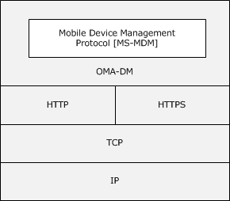
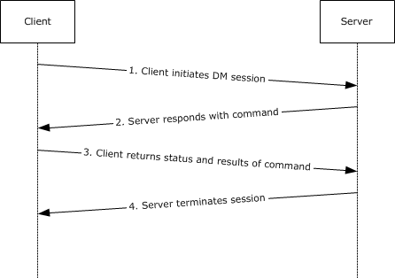

# [MS-MDM]: Mobile Device Management Protocol

Table of Contents

1 Introduction

- [1 Introduction](#Section_1)
  - [1.1 Glossary](#Section_1.1)
  - [1.2 References](#Section_1.2)
    - [1.2.1 Normative References](#Section_1.2.1)
    - [1.2.2 Informative References](#Section_1.2.2)
  - [1.3 Overview](#Section_1.3)
    - [1.3.1 Server requirements for the OMA Device Management Protocol](#Section_1.3.1)
  - [1.4 Relationship to Other Protocols](#Section_1.4)
  - [1.5 Prerequisites/Preconditions](#Section_1.5)
  - [1.6 Applicability Statement](#Section_1.6)
  - [1.7 Versioning and Capability Negotiation](#Section_1.7)
  - [1.8 Vendor-Extensible Fields](#Section_1.8)
  - [1.9 Standards Assignments](#Section_1.9)

2 Messages

- [2 Messages](#Section_2)
  - [2.1 Transport](#Section_2.1)
  - [2.2 Message Syntax](#Section_2.2)
    - [2.2.1 Namespaces](#Section_2.2.1)
    - [2.2.2 SyncML Message](#Section_2.2.2)
    - [2.2.3 Common Use Elements](#Section_2.2.3)
      - [2.2.3.1 Cmd](#Section_2.2.3.1)
      - [2.2.3.2 CmdID](#Section_2.2.3.2)
      - [2.2.3.3 CmdRef](#Section_2.2.3.3)
      - [2.2.3.4 Final](#Section_2.2.3.4)
      - [2.2.3.5 LocURI](#Section_2.2.3.5)
      - [2.2.3.6 MsgID](#Section_2.2.3.6)
      - [2.2.3.7 MsgRef](#Section_2.2.3.7)
      - [2.2.3.8 SessionID](#Section_2.2.3.8)
      - [2.2.3.9 Source](#Section_2.2.3.9)
      - [2.2.3.10 SourceRef](#Section_2.2.3.10)
      - [2.2.3.11 Target](#Section_2.2.3.11)
      - [2.2.3.12 TargetRef](#Section_2.2.3.12)
      - [2.2.3.13 VerDTD](#Section_2.2.3.13)
      - [2.2.3.14 VerProto](#Section_2.2.3.14)
    - [2.2.4 Message Container Elements](#Section_2.2.4)
      - [2.2.4.1 SyncML](#Section_2.2.4.1)
      - [2.2.4.2 SyncHdr](#Section_2.2.4.2)
      - [2.2.4.3 SyncBody](#Section_2.2.4.3)
    - [2.2.5 Data Description Elements](#Section_2.2.5)
      - [2.2.5.1 Data](#Section_2.2.5.1)
      - [2.2.5.2 Item](#Section_2.2.5.2)
      - [2.2.5.3 Meta](#Section_2.2.5.3)
    - [2.2.6 Protocol Management Elements](#Section_2.2.6)
      - [2.2.6.1 Status](#Section_2.2.6.1)
    - [2.2.7 Protocol Command Elements](#Section_2.2.7)
      - [2.2.7.1 Add](#Section_2.2.7.1)
      - [2.2.7.2 Alert](#Section_2.2.7.2)
      - [2.2.7.3 Atomic](#Section_2.2.7.3)
      - [2.2.7.4 Delete](#Section_2.2.7.4)
      - [2.2.7.5 Exec](#Section_2.2.7.5)
      - [2.2.7.6 Get](#Section_2.2.7.6)
      - [2.2.7.7 Replace](#Section_2.2.7.7)
      - [2.2.7.8 Results](#Section_2.2.7.8)

3 Protocol Details

- [3 Protocol Details](#Section_3)
  - [3.1 Common Details](#Section_3.1)
    - [3.1.1 Abstract Data Model](#Section_3.1.1)
    - [3.1.2 Timers](#Section_3.1.2)
    - [3.1.3 Initialization](#Section_3.1.3)
    - [3.1.4 Higher-Layer Triggered Events](#Section_3.1.4)
    - [3.1.5 Message Processing Events and Sequencing Rules](#Section_3.1.5)
      - [3.1.5.1 SyncML Request Commands](#Section_3.1.5.1)
        - [3.1.5.1.1 Add](#Section_3.1.5.1.1)
        - [3.1.5.1.2 Alert](#Section_3.1.5.1.2)
        - [3.1.5.1.3 Atomic](#Section_3.1.5.1.3)
        - [3.1.5.1.4 Delete](#Section_3.1.5.1.4)
        - [3.1.5.1.5 Exec](#Section_3.1.5.1.5)
        - [3.1.5.1.6 Get](#Section_3.1.5.1.6)
        - [3.1.5.1.7 Replace](#Section_3.1.5.1.7)
      - [3.1.5.2 SyncML Response Commands](#Section_3.1.5.2)
        - [3.1.5.2.1 Status](#Section_3.1.5.2.1)
        - [3.1.5.2.2 Results](#Section_3.1.5.2.2)
    - [3.1.6 Timer Events](#Section_3.1.6)
    - [3.1.7 Other Local Events](#Section_3.1.7)
      - [3.1.7.1 Access Control Lists](#Section_3.1.7.1)
      - [3.1.7.2 UserAgentOrigin](#Section_3.1.7.2)
  - [3.2 Azure Details](#Section_3.2)
    - [3.2.1 Abstract Data Model](#Section_3.2.1)
    - [3.2.2 Timers](#Section_3.2.2)
    - [3.2.3 Initialization](#Section_3.2.3)
    - [3.2.4 Higher-Layer Triggered Events](#Section_3.2.4)
    - [3.2.5 Message Processing Events and Sequencing Rules](#Section_3.2.5)
      - [3.2.5.1 Windows Azure Virtual Desktop for Multi-users' User Setting Configuration](#Section_3.2.5.1)
        - [3.2.5.1.1 Device Session vs. User Session](#Section_3.2.5.1.1)
        - [3.2.5.1.2 Azure AD Join](#Section_3.2.5.1.2)
        - [3.2.5.1.3 SyncApplicationVersion](#Section_3.2.5.1.3)
        - [3.2.5.1.4 MultipleSession Poll Interval](#Section_3.2.5.1.4)
        - [3.2.5.1.5 SyncType Alert](#Section_3.2.5.1.5)
        - [3.2.5.1.6 DevicePrepSync Alert](#Section_3.2.5.1.6)
    - [3.2.6 Timer Events](#Section_3.2.6)
    - [3.2.7 Other Local Events](#Section_3.2.7)

4 Protocol Examples

- [4 Protocol Examples](#Section_4)

5 Security

- [5 Security](#Section_5)
  - [5.1 Security Considerations for Implementers](#Section_5.1)
  - [5.2 Index of Security Parameters](#Section_5.2)

6 Appendix A: MSI Application Install

- [6 Appendix A: MSI Application Install](#Section_6)

7 Appendix B: Product Behavior

- [7 Appendix B: Product Behavior](#Section_7)

8 Change Tracking

- [8 Change Tracking](#Section_8)

For the legal notice and IP terms, see [LEGAL.md](../LEGAL.md).
Last updated: 4/23/2024.
See [Revision History](#revision-history) for full version history.

# 1 Introduction

The Mobile Device Management Protocol (MDM) is used for managing devices that have previously enrolled into a management system through the Mobile Device Enrollment Protocol (MDE) [MS-MDE](../MS-MDE/MS-MDE.md).

MDM is a subset of the Open Mobile Association (OMA) Device Management (DM) Protocol (OMA-DM) version 1.2.1 (OMA-TS-DM_Protocol-V1_2_1-20080617-A) [[OMA-DMP1.2.1]](https://go.microsoft.com/fwlink/?LinkId=301533).

Sections 1.5, 1.8, 1.9, 2, and 3 of this specification are normative. All other sections and examples in this specification are informative.

## 1.1 Glossary

This document uses the following terms:

**access control list (ACL)**: A list of access control entries (ACEs) that collectively describe the security rules for authorizing access to some resource; for example, an object or set of objects.

**client**: A client device that is capable of issuing OMA-DM commands to a server and responding to OMA-DM commands issued by a server.

**Coordinated Universal Time (UTC)**: A high-precision atomic time standard that approximately tracks Universal Time (UT). It is the basis for legal, civil time all over the Earth. Time zones around the world are expressed as positive and negative offsets from UTC. In this role, it is also referred to as Zulu time (Z) and Greenwich Mean Time (GMT). In these specifications, all references to UTC refer to the time at UTC-0 (or GMT).

**Cryptographic Message Syntax (CMS)**: A public standard that defines how to digitally sign, digest, authenticate, or encrypt arbitrary message content, as specified in [[RFC3852]](https://go.microsoft.com/fwlink/?LinkId=90445).

**Device Management Service (DMS)**: Server software that secures, monitors, manages, and supports devices deployed across mobile operators, service providers, and enterprises.

**document type definition (DTD)**: A language that can be used to define the rules of an XML document, as specified in [[XML]](https://go.microsoft.com/fwlink/?LinkId=90598) section 2.8.

**hash**: The collision-resistant substrate of a sequence of bytes. Well-known hash algorithms for computing hashes include MD4, [**MD5**](#gt_md5), and SHA-1.

**Hypertext Transfer Protocol Secure (HTTPS)**: An extension of HTTP that securely encrypts and decrypts web page requests. In some older protocols, "Hypertext Transfer Protocol over Secure Sockets Layer" is still used (Secure Sockets Layer has been deprecated). For more information, see [[SSL3]](https://go.microsoft.com/fwlink/?LinkId=90534) and [[RFC5246]](https://go.microsoft.com/fwlink/?LinkId=129803).

**man in the middle (MITM)**: An attack that deceives a server or client into accepting an unauthorized upstream host as the actual legitimate host. Instead, the upstream host is an attacker's host that is manipulating the network so that the attacker's host appears to be the desired destination. This enables the attacker to decrypt and access all network traffic that would go to the legitimate host. The attacker is able to read, insert, and modify at-will messages between two hosts without either party knowing that the link between them is compromised.

**MD5**: A one-way, 128-bit hashing scheme that was developed by RSA Data Security, Inc., as described in [[RFC1321]](https://go.microsoft.com/fwlink/?LinkId=90275).

**MD5 hash**: A hashing algorithm, as described in [RFC1321], that was developed by RSA Data Security, Inc. An MD5 hash is used by the File Replication Service (FRS) to verify that a file on each replica member is identical.

**mutual authentication**: A mode in which each party verifies the identity of the other party, as described in [[RFC3748]](https://go.microsoft.com/fwlink/?LinkId=90444) section 7.2.1.

**nonce**: A number that is used only once. This is typically implemented as a random number large enough that the probability of number reuse is extremely small. A nonce is used in authentication protocols to prevent replay attacks. For more information, see [[RFC2617]](https://go.microsoft.com/fwlink/?LinkId=90373).

**OMA-DM**: OMA Device Management Protocol (OMA-DM) specified by the Open Mobile Alliance (OMA). See Open Mobile Alliance (OMA) Device Management.

**Open Mobile Alliance (OMA) Device Management**: OMA is the industry organization that specifies the OMA Device Management (OMA-DM) protocol with the goal of specifying protocols and mechanisms to achieve the management of mobile devices (OMA DM), including the configuration of services access and the management of software on mobile devices.

**private key**: One of a pair of keys used in public-key cryptography. The private key is kept secret and is used to decrypt data that has been encrypted with the corresponding public key. For an introduction to this concept, see [[CRYPTO]](https://go.microsoft.com/fwlink/?LinkId=89841) section 1.8 and [[IEEE1363]](https://go.microsoft.com/fwlink/?LinkId=89899) section 3.1.

**public key**: One of a pair of keys used in public-key cryptography. The public key is distributed freely and published as part of a digital certificate. For an introduction to this concept, see [CRYPTO] section 1.8 and [IEEE1363] section 3.1.

**Secure Sockets Layer (SSL)**: A security protocol that supports confidentiality and integrity of messages in client and server applications that communicate over open networks. SSL supports server and, optionally, client authentication using X.509 certificates [[X509]](https://go.microsoft.com/fwlink/?LinkId=90590) and [[RFC5280]](https://go.microsoft.com/fwlink/?LinkId=131034). SSL is superseded by [**Transport Layer Security (TLS)**](#gt_transport-layer-security-tls). TLS version 1.0 is based on SSL version 3.0 [SSL3].

**security identifier (SID)**: An identifier for security principals that is used to identify an account or a group. Conceptually, the [**SID**](#gt_security-identifier-sid) is composed of an account authority portion (typically a domain) and a smaller integer representing an identity relative to the account authority, termed the relative identifier (RID). The [**SID**](#gt_security-identifier-sid) format is specified in [MS-DTYP](../MS-DTYP/MS-DTYP.md) section 2.4.2; a string representation of [**SIDs**](#gt_security-identifier-sid) is specified in [MS-DTYP] section 2.4.2 and [MS-AZOD](../MS-AZOD/MS-AZOD.md) section 1.1.1.2.

**server**: A server capable of issuing OMA-DM commands to a client and responding to OMA-DM commands issued by a client. See [MS-MDM](#Section_33769a92ac3147efae7bdc8501f7104f)

**SHA-2 hash**: A hashing algorithm specified in [[FIPS180-4]](https://go.microsoft.com/fwlink/?LinkId=298918) that was developed by the National Institute of Standards and Technology (NIST) and the National Security Agency (NSA).

**Transport Layer Security (TLS)**: A security protocol that supports confidentiality and integrity of messages in client and server applications communicating over open networks. TLS supports server and, optionally, client authentication by using X.509 certificates (as specified in [X509]). TLS is standardized in the IETF TLS working group.

**Uniform Resource Identifier (URI)**: A string that identifies a resource. The URI is an addressing mechanism defined in Internet Engineering Task Force (IETF) Uniform Resource Identifier (URI): Generic Syntax [[RFC3986]](https://go.microsoft.com/fwlink/?LinkId=90453).

**Uniform Resource Name (URN)**: A string that identifies a persistent Internet resource, as described in [[RFC2141]](https://go.microsoft.com/fwlink/?LinkId=114437). A URN can provide a mechanism for locating and retrieving a schema file that defines a specific namespace. Although a URL can provide similar functionality, a URN can refer to more than one URL and is not location-dependent.

**Windows Management Instrumentation (WMI)**: The Microsoft implementation of Common Information Model (CIM), as specified in [[DMTF-DSP0004]](https://go.microsoft.com/fwlink/?LinkId=89848). WMI allows an administrator to manage local and remote machines and models computer and network objects using an extension of the CIM standard.

**Windows Notification Service (WNS)**: A Microsoft-provided cloud service that is responsible for sending out notifications to targeted clients.

**XML namespace**: A collection of names that is used to identify elements, types, and attributes in XML documents identified in a URI reference [RFC3986]. A combination of XML namespace and local name allows XML documents to use elements, types, and attributes that have the same names but come from different sources. For more information, see [[XMLNS-2ED]](https://go.microsoft.com/fwlink/?LinkId=90602).

**MAY, SHOULD, MUST, SHOULD NOT, MUST NOT:** These terms (in all caps) are used as defined in [[RFC2119]](https://go.microsoft.com/fwlink/?LinkId=90317). All statements of optional behavior use either MAY, SHOULD, or SHOULD NOT.

## 1.2 References

Links to a document in the Microsoft Open Specifications library point to the correct section in the most recently published version of the referenced document. However, because individual documents in the library are not updated at the same time, the section numbers in the documents may not match. You can confirm the correct section numbering by checking the [Errata](https://go.microsoft.com/fwlink/?linkid=850906).

### 1.2.1 Normative References

We conduct frequent surveys of the normative references to assure their continued availability. If you have any issue with finding a normative reference, please contact [dochelp@microsoft.com](mailto:dochelp@microsoft.com). We will assist you in finding the relevant information.

[MS-MDE2] Microsoft Corporation, "[Mobile Device Enrollment Protocol Version 2](../MS-MDE2/MS-MDE2.md)".

[MS-MDE] Microsoft Corporation, "[Mobile Device Enrollment Protocol](../MS-MDE/MS-MDE.md)".

[MSDOCS-AAD-MDM] Microsoft Corporation, "Azure Active Directory integration with MDM", November 2021, [https://learn.microsoft.com/en-us/windows/client-management/mdm/azure-active-directory-integration-with-mdm](https://go.microsoft.com/fwlink/?linkid=2190716)

[OMA-DMP1.2.1] Open Mobile Alliance, "OMA Device Management Protocol, Approved Version 1.2.1", OMA-TS-DM_Protocol-V1_2_1-20080617-A, June 2008, [https://www.openmobilealliance.org/release/DM/V1_2_1-20080617-A/OMA-TS-DM_Protocol-V1_2_1-20080617-A.pdf](https://go.microsoft.com/fwlink/?LinkId=301533)

[OMA-DMRP1.2.1] Open Mobile Alliance, "OMA Device Management Representation Protocol, Candidate Version 1.3", OMA-TS-DM_RepPro-V1_3-20130422-C, April 2013, [https://www.openmobilealliance.org/release/dm/V1_3-20130422-C/OMA-TS-DM_RepPro-V1_3-20130422-C.pdf](https://go.microsoft.com/fwlink/?LinkId=522607)

[OMA-SyncML-HTTPBnd] Open Mobile Alliance Ltd, "SyncML HTTP Binding", OMA-TS-SyncML_HTTPBinding-V1_2-20070221-A, February 2007, [https://www.openmobilealliance.org/release/Common/V1_2-20070221-A/OMA-TS-SyncML_HTTPBinding-V1_2-20070221-A.pdf](https://go.microsoft.com/fwlink/?linkid=2143655)

[OMA-SyncMLRP1.2.2] Open Mobile Alliance, "SyncML Representation Protocol, Approved Version 1.2.2", OMA-TS-SyncML-RepPro-V1_2_2-20090724-A, July 2009, [https://www.openmobilealliance.org/release/Common/V1_2_2-20090724-A/OMA-TS-SyncML-RepPro-V1_2_2-20090724-A.pdf](https://go.microsoft.com/fwlink/?LinkId=301534)

[OMA-TSDM] Open Mobile Alliance, "OMA Device Management Tree and Description", Approved Version 1.2.1, OMA-TS-DM-RepPro-V1_2_1-20080617-A, [https://www.openmobilealliance.org/release/DM/V1_2_1-20080617-A/OMA-TS-DM_TND-V1_2_1-20080617-A.pdf](https://go.microsoft.com/fwlink/?LinkId=616504)

[RFC2119] Bradner, S., "Key words for use in RFCs to Indicate Requirement Levels", BCP 14, RFC 2119, March 1997, [https://www.rfc-editor.org/info/rfc2119](https://go.microsoft.com/fwlink/?LinkId=90317)

[RFC2315] Kaliski, B., "PKCS #7: Cryptographic Message Syntax Version 1.5", RFC 2315, March 1998, [https://www.rfc-editor.org/info/rfc2315](https://go.microsoft.com/fwlink/?LinkId=90334)

[RFC2616] Fielding, R., Gettys, J., Mogul, J., et al., "Hypertext Transfer Protocol -- HTTP/1.1", RFC 2616, June 1999, [https://www.rfc-editor.org/info/rfc2616](https://go.microsoft.com/fwlink/?LinkId=90372)

[XMLNS] Bray, T., Hollander, D., Layman, A., et al., Eds., "Namespaces in XML 1.0 (Third Edition)", W3C Recommendation, December 2009, [https://www.w3.org/TR/2009/REC-xml-names-20091208/](https://go.microsoft.com/fwlink/?LinkId=191840)

### 1.2.2 Informative References

[MSDN-ADDToken] Microsoft Corporation, "Supported Token and Claim Types", [https://azure.microsoft.com/en-us/documentation/articles/active-directory-token-and-claims/](https://go.microsoft.com/fwlink/?LinkId=529167)

[MSDN-CSPRef] Microsoft Corporation, "Configuration service provider reference for Windows 10 Technical Preview", [https://msdn.microsoft.com/en-us/library/windows/hardware/dn920025(v=vs.85).aspx](https://go.microsoft.com/fwlink/?LinkId=529168)

[MSDN-MDMSetProv] Microsoft Corporation, "Mobile Device Management Settings Provider", [https://learn.microsoft.com/en-us/previous-versions/windows/desktop/mdmsettingsprov/mobile-device-management-settings-provider-portal](https://go.microsoft.com/fwlink/?LinkId=524036)

[MSDN-OMA-LOGSTAT] Microsoft Corporation, "OMA DM protocol support:User targeted vs. Device targeted configuration", [https://learn.microsoft.com/en-us/windows/client-management/mdm/oma-dm-protocol-support#user-targeted-vs-device-targeted-configuration](https://go.microsoft.com/fwlink/?linkid=856976)

[MSDN-WPNS] Microsoft Corporation, "Windows Push Notification Services (WNS) overview (Windows Runtime apps)", [https://msdn.microsoft.com/en-us/library/windows/apps/xaml/hh913756.aspx](https://go.microsoft.com/fwlink/?LinkId=817334)

[MSDOCS-DMAcc-CSP] Microsoft Corporation, "DMAcc CSP", [https://learn.microsoft.com/en-us/windows/client-management/mdm/dmacc-csp](https://go.microsoft.com/fwlink/?linkid=2143658)

[MSDOCS-DMClient-CSP] Microsoft Corporation, "DMClient CSP", [https://learn.microsoft.com/en-us/windows/client-management/mdm/dmclient-csp](https://go.microsoft.com/fwlink/?linkid=2161995)

[MSFT-CorrelationVector] Microsoft Corporation, "Correlation Vector", [https://github.com/microsoft/CorrelationVector](https://go.microsoft.com/fwlink/?linkid=2162334)

[OMA-DMS1.2.1] Open Mobile Alliance, "OMA Device Management Security, Approved Version 1.2.1", OMA-TS-DM_Security-V1_2_1-20080617-A, June 2008, [https://www.openmobilealliance.org/release/DM/V1_2_1-20080617-A/OMA-TS-DM_Security-V1_2_1-20080617-A.pdf](https://go.microsoft.com/fwlink/?linkid=521908)

[RFC5023] Gregorio, J., and de hOra, B., Eds., "The Atom Publishing Protocol", RFC 5023, October 2007, [https://www.rfc-editor.org/info/rfc5023](https://go.microsoft.com/fwlink/?LinkId=140880)

## 1.3 Overview

The Mobile Device Management Protocol is a [**client**](#gt_client)/[**server**](#gt_server) protocol that is used to manage mobile devices that have previously been enrolled into a management service by using the Mobile Device Enrollment Protocol (MDE) [MS-MDE2](../MS-MDE2/MS-MDE2.md). MDM is a subset of the Open Mobile Association Device Management (OMA DM) Protocol (OMA-DM) version 1.2.1 (OMA-TS-DM_Protocol-V1_2_1-20080617-A) [[OMA-DMP1.2.1]](https://go.microsoft.com/fwlink/?LinkId=301533). Where [**OMA DM**](#gt_d6471a40-dc75-4bb9-9ff3-003dc318cf31) is the management system built on the [**OMA-DM**](#gt_oma-dm) protocol.

MDM supports the following capabilities:

- Client and resource configurations
- Company policy management
- Enterprise application management
- Certificate management
- Basic inventory and asset management
In this document, the endpoint that initiates the HTTP connection and sends HTTP request messages is referred to as the client. The **entity** that responds to the HTTP connection request and sends HTTP response messages is referred to as the server.

A device management (DM) session consists of a series of commands exchanged between a DM server and a device client. The server sends commands indicating operations to be performed on the client's management tree. The client responds by sending commands that contain the results and any requested status information.

An example of a short DM session would be the following:

A server sends a **Get** command to a client to retrieve the contents of one of the nodes of the management tree. The client performs the operation and responds with a **Result** command that contains the requested contents.

A DM session can be divided into two phases:

- Setup phase: In response to a trigger event, a client sends an initiating message to a DM server. The client and server exchange needed authentication and client information. This phase is represented by steps 1, 2, and 3 in the following table.
- Management phase: The DM server is in control. It sends management commands to the client, and the phone responds. The second phase ends when the DM server stops sending commands and terminates the session. This phase is represented by steps 3, 4, and 5 in the following table.
| Step | Action | Description |
| --- | --- | --- |
| 1 | The client task schedule invokes the device management client. | At the scheduled time, the client is invoked periodically to call back to the enterprise management server over HTTPS. |
| 2 | The client sends a message, over an IP connection, to initiate the session. | This message includes client information and credentials. The client and server do certificate-based authentication over an SSL channel. |
| 3 | The server responds, over an IP connection (HTTPS). | The server sends initial device management commands, if any. |
| 4 | The client responds to server management commands. | This message includes the results of performing the specified device management operations. |
| 5 | The server terminates the session or sends another command. | The session ends, or step 4 is repeated. |

### 1.3.1 Server requirements for the OMA Device Management Protocol

The following are the general [**server**](#gt_server) requirements for using the OMA Device Management (DM) Protocol (OMA-DM), as specified in [[OMA-DMP1.2.1]](https://go.microsoft.com/fwlink/?LinkId=301533), to manage the [**client**](#gt_client):

The [**OMA DM**](#gt_d6471a40-dc75-4bb9-9ff3-003dc318cf31) server is required to support the OMA-DM version 2.1 or later protocol.

[**Secure Sockets Layer (SSL)**](#gt_secure-sockets-layer-ssl)/[**Transport Layer Security (TLS)**](#gt_transport-layer-security-tls) is required to be on the OMA DM server, and it is required to provide server certificate-based authentication, data integrity checking, and data encryption. If the certificate is not issued by a commercial certification authority whose root certificate is preinstalled in the client, the implementer provisions the company's root certificate in the client's ROOT store.

To authenticate the client, the implementer uses either Basic or [**MD5**](#gt_md5) client authentication at the application level. At the SSL level, the implementer uses client certificate-based authentication.

The server MD5 [**nonce**](#gt_nonce) is renewed in each DM session for the next DM session. The DM client sends the new server nonce for the next session to the server by using the **Status** element in every DM session.

The MD5 binary nonce is sent over XML in B64-encoded format, but the octal form of the binary data is used when the server calculates the [**hash**](#gt_hash).

For more information about Basic or MD5 client authentication, [**MD5 hash**](#gt_md5-hash) generation, and MD5 nonce, see the OMA Device Management Security specification ([[OMA-DMS1.2.1]](https://go.microsoft.com/fwlink/?linkid=521908)) and OMA Device Management Protocol specification ([OMA-DMP1.2.1]).

## 1.4 Relationship to Other Protocols

MDM depends on HTTP for the transfer of all protocol messages [[RFC2616]](https://go.microsoft.com/fwlink/?LinkId=90372).

Figure 1: Relationship to other protocols

## 1.5 Prerequisites/Preconditions

The Mobile Device Enrollment Protocol (MDE) is a prerequisite to using this protocol. Before a device can be managed by using MDM, the device has to already be enrolled in a management service by using MDE. Configuration information for bootstrapping MDM is persisted on the device as part of the enrollment process. The location and the method for retrieving configuration information is implementation-specific.

MDM configuration information includes:

- Service endpoint
- Identity certificate for [**TLS**](#gt_transport-layer-security-tls) [**HTTPS**](#gt_hypertext-transfer-protocol-secure-https) [**mutual authentication**](#gt_mutual-authentication)

## 1.6 Applicability Statement

A device has to be enrolled in a management service through the use of MDE before the device can then be managed by using MDM.

## 1.7 Versioning and Capability Negotiation

None.

## 1.8 Vendor-Extensible Fields

None.

## 1.9 Standards Assignments

| Parameter | Value | Reference |
| --- | --- | --- |
| TCP port | 443 | Section [2.1](#Section_2.1) |

# 2 Messages

MDM is based on the [**OMA-DM**](#gt_oma-dm) protocol [[OMA-DMP1.2.1]](https://go.microsoft.com/fwlink/?LinkId=301533). Messages are issued by a requester and results and status are returned by a responder as defined in [[OMA-SyncMLRP1.2.2]](https://go.microsoft.com/fwlink/?LinkId=301534). MDM does not modify or extend these messages in any manner.

## 2.1 Transport

MDM, both as defined in this document and the [**OMA-DM**](#gt_oma-dm) protocol [[OMA-DMP1.2.1]](https://go.microsoft.com/fwlink/?LinkId=301533), uses HTTP (as specified in [[RFC2616]](https://go.microsoft.com/fwlink/?LinkId=90372)) as the transport layer. MDM, in compliance with [[OMA-SyncML-HTTPBnd]](https://go.microsoft.com/fwlink/?linkid=2143655), supports both "application/vnd.syncml.dm+xml" (default) and "application/vnd.syncml.dm+wbxml" encoding types. The server can be configured with the DMAcc Configuration Service Provider’s Microsoft/DefaultEncoding, as described in [[MSDOCS-DMAcc-CSP]](https://go.microsoft.com/fwlink/?linkid=2143658). HTTP operations are performed on resources identified by a [**URI**](#gt_uniform-resource-identifier-uri). MDM extends the resource addressing rules used by HTTP for URI formatting as specified in section [2.2.3](#Section_2.2.3).

This document does not prescribe a mechanism to secure (authenticate, encrypt, and so on) MDM communications. For security recommendations relating to the protocol transport layer, see [[RFC5023]](https://go.microsoft.com/fwlink/?LinkId=140880) section 15.

**Note 1:** The device extends the MDM server request URL to include device OMA-DM mode information.<1> The MDM client can execute under different contexts on the device. The MDM client forwards the context and condition to the DM service via the "mode" parameter in the request URL. The mode parameter contains one of the following values:

• Maintenance

• Machine

For an example, see http://www.contoso.com/omadm/cimhandler.ashx?mode=Machine&Platform=WoA

If the mode parameter is set to "Maintenance", the MDM client is launched when there is an active user login.

If the mode parameter is set to "Machine", the MDM client is launched in the System context and the client does not have access to the user's profile.

Additionally, the device also includes implementation-specific platform information via the "Platform" parameter in the request URL.<2>

**Note 2:** When the device is connected to the MDM server via HTTP, the user-agent header value is MSFT OMA DM Client/1.2.0.1.<3>

**Note 3:** When the device is joined to an Azure Active Domain (AAD) or the login user has an AAD account, the Authorization HTTP header contains the AAD token when the DM client is communicating with the MDM server. <4> The header is in the following format.

Bearer CI6MTQxmCF5xgu6yYcmV9ng6vhQfaJYw…

For more information, see [[MSDN-ADDToken]](https://go.microsoft.com/fwlink/?LinkId=529167).

**Note 4:** When an MDM device establishes an [**SSL**](#gt_secure-sockets-layer-ssl)/[**TLS**](#gt_transport-layer-security-tls) connection with the MDM server through SSL bridging–enabled proxies, the client device identity certificate obtained by the target MDM server from transport security will be the intermediate proxy server client authentication certificate instead of the actual device client identity certificate.<5> It is required that the MDM client and MDM server have a mechanism to send and verify device identity securely in this case. This is achieved by including a client certificate's related HTTP header in a DM package. The MDM server can identify a connecting device by examining the device client identity certificate issued earlier at MDM enrollment time. The device client identity certificate is used to establish the SSL/TLS connection to the MDM server.

- Every SyncML message (section [2.2.2](#Section_2.2.2)) that comes from the MDM client carries an additional HTTP header named MS-Signature and Authorization. This header contains a BASE64-encoded [**Cryptographic Message Syntax (CMS)**](#gt_cryptographic-message-syntax-cms) Detached Signature of the complete SyncML message (**SyncHdr**, **SyncBody**) [**SHA-2 hash**](#gt_sha-2-hash). Signing is performed using the [**private key**](#gt_private-key) of the device identity certificate.
- The device identity certificate ([**public key**](#gt_public-key)) and PKCS9 [**UTC**](#gt_coordinated-universal-time-utc) signing time stamp are included as part of the authenticated attributes in the signature.
- This is an opt-in function. By default, the MDM client doesn't sign the DM package. During MDM enrollment, the server could require the DM client to sign the outgoing MD package via RequireMessageSigning node in DMClient CSP ([[MSDOCS-DMClient-CSP]](https://go.microsoft.com/fwlink/?linkid=2161995)). For more information about device enrollment and DMClient CSP, see [MS-MDE2](../MS-MDE2/MS-MDE2.md).
- The MDM server validates the signature, and time stamp using a device identity certificate. It ensures the device's client identity certificate is valid (issued by MDM at enrollment time), the time is valid (optional), and the signature is valid and trusted by the MDM server as of today.
**Note 5:** The MDM-GenericAlert is a custom HTTP header that hosts one or more instances of OMA DM generic alert information provided in the HTTP messages sent by the device to the server during an OMA DM session<6>. This custom header is sent if the DM session is triggered by the device due to one or more critical or fatal alerts, such as when the **Mark** element in the **Item** element of the generic alert contains a value of fatal or critical. The following is the alert format.

MDM-GenericAlert: <AlertType1><AlertType2>

Only the **Type** property of the generic alert is presented in the header. Each generic alert's **Type** information is delimited with <>. If present, the MDM-GenericAlert header is presented in every outgoing MDM message in the same [**OMA DM**](#gt_d6471a40-dc75-4bb9-9ff3-003dc318cf31) session. For more information about the generic alert message and its format, see section 8.7 in [OMA-DMP1.2.1].

**Note 6:** Additional bidirectional confidentiality and integrity checks SHOULD<7> be enabled on top of the transport layer. This allows for safer communication beyond SSL termination point and protection against [**Man in the Middle**](#gt_man-in-the-middle-mitm) attacks. Server and client both can ensure that the message has not been tampered with or eavesdropped by any entity on the internet other than the recipient.

- This is an opt-in function. By default, the MDM client doesn't enable these operations. Server can configure these using EnhancedAppLayerSecurity nodes in DMClient CSP node. After the account is configured, future MDM sync sessions provide additional confidentiality, integrity, or both confidentiality and integrity checks.
- Data sent to server is PKCS#7 signed and enveloped data per [[RFC2315]](https://go.microsoft.com/fwlink/?LinkId=90334).
- Server installs MDM Server Certificate using CertificateStore CSP under System\My path before enabling the feature. Server should not delete the certificate chain because these will be deleted during enrollment. These will be deleted when the device un-enrolls from MDM management.
- SyncML coming (SyncHdr, SyncBody) from the OMA DM client to the MDM server will be enveloped by the MDM server certificate and signed by the client certificate (exchanged during enrollment). SyncML coming from the MDM server to the OMA DM client will be enveloped by the client certificate and signed by the MDM server certificate. SHA-2 256-bit encryption and signing algorithms are used to compute the signatures.
**Note 7:** The client will add an additional header, MS-CV, to the request for the server to use as a correlation ID. The value is generated according to the procedure described in [[MSFT-CorrelationVector]](https://go.microsoft.com/fwlink/?linkid=2162334).<8>

**Note 8:** If the server has set **EntDMID** in the DMClient configuration service provider, the client adds client-request-id to the header and sets it to the value of **EntDMID**.<9> See [MSDOCS-DMClient-CSP] for more information.

**Note 9:** If the server has set **ForceAadToken** in the DMClient configuration service provider, and the device is joined to an Azure Active Domain (AAD), the client adds a custom header that contains the AAD token. The header is in the following format.

DeviceToken: CI6MTQxmCF5xgu6yYcmV9ng6vhQfaJYw…

See [MSDOCS-DMClient-CSP] for more information.<10>

## 2.2 Message Syntax

### 2.2.1 Namespaces

This document defines and references various [**XML namespaces**](#gt_xml-namespace) that use the mechanisms specified in [[XMLNS]](https://go.microsoft.com/fwlink/?LinkId=191840). Although this document associates a specific XML namespace prefix with each XML namespace that is used, the choice of any specific XML namespace prefix is implementation-specific and not significant for interoperability.

| Prefix | Namespace URI | Reference |
| --- | --- | --- |
| SyncML | xmlns=‘SYNCML:SYNCML1.2’ | Section [[OMA-SyncMLRP1.2.2]](https://go.microsoft.com/fwlink/?LinkId=301534) |

### 2.2.2 SyncML Message

A SyncML message is a well-formed XML document that adheres to the [**document type definition (DTD)**](#gt_document-type-definition-dtd), but which does not require validation. While a SyncML message does not require validation, the XML in the document MUST adhere to the explicit order defined in the DTD. The XML document is identified by a [SyncML (section 2.2.4.1)](#Section_2.2.4.1) document (or root) element type that serves as a parent container for the SyncML message.

The SyncML message consists of a header specified by the [SyncHdr (section 2.2.4.2)](#Section_2.2.4.2) element type and a body specified by the [SyncBody (section 2.2.4.3)](#Section_2.2.4.3) element type. The SyncML header identifies the routing and versioning information about the SyncML message. The SyncML body functions as a container for one or more SyncML commands (see section [2.2.7](#Section_2.2.7)).

A SyncML command is specified by individual element types that provide specific details about the command, including any data or meta-information. The command serves as a container for these element types (see section [2.2.3](#Section_2.2.3)).

MDM uses a subset of the SyncML message definition specified in [[OMA-SyncMLRP1.2.2]](https://go.microsoft.com/fwlink/?LinkId=301534). MDM-specific SyncML xml message format is defined in [[OMA-DMRP1.2.1]](https://go.microsoft.com/fwlink/?LinkId=522607). The following snippet identifies the required elements for a SyncML message as implemented by MDM.

<SyncML xmlns='SYNCML:SYNCML1.2'>

<SyncHdr>

<VerDTD>1.2</VerDTD>

<VerProto>DM/1.2</VerProto>

<SessionID>1</SessionID>

<MsgID>1</MsgID>

<Target>

<LocURI>{unique device ID}</LocURI>

</Target>

<Source>

<LocURI>{management server url}</LocURI>

</Source>

</SyncHdr>

<SyncBody>{Command}</SyncBody>

</SyncML>

### 2.2.3 Common Use Elements

The following sections identify common element types used by other SyncML element types.

#### 2.2.3.1 Cmd

The **Cmd** element type specifies the name of the SyncML command that is referenced by a [Status (section 2.2.6.1)](#Section_2.2.6.1) element type. The element type has the following syntax.

<Cmd>(#PCDATA)</Cmd>

**Parent Element: Status** (section 2.2.6.1)

**Restrictions: Cmd** MUST be a string that is one of the following SyncML command names: **Add**, **Atomic**, **Delete**, **Exec**, **Get**, **Replace**, **Results**, or **Status**.

**Content Model:** (#PCDATA)

**Attributes:** None.

#### 2.2.3.2 CmdID

The **CmdID** element type specifies a unique command identifier for the SyncML message. The element type has the following syntax.

<CmdID>(#PCDATA)</CmdID>

**Parent Elements:** [Add (section 2.2.7.1)](#Section_2.2.7.1), [Alert (section 2.2.7.2)](#Section_2.2.7.2), [Atomic (section 2.2.7.3)](#Section_2.2.7.3), [Delete (section 2.2.7.4)](#Section_2.2.7.4), [Exec (section 2.2.7.5)](#Section_2.2.7.5), [Get (section 2.2.7.6)](#Section_2.2.7.6), [Replace (section 2.2.7.7)](#Section_2.2.7.7), [Results (section 2.2.7.8)](#Section_2.2.7.8), [Status (section 2.2.6.1)](#Section_2.2.6.1)

**Restrictions: CmdID** MUST always be present in the [SyncML](#Section_2.2.2) message. **CmdID** MUST be unique within the SyncML message and MUST NOT be the string "0".

**Content Model:** (#PCDATA)

**Attributes:** None.

#### 2.2.3.3 CmdRef

The **CmdRef** element type specifies a reference to a [CmdID](#Section_2.2.3.2) that is used by the [Status (section 2.2.6.1)](#Section_2.2.6.1) element type. The element type has the following syntax.

<CmdRef>(#PCDATA)</CmdRef>

**Parent Elements:** [Results (section 2.2.7.8)](#Section_2.2.7.8), [Status](#Section_2.2.6.1)

**Restrictions: CmdRef** MUST refer to the CmdID (section 2.2.3.2) of the [SyncML](#Section_2.2.2) command referred to by **Status**. **CmdRef** MUST be present in the SyncML message, except when the **Status** command refers to the [SyncHdr (section 2.2.4.2)](#Section_2.2.4.2) of the associated SyncML request message. For example, a status can be sent back to the originator for exceptions (that is, (401) Unauthorized) found within the SyncHdr of the originator’s request.

**Content Model:** (#PCDATA)

**Attributes:** None.

#### 2.2.3.4 Final

The **Final** element type indicates that a SyncML message is the last message in the current SyncML package. The element type has the following syntax.

<Final></Final>

**Parent Element:** [SyncBody (section 2.2.4.3)](#Section_2.2.4.3)

**Restrictions: Final** MUST only be specified in the last [SyncML](#Section_2.2.2) message in a SyncML package. When **Final** is not present in a SyncML message, more messages follow the SyncML message in the current SyncML package. The semantics for the different SyncML packages are specified by the SyncML Representation Protocol [[OMA-SyncMLRP1.2.2]](https://go.microsoft.com/fwlink/?LinkId=301534) and the [**OMA-DM**](#gt_oma-dm) protocol [[OMA-DMP1.2.1]](https://go.microsoft.com/fwlink/?LinkId=301533).

**Content Model:** (EMPTY)

**Attributes:** None.

#### 2.2.3.5 LocURI

The **LocURI** element type specifies the target or source-specific address. The element type has the following syntax.

<LocURI>(#PCDATA)</LocURI>

**Parent Elements:** [Target (section 2.2.3.11)](#Section_2.2.3.11), [Source (section 2.2.3.9)](#Section_2.2.3.9), [Item (section 2.2.5.2)](#Section_2.2.5.2)

**Restrictions: LocURI** MUST be either an absolute or a relative [**URI**](#gt_uniform-resource-identifier-uri), or a well-known [**Uniform Resource Name (URN)**](#gt_uniform-resource-name-urn).

**Content Model:** (#PCDATA)

**Attributes:** None.

#### 2.2.3.6 MsgID

The **MsgID** element type specifies a unique [SyncML](#Section_2.2.2) session identifier for the SyncML message. The element type has the following syntax.

<MsgID>(#PCDATA)</MsgID>

**Parent Element:** [SyncHdr (section 2.2.4.2)](#Section_2.2.4.2)

**Restrictions: MsgID** MUST be specified in the SyncHdr and MUST be unique to the device within the SyncML session. The value is a monotonically increasing numeric value that starts at one (1) for the first message in the SyncML session. The **MsgID** specified in a SyncML request MUST be the content of the [MsgRef (section 2.2.3.7)](#Section_2.2.3.7) element type specified in the corresponding SyncML [Results (section 2.2.7.8)](#Section_2.2.7.8) or response [Status (section 2.2.6.1)](#Section_2.2.6.1).

**Content Model:** (#PCDATA)

**Attributes:** None.

#### 2.2.3.7 MsgRef

The **MsgRef** element type specifies a reference to a [**MsgID (section 2.2.3.6)**](#Section_2.2.3.6) that is used by a [SyncML](#Section_2.2.2) [Results (section 2.2.7.8)](#Section_2.2.7.8) or response [Status (section 2.2.6.1)](#Section_2.2.6.1). The element type has the following syntax.

<MsgRef>(#PCDATA)</MsgRef>

**Parent Elements: Results**, **Status**

**Restrictions: MsgRef** MUST reference the **MsgID** of the SyncML message referred to by a SyncML **Results** or response **Status**.

**Content Model:** (#PCDATA)

**Attributes:** None.

#### 2.2.3.8 SessionID

The **SessionID** element type specifies the identifier of the [SyncML](#Section_2.2.2) session that is associated with the SyncML message. The **SessionID** can remain valid across the exchange of many SyncML messages between the client and server. The element type has the following syntax.

The element type has the following syntax.

<SessionID>(#PCDATA)</SessionID>

**Parent Element:** [SyncHdr (section 2.2.4.2)](#Section_2.2.4.2)

**Restrictions: SessionID** is an opaque string that MUST be specified in the SyncHdr in all SyncML messages. The initiator SHOULD use a unique **SessionID** for each session. Note that for practical implementations for a client, using an 8-bit incrementing **SessionID** counter is sufficient. The maximum length of a **SessionID** is 4 bytes.

**Content Model:** (#PCDATA)

**Attributes:** None.

#### 2.2.3.9 Source

The **Source** element type specifies source routing or mapping information. The element type has the following syntax.

<Source>(LocURI)</Source>

**Parent Elements:** [Item (section 2.2.5.2)](#Section_2.2.5.2), [SyncHdr (section 2.2.4.2)](#Section_2.2.4.2)

**Restrictions:** When specified in the **Item** element type, **Source** specifies the resource item that is the source of the SyncML command. When specified in the **SyncHdr** element type, **Source** specifies the source routing information for the network device that originated the [SyncML](#Section_2.2.2) message.

**Content Model:** ([LocURI (section 2.2.3.5)](#Section_2.2.3.5))

**Attributes:** None.

#### 2.2.3.10 SourceRef

The **SourceRef** element type specifies the [Source (section 2.2.3.9)](#Section_2.2.3.9) referenced by a [Status (section 2.2.6.1)](#Section_2.2.6.1) element type. The element type has the following syntax.

<SourceRef>(LocURI)</SourceRef>

**Parent Elements: Status**

**Restrictions:** When specified in the **Status** element type, **SourceRef** identifies the source address specified in the command associated with the response status.

The element type MAY be specified in a **Status** element command corresponding to any SyncML command that includes the **Source** element type.

**Content Model:** ([LocURI (section 2.2.3.5)](#Section_2.2.3.5))

**Attributes:** None.

#### 2.2.3.11 Target

The **Target** element type specifies target routing information. The element type has the following syntax.

<Target>(LocURI)</Target>

**Parent Elements:** [Item (section 2.2.5.2)](#Section_2.2.5.2), [SyncHdr (section 2.2.4.2)](#Section_2.2.4.2)

**Restrictions:** When specified in the Item element type, **Target** specifies the [**WMI**](#gt_windows-management-instrumentation-wmi) class that is the target of the [SyncML](#Section_2.2.2) command. When specified in the **SyncHdr** element type, **Target** specifies the target routing information for the network device that is receiving the SyncML message.

**Content Model:** ([LocURI (section 2.2.3.5)](#Section_2.2.3.5))

**Attributes:** None.

#### 2.2.3.12 TargetRef

The **TargetRef** element type specifies the [Target (section 2.2.3.11)](#Section_2.2.3.11) referenced by a [Status (section 2.2.6.1)](#Section_2.2.6.1) element type. The element type has the following syntax.

<TargetRef>(LocURI)</TargetRef>

**Parent Elements: Status**

**Restrictions:** When specified in the **Status** element type, **TargetRef** identifies the target address specified in the command associated with the response status.

The element type MAY be specified in a **Status** element command corresponding to any [SyncML](#Section_2.2.2) command that includes the Target element type.

**Content Model:** ([LocURI (section 2.2.3.5)](#Section_2.2.3.5))

**Attributes:** None.

#### 2.2.3.13 VerDTD

The **VerDTD** element type specifies the major and minor version identifier of the SyncML representation protocol specification that is used to represent the SyncML message. The element type has the following syntax.

<VerDTD>(#PCDATA)</VerDTD>

**Parent Element:** [SyncHdr (section 2.2.4.2)](#Section_2.2.4.2)

**Restrictions: VerDTD** MUST be specified in the **SyncHdr**. When the XML document conforms to the current revision of the [SyncML](#Section_2.2.2) representation protocol specification, **VerDTD** MUST be 1.2. Note that major revisions to a specification can create incompatibilities that generally require a new SyncML parser. Minor revisions involve changes that do not impact basic compatibility of the parser.

**Content Model:** (#PCDATA)

**Attributes:** None.

#### 2.2.3.14 VerProto

The **VerProto** element type specifies the major and minor version identifier of the Device Management representation protocol specification that is used to represent the [SyncML](#Section_2.2.2) message. The element type has the following syntax.

<VerProto>(#PCDATA)</VerProto>

**Parent Element:** [SyncHdr (section 2.2.4.2)](#Section_2.2.4.2)

**Restrictions: VerProto** MUST be specified in the **SyncHdr**. The first SyncML Message in each SyncML Package sent from an originator to a recipient MUST include the VerProto element type in the **SyncHdr**. When the XML document conforms to the current revision of the Device Management representation protocol specification, **VerProto** MUST be DM/1.2, as specified in [[OMA-DMRP1.2.1]](https://go.microsoft.com/fwlink/?LinkId=522607) section 6.1.25. Note that major revisions to a specification can create incompatibilities that generally require a new SyncML parser. Minor revisions involve changes that do not impact basic compatibility of the parser.

**Content Model:** (#PCDATA)

**Attributes:** None.

### 2.2.4 Message Container Elements

Message container elements provide basic container support for the [SyncML](#Section_2.2.2) message.

#### 2.2.4.1 SyncML

The **SyncML** element type serves as the container for a [SyncML Message](#Section_2.2.2). The element type has the following syntax.

<SyncML xmlns=‘SYNCML:SYNCML1.2’>(SyncHdr, SyncBody)</SyncML>

**Parent Element:** None. **SyncML** is the root (or document) element.

**Restrictions:** None.

**Content Model:** ([SyncHdr (section 2.2.4.2)](#Section_2.2.4.2), [SyncBody (section 2.2.4.3)](#Section_2.2.4.3))

**Attributes: SyncML** requires the **xmlns** attribute. The attribute type is CDATA and the value MUST be the string `"SYNCML:SYNCML1.2"`.

#### 2.2.4.2 SyncHdr

The **SyncHdr** element type serves as the container for the revisioning routing information in the [SyncML](#Section_2.2.4.1) message. The element type has the following syntax.

<SyncHdr>(VerDTD, VerProto, SessionID, MsgID, Target, Source, Meta)</SyncHdr>

**Parent Element:** SyncML (section 2.2.4.1)

**Restrictions:** Use of the [Meta (section 2.2.5.3)](#Section_2.2.5.3) element type is optional. **Meta** is used to convey meta-information about the SyncML messages, such as the maximum byte size of a SyncML response.

**Content Model:** ([VerDTD (section 2.2.3.13)](#Section_2.2.3.13), [VerProto (section 2.2.3.14)](#Section_2.2.3.14), [SessionID (section 2.2.3.8)](#Section_2.2.3.8), [MsgID (section 2.2.3.6)](#Section_2.2.3.6), [Target (section 2.2.3.11)](#Section_2.2.3.11), [Source (section 2.2.3.9)](#Section_2.2.3.9), Meta)

**Attributes:** None.

#### 2.2.4.3 SyncBody

The **SyncBody** element type serves as the container for the body or contents of the [SyncML message](#Section_2.2.2). The element type has the following syntax.

- <SyncBody>((Atomic | Exec | Get | Results | Status | Add | Replace | Delete)+, Final?)</SyncBody>
If the server has set the DMClient CSP node

./Vendor/MSFT/DMClient/Provider/ProviderID/SyncApplicationVersion

to 3.0 or higher, the **SyncBody** element SHOULD<11> declare the namespace `xmlns:msft=http://schemas.microsoft.com/MobileDevice/MDM`

The server provides the value for the ProviderID as specified in [MS-MDE2](../MS-MDE2/MS-MDE2.md) section 2.2.9.3.

<SyncBody xmlns:msft="http://schemas.microsoft.com/MobileDevice/MDM">((Atomic | Exec | Get | Results | Status | Add | Replace | Delete)+, Final?)</SyncBody>

**Parent Element:** [SyncML (section 2.2.4.1)](#Section_2.2.4.1)

**Restrictions:** None.

**Content Model:** (([Atomic (section 2.2.7.3)](#Section_2.2.7.3) | [Exec (section 2.2.7.5)](#Section_2.2.7.5) | [Get (section 2.2.7.6)](#Section_2.2.7.6) | [Results (section 2.2.7.8)](#Section_2.2.7.8) | [Status (section 2.2.6.1)](#Section_2.2.6.1) | [Add (section 2.2.7.1)](#Section_2.2.7.1) | [Replace (section 2.2.7.7)](#Section_2.2.7.7) | [Delete (section 2.2.7.4)](#Section_2.2.7.4))+, [Final (section 2.2.3.4)](#Section_2.2.3.4)?)

**Attributes:** None.

### 2.2.5 Data Description Elements

Data description elements are used as container elements for data exchanged in a [SyncML](#Section_2.2.2) message.

#### 2.2.5.1 Data

The **Data** element type provides a container for discrete SyncML data. The element type has the following syntax.

<Data>(#PCDATA)</Data>

If the server has set the DMClient CSP node

./Vendor/MSFT/DMClient/Provider/ProviderID/SyncApplicationVersion

to 3.0 or higher, the **Data** elements in SyncML returned to the server SHOULD<12> include hexadecimal status codes returned from Windows components that are reporting a failure.

<Data msft:originalerror="0x86000002">(#PCDATA)</Data>

**Parent Elements:** [Item (section 2.2.5.2)](#Section_2.2.5.2), [Status (section 2.2.6.1)](#Section_2.2.6.1)

**Restrictions: Data** can either be parsable character content or markup content. If **Data** contains any markup content, the namespace for the element types MUST be declared on the element types in the content. When **Data** is specified in an **Item**, the element type specifies the item data. When **Data** is specified in a **Status**, the element type specifies the request status code type.

**Content Model:** (#PCDATA)

**Attributes:** None.

#### 2.2.5.2 Item

The **Item** element type provides a container for item data. The element type has the following syntax.

<Item>(#PCDATA)</Item>

**Parent Elements:** [Add (section 2.2.7.1)](#Section_2.2.7.1), [Delete (section 2.2.7.4)](#Section_2.2.7.4), [Exec (section 2.2.7.5)](#Section_2.2.7.5), [Get (section 2.2.7.6)](#Section_2.2.7.6), [Replace (section 2.2.7.7)](#Section_2.2.7.7), [Results (section 2.2.7.8)](#Section_2.2.7.8), [Status (section 2.2.6.1)](#Section_2.2.6.1)

**Restrictions:** When the source **URI** for the item data is an external entity, the [Data (section 2.2.5.1)](#Section_2.2.5.1) element is not present, and the recipient retrieves the data from the specified network location. When **Data** is present in the **Item** it MUST be the last element in the **Item**.

The [LocURI (section 2.2.3.5)](#Section_2.2.3.5) element type can be a relative URL when used in the [Target (section 2.2.3.12)](#Section_2.2.3.12) or [Source (section 2.2.3.9)](#Section_2.2.3.9) element types for any of the SyncML commands. Note that this restriction is not captured by the SyncML **DTD**.

When specified in an **Add**, **Delete**, **Exec**, **Get**, **Replace**, or **Results** command, **Item** specifies the data item that is the operand for the command. When specified in **Status**, **Item** specifies additional information about the request status code type. For example, it might specify the component of the request that caused the status condition.

**Content Model:** (#PCDATA)

**Attributes:** None

#### 2.2.5.3 Meta

The **Meta** element type provides a container for meta-information about the parent element type. The element type has the following syntax.

<Meta>(#PCDATA)</Meta>

**Parent Elements:** [Add (section 2.2.7.1)](#Section_2.2.7.1), [Atomic (section 2.2.7.3)](#Section_2.2.7.3), [Delete (section 2.2.7.4)](#Section_2.2.7.4), [Get (section 2.2.7.6)](#Section_2.2.7.6), [Item (section 2.2.5.2)](#Section_2.2.5.2), [Replace (section 2.2.7.7)](#Section_2.2.7.7), [Results (section 2.2.7.8)](#Section_2.2.7.8)

**Restrictions:** When **Meta** is specified in an **Atomic** or **Sync** command, the scope of the meta-information includes all of the contained commands, unless the meta-information is overridden by another **Meta** element in a contained command.

- When **Meta** is specified in **Results**, **Meta** specifies meta-information about the results set.
- When **Meta** is specified in **Add**, **Delete**, **Get**, or **Replace**, **Meta** specifies meta-information about the SyncML command.
- When **Meta** is specified in a command that includes one or more **Item** elements (e.g., **Add**, **Delete**, **Replace**), it is recommended that the scope for the meta-information includes all of the contained items. If a contained item also includes a **Meta** element, it is recommended that the included **Meta** element override specific elements within the containing **Meta** and not the entire contents. For example, if a command includes a **Type** element within **Meta** and a contained item includes a **Size** element within another **Meta**, then the **Type** element SHOULD be considered to apply to the contained item.
The MDM client supports sending the following **Meta** elements in an implementation-specific manner.<13>

- Format
- NextNonce
- MaxMsgSize
- Type
**Content Model:** (#PCDATA)

**Attributes:** None.

### 2.2.6 Protocol Management Elements

The **Status** element provides protocol management support for the SyncML message.

#### 2.2.6.1 Status

The **Status** element type specifies the request status code for a corresponding SyncML command. **Status** codes are specified in [[OMA-SyncMLRP1.2.2]](https://go.microsoft.com/fwlink/?LinkId=301534) section 10. The element type has the following syntax.

<Status>(CmdID, MsgRef, CmdRef, Cmd, Data, Item?+, TargetRef?, SourceRef?)</Status>

**Parent Element:** [SyncBody (section 2.2.4.3)](#Section_2.2.4.3)

**Restrictions: Status** only applies to the command corresponding to the specified [**CmdRef (section 2.2.3.3)**](#Section_2.2.3.3); there is a 1:1 correspondence between a command and the **Status** element. When **Status** corresponds to a command that contains other commands, the **Status** applies only to the corresponding command and not to any contained commands. The order of **Status** elements in a [SyncML response](#Section_3.1.5.2) MUST match the order of the corresponding commands in the [SyncML request](#Section_3.1.5.1).

- The [**Item (section 2.2.5.2)**](#Section_2.2.5.2) element type is optional and can be present multiple times as required. **Item** contains additional information about the status condition, such as the SyncML command. When multiple **Item** elements are specified in a command, if the status codes for all Items are not identical, a unique **Status** element MUST be returned for each **Item**. If all status codes are identical, the same **Status** element MAY be returned for all Items.
- **Status** MUST be returned for the [**SyncHdr (section 2.2.4.2)**](#Section_2.2.4.2) and MUST be the first **Status** element in the **SyncBody** of the response. Even in the case where **Status** elements for a previous request span multiple messages and responses, the **Status** in the **SyncHdr** MUST be the first **Status** element in the **SyncBody** followed by other **Status** elements and/or remaining **Status** elements for previous requests. However, when a [**client**](#gt_client) creates a message containing only a successful **Status** in a **SyncHdr**, the entire message MUST NOT be sent. A [**server**](#gt_server) MUST send this message.
- The [**CmdID (section 2.2.3.2)**](#Section_2.2.3.2) element type specifies the unique identifier for the [SyncML message](#Section_2.2.2) for the command.
- The [**MsgRef (section 2.2.3.7)**](#Section_2.2.3.7) element type specifies the [**MsgID (section 2.2.3.6)**](#Section_2.2.3.6) for the associated **SyncML request** from the server.
- The **CmdRef** element type MUST be present and specifies the CmdID for the associated SyncML request from the server. When **CmdRef** is zero, **Status** is a status code for the **SyncHdr** of the SyncML message referenced by the command corresponding to the **Status**.
- The [**Cmd (section 2.2.3.1)**](#Section_2.2.3.1) element type specifies the name of the SyncML command associated with the SyncML request. When **CmdRef** is "0", **Cmd** can also be set to `"SyncHdr"`.
- The [**SourceRef (section 2.2.3.10)**](#Section_2.2.3.10) and [**TargetRef (section 2.2.3.12)**](#Section_2.2.3.12) elements are used to identify the **Item** to which a status code applies. When returning a single **Status** for a command, the **SourceRef** and **TargetRef** elements MUST NOT be specified in the **Status**.
- **TargetRef** is an optional element that specifies the target addresses from the corresponding command. When the **Item** element of the corresponding command includes a [**Target (section 2.2.3.11)**](#Section_2.2.3.11) element, the value of **Item**. **Target** MAY be copied into the **Status**.**TargetRef** element. When more than one **TargetRef** element is specified, the request status code applies to all **TargetRef** elements. If the request status code is applicable to all Items specified in the associated request command, **TargetRef** MUST NOT be specified. When **Status** corresponds to a command that contains a single **Item**, **TargetRef** MAY be omitted to minimize message size.
- **SourceRef** is an optional element that specifies the source address from the corresponding command. When the **Item** element of the corresponding command includes a [**Source (section 2.2.3.9)**](#Section_2.2.3.9) element, the value of **Item**. **Source** MAY be copied into the **Status** SourceRef element. When more than one SourceRef element is specified, the request status code applies to all **SourceRef** elements. If the request status code is applicable to all Items specified in the associated request command, **SourceRef** MUST NOT be specified.
- The [**Data (section 2.2.5.1)**](#Section_2.2.5.1) element type specifies the request status code type. Status codes are specified in [OMA-SyncMLRP1.2.2] section 10.
- MDM permits a **Status** to be issued against another **Status** (or, **Status** on a **Status**). While this case is not usually encountered, there are extreme cases where this feature is necessary. For example, if a server returns a 401 (Unauthorized) status code with a request for an authentication scheme that is not supported by the client, the client might use a 406 (Not Acceptable) optional feature unsupported code to notify the server that that requested authentication scheme is not supported and negotiate an authentication scheme that it does support. SyncML servers and SyncML clients that do not support this use case are not required to provide further response to the SyncML entity that is issuing the **Status** on a **Status**.
**Content Model:** (CmdID, MsgRef, CmdRef, Cmd, Data, Item?+, SourceRef, TargetRef)

**Attributes:** None.

### 2.2.7 Protocol Command Elements

Protocol command element types supply the SyncML commands implemented in MDM.

#### 2.2.7.1 Add

The **Add** element specifies the SyncML command to add data items to a data collection. The element has the following syntax.

<Add>(CmdID, Meta?, Item+)</Add>

**Parent Elements:** [**Atomic (section 2.2.7.3)**](#Section_2.2.7.3), [**SyncBody (section 2.2.4.3)**](#Section_2.2.4.3)

**Restrictions:** The [**CmdID (section 2.2.3.2)**](#Section_2.2.3.2) element type is required and specifies the unique identifier for the SyncML message for the command.

- The [**Meta (section 2.2.5.3)**](#Section_2.2.5.3) element is optional. When **Meta** is present, it specifies the meta-information to be used for the command.
- One or more [**Item (section 2.2.5.2)**](#Section_2.2.5.2) element types MUST be specified. The **Item** elements contain the data items to add to the data collection.
**Content Model:** (**CmdID**, **Meta**?, **Item**+)

**Attributes:** None.

#### 2.2.7.2 Alert

The **Alert** element specifies the SyncML command to send custom content information to the recipient. **Alert** provides a mechanism for communicating content information, such as state information or notifications to an application on the recipient device. Use of the **Alert** command also provides a standard method for specifying non-standard extended commands beyond those defined in this document. For more details see [[OMA-DMRP1.2.1]](https://go.microsoft.com/fwlink/?LinkId=522607).

The following alert types are supported:

- 1200 - SERVER-INITIATED MGMT - Server-initiated device management session.
- 1201 - CLIENT-INITIATED MGMT - Client-initiated device management session.
- 1222 - NEXT MESSAGE - Request for the next message of a large object package.<14>
- 1223 - SESSION ABORT - Informs recipient that the sender wishes to abort the DM session.
- 1224 - CLIENT EVENT - Informs server that an event has occurred on the client.
- 1225 - NO END OF DATA - End of Data for chunked object not received.
- 1226 - GENERIC ALERT - Generic client generated alert with or without a reference to a Management Object.
The element has the following syntax.

<Alert>(CmdID, Data, Item)</Alert>

The <Correlator> element, as defined in [[OMA-SyncMLRP1.2.2]](https://go.microsoft.com/fwlink/?LinkId=301534), is not supported.

**Parent Elements:** [**Atomic (section 2.2.7.3)**](#Section_2.2.7.3), [**SyncBody (section 2.2.4.3)**](#Section_2.2.4.3)

**Restrictions:** The [**CmdID (section 2.2.3.2)**](#Section_2.2.3.2) element type is required and specifies the unique identifier for the SyncML message for the command.

- The [**Data (section 2.2.5.1)**](#Section_2.2.5.1) element specifies the custom content to send to the recipient.
- The Type element in the **Alert** element supports a custom type: com.microsoft/MDM/LoginStatus. See [[MSDN-OMA-LOGSTAT]](https://go.microsoft.com/fwlink/?linkid=856976) for more details.
**Content Model:** (**CmdID**, **Data**, [**Item**](#Section_2.2.5.2))

**Attributes:** None.

#### 2.2.7.3 Atomic

The **Atomic** element specifies the SyncML command to request that subordinate commands be executed as a set or not at all. The element has the following syntax.

<Atomic>(CmdID, Meta?, (Add | Delete | Atomic | Replace | Get | Exec)+)</Atomic>

**Parent Elements:** [**SyncBody (section 2.2.4.3)**](#Section_2.2.4.3)

**Restrictions:** The [**CmdID (section 2.2.3.2)**](#Section_2.2.3.2) element type is required and specifies the unique identifier for the command in the SyncML message.

- The [**Meta (section 2.2.5.3)**](#Section_2.2.5.3) element is optional. When **Meta** is present, it specifies meta-information to be used for the command. The scope of the meta-information is limited to the command.
- One or more sets of subordinate commands to be executed are specified as a series of one or more of the following commands: [**Add (section 2.2.7.1)**](#Section_2.2.7.1), [**Delete (section 2.2.7.4)**](#Section_2.2.7.4), **Atomic (section 2.2.7.3)**, [**Replace (section 2.2.7.7)**](#Section_2.2.7.7), [**Get (section 2.2.7.6)**](#Section_2.2.7.6), and [**Exec (section 2.2.7.5)**](#Section_2.2.7.5). Note that a particular command can be specified multiple times to achieve execution of contained commands. For example.
<Atomic>(CmdID, Meta,(Add,Get),(Delete,Replace),(Add,Exec))</Atomic>

**Content Model:** ([CmdID](#Section_2.2.3.2), Meta?, (Add| Delete | Atomic | Replace | Get | Exec)+)

**Attributes:** None.

#### 2.2.7.4 Delete

The **Delete** element specifies the SyncML command to delete data items from a data collection. The element has the following syntax.

<Delete>(CmdID, Meta?, Item+)</Delete>

**Parent Elements:** [**Atomic (section 2.2.7.3)**](#Section_2.2.7.3), [SyncBody (section 2.2.4.3)](#Section_2.2.4.3)

**Restrictions:** The [**CmdID (section 2.2.3.2)**](#Section_2.2.3.2) element type is required and specifies the unique identifier for the command in the SyncML message.

- The [**Meta (section 2.2.5.3)**](#Section_2.2.5.3) element is optional. When **Meta** is present, it specifies the meta-information to be used for the command.
- One or more [**Item (section 2.2.5.2)**](#Section_2.2.5.2) element types MUST be specified. The Item elements contain the data items to delete from the data collection.
**Content Model:** (CmdID, Meta?, Item+)

**Attributes:** None.

#### 2.2.7.5 Exec

The **Exec** element specifies the [**WMI**](#gt_windows-management-instrumentation-wmi) class method to execute on the recipient’s device. The element has the following syntax.

<Exec>(CmdID, Meta?, Item)</Exec>

**Parent Elements:** [**SyncBody (section 2.2.4.3)**](#Section_2.2.4.3), [**Atomic (section 2.2.7.3)**](#Section_2.2.7.3)

**Restrictions:** The [**CmdID (section 2.2.3.2)**](#Section_2.2.3.2) element type is required and specifies the unique identifier for the command in the SyncML message.

- The [**Meta (section 2.2.5.3)**](#Section_2.2.5.3) element is optional. When **Meta** is present, it specifies the meta-information to be used for the command.
- The [**Item (section 2.2.5.2)**](#Section_2.2.5.2) element type specifies the WMI class method to execute on the recipient’s device.
**Content Model:** (CmdID, Meta?, Item)

**Attributes:** None.

#### 2.2.7.6 Get

The **Get** element specifies the SyncML command to retrieve data from the recipient. The element has the following syntax.

<Get>(CmdID, Meta?, Item+)</Get>

**Parent Elements:** [**SyncBody (section 2.2.4.3)**](#Section_2.2.4.3), [**Atomic (section 2.2.7.3)**](#Section_2.2.7.3)

**Restrictions:** The [**CmdID (section 2.2.3.2)**](#Section_2.2.3.2) element type is required and specifies the unique identifier for the command in the SyncML message.

- The [**Meta (section 2.2.5.3)**](#Section_2.2.5.3) element is optional. When Meta is present, it specifies the meta-information to be used for the command.
- One or more [**Item (section 2.2.5.2)**](#Section_2.2.5.2) element types MUST be specified. The **Item** elements contain the data items to retrieve from the recipient.
**Content Model:** (CmdID, Meta?, Item+)

**Attributes:** None.

#### 2.2.7.7 Replace

The **Replace** element specifies the SyncML command to replace data items. The element has the following syntax.

<Replace>(CmdID, Meta?, Item+)</Replace>

**Parent Elements:** [**Atomic (section 2.2.7.3)**](#Section_2.2.7.3), [**SyncBody (section 2.2.4.3)**](#Section_2.2.4.3)

**Restrictions:** The [**CmdID (section 2.2.3.2)**](#Section_2.2.3.2) element type is required and specifies the unique identifier for the command in the [SyncML message](#Section_2.2.2).

- The [**Meta (section 2.2.5.3)**](#Section_2.2.5.3) element is optional. When **Meta** is present, it specifies the meta-information to be used for the command.
- One or more [**Item (section 2.2.5.2)**](#Section_2.2.5.2) element types MUST be specified. The **Item** elements contain the data items to replace.
**Content Model:** (**CmdID**, **Meta**?, **Item**+)

**Attributes:** None.

#### 2.2.7.8 Results

The **Results** element specifies the SyncML command to return the results of a [**Get (section 2.2.7.6)**](#Section_2.2.7.6) command. The element has the following syntax:

<Results>(CmdID, MsgRef?, CmdRef, Cmd, Meta?, Item+)</Results>

**Parent Elements:** [SyncBody (section 2.2.4.3)](#Section_2.2.4.3)

**Restrictions:** The [CmdID (section 2.2.3.2)](#Section_2.2.3.2) element type is required and specifies the unique identifier for the command in the SyncML message.

- The [MsgRef (section 2.2.3.7)](#Section_2.2.3.7) element is optional. When **MsgRef** is present, it specifies the MsgID of the associated SyncML request from the originator. When **MsgRef** is not present in a **Results** element type, MsgRef MUST be processed as having a value of "1".
- The [CmdRef (section 2.2.3.3)](#Section_2.2.3.3) element type specifies the **CmdID** of the associated SyncML request from the originator. When **CmdRef** is not present in a **Results** element type, the response status code is associated with a **CmdID** value of `"1"`.
- The [Cmd (section 2.2.3.1)](#Section_2.2.3.1) element type specifies the **Cmd** of the associated SyncML request from the originator.
- One or more [Item (section 2.2.5.2)](#Section_2.2.5.2) element types MUST be specified to contain the results.
- The [Source (section 2.2.3.9)](#Section_2.2.3.9) element specified within the **Item** element SHOULD be a relative [**URI**](#gt_uniform-resource-identifier-uri) corresponding to the [Get (section 3.1.5.1.6)](#Section_3.1.5.1.6) command sent by the originator.
- The [LocURI (section 2.2.3.5)](#Section_2.2.3.5) element specified within the **Item** element SHOULD be a property corresponding to the **Get** command sent by the originator.
- The [Data (section 2.2.5.1)](#Section_2.2.5.1) element specified within the **Item** element SHOULD be the value for the property specified in the **LocURI** element.
- The [Meta (section 2.2.5.3)](#Section_2.2.5.3) element is optional. When **Meta** is present, it specifies the meta-information to be used for the command. For example, the common media type or format for all the items can be specified. The scope of the meta-information is limited to the command.
**Content Model:** (CmdID, MsgRef, CmdRef, Cmd, Meta?, Item+)

**Attributes:** None.

# 3 Protocol Details

MDM is based on a subset of the [**OMA-DM**](#gt_oma-dm) protocol (OMA-TS-DM_Protocol-V1_2_1-20080617-A) [[OMA-DMP1.2.1]](https://go.microsoft.com/fwlink/?LinkId=301533). [SyncML messages](#Section_2.2.2) issued by the [**client**](#gt_client) to the [**server**](#gt_server) and from the server to the client are defined in section [3.1.5](#Section_3.1.5) and are a subset of the SyncML messages defined in the SyncML Representation Protocol (OMA-TS-SyncML-RepPro-V1_2_2-20090724-A) [[OMA-SyncMLRP1.2.2]](https://go.microsoft.com/fwlink/?LinkId=301534). MDM does not modify or extend any elements defined in [OMA-SyncMLRP1.2.2].

**Device Management Session**

As noted earlier, MDM is a client/server protocol. The client device MUST establish a device management session with the server by supporting the **Package 1: Initialization from Client to Server** method defined in [OMA-DMP1.2.1] section 8.3.

After a session has been established, the server MAY issue SyncML commands indicating operations to perform against [**WMI**](#gt_windows-management-instrumentation-wmi) classes on the client device.

The client always initiates the conversation by transmitting SyncML messages to the server via an HTTP POST. The server response to client commands, as well as other commands issued to the client, are contained in the HTTP response associated to the POST request.

An example of a short OMA DM session is shown in the following figure.

Figure 2: Example of an OMA DM session

SyncML Message Document

A SyncML message as defined in section 2.2.2, is a well-formed XML document. OMA-DM commands are transmitted between the server and the client device within SyncML messages (or, within XML documents). A SyncML message MUST contain a [SyncHdr (section 2.2.4.2)](#Section_2.2.4.2) element and MAY contain a [SyncBody (section 2.2.4.3)](#Section_2.2.4.3) element. A SyncML message MAY contain a SyncML command (see section 3.1.5).

The structure and content of a SyncML message is defined in section 2.2.2 and is a subset of the SyncML message definition specified in [OMA-SyncMLRP1.2.2]. Each message is composed of a header specified by the **SyncHdr** (section 2.2.4.2) element, and a message body specified by the **SyncBody** (section 2.2.4.3) element.

The following example demonstrates the general structure of a SyncML message document issued by the server (the [Source (section 2.2.3.9)](#Section_2.2.3.9)) to a specified client (the [Target (section 2.2.3.11)](#Section_2.2.3.11)).

<SyncML xmlns='SYNCML:SYNCML1.2'>

<SyncHdr>

<VerDTD>1.2</VerDTD>

<VerProto>DM/1.2</VerProto>

<SessionID>1</SessionID>

<MsgID>1</MsgID>

<Target>

<LocURI>{unique device ID}</LocURI>

</Target>

<Source>

<LocURI>https://contoso.com/management-server</LocURI>

</Source>

</SyncHdr>

<SyncBody>

<!-- Query for the device OS software version -->

<Get>

<CmdID>2</CmdID>

<Item>

<Target>

<LocURI>./DevDetail/SwV</LocURI>

</Target>

</Item>

</Get>

<Final />

</SyncBody>

</SyncML>

The commands that MAY be issued by a requester are specified in section [3.1.5.1](#Section_3.1.5.1).

The commands that MAY be issued in response to a request are specified in section [3.1.5.2](#Section_3.1.5.2).

## 3.1 Common Details

### 3.1.1 Abstract Data Model

None.

### 3.1.2 Timers

**Retry Timer:** A timer that sets the delay for resending requests when the server responds that it has received too many requests in a given time window.

### 3.1.3 Initialization

None.

### 3.1.4 Higher-Layer Triggered Events

The DMClient CSP ([[MSDOCS-DMClient-CSP]](https://go.microsoft.com/fwlink/?linkid=2161995)) supports the ability to configure push-initiated device management sessions. Using the **Windows Notification Service (WNS)**, a management server can request a device to establish a management session with the server through a push notification. A device is configured to support push by the management server by providing the device with a Package Family Name(PFN). Once the device is configured, it registers a persistent connection with the WNS. For more information on the Windows Notification Service, see [[MSDN-WPNS]](https://go.microsoft.com/fwlink/?LinkId=817334).

To initiate a device management session, the management server must first authenticate with WNS using its [**security identifier (SID)**](#gt_security-identifier-sid) and client secret. Once authenticated, the server receives a token that it can use to initiate a raw push notification for any ChannelURI. When the management server wants to initiate a device management session with a device, it can utilize its token and the device ChannelURI and begin communicating with the device.

For more details about DMClient CSP, push notifications, WNS, and PFNs, see [MS-MDE2](../MS-MDE2/MS-MDE2.md) section 2.2.9.3.

### 3.1.5 Message Processing Events and Sequencing Rules

#### 3.1.5.1 SyncML Request Commands

The following sections specify the request commands for the SyncML message.

##### 3.1.5.1.1 Add

The **Add** command is used by the originator to request that data elements supplied by the originator be added to data items that are accessible to the recipient.

The following XML snippet shows example usage of the **Add** command. The syntax for the **Add** element type is specified in section [2.2.7.1](#Section_2.2.7.1).

<SyncBody>

<Add>

<CmdID>1</CmdID>

<Item>

<Target>

<LocURI>./Vendor/MSFT/WiFi/Profile/MyNetwork/ProxyVendor/

MSFT/WiFi/Profile/MyNetwork/Proxy</LocURI>

</Target>

<Meta>

<Format xmlns="syncml:metinf">chr</Format>

</Meta>

<Data>test:80</Data>

</Item>

</Add>

...

</SyncBody>

##### 3.1.5.1.2 Alert

The **Alert** command is used by the originator to send custom content information to the recipient. The client or originator MUST send the **Alert** command as part of the SyncML device management session initialization message.

The following XML snippet shows example usage of the **Alert** command. The syntax for the **Alert** element type is specified in section [2.2.7.2](#Section_2.2.7.2).

<SyncBody>

<Alert>

<CmdID>1</CmdID>

<Data>1201</Data> <!-- client-initiated session -->

</Alert>

...

</SyncBody>

No classes are specified for the **Alert** command.

##### 3.1.5.1.3 Atomic

The **Atomic** command is used by the client to start initialization of a session. If execution fails for any of the commands contained within the atomic unit, all previously executed commands within the unit MUST be rolled back to their previous state. All commands within the atomic unit MUST be valid for any of the commands within the unit to be executed.

The following XML snippet shows example usage of the **Atomic** command. In the example, the originator issues two [Replace (section 3.1.5.1.7)](#Section_3.1.5.1.7) commands inside of the **Atomic** command. The syntax for the **Atomic** element type is specified in section [2.2.7.3](#Section_2.2.7.3).

<SyncBody>

<Atomic>

<CmdID>10</CmdID>

<Replace>

<CmdID>8</CmdID>

<Item>

<Target>

<LocURI>./cimv2/MDM_ConfigSetting/MDM_ConfigSetting.

SettingName=%22UnEnrollOnCertExpiry%22/SettingValue</LocURI>

</Target>

<Data>true</Data>

</Item>

</Replace>

<Replace>

<CmdID>9</CmdID>

<Item>

<Target>

<LocURI>./cimv2/MDM_Restrictions/MDM_Restrictions.

Key=%221%22/DataRoamingEnabled</LocURI>

</Target>

<Data>true</Data>

</Item>

</Replace>

</Atomic>

...

</SyncBody>

No classes are specified for the **Atomic** command. Valid classes for the commands specified within an atomic unit are specified in the definition for each command in this section. For example, the valid classes for the Delete command are as specified in the definition for the **Delete** command in section [3.1.5.1.4](#Section_3.1.5.1.4).

##### 3.1.5.1.4 Delete

The **Delete** command is used by the originator to request that data elements accessible to the recipient be deleted. The target location URI contains the **resource** to delete.

The following XML snippet shows example usage of the [Delete](#Section_2.2.7.4) command. The syntax for the **Delete** element type is specified in section 2.2.7.4.

<SyncBody>

<Delete>

<CmdID>1</CmdID>

<Item>

<Target>

<LocURI>./Vendor/MSFT/WiFi/Profile/MyNetwork/ProxyVendor/MSFT/WiFi/Profile/ MyNetwork/Proxy</LocURI>

</Target>

</Item>

</Delete>

...

</SyncBody>

##### 3.1.5.1.5 Exec

The **Exec** command is used by the originator to target a remote action. The target [LocURI (section 2.2.3.5)](#Section_2.2.3.5) element contains the node to invoke.

The [Data (section 2.2.5.1)](#Section_2.2.5.1) element contains the **Exec**-specific parameters.

The following XML snippet shows example usage of the **Exec** command. In the example, the originator calls the SetValues static method on the MDM_EASPolicy [**WMI**](#gt_windows-management-instrumentation-wmi) class to set the *MinPasswordLength* parameter to a value of 8. The syntax for the **Exec** element type is specified in section [2.2.7.5](#Section_2.2.7.5).

<SyncBody>

<Exec>

<CmdID>11</CmdID>

<Item>

<Target>

<LocURI>./cimv2/MDM_EASPolicy/MDM_EASPolicy.

Key=%221%22/Exec=SetValues

</LocURI>

</Target>

<Meta>

<Format xmlns="syncml:metinf">chr</Format>

<Type xmlns="syncml:metinf">text/plain</Type>

</Meta>

<Data>NamedValuesList=MinPasswordLength,8;</Data>

</Item>

</Exec>

...

</SyncBody>

##### 3.1.5.1.6 Get

The **Get** command is used by the originator to request data elements from the recipient. The **Get** command can include the resetting of any meta-information that the recipient maintains about the data element or data collection.

**Get** commands are issued by the server to the client to retrieve property information, such as processor architecture. The [LocURI (section 2.2.3.5)](#Section_2.2.3.5) element contains the class/property which the **Get** command is specified against. Multiple **Get** commands, each with a unique [CmdID (section 2.2.3.2)](#Section_2.2.3.2), MAY exist in a single message. For each **Get** command issued by the server, the client MUST respond with [Status (section 2.2.6.1)](#Section_2.2.6.1) command. If the **Get** command completes successfully with the result of 200, the client MUST also respond with a [Results (section 2.2.7.8)](#Section_2.2.7.8) command.

The following XML snippet shows example usage of the **Get** command. The syntax for the **Get** element type is specified in section [2.2.7.6](#Section_2.2.7.6).

<SyncBody>

<Get>

<CmdID>1</CmdID>

<Item>

<Target>

<LocURI>./DevDetail/SwV</LocURI>

</Target>

</Item>

</Get>

...

</SyncBody>

##### 3.1.5.1.7 Replace

The **Replace** command is used by the originator to request that data elements accessible to the recipient be replaced. The **Replace** command makes a complete replacement of the specified data elements. If a specified element does not already exist on the recipient, an error is returned to the originator.

The following XML snippet shows example usage of the **Replace** command. The syntax for the **Replace** element type is specified in section [2.2.7.8](#Section_2.2.7.8).

<SyncBody>

<Replace>

<CmdID>8</CmdID>

<Item>

<Target>

<LocURI>./Vendor/MSFT/WiFi/Profile/MyNetwork/ProxyVendor/MSFT/WiFi/Profile /MyNetwork/Proxy</LocURI>

</Target>

<Data>test:8080</Data>

</Item>

</Replace>

...

</SyncBody>

#### 3.1.5.2 SyncML Response Commands

The following sections specify the response commands for the SyncML message.

##### 3.1.5.2.1 Status

The **Status** response command MUST be returned by the client in response to any command issued by the server. Multiple **Status** response commands, each with a unique [CmdID (section 2.2.3.2)](#Section_2.2.3.2), MAY exist in a single message.

The following XML snippet shows example usage of the **Status** response command. The syntax for the **Status** element type is specified in section [2.2.6.1](#Section_2.2.6.1).

<SyncBody>

<Status>

<CmdID>1</CmdID>

<MsgRef>1</MsgRef>

<CmdRef>5</CmdRef>

<Cmd>Get</Cmd>

<Data>200</Data>

</Status>

...

</SyncBody>

##### 3.1.5.2.2 Results

The **Results** response command MUST be returned by the recipient in response to each successful [Get (section 3.1.5.1.6)](#Section_3.1.5.1.6) command issued by the originator. Multiple **Results** response commands, each with a unique [CmdID (section 2.2.3.2)](#Section_2.2.3.2), MAY exist in a single [SyncBody (section 2.2.4.3)](#Section_2.2.4.3) element.

The following XML snippet shows example usage of the **Results** response command. The syntax for the **Results** element type is specified in section [2.2.7.8](#Section_2.2.7.8).

<SyncBody>

<Results>

<CmdID>1</CmdID>

<MsgRef>1</MsgRef>

<CmdRef>5</CmdRef>

<Cmd>Get</Cmd>

<Item>

<Source>

<LocURI> Vendor/MSFT/WiFi/Profile/MyNetwork/ProxyVendor/MSFT/WiFi/Profile /MyNetwork/Proxy</LocURI>

</Source>

<Meta>

<Format xmlns="syncml**:**metinf">chr</Format>

</Meta>

<Data>test:8080</Data>

</Item>

</Results>

...

</SyncBody>

### 3.1.6 Timer Events

**Retry Timer Event:** If the client receives an HTTP 429 (Too Many Requests) response code from the [**Device Management Service (DMS)**](#gt_device-management-service-dms), the retry timer (section [3.1.2](#Section_3.1.2) Timers) SHOULD<15> use the "Retry-After" field value in the response specified by the device management service before resubmitting a request. The HTTP 429 response code indicates the user has sent too many requests in a given amount of time to the device management service.

### 3.1.7 Other Local Events

#### 3.1.7.1 Access Control Lists

[**Access Control List (ACL)**](#gt_access-control-list-acl), a mandatory requirement specified in OMA Device Management Tree and Description [[OMA-TSDM]](https://go.microsoft.com/fwlink/?LinkId=616504), is not supported in MDM.

#### 3.1.7.2 UserAgentOrigin

The **UserAgentOrigin** field indicates which client component triggered the session. The value can be either a comma-separated list of integers or a single integer.

A list represents multiple sessions that have been batched together. Where there are multiple values, the first value from the left is for the current session. For this header to be sent from the client, the MDM server must have server version 4.0 or greater as the value of

./Vendor/MSFT/DMClient/Provider/ProviderID/SyncApplicationVersion

The possible integer values and their meanings are as follows.

| Value | Meaning |
| --- | --- |
| 1 | User-triggered session. |
| 2 | Server-scheduled session. |
| 3 | WNS channel-triggered session. |
| 4 | User login session. |
| 5 | Post-enrollment session. |
| 6 | CSP-triggered session. |
| 7 | Public API session. |

## 3.2 Azure Details

### 3.2.1 Abstract Data Model

None.

### 3.2.2 Timers

**Retry Timer:** A timer that sets the delay for resending requests when the server responds that it has received too many requests in a given time window, as defined in section [3.1.2](#Section_3.1.2).

### 3.2.3 Initialization

None.

### 3.2.4 Higher-Layer Triggered Events

Higher-layer triggered events are push-initiated device management sessions as defined in section [3.1.4](#Section_3.1.4). The push event triggers a device session when OMA DM client is in "multi-user AVD" mode. There is no event for user session.

### 3.2.5 Message Processing Events and Sequencing Rules

#### 3.2.5.1 Windows Azure Virtual Desktop for Multi-users' User Setting Configuration

Windows Azure Virtual Desktop (AVD) supports multiple users that can log on simultaneously.<16> To allow configuration of user settings, the MDM server must support "multi-user AVD" mode. In this mode, the OMA DM client can run in device session or a user session on Windows AVD edition on AVD.

##### 3.2.5.1.1 Device Session vs. User Session

Generally, the [**OMA DM**](#gt_d6471a40-dc75-4bb9-9ff3-003dc318cf31) client runs in "mixed" session. The MDM server can send both device settings and user settings to the OMA DM client. In AVD, the OMA DM client can run in "device" session or "user" session. The device session accepts only device settings. The user session accepts only user settings. Each user session is associated with one user’s AAD user token. When there are multiple users, there could be multiple user sessions running in parallel. There is always a single device session which has an AAD device token, but no AAD user token associated with it.

##### 3.2.5.1.2 Azure AD Join

MDM supports only Azure AD Join (AADJ) enrollment in AVD. The user token is returned in "com.microsoft/MDM/AADUserToken" alert; see [[MSDOCS-AAD-MDM]](https://go.microsoft.com/fwlink/?linkid=2190716) for more details.

The MDM server can identify AVD by **OSEdition** ([MS-MDE2](../MS-MDE2/MS-MDE2.md) section 2.2.9.6) in the client’s **DiscoveryRequest** ([MS-MDE2] section 3.1.4.1.3.1) during MDM enrollment; see [MS-MDE2] for more details, when **OSEdition** is 175 (0xAF).

##### 3.2.5.1.3 SyncApplicationVersion

When **OSEdition** is 175 (0xAF), if the MDM server supports the "multi-user AVD" mode, and it can configure any user settings, the MDM server should query DMCLIENT/ProviderID/MaxSyncApplicationVersion after enrollment. If the OMA DM client returns 5.0 or later, the MDM server should set DMCLIENT/ProviderID/SyncApplicationVersion to 5.0 or later.<17> The OMA DM client will run in "multi-users AVD" mode, with device session and user session.

##### 3.2.5.1.4 MultipleSession Poll Interval

The Poll intervals set by the MDM server are used as specified in the DM client Configuration Service Provider (CSP) for the device session’s poll intervals. See [[MSDOCS-DMClient-CSP]](https://go.microsoft.com/fwlink/?linkid=2161995) for more information.

To configure user session's poll interval, the MDM server should set DMCLIENT/ProviderID/MultipleSession nodes, **IntervalForScheduledRetriesForUserSession**, and **NumberOfScheduledRetriesForUserSession**.

***ProviderID*/MultipleSession/IntervalForScheduledRetriesForUserSession:** Optional. The waiting time (in minutes) for the initial set of retries as specified by the number of retries in NumberOfScheduledRetriesForUserSession. If **IntervalForScheduledRetriesForUserSession** is not set, then the default value is used. The default value is 0. If the value is 0, this schedule is disabled.

***ProviderID*/MultipleSession/NumberOfScheduledRetriesForUserSession:** Optional. The number of times the DM client should retry connecting to the server when the client is initially configured/enrolled to communicate with the server. The default value is 0. If the value is 0 and **IntervalForScheduledRetriesForUserSession** is not 0, then the schedule will be set to repeat for an infinite number of times. Supported operations are **Get** and **Replace**.

##### 3.2.5.1.5 SyncType Alert

A device **Alert** 1224 (CLIENT EVENT) is sent to the MDM server in MD package#1.

The data part of this alert could be one of the following strings:

- user – The user session setting that only the MDM server should send, otherwise a SyncML **Status** (section [2.2.6.1](#Section_2.2.6.1)) code 405 (Method Not Allowed) is returned.
- device – The device session setting that only the MDM server should send, otherwise a SyncML **Status** code 405 is returned.
- mixed – The mixed session settings, the "regular" session that the MDM server can send to both device and user.
<SyncBody>

<Alert>

<CmdID>1</CmdID>

<Data>1224</Data>

<Item>

<Meta></Meta>

<Type xmlns="syncml:metinf">com.microsoft.mdm.synctype</Type>

<Data>user</Data>

</Item>

</Alert>

...

</SyncBody>

##### 3.2.5.1.6 DevicePrepSync Alert

A device **Alert** 1224 (CLIENT EVENT) is sent to the MDM server in MD package#1. The data part of this alert could be one of the following strings:

- PendingProvisioning – A newly enrolled device enabled for initial provisioning with device preparation page is requesting management agent installation.<18>
- Bootstrapping – A newly enrolled device enabled for initial provisioning with device preparation page is requesting management agent installation.<19>
- ExecutingProvisioning – A newly enrolled device enabled for initial provisioning with device preparation page is requesting provisioning for required apps and policies.<20>
- ProvisioningComplete – A newly enrolled device enabled for initial provisioning with device preparation page has completed initial provisioning and should wait for continuous management to continue provisioning.<21>
<SyncBody>

<Alert>

<CmdID>1</CmdID>

<Data>1224</Data>

<Item>

<Meta></Meta>

<Type xmlns="syncml:metinf">com.microsoft/MDM/DevicePrepSync</Type>

<Data>PendingProvisioning</Data>

</Item>

</Alert>

...

</SyncBody>

### 3.2.6 Timer Events

The **Retry Timer Event** defined in section [3.1.6](#Section_3.1.6) is per OMA DM client session. It applies the same way to both device session and user session.

### 3.2.7 Other Local Events

The **UserAgentOrigin** field applies to AVD, and [**ACL**](#gt_access-control-list-acl) is not supported as defined in section [3.1.7](#Section_3.1.7).

# 4 Protocol Examples

The following example is a complete message exchange between a [**client**](#gt_client) and [**server**](#gt_server).

For more information about MDM provider classes, see [[MSDN-MDMSetProv]](https://go.microsoft.com/fwlink/?LinkId=524036).

For more information about configuration service providers, see [[MSDN-CSPRef]](https://go.microsoft.com/fwlink/?LinkId=529168).

// The client issues a DM session initialization SyncML message to

// the management server. The message includes an Alert command

// and a Replace command along with information about the device.

<SyncML xmlns="SYNCML:SYNCML1.2">

<SyncHdr>

<VerDTD>1.2</VerDTD>

<VerProto>DM/1.2</VerProto>

<SessionID>1</SessionID>

<MsgID>1</MsgID>

<Target>

<LocURI>https://contoso.com/management-server</LocURI>

</Target>

<Source>

<LocURI>{unique device id}</LocURI>

</Source>

</SyncHdr>

<SyncBody>

<Alert>

<CmdID>2</CmdID>

<Data>1224</Data>

<Item>

<Meta>

<Type xmlns="syncml:metinf">com.microsoft/MDM/LoginStatus</Type>

</Meta>

<Data>user</Data>

</Item>

</Alert>

<Replace>

<CmdID>3</CmdID>

<Item>

<Source>

<LocURI>./DevInfo/DevId</LocURI>

</Source>

<Data>{unique device id}</Data>

</Item>

<Item>

<Source>

<LocURI>./DevInfo/Man</LocURI>

</Source>

<Data>Microsoft Corporation</Data>

</Item>

<Item>

<Source>

<LocURI>./DevInfo/Mod</LocURI>

</Source>

<Data>{operating system description}</Data>

</Item>

<Item>

<Source>

<LocURI>./DevInfo/DmV</LocURI>

</Source>

<Data>1.3</Data>

</Item>

<Item>

<Source>

<LocURI>./DevInfo/Lang</LocURI>

</Source>

<Data>en-US</Data>

</Item>

</Replace>

<Final />

</SyncBody>

</SyncML>

// The server responds with the required Status command for the SyncHdr and

// Status commands for the requested Alert and Replace commands. The server

// requests more information from the client with a series of Get commands.

<SyncML xmlns="SYNCML:SYNCML1.2">

<SyncHdr>

<VerDTD>1.2</VerDTD>

<VerProto>DM/1.2</VerProto>

<SessionID>1</SessionID>

<MsgID>1</MsgID>

<Target>

<LocURI>{unique device id}</LocURI>

</Target>

<Source>

<LocURI>https://contoso.com/management-server</LocURI>

</Source>

</SyncHdr>

<SyncBody>

<Status>

<CmdID>1</CmdID>

<MsgRef>1</MsgRef>

<CmdRef>0</CmdRef>

<Cmd>SyncHdr</Cmd>

<Data>200</Data>

</Status>

<!-- The server issues Get commands on two nodes -->

<Get>

<CmdID>4</CmdID>

<Item>

<Target>

<LocURI>./DevDetail/SwV</LocURI>

</Target>

</Item>

</Get>

<Get>

<CmdID>5</CmdID>

<Item>

<Target>

<LocURI>./ DevDetail/HwV</LocURI>

</Target>

</Item>

</Get>

<Final />

</SyncBody>

</SyncML>

// The client responds with a Status and Results command for each

// of the Get commands issued by the server.

<SyncML xmlns="SYNCML:SYNCML1.2">

<SyncHdr>

<VerDTD>1.2</VerDTD>

<VerProto>DM/1.2</VerProto>

<SessionID>1</SessionID>

<MsgID>2</MsgID>

<Target>

<LocURI>https://contoso.com/management-server</LocURI>

</Target>

<Source>

<LocURI>{unique device id}</LocURI>

</Source>

</SyncHdr>

<SyncBody>

<Status>

<CmdID>1</CmdID>

<MsgRef>1</MsgRef>

<CmdRef>0</CmdRef>

<Cmd>SyncHdr</Cmd>

<Data>200</Data>

</Status>

<Status>

<CmdID>2</CmdID>

<MsgRef>1</MsgRef>

<CmdRef>4</CmdRef>

<Cmd>Get</Cmd>

<Data>200</Data>

</Status>

<Status>

<CmdID>3</CmdID>

<MsgRef>1</MsgRef>

<CmdRef>5</CmdRef>

<Cmd>Get</Cmd>

<Data>200</Data>

</Status>

<Results>

<CmdID>4</CmdID>

<MsgRef>1</MsgRef>

<CmdRef>4</CmdRef>

<Cmd>Get</Cmd>

<Item>

<Source>

<LocURI>./DevDetail/SwV</LocURI>

</Source>

<Meta>

<Format xmlns="syncml:metinf">chr</Format>

</Meta>

<Data>[software version returned here]</Data>

</Item>

</Results>

<Results>

<CmdID>5</CmdID>

<MsgRef>1</MsgRef>

<CmdRef>5</CmdRef>

<Cmd>Get</Cmd>

<Item>

<Source>

<LocURI>./DevDetail/HwV</LocURI>

</Source>

<!-- Class instance - opaque to the server -->

<Data>[hardware version returned here]</Data>

</Item>

</Results>

<Final />

</SyncBody>

</SyncML>

# 5 Security

## 5.1 Security Considerations for Implementers

None.

## 5.2 Index of Security Parameters

None.

# 6 Appendix A: MSI Application Install

The OMA DM client contains two hooks: one that can be used to enable an MDM server to initiate an MSI install (Windows Installer) on a device, and another that can be used to query whether an MSI-based application has been installed on a device.<22> To use these hooks, the following two WMI Remote classes are required:

- ./cimv2/mdm/MDM_MsiApplication
- ./cimv2/mdm/MDM_MsiInstallJob
In addition, implementation of specific properties and methods in the WMI Remote classes is left to the discretion of the MDM vendor.

# 7 Appendix B: Product Behavior

The information in this specification is applicable to the following Microsoft products or supplemental software. References to product versions include updates to those products.

The terms "earlier" and "later", when used with a product version, refer to either all preceding versions or all subsequent versions, respectively. The term "through" refers to the inclusive range of versions. Applicable Microsoft products are listed chronologically in this section.

- Windows 8.1 operating system
- Windows 10 operating system
- Windows 11 operating system
Exceptions, if any, are noted in this section. If an update version, service pack or Knowledge Base (KB) number appears with a product name, the behavior changed in that update. The new behavior also applies to subsequent updates unless otherwise specified. If a product edition appears with the product version, behavior is different in that product edition.

Unless otherwise specified, any statement of optional behavior in this specification that is prescribed using the terms "SHOULD" or "SHOULD NOT" implies product behavior in accordance with the SHOULD or SHOULD NOT prescription. Unless otherwise specified, the term "MAY" implies that the product does not follow the prescription.

<1> Section 2.1: Not supported in Windows 8.1.

<2> Section 2.1: Windows clients forward a platform parameter containing the value "WoA".

<3> Section 2.1: In Windows 8.1, the user-agent header value is "Enrollment"

<4> Section 2.1: Not supported in Windows 8.1.

<5> Section 2.1: Not supported in Windows 8.1.

<6> Section 2.1: The MDM-GenericAlert header is not supported in Windows 8.1 or Windows 10 v1507 operating system.

<7> Section 2.1: Not supported in Windows 10 v1703 operating system and earlier.

<8> Section 2.1: Not available in Windows 10 v21H1 operating system and earlier.

<9> Section 2.1: Not available in Windows 10 v21H1 and earlier.

<10> Section 2.1: Not available in Windows 10 v1909 operating system and earlier.

<11> Section 2.2.4.3: Not supported in Windows 10 v1809 operating system and earlier.

<12> Section 2.2.5.1: Not supported in Windows 10 v1809 and earlier.

<13> Section 2.2.5.3: MaxMsgSize is not supported in the **SyncHdr** in Windows 8.1 or Windows 10 v1507 for sending large objects to the server.

<14> Section 2.2.7.2: **Alert** type 1222 for sending large objects to the server is not supported in Windows 8.1 or Windows 10 v1507. For more information about handling large objects, see sections 6 and 7 in [[OMA-DMP1.2.1]](https://go.microsoft.com/fwlink/?LinkId=301533).

<15> Section 3.1.6: Windows 10 v2004 operating system and earlier did not obey any rate-limiting requests from the device management service.

<16> Section 3.2.5.1: Servicing May 2022, support for user sessions on Windows 11, version 22H2 operating system (version 2) multi-session Edition only in Windows Virtual Desktop was backported to Windows 11 (version 1). Servicing March 2023, the previous servicing update was backported to Windows 10 v2004 (v20H1) and later.

<17> Section 3.2.5.1.3: **EnrollmentVersion** value 5.0 is supported only in Windows 11 v22H2 or later. See [MS-MDE2](../MS-MDE2/MS-MDE2.md).

<18> Section 3.2.5.1.6: Available on Windows 11, version 24H2 operating system and later.

<19> Section 3.2.5.1.6: Available on Windows 11, version 24H2 and later.

<20> Section 3.2.5.1.6: Available on Windows 11, version 24H2 and later.

<21> Section 3.2.5.1.6: Available on Windows 11, version 24H2 and later.

<22> Section 6: The hooks are available only on x86 SKUs of Windows. Implementation of the hooks on a device is not defined in this document.

# 8 Change Tracking

This section identifies changes that were made to this document since the last release. Changes are classified as Major, Minor, or None.

The revision class **Major** means that the technical content in the document was significantly revised. Major changes affect protocol interoperability or implementation. Examples of major changes are:

- A document revision that incorporates changes to interoperability requirements.
- A document revision that captures changes to protocol functionality.
The revision class **Minor** means that the meaning of the technical content was clarified. Minor changes do not affect protocol interoperability or implementation. Examples of minor changes are updates to clarify ambiguity at the sentence, paragraph, or table level.

The revision class **None** means that no new technical changes were introduced. Minor editorial and formatting changes may have been made, but the relevant technical content is identical to the last released version.

The changes made to this document are listed in the following table. For more information, please contact [dochelp@microsoft.com](mailto:dochelp@microsoft.com).

| Section | Description | Revision class |
| --- | --- | --- |
| [2.1](#Section_2.1) Transport | Added Note 9 to indicate client behavior when the ForceAadToken in the DMClient configuration service provider is set by the server. | Major |
| [3.2.5.1](#Section_3.2.5.1) Windows Azure Virtual Desktop for Multi-users' User Setting Configuration | Added a product note that the added support for user sessions multi-session Edition only in Windows Virtual Desktop (WVD) was backported from Windows 11 verson 2 to versoin 1. | Major |
| 3.2.5.1 Windows Azure Virtual Desktop for Multi-users' User Setting Configuration | Updated product note that support for user sessions multi-session Edition only in Windows Virtual Desktop was backported to Windows 10. | Major |
| [3.2.5.1.6](#Section_3.2.5.1.6) DevicePrepSync Alert | Updated for Windows 11 v24H2 and Windows Server 2025. Added new section 3.2.5.1.6 DevicePrepSync Alert. | Major |

## Revision History

| Date | Version | Revision Class | Comments |
| --- | --- | --- | --- |
| 8/8/2013 | 1.0 | New | Released new document. |
| 11/14/2013 | 1.0 | None | No changes to the meaning, language, or formatting of the technical content. |
| 2/13/2014 | 2.0 | Major | Updated and revised the technical content. |
| 5/15/2014 | 3.0 | Major | Updated and revised the technical content. |
| 6/30/2015 | 4.0 | Major | Significantly changed the technical content. |
| 10/16/2015 | 5.0 | Major | Significantly changed the technical content. |
| 7/14/2016 | 6.0 | Major | Significantly changed the technical content. |
| 6/1/2017 | 6.0 | None | No changes to the meaning, language, or formatting of the technical content. |
| 9/15/2017 | 7.0 | Major | Significantly changed the technical content. |
| 12/1/2017 | 8.0 | Major | Significantly changed the technical content. |
| 3/13/2019 | 9.0 | Major | Significantly changed the technical content. |
| 8/26/2020 | 10.0 | Major | Significantly changed the technical content. |
| 4/7/2021 | 11.0 | Major | Significantly changed the technical content. |
| 6/2/2021 | 12.0 | Major | Significantly changed the technical content. |
| 6/25/2021 | 13.0 | Major | Significantly changed the technical content. |
| 4/29/2022 | 14.0 | Major | Significantly changed the technical content. |
| 4/23/2024 | 15.0 | Major | Significantly changed the technical content. |
