# [MS-MICE]: Miracast over Infrastructure Connection Establishment Protocol

Table of Contents

<details>
<summary>1 Introduction</summary>

- [1 Introduction](#Section_1)
  - [1.1 Glossary](#Section_1.1)
  - [1.2 References](#Section_1.2)
    - [1.2.1 Normative References](#Section_1.2.1)
    - [1.2.2 Informative References](#Section_1.2.2)
  - [1.3 Overview](#Section_1.3)
  - [1.4 Relationship to Other Protocols](#Section_1.4)
  - [1.5 Prerequisites/Preconditions](#Section_1.5)
  - [1.6 Applicability Statement](#Section_1.6)
  - [1.7 Versioning and Capability Negotiation](#Section_1.7)
  - [1.8 Vendor-Extensible Fields](#Section_1.8)
  - [1.9 Standards Assignments](#Section_1.9)
</details>

<details>
<summary>2 Messages</summary>

- [2 Messages](#Section_2)
  - [2.1 Transport](#Section_2.1)
  - [2.2 Message Syntax](#Section_2.2)
    - [2.2.1 Source Ready Message](#Section_2.2.1)
    - [2.2.2 Stop Projection Message](#Section_2.2.2)
    - [2.2.3 Security Handshake Message](#Section_2.2.3)
    - [2.2.4 Session Request Message](#Section_2.2.4)
    - [2.2.5 PIN Challenge Message](#Section_2.2.5)
    - [2.2.6 PIN Response Message](#Section_2.2.6)
    - [2.2.7 Miracast TLVs](#Section_2.2.7)
      - [2.2.7.1 Friendly Name TLV](#Section_2.2.7.1)
      - [2.2.7.2 RTSP Port TLV](#Section_2.2.7.2)
      - [2.2.7.3 Source ID TLV](#Section_2.2.7.3)
      - [2.2.7.4 Security Token TLV](#Section_2.2.7.4)
      - [2.2.7.5 Security Options TLV](#Section_2.2.7.5)
      - [2.2.7.6 PIN Challenge TLV](#Section_2.2.7.6)
      - [2.2.7.7 PIN Response Reason TLV](#Section_2.2.7.7)
    - [2.2.8 Vendor Extension Attribute](#Section_2.2.8)
      - [2.2.8.1 Capability Attribute](#Section_2.2.8.1)
      - [2.2.8.2 Host Name Attribute](#Section_2.2.8.2)
      - [2.2.8.3 BSSID Attribute](#Section_2.2.8.3)
      - [2.2.8.4 Connection Preference Attribute](#Section_2.2.8.4)
      - [2.2.8.5 IP Address Attribute](#Section_2.2.8.5)
</details>

<details>
<summary>3 Protocol Details</summary>

- [3 Protocol Details](#Section_3)
  - [3.1 Miracast Sink Details](#Section_3.1)
    - [3.1.1 Abstract Data Model](#Section_3.1.1)
    - [3.1.2 Timers](#Section_3.1.2)
    - [3.1.3 Initialization](#Section_3.1.3)
    - [3.1.4 Higher-Layer Triggered Events](#Section_3.1.4)
    - [3.1.5 Message Processing Events and Sequencing Rules](#Section_3.1.5)
      - [3.1.5.1 Receive Probe Request](#Section_3.1.5.1)
      - [3.1.5.2 Receive Connection Request](#Section_3.1.5.2)
      - [3.1.5.3 Receive Source Ready Message](#Section_3.1.5.3)
      - [3.1.5.4 Receive Session Request Message](#Section_3.1.5.4)
      - [3.1.5.5 Receive Security Handshake Message](#Section_3.1.5.5)
      - [3.1.5.6 Receive PIN Challenge Message](#Section_3.1.5.6)
        - [3.1.5.6.1 Computing the PIN](#Section_3.1.5.6.1)
      - [3.1.5.7 Receive Stop Projection Message](#Section_3.1.5.7)
      - [3.1.5.8 Receive Unexpected Message on TCP Port 7250](#Section_3.1.5.8)
    - [3.1.6 Timer Events](#Section_3.1.6)
    - [3.1.7 Other Local Events](#Section_3.1.7)
      - [3.1.7.1 RTSP Connection is successfully established](#Section_3.1.7.1)
      - [3.1.7.2 RTSP Connection fails](#Section_3.1.7.2)
  - [3.2 Miracast Source Details](#Section_3.2)
    - [3.2.1 Abstract Data Model](#Section_3.2.1)
    - [3.2.2 Timers](#Section_3.2.2)
    - [3.2.3 Initialization](#Section_3.2.3)
    - [3.2.4 Higher-Layer Triggered Events](#Section_3.2.4)
      - [3.2.4.1 Discovery](#Section_3.2.4.1)
      - [3.2.4.2 PIN Entry](#Section_3.2.4.2)
      - [3.2.4.3 Disconnect Request](#Section_3.2.4.3)
    - [3.2.5 Message Processing Events and Sequencing Rules](#Section_3.2.5)
      - [3.2.5.1 Receive Beacon with Vendor Extension Attribute](#Section_3.2.5.1)
      - [3.2.5.2 Receive Probe Response with Vendor Extension Attribute](#Section_3.2.5.2)
      - [3.2.5.3 Host Name Resolution Complete](#Section_3.2.5.3)
      - [3.2.5.4 Miracast Connection Complete](#Section_3.2.5.4)
      - [3.2.5.5 Receive Security Handshake Message](#Section_3.2.5.5)
      - [3.2.5.6 Receive PIN Response Message](#Section_3.2.5.6)
      - [3.2.5.7 RTSP Connection Accepted](#Section_3.2.5.7)
      - [3.2.5.8 Receive Unexpected Message on TCP Port 7250](#Section_3.2.5.8)
    - [3.2.6 Timer Events](#Section_3.2.6)
    - [3.2.7 Other Local Events](#Section_3.2.7)
      - [3.2.7.1 Connection Establishment Failure](#Section_3.2.7.1)
</details>

<details>
<summary>4 Protocol Examples</summary>

- [4 Protocol Examples](#Section_4)
  - [4.1 Vendor Extension Attribute Example](#Section_4.1)
  - [4.2 Source Ready Message Example](#Section_4.2)
  - [4.3 Stop Projection Message Example](#Section_4.3)
  - [4.4 Security Handshake Message Example](#Section_4.4)
  - [4.5 Session Request Message Example](#Section_4.5)
  - [4.6 PIN Challenge Message Example](#Section_4.6)
  - [4.7 PIN Response Message Example](#Section_4.7)
</details>

<details>
<summary>5 Security Considerations</summary>

- [5 Security Considerations](#Section_5)
</details>

<details>
<summary>6 Appendix A: Product Behavior</summary>

- [6 Appendix A: Product Behavior](#Section_6)
</details>

<details>
<summary>7 Change Tracking</summary>

- [7 Change Tracking](#Section_7)
</details>

For the legal notice and IP terms, see [LEGAL.md](../LEGAL.md).
Last updated: 4/23/2024.
See [Revision History](#revision-history) for full version history.

<a id="Section_1"></a>
# 1 Introduction

The Miracast over Infrastructure Connection Establishment Protocol specifies a connection negotiation sequence that is used to connect and disconnect from a Miracast over Infrastructure device.

This protocol uses a Wi-Fi Simple Configuration (WSC) information element (IE) Vendor Extension attribute to advertise a receiver (Sink) that can support Miracast over infrastructure sessions.

Sections 1.5, 1.8, 1.9, 2, and 3 of this specification are normative. All other sections and examples in this specification are informative.

<a id="Section_1.1"></a>
## 1.1 Glossary

This document uses the following terms:

<a id="gt_80211-access-point-ap"></a>
**802.11 Access Point (AP)**: Any entity that has IEEE 802.11 functionality and provides access to the distribution services, via the wireless medium for associated stations (STAs).

<a id="gt_ascii"></a>
**ASCII**: The American Standard Code for Information Interchange (ASCII) is an 8-bit character-encoding scheme based on the English alphabet. ASCII codes represent text in computers, communications equipment, and other devices that work with text. ASCII refers to a single 8-bit ASCII character or an array of 8-bit ASCII characters with the high bit of each character set to zero.

<a id="gt_basic-service-set-identifier-bssid"></a>
**basic service set identifier (BSSID)**: A 48-bit structure that is used to identify an entity such as the access point in a wireless network. This is typically a MAC address.

<a id="gt_beacon"></a>
**Beacon**: A management frame that contains all of the information required to connect to a network. In a WLAN, Beacon frames are periodically transmitted to announce the presence of the network.

<a id="gt_big-endian"></a>
**big-endian**: Multiple-byte values that are byte-ordered with the most significant byte stored in the memory location with the lowest address.

<a id="gt_domain-name-system-dns"></a>
**Domain Name System (DNS)**: A hierarchical, distributed database that contains mappings of domain names to various types of data, such as IP addresses. DNS enables the location of computers and services by user-friendly names, and it also enables the discovery of other information stored in the database.

<a id="gt_friendly-name"></a>
**friendly name**: A name for a user or object that can be read and understood easily by a human.

<a id="gt_globally-unique-identifier-guid"></a>
**globally unique identifier (GUID)**: A term used interchangeably with universally unique identifier (UUID) in Microsoft protocol technical documents (TDs). Interchanging the usage of these terms does not imply or require a specific algorithm or mechanism to generate the value. Specifically, the use of this term does not imply or require that the algorithms described in [[RFC4122]](https://go.microsoft.com/fwlink/?LinkId=90460) or [[C706]](https://go.microsoft.com/fwlink/?LinkId=89824) must be used for generating the [**GUID**](#gt_globally-unique-identifier-guid). See also universally unique identifier (UUID).

<a id="gt_information-element-ie"></a>
**information element (IE)**: In a Wi-Fi Protected Setup (WPS) scenario, descriptive information consisting of informative type-length-values that specify the possible and currently deployed configuration methods for a device. The IE is transferred and added to the Beacon and Probe Response frames, and optionally to the Probe Request frame and associated request and response messages.

<a id="gt_internet-protocol-version-4-ipv4"></a>
**Internet Protocol version 4 (IPv4)**: An Internet protocol that has 32-bit source and destination addresses. IPv4 is the predecessor of IPv6.

<a id="gt_internet-protocol-version-6-ipv6"></a>
**Internet Protocol version 6 (IPv6)**: A revised version of the Internet Protocol (IP) designed to address growth on the Internet. Improvements include a 128-bit IP address size, expanded routing capabilities, and support for authentication and privacy.

<a id="gt_organizationally-unique-identifier-oui"></a>
**organizationally unique identifier (OUI)**: A unique 24-bit string that uniquely identifies a vendor, manufacturer, or organization on a worldwide l basis, as specified in [IEEE-OUI]. The OUI is used to help distinguish both physical devices and software, such as a network protocol, that belong to one entity from those that belong to another.

<a id="gt_peer-to-peer-p2p"></a>
**peer to peer (P2P)**: An Internet-based networking option in which two or more computers connect directly to each other to communicate and share files without use of a central server.

<a id="gt_probe-request"></a>
**Probe Request**: A frame that contains the advertisement IE for a device that is seeking to establish a connection with a proximate device. The Probe Request frame is defined in the Wi-Fi Peer-to-Peer (P2P) Specification v1.2 [[WF-P2P1.2]](https://go.microsoft.com/fwlink/?LinkId=225584) section 4.2.2.

<a id="gt_probe-response"></a>
**Probe Response**: A frame that contains the advertisement IE for a device. The Probe Response is sent in response to a Probe Request. The Probe Response frame is defined in the Wi-Fi Peer-to-Peer (P2P) Specification v1.2 [WF-P2P1.2] section 4.2.3.

<a id="gt_real-time-streaming-protocol-rtsp"></a>
**Real-Time Streaming Protocol (RTSP)**: A protocol used for transferring real-time multimedia data (for example, audio and video) between a server and a client, as specified in [[RFC2326]](https://go.microsoft.com/fwlink/?LinkId=90335). It is a streaming protocol; this means that [**RTSP**](#gt_real-time-streaming-protocol-rtsp) attempts to facilitate scenarios in which the multimedia data is being simultaneously transferred and rendered (that is, video is displayed and audio is played).

<a id="gt_stock-keeping-unit-sku"></a>
**Stock Keeping Unit (SKU)**: A unique identifier for a distinct product or service that is used as a source of revenue. For example, a SKU can represent a retail product such as software that is sold through a channel, a subscription program, or an online service such as MSDN.

<a id="gt_subnet"></a>
**subnet**: A logical division of a network. Subnets provide a multilevel hierarchical routing structure for the Internet. On TCP/IP networks, subnets are defined as all devices whose IP addresses have the same prefix. Subnets are useful for both security and performance reasons. In general, broadcast messages are scoped to within a single subnet. For more information about subnets, see [[RFC1812]](https://go.microsoft.com/fwlink/?LinkId=90293).

<a id="gt_transmission-control-protocol-tcp"></a>
**Transmission Control Protocol (TCP)**: A protocol used with the Internet Protocol (IP) to send data in the form of message units between computers over the Internet. TCP handles keeping track of the individual units of data (called packets) that a message is divided into for efficient routing through the Internet.

<a id="gt_type-length-value-tlv"></a>
**type-length-value (TLV)**: A property of a network interface, so named because each property is composed of a Type field, a Length field, and a value.

<a id="gt_utf-16"></a>
**UTF-16**: A standard for encoding Unicode characters, defined in the Unicode standard, in which the most commonly used characters are defined as double-byte characters. Unless specified otherwise, this term refers to the UTF-16 encoding form specified in [[UNICODE5.0.0/2007]](https://go.microsoft.com/fwlink/?LinkId=154659) section 3.9.

<a id="gt_virtual-private-network-vpn"></a>
**virtual private network (VPN)**: A network that provides secure access to a private network over public infrastructure.

<a id="gt_wi-fi-direct-wfd"></a>
**Wi-Fi Direct (WFD)**: A standard that allows Wi-Fi devices to connect to each other without requiring a [**wireless access point (WAP)**](#gt_wireless-access-point-wap). This standard enables WFD devices to transfer data directly among each other resulting in significant reductions in setup.

<a id="gt_wi-fi-protected-setup-wps"></a>
**Wi-Fi Protected Setup (WPS)**: A computing standard that attempts to allow easy establishment of a secure wireless home network. This standard was formerly known as Wi-Fi Simple Config.

<a id="gt_wireless-access-point-wap"></a>
**wireless access point (WAP)**: A wireless network access server (NAS) that implements 802.11.

**MAY, SHOULD, MUST, SHOULD NOT, MUST NOT:** These terms (in all caps) are used as defined in [[RFC2119]](https://go.microsoft.com/fwlink/?LinkId=90317). All statements of optional behavior use either MAY, SHOULD, or SHOULD NOT.

<a id="Section_1.2"></a>
## 1.2 References

Links to a document in the Microsoft Open Specifications library point to the correct section in the most recently published version of the referenced document. However, because individual documents in the library are not updated at the same time, the section numbers in the documents may not match. You can confirm the correct section numbering by checking the [Errata](https://go.microsoft.com/fwlink/?linkid=850906).

<a id="Section_1.2.1"></a>
### 1.2.1 Normative References

We conduct frequent surveys of the normative references to assure their continued availability. If you have any issue with finding a normative reference, please contact [dochelp@microsoft.com](mailto:dochelp@microsoft.com). We will assist you in finding the relevant information.

[IANA-DNS] IANA, "Domain Name System (DNS) Parameters", April 2009, [http://www.iana.org/assignments/dns-parameters](https://go.microsoft.com/fwlink/?LinkId=148574)

[IANAPORT] IANA, "Service Name and Transport Protocol Port Number Registry", [https://www.iana.org/assignments/service-names-port-numbers/service-names-port-numbers.xhtml](https://go.microsoft.com/fwlink/?LinkId=89888)

[IEEE802.11-2012] IEEE, "Telecommunications and information exchange between systems Local and metropolitan area networks--Specific requirements Part 11: Wireless LAN Medium Access Control (MAC) and Physical Layer (PHY) Specifications", IEEE 802.11-2012, [https://standards.ieee.org/ieee/802.11/4523/](https://go.microsoft.com/fwlink/?LinkID=306038)

**Note** There is a charge to download this document.

[NIST.FIPS.180-4] National Institute of Standards and Technology, "Secure Hash Standard (SHS)", August 2015, [https://nvlpubs.nist.gov/nistpubs/FIPS/NIST.FIPS.180-4.pdf](https://go.microsoft.com/fwlink/?linkid=875181)

[RFC1034] Mockapetris, P., "Domain Names - Concepts and Facilities", STD 13, RFC 1034, November 1987, [https://www.rfc-edit.org/info/rfc1034](https://go.microsoft.com/fwlink/?LinkId=90263)

[RFC1123] Braden, R., "Requirements for Internet Hosts - Application and Support", RFC 1123, October 1989, [https://www.rfc-editor.org/info/rfc1123](https://go.microsoft.com/fwlink/?LinkId=90268)

[RFC2119] Bradner, S., "Key words for use in RFCs to Indicate Requirement Levels", BCP 14, RFC 2119, March 1997, [https://www.rfc-editor.org/info/rfc2119](https://go.microsoft.com/fwlink/?LinkId=90317)

[RFC2181] Elz, R., and Bush, R., "Clarifications to the DNS Specification", RFC 2181, July 1997, [https://www.rfc-editor.org/info/rfc2181](https://go.microsoft.com/fwlink/?LinkId=127732)

[RFC2326] Schulzrinne, H., Rao, A., and Lanphier, R., "Real Time Streaming Protocol (RTSP)", RFC 2326, April 1998, [https://www.rfc-editor.org/info/rfc2326](https://go.microsoft.com/fwlink/?LinkId=90335)

[RFC4291] Hinden, R. and Deering, S., "IP Version 6 Addressing Architecture", RFC 4291, February 2006, [https://www.rfc-editor.org/info/rfc4291](https://go.microsoft.com/fwlink/?LinkId=90464)

[RFC6347] Rescorla, E., and Modadugu, N., "Datagram Transport Layer Security Version 1.2", RFC 6347, January 2012, [https://www.rfc-editor.org/info/rfc6347](https://go.microsoft.com/fwlink/?linkid=874835)

[RFC6762] Krochmal, M. and Cheshire, S., "Multicast DNS", [https://www.rfc-editor.org/info/rfc6762](https://go.microsoft.com/fwlink/?linkid=842612)

[RFC6763] Cheshire, S. and Krochmal, M., "DNS-Based Service Discovery", RFC 6763, February 2013, [https://www.rfc-editor.org/info/rfc6763](https://go.microsoft.com/fwlink/?linkid=869457)

[RFC793] Postel, J., Ed., "Transmission Control Protocol: DARPA Internet Program Protocol Specification", RFC 793, September 1981, [https://www.rfc-editor.org/info/rfc793](https://go.microsoft.com/fwlink/?LinkId=150872)

[WF-DTS1.1] Wi-Fi Alliance, "Wi-Fi Display Technical Specification v1.1", April 2014, [https://www.wi-fi.org/downloads-registered-guest/Wi-Fi_Display_Specification_v1.1.zip/29558](https://go.microsoft.com/fwlink/?LinkId=509809)

**Note** There is a charge to download the specification.

[WF-P2P1.2] Wi-Fi Alliance, "Wi-Fi Peer-to-Peer (P2P) Technical Specification v1.2", [https://www.wi-fi.org/wi-fi-peer-to-peer-p2p-technical-specification-v12](https://go.microsoft.com/fwlink/?LinkId=225584)

**Note** There is a charge to download the specification.

[WF-WSC2.0.2] Wi-Fi Alliance, "Wi-Fi Simple Configuration Technical Specification v2.0.2", August 2011, [https://www.wi-fi.org/wi-fi-simple-configuration-technical-specification-v202](https://go.microsoft.com/fwlink/?LinkId=282666)

**Note** There is a charge to download the specification.

<a id="Section_1.2.2"></a>
### 1.2.2 Informative References

[IEEE-OUI] IEEE Standards Association, "IEEE MAC Address Block Large (MA-L) Field Registration Authority Public Listing", [http://standards-oui.ieee.org/oui/oui.txt](https://go.microsoft.com/fwlink/?LinkId=89895)

[WF-DTS2.1] Wi-Fi Alliance, "Wi-Fi Display Technical Specification Version 2.1", July 2017, [https://www.wi-fi.org/file/wi-fi-display-technical-specification-v21](https://go.microsoft.com/fwlink/?linkid=869602)

**Note** Registration is required to download the document.

<a id="Section_1.3"></a>
## 1.3 Overview

The Miracast over Infrastructure protocol provides the ability to transmit a multimedia data stream over a local wireless network instead of [**Wi-Fi Direct (WFD)**](#gt_wi-fi-direct-wfd). The process of such transmission is called "projection".

A Miracast over Infrastructure session involves the following principals.

**Miracast Source:** A device that sends audio and video streams to the Miracast Sink. This device is sometimes called a "sender". Optionally, this device can also receive input signals from the Miracast Sink.

**Miracast Sink:** A device that receives audio and video streams from the Miracast Source. This device is sometimes called a "receiver". Optionally, this device can also send input signals back to the Miracast Source.

The following diagram illustrates the logical flow of establishing a Miracast over Infrastructure session, including successful and unsuccessful outcomes. For further details, see Protocol Details (section [3](#Section_1.3)).


Figure 1: A Miracast over Infrastructure session

A Miracast over Infrastructure session consists of three phases: device discovery, host name resolution, and projection.

The device discovery phase starts with a Miracast Source trying to find devices capable of performing the role of Miracast Sink. Each Sink advertises its capabilities by transmitting [**Beacon**](#gt_beacon) and [**Probe Response**](#gt_probe-response) frames that might include WSC IE Vendor Extension attributes (section [2.2.8](#Section_2.2.8)).

A Sink is selected from those discovered; for example, by asking a user to pick one. If the Vendor Extension attribute from the selected Sink does not indicate support for Miracast over Infrastructure, the Source falls back to using standard Miracast [[WF-WSC2.0.2]](https://go.microsoft.com/fwlink/?LinkId=282666).

If the Vendor Extension attribute contains one or more IP Address attributes (section [2.2.8.5](#Section_2.2.8.5)), the Source optionally skips the host name resolution phase and proceeds to the projection phase.

In the host name resolution phase, name resolution is performed on the name in a Host Name attribute (section [2.2.8.2](#Section_2.2.8.2)) in the Vendor Extension attribute. If name resolution is unsuccessful, the Source again falls back to using standard Miracast.

In the projection phase, the Source attempts a connection to the Sink for sending Miracast over Infrastructure messages (section [2.2](#Section_2.2)). Finally, the Sink establishes a connection with the Source for streaming multimedia data. If that connection cannot be established, the entire process fails.

<a id="Section_1.4"></a>
## 1.4 Relationship to Other Protocols

The Miracast over Infrastructure protocol builds upon the following standard technologies.

- Datagram Transport Layer Security (DTLS) [[RFC6347]](https://go.microsoft.com/fwlink/?linkid=874835)
- [**Domain Name System (DNS)**](#gt_domain-name-system-dns) [[IANA-DNS]](https://go.microsoft.com/fwlink/?LinkId=148574) [[RFC1034]](https://go.microsoft.com/fwlink/?LinkId=90263) [[RFC2181]](https://go.microsoft.com/fwlink/?LinkId=127732)
- Multicast DNS (mDNS) [[RFC6762]](https://go.microsoft.com/fwlink/?linkid=842612)
- [**Real-Time Streaming Protocol (RTSP)**](#gt_real-time-streaming-protocol-rtsp) [[RFC2326]](https://go.microsoft.com/fwlink/?LinkId=90335)
- [**Transmission Control Protocol (TCP)**](#gt_transmission-control-protocol-tcp) [[RFC793]](https://go.microsoft.com/fwlink/?LinkId=150872)
- Wi-Fi Display Protocol [[WF-DTS1.1]](https://go.microsoft.com/fwlink/?LinkId=509809)
- Wi-Fi Peer-to-Peer (P2P) Protocol [[WF-P2P1.2]](https://go.microsoft.com/fwlink/?LinkId=225584)
- Wi-Fi Simple Configuration (WSC) Protocol [[WF-WSC2.0.2]](https://go.microsoft.com/fwlink/?LinkId=282666)
<a id="Section_1.5"></a>
## 1.5 Prerequisites/Preconditions

Miracast over Infrastructure has the following prerequisites and preconditions.

- The Miracast Source and Miracast Sink endpoints are on the same logical IP network, so they can establish a local network connection.
- Either the Sink is on the same logical IP [**subnet**](#gt_subnet) as the Source, or the Sink's name is registered in a [**DNS**](#gt_domain-name-system-dns) server that the Source can resolve to.
<a id="Section_1.6"></a>
## 1.6 Applicability Statement

Miracast over Infrastructure is applicable to streaming audio and video content from one device to another, such as PC to large-screen TV, PC to PC, phone to PC, and so on.

The protocol functions in a configuration in which Miracast Source and Miracast Sink devices share a common logical IP network and determine they can project content across that network.

<a id="Section_1.7"></a>
## 1.7 Versioning and Capability Negotiation

Versioning and capability negotiation are performed by using Vendor Extension attributes (section [2.2.8](#Section_2.2.8)). The Sink advertises its capabilities and the highest version it supports, and the Source can choose any version and capabilities that are supported by both the Source and the Sink.

<a id="Section_1.8"></a>
## 1.8 Vendor-Extensible Fields

None.

<a id="Section_1.9"></a>
## 1.9 Standards Assignments

The Miracast over Infrastructure protocol uses the following standard port assignments.

| Parameter | Value | Reference |
| --- | --- | --- |
| TCP port | 7250 | [[IANAPORT]](https://go.microsoft.com/fwlink/?LinkId=89888) |

<a id="Section_2"></a>
# 2 Messages

<a id="Section_2.1"></a>
## 2.1 Transport

Miracast over Infrastructure messages (section [2.2](#Section_2.2)) are sent over [**TCP**](#gt_transmission-control-protocol-tcp) port 7250 to manage the multimedia stream.

<a id="Section_2.2"></a>
## 2.2 Message Syntax

In the structures defined in this section, multi-byte field values are ordered in [**big-endian**](#gt_big-endian) format, unless specified otherwise, and string values do not include NUL terminators.

This section defines the messages used for starting and stopping Miracast over Infrastructure sessions. This is the general format for Miracast messages.

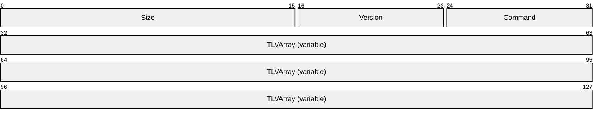

**Size (2 bytes):** The size of the message, in bytes.

**Version (1 byte):** The version of this protocol, which is 0x01.

**Command (1 byte):** The type of message, which determines the [**TLVs**](#gt_type-length-value-tlv) passed in the **TLVArray** field. The following messages are defined in the sections listed.

| Message type | Section | Description |
| --- | --- | --- |
| SOURCE_READY 0x01 | [2.2.1](#Section_2.2.1) | Indicates the Miracast Source is ready to accept a connection on the [**RTSP**](#gt_real-time-streaming-protocol-rtsp) port. |
| STOP_PROJECTION 0x02 | [2.2.2](#Section_3.1.5.7) | Indicates the end of the projection. |
| SECURITY_HANDSHAKE 0x03 | [2.2.3](#Section_2.2.3) | Used to exchange DTLS handshake messages to initiate a connection with encryption of the multimedia stream. |
| SESSION_REQUEST 0x04 | [2.2.4](#Section_2.2.4) | Indicates the Miracast Source intends to connect to the Sink using the specified options. |
| PIN_CHALLENGE 0x05 | [2.2.5](#Section_2.2.5) | Sent by the Miracast Source to initiate the session using the PIN displayed by the Miracast Sink. |
| PIN_RESPONSE 0x06 | [2.2.6](#Section_2.2.6) | Sent by the Miracast Sink in response to a PIN_CHALLENGE received from the Miracast Source. |

**TLVArray (variable):** An array of one or more Miracast TLVs (section [2.2.7](#Section_2.2.7)), which specify information for the message.

<a id="Section_2.2.1"></a>
### 2.2.1 Source Ready Message

The Source Ready message is sent by the Miracast Source to the Miracast Sink when the Source has started listening on the [**RTSP**](#gt_real-time-streaming-protocol-rtsp) port and is ready to accept an incoming connection on it.


**Size (2 bytes):** The size of the entire message, in bytes.

**Version (1 byte):** The version of this protocol, which is 0x01.

**Command (1 byte):** The type of message, which is 0x01 for **SOURCE_READY**.

**TLVArray (variable):** The following [**TLVs**](#gt_type-length-value-tlv), included in any order:

- Friendly Name TLV (section [2.2.7.1](#Section_2.2.7.1)) (Not present if the Session Request message (section [2.2.4](#Section_2.2.4)) was sent)
- RTSP Port TLV (section [2.2.7.2](#Section_2.2.7.2))
- Source ID TLV (section [2.2.7.3](#Section_2.2.7.3))
<a id="Section_2.2.2"></a>
### 2.2.2 Stop Projection Message

The Stop Projection message is sent by the Miracast Source to notify the Miracast Sink that the projection is being stopped.


**Size (2 bytes):** The size of the entire message, in bytes.

**Version (1 byte):** The version of this protocol, which is 0x01.

**Command (1 byte):** The type of message, which is 0x02 for **STOP_PROJECTION**.

**TLVArray (variable):** The following [**TLVs**](#gt_type-length-value-tlv), included in any order:

- Friendly Name TLV (section [2.2.7.1](#Section_2.2.7.1))
- Source ID TLV (section [2.2.7.3](#Section_2.2.7.3))
<a id="Section_2.2.3"></a>
### 2.2.3 Security Handshake Message

The Security Handshake message is sent by Miracast Sources and Miracast Sinks to carry a DTLS handshake message payload.


**Size (2 bytes):** The size of the entire message, in bytes.

**Version (1 byte):** The version of this protocol, which is 0x01.

**Command (1 byte):** The type of message, which is 0x03 for **SECURITY_HANDSHAKE**.

**TLVArray (variable):** The following [**TLVs**](#gt_type-length-value-tlv), included in any order:

- Security Token TLV (section [2.2.7.4](#Section_2.2.7.4))
- Source ID TLV (section [2.2.7.3](#Section_2.2.7.3)) (optional)
<a id="Section_2.2.4"></a>
### 2.2.4 Session Request Message

The Session Request message is sent by a Miracast Source to a Miracast Sink when the Source determines that the Sink supports PIN entry and the Source chooses to initiate the connection using this protocol. This message tells the Sink whether the Source intends to use stream encryption and/or PIN display/entry. It MUST be the first message sent by the Source.


**Size (2 bytes):** The size of the entire message, in bytes.

**Version (1 byte):** The version of this protocol, which is 0x01.

**Command (1 byte):** The type of message, which is 0x04 for **SESSION_REQUEST**.

**TLVArray (variable):** The following [**TLVs**](#gt_type-length-value-tlv), included in any order:

- Friendly Name TLV (section [2.2.7.1](#Section_2.2.7.1))
- Source ID TLV (section [2.2.7.3](#Section_2.2.7.3))
- Security Options TLV (section [2.2.7.5](#Section_2.2.7.5))
<a id="Section_2.2.5"></a>
### 2.2.5 PIN Challenge Message

The PIN Challenge message is sent by a Miracast Source to a Miracast Sink when using PIN entry to initiate the connection. This message is sent after the DTLS handshake has completed and the user has supplied the PIN.


**Size (2 bytes):** The size of the entire message, in bytes.

**Version (1 byte):** The version of this protocol, which is 0x01.

**Command (1 byte):** The type of message, which is 0x05 for **PIN_CHALLENGE**.

**TLVArray (variable):** The following [**TLVs**](#gt_type-length-value-tlv), included in any order:

- Source ID TLV (section [2.2.7.3](#Section_2.2.7.3))
- PIN Challenge TLV (section [2.2.7.6](#Section_2.2.7.6))
<a id="Section_2.2.6"></a>
### 2.2.6 PIN Response Message

The PIN Response message is sent by a Miracast Sink to a Miracast Source in response to a PIN Challenge message. This message indicates to the Source whether the PIN in the challenge message matched the displayed PIN.


**Size (2 bytes):** The size of the entire message, in bytes.

**Version (1 byte):** The version of this protocol, which is 0x01.

**Command (1 byte):** The type of message, which is 0x06 for **PIN_RESPONSE**.

**TLVArray (variable):** The following [**TLVs**](#gt_type-length-value-tlv), included in any order:

- Source ID TLV (section [2.2.7.3](#Section_2.2.7.3))
- PIN Challenge TLV (section [2.2.7.6](#Section_2.2.7.6))
- PIN Response Reason TLV (section [2.2.7.7](#Section_2.2.7.7))
<a id="Section_2.2.7"></a>
### 2.2.7 Miracast TLVs

This section defines common [**type-length-value (TLV)**](#gt_type-length-value-tlv) structures that are used to pass information in messages during a Miracast session. This is the general format for the TLVs:

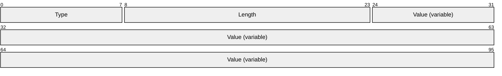

**Type (1 byte):** The type of TLV, which determines the information passed in the **Value** field. The following TLVs are defined in the sections listed.

| TLV type | Section | Description |
| --- | --- | --- |
| FRIENDLY_NAME 0x00 | [2.2.7.1](#Section_2.2.7.1) | Specifies the [**friendly name**](#gt_friendly-name) of the Miracast Source. |
| RTSP_PORT 0x02 | [2.2.7.2](#Section_2.2.7.2) | Specifies the port on which the Source is listening for [**RTSP**](#gt_real-time-streaming-protocol-rtsp) connections. |
| SOURCE_ID 0x03 | [2.2.7.3](#Section_2.2.7.3) | Specifies an identifier for the Source, which is used for all messages sent during a Miracast session. |
| SECURITY_TOKEN 0x04 | [2.2.7.4](#Section_2.2.7.4) | Contains a DTLS handshake message. |
| SECURITY_OPTIONS 0x05 | [2.2.7.5](#Section_2.2.7.5) | Specifies whether stream encryption and/or PIN entry will be used for the session. |
| PIN_CHALLENGE 0x06 | [2.2.7.6](#Section_2.2.7.6) | Contains a salted hash of the PIN when PIN entry is used to establish the connection. |
| PIN_RESPONSE_REASON 0x07 | [2.2.7.7](#Section_2.2.7.7) | Specifies whether the PIN Response indicates a successful connection. |

**Length (2 bytes):** The length of the **Value** field, in bytes. This value MUST be greater than or equal to 0x0001.

**Value (variable):** One or more bytes, which specify information for the TLV.

<a id="Section_2.2.7.1"></a>
#### 2.2.7.1 Friendly Name TLV

The Friendly Name [**TLV**](#gt_type-length-value-tlv) specifies the [**friendly name**](#gt_friendly-name) of the Miracast Source in messages to the Miracast Sink.


**Type (1 byte):** The type of TLV, which is 0x00 for the Friendly Name TLV.

**Length (2 bytes):** The length of the **Value** field, in bytes. The maximum length is 520 bytes.

**Value (variable):** The friendly name string of the Source, encoded in [**UTF-16**](#gt_utf-16).

<a id="Section_2.2.7.2"></a>
#### 2.2.7.2 RTSP Port TLV

The RTSP Port [**TLV**](#gt_type-length-value-tlv) specifies the port on which the Miracast Source is listening. The port is used in messages for connecting sessions over [**RTSP**](#gt_real-time-streaming-protocol-rtsp).

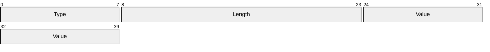

**Type (1 byte):** The type of TLV, which is 0x02 for the RTSP Port TLV.

**Length (2 bytes):** The length of the **Value** field, in bytes, which is 0x0002.

**Value (2 bytes):** The RTSP port on which the Source is listening (7236 by default).

<a id="Section_2.2.7.3"></a>
#### 2.2.7.3 Source ID TLV

The Source ID [**TLV**](#gt_type-length-value-tlv) specifies a unique identifier for the Miracast Source. That identifier is used in all messages sent during a session.

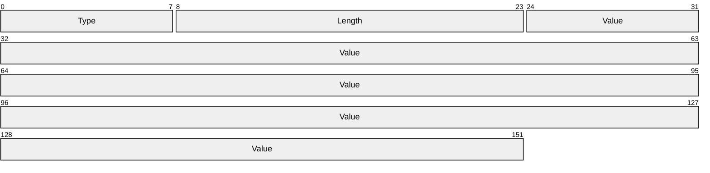

**Type (1 byte):** The type of TLV, which is 0x03 for the Source ID TLV.

**Length (2 bytes):** The length of the **Value** field, in bytes, which is 0x0010.

**Value (16 bytes):** An implementation-defined value that identifies the Source.

<a id="Section_2.2.7.4"></a>
#### 2.2.7.4 Security Token TLV

The Security Token TLV contains DTLS handshake messages as specified in [[RFC6347]](https://go.microsoft.com/fwlink/?linkid=874835).


**Type (1 byte):** The type of TLV, which is 0x04 for the Security Token TLV.

**Length (2 bytes):** The length of the **Value** field, in bytes.

**Value (variable):** DTLS Handshake message payload.

<a id="Section_2.2.7.5"></a>
#### 2.2.7.5 Security Options TLV

The Security Options TLV contains flags indicating how the connection will proceed.

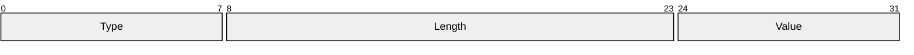

**Type (1 byte):** The type of TLV, which is 0x05 for the Security Options TLV.

**Length (2 bytes):** The length of the Value field, in bytes. This MUST be a minimum of 1 byte but implementations MUST ignore additional bytes not defined in this version of the protocol.

**Value (1 byte):** A bit field table with security options, which has the following structure:

```mermaid
packet-beta
  6-6: "B"
  7-7: "A"
```

**A - UseDtlsStreamEncryption (1 bit):** 0 = do not use, 1 = use.

**B - SinkDisplaysPin (1 bit):** 0 = PIN is not displayed by Sink, 1 = Sink displays random PIN and Source provides this PIN after DTLS handshake. Bit A MUST be set if bit B is set.

The remaining bits are reserved and MUST be set to 0 by the sender and ignored by the receiver.

<a id="Section_2.2.7.6"></a>
#### 2.2.7.6 PIN Challenge TLV

The PIN Challenge TLV contains a salted and hashed value for the session PIN. The hashing is specified in section [3.1.5.6.1](#Section_3.1.5.6.1).


**Type (1 byte):** The type of TLV, which is 0x06 for the PIN Challenge TLV.

**Length (2 bytes):** The length of the Value field, in bytes.

**Value (variable):** The hash of the salted PIN.

<a id="Section_2.2.7.7"></a>
#### 2.2.7.7 PIN Response Reason TLV

The PIN Response Reason TLV indicates the result of the PIN exchange.


**Type (1 byte)**: The type of TLV, which is 0x07 for the PIN Response Reason TLV.

**Length (2 bytes)**: The length of the Value field, in bytes, which is 0x0001.

**Value (1 byte)**: A reason code from the following options:

| Value | Description |
| --- | --- |
| PIN Accepted 0x00 | The PIN in the PIN Challenge message matched the one displayed by the Sink. |
| Wrong PIN 0x01 | The PIN in the PIN Challenge message did not match the one displayed by the Sink. |
| Invalid Message 0x02 | A PIN Challenge message was not expected. |

<a id="Section_2.2.8"></a>
### 2.2.8 Vendor Extension Attribute

The **Vendor Extension a**ttribute is a WSC [**information element (IE)**](#gt_information-element-ie) structure that is used by a Miracast Sink to publish [**peer to peer (P2P)**](#gt_peer-to-peer-p2p) attribute structures defined by the Miracast over Infrastructure protocol.

As specified in [[WF-WSC2.0.2]](https://go.microsoft.com/fwlink/?LinkId=282666), the Vendor Extension attribute has the following general format.

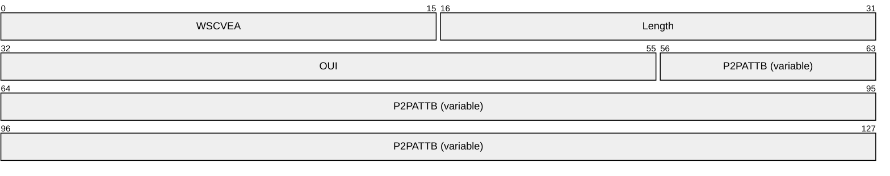

**WSCVEA (2 bytes):** The value is 0x1049 to indicate that this attribute is a WSC vendor extension.

**Length (2 bytes):** The length of the following fields in bytes.

**OUI (3 bytes):** A [**Wi-Fi Protected Setup (WPS)**](#gt_wi-fi-protected-setup-wps) [**organizationally unique identifier (OUI)**](#gt_organizationally-unique-identifier-oui) [[IEEE-OUI]](https://go.microsoft.com/fwlink/?LinkId=89895). The value is 0x000137 for messages defined by this specification.

**P2PATTB (variable):** One or more of the P2P attribute structures defined in the sections that follow. Attributes can be included in any order.

<a id="Section_2.2.8.1"></a>
#### 2.2.8.1 Capability Attribute

The **Capability** attribute indicates whether a connection over Miracast over Infrastructure is possible. This attribute MUST be present in the Vendor Extension attribute.

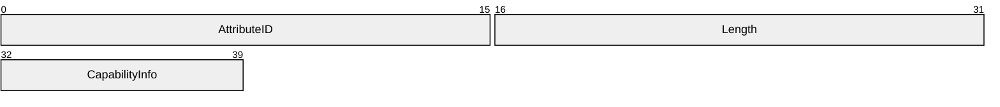

**AttributeID (2 bytes):** The Capability attribute ID, which is 0x2001.

**Length (2 bytes):** The length of the **CapabilityInfo** field, in bytes, which is 0x0001.

**CapabilityInfo (1 byte):** A bit field table with capability information, which has the following structure:


**A - MiracastOverInfrastructureSupport (1 bit):** 0 = not supported, 1 = supported.

**B - StreamEncryptionSupported (1 bit)**: 0 = not supported, 1 = supported.

**C - Version (3 bits):** The version of this protocol, which is 0x1.

**D - PinSupported (1 bit)**: 0 = not supported, 1 = supported. Bit B MUST be set to 1 in order to set this to 1, otherwise it is implicitly set to 0.

**X - Reserved (2 bits):** These bits MUST be set to zero and MUST be ignored on receipt.

<a id="Section_2.2.8.2"></a>
#### 2.2.8.2 Host Name Attribute

The **Host Name** attribute specifies the Miracast Sink host name. This attribute MUST be present exactly once in the Vendor Extension attribute.

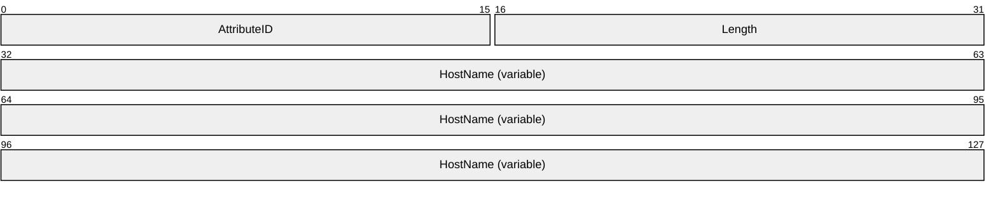

**AttributeID (2 bytes):** The Host Name attribute ID, which is 0x2002.

**Length (2 bytes):** The length of the **HostName** field, in bytes.

**HostName (variable):** The Miracast Sink host name string, encoded in [**ASCII**](#gt_ascii). The host name is not fully qualified. A Sink having a host name that contains the period ('.') character MUST NOT be used for Miracast over Infrastructure connections.

<a id="Section_2.2.8.3"></a>
#### 2.2.8.3 BSSID Attribute

The **BSSID** attribute specifies the [**basic service set identifier (BSSID)**](#gt_basic-service-set-identifier-bssid) for the [**802.11 Access Point (AP)**](#gt_80211-access-point-ap) [[IEEE802.11-2012]](https://go.microsoft.com/fwlink/?LinkID=306038) associated with the wireless network. This attribute is optional in the Vendor Extension attribute, but it MUST NOT appear more than once.

```mermaid
packet-beta
  0-15: "AttributeID"
  16-31: "Length"
  32-79: "BSSID"
```

**AttributeID (2 bytes):** The BSSID attribute ID, which is 0x2003.

**Length (2 bytes):** The length of the **BSSID** field, in bytes, which is 0x0006.

**BSSID (6 bytes):** The BSSID for the associated [**WAP**](#gt_wireless-access-point-wap).

<a id="Section_2.2.8.4"></a>
#### 2.2.8.4 Connection Preference Attribute

The **Connection Preference** attribute indicates the preference of transports for the connection of the Miracast Sink to the Miracast Source. The Sink MAY include a Connection Preference attribute in the Vendor Extension attribute, but it MUST NOT appear more than once.

```mermaid
packet-beta
  0-15: "AttributeID"
  16-31: "Length"
  32-63: "ConnectionPreferenceList"
```

**AttributeID (2 bytes):** The Connection Preference attribute ID, which is 0x2004.

**Length (2 bytes):** The length of the **ConnectionPreferenceList** field, in bytes, which is 0x0004.

**ConnectionPreferenceList (4 bytes):** A packed array with room for 8 connection transport IDs, in descending order of preference. The following IDs are defined.

| Transport ID | Transport |
| --- | --- |
| 0x1 | Miracast over Infrastructure |
| 0x2 | [**Wi-Fi Direct (WFD)**](#gt_wi-fi-direct-wfd) |

The following is an example of a preference list buffer with Miracast over Infrastructure preferred over WFD.

```mermaid
packet-beta
  0-3: "0x1"
  4-7: "0x2"
  8-11: "0"
  12-15: "0"
  16-19: "0"
  20-23: "0"
  24-27: "0"
  28-31: "0"
```

<a id="Section_2.2.8.5"></a>
#### 2.2.8.5 IP Address Attribute

The **IP Address** attribute specifies an IP address of the Miracast Sink. This attribute can occur zero or more times in the Vendor Extension attribute. The set of IP addresses included in the Vendor Extension attribute SHOULD<1> be the same set as the Sink’s mDNS responder would provide to an mDNS requester.

```mermaid
packet-beta
  0-15: "AttributeID"
  16-31: "Length"
  32-127: "IPAddress (variable)"
```

**AttributeID (2 bytes):** The IP Address attribute ID, which is 0x2005.

**Length (2 bytes):** The length of the **IPAddress** field, in bytes.

**IPAddress (variable):** An IP address string, encoded in [**ASCII**](#gt_ascii). The supported address formats are [**IPv4**](#gt_internet-protocol-version-4-ipv4) in dotted decimal notation ([[RFC1123]](https://go.microsoft.com/fwlink/?LinkId=90268) section 2.1) and [**IPv6**](#gt_internet-protocol-version-6-ipv6) ([[RFC4291]](https://go.microsoft.com/fwlink/?LinkId=90464) section 2.2).

<a id="Section_3"></a>
# 3 Protocol Details

A Miracast over Infrastructure session consists of three phases: device discovery, host name resolution, and projection, as shown in the following diagram.

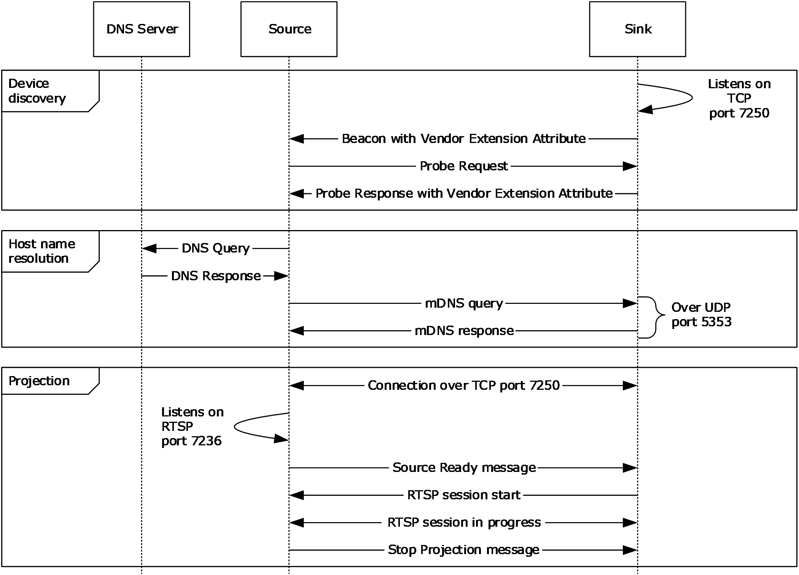Figure 2: A Miracast over Infrastructure session

**Device discovery**

The Miracast over Infrastructure session starts with [**peer to peer (P2P)**](#gt_peer-to-peer-p2p) device discovery ([[WF-P2P1.2]](https://go.microsoft.com/fwlink/?LinkId=225584) section 3.1.2), which a Miracast Source uses to find a device capable of performing the functions of a Miracast Sink. This includes the Source sending [**Probe Request**](#gt_probe-request) frames ([WF-P2P1.2] section 4.2.2) and listening for [**Probe Response**](#gt_probe-response) frames ([WF-P2P1.2] section 4.2.3) and [**Beacon**](#gt_beacon) frames ([WF-P2P1.2] section 4.2.1).

Beacon frames are unsolicited broadcasts that advertise P2P devices. Probe Response frames are sent by a Sink in response to Probe Request frames sent by the Source. If the Source receives a Beacon or Probe Response that contains a WSC [**IE**](#gt_information-element-ie) [[WF-WSC2.0.2]](https://go.microsoft.com/fwlink/?LinkId=282666) Vendor Extension attribute (section [2.2.8](#Section_2.2.8)), the Source checks the Capability attribute (section [2.2.8.1](#Section_2.2.8.1)) for Miracast over Infrastructure support.

If the Capability attribute specifies that Miracast over Infrastructure is not supported, the Source falls back to standard Miracast [WF-WSC2.0.2].

If one or more IP Address attributes (section [2.2.8.5](#Section_2.2.8.5)) are included, the Source can skip host name resolution.

**Host name resolution**

The host name received by the Source during device discovery specifies the unqualified host name of the target Sink. The Source tries to resolve this host name by using [**DNS**](#gt_domain-name-system-dns) [[IANA-DNS]](https://go.microsoft.com/fwlink/?LinkId=148574) [[RFC1034]](https://go.microsoft.com/fwlink/?LinkId=90263) [[RFC2181]](https://go.microsoft.com/fwlink/?LinkId=127732) and/or mDNS [[RFC6762]](https://go.microsoft.com/fwlink/?linkid=842612).

When host name resolution is complete, the session proceeds to the Projection phase.

The Source uses a **Discovery timer** (section [3.2.2](#Section_3.1.2)) to limit the time it spends on host name resolution. If this timer reaches its timeout, the host name resolution fails, and the Source falls back to standard Miracast.

**Projection**

When the Source finds a device that can perform as the Sink, the Source attempts a connection to it over [**TCP**](#gt_transmission-control-protocol-tcp) port 7250, which it will use for sending Miracast over Infrastructure messages (section [2.2](#Section_2.2)) to the Sink. These messages include starting and stopping the projection, as well as negotiating options for the stream, such as encryption and PIN entry at connection time.

This phase is further subdivided into optional sections depending on the protocol version and options chosen by the Source and Sink device. The following diagram shows all the required and optional steps of the projection setup phase.

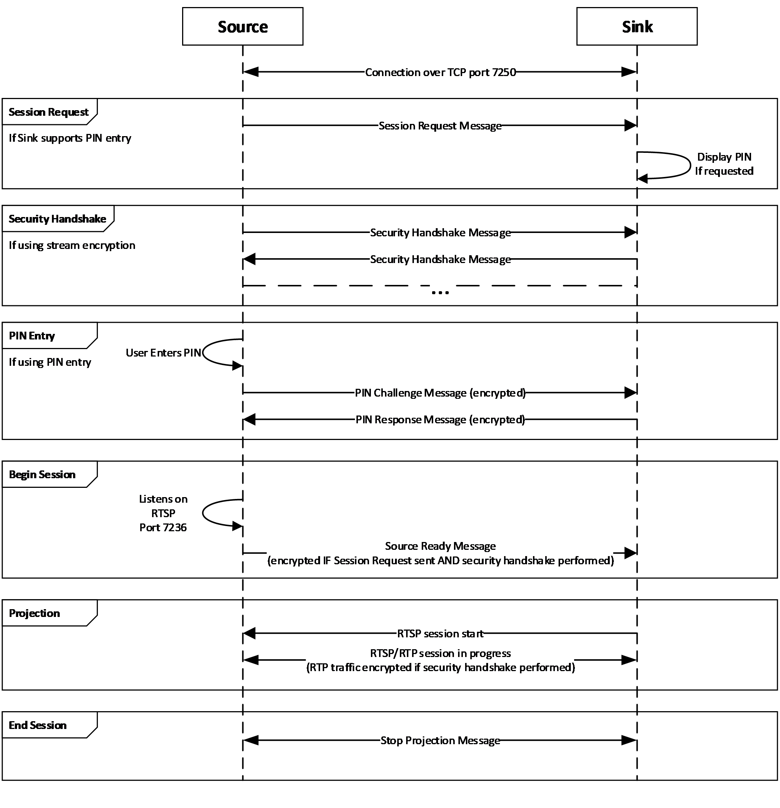

Figure 3: Projection setup phase

The Sink is expected to be listening for messages on TCP port 7250. The Sink listens for Source Ready messages (section [2.2.1](#Section_2.2.1)). If the Sink supports stream encryption, it also listens for Security Handshake messages (section [2.2.3](#Section_2.2.3)). If the sink supports PIN entry, it also listens for Session Request messages (section [2.2.4](#Section_2.2.4)).

The Source will either begin at the Session Request step, Security Handshake step, or Begin Session step, depending on what it supports and what support was indicated by the sink in the Vendor Specific attribute.

In the case of beginning at the Begin Session step, when the Source is ready to project, it listens on Real-Time Streaming Protocol (RTSP) control port 7236 for a connection request, then it sends the Source Ready message. In turn, the Sink connects to the specified RTSP Source port to establish the link.

In the case of beginning at the Security Handshake step, the Source sends a Security Handshake message (section 2.2.3) and waits for a response, listening for Security Handshake messages from the Sink. The Source and Sink continue to exchange messages until the DTLS handshake is complete. After this, the Source proceeds to Begin Session as defined above by listening on Real-Time Streaming Protocol (RTSP) control port 7236 for a connection request, and sending the Source Ready message. In turn, the Sink connects to the specified RTSP Source port to establish the link. In this case, the RTP (video and audio) and UIBC traffic shall be encrypted using the DTLS key exchanged.

In the case beginning at the Session Request step, the Source sends a Session Request message (section 2.2.4) and then proceeds to the Security Handshake phase. When the Sink which supports PIN entry receives the Session Request message with the PIN entry bit in the Security Options set (section [2.2.7.5](#Section_2.2.7.5)), it displays a random PIN for the user of the Source to provide. After the Security Handshake, if PIN entry was selected, the Source waits for user input of the displayed PIN then proceeds to the PIN entry phase to validate the PIN with the sink. The TLVArray of the PIN Challenge (section [2.2.5](#Section_2.2.5)) and PIN Response (section [2.2.6](#Section_2.2.6)) messages are encrypted using the key exchanged during the DTLS handshake. Following the PIN exchange, if performed, the Source listens on Real-Time Streaming Protocol (RTSP) control port 7236 for a connection request, then it sends the Source Ready message with the TLVArray encrypted using the key exchanged during the DTLS handshake. In turn, the Sink connects to the specified RTSP Source port to establish the link. In this case, the RTP (video and audio) and UIBC traffic shall be encrypted using the DTLS key exchanged.

To stop the projection, the Source sends a Stop Projection message (section [2.2.2](#Section_3.1.5.7)) to notify the Sink. Upon receipt of that message, the Sink stops displaying the stream, and a disconnection follows from the Source on the socket that is connected on port 7250. The Sink may send a Stop Projection message to notify the Source of a graceful teardown of the session. Upon receipt of that message, the Source stops sending RTP/RTSP frames, and a disconnection follows on the socket that is connected on port 7250.

<a id="Section_3.1"></a>
## 3.1 Miracast Sink Details

<a id="Section_3.1.1"></a>
### 3.1.1 Abstract Data Model

This section describes a conceptual model of possible data organization that an implementation maintains to participate in this protocol. The described organization is provided to facilitate the explanation of how the protocol behaves. This document does not mandate that implementations adhere to this model, provided their external behavior is consistent with that described in this document.

The Sink should be configured with the following global state:

- **Friendly Name**: A friendly name for the Sink so that it can be easily identified by the user of a Source device.
- **PIN Verification Enabled**: Whether the Sink has enabled PIN verification for the incoming connections.
- **Container ID**: A container ID GUID to identify the Sink.
For a given Source device, the Sink should track the following state:

- **State**: The current state of the connection establishment protocol, as defined in the diagram below. Defaults to not connected.
- **Security Options**: The security options TLV (section [2.2.7.5](#Section_2.2.7.5)), if any, received from the Session Request message (section [2.2.4](#Section_2.2.4)). Defaults to none.
- **DTLS Encryption Key**: The key, if any, that is derived from the DTLS handshake. Defaults to none.
- **RTSP Connection**: The RTSP connection, if any, to the Source. Defaults to none.
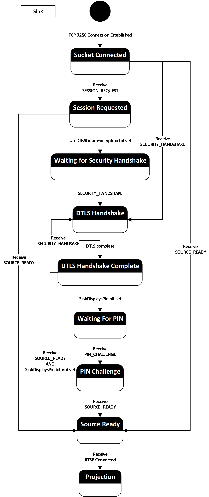

Figure 4: State diagram

<a id="Section_3.1.2"></a>
### 3.1.2 Timers

The Miracast Sink uses the following timers:

**Session Establishment Timer**: This timer is used to limit the time a Source can establish a connection on port 7250 without making progress toward a Miracast connection. It is started upon receiving a connection on port 7250 and is canceled upon establishing the RTSP connection. Note that this timer MUST be set long enough to account for user interaction time if the source decides to perform PIN entry. The value is 2 minutes when PIN entry is used and 30 seconds when PIN entry is not used.

**Security Handshake Message Timer**: This timer is used to limit the time to wait for a response to a DTLS handshake message. The timeout is 1 second.

<a id="Section_3.1.3"></a>
### 3.1.3 Initialization

Upon initialization, the Miracast Sink MUST register the following service instance name ([[RFC6763]](https://go.microsoft.com/fwlink/?linkid=869457) section 4.1) with the Sink's local mDNS implementation.

<instance name>._display._tcp.local

The <instance name> is the [**friendly name**](#gt_friendly-name) of the Sink, which will be associated with both port 7250 and the following TXT key-value pair ([RFC6763] section 6).

Key: container_id

Value: A [**GUID**](#gt_globally-unique-identifier-guid) that identifies the Sink.

This service instance name is also used in [[WF-DTS2.1]](https://go.microsoft.com/fwlink/?linkid=869602) section 4.4.1.

After registering the service instance name, the Sink MUST start listening on [**TCP**](#gt_transmission-control-protocol-tcp) port 7250 for an inbound connection.

Finally, the Sink MUST begin being discoverable by [**Beacons**](#gt_beacon) and/or [**Probe Requests**](#gt_probe-request) as in standard Miracast [[WF-WSC2.0.2]](https://go.microsoft.com/fwlink/?LinkId=282666), except that every Beacon and [**Probe Response**](#gt_probe-response) the Sink sends MUST include a Vendor Extension attribute (section [2.2.8](#Section_2.2.8)). The values in the Capability attribute MUST be set according to the functionality that the Sink supports. The Sink SHOULD<2> support the **StreamSecuritySupported** functionality. Sinks that support the **StreamSecuritySupported** functionality SHOULD<3> also support the **PinSupported** functionality.

<a id="Section_3.1.4"></a>
### 3.1.4 Higher-Layer Triggered Events

When the higher-layer application or protocol requests to disconnect the Miracast connection, the Sink MUST send the Stop Projection message (section [2.2.2](#Section_3.1.5.7)) to the Source to stop the projection of the multimedia data stream. After sending this message, the Sink MUST close the RTSP and TCP port 7250 session.

<a id="Section_3.1.5"></a>
### 3.1.5 Message Processing Events and Sequencing Rules

<a id="Section_3.1.5.1"></a>
#### 3.1.5.1 Receive Probe Request

When a Miracast Sink receives a [**Probe Request**](#gt_probe-request) message, the Sink MUST send a [**Probe Response**](#gt_probe-response) message [[WF-P2P1.2]](https://go.microsoft.com/fwlink/?LinkId=225584) and include a WSC IE [[WF-WSC2.0.2]](https://go.microsoft.com/fwlink/?LinkId=282666) Vendor Extension attribute (section [2.2.8](#Section_2.2.8)) with a Capability Attribute (section [2.2.8.1](#Section_2.2.8.1)) that indicates support for Miracast over Infrastructure.

<a id="Section_3.1.5.2"></a>
#### 3.1.5.2 Receive Connection Request

When a Miracast Sink receives a new [**TCP**](#gt_transmission-control-protocol-tcp) connection attempt on port 7250, but it already has a TCP connection established, the Sink SHOULD reject the new connection request, but it MAY close the existing TCP connection instead and accept the new one.<4> The Sink MUST enter the Socket Connected state (section [3.1.1](#Section_3.1)) and wait for the next message. The Sink MUST begin the Session Establishment Timer.

<a id="Section_3.1.5.3"></a>
#### 3.1.5.3 Receive Source Ready Message

When a Miracast Sink receives a Source Ready message (section [2.2.1](#Section_2.2.1)) while it is in the Socket Connected, Session Requested, DTLS Handshake Complete, or PIN Challenge state (section [3.1.1](#Section_3.1)), it MUST connect back to the Source over [**TCP**](#gt_transmission-control-protocol-tcp) on the [**RTSP**](#gt_real-time-streaming-protocol-rtsp) port specified in the message.

<a id="Section_3.1.5.4"></a>
#### 3.1.5.4 Receive Session Request Message

When a Miracast Sink receives a Session Request message (section [2.2.4](#Section_2.2.4)), it MUST parse the Security Options TLV (section [2.2.7.5](#Section_2.2.7.5)), store the Security Options (section [3.1.1](#Section_3.1)), and determine the next expected state. If the Security Options indicate UseDtlsStreamEncryption (section 2.2.7.5) and the Sink included this bit in its capabilities, then the Sink MUST go to the Waiting for Security Handshake state (section 3.1.1). If the Security Options also indicate SinkDisplaysPin (section 2.2.7.5) and the Sink included this bit in its capabilities, then the Sink MUST randomly generate and display an 8 digit numeric PIN.

<a id="Section_3.1.5.5"></a>
#### 3.1.5.5 Receive Security Handshake Message

When a Miracast Sink receives a Security Handshake message (section [2.2.3](#Section_2.2.3)) and one of the following is true, it MUST proceed to complete the DTLS handshake procedure:

- The Sink is in the Socket Connected state (section [3.1.1](#Section_3.1)).
- The Sink is in the Waiting for Security Handshake state (section 3.1.1).
- The Sink is currently in the DTLS Handshake state (section 3.1.1) and this is an additional message.
In all other cases, the Sink MUST ignore the message and MUST tear down the connection on TCP port 7250.

The DTLS handshake procedure is performed by parsing the Security Token TLV (section [2.2.7.4](#Section_2.2.7.4)) as a message in the DTLS exchange [[RFC6347]](https://go.microsoft.com/fwlink/?linkid=874835). The sink should respond with a Security Handshake message containing the DTLS payload in the Security Token TLV as specified in [RFC6347]. Note that each message in the DTLS exchange requires zero or more responses. Upon sending a Security Handshake message which requires a response from the Source, the Sink MUST begin the Security Handshake Message Timer and reset the timer upon receipt of the next message.

Upon completion of the DTLS handshake, the DTLS Encryption Key is stored for the remainder of the session (section 3.1.1). If the Security Options have been set (section 3.1.1), indicating the Source sent a Session Request message (section [2.2.4](#Section_2.2.4)), then the TLVArray of all further messages MUST be encrypted by the sender and decrypted by the receiver using the DTLS Encryption Key. If the Security Options have the SinkDisplaysPin bit set, then the sink goes to the Waiting for PIN state (section 3.1.1).

<a id="Section_3.1.5.6"></a>
#### 3.1.5.6 Receive PIN Challenge Message

When the Miracast Sink receives a PIN Challenge message (section [2.2.7.6](#Section_2.2.7.6)) and it is in the Waiting for PIN state (section [3.1.1](#Section_3.1)), it MUST validate that the PIN Challenge TLV (section 2.2.7.6) contains the correct salted hash of the PIN.

The salted hash of the PIN is derived as defined in section [3.1.5.6.1](#Section_3.1.5.6.1), using IP address of the Sink for the TCP connection over 7250.

If the PIN Challenge TLV contains the correct hash value, then the Sink MUST respond with a PIN Response message (section [2.2.6](#Section_2.2.6)) containing its own salted hash (derived in the same way but using the Sink IP address) in the PIN Challenge TLV and the PIN Response Reason TLV (section [2.2.7.7](#Section_2.2.7.7)) with the value 0x00.

If the PIN Challenge TLV contains a different hash value, then the Sink MUST respond with a PIN Response message containing the PIN Response Reason 0x01 and no PIN Challenge TLV.

In all other cases, the Sink MUST respond with a PIN Response message containing the PIN Response Reason 0x02 and MUST tear down the connection on TCP port 7250.

<a id="Section_3.1.5.6.1"></a>
##### 3.1.5.6.1 Computing the PIN

When a PIN is exchanged in the PIN Challenge (section [2.2.5](#Section_2.2.5)) or PIN Response (section [2.2.6](#Section_2.2.6)) messages, it MUST be encoded and hashed using the following format.

The ASCII representation (with no NUL terminator) of the PIN is immediately concatenated with the binary representation of the IP address of the sender. These bytes are then hashed using SHA-256 [[NIST.FIPS.180-4]](https://go.microsoft.com/fwlink/?linkid=875181).

For example, if the sender has IP address 192.0.2.100 and the PIN is “12345678”, then the hash is derived as follows:

The data to hash is:

31 32 33 34 35 36 37 38 c0 00 02 64

The resulting SHA-256 hash is:

60 54 09 f8 32 30 8a d0 b8 93 a7 f9 1b e4 2b 26

4c 73 72 b3 6e 90 77 50 6e 1b 4c c1 83 de 79 da

As another example, if the sender has IP address 2001:db8:1f::4242 and the PIN is “98765432”, then the hash is derived as follows:

The data to hash is:

39 38 37 36 35 34 33 32 20 01 0d b8 00 1f 00 00

00 00 00 00 00 00 42 42

The resulting SHA-256 hash is:

b3 45 2b 2c 46 c8 3d 28 d8 d4 64 b6 69 7a 81 d1

af 3f 35 61 07 e1 d0 73 1e a9 bb 18 38 03 f9 c7

<a id="Section_3.1.5.7"></a>
#### 3.1.5.7 Receive Stop Projection Message

When a Miracast Sink receives a Stop Projection message (section [2.2.2](#Section_3.1.5.7)), it MUST stop displaying the stream.

<a id="Section_3.1.5.8"></a>
#### 3.1.5.8 Receive Unexpected Message on TCP Port 7250

When the Miracast Sink receives an unknown message type or a message type that is not expected based on its current state (as defined in section [3.1.1](#Section_3.1) or in a subsection under [3.1.5](#Section_3.1.5)), it MUST tear down the connection on TCP port 7250.

<a id="Section_3.1.6"></a>
### 3.1.6 Timer Events

If either of the Miracast Sink timers (section [3.1.2](#Section_3.1.2)) reaches its timeout, the Sink MUST tear down the connection on TCP port 7250.

<a id="Section_3.1.7"></a>
### 3.1.7 Other Local Events

If the [**RTSP**](#gt_real-time-streaming-protocol-rtsp) connection receives a teardown message as it does in standard Miracast, or if the connection to the Source is lost, or if the TCP port 7250 connection is lost, the Sink MUST close its session.

If any global configuration from section [3.1.1](#Section_3.1) is changed, then the new configuration MUST apply to all future connections and the initialization step MUST be repeated. Any existing connections SHOULD be terminated but an implementation MAY leave the sessions connected.

<a id="Section_3.1.7.1"></a>
#### 3.1.7.1 RTSP Connection is successfully established

When the Miracast Sink connects back to the Source over TCP on the RTSP port, the Sink MUST stop the Session Establishment Timer.

The Sink MUST perform standard RTSP behavior. If the DTLS Encryption Key is stored (section [3.1.1](#Section_3.1)) from performing the security handshake, then the Miracast protocol is modified as follows:

- All RTP packets MUST be encrypted by the Source and decrypted by the Sink using the DTLS Encryption Key.
- The UIBC Input Body of the UIBC payload MUST be encrypted by the Sink and decrypted by the Source using the DTLS Encryption Key.
<a id="Section_3.1.7.2"></a>
#### 3.1.7.2 RTSP Connection fails

When the Miracast Sink fails to connect to the Source over TCP on the RTSP port, it MUST tear down the connection on TCP port 7250.

<a id="Section_3.2"></a>
## 3.2 Miracast Source Details

<a id="Section_3.2.1"></a>
### 3.2.1 Abstract Data Model

This section describes a conceptual model of possible data organization that an implementation maintains to participate in this protocol. The described organization is provided to facilitate the explanation of how the protocol behaves. This document does not mandate that implementations adhere to this model, provided their external behavior is consistent with that described in this document.

**Source ID:** A Source ID [**TLV**](#gt_type-length-value-tlv) (section [2.2.7.3](#Section_2.2.7.3)) is maintained throughout the lifetime of the Miracast session. It is included in all Miracast messages (section [2.2](#Section_2.2)) to identify the Miracast Source.

**Sink Capabilities**: The data within a Capability attribute (section [2.2.8.1](#Section_2.2.8.1)) received from a Sink is maintained from the discovery phase until the connection setup is complete. It is used to determine what connection features the Sink supports.

**Selected Sink Capabilities**: For each Sink Capability, the Source stores whether it is using that capability for this connection.

**PIN**: In case the connection is using a PIN display on the Sink, the Source may request the user to enter the PIN asynchronously while performing the connection setup steps. The Source stores this PIN until after the DTLS handshake is complete and it needs to send the PIN Challenge message (section [2.2.5](#Section_2.2.5)). Defaults to null.

**DTLS Encryption Key**: The key that is derived from the DTLS handshake. Defaults to none.


Figure 5: Connection Sequence

<a id="Section_3.2.2"></a>
### 3.2.2 Timers

This Miracast Source uses the following timers.

**Discovery timer:** This timer is used to limit the time the Source spends on host name resolution before giving up and falling back to standard Miracast.

**Control channel connection timer:** This timer is used to limit the time the Source spends waiting for the Sink to connect to it before giving up and falling back to standard Miracast.

**Security Handshake Message Timer**: This timer is used to limit the time to wait for a response to a DTLS handshake message. The timeout is 1 second.

<a id="Section_3.2.3"></a>
### 3.2.3 Initialization

The Source ID [**TLV**](#gt_type-length-value-tlv) (section [2.2.7.3](#Section_2.2.7.3)) of the abstract data model (section [3.2.1](#Section_3.2)) is initialized to an implementation-dependent value.

<a id="Section_3.2.4"></a>
### 3.2.4 Higher-Layer Triggered Events

<a id="Section_3.2.4.1"></a>
#### 3.2.4.1 Discovery

When a higher-layer application requests discovery of Miracast Sinks, the Miracast Source MUST send a standard [**Probe Request**](#gt_probe-request) to Miracast Sinks within range, as specified in [[WF-P2P1.2]](https://go.microsoft.com/fwlink/?LinkId=225584).

<a id="Section_3.2.4.2"></a>
#### 3.2.4.2 PIN Entry

When a higher-layer application provides a PIN value, the Miracast Source MUST set its PIN (section [3.2.1](#Section_3.2)) to that value. The Source must wait for the DTLS Handshake to complete if it has not already.

<a id="Section_3.2.4.3"></a>
#### 3.2.4.3 Disconnect Request

When the higher-layer application or protocol requests to disconnect the Miracast connection, the Source MUST send the Stop Projection message (section [2.2.2](#Section_3.1.5.7)) to the Sink to stop the projection of the multimedia data stream. After sending this message, the Source MUST close the TCP session

<a id="Section_3.2.5"></a>
### 3.2.5 Message Processing Events and Sequencing Rules

<a id="Section_3.2.5.1"></a>
#### 3.2.5.1 Receive Beacon with Vendor Extension Attribute

When a Miracast Source receives a [**Beacon**](#gt_beacon) message that includes a Vendor Extension Attribute (section [2.2.8](#Section_2.2.8)), it MUST read the Capability attribute (section [2.2.8.1](#Section_2.2.8.1)), and store this information in the Sink Capabilities (section [3.2.1](#Section_3.2)). If the **MiracastOverInfrastructureSupport** bit is not set, the Source MUST fall back to using standard Miracast [[WF-WSC2.0.2]](https://go.microsoft.com/fwlink/?LinkId=282666).

If Miracast over Infrastructure is supported by the Sink, the Source MUST do the following.

- If one or more IP Address attributes (section [2.2.8.5](#Section_2.2.8.5)) are present in the message, the Source SHOULD<5> skip name resolution and treat the addresses as the result of host name resolution, by proceeding as specified in section [3.2.5.3](#Section_3.2.5.3); however, the Source MAY instead ignore them and continue as if they were not present.
- If host name resolution was not skipped, the Source MUST do the following.
- Start its **Discovery timer** (section [3.2.2](#Section_3.1.2)) to expire after an implementation-specific<6> period of time if host name resolution does not complete.
- Begin host name resolution on the name in the Host Name Attribute (section [2.2.8.2](#Section_2.2.8.2)), using DNS and/or mDNS, the choice of which is implementation-specific.<7>
<a id="Section_3.2.5.2"></a>
#### 3.2.5.2 Receive Probe Response with Vendor Extension Attribute

When a Miracast Source receives a [**Probe Response**](#gt_probe-response) message that includes a Vendor Extension Attribute (section [2.2.8](#Section_2.2.8)), the Source MUST store the Capability attribute (section [2.2.8.1](#Section_2.2.8.1)), which includes the **MiracastOverInfrastructureSupport** bit, **Version** field, **StreamEncryptionSupported** bit, and **PinSupported** bit.

If Miracast over Infrastructure is supported by the Sink, the Source MUST perform the actions specified in section [3.2.5.1](#Section_3.2.5.1), as if it had received a [**Beacon**](#gt_beacon) message indicating that the Sink supports Miracast over Infrastructure.

<a id="Section_3.2.5.3"></a>
#### 3.2.5.3 Host Name Resolution Complete

When a Miracast Source obtains a set of one or more IP addresses of the Miracast Sink, the Source MUST do the following.

- Cancel its **Discovery timer** (section [3.2.2](#Section_3.1.2)).
- Start its **Control Channel Connection timer**, which will expire after an implementation-specific<8> time unless it receives a connection over the [**RTSP**](#gt_real-time-streaming-protocol-rtsp) control channel.
- Attempt a connection to one of the IP addresses over [**TCP**](#gt_transmission-control-protocol-tcp) port 7250. The method of choosing a Sink IP address is implementation-specific.<9>
<a id="Section_3.2.5.4"></a>
#### 3.2.5.4 Miracast Connection Complete

When the connection to the Sink over [**TCP**](#gt_transmission-control-protocol-tcp) port 7250 fails, the Source MUST do the following:

- Abandon its attempt to start a Miracast over Infrastructure session by closing any connections to the Sink and deleting its state.
- Fall back to using standard Miracast [[WF-WSC2.0.2]](https://go.microsoft.com/fwlink/?LinkId=282666).
If the connection attempt succeeds, the Source MUST do the following.

- Determine the optional features of the protocol to use and store them for the session (section [3.2.1](#Section_3.2)). If the Sink had the StreamEncryptionSupported bit set in the Capability Attribute (section [2.2.8.1](#Section_2.2.8.1)) the Source SHOULD<10> use stream encryption in the connection setup. If the Sink had the PinSupported bit set in the Capability Attribute, the Source SHOULD<11> use PIN display for the connection. The decision to use these capabilities is implementation specific and the result is stored in Selected Sink Capabilities (section 3.2.1).
- If PIN entry is set in Selected Sink Capabilities (section 3.2.1):
- The Source MUST send a Session Request message (section [2.2.4](#Section_2.2.4)) over the TCP session. The Security Option TLV (section [2.2.7.5](#Section_2.2.7.5)) in this message MUST contain the appropriate bits based on the Selected Sink Capabilities (section 3.2.1).
- If Stream Encryption is set in Selected Sink Capabilities (section 3.2.1):
- Send a Security Handshake message (section [2.2.3](#Section_2.2.3)) containing the first DTLS handshake message [[RFC6347]](https://go.microsoft.com/fwlink/?linkid=874835) over the TCP session.
- If Stream Encryption is not set in Selected Sink Capabilities (section 3.2.1):
- Begin listening on [**RTSP**](#gt_real-time-streaming-protocol-rtsp) control port 7236 for a connection request.
- Send a Source Ready message (section [2.2.1](#Section_2.2.1)) over the TCP session.
<a id="Section_3.2.5.5"></a>
#### 3.2.5.5 Receive Security Handshake Message

When the Miracast Source receives a Security Handshake message (section [2.2.3](#Section_2.2.3)) and it is in the Security Handshake state of the connection flow but not yet complete (section [3.2.1](#Section_3.2)), it MUST proceed to complete the DTLS handshake procedure.

The DTLS handshake procedure MUST be performed by parsing the Security Token TLV (section [2.2.7.4](#Section_2.2.7.4)) and responding. The procedure might involve multiple messages being sent and received, as specified in [[RFC6347]](https://go.microsoft.com/fwlink/?linkid=874835). Upon receiving a Security Handshake message, the Source MUST reset the **Security Handshake Message Timer**. Upon sending a Security Handshake message that requires a response, the Source MUST begin the **Security Handshake Message Timer**.

Upon completion of the DTLS handshake, the **DTLS Encryption Key** is stored for the remainder of the session (section 3.2.1). If the **Sink Capabilities** (section 3.2.1) has PinSupported set, indicating the Source sent a Session Request message (section [2.2.4](#Section_2.2.4)), then the TLVArray of all further messages MUST be encrypted by the sender and decrypted by the receiver using the **DTLS Encryption Key**.

The Source MUST do the following after the DTLS handshake:

If PIN entry is set in **Selected Sink Capabilities** (section 3.2.1):

- The Source MUST signal the higher layer protocol to request the PIN value from the user.
- Wait for user input of the **PIN** (section 3.2.1).
- Send a PIN Challenge message (section [2.2.5](#Section_2.2.5)) over the TCP session. The salted hash of the PIN is derived as defined in section [3.1.5.6.1](#Section_3.1.5.6.1), using IP address of the Source for the TCP connection over 7250.
- Begin the **Security Handshake Message Timer**.
If PIN entry is not set in **Selected Sink Capabilities** (section 3.2.1):

- Begin listening on RTSP control port 7236 for a connection request.
- Send a Source Ready message (section [2.2.1](#Section_2.2.1)) over the TCP session.
<a id="Section_3.2.5.6"></a>
#### 3.2.5.6 Receive PIN Response Message

When a Miracast Source receives a PIN Response Message (section [2.2.6](#Section_2.2.6)) after sending a PIN Challenge Message, it MUST validate the message first. If the PIN Response Reason TLV (section [2.2.7.7](#Section_2.2.7.7)) is set to 0x00 then it MUST validate that the PIN Challenge TLV (section [2.2.7.6](#Section_2.2.7.6)) contains the correct salted hash of the PIN. The Source MUST also reset the **Security Handshake Message Timer**.

The salted hash of the PIN is derived as defined in section [3.1.5.6.1](#Section_3.1.5.6.1), using the IP address of the Source for the TCP connection over 7250.

If the PIN Challenge TLV contains the correct hash value, then the Source MUST do the following:

- Begin listening on RTSP control port 7236 for a connection request.
- Send a Source Ready message (section [2.2.1](#Section_2.2.1)) over the TCP session.
In all other cases, the Source MUST:

- Abandon its attempt to start a Miracast over Infrastructure session by closing any connections to the Sink and deleting its state.
- Fall back to using standard Miracast [[WF-WSC2.0.2]](https://go.microsoft.com/fwlink/?LinkId=282666).
<a id="Section_3.2.5.7"></a>
#### 3.2.5.7 RTSP Connection Accepted

When a Miracast Sink accepts an [**RTSP**](#gt_real-time-streaming-protocol-rtsp) connection, the Miracast Source MUST do the following.

- Cancel the **Control Channel Connection** timer (section [3.2.2](#Section_3.1.2)).
- Perform standard RTSP behavior.
If Stream Encryption is set in **Selected Sink Capabilities** (section [3.2.1](#Section_3.2)), then the Miracast protocol is modified as follows:

- All RTP packets MUST be encrypted by the Source and decrypted by the Sink using the **DTLS Encryption Key**.
- The UIBC Input Body of the UIBC payload MUST be encrypted by the Sink and decrypted by the Source using the **DTLS Encryption Key**.
<a id="Section_3.2.5.8"></a>
#### 3.2.5.8 Receive Unexpected Message on TCP Port 7250

When the Miracast Source receives an unknown message type or a message type that is not expected, it MUST do the following.

- Abandon its attempt to start a Miracast over Infrastructure session by closing any connections to the Sink and deleting its state.
- Fall back to using standard Miracast [[WF-WSC2.0.2]](https://go.microsoft.com/fwlink/?LinkId=282666).
<a id="Section_3.2.6"></a>
### 3.2.6 Timer Events

If any of the Miracast Source timers (section [3.2.2](#Section_3.1.2)) reaches its timeout, the Source MUST do the following.

- Abandon its attempt to start a Miracast over Infrastructure session by closing any connections to the Sink and deleting its state.
- Fall back to using standard Miracast [[WF-WSC2.0.2]](https://go.microsoft.com/fwlink/?LinkId=282666).
<a id="Section_3.2.7"></a>
### 3.2.7 Other Local Events

None.

<a id="Section_3.2.7.1"></a>
#### 3.2.7.1 Connection Establishment Failure

If the connection fails at any point in the previous sections, the Source SHOULD fall back to standard Miracast or MAY fail the entire connection attempt<12>.

<a id="Section_4"></a>
# 4 Protocol Examples

The following sections describe examples of Miracast over Infrastructure structures, which were taken from network captures of the protocol.

<a id="Section_4.1"></a>
## 4.1 Vendor Extension Attribute Example

This is an example of the Vendor Extension attribute (section [2.2.8](#Section_2.2.8)).

10 49 // WSC Vendor Extension attribute

00 1B // Length (27 bytes)

00 01 37 // OUI (WPS ID)

20 01 // Capability attribute

00 01 // Length (1 byte)

05 // Capability info

20 02 // Host Name attribute

00 0F // Length (15 bytes)

44 75 6D 6D 79 31 2D 4B 61 62 79 6C 61 6B 65 // "Dummy1-Kabylake"

<a id="Section_4.2"></a>
## 4.2 Source Ready Message Example

This is an example of the Source Ready message (section [2.2.1](#Section_2.2.1)).

00 3D // Length (61 bytes)

01 // Version

01 // SOURCE_READY

00 // Friendly Name TLV

00 1E // Length (30 bytes)

44 00 75 00 6D 00 6D 00 79 00 31 00 2D 00 4B 00 // "Dummy1-Kabylake"

61 00 62 00 79 00 6C 00 61 00 6B 00 65 00

02 // RTSP Port TLV

00 02 // Length (2 bytes)

1C 44 // Port (7236)

03 // Source ID TLV

00 10 // Length (16 bytes)

91 F4 AB E9 EF F5 46 4A AE E2 69 72 2A ED 11 B5 // Source ID

<a id="Section_4.3"></a>
## 4.3 Stop Projection Message Example

This is an example of the Stop Projection message (section [2.2.2](#Section_3.1.5.7)).

00 38 // Size (56 bytes)

01 // Version

02 // STOP_PROJECTION

00 // Friendly Name TLV

00 1E // Length (30 bytes)

44 00 75 00 6D 00 6D 00 79 00 31 00 2D 00 4B 00 // "Dummy1-Kabylake"

61 00 62 00 79 00 6C 00 61 00 6B 00 65 00

03 // Source ID TLV

00 10 // Length (16 bytes)

91 F4 AB E9 EF F5 46 4A AE E2 69 72 2A ED 11 B5 // Source ID

<a id="Section_4.4"></a>
## 4.4 Security Handshake Message Example

This is an example of the Security Handshake message (section [2.2.3](#Section_2.2.3)).

xx xx // Size = ?? bytes

01 // Version = 0x1

03 // Security Handshake

04 // Security Token TLV

xx xx // Size = ?? bytes

… // DTLS Handshake Payload

<a id="Section_4.5"></a>
## 4.5 Session Request Message Example

This is an example of the Session Request message (section [2.2.4](#Section_2.2.4)).

00 3A // Length (58 bytes)

01 // Version = 0x1

04 // SESSION_REQUEST

05 // Security Options TLV

00 01 // Length (1 byte)

03 // Both bits set

00 // Friendly Name TLV

00 1E // Length (30 bytes)

44 00 75 00 6D 00 6D 00 79 00 31 00 2D 00 4B 00 // "Dummy1-Kabylake"

61 00 62 00 79 00 6C 00 61 00 6B 00 65 00

03 // Source ID TLV

00 10 // Length (16 bytes)

91 F4 AB E9 EF F5 46 4A AE E2 69 72 2A ED 11 B5 // Source ID

<a id="Section_4.6"></a>
## 4.6 PIN Challenge Message Example

This is an example of the PIN Challenge message (section [2.2.5](#Section_2.2.5)).

00 3A // Length (58 bytes)

01 // Version = 0x1

05 // PIN_CHALLENGE

06 // Hashed PIN TLV

00 20 // Length (32 bytes)

60 54 09 F8 32 30 8A D0 B8 93 A7 F9 1B E4 2B 26 // Hash of “12345678” IP: 192.0.2.100

4C 73 72 B3 6E 90 77 50 6E 1B 4C C1 83 DE 79 DA

03 // Source ID TLV

00 10 // Length (16 bytes)

91 F4 AB E9 EF F5 46 4A AE E2 69 72 2A ED 11 B5 // Source ID

<a id="Section_4.7"></a>
## 4.7 PIN Response Message Example

This is an example of the PIN Response message (section [2.2.6](#Section_2.2.6)).

00 2B // Length (43 bytes)

01 // Version = 0x1

06 // PIN_RESPONSE

06 // Hashed PIN TLV

00 20 // Length (32 bytes)

18 D8 D8 AF DB D0 D0 2B 0C 0D 5D 27 ED 05 8F 8D // Hash of “1234578” IP: 192.0.2.200

F3 AF D8 60 A4 5E F1 37 ED 25 79 15 A8 BB 2D F7

07 // PIN Response Reason TLV

00 01 // Length (1 byte)

00 // Success

<a id="Section_5"></a>
# 5 Security Considerations

A Miracast over Infrastructure session can be encrypted using DTLS encryption of the projection if it is supported by both the Source and Sink. Alternatively, it should be used only when security is provided at another layer, such as link layer security (WPA2) on a wireless network, or physical security on a wired network.<13>

<a id="Section_6"></a>
# 6 Appendix A: Product Behavior

The information in this specification is applicable to the following Microsoft products or supplemental software. References to product versions include updates to those products.

- Windows 10 v1703 operating system
- Windows Server 2019 operating system
- Windows Server 2022 operating system
- Windows 11 operating system
- Windows Server 2025 operating system
The terms "earlier" and "later", when used with a product version, refer to either all preceding versions or all subsequent versions, respectively. The term "through" refers to the inclusive range of versions. Applicable Microsoft products are listed chronologically in this section.

Exceptions, if any, are noted in this section. If an update version, service pack or Knowledge Base (KB) number appears with a product name, the behavior changed in that update. The new behavior also applies to subsequent updates unless otherwise specified. If a product edition appears with the product version, behavior is different in that product edition.

Unless otherwise specified, any statement of optional behavior in this specification that is prescribed using the terms "SHOULD" or "SHOULD NOT" implies product behavior in accordance with the SHOULD or SHOULD NOT prescription. Unless otherwise specified, the term "MAY" implies that the product does not follow the prescription.

<1> Section 2.2.8.5: The Windows Sink implementation adds a single IP Address attribute with an [**IPv4**](#gt_internet-protocol-version-4-ipv4) address.

<2> Section 3.1.3: The Windows 10 v1703 through Windows 10 v1803 operating system Sink implementation does not support stream encryption, therefore it will not set the **StreamSecuritySupported** bit in the Capability attribute (section [2.2.8.1](#Section_2.2.8.1)).

<3> Section 3.1.3: The Windows 10 v1703 through Windows 10 v1803 does not support PIN entry, therefore it will not set the **PinSupported** bit in the Capability attribute (section 2.2.8.1). The Windows 10 v1809 operating system and later and Windows Server 2019 and later Sink implementation allows the **PinSupported** bit to be configurable.

<4> Section 3.1.5.2: The Windows Sink implementation rejects new connections except on the Surface Hub [**SKU**](#gt_stock-keeping-unit-sku), where the new connection replaces the existing one.

<5> Section 3.2.5.1: The IP Address attribute (section [2.2.8.5](#Section_2.2.8.5)) is not supported in Windows 10 v1709 operating system and earlier implementations.

<6> Section 3.2.5.1: The Windows implementation uses a period of 1.5 second for the **Discovery timer**.

<7> Section 3.2.5.1: The Windows implementation attempts both DNS and mDNS in parallel and uses the first one to respond; however, when connected to a [**virtual private network (VPN)**](#gt_virtual-private-network-vpn), mDNS is preferred, so if the Windows implementation gets DNS results, it still waits for mDNS to complete or time out.

<8> Section 3.2.5.3: The Windows implementation uses a period of 5 seconds for the **Control Channel Connection timer**.

<9> Section 3.2.5.3: The Windows implementation of the Source chooses the first IP address in the set.

<10> Section 3.2.5.4: On Windows 10 v1703 through Windows 10 v1803 the Source implementation does not support stream encryption.

<11> Section 3.2.5.4: On Windows 10 v1703 through Windows 10 v1803 the Source implementation does not support PIN entry.

<12> Section 3.2.7.1: The Windows Source implementation will normally fall back to standard Miracast if the connection establishment fails. However, a Group Policy setting may be configured to disallow standard Miracast over Wi-Fi Direct. In that case, if the connection establishment fails, the entire connection attempt fails.

<13> Section 5: The Windows implementation does not attempt a Miracast over Infrastructure connection over a wireless network, if the wireless network it is connected to does not employ link layer security (WPA2).

<a id="Section_7"></a>
# 7 Change Tracking

This section identifies changes that were made to this document since the last release. Changes are classified as Major, Minor, or None.

The revision class **Major** means that the technical content in the document was significantly revised. Major changes affect protocol interoperability or implementation. Examples of major changes are:

- A document revision that incorporates changes to interoperability requirements.
- A document revision that captures changes to protocol functionality.
The revision class **Minor** means that the meaning of the technical content was clarified. Minor changes do not affect protocol interoperability or implementation. Examples of minor changes are updates to clarify ambiguity at the sentence, paragraph, or table level.

The revision class **None** means that no new technical changes were introduced. Minor editorial and formatting changes may have been made, but the relevant technical content is identical to the last released version.

The changes made to this document are listed in the following table. For more information, please contact [dochelp@microsoft.com](mailto:dochelp@microsoft.com).

| Section | Description | Revision class |
| --- | --- | --- |
| [6](#Section_6) Appendix A: Product Behavior | Added Windows Server 2025 to the list of applicable products. | Major |

<a id="revision-history"></a>

## Revision History

| Date | Version | Revision Class | Comments |
| --- | --- | --- | --- |
| 3/16/2017 | 1.0 | New | Released new document. |
| 6/1/2017 | 1.1 | Minor | Clarified the meaning of the technical content. |
| 3/16/2018 | 2.0 | Major | Significantly changed the technical content. |
| 9/12/2018 | 3.0 | Major | Significantly changed the technical content. |
| 5/30/2019 | 3.0 | None | No changes to the meaning, language, or formatting of the technical content. |
| 4/7/2021 | 4.0 | Major | Significantly changed the technical content. |
| 6/25/2021 | 5.0 | Major | Significantly changed the technical content. |
| 4/23/2024 | 6.0 | Major | Significantly changed the technical content. |
