# [MS-MMSP]: Microsoft Media Server (MMS) Protocol

Table of Contents

<details>
<summary>1 Introduction</summary>

- [1 Introduction](#Section_1)
  - [1.1 Glossary](#Section_1.1)
  - [1.2 References](#Section_1.2)
    - [1.2.1 Normative References](#Section_1.2.1)
    - [1.2.2 Informative References](#Section_1.2.2)
  - [1.3 Overview](#Section_1.3)
  - [1.4 Relationship to Other Protocols](#Section_1.4)
  - [1.5 Prerequisites/Preconditions](#Section_1.5)
  - [1.6 Applicability Statement](#Section_1.6)
  - [1.7 Versioning and Capability Negotiation](#Section_1.7)
  - [1.8 Vendor-Extensible Fields](#Section_1.8)
  - [1.9 Standards Assignments](#Section_1.9)
</details>

<details>
<summary>2 Messages</summary>

- [2 Messages](#Section_2)
  - [2.1 Transport](#Section_2.1)
  - [2.2 Message Syntax](#Section_2.2)
    - [2.2.1 Data Structures Used for Logging](#Section_2.2.1)
      - [2.2.1.1 CLIENT_LOG](#Section_2.2.1.1)
      - [2.2.1.2 CLIENT_LOG_INFO](#Section_2.2.1.2)
    - [2.2.2 Data](#Section_2.2.2)
    - [2.2.3 TcpMessageHeader](#Section_2.2.3)
    - [2.2.4 Message Types](#Section_2.2.4)
      - [2.2.4.1 LinkMacToViewerPing](#Section_2.2.4.1)
      - [2.2.4.2 LinkMacToViewerReportConnectedEX](#Section_2.2.4.2)
      - [2.2.4.3 LinkMacToViewerReportConnectedFunnel](#Section_2.2.4.3)
      - [2.2.4.4 LinkMacToViewerReportDisconnectedFunnel](#Section_2.2.4.4)
      - [2.2.4.5 LinkMacToViewerReportEndOfStream](#Section_2.2.4.5)
      - [2.2.4.6 LinkMacToViewerReportFunnelInfo](#Section_2.2.4.6)
      - [2.2.4.7 LinkMacToViewerReportOpenFile](#Section_2.2.4.7)
      - [2.2.4.8 LinkMacToViewerReportReadBlock](#Section_2.2.4.8)
      - [2.2.4.9 LinkMacToViewerReportRedirect](#Section_2.2.4.9)
      - [2.2.4.10 LinkMacToViewerReportStartedPlaying](#Section_2.2.4.10)
      - [2.2.4.11 LinkMacToViewerReportStartStriding](#Section_2.2.4.11)
      - [2.2.4.12 LinkMacToViewerReportStreamChange](#Section_2.2.4.12)
      - [2.2.4.13 LinkMacToViewerReportStreamSwitch](#Section_2.2.4.13)
      - [2.2.4.14 LinkMacToViewerSecurityChallenge](#Section_2.2.4.14)
        - [2.2.4.14.1 NTLM_AUTH Structure](#Section_2.2.4.14.1)
      - [2.2.4.15 LinkViewerToMacCancelReadBlock](#Section_2.2.4.15)
      - [2.2.4.16 LinkViewerToMacCloseFile](#Section_2.2.4.16)
      - [2.2.4.17 LinkViewerToMacConnect](#Section_2.2.4.17)
      - [2.2.4.18 LinkViewerToMacConnectFunnel](#Section_2.2.4.18)
      - [2.2.4.19 LinkViewerToMacFunnelInfo](#Section_2.2.4.19)
      - [2.2.4.20 LinkViewerToMacLogging](#Section_2.2.4.20)
      - [2.2.4.21 LinkViewerToMacOpenFile](#Section_2.2.4.21)
      - [2.2.4.22 LinkViewerToMacPong](#Section_2.2.4.22)
      - [2.2.4.23 LinkViewerToMacReadBlock](#Section_2.2.4.23)
      - [2.2.4.24 LinkViewerToMacSecurityResponse](#Section_2.2.4.24)
      - [2.2.4.25 LinkViewerToMacStartPlaying](#Section_2.2.4.25)
      - [2.2.4.26 LinkViewerToMacStartStriding](#Section_2.2.4.26)
      - [2.2.4.27 LinkViewerToMacStopPlaying](#Section_2.2.4.27)
      - [2.2.4.28 LinkViewerToMacStreamSwitch](#Section_2.2.4.28)
        - [2.2.4.28.1 STREAM_SWITCH_ENTRY](#Section_2.2.4.28.1)
    - [2.2.5 RequestPacketListResend](#Section_2.2.5)
</details>

<details>
<summary>3 Protocol Details</summary>

- [3 Protocol Details](#Section_3)
  - [3.1 Client Details](#Section_3.1)
    - [3.1.1 Abstract Data Model](#Section_3.1.1)
    - [3.1.2 Timers](#Section_3.1.2)
    - [3.1.3 Initialization](#Section_3.1.3)
    - [3.1.4 Higher-Layer Triggered Events](#Section_3.1.4)
      - [3.1.4.1 Request to Retrieve Content Information](#Section_3.1.4.1)
        - [3.1.4.1.1 Sending a LinkViewerToMacConnect Message](#Section_3.1.4.1.1)
      - [3.1.4.2 Request to Start Streaming Content](#Section_3.1.4.2)
        - [3.1.4.2.1 Sending a LinkViewerToMacStartPlaying Message](#Section_3.1.4.2.1)
        - [3.1.4.2.2 Sending a LinkViewerToMacStartStriding Message](#Section_3.1.4.2.2)
      - [3.1.4.3 Request to Change Currently Selected Streams](#Section_3.1.4.3)
      - [3.1.4.4 Selecting Streams to Play from New Playlist Entry](#Section_3.1.4.4)
      - [3.1.4.5 Request to Stop Streaming](#Section_3.1.4.5)
      - [3.1.4.6 Request to Change Playback Position](#Section_3.1.4.6)
      - [3.1.4.7 Request to Resend Lost Data Packets](#Section_3.1.4.7)
      - [3.1.4.8 Request to Finish Streaming Session](#Section_3.1.4.8)
    - [3.1.5 Processing Events and Sequencing Rules](#Section_3.1.5)
      - [3.1.5.1 Sending a Message](#Section_3.1.5.1)
      - [3.1.5.2 Receiving a Packet](#Section_3.1.5.2)
      - [3.1.5.3 Receiving a LinkMacToViewerReportConnectedEX Message](#Section_3.1.5.3)
      - [3.1.5.4 Receiving a LinkMacToViewerReportFunnelInfo Message](#Section_3.1.5.4)
      - [3.1.5.5 Receiving a LinkMacToViewerReportDisconnectedFunnel Message](#Section_3.1.5.5)
      - [3.1.5.6 Receiving a LinkMacToViewerReportConnectedFunnel Message](#Section_3.1.5.6)
      - [3.1.5.7 Receiving a LinkMacToViewerReportRedirect Message](#Section_3.1.5.7)
      - [3.1.5.8 Receiving a LinkMacToViewerSecurityChallenge Message](#Section_3.1.5.8)
      - [3.1.5.9 Receiving a LinkMacToViewerReportOpenFile Message](#Section_3.1.5.9)
        - [3.1.5.9.1 Sending a LinkViewerToMacReadBlock Message](#Section_3.1.5.9.1)
      - [3.1.5.10 Receiving a LinkMacToViewerReportReadBlock Message](#Section_3.1.5.10)
      - [3.1.5.11 Receiving a Data Packet Containing a Packet-Pair Packet](#Section_3.1.5.11)
      - [3.1.5.12 Receiving a Data Packet Containing an ASF File Header](#Section_3.1.5.12)
      - [3.1.5.13 Receiving a LinkMacToViewerPing Message](#Section_3.1.5.13)
      - [3.1.5.14 Receiving a LinkMacToViewerReportStreamSwitch Message](#Section_3.1.5.14)
      - [3.1.5.15 Receiving a LinkMacToViewerReportStartedPlaying Message](#Section_3.1.5.15)
      - [3.1.5.16 Receiving a LinkMacToViewerReportStartStriding Message](#Section_3.1.5.16)
      - [3.1.5.17 Receiving a Data Packet Containing an ASF Data Packet](#Section_3.1.5.17)
      - [3.1.5.18 Receiving a LinkMacToViewerReportEndOfStream Message](#Section_3.1.5.18)
      - [3.1.5.19 Receiving a LinkMacToViewerReportStreamChange Message](#Section_3.1.5.19)
    - [3.1.6 Timer Events](#Section_3.1.6)
      - [3.1.6.1 Header Timer Expires](#Section_3.1.6.1)
    - [3.1.7 Other Local Events](#Section_3.1.7)
  - [3.2 Server Details](#Section_3.2)
    - [3.2.1 Abstract Data Model](#Section_3.2.1)
    - [3.2.2 Timers](#Section_3.2.2)
    - [3.2.3 Initialization](#Section_3.2.3)
    - [3.2.4 Higher-Layer Triggered Events](#Section_3.2.4)
      - [3.2.4.1 Notification That the Last Data Packet Has Been Sent](#Section_3.2.4.1)
      - [3.2.4.2 Notification That a New ASF File Header Is Available](#Section_3.2.4.2)
    - [3.2.5 Processing Events and Sequencing Rules](#Section_3.2.5)
      - [3.2.5.1 Receiving a Packet](#Section_3.2.5.1)
      - [3.2.5.2 Sending a Message](#Section_3.2.5.2)
      - [3.2.5.3 Receiving a LinkViewerToMacConnect Message](#Section_3.2.5.3)
      - [3.2.5.4 Receiving a LinkViewerToMacFunnelInfo Message](#Section_3.2.5.4)
      - [3.2.5.5 Receiving a LinkViewerToMacConnectFunnel Message](#Section_3.2.5.5)
      - [3.2.5.6 Receiving a LinkViewerToMacOpenFile Message](#Section_3.2.5.6)
      - [3.2.5.7 Receiving a LinkViewerToMacSecurityResponse Message](#Section_3.2.5.7)
      - [3.2.5.8 Receiving a LinkViewerToMacReadBlock Message](#Section_3.2.5.8)
        - [3.2.5.8.1 Sending Data Packets Containing an ASF File Header](#Section_3.2.5.8.1)
      - [3.2.5.9 Receiving a LinkViewerToMacCancelReadBlock Message](#Section_3.2.5.9)
      - [3.2.5.10 Receiving a LinkViewerToMacStreamSwitch Message](#Section_3.2.5.10)
      - [3.2.5.11 Receiving a LinkViewerToMacStartPlaying Message](#Section_3.2.5.11)
        - [3.2.5.11.1 Sending Data Packets Containing ASF Data Packets](#Section_3.2.5.11.1)
      - [3.2.5.12 Receiving a LinkViewerToMacStartStriding Message](#Section_3.2.5.12)
      - [3.2.5.13 Receiving a RequestPacketListResend Packet](#Section_3.2.5.13)
      - [3.2.5.14 Receiving a LinkViewerToMacStopPlaying Message](#Section_3.2.5.14)
      - [3.2.5.15 Receiving a LinkViewerToMacLogging Message](#Section_3.2.5.15)
      - [3.2.5.16 Receiving a LinkViewerToMacPong Message](#Section_3.2.5.16)
      - [3.2.5.17 Receiving a LinkViewerToMacCloseFile Message](#Section_3.2.5.17)
    - [3.2.6 Timer Events](#Section_3.2.6)
      - [3.2.6.1 KeepAlive Timer Expires](#Section_3.2.6.1)
      - [3.2.6.2 Idle-Timeout Timer Expires](#Section_3.2.6.2)
    - [3.2.7 Other Local Events](#Section_3.2.7)
      - [3.2.7.1 TCP Connection Is Disconnected](#Section_3.2.7.1)
</details>

<details>
<summary>4 Protocol Examples</summary>

- [4 Protocol Examples](#Section_4)
  - [4.1 Client States](#Section_4.1)
  - [4.2 Server States](#Section_4.2)
  - [4.3 General Sequence](#Section_4.3)
  - [4.4 Packet-Pair Bandwidth Estimation for MMS](#Section_4.4)
    - [4.4.1 Packet-Pair Commands for UDP Connections](#Section_4.4.1)
    - [4.4.2 Packet-Pair Commands for TCP Connections](#Section_4.4.2)
  - [4.5 Playback Adjustment Sequence](#Section_4.5)
    - [4.5.1 Sequencing During Playback](#Section_4.5.1)
  - [4.6 Authentication Sequence](#Section_4.6)
    - [4.6.1 Basic Authentication Sequence](#Section_4.6.1)
    - [4.6.2 NTLM Authentication Sequence](#Section_4.6.2)
</details>

<details>
<summary>5 Security</summary>

- [5 Security](#Section_5)
  - [5.1 Security Considerations for Implementers](#Section_5.1)
  - [5.2 Index of Security Parameters](#Section_5.2)
</details>

<details>
<summary>6 Appendix A: Product Behavior</summary>

- [6 Appendix A: Product Behavior](#Section_6)
</details>

<details>
<summary>7 Change Tracking</summary>

- [7 Change Tracking](#Section_7)
</details>

For the legal notice and IP terms, see [LEGAL.md](../LEGAL.md).
Last updated: 6/1/2017.
See [Revision History](#revision-history) for full version history.

<a id="Section_1"></a>
# 1 Introduction

This specification defines a protocol referred to as the Microsoft Media Server (MMS) Protocol. MMS [**streams (1)**](#gt_stream) multimedia from Windows Media Services to Windows Media Player or to another instance of Windows Media Services. MMS uses TCP and the User Datagram Protocol (UDP).

Sections 1.5, 1.8, 1.9, 2, and 3 of this specification are normative. All other sections and examples in this specification are informative.

<a id="Section_1.1"></a>
## 1.1 Glossary

This document uses the following terms:

<a id="gt_nsc-file"></a>
**.nsc file**: A file that serves as an announcement for, and contains information about, a media stream broadcast. This file allows a client to tune in to a broadcast. The .nsc file was originally known as a NetShow Station Configuration file. Because the NetShow protocol suite is now obsolete, the original nomenclature is no longer applicable and is not used. Also known as a Windows Media Station file or an NSC file.

<a id="gt_advanced-systems-format-asf"></a>
**Advanced Systems Format (ASF)**: An extensible file format that is designed to facilitate streaming digital media data over a network. This file format is used by Windows Media.

<a id="gt_content"></a>
**content**: Multimedia data. [**content**](#gt_content) is always in [**ASF**](#gt_advanced-systems-format-asf), for example, a single [**ASF**](#gt_advanced-systems-format-asf) music file or a single [**ASF**](#gt_advanced-systems-format-asf) video file. Data in general. A file that an application accesses. Examples of content include web pages and documents stored on either web servers or SMB file servers.

<a id="gt_globally-unique-identifier-guid"></a>
**globally unique identifier (GUID)**: A term used interchangeably with universally unique identifier (UUID) in Microsoft protocol technical documents (TDs). Interchanging the usage of these terms does not imply or require a specific algorithm or mechanism to generate the value. Specifically, the use of this term does not imply or require that the algorithms described in [[RFC4122]](https://go.microsoft.com/fwlink/?LinkId=90460) or [[C706]](https://go.microsoft.com/fwlink/?LinkId=89824) must be used for generating the [**GUID**](#gt_globally-unique-identifier-guid). See also universally unique identifier (UUID).

<a id="gt_little-endian"></a>
**little-endian**: Multiple-byte values that are byte-ordered with the least significant byte stored in the memory location with the lowest address.

<a id="gt_playlist"></a>
**playlist**: One or more [**content**](#gt_content) items that are [**streamed**](#gt_streaming) sequentially.

<a id="gt_session"></a>
**session**: The state maintained by the server when it is [**streaming**](#gt_streaming) [**content**](#gt_content) to a client. If a server-side [**playlist**](#gt_playlist) is used, the same [**session**](#gt_session) is used for all [**content**](#gt_content) in the [**playlist**](#gt_playlist).

<a id="gt_stream"></a>
**stream**: (1) A flow of data from one host to another host, or the data that flows between two hosts.

(2) A sequence of [**ASF**](#gt_advanced-systems-format-asf) media objects ([[ASF]](https://go.microsoft.com/fwlink/?LinkId=89814) section 5.2) that can be selected individually. For example, if a movie has an English and a Spanish soundtrack, each may be encoded in the [**ASF**](#gt_advanced-systems-format-asf) file as a separate [**stream**](#gt_stream). The video data would also be a separate [**stream**](#gt_stream).

<a id="gt_streaming"></a>
**streaming**: The act of transferring [**content**](#gt_content) from a sender to a receiver.

<a id="gt_unicode"></a>
**Unicode**: A character encoding standard developed by the Unicode Consortium that represents almost all of the written languages of the world. The [**Unicode**](#gt_unicode) standard [[UNICODE5.0.0/2007]](https://go.microsoft.com/fwlink/?LinkId=154659) provides three forms (UTF-8, UTF-16, and UTF-32) and seven schemes (UTF-8, UTF-16, UTF-16 BE, UTF-16 LE, UTF-32, UTF-32 LE, and UTF-32 BE).

**MAY, SHOULD, MUST, SHOULD NOT, MUST NOT:** These terms (in all caps) are used as defined in [[RFC2119]](https://go.microsoft.com/fwlink/?LinkId=90317). All statements of optional behavior use either MAY, SHOULD, or SHOULD NOT.

<a id="Section_1.2"></a>
## 1.2 References

Links to a document in the Microsoft Open Specifications library point to the correct section in the most recently published version of the referenced document. However, because individual documents in the library are not updated at the same time, the section numbers in the documents may not match. You can confirm the correct section numbering by checking the [Errata](http://msdn.microsoft.com/en-us/library/dn781092.aspx).

<a id="Section_1.2.1"></a>
### 1.2.1 Normative References

We conduct frequent surveys of the normative references to assure their continued availability. If you have any issue with finding a normative reference, please contact [dochelp@microsoft.com](mailto:dochelp@microsoft.com). We will assist you in finding the relevant information.

[ASF] Microsoft Corporation, "Advanced Systems Format Specification", December 2004, [http://download.microsoft.com/download/7/9/0/790fecaa-f64a-4a5e-a430-0bccdab3f1b4/ASF_Specification.doc](https://go.microsoft.com/fwlink/?LinkId=89814)

[IANAPORT] IANA, "Service Name and Transport Protocol Port Number Registry", [http://www.iana.org/assignments/service-names-port-numbers/service-names-port-numbers.xhtml](https://go.microsoft.com/fwlink/?LinkId=89888)

[MS-DTYP] Microsoft Corporation, "[Windows Data Types](../MS-DTYP/MS-DTYP.md)".

[MS-ERREF] Microsoft Corporation, "[Windows Error Codes](../MS-ERREF/MS-ERREF.md)".

[MS-NLMP] Microsoft Corporation, "[NT LAN Manager (NTLM) Authentication Protocol](../MS-NLMP/MS-NLMP.md)".

[RFC2119] Bradner, S., "Key words for use in RFCs to Indicate Requirement Levels", BCP 14, RFC 2119, March 1997, [http://www.rfc-editor.org/rfc/rfc2119.txt](https://go.microsoft.com/fwlink/?LinkId=90317)

[RFC2617] Franks, J., Hallam-Baker, P., Hostetler, J., et al., "HTTP Authentication: Basic and Digest Access Authentication", RFC 2617, June 1999, [http://www.rfc-editor.org/rfc/rfc2617.txt](https://go.microsoft.com/fwlink/?LinkId=90373)

[RFC3986] Berners-Lee, T., Fielding, R., and Masinter, L., "Uniform Resource Identifier (URI): Generic Syntax", STD 66, RFC 3986, January 2005, [http://www.rfc-editor.org/rfc/rfc3986.txt](https://go.microsoft.com/fwlink/?LinkId=90453)

[RFC4234] Crocker, D., Ed., and Overell, P., "Augmented BNF for Syntax Specifications: ABNF", RFC 4234, October 2005, [http://www.rfc-editor.org/rfc/rfc4234.txt](https://go.microsoft.com/fwlink/?LinkId=90462)

<a id="Section_1.2.2"></a>
### 1.2.2 Informative References

[MS-RTSP] Microsoft Corporation, "[Real-Time Streaming Protocol (RTSP) Windows Media Extensions](../MS-RTSP/MS-RTSP.md)".

[MS-WMSP] Microsoft Corporation, "[Windows Media HTTP Streaming Protocol](../MS-WMSP/MS-WMSP.md)".

<a id="Section_1.3"></a>
## 1.3 Overview

The MMS Protocol is used for transferring real-time multimedia data (for example, audio and video). Because it is a [**streaming**](#gt_streaming) protocol, the MMS Protocol attempts to facilitate scenarios in which the multimedia data is being transferred and rendered (such as video displayed and audio played) simultaneously.

The protocol uses a TCP connection for control of the streaming media [**session**](#gt_session).

In this specification, the entity that initiates the TCP connection is referred to as the client, and the entity that responds to the TCP connection is referred to as the server. The multimedia data flows from the server to the client.

The client can send MMS Protocol request messages to the server over the TCP connection, requesting the server to perform actions such as starting and stopping the flow of multimedia data. The multimedia data is transferred either over the same TCP connection or as a flow of UDP packets.

While the server is transmitting multimedia data to the client, the client can send MMS Protocol messages to the server, requesting that it change the [**stream (2)**](#gt_stream) being transmitted. For example, the client can request that the server replace the currently transmitted video stream with a lower bit-rate version of the same video stream.

If the UDP protocol is used to transmit the multimedia data to the client, the client can send an MMS Protocol message to the server requesting that it resend a UDP packet. This is useful if the client does not receive a UDP packet the server transmitted. Unlike other MMS Protocol messages sent by the client, the request to resend a UDP packet is sent using UDP.

<a id="Section_1.4"></a>
## 1.4 Relationship to Other Protocols

The MMS Protocol relies on TCP for the connection that controls the [**streaming**](#gt_streaming) media [**session**](#gt_session). MMS Protocol messages are sent over the TCP connection by both the client and the server. The multimedia data that is being transferred by the server is sent over either TCP or UDP.

The client also relies on UDP for sending requests that ask the server to resend lost UDP packets.

The MMS Protocol is similar in functionality to the Real-Time Streaming Protocol (RTSP) Windows Media Extensions [MS-RTSP](../MS-RTSP/MS-RTSP.md). However, RTSP extensions support functionality that is not available in MMS.

<a id="Section_1.5"></a>
## 1.5 Prerequisites/Preconditions

The MMS Protocol does not provide a mechanism for a client to discover the URL to the server. Therefore, it is a prerequisite that the client obtain a URL to the server before this protocol can be used.

<a id="Section_1.6"></a>
## 1.6 Applicability Statement

The MMS Protocol is suitable for [**streaming**](#gt_streaming) delivery of real-time multimedia data. The term streaming means that data is transmitted at some fixed rate or at some rate related to the rate at which the data is accessed (for example, displayed) by the receiver.

It is appropriate to use this protocol when a client is streaming from a server that does not support RTSP extensions or the Windows Media HTTP Streaming Protocol, as specified in [MS-WMSP](../MS-WMSP/MS-WMSP.md). Otherwise, use of the MMS Protocol is generally not appropriate.

The MMS Protocol supports seeking, but does not support seeking in a server-side [**playlist**](#gt_playlist). It also does not support what is sometimes referred to as Advanced Fast Start. That functionality is available in RTSP extensions and in the Windows Media HTTP Streaming Protocol.

If MMS is used in a scenario in which the multimedia data is always transferred over TCP, it might be more appropriate to use the Windows Media HTTP Streaming Protocol instead because it does not include the UDP functionality.

<a id="Section_1.7"></a>
## 1.7 Versioning and Capability Negotiation

This document covers versioning issues in the following areas:

**Supported Transports**: This protocol is implemented on top of TCP. In addition, implementations that support transmitting multimedia data over UDP support the UDP protocol. See section [2.1](#Section_2.1).

**Protocol Versions**: Clients specify the protocol version using the **subscriberName** field in the [LinkViewerToMacConnect (section 2.2.4.17)](#Section_2.2.4.17) message. Servers specify the protocol version using the **ServerVersionInfo** field in the [LinkMacToViewerReportConnectedEX (section 2.2.4.2)](#Section_2.2.4.2) message.

**Security and Authentication Methods**: This protocol supports Basic authentication (as specified in [[RFC2617]](https://go.microsoft.com/fwlink/?LinkId=90373)) and NT LAN Manager (NTLM) authentication (as specified in [MS-NLMP](../MS-NLMP/MS-NLMP.md)).

**Localization**: This specification does not specify any localization-dependent protocol behavior.

**Capability Negotiation**: This protocol performs explicit capability negotiation using the following mechanisms:

- The **playIncarnation** field in the [LinkViewerToMacFunnelInfo (section 2.2.4.19)](#Section_2.2.4.19) message.
- The **fileAttributes** field in the [LinkMacToViewerReportOpenFile (section 2.2.4.7)](#Section_2.2.4.7) message.
This protocol does not use operating system versioning because operating systems typically include multiple client implementations with different capabilities. Furthermore, the client software components are frequently updated independently of the rest of the operating system. Instead, the protocol versioning mechanism relies on the version number of the Microsoft software product that is sending the request or response.

<a id="Section_1.8"></a>
## 1.8 Vendor-Extensible Fields

This protocol uses HRESULTs, as specified in [MS-ERREF](../MS-ERREF/MS-ERREF.md). Vendors are free to choose their own values as long as the C bit (0x20000000) is set, indicating it is a customer code.

<a id="Section_1.9"></a>
## 1.9 Standards Assignments

The following port numbers are assigned for use by MMS.

| Parameter | Value | Reference |
| --- | --- | --- |
| TCP port | 1755 | As specified in [[IANAPORT]](https://go.microsoft.com/fwlink/?LinkId=89888). |
| UDP port | 1755 | As specified in [IANAPORT]. |

<a id="Section_2"></a>
# 2 Messages

<a id="Section_2.1"></a>
## 2.1 Transport

The MMS Protocol uses TCP for the connection that controls the [**streaming**](#gt_streaming) media [**session**](#gt_session). The MMS server listens for incoming TCP connections from the client. Port 1755 has been registered with IANA for this purpose. Use of other TCP ports is permitted, but, in that case, the port must be specified on the URL.

If the server uses UDP to transmit multimedia data to the client, the client also uses UDP to send requests to resend lost UDP packets. Port 1755 has been registered with IANA as the destination UDP port for such resend requests.

<a id="Section_2.2"></a>
## 2.2 Message Syntax

All 16-bit, 32-bit, and 64-bit integer fields MUST be transmitted in [**little-endian**](#gt_little-endian) byte order.

This protocol references commonly used data types as defined in [MS-DTYP](../MS-DTYP/MS-DTYP.md).

<a id="Section_2.2.1"></a>
### 2.2.1 Data Structures Used for Logging

Logging information sent by the client to the server is formatted as a [CLIENT_LOG (section 2.2.1.1)](#Section_2.2.1.1) data structure. The CLIENT_LOG (section 2.2.1.1) structure consists of a [CLIENT_LOG_INFO (section 2.2.1.2)](#Section_2.2.1.2) structure and other fields. This section defines these two structures.

Strings in the CLIENT_LOG (section 2.2.1.1) structure and the CLIENT_LOG_INFO (section 2.2.1.2) structure always use the ANSI code page. The character set used for the ANSI code page is U.S. ASCII for the English version of Windows, but it can be different for versions of Windows localized into other languages.

Strings MUST always be terminated by a NULL character. If a string is empty-that is, if it consists of nothing but the NULL character - it MUST be set to a hyphen (-) followed by a terminating NULL character.

<a id="Section_2.2.1.1"></a>
#### 2.2.1.1 CLIENT_LOG

The CLIENT_LOG structure is used in the [LinkViewerToMacLogging (section 2.2.4.20)](#Section_2.2.4.20) message. The purpose of this structure is to provide logging information from the client when a [**stream (2)**](#gt_stream) stops for any reason.

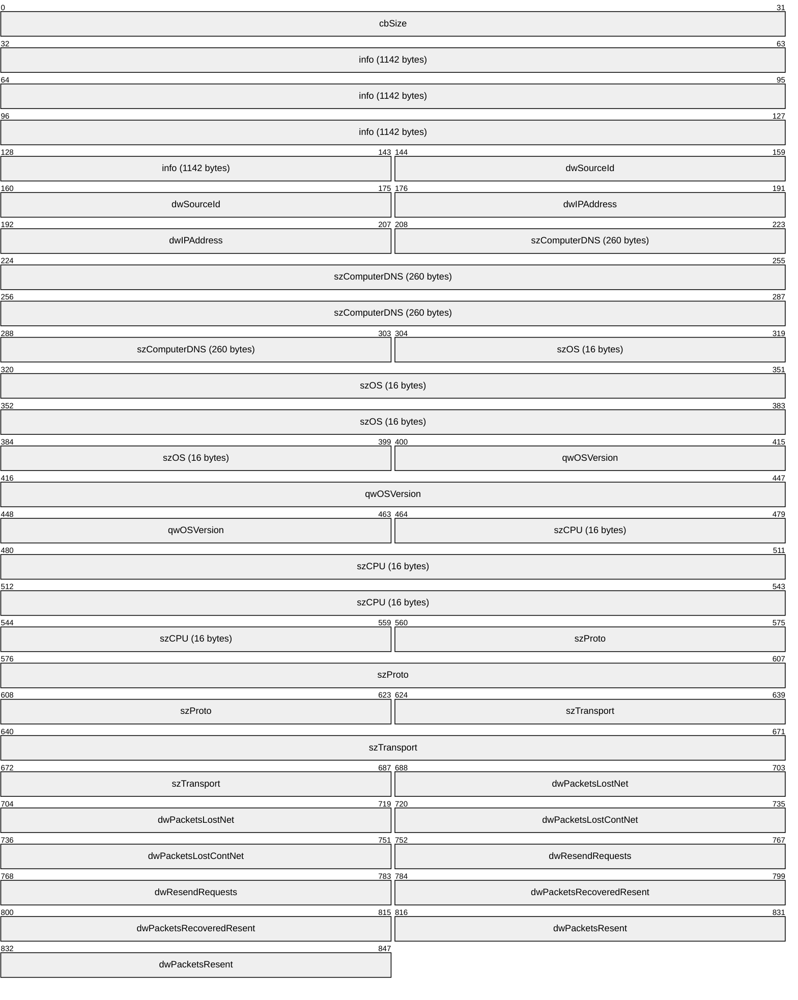

**cbSize (4 bytes):** An unsigned 32-bit integer. Specifies the length of the CLIENT_LOG structure in bytes.

**info (1142 bytes):** A [CLIENT_LOG_INFO (section 2.2.1.2)](#Section_2.2.1.2) structure.

**dwSourceId (4 bytes):** An unsigned 32-bit integer. It MUST be the value of the **openFileId** field in the [LinkMacToViewerReportOpenFile (section 2.2.4.7)](#Section_2.2.4.7) message.

**dwIPAddress (4 bytes):** An unsigned 32-bit integer. It SHOULD be set to 0xFFFFFFFF but MAY be set to the client's IPv4 address if IPv4 is used.<1>

**szComputerDNS (260 bytes):** A string field. It SHOULD be set to a hyphen (-) but MAY be set to the client's domain name system (DNS) name.<2>

**szOS (16 bytes):** A string field. It SHOULD be set to the name and version of the operating system used by the client.

**qwOSVersion (8 bytes):** An unsigned 64-bit integer. It MUST specify the version number of the client's operating system. The version number consists of four 16-bit integer parts. The most significant 16 bits of the **qwOSVersion** field MUST be set to the most significant part of the version number - that is, what is often referred to as the major version number. The second most significant bits of the **qwOSVersion** field MUST be set to the second most significant part of the version number, often referred to as the minor version number (and so on for the other two parts of the version number).

**szCPU (16 bytes):** A string field. It SHOULD be set to a string that describes the brand and model number of the CPU used on the client.

**szProto (8 bytes):** A string field. It MUST be set to "mms".

**szTransport (8 bytes):** A string field. It MUST be set to the transport protocol used by the server to transmit [Data (section 2.2.2)](#Section_2.2.2) packets to the client. The value MUST be one of the following:

| Value | Meaning |
| --- | --- |
| "UDP" | User Datagram Protocol. |
| "TCP" | Transmission Control Protocol. |

**dwPacketsLostNet (4 bytes):** An unsigned 32-bit integer. It MUST be set to the number of Data (section 2.2.2) packets lost that are lost at the network layer.

**dwPacketsLostContNet (4 bytes):** An unsigned 32-bit integer. It MUST be set to the largest number of consecutive missing Data (section 2.2.2) packets.

**dwResendRequests (4 bytes):** An unsigned 32-bit integer. It MUST be set to the number of Data (section 2.2.2) packets that the client has asked the server to resend.

**dwPacketsRecoveredResent (4 bytes):** An unsigned 32-bit integer. It MUST be set to the number of Data (section 2.2.2) packets that the client recovered as the result of the server resending a Data (section 2.2.2) packet.

**dwPacketsResent (4 bytes):** An unsigned 32-bit integer. It MUST be set to the number of Data (section 2.2.2) packets that the client received that are resent by the server.

<a id="Section_2.2.1.2"></a>
#### 2.2.1.2 CLIENT_LOG_INFO

The CLIENT_LOG_INFO structure is a component of the [CLIENT_LOG (section 2.2.1.1)](#Section_2.2.1.1) structure. The purpose of this structure is to provide logging information from the client when a [**stream (2)**](#gt_stream) stops for any reason.

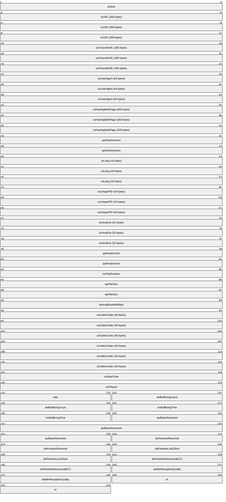

**cbSize (4 bytes):** An unsigned 32-bit integer. It specifies the length of the CLIENT_LOG_INFO structure, in bytes.

**szURL (260 bytes):** A string field. It MUST be set to the URL of the [**content**](#gt_content) that the CLIENT_LOG_INFO structure provides information on.

**szChannelURL (260 bytes):** A string field. If the URL in the **szURL** field is obtained from a Windows Media Station ([**.nsc**](#gt_558e85ff-e510-44a1-bd25-eb26c8a1e2da)) file, the **szChannelURL** field MUST be set to the URL of that .nsc file.

**szUserAgent (64 bytes):** A string field. It MUST be set to the HTTP User-Agent string of the embedded web browser in the client software.

**szHostingWebPage (260 bytes):** A string field. If the client software is embedded in a web page (in the form of a plug-in or ActiveX control), the **szHostingWebPage** field MUST be set to the URL of that web page.

**qwClientVersion (8 bytes):** An unsigned 64-bit integer. It MUST specify the version number of the Windows Media Player software. The version number consists of four 16-bit integer parts. The most significant 16 bits of the **qwClientVersion** field MUST be set to the most significant part of the version number; that is, what is often referred to as the major version number. The second most significant bits of the **qwClientVersion** field MUST be set to the second most significant part of the version number, often referred to as the minor version number (and so on for the other two parts of the version number).

**szLang (16 bytes):** This is a string field. This field MUST specify the client system language; for example, en-US for a U.S. English language system.

**szUniquePID (40 bytes):** A string field. It MUST specify a unique player identifier that can be used to correlate multiple logging requests for the same [**streaming**](#gt_streaming) media [**session**](#gt_session). It is recommended that a [**globally unique identifier (GUID)**](#gt_globally-unique-identifier-guid) be used as the value for this field.

**szHostExe (32 bytes):** A string field. It MUST be set to the name of the executable file in which Windows Media Player is loaded as a plug-in.

**qwHostExeVer (8 bytes):** An unsigned 64-bit integer. This field MUST specify the version number of the application named in the **szHostExe** field. The version number consists of four 16-bit integer parts. The most significant 16 bits of the **qwHostExeVer** field MUST be set to the most significant part of the version number—that is, what is often referred to as the major version number. The second most significant bits of the **qwHostExeVer** field MUST be set to the second most significant part of the version number, often referred to as the minor version number (and so on for the other two parts of the version number).

**msFileDuration (4 bytes):** An unsigned 32-bit integer. It MUST be set to the duration, in milliseconds, of the content. When streaming live content, this field MUST be set to 0x00000000.

**qwFileSize (8 bytes):** An unsigned 64-bit integer. File size, in bytes, of the content. When streaming live content, this field MUST be set to 0x0000000000000000.

**dwAvgBandwidthBps (4 bytes):** An unsigned 32-bit integer. It MUST be set to the average bit rate, in bits per second, of the content that is received by the client (as measured by the client).

**szAudioCodec (64 bytes):** This is a string field. It MUST be set to the name of the codec currently in use to decompress the audio stream in the content.

**szVideoCodec (64 bytes):** This is a string field. It MUST be set to the name of the codec currently in use to decompress the video stream in the content.

**msStartTime (4 bytes):** An unsigned 32-bit integer. It MUST be set to the time (in the timeline of the content), in milliseconds, at which playback began. The timeline of the content starts at 0, so if playback started from the beginning of the content, the value of this field becomes 0x00000000. When streaming live content, this field SHOULD be set to 0x00000000.

**msPlayed (4 bytes):** An unsigned 32-bit integer. It MUST be set to the amount of content that has been played by the client, expressed in millisecond time units.

**rate (2 bytes):** A signed 16-bit integer. It MUST be set to the current playback rate in which a positive value specifies playback in the forward direction, and a negative value specifies playback in the reverse direction. The value 0x0001 MUST be specified if content has been played at the normal rate.

**dwBufferingCount (4 bytes):** An unsigned 32-bit integer. It MUST be set to the number of times buffering is required by the client.

**msBufferingTime (4 bytes):** An unsigned 32-bit integer. It MUST be set to the time spent buffering, expressed in milliseconds.

**qwBytesReceived (8 bytes):** An unsigned 64-bit integer. It MUST be set to the total number of data bytes the client received. This field MUST only count the bytes in the payload of the [Data (section 2.2.2)](#Section_2.2.2) packets.

**dwPacketsReceived (4 bytes):** An unsigned 32-bit integer. It MUST be set to the total number of Data (section 2.2.2) packets the client received.

**dwPacketsLostClient (4 bytes):** An unsigned 32-bit integer. It MUST be set to the number of Data (section 2.2.2) packets the client never received.

**dwPacketsRecoveredECC (4 bytes):** An unsigned 32-bit integer. It MUST be set to 0x00000000.

**dwMinReceptionQuality (4 bytes):** An unsigned 32-bit integer. It MUST be set to the minimum percentage of the Data (section 2.2.2) packets received or recovered in the last 30 seconds. The maximum value is 0x00000064 for all Data (section 2.2.2) packets received and 0x00000000 for no Data (section 2.2.2) packets received.

**hr (4 bytes):** An unsigned 32-bit integer. It MUST be set to 0x00000000.

<a id="Section_2.2.2"></a>
### 2.2.2 Data

The Data packet is used by the server to send [**streaming**](#gt_streaming) media data to the client.

The [**ASF**](#gt_advanced-systems-format-asf) file header consists of the entire ASF Header Object (as specified in [[ASF]](https://go.microsoft.com/fwlink/?LinkId=89814) section 3.1) plus the 50-byte fixed initial portion of the ASF Data Object (as specified in [ASF] section 5.1).

Data packets are sent over either UDP or TCP, depending on which transport mode the server and the client agree on.

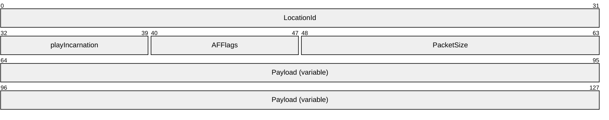

**LocationId (4 bytes):** A 32-bit integer field that specifies the index of the **Payload** field into the complete object being transferred. If the **Payload** field contains an ASF file header, **LocationId** MUST be 0x00000000 for the first payload, and MUST increment by 1 for each payload. If the **Payload** field contains a packet-pair packet, **LocationId** MUST be 0xF0F0F000 for the first packet-pair packet, and 0xF0F0F001 for the second packet-pair packet. If the payload contains an ASF data packet, the entire ASF file is considered the object that is being transferred. Thus, for payloads containing an ASF data packet, this field MUST be set to the payload's ASF data packet number. The first ASF data packet in an ASF file MUST have a **LocationId** of 0x00000000, the second ASF data packet in the file MUST have a **LocationId** of 0x00000001, and so on. Note that because a server can skip ASF data packets, the value of the **LocationId** field might not be sequential from one MMS Data packet to the next. If the server does not have access to the ASF file (for example, in the case of live [**content**](#gt_content)), the server MUST assume a virtual ASF file, incrementing **LocationId** (or decrementing it when rewinding the content) exactly as if a real ASF file existed.

**playIncarnation (1 byte):** An 8-bit field that is set to the least significant 8 bits of the MMS message (see section [2.2.4](#Section_2.2.4)) that triggered the server to send this Data packet. The value 0x00 is reserved and MUST NOT be used. The value 0xFF MUST be used if the Data packet contains a packet-pair packet.

**AFFlags (1 byte):** An 8-bit integer field. When the **Payload** field contains an ASF data packet, the field MUST be treated as a sequence number. The initial value MUST be 0x00, and it MUST increment by 1 for each ASF data packet that is transmitted. If the most recently transmitted Data packet has an **AFFlags** field value of 0xFE, and the server receives a [LinkViewerToMacStartPlaying (section 2.2.4.25)](#Section_2.2.4.25) message or a [LinkViewerToMacStartStriding (section 2.2.4.26)](#Section_2.2.4.26) message, the first Data packet transmitted in response SHOULD have the **AFFlags** field set to 0x00. When the **Payload** field contains an ASF file header, the **AFFlags** field MUST be set to 0x04 if the ASF file header is split into multiple Data packets. **AFFlags** MUST be set to 0x0C if this is the last Data packet in the sequence. If the **Payload** field contains a packet-pair packet, **AFFlags** MUST be set to 0x10.

**PacketSize (2 bytes):** A 16-bit integer field. MUST be set to the total size of the Data packet in bytes.

**Payload (variable):** A variable size block of bytes. The content of this field is either an ASF data packet, an ASF file header, or a packet-pair packet, depending on the circumstances under which the Data packet is transmitted. If the **Payload** field contains an ASF data packet, and if the ASF packet contains a **Padding Data** field, as specified in [ASF] section 5.2.4, the **Padding Data** field SHOULD be removed before encapsulating the ASF data packet in the MMS Data packet, except if the client identified itself as Windows Media Services version 4.0 or 4.1 in the [LinkViewerToMacConnect (section 2.2.4.17)](#Section_2.2.4.17) message. If the **Padding Data** field is removed, the **Padding Length** field in the ASF payload parsing information (as specified in [ASF] section 5.2.2) MUST be updated to indicate a non-existent **Padding Data** field.

<a id="Section_2.2.3"></a>
### 2.2.3 TcpMessageHeader

The TcpMessageHeader packet encapsulates MMS messages when they are sent over TCP. A single TcpMessageHeader packet can contain multiple MMS messages. TcpMessageHeader is not used for MMS messages that are sent over UDP.

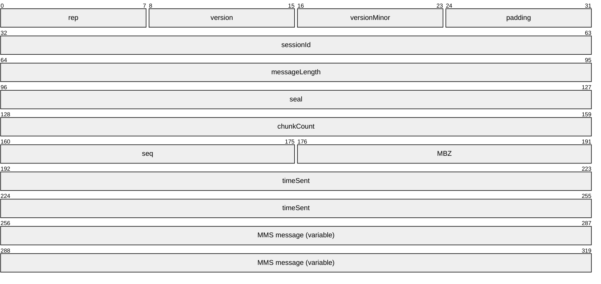

**rep (1 byte):** An 8-bit field. It MUST be set to 0x1.

**version (1 byte):** An 8-bit field. It MUST be set to 0x0.

**versionMinor (1 byte):** An 8-bit field. It MUST be set to 0x0.

**padding (1 byte):** An 8-bit field. It SHOULD be set to 0x0, and SHOULD be ignored by receivers.

**sessionId (4 bytes):** A 32-bit field. It MUST be set to 2953575118.

**messageLength (4 bytes):** An unsigned 32-bit integer that specifies the size, in bytes, of the MMS message field plus 16.

**seal (4 bytes):** A 32-bit field. It MUST be set to 0x20534D4D.

**chunkCount (4 bytes):** An unsigned 32-bit integer. It MUST be set to the total size of the TcpMessageHeader packet in multiples of 8 bytes.

**seq (2 bytes):** An unsigned 16-bit integer. The TcpMessageHeader packet sequence number. The value of this field MUST increment by 1 for each TcpMessageHeader packet that is sent. The first packet MUST have a seq value of 0x0000.

**MBZ (2 bytes):** A 16-bit field. It MUST be set to 0x0000.

**timeSent (8 bytes):** An unsigned 64-bit integer. The value of this field SHOULD be set to the elapsed time since the transmission of the first TcpMessageHeader packet (measured at the time the current TcpMessageHeader packet is sent), expressed in millisecond units. The value of this field MAY be chosen arbitrarily by the sender. Receivers SHOULD ignore this field.<3>

**MMS message (variable):** A variable-size array of bytes. The size of the field MUST be a multiple of 8 bytes. This field contains zero or more MMS messages, as specified in section [2.2.4](#Section_2.2.4).

<a id="Section_2.2.4"></a>
### 2.2.4 Message Types

This section defines the MMS message types. All messages MUST be transmitted over TCP.

MMS messages adhere to a common packet structure. MMS messages always start with the **chunkLen** field that specifies the size of the MMS message in multiples of 8 bytes. If the sum of the sizes of all fields in the MMS message is not a multiple of 8 bytes, padding MUST be appended after the final field. Whether padding is required or not, the amount of padding added MUST be chosen so that the total size of the MMS message, including the padding, becomes a multiple of 8 bytes. The value of the **chunkLen** field includes the size of the padding, if any.

The **chunkLen** field is followed by a Message ID (**MID**) field that specifies the type of message contained in the packet.

<a id="Section_2.2.4.1"></a>
#### 2.2.4.1 LinkMacToViewerPing

The LinkMacToViewerPing message is sent by the server to verify that a particular client is still active.

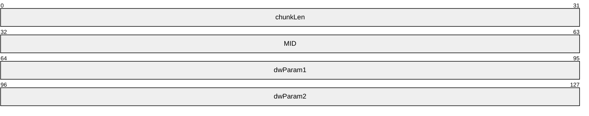

**chunkLen (4 bytes):** Length of the message in chunks of 8 bytes.

**MID (4 bytes):** Message ID. For this message, the value MUST be set to 0x0004001b.

**dwParam1 (4 bytes):** A 32-bit field. SHOULD be set to 0x00000000 and MUST be ignored by the receiver.

**dwParam2 (4 bytes):** A 32-bit field. SHOULD be set to 0x00000000 and MUST be ignored by the receiver.<4>

<a id="Section_2.2.4.2"></a>
#### 2.2.4.2 LinkMacToViewerReportConnectedEX

The LinkMacToViewerReportConnectedEX message is sent by the server in response to a [LinkViewerToMacConnect (section 2.2.4.17)](#Section_2.2.4.17) message from the client.

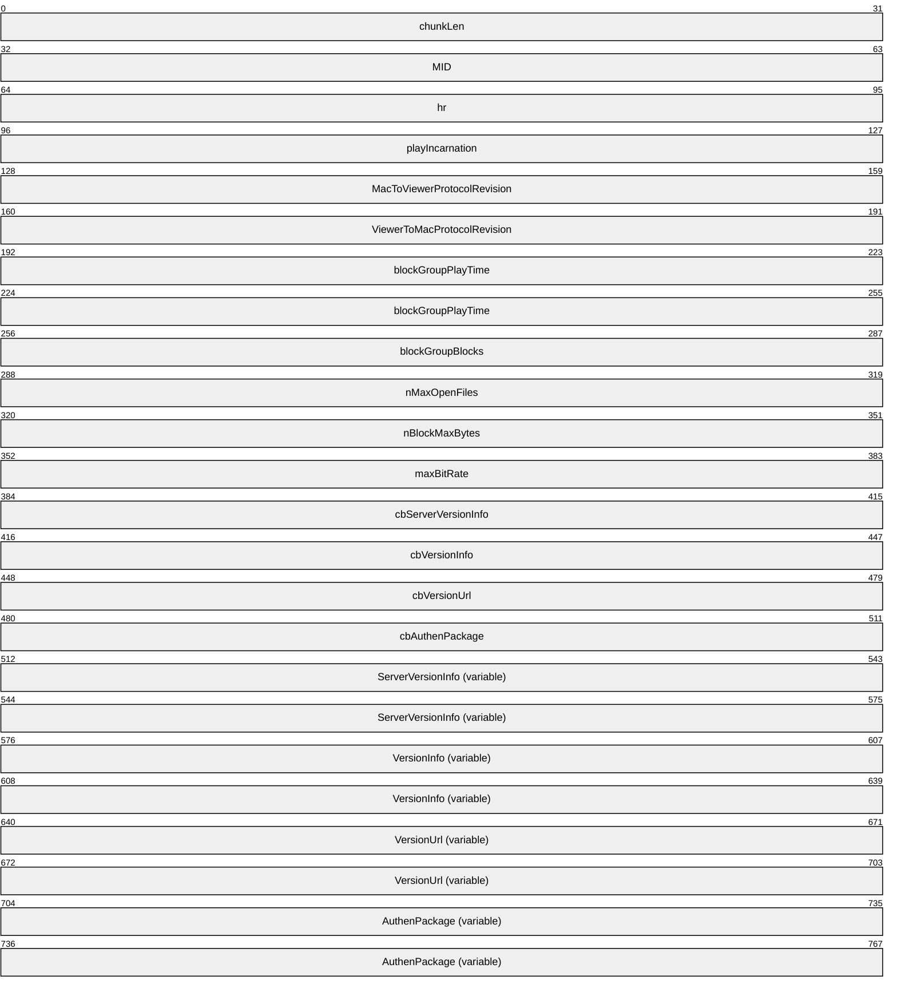

**chunkLen (4 bytes):** Length of the message in chunks. A chunk is 8 bytes.

**MID (4 bytes):** Message identifier. For this message, the value MUST be 0x00040001.

**hr (4 bytes):** The result of processing the client LinkViewerToMacConnect (section 2.2.4.17) message. For HRESULT codes, see [MS-ERREF](../MS-ERREF/MS-ERREF.md).

**playIncarnation (4 bytes):** A 32-bit field that specifies if the server can perform a packet-pair experiment. It MUST be set to one of the following values:

| Value | Meaning |
| --- | --- |
| MMS_DISABLE_PACKET_PAIR 0xf0f0f0ef | The server cannot perform a packet-pair experiment. |
| MMS_USE_PACKET_PAIR 0xf0f0f0f0 | The server can perform a packet-pair experiment. |

**MacToViewerProtocolRevision (4 bytes):** A 32-bit field. It MUST be set to 0x0004000B.

**ViewerToMacProtocolRevision (4 bytes):** A 32-bit field. It MUST be set to 0x0003001C.

**blockGroupPlayTime (8 bytes):** A DOUBLE (floating-point) field. It MUST be set to 1.0.

**blockGroupBlocks (4 bytes):** A 32-bit field. It MUST be set to 0x00000001.

**nMaxOpenFiles (4 bytes):** A 32-bit field. It MUST be set to 0x00000001.

**nBlockMaxBytes (4 bytes):** A 32-bit field. It MUST be set to 0x00008000.

**maxBitRate (4 bytes):** A 32-bit field. It MUST be set to 0x00989680.<5>

**cbServerVersionInfo (4 bytes):** A 32-bit unsigned integer. This field MUST be set to the number of [**Unicode**](#gt_unicode) characters in the **ServerVersionInfo** field, including the terminating null character.

**cbVersionInfo (4 bytes):** A 32-bit unsigned integer. This field MUST be set to the number of Unicode characters in the **VersionInfo** field, including the terminating null character.

**cbVersionUrl (4 bytes):** A 32-bit unsigned integer. It MUST be set to the number of Unicode characters in the **VersionUrl** field, including the terminating null character.

**cbAuthenPackage (4 bytes):** A 32-bit unsigned integer. It MUST be set to the number of Unicode characters in the **AuthenPackage** field, including the terminating null character.

**ServerVersionInfo (variable):** A variable-size array of Unicode characters. It MUST be set to the major and minor version numbers of the software product (specified in section 2.2.4.17) that is sending the LinkMacToViewerReportConnectedEX message and MUST adhere to the following Augmented Backus-Naur Form (ABNF) (as specified in [[RFC4234]](https://go.microsoft.com/fwlink/?LinkId=90462)) syntax:

major = 1*2DIGIT

minor = 1*2DIGIT ["." 1*4DIGIT "." 1*4DIGIT]

server-version-info = major "." minor %x0000

**VersionInfo (variable):** A variable-size array of Unicode characters. If the server wants the client to upgrade to a new version, it SHOULD include a nonzero size **VersionInfo** field. When the **VersionInfo** field has a nonzero size, it MUST specify the major and minor version numbers of the client software that the client can upgrade to, and the **VersionInfo** field MUST adhere to the following ABNF syntax:

major = 1*2DIGIT

minor = 1*2DIGIT ["." 1*4DIGIT "." 1*4DIGIT]

version-info = major "." minor %x0000

**VersionUrl (variable):** A variable-size array of Unicode characters. If the **VersionInfo** field has a nonzero size, the **VersionUrl** field MUST specify the URL from which the client can download a software update of the version specified by the **VersionInfo** field. The URL MUST adhere to the URI syntax (as specified in [[RFC3986]](https://go.microsoft.com/fwlink/?LinkId=90453)), it MUST be expressed using Unicode characters, and it MUST include a terminating null character.

**AuthenPackage (variable):** A variable-size array of Unicode characters. If the server supports authentication, and if it sends a [LinkMacToViewerSecurityChallenge (section 2.2.4.14)](#Section_2.2.4.14) message to this client, it MUST include a nonzero size **AuthenPackage** field. The **AuthenPackage** field MUST specify the authentication scheme the server uses, according to the following ABNF syntax:

auth-scheme= ( "BASIC" / "NTLM" ) %x0000

If the server does not support authentication, or if the server knows it will not send a LinkMacToViewerSecurityChallenge (section 2.2.4.14) message to this client, the **AuthenPackage** field MAY have a 0 size.

<a id="Section_2.2.4.3"></a>
#### 2.2.4.3 LinkMacToViewerReportConnectedFunnel

The LinkMacToViewerReportConnectedFunnel message is sent by the server in response to a [LinkViewerToMacConnectFunnel (section 2.2.4.18)](#Section_2.2.4.18) message sent by the client.

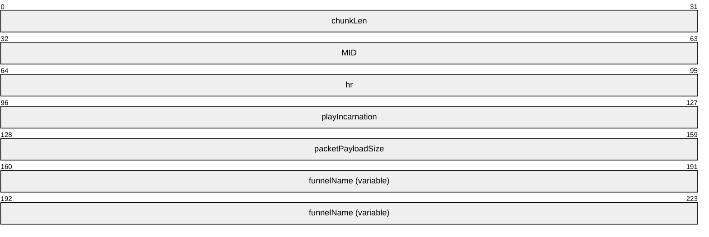

**chunkLen (4 bytes):** Length in chunks of the message. A chunk is 8 bytes.

**MID (4 bytes):** Message ID. For this message, the value MUST be 0x00040002.

**hr (4 bytes):** A 32-bit field. MUST be set to 0x00000000.

**playIncarnation (4 bytes):** A 32-bit field. SHOULD be set to 0x00000000. It MUST be ignored by the receiver.<6>

**packetPayloadSize (4 bytes):** A 32-bit field. SHOULD be set to 0x00000000. It MUST be ignored by the receiver.<7>

**funnelName (variable):** A variable size array of [**Unicode**](#gt_unicode) characters. MUST be set to the Unicode character string "Funnel Of The Gods".<8>

<a id="Section_2.2.4.4"></a>
#### 2.2.4.4 LinkMacToViewerReportDisconnectedFunnel

The LinkMacToViewerReportDisconnectedFunnel message is sent by the server in response to a [LinkViewerToMacConnectFunnel (section 2.2.4.18)](#Section_2.2.4.18) message from the client when there is an error processing the request.

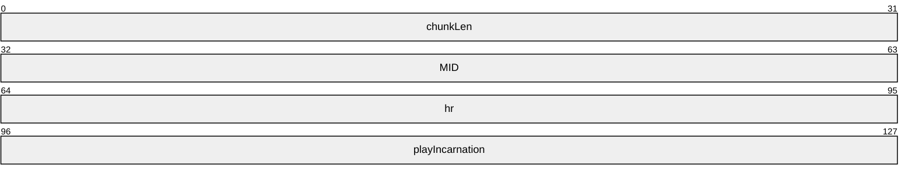

**chunkLen (4 bytes):** Length in chunks of the message. A chunk is 8 bytes.

**MID (4 bytes):** Message ID. For this message, the value MUST be 0x00040003.

**hr (4 bytes):** Result of processing the LinkViewerToMacConnectFunnel (section 2.2.4.18) message. For HRESULT codes, see [MS-ERREF](../MS-ERREF/MS-ERREF.md).

**playIncarnation (4 bytes):** A 32-bit field. SHOULD be set to 0x00000000. It MUST be ignored by the receiver.<9>

<a id="Section_2.2.4.5"></a>
#### 2.2.4.5 LinkMacToViewerReportEndOfStream

The LinkMacToViewerReportEndOfStream message is sent by the server to notify the client that the end of the current [**playlist**](#gt_playlist) entry has been reached.


**chunkLen (4 bytes):** Length in chunks of the message. A chunk is 8 bytes.

**MID (4 bytes):** Message ID. For this message, the value MUST be 0x0004001e.

**hr (4 bytes):** HRESULT. The following HRESULT codes have a special meaning (any other HRESULT code has the meaning specified in [MS-ERREF](../MS-ERREF/MS-ERREF.md)):

| Value | Meaning |
| --- | --- |
| 0x00000000 | The end of the current playlist entry is reached, or the server successfully processed the [LinkViewerToMacStopPlaying (section 2.2.4.27)](#Section_2.2.4.27) message. |
| 0x00000001 | The end of the current playlist entry is reached, and the server sends a [LinkMacToViewerReportStreamChange (section 2.2.4.12)](#Section_2.2.4.12) message. |

**playIncarnation (4 bytes):** A 32-bit field. If this LinkMacToViewerReportEndOfStream message is sent in response to a LinkViewerToMacStopPlaying (section 2.2.4.27) message, the **playIncarnation** field MUST be set to the value of the **playIncarnation** field in the LinkViewerToMacStopPlaying (section 2.2.4.27) message. Otherwise, the **playIncarnation** field MUST be set to the value of the **playIncarnation** field in the most recently received message of the following message types: [LinkViewerToMacStartPlaying](#Section_2.2.4.25) and [LinkViewerToMacStartStriding](#Section_2.2.4.26).

<a id="Section_2.2.4.6"></a>
#### 2.2.4.6 LinkMacToViewerReportFunnelInfo

The LinkMacToViewerReportFunnelInfo message is sent by the server to assign a unique identifier to a client in response to a [LinkViewerToMacFunnelInfo (section 2.2.4.19)](#Section_2.2.4.19) message received from the client. This identifier is then used by the client in [RequestPacketListResend (section 2.2.5)](#Section_2.2.5) packets.

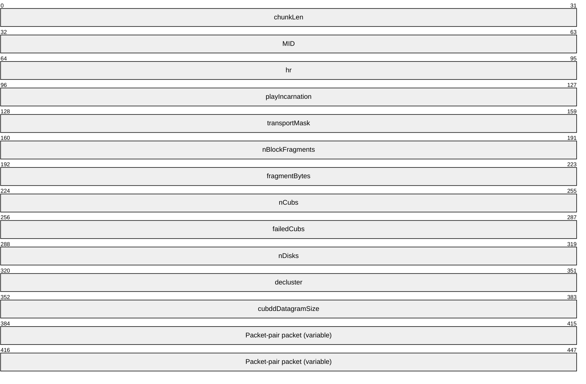

**chunkLen (4 bytes):** Length of the message in chunks. A chunk is 8 bytes.

**MID (4 bytes):** Message ID. For this message, the value MUST be 0x00040015.

**hr (4 bytes):** The result of processing the client LinkViewerToMacFunnelInfo (section 2.2.4.19) request. For HRESULT codes, see [MS-ERREF](../MS-ERREF/MS-ERREF.md).

**playIncarnation (4 bytes):** A 32-bit field. It MUST be set to one of the following values:

| Value | Meaning |
| --- | --- |
| MMS_DISABLE_PACKET_PAIR 0xf0f0f0ef | The server does not send packet-pair packets. |
| MMS_USE_PACKET_PAIR 0xf0f0f0f0 | The server sends packet-pair packets as part of the LinkMacToViewerReportFunnelInfo messages. |
| MMS_PACKET_PAIR_TCP_HIGH_ENTROPY 0xf0f0f0f1 | The server sends packet-pair packets as part of the LinkMacToViewerReportFunnelInfo messages. |
| MMS_PACKET_PAIR_UDP_HIGH_ENTROPY 0xf0f0f901 | The server sends packet-pair packets using [Data (section 2.2.2)](#Section_2.2.2) packets sent over UDP. |

**transportMask (4 bytes):** A 32-bit field. It MUST be set to 0x00000008.

**nBlockFragments (4 bytes):** A 32-bit field. It MUST be set to 0x00000001.

**fragmentBytes (4 bytes):** A 32-bit field. It MUST be set to 0x00010000.

**nCubs (4 bytes):** A 32-bit field. This field MUST be an identifier that is chosen by the server. It is recommended that the server generate a unique identifier for each client because the client includes the identifier in any RequestPacketListResend (section 2.2.5) packets that it sends. A unique identifier can help the server associate a RequestPacketListResend (section 2.2.5) packet with a particular client.

**failedCubs (4 bytes):** A 32-bit field. It MUST be set to 0x00000000.

**nDisks (4 bytes):** A 32-bit field. It MUST be set to 0x00000001.

**decluster (4 bytes):** 32-bit field. It MUST be set to 0x00000000.

**cubddDatagramSize (4 bytes):** A 32-bit field. It MUST be set to 0x00000000.

**Packet-pair packet (variable):** A variable-size array of bytes. This field MUST only be present if the value of the **playIncarnation** field is 0xF0F0F0F0 or 0xF0F0F0F1. In such cases, the server sends three LinkMacToViewerReportFunnelInfo messages.

<a id="Section_2.2.4.7"></a>
#### 2.2.4.7 LinkMacToViewerReportOpenFile

The LinkMacToViewerReportOpenFile message is sent by the server in response to a [LinkViewerToMacOpenFile (section 2.2.4.21)](#Section_2.2.4.21) message by the client.

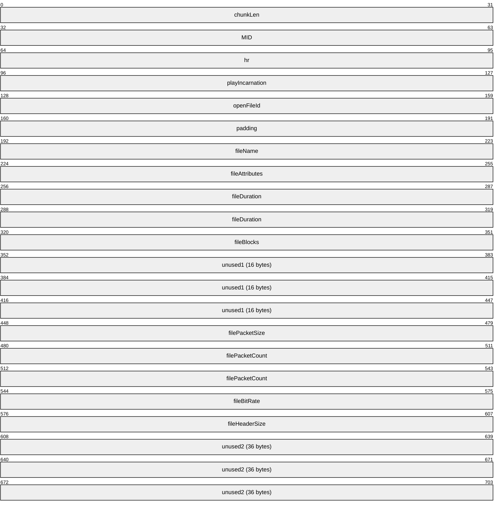

**chunkLen (4 bytes):** Length of the message in chunks. A chunk is 8 bytes.

**MID (4 bytes):** Message ID. For this message, the value MUST be 0x00040006.

**hr (4 bytes):** HRESULT. Result of processing the client LinkViewerToMacOpenFile (section 2.2.4.21) request. For HRESULT codes, see [MS-ERREF](../MS-ERREF/MS-ERREF.md).

**playIncarnation (4 bytes):** A 32-bit field. It MUST be set to the value of the **playIncarnation** field in the message received from the client that triggered the transmission of this LinkMacToViewerReportOpenFile message. The message is either a LinkViewerToMacOpenFile (section 2.2.4.21) message or a [LinkViewerToMacSecurityResponse (section 2.2.4.24)](#Section_2.2.4.24) message.

**openFileId (4 bytes):** A 32-bit field. It SHOULD be set by the server in such a way that when the client echoes the value of this field in the [RequestPacketListResend (section 2.2.5)](#Section_2.2.5) packet (or in other messages that contain an **openFileId** field), the server can identify the file referred to in the message.

**padding (4 bytes):** A 32-bit field. It SHOULD be set to 0x00000000 and MUST be ignored by the receiver.

**fileName (4 bytes):** A 32-bit field. It MUST be set to 0x00000000.

**fileAttributes (4 bytes):** A 32-bit field. It MUST specify the attributes of the [**content**](#gt_content) by using a bitwise OR combination of the flags in the following table.

| Value | Meaning |
| --- | --- |
| FILE_ATTRIBUTE_MMS_CANSTRIDE 0x00800000 | Specifies that the server supports fast forward and rewinding of content. |
| FILE_ATTRIBUTE_MMS_CANSEEK 0x01000000 | Specifies that the server supports seeking in content. |
| FILE_ATTRIBUTE_MMS_BROADCAST 0x02000000 | Specifies that the content is a broadcast [**stream (2)**](#gt_stream) (the same stream can be shared by multiple clients). |
| FILE_ATTRIBUTE_MMS_LIVE 0x04000000 | Specifies that the content is a live stream. |
| FILE_ATTRIBUTE_MMS_PLAYLIST 0x40000000 | Specifies that the content is part of a multiple item server-side [**playlist**](#gt_playlist). |

**fileDuration (8 bytes):** A DOUBLE data type field. It MUST be set to the duration, in seconds, of the current playlist entry, specified as a double precision floating point number. If the duration is unknown (for example, for live content, the **fileDuration** field MUST be set to 0).

**fileBlocks (4 bytes):** An unsigned 32-bit integer. It MUST be set to the duration, in seconds, of the current playlist entry. If the duration is not an integer number of seconds, it MUST be rounded to the nearest higher integer value.

**unused1 (16 bytes):** An array of 16 bytes. Each byte in this field MUST be set to 0x00.

**filePacketSize (4 bytes):** An unsigned 32-bit integer. It MUST be set to the maximum size, in bytes, of the [**ASF**](#gt_advanced-systems-format-asf) data packets to be transmitted by the server for this playlist entry.

**filePacketCount (8 bytes):** An unsigned 64-bit integer. It MUST be set to the number of ASF data packets in the content. If this information is unavailable, the field MUST be set to 0x0000000000000000.

**fileBitRate (4 bytes):** An unsigned 32-bit integer. It MUST be the sum of the maximum bit rates (in bits per second) of all streams in the current playlist entry.

**fileHeaderSize (4 bytes):** An unsigned 32-bit integer. It MUST be set to the size, in bytes, of the ASF file header for the current playlist entry.

**unused2 (36 bytes):** An array of 36 bytes. Each byte in this field MUST be set to 0x00.<10>

<a id="Section_2.2.4.8"></a>
#### 2.2.4.8 LinkMacToViewerReportReadBlock

The LinkMacToViewerReportReadBlock message is sent by the server in response to a [LinkViewerToMacReadBlock (section 2.2.4.23)](#Section_2.2.4.23) message from the client.

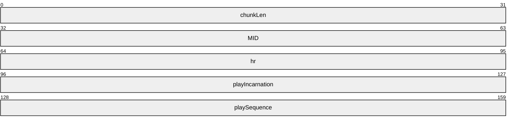

**chunkLen (4 bytes):** Length of the message in chunks. A chunk is 8 bytes.

**MID (4 bytes):** Message ID. For this message, the value MUST be 0x00040011.

**hr (4 bytes):** The result of processing the client LinkViewerToMacReadBlock (section 2.2.4.23) request. For HRESULT codes, see [MS-ERREF](../MS-ERREF/MS-ERREF.md).

**playIncarnation (4 bytes):** A 32-bit field. This field MUST be set to the value of the **playIncarnation** field in the LinkViewerToMacReadBlock (section 2.2.4.23) message that this LinkMacToViewerReportReadBlock message is a response to.

A value that specifies the type of packet-pair bandwidth estimation that is used, if any.

**playSequence (4 bytes):** A 32-bit field. This field MUST be set to 0x00000000.

<a id="Section_2.2.4.9"></a>
#### 2.2.4.9 LinkMacToViewerReportRedirect

The LinkMacToViewerReportRedirect message is used by the server in response to a [LinkViewerToMacOpenFile (section 2.2.4.21)](#Section_2.2.4.21) message from the client. It is used to redirect the client to a new location.

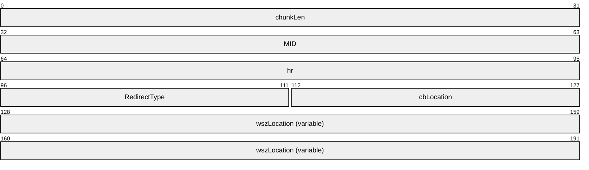

**chunkLen (4 bytes):** Length of the message in chunks. A chunk is 8 bytes.

**MID (4 bytes):** Message ID. For this message, the value MUST be 0x00040022.

**hr (4 bytes):** HRESULT. Result of processing the client request. For HRESULT codes, see [MS-ERREF](../MS-ERREF/MS-ERREF.md).

**RedirectType (2 bytes):** A 16-bit field. It MUST be set to 0x0001 if the server is redirecting the client to a different URL, or set to 0x0002 if the server is requesting that the client use a different proxy server.

0x0001

0x0002

**cbLocation (2 bytes):** A 16-bit unsigned integer. It MUST be the size of the **wszLocation** field, in bytes, including the terminating null character.

**wszLocation (variable):** A variable size array of [**Unicode**](#gt_unicode) characters. MUST include a terminating null Unicode character. If the value of the **RedirectType** field is 0x0001, then **wszLocation** MUST be set to a URL. If the value of the **RedirectType** field is 0x0002, then **wszLocation** MUST be set to either a URL to a proxy server or to an empty string (that is, consist of only the terminating null character). If **wszLocation** is an empty string, it means that the client is requested to stop using a proxy server and connect directly to the server that is sending the LinkMacToViewerReportRedirect message.

If **wszLocation** is set to a URL, it MUST adhere to the URI syntax specified in [[RFC3986]](https://go.microsoft.com/fwlink/?LinkId=90453). Percent-encoding, as specified in [RFC3986], MUST NOT be used. If the URI does not contain a port component, the client MUST use TCP port 1755. The scheme component of the URI MUST be one of the values in the following table.

| Value | Meaning |
| --- | --- |
| "mms" | MMS with [Data (section 2.2.2)](#Section_2.2.2) packets sent over UDP. |
| "mmsu" | MMS with Data (section 2.2.2) packets sent over UDP. |
| "mmst" | MMS with Data (section 2.2.2) packets sent over TCP. |

<a id="Section_2.2.4.10"></a>
#### 2.2.4.10 LinkMacToViewerReportStartedPlaying

The LinkMacToViewerReportStartedPlaying message is sent by the server in response to a [LinkViewerToMacStartPlaying (section 2.2.4.25)](#Section_2.2.4.25) message.

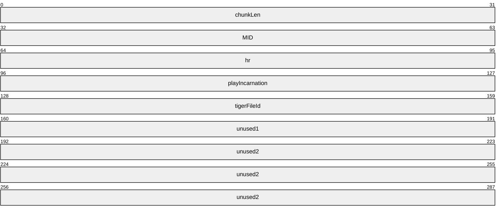

**chunkLen (4 bytes):** Length of the message in chunks. A chunk is 8 bytes.

**MID (4 bytes):** Message ID. For this message, the value MUST be 0x00040005.

**hr (4 bytes):** HRESULT. The result of processing the client LinkViewerToMacStartPlaying (section 2.2.4.25) message. For HRESULT codes, see [MS-ERREF](../MS-ERREF/MS-ERREF.md).

**playIncarnation (4 bytes):** A 32-bit field. It MUST be the value of the **playIncarnation** field in the LinkViewerToMacStartPlaying (section 2.2.4.25) message that this LinkMacToViewerReportStartedPlaying message is a response to.

**tigerFileId (4 bytes):** A 32-bit field. This field SHOULD <11> be set to the value of the **openFileId** field in the [LinkMacToViewerReportOpenFile (section 2.2.4.7)](#Section_2.2.4.7) message sent previously by the server. The field MUST be ignored by the receiver.

**unused1 (4 bytes):** A 32-bit field. It MUST be set to either 0x00000000 or 0x40000000. The field MUST be ignored by the receiver.

**unused2 (12 bytes):** An array of 12 bytes. Each byte in this field MUST be set to 0x00.

<a id="Section_2.2.4.11"></a>
#### 2.2.4.11 LinkMacToViewerReportStartStriding

The LinkMacToViewerReportStartStriding message is used by the server to respond to a [LinkViewerToMacStartStriding (section 2.2.4.26)](#Section_2.2.4.26) message from the client.

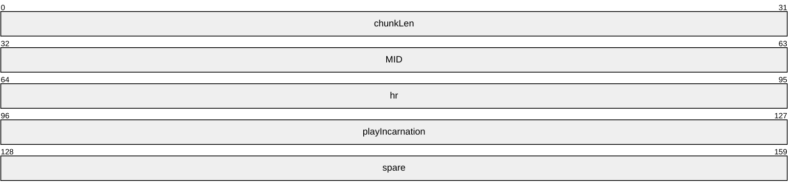

**chunkLen (4 bytes):** Length of the message in chunks. A chunk is 8 bytes.

**MID (4 bytes):** Message ID. For this message, the value MUST be 0x0004000a.

**hr (4 bytes):** HRESULT. Result of processing the client LinkViewerToMacStartStriding (section 2.2.4.26) message. For HRESULT codes, see [MS-ERREF](../MS-ERREF/MS-ERREF.md).

**playIncarnation (4 bytes):** A 32-bit field. It MUST be the value of the **playIncarnation** field in the LinkViewerToMacStartStriding (section 2.2.4.26) message that this LinkMacToViewerReportStartStriding message is a response to.

**spare (4 bytes):** A 32-bit field. It MUST be set to 0x00000000.

<a id="Section_2.2.4.12"></a>
#### 2.2.4.12 LinkMacToViewerReportStreamChange

The LinkMacToViewerReportStreamChange message is sent by the server to notify the client that it is starting to stream the next entry in a server-side [**playlist**](#gt_playlist).

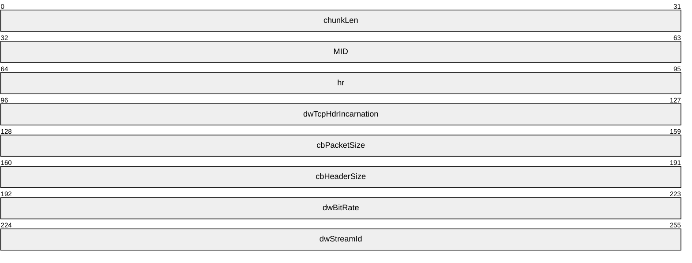

**chunkLen (4 bytes):** Length of the message in chunks. A chunk is 8 bytes.

**MID (4 bytes):** Message ID. For this message, the value MUST be 0x00040020.

**hr (4 bytes):** A 32-bit field. It MUST be set to 0x00000000.

**dwTcpHdrIncarnation (4 bytes):** A 32-bit field. It MUST be set to 0x000000FF.

**cbPacketSize (4 bytes):** An unsigned 32-bit integer. It MUST be set to the maximum size, in bytes, of the [**ASF**](#gt_advanced-systems-format-asf) data packets to be transmitted by the server for the new playlist entry.

**cbHeaderSize (4 bytes):** An unsigned 32-bit integer. It MUST be set to the size, in bytes, of the ASF file header for the new playlist entry.

**dwBitRate (4 bytes):** An unsigned 32-bit integer. It MUST be the sum of the maximum bit rates (in bits per second) of all [**streams (2)**](#gt_stream) in the new playlist entry.

**dwStreamId (4 bytes):** A 32-bit field. This field SHOULD be set to 0x00000000. It MUST be ignored by the receiver.<12>

<a id="Section_2.2.4.13"></a>
#### 2.2.4.13 LinkMacToViewerReportStreamSwitch

The LinkMacToViewerReportStreamSwitch message is used by the server to respond to a [LinkViewerToMacStreamSwitch (section 2.2.4.28)](#Section_2.2.4.28) message from the client.

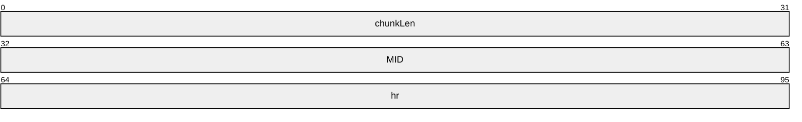

**chunkLen (4 bytes):** Length of the message in chunks. A chunk is 8 bytes.

**MID (4 bytes):** Message ID. For this message, the value MUST be 0x00040021.

**hr (4 bytes):** HRESULT. Result of processing the client LinkViewerToMacStreamSwitch (section 2.2.4.28) message. For HRESULT codes, see [MS-ERREF](../MS-ERREF/MS-ERREF.md).

<a id="Section_2.2.4.14"></a>
#### 2.2.4.14 LinkMacToViewerSecurityChallenge

The LinkMacToViewerSecurityChallenge message is sent by the server to request authentication from the client.

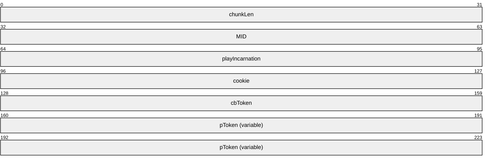

**chunkLen (4 bytes):** Length of the message in chunks. A chunk is 8 bytes.

**MID (4 bytes):** Message ID. For this message, the value MUST be 0x0004001A.

**playIncarnation (4 bytes):** A 32-bit field. It MUST be set to the value of the **playIncarnation** field in the message received from the client that triggered the transmission of this LinkMacToViewerSecurityChallenge message. The message is either a [LinkViewerToMacOpenFile (section 2.2.4.21)](#Section_2.2.4.21) message or a [LinkViewerToMacSecurityResponse (section 2.2.4.24)](#Section_2.2.4.24) message.

**cookie (4 bytes):** A 32-bit field. It SHOULD be set by the server in such a way that when the client echoes the value of this field in the LinkViewerToMacSecurityResponse (section 2.2.4.24) message, the server can determine what LinkMacToViewerSecurityChallenge message the LinkViewerToMacSecurityResponse (section 2.2.4.24) message is a response to.

**cbToken (4 bytes):** An unsigned 32-bit integer. It MUST be the size of the **pToken** field in bytes.

**pToken (variable):** A variable-size array of bytes. If Basic authentication (as specified in [[RFC2617]](https://go.microsoft.com/fwlink/?LinkId=90373)) is used, the **pToken** field MUST consist of an array of [**Unicode**](#gt_unicode) characters, and MUST adhere to the following ABNF syntax:

basic-realm= "realm="

realm-value ; as defined in [RFC2617]

ptoken-value= [ basic-realm ] %x0000

If the authentication realm for Basic authentication is unspecified, the basic-realm syntax element SHOULD still be included in the **pToken** field. In that case, the realm-value syntax element SHOULD be set to an empty quoted string.<13>

If NT LAN Manager (NTLM) authentication (as specified in [MS-NLMP](../MS-NLMP/MS-NLMP.md)) is used, the first two bytes of the **pToken** field MUST be 0x00. Any subsequent bytes of **pToken** are either an NTLM_AUTH structure (as defined in section [2.2.4.14.1](#Section_2.2.4.14.1)) or an NTLM challenge token (as defined in [MS-NLMP] section 2.2.1.2).

<a id="Section_2.2.4.14.1"></a>
##### 2.2.4.14.1 NTLM_AUTH Structure

The NTLM_AUTH structure is defined as follows:

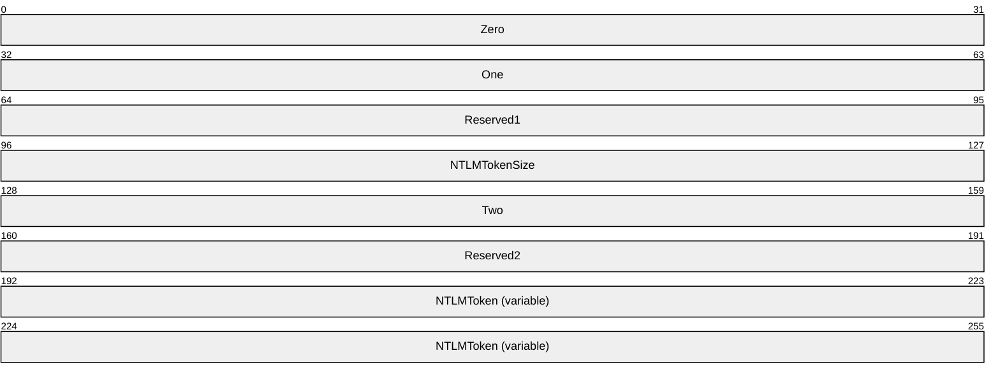

**Zero (4 bytes):** A 32-bit field. This field MUST be set to 0x00000000.

**One (4 bytes):** An unsigned 32-bit integer. This field MUST be set to 0x00000001.

**Reserved1 (4 bytes):** A 32-bit field. This field is unused and MUST be ignored when parsing the message.

**NTLMTokenSize (4 bytes):** An unsigned 32-bit integer. This field specifies the size of the **NTLMToken** field, in bytes.

**Two (4 bytes):** An unsigned 32-bit integer. This field MUST be set to 0x00000002.

**Reserved2 (4 bytes):** A 32-bit field. This field is unused and MUST be ignored when parsing the message.

**NTLMToken (variable):** A variable size array of bytes. This field must be set to the NTLM challenge token or response token, as appropriate. These tokens are defined in [MS-NLMP](../MS-NLMP/MS-NLMP.md).

<a id="Section_2.2.4.15"></a>
#### 2.2.4.15 LinkViewerToMacCancelReadBlock

The LinkViewerToMacCancelReadBlock message is sent by the client to request that the server cancel sending of the [**ASF**](#gt_advanced-systems-format-asf) file header that the client previously requested with a [LinkViewerToMacReadBlock (section 2.2.4.23)](#Section_2.2.4.23) message.

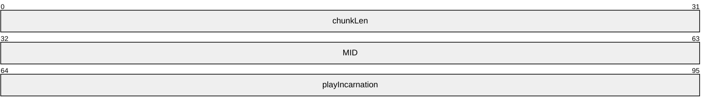

**chunkLen (4 bytes):** Length of the message in chunks. A chunk is 8 bytes.

**MID (4 bytes):** Message ID. For this message, the value MUST be 0x00030025.

**playIncarnation (4 bytes):** A 32-bit field. It MUST be the value of the **playIncarnation** field in the LinkViewerToMacReadBlock (section 2.2.4.23) message that this LinkViewerToMacCancelReadBlock message is attempting to cancel.

<a id="Section_2.2.4.16"></a>
#### 2.2.4.16 LinkViewerToMacCloseFile

The LinkViewerToMacCloseFile message is sent by the client to tell the server that it is finishing the [**streaming**](#gt_streaming) media [**session**](#gt_session).

```mermaid
packet-beta
  0-31: "chunkLen"
  32-63: "MID"
  64-95: "playIncarnation"
  96-127: "openFileId"
```

**chunkLen (4 bytes):** Length of the message in chunks. A chunk is 8 bytes.

**MID (4 bytes):** Message ID. For this message, the value MUST be 0x0003000D.

**playIncarnation (4 bytes):** A 32-bit field. SHOULD be set to 0x00000000. It MUST be ignored by the receiver.<14>

**openFileId (4 bytes):** A 32-bit field. This MUST be the value of the **openFileId** field in the [LinkMacToViewerReportOpenFile (section 2.2.4.7)](#Section_2.2.4.7) message that the client previously received from the server.

<a id="Section_2.2.4.17"></a>
#### 2.2.4.17 LinkViewerToMacConnect

The LinkViewerToMacConnect message is sent by the client to request a connection to a server.

```mermaid
packet-beta
  0-31: "chunkLen"
  32-63: "MID"
  64-95: "playIncarnation"
  96-127: "MacToViewerProtocolRevision"
  128-159: "ViewerToMacProtocolRevision"
  160-223: "subscriberName (variable)"
```

**chunkLen (4 bytes):** Length of the message in chunks. A chunk is 8 bytes.

**MID (4 bytes):** Message identifier. For this message, the value MUST be 0x00030001.

**playIncarnation (4 bytes):** A 32-bit field. The field specifies the type of packet-pair bandwidth estimation that is used, if any. The field SHOULD be set to one of the following values:<15>

| Value | Meaning |
| --- | --- |
| MMS_DISABLE_PACKET_PAIR 0xf0f0f0ef | Packet-pair bandwidth estimation not requested. |
| MMS_USE_PACKET_PAIR 0xf0f0f0f0 | Requests that packet-pair bandwidth estimation be performed. |

**MacToViewerProtocolRevision (4 bytes):** A 32-bit field. It MUST be set to 0x0004000B.

**ViewerToMacProtocolRevision (4 bytes):** A 32-bit field. It MUST be set to 0x0003001C.

**subscriberName (variable):** An array of [**Unicode**](#gt_unicode) characters that specifies the major and minor version numbers of the Microsoft software product that is sending the LinkViewerToMacConnect message.

If the LinkViewerToMacConnect message is sent through a proxy server, the **subscriberName** field MUST specify the name and port number of the server using the host-param syntax element (defined below), and SHOULD also specify the name and port number of the server using the host-string syntax element.<16>

If a proxy server forwards a LinkViewerToMacConnect message, and the **subscriberName** field does not contain the host-string syntax element, it MUST insert that syntax element into the field. Also, each proxy server MUST add information identifying its product name and version into the via-string syntax element. If the **subscriberName** field does not contain a via-string syntax element, the proxy server MUST add it. Otherwise, the proxy server appends its information to the existing information using a comma character as the separator, as specified by the following syntax.

The ABNF (as specified in [[RFC4234]](https://go.microsoft.com/fwlink/?LinkId=90462)) syntax of the **subscriberName** field is defined as follows.

host-info = host ; as defined in [RFC3986]

[ ":" port ] ; as defined in [RFC3986]

host-param = "; Host: " host-info

host-string = "HOST: " host-info

via-info = token [ "/" token ] *( "," [SP] token [ "/" token ] )

via-string = "VIA: " via-info

client-guid = "; {" 8HEXDIG "-" 4HEXDIG "-" 4HEXDIG "-"

4HEXDIG "-" 12HEXDIG "}"

major = 1*2DIGIT

minor = 1*2DIGIT ["." 1*4DIGIT "." 1*4DIGIT]

client-token = "Spooooon!" /

( "NSPlayer" "/" major "." minor client-guid )

subscriberName = client-token [ host-param ] %x0000

[ host-string %x0000 ] [ via-string %x0000 ]

Clients MUST assign the values of the client-token, major, and minor ABNF syntax elements according to the table below. <17>

| Client-token | Major | Minor |
| --- | --- | --- |
| Spoooon! | - | - |
| Spoooon! | - | - |
| NSPlayer | 4 | 1 |
| NSPlayer | 7 | 0 |
| NSPlayer | 7 | 1 |
| NSPlayer | 8 | 0 |
| NSPlayer | 9 | 0 |
| NSPlayer | 10 | 0 |

Example:

NSPlayer/4.1.0.3928; {68c0a090-8797-11d2-a2b3-00a0c9b60551}

<a id="Section_2.2.4.18"></a>
#### 2.2.4.18 LinkViewerToMacConnectFunnel

The LinkViewerToMacConnectFunnel message is sent by the client to request that [Data (section 2.2.2)](#Section_2.2.2) packets be [**streamed**](#gt_streaming) by the server using a specific protocol and to a specific port.

```mermaid
packet-beta
  0-31: "chunkLen"
  32-63: "MID"
  64-95: "playIncarnation"
  96-127: "maxBlockBytes"
  128-159: "maxFunnelBytes"
  160-191: "maxBitRate"
  192-223: "funnelMode"
  224-287: "funnelName (variable)"
```

**chunkLen (4 bytes):** Length of the message in chunks. A chunk is 8 bytes.

**MID (4 bytes):** Message ID. For this message, the value MUST be 0x00030002.

**playIncarnation (4 bytes):** A 32-bit field. SHOULD be set to 0x00000000. It MUST be ignored by the receiver.

**maxBlockBytes (4 bytes):** A 32-bit field. SHOULD be set to 0xFFFFFFFF.

**maxFunnelBytes (4 bytes):** A 32-bit field. SHOULD be set to 0x00000000.

**maxBitRate (4 bytes):** A 32-bit field. SHOULD be set to 0x00989680.<18>

**funnelMode (4 bytes):** A 32-bit field. It MUST be set to 0x00000002.

**funnelName (variable):** An array of [**Unicode**](#gt_unicode) characters containing the description of the socket that the client uses to receive Data (section 2.2.2) packets. The syntax of the **funnelName** field MUST adhere to the following ABNF syntax.

ip-addr = IPv4address / IPv6address ; as defined in [RFC3986]

proto = "TCP" / "UDP"

port = 1*5DIGIT

funnelName = "\\" ip-addr "\" proto "\" port

The port syntax element MUST have a value in the range 1-65535.

<a id="Section_2.2.4.19"></a>
#### 2.2.4.19 LinkViewerToMacFunnelInfo

The LinkViewerToMacFunnelInfo message is sent by the client to request an identifier for use in RequestPacketResend packets.

```mermaid
packet-beta
  0-31: "chunkLen"
  32-63: "MID"
  64-95: "playIncarnation"
```

**chunkLen (4 bytes):** Length of the message in chunks. A chunk is 8 bytes.

**MID (4 bytes):** Message ID. For this message, the value MUST be 0x00030018.

**playIncarnation (4 bytes):** A 32-bit field. Specifies the type of packet-pair bandwidth estimation that is used. It MUST be set to one of the values in the following table.

| Value | Meaning |
| --- | --- |
| MMS_DISABLE_PACKET_PAIR 0xf0f0f0ef | Disables packet-pair. |
| MMS_USE_PACKET_PAIR 0xf0f0f0f0 | Requests that packet-pair bandwidth estimation be performed. |
| MMS_PACKET_PAIR_TCP_HIGH_ENTROPY 0xf0f0f0f1 | Requests that high-entropy packet-pairs be sent over TCP. |
| MMS_PACKET_PAIR_UDP_HIGH_ENTROPY 0xf0f0f901 | Requests that high-entropy packet-pairs be sent over UDP. |

<a id="Section_2.2.4.20"></a>
#### 2.2.4.20 LinkViewerToMacLogging

The LinkViewerToMacLogging packet is used by the client to report statistics about the current [**stream (2)**](#gt_stream) to the server (as specified in section [2.2.1.1](#Section_2.2.1.1)).

```mermaid
packet-beta
  0-31: "chunkLen"
  32-63: "MID"
  64-175: "log (1490 bytes)"
```

**chunkLen (4 bytes):** Length of the message in chunks. A chunk is 8 bytes.

**MID (4 bytes):** Message identifier. For this message, the value MUST be 0x00030032.

**log (1490 bytes):** A CLIENT_LOG (section 2.2.1.1) structure.

<a id="Section_2.2.4.21"></a>
#### 2.2.4.21 LinkViewerToMacOpenFile

The LinkViewerToMacOpenFile message is sent by the client to specify the name of the resource on the server that is to be [**streamed**](#gt_streaming).

```mermaid
packet-beta
  0-31: "chunkLen"
  32-63: "MID"
  64-95: "playIncarnation"
  96-127: "spare"
  128-159: "token"
  160-191: "cbtoken"
  192-255: "fileName (variable)"
  256-319: "tokenData (variable)"
```

**chunkLen (4 bytes):** Length of the message in chunks. A chunk is 8 bytes.

**MID (4 bytes):** Message ID. For this message, the value MUST be 0x00030005.

**playIncarnation (4 bytes):** A 32-bit field. It MUST be set to a value in the range 0x00000001 to 0x000000FE, inclusive.

**spare (4 bytes):** A 32-bit field. SHOULD be set to 0x00000000. It MUST be ignored by the receiver.<19>

**token (4 bytes):** A 32-bit unsigned integer. If the LinkViewerToMacOpenFile message contains a nonzero size **tokenData** field, the **token** field MUST specify the offset to the start of the **tokenData** field, counted in bytes from the start of the **fileName** field. If the size of the **tokenData** field is zero, the value of the **token** field MUST be 0x00000000.

**Example**: If the **fileName** field is abc.asf, and the size of the **tokenData** field is nonzero, the value of the **token** field must be 0x00000010.

**cbtoken (4 bytes):** A 32-bit unsigned integer. It MUST be the size, in bytes, of the **tokenData** field.

**fileName (variable):** A variable size array of [**Unicode**](#gt_unicode) characters specifying the path component of the URL of the [**content**](#gt_content). See definition of path as specified in [[RFC3986]](https://go.microsoft.com/fwlink/?LinkId=90453) section 3.3. Percent-encoding (as specified in [RFC3986] section 2.1) MUST NOT be used on the characters in the path. The **fileName** field SHOULD include a terminating null Unicode character, unless the value of the **cbtoken** field is greater than 0, in which case the **fileName** field MUST include a terminating null Unicode character.

**Example**: media/mediastream.asf

**tokenData (variable):** A variable size array of bytes. It MUST contain authentication data of the size given by the **cbtoken** field. Thus, if the **cbtoken** field is 0x00000000, the **tokenData** field is not included in the message.

If the authentication data is for the Basic authentication scheme, as specified in [[RFC2617]](https://go.microsoft.com/fwlink/?LinkId=90373), the authentication data MUST be the user name and password, according to the syntax for basic-credentials, as specified in [RFC2617]. The basic-credentials authentication data MUST be stored in the **tokenData** field as a null-terminated ASCII string.

If the authentication data is for the NTLM authentication scheme (as specified in [MS-NLMP](../MS-NLMP/MS-NLMP.md)), the **tokenData** consists of either an NTLM_AUTH structure (as defined in section [2.2.4.14.1](#Section_2.2.4.14.1)) or an NTLM response token (as defined in [MS-NLMP] section 2.2.1.1).

<a id="Section_2.2.4.22"></a>
#### 2.2.4.22 LinkViewerToMacPong

The LinkViewerToMacPong message is sent by the client to inform the server that it is still active. It sends this message in response to a [LinkMacToViewerPing (section 2.2.4.1)](#Section_2.2.4.1) message from the server.

```mermaid
packet-beta
  0-31: "chunkLen"
  32-63: "MID"
  64-95: "dwParam1"
  96-127: "dwParam2"
```

**chunkLen (4 bytes):** Length of the message in chunks. A chunk is 8 bytes.

**MID (4 bytes):** Message ID. For this message, the value MUST be 0x0003001b.

**dwParam1 (4 bytes):** A 32-bit field. It SHOULD be set to 0x00000000 and MUST be ignored by the receiver.<20>

**dwParam2 (4 bytes):** A 32-bit field. It SHOULD be set to 0x00000000 and MUST be ignored by the receiver.<21>

<a id="Section_2.2.4.23"></a>
#### 2.2.4.23 LinkViewerToMacReadBlock

The LinkViewerToMacReadBlock message is sent by the client to request the [**ASF**](#gt_advanced-systems-format-asf) file header. The ASF file header contains all of the codec initialization parameters needed by the client to decompress the multimedia data.

```mermaid
packet-beta
  0-31: "chunkLen"
  32-63: "MID"
  64-95: "openFileId"
  96-127: "fileBlockId"
  128-159: "offset"
  160-191: "length"
  192-223: "flags"
  224-255: "padding"
  256-319: "tEarliest"
  320-383: "tDeadline"
  384-415: "playIncarnation"
  416-447: "playSequence"
```

**chunkLen (4 bytes):** Length of the message in chunks. A chunk is 8 bytes.

**MID (4 bytes):** Message ID. For this message, the value MUST be 0x00030015.

**openFileId (4 bytes):** A 32-bit field. This field MUST be the value of the **openFileId** field in the [LinkMacToViewerReportOpenFile (section 2.2.4.7)](#Section_2.2.4.7) message that the client previously received from the server.

**fileBlockId (4 bytes):** A 32-bit field. It MUST be set to 0x00000000.

**offset (4 bytes):** A 32-bit field. It MUST be set to 0x00000000.

**length (4 bytes):** A 32-bit field. It SHOULD be set to 0x00008000.<22>

**flags (4 bytes):** A 32-bit field. It MUST be set to 0xFFFFFFFF.

**padding (4 bytes):** A 32-bit field. It SHOULD be set to 0x00000000 and MUST be ignored by the receiver.<23>

**tEarliest (8 bytes):** A DOUBLE data type field. This field MUST be set to the value 0 expressed as a double precision floating point number.

**tDeadline (8 bytes):** A DOUBLE data type field. It MUST be set to the value 3600 expressed as a double precision floating-point number.

**playIncarnation (4 bytes):** A 32-bit field. It MUST be set to a value in the range 0x00000001 to 0x000000FE, inclusive.

**playSequence (4 bytes):** A 32-bit field. It MUST be set to 0x00000000.

<a id="Section_2.2.4.24"></a>
#### 2.2.4.24 LinkViewerToMacSecurityResponse

The LinkViewerToMacSecurityResponse message is sent by the client in response to an authentication request by the server.

```mermaid
packet-beta
  0-31: "chunkLen"
  32-63: "MID"
  64-95: "playIncarnation"
  96-127: "cookie"
  128-159: "cbToken"
  160-223: "pToken (variable)"
```

**chunkLen (4 bytes):** Length of the message in chunks. A chunk is 8 bytes.

**MID (4 bytes):** Message ID. For this message, the value MUST be 0x0003001A.

**playIncarnation (4 bytes):** A 32-bit field. This field MUST be the value of the **playIncarnation** field in the [LinkMacToViewerSecurityChallenge (section 2.2.4.14)](#Section_2.2.4.14) message received from the server that triggered the transmission of this LinkViewerToMacSecurityResponse message.

**cookie (4 bytes):** A 32-bit field. It MUST be the value of the **cookie** field in the LinkMacToViewerSecurityChallenge (section 2.2.4.14) message received from the server that triggered the transmission of this LinkViewerToMacSecurityResponse message.

**cbToken (4 bytes):** An unsigned 32-bit integer. This field MUST be the size of the **pToken** field, in bytes, including the terminating byte.

**pToken (variable):** A variable size array of bytes. If Basic authentication (as specified in [[RFC2617]](https://go.microsoft.com/fwlink/?LinkId=90373)) is used, this field MUST be set to the user name and password, according to the syntax for basic-credentials, as specified in [RFC2617]. The basic-credentials data MUST be stored in the **pToken** field as a null-terminated ASCII string.

If NT LAN Manager (NTLM) authentication (as specified in [MS-NLMP](../MS-NLMP/MS-NLMP.md)) is used, the first two bytes of the **pToken** field MUST be 0x00. The subsequent bytes of **pToken** are either an NTLM_AUTH structure (as defined in section [2.2.4.14.1](#Section_2.2.4.14.1)) or an NTLM response token (as defined in [MS-NLMP] section 2.2.1.1 and section 2.2.1.3).

<a id="Section_2.2.4.25"></a>
#### 2.2.4.25 LinkViewerToMacStartPlaying

The LinkViewerToMacStartPlaying message is sent by the client to request that the server start [**streaming**](#gt_streaming) the [**content**](#gt_content) for playback at the normal (real-time) rate.

```mermaid
packet-beta
  0-31: "chunkLen"
  32-63: "MID"
  64-95: "openFileId"
  96-127: "padding"
  128-191: "position"
  192-223: "asfOffset"
  224-255: "locationId"
  256-287: "frameOffset"
  288-319: "playIncarnation"
  320-351: "dwAccelBandwidth (optional)"
  352-383: "dwAccelDuration (optional)"
  384-415: "dwLinkBandwidth (optional)"
```

**chunkLen (4 bytes):** Length of the message in chunks. A chunk is 8 bytes.

**MID (4 bytes):** Message ID. For this message, the value MUST be 0x00030007.

**openFileId (4 bytes):** A 32-bit field. This field MUST be the value of the **openFileId** field in the [LinkMacToViewerReportOpenFile (section 2.2.4.7)](#Section_2.2.4.7) message that the client previously received from the server.

**padding (4 bytes):** A 32-bit field. This field SHOULD be set to 0x00000000 and MUST be ignored by the receiver.<24>

**position (8 bytes):** A DOUBLE data type field. This field MUST be set to either the time offset in seconds from which the server is requested to start streaming the content, or to the maximum positive number for data type DOUBLE (DBL_MAX). The content is assumed to begin at time 0. For example, setting this field to 0 requests the server to stream the content from the beginning. If this field is set to the maximum positive number for data type DOUBLE, either the **asfOffset** field or the **locationId** field MUST be used to specify the starting point for playback.

**asfOffset (4 bytes):** A 32-bit unsigned integer. This field MUST be set to the offset, in bytes, counted from the beginning of the [**ASF**](#gt_advanced-systems-format-asf) file from which the server is requested to start streaming, or set to either 0xFFFFFFFF or 0x00000000. If this field is set to 0xFFFFFFFF or 0x00000000, then either the **position** or **locationId** field MUST be used to specify the starting point for playback.

**locationId (4 bytes):** A 32-bit unsigned integer. This field MUST be set to the ASF data packet number from which the server is requested to start streaming the content, or set to either 0xFFFFFFFF or 0x00000000. If this field is set to 0xFFFFFFFF or 0x00000000, then either the **position** field or the **asfOffset** field MUST be used to specify the starting point for playback.

**frameOffset (4 bytes):** A 32-bit field. If the server is requested to stream the content until its end, this field MUST be set to 0x00000000. Otherwise, the low-order 31 bits MUST be treated as an unsigned 31-bit integer. The low-order 31 bits MUST be set to the time position in the content at which the server is requested to stop streaming, in millisecond time units. The time position MUST be expressed either relative to the start of the content (time 0), in which case the most significant bit in the **frameOffset** field MUST be 0, or relative to the start position requested in this LinkViewerToMacStartPlaying message, in which case the most significant bit in the **frameOffset** field MUST be 1.

**playIncarnation (4 bytes):** A 32-bit field. It MUST be set to a value in the range 0x00000001 to 0x000000FE, inclusive.

**dwAccelBandwidth (4 bytes):** A 32-bit unsigned integer. If this field is present, the **dwAccelDuration** field MUST also be present. The **dwAccelBandwidth** field specifies a transmission rate, in bits per second, that the client is requesting the server to use when transmitting the amount of multimedia data specified by the **dwAccelDuration** field.

**dwAccelDuration (4 bytes):** A 32-bit unsigned integer. If this field is present, the **dwAccelBandwidth** field MUST also be present. The **dwAccelDuration** field specifies an amount of multimedia data, in millisecond units, that the client is requesting the server to transmit at the bandwidth specified by the **dwAccelBandwidth** field.

**dwLinkBandwidth (4 bytes):** A 32-bit unsigned integer. If this field is present, the **dwAccelBandwidth** and **dwAccelDuration** fields MUST also be present. The **dwLinkBandwidth** field specifies the client's connection bandwidth, in bits per second.

<a id="Section_2.2.4.26"></a>
#### 2.2.4.26 LinkViewerToMacStartStriding

The LinkViewerToMacStartStriding message is sent by the client to request that the server start [**streaming**](#gt_streaming) the [**content**](#gt_content) for playback at a trick-mode rate, that is, fast forward or rewind.

```mermaid
packet-beta
  0-31: "chunkLen"
  32-63: "MID"
  64-95: "openFileId"
  96-127: "padding"
  128-191: "position"
  192-223: "asfOffset"
  224-255: "locationId"
  256-287: "frameOffset"
  288-319: "playIncarnation"
  320-383: "rate"
```

**chunkLen (4 bytes):** Length of the message in chunks. A chunk is 8 bytes.

**MID (4 bytes):** Message ID. For this message, the value MUST be 0x00030028.

**openFileId (4 bytes):** A 32-bit field. This field MUST be set to the value of the **openFileId** field in the [LinkMacToViewerReportOpenFile (section 2.2.4.7)](#Section_2.2.4.7) message that the client previously received from the server.

**padding (4 bytes):** A 32-bit field. It SHOULD be set to 0x00000000 and MUST be ignored by the receiver.

**position (8 bytes):** A DOUBLE data type field. This field MUST be set to either the time offset in seconds from which the server is requested to start streaming the content, or to the maximum positive number for data type DOUBLE (DBL_MAX). The content is assumed to begin at time 0. For example, setting this field to 0 requests the server to stream the content from the beginning. If this field is set to the maximum positive number for data type DOUBLE, either the **asfOffset** field or the **locationId** field MUST be used to specify the starting point for playback.

**asfOffset (4 bytes):** A 32-bit unsigned integer. If either the **position** field or the **locationId** field specifies the start position, the **asfOffset** field MUST be set to either 0xFFFFFFFF or 0x00000000. Otherwise, the **asfOffset** field MUST be set to the offset in bytes counted from the beginning of the [**ASF**](#gt_advanced-systems-format-asf) file from which the server is requested to start streaming.

**locationId (4 bytes):** A 32-bit unsigned integer. If either the **position** field or the **asfOffset** field specifies the start position, the **locationId** field MUST be set to either 0xFFFFFFFF or 0x00000000. Otherwise, the **locationId** field MUST be set to the ASF data packet number from which the server is requested to start streaming the content.

**frameOffset (4 bytes):** A 32-bit field. It SHOULD be set to 0x00000000 and MUST be ignored by the receiver.<25>

**playIncarnation (4 bytes):** A 32-bit field. This field MUST be set to a value in the range 0x00000001 to 0x000000FE, inclusive.

**rate (8 bytes):** A DOUBLE data type field. This field MUST be set to the rate at which striding is to occur, expressed as a double precision floating-point number. The valid range is from -5 to +5, inclusive. This field MUST NOT be set to 0.

<a id="Section_2.2.4.27"></a>
#### 2.2.4.27 LinkViewerToMacStopPlaying

The LinkViewerToMacStopPlaying message is sent by the client to request that the server stop [**streaming**](#gt_streaming) [Data (section 2.2.2)](#Section_2.2.2) packets.

```mermaid
packet-beta
  0-31: "chunkLen"
  32-63: "MID"
  64-95: "openFileId"
  96-127: "playIncarnation"
```

**chunkLen (4 bytes):** Length of the message in chunks. A chunk is 8 bytes.

**MID (4 bytes):** Message ID. For this message, the value MUST be 0x00030009.

**openFileId (4 bytes):** A 32-bit field. This field MUST be set to the value of the **openFileId** field in the [LinkMacToViewerReportOpenFile (section 2.2.4.7)](#Section_2.2.4.7) message that the client previously received from the server.

**playIncarnation (4 bytes):** A 32-bit field. This field MUST be set to the value of the **playIncarnation** field in the most recently sent message of the following message types: [LinkViewerToMacStartPlaying](#Section_2.2.4.25) and [LinkViewerToMacStartStriding](#Section_2.2.4.26).<26>

<a id="Section_2.2.4.28"></a>
#### 2.2.4.28 LinkViewerToMacStreamSwitch

The LinkViewerToMacStreamSwitch message is sent by the client to select, unselect, thin, unthin, or replace individual [**streams (2)**](#gt_stream) that it is currently receiving.

```mermaid
packet-beta
  0-31: "chunkLen"
  32-63: "MID"
  64-95: "cStreamEntries"
  96-159: "aStreamEntries (variable)"
```

**chunkLen (4 bytes):** Length of the message in chunks. A chunk is 8 bytes.

**MID (4 bytes):** Message ID. For this message, the value MUST be 0x00030033.

**cStreamEntries (4 bytes):** An unsigned 32-bit integer. It MUST be set to the number of **STREAM_SWITCH_ENTRY** elements in the aStreamEntries[] array.

**aStreamEntries (variable):** A variable size of array of [STREAM_SWITCH_ENTRY](#Section_2.2.4.28.1) elements.

Either stream can be set to a special value 0xFFFF to indicate that no stream is specified. If the source stream is set to 0xFFFF, the thinning level is ignored. Stream numbers are located in the [**ASF**](#gt_advanced-systems-format-asf) file header, as specified in [[ASF]](https://go.microsoft.com/fwlink/?LinkId=89814), delivered by the server prior to the file stream.

<a id="Section_2.2.4.28.1"></a>
##### 2.2.4.28.1 STREAM_SWITCH_ENTRY

The STREAM_SWITCH_ENTRY data structure is defined as follows:

typedef struct {

WORD wSrcStreamNumber;

WORD wDstStreamNumber;

WORD wThinningLevel;

} STREAM_SWITCH_ENTRY;

**wSrcStreamNumber:** A 16-bit unsigned integer. This field MUST be set to the [**ASF**](#gt_advanced-systems-format-asf) [**stream (2)**](#gt_stream) number (of the stream that the server is requested to replace with the stream specified by the **wDstStreamNumber** field) or 0xFFFF if **wDstStreamNumber** is not supposed to be replaced by any other stream.

**wDstStreamNumber:** A 16-bit unsigned integer. This field MUST be set to the ASF stream number (of the stream that the server is requested to replace with the stream specified by the **wSrcStreamNumber** field) or 0xFFFF if **wSrcStreamNumber** is not supposed to be replaced by any other stream.

**wThinningLevel:** A 16-bit unsigned integer. This field MUST be set to one of the values in the following table.

| Value | Meaning |
| --- | --- |
| 0x0000 | All ASF media objects for the stream given by **wDstStreamNumber** are to be transmitted. |
| 0x0001 | Only ASF media objects for the stream given by **wDstStreamNumber** (that are marked as containing key frame data) are to be transmitted. |
| 0x0002 | No ASF media objects for the stream given by **wDstStreamNumber** are to be transmitted. |

<a id="Section_2.2.5"></a>
### 2.2.5 RequestPacketListResend

The RequestPacketListResend packet is sent by the client to request that a number of [Data (section 2.2.2)](#Section_2.2.2) packets be resent by the server. The RequestPacketListResend packet MUST be sent using UDP.

```mermaid
packet-beta
  0-31: "Signature"
  32-63: "dwClientId"
  64-79: "wSourceId"
  80-95: "wNumPackets"
  96-159: "dwBeginPacketList (variable)"
```

**Signature (4 bytes):** A 32-bit field. It MUST be set to 0xBEEFF00D.

**dwClientId (4 bytes):** A 32-bit field. It MUST be set to the value of the **nCubs** field in the [LinkMacToViewerReportFunnelInfo (section 2.2.4.6)](#Section_2.2.4.6) message that the client previously received from the server.

**wSourceId (2 bytes):** A 16-bit field. It MUST be set to the 16 least-significant bits of the value of the **openFileId** field in the [LinkMacToViewerReportOpenFile (section 2.2.4.7)](#Section_2.2.4.7) message that the client previously received from the server.

**wNumPackets (2 bytes):** A 16-bit unsigned integer. It MUST be set to the number of Data (section 2.2.2) packets that the client is requesting be resent. The value of this field MUST be in the range 1 to 32, inclusive.

**dwBeginPacketList (variable):** A variable-size array of 32-bit unsigned integers. The number of elements in this array MUST be equal to the value of the **wNumPackets** field. Each element MUST be set to the 32-bit sequence number of a Data (section 2.2.2) packet that is to be resent. (Data (section 2.2.2) packet sequence numbers can be obtained from the **AFFlags** field of the Data (section 2.2.2) packet. The **AFFlags** field specifies the least-significant 8 bits of the sequence number.)

<a id="Section_3"></a>
# 3 Protocol Details

<a id="Section_3.1"></a>
## 3.1 Client Details

**Note** Regarding concurrent programming, also known as multi-threaded programming: The processing rules for the client role MUST be processed atomically up to the point where the client is waiting for a message, packet or higher layer event. When the client is transmitting a message, it MUST transmit it in an asynchronous manner.

For example, as the client is processing a message, a higher-layer event is not possible until the client starts waiting for another message, packet, or event. If the client sends a message, it needs to make sure that TCP flow control does not cause it to "block" while sending the message. Similarly, as the client is processing a higher layer event, the receipt of a packet or the expiry of a timer cannot interrupt processing of that higher-layer event until the client starts waiting for a message, packet, or event.

Implementers can create such serialization of the processing rules using synchronization primitives available in their target programming language. As an example, such primitives can be called "critical sections" or "mutexes".

Unless otherwise specified, the protocol reports the occurrence of an error to the higher layer, stops all timers, and stops processing further messages. Possible errors include the following:

- Failure to connect to the server.
- The connection to the server is unexpectedly closed.
- Receipt of a message in which the HRESULT field specifies an error value.
- A malformed message is received (for example, a **LinkMacToViewerReportConnectedEx** message does not adhere to the syntax for messages of that type).
<a id="Section_3.1.1"></a>
### 3.1.1 Abstract Data Model

This section describes a conceptual model of possible data organization that an implementation maintains to participate in this protocol. The described organization is provided to facilitate the explanation of how the protocol behaves. This document does not mandate that implementations adhere to this model as long as their external behavior is consistent with what is described in this document.

**Auth-Scheme**: This variable stores the authentication scheme used by the server. Two values are BASIC, specifying Basic authentication (as specified in [[RFC2617]](https://go.microsoft.com/fwlink/?LinkId=90373)), and NTLM, specifying NTLM authentication (as specified in [MS-NLMP](../MS-NLMP/MS-NLMP.md)). The default value is NTLM.

**Client-ID**: The value of this variable is an identifier assigned by the server for the current [**streaming**](#gt_streaming) [**session**](#gt_session). Since the Client-ID value is provided by the server, the initial value is undefined.

**File-ID**: This variable stores the value of the **openFileId** field in the [LinkMacToViewerReportOpenFile (section 2.2.4.7)](#Section_2.2.4.7) message. The initial value of this field is undefined.

**FunnelInfo-Count**: This is a numerical variable that stores the number of [LinkMacToViewerReportFunnelInfo (section 2.2.4.6)](#Section_2.2.4.6) messages that have been received. The allowed values for this variable are 0, 1, 2, and 3. The default value is 0.

**HeaderIncarnation**: This variable stores the next value of the **playIncarnation** field for certain MMS messages. The variable can only assume values in the range 0x00000001 to 0x00000008, inclusive. If the variable has the value 0x00000008 and is incremented, the next value becomes 0x00000001. The default value of this variable is 0x00000001.

**Incarnation**: This variable stores the next value of the **playIncarnation** field for certain MMS messages. The variable can only assume values in the range 0x00000001 to 0x000000FE, inclusive. If the variable has the value 0x000000FE and is incremented, the next value becomes 0x00000001. The default value of this variable is 0x00000001.

**Packet-Pair-Arrival-Time**: This is an unsigned 64-bit integer number that stores the time at which a Packet-Pair Packet or LinkMacToViewerReportFunnelInfo (section 2.2.4.6) message is received. Because this variable is used only for computing relative time differences, the absolute clock offset is of no consequence and can be chosen arbitrarily. The value of the variable is in units of 100 nanoseconds. The minimum value is 0x0000000000000000. The maximum value is 0xFFFFFFFFFFFFFFFF. The default value is 0x0000000000000000.

**Packet-Pair-Packets-Expected**: This is a numerical variable that stores the number of Packet-Pair Packets that still remain to be received. The allowed values for this variable are 0, 1 and 2. The initial value of this variable is undefined.

**Play-Sent**: This variable specifies if a [LinkMacToViewerReportStartedPlaying (section 2.2.4.10)](#Section_2.2.4.10) message is expected. The possible values are 0 and 1. A value of 0 means that a LinkMacToViewerReportStartedPlaying message is not expected. A value of 1 means that a LinkMacToViewerReportStartedPlaying is expected. The default value is 0.

**PlayIncarnation**: This variable stores the next value of the **playIncarnation** field for certain MMS messages. The variable can only assume values in the range 0x00000009 to 0x000000FE, inclusive. If the variable has the value 0x000000FE and is incremented, the next value becomes 0x00000009. The default value of this variable is 0x00000009.

**PlayIncarnation-For-Stop**: This variable is an unsigned 32-bit integer and stores the value that that client will assign to the **playIncarnation** field in a [LinkViewerToMacStopPlaying (section 2.2.4.27)](#Section_2.2.4.27) message. The variable can only assume values in the range 0x00000000 to 0x000000FE inclusive. The default value is 0x00000000.

**Proxy-Address**: This variable stores the IP address of an MMS proxy server. The address can be either an IPv4 or IPv6 address. By default, this variable is empty and does not store a valid IP address.

**Proxy-Port**: This variable stores the TCP and UDP port number that corresponds to the MMS proxy server specified by the **Proxy-Address** variable. The minimum value is 0. The maximum value is 65535. The default value is 0.

**Server-URL**: This variable stores the URL of the [**content**](#gt_content) that the client wants to stream from the server. The initial value of this variable is undefined.

**Server-Version**: This variable stores the major and minor version number that the server specified in the **ServerVersionInfo** field in the [LinkMacToViewerReportConnectedEX (section 2.2.4.2)](#Section_2.2.4.2) message. The default value is 0.0.

**Stop-Sent**: This variable specifies if a [LinkMacToViewerReportEndOfStream (section 2.2.4.5)](#Section_2.2.4.5) message is expected in response to a previously transmitted LinkViewerToMacStopPlaying (section 2.2.4.27) message. The possible values are 0 and 1. A value of 0 means that a LinkMacToViewerReportEndOfStream message is not expected in response to a previously transmitted LinkViewerToMacStopPlaying (section 2.2.4.27) message. A value of 1 means that a LinkMacToViewerReportEndOfStream is expected in response to a previously transmitted LinkViewerToMacStopPlaying (section 2.2.4.27) message. The default value is 0.

**Stream-Switch-Sent**: This variable specifies if a [LinkMacToViewerReportStreamSwitch (section 2.2.4.13)](#Section_2.2.4.13) message is expected. The possible values are 0 and 1. A value of 0 means that a LinkMacToViewerReportStreamSwitch message is not expected. A value of 1 means that a LinkMacToViewerReportStreamSwitch is expected. The default value is 0.

**Striding-Sent**: This variable specifies if a [LinkMacToViewerReportStartStriding (section 2.2.4.11)](#Section_2.2.4.11) message is expected. The possible values are 0 and 1. A value of 0 means that a LinkMacToViewerReportStartStriding message is not expected. A value of 1 means that a LinkMacToViewerReportStartStriding is expected. The default value is 0.

**Trick-Mode-Rate**: This variable specifies if the content can be streamed for viewing at the normal playback rate or streamed for viewing at a trick-mode rate (for example, fast forward or rewind). The possible values are 0 and 1. A value of 0 means that the content is streamed for viewing at the normal playback rate. A value of 1 means that the content is streamed for viewing at a trick-mode rate. The initial value of this variable is undefined.

**UDP-Receive-Port**: The variable stores the UDP port number on which the client is listening for incoming UDP packets. The minimum value is 1, and the maximum value is 65535. The initial value is undefined.

**UDP-Selected**: This variable specifies if Data (section [2.2.2](#Section_2.2.2)) packets will be delivered using UDP or TCP. The possible values are 0 and 1. A value of 0 means that Data packets will be delivered using TCP. A value of 1 means that Data packets will be delivered using UDP. The initial value of this variable is undefined.

**State**: This variable stores the client's state. Possible values are INIT, READY, and STREAMING.

**Note** The preceding conceptual data can be implemented using a variety of techniques.

<a id="Section_3.1.2"></a>
### 3.1.2 Timers

**Header**: This timer is used when waiting for the [**ASF**](#gt_advanced-systems-format-asf) file header when the server transmits it using UDP. The minimum allowed value for the time-out period is 1 second and the maximum value is 30 seconds.

<a id="Section_3.1.3"></a>
### 3.1.3 Initialization

Initialization of the protocol occurs as the result of a higher layer asking for information on multimedia [**content**](#gt_content) located on a server. That event is defined in section [3.1.4.1](#Section_3.1.4.1). It also occurs as the result of receiving a LinkMacToViewerReportRedirect message, as described in section [3.1.5.7](#Section_3.1.5.7).

The variables defined by the abstract data model MUST initially assume their default values. Variables that do not have default defined values MUST be initialized as follows:

- The State variable MUST be set to INIT.
- The higher layer MUST specify if the client requests the server to deliver Data (section [2.2.2](#Section_2.2.2)) packets over UDP or TCP. In case of UDP, the UDP-Selected variable MUST be set to 1. In case of TCP, the UDP-Selected variable MUST be set to 0.
- The value of the **UDP-Receive-Port** variable MUST be set to a UDP port number chosen by the higher layer, on which the client can listen for incoming Data (section 2.2.2) packets.
**Note** The **UDP-Receive-Port** MUST be initialized even if the current value of **UDP-Receive-Port** is 0.

- The higher layer MUST specify if the client requests the server to send Packet-Pair packets. If the higher layer specifies that Packet-Pair packets have to be requested, the **Packet-Pair-Packets-Expected** variable MUST be set to 2. If Packet-Pair packets are not to be requested, the **Packet-Pair-Packets-Expected** variable MUST be set to 0.
- The higher layer MUST specify if the client requests the server to stream the content for viewing at the normal playback rate, or stream it for viewing at a trick-mode rate (for example, fast forward or rewind). In the case of the normal playback rate, the **Trick-Mode-Rate** variable MUST be set to 0. In the case of a trick-mode rate, the **Trick-Mode-Rate** variable MUST be set to 1.
<a id="Section_3.1.4"></a>
### 3.1.4 Higher-Layer Triggered Events

<a id="Section_3.1.4.1"></a>
#### 3.1.4.1 Request to Retrieve Content Information

This event causes the client to send a [LinkViewerToMacConnect (section 2.2.4.17)](#Section_2.2.4.17) message to the server. An application asks the client for information on multimedia [**content**](#gt_content) most often under the following common scenarios:

- A media player application that intends to play multimedia content that will be [**streamed**](#gt_streaming) from a server. The media player knows the URL to the content, and it might already know at what time position and at what rate it intends to play the content. However, before it can start playing the content, it needs to retrieve information on what audio and video [**streams (2)**](#gt_stream) are included in the content, what decoders are needed to decompress the content, and so on.
- A cache that already has a copy of the content but wants to retrieve information on the content from the server to determine if the cached copy is still fresh.
- A server or intermediate device, such as a noncaching proxy that asks for information on behalf of another client.
The higher layer MUST provide the URL that is specified in all requests that the client sends. The value of the Server-URL variable in the abstract data model MUST be set to this URL.

The client MUST perform the initialization of the protocol, as specified in section [3.1.3](#Section_3.1.3).

The higher layer SHOULD specify if the client needs to connect to an MMS proxy server, and if so, provide the IP address of the MMS proxy server and the port number on which the MMS proxy server receives UDP and TCP packets. The **Proxy-Address** variable MUST be set to the IP address of the proxy server, if any. The **Proxy-Port** variable MUST be set to the port number on which the proxy server receives UDP and TCP packets, if any.

If the value of the **Proxy-Port** variable is not 0, then the client MUST establish a TCP connection to the proxy, using the IP address given by the value of the **Proxy-Address** variable and the port number given by the value of the **Proxy-Port** variable. Otherwise, the client MUST establish a TCP connection to the server by using the IP address and port number obtained by parsing the value of the Server-URL variable. Next, the client MUST send the LinkViewerToMacConnect (section 2.2.4.17) message to the server, as specified in section [3.1.4.1.1](#Section_3.1.4.1.1).

<a id="Section_3.1.4.1.1"></a>
##### 3.1.4.1.1 Sending a LinkViewerToMacConnect Message

The client MUST fill in the fields of the [LinkViewerToMacConnect (section 2.2.4.17)](#Section_2.2.4.17) message.

The client-guid syntax element in the **subscriberName** field of the LinkViewerToMacConnect (section 2.2.4.17) message MUST be set to the same [**GUID**](#gt_globally-unique-identifier-guid) value for all LinkViewerToMacConnect (section 2.2.4.17) messages belonging to the same [**streaming**](#gt_streaming) [**session**](#gt_session). The client MAY specify a different GUID in the **subscriberName** field for different streaming sessions.<27>

If the value of the **Proxy-Port** variable is not 0, the host-param syntax element of the **subscriberName** field MUST be set to the name and port number of the server obtained by parsing the URL stored in the Server-URL variable in the abstract data model.

If the value of the Packet-Pair-Packets-Expected variable is greater than 0, the client MUST set the **playIncarnation** field to 0xF0F0F0F0. Otherwise, the **playIncarnation** field SHOULD be set to 0xF0F0F0EF.

The message MUST be sent by the rules specified in section [3.1.5.1](#Section_3.1.5.1).

After sending the message, the client MUST wait for the [LinkMacToViewerReportConnectedEX (section 2.2.4.2)](#Section_2.2.4.2) message to be received. How to process this message is specified in section [3.1.5.3](#Section_3.1.5.3).

<a id="Section_3.1.4.2"></a>
#### 3.1.4.2 Request to Start Streaming Content

This higher-layer triggered event can occur when the client is not currently [**streaming**](#gt_streaming) from the server. The event causes the client to send a [LinkViewerToMacStartPlaying (section 2.2.4.25)](#Section_2.2.4.25) message or a [LinkViewerToMacStartStriding (section 2.2.4.26)](#Section_2.2.4.26) message to the server. An application asks the client to request the server to start streaming [**content**](#gt_content) most often under the following common scenarios:

- A media player application that has examined the [**ASF**](#gt_advanced-systems-format-asf) file header received from the server (see section [3.1.5.12](#Section_3.1.5.12)) and determined that it can decompress and play the multimedia content.
- A cache that has determined that the currently cached copy of the content, if any, is either stale or incomplete.
- A server or intermediate device, such as a noncaching proxy, that asks for content to be streamed on behalf of another client.
The State variable in the abstract data model MUST have the value READY for this higher-layer triggered event to be possible. If the value of the **State** variable is not READY when this event occurs, the client MUST treat this as an error.

Since the ASF file header typically lists multiple [**streams (2)**](#gt_stream), the higher layer SHOULD specify which of the streams is streamed from the server. The list of selected streams SHOULD be sent to the server using a [LinkViewerToMacStreamSwitch (section 2.2.4.28)](#Section_2.2.4.28) message.<28>

If the client chooses to send a LinkViewerToMacStreamSwitch (section 2.2.4.28) message, it MUST fill in the fields of the message.

The **aStreamEntries** field of the LinkViewerToMacStreamSwitch (section 2.2.4.28) message MUST specify the complete selection state of all streams. That is, the **aStreamEntries** field MUST specify all available streams, and each stream MUST either be marked as on (by specifying the **wThinningLevel** field as 0x0000) or marked as off (by specifying the **wDstStreamNumber** field as 0xFFFF), depending on the selection made by the higher layer.

When sending the LinkViewerToMacStreamSwitch (section 2.2.4.28) message, it MUST be sent by the rules specified in section [3.1.5.1](#Section_3.1.5.1).

The client MUST set the value of the **Stream-Switch-Sent** variable to 1.

Next, if the value of the Trick-Mode-Rate variable is 0, the client MUST send a LinkViewerToMacStartPlaying (section 2.2.4.25) message (as specified in section [3.1.4.2.1](#Section_3.1.4.2.1)) to the server. If the value of the Trick-Mode-Rate variable is 1, the client MUST send a LinkViewerToMacStartStriding (section 2.2.4.26) message (as specified in section [3.1.4.2.2](#Section_3.1.4.2.2)). <29>

<a id="Section_3.1.4.2.1"></a>
##### 3.1.4.2.1 Sending a LinkViewerToMacStartPlaying Message

The client MUST fill in the fields of the [LinkViewerToMacStartPlaying (section 2.2.4.25)](#Section_2.2.4.25) message.

The value of the **openFileId** field in the LinkViewerToMacStartPlaying (section 2.2.4.25) message MUST be set to the value of the File-ID variable in the abstract data model.

Depending on how the higher layer has specified the position from which the server is supposed to start [**streaming**](#gt_streaming), the client MUST assign the start position to the **position** field, the **asfOffset** field, or the **locationId** field.

If the higher layer wants only a portion of the [**content**](#gt_content) to be streamed, the stop position SHOULD be assigned to the **frameOffset** field.

The value of the **playIncarnation** field in the LinkViewerToMacStartPlaying (section 2.2.4.25) message MUST be set to the value of the PlayIncarnation variable in the abstract data model. The value of the PlayIncarnation variable MUST then be incremented.<30>

The client MUST set the value of the **PlayIncarnation-For-Stop** variable to the value that is assigned to the **playIncarnation** field in the LinkViewerToMacStartPlaying (section 2.2.4.25) message

The higher layer SHOULD specify an amount of data that can be streamed faster than real time, and the bit rate at which the server can stream this data. The higher layer SHOULD also specify the bit rate that can be used for streaming between the server and the client. If the value of the Server-Version variable in the abstract data model is greater than or equal to 9, the client SHOULD specify this information in the **dwAccelDuration**, **dwAccelBandwidth**, and **dwLinkBandwidth** fields of the LinkViewerToMacStartPlaying (section 2.2.4.25) message.<31>

The message MUST be sent following the rules specified in section [3.1.5.1](#Section_3.1.5.1).

The client MUST set the value of the **Play-Sent** variable to 1.

After sending the LinkViewerToMacStartPlaying (section 2.2.4.25) message, if the value of the **Stream-Switch-Sent** variable is 1, the client MUST wait to receive a [LinkMacToViewerReportStreamSwitch (section 2.2.4.13)](#Section_2.2.4.13) message. How to process the LinkMacToViewerReportStreamSwitch (section 2.2.4.13) message is specified in section [3.1.5.14](#Section_3.1.5.14).

Otherwise, the client MUST wait for the [LinkMacToViewerReportStartedPlaying (section 2.2.4.10)](#Section_2.2.4.10) message to be received. How to process this message is specified in section [3.1.5.15](#Section_3.1.5.15).

<a id="Section_3.1.4.2.2"></a>
##### 3.1.4.2.2 Sending a LinkViewerToMacStartStriding Message

The client MUST fill in the fields of the [LinkViewerToMacStartStriding (section 2.2.4.26)](#Section_2.2.4.26) message.

The value of the **openFileId** field in the LinkViewerToMacStartStriding (section 2.2.4.26) message MUST be set to the value of the File-ID variable in the abstract data model.

Depending on how the higher layer has specified the position from which the server is supposed to start [**streaming**](#gt_streaming), the client MUST assign the start position to the **position** field, the **asfOffset** field, or the **locationId** field.

If the higher layer wants only a portion of the [**content**](#gt_content) to be streamed, the stop position SHOULD be assigned to the **frameOffset** field.

The value of the **playIncarnation** field in the LinkViewerToMacStartStriding (section 2.2.4.26) message MUST be set to the value of the PlayIncarnation variable in the abstract data model. The value of the PlayIncarnation variable MUST then be incremented.<32>

The client MUST set the value of the **PlayIncarnation-For-Stop** variable to the value that is assigned to the **playIncarnation** field in the LinkViewerToMacStartStriding (section 2.2.4.26) message.

The higher layer MUST specify at what rate the multimedia content is played back. For example, if the higher layer wants to play the multimedia content in reverse, it MUST specify this and the rate of playback. The client MUST set the **rate** field in the LinkViewerToMacStartStriding (section 2.2.4.26) message to that rate.

The message MUST be sent following the rules specified in section [3.1.5.1](#Section_3.1.5.1).

The client MUST set the value of the **Striding-Sent** variable to 1.

After sending the LinkViewerToMacStartStriding (section 2.2.4.26) message, if the value of the Stream-Switch-Sent variable is 1, then the client MUST wait for a [LinkMacToViewerReportStreamSwitch (section 2.2.4.13)](#Section_2.2.4.13) message to be received. How to process the LinkMacToViewerReportStreamSwitch (section 2.2.4.13) message is specified in section [3.1.5.14](#Section_3.1.5.14).

Otherwise, the client MUST wait for the [LinkMacToViewerReportStartStriding (section 2.2.4.11)](#Section_2.2.4.11) message to be received. How to process this message is specified in section [3.1.5.16](#Section_3.1.5.16).

<a id="Section_3.1.4.3"></a>
#### 3.1.4.3 Request to Change Currently Selected Streams

This event occurs when the higher layer wants to change the [**streams (2)**](#gt_stream) that are currently being [**streamed**](#gt_streaming). For example, the higher layer can switch from an English-language audio stream to a Spanish-language audio stream, or it can switch to a stream with higher-quality video.

The State variable in the abstract data model MUST have the value STREAMING for this higher-layer triggered event to be possible. If the value of the State variable is not STREAMING when this event occurs, the client MUST treat this as an error.

If the value of the **Stream-Switch-Sent** variable is 1, the client SHOULD treat the event as an error.

The client MUST fill in the fields of the [LinkViewerToMacStreamSwitch (section 2.2.4.28)](#Section_2.2.4.28) message.

The **aStreamEntries** field of the LinkViewerToMacStreamSwitch (section 2.2.4.28) message MUST specify the streams that are affected by the change that is requested by the higher layer. Streams that are unaffected SHOULD NOT be specified in the **aStreamEntries** field.

The message MUST be sent by following the rules specified in section [3.1.5.1](#Section_3.1.5.1).

After sending the LinkViewerToMacStreamSwitch (section 2.2.4.28) message, the client MUST wait for the [LinkMacToViewerReportStreamSwitch (section 2.2.4.13)](#Section_2.2.4.13) message to be received. How to process this message is specified in section [3.1.5.14](#Section_3.1.5.14).

<a id="Section_3.1.4.4"></a>
#### 3.1.4.4 Selecting Streams to Play from New Playlist Entry

This event occurs after the higher layer has received the [**ASF**](#gt_advanced-systems-format-asf) file header for a new [**playlist**](#gt_playlist) entry, and the higher layer is ready to start processing the ASF data packets for the new playlist entry. This is the higher layer's opportunity to select the [**streams (2)**](#gt_stream) that it wants to receive from the new playlist entry. Because the bit rate needed to stream each playlist entry depends on how the [**content**](#gt_content) is encoded and on the streams that are selected, the higher layer can also specify new values for the parameters that control how much faster than real time (if at all) the content is [**streamed**](#gt_streaming).

The State variable in the abstract data model MUST have the value STREAMING for this higher-layer triggered event to be possible. If the value of the **State** variable is not STREAMING when this event occurs, the client MUST treat this as an error.

The value of the State variable MUST be set to READY.

The client SHOULD make the value of the **Trick-Mode-Rate** variable available to the higher layer and SHOULD allow the higher to change the value of the **Trick-Mode-Rate** variable.

The higher layer SHOULD specify which of the streams can be streamed from the server. The list of selected streams SHOULD be sent to the server using a [LinkViewerToMacStreamSwitch (section 2.2.4.28)](#Section_2.2.4.28) message.<33>

If the client chooses to send a LinkViewerToMacStreamSwitch message, it MUST fill in the fields of the message as specified in section 2.2.4.28.

The **aStreamEntries** field of the LinkViewerToMacStreamSwitch message MUST specify the complete selection state of all streams. That is, the **aStreamEntries** field MUST specify all available streams; each stream MUST either be marked as on (by specifying the **wThinningLevel** field as 0x0000) or marked as off (by specifying the **wDstStreamNumber** field as 0xFFFF), depending on the selection made by the higher layer.

When sending the LinkViewerToMacStreamSwitch message, it MUST be sent by following the rules specified in section [3.1.5.1](#Section_3.1.5.1).

Next, if the value of the Trick-Mode-Rate variable is 0, the client MUST send a [LinkViewerToMacStartPlaying (section 2.2.4.25)](#Section_2.2.4.25) message (as specified in section [3.1.4.2.1](#Section_3.1.4.2.1)) to the server. If the value of the Trick-Mode-Rate variable is 1, the client MUST send a [LinkViewerToMacStartStriding (section 2.2.4.26)](#Section_2.2.4.26) message (as specified in section [3.1.4.2.2](#Section_3.1.4.2.2)).<34>

<a id="Section_3.1.4.5"></a>
#### 3.1.4.5 Request to Stop Streaming

This event occurs if the higher layer wants to stop [**streaming**](#gt_streaming). The end user can request that streaming stop or request to seek to some position in the [**content**](#gt_content) while the client is currently streaming multimedia content from a different position.

The State variable in the abstract data model MUST have the value STREAMING for this higher-layer triggered event to be possible. If the value of the **State** variable is not STREAMING when this event occurs, the client MUST treat this as an error.

The client MUST fill in the fields of a [LinkViewerToMacStopPlaying (section 2.2.4.27)](#Section_2.2.4.27) message.

The value of the **openFileId** field in the LinkViewerToMacStopPlaying message MUST be set to the value of the File-ID variable in the abstract data model.

The value of the **playIncarnation** field in the LinkViewerToMacStopPlaying message MUST be set to the value of the PlayIncarnation-For-Stop variable.

The LinkViewerToMacStopPlaying message MUST be sent by following the rules specified in section [3.1.5.1](#Section_3.1.5.1).

The client MUST set the value of the **Stop-Sent** variable to 1.

The client MUST fill in the fields of a [LinkViewerToMacLogging (section 2.2.4.20)](#Section_2.2.4.20) message.

The value of the **dwSourceId** field in the log structure of the LinkViewerToMacLogging message MUST be set to the value of the File-ID variable.

After sending the LinkViewerToMacStopPlaying message, the LinkViewerToMacLogging message MUST be sent by following the rules specified in section 3.1.5.1.<35>

After sending the LinkViewerToMacLogging message, the client MUST wait for the [LinkMacToViewerReportEndOfStream (section 2.2.4.5)](#Section_2.2.4.5) message to be received. How to process this message is specified in section [3.1.5.18](#Section_3.1.5.18).

<a id="Section_3.1.4.6"></a>
#### 3.1.4.6 Request to Change Playback Position

This event occurs when the higher layer wants to start [**streaming**](#gt_streaming) from some specific position in the [**content**](#gt_content).

The client SHOULD make the value of the **Trick-Mode-Rate** variable available to the higher layer and SHOULD allow the higher to change the value of the **Trick-Mode-Rate** variable.

If the value of the State variable in the abstract data model is READY, this event MUST be treated the same as a request to start streaming, as specified in section [3.1.4.2](#Section_3.1.4.2).

If the value of the State variable is STREAMING, the client MUST first request the server to stop streaming, as specified in section [3.1.4.5](#Section_3.1.4.5). Once this is complete, the value of the State variable is READY, and the client MUST request to start streaming at the new playback position, as specified in section 3.1.4.2.

<a id="Section_3.1.4.7"></a>
#### 3.1.4.7 Request to Resend Lost Data Packets

This event occurs if the higher layer has detected that one or more [Data (section 2.2.2)](#Section_2.2.2) packets containing [**ASF**](#gt_advanced-systems-format-asf) data packets have been lost, and the higher layer wants to ask the server to resend one or more of the lost Data (section 2.2.2) packets.

For this higher-layer triggered event to be possible, the value of the State variable in the abstract data model MUST be STREAMING, the value of the UDP-Selected variable MUST be 1, and the value of the FunnelInfo-Count variable MUST NOT be 0. If this higher-layer triggered event is not possible, its occurrence MUST be treated as an error.

The **AFFlags** field in the Data (section 2.2.2) packets that contain ASF data packets increments sequentially; this allows the higher layer to detect if a Data (section 2.2.2) packet has been lost.

To request that the server resend one or more lost Data (section 2.2.2) packets, the client MUST fill in the fields of a [RequestPacketListResend (section 2.2.5)](#Section_2.2.5) packet.

The value of the **dwClientId** field in the RequestPacketListResend (section 2.2.5) packet MUST be set to the value of the Client-ID variable in the abstract data model.

Each element in the **dwBeginPacketList** field of the RequestPacketListResend (section 2.2.5) packet MUST be set to the 32-bit sequence number of a Data (section 2.2.2) packet that the clients want the server to resend. The **AFFlags** field in the Data (section 2.2.2) packets contains the least significant 8 bits of the sequence number. To correctly compute the 32-bit sequence number, the client MUST keep track of when the 8-bit **AFFlags** field wraps around.

If the value of the **Proxy-Port** variable is 0, then the RequestPacketListResend (section 2.2.5) packet MUST be sent to the server using UDP to the port number obtained by parsing the URL that is stored in the Server-URL variable in the abstract data model. If the URL does not specify a port number, UDP port 1755 MUST be used.

If the value of the **Proxy-Port** variable is not 0, then the RequestPacketListResend (section 2.2.5) packet MUST be sent using UDP to the port number specified by the **Proxy-Port** variable and to the IP address specified by the **Proxy-Address** variable.

<a id="Section_3.1.4.8"></a>
#### 3.1.4.8 Request to Finish Streaming Session

This event occurs if the higher layer wants to finish the [**streaming**](#gt_streaming) [**session**](#gt_session). Possible causes include the end user requesting different [**content**](#gt_content) start streaming or attempting to exit the client software application.

The client MUST fill in the fields of a [LinkViewerToMacCloseFile (section 2.2.4.16)](#Section_2.2.4.16) message.

The value of the **openFileId** field in the LinkViewerToMacCloseFile (section 2.2.4.16) message MUST be set to the value of the File-ID variable in the abstract data model.

If the value of the State variable is STREAMING, the client MUST first request that the server stop streaming, as specified in section [3.1.4.5](#Section_3.1.4.5). Once this is complete, the value of the State variable is READY.

Once the value of the State variable is READY, the LinkViewerToMacCloseFile (section 2.2.4.16) message MUST be sent by following the rules specified in section [3.1.5.1](#Section_3.1.5.1).<36>

The client MUST close the TCP connection to the server.

<a id="Section_3.1.5"></a>
### 3.1.5 Processing Events and Sequencing Rules

<a id="Section_3.1.5.1"></a>
#### 3.1.5.1 Sending a Message

This section specifies common steps that MUST be performed whenever the client sends to the server a message of any of the types specified in section [2.2.4](#Section_2.2.4).

The message MUST be encapsulated in a [TcpMessageHeader (section 2.2.3)](#Section_2.2.3) packet. Multiple messages MUST NOT be combined in a single TcpMessageHeader (section 2.2.3) packet.

<a id="Section_3.1.5.2"></a>
#### 3.1.5.2 Receiving a Packet

This section specifies common steps that MUST be performed whenever the client receives a packet on the TCP connection.

To distinguish [TcpMessageHeader (section 2.2.3)](#Section_2.2.3) packets from [Data (section 2.2.2)](#Section_2.2.2) packets, the client SHOULD initially treat the packet as a TcpMessageHeader (section 2.2.3) packet and inspect the **sessionId** field. If the value is 2953575118, the client MUST treat the packet as a TcpMessageHeader (section 2.2.3) packet and MUST verify that the fields of the TcpMessageHeader (section 2.2.3) packet adhere to the syntax specified in section 2.2.3. If the packet does not adhere to the syntax, the client SHOULD treat this as an error.

If the value of the **sessionId** field is not 2953575118, the client MUST treat the packet as a Data (section 2.2.2) packet and MUST verify that the fields of the Data (section 2.2.2) packet adhere to the syntax specified in section 2.2.2. If the packet does not adhere to the syntax, the client SHOULD treat this as an error.

<a id="Section_3.1.5.3"></a>
#### 3.1.5.3 Receiving a LinkMacToViewerReportConnectedEX Message

The client MUST perform the steps in section [3.1.5.2](#Section_3.1.5.2). Also, the client MUST verify that the [LinkMacToViewerReportConnectedEX (section 2.2.4.2)](#Section_2.2.4.2) message adheres to the syntax specified in section 2.2.4.2.

The client MUST set the value of the Server-Version variable in the abstract data model to the value of the **ServerVersionInfo** field in the LinkMacToViewerReportConnectedEX (section 2.2.4.2) message.

The client SHOULD ignore the **VersionInfo** and **VersionUrl** fields in the LinkMacToViewerReportConnectedEX (section 2.2.4.2) message.<37> If the **AuthenPackage** field in the LinkMacToViewerReportConnectedEX (section 2.2.4.2) message has a nonzero size, the client MUST set the value of the Auth-Scheme variable in the abstract data model to the value of the **AuthenPackage** field.

The client SHOULD send a [LinkViewerToMacFunnelInfo (section 2.2.4.19)](#Section_2.2.4.19) message.

If the value of the **Packet-Pair-Packets-Expected** variable is 0, or if the value of the **playIncarnation** field is not equal to 0xF0F0F0F0, the client MAY send a [LinkViewerToMacConnectFunnel (section 2.2.4.18)](#Section_2.2.4.18) message.<38>

If the value of the UDP-Selected variable is 0, then the client MUST set the proto syntax element of the **funnelName** field in the LinkViewerToMacConnectFunnel (section 2.2.4.18) message to TCP.

If the value of UDP-Selected variable is 1, then the client MUST set the proto syntax element of the **funnelName** field in the LinkViewerToMacConnectFunnel (section 2.2.4.18) message to UDP and the **port syntax** element of the **funnelName** field MUST be set to the value of the **UDP-Receive-Port** variable.

After sending the LinkViewerToMacConnectFunnel (section 2.2.4.18) message, the client MUST wait for the [LinkMacToViewerReportConnectedFunnel (section 2.2.4.3)](#Section_2.2.4.3) message to be received. How to process this message is specified in section [3.1.5.6](#Section_3.1.5.6).

If the client is not sending a LinkViewerToMacConnectFunnel (section 2.2.4.18) message, it MUST send a LinkViewerToMacFunnelInfo (section 2.2.4.19) message.

If the value of the **playIncarnation** field of the LinkMacToViewerReportConnectedEX (section 2.2.4.2) message is not equal to 0xF0F0F0F0 (or if the value of the **Packet-Pair-Packets-Expected** variable is 0), the value of the **playIncarnation** field in the LinkViewerToMacFunnelInfo (section 2.2.4.19) message MUST be set to 0xF0F0F0EF.

Otherwise, the value of the **playIncarnation** field in the LinkViewerToMacFunnelInfo (section 2.2.4.19) message SHOULD be set to one of the following:

- 0xF0F0F0F1 if the value of the UDP-Selected variable is 0.
- 0xF0F0F901 if value of the UDP-Selected variable is 1.
After sending the LinkViewerToMacFunnelInfo (section 2.2.4.19) message, the client MUST wait for the [LinkMacToViewerReportFunnelInfo (section 2.2.4.6)](#Section_2.2.4.6) message to be received. How to process this message is specified in section [3.1.5.4](#Section_3.1.5.4).

<a id="Section_3.1.5.4"></a>
#### 3.1.5.4 Receiving a LinkMacToViewerReportFunnelInfo Message

The client MUST perform the steps in section [3.1.5.2](#Section_3.1.5.2). Also, the client MUST verify that the [LinkMacToViewerReportFunnelInfo (section 2.2.4.6)](#Section_2.2.4.6) message adheres to the syntax specified in section 2.2.4.6.

If the value of the FunnelInfo-Count variable is 3, the client SHOULD treat this as an error.

The client MUST increment the value of the FunnelInfo-Count variable by 1.

The client MUST set the value of the Client-ID variable in the abstract data model to the value of the **nCubs** field in the LinkMacToViewerReportFunnelInfo (section 2.2.4.6) message.

If the value of the **playIncarnation** field of the LinkMacToViewerReportFunnelInfo (section 2.2.4.6) message is 0xF0F0F0F1, and if the value of the FunnelInfo-Count variable is 1, the client SHOULD set the value of the **Packet-Pair-Arrival-Time** variable in the abstract data model to the current time. The client MUST stop further processing of rules specified in this section and wait for the next LinkMacToViewerReportFunnelInfo (section 2.2.4.6) message to be received.

If the value of the **playIncarnation** field of the LinkMacToViewerReportFunnelInfo (section 2.2.4.6) message is 0xF0F0F0F1, and if the value of the FunnelInfo-Count variable is 2, the client can use the difference between the current time and the value of the **Packet-Pair-Arrival-Time** variable to compute the bit rate at which the current LinkMacToViewerReportFunnelInfo (section 2.2.4.6) message is transferred. The client SHOULD make this information available to a higher layer. The client MUST stop further processing of rules specified in this section and wait for the next LinkMacToViewerReportFunnelInfo (section 2.2.4.6) message to be received.

If the value of the **playIncarnation** field of the LinkMacToViewerReportFunnelInfo (section 2.2.4.6) message is not equal to 0xF0F0F0F1, or if the value of the FunnelInfo-Count variable is 3, the client MUST send a [LinkViewerToMacConnectFunnel (section 2.2.4.18)](#Section_2.2.4.18) message.

If the value of the UDP-Selected variable is 0, then the client MUST set the proto syntax element of the **funnelName** field in the LinkViewerToMacConnectFunnel (section 2.2.4.18) message to TCP. If the value of the UDP-Selected variable is 1, then the client MUST set the proto syntax element of the **funnelName** field in the LinkViewerToMacConnectFunnel (section 2.2.4.18) message to UDP, and the **port syntax** element of the **funnelName** field MUST be set to the value of the **UDP-Receive-Port** variable.

After sending the LinkViewerToMacConnectFunnel (section 2.2.4.18) message, the client MUST wait for either a [LinkMacToViewerReportDisconnectedFunnel (section 2.2.4.4)](#Section_2.2.4.4) message or a [LinkMacToViewerReportConnectedFunnel (section 2.2.4.3)](#Section_2.2.4.3) message to be received. How to process a LinkMacToViewerReportDisconnectedFunnel (section 2.2.4.4) message is specified in section [3.1.5.5](#Section_3.1.5.5); how to process a LinkMacToViewerReportConnectedFunnel (section 2.2.4.3) message is specified in section [3.1.5.6](#Section_3.1.5.6).

<a id="Section_3.1.5.5"></a>
#### 3.1.5.5 Receiving a LinkMacToViewerReportDisconnectedFunnel Message

The client MUST perform the steps in section [3.1.5.2](#Section_3.1.5.2). Also, the client MUST verify that the [LinkMacToViewerReportDisconnectedFunnel (section 2.2.4.4)](#Section_2.2.4.4) message adheres to the syntax specified in section 2.2.4.4.

The client SHOULD close the TCP connection to the server and report the error specified in the **hr** field of the LinkMacToViewerReportDisconnectedFunnel (section 2.2.4.4) message to the higher layer.

Alternatively, the client MAY send a new [LinkViewerToMacConnectFunnel (section 2.2.4.18)](#Section_2.2.4.18) message. The following rules apply to that message:

- If the value of the UDP-Selected variable is 1, the client MUST set the value of the UDP-Selected variable to 0 and MUST set the value of the proto syntax element of the **funnelName** field in the LinkViewerToMacConnectFunnel (section 2.2.4.18) message to TCP.
- If the value of the UDP-Selected variable is 0, the client MUST set the value of the UDP-Selected variable to 1 and MUST set the value of the proto syntax element of the **funnelName** field in the LinkViewerToMacConnectFunnel (section 2.2.4.18) message to UDP and the **port syntax** element of the **funnelName** field MUST be set to the value of the **UDP-Receive-Port** variable.
The client MAY report to the higher layer that it has changed the value of the **UDP-Selected** variable.

For example, if the first LinkViewerToMacConnectFunnel (section 2.2.4.18) message specifies the protocol as UDP, the second LinkViewerToMacConnectFunnel (section 2.2.4.18) message SHOULD specify the protocol as TCP.

If the client sends a new LinkViewerToMacConnectFunnel (section 2.2.4.18) message, it MUST wait for either a LinkMacToViewerReportDisconnectedFunnel (section 2.2.4.4) message or a [LinkMacToViewerReportConnectedFunnel (section 2.2.4.3)](#Section_2.2.4.3) message to be received. How to process a LinkMacToViewerReportDisconnectedFunnel (section 2.2.4.4) message is specified in section 3.1.5.5; how to process a LinkMacToViewerReportConnectedFunnel (section 2.2.4.3) message is specified in section [3.1.5.6](#Section_3.1.5.6).

<a id="Section_3.1.5.6"></a>
#### 3.1.5.6 Receiving a LinkMacToViewerReportConnectedFunnel Message

The client MUST perform the steps in section [3.1.5.2](#Section_3.1.5.2). Also, the client MUST verify that the [LinkMacToViewerReportConnectedFunnel (section 2.2.4.3)](#Section_2.2.4.3) message adheres to the syntax specified in section 2.2.4.3.

The client MUST send a [LinkViewerToMacOpenFile (section 2.2.4.21)](#Section_2.2.4.21) message.

The value of the **playIncarnation** field in the LinkViewerToMacOpenFile (section 2.2.4.21) message MUST be set to the value of the PlayIncarnation variable in the abstract data model. The value of the PlayIncarnation variable MUST then be incremented.<39>

The value of the **fileName** field in the LinkViewerToMacOpenFile (section 2.2.4.21) message MUST be set to the path component of the URI stored in the Server-URL variable in the abstract data model. The syntax for the path is specified in [[RFC3986]](https://go.microsoft.com/fwlink/?LinkId=90453) section 3.3.

The client MAY set the value of the **tokenData** field in the LinkViewerToMacOpenFile (section 2.2.4.21) message to authentication data appropriate for the authentication scheme identified by the Auth-Scheme variable in the abstract data model. For example, if the value of the Auth-Scheme variable is BASIC, the client includes the user name and password in the **tokenData** field formatted according to the syntax rules for Basic authentication.<40>

After sending the LinkViewerToMacOpenFile (section 2.2.4.21) message, the client MUST wait for a [LinkMacToViewerReportRedirect (section 2.2.4.9)](#Section_2.2.4.9) message, a [LinkMacToViewerSecurityChallenge (section 2.2.4.14)](#Section_2.2.4.14) message, or a [LinkMacToViewerReportOpenFile (section 2.2.4.7)](#Section_2.2.4.7) message to be received. How to process a LinkMacToViewerReportRedirect (section 2.2.4.9) message is specified in section [3.1.5.7](#Section_3.1.5.7); how to process a LinkMacToViewerSecurityChallenge (section 2.2.4.14) message is specified in section [3.1.5.8](#Section_3.1.5.8); and how to process a LinkMacToViewerReportOpenFile (section 2.2.4.7) message is specified in section [3.1.5.9](#Section_3.1.5.9).

<a id="Section_3.1.5.7"></a>
#### 3.1.5.7 Receiving a LinkMacToViewerReportRedirect Message

The client MUST perform the steps in section [3.1.5.2](#Section_3.1.5.2). Also, the client MUST verify that the [LinkMacToViewerReportRedirect (section 2.2.4.9)](#Section_2.2.4.9) message adheres to the syntax specified in section 2.2.4.9.<41>

The client MUST close the TCP connection on which it received the LinkMacToViewerReportRedirect (section 2.2.4.9) message.

The client MUST perform the initialization of the protocol, as specified in section [3.1.3](#Section_3.1.3), except that the Server-URL variable, the **Trick-Mode-Rate** variable, the **UDP-Selected** variable, the **Packet-Pair-Packets-Expected** variable, the **Proxy-Address** variable, and the **Proxy-Port** variable MUST NOT be initialized.

If the value of the **RedirectType** field in the LinkMacToViewerReportRedirect (section 2.2.4.9) message is 0x0001, the client MUST perform the following steps:

- The value of the Server-URL variable MUST be set to the value of the **wszLocation** field of the LinkMacToViewerReportRedirect (section 2.2.4.9) message.
- If the value of the **Proxy-Port** variable is not 0, the client MUST establish a TCP connection to the proxy using the IP address given by the value of the **Proxy-Address** variable and the port number given by the value of the **Proxy-Port** variable. Otherwise, the client MUST establish a TCP connection to the server by using the IP address and port number obtained by parsing the URL that is stored in the Server-URL variable.
If the value of the **RedirectType** field in the LinkMacToViewerReportRedirect (section 2.2.4.9) message is 0x0002, the client MUST perform the following step:

- If the value of the **wszLocation** field of the LinkMacToViewerReportRedirect (section 2.2.4.9) message is an empty string, the client MUST establish a TCP connection to the server by using the IP address and port number obtained by parsing the URL that is stored in the Server-URL variable. Otherwise, the client MUST set the value of the **Proxy-Port** variable and **Proxy-Port** variable to the IP address and port number, respectively, that are obtained from the **wszLocation** field of the LinkMacToViewerReportRedirect (section 2.2.4.9) message. Then the client MUST establish a TCP connection to the proxy server given by the value of the **Proxy-Address** variable and the port number given by the value of the **Proxy-Port** variable.
The client MUST then send a [LinkViewerToMacConnect (section 2.2.4.17)](#Section_2.2.4.17) message by following the rules specified in section [3.1.4.1.1](#Section_3.1.4.1.1).

<a id="Section_3.1.5.8"></a>
#### 3.1.5.8 Receiving a LinkMacToViewerSecurityChallenge Message

The client MUST perform the steps in section [3.1.5.2](#Section_3.1.5.2). Also, the client MUST verify that the [LinkMacToViewerSecurityChallenge (section 2.2.4.14)](#Section_2.2.4.14) message adheres to the syntax specified in section 2.2.4.14.

If the server's major version number is greater than or equal to 9, as specified by the Server-Version variable in the abstract data model, the client SHOULD update the value of the Auth-Scheme variable as follows: If the first two bytes of the **pToken** field in the LinkMacToViewerSecurityChallenge message are both 0x00, the Auth-Scheme variable MUST be set to NTLM. Otherwise, the Auth-Scheme variable MUST be set to BASIC.

If the server's major version number is less than 9, as specified by the Server-Version variable, the client SHOULD update the value of the Auth-Scheme variable as follows: If either of the first two bytes of the **pToken** field in the LinkMacToViewerSecurityChallenge message have a value other than 0x00, the Auth-Scheme variable MUST be set to BASIC. Otherwise, the value of the Auth-Scheme variable MUST remain unchanged.<42>

The client MUST send a [LinkViewerToMacSecurityResponse (section 2.2.4.24)](#Section_2.2.4.24) message, as specified in section 2.2.4.24.

The client MUST set the value of the **pToken** field in the LinkViewerToMacSecurityResponse message to authentication data appropriate for the authentication scheme identified by the Auth-Scheme variable in the abstract data model. For example, if the value of the Auth-Scheme variable is BASIC, the client includes the user name and password in the **pToken** field formatted according to the syntax rules for Basic authentication.

After sending the LinkViewerToMacSecurityResponse message, the client MUST wait for a [LinkMacToViewerReportRedirect (section 2.2.4.9)](#Section_2.2.4.9) message, a LinkMacToViewerSecurityChallenge message, or a [LinkMacToViewerReportOpenFile (section 2.2.4.7)](#Section_2.2.4.7) message to be received. How to process a LinkMacToViewerReportRedirect (section 2.2.4.9) message is specified in section [3.1.5.7](#Section_3.1.5.7); how to process a LinkMacToViewerSecurityChallenge message is specified in section 3.1.5.8; and how to process a LinkMacToViewerReportOpenFile (section 2.2.4.7) message is specified in section [3.1.5.9](#Section_3.1.5.9).<43>

<a id="Section_3.1.5.9"></a>
#### 3.1.5.9 Receiving a LinkMacToViewerReportOpenFile Message

The client MUST perform the steps in section [3.1.5.2](#Section_3.1.5.2). Also, the client MUST verify that the [LinkMacToViewerReportOpenFile (section 2.2.4.7)](#Section_2.2.4.7) message adheres to the syntax specified in section 2.2.4.7.

The client MUST set the value of the File-ID variable in the abstract data model to the value of the **openFileId** field in the LinkMacToViewerReportOpenFile (section 2.2.4.7) message.

The client MUST process the rules specified in section [3.1.5.9.1](#Section_3.1.5.9.1).

<a id="Section_3.1.5.9.1"></a>
##### 3.1.5.9.1 Sending a LinkViewerToMacReadBlock Message

The client MUST send a [LinkViewerToMacReadBlock (section 2.2.4.23)](#Section_2.2.4.23) message.

The value of the **openFileId** field in the LinkViewerToMacReadBlock (section 2.2.4.23) message MUST be set to the value of the File-ID variable in the abstract data model.

The value of the **playIncarnation** field in the LinkViewerToMacReadBlock (section 2.2.4.23) message MUST be set to the value of the HeaderIncarnation variable in the abstract data model. The value of the HeaderIncarnation variable MUST then be incremented.<44>

If the value of the UDP-Selected variable is 1, the client MUST now be prepared to receive [Data (section 2.2.2)](#Section_2.2.2) packets on the UDP port that is specified by the **UDP-Receive-Port** variable. Furthermore, the client SHOULD start the Header timer and set its time-out value to 1 second plus the estimated transfer time of the [**ASF**](#gt_advanced-systems-format-asf) file header. The estimated transfer time of the ASF file header SHOULD be calculated by dividing the value of the **fileHeaderSize** field in the [LinkMacToViewerReportOpenFile (section 2.2.4.7)](#Section_2.2.4.7) message with the value of the **fileBitRate** field in the LinkMacToViewerReportOpenFile (section 2.2.4.7) message.<45>

If the value of the UDP-Selected variable is 1, the client MUST wait for either a Data (section 2.2.2) packet received over UDP or a [LinkMacToViewerReportReadBlock (section 2.2.4.8)](#Section_2.2.4.8) message received over TCP.

If the value of the UDP-Selected variable is 0, the client MUST wait for a LinkMacToViewerReportReadBlock (section 2.2.4.8) message.

How to process a LinkMacToViewerReportReadBlock (section 2.2.4.8) message is specified in section [3.1.5.10](#Section_3.1.5.10). How to process a Data (section 2.2.2) packet that contains a packet-pair packet is specified in section [3.1.5.11](#Section_3.1.5.11); how to process a Data (section 2.2.2) packet that contains an ASF file header is specified in section [3.1.5.12](#Section_3.1.5.12).

<a id="Section_3.1.5.10"></a>
#### 3.1.5.10 Receiving a LinkMacToViewerReportReadBlock Message

The client MUST perform the steps in section [3.1.5.2](#Section_3.1.5.2). Also, the client MUST verify that the [LinkMacToViewerReportReadBlock](#Section_2.2.4.8) message adheres to the syntax specified in section 2.2.4.8.

If the value of the State variable in the abstract data model is READY, the client MUST wait for a [LinkMacToViewerPing](#Section_2.2.4.1) message. How to process a LinkMacToViewerPing message is specified in section [3.1.5.13](#Section_3.1.5.13).

If the value of the State variable is INIT and if the value of the UDP-Selected variable is 1, the client MUST wait for a [Data](#Section_2.2.2) packet received over UDP. How to process a Data packet that contains a packet-pair is specified in section [3.1.5.11](#Section_3.1.5.11); how to process a Data packet that contains an [**ASF**](#gt_advanced-systems-format-asf) file header is specified in section [3.1.5.12](#Section_3.1.5.12).

If the value of the State variable is INIT and if the value of the UDP-Selected variable is 0, the client MUST wait for a Data packet that contains an ASF file header. This Data packet arrives on the TCP connection. How to process the Data packet is specified in section 3.1.5.12.

If the value of the State variable is STREAMING, the client MUST then wait for either a Data packet that contains an ASF data packet or a LinkMacToViewerReportEndOfStream message.

Section [3.1.5.17](#Section_3.1.5.17) specifies the processing information for a data packet that contains an ASF data packet.

Section [3.1.5.18](#Section_3.1.5.18) specifies the processing information for a LinkMacToViewerReportEndOfStream message.

<a id="Section_3.1.5.11"></a>
#### 3.1.5.11 Receiving a Data Packet Containing a Packet-Pair Packet

The client MUST verify that the [Data](#Section_2.2.2) packet contains a packet-pair packet and that it adheres to the syntax specified in section 2.2.2. If the packet does not adhere to the syntax, the client SHOULD treat this as an error.

If the value of the **Packet-Pair-Packets-Expected** variable is 2, and if the value of the **LocationId** field is 0xF0F0F000, the client SHOULD set the value of the **Packet-Pair-Arrival-Time** variable in the Abstract Data Model to the current time.

If the value of the **Packet-Pair-Packets-Expected** variable is 1, and if the value of the **LocationId** field is 0xF0F0F001, the client can use the difference between the current time and the value of the **Packet-Pair-Arrival-Time** variable to compute the bit rate at which the second Data packet was transferred. The client SHOULD make this information available to a higher layer.

If the value of the **Packet-Pair-Packets-Expected** variable is greater than 0, the client MUST decrement the value of the **Packet-Pair-Packets-Expected** variable by 1. If the value of the variable **Packet-Pair-Packets-Expected** is still greater than 0, then the client MUST wait for another Data packet to be received, and then process the rules (as specified in this section) again.

If the value of the **Packet-Pair-Packets-Expected** variable is 0, then the client MUST wait for a Data packet that contains an [**ASF**](#gt_advanced-systems-format-asf) file header. This Data packet arrives over UDP. How to process the Data packet is specified in section [3.1.5.12](#Section_3.1.5.12).

<a id="Section_3.1.5.12"></a>
#### 3.1.5.12 Receiving a Data Packet Containing an ASF File Header

If the value of the **UDP-Selected** variable is 0, the client MUST perform the steps in section [3.1.5.2](#Section_3.1.5.2). The client MUST verify that the [Data](#Section_2.2.2) packet contains an [**ASF**](#gt_advanced-systems-format-asf) file header (as specified in section 2.2.2) and that it adheres to the syntax specified in section 2.2.2. If the packet does not adhere to the syntax, the client SHOULD treat this as an error.

The client MUST accumulate the ASF file header data in the **Payload** field until it receives a Data packet in which the value **AFFlags** field is 0x08 or 0x0C.

If the client does not receive a Data packet in which the **AFFlags** field value is 0x08 or 0x0C, or if a Data packet that contains part of the ASF file header is still missing, which can be determined by inspecting the **LocationId** field of the Data packets, then the client MUST wait for another Data packet that contains an ASF file header to be received. Then it MUST process the rules (as specified in section 3.1.5.12) again.

Otherwise, the value of the State variable in the abstract data model MUST be set to READY, and if the Header timer is running, it MUST be stopped.

The ASF file header MUST be reassembled from the **Payload** field of multiple Data packets, if necessary, and SHOULD be delivered to the higher layer.

If the value of the **UDP-Selected** variable is 1, the client MUST wait for either a [LinkMacToViewerReportReadBlock](#Section_2.2.4.8) message or a [LinkMacToViewerPing](#Section_2.2.4.1) message.

If the value of the **UDP-Selected** variable is 0, the client MUST wait for a LinkMacToViewerPing message.

How to process a LinkMacToViewerReportReadBlock message is specified in section [3.1.5.10](#Section_3.1.5.10); how to process a LinkMacToViewerPing message is specified in section [3.1.5.13](#Section_3.1.5.13).

<a id="Section_3.1.5.13"></a>
#### 3.1.5.13 Receiving a LinkMacToViewerPing Message

The client MUST perform the steps in section [3.1.5.2](#Section_3.1.5.2). Also, the client MUST verify that the [LinkMacToViewerPing](#Section_2.2.4.1) message adheres to the syntax specified in section 2.2.4.1.

The client MUST send a [LinkViewerToMacPong (section 2.2.4.22)](#Section_2.2.4.22) message.

After sending the LinkViewerToMacPong message, the client MUST wait for a LinkMacToViewerPing message. How to process a LinkMacToViewerPing message is specified in section 3.1.5.13.

<a id="Section_3.1.5.14"></a>
#### 3.1.5.14 Receiving a LinkMacToViewerReportStreamSwitch Message

The client MUST perform the steps in section [3.1.5.2](#Section_3.1.5.2). Also, the client MUST verify that the [LinkMacToViewerReportStreamSwitch](#Section_2.2.4.13) message adheres to the syntax specified in section 2.2.4.13.

The client MUST set the value of the Stream-Switch-Sent variable to 0.

If the value of the State variable in the abstract data model is READY, and if the value of the **Play-Sent** variable is 1, then the client MUST wait for the [LinkMacToViewerReportStartedPlaying](#Section_2.2.4.10) to be received.

If the value of the State variable in the abstract data model is READY, and if the value of the **Striding-Sent** variable is 1, then the client MUST wait for the [LinkMacToViewerReportStartStriding](#Section_2.2.4.11) to be received.

Otherwise, if the value of the State variable in the abstract data model is READY, the client MUST wait for a [LinkMacToViewerPing](#Section_2.2.4.1) message.

If the value of the State variable in the abstract data model is STREAMING, the client MUST wait for either a [Data](#Section_2.2.2) packet that contains an [**ASF**](#gt_advanced-systems-format-asf) data packet or a [LinkMacToViewerReportEndOfStream](#Section_2.2.4.5) message.

How to process a LinkMacToViewerReportStartedPlaying message is specified in section [3.1.5.15](#Section_3.1.5.15).

How to process a LinkMacToViewerReportStartStriding message is specified in section [3.1.5.16](#Section_3.1.5.16).

How to process a LinkMacToViewerPing message is specified in section [3.1.5.13](#Section_3.1.5.13).

How to process a Data packet that contains an ASF data packet is specified in section [3.1.5.17](#Section_3.1.5.17).

How to process a LinkMacToViewerReportEndOfStream message is specified in section [3.1.5.18](#Section_3.1.5.18).

<a id="Section_3.1.5.15"></a>
#### 3.1.5.15 Receiving a LinkMacToViewerReportStartedPlaying Message

The client MUST perform the steps in section [3.1.5.2](#Section_3.1.5.2). Also, the client MUST verify that the [LinkMacToViewerReportStartedPlaying](#Section_2.2.4.10) message adheres to the syntax specified in section 2.2.4.10.

The client MUST set the value of the **Play-Sent** variable to 0.

The value of the State variable in the abstract data model MUST be set to STREAMING.

The client MUST then wait for either a [Data](#Section_2.2.2) packet that contains an [**ASF**](#gt_advanced-systems-format-asf) data packet or a [LinkMacToViewerReportEndOfStream](#Section_2.2.4.5) message.

How to process a Data packet that contains an ASF data packet is specified in section [3.1.5.17](#Section_3.1.5.17).

How to process a LinkMacToViewerReportEndOfStream message is specified in section [3.1.5.18](#Section_3.1.5.18).

<a id="Section_3.1.5.16"></a>
#### 3.1.5.16 Receiving a LinkMacToViewerReportStartStriding Message

The client MUST perform the steps in section [3.1.5.2](#Section_3.1.5.2). Also, the client MUST verify that the [LinkMacToViewerReportStartStriding](#Section_2.2.4.11) message adheres to the syntax specified in section 2.2.4.11.

The client MUST set the value of the **Striding-Sent** variable to 0.

The value of the State variable in the abstract data model MUST be set to STREAMING.

The client MUST then wait for either a [Data](#Section_2.2.2) packet that contains an [**ASF**](#gt_advanced-systems-format-asf) data packet or a [LinkMacToViewerReportEndOfStream](#Section_2.2.4.5) message.

How to process a Data packet that contains an ASF data packet is specified in section [3.1.5.17](#Section_3.1.5.17).

How to process a LinkMacToViewerReportEndOfStream message is specified in section [3.1.5.18](#Section_3.1.5.18).

<a id="Section_3.1.5.17"></a>
#### 3.1.5.17 Receiving a Data Packet Containing an ASF Data Packet

If the [Data](#Section_2.2.2) packet is received over TCP, the client MUST perform the steps in section [3.1.5.2](#Section_3.1.5.2). The client MUST verify that the Data packet contains an [**ASF**](#gt_advanced-systems-format-asf) data packet and that it adheres to the syntax specified in section 2.2.2. If the packet does not adhere to the syntax, the client SHOULD treat this as an error.

The client SHOULD make the ASF data packet and the values of the **LocationId** and **AFFlags** fields available to the higher layer. (The value of the **LocationId** field can be useful to the higher layer if it needs to specify a start position in a [LinkViewerToMacStartPlaying](#Section_2.2.4.25) message; see section [3.1.4.2.1](#Section_3.1.4.2.1). The value of the **AFFlags** field can help the higher layer determine if a Data packet has been lost.)

If the value of the Stream-Switch-Sent variable is 1, the client MUST wait for a [LinkMacToViewerReportStreamSwitch](#Section_2.2.4.13) message, a [LinkMacToViewerReportEndOfStream](#Section_2.2.4.5) message, or another Data packet that contains an ASF data packet.

Otherwise, the client MUST wait for either a Data packet that contains an ASF data packet or a LinkMacToViewerReportEndOfStream message.

How to process the LinkMacToViewerReportStreamSwitch message is specified in section [3.1.5.14](#Section_3.1.5.14).

How to process a Data packet that contains an ASF data packet is specified in section 3.1.5.17.

How to process a LinkMacToViewerReportEndOfStream message is specified in section [3.1.5.18](#Section_3.1.5.18).

<a id="Section_3.1.5.18"></a>
#### 3.1.5.18 Receiving a LinkMacToViewerReportEndOfStream Message

The client MUST perform the steps in section [3.1.5.2](#Section_3.1.5.2). Also, the client MUST verify that the [LinkMacToViewerReportEndOfStream](#Section_2.2.4.5) message adheres to the syntax specified in section 2.2.4.5.

If the value of the **Stop-Sent** variable is 1, the State variable in the abstract data model MUST be set to READY.

If the value of the **Stop-Sent** variable is 0, the client MUST send a [LinkViewerToMacLogging (section 2.2.4.20)](#Section_2.2.4.20) message.<46>

The value of the **dwSourceId** field in the log structure of the LinkViewerToMacLogging message MUST be set to the value of the File-ID variable in the abstract data model.

If the server's major version number is greater than or equal to 9, as specified by the Server-Version variable in the abstract data model, and the value of the **hr** field in the LinkMacToViewerReportEndOfStream message is not equal to 0x00000001, the State variable MUST be set to READY.

If the server's major version number is less than 9, as specified by the Server-Version variable, and the value of the **hr** field in the LinkMacToViewerReportEndOfStream message is not equal to 0x00000000, the State variable MUST be set to READY.

If the server's major version number is less than 9, as specified by the Server-Version variable, and the **fileAttributes** field in the [LinkMacToViewerReportOpenFile](#Section_2.2.4.7) message did not have the 0x02000000 bit set, the State variable MUST be set to READY.

The client MUST set the value of the **Stop-Sent** variable to 0

If the State variable is set to READY, the client MUST report this to the higher layer.

If the value of the State variable is READY and the value of the **Stream-Switch-Sent** variable is 1, the client MUST wait for a [LinkMacToViewerReportStreamSwitch](#Section_2.2.4.13) message to be received.

If the value of the State variable is STREAMING, the client MUST wait for either a [LinkMacToViewerReportStreamChange](#Section_2.2.4.12) message, or if the value of the **Stream-Switch-Sent** variable is 1 a LinkMacToViewerReportStreamSwitch message, to be received. Processing information for the LinkMacToViewerReportStreamSwitch message is specified in section [3.1.5.14](#Section_3.1.5.14). Processing information for the LinkMacToViewerReportStreamChange is specified in section [3.1.5.19](#Section_3.1.5.19).

<a id="Section_3.1.5.19"></a>
#### 3.1.5.19 Receiving a LinkMacToViewerReportStreamChange Message

The client MUST perform the steps in section [3.1.5.2](#Section_3.1.5.2). Also, the client MUST verify that the [LinkMacToViewerReportStreamChange](#Section_2.2.4.12) message adheres to the syntax specified in section 2.2.4.12.

If the value of the UDP-Selected variable is 0, the client MUST now wait for a [Data](#Section_2.2.2) packet that contains an [**ASF**](#gt_advanced-systems-format-asf) file header. This Data packet arrives on the TCP connection. How to process the Data packet is specified in section [3.1.5.12](#Section_3.1.5.12).

If the client value of the UDP-Selected variable is 1, the client MUST send a [LinkViewerToMacReadBlock](#Section_2.2.4.23) message by following the rules specified in section [3.1.5.9.1](#Section_3.1.5.9.1).

<a id="Section_3.1.6"></a>
### 3.1.6 Timer Events

<a id="Section_3.1.6.1"></a>
#### 3.1.6.1 Header Timer Expires

If the value of the State variable in the abstract data model is READY, the client MUST proceed with its previous activity (for example, waiting for a message to be received) and MUST NOT follow any of the rules in this section.

The value of the retry limit SHOULD be 4.

Otherwise, if the Header timer has expired more times than what is specified by the retry limit, the TCP connection to the server MUST be closed and an error MUST be reported to the higher layer.

If the Header timer has expired fewer times than what is specified by the retry limit, the client MUST follow the following rules in the order they are specified:

- The client MUST send a [LinkViewerToMacCancelReadBlock](#Section_2.2.4.15) message, as specified in section 2.2.4.15.
- If the value of the **Packet-Pair-Packets-Expected** variable is greater than 0, the client MUST set the value of the **Packet-Pair-Packets-Expected** to 2.
- The client MUST also follow the rules specified in section [3.1.5.9.1](#Section_3.1.5.9.1).
<a id="Section_3.1.7"></a>
### 3.1.7 Other Local Events

None.

<a id="Section_3.2"></a>
## 3.2 Server Details

<a id="Section_3.2.1"></a>
### 3.2.1 Abstract Data Model

This section describes a conceptual model of possible data organization that an implementation maintains to participate in this protocol. The described organization is provided to facilitate the explanation of how the protocol behaves. This document does not mandate that implementations adhere to this model as long as their external behavior is consistent with what is described in this document.

**Client-ID**: The value of this variable is an identifier assigned by the server for the current [**streaming**](#gt_streaming) [**session**](#gt_session). The initial value is undefined.

**Client-Port**: The value of this variable is the UDP port number to which the client wants [Data](#Section_2.2.2) packets to be sent. The default value is 0x0000.

**Client-Version**: This variable stores the client product name as well as the major and minor version number that the client specified in the **subscriberName** field in the [LinkViewerToMacConnect](#Section_2.2.4.17) message.

**File-ID**: The value of this variable is an identifier assigned by the server for the current [**playlist**](#gt_playlist). Even if the playlist consists of multiple files, the value of the **File-ID** variable is the same. The initial value of this field is undefined.

**Incarnation**: This variable stores a number that is used when assigning a value to the **playIncarnation** field of Data packets. The initial value of this variable is undefined.

**Sequence**: This variable is a 32-bit unsigned integer and stores the sequence number of the next Data packet that contains an [**ASF**](#gt_advanced-systems-format-asf) data packet that the server sends. The initial value of this variable is 0x00000000.

**State**: This variable stores the state of the streaming session. Possible values are INIT, READY, and STREAMING. Unless specified otherwise, the state variable for a particular message will remain in the current state.

**UDP-Packet-Pair**: This is a Boolean variable that is set to True if the server intends to send packet-pair packets over UDP. The default value is False.

**Note** The above conceptual data can be implemented using a variety of techniques.

<a id="Section_3.2.2"></a>
### 3.2.2 Timers

**Idle-Timeout**: This timer is used for cleaning up an unused session state. If no requests are received from the client, the **Idle-Timeout** timer will expire and the server is then free to delete the session state. The minimum allowed value for the time-out period is 10 seconds. This timer does not have a default value.

When the timer is started, the timeout interval SHOULD be set to 3,600 seconds. If the timer has already been started, attempts to start it again have no effect. The timer has to be stopped before it can successfully be started again. Similarly, if the timer is not running, attempts to stop it have no effect.

**KeepAlive**: This timer is used for sending [LinkMacToViewerPing](#Section_2.2.4.1) messages. The time-out period SHOULD be 30 seconds. The minimum allowed value for the time-out period is 10 seconds.

<a id="Section_3.2.3"></a>
### 3.2.3 Initialization

Initialization of the protocol occurs when a [LinkViewerToMacConnect](#Section_2.2.4.17) message is received.

The variables defined by the abstract data model MUST initially assume their default values. Variables that do not have default values defined MUST be initialized as follows:

- The value of the Client-ID token SHOULD be assigned a random number. If the server allows multiple simultaneous [**streaming**](#gt_streaming) [**sessions**](#gt_session), each instance of the protocol state MUST use a different value for the Client-ID token.
- The State variable MUST be set to INIT.
<a id="Section_3.2.4"></a>
### 3.2.4 Higher-Layer Triggered Events

<a id="Section_3.2.4.1"></a>
#### 3.2.4.1 Notification That the Last Data Packet Has Been Sent

This event occurs when the value of the State variable in the abstract data model is STREAMING, and the higher layer notifies the server that the last [Data](#Section_2.2.2) packet has been sent.

The server MUST fill in the fields of a [LinkMacToViewerReportEndOfStream (section 2.2.4.5)](#Section_2.2.4.5) message.

The higher layer MUST specify if a new [**ASF**](#gt_advanced-systems-format-asf) file header is forthcoming, so that there are additional entries in the server-side [**playlist**](#gt_playlist), or, if this is the last entry in the playlist, so that the **hr** field in the LinkMacToViewerReportEndOfStream message can be filled in correctly. The **hr** field MUST be set to 0x00000001 if there are additional entries in the server-side playlist, and MUST be set to 0x0000000 otherwise.<47>

If the value of the **hr** field is not set to 0x00000001, the value of the State variable MUST be set to READY.

When sending the LinkMacToViewerReportEndOfStream, it MUST be sent by following the rules specified in section [3.2.5.2](#Section_3.2.5.2).

If the value of the Client-Port variable is not 0x0000, the server MUST be prepared to receive [RequestPacketListResend](#Section_2.2.5) packets on the UDP port. How to process a RequestPacketListResend packet is specified in section [3.2.5.13](#Section_3.2.5.13).

The server MUST also be prepared to receive a [LinkViewerToMacLogging](#Section_2.2.4.20) message from the client. How to process a LinkViewerToMacLogging message is specified in section [3.2.5.15](#Section_3.2.5.15).

If the value of the **hr** field in the LinkMacToViewerReportEndOfStream message is not set to 0x00000001, the server MUST also be prepared to receive a [LinkViewerToMacStreamSwitch](#Section_2.2.4.28) message, a [LinkViewerToMacStartPlaying](#Section_2.2.4.25) message, a [LinkViewerToMacStartStriding](#Section_2.2.4.26) message, or a [LinkViewerToMacCloseFile](#Section_2.2.4.16) message from the client.

If the value of the **State** variable is READY, the **Idle-Timeout** timer MUST be started.

How to process a LinkViewerToMacStreamSwitch message is specified in section [3.2.5.10](#Section_3.2.5.10).

How to process a LinkViewerToMacStartPlaying message is specified in section [3.2.5.11](#Section_3.2.5.11).

How to process a LinkViewerToMacStartStriding message is specified in section [3.2.5.12](#Section_3.2.5.12).

How to process a LinkViewerToMacCloseFile message is specified in section [3.2.5.17](#Section_3.2.5.17).

<a id="Section_3.2.4.2"></a>
#### 3.2.4.2 Notification That a New ASF File Header Is Available

This event occurs when the server is ready to transmit a new entry in a server-side [**playlist**](#gt_playlist). As a prerequisite for this event, the higher layer MUST already have notified the server that it sent the last [Data](#Section_2.2.2) packet for the previous playlist entry, as specified in section [3.2.4.1](#Section_3.2.4.1), and the value of the State variable MUST be STREAMING.

The server MUST fill in the fields of a [LinkMacToViewerReportStreamChange (section 2.2.4.12)](#Section_2.2.4.12) message and then send the message by following the rules specified in section [3.2.5.2](#Section_3.2.5.2).

The higher layer MUST select the [**streams (2)**](#gt_stream) in the new playlist entry that will be [**streamed**](#gt_streaming). This SHOULD be done by taking the value of the **dwLinkBandwidth** field of the [LinkViewerToMacStartPlaying](#Section_2.2.4.25) message into account, if the client previously sent a LinkViewerToMacStartPlaying message with that field.<48>

The server MUST be prepared to receive a [LinkViewerToMacLogging](#Section_2.2.4.20) message from the client. How to process a LinkViewerToMacLogging message is specified in section [3.2.5.15](#Section_3.2.5.15).

If the value of the Client-Port variable is not 0x0000, the value of the State variable MUST be set to READY, the **Idle-Timeout** timer MUST be started, and the server MUST also be prepared to receive a [LinkViewerToMacReadBlock](#Section_2.2.4.23) message from the client. How to process a LinkViewerToMacReadBlock message is specified in section [3.2.5.8](#Section_3.2.5.8).

If the value of the Client-Port variable is 0x0000, the server MUST set the value of the Incarnation variable in the abstract data model to 0x000000FF and MUST then send the [**ASF**](#gt_advanced-systems-format-asf) file header of the new playlist entry to the client by following the rules specified in section [3.2.5.8.1](#Section_3.2.5.8.1). After that, the server MUST start transmitting the ASF data packets from the beginning of the new playlist entry by following the rules specified in section [3.2.5.11.1](#Section_3.2.5.11.1).

<a id="Section_3.2.5"></a>
### 3.2.5 Processing Events and Sequencing Rules

<a id="Section_3.2.5.1"></a>
#### 3.2.5.1 Receiving a Packet

This section specifies common steps that MUST be performed whenever the server receives a packet.

If the packet is received on the TCP connection, the server MUST verify that the packet begins with a [TcpMessageHeader (section 2.2.3)](#Section_2.2.3). Each message contained in the packet MUST be processed.

The server MUST inspect the **MID** field of the message to validate that the message is from one of the types specified in section [2.2.4](#Section_2.2.4) and process the message as specified in section [3.2.5](#Section_3.2.5).

If the packet is received over UDP, it MUST be a [RequestPacketListResend (section 2.2.5)](#Section_2.2.5) packet.

If the **KeepAlive** timer (as specified in section [3.2.2](#Section_3.2.2)) is running, it MUST be stopped.

<a id="Section_3.2.5.2"></a>
#### 3.2.5.2 Sending a Message

This section specifies common steps that MUST be performed whenever the client sends a message to the server from any of the types specified in section [2.2.4](#Section_2.2.4).

The message MUST be encapsulated in a [TcpMessageHeader](#Section_2.2.3) packet. Multiple messages SHOULD NOT be combined in a single TcpMessageHeader packet.

The **KeepAlive** timer (as specified in section [3.2.2](#Section_3.2.2)) MUST be started.

<a id="Section_3.2.5.3"></a>
#### 3.2.5.3 Receiving a LinkViewerToMacConnect Message

The server MUST first follow the steps specified in section [3.2.5.1](#Section_3.2.5.1). Also, the server MUST verify that the [LinkViewerToMacConnect](#Section_2.2.4.17) message adheres to the syntax specified in section 2.2.4.17.

The server MUST create a new [**session**](#gt_session) state by performing the initialization procedure specified in section [3.2.3](#Section_3.2.3).

The **Idle-Timeout** timer MUST be started.

The server MUST set the value of the Client-Version variable in the abstract data model to the value of the **subscriberName** field in the LinkViewerToMacConnect message.

The server MUST send a [LinkMacToViewerReportConnectedEX (section 2.2.4.2)](#Section_2.2.4.2) message.

If the value of the **playIncarnation** field of the LinkViewerToMacConnect message is 0xF0F0F0F0, and the server supports sending packet-pair packets over UDP or TCP, or both, the server SHOULD set the **playIncarnation** field in the LinkMacToViewerReportConnectedEX message to 0xF0F0F0F0. Otherwise, the **playIncarnation** field in the LinkMacToViewerReportConnectedEX message MUST be set to 0xF0F0F0EF.

If the server supports authentication, and there is a possibility that authentication will be required, the **AuthenPackage** field in the LinkMacToViewerReportConnectedEX message MUST be set to specify the name of the authentication scheme (either BASIC or NTLM).

After sending the LinkMacToViewerReportConnectedEX message, the server MUST wait for either a [LinkViewerToMacFunnelInfo](#Section_2.2.4.19) message or a [LinkViewerToMacConnectFunnel](#Section_2.2.4.18) message to be received.

How to process a LinkViewerToMacFunnelInfo message is specified in section [3.2.5.4](#Section_3.2.5.4); how to process a LinkViewerToMacConnectFunnel message is specified in section [3.2.5.5](#Section_3.2.5.5).

<a id="Section_3.2.5.4"></a>
#### 3.2.5.4 Receiving a LinkViewerToMacFunnelInfo Message

The server MUST first follow the steps specified in section [3.2.5.1](#Section_3.2.5.1). Also, the server MUST verify that the [LinkViewerToMacFunnelInfo](#Section_2.2.4.19) message adheres to the syntax specified in section 2.2.4.19.

The server MUST send a [LinkMacToViewerReportFunnelInfo (section 2.2.4.6)](#Section_2.2.4.6) message.

The server MUST set the value of the **nCubs** field in the LinkMacToViewerReportFunnelInfo message to the value of the Client-ID variable in the abstract data model.

If the value of the **playIncarnation** field of the LinkViewerToMacFunnelInfo message is 0xF0F0F0F0 or 0xF0F0F0F1, and the server supports sending packet-pair packets over TCP, the server SHOULD set the **playIncarnation** field in the LinkMacToViewerReportFunnelInfo message to 0xF0F0F0F1.

If the value of the **playIncarnation** field of the LinkViewerToMacFunnelInfo message is 0xF0F0F901, and the server supports sending packet-pair packets over UDP, the server SHOULD set the **playIncarnation** field in the LinkMacToViewerReportFunnelInfo message to 0xF0F0F901, and the size of the **Packet-pair packet** field SHOULD be 0.

Otherwise, the **playIncarnation** field in the LinkMacToViewerReportFunnelInfo message MUST be set to 0xF0F0F0EF, and the size of the **Packet-pair packet** field SHOULD be 0.

If the value of the **playIncarnation** field in the LinkMacToViewerReportFunnelInfo message is set to 0xF0F0F901, the server MUST also set the UDP-Packet-Pair variable in the abstract data model to True.

If the value of the **playIncarnation** field in the LinkMacToViewerReportFunnelInfo message is set to 0xF0F0F0F1, the **Packet-pair packet** field MUST be set to high-entropy (random) bytes. The size of the **Packet-pair packet** field MUST be chosen so that the total size of the [TcpMessageHeader](#Section_2.2.3) packet that contains the LinkMacToViewerReportFunnelInfo message becomes 512 bytes.

After sending the LinkMacToViewerReportFunnelInfo message, if the value of the **playIncarnation** field in the LinkMacToViewerReportFunnelInfo message is set to 0xF0F0F0F1, the server MUST send a second and a third LinkMacToViewerReportFunnelInfo message. Each of these two messages MUST be identical to the first message, except that the contents of the **Packet-pair packet** field MUST be set to different random bytes. Also, the size of the **Packet-pair packet** field in the third message MUST be chosen so that the total size of the TcpMessageHeader packet that contains the third message becomes 1,056 bytes.

After sending the last LinkMacToViewerReportFunnelInfo message, the server MUST wait for a [LinkViewerToMacConnectFunnel](#Section_2.2.4.18) message to be received. How to process this message is specified in section [3.2.5.5](#Section_3.2.5.5).

<a id="Section_3.2.5.5"></a>
#### 3.2.5.5 Receiving a LinkViewerToMacConnectFunnel Message

The server MUST first follow the steps specified in section [3.2.5.1](#Section_3.2.5.1). Also, the server MUST verify that the [LinkViewerToMacConnectFunnel](#Section_2.2.4.18) message adheres to the syntax specified in section 2.2.4.18.

The server MUST parse the **funnelName** field, and if the **funnelName** field specifies that the client wants to use UDP, the server MUST save the UDP port number specified in the **funnelName** field in the Client-Port variable of the abstract data model. The IP address specified in the **funnelName** field SHOULD be ignored. Instead, [Data](#Section_2.2.2) packets SHOULD be sent to the IP address used by the client for the TCP connection to the server.

If the LinkViewerToMacConnectFunnel message is processed successfully, the server MUST send a [LinkMacToViewerReportConnectedFunnel (section 2.2.4.3)](#Section_2.2.4.3) message. Otherwise, the server MUST send a [LinkMacToViewerReportDisconnectedFunnel (section 2.2.4.4)](#Section_2.2.4.4) message.

If the server sent the LinkMacToViewerReportConnectedFunnel message, the server MUST wait for a [LinkViewerToMacOpenFile](#Section_2.2.4.21) message to be received. How to process this message is specified in section [3.2.5.6](#Section_3.2.5.6).

If the server sent the LinkMacToViewerReportDisconnectedFunnel message, the server MUST wait for a LinkViewerToMacConnectFunnel message to be received. How to process this message is specified in section 3.2.5.5.

<a id="Section_3.2.5.6"></a>
#### 3.2.5.6 Receiving a LinkViewerToMacOpenFile Message

The server MUST first follow the steps specified in section [3.2.5.1](#Section_3.2.5.1). Also, the server MUST verify that the [LinkViewerToMacOpenFile](#Section_2.2.4.21) message adheres to the syntax specified in section 2.2.4.21.

The server MUST check with the higher layer to make sure that the file path that the client specified in the **fileName** field of the LinkViewerToMacOpenFile message is valid. If the message is not valid, this is an error, and the server MUST send a [LinkMacToViewerReportOpenFile](#Section_2.2.4.7) message in response, and the **hr** field of the message MUST be set to indicate that an error has occurred.

If the higher layer indicates that the client is to be redirected to a different server, or to a proxy server, the server MUST send a [LinkMacToViewerReportRedirect (section 2.2.4.9)](#Section_2.2.4.9) message. After sending a LinkMacToViewerReportRedirect message, the server MUST delete all [**session**](#gt_session) states and close the TCP connection.

If there is no error in processing the LinkViewerToMacOpenFile message, and the server has not sent a LinkMacToViewerReportRedirect message, the server MUST generate a numerical identifier for the resource identified by the **fileName** field and store it in the File-ID variable of the abstract data model.

If the LinkViewerToMacOpenFile message includes a nonzero size **tokenData** field, and if the server requires identification for the resource specified in the **fileName** field, the server MUST process the credentials in the **tokenData** field using the same authentication mechanism that the server previously specified in the **AuthenPackage** field of the [LinkMacToViewerReportConnectedEX](#Section_2.2.4.2) message. If the authentication algorithm requires that a challenge be sent (for example, because the credentials in the **tokenData** field are incorrect), the server MUST send a [LinkMacToViewerSecurityChallenge (section 2.2.4.14)](#Section_2.2.4.14) message.

If the value of the **cbtoken** field in the LinkViewerToMacOpenFile message is 0x00000000, and if the server requires identification for the resource specified in the **fileName** field, the server MUST send a LinkMacToViewerSecurityChallenge message. In this case, if the client's major version number is less than 8, as specified by the Client-Version variable, the authentication algorithm used when generating the value for the **pToken** field in the LinkMacToViewerSecurityChallenge message MUST be the same as what the server previously specified in the **AuthenPackage** field of the LinkMacToViewerReportConnectedEX message. If the client's major version number is greater than or equal to 8, the authentication algorithm used when generating the value for the **pToken** field in the LinkMacToViewerSecurityChallenge message MUST be either Basic, as specified in [[RFC2617]](https://go.microsoft.com/fwlink/?LinkId=90373), or NTLM, as specified in [MS-NLMP](../MS-NLMP/MS-NLMP.md).

If the server sent a LinkMacToViewerSecurityChallenge message, the server MUST wait for a [LinkViewerToMacSecurityResponse](#Section_2.2.4.24) message to be received. How to process this message is specified in section [3.2.5.7](#Section_3.2.5.7).

If the server did not send a LinkMacToViewerSecurityChallenge message, the server MUST send a LinkMacToViewerReportOpenFile (section 2.2.4.7) message.

The value of the **openFileId** field of the LinkMacToViewerReportOpenFile message MUST be set to the value of the File-ID variable in the abstract data model.

If the server sent a LinkMacToViewerReportOpenFile message, the server MUST wait for a [LinkViewerToMacReadBlock](#Section_2.2.4.23) message to be received. How to process this message is specified in section [3.2.5.8](#Section_3.2.5.8).

<a id="Section_3.2.5.7"></a>
#### 3.2.5.7 Receiving a LinkViewerToMacSecurityResponse Message

The server MUST first follow the steps specified in section [3.2.5.1](#Section_3.2.5.1). Also, the server MUST verify that the [LinkViewerToMacSecurityResponse](#Section_2.2.4.24) message adheres to the syntax specified in section 2.2.4.24.

The server MUST process the credentials in the **pToken** field of the LinkViewerToMacSecurityResponse message using the same authentication mechanism that the server previously specified in the **pToken** field of the [LinkMacToViewerSecurityChallenge](#Section_2.2.4.14) message. If the authentication algorithm requires that a challenge be sent (for example, because the credentials in the **pToken** field are incorrect), the server MUST send a LinkMacToViewerSecurityChallenge message. If the **pToken** field of the LinkViewerToMacSecurityResponse message includes the NTLM_AUTH structure (section [2.2.4.14.1](#Section_2.2.4.14.1)) and the LinkMacToViewerSecurityChallenge will include an NTLM challenge token (as defined in [MS-NLMP](../MS-NLMP/MS-NLMP.md) section 2.2.1.2), then the **pToken** field in the LinkMacToViewerSecurityChallenge message MUST include the NTLM_AUTH structure. If the **pToken** field of the LinkViewerToMacSecurityResponse message does not include the NTLM_AUTH structure, then the **pToken** field in the LinkMacToViewerSecurityChallenge message MUST NOT include the NTLM_AUTH structure.

If the server sent a LinkMacToViewerSecurityChallenge message, the server MUST wait for a LinkViewerToMacSecurityResponse message to be received. How to process this message is specified in section 3.2.5.7.

If the server did not send a LinkMacToViewerSecurityChallenge message, the server MUST send a [LinkMacToViewerReportOpenFile (section 2.2.4.7)](#Section_2.2.4.7) message.

The value of the **openFileId** field of the LinkMacToViewerReportOpenFile message MUST be set to the value of the File-ID variable in the abstract data model.

If the server sent a LinkMacToViewerReportOpenFile message, the server MUST wait for a [LinkViewerToMacReadBlock](#Section_2.2.4.23) message to be received. How to process this message is specified in section [3.2.5.8](#Section_3.2.5.8).

<a id="Section_3.2.5.8"></a>
#### 3.2.5.8 Receiving a LinkViewerToMacReadBlock Message

The server MUST first follow the steps specified in section [3.2.5.1](#Section_3.2.5.1). Also, the server MUST verify that the [LinkViewerToMacReadBlock](#Section_2.2.4.23) message adheres to the syntax specified in section 2.2.4.23.

The server MUST verify that the value of the **openFileId** field of the LinkViewerToMacReadBlock message is identical to the value of the File-ID variable.

The server MUST set the value of the Incarnation variable to the value of the **playIncarnation** field of the LinkViewerToMacReadBlock message.

If the value of the Client-Port variable in the abstract data model is not 0x0000, and if the value of the UDP-Packet-Pair variable is True, the server MUST send two [Data (section 2.2.2)](#Section_2.2.2) packets that each contain a packet-pair packet. The size of the **Payload** field of each Data packet SHOULD be 1,464 bytes, and the contents of the **Payload** field MUST consist of random data that MUST be different for each of the two Data packets.

The value of the **LocationId** field MUST be set to 0xF0F0F000 for the first Data packet and to 0xF0F0F001 for the second Data packet.

The value of the **playIncarnation** field in both Data packets MUST be set to 0xFF.

If the server is sending the two Data packets, they MUST be sent to the client using UDP to the UDP port specified by the Client-Port variable.

The server MUST then send a [LinkMacToViewerReportReadBlock (section 2.2.4.8)](#Section_2.2.4.8) message.

The server MUST send the [**ASF**](#gt_advanced-systems-format-asf) file header as one or more Data packets by following the rules specified in section [3.2.5.8.1](#Section_3.2.5.8.1).

<a id="Section_3.2.5.8.1"></a>
##### 3.2.5.8.1 Sending Data Packets Containing an ASF File Header

The server MUST encapsulate the [**ASF**](#gt_advanced-systems-format-asf) file header specified in section [2.2.2](#Section_2.2.2) in one or more Data (section 2.2.2) packets.

The value of the **playIncarnation** field in the Data packet MUST be set to the 8 least-significant bits of the value of the Incarnation variable in the abstract data model.

The size of the **Payload** field of any Data packet MUST NOT be larger than the maximum ASF data packet size. The maximum ASF data packet size is the value of the **cbPacketSize** field in the most recently sent [LinkMacToViewerReportStreamChange](#Section_2.2.4.12) message or, if no such message has been sent, the value of the **filePacketSize** field in the [LinkMacToViewerReportOpenFile](#Section_2.2.4.7) message that was sent by the server.

If the value of the Client-Port variable is not 0x0000, the server MUST then send the Data packets that contain the ASF file header to the client, using UDP, to the UDP port specified by the Client-Port variable. Otherwise, the Data packets MUST be sent to the client over the existing TCP connection.

If multiple Data packets are required to send the complete ASF file header to the client, the transmission of the Data packets MUST be paced by the server. Pacing means that the server transmits the packets as quickly as possible, but the bit rate used when transmitting the Data packets MUST NOT exceed the average [**content**](#gt_content) bit rate. The average content bit rate is the value of the **dwBitRate** field in the most recently sent LinkMacToViewerReportStreamChange message or, if no such message has been sent, the value of the **fileBitRate** field in the LinkMacToViewerReportOpenFile message that was sent by the server.

While sending the Data packets, the server MUST be prepared to receive a [LinkViewerToMacCancelReadBlock](#Section_2.2.4.15) message from the client. How to process this message is specified in section [3.2.5.9](#Section_3.2.5.9).

After sending the last Data packet containing the ASF file header, if the value of the State variable is INIT, then the State variable MUST be set to READY, and the server MUST wait for a LinkViewerToMacCancelReadBlock message, a [LinkViewerToMacStreamSwitch](#Section_2.2.4.28) message, a [LinkViewerToMacStartPlaying](#Section_2.2.4.25) message, a [LinkViewerToMacStartStriding](#Section_2.2.4.26) message, or a [LinkViewerToMacCloseFile](#Section_2.2.4.16) message to be received from the client.

How to process a LinkViewerToMacCancelReadBlock message is specified in section 3.2.5.9.

How to process a LinkViewerToMacStreamSwitch message is specified in section [3.2.5.10](#Section_3.2.5.10).

How to process a LinkViewerToMacStartPlaying message is specified in section [3.2.5.11](#Section_3.2.5.11).

How to process a LinkViewerToMacStartStriding message is specified in section [3.2.5.12](#Section_3.2.5.12).

How to process a LinkViewerToMacCloseFile message is specified in section [3.2.5.17](#Section_3.2.5.17).

<a id="Section_3.2.5.9"></a>
#### 3.2.5.9 Receiving a LinkViewerToMacCancelReadBlock Message

The server MUST first follow the steps specified in section [3.2.5.1](#Section_3.2.5.1). Also, the server MUST verify that the [LinkViewerToMacCancelReadBlock](#Section_2.2.4.15) message adheres to the syntax specified in section 2.2.4.15.

If the server is currently sending [Data](#Section_2.2.2) packets that contain the [**ASF**](#gt_advanced-systems-format-asf) file header, it MUST discard any such Data packets that have not yet been sent.

The server MUST then wait for either a LinkViewerToMacCancelReadBlock message or a [LinkViewerToMacCloseFile](#Section_2.2.4.16) message or a [LinkViewerToMacReadBlock](#Section_2.2.4.23) message to be received from the client.

How to process a LinkViewerToMacCancelReadBlock message is specified in section 3.2.5.9. How to process a LinkViewerToMacCloseFile message is specified in section [3.2.5.17](#Section_3.2.5.17). LinkViewerToMacReadBlock message processing is specified in section [3.2.5.8](#Section_3.2.5.8).

<a id="Section_3.2.5.10"></a>
#### 3.2.5.10 Receiving a LinkViewerToMacStreamSwitch Message

The server MUST first follow the steps specified in section [3.2.5.1](#Section_3.2.5.1). Also, the server MUST verify that the [LinkViewerToMacStreamSwitch](#Section_2.2.4.28) message adheres to the syntax specified in section 2.2.4.28.

The server MUST process the [**stream (2)**](#gt_stream) selection information specified in the **aStreamEntries** field. Any new streams that are transmitted as a result of the **aStreamEntries** field MUST be transmitted beginning with an [**ASF**](#gt_advanced-systems-format-asf) key-frame payload. Any streams that are replaced by different streams MUST continue to be transmitted until the first ASF key-frame payload of the new stream is transmitted. For how to determine if an ASF payload contains a key-frame, see [[ASF]](https://go.microsoft.com/fwlink/?LinkId=89814).

The server MUST send a [LinkMacToViewerReportStreamSwitch (section 2.2.4.13)](#Section_2.2.4.13) message.

If the value of the State variable is STREAMING, the server MUST continue transmitting [Data](#Section_2.2.2) packets by following the rules specified in section [3.2.5.11.1](#Section_3.2.5.11.1).

If the value of the State variable is READY, the server MUST wait for a [LinkViewerToMacStartPlaying](#Section_2.2.4.25) message, a [LinkViewerToMacStartStriding](#Section_2.2.4.26) message, or a [LinkViewerToMacCloseFile](#Section_2.2.4.16) message to be received from the client.

How to process a LinkViewerToMacStartPlaying message is specified in section [3.2.5.11](#Section_3.2.5.11).

How to process a LinkViewerToMacStartStriding message is specified in section [3.2.5.12](#Section_3.2.5.12).

How to process a LinkViewerToMacCloseFile message is specified in section [3.2.5.17](#Section_3.2.5.17).

<a id="Section_3.2.5.11"></a>
#### 3.2.5.11 Receiving a LinkViewerToMacStartPlaying Message

The server MUST first follow the steps specified in section [3.2.5.1](#Section_3.2.5.1). Also, the server MUST verify that the [LinkViewerToMacStartPlaying](#Section_2.2.4.25) message adheres to the syntax specified in section 2.2.4.25.

The server MUST verify that the value of the **openFileId** field of the LinkViewerToMacStartPlaying message is identical to the value of the File-ID variable.

If the value of the State variable is READY, the server MUST seek to the position in the [**content**](#gt_content) specified by the **position**, **asfOffset**, and **locationId** fields, as appropriate. If the value of the State variable is STREAMING, the server MUST ignore the **position**, **asfOffset**, and **locationId** fields.

The server MUST set the value of the Incarnation variable to the value of the **playIncarnation** field of the [LinkViewerToMacReadBlock](#Section_2.2.4.23) message.

If the server did not previously receive a [LinkViewerToMacStreamSwitch](#Section_2.2.4.28) message, and the Client-Version variable indicates that the client is Windows Media Services 4.0 or Windows Media Services 4.1 (as specified in section [2.2.4.17](#Section_2.2.4.17)), the server MUST assume that all [**streams (2)**](#gt_stream) in the content are selected.

Otherwise, if the server did not previously receive a LinkViewerToMacStreamSwitch message, the server MUST assume that none of the streams in the content are selected.

The server MUST send a [LinkMacToViewerReportStartedPlaying (section 2.2.4.10)](#Section_2.2.4.10) message.

The value of the State variable in the abstract data model MUST be set to STREAMING.

The **Idle-Timeout** timer MUST be stopped.

After this, the server MUST send the [**ASF**](#gt_advanced-systems-format-asf) data packets of the current [**playlist**](#gt_playlist) entry, as specified in section [3.2.5.11.1](#Section_3.2.5.11.1).

If the LinkViewerToMacStartPlaying message includes the **dwAccelBandwidth** and **dwAccelDuration** fields, an initial amount of [Data](#Section_2.2.2) packets given by the **dwAccelDuration** field SHOULD be transmitted at the bit rate given by the **dwAccelBandwidth** field.<49>

<a id="Section_3.2.5.11.1"></a>
##### 3.2.5.11.1 Sending Data Packets Containing ASF Data Packets

When the server sends [**ASF**](#gt_advanced-systems-format-asf) data packets, each ASF data packet MUST be encapsulated in a [Data (section 2.2.2)](#Section_2.2.2) packet. The ASF payloads in the ASF data packets MUST be filtered so that only ASF payloads that belong to [**streams (2)**](#gt_stream) that are selected by the client are included in the ASF data packets. If all payloads are filtered away from an ASF data packet, that ASF data packet MUST NOT be transmitted.

The **LocationId** field of the Data packet MUST be set to the ASF data packet's number in the ASF file. ASF data packet numbers start with 0 for the first ASF data packet. If the server does not have access to the ASF file (for example, in the case of live [**content**](#gt_content)), the server MUST assume a virtual ASF file, incrementing **LocationId** (or decrementing it when rewinding the content) exactly as if a real ASF file existed.

The **AFFlags** field in the Data packet MUST be set to the least significant 8 bits of the Sequence variable in the abstract data model. After this, the value of the Sequence variable MUST be incremented.

The value of the **playIncarnation** field in the Data packet MUST be set to the 8 least-significant bits of the value of the Incarnation variable.

If the value of the Client-Port variable is not 0x0000, the Data packets MUST be sent to the client, using UDP, to the UDP port specified by the Client-Port variable. Otherwise, the Data packets MUST be sent to the client over the existing TCP connection.

While sending Data packets, the server MUST be prepared to receive a [LinkViewerToMacStreamSwitch](#Section_2.2.4.28) message or a [LinkViewerToMacStopPlaying](#Section_2.2.4.27) message from the client. How to process a LinkViewerToMacStreamSwitch message is specified in section [3.2.5.10](#Section_3.2.5.10). How to process a LinkViewerToMacStopPlaying message is specified in section [3.2.5.14](#Section_3.2.5.14).

If the value of the Client-Port variable is not 0x0000, the server MUST also be prepared to receive a [RequestPacketListResend](#Section_2.2.5) packet on the UDP port with the same number as the TCP port on which the server received the TCP connection from the client. For example, if the client connected to the server on TCP port 1755, it means that the server must be prepared to receive RequestPacketListResend packets on UDP port 1755. How to process a RequestPacketListResend packet is specified in section [3.2.5.13](#Section_3.2.5.13).

<a id="Section_3.2.5.12"></a>
#### 3.2.5.12 Receiving a LinkViewerToMacStartStriding Message

The server MUST first follow the steps specified in section [3.2.5.1](#Section_3.2.5.1). Also, the server MUST verify that the [LinkViewerToMacStartStriding](#Section_2.2.4.26) message adheres to the syntax specified in section 2.2.4.26.

The server MUST verify that the value of the **openFileId** field of the LinkViewerToMacStartStriding message is identical to the value of the File-ID variable.

If the value of the State variable is READY, the server MUST seek to the position in the [**content**](#gt_content) specified by the **position**, **asfOffset**, and **locationId** fields, as appropriate. If the value of the State variable is STREAMING, the server MUST ignore the **position**, **asfOffset**, and **locationId** fields.

The server MUST set the value of the Incarnation variable to the value of the **playIncarnation** field of the [LinkViewerToMacReadBlock](#Section_2.2.4.23) message.

If the server did not previously receive a [LinkViewerToMacStreamSwitch](#Section_2.2.4.28) message, and the Client-Version variable indicates that the client is Windows Media Services 4.0 or Windows Media Services 4.1 (as specified in section [2.2.4.17](#Section_2.2.4.17)), the server MUST assume that all [**streams (2)**](#gt_stream) in the content are selected.

Otherwise, if the server did not previously receive a LinkViewerToMacStreamSwitch message, the server MUST assume that none of the streams in the content are selected.

The server MUST send a [LinkMacToViewerReportStartStriding (section 2.2.4.11)](#Section_2.2.4.11) message.

The value of the State variable in the abstract data model MUST be set to STREAMING.

The **Idle-Timeout** timer MUST be stopped.

After this, the server MUST send the [**ASF**](#gt_advanced-systems-format-asf) data packets of the current [**playlist**](#gt_playlist) entry, at the rate specified by the **rate** field in the LinkViewerToMacStartStriding message by following the rules in section [3.2.5.11.1](#Section_3.2.5.11.1).

<a id="Section_3.2.5.13"></a>
#### 3.2.5.13 Receiving a RequestPacketListResend Packet

The server MUST verify that the [RequestPacketListResend](#Section_2.2.5) packet adheres to the syntax specified in section 2.2.5.

The server MUST verify that the value of the **dwClientId** field of the RequestPacketListResend packet is identical to the value of the Client-ID variable.

The server MUST verify that the value of the **wSourceId** field of the RequestPacketListResend packet is identical to the 16 least-significant bits of the File-ID variable.

The server SHOULD resend a copy of each [Data](#Section_2.2.2) packet that the client specified in the **dwBeginPacketList** field of the RequestPacketListResend packet. The fields in the Data packet MUST NOT be modified when the Data packet is resent.

After this, if the value of the State variable is STREAMING, the server MUST continue transmitting [**ASF**](#gt_advanced-systems-format-asf) data packets by following the rules specified in section [3.2.5.11.1](#Section_3.2.5.11.1).

<a id="Section_3.2.5.14"></a>
#### 3.2.5.14 Receiving a LinkViewerToMacStopPlaying Message

The server MUST first follow the steps specified in section [3.2.5.1](#Section_3.2.5.1). Also, the server MUST verify that the [LinkViewerToMacStopPlaying](#Section_2.2.4.27) message adheres to the syntax specified in section 2.2.4.27.

The value of the State variable MUST be set to READY.

The **Idle-Timeout** timer MUST be started.

The server MUST send a [LinkMacToViewerReportEndOfStream (section 2.2.4.5)](#Section_2.2.4.5) message.

The value of the **hr** field in the LinkMacToViewerReportEndOfStream message MUST be set to 0x00000000.

The value of the **playIncarnation** field in the LinkMacToViewerReportEndOfStream message MUST be set to the value of the **playIncarnation** field in the LinkViewerToMacStopPlaying message.

After sending the LinkMacToViewerReportEndOfStream message, the server MUST wait for a [LinkViewerToMacLogging](#Section_2.2.4.20) message, a [LinkViewerToMacStreamSwitch](#Section_2.2.4.28) message, a [LinkViewerToMacStartPlaying](#Section_2.2.4.25) message, a [LinkViewerToMacStartStriding](#Section_2.2.4.26) message, or a [LinkViewerToMacCloseFile](#Section_2.2.4.16) message to be received from the client.

How to process a LinkViewerToMacLogging message is specified in section [3.2.5.15](#Section_3.2.5.15).

How to process a LinkViewerToMacStreamSwitch message is specified in section [3.2.5.10](#Section_3.2.5.10).

How to process a LinkViewerToMacStartPlaying message is specified in section [3.2.5.11](#Section_3.2.5.11).

How to process a LinkViewerToMacStartStriding message is specified in section [3.2.5.12](#Section_3.2.5.12).

How to process a LinkViewerToMacCloseFile message is specified in section [3.2.5.17](#Section_3.2.5.17).

<a id="Section_3.2.5.15"></a>
#### 3.2.5.15 Receiving a LinkViewerToMacLogging Message

The server MUST first follow the steps specified in section [3.2.5.1](#Section_3.2.5.1). Also, the server MUST verify that the [LinkViewerToMacLogging](#Section_2.2.4.20) message adheres to the syntax specified in section 2.2.4.20.

The server SHOULD communicate the logging information (that is, the [**content**](#gt_content) of the **log** field) to the higher layer.

The server MUST wait for a [LinkViewerToMacStreamSwitch](#Section_2.2.4.28) message, a [LinkViewerToMacStartPlaying](#Section_2.2.4.25) message, a [LinkViewerToMacStartStriding](#Section_2.2.4.26) message, or a [LinkViewerToMacCloseFile](#Section_2.2.4.16) message to be received from the client.

How to process a LinkViewerToMacStreamSwitch message is specified in section [3.2.5.10](#Section_3.2.5.10).

How to process a LinkViewerToMacStartPlaying message is specified in section [3.2.5.11](#Section_3.2.5.11).

How to process a LinkViewerToMacStartStriding message is specified in section [3.2.5.12](#Section_3.2.5.12).

How to process a LinkViewerToMacCloseFile message is specified in section [3.2.5.17](#Section_3.2.5.17).

<a id="Section_3.2.5.16"></a>
#### 3.2.5.16 Receiving a LinkViewerToMacPong Message

The server MUST first follow the steps specified in section [3.2.5.1](#Section_3.2.5.1). Also, the server MUST verify that the [LinkViewerToMacPong](#Section_2.2.4.22) message adheres to the syntax specified in section 2.2.4.22.

If the value of the State variable is STREAMING, the server MUST continue transmitting [**ASF**](#gt_advanced-systems-format-asf) data packets by following the rules specified in section [3.2.5.11.1](#Section_3.2.5.11.1). Otherwise, the server MUST continue waiting for the messages that it was waiting for before the **KeepAlive** timer (as specified in section [3.2.2](#Section_3.2.2)) expired.

<a id="Section_3.2.5.17"></a>
#### 3.2.5.17 Receiving a LinkViewerToMacCloseFile Message

The server MUST first follow the steps specified in section [3.2.5.1](#Section_3.2.5.1). Also, the server MUST verify that the [LinkViewerToMacCloseFile](#Section_2.2.4.16) message adheres to the syntax specified in section 2.2.4.16.

The server MUST verify that the value of the **openFileId** field of the LinkViewerToMacCloseFile message is identical to the value of the File-ID variable.

The server MUST delete all [**session**](#gt_session) states and close the TCP connection to the client.

<a id="Section_3.2.6"></a>
### 3.2.6 Timer Events

<a id="Section_3.2.6.1"></a>
#### 3.2.6.1 KeepAlive Timer Expires

When the KeepAlive timer expires, the following actions MUST occur:

- The server MUST send a [LinkMacToViewerPing (section 2.2.4.1)](#Section_2.2.4.1) message. The message MUST be sent following the rules specified in section [3.2.5.2](#Section_3.2.5.2).
- After sending the LinkMacToViewerPing message, the server MUST wait for the [LinkViewerToMacPong](#Section_2.2.4.22) message to be received. How to process this message is specified in section [3.2.5.16](#Section_3.2.5.16).
**Note** If the client is unreachable, the TCP connection eventually times out, which triggers the local event defined in section [3.2.7.1](#Section_3.2.7.1).

<a id="Section_3.2.6.2"></a>
#### 3.2.6.2 Idle-Timeout Timer Expires

When the **Idle-Timeout** timer expires, the server MUST delete all session states and close the TCP connection to the client.

<a id="Section_3.2.7"></a>
### 3.2.7 Other Local Events

<a id="Section_3.2.7.1"></a>
#### 3.2.7.1 TCP Connection Is Disconnected

If the TCP connection is disconnected, all [**session**](#gt_session) states SHOULD be deleted.

<a id="Section_4"></a>
# 4 Protocol Examples

<a id="Section_4.1"></a>
## 4.1 Client States

The following diagram illustrates the states in the client role and the transitions between the states:


Figure 1: Client States

The following describes the preceding diagram:

- The client enters INIT state when the higher layer asks the client to retrieve information about content on a server, as described in section [3.1.4.1](#Section_3.1.4.1).
- The client transitions from INIT state to READY state when the client receives the ASF File Header. The ASF File Header is obtained from one or more Data packets, as described in section [3.1.5.12](#Section_3.1.5.12).
- The client begins the transition from READY to STREAMING state when the higher layer asks to start streaming content, as described in section [3.1.4.2](#Section_3.1.4.2). However, the actual transition into STREAMING state does not occur until the client receives confirmation that the server has started the streaming. This happens when the client receives the LinkMacToViewerReportStartedPlaying message, as described in section [3.1.5.15](#Section_3.1.5.15) or when the client receives the LinkMacToViewerReportStartStriding message, as described in section [3.1.5.16](#Section_3.1.5.16).
- When the client is in STREAMING state, it can transition to READY if it receives a LinkMacToViewerReportEndOfStream message, as described in section [3.1.5.18](#Section_3.1.5.18). The LinkMacToViewerReportEndOfStream message might have been sent by the server because it has transmitted all of the Data packets for the content, or because the client requested that the server stop streaming, as described in section [3.1.4.5](#Section_3.1.4.5).
- When the client is in STREAMING state and the higher layer requests to change the playback position, as described in section [3.1.4.6](#Section_3.1.4.6), a message is sent to the server which eventually results in a transition to READY state, which is followed by additional message processing and a transition back to STREAMING state. The individual steps that cause these transitions are as follows:
First, the client requests the server to stop streaming. When the client receives the LinkMacToViewerReportEndOfStream message that confirms that the server has stopped, it transitions to READY state. At that point, the client requests the server to start streaming again from the new playback position. When the client receives a LinkMacToViewerReportStartedPlaying or LinkMacToViewerReportStartStriding message confirming that streaming has started, then the client transitions back to STREAMING state.

- If a new playlist entry is available, then the client will transition from STREAMING to READY state once the higher layer selects which streams it requires to be played from the new playlist entry, as described in section [3.1.4.4](#Section_3.1.4.4).
- When the client is in READY state, the state machine terminates the connection if the higher layer asks the client to finish the streaming session, as described in section [3.1.4.8](#Section_3.1.4.8).
<a id="Section_4.2"></a>
## 4.2 Server States

The following diagram illustrates the states in the server role and the transitions between the states:


Figure 2: Server States

The following describes the preceding diagram:

- The server enters INIT state when it receives a LinkViewerToMacConnect message from the client, as described in section [3.2.5.3](#Section_3.2.5.3).
- When the server is in INIT state, it can receive a request for the ASF File Header by means of a LinkViewerToMacReadBlock message, as described in section [3.1.5.8](#Section_3.1.5.8). The server sends the ASF File Header to the client, and once it has sent the last Data packet with the ASF File Header, the server transitions to READY state.
- If the server is in READY state and it receives a request to start streaming, it will transition to STREAMING state. The request can be in the form of a LinkViewerToMacStartPlaying message (section [3.2.5.11](#Section_3.2.5.11)) or a LinkViewerToMacStartStriding message (section [3.2.5.12](#Section_3.2.5.12)).
- While in INIT and READY states, there is a possibility that the Idle-Timeout timer could expire. If that happens the state machine terminates the connection, as described in section [3.2.6.2](#Section_3.2.6.2).
- If the server is in STREAMING state and it receives a request to stop streaming by means of a LinkViewerToMacStopPlaying message, it will transition to READY state, as described in section [3.2.5.14](#Section_3.2.5.14).
- If the server is in STREAMING state and the higher layer notifies the client that the last Data packet has been sent and that no additional ASF File Headers will be made available to the client, then the server transitions to READY state, as described in section [3.2.4.1](#Section_3.2.4.1).
- If the server is in STREAMING state and the higher layer notifies it that a new ASF File Header is available, then the server immediately transitions to READY state, if Data packets are sent over UDP. If Data packets are sent over TCP, then the server remains in STREAMING state and sends the new ASF File Header to the client, as described in sections [3.2.4.2](#Section_3.2.4.2) and [3.2.5.8.1](#Section_3.2.5.8.1).
- While in any state, if the server receives a LinkViewerToMacCloseFile message, the state machine terminates the connection, as described in section [3.2.5.17](#Section_3.2.5.17).
- While in any state, if the TCP connection is disconnected, the state machine terminates the connection, as described in section [3.2.7.1](#Section_3.2.7.1).
<a id="Section_4.3"></a>
## 4.3 General Sequence

The following list shows the sequence of TCP packets that pass over the wire when the client attempts to stream a media file from the server using the MMS Protocol. The sequence assumes that the media stream does not require authentication and that the client does not request packet-pair bandwidth estimation.


Figure 3: Sequence of TCP packets

- The client requests a connection from the server by sending a [LinkViewerToMacConnect](#Section_2.2.4.17) message.
- The server responds with a [LinkMacToViewerReportConnectedEX](#Section_2.2.4.2) message.
- The client requests information from the server with a [LinkViewerToMacFunnelInfo](#Section_2.2.4.19) message.
- The server responds with a [LinkMacToViewerReportFunnelInfo](#Section_2.2.4.6) message.
- The client chooses a specific port and requests that the server use it to send [**streaming**](#gt_streaming) media [**content**](#gt_content) by sending a [LinkViewerToMacConnectFunnel](#Section_2.2.4.18) message.
- The server responds by sending a [LinkMacToViewerReportConnectedFunnel](#Section_2.2.4.18) message to notify the client that it will use the requested port.
- The client requests, by name, the specific media file it needs to have streamed to it from the server by sending a [LinkViewerToMacOpenFile](#Section_2.2.4.21) message.
- The server responds that it was able to open the requested file with a [LinkMacToViewerReportOpenFile](#Section_2.2.4.7) message.
- The client requests the file header from the server by sending a [LinkViewerToMacReadBlock](#Section_2.2.4.23) message.
- The server responds with a [LinkMacToViewerReportReadBlock](#Section_2.2.4.8) message, also sending the file header information as a [Data](#Section_2.2.2) packet.
- The client requests the streams it needs from the server by sending a [LinkViewerToMacStreamSwitch](#Section_2.2.4.28) message.
- The server responds with a [LinkMacToViewerReportStreamSwitch](#Section_2.2.4.13) message.
- The client requests that the server begin streaming the media file by sending a [LinkViewerToMacStartPlaying](#Section_2.2.4.25) message.
- The server responds with a [LinkMacToViewerReportStartedPlaying](#Section_2.2.4.10) message and also sends a stream of Data packets.
- During file playback, the client can send a [LinkViewerToMacStopPlaying](#Section_2.2.4.27) message.
- The server sends a [LinkMacToViewerReportEndOfStream](#Section_2.2.4.5) message to the client either in response to the client's request or because the end of the stream has been reached.
- The client sends a [LinkViewerToMacLogging](#Section_2.2.4.20) message that contains the log information.
- The client sends a [LinkViewerToMacCloseFile](#Section_2.2.4.16) message. The client closes the network socket connection.
<a id="Section_4.4"></a>
## 4.4 Packet-Pair Bandwidth Estimation for MMS

Packet-pair is a technique for estimating the bandwidth of a [**streaming**](#gt_streaming) media connection over the Internet.

To estimate bandwidth, the server sends two or more consecutive packets of highly entropic data, and the client estimates the bandwidth by measuring the difference between the times that it receives the packets. This method is usually reliable; however, if the client traverses a network address translation, firewall, or proxy server, the packet-pair bandwidth measurement might be inaccurate.

<a id="Section_4.4.1"></a>
### 4.4.1 Packet-Pair Commands for UDP Connections

The sequence of commands that is required to negotiate a packet-pair depends on whether the client and server have negotiated a UDP or a TCP connection for the transmission of [**streaming**](#gt_streaming) media packets.

When UDP is used, the following sequence applies.


Figure 4: Sequence for UDP connections

- The client sends a [LinkViewerToMacConnect](#Section_2.2.4.17) message with the **playIncarnation** field set to "0xF0F0F0F0". This value corresponds to the named value of MMS_USE_PACKET_PAIR.
- The server sends a [LinkMacToViewerReportConnectedEX](#Section_2.2.4.2) message with the **playIncarnation** field set to "0xF0F0F0F0".
- The client sends a [LinkViewerToMacFunnelInfo](#Section_2.2.4.19) message with the **playIncarnation** field set to "0xF0F0F901". This value corresponds to the named value of MMS_PACKET_PAIR_UDP_HIGH_ENTROPY.
- The server sends a [LinkMacToViewerReportFunnelInfo](#Section_2.2.4.6) message with the **playIncarnation** field set to "0xF0F0F901".
- The client sends a [LinkViewerToMacConnectFunnel](#Section_2.2.4.18) message.
- The server sends a [LinkMacToViewerReportConnectedFunnel](#Section_2.2.4.18) message.
- The client sends a [LinkViewerToMacOpenFile](#Section_2.2.4.21) message.
- The server sends a [LinkMacToViewerReportOpenFile](#Section_2.2.4.7) message.
- The client sends a [LinkViewerToMacReadBlock](#Section_2.2.4.23) message.
- The server sends the first of three [Data](#Section_2.2.2) packets (the first two forming the packet-pair) with the fields of the first packet set as follows:
- **LocationId** is set to "0xF0F0F000".
- **playIncarnation** is set to "0xFF".
- **AFFlags** is set to "0X10".
- **payload** is 1,472 bytes of random data.
- The server sends the second Data packet that is identical to the first except that the **LocationId** field is set to "0xF0F0F001".
- The server sends the third Data packet, which contains an [**ASF**](#gt_advanced-systems-format-asf) file header, along with the [LinkMacToViewerReportReadBlock](#Section_2.2.4.8) message to complete the conversation.
<a id="Section_4.4.2"></a>
### 4.4.2 Packet-Pair Commands for TCP Connections

When TCP is used, the following sequence applies.


Figure 5: Packet-pair commands for TCP connections

- The client sends a [LinkViewerToMacConnect](#Section_2.2.4.17) message with the **playIncarnation** field set to "0xF0F0F0F0". This value corresponds to the named value of MMS_USE_PACKET_PAIR.
- The server sends a [LinkMacToViewerReportConnectedEX](#Section_2.2.4.2) message with the **playIncarnation** field set to "0xF0F0F0F0".
- The client sends a [LinkViewerToMacFunnelInfo](#Section_2.2.4.19) message with the **playIncarnation** field set to "0xF0F0F0F1". This value corresponds to the named value of MMS_PACKET_PAIR_TCP_HIGH_ENTROPY.
- The server sends the first of three [LinkMacToViewerReportFunnelInfo](#Section_2.2.4.6) messages (the first two form the packet-pair) with the **playIncarnation** field of the first packet set to "0xF0F0F0F1". At the end of this packet are 480 bytes of random data.
- The server sends another LinkMacToViewerReportFunnelInfo message identical to the first.
- The server sends another LinkMacToViewerReportFunnelInfo message similar to the first, except that it is followed by 1,016 random bytes of data rather than 480.
<a id="Section_4.5"></a>
## 4.5 Playback Adjustment Sequence

The MMS Protocol is used by Windows Media Services to stream data between the Windows Media Player and Windows Media server by means of TCP and UDP.

During the playback process, the user can drag the seek bar to a new position and fast forward and rewind the [**content**](#gt_content). The following sequences are used to execute these maneuvers.

<a id="Section_4.5.1"></a>
### 4.5.1 Sequencing During Playback

If the user drags the seek bar to a new position, the following sequence occurs.


Figure 6: Sequencing during playback--new position of seek bar

- The client sends the [LinkViewerToMacStopPlaying](#Section_2.2.4.27) message, followed by a [LinkViewerToMacLogging](#Section_2.2.4.20) message.
- The server confirms with a [LinkMacToViewerReportEndOfStream](#Section_2.2.4.5) message.
- The client sends a [LinkViewerToMacStreamSwitch](#Section_2.2.4.28) message.
- The server responds with a [LinkMacToViewerReportStreamSwitch](#Section_2.2.4.13) message.
- The client sends a [LinkViewerToMacStartPlaying](#Section_2.2.4.25) message that contains the new playback position.
- The server responds with a [LinkMacToViewerReportStartedPlaying](#Section_2.2.4.10) message while also [**streaming**](#gt_streaming) data to the client.
If the user presses and holds the fast forward or rewind button, the following sequence occurs.


Figure 7: Sequencing during playback--fast forward and rewind buttons

- The client sends the LinkViewerToMacStopPlaying message followed by a LinkViewerToMacLogging message.
- The server confirms with a LinkMacToViewerReportEndOfStream message.
- The client sends a LinkViewerToMacStreamSwitch message.
- The server responds with a LinkMacToViewerReportStreamSwitch message.
- The client sends a [LinkViewerToMacStartStriding](#Section_2.2.4.26) message that contains the new playback position.
- The server responds with a [LinkMacToViewerReportStartStriding](#Section_2.2.4.11) message while also streaming data to the client.
When a server changes [**streams (2)**](#gt_stream) as part of a server-side [**playlist**](#gt_playlist), the following sequence occurs.


Figure 8: Sequencing during playback--server changes streams

- The server sends a [LinkMacToViewerReportStreamChange](#Section_2.2.4.12) message between two consecutive items in the playlist.
- The client sends a [LinkViewerToMacReadBlock](#Section_2.2.4.23) message to retrieve the [**ASF**](#gt_advanced-systems-format-asf) header for the new stream.
- The server responds with a [LinkMacToViewerReportReadBlock](#Section_2.2.4.8) message and sends the ASF file header as a [Data](#Section_2.2.2) packet on the streaming channel.
- The client sends a LinkViewerToMacLogging message, and then sends a LinkViewerToMacStartPlaying message.
- The server responds with a LinkMacToViewerReportStartedPlaying message while also streaming data to the client.
Every time a stream stops playing, for any reason, the client sends a LinkViewerToMacLogging message.

If the control connection is lost, the client can attempt to reconnect by sending a new connection request. In response, the server re-establishes the streaming media connection with the client and seeks the playback position where the connection was interrupted.

MMS uses TCP port 1755 for command communication between the client and server. If UDP is used, the client can occasionally request that the server resend lost Data packets. These requests are sent on UDP port 1755.

When streaming ASF data packets using the MMS Protocol, for performance reasons it is recommended that ASF data packets not include padding.

<a id="Section_4.6"></a>
## 4.6 Authentication Sequence

[**Streaming**](#gt_streaming) media [**content**](#gt_content) can be made accessible only to authorized clients. The authentication sequences supported by the MMS Protocol are based on a Basic and NTLM sequence. Both sequences are specified in the following sections.

<a id="Section_4.6.1"></a>
### 4.6.1 Basic Authentication Sequence

For Basic authentication, the following sequence is used.


Figure 9: Basic authentication sequence

- In response to a client [LinkViewerToMacConnect](#Section_2.2.4.17) message request, the server sends a [LinkMacToViewerReportConnectedEX](#Section_2.2.4.2) message with the following attributes:
- The **AuthenPackage** field is set to BASIC.
- The **cbAuthenPackage** field has a value of 6.
The client and server then continue their normal sequence of commands.

- Eventually, the client sends a [LinkViewerToMacOpenFile](#Section_2.2.4.21) message request to which the server responds with a [LinkMacToViewerSecurityChallenge](#Section_2.2.4.14) message.
- The client sends a [LinkViewerToMacSecurityResponse](#Section_2.2.4.24) message to the server that contains the username and password. If the credentials are correct, the server responds with a [LinkMacToViewerReportOpenFile](#Section_2.2.4.7) message. Otherwise, the server responds with a LinkMacToViewerSecurityChallenge message.
<a id="Section_4.6.2"></a>
### 4.6.2 NTLM Authentication Sequence

For NTLM authentication, the following sequence is used.


Figure 10: NTLM authentication sequence

- In response to a client [LinkViewerToMacConnect](#Section_2.2.4.17) message request, the server sends a [LinkMacToViewerReportConnectedEX](#Section_2.2.4.2) message with the following attributes:
- The **AuthenPackage** field is set to NTLM.
- The **cbAuthenPackage** field has a value of 5.
The client and server then continue their normal sequence of commands.

- Eventually, the client sends a [LinkViewerToMacOpenFile](#Section_2.2.4.21) packet request, to which the server responds with a [LinkMacToViewerSecurityChallenge](#Section_2.2.4.14) message.
- The client sends a [LinkViewerToMacSecurityResponse](#Section_2.2.4.24) message to the server that contains the first NTLM authentication token, and the server responds with a LinkMacToViewerSecurityChallenge message that contains the NTLM challenge token.
- The client sends a LinkViewerToMacSecurityResponse message to the server that contains the response NTLM authentication token. If the credentials are correct, the server responds with a [LinkMacToViewerReportOpenFile](#Section_2.2.4.7) message. Otherwise, the server responds with a LinkMacToViewerSecurityChallenge message.
<a id="Section_5"></a>
# 5 Security

<a id="Section_5.1"></a>
## 5.1 Security Considerations for Implementers

The protocol is at risk of attack where the attacker spoofs [RequestPacketListResend](#Section_2.2.5) packets, causing the server to flood the client with unnecessarily retransmitted [Data](#Section_2.2.2) packets. To help mitigate against the attack, the server chooses the value of the **nCubs** field in the [LinkMacToViewerReportFunnelInfo](#Section_2.2.4.6) message in such a way that it is difficult for an attacker to predict its value. The server can also impose a limit on how many packets per second it will resend to a client.

Because MMS is a binary protocol, it is recommended that implementers take care to validate that the length fields in the packet and message structures do not specify values that cause an implementation to access data out of bounds. Some message structures also have a field that specifies a byte offset, and a similar concern applies in this case. In addition, strings that appear in MMS messages are sometimes not required to be null-terminated.

<a id="Section_5.2"></a>
## 5.2 Index of Security Parameters

| Security parameter | Section |
| --- | --- |
| **tokenData** field in [LinkViewerToMacOpenFile](#Section_2.2.4.21) message | 2.2.4.21 |
| **pToken** field in [LinkMacToViewerSecurityChallenge](#Section_2.2.4.14) message | 2.2.4.14 |
| **pToken** field in [LinkViewerToMacSecurityResponse](#Section_2.2.4.24) message | 2.2.4.24 |

<a id="Section_6"></a>
# 6 Appendix A: Product Behavior

The information in this specification is applicable to the following Microsoft products or supplemental software. References to product versions include released service packs.

- Windows NT operating system
- Windows 2000 operating system
- Windows XP operating system
- Windows Server 2003 operating system
Exceptions, if any, are noted below. If a service pack or Quick Fix Engineering (QFE) number appears with the product version, behavior changed in that service pack or QFE. The new behavior also applies to subsequent service packs of the product unless otherwise specified. If a product edition appears with the product version, behavior is different in that product edition.

Unless otherwise specified, any statement of optional behavior in this specification that is prescribed using the terms "SHOULD" or "SHOULD NOT" implies product behavior in accordance with the SHOULD or SHOULD NOT prescription. Unless otherwise specified, the term "MAY" implies that the product does not follow the prescription.

<1> Section 2.2.1.1: Windows Media Services on Windows NT 4.0 operating system, Windows Media Services on Windows 2000 Server operating system, and Windows Media Player 6 set the value of the **dwIPAddress** field to the client's IPv4 address.

<2> Section 2.2.1.1: Windows Media Services on Windows NT 4.0, Windows Media Services on Windows 2000 Server, and Windows Media Player 6 set the value of the **szComputerDNS** field to the DNS of the client machine.

<3> Section 2.2.3: Windows Media Services on Windows Server 2003 sets the value of the **timeSent** field from uninitialized memory, such that it can appear as an arbitrary value.

<4> Section 2.2.4.1: Windows Media Services on Windows NT 4.0, Windows 2000 Server, and Windows Server 2003 set the value of the **dwParam2** field from uninitialized memory so that it can appear as an arbitrary value.

<5> Section 2.2.4.2: Windows Media Services on Windows NT 4.0 and Windows 2000 Server set the value of the **maxBitRate** field from uninitialized memory, so that it appears as an arbitrary value.

<6> Section 2.2.4.3: Windows Media Services on Windows NT 4.0, Windows 2000 Server, and Windows Server 2003 set the value of the **playIncarnation** field from uninitialized memory, so that it appears as an arbitrary value.

<7> Section 2.2.4.3: Windows Media Services on Windows NT 4.0, Windows 2000 Server, and Windows Server 2003 set the value of the **packetPayloadSize** field from uninitialized memory, so that it appears as an arbitrary value.

<8> Section 2.2.4.3: Windows Media Services on Windows 2000 Server sets the **funnelName** field to be "Funnel Of The ".

<9> Section 2.2.4.4: Windows Media Services on Windows NT 4.0, Windows 2000 Server, and Windows Server 2003 set the value of the **playIncarnation** field from uninitialized memory so that it can appear as an arbitrary value.

<10> Section 2.2.4.7: Windows Media Services on Windows NT 4.0, Windows 2000 Server, and Windows Server 2003 set the value of the **unused2** field from uninitialized memory so that it can appear as an arbitrary value.

<11> Section 2.2.4.10: Windows sets this field to either 0x00000000 or to the value of the **openFileId** field in the [LinkMacToViewerReportOpenFile (section 2.2.4.7)](#Section_2.2.4.7) message sent previously by the server.

<12> Section 2.2.4.12: Windows Media Services on Windows NT 4.0, Windows Media Services on Windows 2000 Server, Windows Media Player 6, Windows Media Format 7.0 SDK, Windows Media Format 7.1 SDK, Windows Media Player for Windows XP, Windows Media Format 9 Series SDK, and Windows Media Format 9.5 SDK set the value of the **dwStreamId** field from uninitialized memory so that it can appear as an arbitrary value.

<13> Section 2.2.4.14: Windows Media Services on Windows NT 4.0 and Windows Media Services on Windows 2000 Server omit the basic-realm syntax element in the **pToken** field if a Basic authentication realm is unavailable. Windows Media Services on Windows Server 2003 does not support basic authentication.

<14> Section 2.2.4.16: Windows Media Services on Windows NT 4.0, Windows Media Services on Windows 2000 Server, Windows Media Player 6, Windows Media Format 7.0 SDK, Windows Media Format 7.1 SDK, Windows Media Player for Windows XP, Windows Media Format 9 Series SDK, and Windows Media Format 9.5 SDK set the value of the **playIncarnation** field from uninitialized memory so that it can appear as an arbitrary value.

<15> Section 2.2.4.17: Windows Media Services on Windows NT 4.0 and Windows Media Services on Windows 2000 Server set the value of the **playIncarnation** field from uninitialized memory so that it can appear as an arbitrary value.

<16> Section 2.2.4.17: Windows Media Player 6, Windows Media Services on Windows NT 4.0, and Windows Media Services on Windows 2000 Server do not include the host-param or host-string syntax elements in the **subscriberName** field. Windows Media Format 7.0 SDK, Windows Media Format 7.1 SDK, and Windows Media Player for Windows XP include the host-param syntax element in the **subscriberName** field, but not the host-string syntax element.

<17> Section 2.2.4.17: In Windows, the clients assign the values of the client-token according to the following table:

| Product name | Client-token | Major | Minor |
| --- | --- | --- | --- |
| Windows Media Services 4.0 | Spoooon! | - | - |
| Windows Media Services 4.1 | Spoooon! | - | - |
| Windows Media Player 6.4 | NSPlayer | 4 | 1 |
| Windows Media Format 7.0 SDK | NSPlayer | 7 | 0 |
| Windows Media Format 7.1 SDK | NSPlayer | 7 | 1 |
| Windows Media Player for Windows XP | NSPlayer | 8 | 0 |
| Windows Media Format 9 Series SDK | NSPlayer | 9 | 0 |
| Windows Media Format 9.5 SDK | NSPlayer | 10 | 0 |

<18> Section 2.2.4.18: Windows Media Services on Windows NT 4.0 and Windows Media Services on Windows 2000 Server set the values of the **playIncarnation**, **maxBlockBytes**, **maxFunnelBytes**, and **maxBitRate** fields from uninitialized memory so that they can appear as arbitrary values. Windows Media Player 6, Windows Media Format 7.0 SDK, Windows Media Format 7.1 SDK, Windows Media Player for Windows XP, Windows Media Format 9 Series SDK, and Windows Media Format 9.5 SDK set the value of the **playIncarnation** field from uninitialized memory so that it can appear as an arbitrary value.

<19> Section 2.2.4.21: Windows Media Services on Windows NT 4.0, Windows Media Services on Windows 2000 Server, Windows Media Player 6, Windows Media Format 7.0 SDK, Windows Media Format 7.1 SDK, Windows Media Player for Windows XP, Windows Media Format 9 Series SDK, and Windows Media Format 9.5 SDK set the value of the **spare** field from uninitialized memory so that it can appear as an arbitrary value.

<20> Section 2.2.4.22: Windows Media Services on Windows NT 4.0, Windows 2000 Server, and Windows Server 2003 set the value of the **dwParam1** field from uninitialized memory so that it can appear as an arbitrary value.

<21> Section 2.2.4.22: Windows Media Services on Windows NT 4.0, Windows 2000 Server, and Windows Server 2003 set the value of the **dwParam2** field from uninitialized memory so that it can appear as an arbitrary value.

<22> Section 2.2.4.23: Windows Media Services on Windows NT 4.0 and Windows Media Services on Windows 2000 Server set the value of the **length** field to 0x0000FFFF.

<23> Section 2.2.4.23: Windows Media Services on Windows NT 4.0, Windows 2000 Server, and Windows Server 2003 set the value of the **padding** field from uninitialized memory so that it can appear as an arbitrary value.

<24> Section 2.2.4.25: Windows Media Services on Windows NT 4.0, Windows Media Serviceson Windows 2000 Server, and Windows Media Player 6, Windows Media Format 7.0 SDK, Windows Media Format 7.1 SDK, Windows Media Player for Windows XP, Windows Media Format 9 Series SDK, and Windows Media Format 9.5 SDK set the value of the **padding** field from uninitialized memory so that it can appear as an arbitrary value.

<25> Section 2.2.4.26: Windows Media Services on Windows NT 4.0, Windows Media Services on Windows 2000 Server, Windows Media Player 6, Windows Media Format 7.0 SDK, Windows Media Format 7.1 SDK, Windows Media Player for Windows XP, Windows Media Format 9 Series SDK, and Windows Media Format 9.5 SDK set the value of the **frameOffset** field from uninitialized memory so that it can appear as an arbitrary value.

<26> Section 2.2.4.27: Windows Media Services on Windows NT 4.0, Windows Media Serviceson Windows 2000 Server, and Windows Media Player 6, Windows Media Format 7.0 SDK, Windows Media Format 7.1 SDK, Windows Media Player for Windows XP, Windows Media Format 9 Series SDK, and Windows Media Format 9.5 SDK set the value of the **playIncarnation** field from uninitialized memory so that it can appear as an arbitrary value.

<27> Section 3.1.4.1.1: How the user configures Windows Media Player or the Windows Media Format SDK determines if the same [**GUID**](#gt_globally-unique-identifier-guid) is used for all sessions or is changed between sessions.

<28> Section 3.1.4.2: Windows Media Services on Windows NT 4.0 and Windows Media Services on Windows 2000 Server never send a [LinkViewerToMacStreamSwitch (section 2.2.4.28)](#Section_2.2.4.28) message.

<29> Section 3.1.4.2: Windows Media Services on Windows NT 4.0 and Windows Media Services on Windows 2000 Server never send a [LinkViewerToMacStartStriding (section 2.2.4.26)](#Section_2.2.4.26) message.

<30> Section 3.1.4.2.1: Windows Media Services on Windows NT 4.0, Windows Media Services on Windows 2000 Server, Windows Media Player 6, Windows Media Format 7.0 SDK, Windows Media Format 7.1 SDK, and Windows Media Player for Windows XP set the value of the **playIncarnation** field in the [LinkViewerToMacStartPlaying (section 2.2.4.25)](#Section_2.2.4.25) message to the current value of the Incarnation variable in the abstract data model; then they increment the value of the variable.

<31> Section 3.1.4.2.1: Windows Media Services on Windows NT 4.0, Windows Media Services on Windows 2000 Server, and Windows Media Player 6 do not include the **dwAccelDuration**, **dwAccelBandwidth**, and **dwLinkBandwidth** fields in the LinkViewerToMacStartPlaying (section 2.2.4.25) message.

<32> Section 3.1.4.2.2: Windows Media Services on Windows NT 4.0, Windows Media Services on Windows 2000 Server, Windows Media Player 6, Windows Media Format 7.0 SDK, Windows Media Format 7.1 SDK, and Windows Media Player for Windows XP set the value of the **playIncarnation** field in the LinkViewerToMacStartStriding (section 2.2.4.26) message to the current value of the Incarnation variable in the abstract data model; then they increment the value of the variable.

<33> Section 3.1.4.4: Windows Media Services on Windows NT 4.0 and Windows Media Services on Windows 2000 Server never send a LinkViewerToMacStreamSwitch (section 2.2.4.28) message.

<34> Section 3.1.4.4: Windows Media Services on Windows NT 4.0 and Windows Media Services on Windows 2000 Server never send a LinkViewerToMacStartStriding (section 2.2.4.26) message.

<35> Section 3.1.4.5: Windows Media Services on Windows NT 4.0 and Windows Media Services on Windows 2000 Server do not send a [LinkViewerToMacLogging (section 2.2.4.20)](#Section_2.2.4.20) message.

<36> Section 3.1.4.8: Windows Media Services on Windows NT 4.0 and Windows Media Services on Windows 2000 Server do not send a [LinkViewerToMacCloseFile (section 2.2.4.16)](#Section_2.2.4.16) message.

<37> Section 3.1.5.3: Windows Media Player 6 uses the URL specified in the value of the **VersionUrl** field to download an update, but only if the version number specified by the **VersionInfo** field is greater than the current version number of Windows Media Player.

<38> Section 3.1.5.3: Windows Media Services on Windows NT 4.0 and Windows Media Services on Windows 2000 Server always send a [LinkViewerToMacConnectFunnel (section 2.2.4.18)](#Section_2.2.4.18) message in response to the [LinkMacToViewerReportConnectedEX (section 2.2.4.2)](#Section_2.2.4.2) message.

<39> Section 3.1.5.6: Windows Media Services on Windows NT 4.0, Windows Media Services on Windows 2000 Server, Windows Media Player 6, Windows Media Format 7.0 SDK, Windows Media Format 7.1 SDK, and Windows Media Player for Windows XP set the value of the **playIncarnation** field in the [LinkViewerToMacOpenFile (section 2.2.4.21)](#Section_2.2.4.21) message to the current value of the Incarnation variable in the abstract data model, and then they increment the value of the variable.

<40> Section 3.1.5.6: Windows Media Services on Windows NT 4.0, Windows Media Services on Windows 2000 Server, Windows Media Player 6, Windows Media Format 7.0 SDK, Windows Media Format 7.1 SDK, and Windows Media Player for Windows XP include authentication data in the **tokenData** field if such authentication has been cached from a previous authentication attempt.

<41> Section 3.1.5.7: Windows Media Services on Windows NT 4.0, Windows Media Services on Windows 2000 Server, and Windows Media Player 6 do not support the [LinkMacToViewerReportRedirect (section 2.2.4.9)](#Section_2.2.4.9) message.

<42> Section 3.1.5.8: Windows Media Services on Windows NT 4.0, Windows Media Services on Windows 2000 Server, Windows Media Player 6, Windows Media Format 7.0 SDK, and Windows Media Format 7.1 SDK do not update the value of the Auth-Scheme variable when processing a [LinkMacToViewerSecurityChallenge](#Section_2.2.4.14) message.

<43> Section 3.1.5.8: Windows Media Services on Windows NT, Windows 2000 Server, and Windows Server 2003 will only send the LinkMacToViewerReportRedirect message if instructed to do so by a plugin.

<44> Section 3.1.5.9.1: Windows Media Services on Windows NT 4.0, Windows Media Services on Windows 2000 Server, Windows Media Player 6, Windows Media Format 7.0 SDK, Windows Media Format 7.1 SDK, and Windows Media Player for Windows XP set the value of the **playIncarnation** field in the [LinkViewerToMacReadBlock (section 2.2.4.23)](#Section_2.2.4.23) message to the current value of the Incarnation variable in the abstract data model; then they increment the value of the variable.

<45> Section 3.1.5.9.1: Windows Media Services on Windows NT 4.0 and Windows Media Services on Windows 2000 Server never start the Header timer.

<46> Section 3.1.5.18: Windows Media Services on Windows NT 4.0, Windows Media Services on Windows 2000 Server, and Windows Media Player 6 do not send a LinkViewerToMacLogging message.

<47> Section 3.2.4.1: Windows Media Services on Windows NT 4.0 and Windows Media Services on Windows 2000 Server always set the value of the **hr** field to 0x00000000.

<48> Section 3.2.4.2: Windows Media Services on Windows NT 4.0 and Windows Media Services on Windows 2000 Server always ignore the value of the **dwLinkBandwidth** field.

<49> Section 3.2.5.11: This feature is supported only by Windows Media Services on Windows Server 2003, and the actual bit rate and duration used by the server can be smaller than what is requested by the client, depending on how the administrator has configured the server.

<a id="Section_7"></a>
# 7 Change Tracking

No table of changes is available. The document is either new or has had no changes since its last release.

<a id="revision-history"></a>

## Revision History

| Date | Version | Revision Class | Comments |
| --- | --- | --- | --- |
| 2/22/2007 | 0.01 | New | Version 0.01 release |
| 6/1/2007 | 1.0 | Major | Updated and revised the technical content. |
| 7/3/2007 | 1.0.1 | Editorial | Changed language and formatting in the technical content. |
| 7/20/2007 | 1.1 | Minor | Clarified the meaning of the technical content. |
| 8/10/2007 | 1.1.1 | Editorial | Changed language and formatting in the technical content. |
| 9/28/2007 | 1.1.2 | Editorial | Changed language and formatting in the technical content. |
| 10/23/2007 | 1.1.3 | Editorial | Changed language and formatting in the technical content. |
| 11/30/2007 | 1.1.4 | Editorial | Changed language and formatting in the technical content. |
| 1/25/2008 | 1.2 | Minor | Clarified the meaning of the technical content. |
| 3/14/2008 | 1.3 | Minor | Clarified the meaning of the technical content. |
| 5/16/2008 | 1.3.1 | Editorial | Changed language and formatting in the technical content. |
| 6/20/2008 | 1.4 | Minor | Clarified the meaning of the technical content. |
| 7/25/2008 | 1.5 | Minor | Clarified the meaning of the technical content. |
| 8/29/2008 | 1.6 | Minor | Clarified the meaning of the technical content. |
| 10/24/2008 | 2.0 | Major | Updated and revised the technical content. |
| 12/5/2008 | 2.1 | Minor | Clarified the meaning of the technical content. |
| 1/16/2009 | 3.0 | Major | Updated and revised the technical content. |
| 2/27/2009 | 3.0.1 | Editorial | Changed language and formatting in the technical content. |
| 4/10/2009 | 3.0.2 | Editorial | Changed language and formatting in the technical content. |
| 5/22/2009 | 3.0.3 | Editorial | Changed language and formatting in the technical content. |
| 7/2/2009 | 3.0.4 | Editorial | Changed language and formatting in the technical content. |
| 8/14/2009 | 3.0.5 | Editorial | Changed language and formatting in the technical content. |
| 9/25/2009 | 3.1 | Minor | Clarified the meaning of the technical content. |
| 11/6/2009 | 3.1.1 | Editorial | Changed language and formatting in the technical content. |
| 12/18/2009 | 3.1.2 | Editorial | Changed language and formatting in the technical content. |
| 1/29/2010 | 3.2 | Minor | Clarified the meaning of the technical content. |
| 3/12/2010 | 3.2.1 | Editorial | Changed language and formatting in the technical content. |
| 4/23/2010 | 3.2.2 | Editorial | Changed language and formatting in the technical content. |
| 6/4/2010 | 3.2.3 | Editorial | Changed language and formatting in the technical content. |
| 7/16/2010 | 3.3 | Minor | Clarified the meaning of the technical content. |
| 8/27/2010 | 3.3 | None | No changes to the meaning, language, or formatting of the technical content. |
| 10/8/2010 | 3.3 | None | No changes to the meaning, language, or formatting of the technical content. |
| 11/19/2010 | 3.3 | None | No changes to the meaning, language, or formatting of the technical content. |
| 1/7/2011 | 3.3 | None | No changes to the meaning, language, or formatting of the technical content. |
| 2/11/2011 | 4.0 | Major | Updated and revised the technical content. |
| 3/25/2011 | 5.0 | Major | Updated and revised the technical content. |
| 5/6/2011 | 6.0 | Major | Updated and revised the technical content. |
| 6/17/2011 | 6.1 | Minor | Clarified the meaning of the technical content. |
| 9/23/2011 | 6.1 | None | No changes to the meaning, language, or formatting of the technical content. |
| 12/16/2011 | 6.1 | None | No changes to the meaning, language, or formatting of the technical content. |
| 3/30/2012 | 6.1 | None | No changes to the meaning, language, or formatting of the technical content. |
| 7/12/2012 | 6.1 | None | No changes to the meaning, language, or formatting of the technical content. |
| 10/25/2012 | 6.1 | None | No changes to the meaning, language, or formatting of the technical content. |
| 1/31/2013 | 6.1 | None | No changes to the meaning, language, or formatting of the technical content. |
| 8/8/2013 | 6.1 | None | No changes to the meaning, language, or formatting of the technical content. |
| 11/14/2013 | 6.1 | None | No changes to the meaning, language, or formatting of the technical content. |
| 2/13/2014 | 6.1 | None | No changes to the meaning, language, or formatting of the technical content. |
| 5/15/2014 | 6.1 | None | No changes to the meaning, language, or formatting of the technical content. |
| 6/30/2015 | 6.1 | None | No changes to the meaning, language, or formatting of the technical content. |
| 10/16/2015 | 6.1 | None | No changes to the meaning, language, or formatting of the technical content. |
| 7/14/2016 | 6.1 | None | No changes to the meaning, language, or formatting of the technical content. |
| 6/1/2017 | 6.1 | None | No changes to the meaning, language, or formatting of the technical content. |
