# [MS-MNPR]: Microsoft NetMeeting Protocol

Table of Contents

<details>
<summary>1 Introduction</summary>

- [1 Introduction](#Section_1)
  - [1.1 Glossary](#Section_1.1)
  - [1.2 References](#Section_1.2)
    - [1.2.1 Normative References](#Section_1.2.1)
    - [1.2.2 Informative References](#Section_1.2.2)
  - [1.3 Overview](#Section_1.3)
  - [1.4 Relationship to Other Protocols](#Section_1.4)
  - [1.5 Prerequisites/Preconditions](#Section_1.5)
  - [1.6 Applicability Statement](#Section_1.6)
  - [1.7 Versioning and Capability Negotiation](#Section_1.7)
  - [1.8 Vendor-Extensible Fields](#Section_1.8)
  - [1.9 Standards Assignments](#Section_1.9)
</details>

<details>
<summary>2 Messages</summary>

- [2 Messages](#Section_2)
  - [2.1 Transport](#Section_2.1)
  - [2.2 Message Syntax](#Section_2.2)
    - [2.2.1 Common Data Structures](#Section_2.2.1)
      - [2.2.1.1 Common Definitions](#Section_2.2.1.1)
        - [2.2.1.1.1 The x,y Coordinate System](#Section_2.2.1.1.1)
      - [2.2.1.2 Common Field Values](#Section_2.2.1.2)
        - [2.2.1.2.1 BackMode](#Section_2.2.1.2.1)
        - [2.2.1.2.2 BrushHatch](#Section_2.2.1.2.2)
        - [2.2.1.2.3 BrushStyle](#Section_2.2.1.2.3)
        - [2.2.1.2.4 PenStyle](#Section_2.2.1.2.4)
        - [2.2.1.2.5 ROP2](#Section_2.2.1.2.5)
    - [2.2.2 Application Sharing](#Section_2.2.2)
      - [2.2.2.1 CPCALLCAPS](#Section_2.2.2.1)
        - [2.2.2.1.1 PROTCAPS_BITMAPCACHE](#Section_2.2.2.1.1)
        - [2.2.2.1.2 PROTCAPS_CM](#Section_2.2.2.1.2)
        - [2.2.2.1.3 PROTCAPS_GENERAL](#Section_2.2.2.1.3)
        - [2.2.2.1.4 PROTCAPS_ORDERS](#Section_2.2.2.1.4)
        - [2.2.2.1.5 PROTCAPS_PM](#Section_2.2.2.1.5)
        - [2.2.2.1.6 PROTCAPS_SC](#Section_2.2.2.1.6)
        - [2.2.2.1.7 PROTCAPS_SCREEN](#Section_2.2.2.1.7)
      - [2.2.2.2 S20_CREATE](#Section_2.2.2.2)
      - [2.2.2.3 S20_COLLISION](#Section_2.2.2.3)
      - [2.2.2.4 S20_DATA](#Section_2.2.2.4)
        - [2.2.2.4.1 ActiveWindowPDU](#Section_2.2.2.4.1)
        - [2.2.2.4.2 Cursor Management Orders](#Section_2.2.2.4.2)
          - [2.2.2.4.2.1 CursorId](#Section_2.2.2.4.2.1)
          - [2.2.2.4.2.2 CursorMove](#Section_2.2.2.4.2.2)
          - [2.2.2.4.2.3 SendColorCursor](#Section_2.2.2.4.2.3)
          - [2.2.2.4.2.4 SendColorCursorCacheId](#Section_2.2.2.4.2.4)
          - [2.2.2.4.2.5 SendMonoCursor](#Section_2.2.2.4.2.5)
        - [2.2.2.4.3 Control Orders for Application Sharing](#Section_2.2.2.4.3)
          - [2.2.2.4.3.1 Cooperate](#Section_2.2.2.4.3.1)
          - [2.2.2.4.3.2 Granted Control](#Section_2.2.2.4.3.2)
          - [2.2.2.4.3.3 Notify State](#Section_2.2.2.4.3.3)
          - [2.2.2.4.3.4 Request Control](#Section_2.2.2.4.3.4)
        - [2.2.2.4.4 Control Orders for Application Sharing Enhanced](#Section_2.2.2.4.4)
          - [2.2.2.4.4.1 Control Pause](#Section_2.2.2.4.4.1)
          - [2.2.2.4.4.2 Control Released](#Section_2.2.2.4.4.2)
          - [2.2.2.4.4.3 Control Revoked](#Section_2.2.2.4.4.3)
          - [2.2.2.4.4.4 Give Control](#Section_2.2.2.4.4.4)
          - [2.2.2.4.4.5 Give Control Reply](#Section_2.2.2.4.4.5)
          - [2.2.2.4.4.6 Pass Control](#Section_2.2.2.4.4.6)
          - [2.2.2.4.4.7 Take Control](#Section_2.2.2.4.4.7)
          - [2.2.2.4.4.8 Take Control Reply](#Section_2.2.2.4.4.8)
        - [2.2.2.4.5 Font List](#Section_2.2.2.4.5)
          - [2.2.2.4.5.1 NETWORKFONT](#Section_2.2.2.4.5.1)
        - [2.2.2.4.6 Host Tracking](#Section_2.2.2.4.6)
        - [2.2.2.4.7 Input PDU](#Section_2.2.2.4.7)
          - [2.2.2.4.7.1 IMEVENT](#Section_2.2.2.4.7.1)
            - [2.2.2.4.7.1.1 IMKEYBOARD](#Section_2.2.2.4.7.1.1)
            - [2.2.2.4.7.1.2 IMMOUSE](#Section_2.2.2.4.7.1.2)
        - [2.2.2.4.8 Shared Window List](#Section_2.2.2.4.8)
          - [2.2.2.4.8.1 SWLPACKETCHUNK](#Section_2.2.2.4.8.1)
            - [2.2.2.4.8.1.1 NonRectData](#Section_2.2.2.4.8.1.1)
              - [2.2.2.4.8.1.1.1 RectangleData](#Section_2.2.2.4.8.1.1.1)
          - [2.2.2.4.8.2 SWLWINATTRIBUTES](#Section_2.2.2.4.8.2)
        - [2.2.2.4.9 Synchronization Order](#Section_2.2.2.4.9)
        - [2.2.2.4.10 Update Orders](#Section_2.2.2.4.10)
          - [2.2.2.4.10.1 Common Values for Multiple Parameters](#Section_2.2.2.4.10.1)
            - [2.2.2.4.10.1.1 ArcOrder](#Section_2.2.2.4.10.1.1)
            - [2.2.2.4.10.1.2 CacheBitmapOrder](#Section_2.2.2.4.10.1.2)
            - [2.2.2.4.10.1.3 CacheColorTableOrder](#Section_2.2.2.4.10.1.3)
            - [2.2.2.4.10.1.4 ChordOrder](#Section_2.2.2.4.10.1.4)
            - [2.2.2.4.10.1.5 Compressed Bitmap](#Section_2.2.2.4.10.1.5)
            - [2.2.2.4.10.1.6 DesktopScroll](#Section_2.2.2.4.10.1.6)
            - [2.2.2.4.10.1.7 DstBlt](#Section_2.2.2.4.10.1.7)
            - [2.2.2.4.10.1.8 EllipseOrder](#Section_2.2.2.4.10.1.8)
            - [2.2.2.4.10.1.9 ExtTextOrder](#Section_2.2.2.4.10.1.9)
            - [2.2.2.4.10.1.10 LineOrder](#Section_2.2.2.4.10.1.10)
            - [2.2.2.4.10.1.11 Mem3Blt](#Section_2.2.2.4.10.1.11)
            - [2.2.2.4.10.1.12 MemBlt](#Section_2.2.2.4.10.1.12)
            - [2.2.2.4.10.1.13 OE2 Control Flags](#Section_2.2.2.4.10.1.13)
            - [2.2.2.4.10.1.14 OpaqueRect](#Section_2.2.2.4.10.1.14)
            - [2.2.2.4.10.1.15 BoundsData](#Section_2.2.2.4.10.1.15)
            - [2.2.2.4.10.1.16 TSHR_COLOR](#Section_2.2.2.4.10.1.16)
            - [2.2.2.4.10.1.17 TSHR_RGBQUAD](#Section_2.2.2.4.10.1.17)
            - [2.2.2.4.10.1.18 TSHR_POINT16](#Section_2.2.2.4.10.1.18)
            - [2.2.2.4.10.1.19 TSHR_RECT16](#Section_2.2.2.4.10.1.19)
            - [2.2.2.4.10.1.20 OrderTypes](#Section_2.2.2.4.10.1.20)
            - [2.2.2.4.10.1.21 PatBlt](#Section_2.2.2.4.10.1.21)
            - [2.2.2.4.10.1.22 PieOrder](#Section_2.2.2.4.10.1.22)
            - [2.2.2.4.10.1.23 PolyBezierOrder](#Section_2.2.2.4.10.1.23)
            - [2.2.2.4.10.1.24 PolygonOrder](#Section_2.2.2.4.10.1.24)
            - [2.2.2.4.10.1.25 RectangleOrder](#Section_2.2.2.4.10.1.25)
            - [2.2.2.4.10.1.26 RoundRectOrder](#Section_2.2.2.4.10.1.26)
            - [2.2.2.4.10.1.27 SaveBitmap](#Section_2.2.2.4.10.1.27)
            - [2.2.2.4.10.1.28 ScreenBlt](#Section_2.2.2.4.10.1.28)
            - [2.2.2.4.10.1.29 TextOrder](#Section_2.2.2.4.10.1.29)
            - [2.2.2.4.10.1.30 UpdateBitmapPDU](#Section_2.2.2.4.10.1.30)
            - [2.2.2.4.10.1.31 UpdatePalettePDU](#Section_2.2.2.4.10.1.31)
            - [2.2.2.4.10.1.32 UpdateSynchronizePDU](#Section_2.2.2.4.10.1.32)
      - [2.2.2.5 S20_DELETE](#Section_2.2.2.5)
      - [2.2.2.6 S20_END](#Section_2.2.2.6)
      - [2.2.2.7 S20_JOIN](#Section_2.2.2.7)
      - [2.2.2.8 S20_LEAVE](#Section_2.2.2.8)
      - [2.2.2.9 S20_RESPOND](#Section_2.2.2.9)
    - [2.2.3 Chat Protocol](#Section_2.2.3)
    - [2.2.4 File Transfer Protocol](#Section_2.2.4)
    - [2.2.5 NetMeeting Object Manager](#Section_2.2.5)
      - [2.2.5.1 NetMeeting Object Manager Hello](#Section_2.2.5.1)
      - [2.2.5.2 NetMeeting Object Manager Lock Deny](#Section_2.2.5.2)
      - [2.2.5.3 NetMeeting Object Manager Lock Grant](#Section_2.2.5.3)
      - [2.2.5.4 NetMeeting Object Manager Lock Notify](#Section_2.2.5.4)
      - [2.2.5.5 NetMeeting Object Manager Lock Request](#Section_2.2.5.5)
      - [2.2.5.6 NetMeeting Object Manager More Data](#Section_2.2.5.6)
      - [2.2.5.7 NetMeeting Object Manager Object Add](#Section_2.2.5.7)
      - [2.2.5.8 NetMeeting Object Manager Object Catchup](#Section_2.2.5.8)
      - [2.2.5.9 NetMeeting Object Manager Object Delete](#Section_2.2.5.9)
      - [2.2.5.10 NetMeeting Object Manager Object Move](#Section_2.2.5.10)
      - [2.2.5.11 NetMeeting Object Manager Object Replace](#Section_2.2.5.11)
      - [2.2.5.12 NetMeeting Object Manager Object Update](#Section_2.2.5.12)
      - [2.2.5.13 NetMeeting Object Manager Unlock](#Section_2.2.5.13)
      - [2.2.5.14 NetMeeting Object Manager Welcome](#Section_2.2.5.14)
      - [2.2.5.15 NetMeeting Object Manager Workset Catchup](#Section_2.2.5.15)
      - [2.2.5.16 NetMeeting Object Manager Workset Clear](#Section_2.2.5.16)
      - [2.2.5.17 NetMeeting Object Manager Workset New](#Section_2.2.5.17)
      - [2.2.5.18 NetMeeting Object Manager WSGROUP Send Complete](#Section_2.2.5.18)
      - [2.2.5.19 NetMeeting Object Manager WSGROUP Send Deny](#Section_2.2.5.19)
      - [2.2.5.20 NetMeeting Object Manager WSGROUP Send Midway](#Section_2.2.5.20)
      - [2.2.5.21 NetMeeting Object Manager WSGROUP Send Request](#Section_2.2.5.21)
      - [2.2.5.22 Object Manager Data Packet Structures](#Section_2.2.5.22)
        - [2.2.5.22.1 NetMeeting Object Manager WSGROUP Info](#Section_2.2.5.22.1)
        - [2.2.5.22.2 NetMeeting Object Manager WSGROUP_REG_REC](#Section_2.2.5.22.2)
        - [2.2.5.22.3 WB_GRAPHIC](#Section_2.2.5.22.3)
          - [2.2.5.22.3.1 TOOLTYPE](#Section_2.2.5.22.3.1)
        - [2.2.5.22.4 WB_GRAPHIC_DIB](#Section_2.2.5.22.4)
        - [2.2.5.22.5 WB_GRAPHIC_FREEHAND](#Section_2.2.5.22.5)
        - [2.2.5.22.6 WB_GRAPHIC_TEXT](#Section_2.2.5.22.6)
        - [2.2.5.22.7 WB_PAGE_ORDER](#Section_2.2.5.22.7)
        - [2.2.5.22.8 WB_LOCK](#Section_2.2.5.22.8)
        - [2.2.5.22.9 WB_SYNC](#Section_2.2.5.22.9)
        - [2.2.5.22.10 WB_PERSON](#Section_2.2.5.22.10)
    - [2.2.6 Voice Communication Protocol](#Section_2.2.6)
      - [2.2.6.1 AudioCapability Element](#Section_2.2.6.1)
    - [2.2.7 Whiteboard Protocol Extensions](#Section_2.2.7)
      - [2.2.7.1 MSTextPDU](#Section_2.2.7.1)
      - [2.2.7.2 TEXTPDU_ATTRIB](#Section_2.2.7.2)
        - [2.2.7.2.1 POINT](#Section_2.2.7.2.1)
      - [2.2.7.3 TEXTPDU_HEADER](#Section_2.2.7.3)
      - [2.2.7.4 VARIABLE_STRING](#Section_2.2.7.4)
      - [2.2.7.5 VARIABLE_STRING_HEADER](#Section_2.2.7.5)
    - [2.2.8 Optional Elements in Q.931 Call SETUP PDU](#Section_2.2.8)
    - [2.2.9 Audio/Video Conferencing](#Section_2.2.9)
      - [2.2.9.1 User-User Signalling Information Element](#Section_2.2.9.1)
      - [2.2.9.2 nonStandardData Structure](#Section_2.2.9.2)
      - [2.2.9.3 Alerting-UUIE Response PDU](#Section_2.2.9.3)
</details>

<details>
<summary>3 Protocol Details</summary>

- [3 Protocol Details](#Section_3)
  - [3.1 Peer-to-Peer Protocol Details](#Section_3.1)
    - [3.1.1 Abstract Data Model](#Section_3.1.1)
    - [3.1.2 Timers](#Section_3.1.2)
    - [3.1.3 Initialization](#Section_3.1.3)
    - [3.1.4 Higher-Layer Triggered Events](#Section_3.1.4)
    - [3.1.5 Processing Events and Sequencing Rules](#Section_3.1.5)
      - [3.1.5.1 S20 Protocol MCS Channel](#Section_3.1.5.1)
        - [3.1.5.1.1 Standard Connection Establishment](#Section_3.1.5.1.1)
        - [3.1.5.1.2 Sequencing](#Section_3.1.5.1.2)
        - [3.1.5.1.3 Interaction between S20 Protocol and MCS](#Section_3.1.5.1.3)
        - [3.1.5.1.4 MCS Broadcast Transport Service Functions for S20 Protocol](#Section_3.1.5.1.4)
          - [3.1.5.1.4.1 MCS Broadcast Transport Service Events for the S20 Protocol](#Section_3.1.5.1.4.1)
            - [3.1.5.1.4.1.1 MCS Handling of Network Transmission, Time-outs, and Retransmissions](#Section_3.1.5.1.4.1.1)
      - [3.1.5.2 State Machine Control State Transitions](#Section_3.1.5.2)
      - [3.1.5.3 NetMeeting Object Manager Initial Join Protocol](#Section_3.1.5.3)
        - [3.1.5.3.1 Sequencing](#Section_3.1.5.3.1)
      - [3.1.5.4 NetMeeting Object Manager Late Joiner Protocol](#Section_3.1.5.4)
        - [3.1.5.4.1 Sequencing](#Section_3.1.5.4.1)
      - [3.1.5.5 NetMeeting Object Manager Sequence Stamps](#Section_3.1.5.5)
      - [3.1.5.6 NetMeeting Chat Protocol](#Section_3.1.5.6)
      - [3.1.5.7 NetMeeting File Transfer Protocol](#Section_3.1.5.7)
      - [3.1.5.8 NetMeeting Whiteboard Protocol](#Section_3.1.5.8)
    - [3.1.6 Timer Events](#Section_3.1.6)
    - [3.1.7 Other Local Events](#Section_3.1.7)
</details>

<details>
<summary>4 Protocol Examples</summary>

- [4 Protocol Examples](#Section_4)
  - [4.1 Sample Session Establishment Packet Flows](#Section_4.1)
    - [4.1.1 Creating a New Application-Sharing Session with Multiple Nodes](#Section_4.1.1)
    - [4.1.2 Joining an Existing Application-Sharing Session](#Section_4.1.2)
    - [4.1.3 Leaving an Application-Sharing Session](#Section_4.1.3)
    - [4.1.4 Deleting a Node from an Application-Sharing Session](#Section_4.1.4)
    - [4.1.5 Ending an Application-Sharing Session](#Section_4.1.5)
  - [4.2 UUIE Response PDU: Use Case Scenario](#Section_4.2)
</details>

<details>
<summary>5 Security</summary>

- [5 Security](#Section_5)
  - [5.1 Security Considerations for Implementers](#Section_5.1)
  - [5.2 Index of Security Parameters](#Section_5.2)
</details>

<details>
<summary>6 Appendix A: Product Behavior</summary>

- [6 Appendix A: Product Behavior](#Section_6)
</details>

<details>
<summary>7 Change Tracking</summary>

- [7 Change Tracking](#Section_7)
</details>

For the legal notice and IP terms, see [LEGAL.md](../LEGAL.md).
Last updated: 6/1/2017.
See [Revision History](#revision-history) for full version history.

<a id="Section_1"></a>
# 1 Introduction

The Microsoft NetMeeting Protocol specifies a set of extensions to the T.120 protocols. This set includes extensions to the T.126 and T.127 protocols. In addition, the [**NetMeeting**](#gt_netmeeting) product in Windows uses the [**S20**](#gt_s20) protocol for application sharing as a replacement for T.128 functionality. NetMeeting also uses T.125 as a mechanism to transmit data for the Chat protocol. NetMeeting uses the Object Manager protocol to provide the mechanism to coordinate object creation, deletion, and synchronization between two or more nodes in an established session.

The Microsoft NetMeeting Protocol maintains backward compatibility with T.120, as specified in [[T120]](https://go.microsoft.com/fwlink/?LinkId=93311). Although these extensions use the same transport layer as the T.120 protocol, they do not impact the existing functionality of the T.120 protocol.

Sections 1.5, 1.8, 1.9, 2, and 3 of this specification are normative. All other sections and examples in this specification are informative.

<a id="Section_1.1"></a>
## 1.1 Glossary

This document uses the following terms:

<a id="gt_american-national-standards-institute-ansi-character-set"></a>
**American National Standards Institute (ANSI) character set**: A character set defined by a code page approved by the American National Standards Institute (ANSI). The term "ANSI" as used to signify Windows code pages is a historical reference and a misnomer that persists in the Windows community. The source of this misnomer stems from the fact that the Windows code page 1252 was originally based on an ANSI draft, which became International Organization for Standardization (ISO) Standard 8859-1 [[ISO/IEC-8859-1]](https://go.microsoft.com/fwlink/?LinkId=90689). In Windows, the ANSI character set can be any of the following code pages: 1252, 1250, 1251, 1253, 1254, 1255, 1256, 1257, 1258, 874, 932, 936, 949, or 950. For example, "ANSI application" is usually a reference to a non-Unicode or code-page-based application. Therefore, "ANSI character set" is often misused to refer to one of the character sets defined by a Windows code page that can be used as an active system code page; for example, character sets defined by code page 1252 or character sets defined by code page 950. Windows is now based on Unicode, so the use of ANSI character sets is strongly discouraged unless they are used to interoperate with legacy applications or legacy data.

<a id="gt_application-sharing-session"></a>
**application-sharing session**: A session that is established between two or more nodes that allows every node in the session to simultaneously view running applications that are hosted on a selected node. For example, one node might have an active document application that it would like to share with other nodes in the established session.

<a id="gt_ascii"></a>
**ASCII**: The American Standard Code for Information Interchange (ASCII) is an 8-bit character-encoding scheme based on the English alphabet. ASCII codes represent text in computers, communications equipment, and other devices that work with text. ASCII refers to a single 8-bit ASCII character or an array of 8-bit ASCII characters with the high bit of each character set to zero.

<a id="gt_distributed-model"></a>
**distributed model**: In the [**S20**](#gt_s20) protocol, a group of nodes where one node (the creator node) is responsible for creating an [**application-sharing session**](#gt_application-sharing-session) and other nodes are able to join that same session.

<a id="gt_generic-conference-control-gcc"></a>
**Generic Conference Control (GCC)**: A high-level protocol for passing conference control information during a conference between geographically dispersed computers. [**GCC**](#gt_generic-conference-control-gcc) provides a set of services for setting up and managing the conference. For example, it includes information such as who is currently in the roster and node authorization for conferencing primitives. Additionally, the [**GCC**](#gt_generic-conference-control-gcc) protocol is used by applications to coordinate independent use of the [**MCS**](#gt_multipoint-communication-service-mcs) channels. For more information about [**GCC**](#gt_generic-conference-control-gcc), see [[T124]](https://go.microsoft.com/fwlink/?LinkId=90542) section 6.

<a id="gt_multicasting"></a>
**multicasting**: The process by which data is transmitted over a network to multiple recipients simultaneously.

<a id="gt_multipoint-communication-service-mcs"></a>
**Multipoint Communication Service (MCS)**: A data transmission protocol and set of services defined by the ITU T.120 standard, specifically [[T122]](https://go.microsoft.com/fwlink/?LinkId=94993) and [[T125]](https://go.microsoft.com/fwlink/?LinkId=90543).

<a id="gt_netmeeting"></a>
**NetMeeting**: A feature of Windows that uses the Microsoft NetMeeting Protocol. This feature allows for voice, video, application-sharing, and text conferencing between two or more parties via TCP/UDP networks.

<a id="gt_object-manager-instance"></a>
**object manager instance**: An entity that coordinates object creation, deletion and synchronization between two or more nodes in an established session. There is only one [**object manager instance**](#gt_object-manager-instance) present in each node.

<a id="gt_page-control-object"></a>
**page control object**: An object used in whiteboard processing which indicates various states of a whiteboard page.

<a id="gt_page-control-workset"></a>
**page control workset**: A [**workset**](#gt_workset) dedicated to hold Page Control Objects.

<a id="gt_protocol-data-unit-pdu"></a>
**protocol data unit (PDU)**: Information that is delivered as a unit among peer entities of a network and that may contain control information, address information, or data. For more information on remote procedure call (RPC)-specific PDUs, see [[C706]](https://go.microsoft.com/fwlink/?LinkId=89824) section 12.

<a id="gt_s20"></a>
**S20**: A protocol that is used by Microsoft NetMeeting for application-sharing. The [**S20**](#gt_s20) protocol was originally known as Share v2.0.

<a id="gt_share-roster"></a>
**share roster**: A list that is built from a group of nodes on the same [**application-sharing session**](#gt_application-sharing-session).

<a id="gt_workset"></a>
**workset**: An item that contains a group of related objects used to update nodes joining a domain.

<a id="gt_workset-group"></a>
**workset group**: The NetMeeting Object Manager (section 2.2.5) protocol contains three different [**workset groups**](#gt_workset-group) as follows: The Object manager control workset group that contain various [**worksets**](#gt_workset) utilized to control the creation, modification, and deletion of objects across various nodes. The Application loader workset group that contain various [**worksets**](#gt_workset) used in loading/unloading application functions across nodes. And the Whiteboard workset group that is dedicated to sending and receiving whiteboard objects.

<a id="gt_workset-group-id"></a>
**workset group ID**: A predefined value assigned to each [**workset group**](#gt_workset-group). For NetMeeting Object Manager (section 2.2.5) these values are as follows: 0 is assigned to the Object Manager Control [**workset group**](#gt_workset-group). 1 is assigned to the Application Loader [**workset group**](#gt_workset-group) and 2 is assigned to the Whiteboard [**workset group**](#gt_workset-group).

**MAY, SHOULD, MUST, SHOULD NOT, MUST NOT:** These terms (in all caps) are used as defined in [[RFC2119]](https://go.microsoft.com/fwlink/?LinkId=90317). All statements of optional behavior use either MAY, SHOULD, or SHOULD NOT.

<a id="Section_1.2"></a>
## 1.2 References

Links to a document in the Microsoft Open Specifications library point to the correct section in the most recently published version of the referenced document. However, because individual documents in the library are not updated at the same time, the section numbers in the documents may not match. You can confirm the correct section numbering by checking the [Errata](http://msdn.microsoft.com/en-us/library/dn781092.aspx).

<a id="Section_1.2.1"></a>
### 1.2.1 Normative References

We conduct frequent surveys of the normative references to assure their continued availability. If you have any issue with finding a normative reference, please contact [dochelp@microsoft.com](mailto:dochelp@microsoft.com). We will assist you in finding the relevant information.

[H225] ITU-T, "Call signalling protocols and media stream packetization for packet-based multimedia communication systems", Recommendation H.225.0, version 1.2, February 1998, [http://www.itu.int/rec/T-REC-H.225.0-199802-S/e](https://go.microsoft.com/fwlink/?LinkId=159708)

[H245] ITU-T, "Control protocol for multimedia communication", Recommendation H.245, May 2006, [http://www.itu.int/rec/T-REC-H.245/en](https://go.microsoft.com/fwlink/?LinkId=93032)

[H323-1.2] ITU-T, "Packet-based multimedia communications systems", Recommendation H.323, version 1.2, February 1998, [http://www.itu.int/rec/T-REC-H.245-199802-S/en](https://go.microsoft.com/fwlink/?LinkId=159768)

[ITU-Q.931] ITU-T, "Digital subscriber Signaling System No. 1 - Network layer: ISDN user-network interface layer 3 specification for basic call control", Recommendation Q.931 (I.451), May 1998, [http://www.itu.int/rec/T-REC-Q.931-199805-I/en](https://go.microsoft.com/fwlink/?LinkId=136540)

[MS-DTYP] Microsoft Corporation, "[Windows Data Types](../MS-DTYP/MS-DTYP.md)".

[MS-EMF] Microsoft Corporation, "[Enhanced Metafile Format](../MS-EMF/MS-EMF.md)".

[MS-H245] Microsoft Corporation, "[H.245 Protocol: Microsoft Extensions](../MS-H245/MS-H245.md)".

[MS-RDPBCGR] Microsoft Corporation, "[Remote Desktop Protocol: Basic Connectivity and Graphics Remoting](../MS-RDPBCGR/MS-RDPBCGR.md)".

[MS-WMF] Microsoft Corporation, "[Windows Metafile Format](../MS-WMF/MS-WMF.md)".

[RFC1006] Rose, M., and Cass, D., "ISO Transport Service on Top of the TCP Version: 3 (TPKT)", STD 35, RFC 1006, May 1987, [http://www.ietf.org/rfc/rfc1006.txt](https://go.microsoft.com/fwlink/?LinkId=103612)

[RFC2119] Bradner, S., "Key words for use in RFCs to Indicate Requirement Levels", BCP 14, RFC 2119, March 1997, [http://www.rfc-editor.org/rfc/rfc2119.txt](https://go.microsoft.com/fwlink/?LinkId=90317)

[T120] ITU-T, "Data protocols for multimedia conferencing", Recommendation T.120, January 2007, [http://www.itu.int/rec/T-REC-T.120/en](https://go.microsoft.com/fwlink/?LinkId=93311)

**Note** There is a charge to download the specification.

[T122] ITU-T, "Multipoint communication service - Service definition", Recommendation T.122, February 1998, [http://www.itu.int/rec/T-REC-T.122/en](https://go.microsoft.com/fwlink/?LinkId=94993)

**Note** There is a charge to download the specification.

[T123] ITU-T, "Network-Specific Data Protocol Stacks for Multimedia Conferencing", Recommendation T.123, May 1999, [http://www.itu.int/rec/T-REC-T.123/en](https://go.microsoft.com/fwlink/?LinkId=90541)

**Note** There is a charge to download the specification.

[T124] ITU-T, "Generic Conference Control", Recommendation T.124, February 1998, [http://www.itu.int/rec/T-REC-T.124/en](https://go.microsoft.com/fwlink/?LinkId=90542)

**Note** There is a charge to download the specification.

[T125] ITU-T, "Multipoint Communication Service Protocol Specification", Recommendation T.125, February 1998, [http://www.itu.int/rec/T-REC-T.125-199802-I/en](https://go.microsoft.com/fwlink/?LinkId=90543)

**Note** There is a charge to download the specification.

[T126] ITU-T, "Multipoint still image and annotation protocol", July 1997, [http://www.itu.int/rec/T-REC-T.126-200708-I/en](https://go.microsoft.com/fwlink/?LinkId=93445)

**Note** There is a charge to download the specification.

[T127] ITU-T, "Multipoint binary file transfer protocol", August 1995, [http://www.itu.int/rec/T-REC-T.127-200708-I/en](https://go.microsoft.com/fwlink/?LinkId=93446)

**Note** There is a charge to download the specification.

[T128-06/08] ITU-T, "Multipoint Application Sharing", Recommendation T.128, June 2008, [http://www.itu.int/rec/T-REC-T.128-200806-P/en](https://go.microsoft.com/fwlink/?LinkId=144118)

**Note** There is a charge to download the specification.

[X224] ITU-T, "Information technology - Open Systems Interconnection - Protocol for Providing the Connection-Mode Transport Service", Recommendation X.224, November 1995, [http://www.itu.int/rec/T-REC-X.224-199511-I/en](https://go.microsoft.com/fwlink/?LinkId=90588)

**Note** There is a charge to download the specification.

<a id="Section_1.2.2"></a>
### 1.2.2 Informative References

[G723.1] ITU-T, "Dual rate speech coder for multimedia communications transmitting at 5.3 and 6.3 kbit/s", Recommendation G.723.1, March 1996, [http://www.itu.int/rec/T-REC-G.723.1-199603-S/en](https://go.microsoft.com/fwlink/?LinkId=124083)

[MSDN-TRO] Microsoft Corporation, "Ternary Raster Operations", [http://msdn.microsoft.com/en-us/library/dd145130.aspx](https://go.microsoft.com/fwlink/?LinkId=90147)

[RFC1951] Deutsch, P., "DEFLATE Compressed Data Format Specification version 1.3", RFC 1951, May 1996, [http://www.ietf.org/rfc/rfc1951.txt](https://go.microsoft.com/fwlink/?LinkId=90302)

<a id="Section_1.3"></a>
## 1.3 Overview

This document describes extensions that are made by Microsoft to the T.120 protocol set. This document also describes extensions to the [**S20**](#gt_s20) protocol, which is a pre-T.120 protocol that is similar to T.120. S20 is also used for backward-compatibility with older implementations.<1>

The Microsoft extensions to the T.120 protocol set, as specified in the Microsoft NetMeeting Protocol, include:

- S20 Protocol: The S20 protocol is specific to an [**application-sharing session**](#gt_application-sharing-session), which allows for the transmission of a screen view of a remote node's running applications.
- NetMeeting Object Manager Protocol: The NetMeeting Object Manager provides the mechanism to coordinate object creation, deletion, and synchronization between two or more nodes within an established session. It is utilized while initially establishing a connection to bring the connecting node up to date with existing objects (such as whiteboard, chat, or application-sharing objects).
- Chat Protocol: A protocol for communicating textual data between nodes. The Chat Protocol utilizes MCS in order to transfer textual data between peers.
- Extensions to the T.127 Protocol: The T.127 protocol is used to transmit binary files between nodes.
- Extensions to the T.126 Protocol: The T.126 protocol is used to transmit bitmaps and other drawing primitives to support a shared whiteboard between nodes.
The following figure illustrates the various components and their relationship to the entire NetMeeting protocol stack.


Figure 1: NetMeeting protocol stack

<a id="Section_1.4"></a>
## 1.4 Relationship to Other Protocols

The Microsoft NetMeeting Protocol is implemented on top of the T.120 protocol set, as defined in [[T120]](https://go.microsoft.com/fwlink/?LinkId=93311).

These extensions use the following ports and protocols:

- Port 389 Internet Locator Server [Transmission Control Protocol] (TCP/IP)
- Port 522 User Location Server (TCP/IP)
- Port 1503 T.120 (TCP/IP and TPKT)
- Port 1720 H.245/H.225/[[ITU-Q.931]](https://go.microsoft.com/fwlink/?LinkId=136540) call setup (TCP/IP)
**Note** H.245 uses the default port (1720) for initial call setup, and can use a different (dynamic) port for subsequent communication.

- Port 1731 Audio call control (TCP/IP)
<a id="Section_1.5"></a>
## 1.5 Prerequisites/Preconditions

The Microsoft NetMeeting Protocol requires the TCP and UDP protocols as a transport layer.

<a id="Section_1.6"></a>
## 1.6 Applicability Statement

The Microsoft NetMeeting Protocol is used for [**multicasting**](#gt_multicasting) multimedia communication.

<a id="Section_1.7"></a>
## 1.7 Versioning and Capability Negotiation

The host advertises its capabilities in an S20_CREATE PDU message sent to the client. The client in turn will advertise its capabilities back to the host using an S20_RESPOND PDU. In addition, a client joining an existing session will advertise its capabilities in an S20_JOIN PDU and the host will reply back with its capabilities in an S20_RESPOND PDU.

Capability sets are packaged in a combined capability set structure (see section [2.2.2.1](#Section_2.2.2.1)). This structure contains a count of the number of capability sets, followed by the contents of the individual capability sets.

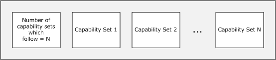

Figure 2: Combined capability set structure

Information exchanged in the capability sets includes data such as supported PDUs and drawing orders, desktop dimensions, and allowed color depths, cache structures, and feature support. When the capability sets are received, the client and host each perform a merge operation between their capabilities and the peer capabilities so that all NetMeeting traffic on the wire is consistent with negotiated expectations and can be processed by each node.

<a id="Section_1.8"></a>
## 1.8 Vendor-Extensible Fields

None.

<a id="Section_1.9"></a>
## 1.9 Standards Assignments

The T.120 protocol uses the TCP port 1503. The Microsoft NetMeeting Protocol does not modify this.

<a id="Section_2"></a>
# 2 Messages

<a id="Section_2.1"></a>
## 2.1 Transport

The Microsoft NetMeeting Protocol specifies transport layers as in [[T120]](https://go.microsoft.com/fwlink/?LinkId=93311).

The Ethernet, IP, TCP, and TPKT ([[RFC1006]](https://go.microsoft.com/fwlink/?LinkId=103612) section 5) layers MUST be present. The X.224 protocol, T.125, and the Microsoft NetMeeting Protocol SHOULD be present. User data MUST be present as the last bytes in each package or message.

<a id="Section_2.2"></a>
## 2.2 Message Syntax

<a id="Section_2.2.1"></a>
### 2.2.1 Common Data Structures

The following data structures and values are referred to in multiple locations in this document. They are initially defined and then referenced again from within the document.

<a id="Section_2.2.1.1"></a>
#### 2.2.1.1 Common Definitions

<a id="Section_2.2.1.1.1"></a>
##### 2.2.1.1.1 The x,y Coordinate System

References to the x,y coordinate systems in this documentation are based on a system that defines the 0,0 position as the upper-left corner. Positive x numbers are defined as moving to the right in the coordinate system, and positive y numbers move down.

<a id="Section_2.2.1.2"></a>
#### 2.2.1.2 Common Field Values

<a id="Section_2.2.1.2.1"></a>
##### 2.2.1.2.1 BackMode

The BackMode enumeration describes the background color that is used to fill a specific region on a drawing surface.

typedef enum

{

TRANSPARENT = 0x00000001,

OPAQUE = 0x00000002

} BackMode;

**TRANSPARENT:** The region is filled with the background color before drawing is performed.

**OPAQUE:** The region is not filled with the background color before drawing is done.

<a id="Section_2.2.1.2.2"></a>
##### 2.2.1.2.2 BrushHatch

The BrushHatch enumeration describes the six predefined logical hatch brushes that are maintained by the graphics device interface (GDI). These are used as fill patterns on a drawing surface.

typedef enum

{

HS_HORIZONTAL = 0x00000000,

HS_VERTICAL = 0x00000001,

HS_FDIAGONAL = 0x00000002,

HS_BDIAGONAL = 0x00000003,

HS_CROSS = 0x00000004,

HS_DIAGCROSS = 0x00000005

} BrushHatch;

**HS_HORIZONTAL:** The lines are horizontal.

**HS_VERTICAL:** The lines are vertical.

**HS_FDIAGONAL:** A 45-degree downward, left-to-right line.

**HS_BDIAGONAL:** A 45-degree upward, right-to-left line.

**HS_CROSS:** Both HS_HORIZONTAL and HS_VERTICAL lines.

**HS_DIAGCROSS:** Both HS_FDIAGONAL and HS_BDIAGONAL lines.

<a id="Section_2.2.1.2.3"></a>
##### 2.2.1.2.3 BrushStyle

The BrushStyle enumeration defines the style and pattern of a physical brush to be used on a drawing surface.

typedef enum

{

BS_SOLID = 0x00000000,

BS_NULL = 0x00000001,

BS_HATCHED = 0x00000002,

BS_PATTERN = 0x00000003

} BrushStyle;

**BS_SOLID:** The brush uses a solid style.

**BS_NULL:** The brush is not drawn.

**BS_HATCHED:** The brush uses a hatched style.

**BS_PATTERN:** The pattern brush is defined by a device-independent bitmap (DIB) specification.

<a id="Section_2.2.1.2.4"></a>
##### 2.2.1.2.4 PenStyle

The PenStyle enumeration defines the style and width of a pen to be used on a drawing surface.

typedef enum

{

PS_SOLID = 0x00000000,

PS_DASH = 0x00000001,

PS_DOT = 0x00000002,

PS_DASHDOT = 0x00000003,

PS_DASHDOTDOT = 0x00000004,

PS_NULL = 0x00000005,

PS_INSIDEFRAME = 0x00000006

} PenStyle;

**PS_SOLID:** The pen is solid.

**PS_DASH:** The pen is dashed.

**PS_DOT:** The pen is dotted.

**PS_DASHDOT:** The pen has alternating dashes and dots.

**PS_DASHDOTDOT:** The pen has alternating dashes and double dots.

**PS_NULL:** The pen is invisible.

**PS_INSIDEFRAME:** The pen is solid. When this pen is used with a bounding rectangle, the dimensions of the figure are shrunk so that it fits entirely in the bounding rectangle and takes into account the width of the pen. This applies only to geometric pens.

<a id="Section_2.2.1.2.5"></a>
##### 2.2.1.2.5 ROP2

The ROP2 enumeration describes the binary raster operation codes that define how the graphics device interface (GDI) combines the bits from the selected pen with the bits in the destination bitmap.

typedef enum

{

R2_BLACK = 0x00000001,

R2_NOTMERGEPEN = 0x00000002,

R2_MASKNOTPEN = 0x00000003,

R2_NOTCOPYPEN = 0x00000004,

R2_MASKPENNOT = 0x00000005,

R2_NOT = 0x00000006,

R2_XORPEN = 0x00000007,

R2_NOTMASKPEN = 0x00000008,

R2_MASKPEN = 0x00000009,

R2_NOTXORPEN = 0x0000000A,

R2_NOP = 0x0000000B,

R2_MERGENOTPEN = 0x0000000C,

R2_COPYPEN = 0x0000000D,

R2_MERGEPENNOT = 0x0000000E,

R2_MERGEPEN = 0x0000000F,

R2_WHITE = 0x00000010

} ROP2;

**R2_BLACK:** The pixel is always drawn as black.

**R2_NOTMERGEPEN:** The pixel is the inverse of the R2_MERGEPEN color.

**R2_MASKNOTPEN:** The pixel is a combination of the colors that are common to both the screen and the inverse of the pen.

**R2_NOTCOPYPEN:** The pixel is the inverse of the pen color.

**R2_MASKPENNOT:** The pixel is a combination of the colors that are common to both the pen and the inverse of the screen.

**R2_NOT:** The pixel is the inverse of the screen color.

**R2_XORPEN:** The pixel is a combination of the colors in the pen and in the screen, but not in both.

**R2_NOTMASKPEN:** The pixel is the inverse of the R2_MASKPEN color.

**R2_MASKPEN:** The pixel is a combination of the colors that are common to both the pen and the screen.

**R2_NOTXORPEN:** The pixel is the inverse of the R2_XORPEN color.

**R2_NOP:** The pixel remains unchanged.

**R2_MERGENOTPEN:** The pixel is a combination of the screen color and the inverse of the pen color.

**R2_COPYPEN:** The pixel always has the color of the pen.

**R2_MERGEPENNOT:** The pixel is a combination of the pen color and the inverse of the screen color.

**R2_MERGEPEN:** The pixel is a combination of the pen color and the screen color.

**R2_WHITE:** The pixel is always drawn as white.

<a id="Section_2.2.2"></a>
### 2.2.2 Application Sharing

The Microsoft NetMeeting Protocol specifies a method of application sharing over the T.120 [**Multipoint Communication Service (MCS)**](#gt_multipoint-communication-service-mcs) layer by using the [S20 MCS Channel](#Section_44fb24fb0f4a493e951551ccc1d94698).

The NetMeeting S20 (Application Sharing) protocol was developed before the T.128 specification became available. It is essentially the same protocol with some minor exceptions. For a detailed description of how the S20 protocol works in conjunction with the T.120 protocol set, please refer to the ITU T.128 (Application Sharing) Protocol documentation [[T128-06/08]](https://go.microsoft.com/fwlink/?LinkId=144118).

**Note:** all unsigned 16-bit and unsigned 32-bit values are specified in little-endian format. The packet version and type bit fields are transferred as a single unsigned 16-bit integer variable. Depending on the hardware architectures of the client and the server, multiple-byte little-endian versus big-endian reordering can determine how this variable is marshaled by the sender and interpreted by the receiver.

<a id="Section_2.2.2.1"></a>
#### 2.2.2.1 CPCALLCAPS

The CPCALLCAPS structure defines the capabilities of an [**application-sharing session**](#gt_application-sharing-session) node.

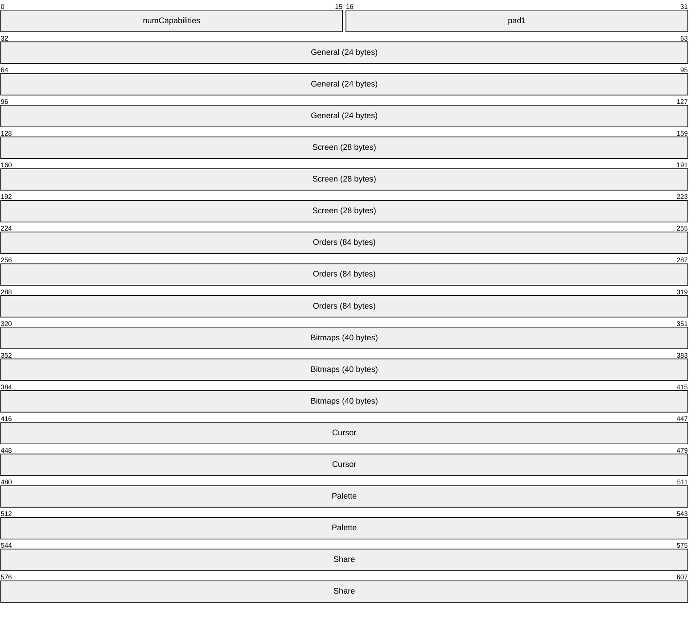

**numCapabilities (2 bytes):** MUST be set to 0x0007.

**pad1 (2 bytes):** Reserved. MUST be set to zero when sent and MUST be ignored on receipt.

**General (24 bytes):** A [PROTCAPS_GENERAL](#Section_2.2.2.1.3) packet that describes the general capabilities of the node.

**Screen (28 bytes):** A [PROTCAPS_SCREEN](#Section_2.2.2.1.7) packet that describes the screen capabilities of the node.

**Orders (84 bytes):** A [PROTCAPS_ORDERS](#Section_2.2.2.1.4) packet that describes the orders supported by the node.

**Bitmaps (40 bytes):** A [PROTCAPS_BITMAPCACHE](#Section_2.2.2.1.1) packet that describes the bitmap cache of the node.

**Cursor (8 bytes):** A [PROTCAPS_CM](#Section_2.2.2.1.2) packet that describes the cursor capabilities of the node.

**Palette (8 bytes):** A [PROTCAPS_PM](#Section_2.2.2.1.5) packet that describes the palette cache of the node.

**Share (8 bytes):** A [PROTCAPS_SC](#Section_2.2.2.1.6) packet that identifies the user.

<a id="Section_2.2.2.1.1"></a>
##### 2.2.2.1.1 PROTCAPS_BITMAPCACHE

The PROTCAPS_BITMAPCACHE structure describes the bitmap cache that is used by a node of an [**application-sharing session**](#gt_application-sharing-session).

The caps* elements define the allowance of bitmap caching for the [**S20**](#gt_s20) protocol. Bitmap caching enables increased performance by allowing a remote node to send bitmap information and assign it a reference that can be used later instead of retransmitting the bitmap information again. The protocol allows for three bitmap cache sizes:

- Small: 16x16xBPP (bits per pixel)
- Medium: 32x32xBPP
- Large: 64x64xBPP
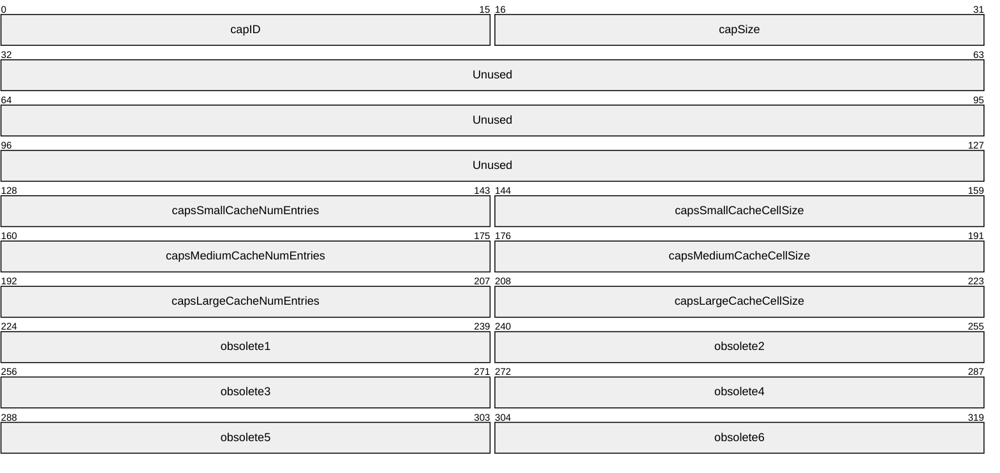

**capID (2 bytes):** MUST be set to 0x0004.

**capSize (2 bytes):** MUST be set to 0x0028 (40).

**Unused (12 bytes):** Reserved. MUST be set to zero when sent and MUST be ignored on receipt.

**capsSmallCacheNumEntries (2 bytes):** The number of entries in the small bitmap cache that is allocated on the local node.

**capsSmallCacheCellSize (2 bytes):** The size, in bytes, of bitmaps in the small bitmap cache that is allocated on the local node.

**capsMediumCacheNumEntries (2 bytes):** The number of entries in the medium bitmap cache that is allocated on the local node.

**capsMediumCacheCellSize (2 bytes):** The size, in bytes, of bitmaps in the medium bitmap cache that is allocated on the local node.

**capsLargeCacheNumEntries (2 bytes):** The number of entries in the large bitmap cache that is allocated on the local node.

**capsLargeCacheCellSize (2 bytes):** The size, in bytes, of bitmaps in the large bitmap cache that is allocated on the local node.

**obsolete1 (2 bytes):** MUST be set to 0x7FFF.

**obsolete2 (2 bytes):** MUST be set to 0x7FFF.

**obsolete3 (2 bytes):** MUST be set to 0x7FFF.

**obsolete4 (2 bytes):** MUST be set to 0x7FFF.

**obsolete5 (2 bytes):** MUST be set to 0x7FFF.

**obsolete6 (2 bytes):** MUST be set to 0x7FFF.

<a id="Section_2.2.2.1.2"></a>
##### 2.2.2.1.2 PROTCAPS_CM

The PROTCAPS_CM structure describes the cursor capabilities of an [**application-sharing session**](#gt_application-sharing-session) node.

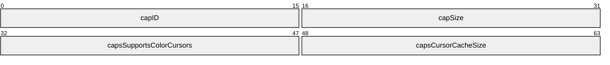

**capID (2 bytes):** MUST be set to 0x0008.

**capSize (2 bytes):** MUST be set to 0x0008.

**capsSupportsColorCursors (2 bytes):** MUST be set to 0x0000 or 0x0001. If set to 0x0001, the node supports color cursors. If set to 0x0000, the node does not support color cursors.

| Name | Value |
| --- | --- |
| COLOR_CURSOR_NOT_SUPPORTED | 0x0000 |
| COLOR_CURSOR_SUPPORTED | 0x0001 |

**capsCursorCacheSize (2 bytes):** The number of elements that the cursor cache for the node can contain.

<a id="Section_2.2.2.1.3"></a>
##### 2.2.2.1.3 PROTCAPS_GENERAL

The PROTCAPS_GENERAL structure describes the general capabilities of an [**application-sharing session**](#gt_application-sharing-session) node.

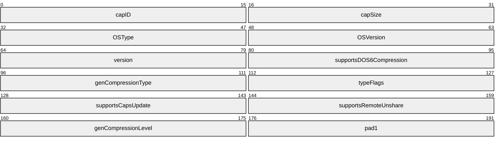

**capID (2 bytes):** MUST be set to 0x0001.

**capSize (2 bytes):** MUST be set to 0x0018 (24).

**OSType (2 bytes):** MUST be set to 0x0001 for the operating system.

**OSVersion (2 bytes):** The version of the operating system that is being used, if any.<2>

**version (2 bytes):** The following values indicate which version of conferencing software is supported by the node:

| Value | Meaning |
| --- | --- |
| CAPS_VERSION_20 0x0200 | Supports only Microsoft NetMeeting 2.x. |
| CAPS_VERSION_30 0x0300 | Supports versions 2.x and 3 of NetMeeting. If this value is enabled, full-screen application sharing is enabled as well as passing control of shared applications to other nodes. |

**supportsDOS6Compression (2 bytes):** Obsolete. MUST be set to 0x0002.

**genCompressionType (2 bytes):** The following values indicate the types of compression that are supported by the node. These values MAY be OR’d together to indicate that both types of compression are supported.

| Value | Meaning |
| --- | --- |
| 0x0000 | No compression format is supported. |
| CT_NO_DICTIONARY 0x0001 | Uses compression without a persistent dictionary. |
| CT_PERSIST_DICTIONARY 0x0002 | Uses compression with a persistent dictionary for each type of S20_DATA message. |

Compression is applied to the [S20_DATA](#Section_2.2.2.4) packet payloads that are larger than, or equal to, 4096 bytes. For more information, see [[RFC1951]](https://go.microsoft.com/fwlink/?LinkId=90302).

**typeFlags (2 bytes):** Flags indicating the mode that the conferencing software is running in:

| 0 | 1 | 2 | 3 | 4 | 5 | 6 | 7 | 8 | 9 | 1 0 | 1 | 2 | 3 | 4 | 5 |
| --- | --- | --- | --- | --- | --- | --- | --- | --- | --- | --- | --- | --- | --- | --- | --- |
| 0 | 0 | 0 | 0 | 0 | 0 | 0 | 0 | 0 | 0 | 0 | 0 | 0 | 0 | U | S |

Where the bits are defined as:

| Value | Description |
| --- | --- |
| U | If no user is currently logged on for this session, set this bit to 1. |
| S | If the node is running in the background and waiting for a connection, set this bit to 1. |

Bits marked 0 MUST be set to zero.

**supportsCapsUpdate (2 bytes):** MUST be set to 0x0000 or 0x0001. If set to 0x0001, the node supports receiving capability changes. If set to 0x0000, the node does not support receiving capability changes.

| Value | Meaning |
| --- | --- |
| 0x0000 | Does not support receiving capability changes. |
| 0x0001 | Supports receiving capability changes. |

**supportsRemoteUnshare (2 bytes):** Reserved. MUST be set to "0x0002".

**genCompressionLevel (2 bytes):** The following values indicate the level of compression that are supported by the node:

| Value | Meaning |
| --- | --- |
| CAPS_GEN_COMPRESSION_LEVEL_0 0x0001 | Only compression that has a persistent dictionary for each type of S20_DATA message is supported. |
| CAPS_GEN_COMPRESSION_LEVEL_1 0x0002 | Any compression method that is supported by both the sender and receiver is allowed. |

**pad1 (2 bytes):** Reserved. MUST be set to zero when sent and MUST be ignored on receipt.

<a id="Section_2.2.2.1.4"></a>
##### 2.2.2.1.4 PROTCAPS_ORDERS

The PROTCAPS_ORDERS structure describes the orders that are supported by a node of an [**application-sharing session**](#gt_application-sharing-session).

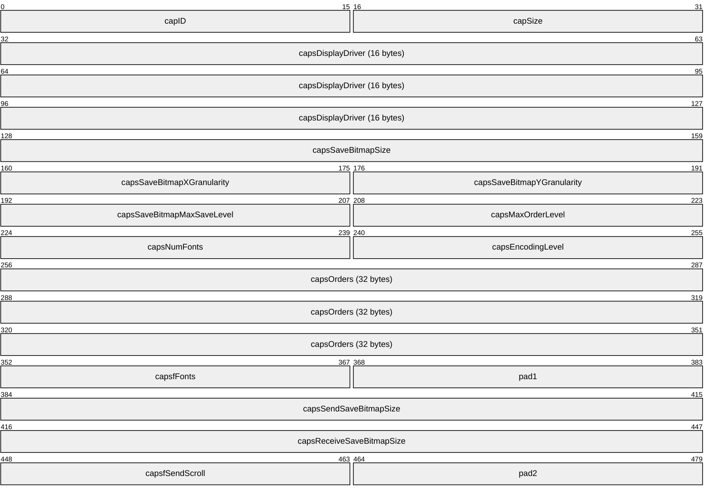

**capID (2 bytes):** MUST be set to 0x0003.

**capSize (2 bytes):** MUST be set to 0x0054 (84).

**capsDisplayDriver (16 bytes):** Reserved. MUST be set to zero when sent and MUST be ignored on receipt.

**capsSaveBitmapSize (4 bytes):** The bitmap size that the node uses for [SaveBitmap](#Section_2.2.2.4.10.1.27) orders. MUST be set to 0x00027100 (160000).

**capsSaveBitmapXGranularity (2 bytes):** MUST be set to 0x0001.

**capsSaveBitmapYGranularity (2 bytes):** MUST be set to 0x0014 (20).

**capsSaveBitmapMaxSaveLevel (2 bytes):** MUST be set to 0x0000.

**capsMaxOrderLevel (2 bytes):** MUST be set to 0x0001.

**capsNumFonts (2 bytes):** Is 0x0000 when unable to determine fonts in the system ( error ); otherwise it varies depending upon the maximum number of current fonts in the list derived from the system.

**capsEncodingLevel (2 bytes):** MUST be set to 0x0002.

**capsOrders (32 bytes):** An array of bytes that contain 1, to indicate support for a specified order; and 0, to indicate lack of support for a specified order.

| Value | Meaning |
| --- | --- |
| 0x00 | Support for a [DstBlt](#Section_2.2.2.4.10.1.7) order that contains a raster transfer of a rectangle. |
| 0x01 | Support for a [PatBlt](#Section_2.2.2.4.10.1.21) order that contains a brush paint. |
| 0x02 | Support for a [ScreenBlt](#Section_2.2.2.4.10.1.28) order that contains a bit-block transfer between regions of the screen. |
| 0x03 | Reserved. MUST be set to 1 and ignored upon receipt. |
| 0x04 | Reserved. MUST be set to 1 and ignored upon receipt. |
| 0x05 | Support for a [TextOrder](#Section_2.2.2.4.10.1.29) that contains a string. |
| 0x06 | Support for an [ExtTextOrder](#Section_2.2.2.4.10.1.9) that contains a string to be displayed and positions for the individual characters. |
| 0x07 | Support for a [RectangleOrder](#Section_2.2.2.4.10.1.25) that contains a rectangle. |
| 0x08 | Support for a [LineOrder](#Section_2.2.2.4.10.1.10) that contains a line. |
| 0x09 | Reserved. MUST be set to zero when sent and MUST be ignored on receipt. |
| 0x0A | Support for an [OpaqueRect](#Section_2.2.2.4.10.1.14) order that contains an opaque rectangle. |
| 0x0B | Support for a SaveBitmap order that contains a region of the screen that the receiver MUST save or restore. |
| 0x0C | Reserved. MUST be set to zero when sent and MUST be ignored on receipt. |
| 0x0D | Support for a [MemBlt](#Section_2.2.2.4.10.1.12) order that contains a transfer from the bitmap cache to the screen. |
| 0x0E | Support for a [Mem3Blt](#Section_2.2.2.4.10.1.11) order that contains a transfer from the bitmap cache to the screen using a brush. |
| 0x0F | Support for a [PolygonOrder](#Section_2.2.2.4.10.1.24) that contains a polygon. |
| 0x10 | Support for a [PieOrder](#Section_2.2.2.4.10.1.22) that contains a pie wedge. |
| 0x11 | Support for an [EllipseOrder](#Section_2.2.2.4.10.1.8) that contains an ellipse. |
| 0x12 | Support for an [ArcOrder](#Section_2.2.2.4.10.1.1) that contains an arc. |
| 0x13 | Support for a [ChordOrder](#Section_2.2.2.4.10.1.4) that contains a chord. |
| 0x14 | Support for a [PolyBezierOrder](#Section_2.2.2.4.10.1.23) that contains one or more Bezier curves. |
| 0x15 | Support for a [RoundRectOrder](#Section_2.2.2.4.10.1.26) that contains a rectangle with rounded corners. |
| 0x16 | The last ten bytes for orders are undefined. |
| 0x17 | Reserved. MUST be set to zero when sent and MUST be ignored on receipt. |
| 0x18 | Reserved. MUST be set to zero when sent and MUST be ignored on receipt. |
| 0x19 | Reserved. MUST be set to zero when sent and MUST be ignored on receipt. |
| 0x1A | Reserved. MUST be set to zero when sent and MUST be ignored on receipt. |
| 0x1B | Reserved. MUST be set to zero when sent and MUST be ignored on receipt. |
| 0x1C | Reserved. MUST be set to zero when sent and MUST be ignored on receipt. |
| 0x1D | Reserved. MUST be set to zero when sent and MUST be ignored on receipt. |
| 0x1E | Reserved. MUST be set to zero when sent and MUST be ignored on receipt. |
| 0x1F | Reserved. MUST be set to zero when sent and MUST be ignored on receipt. |

**capsfFonts (2 bytes):** MUST be set to 0x03B5.

**pad1 (2 bytes):** Reserved. MUST be set to zero when sent and MUST be ignored on receipt.

**capsSendSaveBitmapSize (4 bytes):** MUST be set to 0x00027100 (160000).

**capsReceiveSaveBitmapSize (4 bytes):** MUST be set to 0x00027100 (160000).

**capsfSendScroll (2 bytes):** Reserved. MUST be set to zero when sent and MUST be ignored on receipt.

**pad2 (2 bytes):** Reserved. MUST be set to zero when sent and MUST be ignored on receipt.

<a id="Section_2.2.2.1.5"></a>
##### 2.2.2.1.5 PROTCAPS_PM

The PROTCAPS_PM structure describes the palette cache of an [**application-sharing session**](#gt_application-sharing-session) node.

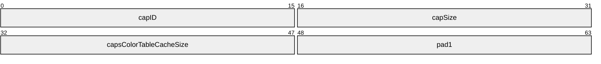

**capID (2 bytes):** MUST be set to 0x000A (10).

**capSize (2 bytes):** MUST be set to 0x0008.

**capsColorTableCacheSize (2 bytes):** MUST be set to 0x0006.

**pad1 (2 bytes):** Reserved. MUST be set to zero when sent and MUST be ignored on receipt.

<a id="Section_2.2.2.1.6"></a>
##### 2.2.2.1.6 PROTCAPS_SC

The PROTCAPS_SC structure identifies the user.

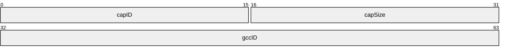

**capID (2 bytes):** MUST be set to 0x0009.

**capSize (2 bytes):** MUST be set to 0x0008.

**gccID (4 bytes):** The same user identifier that is used in the [**Multipoint Communication Service (MCS)**](#gt_multipoint-communication-service-mcs) [[T122]](https://go.microsoft.com/fwlink/?LinkId=94993) layer. For more information about the MCS user ID, see [T122] section 3 (Definitions) in the ITU-T Recommendation.

<a id="Section_2.2.2.1.7"></a>
##### 2.2.2.1.7 PROTCAPS_SCREEN

The PROTCAPS_SCREEN structure describes the screen capabilities of an [**application-sharing session**](#gt_application-sharing-session) node.

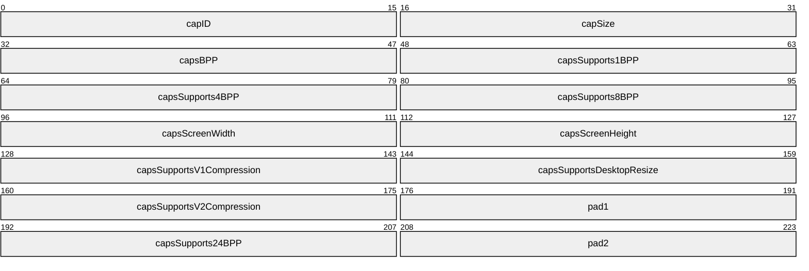

**capID (2 bytes):** MUST be set to 0x0002.

**capSize (2 bytes):** MUST be set to 0x001C (28).

**capsBPP (2 bytes):** MUST be set to the bits per pixel currently in use by the node.

**capsSupports1BPP (2 bytes):** MUST be set to 0x0002 or 0x0001. If set to 0x0001, the node supports 1-bit-per-pixel screens. If set to 0x0002, the node does not support 1-bit-per-pixel screens.

| Value | Meaning |
| --- | --- |
| 0x0002 | Does not support 1-bit-per-pixel screens. |
| 0x0001 | Supports 1-bpp screens. |

**capsSupports4BPP (2 bytes):** MUST be set to 0x0002 or 0x0001. If set to 0x0001, the node supports 4-bits-per-pixel screens. If set to 0x0002, the node does not support 4-bits-per-pixel screens.

| Value | Meaning |
| --- | --- |
| 0x0002 | Does not support 4-bpp screens. |
| 0x0001 | Supports 4-bpp screens. |

**capsSupports8BPP (2 bytes):** MUST be set to 0x0002 or 0x0001. If set to 0x0001, the node supports 8-bits-per-pixel screens. If set to 0x0002, the node does not support 8-bits-per-pixel screens.

| Value | Meaning |
| --- | --- |
| 0x0002 | Does not support 8-bpp screens. |
| 0x0001 | Supports 8-bpp screens. |

**capsScreenWidth (2 bytes):** MUST be set to the width, in pixels, of the screen that is currently in use by the node.

**capsScreenHeight (2 bytes):** MUST be set to the height, in pixels, of the screen that is currently in use by the node.

**capsSupportsV1Compression (2 bytes):** MUST be set to 0x0002 or 0x0001. If set to 0x0001, the node supports NetMeeting 2.x compression of bitmaps. If set to 0x0002, the node does not support NetMeeting 2.x compression of bitmaps.

| Value | Meaning |
| --- | --- |
| 0x0002 | Does not support NetMeeting 2.x compression of bitmaps. |
| 0x0001 | Supports NetMeeting 2.x compression of bitmaps. |

**capsSupportsDesktopResize (2 bytes):** MUST be set to 0x0002 or 0x0001. If set to 0x0001, the node supports resizing its desktop. If set to 0x0002, the node does not support resizing its desktop.

| Value | Meaning |
| --- | --- |
| 0x0002 | Does not support desktop resizing. |
| 0x0001 | Supports desktop resizing. |

**capsSupportsV2Compression (2 bytes):** MUST be set to 0x0002 or 0x0001. If set to 0x0001, the node supports NetMeeting 3 compression of bitmaps. If set to 0x0002, the node does not support NetMeeting 3 compression of bitmaps.

| Value | Meaning |
| --- | --- |
| 0x0002 | Does not support NetMeeting 3 compression of bitmaps. |
| 0x0001 | Supports NetMeeting 3 compression of bitmaps. |

**pad1 (2 bytes):** Reserved. MUST be set to zero when sent and MUST be ignored on receipt.

**capsSupports24BPP (2 bytes):** MUST be set to 0x0002 or 0x0001. If set to 0x0001, the node supports 24-bits-per-pixel screens. If set to 0x0002, the node does not support 24-bits-per-pixel screens.

| Value | Meaning |
| --- | --- |
| 0x0002 | Does not support 24-bpp screens. |
| 0x0001 | Supports 24-bpp screens. |

**pad2 (2 bytes):** Reserved. MUST be set to zero when sent and MUST be ignored on receipt.

<a id="Section_2.2.2.2"></a>
#### 2.2.2.2 S20_CREATE

The S20_CREATE packet is sent by a host to create a new [**application-sharing session**](#gt_application-sharing-session).

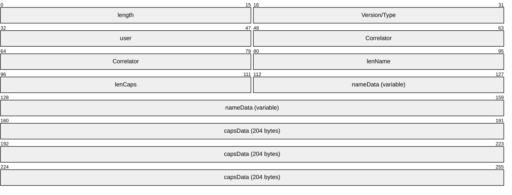

**length (2 bytes):** The length, in bytes, of the packet including the 2 bytes required for this length value.

**Version/Type (2 bytes):** MUST be set to 0x0031.

**user (2 bytes):** The local identifier of the user, which is obtained from the [**Multipoint Communication Service (MCS)**](#gt_multipoint-communication-service-mcs) [[T122]](https://go.microsoft.com/fwlink/?LinkId=94993) layer. For more information about the MCS user ID, see [T122] section 3 (Definitions) in the ITU-T Recommendation.

**Correlator (4 bytes):** The unique identifier for the new session. The first two bytes are the MCS user identifier (described previously) followed by a monotonically increasing 2-byte sequence number that starts at zero.

**lenName (2 bytes):** The length, in bytes, of **nameData**.

**lenCaps (2 bytes):** The length, in bytes, of **capsData**.

**nameData (variable):** A null-terminated array of 8-bit, unsigned [**ASCII**](#gt_ascii) characters, up to 65,535 characters in length. The name of the user.

**capsData (204 bytes):** A [CPCALLCAPS](#Section_2.2.2.1) structure that describes the capabilities of the sender.

<a id="Section_2.2.2.3"></a>
#### 2.2.2.3 S20_COLLISION

The S20_COLLISION packet is sent to indicate that an [**application-sharing session**](#gt_application-sharing-session) already exists with the correlator that is specified in the original [S20_CREATE](#Section_2.2.2.2) packet. In the case of a collision, the existing application-sharing session MUST be terminated.

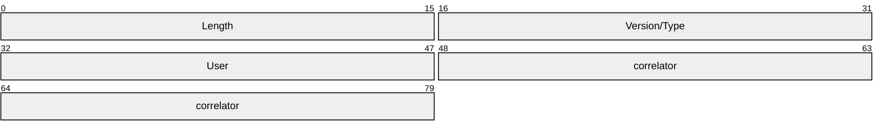

**Length (2 bytes):** The length, in bytes, of the packet including the 2 bytes required for this length value.

**Version/Type (2 bytes):** MUST be set to 0x0038.

**User (2 bytes):** The local identifier of the user, which is obtained from the [**Multipoint Communication Service (MCS)**](#gt_multipoint-communication-service-mcs) [[T122]](https://go.microsoft.com/fwlink/?LinkId=94993) layer. For more information about the MCS user ID, see [T122] section 3 (Definitions) in the ITU-T Recommendation.

**correlator (4 bytes):** The unique identifier for the new session. The first two bytes are the MCS user identifier (above), followed by a monotonically increasing 2-byte sequence number that starts at zero.

<a id="Section_2.2.2.4"></a>
#### 2.2.2.4 S20_DATA

The S20_DATA packet is used by a host or client to send data to an [**application-sharing session**](#gt_application-sharing-session).

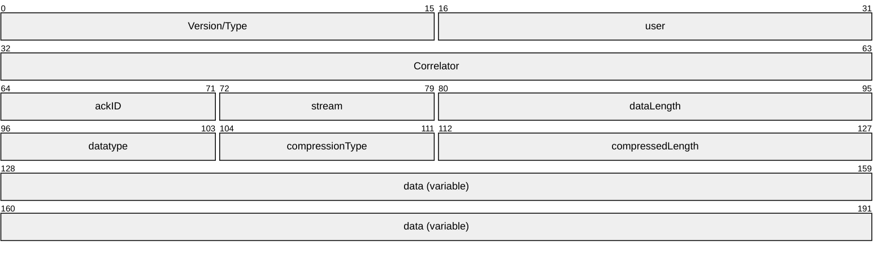

**Version/Type (2 bytes):** MUST be set to 0x0037.

**user (2 bytes):** The local identifier of the user, which is obtained from the [**Multipoint Communication Service (MCS)**](#gt_multipoint-communication-service-mcs) [[T122]](https://go.microsoft.com/fwlink/?LinkId=94993) layer. For more information about the MCS user ID, see [T122] section 3 (Definitions) in the ITU-T Recommendation.

**Correlator (4 bytes):** The unique identifier for the new session. The first two bytes are the MCS user identifier (above) followed by a monotonically increasing 2-byte sequence number that starts at zero.

**ackID (1 byte):** Reserved. SHOULD be set to zero when sent and SHOULD be ignored on receipt.

**stream (1 byte):** The type of stream message being transmitted.

| Value | Meaning |
| --- | --- |
| STREAM_UPDATES 0x01 | Sends window update information. |
| STREAM_MISC 0x02 | Sends cursor update information. |
| STREAM_UNUSED 0x00 | Reserved. MUST be set to zero when sent and MUST be ignored on receipt. |
| STREAM_INPUT 0x04 | Sends mouse movement update information. |

**dataLength (2 bytes):** The combined uncompressed size, in bytes, of the following **data** fields: **datatype**, **compressionType**, and **compressedLength**.

**datatype (1 byte):** The following values indicate the contents of the **data** field.

| Value | Meaning |
| --- | --- |
| DT_AWC 0x17 | An [ActiveWindowPDU](#Section_2.2.2.4.1) packet. |
| DT_CA 0x14 | A [Control Order for Application Sharing](#Section_253af98e8e324010a230378f62147870) packet. This type of packet will be sent if **CAPS_VERSION_20** is set in the **version** field in the [PROTCAPS_GENERAL](#Section_2.2.2.1.3) structure. |
| DT_CA30 0x15 | A [Control Order for Application Sharing Enhanced](#Section_616877483ba14dff99f335c06546891f) packet. This type of packet will be sent if **CAPS_VERSION_30** is set from the version field in the PROTCAPS_GENERAL structure. |
| DT_CM 0x1B | A [Cursor Management Order](#Section_2.2.2.4.2) packet. |
| DT_CPC 0x20 | A [Screen Capabilities Update](#Section_2.2.2.1.7) packet. |
| DT_FH 0x0B | A [Font List](#Section_2.2.2.4.5) packet. |
| DT_HET30 0x16 | For a [Host Tracking](#Section_2.2.2.4.6) packet. |
| DT_HET 0x19 | For a NetMeeting 2 compatible Host Tracking packet. |
| DT_IM 0x1C | An [Input PDU](#Section_2.2.2.4.7) packet. |
| DT_SNI 0x1F | A [Synchronization Order](#Section_2.2.2.4.9) packet. |
| DT_SWL 0x18 | A [Shared Window List](#Section_2.2.2.4.8) packet. |
| DT_UP 0x02 | An [Update Order](#Section_2.2.2.4.10) packet. |

**compressionType (1 byte):** The following values indicate the type of compression that is used for the **data** field:

| Value | Meaning |
| --- | --- |
| 0x00 | Uncompressed. |
| CT_NO_DICTIONARY 0x01 | Uses compression without a persistent dictionary. |
| CT_PERSIST_DICTIONARY 0x02 | Uses compression with a persistent dictionary for each type of S20_DATA message. |

Compression is applied to the S20_DATA packet payloads that are larger than or equal to 4,096 bytes. For more information, see [[RFC1951]](https://go.microsoft.com/fwlink/?LinkId=90302).

**compressedLength (2 bytes):** The combined size, in bytes, of **data** when it is compressed, **datatype**, **compressionType**, and **compressedLength**.

**data (variable):** One of the data structures that are appropriate to the value of the **datatype** field.

<a id="Section_2.2.2.4.1"></a>
##### 2.2.2.4.1 ActiveWindowPDU

The ActiveWindowPDU order manages the currently active, shared window.

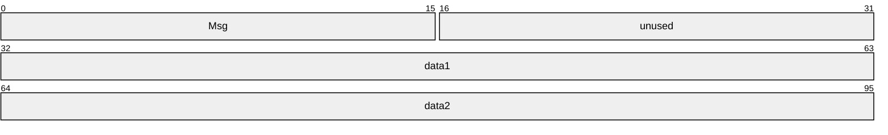

**Msg (2 bytes):** The following values indicate the window message.

| Value | Meaning |
| --- | --- |
| AWC_MSG_ACTIVE_CHANGE_LOCAL 0x0001 | The foreground window has changed. |
| AWC_MSG_ACTIVE_CHANGE_SHARED 0x0002 | The shared window state has changed. |
| AWC_MSG_ACTIVE_CHANGE_INVISIBLE 0x0003 | The shared window has become invisible. |
| AWC_MSG_ACTIVATE_WINDOW 0x8001 | The sender is requesting activation of the shared window. |
| AWC_MSG_RESTORE_WINDOW 0x8003 | The sender is requesting restoration of the shared window. |
| AWC_MSG_SAS 0x8005 | The sender is sending a CTRL+ALT+DELETE key sequence. |

**unused (2 bytes):** MUST be set to 0xFFFF.

**data1 (4 bytes):** If **msg** is set to one of the following values, this field MUST be set to the unique identifier for the window that is being application-shared. Otherwise, this field is unused.

- AWC_MSG_ACTIVE_CHANGE_LOCAL
- AWC_MSG_ACTIVE_CHANGE_SHARED
- AWC_MSG_ACTIVE_CHANGE_INVISIBLE
- AWC_MSG_ACTIVATE_WINDOW
- AWC_MSG_RESTORE_WINDOW
**data2 (4 bytes):** Reserved. MUST be set to zero when sent and MUST be ignored on receipt.

<a id="Section_2.2.2.4.2"></a>
##### 2.2.2.4.2 Cursor Management Orders

The following cursor management orders update the cursor position and shape of the receiver:

| Name | Description |
| --- | --- |
| [CursorId](#Section_2.2.2.4.2.1) | Instructs the receiver to display a system cursor. |
| [CursorMove](#Section_2.2.2.4.2.2) | Contains a cursor movement. |
| [SendMonoCursor](#Section_2.2.2.4.2.5) | Contains a monochrome cursor that the receiver SHOULD display. |
| [SendColorCursor](#Section_2.2.2.4.2.3) | Contains a color cursor that the receiver SHOULD display. |
| [SendColorCursorCacheId](#Section_2.2.2.4.2.4) | Contains the cache identifier of a cursor that the receiver SHOULD display. |

<a id="Section_2.2.2.4.2.1"></a>
###### 2.2.2.4.2.1 CursorId

The CursorId order instructs the receiver to display a system cursor.

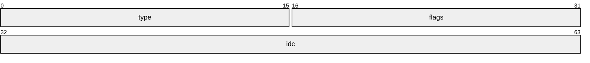

**type (2 bytes):** MUST be set to 0x0001.

**flags (2 bytes):** MUST be set to 0x0000.

**idc (4 bytes):** MUST be set to one of the cursor identifiers to display from the following list.

| Value | Meaning |
| --- | --- |
| CM_IDC_NULL 0x00000000 | The cursor is hidden. |
| CM_IDC_ARROW 0x00007F00 | The standard arrow cursor is displayed. |

<a id="Section_2.2.2.4.2.2"></a>
###### 2.2.2.4.2.2 CursorMove

The CursorMove order contains a cursor movement.

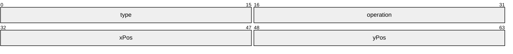

**type (2 bytes):** MUST be set to 0x0003.

**operation (2 bytes):** One of the following values that describes the operation.

| Value | Meaning |
| --- | --- |
| default 0x0000 | The receiver SHOULD only move the cursor to the specified location when the receiver is in control of the session. |
| CM_SYNC_CURSORPOS 0x0001 | The receiver SHOULD always move the cursor to the specified location. |

**xPos (2 bytes):** The new x-coordinate, in screen coordinates, of the cursor.

**yPos (2 bytes):** The new y-coordinate, in screen coordinates, of the cursor.

<a id="Section_2.2.2.4.2.3"></a>
###### 2.2.2.4.2.3 SendColorCursor

The SendColorCursor order contains a color cursor that the receiver SHOULD use.

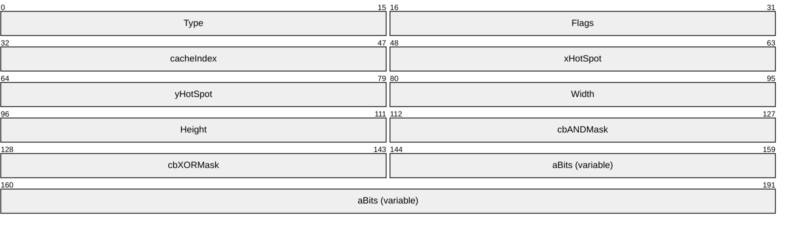

**Type (2 bytes):** MUST be set to 0x0006.

**Flags (2 bytes):** MUST be set to 0x0000.

**cacheIndex (2 bytes):** Specifies a cache identifier to reference this cursor in future cursor operations instead of having to send the cursor data repeatedly in its entirety. Used in subsequent calls to [SendColorCursorCacheId](#Section_2.2.2.4.2.4).

**xHotSpot (2 bytes):** The hot spot x-coordinate within the cursor. By default, the hot spot is set to the upper-left corner of the cursor (coordinates 0,0).<3>

**yHotSpot (2 bytes):** The hot spot y-coordinate within the cursor. By default, the hot spot is set to the upper-left corner of the cursor (coordinates 0,0).<4>

**Width (2 bytes):** The width, in pixels, of the cursor.

**Height (2 bytes):** The height, in pixels, of the cursor.

**cbANDMask (2 bytes):** The length, in bytes, of the **AND** mask of **aBits**.

**cbXORMask (2 bytes):** The length, in bytes, of the color **XOR** bitmap of **aBits**.

**aBits (variable):** The bits for a color **XOR** bitmap, followed by the bits for an **AND** mask.

<a id="Section_2.2.2.4.2.4"></a>
###### 2.2.2.4.2.4 SendColorCursorCacheId

The SendColorCursorCacheId order contains the cache identifier of a cursor that the receiver SHOULD use.

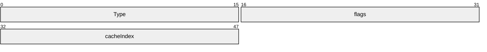

**Type (2 bytes):** MUST be set to 0x0007.

**flags (2 bytes):** MUST be set to 0x0000.

**cacheIndex (2 bytes):** The cache identifier of the cursor that the receiver SHOULD display.

<a id="Section_2.2.2.4.2.5"></a>
###### 2.2.2.4.2.5 SendMonoCursor

The SendMonoCursor order contains a monochrome cursor that the receiver SHOULD use.

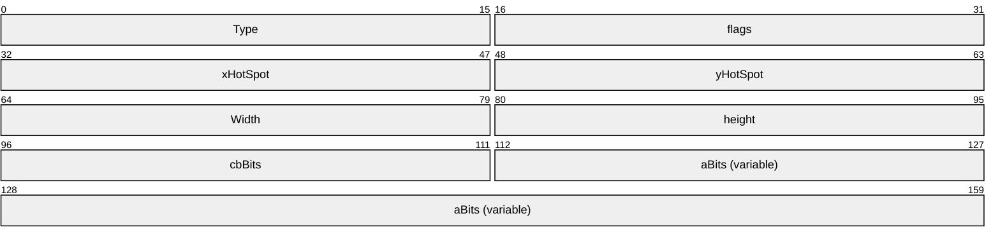

**Type (2 bytes):** MUST be set to 0x0002.

**flags (2 bytes):** MUST be set to 0x0000.

**xHotSpot (2 bytes):** The hot spot x-coordinate within the cursor. By default, the hot spot is set to the upper-left corner of the cursor (coordinates 0,0).<5>

**yHotSpot (2 bytes):** The hot spot y-coordinate within the cursor. By default, the hot spot is set to the upper-left corner of the cursor (coordinates 0,0).<6>

**Width (2 bytes):** The width, in pixels, of the cursor.

**height (2 bytes):** The height, in pixels, of the cursor.

**cbBits (2 bytes):** The length, in bytes, of **aBits**.

**aBits (variable):** The bits for a monochrome **XOR** mask, followed by the bits for a monochrome **AND** mask.

<a id="Section_2.2.2.4.3"></a>
##### 2.2.2.4.3 Control Orders for Application Sharing

The Control Orders for Application Sharing are specified below.

| Name | Description |
| --- | --- |
| [Cooperate](#Section_2.2.2.4.3.1) | Indicates whether the sender is cooperating in controlling the host. |
| [Granted Control](#Section_2.2.2.4.3.2) | Indicates that the sender has accepted control by the receiver. |
| [Notify State](#Section_2.2.2.4.3.3) | Indicates whether the sender is currently controllable. |
| [Request Control](#Section_2.2.2.4.3.4) | Requests control of the receiver by the sender. |

<a id="Section_2.2.2.4.3.1"></a>
###### 2.2.2.4.3.1 Cooperate

The Cooperate order indicates whether the sender is cooperating in controlling the host.

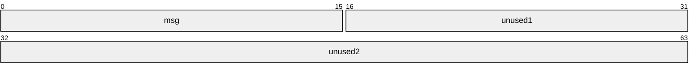

**msg (2 bytes):** If set to 0x0003, the sender is not cooperating with host control. If set to 0x0004, the sender is cooperating to control the host. This order is provided for backward-compatibility with NetMeeting version 2. For NetMeeting version 3, this value MUST be set to 0x0000.

MUST be set to one of the following values:

| Value | Meaning |
| --- | --- |
| 0x0000 | MUST be set to this value for NetMeeting version 3. |
| 0x0003 | The sender is not cooperating with host control. This value is provided for backward-compatibility with NetMeeting version 2. |
| 0x0004 | The sender is cooperating with host control. This value is provided for backward-compatibility with NetMeeting version 2. |

**unused1 (2 bytes):** Reserved. MUST be set to zero when sent and MUST be ignored on receipt.

**unused2 (4 bytes):** Reserved. MUST be set to zero when sent and MUST be ignored on receipt.

<a id="Section_2.2.2.4.3.2"></a>
###### 2.2.2.4.3.2 Granted Control

The Granted Control order indicates that the sender has accepted control by the receiver.

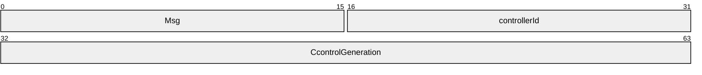

**Msg (2 bytes):** MUST be set to 0x0002.

**controllerId (2 bytes):** The identifier of the user-granted control. This is the user identifier of the node that is in control. If no node is in control, this field is set to zero.

**CcontrolGeneration (4 bytes):** The initial sequence number of the control operation. Whenever the server receives a Granted Control order, it saves the value in this field as the current control generation sequence number. After the server sends a Granted Control order that contains the current control generation sequence number, it increments that sequence number for use in a future Granted Control order, by the value of the local identifier of the user. This identifier is obtained from [**S20**](#gt_s20) packets, such as [S20_CREATE](#Section_2.2.2.2) or [S20_JOIN](#Section_2.2.2.7).

This order is provided for backward compatibility with NetMeeting version 2.

<a id="Section_2.2.2.4.3.3"></a>
###### 2.2.2.4.3.3 Notify State

The Notify State order is broadcast to indicate whether the sender is currently controllable.

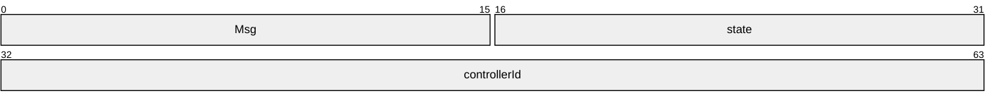

**Msg (2 bytes):** MUST be set to 0x0000.

**state (2 bytes):** MUST be set to 0x0000 or 0x0001. If set to 0x0001, the sender is controllable. If set to 0x0000, the sender is not controllable.

| Value | Meaning |
| --- | --- |
| 0x0000 | The sender is not controllable. |
| 0x0001 | The sender is controllable. |

**controllerId (4 bytes):** The identifier of the client that is currently in control. If no client is in control, **controllerId** MUST be set to 0x00000000.

This order is provided for backward compatibility with NetMeeting version 2.

<a id="Section_2.2.2.4.3.4"></a>
###### 2.2.2.4.3.4 Request Control

The Request Control order requests control of the receiver by the sender.

```mermaid
packet-beta
  0-15: "Msg"
  16-31: "unused1"
  32-63: "unused2"
```

**Msg (2 bytes):** MUST be set to 0x0001.

**unused1 (2 bytes):** Reserved. MUST be set to zero when sent and MUST be ignored on receipt.

**unused2 (4 bytes):** Reserved. MUST be set to zero when sent and MUST be ignored on receipt.

This order is provided for backward compatibility with NetMeeting version 2.

<a id="Section_2.2.2.4.4"></a>
##### 2.2.2.4.4 Control Orders for Application Sharing Enhanced

The following Control Orders for Enhanced Application Sharing are specified below.

| Name | Description |
| --- | --- |
| [Control Pause](#Section_2.2.2.4.4.1) | Informs the receiver that the sender has paused or resumed session control. |
| [Control Released](#Section_2.2.2.4.4.2) | Indicates that the sender is releasing control. |
| [Control Revoked](#Section_2.2.2.4.4.3) | Indicates that the sender has revoked control by the receiver. |
| [Give Control](#Section_2.2.2.4.4.4) | Queries the ability of the receiver to accept session control. |
| [Give Control Reply](#Section_2.2.2.4.4.5) | Accepts or declines the request of the receiver to give control to the sender. |
| [Pass Control](#Section_2.2.2.4.4.6) | Passes control from the sender to the receiver. |
| [Take Control](#Section_2.2.2.4.4.7) | Requests control of the receiver by the sender. |
| [Take Control Reply](#Section_2.2.2.4.4.8) | Accepts or declines the request of the receiver to control the sender. |

<a id="Section_2.2.2.4.4.1"></a>
###### 2.2.2.4.4.1 Control Pause

The Control Pause order informs the receiver that the sender has paused or unpaused control.

```mermaid
packet-beta
  0-31: "Msg"
  32-63: "viewerControlId"
  64-95: "hostControlId"
```

**Msg (4 bytes):** MUST contain either the value 0x00008003 for a pause or the value 0x00008004 for an unpause.

| Value | Meaning |
| --- | --- |
| 0x00008003 | Pause. |
| 0x00008004 | Unpause. |

**viewerControlId (4 bytes):** The unique identifier that is sent with the initial [Take Control](#Section_2.2.2.4.4.7) or [Give Control Reply](#Section_2.2.2.4.4.5) order.

**hostControlId (4 bytes):** The unique identifier that is sent with the initial [Take Control Reply](#Section_2.2.2.4.4.8) or [Give Control](#Section_2.2.2.4.4.4) order.

<a id="Section_2.2.2.4.4.2"></a>
###### 2.2.2.4.4.2 Control Released

The Control Released order indicates that the sender is releasing control.

```mermaid
packet-beta
  0-31: "Msg"
  32-63: "viewerControlId"
  64-95: "hostControlId"
```

**Msg (4 bytes):** MUST contain the value 0x00008001.

**viewerControlId (4 bytes):** The unique identifier that is sent with the initial [Take Control](#Section_2.2.2.4.4.7) or [Give Control Reply](#Section_2.2.2.4.4.5) order.

**hostControlId (4 bytes):** The unique identifier that is sent with the initial [Take Control Reply](#Section_2.2.2.4.4.8) or [Give Control](#Section_2.2.2.4.4.4) order.

<a id="Section_2.2.2.4.4.3"></a>
###### 2.2.2.4.4.3 Control Revoked

The Control Revoked order indicates that the sender has revoked control by the receiver.

```mermaid
packet-beta
  0-31: "Msg"
  32-63: "viewerControlId"
  64-95: "hostControlId"
```

**Msg (4 bytes):** MUST contain the value 0x00008002.

**viewerControlId (4 bytes):** The unique identifier that is sent with the initial [Take Control](#Section_2.2.2.4.4.7) or [Give Control Reply](#Section_2.2.2.4.4.5) order.

**hostControlId (4 bytes):** The unique identifier that is sent with the initial [Take Control Reply](#Section_2.2.2.4.4.8) or [Give Control](#Section_2.2.2.4.4.4) order.

<a id="Section_2.2.2.4.4.4"></a>
###### 2.2.2.4.4.4 Give Control

The Give Control order asks the receiver if it is willing to accept session control.

```mermaid
packet-beta
  0-31: "Msg"
  32-63: "hostControlId"
  64-95: "mcsPassFrom"
```

**Msg (4 bytes):** MUST contain the value 0x00000003.

**hostControlId (4 bytes):** The unique identifier that is used to match requests and replies. This field can contain any 32-bit value but MUST NOT contain 0. The value is not globally unique. This is generated in the local node by incrementing a UINT counter. The counter wraps around if necessary, but 0 is never a valid value.

**mcsPassFrom (4 bytes):** The user identifier who is passing control. This field MUST be set to 0x00000000 if the host is passing control.

<a id="Section_2.2.2.4.4.5"></a>
###### 2.2.2.4.4.5 Give Control Reply

The Give Control Reply order accepts or declines the request of the receiver to give control to the sender.

```mermaid
packet-beta
  0-31: "msg"
  32-63: "hostControlId"
  64-95: "mcsPassFrom"
  96-127: "result"
  128-159: "viewerControlId"
```

**msg (4 bytes):** MUST contain the value 0x00000004.

**hostControlId (4 bytes):** The unique identifier that is used to match requests and replies. This field can contain any 32-bit value but MUST NOT contain 0. The value is not globally unique. This is generated in the local node by incrementing a UINT counter. The counter wraps around if necessary, but 0 is never a valid value.

**mcsPassFrom (4 bytes):** The user identifier who is passing control. This field MUST be set to 0x00000000 if the host is passing control.

**result (4 bytes):** One of the following values indicating the response of the sender.

| Value | Meaning |
| --- | --- |
| CARESULT_CONFIRMED 0x00000000 | The request was granted. |
| CARESULT_DENIED 0x00000001 | The request was denied. |
| CARESULT_DENIED_BUSY 0x00000002 | The request was denied because the user was occupied. |
| CARESULT_DENIED_USER 0x00000003 | The request was denied because the user rejected the request. |
| CARESULT_DENIED_WRONGSTATE 0x00000004 | The request was denied because the receiver was not in an acceptable state to accept control. |
| CARESULT_DENIED_TIMEOUT 0x00000005 | The request was denied due to user time-out. |

**viewerControlId (4 bytes):** The unique identifier that is used to match requests and replies. This field can contain any 32-bit value but MUST NOT contain 0. The value is not globally unique. This is generated in the local node by incrementing a UINT counter. The counter wraps around if necessary, but 0 is never a valid value.

<a id="Section_2.2.2.4.4.6"></a>
###### 2.2.2.4.4.6 Pass Control

The Pass Control order passes control from the sender to the receiver.

```mermaid
packet-beta
  0-31: "Msg"
  32-63: "viewerControlID"
  64-95: "hostControlId"
  96-127: "mcsPassTo"
```

**Msg (4 bytes):** MUST contain the value 0x00000005.

**viewerControlID (4 bytes):** The unique controller request identifier that is used to match requests and replies from [Take Control](#Section_2.2.2.4.4.7).

**hostControlId (4 bytes):** The unique identifier that is used to match requests and replies. This field can contain any 32-bit value but MUST NOT contain 0. The value is not globally unique. This is generated in the local node by incrementing a UINT counter. The counter wraps around if necessary, but 0 is never a valid value.

**mcsPassTo (4 bytes):** The user identifier to which the sender wants to pass control.

<a id="Section_2.2.2.4.4.7"></a>
###### 2.2.2.4.4.7 Take Control

The Take Control order requests control of the receiver by the sender.

```mermaid
packet-beta
  0-31: "Msg"
  32-63: "viewerControlId"
```

**Msg (4 bytes):** MUST contain the value 0x00000001.

**viewerControlId (4 bytes):** The unique identifier that is used to match requests and replies. This field can contain any 32-bit value but MUST NOT contain 0. The value is not globally unique. This is generated in the local node by incrementing a UINT counter. The counter wraps around if necessary, but 0 is never a valid value.

<a id="Section_2.2.2.4.4.8"></a>
###### 2.2.2.4.4.8 Take Control Reply

The Take Control Reply order accepts or declines the request of the receiver to control the sender.

```mermaid
packet-beta
  0-31: "Msg"
  32-63: "viewerControlId"
  64-95: "result"
  96-127: "hostControlId"
```

**Msg (4 bytes):** MUST contain the value 0x00000002.

**viewerControlId (4 bytes):** The unique identifier that is used to match requests and replies. This field can contain any 32-bit value but MUST NOT contain 0. The value is not globally unique. This is generated in the local node by incrementing a UINT counter. The counter wraps around if necessary, but 0 is never a valid value.

**result (4 bytes):** One of the following values indicating the response of the sender.

| Value | Meaning |
| --- | --- |
| CARESULT_CONFIRMED 0x00000000 | The request was granted. |
| CARESULT_DENIED 0x00000001 | The request was denied. |
| CARESULT_DENIED_BUSY 0x00000002 | The request was denied because the user was occupied. |
| CARESULT_DENIED_USER 0x00000003 | The request was denied because the user rejected the request. |
| CARESULT_DENIED_WRONGSTATE 0x00000004 | The request was denied because the receiver was not in an acceptable state to accept control. |
| CARESULT_DENIED_TIMEOUT 0x00000005 | The request was denied because of a user time-out. |

**hostControlId (4 bytes):** The unique identifier that is used to match requests and replies. This field can contain any 32-bit value but MUST NOT contain 0. The value is not globally unique. This is generated in the local node by incrementing a UINT counter. The counter wraps around if necessary, but 0 is never a valid value.

<a id="Section_2.2.2.4.5"></a>
##### 2.2.2.4.5 Font List

The Font List order describes the fonts that the sender has installed.

```mermaid
packet-beta
  0-15: "cFonts"
  16-31: "cbFontSize"
  32-95: "aFonts (variable)"
```

**cFonts (2 bytes):** The number of [NETWORKFONT](#Section_2.2.2.4.5.1) structures in **aFonts**.

**cbFontSize (2 bytes):** MUST be set to 0x0032 (50).

**aFonts (variable):** An array of NETWORKFONT structures. The length of this field is specified by **cFonts**.

<a id="Section_2.2.2.4.5.1"></a>
###### 2.2.2.4.5.1 NETWORKFONT

The NETWORKFONT structure is the font description that is sent across the network when negotiating font support.

```mermaid
packet-beta
  0-95: "nfFaceName (32 bytes)"
  96-111: "nfFontFlags"
  112-127: "nfAveWidth"
  128-143: "nfAveHeight"
  144-159: "nfAspectX"
  160-175: "nfAspectY"
  176-191: "nfSigFats"
  192-207: "nfSigThins"
  208-223: "nfSigSymbol"
  224-239: "nfCodePage"
  240-255: "nfMaxAscent"
```

**nfFaceName (32 bytes):** A 32-byte ASCII array that specifies the null-terminated face name of the font. There can be 31 characters maximum with a zero at the end.

**nfFontFlags (2 bytes):** Flags that indicate the font control to use:

| 0 | 1 | 2 | 3 | 4 | 5 | 6 | 7 | 8 | 9 | 1 0 | 1 | 2 | 3 | 4 | 5 |
| --- | --- | --- | --- | --- | --- | --- | --- | --- | --- | --- | --- | --- | --- | --- | --- |
| 0 | 0 | 0 | 0 | 0 | 0 | 0 | B | T | 0 | 0 | S | U | I | F | P |

Where the bits are defined as:

| Value | Description |
| --- | --- |
| B | The font is aligned on the text baseline. |
| T | The font is a TrueType font. |
| S | The font is struck out. |
| U | The font is underlined. |
| I | The font is italic. |
| F | The font is scalable. |
| P | The font has a fixed pitch. |

Bits marked 0 MUST be set to zero.

**nfAveWidth (2 bytes):** The average width of the characters in the font, generally defined as the width of the letter "x".<7>

**nfAveHeight (2 bytes):** The amount that characters are placed relative to the baseline minus the internal leading amount for characters. Internal leading is the space where accent marks are often placed.<8>

**nfAspectX (2 bytes):** The horizontal aspect of the device for which the font was designed.<9>

**nfAspectY (2 bytes):** The vertical aspect of the device for which the font was designed.<10>

**nfSigFats (2 bytes):** The signature of the font, expressed as the sum of the width, in pixels, of the characters from 0 through 9, uppercase letters from A through Z, and the symbols @, $, %, and &, divided by two.<11>

**nfSigThins (2 bytes):** The signature of the font, expressed as the sum of the width, in pixels, of the characters with ASCII codes from 0x02 through 0x7E, minus **nfSigFats** before dividing by two, with the sum divided by two.<12>

**nfSigSymbol (2 bytes):** The signature of the font, expressed as the sum of the width, in pixels, of the characters with ASCII codes from 0x00 through 0x18 and from 0x80 through 0xFE.<13>

**nfCodePage (2 bytes):** Either the codepage of the font or one of the following codepages:<14>

| Value | Meaning |
| --- | --- |
| WIN_ANSI 0x0000 | The codepage is Windows [**ANSI**](#gt_100cd8a6-5cb1-4895-9de6-e4a3c224a583). |
| OEM_FONT 0x00FF | The codepage is for an OEM font. |
| Unknown 0xFFFF | The codepage is unknown. |

**nfMaxAscent (2 bytes):** For fixed size fonts, set to 0x0064.<15>

<a id="Section_2.2.2.4.6"></a>
##### 2.2.2.4.6 Host Tracking

The Host Tracking order notifies the receiver that the sender is starting or stopping application sharing.

```mermaid
packet-beta
  0-15: "Msg"
  16-31: "hostState"
```

**Msg (2 bytes):** MUST be set to 0x0001.

**hostState (2 bytes):** Informs the receiver of the sharing state of the sender.

| Value | Meaning |
| --- | --- |
| HET_NOTHOSTING 0x0000 | The sender is no longer sharing applications or the desktop. |
| HET_APPSSHARED 0x0001 | The sender is sharing one or more applications. |
| HET_DESKTOPSHARED 0xFFFF | The sender is sharing the entire desktop. This flag MUST NOT be included in [S20_DATA](#Section_2.2.2.4) packets that have a **datatype** set to DT_HET30. |

<a id="Section_2.2.2.4.7"></a>
##### 2.2.2.4.7 Input PDU

The Input PDU packet contains one or more input orders.

```mermaid
packet-beta
  0-15: "numEvents"
  16-31: "unused"
  32-95: "aEvents (variable)"
```

**numEvents (2 bytes):** The number of [IMEVENT](#Section_2.2.2.4.7.1) structures that are contained in **aEvents**.

**unused (2 bytes):** Reserved. MUST be set to zero when sent and MUST be ignored on receipt.

**aEvents (variable):** An array of IMEVENT structures.

<a id="Section_2.2.2.4.7.1"></a>
###### 2.2.2.4.7.1 IMEVENT

The IMEVENT structure defines keyboard and mouse events.

typedef struct tagIMEVENT {

UINT32 timeMS;

UINT16 type;

union {

IMKEYBOARD keyboard;

IMMOUSE mouse;

} data;

} IMEVENT;

**timeMS:** The time the message was generated, specified as the number of milliseconds since the sending computer was started.

**type:** One of the following IMEVENT values, indicating the type of the event:

| Value | Meaning |
| --- | --- |
| IM_TYPE_SYNC 0x0000 | Obsolete after version 2. |
| IM_TYPE_ASCII 0x0001 | The event consists of standard keyboard input. |
| IM_TYPE_VK1 0x0002 | The event consists of virtual keyboard keys, such as ALT, CTRL, or SHIFT. |
| IM_TYPE_VK2 0x0003 | The event consists of keyboard hot keys (also called keyboard shortcuts). |
| IM_TYPE_3BUTTON 0x8001 | The event consists of mouse input. |

**data:** If the IMEVENT type equals IM_TYPE_3BUTTON, data will contain the [IMMOUSE](#Section_2.2.2.4.7.1.2) packet. Otherwise, all other IMEVENT types will contain [IMKEYBOARD](#Section_2.2.2.4.7.1.1) packets.

<a id="Section_2.2.2.4.7.1.1"></a>
IMKEYBOARD

The IMKEYBOARD packet specifies a keyboard event from the sender.

```mermaid
packet-beta
  0-15: "flags"
  16-31: "keycode"
```

**flags (2 bytes):** Flags from a WM_KEYUP or WM_SYSKEYUP message are combined by using the bitwise OR operation of the following values:<16>

| 0 | 1 | 2 | 3 | 4 | 5 | 6 | 7 | 8 | 9 | 1 0 | 1 | 2 | 3 | 4 | 5 |
| --- | --- | --- | --- | --- | --- | --- | --- | --- | --- | --- | --- | --- | --- | --- | --- |
| U | D | A | Q | 0 | 0 | 0 | E | 0 | 0 | 0 | 0 | 0 | 0 | 0 | R |

Where the bits are defined as:

| Value | Description |
| --- | --- |
| U IM_FLAG_KEYBOARD_RELEASE | If specified, the event is a key release. If neither this value nor IM_FLAG_KEYBOARD_DOWN is specified, the event is a simple key press. |
| D IM_FLAG_KEYBOARD_DOWN | If specified, the event is a repeated keystroke. If neither this value nor IM_FLAG_KEYBOARD_RELEASE is specified, the event is a simple key press. |
| A IM_FLAG_KEYBOARD_ALT_DOWN | The event is a keystroke from the numeric keypad. |
| Q IM_FLAG_KEYBOARD_QUIET | The event SHOULD NOT be injected on the receiver. |
| E IM_FLAG_KEYBOARD_EXTENDED | The event consists of an extended key. This flag is only set for the NUM LOCK key. |
| R IM_FLAG_KEYBOARD_RIGHT | The modifier in the event is located on the right side of the keyboard. This flag is only set for the SHIFT key. |

Bits marked 0 are obtained from either the WM_KEYUP or WM_SYSKEYUP events.

**keycode (2 bytes):** The virtual key code of the keyboard event.

<a id="Section_2.2.2.4.7.1.2"></a>
IMMOUSE

The IMMOUSE packet specifies a mouse event from the sender.

```mermaid
packet-beta
  0-15: "flags"
  16-31: "x"
  32-47: "y"
```

**flags (2 bytes):** A bitmap of the following values describing the event.

| 0 | 1 | 2 | 3 | 4 | 5 | 6 | 7 | 8 | 9 | 1 0 | 1 | 2 | 3 | 4 | 5 |
| --- | --- | --- | --- | --- | --- | --- | --- | --- | --- | --- | --- | --- | --- | --- | --- |
| A | B | C | D | E | F | G | H | R | 0 | 0 | 0 | 0 | 0 | 0 | 0 |

Where the bits are defined as:

| Value | Description |
| --- | --- |
| A IM_FLAG_MOUSE_DOWN | The user pressed a mouse button. |
| B IM_FLAG_MOUSE_BUTTON3 | The user pressed the third mouse button. |
| C IM_FLAG_MOUSE_BUTTON2 | The user pressed the second mouse button. |
| D IM_FLAG_MOUSE_BUTTON1 | The user pressed the first mouse button. |
| E IM_FLAG_MOUSE_MOVE | The user moved the mouse. |
| F IM_FLAG_MOUSE_DOUBLE | The user double-clicked the mouse. |
| G IM_FLAG_MOUSE_WHEEL | The user rotated the mouse wheel. |
| H IM_FLAG_MOUSE_DIRECTION | If specified, the mouse wheel is rotating backward. If not specified, the wheel is rotating forward. |
| R IM_FLAG_MOUSE_ROTATION_MASK | When the mouse wheel is rotated, the amount is masked with this value and encoded in the **flags** field. The rotation flag is already masked with IM_FLAG_MOUSE_DIRECTION (flag **H**). |

Bits marked 0 are part of the IM_FLAG_MOUSE_ROTATION_MASK.

**x (2 bytes):** The new x-coordinate of the cursor in screen coordinates.

**y (2 bytes):** The new y-coordinate of the cursor in screen coordinates.

<a id="Section_2.2.2.4.8"></a>
##### 2.2.2.4.8 Shared Window List

The Shared Window List order describes the windows of the sender to the receiver.

```mermaid
packet-beta
  0-15: "msg"
  16-31: "flags"
  32-47: "numWindows"
  48-63: "Tick"
  64-79: "Token"
  80-95: "Reserved"
  96-159: "aWindows (variable)"
  160-223: "windowText (variable)"
  224-287: "nonRectInfo (variable)"
```

**msg (2 bytes):** MUST be set to 0x0001.

**flags (2 bytes):** A bitmap of the following value.

| 0 | 1 | 2 | 3 | 4 | 5 | 6 | 7 | 8 | 9 | 1 0 | 1 | 2 | 3 | 4 | 5 |
| --- | --- | --- | --- | --- | --- | --- | --- | --- | --- | --- | --- | --- | --- | --- | --- |
| 0 | 0 | 0 | 0 | 0 | 0 | 0 | 0 | 0 | 0 | 0 | 0 | 0 | 0 | 0 | S |

Where the bits are defined as:

| Value | Description |
| --- | --- |
| S | The receiver SHOULD resend its entire window list. This message is only sent by NetMeeting 2.x clients. |

Bits marked "0" MUST be ignored.

**numWindows (2 bytes):** The number of [SWLWINATTRIBUTES](#Section_2.2.2.4.8.2) structures in the **aWindows** field.

**Tick (2 bytes):** The time the message was generated, which is specified as the number of milliseconds since the sending computer was started.

**Token (2 bytes):** The sequence number that is incremented with each window list message that is sent. Only NetMeeting 2.x clients look at this value.

**Reserved (2 bytes):** Reserved. MUST be set to zero when sent and MUST be ignored on receipt.

**aWindows (variable):** An array of SWLWINATTRIBUTES structures that describe the properties of each window. The length of this field is specified by **numWindows**.

**windowText (variable):** An array of null-terminated ASCII strings that indicate the window titles of each shared window.

Titles consist of null-terminated strings of up to SWL_MAX_WINDOW_TITLE_SEND characters; SWL_MAX_WINDOW_TITLE_SEND is 50. If the title is NULL, the string is 0x00FF.

Titles appear in the same order as the corresponding windows in the SWLWINATTRIBUTES structure. Windows MUST only be shown on the shared-application taskbar of the client if the SWL_FLAG_WINDOW_HOSTED and SWL_FLAG_WINDOW_TASKBAR flags in SWLWINATTRIBUTES are set.

**nonRectInfo (variable):** If a window has a nonrectangular shape, this field contains nonrectangular data in a [SWLPACKETCHUNK](#Section_2.2.2.4.8.1) structure.

The list of windows has an associated z-order that can be used to divide the viewer window of the receiver into the following region types.

- Any portion of a shared window that is not covered by an obscuring window results in a region of the client viewer that visibly shows graphics data from the host.
- Any portion of an obscuring window that covers up a shared window results in a region of the client viewer that is obscured.
- Any portion of the desktop of the sender that is not shared or obscured is represented as a non-shared area.
The list that is sent can be either the full list of shared and obscuring windows, or simply updates to the existing list.

<a id="Section_2.2.2.4.8.1"></a>
###### 2.2.2.4.8.1 SWLPACKETCHUNK

The SWLPACKETCHUNK structure contains the shape of non-rectangular windows in a [shared window list](#Section_2.2.2.4.8).

```mermaid
packet-beta
  0-15: "Size"
  16-31: "idChunk"
  32-95: "aNonRectData (variable)"
```

**Size (2 bytes):** The size, in bytes, of this structure.

**idChunk (2 bytes):** MUST be set to 0x524E.

**aNonRectData (variable):** Contains an array of non-rectangular shapes that are constructed as an array of [RectangleData](#Section_2.2.2.4.8.1.1.1) structures.

This structure MUST be word-aligned with the other fields in a shared window list.

<a id="Section_2.2.2.4.8.1.1"></a>
NonRectData

The NonRectData packet contains an array of [RectangleData](#Section_2.2.2.4.8.1.1.1) that are the components of non-rectangular shapes.

```mermaid
packet-beta
  0-15: "Length"
  16-63: "rectangles (variable)"
```

**Length (2 bytes):** The number of RectangleData structures that are used to compose the shape.

**rectangles (variable):** Contains an array of RectangleData structures.

<a id="Section_2.2.2.4.8.1.1.1"></a>
RectangleData

The RectangleData packet contains information about rectangle data.

```mermaid
packet-beta
  0-15: "DeltaLeft"
  16-31: "DeltaTop"
  32-47: "DeltaRight"
  48-63: "DeltaBottom"
```

**DeltaLeft (2 bytes):** The difference between the left edge of the last rectangle and the left edge of the current rectangle, expressed in pixels. For the first rectangle, the last edge is considered to have a value of 0x0000.

**DeltaTop (2 bytes):** The difference between the top edge of the last rectangle and the top edge of the current rectangle, expressed in pixels. For the first rectangle, the last edge is considered to have a value of 0x0000.

**DeltaRight (2 bytes):** The difference between the right edge of the last rectangle and the right edge of the current rectangle, expressed in pixels. For the first rectangle, the last edge is considered to have a value of 0x0000.

**DeltaBottom (2 bytes):** The difference between the bottom edge of the last rectangle and the bottom edge of the current rectangle, expressed in pixels. For the first rectangle, the last edge is considered to have a value of 0x0000.

<a id="Section_2.2.2.4.8.2"></a>
###### 2.2.2.4.8.2 SWLWINATTRIBUTES

The **SWLWINATTRIBUTES** structure describes a window.

```mermaid
packet-beta
  0-31: "winId"
  32-63: "Extra"
  64-95: "ownerWinID"
  96-127: "Flags"
  128-191: "Position"
```

**winId (4 bytes):** MUST be set to the identifier of this window. If the window is not shared, this field MUST be set to 0x00000000.

**Extra (4 bytes):** If the flags field contains the value SWL_FLAG_WINDOW_HOSTED, this field MUST be set to the identifier of the thread that created the window. If the **flags** field does not contain SWL_FLAG_WINDOW_HOSTED, this field MUST be set to 0x00000000.

**ownerWinID (4 bytes):** MUST be set to the identifier of the window that is closest to the desktop in the parent chain of this window.

**Flags (4 bytes):** A 32-bit bitmap of the following flags.

```mermaid
packet-beta
  0-0: "0"
  1-1: "0"
  2-2: "0"
  3-3: "0"
  4-4: "0"
  5-5: "0"
  6-6: "0"
  7-7: "0"
  8-8: "0"
  9-9: "0"
  10-10: "0"
  11-11: "0"
  12-12: "0"
  13-13: "A"
  14-14: "0"
  15-15: "B"
  16-16: "0"
  17-17: "0"
  18-18: "0"
  19-19: "0"
  20-20: "0"
  21-21: "0"
  22-22: "0"
  23-23: "0"
  24-24: "0"
  25-25: "0"
  26-26: "C"
  27-27: "0"
  28-28: "0"
  29-29: "D"
  30-30: "E"
  31-31: "F"
```

Where the bits are defined as:

| Value | Description |
| --- | --- |
| A SWL_FLAG_WINDOW_MINIMIZED | The window is minimized. |
| B SWL_FLAG_WINDOW_TAGGABLE | Set for compatibility with NetMeeting 2.x clients. This flag SHOULD be set if the window is shared and has either the WS_EX_APPWINDOW or WS_CAPTION styles. |
| C SWL_FLAG_WINDOW_HOSTED | If set, the window is shared. If not set, the window is obscuring another window. |
| D SWL_FLAG_WINDOW_TOPMOST | Set for compatibility with NetMeeting 2.x clients. This flag SHOULD be set if the window has the style WS_EX_TOPMOST but not the style WS_EX_TRANSPARENT. |
| E SWL_FLAG_WINDOW_TASKBAR | Indicates that the window title is displayed on the taskbar and the window is shared. |
| F SWL_FLAG_WINDOW_NONRECTANGLE | Indicates that the window does not have a rectangular shape. The shape is contained in the **nonRectInfo** field of the [Shared Window List](#Section_2.2.2.4.8). |

Bits marked 0 MUST be 0.

**Position (8 bytes):** A [TSHR_RECT16](#Section_2.2.2.4.10.1.19) structure that specifies the left, top, right, and lower edges of the region, in order.

<a id="Section_2.2.2.4.9"></a>
##### 2.2.2.4.9 Synchronization Order

The Synchronization Order packet indicates to the client that it SHOULD begin processing for this [**application-sharing session**](#gt_application-sharing-session).

```mermaid
packet-beta
  0-15: "Message"
  16-31: "destination"
```

**Message (2 bytes):** MUST be set to0x0001.

**destination (2 bytes):** The [**MCS**](#gt_multipoint-communication-service-mcs) layer identifier of the client for which this order is intended. If the identifier matches that of the receiving client, it SHOULD begin to process messages.

<a id="Section_2.2.2.4.10"></a>
##### 2.2.2.4.10 Update Orders

The Update Orders packet contains one or more update orders.

```mermaid
packet-beta
  0-15: "updateType"
  16-31: "padding"
  32-47: "cOrders"
  48-63: "sendBPP"
  64-127: "data (variable)"
```

**updateType (2 bytes):** One of the following values, which indicate the type of update orders that are contained in the structure.

| Value | Meaning |
| --- | --- |
| UPD_ORDERS 0x0000 | The packet can contain one or more of the orders that are defined in the [Order Type](#Section_0cf7a5cb0cb24f5e93b0f26700735f47) enumeration. Possible values for the Order Type enumeration are defined in section 2.2.2.4.10.1.20. |
| UPD_SCREEN_DATA 0x0001 | Contains an [UpdateBitmapPDU](#Section_2.2.2.4.10.1.30) order that updates a region of the screen. |
| UPD_PALETTE 0x0002 | Contains an [UpdatePalettePDU](#Section_2.2.2.4.10.1.31) order that describes the palette of UpdateBitmapPDU orders. |
| UPD_SYNC 0x0003 | Contains an [UpdateSynchronizePDU](#Section_2.2.2.4.10.1.32) order that resets the state of the connection. |

If this field is set to 0x0000, this packet can contain any of the following orders:

| Name | Description |
| --- | --- |
| [ArcOrder](#Section_2.2.2.4.10.1.1) | Contains an arc. |
| [CacheBitmapOrder](#Section_2.2.2.4.10.1.2) | Contains a bitmap to be cached. |
| [CacheColorTableOrder](#Section_2.2.2.4.10.1.3) | Contains a color table to be cached. |
| [ChordOrder](#Section_2.2.2.4.10.1.4) | Contains a chord. |
| [DesktopScroll](#Section_2.2.2.4.10.1.6) | Contains a desktop scroll. |
| [DstBlt](#Section_2.2.2.4.10.1.7) | Contains a raster transfer of a rectangle. |
| [EllipseOrder](#Section_2.2.2.4.10.1.8) | Contains an ellipse. |
| [ExtTextOrder](#Section_2.2.2.4.10.1.9) | Contains a string to be displayed and positions for the individual characters. |
| [LineOrder](#Section_2.2.2.4.10.1.10) | Contains a line. |
| [MemBlt](#Section_2.2.2.4.10.1.12) | Contains a transfer from the bitmap cache to the screen. |
| [Mem3Blt](#Section_2.2.2.4.10.1.11) | Contains a transfer from the bitmap cache to the screen through a brush. |
| [OpaqueRect](#Section_2.2.2.4.10.1.14) | Contains an opaque rectangle. |
| [PatBlt](#Section_2.2.2.4.10.1.21) | Contains a brush paint. |
| [PieOrder](#Section_2.2.2.4.10.1.22) | Contains a pie wedge. |
| [PolyBezierOrder](#Section_2.2.2.4.10.1.23) | Contains one or more Bezier curves. |
| [PolygonOrder](#Section_2.2.2.4.10.1.24) | Contains a polygon. |
| [RectangleOrder](#Section_2.2.2.4.10.1.25) | Contains a rectangle. |
| [RoundRectOrder](#Section_2.2.2.4.10.1.26) | Contains a rectangle that has rounded corners. |
| [SaveBitmap](#Section_2.2.2.4.10.1.27) | Contains a region of the screen that the receiver SHOULD save or restore. |
| [ScreenBlt](#Section_2.2.2.4.10.1.28) | Contains a bit-block transfer between regions of the screen. |
| [TextOrder](#Section_2.2.2.4.10.1.29) | Contains a string. |

**padding (2 bytes):** Reserved. MUST be set to zero when sent and MUST be ignored on receipt.

**cOrders (2 bytes):** The number of orders that are contained in **data**.

**sendBPP (2 bytes):** The bits per pixel that are in use by the sending [**application-sharing session**](#gt_application-sharing-session) node.

**data (variable):** An array of orders that are appropriate to the value of **updateType**.

<a id="Section_2.2.2.4.10.1"></a>
###### 2.2.2.4.10.1 Common Values for Multiple Parameters

Various order structures are described in this section.

<a id="Section_2.2.2.4.10.1.1"></a>
ArcOrder

The ArcOrder packet contains an arc.

```mermaid
packet-beta
  0-7: "pControlFlags"
  8-15: "OrderType (optional)"
  16-31: "FieldBytes"
  32-135: "Bounds (13 bytes, optional)"
  136-151: "BackMode (optional)"
  152-167: "nLeftRect (optional)"
  168-183: "nTopRect (optional)"
  184-199: "nRightRect (optional)"
  200-215: "nBottomRect (optional)"
  216-231: "nXStart (optional)"
  232-247: "nYStart (optional)"
  248-263: "nXEnd (optional)"
  264-279: "nYEnd (optional)"
  280-303: "BackColor (optional)"
  304-311: "ROP2 (optional)"
  312-319: "PenStyle (optional)"
  320-327: "PenWidth (optional)"
  328-351: "PenColor (optional)"
  352-359: "ArcDirection (optional)"
```

**pControlFlags (1 byte):** MUST be set to the value OE2_CF_STANDARD_ENC from the [OE2 Control Flags](#Section_2.2.2.4.10.1.13) enumeration. If the order differs in type from the last order that is sent, this field contains the bitwise **AND** of the value OE2_CF_TYPE_CHANGE. If the bounding rectangle has changed since the last order of the same type, this field contains the bitwise **AND** of the value OE2_CF_BOUNDS. If the coordinates of the bounding rectangle are specified as deltas from the last bounding rectangle that is used, this field contains the bitwise **AND** of the value OE2_CF_DELTACOORDS.

**OrderType (1 byte):** If the order differs in type from the last, this field MUST contain the value OE2_ARC_ORDER from the [Order Types](#Section_0cf7a5cb0cb24f5e93b0f26700735f47) enumeration. If the order is the same type as the last, this field is not present.

**FieldBytes (2 bytes):** A 16-bit field, with each bit indicating which of the fields that follow **Bounds** is present. A bit set to 1 indicates that the field is present and its value has changed since the same order type was last sent.

| 0 | 1 | 2 | 3 | 4 | 5 | 6 | 7 | 8 | 9 | 1 0 | 1 | 2 | 3 | 4 | 5 |
| --- | --- | --- | --- | --- | --- | --- | --- | --- | --- | --- | --- | --- | --- | --- | --- |
| A | B | C | D | E | F | G | H | I | J | K | L | M | N | O | 0 |

Where the bits are defined as:

| Value | Description |
| --- | --- |
| A | The BackMode value is present. |
| B | The nLeftRect value is present. |
| C | The nTopRect value is present. |
| D | The nRightRect value is present. |
| E | The nBottomRect value is present. |
| F | The nXStart value is present. |
| G | The nYStart value is present. |
| H | The nXEnd value is present. |
| I | The nYEnd value is present. |
| J | The BackColor value is present. |
| K | The ROP2 value is present. |
| L | The PenStyle value is present. |
| M | The PenWidth value is present. |
| N | The PenColor value is present. |
| O | The ArcDirection value is present. |

Bits that are marked 0 MUST be set to zero.

**Bounds (13 bytes):** A byte array of a [BoundsData](#Section_2.2.2.4.10.1.15) structure. This field is present only if **pControlFlags** contains the bitwise **AND** of the value OE2_CF_BOUNDS from the OE2 Control Flags enumeration.

**BackMode (2 bytes):** This value MUST be present if the corresponding bit from **FieldBytes** is set. This represents one of the BackMode values that are defined in section [2.2.1.2.1](#Section_2.2.1.2.1) and that specify how the foreground and background SHOULD be mixed.

**nLeftRect (2 bytes):** This value MUST be present if the corresponding bit from **FieldBytes** is set. This represents the left edge of the bounding rectangle in screen coordinates.

**nTopRect (2 bytes):** This value MUST be present if the corresponding bit from **FieldBytes** is set. This represents the top edge of the bounding rectangle in screen coordinates.

**nRightRect (2 bytes):** This value MUST be present if the corresponding bit from **FieldBytes** is set. This represents the right edge of the bounding rectangle in screen coordinates.

**nBottomRect (2 bytes):** This value MUST be present if the corresponding bit from **FieldBytes** is set. This represents the bottom edge of the bounding rectangle in screen coordinates.

**nXStart (2 bytes):** This value MUST be present if the corresponding bit from **FieldBytes** is set. This represents the x-coordinate of the first radial endpoint.

**nYStart (2 bytes):** This value MUST be present if the corresponding bit from **FieldBytes** is set. This represents the y-coordinate of the first radial endpoint.

**nXEnd (2 bytes):** This value MUST be present if the corresponding bit from **FieldBytes** is set. This represents the x-coordinate of the second radial endpoint.

**nYEnd (2 bytes):** This value MUST be present if the corresponding bit from **FieldBytes** is set. This represents the y-coordinate of the second radial endpoint.

**BackColor (3 bytes):** This value MUST be present if the corresponding bit from **FieldBytes** is set. This represents the background color value that is specified by a byte array of a [TSHR_COLOR](#Section_2.2.2.4.10.1.16) structure.

**ROP2 (1 byte):** This value MUST be present if the corresponding bit from **FieldBytes** is set. This represents one of the ROP2 values that are defined in section [2.2.1.2.5](#Section_2.2.1.2.5) and that specify the mix mode of the foreground.

**PenStyle (1 byte):** This value MUST be present if the corresponding bit from **FieldBytes** is set. This represents one of the PenStyle values that are defined in section [2.2.1.2.4](#Section_2.2.1.2.4).

**PenWidth (1 byte):** This value MUST be present if the corresponding bit from **FieldBytes** is set. This represents the width, in pixels, of the pen.

**PenColor (3 bytes):** This value MUST be present if the corresponding bit from **FieldBytes** is set. This represents the color value of the pen that specifies a byte array of a TSHR_COLOR structure.

**ArcDirection (1 byte):** This value MUST be present if the corresponding bit from **FieldBytes** is set. This represents the direction in which the arc SHOULD be drawn. Possible values are as follows:

| Value | Meaning |
| --- | --- |
| ORD_ARC_COUNTERCLOCKWISE 0x01 | The arc SHOULD be drawn counterclockwise. |
| ORD_ARC_CLOCKWISE 0x02 | The arc SHOULD be drawn clockwise. |

<a id="Section_2.2.2.4.10.1.2"></a>
CacheBitmapOrder

The CacheBitmapOrder packet contains a bitmap to be cached.

```mermaid
packet-beta
  0-7: "pControlFlags"
  8-23: "cbOrderDataLength"
  24-39: "fOrderFlags"
  40-47: "bmcPacketType"
  48-55: "cacheId"
  56-63: "unused"
  64-71: "cxSubBitmapWidth"
  72-79: "cxSubBitmapHeight"
  80-87: "Bpp"
  88-103: "cbBitmapBits"
  104-119: "iCacheEntry"
  120-159: "Data (variable)"
```

**pControlFlags (1 byte):** MUST be set to the value OE2_CF_UNENCODED from the [OE2 Control Flags](#Section_2.2.2.4.10.1.13) enumeration.

**cbOrderDataLength (2 bytes):** The length of the data that follows the **fOrderFlags** field.

**fOrderFlags (2 bytes):** MUST contain the value 0x0008.

**bmcPacketType (1 byte):** MUST be set to either 0 for uncompressed or 2 for compressed.

**cacheId (1 byte):** The identifier of the cache in which the bitmap SHOULD be stored.

**unused (1 byte):** Reserved. MUST be set to zero when sent and MUST be ignored on receipt.

**cxSubBitmapWidth (1 byte):** The width, in pixels, of the bitmap.

**cxSubBitmapHeight (1 byte):** The height, in pixels, of the bitmap.

**Bpp (1 byte):** The bits, per pixel, of the bitmap.

**cbBitmapBits (2 bytes):** The length, in bytes, of **Data**.

**iCacheEntry (2 bytes):** The first byte is an index that specifies which bitmap cache is to be used (small, medium, large). The second byte is the index within the cache for the bitmap.

**Data (variable):** Either the uncompressed bitmap data or a [Compressed Bitmap](#Section_2.2.2.4.10.1.5) structure.

<a id="Section_2.2.2.4.10.1.3"></a>
CacheColorTableOrder

The CacheColorTableOrder packet contains a color table to be cached.

```mermaid
packet-beta
  0-7: "pControlFlags"
  8-23: "cbOrderDataLength"
  24-39: "fOrderFlags"
  40-47: "bmcPacketType"
  48-55: "Index"
  56-71: "colorTableSize"
  72-127: "Data (variable)"
```

**pControlFlags (1 byte):** MUST be set to the value OE2_CF_UNENCODED from the [OE2 Control Flags](#Section_2.2.2.4.10.1.13) enumeration.

**cbOrderDataLength (2 bytes):** The length of the data that follows the **fOrderFlags** field.

**fOrderFlags (2 bytes):** MUST contain the value 0x0008.

**bmcPacketType (1 byte):** MUST be set to 0x01.

**Index (1 byte):** The index of the color table in the cache to be stored for future reference.

**colorTableSize (2 bytes):** The number of [TSHR_RGBQUAD](#Section_2.2.2.4.10.1.17) structures in the **Data** field.

**Data (variable):** An array of TSHR_RGBQUAD structures.

<a id="Section_2.2.2.4.10.1.4"></a>
ChordOrder

The ChordOrder packet contains a chord.

```mermaid
packet-beta
  0-7: "pControlFlags"
  8-15: "OrderType (optional)"
  16-39: "FieldBytes"
  40-143: "Bounds (13 bytes, optional)"
  144-159: "BackMode (optional)"
  160-175: "nLeftRect (optional)"
  176-191: "nTopRect (optional)"
  192-207: "nRightRect (optional)"
  208-223: "nBottomRect (optional)"
  224-239: "nXStart (optional)"
  240-255: "nYStart (optional)"
  256-271: "nXEnd (optional)"
  272-287: "nYEnd (optional)"
  288-311: "BackColor (optional)"
  312-335: "ForeColor (optional)"
  336-343: "BrushOrgX (optional)"
  344-351: "BrushOrgY (optional)"
  352-359: "BrushStyle (optional)"
  360-367: "BrushHatch"
  368-423: "BrushExtra"
  424-431: "ROP2 (optional)"
  432-439: "PenStyle (optional)"
  440-447: "PenWidth (optional)"
  448-471: "PenColor (optional)"
  472-479: "ArcDirection (optional)"
```

**pControlFlags (1 byte):** MUST be set to the value OE2_CF_STANDARD_ENC from the [OE2 Control Flags](#Section_2.2.2.4.10.1.13) enumeration. If the order differs in type from the last order that is sent, this field contains the bitwise **AND** of the value OE2_CF_TYPE_CHANGE. If the bounding rectangle has changed since the last order of the same type, this field contains the bitwise **AND** of the value OE2_CF_BOUNDS. If the coordinates of the bounding rectangle are specified as deltas from the last bounding rectangle used, this field contains the bitwise **AND** of the value OE2_CF_DELTACOORDS.

**OrderType (1 byte):** If the order differs in type from the last, this field MUST contain the value OE2_CHORD_ORDER from the [Order Types](#Section_0cf7a5cb0cb24f5e93b0f26700735f47) enumeration. If the order is the same type as the last, this field is not present.

**FieldBytes (3 bytes):** A 24-bit field, with each bit indicating which of the fields that follow **Bounds** is present. A bit that is set to 1 indicates that the field is present and its value has changed since the same order type was last sent.

```mermaid
packet-beta
  0-0: "0"
  1-1: "0"
  2-2: "0"
  3-3: "0"
  4-4: "0"
  5-5: "0"
  6-6: "0"
  7-7: "0"
  8-8: "A"
  9-9: "B"
  10-10: "C"
  11-11: "D"
  12-12: "E"
  13-13: "F"
  14-14: "G"
  15-15: "H"
  16-16: "I"
  17-17: "J"
  18-18: "K"
  19-19: "L"
  20-20: "M"
  21-21: "N"
  22-22: "O"
  23-23: "P"
  24-24: "Q"
  25-25: "R"
  26-26: "S"
  27-27: "0"
  28-28: "0"
  29-29: "0"
  30-30: "0"
  31-31: "0"
```

Where the bits are defined as:

| Value | Description |
| --- | --- |
| A | The BackMode value is present. |
| B | The nLeftRect value is present. |
| C | The nTopRect value is present. |
| D | The nRightRect value is present. |
| E | The nBottomRect value is present. |
| F | The nXStart value is present. |
| G | The nYStart value is present. |
| H | The nXEnd value is present. |
| I | The nYEnd value is present. |
| J | The BackColor value is present. |
| K | The ForeColor value is present. |
| L | The BrushOrgX value is present. |
| M | The BrushOrgY value is present. |
| N | The BrushStyle value is present. |
| O | The ROP2 value is present. |
| P | The PenStyle value is present. |
| Q | The PenWidth value is present. |
| R | The PenColor value is present. |
| S | The ArcDirection value is present. |

Bits marked with 0 MUST be 0.

**Bounds (13 bytes):** A byte array of a [BoundsData](#Section_2.2.2.4.10.1.15) structure. This field is present only if **pControlFlags** contains the bitwise **AND** of the value OE2_CF_BOUNDS from the OE2 Control Flags enumeration.

**BackMode (2 bytes):** This value MUST be present if the corresponding bit from **FieldBytes** is set. This represents one of the BackMode values that are defined in section [2.2.1.2.1](#Section_2.2.1.2.1) and that specify how the foreground and background SHOULD be mixed.

**nLeftRect (2 bytes):** This value MUST be present if the corresponding bit from **FieldBytes** is set. This represents the left edge of the bounding rectangle, in screen coordinates.

**nTopRect (2 bytes):** This value MUST be present if the corresponding bit from **FieldBytes** is set. This represents the top edge of the bounding rectangle, in screen coordinates.

**nRightRect (2 bytes):** This value MUST be present if the corresponding bit from **FieldBytes** is set. This represents the right edge of the bounding rectangle, in screen coordinates.

**nBottomRect (2 bytes):** This value MUST be present if the corresponding bit from **FieldBytes** is set. This represents the bottom edge of the bounding rectangle, in screen coordinates.

**nXStart (2 bytes):** This value MUST be present if the corresponding bit from **FieldBytes** is set. This represents the x-coordinate of the first radial endpoint.

**nYStart (2 bytes):** This value MUST be present if the corresponding bit from **FieldBytes** is set. This represents the y-coordinate of the first radial endpoint.

**nXEnd (2 bytes):** This value MUST be present if the corresponding bit from **FieldBytes** is set. This represents the x-coordinate of the second radial endpoint.

**nYEnd (2 bytes):** This value MUST be present if the corresponding bit from **FieldBytes** is set. This represents the y-coordinate of the second radial endpoint.

**BackColor (3 bytes):** This value MUST be present if the corresponding bit from **FieldBytes** is set. This represents the background color value that is specified by a byte array of a [TSHR_COLOR](#Section_2.2.2.4.10.1.16) structure.

**ForeColor (3 bytes):** This value MUST be present if the corresponding bit from **FieldBytes** is set. This represents the foreground color value that is specified by a byte array of a TSHR_COLOR structure.

**BrushOrgX (1 byte):** This value MUST be present if the corresponding bit from **FieldBytes** is set. This represents the x-offset at which the brush begins. The offset is based on window coordinates where the origin of (0,0) is upper left.

**BrushOrgY (1 byte):** This value MUST be present if the corresponding bit from **FieldBytes** is set. This represents the y-offset at which the brush begins. The offset is based on window coordinates where the origin of (0,0) is upper left.

**BrushStyle (1 byte):** This value MUST be present if the corresponding bit from **FieldBytes** is set. This represents one of the BrushStyle values that are defined in section [2.2.1.2.3](#Section_2.2.1.2.3).

**BrushHatch (1 byte):** If **BrushStyle** is set to BS_PATTERN, this field is the first byte of the 64-by-64 pixel monochrome bitmap of the brush, laid out in top-to-bottom, left-to-right order. If set to BS_HATCHED, the **BrushStyle** values that are defined in section [2.2.1.2.2](#Section_2.2.1.2.2) specify the orientation of the lines that are used to create the hatch. Otherwise, this field is not used.

**BrushExtra (7 bytes):** If **BrushStyle** is set to BS_PATTERN, this field is the last seven bytes of the 64-by-64 pixel monochrome bitmap of the brush, laid out in top-to-bottom, left-to-right order. Otherwise, this field is not used.

**ROP2 (1 byte):** This value MUST be present if the corresponding bit from **FieldBytes** is set. This represents one of the ROP2 values that are defined in section [2.2.1.2.5](#Section_2.2.1.2.5) and that specify the mix mode of the foreground.

**PenStyle (1 byte):** This value MUST be present if the corresponding bit from **FieldBytes** is set. This represents one of the PenStyle values that are defined in section [2.2.1.2.4](#Section_2.2.1.2.4).

**PenWidth (1 byte):** This value MUST be present if the corresponding bit from **FieldBytes** is set. This represents the width, in pixels, of the pen.

**PenColor (3 bytes):** This value MUST be present if the corresponding bit from **FieldBytes** is set. This represents the color value of the pen and is specified by a byte array of a TSHR_COLOR structure.

**ArcDirection (1 byte):** This value MUST be present if the corresponding bit from **FieldBytes** is set. This field represents one of the following values and indicates the direction in which the arc SHOULD be drawn.

| Value | Meaning |
| --- | --- |
| ORD_ARC_COUNTERCLOCKWISE 0x01 | The arc SHOULD be drawn counterclockwise. |
| ORD_ARC_CLOCKWISE 0x02 | The arc SHOULD be drawn clockwise. |

<a id="Section_2.2.2.4.10.1.5"></a>
Compressed Bitmap

The Compressed Bitmap structure describes a compressed 4-bits-per-pixel or 8-bits-per-pixel bitmap.

```mermaid
packet-beta
  0-15: "cbCompFirstRowSize"
  16-31: "cbCompMainBodySize"
  32-47: "cbScanWidth"
  48-63: "cbUncompressedSize"
  64-127: "data (variable)"
```

**cbCompFirstRowSize (2 bytes):** MUST be set to 0x0000.

**cbCompMainBodySize (2 bytes):** The size, in bytes, of the **data** field.

**cbScanWidth (2 bytes):** The width, in bytes, of each bitmap row. This value MUST be divisible by 4.

**cbUncompressedSize (2 bytes):** The uncompressed size, in bytes, of the bitmap.

**data (variable):** An array of codes that describe compressed structures in the bitmap. The following steps MUST be taken to decode structures.

- If the highest order 2 bits of the first byte do not consist entirely of ones, compare the highest order 3 bits to the 3-bit structure codes and choose the appropriate fields.
- If the highest order 3 bits of the first byte do not consist entirely of ones, compare the highest order 4 bits to the 4-bit structure codes and choose the appropriate fields.
- Otherwise, compare the byte to the 8-bit structure codes and choose the appropriate fields.
| Bit Range | Field | Description |
| --- | --- | --- |
| A run where each byte matches the uncompressed byte from the previous line and the other 5 bits of the code are all 0. The length of the run, in bytes, is 32 plus the value (a number between 0 and 255) that is contained in the next byte. If this code occurs on the first line, the last line SHOULD be considered to have the value 0x00. | MEGA_BG_RUN 0x0 | - |
| A run where each byte matches the uncompressed byte from the previous line and the other 5 bits of the code are not all 0. The length of the run, in bytes, is the other 5 bits of the byte. If this code occurs on the first line, the last line SHOULD be considered to have the value 0x00. | BG_RUN 0x0 | - |
| A run where each byte is the **XOR** of the uncompressed byte from the previous line with the foreground color and the other 5 bits of the code are all 0. The length of the run, in bytes, is 32 plus the value (a number between 0 and 255) that is contained in the next byte. If this code occurs on the first line, the foreground color alone SHOULD be used. | MEGA_FG_RUN 0x1 | - |
| A run where each byte is the **XOR** of the uncompressed byte from the previous line that has the foreground color, and the other 5 bits of the byte are not all 0. The length of the run, in bytes, is the other 5 bits of the byte. If this code occurs on the first line, the foreground color alone SHOULD be used. | FG_RUN 0x1 | - |
| A run where the other 5 bits of the code are all 0 and each byte is either the matching uncompressed byte from the previous line or the **XOR** of that byte with the foreground color. The length of the run, in bytes, is 1 plus the value (a number between 0 and 255) that is contained in the next byte. The data is specified in the following bytes: a 1 bit signifies the **XOR** of the byte from the previous line that has the foreground color and a 0 bit signifies that byte alone. If this code occurs on the first line, the last line SHOULD be considered to have the value 0x00. | MEGA_FG_BG_IMAGE 0x2 | - |
| A run where the other 5 bits of the code are all not 0 and each byte is either the matching uncompressed byte from the previous line or the **XOR** of that byte with the foreground color. The length of the run, in bytes, is 8 multiplied by the value (a number between 0 and 31) of the other 5 bits of the byte. The data is specified in the following bytes: a 1 bit signifies the **XOR** of the byte from the previous line that has the foreground color and a 0 bit signifies that byte alone. If this code occurs on the first line, the last line SHOULD be considered to have the value 0x00. | FG_BG_IMAGE 0x2 | - |
| A single-color run where the other 5 bits of the code are all 0. The length of the run, in bytes, is 32 plus the value (a number between 0 and 255) that is contained in the next byte. The color is specified in the following byte. | MEGA_COLOR_RUN 0x3 | - |
| A single-color run where the other 5 bits of the code are not all 0. The length of the run, in bytes, is the other 5 bits of the byte. The color is specified in the following byte. | COLOR_RUN 0x3 | - |
| An uncompressed run where the other 5 bits of the code are all 0. The length of the run, in bytes, is 32 plus the value (a number between 0 and 255) that is contained in the next byte. The data is specified in the following bytes as 1 pixel per byte. | MEGA_COLOR_IMAGE 0x4 | - |
| An uncompressed run where the other 5 bits of the code are not all 0. The length of the run, in bytes, is the other 5 bits of the byte. The data is specified in the following bytes as 1 pixel per byte. | COLOR_IMAGE 0x4 | - |
| An uncompressed run where the other 5 bits of the code are all 0. The length of the run, in bytes, is 32 plus the value (a number between 0 and 255) that is contained in the next byte. The data is specified in the following bytes as 2 pixels per byte, because of the high-order nibble of all colors in the run that contains 0. | MEGA_PACKED_CLR_IMAGE 0x5 | - |
| An uncompressed run where the other 5 bits of the code are not all 0. The length of the run, in bytes, is the other 5 bits of the byte. The data is specified in the following bytes as 2 pixels per byte, because of the high-order nibble of all colors in the run that contains 0. | PACKED_COLOR_IMAGE 0x5 | - |

| Bit Range | Field | Description |
| --- | --- | --- |
| A run where each byte is the **XOR** of the uncompressed byte from the previous line that has a new foreground color and the other 4 bits of the code are all 0. The length of the run, in bytes, is 16 plus the value (a number between 0 and 255) that is contained in the next byte. The new foreground color is specified in the following byte. If this code occurs on the first line, the foreground color alone SHOULD be used. | SET_FG_MEGA_FG_RUN 0xC | - |
| A run where each byte is the **XOR** of the uncompressed byte from the previous line that has a new foreground color and the other 4 bits of the code are not all 0. The length of the run, in bytes, is the other 4 bits of the byte. The new foreground color is specified in the following byte. If this code occurs on the first line, the foreground color alone SHOULD be used. | SET_FG_FG_RUN 0xC | - |
| A run where the other 4 bits of the code are all 0 and each byte is either the matching uncompressed byte from the previous line or the **XOR** of that byte with the foreground color. The length of the run, in bytes, is 1 plus the value (a number between 0 and 255) that is contained in the next byte. The new foreground color is specified in the byte after the length. The data is specified in the following bytes: a 1 bit signifies the **XOR** of the byte from the previous line that has the new foreground color and a 0 bit signifies that byte alone. If this code occurs on the first line, the last line SHOULD be considered to have the value 0x00. | SET_FG_MEGA_FG_BG 0xD | - |
| A run where the other 4 bits of the code are not all 0 and each byte is either the matching uncompressed byte from the previous line or the **XOR** of that byte with the foreground color. The length of the run, in bytes, is 8 multiplied by the value (a number between 0 and 15) of the other 4 bits of the byte. The new foreground color is specified in the next byte. The data is specified in the following bytes: a 1 bit that signifies the **XOR** of the byte from the previous line that has the new foreground color and a 0 bit that signifies that byte alone. If this code occurs on the first line, the last line SHOULD be considered to have the value 0x00. | SET_FG_FG_BG 0xD | - |
| An alternating run of two colors where the other 4 bits of the code are all 0. The length of the run, in bytes, is 16 plus the value (a number between 0 and 255) that is contained in the next byte. The colors are specified in the following two bytes as one byte each. | MEGA_DITHERED_RUN 0xE | - |
| An alternating run of two colors where the other 4 bits of the code are not all 0. The length of the run, in bytes, is the other 4 bits of the byte. The colors are specified in the following 2 bytes as one byte each. | DITHERED_RUN 0xE | - |

| Bit Range | Field | Description |
| --- | --- | --- |
| A run where each byte matches the uncompressed byte from the previous line. The length of the run, in bytes, is specified in the next 2 bytes between 1 and 65,536. If this code occurs on the first line, the last line SHOULD be considered to have the value 0x00. | MEGA_MEGA_BG_RUN 0xF0 | - |
| A run where each byte is the **XOR** of the uncompressed byte from the previous line that has the foreground color. The length of the run, in bytes, is specified in the next 2 bytes between 1 and 65,536. If this code occurs on the first line, the foreground color alone SHOULD be used. | MEGA_MEGA_FG_RUN 0xF1 | - |
| A long run where each byte is either the uncompressed byte from the previous line or the **XOR** of that byte that has the foreground color. The length of the run, in bytes, is specified in the next two bytes, a value between 1 and 65,536. The data is specified in the following bytes: a 1 bit signifies the **XOR** of the byte from the previous line that has the foreground color and a 0 bit signifies that byte alone. If this code occurs on the first line, the last line SHOULD be considered to have the value 0x00. | MEGA_MEGA_FGBG 0xF2 | - |
| A long single-color run of pixels. The length of the run, in bytes, is specified in the next 2 bytes, a value between 1 and 65,536. The color is specified in the following byte. | MEGA_MEGA_COLOR_RUN 0xF3 | - |
| A long, uncompressed run of pixels. The length of the run, in bytes, is specified in the next 2 bytes, a value between 1 and 65,536. The data is specified in the following bytes as 1 pixel per byte. | MEGA_MEGA_CLR_IMG 0xF4 | - |
| A long, uncompressed run of pixels that are packed 2 pixels to a byte. The length of the run, in bytes, is specified in the next 2 bytes between 1 and 65,536. The data is specified in the following bytes as 2 pixels per byte, due to the high-order nibble of all colors in the run that contains 0. | MEGA_MEGA_PACKED_CLR 0xF5 | - |
| A long run where each byte is the **XOR** of the uncompressed byte from the previous line with a new foreground color. The length of the run, in bytes, is specified in the next two bytes between 1 and 65,536. The new foreground color is specified in the following byte. If this code occurs on the first line, the foreground color alone SHOULD be used. | MEGA_MEGA_SET_FG_RUN 0xF6 | - |
| A long run where each byte is either the uncompressed byte from the previous line or the **XOR** of that byte with a new foreground color. The length of the run, in bytes, is specified in the next 2 bytes between 1 and 65,536. The new foreground color is specified in the byte after the length. The data is specified in the following bytes, with a 1 bit signifying the **XOR** of the byte from the previous line that has the foreground color and a 0 bit signifying that byte alone. If this code occurs on the first line, the last line SHOULD be considered to have the value 0x00. | MEGA_MEGA_SET_FGBG 0xF7 | - |
| A long alternating run of two colors. The length of the run, in bytes, is specified in the next 2 bytes between 1 and 65,536. The colors are specified in the following 2 bytes as 1 byte each. | MEGA_MEGA_DITHER 0xF8 | - |
| Variable | SPECIAL_FGBG_CODE_1 0xF9 | The 2 bytes that are the **XOR** of the uncompressed bytes from the previous line that has the foreground color, followed by the 6 uncompressed bytes of the previous line. If this code occurs on the first line, the last line SHOULD be considered to have the value 0x00. |
| A byte that is the **XOR** of the uncompressed bytes from the previous line that has the foreground color, an uncompressed byte from the previous line, another **XOR** byte, and finally 5 uncompressed bytes. If this code occurs on the first line, the last line SHOULD be considered to have the value 0x00. | SPECIAL_FGBG_CODE_2 0xFA | - |
| Variable | BLACK 0xFD | A single black pixel. |
| Variable | WHITE 0xFE | A single white pixel. |
| A code specifying that all the following codes SHOULD have their byte count doubled: MEGA_COLOR_IMAGE, COLOR_IMAGE, MEGA_PACKED_CLR_IMAGE, PACKED_COLOR_IMAGE, MEGA_MEGA_CLR_IMG, and MEGA_MEGA_PACKED_CLR. Pixel pairs that begin with black SHOULD render as two black pixels followed by two of the next pixel. All other pairs SHOULD render dithered. | START_LOSSY 0xFF | - |

By default, the foreground color is assumed to be 0xFF (white). This color can be changed at any point in the bitmap for all the pixels through the use of the following codes: SET_FG_MEGA_FG_RUN, SET_FG_FG_RUN, SET_FG_MEGA_FG_BG, SET_FG_FG_BG, MEGA_MEGA_SET_FG_RUN, or MEGA_MEGA_SET_FGBG.

Encoding MUST NOT cross the boundary between the first line and the rest of the bitmap.

Any sequence of two BG_RUN codes MUST be separated by a single byte, which is the XOR of the byte from the previous line with the foreground color. The same applies to any combination of MEGA_MEGA_BG_RUN, MEGA_BG_RUN, and BG_RUN.

**Note:** 4 bits-per-pixel images MUST be expanded to a full byte before compression.

<a id="Section_2.2.2.4.10.1.6"></a>
DesktopScroll

The DesktopScroll packet contains a desktop scroll.

```mermaid
packet-beta
  0-7: "pControlFlags"
  8-15: "OrderType (optional)"
  16-23: "FieldBytes"
  24-95: "Bounds (13 bytes, optional)"
  96-111: "xOrigin (optional)"
  112-127: "yOrigin (optional)"
```

**pControlFlags (1 byte):** MUST be set to the value OE2_CF_STANDARD_ENC from the [OE2 Control Flags](#Section_2.2.2.4.10.1.13) enumeration. If the order differs in type from the last order that was sent, this field MUST contain the bitwise **AND** of the value OE2_CF_TYPE_CHANGE. If the bounding rectangle has changed since the last order of the same type, this field MUST contain the bitwise **AND** of the value OE2_CF_BOUNDS. If the coordinates of the bounding rectangle are specified as deltas from the last bounding rectangle that was used, this field contains the bitwise **AND** of the value OE2_CF_DELTACOORDS.

**OrderType (1 byte):** If the order differs in type from the last, this field MUST contain the value OE2_DESKSCROLL_ORDER from the [Order Types](#Section_0cf7a5cb0cb24f5e93b0f26700735f47) enumeration. If the order is the same type as the last, this field is not present.

**FieldBytes (1 byte):** An 8-bit field, with each bit indicating which of the fields that follow **Bounds** is present. A bit set to 1 indicates that the field is present and its value has changed since the same order type was last sent.

| 0 | 1 | 2 | 3 | 4 | 5 | 6 | 7 |
| --- | --- | --- | --- | --- | --- | --- | --- |
| A | B | 0 | 0 | 0 | 0 | 0 | 0 |

Where the bits are defined as:

| Value | Description |
| --- | --- |
| A | The xOrigin value is present. |
| B | The yOrigin value is present. |

Bits marked with 0 MUST be 0.

**Bounds (13 bytes):** A byte array of a [BoundsData](#Section_2.2.2.4.10.1.15) structure. This field is present only if **pControlFlags** contains the bitwise **AND** of the value OE2_CF_BOUNDS from the OE2 Control Flags enumeration.

**xOrigin (2 bytes):** This value MUST be present if the corresponding bit from **FieldBytes** is set. This represents the x-coordinate where the origin of the receiver's view of the desktop SHOULD be moved.

**yOrigin (2 bytes):** This value MUST be present if the corresponding bit from **FieldBytes** is set. This represents the y-coordinate where the origin of the receiver's view of the desktop SHOULD be moved.

<a id="Section_2.2.2.4.10.1.7"></a>
DstBlt

The DstBlt order contains a raster transfer of a rectangle.

```mermaid
packet-beta
  0-7: "pControlFlags"
  8-15: "OrderType (optional)"
  16-23: "FieldBytes"
  24-95: "Bounds (13 bytes, optional)"
  96-111: "nLeftRect (optional)"
  112-127: "nTopRect (optional)"
  128-143: "nWidth (optional)"
  144-159: "nHeight (optional)"
  160-167: "bRop (optional)"
```

**pControlFlags (1 byte):** MUST be set to the value OE2_CF_STANDARD_ENC from the [OE2 Control Flags](#Section_2.2.2.4.10.1.13) enumeration. If the order differs in type from the last order that was sent, this field contains the bitwise **AND** of the value OE2_CF_TYPE_CHANGE. If the bounding rectangle has changed since the last order of the same type, this field contains the bitwise **AND** of the value OE2_CF_BOUNDS. If the coordinates of the bounding rectangle are specified as deltas from the last bounding rectangle that was used, this field contains the bitwise **AND** of the value OE2_CF_DELTACOORDS.

**OrderType (1 byte):** If the order differs in type from the last, this field MUST contain the value OE2_DSTBLT_ORDER from the [Order Types](#Section_0cf7a5cb0cb24f5e93b0f26700735f47) enumeration. If the order is the same type as the last, this field will not be present.

**FieldBytes (1 byte):** An 8-bit field, with each bit indicating which of the fields that follow **Bounds** is present. A bit set to 1 indicates that the field is present and its value has changed since the same order type was last sent.

| 0 | 1 | 2 | 3 | 4 | 5 | 6 | 7 |
| --- | --- | --- | --- | --- | --- | --- | --- |
| A | B | C | D | E | 0 | 0 | 0 |

Where the bits are defined as:

| Value | Description |
| --- | --- |
| A | The nLeftRect value is present. |
| B | The nTopRect value is present. |
| C | The nWidth value is present. |
| D | The nHeight value is present. |
| E | The bRop value is present. |

Bits marked with 0 MUST be 0.

**Bounds (13 bytes):** A byte array of a [BoundsData](#Section_2.2.2.4.10.1.15) structure. This field is present only if **pControlFlags** contains the bitwise **AND** of the value OE2_CF_BOUNDS from the OE2 Control Flags enumeration.

**nLeftRect (2 bytes):** This value MUST be present if the corresponding bit from **FieldBytes** is set. This represents the left edge of the rectangle in screen coordinates.

**nTopRect (2 bytes):** This value MUST be present if the corresponding bit from **FieldBytes** is set. This represents the top edge of the rectangle in screen coordinates.

**nWidth (2 bytes):** This value MUST be present if the corresponding bit from **FieldBytes** is set. This represents the width of the rectangle in pixels.

**nHeight (2 bytes):** This value MUST be present if the corresponding bit from **FieldBytes** is set. This represents the height, in pixels, of the rectangle.

**bRop (1 byte):** This value MUST be present if the corresponding bit from **FieldBytes** is set. This represents the high-order byte of a Windows GDI ternary raster operation code.<17>

<a id="Section_2.2.2.4.10.1.8"></a>
EllipseOrder

The EllipseOrder packet contains an ellipse.

```mermaid
packet-beta
  0-7: "pControlFlags"
  8-15: "OrderType (optional)"
  16-31: "FieldBytes"
  32-135: "Bounds (13 bytes, optional)"
  136-151: "BackMode (optional)"
  152-167: "nLeftRect (optional)"
  168-183: "nTopRect (optional)"
  184-199: "nRightRect (optional)"
  200-215: "nBottomRect (optional)"
  216-239: "BackColor (optional)"
  240-263: "ForeColor (optional)"
  264-271: "BrushOrgX (optional)"
  272-279: "BrushOrgY (optional)"
  280-287: "BrushStyle (optional)"
  288-295: "BrushHatch"
  296-351: "BrushExtra"
  352-359: "ROP2 (optional)"
  360-367: "PenStyle (optional)"
  368-375: "PenWidth (optional)"
  376-399: "PenColor (optional)"
```

**pControlFlags (1 byte):** MUST be set to the value OE2_CF_STANDARD_ENC from the [OE2 Control Flags](#Section_2.2.2.4.10.1.13) enumeration. If the order differs in type from the last order sent, this field contains the bitwise **AND** of the value OE2_CF_TYPE_CHANGE. If the bounding rectangle has changed since the last order of the same type, this field contains the bitwise **AND** of the value OE2_CF_BOUNDS. If the coordinates of the bounding rectangle are specified as deltas from the last bounding rectangle that was used, this field contains the bitwise **AND** of the value OE2_CF_DELTACOORDS.

**OrderType (1 byte):** If the order differs in type from the last, this field MUST contain the value OE2_ELLIPSE_ORDER from the [Order Types](#Section_0cf7a5cb0cb24f5e93b0f26700735f47) enumeration. If the order is the same type as the last, this field is not present.

**FieldBytes (2 bytes):** A 16-bit field, with each bit indicating which of the fields that follow **Bounds** is present. A bit set to 1 indicates that the field is present and its value has changed since the same order type was last sent.

| 0 | 1 | 2 | 3 | 4 | 5 | 6 | 7 | 8 | 9 | 1 0 | 1 | 2 | 3 | 4 | 5 |
| --- | --- | --- | --- | --- | --- | --- | --- | --- | --- | --- | --- | --- | --- | --- | --- |
| A | B | C | D | E | F | G | H | I | J | K | L | M | N | 0 | 0 |

Where the bits are defined as:

| Value | Description |
| --- | --- |
| A | The BackMode value is present. |
| B | The nLeftRect value is present. |
| C | The nTopRect value is present. |
| D | The nRightRect value is present. |
| E | The nBottomRect value is present. |
| F | The BackColor value is present. |
| G | The ForeColor value is present. |
| H | The BrushOrgX value is present. |
| I | The BrushOrgY value is present. |
| J | The BrushStyle value is present. |
| K | The ROP2 value is present. |
| L | The PenStyle value is present. |
| M | The PenWidth value is present. |
| N | The PenColor value is present. |

Bits marked with 0 MUST be 0.

**Bounds (13 bytes):** A byte array of a [BoundsData](#Section_2.2.2.4.10.1.15) structure. This field is present only if **pControlFlags** contains the bitwise **AND** of the value OE2_CF_BOUNDS from the OE2 Control Flags enumeration.

**BackMode (2 bytes):** This value MUST be present if the corresponding bit from **FieldBytes** is set. This represents one of the BackMode values that are defined in section [2.2.1.2.1](#Section_2.2.1.2.1) and that specify how the foreground and background SHOULD be mixed.

**nLeftRect (2 bytes):** This value MUST be present if the corresponding bit from **FieldBytes** is set. This represents the left edge of the bounding rectangle in screen coordinates.

**nTopRect (2 bytes):** This value MUST be present if the corresponding bit from **FieldBytes** is set. This represents the top edge of the bounding rectangle in screen coordinates.

**nRightRect (2 bytes):** This value MUST be present if the corresponding bit from **FieldBytes** is set. This represents the right edge of the bounding rectangle in screen coordinates.

**nBottomRect (2 bytes):** This value MUST be present if the corresponding bit from **FieldBytes** is set. This represents the bottom edge of the bounding rectangle in screen coordinates.

**BackColor (3 bytes):** This value MUST be present if the corresponding bit from **FieldBytes** is set. This represents the background color value that is specified by a byte array of a [TSHR_COLOR](#Section_2.2.2.4.10.1.16) structure.

**ForeColor (3 bytes):** This value MUST be present if the corresponding bit from **FieldBytes** is set. This represents the foreground color value that is specified by a byte array of a TSHR_COLOR structure.

**BrushOrgX (1 byte):** This value MUST be present if the corresponding bit from **FieldBytes** is set. This represents the x-offset where the brush begins. The offset is based on window coordinates where the origin (0,0) is upper left.

**BrushOrgY (1 byte):** This value MUST be present if the corresponding bit from **FieldBytes** is set. This represents the y-offset at which the brush begins. The offset is based on window coordinates where the origin (0,0) is upper left.

**BrushStyle (1 byte):** This value MUST be present if the corresponding bit from the **FieldBytes** field is set. This represents one of the [BrushStyle](#Section_2.2.1.2.3) values that are defined in section 2.2.1.2.3.

**BrushHatch (1 byte):** If **BrushStyle** is set to BS_PATTERN, this field is the first byte of the 64-by-64 pixel monochrome bitmap of the brush, laid out in top-to-bottom, left-to-right order. If set to BS_HATCHED, one of the BrushHatch values that are defined in section [2.2.1.2.2](#Section_2.2.1.2.2) specifies the orientation of the lines that are used to create the hatch. Otherwise, this field is not used.

**BrushExtra (7 bytes):** If **BrushStyle** is set to BS_PATTERN, this field is the last seven bytes of the 64-by-64 pixel monochrome bitmap of the brush, laid out in top-to-bottom, left-to-right order. Otherwise, this field is not used.

**ROP2 (1 byte):** This value MUST be present if the corresponding bit from the **FieldBytes** field is set. This represents one of the [ROP2](#Section_2.2.1.2.5) values that are defined in section 2.2.1.2.5 and that specify the mix mode of the foreground.

**PenStyle (1 byte):** This value MUST be present if the corresponding bit from **FieldBytes** is set. This represents one of the [PenStyle](#Section_2.2.1.2.4) values that are defined in section 2.2.1.2.4.

**PenWidth (1 byte):** This value MUST be present if the corresponding bit from **FieldBytes** is set. This represents the width, in pixels, of the pen.

**PenColor (3 bytes):** This value MUST be present if the corresponding bit from **FieldBytes** is set. This represents the color value of the pen, which is specified by a byte array of a TSHR_COLOR structure.

<a id="Section_2.2.2.4.10.1.9"></a>
ExtTextOrder

The ExtTextOrder packet contains a string to be displayed and positions for the individual characters.

```mermaid
packet-beta
  0-7: "pControlFlags"
  8-15: "OrderType (optional)"
  16-31: "FieldBytes"
  32-135: "Bounds (13 bytes, optional)"
  136-151: "BackMode (optional)"
  152-167: "nXStart (optional)"
  168-183: "nYStart (optional)"
  184-207: "BackColor (optional)"
  208-231: "ForeColor (optional)"
  232-247: "CharExtra"
  248-263: "BreakExtra"
  264-279: "BreakCount"
  280-295: "FontHeight (optional)"
  296-311: "FontWidth (optional)"
  312-327: "FontWeight (optional)"
  328-343: "FontFlags (optional)"
  344-359: "FontIndex (optional)"
  360-375: "fuOptions"
  376-391: "Left (optional)"
  392-407: "Top (optional)"
  408-423: "Right (optional)"
  424-439: "Bottom (optional)"
  440-479: "String (variable)"
  480-543: "deltaX (variable)"
```

**pControlFlags (1 byte):** MUST be set to the value OE2_CF_STANDARD_ENC from the [OE2 Control Flags](#Section_2.2.2.4.10.1.13) enumeration. If the order differs in type from the last order that was sent, this field contains the bitwise **AND** of the value OE2_CF_TYPE_CHANGE. If the bounding rectangle has changed since the last order of the same type, this field contains the bitwise **AND** of the value OE2_CF_BOUNDS. If the coordinates of the bounding rectangle are specified as deltas from the last bounding rectangle that was used, this field contains the bitwise **AND** of the value OE2_CF_DELTACOORDS.

**OrderType (1 byte):** If the order differs in type from the last, this field MUST contain the value OE2_EXTTEXTOUT_ORDER from the [Order Types](#Section_0cf7a5cb0cb24f5e93b0f26700735f47) enumeration. If the order is the same type as the last, this field is not present.

**FieldBytes (2 bytes):** A 16-bit field, with each bit indicating which of the fields that follow **Bounds** is present. A bit set to 1 indicates that the field is present and its value has changed since the same order type was last sent.

```mermaid
packet-beta
  0-0: "A"
  1-1: "B"
  2-2: "C"
  3-3: "D"
  4-4: "E"
  5-5: "F"
  6-6: "G"
  7-7: "H"
  8-8: "I"
  9-9: "J"
  10-10: "K"
  11-11: "L"
  12-12: "M"
  13-13: "N"
  14-14: "0"
  15-15: "0"
```

Where the bits are defined as:

| Value | Description |
| --- | --- |
| A | The BackMode value is present. |
| B | The nXStart value is present. |
| C | The nYStart value is present. |
| D | The BackColor value is present. |
| E | The ForeColor value is present. |
| F | The FontHeight value is present. |
| G | The FontWidth value is present. |
| H | The FontWeight value is present. |
| I | The FontFlags value is present. |
| J | The FontIndex value is present. |
| K | The Left value is present. |
| L | The Top value is present. |
| M | The Right value is present. |
| N | The Bottom value is present. |

Bits marked with 0 MUST be 0.

**Bounds (13 bytes):** A byte array of a [BoundsData](#Section_2.2.2.4.10.1.15) structure. This field is present only if **pControlFlags** contains the bitwise **AND** of the value OE2_CF_BOUNDS from the OE2 Control Flags enumeration.

**BackMode (2 bytes):** This value MUST be present if the corresponding bit from **FieldBytes** is set. This represents one of the following values, which specify how the foreground and background SHOULD be mixed.

| Value | Meaning |
| --- | --- |
| TRANSPARENT 0x0001 | The region SHOULD be filled with the background color before the drawing is finished. |
| OPAQUE 0x0002 | The region SHOULD NOT be filled with the background color before the drawing is finished. |

**nXStart (2 bytes):** This value MUST be present if the corresponding bit from **FieldBytes** is set. This represents the x-coordinate of the string in the window.

**nYStart (2 bytes):** This value MUST be present if the corresponding bit from **FieldBytes** is set. This represents the y-coordinate of the string within the window.

**BackColor (3 bytes):** This value MUST be present if the corresponding bit from **FieldBytes** is set. This represents the background color value that is specified by a byte array of a [TSHR_COLOR](#Section_2.2.2.4.10.1.16) structure.

**ForeColor (3 bytes):** This value MUST be present if the corresponding bit from **FieldBytes** is set. This represents the foreground color value that is specified by a byte array of a TSHR_COLOR structure.

**CharExtra (2 bytes):** Reserved. MUST be set to zero when sent and MUST be ignored on receipt.

**BreakExtra (2 bytes):** Reserved. MUST be set to zero when sent and MUST be ignored on receipt.

**BreakCount (2 bytes):** Reserved. MUST be set to zero when sent and MUST be ignored on receipt.

**FontHeight (2 bytes):** This value MUST be present if the corresponding bit from **FieldBytes** is set. This represents the height of the font, in logical units.<18>

**FontWidth (2 bytes):** This value MUST be present if the corresponding bit from **FieldBytes** is set. This represents the width of the font, in logical units.<19>

**FontWeight (2 bytes):** This value MUST be present if the corresponding bit from **FieldBytes** is set. This represents the weight of the font, in logical units between 0x00000000 (0) and 0x000003E8 (1000).

**FontFlags (2 bytes):** A bitmap of the following values MUST be present if the corresponding bit from **FieldBytes** is set, indicating attributes of the font.

```mermaid
packet-beta
  0-0: "0"
  1-1: "0"
  2-2: "0"
  3-3: "0"
  4-4: "0"
  5-5: "0"
  6-6: "0"
  7-7: "0"
  8-8: "0"
  9-9: "0"
  10-10: "0"
  11-11: "0"
  12-12: "0"
  13-13: "0"
  14-14: "0"
  15-15: "0"
  16-16: "0"
  17-17: "0"
  18-18: "0"
  19-19: "0"
  20-20: "0"
  21-21: "0"
  22-22: "0"
  23-23: "0"
  24-24: "0"
  25-25: "0"
  26-26: "T"
  27-27: "K"
  28-28: "U"
  29-29: "I"
  30-30: "S"
  31-31: "P"
```

Where the bits are defined as:

| Value | Description |
| --- | --- |
| P | The text SHOULD use a fixed pitch. |
| S | The text SHOULD use a fixed size. |
| I | The text SHOULD be italic. |
| U | The text SHOULD be underlined. |
| K | The text SHOULD use strikethrough formatting. |
| T | The text SHOULD be drawn with a TrueType font. |

**FontIndex (2 bytes):** This value MUST be present if the corresponding bit from **FieldBytes** is set. This represents the index of the font in the font table. The font index is an index into an array of font names. For example, 0x41 is the first index into the remote font table that starts with the character 'A'.

**fuOptions (2 bytes):** A bitmap of the following values MUST be present if the corresponding bit from **FieldBytes** is set, indicating the actions to apply to the text.

| Value | Meaning |
| --- | --- |
| ETO_OPAQUE 0x0002 | The background color fills the rectangle before the text is drawn. |
| ETO_CLIPPED 0x0004 | The text is clipped to the rectangle. |

**Left (2 bytes):** This value MUST be present if the corresponding bit from **FieldBytes** is set. This represents the window coordinates of the left edge of the rectangle.

**Top (2 bytes):** This value MUST be present if the corresponding bit from **FieldBytes** is set. This represents the window coordinates of the top edge of the rectangle.

**Right (2 bytes):** This value MUST be present if the corresponding bit from **FieldBytes** is set. This represents the window coordinates of the right edge of the rectangle.

**Bottom (2 bytes):** This value MUST be present if the corresponding bit from **FieldBytes** is set. This represents the window's coordinates of the bottom edge of the rectangle.

**String (variable):** A value MUST be present that represents the text to be drawn. The first byte of the string is an integer that indicates the length of the string. The string can be from 1 to 256 bytes in length.

**deltaX (variable):** A value MUST be present that represents an array of delta positions between the letters of the string. The first 2 bytes of the array represent the length of the array as an integer. The entries that follow correspond directly to the characters in **String** and specify the delta distance to the subsequent character. This field can be from 2 to 257 bytes in length.

<a id="Section_2.2.2.4.10.1.10"></a>
LineOrder

The LineOrder packet contains a line.

```mermaid
packet-beta
  0-7: "pControlFlags"
  8-15: "OrderType (optional)"
  16-31: "FieldBytes"
  32-135: "Bounds (13 bytes, optional)"
  136-151: "BackMode"
  152-167: "nXStart (optional)"
  168-183: "nYStart (optional)"
  184-199: "nXEnd (optional)"
  200-215: "nYEnd (optional)"
  216-239: "BackColor (optional)"
  240-247: "ROP2 (optional)"
  248-255: "PenStyle (optional)"
  256-263: "PenWidth (optional)"
  264-287: "PenColor (optional)"
```

**pControlFlags (1 byte):** MUST be set to the value OE2_CF_STANDARD_ENC from the [OE2 Control Flags](#Section_2.2.2.4.10.1.13) enumeration. If the order differs in type from the last order that was sent, this field contains the bitwise **AND** of the value OE2_CF_TYPE_CHANGE. If the bounding rectangle has changed since the last order of the same type, this field contains the bitwise **AND** of the value OE2_CF_BOUNDS. If the coordinates of the bounding rectangle are specified as deltas from the last bounding rectangle that was used, this field contains the bitwise **AND** of the value OE2_CF_DELTACOORDS.

**OrderType (1 byte):** If the order differs in type from the last, this field MUST contain the value OE2_LINETO_ORDER from the [Order Types](#Section_0cf7a5cb0cb24f5e93b0f26700735f47) enumeration. If the order is the same type as the last, this field is not present.

**FieldBytes (2 bytes):** A 16-bit field, with each bit indicating which of the fields that follow is present. A bit set to 1 indicates that the field is present and its value has changed since the same order type was last sent.

| 0 | 1 | 2 | 3 | 4 | 5 | 6 | 7 | 8 | 9 | 1 0 | 1 | 2 | 3 | 4 | 5 |
| --- | --- | --- | --- | --- | --- | --- | --- | --- | --- | --- | --- | --- | --- | --- | --- |
| A | B | C | D | E | F | G | H | I | 0 | 0 | 0 | 0 | 0 | 0 | 0 |

Where the bits are defined as:

| Value | Description |
| --- | --- |
| A | The **nXStart** value is present. |
| B | The **nYStart** value is present. |
| C | The **nXEnd** value is present. |
| D | The **nYEnd** value is present. |
| E | The **BackColor** value is present. |
| F | The **ROP2** value is present. |
| G | The **PenStyle** value is present. |
| H | The **PenWidth** value is present. |
| I | The **PenColor** value is present. |

Bits that are marked with 0 MUST be set to zero.

**Bounds (13 bytes):** A byte array of a [BoundsData](#Section_2.2.2.4.10.1.15) structure. This field is present only if the **pControlFlags** field contains the bitwise **AND** of the value OE2_CF_BOUNDS from the OE2 Control Flags enumeration.

**BackMode (2 bytes):** One of the BackMode values that are specified in section [2.2.1.2.1](#Section_2.2.1.2.1) MUST be present to specify how the foreground and background SHOULD be mixed.

**nXStart (2 bytes):** This value MUST be present if the corresponding bit from **FieldBytes** is set. This represents the x-coordinate within the window for the start of the line.

**nYStart (2 bytes):** This value MUST be present if the corresponding bit from **FieldBytes** is set. This represents the y-coordinate within the window for the start of the line.

**nXEnd (2 bytes):** This value MUST be present if the corresponding bit from **FieldBytes** is set. This represents the x-coordinate within the window for the end of the line.

**nYEnd (2 bytes):** This value MUST be present if the corresponding bit from **FieldBytes** is set. This represents the y-coordinate within the window for the end of the line.

**BackColor (3 bytes):** This value MUST be present if the corresponding bit from **FieldBytes** is set. This field represents the background color value that is specified by a byte array of a [TSHR_COLOR](#Section_2.2.2.4.10.1.16) structure.

**ROP2 (1 byte):** MUST be present if the corresponding bit from **FieldBytes** is set. This represents the ROP2 values that are specified in section [2.2.1.2.5](#Section_2.2.1.2.5).

**PenStyle (1 byte):** This value MUST be present if the corresponding bit from **FieldBytes** is set. This represents the PenStyle values that are specified in section [2.2.1.2.4](#Section_2.2.1.2.4).

**PenWidth (1 byte):** This value MUST be present if the corresponding bit from **FieldBytes** is set. This represents the width, in pixels, of the pen.

**PenColor (3 bytes):** This value MUST be present if the corresponding bit from **FieldBytes** is set. This represents the color value of the pen that is specified by a byte array of a TSHR_COLOR structure.

<a id="Section_2.2.2.4.10.1.11"></a>
Mem3Blt

The Mem3Blt packet contains a transfer from the bitmap cache to the screen through a brush.

```mermaid
packet-beta
  0-7: "pControlFlags"
  8-15: "OrderType (optional)"
  16-31: "FieldBytes"
  32-135: "Bounds (13 bytes, optional)"
  136-151: "cacheId"
  152-167: "nLeftRect (optional)"
  168-183: "nTopRect (optional)"
  184-199: "nWidth (optional)"
  200-215: "nHeight (optional)"
  216-223: "bRop (optional)"
  224-239: "nXSrc (optional)"
  240-255: "nYSrc (optional)"
  256-279: "BackColor (optional)"
  280-303: "ForeColor (optional)"
  304-311: "BrushOrgX (optional)"
  312-319: "BrushOrgY (optional)"
  320-327: "BrushStyle (optional)"
  328-335: "BrushHatch"
  336-391: "BrushExtra"
  392-407: "cacheIndex (optional)"
```

**pControlFlags (1 byte):** MUST be set to the value OE2_CF_STANDARD_ENC from the [OE2 Control Flags](#Section_2.2.2.4.10.1.13) enumeration. If the order differs in type from the last order that was sent, this field contains the bitwise **AND** of the value OE2_CF_TYPE_CHANGE. If the bounding rectangle has changed since the last order of the same type, this field contains the bitwise **AND** of the value OE2_CF_BOUNDS. If the coordinates of the bounding rectangle are specified as deltas from the last bounding rectangle that was used, this field contains the bitwise **AND** of the value OE2_CF_DELTACOORDS.

**OrderType (1 byte):** If the order differs in type from the last, this field MUST contain the value OE2_MEM3BLT_R2_ORDER from the [Order Types](#Section_0cf7a5cb0cb24f5e93b0f26700735f47) enumeration. If the order is the same type as the last, this field is not present.

**FieldBytes (2 bytes):** A 16-bit field, with each bit indicating which of the fields that follow **Bounds** is present. A bit set to 1 indicates that the field is present and its value has changed since the same order type was last sent.

| 0 | 1 | 2 | 3 | 4 | 5 | 6 | 7 | 8 | 9 | 1 0 | 1 | 2 | 3 | 4 | 5 |
| --- | --- | --- | --- | --- | --- | --- | --- | --- | --- | --- | --- | --- | --- | --- | --- |
| A | B | C | D | E | F | G | H | I | J | K | L | M | 0 | 0 | 0 |

Where the bits are defined as:

| Value | Description |
| --- | --- |
| A | The **nLeftRect** value is present. |
| B | The **nTopRect** value is present. |
| C | The **nWidth** value is present. |
| D | The **nHeight** value is present. |
| E | The **bRop** value is present. |
| F | The **nXSrc** value is present. |
| G | The **nYSrc** value is present. |
| H | The **BackColor** value is present. |
| I | The **ForeColor** value is present. |
| J | The **BrushOrgX** value is present. |
| K | The **BrushOrgY** value is present. |
| L | The **BrushStyle** value is present. |
| M | The **cacheIndex** value is present. |

Bits marked with 0 MUST be set to zero.

**Bounds (13 bytes):** A byte array of a [BoundsData](#Section_2.2.2.4.10.1.15) structure. This field is present only if the **pControlFlags** field contains the bitwise **AND** of the value OE2_CF_BOUNDS from the OE2 Control Flags enumeration.

**cacheId (2 bytes):** The first byte is an index that specifies which bitmap cache (small, medium, or large) is to be used. The second byte is the index within the cache for the bitmap.

**nLeftRect (2 bytes):** This value MUST be present if the corresponding bit from **FieldBytes** is set. This represents the x-coordinate within the window of the left edge of the target rectangle.

**nTopRect (2 bytes):** This value MUST be present if the corresponding bit from **FieldBytes** is set. This represents the y-coordinate within the window of the upper edge of the target rectangle.

**nWidth (2 bytes):** This value MUST be present if the corresponding bit from **FieldBytes** is set. This represents the width of the target rectangle in pixels.

**nHeight (2 bytes):** This value MUST be present if the corresponding bit from **FieldBytes** is set. This represents the height of the target rectangle in pixels.

**bRop (1 byte):** This value MUST be present if the corresponding bit from **FieldBytes** is set. This represents the high-order byte of a Windows GDI ternary raster operation code.<20>

**nXSrc (2 bytes):** This value MUST be present if the corresponding bit from **FieldBytes** is set. This represents the x-coordinate within the window of the left side of the source rectangle within the source bitmap in the cache.

**nYSrc (2 bytes):** This value MUST be present if the corresponding bit from **FieldBytes** is set. This represents the y-coordinate within the window of the upper edge of the source rectangle within the source bitmap in the cache.

**BackColor (3 bytes):** Value MUST be present if corresponding bit from **FieldBytes** is set. This represents the background color value that is specified by a byte array of a [TSHR_COLOR](#Section_2.2.2.4.10.1.16) structure.

**ForeColor (3 bytes):** This value MUST be present if the corresponding bit from **FieldBytes** is set. This represents the foreground color value that is specified by a byte array of a TSHR_COLOR structure.

**BrushOrgX (1 byte):** This value MUST be present if the corresponding bit from **FieldBytes** is set. This represents the x-offset at which the brush begins. The offset is based on window coordinates where the origin of (0,0) is upper left.

**BrushOrgY (1 byte):** This value MUST be present if the corresponding bit from **FieldBytes** is set. This represents the y-offset at which the brush begins. The offset is based on window coordinates where the origin of (0,0) is upper left.

**BrushStyle (1 byte):** This value MUST be present if the corresponding bit from **FieldBytes** is set. This represents the BrushStyle values that are specified in section [2.2.1.2.3](#Section_2.2.1.2.3).

**BrushHatch (1 byte):** If **BrushStyle** is set to BS_PATTERN, this field is the first byte of the 64-by-64 pixel monochrome bitmap of the brush, laid out in top-to-bottom, left-to-right order. If set to BS_HATCHED, the BrushHatch values that are specified in section [2.2.1.2.2](#Section_2.2.1.2.2) specify the orientation of the lines that are used to create the hatch. Otherwise, this field is not used.

**BrushExtra (7 bytes):** If **BrushStyle** is set to BS_PATTERN, this field is the last seven bytes of the 64-by-64 pixel monochrome bitmap of the brush, laid out in top-to-bottom, left-to-right order. Otherwise, this field is not used.

**cacheIndex (2 bytes):** This value MUST be present if the corresponding bit from **FieldBytes** is set. This represents the identifier of the bitmap in the cache.

<a id="Section_2.2.2.4.10.1.12"></a>
MemBlt

The MemBlt packet contains a transfer from the bitmap cache to the screen.

```mermaid
packet-beta
  0-7: "pControlFlags"
  8-15: "OrderType (optional)"
  16-31: "FieldBytes"
  32-135: "Bounds (13 bytes, optional)"
  136-151: "cacheId (optional)"
  152-167: "nLeftRect (optional)"
  168-183: "nTopRect (optional)"
  184-199: "nWidth (optional)"
  200-215: "nHeight (optional)"
  216-223: "bRop (optional)"
  224-239: "nXSrc (optional)"
  240-255: "nYSrc (optional)"
  256-271: "cacheIndex (optional)"
```

**pControlFlags (1 byte):** MUST be set to the value OE2_CF_STANDARD_ENC from the [OE2 Control Flags](#Section_2.2.2.4.10.1.13) enumeration. If the order differs in type from the last order that was sent, this field contains the bitwise **AND** of the value OE2_CF_TYPE_CHANGE. If the bounding rectangle has changed since the last order of the same type, this field contains the bitwise **AND** of the value OE2_CF_BOUNDS. If the coordinates of the bounding rectangle are specified as deltas from the last bounding rectangle that was used, this field contains the bitwise **AND** of the value OE2_CF_DELTACOORDS.

**OrderType (1 byte):** If the order differs in type from the last, this field MUST contain the value OE2_MEMBLT_R2_ORDER from the [Order Types](#Section_0cf7a5cb0cb24f5e93b0f26700735f47) enumeration. If the order is the same type as the last, this field is not present.

**FieldBytes (2 bytes):** A 16-bit field, with each bit indicating which of the fields that follow **Bounds** is present. A bit set to 1 indicates that the field is present and its value has changed since the same order type was last sent.

| 0 | 1 | 2 | 3 | 4 | 5 | 6 | 7 | 8 | 9 | 1 0 | 1 | 2 | 3 | 4 | 5 |
| --- | --- | --- | --- | --- | --- | --- | --- | --- | --- | --- | --- | --- | --- | --- | --- |
| A | B | C | D | E | F | G | H | I | 0 | 0 | 0 | 0 | 0 | 0 | 0 |

Where the bits are defined as:

| Value | Description |
| --- | --- |
| A | The **cacheId** value is present. |
| B | The **nLeftRect** value is present. |
| C | The **nTopRect** value is present. |
| D | The **nWidth** value is present. |
| E | The **nHeight** value is present. |
| F | The **bRop** value is present. |
| G | The **nXSrc** value is present. |
| H | The **nYSrc** value is present. |
| I | The **cachIndex** value is present. |

The bits marked with 0 MUST be set to zero.

**Bounds (13 bytes):** A byte array of a [BoundsData](#Section_2.2.2.4.10.1.15) structure. This field is present only if the **pControlFlags** field contains the bitwise **AND** of the value OE2_CF_BOUNDS from the OE2 Control Flags enumeration.

**cacheId (2 bytes):** This value MUST be present if the corresponding bit from the **FieldBytes** field is set. This represents the identifier of the cache where the bitmap is stored. MUST be one of the following values.

| Value | Meaning |
| --- | --- |
| 0x0000 | Small |
| 0x0001 | Medium |
| 0x0002 | Large |

**nLeftRect (2 bytes):** This value MUST be present if the corresponding bit from the **FieldBytes** field is set. This represents the x-coordinate within the window of the left edge of the target rectangle.

**nTopRect (2 bytes):** This value MUST be present if the corresponding bit from the **FieldBytes** field is set. This represents the y-coordinate within the window of the upper edge of the target rectangle.

**nWidth (2 bytes):** This value MUST be present if the corresponding bit from the **FieldBytes** field is set. This represents the width, in pixels, of the target rectangle.

**nHeight (2 bytes):** This value MUST be present if the corresponding bit from the **FieldBytes** field is set. This represents the height, in pixels, of the target rectangle.

**bRop (1 byte):** This value MUST be present if the corresponding bit from the **FieldBytes** field is set. This represents the high-order byte of a Windows GDI ternary raster operation code.<21>

**nXSrc (2 bytes):** This value MUST be present if the corresponding bit from the **FieldBytes** field is set. This represents the x-coordinate within the window of the left side of the source rectangle within the source bitmap in the cache.

**nYSrc (2 bytes):** This value MUST be present if the corresponding bit from the **FieldBytes** field is set. This represents the y-coordinates of the top side of the source rectangle within the source bitmap in the cache.

**cacheIndex (2 bytes):** This value MUST be present if the corresponding bit from the **FieldBytes** field is set. This represents the identifier of the bitmap within the cache.

<a id="Section_2.2.2.4.10.1.13"></a>
OE2 Control Flags

The OE2 Control Flags enumeration defines the values that describe the contents and encoding of the [Update Order](#Section_2.2.2.4.10) that is related to drawing.

typedef enum

{

OE2_CF_STANDARD_ENC = 0x01,

OE2_CF_UNENCODED = 0x02,

OE2_CF_BOUNDS = 0x04,

OE2_CF_TYPE_CHANGE = 0x08,

OE2_CF_DELTACOORDS = 0x10

} OE2_Control_Flags;

**OE2_CF_STANDARD_ENC:** The order is encoded in the OE2 format.

**OE2_CF_UNENCODED:** The order is un-encoded. This indicates that the following order will either be a [CacheBitmapOrder (section 2.2.2.4.10.1.2)](#Section_2.2.2.4.10.1.2) or a [CacheColorTableOrder (section 2.2.2.4.10.1.3)](#Section_2.2.2.4.10.1.3) depending on the **bmcPacketType**. If the **bmcPacketType** is 0x00 (uncompressed) or 0x02 (compressed), then the following order will be a CacheBitmapOrder. If the **bmcPacketType** is 0x01, then the following order will be a CacheColorTableOrder.

**OE2_CF_BOUNDS:** The order contains a bounding rectangle for the drawing order.

**OE2_CF_TYPE_CHANGE:** The order contains an order type that is different from the last.

**OE2_CF_DELTACOORDS:** The coordinates of the order-bounding rectangle are specified as single-byte delta values from those that are contained in the last order of the same type.

<a id="Section_2.2.2.4.10.1.14"></a>
OpaqueRect

The OpaqueRect packet contains an opaque rectangle.

```mermaid
packet-beta
  0-7: "pControlFlags"
  8-15: "OrderType (optional)"
  16-23: "FieldBytes"
  24-63: "Bounds (variable)"
  64-79: "nLeftRect (optional)"
  80-95: "nTopRect (optional)"
  96-111: "nRightRect (optional)"
  112-127: "nBottomRect (optional)"
  128-151: "ForeColor (optional)"
```

**pControlFlags (1 byte):** MUST be set to the value OE2_CF_STANDARD_ENC from the [OE2 Control Flags](#Section_2.2.2.4.10.1.13) enumeration. If the order differs in type from the last order that was sent, this field contains the bitwise **AND** of the value OE2_CF_TYPE_CHANGE. If the bounding rectangle has changed since the last order of the same type, this field contains the bitwise **AND** of the value OE2_CF_BOUNDS. If the coordinates of the bounding rectangle are specified as deltas from the last bounding rectangle that was used, this field contains the bitwise **AND** of the value OE2_CF_DELTACOORDS.

**OrderType (1 byte):** If the order differs in type from the last, this field MUST contain the value OE2_OPAQUERECT_ORDER from the [Order Types](#Section_0cf7a5cb0cb24f5e93b0f26700735f47) enumeration. If the order is the same type as the last, this field is not present.

**FieldBytes (1 byte):** An 8-bit field, with each bit indicating which of the fields that follow **Bounds** is present. A bit set to 1 indicates that the field is present and its value has changed since the same order type was last sent.

| 0 | 1 | 2 | 3 | 4 | 5 | 6 | 7 |
| --- | --- | --- | --- | --- | --- | --- | --- |
| A | B | C | D | E | 0 | 0 | 0 |

Where the bits are defined as:

| Value | Description |
| --- | --- |
| A | The **nLeftRect** value is present. |
| B | The **nTopRect** value is present. |
| C | The **nRightRect** value is present. |
| D | The **nBottomRect** value is present. |
| E | The **ForeColor** value is present. |

The bits that are marked with 0 MUST be set to zero.

**Bounds (variable):** A byte array of a [BoundsData](#Section_2.2.2.4.10.1.15) structure. This field is present only if **pControlFlags** contains the bitwise **AND** of the value OE2_CF_BOUNDS from the OE2 Control Flags enumeration.

**nLeftRect (2 bytes):** This value MUST be present if the corresponding bit from the **FieldBytes** field is set. This represents the window's x-coordinate of the left edge of the rectangle.

**nTopRect (2 bytes):** This value MUST be present if the corresponding bit from the **FieldBytes** field is set. This represents the window's y-coordinate of the top edge of the rectangle.

**nRightRect (2 bytes):** This value MUST be present if the corresponding bit from the **FieldBytes** field is set. This represents the window's x-coordinate of the right edge of the rectangle.

**nBottomRect (2 bytes):** This value MUST be present if the corresponding bit from the **FieldBytes** field is set. This represents the window's y-coordinate of the bottom edge of the rectangle.

**ForeColor (3 bytes):** This value MUST be present if the corresponding bit from the **FieldBytes** field is set. This represents the color of the rectangle that is specified by a byte array of a [TSHR_COLOR](#Section_2.2.2.4.10.1.16) structure.

<a id="Section_2.2.2.4.10.1.15"></a>
BoundsData

The BoundsData structure describes a rectangular area. It encodes (x,y) values that are based on changes from the previous rectangular position. Each value can be either a 16-bit absolute value or an 8-bit delta value, depending on the amount of change that took place.

The first byte of the BoundsData structure represents a set of flags that specify the type of data that is contained in the BoundsData structure. The flag can represent either an absolute (16-bit) or delta (8-bit) value for each x or y value that is supplied. If the flag is not set, then that x or y value is not present in the BoundsData array. The possible flags are specified below.

For each boundary value, either an 8-bit delta or a 16-bit absolute value MAY be specified. The two possible forms of representation MUST NOT be specified at the same time for any particular boundary. For example, if **X_DELTA_LEFT** is present, **X_ABSOLUTE_LEFT** MUST NOT be present.

```mermaid
packet-beta
  0-7: "flags"
  8-23: "X_ABSOLUTE_LEFT (optional)"
  24-39: "Y_ABSOLUTE_TOP (optional)"
  40-55: "X_ABSOLUTE_RIGHT (optional)"
  56-71: "Y_ABSOLUTE_BOTTOM (optional)"
  72-79: "X_DELTA_LEFT (optional)"
  80-87: "Y_DELTA_TOP (optional)"
  88-95: "X_DELTA_RIGHT (optional)"
  96-103: "Y_DELTA_BOTTOM (optional)"
```

**flags (1 byte):** A set of flags that has one or more of the following bits set. The flag can represent either an absolute (16-bit) or delta (8-bit) value for each x or y value that is supplied. If a flag is not set, that x or y value is not present in the BoundsData array.

The two possible forms of representation MUST NOT be specified at the same time for any particular boundary. For example, if bit A is enabled, bit E MUST NOT be enabled.

| 0 | 1 | 2 | 3 | 4 | 5 | 6 | 7 |
| --- | --- | --- | --- | --- | --- | --- | --- |
| H | G | F | E | D | C | B | A |

Where the bits are defined as:

| Value | Description |
| --- | --- |
| A X_ABSOLUTE_LEFT | A 16-bit x (left) value is present. |
| B Y_ABSOLUTE_TOP | A 16-bit y (top) value is present. |
| C X_ABSOLUTE_RIGHT | A 16-bit x (right) value is present. |
| D Y_ABSOLUTE_BOTTOM | A 16-bit y (bottom) value is present. |
| E X_DELTA_LEFT | An 8-bit x (left) value is present. |
| F Y_DELTA_TOP | An 8-bit y (top) value is present. |
| G X_DELTA_RIGHT | An 8-bit x (right) value is present. |
| H Y_DELTA_BOTTOM | An 8-bit y (bottom) value is present. |

**X_ABSOLUTE_LEFT (2 bytes):** A 16-bit x (left) value. Present when bit A is set in the **flags** field.

**Y_ABSOLUTE_TOP (2 bytes):** A 16-bit y (top) value. Present when bit B is set in the **flags** field.

**X_ABSOLUTE_RIGHT (2 bytes):** A 16-bit x (right) value. Present when bit C is set in the **flags** field.

**Y_ABSOLUTE_BOTTOM (2 bytes):** A 16-bit y (bottom) value. Present when bit D is set in the **flags** field.

**X_DELTA_LEFT (1 byte):** An 8-bit x (left) value. Present when bit E is set in the **flags** field.

**Y_DELTA_TOP (1 byte):** An 8-bit y (top) value. Present when bit F is set in the **flags** field.

**X_DELTA_RIGHT (1 byte):** An 8-bit x (right) value. Present when bit G is set in the **flags** field.

**Y_DELTA_BOTTOM (1 byte):** An 8-bit y (bottom) value. Present when bit H is set in the **flags** field.

<a id="Section_2.2.2.4.10.1.16"></a>
TSHR_COLOR

The TSHR_COLOR structure specifies a color value. Each color channel is represented by using a standard scale of 0-255.

```mermaid
packet-beta
  0-7: "Red"
  8-15: "green"
  16-23: "blue"
```

**Red (1 byte):** The color value that represents the red channel.

**green (1 byte):** The color value that represents the green channel.

**blue (1 byte):** The color value that represents the blue channel.

<a id="Section_2.2.2.4.10.1.17"></a>
TSHR_RGBQUAD

The TSHR_RGBQUAD structure specifies a color value to use. The TSHR_RGBQUAD structure also contains a reserved field. Each color channel is represented by using a standard scale of 0-255.

```mermaid
packet-beta
  0-7: "rgbBlue"
  8-15: "rgbGreen"
  16-23: "rgbRed"
  24-31: "rgbReserved"
```

**rgbBlue (1 byte):** The color value that represents the blue channel.

**rgbGreen (1 byte):** The color value that represents the green channel.

**rgbRed (1 byte):** The color value that represents the red channel.

**rgbReserved (1 byte):** Reserved. MUST be set to zero when sent and MUST be ignored on receipt.

<a id="Section_2.2.2.4.10.1.18"></a>
TSHR_POINT16

A TSHR_POINT16 structure contains data that represents an (x,y) point. The scale and range of the structure depend on the use of TSHR_POINT16 by the implementation.

```mermaid
packet-beta
  0-15: "X"
  16-31: "y"
```

**X (2 bytes):** The location of the point on the x-axis.

**y (2 bytes):** The location of the point on the y-axis.

<a id="Section_2.2.2.4.10.1.19"></a>
TSHR_RECT16

The TSHR_RECT16 structure specifies a rectangle that has coordinates that represent left, top, right, and bottom.

```mermaid
packet-beta
  0-15: "left"
  16-31: "Top"
  32-47: "right"
  48-63: "Bottom"
```

**left (2 bytes):** The x-coordinate of the left edge of the rectangle.

**Top (2 bytes):** The y-coordinate of the upper edge of the rectangle.

**right (2 bytes):** The x-coordinate of the right edge of the rectangle.

**Bottom (2 bytes):** The y-coordinate of the lower edge of the rectangle.

<a id="Section_2.2.2.4.10.1.20"></a>
OrderTypes

The OrderTypes enumeration defines the types of application-sharing orders and what is contained in each order.

typedef enum

{

OE2_DSTBLT_ORDER = 0x00,

OE2_PATBLT_ORDER = 0x01,

OE2_SCRBLT_ORDER = 0x02,

OE2_TEXTOUT_ORDER = 0x05,

OE2_EXTTEXTOUT_ORDER = 0x06,

OE2_RECTANGLE_ORDER = 0x08,

OE2_LINETO_ORDER = 0x09,

OE2_OPAQUERECT_ORDER = 0x0A,

OE2_SAVEBITMAP_ORDER = 0x0B,

OE2_DESKSCROLL_ORDER = 0x0C,

OE2_MEMBLT_R2_ORDER = 0x0D,

OE2_MEM3BLT_R2_ORDER = 0x0E,

OE2_POLYGON_ORDER = 0x0F,

OE2_PIE_ORDER = 0x10,

OE2_ELLIPSE_ORDER = 0x11,

OE2_ARC_ORDER = 0x12,

OE2_CHORD_ORDER = 0x13,

OE2_POLYBEZIER_ORDER = 0x14,

OE2_ROUNDRECT_ORDER = 0x15

} OrderTypes;

**OE2_DSTBLT_ORDER:** The order contains a raster transfer ([DstBlt](#Section_2.2.2.4.10.1.7)).

**OE2_PATBLT_ORDER:** The order contains a brush paint ([PatBlt](#Section_2.2.2.4.10.1.21)).

**OE2_SCRBLT_ORDER:** The order contains a bit-block transfer between regions of the screen ([ScreenBlt](#Section_2.2.2.4.10.1.28)).

**OE2_TEXTOUT_ORDER:** The order contains a string ([TextOrder](#Section_2.2.2.4.10.1.29)).

**OE2_EXTTEXTOUT_ORDER:** The order contains a string to be displayed and positions for the individual characters ([ExtTextOrder](#Section_2.2.2.4.10.1.9)).

**OE2_RECTANGLE_ORDER:** The order contains a rectangle ([RectangleOrder](#Section_2.2.2.4.10.1.25)).

**OE2_LINETO_ORDER:** The order contains a line ([LineOrder](#Section_2.2.2.4.10.1.10)).

**OE2_OPAQUERECT_ORDER:** The order contains an opaque rectangle ([OpaqueRect](#Section_2.2.2.4.10.1.14)).

**OE2_SAVEBITMAP_ORDER:** The order contains a region of the screen that the receiver SHOULD save or restore ([SaveBitmap](#Section_2.2.2.4.10.1.27)).

**OE2_DESKSCROLL_ORDER:** The order contains a desktop scroll operation ([DesktopScroll](#Section_2.2.2.4.10.1.6)).

**OE2_MEMBLT_R2_ORDER:** The order contains a transfer from the bitmap cache to the screen ([MemBlt](#Section_2.2.2.4.10.1.12)).

**OE2_MEM3BLT_R2_ORDER:** The order contains a transfer from the bitmap cache to the screen through a brush ([Mem3Blt](#Section_2.2.2.4.10.1.11)).

**OE2_POLYGON_ORDER:** The order contains a polygon ([PolygonOrder](#Section_2.2.2.4.10.1.24)).

**OE2_PIE_ORDER:** The order contains a pie wedge ([PieOrder](#Section_2.2.2.4.10.1.22)).

**OE2_ELLIPSE_ORDER:** The order contains an ellipse ([EllipseOrder](#Section_2.2.2.4.10.1.8)).

**OE2_ARC_ORDER:** The order contains an arc ([ArcOrder](#Section_2.2.2.4.10.1.1)).

**OE2_CHORD_ORDER:** The order contains a chord ([ChordOrder](#Section_2.2.2.4.10.1.4)).

**OE2_POLYBEZIER_ORDER:** The order contains one or more Bezier curves ([PolyBezierOrder](#Section_2.2.2.4.10.1.23)).

**OE2_ROUNDRECT_ORDER:** The order contains a rectangle that has rounded corners ([RoundRectOrder](#Section_2.2.2.4.10.1.26)).

<a id="Section_2.2.2.4.10.1.21"></a>
PatBlt

The PatBlt order paints the specified rectangle by using the brush that is currently selected in the specified device context. The brush pixels and the surface pixels are combined according to the specified raster operation.

```mermaid
packet-beta
  0-7: "pControlFlags"
  8-15: "OrderType (optional)"
  16-31: "FieldBytes"
  32-135: "Bounds (13 bytes, optional)"
  136-151: "nLeftRect (optional)"
  152-167: "nTopRect (optional)"
  168-183: "nWidth (optional)"
  184-199: "nHeight (optional)"
  200-207: "bRop (optional)"
  208-231: "BackColor (optional)"
  232-255: "ForeColor (optional)"
  256-263: "BrushOrgX (optional)"
  264-271: "BrushOrgY (optional)"
  272-279: "BrushStyle (optional)"
  280-287: "BrushHatch"
  288-343: "BrushExtra"
```

**pControlFlags (1 byte):** MUST be set to the value OE2_CF_STANDARD_ENC from the [OE2 Control Flags](#Section_2.2.2.4.10.1.13) enumeration. If the order differs in type from the last order that was sent, this field contains the bitwise **AND** of the value OE2_CF_TYPE_CHANGE. If the bounding rectangle has changed since the last order of the same type, this field contains the bitwise **AND** of the value OE2_CF_BOUNDS. If the coordinates of the bounding rectangle are specified as deltas from the last bounding rectangle that was used, this field contains the bitwise **AND** of the value OE2_CF_DELTACOORDS.

**OrderType (1 byte):** If the order differs in type from the last, this field MUST contain the value OE2_PATBLT_ORDER from the [Order Types](#Section_0cf7a5cb0cb24f5e93b0f26700735f47) enumeration. If the order is the same type as the last, this field is not present.

**FieldBytes (2 bytes):** A 16-bit field, with each bit indicating which of the fields that follows **Bounds** is present. A bit set to 1 indicates that the field is present and its value has changed since the same order type was last sent.

| 0 | 1 | 2 | 3 | 4 | 5 | 6 | 7 | 8 | 9 | 1 0 | 1 | 2 | 3 | 4 | 5 |
| --- | --- | --- | --- | --- | --- | --- | --- | --- | --- | --- | --- | --- | --- | --- | --- |
| A | B | C | D | E | F | G | H | I | J | 0 | 0 | 0 | 0 | 0 | 0 |

Where the bits are defined as:

| Value | Description |
| --- | --- |
| A | The nLeftRect value is present. |
| B | The nTopRect value is present. |
| C | The nWidth value is present. |
| D | The nHeight value is present. |
| E | The bRop value is present. |
| F | The BackColor value is present. |
| G | The ForeColor value is present. |
| H | The BrushOrgX value is present. |
| I | The BrushOrgY value is present. |
| J | The BrushStyle value is present. |

The bits that are marked with 0 MUST be 0.

**Bounds (13 bytes):** A byte array of a [BoundsData](#Section_2.2.2.4.10.1.15) structure. This field is present only if the **pControlFlags** field contains the bitwise **AND** of the value OE2_CF_BOUNDS from the OE2 Control Flags enumeration.

**nLeftRect (2 bytes):** This value MUST be present if the corresponding bit from the **FieldBytes** field is set. This represents the x-coordinate within the window of the left edge of the rectangle.

**nTopRect (2 bytes):** This value MUST be present if the corresponding bit from the **FieldBytes** field is set. This represents the y-coordinate within the window of the top edge of the rectangle.

**nWidth (2 bytes):** This value MUST be present if the corresponding bit from the **FieldBytes** field is set. This represents the width, in pixels, of the rectangle.

**nHeight (2 bytes):** This value MUST be present if the corresponding bit from the **FieldBytes** field is set. This represents the height, in pixels, of the rectangle.

**bRop (1 byte):** This value MUST be present if the corresponding bit from the **FieldBytes** field is set. This represents the high-order byte of a Windows GDI ternary raster operation code.<22>

**BackColor (3 bytes):** This value MUST be present if the corresponding bit from the **FieldBytes** field is set. This represents the background color value that is specified by a byte array of a [TSHR_COLOR](#Section_2.2.2.4.10.1.16) structure.

**ForeColor (3 bytes):** This value MUST be present if the corresponding bit from the **FieldBytes** field is set. This represents the foreground color value that is specified by a byte array of a TSHR_COLOR structure.

**BrushOrgX (1 byte):** This value MUST be present if the corresponding bit from the **FieldBytes** field is set. This represents the x-offset at which the brush begins. The offset is based on window coordinates where the origin of (0,0) is upper left.

**BrushOrgY (1 byte):** This value MUST be present if the corresponding bit from the **FieldBytes** field is set. This represents the y-offset at which the brush begins. The offset is based on window coordinates, where the origin of (0,0) is upper left.

**BrushStyle (1 byte):** This value MUST be present if the corresponding bit from the **FieldBytes** field is set. This represents one of the [BrushStyle](#Section_2.2.1.2.3) values that is specified in section 2.2.1.2.3.

**BrushHatch (1 byte):** If **BrushStyle** is set to BS_PATTERN, this field is the first byte of the 64-by-64 pixel monochrome bitmap of the brush, laid out in top-to-bottom, left-to-right order. If set to BS_HATCHED, one of the BrushHatch values (as specified in section [2.2.1.2.2](#Section_2.2.1.2.2)) specifies the orientation of the lines that are used to create the hatch. Otherwise, this field is not used.

**BrushExtra (7 bytes):** If **BrushStyle** is set to BS_PATTERN, this field is the last seven bytes of the 64-by-64 pixel monochrome bitmap of the brush, laid out in top-to-bottom, left-to-right order. Otherwise, this field is not used.

<a id="Section_2.2.2.4.10.1.22"></a>
PieOrder

The PieOrder order contains a pie wedge.

```mermaid
packet-beta
  0-7: "pControlFlags"
  8-15: "OrderType (optional)"
  16-39: "FieldBytes"
  40-143: "Bounds (13 bytes, optional)"
  144-159: "BackMode"
  160-175: "nLeftRect (optional)"
  176-191: "nTopRect (optional)"
  192-207: "nRightRect (optional)"
  208-223: "nBottomRect (optional)"
  224-239: "nXStart (optional)"
  240-255: "nYStart (optional)"
  256-271: "nXEnd (optional)"
  272-287: "nYEnd (optional)"
  288-311: "BackColor (optional)"
  312-335: "ForeColor (optional)"
  336-343: "BrushOrgX (optional)"
  344-351: "BrushOrgY (optional)"
  352-359: "BrushStyle (optional)"
  360-367: "BrushHatch"
  368-423: "BrushExtra"
  424-431: "ROP2 (optional)"
  432-439: "PenStyle (optional)"
  440-447: "PenWidth (optional)"
  448-471: "PenColor (optional)"
  472-479: "ArcDirection (optional)"
```

**pControlFlags (1 byte):** MUST be set to the value OE2_CF_STANDARD_ENC from the [OE2 Control Flags](#Section_2.2.2.4.10.1.13) enumeration. If the order differs in type from the last order that was sent, this field contains the bitwise **AND** of the value OE2_CF_TYPE_CHANGE. If the bounding rectangle has changed since the last order of the same type, this field contains the bitwise **AND** of the value OE2_CF_BOUNDS. If the coordinates of the bounding rectangle are specified as deltas from the last bounding rectangle that was used, this field contains the bitwise **AND** of the value OE2_CF_DELTACOORDS.

**OrderType (1 byte):** If the order differs in type from the last, this field MUST contain the value OE2_PIE_ORDER from the [Order Types](#Section_0cf7a5cb0cb24f5e93b0f26700735f47) enumeration. If the order is the same type as the last, this field is not present.

**FieldBytes (3 bytes):** A 24-bit field, with each bit indicating which of the fields that follows **Bounds** is present. A bit set to 1 indicates that the field is present and its value has changed since the same order type was last sent.

```mermaid
packet-beta
  0-0: "0"
  1-1: "0"
  2-2: "0"
  3-3: "0"
  4-4: "0"
  5-5: "0"
  6-6: "0"
  7-7: "0"
  8-8: "A"
  9-9: "B"
  10-10: "C"
  11-11: "D"
  12-12: "E"
  13-13: "F"
  14-14: "G"
  15-15: "H"
  16-16: "I"
  17-17: "J"
  18-18: "K"
  19-19: "L"
  20-20: "M"
  21-21: "N"
  22-22: "O"
  23-23: "P"
  24-24: "Q"
  25-25: "R"
  26-26: "0"
  27-27: "0"
  28-28: "0"
  29-29: "0"
  30-30: "0"
  31-31: "0"
```

Where the bits are defined as:

| Value | Description |
| --- | --- |
| A | The nLeftRect value is present. |
| B | The nTopRect value is present. |
| C | The nRightRect value is present. |
| D | The nBottomRect value is present. |
| E | The nXStart value is present. |
| F | The nYStart value is present. |
| G | The nXEnd value is present. |
| H | The nYEnd value is present. |
| I | The BackColor value is present. |
| J | The ForeColor value is present. |
| K | The BrushOrgX value is present. |
| L | The BrushOrgY value is present. |
| M | The BrushStyle value is present. |
| N | The ROP2 value is present. |
| O | The PenStyle value is present. |
| P | The PenWidth value is present. |
| Q | The PenColor value is present. |
| R | The ArcDirection value is present. |

The bits that are marked with 0 MUST be 0.

**Bounds (13 bytes):** A byte array of a [BoundsData](#Section_2.2.2.4.10.1.15) structure. This field is present only if the **pControlFlags** field contains the bitwise **AND** of the value OE2_CF_BOUNDS from the OE2 Control Flags enumeration.

**BackMode (2 bytes):** One of the BackMode values (as specified in section [2.2.1.2.1](#Section_2.2.1.2.1)) MUST be present to specify how the foreground and background SHOULD be mixed.

**nLeftRect (2 bytes):** This value MUST be present if the corresponding bit from the **FieldBytes** field is set. This represents the x-coordinate within the window of the left edge of the bounding rectangle.

**nTopRect (2 bytes):** This value MUST be present if the corresponding bit from the **FieldBytes** field is set. This represents the y-coordinate within the window of the upper edge of the bounding rectangle.

**nRightRect (2 bytes):** This value MUST be present if the corresponding bit from the **FieldBytes** field is set. This represents the x-coordinate within the window of the right edge of the bounding rectangle.

**nBottomRect (2 bytes):** This value MUST be present if the corresponding bit from the **FieldBytes** field is set. This represents the y-coordinate within the window of the bottom edge of the bounding rectangle.

**nXStart (2 bytes):** This value MUST be present if the corresponding bit from the **FieldBytes** field is set. This represents the x-coordinate of the first radial endpoint.

**nYStart (2 bytes):** This value MUST be present if the corresponding bit from the **FieldBytes** field is set. This represents the y-coordinate of the first radial endpoint.

**nXEnd (2 bytes):** This value MUST be present if the corresponding bit from the **FieldBytes** field is set. This represents the x-coordinate of the second radial endpoint.

**nYEnd (2 bytes):** This value MUST be present if the corresponding bit from the **FieldBytes** field is set. This represents the y-coordinate of the second radial endpoint.

**BackColor (3 bytes):** This value MUST be present if the corresponding bit from the **FieldBytes** field is set. This represents the background color value that is specified by a byte array of a [TSHR_COLOR](#Section_2.2.2.4.10.1.16) structure.

**ForeColor (3 bytes):** This value MUST be present if the corresponding bit from the **FieldBytes** field is set. This represents the foreground color value that is specified by a byte array of a TSHR_COLOR structure.

**BrushOrgX (1 byte):** This value MUST be present if the corresponding bit from the **FieldBytes** field is set. This represents the x-offset at which the brush begins. The offset is based on window coordinates where the origin of (0,0) is upper left.

**BrushOrgY (1 byte):** This value MUST be present if the corresponding bit from the **FieldBytes** field is set. This represents the y-offset at which the brush begins. The offset is based on window coordinates where the origin of (0,0) is upper left.

**BrushStyle (1 byte):** This value MUST be present if the corresponding bit from the **FieldBytes** field is set. This represents one of the [BrushStyle](#Section_2.2.1.2.3) values specified in section 2.2.1.2.3.

**BrushHatch (1 byte):** If **BrushStyle** is set to BS_PATTERN, this field is the first byte of the 64-by-64 pixel monochrome bitmap of the brush, laid out in top-to-bottom, left-to-right order. If set to BS_HATCHED, this field is set to one of the BrushHatch values that are specified in section [2.2.1.2.2](#Section_2.2.1.2.2) and that specify the orientation of the lines that are used to create the hatch. Otherwise, this field is not used.

**BrushExtra (7 bytes):** If **BrushStyle** is set to BS_PATTERN, this field is the last seven bytes of the 64-by-64 pixel monochrome bitmap of the brush, laid out in top-to-bottom, left-to-right order. Otherwise, this field is not used.

**ROP2 (1 byte):** This value MUST be present if the corresponding bit from the **FieldBytes** field is set. This represents one of the [ROP2](#Section_2.2.1.2.5) values that are specified in section 2.2.1.2.5 and that specify the mix mode of the foreground.

**PenStyle (1 byte):** This value MUST be present if the corresponding bit from the **FieldBytes** field is set. This represents one of the [PenStyle](#Section_2.2.1.2.4) values that are specified in section 2.2.1.2.4.

**PenWidth (1 byte):** This value MUST be present if the corresponding bit from the **FieldBytes** field is set. This represents the width, in pixels, of the pen.

**PenColor (3 bytes):** This value MUST be present if the corresponding bit from the **FieldBytes** field is set. This represents the color value of the pen that is specified by a byte array of a TSHR_COLOR structure.

**ArcDirection (1 byte):** This value MUST be present if the corresponding bit from the **FieldBytes** field is set. It MUST be one of the following values, which indicates the direction in which the arc SHOULD be drawn.

| Value | Meaning |
| --- | --- |
| ORD_ARC_COUNTERCLOCKWISE 0x01 | The arc SHOULD be drawn counterclockwise. |
| ORD_ARC_CLOCKWISE 0x02 | The arc SHOULD be drawn clockwise. |

<a id="Section_2.2.2.4.10.1.23"></a>
PolyBezierOrder

The PolyBezierOrder packet contains one or more Bezier curves.

```mermaid
packet-beta
  0-7: "pControlFlags"
  8-15: "OrderType (optional)"
  16-23: "FieldBytes"
  24-95: "Bounds (13 bytes, optional)"
  96-111: "BackMode"
  112-135: "BackColor (optional)"
  136-159: "ForeColor (optional)"
  160-167: "ROP2 (optional)"
  168-175: "PenStyle (optional)"
  176-183: "PenWidth (optional)"
  184-207: "PenColor (optional)"
  208-255: "aPoints (variable)"
```

**pControlFlags (1 byte):** MUST be set to the value OE2_CF_STANDARD_ENC from the [OE2 Control Flags](#Section_2.2.2.4.10.1.13) enumeration. If the order differs in type from the last order that was sent, this field contains the bitwise **AND** of the value OE2_CF_TYPE_CHANGE. If the bounding rectangle has changed since the last order of the same type, this field contains the bitwise **AND** of the value OE2_CF_BOUNDS. If the coordinates of the bounding rectangle are specified as deltas from the last bounding rectangle that was used, this field contains the bitwise **AND** of the value OE2_CF_DELTACOORDS.

**OrderType (1 byte):** If the order differs in type from the last, this field MUST contain the value OE2_POLYBEZIER_ORDER from the [Order Types](#Section_0cf7a5cb0cb24f5e93b0f26700735f47) enumeration. If the order is the same type as the last, this field is not present.

**FieldBytes (1 byte):** An 8-bit field, with each bit indicating which of the fields that follow the **Bounds** field is present. A bit set to 1 indicates that the field is present and its value has changed since the same order type was last sent.

| 0 | 1 | 2 | 3 | 4 | 5 | 6 | 7 |
| --- | --- | --- | --- | --- | --- | --- | --- |
| A | B | C | D | E | F | 0 | 0 |

Where the bits are defined as:

| Value | Description |
| --- | --- |
| A | The BackColor value is present. |
| B | The ForeColor value is present. |
| C | The ROP2 value is present. |
| D | The PenStyle value is present. |
| E | The PenWidth value is present. |
| F | The PenColor value is present. |

The bit that is marked with 0 MUST be 0.

**Bounds (13 bytes):** A byte array of a [BoundsData](#Section_2.2.2.4.10.1.15) structure. This field is present only if the **pControlFlags** field contains the bitwise **AND** of the value OE2_CF_BOUNDS from the OE2 Control Flags enumeration.

**BackMode (2 bytes):** One of the [BackMode](#Section_2.2.1.2.1) values that are defined in section 2.2.1.2.1 MUST be present and specify how the foreground and background SHOULD be mixed.

**BackColor (3 bytes):** This value MUST be present if the corresponding bit from the **FieldBytes** field is set. This represents the background color value that is specified by a byte array of a [TSHR_COLOR](#Section_2.2.2.4.10.1.16) structure.

**ForeColor (3 bytes):** This value MUST be present if the corresponding bit from the **FieldBytes** field is set. This represents the foreground color value that is specified by a byte array of a TSHR_COLOR structure.

**ROP2 (1 byte):** This value MUST be present if the corresponding bit from the **FieldBytes** field is set. This represents one of the [ROP2](#Section_2.2.1.2.5) values that are defined in section 2.2.1.2.5 and that specify the mix mode of the foreground.

**PenStyle (1 byte):** This value MUST be present if the corresponding bit from the **FieldBytes** field is set. This represents one of the [PenStyle](#Section_2.2.1.2.4) values that are defined in section 2.2.1.2.4.

**PenWidth (1 byte):** This value MUST be present if the corresponding bit from the **FieldBytes** field is set. This represents the width, in pixels, of the pen.

**PenColor (3 bytes):** This value MUST be present if the corresponding bit from the **FieldBytes** field is set. This represents the color value of the pen that is specified by a byte array of a TSHR_COLOR structure.

**aPoints (variable):** An array of [TSHR_POINT16](#Section_2.2.2.4.10.1.18) structures that describe the curve. The first byte is the number of bytes of data. Two bytes for each point follow: one byte for the x-coordinate and one byte for the y-coordinate.

<a id="Section_2.2.2.4.10.1.24"></a>
PolygonOrder

The PolygonOrder packet contains a polygon.

```mermaid
packet-beta
  0-7: "pControlFlags"
  8-15: "OrderType (optional)"
  16-31: "FieldBytes"
  32-135: "Bounds (13 bytes, optional)"
  136-151: "BackMode"
  152-175: "BackColor (optional)"
  176-199: "ForeColor (optional)"
  200-207: "BrushOrgX (optional)"
  208-215: "BrushOrgY (optional)"
  216-223: "BrushStyle (optional)"
  224-231: "BrushHatch"
  232-287: "BrushExtra"
  288-295: "ROP2 (optional)"
  296-303: "PenStyle (optional)"
  304-311: "PenWidth (optional)"
  312-335: "PenColor (optional)"
  336-343: "FillMode (optional)"
  344-383: "aPoints (variable)"
```

**pControlFlags (1 byte):** MUST be set to the value OE2_CF_STANDARD_ENC from the [OE2 Control Flags](#Section_2.2.2.4.10.1.13) enumeration. If the order differs in type from the last order that was sent, this field contains the bitwise **AND** of the value OE2_CF_TYPE_CHANGE. If the bounding rectangle has changed since the last order of the same type, this field contains the bitwise **AND** of the value OE2_CF_BOUNDS. If the coordinates of the bounding rectangle are specified as deltas from the last bounding rectangle that was used, this field contains the bitwise **AND** of the value OE2_CF_DELTACOORDS.

**OrderType (1 byte):** If the order differs in type from the last, this field MUST contain the value OE2_POLYGON_ORDER from the [Order Types](#Section_0cf7a5cb0cb24f5e93b0f26700735f47) enumeration. If the order is the same type as the last, this field is not present.

**FieldBytes (2 bytes):** A 16-bit field, with each bit indicating which of the fields that follow the **Bounds** field is present. A bit that is set to 1 indicates that the field is present and its value has changed since the same order type was last sent.

| 0 | 1 | 2 | 3 | 4 | 5 | 6 | 7 | 8 | 9 | 1 0 | 1 | 2 | 3 | 4 | 5 |
| --- | --- | --- | --- | --- | --- | --- | --- | --- | --- | --- | --- | --- | --- | --- | --- |
| A | B | C | D | E | F | G | H | I | J | 0 | 0 | 0 | 0 | 0 | 0 |

Where the bits are defined as:

| Value | Description |
| --- | --- |
| A | The BackColor value is present. |
| B | The ForeColor value is present. |
| C | The BrushOrgX value is present. |
| D | The BrushOrgY value is present. |
| E | The BrushStyle value is present. |
| F | The ROP2 value is present. |
| G | The PenStyle value is present. |
| H | The PenWidth value is present. |
| I | The PenColor value is present. |
| J | The FillMode value is present. |

The bit that is marked with 0 MUST be 0.

**Bounds (13 bytes):** A byte array of a [BoundsData](#Section_2.2.2.4.10.1.15) structure. This field is present only if the **pControlFlags** field contains the bitwise **AND** of the value OE2_CF_BOUNDS from the OE2 Control Flags enumeration.

**BackMode (2 bytes):** One of the [BackMode](#Section_2.2.1.2.1) values that are defined in section 2.2.1.2.1. MUST be present. Specifies how the foreground and background SHOULD be mixed.

**BackColor (3 bytes):** This value MUST be present if the corresponding bit from the **FieldBytes** field is set. This represents the background color value and is specified by a byte array of a [TSHR_COLOR](#Section_2.2.2.4.10.1.16) structure.

**ForeColor (3 bytes):** This value MUST be present if the corresponding bit from the **FieldBytes** field is set. This represents the foreground color value and is specified by a byte array of a TSHR_COLOR structure.

**BrushOrgX (1 byte):** This value MUST be present if the corresponding bit from the **FieldBytes** field is set. This represents the x-offset at which the brush begins. The offset is based on window coordinates where the origin of (0,0) is upper left.

**BrushOrgY (1 byte):** This value MUST be present if the corresponding bit from the **FieldBytes** field is set. This represents the y-offset at which the brush begins. The offset is based on window coordinates where the origin of (0,0) is upper left.

**BrushStyle (1 byte):** This value MUST be present if the corresponding bit from the **FieldBytes** field is set. This represents one of the [BrushStyle](#Section_2.2.1.2.3) values that are defined in section 2.2.1.2.3.

**BrushHatch (1 byte):** If **BrushStyle** is set to BS_PATTERN, this field is the first byte of the 64-by-64 pixel monochrome bitmap of the brush; it is laid out in top-to-bottom, left-to-right order. If set to BS_HATCHED, one of the [BrushHatch](#Section_2.2.1.2.2) values that are defined in section 2.2.1.2.2 and that specify the orientation of the lines is used to create the hatch. Otherwise, this field is not used.

**BrushExtra (7 bytes):** If **BrushStyle** is set to BS_PATTERN, this field is the last seven bytes of the 64-by-64 pixel monochrome bitmap of the brush; it is laid out in top-to-bottom, left-to-right order. Otherwise, this field is not used.

**ROP2 (1 byte):** This value MUST be present if the corresponding bit from the **FieldBytes** field is set. This represents one of the [ROP2](#Section_2.2.1.2.5) values that are defined in section 2.2.1.2.5 and that specify the mix mode of the foreground.

**PenStyle (1 byte):** This value MUST be present if the corresponding bit from the **FieldBytes** field is set. This represents one of the [PenStyle](#Section_2.2.1.2.4) values that are defined in section 2.2.1.2.4.

**PenWidth (1 byte):** This value MUST be present if the corresponding bit from the **FieldBytes** field is set. This represents the width, in pixels, of the pen.

**PenColor (3 bytes):** This value MUST be present if the corresponding bit from the **FieldBytes** field is set. This represents the color value of the pen and is specified by a byte array of a TSHR_COLOR structure.

**FillMode (1 byte):** This value MUST be present if the corresponding bit from the **FieldBytes** field is set. This represents one of the following values, which determine the fill mode of the polygon.

| Value | Meaning |
| --- | --- |
| ALTERNATE 0x01 | Fills the area between odd-numbered and even-numbered polygon sides on each scan line. |
| WINDING 0x02 | Fills any region with a nonzero winding value. |

**aPoints (variable):** An array of [TSHR_POINT16](#Section_2.2.2.4.10.1.18) structures that describe the curve. The first byte is the number of bytes of data. Two bytes for each point follow: one byte for the x-coordinate and one byte for the y-coordinate.

<a id="Section_2.2.2.4.10.1.25"></a>
RectangleOrder

The RectangleOrder packet contains a rectangle.

```mermaid
packet-beta
  0-7: "pControlFlags"
  8-15: "OrderType (optional)"
  16-31: "FieldBytes"
  32-135: "Bounds (13 bytes, optional)"
  136-151: "BackMode"
  152-167: "nLeftRect (optional)"
  168-183: "nTopRect (optional)"
  184-199: "nRightRect (optional)"
  200-215: "nBottomRect (optional)"
  216-239: "BackColor (optional)"
  240-263: "ForeColor (optional)"
  264-271: "BrushOrgX (optional)"
  272-279: "BrushOrgY (optional)"
  280-287: "BrushStyle (optional)"
  288-295: "BrushHatch"
  296-351: "BrushExtra"
  352-359: "ROP2 (optional)"
  360-367: "PenStyle (optional)"
  368-375: "PenWidth (optional)"
  376-399: "PenColor (optional)"
```

**pControlFlags (1 byte):** MUST be set to the value OE2_CF_STANDARD_ENC from the [OE2 Control Flags](#Section_2.2.2.4.10.1.13) enumeration. If the order differs in type from the last order that was sent, this field contains the bitwise **AND** of the value OE2_CF_TYPE_CHANGE. If the bounding rectangle has changed since the last order of the same type, this field contains the bitwise **AND** of the value OE2_CF_BOUNDS. If the coordinates of the bounding rectangle are specified as deltas from the last bounding rectangle that was used, this field contains the bitwise **AND** of the value OE2_CF_DELTACOORDS.

**OrderType (1 byte):** If the order differs in type from the last, this field MUST contain the value OE2_RECTANGLE_ORDER from the [Order Types](#Section_0cf7a5cb0cb24f5e93b0f26700735f47) enumeration. If the order is the same type as the last, this field is not present.

**FieldBytes (2 bytes):** A 16-bit field, with each bit indicating which of the fields that follow the **Bounds** field is present. A bit that is set to 1 indicates that the field is present and its value has changed since the same order type was last sent.

| 0 | 1 | 2 | 3 | 4 | 5 | 6 | 7 | 8 | 9 | 1 0 | 1 | 2 | 3 | 4 | 5 |
| --- | --- | --- | --- | --- | --- | --- | --- | --- | --- | --- | --- | --- | --- | --- | --- |
| A | B | C | D | E | F | G | H | I | J | K | L | M | 0 | 0 | 0 |

Where the bits are defined as:

| Value | Description |
| --- | --- |
| A | The nLeftRect value is present. |
| B | The nTopRect value is present. |
| C | The nRightRect value is present. |
| D | The nBottomRect value is present. |
| E | The BackColor value is present. |
| F | The ForeColor value is present. |
| G | The BrushOrgX value is present. |
| H | The BrushOrgY value is present. |
| I | The BrushStyle value is present. |
| J | The ROP2 value is present. |
| K | The PenStyle value is present. |
| L | The PenWidth value is present. |
| M | The PenColor value is present. |

The bits that are marked with 0 MUST be 0.

**Bounds (13 bytes):** A byte array of a [BoundsData](#Section_2.2.2.4.10.1.15) structure. This field is present only if the **pControlFlags** field contains the bitwise **AND** of the value OE2_CF_BOUNDS from the OE2 Control Flags enumeration.

**BackMode (2 bytes):** One of the [BackMode](#Section_2.2.1.2.1) values that are defined in section 2.2.1.2.1 MUST be present to specify how the foreground and background SHOULD be mixed.

**nLeftRect (2 bytes):** This value MUST be present if the corresponding bit from the **FieldBytes** field is set. This represents the x-coordinate within the window of the left edge of the rectangle.

**nTopRect (2 bytes):** This value MUST be present if the corresponding bit from the **FieldBytes** field is set. This represents the y-coordinate within the window of the top edge of the rectangle.

**nRightRect (2 bytes):** This value MUST be present if the corresponding bit from the **FieldBytes** field is set. This represents the x-coordinate within the window of the right edge of the rectangle.

**nBottomRect (2 bytes):** This value MUST be present if the corresponding bit from the **FieldBytes** field is set. This represents the y-coordinate within the window of the bottom edge of the rectangle.

**BackColor (3 bytes):** This value MUST be present if the corresponding bit from the **FieldBytes** field is set. This represents the background color value that is specified by a byte array of a [TSHR_COLOR](#Section_2.2.2.4.10.1.16) structure.

**ForeColor (3 bytes):** This value MUST be present if the corresponding bit from the **FieldBytes** field is set. This represents the foreground color value that is specified by a byte array of a TSHR_COLOR structure.

**BrushOrgX (1 byte):** This value MUST be present if the corresponding bit from the **FieldBytes** field is set. This represents the x-offset at which the brush begins. The offset is based on window coordinates where the origin of (0,0) is upper left.

**BrushOrgY (1 byte):** This value MUST be present if the corresponding bit from the **FieldBytes** field is set. This represents the y-offset at which the brush begins. The offset is based on window coordinates where the origin of (0,0) is upper left.

**BrushStyle (1 byte):** This value MUST be present if the corresponding bit from the **FieldBytes** field is set. This represents one of the [BrushStyle](#Section_2.2.1.2.3) values that are defined in section 2.2.1.2.3.

**BrushHatch (1 byte):** If **BrushStyle** is set to BS_PATTERN, this field is the first byte of the 64-by-64 pixel monochrome bitmap of the brush; it is laid out in top-to-bottom, left-to-right order. If set to BS_HATCHED, the [BrushHatch](#Section_2.2.1.2.2) values that are defined in section 2.2.1.2.2 and that specify the orientation of the lines that are used to create the hatch. Otherwise, this field is not used.

**BrushExtra (7 bytes):** If **BrushStyle** is set to BS_PATTERN, this field is the last seven bytes of the 64-by-64 pixel monochrome bitmap of the brush, laid out in top-to-bottom, left-to-right order. Otherwise, this field is not used.

**ROP2 (1 byte):** This value MUST be present if the corresponding bit from the **FieldBytes** field is set. This represents one of the [ROP2](#Section_2.2.1.2.5) values that are defined in section 2.2.1.2.5 and that specify the mix mode of the foreground.

**PenStyle (1 byte):** This value MUST be present if the corresponding bit from the **FieldBytes** field is set. This represents one of the [PenStyle](#Section_2.2.1.2.4) values that are defined in section 2.2.1.2.4.

**PenWidth (1 byte):** This value MUST be present if the corresponding bit from the **FieldBytes** field is set. This represents the width, in pixels, of the pen.

**PenColor (3 bytes):** This value MUST be present if the corresponding bit from the **FieldBytes** field is set. This represents the color value of the pen that is specified by a byte array of a TSHR_COLOR structure.

<a id="Section_2.2.2.4.10.1.26"></a>
RoundRectOrder

The RoundRectOrder packet contains a rectangle that has rounded corners.

```mermaid
packet-beta
  0-7: "pControlFlags"
  8-15: "OrderType (optional)"
  16-39: "FieldBytes"
  40-143: "Bounds (13 bytes, optional)"
  144-159: "BackMode"
  160-191: "nLeftRect (optional)"
  192-207: "nTopRect (optional)"
  208-223: "nRightRect (optional)"
  224-239: "nBottomRect (optional)"
  240-271: "nEllipseWidth (optional)"
  272-287: "nEllipseHeight (optional)"
  288-311: "BackColor (optional)"
  312-335: "ForeColor (optional)"
  336-343: "BrushOrgX (optional)"
  344-351: "BrushOrgY (optional)"
  352-359: "BrushStyle (optional)"
  360-367: "BrushHatch"
  368-423: "BrushExtra"
  424-431: "ROP2 (optional)"
  432-439: "PenStyle (optional)"
  440-447: "PenWidth (optional)"
  448-471: "PenColor (optional)"
```

**pControlFlags (1 byte):** MUST be set to the value OE2_CF_STANDARD_ENC from the [OE2 Control Flags](#Section_2.2.2.4.10.1.13) enumeration. If the order differs in type from the last order that was sent, this field contains the bitwise **AND** of the value OE2_CF_TYPE_CHANGE. If the bounding rectangle has changed since the last order of the same type, this field contains the bitwise **AND** of the value OE2_CF_BOUNDS. If the coordinates of the bounding rectangle are specified as deltas from the last bounding rectangle that was used, this field contains the bitwise **AND** of the value OE2_CF_DELTACOORDS.

**OrderType (1 byte):** If the order differs in type from the last, this field MUST contain the value OE2_ROUNDRECT_ORDER from the [Order Types](#Section_0cf7a5cb0cb24f5e93b0f26700735f47) enumeration. If the order is the same type as the last, this field is not present.

**FieldBytes (3 bytes):** A 24-bit field, with each bit indicating which of the fields that follow the **Bounds** field is present. A bit that is set to 1 indicates that the field is present and its value has changed since the same order type was last sent.

```mermaid
packet-beta
  0-0: "0"
  1-1: "0"
  2-2: "0"
  3-3: "0"
  4-4: "0"
  5-5: "0"
  6-6: "0"
  7-7: "0"
  8-8: "A"
  9-9: "B"
  10-10: "C"
  11-11: "D"
  12-12: "E"
  13-13: "F"
  14-14: "G"
  15-15: "H"
  16-16: "I"
  17-17: "J"
  18-18: "K"
  19-19: "L"
  20-20: "M"
  21-21: "N"
  22-22: "O"
  23-23: "0"
  24-24: "0"
  25-25: "0"
  26-26: "0"
  27-27: "0"
  28-28: "0"
  29-29: "0"
  30-30: "0"
  31-31: "0"
```

Where the bits are defined as:

| Value | Description |
| --- | --- |
| A | The nLeftRect value is present. |
| B | The nTopRect value is present. |
| C | The nRightRect value is present. |
| D | The nBottomRect value is present. |
| E | The nEllipseWidth value is present. |
| F | The nEllipseHeight value is present. |
| G | The BackColor value is present. |
| H | The ForeColor value is present. |
| I | The BrushOrgX value is present. |
| J | The BrushOrgY value is present. |
| K | The BrushStyle value is present. |
| L | The ROP2 value is present. |
| M | The PenStyle value is present. |
| N | The PenWidth value is present. |
| O | The PenColor value is present. |

The bit that is marked with 0 MUST be 0.

**Bounds (13 bytes):** A byte array of a [BoundsData](#Section_2.2.2.4.10.1.15) structure. This field is present only if the **pControlFlags** field contains the bitwise **AND** of the value OE2_CF_BOUNDS from the OE2 Control Flags enumeration.

**BackMode (2 bytes):** One of the [BackMode](#Section_2.2.1.2.1) values that are defined in section 2.2.1.2.1 MUST be present to specify how the foreground and background SHOULD be mixed.

**nLeftRect (4 bytes):** This value MUST be present if the corresponding bit from **FieldBytes** is set. This represents the x-coordinate within the window of the left edge of the rectangle.

**nTopRect (2 bytes):** This value MUST be present if the corresponding bit from **FieldBytes** is set. This represents the y-coordinate within the window of the top edge of the rectangle.

**nRightRect (2 bytes):** This value MUST be present if the corresponding bit from **FieldBytes** is set. This represents the x-coordinate within the window of the right edge of the rectangle.

**nBottomRect (2 bytes):** This value MUST be present if the corresponding bit from **FieldBytes** is set. This represents the y-coordinate within the window of the bottom edge of the rectangle.

**nEllipseWidth (4 bytes):** This value MUST be present if the corresponding bit from **FieldBytes** is set. This represents the width of the ellipse that is used to draw the rounded corners.

**nEllipseHeight (2 bytes):** This value MUST be present if the corresponding bit from **FieldBytes** is set. This represents the height of the ellipse that is used to draw the rounded corners.

**BackColor (3 bytes):** This value MUST be present if the corresponding bit from **FieldBytes** is set. This represents the background color value that is specified by a byte array of a [TSHR_COLOR](#Section_2.2.2.4.10.1.16) structure.

**ForeColor (3 bytes):** This value MUST be present if the corresponding bit from **FieldBytes** is set. This represents the foreground color value that is specified by a byte array of a TSHR_COLOR structure.

**BrushOrgX (1 byte):** This value MUST be present if the corresponding bit from **FieldBytes** is set. This represents the x-offset at which the brush begins. The offset is based on window coordinates where the origin of (0,0) is upper left.

**BrushOrgY (1 byte):** This value MUST be present if the corresponding bit from **FieldBytes** is set. This represents the y-offset at which the brush begins. The offset is based on window coordinates where the origin of (0,0) is upper left.

**BrushStyle (1 byte):** This value MUST be present if the corresponding bit from the **FieldBytes** field is set. This represents one of the [BrushStyle](#Section_2.2.1.2.3) values that are defined in section 2.2.1.2.3.

**BrushHatch (1 byte):** If **BrushStyle** is set to BS_PATTERN, this field is the first byte of the 64-by-64 pixel monochrome bitmap of the brush; it is laid out in top-to-bottom, left-to-right order. If set to BS_HATCHED, the [BrushHatch](#Section_2.2.1.2.2) values are defined in section 2.2.1.2.2 and specify the orientation of the lines that are used to create the hatch. Otherwise, this field is not used.

**BrushExtra (7 bytes):** If **BrushStyle** is set to BS_PATTERN, this field is the last 7 bytes of the 64-by-64 pixel monochrome bitmap of the brush; it is laid out in top-to-bottom, left-to-right order. Otherwise, this field is not used.

**ROP2 (1 byte):** This value MUST be present if the corresponding bit from the **FieldBytes** field is set. This represents one of the [ROP2](#Section_2.2.1.2.5) values that are defined in section 2.2.1.2.5 and that specify the mix mode of the foreground.

**PenStyle (1 byte):** This value MUST be present if the corresponding bit from the **FieldBytes** field is set. This represents one of the [PenStyle](#Section_2.2.1.2.4) values that are defined in section 2.2.1.2.4.

**PenWidth (1 byte):** This value MUST be present if the corresponding bit from the **FieldBytes** field is set. This represents the width, in pixels, of the pen.

**PenColor (3 bytes):** This value MUST be present if the corresponding bit from the **FieldBytes** field is set. This represents the color value of the pen that is specified by a byte array of a TSHR_COLOR structure.

<a id="Section_2.2.2.4.10.1.27"></a>
SaveBitmap

The SaveBitmap order contains a region of the screen that the receiver SHOULD save or restore.

```mermaid
packet-beta
  0-7: "pControlFlags"
  8-15: "OrderType (optional)"
  16-23: "FieldBytes"
  24-95: "Bounds (13 bytes, optional)"
  96-127: "SavedBitmapPosition (optional)"
  128-143: "nLeftRect (optional)"
  144-159: "nTopRect (optional)"
  160-175: "nRightRect (optional)"
  176-191: "nBottomRect (optional)"
  192-207: "Operation"
```

**pControlFlags (1 byte):** MUST be set to the value OE2_CF_STANDARD_ENC from the [OE2 Control Flags](#Section_2.2.2.4.10.1.13) enumeration. If the order differs in type from the last order that was sent, this field contains the bitwise **AND** of the value OE2_CF_TYPE_CHANGE. If the bounding rectangle has changed since the last order of the same type, this field contains the bitwise **AND** of the value OE2_CF_BOUNDS. If the coordinates of the bounding rectangle are specified as deltas from the last bounding rectangle that was used, this field contains the bitwise **AND** of the value OE2_CF_DELTACOORDS.

**OrderType (1 byte):** If the order differs in type from the last, this field MUST contain the value OE2_SAVEBITMAP_ORDER from the [Order Types](#Section_0cf7a5cb0cb24f5e93b0f26700735f47) enumeration. If the order is the same type as the last, this field is not present.

**FieldBytes (1 byte):** An 8-bit field, with each bit indicating which of the fields that follow the **Bounds** field is present. A bit set to 1 indicates that the field is present and its value has changed since the same order type was last sent.

| 0 | 1 | 2 | 3 | 4 | 5 | 6 | 7 |
| --- | --- | --- | --- | --- | --- | --- | --- |
| A | B | C | D | E | 0 | 0 | 0 |

Where the bits are defined as:

| Value | Description |
| --- | --- |
| A | The SavedBitmapPosition value is present. |
| B | The nLeftRect value is present. |
| C | The nTopRect value is present. |
| D | The nRightRect value is present. |
| E | The nBottomRect value is present. |

The bits that are marked with 0 MUST be 0.

**Bounds (13 bytes):** A byte array of a [BoundsData](#Section_2.2.2.4.10.1.15) structure. This field is present only if the **pControlFlags** field contains the bitwise **AND** of the value OE2_CF_BOUNDS from the OE2 Control Flags enumeration.

**SavedBitmapPosition (4 bytes):** This value MUST be present if the corresponding bit from the **FieldBytes** field is set. This represents the start position for the rectangle in the saved bitmap of the client.

**nLeftRect (2 bytes):** This value MUST be present if the corresponding bit from the **FieldBytes** field is set. This represents the x-coordinate within the window of the left edge of the rectangle.

**nTopRect (2 bytes):** This value MUST be present if the corresponding bit from the **FieldBytes** field is set. This represents the y-coordinate within the window of the top edge of the rectangle.

**nRightRect (2 bytes):** This value MUST be present if the corresponding bit from the **FieldBytes** field is set. This represents the x-coordinate within the window of the right edge of the rectangle.

**nBottomRect (2 bytes):** This value MUST be present if the corresponding bit from the **FieldBytes** field is set. This represents the y-coordinate within the window of the bottom edge of the rectangle.

**Operation (2 bytes):** MUST be set to 0x0000 or 0x0001. If set to 0x0000, the receiver SHOULD save the referenced region of the screen. If set to 0x0001, the receiver SHOULD restore the referenced region of the screen from the saved copy.

| Value | Meaning |
| --- | --- |
| 0x0000 | SHOULD save the referenced screen region. |
| 0x0001 | SHOULD restore the referenced screen region. |

<a id="Section_2.2.2.4.10.1.28"></a>
ScreenBlt

The ScreenBlt order contains a bit-block transfer between regions of the screen.

```mermaid
packet-beta
  0-7: "pControlFlags"
  8-15: "OrderType (optional)"
  16-23: "FieldBytes"
  24-95: "Bounds (13 bytes, optional)"
  96-111: "nLeftRect (optional)"
  112-127: "nTopRect (optional)"
  128-143: "nWidth (optional)"
  144-159: "nHeight (optional)"
  160-167: "bRop (optional)"
  168-183: "nXSrc (optional)"
  184-215: "nYSrc (optional)"
```

**pControlFlags (1 byte):** MUST be set to the value OE2_CF_STANDARD_ENC from the [OE2 Control Flags](#Section_2.2.2.4.10.1.13) enumeration. If the order differs in type from the last order that was sent, this field contains the bitwise **AND** of the value OE2_CF_TYPE_CHANGE. If the bounding rectangle has changed since the last order of the same type, this field contains the bitwise **AND** of the value OE2_CF_BOUNDS. If the coordinates of the bounding rectangle are specified as deltas from the last bounding rectangle that was used, this field contains the bitwise **AND** of the value OE2_CF_DELTACOORDS.

**OrderType (1 byte):** If the order differs in type from the last, this field MUST contain the value OE2_SCRBLT_ORDER from the [Order Types](#Section_0cf7a5cb0cb24f5e93b0f26700735f47) enumeration. If the order is the same type as the last, this field is not present.

**FieldBytes (1 byte):** An 8-bit field, with each bit indicating which of the fields that follow the **Bounds** field is present. A bit set to 1 indicates that the field is present and its value has changed since the same order type was last sent.

| 0 | 1 | 2 | 3 | 4 | 5 | 6 | 7 |
| --- | --- | --- | --- | --- | --- | --- | --- |
| A | B | C | D | E | F | G | 0 |

Where the bits are defined as:

| Value | Description |
| --- | --- |
| A | The nLeftRect value is present. |
| B | The nTopRect value is present. |
| C | The nWidth value is present. |
| D | The nHeight value is present. |
| E | The bRop value is present. |
| F | The nXSrc value is present. |
| G | The nYSrc value is present. |

The bits that are marked with 0 MUST be 0.

**Bounds (13 bytes):** A byte array of a [BoundsData](#Section_2.2.2.4.10.1.15) structure. This field is present only if the **pControlFlags** field contains the bitwise **AND** of the value OE2_CF_BOUNDS from the OE2 Control Flags enumeration.

**nLeftRect (2 bytes):** This value MUST be present if the corresponding bit from the **FieldBytes** field is set. This represents the x-coordinate of the left edge of the target rectangle.

**nTopRect (2 bytes):** This value MUST be present if the corresponding bit from the **FieldBytes** field is set. This represents the y-coordinate top edge of the target rectangle.

**nWidth (2 bytes):** This value MUST be present if the corresponding bit from the **FieldBytes** field is set. This represents the width, in pixels, of the target rectangle.

**nHeight (2 bytes):** This value MUST be present if the corresponding bit from the **FieldBytes** field is set. This represents the height, in pixels, of the target rectangle.

**bRop (1 byte):** This value MUST be present if the corresponding bit from the **FieldBytes** field is set. This represents the high-order byte of a Windows GDI ternary raster operation code.<23>

**nXSrc (2 bytes):** This value MUST be present if the corresponding bit from the **FieldBytes** field is set. This represents the x-coordinate of the left side of the source rectangle.

**nYSrc (4 bytes):** This value MUST be present if the corresponding bit from the **FieldBytes** field is set. This represents the y-coordinate of the top side of the source rectangle.

<a id="Section_2.2.2.4.10.1.29"></a>
TextOrder

The TextOrder order contains a string.

```mermaid
packet-beta
  0-7: "pControlFlags"
  8-15: "OrderType (optional)"
  16-31: "FieldBytes"
  32-135: "Bounds (13 bytes, optional)"
  136-151: "BackMode (optional)"
  152-167: "nXStart (optional)"
  168-183: "nYStart (optional)"
  184-207: "BackColor (optional)"
  208-231: "ForeColor (optional)"
  232-247: "CharExtra"
  248-263: "BreakExtra"
  264-279: "BreakCount"
  280-295: "FontHeight (optional)"
  296-311: "FontWidth (optional)"
  312-327: "FontWeight (optional)"
  328-343: "FontFlags (optional)"
  344-359: "FontIndex (optional)"
  360-415: "String (variable)"
```

**pControlFlags (1 byte):** MUST be set to the value OE2_CF_STANDARD_ENC from the [OE2 Control Flags](#Section_2.2.2.4.10.1.13) enumeration. If the order differs in type from the last order that was sent, this field contains the bitwise **AND** of the value OE2_CF_TYPE_CHANGE. If the bounding rectangle has changed since the last order of the same type, this field contains the bitwise **AND** of the value OE2_CF_BOUNDS. If the coordinates of the bounding rectangle are specified as deltas from the last bounding rectangle that was used, this field contains the bitwise **AND** of the value OE2_CF_DELTACOORDS.

**OrderType (1 byte):** If the order differs in type from the last, this field MUST contain the value OE2_TEXTOUT_ORDER from the [Order Types](#Section_0cf7a5cb0cb24f5e93b0f26700735f47) enumeration. If the order is the same type as the last, this field is not present.

**FieldBytes (2 bytes):** A 16-bit field, with each bit indicating which of the fields that follow the **Bounds** field is present. A bit set to 1 indicates that the field is present and its value has changed since the same order type was last sent.

| 0 | 1 | 2 | 3 | 4 | 5 | 6 | 7 | 8 | 9 | 1 0 | 1 | 2 | 3 | 4 | 5 |
| --- | --- | --- | --- | --- | --- | --- | --- | --- | --- | --- | --- | --- | --- | --- | --- |
| A | B | C | D | E | F | G | H | I | J | 0 | 0 | 0 | 0 | 0 | 0 |

Where the bits are defined as:

| Value | Description |
| --- | --- |
| A | The BackMode value is present. |
| B | The nXStart value is present. |
| C | The nYStart value is present. |
| D | The BackColor value is present. |
| E | The ForeColor value is present. |
| F | The FontHeight value is present. |
| G | The FontWidth value is present. |
| H | The FontWeight value is present. |
| I | The FontFlags value is present. |
| J | The FontIndex value is present. |

The bits that are marked with 0 MUST be 0.

**Bounds (13 bytes):** A byte array of a [BoundsData](#Section_2.2.2.4.10.1.15) structure. This field is present only if the **pControlFlags** field contains the bitwise **AND** of the value OE2_CF_BOUNDS from the OE2 Control Flags enumeration.

**BackMode (2 bytes):** This value MUST be present if the corresponding bit from the **FieldBytes** field is set. This represents one of the [BackMode](#Section_2.2.1.2.1) values that are defined in section 2.2.1.2.1 and that specify how the foreground and background SHOULD be mixed.

**nXStart (2 bytes):** This value MUST be present if the corresponding bit from the **FieldBytes** field is set. This represents the window's x-coordinate of the string.

**nYStart (2 bytes):** This value MUST be present if the corresponding bit from the **FieldBytes** field is set. This represents the window's y-coordinate of the string.

**BackColor (3 bytes):** This value MUST be present if the corresponding bit from the **FieldBytes** field is set. This represents the background color value and is specified by a byte array of a [TSHR_COLOR](#Section_2.2.2.4.10.1.16) structure.

**ForeColor (3 bytes):** This value MUST be present if the corresponding bit from the **FieldBytes** field is set. This represents the foreground color value and is specified by a byte array of a TSHR_COLOR structure.

**CharExtra (2 bytes):** Reserved. MUST be set to zero when sent and MUST be ignored on receipt.

**BreakExtra (2 bytes):** Reserved. MUST be set to zero when sent and MUST be ignored on receipt.

**BreakCount (2 bytes):** Reserved. MUST be set to zero when sent and MUST be ignored on receipt.

**FontHeight (2 bytes):** This value MUST be present if the corresponding bit from the **FieldBytes** field is set. This represents the height of the font, in logical units.<24>

**FontWidth (2 bytes):** This value MUST be present if the corresponding bit from the **FieldBytes** field is set. This represents the width of the font, in logical units.<25>

**FontWeight (2 bytes):** This value MUST be present if the corresponding bit from the **FieldBytes** field is set. This represents the weight of the font, in logical units from 0x00000000 through 0x000003E8 (1000).

**FontFlags (2 bytes):** This value MUST be present if the corresponding bit from the **FieldBytes** field is set. This represents a bitmap of the following values, indicating attributes of the font.

| Value | Meaning |
| --- | --- |
| NF_FIXED_PITCH 0x00000001 | The text SHOULD use a fixed pitch. |
| NF_FIXED_SIZE 0x00000002 | The text SHOULD use a fixed size. |
| NF_ITALIC 0x00000004 | The text SHOULD be italic. |
| NF_UNDERLINE 0x00000008 | The text SHOULD be underlined. |
| NF_STRIKEOUT 0x00000010 | The text SHOULD be struck out. |
| NF_TRUETYPE 0x00000080 | The text SHOULD be drawn with a TrueType font. |

**FontIndex (2 bytes):** This value MUST be present if the corresponding bit from the **FieldBytes** field is set. This represents the index of the font in the font table. The font index is an index into an array of font names. For example, 0x41 is the first index into the remote font table that starts with the character 'A'.

**String (variable):** The text to be drawn. The first byte of the string is an integer that indicates the length of the string. The string MUST be from 1 to 256 bytes in length.

<a id="Section_2.2.2.4.10.1.30"></a>
UpdateBitmapPDU

The UpdateBitmapPDU order updates a region of the screen.

```mermaid
packet-beta
  0-63: "Position"
  64-79: "realWidth"
  80-95: "realHeight"
  96-111: "Format"
  112-127: "compressed"
  128-143: "dataSize"
  144-191: "data (variable)"
```

**Position (8 bytes):** A byte array of a [TSHR_RECT16](#Section_2.2.2.4.10.1.19) structure that specifies the left, upper, right, and lower edges of the region, in order.

**realWidth (2 bytes):** The width of the included bitmap, which MAY exceed the width that is specified in the **position** field because of padding in pixels.

**realHeight (2 bytes):** The height of the included bitmap, which MAY exceed the height that is specified in the **position** field because of padding in pixels.

**Format (2 bytes):** The bits per pixel of the bitmap.

**compressed (2 bytes):** MUST be set to 0x0000 or 0x0001. If set to 0x0001, the bitmap is compressed. If set to 0x0000, the bitmap is not compressed.

**dataSize (2 bytes):** The length, in bytes, of the **data**.

**data (variable):** Either the uncompressed bitmap data or a [Compressed Bitmap](#Section_2.2.2.4.10.1.5) structure.

<a id="Section_2.2.2.4.10.1.31"></a>
UpdatePalettePDU

The UpdatePalettePDU order describes the palette for [UpdateBitmapPDU](#Section_2.2.2.4.10.1.30) orders.

```mermaid
packet-beta
  0-31: "numColors"
  32-95: "aColors (variable)"
```

**numColors (4 bytes):** An integer that indicates the number of [TSHR COLOR](#Section_d0e94224f751436c9ed84f0b54f988f0) structures in **aColors**.

**aColors (variable):** An array of TSHR_COLOR structures, with each color specified as 1 byte each for the red, green, and blue components.

<a id="Section_2.2.2.4.10.1.32"></a>
UpdateSynchronizePDU

The UpdateSynchronizePDU order resets the state of the connection.

```mermaid
packet-beta
  0-15: "cOrders"
  16-31: "sendBPP"
  32-39: "data"
```

Note that the values "**cOrders**", "**sendBPP**", and "**data**" MUST NOT be sent.

<a id="Section_2.2.2.5"></a>
#### 2.2.2.5 S20_DELETE

The S20_DELETE packet is sent by a host to remove a client from an [**application-sharing session**](#gt_application-sharing-session).

```mermaid
packet-beta
  0-15: "length"
  16-31: "Version/Type"
  32-47: "user"
  48-79: "correlator"
  80-95: "target"
  96-111: "lenName"
  112-119: "capsData"
```

**length (2 bytes):** The length, in bytes, of the packet including the 2 bytes required for this length value.

**Version/Type (2 bytes):** MUST be set to 0x0034.

**user (2 bytes):** The local identifier of the user, which is obtained from the [**Multipoint Communication Service (MCS)**](#gt_multipoint-communication-service-mcs) [[T122]](https://go.microsoft.com/fwlink/?LinkId=94993) layer. For more information about the MCS user ID, see [T122] section 3 (Definitions) in the ITU-T Recommendation.

**correlator (4 bytes):** The unique identifier for the new session. The first two bytes are the MCS user identifier (above) followed by a monotonically increasing 2-byte sequence number starting at zero.

**target (2 bytes):** The identifier of the node to remove from the session, which is obtained from the Multipoint Communication Service (MCS) layer.

**lenName (2 bytes):** MUST be set to the value 0x0000.

**capsData (1 byte):** Reserved. MUST be set to zero when sent and MUST be ignored on receipt.

<a id="Section_2.2.2.6"></a>
#### 2.2.2.6 S20_END

The S20_END packet is sent by a host to end an [**application-sharing session**](#gt_application-sharing-session).

```mermaid
packet-beta
  0-15: "length"
  16-31: "Version/Type"
  32-47: "user"
  48-79: "correlator"
  80-95: "lenName"
  96-103: "capsData"
```

**length (2 bytes):** The length, in bytes, of the packet including the 2 bytes required for this length value.

**Version/Type (2 bytes):** MUST be set to 0x0036.

**user (2 bytes):** The local identifier of the user, which is obtained from the [**Multipoint Communication Service (MCS)**](#gt_multipoint-communication-service-mcs) [[T122]](https://go.microsoft.com/fwlink/?LinkId=94993) layer. For more information about the MCS user ID, see [T122] section 3 (Definitions) in the ITU-T Recommendation.

**correlator (4 bytes):** The unique identifier for the new session. The first two bytes are the MCS user identifier (above) followed by a monotonically increasing 2-byte sequence number starting at zero.

**lenName (2 bytes):** SHOULD be set to the value 0x0000.

**capsData (1 byte):** Reserved. MUST be set to zero when sent and MUST be ignored on receipt.

<a id="Section_2.2.2.7"></a>
#### 2.2.2.7 S20_JOIN

The S20_JOIN packet is sent by a client to join an existing [**application-sharing session**](#gt_application-sharing-session).

```mermaid
packet-beta
  0-15: "Length"
  16-31: "Version/Type"
  32-47: "User"
  48-63: "lenName"
  64-79: "lenCaps"
  80-127: "nameData (variable)"
  128-223: "capsData (204 bytes)"
```

**Length (2 bytes):** The length, in bytes, of the packet including the 2 bytes required for this length value.

**Version/Type (2 bytes):** MUST be set to 0x0032.

**User (2 bytes):** The local identifier of the user, which is obtained from the [**Multipoint Communication Service (MCS)**](#gt_multipoint-communication-service-mcs) [[T122]](https://go.microsoft.com/fwlink/?LinkId=94993) layer. For more information about the MCS user ID, see [T122] section 3 (Definitions) in the ITU-T Recommendation.

**lenName (2 bytes):** The length, in bytes, of **nameData**.

**lenCaps (2 bytes):** The length, in bytes, of **capsData**.

**nameData (variable):** A null-terminated array of 8-bit, unsigned [**ASCII**](#gt_ascii) characters. The name of the user. The default value of the **nameData** field is supplied by the user.<26>

**capsData (204 bytes):** A [CPCALLCAPS](#Section_2.2.2.1) structure that describes the capabilities of the sender.

<a id="Section_2.2.2.8"></a>
#### 2.2.2.8 S20_LEAVE

The S20_LEAVE packet is sent by a client to end its participation in an [**application-sharing session**](#gt_application-sharing-session).

```mermaid
packet-beta
  0-15: "Length"
  16-31: "Version/Type"
  32-47: "User"
  48-79: "correlator"
```

**Length (2 bytes):** The length, in bytes, of the packet including the 2 bytes required for this length value.

**Version/Type (2 bytes):** MUST be set to 0x0035.

**User (2 bytes):** The local identifier of the user, which is obtained from the [**Multipoint Communication Server (MCS)**](#gt_multipoint-communication-service-mcs) [[T122]](https://go.microsoft.com/fwlink/?LinkId=94993) layer. For more information about the MCS user ID, see [T122] section 3 (Definitions) in the ITU-T Recommendation.

**correlator (4 bytes):** The unique identifier for the new session. The first two bytes are the MCS user identifier (above) followed by a monotonically increasing 2-byte sequence number starting at zero.

<a id="Section_2.2.2.9"></a>
#### 2.2.2.9 S20_RESPOND

The S20_RESPOND packet is sent from a host or client to respond to an [S20_CREATE](#Section_2.2.2.2), [S20_JOIN](#Section_2.2.2.7) or S20_RESPONDmessage.

```mermaid
packet-beta
  0-15: "Length"
  16-31: "Version/Type"
  32-47: "User"
  48-79: "correlator"
  80-95: "originator"
  96-111: "lenName"
  112-127: "lenCaps"
  128-191: "nameData (variable)"
  192-287: "capsData (204 bytes)"
```

**Length (2 bytes):** The length, in bytes, of the packet including the 2 bytes required for this length value.

**Version/Type (2 bytes):** MUST be set to 0x0033.

**User (2 bytes):** The local identifier of the user, which is obtained from the [**Multipoint Communication Service (MCS)**](#gt_multipoint-communication-service-mcs) [[T122]](https://go.microsoft.com/fwlink/?LinkId=94993) layer. For more information about the MCS user ID, see [T122] section 3 (Definitions) in the ITU-T Recommendation.

**correlator (4 bytes):** The unique identifier for the new session. The first two bytes are the MCS user identifier (above) followed by a monotonically increasing 2-byte sequence number starting at zero.

**originator (2 bytes):** The identifier of the node to which this packet is in response, which is obtained from the Multipoint Communication Service (MCS) layer.

**lenName (2 bytes):** The length, in bytes, of **nameData**.

**lenCaps (2 bytes):** The length, in bytes, of **capsData**.

**nameData (variable):** A null-terminated array of 8-bit, unsigned [**ASCII**](#gt_ascii) characters. The name of the user. By default, the user supplies this name; otherwise, the computer name is used from GetComputerName().

**capsData (204 bytes):** A [CPCALLCAPS](#Section_2.2.2.1) structure that describes the capabilities of the sender.

<a id="Section_2.2.3"></a>
### 2.2.3 Chat Protocol

The Microsoft NetMeeting Protocol allows for peers to exchange text communication data in a packet utilizing MCS. Note that the Chat Protocol uses [**MCS**](#gt_multipoint-communication-service-mcs) for its transport layer.

```mermaid
packet-beta
  0-7: "length"
  8-63: "header"
  64-127: "data (variable)"
```

**length (1 byte):** The length of the header, including this field. MUST be set to 0x08.

**header (7 bytes):** MUST be set to 0x00000000000000.

**data (variable):** A null-terminated string that contains text data. Note that this string is in UTF-16 format and is transmitted in little-endian order.

<a id="Section_2.2.4"></a>
### 2.2.4 File Transfer Protocol

Microsoft NetMeeting Protocol peers engage in File Transfer Protocol (FTP) through the International Telecommunications Union (ITU) T.127 standard, as specified in [[T127]](https://go.microsoft.com/fwlink/?LinkId=93446), except for the following extensions.

Microsoft NetMeeting Extensions

For cases of NonStandardPDU messages in FTP, the following string constants are used.

| Constant | Value |
| --- | --- |
| PROSHARE_STRING | "NetMeeting 1 MBFT" |
| PROSHARE_FILE_END_STRING | "NetMeeting 1 FileEnd" |
| PROSHARE_CHANNEL_LEAVE_STRING | "NetMeeting 1 ChannelLeave" |

Sending NonStandardPDUs uses the following logic:

- If the NonStandardPDU is sent at the end of file transfer, the [**protocol data unit (PDU)**](#gt_protocol-data-unit-pdu) is transferred with a PROSHARE_FILE_END_STRING key.
- If the NonStandardPDU is sent while leaving the channel, the PDU is transferred with a PROSHARE_CHANNEL_LEAVE_STRING key.
- Otherwise, the NonStandardPDU is sent with the PROSHARE_STRING key.
The following members are optional.

| Member | Description |
| --- | --- |
| **ASNHandle** ASNfile_request_handle; /* optional */ | A unique handle to reference the file throughout the file transfer operation. Its value is obtained from the ASNFile_OfferPDU structure. |
| **ASNUserID** ASNmbft_ID; /* optional */ | A unique handle to identify the user throughout the file transfer session. Its value is obtained from the ASNFile_OfferPDU structure. |

<a id="Section_2.2.5"></a>
### 2.2.5 NetMeeting Object Manager

The NetMeeting Object Manager provides a generic way to manage abstract data. It manages the creation, sequence, access control, update, and order of any abstract object in a session that has two or more nodes. The NetMeeting Object Manager protocol defines a set of four control packet types to be exchanged via the [**S20**](#gt_s20) protocol layer:

- Joiner
- Lock
- Wsgroup send
- Operation
Packets of type joiner, lock, and wsgroup send MUST be present as fixed-length data structures. The operation packet length varies per operation message type. The operation packet length MUST be used to determine whether a variable-length data packet follows. Each data packet MUST begin with an unsigned 32-bit integer length field. For more information on each packet type, refer to sections specified by the table below.

The late joiner protocol is defined as a subset of NetMeeting Object Manager messages. For more information, refer to [Late Joiner Protocol Overview (section 3.1.5.4)](#Section_1.3).

| Packet Name | Packet Type | Description of Packet Function |
| --- | --- | --- |
| [OMNET_HELLO](#Section_cba72e4a005e4f40beace290076dedec) | joiner | Requests user ID discovery. |
| [OMNET_WELCOME](#Section_f97717bcd4eb4c9e93b00a2e9ff177b7) | joiner | Replies to OMNET_HELLO. |
| [OMNET_LOCK_REQ](#Section_0c1ef8b0215946d4ba7e1aae882ec3b4) | lock | Requests a lock on a [**workset**](#gt_workset)/object. |
| [OMNET_LOCK_GRANT](#Section_dc9a1e39613f450eacae0a35fb5cbcb1) | lock | Grants a lock on a workset/object. |
| [OMNET_LOCK_DENY](#Section_e866f34288c646459c4c4355469bd944) | lock | Denies a lock on a workset/object. |
| [OMNET_LOCK_NOTIFY](#Section_0fde60881af14017b671430af996b2e4) | lock | Sends notification granting a lock request. |
| [OMNET_UNLOCK](#Section_3f06fe27c6de4a23a44c3d4d68a8e3c1) | lock | Unlocks a workset/object. |
| [OMNET_WSGROUP_SEND_REQ](#Section_b59af8c00a6248c6b5cc6287c7406a87) | wsgroup send | Requests the current contents of a [**workset group**](#gt_workset-group) after a late join. |
| [OMNET_WSGROUP_SEND_MIDWAY](#Section_dc87685ed52741b0986e96a712a6fe4c) | wsgroup send | Notifies a late joiner that it knows about all worksets currently in use. |
| [OMNET_WSGROUP_SEND_COMPLETE](#Section_05fa979c3d7745b59fbe88affe600f0a) | wsgroup send | Notifies the late joiner that all workset group contents have been sent. |
| [OMNET_WSGROUP_SEND_DENY](#Section_9dcd232001374feeb727d6dd0095128a) | wsgroup send | Denies a late joiner catch-up request. |
| [OMNET_WORKSET_CLEAR](#Section_b2cef9bcdec94d5cadfde22360d9f48a) | operation | Requests that an Object Manager delete the contents of a specific workset group. |
| [OMNET_WORKSET_NEW](#Section_9306d949541a411fa3da4ec438095064) | operation | Notifies a late joiner of each workset in a workset group. |
| [OMNET_WORKSET_CATCHUP](#Section_0c5c82eedaf94746b97a333e4ee0d8eb) | operation | Notifies a late joiner of each workset in a workset group. |
| [OMNET_OBJECT_ADD](#Section_a8ad518432b244cb929f14d0ae9c019e) | operation + data | Adds an object at a relative position in a workset list. |
| [OMNET_OBJECT_CATCHUP](#Section_d9550cf1a291454e9c9f87d345114dd9) | operation + data | Notifies a late joiner of each object in a workset group. |
| [OMNET_OBJECT_REPLACE](#Section_7b028901502846af820ae03cd73e383e) | operation + data | Replaces a workset list object with new data. |
| [OMNET_OBJECT_UPDATE](#Section_8e1295c233fb4abdaa8b2a92ac41f876) | operation + data | Updates a workset list object with new data. |
| [OMNET_OBJECT_DELETE](#Section_163ca94cfe1441a9b3dab7e8067fefc2) | operation | Deletes a specified object from a workset group. |
| [OMNET_OBJECT_MOVE](#Section_8e21ed24124a4ebf975b0f1aed36f928) | operation | Moves an object to a relative position in a workset list. |
| [OMNET_MORE_DATA](#Section_34b7ccdcef33432c9351f19261a244f1) | operation + data | Sends an operation header plus an object segment in a data packet. Invoked when an object cannot be sent in a single buffer. |

<a id="Section_2.2.5.1"></a>
#### 2.2.5.1 NetMeeting Object Manager Hello

A 'late joiner' [**object manager instance**](#gt_object-manager-instance) broadcasts an OMNET_HELLO packet on the well-known ObManControl (Object Manager Control) channel after attaching to a domain that contains an incoming call. ObManControl is used by the client to register a [**workset group**](#gt_workset-group). ObManControl also allows the client to open and examine the contents of [**workset**](#gt_workset) #0 to discover the names and profiles of all workset groups existing in a domain. Each receiving object manager instance responds with an [OMNET WELCOME](#Section_f97717bcd4eb4c9e93b00a2e9ff177b7) message. This exchange enables a 'late joiner' instance to discover the user IDs of the other object manager instances in the domain. The 'late joiner' object manager instance later requests a copy of the ObManControl workset group from one of the responding instances.

```mermaid
packet-beta
  0-15: "Sender"
  16-31: "messageType"
  32-63: "capsLen"
  64-95: "compressionCaps"
```

**Sender (2 bytes):** The local identifier of the user, which is obtained from the [**Multipoint Communication Service (MCS)**](#gt_multipoint-communication-service-mcs) [[T122]](https://go.microsoft.com/fwlink/?LinkId=94993) layer. For more information about the MCS user ID, see [T122] section 3 (Definitions) in the ITU-T Recommendation.

**messageType (2 bytes):** MUST be set to 0x000A.

**capsLen (4 bytes):** MUST be set to 0x00000004.

**compressionCaps (4 bytes):** The bitwise OR of OM_CAPS_ bits. MUST be one of the following values.

| Name | Value |
| --- | --- |
| OM_CAPS_PKW_COMPRESSION | 0x00000002 |
| OM_CAPS_NO_COMPRESSION | 0x00000004 |

<a id="Section_2.2.5.2"></a>
#### 2.2.5.2 NetMeeting Object Manager Lock Deny

An [**object manager instance**](#gt_object-manager-instance) replies to the sender of an [OMNET_LOCK_REQ](#Section_0c1ef8b0215946d4ba7e1aae882ec3b4) packet with an OMNET_LOCK DENY packet to indicate an unsuccessful [**workset**](#gt_workset)/object lock attempt.

```mermaid
packet-beta
  0-15: "Sender"
  16-31: "messageType"
  32-39: "wsGroupID"
  40-47: "worksetID"
  48-63: "data1"
  64-95: "reserved"
```

**Sender (2 bytes):** The local identifier of the user, which is obtained from the [**Multipoint Communication Service (MCS)**](#gt_multipoint-communication-service-mcs) [[T122]](https://go.microsoft.com/fwlink/?LinkId=94993) layer. For more information about the MCS user ID, see [T122] section 3 (Definitions) in the ITU-T Recommendation.

**messageType (2 bytes):** MUST be set to 0x0017.

**wsGroupID (1 byte):** [**Workset group ID**](#gt_workset-group-id) (unique to the domain). This value is generated internally by the [NetMeeting Object Manager](#Section_2.2.5). It consists of a value from 0 to 63 that is checked for uniqueness among other [**NetMeeting**](#gt_netmeeting) nodes present on the network.

**worksetID (1 byte):** An 8-bit workset ID defined within a [**workset group**](#gt_workset-group).

**data1 (2 bytes):** Unsigned 16-bit integer correlator.

**reserved (4 bytes):** Reserved. MUST be set to zero when sent and MUST be ignored on receipt.

<a id="Section_2.2.5.3"></a>
#### 2.2.5.3 NetMeeting Object Manager Lock Grant

An [**object manager instance**](#gt_object-manager-instance) replies to the sender of an [OMNET_LOCK_REQ](#Section_0c1ef8b0215946d4ba7e1aae882ec3b4) packet with an OMNET_LOCK_GRANT packet to indicate a successful [**workset**](#gt_workset)/object lock attempt.

```mermaid
packet-beta
  0-15: "Sender"
  16-31: "messageType"
  32-39: "wsGroupID"
  40-47: "worksetID"
  48-63: "data1"
  64-95: "reserved"
```

**Sender (2 bytes):** The local identifier of the user, which is obtained from the [**Multipoint Communication Service (MCS)**](#gt_multipoint-communication-service-mcs) [[T122]](https://go.microsoft.com/fwlink/?LinkId=94993) layer. For more information about the MCS user ID, see [T122] section 3 (Definitions) in the ITU-T Recommendation.

**messageType (2 bytes):** MUST be set to 0x0016.

**wsGroupID (1 byte):** The [**workset group ID**](#gt_workset-group-id) (unique to the domain). This value is generated internally by the [NetMeeting Object Manager](#Section_2.2.5). It consists of a value from 0 to 63 that is checked for uniqueness among other [**NetMeeting**](#gt_netmeeting) nodes present on the network.

**worksetID (1 byte):** An 8-bit workset ID defined within a [**workset group**](#gt_workset-group).

**data1 (2 bytes):** An unsigned 16-bit integer correlator.

**reserved (4 bytes):** Reserved. MUST be set to zero when sent and MUST be ignored on receipt.

<a id="Section_2.2.5.4"></a>
#### 2.2.5.4 NetMeeting Object Manager Lock Notify

An [**object manager instance**](#gt_object-manager-instance) broadcasts an OMNET_LOCK_NOTIFY packet on the well-known ObManControl channel after relinquishing a [**workset**](#gt_workset) lock to another object manager instance.

```mermaid
packet-beta
  0-15: "Sender"
  16-31: "messageType"
  32-39: "wsGroupID"
  40-47: "worksetID"
  48-63: "data1"
  64-95: "reserved"
```

**Sender (2 bytes):** The local identifier of the user, which is obtained from the [**Multipoint Communication Service (MCS)**](#gt_multipoint-communication-service-mcs) [[T122]](https://go.microsoft.com/fwlink/?LinkId=94993) layer. For more information about the MCS user ID, see [T122] section 3 (Definitions) in the ITU-T Recommendation.

**messageType (2 bytes):** MUST be set to 0x0019.

**wsGroupID (1 byte):** The [**workset group ID**](#gt_workset-group-id) (unique to the domain). This value is generated internally by the [NetMeeting Object Manager](#Section_2.2.5). It consists of a value from 0 to 63 that is checked for uniqueness among other [**NetMeeting**](#gt_netmeeting) nodes present on the network.

**worksetID (1 byte):** An 8-bit workset ID defined within a [**workset group**](#gt_workset-group).

**data1 (2 bytes):** An unsigned 16-bit integer correlator used to identify the locking instance.

**reserved (4 bytes):** Reserved. MUST be set to zero when sent and MUST be ignored on receipt.

<a id="Section_2.2.5.5"></a>
#### 2.2.5.5 NetMeeting Object Manager Lock Request

The OMNET_LOCK_REQ packet is the initial message of the NetMeeting Object Manager [**workset**](#gt_workset) locking protocol. An [**object manager instance**](#gt_object-manager-instance) attempts to lock a workset by enumerating the User IDs of the other object manager instances currently using its [**workset group**](#gt_workset-group), and by adding these User IDs to a list of 'expected respondents'. If this list is non-empty, the locking object manager instance sends an OMNET_LOCK_REQ packet on the workset group channel to each object manager instance in the list.

```mermaid
packet-beta
  0-15: "Sender"
  16-31: "messageType"
  32-39: "wsGroupID"
  40-47: "worksetID"
  48-63: "data1"
  64-95: "reserved"
```

**Sender (2 bytes):** The local identifier of the user, which is obtained from the [**Multipoint Communication Service (MCS)**](#gt_multipoint-communication-service-mcs) [[T122]](https://go.microsoft.com/fwlink/?LinkId=94993) layer. For more information about the MCS user ID, see [T122] section 3 (Definitions) in the ITU-T Recommendation.

**messageType (2 bytes):** MUST be set to 0x0015.

**wsGroupID (1 byte):** The [**workset group ID**](#gt_workset-group-id) (unique to the domain). This value is generated internally by the [NetMeeting Object Manager](#Section_2.2.5). It consists of a value from 0 to 63 that is checked for uniqueness among other [**NetMeeting**](#gt_netmeeting) nodes present on the network.

**worksetID (1 byte):** An 8-bit workset ID defined within a workset group.

**data1 (2 bytes):** Reserved. MUST be set to zero when sent and MUST be ignored on receipt.

**reserved (4 bytes):** Reserved. MUST be set to zero when sent and MUST be ignored on receipt.

<a id="Section_2.2.5.6"></a>
#### 2.2.5.6 NetMeeting Object Manager More Data

An [**object manager instance**](#gt_object-manager-instance) sends an OMNET_MORE_DATA packet on the [**workset group**](#gt_workset-group) channel to continue transmission of a [**workset**](#gt_workset) object. This packet is immediately followed by a data packet containing a full or partial workset object.

```mermaid
packet-beta
  0-15: "Sender"
  16-31: "messageType"
  32-63: "dataLength"
  64-127: "data (variable)"
```

**Sender (2 bytes):** The local identifier of the user, which is obtained from the [**Multipoint Communication Service (MCS)**](#gt_multipoint-communication-service-mcs) [[T122]](https://go.microsoft.com/fwlink/?LinkId=94993) layer. For more information about the MCS user ID, see [T122] section 3 (Definitions) in the ITU-T Recommendation.

**messageType (2 bytes):** MUST be set to 0x0046.

**dataLength (4 bytes):** The total byte length of the following data packet.

**data (variable):** Data packet containing a full or partial workset object, as specified in section [2.2.5.22](#Section_2.2.5.22) and subsections.

<a id="Section_2.2.5.7"></a>
#### 2.2.5.7 NetMeeting Object Manager Object Add

An Object Manager helper instance sends an OMNET_OBJECT_ADD message to a late joiner instance on its single node channel. For each object in each [**workset**](#gt_workset) in a [**workset group**](#gt_workset-group), an OMNET_OBJECT_ADD message adds an object at a relative position in a workset list, as specified by **position** and by the Object Manager sequence stamp that is contained in **seqStamp_genNumber** and **seqStamp_userID**.

Depending on the enumerated value of **position**, (FIRST or LAST), the Object Manager searches (forward / backward) from the (start / end) of the workset until finding an object that does not have a (FIRST / LAST) position, or that has a (lower / higher) sequence stamp. The Object Manager inserts the object to be added (before / after) the found object.

For more information about operations sequencing via sequence stamps, see [NetMeeting Object Manager Sequence Stamps](#Section_3.1.5.5).

Each OMNET_OBJECT_ADD message is followed by a data packet that contains a full or partial workset object.

```mermaid
packet-beta
  0-15: "Sender"
  16-31: "messageType"
  32-39: "wsGroupID"
  40-47: "worksetID"
  48-55: "position"
  56-63: "flags"
  64-95: "seqStamp_genNumber"
  96-111: "seqStamp_userID"
  112-127: "seqStamp_pad1"
  128-159: "ObjectID_sequence"
  160-175: "ObjectID_creator"
  176-191: "ObjectID_pad1"
  192-223: "totalSize"
  224-255: "updateSize"
  256-287: "dataLength"
  288-351: "data (variable)"
```

**Sender (2 bytes):** The local identifier of the user, which is obtained from the [**Multipoint Communication Service (MCS)**](#gt_multipoint-communication-service-mcs) [[T122]](https://go.microsoft.com/fwlink/?LinkId=94993) layer. For more information about the MCS user ID, see [T122] section 3 (Definitions) in the ITU-T Recommendation.

**messageType (2 bytes):** MUST be set to 0x0032.

**wsGroupID (1 byte):** The [**workset group ID**](#gt_workset-group-id) (unique to the domain). This value is generated internally by the [NetMeeting Object Manager](#Section_2.2.5). It consists of a value from 0 to 63 that is checked for uniqueness among other [**NetMeeting**](#gt_netmeeting) nodes that are present on the network.

**worksetID (1 byte):** An 8-bit workset ID that is defined in a workset group.

**position (1 byte):** An enumerated relative position in the workset that is defined as FIRST or LAST.

| Value | Meaning |
| --- | --- |
| 0x02 | FIRST |
| 0x01 | LAST |

**flags (1 byte):** Reserved. MUST be set to zero when sent and MUST be ignored on receipt.

**seqStamp_genNumber (4 bytes):** The current workset generation number of the operation sequence stamp as of the issue time.

**seqStamp_userID (2 bytes):** The MCS user ID of the issuing [**object manager instance**](#gt_object-manager-instance).

**seqStamp_pad1 (2 bytes):** Reserved. MUST be set to zero when sent and MUST be ignored on receipt.

**ObjectID_sequence (4 bytes):** An unsigned 32-bit integer sequence number (3.1.5.5).

**ObjectID_creator (2 bytes):** An unsigned 16-bit integer MCS userid of the object manager instance that created the Object ID.

**ObjectID_pad1 (2 bytes):** Reserved. MUST be set to zero when sent and MUST be ignored on receipt.

**totalSize (4 bytes):** The total byte length of the transferred data.

**updateSize (4 bytes):** The total byte length of the update data transferred.

**dataLength (4 bytes):** The total byte length of the following data packet.

**data (variable):** A data packet that contains a full or partial workset object, as specified in section [2.2.5.22](#Section_2.2.5.22) and its subsections.

<a id="Section_2.2.5.8"></a>
#### 2.2.5.8 NetMeeting Object Manager Object Catchup

The OMNET_OBJECT_CATCHUP message is part of the late-joiner message set. In response to an [OMNET_WSGROUP_SEND_REQ](#Section_b59af8c00a6248c6b5cc6287c7406a87) message from a late joiner instance, an Object Manager helper instance sends an OMNET_OBJECT_CATCHUP message to a late joiner instance on its single node channel for each object in each [**workset**](#gt_workset) within its [**workset group**](#gt_workset-group).

The OMNET_OBJECT_CATCHUP message contains the [OMNET_OBJECT_ADD](#Section_a8ad518432b244cb929f14d0ae9c019e) message format and specifies extra fields for the position, replace, and update stamps. Except for deleted workset objects, the OMNET_OBJECT_CATCHUP message is followed by a data packet that contains a workset object.

```mermaid
packet-beta
  0-15: "Sender"
  16-31: "messageType"
  32-39: "wsGroupID"
  40-47: "worksetID"
  48-55: "position"
  56-63: "flags"
  64-95: "seqStamp_genNumber"
  96-111: "seqStamp_userID"
  112-127: "seqStamp_pad1"
  128-159: "ObjectID_sequence"
  160-175: "ObjectID_creator"
  176-191: "ObjectID_pad1"
  192-223: "totalSize"
  224-255: "updateSize"
  256-287: "positionStamp_genNumber"
  288-303: "positionStamp_userID"
  304-319: "positionStamp_pad1"
  320-351: "replaceStamp_genNumber"
  352-367: "replaceStamp_userID"
  368-383: "replaceStamp_pad1"
  384-415: "updateStamp_genNumber"
  416-431: "updateStamp_userID"
  432-447: "updateStamp_pad1"
  448-479: "dataLength"
  480-543: "data (variable)"
```

**Sender (2 bytes):** The local identifier of the user, which is obtained from the [**Multipoint Communication Service (MCS)**](#gt_multipoint-communication-service-mcs) [[T122]](https://go.microsoft.com/fwlink/?LinkId=94993) layer. For more information about the MCS user ID, see [T122] section 3 (Definitions) in the ITU-T Recommendation.

**messageType (2 bytes):** MUST be set to 0x0033.

**wsGroupID (1 byte):** The [**workset group ID**](#gt_workset-group-id) (unique to the domain). This value is generated internally by the NetMeeting Object Manager. It consists of a value from 0 to 63 that is checked for uniqueness among other [**NetMeeting**](#gt_netmeeting) nodes present on the network.

**worksetID (1 byte):** An 8-bit workset ID that is defined in a workset group.

**position (1 byte):** An enumerated relative position in the workset that is defined as FIRST or LAST.

| Value | Meaning |
| --- | --- |
| 0x02 | FIRST |
| 0x01 | LAST |

**flags (1 byte):** Reserved. MUST be set to zero when sent and MUST be ignored on receipt.

**seqStamp_genNumber (4 bytes):** The current workset generation number of the operation sequence stamp as of the issue time.

**seqStamp_userID (2 bytes):** The MCS user ID of the issuing [**object manager instance**](#gt_object-manager-instance).

**seqStamp_pad1 (2 bytes):** Reserved. MUST be set to zero when sent and MUST be ignored on receipt.

**ObjectID_sequence (4 bytes):** An unsigned 32-bit integer sequence number ([3.1.5.5](#Section_3.1.5.5)).

**ObjectID_creator (2 bytes):** An unsigned 16-bit integer MCS userid of the object manager instance that created the Object ID.

**ObjectID_pad1 (2 bytes):** Reserved. MUST be set to zero when sent and MUST be ignored on receipt.

**totalSize (4 bytes):** The total byte length of the transferred data.

**updateSize (4 bytes):** The total byte length of the update transferred data.

**positionStamp_genNumber (4 bytes):** The workset generation number of the operation position stamp.

**positionStamp_userID (2 bytes):** The MCS user ID of the position stamp.

**positionStamp_pad1 (2 bytes):** Reserved. MUST be set to zero when sent and MUST be ignored on receipt.

**replaceStamp_genNumber (4 bytes):** The workset generation number of the operation replacement stamp.

**replaceStamp_userID (2 bytes):** The MCS user ID of the operation replacement stamp.

**replaceStamp_pad1 (2 bytes):** Reserved. MUST be set to zero when sent and MUST be ignored on receipt.

**updateStamp_genNumber (4 bytes):** The workset generation number of the operation update stamp.

**updateStamp_userID (2 bytes):** The MCS user ID of the operation update stamp.

**updateStamp_pad1 (2 bytes):** Reserved. MUST be set to zero when sent and MUST be ignored on receipt.

**dataLength (4 bytes):** The total byte length of the following data packet.

**data (variable):** Data packet containing a full or partial workset object, as specified in section [2.2.5.22](#Section_2.2.5.22) and subsections.

<a id="Section_2.2.5.9"></a>
#### 2.2.5.9 NetMeeting Object Manager Object Delete

An [**object manager instance**](#gt_object-manager-instance) broadcasts an OMNET_OBJECT_DELETE message on the [**workset group**](#gt_workset-group) channel to delete a specified object from a workset group. The object is uniquely identified by a network user ID and a four-byte unsigned integer sequence number. Refer to fields **ObjectID_creator** and **ObjectID_sequence**.

```mermaid
packet-beta
  0-15: "Sender"
  16-31: "messageType"
  32-39: "wsGroupID"
  40-47: "worksetID"
  48-55: "position"
  56-63: "flags"
  64-95: "seqStamp_genNumber"
  96-111: "seqStamp_userID"
  112-127: "seqStamp_pad1"
  128-159: "ObjectID_sequence"
  160-175: "ObjectID_creator"
  176-191: "ObjectID_pad1"
```

**Sender (2 bytes):** The local identifier of the user, which is obtained from the [**Multipoint Communication Service (MCS)**](#gt_multipoint-communication-service-mcs) [[T122]](https://go.microsoft.com/fwlink/?LinkId=94993) layer. For more information about the MCS user ID, see [T122] section 3 (Definitions) in the ITU-T Recommendation.

**messageType (2 bytes):** MUST be set to 0x0036.

**wsGroupID (1 byte):** The [**workset group ID**](#gt_workset-group-id) (unique to the domain). This value is generated internally by the NetMeeting Object Manager. It consists of a value from 0 to 63 that is checked for uniqueness among other [**NetMeeting**](#gt_netmeeting) nodes that are present on the network.

**worksetID (1 byte):** An 8-bit [**workset**](#gt_workset) ID that is defined in a workset group.

**position (1 byte):** Reserved. MUST be set to zero when sent and MUST be ignored on receipt.

**flags (1 byte):** Reserved. MUST be set to zero when sent and MUST be ignored on receipt.

**seqStamp_genNumber (4 bytes):** The current workset generation number of the operation sequence stamp as of the issue time.

**seqStamp_userID (2 bytes):** The MCS user ID of the issuing object manager instance.

**seqStamp_pad1 (2 bytes):** Reserved. MUST be set to zero when sent and MUST be ignored on receipt.

**ObjectID_sequence (4 bytes):** An unsigned 32-bit integer sequence number ([3.1.5.5](#Section_3.1.5.5)).

**ObjectID_creator (2 bytes):** An unsigned 16-bit integer MCS userid of the object manager instance that created the Object ID.

**ObjectID_pad1 (2 bytes):** Reserved. MUST be set to zero when sent and MUST be ignored on receipt.

<a id="Section_2.2.5.10"></a>
#### 2.2.5.10 NetMeeting Object Manager Object Move

An [**object manager instance**](#gt_object-manager-instance) broadcasts an OMNET_OBJECT_MOVE message on the [**workset group**](#gt_workset-group) channel to move an object to a relative position in a [**workset**](#gt_workset) list, as specified by **position** and by the Object Manager sequence stamp that is formed from the ordered values of **seqStamp_genNumber**. Depending on the enumerated value of **position**, (FIRST or LAST), the Object Manager searches (forward / backward) from the (start / end) of the workset until it finds an object that is not (FIRST / LAST), or that has a (lower / higher) position stamp. The Object Manager inserts the object to be moved (before / after) the found object. For more information about relative stamp order, refer to [OMNET_OBJECT_ADD](#Section_a8ad518432b244cb929f14d0ae9c019e).

```mermaid
packet-beta
  0-15: "Sender"
  16-31: "messageType"
  32-39: "wsGroupID"
  40-47: "worksetID"
  48-55: "position"
  56-63: "flags"
  64-95: "seqStamp_genNumber"
  96-111: "seqStamp_userID"
  112-127: "seqStamp_pad1"
  128-159: "ObjectID_sequence"
  160-175: "ObjectID_creator"
  176-191: "ObjectID_pad1"
```

**Sender (2 bytes):** The local identifier of the user, which is obtained from the [**Multipoint Communication Service (MCS)**](#gt_multipoint-communication-service-mcs) [[T122]](https://go.microsoft.com/fwlink/?LinkId=94993) layer. For more information about the MCS user ID, see [T122] section 3 (Definitions) in the ITU-T Recommendation.

**messageType (2 bytes):** MUST be set to 0x0037.

**wsGroupID (1 byte):** The [**workset group ID**](#gt_workset-group-id) (unique to the domain). This value is generated internally by the [NetMeeting Object Manager](#Section_2.2.5). It consists of a value from 0 to 63 that is checked for uniqueness among other [**NetMeeting**](#gt_netmeeting) nodes present on the network.

**worksetID (1 byte):** An 8-bit workset ID that is defined in a workset group.

**position (1 byte):** An enumerated relative position in the workset that is defined as FIRST or LAST.

| Value | Meaning |
| --- | --- |
| 0x02 | FIRST |
| 0x01 | LAST |

**flags (1 byte):** Reserved. MUST be set to zero when sent and MUST be ignored on receipt.

**seqStamp_genNumber (4 bytes):** The current workset generation number of the operation sequence stamp as of the issue time.

**seqStamp_userID (2 bytes):** The MCS user ID of the issuing object manager instance.

**seqStamp_pad1 (2 bytes):** Reserved. MUST be set to zero when sent and MUST be ignored on receipt.

**ObjectID_sequence (4 bytes):** An unsigned 32-bit integer sequence number ([3.1.5.5](#Section_3.1.5.5)).

**ObjectID_creator (2 bytes):** An unsigned 16-bit integer MCS userid of the object manager instance that created the Object ID.

**ObjectID_pad1 (2 bytes):** Reserved. MUST be set to zero when sent and MUST be ignored on receipt.

<a id="Section_2.2.5.11"></a>
#### 2.2.5.11 NetMeeting Object Manager Object Replace

An [**object manager instance**](#gt_object-manager-instance) broadcasts an OMNET_OBJECT_REPLACE message on the [**workset group**](#gt_workset-group) channel to replace an object in a [**workset**](#gt_workset) list with new object data that is sent in an attached data packet. The replacement sequence stamp is sent in the **seqStamp_genNumber** and **seqStamp_userID** fields.

For more information about operations sequencing via sequence stamps, refer to [NetMeeting Object Manager Sequence Stamps](#Section_3.1.5.5).

```mermaid
packet-beta
  0-15: "Sender"
  16-31: "messageType"
  32-39: "wsGroupID"
  40-47: "worksetID"
  48-55: "position"
  56-63: "flags"
  64-95: "seqStamp_genNumber"
  96-111: "seqStamp_userID"
  112-127: "seqStamp_pad1"
  128-159: "ObjectID_sequence"
  160-175: "ObjectID_creator"
  176-191: "ObjectID_pad1"
  192-223: "totalSize"
  224-255: "dataLength"
  256-319: "data (variable)"
```

**Sender (2 bytes):** The local identifier of the user, which is obtained from the [**Multipoint Communication Service (MCS)**](#gt_multipoint-communication-service-mcs) [[T122]](https://go.microsoft.com/fwlink/?LinkId=94993) layer. For more information about the MCS user ID, see [T122] section 3 (Definitions) in the ITU-T Recommendation.

**messageType (2 bytes):** MUST be set to 0x0034.

**wsGroupID (1 byte):** The [**workset group ID**](#gt_workset-group-id) (unique to the domain). This value is generated internally by the [NetMeeting Object Manager](#Section_2.2.5). It consists of a value from 0 to 63 that is checked for uniqueness among other [**NetMeeting**](#gt_netmeeting) nodes that are present on the network.

**worksetID (1 byte):** An 8-bit workset ID that is defined in a workset group.

**position (1 byte):** Reserved. MUST be set to zero when sent and MUST be ignored on receipt.

**flags (1 byte):** Reserved. MUST be set to zero when sent and MUST be ignored on receipt.

**seqStamp_genNumber (4 bytes):** The current workset generation number of the operation sequence stamp as of the issue time.

**seqStamp_userID (2 bytes):** The MCS user ID of the issuing object manager instance.

**seqStamp_pad1 (2 bytes):** Reserved. MUST be set to zero when sent and MUST be ignored on receipt.

**ObjectID_sequence (4 bytes):** An unsigned 32-bit integer sequence number (3.1.5.5).

**ObjectID_creator (2 bytes):** An unsigned 16-bit integer MCS userid of the object manager instance that created the Object ID.

**ObjectID_pad1 (2 bytes):** Reserved. MUST be set to zero when sent and MUST be ignored on receipt.

**totalSize (4 bytes):** The total byte length of the transferred data.

**dataLength (4 bytes):** The total byte length of the following data packet.

**data (variable):** The data packet that contains a full or partial workset object, as specified in section [2.2.5.22](#Section_2.2.5.22) and subsections.

<a id="Section_2.2.5.12"></a>
#### 2.2.5.12 NetMeeting Object Manager Object Update

An [**object manager instance**](#gt_object-manager-instance) broadcasts an OMNET_OBJECT_UPDATE message on the [**workset group**](#gt_workset-group) channel to update an object in a [**workset**](#gt_workset) list with the new object data that is sent in an attached data packet.

```mermaid
packet-beta
  0-15: "Sender"
  16-31: "messageType"
  32-39: "wsGroupID"
  40-47: "worksetID"
  48-55: "position"
  56-63: "flags"
  64-95: "seqStamp_genNumber"
  96-111: "seqStamp_userID"
  112-127: "seqStamp_pad1"
  128-159: "ObjectID_sequence"
  160-175: "ObjectID_creator"
  176-191: "ObjectID_pad1"
  192-223: "totalSize"
  224-255: "dataLength"
  256-319: "data (variable)"
```

**Sender (2 bytes):** The local identifier of the user, which is obtained from the [**Multipoint Communication Service (MCS)**](#gt_multipoint-communication-service-mcs) [[T122]](https://go.microsoft.com/fwlink/?LinkId=94993) layer. For more information about the MCS user ID, see [T122] section 3 (Definitions) in the ITU-T Recommendation.

**messageType (2 bytes):** MUST be set to 0x0035.

**wsGroupID (1 byte):** The [**workset group ID**](#gt_workset-group-id) (unique to the domain). This value is generated internally by the [NetMeeting Object Manager](#Section_2.2.5). It consists of a value from 0 to 63 that is checked for uniqueness among other [**NetMeeting**](#gt_netmeeting) nodes present on the network.

**worksetID (1 byte):** An 8-bit workset ID that is defined in a workset group.

**position (1 byte):** Reserved. MUST be set to zero when sent and MUST be ignored on receipt.

**flags (1 byte):** Reserved. MUST be set to zero when sent and MUST be ignored on receipt.

**seqStamp_genNumber (4 bytes):** The current workset generation number of the operation sequence stamp as of the issue time.

**seqStamp_userID (2 bytes):** The MCS user ID of the issuing object manager instance.

**seqStamp_pad1 (2 bytes):** Reserved. MUST be set to zero when sent and MUST be ignored on receipt.

**ObjectID_sequence (4 bytes):** An unsigned 32-bit integer sequence number ([3.1.5.5](#Section_3.1.5.5)).

**ObjectID_creator (2 bytes):** An unsigned 16-bit integer MCS user ID of the object manager instance that created the Object ID.

**ObjectID_pad1 (2 bytes):** Reserved. MUST be set to zero when sent and MUST be ignored on receipt.

**totalSize (4 bytes):** The total byte length of the transferred data.

**dataLength (4 bytes):** The total byte length of the following data packet.

**data (variable):** The data packet that contains a full or partial workset object, as specified in section [2.2.5.22](#Section_2.2.5.22) and its subsections.

<a id="Section_2.2.5.13"></a>
#### 2.2.5.13 NetMeeting Object Manager Unlock

An [**object manager instance**](#gt_object-manager-instance) broadcasts an OMNET_UNLOCK packet on the well-known ObManControl channel to unlock a [**workset**](#gt_workset)/object.

```mermaid
packet-beta
  0-15: "Sender"
  16-31: "messageType"
  32-39: "wsGroupID"
  40-47: "worksetID"
  48-63: "data1"
  64-95: "reserved"
```

**Sender (2 bytes):** The local identifier of the user, which is obtained from the [**Multipoint Communication Service (MCS)**](#gt_multipoint-communication-service-mcs) [[T122]](https://go.microsoft.com/fwlink/?LinkId=94993) layer. For more information about the MCS user ID, see [T122] section 3 (Definitions) in the ITU-T Recommendation.

**messageType (2 bytes):** MUST be set to 0x0018.

**wsGroupID (1 byte):** The [**workset group ID**](#gt_workset-group-id) (unique to the domain). This value is generated internally by the [NetMeeting Object Manager](#Section_2.2.5). It consists of a value from 0 to 63 that is checked for uniqueness among other [**NetMeeting**](#gt_netmeeting) nodes present on the network.

**worksetID (1 byte):** An 8-bit workset ID defined within a [**workset group**](#gt_workset-group).

**data1 (2 bytes):** Reserved. MUST be set to zero when sent and MUST be ignored on receipt.

**reserved (4 bytes):** Reserved. MUST be set to zero when sent and MUST be ignored on receipt.

<a id="Section_2.2.5.14"></a>
#### 2.2.5.14 NetMeeting Object Manager Welcome

An [**object manager instance**](#gt_object-manager-instance) broadcasts an OMNET WELCOME packet on the well-known ObManControl channel after (1) attaching to a domain that contains an outgoing call or (2) receiving an [OMNET_HELLO](#Section_cba72e4a005e4f40beace290076dedec) message.

```mermaid
packet-beta
  0-15: "Sender"
  16-31: "messageType"
  32-63: "capsLen"
  64-95: "compressionCaps"
```

**Sender (2 bytes):** The local identifier of the user, which is obtained from the [**Multipoint Communication Service (MCS)**](#gt_multipoint-communication-service-mcs) [[T122]](https://go.microsoft.com/fwlink/?LinkId=94993) layer. For more information about the MCS user ID, see [T122] section 3 (Definitions) in the ITU-T Recommendation.

**messageType (2 bytes):** MUST be set to 0x000B.

**capsLen (4 bytes):** MUST be set to 0x00000004.

**compressionCaps (4 bytes):** The bitwise OR of OM_CAPS_ bits. The only two bit values allowed are:

| Name | Value |
| --- | --- |
| OM_CAPS_PKW_COMPRESSION | 0x00000002 |
| OM_CAPS_NO_COMPRESSION | 0x00000004 |

<a id="Section_2.2.5.15"></a>
#### 2.2.5.15 NetMeeting Object Manager Workset Catchup

The OMNET_WORKSET_CATCHUP message is part of the Object Manager late joiner message set. In response to an [OMNET_WSGROUP_SEND_REQ](#Section_b59af8c00a6248c6b5cc6287c7406a87) message from a late joiner instance, an Object Manager helper instance sends an OMNET_WORKSET_CATCHUP message for each [**workset**](#gt_workset) in a [**workset group**](#gt_workset-group).

```mermaid
packet-beta
  0-15: "Sender"
  16-31: "messageType"
  32-39: "wsGroupID"
  40-47: "worksetID"
  48-55: "position"
  56-63: "flags"
  64-95: "seqStamp_genNumber"
  96-111: "seqStamp_userID"
  112-127: "seqStamp_pad1"
  128-159: "ObjectID_sequence"
  160-175: "ObjectID_creator"
  176-191: "ObjectID_pad1"
```

**Sender (2 bytes):** The local identifier of the user, which is obtained from the [**Multipoint Communication Service (MCS)**](#gt_multipoint-communication-service-mcs) [[T122]](https://go.microsoft.com/fwlink/?LinkId=94993) layer. For more information about the MCS user ID, see [T122] section 3 (Definitions) in the ITU-T Recommendation.

**messageType (2 bytes):** MUST be set to 0x0030.

**wsGroupID (1 byte):** The [**workset group ID**](#gt_workset-group-id) (unique to the domain). This value is generated internally by the [NetMeeting Object Manager](#Section_2.2.5). It consists of a value from 0 to 63 that is checked for uniqueness among other [**NetMeeting**](#gt_netmeeting) nodes that are present on the network.

**worksetID (1 byte):** An 8-bit workset ID that is defined in a workset group.

**position (1 byte):** The low byte of a NET_PRIORITY value. A NET_PRIORITY value indicates the priority for the workset for WORKSET_NEW/WORKSET_CATCHUP messages. NET_PRIORITY has a size of two bytes. Priorities are contiguous numbers in the range NET_TOP_PRIORITY=0 and NETPRIORITY_LOWEST=65535.

**flags (1 byte):** The high byte of a NET_PRIORITY value.

**seqStamp_genNumber (4 bytes):** The current workset generation number of the operation sequence stamp as of the issue time.

**seqStamp_userID (2 bytes):** The MCS user ID of the issuing NetMeeting Object Manager instance.

**seqStamp_pad1 (2 bytes):** Reserved. MUST be set to zero when sent and MUST be ignored on receipt.

**ObjectID_sequence (4 bytes):** An unsigned 32-bit integer sequence number. For [OMNET_WORKSET_NEW](#Section_9306d949541a411fa3da4ec438095064) / OMNET_WORKSET_CATCHUP messages, the first byte contains a BOOL flag that designates whether the workset is persistent. If the flag is set to 0 (false), then the workset is not persistent. If the flag is set to any value other than 0, then the workset is persistent.

**ObjectID_creator (2 bytes):** An unsigned 16-bit integer MCS user ID of the [**object manager instance**](#gt_object-manager-instance) that created the Object ID.

**ObjectID_pad1 (2 bytes):** Reserved. MUST be set to zero when sent and MUST be ignored on receipt.

<a id="Section_2.2.5.16"></a>
#### 2.2.5.16 NetMeeting Object Manager Workset Clear

An [**object manager instance**](#gt_object-manager-instance) broadcasts an OMNET_WORKSET_CLEAR message on the [**workset group**](#gt_workset-group) channel to delete all [**workset**](#gt_workset) objects that have addition stamps lower than the clear stamp that is specified by **clearStamp_genNumber** and **clearStamp_userID**. For more information about relative stamp order, refer to [OMNET_OBJECT_ADD](#Section_a8ad518432b244cb929f14d0ae9c019e).

```mermaid
packet-beta
  0-15: "Sender"
  16-31: "messageType"
  32-39: "wsGroupID"
  40-47: "worksetID"
  48-55: "position"
  56-63: "flags"
  64-95: "clearStamp_genNumber"
  96-111: "clearStamp_userID"
  112-127: "clearStamp_pad1"
```

**Sender (2 bytes):** The local identifier of the user, which is obtained from the [**Multipoint Communication Service (MCS)**](#gt_multipoint-communication-service-mcs) [[T122]](https://go.microsoft.com/fwlink/?LinkId=94993) layer. For more information about the MCS user ID, see [T122] section 3 (Definitions) in the ITU-T Recommendation.

**messageType (2 bytes):** MUST be set to 0x0028.

**wsGroupID (1 byte):** The [**workset group ID**](#gt_workset-group-id) (unique to the domain). This value is generated internally by the [NetMeeting Object Manager](#Section_2.2.5). It consists of a value from 0 to 63 that is checked for uniqueness among other [**NetMeeting**](#gt_netmeeting) nodes that are present on the network.

**worksetID (1 byte):** An 8-bit workset ID that is defined in a workset group.

**position (1 byte):** Reserved. MUST be set to zero when sent and MUST be ignored on receipt.

**flags (1 byte):** Reserved. MUST be set to zero when sent and MUST be ignored on receipt.

**clearStamp_genNumber (4 bytes):** The current workset generation number of the operation sequence stamp as of the issue time.

**clearStamp_userID (2 bytes):** The MCS user ID of the issuing object manager instance.

**clearStamp_pad1 (2 bytes):** Reserved. MUST be set to zero when sent and MUST be ignored on receipt.

<a id="Section_2.2.5.17"></a>
#### 2.2.5.17 NetMeeting Object Manager Workset New

The OMNET_WORKSET_NEW message is used to enumerate each [**workset**](#gt_workset) in a [**workset group**](#gt_workset-group). For each workset in its workset group, an Object Manager helper instance sends an OMNET_WORKSET_NEW message to a late joiner instance on its single node channel.

```mermaid
packet-beta
  0-15: "Sender"
  16-31: "messageType"
  32-39: "wsGroupID"
  40-47: "worksetID"
  48-55: "position"
  56-63: "flags"
  64-95: "seqStamp_genNumber"
  96-111: "seqStamp_userID"
  112-127: "seqStamp_pad1"
  128-159: "ObjectID_sequence"
  160-175: "ObjectID_creator"
  176-191: "ObjectID_pad1"
```

**Sender (2 bytes):** The local identifier of the user, which is obtained from the [**Multipoint Communication Service (MCS)**](#gt_multipoint-communication-service-mcs) [[T122]](https://go.microsoft.com/fwlink/?LinkId=94993) layer. For more information about the MCS user ID, see [T122] section 3 (Definitions) in the ITU-T Recommendation.

**messageType (2 bytes):** MUST be set to 0x0029.

**wsGroupID (1 byte):** The [**workset group ID**](#gt_workset-group-id) (unique to the domain). This value is generated internally by the [NetMeeting Object Manager](#Section_2.2.5). It consists of a value from 0 to 63 that is checked for uniqueness among other [**NetMeeting**](#gt_netmeeting) nodes that are present on the network.

**worksetID (1 byte):** An 8-bit workset ID that is defined in a workset group.

**position (1 byte):** The low byte of a NET_PRIORITY value. A NET_PRIORITY value indicates the priority for the workset for WORKSET_NEW/WORKSET_CATCHUP messages. NET_PRIORITY has a size of two bytes. Priorities are contiguous numbers in the range NET_TOP_PRIORITY=0 and NETPRIORITY_LOWEST=65535.

**flags (1 byte):** The high byte of a NET_PRIORITY value.

**seqStamp_genNumber (4 bytes):** The current workset generation number of the operation sequence stamp as of the issue time.

**seqStamp_userID (2 bytes):** The MCS user ID of the issuing [**object manager instance**](#gt_object-manager-instance).

**seqStamp_pad1 (2 bytes):** Reserved. MUST be set to zero when sent and MUST be ignored on receipt.

**ObjectID_sequence (4 bytes):** An unsigned 32-bit integer sequence number. For the OMNET_WORKSET_NEW / [OMNET_WORKSET_CATCHUP](#Section_0c5c82eedaf94746b97a333e4ee0d8eb) messages, the first byte contains a BOOL flag that designates whether the workset is persistent. If the flag is set to 0 (false), then the workset is not persistent. If the flag is set to any value other than 0, then the workset is persistent.

**ObjectID_creator (2 bytes):** An unsigned 16-bit integer MCS user ID of the object manager instance that created the Object ID.

**ObjectID_pad1 (2 bytes):** Reserved. MUST be set to zero when sent and MUST be ignored on receipt.

<a id="Section_2.2.5.18"></a>
#### 2.2.5.18 NetMeeting Object Manager WSGROUP Send Complete

An Object Manager helper instance sends an OMNET_WSGROUP_SEND_COMPLETE message to notify an Object Manager late joiner instance that it has received a complete copy of the [**workset group**](#gt_workset-group) contents.

```mermaid
packet-beta
  0-15: "Sender"
  16-31: "messageType"
  32-39: "wsGroupID"
  40-47: "pad1"
  48-63: "correlator"
  64-95: "Object ID sequence"
  96-111: "Object ID creator"
  112-127: "Object ID pad1"
  128-159: "maxObjIDSeqUsed"
```

**Sender (2 bytes):** The local identifier of the user, which is obtained from the [**Multipoint Communication Service (MCS)**](#gt_multipoint-communication-service-mcs) [[T122]](https://go.microsoft.com/fwlink/?LinkId=94993) layer. For more information about the MCS user ID, see [T122] section 3 (Definitions) in the ITU-T Recommendation.

**messageType (2 bytes):** MUST be set to 0x0020.

**wsGroupID (1 byte):** The [**workset group ID**](#gt_workset-group-id) (unique to the domain). This value is generated internally by the [NetMeeting Object Manager](#Section_2.2.5). It consists of a value from 0 to 63 that is checked for uniqueness among other [**NetMeeting**](#gt_netmeeting) nodes present on the network.

**pad1 (1 byte):** Reserved. MUST be set to zero when sent and MUST be ignored on receipt.

**correlator (2 bytes):** A monotonically increasing 2-byte sequence number starting at zero.

**Object ID sequence (4 bytes):** An unsigned 32-bit integer sequence number.

**Object ID creator (2 bytes):** An unsigned 16-bit integer MCS userid of the [**object manager instance**](#gt_object-manager-instance) which created the Object ID.

**Object ID pad1 (2 bytes):** Reserved. MUST be set to zero when sent and MUST be ignored on receipt.

**maxObjIDSeqUsed (4 bytes):** Reserved. MUST be set to zero when sent and MUST be ignored on receipt.

<a id="Section_2.2.5.19"></a>
#### 2.2.5.19 NetMeeting Object Manager WSGROUP Send Deny

An Object Manager helper instance sends an OMNET_WSGROUP_SEND DENY message as a negative response to an [OMNET_WSGROUP_SEND_REQ](#Section_b59af8c00a6248c6b5cc6287c7406a87) message from an Object Manager late joiner instance. After receiving this message, the late joiner instance selects a different helper instance to enumerate the [**workset group**](#gt_workset-group) contents.

```mermaid
packet-beta
  0-15: "Sender"
  16-31: "messageType"
  32-39: "wsGroupID"
  40-47: "pad1"
  48-63: "correlator"
  64-95: "Object ID sequence"
  96-111: "Object ID creator"
  112-127: "Object ID pad1"
  128-159: "maxObjIDSeqUsed"
```

**Sender (2 bytes):** The local identifier of the user, which is obtained from the [**Multipoint Communication Service (MCS)**](#gt_multipoint-communication-service-mcs) [[T122]](https://go.microsoft.com/fwlink/?LinkId=94993) layer. For more information about the MCS user ID, see [T122] section 3 (Definitions) in the ITU-T Recommendation.

**messageType (2 bytes):** MUST be set to 0x0021.

**wsGroupID (1 byte):** The [**workset group ID**](#gt_workset-group-id) (unique to the domain). This value is generated internally by the NetMeeting Object Manager. It consists of a value from 0 to 63 that is checked for uniqueness among other [**NetMeeting**](#gt_netmeeting) nodes present on the network.

**pad1 (1 byte):** Reserved. MUST be set to zero when sent and MUST be ignored on receipt.

**correlator (2 bytes):** A monotonically increasing, 2-byte sequence number starting at zero.

**Object ID sequence (4 bytes):** An unsigned 32-bit integer sequence number.

**Object ID creator (2 bytes):** An unsigned 16-bit integer MCS user ID of the [**object manager instance**](#gt_object-manager-instance) that created the Object ID.

**Object ID pad1 (2 bytes):** Reserved. MUST be set to zero when sent and MUST be ignored on receipt.

**maxObjIDSeqUsed (4 bytes):** Reserved. MUST be set to zero when sent and MUST be ignored on receipt.

<a id="Section_2.2.5.20"></a>
#### 2.2.5.20 NetMeeting Object Manager WSGROUP Send Midway

An Object Manager helper instance sends an OMNET_WSGROUP_SEND_MIDWAY message to advise an Object Manager late joiner instance that its list of [**worksets**](#gt_workset) currently in use is complete. A helper instance sends this message after sending one or more [OMNET_WORKSET_CATCHUP](#Section_0c5c82eedaf94746b97a333e4ee0d8eb) messages to inform the late joiner instance of the [**workset group**](#gt_workset-group) contents.

```mermaid
packet-beta
  0-15: "Sender"
  16-31: "messageType"
  32-39: "wsGroupID"
  40-47: "pad1"
  48-63: "correlator"
  64-95: "Object ID sequence"
  96-111: "Object ID creator"
  112-127: "Object ID pad1"
  128-159: "maxObjIDSeqUsed"
```

**Sender (2 bytes):** The local identifier of the user, which is obtained from the [**Multipoint Communication Service (MCS)**](#gt_multipoint-communication-service-mcs) [[T122]](https://go.microsoft.com/fwlink/?LinkId=94993) layer. For more information about the MCS user ID, see [T122] section 3 (Definitions) in the ITU-T Recommendation.

**messageType (2 bytes):** MUST be set to 0x001F.

**wsGroupID (1 byte):** The workset group ID (unique to the domain). This value is generated internally by the [NetMeeting Object Manager](#Section_2.2.5). It consists of a value from 0 to 63 that is checked for uniqueness among other [**NetMeeting**](#gt_netmeeting) nodes present on the network.

**pad1 (1 byte):** Reserved. MUST be set to zero when sent and MUST be ignored on receipt.

**correlator (2 bytes):** A monotonically increasing 2-byte sequence number starting at zero.

**Object ID sequence (4 bytes):** An unsigned 32-bit integer sequence number.

**Object ID creator (2 bytes):** An unsigned 16-bit integer MCS user ID of the [**object manager instance**](#gt_object-manager-instance) that created the Object ID.

**Object ID pad1 (2 bytes):** Reserved. MUST be set to zero when sent and MUST be ignored on receipt.

**maxObjIDSeqUsed (4 bytes):** An unsigned 32-bit integer representing the maximum Object ID sequence number previously used by the late joiner user ID in the workset group. This value prevents the re-use of Object IDs.

<a id="Section_2.2.5.21"></a>
#### 2.2.5.21 NetMeeting Object Manager WSGROUP Send Request

A late-joiner [**object manager instance**](#gt_object-manager-instance) requests a copy of the [**workset group**](#gt_workset-group) contents by sending an OMNET_WSGROUP_SEND_REQ packet at high priority on the user ID channel of an Object Manager helper instance.

```mermaid
packet-beta
  0-15: "Sender"
  16-31: "messageType"
  32-39: "wsGroupID"
  40-47: "pad1"
  48-63: "correlator"
  64-95: "Object ID sequence"
  96-111: "Object ID creator"
  112-127: "Object ID pad1"
  128-159: "maxObjIDSeqUsed"
```

**Sender (2 bytes):** The local identifier of the user, which is obtained from the [**Multipoint Communication Service (MCS)**](#gt_multipoint-communication-service-mcs) [[T122]](https://go.microsoft.com/fwlink/?LinkId=94993) layer. For more information about the MCS user ID, see [T122] section 3 (Definitions) in the ITU-T Recommendation.

**messageType (2 bytes):** MUST be set to 0x001E.

**wsGroupID (1 byte):** The [**workset group ID**](#gt_workset-group-id) (unique to the domain). This value is generated internally by the [NetMeeting Object Manager](#Section_2.2.5). It consists of a value from 0 to 63 that is checked for uniqueness among other [**NetMeeting**](#gt_netmeeting) nodes present on the network.

**pad1 (1 byte):** Reserved. MUST be set to zero when sent and MUST be ignored on receipt.

**correlator (2 bytes):** An unsigned 16-bit integer catchup correlator.

**Object ID sequence (4 bytes):** An unsigned 32-bit integer sequence number.

**Object ID creator (2 bytes):** An unsigned 16-bit integer MCS user ID of the object manager instance that created the Object ID.

**Object ID pad1 (2 bytes):** Reserved. MUST be set to zero when sent and MUST be ignored on receipt.

**maxObjIDSeqUsed (4 bytes):** Reserved. MUST be set to zero when sent and MUST be ignored on receipt.

<a id="Section_2.2.5.22"></a>
#### 2.2.5.22 Object Manager Data Packet Structures

<a id="Section_2.2.5.22.1"></a>
##### 2.2.5.22.1 NetMeeting Object Manager WSGROUP Info

A WSGROUP Info (WORKSET GROUP IDENTIFICATION OBJECT) structure identifies a [**workset**](#gt_workset) within a domain. Objects of this form reside in workset #0 of ObManControl (Object Manager Control), known as the INFO workset.

```mermaid
packet-beta
  0-31: "length"
  32-63: "idStamp"
  64-79: "channelID"
  80-95: "creator"
  96-103: "wsGroupID"
  104-111: "pad1"
  112-127: "pad2"
  128-223: "functionProfile (16 bytes)"
  224-319: "wsGroupName (32 bytes)"
```

**length (4 bytes):** The byte length of this data packet, exclusive of the byte length of this field.

**idStamp (4 bytes):** An unsigned 32-bit integer initialized to the equivalent of the character literal '"OMWI"'.

**channelID (2 bytes):** An unsigned 16-bit integer containing the [**workset group**](#gt_workset-group) [**MCS**](#gt_multipoint-communication-service-mcs) channel number.

**creator (2 bytes):** An unsigned 16-bit integer MCS userid of the [**object manager instance**](#gt_object-manager-instance) which created the workset group.

**wsGroupID (1 byte):** The [**workset group ID**](#gt_workset-group-id) (unique to the domain).

**pad1 (1 byte):** For alignment.

**pad2 (2 bytes):** For alignment.

**functionProfile (16 bytes):** A NULL-terminated function profile name, of at most 16 characters, including the NULL. This field MUST contain only ASCII characters between 0x2C and 0x5B. This range includes all uppercase characters, all digits, and certain punctuation marks.

**wsGroupName (32 bytes):** A client-supplied NULL-terminated workset group name, of at most 32 characters, including the NULL. This field MUST contain only ASCII characters between0x2C and 0x5B. This range includes all uppercase characters, all digits and certain punctuation marks.

<a id="Section_2.2.5.22.2"></a>
##### 2.2.5.22.2 NetMeeting Object Manager WSGROUP_REG_REC

A WSGROUP_REG_REC (WORKSET GROUP REGISTRATION OBJECTS) structure identifies a node's usage of a [**workset group**](#gt_workset-group). These objects can reside in any ObManControl (Object Manager Control) [**workset**](#gt_workset). In the case of workset #0, these objects identify a node's usage of the ObManControl workset group itself. Since all instances of ObMan in a Domain are used, the ObManControl workset group, the registration objects in workset #0 form a complete list of all the instances of ObMan in a Domain.

```mermaid
packet-beta
  0-31: "length"
  32-63: "idStamp"
  64-79: "userID"
  80-95: "status"
  96-191: "person (48 bytes)"
  192-223: "handle"
```

**length (4 bytes):** The byte length of this data packet, exclusive of the byte length of this field.

**idStamp (4 bytes):** An unsigned 32-bit integer initialized using the following algorithm.

- Initialize four input parameters: *X1*, *X2*, *X3*, and *X4*. This can be done using any implementation-specific method. This algorithm MUST be able to accept any generic datatype as a parameter. This algorithm MUST type cast the parameters as unsigned 32-bit integers before performing any operations with them.
- Initialize an unsigned, 32-bit integer *I* to 0.
- Bitwise-OR *X1* with *I*, and store the result in *I*.
- Left-shift *X2* by 8 bits and Bitwise-OR the new value with *I*. Store the result of the OR operation in *I*.
- Left-shift *X3* by 16 bits and Bitwise-OR the new value with *I*. Store the result of the OR operation in *I*.
- Left-shift *X4* by 24 bits and Bitwise-OR the new value with *I*. Store the result of the OR operation in *I*.
- Initialize **idStamp** with the value stored in *I*.
This algorithm can be represented algebraically using the following expression.

idStamp = X1+X2*256+X3*65536+X4*16777216;

**userID (2 bytes):** The local identifier of the user, which is obtained from the [**Multipoint Communication Service (MCS)**](#gt_multipoint-communication-service-mcs) [[T122]](https://go.microsoft.com/fwlink/?LinkId=94993) layer. For more information about the MCS user ID, see [T122] section 3 (Definitions) in the ITU-T Recommendation.

**status (2 bytes):** An unsigned 16-bit integer state field set to either 1 = CATCHING_UP or 2 = READY_TO_SEND.

**person (48 bytes):** The name of the node. MUST be present as an array of UCHAR.

**handle (4 bytes):** Reserved. MUST be set to zero when sent and MUST be ignored on receipt.

<a id="Section_2.2.5.22.3"></a>
##### 2.2.5.22.3 WB_GRAPHIC

WB_GRAPHIC contains the header that is used on all graphic objects, such as lines, rectangles, ellipses, and freehand drawings, that are used when representing a whiteboard object.

```mermaid
packet-beta
  0-31: "Length"
  32-47: "Type"
  48-63: "Dataoffset"
  64-127: "rectBounds"
  128-151: "Color"
  152-159: "Locked"
  160-175: "penWidth"
  176-191: "penStyle"
  192-255: "Rect"
  256-319: "lockPersonID"
  320-335: "rasterOp"
  336-343: "smoothed"
  344-351: "Tooltype"
  352-367: "LoadedFromfile"
  368-383: "loadingClientID"
  384-415: "reserved1"
  416-447: "reserved2"
```

**Length (4 bytes):** The total length of the structure plus the length of the variable data that follows this structure.

**Type (2 bytes):** The following values indicate the type of compression that is used for the type field.

| Value | Meaning |
| --- | --- |
| TYPE_GRAPHIC_FREEHAND 0x0003 | A freehand drawing. |
| TYPE_GRAPHIC_LINE 0x0004 | A line drawing. |
| TYPE_GRAPHIC_RECTANGLE 0x0005 | A rectangle drawing. |
| TYPE_GRAPHIC_FILLED_RECTANGLE 0x0006 | A filled rectangle drawing. |
| TYPE_GRAPHIC_ELLIPSE 0x0007 | An ellipse drawing. |
| TYPE_GRAPHIC_FILLED_ELLIPSE 0x0008 | A filled ellipse drawing. |
| TYPE_GRAPHIC_GRAPHIC_TEXT 0x0009 | A line text string. |
| TYPE_GRAPHIC_GRAPHIC_DIB 0x000A | A device-independent bitmap. |

**Dataoffset (2 bytes):** The size, in bytes, of this structure.

**rectBounds (8 bytes):** A [TSHR_RECT16](#Section_2.2.2.4.10.1.19) structure that specifies the left, upper, right, and lower edges of the drawings bounding rectangle.

**Color (3 bytes):** A value MAY be present that represents the pen color value that is specified by a [TSHR_COLOR](#Section_2.2.2.4.10.1.16) structure.

**Locked (1 byte):** A value that indicates if a node that is editing the drawing could be 0 (for not editing) or 1 (for editing).

| Value | Meaning |
| --- | --- |
| 0x00 | A node is not editing the drawing. |
| 0x01 | A node is editing the drawing. |

**penWidth (2 bytes):** A value that indicates the width, in pixels, of the pen.

**penStyle (2 bytes):** One of the following pen style values MAY be present.

| Value | Meaning |
| --- | --- |
| PS_SOLID 0x0000 | The pen is solid. |
| PS_DASH 0x0001 | The pen is dashed. |
| PS_DOT 0x0002 | The pen is dotted. |
| PS_DASHDOT 0x0003 | The pen has alternating dashes and dots. |
| PS_DASHDOTDOT 0x0004 | The pen has alternating dashes and double dots. |
| PS_NULL 0x0005 | The pen is invisible. |
| PS_INSIDEFRAME 0x0006 | The pen is solid. When this pen is used with a bounding rectangle, the dimensions of the figure are shrunk so that it fits entirely in the bounding rectangle, taking into account the width of the pen. This applies only to geometric pens. |

**Rect (8 bytes):** A TSHR_RECT16 structure that specifies the left, upper, right, and lower edges of the drawings that define the rectangle.

**lockPersonID (8 bytes):** The ID of the locking person. This field is maintained internally and SHOULD NOT be altered.

**rasterOp (2 bytes):** The raster operation that is used to draw the object.

| Value | Meaning |
| --- | --- |
| R2_BLACK 0x0001 | The pixel is always drawn as black. |
| R2_NOTMERGEPEN 0x0002 | The pixel is the inverse of the R2_MERGEPEN color. |
| R2_MASKNOTPEN 0x0003 | The pixel is a combination of the colors that are common to both the screen and the inverse of the pen. |
| R2_NOTCOPYPEN 0x0004 | The pixel is the inverse of the pen color. |
| R2_MASKPENNOT 0x0005 | The pixel is a combination of the colors that are common to both the pen and the inverse of the screen. |
| R2_NOT 0x0006 | The pixel is the inverse of the screen color. |
| R2_XORPEN 0x0007 | The pixel is a combination of the colors in the pen and in the screen, but not in both. |
| R2_NOTMASKPEN 0x0008 | The pixel is the inverse of the R2_MASKPEN color. |
| R2_MASKPEN 0x0009 | The pixel is a combination of the colors that are common to both the pen and the screen. |
| R2_NOTXORPEN 0x000A | The pixel is the inverse of the R2_XORPEN color. |
| R2_NOP 0x000B | The pixel SHOULD remain unchanged. |
| R2_MERGENOTPEN 0x000C | The pixel is a combination of the screen color and the inverse of the pen color. |
| R2_COPYPEN 0x000D | The pixel always has the color of the pen. |
| R2_MERGEPENNOT 0x000E | The pixel is a combination of the pen color and the inverse of the screen color. |
| R2_MERGEPEN 0x000F | The pixel is a combination of the pen color and the screen color. |
| R2_WHITE 0x0010 | The pixel is always drawn as white. |

**smoothed (1 byte):** Flag field that MUST be set to 0x0 or 0x1, specifying if the drawing uses the curve smoothing algorithm.

| Name | Value |
| --- | --- |
| No smoothing | 0x00 |
| Smoothing | 0x01 |

**Tooltype (1 byte):** The type of tool that is used to create this drawing. It SHOULD be one of the values that are specified in section [2.2.5.22.3.1](#Section_2.2.5.22.3.1).

**LoadedFromfile (2 bytes):** The flag that indicates if this drawing was loaded from a file.

**loadingClientID (2 bytes):** The local identifier of the user, which is obtained from the [**Multipoint Communication Service (MCS)**](#gt_multipoint-communication-service-mcs) [[T122]](https://go.microsoft.com/fwlink/?LinkId=94993) layer. For more information about the MCS user ID, see [T122] section 3 (Definitions) in the ITU-T Recommendation.

**reserved1 (4 bytes):** Reserved. MUST be set to zero and ignored upon receipt.

**reserved2 (4 bytes):** Reserved. MUST be set to zero and ignored upon receipt.

<a id="Section_2.2.5.22.3.1"></a>
###### 2.2.5.22.3.1 TOOLTYPE

The TOOLTYPE enumeration indicates the type of tool that is used to create a drawing.

typedef enum

{

TOOLTYPE_SELECT = 0x00,

TOOLTYPE_ERASER,

TOOLTYPE_TEXT,

TOOLTYPE_HIGHLIGHT,

TOOLTYPE_PEN,

TOOLTYPE_LINE,

TOOLTYPE_BOX,

TOOLTYPE_FILLEDBOX,

TOOLTYPE_ELLIPSE,

TOOLTYPE_FILLEDELIPSE

} TOOLTYPE;

<a id="Section_2.2.5.22.4"></a>
##### 2.2.5.22.4 WB_GRAPHIC_DIB

The WB_GRAPHIC_DIB packet consists of a header that is followed by a raw bitmap.

```mermaid
packet-beta
  0-95: "header (56 bytes)"
  96-159: "data (variable)"
```

**header (56 bytes):** The basic information of the drawing. A [WB_GRAPHIC](#Section_2.2.5.22.3) structure.

**data (variable):** The raw data definition of a bitmap in memory.

<a id="Section_2.2.5.22.5"></a>
##### 2.2.5.22.5 WB_GRAPHIC_FREEHAND

The WB_GRAPHIC_FREEHAND packet contains [TSHR_POINT16](#Section_2.2.2.4.10.1.18) structures.

```mermaid
packet-beta
  0-95: "header (56 bytes)"
  96-111: "pointCount"
  112-159: "points (variable)"
```

**header (56 bytes):** The basic information about the drawing. A [WB_GRAPHIC](#Section_2.2.5.22.3) structure.

**pointCount (2 bytes):** The number of TSHR_POINT16 structures contained in **points** and specified in units of points.

**points (variable):** An array of TSHR_POINT16 structures.

<a id="Section_2.2.5.22.6"></a>
##### 2.2.5.22.6 WB_GRAPHIC_TEXT

The WB_GRAPHIC_TEXT packet contains a string along with other data that is used to generate graphic text.

```mermaid
packet-beta
  0-95: "header (56 bytes)"
  96-111: "charHeight"
  112-127: "averageCharWidth"
  128-143: "strokeWeight"
  144-151: "italic"
  152-159: "underline"
  160-167: "strikeout"
  168-175: "pitch"
  176-271: "faceName (32 bytes)"
  272-287: "codePage"
  288-303: "stringCount"
  304-351: "text (variable)"
```

**header (56 bytes):** The basic information of the drawing, which consists of a byte array of WB_GRAPHIC structures.

**charHeight (2 bytes):** The maximum height of characters in the text string.

**averageCharWidth (2 bytes):** The average character width in the text string.

**strokeWeight (2 bytes):** One of the following values.

| Value | Meaning |
| --- | --- |
| 0x0000 | The font weight is unspecified. |
| 0x0064 | Thin font. |
| 0x00C8 | Extra-light font. |
| 0x012C | Light font. |
| 0x0190 | Normal font. |
| 0x01F4 | Medium font. |
| 0x0258 | Semi-bold font. |
| 0x02BC | Bold font. |
| 0x0320 | Extra-bold font. |
| 0x0384 | Heavy font. |

**italic (1 byte):** A flag value that indicates whether the font is normal (0x00) or italic (0x01).

| Name | Value |
| --- | --- |
| Normal | 0x00 |
| Italic | 0x01 |

**underline (1 byte):** A flag value that indicates whether the font is normal (0x00) or underline (0x01).

| Name | Value |
| --- | --- |
| Normal | 0x00 |
| Underline | 0x01 |

**strikeout (1 byte):** A flag value that indicates whether the font is normal (0x00) or strikeout (0x01).

| Name | Value |
| --- | --- |
| Normal | 0x00 |
| Strikeout | 0x01 |

**pitch (1 byte):** One of the following values.

| Value | Meaning |
| --- | --- |
| Default 0x00 | Default font pitch. |
| Fixed 0x01 | Fixed font pitch. |
| Variable 0x02 | Variable font pitch. |

**faceName (32 bytes):** A 32-byte ASCII array that specifies the null-terminated face name of the font. There can be 31 characters maximum. The string MUST be null-terminated.

**codePage (2 bytes):** Either the codepage of the font or one of the following codepages.

| Value | Meaning |
| --- | --- |
| WIN_ANSI 0x0000 | The codepage is Windows [**ANSI**](#gt_100cd8a6-5cb1-4895-9de6-e4a3c224a583). |
| OEM_FONT 0x00FF | The codepage is for an OEM font. |
| Unknown 0xFFFF | The codepage is unknown. |

**stringCount (2 bytes):** The number of lines of text in text.

**text (variable):** Null-terminated text strings.

<a id="Section_2.2.5.22.7"></a>
##### 2.2.5.22.7 WB_PAGE_ORDER

The WB_PAGE_ORDER packet contains data that is used to build the [**page control object**](#gt_page-control-object) that is kept in the [**page control workset**](#gt_page-control-workset).

```mermaid
packet-beta
  0-15: "objectType"
  16-31: "generationLo"
  32-47: "generationHi"
  48-63: "countPages"
  64-175: "pages (250 bytes)"
```

**objectType (2 bytes):** The object type. MUST be set to 0x0002.

**generationLo (2 bytes):** The generation number of the object (low 16-bits).

**generationHi (2 bytes):** The generation number of the object (high 16-bits).

**countPages (2 bytes):** The number of active pages.

**pages (250 bytes):** The byte array of [**worksets**](#gt_workset) (in page order).

<a id="Section_2.2.5.22.8"></a>
##### 2.2.5.22.8 WB_LOCK

The WB_LOCK packet contains the type and owner who is currently locking the whiteboard contents.

```mermaid
packet-beta
  0-15: "objectType"
  16-31: "lockType"
  32-47: "seqStamp_userID"
  48-63: "pad"
```

**objectType (2 bytes):** MUST be set to 0x0002.

**lockType (2 bytes):** MUST be set to one of the following values:

| Value | Meaning |
| --- | --- |
| 0x0000 | No objects are locked. |
| 0x0001 | The entire whiteboard workspace is locked. |
| 0x0002 | The objects in the current page are locked. |

**seqStamp_userID (2 bytes):** The [**MCS**](#gt_multipoint-communication-service-mcs) user ID of the issuing [**object manager instance**](#gt_object-manager-instance).

**pad (2 bytes):** Reserved. MUST be set to zero when sent and MUST be ignored on receipt.

<a id="Section_2.2.5.22.9"></a>
##### 2.2.5.22.9 WB_SYNC

The WB_SYNC packet contains synchronization data.

```mermaid
packet-beta
  0-31: "length"
  32-47: "dataOffset"
  48-55: "currentPage"
  56-63: "pad"
  64-127: "visibleRect"
  128-143: "zoomed"
```

**length (4 bytes):** The total byte length of this packet.

**dataOffset (2 bytes):** The offset to data from start.

**currentPage (1 byte):** The current page identifier.

**pad (1 byte):** Reserved. MUST be set to zero and ignored upon receipt.

**visibleRect (8 bytes):** A [TSHR_RECT16](#Section_2.2.2.4.10.1.19) structure that defines the area that is visible in the node's window.

**zoomed (2 bytes):** The zoom synchronization participants.

<a id="Section_2.2.5.22.10"></a>
##### 2.2.5.22.10 WB_PERSON

The WB_PERSON packet contains the person object data.

```mermaid
packet-beta
  0-95: "person (48 bytes)"
  96-111: "colorID"
  112-119: "synced"
  120-127: "currentPage"
  128-191: "visibleRect"
  192-199: "pointerActive"
  200-231: "cmgPersonID"
  232-263: "reserved1"
  264-295: "reserved2"
```

**person (48 bytes):** The name of the node. MUST be present as an array of UCHAR.

**colorID (2 bytes):** The offset to data from start.

**synced (1 byte):** 0x00 if not synchronized, 0x01 if synchronized.

| Name | Value |
| --- | --- |
| Not synchronized | 0x00 |
| Synchronized | 0x01 |

**currentPage (1 byte):** The current page identifier.

**visibleRect (8 bytes):** A [TSHR_RECT16](#Section_2.2.2.4.10.1.19) structure that specifies the left, upper, right, and lower edges of the region, in order.

**pointerActive (1 byte):** 0x00 if the pointer is inactive; 0x01 if the pointer is active.

| Name | Value |
| --- | --- |
| Inactive | 0x00 |
| Active | 0x01 |

**cmgPersonID (4 bytes):** The [**Generic Conference Control (GCC)**](#gt_generic-conference-control-gcc) user ID.

**reserved1 (4 bytes):** Reserved. MUST be set to zero and ignored on receipt.

**reserved2 (4 bytes):** Reserved. MUST be set to zero and ignored on receipt.

<a id="Section_2.2.6"></a>
### 2.2.6 Voice Communication Protocol

Peer nodes engage in voice communication through the H.245 Protocol: Microsoft Extensions, as specified in [MS-H245](../MS-H245/MS-H245.md).

<a id="Section_2.2.6.1"></a>
#### 2.2.6.1 AudioCapability Element

The AudioCapability element is a **Capability** element. **Capability** elements are part of the **capabilityTable** field in the **TerminalCapabilitySet** request packet. The **TerminalCapabilitySet** request packet is specified in [[H245]](https://go.microsoft.com/fwlink/?LinkId=93032).

NetMeeting uses the G.723 standard [[G723.1]](https://go.microsoft.com/fwlink/?LinkId=124083) by specifying the g7231 codepoint type in the AudioCapability element. NetMeeting, however, offers bit-rates between 4.8 kbit/s and 64 kbit/s, instead of the 24 kbit/s to 40 kbit/s range specified in [H245].

```mermaid
packet-beta
  0-7: "ChoiceValue"
  8-23: "Codepoint"
```

**ChoiceValue (1 byte):** This field is set to 1 to indicate an Audio capability type, as specified in [H245].

**Codepoint (2 bytes):** Indicates the type of audio codepoint in use. NetMeeting sets this field to the g7231 code point, as specified in [H245].

<a id="Section_2.2.7"></a>
### 2.2.7 Whiteboard Protocol Extensions

Microsoft NetMeeting Protocol peers engage in whiteboard data-sharing by exchanging International Telecommunications Union (ITU) T.126 data, as specified in [[T126]](https://go.microsoft.com/fwlink/?LinkId=93445), except for the following extensions.

The Microsoft NetMeeting Protocol adds support to T.126 for the exchange of bitmaps and textual data.

The bitmap data is transferred in T.126 BitmapCreate and BitmapCreateContinue packets. The **nonStandardParameter** field of each is used, with **nonStandardIdentifier** set to the **Octet String** "B500534C4269746D617032340" and **data** set to a BITMAPINFOHEADER structure, as defined in [T126].

Up to 2000 bytes of bitmap data can be transferred per message, in the **bitmapData** field of BitmapCreate or BitmapCreateContinue.

Textual data is transferred in a T.126 nonStandardPDU message. The **nonStandardIdentifier** field of **nonStandardParameter** contains the **Octet String** "B5004C5354657874320", and the **data** field contains an [MSTextPDU](#Section_2.2.7.1) structure.

<a id="Section_2.2.7.1"></a>
#### 2.2.7.1 MSTextPDU

The MSTextPDU structure provides associated information for text data.

typedef struct {

TEXTPDU_HEADER header;

TEXTPDU_ATTRIB attrib;

} MSTextPDU;

**header:** A [TEXTPDU_HEADER](#Section_2.2.7.3) that describes what to do with the text.

**attrib:** A [TEXTPDU_ATTRIB](#Section_2.2.7.2) that defines the attributes of the text.

One or more **attributesFlag** values in the TEXTPDU_ATTRIB field can be set that correspond to the **textPenColor**, **textFillColor**, **textViewState**, **textZOrder**, **textAnchorPoint**, **textFont**, **numberOfLines**, or **textString** fields. A field only contains valid data if its attribute flag is set.

If the **nonStandardPdu** field in TEXTPDU_HEADER is set to **textDeletePDU_chosen** (31), the **attrib** field in MSTextPDU is not present.

<a id="Section_2.2.7.2"></a>
#### 2.2.7.2 TEXTPDU_ATTRIB

The TEXTPDU_ATTRIB structure defines the attributes of an [MSTextPDU](#Section_2.2.7.1) structure.

typedef struct {

DWORD attributesFlag;

ColorRef textPenColor;

ColorRef textFillColor;

UINT textViewState;

UINT textZOrder;

POINT textAnchorPoint;

LogFont textFont;

UINT numberOfLines;

VARIABLE_STRING textString;

} TEXTPDU_ATTRIB,

*PTEXTPDU_ATTRIB;

**attributesFlag:** The bitmap of flags that describe the changes of an edit operation.

```mermaid
packet-beta
  0-0: "0"
  1-1: "0"
  2-2: "0"
  3-3: "0"
  4-4: "0"
  5-5: "0"
  6-6: "0"
  7-7: "0"
  8-8: "0"
  9-9: "0"
  10-10: "0"
  11-11: "0"
  12-12: "0"
  13-13: "0"
  14-14: "0"
  15-15: "0"
  16-16: "0"
  17-17: "0"
  18-18: "0"
  19-19: "0"
  20-20: "0"
  21-21: "0"
  22-22: "0"
  23-23: "0"
  24-24: "0"
  25-25: "X"
  26-26: "N"
  27-27: "A"
  28-28: "Z"
  29-29: "V"
  30-30: "F"
  31-31: "P"
```

Where the bits are defined as:

| Value | Description |
| --- | --- |
| X ChangedText | The text has changed. |
| N ChangedFont | The font has changed. |
| A ChangedAnchorPoint | The position of the text has changed. |
| Z ChangedZOrder | The Z-order has changed. |
| V ChangedViewState | The view state has changed. |
| F ChangedFillColor | The fill color has changed. |
| P ChangedPenColor | The pen color has changed. |

The bits that are marked 0 MUST be zero.

**textPenColor:** A ColorRef structure ([MS-WMF](../MS-WMF/MS-WMF.md) section 2.2.2.8) that describes the color of the text.

**textFillColor:** A ColorRef structure ([MS-WMF] section 2.2.2.8) that describes the fill color.

**textViewState:** If set to 0x0000, the text is not selected. Otherwise, the text is selected.

**textZOrder:** The Z-order value of the text.

**textAnchorPoint:** A [POINT](#Section_2.2.7.2.1) structure that describes the position of the text.

**textFont:** A LogFont structure ([MS-EMF](../MS-EMF/MS-EMF.md) section 2.2.13) that describes the text font.

**numberOfLines:** The number of lines that are spanned by the text.

**textString:** A [VARIABLE_STRING](#Section_2.2.7.4) structure that contains the text to change.

One or more **attributesFlag** values in the TEXTPDU_ATTRIB field can be set that correspond to the **textPenColor**, **textFillColor**, **textViewState**, **textZOrder**, **textAnchorPoint**, **textFont**, **numberOfLines**, or **textString** fields. A field only contains valid data if its attribute flag is set.

<a id="Section_2.2.7.2.1"></a>
##### 2.2.7.2.1 POINT

The POINT structure specifies the coordinates of a point on the x, y axis. **x** and **y** are both LONG integers.

```mermaid
packet-beta
  0-31: "x"
  32-63: "y"
```

<a id="Section_2.2.7.3"></a>
#### 2.2.7.3 TEXTPDU_HEADER

The TEXTPDU_HEADER structure describes what SHOULD be done with the text in an [MSTextPDU](#Section_2.2.7.1) structure.

typedef struct {

UINT nonStandardPdu;

UINT textHandle;

UINT workspaceHandle;

} TEXTPDU_HEADER,

*PTEXTPDU_HEADER;

**nonStandardPdu:** MUST be one of the following values.

| Value | Meaning |
| --- | --- |
| textCreatePDU_chosen 0x1E | The text SHOULD be added. |
| textDeletePDU_chosen 0x1F | The text SHOULD be deleted. |
| textEditPDU_chosen 0x20 | The text SHOULD be changed. |

**textHandle:** The device context of the text.

**workspaceHandle:** The device context of the window on which the text is drawn.

If the **nonStandardPdu** field in TEXTPDU_HEADER is set to **textDeletePDU_chosen** (31), the **attrib** field in MSTextPDU is not present.

<a id="Section_2.2.7.4"></a>
#### 2.2.7.4 VARIABLE_STRING

The VARIABLE_STRING structure contains a string.

typedef struct {

VARIABLE_STRING_HEADER header;

CHAR string[];

} VARIABLE_STRING;

**header:** A [VARIABLE_STRING_HEADER](#Section_2.2.7.5) that describes the VARIABLE_STRING structure.

**string:** An array of ASCII characters.

<a id="Section_2.2.7.5"></a>
#### 2.2.7.5 VARIABLE_STRING_HEADER

The VARIABLE_STRING_HEADER structure describes a [VARIABLE_STRING](#Section_2.2.7.4) structure.

typedef struct {

ULONG len;

TSHR_POINT16 start;

} VARIABLE_STRING_HEADER;

**len:** The length, in bytes, of the VARIABLE_STRING structure, including this VARIABLE_STRING_HEADER structure.

**start:** A [TSHR_POINT16](#Section_2.2.2.4.10.1.18) structure that describes the column (in the X field) and the line (in the Y variable) at which the string SHOULD be placed.

<a id="Section_2.2.8"></a>
### 2.2.8 Optional Elements in Q.931 Call SETUP PDU

This section describes optional information elements within an [[ITU-Q.931]](https://go.microsoft.com/fwlink/?LinkId=136540) Call SETUP Request PDU. This request is responsible for call control. The SETUP Request PDU is sent from the calling user to the network and from the network to the called user to initiate a call establishment.

[ITU-Q.931] protocol messages have the following general structure. Optional field usage is described below the following packet diagram.

The Call SETUP Request PDU has following structure:

```mermaid
packet-beta
  0-7: "ProtocolDiscriminator"
  8-23: "CallReference"
  24-31: "MessageType"
  32-47: "Shift (optional)"
  48-55: "MoreData (optional)"
  56-63: "SendingComplete (optional)"
  64-79: "CongestionLevel (optional)"
  80-95: "RepeatIndicator (optional)"
  96-127: "SegmentedMessage (optional)"
  128-159: "BearerCapability"
  160-191: "Cause (optional)"
  192-223: "CallIdentity (optional)"
  224-255: "CallState (optional)"
  256-287: "ChannelIdentification (optional)"
  288-319: "ProgressIndicator (optional)"
  320-351: "NetworkFacilities (optional)"
  352-383: "NotificationIndicator (optional)"
  384-415: "Display"
  416-447: "Date (optional)"
  448-479: "Keypad (optional)"
  480-511: "Signal (optional)"
  512-543: "InformationRate (optional)"
  544-575: "EndToEndTransitDelay (optional)"
  576-607: "TransitDelay (optional)"
  608-639: "PacketLayerBinaryParams (optional)"
  640-671: "PacketLayerWindowSize (optional)"
  672-703: "PacketSize (optional)"
  704-735: "ClosedUserGroup (optional)"
  736-767: "ReverseChargeIndication (optional)"
  768-799: "CallingPartyNumber (optional)"
  800-831: "CallingPartySubaddress (optional)"
  832-863: "CalledPartyNumber (optional)"
  864-895: "CalledPartySubaddress (optional)"
  896-927: "RedirectingNumber (optional)"
  928-959: "TransitNetworkSelection (optional)"
  960-991: "RestartIndicator (optional)"
  992-1023: "LowLayerCompatibility (optional)"
  1024-1055: "HighLayerCompatibility (optional)"
  1056-1087: "Facility (optional)"
  1088-1119: "UserToUser"
```

**ProtocolDiscriminator (1 byte):** Used as specified in [ITU-Q.931].

**CallReference (2 bytes):** Used as specified in [ITU-Q.931].

**MessageType (1 byte):** MUST be set to 0x05 for SETUP.

**Shift (2 bytes):** Not used. MUST be set to 0 and ignored upon receipt.

**MoreData (1 byte):** Not used. MUST be set to 0 and ignored upon receipt.

**SendingComplete (1 byte):** Not used. MUST be set to 0 and ignored upon receipt.

**CongestionLevel (2 bytes):** Not used. MUST be set to 0 and ignored upon receipt.

**RepeatIndicator (2 bytes):** Not used. MUST be set to 0 and ignored upon receipt.

**SegmentedMessage (4 bytes):** Not used. MUST be set to 0 and ignored upon receipt.

**BearerCapability (4 bytes):** Used as specified in [ITU-Q.931].

**Cause (4 bytes):** Not used. MUST be set to 0 and ignored upon receipt.

**CallIdentity (4 bytes):** Not used. MUST be set to 0 and ignored upon receipt.

**CallState (4 bytes):** Not used. MUST be set to 0 and ignored upon receipt.

**ChannelIdentification (4 bytes):** Not used. MUST be set to 0 and ignored upon receipt.

**ProgressIndicator (4 bytes):** Not used. MUST be set to 0 and ignored upon receipt.

**NetworkFacilities (4 bytes):** Not used. MUST be set to 0 and ignored upon receipt.

**NotificationIndicator (4 bytes):** Not used. MUST be set to 0 and ignored upon receipt.

**Display (4 bytes):** Used as specified in [ITU-Q.931].

**Date (4 bytes):** Not used. MUST be set to 0 and ignored upon receipt.

**Keypad (4 bytes):** Not used. MUST be set to 0 and ignored upon receipt.

**Signal (4 bytes):** Not used. MUST be set to 0 and ignored upon receipt.

**InformationRate (4 bytes):** Not used. MUST be set to 0 and ignored upon receipt.

**EndToEndTransitDelay (4 bytes):** Not used. MUST be set to 0 and ignored upon receipt.

**TransitDelay (4 bytes):** Not used. MUST be set to 0 and ignored upon receipt.

**PacketLayerBinaryParams (4 bytes):** Not used. MUST be set to 0 and ignored upon receipt.

**PacketLayerWindowSize (4 bytes):** Not used. MUST be set to 0 and ignored upon receipt.

**PacketSize (4 bytes):** Not used. MUST be set to 0 and ignored upon receipt.

**ClosedUserGroup (4 bytes):** Not used. MUST be set to 0 and ignored upon receipt.

**ReverseChargeIndication (4 bytes):** Not used. MUST be set to 0 and ignored upon receipt.

**CallingPartyNumber (4 bytes):** Not used. MUST be set to 0 and ignored upon receipt.

**CallingPartySubaddress (4 bytes):** Not used. MUST be set to 0 and ignored upon receipt.

**CalledPartyNumber (4 bytes):** Not used. MUST be set to 0 and ignored upon receipt.

**CalledPartySubaddress (4 bytes):** Not used. MUST be set to 0 and ignored upon receipt.

**RedirectingNumber (4 bytes):** Not used. MUST be set to 0 and ignored upon receipt.

**TransitNetworkSelection (4 bytes):** Not used. MUST be set to 0 and ignored upon receipt.

**RestartIndicator (4 bytes):** Not used. MUST be set to 0 and ignored upon receipt.

**LowLayerCompatibility (4 bytes):** Not used. MUST be set to 0 and ignored upon receipt.

**HighLayerCompatibility (4 bytes):** Not used. MUST be set to 0 and ignored upon receipt.

**Facility (4 bytes):** Not used. MUST be set to 0 and ignored upon receipt.

**UserToUser (4 bytes):** Used as specified in [ITU-Q.931].

<a id="Section_2.2.9"></a>
### 2.2.9 Audio/Video Conferencing

NetMeeting includes audio conferencing and video conferencing based on the H.323 [[H323-1.2]](https://go.microsoft.com/fwlink/?LinkId=159768) infrastructure. NetMeeting interoperates with the generic H.323 protocol. NetMeeting use of H.323 messages, including extensions, is defined in subsections [2.2.9.1](#Section_2.2.9.1), [2.2.9.2](#Section_2.2.9.2), and [2.2.9.3](#Section_2.2.9.3).

The H.323 protocol includes several protocol layers that function in tandem to provide audio and video transport. The Q.931 [[ITU-Q.931]](https://go.microsoft.com/fwlink/?LinkId=136540) protocol defines the interaction and coordination between H.323 layers:

- Q.931 allows participants to determine compatible formats and successfully interoperate.
- Q.931 is a link layer protocol for establishing connections and framing data, providing part of the H.323 call control functionality.
- Q.931 provides a method for defining logical channels inside of a larger channel.
- Q.931 messages contain a protocol discriminator that identifies each unique message with a call reference value and a message type.
- The Q.931 protocol resides within H.225.0 [[H225]](https://go.microsoft.com/fwlink/?LinkId=159708). The H.225.0 layer specifies how Q.931 messages are received and processed.
Q.931 messages contain audio/video conference data. For more information, see [H323-1.2], [H225], and [ITU-Q.931].

<a id="Section_2.2.9.1"></a>
#### 2.2.9.1 User-User Signalling Information Element

The NetMeeting protocol sends the User-User Signalling Information Element specified in [[ITU-Q.931]](https://go.microsoft.com/fwlink/?LinkId=136540) section 4.5.30. This element carries information that is not interpreted by the network. This information is delivered transparently to remote user(s).

```mermaid
packet-beta
  0-7: "Information Element identifier"
  8-23: "Length"
  24-31: "Protocol Discriminator"
```

**Information Element identifier (1 byte):** Defines the information element type. MUST be set to 0x08 for user-user signaling.

**Length (2 bytes):** Length of user-user contents. The NetMeeting protocol does not include user-user contents. This field MUST be set to zero.

**Protocol Discriminator (1 byte):** Indicates the user protocol within the user information element. The NetMeeting protocol sets this field to 0x00 for user-specific protocol, as specified in [ITU-Q.931] section 4.5.30.

<a id="Section_2.2.9.2"></a>
#### 2.2.9.2 nonStandardData Structure

The **nonStandardData** structure is part of the H.323 [[H323-1.2]](https://go.microsoft.com/fwlink/?LinkId=159768) protocol. NetMeeting uses the **nonStandardData** structure to discover the status of nonstandard feature support.

The **nonStandardData** field consists of an identity and a set of parameters coded as an octet string, as specified in [[H225]](https://go.microsoft.com/fwlink/?LinkId=159708) Annex H .

```mermaid
packet-beta
  0-15: "t35CountryCode"
  16-23: "t35Extension"
  24-39: "manufacturerCode"
  40-47: "DeterminantLength"
  48-143: "BinaryLargeObject (60 bytes)"
```

**t35CountryCode (2 bytes):** Country code, as specified in [H323-1.2].

**t35Extension (1 byte):** The **t35extension** field contains an assigned provider code.

**manufacturerCode (2 bytes):** Manufacturer code, as specified in [H323-1.2].

**DeterminantLength (1 byte):** Length of the **BinaryLargeObject** field. MUST be set to 60 bytes.

**BinaryLargeObject (60 bytes):** A 60-byte octet string. This field includes additional, optional fields that allow participants to determine the nonstandard feature support of other participants.

The **BinaryLargeObject** field has the following structure.

```mermaid
packet-beta
  0-31: "NONSTANDARD_DATA_TYPE"
  32-63: "SIZE_OF_APPLICATION_DATA"
  64-95: "Reserved0"
  96-127: "H323_UDF_FLAG"
  128-223: "UNIQUE_NODE_GUID (16 bytes)"
  224-255: "GUID string size for next parameter"
  256-351: "LOCAL_GUID (16 bytes)"
  352-415: "Reserved1"
```

**NONSTANDARD_DATA_TYPE (4 bytes):** A 32-bit unsigned integer. MUST be set to 0x0002. This value indicates that the **BinaryLargeObject** describes an **APPLICATION_DATA** structure.

**SIZE_OF_APPLICATION_DATA (4 bytes):** A 32-bit unsigned integer. MUST be set to 0x0028.

**Reserved0 (4 bytes):** Reserved. MUST be set to zero and MUST be ignored upon receipt.

**H323_UDF_FLAG (4 bytes):** A 32-bit unsigned integer. Indicates the conference state. Indicates whether or not the conference supports video, audio, and the call state.

**UNIQUE_NODE_GUID (16 bytes):** A 16-byte GUID value, as specified in [MS-DTYP](../MS-DTYP/MS-DTYP.md) section 2.3.4.2. MUST be set to "{74423881-cc84-11d2-b4e3-00a0c90d0660}" to indicate the NetMeeting protocol.

**GUID string size for next parameter (4 bytes):** A 32-bit unsigned integer. MUST be set to 16 bytes (0x0010).

**LOCAL_GUID (16 bytes):** A 16-byte GUID value, as specified in [MS-DTYP] section 2.3.4.2. Uniquely identifies the local participant.

**Reserved1 (8 bytes):** Reserved. MUST be set to zero and MUST be ignored upon receipt.

<a id="Section_2.2.9.3"></a>
#### 2.2.9.3 Alerting-UUIE Response PDU

The alerting response PDU is the part of the H.323 [[H323-1.2]](https://go.microsoft.com/fwlink/?LinkId=159768) protocol that supports of the calling party's alert information during an incoming call.

The alerting information element is specified in [[H225]](https://go.microsoft.com/fwlink/?LinkId=159708) section 7.3.1 Alerting.

```mermaid
packet-beta
  0-15: "ProtocolIdentifier"
  16-31: "destinationInfo"
  32-47: "h245Address (optional)"
  48-63: "callIdentifier"
  64-79: "h245SecurityMode (optional)"
  80-95: "Tokens (optional)"
  96-111: "cryptoTokens (optional)"
  112-127: "fastStart (optional)"
```

**ProtocolIdentifier (2 bytes):** This field identifies the protocol version, as specified in [H225] section 7.3.1 Alerting. NetMeeting sets this field to 0x0080 to indicate the H.225 protocol.

**destinationInfo (2 bytes):** Contains an EndpointType, as specified in [H225] section 7.3.1 Alerting.

**h245Address (2 bytes):** A specific transport address upon which to establish signaling, as specified in [H225] section 7.3.1 Alerting. This field MAY be used with the NetMeeting protocol.<27>

**callIdentifier (2 bytes):** A globally unique call identifier, as specified in [H225] section 7.3.1 Alerting.

**h245SecurityMode (2 bytes):** An acceptable security mode, as specified in [H225] section 7.3.1 Alerting. This field MAY be used with the NetMeeting protocol.<28>

**Tokens (2 bytes):** This data field is specified in [H225] section 7.3.1 Alerting. This field MAY be used with the NetMeeting protocol.<29>

**cryptoTokens (2 bytes):** This data field is specified in [H225] section 7.3.1 Alerting. This field MAY be used with the NetMeeting protocol.<30>

**fastStart (2 bytes):** Describes media channels, as specified in [H225] section 7.3.1 Alerting. This field MAY be used with the NetMeeting protocol.<31>

<a id="Section_3"></a>
# 3 Protocol Details

<a id="Section_3.1"></a>
## 3.1 Peer-to-Peer Protocol Details

<a id="Section_3.1.1"></a>
### 3.1.1 Abstract Data Model

There are no changes in the Microsoft NetMeeting Protocol from the abstract data model that is defined in [[T120]](https://go.microsoft.com/fwlink/?LinkId=93311).

<a id="Section_3.1.2"></a>
### 3.1.2 Timers

No timers are specified in the [[T120]](https://go.microsoft.com/fwlink/?LinkId=93311) protocol. Microsoft NetMeeting Protocol implementations MAY use a connection time-out mechanism.<32>

<a id="Section_3.1.3"></a>
### 3.1.3 Initialization

There are no changes in initialization procedure from those that are defined in [[T120]](https://go.microsoft.com/fwlink/?LinkId=93311).

<a id="Section_3.1.4"></a>
### 3.1.4 Higher-Layer Triggered Events

None.

<a id="Section_3.1.5"></a>
### 3.1.5 Processing Events and Sequencing Rules

Malformed, unrecognized, and out-of-sequence packets MUST be ignored by the host and the client.

<a id="Section_3.1.5.1"></a>
#### 3.1.5.1 S20 Protocol MCS Channel

Share v2.0 ([**S20**](#gt_s20)) is the protocol that is used by Microsoft NetMeeting. It is functionally similar to T.120 but is an earlier legacy protocol.

The S20 protocol [**MCS**](#gt_multipoint-communication-service-mcs) channel provides session management for [**application-sharing**](#gt_application-sharing-session) between nodes in a share session. The S20 protocol provides the session establishment for application-sharing, and Multipoint Communication Service (MCS) provides the broadcast transport for the S20 protocol.

The S20 protocol functions on the [**distributed model**](#gt_distributed-model): one node (the creator node) creates the share session and other nodes join the share session. Each node builds its own [**share roster**](#gt_share-roster) and keeps the roster locally. Each roster is built from received [S20_RESPOND](#Section_2.2.2.9) packets. After a node joins the share session, it can also share its local application with the other nodes in the share session.

The S20 protocol is used on each node in a **session share** to learn all the names and capabilities of nodes that participate in the share session. Nodes that request application-sharing send control and data packets via the S20 protocol. The S20 protocol sends the received control and data packets to MCS. The S20 protocol also retrieves application-sharing control and data packets from MCS, and forwards application and control data packets from MCS.

For interoperability, the S20 protocol MCS channel is designed to allow rudimentary communication with legacy application-sharing clients. The preferred procedure for establishing a new T.128 application-sharing session is to use the advancements that are available through T.124 [**Generic Conference Control (GCC)**](#gt_generic-conference-control-gcc) services, rather than the legacy S20 protocol.

The following table lists the S20 protocol session establishment control packets.

| Packet Name | Packet Type | Description of Packet Function |
| --- | --- | --- |
| [S20_CREATE](#Section_2.2.2.2) | Control packet | Creates a new application-sharing session. |
| [S20_JOIN](#Section_2.2.2.7) | Control packet | Joins an existing share session. |
| S20_RESPOND | Control packet | Responds to an S20_CREATE, S20_JOIN, or S20_RESPOND message. |
| [S20_DELETE](#Section_2.2.2.5) | Control packet | Removes a node from a share session. |
| [S20_LEAVE](#Section_2.2.2.8) | Control packet | Used by a node to leave a share session. |
| [S20_END](#Section_2.2.2.6) | Control packet | Used by a share creator node to end a share session. |
| [S20_DATA](#Section_2.2.2.4) | Data packet | Used by any node as a general transport packet (part of the S20 data packet payload). |
| [S20_COLLISION](#Section_2.2.2.3) | Control packet | Used to inform another node that is attempting to create a share that it is already created. |

<a id="Section_3.1.5.1.1"></a>
##### 3.1.5.1.1 Standard Connection Establishment

The goal of the Standard Connection Establishment sequence is to exchange client and host settings and to negotiate common settings to use for the duration of the connection. This allows input, graphics, and other data to be exchanged and processed between client and host. Standard Connection Establishment is shown in the following figure.

All [**protocol data units (PDUs)**](#gt_protocol-data-unit-pdu) in the client-to-host direction MUST be sent in the specified order. All PDUs in the host-to-client direction MUST be sent in the specified order. Sending client-to-host PDUs before host-to-client PDUs is not required. PDUs MAY be sent concurrently as long as the sequencing in either direction is maintained.

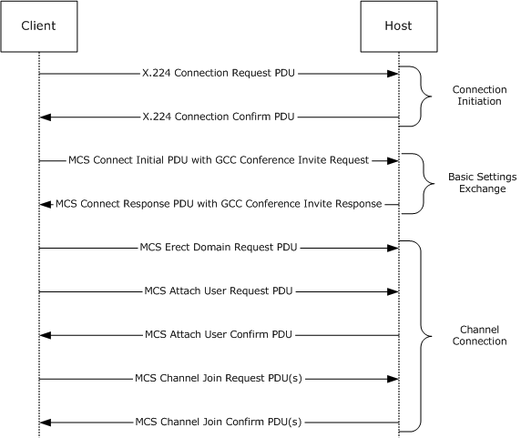

Figure 3: NetMeeting Protocol standard connection establishment

The Standard Connection Establishment sequence can be divided into three phases:

- **Connection Initiation:** The client initiates the connection by sending the host a class 0 X.224 Connection Request PDU ([MS-RDPBCGR](../MS-RDPBCGR/MS-RDPBCGR.md) section 2.2.1.1). The host responds with a class 0 X.224 Connection Confirm PDU ([MS-RDPBCGR] section 2.2.1.2).
From this point, all subsequent data sent between client and host is wrapped in an [[X224]](https://go.microsoft.com/fwlink/?LinkId=90588) data PDU.

- **Basic Settings Exchange:** Basic settings are exchanged between the client and host by using the MCS Connect Initial PDU ([MS-RDPBCGR] section 2.2.1.3) and the MCS Connect Response PDU ([MS-RDPBCGR] section 2.2.1.4). The MCS Connect Initial PDU contains a [**Generic Conference Control (GCC)**](#gt_generic-conference-control-gcc) Conference Invite Request. The MCS Connect Response PDU contains a GCC Conference Invite Response.
These two GCC packets contain concatenated blocks of settings data (such as conference name, node ID, and various privileges) that are utilized by client and host.

- **Channel Connection:** The client sends an MCS Erect Domain Request PDU ([MS-RDPBCGR] section 2.2.1.5) followed by an MCS Attach User Request PDU ([MS-RDPBCGR] section 2.2.1.6) to attach the primary user identity to the MCS domain. The host responds with an MCS Attach User Confirm PDU ([MS-RDPBCGR] section 2.2.1.7) containing the user channel ID. The client then proceeds to join the user channel, the input/output (I/O) channel, and all of the static virtual channels (the I/O and static virtual channel IDs are obtained from the data embedded in the GCC packets) by using multiple MCS Channel Join Request PDUs ([MS-RDPBCGR] section 2.2.1.8). The host confirms each channel with an MCS Channel Join Confirm PDU ([MS-RDPBCGR] section 2.2.1.9). The client sends an MCS Channel Join Request PDU only after it has received the MCS Channel Join Confirm PDU for the previously sent request.
From this point, all subsequent data sent from the client to the host is wrapped in an MCS Send Data Request PDU. Data sent from the host to the client is wrapped in an MCS Send Data Indication PDU. This is in addition to the data being wrapped by an X.224 Data PDU [X224].

Besides input and graphics data, other data that can be exchanged between client and host after the connection has been established include connection management information and virtual channel messages (exchanged between client-side plug-ins and host-side applications).

Connection details are covered in [[T124]](https://go.microsoft.com/fwlink/?LinkId=90542) section 7 and [[T125]](https://go.microsoft.com/fwlink/?LinkId=90543) section 11.

<a id="Section_3.1.5.1.2"></a>
##### 3.1.5.1.2 Sequencing

A typical sequence for a host that creates a session is as follows.

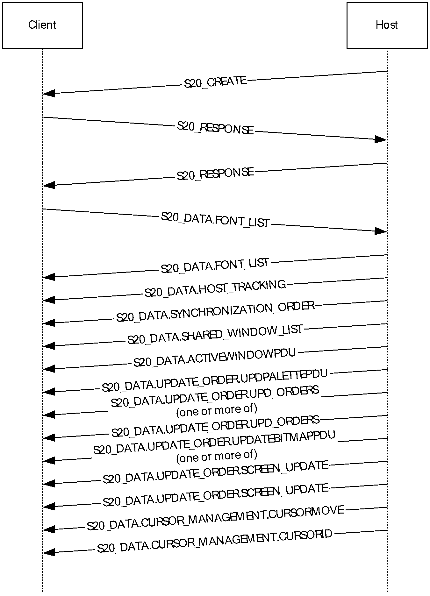

Figure 4: Sequencing as a host creates a session

A typical sequence for a client that takes control of a session is as follows.

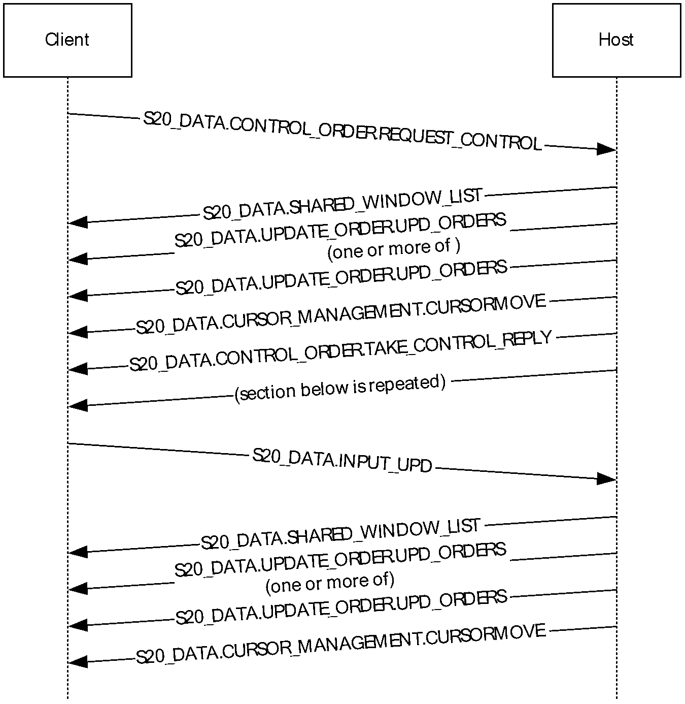

Figure 5: Sequencing as a client takes control of a session

The following table shows the detailed descriptions of the layer packet.

| Packet Name | Description |
| --- | --- |
| [S20_CREATE](#Section_2.2.2.2) | Creates a new [**application-sharing session**](#gt_application-sharing-session). |
| [S20_JOIN](#Section_2.2.2.7) | Joins an existing application-sharing session. |
| [S20_RESPOND](#Section_2.2.2.9) | Responds to an S20_CREATE or S20_JOIN message. Each host or client that receives the S20_RESPOND packets from the other host or client MUST add each sender node to its local share roster. If one of the participating nodes already has a node in its share roster, it MUST not respond to the S20_RESPOND packet but MUST update its share roster with only the name and capabilities of the sender node. |
| [S20_DELETE](#Section_2.2.2.5) | Removes a client from an application-sharing session. After sending S20_DELETE, the host MUST remove the client from its local share rosters and the client MUST destroy its local share roster and MUST leave the application-sharing session. |
| [S20_LEAVE](#Section_2.2.2.8) | Ends the participation of the sending client in an application-sharing session. After sending S20_LEAVE, the host MUST remove the client from its local share rosters and the client MUST destroy its local share roster and MUST leave the application-sharing session. |
| [S20_END](#Section_2.2.2.6) | Ends an application-sharing session. After sending S20_END, the host and client MUST delete their local share roster and leave the application-sharing session. |
| [S20_COLLISION](#Section_2.2.2.3) | Indicates that a share already exists with the referenced correlator. |
| [S20_DATA](#Section_2.2.2.4) | Sends data to an application-sharing session. S20_DATA MUST be sent to the nodes present in the application-sharing session only after they complete the S20_CREATE and S20_RESPOND negotiations. |

Examples of S20 events can be found in [Protocol Examples (section 4)](#Section_4)

<a id="Section_3.1.5.1.3"></a>
##### 3.1.5.1.3 Interaction between S20 Protocol and MCS

Interactions between the [**Multipoint Communication Service (MCS)**](#gt_multipoint-communication-service-mcs) and [**S20**](#gt_s20) protocol for starting a [**share session**](#gt_application-sharing-session) can be summarized as follows:

- S20 attaches itself through the MCS_ATTACH_USER function to the MCS session and waits for the MCS_ATTACH_CONFIRM event.
- When the S20 protocol node receives the MCS_ATTACH_CONFIRM event, it joins its local channel and the S20 protocol node broadcast channel through the MCS_CHANNEL_JOIN function.
- After the S20 protocol node receives both MCS_CHANNEL_JOIN_CONFIRM events, one for its local channel and the other for the S20 protocol broadcast channel, it starts the S20 protocol state machine.
Interactions between MCS and the S20 protocol for leaving (ending) a share session can be summarized as follows:

- The S20 protocol node leaves (in the case of a non-creator node) or ends (in the case of the creator node) the share session.
- The S20 protocol node leaves its local channel and the S20 protocol broadcast channel through MCS_CHANNEL_LEAVE.
- The S20 protocol node detaches itself through MCS_DETACH_USER from the MCS session.
MCS provides the broadcast transport services for the Share v2.0 (S20) protocol.

<a id="Section_3.1.5.1.4"></a>
##### 3.1.5.1.4 MCS Broadcast Transport Service Functions for S20 Protocol

Nodes use the following [**MCS**](#gt_multipoint-communication-service-mcs) functions for the broadcast transport service for the [**S20**](#gt_s20) protocol.

**Note** A "node" in S20 protocol usage is a "user" in MCS. Also, the "MCS Top Provider" is the creator node of an MCS session. The MCS session-creator node can be different from an S20 share-creator node. The MCS session-creator node creates the MCS session. The S20 share-creator node creates the [**application-sharing session**](#gt_application-sharing-session).

| Function | Description |
| --- | --- |
| MCS_ATTACH_USER | Attaches the node to the MCS session. The S20 protocol node MUST use this function to attach the node to the session before it can create a share session. |
| MCS_DETACH_USER | Detaches the node from the MCS session. The S20 protocol node MUST use this function to detach itself from the session. This SHOULD happen after a node leaves or ends an application-sharing session. |
| MCS_SEND_DATA | Sends data to another node or all the nodes in the MCS session. The S20 protocol node uses this function to send all S20 protocol control and data packets. |
| MCS_CHANNEL_JOIN | Joins a channel in the MCS session. In MCS, every node (user) is associated with a channel automatically. In order for this node to receive data, the node MUST join its local channel. A node in the S20 protocol needs to join its local channel and the S20 protocol node broadcast channel before it can send any S20 protocol control and data packets. |
| MCS_CHANNEL_LEAVE | Leaves a channel in the MCS session. A node in the S20 protocol needs to leave its local channel and the S20 protocol node broadcast channel after leaving or ending the application-sharing session. |

<a id="Section_3.1.5.1.4.1"></a>
###### 3.1.5.1.4.1 MCS Broadcast Transport Service Events for the S20 Protocol

According to network activities (such as incoming data, new user attach, user detach, and time-out), [**MCS**](#gt_multipoint-communication-service-mcs) sends the following events (notifications) to the [**S20**](#gt_s20) protocol nodes.

| Event (Notification) | Description |
| --- | --- |
| MCS_ATTACH_CONFIRM | A node receives an MCS_ATTACH_CONFIRM event after it successfully attaches itself to the MCS session. The S20 protocol node MUST attach itself to the MCS session and wait for this confirmation before it can join its local and S20 protocol broadcast channels. |
| MCS_DETACH_INDICATION | A node can be detached voluntarily or involuntarily. A node can detach itself voluntarily from the session by using MCS_DETACH_USER. A node can be detached involuntarily from the session if the MCS top provider deletes this node or its parent node, or if the TCP connection to this node or its parent node times out or shuts down unexpectedly. In general, this MCS_DETACH_INDICATION event means one of the following three possibilities: This node has been forced out. This is the case when the user ID in the event is equal to this node's user ID. A remote node has detached. This is the case when the event has a single user ID that is not equal to this node's user ID. A set of remote nodes has been detached. This is the case when the event contains a set of user IDs and none of them is equal to this node's user ID. |
| MCS_CHANNEL_JOIN_CONFIRM | A node receives this MCS_CHANNEL_JOIN_CONFIRM event after it successfully joins a channel. The S20 protocol receives two such events: Joining its local channel. **Note** Joining the local channel is required by MCS. Every node is required to join its local channel in order to receive data that is sent to this node. Joining the S20 protocol broadcast channel. |
| MCS_CHANNEL_LEAVE_INDICATION | A node receives this MCS_CHANNEL_LEAVE_INDICATION event when it voluntarily leaves this channel through the MCS_CHANNEL_LEAVE function, or it is forced to leave this channel. In the S20 protocol, a node can be forced to leave the S20 protocol broadcast channel by the [**application-sharing**](#gt_application-sharing-session) creator; in which case, this node SHOULD detach itself from MCS and terminate the share session locally. |
| MCS_SEND_INDICATION | This event is triggered when another established node transmits an S20 protocol packet to this session. It can be an S20 protocol packet of any type, for instance, S20_CREATE. The S20 protocol packet is contained within the payload of the MCS data packet. |

<a id="Section_3.1.5.1.4.1.1"></a>
MCS Handling of Network Transmission, Time-outs, and Retransmissions

All the network transmission time-outs and retransmissions are specified within [**MCS**](#gt_multipoint-communication-service-mcs). If a time-out causes the TCP connection to shut down, a user-detach indication with the lost nodes' user IDs MUST be broadcast by MCS. The [**S20**](#gt_s20) protocol on live nodes SHOULD receive this user-detach indication and remove the lost nodes from the live nodes' [**share rosters**](#gt_share-roster). For the lost nodes themselves, their local MCS providers MUST send a user-detach indication locally to the S20 protocol node. Then the S20 protocol node in the lost nodes MUST terminate the [**share session**](#gt_application-sharing-session) locally.

The interaction between MCS and the S20 protocol for a node that leaves normally or abnormally (for example, due to TCP time-out) can be summarized in the following steps. For the S20 protocol, it cannot tell whether a node leaves normally or abnormally. All S20 protocol nodes receive a MCS_DETACH_INDICATION event from MCS.

- After receiving a user-detach MCS_DETACH_INDICATION event that has a set of user IDs, the S20 protocol node MUST check to see if the set contains the nodes's user ID.
- If the node's user ID is in the set, this node is forced out, and the S20 protocol MUST terminate the share session locally.
- If the node's user ID is not in the set, the S20 protocol removes the node (with matching user ID in the set) from the share roster locally. The MCS session MUST remove the node with matching user ID.
A node can be deleted by the MCS top provider. This happens when a node receives a user-detach MCS_DETACH_INDICATION event. In this case, the S20 protocol node MUST destroy the share locally. A node can also be forced out by the share creator. This happens when a node receives an MCS_CHANNEL_LEAVE_INDICATION event, but this node did not leave the channel voluntarily through the MCS_CHANNEL_LEAVE function. In this case, the S20 protocol node MUST destroy the share locally and detach itself through the MCS_DETACH_USER function from the MCS session.

<a id="Section_3.1.5.2"></a>
#### 3.1.5.2 State Machine Control State Transitions

The state machine for the [**S20**](#gt_s20) protocol has seven transitions between the four control states. The following table and diagram illustrate these seven transitions.

| Control State Transition | Description |
| --- | --- |
| 1 | The session creator node sends an [S20_CREATE](#Section_2.2.2.2) packet, or a new node sends an [S20_JOIN](#Section_2.2.2.7) packet. |
| 2 | A node receives an S20_CREATE packet from the creator node. |
| 3 | A node receives an [S20_RESPOND](#Section_2.2.2.9) packet from another node. |
| 4 | A node receives an S20_RESPOND packet from another node. |
| 5 | The creator node sends an [S20_END](#Section_2.2.2.6) packet or receives an [S20_COLLISION](#Section_2.2.2.3) packet. This transition also occurs when a non-creator node sends an [S20_LEAVE](#Section_2.2.2.8) packet or receives either an S20_END packet, an [S20_DELETE](#Section_2.2.2.5) packet, or an S20_COLLISION packet. |
| 6 | The creator node sends an S20_END packet or receives an S20_COLLISION packet. This transition also occurs when a non-creator node sends an S20_LEAVE packet or receives either an S20_END packet, an S20_DELETE packet, or an S20_COLLISION packet. |
| 7 | A node sends an S20_LEAVE packet or receives either an S20_END packet, S20_DELETE packet, or an S20_COLLISION packet. |

The diagram in figure 5 illustrates the control flow of these seven transitions. Note that any requests sent out of order (for example, S20_JOIN while in the Share State) are ignored and discarded.

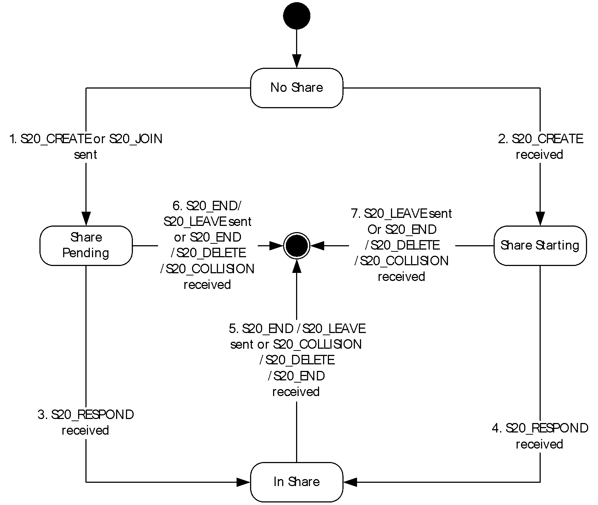

Figure 6: S20 protocol control state transitions

<a id="Section_3.1.5.3"></a>
#### 3.1.5.3 NetMeeting Object Manager Initial Join Protocol

During the initial connecting sequence of two [**NetMeeting**](#gt_netmeeting) nodes, a minimal Object Manager packet exchange is carried out between the two nodes. The first node created in the domain is considered the host. The second node created and connecting to the first node is considered a joining client. The [NetMeeting Object Manager](#Section_2.2.5) implements a joiner protocol to bring the joining client instance up to date with the current contents of the host's [**workset group**](#gt_workset-group). When a NetMeeting client registers with a host's workset group that exists in a domain, the client is treated as a joiner for the workset group.

The joiner instance sends a message to the host to announce its arrival and receives one or more replies from the host instance.

The joiner object manager instance:

- Sends an [OMNET_WORKSET_NEW](#Section_9306d949541a411fa3da4ec438095064) message indicating that a new joiner is attempting to join the workset group. It sets the **sender** value to 0 indicating the beginning of a "join" operation.
- Requests to join the host's workset group channel by broadcasting the [OMNET_HELLO](#Section_cba72e4a005e4f40beace290076dedec) message.
- Waits for the host instance to respond with an [OMNET_WELCOME](#Section_f97717bcd4eb4c9e93b00a2e9ff177b7) message.
- Sends a high-priority [OMNET_WSGROUP_SEND_REQ](#Section_b59af8c00a6248c6b5cc6287c7406a87) message to the host on its user ID channel requesting INFO [**Workset**](#gt_workset) (Workset #0).
- Receives the host's INFO Workset (Workset #0).
- Examines the Object Manager's INFO Workset and determines the workset group MCS channel ID and the MCS user ID of the host instance from which to request a workset group copy.
- Sends an [OMNET_OBJECT_UPDATE](#Section_8e1295c233fb4abdaa8b2a92ac41f876) to indicate that Workset #0 retrieval is complete.
- Sends an OMNET_WELCOME to the host.
- Retrieves additional workset groups found in the INFO Workset (Workset #0).
The Host Manager Instance:

- Receives the OMNET_WSGROUP_SEND_REQ message.
- Marks its copy of the workset group as non-discardable.
- The joiner then broadcasts an [OMNET_LOCK_REQ](#Section_0c1ef8b0215946d4ba7e1aae882ec3b4) to the workset group, ensuring that all other Object Manager instances in the domain keep their local workset group copies.
- Sends the first workset in the workset group using [OMNET_OBJECT_ADD](#Section_a8ad518432b244cb929f14d0ae9c019e), [OMNET_WORKSET_CATCHUP](#Section_0c5c82eedaf94746b97a333e4ee0d8eb), [OMNET_WSGROUP_SEND_MIDWAY](#Section_dc87685ed52741b0986e96a712a6fe4c), and [OMNET_WSGROUP_SEND_COMPLETE](#Section_05fa979c3d7745b59fbe88affe600f0a).
- For each object in each workset within the workset group, sends one OMNET_OBJECT_ADD message to the late joiner on its single node channel.
- Sends an OMNET_WSGROUP_SEND_COMPLETE message to advise the late joiner that it has caught up with the state of the workset group as of the initial join time.
- Sends an OMNET_OBJECT_UPDATE to indicate that workset retrieval is complete.
<a id="Section_3.1.5.3.1"></a>
##### 3.1.5.3.1 Sequencing

The following illustration describes a typical join sequence. In this illustration, the host initiated the meeting.

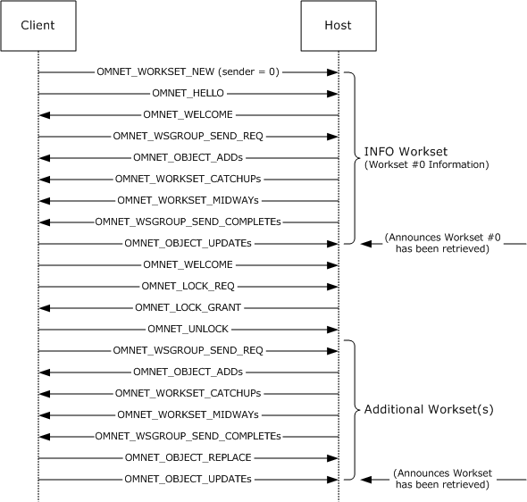

Figure 7: Typical sequencing during the arrival of a joiner.

In addition, other NetMeeting Object Manager events might take place during this operation. For example, an [OMNET_LOCK_DENY](#Section_e866f34288c646459c4c4355469bd944) or [OMNET_LOCK_NOTIFY](#Section_0fde60881af14017b671430af996b2e4) can be issued in response to the [OMNET_LOCK_REQ](#Section_0c1ef8b0215946d4ba7e1aae882ec3b4). Refer to section [2.2.5](#Section_2.2.5), NetMeeting Object Manager, for a complete list of all possible NetMeeting Object Manager packet request/response events.

<a id="Section_3.1.5.4"></a>
#### 3.1.5.4 NetMeeting Object Manager Late Joiner Protocol

The NetMeeting Object Manager implements the late joiner protocol to bring a late-joining instance up to date with the current contents of the [**workset group**](#gt_workset-group). When a [**NetMeeting**](#gt_netmeeting) client registers with a workset group that exists in a domain, the client is treated as a late joiner for the workset group.

The late joiner instance sends a message to the domain to announce its arrival, and receives one or more replies from the current domain instances. Next, the late joiner instance selects the first responding instance as its helper. The helper instance polls the other domain instances, assembles a current copy of the [**workset**](#gt_workset), and sends it to the late joiner.

The late joiner [**object manager instance**](#gt_object-manager-instance):

- Sends an [OMNET_WORKSET_NEW](#Section_9306d949541a411fa3da4ec438095064) message indicating that a new late joiner is attempting to join the workset group. It sets the "sender" value to 0 indicating the beginning of a "join" operation.
- Requests to join the workset group channel by broadcasting the [OMNET_HELLO](#Section_cba72e4a005e4f40beace290076dedec) message and waiting for replies.
- Waits for one or more current instances to respond with an [OMNET_WELCOME](#Section_f97717bcd4eb4c9e93b00a2e9ff177b7) message.
- Selects the first responding instance as its helper, and sends a high priority [OMNET_WSGROUP_SEND_REQ](#Section_b59af8c00a6248c6b5cc6287c7406a87) message to the helper on its user ID channel.
- Examines the Object Manager workset group and determines the workset group [**MCS**](#gt_multipoint-communication-service-mcs) channel ID and the MCS user ID of an instance from which to request a workset group copy.
- Unlocks the Object Manager workset group by broadcasting an [OMNET_UNLOCK](#Section_3f06fe27c6de4a23a44c3d4d68a8e3c1) message at low priority on the Object Manager control channel.
The helper object manager instance:

- Receives the OMNET_WSGROUP_SEND_REQ message.
- Marks its copy of the workset group as not discardable.
- Examines the workset and determines the MCS user IDs of the object manager instances that already have copies of the workset group.
- The helper then broadcasts an [OMNET_LOCK_REQ](#Section_0c1ef8b0215946d4ba7e1aae882ec3b4) to the workset group, ensuring that all other object manager instances in the domain keep their local workset group copies.
- Sends the first workset in the workset group using [OMNET_WORKSET_CATCHUP](#Section_0c5c82eedaf94746b97a333e4ee0d8eb), [OMNET_WSGROUP_SEND_MIDWAY](#Section_dc87685ed52741b0986e96a712a6fe4c), and [OMNET_WSGROUP_SEND_COMPLETE](#Section_05fa979c3d7745b59fbe88affe600f0a).
- For each additional workset in the workset group, sends one OMNET_WORKSET_NEW message to the late joiner on its single-node channel.
- For each object in each workset within the workset group, sends one [OMNET_OBJECT_ADD](#Section_a8ad518432b244cb929f14d0ae9c019e) message to the late joiner on its single node channel.
- Sends an OMNET_WSGROUP_SEND_COMPLETE message to advise the late joiner that it has caught up with the state of the workset group as of the initial join time.
<a id="Section_3.1.5.4.1"></a>
##### 3.1.5.4.1 Sequencing

The following illustration describes a typical late joiner sequence. In this illustration, Host-A initiated a meeting and Client-B had previously established a connection with Host-A. At a later time, Client-C joins the meeting. The letters in parenthesis indicate where the packet originated:

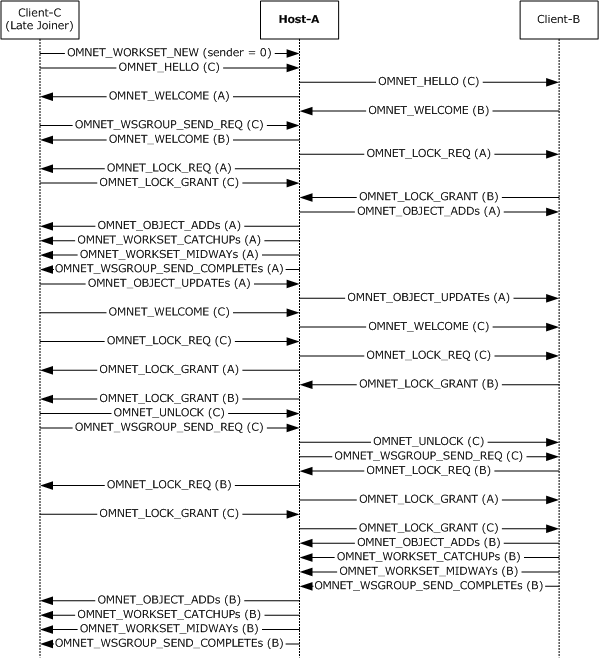

Figure 8: Typical sequencing during the arrival of a late joiner

In addition, other NetMeeting Object Manager events might take place during this operation. For example, an OMNET_LOCK_DENY or OMENT_LOCK_NOTIFY can be issued in response to the OMNET_LOCK_REQ. Refer to section [2.2.5](#Section_2.2.5), NetMeeting Object Manager, for a complete list of all possible NetMeeting Object Manager packet request/response events.

<a id="Section_3.1.5.5"></a>
#### 3.1.5.5 NetMeeting Object Manager Sequence Stamps

Operation Sequencing and Resequencing

The NetMeeting Object Manager protocol specifies one or more **sequence stamps**, which are used to re-order packets that arrive in varying orders at different nodes. Before being broadcast, each operation packet is assigned a sequence stamp that consists of an ordered pair of a **workset generation number** and a **node id**. After receiving an operation packet, an [**object manager instance**](#gt_object-manager-instance) compares the packet stamp to one or more stamps that are maintained locally. Depending on the comparison results, an object manager instance executes or ignores the requested operation.

**Sequence Stamps**

The **workset generation number** is an unsigned integer that begins at zero when the [**workset**](#gt_workset) is created; increments whenever the Object Manager performs a local operation; and accepts the greater of the existing local value or of the workset generation number that is contained in the network operation sequence stamp whenever a network operation arrives.

The **node id** is the domain-unique integer user ID that is allocated by the [**MCS**](#gt_multipoint-communication-service-mcs) subsystem to the object manager instance.

Sequence Stamp Types

Object Manager implements the following sequence stamps:

One **clear stamp** per workset, representing the last relative time that the workset was cleared; initialized to <0.ID>, where ID is the ID of the node that created the workset.

Four sequence stamps per object:

The **addition stamp**, representing the relative time that the object was added to the workset.

The **position stamp**, representing the relative time that the object was last moved within the workset.

The **update stamp**, representing the relative time that the object was last updated.

The **replace stamp**, representing the relative time that the object was last replaced.

The position-, update-, and replace- stamps are initialized with the addition stamp value.

Sequence Stamp Relative Order

The relative order of sequence stamps is defined as follows, where **stamp_X** = **workset_generation_ number_X**.**node_id_X**:

If **workset_generation_number_1** < **workset_generation_number_2**, then **stamp_1** < ("is lower than") **stamp_2**;

Else if **workset_generation_number_1** = **workset_generation_number_2**, then:

If **node_id_1** < **node_id_2**, then **stamp_1** < **stamp_2**;

Else **stamp_2** < **stamp_1**;

Else **stamp_2** < **stamp_1**.

<a id="Section_3.1.5.6"></a>
#### 3.1.5.6 NetMeeting Chat Protocol

The NetMeeting Chat Protocol utilizes MCS as its transport mechanism in order to transfer textual messages between peers. The following diagram illustrates the method of communication.

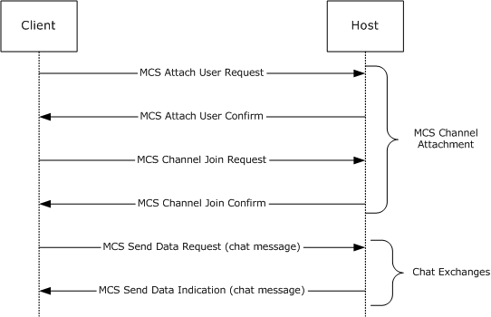

Figure 9: NetMeeting Chat Protocol communication method

<a id="Section_3.1.5.7"></a>
#### 3.1.5.7 NetMeeting File Transfer Protocol

Microsoft NetMeeting Protocol peers engage in File Transfer Protocol (FTP) through the International Telecommunications Union (ITU) T.127 standard, as specified in [[T127]](https://go.microsoft.com/fwlink/?LinkId=93446), with the exception of the extensions outlined in section [2.2.4](#Section_2.2.4). The following diagram illustrates a typical file transfer sequence.


Figure 10: Typical sequencing during a file transfer

<a id="Section_3.1.5.8"></a>
#### 3.1.5.8 NetMeeting Whiteboard Protocol

Microsoft NetMeeting Protocol peers engage in whiteboard data-sharing by exchanging International Telecommunications Union (ITU) T.126 data, as specified in [[T126]](https://go.microsoft.com/fwlink/?LinkId=93445), with the exception of the extensions outlined in section [2.2.7](#Section_2.2.7). The following diagram illustrates a typical white board exchange sequence.

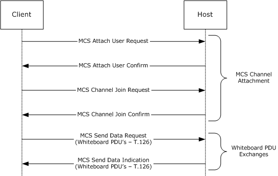

Figure 11: Typical sequencing during a whiteboard exchange

<a id="Section_3.1.6"></a>
### 3.1.6 Timer Events

None.

<a id="Section_3.1.7"></a>
### 3.1.7 Other Local Events

None.

<a id="Section_4"></a>
# 4 Protocol Examples

<a id="Section_4.1"></a>
## 4.1 Sample Session Establishment Packet Flows

The following sections provide examples that illustrate control packet flow for [**S20**](#gt_s20) session establishment:

- Example one: Creating a new [**application-sharing session**](#gt_application-sharing-session) with multiple nodes in section [4.1.1](#Section_4.1.1).
- Example two: Joining an existing application-sharing session in section [4.1.2](#Section_4.1.2).
- Example three: Leaving an application-sharing session in section [4.1.3](#Section_4.1.3).
- Example four: Deleting a node from an application-sharing session in section [4.1.4](#Section_4.1.4).
- Example five: Ending an application-sharing session (node creator action) in section [4.1.5](#Section_4.1.5).
<a id="Section_4.1.1"></a>
### 4.1.1 Creating a New Application-Sharing Session with Multiple Nodes

This [**application-sharing session**](#gt_application-sharing-session) is between four nodes. One node (node A) shares an application and starts a new application-sharing session. Node B, node C, and node D are participants. The following list describes the steps that are involved:

- Node A creates a share session. Node A becomes the owner of the session.
- Node A broadcasts an [S20_CREATE](#Section_2.2.2.2) packet to node B, node C, and node D. Node A is listed as the owner.
- Node B, node C, and node D each receive the S20_CREATE packet and broadcast an S20_RESPOND packet to all nodes in the session. The [S20_RESPOND](#Section_2.2.2.9) packet contains the name and capabilities of the responding node.
- Each node receives the S20_RESPOND packets from the other nodes and adds each sender node to its local [**share roster**](#gt_share-roster).
- Each receiving node broadcasts another S20_RESPOND packet to indicate to the other nodes that it received their responses.
- If one of the participating nodes already has a node in its share roster, it does not respond to the S20_RESPOND packet but updates its share roster with only the name and capabilities of the sender node.
<a id="Section_4.1.2"></a>
### 4.1.2 Joining an Existing Application-Sharing Session

This [**application-sharing session**](#gt_application-sharing-session) is between five nodes. Node E is new and wants to join the application-sharing session with node A, node B, node C, and node D. The following list describes the steps that are involved:

- Node E broadcasts an [S20_JOIN](#Section_2.2.2.7) packet that contains its name and capabilities to the other nodes in the session that node E wants to join.
- Node A, node B, node C, and node D receive the S20_JOIN packet that is sent by node E. They in turn, broadcast an [S20_RESPOND](#Section_2.2.2.9) packet that contains their name and capabilities to all other nodes.
- Node E receives all the S20_RESPOND packets from all the other nodes and adds each sender to its local [**share roster**](#gt_share-roster).
- Node E broadcasts an S20_RESPOND packet that includes its name and capabilities to all the other nodes.
- If one of the participating nodes already has a node in its share roster, it does not respond to the S20_RESPOND packet, but updates its share roster with only the name and capabilities of the sender node.
<a id="Section_4.1.3"></a>
### 4.1.3 Leaving an Application-Sharing Session

This [**application-sharing session**](#gt_application-sharing-session) is between five nodes. Node-E wants to leave the application-sharing session. The following list describes the steps that are involved:

- Node E broadcasts an [S20_LEAVE](#Section_2.2.2.8) packet to node A, node B, node C, and node D.
- Node A, node B, node C, and node D all receive the S20_LEAVE packet that is sent by node E. They delete node E from their local [**share rosters**](#gt_share-roster).
<a id="Section_4.1.4"></a>
### 4.1.4 Deleting a Node from an Application-Sharing Session

This [**application-sharing session**](#gt_application-sharing-session) is between four nodes. Node A, the application-sharing session creator, wants to delete node D from the application-sharing session. The following list describes the steps that are involved:

- Node A broadcasts an [S20_DELETE](#Section_2.2.2.5) packet that contains the name of node D to all other nodes.
- Node B, node C, and node D receive the S20_DELETE packet. Node B and node C delete node D from their local [**share rosters**](#gt_share-roster). Node D destroys its local share roster and leaves the application-sharing session.
<a id="Section_4.1.5"></a>
### 4.1.5 Ending an Application-Sharing Session

This [**application-sharing session**](#gt_application-sharing-session) is between three nodes. Node A, the application-sharing session creator, wants to end the application-sharing session. The following list describes the steps that are involved:

- Node A broadcasts an [S20_END](#Section_2.2.2.6) packet to all other nodes.
- Node B and node C receive the S20_END packet. All nodes delete their local [**share roster**](#gt_share-roster) and leave the application-sharing session.
<a id="Section_4.2"></a>
## 4.2 UUIE Response PDU: Use Case Scenario

This section describes a use case for the [Alerting-UUIE Response PDU (section 2.2.9.3)](#Section_2.2.9.3) in the NetMeeting protocol.

This use case involves two endpoints:

- Endpoint 1 (the caller) makes a call to endpoint 2.
- Endpoint 2 receives the call.
- Endpoint 2 sends a request using the Alerting-UUIE Response PDU.
Endpoint 2 includes the following values in the request:

**ProtocolIdentifier:** This field contains the protocol version currently in use. NetMeeting sets this field to the string "0.0.8.225.0.2", for the H.225 protocol version 2.

**DestinationInfo:** This field contains the endpoint connection type. It can be a **Terminal** connection type or a **Gateway** connection type. The **Terminal** connection type is used in most cases.

**CallIdentifier:** This field is unique for each endpoint. In this use case, this field contains the unique endpoint GUID for Endpoint 2.

- All other fields in the Alerting-UUIE Response PDU, although supported, are set to zero by Endpoint 2 and ignored by Endpoint 1.
- The Alerting-UUIE Response PDU is encoded by Endpoint 2 and sent to Endpoint 1.
- Endpoint 1 decodes the Alerting-UUIE Response PDU.
- Endpoint 1 (the caller) performs the following actions:
- Endpoint 1 indicates to the user that call establishment is in progress (rings).
- Endpoint 1 sends a notification message to Endpoint 2.
This message indicates that Endpoint 1 is ready to proceed and currently awaits call acceptance from Endpoint 2.

Endpoint 1 identifies Endpoint 2 for this callback by setting the **CallIdentifier** field to the GUID for Endpoint 2.

<a id="Section_5"></a>
# 5 Security

<a id="Section_5.1"></a>
## 5.1 Security Considerations for Implementers

[**MCS**](#gt_multipoint-communication-service-mcs) and [**GCC**](#gt_generic-conference-control-gcc) packets are encoded and decoded by using ASN.1.

Transport Layer Security (TLS) is negotiated by following T.123, as specified in [[T123]](https://go.microsoft.com/fwlink/?LinkId=90541) Annex B. In a secure mode, X.244 payloads are encrypted by using TLS, as specified in [[X224]](https://go.microsoft.com/fwlink/?LinkId=90588). Additional TLS can also be used.<33>

<a id="Section_5.2"></a>
## 5.2 Index of Security Parameters

None.

<a id="Section_6"></a>
# 6 Appendix A: Product Behavior

The information in this specification is applicable to the following Microsoft products or supplemental software. References to product versions include released service packs.

- Windows 98 operating system Second Edition
- Windows 2000 operating system
- Windows 2000 Server operating system
- Windows Millennium Edition operating system
- Windows XP operating system
- Windows Server 2003 operating system
Exceptions, if any, are noted below. If a service pack or Quick Fix Engineering (QFE) number appears with the product version, behavior changed in that service pack or QFE. The new behavior also applies to subsequent service packs of the product unless otherwise specified. If a product edition appears with the product version, behavior is different in that product edition.

Unless otherwise specified, any statement of optional behavior in this specification that is prescribed using the terms "SHOULD" or "SHOULD NOT" implies product behavior in accordance with the SHOULD or SHOULD NOT prescription. Unless otherwise specified, the term "MAY" implies that the product does not follow the prescription.

<1> Section 1.3: The Microsoft implementation of the Microsoft NetMeeting Protocol exists in the Windows [**NetMeeting**](#gt_netmeeting) feature. This implementation is backwards-compatible with the ITU T.120 protocols, as specified in [[T128-06/08]](https://go.microsoft.com/fwlink/?LinkId=144118) and the [**S20**](#gt_s20) protocols.

<2> Section 2.2.2.1.3: The version of Windows being used is defined by one of the following values. The OSVersion field is always set to one of these values by Windows.

| Value | Meaning |
| --- | --- |
| CAPS_WINDOWS_31 0x0001 | Windows NT 3.1 operating system |
| CAPS_WINDOWS_95 0x0002 | Windows 95 operating system, Windows 98 operating system, or Windows Millennium Edition |
| CAPS_WINDOWS_NT 0x0003 | Windows XP, Windows 2000, or Windows Server 2003 |

<3> Section 2.2.2.4.2.3: The hot spot of a cursor is the point to which Windows refers when tracking the cursor position.

<4> Section 2.2.2.4.2.3: The hot spot of a cursor is the point to which Windows refers when tracking the cursor position.

<5> Section 2.2.2.4.2.5: The hot spot of a cursor is the point to which Windows refers when tracking the cursor position.

<6> Section 2.2.2.4.2.5: The hot spot of a cursor is the point to which Windows refers when tracking the cursor position.

<7> Section 2.2.2.4.5.1: The NetMeeting application obtains various information about fonts used between application sharing from the following Windows GDI data structures:

- **TEXTMETRIC**: The TEXTMETRIC structure contains basic information about a physical font. All sizes are specified in logical units; that is, they depend on the current mapping mode of the display context.
- **GetTextMetrics**: The GetTextMetrics function fills the specified buffer with the metrics for the currently selected font.
<8> Section 2.2.2.4.5.1: The NetMeeting application obtains various information about fonts used between application sharing from the following Windows GDI data structures:

- **TEXTMETRIC**: The TEXTMETRIC structure contains basic information about a physical font. All sizes are specified in logical units; that is, they depend on the current mapping mode of the display context.
- **GetTextMetrics**: The GetTextMetrics function fills the specified buffer with the metrics for the currently selected font.
<9> Section 2.2.2.4.5.1: The NetMeeting application obtains various information about fonts used between application sharing from the following Windows GDI data structures:

- **TEXTMETRIC**: The TEXTMETRIC structure contains basic information about a physical font. All sizes are specified in logical units; that is, they depend on the current mapping mode of the display context.
- **GetTextMetrics**: The GetTextMetrics function fills the specified buffer with the metrics for the currently selected font.
<10> Section 2.2.2.4.5.1: The NetMeeting application obtains various information about fonts used between application sharing from the following Windows GDI data structures:

- **TEXTMETRIC**: The TEXTMETRIC structure contains basic information about a physical font. All sizes are specified in logical units; that is, they depend on the current mapping mode of the display context.
- **GetTextMetrics**: The GetTextMetrics function fills the specified buffer with the metrics for the currently selected font.
<11> Section 2.2.2.4.5.1: The NetMeeting application obtains various information about fonts used between application sharing from the following Windows GDI data structures:

- **TEXTMETRIC**: The TEXTMETRIC structure contains basic information about a physical font. All sizes are specified in logical units; that is, they depend on the current mapping mode of the display context.
- **GetTextMetrics**: The GetTextMetrics function fills the specified buffer with the metrics for the currently selected font.
<12> Section 2.2.2.4.5.1: The NetMeeting application obtains various information about fonts used between application sharing from the following Windows GDI data structures:

- **TEXTMETRIC**: The TEXTMETRIC structure contains basic information about a physical font. All sizes are specified in logical units; that is, they depend on the current mapping mode of the display context.
- **GetTextMetrics**: The GetTextMetrics function fills the specified buffer with the metrics for the currently selected font.
<13> Section 2.2.2.4.5.1: The NetMeeting application obtains various information about fonts used between application sharing from the following Windows GDI data structures:

- **TEXTMETRIC**: The TEXTMETRIC structure contains basic information about a physical font. All sizes are specified in logical units; that is, they depend on the current mapping mode of the display context.
- **GetTextMetrics**: The GetTextMetrics function fills the specified buffer with the metrics for the currently selected font.
<14> Section 2.2.2.4.5.1: The NetMeeting application obtains various information about fonts used between application sharing from the following Windows GDI data structures:

- **TEXTMETRIC**: The TEXTMETRIC structure contains basic information about a physical font. All sizes are specified in logical units; that is, they depend on the current mapping mode of the display context.
- **GetTextMetrics**: The GetTextMetrics function fills the specified buffer with the metrics for the currently selected font.
<15> Section 2.2.2.4.5.1: The NetMeeting application obtains various information about fonts used between application sharing from the following Windows GDI data structures:

- **TEXTMETRIC**: The TEXTMETRIC structure contains basic information about a physical font. All sizes are specified in logical units; that is, they depend on the current mapping mode of the display context.
- **GetTextMetrics**: The GetTextMetrics function fills the specified buffer with the metrics for the currently selected font.
<16> Section 2.2.2.4.7.1.1: WM_KEYUP Notification: The WM_KEYUP message is posted to the window that has the keyboard focus when a nonsystem key is released. A nonsystem key is a key that is pressed when the ALT key is not pressed, or a keyboard key that is pressed when a window has the keyboard focus.

WM_SYSKEYUP Notification: The WM_SYSKEYUP message is posted to the window that has the keyboard focus when the user releases a key that was pressed while the ALT key was held down. It also occurs when no window currently has the keyboard focus; in this case, the WM_SYSKEYUP message is sent to the active window. The window that receives the message can distinguish between these two contexts by checking the context code in the lParam parameter.

<17> Section 2.2.2.4.10.1.7: Ternary raster-operation codes define how Windows GDI combines the bits in a source bitmap with the bits in the destination bitmap.

Each raster-operation code represents a Boolean operation in which the values of the pixels in the source, the selected brush, and the destination are combined. Refer to [[MSDN-TRO]](https://go.microsoft.com/fwlink/?LinkId=90147) for additional information.

<18> Section 2.2.2.4.10.1.9: The NetMeeting application obtains various information about fonts that are used between application sharing from the following Windows GDI data structures:

- **TEXTMETRIC**: The TEXTMETRIC structure contains basic information about a physical font. All sizes are specified in logical units; that is, they depend on the current mapping mode of the display context.
- **GetTextMetrics**: The GetTextMetrics function fills the specified buffer with the metrics for the currently selected font.
<19> Section 2.2.2.4.10.1.9: The NetMeeting application obtains various information about fonts that are used between application sharing from the following Windows GDI data structures:

- **TEXTMETRIC**: The TEXTMETRIC structure contains basic information about a physical font. All sizes are specified in logical units; that is, they depend on the current mapping mode of the display context.
- **GetTextMetrics**: The GetTextMetrics function fills the specified buffer with the metrics for the currently selected font.
<20> Section 2.2.2.4.10.1.11: Ternary raster-operation codes define how Windows GDI combines the bits in a source bitmap with the bits in the destination bitmap.

Each raster-operation code represents a Boolean operation in which the values of the pixels in the source, the selected brush, and the destination are combined. Refer to [MSDN-TRO] for additional information.

<21> Section 2.2.2.4.10.1.12: Ternary raster-operation codes define how Windows GDI combines the bits in a source bitmap with the bits in the destination bitmap.

Each raster-operation code represents a Boolean operation in which the values of the pixels in the source, the selected brush, and the destination are combined. Refer to [MSDN-TRO] for additional information.

<22> Section 2.2.2.4.10.1.21: Ternary raster-operation codes define how Windows GDI combines the bits in a source bitmap with the bits in the destination bitmap.

Each raster-operation code represents a Boolean operation in which the values of the pixels in the source, the selected brush, and the destination are combined. Refer to [MSDN-TRO] for additional information.

<23> Section 2.2.2.4.10.1.28: Ternary raster-operation codes define how Windows GDI combines the bits in a source bitmap with the bits in the destination bitmap.

Each raster-operation code represents a Boolean operation in which the values of the pixels in the source, the selected brush, and the destination are combined. Refer to [MSDN-TRO] for additional information.

<24> Section 2.2.2.4.10.1.29: The NetMeeting application obtains various information about fonts that are used between application sharing from the following Windows GDI data structures:

- **TEXTMETRIC**: The TEXTMETRIC structure contains basic information about a physical font. All sizes are specified in logical units; that is, they depend on the current mapping mode of the display context.
- **GetTextMetrics**: The GetTextMetrics function fills the specified buffer with the metrics for the currently selected font.
<25> Section 2.2.2.4.10.1.29: The NetMeeting application obtains various information about fonts that are used between application sharing from the following Windows GDI data structures:

- **TEXTMETRIC**: The TEXTMETRIC structure contains basic information about a physical font. All sizes are specified in logical units; that is, they depend on the current mapping mode of the display context.
- **GetTextMetrics**: The GetTextMetrics function fills the specified buffer with the metrics for the currently selected font.
<26> Section 2.2.2.7: If the **nameData** field is not supplied by the user in a Windows implementation, the computer name is taken from the Windows WMI Instrumentation API function GetComputerName().

<27> Section 2.2.9.3: Microsoft NetMeeting implementations do not use the **h245address** field. On NetMeeting implementations, this field is set to zero and ignored.

<28> Section 2.2.9.3: NetMeeting implementations do not use the **h245SecurityMode** field. On NetMeeting implementations, this field is set to zero and ignored.

<29> Section 2.2.9.3: NetMeeting implementations do not use the **Tokens** field. On NetMeeting implementations, this field is set to zero and ignored.

<30> Section 2.2.9.3: NetMeeting implementations do not use the **cryptoTokens** field. On NetMeeting implementations, this field is set to zero and ignored.

<31> Section 2.2.9.3: NetMeeting implementations do not use the **fastStart** field. On NetMeeting implementations, this field is set to zero and ignored.

<32> Section 3.1.2: The NetMeeting implementation has a time-out mechanism for connection establishment, which is to wait 20 seconds for a callee to respond. If no response is returned, the implementation MUST declare a time-out and notify the user.

<33> Section 5.1: The Microsoft implementation uses TLS as specified in [[T123]](https://go.microsoft.com/fwlink/?LinkId=90541).

<a id="Section_7"></a>
# 7 Change Tracking

No table of changes is available. The document is either new or has had no changes since its last release.

<a id="revision-history"></a>

## Revision History

| Date | Version | Revision Class | Comments |
| --- | --- | --- | --- |
| 7/20/2007 | 0.1 | Major | MCPP Milestone 5 Initial Availability |
| 9/28/2007 | 1.0 | Major | Updated the technical content and added new content. |
| 10/23/2007 | 2.0 | Major | Updated and revised the technical content. |
| 11/30/2007 | 2.1 | Minor | Added informative content, including a diagram. |
| 1/25/2008 | 2.1.1 | Editorial | Changed language and formatting in the technical content. |
| 3/14/2008 | 3.0 | Major | Updated and revised the technical content. |
| 5/16/2008 | 3.0.1 | Editorial | Changed language and formatting in the technical content. |
| 6/20/2008 | 4.0 | Major | Updated and revised the technical content. |
| 7/25/2008 | 5.0 | Major | Updated and revised the technical content. |
| 8/29/2008 | 5.1 | Minor | Clarified the meaning of the technical content. |
| 10/24/2008 | 6.0 | Major | Updated and revised the technical content. |
| 12/5/2008 | 7.0 | Major | Updated and revised the technical content. |
| 1/16/2009 | 8.0 | Major | Updated and revised the technical content. |
| 2/27/2009 | 9.0 | Major | Updated and revised the technical content. |
| 4/10/2009 | 10.0 | Major | Updated and revised the technical content. |
| 5/22/2009 | 10.1 | Minor | Clarified the meaning of the technical content. |
| 7/2/2009 | 10.1.1 | Editorial | Changed language and formatting in the technical content. |
| 8/14/2009 | 11.0 | Major | Updated and revised the technical content. |
| 9/25/2009 | 12.0 | Major | Updated and revised the technical content. |
| 11/6/2009 | 13.0 | Major | Updated and revised the technical content. |
| 12/18/2009 | 14.0 | Major | Updated and revised the technical content. |
| 1/29/2010 | 15.0 | Major | Updated and revised the technical content. |
| 3/12/2010 | 15.0.1 | Editorial | Changed language and formatting in the technical content. |
| 4/23/2010 | 16.0 | Major | Updated and revised the technical content. |
| 6/4/2010 | 16.0.1 | Editorial | Changed language and formatting in the technical content. |
| 7/16/2010 | 16.0.1 | None | No changes to the meaning, language, or formatting of the technical content. |
| 8/27/2010 | 16.0.1 | None | No changes to the meaning, language, or formatting of the technical content. |
| 10/8/2010 | 16.0.1 | None | No changes to the meaning, language, or formatting of the technical content. |
| 11/19/2010 | 16.0.1 | None | No changes to the meaning, language, or formatting of the technical content. |
| 1/7/2011 | 16.0.1 | None | No changes to the meaning, language, or formatting of the technical content. |
| 2/11/2011 | 16.0.1 | None | No changes to the meaning, language, or formatting of the technical content. |
| 3/25/2011 | 16.0.1 | None | No changes to the meaning, language, or formatting of the technical content. |
| 5/6/2011 | 16.0.1 | None | No changes to the meaning, language, or formatting of the technical content. |
| 6/17/2011 | 16.1 | Minor | Clarified the meaning of the technical content. |
| 9/23/2011 | 16.1 | None | No changes to the meaning, language, or formatting of the technical content. |
| 12/16/2011 | 16.1 | None | No changes to the meaning, language, or formatting of the technical content. |
| 3/30/2012 | 16.1 | None | No changes to the meaning, language, or formatting of the technical content. |
| 7/12/2012 | 16.1 | None | No changes to the meaning, language, or formatting of the technical content. |
| 10/25/2012 | 16.1 | None | No changes to the meaning, language, or formatting of the technical content. |
| 1/31/2013 | 16.1 | None | No changes to the meaning, language, or formatting of the technical content. |
| 8/8/2013 | 16.1 | None | No changes to the meaning, language, or formatting of the technical content. |
| 11/14/2013 | 16.1 | None | No changes to the meaning, language, or formatting of the technical content. |
| 2/13/2014 | 16.1 | None | No changes to the meaning, language, or formatting of the technical content. |
| 5/15/2014 | 16.1 | None | No changes to the meaning, language, or formatting of the technical content. |
| 6/30/2015 | 16.1 | None | No changes to the meaning, language, or formatting of the technical content. |
| 10/16/2015 | 16.1 | None | No changes to the meaning, language, or formatting of the technical content. |
| 7/14/2016 | 16.1 | None | No changes to the meaning, language, or formatting of the technical content. |
| 6/1/2017 | 16.1 | None | No changes to the meaning, language, or formatting of the technical content. |
