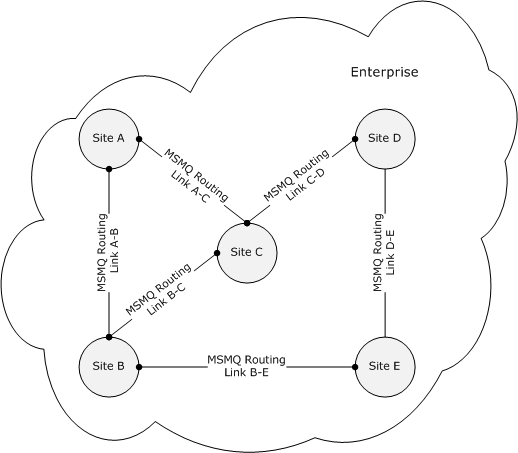
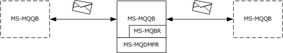
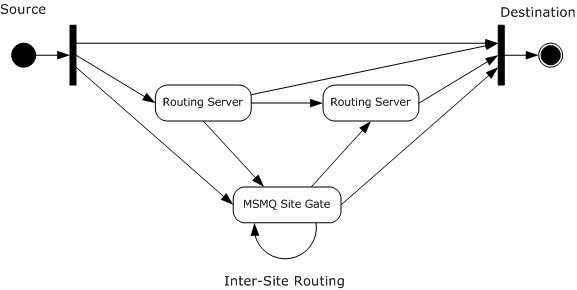
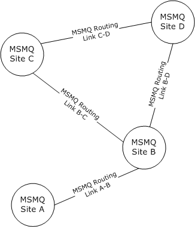

# [MS-MQBR]: Message Queuing (MSMQ): Binary Reliable Message Routing Algorithm

Table of Contents

1 Introduction

- [1 Introduction](#Section_1)
  - [1.1 Glossary](#Section_1.1)
  - [1.2 References](#Section_1.2)
    - [1.2.1 Normative References](#Section_1.2.1)
    - [1.2.2 Informative References](#Section_1.2.2)
  - [1.3 Overview](#Section_1.3)
    - [1.3.1 Direct Connection](#Section_1.3.1)
    - [1.3.2 Intra-Site Routing](#Section_1.3.2)
    - [1.3.3 Inter-Site Routing](#Section_1.3.3)
  - [1.4 Relationship to Other Protocols](#Section_1.4)
  - [1.5 Prerequisites/Preconditions](#Section_1.5)
  - [1.6 Applicability Statement](#Section_1.6)
  - [1.7 Versioning and Capability Negotiation](#Section_1.7)
  - [1.8 Vendor-Extensible Fields](#Section_1.8)
  - [1.9 Standards Assignments](#Section_1.9)

2 Messages

- [2 Messages](#Section_2)
  - [2.1 Transport](#Section_2.1)
  - [2.2 Message Syntax](#Section_2.2)
  - [2.3 Directory Service Schema Elements](#Section_2.3)

3 Protocol Details

- [3 Protocol Details](#Section_3)
  - [3.1 Algorithm Details](#Section_3.1)
    - [3.1.1 Abstract Data Model](#Section_3.1.1)
      - [3.1.1.1 Shared Data Elements](#Section_3.1.1.1)
      - [3.1.1.2 Routing Table](#Section_3.1.1.2)
    - [3.1.2 Timers](#Section_3.1.2)
      - [3.1.2.1 QueueManager Query Timer](#Section_3.1.2.1)
    - [3.1.3 Initialization](#Section_3.1.3)
      - [3.1.3.1 RoutingTable Initialization](#Section_3.1.3.1)
    - [3.1.4 Higher-Layer Triggered Events](#Section_3.1.4)
    - [3.1.5 Message Processing Events and Sequencing Rules](#Section_3.1.5)
      - [3.1.5.1 GetNextHops](#Section_3.1.5.1)
      - [3.1.5.2 GetNextHopsForRouter](#Section_3.1.5.2)
      - [3.1.5.3 GetNextHopsForSiteGate](#Section_3.1.5.3)
      - [3.1.5.4 GetQueueManager](#Section_3.1.5.4)
      - [3.1.5.5 GetRoutingServer](#Section_3.1.5.5)
      - [3.1.5.6 GetSiteGate](#Section_3.1.5.6)
      - [3.1.5.7 GetSiteGateForSite](#Section_3.1.5.7)
      - [3.1.5.8 IsSiteGate](#Section_3.1.5.8)
      - [3.1.5.9 GetDirectoryData](#Section_3.1.5.9)
    - [3.1.6 Timer Events](#Section_3.1.6)
      - [3.1.6.1 QueueManager Query Timer Event](#Section_3.1.6.1)
    - [3.1.7 Other Local Events](#Section_3.1.7)

4 Protocol Examples

- [4 Protocol Examples](#Section_4)

5 Security

- [5 Security](#Section_5)
  - [5.1 Security Considerations for Implementers](#Section_5.1)
  - [5.2 Index of Security Parameters](#Section_5.2)

6 Appendix A: Product Behavior

- [6 Appendix A: Product Behavior](#Section_6)

7 Change Tracking

- [7 Change Tracking](#Section_7)

For the legal notice and IP terms, see [LEGAL.md](../LEGAL.md).
Last updated: 4/23/2024.
See [Revision History](#revision-history) for full version history.

# 1 Introduction

The Message Queuing (MSMQ): Binary Reliable Message Routing Algorithm is used by [**Message Queuing**](#gt_microsoft-message-queuing-msmq) (also known as MSMQ) to determine the next hop when routing a [**message**](#gt_message).

The document describes [**intra-site routing**](#gt_intra-site-routing), [**inter-site routing**](#gt_inter-site-routing) and direct connection between source and destination [**MSMQ queue managers**](#gt_msmq-queue-manager) where it is possible, as described in section [1.3](#Section_1.3).

For more information on MSMQ, see [[MSDN-MSMQ]](https://go.microsoft.com/fwlink/?LinkId=90047).

Sections 1.5, 1.8, 1.9, 2, and 3 of this specification are normative. All other sections and examples in this specification are informative.

## 1.1 Glossary

This document uses the following terms:

**administrator**: A user who has complete and unrestricted access to the computer or domain.

**connected network**: A network of computers in which any two computers can communicate directly through a common transport protocol (for example, TCP/IP or SPX/IPX). A computer can belong to multiple connected networks.

**directory**: The database that stores information about objects such as users, groups, computers, printers, and the directory service that makes this information available to users and applications.

**enterprise**: A unit of administration of a network of [**MSMQ queue managers**](#gt_msmq-queue-manager). An enterprise consists of an MSMQ Directory Service, one or more [**connected networks**](#gt_connected-network), and one or more [**MSMQ sites**](#gt_msmq-site).

**format name**: A name that is used to reference a [**queue**](#gt_queue) when making calls to API functions.

**in-routing server**: An [**MSMQ routing server**](#gt_msmq-routing-server) that receives all [**messages**](#gt_message) on behalf of a particular client and forwards those [**messages**](#gt_message) to that client.

**inter-site routing**: The process of routing a [**message**](#gt_message) between different [**MSMQ sites**](#gt_msmq-site) within an [**enterprise**](#gt_enterprise).

**intra-site routing**: The process of routing a [**message**](#gt_message) within a single [**MSMQ site**](#gt_msmq-site).

**message**: A data structure representing a unit of data transfer between distributed applications. A message has message properties, which may include message header properties, a message body property, and message trailer properties.

**message packet**: A byte buffer that is the physical representation of the [**message**](#gt_message) in the queue manager and on the wire.

**Microsoft Message Queuing (MSMQ)**: A communications service that provides asynchronous and reliable [**message**](#gt_message) passing between distributed applications. In Message Queuing, applications send [**messages**](#gt_message) to [**queues**](#gt_queue) and consume [**messages**](#gt_message) from [**queues**](#gt_queue). The [**queues**](#gt_queue) provide persistence of the [**messages**](#gt_message), enabling the sending and receiving applications to operate asynchronously from one another.

**MSMQ queue manager**: An [**MSMQ**](#gt_microsoft-message-queuing-msmq) service hosted on a machine that provides [**queued**](#gt_queue) messaging services. Queue managers manage [**queues**](#gt_queue) deployed on the local computer and provide asynchronous transfer of [**messages**](#gt_message) to [**queues**](#gt_queue) located on other computers. A queue manager is identified by a globally unique identifier (GUID).

**MSMQ routing link**: A communication link between two sites. A routing link is represented by a routing link object in the directory service. Routing links can have associated link costs. Routing links with their associated costs can be used to compute lowest-cost routing paths for store-and-forward messaging.

**MSMQ routing server**: A role played by an [**MSMQ queue manager**](#gt_msmq-queue-manager). An MSMQ routing server implements store and forward messaging. A routing server can provide connectivity between different [**connected networks**](#gt_connected-network) within a site or can provide session concentration between sites.

**MSMQ site**: A network of computers, typically physically collocated, that have high connectivity as measured in terms of latency (low) and throughput (high). A site is represented by a site object in the directory service. An MSMQ site maps one-to-one with an Active Directory site when Active Directory provides directory services to [**MSMQ**](#gt_microsoft-message-queuing-msmq).

**MSMQ site gate**: An [**MSMQ routing server**](#gt_msmq-routing-server) through which all intersite messaging traffic flows.

**out-routing server**: An [**MSMQ routing server**](#gt_msmq-routing-server) that receives all [**messages**](#gt_message) sent by a particular client and routes those [**messages**](#gt_message) on behalf of that client.

**queue**: An object that holds [**messages**](#gt_message) passed between applications or [**messages**](#gt_message) passed between [**Message Queuing**](#gt_microsoft-message-queuing-msmq) and applications. In general, applications can send [**messages**](#gt_message) to queues and read [**messages**](#gt_message) from queues.

**routing link cost**: A value that models the relative cost of direct communication between two [**MSMQ sites**](#gt_msmq-site).

**routing table**: A table maintained by each [**MSMQ site gate**](#gt_msmq-site-gate) for inter-site routing. For each [**MSMQ site**](#gt_msmq-site) in an [**enterprise**](#gt_enterprise), the table specifies the [**MSMQ site**](#gt_msmq-site) to which a [**message**](#gt_message) should be forwarded in order to minimize the total [**routing link cost**](#gt_routing-link-cost) for that [**message**](#gt_message).

**server**: A computer on which the remote procedure call (RPC) server is executing.

**MAY, SHOULD, MUST, SHOULD NOT, MUST NOT:** These terms (in all caps) are used as defined in [[RFC2119]](https://go.microsoft.com/fwlink/?LinkId=90317). All statements of optional behavior use either MAY, SHOULD, or SHOULD NOT.

## 1.2 References

Links to a document in the Microsoft Open Specifications library point to the correct section in the most recently published version of the referenced document. However, because individual documents in the library are not updated at the same time, the section numbers in the documents may not match. You can confirm the correct section numbering by checking the [Errata](https://go.microsoft.com/fwlink/?linkid=850906).

### 1.2.1 Normative References

We conduct frequent surveys of the normative references to assure their continued availability. If you have any issue with finding a normative reference, please contact [dochelp@microsoft.com](mailto:dochelp@microsoft.com). We will assist you in finding the relevant information.

[MS-ADTS] Microsoft Corporation, "[Active Directory Technical Specification](../MS-ADTS/MS-ADTS.md)".

[MS-DTYP] Microsoft Corporation, "[Windows Data Types](../MS-DTYP/MS-DTYP.md)".

[MS-MQDMPR] Microsoft Corporation, "[Message Queuing (MSMQ): Common Data Model and Processing Rules](../MS-MQDMPR/MS-MQDMPR.md)".

[MS-MQDSSM] Microsoft Corporation, "[Message Queuing (MSMQ): Directory Service Schema Mapping](../MS-MQDSSM/MS-MQDSSM.md)".

[MS-MQQB] Microsoft Corporation, "[Message Queuing (MSMQ): Message Queuing Binary Protocol](../MS-MQQB/MS-MQQB.md)".

[RFC2119] Bradner, S., "Key words for use in RFCs to Indicate Requirement Levels", BCP 14, RFC 2119, March 1997, [https://www.rfc-editor.org/info/rfc2119](https://go.microsoft.com/fwlink/?LinkId=90317)

### 1.2.2 Informative References

[MS-MQDS] Microsoft Corporation, "[Message Queuing (MSMQ): Directory Service Protocol](../MS-MQDS/MS-MQDS.md)".

[MS-MQOD] Microsoft Corporation, "[Message Queuing Protocols Overview](../MS-MQOD/MS-MQOD.md)".

[MSDN-MSMQ] Microsoft Corporation, "Message Queuing (MSMQ)", [http://msdn.microsoft.com/en-us/library/ms711472.aspx](https://go.microsoft.com/fwlink/?LinkId=90047)

## 1.3 Overview

The Message Queuing (MSMQ): Binary Reliable Message Routing Algorithm describes [**message**](#gt_message) routing within an [**enterprise**](#gt_enterprise) network.

[**Message queuing**](#gt_microsoft-message-queuing-msmq) clients transfer messages either by direct connection with the destination or by sending them to an [**MSMQ Routing Server**](#gt_msmq-routing-server).<1> If a direct connection is not possible or the client is configured to use a routing service, MSMQ routing servers can temporarily store messages and subsequently forward them to the destination [**MSMQ queue manager**](#gt_msmq-queue-manager) or to another MSMQ routing server.

Message routing occurs when at least one of the following conditions exists.

- The source MSMQ queue manager and the destination MSMQ queue manager belong to different [**MSMQ sites**](#gt_msmq-site).
- The source MSMQ queue manager and the destination MSMQ queue manager do not share a [**connected network**](#gt_connected-network).
- The source MSMQ queue manager is configured to use an [**out-routing server**](#gt_out-routing-server). Every outgoing message from the source MSMQ queue manager is routed through the configured out-routing server.
- The destination MSMQ queue manager is configured to use an [**in-routing server**](#gt_in-routing-server). Every incoming message to the destination MSMQ queue manager is routed through the configured in-routing server.
More information on queuing messages is specified in [MS-MQQB](../MS-MQQB/MS-MQQB.md).

### 1.3.1 Direct Connection

A direct connection between two [**MSMQ queue managers**](#gt_msmq-queue-manager) that share a [**connected network**](#gt_connected-network) is possible when the source MSMQ queue manager is not configured to use one or more [**out-routing server(s)**](#gt_out-routing-server), and the destination MSMQ queue manager is not configured to use one or more [**in-routing server(s)**](#gt_in-routing-server). A MSMQ queue manager can belong to more than one connected network.

### 1.3.2 Intra-Site Routing

If a source [**MSMQ queue manager**](#gt_msmq-queue-manager) is configured to use an [**out-routing server**](#gt_out-routing-server), every outgoing [**message**](#gt_message) is routed through that out-routing server. Similarly, if a destination MSMQ queue manager is configured to use an [**in-routing server**](#gt_in-routing-server), every incoming message is routed through that in-routing server. Using in-routing and out-routing servers to route messages within an [**MSMQ site**](#gt_msmq-site) can reduce network bandwidth consumption by providing session concentration.

An [**MSMQ routing server**](#gt_msmq-routing-server) can also be used to exchange messages between two MSMQ queue managers within an MSMQ site that do not share a common [**connected network**](#gt_connected-network).

An MSMQ routing server can also be used to exchange messages between two MSMQ queue managers within an MSMQ site when direct connection between those MSMQ queue managers fails.

### 1.3.3 Inter-Site Routing

Administrators can model the physical topology of an [**enterprise**](#gt_enterprise) as properties in the [**directory**](#gt_directory). The Message Queuing (MSMQ): Binary Reliable Message Routing Algorithm uses this model to make routing decisions.

[**MSMQ sites**](#gt_msmq-site) represent a grouping of [**MSMQ queue managers**](#gt_msmq-queue-manager) in the enterprise network according to physical location. MSMQ queue managers in one MSMQ site use [**MSMQ site gates**](#gt_msmq-site-gate) within the same MSMQ site to route [**messages**](#gt_message) to MSMQ queue managers in other MSMQ sites. An MSMQ site gate can route a message to another MSMQ site by sending that message to another MSMQ site gate.

Routing inter-site traffic only through MSMQ site gates often results in session concentration, which can reduce network bandwidth consumption between physically distant nodes.

If an enterprise network has more than one MSMQ site, an [**administrator**](#gt_administrator) creates [**MSMQ routing links**](#gt_msmq-routing-link) to allow messages to be routed between those MSMQ sites. MSMQ routing links identify neighboring MSMQ sites whose MSMQ site gates can communicate directly. Each MSMQ routing link includes a [**routing link cost**](#gt_routing-link-cost) that represents how expensive it is to transfer messages directly between the two sites.

A message can be transferred through multiple MSMQ sites on the way to the destination MSMQ site. Each MSMQ site gate along the way uses a [**routing table**](#gt_routing-table) to find the next hop in a least-cost path to the destination MSMQ site.

To build the routing table, MSMQ site gates consider the enterprise as a graph with vertices as MSMQ sites and bidirectional nonnegative edge weights as the routing link costs. An MSMQ site gate builds a least-cost spanning tree using its MSMQ site as the root and uses this tree to populate its routing table.

Figure 1: Enterprise as a set of MSMQ sites and MSMQ routing links

Routing link cost provides a mechanism for administrators to enforce one route over another in cases where multiple routes exist.

As described in section [3.1.6.1](#Section_3.1.6.1), each MSMQ queue manager that runs [**MSMQ**](#gt_microsoft-message-queuing-msmq) within an enterprise periodically queries the directory to determine whether it acts as an MSMQ site gate, and to build a routing table if the querying MSMQ queue manager is an MSMQ site gate.

## 1.4 Relationship to Other Protocols

The Message Queuing (MSMQ): Binary Reliable Messaging Protocol, as specified in [MS-MQQB](../MS-MQQB/MS-MQQB.md), relies upon the Message Queuing (MSMQ): Binary Reliable Message Routing Algorithm to determine the next hop when [**messages**](#gt_message) are sent using public and private [**format names**](#gt_format-name).

The algorithm uses shared state and processing rules defined in Message Queuing (MSMQ): Common Data Model and Processing Rules.

Figure 2: MS-MQQB uses the MS-MQBR algorithm when message routing is required

## 1.5 Prerequisites/Preconditions

If an [**enterprise**](#gt_enterprise) has more than one [**MSMQ site**](#gt_msmq-site), each MSMQ site has one or more [**MSMQ site gates**](#gt_msmq-site-gate) assigned to it.

The following are the requirements for an [**MSMQ queue manager**](#gt_msmq-queue-manager) to be an MSMQ site gate:

- The MSMQ queue manager has to belong to the MSMQ site for which it is an MSMQ site gate.
- The MSMQ queue manager has to be able to connect directly to each MSMQ site gate in each neighboring MSMQ site.
[**MSMQ routing servers**](#gt_msmq-routing-server) within an MSMQ site have to be able to communicate on all [**connected networks**](#gt_connected-network) used by the MSMQ queue managers within that MSMQ site.

## 1.6 Applicability Statement

The Message Queuing (MSMQ): Binary Reliable Message Routing Algorithm is applicable when a public or private [**format name**](#gt_format-name) [**message**](#gt_message) has to be routed within an [**enterprise**](#gt_enterprise).

## 1.7 Versioning and Capability Negotiation

None.

## 1.8 Vendor-Extensible Fields

None.

## 1.9 Standards Assignments

None.

# 2 Messages

## 2.1 Transport

None.

## 2.2 Message Syntax

None.

## 2.3 Directory Service Schema Elements

This algorithm uses abstract data model (ADM) elements specified in section [3.1.1](#Section_3.1.1). A subset of these elements can be published in a [**directory**](#gt_directory). This algorithm SHOULD<2> access the directory using the algorithm specified in [MS-MQDSSM](../MS-MQDSSM/MS-MQDSSM.md) and using LDAP [MS-ADTS](../MS-ADTS/MS-ADTS.md). The Directory Service schema elements for ADM elements published in the directory are defined in [MS-MQDSSM] section 2.4.<3>

# 3 Protocol Details

## 3.1 Algorithm Details

This section describes a conceptual model of possible data organization that an implementation maintains to implement in this algorithm. The described organization is provided to facilitate the explanation of how the algorithm behaves. This document does not mandate that implementations adhere to this model as long as their external behavior is consistent with that described in this document.

Figure 3: Message Routing

This diagram represents all possible paths that a [**message**](#gt_message) can take through an [**MSMQ enterprise**](#gt_enterprise). Each box represents a class of [**MSMQ queue manager**](#gt_msmq-queue-manager) participating in message transfer. Each arrow represents a transfer of a message from an MSMQ queue manager in the class at the tail of the arrow to an MSMQ queue manager in the class at the head of the arrow. In this diagram, the only arrow that represents a message transfer between MSMQ queue managers in different [**MSMQ sites**](#gt_msmq-site) is the [**inter-site routing**](#gt_inter-site-routing) arrow between two [**MSMQ site gates**](#gt_msmq-site-gate). All other arrows represent message transfer between MSMQ queue managers within the same MSMQ site.

The Message Queuing (MSMQ): Binary Reliable Message Routing Algorithm determines the path that a message traverses between MSMQ queue managers. The path computed by this algorithm is agnostic of message or [**queue**](#gt_queue) priorities.

### 3.1.1 Abstract Data Model

The abstract data model for the Message Queuing (MSMQ): Binary Reliable Message Routing Algorithm comprises elements that are private to this algorithm and others that are shared between multiple MSMQ protocols that are co-located at a common [**MSMQ queue manager**](#gt_msmq-queue-manager). The shared abstract data model is defined in [MS-MQDMPR](../MS-MQDMPR/MS-MQDMPR.md) section 3.1.1, and the relationship between Message Queuing (MSMQ): Binary Reliable Message Routing Algorithm and other protocols that share a common MSMQ queue manager is described in [MS-MQOD](../MS-MQOD/MS-MQOD.md).

Section [3.1.1.1](#Section_3.1.1.1) details the elements from the shared data model that are manipulated by this algorithm, and section [3.1.1.2](#Section_3.1.1.2) details the data model element that is private to Message Queuing (MSMQ): Binary Reliable Message Routing Algorithm.

#### 3.1.1.1 Shared Data Elements

This algorithm manipulates the following abstract data model elements from the shared abstract data model defined in [MS-MQDMPR](../MS-MQDMPR/MS-MQDMPR.md) section 3.1.1.

**DirectoryObject:** As defined in [MS-MQDMPR] section 3.1.1.

**QueueManager:** As defined in [MS-MQDMPR] section 3.1.1.1.

**Site:** As defined in [MS-MQDMPR] section 3.1.1.7.

**RoutingLink:** As defined in [MS-MQDMPR] section 3.1.1.8.

#### 3.1.1.2 Routing Table

The RoutingTable contains records of mappings from the unique identifier of the destination Site to the unique identifier of the next-hop Site on the least-cost path to the destination Site.

**DestinationSiteID: Site.Identifier** that is the unique identifier of the destination Site.

**NextHopSiteID: Site.Identifier** that is the unique identifier of the next-hop Site.

### 3.1.2 Timers

The Message Queuing (MSMQ): Binary Reliable Message Routing Algorithm SHOULD maintain the following timer.

#### 3.1.2.1 QueueManager Query Timer

This timer regulates the amount of time that the protocol waits before updating the information in the RoutingTable. This timer fires the QueueManager Query Timer Event, as described in section [3.1.6.1](#Section_3.1.6.1).

### 3.1.3 Initialization

The [QueueManager Query Timer](#Section_3.1.2.1) SHOULD be started and SHOULD be initialized internally to 3,600 seconds.

#### 3.1.3.1 RoutingTable Initialization

If [IsSiteGate](#Section_3.1.5.8) returns 0 when called with the **QueueManager.Identifier** initializing its [RoutingTable](#Section_3.1.1.2), the RoutingTable is initialized to be empty.

To create a collection of **Sites** that belong to the [**enterprise**](#gt_enterprise), the [GetDirectoryData (section 3.1.5.9)](#Section_3.1.5.9) method MUST be called, where the *DataElementType* parameter is the string "Site", and the *FilterArray* parameter has no elements.

To create a collection of **RoutingLinks** that belong to the enterprise, the GetDirectoryData method MUST be called, where the *DataElementType* parameter is the string "RoutingLink", and the *FilterArray* parameter has no elements.

If the collection of **Sites** or the collection of **RoutingLinks** is empty when initializing the RoutingTable, the RoutingTable is initialized to be empty.

Otherwise, to populate the RoutingTable, consider an enterprise as a connected, nonnegative, weighted, directed graph **E** with vertices **S** and directed edges **L**, as follows:

**E = (S, L)**.

Each vertex in **S** represents a **Site**. Each edge in **L** represents one direction of a **RoutingLink** between two **Sites**. That is, for any two **Sitesx** and **y**, the directed edge **(x, y)** exists if and only if a **RoutingLink** exists where **x** is equal to the **RoutingLink.Site1Identifier** and **y** is equal to the **RoutingLink.Site2Identifier** or where **x** is equal to the **RoutingLink.Site2Identifier** and **y** is equal to the **RoutingLink.Site1Identifier**.

Associated with each edge **(x, y)** is a weight that is equal to the **RoutingLink.ActualCost** value of the corresponding **RoutingLink**.

The cost of a path between two vertices from **S** in graph **E** is a sum of costs of all of the edges in that path. The least-cost path between any two vertices from **S** in graph **E** is the path with the lowest cost.

Given such a mapping of an enterprise to a directed graph, discovering the least-cost path between two **Sites** corresponds exactly to finding the least-cost path through a directed graph. Dijkstra's algorithm SHOULD be used to find least-cost paths (as described in [RFC1]) to each destination site by finding a spanning tree that covers the graph. The Message Queuing (MSMQ): Binary Reliable Message Routing Algorithm populates the RoutingTable with a row for each site in the enterprise. To initialize the row for a given site **S**, the **DestinationSiteId** property contains the **Site.Identifier** of **S**, and the **NextHopSiteId** contains the **Site.Identifier** of the next-hop site on the path in the spanning tree from the current site to **S**.

When for a given pair of source and destination vertices there are two or more routes with equal cost, the algorithm selects one of them.

### 3.1.4 Higher-Layer Triggered Events

None.

### 3.1.5 Message Processing Events and Sequencing Rules

This section describes how the Message Queuing (MSMQ): Binary Reliable Message Routing Algorithm uses **QueueManager**, **Site**, **RoutingLink** (section 3.1.1 of [MS-MQDMPR](../MS-MQDMPR/MS-MQDMPR.md)), and [RoutingTable (section 3.1.1.2)](#Section_3.1.1.2) data elements to determine the next hop for a [**message**](#gt_message).

#### 3.1.5.1 GetNextHops

GetNextHops defines the algorithm that a **QueueManager** ADM element uses to determine the next possible hops for a [**message**](#gt_message) to get from the current **QueueManager** ADM element (identified by the *SourceID* parameter) to the ultimate destination (identified by the *DestinationID* parameter). The return value is the list of identifiers of the **QueueManager** ADM elements that can be used as the possible next hop.

GetNextHops(SourceID of type GUID, DestinationID of type GUID)

;SourceID - QueueManager.Identifier that identifies the source

;DestinationID - QueueManager.Identifier that identifies the destination

INIT NextHops of type List of GUID ;Next hop QueueManager.Identifier

INIT SourceMachine of type QueueManager

INIT DestinationMachine of type QueueManager

SET NextHops to an empty list

SET SourceMachine to result of CALL GetQueueManager(SourceID)

SET DestinationMachine to result of

CALL GetQueueManager(DestinationID)

IF SourceMachine <> Nothing AND DestinationMachine <> Nothing THEN

IF SourceMachine.RoutingServer = True THEN

SET NextHops to result of GetNextHopsForRouter(SourceMachine,

DestinationMachine)

ELSE

IF SourceMachine.OutRoutingServerIdentifierList is not empty THEN

SET NextHops to SourceMachine.OutRoutingServerIdentifierList

ELSE

IF intersection of SourceMachine.SiteIdentifierList AND

DestinationMachine.SiteIdentifierList is not empty THEN

IF DestinationMachine.InRoutingServerIdentifierList is not empty THEN

SET NextHops to Destination.InRoutingServerIdentifierList

ELSE

ADD DestinationID to NextHops

ENDIF

ELSE

ADD the result of CALL GetRoutingServer(SourceID) to NextHops

ENDIF

ENDIF

ENDIF

ENDIF

IF NextHops = Nothing

Raise Exception ; Routing Attempt Fails

ENDIF

RETURN with NextHops

#### 3.1.5.2 GetNextHopsForRouter

GetNextHopsForRouter defines the algorithm that a **QueueManager** ADM element uses to determine the next hops for a [**message**](#gt_message) to get from the source **QueueManager** ADM element (identified by the *SourceMachine* parameter) to the ultimate destination (identified by the *DestinationMachine* parameter), and the source queue manager is an [**MSMQ Routing Server**](#gt_msmq-routing-server). The return value is the list of identifiers of the **QueueManager** ADM elements that can be used as the possible next hop. It returns Nothing on failure.

GetNextHopsForRouter(SourceMachine of type QueueManager,

DestinationMachine of type QueueManager)

INIT NextHops of type List of GUID ;Next hop QueueManager.Identifier

INIT IsSourceSiteGate of type Boolean

SET NextHops to an empty list

SET IsSourceSiteGate to result of

CALL IsSiteGate(SourceMachine.Identifier)

IF IsSourceSiteGate = 1 THEN

SET NextHops to result of

CALL GetNextHopsForSiteGate(SourceMachine, DestinationMachine)

ELSE IF SourceMachine.Identifier is one of

DestinationMachine.InRoutingServerIdentifierList THEN

ADD DestinationMachine.Identifier to NextHops

ELSE IF intersection of SourceMachine.SiteIdentifierList AND

DestinationMachine.SiteIdentifierList is not empty THEN

IF DestinationMachine.InRoutingServerIdentifierList is not

empty THEN

SET NextHops to DestinationMachine.InRoutingServerIdentifierList

ELSE

ADD DestinationMachine.Identifier to NextHops

ENDIF

ELSE

ADD the return of

CALL GetSiteGate(SourceMachine.Identifier) to NextHops

ENDIF

RETURN with NextHops

#### 3.1.5.3 GetNextHopsForSiteGate

GetNextHopsForSiteGate defines the algorithm that a **QueueManager** ADM element uses to determine the next possible hops for a [**message**](#gt_message) to get from the source **QueueManager** (identified by the *SourceMachine* parameter) to the ultimate destination (identified by the *DestinationMachine* parameter), and the source queue manager is an [**MSMQ Site Gate**](#gt_msmq-site-gate). The return value is the list of identifiers of the **QueueManager** ADM elements that can be used as the possible next hop. It returns Nothing on failure.

GetNextHopsForSiteGate(SourceMachine of type QueueManager,

DestinationMachine of type QueueManager)

INIT NextHops of type List of GUID ;Next hop QueueManager.Identifier

SET NextHops to an empty list

IF SourceMachine.Identifier

is one of DestinationMachine.InRoutingServerIdentifierList

THEN

ADD DestinationMachine.Identifier to NextHops

ELSE IF intersection of SourceMachine.SiteIdentifierList AND

DestinationMachine.SiteIdentifierList in not empty THEN

IF DestinationMachine.InRoutingServerIdentifierList is not empty THEN

SET NextHops to DestinationMachine.InRoutingServerIdentifierList

ELSE

ADD DestinationMachine.Identifier to NextHops

ENDIF

ELSE

INIT NextSite of type GUID

INIT Entry of type RECORD of RoutingTable

SET NextSite to Nothing

FOREACH Entry FROM RoutingTable DO

IF Entry.DestinationSiteID in

DestinationMachine.SiteIdentifierList THEN

SET NextSite = Entry.NextHopSiteID

ENDIF

END FOREACH

IF NextSite <> Nothing THEN

ADD the return of CALL GetSiteGateForSite(NextSite) to NextHops

ENDIF

ENDIF

RETURN with NextHops

#### 3.1.5.4 GetQueueManager

GetQueueManager returns the **QueueManager** record from the [**directory**](#gt_directory) identified by the *MachineID* parameter. If no such record is found, it returns Nothing.

GetQueueManager(MachineID of type GUID)

;MachineID - QueueManager.Identifier

;corresponding to the requested QueueManager

INIT Machine of type QueueManager

INIT ArrayQM of type vector of QueueManager

INIT StrMachineID of type string

SET Machine to Nothing

SET StrMachineID to MachineID as string

SET ArrayQM to return of CALL GetDirectoryData ("QueueManager",

one-element array: "Identifier" EQUALS StrMachineID)

IF ArrayQM <> Nothing THEN

SET Machine to the first element of ArrayQM

ENDIF

RETURN with Machine

#### 3.1.5.5 GetRoutingServer

GetRoutingServer returns the **QueueManager.Identifier** of the [**MSMQ Routing Server**](#gt_msmq-routing-server) for a given **QueueManager** identified by the input parameter *MachineID*. If there is no MSMQ Routing Server within the Site for the given **QueueManager**, this method returns Nothing.

GetRoutingServer(MachineID of type GUID)

;MachineID - QueueManager.Identifier that identifies the QueueManager that

;requested an MSMQ routing server

INIT SourceMachine of type QueueManager

INIT MachineTemp of type QueueManager

INIT Router type of GUID

INIT ArrayQM of type vector of QueueManager

SET SourceMachine to result of CALL GetQueueManager(MachineID)

IF SourceMachine = Nothing THEN

RETURN with Nothing

ENDIF

SET Router to Nothing

SET ArrayQM to result of CALL GetDirectoryData("QueueManager", Nothing)

IF ArrayQM = Nothing THEN

RETURN with Router

ENDIF

FOREACH MachineTemp FROM ArrayQM DO

IF (intersection MachineTemp.SiteIdentifierList AND

SourceMachine.SiteIdentifierList is not empty) AND

MachineTemp.RoutingServer = True THEN

SET Router to MachineTemp.Identifier

BREAK FOREACH

ENDIF

END FOREACH

RETURN with Router

#### 3.1.5.6 GetSiteGate

GetSiteGate returns the **QueueManager.Identifier** of an [**MSMQ Site Gate**](#gt_msmq-site-gate) for a given **QueueManager** identified by the *MachineID* parameter. If no MSMQ Site Gate is found within the Site to which the QueueManager belongs, this method returns Nothing.

GetSiteGate(MachineID of type GUID)

;MachineID – QueueManager.Identifier that identifies the machine

INIT SourceMachine of type QueueManager

INIT SiteGate of type GUID

INIT SiteTemp of type Site

INIT ArraySite of type vector of Site

SET SourceMachine to result of CALL GetQueueManager(MachineID)

IF SourceMachine = Nothing THEN

RETURN with Nothing

ENDIF

SET SiteGate to Nothing

SET ArraySite to result of CALL GetDirectoryData("Site", Nothing)

IF ArraySite = Nothing THEN

RETURN with SiteGate

ENDIF

FOREACH SiteTemp FROM ArraySite DO

IF SiteTemp.Identifier in

SourceMachine.SiteIdentifierList THEN

SET SiteGate to one of SiteTemp.SiteGateCollection

BREAK FOREACH

ENDIF

END FOREACH

RETURN with SiteGate

#### 3.1.5.7 GetSiteGateForSite

GetSiteGateForSite returns the **QueueManager.Identifier** of the [**MSMQ site gate**](#gt_msmq-site-gate) for a given [**MSMQ site**](#gt_msmq-site) identified by the *SiteID* parameter. If no MSMQ site gate is found within the **Site**, this method returns Nothing.

GetSiteGateForSite(SiteID of type GUID)

;SiteID - Site.Identifier that identifies Site

INIT SiteGate of type GUID

INIT SiteTemp of type Site

INIT ArraySite of type vector of Site

INIT StrSiteID of type string

SET SiteGate to Nothing

SET StrSiteID to SiteID as string

SET ArraySite to result of GetDirectoryData("Site", one-element array: "Identifier" EQUALS StrSiteID)

IF ArraySite = Nothing THEN

RETURN with SiteGate

ENDIF

SET SiteTemp to one of ArraySite

SET SiteGate to one of SiteTemp.SiteGateCollection

RETURN with SiteGate

#### 3.1.5.8 IsSiteGate

IsSiteGate returns 1 if a given **QueueManager** identified by the *MachineID* parameter is an [**MSMQ Site Gate**](#gt_msmq-site-gate). Otherwise this method returns 0.

IsSiteGate(MachineID of type GUID)

;MachineID – QueueManager.Identifier

INIT Machine of type QueueManager

INIT Site of type Site

INIT ArraySite of type vector of Site

SET Machine to result of CALL GetQueueManager(MachineID)

IF Machine = Nothing THEN

RETURN with 0

ENDIF

IF Machine.RoutingServer = False THEN

RETURN with 0

ENDIF

SET ArraySite to result of GetDirectoryData("Site", Nothing)

IF ArraySite = Nothing THEN

RETURN with 0

ENDIF

FOREACH Site FROM ArraySite DO

IF (Site.Identifier = in Machine.SiteIdentifierList) THEN

FOREACH SiteGate in Site.SiteGateCollection DO

IF (MachineID = SiteGate.Identifier) THEN

RETURN with 1

ENDIF

END FOREACH

ENDIF

END FOREACH

RETURN with 0

#### 3.1.5.9 GetDirectoryData

The **GetDirectoryData** method returns a vector of **DirectoryObject**. It accepts two parameters. The *DataElementType* parameter is a string that specifies the type of the **DirectoryObject**. The *FilterArray* parameter is an array of **attribute-filter expressions**, as specified in [MS-MQDMPR](../MS-MQDMPR/MS-MQDMPR.md) section 3.1.7.1.20. Each element in the *FilterArray* parameter specifies a query constraint that MUST be satisfied by all **DirectoryObject(s)** corresponding to the object type specified in the *DataElementType* parameter. This method generates Read Directory Begin, Read Directory Next, and Read Directory End events as specified in [MS-MQDMPR] section 3.1.7.1.21, 3.1.7.1.22, and 3.1.7.1.23 respectively, by using the data type HANDLE as specified in [MS-DTYP](../MS-DTYP/MS-DTYP.md) section 2.2.16. This method uses the DirectoryOperationResult enumeration as specified in [MS-MQDMPR] section 3.1.1.17, to determine the outcome of these events.

GetDirectoryData( DataElementType of type string,

FilterArray of type array of string )

;DataElementType - identifies the type of the Directory's data element to be requested

;FilterArray - identifies constraints for reading data from the Directory

INIT Result of type DirectoryOperationResult

INIT DataTemp of type DirectoryObject

INIT RequestedData of type vector of DirectoryObject

INIT Handle of type HANDLE

SET RequestedData to Nothing

SET Handle to Nothing

SET (Result, Handle) to result of RAISE Read Directory Begin event with

(iDirectoryObjectType = DataElementType, iFilter = FilterArray)

IF Result <> DirectoryOperationResult.Success THEN

RETURN with RequestedData

ENDIF

ReadLoop:

SET (Result, DataTemp) to result of RAISE Read Directory Next event with

(Handle)

IF Result = DirectoryOperationResult.Success THEN

Add DataTemp to RequestedData

GOTO ReadLoop

ENDIF

IF Result <> DirectoryOperationResult.EndOfData THEN

SET RequestedData to Nothing

ENDIF

SET Result to result of RAISE Read Directory End event with (Handle)

RETURN with RequestedData

### 3.1.6 Timer Events

#### 3.1.6.1 QueueManager Query Timer Event

When this timer fires, a **QueueManager** reinitializes its [RoutingTable](#Section_3.1.1.2), as specified in section [3.1.3.1](#Section_3.1.3.1).

### 3.1.7 Other Local Events

None.

# 4 Protocol Examples

The Message Queuing (MSMQ): Binary Reliable Message Routing Algorithm calculates [**inter-site routing**](#gt_inter-site-routing) based on the [**routing link costs**](#gt_routing-link-cost).

Figure 4: Enterprise example

If the cost associated with the [**MSMQ routing link**](#gt_msmq-routing-link) A-B is 3 and the cost associated with the other three MSMQ routing links B-C, B-D, and C-D is 1, then [**messages**](#gt_message) routed by the Message Queuing (MSMQ): Binary Reliable Messaging Protocol from A to C always travel from A to B and then from B to C. However, if the cost associated with MSMQ routing links A-B and B-C is 3 and the cost associated with MSMQ routing links C-D and B-D is 1, then messages routed from A to C always travel from A to B, from B to D, and then from D to C.

For more details on [**message packet**](#gt_message-packet) sequence see [MS-MQQB](../MS-MQQB/MS-MQQB.md) section 4.

# 5 Security

## 5.1 Security Considerations for Implementers

None.

## 5.2 Index of Security Parameters

None.

# 6 Appendix A: Product Behavior

The information in this specification is applicable to the following Microsoft products or supplemental software. References to product versions include updates to those products.

- Windows NT operating system
- Windows 2000 operating system
- Windows XP operating system
- Windows Server 2003 operating system
- Windows Vista operating system
- Windows Server 2008 operating system
- Windows 7 operating system
- Windows Server 2008 R2 operating system
- Windows 8 operating system
- Windows Server 2012 operating system
- Windows 8.1 operating system
- Windows Server 2012 R2 operating system
- Windows 10 operating system
- Windows Server 2016 operating system
- Windows Server operating system
- Windows Server 2019 operating system
- Windows Server 2022 operating system
- Windows 11 operating system
- Windows Server 2025 operating system
Exceptions, if any, are noted in this section. If an update version, service pack or Knowledge Base (KB) number appears with a product name, the behavior changed in that update. The new behavior also applies to subsequent updates unless otherwise specified. If a product edition appears with the product version, behavior is different in that product edition.

Unless otherwise specified, any statement of optional behavior in this specification that is prescribed using the terms "SHOULD" or "SHOULD NOT" implies product behavior in accordance with the SHOULD or SHOULD NOT prescription. Unless otherwise specified, the term "MAY" implies that the product does not follow the prescription.

<1> Section 1.3: Only [**server**](#gt_server) versions of Windows can be configured as [**MSMQ routing servers**](#gt_msmq-routing-server).

<2> Section 2.3: For Windows NT and Windows 2000, this protocol uses the Message Queuing (MSMQ): Directory Service Protocol [MS-MQDS](../MS-MQDS/MS-MQDS.md).

<3> Section 2.3: For the Message Queuing (MSMQ): Directory Service Protocol [MS-MQDS], the Directory Service schema elements are described in [MS-MQDS] sections 2.2.10 and 3.1.4.21.1 through 3.1.4.21.4.

# 7 Change Tracking

This section identifies changes that were made to this document since the last release. Changes are classified as Major, Minor, or None.

The revision class **Major** means that the technical content in the document was significantly revised. Major changes affect protocol interoperability or implementation. Examples of major changes are:

- A document revision that incorporates changes to interoperability requirements.
- A document revision that captures changes to protocol functionality.
The revision class **Minor** means that the meaning of the technical content was clarified. Minor changes do not affect protocol interoperability or implementation. Examples of minor changes are updates to clarify ambiguity at the sentence, paragraph, or table level.

The revision class **None** means that no new technical changes were introduced. Minor editorial and formatting changes may have been made, but the relevant technical content is identical to the last released version.

The changes made to this document are listed in the following table. For more information, please contact [dochelp@microsoft.com](mailto:dochelp@microsoft.com).

| Section | Description | Revision class |
| --- | --- | --- |
| [6](#Section_6) Appendix A: Product Behavior | Added Windows Server 2025 to the list of applicable products. | Major |

## Revision History

| Date | Version | Revision Class | Comments |
| --- | --- | --- | --- |
| 7/20/2007 | 0.1 | Major | MCPP Milestone 5 Initial Availability |
| 9/28/2007 | 1.0 | Major | Updated and revised the technical content. |
| 10/23/2007 | 1.0.1 | Editorial | Changed language and formatting in the technical content. |
| 11/30/2007 | 2.0 | Major | Updated and revised the technical content. |
| 1/25/2008 | 2.0.1 | Editorial | Changed language and formatting in the technical content. |
| 3/14/2008 | 2.1 | Minor | Clarified the meaning of the technical content. |
| 5/16/2008 | 2.1.1 | Editorial | Changed language and formatting in the technical content. |
| 6/20/2008 | 2.1.2 | Editorial | Changed language and formatting in the technical content. |
| 7/25/2008 | 2.1.3 | Editorial | Changed language and formatting in the technical content. |
| 8/29/2008 | 3.0 | Major | Updated and revised the technical content. |
| 10/24/2008 | 3.0.1 | Editorial | Changed language and formatting in the technical content. |
| 12/5/2008 | 3.0.2 | Editorial | Changed language and formatting in the technical content. |
| 1/16/2009 | 3.0.3 | Editorial | Changed language and formatting in the technical content. |
| 2/27/2009 | 3.0.4 | Editorial | Changed language and formatting in the technical content. |
| 4/10/2009 | 3.0.5 | Editorial | Changed language and formatting in the technical content. |
| 5/22/2009 | 4.0 | Major | Updated and revised the technical content. |
| 7/2/2009 | 4.1 | Minor | Clarified the meaning of the technical content. |
| 8/14/2009 | 4.1.1 | Editorial | Changed language and formatting in the technical content. |
| 9/25/2009 | 4.2 | Minor | Clarified the meaning of the technical content. |
| 11/6/2009 | 5.0 | Major | Updated and revised the technical content. |
| 12/18/2009 | 5.0.1 | Editorial | Changed language and formatting in the technical content. |
| 1/29/2010 | 5.1 | Minor | Clarified the meaning of the technical content. |
| 3/12/2010 | 5.1.1 | Editorial | Changed language and formatting in the technical content. |
| 4/23/2010 | 5.1.2 | Editorial | Changed language and formatting in the technical content. |
| 6/4/2010 | 5.1.3 | Editorial | Changed language and formatting in the technical content. |
| 7/16/2010 | 6.0 | Major | Updated and revised the technical content. |
| 8/27/2010 | 7.0 | Major | Updated and revised the technical content. |
| 10/8/2010 | 7.0 | None | No changes to the meaning, language, or formatting of the technical content. |
| 11/19/2010 | 7.0 | None | No changes to the meaning, language, or formatting of the technical content. |
| 1/7/2011 | 7.0 | None | No changes to the meaning, language, or formatting of the technical content. |
| 2/11/2011 | 8.0 | Major | Updated and revised the technical content. |
| 3/25/2011 | 9.0 | Major | Updated and revised the technical content. |
| 5/6/2011 | 10.0 | Major | Updated and revised the technical content. |
| 6/17/2011 | 10.1 | Minor | Clarified the meaning of the technical content. |
| 9/23/2011 | 10.1 | None | No changes to the meaning, language, or formatting of the technical content. |
| 12/16/2011 | 10.1 | None | No changes to the meaning, language, or formatting of the technical content. |
| 3/30/2012 | 10.1 | None | No changes to the meaning, language, or formatting of the technical content. |
| 7/12/2012 | 10.2 | Minor | Clarified the meaning of the technical content. |
| 10/25/2012 | 11.0 | Major | Updated and revised the technical content. |
| 1/31/2013 | 11.0 | None | No changes to the meaning, language, or formatting of the technical content. |
| 8/8/2013 | 12.0 | Major | Updated and revised the technical content. |
| 11/14/2013 | 12.0 | None | No changes to the meaning, language, or formatting of the technical content. |
| 2/13/2014 | 12.0 | None | No changes to the meaning, language, or formatting of the technical content. |
| 5/15/2014 | 12.0 | None | No changes to the meaning, language, or formatting of the technical content. |
| 6/30/2015 | 13.0 | Major | Significantly changed the technical content. |
| 10/16/2015 | 13.0 | None | No changes to the meaning, language, or formatting of the technical content. |
| 7/14/2016 | 13.0 | None | No changes to the meaning, language, or formatting of the technical content. |
| 6/1/2017 | 13.0 | None | No changes to the meaning, language, or formatting of the technical content. |
| 9/15/2017 | 14.0 | Major | Significantly changed the technical content. |
| 9/12/2018 | 15.0 | Major | Significantly changed the technical content. |
| 4/7/2021 | 16.0 | Major | Significantly changed the technical content. |
| 6/25/2021 | 17.0 | Major | Significantly changed the technical content. |
| 4/23/2024 | 18.0 | Major | Significantly changed the technical content. |
