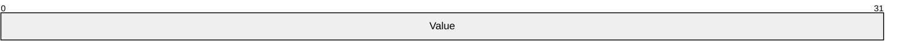
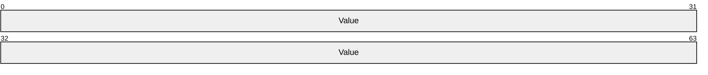
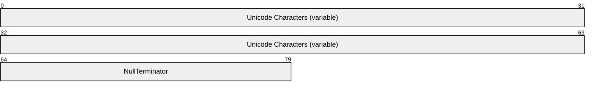
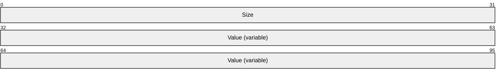
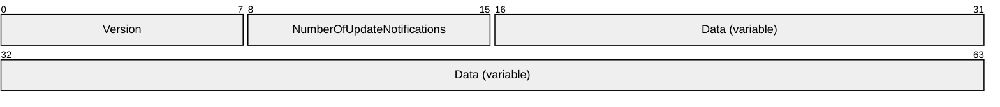
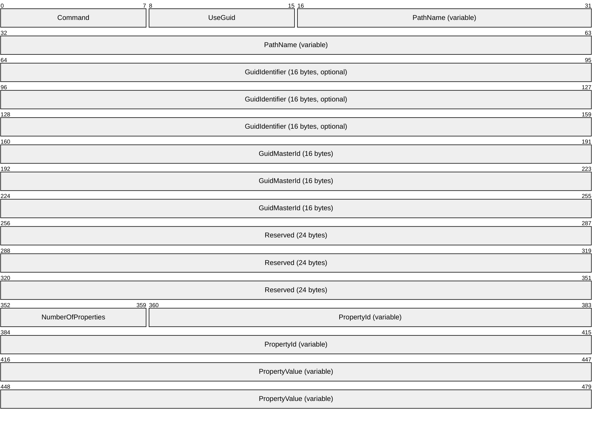
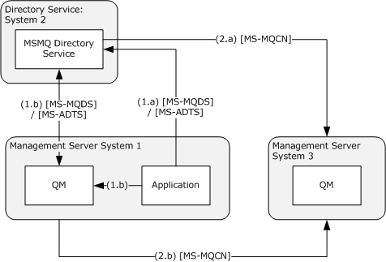

# [MS-MQCN]: Message Queuing (MSMQ): Directory Service Change Notification Protocol

Table of Contents

1 Introduction

- [1 Introduction](#Section_1)
  - [1.1 Glossary](#Section_1.1)
  - [1.2 References](#Section_1.2)
    - [1.2.1 Normative References](#Section_1.2.1)
    - [1.2.2 Informative References](#Section_1.2.2)
  - [1.3 Overview](#Section_1.3)
  - [1.4 Relationship to Other Protocols](#Section_1.4)
  - [1.5 Prerequisites/Preconditions](#Section_1.5)
  - [1.6 Applicability Statement](#Section_1.6)
  - [1.7 Versioning and Capability Negotiation](#Section_1.7)
  - [1.8 Vendor-Extensible Fields](#Section_1.8)
  - [1.9 Standards Assignments](#Section_1.9)

2 Messages

- [2 Messages](#Section_2)
  - [2.1 Transport](#Section_2.1)
  - [2.2 Message Syntax](#Section_2.2)
    - [2.2.1 GUID](#Section_2.2.1)
    - [2.2.2 PROPID](#Section_2.2.2)
      - [2.2.2.1 PROPID Constants](#Section_2.2.2.1)
    - [2.2.3 PROPVALUE](#Section_2.2.3)
      - [2.2.3.1 VT_I2](#Section_2.2.3.1)
      - [2.2.3.2 VT_I4](#Section_2.2.3.2)
      - [2.2.3.3 VT_BOOL](#Section_2.2.3.3)
      - [2.2.3.4 VT_I1](#Section_2.2.3.4)
      - [2.2.3.5 VT_UI1](#Section_2.2.3.5)
      - [2.2.3.6 VT_UI2](#Section_2.2.3.6)
      - [2.2.3.7 VT_UI4](#Section_2.2.3.7)
      - [2.2.3.8 VT_I8](#Section_2.2.3.8)
      - [2.2.3.9 VT_UI8](#Section_2.2.3.9)
      - [2.2.3.10 VT_LPWSTR](#Section_2.2.3.10)
      - [2.2.3.11 VT_BLOB](#Section_2.2.3.11)
      - [2.2.3.12 VT_CLSID](#Section_2.2.3.12)
      - [2.2.3.13 VT_UI4 | VT_VECTOR](#Section_2.2.3.13)
      - [2.2.3.14 VT_CLSID | VT_VECTOR](#Section_2.2.3.14)
      - [2.2.3.15 VT_LPWSTR | VT_VECTOR](#Section_2.2.3.15)
    - [2.2.4 Change Notification Message](#Section_2.2.4)
    - [2.2.5 Notification Body](#Section_2.2.5)
    - [2.2.6 Notification Update](#Section_2.2.6)
  - [2.3 Directory Service Schema Elements](#Section_2.3)

3 Protocol Details

- [3 Protocol Details](#Section_3)
  - [3.1 Common Details](#Section_3.1)
    - [3.1.1 Abstract Data Model](#Section_3.1.1)
      - [3.1.1.1 Shared Data Elements](#Section_3.1.1.1)
      - [3.1.1.2 Data Elements Mapping](#Section_3.1.1.2)
        - [3.1.1.2.1 Queue Manager Attributes Mapping](#Section_3.1.1.2.1)
      - [3.1.1.3 Queue Attributes Mapping](#Section_3.1.1.3)
    - [3.1.2 Timers](#Section_3.1.2)
    - [3.1.3 Initialization](#Section_3.1.3)
    - [3.1.4 Higher-Layer Triggered Events](#Section_3.1.4)
    - [3.1.5 Processing Events and Sequencing Rules](#Section_3.1.5)
    - [3.1.6 Timer Events](#Section_3.1.6)
    - [3.1.7 Other Local Events](#Section_3.1.7)
  - [3.2 MQCN Server Details](#Section_3.2)
    - [3.2.1 Abstract Data Model](#Section_3.2.1)
      - [3.2.1.1 Shared Data Elements](#Section_3.2.1.1)
      - [3.2.1.2 Local Data Elements](#Section_3.2.1.2)
        - [3.2.1.2.1 Change Notification Queue](#Section_3.2.1.2.1)
    - [3.2.2 Timers](#Section_3.2.2)
    - [3.2.3 Initialization](#Section_3.2.3)
    - [3.2.4 Higher-Layer Triggered Events](#Section_3.2.4)
    - [3.2.5 Processing Events and Sequencing Rules](#Section_3.2.5)
      - [3.2.5.1 Processing a Change Notification Message Version 0x01](#Section_3.2.5.1)
      - [3.2.5.2 Processing a Change Notification Message Version 0x02](#Section_3.2.5.2)
    - [3.2.6 Timer Events](#Section_3.2.6)
    - [3.2.7 Other Local Events](#Section_3.2.7)
  - [3.3 MQCN Client Details](#Section_3.3)
    - [3.3.1 Abstract Data Model](#Section_3.3.1)
      - [3.3.1.1 Shared Data Elements](#Section_3.3.1.1)
    - [3.3.2 Timers](#Section_3.3.2)
    - [3.3.3 Initialization](#Section_3.3.3)
    - [3.3.4 Higher-Layer Triggered Events](#Section_3.3.4)
      - [3.3.4.1 Send Change Notification](#Section_3.3.4.1)
    - [3.3.5 Processing Events and Sequencing Rules](#Section_3.3.5)
      - [3.3.5.1 Preparing a Change Notification Message Version 0x02](#Section_3.3.5.1)
      - [3.3.5.2 Preparing a Change Notification Message Version 0x01](#Section_3.3.5.2)
      - [3.3.5.3 Sending a Change Notification Message](#Section_3.3.5.3)
    - [3.3.6 Timer Events](#Section_3.3.6)
    - [3.3.7 Other Local Events](#Section_3.3.7)

4 Protocol Examples

- [4 Protocol Examples](#Section_4)
  - [4.1 Management Client Update Profile](#Section_4.1)

5 Security

- [5 Security](#Section_5)
  - [5.1 Security Considerations for Implementers](#Section_5.1)
  - [5.2 Index of Security Parameters](#Section_5.2)

6 Appendix A: Product Behavior

- [6 Appendix A: Product Behavior](#Section_6)

7 Change Tracking

- [7 Change Tracking](#Section_7)

For the legal notice and IP terms, see [LEGAL.md](../LEGAL.md).
Last updated: 4/23/2024.
See [Revision History](#revision-history) for full version history.

# 1 Introduction

This document specifies the Message Queuing (MSMQ): Directory Service Change Notification Protocol. [**Queue managers**](#gt_476f10ed-08f0-4887-b583-59d5cf909979) own and store objects that are also stored in the [**directory service**](#gt_directory-service-ds). When an application makes changes to an object in the directory service, the MSMQ: Directory Service Change Notification Protocol is used by the [**MSMQ Directory Service**](#gt_msmq-directory-service) or by the queue manager to notify the queue manager that owns the object that those changes have occurred. The types of notifications that can be performed by using this protocol include notifying a queue manager that a [**queue**](#gt_queue) object has been created, changed, or deleted; and notifying a queue manager that its machine object has been changed. The MSMQ: Directory Service Change Notification Protocol is a queued protocol that uses [**Microsoft Message Queuing (MSMQ)**](#gt_microsoft-message-queuing-msmq) as its transport infrastructure to send notifications wrapped within MSMQ [**messages**](#gt_message).

Sections 1.5, 1.8, 1.9, 2, and 3 of this specification are normative. All other sections and examples in this specification are informative.

## 1.1 Glossary

This document uses the following terms:

**Active Directory**: The Windows implementation of a general-purpose [**directory service**](#gt_directory-service-ds), which uses LDAP as its primary access protocol. [**Active Directory**](#gt_active-directory) stores information about a variety of objects in the network such as user accounts, computer accounts, groups, and all related credential information used by Kerberos [MS-KILE](../MS-KILE/MS-KILE.md). [**Active Directory**](#gt_active-directory) is either deployed as Active Directory Domain Services (AD DS) or Active Directory Lightweight Directory Services (AD LDS), which are both described in [MS-ADOD](../MS-ADOD/MS-ADOD.md): Active Directory Protocols Overview.

**Augmented Backus-Naur Form (ABNF)**: A modified version of Backus-Naur Form (BNF), commonly used by Internet specifications. ABNF notation balances compactness and simplicity with reasonable representational power. ABNF differs from standard BNF in its definitions and uses of naming rules, repetition, alternatives, order-independence, and value ranges. For more information, see [[RFC5234]](https://go.microsoft.com/fwlink/?LinkId=123096).

**connected network**: A network of computers in which any two computers can communicate directly through a common transport protocol (for example, TCP/IP or SPX/IPX). A computer can belong to multiple connected networks.

**directory service (DS)**: An entity that maintains a collection of objects. These objects can be remotely manipulated either by the Message Queuing (MSMQ): Directory Service Protocol, as specified in [MS-MQDS](../MS-MQDS/MS-MQDS.md), or by the Lightweight Directory Access Protocol (v3), as specified in [[RFC2251]](https://go.microsoft.com/fwlink/?LinkId=90325).

**domain controller (DC)**: The service, running on a server, that implements [**Active Directory**](#gt_active-directory), or the server hosting this service. The service hosts the data store for objects and interoperates with other [**DCs**](#gt_domain-controller-dc) to ensure that a local change to an object replicates correctly across all [**DCs**](#gt_domain-controller-dc). When [**Active Directory**](#gt_active-directory) is operating as Active Directory Domain Services (AD DS), the [**DC**](#gt_domain-controller-dc) contains full NC replicas of the configuration naming context (config NC), schema naming context (schema NC), and one of the domain NCs in its forest. If the AD DS [**DC**](#gt_domain-controller-dc) is a global catalog server (GC server), it contains partial NC replicas of the remaining domain NCs in its forest. For more information, see [MS-AUTHSOD](../MS-AUTHSOD/MS-AUTHSOD.md) section 1.1.1.5.2 and [MS-ADTS](../MS-ADTS/MS-ADTS.md). When [**Active Directory**](#gt_active-directory) is operating as Active Directory Lightweight Directory Services (AD LDS), several AD LDS [**DCs**](#gt_domain-controller-dc) can run on one server. When [**Active Directory**](#gt_active-directory) is operating as AD DS, only one AD DS [**DC**](#gt_domain-controller-dc) can run on one server. However, several AD LDS [**DCs**](#gt_domain-controller-dc) can coexist with one AD DS [**DC**](#gt_domain-controller-dc) on one server. The AD LDS [**DC**](#gt_domain-controller-dc) contains full NC replicas of the config NC and the schema NC in its forest. The domain controller is the server side of Authentication Protocol Domain Support [MS-APDS](../MS-APDS/MS-APDS.md).

**enterprise**: A unit of administration of a network of [**MSMQ queue managers**](#gt_msmq-queue-manager). An enterprise consists of an [**MSMQ Directory Service**](#gt_msmq-directory-service), one or more [**connected networks**](#gt_connected-network), and one or more [**MSMQ sites**](#gt_msmq-site).

**globally unique identifier (GUID)**: A term used interchangeably with universally unique identifier (UUID) in Microsoft protocol technical documents (TDs). Interchanging the usage of these terms does not imply or require a specific algorithm or mechanism to generate the value. Specifically, the use of this term does not imply or require that the algorithms described in [[RFC4122]](https://go.microsoft.com/fwlink/?LinkId=90460) or [[C706]](https://go.microsoft.com/fwlink/?LinkId=89824) must be used for generating the [**GUID**](#gt_globally-unique-identifier-guid). See also universally unique identifier (UUID).

**little-endian**: Multiple-byte values that are byte-ordered with the least significant byte stored in the memory location with the lowest address.

**message**: A data structure representing a unit of data transfer between distributed applications. A message has message properties, which may include message header properties, a message body property, and message trailer properties.

**Microsoft Message Queuing (MSMQ)**: A communications service that provides asynchronous and reliable [**message**](#gt_message) passing between distributed applications. In Message Queuing, applications send [**messages**](#gt_message) to [**queues**](#gt_queue) and consume [**messages**](#gt_message) from [**queues**](#gt_queue). The [**queues**](#gt_queue) provide persistence of the [**messages**](#gt_message), enabling the sending and receiving applications to operate asynchronously from one another.

**MSMQ Directory Service**: A network directory service that provides directory information, including key distribution, to [**MSMQ**](#gt_microsoft-message-queuing-msmq). It initially shipped in the Windows NT 4.0 operating system Option Pack for Windows NT Server as part of [**MSMQ**](#gt_microsoft-message-queuing-msmq). This directory service predates and is superseded by [**Active Directory (AD)**](#gt_active-directory).

**MSMQ management server**: A role played by an [**MSMQ queue manager**](#gt_msmq-queue-manager). An [**MSMQ management server**](#gt_msmq-management-server) enables management applications to perform management and administrative operations on the Message Queuing System. The Management Server operations are specified in [MS-MQMR](../MS-MQMR/MS-MQMR.md) and [MS-MQCN](#Section_bacb4ae101e44eaa8e1fc30af0df1a7f).

**MSMQ queue manager**: An [**MSMQ**](#gt_microsoft-message-queuing-msmq) service hosted on a machine that provides [**queued**](#gt_queue) messaging services. [**Queue managers**](#gt_476f10ed-08f0-4887-b583-59d5cf909979) manage [**queues**](#gt_queue) deployed on the local computer and provide asynchronous transfer of [**messages**](#gt_message) to [**queues**](#gt_queue) located on other computers. A [**queue manager**](#gt_queue-manager-qm) is identified by a [**globally unique identifier (GUID)**](#gt_globally-unique-identifier-guid).

**MSMQ routing link**: A communication link between two sites. A routing link is represented by a routing link object in the directory service. Routing links can have associated link costs. Routing links with their associated costs can be used to compute lowest-cost routing paths for store-and-forward messaging.

**MSMQ routing server**: A role played by an [**MSMQ queue manager**](#gt_msmq-queue-manager). An MSMQ routing server implements store and forward messaging. A routing server can provide connectivity between different [**connected networks**](#gt_connected-network) within a site or can provide session concentration between sites.

**MSMQ site**: A network of computers, typically physically collocated, that have high connectivity as measured in terms of latency (low) and throughput (high). A site is represented by a site object in the directory service. An MSMQ site maps one-to-one with an [**Active Directory**](#gt_active-directory) site when [**Active Directory**](#gt_active-directory) provides directory services to [**MSMQ**](#gt_microsoft-message-queuing-msmq).

**notification queue**: A private [**Microsoft Message Queuing (MSMQ)**](#gt_microsoft-message-queuing-msmq) [**queue**](#gt_queue) to which notifications are sent and from which notifications are received.

**public queue**: An application-defined message queue that is registered in the [**MSMQ Directory Service**](#gt_msmq-directory-service). A public queue can be deployed at any [**queue manager**](#gt_queue-manager-qm).

**queue**: An object that holds [**messages**](#gt_message) passed between applications or [**messages**](#gt_message) passed between [**Message Queuing**](#gt_microsoft-message-queuing-msmq) and applications. In general, applications can send [**messages**](#gt_message) to queues and read [**messages**](#gt_message) from queues.

**queue manager (QM)**: A message queuing service that manages [**queues**](#gt_queue) deployed on a computer. A queue manager can also provide asynchronous transfer of [**messages**](#gt_message) to [**queues**](#gt_queue) deployed on other queue managers.

**Unicode character**: Unless otherwise specified, a 16-bit UTF-16 code unit.

**Unicode string**: A Unicode 8-bit string is an ordered sequence of 8-bit units, a Unicode 16-bit string is an ordered sequence of 16-bit code units, and a Unicode 32-bit string is an ordered sequence of 32-bit code units. In some cases, it could be acceptable not to terminate with a terminating null character. Unless otherwise specified, all [**Unicode strings**](#gt_unicode-string) follow the UTF-16LE encoding scheme with no Byte Order Mark (BOM).

**workgroup mode**: A Message Queuing deployment mode in which the clients and servers operate without using a [**Directory Service**](#gt_directory-service-ds). In this mode, features pertaining to [**message**](#gt_message) security, efficient routing, [**queue**](#gt_queue) discovery, distribution lists, and aliases are not available. See also Directory-Integrated mode.

**MAY, SHOULD, MUST, SHOULD NOT, MUST NOT:** These terms (in all caps) are used as defined in [[RFC2119]](https://go.microsoft.com/fwlink/?LinkId=90317). All statements of optional behavior use either MAY, SHOULD, or SHOULD NOT.

## 1.2 References

Links to a document in the Microsoft Open Specifications library point to the correct section in the most recently published version of the referenced document. However, because individual documents in the library are not updated at the same time, the section numbers in the documents may not match. You can confirm the correct section numbering by checking the [Errata](https://go.microsoft.com/fwlink/?linkid=850906).

### 1.2.1 Normative References

We conduct frequent surveys of the normative references to assure their continued availability. If you have any issue with finding a normative reference, please contact [dochelp@microsoft.com](mailto:dochelp@microsoft.com). We will assist you in finding the relevant information.

[MS-ADTS] Microsoft Corporation, "[Active Directory Technical Specification](../MS-ADTS/MS-ADTS.md)".

[MS-DTYP] Microsoft Corporation, "[Windows Data Types](../MS-DTYP/MS-DTYP.md)".

[MS-MQBR] Microsoft Corporation, "[Message Queuing (MSMQ): Binary Reliable Message Routing Algorithm](../MS-MQBR/MS-MQBR.md)".

[MS-MQDMPR] Microsoft Corporation, "[Message Queuing (MSMQ): Common Data Model and Processing Rules](../MS-MQDMPR/MS-MQDMPR.md)".

[MS-MQDSSM] Microsoft Corporation, "[Message Queuing (MSMQ): Directory Service Schema Mapping](../MS-MQDSSM/MS-MQDSSM.md)".

[MS-MQDS] Microsoft Corporation, "[Message Queuing (MSMQ): Directory Service Protocol](../MS-MQDS/MS-MQDS.md)".

[MS-MQMQ] Microsoft Corporation, "[Message Queuing (MSMQ): Data Structures](../MS-MQMQ/MS-MQMQ.md)".

[MS-MQQB] Microsoft Corporation, "[Message Queuing (MSMQ): Message Queuing Binary Protocol](../MS-MQQB/MS-MQQB.md)".

[RFC1321] Rivest, R., "The MD5 Message-Digest Algorithm", RFC 1321, April 1992, [https://www.rfc-editor.org/info/rfc1321](https://go.microsoft.com/fwlink/?LinkId=90275)

[RFC2119] Bradner, S., "Key words for use in RFCs to Indicate Requirement Levels", BCP 14, RFC 2119, March 1997, [https://www.rfc-editor.org/info/rfc2119](https://go.microsoft.com/fwlink/?LinkId=90317)

[RFC3110] Eastlake III, D., "RSA/SHA-1 SIGs and RSA KEYs in the Domain Name System (DNS)", RFC 3110, May 2001, [https://www.rfc-editor.org/info/rfc3110](https://go.microsoft.com/fwlink/?LinkId=90406)

### 1.2.2 Informative References

[MS-MQOD] Microsoft Corporation, "[Message Queuing Protocols Overview](#Section_1.3)".

## 1.3 Overview

[**Microsoft Message Queuing (MSMQ)**](#gt_microsoft-message-queuing-msmq) is a communications service that provides asynchronous and reliable [**message**](#gt_message) passing between client applications running on different hosts. In MSMQ, clients send application messages to [**queues**](#gt_queue) and consume application messages from queues. The queue provides persistence of the messages, enabling them to survive across application restarts, and allowing the sending and receiving client applications to send and receive messages asynchronously from each other.

Queues are typically hosted by a communications service called a [**queue manager**](#gt_queue-manager-qm). By hosting the queue manager in a separate service from the client applications, applications can communicate (even if they never execute at the same time) by exchanging messages via a queue hosted by the queue manager.

Because MSMQ involves message passing between nodes, a [**directory service**](#gt_directory-service-ds) can be useful to MSMQ services in several ways. First, a directory service can provide network topology information that the MSMQ services can use to route messages between nodes. Second, a directory service can be used as a key distribution mechanism for security services used by MSMQ to secure messages and to authenticate clients. Third, a directory service can provide clients with discovery capabilities, allowing clients to discover the queues available within the network. Finally, a directory service can contain collections of directory objects representing [**enterprises**](#gt_enterprise), [**MSMQ sites**](#gt_msmq-site), [**routing links**](#gt_937d711c-e6f1-4af0-84e2-188141b28be5), machines, users, queues, [**connected networks**](#gt_connected-network), and deleted objects.

In MSMQ, queue and machine objects can be created, changed, and deleted in a directory service. As a result, the internal state of the queue manager that is the owner of these objects is left out of sync. In MSMQ, a queue manager is notified when one of its owned objects is changed in a directory service.

The MSMQ: Directory Service Change Notification Protocol defines a mechanism used by the [**MSMQ Directory Service**](#gt_msmq-directory-service) or a queue manager to notify a queue manager of changes to its owned objects. The types of notifications that can be performed by using this protocol include notifying a queue manager that a queue object has been created, changed, or deleted; and notifying a queue manager that its machine object has been changed.

## 1.4 Relationship to Other Protocols

The MSMQ: Directory Service Change Notification Protocol is a queued protocol that uses the [**Microsoft Message Queuing (MSMQ)**](#gt_microsoft-message-queuing-msmq): Message Queuing Binary Protocol [MS-MQQB](../MS-MQQB/MS-MQQB.md) as its transport protocol.

The MSMQ: Directory Service Change Notification Protocol uses shared state and processing rules defined in [MS-MQDMPR](../MS-MQDMPR/MS-MQDMPR.md).

## 1.5 Prerequisites/Preconditions

It is assumed that the protocol client has obtained the name of a server computer that supports this protocol and the name of the [**notification queue**](#gt_notification-queue) hosted on the server before this protocol is invoked. How a client acquires this information is not addressed in this specification and is typically part of the interaction between the client application and the [**queue manager**](#gt_queue-manager-qm) API.

It is assumed that the protocol client has access to a private encryption key used to decrypt [**messages**](#gt_message). A private key is typically stored in a secure location on the local client machine.

## 1.6 Applicability Statement

The server side of this protocol is applicable for implementation by a [**queue manager**](#gt_queue-manager-qm) providing [**Microsoft Message Queuing (MSMQ)**](#gt_microsoft-message-queuing-msmq) communication services to clients. The client side of this protocol is applicable for implementation by client libraries providing [**message**](#gt_message) queue managers to applications by [**directory service**](#gt_directory-service-ds) or by a queue manager delegating requests on behalf of a client.<1> This protocol is applicable to scenarios where a queue manager that is the owner of public queue objects or a machine object needs to be notified when these objects are changed in a directory service or on another queue manager on behalf of a client.<2> This protocol is not applicable to objects that are not stored in a directory service, such as private queues. This protocol is not applicable for distributed applications that require notification messages within a predefined amount of time. Notification messages are sent and, once received, the destination queue manager schedules act on them at specific time intervals.<3>

## 1.7 Versioning and Capability Negotiation

This document covers versioning issues in the following areas:

- Supported Transports: This protocol is implemented on top of [**MSMQ**](#gt_microsoft-message-queuing-msmq), as specified in section [2.1](#Section_2.1). It relies on MSMQ [**message**](#gt_message) sending and receiving mechanisms to send and receive notifications as messages.
- Capability Negotiation: This protocol has explicit capability negotiation that depends on the version of the notification message. There are two notification message versions. Version 1 is for messages sent by an [**MSMQ Directory Service**](#gt_msmq-directory-service), and version 2 is for messages sent by a [**queue manager**](#gt_queue-manager-qm).<4>

## 1.8 Vendor-Extensible Fields

This protocol does not define any vendor-extensible fields.

## 1.9 Standards Assignments

This section specifies standard parameters within the context of [**MSMQ**](#gt_microsoft-message-queuing-msmq).

| Parameter | Value | Reference |
| --- | --- | --- |
| NOTIFY_QUEUE_PRIVATE | PRIVATE=<Queue Manager GUID>\3 | None. |

# 2 Messages

## 2.1 Transport

Notifications are sent within [**messages**](#gt_message) that are transported as [**MSMQ**](#gt_microsoft-message-queuing-msmq) messages over the Message Queuing (MSMQ): Message Queuing Binary Protocol [MS-MQQB](../MS-MQQB/MS-MQQB.md).

## 2.2 Message Syntax

The following table summarizes the types and [**messages**](#gt_message) defined in this specification.

| Message or type | Description |
| --- | --- |
| GUID | [**globally unique identifier (GUID)**](#gt_globally-unique-identifier-guid). |
| [PROPID](#Section_2.2.2) | Property identifier. |
| [PROPVALUE](#Section_2.2.3) | Property value. |
| [Change Notification Message](#Section_2.2.4) | Payload of a notification message. |
| [Notification Body](#Section_2.2.5) | Body of a notification. Used by a [**queue manager**](#gt_queue-manager-qm). |
| [Notification Update](#Section_2.2.6) | Alternative body notification. Used by a [**directory service**](#gt_directory-service-ds). |

### 2.2.1 GUID

This specification uses a [**globally unique identifier (GUID)**](#gt_globally-unique-identifier-guid). This information is as specified in [MS-DTYP](../MS-DTYP/MS-DTYP.md) section 2.3.4.

### 2.2.2 PROPID

Notification [**messages**](#gt_message) carry an array of property identifiers (a unique PROPID value). The associated property values are specified in a related array of property values.

**Value (4 bytes):** A ULONG that specifies the identification of a property. This field MUST be filled with a valid property identifier, as specified in [MS-MQMQ](../MS-MQMQ/MS-MQMQ.md) section 2.3.

#### 2.2.2.1 PROPID Constants

This section contains a list of [PROPID](#Section_2.2.2) constants.

| PROPID Constant | Value |
| --- | --- |
| PROPID_Q_ADS_PATH ([MS-MQMQ](../MS-MQMQ/MS-MQMQ.md) section 2.3.1.24) | 126 |
| PROPID_Q_AUTHENTICATE ([MS-MQMQ] section 2.3.1.11) | 111 |
| PROPID_Q_BASEPRIORITY ([MS-MQMQ] section 2.3.1.6) | 106 |
| PROPID_Q_CREATE_TIME ([MS-MQMQ] section 2.3.1.9) | 109 |
| PROPID_Q_INSTANCE ([MS-MQMQ] section 2.3.1.1) | 101 |
| PROPID_Q_JOURNAL ([MS-MQMQ] section 2.3.1.4) | 104 |
| PROPID_Q_JOURNAL_QUOTA ([MS-MQMQ] section 2.3.1.7) | 107 |
| PROPID_Q_LABEL ([MS-MQMQ] section 2.3.1.8) | 108 |
| PROPID_Q_MODIFY_TIME ([MS-MQMQ] section 2.3.1.10) | 110 |
| PROPID_Q_MULTICAST_ADDRESS ([MS-MQMQ] section 2.3.1.23) | 125 |
| PROPID_Q_PATHNAME ([MS-MQMQ] section 2.3.1.22) | 103 |
| PROPID_Q_PRIV_LEVEL ([MS-MQMQ] section 2.3.1.12) | 112 |
| PROPID_Q_SCOPE ([MS-MQMQ] section 2.3.1.14) | 114 |
| PROPID_Q_QMID ([MS-MQMQ] section 2.3.1.15) | 115 |
| PROPID_Q_QUOTA ([MS-MQMQ] section 2.3.1.5) | 105 |
| PROPID_Q_SECURITY ([MS-MQMQ] section 2.3.1.25) | 1101 |
| PROPID_Q_TRANSACTION ([MS-MQMQ] section 2.3.1.13) | 113 |
| PROPID_Q_TYPE ([MS-MQMQ] section 2.3.1.2) | 102 |
| PROPID_QM_CNS ([MS-MQMQ] section 2.3.2.6) | 207 |
| PROPID_QM_FOREIGN ([MS-MQMQ] section 2.3.2.18) | 219 |
| PROPID_QM_JOURNAL_QUOTA ([MS-MQMQ] section 2.3.2.14) | 215 |
| PROPID_QM_SITE_ID ([MS-MQMQ] section 2.3.2.1) | 201 |
| PROPID_QM_MACHINE_ID ([MS-MQMQ] section 2.3.2.2) | 202 |
| PROPID_QM_ADDRESS ([MS-MQMQ] section 2.3.2.5) | 206 |
| PROPID_QM_QUOTA ([MS-MQMQ] section 2.3.2.10) | 214 |
| PROPID_QM_MACHINE_TYPE ([MS-MQMQ] section 2.3.2.15) | 216 |
| PROPID_QM_MODIFY_TIME ([MS-MQMQ] section 2.3.2.17) | 218 |
| PROPID_QM_OS ([MS-MQMQ] section 2.3.2.19) | 220 |
| PROPID_QM_SECURITY ([MS-MQMQ] section 2.3.2.31) | 1201 |
| PROPID_D_SCOPE ([MS-MQMQ] section 2.3.13.3) | 1403 |
| PROPID_D_OBJTYPE ([MS-MQMQ] section 2.3.13.4) | 1404 |

### 2.2.3 PROPVALUE

This section contains block diagrams for property values related to PROPVARIANT ([MS-MQMQ](../MS-MQMQ/MS-MQMQ.md) section 2.2.12) types. A PROPVARIANT type is determined by the [PROPID](#Section_2.2.2). [MS-MQMQ] section 2.3 specifies the PROPVARIANT type for each PROPID. All numeric values within the block diagrams MUST be formatted in [**little-endian**](#gt_little-endian) byte order. Values in an array are simply concatenated with no padding.

#### 2.2.3.1 VT_I2

The value of a VT_I2 type property MUST be a 2-byte signed integer. It MUST be formatted in [**little-endian**](#gt_little-endian) byte order.

#### 2.2.3.2 VT_I4

The value of a VT_I4 type property MUST be a 4-byte signed integer. It MUST be formatted in [**little-endian**](#gt_little-endian) byte order.

#### 2.2.3.3 VT_BOOL

The value of a VT_BOOL type property MUST be a 16-bit value. It MUST be formatted in [**little-endian**](#gt_little-endian) byte order.

**Value (2 bytes):** The values MUST be defined as follows.

| Value | Meaning |
| --- | --- |
| VARIANT_TRUE 0xFFFF | MUST indicate a Boolean value of true. |
| VARIANT_FALSE 0x0000 | MUST indicate a Boolean value of false. |

#### 2.2.3.4 VT_I1

The value of a VT_I1 type property MUST be a 1-byte signed integer.

#### 2.2.3.5 VT_UI1

The value of a VT_UI1 type property MUST be a 1-byte unsigned integer.

#### 2.2.3.6 VT_UI2

The value of a VT_UI2 type property MUST be a 2-byte unsigned integer. It MUST be formatted in [**little-endian**](#gt_little-endian) byte order.

#### 2.2.3.7 VT_UI4

The value of a VT_UI4 type property MUST be a 4-byte unsigned integer. It MUST be formatted in [**little-endian**](#gt_little-endian) byte order.

#### 2.2.3.8 VT_I8

The value of a VT_I8 type property MUST be an 8-byte signed integer. It MUST be formatted in [**little-endian**](#gt_little-endian) byte order.

#### 2.2.3.9 VT_UI8

The value of a VT_UI8 type property MUST be an 8-byte unsigned integer. It MUST be formatted in [**little-endian**](#gt_little-endian) byte order.

#### 2.2.3.10 VT_LPWSTR

The value of a VT_LPWSTR type property MUST be a null-terminated string of 16-bit [**Unicode characters**](#gt_unicode-character).

**Unicode Characters (variable):** Contains a variable-length array of Unicode characters. Each array element MUST be set to a 16-bit Unicode character.

**NullTerminator (2 bytes):** Contains a Unicode character. This field MUST be set to a value of 0x0000.

#### 2.2.3.11 VT_BLOB

The value of a VT_BLOB property MUST be a counted array of unsigned bytes.

**Size (4 bytes):** A ULONG that specifies the size of the array or vector of values. This field MUST be formatted in [**little-endian**](#gt_little-endian) byte order.

**Value (variable):** Contains an array of unsigned bytes. This field MUST be set to an array of length **Size**, and each element MUST be an unsigned byte.

#### 2.2.3.12 VT_CLSID

The value of a VT_CLSID type property MUST be a **GUID** ([MS-DTYP](../MS-DTYP/MS-DTYP.md) section 2.3.4.2) value.

#### 2.2.3.13 VT_UI4 | VT_VECTOR

The value of a VT_UI4 | VT_VECTOR type property MUST be an array of [VT_UI4](#Section_2.2.3.7) type property values.

**Size (4 bytes):** A ULONG that specifies the size of the array or vector of values. This field MUST be formatted in [**little-endian**](#gt_little-endian) byte order.

**Value (variable):** MUST be filled with an array of property values of VT_UI4 type. The number of values MUST be equal to the **Size** field value.

#### 2.2.3.14 VT_CLSID | VT_VECTOR

The value of a VT_CLSID | VT_VECTOR type property MUST be an array of [VT_CLSID](#Section_2.2.3.12) type property values.

**Size (4 bytes):** A ULONG that specifies the size of the array or vector of values; MUST be formatted in [**little-endian**](#gt_little-endian) byte order.

**Value (variable):** MUST be filled with an array of property values of VT_CLSID type. The number of values MUST be equal to the **Size** field value.

#### 2.2.3.15 VT_LPWSTR | VT_VECTOR

The value of a VT_LPWSTR | VT_VECTOR type property MUST be an array of [VT_LPWSTR](#Section_2.2.3.10) type property values.

**Size (4 bytes):** A ULONG that specifies the size of the array or vector of values; MUST be formatted in [**little-endian**](#gt_little-endian) byte order.

**Value (variable):** MUST be filled with an array of property values of VT_LPWSTR type. The number of values MUST be equal to the **Size** field value.

### 2.2.4 Change Notification Message

A Change Notification Message is used to encapsulate a single change [Notification Body (section 2.2.5)](#Section_2.2.5) sent by a [**queue manager**](#gt_queue-manager-qm) or several change [Notification Updates (section 2.2.6)](#Section_2.2.6) sent by a [**directory service**](#gt_directory-service-ds). A change notification represents a change on either a [**queue**](#gt_queue) or a machine object within a directory service.

**Version (1 byte):** A UCHAR containing the version of the notification [**message**](#gt_message). This field MUST be set to the value 0x01 for messages sent by an [**MSMQ Directory Service**](#gt_msmq-directory-service) and to the value 0x02 for messages sent by an [**MSMQ queue manager**](#gt_msmq-queue-manager).<5>

| Value | Meaning |
| --- | --- |
| 0x01 | Message sent by an MSMQ Directory Service. |
| 0x02 | Message sent by an MSMQ queue manager. |

**NumberOfUpdateNotifications (1 byte):** A UCHAR that contains the number of update notifications. This field MUST be set to the number of update notifications contained in the **Data** field. If the **Version** field is set to 0x02, this field MUST be set to 0x01.

**Data (variable):** A variable-length UCHAR array. The content of this field varies depending on the **Version** field. If the **Version** field is set to 0x01, this field contains a sequence of Notification Updates (section 2.2.6). If the **Version** field is set to 0x02, this field contains a single Notification Body (section 2.2.5). There is no padding between **Notification Update**s.

### 2.2.5 Notification Body

A Notification Body is used to encapsulate a change notification that indicates a change either on a [**queue**](#gt_queue) or a machine object within a [**directory service**](#gt_directory-service-ds). The change is expressed as a notification event that indicates one of the following events: creation of a queue object, change on a queue object, deletion of a queue object, or change on a machine object. A Notification Body is used by a [**queue manager**](#gt_queue-manager-qm) to send a change notification [**message**](#gt_message) to the queue manager that is the owner of the modified object. This format does not include the changed data. The recipient queue manager MUST read the data from the directory service, as specified in section [3.2.5.2](#Section_3.2.5.2); therefore, queue managers do not have to be trusted.

<Notification>

<Event>**Event**</Event>

<ObjectGuid>**ObjectGuid**</ObjectGuid>

<DomainController>**DirectoryServiceServer**</DomainController>

</Notification>

**Event**

Specifies the notification event for a queue or a machine object on which changes were made within a [**domain controller (DC)**](#gt_domain-controller-dc). This MUST be set to 1, 2, 3, or 4. A value of 1 indicates creation of a queue object. A value of 2 indicates change on a queue object; a value of 3 indicates deletion of a queue object. A value of 4 indicates change on a machine object.

**ObjectGuid**

Specifies the object that was modified within the DC. This MUST be set to the GUID of the modified object that MUST be either a queue or a machine object.

**DirectoryServiceServer**

Specifies the name of the Directory Service server through which the queue or the machine object was modified in the directory.

Notification body MUST be set to a [**Unicode string**](#gt_unicode-string) in the format specified by the following [**Augmented Backus-Naur Form (ABNF)**](#gt_augmented-backus-naur-form-abnf) rule.

NotificationBody = "<Notification>"

"<Event>"event"</Event>"

"<ObjectGuid>"object-guid"</ObjectGuid >"

"<DomainController>"

DirectoryServiceServer

"</DomainController>"

"</Notification>"

event = "1" / "2" / "3" / "4"

;where "1": create queue, "2": change queue,

;"3": delete queue, "4": change machine

object-guid = 8HEXDIG"-"4HEXDIG"-"4HEXDIG"-"4HEXDIG"-"12HEXDIG

; A GUID of the form XXXXXXXX-XXXX-XXXX-XXXX-XXXXXXXXXXXX

DirectoryServiceServer = 1*256(VCHAR)

; A directory service name.

HEXDIG = DIGIT / "A" / "B" / "C" / "D" / "E" / "F"

DIGIT = %x30-39

; 0-9

VCHAR = %x21-7E

### 2.2.6 Notification Update

A **Notification Update** is used to encapsulate a change notification that indicates a change either on a [**queue**](#gt_queue) or a machine object within a [**directory service**](#gt_directory-service-ds). The change is expressed as a notification event that indicates one of the following events: creation of a queue object, change on a queue object, deletion of a queue object, or change on a machine object. A **Notification Update** is used by a directory service to send change notification [**messages**](#gt_message) to the [**queue manager**](#gt_queue-manager-qm) that is the owner of the modified objects.

**Command (1 byte):** A UCHAR that indicates the change notification operation, which can be create, change, or delete. This field MUST be set to 0x00, 0x01, or 0x02, where:

| Value | Meaning |
| --- | --- |
| 0x00 | Indicates creation. |
| 0x01 | Indicates change. |
| 0x02 | Indicates deletion. |

**UseGuid (1 byte):** A UCHAR that indicates whether a **Notification Update** uses the **PathName** or the **GuidIdentifier** field. This field MUST be set to 0x01 to indicate that the **GuidIdentifier** field is being used. Otherwise, this field MUST be set to 0x00 to indicate that the **PathName** field is being used.

| Value | Meaning |
| --- | --- |
| 0x00 | The **PathName** field is being used. |
| 0x01 | The **GuidIdentifier** field is being used. |

**PathName (variable):** Indicates the path of the object that was modified in the directory service. MUST be a null-terminated [**Unicode string**](#gt_unicode-string), and MUST follow the rules specified in PROPID_Q_PATHNAME ([MS-MQMQ](../MS-MQMQ/MS-MQMQ.md) section 2.3.1.3). This field MUST NOT be present if the **UseGuid** field is set to 0x01. Instead, the **GuidIdentifier** field MUST be set with a value.

**GuidIdentifier (16 bytes):** Indicates the GUID of the object that was modified in the directory service. This field MUST be present if the **UseGuid** field is set to 0x01.

**GuidMasterId (16 bytes):** Indicates the GUID of the directory server that originated the change **Notification Update**.

**Reserved (24 bytes):** A 24-byte array of UCHAR reserved for future use. MAY be set to all 0x00 bytes by the client, and MUST be ignored by the server.

**NumberOfProperties (1 byte):** A UCHAR that indicates the number of properties that are included as part of this **Notification Update**.

**PropertyId (variable):** An array of [PROPID](#Section_2.2.2) that contains a collection of property IDs that are part of this **Notification Update**. These properties refer either to informative data or to changed data related to the changed object. The number of elements MUST be equal to the value of the **NumberOfProperties** field.

**PropertyValue (variable):** Contains a collection of property values that are part of this **Notification Update**. These instances contain either informative data or modified data related to the changed object. The number of property values MUST be equal to the value of the **NumberOfProperties** field. The format of each property value depends on the variant type, which is determined by the corresponding property ID. Section [2.2.3](#Section_2.2.3) lists the formats for the variant types. Sections [2.2.3.1](#Section_2.2.3.1) through [2.2.3.15](#Section_2.2.3.15) define the types for each property ID.

## 2.3 Directory Service Schema Elements

This protocol uses ADM elements specified in section [3.1.1](../MS-MQDSSM/MS-MQDSSM.md). A subset of these elements can be published in a directory. This protocol SHOULD<6> access the directory using the algorithm specified in [MS-MQDSSM](../MS-MQDSSM/MS-MQDSSM.md) and using LDAP [MS-ADTS](../MS-ADTS/MS-ADTS.md). The Directory Service schema elements for ADM elements published in the directory are defined in [MS-MQDSSM] section 2.4.<7>

# 3 Protocol Details

## 3.1 Common Details

### 3.1.1 Abstract Data Model

This conceptual model is common to both servers and clients of this protocol. The abstract data model, which is specific to either the server or client side of this protocol, is described in [MQCN Server Details (section 3.2)](#Section_3.2) and [MQCN Client Details (section 3.3)](#Section_3.3), respectively.

This section describes a conceptual model of possible data organization that an implementation maintains to participate in this protocol. The described organization is provided to facilitate the explanation of how the protocol behaves. This document does not mandate that implementations adhere to this model as long as their external behavior is consistent with that described in this document.

The abstract data model for this protocol comprises abstract data model (ADM) elements that are private to this protocol and others that are shared between multiple [**MSMQ**](#gt_microsoft-message-queuing-msmq) protocols that are collocated at a common [**queue manager**](#gt_queue-manager-qm). The shared abstract data model is defined in [MS-MQDMPR](../MS-MQDMPR/MS-MQDMPR.md) section 3.1.1, and the relationship between this protocol, a queue manager, and other protocols that share a common queue manager is described in [MS-MQOD](#Section_1.3).

Section [3.1.1.1](#Section_3.1.1.1) references the ADM elements from the shared data model that are manipulated by this protocol.

Section [3.1.1.2](#Section_3.1.1.2) describes the mapping between property identifiers and attributes of ADM elements.

#### 3.1.1.1 Shared Data Elements

The server and client side of this protocol manipulate the following ADM elements from the shared abstract data model defined in [MS-MQDMPR](../MS-MQDMPR/MS-MQDMPR.md) section 3.1.1.

**QueueManager:** [MS-MQDMPR] section 3.1.1.1.

**Queue:** [MS-MQDMPR] section 3.1.1.2.

**Message:** [MS-MQDMPR] section 3.1.1.12.

#### 3.1.1.2 Data Elements Mapping

This section describes the mapping between property identifiers and attributes of abstract data models elements.

##### 3.1.1.2.1 Queue Manager Attributes Mapping

The following section specifies the mapping between property identifiers and the ADM attributes of a **QueueManager** ([MS-MQDMPR](../MS-MQDMPR/MS-MQDMPR.md) section 3.1.1.1) ADM element.

**QueueManager.Identifier:** Defined in PROPID_QM_MACHINE_ID ([MS-MQMQ](../MS-MQMQ/MS-MQMQ.md) section 2.3.2.2).

**QueueManager.ForeignSystem:** Defined in PROPID_QM_FOREIGN ([MS-MQMQ] section 2.3.2.18).

**QueueManager.QueueManagerQuota:** Defined in PROPID_QM_QUOTA ([MS-MQMQ] section 2.3.2.10).

**QueueManager.JournalQuota:** Defined in PROPID_QM_JOURNAL_QUOTA ([MS-MQMQ] section 2.3.2.14).

**QueueManager.Security:** Defined in PROPID_QM_SECURITY ([MS-MQMQ] section 2.3.2.31).

**QueueManager.ConnectedNetworkIdentifierList:** Defined in PROPID_QM_CNS ([MS-MQMQ] section 2.3.2.6).

**QueueManager.QueueManagerVersion:** Defined in PROPID_QM_MACHINE_TYPE ([MS-MQMQ] section 2.3.2.15).

**QueueManager.OperatingSystemType:** Defined in PROPID_QM_OS ([MS-MQMQ] section 2.3.2.19).

#### 3.1.1.3 Queue Attributes Mapping

The ADM attributes of a **Queue** ([MS-MQDMPR](../MS-MQDMPR/MS-MQDMPR.md) section 3.1.1.2) ADM element map to their respective property identifiers as follows.

**Queue.Identifier:** PROPID_Q_INSTANCE ([MS-MQMQ](../MS-MQMQ/MS-MQMQ.md) section 2.3.1.1).

**Queue.Type:** PROPID_Q_TYPE ([MS-MQMQ] section 2.3.1.2).

**Queue.BasePriority:** PROPID_Q_BASEPRIORITY ([MS-MQMQ] section 2.3.1.6).

**Queue.Journaling:** PROPID_Q_JOURNAL ([MS-MQMQ] section 2.3.1.4).

**Queue.Quota:** PROPID_Q_QUOTA ([MS-MQMQ] section 2.3.1.5).

**Queue.JournalQuota:** PROPID_Q_JOURNAL_QUOTA ([MS-MQMQ] section 2.3.1.7).

**Queue.CreateTime:** PROPID_Q_CREATE_TIME ([MS-MQMQ] section 2.3.1.9).

**Queue.ModifyTime:** PROPID_Q_MODIFY_TIME ([MS-MQMQ] section 2.3.1.10).

**Queue.Security:** PROPID_Q_SECURITY ([MS-MQMQ] section 2.3.1.25).

**Queue.Pathname:** PROPID_Q_PATHNAME ([MS-MQMQ] section 2.3.1.22).

**Queue.Label:** PROPID_Q_LABEL ([MS-MQMQ] section 2.3.1.8).

**Queue.Authentication:** PROPID_Q_AUTHENTICATE ([MS-MQMQ] section 2.3.1.11).

**Queue.PrivacyLevel:** PROPID_Q_PRIV_LEVEL ([MS-MQMQ] section 2.3.1.12).

**Queue.Transactional:** PROPID_Q_TRANSACTION ([MS-MQMQ] section 2.3.1.13).

**Queue.MulticastAddress:** PROPID_Q_MULTICAST_ADDRESS ([MS-MQMQ] section 2.3.1.23).

**Queue.DirectoryPath:** PROPID_Q_ADS_PATH ([MS-MQMQ] section 2.3.1.24).

**Queue.Scope:** PROPID_Q_SCOPE ([MS-MQMQ] section 2.3.1.14).

### 3.1.2 Timers

There are no common timers.

### 3.1.3 Initialization

There is no common initialization.

### 3.1.4 Higher-Layer Triggered Events

There are no common higher-layer triggered events.

### 3.1.5 Processing Events and Sequencing Rules

There are no common [**message**](#gt_message) processing events and sequencing rules.

### 3.1.6 Timer Events

There are no common timer events.

### 3.1.7 Other Local Events

There are no other local events.

## 3.2 MQCN Server Details

### 3.2.1 Abstract Data Model

This section describes a conceptual model of possible data organization that an implementation maintains to participate in this protocol. The described organization is provided to facilitate the explanation of how the protocol behaves. This document does not mandate that implementations adhere to this model as long as their external behavior is consistent with that described in this document.

The abstract data model for this protocol comprises ADM elements that are private to this protocol and others that are shared between multiple [**MSMQ**](#gt_microsoft-message-queuing-msmq) protocols that are collocated at a common [**queue manager**](#gt_queue-manager-qm). The shared abstract data model is defined in [MS-MQDMPR](../MS-MQDMPR/MS-MQDMPR.md) section 3.1.1, and the relationship between this protocol, a queue manager, and other protocols that share a queue manager is described in [MS-MQOD](#Section_1.3).

Section [3.2.1.1](#Section_3.2.1.1) references the ADM elements from the shared data model that are manipulated by this protocol.

Section [3.2.1.2](#Section_3.2.1.2) describes the ADM elements that are specific to the server side of this protocol.

#### 3.2.1.1 Shared Data Elements

The server side of this protocol manipulates the shared ADM elements listed in section [3.1.1.1](#Section_3.1.1.1).

#### 3.2.1.2 Local Data Elements

In addition to the shared ADM elements, the server side of this protocol manipulates the [Change Notification Queue (section 3.2.1.2.1)](#Section_3.2.1.2.1) ADM element.

##### 3.2.1.2.1 Change Notification Queue

The **Change Notification Queue** ADM element represents a local private [**notification queue**](#gt_notification-queue). The following [**ABNF**](#gt_augmented-backus-naur-form-abnf) rule specifies the queue name format.

QueuePathName = (Computer "\private$\notify_queue$")

Computer = 1*256(VCHAR) ; computer where the queue manager resides

VCHAR = %x21-7E

### 3.2.2 Timers

None.

### 3.2.3 Initialization

The implementation of this protocol SHOULD<8> open the local private change [**notification queue**](#gt_notification-queue). This [**queue**](#gt_queue) MUST be opened by raising an Open Queue ([MS-MQDMPR](../MS-MQDMPR/MS-MQDMPR.md) section 3.1.7.1.5) event with the following arguments:

- *iFormatName* := NOTIFY_QUEUE_PRIVATE as defined in section [1.9](#Section_1.9).
- *iRequiredAccess* := **ReceiveAccess**.
- *iSharedMode* := **DenyNone**.
This event returns *rStatus* and *rOpenQueueDescriptor*. If *rStatus* is MQ_OK, the value of *rOpenQueueDescriptor* is stored for reuse when dequeuing [**messages**](#gt_message) from this queue. Otherwise, if *rStatus* is different than MQ_OK, this protocol cannot work correctly.

After the change notification queue is open, the implementation MUST start a loop for the lifetime of the server side of this protocol for dequeuing and processing change notification messages:

- Raise the Dequeue Message ([MS-MQDMPR] section 3.1.7.1.10) event with the following arguments:
- *iQueueDesc* := The **OpenQueueDescriptor** ([MS-MQDMPR] section 3.1.1.16) ADM element instance referenced by *rOpenQueueDescriptor* returned by the Open Queue event that opened the change notification queue.
This event returns *rMessage*, a reference to the **Message** ([MS-MQDMPR] section 3.1.1.12) ADM element instance that was dequeued.

### 3.2.4 Higher-Layer Triggered Events

None.

### 3.2.5 Processing Events and Sequencing Rules

The server MUST initialize the local private change [**notification queue**](#gt_notification-queue) as specified in section [3.2.3](#Section_3.2.3). When a Dequeue Message ([MS-MQDMPR](../MS-MQDMPR/MS-MQDMPR.md) section 3.1.7.1.10) event is raised, the server MUST process the returned *rMessage* as follows:

- Let *NotificationMessage* be initialized to *rMessage*.**Body** parsed as a [Change Notification Message (section 2.2.4)](#Section_2.2.4).
- Verify the value of the *NotificationMessage*.**Version** field, and:
- If the value of the *NotificationMessage*.**Version** field is 0x01, the *NotificationMessage*.**Data** field MUST be interpreted as an array of instances of [Notification Update (section 2.2.6)](#Section_2.2.6). The number of instances is determined by the value of the *NotificationMessage*.**NumberOfUpdateNotifications** field. For receiving a change notification message version 0x01, see section [3.2.5.1](#Section_3.2.5.1).
- Otherwise, if the value of the *NotificationMessage*.**Version** field is 0x02, the *NotificationMessage*.**Data** field MUST be interpreted as an instance of [Notification Body (section 2.2.5)](#Section_2.2.5). For receiving a change notification message version 0x02, see section [3.2.5.2](#Section_3.2.5.2).
After a notification [**message**](#gt_message) is processed, another Dequeue Message event MUST be generated as specified in section 3.2.3. This process is repeated for the lifetime of the [**queue manager**](#gt_queue-manager-qm).

#### 3.2.5.1 Processing a Change Notification Message Version 0x01

For a [Change Notification Message (section 2.2.4)](#Section_2.2.4) with a **Version** field set to 0x01, *NotificationMessage*.**Data** is an array of [Notification Updates (section 2.2.6)](#Section_2.2.6). For each **Notification Update** in the array, the server MUST update the state of the [**queue**](#gt_queue) or [**queue manager**](#gt_queue-manager-qm) object referenced by the **PathName** field or the **GuidIdentifier** field.

To process the update, the server MUST perform the following steps for each **Notification Update** in the array:

- The queue manager MUST verify that the change notification **Message** ([MS-MQDMPR](../MS-MQDMPR/MS-MQDMPR.md) section 3.1.1.12) ADM element instance *rMessage* was authenticated, according to the following rules:
- If *rMessage*.**SenderIdentifierType** does not equal **QueueManagerIdentifier**, the server MUST disregard the **Change Notification Message** and perform no further processing.
- If *rMessage*.**AuthenticationLevel** has a value of 0x0 (**None**), the server MUST disregard the **Change Notification Message** and perform no further processing.
- The object type (either a queue object or a queue manager object) in a **Notification Update** MUST be determined according to the following rules:
- If the **Command** field is set to 0x00 (created) or 0x01 (updated), the server MUST perform the following actions:
- If the value of **PropertyId[0]** is greater than 1,000, the object type MUST be set to (**PropertyId[0]** - 1,000) / 100.
- If the value of **PropertyId[0]** is less than or equal to 1,000, the object type MUST be set to **PropertyId[0]** / 100.
- If the object type does not equal 1 (a queue object) or 2 (a queue manager object), the server MUST disregard the **Change Notification Message** and perform no further processing.
- Once the object type is identified, the following actions MUST be performed:
- If the **Command** field equals 0x00 (created) and object type is 1 (a queue object), the following processing rules MUST be performed:
- Let *newQueue* be a new **Queue** ([MS-MQDMPR] section 3.1.1.2) ADM element instance.
- Raise a Set Queue Defaults ([MS-MQDMPR] section 3.1.7.1.33) event with the following arguments:
- *iQueue* := *newQueue*
- Set the following ADM attributes on the **Queue** ADM element instance *newQueue*:
- **Type** := **PropertyValue**[ IndexOf(PROPID_Q_TYPE) ]
- **Identifier** := **PropertyValue**[ IndexOf(PROPID_Q_INSTANCE) ]
- **BasePriority** := **PropertyValue**[ IndexOf(PROPID_Q_BASEPRIORITY) ]
- **Journaling** := **PropertyValue**[ IndexOf(PROPID_Q_JOURNAL) ]
- **Quota** := **PropertyValue**[ IndexOf(PROPID_Q_QUOTA) ]
- **JournalQuota** := **PropertyValue**[ IndexOf(PROPID_Q_JOURNAL_QUOTA) ]
- **CreateTime** := **PropertyValue**[ IndexOf(PROPID_Q_CREATE_TIME) ]
- **ModifyTime** := **PropertyValue**[ IndexOf(PROPID_Q_MODIFY_TIME) ]
- **Security** := **PropertyValue**[ IndexOf(PROPID_Q_SECURITY) ]
- **PathName** := **PropertyValue**[ IndexOf(PROPID_Q_PATHNAME) ]
- **Label** := **PropertyValue**[ IndexOf(PROPID_Q_LABEL) ]
- **Authentication** := **PropertyValue** [ IndexOf(PROPID_Q_AUTHENTICATE) ]
- **PrivacyLevel** := **PropertyValue** [ IndexOf(PROPID_Q_PRIV_LEVEL) ]
- **Transactional** := **PropertyValue** [ IndexOf(PROPID_Q_TRANSACTION) ]
- **Scope** := **PropertyValue** [ IndexOf(PROPID_Q_SCOPE) ]
- Raise a Create Queue ([MS-MQDMPR] section 3.1.7.1.3) event with the following arguments:
- *iQueue* := *newQueue*.
- *iSkipDirectory* := **True**.
- If the **Command** field equals 0x01 (updated) and object type is 1 (a queue object), the following processing rules MUST be performed:
- Update the corresponding ADM attributes in the **Queue** ADM element instance in the **QueueCollection** ADM attribute of the local **QueueManager** ([MS-MQDMPR] section 3.1.1.1) ADM element instance with the following values:
- **BasePriority** := **PropertyValue**[ IndexOf(PROPID_Q_BASEPRIORITY) ]
- **Journal** := **PropertyValue**[ IndexOf(PROPID_Q_JOURNAL) ]
- **Quota** := **PropertyValue**[ IndexOf(PROPID_Q_QUOTA) ]
- **JournalQuota** := **PropertyValue**[ IndexOf(PROPID_Q_JOURNAL_QUOTA) ]
- **Security** := **PropertyValue**[ IndexOf(PROPID_Q_SECURITY) ]
- **Authentication** := **PropertyValue**[ IndexOf(PROPID_Q_AUTHENTICATE) ]
- **PrivacyLevel** := **PropertyValue**[ IndexOf(PROPID_Q_PRIV_LEVEL) ]
All other PROPIDs are not used, and they MUST be ignored.

- If the **Command** field equals 0x01 (updated) and object type is 2 (a queue manager object), the following processing rules MUST be performed:
- Update the following ADM attributes of the local **QueueManager** ADM element instance with the following values:
- **QueueManagerQuota** := **PropertyValue**[ IndexOf(PROPID_QM_QUOTA) ]
- **JournalQuota** := **PropertyValue**[ IndexOf(PROPID_QM_JOURNAL_QUOTA) ]
- **Security** := **PropertyValue**[ IndexOf(PROPID_QM_SECURITY) ]
All other PROPIDs are not used, and they MUST be ignored.

- If the **Command** field equals 0x02 (deleted), the object type MUST be set to the value of **PropertyValue[ 1 ]**. If the object type does not equal MQDS_QUEUE, the server MUST disregard the **Change Notification Message** and perform no further processing; otherwise, the following processing rules MUST be performed:
- Raise a Delete Queue ([MS-MQDMPR] section 3.1.7.1.4) event with the following arguments:
- *iQueue* := A reference to the **Queue** ADM element instance from the **QueueCollection** ADM attribute of the local **QueueManager** ADM element instance whose identifier is equal to the **GuidIdentifier** field.
- *iSkipDirectory* := **True**.
Section [3.2.1](#Section_3.1.1) specifies the abstract data model that can be used as a reference to maintain data specific to **Queue** and **QueueManager** ADM element instances in a queue manager that implements this protocol.

#### 3.2.5.2 Processing a Change Notification Message Version 0x02

For a [Change Notification Message (section 2.2.4)](#Section_2.2.4) with a **Version** field set to 0x02, *NotificationMessage*.**Data** is a [Notification Body (section 2.2.5)](#Section_2.2.5). The server MUST update the state of the [**queue**](#gt_queue) or machine object referenced by the GUID contained in **ObjectGuid**. If the value contained in **Event** indicates creation or update, the [**queue manager**](#gt_queue-manager-qm) MUST request information from the [**directory service**](#gt_directory-service-ds) specified within **DomainController** for the updating process, as specified in [MS-MQDMPR](../MS-MQDMPR/MS-MQDMPR.md).

The following actions MUST be performed upon the reception of a notification [**message**](#gt_message):

- If **Event** is set to 1 (create queue), the following processing rules MUST be performed:
- Raise a Read Directory ([MS-MQDMPR] section 3.1.7.1.20) event with the following arguments:
- *iDirectoryObjectType* := "Queue".
- *iFilter* := "Identifier" EQUALS **ObjectGuid**
- *iAttributeList* := {"Type", "Identifier", "BasePriority", "Journal", "Quota", "JournalQuota", "CreateTime", "ModifyTime", "Security", "Pathname", "Label", "Authentication", "PrivacyLevel", "Transactional", "MulticastAddress", "DirectoryPath"}
- Raise a Create Queue ([MS-MQDMPR] section 3.1.7.1.3) event with the following arguments:
- *iQueue* := A copy of the **Queue** ([MS-MQDMPR] section 3.1.1.2) ADM element instance returned by the Read Directory event.
- *iSkipDirectory* := True.
- If **Event** is set to 2 (change queue), the following processing rules MUST be performed:
- Raise a Read Directory event with the following arguments:
- *iDirectoryObjectType* := "Queue".
- *iFilter* := "Identifier" EQUALS **ObjectGuid**
- *iAttributeList* := {"Type", "Identifier", "BasePriority", "Journal", "Quota", "JournalQuota", "CreateTime", "ModifyTime", "Security", "Pathname", "Label", "Authentication", "PrivacyLevel", "Transactional", "MulticastAddress", "DirectoryPath"}
- Update the corresponding **Queue** ADM element instance in the **QueueCollection** ADM attribute of the local **QueueManager** ([MS-MQDMPR] section 3.1.1.1) ADM element instance with the **Queue** ADM element instance returned by the Read Directory event.
- If **Event** is set to 3 (delete queue), the following processing rules MUST be performed:
- Raise a Delete Queue ([MS-MQDMPR] section 3.1.7.1.4) event with the following arguments:
- *iQueue* := A reference to the **Queue** ADM element instance *rQueue* in the **QueueCollection** ADM attribute of the local **QueueManager** ADM element instance, where *rQueue*.**Identifier** is equal to **ObjectGuid**.
- *iSkipDirectory* := **True**.
- If **Event** is set to 4 (change queue manager), the following processing rules MUST be performed:
- Raise a Read Directory event with the following arguments:
- *iDirectoryObjectType* := "QueueManager".
- *iFilter* := "Identifier" EQUALS **ObjectGuid**
- *iAttributeList* := {"QueueManagerQuota", "JournalQuota", "Security"}
- Update the local **QueueManager** ADM element instance with the **QueueManager** ADM element instance returned by the Read Directory event.
Section [3.2.1](#Section_3.1.1) describes the abstract model that can be used as a reference to maintain data specific to the **Queue** and **QueueManager** ADM elements in a queue manager that implements this protocol.

### 3.2.6 Timer Events

There are no timer events.

### 3.2.7 Other Local Events

There are no other local events.

## 3.3 MQCN Client Details

### 3.3.1 Abstract Data Model

This section describes a conceptual model of possible data organization that an implementation maintains to participate in this protocol. The described organization is provided to facilitate the explanation of how the protocol behaves. This document does not mandate that implementations adhere to this model as long as their external behavior is consistent with that described in this document.

The abstract data model for this protocol comprises abstract data model (ADM) elements that are private to this protocol and others that are shared between multiple MSMQ protocols that are collocated at a common queue manager. The shared abstract data model is defined in [MS-MQDMPR](../MS-MQDMPR/MS-MQDMPR.md) section 3.1.1, and the relationship between this protocol, a queue manager, and other protocols that share a common queue manager is described in [MS-MQOD](#Section_1.3).

Section [3.3.1.1](#Section_3.3.1.1) references the ADM elements from the shared abstract data model that are manipulated by this protocol.

#### 3.3.1.1 Shared Data Elements

The server side of this protocol manipulates the shared ADM elements listed in section [3.1.1.1](../MS-MQDMPR/MS-MQDMPR.md). In addition, this protocol manipulates the following ADM elements from the shared abstract data model defined in [MS-MQDMPR](../MS-MQDMPR/MS-MQDMPR.md) section 3.1.1.

**OutgoingQueue:** ([MS-MQDMPR] section 3.1.1.3).

### 3.3.2 Timers

None.

### 3.3.3 Initialization

The implementation of the client side of MQCN SHOULD open the **OutgoingQueue** ADM element to send change notification [**messages**](#gt_message). This [**queue**](#gt_queue) MUST be opened by raising an Open Queue ([MS-MQDMPR](../MS-MQDMPR/MS-MQDMPR.md) section 3.1.7.1.5) event with the following arguments:

- *iFormatName* := **OutgoingQueue** with the following ADM attribute values:
- **DestinationFormatName** := NOTIFY_QUEUE_PRIVATE as defined in section [1.9](#Section_1.9).
- **NextHops** := Empty string.
- *iRequiredAccess* := **SendAccess**.
- *iSharedMode* := **DenyNone**.
This event returns *rStatus* and *rOpenQueueDescriptor*. If *rStatus* is MQ_OK, the value of *rOpenQueueDescriptor* is assigned to *openNotifyQueueDescriptor* to be used when enqueuing messages to this queue; otherwise, this protocol cannot work correctly.

### 3.3.4 Higher-Layer Triggered Events

The operation of this protocol is initiated and subsequently driven by the following higher-layer triggered event:

- [Send Change Notification (section 3.3.4.1)](#Section_3.3.4.1).

#### 3.3.4.1 Send Change Notification

This event MUST be generated with the following arguments:

- *iOperation*: An enumeration identifying the subject of the notification. Valid values are **QueueCreation**, **QueueUpdate**, **QueueDeletion**, and **QueueManagerUpdate**.
- *iDirectoryObject*: A reference to a **Queue** ([MS-MQDMPR](../MS-MQDMPR/MS-MQDMPR.md) section 3.1.1.2) ADM element instance or a **QueueManager** ([MS-MQDMPR] section 3.1.1.1) ADM element instance.
Return Values:

None.

The following actions MUST be performed to process this event:

- Prepare a [Change Notification Message (section 2.2.4)](#Section_2.2.4) with a **Version** field value of 0x01 or 0x02.<9>
- For a **Version** field value of 0x02, use the rules specified in section [3.3.5.1](#Section_3.3.5.1).
- For a **Version** field value of 0x01, use the rules specified in section [3.3.5.2](#Section_3.3.5.2).
- Send the prepared **Change Notification Message** following the rules specified in section [3.3.5.3](#Section_3.3.5.3).

### 3.3.5 Processing Events and Sequencing Rules

#### 3.3.5.1 Preparing a Change Notification Message Version 0x02

The [**queue manager**](#gt_queue-manager-qm) MUST create a [Change Notification Message (section 2.2.4)](#Section_2.2.4) containing a [Notification Body (section 2.2.5)](#Section_2.2.5).

The **Notification Body** MUST be set to a [**Unicode string**](#gt_unicode-string) in the format specified by the [**ABNF**](#gt_augmented-backus-naur-form-abnf) rule in section 2.2.5. The **Event** token MUST contain 1 to indicate that a queue object was created; or 2 to indicate that a queue object was changed; or 3 to indicate that a queue object was deleted; or 4 to indicate that a machine object was changed.<10> The **ObjectGuid** token MUST contain the GUID of the queue or the machine object that was changed. The **DomainController** token MUST contain the [**directory service**](#gt_directory-service-ds) name where the queue or a machine object was changed.

The **Change Notification Message** MUST be created as follows: The **Version** field MUST be set to 0x02. The **NumberOfUpdateNotifications** field MUST be set to 0x01 to indicate that there is only one update notification in the notification [**message**](#gt_message). A queue manager MUST send only one notification message at a time. The **Data** field MUST be filled with the **Notification Body** instance created as specified in this section.

Finally, the **Change Notification Message** MUST be included within a **Message** ([MS-MQDMPR](../MS-MQDMPR/MS-MQDMPR.md) section 3.1.1.12) ADM element instance and MUST be sent through [**MSMQ**](#gt_microsoft-message-queuing-msmq) to the destination queue manager, as specified in section [3.3.5.3](../MS-MQDMPR/MS-MQDMPR.md).

#### 3.3.5.2 Preparing a Change Notification Message Version 0x01

The [**directory service**](#gt_directory-service-ds) MUST create a [Change Notification Message (section 2.2.4)](#Section_2.2.4) that includes [Notification Updates (section 2.2.6)](#Section_2.2.6) as follows:

- The **Command** field MUST be set to 0x00 to indicate that a queue object was created in the directory service; or it MUST be set to 0x01 to indicate that a queue or machine object was updated; or it MUST be set to 0x02 to indicate that a queue object was deleted.
- The **UseGuid** field MUST be set to 0x00 if the **Command** field is set to 0x00 to indicate that the **PathName** field is being used. For other values of the **Command** field, the **UseGuid** field MUST be set to 0x01 to indicate that the **GuidIdentifier** field is being used.
- The **PathName** field MUST be set to a null-terminated value if the **UseGuid** field is set to 0x00 and MUST be omitted if the **UseGuid** field is set to 0x01.
- If the **UseGuid** field is set to 0x01, the **GuidIdentifier** field MUST be set to the GUID of either the queue object or the machine object that was changed.
- The **GuidMasterId** field MUST be set to the GUID of the directory service that originated the change notification [**message**](#gt_message).
- The **NumberOfProperties** field MUST be set to the number of properties contained within each **Notification Update**.
- The **PropertyId** array field MUST be filled with property identifiers, and its number of elements MUST be equal to the **NumberOfProperties** field. The set of property identifiers varies as follows:
- If the **Command** field is set to 0x00 (created) and the created object is a queue object, the following property identifiers MUST be included within the **PropertyId** array field in any order:
- PROPID_Q_TYPE ([MS-MQMQ](../MS-MQMQ/MS-MQMQ.md) section 2.3.1.2)
- PROPID_Q_INSTANCE ([MS-MQMQ] section 2.3.1.1)
- PROPID_Q_BASEPRIORITY ([MS-MQMQ] section 2.3.1.6)
- PROPID_Q_JOURNAL ([MS-MQMQ] section 2.3.1.4)
- PROPID_Q_QUOTA ([MS-MQMQ] section 2.3.1.5)
- PROPID_Q_JOURNAL_QUOTA ([MS-MQMQ] section 2.3.1.7)
- PROPID_Q_CREATE_TIME ([MS-MQMQ] section 2.3.1.9)
- PROPID_Q_MODIFY_TIME ([MS-MQMQ] section 2.3.1.10
- PROPID_Q_SCOPE ([MS-MQMQ] section 2.3.1.14)
- PROPID_Q_SECURITY ([MS-MQMQ] section 2.3.1.25)
- PROPID_Q_PATHNAME ([MS-MQMQ] section 2.3.1.3)
- PROPID_Q_LABEL ([MS-MQMQ] section 2.3.1.8)
- PROPID_Q_AUTHENTICATE ([MS-MQMQ] section 2.3.1.11)
- PROPID_Q_PRIV_LEVEL ([MS-MQMQ] section 2.3.1.12)
- PROPID_Q_TRANSACTION ([MS-MQMQ] section 2.3.1.13)
- This property MUST NOT be included. The receiving [**queue manager**](#gt_queue-manager-qm) MUST ignore this property if received:
- PROPID_Q_ADS_PATH ([MS-MQMQ] section 2.3.1.24)
- If the **Command** field is set to 0x01 (updated) and the modified object is a queue object, the following property MUST be included within the **PropertyId** array field:
- PROPID_Q_QMID ([MS-MQMQ] section 2.3.1.15)
- The rest of the **PropertyId** array field MUST be filled with the identifiers of the properties that were modified for the queue object specified in the **GuidIdentifier** field.
- These properties can be modified:
- PROPID_Q_JOURNAL ([MS-MQMQ] section 2.3.1.4)
- PROPID_Q_QUOTA
- PROPID_Q_BASEPRIORITY
- PROPID_Q_JOURNAL_QUOTA
- PROPID_Q_SECURITY
- PROPID_Q_AUTHENTICATE
- PROPID_Q_PRIV_LEVEL
- If the **Command** field is set to 0x01 (updated) and the modified object is a machine object, the following properties MUST be included within the **PropertyId** array field in any order:
- PROPID_QM_MACHINE_ID ([MS-MQMQ] section 2.3.2.2)
- PROPID_QM_FOREIGN ([MS-MQMQ] section 2.3.2.18)
- The rest of the **PropertyId** array field MUST be filled with the identifiers of the properties that were modified for the machine object specified in the **GuidIdentifier** field.
- These properties can be modified:
- PROPID_QM_QUOTA ([MS-MQMQ] section 2.3.2.10)
- PROPID_QM_JOURNAL_QUOTA ([MS-MQMQ] section 2.3.2.14)
- PROPID_QM_SECURITY ([MS-MQMQ] section 2.3.2.36)
- The following properties can be included but are ignored on the Server side of this protocol.<11>
- PROPID_QM_ADDRESS ([MS-MQMQ] section 2.3.2.5)
- PROPID_QM_CNS ([MS-MQMQ] section 2.3.2.6
- PROPID_QM_MACHINE_TYPE ([MS-MQMQ] section 2.3.2.15)
- PROPID_QM_OS ([MS-MQMQ] section 2.3.2.19)
- If the **Command** field is set to 0x02 (deleted) and the modified object is a queue object, the **PropertyId** array field MUST be filled as follows:
- **PropertyId[0]** = PROPID_D_SCOPE ([MS-MQMQ] section 2.3.13.3)
- **PropertyId[1]** = PROPID_D_OBJTYPE ([MS-MQMQ] section 2.3.13.4)
- Each **PropertyValue** array field element MUST be filled according to the rules specified in this document and in [MS-MQMQ] for the value of the corresponding **PropertyId** array field element. In addition, the following **PropertyValue** array field elements MUST be set according to the following rules:
- If the **Command** field is set to 0x02 (deleted) and the modified object is a queue object, the **PropertyValue** array field elements MUST be filled as follows:
- **PropertyValue[0]** = MQDS_ENTERPRISESCOPE ([MS-MQMQ] section 2.3.13.3)
- **PropertyValue[1]** = MQDS_QUEUE ([MS-MQMQ] section 2.3.13.4)
The **Change Notification Message** MUST be created as follows. The **Version** field MUST be set to 0x01. The **NumberOfUpdateNotifications** field MUST be set to the number of **Notification Update** instances to be included in the **Data** field. A directory service can send more than one notification message at a time. The **Data** field MUST be filled with the **Notification Update** instances that MUST be created as specified in this section.

Finally, the **Change Notification Message** MUST be included within a **Message** ([MS-MQDMPR](../MS-MQDMPR/MS-MQDMPR.md) section 3.1.1.12) ADM element instance and MUST be sent through [**MSMQ**](#gt_microsoft-message-queuing-msmq) to the destination queue manager, as specified in section [3.3.5.3](../MS-MQDMPR/MS-MQDMPR.md).

#### 3.3.5.3 Sending a Change Notification Message

The [Change Notification Message (section 2.2.4)](#Section_2.2.4) MUST be sent within a **Message** ([MS-MQDMPR](../MS-MQDMPR/MS-MQDMPR.md) section 3.1.1.12) ADM element instance through [**MSMQ**](#gt_microsoft-message-queuing-msmq) to the destination [**queue manager**](#gt_queue-manager-qm). This section specifies the values that MUST be set that are specific to notification [**messages**](#gt_message).

The sender MUST perform the following actions to process this event:

- Create a **Message** ADM element instance *rMessage* with the following ADM attributes:
- **TimeToReachQueue** := 300 seconds
- **DeliveryGuarantee** := **Express**
- **Class** := **Normal**
- **HashAlgorithm** := the default value required by the MSMQ version.<12>
- **AuthenticationLevel** := **Sig20**<13>
- The sender MUST create a buffer of bytes of the size of the **Change Notification Message** plus 1. This additional byte is unused and MUST NOT affect the behavior of this protocol. The **Change Notification Message** MUST be included at the beginning of the created buffer, which MUST be assigned to *rMessage*.**Body**.
- If the **Version** field of the **Change Notification Message** is 0x01, the sender MUST perform the following actions:
- Set *rMessage*.**SenderIdentifier** to the **Identifier** ADM attribute of the **QueueManager** ADM element instance referenced by the *iDirectoryObject* input argument to the [Send Change Notification (section 3.3.4.1)](#Section_3.3.4.1) event.
- Set *rMessage*.**SenderIdentifierType** to **QueueManagerIdentifier**.
- Once *rMessage* is prepared, the implementation of this protocol MUST generate an Enqueue Message ([MS-MQDMPR] section 3.1.7.1.9) event with the following arguments:
- *iQueue* := *openNotifyQueueDescriptor*.**QueueReference**, where *openNotifyQueueDescriptor* references the **OpenQueueDescriptor** ([MS-MQDMPR] section 3.1.1.16) ADM element instance created during the initialization phase in section [3.3.3](#Section_3.2.3).
- *iMessage* := *rMessage*

### 3.3.6 Timer Events

None.

### 3.3.7 Other Local Events

None.

# 4 Protocol Examples

## 4.1 Management Client Update Profile

This example describes how an application can create a [**public queue**](#gt_public-queue) on a remote [**queue manager**](#gt_queue-manager-qm). The application profile consists of the [**MSMQ Directory Service**](#gt_msmq-directory-service) and two [**MSMQ management servers**](#gt_msmq-management-server). Both MSMQ management servers can access the MSMQ Directory Service. The following steps show how an application can create a public queue on a remote machine.

Figure 1: Creation of a public queue on a remote queue manager

- An application on System 1 requests that a public queue be created on System 3. [**Microsoft Message Queuing (MSMQ)**](#gt_microsoft-message-queuing-msmq) first notifies the MSMQ Directory Service and updates it by creating a [**queue**](#gt_queue) object. This update can happen in two ways:
- This request can be made directly through the MSMQ runtime. This communication is facilitated over the Message Queuing (MSMQ): Directory Service Protocol [MS-MQDS](../MS-MQDS/MS-MQDS.md) for MSMQ Version 1 and over [**Active Directory**](#gt_active-directory), as specified in [MS-ADTS](../MS-ADTS/MS-ADTS.md), for MSMQ Version 2, onward.
- If the runtime is unable to create the object, the request is handed to the local queue manager. In this case, the queue manager on System 1 updates the MSMQ Directory Service using the Message Queuing (MSMQ): Directory Service Protocol or Active Directory.
- The actual creation of the public queue is handled via the queue manager on System 3. The queue manager is notified via the Message Queuing (MSMQ): Directory Service Change Notification Protocol; however, the initiation of this protocol depends on the version of MSMQ and the [**directory service**](#gt_directory-service-ds).
- If MSMQ Version 1.0 directory service is running, the MSMQ Directory Service informs the queue manager via the MSMQ: Directory Service Change Notification Protocol, as shown in arrow 2.a.
- If Active Directory is used, the queue manager on System 1 informs the queue manager on System 3 via the MSMQ: Directory Service Change Notification Protocol, as shown in arrow 2.b.

# 5 Security

## 5.1 Security Considerations for Implementers

This protocol might allow denial-of-service (DoS) attacks to the server. An implementation of this protocol has to develop mechanisms to prevent such attacks. One of these mechanisms is to process notifications only every few minutes.<14>

## 5.2 Index of Security Parameters

None.

# 6 Appendix A: Product Behavior

The information in this specification is applicable to the following Microsoft products or supplemental software. References to product versions include updates to those products.

- Windows NT operating system
- Windows 2000 operating system
- Windows XP operating system
- Windows Server 2003 operating system
- Windows Vista operating system
- Windows Server 2008 operating system
- Windows 7 operating system
- Windows Server 2008 R2 operating system
- Windows 8 operating system
- Windows Server 2012 operating system
- Windows 8.1 operating system
- Windows Server 2012 R2 operating system
- Windows 10 operating system
- Windows Server 2016 operating system
- Windows Server operating system
- Windows Server 2019 operating system
- Windows Server 2022 operating system
- Windows 11 operating system
- Windows Server 2025 operating system
Exceptions, if any, are noted in this section. If an update version, service pack or Knowledge Base (KB) number appears with a product name, the behavior changed in that update. The new behavior also applies to subsequent updates unless otherwise specified. If a product edition appears with the product version, behavior is different in that product edition.

Unless otherwise specified, any statement of optional behavior in this specification that is prescribed using the terms "SHOULD" or "SHOULD NOT" implies product behavior in accordance with the SHOULD or SHOULD NOT prescription. Unless otherwise specified, the term "MAY" implies that the product does not follow the prescription.

<1> Section 1.6: On Windows NT and Windows 2000, the [**MSMQ Directory Service**](#gt_msmq-directory-service) notifies the destination [**queue manager**](#gt_queue-manager-qm) via the MSMQ: Directory Service Change Notification Protocol. On all other Windows implementations of this protocol, the local queue manager notifies the destination queue manager via the MSMQ: Directory Service Change Notification Protocol. If an [**MSMQ routing server**](#gt_msmq-routing-server) is enabled, the path that the message takes between the local queue manager and the destination queue manager can be altered, as indicated in [MS-MQBR](../MS-MQBR/MS-MQBR.md).

<2> Section 1.6: On Windows NT and Windows 2000, the MSMQ Directory Service notifies the destination queue manager via the MSMQ: Directory Service Change Notification Protocol. On all other Windows implementations of this protocol, the local queue manager notifies the destination queue manager via the MSMQ: Directory Service Change Notification Protocol. If an MSMQ routing server is enabled, the path that the message takes between the local queue manager and the destination queue manager can be altered, as indicated in [MS-MQBR].

<3> Section 1.6: On Windows NT and Windows 2000, queue managers process notification [**messages**](#gt_message) as soon as they arrive. On all other Windows implementations of this protocol, notification messages are delayed by up to 15 minutes to prevent denial-of-service attacks. If the last change notification message was processed more than 14 minutes ago, the queue manager sets a timer for one minute and waits for additional change notification messages to arrive. If the last change notification message was processed 14 or less minutes ago, the timer is set for the remainder of the 15 minutes instead of one minute. When the timer expires, the queue manager processes all received change notification messages. If 100 or more change notification messages arrive while the queue manager is waiting for the timer to expire, it ignores the messages and instead updates the state of all the public queue objects that it owns with the state of those objects that is stored in the [**directory service**](#gt_directory-service-ds) (as described in section [3.2.5.2](#Section_3.2.5.2) for a change queue event) when the timer expires.

<4> Section 1.7: On Windows NT and Windows 2000, queue managers process messages only from the directory service. Other messages are ignored. On all other Windows implementations of this protocol, queue managers process messages either from the directory service or from queue managers. Other messages are ignored.

<5> Section 2.2.4: On Windows NT and Windows 2000, the MSMQ Directory Service notifies the destination queue manager via the MSMQ: Directory Service Change Notification Protocol. On all other Windows implementations of this protocol, the local queue manager notifies the destination queue manager via the MSMQ: Directory Service Change Notification Protocol. If an MSMQ routing server is enabled, the path that the message takes between the local queue manager and the destination queue manager can be altered, as indicated in [MS-MQBR].

<6> Section 2.3: For Windows NT and Windows 2000, this protocol uses the Message Queuing (MSMQ): Directory Service Protocol [MS-MQDS](../MS-MQDS/MS-MQDS.md).

<7> Section 2.3: For the Message Queuing (MSMQ): Directory Service Protocol [MS-MQDS], the Directory Service schema elements are described in [MS-MQDS] sections 2.2.10 and 3.1.4.21.1 through 3.1.4.21.4.

<8> Section 3.2.3: On Windows implementations of this protocol, except for Windows NT, Windows 2000, Windows XP, and Windows Server 2003, when a queue manager is running in [**workgroup mode**](#gt_workgroup-mode), the [**notification queue**](#gt_notification-queue) is not created, and the protocol is not initialized.

<9> Section 3.3.4.1: On Windows NT and Windows 2000, the MSMQ Directory Service notifies the destination queue manager via the MSMQ: Directory Service Change Notification Protocol. On all other Windows implementations of this protocol, the local queue manager notifies the destination queue manager via the MSMQ: Directory Service Change Notification Protocol. If an MSMQ routing server is enabled, the path that the message takes between the local queue manager and the destination queue manager can be altered, as described in the Binary Reliable Message Routing Algorithm [MS-MQBR].

<10> Section 3.3.5.1: On all Windows versions, if a message is received and the value of the **Event** token is not 1, 2, 3, or 4, the message is ignored.

<11> Section 3.3.5.2: For a Change Notification Message (section [2.2.4)](#Section_2.2.4) with a **Version** field set to 0x01, the Windows implementation of the Client side of MQCN sends additional properties that are ignored by the Server side of MQCN. This action is performed because the Windows implementation takes the data structure used in the directory service and passes it as is, without removing the additional or unnecessary properties.

<12> Section 3.3.5.3: **MSMQ** versions 1 and 2 use MD5, as specified in [[RFC1321]](https://go.microsoft.com/fwlink/?LinkId=90275); versions 2 and 4 use SHA1, as specified in [[RFC3110]](https://go.microsoft.com/fwlink/?LinkId=90406).

<13> Section 3.3.5.3: MSMQ version 1 sets this value to **Sig10**.

<14> Section 5.1: On Windows NT and Windows 2000, queue managers process notification messages as soon as they arrive. On all other Windows implementations of this protocol, notification messages are delayed by up to 15 minutes to prevent denial-of-service attacks. If the last change notification message was processed more than 14 minutes ago, the queue manager sets a timer for 1 minute and waits for additional change notification messages to arrive. When the timer expires, the queue manager processes all received change notification messages and clears the timer. If 100 or more change notification messages arrive while the queue manager is waiting for the timer to expire, it ignores the messages and instead refreshes all [**public queues**](#gt_public-queue) when the timer expires. If the last change notification message was processed 14 or fewer minutes ago, the timer is set for the remainder of the 15 minutes instead of 1 minute.

# 7 Change Tracking

This section identifies changes that were made to this document since the last release. Changes are classified as Major, Minor, or None.

The revision class **Major** means that the technical content in the document was significantly revised. Major changes affect protocol interoperability or implementation. Examples of major changes are:

- A document revision that incorporates changes to interoperability requirements.
- A document revision that captures changes to protocol functionality.
The revision class **Minor** means that the meaning of the technical content was clarified. Minor changes do not affect protocol interoperability or implementation. Examples of minor changes are updates to clarify ambiguity at the sentence, paragraph, or table level.

The revision class **None** means that no new technical changes were introduced. Minor editorial and formatting changes may have been made, but the relevant technical content is identical to the last released version.

The changes made to this document are listed in the following table. For more information, please contact [dochelp@microsoft.com](mailto:dochelp@microsoft.com).

| Section | Description | Revision class |
| --- | --- | --- |
| [6](#Section_6) Appendix A: Product Behavior | Added Windows Server 2025 to the list of applicable products. | Major |

## Revision History

| Date | Version | Revision Class | Comments |
| --- | --- | --- | --- |
| 7/20/2007 | 0.1 | Major | MCPP Milestone 5 Initial Availability |
| 9/28/2007 | 0.2 | Minor | Clarified the meaning of the technical content. |
| 10/23/2007 | 0.2.1 | Editorial | Changed language and formatting in the technical content. |
| 11/30/2007 | 0.2.2 | Editorial | Changed language and formatting in the technical content. |
| 1/25/2008 | 0.2.3 | Editorial | Changed language and formatting in the technical content. |
| 3/14/2008 | 0.2.4 | Editorial | Changed language and formatting in the technical content. |
| 5/16/2008 | 1.0 | Major | Updated and revised the technical content. |
| 6/20/2008 | 1.1 | Minor | Clarified the meaning of the technical content. |
| 7/25/2008 | 1.1.1 | Editorial | Changed language and formatting in the technical content. |
| 8/29/2008 | 2.0 | Major | Updated and revised the technical content. |
| 10/24/2008 | 3.0 | Major | Updated and revised the technical content. |
| 12/5/2008 | 4.0 | Major | Updated and revised the technical content. |
| 1/16/2009 | 4.1 | Minor | Clarified the meaning of the technical content. |
| 2/27/2009 | 5.0 | Major | Updated and revised the technical content. |
| 4/10/2009 | 5.1 | Minor | Clarified the meaning of the technical content. |
| 5/22/2009 | 5.2 | Minor | Clarified the meaning of the technical content. |
| 7/2/2009 | 5.3 | Minor | Clarified the meaning of the technical content. |
| 8/14/2009 | 5.3.1 | Editorial | Changed language and formatting in the technical content. |
| 9/25/2009 | 5.4 | Minor | Clarified the meaning of the technical content. |
| 11/6/2009 | 5.4.1 | Editorial | Changed language and formatting in the technical content. |
| 12/18/2009 | 5.4.2 | Editorial | Changed language and formatting in the technical content. |
| 1/29/2010 | 5.5 | Minor | Clarified the meaning of the technical content. |
| 3/12/2010 | 5.5.1 | Editorial | Changed language and formatting in the technical content. |
| 4/23/2010 | 5.5.2 | Editorial | Changed language and formatting in the technical content. |
| 6/4/2010 | 5.5.3 | Editorial | Changed language and formatting in the technical content. |
| 7/16/2010 | 5.5.3 | None | No changes to the meaning, language, or formatting of the technical content. |
| 8/27/2010 | 6.0 | Major | Updated and revised the technical content. |
| 10/8/2010 | 7.0 | Major | Updated and revised the technical content. |
| 11/19/2010 | 7.1 | Minor | Clarified the meaning of the technical content. |
| 1/7/2011 | 7.2 | Minor | Clarified the meaning of the technical content. |
| 2/11/2011 | 8.0 | Major | Updated and revised the technical content. |
| 3/25/2011 | 9.0 | Major | Updated and revised the technical content. |
| 5/6/2011 | 10.0 | Major | Updated and revised the technical content. |
| 6/17/2011 | 10.1 | Minor | Clarified the meaning of the technical content. |
| 9/23/2011 | 10.1 | None | No changes to the meaning, language, or formatting of the technical content. |
| 12/16/2011 | 10.1 | None | No changes to the meaning, language, or formatting of the technical content. |
| 3/30/2012 | 10.2 | Minor | Clarified the meaning of the technical content. |
| 7/12/2012 | 10.2 | None | No changes to the meaning, language, or formatting of the technical content. |
| 10/25/2012 | 11.0 | Major | Updated and revised the technical content. |
| 1/31/2013 | 11.0 | None | No changes to the meaning, language, or formatting of the technical content. |
| 8/8/2013 | 12.0 | Major | Updated and revised the technical content. |
| 11/14/2013 | 12.0 | None | No changes to the meaning, language, or formatting of the technical content. |
| 2/13/2014 | 12.0 | None | No changes to the meaning, language, or formatting of the technical content. |
| 5/15/2014 | 12.0 | None | No changes to the meaning, language, or formatting of the technical content. |
| 6/30/2015 | 13.0 | Major | Significantly changed the technical content. |
| 10/16/2015 | 13.0 | None | No changes to the meaning, language, or formatting of the technical content. |
| 7/14/2016 | 13.0 | None | No changes to the meaning, language, or formatting of the technical content. |
| 6/1/2017 | 13.0 | None | No changes to the meaning, language, or formatting of the technical content. |
| 9/15/2017 | 14.0 | Major | Significantly changed the technical content. |
| 9/12/2018 | 15.0 | Major | Significantly changed the technical content. |
| 4/7/2021 | 16.0 | Major | Significantly changed the technical content. |
| 6/25/2021 | 17.0 | Major | Significantly changed the technical content. |
| 4/23/2024 | 18.0 | Major | Significantly changed the technical content. |
