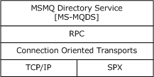
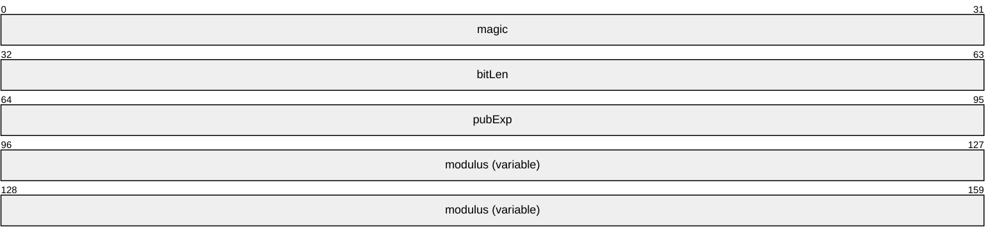
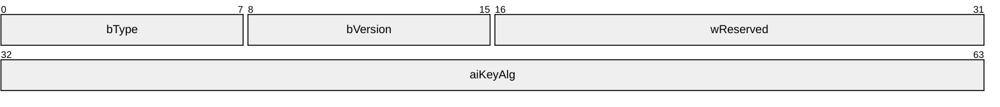
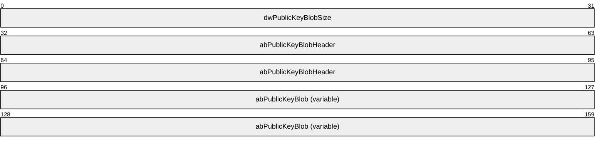
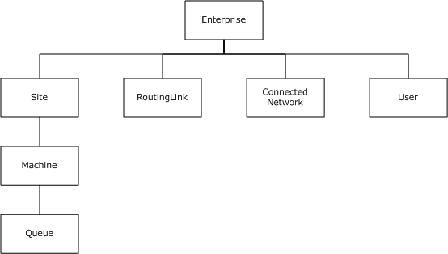
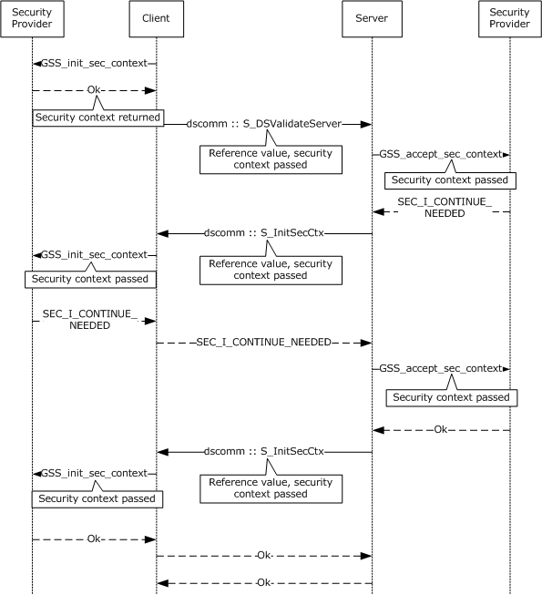
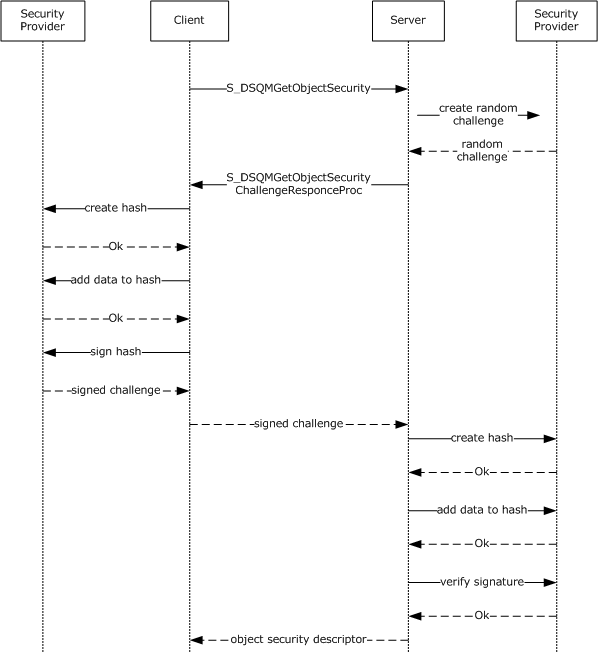
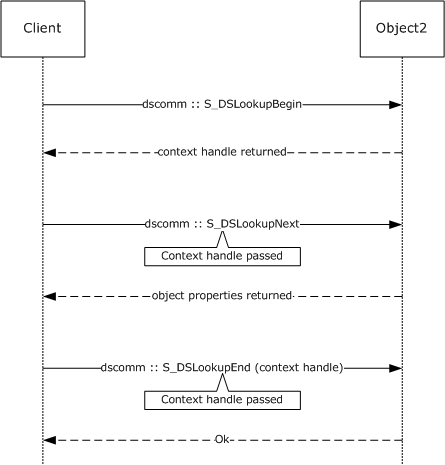
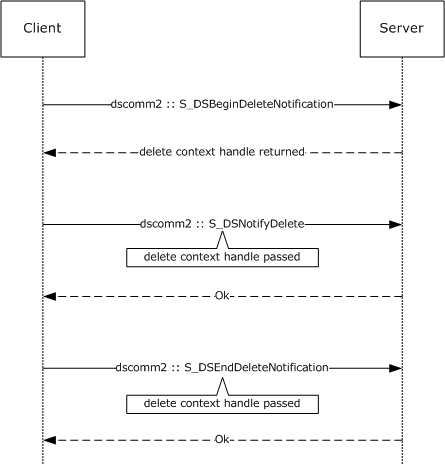

# [MS-MQDS]: Message Queuing (MSMQ): Directory Service Protocol

Table of Contents

1 Introduction

- [1 Introduction](#Section_1)
  - [1.1 Glossary](#Section_1.1)
  - [1.2 References](#Section_1.2)
    - [1.2.1 Normative References](#Section_1.2.1)
    - [1.2.2 Informative References](#Section_1.2.2)
  - [1.3 Overview](#Section_1.3)
  - [1.4 Relationship to Other Protocols](#Section_1.4)
  - [1.5 Prerequisites/Preconditions](#Section_1.5)
  - [1.6 Applicability Statement](#Section_1.6)
  - [1.7 Versioning and Capability Negotiation](#Section_1.7)
  - [1.8 Vendor-Extensible Fields](#Section_1.8)
  - [1.9 Standards Assignments](#Section_1.9)

2 Messages

- [2 Messages](#Section_2)
  - [2.1 Transport](#Section_2.1)
  - [2.2 Common Data Types](#Section_2.2)
    - [2.2.1 HRESULT](#Section_2.2.1)
    - [2.2.2 GUID](#Section_2.2.2)
    - [2.2.3 PROPVARIANT](#Section_2.2.3)
    - [2.2.4 SECURITY_DESCRIPTOR](#Section_2.2.4)
    - [2.2.5 PCONTEXT_HANDLE_SERVER_AUTH_TYPE](#Section_2.2.5)
    - [2.2.6 PCONTEXT_HANDLE_TYPE](#Section_2.2.6)
    - [2.2.7 PCONTEXT_HANDLE_DELETE_TYPE](#Section_2.2.7)
    - [2.2.8 Directory Object Types](#Section_2.2.8)
    - [2.2.9 Directory Service Pathname](#Section_2.2.9)
    - [2.2.10 MSMQ Object Properties](#Section_2.2.10)
      - [2.2.10.1 Property Identifiers](#Section_2.2.10.1)
      - [2.2.10.2 Queue Object Properties](#Section_2.2.10.2)
      - [2.2.10.3 Machine Object Properties](#Section_2.2.10.3)
      - [2.2.10.4 Site Object Properties](#Section_2.2.10.4)
      - [2.2.10.5 Connected Network Object Properties](#Section_2.2.10.5)
      - [2.2.10.6 Enterprise Object Properties](#Section_2.2.10.6)
      - [2.2.10.7 User Object Properties](#Section_2.2.10.7)
      - [2.2.10.8 Routing Link Object Properties](#Section_2.2.10.8)
    - [2.2.11 MQPROPERTYRESTRICTION](#Section_2.2.11)
    - [2.2.12 MQRESTRICTION](#Section_2.2.12)
    - [2.2.13 MQCOLUMNSET](#Section_2.2.13)
    - [2.2.14 MQSORTKEY](#Section_2.2.14)
    - [2.2.15 MQSORTSET](#Section_2.2.15)
    - [2.2.16 Server Specification List String](#Section_2.2.16)
    - [2.2.17 Server List String](#Section_2.2.17)
    - [2.2.18 RSAPUBKEY](#Section_2.2.18)
    - [2.2.19 BLOBHEADER](#Section_2.2.19)
    - [2.2.20 MQDS_PublicKey](#Section_2.2.20)
    - [2.2.21 BOUNDED_SIGNATURE_SIZE](#Section_2.2.21)
    - [2.2.22 BOUNDED_PROPERTIES](#Section_2.2.22)
    - [2.2.23 PROPID](#Section_2.2.23)
  - [2.3 Directory Service Schema Elements](#Section_2.3)

3 Protocol Details

- [3 Protocol Details](#Section_3)
  - [3.1 dscomm Server Details](#Section_3.1)
    - [3.1.1 Abstract Data Model](#Section_3.1.1)
      - [3.1.1.1 DirectorySequenceNumber Type](#Section_3.1.1.1)
      - [3.1.1.2 DirectoryPartitionIdentifier Type](#Section_3.1.1.2)
      - [3.1.1.3 GssSecurityContext Data Element](#Section_3.1.1.3)
      - [3.1.1.4 PCONTEXT_HANDLE_SERVER_AUTH_TYPE RPC Context Handle](#Section_3.1.1.4)
      - [3.1.1.5 PCONTEXT_HANDLE_TYPE RPC Context Handle](#Section_3.1.1.5)
      - [3.1.1.6 Enterprise Data Elements](#Section_3.1.1.6)
      - [3.1.1.7 QueueManager Data Elements](#Section_3.1.1.7)
      - [3.1.1.8 Queue Data Elements](#Section_3.1.1.8)
      - [3.1.1.9 User Data Elements](#Section_3.1.1.9)
      - [3.1.1.10 Site Data Elements](#Section_3.1.1.10)
      - [3.1.1.11 RoutingLink Data Elements](#Section_3.1.1.11)
      - [3.1.1.12 ConnectedNetwork Data Elements](#Section_3.1.1.12)
      - [3.1.1.13 LookupIteratorState Data Elements](#Section_3.1.1.13)
      - [3.1.1.14 Directory Data Elements](#Section_3.1.1.14)
      - [3.1.1.15 Negotiation Token Data Element](#Section_3.1.1.15)
      - [3.1.1.16 LocalQueueManager Data Element](#Section_3.1.1.16)
    - [3.1.2 Timers](#Section_3.1.2)
    - [3.1.3 Initialization](#Section_3.1.3)
    - [3.1.4 Message Processing Events and Sequencing Rules](#Section_3.1.4)
      - [3.1.4.1 S_DSGetServerPort (Opnum 27)](#Section_3.1.4.1)
      - [3.1.4.2 S_DSValidateServer (Opnum 22)](#Section_3.1.4.2)
      - [3.1.4.3 S_DSCloseServerHandle (Opnum 23)](#Section_3.1.4.3)
      - [3.1.4.4 S_DSCreateObject (Opnum 0)](#Section_3.1.4.4)
      - [3.1.4.5 S_DSDeleteObject (Opnum 1)](#Section_3.1.4.5)
      - [3.1.4.6 S_DSDeleteObjectGuid (Opnum 10)](#Section_3.1.4.6)
      - [3.1.4.7 S_DSGetProps (Opnum 2)](#Section_3.1.4.7)
      - [3.1.4.8 S_DSGetPropsGuid (Opnum 11)](#Section_3.1.4.8)
      - [3.1.4.9 S_DSSetProps (Opnum 3)](#Section_3.1.4.9)
      - [3.1.4.10 S_DSSetPropsGuid (Opnum 12)](#Section_3.1.4.10)
      - [3.1.4.11 S_DSGetObjectSecurity (Opnum 4)](#Section_3.1.4.11)
      - [3.1.4.12 S_DSGetObjectSecurityGuid (Opnum 13)](#Section_3.1.4.12)
      - [3.1.4.13 S_DSSetObjectSecurity (Opnum 5)](#Section_3.1.4.13)
      - [3.1.4.14 S_DSSetObjectSecurityGuid (Opnum 14)](#Section_3.1.4.14)
      - [3.1.4.15 S_DSQMGetObjectSecurity (Opnum 21)](#Section_3.1.4.15)
      - [3.1.4.16 S_DSQMSetMachineProperties (Opnum 19)](#Section_3.1.4.16)
      - [3.1.4.17 S_DSLookupBegin (Opnum 6)](#Section_3.1.4.17)
      - [3.1.4.18 S_DSLookupNext (Opnum 7)](#Section_3.1.4.18)
      - [3.1.4.19 S_DSLookupEnd (Opnum 8)](#Section_3.1.4.19)
      - [3.1.4.20 S_DSCreateServersCache (Opnum 20)](#Section_3.1.4.20)
      - [3.1.4.21 Common Details](#Section_3.1.4.21)
        - [3.1.4.21.1 Directory Service Objects](#Section_3.1.4.21.1)
        - [3.1.4.21.2 Directory Service Object Properties](#Section_3.1.4.21.2)
        - [3.1.4.21.3 Directory Service Object Properties Specifying an Identifier](#Section_3.1.4.21.3)
        - [3.1.4.21.4 Directory Service Object Properties Specifying a Name](#Section_3.1.4.21.4)
        - [3.1.4.21.5 Directory Service Object Access Control](#Section_3.1.4.21.5)
        - [3.1.4.21.6 Data Partitioning](#Section_3.1.4.21.6)
        - [3.1.4.21.7 Data Replication](#Section_3.1.4.21.7)
        - [3.1.4.21.8 Directory Service Object Property Mapping](#Section_3.1.4.21.8)
          - [3.1.4.21.8.1 Read Directory Object Mapping](#Section_3.1.4.21.8.1)
            - [3.1.4.21.8.1.1 QueueManager](#Section_3.1.4.21.8.1.1)
            - [3.1.4.21.8.1.2 RemoteAccessServer, RoutingServer, DirectoryServer, DirectoryServerType](#Section_3.1.4.21.8.1.2)
            - [3.1.4.21.8.1.3 OperatingSystemType](#Section_3.1.4.21.8.1.3)
            - [3.1.4.21.8.1.4 Queue](#Section_3.1.4.21.8.1.4)
            - [3.1.4.21.8.1.5 PrivacyLevel](#Section_3.1.4.21.8.1.5)
            - [3.1.4.21.8.1.6 Enterprise](#Section_3.1.4.21.8.1.6)
            - [3.1.4.21.8.1.7 CryptographicProvider](#Section_3.1.4.21.8.1.7)
            - [3.1.4.21.8.1.8 Site](#Section_3.1.4.21.8.1.8)
            - [3.1.4.21.8.1.9 RoutingLink](#Section_3.1.4.21.8.1.9)
            - [3.1.4.21.8.1.10 ConnectedNetwork](#Section_3.1.4.21.8.1.10)
            - [3.1.4.21.8.1.11 User](#Section_3.1.4.21.8.1.11)
          - [3.1.4.21.8.2 Write Directory Object Mapping](#Section_3.1.4.21.8.2)
            - [3.1.4.21.8.2.1 QueueManager](#Section_3.1.4.21.8.2.1)
            - [3.1.4.21.8.2.2 RemoteAccessServer, RoutingServer, DirectoryServer, DirectoryServerType](#Section_3.1.4.21.8.2.2)
            - [3.1.4.21.8.2.3 OperatingSystemType](#Section_3.1.4.21.8.2.3)
            - [3.1.4.21.8.2.4 Queue](#Section_3.1.4.21.8.2.4)
            - [3.1.4.21.8.2.5 PrivacyLevel](#Section_3.1.4.21.8.2.5)
            - [3.1.4.21.8.2.6 Enterprise](#Section_3.1.4.21.8.2.6)
            - [3.1.4.21.8.2.7 CryptographicProvider](#Section_3.1.4.21.8.2.7)
            - [3.1.4.21.8.2.8 Site](#Section_3.1.4.21.8.2.8)
            - [3.1.4.21.8.2.9 RoutingLink](#Section_3.1.4.21.8.2.9)
            - [3.1.4.21.8.2.10 ConnectedNetwork](#Section_3.1.4.21.8.2.10)
            - [3.1.4.21.8.2.11 NetworkProtocol](#Section_3.1.4.21.8.2.11)
            - [3.1.4.21.8.2.12 User](#Section_3.1.4.21.8.2.12)
          - [3.1.4.21.8.3 Create Directory Object Mapping](#Section_3.1.4.21.8.3)
            - [3.1.4.21.8.3.1 QueueManager](#Section_3.1.4.21.8.3.1)
            - [3.1.4.21.8.3.2 DirectoryServer, DirectoryServerType, RoutingServer, RemoteAccessServer](#Section_3.1.4.21.8.3.2)
            - [3.1.4.21.8.3.3 Queue](#Section_3.1.4.21.8.3.3)
            - [3.1.4.21.8.3.4 Site](#Section_3.1.4.21.8.3.4)
            - [3.1.4.21.8.3.5 RoutingLink](#Section_3.1.4.21.8.3.5)
            - [3.1.4.21.8.3.6 ConnectedNetwork](#Section_3.1.4.21.8.3.6)
            - [3.1.4.21.8.3.7 User](#Section_3.1.4.21.8.3.7)
    - [3.1.5 Timer Events](#Section_3.1.5)
    - [3.1.6 Other Local Events](#Section_3.1.6)
      - [3.1.6.1 PCONTEXT_HANDLE_SERVER_AUTH_TYPE Rundown](#Section_3.1.6.1)
      - [3.1.6.2 PCONTEXT_HANDLE_TYPE Rundown](#Section_3.1.6.2)
      - [3.1.6.3 Create Directory Object](#Section_3.1.6.3)
      - [3.1.6.4 Update Directory Object](#Section_3.1.6.4)
      - [3.1.6.5 Delete Directory Object](#Section_3.1.6.5)
      - [3.1.6.6 Read Directory Object](#Section_3.1.6.6)
      - [3.1.6.7 Begin Directory Lookup](#Section_3.1.6.7)
      - [3.1.6.8 Lookup Directory Next](#Section_3.1.6.8)
      - [3.1.6.9 End Directory Lookup](#Section_3.1.6.9)
      - [3.1.6.10 Remove Directory Objects](#Section_3.1.6.10)
      - [3.1.6.11 Add Object to Directory](#Section_3.1.6.11)
      - [3.1.6.12 Get Directory Object](#Section_3.1.6.12)
      - [3.1.6.13 Remove Object from Directory](#Section_3.1.6.13)
      - [3.1.6.14 Get Directory Object for Update](#Section_3.1.6.14)
      - [3.1.6.15 Commit Directory Object Update](#Section_3.1.6.15)
  - [3.2 dscomm Client Details](#Section_3.2)
    - [3.2.1 Abstract Data Model](#Section_3.2.1)
      - [3.2.1.1 Externally Defined Data Elements](#Section_3.2.1.1)
      - [3.2.1.2 GssSecurityContext Data Element](#Section_3.2.1.2)
      - [3.2.1.3 SiteIdentifier Data Element](#Section_3.2.1.3)
      - [3.2.1.4 DirectoryServiceServersCollection Data Element](#Section_3.2.1.4)
      - [3.2.1.5 ReadDirectoryIteratorState Data Element](#Section_3.2.1.5)
      - [3.2.1.6 ReadDirectoryIteratorStateCollection Data Element](#Section_3.2.1.6)
      - [3.2.1.7 CurrentServer Data Element](#Section_3.2.1.7)
    - [3.2.2 Timers](#Section_3.2.2)
    - [3.2.3 Initialization](#Section_3.2.3)
    - [3.2.4 Message Processing Events and Sequencing Rules](#Section_3.2.4)
      - [3.2.4.1 S_DSQMSetMachinePropertiesSignProc (Opnum 0)](#Section_3.2.4.1)
      - [3.2.4.2 S_DSQMGetObjectSecurityChallengeResponceProc (Opnum 1)](#Section_3.2.4.2)
      - [3.2.4.3 S_InitSecCtx (Opnum 2)](#Section_3.2.4.3)
    - [3.2.5 Timer Events](#Section_3.2.5)
    - [3.2.6 Other Local Events](#Section_3.2.6)
      - [3.2.6.1 Create Directory Object](#Section_3.2.6.1)
        - [3.2.6.1.1 QueueManager](#Section_3.2.6.1.1)
          - [3.2.6.1.1.1 PROPID_QM_SERVICE](#Section_3.2.6.1.1.1)
          - [3.2.6.1.1.2 PROPID_QM_OS](#Section_3.2.6.1.1.2)
        - [3.2.6.1.2 Queue](#Section_3.2.6.1.2)
          - [3.2.6.1.2.1 PROPID_Q_PRIV_LEVEL](#Section_3.2.6.1.2.1)
        - [3.2.6.1.3 Site](#Section_3.2.6.1.3)
        - [3.2.6.1.4 RoutingLink](#Section_3.2.6.1.4)
        - [3.2.6.1.5 ConnectedNetwork](#Section_3.2.6.1.5)
        - [3.2.6.1.6 User](#Section_3.2.6.1.6)
      - [3.2.6.2 Delete Directory Object](#Section_3.2.6.2)
        - [3.2.6.2.1 QueueManager](#Section_3.2.6.2.1)
        - [3.2.6.2.2 Queue](#Section_3.2.6.2.2)
        - [3.2.6.2.3 Site](#Section_3.2.6.2.3)
        - [3.2.6.2.4 RoutingLink](#Section_3.2.6.2.4)
        - [3.2.6.2.5 ConnectedNetwork](#Section_3.2.6.2.5)
        - [3.2.6.2.6 User](#Section_3.2.6.2.6)
      - [3.2.6.3 Read Directory](#Section_3.2.6.3)
        - [3.2.6.3.1 QueueManager](#Section_3.2.6.3.1)
          - [3.2.6.3.1.1 DirectoryServer Type](#Section_3.2.6.3.1.1)
          - [3.2.6.3.1.2 OperatingSystem Type](#Section_3.2.6.3.1.2)
        - [3.2.6.3.2 Queue](#Section_3.2.6.3.2)
          - [3.2.6.3.2.1 PrivacyLevel](#Section_3.2.6.3.2.1)
        - [3.2.6.3.3 Enterprise](#Section_3.2.6.3.3)
          - [3.2.6.3.3.1 WeakenedSecurity](#Section_3.2.6.3.3.1)
          - [3.2.6.3.3.2 CryptographicProvider](#Section_3.2.6.3.3.2)
        - [3.2.6.3.4 Site](#Section_3.2.6.3.4)
        - [3.2.6.3.5 RoutingLink](#Section_3.2.6.3.5)
        - [3.2.6.3.6 ConnectedNetwork](#Section_3.2.6.3.6)
        - [3.2.6.3.7 User](#Section_3.2.6.3.7)
      - [3.2.6.4 Read Directory Begin](#Section_3.2.6.4)
        - [3.2.6.4.1 QueueManager](#Section_3.2.6.4.1)
        - [3.2.6.4.2 Queue](#Section_3.2.6.4.2)
        - [3.2.6.4.3 Enterprise](#Section_3.2.6.4.3)
        - [3.2.6.4.4 Site](#Section_3.2.6.4.4)
        - [3.2.6.4.5 RoutingLink](#Section_3.2.6.4.5)
        - [3.2.6.4.6 ConnectedNetwork](#Section_3.2.6.4.6)
        - [3.2.6.4.7 User](#Section_3.2.6.4.7)
      - [3.2.6.5 Read Directory Next](#Section_3.2.6.5)
        - [3.2.6.5.1 QueueManager](#Section_3.2.6.5.1)
        - [3.2.6.5.2 Queue](#Section_3.2.6.5.2)
        - [3.2.6.5.3 Enterprise](#Section_3.2.6.5.3)
        - [3.2.6.5.4 Site](#Section_3.2.6.5.4)
        - [3.2.6.5.5 RoutingLink](#Section_3.2.6.5.5)
        - [3.2.6.5.6 ConnectedNetwork](#Section_3.2.6.5.6)
        - [3.2.6.5.7 User](#Section_3.2.6.5.7)
      - [3.2.6.6 Read Directory End](#Section_3.2.6.6)
      - [3.2.6.7 Write Directory](#Section_3.2.6.7)
        - [3.2.6.7.1 QueueManager](#Section_3.2.6.7.1)
        - [3.2.6.7.2 Queue](#Section_3.2.6.7.2)
        - [3.2.6.7.3 Enterprise](#Section_3.2.6.7.3)
        - [3.2.6.7.4 Site](#Section_3.2.6.7.4)
        - [3.2.6.7.5 RoutingLink](#Section_3.2.6.7.5)
        - [3.2.6.7.6 ConnectedNetwork](#Section_3.2.6.7.6)
        - [3.2.6.7.7 User](#Section_3.2.6.7.7)
      - [3.2.6.8 Initialize List of Known Directory Service Servers Event](#Section_3.2.6.8)
  - [3.3 dscomm2 Server Details](#Section_3.3)
    - [3.3.1 Abstract Data Model](#Section_3.3.1)
      - [3.3.1.1 PCONTEXT_HANDLE_DELETE_TYPE RPC Context Handle](#Section_3.3.1.1)
    - [3.3.2 Timers](#Section_3.3.2)
    - [3.3.3 Initialization](#Section_3.3.3)
    - [3.3.4 Message Processing Events and Sequencing Rules](#Section_3.3.4)
      - [3.3.4.1 S_DSGetComputerSites (Opnum 0)](#Section_3.3.4.1)
      - [3.3.4.2 S_DSGetPropsEx (Opnum 1)](#Section_3.3.4.2)
      - [3.3.4.3 S_DSGetPropsGuidEx (Opnum 2)](#Section_3.3.4.3)
      - [3.3.4.4 S_DSBeginDeleteNotification (Opnum 3)](#Section_3.3.4.4)
      - [3.3.4.5 S_DSNotifyDelete (Opnum 4)](#Section_3.3.4.5)
      - [3.3.4.6 S_DSEndDeleteNotification (Opnum 5)](#Section_3.3.4.6)
      - [3.3.4.7 S_DSIsServerGC (Opnum 6)](#Section_3.3.4.7)
      - [3.3.4.8 S_DSGetGCListInDomain (Opnum 8)](#Section_3.3.4.8)
    - [3.3.5 Timer Events](#Section_3.3.5)
    - [3.3.6 Other Local Events](#Section_3.3.6)
      - [3.3.6.1 PCONTEXT_HANDLE_DELETE_TYPE Rundown](#Section_3.3.6.1)
  - [3.4 dscomm2 Client Details](#Section_3.4)
    - [3.4.1 Abstract Data Model](#Section_3.4.1)
    - [3.4.2 Timers](#Section_3.4.2)
    - [3.4.3 Initialization](#Section_3.4.3)
    - [3.4.4 Message Processing Events and Sequencing Rules](#Section_3.4.4)
      - [3.4.4.1 Send an Object Deleted Notification](#Section_3.4.4.1)
    - [3.4.5 Timer Events](#Section_3.4.5)
    - [3.4.6 Other Local Events](#Section_3.4.6)

4 Protocol Examples

- [4 Protocol Examples](#Section_4)
  - [4.1 S_DSValidateServer and S_InitSecCtx](#Section_4.1)
  - [4.2 S_DSQMGetObjectSecurity and S_DSQMGetObjectSecurityChallengeResponceProc](#Section_4.2)
  - [4.3 S_DSLookupBegin, S_DSLookupNext, and S_DSLookupEnd](#Section_4.3)
  - [4.4 S_DSBeginDeleteNotification, S_DSNotifyDelete, and S_DSEndDeleteNotification](#Section_4.4)

5 Security

- [5 Security](#Section_5)
  - [5.1 Security Considerations for Implementers](#Section_5.1)
  - [5.2 Index of Security Parameters](#Section_5.2)

6 Appendix A: Full IDL

- [6 Appendix A: Full IDL](#Section_6)

7 Appendix B: Product Behavior

- [7 Appendix B: Product Behavior](#Section_7)

8 Change Tracking

- [8 Change Tracking](#Section_8)

For the legal notice and IP terms, see [LEGAL.md](../LEGAL.md).
Last updated: 6/1/2017.
See [Revision History](#revision-history) for full version history.

# 1 Introduction

This document specifies the Message Queuing (MSMQ): Directory Service Protocol, a [**remote procedure call (RPC)**](#gt_remote-procedure-call-rpc)-based protocol that is used by a client to remotely access and maintain [**Message Queuing (MSMQ)**](#gt_message-queuing) objects in a [**directory service**](#gt_directory-service-ds) through an [**MSMQ Directory Service server**](#gt_msmq-directory-service-server).

Sections 1.5, 1.8, 1.9, 2, and 3 of this specification are normative. All other sections and examples in this specification are informative.

## 1.1 Glossary

This document uses the following terms:

**access control list (ACL)**: A list of access control entries (ACEs) that collectively describe the security rules for authorizing access to some resource; for example, an object or set of objects.

**backup site controller (BSC)**: An MSMQ Directory Service role played by an [**MSMQ queue manager**](#gt_msmq-queue-manager). A BSC contains a read-only copy of the directory for a [**site**](#gt_site). A BSC can satisfy directory lookup requests but cannot satisfy directory change requests. There can be zero or more BSCs in a [**site**](#gt_site).

**certificate**: A certificate is a collection of attributes and extensions that can be stored persistently. The set of attributes in a certificate can vary depending on the intended usage of the certificate. A certificate securely binds a public key to the entity that holds the corresponding private key. A certificate is commonly used for authentication and secure exchange of information on open networks, such as the Internet, extranets, and intranets. Certificates are digitally signed by the issuing certification authority (CA) and can be issued for a user, a computer, or a service. The most widely accepted format for certificates is defined by the ITU-T X.509 version 3 international standards. For more information about attributes and extensions, see [[RFC3280]](https://go.microsoft.com/fwlink/?LinkId=90414) and [[X509]](https://go.microsoft.com/fwlink/?LinkId=90590) sections 7 and 8.

**connected network**: A network of computers in which any two computers can communicate directly through a common transport protocol (for example, TCP/IP or SPX/IPX). A computer can belong to multiple connected networks.

**digital signature**: A value that is generated by using a digital signature algorithm, taking as input a private key and an arbitrary-length string, such that a specific verification algorithm is satisfied by the value, the input string, and the public key corresponding to the input private key.

**directory**: The database that stores information about objects such as users, groups, computers, printers, and the [**directory service**](#gt_directory-service-ds) that makes this information available to users and applications.

**directory service (DS)**: An entity that maintains a collection of objects. These objects can be remotely manipulated either by the Message Queuing (MSMQ): Directory Service Protocol, as specified in [MS-MQDS](#Section_1c8a4041846e487ea4b76051b9774247), or by the Lightweight Directory Access Protocol (v3), as specified in [[RFC2251]](https://go.microsoft.com/fwlink/?LinkId=90325).

**distinguished name (DN)**: A name that uniquely identifies an object by using the relative distinguished name (RDN) for the object, and the names of container objects and domains that contain the object. The distinguished name (DN) identifies the object and its location in a tree.

**dynamic endpoint**: A network-specific server address that is requested and assigned at run time. For more information, see [[C706]](https://go.microsoft.com/fwlink/?LinkId=89824).

**endpoint**: A network-specific address of a remote procedure call (RPC) server process for remote procedure calls. The actual name and type of the endpoint depends on the [**RPC**](#gt_remote-procedure-call-rpc) protocol sequence that is being used. For example, for RPC over TCP (RPC Protocol Sequence ncacn_ip_tcp), an endpoint might be TCP port 1025. For RPC over Server Message Block (RPC Protocol Sequence ncacn_np), an endpoint might be the name of a named pipe. For more information, see [C706].

**enterprise**: A unit of administration of a network of [**MSMQ queue managers**](#gt_msmq-queue-manager). An enterprise consists of an MSMQ Directory Service, one or more [**connected networks**](#gt_connected-network), and one or more [**MSMQ sites**](#gt_msmq-site).

**global catalog server (GC server)**: A domain controller (DC) that contains a naming context (NC) replica (one full, the rest partial) for each domain naming context in the forest.

**globally unique identifier (GUID)**: A term used interchangeably with [**universally unique identifier (UUID)**](#gt_universally-unique-identifier-uuid) in Microsoft protocol technical documents (TDs). Interchanging the usage of these terms does not imply or require a specific algorithm or mechanism to generate the value. Specifically, the use of this term does not imply or require that the algorithms described in [[RFC4122]](https://go.microsoft.com/fwlink/?LinkId=90460) or [C706] must be used for generating the [**GUID**](#gt_globally-unique-identifier-guid). See also [**universally unique identifier (UUID)**](#gt_universally-unique-identifier-uuid).

**GUID_NULL**: A [**GUID**](#gt_globally-unique-identifier-guid) that has the value "{00000000-0000-0000-0000-000000000000}".

**Interface Definition Language (IDL)**: The International Standards Organization (ISO) standard language for specifying the interface for remote procedure calls. For more information, see [C706] section 4.

**MD5**: A one-way, 128-bit hashing scheme that was developed by RSA Data Security, Inc., as described in [[RFC1321]](https://go.microsoft.com/fwlink/?LinkId=90275).

**MD5 hash**: A hashing algorithm, as described in [RFC1321], that was developed by RSA Data Security, Inc. An MD5 hash is used by the File Replication Service (FRS) to verify that a file on each replica member is identical.

**message**: A data structure representing a unit of data transfer between distributed applications. A message has message properties, which may include message header properties, a message body property, and message trailer properties.

**message queue**: A data structure containing an ordered list of zero or more [**messages**](#gt_message). A [**queue**](#gt_queue) has a head and a tail and supports a first in, first out (FIFO) access pattern. [**Messages**](#gt_message) are appended to the tail through a write operation (Send) that appends the [**message**](#gt_message) and increments the tail pointer. [**Messages**](#gt_message) are consumed from the head through a destructive read operation (Receive) that deletes the [**message**](#gt_message) and increments the head pointer. A [**message**](#gt_message) at the head can also be read through a nondestructive read operation (Peek).

**message queuing**: A communications service that provides asynchronous and reliable message passing between distributed client applications. In message queuing, clients send messages to [**message queues**](#gt_message-queue) and consume messages from [**message queues**](#gt_message-queue). The [**message queues**](#gt_message-queue) provide persistence of the messages, which enables the sending and receiving client applications to operate asynchronously from each other.

**Microsoft Message Queuing (MSMQ)**: A communications service that provides asynchronous and reliable [**message**](#gt_message) passing between distributed applications. In [**Message Queuing**](#gt_message-queuing), applications send [**messages**](#gt_message) to [**queues**](#gt_queue) and consume [**messages**](#gt_message) from [**queues**](#gt_queue). The [**queues**](#gt_queue) provide persistence of the [**messages**](#gt_message), enabling the sending and receiving applications to operate asynchronously from one another.

**MSMQ Directory Service server**: An [**MSMQ queue manager**](#gt_msmq-queue-manager) that provides MSMQ Directory Service. The server can act in either of the MSMQ Directory Service roles: [**Primary Site Controller (PSC)**](#gt_primary-site-controller-psc) or [**Backup Site Controller (BSC)**](#gt_backup-site-controller-bsc).

**MSMQ mixed-mode**: When upgrading from [**MSMQ**](#gt_message-queuing) 1.0 in Windows NT 4.0 operating system to [**MSMQ**](#gt_message-queuing) 2.0 in Windows 2000 operating system, a transitional mode known as mixed-mode environment is supported. Although not intended as a final deployment strategy, there is full support for this mixed-mode, which allows [**MSMQ**](#gt_message-queuing) 1.0 controller servers to coexist in the same [**enterprise**](#gt_enterprise) with [**MSMQ**](#gt_message-queuing) 2.0 directory service servers, supporting both [**MSMQ**](#gt_message-queuing) 1.0 and [**MSMQ**](#gt_message-queuing) 2.0 directory service clients. In mixed-mode, the [**MSMQ**](#gt_message-queuing) replication service is used to synchronize MQIS with Active Directory (AD).

**MSMQ object property**: A property of an MSMQ object. Each MSMQ object contains a collection of directory properties. The set of properties varies by type of directory object. Properties are identified by [**property identifiers**](#gt_property-identifier).

**MSMQ queue manager**: An [**MSMQ**](#gt_message-queuing) service hosted on a machine that provides [**queued**](#gt_queue) messaging services. [**Queue managers**](#gt_476f10ed-08f0-4887-b583-59d5cf909979) manage [**queues**](#gt_queue) deployed on the local computer and provide asynchronous transfer of [**messages**](#gt_message) to [**queues**](#gt_queue) located on other computers. A [**queue manager**](#gt_queue-manager-qm) is identified by a [**globally unique identifier (GUID)**](#gt_globally-unique-identifier-guid).

**MSMQ routing link**: A communication link between two sites. A routing link is represented by a routing link object in the directory service. Routing links can have associated link costs. Routing links with their associated costs can be used to compute lowest-cost routing paths for store-and-forward messaging.

**MSMQ site**: A network of computers, typically physically collocated, that have high connectivity as measured in terms of latency (low) and throughput (high). A site is represented by a site object in the directory service. An MSMQ site maps one-to-one with an Active Directory site when Active Directory provides directory services to [**MSMQ**](#gt_message-queuing).

**Network Data Representation (NDR)**: A specification that defines a mapping from [**Interface Definition Language (IDL)**](#gt_interface-definition-language-idl) data types onto octet streams. [**NDR**](#gt_network-data-representation-ndr) also refers to the runtime environment that implements the mapping facilities (for example, data provided to [**NDR**](#gt_network-data-representation-ndr)). For more information, see [MS-RPCE](../MS-RPCE/MS-RPCE.md) and [C706] section 14.

**opnum**: An operation number or numeric identifier that is used to identify a specific [**remote procedure call (RPC)**](#gt_remote-procedure-call-rpc) method or a method in an interface. For more information, see [C706] section 12.5.2.12 or [MS-RPCE].

**Primary Enterprise Controller (PEC)**: An MSMQ Directory Service role played by an [**MSMQ queue manager**](#gt_msmq-queue-manager). The PEC acts as the authority for the [**enterprise**](#gt_enterprise) configuration information stored in the directory. There is only one PEC in an [**enterprise**](#gt_enterprise). The PEC also acts in the role of [**Primary Site Controller (PSC)**](#gt_primary-site-controller-psc) for the [**site**](#gt_site) to which it belongs.

**Primary Site Controller (PSC)**: An MSMQ Directory Service role played by an [**MSMQ queue manager**](#gt_msmq-queue-manager). The PSC acts as the authority for the directory information for the [**site**](#gt_site) to which it belongs. The PSC can satisfy directory lookup requests and directory change requests. There is only one PSC per [**site**](#gt_site).

**private key**: One of a pair of keys used in public-key cryptography. The private key is kept secret and is used to decrypt data that has been encrypted with the corresponding public key. For an introduction to this concept, see [[CRYPTO]](https://go.microsoft.com/fwlink/?LinkId=89841) section 1.8 and [[IEEE1363]](https://go.microsoft.com/fwlink/?LinkId=89899) section 3.1.

**private property**: Each property identifier has a unique numeric value. Numeric values equal to or greater than 1000 (decimal) indicate private properties, which are reserved for the use of the server implementation.

**property identifier**: A DWORD value associated with an MSMQ object property that defines the property type and its semantic meaning.

**public key**: One of a pair of keys used in public-key cryptography. The public key is distributed freely and published as part of a digital certificate. For an introduction to this concept, see [CRYPTO] section 1.8 and [IEEE1363] section 3.1.

**public queue**: An application-defined [**message queue**](#gt_message-queue) that is registered in the MSMQ Directory Service. A public queue can be deployed at any [**queue manager**](#gt_queue-manager-qm).

**queue**: An object that holds [**messages**](#gt_message) passed between applications or [**messages**](#gt_message) passed between [**Message Queuing**](#gt_message-queuing) and applications. In general, applications can send [**messages**](#gt_message) to queues and read [**messages**](#gt_message) from queues.

**queue manager (QM)**: A message queuing service that manages [**queues**](#gt_queue) deployed on a computer. A queue manager can also provide asynchronous transfer of [**messages**](#gt_message) to [**queues**](#gt_queue) deployed on other queue managers.

**remote procedure call (RPC)**: A context-dependent term commonly overloaded with three meanings. Note that much of the industry literature concerning RPC technologies uses this term interchangeably for any of the three meanings. Following are the three definitions: (*) The runtime environment providing remote procedure call facilities. The preferred usage for this meaning is "RPC runtime". (*) The pattern of request and response message exchange between two parties (typically, a client and a server). The preferred usage for this meaning is "RPC exchange". (*) A single message from an exchange as defined in the previous definition. The preferred usage for this term is "RPC message". For more information about RPC, see [C706].

**routing link**: See [**MSMQ routing link**](#gt_msmq-routing-link).

**RPC protocol sequence**: A character string that represents a valid combination of a [**remote procedure call (RPC)**](#gt_remote-procedure-call-rpc) protocol, a network layer protocol, and a transport layer protocol, as described in [C706] and [MS-RPCE].

**RPC transport**: The underlying network services used by the remote procedure call (RPC) runtime for communications between network nodes. For more information, see [C706] section 2.

**security identifier (SID)**: An identifier for security principals that is used to identify an account or a group. Conceptually, the [**SID**](#gt_security-identifier-sid) is composed of an account authority portion (typically a domain) and a smaller integer representing an identity relative to the account authority, termed the relative identifier (RID). The [**SID**](#gt_security-identifier-sid) format is specified in [MS-DTYP](../MS-DTYP/MS-DTYP.md) section 2.4.2; a string representation of [**SIDs**](#gt_security-identifier-sid) is specified in [MS-DTYP] section 2.4.2 and [MS-AZOD](../MS-AZOD/MS-AZOD.md) section 1.1.1.2.

**site**: A collection of one or more well-connected (reliable and fast) TCP/IP subnets. By defining [**sites**](#gt_site) (represented by site objects) an administrator can optimize both Active Directory access and Active Directory replication with respect to the physical network. When users log in, Active Directory clients find domain controllers (DCs) that are in the same [**site**](#gt_site) as the user, or near the same [**site**](#gt_site) if there is no DC in the [**site**](#gt_site). See also Knowledge Consistency Checker (KCC). For more information, see [MS-ADTS](../MS-ADTS/MS-ADTS.md).

**Unicode**: A character encoding standard developed by the Unicode Consortium that represents almost all of the written languages of the world. The [**Unicode**](#gt_unicode) standard [[UNICODE5.0.0/2007]](https://go.microsoft.com/fwlink/?LinkId=154659) provides three forms (UTF-8, UTF-16, and UTF-32) and seven schemes (UTF-8, UTF-16, UTF-16 BE, UTF-16 LE, UTF-32, UTF-32 LE, and UTF-32 BE).

**Unicode string**: A [**Unicode**](#gt_unicode) 8-bit string is an ordered sequence of 8-bit units, a [**Unicode**](#gt_unicode) 16-bit string is an ordered sequence of 16-bit code units, and a [**Unicode**](#gt_unicode) 32-bit string is an ordered sequence of 32-bit code units. In some cases, it could be acceptable not to terminate with a terminating null character. Unless otherwise specified, all [**Unicode strings**](#gt_unicode-string) follow the UTF-16LE encoding scheme with no Byte Order Mark (BOM).

**universally unique identifier (UUID)**: A 128-bit value. UUIDs can be used for multiple purposes, from tagging objects with an extremely short lifetime, to reliably identifying very persistent objects in cross-process communication such as client and server interfaces, manager entry-point vectors, and [**RPC**](#gt_remote-procedure-call-rpc) objects. UUIDs are highly likely to be unique. UUIDs are also known as [**globally unique identifiers (GUIDs)**](#gt_globally-unique-identifier-guid) and these terms are used interchangeably in the Microsoft protocol technical documents (TDs). Interchanging the usage of these terms does not imply or require a specific algorithm or mechanism to generate the UUID. Specifically, the use of this term does not imply or require that the algorithms described in [RFC4122] or [C706] must be used for generating the UUID.

**MAY, SHOULD, MUST, SHOULD NOT, MUST NOT:** These terms (in all caps) are used as defined in [[RFC2119]](https://go.microsoft.com/fwlink/?LinkId=90317). All statements of optional behavior use either MAY, SHOULD, or SHOULD NOT.

## 1.2 References

Links to a document in the Microsoft Open Specifications library point to the correct section in the most recently published version of the referenced document. However, because individual documents in the library are not updated at the same time, the section numbers in the documents may not match. You can confirm the correct section numbering by checking the [Errata](http://msdn.microsoft.com/en-us/library/dn781092.aspx).

### 1.2.1 Normative References

We conduct frequent surveys of the normative references to assure their continued availability. If you have any issue with finding a normative reference, please contact [dochelp@microsoft.com](mailto:dochelp@microsoft.com). We will assist you in finding the relevant information.

[C706] The Open Group, "DCE 1.1: Remote Procedure Call", C706, August 1997, [https://www2.opengroup.org/ogsys/catalog/c706](https://go.microsoft.com/fwlink/?LinkId=89824)

[GSS] Piper, D., and Swander, B., "A GSS-API Authentication Method for IKE", Internet Draft, July 2001, [http://tools.ietf.org/html/draft-ietf-ipsec-isakmp-gss-auth-07](https://go.microsoft.com/fwlink/?LinkId=89876)

[MS-ADTS] Microsoft Corporation, "[Active Directory Technical Specification](../MS-ADTS/MS-ADTS.md)".

[MS-DTYP] Microsoft Corporation, "[Windows Data Types](../MS-DTYP/MS-DTYP.md)".

[MS-MQCN] Microsoft Corporation, "[Message Queuing (MSMQ): Directory Service Change Notification Protocol](../MS-MQCN/MS-MQCN.md)".

[MS-MQDMPR] Microsoft Corporation, "[Message Queuing (MSMQ): Common Data Model and Processing Rules](../MS-MQDMPR/MS-MQDMPR.md)".

[MS-MQDSSM] Microsoft Corporation, "[Message Queuing (MSMQ): Directory Service Schema Mapping](../MS-MQDSSM/MS-MQDSSM.md)".

[MS-MQMQ] Microsoft Corporation, "[Message Queuing (MSMQ): Data Structures](../MS-MQMQ/MS-MQMQ.md)".

[MS-RPCE] Microsoft Corporation, "[Remote Procedure Call Protocol Extensions](../MS-RPCE/MS-RPCE.md)".

[PCT1] Benalogh, J., Lampson, B., Simon, D., Spies, T., and Yee, B., "The Private Communication Technology (PCT) Protocol", October 1995, [http://tools.ietf.org/html/draft-benaloh-pct-00](https://go.microsoft.com/fwlink/?LinkId=90246)

[RFC1034] Mockapetris, P., "Domain Names - Concepts and Facilities", STD 13, RFC 1034, November 1987, [http://www.ietf.org/rfc/rfc1034.txt](https://go.microsoft.com/fwlink/?LinkId=90263)

[RFC1321] Rivest, R., "The MD5 Message-Digest Algorithm", RFC 1321, April 1992, [http://www.ietf.org/rfc/rfc1321.txt](https://go.microsoft.com/fwlink/?LinkId=90275)

[RFC2119] Bradner, S., "Key words for use in RFCs to Indicate Requirement Levels", BCP 14, RFC 2119, March 1997, [http://www.rfc-editor.org/rfc/rfc2119.txt](https://go.microsoft.com/fwlink/?LinkId=90317)

[RFC2743] Linn, J., "Generic Security Service Application Program Interface Version 2, Update 1", RFC 2743, January 2000, [http://www.rfc-editor.org/rfc/rfc2743.txt](https://go.microsoft.com/fwlink/?LinkId=90378)

### 1.2.2 Informative References

[MC-MQDSRP] Microsoft Corporation, "Message Queuing (MSMQ): Directory Service Replication Protocol", (Archived), [Message Queuing (MSMQ): Directory Service Replication Protocol](https://go.microsoft.com/fwlink/?LinkID=311687)

[MS-MQOD] Microsoft Corporation, "[Message Queuing Protocols Overview](#Section_1.3)".

[NTLM] Microsoft Corporation, "Microsoft NTLM", [http://msdn.microsoft.com/en-us/library/aa378749.aspx](https://go.microsoft.com/fwlink/?LinkId=90235)

## 1.3 Overview

[**Message Queuing**](#gt_message-queuing) is a communications service that provides asynchronous and reliable [**message**](#gt_message) passing between client applications, including between client applications running on different hosts. In Message Queuing, clients send messages to [**queues**](#gt_queue) and consume messages from queues. Queues provide message persistence, enabling the sending and receiving of client applications to operate asynchronously from each other.

Because Message Queuing involves message passing between nodes, a [**directory service**](#gt_directory-service-ds) can be useful to Message Queuing services in several ways. First, a directory service can provide network topology information that the Message Queuing services can use to route messages between nodes. Second, a directory service can be used as a key distribution mechanism for security services that are used by Message Queuing to secure messages and authenticate clients. Third, a directory service can provide clients with discovery capabilities, allowing clients to discover the queues available within the network.

The Message Queuing (MSMQ): Directory Service Protocol provides a set of procedure calls that can be made between a client and an MSMQ Directory Server. The client can use these calls to access the Directory Service remotely. For example, a client can use this protocol to create queue objects in a directory. This protocol is intended for use by the Message Queuing system.

The directory defined by the Message Queuing (MSMQ): Directory Service Protocol is composed of eight types of directory objects representing [**enterprises**](#gt_enterprise), sites, [**routing links**](#gt_msmq-routing-link), machines, users, queues, [**connected networks**](#gt_connected-network), and deleted objects.

Each directory object is composed of a collection of properties. Each property has an integer [**property identifier**](#gt_property-identifier) and a variant property value. Properties are specific to the directory object type. Most directory object types include a [**GUID**](#gt_globally-unique-identifier-guid) property to identify a particular object instance, a directory service pathname property specifying where in the directory the object is stored, and security properties. Some [**MSMQ object properties**](#gt_msmq-object-property) are assigned by the directory service while other MSMQ object properties are specified by the client. Some properties are immutable; some properties are mutable by the directory server but not by the client while other properties are mutable by both.

The directory objects either are maintained by the MSMQ Directory Service servers or are stored in a directory that supports [MS-ADTS](../MS-ADTS/MS-ADTS.md). In the latter case, the Message Queuing (MSMQ): Directory Service Protocol server interprets the client [**RPC**](#gt_remote-procedure-call-rpc) calls and uses the [MS-MQDSSM](../MS-MQDSSM/MS-MQDSSM.md) algorithm to access the [MS-ADTS]-based directory to satisfy client requests.

The Message Queuing (MSMQ): Directory Service Protocol provides methods to create, update, retrieve, and delete objects from the directory service by using either the object name or the unique object GUID as a key to identify the object. Separate interface methods are implemented to manipulate object security properties.

The Message Queuing (MSMQ): Directory Service Protocol also provides a simple query mechanism that allows the enumeration of directory objects through comparison with client-supplied values. The client can specify the matching criteria, the properties to be returned, and the sort order for the results. The server computes the result set. Thereafter, the client retrieves the results in order, in an iterative manner through repeated calls to the server, each call returning the next portion of the result set.

The Message Queuing (MSMQ): Directory Service Protocol includes a method for RPC [**endpoint**](#gt_endpoint) port negotiation. Through this, the client can determine the RPC endpoint port to use for this protocol.

Generally, for methods that create, update, or delete information in the directory service, the Message Queuing (MSMQ): Directory Service Protocol relies on security mechanisms of the underlying [**RPC transport**](#gt_rpc-transport) to provide client authentication information to the server. There are two exceptions to this. When setting properties on a machine object, and when retrieving the security properties of a machine object, the server invokes a challenge/response callback to the client to authenticate the client. This client signs the challenge by using a [**private key**](#gt_private-key), and the server validates the signature by using a corresponding [**public key**](#gt_public-key) stored with the machine object in the directory.

Because the directory service provides network topology information and security key distribution, clients can trust the source of this data. Therefore, this protocol includes methods for a security handshake to allow mutual authentication and to establish cryptographic keys that are used to compute [**digital signatures**](#gt_digital-signature). These handshake methods tunnel Generic Security Service API (GSS-API), as specified in [[RFC2743]](https://go.microsoft.com/fwlink/?LinkId=90378), operations to establish a security context. See [RFC2743] section 2.2.

All methods that return data to the client include signed hashes over returned data, allowing the client to authenticate the source of the data and verify that the data has not been tampered with en route. The signed hashes are computed by using the established security context.

This is an RPC-based protocol consisting of simple request-response exchanges. For every method request that the server receives, it executes the method and returns a completion. The client simply returns the completion status to the caller.

## 1.4 Relationship to Other Protocols

The Message Queuing (MSMQ): Directory Service Protocol depends on [**RPC**](#gt_remote-procedure-call-rpc) for its transport and uses RPC, as specified in section [2.1](#Section_2.1).

The following diagram illustrates protocol layering.

Figure 1: Protocol layering

This protocol is deprecated. Implementers are strongly urged to use the Lightweight Directory Access Protocol (LDAP) [MS-ADTS](../MS-ADTS/MS-ADTS.md) in conjunction with the algorithm specified in [MS-MQDSSM](../MS-MQDSSM/MS-MQDSSM.md) instead of this protocol, except where compatibility requirements necessitate use of this protocol.<1>

This protocol relies on the Private Communication Technology (PCT) Protocol, as specified in [[PCT1]](https://go.microsoft.com/fwlink/?LinkId=90246), for authentication and [**message**](#gt_message) security. This protocol uses PCT as the security mechanism underlying the GSS API, as specified in [[RFC2743]](https://go.microsoft.com/fwlink/?LinkId=90378), and cannot be configured to use other security mechanisms, such as SSL or TLS.

The MSMQ: Directory Service Protocol uses shared state and processing rules defined in [MS-MQDMPR](../MS-MQDMPR/MS-MQDMPR.md) and shared data structures defined in [MS-MQMQ](../MS-MQMQ/MS-MQMQ.md). The abstract local events described in section [3.2.6](#Section_1.3) are raised by the processing rules within the common processing rules defined in [MS-MQDMPR]. These events act as a simple translation layer to the RPC methods defined for this protocol, describing the conversion of arguments from abstract to concrete and the conversion of return values from concrete to abstract. The server side of the MSMQ: Directory Service Protocol processes those RPC methods either by maintaining a private abstract data model that leverages the data model types defined in [MS-MQDMPR] or by accessing an LDAP-based directory service using the [MS-MQDSSM] algorithm.

## 1.5 Prerequisites/Preconditions

This protocol is an [**RPC**](#gt_remote-procedure-call-rpc) interface, and as a result has the prerequisites specified in [MS-RPCE](../MS-RPCE/MS-RPCE.md) as being common to RPC interfaces.

It is assumed that an MSMQ: Directory Service Protocol client has obtained the name of a remote computer that supports the MSMQ: Directory Service Protocol before this protocol is invoked. This specification does not mandate how a client acquires this information.

It is assumed that the directory has been configured with an [**enterprise**](#gt_enterprise) object and at least one site object. It is also assumed that the protocol server is configured to belong to a site of the directory. Furthermore, it is assumed that the protocol server has been configured with a list of sites in the enterprise, and the list of [**Primary Site Controllers (PSC)**](#gt_primary-site-controller-psc) and [**Backup Site Controllers (BSC)**](#gt_backup-site-controller-bsc) for each site. Clients can retrieve this list of sites from the [**directory service**](#gt_directory-service-ds) through the [S_DSCreateServersCache](#Section_3.1.4.20) method.

The MSMQ: Directory Service Protocol requires authentication and [**message**](#gt_message) protection through the use of the GSS-API, as specified in [[RFC2743]](https://go.microsoft.com/fwlink/?LinkId=90378); therefore, the client and server require infrastructure supporting it.

The client and server have to possess valid security credentials suitable for mutual authentication and supported by [[PCT1]](https://go.microsoft.com/fwlink/?LinkId=90246).

## 1.6 Applicability Statement

This protocol can be used to provide [**directory service**](#gt_directory-service-ds) functionality. It is intended for use by the [**message queuing**](#gt_message-queuing) system, and it supports a fixed and limited set of directory object types and [**MSMQ object properties**](#gt_msmq-object-property). It is not intended as a general-purpose directory service.

The functionality of this protocol has been superseded by Active Directory and LDAP [MS-ADTS](../MS-ADTS/MS-ADTS.md) in conjunction with the algorithm specified in [MS-MQDSSM](../MS-MQDSSM/MS-MQDSSM.md). A server can implement this protocol to support clients of this protocol to access the Active Directory based directory service. Future development based on this protocol is strongly discouraged.<2>

## 1.7 Versioning and Capability Negotiation

This document covers versioning issues in the following areas:

- **Supported Transports:** The Message Queuing (MSMQ): Directory Service Protocol uses multiple [**RPC protocol sequences**](#gt_rpc-protocol-sequence), as specified in section [2.1](#Section_2.1).
- **Protocol Versions:** This protocol has multiple interfaces, as specified in sections [3.1](#Section_3.1) and [3.3](#Section_3.3).
- **Security and Authentication Methods:** This protocol supports the following authentication methods: NTLM, as described in [[NTLM]](https://go.microsoft.com/fwlink/?LinkId=90235), and Kerberos.
- **Capability Negotiation:** The MSMQ: Directory Service Protocol does not support negotiation of the interface version to use. Instead, this protocol uses only the interface version number in the [**IDL**](#gt_interface-definition-language-idl) for versioning and capability negotiation.<3>
- **Localization:** This protocol passes text strings in various methods, but these strings are not subject to localization because they are location-invariant.

## 1.8 Vendor-Extensible Fields

The Message Queuing (MSMQ): Directory Service Protocol uses HRESULTs, as specified in [MS-DTYP](../MS-DTYP/MS-DTYP.md) section 2.2.18. Vendors are free to choose their own values for this field as long as the C bit (0x20000000) is set, indicating it is a customer code.

## 1.9 Standards Assignments

| Parameter | Value | Reference |
| --- | --- | --- |
| [**RPC**](#gt_remote-procedure-call-rpc) Interface [**UUID**](#gt_universally-unique-identifier-uuid) for dscomm | {77df7a80-f298-11d0-8358-00a024c480a8} | As specified in [[C706]](https://go.microsoft.com/fwlink/?LinkId=89824) |
| RPC Interface UUID for dscomm2 | {708cca10-9569-11d1-b2a5-0060977d8118} | As specified in [C706] |

# 2 Messages

The following sections specify how to establish a connection to an [**RPC**](#gt_remote-procedure-call-rpc) server and common data types used by the client and server of this protocol.

## 2.1 Transport

The Message Queuing (MSMQ): Directory Service Protocol uses [**RPC**](#gt_remote-procedure-call-rpc) [**dynamic endpoints**](#gt_dynamic-endpoint), as specified in [[C706]](https://go.microsoft.com/fwlink/?LinkId=89824).<4>

Servers MUST support the following [**RPC protocol sequence**](#gt_rpc-protocol-sequence): RPC over TCP/IP, as specified in [MS-RPCE](../MS-RPCE/MS-RPCE.md). Servers MAY support the following RPC protocol sequence: RPC over Sequenced Packet Exchange (SPX), as specified in [MS-RPCE].<5>

The Message Queuing (MSMQ): Directory Service Protocol MUST use the [**UUID**](#gt_universally-unique-identifier-uuid), as specified in section [1.9](#Section_1.9). The RPC interface version number MUST be 1.0.

This protocol uses security information as specified in [MS-RPCE]. This protocol uses implementation-specific<6> security providers.

This protocol allows any user to establish a connection to an RPC server. The server uses the underlying RPC protocol to retrieve the identity of the method caller, as specified in [MS-RPCE] section 3.3.3.4.3. The server SHOULD use this identity to perform method-specific access checks, as specified in section [3.1.4](#Section_3.4.4).

## 2.2 Common Data Types

The Message Queuing (MSMQ): Directory Service Protocol MUST indicate to the [**RPC**](#gt_remote-procedure-call-rpc) runtime that it is to support both the NDR20 and NDR64 transfer syntaxes, and MUST provide a negotiation mechanism for determining what transfer syntax will be used, as specified in [MS-RPCE](../MS-RPCE/MS-RPCE.md) section 3.

This protocol SHOULD instruct the RPC runtime to perform a strict [**NDR**](#gt_network-data-representation-ndr) data consistency check at target level 6.0, as specified in [MS-RPCE] section 3.<7>

In addition to RPC base types and definitions specified in [[C706]](https://go.microsoft.com/fwlink/?LinkId=89824) and [MS-DTYP](../MS-DTYP/MS-DTYP.md), additional data types are defined below.

The following table summarizes the types defined in this specification.

| Type | Description |
| --- | --- |
| [HRESULT](#Section_2.2.1) | A result handle. |
| [GUID](#Section_2.2.2) | A [**globally unique identifier (GUID)**](#gt_globally-unique-identifier-guid). |
| [PROPVARIANT](#Section_2.2.3) | A variant type for property values. |
| [SECURITY_DESCRIPTOR](#Section_2.2.4) | Constructed security type. |
| [**SID**](#gt_security-identifier-sid) | Constructed security type. |
| [Directory service pathname](#Section_2.2.9) | A [**distinguished name**](#gt_distinguished-name-dn) in the [**directory service**](#gt_directory-service-ds). |
| - | - |
| [PCONTEXT_HANDLE_SERVER_AUTH_TYPE](#Section_2.2.5) | An RPC context handle used to provide security context. |
| [PCONTEXT_HANDLE_TYPE](#Section_2.2.6) | An RPC context handle used in search enumerations. |
| [PCONTEXT_HANDLE_DELETE_TYPE](#Section_2.2.7) | An RPC context handle used in sending delete notifications. |
| Object types | Object type code. |
| [**Queue**](#gt_queue) [**property identifiers**](#gt_property-identifier) | Queue property codes. |
| Machine property identifiers | Machine property codes. |
| [**Site**](#gt_site) property identifiers | Site property codes. |
| [**Connected network**](#gt_connected-network) property identifiers | Connected network property codes. |
| [**Enterprise**](#gt_enterprise) property identifiers | Enterprise property codes. |
| User property identifiers | User property codes. |
| [**Routing link**](#gt_msmq-routing-link) property identifiers | Routing link property codes. |
| [MQPROPERTYRESTRICTION](#Section_2.2.11) | A directory query restriction based on a property. |
| [MQRESTRICTION](#Section_2.2.12) | A set of property restrictions. |
| [MQCOLUMNSET](#Section_2.2.13) | A set of property names. |
| [MQSORTKEY](#Section_2.2.14) | A sort key based on a property. |
| [MQSORTSET](#Section_2.2.15) | A set of sort keys. |
| [Server Specification List String](#Section_2.2.16) | List of server specifications. |
| [Server List String](#Section_2.2.17) | List of servers associated with a site. |
| [RSAPUBKEY](#Section_2.2.18) | A structure to hold information for a [**public key**](#gt_public-key) RSAPUBKEY. |
| [BLOBHEADER](#Section_2.2.19) | A public key binary large object (BLOB) header. |
| [MQDS_PublicKey](#Section_2.2.20) | A structure to hold a public key BLOB. |
| **DirectoryOperationResult** ([MS-MQDMPR](../MS-MQDMPR/MS-MQDMPR.md) section 3.1.1.17) | An enumeration that specifies the result of a directory operation. |

### 2.2.1 HRESULT

This specification uses the HRESULT type, as specified in [MS-DTYP](../MS-DTYP/MS-DTYP.md) section 2.2.18.

### 2.2.2 GUID

This specification uses a GUID. See [MS-DTYP](../MS-DTYP/MS-DTYP.md) section 2.3.4.

### 2.2.3 PROPVARIANT

This specification uses the PROPVARIANT type. See [MS-MQMQ](../MS-MQMQ/MS-MQMQ.md) section 2.2.13.2.

### 2.2.4 SECURITY_DESCRIPTOR

This specification uses Security Descriptors. See [MS-DTYP](../MS-DTYP/MS-DTYP.md) section 2.4.6.

### 2.2.5 PCONTEXT_HANDLE_SERVER_AUTH_TYPE

The PCONTEXT_HANDLE_SERVER_AUTH_TYPE is an [**RPC**](#gt_remote-procedure-call-rpc) context handle type. This type identifies the security context established through the [[GSS]](https://go.microsoft.com/fwlink/?LinkId=89876) negotiation. The security context is used to construct [**digital signatures**](#gt_digital-signature) over the returned data. See [S_DSValidateServer](#Section_3.1.4.2).

An RPC context handle specifies the information that is necessary to enable the RPC subsystem on the server to keep state information on a per-session basis, and to do resource cleanup if the session is broken and the client cannot close the connection in an orderly manner. RPC context handles are as specified in [[C706]](https://go.microsoft.com/fwlink/?LinkId=89824) section 6.1.6.

typedef [context_handle] void* PCONTEXT_HANDLE_SERVER_AUTH_TYPE;

typedef [ref] PCONTEXT_HANDLE_SERVER_AUTH_TYPE* PPCONTEXT_HANDLE_SERVER_AUTH_TYPE;

### 2.2.6 PCONTEXT_HANDLE_TYPE

The PCONTEXT_HANDLE_TYPE is an [**RPC**](#gt_remote-procedure-call-rpc) context handle type. This type is used to identify a directory query result set. See [S_DSLookupBegin](#Section_3.1.4.17).

An RPC context handle specifies the information necessary to enable the RPC subsystem on the server to keep state information on a per-session basis and to do resource cleanup if the session is broken and the client cannot close the connection in an orderly manner. RPC context handles are as specified in [[C706]](https://go.microsoft.com/fwlink/?LinkId=89824) section 6.1.6.

typedef [context_handle] void* PCONTEXT_HANDLE_TYPE;

typedef [ref] PCONTEXT_HANDLE_TYPE* PPCONTEXT_HANDLE_TYPE;

### 2.2.7 PCONTEXT_HANDLE_DELETE_TYPE

The PCONTEXT_HANDLE_DELETE_TYPE is an [**RPC**](#gt_remote-procedure-call-rpc) context handle type. This type is used to identify a pending directory object delete notification. See [S_DSBeginDeleteNotification (section 3.3.4.4)](#Section_4.4).

An RPC context handle specifies the information that is necessary to enable the RPC subsystem on the server to keep state information on a per-session basis and to do resource cleanup if the session is broken and the client cannot close the connection in an orderly manner. RPC context handles are as specified in [[C706]](https://go.microsoft.com/fwlink/?LinkId=89824) section 6.1.6.

typedef [context_handle] void* PCONTEXT_HANDLE_DELETE_TYPE;

typedef [ref] PCONTEXT_HANDLE_DELETE_TYPE* PPCONTEXT_HANDLE_DELETE_TYPE;

### 2.2.8 Directory Object Types

The directory consists of eight types of directory objects. The directory object type is specified by a DWORD value as specified by the following table.

| Name | Value (decimal) | Meaning |
| --- | --- | --- |
| MQDS_QUEUE | 1 | Object represents a [**message queue**](#gt_message-queue). |
| MQDS_MACHINE | 2 | Object represents a [**queue manager**](#gt_queue-manager-qm). |
| MQDS_SITE | 3 | Object represents a site. |
| MQDS_DELETEDOBJECT | 4 | Object has been deleted. |
| MQDS_CN | 5 | Object represents a [**connected network**](#gt_connected-network). |
| MQDS_ENTERPRISE | 6 | Object represents an [**enterprise**](#gt_enterprise). |
| MQDS_USER | 7 | Object represents a user. |
| MQDS_ROUTINGLINK | 8 | Object represents a [**routing link**](#gt_routing-link). |

### 2.2.9 Directory Service Pathname

This specification uses [**directory service**](#gt_directory-service-ds) pathnames to refer to directory objects. Each MSMQ object type, as specified in section [2.2.8](#Section_3.2.6.3.3), has a particular format for pathnames or cannot be referenced by pathname. Object types that cannot be referenced by pathname can be referenced by [**GUID**](#gt_globally-unique-identifier-guid) instead.

| Directory Object Type | Directory Service Pathname format |
| --- | --- |
| MQDS_QUEUE | The path of a [**public queue**](#gt_public-queue) as described in [MS-MQMQ](../MS-MQMQ/MS-MQMQ.md) section 2.1.1. |
| MQDS_MACHINE | A [**Unicode string**](#gt_unicode-string). |
| MQDS_SITE | A Unicode string. |
| MQDS_DELETEDOBJECT | Deleted objects are not referenced by pathname. |
| MQDS_CN | A Unicode string. |
| MQDS_ENTERPRISE | A Unicode string. |
| MQDS_USER | User objects are not referenced by pathname. |
| MQDS_ROUTINGLINK | [**Routing link**](#gt_msmq-routing-link) objects are not referenced by pathname. |

### 2.2.10 MSMQ Object Properties

Each [**MSMQ**](#gt_message-queuing) object type, as specified in section [2.2.8](#Section_3.2.6.3.3), has a set of [**MSMQ object properties**](#gt_msmq-object-property) associated with it. Each MSMQ object property has a [**property identifier**](#gt_property-identifier), a variant type, and a semantic.

Some MSMQ object properties are interpreted by this protocol; other MSMQ object properties are simply treated as payload by this protocol. The following sections define the property identifier ranges associated with each directory object type and the subset of the MSMQ object properties that are interpreted by this protocol.

#### 2.2.10.1 Property Identifiers

Each [**MSMQ object property**](#gt_msmq-object-property) has associated with it a unique DWORD [**property identifier**](#gt_property-identifier). The following table specifies the valid property identifier ranges for each directory object type.

| Directory object type | Range of valid property identifiers (decimal) |
| --- | --- |
| MQDS_QUEUE | 101-126 |
| MQDS_MACHINE | 201-243 |
| MQDS_SITE | 301-312 |
| MQDS_DELETEDOBJECT | None |
| MQDS_CN | 501-505 |
| MQDS_ENTERPRISE | 601-618 |
| MQDS_USER | 701-706 |
| MQDS_ROUTINGLINK | 801-813 |

Property identifiers equal to or greater than 1000 (decimal) are reserved for use of the server implementation and are referred to as [**private properties**](#gt_private-property). Clients cannot get or set properties with property identifiers in this reserved range but can associate some properties with property identifiers in this range at object creation time. Properties in this reserved range, which can be specified at object creation time, will be listed in the tables in the following sections in this topic.

#### 2.2.10.2 Queue Object Properties

The following table specifies the set of properties associated with directory objects of type [MQDS_QUEUE](#Section_3.2.6.3.3) that are used by this protocol.

| Property identifier | Variant type | Meaning |
| --- | --- | --- |
| PROPID_Q_INSTANCE 101 | VT_CLSID | [**GUID**](#gt_globally-unique-identifier-guid) identifier for the directory object instance. |
| PROPID_Q_QMID 115 | VT_CLSID | GUID identifier for the machine directory object that owns this [**queue**](#gt_queue). |
| PROPID_Q_OBJ_SECURITY 1102 | VT_BLOB | Security descriptor for the queue object in Active Directory format. |

#### 2.2.10.3 Machine Object Properties

The following table specifies the set of [**MSMQ object properties**](#gt_msmq-object-property) associated with directory objects of type [MQDS_MACHINE](#Section_3.2.6.3.3) that are used by this protocol.

| Property identifier | Variant type | Meaning |
| --- | --- | --- |
| PROPID_QM_SITE_ID 201 | VT_CLSID | The site identifier [**GUID**](#gt_globally-unique-identifier-guid) of the site in which the [**queue manager**](#gt_queue-manager-qm) is located. |
| PROPID_QM_MACHINE_ID 202 | VT_CLSID | The GUID identifier for the directory object instance. |
| PROPID_QM_SIGN_PK 1202 | VT_BLOB | The machine's [**public key**](#gt_public-key) [**certificates**](#gt_certificate) formatted as an MQDSPUBLICKEYS structure ([MS-MQMQ](../MS-MQMQ/MS-MQMQ.md) section 2.2.2). |
| PROPID_QM_ENCRYPT_PK 1203 | VT_BLOB | The machine's public key certificates formatted as an MQDSPUBLICKEYS structure. The certificates contain public keys used to validate signatures. |
| PROPID_QM_OBJ_SECURITY 234 | VT_BLOB | The security descriptor for the machine object in Active Directory format. |
| PROPID_QM_ENCRYPT_PKS 238 | VT_BLOB | The machine's public key certificates formatted as an MQDSPUBLICKEYS structure. |
| PROPID_QM_SIGN_PKS 239 | VT_BLOB | The machine's public key certificates formatted as an MQDSPUBLICKEYS structure. |
| PROPID_QM_SITE_IDS 222 | (VT_CLSID \| VT_VECTOR) | Array of site IDs to which the machine belongs. |

#### 2.2.10.4 Site Object Properties

The following table specifies the set of [**MSMQ object properties**](#gt_msmq-object-property) associated with directory objects of type [MQDS_SITE](#Section_3.2.6.3.3) that are used by this protocol.

| Property identifier | Variant type | Meaning |
| --- | --- | --- |
| PROPID_S_SITEID 302 | VT_CLSID | [**GUID**](#gt_globally-unique-identifier-guid) identifier for the directory object instance. |
| PROPID_S_PSC_SIGNPK 1302 | VT_BLOB | The site's [**public key**](#gt_public-key) [**certificate**](#gt_certificate) used for signing, formatted as an MQDSPUBLICKEYS structure ([MS-MQMQ](../MS-MQMQ/MS-MQMQ.md) section 2.2.2). |

#### 2.2.10.5 Connected Network Object Properties

The following table specifies the set of [**MSMQ object properties**](#gt_msmq-object-property) associated with directory objects of type [MQDS_CN](#Section_3.2.6.3.3) that are used by this protocol.

| Property identifier | Variant type | Meaning |
| --- | --- | --- |
| PROPID_CN_GUID 503 | VT_CLSID | [**GUID**](#gt_globally-unique-identifier-guid) identifier for the directory object instance. |

#### 2.2.10.6 Enterprise Object Properties

The following table specifies the set of [**MSMQ object properties**](#gt_msmq-object-property) associated with directory objects of type [MQDS_ENTERPRISE](#Section_3.2.6.3.3) that are used by this protocol.

| Property identifier | Variant type | Meaning |
| --- | --- | --- |
| PROPID_E_ID 609 | VT_CLSID | [**GUID**](#gt_globally-unique-identifier-guid) identifier for the directory object instance. |

#### 2.2.10.7 User Object Properties

The following table specifies the set of [**MSMQ object properties**](#gt_msmq-object-property) associated with directory objects of type [MQDS_USER](#Section_3.2.6.3.3) that are used by this protocol.

| Property identifier | Variant type | Meaning |
| --- | --- | --- |
| PROPID_U_ID 706 | VT_CLSID | [**GUID**](#gt_globally-unique-identifier-guid) identifier for the directory object instance. |

#### 2.2.10.8 Routing Link Object Properties

The following table specifies the set of [**MSMQ object properties**](#gt_msmq-object-property) associated with directory objects of type [MQDS_ROUTINGLINK](#Section_3.2.6.3.3) that are used by this protocol.

| Property identifier | Variant type | Meaning |
| --- | --- | --- |
| PROPID_L_ID 806 | VT_CLSID | [**GUID**](#gt_globally-unique-identifier-guid) identifier for the directory object instance. |

### 2.2.11 MQPROPERTYRESTRICTION

The MQPROPERTYRESTRICTION structure specifies a logical expression over an [**MSMQ object property**](#gt_msmq-object-property). The logical expression evaluates to TRUE or FALSE. The logical expression is defined through a relational comparison operation between an MSMQ object property and a specified constant value.

typedef struct tagMQPROPERTYRESTRICTION {

unsigned long rel;

unsigned long prop;

PROPVARIANT prval;

} MQPROPERTYRESTRICTION;

**rel:** Specifies the binary relation to be computed between the MSMQ object property identified by prop and the constant specified by prval. The value of this field MUST be one of the values as defined as follows.

| Value | Meaning |
| --- | --- |
| PRLT 0x00000000 | Less than. |
| PRLE 0x00000001 | Less than or equal to. |
| PRGT 0x00000002 | Greater than. |
| PRGE 0x00000003 | Greater than or equal to. |
| PREQ 0x00000004 | Equal to. |
| PRNE 0x00000005 | Not equal to. |

**prop:** A [**property identifier**](#gt_property-identifier) specifying what MSMQ object property to be used as the left operand in the binary relation specified in rel. MUST be one of the values specified in the object property identifier table, as specified in section [2.2.10.1](#Section_2.2.10.1).

**prval:** A constant value to be used as the right operand in the binary relation specified in rel. The variant type of prval MUST match the variant type of the MSMQ object property identified by prop as specified in the property identifier tables in section 2.2.10.1.

This structure is used in directory query operations to define a single constraint over the set of directory objects to be returned. An object is deemed to satisfy the constraint if the binary expression, as specified by the MQPROPERTYRESTRICTION structure, evaluates to TRUE, and is deemed not to satisfy the constraint otherwise. See section [3.1.4.17](#Section_3.1.4.17).

### 2.2.12 MQRESTRICTION

The MQRESTRICTION structure specifies a set of [MQPROPERTYRESTRICTION](#Section_2.2.11) structures. This structure is used in directory query operations to define a set of constraints over the set of directory objects to be returned. An object is deemed to satisfy the constraint if all the binary expressions specified by the MQPROPERTYRESTRICTION array evaluate to TRUE, and is deemed not to satisfy the constraint otherwise. See section [3.1.4.17](#Section_3.1.4.17).

typedef struct tagMQRESTRICTION {

[range(0,128)] unsigned long cRes;

[size_is(cRes)] MQPROPERTYRESTRICTION* paPropRes;

} MQRESTRICTION;

**cRes:** MUST be set to the count of MQPROPERTYRESTRICTION structures in the **paPropRes** array.

**paPropRes:** A pointer to an array of MQPROPERTYRESTRICTION structures.

### 2.2.13 MQCOLUMNSET

The MQCOLUMNSET structure specifies a list of [**MSMQ object property**](#gt_msmq-object-property) identifiers. This structure is used in directory query operations to define the set of MSMQ object properties to be returned. See section [3.1.4.17](#Section_3.1.4.17).

typedef struct tagMQCOLUMNSET {

[range(0,128)] unsigned long cCol;

[size_is(cCol)] PROPID* aCol;

} MQCOLUMNSET;

**cCol:** MUST be set to the count of [**property identifiers**](#gt_property-identifier) in **aCol**.

**aCol:** A pointer to an array of property identifiers. Each element of the array MUST be one of the values specified in the object property identifier table in section [2.2.10.1](#Section_2.2.10.1).

### 2.2.14 MQSORTKEY

The MQSORTKEY structure specifies a sort key and sort order. This structure is used in directory query operations to identify an [**MSMQ object property**](#gt_msmq-object-property) to be used as a sort key by which to sort the result set, and to define the sort order for that key.

typedef struct tagMQSORTKEY {

unsigned long propColumn;

unsigned long dwOrder;

} MQSORTKEY;

**propColumn:** The [**property identifier**](#gt_property-identifier) to be used as the sort key. MUST be one of the values specified in the object property identifier table in section [2.2.10.1](#Section_2.2.10.1).

**dwOrder:** A symbolic constant specifying whether the sort is to be done in ascending or descending order. MUST be set to one of the following values.

| Value | Meaning |
| --- | --- |
| QUERY_SORTASCEND 0x00000000 | Ascending sort. |
| QUERY_SORTDESCEND 0x00000001 | Descending sort. |

### 2.2.15 MQSORTSET

The MQSORTSET structure specifies a multipart sort key. This structure is used in directory query operations to define a collection of sort keys and sort orders by which to sort the result set. See section [3.1.4.17](#Section_3.1.4.17).

typedef struct tagMQSORTSET {

[range(0,128)] unsigned long cCol;

[size_is(cCol)] MQSORTKEY* aCol;

} MQSORTSET;

**cCol:** MUST be set to the count of [MQSORTKEY](#Section_2.2.14) structures referenced by **aCol**.

**aCol:** A pointer to an array of MQSORTKEY structures.

### 2.2.16 Server Specification List String

A Server Specification List String is a UNICODE string that specifies a set of directory servers. The following Augmented Backus-Naur Form (ABNF) notation defines the format of this string.

<server-spec-list> = *(<server-spec> ",") <server-spec>

<server-spec> = <support-IP> <support-IPX> <name>

<support-IP> = "0" / "1"

; "0" if the server does not support IP addressing

; "1" if the server supports IP addressing

<support-IPX> = "0" / "1"

; "0" if the server does not support IPX addressing

; "1" if the server supports IPX addressing

<name> = <DNS name of a directory server, expressed as a Unicode string>

<name> is the DNS name of a directory server as specified in [[RFC1034]](https://go.microsoft.com/fwlink/?LinkId=90263).

### 2.2.17 Server List String

A Server List String is a UNICODE string that specifies a set of directory servers associated with a site. The following ABNF notation defines the format of this string.

<server-list> = <site-name> ";" "\" <server-spec-list>

<site-name> = <DNS name of the site, expressed as a Unicode string>

<server-spec-list> is a server specification list as defined in section [2.2.16](#Section_2.2.16).

<site-name> is the DNS name of a site as specified in [[RFC1034]](https://go.microsoft.com/fwlink/?LinkId=90263).

### 2.2.18 RSAPUBKEY

The RSAPUBKEY structure contains information specific to a particular [**public key**](#gt_public-key).

**magic (4 bytes):** An unsigned 32-bit integer that contains the sentinel value. This field MUST be set to 0x31415352.

**bitLen (4 bytes):** An unsigned 32-bit integer that contains the number of bits in the public key modulus.

**pubExp (4 bytes):** An unsigned 32-bit integer that contains the public exponent of the public key.

**modulus (variable):** A variable-length array of bytes containing the public key modulus. The length in bytes of this field is given by the **bitLen** field. The **modulus** field contains all (**bitLen** / 8) bytes of the public key modulus.

### 2.2.19 BLOBHEADER

The BLOBHEADER structure indicates a key's binary large object (BLOB) type and the algorithm that the key uses.

**bType (1 byte):** An unsigned 8-bit integer that MUST contain the key BLOB type. The following key BLOB type is defined.<8>

| Value | Meaning |
| --- | --- |
| PUBLICKEYBLOB 0x06 | The key is a [**public key**](#gt_public-key). |

**bVersion (1 byte):** An unsigned 8-bit integer that contains the version number of the BLOBHEADER. The only value supported by this protocol is 0x02.

**wReserved (2 bytes):** An unsigned 16-bit integer that MUST be set to zero.

**aiKeyAlg (4 bytes):** An unsigned 32-bit integer that specifies the key algorithm. The following algorithm identifiers are defined.<9>

| Value | Meaning |
| --- | --- |
| CALG_RSA_KEYX 0x0000a400 | RSA public key exchange algorithm. |
| CALG_RSA_SIGN 0x00002400 | RSA public key signature algorithm. |

### 2.2.20 MQDS_PublicKey

The MQDS_PublicKey structure defines a [**public key**](#gt_public-key) [**certificate**](#gt_certificate).

**dwPublicKeyBlobSize (4 bytes):** An unsigned 32-bit integer that MUST contain the size in bytes of the **abPublicKeyBlobHeader** and **abPublicKeyBlob** fields.

**abPublicKeyBlobHeader (8 bytes):** A buffer containing a [BLOBHEADER](#Section_2.2.19) structure.

**abPublicKeyBlob (variable):** A buffer containing a public key certificate formatted as an [RSAPUBKEY (section 2.2.18)](#Section_2.2.18) structure.

### 2.2.21 BOUNDED_SIGNATURE_SIZE

typedef [range(0, 128*1024)] unsigned long BOUNDED_SIGNATURE_SIZE;

typedef BOUNDED_SIGNATURE_SIZE* LPBOUNDED_SIGNATURE_SIZE;

### 2.2.22 BOUNDED_PROPERTIES

typedef [range(0, 128)] DWORD BOUNDED_PROPERTIES;

typedef BOUNDED_PROPERTIES* LPBOUNDED_PROPERTIES;

### 2.2.23 PROPID

This specification uses the PROPID type ([MS-MQMQ](../MS-MQMQ/MS-MQMQ.md) section 2.3).

## 2.3 Directory Service Schema Elements

This protocol implements a [**directory**](#gt_directory) that is accessed via events as specified in [MS-MQDMPR](../MS-MQDMPR/MS-MQDMPR.md) section 3.1.7.1. The Directory Service schema elements for objects accessed via these events are defined in sections [2.2.10](#Section_1.3) and [3.1.4.21.1](#Section_3.1.4.21.1) through [3.1.4.21.4](#Section_3.1.4.21.4).

# 3 Protocol Details

The methods that comprise this [**RPC**](#gt_remote-procedure-call-rpc) interface return MQ_OK (0x00000000) on success and a nonzero implementation-specific error code on failure. Unless otherwise specified, a server-side implementation of the Message Queuing (MSMQ): Directory Service Protocol can choose any nonzero Win32 error value to signify an error condition, as specified in section [1.8](#Section_1.8). Unless otherwise specified, the client side of the MSMQ: Directory Service Protocol MUST NOT interpret returned error codes, and MUST return the error codes to the higher-layer software without taking any protocol action.

Note that the phrases "client side" and "server side" refer to the initiating and receiving ends of the MSMQ: Directory Service Protocol, respectively, rather than to the client or server versions of an operating system. These methods MUST all behave in the same manner, whether the server side of the protocol is running on a client or server version of an operating system.

The client side of the MSMQ: Directory Service Protocol is simply a pass-through. That is, there are no additional timers or other states required on the client side of this protocol. Calls made by the higher-layer software are passed directly to the transport, and the results returned by the transport are passed directly back to the higher-layer software.

## 3.1 dscomm Server Details

### 3.1.1 Abstract Data Model

This section describes a conceptual model of a possible data organization that an implementation maintains to participate in this protocol. The described organization is provided to facilitate the explanation of how the protocol behaves. This document does not mandate that implementations adhere to this model as long as their external behavior is consistent with that described in this document.

#### 3.1.1.1 DirectorySequenceNumber Type

This is an eight-byte array of UCHARs that MAY be used to identify the last operation on a directory object.<10> The specification MUST NOT interpret the value of this type.

#### 3.1.1.2 DirectoryPartitionIdentifier Type

This is a GUID that MAY be used to logically group directory objects. Other than assignment, this protocol SHOULD NOT perform actions based on the values of instances of this type.<11>

#### 3.1.1.3 GssSecurityContext Data Element

The server needs to maintain the GSS security context acquired through the [S_DSValidateServer](#Section_3.1.4.2) sequence. This security context is used during the mutual authentication handshake and subsequently in the generation of the *pbServerSignature* parameter for each of the following protocol methods:

- [S_DSGetProps](#Section_3.1.4.7)
- [S_DSGetPropsGuid](#Section_3.1.4.8)
- [S_DSLookupNext](#Section_3.1.4.18)
- [S_DSGetObjectSecurity](#Section_5)
- [S_DSGetObjectSecurityGuid](#Section_5)
- [S_DSQMGetObjectSecurity](#Section_5)
- [S_DSCreateServersCache](#Section_3.1.4.20)

#### 3.1.1.4 PCONTEXT_HANDLE_SERVER_AUTH_TYPE RPC Context Handle

The [PCONTEXT_HANDLE_SERVER_AUTH_TYPE](#Section_2.2.5) represents the server's security context established with a client.

A protocol client acquires a PCONTEXT_HANDLE_SERVER_AUTH_TYPE [**RPC**](#gt_remote-procedure-call-rpc) context handle through a call to the [S_DSValidateServer](#Section_3.1.4.2) method and releases the context handle through a subsequent call to [S_DSCloseServerHandle](#Section_3.1.4.3).

Each instance of this RPC context handle represents internal state that the server needs to maintain for the negotiated security context information. The server SHOULD register a rundown method to close these RPC context handles in the event that the client fails to call the S_DSCloseServerHandle method. See section [3.1.6.1](#Section_3.1.6.1).

The server MUST retain this information until the client closes the RPC context handle through a call to the S_DSCloseServerHandle method, or until the RPC context handle rundown occurs.

#### 3.1.1.5 PCONTEXT_HANDLE_TYPE RPC Context Handle

The [PCONTEXT_HANDLE_TYPE](#Section_2.2.6) represents the server's state associated with an in-progress directory query.

A protocol client acquires a PCONTEXT_HANDLE_TYPE [**RPC**](#gt_remote-procedure-call-rpc) context handle through a call to the [S_DSLookupBegin](#Section_3.1.4.17) method and releases the context handle through a call to [S_DSLookupEnd](#Section_3.1.4.19).

Each instance of this RPC context handle represents internal state that the server needs to maintain. The server SHOULD register a rundown method to close these RPC context handles in the event that the client fails to call the S_DSLookupEnd method. See section [3.1.6.2](#Section_3.1.6.2).

The server MUST retain the following state for each in-progress directory query operation.

- The result set MUST be the set of directory objects that satisfy the query specified by the client. In particular:
- The objects returned MUST satisfy all of the restrictions in the *pRestriction* parameter.
- The properties returned for each object MUST be limited to only those specified in the *pColumns* parameter.
- The objects MUST be returned in the order specified in the *pSort* parameter.
- An index into the result set that represents the directory object returned in the previous call to [S_DSLookupNext](#Section_3.1.4.18).
For more information, see S_DSLookupBegin (section 3.1.4.17).

The server MUST retain this information until the client closes the context handle through a call to the S_DSLookupEnd method, or until the RPC context handle rundown occurs.

#### 3.1.1.6 Enterprise Data Elements

This protocol adds the following directory attributes to the **Enterprise** ([MS-MQDMPR](../MS-MQDMPR/MS-MQDMPR.md) section 3.1.1.6) ADM element:

- **SequenceNumber**: A [DirectorySequenceNumber (section 3.1.1.1)](#Section_3.1.1.1).
- **EnterpriseControllerName**: The NetBIOS name of the computer that hosts the [**queue manager**](#gt_queue-manager-qm) for which the **QueueManager.DirectoryServerType** attribute is set to **PrimaryEnterpriseController**.

#### 3.1.1.7 QueueManager Data Elements

This protocol adds the following directory attributes to the **QueueManager** ([MS-MQDMPR](../MS-MQDMPR/MS-MQDMPR.md) section 3.1.1.1) ADM element type:

- **SequenceNumber**: A [DirectorySequenceNumber (section 3.1.1.1)](#Section_3.1.1.1).
- **PartitionIdentifier**: A [DirectoryPartitionIdentifier (section 3.1.1.2)](#Section_3.1.1.2).
- **ComputerNetworkAddressCollection**: A collection of TA_ADDRESS ([MS-MQMQ](../MS-MQMQ/MS-MQMQ.md) section 2.2.4) structures that represent the network address(es) of the computer(s) that host(s) the **QueueManager** ADM element.

#### 3.1.1.8 Queue Data Elements

This protocol adds the following directory attributes to the **Queue** ([MS-MQDMPR](../MS-MQDMPR/MS-MQDMPR.md) section 3.1.1.2) ADM element type:

- **SequenceNumber**: A [DirectorySequenceNumber (section 3.1.1.1)](#Section_3.1.1.1).
- **PartitionIdentifier**: A [DirectoryPartitionIdentifier (section 3.1.1.2)](#Section_3.1.1.2).

#### 3.1.1.9 User Data Elements

This protocol adds the following directory attribute to the **User** ([MS-MQDMPR](../MS-MQDMPR/MS-MQDMPR.md) section 3.1.1.15) ADM element type:

- **SequenceNumber**: A [DirectorySequenceNumber (section 3.1.1.1)](#Section_3.1.1.1).

#### 3.1.1.10 Site Data Elements

This protocol adds the following directory attribute to the **Site** ([MS-MQDMPR](../MS-MQDMPR/MS-MQDMPR.md) section 3.1.1.7) ADM element type:

- **SequenceNumber**: A [DirectorySequenceNumber (section 3.1.1.1)](#Section_3.1.1.1).

#### 3.1.1.11 RoutingLink Data Elements

This protocol adds the following directory attribute to the **RoutingLink** ([MS-MQDMPR](../MS-MQDMPR/MS-MQDMPR.md) section 3.1.1.8) ADM element type:

- **SequenceNumber**: A [DirectorySequenceNumber (section 3.1.1.1)](#Section_3.1.1.1).

#### 3.1.1.12 ConnectedNetwork Data Elements

This protocol adds the following directory attributes to the **ConnectedNetwork** ([MS-MQDMPR](../MS-MQDMPR/MS-MQDMPR.md) section 3.1.1.9) ADM element type:

- **SequenceNumber**: A [DirectorySequenceNumber (section 3.1.1.1)](#Section_3.1.1.1).
- **NetworkProtocol**: An enumeration that specifies what network protocol is used on the **ConnectedNetwork**. The enumeration MUST have one of the following values:
- **IP**: The **ConnectedNetwork** uses the IP protocol.
- **IPX**: The **ConnectedNetwork** uses the IPX protocol.
- **Foreign**: The **ConnectedNetwork** uses any protocol other than IP or IPX.

#### 3.1.1.13 LookupIteratorState Data Elements

The **LookupIteratorState** ADM element represents the state associated with a directory lookup initiated by a [Begin Directory Lookup (section 3.1.6.7)](#Section_3.1.6.7) event. The state is used by the [Lookup Directory Next (section 3.1.6.8)](#Section_3.1.6.8) event and the [End Directory Lookup (section 3.1.6.9)](#Section_3.1.6.9) event. This ADM element MUST contain the following attributes:

- **LookupState**: All information that is required by the server to maintain a result set of directory objects that match the restrictions supplied to the Begin Directory Lookup event and to allow the [Read Directory Next (section 3.2.6.5)](#Section_3.2.6.5) event to iteratively return information about those matching objects.
- **ObjectType**: One of the directory object types, as defined in section [2.2.8](#Section_3.2.6.3.3), which indicates the type of the objects in the result set.
- **PropertyList**: A list of [**property identifiers**](#gt_property-identifier) valid for objects of type **ObjectType** (see section [2.2.10](#Section_1.3)), which indicates the properties for which the Read Directory Next event returns data.

#### 3.1.1.14 Directory Data Elements

Servers MAY<12> maintain the following ADM elements.

**Enterprise:** The [Enterprise (section 3.1.1.6)](#Section_3.2.6.3.3) ADM element captures information applicable to all elements of the [**enterprise**](#gt_enterprise).

The **Enterprise** ADM element is found by constructing its [**directory service**](#gt_directory-service-ds) pathname from standardized components, rather than by following properties from other directory service objects.

**QueueManagerCollection:** A collection of [QueueManager (section 3.1.1.7)](#Section_3.2.6.3.1) ADM element instances. A **QueueManager** ADM element instance describes the attributes and relationships of an [**MSMQ Queue Manager**](#gt_msmq-queue-manager). A **QueueManager** ADM element instance is created for each machine that has an MSMQ Queue Manager installed on it.

**QueueCollection:** A collection of [Queue (section 3.1.1.8)](#Section_3.1.1.8) ADM element instances. The **Queue** ADM element describes the attributes of a [**queue**](#gt_queue) that is hosted by a [**queue manager**](#gt_queue-manager-qm). A **Queue** ADM element instance captures information about a particular [**public queue**](#gt_public-queue).

**UserCollection:** A collection of [User (section 3.1.1.9)](#Section_3.1.1.9) ADM element instances that represent the users in an enterprise. The **User** ADM element describes the attributes of a user of the Message Queuing system.

**SiteCollection:** A collection of [Site (section 3.1.1.10)](#Section_3.1.1.10) ADM element instances that represent the sites in an enterprise. The **Site** ADM element describes the attributes of an [**MSMQ site**](#gt_msmq-site).

**RoutingLinkCollection:** A collection of [RoutingLink (section 3.1.1.11)](#Section_3.2.6.4.5) ADM element instances that represent the [**routing links**](#gt_msmq-routing-link) in an enterprise. The **RoutingLink** ADM element describes the attributes of an MSMQ routing link.

**ConnectedNetworkCollection:** A collection of [ConnectedNetwork (section 3.1.1.12)](#Section_3.2.6.2.5) ADM element instances that represent the [**connected networks**](#gt_connected-network) in the **Enterprise**. The **ConnectedNetwork** ADM element describes the attributes of a connected network.

#### 3.1.1.15 Negotiation Token Data Element

The server MUST maintain the security context acquired through the [S_DSValidateServer](#Section_3.1.4.2) sequence. This security context is used during the mutual authentication handshake and subsequently in the generation of the *pbServerSignature* parameter for each of the following protocol methods:

- [S_DSGetProps](#Section_3.1.4.7)
- [S_DSGetPropsGuid](#Section_3.1.4.8)
- [S_DSLookupNext](#Section_3.1.4.18)
- [S_DSGetObjectSecurity](#Section_5)
- [S_DSGetObjectSecurityGuid](#Section_5)
- [S_DSQMGetObjectSecurity](#Section_5)
- [S_DSCreateServersCache](#Section_3.1.4.20)

#### 3.1.1.16 LocalQueueManager Data Element

Every MQDS server is co-located with a [**Queue Manager**](#gt_queue-manager-qm) (see the diagram in [MS-MQDMPR](../MS-MQDMPR/MS-MQDMPR.md) section 1.4). The server MUST maintain a reference to the Queue Manager with which it is associated.

### 3.1.2 Timers

No protocol timers are required beyond those used internally by [**RPC**](#gt_remote-procedure-call-rpc) to implement resiliency to network outages, as specified in [MS-RPCE](../MS-RPCE/MS-RPCE.md).

### 3.1.3 Initialization

Parameters necessary to initialize the [**RPC**](#gt_remote-procedure-call-rpc) protocol are specified in section [2.1](#Section_2.1).

The server MAY<13> register static RPC ports. If it does, it MUST return those ports in a call to the [S_DSGetServerPort](#Section_3.1.4.1) method. For more information, see section 3.1.4.1.

### 3.1.4 Message Processing Events and Sequencing Rules

The Message Queuing (MSMQ): Directory Service Protocol SHOULD indicate to the [**RPC**](#gt_remote-procedure-call-rpc) runtime that it is to perform a strict [**NDR**](#gt_network-data-representation-ndr) data consistency check at target level 6.0, as specified in [MS-RPCE](../MS-RPCE/MS-RPCE.md) section 3.<14>

This protocol MUST indicate to the RPC runtime that it is to reject a NULL unique or full pointer with nonzero conformant value, as specified in [MS-RPCE] section 3.

The server SHOULD enforce appropriate security measures to make sure that the caller has the required permissions to execute the following routines.

The methods specified as follows MUST NOT throw exceptions.

The following methods comprise the dscomm server interface.

Methods in RPC Opnum Order

| Method | Description |
| --- | --- |
| [S_DSCreateObject](#Section_3.1.4.4) | Creates a directory object. Opnum: 0 |
| [S_DSDeleteObject](#Section_3.1.4.6) | Deletes a directory object specified by a [**directory service**](#gt_directory-service-ds) pathname. Opnum: 1 |
| [S_DSGetProps](#Section_3.1.4.7) | Returns properties associated with a directory object specified by a directory service pathname. Opnum: 2 |
| [S_DSSetProps](#Section_3.1.4.10) | Sets properties associated with a directory object specified by a directory service pathname. Opnum: 3 |
| [S_DSGetObjectSecurity](#Section_5) | Returns security properties associated with a directory object specified by a directory service pathname. Opnum: 4 |
| [S_DSSetObjectSecurity](#Section_5) | Sets security properties associated with a directory object specified by a directory service pathname. Opnum: 5 |
| [S_DSLookupBegin](#Section_3.1.4.17) | Begins a directory query to enumerate directory objects matching selection criteria. Opnum: 6 |
| [S_DSLookupNext](#Section_3.1.4.18) | Returns the next item in a directory query result set. Opnum: 7 |
| [S_DSLookupEnd](#Section_3.1.4.19) | Ends a directory query and closes the RPC context handle acquired from a previous call to S_DSLookupBegin. Opnum: 8 |
| Opnum9NotUsedOnWire | Reserved for local use. Opnum: 9 |
| [S_DSDeleteObjectGuid](#Section_3.1.4.6) | Deletes a directory object specified by object identifier. Opnum: 10 |
| [S_DSGetPropsGuid](#Section_3.1.4.8) | Returns properties associated with a directory object specified by object identifier. Opnum: 11 |
| [S_DSSetPropsGuid](#Section_3.1.4.10) | Sets property identifiers associated with a directory object specified by object identifier. Opnum: 12 |
| [S_DSGetObjectSecurityGuid](#Section_5) | Returns security properties associated with a directory object specified by object identifier. Opnum: 13 |
| [S_DSSetObjectSecurityGuid](#Section_5) | Sets security properties associated with a directory object specified by object identifier. Opnum: 14 |
| Opnum15NotUsedOnWire | Reserved for local use. Opnum: 15 |
| Opnum16NotUsedOnWire | Reserved for local use. Opnum: 16 |
| Opnum17NotUsedOnWire | Reserved for local use. Opnum: 17 |
| Opnum18NotUsedOnWire | Reserved for local use. Opnum: 18 |
| [S_DSQMSetMachineProperties](#Section_3.2.4.1) | Sets the properties of the MSMQ machine object in the directory service. Opnum: 19 |
| [S_DSCreateServersCache](#Section_3.1.4.20) | Returns a list of BSCs associated with the site the caller is in. Opnum: 20 |
| [S_DSQMGetObjectSecurity](#Section_5) | Returns the security properties for the specified machine object. Opnum: 21 |
| [S_DSValidateServer](#Section_3.1.4.2) | Initiates an authentication handshake to authenticate the directory server to the client. Opnum: 22 |
| [S_DSCloseServerHandle](#Section_3.1.4.3) | Closes an RPC context handle acquired from a previous call to S_DSValidateServer. Opnum: 23 |
| Opnum24NotUsedOnWire | Reserved for local use. Opnum: 24 |
| Opnum25NotUsedOnWire | Reserved for local use. Opnum: 25 |
| Opnum26NotUsedOnWire | Reserved for local use. Opnum: 26 |
| [S_DSGetServerPort](#Section_3.1.4.1) | Returns the port number assigned for the RPC dynamic endpoint. Opnum: 27 |

In the preceding table, the phrase "Reserved for local use" means that the client MUST NOT send the [**opnum**](#gt_opnum) and that the server behavior is undefined<15> because it does not affect interoperability.

#### 3.1.4.1 S_DSGetServerPort (Opnum 27)

This method returns the [**RPC**](#gt_remote-procedure-call-rpc) [**endpoint**](#gt_endpoint) port for a transport protocol. The client establishes a new binding to the server by using the returned port number.

unsigned long S_DSGetServerPort(

[in] handle_t hBind,

[in, range(0,1)] unsigned long fIP

);

**hBind:** MUST specify an RPC binding handle, as specified in [MS-RPCE](../MS-RPCE/MS-RPCE.md) section 2.

**fIP:** Specifies the [**connected network**](#gt_connected-network) protocol for which an RPC endpoint port is to be returned.

| Value | Meaning |
| --- | --- |
| 0x00000000 | Causes the RPC endpoint port for an RPC over SPX protocol sequence, as specified in [MS-RPCE], to be returned. |
| 0x00000001 | Causes the RPC endpoint port for an RPC over TCP/IP protocol sequence, as specified in [MS-RPCE], to be returned. |

**Return Values:** If the method succeeds, the return value is the RPC endpoint port number. If the method fails, the server MUST return 0.

**MQ_OK** (0x00000000)

**Exceptions Thrown:** No exceptions are thrown beyond those thrown by the underlying RPC protocol as specified in [MS-RPCE].

The server MUST support the RPC over TCP/IP protocol sequence. The server MAY support the RPC over SPX protocol sequence.<16> If the server does not support the RPC over SPX protocol sequence, the server MUST return 0 when the *fIP* parameter is zero.

If the server is using [**dynamic endpoints**](#gt_dynamic-endpoint), the server MUST return the RPC endpoint port number. If the server is using static endpoints, the server MUST return 0.

#### 3.1.4.2 S_DSValidateServer (Opnum 22)

This method performs mutual authentication between the client and server, and establishes a security context, as specified in [[RFC2743]](https://go.microsoft.com/fwlink/?LinkId=90378). The server uses the security context to construct a [**digital signature**](#gt_digital-signature) in subsequent method calls of this protocol, and the client uses the security context to validate the digital signature. The digital signature is used in methods that return data to the client. It allows the client to authenticate the source of the data and ensures that it has not been tampered with en route from the server to the client.

When the client has no further use of the [**RPC**](#gt_remote-procedure-call-rpc) context handle returned from this method, it releases the handle through a subsequent call to [S_DSCloseServerHandle (section 3.1.4.3)](#Section_3.1.4.3).

HRESULT S_DSValidateServer(

[in] handle_t hBind,

[in] const GUID* pguidEnterpriseId,

[in] BOOL fSetupMode,

[in] unsigned long dwContext,

[in, range(0,524288)] unsigned long dwClientBuffMaxSize,

[in, size_is(dwClientBuffMaxSize), length_is(dwClientBuffSize)]

unsigned char* pClientBuff,

[in, range(0,524288)] unsigned long dwClientBuffSize,

[out] PPCONTEXT_HANDLE_SERVER_AUTH_TYPE pphServerAuth

);

**hBind:** MUST specify an RPC binding handle, as specified in [MS-RPCE](../MS-RPCE/MS-RPCE.md) section 2.

**pguidEnterpriseId:** MUST be set by the client to a pointer to the [**GUID**](#gt_globally-unique-identifier-guid) of the [**enterprise**](#gt_enterprise) that owns the server. The server SHOULD ignore it.<17>

**fSetupMode:** Boolean value that defines the setup mode. Clients SHOULD set this value to FALSE (0x00000000). The server SHOULD ignore it.<18>

**dwContext:** MUST be set by the client to a value that the client can use to correlate callbacks with the initial call to S_DSValidateServer. The server MUST supply this value in the *dwContext* parameter in the related calls of the [S_InitSecCtx (section 3.2.4.3)](#Section_3.2.4.3) callback method.

**dwClientBuffMaxSize:** MUST be set by the client to the size of the buffer pointed to by the *pClientBuff* parameter.

**pClientBuff:** A pointer that MUST be set by the client to point to a buffer that contains the output_token from an initial call to **GSS_Init_sec_context**, as specified in [RFC2743] section 2.2.1.

**dwClientBuffSize:** MUST be set by the client to the size in bytes of the output_token within the client buffer pointed at by the *pClientBuff* parameter.

**pphServerAuth:** MUST be set by the server to a [PCONTEXT_HANDLE_SERVER_AUTH_TYPE (section 2.2.5)](#Section_2.2.5) RPC context handle.

**Return Values:** If the method succeeds, the return value is 0. If the method fails, the return value is an implementation-specific error code.

**MQ_OK** (0x00000000)

**MQ_ERROR_DS_ERROR** (0xC00E0043)

**MQDS_E_CANT_INIT_SERVER_AUTH** (0xC00E052B)

**Exceptions Thrown:** No exceptions are thrown beyond those thrown by the underlying RPC protocol as specified in [MS-RPCE].

If the *dwClientBuffSize* parameter is zero, the server MUST initialize an empty security context in the security context table associated with the *pphServerAuth* parameter and MUST NOT invoke client callback methods. In addition, all signature parameters in other methods in this protocol that return server signatures MUST be set to all zeros.

If the *dwClientBuffSize* parameter is nonzero, the server MUST construct a valid non-empty security context in the security context table associated with the *pphServerAuth* parameter.

The client MUST supply an input_token in the *pClientBuff* parameter, acquired through an initial call to **GSS_Init_sec_context**, as specified in [RFC2743] section 2.2.1. The server MUST perform the following processing.

- Let *inputToken* point to an input_token initialized to the *pClientBuff* parameter.
- Call **GSS_Accept_sec_context**, as specified in [RFC2743] section 2.2.2, with the input_token contained in *inputToken* and a NULL input_context_handle.
- If **GSS_Accept_sec_context** returns GSS_S_COMPLETE, the negotiation is complete. The server MUST allocate a PCONTEXT_HANDLE_SERVER_AUTH_TYPE RPC context handle and MUST allocate a security context entry in the security table keyed by the context handle. The server MUST associate the GSS security context (output_context_handle from the GSSAPI call) with the security context entry. The server MUST return the RPC context handle in the *pphServerAuth* parameter and return MQ_OK.
- If **GSS_Accept_sec_context** returns GSS_S_CONTINUE_NEEDED, the server MUST issue a callback to the client through the S_InitSecCtx (section 3.2.4.3) method with the *dwContext* parameter set to the value supplied by the client in the *dwContext* parameter and the *pServerBuff* parameter set to the output_token returned from **GSS_Accept_sec_context**. When the callback to S_InitSecCtx returns, the server MUST set *inputToken* to the *pClientBuff* parameter returned by S_InitSecCtx and MUST continue at step 2.
- If **GSS_Accept_sec_context** returns any other value, the server MUST take no further action and return a failure HRESULT.
The GSS security context is used by the server in subsequent calls to **GSSWrap**, as specified in [RFC2743] section 2.3.3.

On successful return, the client MUST retrieve the GSS security context associated with the *dwContext* parameter and MUST associate it with the PCONTEXT_HANDLE_SERVER_AUTH_TYPE RPC context handle returned in the *pphServerAuth* parameter. The GSS security context will be used by the client in subsequent calls to **GSSUnwrap**, as specified in [RFC2743] section 2.3.4.

#### 3.1.4.3 S_DSCloseServerHandle (Opnum 23)

This method closes the [**RPC**](#gt_remote-procedure-call-rpc) context handle returned by a previous call to [S_DSValidateServer](#Section_3.1.4.2). The server releases resources associated with the RPC context handle.

HRESULT S_DSCloseServerHandle(

[in, out] PPCONTEXT_HANDLE_SERVER_AUTH_TYPE pphServerAuth

);

**pphServerAuth:** The [PCONTEXT_HANDLE_SERVER_AUTH_TYPE](#Section_2.2.5) RPC context handle to close. It MUST have been acquired from the *pphServerAuth* parameter in a previous call to S_DSValidateServer, and MUST NOT have been closed through a previous call to S_DSCloseServerHandle. The server MUST set this parameter to NULL.

**Return Values:** If the method succeeds, the return value is 0. If the method fails, the return value is an implementation-specific error code.

**MQ_OK** (0x00000000)

**Exceptions Thrown:** No exceptions are thrown beyond those thrown by the underlying RPC protocol as specified in [MS-RPCE](../MS-RPCE/MS-RPCE.md).

The server MUST use the *pphServerAuth* parameter as a key into the security context table. The server MUST delete the GSS security context associated with the security context entry through a call to GSS_Delete_sec_context, as specified in [[RFC2743]](https://go.microsoft.com/fwlink/?LinkId=90378) section 2.2.3. The server MUST remove the security context entry from the security context table.

On return from this call, the client SHOULD delete the GSS security context associated with dwContext through a call to GSS_Delete_sec_context, as specified in [RFC2743] section 2.2.3.

#### 3.1.4.4 S_DSCreateObject (Opnum 0)

This method creates a new directory object, assigns the specified properties and security descriptor to that directory object, and returns a unique GUID identifier for that directory object.

HRESULT S_DSCreateObject(

[in] handle_t hBind,

[in, range(1,58)] unsigned long dwObjectType,

[in, unique] const wchar_t* pwcsPathName,

[in, range(0,524288)] unsigned long dwSDLength,

[in, size_is(dwSDLength), unique]

unsigned char* SecurityDescriptor,

[in, range(1,128)] unsigned long cp,

[in, size_is(cp)] unsigned long aProp[],

[in, size_is(cp)] PROPVARIANT apVar[],

[in, out, unique] GUID* pObjGuid

);

**hBind:** MUST specify an [**RPC**](#gt_remote-procedure-call-rpc) binding handle, as specified in [MS-RPCE](../MS-RPCE/MS-RPCE.md) section 2.

**dwObjectType:** Specifies the type of directory object to create. MUST be set to one of the object types, as specified in section [2.2.8](#Section_3.2.6.3.3).

**pwcsPathName:** Pointer to a NULL-terminated 16-bit [**Unicode string**](#gt_unicode-string) that MUST contain the [**directory service**](#gt_directory-service-ds) pathname, as specified in section [2.2.9](#Section_2.2.9) for the object to be created in the directory service. If the object is of a type that is not referenced by pathname, as specified in section 2.2.9, this pointer MUST be NULL.

**dwSDLength:** MUST contain the size in bytes of the buffer pointed to by *SecurityDescriptor*.

**SecurityDescriptor:** MUST contain a pointer to a security descriptor, as specified in [MS-DTYP](../MS-DTYP/MS-DTYP.md) section 2.4.6, or NULL.

**cp:** MUST be set to the size (in elements) of the arrays *aProp* and *apVar*. The arrays *aProp* and *apVar* MUST have an identical number of elements and MUST contain at least one element.

**aProp:** An array of [**property identifiers**](#gt_property-identifier) of properties to associate with the created object. Each element MUST specify a value from the property identifiers table as specified in section [2.2.10.1](#Section_2.2.10.1), for the directory object type specified in *dwObjectType*. Each element MUST specify the property identifier for the corresponding property value at the same element index in *apVar*. The array MUST contain at least one element.

**apVar:** An array of property values to associate with the created object. Each element MUST specify the property value for the corresponding property identifier at the same element index in *aProp*. The array MUST contain at least one element.

**pObjGuid:** SHOULD be set by the server to the GUID of the created object if the *dwObjectType* is equal to MQDS_QUEUE, MQDS_ROUTINGLINK, or MQDS_MACHINE.<19>

**Return Values:** If the method succeeds, the return value is 0. If the method fails, the return value is an implementation-specific error code.

**MQ_OK** (0x00000000)

**MQ_ERROR_ILLEGAL_PROPERTY_VALUE** (0xC00E0018)

**MQ_ERROR_ILLEGAL_ENTERPRISE_OPERATION** (0xC00E0071)

**MQ_ERROR** (0xC00E0001)

**MQ_ERROR_DS_ERROR** (0xC00E0043)

**MQDS_OBJECT_NOT_FOUND** (0xC00E050F)

**E_ADS_PROPERTY_NOT_FOUND** (0x8000500D)

**Exceptions Thrown:** No exceptions are thrown beyond those thrown by the underlying RPC protocol, as specified in [MS-RPCE].

When processing this call, the server MUST:

- Verify that the arrays *aProp* and *apVar* contain at least one element. If not, the server SHOULD<20> take no further action and return a failure HRESULT.
- If the value of *dwObjectType* is not one of the values listed in the table in section 2.2.8, or is MQDS_DELETEDOBJECT or MQDS_ENTERPRISE, the server MUST take no further action and return a failure HRESULT.
- Verify that the property identifiers required to create an object of the type indicated by *dwObjectType* are present in aProp. If any of the required property identifiers is missing, the server MUST take no further action and return a failure HRESULT. The required property identifiers for each object type, as defined in [MS-MQMQ](../MS-MQMQ/MS-MQMQ.md), are listed in the following table.<21>
| Object Type | Required property identifiers |
| --- | --- |
| MQDS_QUEUE | None |
| MQDS_MACHINE | None |
| MQDS_SITE | None |
| MQDS_CN | Object cannot be created |
| MQDS_ENTERPRISE | Object cannot be created |
| MQDS_USER | PROPID_U_SIGN_CERT (section 2.3.6.4) PROPID_U_DIGEST (section 2.3.6.5) |
| MQDS_ROUTINGLINK | PROPID_L_NEIGHBOR1 (section 2.3.7.1) PROPID_L_NEIGHBOR2 (section 2.3.7.2) Exactly one of PROPID_L_COST (section 2.3.7.3) or PROPID_L_ACTUAL_COST (section 2.3.7.12) |

- The server MAY<22> forward the creation to another server.
- Let *dirObject* be a directory object initialized to NULL. Let *sendNotification* be a Boolean initialized to False.
- If the *dwObjectType* is anything other than MQDS_QUEUE, and the *SecurityDescriptor* parameter is not NULL and valid, the server SHOULD take no further action and return MQ_ERROR_ILLEGAL_PROPERTY (0xC00E0018).
- If the *dwObjectType* is MQDS_QUEUE:
- Verify for each property identifier in *aProp* that the property identifier is valid for an object of type MQDS_QUEUE, and that the corresponding variant in *apVar* is of the type defined for the property identifier, as specified in [MS-MQMQ] section 2.3.1. If any invalid property identifier or type is found, the server MUST take no further action and return a failure HRESULT.
- The server MAY expand *aProp* and *apVar* by adding to *aProp* property identifiers that are not already present and by adding to *apVar* default values for those property identifiers.<23>
- Map the values contained in *aProp* and *apVar* to [Queue (section 3.1.4.21.8.1.4)](#Section_3.1.4.21.8.1.4) ADM element attributes according to the rules specified in section [3.1.4.21.8.3.3](#Section_3.1.4.21.8.3.3) or, for property identifiers not listed there, in section [3.1.4.21.8.2.4](#Section_3.1.4.21.8.2.4). Property identifiers not listed in either section MUST be ignored. If the rules indicate that any property identifier is invalid, the server MUST take no further action and return a failure HRESULT.
- Create a new **Queue** ADM element instance using the mapping from the preceding step and assign it to *dirObject*.
- If the Computer portion of the *dirObject*.**PathName** (as specified in [MS-MQMQ] section 2.1.1) is different from the **LocalQueueManager.ComputerName**, set *sendNotification* to True.
- If the *SecurityDescriptor* parameter is NULL:
- Set *dirObject*.**Security** to a default security descriptor with the owner [**SID**](#gt_security-identifier-sid) set to the SID of the calling user. Grant MQSEC_GET_QUEUE_PROPERTIES and MQSEC_GET_QUEUE_PERMISSIONS access to the group "Everyone". Grant MQSEC_QUEUE_GENERIC_ALL access to the owner.
- If the *SecurityDescriptor* parameter is not NULL and valid:
- Use the following fields from the *SecurityDescriptor* parameter to create a new security descriptor:
- **OwnerSid**
- **GroupSid**
- **Dacl**
- **Sacl**
- If any of the preceding fields is NULL, the new security descriptor is initialized with default values, with the owner SID set to the SID of the calling user.
- Set *dirObject*.**Security** to the new security descriptor.
- If the *dwObjectType* is MQDS_ROUTINGLINK:
- Verify for each property identifier in *aProp* that the property identifier is valid for an object of type MQDS_ROUTINGLINK, and that the corresponding variant in *apVar* is of the type defined for the property identifier, as specified in [MS-MQMQ] section 2.3.7. If any invalid property identifier or type is found, the server MUST take no further action and return a failure HRESULT.
- If the *SecurityDescriptor* parameter is not NULL, the server SHOULD take no further action and return MQ_ERROR_ILLEGAL_PROPERTY (0xC00E0018).<24>
- Map the values contained in *aProp* and *apVar* to [RoutingLink](#Section_3.2.6.4.5) ADM element attributes according to the rules specified in section [3.1.4.21.8.3.5](#Section_3.1.4.21.8.3.5) or, for property identifiers not listed there, in section [3.1.4.21.8.2.9](#Section_3.1.4.21.8.2.9). Property identifiers not listed in either section MUST be ignored. If the rules indicate that any property identifier is invalid, the server MUST take no further action and return a failure HRESULT.
- Create a new **RoutingLink** ADM element instance using the mapping from the preceding step and assign it to *dirObject*.
- If the *dwObjectType* is MQDS_MACHINE:
- Verify for each property identifier in *aProp* that the property identifier is valid for an object of type MQDS_MACHINE, and that the corresponding variant in *apVar* is of the type defined for the property identifier, as specified in [MS-MQMQ] section 2.3.2. If any invalid property identifier or type is found, the server MUST take no further action and return a failure HRESULT.
- The server MAY expand *aProp* and *apVar* by adding to *aProp* property identifiers that are not already present and by adding to *apVar* default values for those property identifiers.<25>
If the *SecurityDescriptor* parameter is NULL, grant MQSEC_MACHINE_GENERIC_ALL access to the group "Everyone".

- If the *SecurityDescriptor* parameter is not NULL, the server SHOULD take no further action and return MQ_ERROR_ILLEGAL_PROPERTY (0xC00E0018).<26>
- Map the values contained in *aProp* and *apVar* to **QueueManager** attributes according to the rules specified in section [3.1.4.21.8.3.1](#Section_3.1.4.21.8.3.1) or, for property identifiers not listed there, in section [3.1.4.21.8.2.1](#Section_3.1.4.21.8.2.1). Property identifiers not listed in either section MUST be ignored. If the rules indicate that any property identifier is invalid, the server MUST take no further action and return a failure HRESULT.
- Create a new **QueueManager** ADM element instance using the mapping from the previous step and assign it to *dirObject*.
- *dirObject*.**Security** SHOULD be set to a default security descriptor with the owner SID set to the SID of the calling user.<27>
- If the *dwObjectType* is MQDS_ENTERPRISE, the server MUST take no further action and return an error HRESULT.
- If the *dwObjectType* parameter is MQDS_USER:
- Verify for each property identifier in *aProp* that the property identifier is valid for an object of type MQDS_USER, and that the corresponding variant in *apVar* is of the type defined for the property identifier, as specified in [MS-MQMQ] section 2.3.6. If any invalid property identifier or type is found, the server MUST take no further action and return a failure HRESULT.
- If the *SecurityDescriptor* parameter is not NULL, the server SHOULD take no further action and return MQ_ERROR_ILLEGAL_PROPERTY_VALUE (0xC00E0018).<28>
If the *SecurityDescriptor* parameter is NULL, grant RIGHT_GENERIC_READ access to the group "Everyone". Grant GENERIC_READ_MAPPING | RIGHT_DS_WRITE_PROPERTY_EXTENDED | RIGHT_DS_WRITE_PROPERTY access to the owner. The bitmasks pertain to Active Directory and are specified in [MS-ADTS](../MS-ADTS/MS-ADTS.md) section 5.1.3.2.

- Map the values contained in *aProp* and *apVar* to [User (section 3.1.4.21.8.1.11)](#Section_3.1.4.21.8.1.11) ADM element attributes according to the rules specified in section [3.1.4.21.8.3.7](#Section_3.1.4.21.8.3.7) or, for property identifiers not listed there, in section [3.1.4.21.8.2.12](#Section_3.1.4.21.8.2.12). Property identifiers not listed in either section MUST be ignored. If the rules indicate that any property identifier is invalid, the server MUST take no further action and return a failure HRESULT.
- Create a new **User** ADM element instance using the mapping from the preceding step and assign it to *dirObject*.
- If the *pwcsPathName* parameter is NULL, and if the user's SID, the x.509 signing certificate, and the digest of the certificate as properties with property identifiers PROPID_U_SID ([MS-MQMQ] section 2.3.6.1), PROPID_U_SIGN_CERT ([MS-MQMQ] section 2.3.6.4), and PROPID_U_DIGEST ([MS-MQMQ] section 2.3.6.5), respectively, are provided:
- The server MUST add the x.509 signing certificate to the *dirObject*.**Certificates** list and MUST add the digest of the certificate to the *dirObject*.**CertificateDigestList**.
- If the *dwObjectType* is MQDS_SITE:
- Verify for each property identifier in *aProp* that the property identifier is valid for an object of type MQDS_SITE, and that the corresponding variant in *apVar* is of the type defined for the property identifier, as specified in [MS-MQMQ] section 2.3.3. If any invalid property identifier or type is found, the server MUST take no further action and return a failure HRESULT.
- The server MAY expand *aProp* and *apVar* by adding to *aProp* property identifiers that are not already present and by adding to *apVar* default values for those property identifiers.<29>
- If the *SecurityDescriptor* parameter is NULL, construct a default security descriptor with the owner SID set to the SID of the calling user. Grant MQSEC_SITE_GENERIC_READ access to the group "Everyone". Grant MQSEC_SITE_GENERIC_ALL access to the owner.
If the *SecurityDescriptor* parameter is not NULL, the server SHOULD take no further action and return MQ_ERROR_ILLEGAL_PROPERTY (0xC00E0018).<30>

- Map the values contained in *aProp* and *apVar* to [Site (section 3.1.4.21.8.1.8)](#Section_3.1.4.21.8.1.8) ADM element attributes according to the rules specified in section [3.1.4.21.8.3.4](#Section_3.1.4.21.8.3.4) or, for property identifiers not listed there, in section [3.1.4.21.8.2.8](#Section_3.1.4.21.8.2.8). Property identifiers not listed in either section MUST be ignored. If the rules indicate that any property identifier is invalid, then the server MUST take no further action and return a failure HRESULT.
- Create a new **Site** ADM element instance using the mapping from the preceding step and assign it to *dirObject*.
- *dirObject*.**Security** SHOULD be set to the security descriptor constructed in a previous step.<31>
- If the *dwObjectType* is MQDS_CN, the server SHOULD take no further action and return an error HRESULT.<32>
- Generate the [Add Object to Directory (section 3.1.6.11)](#Section_3.1.6.11) event with the argument *iObject* set to *dirObject*. If *rStatus* returned by the event is not 0x00000000, return *rStatus* and take no further action.
- If *sendNotification* is True:
- Generate a Send Change Notification ([MS-MQCN](../MS-MQCN/MS-MQCN.md) section 3.3.4.1) event with the following arguments:
- *iOperation* := QueueCreation
- *iDirectoryObject* := *dirObject*
- The server MAY<33> contact other servers to propagate the changes.

#### 3.1.4.5 S_DSDeleteObject (Opnum 1)

This method deletes a directory object specified by a [**directory service**](#gt_directory-service-ds) pathname.

HRESULT S_DSDeleteObject(

[in] handle_t hBind,

[in, range(1,58)] unsigned long dwObjectType,

[in] const wchar_t* pwcsPathName

);

**hBind:** MUST specify an [**RPC**](#gt_remote-procedure-call-rpc) binding handle, as specified in [MS-RPCE](../MS-RPCE/MS-RPCE.md) section 2.

**dwObjectType:** Specifies the type of object to delete. MUST be set to one of the directory object types specified in section [2.2.8](#Section_3.2.6.3.3).

**pwcsPathName:** Pointer to a NULL-terminated 16-bit [**Unicode string**](#gt_unicode-string) that MUST contain the directory service pathname, as specified in section [2.2.9](#Section_2.2.9), to the object in the directory service.

**Return Values:** If the method succeeds, the return value is 0. If the method fails, the return value is an implementation-specific error code.

**MQ_OK** (0x00000000)

**MQ_ERROR_INVALID_PARAMETER** (0xC00E0006)

**Exceptions Thrown:** No exceptions are thrown beyond those thrown by the underlying RPC protocol, as specified in [MS-RPCE].

The server SHOULD enforce appropriate security measures to make sure that the caller has the required permissions to execute this routine. If the server enforces security measures, and the caller does not have the required credentials, the server MUST return an error.

When processing this call, the server MUST:

- The server MAY<34> forward the delete to another server.
- Generate the [Remove Object from Directory (section 3.1.6.13)](#Section_3.1.6.13) event with the following arguments:
- *iObjectType* := *dwObjectType*
- *iPathName* := *pwcsPathName*
- *iGuid* := NULL
- If *rStatus* returned by the event is not 0x00000000, return *rStatus* and take no further action.
- The server MAY<35> contact other servers to propagate the changes.

#### 3.1.4.6 S_DSDeleteObjectGuid (Opnum 10)

This method deletes a directory object specified by an object identifier.

HRESULT S_DSDeleteObjectGuid(

[in] handle_t hBind,

[in, range(1,58)] unsigned long dwObjectType,

[in] const GUID* pGuid

);

**hBind:** MUST specify an [**RPC**](#gt_remote-procedure-call-rpc) binding handle, as specified in [MS-RPCE](../MS-RPCE/MS-RPCE.md) section 2.

**dwObjectType:** Specifies the type of object to delete. MUST be set to one of the object types specified in section [2.2.8](#Section_3.2.6.3.3).

**pGuid:** A pointer to the [**GUID**](#gt_globally-unique-identifier-guid) of the object to delete. This MUST be the identifier assigned to the object by the server when the object was created. See section [3.1.4.1](#Section_3.1.4.1).

**Return Values:** If the method succeeds, the return value is 0. If the method fails, the return value is an implementation-specific error code.

**MQ_OK** (0x00000000)

**MQ_ERROR_INVALID_PARAMETER** (0xC00E0006)

**Exceptions Thrown:** No exceptions are thrown beyond those thrown by the underlying RPC protocol, as specified in [MS-RPCE].

The server SHOULD enforce appropriate security measures to make sure that the caller has the required permissions to execute this routine. If the server enforces security measures, and the caller does not have the required credentials, the server MUST return an error.

When processing this call, the server MUST:

- The server MAY<36> forward the delete to another server.
- Generate the [Remove Object from Directory (section 3.1.6.13)](#Section_3.1.6.13) event with the following arguments:
- *iObjectType* := *dwObjectType*
- *iPathName* := NULL
- *iGuid* := *pGuid*
- If *rStatus* returned by the event is not 0x00000000, return *rStatus* and take no further action.
- The server MAY<37> contact other servers to propagate the changes.

#### 3.1.4.7 S_DSGetProps (Opnum 2)

This method returns the properties associated with a directory object specified by a [**directory service**](#gt_directory-service-ds) pathname.

HRESULT S_DSGetProps(

[in] handle_t hBind,

[in, range(1,58)] unsigned long dwObjectType,

[in] const wchar_t* pwcsPathName,

[in, range(1,128)] unsigned long cp,

[in, size_is(cp)] unsigned long aProp[],

[in, out, size_is(cp)] PROPVARIANT apVar[],

[in] PCONTEXT_HANDLE_SERVER_AUTH_TYPE phServerAuth,

[out, size_is(*pdwServerSignatureSize)]

unsigned char* pbServerSignature,

[in, out] LPBOUNDED_SIGNATURE_SIZE pdwServerSignatureSize

);

**hBind:** MUST specify an [**RPC**](#gt_remote-procedure-call-rpc) binding handle, as specified in [MS-RPCE](../MS-RPCE/MS-RPCE.md) section 2.

**dwObjectType:** Specifies the type of object for which properties are to be retrieved. MUST be set to one of the object types specified in section [2.2.8](#Section_3.2.6.3.3).

**pwcsPathName:** Pointer to a NULL-terminated 16-bit [**Unicode string**](#gt_unicode-string) that MUST contain the directory service pathname, as specified in section [2.2.9](#Section_2.2.9), to the object in the directory service.

**cp:** MUST be set to the size (in elements) of the arrays *aProp* and *apVar*. The arrays *aProp* and *apVar* MUST have an identical number of elements and MUST contain at least one element.

**aProp:** An array of [**property identifiers**](#gt_property-identifier) specifying the set of object properties to be returned. Each element MUST specify a value from the property identifiers table defined in section [2.2.10.1](#Section_2.2.10.1) for the object type specified in *dwObjectType*. Each element MUST specify the property identifier for the corresponding property value at the same element index in *apVar*. The array MUST contain at least one element.

**apVar:** On input, each element MUST be initialized to the appropriate **VARTYPE** ([MS-MQMQ](../MS-MQMQ/MS-MQMQ.md) section 2.2.12.1) for the associated property specified by the same element in *aProp*, or VT_NULL. On success, the server MUST populate the elements of this array with property values for the properties identified by the corresponding elements of *aProp*. The array MUST contain at least one element.

**phServerAuth:** A [PCONTEXT_HANDLE_SERVER_AUTH_TYPE](#Section_2.2.5) RPC context handle acquired from the *pphServerAuth* parameter in a previous call to [S_DSValidateServer](#Section_3.1.4.2). The server MUST use this parameter as a key to locate the GSS security context used to compute the signature returned in *pbServerSignature*. See section 3.1.4.2.

**pbServerSignature:** Contains a signed hash over the returned property values.

**pdwServerSignatureSize:** Contains the maximum length in bytes of the server signature to return.

**Return Values:** On success, this method MUST return MQ_OK (0x00000000); otherwise, the server MUST return a failure HRESULT. Additionally, if a failure HRESULT is returned, the client MUST disregard all out-parameter values.

**MQ_OK** (0x00000000)

**MQ_ERROR_USER_BUFFER_TOO_SMALL** (0xC00E0028)

**MQ_ERROR_INVALID_PARAMETER** (0xC00E0006)

**MQ_ERROR_ILLEGAL_PROPID** (0xC00E0039)

**MQ_ERROR** (0xC00E0001)

**MQ_ERROR_DS_ERROR** (0xC00E0043)

**MQDS_OBJECT_NOT_FOUND** (0xC00E050F)

**E_ADS_PROPERTY_NOT_FOUND** (0x8000500D)

**Exceptions Thrown:** No exceptions are thrown beyond those thrown by the underlying RPC protocol, as specified in [MS-RPCE].

When processing this call the server MUST:

- Verify that each of the *aProp* and *apVar* arrays contains at least one element. If not, the server SHOULD<38> return an error.
- Verify for each property identifier in *aProp*, that the property identifier is valid for the object type specified in *dwObjectType* as specified in the tables in section 2.2.10.1.
- Return an error code if the property identifier is not valid for the object type specified in *dwObjectType*.
- Determine if each element of *apVar* is set to VT_NULL or to the appropriate **VARTYPE** for the corresponding property identifier at the same element index in *aProp*. If not, return an error code.
- Let *dirObject* be a directory object and initialized to NULL.
- Generate a [Get Directory Object (section 3.1.6.12)](#Section_3.1.6.12) event with the following arguments:
- *iObjectType* := *dwObjectType*.
- *iPathName* := *pwcsPathName*.
- *iGuid* := NULL.
- If *rStatus* returned by the event is not 0x00000000, return *rStatus* and take no further action; otherwise, set *dirObject* to the returned *rObject*.
- For each element of the *apVar* array whose **vt** field is VT_NULL, set the **vt** field to the appropriate **VARTYPE** for the corresponding property identifier at the same element index in the *aProp* array.
- For each element in the *aProp* array, populate the corresponding element of the *apVar* array from *dirObject* according to the rules defined in the following table. If any of the *aProp* elements is not present in the rules, return an error HRESULT.<39> If no properties are specified in *aProp*, the server SHOULD<40> return MQ_ERROR_INVALID_PARAMETER (0xC00E0006). If any property in *aProp* is a [**private property**](#gt_private-property), the server MUST return MQ_ERROR_ILLEGAL_PROPID (0xC00E0039).
| Value of dwObjectType | Rules |
| --- | --- |
| MQDS_QUEUE | See section [3.1.4.21.8.1.4](#Section_3.1.4.21.8.1.4) |
| MQDS_MACHINE | See section [3.1.4.21.8.1.1](#Section_3.1.4.21.8.1.1) |
| MQDS_SITE | See section [3.1.4.21.8.1.8](#Section_3.1.4.21.8.1.8) |
| MQDS_CN | See section [3.1.4.21.8.1.10](#Section_3.1.4.21.8.1.10) |
| MQDS_ENTERPRISE | See section [3.1.4.21.8.1.6](#Section_3.1.4.21.8.1.6) |
| MQDS_ROUTINGLINK | See section [3.1.4.21.8.1.9](#Section_3.2.6.4.5) |

- Construct the *pbServerSignature* parameter by creating a hash by using the [**MD5**](#gt_md5) algorithm, as specified in [[RFC1321]](https://go.microsoft.com/fwlink/?LinkId=90275), and sealing it, as specified by the following pseudocode:
Initialize an MD5 hash context

Add to the hash context the DWORD data value representing the count

of properties to be returned (from parameter cp).

FOR each property returned in apVar

Add to the hash context the DWORD value of the property

identifier (from aProp[])

Add to the hash context the type-specific data value of the

property (from apVar[]). The data value and length are

defined by the variant type of the property (apVar[].vt)

ENDFOR

Call GSS_Wrap using the token from output context handle from the

GSS security context and the computed MD5 hash

Set pbServerSignature to the wrapped MD5 hash

Set *pdwServerSignatureSize to the size of the wrapped MD5 hash

- MUST set the *pdwServerSignatureSize* parameter to the actual length in bytes of the server signature on output. If the server signature is larger than the supplied buffer, the server MUST return MQ_ERROR_USER_BUFFER_TOO_SMALL (0xC00E0028).

#### 3.1.4.8 S_DSGetPropsGuid (Opnum 11)

This method returns properties associated with a directory object specified by an object identifier.

HRESULT S_DSGetPropsGuid(

[in] handle_t hBind,

[in, range(1,58)] unsigned long dwObjectType,

[in, unique] const GUID* pGuid,

[in, range(1,128)] unsigned long cp,

[in, size_is(cp)] unsigned long aProp[],

[in, out, size_is(cp)] PROPVARIANT apVar[],

[in] PCONTEXT_HANDLE_SERVER_AUTH_TYPE phServerAuth,

[out, size_is(*pdwServerSignatureSize)]

unsigned char* pbServerSignature,

[in, out] LPBOUNDED_SIGNATURE_SIZE pdwServerSignatureSize

);

**hBind:** MUST specify an [**RPC**](#gt_remote-procedure-call-rpc) binding handle, as specified in [MS-RPCE](../MS-RPCE/MS-RPCE.md) section 2.

**dwObjectType:** Specifies the type of object for which properties are retrieved. MUST be set to one of the object types specified in section [2.2.8](#Section_3.2.6.3.3).

**pGuid:** MUST be set by the client to a pointer to the GUID of the object for which properties are retrieved.

**cp:** MUST be set to the size (in elements) of the arrays *aProp* and *apVar*. The arrays *aProp* and *apVar* MUST have an identical number of elements and MUST contain at least one element.

**aProp:** An array of identifiers of properties to retrieve from the object designated by pGuid. Each element MUST specify a value from the [**property identifiers**](#gt_property-identifier) table (defined in section [2.2.10.1](#Section_2.2.10.1)) for the object type specified in *dwObjectType*. Each element MUST specify the property identifier for the corresponding property value at the same element index in *apVar*. The array MUST contain at least one element.

**apVar:** On input, each element MUST be initialized to the appropriate **VARTYPE** ([MS-MQMQ](../MS-MQMQ/MS-MQMQ.md) section 2.2.12.1) for the associated property specified by the same element in *aProp*, or VT_NULL. On success, the server MUST populate the elements of this array with property values for the properties identified by the corresponding elements of *aProp*. The array MUST contain at least one element.

**phServerAuth:** A [PCONTEXT_HANDLE_SERVER_AUTH_TYPE](#Section_2.2.5) RPC context handle acquired from the *pphServerAuth* parameter in a previous call to [S_DSValidateServer](#Section_3.1.4.2). The server MUST use this parameter as a key to locate the GSS security context used to compute the signature returned in the *pbServerSignature* parameter. See section 3.1.4.2.

**pbServerSignature:** See the *pbServerSignature* parameter description, as specified in section [3.1.4.7](#Section_3.1.4.7).

**pdwServerSignatureSize:** Contains the maximum length in bytes of the server signature to return.

**Return Values:** On success, this method MUST return MQ_OK (0x00000000); otherwise, the server MUST return a failure HRESULT. Additionally, if a failure HRESULT is returned, the client MUST disregard all out-parameter values.

**MQ_OK** (0x00000000)

**MQ_ERROR_USER_BUFFER_TOO_SMALL** (0xC00E0028)

**MQ_ERROR_INVALID_PARAMETER** (0xC00E0006)

**MQ_ERROR_ILLEGAL_PROPID** (0xC00E0039)

**MQ_ERROR** (0xC00E0001)

**MQ_ERROR_DS_ERROR** (0xC00E0043)

**MQDS_OBJECT_NOT_FOUND** (0xC00E050F)

**E_ADS_PROPERTY_NOT_FOUND** (0x8000500D)

**Exceptions Thrown:** No exceptions are thrown beyond those thrown by the underlying RPC protocol, as specified in [MS-RPCE].

When processing this call, the server MUST:

- Verify that each of the *aProp* and *apVar* arrays contains at least one element. If not, the server SHOULD<41> return an error.
- Verify for each property identifier in *aProp*, that the property identifier is valid for the object type specified in *dwObjectType* as specified in the tables in section 2.2.10.1.
- Determine if each element of *apVar* is set to VT_NULL or to the appropriate **VARTYPE** for the corresponding property identifier at the same element index in *aProp*. If not, return an error code.
- Let *dirObject* be a directory object and initialized to NULL.
- Generate a [Get Directory Object (section 3.1.6.12)](#Section_3.1.6.12) event with the following arguments:
- *iObjectType* := *dwObjectType*.
- *iPathName* := NULL.
- *iGuid* := *pGuid*.
- If *rStatus* returned by the event is not 0x00000000, return *rStatus* and take no further action; otherwise, set *dirObject* to the returned *rObject*.
- For each element in the *aProp* array, populate the corresponding element of the *apVar* array from *dirObject* according to the rules defined in the following table. If any of the *aProp* elements is not present in the rules, return an error HRESULT.<42> If no properties are specified in *aProp*, the server SHOULD<43> return MQ_ERROR_INVALID_PARAMETER (0xC00E0006). If any property in *aProp* is a [**private property**](#gt_private-property), the server MUST return MQ_ERROR_ILLEGAL_PROPID (0xC00E0039).
| Value of dwObjectType | Rules |
| --- | --- |
| MQDS_QUEUE | See section [3.1.4.21.8.1.4](#Section_3.1.4.21.8.1.4) |
| MQDS_MACHINE | See section [3.1.4.21.8.1.1](#Section_3.1.4.21.8.1.1) |
| MQDS_SITE | See section [3.1.4.21.8.1.8](#Section_3.1.4.21.8.1.8) |
| MQDS_CN | See section [3.1.4.21.8.1.10](#Section_3.1.4.21.8.1.10) |
| MQDS_ENTERPRISE | See section [3.1.4.21.8.1.6](#Section_3.1.4.21.8.1.6) |
| MQDS_ROUTINGLINK | See section [3.1.4.21.8.1.9](#Section_3.2.6.4.5) |
| MQDS_USER | See section [3.1.4.21.8.1.11](#Section_3.1.4.21.8.1.11) |

- Construct the *pbServerSignature* parameter by creating a hash by using the [**MD5**](#gt_md5) algorithm, as specified in [[RFC1321]](https://go.microsoft.com/fwlink/?LinkId=90275), and sealing it, as specified by the following pseudocode:
Initialize an MD5 hash context

Add to the hash context the DWORD data value representing the count

of properties to be returned (from parameter cp).

FOR each property returned in apVar

Add to the hash context the DWORD value of the property

identifier (from aProp[])

Add to the hash context the type-specific data value of the

property (from apVar[]). The data value and length are

defined by the variant type of the property (apVar[].vt)

ENDFOR

Call GSS_Wrap using the token from output context handle from the

GSS security context and the computed MD5 hash

Set pbServerSignature to the wrapped MD5 hash

Set *pdwServerSignatureSize to the size of the wrapped MD5 hash

- MUST set the *pdwServerSignatureSize* parameter to the actual length in bytes of the server signature on output. If the server signature is larger than the supplied buffer, the server MUST return MQ_ERROR_USER_BUFFER_TOO_SMALL (0xC00E0028).

#### 3.1.4.9 S_DSSetProps (Opnum 3)

This method sets the specified properties for a directory object specified by a [**directory service**](#gt_directory-service-ds) pathname.

HRESULT S_DSSetProps(

[in] handle_t hBind,

[in, range(1,58)] unsigned long dwObjectType,

[in] const wchar_t* pwcsPathName,

[in, range(1,128)] unsigned long cp,

[in, size_is(cp)] unsigned long aProp[],

[in, size_is(cp)] PROPVARIANT apVar[]

);

**hBind:** MUST specify an [**RPC**](#gt_remote-procedure-call-rpc) binding handle, as specified in [MS-RPCE](../MS-RPCE/MS-RPCE.md) section 2.

**dwObjectType:** MUST specify the type of object for which properties are to be set. For supported object types, see the table of object types specified in section [2.2.8](#Section_3.2.6.3.3).

**pwcsPathName:** Pointer to a NULL-terminated 16-bit [**Unicode string**](#gt_unicode-string) that MUST contain the directory service pathname, as specified in section [2.2.9](#Section_2.2.9), to the object in the directory service.

**cp:** MUST be set to the size (in elements) of the arrays *aProp* and *apVar*. The arrays *aProp* and *apVar* MUST have an identical number of elements and MUST contain at least one element.

**aProp:** An array of identifiers of properties to associate with the object identified by *pwcsPathName*. Each element MUST specify a value from the [**property identifiers**](#gt_property-identifier) table defined in section [2.2.10.1](#Section_2.2.10.1) for the object type specified in *dwObjectType*. Each element MUST specify the property identifier for the corresponding property value at the same element index in *apVar*. The array MUST contain at least one element.

**apVar:** An array that specifies the property values to associate with the object. Each element MUST specify the property value for the corresponding property identifier at the same element index in *aProp*. The array MUST contain at least one element.

**Return Values:** If the method succeeds, the return value is 0. If the method fails, the return value is an implementation-specific error code.

**MQ_OK** (0x00000000)

**MQ_ERROR_ILLEGAL_PROPID** (0xC00E0039)

**MQ_ERROR** (0xC00E0001)

**MQ_ERROR_DS_ERROR** (0xC00E0043)

**MQDS_OBJECT_NOT_FOUND** (0xC00E050F)

**E_ADS_PROPERTY_NOT_FOUND** (0x8000500D)

**Exceptions Thrown:** No exceptions are thrown beyond those thrown by the underlying RPC protocol, as specified in [MS-RPCE].

When processing this call, the server MUST:

- Verify that the arrays *aProp* and *apVar* contain at least one element. If not, the server SHOULD<44> take no further action and return an error HRESULT.
- If the value of *dwObjectType* is not one of the values listed in the table in section 2.2.8 or is MQDS_DELETEDOBJECT, MQDS_USER, or MQDS_ROUTINGLINK, the server MUST take no further action and return a failure HRESULT.
- The server MAY<45> forward the update to another server.
- Verify for each property identifier in *aProp* that the property identifier is valid for an object of type *dwObjectType* and that the corresponding variant in *apVar* is of the type defined for the property identifier, using the rules in the following table. If the object type is not in the table or any invalid property identifier or type is found, the server MUST take no further action and return a failure HRESULT.
| Value of dwObjectType | Rules |
| --- | --- |
| MQDS_QUEUE | See [MS-MQMQ](../MS-MQMQ/MS-MQMQ.md) section 2.3.1 |
| MQDS_MACHINE | See [MS-MQMQ] section 2.3.2 |
| MQDS_SITE | See [MS-MQMQ] section 2.3.3 |
| MQDS_ENTERPRISE | See [MS-MQMQ] section 2.3.5 |
| MQDS_CN<46> | See [MS-MQMQ] section 2.3.4 |

- Let *dirObject* be a directory object and initialized to NULL.
- Generate the [Get Directory Object for Update (section 3.1.6.14)](#Section_3.1.6.14) event with the following arguments:
- *iObjectType* := *dwObjectType*
- *iPathName* := *pwcsPathName*
- *iGuid* := NULL
- If *rStatus* returned by the event is not 0x00000000, return *rStatus* and take no further action; otherwise, set *dirObject* to the returned *rObject*.
- Map the values contained in *aProp* and *apVar* to *dirObject* attributes according to the rules specified in the following table. If any property identifier is not listed in those rules, or if the rules indicate that the property identifier is invalid, the server MUST take no further action and return a failure HRESULT.
| Value of dwObjectType | Rules |
| --- | --- |
| MQDS_QUEUE | See section [3.1.4.21.8.2.4](#Section_3.1.4.21.8.2.4) |
| MQDS_MACHINE | See section [3.1.4.21.8.2.1](#Section_3.1.4.21.8.2.1) |
| MQDS_SITE | See section [3.1.4.21.8.2.8](#Section_3.1.4.21.8.2.8) |
| MQDS_ENTERPRISE | See section [3.1.4.21.8.2.6](#Section_3.1.4.21.8.2.6) |
| MQDS_CN | See section [3.1.4.21.8.2.10](#Section_3.1.4.21.8.2.10) |

- Update the attributes of *dirObject* using the mapping from the preceding step. For each updated attribute, add the ADM element attribute name to a list, referred to as *attrList*.
- Generate the [Commit Directory Object Update (section 3.1.6.15)](#Section_3.1.6.15) event with the arguments set to *dirObject* and *attrList* respectively. If the event returns **DirectoryOperationResult.Success**, set *rStatus* to 0x00000000; otherwise, set *rStatus* to a failure **HRESULT** and take no further action.
- If *dwObjectType* equals MQDS_QUEUE:
- If the Computer portion of the *dirObject*.**PathName** (as described in [MS-MQMQ] section 2.1.1) is different from the **LocalQueueManager.ComputerName**, the server MAY do the following:<47>
- Generate a Send Change Notification event as specified in [MS-MQCN](../MS-MQCN/MS-MQCN.md) section 3.3.4.1 with the following arguments:
- *iOperation* := QueueUpdate
- *iDirectoryObject* := *dirObject*
- If *dwObjectType* equals MQDS_MACHINE:
- If the *dirObject*.**Identifier** is different from the **LocalQueueManager.Identifier**, the server MAY do the following:<48>
- Generate a Send Change Notification event as specified in [MS-MQCN] section 3.3.4.1 with the following arguments:
- *iOperation* := QueueManagerUpdate
- *iDirectoryObject* := *dirObject*

#### 3.1.4.10 S_DSSetPropsGuid (Opnum 12)

This method sets properties for a directory object specified by an object identifier.

HRESULT S_DSSetPropsGuid(

[in] handle_t hBind,

[in, range(1,58)] unsigned long dwObjectType,

[in] const GUID* pGuid,

[in, range(1,128)] unsigned long cp,

[in, size_is(cp)] unsigned long aProp[],

[in, size_is(cp)] PROPVARIANT apVar[]

);

**hBind:** MUST specify an [**RPC**](#gt_remote-procedure-call-rpc) binding handle, as specified in [MS-RPCE](../MS-RPCE/MS-RPCE.md) section 2.

**dwObjectType:** Specifies the type of object for which properties are to be set. MUST be one of the object types specified in section [2.2.8](#Section_3.2.6.3.3).

**pGuid:** Pointer to the GUID of the object for which properties are to be set.

**cp:** MUST be set to the size (in elements) of the arrays *aProp* and *apVar*. The arrays *aProp* and *apVar* MUST have an identical number of elements and MUST contain at least one element.

**aProp:** An array of identifiers of properties to associate with the object designated by *pGuid*. Each element MUST specify a value from the [**property identifiers**](#gt_property-identifier) table, as specified in section [2.2.10.1](#Section_2.2.10.1), for the object type specified in *dwObjectType*. Each element MUST specify the property identifier for the corresponding property value at the same element index in *apVar*. The array MUST contain at least one element.

**apVar:** An array that specifies the property values to associate with the created object. Each element MUST specify the property value for the corresponding property identifier at the same element index in *aProp*. The array MUST contain at least one element.

**Return Values:** If the method succeeds, the return value is 0. If the method fails, the return value is an implementation-specific error code.

**MQ_OK** (0x00000000)

**MQ_ERROR_ILLEGAL_PROPID** (0xC00E0039)

**MQ_ERROR** (0xC00E0001)

**MQ_ERROR_DS_ERROR** (0xC00E0043)

**MQDS_OBJECT_NOT_FOUND** (0xC00E050F)

**E_ADS_PROPERTY_NOT_FOUND** (0x8000500D)

**Exceptions Thrown:** No exceptions are thrown beyond those thrown by the underlying RPC protocol, as specified in [MS-RPCE].

When processing this call, the server MUST:

- Verify that the arrays *aProp* and *apVar* contain at least one element. If not, the server SHOULD<49> take no further action and return an error HRESULT.
- If the value of *dwObjectType* is not one of the values listed in the table in section 2.2.8, or is MQDS_DELETEDOBJECT, the server MUST take no further action and return a failure HRESULT.
- The server MAY<50> forward the update to another server.
- Verify for each property identifier in *aProp* that the property identifier is valid for an object of type *dwObjectType*, and that the corresponding variant in *apVar* is of the type defined for the property identifier, using the rules in the following table. If the object type is not in the table or any invalid property identifier or type is found, the server MUST take no further action and return a failure HRESULT.
| Value of dwObjectType | Rules |
| --- | --- |
| MQDS_QUEUE | See [MS-MQMQ](../MS-MQMQ/MS-MQMQ.md) section 2.3.1 |
| MQDS_MACHINE | See [MS-MQMQ] section 2.3.2 |
| MQDS_SITE | See [MS-MQMQ] section 2.3.3 |
| MQDS_ENTERPRISE | See [MS-MQMQ] section 2.3.5 |
| MQDS_USER | See [MS-MQMQ] section 2.3.6 |
| MQDS_ROUTINGLINK | See [MS-MQMQ] section 2.3.7 |
| MQDS_CN<51> | See [MS-MQMQ] section 2.3.4 |

- Let *dirObject* be a directory object and initialized to NULL.
- Generate the [Get Directory Object for Update (section 3.1.6.14)](#Section_3.1.6.14) event with the following arguments:
- *iObjectType* := *dwObjectType*
- *iPathName* := NULL
- *iGuid* := *pGuid*
- If *rStatus* returned by the event is not 0x00000000, return *rStatus* and take no further action; otherwise, set *dirObject* to the returned *rObject*.
- Map the values contained in *aProp* and *apVar* to *dirObject* attributes according to the rules specified in the following table. If any property identifier is not listed in those rules, or if the rules indicate that the property identifier is invalid, the server MUST take no further action and return a failure HRESULT.
| Value of dwObjectType | Rules |
| --- | --- |
| MQDS_QUEUE | See section [3.1.4.21.8.2.4](#Section_3.1.4.21.8.2.4) |
| MQDS_MACHINE | See section [3.1.4.21.8.2.1](#Section_3.1.4.21.8.2.1) |
| MQDS_SITE | See section [3.1.4.21.8.2.8](#Section_3.1.4.21.8.2.8) |
| MQDS_ENTERPRISE | See section [3.1.4.21.8.2.6](#Section_3.1.4.21.8.2.6) |
| MQDS_USER | See section [3.1.4.21.8.2.12](#Section_3.1.4.21.8.2.12) |
| MQDS_ROUTINGLINK | See section [3.1.4.21.8.2.9](#Section_3.1.4.21.8.2.9) |
| MQDS_CN | See section [3.1.4.21.8.2.10](#Section_3.1.4.21.8.2.10) |

- Update the attributes of *dirObject* using the mapping from the preceding step. For each updated attribute, add the ADM element attribute name to a list, referred to as *attrList*.
- Generate the [Commit Directory Object Update (section 3.1.6.15)](#Section_3.1.6.15) event with the arguments set to *dirObject* and *attrList* respectively. If the event returns **DirectoryOperationResult.Success**, set *rStatus* to 0x00000000; otherwise, set *rStatus* to a failure HRESULT and take no further action.
- If *dwObjectType* equals MQDS_QUEUE:
- If the Computer portion of the *dirObject*.**PathName** (as specified in [MS-MQMQ] section 2.1.1) is different from the **LocalQueueManager.ComputerName**, the server MAY<52> do the following:
- Generate a Send Change Notification event as specified in [MS-MQCN](../MS-MQCN/MS-MQCN.md) section 3.3.4.1 with the following arguments:
- *iOperation* := QueueUpdate
- *iDirectoryObject* := *dirObject*
- If *dwObjectType* equals MQDS_MACHINE:
- If the *dirObject*.**Identifier** is different from the **LocalQueueManager.Identifier**, the server MAY<53> do the following:
- Generate a Send Change Notification event as specified in [MS-MQCN] section 3.3.4.1 with the following arguments:
- *iOperation* := QueueManagerUpdate
- *iDirectoryObject* := *dirObject*
- The server MAY<54> contact other servers to propagate the changes.

#### 3.1.4.11 S_DSGetObjectSecurity (Opnum 4)

This method gets security properties for a directory object specified by a [**directory service**](#gt_directory-service-ds) pathname.

HRESULT S_DSGetObjectSecurity(

[in] handle_t hBind,

[in, range(1,58)] unsigned long dwObjectType,

[in] const wchar_t* pwcsPathName,

[in] unsigned long SecurityInformation,

[out, size_is(nLength)] unsigned char* pSecurityDescriptor,

[in, range(0,524288)] unsigned long nLength,

[out] unsigned long* lpnLengthNeeded,

[in] PCONTEXT_HANDLE_SERVER_AUTH_TYPE phServerAuth,

[out, size_is(*pdwServerSignatureSize)]

unsigned char* pbServerSignature,

[in, out] LPBOUNDED_SIGNATURE_SIZE pdwServerSignatureSize

);

**hBind:** MUST specify an [**RPC**](#gt_remote-procedure-call-rpc) binding handle, as specified in [MS-RPCE](../MS-RPCE/MS-RPCE.md) section 2.

**dwObjectType:** Specifies the type of object for which security properties are to be retrieved. MUST be set to one of the object types defined in section [2.2.8](#Section_3.2.6.3.3).

**pwcsPathName:** Pointer to a NULL-terminated 16-bit [**Unicode string**](#gt_unicode-string) that MUST contain the directory service pathname, as specified in section [2.2.9](#Section_2.2.9), of the object in the directory service.

**SecurityInformation:** A bitwise mask of the information to be returned in the *pSecurityDescriptor* parameter. The bit fields are defined by the following table:

| Value | Meaning |
| --- | --- |
| OWNER_SECURITY_INFORMATION 0x00000001 | **OWNER** field from the security descriptor. |
| GROUP_SECURITY_INFORMATION 0x00000002 | **GROUP** field from the security descriptor. |
| DACL_SECURITY_INFORMATION 0x00000004 | **Discretionary ACL** field from the security descriptor. |
| SACL_SECURITY_INFORMATION 0x00000008 | **System ACL** field from the security descriptor. |
| MQDS_SIGN_PUBLIC_KEY 0x80000000 | Signing [**public key**](#gt_public-key). |
| MQDS_KEYX_PUBLIC_KEY 0x40000000 | Encrypting public key. |

The *SecurityInformation* parameter MUST specify one of:

- MQDS_SIGN_PUBLIC_KEY, or
- MQDS_KEYX_PUBLIC_KEY, or
- A bitwise OR of any combination of:
- OWNER_SECURITY_INFORMATION
- GROUP_SECURITY_INFORMATION
- DACL_SECURITY_INFORMATION
- SACL_SECURITY_INFORMATION
If the *SecurityInformation* parameter includes an invalid combination, the server MUST NOT complete the call, and MUST return an error.

**pSecurityDescriptor:** If the *SecurityInformation* parameter is MQDS_SIGN_PUBLIC_KEY or MQDS_KEYX_PUBLIC_KEY, it SHOULD<55> contain a pointer to a [BLOBHEADER (section 2.2.19)](#Section_2.2.19) structure followed by an [RSAPUBKEY (section 2.2.18)](#Section_2.2.18) structure. Otherwise, this parameter contains a security descriptor, as specified in [MS-DTYP](../MS-DTYP/MS-DTYP.md) section 2.4.6.

**nLength:** MUST be set by the client to the length in bytes of the *pSecurityDescriptor* buffer.

**lpnLengthNeeded:** A DWORD representing the length in bytes of the requested security descriptor or public key.

**phServerAuth:** A [PCONTEXT_HANDLE_SERVER_AUTH_TYPE](#Section_2.2.5) RPC context handle acquired from the *pphServerAuth* parameter in a previous call to [S_DSValidateServer](#Section_3.1.4.2). The server MUST use this parameter as a key to locate the GSS security context used to compute the signature returned in *pbServerSignature*. See section 3.1.4.2.

**pbServerSignature:** Contains a signed hash over the returned property values.

**pdwServerSignatureSize:** A DWORD that contains the maximum length in bytes of the server signature to return.

**Return Values:** If the method succeeds, the return value is 0. If the method fails, the return value is an implementation-specific error code.

**MQ_OK** (0x00000000)

**MQ_ERROR_USER_BUFFER_TOO_SMALL** (0xC00E0028)

**MQ_ERROR_SECURITY_DESCRIPTOR_TOO_SMALL** (0xC00E0023)

**MQDS_WRONG_OBJ_TYPE** (0xC00E0506)

**MQ_ERROR_INVALID_PARAMETER** (0xC00E0006)

**Exceptions Thrown:** No exceptions are thrown beyond those thrown by the underlying RPC protocol, as specified in [MS-RPCE].

When processing this call, the server MUST:

- Include the information specified by the *SecurityInformation* parameter in the returned security descriptor.
- Let *dirObject* be a directory object and initialized to NULL.
- If the *dwObjectType* is MQDS_QUEUE, and *SecurityInformation* is a bitwise OR of any combination of OWNER_SECURITY_INFORMATION, GROUP_SECURITY_INFORMATION, SACL_SECURITY_INFORMATION, and DACL_SECURITY_INFORMATION:
- Generate the [Get Directory Object (section 3.1.6.12)](#Section_3.1.6.12) event with the arguments set to MQDS_QUEUE, *pwcsPathName*, and NULL respectively. If *rStatus* returned by the event is not MQ_OK, return *rStatus* and take no further action; otherwise, set *dirObject* to *rObject*.
- Set the *pSecurityDescriptor* to *dirObject*.**Security**.
- If the *dwObjectType* is MQDS_MACHINE:
- If *SecurityInformation* is MQDS_KEYX_PUBLIC_KEY (0x40000000):
- Generate the Get Directory Object (section 3.1.6.12) event with the arguments set to MQDS_MACHINE, *pwcsPathName*, and NULL respectively. If *rStatus* returned by the event is not MQ_OK, return *rStatus* and take no further action; otherwise, set *dirObject* to *rObject*.
- Construct a buffer that consists of a BLOBHEADER structure followed by an **RSAPUBKEY** structure. The BLOBHEADER MUST be initialized as specified in section 2.2.18, and the **aiKeyAlg** field set to CALG_RSA_KEYX. The **RSAPUBKEY** structure is obtained from the *dirObject*.**PublicEncryptionKeyList** attribute by extracting the **aBuf** field of the first MQDSPUBLICKEY structure ([MS-MQMQ](../MS-MQMQ/MS-MQMQ.md) section 2.2.1) in the **aPublicKeys** field of the MQDSPUBLICKEYS structure ([MS-MQMQ] section 2.2.2).
- Set the *pSecurityDescriptor* to point to the buffer constructed in the preceding step.
- If *SecurityInformation* is MQDS_SIGN_PUBLIC_KEY (0x80000000):
- Generate the Get Directory Object event with the arguments set to MQDS_MACHINE, *pwcsPathName*, and NULL respectively. If *rStatus* returned by the event is not MQ_OK, return *rStatus* and take no further action; otherwise, set *dirObject* to *rObject*.
- Construct a buffer that consists of a BLOBHEADER structure followed by an **RSAPUBKEY** structure. The BLOBHEADER MUST be initialized as specified in section 2.2.18, and the **aiKeyAlg** field set to CALG_RSA_SIGN. The **RSAPUBKEY** structure is obtained from the *dirObject*.**PublicSigningKeyList** attribute by extracting the **aBuf** field of the first MQDSPUBLICKEY structure in the **aPublicKeys** field of the MQDSPUBLICKEYS structure.
- Set the *pSecurityDescriptor* to point to the buffer constructed in the preceding step.
- If *SecurityInformation* is a bitwise OR of any combination of OWNER_SECURITY_INFORMATION, GROUP_SECURITY_INFORMATION, SACL_SECURITY_INFORMATION, and DACL_SECURITY_INFORMATION:
- Generate the Get Directory Object event with the arguments set to MQDS_MACHINE, *pwcsPathName*, and NULL respectively. If *rStatus* returned by the event is not MQ_OK, return *rStatus* and take no further action; otherwise, set *dirObject* to *rObject*.
- Set the *pSecurityDescriptor* to *dirObject*.**Security**.
- If the *dwObjectType* is MQDS_SITE:
- If *SecurityInformation* is MQDS_SIGN_PUBLIC_KEY (0x80000000):
- Generate the Get Directory Object event with the arguments set to MQDS_SITE, *pwcsPathName*, and NULL respectively. If *rStatus* returned by the event is not MQ_OK, return *rStatus* and take no further action; otherwise, set *dirObject* to *rObject*.
- Construct a buffer that consists of a BLOBHEADER structure followed by an **RSAPUBKEY** structure. The BLOBHEADER MUST be initialized as specified in section 2.2.18, and the **aiKeyAlg** field set to CALG_RSA_SIGN. The **RSAPUBKEY** structure is obtained from the *dirObject*.**PublicSigningKeyList** attribute by extracting the **aBuf** field of the first MQDSPUBLICKEY structure in the **aPublicKeys** field of the MQDSPUBLICKEYS structure.
- Set the *pSecurityDescriptor* to point to the buffer constructed in the preceding step.
- If *SecurityInformation* is a bitwise OR of any combination of OWNER_SECURITY_INFORMATION, GROUP_SECURITY_INFORMATION, SACL_SECURITY_INFORMATION, and DACL_SECURITY_INFORMATION:
- Generate the Get Directory Object event with the arguments set to MQDS_SITE, *pwcsPathName*, and NULL respectively. If *rStatus* returned by the event is not MQ_OK, return *rStatus* and take no further action; otherwise, set *dirObject* to *rObject*.
- Set the *pSecurityDescriptor* to *dirObject*.**Security**.
- If the *dwObjectType* is MQDS_CN and *SecurityInformation* is a bitwise OR of any combination of OWNER_SECURITY_INFORMATION, GROUP_SECURITY_INFORMATION, SACL_SECURITY_INFORMATION, and DACL_SECURITY_INFORMATION:
- Generate the Get Directory Object event with the arguments set to MQDS_CN, *pwcsPathName*, and NULL respectively. If *rStatus* returned by the event is not MQ_OK, return *rStatus* and take no further action; otherwise, set *dirObject* to *rObject*.
- Set the *pSecurityDescriptor* to *dirObject*.**Security**.
- If the *dwObjectType* is MQDS_ENTERPRISE and *SecurityInformation* is a bitwise OR of any combination of OWNER_SECURITY_INFORMATION, GROUP_SECURITY_INFORMATION, SACL_SECURITY_INFORMATION, and DACL_SECURITY_INFORMATION:
- Generate the Get Directory Object event with the arguments set to MQDS_ENTERPRISE, *pwcsPathName*, and NULL respectively. If *rStatus* returned by the event is not MQ_OK, return *rStatus* and take no further action; otherwise, set *dirObject* to *rObject*.
- Set the *pSecurityDescriptor* to *dirObject*.**Security**.
- If the *SecurityInformation* parameter is equal to MQDS_SIGN_PUBLIC_KEY (0x80000000), the only allowed values for the *dwObjectType* parameter are MQDS_MACHINE and MQDS_SITE. If the *dwObjectType* parameter is any other value, the server SHOULD throw an RPC exception with MQ_ERROR_INVALID_PARAMETER (0xC00E0006) as the exception code.<56>
- If the *SecurityInformation* parameter is equal to MQDS_KEYX_PUBLIC_KEY (0x40000000), the only allowed value for the *dwObjectType* parameter is MQDS_MACHINE.
- If the *dwObjectType* parameter is equal to MQDS_USER or MQDS_ROUTINGLINK, the server SHOULD return MQDS_WRONG_OBJ_TYPE (0xC00E0506).<57>
- If the *dwObjectType* parameter is any other value, the server SHOULD throw an RPC exception with MQ_ERROR_INVALID_PARAMETER (0xC00E0006) as the exception code.<58>
- If the requested security descriptor or public key is larger than *nLength*, the server MUST set the *lpnLengthNeeded* parameter to the size needed for the requested security descriptor or public key, and return MQ_ERROR_SECURITY_DESCRIPTOR_TOO_SMALL (0xC00E0023).
- Construct the *pbServerSignature* by creating a hash by using the [**MD5**](#gt_md5) algorithm, as specified in [[RFC1321]](https://go.microsoft.com/fwlink/?LinkId=90275), and sealing it, as defined by the following pseudocode:
Initialize an MD5 hash context

Add to the hash context the DWORD data value 0x00000001.

Add to the hash context the byte array pSecurityDescriptor. The data

length is defined by nLength.

Call GSS_Wrap using the output context handle from the GSS

security context and the computed MD5 hash

Set pbServerSignature to the wrapped MD5 hash

Set *pdwServerSignatureSize to the size of the wrapped MD5 hash

- Set *pdwServerSignatureSize* to the actual length in bytes of the server signature on output. If the server signature is larger than the supplied buffer, the server MUST return MQ_ERROR_USER_BUFFER_TOO_SMALL (0xC00E0028).

#### 3.1.4.12 S_DSGetObjectSecurityGuid (Opnum 13)

This method retrieves the security descriptor for a directory object specified by an object identifier.

HRESULT S_DSGetObjectSecurityGuid(

[in] handle_t hBind,

[in, range(1,58)] unsigned long dwObjectType,

[in] const GUID* pGuid,

[in] unsigned long SecurityInformation,

[out, size_is(nLength)] unsigned char* pSecurityDescriptor,

[in, range(0,524288)] unsigned long nLength,

[out] unsigned long* lpnLengthNeeded,

[in] PCONTEXT_HANDLE_SERVER_AUTH_TYPE phServerAuth,

[out, size_is(*pdwServerSignatureSize)]

unsigned char* pbServerSignature,

[in, out] LPBOUNDED_SIGNATURE_SIZE pdwServerSignatureSize

);

**hBind:** MUST specify an [**RPC**](#gt_remote-procedure-call-rpc) binding handle, as specified in [MS-RPCE](../MS-RPCE/MS-RPCE.md) section 2.

**dwObjectType:** Specifies the type of object for which security properties are to be retrieved. MUST be set to one of the object types specified in section [2.2.8](#Section_3.2.6.3.3).

**pGuid:** MUST be set by the client to a pointer to the GUID of the object for which to retrieve security information.

**SecurityInformation:** MUST be set by the client to a bitwise mask specifying the information to return in the *pSecurityDescriptor* parameter. See the *SecurityInformation* parameter description in section [3.1.4.11](#Section_5).

**pSecurityDescriptor:** If the *SecurityInformation* parameter is MQDS_SIGN_PUBLIC_KEY or MQDS_KEYX_PUBLIC_KEY, it SHOULD<59> contain a pointer to a [BLOBHEADER](#Section_2.2.19) structure followed by an [RSAPUBKEY (section 2.2.18)](#Section_2.2.18) structure. Otherwise, this parameter contains a pointer to a security descriptor, as specified in [MS-DTYP](../MS-DTYP/MS-DTYP.md) section 2.4.6.

**nLength:** MUST be set by the client to the length in bytes of the *pSecurityDescriptor* buffer.

**lpnLengthNeeded:** A DWORD that the server MUST set to the length in bytes of the requested security descriptor or [**public key**](#gt_public-key). If the requested security descriptor or public key is larger than *nLength*, the server MUST set this parameter to the size in bytes needed for the requested security descriptor or public key, and return **MQ_ERROR_SECURITY_DESCRIPTOR_TOO_SMALL** (0xC00E0023).

**phServerAuth:** A [PCONTEXT_HANDLE_SERVER_AUTH_TYPE](#Section_2.2.5) RPC context handle acquired from the *pphServerAuth* parameter in a previous call to [S_DSValidateServer](#Section_3.1.4.2). The server MUST use this parameter as a key to locate the GSS security context used to compute the signature returned in *pbServerSignature*. See section 3.1.4.2.

**pbServerSignature:** MUST point to the signed hash of the security descriptor.

**pdwServerSignatureSize:** A DWORD that contains the maximum length in bytes of the server signature to return.

**Return Values:** If the method succeeds, the return value is 0. If the method fails, the return value is an implementation-specific error code.

**MQ_OK** (0x00000000)

**MQ_ERROR_SECURITY_DESCRIPTOR_TOO_SMALL** (0xC00E0023)

**MQ_ERROR_USER_BUFFER_TOO_SMALL** (0xC00E0028)

**Exceptions Thrown:** No exceptions are thrown beyond those thrown by the underlying RPC extension protocol, as specified in [MS-RPCE].

When processing this call, the server MUST:

- Include the information specified by the *SecurityInformation* parameter in the returned security descriptor.
- Let *dirObject* be a directory object and initialized to NULL.
- If the *dwObjectType* is MQDS_QUEUE, and *SecurityInformation* is a bitwise OR of any combination of OWNER_SECURITY_INFORMATION, GROUP_SECURITY_INFORMATION, SACL_SECURITY_INFORMATION, and DACL_SECURITY_INFORMATION:
- Generate the [Get Directory Object (section 3.1.6.12)](#Section_3.1.6.12) event with the arguments set to MQDS_QUEUE, NULL, and *pGuid* respectively. If *rStatus* returned by the event is not MQ_OK, return *rStatus* and take no further action; otherwise, set *dirObject* to *rObject*.
- Set the *pSecurityDescriptor* to *dirObject*.**Security**.
- If the *dwObjectType* is MQDS_MACHINE:
- If *SecurityInformation* is MQDS_KEYX_PUBLIC_KEY (0x40000000):
- Generate the Get Directory Object event with the arguments set to MQDS_MACHINE, NULL and *pGuid* respectively. If *rStatus* returned by the event is not MQ_OK, return *rStatus* and take no further action; otherwise, set *dirObject* to *rObject*.
- Construct a buffer that consists of a BLOBHEADER structure followed by an **RSAPUBKEY** structure. The BLOBHEADER MUST be initialized as specified in section 2.2.18, and the **aiKeyAlg** field set to CALG_RSA_KEYX. The **RSAPUBKEY** structure is obtained from the *dirObject*.**PublicEncryptionKeyList** attribute by extracting the **aBuf** field of the first MQDSPUBLICKEY structure ([MS-MQMQ](../MS-MQMQ/MS-MQMQ.md) section 2.2.1) in the **aPublicKeys** field of the MQDSPUBLICKEYS structure ([MS-MQMQ] section 2.2.2).
- Set the *pSecurityDescriptor* to point to the buffer constructed in the preceding step.
- If *SecurityInformation* is MQDS_SIGN_PUBLIC_KEY (0x80000000):
- Generate the Get Directory Object event with the arguments set to MQDS_MACHINE, NULL and *pGuid* respectively. If *rStatus* returned by the event is not *MQ_OK*, return *rStatus* and take no further action; otherwise, set *dirObject* to *rObject*.
- Construct a buffer that consists of a BLOBHEADER structure followed by an **RSAPUBKEY** structure. The BLOBHEADER MUST be initialized as specified in section 2.2.18, and the **aiKeyAlg** field set to CALG_RSA_SIGN. The **RSAPUBKEY** structure is obtained from the *dirObject*.**PublicSigningKeyList** attribute by extracting the **aBuf** field of the first MQDSPUBLICKEY structure in the **aPublicKeys** field of the MQDSPUBLICKEYS structure.
- Set the *pSecurityDescriptor* to point to the buffer constructed in the preceding step.
- If *SecurityInformation* is a bitwise OR of any combination of OWNER_SECURITY_INFORMATION, GROUP_SECURITY_INFORMATION, SACL_SECURITY_INFORMATION, and DACL_SECURITY_INFORMATION:
- Generate the Get Directory Object event with the arguments set to MQDS_MACHINE, NULL and *pGuid* respectively. If *rStatus* returned by the event is not MQ_OK, return *rStatus* and take no further action; otherwise, set *dirObject* to *rObject*.
- Set the *pSecurityDescriptor* to *dirObject*.**Security**.
- If the *dwObjectType* is MQDS_SITE:
- If *SecurityInformation* is MQDS_SIGN_PUBLIC_KEY (0x80000000):
- Generate the Get Directory Object event with the arguments set to MQDS_SITE, NULL and *pGuid* respectively. If *rStatus* returned by the event is not *MQ_OK*, return *rStatus* and take no further action; otherwise, set *dirObject* to *rObject*.
- Construct a buffer that consists of a BLOBHEADER structure followed by an **RSAPUBKEY** structure. The BLOBHEADER MUST be initialized as specified in section 2.2.18, and the **aiKeyAlg** field set to CALG_RSA_SIGN. The **RSAPUBKEY** structure is obtained from the *dirObject*.**PublicSigningKeyList** attribute by extracting the **aBuf** field of the first MQDSPUBLICKEY structure in the **aPublicKeys** field of the MQDSPUBLICKEYS structure.
- Set the *pSecurityDescriptor* to point to the buffer constructed in the preceding step.
- If *SecurityInformation* is a bitwise OR of any combination of OWNER_SECURITY_INFORMATION, GROUP_SECURITY_INFORMATION, SACL_SECURITY_INFORMATION, and DACL_SECURITY_INFORMATION:
- Generate the Get Directory Object event with the arguments set to MQDS_SITE, NULL and *pGuid* respectively. If *rStatus* returned by the event is not *MQ_OK*, return *rStatus* and take no further action; otherwise, set *dirObject* to *rObject*.
- Set the *pSecurityDescriptor* to *dirObject*.**Security**.
- If the *dwObjectType* is MQDS_CN, and *SecurityInformation* is a bitwise OR of any combination of OWNER_SECURITY_INFORMATION, GROUP_SECURITY_INFORMATION, SACL_SECURITY_INFORMATION, and DACL_SECURITY_INFORMATION:
- Generate the Get Directory Object event with the arguments set to MQDS_CN, NULL and *pGuid* respectively. If *rStatus* returned by the event is not **MQ_OK**, return *rStatus* and take no further action; otherwise, set *dirObject* to *rObject*.
- Set the *pSecurityDescriptor* to *dirObject*.**Security**.
- If the *dwObjectType* is MQDS_ENTERPRISE, and *SecurityInformation* is a bitwise OR of any combination of OWNER_SECURITY_INFORMATION, GROUP_SECURITY_INFORMATION, SACL_SECURITY_INFORMATION, and DACL_SECURITY_INFORMATION:
- Generate the Get Directory Object event with the arguments set to MQDS_ENTERPRISE, NULL and *pGuid* respectively. If *rStatus* returned by the event is not *MQ_OK*, return *rStatus* and take no further action; otherwise, set *dirObject* to *rObject*.
- Set the *pSecurityDescriptor* to *dirObject*.**Security**.
- If the *SecurityInformation* parameter is equal to MQDS_SIGN_PUBLIC_KEY (0x80000000), the only allowed values for the *dwObjectType* parameter are MQDS_MACHINE and MQDS_SITE. If the *dwObjectType* parameter is any other value, the server SHOULD throw an RPC exception with MQ_ERROR_INVALID_PARAMETER (0xC00E0006) as the exception code.<60>
- If the *SecurityInformation* parameter is equal to MQDS_KEYX_PUBLIC_KEY (0x40000000), the only allowed value for the *dwObjectType* parameter is MQDS_MACHINE.
- If the *dwObjectType* parameter is equal to MQDS_USER or MQDS_ROUTINGLINK, the server SHOULD return MQDS_WRONG_OBJ_TYPE (0xC00E0506).<61>
- If the *dwObjectType* parameter is any other value, the server SHOULD throw an RPC exception with MQ_ERROR_INVALID_PARAMETER (0xC00E0006) as the exception code.<62>
- If the requested security descriptor or public key is larger than *nLength*, the server MUST set the *lpnLengthNeeded* parameter to the size needed for the requested security descriptor or public key, and return MQ_ERROR_SECURITY_DESCRIPTOR_TOO_SMALL (0xC00E0023).
- Construct the *pbServerSignature* by creating a hash by using the MD5 algorithm, as specified in [[RFC1321]](https://go.microsoft.com/fwlink/?LinkId=90275), and sealing it, as defined by the following pseudocode:
Initialize an MD5 hash context

Add to the hash context the DWORD data value 0x00000001.

Add to the hash context the byte array pSecurityDescriptor. The data

length is defined by nLength.

Call GSS_Wrap using the output context handle from the GSS

security context and the computed MD5 hash

Set pbServerSignature to the wrapped MD5 hash

Set *pdwServerSignatureSize to the size of the wrapped MD5 hash

- Set *pdwServerSignatureSize* to the actual length in bytes of the server signature on output. If the server signature is larger than the supplied buffer, the server MUST return MQ_ERROR_USER_BUFFER_TOO_SMALL (0xC00E0028).

#### 3.1.4.13 S_DSSetObjectSecurity (Opnum 5)

This method sets security properties for a directory object specified by a [**directory service**](#gt_directory-service-ds) pathname.

HRESULT S_DSSetObjectSecurity(

[in] handle_t hBind,

[in, range(1,58)] unsigned long dwObjectType,

[in] const wchar_t* pwcsPathName,

[in] unsigned long SecurityInformation,

[in, unique, size_is(nLength)] unsigned char* pSecurityDescriptor,

[in, range(0,524288)] unsigned long nLength

);

**hBind:** MUST specify an [**RPC**](#gt_remote-procedure-call-rpc) binding handle, as specified in [MS-RPCE](../MS-RPCE/MS-RPCE.md) section 2.

**dwObjectType:** Specifies the type of object for which security properties are to be set. MUST be one of the object types specified in section [2.2.8](#Section_3.2.6.3.3).

**pwcsPathName:** Pointer to a NULL-terminated 16-bit [**Unicode string**](#gt_unicode-string) that MUST contain the directory service pathname, as specified in section [2.2.9](#Section_2.2.9), of the object in the directory service.

**SecurityInformation:** MUST be set by the client to a bitwise mask specifying the information to set from the *pSecurityDescriptor* parameter. See the *SecurityInformation* parameter description in section [3.1.4.11](#Section_5). Information in the *pSecurityDescriptor* parameter not associated with bits set in this field MUST be ignored.

**pSecurityDescriptor:** MUST contain a pointer to a security descriptor, as specified in [MS-DTYP](../MS-DTYP/MS-DTYP.md) section 2.4.6, or to an [MQDS_PublicKey](#Section_2.2.20) structure.<63> See the *pSecurityDescriptor* parameter description in section 3.1.4.11. Note that where 3.1.4.11 indicates that *pSecurityDescriptor* contains a [BLOBHEADER](#Section_2.2.19) followed by an [RSAPUBKEY (section 2.2.18)](#Section_2.2.18) structure, this method actually contains an MQDS_PublicKey structure, which is the same structure prefixed by a 4-byte length field.

**nLength:** MUST be set by the client to the length in bytes of the *pSecurityDescriptor* buffer.

**Return Values:** If the method succeeds, the return value is 0x00000000. If the method fails, the return value is an implementation-specific error code.

**MQ_OK** (0x00000000)

**Exceptions Thrown:** No exceptions are thrown beyond those thrown by the underlying RPC extension protocol, as specified in [MS-RPCE].

When processing this call, the server MUST:

- The server MAY<64> forward the update to another server.
- Let *dirObject* be a directory object and initialized to NULL.
- If the *dwObjectType* is MQDS_QUEUE:
- Generate the [Get Directory Object for Update (section 3.1.6.14)](#Section_3.1.6.14) event with the arguments set to MQDS_QUEUE, *pwcsPathName*, and NULL respectively. If *rStatus* returned by the event is not MQ_OK, return *rStatus* and take no further action; otherwise, set *dirObject* to *rObject*.
- Update *dirObject*.**Security** with information from *pSecurityDescriptor* and *SecurityInformation*.
- Generate the [Commit Directory Object Update (section 3.1.6.15)](#Section_3.1.6.15) event with the arguments set to *dirObject* and "Security" respectively. If *rStatus* returned by the event is not **MQ_OK**, return *rStatus* and take no further action.
- If the Computer portion of the *dirObject*.**PathName** (as described in [MS-MQMQ](../MS-MQMQ/MS-MQMQ.md) section 2.1.1) is different from the **LocalQueueManager.ComputerName**, the server MAY<65> do the following:
- Generate a Send Change Notification event as specified in [MS-MQCN](../MS-MQCN/MS-MQCN.md) section 3.3.4.1 with the following arguments:
- *iOperation* := QueueUpdate
- *iDirectoryObject* := *dirObject*
- If the *dwObjectType* is MQDS_MACHINE:
- If *SecurityInformation* is MQDS_KEYX_PUBLIC_KEY (0x40000000):
- Generate the Get Directory Object for Update event with the arguments set to MQDS_MACHINE, *pwcsPathName*, and NULL respectively. If *rStatus* returned by the event is not MQ_OK, return *rStatus* and take no further action; otherwise, set *dirObject* to *rObject*.
- Extract the **RSAPUBKEY** structure from the **abPublicKeyBlob** field of the MQDS_PublicKey structure to which *pSecurityDescriptor* points. Construct an MQDSPUBLICKEY structure, initialized as specified in [MS-MQMQ] section 2.2.1, with the **sProviderName** field set to "Microsoft Base Cryptographic Provider v1.0" and the **aBuf** field set to the **RSAPUBKEY** structure that was extracted in the previous step. Then construct an MQDSPUBLICKEYS structure, initialized as specified in [MS-MQMQ] section 2.2.2, with the just-constructed MQDSPUBLICKEY structure as the only element of **aPublicKeys**.
- Set *dirObject*.**PublicEncryptionKeyList** to the MQDSPUBLICKEYS structure.
- If *SecurityInformation* is MQDS_SIGN_PUBLIC_KEY (0x80000000):
- Generate the Get Directory Object for Update event with the arguments set to MQDS_MACHINE, *pwcsPathName*, and NULL respectively. If *rStatus* returned by the event is not **MQ_OK**, return *rStatus* and take no further action; otherwise, set *dirObject* to *rObject*.
- Extract the **RSAPUBKEY** structure from the **abPublicKeyBlob** field of the MQDS_PublicKey structure to which *pSecurityDescriptor* points. Construct an MQDSPUBLICKEY structure, initialized as specified in [MS-MQMQ] section 2.2.1, with the **sProviderName** field set to "Microsoft Base Cryptographic Provider v1.0" and the **aBuf** field set to the **RSAPUBKEY** structure that was extracted in the previous step. Then construct an MQDSPUBLICKEYS structure, initialized as specified in [MS-MQMQ] section 2.2.2, with the just-constructed MQDSPUBLICKEY structure as the only element of **aPublicKeys**.
- Set *dirObject*.**PublicSigningKeyList** to the MQDSPUBLICKEYS structure.
- If *SecurityInformation* is a bitwise OR of any combination of OWNER_SECURITY_INFORMATION, GROUP_SECURITY_INFORMATION, SACL_SECURITY_INFORMATION, and DACL_SECURITY_INFORMATION:
- Generate the Get Directory Object for Update event with the arguments set to MQDS_MACHINE, *pwcsPathName*, and NULL respectively. If *rStatus* returned by the event is not *MQ_OK*, return *rStatus* and take no further action; otherwise, set *dirObject* to *rObject*.
- Update *dirObject*.**Security** with information from *pSecurityDescriptor* and *SecurityInformation*.
- If *dirObject* is not NULL:
- Generate the Commit Directory Object Update event with the arguments set to *dirObject* and "Security" respectively. If *rStatus* returned by the event is not *MQ_OK*, return *rStatus* and take no further action.
- If the *dirObject*.**Identifier** is different from the **LocalQueueManager.Identifier**, the server MAY do the following:<66>
- Generate a Send Change Notification event as specified in [MS-MQCN] section 3.3.4.1 with the following arguments:
- *iOperation* := QueueManagerUpdate
- *iDirectoryObject* := *dirObject*
- If the *dwObjectType* is MQDS_SITE:
- If *SecurityInformation* is MQDS_SIGN_PUBLIC_KEY (0x80000000):
- Generate the Get Directory Object for Update event with the arguments set to MQDS_SITE, *pwcsPathName*, and NULL respectively. If *rStatus* returned by the event is not *MQ_OK*, return *rStatus* and take no further action; otherwise, set *dirObject* to *rObject*.
- Extract the **RSAPUBKEY** structure from the **abPublicKeyBlob** field of the MQDS_PublicKey structure to which *pSecurityDescriptor* points. Construct an MQDSPUBLICKEY structure, initialized as specified in [MS-MQMQ] section 2.2.1, with the **sProviderName** field set to "Microsoft Base Cryptographic Provider v1.0" and the **aBuf** field set to the **RSAPUBKEY** structure that was extracted in the previous step. Then construct an MQDSPUBLICKEYS structure, initialized as specified in [MS-MQMQ] section 2.2.2, with the just-constructed MQDSPUBLICKEY structure as the only element of **aPublicKeys**.
- Set *dirObject*.**PublicSigningKeyList** to the MQDSPUBLICKEYS structure.
- Generate the Commit Directory Object Update event with the arguments set to *dirObject* and "Security" respectively. If *rStatus* returned by the event is not MQ_OK, return *rStatus* and take no further action.
- If the *dwObjectType* is MQDS_CN:
- Generate the Get Directory Object for Update event with the arguments set to MQDS_CN, *pwcsPathName*, and NULL respectively. If *rStatus* returned by the event is not MQ_OK, return *rStatus* and take no further action; otherwise, set *dirObject* to *rObject*.
- Update *dirObject*.**Security** with information from *pSecurityDescriptor* and *SecurityInformation*.
- Generate the Commit Directory Object Update event with the arguments set to *dirObject* and "Security" respectively. If *rStatus* returned by the event is not MQ_OK, return *rStatus* and take no further action.
- The server MAY<67> contact other servers to propagate the changes.

#### 3.1.4.14 S_DSSetObjectSecurityGuid (Opnum 14)

This method sets security properties for a directory object specified by an object identifier.

HRESULT S_DSSetObjectSecurityGuid(

[in] handle_t hBind,

[in, range(1,58)] unsigned long dwObjectType,

[in] const GUID* pGuid,

[in] unsigned long SecurityInformation,

[in, unique, size_is(nLength)] unsigned char* pSecurityDescriptor,

[in, range(0,524288)] unsigned long nLength

);

**hBind:** MUST specify an [**RPC**](#gt_remote-procedure-call-rpc) binding handle, as specified in [MS-RPCE](../MS-RPCE/MS-RPCE.md) section 2.

**dwObjectType:** Specifies the type of object for which security properties are set. MUST be set to one of the object types specified in section [2.2.8](#Section_3.2.6.3.3).

**pGuid:** MUST be set by the client to a pointer to the GUID of the object for which properties are to be set.

**SecurityInformation:** MUST be set by the client to a bitwise mask specifying the information to set from the *pSecurityDescriptor* parameter. See the *SecurityInformation* parameter description in section [3.1.4.11](#Section_5).

**pSecurityDescriptor:** MUST contain a pointer to security descriptor, as specified in [MS-DTYP](../MS-DTYP/MS-DTYP.md) section 2.4.6, or to an [MQDS_PublicKey](#Section_2.2.20) structure.<68> See the *pSecurityDescriptor* parameter description in section 3.1.4.11. Note that while section 3.1.4.11 indicates that *pSecurityDescriptor* contains a [BLOBHEADER](#Section_2.2.19) followed by an [RSAPUBKEY (section 2.2.18)](#Section_2.2.18) structure, this method actually contains an MQDS_PublicKey structure, which is the same structure prefixed by a 4-byte length field.

**nLength:** MUST be set by the client to the length in bytes of the *pSecurityDescriptor* buffer.

**Return Values:** If the method succeeds, the return value is 0x00000000. If the method fails, the return value is an implementation-specific error code.

**MQ_OK** (0x00000000)

**Exceptions Thrown:** No exceptions are thrown beyond those thrown by the underlying RPC protocol extension, as specified in [MS-RPCE].

When processing this call, the server MUST:

- Let *dirObject* be a directory object and initialized to NULL.
- The server MAY<69> forward the update to another server.
- If the *dwObjectType* is MQDS_QUEUE:
- Generate the [Get Directory Object for Update (section 3.1.6.14)](#Section_3.1.6.14) event with the arguments set to MQDS_QUEUE, NULL and *pGuid* respectively. If *rStatus* returned by the event is not MQ_OK, return *rStatus* and take no further action; otherwise, set *dirObject* to *rObject*.
- Update *dirObject*.**Security** with information from *pSecurityDescriptor*, *SecurityInformation*.
- Generate the [Commit Directory Object Update (section 3.1.6.15)](#Section_3.1.6.15) event with the arguments set to *dirObject* and "Security" respectively. If *rStatus* returned by the event is not MQ_OK, return *rStatus* and take no further action.
- If the Computer portion of the *dirObject*.**PathName** (as described in [MS-MQMQ](../MS-MQMQ/MS-MQMQ.md) section 2.1.1) is different from the **LocalQueueManager.ComputerName**, the server MAY do the following:<70>
- Generate a Send Change Notification event as specified in [MS-MQCN](../MS-MQCN/MS-MQCN.md) section 3.3.4.1 with the following parameters:
- *iOperation* := QueueUpdate
- *iDirectoryObject* := *dirObject*
- If the *dwObjectType* is MQDS_MACHINE:
- If *SecurityInformation* is MQDS_KEYX_PUBLIC_KEY (0x40000000):
- Generate the Get Directory Object for Update event with the arguments set to MQDS_MACHINE, NULL and *pGuid* respectively. If *rStatus* returned by the event is not MQ_OK, return *rStatus* and take no further action; otherwise, set *dirObject* to *rObject*.
- Extract the **RSAPUBKEY** structure from the **abPublicKeyBlob** field of the MQDS_PublicKey structure to which *pSecurityDescriptor* points. Construct an MQDSPUBLICKEY structure, initialized as specified in [MS-MQMQ] section 2.2.1, with the **sProviderName** field set to "Microsoft Base Cryptographic Provider v1.0" and the **aBuf** field set to the **RSAPUBKEY** structure that was extracted in the previous step. Then construct an MQDSPUBLICKEYS structure, initialized as specified in [MS-MQMQ] section 2.2.2, with the just-constructed MQDSPUBLICKEY structure as the only element of **aPublicKeys**.
- Set *dirObject*.**PublicEncryptionKeyList** to the MQDSPUBLICKEYS structure.
- If *SecurityInformation* is MQDS_SIGN_PUBLIC_KEY (0x80000000):
- Generate the Get Directory Object for Update event with the arguments set to MQDS_MACHINE, NULL and *pGuid* respectively. If *rStatus* returned by the event is not MQ_OK, return *rStatus* and take no further action; otherwise, set *dirObject* to *rObject*.
- Extract the **RSAPUBKEY** structure from the **abPublicKeyBlob** field of the MQDS_PublicKey structure to which *pSecurityDescriptor* points. Construct an MQDSPUBLICKEY structure, initialized as specified in [MS-MQMQ] section 2.2.1, with the **sProviderName** field set to "Microsoft Base Cryptographic Provider v1.0" and the **aBuf** field set to the **RSAPUBKEY** structure that was extracted in the previous step. Then construct an MQDSPUBLICKEYS structure, initialized as specified in [MS-MQMQ] section 2.2.2, with the just-constructed MQDSPUBLICKEY structure as the only element of **aPublicKeys**.
- Set *dirObject*.**PublicSigningKeyList** to the MQDSPUBLICKEYS structure.
- If *SecurityInformation* is a bitwise OR of any combination of OWNER_SECURITY_INFORMATION, GROUP_SECURITY_INFORMATION, SACL_SECURITY_INFORMATION, and DACL_SECURITY_INFORMATION:
- Generate the Get Directory Object for Update event with the arguments set to MQDS_MACHINE, NULL and *pGuid* respectively. If *rStatus* returned by the event is not MQ_OK, return *rStatus* and take no further action; otherwise, set *dirObject* to *rObject*.
- Update *dirObject*.**Security** with information from *pSecurityDescriptor*, *SecurityInformation*.
- If *dirObject* is not NULL:
- Generate the Commit Directory Object Update (section 3.1.6.15) event with the arguments set to *dirObject* and "Security" respectively. If *rStatus* returned by the event is not MQ_OK, return *rStatus* and take no further action.
- If the *dirObject*.**Identifier** is different from the **LocalQueueManager.Identifier**, the server MAY do the following:<71>
- Generate a Send Change Notification event as specified in [MS-MQCN] section 3.3.4.1 with the following parameters:
- *iOperation* := QueueManagerUpdate
- *iDirectoryObject* := *dirObject*
- If the *dwObjectType* is MQDS_SITE:
- If *SecurityInformation* is MQDS_SIGN_PUBLIC_KEY (0x80000000):
- Generate the Get Directory Object for Update event with the arguments set to MQDS_SITE, NULL and *pGuid* respectively. If *rStatus* returned by the event is not MQ_OK, return *rStatus* and take no further action; otherwise, set *dirObject* to *rObject*.
- Extract the **RSAPUBKEY** structure from the **abPublicKeyBlob** field of the MQDS_PublicKey structure to which *pSecurityDescriptor* points. Construct an MQDSPUBLICKEY structure, initialized as specified in [MS-MQMQ] section 2.2.1, with the **sProviderName** field set to "Microsoft Base Cryptographic Provider v1.0" and the **aBuf** field set to the **RSAPUBKEY** structure that was extracted in the previous step. Then construct an MQDSPUBLICKEYS structure, initialized as specified in [MS-MQMQ] section 2.2.2, with the just-constructed MQDSPUBLICKEY structure as the only element of **aPublicKeys**.
- Set *dirObject*.**PublicSigningKeyList** to the MQDSPUBLICKEYS structure.
- Generate the Commit Directory Object Update event with the arguments set to *dirObject* and "Security" respectively. If *rStatus* returned by the event is not MQ_OK, return *rStatus* and take no further action.
- If the *dwObjectType* is MQDS_CN:
- Generate the Get Directory Object for Update event with the arguments set to MQDS_CN, NULL and *pGuid* respectively. If *rStatus* returned by the event is not MQ_OK, return *rStatus* and take no further action; otherwise, set *dirObject* to *rObject*.
- Update *dirObject*.**Security** with information from *pSecurityDescriptor*, *SecurityInformation*.
- Generate the Commit Directory Object Update event (section 3.1.6.15) with the arguments set to *dirObject* and "Security" respectively. If *rStatus* returned by the event is not MQ_OK, return *rStatus* and take no further action.
- The server MAY<72> contact other servers to propagate the changes.

#### 3.1.4.15 S_DSQMGetObjectSecurity (Opnum 21)

This method retrieves the security descriptor for a directory object specified by an object identifier.

HRESULT S_DSQMGetObjectSecurity(

[in] handle_t hBind,

[in, range(1,58)] unsigned long dwObjectType,

[in] const GUID* pGuid,

[in] unsigned long SecurityInformation,

[out, size_is(nLength)] unsigned char* pSecurityDescriptor,

[in, range(0,524288)] unsigned long nLength,

[out] unsigned long* lpnLengthNeeded,

[in] unsigned long dwContext,

[in] PCONTEXT_HANDLE_SERVER_AUTH_TYPE phServerAuth,

[out, size_is(*pdwServerSignatureSize)]

unsigned char* pbServerSignature,

[in, out] LPBOUNDED_SIGNATURE_SIZE pdwServerSignatureSize

);

**hBind:** MUST specify an [**RPC**](#gt_remote-procedure-call-rpc) binding handle, as specified in [MS-RPCE](../MS-RPCE/MS-RPCE.md) section 2.

**dwObjectType:** Specifies the type of object for which the security descriptor is retrieved. MUST be set to one of the object types specified in section [2.2.8](#Section_3.2.6.3.3).

**pGuid:** MUST be set by the client to a pointer to the GUID of the object to retrieve security information.

**SecurityInformation:** MUST be set by the client to a bitwise mask specifying the information to return in the *pSecurityDescriptor* parameter. See the *SecurityInformation* parameter description in section [3.1.4.11](#Section_5).

**pSecurityDescriptor:** If the *SecurityInformation* parameter is MQDS_SIGN_PUBLIC_KEY or MQDS_KEYX_PUBLIC_KEY, it SHOULD <73> contain a pointer to a [BLOBHEADER](#Section_2.2.19) structure followed by an [RSAPUBKEY (section 2.2.18)](#Section_2.2.18) structure. Otherwise, this parameter contains a security descriptor, as specified in [MS-DTYP](../MS-DTYP/MS-DTYP.md) section 2.4.6.

**nLength:** MUST be set by the client to the length in bytes of the *pSecurityDescriptor* buffer.

**lpnLengthNeeded:** A DWORD that the server MUST set to the length in bytes of the requested security descriptor or [**Public Key**](#gt_public-key). If the requested security descriptor or Public Key is larger than *nLength*, the server MUST set this parameter to the size in bytes needed for the requested security descriptor or Public Key, and return MQ_ERROR_SECURITY_DESCRIPTOR_TOO_SMALL (0xC00E0023).

**dwContext:** MUST be set by the client to a value that the client can use to correlate callbacks with the initial call to S_DSQMGetObjectSecurityChallengeResponceProc. The server MUST supply this value in the *dwContext* parameter in the related calls of the S_DSQMGetObjectSecurityChallengeResponceProc (section [3.2.4.2](#Section_5)) callback method.

**phServerAuth:** A [PCONTEXT_HANDLE_SERVER_AUTH_TYPE](#Section_2.2.5) RPC context handle acquired from the *pphServerAuth* parameter in a previous call to [S_DSValidateServer](#Section_3.1.4.2). The server MUST use this parameter as a key to locate the GSS security context used to compute the signature returned in *pbServerSignature*. See section 3.1.4.2.

**pbServerSignature:** MUST point to the signed hash of the security descriptor.

**pdwServerSignatureSize:** A DWORD that contains the maximum length in bytes of the server signature to return.

**Return Values:** If the method succeeds, the return value is 0x00000000. If the method fails, the return value is an implementation-specific error code.

**MQ_OK** (0x00000000)

**MQ_ERROR_SECURITY_DESCRIPTOR_TOO_SMALL** (0xC00E0023)

**MQ_ERROR_USER_BUFFER_TOO_SMALL** (0xC00E0028)

**Exceptions Thrown:** No exceptions are thrown beyond those thrown by the underlying RPC extension protocol, as specified in [MS-RPCE].

When processing this call, the server MUST:

- The server MAY<74> invoke the S_DSQMGetObjectSecurityChallengeResponceProc (section 3.2.4.2) callback method to authenticate the client caller for this procedure.
- Include the information specified by the *SecurityInformation* parameter in the returned security descriptor.
- Let *dirObject* be a directory object and initialized to NULL.
- If the *dwObjectType* parameter is MQDS_QUEUE, and *SecurityInformation* is a bitwise OR of any combination of OWNER_SECURITY_INFORMATION, GROUP_SECURITY_INFORMATION, SACL_SECURITY_INFORMATION, and DACL_SECURITY_INFORMATION:
- Generate the [Get Directory Object (section 3.1.6.12)](#Section_3.1.6.12) event with the arguments set to MQDS_QUEUE, NULL, and *pGuid* respectively. If *rStatus* returned by the event is not MQ_OK, return *rStatus* and take no further action; otherwise, set *dirObject* to *rObject*.
- Set the *pSecurityDescriptor* to *dirObject*.**Security**.
- If the *dwObjectType* parameter is MQDS_MACHINE:
- If *SecurityInformation* is MQDS_KEYX_PUBLIC_KEY (0x40000000):
- Generate the Get Directory Object event with the arguments set to MQDS_MACHINE, NULL and *pGuid* respectively. If *rStatus* returned by the event is not MQ_OK, return *rStatus* and take no further action; otherwise, set *dirObject* to *rObject*.
- Construct a buffer that consists of a BLOBHEADER structure followed by an **RSAPUBKEY** structure. The BLOBHEADER MUST be initialized as specified in section 2.2.19, and the **aiKeyAlg** field set to CALG_RSA_KEYX. The **RSAPUBKEY** structure is obtained from the *dirObject*.**PublicEncryptionKeyList** attribute by extracting the **aBuf** field of the first MQDSPUBLICKEY structure ([MS-MQMQ](../MS-MQMQ/MS-MQMQ.md) section 2.2.1) in the **aPublicKeys** field of the MQDSPUBLICKEYS structure ([MS-MQMQ] section 2.2.2).
- Set the *pSecurityDescriptor* to point to the buffer constructed in the preceding step.
- If *SecurityInformation* is MQDS_SIGN_PUBLIC_KEY (0x80000000):
- Generate the Get Directory Object event with the arguments set to MQDS_MACHINE, NULL and *pGuid* respectively. If *rStatus* returned by the event is not MQ_OK, return *rStatus* and take no further action; otherwise, set *dirObject* to *rObject*.
- Construct a buffer that consists of a BLOBHEADER structure followed by an **RSAPUBKEY** structure. The BLOBHEADER MUST be initialized as specified in section 2.2.19, and the **aiKeyAlg** field set to CALG_RSA_SIGN. The **RSAPUBKEY** structure is obtained from the *dirObject*.**PublicSigningKeyList** attribute by extracting the **aBuf** field of the first MQDSPUBLICKEY structure in the **aPublicKeys** field of the MQDSPUBLICKEYS structure.
- Set the *pSecurityDescriptor* to point to the buffer constructed in the preceding step.
- If *SecurityInformation* is a bitwise OR of any combination of OWNER_SECURITY_INFORMATION, GROUP_SECURITY_INFORMATION, SACL_SECURITY_INFORMATION, and DACL_SECURITY_INFORMATION:
- Generate the Get Directory Object event with the arguments set to MQDS_MACHINE, NULL and *pGuid* respectively. If *rStatus* returned by the event is not MQ_OK, return *rStatus* and take no further action; otherwise, set *dirObject* to *rObject*.
- Set the *pSecurityDescriptor* to *dirObject*.**Security**.
- If the *dwObjectType* parameter is MQDS_SITE:
- If *SecurityInformation* is MQDS_SIGN_PUBLIC_KEY (0x80000000):
- Generate the Get Directory Object event with the arguments set to MQDS_SITE, NULL and *pGuid* respectively. If *rStatus* returned by the event is not **MQ_OK**, return *rStatus* and take no further action; otherwise, set *dirObject* to *rObject*.
- Construct a buffer that consists of a BLOBHEADER structure followed by an **RSAPUBKEY** structure. The BLOBHEADER MUST be initialized as specified in section 2.2.19, and the **aiKeyAlg** field set to CALG_RSA_SIGN. The **RSAPUBKEY** structure is obtained from the *dirObject*.**PublicSigningKeyList** attribute by extracting the **aBuf** field of the first MQDSPUBLICKEY structure in the **aPublicKeys** field of the MQDSPUBLICKEYS structure.
- Set the *pSecurityDescriptor* to point to the buffer constructed in the preceding step.
- If *SecurityInformation* is a bitwise OR of any combination of OWNER_SECURITY_INFORMATION, GROUP_SECURITY_INFORMATION, SACL_SECURITY_INFORMATION, and DACL_SECURITY_INFORMATION:
- Generate the Get Directory Object event with the arguments set to MQDS_SITE, NULL and *pGuid* respectively. If *rStatus* returned by the event is not MQ_OK, return *rStatus* and take no further action; otherwise, set *dirObject* to *rObject*.
- Set the *pSecurityDescriptor* to *dirObject*.**Security**.
- If the *dwObjectType* parameter is MQDS_CN, and *SecurityInformation* is a bitwise OR of any combination of OWNER_SECURITY_INFORMATION, GROUP_SECURITY_INFORMATION, SACL_SECURITY_INFORMATION, and DACL_SECURITY_INFORMATION.
- Generate the Get Directory Object event with the arguments set to MQDS_CN, NULL and *pGuid* respectively. If *rStatus* returned by the event is not MQ_OK, return *rStatus* and take no further action; otherwise, set *dirObject* to *rObject*.
- Set the *pSecurityDescriptor* to *dirObject*.**Security**.
- If the *dwObjectType* parameter is MQDS_ENTERPRISE and *SecurityInformation* is a bitwise OR of any combination of OWNER_SECURITY_INFORMATION, GROUP_SECURITY_INFORMATION, SACL_SECURITY_INFORMATION, and DACL_SECURITY_INFORMATION:
- Generate the Get Directory Object event with the arguments set to MQDS_ENTERPRISE, NULL and *pGuid* respectively. If *rStatus* returned by the event is not MQ_OK, return *rStatus* and take no further action; otherwise, set *dirObject* to *rObject*.
- Set the *pSecurityDescriptor* to *dirObject*.**Security**.
- If the *SecurityInformation* parameter is equal to MQDS_SIGN_PUBLIC_KEY (0x80000000), the only allowed values for the *dwObjectType* parameter are MQDS_MACHINE and MQDS_SITE.
- If the *SecurityInformation* parameter is equal to MQDS_KEYX_PUBLIC_KEY (0x40000000), the only allowed value for the *dwObjectType* parameter is MQDS_MACHINE.
- If the *dwObjectType* parameter is equal to MQDS_USER or MQDS_ROUTINGLINK, the server SHOULD return MQDS_WRONG_OBJ_TYPE (0xC00E0506).<75>
- If the *dwObjectType* parameter is any other value, the server MUST return MQ_ERROR_INVALID_PARAMETER (0xC00E0006).
- If the requested security descriptor or Public Key is larger than nLength, the server MUST set the lpnLengthNeeded parameter to the size needed for the requested security descriptor or Public Key, and return MQ_ERROR_SECURITY_DESCRIPTOR_TOO_SMALL (0xC00E0023).
- Construct the *pbServerSignature* by creating a hash by using the MD5 algorithm, as specified in [[RFC1321]](https://go.microsoft.com/fwlink/?LinkId=90275), and sealing it, as defined by the following pseudocode:
Initialize an MD5 hash context

Add to the hash context the DWORD data value 0x00000001

Add to the hash context the byte array pSecurityDescriptor.

The data length is defined by nLength

Call GSS_Wrap using the output context handle from GSS

security context and the computed MD5 hash

Set pbServerSignature to the wrapped MD5 hash

Set *pdwServerSignatureSize to the size in bytes of the wrapped MD5

hash

- Set *pdwServerSignatureSize* to the actual length in bytes of the server signature on output. If the server signature is larger than the supplied buffer, the server MUST return MQ_ERROR_USER_BUFFER_TOO_SMALL (0xC00E0028).

#### 3.1.4.16 S_DSQMSetMachineProperties (Opnum 19)

This method sets properties associated with a machine object specified by a [**directory service**](#gt_directory-service-ds) pathname. This method is intended for use by a [**queue manager**](#gt_queue-manager-qm) to manipulate its own directory service object of type [MQDS_MACHINE](#Section_2.2.10.1). Client applications SHOULD NOT use this method.<76>

HRESULT S_DSQMSetMachineProperties(

[in] handle_t hBind,

[in] const wchar_t* pwcsPathName,

[in, range(1,128)] unsigned long cp,

[in, size_is(cp)] unsigned long aProp[],

[in, size_is(cp)] PROPVARIANT apVar[],

[in] unsigned long dwContext

);

**hBind:** MUST specify an [**RPC**](#gt_remote-procedure-call-rpc) binding handle, as specified in [MS-RPCE](../MS-RPCE/MS-RPCE.md) section 2.

**pwcsPathName:** Pointer to a NULL-terminated 16-bit [**Unicode string**](#gt_unicode-string) that MUST contain the directory service pathname, as specified in section [2.2.9](#Section_2.2.9), of a machine object in the directory service.

**cp:** MUST be set to the size (in elements) of the arrays *aProp* and *apVar*. The arrays *aProp* and *apVar* MUST have an identical number of elements, and MUST contain at least one element.

**aProp:** An array of identifiers of properties to associate with the machine object. Each element MUST specify a value from the [**property identifiers**](#gt_property-identifier) table, as specified in section 2.2.10.1. Each element MUST specify the property identifier for the corresponding property value at the same element index in *apVar*. The array MUST contain at least one element.

**apVar:** An array that specifies the property values to associate with the machine object. Each element MUST specify the property value for the corresponding property identifier at the same element index in *aProp*. The array MUST contain at least one element.

**dwContext:** MUST be set by the client to a value that the client can use to correlate callbacks with the initial call to S_DSQMSetMachineProperties. The server MUST supply this value in the *dwContext* parameter in the related calls of the [S_DSQMSetMachinePropertiesSignProc (section 3.2.4.1)](#Section_3.2.4.1) callback method.

**Return Values:** If the method succeeds, the return value is 0. If the method fails, the return value is an implementation-specific error code.

**MQ_OK** (0x00000000)

**MQ_ERROR_ILLEGAL_PROPID** (0xC00E0039)

**MQ_ERROR** (0xC00E0001)

**MQ_ERROR_DS_ERROR** (0xC00E0043)

**MQDS_OBJECT_NOT_FOUND** (0xC00E050F)

**E_ADS_PROPERTY_NOT_FOUND** (0x8000500D)

**Exceptions Thrown:** No exceptions are thrown beyond those thrown by the underlying RPC extension protocol, as specified in [MS-RPCE].

When processing this call, the server MUST:

- The server MAY invoke the S_DSQMSetMachinePropertiesSignProc callback method to authenticate the client.<77>
- Verify that the arrays *aProp* and *apVar* contain at least one element. If not, the server SHOULD<78> return an error.
- The server MUST return an error code if the property identifier is not valid for an object of type MQDS_MACHINE.<79>
- The server MAY<80> forward the update to another server.
- Determine if each element of *apVar* specifies the property value for the corresponding property identifier at the same element index in *aProp*.
- Generate the [Get Directory Object for Update (section 3.1.6.14)](#Section_3.1.6.14) event with the following arguments:
- *iObjectType* := MQDS_MACHINE
- *iPathName* := *pwcsPathName*
- *iGuid* := NULL
- If *rStatus* returned by the event is not 0x00000000, return *rStatus* and take no further action; otherwise, save *rObject*, referred to as *dirObject*.
- For each element in the *aProp* array, populate the corresponding element of the *apVar* array according to the rules specified in section [3.1.4.21.8.1.1](#Section_3.1.4.21.8.1.1) and add the ADM element attribute name to a list, referred to as *attrList*. If any of the *aProp* elements is not present in the rules in section 3.1.4.21.8.1.1, return error HRESULT.<81>
- Generate the [Commit Directory Object Update (section 3.1.6.15)](#Section_3.1.6.15) event with the arguments set to *dirObject* and *attrList* respectively. If the event returns **DirectoryOperationResult**.**Success**, set *rStatus* to 0x00000000; otherwise, set *rStatus* to a failure HRESULT and take no further action.
- `The server MAY<82> contact other servers to propagate the changes.
- If the *dirObject*.**Identifier** is different from the **LocalQueueManager**.**Identifier**, the server MAY<83> do the following:
- Generate a Send Change Notification event as specified in [MS-MQCN](../MS-MQCN/MS-MQCN.md) section 3.3.4.1 with the following arguments:
- *iOperation* := QueueManagerUpdate
- *iDirectoryObject* := *dirObject*

#### 3.1.4.17 S_DSLookupBegin (Opnum 6)

This method performs a query over the directory objects and returns an [**RPC**](#gt_remote-procedure-call-rpc) context handle that can be used to retrieve the result set through a subsequent series of calls to [S_DSLookupNext (section 3.1.4.18)](#Section_3.1.4.18). When the client has no further use of the RPC context handle returned from this method, the client can close the context handle through a call to [S_DSLookupEnd (section 3.1.4.19)](#Section_3.1.4.19).

HRESULT S_DSLookupBegin(

[in] handle_t hBind,

[out] PPCONTEXT_HANDLE_TYPE pHandle,

[in, unique] wchar_t* pwcsContext,

[in, unique] MQRESTRICTION* pRestriction,

[in, ref] MQCOLUMNSET* pColumns,

[in, unique] MQSORTSET* pSort,

[in] PCONTEXT_HANDLE_SERVER_AUTH_TYPE phServerAuth

);

**hBind:** MUST specify an RPC binding handle, as specified in [MS-RPCE](../MS-RPCE/MS-RPCE.md) section 2.

**pHandle:** MUST be set by the server to point to an RPC context handle to be used in subsequent calls to S_DSLookupNext and S_DSLookupEnd.

**pwcsContext:** [**Unicode string**](#gt_unicode-string) that specifies a starting point of the query within the [**directory service**](#gt_directory-service-ds). The client SHOULD set this parameter to NULL, and the server MUST ignore it.

**pRestriction:** A pointer to an [MQRESTRICTION (section 2.2.12)](#Section_2.2.12) structure specifying a set of constraints over the objects to be returned. The server MUST restrict the query results to include only objects that have properties that satisfy all of the restrictions specified in this parameter. See section 2.2.12.

**pColumns:** A pointer to an [MQCOLUMNSET (section 2.2.13)](#Section_2.2.13) structure that specifies the object properties to be returned. The server MUST return (in the result set) only the properties specified by this parameter in the order specified by this parameter. See section 2.2.13.

**pSort:** A pointer to an [MQSORTSET (section 2.2.15)](#Section_2.2.15) structure that defines the sort order of the result set. The server MUST sort the objects in the result set according to this multikey sort order. See section 2.2.15.

**phServerAuth:** A [PCONTEXT_HANDLE_SERVER_AUTH_TYPE (section 2.2.5)](#Section_2.2.5) RPC context handle acquired from the *pphServerAuth* parameter in a previous call to [S_DSValidateServer (section 3.1.4.2)](#Section_3.1.4.2).

**Return Values:** If the method succeeds, the return value is 0. If the method fails, the return value is an implementation-specific error code.

**MQ_OK** (0x00000000)

**Exceptions Thrown:** No exceptions are thrown beyond those thrown by the underlying RPC extension protocol, as specified in [MS-RPCE].

When processing this call, the server MUST:

- Generate a [Begin Directory Lookup (section 3.1.6.7)](#Section_3.1.6.7) event with the following arguments:
- *iRestriction* := *pRestriction*
- *iColumnSet* := *pColumns*
- *iSort* := *pSort*
- If *rStatus* of the preceding event is not MQ_OK, return *rStatus* and take no further action.
- Set *pHandle* to the reference of *rLookupDescriptor* returned by the event.
- Return MQ_OK (0x00000000).

#### 3.1.4.18 S_DSLookupNext (Opnum 7)

This method returns a portion of the data from the result set computed in a previous call to [S_DSLookupBegin (section 3.1.4.17)](#Section_3.1.4.17) and updates the cursor index to the first directory object that has not yet been returned to the client.

HRESULT S_DSLookupNext(

[in] handle_t hBind,

[in] PCONTEXT_HANDLE_TYPE Handle,

[in] LPBOUNDED_PROPERTIES dwSize,

[out] unsigned long* dwOutSize,

[out, size_is(*dwSize), length_is(*dwOutSize)]

PROPVARIANT pbBuffer[],

[in] PCONTEXT_HANDLE_SERVER_AUTH_TYPE phServerAuth,

[out, size_is(*pdwServerSignatureSize)]

unsigned char* pbServerSignature,

[in, out] LPBOUNDED_SIGNATURE_SIZE pdwServerSignatureSize

);

**hBind:** MUST specify an [**RPC**](#gt_remote-procedure-call-rpc) binding handle, as specified in [MS-RPCE](../MS-RPCE/MS-RPCE.md) section 2.

**Handle:** MUST contain an RPC context handle acquired from a previous call to S_DSLookupBegin. The handle MUST NOT have been used in a previous call to [S_DSLookupEnd (section 3.1.4.19)](#Section_3.1.4.19).

**dwSize:** MUST point to an unsigned long that contains the maximum number of elements to be returned in the *pbBuffer* array. If this parameter is less than the number of elements in the *pColumns* parameter in the corresponding call to S_DSLookupBegin, the server MUST set the *dwOutSize* parameter to 0x00000000 and return without retrieving any object properties.

**dwOutSize:** A pointer to an unsigned LONG that the server MUST set to the number of properties returned in *pbBuffer* for the set of objects being returned from this invocation of the S_DSLookupNext method. The server MUST return as many completed sets of properties as will fit in the buffer. If no matching objects are found, the server MUST set this parameter to 0 to inform the client that there is no more data.

**pbBuffer:** MUST point to an array of [PROPVARIANT (section 2.2.3)](#Section_2.2.3) structures to contain the returned properties.

**phServerAuth:** A [PCONTEXT_HANDLE_SERVER_AUTH_TYPE (section 2.2.5)](#Section_2.2.5) RPC context handle acquired from the *pphServerAuth* parameter in a previous call to [S_DSValidateServer (section 3.1.4.2)](#Section_3.1.4.2). The server MUST use this parameter as a key to locate the GSS security context used to compute the signature returned in *pbServerSignature*. See section 3.1.4.2.

**pbServerSignature:** MUST point to the signed hash over the property values returned in *pbBuffer*. See the *pbServerSignature* parameter description in section [3.1.4.7](#Section_3.1.4.7).

**pdwServerSignatureSize:** MUST be set by the client to point to an unsigned LONG that contains the maximum length in bytes of the server signature to return. MUST be set by the server to the actual length in bytes of the server signature on output. If the server signature is larger than the supplied buffer, the server MUST return MQ_ERROR_USER_BUFFER_TOO_SMALL (0xC00E0028).

**Return Values:** If the method succeeds, the return value is 0. If the method fails, the return value is an implementation-specific error code.

**MQ_OK** (0x00000000)

**MQ_ERROR_USER_BUFFER_TOO_SMALL** (0xC00E0028)

**Exceptions Thrown:** No exceptions are thrown beyond those thrown by the underlying RPC extension protocol, as specified in [MS-RPCE].

When processing this call, the server MUST:

- Generate a [Lookup Directory Next (section 3.1.6.8)](#Section_3.1.6.8) event with the following argument:
- *iLookupDescriptor* := the object referenced by the *Handle* parameter
- If *rStatus* of the preceding event is not MQ_OK, return *rStatus* and take no further action.
- If *rPropertyValue* of the event is empty:
- Set *dwOutSize* to 0x00000000
- Else:
- Set *dwOutSize* to the number of elements in *rPropertyValue*.
- Set *pbBuffer* to *rPropertyValue*
- Return MQ_OK.

#### 3.1.4.19 S_DSLookupEnd (Opnum 8)

This method closes an opened [**RPC**](#gt_remote-procedure-call-rpc) context handle created from a previous call to [S_DSLookupBegin (section 3.1.4.17)](#Section_3.1.4.17).

HRESULT S_DSLookupEnd(

[in] handle_t hBind,

[in, out] PPCONTEXT_HANDLE_TYPE phContext

);

**hBind:** MUST specify an RPC binding handle, as specified in [MS-RPCE](../MS-RPCE/MS-RPCE.md) section 2.

**phContext:** MUST point to an RPC context handle returned by a previous call to S_DSLookupBegin. MUST NOT have been used in a previous call to S_DSLookupEnd (section 3.1.4.19). The server MUST set this parameter to NULL.

**Return Values:** If the method succeeds, the return value is 0. If the method fails, the return value is an implementation-specific error code.

**MQ_OK** (0x00000000)

**Exceptions Thrown:** No exceptions are thrown beyond those thrown by the underlying RPC extension protocol, as specified in [MS-RPCE].

When processing this call, the server MUST:

- Generate an [End Directory Lookup (section 3.1.6.9)](#Section_3.1.6.9) event with the following argument:
- *iLookupDescriptor* := the object referenced by the *phContext* parameter
- Set *phContext* to NULL.
- Return *rStatus* of the preceding event.

#### 3.1.4.20 S_DSCreateServersCache (Opnum 20)

This method returns a list of [**Backup Site Controllers (BSCs)**](#gt_backup-site-controller-bsc) associated with a specified site. The client calls this method to enumerate the BSCs associated with sites in the configured list of sites in the [**enterprise**](#gt_enterprise).

HRESULT S_DSCreateServersCache(

[in] handle_t hBind,

[in, out] unsigned long* pdwIndex,

[in, out, ptr, string] wchar_t** lplpSiteServers,

[in] PCONTEXT_HANDLE_SERVER_AUTH_TYPE phServerAuth,

[out, size_is(*pdwServerSignatureSize)]

unsigned char* pbServerSignature,

[in, out] LPBOUNDED_SIGNATURE_SIZE pdwServerSignatureSize

);

**hBind:** MUST specify an [**RPC**](#gt_remote-procedure-call-rpc) binding handle, as specified in [MS-RPCE](../MS-RPCE/MS-RPCE.md) section 2.

**pdwIndex:** Pointer to an unsigned long that contains an index into the configured list of sites in the enterprise indicating the site to which the list of BSCs is to be returned.

**lplpSiteServers:** Pointer to a pointer to a string that contains the list of servers associated with the indexed site. The string MUST be in [Server List String (section 2.2.17)](#Section_2.2.17) format.

**phServerAuth:** [PCONTEXT_HANDLE_SERVER_AUTH_TYPE](#Section_2.2.5) RPC context handle acquired from the *pphServerAuth* parameter in a previous call to [S_DSValidateServer](#Section_3.1.4.2). The server MUST use this parameter as a key to locate the GSS security context used to compute the signature returned in *pbServerSignature*. See section 3.1.4.2.

**pbServerSignature:** MUST be set by the server to a buffer that contains a signed hash over the server list returned in *lplpSiteServers*. The server MUST construct this signature by creating a hash by using the [**MD5**](#gt_md5) algorithm (as specified in [[RFC1321]](https://go.microsoft.com/fwlink/?LinkId=90275)) and sealing it, as specified by the following pseudocode.

Initialize an MD5 hash context

Add to the hash context the DWORD value 0x00000002

Construct a PROPVARIANT apVar as follows

SET apVar.vt to VT_UI4

SET apVar.ulVal to the contents of pdwIndex

Add to the hash context the property value apVar where

the length is defined as appropriate for the variant type

apVar.vt

Construct a PROPVARIANT apVar as follows

SET apVar.vt to VT_LPWSTR

SET apVar.pwszVal to the contents of lplpSiteServers

Add to the hash context the property value apVar where

the length is defined as appropriate for the variant type

apVar.vt

Call GSS_Wrap using the output_context_handle from GSS

security context and the computed MD5 hash

SET pbServerSignature to the wrapped MD5 hash

SET *pdwServerSignatureSize to the size of the wrapped MD5 hash

**pdwServerSignatureSize:** MUST be set by the client to point to an unsigned LONG that contains the maximum length in bytes of the server signature to return. MUST be set by the server to the actual length in bytes of the server signature on output. If the server signature is larger than the supplied buffer, the server MUST return MQ_ERROR_USER_BUFFER_TOO_SMALL (0xC00E0028).

**Return Values:** If the method succeeds, the return value is 0. If the method fails, the return value is an implementation-specific error code. The server MUST return MQDS_E_NO_MORE_DATA (0xC00E0523), if *pdwIndex* is an invalid index, into the configured list of sites in the enterprise.

**MQ_OK** (0x00000000)

**MQDS_E_NO_MORE_DATA** (0xC00E0523)

**MQ_ERROR_USER_BUFFER_TOO_SMALL** (0xC00E0028)

**Exceptions Thrown:** No exceptions are thrown beyond those thrown by the underlying RPC extension protocol, as specified in [MS-RPCE].

The S_DSCreateServersCache method returns information on Backup Site Controllers (BSCs) associated with sites in the enterprise. The client uses this method to iterate through the list of sites in the enterprise by calling the method repeatedly. Before the first invocation, the client sets the *pdwIndex* parameter to 0. After each successful invocation, the client increments the *pdwIndex* parameter by 1 and calls the method again. The client repeats this sequence until the method call returns an error.

#### 3.1.4.21 Common Details

##### 3.1.4.21.1 Directory Service Objects

The directory defined by this protocol is composed of eight types of [**directory service**](#gt_directory-service-ds) objects, representing [**enterprises**](#gt_enterprise), sites, [**routing links**](#gt_msmq-routing-link), machines, users, [**queues**](#gt_queue), [**connected networks**](#gt_connected-network), and deleted objects. Seven of the eight directory service object types model elements in an [**MSMQ**](#gt_message-queuing) enterprise, while the deleted object type is used in replication of the directory between site controllers and consequently is an internal detail of some servers and MUST not be manipulated by client implementations. The following diagram shows the concept of ownership between these directory service object types.

Figure 2: Directory service object type ownership

##### 3.1.4.21.2 Directory Service Object Properties

Each [**directory service**](#gt_directory-service-ds) object type is composed of a collection of directory service object properties. These properties form the schema of the directory service object. Note that there is no type inheritance; each directory service object type stands alone. Directory service object properties are specific to the directory service object type.

Each directory service object property has an integer [**property identifier**](#gt_property-identifier) and a variant property value. Most of these directory service object properties are not interpreted by this protocol, but are passed from the directory service to the user without translation or other manipulations. Some directory service object properties, however, are used by this protocol and are called out specifically in section [2.2.11](#Section_2.2.11).

##### 3.1.4.21.3 Directory Service Object Properties Specifying an Identifier

Most [**directory service**](#gt_directory-service-ds) object types include a unique identifier, assigned by the directory service at the time of directory service object creation, and stored as a directory service object property.

The following table summarizes the directory service object properties that contain a unique identifier for a directory service object. The directory service object property value is a [**GUID**](#gt_globally-unique-identifier-guid).

| Directory service object type | Directory service object property identifier |
| --- | --- |
| [Queue](#Section_3.2.6.3.3) | PROPID_Q_INSTANCE 101 |
| Machine | PROPID_QM_MACHINE_ID 202 |
| Site | PROPID_S_SITEID 302 |
| Connected Network | PROPID_CN_GUID 503 |
| Enterprise | PROPID_E_ID 609 |
| User | PROPID_U_ID 706 |
| Routing Link | PROPID_L_ID 806 |

##### 3.1.4.21.4 Directory Service Object Properties Specifying a Name

Many [**directory service**](#gt_directory-service-ds) objects include a textual name, intended to provide a mechanism for people to more easily distinguish between instances of directory service object types. These names are generally free-form, with no particular naming convention required by the system.

The following table summarizes the directory service object properties that contain a name for a directory service object. The directory service object property value is a NULL-terminated Unicode string.

| Directory service object type | Directory service object property identifier |
| --- | --- |
| [Queue](#Section_3.2.6.3.3) | PROPID_Q_PATHNAME 103 |
| Machine | PROPID_QM_PATHNAME 203 |
| Site | PROPID_S_PATHNAME 301 |
| Connected Network | PROPID_CN_NAME 502 |
| Enterprise | PROPID_E_NAME 601 |

##### 3.1.4.21.5 Directory Service Object Access Control

Each [**directory service**](#gt_directory-service-ds) object has an associated [**access control list (ACL)**](#gt_access-control-list-acl) in the directory service. The ACL is generally assigned by the directory service, but can also be assigned by the user. These ACLs are generally mutable.

Unlike other object properties, the ACLs are not retrievable or settable by a [**property identifier**](#gt_property-identifier) in the protocol. Instead, they are retrieved or set through dedicated [**RPC**](#gt_remote-procedure-call-rpc) methods.

##### 3.1.4.21.6 Data Partitioning

If the [**directory service**](#gt_directory-service-ds) consists of multiple servers, the directory objects MAY<84> be partitioned such that each server owns the write permission to a subset of the directory objects.

##### 3.1.4.21.7 Data Replication

To provide high availability, directory objects MAY be replicated.<85>

Due to latency of replication, there is no assurance that a change to the directory will be immediately visible to all clients. Clients of the protocol must be aware of this limitation.

##### 3.1.4.21.8 Directory Service Object Property Mapping

###### 3.1.4.21.8.1 Read Directory Object Mapping

The tables below describe the computation of [**property identifier**](#gt_property-identifier) values from the corresponding directory server object attributes.

QueueManager

| Property identifier | QueueManager attribute | Computation |
| --- | --- | --- |
| PROPID_QM_SITE_ID ([MS-MQMQ](../MS-MQMQ/MS-MQMQ.md) section 2.3.2.1) | **SiteIdentifierList** | First [GUID](#Section_2.2.2) copied from **SiteIdentifierList**. |
| PROPID_QM_MACHINE_ID ([MS-MQMQ] section 2.3.2.2) | **Identifier** | GUID copied from **QueueManager.Identifier**. |
| PROPID_QM_PATHNAME ([MS-MQMQ] section 2.3.2.3) | **ComputerName** | String copied from **QueueManager.ComputerName**. |
| PROPID_QM_ENCRYPTION_PK, PROPID_QM_ENCRYPTION_PK_BASE([MS-MQMQ] sections 2.3.2.4 and 2.3.2.27) | **PublicBaseEncryptionKey** | Extracted from **PublicEncryptionKeyList**: Get the MQDSPUBLICKEYS structure ([MS-MQMQ] section 2.2.2), then the individual MQDSPUBLICKEY structures ([MS-MQMQ] section 2.2.1) contained within it MUST be searched for one containing a provider name which matches the [**Unicode string**](#gt_unicode-string) "Microsoft Base Cryptographic Provider v1.0". |
| PROPID_QM_ADDRESS ([MS-MQMQ] section 2.3.2.5) | **ComputerNetworkAddressList** | Blob: a packed array of TA_ADDRESS structures ([MS-MQMQ] section 2.2.4) copied from **QueueManager.ComputerNetworkAddressList**. |
| PROPID_QM_CNS ([MS-MQMQ] section 2.3.2.6) | **ConnectedNetworkIdentifierList** | List of GUIDs copied from **QueueManager.ConnectedNetworkIdentifierList**. |
| PROPID_QM_OUTFRS ([MS-MQMQ] section 2.3.2.7) | **OutRoutingServerIdentifierList** | List of GUIDs copied from **QueueManager.OutRoutingServerIdentifierList**. |
| PROPID_QM_INFRS ([MS-MQMQ] section 2.3.2.8) | **InRoutingServerIdentifierList** | List of GUIDs copied from **QueueManager.InRoutingServerIdentifierList**. |
| PROPID_QM_SERVICE ([MS-MQMQ] section 2.3.2.9) | **RemoteAccessServer**, **DirectoryServerType** | See section [3.1.4.21.8.3.2](../MS-MQMQ/MS-MQMQ.md). |
| PROPID_QM_QUOTA ([MS-MQMQ] section 2.3.2.10) | **QueueManagerQuota** | Integer copied from **QueueManager.QueueManagerQuota**. |
| PROPID_QM_JOURNAL_QUOTA ([MS-MQMQ] section 2.3.2.14) | **JournalQuota** | Integer copied from **QueueManager.JournalQuota**. |
| PROPID_QM_MACHINE_TYPE ([MS-MQMQ] section 2.3.2.15) | **QueueManagerVersion** | String copied from **QueueManager.QueueManagerVersion**. |
| PROPID_QM_CREATE_TIME ([MS-MQMQ] section 2.3.2.16) | **CreateTime** | Integer copied from **QueueManager.CreateTime**. |
| PROPID_QM_MODIFY_TIME ([MS-MQMQ] section 2.3.2.17) | **ModifyTime** | Integer copied from **QueueManager.ModifyTime**. |
| PROPID_QM_FOREIGN ([MS-MQMQ] section 2.3.2.18) | **ForeignSystem** | If **QueueManager.ForeignSystem** is TRUE, set to 0x01; Else, set to 0x00. |
| PROPID_QM_OS ([MS-MQMQ] section 2.3.2.19) | **OperatingSystemType** | See section [3.1.4.21.8.1.3](../MS-MQMQ/MS-MQMQ.md). |
| PROPID_QM_SECURITY ([MS-MQMQ] section 2.3.2.36), PROPID_QM_OWNER_SID ([MS-MQMQ] section 2.3.2.34), PROPID_QM_SECURITY_INFORMATION ([MS-MQMQ] section 2.3.2.31), PROPID_QM_OBJ_SECURITY ([MS-MQMQ] section 2.3.2.30) | **Security** | SECURITY and OBJ_SECURITY are [security descriptors](#Section_2.2.4) stored as blobs: OWNER_SID is the SID of the owner extracted from the security descriptor in **QueueManager.Security** SECURITY_INFORMATION |
| PROPID_QM_SIGN_PK ([MS-MQMQ] section 2.3.2.37), PROPID_QM_SIGN_PKS ([MS-MQMQ] section 2.3.2.33) | **PublicSigningKeyList** | MQDSPUBLICKEYS structure copied from **QueueManager.PublicSigningKeyList**. |
| PROPID_QM_ENCRYPT_PK ([MS-MQMQ] section 2.3.2.38), PROPID_QM_ENCRYPT_PKS ([MS-MQMQ] section 2.3.2.32) | **PublicEncryptionKeyList** | MQDSPUBLICKEYS structure copied from **QueueManager.PublicEncryptionKeyList**. |
| PROPID_QM_FULL_PATH ([MS-MQMQ] section 2.3.2.20) | **FullPath** | String copied from **QueueManager.FullPath**. |
| PROPID_QM_SITE_IDS ([MS-MQMQ] section 2.3.2.21) | **SiteIdentifierList** | List of GUIDs copied from **QueueManager.SiteIdentifierList**. |
| PROPID_QM_OUTFRS_DN ([MS-MQMQ] section 2.3.2.22) | **OutRoutingServerFullPathList** | List of GUIDs copied from **QueueManager.OutRoutingServerFullPathList**. |
| PROPID_QM_INFRS_DN ([MS-MQMQ] section 2.3.2.23) | **InRoutingServerFullPathList** | List of GUIDs copied from **QueueManager.InRoutingServerFullPathList**. |
| PROPID_QM_SERVICE_ROUTING ([MS-MQMQ] section 2.3.2.24), also PROPID_QM_SERVICE ([MS-MQMQ] section 2.3.2.9) | **RoutingServer** | If **QueueManager.RoutingServer** is TRUE, set to 0x01; Else, set to 0x00. |
| PROPID_QM_SERVICE_DSSERVER ([MS-MQMQ] section 2.3.2.25), also PROPID_QM_SERVICE | **DirectoryServer** | If **QueueManager.DirectoryServer** is TRUE, set to 0x01; Else, set to 0x00. |
| PROPID_QM_SERVICE_DEPCLIENTS ([MS-MQMQ] section 2.3.2.26) | **SupportingServer** | If **QueueManager.SupportingServer** is TRUE, set to 0x01; Else, set to 0x00. |
| PROPID_QM_ENCRYPTION_PK_ENHANCED ([MS-MQMQ] section 2.3.2.28) | **PublicEnhancedEncryptionKey** | Extracted from **PublicEncryptionKeyList**: Get the MQDSPUBLICKEYS structure, then the individual MQDSPUBLICKEY structures ([MS-MQMQ] section 2.2.1) contained within it MUST be searched for one containing a provider name that matches the Unicode string "Microsoft Enhanced Cryptographic Provider v1.0". |
| PROPID_QM_PATHNAME_DNS ([MS-MQMQ] section 2.3.2.29) | **QualifiedComputerName** | String copied from **QueueManager.QualifiedComputerName**. |
| PROPID_QM_GROUP_IN_CLUSTER ([MS-MQMQ] section 2.3.2.35) | **Clustered** | If **QueueManager.Clustered** is TRUE set to 0x01; Else, set to 0x00. |
| PROPID_QM_UPGRADE_DACL ([MS-MQMQ] section 2.3.2.39) | N/A | See [MS-MQMQ] section 2.3.2.39. |

RemoteAccessServer, RoutingServer, DirectoryServer, DirectoryServerType

- Let FinalValue be an integer, initialized to 0.
- If *iDirectoryObject.RoutingServer* is populated and TRUE, the 0x00000001 bit of FinalValue MUST be set.
- If *iDirectoryObject.RemoteAccessServer* is populated and TRUE, the 0x00000010 bit of FinalValue MUST be set.
- If *iDirectoryObject.DirectoryServer* is populated and TRUE, and *iDirectoryObject.DirectoryServerType* is populated and does not have the enumeration value Standalone, then one bit of FinalValue MUST be set according to the following table.
| Bit Range | Field | Description |
| --- | --- | --- |
| Variable | **BackupSiteController** | 0x00000002 |
| Variable | **PrimarySiteController** | 0x00000004 |
| Variable | **PrimaryEnterpriseController** | 0x00000008 |

- The value of PROPID_QM_SERVICE MUST be the value of FinalValue.

OperatingSystemType

| OperatingSystemType value | PROPID_QM_OS value |
| --- | --- |
| Unknown | 0x00000000 |
| Foreign | 0x00000100 |
| Windows 95 | 0x00000200 |
| WinClient | 0x00000300 |
| WinServer | 0x00000400 |
| WinEnt | 0x00000500 |

Queue

| Property Identifier | Queue attribute | Computation |
| --- | --- | --- |
| PROPID_Q_INSTANCE ([MS-MQMQ](../MS-MQMQ/MS-MQMQ.md) section 2.3.1.1) | **Identifier** | [GUID](#Section_2.2.2) copied from **Queue.Identifier**. |
| PROPID_Q_TYPE ([MS-MQMQ] section 2.3.1.2) | **Type** | GUID copied from **Queue.Type**. |
| PROPID_Q_PATHNAME ([MS-MQMQ] section 2.3.1.3) | **Pathname** | String copied from **Queue.Pathname**. |
| PROPID_Q_JOURNAL ([MS-MQMQ] section 2.3.1.4) | **Journaling** | If **QueueManager.Journaling** is TRUE set to 0x01; Else set to 0x00. |
| PROPID_Q_QUOTA ([MS-MQMQ] section 2.3.1.5) | **Quota** | Integer copied from **Queue.Quota**. |
| PROPID_Q_BASEPRIORITY ([MS-MQMQ] section 2.3.1.6) | **BasePriority** | Integer copied from **Queue.BasePriority**. |
| PROPID_Q_JOURNAL_QUOTA ([MS-MQMQ] section 2.3.1.7) | **JournalQuota** | Integer copied from **Queue.JournalQuota**. |
| PROPID_Q_LABEL ([MS-MQMQ] section 2.3.1.8) | **Label** | String copied from **Queue.Label**. |
| PROPID_Q_CREATE_TIME ([MS-MQMQ] section 2.3.1.9) | **CreateTime** | Integer copied from **Queue.CreateTime**. Created and set by server. |
| PROPID_Q_MODIFY_TIME ([MS-MQMQ] section 2.3.1.10) | **ModifyTime** | Integer copied from **Queue.ModifyTime**. Created and set by server. |
| PROPID_Q_AUTHENTICATE ([MS-MQMQ] section 2.3.1.11) | **Authentication** | If **QueueManager.Authentication** is TRUE set to 0x01; Else set to 0x00. |
| PROPID_Q_PRIV_LEVEL ([MS-MQMQ] section 2.3.1.12) | **PrivacyLevel** | See section [3.1.4.21.8.1.5](../MS-MQMQ/MS-MQMQ.md). |
| PROPID_Q_TRANSACTION ([MS-MQMQ] section 2.3.1.13) | **Transactional** | If **QueueManager.Transactional** is TRUE set to 0x01; Else set to 0x00. |
| PROPID_Q_QMID ([MS-MQMQ] section 2.3.1.15) | **QueueManagerIdentifier** | GUID copied from **Queue.QueueManagerIdentifier**. |
| PROPID_Q_PARTITIONID ([MS-MQMQ] section 2.3.1.16) | **PartitionIdentifier** | GUID copied from **Queue.PartitionIdentifier**. |
| PROPID_Q_SECURITY ([MS-MQMQ] section 2.3.1.25), PROPID_Q_OBJ_SECURITY ([MS-MQMQ] section 2.3.1.26), PROPID_Q_SECURITY_INFORMATION ([MS-MQMQ] section 2.3.1.27) | **Security** | SECURITY and OBJ_SECURITY are [security descriptors](#Section_2.2.4) stored as blobs. SECURITY_INFORMATION. |
| PROPID_Q_FULL_PATH ([MS-MQMQ] section 2.3.1.20) | **FullPath** | String copied from **Queue.FullPath**. |
| PROPID_Q_NAME_SUFFIX ([MS-MQMQ] section 2.3.1.21) | **PathnameSuffix** | String copied from **Queue.PathnameSuffix**. |
| PROPID_Q_PATHNAME_DNS ([MS-MQMQ] section 2.3.1.22) | **QualifiedPathname** | String copied from **Queue.QualifiedPathname**. |
| PROPID_Q_SCOPE ([MS-MQMQ] section 2.3.1.14) | **Scope** | If **Queue.Scope** is **Enterprise**, set to 0x01; Else if **Queue.Scope** is **Site**, set to 0x00. |

PrivacyLevel

| PROPID_Q_PRIV_LEVEL value | PrivacyLevel value |
| --- | --- |
| 0 | None |
| 1 | Optional |
| 2 | Body |

Enterprise

| Property Identifier | Enterprise attribute | Computation |
| --- | --- | --- |
| PROPID_E_NAME ([MS-MQMQ](../MS-MQMQ/MS-MQMQ.md) section 2.3.5.1) | Name | String copied from Enterprise.Name. |
| PROPID_E_NAMESTYLE ([MS-MQMQ] section 2.3.5.2) | WeakenedSecurity | Convert int to bool 0x00=FALSE 0x01=TRUE 0x02=use internal default equivalent to 0x00 |
| PROPID_E_CSP_NAME ([MS-MQMQ] section 2.3.5.3) | CryptographicProvider | See following section. |
| PROPID_E_ID ([MS-MQMQ] section 2.3.5.9) | Identifier | [GUID](#Section_2.2.2) copied from Enterprise.Identifier. |
| PROPID_E_LONG_LIVE ([MS-MQMQ] section 2.3.5.15) | DefaultTimeToLive | Integer copied from Enterprise.DefaultTimeToLive. |
| PROPID_E_VERSION ([MS-MQMQ] section 2.3.5.16) | OldDirectory | If Enterprise.OldDirectory is TRUE, set value of property to 3, else set to 200. |
| PROPID_E_SECURITY ([MS-MQMQ] section 2.3.5.17) | Security | SECURITY is [security descriptors](#Section_2.2.4) stored as blob. |
| PROPID_E_PECNAME ([MS-MQMQ] section 2.3.5.4) | EnterpriseControllerName | NULL-terminated 16-bit Unicode string copied from Enterprise.EnterpriseControllerName. |

CryptographicProvider

| PROPID_E_CSP_NAME value | CryptographicProvider value |
| --- | --- |
| "Microsoft Base Cryptographic Provider v1.0" | Base |
| "Microsoft Enhanced Cryptographic Provider v1.0" | Enhanced |
| "Microsoft Enhanced RSA and AES Cryptographic Provider" | EnhancedAes |

Site

| Property Identifier | Site attribute | Computation |
| --- | --- | --- |
| PROPID_S_PATHNAME ([MS-MQMQ](../MS-MQMQ/MS-MQMQ.md) section 2.3.3.1) | Name | String copied from Site.Name. |
| PROPID_S_SITEID ([MS-MQMQ] section 2.3.3.2) | Identifier | [GUID](#Section_2.2.2) copied from Site.Identifier. |
| PROPID_S_GATES ([MS-MQMQ] section 2.3.3.3) | SiteGateIdentifierList | List of GUIDs copied from Site.SiteGateIdentifierList. |
| PROPID_S_PSC ([MS-MQMQ] section 2.3.3.4) | PrimarySiteController | String copied from Site.PrimarySiteController. |
| PROPID_S_INTERVAL1 ([MS-MQMQ] section 2.3.3.5) | IntraSiteReplicationInterval | Integer copied from Site.IntraSiteReplicationInterval. |
| PROPID_S_INTERVAL2 ([MS-MQMQ] section 2.3.3.6) | InterSiteReplicationInterval | Integer copied from Site.InterSiteReplicationInterval. |
| PROPID_S_SECURITY ([MS-MQMQ] section 2.3.3.13) | Security | SECURITY is [security descriptors](#Section_2.2.4) stored as blob. |
| PROPID_S_PSC_SIGNPK ([MS-MQMQ] section 2.3.3.14) | PublicSigningKeyList | MQUSERSIGNCERTS structure copied from Site.PublicSigningKeyList. |
| PROPID_S_FULL_NAME ([MS-MQMQ] section 2.3.3.9) | FullPath | String copied from Site.FullPath. |
| PROPID_S_NT4_STUB ([MS-MQMQ] section 2.3.3.10) | MigratedFromMsmq10 | If QueueManager.MigratedfromMsmq10 is TRUE, set to 0x01. Else set to 0x00. |
| PROPID_S_FOREIGN ([MS-MQMQ] section 2.3.3.11) | ForeignSite | If QueueManager.ForeignSite is TRUE, set to 0x01 Else set to 0x00. |
| PROPID_S_DONOTHING ([MS-MQMQ] section 2.3.3.12) | DoNothing | Copy byte. |

RoutingLink

| Property Identifier | RoutingLink attribute | Computation |
| --- | --- | --- |
| PROPID_L_NEIGHBOR1 ([MS-MQMQ](../MS-MQMQ/MS-MQMQ.md) section 2.3.7.1) | Site1Identifier | [GUID](#Section_2.2.2) copied from RoutingLink.Site1Identifier. |
| PROPID_L_NEIGHBOR2 ([MS-MQMQ] section 2.3.7.2) | Site2Identifier | GUID copied from RoutingLink.Site2Identifier. |
| PROPID_L_COST ([MS-MQMQ] section 2.3.7.3) | Cost | add 999999 to PROPID_L_ACTUAL_COST for each of site1 or site2 for which Site.ForeignSite is TRUE. |
| PROPID_L_ID ([MS-MQMQ] section 2.3.7.6) | Identifier | GUID copied from RoutingLink.Identifier. |
| PROPID_L_GATES ([MS-MQMQ] section 2.3.7.13) | SiteGateIdentifierList | List of GUIDs copied from RoutingLink.SiteGateIdentifierList. |
| PROPID_L_NEIGHBOR1_DN ([MS-MQMQ] section 2.3.7.8) | Site1FullPath | String copied from RoutingLink.Site1FullPath. |
| PROPID_L_NEIGHBOR2_DN ([MS-MQMQ] section 2.3.7.2) | Site2FullPath | String copied from RoutingLink.Site2FullPath. |
| PROPID_L_DESCRIPTION ([MS-MQMQ] section 2.3.7.10) | Description | String copied from RoutingLink.Description. |
| PROPID_L_FULL_PATH ([MS-MQMQ] section 2.3.7.11) | FullPath | String copied from RoutingLink.FullPath. |
| PROPID_L_ACTUAL_COST ([MS-MQMQ] section 2.3.7.12) | ActualCost | String copied from RoutingLink.ActualCost. |

ConnectedNetwork

| Property Identifier | ConnectedNetwork attribute | Computation |
| --- | --- | --- |
| PROPID_CN_NAME ([MS-MQMQ](../MS-MQMQ/MS-MQMQ.md) section 2.3.4.2) | Name | String copied from ConnectedNetwork.Name. |
| PROPID_CN_GUID ([MS-MQMQ] section 2.3.4.3) | Identifier | [GUID](#Section_2.2.2) copied from ConnectedNetwork.Identifier. |
| PROPID_CN_SECURITY ([MS-MQMQ] section 2.3.4.6) | Security | SECURITY is [security descriptors](#Section_2.2.4) stored as blob. |

User

| Property Identifier | User attribute | Computation |
| --- | --- | --- |
| PROPID_U_SID ([MS-MQMQ](../MS-MQMQ/MS-MQMQ.md) section 2.3.6.1) | SecurityIdentifier | [**SID**](#gt_security-identifier-sid) copied from User.SecurityIdentifier. |
| PROPID_U_SIGN_CERT ([MS-MQMQ] section 2.3.6.4) | Certificates | MQUSERSIGNCERTS structure copied from User.Certificates. |
| PROPID_U_DIGEST ([MS-MQMQ] section 2.3.6.5) | CertificateDigestList | List of [GUIDs](#Section_2.2.2) copied from User.CertificateDigestList. |
| PROPID_U_ID ([[MS-MQMQ] section 2.3.6.6) | Identifier | GUID copied from User.Identifier. |

###### 3.1.4.21.8.2 Write Directory Object Mapping

The following tables describe the computation of directory server object attributes from their corresponding [**property identifier**](#gt_property-identifier) values.

QueueManager

| Property Identifier | QueueManager attribute | Computation |
| --- | --- | --- |
| PROPID_QM_SITE_ID ([MS-MQMQ](../MS-MQMQ/MS-MQMQ.md) section 2.3.2.1) | **SiteIdentifierList** | The first element in the attribute is updated with the [GUID](#Section_2.2.2) copied from property. |
| PROPID_QM_MACHINE_ID ([MS-MQMQ] section 2.3.2.2) | **Identifier** | SHOULD be treated as invalid.<86> |
| PROPID_QM_PATHNAME ([MS-MQMQ] section 2.3.2.3) | **ComputerName** | SHOULD be ignored.<87> |
| PROPID_QM_ADDRESS ([MS-MQMQ] section 2.3.2.5) | **ComputerNetworkAddressList** | Copied from the packed array of TA_ADDRESS structures ([MS-MQMQ] section 2.2.4) found in the blob. |
| PROPID_QM_CNS([MS-MQMQ] section 2.3.2.6) | **ConnectedNetworkIdentifierList** | SHOULD be ignored.<88> |
| PROPID_QM_OUTFRS ([MS-MQMQ] section 2.3.2.7) | **OutRoutingServerIdentifierList** | List of GUIDs copied from property. |
| PROPID_QM_INFRS ([MS-MQMQ] section 2.3.2.8) | **InRoutingServerIdentifierList** | List of GUIDs copied from property. |
| PROPID_QM_SERVICE ([MS-MQMQ] section 2.3.2.9) | **DirectoryServer**, **RemoteAccessServer**, **DirectoryServerType**, **RoutingServer** | SHOULD be treated as invalid.<89> |
| PROPID_QM_QUOTA ([MS-MQMQ] section 2.3.2.10) | **QueueManagerQuota** | Integer copied from property. |
| PROPID_QM_JOURNAL_QUOTA ([MS-MQMQ] section 2.3.2.14) | **JournalQuota** | Integer copied from property. |
| PROPID_QM_MACHINE_TYPE ([MS-MQMQ] section 2.3.2.15) | **QueueManagerVersion** | NULL-terminated 16-bit [**Unicode string**](#gt_unicode-string) copied from property. |
| PROPID_QM_CREATE_TIME ([MS-MQMQ] section 2.3.2.16) | **CreateTime** | SHOULD be treated as invalid.<90> |
| PROPID_QM_MODIFY_TIME ([MS-MQMQ] section 2.3.2.17) | **ModifyTime** | Set by server on write. If this [**property identifier**](#gt_property-identifier) is supplied, it MUST be treated as invalid. |
| PROPID_QM_FOREIGN ([MS-MQMQ] section 2.3.2.18) | **ForeignSystem** | If value of property is 0x01, set **QueueManager.ForeignSystem** to TRUE; Else set to FALSE. |
| PROPID_QM_OS ([MS-MQMQ] section 2.3.2.19) | **OperatingSystemType** | Integer copied from property. See [3.1.4.21.8.3](../MS-MQMQ/MS-MQMQ.md). |
| PROPID_QM_SIGN_PKS ([MS-MQMQ] section 2.3.2.33) | **PublicSigningKeyList** | MQDSPUBLICKEYS ([MS-MQMQ] section 2.2.2) structure copied from property. |
| PROPID_QM_ENCRYPT_PK ([MS-MQMQ] section 2.3.2.38) | **PublicEncryptionKeyList** | MQDSPUBLICKEYS structure copied from property. |
| PROPID_QM_SITE_IDS ([MS-MQMQ] section 2.3.2.21) | **SiteIdentifierList** | List of GUIDs copied from property. The list MUST NOT be empty. |
| PROPID_QM_SERVICE_DSSERVER ([MS-MQMQ] section 2.3.2.25) | **DirectoryServer**, **DirectoryServerType** | If value of property is 0x01 set **QueueManager.DirectoryServer** to TRUE and set **QueueManager.DirectoryServerType** to Standalone; Else set to FALSE, and **QueueManager.DirectoryServerType** remains unpopulated |
| PROPID_QM_SERVICE_DEPCLIENTS ([MS-MQMQ] section 2.3.2.26) | **SupportingServer** | If value of property is 0x01 set **QueueManager.SupportingServer** to TRUE, Else set to FALSE. |
| PROPID_QM_PATHNAME_DNS ([MS-MQMQ] section 2.3.2.29) | **QualifiedComputerName** | MUST be ignored. |
| PROPID_QM_SEQNUM ([MS-MQMQ] section 2.3.2.13) | **SequenceNumber** | MAY be unused.<91> |
| PROPID_QM_PARTITIONID ([MS-MQMQ] section 2.3.2.11) | **PartitionIdentifier** | [**GUID**](#gt_globally-unique-identifier-guid) copied from property. |

RemoteAccessServer, RoutingServer, DirectoryServer, DirectoryServerType

- Let FinalValue be an integer, initialized to 0.
- If *iDirectoryObject.RoutingServer* is populated and TRUE, the 0x00000001 bit of FinalValue MUST be set.
- If *iDirectoryObject.RemoteAccessServer* is populated and TRUE, the 0x00000010 bit of FinalValue MUST be set.
- If *iDirectoryObject.DirectoryServer* is populated and TRUE, and *iDirectoryObject.DirectoryServerType* is populated and does not have the enumeration value Standalone, then one bit of FinalValue MUST be set according to the following table.
| Bit Range | Field | Description |
| --- | --- | --- |
| Variable | **BackupSiteController** | 0x00000002 |
| Variable | **PrimarySiteController** | 0x00000004 |
| Variable | **PrimaryEnterpriseController** | 0x00000008 |

- The value of PROPID_QM_SERVICE MUST be the value of FinalValue.

OperatingSystemType

| OperatingSystemType value | PROPID_QM_OS value |
| --- | --- |
| Unknown | 0x00000000 |
| Foreign | 0x00000100 |
| Windows 95 | 0x00000200 |
| WinClient | 0x00000300 |
| WinServer | 0x00000400 |
| WinEnt | 0x00000500 |

Queue

| Property Identifier | Queue attribute | Computation |
| --- | --- | --- |
| PROPID_Q_INSTANCE ([MS-MQMQ](../MS-MQMQ/MS-MQMQ.md) section 2.3.1.1 | **Identifier** | SHOULD be treated as invalid.<92> |
| PROPID_Q_TYPE ([MS-MQMQ] section 2.3.1.2) | **Type** | [GUID](#Section_2.2.2) copied from property. |
| PROPID_Q_PATHNAME ([MS-MQMQ] section 2.3.1.3) | **Pathname** | SHOULD be ignored.<93> |
| PROPID_Q_JOURNAL ([MS-MQMQ] section 2.3.1.4) | **Journaling** | If property is 0x01, set **QueueManager.Journaling** to TRUE; Else set to FALSE. |
| PROPID_Q_QUOTA ([MS-MQMQ] section 2.3.1.5) | **Quota** | Integer copied from property. |
| PROPID_Q_BASEPRIORITY ([MS-MQMQ] section 2.3.1.6) | **BasePriority** | Integer copied from property. |
| PROPID_Q_JOURNAL_QUOTA ([MS-MQMQ] section 2.3.1.7) | **JournalQuota** | Integer copied from property. |
| PROPID_Q_LABEL ([MS-MQMQ] section 2.3.1.8) | **Label** | NULL-terminated 16-bit [**Unicode string**](#gt_unicode-string) copied from property. |
| PROPID_Q_CREATE_TIME ([MS-MQMQ] section 2.3.1.9) | **CreateTime** | SHOULD be treated as invalid.<94> |
| PROPID_Q_MODIFY_TIME ([MS-MQMQ] section 2.3.1.10) | **ModifyTime** | Set by server on write. If this property is supplied, it MUST be treated as invalid. |
| PROPID_Q_AUTHENTICATE ([MS-MQMQ] section 2.3.1.11) | **Authentication** | If property is 0x01, set **Queue.Authentication** to TRUE; Else set to FALSE. |
| PROPID_Q_PRIV_LEVEL ([MS-MQMQ] section 2.3.1.12) | **PrivacyLevel** | See section [3.1.4.21.8.2.5](../MS-MQMQ/MS-MQMQ.md). |
| PROPID_Q_TRANSACTION ([MS-MQMQ] section 2.3.1.13) | **Transactional** | If property is 0x01, set **Queue.Transactional** to TRUE; Else set to FALSE |
| PROPID_Q_QMID ([MS-MQMQ] section 2.3.1.15) | **QueueManagerIdentifier** | GUID copied from property. |
| PROPID_Q_PARTITIONID ([MS-MQMQ] section 2.3.1.16) | **PartitionIdentifier** | GUID copied from property. |
| PROPID_Q_NAME_SUFFIX ([MS-MQMQ] section 2.3.1.21) | **PathnameSuffix** | NULL-terminated 16-bit Unicode string copied from property. |
| PROPID_Q_PATHNAME_DNS ([MS-MQMQ] section 2.3.1.22) | **QualifiedPathname** | MUST be ignored. |
| PROPID_Q_SCOPE ([MS-MQMQ] section 2.3.1.14) | **Scope** | If property is 0x01, set **Queue.Scope** to **Enterprise**; Else if property is 0x00 set **Queue.Scope** to **Site**. |
| PROPID_Q_SEQNUM ([MS-MQMQ] section 2.3.1.17) | **SequenceNumber** | MAY be unused.<95> |

PrivacyLevel

| PROPID_Q_PRIV_LEVEL value | PrivacyLevel value |
| --- | --- |
| 0 | None |
| 1 | Optional |
| 2 | Body |

Enterprise

| Property Identifier | Enterprise attribute | Computation |
| --- | --- | --- |
| PROPID_E_NAME ([MS-MQMQ](../MS-MQMQ/MS-MQMQ.md) section 2.3.5.1) | **Name** | SHOULD be ignored.<96> |
| PROPID_E_NAMESTYLE ([MS-MQMQ] section 2.3.5.2) | **WeakenedSecurity** | Convert int to bool 0x00=FALSE 0x01=TRUE 0x02=use internal default equivalent to 0x00 |
| PROPID_E_CSP_NAME ([MS-MQMQ] section 2.3.5.3) | **CryptographicProvider** | See section [3.1.4.21.8.2.7](../MS-MQMQ/MS-MQMQ.md). |
| PROPID_E_ID ([MS-MQMQ] section 2.3.5.9) | **Identifier** | SHOULD be treated as invalid.<97> |
| PROPID_E_LONG_LIVE ([MS-MQMQ] section 2.3.5.15) | **DefaultTimeToLive** | Integer copied from property. |
| PROPID_E_VERSION ([MS-MQMQ] section 2.3.5.16) | **OldDirectory** | If value of property is 3, set to TRUE; Else set to FALSE. |
| PROPID_E_SEQNUM ([MS-MQMQ] section 2.3.5.8) | **SequenceNumber** | MAY be unused.<98> |

CryptographicProvider

| PROPID_E_CSP_NAME value | CryptographicProvider value |
| --- | --- |
| "Microsoft Base Cryptographic Provider v1.0" | Base |
| "Microsoft Enhanced Cryptographic Provider v1.0" | Enhanced |
| "Microsoft Enhanced RSA and AES Cryptographic Provider" | EnhancedAes |

Site

| Property identifier | Site attribute | Computation |
| --- | --- | --- |
| PROPID_S_PATHNAME ([MS-MQMQ](../MS-MQMQ/MS-MQMQ.md) section 2.3.3.1) | **Name** | SHOULD be treated as invalid.<99> |
| PROPID_S_SITEID ([MS-MQMQ] section 2.3.3.2) | **Identifier** | SHOULD be treated as invalid.<100> |
| PROPID_S_GATES ([MS-MQMQ] section 2.3.3.3) | **SiteGateIdentifierList** | List of [GUIDs](#Section_2.2.2) copied from property. |
| PROPID_S_PSC ([MS-MQMQ] section 2.3.3.4) | **PrimarySiteController** | NULL-terminated 16-bit [**Unicode string**](#gt_unicode-string) that SHOULD be copied from property.<101> |
| PROPID_S_INTERVAL1 ([MS-MQMQ] section 2.3.3.5) | **IntraSiteReplicationInterval** | Integer copied from property. |
| PROPID_S_INTERVAL2 ([MS-MQMQ] section 2.3.3.6) | **InterSiteReplicationInterval** | Integer copied from property. |
| PROPID_S_NT4_STUB ([MS-MQMQ] section 2.3.3.10) | **MigratedFromMsmq10** | If value of property is 0x01, set **Queuemanager.MigratedFromMsmq10** to TRUE; Else, set to FALSE. |
| PROPID_S_FOREIGN ([MS-MQMQ] section 2.3.3.11) | **ForeignSite** | If value of property is 0x01, set **QueueManager.ForeignSite** to TRUE; Else, set to FALSE. |
| PROPID_S_SEQNUM ([MS-MQMQ] section 2.3.3.8) | **SequenceNumber** | MAY be unused.<102> |
| PROPID_S_DONOTHING ([MS-MQMQ] section 2.3.3.12) | N/A | MUST be ignored. |

RoutingLink

| Property Identifier | RoutingLink attribute | Computation |
| --- | --- | --- |
| PROPID_L_NEIGHBOR1 ([MS-MQMQ](../MS-MQMQ/MS-MQMQ.md) section 2.3.7.1) | **Site1Identifier** | SHOULD be treated as invalid.<103> |
| PROPID_L_NEIGHBOR2 ([MS-MQMQ] section 2.3.7.2) | **Site2Identifier** | SHOULD be treated as invalid.<104> |
| PROPID_L_COST ([MS-MQMQ] section 2.3.7.3) | **ActualCost** | Integer set from property. |
| PROPID_L_ID ([MS-MQMQ] section 2.3.7.6) | **Identifier** | SHOULD be treated as invalid.<105> |
| PROPID_L_GATES ([MS-MQMQ] section 2.3.7.13) | **SiteGateIdentifierList** | List of [GUIDs](#Section_2.2.2) copied from property. |
| PROPID_L_DESCRIPTION ([MS-MQMQ] section 2.3.7.10) | **Description** | NULL-terminated 16-bit [**Unicode string**](#gt_unicode-string) copied from property. |
| PROPID_L_ACTUAL_COST ([MS-MQMQ] section 2.3.7.12) | **ActualCost** | Integer copied from property. |
| PROPID_L_SEQNUM ([MS-MQMQ] section 2.3.7.5) | **SequenceNumber** | MAY be unused.<106> |

ConnectedNetwork

| Property Identifier | ConnectedNetwork attribute | Computation |
| --- | --- | --- |
| PROPID_CN_NAME ([MS-MQMQ](../MS-MQMQ/MS-MQMQ.md) section 2.3.4.2) | **Name** | NULL-terminated 16-bit [**Unicode string**](#gt_unicode-string) copied from property. |
| PROPID_CN_PROTOCOLID ([MS-MQMQ] section 2.3.4.1) | **NetworkProtocol** | See section [3.1.4.21.8.2.11](../MS-MQMQ/MS-MQMQ.md). |
| PROPID_CN_SEQNUM ([MS-MQMQ] section 2.3.4.5) | **SequenceNumber** | MAY be unused.<107> |

NetworkProtocol

See PROPID_CN_PROTOCOLID ([MS-MQMQ](../MS-MQMQ/MS-MQMQ.md) section 2.3.4.1).

| PROPID_CN_PROTOCOLID value | NetworkProtocol value |
| --- | --- |
| 0x01 | IP |
| 0x03 | IPX |
| 0x05 | Foreign |

User

| Property Identifier | User attribute | Computation |
| --- | --- | --- |
| PROPID_U_SIGN_CERT ([MS-MQMQ](../MS-MQMQ/MS-MQMQ.md) section 2.3.6.4) | **Certificates** | MQUSERSIGNCERTS ([MS-MQMQ] section 2.2.21) structure copied from property. |
| PROPID_U_DIGEST ([MS-MQMQ] section 2.3.6.5) | **CertificateDigestList** | List of [GUIDs](#Section_2.2.2) copied from property. |
| PROPID_U_SEQNUM ([MS-MQMQ] section 2.3.6.3) | **SequenceNumber** | MAY be unused.<108> |

###### 3.1.4.21.8.3 Create Directory Object Mapping

The following tables describe the directory server object attributes that have different behavior on object creation than on object update.

QueueManager

| Property Identifier | QueueManager attribute | Computation |
| --- | --- | --- |
| PROPID_QM_MACHINE_ID ([MS-MQMQ](../MS-MQMQ/MS-MQMQ.md) section 2.3.2.2) | **Identifier** | [GUID](#Section_2.2.2) copied from property. If the property is not present, a GUID SHOULD be created and set by the server.<109> |
| PROPID_QM_PATHNAME ([[MS-MQMQ] section 2.3.2.3) | **ComputerName** | NULL-terminated 16-bit [**Unicode string**](#gt_unicode-string) that SHOULD be copied from the *pwcsPathName* parameter supplied to the [S_DSCreateObject (section 3.1.4.4)](#Section_3.1.4.4) method. The value for PROPID_QM_PATHNAME SHOULD be ignored.<110> |
| PROPID_QM_ADDRESS ([MS-MQMQ] section 2.3.2.5) | **ComputerNetworkAddressCollection** | SHOULD be set by server to an empty list. The value for PROPID_QM_ADDRESS SHOULD be ignored.<111> |
| PROPID_QM_SERVICE ([MS-MQMQ] section 2.3.2.9) | **DirectoryServer**, **DirectoryServerType**, **RoutingServer**, **RemoteAccessServer** | See section [3.1.4.21.8.3.2](../MS-MQMQ/MS-MQMQ.md). |
| PROPID_QM_CREATE_TIME ([MS-MQMQ] section 2.3.2.16) | **CreateTime** | Integer created and set by server. If this property is present, it is treated as invalid.<112> |
| PROPID_QM_MODIFY_TIME ([MS-MQMQ] section 2.3.2.17) | **ModifyTime** | Integer created and set by server. If this property is present, it is treated as invalid.<113> |
| PROPID_QM_FULL_PATH ([MS-MQMQ] section 2.3.2.20) | **FullPath** | NULL-terminated 16-bit Unicode string set by the server. If this property is present, it MUST be ignored. |
| PROPID_QM_PARTITIONID ([MS-MQMQ] section 2.3.2.11) | **PartitionIdentifier** | [**GUID**](#gt_globally-unique-identifier-guid) copied from PROPID_QM_SITE_ID. |
| PROPID_QM_SITE_IDS ([MS-MQMQ] section 2.3.2.21) | N/A | Treated as invalid. |
| PROPID_QM_SERVICE_ROUTING ([MS-MQMQ] section 2.3.2.24) | **RoutingServer** | If property value is 0x01, set **RoutingServer** to TRUE; otherwise, set **RoutingServer** to FALSE. |
| PROPID_QM_SECURITY ([MS-MQMQ] section 2.3.2.36), PROPID_QM_OWNER_SID ([MS-MQMQ] section 2.3.2.34) | **Security** | Security Descriptor MUST be set as described in section 3.1.4.4. |
| PROPID_QM_SIGN_PK ([MS-MQMQ] section 2.3.2.37) | **PublicSigningKeyList** | MQDSPUBLICKEYS ([MS-MQMQ] section 2.2.2) structure copied from property. |
| PROPID_QM_ENCRYPT_PK ([MS-MQMQ] section 2.3.2.38) | **PublicEncryptionKeyList** | MQDSPUBLICKEYS structure copied from property. |

DirectoryServer, DirectoryServerType, RoutingServer, RemoteAccessServer

- If bit 0x00000010 of the value of property PROPID_QM_SERVICE ([MS-MQMQ](../MS-MQMQ/MS-MQMQ.md) section 2.3.2.9) is set, then **QueueManager.RemoteAccessServer** MUST be set to TRUE; otherwise, it MUST be set to FALSE.
- If bit 0x00000001 of the value of property PROPID_QM_SERVICE is set, then **QueueManager.RoutingServer** MUST be set to TRUE; otherwise, it MUST be set to FALSE.
- If none of the three bits listed in the following table is set in the value of property PROPID_QM_SERVICE, then **QueueManager.DirectoryServer** MUST be set to FALSE, and **QueueManager.DirectoryServerType** MUST be left unpopulated. Otherwise, **QueueManager.DirectoryServer** MUST be set to TRUE, and **QueueManager.DirectoryServerType** MUST be set as shown in the table.
| Bit Range | Field | Description |
| --- | --- | --- |
| [**Backup Site Controller (BSC)**](#gt_backup-site-controller-bsc) | 0x00000002 | - |
| [**Primary Site Controller (PSC)**](#gt_primary-site-controller-psc) | 0x00000004 | - |
| [**Primary Enterprise Controller (PEC)**](#gt_primary-enterprise-controller-pec) | 0x00000008 | - |

Queue

| Property Identifier | Queue attribute | Computation |
| --- | --- | --- |
| PROPID_Q_INSTANCE ([MS-MQMQ](../MS-MQMQ/MS-MQMQ.md) section 2.3.1.1) | **Identifier** | [GUID](#Section_2.2.2) created and set by server. If this property is present, it MUST be ignored. |
| PROPID_Q_PATHNAME ([MS-MQMQ] section 2.3.1.3) | **Pathname** | NULL-terminated 16-bit [**Unicode string**](#gt_unicode-string) MUST be copied from the *pwcsPathName* parameter supplied to the [S_DSCreateObject (section 3.1.4.4)](#Section_3.1.4.4) method, and the value for PROPID_Q_PATHNAME MUST be ignored. |
| PROPID_Q_CREATE_TIME ([MS-MQMQ] section 2.3.1.9) | **CreateTime** | Integer created and set by server. If this property is present, it MUST be treated as invalid.<114> |
| PROPID_Q_MODIFY_TIME ([MS-MQMQ] section 2.3.1.10) | **ModifyTime** | Integer created and set by server. If this property is present, it MUST be treated as invalid.<115> |
| PROPID_Q_QMID ([MS-MQMQ] section 2.3.1.15) | **QueueManagerIdentifier** | GUID set by the server to the **QueueManager.Identifier** of the **QueueManager** in the **QueueManagerCollection**, where **QueueManager.ComputerName** is the same as the **ComputerName** portion (defined in [MS-MQMQ] section 2.1.1) of the path name in the *pwcsPathName* parameter supplied to the S_DSCreateObject method. If this property is present, it MUST be ignored.<116> |
| PROPID_Q_FULL_PATH ([MS-MQMQ] section 2.3.1.20) | **FullPath** | NULL-terminated 16-bit Unicode string set by the server. If this property is present, it MUST be ignored. |
| PROPID_Q_PARTITIONID ([MS-MQMQ] section 2.3.1.16) | **PartitionIdentifier** | GUID copied from property.<117> |
| PROPID_Q_SECURITY ([MS-MQMQ] section 2.3.1.25), PROPID_Q_OBJ_SECURITY ([MS-MQMQ] section 2.3.1.26), PROPID_Q_SECURITY_INFORMATION ([MS-MQMQ] section 2.3.1.27) | **Security** | Security MUST be set as described in section 3.1.4.4. |

Site

| Property Identifier | Site attribute | Computation |
| --- | --- | --- |
| PROPID_S_PATHNAME ([MS-MQMQ](../MS-MQMQ/MS-MQMQ.md) section 2.3.3.1) | **Name** | NULL-terminated 16-bit [**Unicode string**](#gt_unicode-string) SHOULD be copied from the *pwcsPathName* parameter supplied to the [S_DSCreateObject (section 3.1.4.4)](#Section_3.1.4.4) method, and the value for PROPID_S_PATHNAME SHOULD be ignored.<118> |
| PROPID_S_SITEID ([MS-MQMQ] section 2.3.3.2) | **Identifier** | [GUID](#Section_2.2.2) copied from property. If the property is not present, a GUID SHOULD be created and set by the server.<119> |
| PROPID_S_PSC ([MS-MQMQ] section 2.3.3.4) | **PrimarySiteController** | SHOULD be set by the server to an empty string. If present, this property SHOULD be ignored.<120> |
| PROPID_S_FULL_NAME ([MS-MQMQ] section 2.3.3.9) | **FullPath** | String set by server. |
| PROPID_S_SECURITY ([MS-MQMQ] section 2.3.3.13) | **Security** | **Security** MUST be set as described in section 3.1.4.4. The server SHOULD treat this [**property identifier**](#gt_property-identifier) as invalid.<121> |
| PROPID_S_PSC_SIGNPK ([MS-MQMQ] section 2.3.3.14) | **PublicSigningKeyList** | MQUSERSIGNCERTS structure ([MS-MQMQ] section 2.2.21) copied from property. |

RoutingLink

| Property Identifier | RoutingLink attribute | Computation |
| --- | --- | --- |
| PROPID_L_NEIGHBOR1 ([MS-MQMQ](../MS-MQMQ/MS-MQMQ.md) section 2.3.7.1) | **Site1Identifier** | [GUID](#Section_2.2.2) copied from property. |
| PROPID_L_NEIGHBOR2 ([MS-MQMQ] section 2.3.7.2) | **Site2Identifier** | GUID copied from property. |
| PROPID_L_ID ([MS-MQMQ] section 2.3.7.6) | **Identifier** | GUID copied from property. If the property is not present, a GUID SHOULD be created and set by the server.<122> |
| PROPID_L_FULL_PATH ([MS-MQMQ] section 2.3.7.11) | **FullPath** | NULL-terminated 16-bit [**Unicode string**](#gt_unicode-string) set by the server. |

ConnectedNetwork

| Property identifier | ConnectedNetwork attribute | Computation |
| --- | --- | --- |
| PROPID_CN_NAME ([MS-MQMQ](../MS-MQMQ/MS-MQMQ.md) section 2.3.4.2) | **Name** | NULL-terminated 16-bit [**Unicode string**](#gt_unicode-string) copied from the property. |
| PROPID_CN_GUID ([MS-MQMQ] section 2.3.4.3) | **Identifier** | [GUID](#Section_2.2.2) copied from the property. |

User

| Property Identifier | User attribute | Computation |
| --- | --- | --- |
| PROPID_U_ID ([MS-MQMQ](../MS-MQMQ/MS-MQMQ.md) section 2.3.6.6) | Identifier | [GUID](#Section_2.2.2) created and set by server. |

### 3.1.5 Timer Events

There are no timer events.

### 3.1.6 Other Local Events

#### 3.1.6.1 PCONTEXT_HANDLE_SERVER_AUTH_TYPE Rundown

This event occurs when a [PCONTEXT_HANDLE_SERVER_AUTH_TYPE](#Section_2.2.5) [**RPC**](#gt_remote-procedure-call-rpc) context handle has been established between a client and server through a call to [S_DSValidateServer](#Section_3.1.4.2), and the RPC connection between the client and server is severed before the context handle has been closed via a call to [S_DSCloseServerHandle](#Section_3.1.4.3).

The server MUST use the context handle (supplied as an event argument) as a key to locate the security context entry in the security context table. The server MUST delete the GSS security context associated with the security context entry through a call to GSS_Delete_sec_context, as specified in [[RFC2743]](https://go.microsoft.com/fwlink/?LinkId=90378) section 2.2.3. The server MUST remove the security context entry from the security context table.

#### 3.1.6.2 PCONTEXT_HANDLE_TYPE Rundown

This event occurs when a [PCONTEXT_HANDLE_TYPE](#Section_2.2.6) [**RPC**](#gt_remote-procedure-call-rpc) context handle has been established between a client and server through a call to [S_DSLookupBegin](#Section_3.1.4.17), and the RPC connection between the client and server is severed before the context handle has been closed via a call to [S_DSLookupEnd](#Section_3.1.4.19).

The server MUST use the context handle (supplied as an event argument) as a key to locate the query entry in the query table. The server MUST delete the result set associated with the query entry and remove the query entry from the table.

#### 3.1.6.3 Create Directory Object

This event MUST be generated with the following arguments:

- *iObjectType*: One of the directory object types, as defined in section [2.2.8](#Section_3.2.6.3.3).
- *iPathName*: The [**directory service**](#gt_directory-service-ds) pathname of the object to be created, as defined in section [2.2.9](#Section_2.2.9).
- *iNumberOfProperties*: The size (in elements) of the arrays *iPropertyID* and *iPropertyValue*. The arrays *iPropertyID* and *iPropertyValue* MUST have an identical number of elements.
- *iPropertyID*: An array of [**property identifiers**](#gt_property-identifier) of properties to associate with the created object. Each element MUST specify a value from the property identifiers table as specified in section [2.2.10.1](#Section_2.2.10.1), for the directory object type specified in *iObjectType*. Each element MUST specify the property identifier for the corresponding property value at the same element index in *iPropertyValue*.
- *iPropertyValue*: An array of property values in [PROPVARIANT](#Section_2.2.3) structures to associate with the created object. Each element MUST specify the property value for the corresponding property identifier at the same element index in *iPropertyID*.
- *iPartitionID*: A [DirectoryPartitionIdentifier (section 3.1.1.2)](#Section_3.1.1.2).
- *iSeqNumber*: A [DirectorySequenceNumber (section 3.1.1.1)](#Section_3.1.1.1).
- *iReplicate*: A Boolean value indicating whether replication of this change is needed. TRUE if replication is required, or FALSE if it is not.
**Return value:**

- *rStatus*: An HRESULT indicating the result of the operation.
The server MUST perform the following actions to process this event:

- Verify that the arrays *iPropertyID* and *iPropertyValue* contain at least one element. If not, the server MUST return an error.
- Verify that for each property identifier in *iPropertyID*, the property identifier is valid for the object type specified in *iObjectType*<123> and that the corresponding variant in *iPropertyValue* is of the type defined for the property identifier, as specified in the tables in section 2.2.10.1.
- The server MUST ignore any property identifier that is not valid for the object type specified in *iObjectType*.
- The server response depends on the *iObjectType* parameter value. If the value of this parameter is unsupported, the server MUST NOT execute the call and MUST return an error.
- Verify that the property identifiers required to create an object of the type indicated by *iObjectType* are present in *iPropertyValue*. If not all of the required property identifiers are present, the server MUST return an error code.<124>
- Map the property identifiers in *iPropertyID* to the corresponding directory service object attributes as specified in the tables in section [3.1.4.21.8](#Section_3.1.4.21.8).
- Let *dirObject* be a directory object and initialized to NULL.
- If *iObjectType* equals MQDS_QUEUE:
- Create a new **Queue** ADM element instance using the values contained in *iPropertyID* and *iPropertyValue* according to the rules specified in section [3.1.4.21.8.3.3](../MS-MQMQ/MS-MQMQ.md) with the changes listed as follows and assign it to *dirObject*. **Queue** property identifiers are specified in [MS-MQMQ](../MS-MQMQ/MS-MQMQ.md) section 2.3.1.
- *dirObject*.**Identifier** is set from the PROPID_Q_INSTANCE property.
- *dirObject*.**Pathname** is set from the PROPID_Q_PATHNAME property.
- *dirObject*.**PartitionIdentifier** is set from *iPartitionID*.
- *dirObject*.**SequenceNumber** is set from *iSeqNumber*.
- Invalid property identifiers are ignored.
- Else if *iObjectType* equals MQDS_ROUTINGLINK:
- Create a new **RoutingLink** ADM element instance using the values contained in *iPropertyID* and *iPropertyValue* according to the rules specified in section [3.1.4.21.8.3.5](../MS-MQMQ/MS-MQMQ.md) with the changes listed as follows and assign it to *dirObject*. **RoutingLink** property identifiers are specified in [MS-MQMQ] section 2.3.7.
- *dirObject*.**SequenceNumber** is set from *iSeqNumber*.
- Invalid property identifiers are ignored.
- Else if *iObjectType* equals MQDS_MACHINE:
- Create a new **QueueManager** ADM element instance using the values contained in *iPropertyID* and *iPropertyValue* according to the rules specified in section [3.1.4.21.8.1.1](../MS-MQMQ/MS-MQMQ.md) with the changes listed as follows and assign it to *dirObject*. **QueueManager** property identifiers are specified in [MS-MQMQ] section 2.3.2.
- *dirObject*.**ComputerName** is set from the PROPID_QM_PATHNAME property.
- *dirObject*.**PartitionIdentifier** is set from *iPartitionID*.
- *dirObject*.**SequenceNumber** is set from *iSeqNumber*.
- Invalid property identifiers are ignored.
- Else if *iObjectType* equals MQDS_ENTERPRISE:
- The server SHOULD<125> return an error.
- Else if *iObjectType* equals MQDS_USER:
- Create a new **User** ADM element instance using the values contained in *iPropertyID* and *iPropertyValue* according to the rules specified in section [3.1.4.21.8.3.7](../MS-MQMQ/MS-MQMQ.md) with the changes listed as follows and assign it to *dirObject*. User property identifiers are specified in [MS-MQMQ] section 2.3.6.
- *dirObject*.**Identifier** is set from the PROPID_U_ID property.
- *dirObject*.**SequenceNumber** is set from *iSeqNumber*.
- Invalid property identifiers are ignored.
- Else if *iObjectType* equals MQDS_SITE:
- Create a new **Site** ADM element instance using the values contained in *iPropertyID* and *iPropertyValue* according to the rules specified in section [3.1.4.21.8.3.4](../MS-MQMQ/MS-MQMQ.md) with the changes listed as follows and assign it to *dirObject*. **Site** property identifiers are specified in [MS-MQMQ] section 2.3.3.
- *dirObject*.**Name** is set from the PROPID_S_PATHNAME property.
- *dirObject*.**PrimarySiteController** is set from the PROPID_S_PSC property.
- *dirObject*.**SequenceNumber** is set from *iSeqNumber*.
- Invalid property identifiers are ignored.
- Else if *iObjectType* equals MQDS_CN, the server SHOULD<126> return an error code.
- Generate the [Add Object to Directory (section 3.1.6.11)](#Section_3.1.6.11) event with the *iObject* argument set to *dirObject*. If *rStatus* returned by the event is not 0x00000000, return *rStatus*, and take no further action.
- If *iReplicate* is TRUE, the server MAY<127> contact other servers to propagate the changes.

#### 3.1.6.4 Update Directory Object

This event MUST be generated with the following arguments:

- *iObjectType*: One of the directory object types, as defined in section [2.2.8](#Section_3.2.6.3.3).
- *iPathName*: The [**directory service**](#gt_directory-service-ds) pathname of the object to be updated, as defined in section [2.2.9](#Section_2.2.9), or NULL.
- *iGuidIdentifier*: The [**GUID**](#gt_globally-unique-identifier-guid) of the object to update, if *iPathName* is NULL. Not used if *iPathName* is not NULL, and can be [**GUID_NULL**](#gt_guid_null) in that case.
- *iNumberOfProperties*: The size (in elements) of the arrays *iPropertyID* and *iPropertyValue*. The arrays *iPropertyID* and *iPropertyValue* MUST have an identical number of elements.
- *iPropertyID*: An array of [**property identifiers**](#gt_property-identifier) of properties to associate with the object identified by *iPathName* or *iGuidIdentifier*. Each element MUST specify a value from the property identifiers table, as specified in section [2.2.10.1](#Section_2.2.10.1), for the directory object type specified in *iObjectType*. Each element MUST specify the property identifier for the corresponding property value at the same element index in *iPropertyValue*.
- *iPropertyValue*: An array of property values in [PROPVARIANT](#Section_2.2.3) structures to associate with the object. Each element MUST specify the property value for the corresponding property identifier at the same element index in *iPropertyID*.
- *iPartitionID*: A [DirectoryPartitionIdentifier (section 3.1.1.1)](#Section_3.1.1.1).
- *iSeqNumber*: A [DirectorySequenceNumber (section 2.2.23)](#Section_2.2.23).
- *iReplicate*: A Boolean value indicating whether replication of this change is needed. TRUE if replication is required, or FALSE if it is not.
**Return Value**:

- *rStatus*: An HRESULT indicating the result of the operation.
The server MUST perform the following actions to process this event:

- Verify that for each property identifier in *iPropertyID*, the property identifier is valid for the object type specified in *iObjectType*, and that the corresponding variant in *iPropertyValue* is of the type defined for the property identifier, as specified in the tables in section 2.2.10.1.
- Ignore any property identifier that is not valid for the object type specified in *iObjectType*.
- Let *dirObject* be a directory object and initialized to NULL.
- Generate the [Get Directory Object for Update (section 3.1.6.14)](#Section_3.1.6.14) event with the following arguments:
- *iObjectType* := *iObjectType*
- *iPathName* := *iPathName*
- *iGuid* := *iGuidIdentifier*
- If *rStatus* returned by the event is not 0x00000000, return *rStatus* and take no further action; otherwise, set *dirObject* to the returned *rObject*.
- Map the values contained in *aProp* and *apVar* to *dirObject* attributes according to the rules specified in the following table. If *iObjectType* is not in the table, set *rStatus* to an error, and take no further action. Invalid property identifiers and the corresponding property values are ignored.
| Value of iObjectType | Rules |
| --- | --- |
| MQDS_QUEUE | As defined in section [3.1.4.21.8.2.4](#Section_3.1.4.21.8.2.4) with the following changes: *dirObject*.**SequenceNumber** is set from *iSeqNumber*. |
| MQDS_MACHINE | As defined in section [3.1.4.21.8.2.1](#Section_3.1.4.21.8.2.1) with the following changes: *dirObject*.**SequenceNumber** is set from *iSeqNumber*. |
| MQDS_SITE | As defined in section [3.1.4.21.8.2.8](#Section_3.1.4.21.8.2.8) with the following changes: *dirObject*.**SequenceNumber** is set from *iSeqNumber*. |
| MQDS_ENTERPRISE | As defined in section [3.1.4.21.8.2.6](#Section_3.1.4.21.8.2.6) with the following changes: *dirObject*.**SequenceNumber** is set from *iSeqNumber*. |
| MQDS_ROUTINGLINK | As defined in section [3.1.4.21.8.2.9](#Section_3.1.4.21.8.2.9) with the following changes: *dirObject*.**SequenceNumber** is set from *iSeqNumber*. |

This event MAY<128> support additional object types defined in the following table:

| Value of iObjectType | Rules |
| --- | --- |
| MQDS_CN | As defined in section [3.1.4.21.8.2.10](#Section_3.1.4.21.8.2.10) with the following changes: *dirObject*.**SequenceNumber** is set from *iSeqNumber*. |
| MQDS_USER | As defined in section [3.1.4.21.8.2.12](#Section_3.1.4.21.8.2.12) with the following changes: *dirObject*.**SequenceNumber** is set from *iSeqNumber*. |

- Update the attributes of *dirObject* using the mapping from the preceding step. For each updated attribute, add the ADM element attribute name to a list, referred to as *attrList*.
- Generate the [Commit Directory Object Update (section 3.1.6.15)](#Section_3.1.6.15) event with the arguments set to *dirObject* and *attrList* respectively. If the event returns **DirectoryOperationResult.Success**, set *rStatus* to 0x00000000; otherwise, set *rStatus* to a failure HRESULT, and take no further action.
- If *iReplicate* is TRUE, the server MAY<129> contact other servers to propagate the changes.

#### 3.1.6.5 Delete Directory Object

This event MUST be generated with the following arguments:

- *iObjectType*: One of the directory object types, as defined in section [2.2.8](#Section_3.2.6.3.3).
- *iPathName*: The directory service pathname of the object to be created, as defined in section [2.2.9](#Section_2.2.9), or NULL.
- *iGuidIdentifier*: The [**GUID**](#gt_globally-unique-identifier-guid) of the object to delete, if *iPathName* is NULL. Not used if *iPathName* is not NULL, and can be [**GUID_NULL**](#gt_guid_null) in that case.
- *iReplicate*: A Boolean value indicating whether replication of this change is needed. TRUE if replication is required, or FALSE if it is not.
**Return Value:**

- *rStatus*: An HRESULT indicating the result of the operation.
The server MUST perform the following actions to process this event:

- Generate the [Remove Directory Object (section 3.1.6.13)](#Section_3.1.6.13) event with the following arguments:
- *iObjectType* := *iObjectType* of this event
- *iPathName* := *iPathName* of this event
- *iGuid* := *iGuidIdentifier*
- If *rStatus* returned by the event is not 0x00000000, return *rStatus*, and take no further action.
- If *iReplicate* is TRUE, the server MAY<130> contact other servers to propagate the changes.

#### 3.1.6.6 Read Directory Object

This event MUST be generated with the following arguments:

- *iObjectType*: One of the directory object types, as defined in section [2.2.8](#Section_3.2.6.3.3).
- *iPathName*: The directory service pathname of the object to be read, as defined in section [2.2.9](#Section_2.2.9), or NULL.
- *iGuidIdentifier*: The [**GUID**](#gt_globally-unique-identifier-guid) of the object to be read, if *iPathName* is NULL. Not used if *iPathName* is not NULL, and can be [**GUID_NULL**](#gt_guid_null) in that case.
- *iNumberOfProperties*: The size (in elements) of the arrays *iPropertyID* and *iPropertyValue*. The arrays *iPropertyID* and *iPropertyValue* MUST have an identical number of elements.
- *iPropertyID*: An array of [**property identifiers**](#gt_property-identifier) of properties to retrieve from the object identified by *iPathName* or *iGuidIdentifier*. Each element MUST specify a value from the property identifiers table, as specified in section [2.2.10.1](#Section_2.2.10.1), for the directory object type specified in *iObjectType*. Each element MUST specify the property identifier for the corresponding property value at the same element index in *iPropertyValue*.
- *iPropertyValue*: An array of property values in [PROPVARIANT](#Section_2.2.3) structures in which to return the object properties specified in *iPropertyID*. Each element MUST specify the property value for the corresponding property identifier at the same element index in *iPropertyID*.
**Return Value:**

- *rStatus*: An HRESULT indicating the result of the operation.
The server MUST perform the following actions to process this event:

- Verify that the arrays *iPropertyID* and *iPropertyValue* contain at least one element. If not, the server MUST return an error.
- Verify that for each property identifier in *iPropertyID*, the property identifier is valid for the object type specified in *iObjectType* and that the corresponding variant in *iPropertyValue* is of the type defined for the property identifier, as specified in the tables in section 2.2.10.1.
- The server MUST ignore any property identifier that is not valid for the object type specified in *iObjectType*.
- Let *dirObject* be a directory object and initialized to NULL.
- Generate a [Get Directory Object (section 3.1.6.12)](#Section_3.1.6.12) event with the following arguments:
- *iObjectType* := *iObjectType* of this event
- *iPathName* := *iPathName* of this event
- *iGuid* := *iGuidIdentifier*
- If *rStatus* returned by the event is not 0x00000000, return *rStatus* and take no further action; otherwise, set *dirObject* to the returned *rObject*.
- For each element in the *iPropertyID* array, populate the corresponding element of the *iPropertyValue* array according to the rules specified in the following table. All *iPropertyID* elements that do not conform to these rules MUST be ignored.
| Value of iObjectType | Rules |
| --- | --- |
| MQDS_QUEUE | See section [3.1.4.21.8.1.4](#Section_3.1.4.21.8.1.4) |
| MQDS_MACHINE | See section [3.1.4.21.8.1.1](#Section_3.1.4.21.8.1.1) |
| MQDS_SITE | See section [3.1.4.21.8.1.8](#Section_3.1.4.21.8.1.8) |
| MQDS_CN | See section [3.1.4.21.8.1.10](#Section_3.1.4.21.8.1.10) |
| MQDS_ENTERPRISE | See section [3.1.4.21.8.1.6](#Section_3.1.4.21.8.1.6) |
| MQDS_USER | See section [3.1.4.21.8.1.11](#Section_3.1.4.21.8.1.11) |
| MQDS_ROUTINGLINK | See section [3.1.4.21.8.1.9](#Section_3.2.6.4.5) |

#### 3.1.6.7 Begin Directory Lookup

This event MUST be generated with the following arguments:

- *iRestriction*: An [MQRESTRICTION (section 2.2.12)](#Section_2.2.12) structure that specifies a set of constraints over the objects to be returned. The server MUST restrict the query results to include only objects that have properties that satisfy all of the restrictions specified in this parameter.
- *iColumnSet*: An [MQCOLUMNSET (section 2.2.13)](#Section_2.2.13) structure that specifies the object properties to be returned in subsequent calls to the [Lookup Directory Next (section 3.1.6.8)](#Section_3.1.6.8) event.
- *iSort* (optional): An [MQSORTSET (section 2.2.15)](#Section_2.2.15) structure that defines the sort order of the result set.
**Return Values**:

- *rStatus*: An HRESULT indicating the result of the operation.
- *rLookupDescriptor*: A [LookupIteratorState (section 3.1.1.13)](#Section_3.1.1.13) object.
The server MUST perform the following actions to process this event:

- Create a new **LookupIteratorState** ADM element instance, which is referred to as *newStateObject*.
- Examine the [**property identifiers**](#gt_property-identifier) in *iColumnSet.aCol* to determine the directory object type for which to search. Directory object types are defined in section [2.2.8](#Section_3.2.6.3.3), and the association by type with property identifiers is defined in section [2.2.10.1](#Section_2.2.10.1). Store the directory object type in *newStateObject*.**ObjectType**. If the property identifiers belong to more than one directory object type, perform no further processing and return an error.
- Populate the *newStateObject*.**PropertyList** with the property identifiers from *iColumnSet.aCol*.
- The server SHOULD<131> generate a [Read Directory Begin](#Section_3.2.6.4) ([MS-MQDSSM](../MS-MQDSSM/MS-MQDSSM.md) section 3.1.6.4) event with the following arguments:
- *iDirectoryObjectType* := the string representation of *newStateObject*.**ObjectType** as defined in the following table. If the object type is not in the table, take no further action, and return an error.
| ObjectType | Object Type (string) |
| --- | --- |
| MQDS_QUEUE | "Queue" |
| MQDS_MACHINE | "QueueManager" |
| MQDS_SITE | "Site" |
| MQDS_ENTERPRISE | "Enterprise" |
| MQDS_USER | "User" |
| MQDS_ROUTINGLINK | "RoutingLink" |

- *iFilter* := An array containing the **attribute-filter expression** ([MS-MQDMPR](../MS-MQDMPR/MS-MQDMPR.md) section 3.1.7.1.20) of each **MQPROPERTYRESTRICTION** element in *iRestriction*. The directory ADM attribute name is determined by the *prop* attribute of the **MQPROPERTYRESTRICTION** element, using the mapping defined in section [3.1.4.21.8.1](#Section_3.1.4.21.8.1) for the corresponding object type.
- *iAttributeList* := An array containing the directory ADM attributes that are determined by the property identifiers in *iColumnSet.aCol*, using the mapping defined in section 3.1.4.21.8.1 for the corresponding object type.
- *iAttributeSortOrder* := An array containing the attribute-sort-order values ([MS-MQDSSM] section 3.1.6.4) to sort the result. For each element in *iAttributeList*, add one **attribute-sort-order value**, referred to as *sortValue*, and initialize it as follows:
- **SortPriority** := the index of the [MQSORTKEY (section 2.2.14)](#Section_2.2.14) structure element in *iSort* whose *propColumn* matches the property identify of the ADM attribute. If no such element is found in *iSort*, set it to zero.
- **SortAscending** := True if the **dwOrder** member of the found **MQSORTKEY** structure element is QUERY_SORTASCEND; False otherwise.
- If the preceding event does not return **DirectoryOperationResult.Success**, take no further action, and return an error.
- Set *newStateObject*.**LookupState** to the returned *rQueryHandle*.
- Set *rLookupDescriptor* to *newStateObject*.
- Set *rStatus* to MQ_OK.

#### 3.1.6.8 Lookup Directory Next

This event MUST be generated with the following arguments:

- *iLookupDescriptor*: A [LookupIteratorState](#Section_3.1.1.13) object (see section 3.1.1.13) that was returned by a preceding call to the [Begin Directory Lookup (section 3.1.6.7)](#Section_3.1.6.7) event.
**Return Values:**

- *rStatus*: An HRESULT indicating the result of the operation.
- *rPropertyValue*: An array of [PROPVARIANT](#Section_2.2.3) structures in which to return the properties of the objects that satisfy the restrictions established in a preceding call to the Begin Directory Lookup event. The size of the array MUST be a multiple of the number of properties specified in *iColumnSet* provided to the Begin Directory Lookup event.
The server SHOULD<132> perform the following actions:

- Generate a [Read Directory Next](#Section_3.2.6.5) ([MS-MQDSSM](../MS-MQDSSM/MS-MQDSSM.md) section 3.1.6.5) event with the following argument:
- *iQueryHandle* := *iLookupDescriptor*.**LookupState**
- If *rStatus* of the preceding event is **DirectoryOperationResult**.**EndOfData**, set *rStatus* to MQ_OK (0x00000000), set *rPropertyValue* to an empty array, and take no further action. If the event does not return **DirectoryOperationResult**.**Success**, take no further action, and return an error.
- If *rStatus* of the preceding event is not **DirectoryOperationResult**.**Success**, take no further action and return an error.
- Let *nextObject* be a directory object initialized to *rDirectoryObject* of the event.
- Let *propValues* be an array of **PROPVARIANT** structures with as many elements as the count of property identifiers in *iLookupDescriptor*.**PropertyList**. Populate *propValues* with the attributes of *nextObject* using the mapping defined in section [3.1.4.21.8.1](#Section_3.1.4.21.8.1).
- Append *propValues* to *rPropertyValue*.
- Set *rStatus* to MQ_OK (0x00000000).

#### 3.1.6.9 End Directory Lookup

This event MUST be generated with the following argument:

- *iLookupDescriptor*: A [LookupIteratorState (section 3.1.1.13)](#Section_3.1.1.13) object that was returned by a preceding call to the [Begin Directory Lookup (section 3.1.6.7)](#Section_3.1.6.7) event.
**Return Value:**

- *rStatus*: An HRESULT indicating the result of the operation.
The server MUST perform the following actions to process this event:

- The server SHOULD<133> generate a Read Directory End ([MS-MQDSSM](../MS-MQDSSM/MS-MQDSSM.md) section 3.1.6.6) event with the *iQueryHandle* argument set to *iLookupDescriptor*.**LookupState**.
- Release the **LookupIteratorState** object provided in *iLookupDescriptor* and all resources associated with it.
- Return MQ_OK (0x00000000).

#### 3.1.6.10 Remove Directory Objects

This event MUST be generated with the following arguments:

- *iPartitionID*: A [**GUID**](#gt_globally-unique-identifier-guid) that indicates which directory objects to remove.
- *iOperation*: A UCHAR that indicates the operation to be performed.
**Return Values:**

- *rStatus*: An HRESULT indicating the result of the operation.
The server SHOULD<134> set *rStatus* to 0x00000000 and perform no further actions.

#### 3.1.6.11 Add Object to Directory

This event MUST be generated with the following arguments:

- *iObject*: The directory object to be added.
**Return Values:**

- *rStatus*: An HRESULT indicating the result of the operation.
The server SHOULD<135> perform the following actions to process this event:

- If *iObject* is a not **User** ADM element instance:
- Generate the Create Directory Object ([MS-MQDSSM](../MS-MQDSSM/MS-MQDSSM.md) section 3.1.6.1) event with the following argument to create the directory object:
- *iDirectoryObject* := *iObject*
- Else:
- Generate the Write Directory ([MS-MQDSSM] section 3.1.6.7) event with the following argument to create the directory object:
- *iDirectoryObject* := *iObject*
- If the event returns **DirectoryOperationResult.Success**, set *rStatus* to 0x00000000; otherwise, set *rStatus* to a failure **HRESULT**.

#### 3.1.6.12 Get Directory Object

This event MUST be generated with the following arguments:

- *iObjectType*: a value defined in section [2.2.8](#Section_3.2.6.3.3) that identifies the object type.
- *iPathName*: a string that can be used to locate the directory object.
- *iGuid*: a [**GUID**](#gt_globally-unique-identifier-guid) that can be used to locate the directory object.
**Return Values:**

- *rStatus*: An HRESULT indicating the result of the operation.
- *rObject*: the directory object that matches the supplied arguments.
The server SHOULD<136> perform the following actions to process this event:

- Let *directoryObjectType* be a string that identifies the object type.
- Let *directoryFilter* be an array of **attribute-filter expressions** ([MS-MQDMPR](../MS-MQDMPR/MS-MQDMPR.md) section 3.1.7.1.20).
- If *iObjectType* is *MQDS_QUEUE*:
- Set *directoryObjectType* to "Queue".
- If *iPathName* is not NULL, set *directoryFilter* to "PathName" EQUALS *iPathName* Else If *iGuid* is not NULL, set *directoryFilter* to "Identifier" EQUALS *iGuid*.
- Else If *iObjectType* is MQDS_USER:
- If *iGuid* is NULL, set *rStatus* to a failure HRESULT, and take no further action.
- Else set *directoryObjectType* to "User", and set *directoryFilter* to "Identifier" EQUALS *iGuid*.
- Else If *iObjectType* is MQDS_MACHINE:
- Set *directoryObjectType* to "QueueManager".
- If *iPathName* is not NULL, set *directoryFilter* to "FullPath" EQUALS *iPathName* Else If *iGuid* is not NULL, set *directoryFilter* to "Identifier" EQUALS *iGuid*.
- Else If *iObjectType* is MQDS_SITE or MQDS_CN:
- Set *directoryObjectType* to "Site".
- If *iPathName* is not NULL, set *directoryFilter* to "FullPath" EQUALS *iPathName* Else If *iGuid* is not NULL, set *directoryFilter* to "Identifier" EQUALS *iGuid*.
- Else If *iObjectType* is MQDS_ENTERPRISE:
- Set *directoryObjectType* to "Enterprise".
- Else If *iObjectType* is MQDS_ROUTINGLINK:
- Set *directoryObjectType* to "RoutingLink".
- If *iPathName* is not NULL, set *directoryFilter* to "FullPath" EQUALS *iPathName* Else If *iGuid* is not NULL, set *directoryFilter* to "Identifier" EQUALS *iGuid*.
- Else:
- Set *rStatus* to a failure HRESULT and take no further action.
- Generate the Read Directory ([MS-MQDSSM](../MS-MQDSSM/MS-MQDSSM.md) section 3.1.6.3) event with the following argument to find the directory object:
- *iDirectoryObjectType* := *directoryObjectType*
- *iFilter* := *directoryFilter*
- If the event returns **DirectoryOperationResult.Success**, set *rStatus* to 0x00000000, and set *rObject* to the returned *rDirectoryObject*; otherwise, set *rStatus* to a failure HRESULT, and take no further action.
- If *iObjectType* is MQDS_CN:
- Let *refSite* be a **Site** ADM element instance, and set it to *rObject*.
- Create a new **ConnectedNetwork** ADM element instance, and assign it to *rObject*. Initialize *rObject* as follows:
- **Identifier** := *refSite*.**Identifier**
- **Name** := *refSite*.**Name**
- **NetworkProtocol** := **IP** if *refSite*.**ForeignSite** is False or **Foreign** otherwise
- Set *rStatus* to 0x00000000.

#### 3.1.6.13 Remove Object from Directory

This event MUST be generated with the following arguments:

- *iObjectType*: a value defined in section [2.2.8](#Section_3.2.6.3.3) that identifies the object type.
- *iPathName*: a string that can be used to locate the directory object.
- *iGuid*: a [**GUID**](#gt_globally-unique-identifier-guid) that can be used to locate the directory object.
**Return Values**:

- *rStatus*: An HRESULT indicating the result of the operation.
The server SHOULD<137> perform the following actions to process this event:

- If *iObjectType* equals MQDS_QUEUE:
- Create a **Queue** ADM element instance and set **Queue.PathName** to *iPathName* and **Queue.Identifier** to *iGuid*.
- Generate the Delete Directory Object ([MS-MQDSSM](../MS-MQDSSM/MS-MQDSSM.md) section 3.1.6.2) event with the *iDirectoryObject* argument set to the newly created **Queue** ADM element instance.
- If the preceding event does not return **DirectoryOperationResult.Success**, set *rStatus* to a failure HRESULT, and take no further action.
- If the Computer portion of the **Queue.PathName** (as specified in [MS-MQMQ](../MS-MQMQ/MS-MQMQ.md) section 2.1.1) is different from the **LocalQueueManager.ComputerName**, the server MAY<138> do the following:
- Generate a Send Change Notification event as specified in [MS-MQCN](../MS-MQCN/MS-MQCN.md) section 3.3.4.1 with the following arguments:
- *iOperation* := QueueDeletion
- *iDirectoryObject* := the deleted **Queue** ADM element instance
- Else if *iObjectType* equals MQDS_MACHINE:
- Create a **QueueManager** ADM element instance, and set **QueueManager.FullPath** to *iPathName* and **QueueManager.Identifier** to *iGuid*.
- Generate the Delete Directory Object ([MS-MQDSSM] section 3.1.6.2) event with the *iDirectoryObject* argument set to the newly created **QueueManager** ADM element instance.
- If the preceding event does not return **DirectoryOperationResult.Success**, set *rStatus* to a failure HRESULT, and take no further action.
- Else if *iObjectType* equals MQDS_SITE,
- Set *rStatus* to a failure HRESULT, and take no further action.
- Else if *iObjectType* equals MQDS_CN:
- Set *rStatus* to a failure HRESULT, and take no further action.
- Else if *iObjectType* equals MQDS_ENTERPRISE:
- Set *rStatus* to a failure HRESULT, and take no further action.
- Else if *iObjectType* equals MQDS_USER:
- Set *rStatus* to a failure HRESULT, and take no further action.
- Else if *iObjectType* equals MQDS_ROUTINGLINK:
- Create a **RoutingLink** ADM element instance, and set **RoutingLink.FullPath** to *iPathName* and **RoutingLink.Identifier** to *iGuid*.
- Generate the Delete Directory Object ([MS-MQDSSM] section 3.1.6.2) event with the *iDirectoryObject* argument set to the newly created **RoutingLink** ADM element instance.
- If the preceding event does not return **DirectoryOperationResult.Success**, set *rStatus* to a failure HRESULT.
- Set *rStatus* to 0x00000000.

#### 3.1.6.14 Get Directory Object for Update

This event MUST be generated with the following arguments:

- *iObjectType*: a value defined in section [2.2.8](#Section_3.2.6.3.3) that identifies the object type.
- *iPathName*: a string that can be used to locate the directory object.
- *iGuid*: a GUID that can be used to locate the directory object.
**Return Values**:

- *rStatus*: An HRESULT indicating the result of the operation.
- *rObject*: the directory object that matches the supplied arguments.
The server SHOULD<139> perform the following actions to process this event:

- If *iObjectType* is MQDS_QUEUE:
- Create a new **Queue** ADM element instance, and assign it to *rObject*.
- Set *rObject*.**PathName** to *iPathName*. Set *rObject*.**Identifier** to *iGuid*.
- Else If *iObjectType* is MQDS_MACHINE:
- Create a new **QueueManager** ADM element instance and assign it to *rObject*.
- Set *rObject*.**FullPath** to *iPathName*. Set *rObject*.**Identifier** to *iGuid*.
- Else If *iObjectType* is MQDS_SITE:
- Create a new **Site** ADM element instance, and assign it to *rObject*.
- Set *rObject*.**PathName** to *iPathName*. Set *rObject*.**Identifier** to *iGuid*.
- Else If *iObjectType* is MQDS_ENTERPRISE:
- Create a new **Enterprise** ADM element instance, and assign it to *rObject*.
- Set *rObject*.**Name** to *iPathName*. Set *rObject*.**Identifier** to *iGuid*.
- Else If *iObjectType* is MQDS_USER and *iGuid* is not NULL:
- Create a new **User** ADM element instance, and assign it to *rObject*.
- Set *rObject*.**Identifier** to *iGuid*.
- Else:
- Set *rStatus* to a failure **HRESULT**, and take no further action.
- Set *rStatus* to 0x00000000.

#### 3.1.6.15 Commit Directory Object Update

This event MUST be generated with the following arguments:

- *iObject*: The directory object to be updated.
- *iAttributes* (Optional): An array of strings containing the names of the directory attributes associated with *iObject*, to be updated to the directory. If this argument is not supplied, all directory attributes are updated.
**Return Values**:

- *rStatus*: An HRESULT indicating the result of the operation.
The server SHOULD<140> perform the following actions to process this event:

- Generate the Write Directory ([MS-MQDSSM](../MS-MQDSSM/MS-MQDSSM.md) section 3.1.6.7) event with the following arguments to update the directory object:
- *iDirectoryObject* := *iObject*
- *iAttributeList* := *iAttributes*
- If the preceding event returns **DirectoryOperationResult.Success**, set *rStatus* to 0x00000000; otherwise, set *rStatus* to a failure **HRESULT**.

## 3.2 dscomm Client Details

### 3.2.1 Abstract Data Model

This section describes a conceptual model of possible data organization that an implementation maintains to participate in this protocol. The described organization is provided to facilitate the explanation of how the protocol behaves. This document does not mandate that implementations adhere to this model as long as their external behavior is consistent with that described in this document.

The abstract data model for this protocol comprises elements that are private to this protocol and consists of elements that are defined in this protocol and elements that are specified in [MS-MQDMPR](../MS-MQDMPR/MS-MQDMPR.md) section 3.1.1. Although the abstract data model for this protocol contains elements that are specified in [MS-MQDMPR], this protocol does not share instances of any of these elements or state with any other protocol. The relationship between this protocol, a [**queue manager**](#gt_queue-manager-qm), and other [**MSMQ**](#gt_message-queuing) protocols is described in [MS-MQOD](#Section_1.3).

Section [3.2.1.1](#Section_3.2.1.1) details the elements from the shared data model that are specified in [MS-MQDMPR]. Sections [3.2.1.2](#Section_3.2.1.2) through [3.2.1.6](#Section_3.2.1.6) detail the data model elements that are specific to this protocol.

#### 3.2.1.1 Externally Defined Data Elements

This protocol contains the following abstract data model elements defined in [MS-MQDMPR](../MS-MQDMPR/MS-MQDMPR.md) section 3.1.1.

**QueueManager:** [MS-MQDMPR] section 3.1.1.1.

**Queue:** [MS-MQDMPR] section 3.1.1.2.

**Enterprise:** [MS-MQDMPR] section 3.1.1.6.

**Site:** [MS-MQDMPR] section 3.1.1.7.

**RoutingLink:** [MS-MQDMPR] section 3.1.1.8.

**ConnectedNetwork:** [MS-MQDMPR] section 3.1.1.9.

#### 3.2.1.2 GssSecurityContext Data Element

The client needs to maintain the GSS security context, output_token from the GSS_Accept_sec_context as specified in [[RFC2743]](https://go.microsoft.com/fwlink/?LinkId=90378), acquired through the [S_InitSecCtx](#Section_3.2.4.3) callback of the [S_DSValidateServer](#Section_3.1.4.2) sequence. This security context is used during the mutual authentication handshake and subsequently in the validation of the *pServerSignature* parameter for each of the following protocol methods:

- [S_DSGetProps](#Section_3.1.4.7)
- [S_DSGetPropsGuid](#Section_3.1.4.8)
- [S_DSLookupNext](#Section_3.1.4.18)
- [S_DSGetObjectSecurity](#Section_5)
- [S_DSGetObjectSecurityGuid](#Section_5)
- [S_DSQMGetObjectSecurity](#Section_5)
- [S_DSCreateServersCache](#Section_3.1.4.20)

#### 3.2.1.3 SiteIdentifier Data Element

The client SHOULD maintain its site identifier, a [**GUID**](#gt_globally-unique-identifier-guid) that identifies a Site object in the directory.<141>

#### 3.2.1.4 DirectoryServiceServersCollection Data Element

The client SHOULD<142><143> maintain a list of known [**directory service**](#gt_directory-service-ds) servers, one of which is designated as the current server.

#### 3.2.1.5 ReadDirectoryIteratorState Data Element

The ReadDirectoryIteratorState data element represents the state associated with a directory read initiated by a Read Directory Begin event (see section [3.2.6.4](#Section_3.2.6.4)). The data element MUST contain the following attributes:

- **Handle**: A [PCONTEXT_HANDLE_TYPE](#Section_2.2.6) generated by the [S_DSLookupBegin](#Section_3.1.4.17) method (section 3.1.4.17).
- **DataElementType**: A string that is the name of a subtype of a **DirectoryObject**.
- **AttributeList**: The names of the attributes to be read from the directory.
- **PropidList**: The [**property identifiers**](#gt_property-identifier) to be read from the directory.

#### 3.2.1.6 ReadDirectoryIteratorStateCollection Data Element

The ReadDirectoryIteratorStateCollection data element is an abstract data model element that is private to this protocol. It is a collection that MUST contain a reference to every existing [ReadDirectoryIteratorState](#Section_3.2.1.5) element.

#### 3.2.1.7 CurrentServer Data Element

The **CurrentServer** data element is an element in the [DirectoryServiceServersCollection (section 3.2.1.4)](#Section_3.2.1.4) data element. It identifies the current directory service server to which the client will connect to perform all Message Queuing (MSMQ): Directory Service Protocol operations.

### 3.2.2 Timers

No protocol timers are required beyond those that are used internally by [**RPC**](#gt_remote-procedure-call-rpc) to implement resiliency to network outages. See [MS-RPCE](../MS-RPCE/MS-RPCE.md).

### 3.2.3 Initialization

The client MUST create an [**RPC**](#gt_remote-procedure-call-rpc) connection to the remote computer identified by the [CurrentServer (section 3.2.1.7)](#Section_3.2.1.7) data element by using the details specified in section [2.1](#Section_2.1). If the RPC connection to the directory service server referenced by the **CurrentServer** data element cannot be established, the client MUST retry the initialization with a different server as follows:

- For each server in the [DirectoryServiceServersCollection (section 3.2.1.4)](#Section_3.2.1.4) data element except the server identified by the **CurrentServer** data element, retry the RPC connection. If the connection to a server succeeds, set **CurrentServer** to that server. If a connection cannot be established to any server, the client MUST fail the initialization and take no further action.
The client MAY<144> call the [S_DSGetServerPort](#Section_3.1.4.1) method. This method returns an RPC [**endpoint**](#gt_endpoint) port number for either the RPC over TCP/IP protocol sequence or the RPC over SPX protocol sequence [MS-RPCE](../MS-RPCE/MS-RPCE.md) as specified by the client. The client MUST create an RPC binding handle to the remote computer by using the returned RPC port. All other method calls on the server interface MUST use the resulting binding handle.

Many of the methods of the dscomm interface require a [PCONTEXT_HANDLE_SERVER_AUTH_TYPE](#Section_2.2.5) RPC context handle as an input parameter. The client MUST call [S_DSValidateServer](#Section_3.1.4.2) to acquire a context handle prior to calling any method that requires this handle as input. The client MUST call [S_DSCloseServerHandle](#Section_3.1.4.3) when finished with the context handle.

### 3.2.4 Message Processing Events and Sequencing Rules

When a method completes, the values returned by [**RPC**](#gt_remote-procedure-call-rpc) MUST be returned unmodified to the upper layer.

The client MUST ignore errors returned from the RPC server and MUST notify the higher-layer software of the error received in the higher layer. Otherwise, no special [**message**](#gt_message) processing is required on the client beyond the processing required in the underlying RPC protocol.

This protocol SHOULD indicate to the RPC runtime that it is to perform a strict [**NDR**](#gt_network-data-representation-ndr) data consistency check at target level 6.0, as specified in [MS-RPCE](../MS-RPCE/MS-RPCE.md) section 3.<145>

This interface includes the following methods.

Methods in RPC Opnum Order

| Method | Description |
| --- | --- |
| [S_DSQMSetMachinePropertiesSignProc](#Section_3.2.4.1) | A callback method called by the server in response to a client call to [S_DSQMSetMachineProperties](#Section_3.2.4.1). Through this method, the server provides a challenge that the client must sign to authenticate itself. Opnum: 0 |
| [S_DSQMGetObjectSecurityChallengeResponceProc](#Section_5) | A callback method called by the server in response to a client call to [S_DSQMGetObjectSecurity](#Section_5). Through this method, the server provides a challenge that the client must sign to authenticate itself. Opnum: 1 |
| [S_InitSecCtx](#Section_3.2.4.3) | A callback method called by the server in response to a client call to [S_DSValidateServer](#Section_3.1.4.2). This method is called for each leg of a mutual authentication security context negotiation. Opnum: 2 |

All methods MUST NOT throw exceptions.

#### 3.2.4.1 S_DSQMSetMachinePropertiesSignProc (Opnum 0)

This method is a callback method called by the server during a client call to [S_DSQMSetMachineProperties](#Section_3.2.4.1). Through this method, the server provides a challenge that the client must sign to authenticate itself.

[callback] HRESULT S_DSQMSetMachinePropertiesSignProc(

[in, size_is(dwCallengeSize)] byte* abChallenge,

[in, range(0,32)] unsigned long dwCallengeSize,

[in] unsigned long dwContext,

[in, out, size_is(dwSignatureMaxSize), length_is(*pdwSignatureSize)]

byte* abSignature,

[in, out] unsigned long* pdwSignatureSize,

[in, range(0,128)] unsigned long dwSignatureMaxSize

);

**abChallenge:** MUST be set by the caller to a pointer to a buffer that contains the challenge to be signed. The challenge SHOULD be cryptographically random.

**dwCallengeSize:** MUST be set by the caller to the size in bytes of the challenge in the *abChallenge* parameter.

**dwContext:** MUST be set by the caller to the value supplied by the client in the *dwContext* parameter of the corresponding call to the S_DSQMSetMachineProperties method. This parameter provides a way for the receiver to correlate the callback with the receiver's in-progress call to S_DSQMSetMachineProperties.

**abSignature:** MUST be set by the caller to a pointer to a buffer to contain the returned signature. MUST be set by the receiver to a signature over the challenge in *abChallenge*. The algorithm for creating this signature is specified by the following pseudocode.

Initialize an MD5 hash context

Add to the hash context the byte array abChallenge. The data length

is defined by dwCallengeSize.

Add to the hash context a DWORD data value equal to the number of

properties being set in the corresponding call to

S_DSQMSetMachineProperties.

FOR each property in the corresponding call to

S_DSQMSetMachineProperties

Add to the hash context the DWORD value of the property

identifier (from aProp[])

Add to the hash context the type-specific data value of the

property (from apVar[]). The data value and length are

defined by the variant type of the property

(apVar[].vt)

END FOR

Sign the MD5 hash using the private key corresponding to the public key

stored in the certificate in the property PROPID_QM_SIGN_PK associated

with the machine object in the directory service.

The machine object is the object specified by the pwcsPathName parameter

in the corresponding call to S_DSQMSetMachineProperties.

Set abSignature to the signed MD5 hash

Set *pdwSignatureSize to the size in bytes of the signed MD5 hash.

**pdwSignatureSize:** Size in bytes of the signature in the *abSignature* parameter. MUST be set by the receiver to the actual length in bytes of the signature returned in *abSignature* on output.

**dwSignatureMaxSize:** MUST be set by the caller to the maximum length in bytes of the server signature to be returned in *abSignature*. If the signature is larger than the supplied buffer, the server MUST return MQ_ERROR_USER_BUFFER_TOO_SMALL (0xC00E0028).

**Return Values:** This method is obsolete. The server SHOULD NOT call this method, and the client SHOULD return MQ_ERROR_NOT_SUPPORTED (0xC00E03EB).<146> If the method succeeds, the return value is 0. If the method fails, the return value is an implementation-specific error code.

**ERROR_SUCCESS** (0x00000000)

**MQ_ERROR_NOT_SUPPORTED** (0xC00E03EB)

**Exceptions Thrown:** No exceptions are thrown beyond those thrown by the underlying [**RPC**](#gt_remote-procedure-call-rpc) extension protocol, as specified in [MS-RPCE](../MS-RPCE/MS-RPCE.md).

#### 3.2.4.2 S_DSQMGetObjectSecurityChallengeResponceProc (Opnum 1)

S_DSQMGetObjectSecurityChallengeResponceProc is a callback method called by the server during a client call to [S_DSQMGetObjectSecurity](#Section_5). Through this method, the server provides a challenge that the client must sign to authenticate itself.

[callback] HRESULT S_DSQMGetObjectSecurityChallengeResponceProc(

[in, size_is(dwCallengeSize)] byte* abChallenge,

[in, range(0,32)] unsigned long dwCallengeSize,

[in] unsigned long dwContext,

[in, out, size_is(dwCallengeResponceMaxSize), length_is(*pdwCallengeResponceSize)]

byte* abCallengeResponce,

[in, out] unsigned long* pdwCallengeResponceSize,

[in, range(0,128)] unsigned long dwCallengeResponceMaxSize

);

**abChallenge:** MUST be set by the caller to a pointer to a buffer that contains the challenge to be signed. The challenge SHOULD be cryptographically random.

**dwCallengeSize:** MUST be set by the caller to the size, in bytes, of the challenge in the *abChallenge* parameter.

**dwContext:** MUST be set by the caller to the value that was supplied in the *dwContext* parameter of the corresponding call to the S_DSQMGetObjectSecurity method. This parameter provides a way for the receiver to correlate the callback with the receiver's in-progress call to S_DSQMGetObjectSecurity.

**abCallengeResponce:** MUST be set by the caller to a pointer to a buffer to contain the returned signature. MUST be set by the receiver to a signature over the challenge in *abChallenge*. The algorithm for creating this signature is specified by the following pseudocode.

Initialize an MD5 hash context

Add to the hash context the byte array abChallenge. The data length

is defined by dwCallengeSize.

Sign the MD5 hash using the private key corresponding to the

public key stored in the certificate in the property

PROPID_QM_SIGN_PK associated with the machine object in the

directory service. The machine object is the object specified by

the pGuid parameter in the corresponding call to

S_DSQMGetObjectSecurity.

Set abCallengeResponce to the signed MD5 hash

Set *pdwCallengeResponceSize to the size in bytes of the signed MD5

hash.

**pdwCallengeResponceSize:** Size in bytes of the signature in the *abCallengeResponce* parameter. MUST be set by the receiver to the actual length, in bytes, of the signature returned in *abCallengeResponce* on output.

**dwCallengeResponceMaxSize:** MUST be set by the caller to the maximum length in bytes of the server signature to be returned in *abCallengeResponce*. If the server signature is larger than the supplied buffer, the server MUST return MQ_ERROR_USER_BUFFER_TOO_SMALL (0xC00E0028).

**Return Values:** This method is obsolete. The server SHOULD NOT call this method, and the client SHOULD return MQ_ERROR_NOT_SUPPORTED (0xC00E03EB).<147> If the method succeeds, the return value is 0. If the method fails, the return value is an implementation-specific error code.

**ERROR_SUCCESS** (0x00000000)

**MQ_ERROR_NOT_SUPPORTED** (0xC00E03EB)

**Exceptions Thrown:** No exceptions are thrown beyond those thrown by the underlying [**RPC**](#gt_remote-procedure-call-rpc) protocol extension, as specified in [MS-RPCE](../MS-RPCE/MS-RPCE.md).

#### 3.2.4.3 S_InitSecCtx (Opnum 2)

This method is a callback method called by the server during a client call to [S_DSValidateServer](#Section_3.1.4.2). These two methods are used to tunnel a GSS (as specified in [[RFC2743]](https://go.microsoft.com/fwlink/?LinkId=90378)) security negotiation to provide mutual authentication between the client and server.

[callback] HRESULT S_InitSecCtx(

[in] unsigned long dwContext,

[in, size_is(dwServerBuffSize)]

unsigned char* pServerbuff,

[in, range(0,524288)] unsigned long dwServerBuffSize,

[in, range(0,524288)] unsigned long dwClientBuffMaxSize,

[out, size_is(dwClientBuffMaxSize), length_is(*pdwClientBuffSize)]

unsigned char* pClientBuff,

[out] unsigned long* pdwClientBuffSize

);

**dwContext:** MUST be set by the caller to the correlation value supplied by the client in the *dwContext* parameter in the corresponding call to S_DSValidateServer. This parameter provides a way for the receiver to correlate the callback with the receiver's in-progress call to S_DSValidateServer.

**pServerbuff:** MUST be set by the caller to point to a buffer that contains the output_token from the GSS_Accept_sec_context, as specified in [RFC2743].

**dwServerBuffSize:** MUST be set by the caller to the length, in bytes, of the output_token within *pServerBuff*.

**dwClientBuffMaxSize:** MUST be set by the caller to the size, in bytes, of the buffer to be returned in *pClientBuff*.

**pClientBuff:** MUST be set by the caller to point to a buffer to hold the returned token. MUST be set by the receiver to the output_token from a call to GSS_Init_sec_context. The buffer length MUST NOT exceed the value specified by *dwClientBuffMaxSize*. If the negotiated token is larger than the supplied buffer, the server MUST return MQ_ERROR_USER_BUFFER_TOO_SMALL (0xC00E0028).

**pdwClientBuffSize:** MUST be set by the receiver to the actual size, in bytes, of the token in *pClientBuff*.

**Return Values:** If the method succeeds, and the negotiation is complete, the return value is 0. If the method succeeds, and the negotiation is not complete, the return value is SEC_I_CONTINUE_NEEDED (0x00090312). If the method fails, the return value is an implementation-specific error code.

**ERROR_SUCCESS** (0x00000000)

**SEC_I_CONTINUE_NEEDED** (0x00090312)

**Exceptions Thrown:** No exceptions are thrown beyond those thrown by the underlying [**RPC**](#gt_remote-procedure-call-rpc) extension protocol, as specified in [MS-RPCE](../MS-RPCE/MS-RPCE.md).

The caller MUST supply an input_token in *pServerBuff* computed through a call to GSS_Accept_sec_context. The receiver MUST process this input_token through a call to GSS_Init_sec_context, generating an output_token that MUST be returned in *pServerBuff*.

If GSS_Init_sec_context returns GSS_S_CONTINUE_NEEDED, this is a signal that the negotiation is not complete. The receiver MUST return SEC_I_CONTINUE_NEEDED (0x00090312).

If GSS_Init_sec_context returns GSS_S_COMPLETE, the negotiation is complete. The receiver MUST save the output context handle in the GSS security context state associated with the *dwContext* parameter. The receiver MUST return SEC_E_OK (0x00000000).

### 3.2.5 Timer Events

There are no timer events.

### 3.2.6 Other Local Events

These events are made available by the MQDS client and are raised by the processing rules within the common processing rules defined in [MS-MQDMPR](../MS-MQDMPR/MS-MQDMPR.md). These events act as a simple translation layer to the RPC methods specified in section [3.1.4](#Section_3.4.4).

#### 3.2.6.1 Create Directory Object

This event MUST be generated with the following arguments:

- *iDirectoryObject*: An instance of a DirectoryObject to be created in the directory.
- *iAttributeList* (Optional): An array of strings containing the sub-set of the names of the directory attributes of the iDirectoryObject to be persisted in the directory. If this argument is not supplied then all directory attributes of the *iDirectoryObject* which can be persisted at create time will be persisted. The sections for the individual types list which attributes can be persisted at create time.
**Return Values:**

- *rStatus*: A DirectoryOperationResult that indicates the result of this directory operation.
- *rObjectGUID*: The [**GUID**](#gt_globally-unique-identifier-guid) of the newly created DirectoryObject. This value is undefined if *rStatus* does not equal DirectoryOperationResult.Success.
The MQDS client MUST perform the following actions to process this event:

- Determine the type of *iDirectoryObject*. If the type is not one of [QueueManager](#Section_3.2.6.3.1), [Queue](#Section_3.2.6.7.2), [Site](#Section_3.2.6.3.4), [RoutingLink](#Section_3.2.6.4.5), [ConnectedNetwork](#Section_3.2.6.2.5), or [User](#Section_3.2.6.7.7), processing MUST end. *rStatus* MUST be set to DirectoryOperationResult.GenericError and *rObjectGUID* is undefined.
- The steps of the create operation for that type of data element MUST be performed as defined in the following list of sections. The *rStatus* and *rObjectGUID* values described in that section MUST be returned.
- **QueueManager**, section 3.2.6.1.1
- **Queue**, section 3.2.6.1.2
- **Site**, section 3.2.6.1.3
- **RoutingLink**, section 3.2.6.1.4
- **ConnectedNetwork**, section 3.2.6.1.5
- **User**, section 3.2.6.1.6

##### 3.2.6.1.1 QueueManager

The MQDS client MUST perform the following actions:

- The arguments supplied to the [Create Directory Object](#Section_3.1.6.3) event MUST meet the following conditions. If any of these conditions is violated, processing of the event MUST end. *rStatus* MUST be set to **DirectoryOperationResult.GenericError** and *rObjectGUID* is undefined.
- If *iAttributeList* is provided, the name *SiteIdentifierList* MUST be present in the list.
- The *iDirectoryObject.SiteIdentifierList* and *iDirectoryObject.ComputerName* attributes MUST be populated.
- If *iAttributeList* was not provided as an argument, then an *iAttributeList* MUST be constructed that MUST contain the names of all **QueueManager** directory attributes listed in [MS-MQDMPR](../MS-MQDMPR/MS-MQDMPR.md) section 3.1.1.1.
- The *aProp* and *apVar* arguments for the [S_DSCreateObject](#Section_3.1.4.4) method (section 3.1.4.4) MUST be computed. For each [**property identifier**](#gt_property-identifier) listed in the following table, if the corresponding **QueueManager** attribute name appears in *iAttributeList* and that attribute is populated in *iDirectoryObject*, add the property identifier to *aProp*, add a [PROPVARIANT](#Section_2.2.3) to *apVar* that is set to the correct type for the property and contains in the correct field the computed value for the property, as shown in the following table. **QueueManager** attribute names that appear in *iAttributeList* but do not appear in the following table or subsections referenced by the table MUST be ignored.
| Property Identifier | Property value computation |
| --- | --- |
| PROPID_QM_CNS ([MS-MQMQ](../MS-MQMQ/MS-MQMQ.md) section 2.3.2.6) | List of [**GUIDs**](#gt_globally-unique-identifier-guid) copied from *iDirectoryObject.ConnectedNetworkIdentifierList*. |
| PROPID_QM_OUTFRS ([MS-MQMQ] section 2.3.2.7) | List of GUIDs copied from *iDirectoryObject.OutRoutingServerIdentifierList*. |
| PROPID_QM_INFRS ([MS-MQMQ] section 2.3.2.8) | List of GUIDs copied from *iDirectoryObject.InRoutingServerIdentifierList*. |
| List of GUIDs copied from *iDirectoryObject.InRoutingServerIdentifierList* | Computed from *iDirectoryObject.DirectoryServer*, *iDirectoryObject.DirectoryServerType*, *iDirectoryObject.RemoteAccessServer*, and *iDirectoryObject.RoutingServer*. See section [3.2.6.1.1.1](#Section_3.2.6.1.1.1). |
| PROPID_QM_QUOTA ([MS-MQMQ] section 2.3.2.10) | Integer copied from *iDirectoryObject.QueueManagerQuota*. |
| PROPID_QM_JOURNAL_QUOTA ([MS-MQMQ] section 2.3.2.14) | Integer copied from *iDirectoryObject.JournalQuota*. |
| PROPID_QM_MACHINE_TYPE ([MS-MQMQ] section 2.3.2.15) | Unicode string copied from *iDirectoryObject.QueueManagerVersion*. |
| PROPID_QM_FOREIGN ([MS-MQMQ] section 2.3.2.18) | If *iDirectoryObject.ForeignSystem* is TRUE, set to 0x01; Else, set to 0x00. |
| If *iDirectoryObject.ForeignSystem* is TRUE, set to 0x01; Else, set to 0x00. | Computed from *iDirectoryObject.OperatingSystemType*. See section [3.2.6.1.1.2](#Section_3.2.6.1.1.2). |
| PROPID_QM_SIGN_PKS ([MS-MQMQ] section 2.3.2.33) | MQDSPUBLICKEYS structure ([MS-MQMQ] section 2.2.2) copied from *iDirectoryObject.PublicSigningKeyList*. |
| PROPID_QM_ENCRYPT_PKS ([MS-MQMQ] section 2.3.2.32) | MQDSPUBLICKEYS structure copied from *iDirectoryObject.PublicEncryptionKeyList*. |
| PROPID_QM_SITE_IDS ([MS-MQMQ] section 2.3.2.21) | List of GUIDs copied from *iDirectoryObject.SiteIdentifierList*. |
| List of GUIDs copied from iDirectoryObject.SiteIdentifierList | If *iDirectoryObject.RoutingServer* is TRUE, set to 0x01; Else, set to 0x00. |
| PROPID_QM_SERVICE_DSSERVER ([MS-MQMQ] section 2.3.2.25) | If *iDirectoryObject.DirectoryServer* is TRUE, set to 0x01; Else, set to 0x00. |
| PROPID_QM_SERVICE_DEPCLIENTS ([MS-MQMQ] section 2.3.2.26) | If *iDirectoryObject.SupportingServer* is TRUE, set to 0x01; Else, set to 0x00. |

- Other input arguments for the S_DSCreateObject method MUST be computed:
- *dwObjectType* MUST be MQDS_MACHINE.
- *pwcsPathName* MUST point to a buffer containing the value of *iDirectoryObject.ComputerName*.
- *SecurityDescriptor* MUST point to a buffer that contains the value of *iDirectoryObject.Security* if the attribute name **Security** appears in *iAttributeList* and *iDirectoryObject.Security* is populated, or MUST be set to NULL otherwise.
- Other arguments MUST be set up as described in section 3.1.4.4.
- S_DSCreateObject MUST be called with the given arguments. If the return value is not MQ_OK, processing MUST end. *rStatus* MUST be set to **DirectoryOperationResult.GenericError** and *rObjectGUID* is undefined.
- *rObjectGUID* MUST be set to the GUID returned in the buffer pointed to by the *pObjGuid* argument of S_DSCreateObject.
- Processing MUST end. *rStatus* MUST be set to **DirectoryOperationResult.Success**.

###### 3.2.6.1.1.1 PROPID_QM_SERVICE

The PROPID_QM_SERVICE property is a bitmap that MUST be computed according to the following algorithm:

- Let FinalValue be an integer, initialized to 0.
- If *iDirectoryObject.RoutingServer* is populated and TRUE, the 0x00000001 bit of FinalValue MUST be set.
- If *iDirectoryObject.RemoteAccessServer* is populated and TRUE, the 0x00000010 bit of FinalValue MUST be set.
- If *iDirectoryObject.DirectoryServer* is populated and TRUE, and *iDirectoryObject.DirectoryServerType* is populated and does not have the enumeration value Standalone, then one bit of FinalValue MUST be set according to the following table.
| Bit Range | Field | Description |
| --- | --- | --- |
| Variable | **BackupSiteController** | 0x00000002 |
| Variable | **PrimarySiteController** | 0x00000004 |
| Variable | **PrimaryEnterpriseController** | 0x00000008 |

- The value of the PROPID_QM_SERVICE property MUST be the value of FinalValue.

###### 3.2.6.1.1.2 PROPID_QM_OS

The PROPID_QM_OS property is an integer that MUST have one of the values listed in the following table. The OperatingSystemType attribute is an enumeration. The value MUST be converted according to the following table.

| OperatingSystemType value | PROPID_QM_OS value |
| --- | --- |
| Unknown | 0x00000000 |
| Foreign | 0x00000100 |
| Windows 95 | 0x00000200 |
| WinClient | 0x00000300 |
| WinServer | 0x00000400 |
| WinEnt | 0x00000500 |

##### 3.2.6.1.2 Queue

The MQDS client MUST perform the following actions:

- The arguments supplied to the [Create Directory Object](#Section_3.1.6.3) event MUST meet the following conditions. If any of these conditions is violated, processing of the event MUST end. *rStatus* MUST be set to **DirectoryOperationResult.GenericError** and *rObjectGUID* is undefined.
- The *iDirectoryObject.Pathname* attribute MUST be populated.
- If *iAttributeList* was not provided as an argument, then an *iAttributeList* MUST be constructed that MUST contain the names of all **Queue** directory attributes listed in [MS-MQDMPR](../MS-MQDMPR/MS-MQDMPR.md) section 3.1.1.2.
- The *aProp* and *apVar* arguments for the [S_DSCreateObject](#Section_3.1.4.4) method (section 3.1.4.4) MUST be computed. For each [**property identifier**](#gt_property-identifier) listed in the following table, if the corresponding **Queue** attribute name appears in *iAttributeList* and that attribute is populated in *iDirectoryObject*, add the property identifier to *aProp*, add a [PROPVARIANT](#Section_2.2.3) to *apVar* that is set to the correct type for the property and contains in the correct field the computed value for the property, as shown in the following table. **Queue** attribute names that appear in *iAttributeList* but do not appear in the following table or subsections referenced by the table MUST be ignored.
| Property Identifier | Property value computation |
| --- | --- |
| PROPID_Q_TYPE ([MS-MQMQ](../MS-MQMQ/MS-MQMQ.md) section 2.3.1.2) | [**GUIDs**](#gt_globally-unique-identifier-guid) copied from *iDirectoryObject.Type*. |
| PROPID_Q_JOURNAL ([MS-MQMQ] section 2.3.1.4) | If *iDirectoryObject.Journaling* is TRUE, set to 1; Else set to 0. |
| PROPID_Q_QUOTA ([MS-MQMQ] section 2.3.1.5) | Integer copied from *iDirectoryObject.Quota*. |
| PROPID_Q_BASEPRIORITY ([MS-MQMQ] section 2.3.1.6) | Integer copied from *iDirectoryObject.BasePriority*. |
| PROPID_Q_JOURNAL_QUOTA ([MS-MQMQ] section 2.3.1.7) | Integer copied from *iDirectoryObject.JournalQuota*. |
| PROPID_Q_LABEL ([MS-MQMQ] section 2.3.1.8) | UNICODE string copied from *iDirectoryObject.Label*. |
| PROPID_Q_AUTHENTICATE ([MS-MQMQ] section 2.3.1.11) | If *iDirectoryObject.Authentication* is TRUE, set to 1; Else set to 0. |
| PROPID_Q_PRIV_LEVEL ([MS-MQMQ] section 2.3.1.12) | Computed from *iDirectoryObject.PrivacyLevel*. See section [3.2.6.1.2.1](../MS-MQMQ/MS-MQMQ.md). |
| PROPID_Q_TRANSACTION ([MS-MQMQ] section 2.3.1.13) | If *iDirectoryObject.Transactional* is TRUE, set to 1; Else set to 0. |
| PROPID_Q_PARTITIONID ([MS-MQMQ] section 2.3.1.16) | GUIDs copied from *iDirectoryObject.PartitionIdentifier*. |
| PROPID_Q_SCOPE ([MS-MQMQ] section 2.3.1.14) | If *iDirectoryObject.Scope* is **Enterprise**, set to 1; Else set to 0. |

- Other input arguments for the S_DSCreateObject method MUST be computed:
- *dwObjectType* MUST be MQDS_QUEUE.
- *pwcsPathName* MUST point to a buffer containing the value of *iDirectoryObject.Pathname*.
- *SecurityDescriptor* MUST point to a buffer that contains the value of *iDirectoryObject.Security* if the attribute name **Security** appears in *iAttributeList* and *iDirectoryObject.Security* is populated, or MUST be set to NULL otherwise.
- Other arguments MUST be set up as described in section 3.1.4.5.
- The S_DSCreateObject method MUST be called with the given arguments. If the return value is not MQ_OK, processing MUST end. *rStatus* MUST be set to **DirectoryOperationResult.GenericError**, and *rObjectGUID* is undefined.
- *rObjectGUID* MUST be set to the GUID returned in the buffer pointed to by the *pObjGuid* argument of S_DSCreateObject.
- Processing MUST end. *rStatus* MUST be set to **DirectoryOperationResult.Success**.

###### 3.2.6.1.2.1 PROPID_Q_PRIV_LEVEL

The PROPID_Q_PRIV_LEVEL property is an integer that MUST have one of the values listed in the following table. The PrivacyLevel attribute is an enumeration. The value MUST be converted according to the following table.

| PROPID_Q_PRIV_LEVEL value | PrivacyLevel value |
| --- | --- |
| 0 | None |
| 1 | Optional |
| 2 | Body |

##### 3.2.6.1.3 Site

The MQDS client MUST perform the following actions:

- The arguments supplied to the [Create Directory Object](#Section_3.1.6.3) event MUST meet the following conditions. If any of these conditions is violated, processing of the event MUST end. *rStatus* MUST be set to DirectoryOperationResult.GenericError and *rObjectGUID* is undefined.
- The *iDirectoryObject.Name* attribute MUST be populated.
- If *iAttributeList* was not provided as an argument, then an *iAttributeList* MUST be constructed that MUST contain the names of all Site directory attributes listed in [MS-MQDMPR](../MS-MQDMPR/MS-MQDMPR.md) section 3.1.1.7.
- The *aProp* and *apVar* arguments for the [S_DSCreateObject](#Section_3.1.4.4) method (section 3.1.4.4) MUST be computed. For each [**property identifier**](#gt_property-identifier) listed in the following table, if the corresponding Site attribute name appears in *iAttributeList* and that attribute is populated in iDirectoryObject, add the property identifier to *aProp*, add a [PROPVARIANT](#Section_2.2.3) to *apVar* that is set to the correct type for the property and contains in the correct field the computed value for the property, as shown in the following table. Site attribute names that appear in *iAttributeList* but do not appear in the following table or subsections referenced by the table MUST be ignored.
| Property Identifier | Property value computation |
| --- | --- |
| Property value computation | Unicode string copied from iDirectoryObject.PrimarySiteController. |
| PROPID_S_INTERVAL1 ([MS-MQMQ](../MS-MQMQ/MS-MQMQ.md) section 2.3.3.5) | Integer copied from iDirectoryObject.IntraSiteReplicationInterval. |
| PROPID_S_INTERVAL2 ([MS-MQMQ] section 2.3.3.6) | Integer copied from iDirectoryObject.InterSiteReplicationInterval. |
| PROPID_S_PSC_SIGNPK ([MS-MQMQ] section 2.3.3.14) | MQUSERSIGNCERTS structure ([MS-MQMQ] section 2.2.21) copied from iDirectoryObject.PublicSigningKeyList. |
| PROPID_S_NT4_STUB ([MS-MQMQ] section 2.3.3.10) | If iDirectoryObject.MigratedFromMsmq10 is TRUE, set to 0x01. Else set to 0x00. |
| PROPID_S_FOREIGN ([MS-MQMQ] section 2.3.3.11) | If iDirectoryObject.ForeignSite is TRUE, set to 0x01. Else set to 0x00. |

- Other input arguments for the S_DSCreateObject method MUST be computed:
- *dwObjectType* MUST be MQDS_SITE.
- *pwcsPathName* MUST point to a buffer containing the value of iDirectoryObject.Name.
- *SecurityDescriptor* MUST point to a buffer that contains the value of *iDirectoryObject.Security* if the attribute name Security appears in *iAttributeList* and *iDirectoryObject.Security* is populated, or MUST be set to NULL otherwise.
- Other arguments MUST be set up as described in section 3.1.4.4.
- The S_DSCreateObject method MUST be called with the given arguments. If the return value is not MQ_OK, processing MUST end. *rStatus* MUST be set to DirectoryOperationResult.GenericError and *rObjectGUID* is undefined.
- *rObjectGUID* MUST be set to the [**GUIDs**](#gt_globally-unique-identifier-guid) returned in the buffer pointed to by the pObjGuid argument of S_DSCreateObject.
- Processing MUST end. *rStatus* MUST be set to DirectoryOperationResult.Success.

##### 3.2.6.1.4 RoutingLink

The MQDS client MUST perform the following actions:

- The arguments supplied to the [Create Directory Object](#Section_3.1.6.3) event MUST meet the following conditions. If any of these conditions are violated, processing of the event MUST end. *rStatus* MUST be set to **DirectoryOperationResult.GenericError** and *rObjectGUID* is undefined.
- If *iAttributeList* is provided, the names Site1Identifier, Site2Identifier, and ActualCost MUST be present in the list.
- The *iDirectoryObject.Site1Identifier*, *iDirectoryObject.Site2Identifier*, and *iDirectoryObject.ActualCost* attributes MUST be populated.
- If *iAttributeList* was not provided as an argument, then an *iAttributeList* MUST be constructed that MUST contain the names of all **RoutingLink** directory attributes listed in [MS-MQDMPR](../MS-MQDMPR/MS-MQDMPR.md) section 3.1.1.8.
- The *aProp* and *apVar* arguments for the [S_DSCreateObject](#Section_3.1.4.4) method (section 3.1.4.4) MUST be computed. For each [**property identifier**](#gt_property-identifier) listed in the following table, if the corresponding **RoutingLink** attribute name appears in *iAttributeList* and that attribute is populated in *iDirectoryObject*, add the property identifier to *aProp*, add a [PROPVARIANT](#Section_2.2.3) to *apVar* that is set to the correct type for the property and contains in the correct field the computed value for the property, as shown in the following table. **RoutingLink** attribute names that appear in *iAttributeList* but do not appear in the following table or subsections referenced by the table MUST be ignored.
| Property Identifier | Property value computation |
| --- | --- |
| PROPID_L_NEIGHBOR1 ([MS-MQMQ](../MS-MQMQ/MS-MQMQ.md) section 2.3.7.1) | [**GUIDs**](#gt_globally-unique-identifier-guid) copied from *iDirectoryObject.Site1Identifier*. |
| PROPID_L_NEIGHBOR2 ([MS-MQMQ] section 2.3.7.2) | GUIDs copied from *iDirectoryObject.Site2Identifier*. |
| PROPID_L_GATES ([MS-MQMQ] section 2.3.7.13) | List of GUIDs copied from *iDirectoryObject.SiteGateIdentifierList*. |
| PROPID_L_NEIGHBOR1_DN ([MS-MQMQ] section 2.3.7.8) | UNICODE string copied from *iDirectoryObject.Site1FullPath*. |
| PROPID_L_NEIGHBOR2_DN ([MS-MQMQ] section 2.3.7.9) | UNICODE string copied from *iDirectoryObject.Site2FullPath*. |
| PROPID_L_DESCRIPTION ([MS-MQMQ] section 2.3.7.10) | UNICODE string copied from *iDirectoryObject.Description*. |
| PROPID_L_ACTUAL_COST ([MS-MQMQ] section 2.3.7.12) | Integer copied from *iDirectoryObject.ActualCost*. |

- Other input arguments for the S_DSCreateObject method MUST be computed:
- *dwObjectType* MUST be MQDS_ROUTINGLINK.
- *pwcsPathName* MUST point to a buffer containing a string composed from the values of *iDirectoryObject.Site1Identifier* and *iDirectoryObject.Site2Identifier*. The two GUIDs MUST be converted to curly braced GUIDs string form ([MS-DTYP](../MS-DTYP/MS-DTYP.md) section 2.3.4.3), then compacted by removing all characters that are not hexadecimal digits, and finally the string for Site2 MUST be appended to the string for Site1.
- *SecurityDescriptor* MUST be set to NULL.
- Other arguments MUST be set up as described in section 3.1.4.4.
- The S_DSCreateObject method MUST be called with the given arguments. If the return value is not MQ_OK, processing MUST end. *rStatus* MUST be set to **DirectoryOperationResult.GenericError** and *rObjectGUID* is undefined.
- *rObjectGUID* MUST be set to the GUIDs returned in the buffer pointed to by the *pObjGuid* argument of S_DSCreateObject.
- Processing MUST end. *rStatus* MUST be set to **DirectoryOperationResult.Success**.

##### 3.2.6.1.5 ConnectedNetwork

The MQDS client MUST perform the following actions:

- The arguments supplied to the [Create Directory Object](#Section_3.1.6.3) event MUST meet the following conditions. If any of these conditions are violated, processing of the event MUST end. *rStatus* MUST be set to DirectoryOperationResult.GenericError and *rObjectGUID* is undefined.
- If *iAttributeList* is provided, the Name MUST be present in the list.
- The *iDirectoryObject.Name* attribute MUST be populated.
- If *iAttributeList* was not provided as an argument, then an *iAttributeList* MUST be constructed that MUST contain the names of all ConnectedNetwork directory attributes listed in [MS-MQDMPR](../MS-MQDMPR/MS-MQDMPR.md) section 3.1.1.9.
- The *aProp* and *apVar* arguments for the [S_DSCreateObject](#Section_3.1.4.4) method (section 3.1.4.4) MUST be computed. For each [**property identifier**](#gt_property-identifier) listed in the following table, if the corresponding ConnectedNetwork attribute name appears in *iAttributeList* and that attribute is populated in iDirectoryObject, add the property identifier to *aProp*, add a [PROPVARIANT](#Section_2.2.3) to *apVar* that is set to the correct type for the property and contains in the correct field the computed value for the property, as shown in the following table. ConnectedNetwork attribute names that appear in *iAttributeList* but do not appear in the following table or subsections referenced by the table MUST be ignored.
| Property Identifier | Property value computation |
| --- | --- |
| PROPID_CN_NAME ([MS-MQMQ](../MS-MQMQ/MS-MQMQ.md) section 2.3.4.2) | UNICODE string copied from iDirectoryObject.Name. |

- Other input arguments for the S_DSCreateObject method MUST be computed:
- *dwObjectType* MUST be MQDS_CN.
- *pwcsPathName* MUST point to a buffer containing the value of iDirectoryObject.Name.
- *SecurityDescriptor* MUST be set to NULL.
- Other arguments MUST be set up as described in section 3.1.4.4.
- The S_DSCreateObject method MUST be called with the given arguments. If the return value is not MQ_OK, processing MUST end. *rStatus* MUST be set to DirectoryOperationResult.GenericError and *rObjectGUID* is undefined.
- *rObjectGUID* MUST be set to the [**GUIDs**](#gt_globally-unique-identifier-guid) returned in the buffer pointed to by the pObjGuid argument of S_DSCreateObject.
- Processing MUST end. *rStatus* MUST be set to DirectoryOperationResult.Success.

##### 3.2.6.1.6 User

The MQDS client MUST perform the following actions:

- The arguments supplied to the [Create Directory Object](#Section_3.1.6.3) event MUST meet the following conditions. If any of these conditions are violated, processing of the event MUST end. *rStatus* MUST be set to **DirectoryOperationResult.GenericError** and *rObjectGUID* is undefined.
- If *iAttributeList* is provided, the name [**SID**](#gt_security-identifier-sid) MUST be present in the list.
- The *iDirectoryObject.SecurityIdentifier* attribute MUST be populated.
- If *iAttributeList* was not provided as an argument, then an *iAttributeList* MUST be constructed that MUST contain the names of all User directory attributes listed in [MS-MQDMPR](../MS-MQDMPR/MS-MQDMPR.md) section 3.1.1.15.
- The *aProp* and *apVar* arguments for the [S_DSCreateObject](#Section_3.1.4.4) method (section 3.1.4.4) MUST be computed. For each [**property identifier**](#gt_property-identifier) listed in the following table, if the corresponding User attribute name appears in *iAttributeList* and that attribute is populated in iDirectoryObject, add the property identifier to *aProp*, add a [PROPVARIANT](#Section_2.2.3) to *apVar* that is set to the correct type for the property and contains in the correct field the computed value for the property, as shown in the following table. User attribute names that appear in *iAttributeList* but do not appear in the following table or subsections referenced by the table MUST be ignored.
| Property Identifier | Property value computation |
| --- | --- |
| PROPID_U_SID ([MS-MQMQ](../MS-MQMQ/MS-MQMQ.md) section 2.3.6.1) | SID ([MS-DTYP](../MS-DTYP/MS-DTYP.md) section 2.4.2) copied from *iDirectoryObject.SecurityIdentifier*. |
| PROPID_U_SIGN_CERT ([MS-MQMQ] section 2.3.6.4) | MQUSERSIGNCERTS structure ([MS-MQMQ] section 2.2.21) structure copied from iDirectoryObject.Certificates. |
| PROPID_U_DIGEST | List of [**GUIDs**](#gt_globally-unique-identifier-guid) copied from iDirectoryObject.CertificateDigestList. |

- Other input arguments for the S_DSCreateObject method MUST be computed:
- *dwObjectType* MUST be MQDS_USER.
- *pwcsPathName* MUST be NULL.
- *SecurityDescriptor* MUST be set to NULL.
- Other arguments MUST be set up as described in section 3.1.4.4.
- The S_DSCreateObject method MUST be called with the given arguments. If the return value is not MQ_OK, processing MUST end. *rStatus* MUST be set to **DirectoryOperationResult.GenericError** and *rObjectGUID* is undefined.
- *rObjectGUID* MUST be set to the GUIDs returned in the buffer pointed to by the pObjGuid argument of S_DSCreateObject.
- Processing MUST end. *rStatus* MUST be set to **DirectoryOperationResult.Success**.

#### 3.2.6.2 Delete Directory Object

This event MUST be generated with the following arguments:

- *iDirectoryObject*: An instance of a DirectoryObject to be deleted from the directory.
**Return Values:**

- *rStatus*: A DirectoryOperationResult that indicates the result of this directory operation.
The MQDS client MUST perform the following actions to process this event:

- Determine the type of *iDirectoryObject*. If the type is Enterprise, processing MUST end. *rStatus* MUST be set to DirectoryOperationResult.GenericError.
- Perform the steps of the delete operation for that type of data element, as defined in the following sections listed, and return the *rStatus* value described in that section.
- [QueueManager](#Section_3.2.6.3.1), section 3.2.6.2.1
- [Queue](#Section_3.2.6.7.2), section 3.2.6.2.2
- [Site](#Section_3.2.6.3.4), section 3.2.6.2.3
- [RoutingLink](#Section_3.2.6.4.5), section 3.2.6.2.4
- [ConnectedNetwork](#Section_3.2.6.2.5), section 3.2.6.2.5
- [User](#Section_3.2.6.7.7), section 3.2.6.2.6

##### 3.2.6.2.1 QueueManager

The MQDS client MUST perform the following actions:

- The arguments supplied to the [Delete Directory Object](#Section_3.2.6.2) event MUST meet the following conditions. If any of these conditions are violated, processing of the event MUST end. *rStatus* MUST be set to DirectoryOperationResult.GenericError.
- At least one of the *iDirectoryObject.ComputerName* or *iDirectoryObject.Identifier* attributes MUST be populated.
- If *iDirectoryObject.ComputerName* is populated, then the [S_DSDeleteObject](#Section_3.1.4.6) method (section 3.1.4.5) MUST be called with the following arguments:
- *dwObjectType* MUST be MQDS_MACHINE.
- *pwcsPathName* MUST point to a buffer containing the value of *iDirectoryObject.ComputerName*.
- Otherwise, the [S_DSDeleteObjectGuid](#Section_3.1.4.6) method (section 3.1.4.6) MUST be called with the following arguments:
- *dwObjectType* MUST be MQDS_MACHINE.
- *pGuid* MUST point to a buffer containing the value of *iDirectoryObject.Identifier*.
- If the return value of the method is not MQ_OK, then processing MUST end. *rStatus* MUST be set to DirectoryOperationResult.GenericError.
- If the return value of the method is MQ_OK, then processing MUST end. *rStatus* MUST be set to DirectoryOperationResult.Success.

##### 3.2.6.2.2 Queue

The MQDS client MUST perform the following actions:

- The arguments supplied to the [Delete Directory Object](#Section_3.2.6.2) event MUST meet the following conditions. If any of these conditions are violated, processing of the event MUST end. *rStatus* MUST be set to DirectoryOperationResult.GenericError.
- At least one of the *iDirectoryObject.Pathname* or *iDirectoryObject.Identifier* attributes MUST be populated.
- If *iDirectoryObject.Pathname* is populated, then the [S_DSDeleteObject](#Section_3.1.4.6) method (section 3.1.4.5) MUST be called with the following arguments:
- *dwObjectType* MUST be MQDS_QUEUE.
- *pwcsPathName* MUST point to a buffer containing the value of *iDirectoryObject.Pathname*.
- Otherwise, the [S_DSDeleteObjectGuid](#Section_3.1.4.6) method (section 3.1.4.6) MUST be called with the following arguments:
- *dwObjectType* MUST be MQDS_QUEUE.
- *pGuid* MUST point to a buffer containing the value of *iDirectoryObject.Identifier*.
- If the return value of the method is not MQ_OK, then processing MUST end. *rStatus* MUST be set to DirectoryOperationResult.GenericError.
- If the return value of the method is MQ_OK, then processing MUST end. *rStatus* MUST be set to DDirectoryOperationResult.Success.

##### 3.2.6.2.3 Site

The MQDS client MUST perform the following actions:

- The arguments supplied to the [Delete Directory Object](#Section_3.2.6.2) event MUST meet the following conditions. If any of these conditions are violated, processing of the event MUST end. *rStatus* MUST be set to DirectoryOperationResult.GenericError.
- The *iDirectoryObject.Identifier* attribute MUST be populated.
- The [S_DSDeleteObjectGuid](#Section_3.1.4.6) method (section 3.1.4.6) MUST be called with the following arguments:
- *dwObjectType* MUST be MQDS_SITE.
- *pGuid* MUST point to a buffer containing the value of *iDirectoryObject.Identifier*.
- If the return value of the method is not MQ_OK, then processing MUST end. *rStatus* MUST be set to DirectoryOperationResult.GenericError.
- If the return value of the method is MQ_OK, then processing MUST end. *rStatus* MUST be set to DirectoryOperationResult.Success.

##### 3.2.6.2.4 RoutingLink

The MQDS client MUST perform the following actions:

- The arguments supplied to the [Delete Directory Object](#Section_3.2.6.2) event MUST meet the following conditions. If any of these conditions are violated, processing of the event MUST end. *rStatus* MUST be set to DirectoryOperationResult.GenericError.
- The *iDirectoryObject.Identifier* attribute MUST be populated.
- The [S_DSDeleteObjectGuid](#Section_3.1.4.6) method (section 3.1.4.6) MUST be called with the following arguments:
- *dwObjectType* MUST be MQDS_ROUTINGLINK.
- *pGuid* MUST point to a buffer containing the value of *iDirectoryObject.Identifier*.
- If the return value of the method is not *MQ_OK*, then processing MUST end. *rStatus* MUST be set to DirectoryOperationResult.GenericError.
- If the return value of the method is MQ_OK, then processing MUST end. *rStatus* MUST be set to DirectoryOperationResult.Success.

##### 3.2.6.2.5 ConnectedNetwork

The MQDS client MUST perform the following actions:

- The arguments supplied to the [Delete Directory Object](#Section_3.2.6.2) event MUST meet the following conditions. If any of these conditions are violated, processing of the event MUST end. *rStatus* MUST be set to DirectoryOperationResult.GenericError.
- The *iDirectoryObject.Identifier* attribute MUST be populated.
- The [S_DSDeleteObjectGuid](#Section_3.1.4.6) method (section 3.1.4.6) MUST be called with the following arguments:
- *dwObjectType* MUST be MQDS_CN.
- *pGuid* MUST point to a buffer containing the value of *iDirectoryObject.Identifier*.
- If the return value of the method is not MQ_OK, then processing MUST end. *rStatus* MUST be set to DirectoryOperationResult.GenericError.
- If the return value of the method is MQ_OK, then processing MUST end. *rStatus* MUST be set to DDirectoryOperationResult.Success.

##### 3.2.6.2.6 User

The MQDS client MUST perform the following actions:

- The arguments supplied to the [Delete Directory Object](#Section_3.2.6.2) event MUST meet the following conditions. If any of these conditions are violated, processing of the event MUST end. *rStatus* MUST be set to DirectoryOperationResult.GenericError.
- The *iDirectoryObject.CertificateDigestList* attribute MUST be populated with exactly one digest.
- The [S_DSDeleteObjectGuid](#Section_3.1.4.6) method (section 3.1.4.6) MUST be called with the following arguments:
- *dwObjectType* MUST be MQDS_USER.
- *pGuid* MUST point to a buffer containing the value of the digest in *iDirectoryObject.CertificateDigestList*.
- If the return value of the method is not MQ_OK, then processing MUST end. *rStatus* MUST be set to DirectoryOperationResult.GenericError.
- If the return value of the method is MQ_OK, then processing MUST end. *rStatus* MUST be set to DirectoryOperationResult.Success.

#### 3.2.6.3 Read Directory

This event MUST be generated with the following arguments:

- *iDirectoryObjectType*: A string that specifies the name of the sub-type of **DirectoryObject** ([MS-MQDMPR](../MS-MQDMPR/MS-MQDMPR.md) section 3.1.1) to be read from the directory.
- *iFilter*: An array of **attribute-filter expressions** ([MS-MQDMPR] section 3.1.1) where the valid attributes are the set of directory attributes associated with a **DirectoryObject** of type *iDirectoryObjectType*. Each object that is returned by the read operation MUST satisfy all attribute-filter expressions in this array.
- *iAttributeList* (Optional): An array of strings containing the names of the directory attributes, associated with a **DirectoryObject** of type *iDirectoryObjectType*, to be read from the directory and included in the *rDirectoryObject* return value. If this argument is not supplied, then all directory attributes will be read.
**Return Values:**

- *rStatus*: A DirectoryOperationResult that indicates the result of this directory operation.
- *rDirectoryObject*: A **DirectoryObject** of type *iDirectoryObjectType*, populated with the attributes specified in *iAttributeList*, whose attributes match the expression specified by *iFilter*. This value is undefined if *rStatus* does not equal DirectoryOperationResult.Success.
The MQDS client MUST perform the following actions to process this event:

- If *iFilter* contains exactly one attribute-filter expression:
- If that expression takes one of the following forms:
- "Identifier" EQUALS someGuid
- "ComputerName" EQUALS someName and *iDirectoryObjectType* is "QueueManager"
- "Pathname" EQUALS somePath and *iDirectoryObjectType* is "Queue"
- "CertificateDigestList" EQUALS someGuid and *iDirectoryObjectType* is "User"
- Then perform the steps of the read operation for that type of data element, as defined in the following sections listed. The directory contents MUST not be modified by this operation.
- [QueueManager (section 3.2.6.3.1)](#Section_3.2.6.3.1)
- [Queue (section 3.2.6.3.2)](#Section_3.2.6.3.2)
- [Enterprise (section 3.2.6.3.3)](#Section_3.2.6.3.3)
- [Site (section 3.2.6.3.4)](#Section_3.2.6.3.4)
- [RoutingLink (section 3.2.6.3.5)](#Section_3.2.6.4.5)
- [ConnectedNetwork (section 3.2.6.3.6)](#Section_3.2.6.2.5)
- [User (section 3.2.6.3.7)](#Section_3.2.6.3.7)
- Processing MUST end. *rStatus* and *rDirectoryObject* MUST be set as described in the section listed above.
- Otherwise, the following steps MUST be performed:
- Generate a [Read Directory Begin (section 3.2.6.4)](#Section_3.2.6.4) event with the following arguments:
- *iDirectoryObjectType* := *iDirectoryObjectType*
- *iFilter* := *iFilter*
- *iAttributeList* := *iAttributeList*
- *iAttributeSortOrder* := Null
- If the *rStatus* value returned by the Read Directory Begin event is not set to **DirectoryOperationResult.Success**, processing MUST end. *rStatus* MUST be set to the *rStatus* returned by the Read Directory Begin event.
- Let IteratorHandle be a HANDLE ([MS-DTYP](../MS-DTYP/MS-DTYP.md) section 2.2.16), which MUST be initialized to the value returned by the Read Directory Begin event in *rQueryHandle*.
- Generate a [Read Directory Next (section 3.2.6.5)](#Section_3.2.6.5) event with the following arguments:
- *iQueryHandle* := IteratorHandle
- If the *rStatus* value returned by the Read Directory Next is not set to DirectoryOperationResult.Success, processing MUST end. *rStatus* MUST be set to the *rStatus* returned by the Read Directory Next event.
- Let DirObj be a DirectoryObject, which MUST be initialized to the value returned by the Read Directory Next event in *rDirectoryObject*.
- Generate a [Read Directory End (section 3.2.6.6)](#Section_3.2.6.6) event with the following arguments:
- *iQueryHandle* := IteratorHandle
- If the *rStatus* value returned by the Read Directory End event is not set to DirectoryOperationResult.Success, processing MUST end. *rStatus* MUST be set to the *rStatus* returned by the Read Directory End event.
- Processing MUST end. *rStatus* MUST be set to DirectoryOperationResult.Success and *rDirectoryObject* MUST be set to the value of DirObj.

##### 3.2.6.3.1 QueueManager

The MQDS client MUST perform the following actions:

- The arguments supplied to the [Read Directory (section 3.2.6.3)](#Section_3.2.6.3) event MUST meet the following conditions. If any of these conditions is violated, processing of the event MUST end. *rStatus* MUST be set to **DirectoryOperationResult.GenericError**.
- At least one of the *iDirectoryObject.ComputerName* or *iDirectoryObject.Identifier* attributes MUST be populated.
- If *iAttributeList* was not provided as an argument, then an *iAttributeList* MUST be constructed that MUST contain the names of all **QueueManager** directory attributes listed in [MS-MQDMPR](../MS-MQDMPR/MS-MQDMPR.md) section 3.1.1.1.
- If the attribute name **DirectoryServerType** appears in *iAttributeList*, the attribute name **DirectoryServer** MUST be added to *iAttributeList* if it is not already present.
- The *aProp* argument for the [S_DSGetProps (section 3.1.4.7)](#Section_3.1.4.7) method or the [S_DSGetPropsGuid (section 3.1.4.8)](#Section_3.1.4.8) method MUST be computed. For each **QueueManager** attribute listed in the following table that appears in *iAttributeList*, add the corresponding [**property identifier**](#gt_property-identifier) to *aProp*. **QueueManager** attributes that appear in *iAttributeList* but are not listed in the following table MUST be ignored.
| QueueManager attribute | Property identifier | Attribute value computation |
| --- | --- | --- |
| **Identifier** | PROPID_QM_MACHINE_ID ([MS-MQMQ](../MS-MQMQ/MS-MQMQ.md) section 2.3.2.2) | [**GUID**](#gt_globally-unique-identifier-guid) copied from property. |
| **ComputerName** | PROPID_QM_PATHNAME ([MS-MQMQ] section 2.3.2.3) | [**Unicode**](#gt_unicode) string copied from property. |
| **ConnectedNetworkIdentifierList** | PROPID_QM_CNS ([MS-MQMQ] section 2.3.2.6) | List of GUIDs copied from property. |
| **OutRoutingServerIdentifierList** | PROPID_QM_OUTFRS ([MS-MQMQ] section 2.3.2.7) | List of GUIDs copied from property. |
| **InRoutingServerIdentifierList** | PROPID_QM_INFRS ([MS-MQMQ] section 2.3.2.8) | List of GUIDs copied from property. |
| **RemoteAccessServer** | PROPID_QM_SERVICE ([MS-MQMQ] section 2.3.2.9) | If bit 0x00000010 of property is set, **RemoteAccessServer** is TRUE; Else, if bit 0x00000010 is not set, **RemoteAccessServer** is FALSE. |
| **DirectoryServerType** | PROPID_QM_SERVICE ([MS-MQMQ] section 2.3.2.9) | Computed from property; see section [3.2.6.3.1.1](../MS-MQMQ/MS-MQMQ.md). |
| **QueueManagerQuota** | PROPID_QM_QUOTA ([MS-MQMQ] section 2.3.2.10) | Integer copied from property. |
| **JournalQuota** | PROPID_QM_JOURNAL_QUOTA ([MS-MQMQ] section 2.3.2.14) | Integer copied from property. |
| **QueueManagerVersion** | PROPID_QM_MACHINE_TYPE ([MS-MQMQ] section 2.3.2.15) | Unicode string copied from property. |
| **CreateTime** | PROPID_QM_CREATE_TIME ([MS-MQMQ] section 2.3.2.16) | Integer copied from property. |
| **ModifyTime** | PROPID_QM_MODIFY_TIME ([MS-MQMQ] section 2.3.2.17) | Integer copied from property. |
| **ForeignSystem** | PROPID_QM_FOREIGN ([MS-MQMQ] section 2.3.2.18) | If property equals 0x01, **ForeignSystem** is TRUE; Else, if property equals 0x00, **ForeignSystem** is FALSE. |
| **OperatingSystemType** | PROPID_QM_OS ([MS-MQMQ] section 2.3.2.19) | Computed from property. See section [3.2.6.3.1.2](../MS-MQMQ/MS-MQMQ.md). |
| **Security** | PROPID_QM_SECURITY ([MS-MQMQ] section 2.3.2.36) | Security descriptor copied from property. |
| **PublicSigningKeyList** | PROPID_QM_SIGN_PKS ([MS-MQMQ] section 2.3.2.33) | MQDSPUBLICKEYS structure ([MS-MQMQ] section 2.2.2) copied from property. |
| **PublicEncryptionKeyList** | PROPID_QM_ENCRYPT_PKS ([MS-MQMQ] section 2.3.2.32) | MQDSPUBLICKEYS structure copied from property. |
| **FullPath** | PROPID_QM_FULL_PATH ([MS-MQMQ] section 2.3.2.20) | Unicode string copied from property. |
| **SiteIdentifierList** | PROPID_QM_SITE_IDS ([MS-MQMQ] section 2.3.2.21) | List of GUIDs copied from property. |
| **OutRoutingServerFullPathList** | PROPID_QM_OUTFRS_DN ([MS-MQMQ] section 2.3.2.22) | List of Unicode strings copied from property. |
| **InRoutingServerFullPathList** | PROPID_QM_INFRS_DN ([MS-MQMQ] section 2.3.2.23) | List of Unicode strings copied from property. |
| **RoutingServer** | PROPID_QM_SERVICE_ROUTING ([MS-MQMQ] section 2.3.2.24) | If property equals 0x01, **RoutingServer** is TRUE; Else, if property equals 0x00, **RoutingServer** is FALSE. |
| **DirectoryServer** | PROPID_QM_SERVICE_DSSERVER ([MS-MQMQ] section 2.3.2.25) | If property equals 0x01, **DirectoryServer** is TRUE; Else, if property equals 0x00, **DirectoryServer** is FALSE. |
| **SupportingServer** | PROPID_QM_SERVICE_DEPCLIENTS ([MS-MQMQ] section 2.3.2.26) | If property equals 0x01, **SupportingServer** is TRUE; Else, if property equals 0x00, **SupportingServer** is FALSE. |
| **QualifiedComputerName** | PROPID_QM_PATHNAME_DNS ([MS-MQMQ] section 2.3.2.29) | Unicode string copied from property. |
| **Clustered** | PROPID_QM_GROUP_IN_CLUSTER ([MS-MQMQ] section 2.3.2.35) | If property equals 1, **Clustered** is TRUE; Else, if property equals 0, **Clustered** is FALSE. |

- Other input arguments for the S_DSGetProps or S_DSGetPropsGuid method MUST be computed:
- *dwObjectType* MUST be MQDS_MACHINE.
- Other arguments MUST be set up as described in section 3.1.4.7 or 3.1.4.8, depending on which method will be used in the following steps.
- If the **attribute-filter expression** ([MS-MQDMPR] section 3.1.7.1.20) in *iFilter* is of the form "ComputerName" EQUALS *someName*, the S_DSGetProps method MUST be called with *pwcsPathname* set to point to a buffer that contains *someName* and the other given arguments. Otherwise, the common steps for the Read Directory event ensure that the **attribute-filter expression** in *iFilter* is of the form "Identifier" EQUALS *someGuid*, and the S_DSGetPropsGuid method MUST be called with *pGuid* set to point to a buffer that contains *someGuid* and the other given arguments.
- If the return value is MQDS_OBJECT_NOT_FOUND, processing MUST end. *rStatus* MUST be set to **DirectoryOperationResult.ObjectNotFound** and *rDirectoryObject* is undefined.
- If the return value is not MQ_OK, processing MUST end. *rStatus* MUST be set to **DirectoryOperationResult.GenericError** and *rDirectoryObject* is undefined.
- A **QueueManager** data element MUST be created. *rDirectoryObject* MUST be set to this new **QueueManager** data element. The attributes listed in *iAttributeList* MUST be computed according to the table above and set on *rDirectoryObject*.
- Processing MUST end. *rStatus* MUST be set to **DirectoryOperationResult.Success**.

###### 3.2.6.3.1.1 DirectoryServer Type

The *rDirectoryObject*.DirectoryServerType attribute MUST not be set if *rDirectoryObject*.DirectoryServer will be returned as FALSE or will not be populated.

The PROPID_QM_SERVICE property is an integer containing a bitmap. If one of the bits listed in the following table is set, *rDirectoryObject*.DirectoryServerType MUST be set to the corresponding enumeration value. If none of the bits listed in the following table is set, *rDirectoryObject*.DirectoryServerType MUST be set to the enumeration value Standalone.

| PROPID_QM_SERVICE value | DirectoryServerType value |
| --- | --- |
| 0x00000002 | **BackupSiteController** |
| 0x00000004 | **PrimarySiteController** |
| 0x00000008 | **PrimaryEnterpriseController** |

###### 3.2.6.3.1.2 OperatingSystem Type

The PROPID_QM_OS property is an integer that MUST have one of the values listed in the following table. The OperatingSystemType attribute is an enumeration. The value MUST be converted according to the following table.

| OperatingSystemType value | PROPID_QM_OS value |
| --- | --- |
| Unknown | 0x00000000 |
| Foreign | 0x00000100 |
| Windows 95 | 0x00000200 |
| WinClient | 0x00000300 |
| WinServer | 0x00000400 |
| WinEnt | 0x00000500 |

##### 3.2.6.3.2 Queue

The MQDS client MUST perform the following actions:

- The arguments supplied to the [Read Directory (section 3.2.6.3)](#Section_3.2.6.3) event MUST meet the following conditions. If any of these conditions is violated, *rStatus* MUST be set to **DirectoryOperationResult.GenericError**, and processing of the event MUST end.
- At least one of the *iDirectoryObject*.**Pathname** or *iDirectoryObject*.**Identifier** attributes MUST be populated.
- If *iAttributeList* was not provided as an argument, an *iAttributeList* MUST be constructed that MUST contain the names of all directory attributes of the **Queue** ([MS-MQDMPR](../MS-MQDMPR/MS-MQDMPR.md) section 3.1.1.2) ADM element.
- The *aProp* parameter for the [S_DSGetProps (section 3.1.4.7)](#Section_3.1.4.7) method or the [S_DSGetPropsGuid (section 3.1.4.8)](#Section_3.1.4.8) method MUST be computed. For each **Queue** ADM element attribute listed in the following table that appears in *iAttributeList*, add the corresponding [**property identifier**](#gt_property-identifier) to *aProp*. **Queue** ADM element attributes that appear in *iAttributeList* but that are not listed in the following table MUST be ignored.
| Queue ADM element attribute | Property identifier | Attribute value computation |
| --- | --- | --- |
| **Identifier** | PROPID_Q_INSTANCE ([MS-MQMQ](../MS-MQMQ/MS-MQMQ.md) section 2.3.1.1) | [**GUID**](#gt_globally-unique-identifier-guid) copied from property. |
| **Type** | PROPID_Q_TYPE ([MS-MQMQ] section 2.3.1.2) | GUID copied from property. |
| **Pathname** | PROPID_Q_PATHNAME ([MS-MQMQ] section 2.3.1.3) | [**Unicode**](#gt_unicode) string copied from property. |
| **Journaling** | PROPID_Q_JOURNAL ([MS-MQMQ] section 2.3.1.4 | If property equals 1, **Journaling** is **True**; Else if property equals 0, **Journaling** is **False**. |
| **Quota** | PROPID_Q_QUOTA ([MS-MQMQ] section 2.3.1.5) | Integer copied from property. |
| **BasePriority** | PROPID_Q_BASEPRIORITY ([MS-MQMQ] section 2.3.1.6) | Integer copied from property. |
| **JournalQuota** | PROPID_Q_JOURNAL_QUOTA ([MS-MQMQ] section 2.3.1.7) | Integer copied from property. |
| **Label** | PROPID_Q_LABEL ([MS-MQMQ] section 2.3.1.8) | Unicode string copied from property. |
| **CreateTime** | PROPID_Q_CREATE_TIME ([MS-MQMQ] section 2.3.1.9) | Integer copied from property. |
| **ModifyTime** | PROPID_Q_MODIFY_TIME ([MS-MQMQ] section 2.3.1.10) | Integer copied from property. |
| **Authentication** | PROPID_Q_AUTHENTICATE ([MS-MQMQ] section 2.3.1.11) | If property equals 1, **Authentication** is **True**; Else if property equals 0, **Authentication** is **False**. |
| **PrivacyLevel** | PROPID_Q_PRIV_LEVEL ([MS-MQMQ] section 2.3.1.12) | Computed from property. See section [3.2.6.3.2.1](../MS-MQMQ/MS-MQMQ.md). |
| **Transactional** | PROPID_Q_TRANSACTION ([MS-MQMQ] section 2.3.1.13) | If property equals 1, **Transactional** is **True**; Else if property equals 0, **Transactional** is **False**. |
| **PartitionIdentifier** | PROPID_Q_PARTITIONID ([MS-MQMQ] section 2.3.1.16) | GUID copied from property. |
| **Security** | PROPID_Q_SECURITY ([MS-MQMQ] section 2.3.1.25) | Security descriptor copied from property. |
| **FullPath** | PROPID_Q_FULL_PATH ([MS-MQMQ] section 2.3.1.20) | Unicode string copied from property. |
| **QualifiedPathname** | PROPID_Q_PATHNAME_DNS ([MS-MQMQ] section 2.3.1.22) | Unicode string copied from property. |
| **Scope** | PROPID_Q_SCOPE ([MS-MQMQ] section 2.3.1.14) | If property equals 1, **Scope** is **Enterprise**; Else if property equals 0, **Scope** is **Site**. |

- Other input parameters for the S_DSGetProps or S_DSGetPropsGuid method MUST be computed:
- *dwObjectType* MUST be MQDS_MACHINE.
- Other parameters MUST be set up as specified in section 3.1.4.7 or 3.1.4.8, depending on which method is used in the following steps.
- If the **attribute-filter expression** ([MS-MQDMPR] section 3.1.7.1.20) in *iFilter* is of the form "Pathname" EQUALS *someName*, the S_DSGetProps method MUST be called with the *pwcsPathname* parameter set to point to a buffer that contains *someName* and the other given arguments. Otherwise, the common steps for the Read Directory event ensure that the **attribute-filter expression** in *iFilter* is of the form "Identifier" EQUALS *someGuid*, and the S_DSGetPropsGuid method MUST be called with the *pGuid* parameter set to point to a buffer that contains *someGuid* and the other given arguments.
- If the return value is MQDS_OBJECT_NOT_FOUND, *rStatus* MUST be set to **DirectoryOperationResult.ObjectNotFound**, *rDirectoryObject* is undefined, and processing MUST end.
- If the return value is not MQ_OK, *rStatus* MUST be set to **DirectoryOperationResult.GenericError**, *rDirectoryObject* is undefined, and processing MUST end.
- A **Queue** ADM element instance MUST be created. *rDirectoryObject* MUST be set to this new **Queue** ADM element instance. The attributes listed in *iAttributeList* MUST be computed according to the table preceding and MUST be set on *rDirectoryObject*.
- *rStatus* MUST be set to **DirectoryOperationResult.Success**. Processing MUST end.

###### 3.2.6.3.2.1 PrivacyLevel

The PROPID_Q_PRIV_LEVEL property is an integer that MUST have one of the values listed in the following table. The PrivacyLevel attribute is an enumeration. The values MUST be converted according to the following table.

| PROPID_Q_PRIV_LEVEL value | PrivacyLevel value |
| --- | --- |
| 0 | None |
| 1 | Optional |
| 2 | Body |

##### 3.2.6.3.3 Enterprise

The MQDS client MUST perform the following actions:

- The arguments supplied to the [Read Directory (section 3.2.6.3)](#Section_3.2.6.3) event MUST meet the following conditions. If any of these conditions is violated, *rStatus* MUST be set to **DirectoryOperationResult.GenericError**, and processing of the event MUST end.
- The *iDirectoryObject*.**Identifier** attribute MUST be populated.
- If *iAttributeList* was not provided as an argument, an *iAttributeList* MUST be constructed that MUST contain the names of all directory attributes of the **Enterprise** ([MS-MQDMPR](../MS-MQDMPR/MS-MQDMPR.md) section 3.1.1.6) ADM element.
- The *aProp* parameter for the [S_DSGetPropsGuid (section 3.1.4.8)](#Section_3.1.4.8) method MUST be computed. For each **Enterprise** ADM element attribute listed in the following table that appears in *iAttributeList*, add the corresponding [**property identifier**](#gt_property-identifier) to *aProp*. **Enterprise** ADM element attributes that appear in *iAttributeList* but that are not listed in the following table MUST be ignored.
| Enterprise ADM element attribute | Property identifier | Attribute value computation |
| --- | --- | --- |
| **Name** | PROPID_E_NAME ([MS-MQMQ](../MS-MQMQ/MS-MQMQ.md) section 2.3.5.1) | [**Unicode**](#gt_unicode) string copied from property. |
| **WeakenedSecurity** | PROPID_E_NAMESTYLE ([MS-MQMQ] section 2.3.5.2) | Computed from property. See section [3.2.6.3.3.1](../MS-MQMQ/MS-MQMQ.md). |
| **CrytographicProvider** | PROPID_E_CSP_NAME ([MS-MQMQ] section 2.3.5.3) | Computed from property. See section [3.2.6.3.3.2](../MS-MQMQ/MS-MQMQ.md). |
| **Identifier** | PROPID_E_ID ([MS-MQMQ] section 2.3.5.9) | [**GUID**](#gt_globally-unique-identifier-guid) copied from property. |
| **DefaultTimeToLive** | PROPID_E_LONG_LIVE ([MS-MQMQ] section 2.3.5.15) | Integer copied from property. |
| **OldDirectory** | PROPID_E_VERSION ([MS-MQMQ] section 2.3.5.16) | If property equals 3, **OldDirectory** is **True**. Else if property equals 200, **OldDirectory** is **False**. |
| **Security** | PROPID_E_SECURITY ([MS-MQMQ] section 2.3.5.17) | Security descriptor copied from property. |

- Other input arguments for the S_DSGetPropsGuid method MUST be computed:
- *dwObjectType* MUST be MQDS_ENTERPRISE.
- Other arguments MUST be set up as specified in section 3.1.4.8
- The common steps for the Read Directory event ensure that these steps are performed only if the **attribute-filter expression** ([MS-MQDMPR] section 3.1.7.1.20) in *iFilter* is of the form "Identifier" EQUALS *someGuid*, and the S_DSGetPropsGuid method MUST be called with the *pGuid* parameter set to point to a buffer that contains *someGuid* and the other given arguments.
- If the return value is MQDS_OBJECT_NOT_FOUND, *rStatus* MUST be set to **DirectoryOperationResult.ObjectNotFound**, *rDirectoryObject* is undefined, and processing MUST end.
- If the return value is not MQ_OK, *rStatus* MUST be set to **DirectoryOperationResult.GenericError**, *rDirectoryObject* is undefined, and processing MUST end.
- An **Enterprise** ADM element instance MUST be created. *rDirectoryObject* MUST be set to this new **Enterprise** ADM element instance. The attributes listed in *iAttributeList* MUST be computed according to the preceding table and MUST be set on *rDirectoryObject*.
- *rStatus* MUST be set to **DirectoryOperationResult.Success**. Processing MUST end.

###### 3.2.6.3.3.1 WeakenedSecurity

The PROPID_E_NAMESTYLE property is an integer that MUST have one of the values listed in the following table. The WeakenedSecurity attribute is an enumeration. The values MUST be converted according to the following table.

| PROPID_E_NAMESTYLE value | WeakenedSecurity value |
| --- | --- |
| 0x00 | disabled |
| 0x01 | enabled |

###### 3.2.6.3.3.2 CryptographicProvider

The PROPID_E_CSP_NAME is a string that MUST have one of the values listed in the following table. The CryptographicProvider attribute is an enumeration. The values MUST be converted according to the following table.

| PROPID_E_CSP_NAME value | CryptographicProvider value |
| --- | --- |
| "Microsoft Base Cryptographic Provider v1.0" | Base |
| "Microsoft Enhanced Cryptographic Provider v1.0" | Enhanced |
| "Microsoft Enhanced RSA and AES Cryptographic Provider" | EnhancedAes |

##### 3.2.6.3.4 Site

The MQDS client MUST perform the following actions:

- The arguments supplied to the [Read Directory (section 3.2.6.3)](#Section_3.2.6.3) event MUST meet the following conditions. If any of these conditions is violated, *rStatus* MUST be set to **DirectoryOperationResult.GenericError**, and processing of the event MUST end.
- The *iDirectoryObject*.**Identifier** attribute MUST be populated.
- If *iAttributeList* was not provided as an argument, an *iAttributeList* MUST be constructed that MUST contain the directory attributes of the **Site** ([MS-MQDMPR](../MS-MQDMPR/MS-MQDMPR.md) section 3.1.1.7) ADM element.
- The *aProp* parameter for the [S_DSGetPropsGuid (section 3.1.4.8)](#Section_3.1.4.8) method MUST be computed. For each **Site** ADM element attribute listed in the following table that appears in *iAttributeList*, add the corresponding [**property identifier**](#gt_property-identifier) to *aProp*. **Site** ADM element attributes that appear in *iAttributeList* but that are not listed in the following table MUST be ignored.
| Site ADM element attribute | Property identifier | Attribute value computation |
| --- | --- | --- |
| **Name** | PROPID_S_PATHNAME ([MS-MQMQ](../MS-MQMQ/MS-MQMQ.md) section 2.3.3.1) | [**Unicode**](#gt_unicode) string copied from property. |
| **Identifier** | PROPID_S_SITEID ([MS-MQMQ] section 2.3.3.2) | [**GUID**](#gt_globally-unique-identifier-guid) copied from property. |
| **PrimarySiteController** | PROPID_S_PSC ([MS-MQMQ] section 2.3.3.4) | Unicode string copied from property. |
| **IntraSiteReplicationInterval** | PROPID_S_INTERVAL1 ([MS-MQMQ] section 2.3.3.5) | Integer copied from property. |
| **InterSiteReplicationInterval** | PROPID_S_INTERVAL2 ([MS-MQMQ] section 2.3.3.6) | Integer copied from property. |
| **Security** | PROPID_S_SECURITY ([MS-MQMQ] section 2.3.3.13) | Security descriptor copied from property. |
| Security descriptor copied from property | PROPID_S_PSC_SIGNPK ([MS-MQMQ] section 2.3.3.14) | **MQUSERSIGNCERTS** structure ([MS-MQMQ] section 2.2.21) copied from property. |
| **FullPath** | PROPID_S_FULL_NAME ([MS-MQMQ] section 2.3.3.9) | Unicode string copied from property. |
| **MigratedFromMsmq10** | PROPID_S_NT4_STUB ([MS-MQMQ] section 2.3.3.10) | If property equals 0x01, **MigratedFromMsmq10** is **True**. Else if property equals 0x00, **MigratedFromMsmq10** is **False**. |
| **ForeignSite** | PROPID_S_FOREIGN ([MS-MQMQ] section 2.3.3.11) | If property equals 0x01, **ForeignSite** is **True**. Else if property equals 0x00, **ForeignSite** is **False**. |

- Other input parameters for the S_DSGetPropsGuid method MUST be computed:
- *dwObjectType* MUST be MQDS_SITE.
- Other parameters MUST be set up as specified in section 3.1.4.8.
- The common steps for the Read Directory event ensure that these steps are performed only if the **attribute-filter expression** ([MS-MQDMPR] section 3.1.7.1.20) in *iFilter* is of the form "Identifier" EQUALS *someGuid*, and the S_DSGetPropsGuid method MUST be called with the *pGuid* parameter set to point to a buffer that contains *someGuid* and the other given arguments.
- If the return value is MQDS_OBJECT_NOT_FOUND, *rStatus* MUST be set to **DirectoryOperationResult.ObjectNotFound**, *rDirectoryObject* is undefined, and processing MUST end.
- If the return value is not MQ_OK, *rStatus* MUST be set to **DirectoryOperationResult.GenericError**, *rDirectoryObject* is undefined, and processing MUST end.
- A **Site** ADM element instance MUST be created. *rDirectoryObject* MUST be set to this new **Site** ADM element instance. The attributes listed in *iAttributeList* MUST be computed according to the preceding table and MUST be set on *rDirectoryObject*.
- *rStatus* MUST be set to **DirectoryOperationResult.Success**. Processing MUST end.

##### 3.2.6.3.5 RoutingLink

The MQDS client MUST perform the following actions:

- The arguments supplied to the [Read Directory (section 3.2.6.3)](#Section_3.2.6.3) event MUST meet the following conditions. If any of these conditions is violated, *rStatus* MUST be set to **DirectoryOperationResult.GenericError**, and processing of the event MUST end.
- The *iDirectoryObject*.**Identifier** attribute MUST be populated.
- If *iAttributeList* was not provided as an argument, an *iAttributeList* MUST be constructed that MUST contain the names of all directory attributes of the **RoutingLink** ([MS-MQDMPR](../MS-MQDMPR/MS-MQDMPR.md) section 3.1.1.8) ADM element.
- The *aProp* parameter for the [S_DSGetPropsGuid (section 3.1.4.8)](#Section_3.1.4.8) method MUST be computed. For each **RoutingLink** ADM element attribute listed in the following table that appears in *iAttributeList*, add the corresponding [**property identifier**](#gt_property-identifier) to *aProp*. **RoutingLink** ADM element attributes that appear in *iAttributeList* but that are not listed in the following table MUST be ignored.
| RoutingLink ADM element attribute | Property identifier | Attribute value computation |
| --- | --- | --- |
| **Site1Identifier** | PROPID_L_NEIGHBOR1 ([MS-MQMQ](../MS-MQMQ/MS-MQMQ.md) section 2.3.7.1) | [**GUID**](#gt_globally-unique-identifier-guid) copied from property. |
| **Site2Identifier** | PROPID_L_NEIGHBOR2 ([MS-MQMQ] section 2.3.7.2) | GUID copied from property. |
| **Cost** | PROPID_L_COST ([MS-MQMQ] section 2.3.7.3) | Integer copied from property. |
| **Identifier** | PROPID_L_ID ([MS-MQMQ] section 2.3.7.6) | GUID copied from property. |
| **SiteGateIdentifierList** | PROPID_L_GATES ([MS-MQMQ] section 2.3.7.13) | List of GUIDs copied from property. |
| **Site1FullPath** | PROPID_L_NEIGHBOR1_DN ([MS-MQMQ] section 2.3.7.8) | [**Unicode**](#gt_unicode) string copied from property. |
| **Site2FullPath** | PROPID_L_NEIGHBOR2_DN ([MS-MQMQ] section 2.3.7.9) | Unicode string copied from property. |
| **Description** | PROPID_L_NEIGHBOR2_DN ([MS-MQMQ] section 2.3.7.9) | Unicode string copied from property. |
| **FullPath** | PROPID_L_FULL_PATH ([MS-MQMQ] section 2.3.7.11) | Unicode string copied from property. |
| **ActualCost** | PROPID_L_ACTUAL_COST ([MS-MQMQ] section 2.3.7.12) | Integer copied from property. |

- Other input parameters for the S_DSGetPropsGuid method MUST be computed:
- *dwObjectType* MUST be MQDS_ROUTINGLINK.
- Other parameters MUST be set up as specified in section 3.1.4.8.
- The common steps for the Read Directory event ensure that these steps are performed only if the **attribute-filter expression** ([MS-MQDMPR] section 3.1.7.1.20) in *iFilter* is of the form "Identifier" EQUALS *someGuid*, and the S_DSGetPropsGuid method MUST be called with the *pGuid* parameter set to point to a buffer that contains *someGuid* and the other given arguments.
- If the return value is MQDS_OBJECT_NOT_FOUND, *rStatus* MUST be set to **DirectoryOperationResult.ObjectNotFound**, *rDirectoryObject* is undefined, and processing MUST end.
- If the return value is not *MQ_OK*, *rStatus* MUST be set to **DirectoryOperationResult.GenericError**, *rDirectoryObject* is undefined, and processing MUST end.
- A **RoutingLink** ADM element instance MUST be created. *rDirectoryObject* MUST be set to this new **RoutingLink** ADM element instance. The attributes listed in *iAttributeList* MUST be computed according to the preceding table and MUST be set on *rDirectoryObject*.
- *rStatus* MUST be set to **DirectoryOperationResult.Success**. Processing MUST end.

##### 3.2.6.3.6 ConnectedNetwork

The MQDS client MUST perform the following actions:

- The arguments supplied to the [Read Directory (section 3.2.6.3)](#Section_3.2.6.3) event MUST meet the following conditions. If any of these conditions is violated, *rStatus* MUST be set to **DirectoryOperationResult.GenericError**, and processing of the event MUST end.
- The *iDirectoryObject*.**Identifier** attribute MUST be populated.
- If *iAttributeList* was not provided as an argument, an *iAttributeList* MUST be constructed that MUST contain the names of all directory attributes in the **ConnectedNetwork** ([MS-MQDMPR](../MS-MQDMPR/MS-MQDMPR.md) section 3.1.1.9) ADM element.
- The *aProp* parameter for the [S_DSGetPropsGuid (section 3.1.4.8)](#Section_3.1.4.8) method MUST be computed. For each **ConnectedNetwork** ADM element attribute listed in the following table that appears in *iAttributeList*, add the corresponding [**property identifier**](#gt_property-identifier) to *aProp*. **ConnectedNetwork** ADM element attributes that appear in *iAttributeList* but that are not listed in the following table MUST be ignored.
| ConnectedNetwork ADM element attribute | Property identifier | Attribute value computation |
| --- | --- | --- |
| **Name** | PROPID_CN_NAME ([MS-MQMQ](../MS-MQMQ/MS-MQMQ.md) section 2.3.4.2) | [**Unicode**](#gt_unicode) string copied from property. |
| **Identifier** | PROPID_CN_GUID ([MS-MQMQ] section 2.3.4.3) | [**GUID**](#gt_globally-unique-identifier-guid) copied from property. |
| **Security** | PROPID_CN_SECURITY ([MS-MQMQ] section 2.3.4.6) | Security descriptor copied from property. |

- Other input parameters for the S_DSGetPropsGuid method MUST be computed:
- *dwObjectType* MUST be MQDS_CN.
- Other parameters MUST be set up as specified in section 3.1.4.8.
- The common steps for the Read Directory event ensure that these steps are performed only if the**attribute-filter expression** ([MS-MQDMPR] section 3.1.7.1.20) in *iFilter* is of the form "Identifier" EQUALS *someGuid*, and the S_DSGetPropsGuid method MUST be called with the *pGuid* parameter set to point to a buffer that contains *someGuid* and the other given arguments.
- If the return value is MQDS_OBJECT_NOT_FOUND, *rStatus* MUST be set to **DirectoryOperationResult.ObjectNotFound**, *rDirectoryObject* is undefined, and processing MUST end.
- If the return value is not MQ_OK, *rStatus* MUST be set to **DirectoryOperationResult.GenericError**, *rDirectoryObject* is undefined, and processing MUST end.
- A **ConnectedNetwork** ADM element instance MUST be created. *rDirectoryObject* MUST be set to this new **ConnectedNetwork** ADM element instance. The attributes listed in *iAttributeList* MUST be computed according to the preceding table and MUST be set on *rDirectoryObject*.
- *rStatus* MUST be set to **DirectoryOperationResult.Success**. Processing MUST end.

##### 3.2.6.3.7 User

The MQDS client MUST perform the following actions:

- The arguments supplied to the [Read Directory (section 3.2.6.3)](#Section_3.2.6.3) event MUST meet the following conditions. If any of these conditions is violated, *rStatus* MUST be set to **DirectoryOperationResult.GenericError**, and processing of the event MUST end.
- The *iDirectoryObject*.**CertificateDigestList** attribute MUST be populated with exactly one digest.
- If *iAttributeList* was not provided as an argument, an *iAttributeList* MUST be constructed that MUST contain the names of all directory attributes of the **User** ([MS-MQDMPR](../MS-MQDMPR/MS-MQDMPR.md) section 3.1.1.15) ADM element.
- The *aProp* parameter for the [S_DSGetPropsGuid (section 3.1.4.8)](#Section_3.1.4.8) method MUST be computed. For each **User** ADM element attribute listed in the following table that appears in *iAttributeList*, add the corresponding [**property identifier**](#gt_property-identifier) to *aProp*. **User** ADM element attributes that appear in *iAttributeList* but that are not listed in the following table MUST be ignored.
| User ADM element attribute | Property Identifier | Attribute value computation |
| --- | --- | --- |
| **SecurityIdentifier** | PROPID_U_SID ([MS-MQMQ](../MS-MQMQ/MS-MQMQ.md) section 2.3.6.1) | SID ([MS-DTYP](../MS-DTYP/MS-DTYP.md) 2.4.2) copied from property. |
| **Certificates** | PROPID_U_SIGN_CERT ([MS-MQMQ] section 2.3.6.4) | **MQUSERSIGNCERTS** structure ([MS-MQMQ] 2.2.21) copied from property. |
| **CertificateDigestList** | PROPID_U_DIGEST ([MS-MQMQ] section 2.3.6.5) | List of [**GUIDs**](#gt_globally-unique-identifier-guid) copied from property. |
| **Identifier** | PROPID_U_ID ([MS-MQMQ] section 2.3.6.6) | GUID copied from property. |

- Other input parameters for the S_DSGetPropsGuid method MUST be computed:
- *dwObjectType* MUST be MQDS_USER.
- Other parameters MUST be set up as specified in section 3.1.4.8.
- The common steps for the Read Directory event ensure that these steps are performed only if the **attribute-filter expression** ([MS-MQDMPR] section 3.1.7.1.20) in *iFilter* is of the form "CertificateDigestList" EQUALS *someGuid*, and the S_DSGetPropsGuid method MUST be called with the *pGuid* parameter set to point to a buffer that contains *someGuid* and the other given arguments.
- If the return value is MQDS_OBJECT_NOT_FOUND, *rStatus* MUST be set to **DirectoryOperationResult.ObjectNotFound**, *rDirectoryObject* is undefined, and processing MUST end.
- If the return value is not MQ_OK, *rStatus* MUST be set to **DirectoryOperationResult.GenericError**, *rDirectoryObject* is undefined, and processing MUST end.
- A **User** ADM element instance MUST be created. *rDirectoryObject* MUST be set to this new **User** ADM element instance. The attributes listed in *iAttributeList* MUST be computed according to the preceding table and MUST be set on *rDirectoryObject*.
- *rStatus* MUST be set to DirectoryOperationResult.Success. Processing MUST end.

#### 3.2.6.4 Read Directory Begin

This event MUST be generated with the following arguments:

- *iDirectoryObjectType*: A string that specifies the name of the subtype of **DirectoryObject** to be read from the directory.
- *iFilter*: An array of **attribute-filter expressions** ([MS-MQDMPR](../MS-MQDMPR/MS-MQDMPR.md) section 3.1.7.1.20) where the valid attributes are the set of directory attributes associated with a **DirectoryObject** of type *iDirectoryObjectType*. Each object that is returned by the read operation MUST satisfy all attribute-filter expressions in this array.
- *iAttributeList* (Optional): An array of strings containing the names of the directory attributes associated with a **DirectoryObject** of type *iDirectoryObjectType*, to be read from the directory and included in the *rDirectoryObject* return value. If this argument is not supplied, all directory attributes will be read.
- *iAttributeSortOrder* (Optional): An array of attribute-sort-order values (defined as follows). The elements of this array have a one-to-one correspondence with the elements of the *iAttributeList* array. This array represents the precedence that the corresponding attributes in the *iAttributeList* take when ordering the returned results.
An attribute-sort-order value consists of the following:

**SortPriority:** A numeric value that indicates the order in which results would be sorted with respect to the corresponding attribute. An attribute that has a higher sort priority is given a higher precedence when sorting the result set. A value of zero indicates that the corresponding attribute is not used when sorting the results.

**SortAscending:** A Boolean value that indicates whether the corresponding attribute will be sorted in ascending order.

**Return Values:**

- *rStatus*: A **DirectoryOperationResult** that indicates the result of this directory operation.
- *rQueryHandle*: A HANDLE ([MS-DTYP](../MS-DTYP/MS-DTYP.md) section 2.2.16) that the invoker can use to iterate through the result set. This value is undefined if *rStatus* does not equal **DirectoryOperationResult.Success**.
The MQDS client MUST perform the following actions to process this event:

- Let **ReadIterator** be a [ReadDirectoryIteratorState (section 3.2.1.5)](#Section_3.2.1.5) ADM element instance, which MUST be created. The **ReadIterator** MUST be added to the [ReadDirectoryIteratorStateCollection (section 3.2.1.6)](#Section_3.2.1.6) ADM element. The value of *iDirectoryObjectType* MUST be copied to the **ReadIterator.DataElementType** attribute.
- Based on *iDirectoryObjectType*, perform the steps of the read-begin operation for that type of ADM element, as specified in the sections that follow, and return the *rStatus* value specified in that section. The directory contents must NOT be modified by this operation.
- [QueueManager (section 3.2.6.4.1)](#Section_3.2.6.3.1)
- [Queue (section 3.2.6.4.2)](#Section_3.2.6.4.2)
- [Enterprise (section 3.2.6.4.3)](#Section_3.2.6.3.3)
- [Site (section 3.2.6.4.4)](#Section_3.2.6.4.4)
- [RoutingLink (section 3.2.6.4.5)](#Section_3.2.6.4.5)
- [ConnectedNetwork (section 3.2.6.4.6)](#Section_3.2.6.2.5)
- [User (section 3.2.6.4.7)](#Section_3.2.6.4.7)
- If the value of *rStatus* is not **DirectoryOperationResult.Success**, the **ReadIterator** MUST be removed from the **ReadDirectoryIteratorStateCollection** ADM element and discarded, *rQueryHandle* is undefined, and processing MUST end.
- If the value of *rStatus* is **DirectoryOperationResult.Success**, *rQueryHandle* MUST be set to the value of **ReadIterator.Handle**, and processing MUST end.

##### 3.2.6.4.1 QueueManager

The MQDS client MUST perform the following actions:

- If *iAttributeList* was not provided as an argument, then an *iAttributeList* MUST be constructed that MUST contain the names of all QueueManager directory attributes listed in [MS-MQDMPR](../MS-MQDMPR/MS-MQDMPR.md) section 3.1.1.1.
- If the attribute name DirectoryServerType appears in iAttributeList, the attribute name DirectoryServer MUST be added to *iAttributeList* if it is not already present.
- The value of *iAttributeList* MUST be copied to ReadIterator.AttributeList.
- The pColumns argument for the [S_DSLookupBegin](#Section_3.1.4.17) method (section 3.1.4.17) MUST be computed. For each QueueManager attribute listed in the following table that appears in *iAttributeList*, the corresponding property identifier MUST be added to the aCol field of the MQCOLUMNSET structure unless it is already present. (aCol MUST not contain duplicates.) QueueManager attributes that appear in *iAttributeList* but are not listed in the following table MUST be ignored, and the corresponding entry in *iAttributeSortOrder*, if any, MUST be removed.
| QueueManager attribute | Property identifier |
| --- | --- |
| Identifier | PROPID_QM_MACHINE_ID ([MS-MQMQ](../MS-MQMQ/MS-MQMQ.md) section 2.3.2.2) |
| ComputerName | PROPID_QM_PATHNAME ([MS-MQMQ] section 2.3.2.3) |
| ConnectedNetworkIdentifierList | PROPID_QM_CNS ([MS-MQMQ] section 2.3.2.6) |
| OutRoutingServerIdentifierList | PROPID_QM_OUTFRS [MS-MQMQ] section 2.3.2.7) |
| InRoutingServerIdentifierList | PROPID_QM_INFRS ([MS-MQMQ] section 2.3.2.8 |
| RemoteAccessServer | PROPID_QM_SERVICE [MS-MQMQ] section 2.3.2.9) |
| DirectoryServerType | PROPID_QM_SERVICE ([MS-MQMQ] section 2.3.2.9) |
| QueueManagerQuota | PROPID_QM_QUOTA ([MS-MQMQ] section 2.3.2.10) |
| JournalQuota | PROPID_QM_JOURNAL_QUOTA ([MS-MQMQ] section 2.3.2.14) |
| QueueManagerVersion | PROPID_QM_MACHINE_TYPE ([MS-MQMQ] section 2.3.2.15) |
| CreateTime | PROPID_QM_CREATE_TIME ([MS-MQMQ] section 2.3.2.16) |
| ModifyTime | PROPID_QM_MODIFY_TIME ([MS-MQMQ] section 2.3.2.17) |
| ForeignSystem | PROPID_QM_FOREIGN ([MS-MQMQ] section 2.3.2.18) |
| OperatingSystemType | PROPID_QM_OS ([MS-MQMQ] section 2.3.2.19) |
| Security | PROPID_QM_SECURITY ([MS-MQMQ] section 2.3.2.36) |
| PublicSigningKeyList | PROPID_QM_SIGN_PKS ([MS-MQMQ] section 2.3.2.33) |
| PublicEncryptionKeyList | PROPID_QM_ENCRYPT_PKS ([MS-MQMQ] section 2.3.2.32) |
| FullPath | PROPID_QM_FULL_PATH ([MS-MQMQ] section 2.3.2.20) |
| SiteIdentifierList | PROPID_QM_SITE_IDS ([MS-MQMQ] section 2.3.2.21) |
| OutRoutingServerFullPathList | PROPID_QM_OUTFRS_DN ([MS-MQMQ] section 2.3.2.22) |
| InRoutingServerFullPathList | PROPID_QM_INFRS_DN ([MS-MQMQ] section 2.3.2.23) |
| RoutingServer | PROPID_QM_SERVICE_ROUTING ([MS-MQMQ] section 2.3.2.24) |
| DirectoryServer | PROPID_QM_SERVICE_DSSERVER ([MS-MQMQ] section 2.3.2.25) |
| SupportingServer | PROPID_QM_SERVICE_DEPCLIENTS ([MS-MQMQ] section 2.3.2.26) |
| QualifiedComputerName | PROPID_QM_PATHNAME_DNS ([MS-MQMQ] section 2.3.2.29) |
| Clustered | PROPID_QM_GROUP_IN_CLUSTER ([MS-MQMQ] section 2.3.2.35) |

- The list of property identifiers in the *aCol* field of the MQCOLUMNSET structure MUST be copied to ReadIterator.PropidList.
- The pRestriction argument for the S_DSLookupBegin method MUST be computed. For each attribute-filter expression that appears in *iFilter*, a MQPROPERTYRESTRICTION structure (section [2.2.11](#Section_2.2.11)) MUST be added to the paPropRes field of the MQRESTRICTION structure. The MQPROPERTYRESTRICTION structure MUST be initialized as follows:
- The value of the *rel* field MUST be computed from the operator in the attribute-filter expression according to the table in section 2.2.11.
- The value of the *prop* field MUST be set to the property identifier that corresponds to the QueueManager attribute specified in the attribute-filter expression according to the table above.
- The value of the *prval* field MUST be computed from the value in the original expression according to the following table.
| Filtering on attribute | Filter value computation |
| --- | --- |
| Identifier | copy |
| ComputerName | copy |
| ConnectedNetworkIdentifierList | copy |
| OutRoutingServerIdentifierList | copy |
| InRoutingServerIdentifierList | copy |
| QueueManagerQuota | copy |
| JournalQuota | copy |
| QueueManagerVersion | copy |
| CreateTime | copy |
| ModifyTime | copy |
| ForeignSystem | TRUE converts to 0x01 FALSE converts to 0x00 |
| OperatingSystemType | See the table in section [3.2.6.3.1.2](#Section_3.2.6.3.1.2) |
| Security | copy |
| PublicSigningKeyList | copy |
| PublicEncryptionKeyList | copy |
| FullPath | copy |
| SiteIdentifierList | copy |
| RoutingServer | TRUE converts to 0x01 FALSE converts to 0x00 |
| DirectoryServer | TRUE converts to 0x01 FALSE converts to 0x00 |
| SupportingServer | TRUE converts to 0x01 FALSE converts to 0x00 |
| QualifiedComputerName | copy |
| Clustered | TRUE converts to 1 FALSE converts to 0 |

- The pSort argument for the S_DSLookupBegin method MUST be computed. For each attribute-sort-order expression that appears in *iAttributeSortOrder* that has a nonzero SortPriority, a [MQSORTKEY](#Section_2.2.14) structure (section 2.2.14) MUST be added to the *aCol* field of the [MQSORTSET](#Section_2.2.15) structure. The attribute-sort-order expressions MUST be processed in priority order according to the SortPriority field, highest priority first. Each MQSORTKEY structure MUST be initialized as follows:
- The *propColumn* field MUST be set to the [**property identifier**](#gt_property-identifier) that corresponds to the QueueManager attribute indicated by the attribute-sort-order expression, according to the first table in this section.
- The *dwOrder* field MUST be set to QUERY_SORTASCEND if SortAscend is TRUE, or QUERY_SORTDESCEND if SortAscend is FALSE.
- Other input arguments for the S_DSLookupBegin method MUST be computed as described in section 3.1.4.17.
- The S_DSLookupBegin method MUST be called with the given arguments. If the return value is not MQ_OK, processing MUST end. *rStatus* MUST be set to DirectoryOperationResult.GenericError and *rQueryHandle* is undefined.
- Processing MUST end. *rStatus* MUST be set to DirectoryOperationResult.Success. *rQueryHandle* MUST be set to the PCONTEXT_HANDLE_TYPE returned by S_DSLookupBegin.

##### 3.2.6.4.2 Queue

The MQDS client MUST perform the following actions:

- If *iAttributeList* was not provided as an argument, then an *iAttributeList* MUST be constructed that MUST contain the names of all **Queue** directory attributes listed in [MS-MQDMPR](../MS-MQDMPR/MS-MQDMPR.md) section 3.1.1.2.
- The value of *iAttributeList* MUST be copied to **ReadIterator.AttributeList**.
- The *pColumns* argument for the [S_DSLookupBegin](#Section_3.1.4.17) method (section 3.1.4.17) MUST be computed. For each **Queue** attribute listed in the following table that appears in *iAttributeList*, the corresponding property identifier MUST be added to the **aCol** field of the [MQCOLUMNSET](#Section_2.2.13) structure unless it is already present. (**aCol** MUST not contain duplicates.) **Queue** attributes that appear in *iAttributeList* but are not listed in the following table MUST be ignored, and the corresponding entry in *iAttributeSortOrder*, if any, MUST be removed.
| Queue attribute | Property identifier |
| --- | --- |
| **Identifier** | PROPID_Q_INSTANCE ([MS-MQMQ](../MS-MQMQ/MS-MQMQ.md) section 2.3.1.1) |
| **Type** | PROPID_Q_TYPE ([MS-MQMQ] section 2.3.1.2) |
| **Pathname** | PROPID_Q_PATHNAME ([MS-MQMQ] section 2.3.1.3) |
| **Journaling** | PROPID_Q_JOURNAL ([MS-MQMQ] section 2.3.1.4) |
| **Quota** | PROPID_Q_QUOTA ([MS-MQMQ] section 2.3.1.5) |
| **BasePriority** | PROPID_Q_BASEPRIORITY ([MS-MQMQ] section 2.3.1.6) |
| **JournalQuota** | PROPID_Q_JOURNAL_QUOTA ([MS-MQMQ] section 2.3.1.7) |
| **Label** | PROPID_Q_LABEL ([MS-MQMQ] section 2.3.1.8) |
| **CreateTime** | PROPID_Q_CREATE_TIME ([MS-MQMQ] section 2.3.1.9) |
| **ModifyTime** | PROPID_Q_MODIFY_TIME ([MS-MQMQ] section 2.3.1.10) |
| **Authentication** | PROPID_Q_AUTHENTICATE ([MS-MQMQ] section 2.3.1.11) |
| **PrivacyLevel** | PROPID_Q_PRIV_LEVEL ([MS-MQMQ] section 2.3.1.12) |
| **Transactional** | PROPID_Q_TRANSACTION ([MS-MQMQ] section 2.3.1.13) |
| **PartitionIdentifier** | PROPID_Q_PARTITIONID ([MS-MQMQ] section 2.3.1.16) |
| **Security** | PROPID_Q_SECURITY ([MS-MQMQ] section 2.3.1.25) |
| **FullPath** | PROPID_Q_FULL_PATH ([MS-MQMQ] section 2.3.1.20) |
| **QualifiedPathname** | PROPID_Q_PATHNAME_DNS ([MS-MQMQ] section 2.3.1.22) |
| **Scope** | PROPID_Q_SCOPE ([MS-MQMQ] section 2.3.1.14) |

- The list of property identifiers in the **aCol** field of the MQCOLUMNSET structure MUST be copied to ReadIterator.PropidList.
- The *pRestriction* argument for the S_DSLookupBegin method MUST be computed. For each attribute-filter expression that appears in *iFilter*, an [MQPROPERTYRESTRICTION](#Section_2.2.11) structure (section 2.2.11) MUST be added to the **paPropRes** field of the [MQRESTRICTION](#Section_2.2.12) structure. The MQPROPERTYRESTRICTION structure MUST be initialized as follows:
- The value of the **rel** field MUST be computed from the operator in the attribute-filter expression according to the table in section 2.2.11.
- The value of the **prop** field MUST be set to the property identifier that corresponds to the **Queue** attribute specified in the attribute-filter expression according to the table above.
- The value of the **prval** field MUST be computed from the value in the original expression according to the following table.
| Filtering on attribute | Filtering value computation |
| --- | --- |
| **Identifier** | copy |
| **Type** | copy |
| **Pathname** | copy |
| **Journaling** | TRUE converts to 1; FALSE converts to 0. |
| **Quota** | copy |
| **BasePriority** | copy |
| **JournalQuota** | copy |
| **Label** | copy |
| **CreateTime** | copy |
| **ModifyTime** | copy |
| **Authentication** | TRUE converts to 1; FALSE converts to 0. |
| **PrivacyLevel** | See the table in section [3.2.6.3.2.1](#Section_3.2.6.3.2.1) |
| **Transactional** | TRUE converts to 1; FALSE converts to 0. |
| **PartitionIdentifier** | copy |
| **Security** | copy |
| **FullPath** | copy |
| **QualifiedPathname** | copy |
| **Scope** | **Enterprise** converts to 1; **Site** converts to 0. |

- The *pSort* argument for the S_DSLookupBegin method MUST be computed. For each attribute-sort-order expression that appears in *iAttributeSortOrder* that has a nonzero **SortPriority**, an [MQSORTKEY](#Section_2.2.14) structure (section 2.2.14) MUST be added to the **aCol** field of the [MQSORTSET](#Section_2.2.15) structure. The attribute-sort-order expressions MUST be processed in priority order according to the **SortPriority**, highest priority first. Each MQSORTKEY structure MUST be initialized as follows:
- The **propColumn** field MUST be set to the property identifier that corresponds to the **Queue** attribute indicated by the attribute-sort-order expression, according to the first table in this section.
- The **dwOrder** field MUST be set to QUERY_SORTASCEND if **SortAscending** is TRUE, or to QUERY_SORTDESCEND if **SortAscending** is FALSE.
- Other input arguments for the S_DSLookupBegin method MUST be computed as described in section 3.1.4.17.
- The S_DSLookupBegin method MUST be called with the given arguments. If the return value is not MQ_OK, processing MUST end. *rStatus* MUST be set to **DirectoryOperationResult.GenericError** and *rQueryHandle* is undefined.
- Processing MUST end. *rStatus* MUST be set to **DirectoryOperationResult.Success**. *rQueryHandle* MUST be set to the [PCONTEXT_HANDLE_TYPE](#Section_2.2.6) returned by S_DSLookupBegin.

##### 3.2.6.4.3 Enterprise

The MQDS client MUST perform the following actions:

- If *iAttributeList* was not provided as an argument, then an *iAttributeList* MUST be constructed that MUST contain the names of all Enterprise directory attributes listed in [MS-MQDMPR](../MS-MQDMPR/MS-MQDMPR.md) section 3.1.1.6.
- The value of *iAttributeList* MUST be copied to ReadIterator.AttributeList.
- The pColumns argument for the [S_DSLookupBegin](#Section_3.1.4.17) method (section 3.1.4.17) MUST be computed. For each Enterprise attribute listed in the following table that appears in *iAttributeList*, the corresponding [**property identifier**](#gt_property-identifier) MUST be added to the aCol field of of the [MQCOLUMNSET](#Section_2.2.13) structure unless it is already present. (aCol MUST not contain duplicates.) Enterprise attributes that appear in *iAttributeList* but are not listed in the following table MUST be ignored, and the corresponding entry in *iAttributeSortOrder*, if any, MUST be removed.
| Enterprise attribute | Property identifier |
| --- | --- |
| Name | PROPID_E_NAME ([MS-MQMQ](../MS-MQMQ/MS-MQMQ.md) section 2.3.5.1) |
| WeakenedSecurity | PROPID_E_NAMESTYLE ([MS-MQMQ] section 2.3.5.2) |
| CrytographicProvider | PROPID_E_CSP_NAME ([MS-MQMQ] section 2.3.5.3) |
| Identifier | PROPID_E_ID ([MS-MQMQ] section 2.3.5.9) |
| DefaultTimeToLive | PROPID_E_LONG_LIVE ([MS-MQMQ] section 2.3.5.15) |
| OldDirectory | PROPID_E_VERSION ([MS-MQMQ] section 2.3.5.16) |
| Security | PROPID_E_SECURITY [MS-MQMQ] section 2.3.5.17) |

- The list of property identifiers in the *aCol* field of the MQCOLUMNSET structure MUST be copied to ReadIterator.PropidList.
- The pRestriction argument for the S_DSLookupBegin method MUST be computed. For each attribute-filter expression that appears in *iFilter*, a [MQPROPERTYRESTRICTION](#Section_2.2.11) structure (section 2.2.11) MUST be added to the paPropRes field of the MQRESTRICTION structure. The MQPROPERTYRESTRICTION structure MUST be initialized as follows:
- The value of the *rel* field MUST be computed from the operator in the attribute-filter expression according to the table in section 2.2.11.
- The value of the prop field MUST be set to the property identifier that corresponds to the Enterprise attribute specified in the attribute-filter expression according to the table above.
- The value of the *prval* field MUST be computed from the value in the original expression according to the following table.
| Filtering on attribute | Filter value computation |
| --- | --- |
| Name | copy |
| WeakenedSecurity | see the table in section [3.2.6.3.3.1](#Section_3.2.6.3.3.1) |
| CrytographicProvider | see the table in section [3.2.6.3.3.2](#Section_3.2.6.3.3.2) |
| Identifier | copy |
| DefaultTimeToLive | copy |
| OldDirectory | TRUE converts to 3 FALSE converts to 200 |
| Security | copy |

- The pSort argument for the S_DSLookupBegin method MUST be computed. For each attribute-sort-order expression that appears in *iAttributeSortOrder* that has a nonzero SortPriority, a [MQSORTKEY](#Section_2.2.14) structure (section 2.2.14) MUST be added to the aCol field of the [MQSORTSET](#Section_2.2.15) structure. The attribute-sort-order expressions MUST be processed in priority order according to the SortPriority field, highest priority first. Each MQSORTKEY structure MUST be initialized as follows:
- The *propColumn* field MUST be set to the property identifier that corresponds to the Enterprise attribute indicated by the attribute-sort-order expression, according to the first table in this section.
- The *dwOrder* field MUST be set to QUERY_SORTASCEND if SortAscend is TRUE, or QUERY_SORTDESCEND if SortAscend is FALSE.
- Other input arguments for the S_DSLookupBegin method MUST be computed as described in section 3.1.4.17.
- The S_DSLookupBegin method MUST be called with the given arguments. If the return value is not MQ_OK, processing MUST end. *rStatus* MUST be set to DirectoryOperationResult.GenericError and *rQueryHandle* is undefined.
- Processing MUST end. *rStatus* MUST be set to DirectoryOperationResult.Success. *rQueryHandle* MUST be set to the [PCONTEXT_HANDLE_TYPE](#Section_2.2.6) returned by S_DSLookupBegin.

##### 3.2.6.4.4 Site

The MQDS client MUST perform the following actions:

- If *iAttributeList* was not provided as an argument, then an *iAttributeList* MUST be constructed that MUST contain the names of all Site directory attributes listed in [MS-MQDMPR](../MS-MQDMPR/MS-MQDMPR.md) section 3.1.1.7.
- The value of *iAttributeList* MUST be copied to ReadIterator.AttributeList.
- The pColumns argument for the [S_DSLookupBegin](#Section_3.1.4.17) method (section 3.1.4.17) MUST be computed. For each Site attribute listed in the following table that appears in *iAttributeList*, the corresponding [**property identifier**](#gt_property-identifier) MUST be added to the aCol field of the [MQCOLUMNSET](#Section_2.2.13) structure unless it is already present. (aCol MUST not contain duplicates.) Site attributes that appear in *iAttributeList* but are not listed in the following table MUST be ignored, and the corresponding entry in *iAttributeSortOrder*, if any, MUST be removed.
| Site attribute | Site attribute |
| --- | --- |
| Name | PROPID_S_PATHNAME ([MS-MQMQ](../MS-MQMQ/MS-MQMQ.md) section 2.3.3.1) |
| Identifier | PROPID_S_SITEID ([MS-MQMQ] section 2.3.3.2) |
| PrimarySiteController | PROPID_S_PSC ([MS-MQMQ] section 2.3.3.4) |
| IntraSiteReplicationInterval | PROPID_S_INTERVAL1 ([MS-MQMQ] section 2.3.3.5) |
| InterSiteReplicationInterval | PROPID_S_INTERVAL2 ([MS-MQMQ] section 2.3.3.6) |
| Security | PROPID_S_SECURITY ([MS-MQMQ] section 2.3.3.13) |
| PublicSigningKeyList | PROPID_S_PSC_SIGNPK ([MS-MQMQ] section 2.3.3.14) |
| FullPath | PROPID_S_FULL_NAME [MS-MQMQ] section 2.3.3.9) |
| MigratedFromMsmq10 | PROPID_S_NT4_STUB ([MS-MQMQ] section 2.3.3.10) |
| ForeignSite | PROPID_S_FOREIGN [MS-MQMQ] section 2.3.3.11) |
| Security | PROPID_E_SECURITY ([[MS-MQMQ] section 2.3.5.17) |

- The list of property identifiers in the *aCol* field of the MQCOLUMNSET structure MUST be copied to ReadIterator.PropidList.
- The pRestriction argument for the S_DSLookupBegin method MUST be computed. For each attribute-filter expression that appears in *iFilter*, an [MQPROPERTYRESTRICTION](#Section_2.2.11) structure (section 2.2.11) MUST be added to the paPropRes field of the MQRESTRICTION structure. The MQPROPERTYRESTRICTION structure MUST be initialized as follows:
- The value of the *rel* field MUST be computed from the operator in the attribute-filter expression according to the table in section 2.2.11.
- The value of the prop field MUST be set to the property identifier that corresponds to the Site attribute specified in the attribute-filter expression according to the table above.
- The value of the *prval* field MUST be computed from the value in the original expression according to the table below.
| Filtering on attribute | Filter value computation |
| --- | --- |
| Name | copy |
| Identifier | copy |
| PrimarySiteController | copy |
| IntraSiteReplicationInterval | copy |
| InterSiteReplicationInterval | copy |
| Security | copy |
| PublicSigningKeyList | copy |
| FullPath | copy |
| MigratedFromMsmq10 | TRUE converts to 0x01 FALSE converts to 0x00 |
| ForeignSite | TRUE converts to 0x01 FALSE converts to 0x00 |

- The pSort argument for the S_DSLookupBegin method MUST be computed. For each attribute-sort-order expression that appears in *iAttributeSortOrder* that has a nonzero SortPriority, a [MQSORTKEY](#Section_2.2.14) structure (section 2.2.14) MUST be added to the *aCol* field of the [MQSORTSET](#Section_2.2.15) structure. The attribute-sort-order expressions MUST be processed in priority order according to the SortPriority field, highest priority first. Each MQSORTKEY structure MUST be initialized as follows:
- The *propColumn* field MUST be set to the property identifier that corresponds to the Site attribute indicated by the attribute-sort-order expression, according to the first table in this section.
- The *dwOrder* field MUST be set to QUERY_SORTASCEND if SortAscend is TRUE, or QUERY_SORTDESCEND if SortAscend is FALSE.
- Other input arguments for the S_DSLookupBegin method MUST be computed as described in section 3.1.4.17.
- The S_DSLookupBegin method MUST be called with the given arguments. If the return value is not MQ_OK, processing MUST end. *rStatus* MUST be set to DirectoryOperationResult.GenericError and *rQueryHandle* is undefined.
- Processing MUST end. *rStatus* MUST be set to DirectoryOperationResult.Success. *rQueryHandle* MUST be set to the [PCONTEXT_HANDLE_TYPE](#Section_2.2.6) returned by S_DSLookupBegin.

##### 3.2.6.4.5 RoutingLink

The MQDS client MUST perform the following actions:

- If *iAttributeList* was not provided as an argument, then an *iAttributeList* MUST be constructed that MUST contain the names of all RoutingLink directory attributes listed in [MS-MQDMPR](../MS-MQDMPR/MS-MQDMPR.md) section 3.1.1.8.
- The value of iAttributeList MUST be copied to ReadIterator.AttributeList.
- The pColumns argument for the [S_DSLookupBegin](#Section_3.1.4.17) method (section 3.1.4.17) MUST be computed. For each RoutingLink attribute listed in the following table that appears in *iAttributeList*, the corresponding [**property identifier**](#gt_property-identifier) MUST be added to the aCol field of the [MQCOLUMNSET](#Section_2.2.13) structure unless it is already present. (aCol MUST not contain duplicates.) RoutingLink attributes that appear in *iAttributeList* but are not listed in the following table MUST be ignored, and the corresponding entry in *iAttributeSortOrder*, if any, MUST be removed.
| RoutingLink attribute | Property identifier |
| --- | --- |
| Site1Identifier | PROPID_L_NEIGHBOR1 ([MS-MQMQ](../MS-MQMQ/MS-MQMQ.md) section 2.3.7.1) |
| Site2Identifier | PROPID_L_NEIGHBOR2 ([MS-MQMQ] section 2.3.7.2) |
| Cost | PROPID_L_COST ([MS-MQMQ] section 2.3.7.3 |
| Identifier | PROPID_L_ID ([MS-MQMQ] section 2.3.7.6 |
| SiteGateIdentifierList | PROPID_L_GATES ([MS-MQMQ] section 2.3.7.13) |
| Site1FullPath | PROPID_L_NEIGHBOR1_DN ([MS-MQMQ] section 2.3.7.8) |
| Site2FullPath | PROPID_L_NEIGHBOR2_DN ([MS-MQMQ] section 2.3.7.9) |
| Description | PROPID_L_DESCRIPTION ([MS-MQMQ] section 2.3.7.10) |
| FullPath | PROPID_L_FULL_PATH ([MS-MQMQ] section 2.3.7.11) |
| ActualCost | PROPID_L_ACTUAL_COST ([MS-MQMQ] section 2.3.7.12) |

- The list of property identifiers in the *aCol* field of the MQCOLUMNSET structure MUST be copied to ReadIterator.PropidList.
- The pRestriction argument for the S_DSLookupBegin method MUST be computed. For each attribute-filter expression that appears in *iFilter*, a [MQPROPERTYRESTRICTION](#Section_2.2.11) structure (section 2.2.11) MUST be added to the paPropRes field of the MQRESTRICTION structure. The MQPROPERTYRESTRICTION structure MUST be initialized as follows:
- The value of the *rel* field MUST be computed from the operator in the attribute-filter expression according to the table in section 2.2.11.
- The value of the prop field MUST be set to the property identifier that corresponds to the RoutingLink attribute specified in the attribute-filter expression according to the table above.
- The value of the *prval* field MUST be computed from the value in the original expression according to the following table.
| Filtering on attribute | Filter value computation |
| --- | --- |
| Site1Identifier | copy |
| Site2Identifier | copy |
| Cost | copy |
| Identifier | copy |
| SiteGateIdentifierList | copy |
| Site1FullPath | copy |
| Site2FullPath | copy |
| Description | copy |
| FullPath | copy |
| FullPath | copy |

- The pSort argument for the S_DSLookupBegin method MUST be computed. For each attribute-sort-order expression that appears in *iAttributeSortOrder* that has a nonzero SortPriority, a [MQSORTKEY](#Section_2.2.14) structure (section 2.2.14) MUST be added to the aCol field of the [MQSORTSET](#Section_2.2.15) structure. The attribute-sort-order expressions MUST be processed in priority order according to the SortPriority field, highest priority first. Each MQSORTKEY structure MUST be initialized as follows:
- The *propColumn* field MUST be set to the property identifier that corresponds to the RoutingLink attribute indicated by the attribute-sort-order expression, according to the first table in this section.
- The *dwOrder* field MUST be set to QUERY_SORTASCEND if SortAscend is TRUE, or QUERY_SORTDESCEND if SortAscend is FALSE.
- Other input arguments for the S_DSLookupBegin method MUST be computed as described in section 3.1.4.17.
- The S_DSLookupBegin method MUST be called with the given arguments. If the return value is not MQ_OK, processing MUST end. *rStatus* MUST be set to DirectoryOperationResult.GenericError and *rQueryHandle* is undefined.
- Processing MUST end. *rStatus* MUST be set to DirectoryOperationResult.Success. *rQueryHandle* MUST be set to the [PCONTEXT_HANDLE_TYPE](#Section_2.2.6) returned by S_DSLookupBegin.

##### 3.2.6.4.6 ConnectedNetwork

The MQDS client MUST perform the following actions:

- If *iAttributeList* was not provided as an argument, then an *iAttributeList* MUST be constructed that MUST contain the names of all ConnectedNetwork directory attributes listed in [MS-MQDMPR](../MS-MQDMPR/MS-MQDMPR.md) section 3.1.1.9.
- The value of *iAttributeList* MUST be copied to ReadIterator.AttributeList.
- The *pColumns* argument for the [S_DSLookupBegin](#Section_3.1.4.17) method (section 3.1.4.17) MUST be computed. For each ConnectedNetwork attribute listed in the following table that appears in *iAttributeList*, the corresponding [**property identifier**](#gt_property-identifier) MUST be added to the **aCol** field of the [MQCOLUMNSET](#Section_2.2.13) structure unless it is already present. (**aCol** MUST not contain duplicates.) ConnectedNetwork attributes that appear in *iAttributeList* but are not listed in the following table MUST be ignored, and the corresponding entry in *iAttributeSortOrder*, if any, MUST be removed.
| ConnectedNetwork attribute | ConnectedNetwork attribute |
| --- | --- |
| Name | PROPID_CN_NAME ([MS-MQMQ](../MS-MQMQ/MS-MQMQ.md) section 2.3.4.2) |
| Identifier | PROPID_CN_GUID ([MS-MQMQ] section 2.3.4.3) |
| Security | PROPID_CN_SECURITY ([MS-MQMQ] section 2.3.4.6) |

- The list of property identifiers in the *aCol* field of the MQCOLUMNSET structure MUST be copied to ReadIterator.PropidList.
- The *pRestriction* argument for the S_DSLookupBegin method MUST be computed. For each attribute-filter expression that appears in *iFilter*, a [MQPROPERTYRESTRICTION](#Section_2.2.11) structure (section 2.2.11) MUST be added to the paPropRes field of the [MQRESTRICTION](#Section_2.2.12) structure. The MQPROPERTYRESTRICTION structure MUST be initialized as follows:
- The value of the *rel* field MUST be computed from the operator in the attribute-filter expression according to the table in section 2.2.11.
- The value of the prop field MUST be set to the property identifier that corresponds to the ConnectedNetwork attribute specified in the attribute-filter expression according to the table above.
- The value of the **prval** field MUST be computed from the value in the original expression according to the following table.
| Filtering on attribute | Filter value computation |
| --- | --- |
| Name | copy |
| Identifier | copy |
| Security | copy |
| - | - |

- The *pSort* argument for the S_DSLookupBegin method MUST be computed. For each attribute-sort-order expression that appears in *iAttributeSortOrder* that has a nonzero SortPriority, a [MQSORTKEY](#Section_2.2.14) structure (section 2.2.14) MUST be added to the **aCol** field of the [MQSORTSET](#Section_2.2.15) structure. The attribute-sort-order expressions MUST be processed in priority order according to the SortPriority field, highest priority first. Each MQSORTKEY structure MUST be initialized as follows:
- The *propColumn* field MUST be set to the property identifier that corresponds to the ConnectedNetwork attribute indicated by the attribute-sort-order expression, according to the first table in this section.
- The *dwOrder* field MUST be set to QUERY_SORTASCEND if SortAscend is TRUE, or QUERY_SORTDESCEND if SortAscend is FALSE.
- Other input arguments for the S_DSLookupBegin method MUST be computed as described in section 3.1.4.17.
- The S_DSLookupBegin method MUST be called with the given arguments. If the return value is not MQ_OK, processing MUST end. *rStatus* MUST be set to DirectoryOperationResult.GenericError and *rQueryHandle* is undefined.
- Processing MUST end. *rStatus* MUST be set to DirectoryOperationResult.Success. *rQueryHandle* MUST be set to the [PCONTEXT_HANDLE_TYPE](#Section_2.2.6) returned by S_DSLookupBegin.

##### 3.2.6.4.7 User

The MQDS client MUST perform the following actions:

- If *iAttributeList* was not provided as an argument, then an *iAttributeList* MUST be constructed that MUST contain the names of all User directory attributes listed in [MS-MQDMPR](../MS-MQDMPR/MS-MQDMPR.md) section 3.1.1.15.
- value of *iAttributeList* MUST be copied to ReadIterator.AttributeList.
- The *pColumns* argument for the [S_DSLookupBegin](#Section_3.1.4.17) method (section 3.1.4.17) MUST be computed. For each User attribute listed in the following table that appears in *iAttributeList*, the corresponding [**property identifier**](#gt_property-identifier) MUST be added to the **aCol** field of the [MQCOLUMNSET](#Section_2.2.13) structure unless it is already present. (**aCol** MUST not contain duplicates.) User attributes that appear in *iAttributeList* but are not listed in the following table MUST be ignored, and the corresponding entry in *iAttributeSortOrder*, if any, MUST be removed.
| User attribute | Property identifier |
| --- | --- |
| SecurityIdentifier | PROPID_U_SID ([MS-MQMQ](../MS-MQMQ/MS-MQMQ.md) section 2.3.6.1) |
| Certificates | PROPID_U_SIGN_CERT ([MS-MQMQ] section 2.3.6.4) |
| CertificateDigestList | PROPID_U_DIGEST |
| Identifier | PROPID_U_ID ([MS-MQMQ] section 2.3.6.6) |

- The list of property identifiers in the *aCol* field of the MQCOLUMNSET structure MUST be copied to ReadIterator.PropidList.
- The pRestriction argument for the S_DSLookupBegin method MUST be computed. For each attribute-filter expression that appears in *iFilter*, a [MQPROPERTYRESTRICTION](#Section_2.2.11) structure (section 2.2.11) MUST be added to the paPropRes field of the [MQRESTRICTION](#Section_2.2.12) structure. The MQPROPERTYRESTRICTION structure MUST be initialized as follows:
- The value of the *rel* field MUST be computed from the operator in the attribute-filter expression according to the table in section 2.2.11.
- The value of the *prop* field MUST be set to the property identifier that corresponds to the User attribute specified in the attribute-filter expression according to the preceding table.
- The value of the *prval* field MUST be computed from the value in the original expression according to the following table.
| Filtering on attribute | Filter value computation |
| --- | --- |
| SecurityIdentifier | copy |
| Certificates | copy |
| CertificateDigestList | copy |
| Identifier | copy |

- The *pSort* argument for the S_DSLookupBegin method MUST be computed. For each attribute-sort-order expression that appears in *iAttributeSortOrder* that has a nonzero SortPriority, a [MQSORTKEY](#Section_2.2.14) structure (section 2.2.14) MUST be added to the aCol field of the [MQSORTSET](#Section_2.2.15) structure. The attribute-sort-order expressions MUST be processed in priority order according to the SortPriority field, highest priority first. Each MQSORTKEY structure MUST be initialized as follows:
- The *propColumn* field MUST be set to the property identifier that corresponds to the User attribute indicated by the attribute-sort-order expression, according to the first table in this section.
- The *dwOrder* field MUST be set to QUERY_SORTASCEND if SortAscend is TRUE, or QUERY_SORTDESCEND if SortAscend is FALSE.
- Other input arguments for the S_DSLookupBegin method MUST be computed as described in section 3.1.4.17.
- The S_DSLookupBegin method MUST be called with the given arguments. If the return value is not MQ_OK, processing MUST end. *rStatus* MUST be set to DirectoryOperationResult.GenericError and *rQueryHandle* is undefined.
- Processing MUST end. *rStatus* MUST be set to DirectoryOperationResult.Success. *rQueryHandle* MUST be set to the [PCONTEXT_HANDLE_TYPE](#Section_2.2.6) returned by S_DSLookupBegin.

#### 3.2.6.5 Read Directory Next

This event MUST be generated with the following arguments:

- *iQueryHandle*: The HANDLE that was generated by the [Read Directory Begin (section 3.2.6.4)](#Section_3.2.6.4) event.
**Return Values:**

- *rStatus*: A **DirectoryOperationResult** that indicates the result of this directory operation.
- *rDirectoryObject*: The next **DirectoryObject** from the collection of **DirectoryObjects** that match the *iFilter* expressions supplied to the Read Directory Begin event that created the supplied *iQueryHandle*. The collection is ordered based on *iAttributeSortOrder* supplied to the Read Directory Begin event that created the supplied *iQueryHandle*. This value is populated with the attributes specified in *iAttributeList* supplied to the Read Directory Begin event that created the supplied *iQueryHandle*. This value is undefined if *rStatus* does not equal **DirectoryOperationResult.Success**.
The MQDS client MUST perform the following actions to process this event:

- Let **ReadIterator** be the [ReadDirectoryIteratorState (section 3.2.1.5)](#Section_3.2.1.5) ADM element found in the [ReadDirectoryIteratorStateCollection (section 3.2.1.6)](#Section_3.2.1.6) ADM element for which the value of the **Handle** attribute equals the value of *iQueryHandle*. If no such **ReadDirectoryIteratorState** ADM element is found, processing MUST end. *rStatus* MUST be set to **DirectoryOperationResult.GenericError**.
- Perform the steps of the read-next operation for the type of ADM element indicated by **ReadIterator.DataElementType**, as defined in the sections listed as follows, and return the *rStatus* and *rDirectoryObject* values described in that section.
- [QueueManager (section 3.2.6.5.1)](#Section_3.2.6.3.1)
- [Queue (section 3.2.6.5.2)](#Section_3.2.6.5.2)
- [Enterprise (section 3.2.6.5.3)](#Section_3.2.6.3.3)
- [Site (section 3.2.6.5.4)](#Section_3.2.6.5.4)
- [RoutingLink (section 3.2.6.5.5)](#Section_3.2.6.4.5)
- [ConnectedNetwork (section 3.2.6.5.6)](#Section_3.2.6.2.5)
- [User (section 3.2.6.5.7)](#Section_3.2.6.5.7)

##### 3.2.6.5.1 QueueManager

The MQDS client MUST perform the following actions:

- Input arguments for the [S_DSLookupNext (section 3.1.4.18)](#Section_3.1.4.18) method MUST be computed:
- *Handle* MUST be the value of **ReadIterator.Handle**.
- Other arguments MUST be set up as described in section 3.1.4.18.
- The S_DSLookupNext method MUST be called. If the return value is not MQ_OK, processing MUST end. *rStatus* MUST be set to **DirectoryOperationResult.GenericError** and *rDirectoryObject* is undefined.
- If *dwOutSize* is 0x00000000, processing MUST end. *rStatus* MUST be set to **DirectoryOperationResult.EndOfData** and *rDirectoryObject* is undefined.
- A **QueueManager** data element MUST be created. *rDirectoryObject* MUST be set to this new **QueueManager** data element. The attributes listed in **ReadIterator.AttributeList** MUST be set on *rDirectoryObject* according to the following table. The property values required are in the [PROPVARIANT](#Section_2.2.3) array pointed to by *pbBuffer* and are in the same order as the [**property identifiers**](#gt_property-identifier) in **ReadIterator.PropidList**.
| QueueManager attribute | Property identifier | Attribute value computation |
| --- | --- | --- |
| **Identifier** | PROPID_QM_MACHINE_ID ([MS-MQMQ](../MS-MQMQ/MS-MQMQ.md) section 2.3.2.2) | [**GUID**](#gt_globally-unique-identifier-guid) copied from property. |
| **ComputerName** | PROPID_QM_PATHNAME ([MS-MQMQ] section 2.3.2.3) | [**Unicode**](#gt_unicode) string copied from property. |
| **ConnectedNetworkIdentifierList** | PROPID_QM_CNS ([MS-MQMQ] section 2.3.2.6) | List of GUIDs copied from property. |
| **OutRoutingServerIdentifierList** | PROPID_QM_OUTFRS ([MS-MQMQ] section 2.3.2.7) | List of GUIDs copied from property. |
| **InRoutingServerIdentifierList** | PROPID_QM_INFRS ([MS-MQMQ] section 2.3.2.8) | List of GUIDs copied from property. |
| **RemoteAccessServer** | PROPID_QM_SERVICE ([MS-MQMQ] section 2.3.2.9) | If bit 0x00000010 of property is set, **RemoteAccessServer** is TRUE; Else if bit 0x00000010 is not set, **RemoteAccessServer** is FALSE. |
| **DirectoryServerType** | PROPID_QM_SERVICE ([MS-MQMQ] section 2.3.2.9) | Computed from property. See section [3.2.6.3.1.1](../MS-MQMQ/MS-MQMQ.md). |
| **QueueManagerQuota** | PROPID_QM_QUOTA ([MS-MQMQ] section 2.3.2.10) | Integer copied from property. |
| **JournalQuota** | PROPID_QM_JOURNAL_QUOTA ([MS-MQMQ] section 2.3.2.14) | Integer copied from property. |
| **QueueManagerVersion** | PROPID_QM_MACHINE_TYPE ([MS-MQMQ] section 2.3.2.15) | Unicode string copied from property. |
| **CreateTime** | PROPID_QM_CREATE_TIME ([MS-MQMQ] section 2.3.2.16) | Integer copied from property. |
| **ModifyTime** | PROPID_QM_MODIFY_TIME ([MS-MQMQ] section 2.3.2.17) | Integer copied from property. |
| **ForeignSystem** | PROPID_QM_FOREIGN ([MS-MQMQ] section 2.3.2.18) | If property equals 0x01, **ForeignSystem** is TRUE; Else, if property equals 0x00, **ForeignSystem** is False. |
| **OperatingSystemType** | PROPID_QM_OS ([MS-MQMQ] section 2.3.2.19) | Computed from property. See section [3.2.6.3.1.2](../MS-MQMQ/MS-MQMQ.md). |
| **Security** | PROPID_QM_SECURITY ([MS-MQMQ] section 2.3.2.36) | Security descriptor copied from property. |
| **PublicSigningKeyList** | PROPID_QM_SIGN_PKS ([MS-MQMQ] section 2.3.2.33) | MQDSPUBLICKEYS structure ([MS-MQMQ] section 2.2.2) copied from property. |
| **PublicEncryptionKeyList** | PROPID_QM_ENCRYPT_PKS ([MS-MQMQ] section 2.3.2.32) | MQDSPUBLICKEYS structure copied from property. |
| **FullPath** | PROPID_QM_FULL_PATH ([MS-MQMQ] section 2.3.2.20) | Unicode string copied from property. |
| **SiteIdentifierList** | PROPID_QM_SITE_IDS ([MS-MQMQ] section 2.3.2.21) | List of GUIDs copied from property. |
| **OutRoutingServerFullPathList** | PROPID_QM_OUTFRS_DN ([MS-MQMQ] section 2.3.2.22) | List of unicode strings copied from property. |
| **InRoutingServerFullPathList** | PROPID_QM_INFRS_DN ([MS-MQMQ] section 2.3.2.23) | List of Unicode strings copied from property. |
| **RoutingServer** | PROPID_QM_SERVICE_ROUTING ([MS-MQMQ] section 2.3.2.24) | If property equals 0x01, **RoutingServer** is TRUE; Else, if property equals 0x00, **RoutingServer** is FALSE. |
| **DirectoryServer** | PROPID_QM_SERVICE_DSSERVER ([MS-MQMQ] section 2.3.2.25) | If property equals 0x01, **DirectoryServer** is TRUE; Else if property equals 0x00, **DirectoryServer** is FALSE. |
| **SupportingServer** | PROPID_QM_SERVICE_DEPCLIENTS ([MS-MQMQ] section 2.3.2.26) | If property equals 0x01, **SupportingServer** is TRUE; Else if property equals 0x00, **SupportingServer** is FALSE. |
| **QualifiedComputerName** | PROPID_QM_PATHNAME_DNS ([MS-MQMQ] section 2.3.2.29) | UNICODE string copied from property. |
| **Clustered** | PROPID_QM_GROUP_IN_CLUSTER ([MS-MQMQ] section 2.3.2.35) | If property equals 1, **Clustered** is TRUE; Else if property equals 0 **Clustered** is FALSE. |

- Processing MUST end. *rStatus* MUST be set to **DirectoryOperationResult.Success**.

##### 3.2.6.5.2 Queue

The MQDS client MUST perform the following actions:

- Input arguments for the [S_DSLookupNext (section 3.1.4.18)](#Section_3.1.4.18) method MUST be computed:
- *Handle* MUST be the value of **ReadIterator.Handle**.
- Other arguments MUST be set up as described in section 3.1.4.18.
- The S_DSLookupNext method MUST be called. If the return value is not MQ_OK, processing MUST end. *rStatus* MUST be set to **DirectoryOperationResult.GenericError** and *rDirectoryObject* is undefined.
- If *dwOutSize* is 0x00000000, processing MUST end. *rStatus* MUST be set to **DirectoryOperationResult.EndOfData**, and *rDirectoryObject* is undefined.
- A **Queue** data element MUST be created. *rDirectoryObject* MUST be set to this new **Queue** data element. The attributes listed in **ReadIterator.AttributeList** MUST be set on *rDirectoryObject* according to the following table. The property values required are in the [PROPVARIANT](#Section_2.2.3) array pointed to by *pbBuffer* and are in the same order as the [**property identifiers**](#gt_property-identifier) in **ReadIterator.PropidList**.
| Queue attribute | Property identifier | Attribute value computation |
| --- | --- | --- |
| **Identifier** | PROPID_Q_INSTANCE ([MS-MQMQ](../MS-MQMQ/MS-MQMQ.md) section 2.3.1.1) | [**GUID**](#gt_globally-unique-identifier-guid) copied from property. |
| **Type** | PROPID_Q_TYPE ([MS-MQMQ] section 2.3.1.2) | GUID copied from property. |
| **Pathname** | PROPID_Q_PATHNAME ([MS-MQMQ] section 2.3.1.3) | [**Unicode**](#gt_unicode) string copied from property. |
| **Journaling** | PROPID_Q_JOURNAL ([MS-MQMQ] section 2.3.1.4) | If property equals 1, **Journaling** is TRUE; Else if property equals 0, **Journaling** is FALSE. |
| **Quota** | PROPID_Q_QUOTA ([MS-MQMQ] section 2.3.1.5) | Integer copied from property. |
| **BasePriority** | PROPID_Q_BASEPRIORITY ([MS-MQMQ] section 2.3.1.6) | Integer copied from property. |
| **JournalQuota** | PROPID_Q_JOURNAL_QUOTA ([MS-MQMQ] section 2.3.1.7) | Integer copied from property. |
| **Label** | PROPID_Q_LABEL ([MS-MQMQ] section 2.3.1.8) | Unicode string copied from property. |
| **CreateTime** | PROPID_Q_CREATE_TIME ([MS-MQMQ] section 2.3.1.9) | Integer copied from property. |
| **ModifyTime** | PROPID_Q_MODIFY_TIME ([MS-MQMQ] section 2.3.1.10) | Integer copied from property. |
| **Authentication** | PROPID_Q_AUTHENTICATE ([MS-MQMQ] section 2.3.1.11) | If property equals 1, **Authentication** is TRUE; Else if property equals 0, **Authentication** is FALSE. |
| **PrivacyLevel** | PROPID_Q_PRIV_LEVEL ([MS-MQMQ] section 2.3.1.12) | Computed from property. See section [3.2.6.3.2.1](../MS-MQMQ/MS-MQMQ.md). |
| **Transactional** | PROPID_Q_TRANSACTION ([MS-MQMQ] section 2.3.1.13) | If property equals 1, **Transactional** is TRUE; Else if property equals 0, **Transactional** is FALSE. |
| **PartitionIdentifier** | PROPID_Q_PARTITIONID ([MS-MQMQ] section 2.3.1.16) | GUID copied from property. |
| **Security** | PROPID_Q_SECURITY ([MS-MQMQ] section 2.3.1.25) | Security descriptor copied from property. |
| **FullPath** | PROPID_Q_FULL_PATH ([MS-MQMQ] section 2.3.1.20) | Unicode string copied from property. |
| **QualifiedPathname** | PROPID_Q_PATHNAME_DNS ([MS-MQMQ] section 2.3.1.22) | Unicode string copied from property. |
| **Scope** | PROPID_Q_SCOPE ([MS-MQMQ] section 2.3.1.14) | If property equals 1, **Scope** is **Enterprise**; Else if property equals 0, **Scope** is **Site**. |

- Processing MUST end. *rStatus* MUST be set to **DirectoryOperationResult.Success**.

##### 3.2.6.5.3 Enterprise

The MQDS client MUST perform the following actions:

- Input arguments for the [S_DSLookupNext](#Section_3.1.4.18) method (section 3.1.4.18) MUST be computed:
- Handle MUST be the value of ReadIterator.Handle.
- Other arguments MUST be set up as described in section 3.1.4.18.
- The S_DSLookupNext method MUST be called. If the return value is not MQ_OK, processing MUST end. *rStatus* MUST be set to DirectoryOperationResult.GenericError and *rDirectoryObject* is undefined.
- If *dwOutSize* is 0, processing MUST end. *rStatus* MUST be set to DirectoryOperationResult.EndOfData and *rDirectoryObject* is undefined.
- An Enterprise data element MUST be created. *rDirectoryObject* MUST be set to this new Enterprise data element. The attributes listed in ReadIterator.AttributeList MUST be set on *rDirectoryObject* according to the following table. The property values required are in the [PROPVARIANT](#Section_2.2.3) array pointed to by *pbBuffer* and are in the same order as the [**property identifiers**](#gt_property-identifier) in ReadIterator.PropidList.
| Enterprise attribute | Property identifier | Attribute value computation |
| --- | --- | --- |
| Name | PROPID_E_NAME ([MS-MQMQ](../MS-MQMQ/MS-MQMQ.md) section 2.3.5.1) | [**Unicode**](#gt_unicode) string copied from property. |
| WeakenedSecurity | PROPID_E_NAMESTYLE ([MS-MQMQ] section 2.3.5.2) | Computed from property. See section [3.2.6.3.3.1](../MS-MQMQ/MS-MQMQ.md). |
| CrytographicProvider | PROPID_E_CSP_NAME ([MS-MQMQ] section 2.3.5.3) | Computed from property. See section [3.2.6.3.3.2](../MS-MQMQ/MS-MQMQ.md). |
| Identifier | PROPID_E_ID ([MS-MQMQ] section 2.3.5.9) | [**GUID**](#gt_globally-unique-identifier-guid) copied from property. |
| DefaultTimeToLive | PROPID_E_LONG_LIVE ([MS-MQMQ] section section 2.3.5.15) | Integer copied from property. |
| OldDirectory | PROPID_E_VERSION ([MS-MQMQ] section 2.3.5.16) | If property equals 3, OldDirectory is TRUE. Else if property equals 200 OldDirectory is FALSE. |
| Security | PROPID_E_SECURITY ([MS-MQMQ] section 2.3.5.17) | Security descriptor copied from property. |

- Processing MUST end. *rStatus* MUST be set to DirectoryOperationResult.Success.

##### 3.2.6.5.4 Site

The MQDS client MUST perform the following actions:

- Input arguments for the [S_DSLookupNext](#Section_3.1.4.18) method (section 3.1.4.18) MUST be computed:
- Handle MUST be the value of ReadIterator.Handle.
- Other arguments MUST be set up as described in section 3.1.4.18.
- The S_DSLookupNext method MUST be called. If the return value is not MQ_OK, processing MUST end. *rStatus* MUST be set to DirectoryOperationResult.GenericError and *rDirectoryObject* is undefined.
- If *dwOutSize* is 0, processing MUST end. *rStatus* MUST be set to DirectoryOperationResult.EndOfData and *rDirectoryObject* is undefined.
- A Site data element MUST be created. *rDirectoryObject* MUST be set to this new Site data element. The attributes listed in ReadIterator.AttributeList MUST be set on *rDirectoryObject* according to the following table. The property values required are in the [PROPVARIANT](#Section_2.2.3) array pointed to by *pbBuffer* and are in the same order as the [**property identifiers**](#gt_property-identifier) in ReadIterator.PropidList.
| Site attribute | Property identifier | Attribute value computation |
| --- | --- | --- |
| Name | PROPID_S_PATHNAME ([MS-MQMQ](../MS-MQMQ/MS-MQMQ.md) section 2.3.3.1) | [**Unicode**](#gt_unicode) string copied from property. |
| Identifier | PROPID_S_SITEID ([MS-MQMQ] section 2.3.3.2) | [**GUID**](#gt_globally-unique-identifier-guid) copied from property. |
| PrimarySiteController | PROPID_S_PSC ([MS-MQMQ] section 2.3.3.4) | Unicode string copied from property. |
| IntraSiteReplicationInterval | PROPID_S_INTERVAL1 ([MS-MQMQ] section 2.3.3.5) | Integer copied from property. |
| nterSiteReplicationInterval | PROPID_S_INTERVAL2 ([MS-MQMQ] section 2.3.3.6) | Integer copied from property. |
| Security | PROPID_S_SECURITY ([MS-MQMQ] section 2.3.3.13) | Security descriptor copied from property. |
| PublicSigningKeyList | PROPID_S_PSC_SIGNPK ([MS-MQMQ] section 2.3.3.14) | MQUSERSIGNCERTS structure ([MS-MQMQ] section 2.2.21) copied from property. |
| FullPath | PROPID_S_FULL_NAME ([MS-MQMQ] section 2.3.3.9) | Unicode string copied from property. |
| MigratedFromMsmq10 | PROPID_S_NT4_STUB ([MS-MQMQ] section 2.3.3.10) | If property equals 0x01, MigratedFromMsmq10 is TRUE. Else if property equals 0x00, MigratedFromMsmq10 is FALSE. |
| ForeignSite | PROPID_S_FOREIGN ([MS-MQMQ] section 2.3.3.11) | If property equals 0x01, ForeignSite is TRUE. Else if property equals 0x00, ForeignSite is FALSE. |

- Processing MUST end. *rStatus* MUST be set to DirectoryOperationResult.Success.

##### 3.2.6.5.5 RoutingLink

The MQDS client MUST perform the following actions:

- Input arguments for the [S_DSLookupNext](#Section_3.1.4.18) method (section 3.1.4.18) MUST be computed:
- Handle MUST be the value of ReadIterator.Handle.
- Other arguments MUST be set up as described in section 3.1.4.18.
- The S_DSLookupNext method MUST be called. If the return value is not MQ_OK, processing MUST end. *rStatus* MUST be set to DirectoryOperationResult.GenericError and *rDirectoryObject* is undefined.
- If *dwOutSize* is 0, processing MUST end. *rStatus* MUST be set to DirectoryOperationResult.EndOfData and *rDirectoryObject* is undefined.
- A RoutingLink data element MUST be created. *rDirectoryObject* MUST be set to this new RoutingLink data element. The attributes listed in ReadIterator.AttributeList MUST be set on *rDirectoryObject* according to the following table. The property values required are in the [PROPVARIANT](#Section_2.2.3) array pointed to by *pbBuffer* and are in the same order as the [**property identifiers**](#gt_property-identifier) in ReadIterator.PropidList.
| RoutingLink attribute | Property identifier | Attribute value computation |
| --- | --- | --- |
| Site1Identifier | PROPID_L_NEIGHBOR1 ([MS-MQMQ](../MS-MQMQ/MS-MQMQ.md) section 2.3.7.1) | [**GUID**](#gt_globally-unique-identifier-guid) copied from property. |
| Site2Identifier | PROPID_L_NEIGHBOR2 ([MS-MQMQ] section 2.3.7.2) | GUID copied from property. |
| Cost | PROPID_L_COST ([MS-MQMQ] section 2.3.7.3) | Integer copied from property. |
| Identifier | PROPID_L_ID ([MS-MQMQ] section 2.3.7.6) | GUID copied from property. |
| SiteGateIdentifierList | PROPID_L_GATES ([MS-MQMQ] section 2.3.7.13) | List of GUIDs copied from property. |
| Site1FullPath | PROPID_L_NEIGHBOR1_DN ([MS-MQMQ] section 2.3.7.8) | [**Unicode**](#gt_unicode) string copied from property. |
| Site2FullPath | PROPID_L_NEIGHBOR2_DN ([MS-MQMQ] section 2.3.7.9) | Unicode string copied from property. |
| Description | PROPID_L_DESCRIPTION ([MS-MQMQ] section 2.3.7.10) | Unicode string copied from property. |
| FullPath | PROPID_L_FULL_PATH ([MS-MQMQ] section 2.3.7.11) | Unicode string copied from property. |
| ActualCost | PROPID_L_ACTUAL_COST ([MS-MQMQ] section 2.3.7.12) | Integer copied from property. |

- Processing MUST end. *rStatus* MUST be set to DirectoryOperationResult.Success.

##### 3.2.6.5.6 ConnectedNetwork

The MQDS client MUST perform the following actions:

- Input arguments for the [S_DSLookupNext](#Section_3.1.4.18) method (section 3.1.4.18) MUST be computed:
- Handle MUST be the value of ReadIterator.Handle.
- Other arguments MUST be set up as described in section 3.1.4.18.
- The S_DSLookupNext method MUST be called. If the return value is not MQ_OK, processing MUST end. *rStatus* MUST be set to DirectoryOperationResult.GenericError and *rDirectoryObject* is undefined.
- If *dwOutSize* is 0, processing MUST end. *rStatus* MUST be set to DirectoryOperationResult.EndOfData and *rDirectoryObject* is undefined.
- A ConnectedNetwork data element MUST be created. *rDirectoryObject* MUST be set to this new ConnectedNetwork data element. The attributes listed in ReadIterator.AttributeList MUST be set on *rDirectoryObject* according to the following table. The property values required are in the [PROPVARIANT](#Section_2.2.3) array pointed to by *pbBuffer* and are in the same order as the [**property identifiers**](#gt_property-identifier) in ReadIterator.PropidList.
| ConnectedNetwork attribute | Property identifier | Attribute value computation |
| --- | --- | --- |
| Name | PROPID_CN_NAME ([MS-MQMQ](../MS-MQMQ/MS-MQMQ.md) section 2.3.4.2) | [**Unicode**](#gt_unicode) string copied from property. |
| Identifier | PROPID_CN_GUID ([MS-MQMQ] section 2.3.4.3) | [**GUID**](#gt_globally-unique-identifier-guid) copied from property. |
| Security | PROPID_CN_SECURITY ([MS-MQMQ] section 2.3.4.6) | Security descriptor copied from property. |

- Processing MUST end. *rStatus* MUST be set to DirectoryOperationResult.Success.

##### 3.2.6.5.7 User

The MQDS client MUST perform the following actions:

- Input arguments for the [S_DSLookupNext](#Section_3.1.4.18) method (section 3.1.4.18) MUST be computed:
- Handle MUST be the value of ReadIterator.Handle.
- Other arguments MUST be set up as described in section 3.1.4.18.
- The S_DSLookupNext method MUST be called. If the return value is not MQ_OK, processing MUST end. *rStatus* MUST be set to DirectoryOperationResult.GenericError and *rDirectoryObject* is undefined.
- If *dwOutSize* is 0, processing MUST end. *rStatus* MUST be set to DirectoryOperationResult.EndOfData and *rDirectoryObject* is undefined.
- A User data element MUST be created. *rDirectoryObject* MUST be set to this new User data element. The attributes listed in ReadIterator.AttributeList MUST be set on *rDirectoryObject* according to the following table. The property values required are in the [PROPVARIANT](#Section_2.2.3) array pointed to by *pbBuffer* and are in the same order as the [**property identifiers**](#gt_property-identifier) in ReadIterator.PropidList.
| User attribute | Property identifier | Attribute value computation |
| --- | --- | --- |
| SecurityIdentifier | PROPID_U_SID ([MS-MQMQ](../MS-MQMQ/MS-MQMQ.md) section 2.3.6.1) | SID ([MS-DTYP](../MS-DTYP/MS-DTYP.md) section 2.4.2) copied from property. |
| Certificates | PROPID_U_SIGN_CERT ([MS-MQMQ] section 2.3.6.4) | MQUSERSIGNCERTS structure ([MS-MQMQ] section 2.2.21) copied from property. |
| CertificateDigestList | PROPID_U_DIGEST | List of [**GUIDs**](#gt_globally-unique-identifier-guid) copied from property. |
| Identifier | PROPID_U_ID ([MS-MQMQ] section 2.3.6.6) | GUID copied from property. |

- Processing MUST end. *rStatus* MUST be set to DirectoryOperationResult.Success.

#### 3.2.6.6 Read Directory End

This event MUST be generated with the following arguments:

- *iQueryHandle*: The HANDLE that was generated by the [Read Directory Begin](#Section_3.2.6.4) event (section 3.2.6.4).
**Return Values:**

- *rStatus*: A DirectoryOperationResult that indicates the result of this directory operation.
The MQDS client MUST perform the following actions to process this event:

- Let ReadIterator be the ReadDirectoryIteratorState element in the ReadDirectoryIteratorStateCollection for which the value of the Handle attribute equals the value of *iQueryHandle*. If there is no such ReadDirectoryIteratorState element in the collection, processing MUST end and *rStatus* MUST be set to DirectoryOperationResult.GenericError.
- ReadIterator MUST be removed from the ReadDirectoryIteratorStateCollection.
- The [PCONTEXT_HANDLE_TYPE](#Section_2.2.6) value stored in ReadIterator.Handle MUST be discarded by calling [S_DSLookupEnd](#Section_3.1.4.19) (section 3.1.4.19) with argument phContext set to the value of ReadIterator.Handle. If the return value is not MQ_OK, processing MUST end and *rStatus* MUST be set to DirectoryOperationResult.GenericError.
- ReadIterator MUST be discarded.
- Processing MUST end, and *rStatus* MUST be set to DirectoryOperationResult.Success.

#### 3.2.6.7 Write Directory

This event MUST be generated with the following arguments:

- *iDirectoryObject*: The DirectoryObject to be written to the directory.
- *iAttributeList* (Optional): An array of strings containing the names of the directory attributes, associated with *iDirectoryObject*, to be updated to the directory. If this argument is not supplied, then all directory attributes will be updated.
**Return Values:**

- *rStatus*: A DirectoryOperationResult that indicates the result of this directory operation.
The MQDS client MUST perform the following actions to process this event:

- Determine the type of *iDirectoryObject*.
- Perform the steps of the write operation for that type of data element, as defined in the following sections listed, and return the **rStatus** value described in that section:
- [QueueManager](#Section_3.2.6.3.1), section 3.2.6.7.1
- [Queue](#Section_3.2.6.7.2), section 3.2.6.7.2
- [Enterprise](#Section_3.2.6.3.3), section 3.2.6.7.3
- [Site](#Section_3.2.6.3.4), section 3.2.6.7.4
- [RoutingLink](#Section_3.2.6.4.5), section 3.2.6.7.5
- [ConnectedNetwork](#Section_3.2.6.2.5), section 3.2.6.7.6
- [User](#Section_3.2.6.7.7), section 3.2.6.7.7

##### 3.2.6.7.1 QueueManager

The MQDS client MUST perform the following actions:

- The arguments supplied to the [Write Directory](#Section_3.2.6.7) event MUST meet the following conditions. If any of these conditions is violated, processing of the event MUST end. *rStatus* MUST be set to **DirectoryOperationResult.GenericError** and *rObjectGUID* is undefined.
- At least one of the *iDirectoryObject*.ComputerName or *iDirectoryObject*.Identifier attributes MUST be populated.
- If *iAttributeList* was not provided as an argument, then an *iAttributeList* MUST be constructed that MUST contain the names of all **QueueManager** directory attributes listed in [MS-MQDMPR](../MS-MQDMPR/MS-MQDMPR.md) section 3.1.1.1.
- The *aProp* and *apVar* arguments for the [S_DSSetProps](#Section_3.1.4.10) method (section 3.1.4.9) or [S_DSSetPropsGuid](#Section_3.1.4.10) method (section 3.1.4.10) MUST be computed. For each [**property identifier**](#gt_property-identifier) listed in the following table, if the corresponding **QueueManager** attribute name appears in *iAttributeList* and that attribute is populated in *iDirectoryObject*, add the property identifier to *aProp*, add a [PROPVARIANT](#Section_2.2.3) to *apVar* that is set to the correct type for the property and contains in the correct field the computed value for the property, as shown in the following table. **QueueManager** attribute names that appear in *iAttributeList* but do not appear in the following table or subsections referenced by the table MUST be ignored.
| Property identifier | Property value computation |
| --- | --- |
| PROPID_QM_CNS ([MS-MQMQ](../MS-MQMQ/MS-MQMQ.md) section 2.3.2.6) | List of [**GUIDs**](#gt_globally-unique-identifier-guid) copied from *iDirectoryObject*.ConnectedNetworkIdentifierList. |
| PROPID_QM_OUTFRS ([MS-MQMQ] section 2.3.2.7) | List of GUIDs copied from *iDirectoryObject*.OutRoutingServerIdentifierList. |
| PROPID_QM_INFRS ([MS-MQMQ] section 2.3.2.8) | List of GUIDs copied from *iDirectoryObject*.InRoutingServerIdentifierList. |
| PROPID_QM_SERVICE ([MS-MQMQ] section 2.3.2.9) | Computed from *iDirectoryObject*.DirectoryServer, *iDirectoryObject*.DirectoryServerType, *iDirectoryObject*.RemoteAccessServer, and *iDirectoryObject*.RoutingServer. See section [3.2.6.1.1.1](../MS-MQMQ/MS-MQMQ.md). |
| PROPID_QM_QUOTA ([MS-MQMQ] section 2.3.2.10) | Integer copied from *iDirectoryObject*.QueueManagerQuota. |
| PROPID_QM_JOURNAL_QUOTA ([MS-MQMQ] section 2.3.2.14) | Integer copied from *iDirectoryObject*.JournalQuota. |
| PROPID_QM_MACHINE_TYPE ([MS-MQMQ] section 2.3.2.15) | [**Unicode**](#gt_unicode) string copied from *iDirectoryObject*.QueueManagerVersion. |
| PROPID_QM_FOREIGN ([MS-MQMQ] section 2.3.2.18) | If *iDirectoryObject*.ForeignSystem is TRUE, set to 0x01; Else, set to 0x00. |
| PROPID_QM_OS ([MS-MQMQ] section 2.3.2.19) | Computed from *iDirectoryObject*.OperatingSystemType. See section [3.2.6.1.1.2](../MS-MQMQ/MS-MQMQ.md). |
| PROPID_QM_SIGN_PKS ([MS-MQMQ] section 2.3.2.33) | MQDSPUBLICKEYS structure ([MS-MQMQ] section 2.2.2) copied from *iDirectoryObject*.PublicSigningKeyList. |
| PROPID_QM_ENCRYPT_PKS ([MS-MQMQ] section 2.3.2.32) | MQDSPUBLICKEYS structure copied from *iDirectoryObject*.PublicEncryptionKeyList. |
| PROPID_QM_SITE_IDS ([MS-MQMQ] section 2.3.2.21) | List of GUIDs copied from *iDirectoryObject*.SiteIdentifierList. |
| PROPID_QM_SERVICE_ROUTING ([MS-MQMQ] section 2.3.2.24) | If *iDirectoryObject*.RoutingServer is TRUE, set to 0x01; Else, set to 0x00. |
| PROPID_QM_SERVICE_DSSERVER ([MS-MQMQ] section 2.3.2.25) | If *iDirectoryObject*.DirectoryServer is TRUE, set to 0x01; Else, set to 0x00. |
| PROPID_QM_SERVICE_DEPCLIENTS ([MS-MQMQ] section 2.3.2.26) | If *iDirectoryObject*.SupportingServer is TRUE, set to 0x01; Else, set to 0x00. |

- Other input arguments for the S_DSSetProps or S_DSSetPropsGuid method MUST be computed:
- *dwObjectType* MUST be MQDS_MACHINE.
- Other arguments MUST be set up as described in section 3.1.4.9 or 3.1.4.10, depending on which method will be used in the following steps.
- If *iDirectoryObject*.ComputerName attribute is populated, the S_DSSetProps method MUST be called with pwcsPathname set to point to a buffer that contains the value of *iDirectoryObject*.ComputerName and the other given arguments. Otherwise, the *iDirectoryObject*.Identifier attribute MUST be populated, and the S_DSSetPropsGuid method MUST be called with *pGuid* set to point to a buffer that contains the value of *iDirectoryObject*.Identifier and the other given arguments. If the return value is not MQ_OK, processing MUST end. *rStatus* MUST be set to **DirectoryOperationResult.GenericError**.
- Processing MUST end. *rStatus* MUST be set to **DirectoryOperationResult.Success**.

##### 3.2.6.7.2 Queue

The MQDS client MUST perform the following actions:

- The arguments supplied to the [Write Directory](#Section_3.2.6.7) event MUST meet the following conditions. If any of these conditions are violated, processing of the event MUST end. *rStatus* MUST be set to **DirectoryOperationResult.GenericError**.
- At least one of the *iDirectoryObject*.Identifier or *iDirectoryObject*.Pathname attributes MUST be populated.
- If *iAttributeList* was not provided as an argument, then an *iAttributeList* MUST be constructed which MUST contain the names of all **Queue** directory attributes listed in [MS-MQDMPR](../MS-MQDMPR/MS-MQDMPR.md) section 3.1.1.2.
- The *aProp* and *apVar* arguments for the [S_DSSetProps](#Section_3.1.4.10) method (section 3.1.4.9) or [S_DSSetPropsGuid](#Section_3.1.4.10) method (section 3.1.4.10) MUST be computed. For each [**property identifier**](#gt_property-identifier) listed in the following table, if the corresponding **Queue** attribute name appears in *iAttributeList* and that attribute is populated in *iDirectoryObject*, add the property identifier to *aProp*, add a [PROPVARIANT](#Section_2.2.3) to *apVar* which is set to the correct type for the property and contains in the correct field the computed value for the property, as shown in the following table. **Queue** attribute names that appear in *iAttributeList* but do not appear in the following table or subsections referenced by the table MUST be ignored.
| Property identifier | Property value computation |
| --- | --- |
| PROPID_Q_TYPE ([MS-MQMQ](../MS-MQMQ/MS-MQMQ.md) section 2.3.1.2) | [**GUID**](#gt_globally-unique-identifier-guid) copied from *iDirectoryObject*.Type. |
| PROPID_Q_JOURNAL ([MS-MQMQ] section 2.3.1.4) | If *iDirectoryObject*.Journaling is TRUE, set to 1; Else, set to 0. |
| PROPID_Q_QUOTA ([MS-MQMQ] section 2.3.1.5) | Integer copied from *iDirectoryObject*.Quota. |
| PROPID_Q_BASEPRIORITY ([MS-MQMQ] section 2.3.1.6) | Integer copied from *iDirectoryObject*.BasePriority. |
| PROPID_Q_JOURNAL_QUOTA ([MS-MQMQ] section 2.3.1.7) | Integer copied from *iDirectoryObject*.JournalQuota. |
| PROPID_Q_LABEL ([MS-MQMQ] section 2.3.1.8) | [**Unicode**](#gt_unicode) string copied from *iDirectoryObject*.Label. |
| PROPID_Q_AUTHENTICATE ([MS-MQMQ] section 2.3.1.11) | If *iDirectoryObject*.Authentication is TRUE, set to 1; Else, set to 0. |
| PROPID_Q_PRIV_LEVEL ([MS-MQMQ] section 2.3.1.12) | Computed from *iDirectoryObject*.PrivacyLevel. See section [3.2.6.1.2.1](../MS-MQMQ/MS-MQMQ.md). |
| PROPID_Q_PARTITIONID ([MS-MQMQ] section 2.3.1.16) | GUID copied from *iDirectoryObject*.PartitionIdentifier. |
| PROPID_Q_SECURITY ([MS-MQMQ] section 2.3.1.25) | [Security Descriptor](#Section_2.2.4) copied from *iDirectoryObject*.Security. |
| PROPID_Q_SCOPE ([MS-MQMQ] section 2.3.1.14) | If *iDirectoryObject*.Scope is Enterprise, set to 1; Else set to 0. |

- Other input arguments for the S_DSSetProps or S_DSSetPropsGuid method MUST be computed:
- *dwObjectType* MUST be MQDS_QUEUE.
- Other arguments MUST be set up as described in section 3.1.4.9 or 3.1.4.10, depending on which method will be used in the following steps.
- If *iDirectoryObject*.Pathname attribute is populated, the S_DSSetProps method MUST be called with *pwcsPathname* set to point to a buffer that contains the value of *iDirectoryObject*.Pathname and the other given arguments. Otherwise, the *iDirectoryObject*.Identifier attribute MUST be populated, and the S_DSSetPropsGuid method MUST be called with *pGuid* set to point to a buffer that contains the value of *iDirectoryObject*.Identifier and the other given arguments. If the return value is not MQ_OK, processing MUST end. *rStatus* MUST be set to **DirectoryOperationResult.GenericError**.
- Processing MUST end. *rStatus* MUST be set to **DirectoryOperationResult.Success**.

##### 3.2.6.7.3 Enterprise

The MQDS client MUST perform the following actions:

- The arguments supplied to the [Write Directory](#Section_3.2.6.7) event MUST meet the following conditions. If any of these conditions are violated, processing of the event MUST end. *rStatus* MUST be set to DirectoryOperationResult.GenericError.
- The *iDirectoryObject*.Identifier attribute MUST be populated.
- If *iAttributeList* was not provided as an argument, then an *iAttributeList* MUST be constructed that MUST contain the names of all Enterprise directory attributes listed in [MS-MQDMPR](../MS-MQDMPR/MS-MQDMPR.md) section 3.1.1.6.
- The *aProp* and *apVar* arguments for the [S_DSSetPropsGuid](#Section_3.1.4.10) method (section 3.1.4.10) MUST be computed. For each [**property identifier**](#gt_property-identifier) listed in the table below, if the corresponding Enterprise attribute name appears in *iAttributeList* and that attribute is populated in *iDirectoryObject*, add the property identifier to *aProp*, add a [PROPVARIANT](#Section_2.2.3) to *apVar* that is set to the correct type for the property and contains in the correct field the computed value for the property, as shown in the following table. Enterprise attribute names that appear in *iAttributeList* but do not appear in the following table or subsections referenced by the table MUST be ignored.
| Property identifier | Property value computation |
| --- | --- |
| PROPID_E_NAME ([MS-MQMQ](../MS-MQMQ/MS-MQMQ.md) section 2.3.5.1) | [**Unicode**](#gt_unicode) string copied from *iDirectoryObject*.Name. |
| PROPID_E_NAMESTYLE ([MS-MQMQ] section 2.3.5.2) | Computed from *iDirectoryObject*.WeakenedSecurity. See section [3.2.6.3.3.1](../MS-MQMQ/MS-MQMQ.md). |
| PROPID_E_CSP_NAME ([MS-MQMQ] section 2.3.5.3) | Computed from *iDirectoryObject*.CryptographicProvider. See section [3.2.6.3.3.2](../MS-MQMQ/MS-MQMQ.md). |
| PROPID_E_ID ([MS-MQMQ] section 2.3.5.9) | [**GUID**](#gt_globally-unique-identifier-guid) copied from *iDirectoryObject*.Identifier. |
| PROPID_E_LONG_LIVE ([MS-MQMQ] section 2.3.5.15) | Integer copied from *iDirectoryObject*.DefaultTimeToLive. |
| PROPID_E_VERSION ([MS-MQMQ] section 2.3.5.16) | If *iDirectoryObject*.OldDirectory is TRUE, set to 3, else set to 200. |
| PROPID_E_SECURITY ([MS-MQMQ] section 2.3.5.17) | [Security Descriptor](#Section_2.2.4) copied from *iDirectoryObject*.Security. |

- Other input arguments for the S_DSSetPropsGuid method MUST be computed:
- *dwObjectType* MUST be MQDS_ENTERPRISE.
- Other arguments MUST be set up as described in section 3.1.4.10.
- The *iDirectoryObject*.Identifier attribute MUST be populated, and the S_DSSetPropsGuid method MUST be called with pGuid set to point to a buffer that contains the value of *iDirectoryObject*.Identifier and the other given arguments. If the return value is not MQ_OK, processing MUST end. *rStatus* MUST be set to DirectoryOperationResult.GenericError.
- Processing MUST end. *rStatus* MUST be set to DirectoryOperationResult.Success.

##### 3.2.6.7.4 Site

The MQDS client MUST perform the following actions:

- The arguments supplied to the [Write Directory](#Section_3.2.6.7) event MUST meet the following conditions. If any of these conditions are violated, processing of the event MUST end. *rStatus* MUST be set to DirectoryOperationResult.GenericError.
- The *iDirectoryObject*.Identifier attribute MUST be populated.
- If *iAttributeList* was not provided as an argument, then an *iAttributeList* MUST be constructed that MUST contain the names of all Site directory attributes listed in [MS-MQDMPR](../MS-MQDMPR/MS-MQDMPR.md) section 3.1.1.7.
- The *aProp* and *apVar* arguments for the [S_DSSetPropsGuid](#Section_3.1.4.10) method (section 3.1.4.10) MUST be computed. For each [**property identifier**](#gt_property-identifier) listed in the following table, if the corresponding Site attribute name appears in *iAttributeList* and that attribute is populated in *iDirectoryObject*, add the property identifier to *aProp*, add a [PROPVARIANT](#Section_2.2.3) to *apVar* that is set to the correct type for the property and contains in the correct field the computed value for the property, as shown in the following table. Site attribute names that appear in *iAttributeList* but do not appear in the following table or subsections referenced by the table MUST be ignored.
| Property identifier | Property value computation |
| --- | --- |
| PROPID_S_PSC ([MS-MQMQ](../MS-MQMQ/MS-MQMQ.md) section 2.3.3.4) | [**Unicode**](#gt_unicode) string copied from *iDirectoryObject*.PrimarySiteController. |
| PROPID_S_INTERVAL1 ([MS-MQMQ] section 2.3.3.5) | Integer copied from *iDirectoryObject*.IntraSiteReplicationInterval. |
| PROPID_S_INTERVAL2 ([MS-MQMQ] section 2.3.3.6) | Integer copied from *iDirectoryObject*.InterSiteReplicationInterval. |
| PROPID_S_PSC_SIGNPK ([MS-MQMQ] section 2.3.3.14) | MQUSERSIGNCERTS structure ([MS-MQMQ] section section 2.2.21) copied from *iDirectoryObject*.PublicSigningKeyList. |
| PROPID_S_NT4_STUB ([MS-MQMQ] section 2.3.3.10) | If *iDirectoryObject*.MigratedFromMsmq10 is TRUE, set to 0x01 Else set to 0x00. |
| PROPID_S_FOREIGN ([MS-MQMQ] section 2.3.3.11) | If *iDirectoryObject*.ForeignSite is TRUE, set to 0x01 Else set to 0x00. |
| PROPID_S_SECURITY ([MS-MQMQ] section 2.3.3.13) | [Security Descriptor](#Section_2.2.4) copied from *iDirectoryObject*.Security. |

- Other input arguments for the S_DSSetPropsGuid method MUST be computed:
- *dwObjectType* MUST be MQDS_SITE.
- Other arguments MUST be set up as described in section 3.1.4.10.
- The *iDirectoryObject*.Identifier attribute MUST be populated, and the S_DSSetPropsGuid method MUST be called with pGuid set to point to a buffer that contains the value of *iDirectoryObject*.Identifier and the other given arguments. If the return value is not MQ_OK, processing MUST end. *rStatus* MUST be set to DirectoryOperationResult.GenericError.
- Processing MUST end. *rStatus* MUST be set to DirectoryOperationResult.Success.

##### 3.2.6.7.5 RoutingLink

The MQDS client MUST perform the following actions:

- The arguments supplied to the [Write Directory](#Section_3.2.6.7) event MUST meet the following conditions. If any of these conditions is violated, processing of the event MUST end. *rStatus* MUST be set to DirectoryOperationResult.GenericError.
- The *iDirectoryObject*.Identifier attribute MUST be populated.
- If *iAttributeList* was not provided as an argument, then an *iAttributeList* MUST be constructed that MUST contain the names of all RoutingLink directory attributes listed in [MS-MQDMPR](../MS-MQDMPR/MS-MQDMPR.md) section 3.1.1.8.
- The *aProp* and *apVar* arguments for the [S_DSSetPropsGuid](#Section_3.1.4.10) method (section 3.1.4.10) MUST be computed. For each [**property identifier**](#gt_property-identifier) listed in the table below, if the corresponding RoutingLink attribute name appears in *iAttributeList* and that attribute is populated in *iDirectoryObject*, add the property identifier to *aProp*, add a [PROPVARIANT](#Section_2.2.3) to *apVar* that is set to the correct type for the property and contains in the correct field the computed value for the property, as shown in the following table. RoutingLink attribute names that appear in *iAttributeList* but do not appear in the following table or subsections referenced by the table MUST be ignored.
| Property identifier | Property value computation |
| --- | --- |
| PROPID_L_NEIGHBOR1 ([MS-MQMQ](../MS-MQMQ/MS-MQMQ.md) section 2.3.7.1) | [**GUID**](#gt_globally-unique-identifier-guid) copied from *iDirectoryObject*.Site1Identifier. |
| PROPID_L_NEIGHBOR2 ([MS-MQMQ] section 2.3.7.2) | GUID copied from *iDirectoryObject*.Site2Identifier. |
| PROPID_L_GATES ([MS-MQMQ] section 2.3.7.13) | List of GUIDs copied from *iDirectoryObject*.SiteGateIdentifierList. |
| PROPID_L_NEIGHBOR1_DN ([MS-MQMQ] section 2.3.7.8) | [**Unicode**](#gt_unicode) string copied from *iDirectoryObject*.Site1FullPath. |
| PROPID_L_NEIGHBOR2_DN ([MS-MQMQ] section 2.3.7.9) | Unicode string copied from *iDirectoryObject*.Site2FullPath. |
| PROPID_L_DESCRIPTION ([MS-MQMQ] section 2.3.7.10) | Unicode string copied from *iDirectoryObject*.Description. |
| PROPID_L_ACTUAL_COST ([MS-MQMQ] section 2.3.7.12) | Integer copied from *iDirectoryObject*.ActualCost. |

- Other input arguments for the S_DSSetPropsGuid method MUST be computed:
- *dwObjectType* MUST be MQDS_ROUTINGLINK.
- Other arguments MUST be set up as described in section 3.1.4.10.
- The *iDirectoryObject*.Identifier attribute MUST be populated, and the S_DSSetPropsGuid method MUST be called with pGuid set to point to a buffer that contains the value of *iDirectoryObject*.Identifier and the other given arguments. If the return value is not MQ_OK, processing MUST end. *rStatus* MUST be set to DirectoryOperationResult.GenericError.
- Processing MUST end. *rStatus* MUST be set to DirectoryOperationResult.Success.

##### 3.2.6.7.6 ConnectedNetwork

The MQDS client MUST perform the following actions:

- The arguments supplied to the [Write Directory](#Section_3.2.6.7) event MUST meet the following conditions. If any of these conditions is violated, processing of the event MUST end. *rStatus* MUST be set to DirectoryOperationResult.GenericError.
- The *iDirectoryObject*.Identifier attribute MUST be populated.
- If *iAttributeList* was not provided as an argument, then an *iAttributeList* MUST be constructed that MUST contain the names of all ConnectedNetwork directory attributes listed in [MS-MQDMPR](../MS-MQDMPR/MS-MQDMPR.md) section [3.2.1.5](#Section_3.2.1.5).
- The *aProp* and *apVar* arguments for the [S_DSSetPropsGuid](#Section_3.1.4.10) method (section 3.1.4.10) MUST be computed. For each [**property identifier**](#gt_property-identifier) listed in the following table, if the corresponding ConnectedNetwork attribute name appears in *iAttributeList* and that attribute is populated in *iDirectoryObject*, add the property identifier to *aProp*, add a [PROPVARIANT](#Section_2.2.3) to *apVar* that is set to the correct type for the property and contains in the correct field the computed value for the property, as shown in the following table. ConnectedNetwork attribute names that appear in *iAttributeList* but do not appear in the following table or subsections referenced by the table MUST be ignored.
| Property identifier | Property value computation |
| --- | --- |
| PROPID_CN_SECURITY ([MS-MQMQ](../MS-MQMQ/MS-MQMQ.md) section 2.3.4.6) | [Security Descriptors](#Section_2.2.4) copied from *iDirectoryObject.Security.* |

- Other input arguments for the S_DSSetPropsGuid method MUST be computed:
- *dwObjectType* MUST be MQDS_CN.
- Other arguments MUST be set up as described in section 3.1.4.10.
- The *iDirectoryObject*.Identifier attribute MUST be populated, and the S_DSSetPropsGuid method MUST be called with pGuid set to point to a buffer that contains the value of *iDirectoryObject*.Identifier and the other given arguments. If the return value is not MQ_OK, processing MUST end. *rStatus* MUST be set to DirectoryOperationResult.GenericError.
- Processing MUST end. *rStatus* MUST be set to DirectoryOperationResult.Success.

##### 3.2.6.7.7 User

The MQDS client MUST perform the following actions:

- The arguments supplied to the [Write Directory](#Section_3.2.6.7) event MUST meet the following conditions. If any of these conditions are violated, processing of the event MUST end. *rStatus* MUST be set to DirectoryOperationResult.GenericError.
- The *iDirectoryObject*.Identifier attribute MUST be populated.
- If *iAttributeList* was not provided as an argument, then an *iAttributeList* MUST be constructed that MUST contain the names of all User directory attributes listed in [MS-MQDMPR](../MS-MQDMPR/MS-MQDMPR.md) section 3.1.1.15.
- The *aProp* and *apVar* arguments for the [S_DSSetPropsGuid](#Section_3.1.4.10) method (section 3.1.4.10) MUST be computed. For each [**property identifier**](#gt_property-identifier) listed in the following table, if the corresponding User attribute name appears in *iAttributeList* and that attribute is populated in *iDirectoryObject*, add the property identifier to *aProp*, add a [PROPVARIANT](#Section_2.2.3) to *apVar* that is set to the correct type for the property and contains in the correct field the computed value for the property, as shown in the following table. User attribute names that appear in *iAttributeList* but do not appear in the following table or subsections referenced by the table MUST be ignored.
| Property identifier | Property value computation |
| --- | --- |
| PROPID_U_SIGN_CERT ([MS-MQMQ](../MS-MQMQ/MS-MQMQ.md) section 2.3.6.4) | MQUSERSIGNCERTS structure ([MS-MQMQ] section 2.2.21) structure copied from *iDirectoryObject*.Certificates. |
| PROPID_U_DIGEST | List of [**GUIDs**](#gt_globally-unique-identifier-guid) copied from *iDirectoryObject*.CertificateDigestList. |

- Other input arguments for the S_DSSetPropsGuid method MUST be computed:
- *dwObjectType* MUST be MQDS_CN.
- Other arguments MUST be set up as described in section 3.1.4.10.
- The *iDirectoryObject*.Identifier attribute MUST be populated, and the S_DSSetPropsGuid method MUST be called with pGuid set to point to a buffer that contains the value of *iDirectoryObject*.Identifier and the other given arguments. If the return value is not MQ_OK, processing MUST end. *rStatus* MUST be set to DirectoryOperationResult.GenericError.
- Processing MUST end. *rStatus* MUST be set to DirectoryOperationResult.Success.

#### 3.2.6.8 Initialize List of Known Directory Service Servers Event

This event is performed when the client needs to refresh its list of known [**directory service**](#gt_directory-service-ds) servers in the [DirectoryServiceServersCollection (section 3.2.1.4)](#Section_3.2.1.4) data element.<148>

- To begin processing this event, the client MUST initialize the [**RPC**](#gt_remote-procedure-call-rpc) connection to a directory service server from its **DirectoryServiceServersCollection** data element, as specified in section [3.2.3](#Section_3.2.3). If the initialization fails, the client MUST report an error in an implementation-specific manner and take no further action.<149>
- Once an RPC binding is established, the client creates a temporary variable temp_server_list, which is an empty list of server names and addresses.
- The client issues an [S_DSLookupBegin](#Section_3.1.4.17) method call with query parameters:
Restriction: rel=PRGT, prop=PROPID_QM_SERVICE, prval=1

Restriction: rel=PREQ, prop=PROPID_QM_SITE_ID, prval=client's site identifier

Column: PROPID_QM_PATHNAME_DNS

Column: PROPID_QM_PATHNAME

Column: PROPID_QM_ADDRESS

- The client MUST call the [S_DSLookupNext](#Section_3.1.4.18) method. If the method returns success, the output parameter will include the name and address of known directory service servers for the client's site. The client must add this to temp_server_list. The client MUST repeat the preceding process starting from step 4.
- If the method fails, the client MUST call the [S_DSLookupEnd](#Section_3.1.4.19) method.
- The client MUST then copy temp_server_list to DirectoryServiceServersCollection (section 3.2.1.4) for future operations using the Message Queuing (MSMQ): Directory Service Protocol.

## 3.3 dscomm2 Server Details

### 3.3.1 Abstract Data Model

#### 3.3.1.1 PCONTEXT_HANDLE_DELETE_TYPE RPC Context Handle

This is an [**RPC**](#gt_remote-procedure-call-rpc) context handle that represents an in-progress directory object delete notification.

A protocol client acquires a [PCONTEXT_HANDLE_DELETE_TYPE](#Section_2.2.7) RPC context handle through a call to the [S_DSBeginDeleteNotification](#Section_4.4) method. Each instance of this RPC context handle represents internal state that the server needs to maintain. The server SHOULD register a rundown method to close these context handles in the event that the client fails to call the [S_DSEndDeleteNotification](#Section_4.4) method.

The server MUST maintain the following state in the delete notification table.

For deleting [**queues**](#gt_queue), the internal state that the server MUST retain includes the following:

- The object type of the object being deleted (either [MQDS_QUEUE](#Section_3.2.6.3.3) or MQDS_MACHINE).
- The object pathname.
- The object identifier of the owner site.<150>
Also, if the object being deleted is an MQDS_QUEUE, the server MUST retain the following information:

- The object identifier of the [**queue manager**](#gt_queue-manager-qm) that owns the queue being deleted.
- A flag indicating if this queue is a foreign queue.
The server MUST retain this information until the client closes the context handle through a call to the S_DSEndDeleteNotification method.

### 3.3.2 Timers

No protocol timers are required beyond those used internally by [**RPC**](#gt_remote-procedure-call-rpc) to implement resiliency to network outages. See [MS-RPCE](../MS-RPCE/MS-RPCE.md).

### 3.3.3 Initialization

Parameters necessary to initialize the [**RPC**](#gt_remote-procedure-call-rpc) protocol are specified in section [2.1](#Section_2.1).

The server MAY<151> register static RPC ports for the server. If it does, it MUST return those ports in a call to the [S_DSGetServerPort](#Section_3.1.4.1) method.

### 3.3.4 Message Processing Events and Sequencing Rules

The Message Queuing (MSMQ): Directory Service Protocol SHOULD indicate to the [**RPC**](#gt_remote-procedure-call-rpc) runtime that it is to perform a strict [**NDR**](#gt_network-data-representation-ndr) data consistency check at target level 6.0, as specified in [MS-RPCE](../MS-RPCE/MS-RPCE.md) section 3.<152>

This protocol MUST indicate to the RPC runtime that it is to reject a NULL unique or full pointer with nonzero conformant value, as specified in [MS-RPCE] section 3.

The following methods comprise the dscomm2 server interface.

Methods in RPC Opnum Order

| Method | Description |
| --- | --- |
| [S_DSGetComputerSites](#Section_3.3.4.1) | Returns information on the sites of which a computer is a member. Opnum: 0 |
| [S_DSGetPropsEx](#Section_3.3.4.2) | Returns extended properties associated with a directory object specified by a [directory service pathname](#Section_2.2.9). Opnum: 1 |
| [S_DSGetPropsGuidEx](#Section_3.3.4.3) | Returns extended properties associated with a directory object specified by an object identifier. Opnum: 2 |
| [S_DSBeginDeleteNotification](#Section_4.4) | Begins a delete notification. Opnum: 3 |
| [S_DSNotifyDelete](#Section_4.4) | Notifies the server that a machine or queue has been deleted by the client. Opnum: 4 |
| [S_DSEndDeleteNotification](#Section_4.4) | Ends a delete notification. Opnum: 5 |
| [S_DSIsServerGC](#Section_3.3.4.7) | Returns a value that indicates whether a server is a global catalog server. Opnum: 6 |
| Opnum7NotUsedOnWire | Reserved for local use. Opnum: 7 |
| [S_DSGetGCListInDomain](#Section_3.3.4.8) | Returns a list of global catalog servers in the specified domain. Opnum: 8 |

In the preceding table, the phrase "Reserved for local use" means that the client MUST NOT send the [**opnum**](#gt_opnum), and that the server behavior is undefined because it does not affect interoperability.<153>

#### 3.3.4.1 S_DSGetComputerSites (Opnum 0)

The **S_DSGetComputerSites** method returns the site identifier for every site of which the specified computer is a member.

HRESULT S_DSGetComputerSites(

[in] handle_t hBind,

[in, unique] const wchar_t* pwcsPathName,

[out] DWORD* pdwNumberOfSites,

[out, size_is(,*pdwNumberOfSites), length_is(,*pdwNumberOfSites)]

GUID** ppguidSites,

[in] PCONTEXT_HANDLE_SERVER_AUTH_TYPE phServerAuth,

[out, size_is(*pdwServerSignatureSize)]

unsigned char* pbServerSignature,

[in, out] LPBOUNDED_SIGNATURE_SIZE pdwServerSignatureSize

);

**hBind:** MUST specify an [**RPC**](#gt_remote-procedure-call-rpc) binding handle, as specified in [MS-RPCE](../MS-RPCE/MS-RPCE.md) section 2.

**pwcsPathName:** MUST be set by the client to a pointer to a NULL-terminated 16-bit [**Unicode string**](#gt_unicode-string) that contains the directory service pathname, as specified in section [2.2.9](#Section_2.2.9), of the object in the Directory Service. The pathname MUST be the pathname of an object of type MQDS_MACHINE.<154>

**pdwNumberOfSites:** Number of site identifiers returned in the *ppguidSites* parameter.

**ppguidSites:** An array of pointers to the GUID site identifiers of the sites of which the computer is a member. Each GUID referenced by the array MUST be the site identifier for a site that the machine object specified by *pwcsPathName* is a member of. These are obtained from the PROPID_QM_SITE_IDS property of the MQDS_MACHINE object. The array MUST contain the site identifier for every site to which the object specified by *pwcsPathName* is a member.

**phServerAuth:** A [PCONTEXT_HANDLE_SERVER_AUTH_TYPE](#Section_2.2.5) RPC context handle acquired from the *pphServerAuth* parameter in a previous call to [S_DSValidateServer](#Section_3.1.4.2). The server MUST use this parameter as a key to locate the GSS security context used to compute the signature returned in *pbServerSignature*. See section 3.1.4.2.

**pbServerSignature:** A buffer that contains a signed hash over the array of site GUIDs returned in *ppguidSites*.

**pdwServerSignatureSize:** Contains the maximum length of the server signature in bytes to return.

**Return Values:** If the method succeeds, the return value is MQ_OK (0x00000000). If the method fails, the return value is an implementation-specific error code.

**MQ_OK** (0x00000000)

**Exceptions Thrown:** No exceptions are thrown beyond those thrown by the underlying RPC protocol, as specified in [MS-RPCE].

When processing this call, the server MUST:

- Generate a [Get Directory Object (section 3.1.6.12)](#Section_3.1.6.12) event with the following arguments:
- *iObjectType* := MQDS_MACHINE.
- *iPathName* := *pwcsPathName*.
- *iGuid* := NULL.
- If *rStatus* returned by the event is not 0x00000000, return *rStatus*, and take no further action; otherwise, set *ppguidSites* to *rObject*.**SiteIdentifierList**.
- Calculate the *pbServerSignature* by using the MD5 algorithm (as specified in [[RFC1321]](https://go.microsoft.com/fwlink/?LinkId=90275)) and the GSS security context as specified by the following pseudocode.
- Initialize an MD5 Hash context.
- Add to the hash context the DWORD value 0x00000001.
- Add to the hash value the DWORD value of VT_BLOB.
- SET cbSize to pdwNumberOfSites times the size in bytes of a GUID.
- Add to the hash value the DWORD value of cbSize.
- Add to the hash context the contents of ppGuidSites where the length for the data is cbSize.
- Call GSS_Wrap using the output context handle from GSS security context and the computed MD5 hash.
- SET pbServerSignature to the wrapped MD5 hash.
- SET *pdwServerSignatureSize to the size of the wrapped MD5 hash.
- Set *pdwServerSignatureSize* to the actual length in bytes of the server signature on output. If the server signature is larger than the supplied buffer, the server MUST return MQ_ERROR_USER_BUFFER_TOO_SMALL (0xC00E0028).

#### 3.3.4.2 S_DSGetPropsEx (Opnum 1)

The **S_DSGetPropsEx** method returns the properties associated with the object specified by a [**directory service**](#gt_directory-service-ds) pathname. This method differs from [S_DSGetProps (section 3.1.4.7)](#Section_3.1.4.7) in that it supports a restricted set of properties that pertain only to [**queue**](#gt_queue) or machine object security.

HRESULT S_DSGetPropsEx(

[in] handle_t hBind,

[in, range(1, 58)] DWORD dwObjectType,

[in] const wchar_t* pwcsPathName,

[in, range(1,128)] DWORD cp,

[in, size_is(cp)] PROPID aProp[],

[in, out, size_is(cp)] PROPVARIANT apVar[],

[in] PCONTEXT_HANDLE_SERVER_AUTH_TYPE phServerAuth,

[out, size_is(*pdwServerSignatureSize)]

unsigned char* pbServerSignature,

[in, out] LPBOUNDED_SIGNATURE_SIZE pdwServerSignatureSize

);

**hBind:** MUST specify an [**RPC**](#gt_remote-procedure-call-rpc) binding handle, as specified in [MS-RPCE](../MS-RPCE/MS-RPCE.md) section 2.

**dwObjectType:** Specifies the type of object for which properties are to be retrieved. MUST be set to one of the object types, as specified in section [2.2.8](#Section_3.2.6.3.3).

**pwcsPathName:** MUST be set by the client to a pointer to a NULL-terminated 16-bit [**Unicode string**](#gt_unicode-string) that contains the directory service pathname, as specified in section [2.2.9](#Section_2.2.9), of the object in the Directory Service from which to retrieve the properties.

**cp:** MUST be set to the size (in elements) of the arrays *aProp* and *apVar*, which for this method MUST be one (0x00000001). The arrays *aProp* and *apVar* MUST have an identical number of elements, and MUST each contain exactly one element.

**aProp:** An array of identifiers of properties to retrieve from the object. Each element MUST specify a value from the [**property identifiers**](#gt_property-identifier) table for the object type specified in *dwObjectType*. Each element MUST specify the property identifier for the corresponding property value at the same element index in *apVar*. The array MUST contain exactly one element.

**apVar:** MUST be set by the client to an array that holds the property values retrieved from the object. Each element MUST be set by the server to the property value for the corresponding property identifier at the same element index in *aProp*. The array MUST contain exactly one element.

**phServerAuth:** A [PCONTEXT_HANDLE_SERVER_AUTH_TYPE](#Section_2.2.5) RPC context handle acquired from the *pphServerAuth* parameter in a previous call to [S_DSValidateServer (section 3.1.4.2)](#Section_3.1.4.2). The server MUST use this parameter as a key to locate the GSS security context used to compute the signature returned in *pbServerSignature*. See section 3.1.4.2.

**pbServerSignature:** A buffer that contains a signed hash over the returned property values. See the *pbServerSignature* parameter description in section 3.1.4.7.

**pdwServerSignatureSize:** A DWORD that contains the maximum length of the server signature in bytes to return.

**Return Values:** If the method succeeds, the return value is MQ_OK (0x00000000). If the method fails, the return value is an implementation-specific error code.

**MQ_OK** (0x00000000)

**Exceptions Thrown:** No exceptions are thrown beyond those thrown by the underlying RPC protocol, as specified in [MS-RPCE].

When processing this call, the server MUST:

- Verify that the arrays *aProp* and *apVar* contain at least one element. If not, the server SHOULD<155> return an error.
- Verify that *dwObjectType* is either MQDS_QUEUE or MQDS_MACHINE. Verify that the property identifiers supplied in the *aProp* parameter are a subset of the following identifiers. Return an error when the input is invalid.
- PROPID_Q_OBJ_SECURITY (1102)
- PROPID_QM_OBJ_SECURITY (234)
- PROPID_QM_ENCRYPT_PKS 238)
- PROPID_QM_SIGN_PKS (239)
- Let *dirObject* be a directory object and initialized to NULL.
- Generate a [Get Directory Object (section 3.1.6.12)](#Section_3.1.6.12) event with the following arguments:
- *iObjectType* := *dwObjectType*.
- *iPathName* := *pwcsPathName*.
- *iGuid* := NULL.
- If *rStatus* returned by the event is not 0x00000000, return an error and take no further action; otherwise, set *dirObject* to the returned *rObject*.
- If the *dwObjectType* is MQDS_QUEUE:
- And the property identifier supplied in the first element of the *aProp* parameter is PROPID_Q_OBJ_SECURITY:
- Set the first element in *apVar* to *dirObject*.**Security**.
- If the *dwObjectType* is MQDS_MACHINE:
For each property identifier in the *aProp* parameter:

- If the property identifier is PROPID_QM_OBJ_SECURITY:
- Set the corresponding element in *apVar* to *dirObject*.**Security**.
- If the property identifier is PROPID_QM_ENCRYPT_PKS:
- Set the corresponding element in *apVar* to *dirObject*.**PublicEncryptionKeyList**.
- If the property identifier is PROPID_QM_SIGN_PKS:
- Set the corresponding element in *apVar* to *dirObject*.**PublicSigningKeyList**.
- Set the *pdwServerSignatureSize* to contain the actual length in bytes of the server signature on output. If the server signature is larger than the supplied buffer, the server MUST return MQ_ERROR_USER_BUFFER_TOO_SMALL (0xC00E0028).

#### 3.3.4.3 S_DSGetPropsGuidEx (Opnum 2)

This method returns the properties for the object specified by object identifier. This method differs from [S_DSGetPropsGuid](#Section_3.1.4.8) in that it supports a restricted set of properties that pertain only to [**queue**](#gt_queue) or machine object security.

HRESULT S_DSGetPropsGuidEx(

[in] handle_t hBind,

[in, range(1, 58)] DWORD dwObjectType,

[in, unique] const GUID* pGuid,

[in, range(1,128)] DWORD cp,

[in, size_is(cp)] PROPID aProp[],

[in, out, size_is(cp)] PROPVARIANT apVar[],

[in] PCONTEXT_HANDLE_SERVER_AUTH_TYPE phServerAuth,

[out, size_is(*pdwServerSignatureSize)]

unsigned char * pbServerSignature,

[in, out] LPBOUNDED_SIGNATURE_SIZE pdwServerSignatureSize

);

**hBind:** MUST specify an [**RPC**](#gt_remote-procedure-call-rpc) binding handle, as specified in [MS-RPCE](../MS-RPCE/MS-RPCE.md) section 2.

**dwObjectType:** Specifies the type of object for which properties are to be retrieved. MUST be set to one of the object types, as specified in section [2.2.8](#Section_3.2.6.3.3).

**pGuid:** MUST specify a pointer to the object identifier of the object for which properties are to be retrieved.

**cp:** MUST be set to the size (in elements) of the arrays *aProp* and *apVar*, which for this method MUST be one (0x00000001). The arrays *aProp* and *apVar* MUST have an identical number of elements, and MUST each contain exactly one element.

**aProp:** An array of identifiers of properties to retrieve from the object. Each element MUST specify a value from the [**property identifiers**](#gt_property-identifier) for the object type specified in *dwObjectType*. Each element MUST specify the property identifier for the corresponding property value at the same element index in *apVar*. The array MUST contain exactly one element.

**apVar:** MUST be set by the client to an array that holds the property values retrieved from the object. Each element MUST be set by the server to the property value for the corresponding property identifier at the same element index in *aProp*. The array MUST contain exactly one element.

**phServerAuth:** A [PCONTEXT_HANDLE_SERVER_AUTH_TYPE](#Section_2.2.5) RPC context handle acquired from the *pphServerAuth* parameter in a previous call to [S_DSValidateServer](#Section_3.1.4.2). The server MUST use this parameter as a key to locate the GSS security context used to compute the signature returned in *pbServerSignature*. See section 3.1.4.2.

**pbServerSignature:** A buffer that contains a signed hash over the returned property values. See the *pbServerSignature* parameter description in section [3.1.4.7](#Section_3.1.4.7).

**pdwServerSignatureSize:** A DWORD that contains the maximum length of the server signature in bytes to return.

**Return Values:** If the method succeeds, the return value is MQ_OK (0x00000000). If the method fails, the return value is an implementation-specific error code.

**MQ_OK** (0x00000000)

**Exceptions Thrown:** No exceptions are thrown beyond those thrown by the underlying RPC extension protocol, as specified in [MS-RPCE].

When processing this call, the server MUST:

- Verify that the arrays *aProp* and *apVar* contain at least one element. If not, the server SHOULD<156> return an error.
- Verify that *dwObjectType* is either MQDS_QUEUE or MQDS_MACHINE. Verify that the property identifier supplied in the *aProp* parameter is one of the following identifiers. Return an error when the input is invalid.
- PROPID_Q_OBJ_SECURITY (1102)
- PROPID_QM_OBJ_SECURITY (234)
- PROPID_QM_ENCRYPT_PKS (238)
- PROPID_QM_SIGN_PKS (239)
- Let *dirObject* be a directory object and initialized to NULL.
- Generate a [Get Directory Object (section 3.1.6.12)](#Section_3.1.6.12) event with the following arguments:
- *iObjectType* := *dwObjectType*.
- *iPathName* := NULL.
- *iGuid* := *pGuid*.
- If *rStatus* returned by the event is not 0x00000000, return an error, and take no further action; otherwise, set *dirObject* to the returned *rObject*.
- If the *dwObjectType* parameter is MQDS_QUEUE:
- And the property identifier supplied in the *aProp* parameter is PROPID_Q_OBJ_SECURITY:
- Set the first element in *apVar* to *dirObject*.**Security**.
- If the *dwObjectType* is MQDS_MACHINE:
- And the property identifier supplied in the *aProp* parameter is PROPID_Q_OBJ_SECURITY:
- Set the first element in *apVar* to *dirObject*.**Security**.
- And the property identifier supplied in the *aProp* parameter is PROPID_QM_ENCRYPT_PKS:
- Set the first element in *apVar* to *dirObject*.**PublicEncryptionKeyList**.
- And the property identifier supplied in the *aProp* parameter is PROPID_QM_SIGN_PKS:
- Set the first element in *apVar* to *dirObject*.**PublicSigningKeyList**.
- Set the *pdwServerSignatureSize* to contain the actual length in bytes of the server signature on output. If the server signature is larger than the supplied buffer, the server MUST return MQ_ERROR_USER_BUFFER_TOO_SMALL (0xC00E0028).

#### 3.3.4.4 S_DSBeginDeleteNotification (Opnum 3)

The **S_DSBeginDeleteNotification** method begins a delete notification and returns an [**RPC**](#gt_remote-procedure-call-rpc) context handle associated with the delete notification.

HRESULT S_DSBeginDeleteNotification(

[in] handle_t hBind,

[in] const wchar_t* pwcsPathName,

[out] PPCONTEXT_HANDLE_DELETE_TYPE pHandle,

[in] PCONTEXT_HANDLE_SERVER_AUTH_TYPE phServerAuth

);

**hBind:** MUST specify an RPC binding handle, as specified in [MS-RPCE](../MS-RPCE/MS-RPCE.md) section 2.

**pwcsPathName:** MUST be set by the client to a pointer to a NULL-terminated 16-bit [**Unicode string**](#gt_unicode-string) that contains the directory service pathname, as specified in section [2.2.9](#Section_2.2.9), for an object of type MQDS_MACHINE or MQDS_QUEUE.<157>

**pHandle:** MUST be set by the server to a pointer to a unique RPC context_handle representing the delete notification. This handle is used by the client in subsequent calls to [S_DSNotifyDelete](#Section_4.4).

**phServerAuth:** A [PCONTEXT_HANDLE_SERVER_AUTH_TYPE](#Section_2.2.5) RPC context handle acquired from the *pphServerAuth* parameter in a previous call to [S_DSValidateServer](#Section_3.1.4.2). The server MUST use this parameter as a key to locate the GSS security context used to compute the signature returned in *pbServerSignature*. See section 3.1.4.2.

**Return Values:** If the method succeeds, the return value is MQ_OK (0x00000000). If the method fails, the return value is an implementation-specific error code.<158>

**MQ_OK** (0x00000000)

**Exceptions Thrown:** No exceptions are thrown beyond those thrown by the underlying RPC protocol, as specified in [MS-RPCE].

When processing this call, the server MUST:

- Add an entry to the delete notification table as follows:
- Set the object type to the type of object identified by *pwcsPathName*.<159>
- Set the name to *pwcsPathName*.
- Set the owner site to the object identifier of the site owning the [**queue**](#gt_queue) object.<160>
- Also, if the object type is MQDS_QUEUE, the server MUST:
- Set the owner [**queue manager**](#gt_queue-manager-qm) object identifier to the queue manager object identifier for the queue.
- Set the flag indicating if this queue is a foreign queue.
The server MUST retain this information until the client calls the [S_DSEndDeleteNotification](#Section_4.4) method or until the [PCONTEXT_HANDLE_DELETE_TYPE rundown](#Section_3.3.6.1) event occurs.

#### 3.3.4.5 S_DSNotifyDelete (Opnum 4)

This method instructs the server to notify the computer that owns the deleted object about the deletion.

HRESULT S_DSNotifyDelete(

[in] handle_t hBind,

[in] PCONTEXT_HANDLE_DELETE_TYPE Handle

);

**hBind:** MUST specify an [**RPC**](#gt_remote-procedure-call-rpc) binding handle, as specified in [MS-RPCE](../MS-RPCE/MS-RPCE.md) section 2.

**Handle:** MUST be set by the client to a pointer to an RPC context_handle acquired from a previous call to [S_DSBeginDeleteNotification](#Section_4.4). This RPC context handle MUST NOT have been used in a previous call to [S_DSEndDeleteNotification](#Section_4.4).

**Return Values:** If the method succeeds, the return value is MQ_OK (0x00000000). If the method fails, the return value is an implementation-specific error code.

**MQ_OK** (0x00000000)

**Exceptions Thrown:** No exceptions are thrown beyond those thrown by the underlying RPC extension protocol, as specified in [MS-RPCE].

While processing this call, the server MUST:

- Look up the handle in the delete notification table. If not found, return an implementation-specific error code.
- If the object type in the delete notification table entry is MQDS_MACHINE, the server MAY notify the [**Primary Site Controller**](#gt_primary-site-controller-psc) of the owner site that the machine object was deleted by the client. This specification does not mandate how this notification is performed.<161>
- If the object type in the delete notification table entry is MQDS_QUEUE, the server MAY notify the Primary Site Controller of the owner site that the [**queue**](#gt_queue) object was deleted by the client. This specification does not mandate how this notification is performed.<162>
- If the object type in the delete notification table entry is MQDS_QUEUE, and if the queue is not foreign, the server MUST notify the owner queue manager that the queue object was deleted by the client. This specification does not mandate how this notification is performed.

#### 3.3.4.6 S_DSEndDeleteNotification (Opnum 5)

The S_DSEndDeleteNotification method closes the [**RPC**](#gt_remote-procedure-call-rpc) context handle acquired from a previous call to [S_DSBeginDeleteNotification](#Section_4.4).

void S_DSEndDeleteNotification(

[in] handle_t hBind,

[in, out] PPCONTEXT_HANDLE_DELETE_TYPE pHandle

);

**hBind:** MUST specify an RPC binding handle, as specified in [MS-RPCE](../MS-RPCE/MS-RPCE.md) section 2.

**pHandle:** MUST be set by the client to a pointer to an RPC context_handle returned by a previous call to S_DSBeginDeleteNotification. The RPC context handle MUST NOT have been used in a previous call to S_DSEndDeleteNotification. The server MUST set this parameter to NULL.

**Return Values:** None.

**Exceptions Thrown:** No exceptions are thrown beyond those thrown by the underlying RPC protocol, as specified in [MS-RPCE].

While processing this call, the server MUST:

- Look up the handle in the delete notification table. If not found, return an implementation-specific error code.
- Remove the entry from the delete notification table.
- Set *pHandle* to NULL.

#### 3.3.4.7 S_DSIsServerGC (Opnum 6)

This method returns a value that indicates if that server is a [**Global Catalog Server**](#gt_global-catalog-server-gc-server).

long S_DSIsServerGC(

[in] handle_t hBind

);

**hBind:** MUST specify an [**RPC**](#gt_remote-procedure-call-rpc) binding handle, as specified in [MS-RPCE](../MS-RPCE/MS-RPCE.md) section 2.

**Return Values:** This method returns TRUE (0x00000001) if the Directory Service server is also a Global Catalog Server; otherwise, it returns FALSE (0x00000000).

**TRUE** (0x00000001)

**FALSE** (0x00000000)

**Exceptions Thrown:** No exceptions are thrown beyond those thrown by the underlying RPC extension protocol, as specified in [MS-RPCE].

#### 3.3.4.8 S_DSGetGCListInDomain (Opnum 8)

The **S_DSGetGCListInDomain** method returns the list of [**Global Catalog Servers**](#gt_a5a99ce4-e206-42dc-8874-e103934c5b0d) in the specified domain.

HRESULT S_DSGetGCListInDomain(

[in] handle_t hBind,

[in, ptr] const wchar_t* lpwszComputerName,

[in, ptr] const wchar_t* lpwszDomainName,

[out, string] wchar_t** lplpwszGCList,

[in] PCONTEXT_HANDLE_SERVER_AUTH_TYPE phServerAuth,

[out, size_is(*pdwServerSignatureSize)]

unsigned char* pbServerSignature,

[in, out] LPBOUNDED_SIGNATURE_SIZE pdwServerSignatureSize

);

**hBind:** MUST specify an [**RPC**](#gt_remote-procedure-call-rpc) binding handle, as specified in [MS-RPCE](../MS-RPCE/MS-RPCE.md) section 2.

**lpwszComputerName:** MUST be set by the client to NULL. The server will validate the NULL setting.

**lpwszDomainName:** MUST be set by the client to the domain name of the domain to query.

**lplpwszGCList:** MUST be set by the server to the list of Global Catalog Servers. The format of the list is a [Server Specification List String](#Section_2.2.16).

**phServerAuth:** A [PCONTEXT_HANDLE_SERVER_AUTH_TYPE](#Section_2.2.5) RPC context handle acquired from the *pphServerAuth* parameter in a previous call to [S_DSValidateServer](#Section_3.1.4.2). The server MUST use this parameter as a key to locate the GSS security context used to compute the signature returned in *pbServerSignature*.

**pbServerSignature:** MUST be set by the server to a buffer that contains a signed hash over the returned list of Global Catalog Servers (*lplpwszGCList*) calculated by using the MD5 algorithm (as specified in [[RFC1321]](https://go.microsoft.com/fwlink/?LinkId=90275)) and the GSS security context, as specified by the following pseudocode.

Initialize an MD5 Hash context

Add to the hash context the DWORD value 0x00000001

Add to the hash value the DWORD value of VT_BLOB

SET cbSize to the size in bytes of the Server List string in

lplpwszGCList

Add to the hash value the DWORD value cbSize

Add to the hash context the contents of lplpwszGCList where the

length for the data is cbSize

Call GSS_Wrap using the output_context_handle from GSS

security context and the computed MD5 hash

SET pbServerSignature to the wrapped MD5 hash

SET *pdwServerSignatureSize to the size of the wrapped MD5 hash

**pdwServerSignatureSize:** MUST be set by the client to point to a DWORD that contains the maximum size in bytes of the server signature to return, and MUST be set by the server to contain the actual size in bytes of the server signature on output.

**Return Values:** If the method succeeds, the return value is MQ_OK (0x00000000). If the method fails, the return value is an implementation-specific error code.

**MQ_OK** (0x00000000)

**Exceptions Thrown:** No exceptions are thrown beyond those thrown by the underlying RPC protocol, Remote Procedure Call Protocol Extensions, as specified in [MS-RPCE].

### 3.3.5 Timer Events

There are no timer events.

### 3.3.6 Other Local Events

#### 3.3.6.1 PCONTEXT_HANDLE_DELETE_TYPE Rundown

This event occurs when a [PCONTEXT_HANDLE_DELETE_TYPE](#Section_2.2.7) [**RPC**](#gt_remote-procedure-call-rpc) context handle has been established between a client and server through a call to [S_DSBeginDeleteNotification](#Section_4.4), and the RPC connection between the client and server is severed before the context handle has been closed via a call to [S_DSEndDeleteNotification](#Section_4.4).

The server MUST use the context handle supplied as an event argument as a key to locate the delete notification entry in the delete notification table. The server MUST remove the delete notification entry from the table.

## 3.4 dscomm2 Client Details

### 3.4.1 Abstract Data Model

No abstract data model is required.

### 3.4.2 Timers

No protocol timers are required beyond those used internally by [**RPC**](#gt_remote-procedure-call-rpc) to implement resiliency to network outages. See [MS-RPCE](../MS-RPCE/MS-RPCE.md).

### 3.4.3 Initialization

Initialization is as specified in section [3.2.3](#Section_3.2.3).

### 3.4.4 Message Processing Events and Sequencing Rules

#### 3.4.4.1 Send an Object Deleted Notification

To notify the server of an object deleted, the client MUST follow this sequence:

- The client MUST call the [S_DSBeginDeleteNotification](#Section_4.4) method with *pwcsPathName* set to the [**directory service**](#gt_directory-service-ds) pathname, as specified in section [2.2.9](#Section_2.2.9), of the directory object to delete, and with *phServerAuth* set to the context handle previously acquired from a call to [S_DSValidateServer](#Section_3.1.4.2).
- The client MUST call the [S_DSNotifyDelete](#Section_4.4) method with the handle set to the context handle acquired from the previous call to S_DSBeginDeleteNotification.
- The client MUST call the [S_DSEndDeleteNotification](#Section_4.4) method with the handle set to the context handle acquired from the previous call to S_DSBeginDeleteNotification.

### 3.4.5 Timer Events

There are no client timer events for the dscomm2 interface.

### 3.4.6 Other Local Events

There are no other local events for the dscomm2 interface.

# 4 Protocol Examples

The following sections describe several methods used to allow the client and server to mutually authenticate.

## 4.1 S_DSValidateServer and S_InitSecCtx

Collectively, the [S_DSValidateServer](#Section_3.1.4.2) and [S_InitSecCtx](#Section_3.2.4.3) methods allow the client and server to mutually authenticate. These methods are used to tunnel GSS security context negotiation through the [**RPC**](#gt_remote-procedure-call-rpc) interface. This protocol exchange is initiated when the client calls into its security provider via GSS to create a new security context. The security context returned is passed as the *pClientBuff* parameter to S_DSValidateServer.

The server calls into its security provider via GSS to accept this security buffer. The server then calls the client's S_InitSecCtx method, passing the security buffer. The client then calls its own security provider via GSS to accept and possibly modify the security buffer. If both client and server signal that they need another round of exchanges by returning SEC_I_CONTINUE_NEEDED, the process repeats with the contents of the security buffer being passed to (and potentially modified by) both client and server security providers in turn.

If either client or server signals an error via an error return code, the protocol exchange halts and the S_DSValidateServer method returns that error code to the initial caller.

When both client and server security providers signal completion via a success return code from their respective GSS calls, the protocol exchange is complete and the S_DSValidateServer method returns successfully.

Figure 3: Protocol exchange complete

## 4.2 S_DSQMGetObjectSecurity and S_DSQMGetObjectSecurityChallengeResponceProc

Collectively, the [S_DSQMGetObjectSecurity](#Section_5) and [S_DSQMGetObjectSecurityChallengeResponceProc](#Section_5) methods allow the server to authenticate the client in the context of retrieving security information related to a directory service object. The client makes the initial call to S_DSQMGetObjectSecurity and includes a correlation ID in the *dwContext* parameter. The server generates a random challenge via a call into its security provider. The server then invokes the S_DSQMGetObjectSecurityChallengeResponceProc on the client, passing both the random challenge and the correlation ID from the *dwContext* parameter in the initial call to S_DSQMGetObjectSecurity.

The client then calculates the [**MD5 hash**](#gt_md5-hash) (as specified in [[RFC1321]](https://go.microsoft.com/fwlink/?LinkId=90275)) of the random challenge bytes and signs this hash by using the [**private key**](#gt_private-key) corresponding to the [**public key**](#gt_public-key) associated with the directory object as registered in the directory service. If the directory service object for which the [**security identifier**](#gt_security-identifier-sid) is retrieved is a [**queue**](#gt_queue), the private key is the private key associated with the machine that owns the queue; otherwise, the private key is the private key associated with the directory service object. This signed hash is returned to the server in the *abCallengeResponce* parameter.

The server then calculates the MD5 hash (as specified in [RFC1321]) of the random challenge bytes and verifies that the appropriate public key verifies the signed hash. If the directory service object for which the security identifier is retrieved is a queue, the public key is the public key associated with the machine that owns the queue; otherwise, the public key is the public key associated with the directory service object.

If either client or server signals an error via an error return code, the protocol exchange halts and the S_DSQMGetObjectSecurity method returns that error code to the initial caller.

Figure 4: The S_DSQMGetObjectSecurity method

## 4.3 S_DSLookupBegin, S_DSLookupNext, and S_DSLookupEnd

Collectively, the methods [S_DSLookupBegin](#Section_3.1.4.17), [S_DSLookupNext](#Section_3.1.4.18), and [S_DSLookupEnd](#Section_3.1.4.19) allow the client to perform ad-hoc queries against the directory service.

This protocol exchange begins when the client calls S_DSLookupBegin with a set of property restrictions, a set of properties to be returned, and a sort key. The server responds with an [**RPC**](#gt_remote-procedure-call-rpc) context handle that represents the in-progress query. The client then calls S_DSLookupNext repeatedly, passing the RPC context handle each time; the server returns either an error code or the specified properties for the next directory service object for each such call. When there are no more objects in the query, the server returns a success result code with 0 properties. When the client has completed processing all results, the client calls S_DSLookupEnd, passing the RPC context handle.

Figure 5: Calling the S_DSLookupEnd method

## 4.4 S_DSBeginDeleteNotification, S_DSNotifyDelete, and S_DSEndDeleteNotification

Collectively, the [S_DSBeginDeleteNotification](#Section_4.4), [S_DSNotifyDelete](#Section_4.4), and [S_DSEndDeleteNotification](#Section_4.4) methods are used by the client to notify the server that a [**queue**](#gt_queue) or machine has been deleted by the client.

This protocol exchange begins when the client calls S_DSBeginDeleteNotification specifying either the machine or queue to be deleted. The server obtains information on this machine or queue and retains it for later use, associating it with a delete context handle. The server returns the delete context handle to the client. The client calls S_DSNotifyDelete (specifying the delete context handle) after it has deleted the machine or queue. The client then calls S_DSEndDeleteNotification (specifying the delete context handle), which indicates to the server that it is to clean up the state retained from the call to S_DSBeginDeleteNotification.

Figure 6: The S_DSBeginDeleteNotification method

# 5 Security

The following sections specify security considerations for all server implementations.

## 5.1 Security Considerations for Implementers

As specified in section [2.1](#Section_2.1), this protocol allows any user to connect to the server. Therefore, any security bug in the server implementation could be exploitable. The server implementation needs to enforce security on each method.

## 5.2 Index of Security Parameters

| Security parameter | Section |
| --- | --- |
| Authentication Protocol | [2.1](#Section_2.1) |

# 6 Appendix A: Full IDL

For ease of implementation, the full [**IDL**](#gt_interface-definition-language-idl) is provided below, where "ms-dtyp.idl" is the IDL specified in [MS-DTYP](../MS-DTYP/MS-DTYP.md) Appendix A, and "ms-mqmq.idl" is the IDL specified in [MS-MQMQ](../MS-MQMQ/MS-MQMQ.md) Appendix A.

import "ms-dtyp.idl";

import "ms-mqmq.idl";

const unsigned long PRLT = 0;

const unsigned long PRLE = 1;

const unsigned long PRGT = 2;

const unsigned long PRGE = 3;

const unsigned long PREQ = 4;

const unsigned long PRNE = 5;

typedef struct tagMQPROPERTYRESTRICTION

{

unsigned long rel;

unsigned long prop;

PROPVARIANT prval;

} MQPROPERTYRESTRICTION;

typedef struct tagMQRESTRICTION

{

[range(0,128)] unsigned long cRes;

[size_is(cRes)] MQPROPERTYRESTRICTION * paPropRes;

} MQRESTRICTION;

typedef struct tagMQCOLUMNSET

{

[range(0,128)] unsigned long cCol;

[size_is(cCol)] PROPID *aCol;

} MQCOLUMNSET;

const unsigned long QUERY_SORTASCEND = 0;

const unsigned long QUERY_SORTDESCEND = 1;

typedef struct tagMQSORTKEY

{

unsigned long propColumn;

unsigned long dwOrder;

} MQSORTKEY;

typedef struct tagMQSORTSET

{

[range(0,128)] unsigned long cCol;

[size_is(cCol)] MQSORTKEY *aCol;

} MQSORTSET;

[

version(1.0),

uuid(77df7a80-f298-11d0-8358-00a024c480a8),

pointer_default(unique)

]

interface dscomm

{

/*==================================================

Structures

===================================================*/

typedef [range(0, 128*1024)] unsigned long BOUNDED_SIGNATURE_SIZE;

typedef BOUNDED_SIGNATURE_SIZE * LPBOUNDED_SIGNATURE_SIZE;

typedef [range(0, 128)] DWORD BOUNDED_PROPERTIES;

typedef BOUNDED_PROPERTIES * LPBOUNDED_PROPERTIES;

/*==================================================

RPC Context Handles

===================================================*/

typedef [context_handle] void * PCONTEXT_HANDLE_TYPE;

typedef [ref] PCONTEXT_HANDLE_TYPE * PPCONTEXT_HANDLE_TYPE;

typedef [context_handle] void * PCONTEXT_HANDLE_SERVER_AUTH_TYPE;

typedef [ref] PCONTEXT_HANDLE_SERVER_AUTH_TYPE

*PPCONTEXT_HANDLE_SERVER_AUTH_TYPE;

typedef [context_handle] void * PCONTEXT_HANDLE_DELETE_TYPE;

typedef [ref] PCONTEXT_HANDLE_DELETE_TYPE

*PPCONTEXT_HANDLE_DELETE_TYPE;

/*=======================================================================

MQDS API

========================================================================*/

HRESULT

S_DSCreateObject(

[in] handle_t hBind,

[in, range(1,58)] unsigned long dwObjectType,

[in, unique] const wchar_t * pwcsPathName,

[in, range(0,524288)] unsigned long dwSDLength,

[in, size_is(dwSDLength), unique] unsigned char * SecurityDescriptor,

[in, range(1,128)] unsigned long cp,

[in, size_is(cp)] unsigned long aProp[],

[in, size_is(cp)] PROPVARIANT apVar[],

[in, out, unique] GUID* pObjGuid

);

HRESULT

S_DSDeleteObject(

[in] handle_t hBind,

[in, range(1,58)] unsigned long dwObjectType,

[in] const wchar_t * pwcsPathName

);

HRESULT

S_DSGetProps(

[in] handle_t hBind,

[in, range(1, 58)] unsigned long dwObjectType,

[in] const wchar_t * pwcsPathName,

[in, range(1,128)] unsigned long cp,

[in, size_is(cp)] unsigned long aProp[],

[in, out, size_is(cp)] PROPVARIANT apVar[],

[in] PCONTEXT_HANDLE_SERVER_AUTH_TYPE phServerAuth,

[out, size_is(*pdwServerSignatureSize)]

unsigned char * pbServerSignature,

[in, out] LPBOUNDED_SIGNATURE_SIZE pdwServerSignatureSize

);

HRESULT

S_DSSetProps(

[in] handle_t hBind,

[in, range(1,58)] unsigned long dwObjectType,

[in] const wchar_t * pwcsPathName,

[in, range(1,128)] unsigned long cp,

[in, size_is(cp)] unsigned long aProp[],

[in, size_is(cp)] PROPVARIANT apVar[]

);

HRESULT

S_DSGetObjectSecurity(

[in] handle_t hBind,

[in, range(1,58)] unsigned long dwObjectType,

[in] const wchar_t * pwcsPathName,

[in] unsigned long SecurityInformation,

[out, size_is(nLength)] unsigned char* pSecurityDescriptor,

[in , range(0,524288)] unsigned long nLength,

[out] unsigned long* lpnLengthNeeded,

[in] PCONTEXT_HANDLE_SERVER_AUTH_TYPE phServerAuth,

[out, size_is(*pdwServerSignatureSize)]

unsigned char * pbServerSignature,

[in, out] LPBOUNDED_SIGNATURE_SIZE pdwServerSignatureSize

);

HRESULT

S_DSSetObjectSecurity(

[in] handle_t hBind,

[in, range(1,58)] unsigned long dwObjectType,

[in] const wchar_t * pwcsPathName,

[in] unsigned long SecurityInformation,

[in, unique, size_is(nLength)] unsigned char* pSecurityDescriptor,

[in , range(0,524288)] unsigned long nLength

);

HRESULT

S_DSLookupBegin(

[in] handle_t hBind,

[out] PPCONTEXT_HANDLE_TYPE pHandle,

[in, unique] wchar_t * pwcsContext,

[in, unique] MQRESTRICTION* pRestriction,

[in, ref] MQCOLUMNSET* pColumns,

[in, unique] MQSORTSET* pSort,

[in] PCONTEXT_HANDLE_SERVER_AUTH_TYPE phServerAuth

);

HRESULT

S_DSLookupNext(

[in] handle_t hBind,

[in] PCONTEXT_HANDLE_TYPE Handle,

[in] LPBOUNDED_PROPERTIES dwSize,

[out] unsigned long* dwOutSize,

[out, size_is(*dwSize), length_is(*dwOutSize)] PROPVARIANT pbBuffer[],

[in] PCONTEXT_HANDLE_SERVER_AUTH_TYPE phServerAuth,

[out, size_is(*pdwServerSignatureSize)]

unsigned char * pbServerSignature,

[in, out] LPBOUNDED_SIGNATURE_SIZE pdwServerSignatureSize

);

HRESULT

S_DSLookupEnd(

[in] handle_t hBind,

[in, out] PPCONTEXT_HANDLE_TYPE phContext

);

void Opnum9NotUsedOnWire(void);

HRESULT

S_DSDeleteObjectGuid(

[in] handle_t hBind,

[in , range(1,58)] unsigned long dwObjectType,

[in] const GUID* pGuid

);

HRESULT

S_DSGetPropsGuid(

[in] handle_t hBind,

[in , range(1,58)] unsigned long dwObjectType,

[in, unique] const GUID* pGuid,

[in , range(1,128)] unsigned long cp,

[in, size_is(cp)] unsigned long aProp[],

[in, out, size_is(cp)] PROPVARIANT apVar[],

[in] PCONTEXT_HANDLE_SERVER_AUTH_TYPE phServerAuth,

[out, size_is(*pdwServerSignatureSize)]

unsigned char * pbServerSignature,

[in, out] LPBOUNDED_SIGNATURE_SIZE pdwServerSignatureSize

);

HRESULT

S_DSSetPropsGuid(

[in] handle_t hBind,

[in , range(1,58)] unsigned long dwObjectType,

[in] const GUID * pGuid,

[in , range(1,128)] unsigned long cp,

[in, size_is(cp)] unsigned long aProp[],

[in, size_is(cp)] PROPVARIANT apVar[]

);

HRESULT

S_DSGetObjectSecurityGuid(

[in] handle_t hBind,

[in , range(1,58)] unsigned long dwObjectType,

[in] const GUID * pGuid,

[in] unsigned long SecurityInformation,

[out, size_is(nLength)] unsigned char* pSecurityDescriptor,

[in , range(0,524288)] unsigned long nLength,

[out] unsigned long* lpnLengthNeeded,

[in] PCONTEXT_HANDLE_SERVER_AUTH_TYPE phServerAuth,

[out, size_is(*pdwServerSignatureSize)]

unsigned char * pbServerSignature,

[in, out] LPBOUNDED_SIGNATURE_SIZE pdwServerSignatureSize

);

HRESULT

S_DSSetObjectSecurityGuid(

[in] handle_t hBind,

[in , range(1,58)] unsigned long dwObjectType,

[in] const GUID * pGuid,

[in] unsigned long SecurityInformation,

[in, unique, size_is(nLength)]

unsigned char* pSecurityDescriptor,

[in , range(0,524288)] unsigned long nLength

);

void Opnum15NotUsedOnWire(void);

void Opnum16NotUsedOnWire(void);

void Opnum17NotUsedOnWire(void);

void Opnum18NotUsedOnWire(void);

HRESULT

S_DSQMSetMachineProperties(

[in] handle_t hBind,

[in] const wchar_t * pwcsPathName,

[in , range(1,128)] unsigned long cp,

[in, size_is(cp)] unsigned long aProp[],

[in, size_is(cp)] PROPVARIANT apVar[],

[in] unsigned long dwContext

);

HRESULT

S_DSCreateServersCache(

[in] handle_t hBind,

[in, out] unsigned long * pdwIndex,

[in, out, ptr, string] wchar_t * * lplpSiteServers,

[in] PCONTEXT_HANDLE_SERVER_AUTH_TYPE phServerAuth,

[out, size_is(*pdwServerSignatureSize)]

unsigned char * pbServerSignature,

[in, out] LPBOUNDED_SIGNATURE_SIZE pdwServerSignatureSize

);

[callback]

HRESULT

S_DSQMSetMachinePropertiesSignProc(

[in, size_is(dwCallengeSize)] byte *abChallenge,

[in , range(0,32)] unsigned long dwCallengeSize,

[in] unsigned long dwContext,

[in, out, size_is(dwSignatureMaxSize), length_is(*pdwSignatureSize)]

byte * abSignature,

[in, out] unsigned long * pdwSignatureSize,

[in , range(0,128)] unsigned long dwSignatureMaxSize

);

HRESULT

S_DSQMGetObjectSecurity(

[in] handle_t hBind,

[in , range(1,58)] unsigned long dwObjectType,

[in] const GUID * pGuid,

[in] unsigned long SecurityInformation,

[out, size_is(nLength)] unsigned char* pSecurityDescriptor,

[in, range(0,524288)] unsigned long nLength,

[out] unsigned long* lpnLengthNeeded,

[in] unsigned long dwContext,

[in] PCONTEXT_HANDLE_SERVER_AUTH_TYPE phServerAuth,

[out, size_is(*pdwServerSignatureSize)]

unsigned char * pbServerSignature,

[in, out] LPBOUNDED_SIGNATURE_SIZE pdwServerSignatureSize

);

[callback]

HRESULT

S_DSQMGetObjectSecurityChallengeResponceProc(

[in, size_is(dwCallengeSize)] byte * abChallenge,

[in , range(0,32)] unsigned long dwCallengeSize,

[in] unsigned long dwContext,

[in, out, size_is(dwCallengeResponceMaxSize),

length_is(*pdwCallengeResponceSize)]

byte * abCallengeResponce,

[in, out] unsigned long *pdwCallengeResponceSize,

[in , range(0,128)] unsigned long dwCallengeResponceMaxSize

);

[callback]

HRESULT

S_InitSecCtx(

[in] unsigned long dwContext,

[in, size_is(dwServerBuffSize)] unsigned char * pServerbuff,

[in , range(0,524288)] unsigned long dwServerBuffSize,

[in , range(0,524288)] unsigned long dwClientBuffMaxSize,

[out, size_is(dwClientBuffMaxSize), length_is(*pdwClientBuffSize)]

unsigned char * pClientBuff,

[out] unsigned long * pdwClientBuffSize

);

HRESULT

S_DSValidateServer(

[in] handle_t hBind,

[in] const GUID * pguidEnterpriseId,

[in] BOOL fSetupMode,

[in] unsigned long dwContext,

[in , range(0,524288)] unsigned long dwClientBuffMaxSize,

[in, size_is(dwClientBuffMaxSize), length_is(dwClientBuffSize)]

unsigned char * pClientBuff,

[in , range(0,524288)] unsigned long dwClientBuffSize,

[out] PPCONTEXT_HANDLE_SERVER_AUTH_TYPE pphServerAuth

);

HRESULT

S_DSCloseServerHandle(

[in, out] PPCONTEXT_HANDLE_SERVER_AUTH_TYPE pphServerAuth

);

void Opnum24NotUsedOnWire(void);

void Opnum25NotUsedOnWire(void);

void Opnum26NotUsedOnWire(void);

unsigned long

S_DSGetServerPort(

[in] handle_t hBind,

[in , range(0,1)] unsigned long fIP

);

}

[

version(1.0),

uuid(708cca10-9569-11d1-b2a5-0060977d8118),

pointer_default(unique)

]

interface dscomm2

{

HRESULT S_DSGetComputerSites(

[in] handle_t hBind,

[in, unique] const wchar_t * pwcsPathName,

[out] DWORD * pdwNumberOfSites,

[out, size_is(,*pdwNumberOfSites), length_is(,*pdwNumberOfSites)]

GUID ** ppguidSites,

[in] PCONTEXT_HANDLE_SERVER_AUTH_TYPE phServerAuth,

[out, size_is(*pdwServerSignatureSize)]

unsigned char * pbServerSignature,

[in, out] LPBOUNDED_SIGNATURE_SIZE pdwServerSignatureSize

);

HRESULT S_DSGetPropsEx(

[in] handle_t hBind,

[in, range(1, 58)] DWORD dwObjectType,

[in] const wchar_t * pwcsPathName,

[in, range(1,128)] DWORD cp,

[in, size_is(cp)] PROPID aProp[],

[in, out, size_is(cp)] PROPVARIANT apVar[],

[in] PCONTEXT_HANDLE_SERVER_AUTH_TYPE phServerAuth,

[out, size_is(*pdwServerSignatureSize)]

unsigned char * pbServerSignature,

[in, out] LPBOUNDED_SIGNATURE_SIZE pdwServerSignatureSize

);

HRESULT S_DSGetPropsGuidEx(

[in] handle_t hBind,

[in, range(1, 58)] DWORD dwObjectType,

[in, unique] const GUID * pGuid,

[in, range(1,128)] DWORD cp,

[in, size_is(cp)] PROPID aProp[],

[in, out, size_is(cp)] PROPVARIANT apVar[],

[in] PCONTEXT_HANDLE_SERVER_AUTH_TYPE phServerAuth,

[out, size_is(*pdwServerSignatureSize)]

unsigned char * pbServerSignature,

[in, out] LPBOUNDED_SIGNATURE_SIZE pdwServerSignatureSize

);

HRESULT S_DSBeginDeleteNotification(

[in] handle_t hBind,

[in] const wchar_t * pwcsPathName,

[out] PPCONTEXT_HANDLE_DELETE_TYPE pHandle,

[in] PCONTEXT_HANDLE_SERVER_AUTH_TYPE phServerAuth

);

HRESULT S_DSNotifyDelete(

[in] handle_t hBind,

[in] PCONTEXT_HANDLE_DELETE_TYPE Handle

);

void S_DSEndDeleteNotification(

[in] handle_t hBind,

[in, out] PPCONTEXT_HANDLE_DELETE_TYPE pHandle

);

long S_DSIsServerGC(

[in] handle_t hBind

);

void Opnum7NotUsedOnWire(void);

HRESULT S_DSGetGCListInDomain(

[in] handle_t hBind,

[in, ptr] const wchar_t * lpwszComputerName,

[in, ptr] const wchar_t * lpwszDomainName,

[out, string] wchar_t ** lplpwszGCList,

[in] PCONTEXT_HANDLE_SERVER_AUTH_TYPE phServerAuth,

[out, size_is(*pdwServerSignatureSize)]

unsigned char * pbServerSignature,

[in, out] LPBOUNDED_SIGNATURE_SIZE pdwServerSignatureSize

);

}

# 7 Appendix B: Product Behavior

The information in this specification is applicable to the following Microsoft products or supplemental software. References to product versions include released service packs.

- Windows NT operating system
- Windows 2000 operating system
- Windows XP operating system
- Windows Server 2003 operating system
- Windows Vista operating system
- Windows Server 2008 operating system
Exceptions, if any, are noted below. If a service pack or Quick Fix Engineering (QFE) number appears with the product version, behavior changed in that service pack or QFE. The new behavior also applies to subsequent service packs of the product unless otherwise specified. If a product edition appears with the product version, behavior is different in that product edition.

Unless otherwise specified, any statement of optional behavior in this specification that is prescribed using the terms "SHOULD" or "SHOULD NOT" implies product behavior in accordance with the SHOULD or SHOULD NOT prescription. Unless otherwise specified, the term "MAY" implies that the product does not follow the prescription.

<1> Section 1.4: Windows NT Server operating system contains a directory service that implements the server side of the Message Queuing (MSMQ): Directory Service Protocol. Windows 2000, Windows Server 2003, and Windows Server 2008 store directory objects in Active Directory and implement the server side of this protocol as a pass-through to Active Directory. This protocol is deprecated but still supported in Windows Server 2003 and Windows Server 2008 for backward compatibility.

Windows NT Server, Windows 2000, Windows XP, and Windows Server 2003 implement the client side of this protocol. Windows XP and Windows Server 2003 use LDAP [MS-ADTS](../MS-ADTS/MS-ADTS.md) to access Active Directory in conjunction with the algorithm specified in [MS-MQDSSM](../MS-MQDSSM/MS-MQDSSM.md) when it is available; otherwise, they use this protocol. Windows Vista and Windows Server 2008 always use LDAP [MS-ADTS] and [MS-MQDSSM].

<2> Section 1.6: Windows NT Server contains a directory service that implements the server side of the Message Queuing (MSMQ): Directory Service Protocol. Windows 2000, Windows Server 2003, and Windows Server 2008 store directory objects in Active Directory and implement the server side of this protocol as a pass-through to Active Directory. This protocol is deprecated but still supported in Windows Server 2003 and Windows Server 2008 for backward compatibility.

Windows NT Server, Windows 2000, Windows XP, and Windows Server 2003 implement the client side of this protocol. Windows XP and Windows Server 2003 use LDAP [MS-ADTS] to access Active Directory in conjunction with the algorithm specified in [MS-MQDSSM] when it is available; otherwise, they use this protocol. Windows Vista and Windows Server 2008 always use [MS-ADTS] and [MS-MQDSSM].

<3> Section 1.7: Windows NT Server,Windows 2000 Server operating system , and Windows Server 2003 implement the client and server side of the dscomm interface specified in section [3.1](#Section_3.1). Windows 2000 Server and Windows Server 2003 implement the client and server side of the dscomm2 interface specified in section [3.3](#Section_3.3).

Windows NT Server, Windows 2000, Windows XP, and Windows Server 2003 implement the client side of the dscomm interface specified in section 3.1. Windows 2000 Server, Windows XP, and Windows Server 2003 implement the client side of the dscomm2 interface specified in section 3.3.

<4> Section 2.1: Windows can be configured via the registry to use a static port. The server uses registry key HKLM\SOFTWARE\Microsoft\MSMQ\Parameters\UseDSPredefinedEP to determine whether to use the predefined [**endpoint**](#gt_endpoint) instead of a [**dynamic endpoint**](#gt_dynamic-endpoint). Setting this key to a nonzero DWORD value causes the predefined endpoint to be used. The endpoint port number defaults to 2879 but can be configured by setting registry key HKLM\SOFTWARE\Microsoft\MSMQ\Parameters\MsmqDSRpcIpPort to a string value equal to the preferred endpoint port number.

<5> Section 2.1: Only Windows NT 4.0 operating system and Windows 2000 support [**RPC**](#gt_remote-procedure-call-rpc) over SPX.

<6> Section 2.1: Except for Windows NT, Windows supports both NTLM, as described in [[NTLM]](https://go.microsoft.com/fwlink/?LinkId=90235), and Kerberos. Windows NT supports only NTLM.

<7> Section 2.2: Windows NT and Windows 2000 do not specify any [**NDR**](#gt_network-data-representation-ndr) consistency check. Windows XP and Windows Server 2003 specify NDR consistency checks at target level 5.0. Windows Vista and Windows Server 2008 specify NDR consistency checks at target level 6.0

<8> Section 2.2.19: Other key BLOB types might be supported but are untested. Windows uses the PUBLICKEYBLOB BLOB type.

<9> Section 2.2.19: Other key algorithms might be supported but are untested. Windows uses only CALG_RSA_KEYX or CALG_RSA_SIGN algorithms.

<10> Section 3.1.1.1: For Windows NT and Windows 2000, when operating in [**MSMQ mixed-mode**](#gt_msmq-mixed-mode), the structure of this eight-byte array was defined in the archived [MC-MQDSRP] protocol, section 2.2.2.

<11> Section 3.1.1.2: For Windows NT and Windows 2000, when operating in MSMQ mixed-mode, the GUID was the **PartitionID** attribute of the **DirectoryPartition** data element defined in the archived [MC-MQDSRP] protocol, section 3.1.1.2.3. On these platforms, when a directory server receives a request to create, update or delete a directory object, it uses the **PartitionIdentifier** attribute of the object to determine whether to forward the request to another server.

<12> Section 3.1.1.14: Windows NT maintains these ADM elements. Windows 2000, Windows Server 2003 and Windows Server 2008 store these ADM elements in the Active Directory, and the server side of this protocol accesses the directory objects in Active Directory through the [MS-MQDSSM] algorithm.

<13> Section 3.1.3: Windows supports both dynamic and static endpoints. The server uses registry key HKLM\SOFTWARE\Microsoft\MSMQ\Parameters\UseDSPredefinedEP to determine whether to use the predefined endpoint instead of a dynamic endpoint. Setting this key to a nonzero DWORD value causes the predefined endpoint to be used. The endpoint port number defaults to 2879 but can be configured by setting registry key HKLM\SOFTWARE\Microsoft\MSMQ\Parameters\MsmqDSRpcIpPort to a string value equal to the preferred endpoint port number.

<14> Section 3.1.4: Windows NT and Windows 2000 do not specify any NDR consistency checks. Windows XP and Windows Server 2003 specify NDR consistency checks at target level 5.0. Windows Vista and Windows Server 2008 specify NDR consistency checks at target level 6.0

<15> Section 3.1.4: Gaps in the [**opnum**](#gt_opnum) numbering sequence apply to Windows as follows.

| Opnum | Description |
| --- | --- |
| 9 | For Windows NT 4.0, this method is not used. For Windows but not for Windows NT 4.0, this method returns MQ_ERROR_FUNCTION_NOT_SUPPORTED. It is never used. |
| 15 | For Windows NT 4.0, this method is not used. For Windows but not for Windows NT 4.0, this method returns MQ_ERROR_FUNCTION_NOT_SUPPORTED. It is never used. |
| 16 | For Windows NT 4.0, this method is not used. For Windows but not for Windows NT 4.0, this method returns MQ_ERROR_FUNCTION_NOT_SUPPORTED. It is never used. |
| 17 | For Windows NT 4.0, this method is not used. For Windows but not for Windows NT 4.0, this method returns MQ_ERROR_FUNCTION_NOT_SUPPORTED. It is never used. |
| 18 | Not used by Windows. |
| 24 | For Windows NT 4.0, this method is not used. For Windows but not for Windows NT 4.0, this method returns MQ_ERROR_FUNCTION_NOT_SUPPORTED. It is never used. |
| 25 | For Windows NT 4.0, this method is not used. For Windows but not for Windows NT 4.0, this method returns MQ_ERROR_FUNCTION_NOT_SUPPORTED. It is never used. |
| 26 | For Windows NT 4.0, this method is not used. For Windows but not for Windows NT 4.0, this method returns MQ_ERROR_FUNCTION_NOT_SUPPORTED. It is never used. |

<16> Section 3.1.4.1: Only Windows NT and Windows 2000 support IPX bindings.

<17> Section 3.1.4.2: If the *fSetupMode* parameter is nonzero, Windows NT verifies that the *pguidEnterpriseId* parameter matches the GUID of the [**enterprise**](#gt_enterprise) owning the site to which the server belongs. Windows 2000, Windows XP, Windows Server 2003, Windows Vista, and Windows Server 2008 ignore this parameter.

<18> Section 3.1.4.2: Windows NT uses this parameter to determine whether to validate the *pguidEnterpriseId* parameter. Windows 2000, Windows XP, Windows Server 2003, Windows Vista, and Windows Server 2008 ignore this parameter.

<19> Section 3.1.4.4: For Windows NT, the server sets *pObjGuid* to the GUID of the created object only if *dwObjectType* is equal to MQDS_QUEUE.

<20> Section 3.1.4.4: If the *cp* parameter is 0x00000000, Windows NT returns MQ_OK. If the *cp* parameter is 0x00000000, Windows 2000 returns MQ_ERROR_INVALID_PARAMETER (0xC00E0006). If the *cp* parameter is 0x00000000, Windows XP, Windows Server 2003, Windows Vista, and Windows Server 2008 return an error from the RPC runtime.

<21> Section 3.1.4.4: Windows NT has different [**property identifier**](#gt_property-identifier) requirements, as specified in [MS-MQMQ](../MS-MQMQ/MS-MQMQ.md), and as shown in the following table:

| Object Type | Required property identifiers |
| --- | --- |
| MQDS_QUEUE | PROPID_Q_PATHNAME (section 2.3.1.3) |
| MQDS_MACHINE | PROPID_QM_SITE_ID (section 2.3.2.1) PROPID_QM_MACHINE_ID (section 2.3.2.2) PROPID_QM_PATHNAME (section 2.3.2.3) PROPID_QM_CNS (section 2.3.2.6) PROPID_QM_ADDRESS (section 2.3.2.5) |
| MQDS_SITE | PROPID_S_SITEID (section 2.3.3.2) PROPID_S_PSC (section 2.3.3.4) |
| MQDS_CN | PROPID_CN_GUID (section 2.3.4.3) |
| MQDS_ENTERPRISE | Object cannot be created |
| MQDS_USER | PROPID_U_SIGN_CERT (section 2.3.6.4) PROPID_U_DIGEST (section 2.3.6.5) |
| MQDS_ROUTINGLINK | PROPID_L_NEIGHBOR1 (section 2.3.7.1) PROPID_L_NEIGHBOR2 (section 2.3.7.2) PROPID_L_COST (section 2.3.7.3) PROPID_L_ID (section 2.3.7.6) |

<22> Section 3.1.4.4: For Windows NT, and Windows 2000 when operating in MSMQ mixed-mode, the server performs the following steps:

- Let **ServerQueueManager** be the **QueueManager** ADM element instance located in the **QueueManagerCollection** ADM element that corresponds to the [**queue manager**](#gt_queue-manager-qm) with which the server is co-located.
- Let DoForward be a boolean that is set to FALSE. Let SiteGuid be a GUID that is set to [**GUID_NULL**](#gt_guid_null).
- If *dwObjectType* is one of MQDS_SITE, MQDS_CN, MQDS_USER, or MQDS_ROUTINGLINK and **ServerQueueManager.DirectoryServerType** is not **PrimaryEnterpriseController**, DoForward is set to TRUE.
- If *dwObjectType* is MQDS_QUEUE
- Let ComputerName be the computer name portion of the path name supplied in *pwcsPathName*, as specified in [MS-MQMQ] section 2.1.1.
- If ComputerName is different from **ServerQueueManager.ComputerName**:
- Generate a [Get Directory Object (section 3.1.6.12)](#Section_3.1.6.12) event with the arguments set to MQDS_MACHINE, ComputerName and NULL respectively.
- Treat the returned *rObject* as a **QueueManager** ADM element instance. Set DoForward to True, and set SiteGuid to the first element in *rObject*.**SiteIdentifierList** if either of the following conditions is True:
- **ServerQueueManager**.**DirectoryServerType** is neither **PrimaryEnterpriseController** nor **PrimarySiteController**.
- The first element in *rObject*.**SiteIdentifierList** is different from the first element in **ServerQueueManager.SiteIdentifierList**.
- If *dwObjectType* is MQDS_MACHINE, set DoForward to True, and set SiteGuid to the GUID supplied for the PROPID_QM_SITE_ID property ([MS-MQMQ] section 2.3.2.1) if either of the following conditions is True:
- **ServerQueueManager**.**DirectoryServerType** is neither **PrimaryEnterpriseController** nor **PrimarySiteController**.
- The GUID supplied for the PROPID_QM_SITE_ID property differs from the first element in **ServerQueueManager**.**SiteIdentifierList**.
- If DoForward is TRUE, the server raises the Change Remote Object event, as described in the archived [MC-MQDSRP] protocol, section 3.1.7.1.1, with the following arguments:
- *iOperation* := 0
- *iObjectType* := *dwObjectType*
- *iPathName* := *pwszPathName*
- *iGuidIdentifier* := NULL
- *iPartitionID* := SiteGuid
- *iNumberOfProperties* := *cp*
- *iPropertyID* := *aProp*
- *iPropertyValue* := *apVar*
- If the Change Remote Object event was raised, the *rStatus* returned by the event becomes the return value of the [S_DSCreateObject](#Section_3.1.4.4) method, and no further processing is performed.
<23> Section 3.1.4.4: Windows NT adds property identifiers and default values, as specified in [MS-MQMQ], and as listed in the following table.

| Property | Default value |
| --- | --- |
| PROPID_Q_TYPE (section 2.3.1.2) | GUID, all fields 0 |
| PROPID_Q_JOURNAL (section 2.3.1.4) | 0x00 |
| PROPID_Q_QUOTA (section 2.3.1.5) | 0xFFFFFFFF |
| PROPID_Q_BASEPRIORITY (section 2.3.1.6) | 0x0000 |
| PROPID_Q_JOURNAL_QUOTA (section 2.3.1.7) | 0xFFFFFFFF |
| PROPID_Q_LABEL (section 2.3.1.8) | Empty [**Unicode string**](#gt_unicode-string) |
| PROPID_Q_AUTHENTICATE (section 2.3.1.11) | 0x00 |
| PROPID_Q_PRIV_LEVEL (section 2.3.1.12) | 0x00000001 |
| PROPID_Q_TRANSACTION (section 2.3.1.13) | 0x00 |

<24> Section 3.1.4.4: Windows NT ignores the supplied security descriptor if the *SecurityDescriptor* parameter is not NULL.

<25> Section 3.1.4.4: Windows NT adds the property identifiers, as specified in [MS-MQMQ], and the default values listed in the following table.

| Property identifier | Default value |
| --- | --- |
| PROPID_QM_SERVICE (section 2.3.2.9) | 0x00000000 |
| PROPID_QM_INFRS (section 2.3.2.8) | Empty list of GUIDs |
| PROPID_QM_OUTFRS (section 2.3.2.7) | Empty list of GUIDs |
| PROPID_QM_QUOTA (section 2.3.2.10) | 0xFFFFFFFF |
| PROPID_QM_JOURNAL_QUOTA (section 2.3.2.14) | 0xFFFFFFFF |
| PROPID_QM_FOREIGN (section 2.3.2.18) | 0x00 |
| PROPID_QM_OS (section 2.3.2.19) | 0x00000000 |
| PROPID_QM_MACHINE_TYPE (section 2.3.2.15) | Empty Unicode string |
| PROPID_QM_SIGN_PK (section 2.3.2.37) | Empty |
| PROPID_QM_ENCRYPT_PK (section 2.3.2.38) | Empty |

<26> Section 3.1.4.4: Windows NT continues processing if the *SecurityDescriptor* parameter is not NULL.

<27> Section 3.1.4.4: If the *SecurityDescriptor* parameter is not NULL, Windows NT sets **QueueManager.Security** to the supplied security descriptor.

<28> Section 3.1.4.4: Windows NT ignores the supplied security descriptor if the *SecurityDescriptor* parameter is not NULL.

<29> Section 3.1.4.4: Windows NT adds the property identifiers and default values listed in the following table.

| Property | Default value |
| --- | --- |
| PROPID_S_INTERVAL1 (section 2.3.3.5) | 0x0002 |
| PROPID_S_INTERVAL2 (section 2.3.3.6) | 0x000A |
| PROPID_S_GATES (section 2.3.3.3) | Empty list of GUIDs |
| PROPID_S_PSK_SIGNPK (section 2.3.3.14) | Empty |

<30> Section 3.1.4.4: Windows NT continues processing if the *SecurityDescriptor* parameter is not NULL.

<31> Section 3.1.4.4: If the *SecurityDescriptor* parameter is not NULL, Windows NT sets **Site.Security** to the supplied security descriptor.

<32> Section 3.1.4.4: For Windows NT, the server performs these steps:

- Maps the values contained in *aProp* and *apVar* to **ConnectedNetwork** ADM element attributes according to the rules specified in section [3.1.4.21.8.3.6](#Section_3.1.4.21.8.3.6) or, for property identifiers not listed there, in section [3.1.4.21.8.2.10](#Section_3.1.4.21.8.2.10). Ignores property identifiers not listed in either section. If the rules indicate that any property identifier is invalid, the server takes no further action and returns a failure HRESULT.
- Creates a new **ConnectedNetwork** ADM element instance using the mapping from the previous step.
- Sets the created **ConnectedNetwork.Security** attribute as follows:
- If the *SecurityDescriptor* parameter is NULL, to a default security descriptor with the owner [**SID**](#gt_security-identifier-sid) set to the SID of the calling user. Grant MQSEC_CN_GENERIC_READ access to the group "Everyone". Grant GENERIC_ALL access to the owner.
- Else, to the value of the *SecurityDescriptor* parameter.
- Adds the new **ConnectedNetwork** ADM element instance to the **ConnectedNetworkCollection** ADM element.
<33> Section 3.1.4.4: For Windows NT, and Windows 2000 when operating in MSMQ mixed-mode, the server performs these steps:

- Raises the Propagate Directory Change event, as described in the archived [MC-MQDSRP] protocol, section 3.1.7.1.2, with the following arguments:
- *iOperation* := 0
- *iObjectType* := *dwObjectType*
- *iPathName* := *pwcsPathName*
- *iGuidIdentifier* := the **Identifier** attribute of the created directory object
- *iPartitionID* is set to:
- GUID_NULL if *dwObjectType* is one of MQDS_SITE, MQDS_CN, MQDS_USER, or MQDS_ROUTINGLINK
- the **PartitionIdentifier** of the created **QueueManager** if *dwObjectType* is MQDS_MACHINE
- the **PartitionIdentifier** of the created **Queue** if *dwObjectType* is MQDS_QUEUE
- *iNumberOfProperties* := *cp*, as modified in the preceding step
- *iPropertyID* := *aProp*, as modified in the preceding step
- *iPropertyValue* := *apVar*, as modified in the preceding step
- *iSeqNumber* := the **SequenceNumber** attribute of the directory object that was created
<34> Section 3.1.4.5: For Windows NT, and Windows 2000 when operating in MSMQ mixed-mode, the server performs the following steps:

- Let **ServerQueueManager** be the [QueueManager (section 3.1.1.7)](#Section_3.2.6.3.1) ADM element instance with which the server is co-located.
- Let DoForward be a boolean that is set to FALSE. Let SiteGuid be a GUID that is set to GUID_NULL.
- If *dwObjectType* is one of MQDS_SITE, MQDS_CN, MQDS_ENTERPRISE, MQDS_USER, or MQDS_ROUTINGLINK and **ServerQueueManager**.**DirectoryServerType** is not **PrimaryEnterpriseController**, DoForward is set to TRUE.
- If *dwObjectType* is MQDS_QUEUE or MQDS_MACHINE:
- Let ComputerName be a string. If *dwObjectType* is MQDS_QUEUE, set ComputerName to the computer name portion of the path name supplied in *pwcsPathName*, as described in [MS-MQMQ] section 2.1.1. If *dwObjectType* is MQDS_MACHINE, set ComputerName to *pwcsPathName*.
- If ComputerName is different from **ServerQueueManager.ComputerName**:
- Generate a Get Directory Object (section 3.1.6.12) event with the arguments set to MQDS_MACHINE, ComputerName and NULL respectively.
- Treat the returned *rObject* as a **QueueManager** ADM element instance. Set DoForward to True, and set SiteGuid to the first element in *rObject*.**SiteIdentifierList** if either of the following conditions is True:
- **ServerQueueManager**.**DirectoryServerType** is neither **PrimaryEnterpriseController** nor **PrimarySiteController**.
- The first element in *rObject*.**SiteIdentifierList** is different from the first element in **ServerQueueManager.SiteIdentifierList**.
- If DoForward is TRUE, the server raises the Change Remote Object event, as described in section 3.1.7.1.1 of the archived [MC-MQDSRP] protocol, with the following arguments:
- *iOperation* := 2
- *iObjectType* := *dwObjectType*
- *iPathName* := *pwcsPathName*
- *iGuidIdentifier* := NULL
- *iPartitionID* := SiteGuid
- *iNumberOfProperties* := 0
- *iPropertyID* := NULL
- *iPropertyValue* := NULL
- If the Change Remote Object event was raised, the *rStatus* returned by the event becomes the return value of the [S_DSDeleteObject (section 3.1.4.5)](#Section_3.1.4.6) method, and no further processing is performed.
<35> Section 3.1.4.5: For Windows NT, and Windows 2000 when operating in MSMQ mixed-mode, the server raises the Propagate Directory Change event, as described in section 3.1.7.1.2 of the archived [MC-MQDSRP] protocol, with the following arguments:

- *iOperation* := 2
- *iObjectType* := *dwObjectType*
- *iPathName* := *pwcsPathName*
- *iGuidIdentifier* := NULL
- *iPartitionID* is set to:
- GUID_NULL if *dwObjectType* is one of MQDS_SITE, MQDS_CN, MQDS_ENTERPRISE, MQDS_USER, or MQDS_ROUTINGLINK
- the **PartitionIdentifier** attribute of the deleted QueueManager (section 3.1.1.7) ADM element instance if *dwObjectType* is MQDS_MACHINE
- the **PartitionIdentifier** attribute of the deleted [Queue (section 3.1.1.8)](#Section_3.1.1.8) ADM element instance if *dwObjectType* is MQDS_QUEUE
- *iNumberOfProperties* := 0
- *iPropertyID* := an empty array
- *iPropertyValue* := an empty array
- *iSeqNumber* := the **SequenceNumber** attribute of the directory object that was deleted
<36> Section 3.1.4.6: For Windows NT and Windows 2000 when operating in MSMQ mixed-mode, the server performs the following steps:

- Let **ServerQueueManager** be the **QueueManager** ADM element instance located in the **QueueManagerCollection** ADM element that corresponds to the queue manager with which the server is co-located.
- Let DoForward be a boolean that is set to FALSE. Let SiteGuid be a [**GUID**](#gt_globally-unique-identifier-guid) that is set to GUID_NULL.
- If *dwObjectType* is one of MQDS_SITE, MQDS_CN, MQDS_ENTERPRISE, MQDS_USER, or MQDS_ROUTINGLINK and **ServerQueueManager**.**DirectoryServerType** is not **PrimaryEnterpriseController**, DoForward is set to TRUE.
- If *dwObjectType* is MQDS_QUEUE
- Generate a Get Directory Object (section 3.1.6.12) event with the arguments set to **MQDS_QUEUE**, NULL and *pGuid* respectively.
- Let ComputerName be the computer name portion of the **Pathname** attribute of the returned **Queue** ADM element instance.
- If ComputerName is different from **ServerQueueManager**.**ComputerName**:
- Generate a Get Directory Object event with the arguments set to MQDS_MACHINE, ComputerName and NULL respectively.
- Treat the returned *rObject* as a **QueueManager** ADM element instance. Set DoForward to TRUE, and set SiteGuid to the first element in *rObject*.**SiteIdentifierList** if either of the following conditions is True:
- **ServerQueueManager**.**DirectoryServerType** is neither **PrimaryEnterpriseController** nor **PrimarySiteController**.
- The first element in *rObject*.**SiteIdentifierList** is different from the first element in **ServerQueueManager.SiteIdentifierList**.
- If *dwObjectType* is MQDS_MACHINE
- Generate a Get Directory Object event with the arguments set to MQDS_MACHINE, NULL and *pGuid* respectively.
- Treat the returned *rObject* as a **QueueManager** ADM element instance. Set DoForward to TRUE, and set SiteGuid to the first element in *rObject*.**SiteIdentifierList** if either of the following conditions is True:
- **ServerQueueManager**.**DirectoryServerType** is neither **PrimaryEnterpriseController** nor **PrimarySiteController**.
- The first element in *rObject*.**SiteIdentifierList** is different from the first element in **ServerQueueManager.SiteIdentifierList**.
- If DoForward is TRUE, the server raises the Change Remote Object event, as described in the archived [MC-MQDSRP] protocol section 3.1.7.1.1, with the following arguments:
- *iOperation* := 2
- *iObjectType* := *dwObjectType*
- *iPathName* := NULL
- *iGuidIdentifier* := *pGuid*
- *iPartitionID* := SiteGuid
- *iNumberOfProperties* := 0
- *iPropertyID* := NULL
- *iPropertyValue* := NULL
- If the Change Remote Object event was raised, the *rStatus* returned by the event becomes the return value of the [S_DSDeleteObjectGuid (section 3.1.4.6)](#Section_3.1.4.6) method, and no further processing is performed.
<37> Section 3.1.4.6: For Windows NT and Windows 2000, when operating in MSMQ mixed-mode, the server raises the Propagate Directory Change event, as described in the archived [MC-MQDSRP] protocol section 3.1.7.1.2, with the following arguments:

- *iOperation* := 2
- *iPathName* := NULL
- *iGuidIdentifier* := *pGuid*
- *iPartitionID* is set to:
- GUID_NULL if *dwObjectType* is one of MQDS_SITE, MQDS_CN, MQDS_ENTERPRISE, MQDS_USER, or MQDS_ROUTINGLINK
- The **PartitionIdentifier** attribute of the deleted **QueueManager** ADM element instance if *dwObjectType* is MQDS_MACHINE
- the **PartitionIdentifier** attribute of the deleted **Queue** ADM element instance if *dwObjectType* is MQDS_QUEUE
- *iNumberOfProperties* := 0
- *iPropertyID* := an empty array
- *iPropertyValue* := an empty array
- *iSeqNumber* := The **SequenceNumber** attribute of the directory object that was deleted
<38> Section 3.1.4.7: If the *cp* parameter is 0x00000000, Windows NT returns MQ_OK (0x00000000). If the *cp* parameter is 0x00000000, Windows 2000 returns MQ_ERROR_INVALID_PARAMETER (0xC00E0006). If the *cp* parameter is 0x00000000, Windows XP, Windows Server 2003, Windows Vista, and Windows Server 2008 return an error from the RPC runtime.

<39> Section 3.1.4.7: For Windows NT, this function returns MQDS_OBJECT_NOT_FOUND (0xC00E050F) if *aProp* contains an invalid property identifier. For Windows 2000, Windows XP, Windows Server 2003, Windows Vista, and Windows Server 2008, the following errors are returned if *aProp* contains an invalid property identifier:

| Name | Value |
| --- | --- |
| MQ_ERROR | 0xC00E0001 |
| MQ_ERROR_DS_ERROR | 0xC00E0043 |
| MQDS_OBJECT_NOT_FOUND | 0xC00E050F |
| E_ADS_PROPERTY_NOT_FOUND | 0x8000500D |

<40> Section 3.1.4.7: If there are no properties specified in *aProp*, Windows XP returns MQ_OK (0x00000000).

<41> Section 3.1.4.8: If the *cp* parameter is 0x00000000, Windows NT returns *MQ_OK* (0x00000000). If the *cp* parameter is 0x00000000, Windows 2000 returns MQ_ERROR_INVALID_PARAMETER (0xC00E0006). If the *cp* parameter is 0x00000000, Windows XP, Windows Server 2003, Windows Vista, and Windows Server 2008 return an error from the RPC runtime.

<42> Section 3.1.4.8: For Windows NT, this function returns MQDS_OBJECT_NOT_FOUND (0xC00E050F) if *aProp* contains an invalid property identifier. For Windows 2000, Windows XP, Windows Server 2003, Windows Vista, and Windows Server 2008, the following errors are returned if *aProp* contains an invalid property identifier:

| Name | Value |
| --- | --- |
| MQ_ERROR | 0xC00E0001 |
| MQ_ERROR_DS_ERROR | 0xC00E0043 |
| MQDS_OBJECT_NOT_FOUND | 0xC00E050F |
| E_ADS_PROPERTY_NOT_FOUND | 0x8000500D |

<43> Section 3.1.4.8: If there are no properties specified in *aProp*, Windows XP returns MQ_OK (0x00000000).

<44> Section 3.1.4.9: If the *cp* parameter is 0x00000000, Windows NT returns MQ_OK. If the *cp* parameter is 0x00000000, Windows 2000 returns MQ_ERROR_INVALID_PARAMETER (0xC00E0006). If the *cp* parameter is 0x00000000, Windows XP, Windows Server 2003, Windows Vista, and Windows Server 2008 return an error from the RPC runtime.

<45> Section 3.1.4.9: For Windows NT and Windows 2000 when operating in MSMQ mixed-mode, the server performs the following steps:

- Let **ServerQueueManager** be the **QueueManager** ADM element instance located in the **QueueManagerCollection** that corresponds to the Queue Manager with which the server is co-located.
- Let DoForward be a boolean that is set to FALSE. Let SiteGuid be a GUID that is set to GUID_NULL.
- If *dwObjectType* is one of MQDS_SITE, MQDS_CN, MQDS_ENTERPRISE, MQDS_USER, or MQDS_ROUTINGLINK and **ServerQueueManager.DirectoryServerType** is not **PrimaryEnterpriseController**, then DoForward is set to TRUE.
- If *dwObjectType* is MQDS_QUEUE or MQDS_MACHINE:
- Let ComputerName be a string. If *dwObjectType* is MQDS_QUEUE, set ComputerName to the computer name portion of the path name supplied in *pwcsPathName*, as described in [MS-MQMQ] section 2.1.1. If *dwObjectType* is MQDS_MACHINE, set ComputerName to *pwcsPathName*.
- If ComputerName is different from **ServerQueueManager.ComputerName**:
- Generate a Get Directory Object (section 3.1.6.12) event with the arguments set to MQDS_MACHINE, ComputerName and NULL respectively.
- Treat the returned *rObject* as a **QueueManager** ADM element instance. Set DoForward to TRUE, and set SiteGuid to the first element in *rObject*.**SiteIdentifierList** if either of the following conditions is True:
- **ServerQueueManager**.**DirectoryServerType** is neither **PrimaryEnterpriseController** nor **PrimarySiteController**.
- The first element in *rObject*.**SiteIdentifierList** is different from the first element in **ServerQueueManager.SiteIdentifierList**.
- If DoForward is TRUE, the server raises the Change Remote Object event, as described in the archived [MC-MQDSRP] protocol, section 3.1.7.1.1, with the following arguments:
- *iOperation* := 1
- *iObjectType* := *dwObjectType*
- *iPathName* := *pwcsPathName*
- *iGuidIdentifier* := NULL
- *iPartitionID* := SiteGuid
- *iNumberOfProperties* := *cp*
- *iPropertyID* := *aProp*
- *iPropertyValue* := *apVar*
- If the Change Remote Object event was raised, the *rStatus* returned by the event becomes the return value of the [S_DSSetProps](#Section_3.1.4.10) method, and no further processing is performed.
<46> Section 3.1.4.9: Only Windows NT Server supports this object type and updates the properties as specified. Windows 2000, Windows Server 2003 and Windows Server 2008 treat this type as invalid.

<47> Section 3.1.4.9: The event is generated only for Windows NT and Windows 2000.

<48> Section 3.1.4.9: The event is generated only for Windows NT and Windows 2000.

<49> Section 3.1.4.10: If the *cp* parameter is 0x00000000, Windows NT returns MQ_OK. If the *cp* parameter is 0x00000000, Windows 2000 returns MQ_ERROR_INVALID_PARAMETER (0xC00E0006). Otherwise, if the *cp* parameter is 0x00000000, Windows returns an error from the RPC runtime.

<50> Section 3.1.4.10: For Windows NT and Windows 2000 when operating in MSMQ mixed-mode, the server performs the following steps:

- Let **ServerQueueManager** be the **QueueManager** ADM element instance located in the **QueueManagerCollection** ADM element instance that corresponds to the queue manager with which the server is co-located.
- Let DoForward be a boolean that is set to FALSE. Let SiteGuid be a GUID that is set to GUID_NULL.
- If *dwObjectType* is one of MQDS_SITE, MQDS_CN, MQDS_ENTERPRISE, MQDS_USER, or MQDS_ROUTINGLINK and **ServerQueueManager.DirectoryServerType** is not **PrimaryEnterpriseController**, DoForward is set to TRUE.
- If *dwObjectType* is MQDS_QUEUE
- Generate a Get Directory Object (section 3.1.6.12) event with the arguments set to **MQDS_QUEUE**, NULL and *pGuid* respectively.
- Let ComputerName be the computer name portion of the **Pathname** attribute of the returned **Queue** ADM element instance.
- If ComputerName is different from **ServerQueueManager.ComputerName**:
- Generate a Get Directory Object event with the arguments set to MQDS_MACHINE, ComputerName and NULL respectively.
- Treat the returned *rObject* as a **QueueManager** ADM element instance. Set DoForward to TRUE, and set SiteGuid to the first element in *rObject*.**SiteIdentifierList** if either of the following conditions is True:
- **ServerQueueManager**.**DirectoryServerType** is neither **PrimaryEnterpriseController** nor **PrimarySiteController**.
- The first element in *rObject*.**SiteIdentifierList** is different from the first element in **ServerQueueManager.SiteIdentifierList**.
- If *dwObjectType* is MQDS_MACHINE
- Generate a Get Directory Object event with the arguments set to *MQDS_MACHINE*, NULL and *pGuid* respectively.
- Treat the returned *rObject* as a **QueueManager** ADM element instance. Set DoForward to TRUE, and set SiteGuid to the first element in *rObject*.**SiteIdentifierList** if either of the following conditions is True:
- **ServerQueueManager**.**DirectoryServerType** is neither **PrimaryEnterpriseController** nor **PrimarySiteController**.
- The first element in *rObject*.**SiteIdentifierList** is different from the first element in **ServerQueueManager.SiteIdentifierList**.
- If DoForward is TRUE, the server raises the Change Remote Object event, as described in the archived [MC-MQDSRP] protocol, section 3.1.7.1.1, with the following arguments:
- *iOperation* := 1
- *iObjectType* := *dwObjectType*
- *iPathName* := NULL
- *iGuidIdentifier* := *pGuid*
- *iPartitionID* := SiteGuid
- *iNumberOfProperties* := *cp*
- *iPropertyID* := *aProp*
- *iPropertyValue* := *apVar*
- If the Change Remote Object event was raised, the *rStatus* returned by the event becomes the return value of the [S_DSSetPropsGuid](#Section_3.1.4.10) method, and no further processing is performed.
<51> Section 3.1.4.10: Only Windows NT Server supports this object type and updates the properties as specified. Windows 2000, Windows Server 2003 and Windows Server 2008 treat this type as invalid.

<52> Section 3.1.4.10: The event is generated only for Windows NT and Windows 2000.

<53> Section 3.1.4.10: The event is generated only for Windows NT and Windows 2000.

<54> Section 3.1.4.10: For Windows NT and Windows 2000, when operating in MSMQ mixed-mode, the server raises the Propagate Directory Change event (archived [MC-MQDSRP] protocol section 3.1.7.1.2) with the following arguments:

- *iOperation* := 1
- *iObjectType* := *dwObjectType*
- *iPathName* := NULL
- *iGuidIdentifier* := *pGuid*
- *iPartitionID* is set to:
- GUID_NULL if *dwObjectType* is one of MQDS_SITE, MQDS_CN, MQDS_ENTERPRISE, MQDS_USER, or MQDS_ROUTINGLINK
- the **PartitionIdentifier** attribute of the updated **QueueManager** ADM element instance if *dwObjectType* is MQDS_MACHINE
- the **PartitionIdentifier** attribute of the updated **Queue** ADM element instance if *dwObjectType* is MQDS_QUEUE
- *iNumberOfProperties* := *cp*
- *iPropertyID* := *aProp*
- iPropertyValue := *apVar*
- *iSeqNumber* := the **SequenceNumber** attribute of the directory object that was updated
<55> Section 3.1.4.11: Other key BLOB types might be supported but are untested. Windows uses only [RSAPUBKEY (section 2.2.18)](#Section_2.2.18) BLOBs.

<56> Section 3.1.4.11: For Windows NT, Windows 2000, and Windows XP, the server returns MQ_ERROR_INVALID_PARAMETER (0xC00E0006) rather than throwing the RPC exception.

<57> Section 3.1.4.11: Windows NT, Windows 2000, and Windows XP return MQ_ERROR_INVALID_PARAMETER (0xC00E0006). Windows Server 2003, Windows Vista, and Windows Server 2008 return MQDS_WRONG_OBJ_TYPE (0xC00E0506).

<58> Section 3.1.4.11: For Windows NT, Windows 2000, and Windows XP, the server returns MQ_ERROR_INVALID_PARAMETER (0xC00E0006) rather than throwing the RPC exception.

<59> Section 3.1.4.12: Other key BLOB types might be supported but are untested. Windows uses only RSAPUBKEY (section 2.2.18) BLOBs.

<60> Section 3.1.4.12: For Windows NT, Windows 2000, and Windows XP, the server returns MQ_ERROR_INVALID_PARAMETER (0xC00E0006) rather than throwing the RPC exception.

<61> Section 3.1.4.12: Windows NT, Windows 2000, and Windows XP return MQ_ERROR_INVALID_PARAMETER (0xC00E0006). Windows Server 2003, Windows Vista, and Windows Server 2008 return MQDS_WRONG_OBJ_TYPE (0xC00E0506).

<62> Section 3.1.4.12: For Windows NT, Windows 2000, and Windows XP, the server returns MQ_ERROR_INVALID_PARAMETER (0xC00E0006) rather than throwing the RPC exception.

<63> Section 3.1.4.13: Other key BLOB types might be supported but are untested. Windows uses only RSAPUBKEY (section 2.2.18) BLOBs.

<64> Section 3.1.4.13: For Windows NT and Windows 2000 when operating in MSMQ mixed-mode, the server performs the following steps:

- Let ServerQueueManager be the **QueueManager** ADM element instance located in the **QueueManagerCollection** ADM element instance that corresponds to the queue manager with which the server is co-located.
- Let DoForward be a boolean that is set to FALSE. Let SiteGuid be a GUID that is set to GUID_NULL.
- If *dwObjectType* is one of MQDS_SITE, MQDS_CN, MQDS_ENTERPRISE, MQDS_USER, or MQDS_ROUTINGLINK and **ServerQueueManager.DirectoryServerType** is not **PrimaryEnterpriseController**, DoForward is set to TRUE.
- If *dwObjectType* is MQDS_QUEUE or if *dwObjectType* is MQDS_MACHINE and *SecurityInformation* is a bitwise OR of any combination of OWNER_SECURITY_INFORMATION, GROUP_SECURITY_INFORMATION, SACL_SECURITY_INFORMATION, and DACL_SECURITY_INFORMATION:
- Let ComputerName be a string. If *dwObjectType* is MQDS_QUEUE, set ComputerName to the computer name portion of the path name supplied in *pwcsPathName*, as described in [MS-MQMQ] section 2.1.1. If *dwObjectType* is MQDS_MACHINE, set ComputerName to *pwcsPathName*.
- If ComputerName is different from **ServerQueueManager.ComputerName**:
- Generate a Get Directory Object (section 3.1.6.12) event with the arguments set to MQDS_MACHINE, ComputerName and NULL respectively.
- Treat the returned *rObject* as a **QueueManager** ADM element instance. Set DoForward to TRUE, and set SiteGuid to the first element in *rObject*.**SiteIdentifierList** if either of the following conditions is True:
- **ServerQueueManager**.**DirectoryServerType** is neither **PrimaryEnterpriseController** nor **PrimarySiteController**.
- The first element in *rObject*.**SiteIdentifierList** is different from the first element in **ServerQueueManager.SiteIdentifierList**.
- If DoForward is TRUE, the server raises the Change Remote Object event, as described in the archived [MC-MQDSRP] protocol section 3.1.7.1.1 with the following arguments:
- *iOperation* := 1
- *iObjectType* := *dwObjectType*
- *iPathName* := *pwcsPathName*
- *iGuidIdentifier* := NULL
- *iPartitionID* := SiteGuid
- *iNumberOfProperties* := 1
- *iPropertyID* := a one-element array as follows:
| dwObjectType | iPropertyID |
| --- | --- |
| MQDS_QUEUE | PROPID_Q_SECURITY |
| MQDS_MACHINE | PROPID_QM_SECURITY |
| MQDS_CN | PROPID_CN_SECURITY |

- *iPropertyValue* := a one-element array consisting of a **PROPVARIANT** ([MS-MQMQ] section 2.2.13.2) structure with these fields set:
- **vt** field := VT_BLOB
- **blob.cbSize** := *nlength*
- **blob.pBlobData** := *pSecurityDescriptor*
- If the Change Remote Object event was raised, the *rStatus* returned by the event becomes the return value of the [S_DSSetObjectSecurity (section 3.1.4.13)](#Section_5) method, and no further processing is performed.
<65> Section 3.1.4.13: The event is generated only for Windows NT and Windows 2000.

<66> Section 3.1.4.13: The event is generated only for Windows NT and Windows 2000.

<67> Section 3.1.4.13: For Windows NT and Windows 2000 when operating in MSMQ mixed-mode, the server raises the Propagate Directory Change event, as described in the archived [MC-MQDSRP] protocol section 3.1.7.1.2, with the following arguments:

- *iOperation* := 1
- *iObjectType* := *dwObjectType*
- *iPathName* := *pwcsPathName*
- *iGuidIdentifier* := NULL
- *iPartitionID* := The **PartitionIdentifier** attribute of the directory object that was updated
- *iNumberOfProperties* := 1
- *iPropertyID* := a one-element array as follows:
| dwObjectType | iPropertyID |
| --- | --- |
| MQDS_QUEUE | PROPID_Q_SECURITY |
| MQDS_MACHINE | PROPID_QM_SECURITY |
| MQDS_CN | PROPID_CN_SECURITY |

- *iPropertyValue* := a one-element array consisting of a **PROPVARIANT** ([MS-MQMQ] section 2.2.13.2) structure with these fields set:
- **vt** field := VT_BLOB
- **blob.cbSize** := *nlength*
- **blob.pBlobData** := *pSecurityDescriptor*
- *iSeqNumber* := the **SequenceNumber** attribute of the **Queue** ADM element instance that was updated
<68> Section 3.1.4.14: Other key BLOB types might be supported but are untested. Windows uses only RSAPUBKEY (section 2.2.18) BLOBs.

<69> Section 3.1.4.14: For Windows NT and Windows 2000, when operating in MSMQ mixed-mode, the server performs the following steps:

- Let **ServerQueueManager** be the **QueueManager** ADM element instance located in the **QueueManagerCollection** ADM element that corresponds to the queue manager with which the server is co-located.
- Let DoForward be a boolean that is set to FALSE. Let SiteGuid be a GUID that is set to GUID_NULL.
- If *dwObjectType* is one of MQDS_SITE, MQDS_CN, MQDS_USER, or MQDS_ROUTINGLINK and **ServerQueueManager.DirectoryServerType** is not **PrimaryEnterpriseController**, DoForward is set to TRUE.
- If *dwObjectType* is MQDS_QUEUE
- Generate a Get Directory Object (section 3.1.6.12) event with the arguments set to MQDS_QUEUE, NULL and *pGuid* respectively.
- Let ComputerName be the computer name portion of **Pathname** attribute of the returned **Queue** ADM element instance.
- If ComputerName is different from **ServerQueueManager.ComputerName**:
- Generate a Get Directory Object event with the arguments set to MQDS_MACHINE, ComputerName and NULL respectively.
- Treat the returned *rObject* as a **QueueManager** ADM element instance. Set DoForward to TRUE, and set SiteGuid to the first element in *rObject*.**SiteIdentifierList** if either of the following conditions is True:
- **ServerQueueManager**.**DirectoryServerType** is neither **PrimaryEnterpriseController** nor **PrimarySiteController**.
- The first element in *rObject*.**SiteIdentifierList** is different from the first element in **ServerQueueManager.SiteIdentifierList**.
- If *dwObjectType* is MQDS_MACHINE
- Generate a Get Directory Object event with the arguments set to MQDS_MACHINE, NULL and *pGuid* respectively.
- Treat the returned *rObject* as a **QueueManager** ADM element instance. Set DoForward to TRUE, and set SiteGuid to the first element in *rObject*.**SiteIdentifierList** if either of the following conditions is True:
- **ServerQueueManager**.**DirectoryServerType** is neither **PrimaryEnterpriseController** nor **PrimarySiteController**.
- The first element in *rObject*.**SiteIdentifierList** is different from the first element in **ServerQueueManager.SiteIdentifierList**.
- If DoForward is TRUE, the server raises the Change Remote Object event, as described in the archived [MC-MQDSRP] protocol section 3.1.7.1.1, with the following arguments:
- *iOperation* := 1
- *iObjectType* := *dwObjectType*
- *iPathName* := NULL
- *iGuidIdentifier* := *pGUID*
- *iPartitionID* := SiteGuid
- *iNumberOfProperties* := 1
- *iPropertyID* := a one-element array as follows:
| dwObjectType | iPropertyID |
| --- | --- |
| MQDS_QUEUE | PROPID_Q_SECURITY |
| MQDS_MACHINE | PROPID_QM_SECURITY |
| MQDS_CN | PROPID_CN_SECURITY |

- *iPropertyValue* := a one-element array consisting of a **PROPVARIANT** ([MS-MQMQ] section 2.2.13.2) structure with these fields set:
- **vt** field := VT_BLOB
- **blob.cbSize** := *nLength*
- **blob.pBlobData** := *pSecurityDescriptor*
- If the Change Remote Object event was raised, the *rStatus* returned by the event becomes the return value of the [S_DSSetObjectSecurityGuid (section 3.1.4.14)](#Section_5) method, and no further processing is performed.
<70> Section 3.1.4.14: The event is generated only for Windows NT and Windows 2000.

<71> Section 3.1.4.14: The event is generated only for Windows NT and Windows 2000.

<72> Section 3.1.4.14: For Windows NT and Windows 2000, when operating in MSMQ mixed-mode, the server raises the Propagate Directory Change event, as described in the archived [MC-MQDSRP](../MC-MQDSRP/MC-MQDSRP.md) protocol section 3.1.7.1.2, with the following arguments:

- *iOperation* := 1
- *iObjectType* := *dwObjectType*
- *iPathName* := NULL
- *iGuidIdentifier* := *pGUID*
- *iPartitionID* := the **PartitionIdentifier** attribute of the directory object that was updated
- *iNumberOfProperties* := 1
- *iPropertyID* := a one-element array as follows:
| dwObjectType | iPropertyID |
| --- | --- |
| MQDS_QUEUE | PROPID_Q_SECURITY |
| MQDS_MACHINE | PROPID_QM_SECURITY |
| MQDS_CN | PROPID_CN_SECURITY |

- *iPropertyValue* := a one-element array consisting of a **PROPVARIANT** ([MS-MQMQ] section 2.2.13.2) structure with these fields set:
- **vt** field := VT_BLOB
- **blob.cbSize** := *nLength*
- **blob.pBlobData** := *pSecurityDescriptor*
- *iSeqNumber* := the **SequenceNumber** attribute of the **Queue** ADM element instance that was updated.
<73> Section 3.1.4.15: Other key BLOB types might be supported but are untested. Windows uses only RSAPUBKEY (section 2.2.18) BLOBs.

<74> Section 3.1.4.15: Only Windows NT Server, Windows 2000, and Windows Server 2003 invoke the [S_DSQMGetObjectSecurityChallengeResponceProc (section 3.2.4.2)](#Section_5) callback method to authenticate the client as follows:

- Invoke S_DSQMGetObjectSecurityChallengeResponceProc with parameters set as follows:
- *abChallenge* := A byte array of size 32 containing cryptographically random bytes.
- *dwCallengeSize* := The size in bytes of *abChallenge*.
- *dwContext* := the *dwContext* parameter of the [S_DSQMGetObjectSecurity (section 3.1.4.15)](#Section_5) method.
- *abCallengeResponce* := A byte array of size 128.
- *pdwCallengeResponceSize* := A pointer to a DWORD value.
- *dwCallengeResponceMaxSize* := The size in bytes of *abCallengeResponce*.
- If the callback does not return ERROR_SUCCESS, return an error result, and take no further action.
- If the *dwObjectType* parameter is MQDS_QUEUE:
- Generate a Get Directory Object (section 3.1.6.12) event with the following arguments:
- *iObjectType* := MQDS_QUEUE
- *iPathName* := NULL
- *iGuid* := *pObjectGuid*
- If *rStatus* of the event is not MQ_OK, return *rStatus*, and take no further action. The returned object, *rObject*, is a **Queue** ADM element instance. Save the computer name part in *rObject*.**PathName** to a variable called *computerPathName*.
- Generate a Get Directory Object event with arguments set as follows:
- *iObjectType* := MQDS_MACHINE
- *iPathName* := *computerPathName* if *dwObjectType* is MQDS_QUEUE; otherwise, NULL.
- *iGuid* := NULL if *dwObjectType* is MQDS_QUEUE; otherwise, *pObjectGuid*.
- If *rStatus* of the event is not MQ_OK, return *rStatus*, and take no further action. Otherwise, the event returns *rObject*, which is a **QueueManager** ADM element instance. Extract the **MQDSPUBLICKEY** ([MS-MQMQ] section 2.2.1) structure from the *rObject*. **PublicSigningKeyList** that contains an **sProviderName** field equal to "Microsoft Base Cryptographic Provider v1.0". From this structure, extract the **aBuf** field, and use it as the public key, referred to as *publicKey*, for verifying the client signature.
- Create an MD5 hash context, and add the same random set of bytes that was passed to S_DSQMGetObjectSecurityChallengeResponceProc.
- Decrypt the returned client signature *abCallengeResponce* using *publicKey*. Compare the result to the MD5 hash computed by the server. If the result and the [**MD5 hash**](#gt_md5-hash) do not match, return MQ_ERROR_ACCESS_DENIED, and take no further action.
<75> Section 3.1.4.15: Windows NT Server, Windows 2000, and Windows XP return MQ_ERROR_INVALID_PARAMETER (0xC00E0006). Windows Server 2003, Windows Vista, and Windows Server 2008 return MQDS_WRONG_OBJ_TYPE (0xC00E0506)

<76> Section 3.1.4.16: The [S_DSQMSetMachineProperties](#Section_3.2.4.1) method is called only by Windows NT 4.0.

<77> Section 3.1.4.16: Only Windows NT Server, Windows 2000, and Windows Server 2003 authenticate the client as follows:

- Invoke the [S_DSQMSetMachinePropertiesSignProc (section 3.2.4.1)](#Section_3.2.4.1) callback method with parameters set as follows:
- *abChallenge* := A byte array of size 32 containing cryptographically random bytes.
- *dwCallengeSize* := The size in bytes of abChallenge.
- *dwContext* := the *dwContext* parameter of the S_DSQMGetObjectSecurity (section 3.1.4.15) method.
- *abSignature* := A byte array of size 128.
- *pdwSignatureSize* := A pointer to an unsigned long value.
- *dwSignatureMaxSize* := The size in bytes of *abSignature*.
- If the S_DSQMSetMachinePropertiesSignProc callback method does not return ERROR_SUCCESS, return an error result, and take no further action.
- Generate a Get Directory Object (section 3.1.6.12) event with arguments set as follows:
- *iObjectType* := MQDS_MACHINE
- *iPathName* := *pwcsPathName*
- *iGuid* := NULL
- If *rStatus* of the event is not *MQ_OK*, return *rStatus*, and take no further action. Otherwise, the event returns rObject, which is a **QueueManager** ADM element instance. Extract the **MQDSPUBLICKEY** ([MS-MQMQ] section 2.2.1) structure from the *rObject*.**PublicSigningKeyList** that contains an **sProviderName** field equal to "Microsoft Base Cryptographic Provider v1.0". From this structure, extract the **aBuf** field, and use it as the public key, referred to as *publicKey*, for verifying the client signature.
- Create an MD5 hash context and add:
- The same random set of bytes that was passed to the S_DSQMSetMachinePropertiesSignProc callback method.
- *cp*
- For each property in *aProp*, add the DWORD value of the property identifier and the associated type-specific value in *apVar*. The value and length are defined by the variant type of the property (*apVar*[].**vt**).
- Decrypt the returned client signature *abSignature* using *publicKey*. Compare the result to the MD5 hash computed by the server. If they do not match, return MQ_ERROR_ACCESS_DENIED, and take no further action.
<78> Section 3.1.4.16: If the *cp* parameter is 0x00000000, Windows NT returns *MQ_OK*. If the *cp* parameter is 0x00000000, Windows 2000 returns MQ_ERROR_INVALID_PARAMETER (0xC00E0006). If the *cp* parameter is 0x00000000, Windows XP, Windows Server 2003, Windows Vista, and Windows Server 2008 return an error from the RPC runtime.

<79> Section 3.1.4.16: For Windows NT, this function returns MQDS_OBJECT_NOT_FOUND (0xC00E050F) if *aProp* contains an invalid property identifier. For Windows 2000, Windows XP, Windows Server 2003, Windows Vista, and Windows Server 2008, the following errors are returned if *aProp* contains an invalid property identifier:

| Name | Value |
| --- | --- |
| MQ_ERROR | 0xC00E0001 |
| MQ_ERROR_DS_ERROR | 0xC00E0043 |
| MQDS_OBJECT_NOT_FOUND | 0xC00E050F |
| E_ADS_PROPERTY_NOT_FOUND | 0x8000500D |

<80> Section 3.1.4.16: For Windows NT and Windows 2000, when operating in MSMQ mixed-mode, the server performs the following steps:

- Let **ServerQueueManager** be the **QueueManager** ADM element instance located in the **QueueManagerCollection** ADM element instance that corresponds to the queue manager with which the server is co-located.
- Let DoForward be a boolean that is set to FALSE. Let SiteGuid be a GUID that is set to GUID_NULL.
- If *pwcsPathName* is different from **ServerQueueManager.ComputerName**:
- Generate a Get Directory Object (section 3.1.6.12) event with the arguments set to **MQDS_MACHINE**, *pwcsPathName* and NULL respectively.
- Treat the returned *rObject* as a **QueueManager** ADM element instance. Set DoForward to TRUE, and set SiteGuid to the first element in *rObject*.**SiteIdentifierList** if either of the following conditions is True:
- **ServerQueueManager**.**DirectoryServerType** is neither **PrimaryEnterpriseController** nor **PrimarySiteController**.
- The first element in *rObject*.**SiteIdentifierList** is different from the first element in **ServerQueueManager.SiteIdentifierList**.
- If DoForward is TRUE, the server raises the Change Remote Object event, as described in the archived [MC-MQDSRP] protocol section 3.1.7.1.1 with the following arguments:
- *iOperation* := 1
- *iObjectType* := MQDS_MACHINE
- *iPathName* := *pwcsPathName*
- *iGuidIdentifier* := NULL
- *iPartitionID* := SiteGuid
- *iNumberOfProperties* := *cp*
- *iPropertyID* := *aProp*
- *iPropertyValue* := *apVar*
- If the Change Remote Object event was raised, the *rStatus* returned by the event becomes the return value of the S_DSSetMachineProperties (section 3.1.4.16) method, and no further processing is performed
<81> Section 3.1.4.16: For Windows NT, this function returns *MQDS_OBJECT_NOT_FOUND* (0xC00E050F) if *aProp* contains an invalid property identifier. For Windows 2000, Windows XP, Windows Server 2003, Windows Vista, and Windows Server 2008, the following errors are returned if *aProp* contains an invalid property identifier:

| Name | Value |
| --- | --- |
| MQ_ERROR | 0xC00E0001 |
| MQ_ERROR_DS_ERROR | 0xC00E0043 |
| MQDS_OBJECT_NOT_FOUND | 0xC00E050F |
| E_ADS_PROPERTY_NOT_FOUND | 0x8000500D |

<82> Section 3.1.4.16: For Windows NT and Windows 2000, when operating in MSMQ mixed-mode, the server raises the Propagate Directory Change event, as described in the archived [MC-MQDSRP] protocol section 3.1.7.1.2, with the following arguments:

- *iOperation* := 1
- *iObjectType* := MQDS_MACHINE
- *iPathName* := *pwcsPathName*
- *iGuidIdentifier* := NULL
- *iPartitionID* := the **PartitionIdentifier** attribute of the **QueueManager** ADM element instance that was updated
- *iNumberOfProperties* := *cp*
- *iPropertyID* := *aProp*
- *iPropertyValue* := *apVar*
- *iSeqNumber* := the **SequenceNumber** attribute of the **QueueManager** ADM element instance that was updated
<83> Section 3.1.4.16: The event is generated only for Windows NT and Windows 2000.

<84> Section 3.1.4.21.6: For Windows NT, the directory objects specified in section [3.1.1.14](#Section_3.1.1.14) are partitioned as described in the archived [MC-MQDSRP] protocol section 1.3.1.2. Each Windows NT Directory Service server maintains all directory objects, but owns the write access to a portion of the objects. If a server does not own the object, it forwards the write request to the owner instead. The owner also propagates directory changes to other servers. Directory Service servers on Windows 2000 Server, Windows Server 2003 and Windows Server 2008 do not maintain the directory objects. Instead, the objects are stored in the Active Directory and are no longer partitioned. These directory servers communicate with the domain controller on behalf of the directory clients and act as gateways to support Message Queuing (MSMQ): Directory Service Protocol clients to access the Active Directory based directory service. Windows 2000, when operating in MSMQ mixed-mode, supports the replication between a Windows NT directory service and the Active Directory based directory service.

<85> Section 3.1.4.21.7: Windows NT uses the archived protocol defined in [MC-MQDSRP] to perform this replication. Windows 2000 also uses that protocol when operating in MSMQ mixed-mode. When the directory objects are stored in Active Directory, the replication is done by Active Directory.

<86> Section 3.1.4.21.8.2.1: For Windows NT, the **QueueManager.Identifier** attribute is set to the [GUID](#Section_2.2.2) value supplied for this property.

<87> Section 3.1.4.21.8.2.1: For Windows NT, the **QueueManager.ComputerName** attribute is set to the NULL-terminated 16-bit Unicode string value supplied for this property.

<88> Section 3.1.4.21.8.2.1: For Windows NT, the **QueueManager.ConnectedNetworkIdentifierList** attribute is set to the list of GUID values supplied for this property.

<89> Section 3.1.4.21.8.2.1: For Windows NT, the PROPID_QM_SERVICE property identifier sets the **QueueManager** attributes **DirectoryServer**, **DirectoryServerType**, **RoutingServer**, and **RemoteAccessServer** according to the steps defined in section [3.1.4.21.8.3.2](#Section_3.1.4.21.8.3.2).

<90> Section 3.1.4.21.8.2.1: For Windows NT, the **QueueManager.CreateTime** attribute is set to the integer value supplied for this property.

<91> Section 3.1.4.21.8.2.1: For Windows NT and Windows 2000, when operating in MSMQ mixed-mode, the server populates the **SequenceNumber** attribute by raising the Read Next Sequence Number event, as described in the archived [MC-MQDSRP] protocol section 3.1.7.1.3 with the following argument:

- *iPartitionID* := the GUID in the **PartitionIdentifier** attribute of the **QueueManager** object
The **SequenceNumber** attribute is set to the contents of *rSeqNumber* returned by the event.

<92> Section 3.1.4.21.8.2.4: For Windows NT, the **Queue.Identifier** attribute is set to the GUID value supplied for this property.

<93> Section 3.1.4.21.8.2.4: For Windows NT, the **Queue.Pathname** attribute is set to the NULL-terminated 16-bit Unicode string value supplied for this property.

<94> Section 3.1.4.21.8.2.4: For Windows NT, the **Queue.CreateTime** attribute is set to the integer value supplied for this property.

<95> Section 3.1.4.21.8.2.4: For Windows NT and Windows 2000, when operating in MSMQ mixed-mode, the server populates the **SequenceNumber** attribute by raising the Read Next Sequence Number event, as described in the archived [MC-MQDSRP] protocol section 3.1.7.1.3, with the following argument:

- *iPartitionID* := the GUID in the **PartitionIdentifier** attribute of the **Queue** object.
The **SequenceNumber** attribute is set to the contents of *rSeqNumber* returned by the event.

<96> Section 3.1.4.21.8.2.6: For Windows NT, the **Enterprise.Name** attribute is set to the NULL-terminated 16-bit Unicode string value supplied for this property.

<97> Section 3.1.4.21.8.2.6: For Windows NT, the **Enterprise.Identifier** attribute is set to the GUID value supplied for this property.

<98> Section 3.1.4.21.8.2.6: For Windows NT and Windows 2000, when operating in MSMQ mixed-mode, the server populates the **SequenceNumber** attribute by raising the Read Next Sequence Number event, as described in the archived [MC-MQDSRP] protocol, section 3.1.7.1.3, with the following argument:

- *iPartitionID* := GUID_NULL
The **SequenceNumber** attribute is set to the contents of *rSeqNumber* returned by the event.

<99> Section 3.1.4.21.8.2.8: For Windows NT, the **Site.Name** attribute is set to the NULL-terminated 16-bit Unicode string value supplied for this property.

<100> Section 3.1.4.21.8.2.8: For Windows NT, the **Site.Identifier** attribute is set to the GUID value supplied for this property.

<101> Section 3.1.4.21.8.2.8: For Windows NT, this property identifier is treated as invalid.

<102> Section 3.1.4.21.8.2.8: For Windows NT and Windows 2000, when operating in MSMQ mixed-mode, the server populates the **SequenceNumber** attribute by raising the Read Next Sequence Number event, as described in the archived [MC-MQDSRP] protocol section 3.1.7.1.3 with the following argument:

- *iPartitionID* := GUID_NULL
The **SequenceNumber** attribute is set to the contents of *rSeqNumber* returned by the event.

<103> Section 3.1.4.21.8.2.9: For Windows NT, the **RoutingLink.Site1Identifier** attribute is set to the GUID value supplied for this property.

<104> Section 3.1.4.21.8.2.9: For Windows NT, the **RoutingLink.Site2Identifier** attribute is set to the GUID value supplied for this property.

<105> Section 3.1.4.21.8.2.9: For Windows NT, the **RoutingLink.Identifier** attribute is set to the GUID value supplied for this property.

<106> Section 3.1.4.21.8.2.9: For Windows NT and Windows 2000, when operating in MSMQ mixed-mode, the server populates the **SequenceNumber** attribute by raising the Read Next Sequence Number event, as described in the archived [MC-MQDSRP] protocol section 3.1.7.1.3 with the following argument:

- *iPartitionID* := GUID_NULL
The **SequenceNumber** attribute is set to the contents of *rSeqNumber* returned by the event.

<107> Section 3.1.4.21.8.2.10: For Windows NT and Windows 2000, when operating in MSMQ mixed-mode, the server populates the **SequenceNumber** attribute by raising the Read Next Sequence Number event, as described in the archived [MC-MQDSRP] protocol section 3.1.7.1.3 with the following argument:

- *iPartitionID* := GUID_NULL
The **SequenceNumber** attribute is set to the contents of *rSeqNumber* returned by the event.

<108> Section 3.1.4.21.8.2.12: For Windows NT and Windows 2000, when operating in MSMQ mixed-mode, the server populates the **SequenceNumber** attribute by raising the Read Next Sequence Number event, as described in the archived [MC-MQDSRP] protocol section 3.1.7.1.3 with the following argument:

- *iPartitionID* := GUID_NULL
The **SequenceNumber** attribute is set to the contents of *rSeqNumber* returned by the event.

<109> Section 3.1.4.21.8.3.1: For Windows NT, the server does not create a GUID, and PROPID_QM_MACHINE_ID is required.

<110> Section 3.1.4.21.8.3.1: For Windows NT, the server sets **QueueManager.ComputerName** to the value of the PROPID_QM_PATHNAME property.

<111> Section 3.1.4.21.8.3.1: For Windows NT, the **QueueManager. ComputerNetworkAddressCollection** attribute is populated with the addresses in the property value.

<112> Section 3.1.4.21.8.3.1: For Windows NT, this property is ignored if present.

<113> Section 3.1.4.21.8.3.1: For Windows NT, this property is ignored if present.

<114> Section 3.1.4.21.8.3.3: For Windows NT, this property is ignored if present.

<115> Section 3.1.4.21.8.3.3: For Windows NT, this property is ignored if present.

<116> Section 3.1.4.21.8.3.3: For Windows NT, this property is treated as invalid.

<117> Section 3.1.4.21.8.3.3: For Windows NT, this property is treated as invalid.

<118> Section 3.1.4.21.8.3.4: For Windows NT, the server sets **Site.Name** to the value of the PROPID_S_PATHNAME property.

<119> Section 3.1.4.21.8.3.4: For Windows NT, the server does not create a GUID, and PROPID_S_SITEID is required.

<120> Section 3.1.4.21.8.3.4: For Windows NT, the server sets **Site.PrimarySiteController** to the value of the PROPID_S_PSC property.

<121> Section 3.1.4.21.8.3.4: For Windows NT, this property identifier is ignored if present.

<122> Section 3.1.4.21.8.3.5: For Windows NT, the server does not create a GUID, and PROPID_L_ID is required.

<123> Section 3.1.6.3: Not every version of Windows supports every property identifier. See the descriptions of individual property identifiers in [MS-MQMQ] section 2.3 to determine which property identifiers are valid for each version of Windows. If a property identifier is not valid for the version of Windows on which the server is running, it is treated as not valid for the object type specified in *iObjectType*.

<124> Section 3.1.6.3: The property identifiers required depend on the type of object indicated in *iObjectType* and the version of Windows. The following table lists the required property identifiers by type of object and Windows version. The property identifiers listed are defined in subsections of [MS-MQMQ] section 2.3.

| Object Type | Windows NT | Windows 2000, Windows XP, Windows Server 2003, Windows Vista, and Windows Server 2008 |
| --- | --- | --- |
| MQDS_QUEUE | PROPID_Q_PATHNAME | none |
| MQDS_MACHINE | PROPID_QM_SITE_ID, PROPID_QM_MACHINE_ID, PROPID_QM_PATHNAME, PROPID_QM_CNS, PROPID_QM_ADDRESS | none |
| MQDS_SITE | PROPID_S_SITEID, PROPID_S_PSC | none |
| MQDS_CN | PROPID_CN_GUID | object cannot be created |
| MQDS_ENTERPRISE | object cannot be created | object cannot be created |
| MQDS_USER | PROPID_U_SIGN_CERT, PROPID_U_DIGEST | PROPID_U_SIGN_CERT, PROPID_U_DIGEST |
| MQDS_ROUTINGLINK | PROPID_L_NEIGHBOR1, PROPID_L_NEIGHBOR2, PROPID_L_COST, PROPID_L_ID | PROPID_L_NEIGHBOR1, PROPID_L_NEIGHBOR2,exactly one of PROPID_L_COST or PROPID_L_ACTUAL_COST |

<125> Section 3.1.6.3: For Windows NT and Windows 2000 when operating in MSMQ mixed-mode the following steps are performed.

- Let **ServerQueueManager** be the **QueueManager** ADM element instance located in the **QueueManagerCollection** ADM element instance that corresponds to the queue manager with which the server is co-located.
- If **ServerQueueManager.DirectoryServerType** is **PrimaryEnterpriseController**, return an error.
- Create a new **Enterprise** ADM element instance using the values contained in *iPropertyID* and *iPropertyValue* with the changes listed as follows. **Enterprise** property identifiers are specified in [MS-MQMQ] section 2.3.5.
- **Enterprise.Identifier** is set from the PROPID_E_ID property.
- **Enterprise.SequenceNumber** is set from *iSeqNumber*.
- Invalid property identifiers are ignored.
<126> Section 3.1.6.3: For Windows NT, the server performs these steps instead:

- Create a new **ConnectedNetwork** ADM element instance using the values contained in *iPropertyID* and *iPropertyValue* according to the rules specified in section 3.1.4.21.8.3.6 with the changes listed as follows and assign it to *dirObject*. [**Connected network**](#gt_connected-network) property identifiers are specified in [MS-MQMQ] section 2.3.4.
- **ConnectedNetwork.SequenceNumber** is set from *iSeqNumber*.
- Invalid property identifiers are ignored.
<127> Section 3.1.6.3: For Windows NT and Windows 2000 when operating in MSMQ mixed-mode, the server raises the Propagate Directory Change (archived [MC-MQDSRP] protocol section 3.1.7.1.2) event with the following arguments:

- *iOperation* := 0
- *iObjectType* := *iObjectType*
- *iPathName* := *iPathName*
- *iGuidIdentifier* := NULL
- *iPartitionID* := *iPartitionID*
- *iNumberOfProperties* := *iNumberOfProperties*
- *iPropertyID* := *iPropertyID*
- *iPropertyValue* := *iPropertyValue*
- *iSeqNumber* := *iSeqNumber*
<128> Section 3.1.6.4: Only Windows NT Server supports these object types and updates the properties as specified. Windows 2000, Windows Server 2003 and Windows Server 2008 treat these types as invalid.

<129> Section 3.1.6.4: For Windows NT and Windows 2000 when operating in MSMQ mixed-mode, the server raises the Propagate Directory Change (archived [MC-MQDSRP] protocol section 3.1.7.1.2) event with the following arguments:

- *iOperation* := 1
- *iObjectType* := *iObjectType*
- *iPathName* := *iPathName*
- *iGuidIdentifier* := *iGuidIdentifier*
- *iPartitionID* := *iPartitionID*
- *iNumberOfProperties* := *iNumberOfProperties*
- *iPropertyID* := *iPropertyID*
- *iPropertyValue* := *iPropertyValue*
- *iSeqNumber* := *iSeqNumber*
<130> Section 3.1.6.5: For Windows NT and Windows 2000 when operating in MSMQ mixed-mode, the server raises the Propagate Directory Change (archived [MC-MQDSRP] protocol section 3.1.7.1.2) event with the following arguments:

- *iOperation* := 2
- *iObjectType* := *iObjectType*
- *iPathName* := *iPathName*
- *iGuidIdentifier* := *iGuidIdentifier*
- *iPartitionID* := *iPartitionID*
- *iNumberOfProperties* := 0
- *iPropertyID* := an empty array
- *iPropertyValue* := an empty array
- *iSeqNumber* := *iSeqNumber*
<131> Section 3.1.6.7: Windows NT Server performs the following actions instead and then returns the call to the client:

- Populate a directory object array, referred to as *resultCollection*, according to *newStateObject*.**ObjectType** as follows:
| ObjectType | Object Array |
| --- | --- |
| MQDS_QUEUE | Elements in the **QueueCollection** ADM element that satisfy *iRestriction* |
| MQDS_MACHINE | Elements in the **QueueManagerCollection** ADM element that satisfy *iRestriction* |
| MQDS_SITE | Elements in the **SiteCollection** ADM element that satisfy *iRestriction* |
| MQDS_ENTERPRISE | The **Enterprise** ADM element if it satisfies *iRestriction* |
| MQDS_USER | Elements in the **UserCollection** ADM element that satisfy *iRestriction* |
| MQDS_ROUTINGLINK | Elements in the **RoutingLinkCollection** ADM element that satisfy *iRestriction* |
| MQDS_CN | Elements in the **ConnectedNetworkCollection** ADM element that satisfy *iRestriction* |

- Create a collection of key-value pairs and assign it to *newStateObject*.**LookupState**. Add the following items to the collection:
- ("objects", *resultCollection*).
- ("index", 0).
- Set *rLookupDescriptor* to *newStateObject*.
- Set *rStatus* to MQ_OK.
<132> Section 3.1.6.8: Windows NT Server performs the following actions instead:

- If *iLookupDescriptor*.**LookupState**["index"] is equal to the size of *iLookupDescriptor*.**LookupState**["objects"], set *rStatus* to MQ_OK (0x00000000), set *rPropertyValue* to an empty array, and take no further action.
- Let *nextObject* be the object in *iLookupDescriptor*.**LookupState**["objects"] located at *iLookupDescriptor*.**LookupState**["index"].
- Let *propValues* be an array of **PROPVARIANT** ([MS-MQMQ] section 2.2.13.2) structures with as many elements as the count of property identifiers in *iLookupDescriptor*.**PropertyList**. Populate *propValues* with the attributes of *nextObject* using the mapping defined in section [3.1.4.21.8.1](#Section_3.1.4.21.8.1).
- Append *propValues* to *rPropertyValue*.
- Increment *iLookupDescriptor*.**LookupState**["index"] by one.
- Set *rStatus* to MQ_OK (0x00000000).
<133> Section 3.1.6.9: Windows NT Server skips this event.

<134> Section 3.1.6.10: Windows NT Server performs the following actions:

- If *iOperation* is not 0x00 or 0x01, return an error.
- If *iPartitionID* is not GUID_NULL, perform the following steps:
- For each **Queue** ADM element instance in the **QueueCollection** ADM element where **Queue.PartitionIdentifier** equals *iPartitionID*, perform the following steps:
- If *iOperation* is 0x00, set the **Queue.SequenceNumber** attribute to an eight-byte array of UCHARs with all bytes set to 0x00.
- Else if *iOperation* is 0x01, remove the **Queue** ADM element instance from the **QueueCollection** ADM element.
- For each **QueueManager** ADM element instance in the **QueueManagerCollection** ADM element where **QueueManager.PartitionIdentifier** equals *iPartitionID*, perform the following steps:
- If *iOperation* is 0x00, set the **QueueManager.SequenceNumber** attribute to an eight-byte array of UCHARs with all bytes set to 0x00.
- Else if *iOperation* is 0x01, remove the **QueueManager** ADM element instance from the **QueueManagerCollection** ADM element.
- Else if *iPartitionID* is GUID_NULL, perform the following steps:
- For each **User** ADM element instance in the **UserCollection** ADM element, perform the following steps:
- If *iOperation* is 0x00, set the **User.SequenceNumber** attribute to an eight-byte array of UCHARs with all bytes set to 0x00.
- Else if *iOperation* is 0x01, remove the **User** ADM element instance from the **UserCollection** ADM element.
- For each **Site** ADM element instance in the **SiteCollection** ADM element, perform the following steps:
- If *iOperation* is 0x00, set the **Site.SequenceNumber** attribute to an eight-byte array of UCHARs with all bytes set to 0x00.
- Else if *iOperation* is 0x01, remove the **Site** ADM element instance from the **SiteCollection** ADM element.
- For each **RoutingLink** ADM element instance in the **RoutingLinkCollection** ADM element, perform the following steps:
- If *iOperation* is 0x00, set the **RoutingLink.SequenceNumber** attribute to an eight-byte array of UCHARs with all bytes set to 0x00.
- Else if *iOperation* is 0x01, remove the **RoutingLink** ADM element instance from the **RoutingLinkCollection** ADM element.
- For each **ConnectedNetwork** ADM element instance in the **ConnectedNetworkCollection** ADM element, perform the following steps:
- If *iOperation* is 0x00, set the **ConnectedNetwork.SequenceNumber** attribute to an eight-byte array of UCHARs with all bytes set to 0x00.
- Else if *iOperation* is 0x01, remove the **ConnectedNetwork** ADM element instance from the **ConnectedNetworkCollection** ADM element.
- If *iOperation* is 0x00, set the **SequenceNumber** attribute of the **Enterprise** ADM element to an eight-byte array of UCHARs with all bytes set to 0x00.
- Else if *iOperation* is 0x01, delete the **Enterprise** ADM element.
- Return MQ_OK (0x00000000).
<135> Section 3.1.6.11: Windows NT Server performs the following actions:

- If *iObject* is a **QueueManager** ADM element instance, add *iObject* to the **QueueManagerCollection** ADM element.
- If *iObject* is a **Queue** ADM element instance, add *iObject* to the **QueueCollection** ADM element.
- If *iObject* is a **User** ADM element instance, add *iObject* to the **UserCollection** ADM element.
- If *iObject* is a **Site** ADM element instance, add *iObject* to the **SiteCollection** ADM element.
- If *iObject* is a **RoutingLink** ADM element instance, add *iObject* to the **RoutingLinkCollection** ADM element.
- If *iObject* is a **ConnectedNetwork** ADM element instance, add *iObject* to the **ConnectedNetworkCollection** ADM element.
- Set *rStatus* to 0x00000000.
<136> Section 3.1.6.12: Windows NT Server performs the following actions:

- If *iObjectType* is *MQDS_QUEUE*:
- Locate the **Queue** ADM element instance in the **QueueCollection** ADM element where:
- **Queue.PathName** equals *iPathName* if *iPathName* is not NULL, or
- **Queue.Identifier** equals *iGuid* if *iGuid* is not NULL.
- If the **Queue** ADM element instance is found, assign it to *rObject* and set *rStatus* to 0x00000000; otherwise, take no further action and set *rStatus* to a failure HRESULT.
- Else If *iObjectType* is MQDS_MACHINE:
- Locate the **QueueManager** ADM element instance in the **QueueManagerCollection** ADM element where:
- **QueueManager.FullPath** equals *iPathName* if *iPathName* is not NULL, or
- **QueueManager.Identifier** equals *iGuid* if *iGuid* is not NULL.
- If the **QueueManager** ADM element instance is found, assign it to *rObject* and set *rStatus* to 0x00000000; otherwise, take no further action and set *rStatus* to a failure HRESULT.
- Else If *iObjectType* is *MQDS_SITE*:
- Locate the **Site** ADM element instance in the **SiteCollection** ADM element where:
- **Site.FullPath** equals *iPathName* if *iPathName* is not NULL, or
- **Site.Identifier** equals *iGuid* if *iGuid* is not NULL.
- If the **Site** ADM element instance is found, assign it to *rObject* and set *rStatus* to 0x00000000; otherwise, take no further action and set *rStatus* to a failure HRESULT.
- Else If *iObjectType* is MQDS_ROUTINGLINK:
- Locate the **RoutingLink** ADM element instance in the **RoutingLinkCollection** ADM element where:
- **RoutingLink.FullPath** equals *iPathName* if *iPathName* is not NULL, or
- **RoutingLink.Identifier** equals *iGuid* if *iGuid* is not NULL.
- If the **RoutingLink** ADM element instance is found, assign it to *rObject* and set *rStatus* to 0x00000000; otherwise take no further action and set *rStatus* to a failure HRESULT.
- Else If *iObjectType* is MQDS_ENTERPRISE:
- If *iPathName* equals **Enterprise.Name**, set *rObject* to the **Enterprise** ADM element and set *rStatus* to 0x00000000; otherwise, take no further action and set *rStatus* to a failure HRESULT.
- Else If *iObjectType* is MQDS_CN:
- Locate the **ConnectedNetwork** ADM element instance in the **ConnectedNetworkCollection** ADM element where:
- **ConnectedNetwork.Name** equals *iPathName* if *iPathName* is not NULL, or
- **ConnectedNetwork.Identifier** equals *iGuid* if *iGuid* is not NULL.
- If the **ConnectedNetwork** ADM element instance is found, assign it to *rObject* and set *rStatus* to 0x00000000; otherwise, take no further action and set *rStatus* to a failure HRESULT.
- Else:
- Set *rStatus* to a failure HRESULT and take no further action.
<137> Section 3.1.6.13: Windows NT Server performs the following actions:

- If *iObjectType* equals MQDS_QUEUE:
- Locate the **Queue** ADM element instance in the **QueueCollection** ADM element where **Queue.PathName** equals *iPathName* or **Queue.Identifier** equals *iGuid*.
- If no entry is located, take no further action and set *rStatus* to a failure HRESULT.
- Else, remove the located entry from **QueueCollection**.
- If the Computer portion of the **Queue.PathName** (as described in [MS-MQMQ] section 2.1.1) is different from the **LocalQueueManager.ComputerName**:
- Generate a Send Change Notification event as specified in [MS-MQCN](../MS-MQCN/MS-MQCN.md) section 3.3.4.1 with the following arguments:
- *iOperation* := QueueDeletion
- *iDirectoryObject* := the deleted **Queue** ADM element instance
- Else if *iObjectType* equals MQDS_MACHINE:
- Locate the **QueueManager** ADM element instance in the **QueueManagerCollection** ADM element where **QueueManager.FullPath** equals *iPathName* or **QueueManager.Identifier** equals *iGuid*.
- If no entry is resolved, take no further action and set *rStatus* to a failure HRESULT.
- Else, remove the located entry from the **QueueManagerCollection** ADM element.
- Else if *iObjectType* equals MQDS_SITE:
- Locate the **Site** ADM element instance in the **SiteCollection** ADM element where **Site.FullPath** equals *iPathName* or **Site.Identifier** equals *iGuid*.
- If no entry is resolved, take no further action and set *rStatus* to a failure HRESULT.
- Else, remove the located entry from the **SiteCollection** ADM element.
- Else if *iObjectType* equals MQDS_CN:
- Locate the **ConnectedNetwork** ADM element instance in the **ConnectedNetworkCollection** ADM element where **ConnectedNetwork.Name** equals *iPathName* or **ConnectedNetwork.Identifier** equals *iGuid*.
- If no entry is resolved, take no further action and set *rStatus* to a failure HRESULT.
- Else, remove the located entry from the **ConnectedNetworkCollection** ADM element.
- Else if *iObjectType* equals MQDS_ENTERPRISE:
- Locate the **Enterprise** ADM element instance where **Enterprise.Name** equals *iPathName* or **Enterprise.Identifier** equals *iGuid*.
- If no entry is resolved, take no further action and set *rStatus* to a failure **HRESULT**.
- Else, delete the located entry.
- Else if *iObjectType* equals MQDS_USER:
- If *iPathName* is not NULL:
- Take no further action and set *rStatus* to a failure HRESULT.
- Else if *iGuid* is not NULL:
- Locate the **User** ADM element instance in the **UserCollection** ADM element where **User.CertificateDigestList** equals *iGuid*.
- If no entry is resolved, take no further action and set *rStatus* to a failure HRESULT.
- Else, remove the located entry from the **UserCollection** ADM element.
- Else if *iObjectType* equals MQDS_ROUTINGLINK:
- Locate the **RoutingLink** ADM element instance in the **RoutingLinkCollection** ADM element where **RoutingLink.FullPath** equals *iPathName*.
- If no entry is resolved, take no further action and set *rStatus* to a failure HRESULT.
- Else, remove the located entry from the **RoutingLinkCollection** ADM element.
- Set *rStatus* to 0x00000000.
<138> Section 3.1.6.13: The event is generated only for Windows NT and Windows 2000.

<139> Section 3.1.6.14: Windows NT Server performs the following actions:

- If *iObjectType* is MQDS_QUEUE:
- Locate the **Queue** ADM element instance in the **QueueCollection** ADM element where **Queue.PathName** equals *pwcsPathName*.
- If found, assign the **Queue** ADM element instance to *rObject*; otherwise, set *rStatus* to an error **HRESULT**, and take no further action.
- Else If *iObjectType* is MQDS_MACHINE:
- Locate the **QueueManager** ADM element instance in the **QueueManagerCollection** ADM element where **QueueManager.FullPath** equals *pwcsPathName*.
- If found, assign the object to *rObject*; otherwise, set *rStatus* to an error **HRESULT**, and take no further action.
- Else If *iObjectType* is MQDS_SITE:
- Locate the **Site** ADM element instance in the **SiteCollection** ADM element where **Site.FullPath** equals *pwcsPathName*.
- If found, assign the object to *rObject*; otherwise, set *rStatus* to an error **HRESULT**, and take no further action.
- Else If *iObjectType* is MQDS_CN:
- Locate the **ConnectedNetwork** ADM element instance in the **ConnectedNetworkCollection** ADM element where **ConnectedNetwork.Name** equals *pwcsPathName*.
- If found, assign the object to *rObject*; otherwise, set *rStatus* to an error **HRESULT**, and take no further action.
- Else If *iObjectType* is MQDS_ENTERPRISE:
- Verify that **Enterprise.Name** equals *pwcsPathName*. If they match, set *rObject* to the **Enterprise** ADM element instance; otherwise, take no further action and set *rStatus* to an error **HRESULT**.
- Else:
- Set *rStatus* to a failure **HRESULT**, and take no further action.
- Set *rStatus* to 0x00000000.
<140> Section 3.1.6.15: Windows NT Server sets *rStatus* to MQ_OK and returns immediately.

<141> Section 3.2.1.3: Windows clients store their site identifiers in registry key HKLM\Software\Microsoft\MSMQ\Parameters\MachineCache\SiteId.

<142> Section 3.2.1.4: Only Windows NT and Windows 2000 clients maintain a list of known [**directory service**](#gt_directory-service-ds) servers. An initial directory service server is provided by the user during the setup process and is stored as both the current server in the [CurrentServer (section 3.2.1.7)](#Section_3.2.1.7) data element and as a list of one known server in the [DirectoryServiceServersCollection (section 3.2.1.4)](#Section_3.2.1.4) data element.

<143> Section 3.2.1.4: Only Windows NT and Windows 2000 clients store the list of known directory service servers in registry key HKLM\Software\Microsoft\MSMQ\Parameters\MachineCache\MQISServer, and store the current server in registry key HKLM\Software\Microsoft\MSMQ\Parameters\MachineCache\CurrentMQISServer.

<144> Section 3.2.3: Only Windows NT and Windows 2000 protocol clients call the [S_DSGetServerPort](#Section_3.1.4.1) method.

<145> Section 3.2.4: Windows NT and Windows 2000 do not specify any NDR consistency checks. Windows XP and Windows Server 2003 specify NDR consistency checks at target level 5.0. Windows Vista and Windows Server 2008 specify NDR consistency checks at target level 6.0

<146> Section 3.2.4.1: Windows NT Server, Windows 2000, Windows XP, and Windows Server 2003 support the S_DSQMSetMachinePropertiesSignProc callback method. Windows Vista and Windows Server 2008 return MQ_ERROR_NOT_SUPPORTED (0xC00E03EB).

<147> Section 3.2.4.2: Windows NT Server, Windows 2000, Windows XP, and Windows Server 2003 support the S_DSQMGetObjectSecurityChallengeResponceProc callback method. Windows Vista and Windows Server 2008 return MQ_ERROR_NOT_SUPPORTED (0xC00E03EB).

<148> Section 3.2.6.8: Only Windows NT and Windows 2000 clients perform this event during initialization.

<149> Section 3.2.6.8: Windows NT and Windows 2000 clients report the failure by writing an event in the event viewer so that manual update to the DirectoryServiceServersCollection (section 3.2.1.4) and CurrentServer (section 3.2.1.7) data elements can be performed if required.

<150> Section 3.3.1.1: The object identifier of the site is not required if the owner is Active Directory.

<151> Section 3.3.3: Windows support both dynamic and static endpoints. The server uses registry key HKLM\SOFTWARE\Microsoft\MSMQ\Parameters\UseDSPredefinedEP to determine whether to use the predefined endpoint instead of a dynamic endpoint. Setting this key to a nonzero DWORD value causes the predefined endpoint to be used. The endpoint port number defaults to 2879 but can be configured by setting registry key HKLM\SOFTWARE\Microsoft\MSMQ\Parameters\MsmqDSRpcIpPort to a string value equal to the preferred endpoint port number.

<152> Section 3.3.4: Windows NT and Windows 2000 do not specify any NDR consistency checks. Windows XP and Windows Server 2003 specify NDR consistency checks at target level 5.0. Windows Vista and Windows Server 2008 specify NDR consistency checks at target level 6.0

<153> Section 3.3.4: Gaps in the opnum numbering sequence apply to Windows as follows.

| Opnum | Description |
| --- | --- |
| 7 | This method is deprecated and not used. |

<154> Section 3.3.4.1: For Windows 2000 and Windows XP, the server returns an error if a NULL value is specified for *pwcsPathName*.

<155> Section 3.3.4.2: If the *cp* parameter is 0x00000000, Windows NT returns MQ_OK. If the *cp* parameter is 0x00000000, Windows 2000 returns MQ_ERROR_INVALID_PARAMETER (0xC00E0006). If the *cp* parameter is 0x00000000, Windows XP, Windows Server 2003, Windows Vista, and Windows Server 2008 return an error from the RPC runtime.

<156> Section 3.3.4.3: If the *cp* parameter is 0x00000000, Windows NT returns MQ_OK. If the *cp* parameter is 0x00000000, Windows 2000 returns MQ_ERROR_INVALID_PARAMETER (0xC00E0006). If the *cp* parameter is 0x00000000, Windows XP, Windows Server 2003, Windows Vista, and Windows Server 2008 return an error from the RPC runtime.

<157> Section 3.3.4.4: Windows assume that *pwcsPathName* specifies a [**queue**](#gt_queue) name if it contains a backslash "\"; otherwise, *pwcsPathName* specifies a machine name.

<158> Section 3.3.4.4: If the named object is a queue and the queue is owned by a Windows NT [**PSC**](#gt_primary-site-controller-psc), Windows 2000 and Windows XP return MQ_INFORMATION_QUEUE_OWNED_BY_NT4_PSC (0x400E03EB). If the named object is a machine, and the machine is owned by a Windows NT PSC, Windows 2000 and Windows XP return MQ_INFORMATION_MACHINE_OWNED_BY_NT4_PSC (0x400E03EB).

<159> Section 3.3.4.4: Windows assume that *pwcsPathName* specifies a queue name if it contains a backslash "\"; otherwise, *pwcsPathName* specifies a machine name.

<160> Section 3.3.4.4: The object identifier of the site is not required if the owner is the Active Directory.

<161> Section 3.3.4.5: For Windows 2000 and Windows XP, the server notifies the Primary Site Controller if the queue is owned by the Primary Site Controller. Windows Server 2003, Windows Vista, and Windows Server 2008 do not notify the Primary Site Controller.

<162> Section 3.3.4.5: For Windows 2000 and Windows XP, the server notifies the Primary Site Controller if the queue is owned by the Primary Site Controller. Windows Server 2003, Windows Vista, and Windows Server 2008 do not notify the Primary Site Controller.

# 8 Change Tracking

No table of changes is available. The document is either new or has had no changes since its last release.

## Revision History

| Date | Version | Revision Class | Comments |
| --- | --- | --- | --- |
| 4/3/2007 | 0.01 | New | Version 0.01 release |
| 7/3/2007 | 1.0 | Major | MLonghorn+90 |
| 7/20/2007 | 2.0 | Major | Updated and revised the technical content. |
| 8/10/2007 | 3.0 | Major | Updated and revised the technical content. |
| 9/28/2007 | 3.0.1 | Editorial | Changed language and formatting in the technical content. |
| 10/23/2007 | 3.0.2 | Editorial | Changed language and formatting in the technical content. |
| 11/30/2007 | 3.0.3 | Editorial | Changed language and formatting in the technical content. |
| 1/25/2008 | 3.0.4 | Editorial | Changed language and formatting in the technical content. |
| 3/14/2008 | 4.0 | Major | Updated and revised the technical content. |
| 5/16/2008 | 4.0.1 | Editorial | Changed language and formatting in the technical content. |
| 6/20/2008 | 5.0 | Major | Updated and revised the technical content. |
| 7/25/2008 | 5.0.1 | Editorial | Changed language and formatting in the technical content. |
| 8/29/2008 | 6.0 | Major | Updated and revised the technical content. |
| 10/24/2008 | 7.0 | Major | Updated and revised the technical content. |
| 12/5/2008 | 8.0 | Major | Updated and revised the technical content. |
| 1/16/2009 | 9.0 | Major | Updated and revised the technical content. |
| 2/27/2009 | 10.0 | Major | Updated and revised the technical content. |
| 4/10/2009 | 10.0.1 | Editorial | Changed language and formatting in the technical content. |
| 5/22/2009 | 10.0.2 | Editorial | Changed language and formatting in the technical content. |
| 7/2/2009 | 11.0 | Major | Updated and revised the technical content. |
| 8/14/2009 | 12.0 | Major | Updated and revised the technical content. |
| 9/25/2009 | 13.0 | Major | Updated and revised the technical content. |
| 11/6/2009 | 14.0 | Major | Updated and revised the technical content. |
| 12/18/2009 | 14.1 | Minor | Clarified the meaning of the technical content. |
| 1/29/2010 | 15.0 | Major | Updated and revised the technical content. |
| 3/12/2010 | 15.1 | Minor | Clarified the meaning of the technical content. |
| 4/23/2010 | 15.1.1 | Editorial | Changed language and formatting in the technical content. |
| 6/4/2010 | 16.0 | Major | Updated and revised the technical content. |
| 7/16/2010 | 17.0 | Major | Updated and revised the technical content. |
| 8/27/2010 | 18.0 | Major | Updated and revised the technical content. |
| 10/8/2010 | 19.0 | Major | Updated and revised the technical content. |
| 11/19/2010 | 20.0 | Major | Updated and revised the technical content. |
| 1/7/2011 | 20.1 | Minor | Clarified the meaning of the technical content. |
| 2/11/2011 | 21.0 | Major | Updated and revised the technical content. |
| 3/25/2011 | 22.0 | Major | Updated and revised the technical content. |
| 5/6/2011 | 23.0 | Major | Updated and revised the technical content. |
| 6/17/2011 | 23.1 | Minor | Clarified the meaning of the technical content. |
| 9/23/2011 | 23.1 | None | No changes to the meaning, language, or formatting of the technical content. |
| 12/16/2011 | 23.1 | None | No changes to the meaning, language, or formatting of the technical content. |
| 3/30/2012 | 23.1 | None | No changes to the meaning, language, or formatting of the technical content. |
| 7/12/2012 | 23.2 | Minor | Clarified the meaning of the technical content. |
| 10/25/2012 | 24.0 | Major | Updated and revised the technical content. |
| 1/31/2013 | 24.0 | None | No changes to the meaning, language, or formatting of the technical content. |
| 8/8/2013 | 24.1 | Minor | Clarified the meaning of the technical content. |
| 11/14/2013 | 24.1 | None | No changes to the meaning, language, or formatting of the technical content. |
| 2/13/2014 | 24.1 | None | No changes to the meaning, language, or formatting of the technical content. |
| 5/15/2014 | 24.1 | None | No changes to the meaning, language, or formatting of the technical content. |
| 6/30/2015 | 24.1 | None | No changes to the meaning, language, or formatting of the technical content. |
| 10/16/2015 | 24.1 | None | No changes to the meaning, language, or formatting of the technical content. |
| 7/14/2016 | 24.1 | None | No changes to the meaning, language, or formatting of the technical content. |
| 6/1/2017 | 24.1 | None | No changes to the meaning, language, or formatting of the technical content. |
