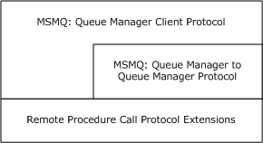
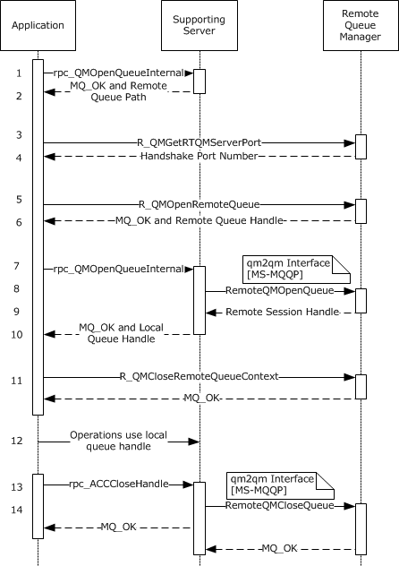
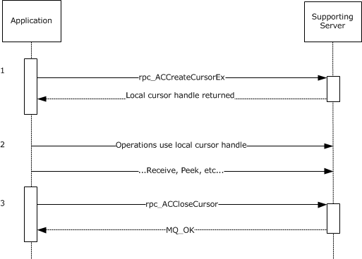
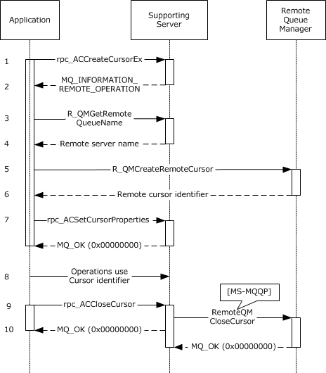
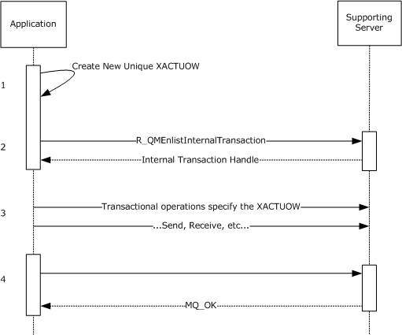

# [MS-MQMP]: Message Queuing (MSMQ): Queue Manager Client Protocol

Table of Contents

1 Introduction

- [1 Introduction](#Section_1)
  - [1.1 Glossary](#Section_1.1)
  - [1.2 References](#Section_1.2)
    - [1.2.1 Normative References](#Section_1.2.1)
    - [1.2.2 Informative References](#Section_1.2.2)
  - [1.3 Overview](#Section_1.3)
  - [1.4 Relationship to Other Protocols](#Section_1.4)
  - [1.5 Prerequisites/Preconditions](#Section_1.5)
  - [1.6 Applicability Statement](#Section_1.6)
  - [1.7 Versioning and Capability Negotiation](#Section_1.7)
  - [1.8 Vendor-Extensible Fields](#Section_1.8)
  - [1.9 Standards Assignments](#Section_1.9)

2 Messages

- [2 Messages](#Section_2)
  - [2.1 Transport](#Section_2.1)
  - [2.2 Common Data Types](#Section_2.2)
    - [2.2.1 Data Types](#Section_2.2.1)
      - [2.2.1.1 Handle Data Types](#Section_2.2.1.1)
        - [2.2.1.1.1 RPC_INT_XACT_HANDLE](#Section_2.2.1.1.1)
        - [2.2.1.1.2 RPC_QUEUE_HANDLE](#Section_2.2.1.1.2)
        - [2.2.1.1.3 PCTX_OPENREMOTE_HANDLE_TYPE](#Section_2.2.1.1.3)
    - [2.2.2 Enumerations](#Section_2.2.2)
      - [2.2.2.1 TRANSFER_TYPE](#Section_2.2.2.1)
    - [2.2.3 Structures](#Section_2.2.3)
      - [2.2.3.1 XACTUOW](#Section_2.2.3.1)
      - [2.2.3.2 CACTransferBufferV1](#Section_2.2.3.2)
      - [2.2.3.3 CACTransferBufferV2](#Section_2.2.3.3)
      - [2.2.3.4 CACCreateRemoteCursor](#Section_2.2.3.4)
      - [2.2.3.5 OBJECT_FORMAT](#Section_2.2.3.5)
  - [2.3 Directory Service Schema Elements](#Section_2.3)

3 Protocol Details

- [3 Protocol Details](#Section_3)
  - [3.1 qmcomm and qmcomm2 Server Details](#Section_3.1)
    - [3.1.1 Abstract Data Model](#Section_3.1.1)
      - [3.1.1.1 Shared Data Elements](#Section_3.1.1.1)
      - [3.1.1.2 LocalQueueContextHandleTable](#Section_3.1.1.2)
      - [3.1.1.3 LocalQueueContextHandle](#Section_3.1.1.3)
      - [3.1.1.4 RemoteQueueProxyHandleTable](#Section_3.1.1.4)
      - [3.1.1.5 RemoteQueueProxyHandle](#Section_3.1.1.5)
      - [3.1.1.6 CursorProxy](#Section_3.1.1.6)
      - [3.1.1.7 RemoteQueueOpenContextHandleTable](#Section_3.1.1.7)
      - [3.1.1.8 RemoteQueueOpenContextHandle](#Section_3.1.1.8)
      - [3.1.1.9 TransactionHandleTable](#Section_3.1.1.9)
      - [3.1.1.10 TransactionHandle](#Section_3.1.1.10)
      - [3.1.1.11 Message to CACTransferBufferV2 Translation](#Section_3.1.1.11)
      - [3.1.1.12 Queue PROPID to Abstract Queue Property Translation](#Section_3.1.1.12)
    - [3.1.2 Timers](#Section_3.1.2)
    - [3.1.3 Initialization](#Section_3.1.3)
    - [3.1.4 Message Processing Events and Sequencing Rules for qmcomm](#Section_3.1.4)
      - [3.1.4.1 R_QMGetRemoteQueueName (Opnum 1)](#Section_3.1.4.1)
      - [3.1.4.2 R_QMOpenRemoteQueue (Opnum 2)](#Section_3.1.4.2)
      - [3.1.4.3 R_QMCloseRemoteQueueContext (Opnum 3)](#Section_3.1.4.3)
      - [3.1.4.4 R_QMCreateRemoteCursor (Opnum 4)](#Section_3.1.4.4)
      - [3.1.4.5 R_QMCreateObjectInternal (Opnum 6)](#Section_3.1.4.5)
      - [3.1.4.6 R_QMSetObjectSecurityInternal (Opnum 7)](#Section_3.1.4.6)
      - [3.1.4.7 R_QMGetObjectSecurityInternal (Opnum 8)](#Section_3.1.4.7)
      - [3.1.4.8 R_QMDeleteObject (Opnum 9)](#Section_3.1.4.8)
      - [3.1.4.9 R_QMGetObjectProperties (Opnum 10)](#Section_3.1.4.9)
      - [3.1.4.10 R_QMSetObjectProperties (Opnum 11)](#Section_3.1.4.10)
      - [3.1.4.11 R_QMObjectPathToObjectFormat (Opnum 12)](#Section_3.1.4.11)
      - [3.1.4.12 R_QMGetTmWhereabouts (Opnum 14)](#Section_3.1.4.12)
      - [3.1.4.13 R_QMEnlistTransaction (Opnum 15)](#Section_3.1.4.13)
      - [3.1.4.14 R_QMEnlistInternalTransaction (Opnum 16)](#Section_3.1.4.14)
      - [3.1.4.15 R_QMCommitTransaction (Opnum 17)](#Section_3.1.4.15)
      - [3.1.4.16 R_QMAbortTransaction (Opnum 18)](#Section_3.1.4.16)
      - [3.1.4.17 rpc_QMOpenQueueInternal (Opnum 19)](#Section_3.1.4.17)
      - [3.1.4.18 rpc_ACCloseHandle (Opnum 20)](#Section_3.1.4.18)
      - [3.1.4.19 rpc_ACCloseCursor (Opnum 22)](#Section_3.1.4.19)
      - [3.1.4.20 rpc_ACSetCursorProperties (Opnum 23)](#Section_3.1.4.20)
      - [3.1.4.21 rpc_ACHandleToFormatName (Opnum 26)](#Section_3.1.4.21)
      - [3.1.4.22 rpc_ACPurgeQueue (Opnum 27)](#Section_3.1.4.22)
      - [3.1.4.23 R_QMQueryQMRegistryInternal (Opnum 28)](#Section_3.1.4.23)
      - [3.1.4.24 R_QMGetRTQMServerPort (Opnum 31)](#Section_3.1.4.24)
    - [3.1.5 Message Processing Events and Sequencing Rules for qmcomm2](#Section_3.1.5)
      - [3.1.5.1 QMSendMessageInternalEx (Opnum 0)](#Section_3.1.5.1)
      - [3.1.5.2 rpc_ACSendMessageEx (Opnum 1)](#Section_3.1.5.2)
      - [3.1.5.3 rpc_ACReceiveMessageEx (Opnum 2)](#Section_3.1.5.3)
      - [3.1.5.4 rpc_ACCreateCursorEx (Opnum 3)](#Section_3.1.5.4)
    - [3.1.6 Timer Events](#Section_3.1.6)
    - [3.1.7 Other Local Events](#Section_3.1.7)
      - [3.1.7.1 RPC_QUEUE_HANDLE Context Handle Rundown Routine](#Section_3.1.7.1)
      - [3.1.7.2 PCTX_OPENREMOTE_HANDLE_TYPE Context Handle Rundown Routine](#Section_3.1.7.2)
      - [3.1.7.3 RPC_INT_XACT_HANDLE Context Handle Rundown Routine](#Section_3.1.7.3)
  - [3.2 qmcomm and qmcomm2 Client Details](#Section_3.2)
    - [3.2.1 Abstract Data Model](#Section_3.2.1)
      - [3.2.1.1 LicenceGuid](#Section_3.2.1.1)
      - [3.2.1.2 OpenQueueContext](#Section_3.2.1.2)
      - [3.2.1.3 CursorIdentifier](#Section_3.2.1.3)
    - [3.2.2 Timers](#Section_3.2.2)
    - [3.2.3 Initialization](#Section_3.2.3)
    - [3.2.4 Message Processing Events and Sequencing Rules](#Section_3.2.4)
      - [3.2.4.1 Creating a Local Private Queue](#Section_3.2.4.1)
      - [3.2.4.2 Deleting a Local Private Queue](#Section_3.2.4.2)
      - [3.2.4.3 Updating Local Private Queue Security](#Section_3.2.4.3)
      - [3.2.4.4 Retrieving Local Private Queue Security](#Section_3.2.4.4)
      - [3.2.4.5 Updating Local Private Queue Properties](#Section_3.2.4.5)
      - [3.2.4.6 Retrieving Local Private Queue Properties](#Section_3.2.4.6)
      - [3.2.4.7 Opening a Queue](#Section_3.2.4.7)
      - [3.2.4.8 Creating a Cursor](#Section_3.2.4.8)
      - [3.2.4.9 Purging a Queue](#Section_3.2.4.9)
      - [3.2.4.10 Sending a Message](#Section_3.2.4.10)
      - [3.2.4.11 Peeking a Message](#Section_3.2.4.11)
      - [3.2.4.12 Receiving a Message](#Section_3.2.4.12)
      - [3.2.4.13 Retrieving a Format Name for a Queue Path Name](#Section_3.2.4.13)
      - [3.2.4.14 Retrieving a Format Name for a Queue Context Handle](#Section_3.2.4.14)
      - [3.2.4.15 Closing a Queue](#Section_3.2.4.15)
      - [3.2.4.16 Closing a Cursor](#Section_3.2.4.16)
    - [3.2.5 Timer Events](#Section_3.2.5)
    - [3.2.6 Other Local Events](#Section_3.2.6)

4 Protocol Examples

- [4 Protocol Examples](#Section_4)
  - [4.1 Application Opening and Closing a Local Queue Example](#Section_4.1)
  - [4.2 Application Opening and Closing a Remote Queue Example](#Section_4.2)
  - [4.3 Application Creating and Closing a Local Cursor Example](#Section_4.3)
  - [4.4 Application Creating and Closing a Remote Cursor Example](#Section_4.4)
  - [4.5 Application Internal Transaction Example](#Section_4.5)

5 Security

- [5 Security](#Section_5)
  - [5.1 Security Considerations for Implementers](#Section_5.1)
  - [5.2 Index of Security Parameters](#Section_5.2)

6 Appendix A: Full IDL

- [6 Appendix A: Full IDL](#Section_6)

7 Appendix B: Product Behavior

- [7 Appendix B: Product Behavior](#Section_7)

8 Change Tracking

- [8 Change Tracking](#Section_8)

For the legal notice and IP terms, see [LEGAL.md](../LEGAL.md).
Last updated: 4/23/2024.
See [Revision History](#revision-history) for full version history.

# 1 Introduction

The Message Queuing (MSMQ): Queue Manager Client Protocol is an RPC-based protocol, which enables communication between an [**application**](#gt_application) and an [**MSMQ supporting server**](#gt_msmq-supporting-server) or a remote [**MSMQ queue manager**](#gt_msmq-queue-manager). Operations that an MSMQ application performs using this protocol include:

- Managing [**private queues**](#gt_private-queue) that are [**local queues**](#gt_local-queue).
- Opening and closing local queue handles and [**remote queue**](#gt_remote-queue) handles.
- Enlisting, committing, and aborting [**internal transactions**](#gt_internal-transaction).
- Enlisting the [**queue manager**](#gt_queue-manager-qm) in [**external transactions**](#gt_external-transaction).
- Purging [**queues**](#gt_queue).
- Creating [**cursors**](#gt_cursor) for local queues and remote queues.
- Sending [**messages**](#gt_message).
- Reading messages.
Sections 1.5, 1.8, 1.9, 2, and 3 of this specification are normative. All other sections and examples in this specification are informative.

## 1.1 Glossary

This document uses the following terms:

**administration queue**: A messaging [**queue**](#gt_queue) that receives [**Message Queuing (MSMQ)**](#gt_message-queuing) system-generated acknowledgment [**messages**](#gt_message). An administration queue is available to MSMQ applications for checking [**message**](#gt_message) status.

**application**: A participant that is responsible for beginning, propagating, and completing an atomic transaction. An application communicates with a transaction manager in order to begin and complete transactions. An application communicates with a transaction manager in order to marshal transactions to and from other applications. An application also communicates in application-specific ways with a resource manager in order to submit requests for work on resources.

**authentication level**: A numeric value indicating the level of authentication or message protection that [**remote procedure call (RPC)**](#gt_remote-procedure-call-rpc) will apply to a specific message exchange. For more information, see [[C706]](https://go.microsoft.com/fwlink/?LinkId=89824) section 13.1.2.1 and [MS-RPCE](../MS-RPCE/MS-RPCE.md).

**client**: A computer on which the remote procedure call (RPC) client is executing.

**Coordinated Universal Time (UTC)**: A high-precision atomic time standard that approximately tracks Universal Time (UT). It is the basis for legal, civil time all over the Earth. Time zones around the world are expressed as positive and negative offsets from UTC. In this role, it is also referred to as Zulu time (Z) and Greenwich Mean Time (GMT). In these specifications, all references to UTC refer to the time at UTC-0 (or GMT).

**cryptographic service provider (CSP)**: A software module that implements cryptographic functions for calling applications that generates digital signatures. Multiple CSPs can be installed. A CSP is identified by a name represented by a NULL-terminated Unicode string.

**cursor**: A data structure providing sequential access over a message queue. A cursor has a current pointer that lies between the head and tail pointer of the [**queue**](#gt_queue). The pointer can be moved forward or backward through an operation on the cursor (Next). A [**message**](#gt_message) at the current pointer can be accessed through a nondestructive read (Peek) operation or a destructive read (Receive) operation.

**dead-letter queue**: A [**queue**](#gt_queue) that contains [**messages**](#gt_message) that were sent from a host with a request for negative source journaling and that could not be delivered. [**Message Queuing**](#gt_message-queuing) provides a transactional dead-letter queue and a non-transactional dead-letter queue.

**directory**: The database that stores information about objects such as users, groups, computers, printers, and the directory service that makes this information available to users and applications.

**dynamic endpoint**: A network-specific server address that is requested and assigned at run time. For more information, see [C706].

**endpoint**: A network-specific address of a remote procedure call (RPC) server process for remote procedure calls. The actual name and type of the endpoint depends on the [**RPC**](#gt_remote-procedure-call-rpc) protocol sequence that is being used. For example, for RPC over TCP (RPC Protocol Sequence ncacn_ip_tcp), an endpoint might be TCP port 1025. For RPC over Server Message Block (RPC Protocol Sequence ncacn_np), an endpoint might be the name of a named pipe. For more information, see [C706].

**external transaction**: An atomic transaction context dispensed by a transaction coordinator other than an [**MSMQ queue manager**](#gt_msmq-queue-manager), such as by a distributed transaction coordinator (DTC), and used by an [**MSMQ queue manager**](#gt_msmq-queue-manager) to coordinate its state changes with state changes in other resource managers. For more information on transactions, see [MS-DTCO](../MS-DTCO/MS-DTCO.md).

**foreign queue**: A messaging queue that resides on a computer that does not run an [**MSMQ**](#gt_message-queuing) messaging application.

**format name**: A name that is used to reference a [**queue**](#gt_queue) when making calls to API functions.

**globally unique identifier (GUID)**: A term used interchangeably with [**universally unique identifier (UUID)**](#gt_universally-unique-identifier-uuid) in Microsoft protocol technical documents (TDs). Interchanging the usage of these terms does not imply or require a specific algorithm or mechanism to generate the value. Specifically, the use of this term does not imply or require that the algorithms described in [[RFC4122]](https://go.microsoft.com/fwlink/?LinkId=90460) or [C706] must be used for generating the [**GUID**](#gt_globally-unique-identifier-guid). See also [**universally unique identifier (UUID)**](#gt_universally-unique-identifier-uuid).

**Interface Definition Language (IDL)**: The International Standards Organization (ISO) standard language for specifying the interface for remote procedure calls. For more information, see [C706] section 4.

**internal transaction**: An atomic transaction context dispensed by an [**MSMQ Queue Manager**](#gt_msmq-queue-manager) instance that can be used to atomically commit or roll back state changes within that [**MSMQ Queue Manager**](#gt_msmq-queue-manager). The dispensing [**MSMQ Queue Manager**](#gt_msmq-queue-manager) instance is the transaction coordinator and is also the only resource manager participant supported by the transaction context. An internal transaction cannot, therefore, be used to coordinate state changes with other resource managers, including other [**MSMQ Queue Manager**](#gt_msmq-queue-manager) instances.

**local queue**: For a [**queue manager**](#gt_queue-manager-qm), a [**queue**](#gt_queue) hosted by the [**queue manager**](#gt_queue-manager-qm) itself. For an [**application**](#gt_application), a [**queue**](#gt_queue) hosted by the [**queue manager**](#gt_queue-manager-qm) with which the [**application**](#gt_application) communicates.

**message**: A data structure representing a unit of data transfer between distributed applications. A message has message properties, which may include message header properties, a message body property, and message trailer properties.

**message queuing**: A communications service that provides asynchronous and reliable message passing between distributed [**client**](#gt_client) applications. In message queuing, clients send messages to message queues and consume messages from message queues. The message queues provide persistence of the messages, which enables the sending and receiving client applications to operate asynchronously from each other.

**Microsoft Message Queuing (MSMQ)**: A communications service that provides asynchronous and reliable [**message**](#gt_message) passing between distributed [**applications**](#gt_application). In Message Queuing, [**applications**](#gt_application) send [**messages**](#gt_message) to [**queues**](#gt_queue) and consume [**messages**](#gt_message) from [**queues**](#gt_queue). The [**queues**](#gt_queue) provide persistence of the [**messages**](#gt_message), enabling the sending and receiving [**applications**](#gt_application) to operate asynchronously from one another.

**MSMQ 1.0 digital signature**: A digital signature based on a hash of the MSMQ 1.0 Digital Signature Properties section in [MS-MQMQ]. This signature type is supported by all versions of [**Message Queuing**](#gt_message-queuing).

**MSMQ 2.0 digital signature**: A digital signature that is more robust than the [**MSMQ 1.0 digital signature**](#gt_msmq-10-digital-signature) and is based on a hash of the MSMQ 2.0 Digital Signature Properties section in [MS-MQMQ]. This signature type is not supported by [**MSMQ**](#gt_message-queuing) version 1.

**MSMQ 3.0 digital signature**: A digital signature that is used only for [**messages**](#gt_message) sent to distribution lists or multiple-element format names and is based on a hash of the MSMQ 3.0 Digital Signature Properties section in [MS-MQMQ]. This signature type is not supported by [**MSMQ**](#gt_message-queuing) version 1 nor [**MSMQ**](#gt_message-queuing) version 2.

**MSMQ queue manager**: An [**MSMQ**](#gt_message-queuing) service hosted on a machine that provides [**queued**](#gt_queue) messaging services. [**Queue managers**](#gt_476f10ed-08f0-4887-b583-59d5cf909979) manage [**queues**](#gt_queue) deployed on the local computer and provide asynchronous transfer of [**messages**](#gt_message) to [**queues**](#gt_queue) located on other computers. A [**queue manager**](#gt_queue-manager-qm) is identified by a [**globally unique identifier (GUID)**](#gt_globally-unique-identifier-guid).

**MSMQ supporting server**: A role played by an [**MSMQ queue manager**](#gt_msmq-queue-manager). An [**MSMQ supporting server**](#gt_msmq-supporting-server) supports [**applications**](#gt_application) to send and receive [**messages**](#gt_message) through the Message Queuing (MSMQ): Queue Manager Client Protocol [MS-MQMP](#Section_8e379aa2802d4fccb6a66203e4606fa9).

**Network Data Representation (NDR)**: A specification that defines a mapping from [**Interface Definition Language (IDL)**](#gt_interface-definition-language-idl) data types onto octet streams. [**NDR**](#gt_network-data-representation-ndr) also refers to the runtime environment that implements the mapping facilities (for example, data provided to [**NDR**](#gt_network-data-representation-ndr)). For more information, see [MS-RPCE] and [C706] section 14.

**opnum**: An operation number or numeric identifier that is used to identify a specific [**remote procedure call (RPC)**](#gt_remote-procedure-call-rpc) method or a method in an interface. For more information, see [C706] section 12.5.2.12 or [MS-RPCE].

**order queue**: A messaging queue that is used to monitor the arrival order of [**messages**](#gt_message) that are sent as part of a transaction.

**outgoing queue**: A temporary internal [**queue**](#gt_queue) that holds [**messages**](#gt_message) for a remote destination [**queue**](#gt_queue). The [**path name**](#gt_path-name) of an outgoing [**queue**](#gt_queue) is identical to the [**path name**](#gt_path-name) of the corresponding destination [**queue**](#gt_queue). An outgoing [**queue**](#gt_queue) is distinguished from its corresponding destination [**queue**](#gt_queue) by the fact that the outgoing [**queue**](#gt_queue) is located on the sending computer. The [**format name**](#gt_format-name) of an outgoing [**queue**](#gt_queue) is identical to the [**format name**](#gt_format-name) used by the [**messages**](#gt_message) to reference the destination [**queue**](#gt_queue). Messages that reference the destination [**queue**](#gt_queue) using a different [**format name**](#gt_format-name) are placed in a different outgoing [**queue**](#gt_queue).

**path name**: The name of the receiving computer where the [**messages**](#gt_message) for a particular [**queue**](#gt_queue) are stored, and an optional PRIVATE$ key word indicating whether the [**queue**](#gt_queue) is private, followed by the name of the [**queue**](#gt_queue). Path names can also refer to subqueues; for more information, see [MS-MQMQ](#Section_2.2.3) section 2.1.

**private queue**: An application-defined message queue that is not registered in the MSMQ Directory Service. A private queue is deployed on a particular [**queue manager**](#gt_queue-manager-qm).

**queue**: An object that holds [**messages**](#gt_message) passed between applications or [**messages**](#gt_message) passed between [**Message Queuing**](#gt_message-queuing) and applications. In general, applications can send [**messages**](#gt_message) to queues and read [**messages**](#gt_message) from queues.

**queue journal**: A [**queue**](#gt_queue) that contains copies of the [**messages**](#gt_message) sent from a host when positive source journaling is requested.

**queue manager (QM)**: A message queuing service that manages [**queues**](#gt_queue) deployed on a computer. A queue manager can also provide asynchronous transfer of [**messages**](#gt_message) to [**queues**](#gt_queue) deployed on other queue managers.

**queue property**: A data structure that contains a property identifier and a value, and is associated with a message queue.

**remote procedure call (RPC)**: A communication protocol used primarily between client and server. The term has three definitions that are often used interchangeably: a runtime environment providing for communication facilities between computers (the RPC runtime); a set of request-and-response message exchanges between computers (the RPC exchange); and the single message from an RPC exchange (the RPC message). For more information, see [C706].

**remote queue**: For a [**queue manager**](#gt_queue-manager-qm), a [**queue**](#gt_queue) that is hosted by a remote [**queue manager**](#gt_queue-manager-qm). For an [**application**](#gt_application), a [**queue**](#gt_queue) hosted by a [**queue manager**](#gt_queue-manager-qm) other than the one with which the [**application**](#gt_application) communicates.

**remote read**: The act of reading (receiving) [**messages**](#gt_message) from a [**remote queue**](#gt_remote-queue).

**resource manager (RM)**: The participant that is responsible for coordinating the state of a resource with the outcome of atomic transactions. For a specified transaction, a resource manager enlists with exactly one transaction manager to vote on that transaction outcome and to obtain the final outcome. A resource manager is either durable or volatile, depending on its resource.

**RPC protocol sequence**: A character string that represents a valid combination of a [**remote procedure call (RPC)**](#gt_remote-procedure-call-rpc) protocol, a network layer protocol, and a transport layer protocol, as described in [C706] and [MS-RPCE].

**server**: A computer on which the [**remote procedure call (RPC)**](#gt_remote-procedure-call-rpc) server is executing.

**session**: An authenticated communication channel between the client and server correlating a group of messages into a conversation.

**supporting server**: See [**MSMQ supporting server**](#gt_msmq-supporting-server).

**transaction**: A unit of interaction that guarantees the ACID properties— atomicity, consistency, isolation, and durability—as specified by the MSDTC Connection Manager: OleTx Transaction Protocol ([MS-DTCO])

**transaction manager**: The party that is responsible for managing and distributing the outcome of atomic transactions. A transaction manager is either a root transaction manager or a subordinate transaction manager for a specified transaction.

**unit of work**: A set of individual operations that [**MSMQ**](#gt_message-queuing) must successfully complete before any of the individual [**MSMQ**](#gt_message-queuing) operations can be considered complete.

**universally unique identifier (UUID)**: A 128-bit value. UUIDs can be used for multiple purposes, from tagging objects with an extremely short lifetime, to reliably identifying very persistent objects in cross-process communication such as client and server interfaces, manager entry-point vectors, and [**RPC**](#gt_remote-procedure-call-rpc) objects. UUIDs are highly likely to be unique. UUIDs are also known as [**globally unique identifiers (GUIDs)**](#gt_globally-unique-identifier-guid) and these terms are used interchangeably in the Microsoft protocol technical documents (TDs). Interchanging the usage of these terms does not imply or require a specific algorithm or mechanism to generate the UUID. Specifically, the use of this term does not imply or require that the algorithms described in [RFC4122] or [C706] must be used for generating the UUID.

**XML digital signature**: A digital signature that is designed for use in XML operations.

**MAY, SHOULD, MUST, SHOULD NOT, MUST NOT:** These terms (in all caps) are used as defined in [[RFC2119]](https://go.microsoft.com/fwlink/?LinkId=90317). All statements of optional behavior use either MAY, SHOULD, or SHOULD NOT.

## 1.2 References

Links to a document in the Microsoft Open Specifications library point to the correct section in the most recently published version of the referenced document. However, because individual documents in the library are not updated at the same time, the section numbers in the documents may not match. You can confirm the correct section numbering by checking the [Errata](https://go.microsoft.com/fwlink/?linkid=850906).

### 1.2.1 Normative References

We conduct frequent surveys of the normative references to assure their continued availability. If you have any issue with finding a normative reference, please contact [dochelp@microsoft.com](mailto:dochelp@microsoft.com). We will assist you in finding the relevant information.

[C706] The Open Group, "DCE 1.1: Remote Procedure Call", C706, August 1997, [https://publications.opengroup.org/c706](https://go.microsoft.com/fwlink/?LinkId=89824)

**Note** Registration is required to download the document.

[FIPS180-2] National Institute of Standards and Technology, "Secure Hash Standard", FIPS PUB 180-2, August 2002, [http://csrc.nist.gov/publications/fips/fips180-2/fips180-2.pdf](https://go.microsoft.com/fwlink/?LinkId=89868)

[MS-ADTS] Microsoft Corporation, "[Active Directory Technical Specification](../MS-ADTS/MS-ADTS.md)".

[MS-DTCO] Microsoft Corporation, "[MSDTC Connection Manager: OleTx Transaction Protocol](../MS-DTCO/MS-DTCO.md)".

[MS-DTYP] Microsoft Corporation, "[Windows Data Types](#Section_2.2.1)".

[MS-ERREF] Microsoft Corporation, "[Windows Error Codes](../MS-ERREF/MS-ERREF.md)".

[MS-MQDMPR] Microsoft Corporation, "[Message Queuing (MSMQ): Common Data Model and Processing Rules](../MS-MQDMPR/MS-MQDMPR.md)".

[MS-MQDS] Microsoft Corporation, "[Message Queuing (MSMQ): Directory Service Protocol](../MS-MQDS/MS-MQDS.md)".

[MS-MQMQ] Microsoft Corporation, "[Message Queuing (MSMQ): Data Structures](#Section_2.2.3)".

[MS-MQQB] Microsoft Corporation, "[Message Queuing (MSMQ): Message Queuing Binary Protocol](../MS-MQQB/MS-MQQB.md)".

[MS-MQQP] Microsoft Corporation, "[Message Queuing (MSMQ): Queue Manager to Queue Manager Protocol](../MS-MQQP/MS-MQQP.md)".

[MS-MQRR] Microsoft Corporation, "[Message Queuing (MSMQ): Queue Manager Remote Read Protocol](../MS-MQRR/MS-MQRR.md)".

[MS-RPCE] Microsoft Corporation, "[Remote Procedure Call Protocol Extensions](../MS-RPCE/MS-RPCE.md)".

[RC4] RSA Data Security, Inc., "The RC4 Encryption Algorithm", 2004.

**Note** An archived copy is available upon request.

[RFC1319] Kaliski, B., "The MD2 Message-Digest Algorithm", RFC 1319, April 1992, [https://www.rfc-editor.org/info/rfc1319](https://go.microsoft.com/fwlink/?LinkId=90273)

[RFC1320] Rivest, R., "The MD4 Message-Digest Algorithm", RFC 1320, April 1992, [https://www.rfc-editor.org/info/rfc1320](https://go.microsoft.com/fwlink/?LinkId=90274)

[RFC1321] Rivest, R., "The MD5 Message-Digest Algorithm", RFC 1321, April 1992, [https://www.rfc-editor.org/info/rfc1321](https://go.microsoft.com/fwlink/?LinkId=90275)

[RFC2119] Bradner, S., "Key words for use in RFCs to Indicate Requirement Levels", BCP 14, RFC 2119, March 1997, [https://www.rfc-editor.org/info/rfc2119](https://go.microsoft.com/fwlink/?LinkId=90317)

[RFC2268] Rivest, R., "A Description of the RC2(r) Encryption Algorithm", RFC 2268, March 1998, [https://www.rfc-editor.org/info/rfc2268](https://go.microsoft.com/fwlink/?LinkId=90330)

[RFC3174] Eastlake III, D., and Jones, P., "US Secure Hash Algorithm 1 (SHA1)", RFC 3174, September 2001, [https://www.rfc-editor.org/info/rfc3174](https://go.microsoft.com/fwlink/?LinkId=90408)

### 1.2.2 Informative References

[MS-MQDSSM] Microsoft Corporation, "[Message Queuing (MSMQ): Directory Service Schema Mapping](../MS-MQDSSM/MS-MQDSSM.md)".

[MS-MQOD] Microsoft Corporation, "[Message Queuing Protocols Overview](#Section_1.3)".

[MSDN-MQEIC] Microsoft Corporation, "Message Queuing Error and Information Codes", [http://msdn.microsoft.com/en-us/library/ms700106.aspx](https://go.microsoft.com/fwlink/?LinkId=90044)

## 1.3 Overview

This protocol provides a means for [**applications**](#gt_application) to communicate with a [**supporting server**](#gt_supporting-server). An MSMQ application uses this protocol to perform basic [**message queuing**](#gt_message-queuing) operations on a supporting server, such as creating [**queues**](#gt_queue), altering [**queue properties**](#gt_queue-property), sending [**messages**](#gt_message), and receiving messages. An MSMQ application also uses this protocol to communicate with a remote [**MSMQ queue manager**](#gt_msmq-queue-manager) to open and close [**remote queues**](#gt_remote-queue).

## 1.4 Relationship to Other Protocols

This protocol is dependent upon [**RPC**](#gt_remote-procedure-call-rpc) for its transport. This protocol uses RPC, as specified in section [2.1](#Section_2.1).

This protocol is tightly coupled with the Message Queuing (MSMQ) Queue Manager to Queue Manager Protocol [MS-MQQP](../MS-MQQP/MS-MQQP.md), and therefore if one protocol is implemented, the other one has to be implemented also. The processing rules for this protocol invoke methods on the qm2qm RPC interface of the Message Queuing (MSMQ) Queue Manager to Queue Manager Protocol. Furthermore, the arguments required for these methods are obtained from the qmcomm RPC interface of this protocol. The following diagram illustrates the protocol relationships for this protocol.

Figure 1: Protocol relationships

Additionally, the MSDTC Connection Manager: OleTx Transaction Protocol [MS-DTCO](../MS-DTCO/MS-DTCO.md) is used by applications to orchestrate [**external transaction**](#gt_external-transaction) scenarios for this protocol.

This protocol uses shared state and processing rules defined in [MS-MQDMPR](../MS-MQDMPR/MS-MQDMPR.md).

## 1.5 Prerequisites/Preconditions

The Message Queuing (MSMQ): Queue Manager Client Protocol is an [**RPC**](#gt_remote-procedure-call-rpc) interface and, as a result, has the prerequisites specified in [MS-RPCE](../MS-RPCE/MS-RPCE.md) as being common to RPC interfaces.

It is assumed that a Message Queuing (MSMQ): Queue Manager Client Protocol [**client**](#gt_client) has obtained the name of a remote computer that supports the Message Queuing (MSMQ): Queue Manager Client Protocol before this protocol is invoked. This specification does not address how this information is acquired. In the context of a [**remote read**](#gt_remote-read) operation, this protocol provides the name of a remote [**server**](#gt_server), as described in sections [3.1.4.1](#Section_3.1.4.1) and [3.1.4.17](#Section_3.1.4.17).

## 1.6 Applicability Statement

This protocol provides functionality for [**message queuing**](#gt_message-queuing) [**applications**](#gt_application) to perform operations on a remote [**supporting server**](#gt_supporting-server).

The [**server**](#gt_server) side of the Message Queuing (MSMQ): Queue Manager Client Protocol is applicable for implementation by a [**queue manager**](#gt_queue-manager-qm) providing supporting server services to applications. The [**client**](#gt_client) side of this protocol is applicable for implementation by client libraries providing message queuing services to applications, or by a queue manager delegating requests on behalf of a client.

Due to performance and security limitations, this protocol is deprecated and suitable only for interoperability with existing legacy servers and clients.<1> Implementers of new message queuing applications are encouraged to invoke the [**MSMQ**](#gt_message-queuing) COM API remotely via DCOM in preference to the capabilities specified by the Message Queuing (MSMQ): Queue Manager Client Protocol.

## 1.7 Versioning and Capability Negotiation

This protocol supports a mechanism for explicitly negotiating the [**RPC**](#gt_remote-procedure-call-rpc) [**endpoint**](#gt_endpoint) to be used. For more information, see section [3.1.4.24](#Section_3.1.4.24).

## 1.8 Vendor-Extensible Fields

This protocol uses HRESULT values as defined in [MS-ERREF](../MS-ERREF/MS-ERREF.md) section 2.1.1. Vendors can define their own HRESULT values, provided that they set the C bit (0x20000000) for each vendor-defined value, indicating that the value is a customer code.

## 1.9 Standards Assignments

This protocol uses the standard interfaces that are listed in the following table.

| Parameter | Value | Reference |
| --- | --- | --- |
| [**RPC**](#gt_remote-procedure-call-rpc) Interface [**UUID**](#gt_universally-unique-identifier-uuid) for qmcomm interface | fdb3a030-065f-11d1-bb9b-00a024ea5525 | As specified in [[C706]](https://go.microsoft.com/fwlink/?LinkId=89824). |
| RPC Interface UUID for qmcomm2 interface | 76d12b80-3467-11d3-91ff-0090272f9ea3 | As specified in [C706]. |
| Interface Version | 1.0 | As specified in [C706]. |
| Port Information | This protocol uses RPC [**dynamic endpoints**](#gt_dynamic-endpoint) as specified in [C706] Part 4, as well as a fixed [**endpoint**](#gt_endpoint) as described in section [2.1](#Section_2.1). | As specified in [C706]. |

# 2 Messages

## 2.1 Transport

This protocol SHOULD use the following [**RPC protocol sequence**](#gt_rpc-protocol-sequence): [**RPC**](#gt_remote-procedure-call-rpc) over TCP/IP (ncacn_ip_tcp), as specified in [MS-RPCE](../MS-RPCE/MS-RPCE.md).<2> This protocol MAY use the RPC over SPX (ncacn_spx) protocol sequence if TCP/IP is unavailable.

This protocol SHOULD use RPC [**dynamic endpoints**](#gt_dynamic-endpoint), as specified in [[C706]](https://go.microsoft.com/fwlink/?LinkId=89824) part 4. This protocol MAY use an RPC static [**endpoint**](#gt_endpoint), as specified in [C706] part 4.

This protocol allows any user to establish a connection to the RPC [**server**](#gt_server). For each connection, the server uses the underlying RPC protocol to retrieve the identity of the invoking [**client**](#gt_client), as specified in the second bullet point of [MS-RPCE] section 3.3.3.4.3. The server SHOULD use this identity to perform method-specific access checks, as specified in section [3.1.4](../MS-RPCE/MS-RPCE.md).

## 2.2 Common Data Types

All structures are defined in the [**IDL**](#gt_interface-definition-language-idl) syntax and are marshaled as specified in [[C706]](https://go.microsoft.com/fwlink/?LinkId=89824) part 3. The IDL is specified in section [6](#Section_6).

Note that **LPWSTR** or **WCHAR*** types specified in an IDL structure that are annotated with the **[string]** attribute MUST be null-terminated, as specified in [C706].

**HRESULT:** This specification uses the HRESULT type, as specified in [MS-ERREF](../MS-ERREF/MS-ERREF.md) section 2.1.1.

Note that throughout this specification, the phrase "a failure HRESULT" means any HRESULT where the Severity (S) bit is set, as specified by [MS-ERREF]. When this specification mandates the return of "a failure HRESULT" from a method, the specific error code is not relevant to the protocol, as long as the Severity bit is set. In this circumstance, the [**server**](#gt_server) can return MQ_ERROR (0xC00E0001), or any other HRESULT value where the Severity bit is set, such as a context-specific [**message queuing**](#gt_message-queuing) error code, as specified in [MS-MQMQ](#Section_2.2.3) section 2.4.

**GUID and UUID:** This type specifies a [**globally unique identifier (GUID)**](#gt_globally-unique-identifier-guid), as specified in [MS-DTYP](#Section_2.2.1) section 2.3.4.

**QUEUE_FORMAT and OBJECTID:** These structures are defined in [MS-MQMQ] section 2.2.

In addition to [**RPC**](#gt_remote-procedure-call-rpc) base types and definitions specified in [C706] and [MS-RPCE](../MS-RPCE/MS-RPCE.md), additional data types are defined below.

The following table summarizes the types that are defined in this specification.

| Data type name | Description |
| --- | --- |
| [RPC_INT_XACT_HANDLE](#Section_2.2.1.1.1) | A context handle representing an [**internal transaction**](#gt_internal-transaction). |
| [RPC_QUEUE_HANDLE](#Section_2.2.1.1.2) | A context handle representing a [**queue**](#gt_queue) object. |
| [PCTX_OPENREMOTE_HANDLE_TYPE](#Section_2.2.1.1.3) | A context handle representing a [**remote queue**](#gt_remote-queue) object. |
| [CACTransferBufferV1](#Section_2.2.3.2) | A structure used for sending and receiving [**messages**](#gt_message). |
| [CACTransferBufferV2](#Section_2.2.3.3) | A structure containing the CACTransferBufferV1 (section 2.2.3.2) structure used for sending and receiving messages with additional [**transaction**](#gt_transaction) tracking capabilities. |
| [CACCreateRemoteCursor](#Section_2.2.3.4) | A structure used for creating a [**cursor**](#gt_cursor) on a message queue. |
| [OBJECT_FORMAT](#Section_2.2.3.5) | A structure containing a **QUEUE_FORMAT** ([MS-MQMQ] section 2.2.7) structure and a specification as to whether the **QUEUE_FORMAT** is local or remote. |
| [XACTUOW](#Section_2.2.3.1) | Identifies the [**unit of work**](#gt_unit-of-work) for a transactional operation. |

### 2.2.1 Data Types

#### 2.2.1.1 Handle Data Types

##### 2.2.1.1.1 RPC_INT_XACT_HANDLE

The RPC_INT_XACT_HANDLE handle is a [**remote procedure call (RPC)**](#gt_remote-procedure-call-rpc) context handle representing an [**internal transaction**](#gt_internal-transaction), as specified in [[C706]](https://go.microsoft.com/fwlink/?LinkId=89824) section 14.2.16.6. A [**client**](#gt_client) MUST call [R_QMEnlistInternalTransaction (section 3.1.4.14)](#Section_3.1.4.14) to create an RPC_INT_XACT_HANDLE handle, and it MUST call [R_QMCommitTransaction (section 3.1.4.15)](#Section_3.1.4.15) or [R_QMAbortTransaction (section 3.1.4.16)](#Section_3.1.4.16) to delete an RPC_INT_XACT_HANDLE.

This type is declared as follows:

typedef [context_handle] void* RPC_INT_XACT_HANDLE;

##### 2.2.1.1.2 RPC_QUEUE_HANDLE

The RPC_QUEUE_HANDLE handle is an [**RPC**](#gt_remote-procedure-call-rpc) context handle representing a [**queue**](#gt_queue) object, as specified in [[C706]](https://go.microsoft.com/fwlink/?LinkId=89824) section 14.2.16.6. A [**client**](#gt_client) MUST call [rpc_QMOpenQueueInternal (section 3.1.4.17)](#Section_3.1.4.17) to create an RPC_QUEUE_HANDLE handle and [rpc_ACCloseHandle (section 3.1.4.18)](#Section_3.1.4.18) to close an RPC_QUEUE_HANDLE.

This type is declared as follows:

typedef [context_handle] void* RPC_QUEUE_HANDLE;

##### 2.2.1.1.3 PCTX_OPENREMOTE_HANDLE_TYPE

The PCTX_OPENREMOTE_HANDLE_TYPE handle is an [**RPC**](#gt_remote-procedure-call-rpc) context handle representing a [**queue**](#gt_queue) object at a [**queue manager**](#gt_queue-manager-qm) other than the [**supporting server**](#gt_supporting-server), as specified in [[C706]](https://go.microsoft.com/fwlink/?LinkId=89824) section 14.2.16.6. A [**client**](#gt_client) MUST call [R_QMOpenRemoteQueue (section 3.1.4.2)](#Section_3.1.4.2) to create a PCTX_OPENREMOTE_HANDLE_TYPE handle, and [R_QMCloseRemoteQueueContext (section 3.1.4.3)](#Section_3.1.4.3) to close a PCTX_OPENREMOTE_HANDLE_TYPE.

This type is declared as follows:

typedef [context_handle] void* PCTX_OPENREMOTE_HANDLE_TYPE;

### 2.2.2 Enumerations

The following enumerated type is defined in the following section:

- [TRANSFER_TYPE](#Section_2.2.2.1)

#### 2.2.2.1 TRANSFER_TYPE

The TRANSFER_TYPE enumeration specifies the valid cases for the unnamed union defined in the [CACTransferBufferV1](#Section_2.2.3.2) structure (section 2.2.3.2).

typedef enum {

CACTB_SEND = 0,

CACTB_RECEIVE,

CACTB_CREATECURSOR

} TRANSFER_TYPE;

**CACTB_SEND:** A send operation (that is, a [**message**](#gt_message) placed into a [**queue**](#gt_queue) for delivery) is to be performed.

**CACTB_RECEIVE:** A receive operation (that is, a message is to be read from a queue) is to be performed.

**CACTB_CREATECURSOR:** A [**cursor**](#gt_cursor) creation is to be performed.

### 2.2.3 Structures

#### 2.2.3.1 XACTUOW

The XACTUOW structure ([MS-MQMQ](#Section_2.2.3) section 2.2.18.1.8) uniquely identifies the [**unit of work (UOW)**](#gt_unit-of-work) for a transactional operation. For an [**external transaction**](#gt_external-transaction), this value MUST be acquired from the [**transaction**](#gt_transaction) coordinator. For an [**internal transaction**](#gt_internal-transaction), a [**client**](#gt_client) MUST create a unique random value for each transaction.<3>

#### 2.2.3.2 CACTransferBufferV1

The CACTransferBufferV1 structure is used to send and receive [**messages**](#gt_message) via [**MSMQ**](#gt_message-queuing).

Following is the layout of the CACTransferBufferV1 structure with [**IDL**](#gt_interface-definition-language-idl) annotations followed by descriptions of the structure members.

typedef struct CACTransferBufferV1 {

[range(0,2)] DWORD uTransferType;

[switch_is(uTransferType)] union {

[case(CACTB_SEND)]

struct {

QUEUE_FORMAT* pAdminQueueFormat;

QUEUE_FORMAT* pResponseQueueFormat;

} Send;

[case(CACTB_RECEIVE)]

struct {

DWORD RequestTimeout;

DWORD Action;

DWORD Asynchronous;

DWORD Cursor;

[range(0,1024)] DWORD ulResponseFormatNameLen;

[size_is(,ulResponseFormatNameLen)]

WCHAR** ppResponseFormatName;

DWORD* pulResponseFormatNameLenProp;

[range(0,1024)] DWORD ulAdminFormatNameLen;

[size_is(,ulAdminFormatNameLen)]

WCHAR** ppAdminFormatName;

DWORD* pulAdminFormatNameLenProp;

[range(0,1024)] DWORD ulDestFormatNameLen;

[size_is(,ulDestFormatNameLen)]

WCHAR** ppDestFormatName;

DWORD* pulDestFormatNameLenProp;

[range(0,1024)] DWORD ulOrderingFormatNameLen;

[size_is(,ulOrderingFormatNameLen)]

WCHAR** ppOrderingFormatName;

DWORD* pulOrderingFormatNameLenProp;

} Receive;

[case(CACTB_CREATECURSOR)]

struct CACCreateRemoteCursor CreateCursor;

};

unsigned short* pClass;

OBJECTID** ppMessageID;

[size_is(,20), length_is(,20)] unsigned char** ppCorrelationID;

DWORD* pSentTime;

DWORD* pArrivedTime;

unsigned char* pPriority;

unsigned char* pDelivery;

unsigned char* pAcknowledge;

unsigned char* pAuditing;

DWORD* pApplicationTag;

[size_is(,ulAllocBodyBufferInBytes), length_is(,ulBodyBufferSizeInBytes)]

unsigned char** ppBody;

DWORD ulBodyBufferSizeInBytes;

DWORD ulAllocBodyBufferInBytes;

DWORD* pBodySize;

[size_is(,ulTitleBufferSizeInWCHARs), length_is(,ulTitleBufferSizeInWCHARs)]

WCHAR** ppTitle;

DWORD ulTitleBufferSizeInWCHARs;

DWORD* pulTitleBufferSizeInWCHARs;

DWORD ulAbsoluteTimeToQueue;

DWORD* pulRelativeTimeToQueue;

DWORD ulRelativeTimeToLive;

DWORD* pulRelativeTimeToLive;

unsigned char* pTrace;

DWORD* pulSenderIDType;

[size_is(,uSenderIDLen)] unsigned char** ppSenderID;

DWORD* pulSenderIDLenProp;

DWORD* pulPrivLevel;

DWORD ulAuthLevel;

unsigned char* pAuthenticated;

DWORD* pulHashAlg;

DWORD* pulEncryptAlg;

[size_is(,ulSenderCertLen)] unsigned char** ppSenderCert;

DWORD ulSenderCertLen;

DWORD* pulSenderCertLenProp;

[size_is(,ulProvNameLen)] WCHAR** ppwcsProvName;

DWORD ulProvNameLen;

DWORD* pulAuthProvNameLenProp;

DWORD* pulProvType;

long fDefaultProvider;

[size_is(,ulSymmKeysSize)] unsigned char** ppSymmKeys;

DWORD ulSymmKeysSize;

DWORD* pulSymmKeysSizeProp;

unsigned char bEncrypted;

unsigned char bAuthenticated;

unsigned short uSenderIDLen;

[size_is(,ulSignatureSize)] unsigned char** ppSignature;

DWORD ulSignatureSize;

DWORD* pulSignatureSizeProp;

GUID** ppSrcQMID;

XACTUOW* pUow;

[size_is(,ulMsgExtensionBufferInBytes), length_is(,ulMsgExtensionBufferInBytes)]

unsigned char** ppMsgExtension;

DWORD ulMsgExtensionBufferInBytes;

DWORD* pMsgExtensionSize;

GUID** ppConnectorType;

DWORD* pulBodyType;

DWORD* pulVersion;

} CACTransferBufferV1;

**uTransferType:** The **uTransferType** member specifies which of the **Send**, **Receive**, or **CreateCursor** union members is present in the CACTransferBufferV1 structure. The **uTransferType** member MUST be assigned a value from the [TRANSFER_TYPE (section 2.2.2.1)](#Section_2.2.2.1) enumeration.

**Send:** The **Send** structure is present in the CACTransferBufferV1 structure when the value of the **uTransferType** member is 0x00000000 (CACTB_SEND). The **Send** structure is defined inline to the CACTransferBufferV1 structure. The **Send** structure members are defined as follows:

**pAdminQueueFormat:** The **pAdminQueueFormat** member is a **QUEUE_FORMAT** ([MS-MQMQ](#Section_2.2.3) section 2.2.7) structure. If present, the **pAdminQueueFormat** member describes the [**administration queue**](#gt_administration-queue) that is to be used for send operation acknowledgments.

**pResponseQueueFormat:** The **pResponseQueueFormat** member is a **QUEUE_FORMAT** structure. If present, the **pResponseQueueFormat** member describes the [**queue**](#gt_queue) that is to be used for application-specific responses. As an application-specific value, this field SHOULD be ignored by the [**server**](#gt_server).

**Receive:** The Receive structure is present in the CACTransferBufferV1 structure when the value of the **uTransferType** member is 0x00000001 (CACTB_RECEIVE). The Receive structure is defined inline to the CACTransferBufferV1 structure. The Receive structure members are defined as follows:

**RequestTimeout:** The **RequestTimeout** member specifies the amount of time (in milliseconds) to wait for a message to be returned before returning a failure.

**Action:** The **Action** member specifies the type of receive operation that is to be performed. The **Action** member MUST specify one of the values: 0x00000000 (MQ_ACTION_RECEIVE), 0x80000000 (MQ_ACTION_PEEK_CURRENT), or 0x80000001 (MQ_ACTION_PEEK_NEXT).

| Name | Value |
| --- | --- |
| MQ_ACTION_RECEIVE | 0x00000000 |
| MQ_ACTION_PEEK_CURRENT | 0x80000000 |
| MQ_ACTION_PEEK_NEXT | 0x80000001 |

**Asynchronous:** The **Asynchronous** member is used as a Boolean variable to indicate if the receive is to be performed asynchronously. An **Asynchronous** member value of 0x00000000 SHOULD be interpreted as specifying FALSE (receive operation is not to be performed asynchronously) and all other values SHOULD be interpreted as TRUE (receive operation is to be performed asynchronously).<4>

**Cursor:** A cursor handle obtained from [rpc_ACCreateCursorEx (section 3.1.5.4)](#Section_3.1.5.4). A cursor can be used to reference a specific position within the message queue, rather than the first message in the queue, from which the message will be retrieved.

**ulResponseFormatNameLen:** The **ulResponseFormatNameLen** member specifies the size (in count of Unicode characters) of the string allocated for the **ppResponseFormatName** member. The **ulResponseFormatNameLen** member MUST have a value in the range of 0 to 1024, inclusive.

**ppResponseFormatName:** A null-terminated Unicode string containing a [**format name**](#gt_format-name) (as specified in [MS-MQMQ]) which indicates an application-defined queue which can be used for response messages. This value is used only by MSMQ applications, and it MUST be ignored by [**MSMQ queue managers**](#gt_msmq-queue-manager).

**pulResponseFormatNameLenProp:** The **pulResponseFormatNameLenProp** member specifies the size (in count of Unicode characters) of the string contained in the **ppResponseFormatName** member.

**ulAdminFormatNameLen:** The **ulAdminFormatNameLen** member specifies the size (in count of Unicode characters) of the string allocated for the **ppAdminFormatName** member. The **ulAdminFormatNameLen** member MUST have a value in the range of 0 to 1024, inclusive.

**ppAdminFormatName:** A null-terminated Unicode string containing a format name (as specified in [MS-MQMQ]) which indicates an application-defined administration queue to which acknowledgment messages will be directed.

**pulAdminFormatNameLenProp:** The **pulAdminFormatNameLenProp** member specifies the size (in count of Unicode characters) of the string contained in the **ppAdminFormatName** member.

**ulDestFormatNameLen:** The **ulDestFormatNameLen** member specifies the size (in count of Unicode characters) of the string allocated for the **ppDestFormatName** member. The **ulDestFormatNameLen** member MUST have a value in the range of 0 to 1024, inclusive.

**ppDestFormatName:** A null-terminated Unicode string containing a format name (as specified in [MS-MQMQ]) that indicates the name of a message's destination queue.

**pulDestFormatNameLenProp:** The **pulDestFormatNameLenProp** member specifies the size (in count of Unicode characters) of the string contained in the **ppDestFormatName** member.

**ulOrderingFormatNameLen:** The **ulOrderingFormatNameLen** member specifies the size (in count of Unicode characters) of the string allocated for the **ppOrderingFormatName** member. The **ulOrderingFormatNameLen** member MUST have a value in the range of 0 to 1024, inclusive.

**ppOrderingFormatName:** A null-terminated Unicode string containing a format name (as specified in [MS-MQMQ]) that indicates the name of the MSMQ [**order queue**](#gt_order-queue) that tracks the ordering of transactional messages.

**pulOrderingFormatNameLenProp:** The **pulOrderingFormatNameLenProp** member specifies the size (in count of Unicode characters) of the string contained in the **ppOrderingFormatName** member.

**CreateCursor:** The **CreateCursor** member contains information for creating a [**cursor**](#gt_cursor) which is used when receiving messages from a queue. The **CreateCursor** member is present in the CACTransferBufferV1 structure when the value of the **uTransferType** member is 0x00000002 (CACTB_CREATECURSOR). The **CreateCursor** member is not used by any of the methods defined by the qmcomm and qmcomm2 interfaces.

**pClass:** This field indicates the message classification, such as a positive acknowledgment, a system-generated report message, or a normal application-generated message. It contains a 16-bit structure as defined below:

| 0 | 1 | 2 | 3 | 4 | 5 | 6 | 7 | 8 | 9 | 1 0 | 1 | 2 | 3 | 4 | 5 |
| --- | --- | --- | --- | --- | --- | --- | --- | --- | --- | --- | --- | --- | --- | --- | --- |
| Class Code | Reserved | H | R | S | - | - | - | - | - | - | - | - | - | - | - |

| Value | Meaning |
| --- | --- |
| Class Code 0x00 — 0xFF | Specifies the type of the acknowledgment. This field uniquely classifies the message type within the groupings defined by the fields described above. If the H bit is set, this field contains an HTTP status code. |
| Reserved 0x0000 | MUST be set to all zeros. [**Clients**](#gt_client) and servers MUST ignore the **Reserved** member. |
| H 0 — 1 | Specifies whether or not HTTP is being used. A value of 0 MUST be used to specify that HTTP is not being used. A value of 1 MUST be used to specify that HTTP is being used. If 1, the **Class Code** field contains an HTTP status code. |
| R 0 — 1 | Specifies the stage at which the acknowledgment is to occur. A value of 0 MUST be used to specify that the acknowledgment is for the delivery (arrival) stage. A value of 1 MUST be used to specify that the acknowledgment is for the receive stage. |
| S 0 — 1 | Specifies the type of acknowledgment. A value of 0 MUST be used to specify that normal (positive acknowledgment) message processing has occurred. A value of 1 MUST be used to specify that abnormal (negative acknowledgment) message processing has occurred. |

The following table provides correspondence between the message class values defined in [MS-MQMQ] section 2.2.18.1.6 with the abstract message class types defined in [MS-MQDMPR](../MS-MQDMPR/MS-MQDMPR.md) section 3.1.1.12.

| Message Class Value | Message Class Type |
| --- | --- |
| MQMSG_CLASS_NORMAL 0x0000 | Normal |
| MQMSG_CLASS_REPORT 0x0001 | Report |
| MQMSG_CLASS_ACK_REACH_QUEUE 0x0002 | AckReachQueue |
| MQMSG_CLASS_ACK_RECEIVE 0x4000 | AckReceive |
| MQMSG_CLASS_NACK_BAD_DST_Q 0x8000 | NackBadDestQueue |
| MQMSG_CLASS_NACK_DELETED 0x8001 | NackPurged |
| MQMSG_CLASS_NACK_REACH_QUEUE_TIMEOUT 0x8002 | NackReachQueueTimeout |
| MQMSG_CLASS_NACK_Q_EXCEED_QUOTA 0x8003 | NackQueueExceedQuota |
| MQMSG_CLASS_NACK_ACCESS_DENIED 0x8004 | NackAccessDenied |
| MQMSG_CLASS_NACK_HOP_COUNT_EXCEEDED 0x8005 | NackHopCountExceeded |
| MQMSG_CLASS_NACK_BAD_SIGNATURE 0x8006 | NackBadSignature |
| MQMSG_CLASS_NACK_BAD_ENCRYPTION 0x8007 | NackBadEncryption |
| MQMSG_CLASS_NACK_NOT_TRANSACTIONAL_Q 0x8009 | NackNotTransactionalQueue |
| MQMSG_CLASS_NACK_NOT_TRANSACTIONAL_MSG 0x800a | NackNotTransactionalMessage |
| MQMSG_CLASS_NACK_UNSUPPORTED_CRYPTO_PROVIDER 0x800b | NackUnsupportedCryptoProvider |
| MQMSG_CLASS_NACK_Q_DELETED 0xc000 | NackQueueDeleted |
| MQMSG_CLASS_NACK_Q_PURGED 0xc001 | NackQueuePurged |
| MQMSG_CLASS_NACK_RECEIVE_TIMEOUT 0xc002 | NackReceiveTimeout |
| MQMSG_CLASS_NACK_RECEIVE_REJECTED 0xc004 | NackReceiveRejected |

**ppMessageID:** The **ppMessageID** member, if present, specifies a value that can be used to correlate response messages to sent messages.

**ppCorrelationID:** If present, the **ppCorrelationID** member is an array of bytes containing an OBJECTID structure (as specified in [MS-MQMQ] section 2.2.8). The **ppCorrelationID** member, if present, contains a value copied from the **ppMessageID** member of a previous request and can be used to correlate responses with previously sent messages. The size (in count of bytes) of **ppCorrelationID** MUST NOT exceed 20.

**pSentTime:** The **pSentTime** member is formatted in [**UTC**](#gt_coordinated-universal-time-utc). The **pSentTime** member specifies the time that the message was sent.

**pArrivedTime:** The **pArrivedTime** member is formatted in UTC. The **pArrivedTime** member specifies the time the message was received.

**pPriority:** The **pPriority** member is a single byte. The **pPriority** member specifies the processing priority for the message with larger values indicating a higher priority. The byte value MUST be in the range of 0x00 to 0x07. If no priority is set, the default priority value of 0x03 is used. The **pPriority** member is ignored for transactional messages. Messages that are not part of a [**transaction**](#gt_transaction) will be processed in arrival sequence within priority. The **pPriority** member is ignored if the message is a part of a transaction.

**pDelivery:** The **pDelivery** member is a single byte. The **pDelivery** member MUST specify a value of 0x00 or 0x01.

| Value | Meaning |
| --- | --- |
| 0x00 | A value of 0x00 specifies that the message is not recoverable. The message can remain in volatile storage and is subject to loss in the event of a system crash. This value corresponds to Message.DeliveryGuarantee.Express as defined in [MS-MQDMPR] section 3.1.1.12. |
| 0x01 | A value of 0x01 specifies that the message is recoverable and is to be written to non-volatile storage as it moves through the network to its destination and can survive a system crash. Recoverable messages do not have to be part of a transaction. This value corresponds to Message.DeliveryGuarantee.Recoverable as defined in [MS-MQDMPR] section 3.1.1.12. |

**pAcknowledge:** The **pAcknowledge** member is a single byte. The **pAcknowledge** member value specifies the types of acknowledgment messages that are to be generated for this message. Acknowledgment messages are returned in the administration queue. The **pAcknowledge** member value MUST be assigned from the following list:

| Value | Meaning |
| --- | --- |
| MQMSG_ACKNOWLEDGMENT_NONE 0x00 | No acknowledgment needed. This value corresponds to Message.AcknowledgementsRequested.None as defined in [MS-MQDMPR] section 3.1.1.12. |
| MQMSG_ACKNOWLEDGMENT_POS_ARRIVAL 0x01 | Positive acknowledgment is to be sent when the message is placed in the destination queue. This value corresponds to Message.AcknowledgementsRequested.AckPosArrival as defined in [MS-MQDMPR] section 3.1.1.12. |
| MQMSG_ACKNOWLEDGMENT_POS_RECEIVE 0x02 | Positive acknowledgment is to be sent when the message is received from the destination queue. This value corresponds to Message.AcknowledgementsRequested.AckPosReceive as defined in [MS-MQDMPR] section 3.1.1.12. |
| MQMSG_ACKNOWLEDGMENT_NEG_ARRIVAL 0x04 | Negative acknowledgment is to be sent when the message fails to arrive at the destination queue. This value corresponds to Message.AcknowledgementsRequested.AckNegArrival as defined in [MS-MQDMPR] section 3.1.1.12. |
| MQMSG_ACKNOWLEDGMENT_NACK_REACH_QUEUE 0x04 | Negative acknowledgment is to be sent when the message fails to arrive at the destination queue. This value corresponds to Message.AcknowledgementsRequested.AckNegArrival as defined in [MS-MQDMPR] section 3.1.1.12. |
| MQMSG_ACKNOWLEDGMENT_FULL_REACH_QUEUE 0x05 | Positive acknowledgment is to be sent when the message is placed in the destination queue and/or negative acknowledgment is to be sent when the message fails to arrive at the destination queue. This value corresponds to a combination of Message.AcknowledgementsRequested.AckPosArrival and AckNegArrival as defined in [MS-MQDMPR] section 3.1.1.12. |
| MQMSG_ACKNOWLEDGMENT_NEG_RECEIVE 0x08 | Negative acknowledgment is to be sent when the message fails to be received from the destination queue. This value corresponds to Message.AcknowledgementsRequested.AckNegReceive as defined in [MS-MQDMPR] section 3.1.1.12. |
| MQMSG_ACKNOWLEDGMENT_NACK_RECEIVE 0x0C | Negative acknowledgment is to be sent when the message fails to arrive at the destination queue or when a receive for the message from the destination queue fails. This value corresponds to a combination of Message.AcknowledgementsRequested.AckNegReceive and AckNegArrival as defined in [MS-MQDMPR] section 3.1.1.12. |
| MQMSG_ACKNOWLEDGMENT_FULL_RECEIVE 0x0E | Positive acknowledgment is to be sent when the message is received from the destination queue and a negative acknowledgment is to be sent when the message fails to arrive at the destination queue or a negative acknowledgment is to be sent when a receive for the message from the destination queue fails. This value corresponds to a combination of Message.AcknowledgementsRequested.AckNegReceive, AckNegArrival, and AckPosReceive as defined in [MS-MQDMPR] section 3.1.1.12. |

**pAuditing:** The **pAuditing** member is a single byte. The **pAuditing** member value specifies the conditions under which copies of the message are to be stored as the message is routed to the destination queue. The **pAuditing** member value MUST be assigned from the following list:

| Value | Meaning |
| --- | --- |
| MQMSG_JOURNAL_NONE 0x00 | Do not store copies. This value corresponds to a **Message.PositiveJournalingRequested** value of False and a **Message.NegativeJournalingRequested** value of False, as defined in [MS-MQDMPR] section 3.1.1.12. |
| MQMSG_DEADLETTER 0x01 | Store copy in [**dead-letter queue**](#gt_dead-letter-queue) on failure. This value corresponds to a **Message.PositiveJournalingRequested** value of False and a **Message.NegativeJournalingRequested** value of True, as defined in [MS-MQDMPR] section 3.1.1.12. |
| MQMSG_JOURNAL 0x02 | Store copy in [**queue journal**](#gt_queue-journal) upon successful delivery to next computer. This value corresponds to a **Message.PositiveJournalingRequested** value of True and a **Message.NegativeJournalingRequested** value of False, as defined in [MS-MQDMPR] section 3.1.1.12. |
| MQMSG_DEADLETTER\|MQMSG_JOURNAL 0x03 | Store copy in queue journal upon successful delivery to next computer. Store copy in dead-letter queue on failure. This value corresponds to a **Message.PositiveJournalingRequested** value of True and a **Message.NegativeJournalingRequested** value of True, as defined in [MS-MQDMPR] section 3.1.1.12. |

**pApplicationTag:** The **pApplicationTag** member value is a user-provided item that is passed through unmodified to the message-receiving application. A common use of the **pApplicationTag** member value is to indicate to the receiving application the type of data contained in the **ppMsgExtension** member.

**ppBody:** The **ppBody** member is an array of bytes. When the **ppBody** member is present it contains the user message payload.

**ulBodyBufferSizeInBytes:** The **ulBodyBufferSizeInBytes** member specifies the size (in count of bytes) of the data present in the **ppBody** member. The value of the **ulBodyBufferSizeInBytes** member MUST be less than or equal to the value in the **ulAllocBodyBufferInBytes** member.

**ulAllocBodyBufferInBytes:** The **ulAllocBodyBufferInBytes** member specifies the size (in count of bytes) of the buffer that is allocated to contain the **ppBody** member.

**pBodySize:** The **pBodySize** member specifies the size (in count of bytes) of the data present in the **ppBody** member after an encryption or decryption operation has been performed on the **ppBody** member. The value of the **pBodySize** member MUST be less than or equal to the value in the **ulAllocBodyBufferInBytes** member.

**ppTitle:** The **ppTitle** member, when present, is a Unicode string. The **ppTitle** member specifies a title associated with the message.

**ulTitleBufferSizeInWCHARs:** The **ulTitleBufferSizeInWCHARs** member specifies the size (in count of Unicode characters) of the **ppTitle** member. The **ulTitleBufferSizeInWCHARs** member MUST NOT exceed 250.

**pulTitleBufferSizeInWCHARs:** The **pulTitleBufferSizeInWCHARs** member specifies the actual size (in count of Unicode characters) of the string, if present, in the **ppTitle** member Unicode string.

**ulAbsoluteTimeToQueue:** The **ulAbsoluteTimeToQueue** member value provided by the client specifies the number of seconds within which the message MUST reach the destination queue or be discarded. Internally, **ulAbsoluteTimeToQueue** is converted to a UTC time using the clock of the system on which the [**queue manager**](#gt_queue-manager-qm) is executing.

**pulRelativeTimeToQueue:** The **pulRelativeTimeToQueue** member specifies the number of seconds within which the response message MUST reach the destination queue or be discarded.

**ulRelativeTimeToLive:** The **ulRelativeTimeToLive** member value specifies the number of seconds within which the message MUST be received from the destination queue or be discarded. Internally, **ulRelativeTimeToLive** is converted to a UTC time using the clock of the system on which the queue manager is executing.

**pulRelativeTimeToLive:** The **pulRelativeTimeToLive** member specifies the number of seconds remaining before the response message will be discarded if it is not received from the destination queue.

**pTrace:** The **pTrace** member MUST be a single byte and indicates whether or not tracing is active.

| Value | Meaning |
| --- | --- |
| 0x00 | A value of 0x00 MUST be used to specify that tracing is not active. This value corresponds to **Message.TracingRequested** value of False, as defined in [MS-MQDMPR] section 3.1.1.12. |
| 0x01 | A value of 0x01 MUST be used to specify that tracing is active. This value corresponds to **Message.TracingRequested** value of True, as defined in [MS-MQDMPR] section 3.1.1.12. |

**pulSenderIDType:** The **pulSenderIDType** member specifies the type of the **ppSenderID** member contents. The **pulSenderIDType** member value MUST be assigned from the following list:

| Value | Meaning |
| --- | --- |
| MQMSG_SENDERID_TYPE_NONE 0x00000000 | No sender ID is present. This value corresponds to **Message.SenderIdentifierType** value of None, as defined in [MS-MQDMPR] section 3.1.1.12. |
| MQMSG_SENDERID_TYPE_SID 0x00000001 | The sender ID is a SID. This value corresponds to **Message.SenderIdentifierType** value of Sid, as defined in [MS-MQDMPR] section 3.1.1.12. |
| MQMSG_SENDERID_TYPE_QM 0x00000002 | The sender ID is the [**GUID**](#gt_globally-unique-identifier-guid) assigned to a queue manager. This value corresponds to **Message.SenderIdentifierType** value of QueueManagerIdentifier, as defined in [MS-MQDMPR] section 3.1.1.12. |

**ppSenderID:** The **ppSenderID** member MUST be an array of bytes. When the value of the **pulSenderIDType** member is 0x00000000 (MQMSG_SENDERID_TYPE_NONE), the **ppSenderID** member MUST NOT be present. If the value of the **pulSenderIDType** member is 0x00000001 (MQMSG_SENDERID_TYPE_SID), the **ppSenderID** member MUST contain a SID. If the value of the **pulSenderIDType** member is 0x00000002 (MQMSG_SENDERID_TYPE_QM), the **ppSenderID** member MUST contain a valid MSMQ Site GUID.

**pulSenderIDLenProp:** The **pulSenderIDLenProp** member specifies the size (in count of bytes) of the data present in the **ppSenderID** member.

**pulPrivLevel:** The **pulPrivLevel** member specifies the privacy level that is used for processing the message. The **pulPrivLevel** member value MUST be assigned from the following list:

| Value | Meaning |
| --- | --- |
| MQMSG_PRIV_LEVEL_NONE 0x00000000 | The message is not private. This value corresponds to **Message.PrivacyLevel** value of None, as defined in [MS-MQDMPR] section 3.1.1.12. |
| MQMSG_PRIV_LEVEL_BODY_BASE 0x00000001 | The message is private and the [**Cryptographic Service Provider (CSP)**](#gt_cryptographic-service-provider-csp) will use a 40-bit encryption key to encrypt and decrypt the message body. This value corresponds to **Message.PrivacyLevel** value of Base, as defined in [MS-MQDMPR] section 3.1.1.12. |
| MQMSG_PRIV_LEVEL_BODY_ENHANCED 0x00000002 | The message is private and the CSP will use a 128-bit encryption key to encrypt and decrypt the message body. This value corresponds to **Message.PrivacyLevel** value of Enhanced, as defined in [MS-MQDMPR] section 3.1.1.12. |

**ulAuthLevel:** The **ulAuthLevel** member is used only in local interprocess communication and therefore has no meaning when this protocol is used over a network. Servers MUST ignore this field, and clients can specify any value.

**pAuthenticated:** The **pAuthenticated** member is a single byte. The **pAuthenticated** member value is used to determine the [**level of authentication**](#gt_authentication-level) that has been performed on the message. The **pAuthenticated** member value MUST be assigned from the following list:

| Value | Meaning |
| --- | --- |
| MQMSG_AUTHENTICATION_NOT_REQUESTED 0x00 | Authentication has not been performed. This value corresponds to **Message.AuthenticationLevel** value of None, as defined in [MS-MQDMPR] section 3.1.1.12. |
| MQMSG_AUTHENTICATED_SIG10 0x01 | Authentication has been performed using an [**MSMQ 1.0 digital signature**](#gt_msmq-10-digital-signature). This value corresponds to **Message.AuthenticationLevel** value of Sig10, as defined in [MS-MQDMPR] section 3.1.1.12. |
| MQMSG_AUTHENTICATED_SIG20 0x03 | Authentication has been performed using an [**MSMQ 2.0 digital signature**](#gt_msmq-20-digital-signature). This value corresponds to **Message.AuthenticationLevel** value of Sig20, as defined in [MS-MQDMPR] section 3.1.1.12. |
| MQMSG_AUTHENTICATED_SIG30 0x05 | Authentication has been performed using an [**MSMQ 3.0 digital signature**](#gt_msmq-30-digital-signature). This value corresponds to **Message.AuthenticationLevel** value of Sig30, as defined in [MS-MQDMPR] section 3.1.1.12. |
| MQMSG_AUTHENTICATED_SIGXML 0x09 | Authentication has been performed using an [**XML digital signature**](#gt_xml-digital-signature). This value corresponds to **Message.AuthenticationLevel** value of XMLSig, as defined in [MS-MQDMPR] section 3.1.1.12. |

**pulHashAlg:** The **pulHashAlg** member specifies the hashing algorithm that is to be used in the digital signing process and by the authentication process. The **pulHashAlg** member value MUST be assigned from the following list:

| Value | Meaning |
| --- | --- |
| MQMSG_CALG_MD2 0x00008001 | Use the MD2 algorithm as specified in [[RFC1319]](https://go.microsoft.com/fwlink/?LinkId=90273). This value corresponds to the **Message.HashAlgorithm** value of MD2, as defined in [MS-MQDMPR] section 3.1.1.12. |
| MQMSG_CALG_MD4 0x00008002 | Use the MD4 algorithm as specified in [[RFC1320]](https://go.microsoft.com/fwlink/?LinkId=90274). This value corresponds to the **Message.HashAlgorithm** value of MD4, as defined in [MS-MQDMPR] section 3.1.1.12. |
| MQMSG_CALG_MD5 0x00008003 | Use the MD5 algorithm as specified in [[RFC1321]](https://go.microsoft.com/fwlink/?LinkId=90275). This value corresponds to the **Message.HashAlgorithm** value of MD5, as defined in [MS-MQDMPR] section 3.1.1.12. |
| MQMSG_CALG_SHA1 0x00008004 | Use the SHA-1 algorithm as specified in [[RFC3174]](https://go.microsoft.com/fwlink/?LinkId=90408). This value corresponds to the **Message.HashAlgorithm** value of SHA1, as defined in [MS-MQDMPR] section 3.1.1.12. |
| MQMSG_CALG_SHA_256 0x0000800C | Use the SHA-256 algorithm, as specified in [[FIPS180-2]](https://go.microsoft.com/fwlink/?LinkId=89868). This value corresponds to the **Message.HashAlgorithm** value of SHA_256, as defined in [MS-MQDMPR] section 3.1.1.12. |
| MQMSG_CALG_SHA_512 0x0000800E | Use the SHA-512 algorithm, as specified in [FIPS180-2]. This value corresponds to the **Message.HashAlgorithm** value of SHA_512, as defined in [MS-MQDMPR] section 3.1.1.12. |

**pulEncryptAlg:** The **pulEncryptAlg** member specifies that the encryption algorithm is to be used to encrypt and decrypt the message body. The **pulEncryptAlg** member value MUST be assigned from the following list:

| Value | Meaning |
| --- | --- |
| MQMSG_CALG_RC2 0x00006602 | Use the RC2 encryption algorithm as specified in [[RFC2268]](https://go.microsoft.com/fwlink/?LinkId=90330). This value corresponds to **Message.EncryptionAlgorithm** value of RC2, as defined in [MS-MQDMPR] section 3.1.1.12. |
| MQMSG_CALG_RC4 0x00006801 | Use the RC4 encryption algorithm as specified in [RC4]. This value corresponds to **Message.EncryptionAlgorithm** value of RC4, as defined in [MS-MQDMPR] section 3.1.1.12. |

**ppSenderCert:** The **ppSenderCert** member is an array of bytes. If not NULL, the **ppSenderCert** member MUST contain the message sender's X509 certificate. The byte length of the buffer MUST be indicated by **ulSenderCertLen**.

**ulSenderCertLen:** The **ulSenderCertLen** member specifies the byte length of the certificate contained in **ppSenderCert**.

**pulSenderCertLenProp:** The **pulSenderCertLenProp** member specifies the length (in count of bytes) of the certificate contained in **ppSenderCert**.

**ppwcsProvName:** The **ppwcsProvName** member is a Unicode string. If present, the **ppwcsProvName** member specifies the name of the Cryptographic Service Provider (CSP) that is used to generate digital signatures for the message.

**ulProvNameLen:** The **ulProvNameLen** member specifies the size (in count of Unicode characters) of the buffer that was allocated to contain the **ppwcsProvName** string.

**pulAuthProvNameLenProp:** The **pulAuthProvNameLenProp** member specifies the size (in count of Unicode characters) of the CSP name contained in **ppwcsProvName**, plus the size of an enhanced signature appended to the **ppSignature** buffer. Rules for computing and understanding values for this field are defined in sections [3.1.5.3](#Section_3.1.5.3) and 3.1.5.4.

**pulProvType:** The **pulProvType** member specifies the type of CSP that is named by **ppwcsProvName**.

**fDefaultProvider:** The **fDefaultProvider** member specifies if the CSP named by **ppwcsProvName** is a default CSP. A value of 0x00000000 MUST be used to specify that the **ppwcsProvName** is not the default name and all other values MUST be interpreted as specifying that the **ppwcsProvName** is the default name.

**ppSymmKeys:** The **ppSymmKeys** member is an array of bytes. The **ppSymmKeys** member, if present, contains an encrypted symmetric key.

**ulSymmKeysSize:** The **ulSymmKeysSize** member specifies the size (in count of bytes) of the buffer that was allocated to contain the **ppSymmKeys** member.

**pulSymmKeysSizeProp:** The **pulSymmKeysSizeProp** member specifies the size (in count of bytes) of the **ppSymmKeys** member.

**bEncrypted:** The **bEncrypted** member is a single byte. The **bEncrypted** member specifies if the message body is encrypted or is not encrypted. A **bEncrypted** member value of 0x00 MUST be interpreted as specifying that the message is not encrypted (FALSE) and all other values MUST be interpreted as specifying that the message is encrypted (TRUE).

**bAuthenticated:** The **bAuthenticated** member is a single byte. The **bAuthenticated** member specifies if the message has been authenticated or has not been authenticated. A **bAuthenticated** member value of 0x00 MUST be used to specify that the message has not been authenticated (FALSE) and all other values MUST be interpreted as specifying that the message has been authenticated (TRUE).

**uSenderIDLen:** The **uSenderIDLen** member specifies the maximum size (in count of bytes) that is available to contain data in the **ppSenderID** member.

**ppSignature:** The **ppSignature** member is an array of bytes. The **ppSignature** member contains the signature(s) used to authenticate the message.<5>

**ulSignatureSize:** The **ulSignatureSize** member specifies the size (in count of bytes) allocated to hold the **ppSignature** member.

**pulSignatureSizeProp:** The **pulSignatureSizeProp** member specifies the size (in count of bytes) of the authentication signature(s) in the **ppSignature** member.

**ppSrcQMID:** The **ppSrcQMID** member is a GUID. The member contains the GUID assigned to the MSMQ installation that is the source of the message.

**pUow:** The **pUow** member is an XACTUOW structure ([MS-MQMQ] section 2.2.18.1.8). If not NULL, this field identifies a transaction for a Send or Receive operation.

**ppMsgExtension:** The **ppMsgExtension** member is an array of bytes. The **ppMsgExtension** member, when present, contains application-specific data. The **ppMsgExtension** member is primarily used to pass information to [**foreign queues**](#gt_foreign-queue).

**ulMsgExtensionBufferInBytes:** The **ulMsgExtensionBufferInBytes** member specifies the size (in count of bytes) of the buffer allocated for the **ppMsgExtension** array.

**pMsgExtensionSize:** The **pMsgExtensionSize** member specifies the size (in count of bytes) of the data contained in the **ppMsgExtension** array.

**ppConnectorType:** The **ppConnectorType** member, if present, is a GUID. The **ppConnectorType** member specifies the identifier of a foreign queue that is used to communicate with a foreign messaging system.

**pulBodyType:** The **pulBodyType** member value MUST be one of the valid values allowed for a VARTYPE as specified in [MS-MQMQ] section 2.2.12.

**pulVersion:** The **pulVersion** member specifies the MSMQ packet version.<6>

#### 2.2.3.3 CACTransferBufferV2

The CACTransferBufferV2 structure is used to send and receive [**messages**](#gt_message) via [**MSMQ**](#gt_message-queuing).

Following is the layout of the CACTransferBufferV2 structure followed by descriptions of the structure members.

typedef struct CACTransferBufferV2 {

struct CACTransferBufferV1 old;

unsigned char* pbFirstInXact;

unsigned char* pbLastInXact;

OBJECTID** ppXactID;

} CACTransferBufferV2;

**old:** The **CACTransferBufferOld** MUST be a [CACTransferBufferV1](#Section_2.2.3.2), as defined in section 2.2.3.2.

**pbFirstInXact:** The **pbFirstInXact** member MUST be a single byte. The **pbFirstInXact** member MUST be set to a value of 0x00 (FALSE) when the associated message is not the first message in a [**transaction**](#gt_transaction). A value other than 0x00 MUST be interpreted as indicating (TRUE) that the associated message is the first message in a transaction.

**pbLastInXact:** The **pbLastInXact** member MUST be a single byte. The **pbLastInXact** member MUST be set to a value of 0x00 (FALSE) when the associated message is not the last message in a transaction. A value other than 0x00 MUST be interpreted as indicating (TRUE) that the associated message is the last message in a transaction.

**ppXactID:** The **ppXactID** member, if present, MUST be an OBJECTID structure, as specified in [MS-MQMQ](#Section_2.2.3) section 2.2.8.

#### 2.2.3.4 CACCreateRemoteCursor

The CACCreateRemoteCursor structure contains the elements necessary for creating a [**cursor**](#gt_cursor) on a [**queue**](#gt_queue).

typedef struct CACCreateRemoteCursor {

DWORD hCursor;

DWORD srv_hACQueue;

DWORD cli_pQMQueue;

} CACCreateRemoteCursor;

**hCursor:** The value for this field returned from [rpc_ACCreateCursorEx (section 3.1.5.4)](#Section_3.1.5.4) contains a DWORD value representing an opened cursor.

**srv_hACQueue:** The value for this field returned from rpc_ACCreateCursorEx is passed to the *hQueue* parameter of [R_QMCreateRemoteCursor (section 3.1.4.4)](#Section_3.1.4.4) when invoked as part of a remote cursor creation call sequence.

**cli_pQMQueue:** The value for this field returned from rpc_ACCreateCursorEx is passed to the *pQueue* parameter of [R_QMGetRemoteQueueName (section 3.1.4.1)](#Section_3.1.4.1) when invoked as part of a remote cursor creation call sequence.

#### 2.2.3.5 OBJECT_FORMAT

An OBJECT_FORMAT structure wraps a pointer to a **QUEUE_FORMAT** structure ([MS-MQMQ](#Section_2.2.3) section 2.2.7).

typedef struct OBJECT_FORMAT {

[range(1,2)] DWORD ObjType;

[switch_is(ObjType)] union {

[case(1)]

QUEUE_FORMAT* pQueueFormat;

};

} OBJECT_FORMAT;

**ObjType:** This value MUST be 0x00000001. The value 0x00000002 is defined for local-only use and MUST NOT appear on the wire.

**pQueueFormat:** This MUST point to a **QUEUE_FORMAT** structure.

## 2.3 Directory Service Schema Elements

This protocol uses ADM elements specified in section [3.1.1](#Section_3.1.1). A subset of these elements can be published in a [**directory**](#gt_directory). This protocol SHOULD<7> access the directory using the algorithm specified in [MS-MQDSSM](../MS-MQDSSM/MS-MQDSSM.md) and using LDAP [MS-ADTS](../MS-ADTS/MS-ADTS.md). The Directory Service schema elements for ADM elements published in the directory are defined in [MS-MQDSSM] section 2.4.<8>

# 3 Protocol Details

The [**client**](#gt_client) side of this protocol is simply a pass-through. That is, there are no additional timers or other states required on the client side of this protocol. Calls made by the higher-layer protocol or application are passed directly to the transport, and the results returned by the transport are passed directly back to the higher-layer protocol or application.

## 3.1 qmcomm and qmcomm2 Server Details

### 3.1.1 Abstract Data Model

This section describes a conceptual model of possible data organization that an implementation maintains to participate in this protocol. The described organization is provided to facilitate the explanation of how the protocol behaves. This document does not mandate that implementations adhere to this model as long as their external behavior is consistent with that described in this document.

The abstract data model for this protocol comprises elements that are private to this protocol and others that are shared between multiple [**MSMQ**](#gt_message-queuing) protocols that are co-located at a common **QueueManager** ([MS-MQDMPR](../MS-MQDMPR/MS-MQDMPR.md) section 3.1.1.1) abstract data model (ADM) element instance. The shared abstract data model is defined in [MS-MQDMPR] section 3.1.1. The relationship between this protocol, a **QueueManager** ADM element instance, and other protocols that share a common **QueueManager** ADM element instance is described in [MS-MQOD](#Section_1.3).

Section [3.1.1.1](#Section_3.1.1.1) details the elements from the shared data model that are manipulated by this protocol. Sections [3.1.1.2](#Section_3.1.1.3) through [3.1.1.10](#Section_3.1.1.10) detail the data model elements that are private to this protocol.

[**Servers**](#gt_server) MUST maintain instances of the following ADM elements described in the following sections:

- Shared Data Elements (section 3.1.1.1)
- LocalQueueContextHandleTable (section 3.1.1.2)
- [LocalQueueContextHandle (section 3.1.1.3)](#Section_3.1.1.3)
- [RemoteQueueProxyHandleTable (section 3.1.1.4)](#Section_3.1.1.5)
- [RemoteQueueProxyHandle (section 3.1.1.5)](#Section_3.1.1.5)
- [CursorProxy (section 3.1.1.6)](#Section_3.1.1.6)
- [RemoteQueueOpenContextHandleTable (section 3.1.1.7)](#Section_3.1.1.8)
- [RemoteQueueOpenContextHandle (section 3.1.1.8)](#Section_3.1.1.8)
- [TransactionHandleTable (section 3.1.1.9)](#Section_3.1.1.10)
- TransactionHandle (section 3.1.1.10)
- [Message to CACTransferBufferV2 Translation (section 3.1.1.11)](#Section_3.1.1.11)
- [Queue PROPID to Abstract Queue Property Translations (section 3.1.1.12)](#Section_3.1.1.12)

#### 3.1.1.1 Shared Data Elements

This protocol manipulates instances of the following abstract data model elements from the shared abstract data model defined in [MS-MQDMPR](../MS-MQDMPR/MS-MQDMPR.md) section 3.1.1.

- **QueueManager**: [MS-MQDMPR] section 3.1.1.1.
- **OpenQueueDescriptor**: [MS-MQDMPR] section 3.1.1.16.
- **Queue**: [MS-MQDMPR] section 3.1.1.2.
- **Message**: [MS-MQDMPR] section 3.1.1.12.
- **Cursor**: [MS-MQDMPR] section 3.2.
- **Transaction**: [MS-MQDMPR] section 3.1.1.14.

#### 3.1.1.2 LocalQueueContextHandleTable

The **LocalQueueContextHandleTable** ADM element contains a table of [LocalQueueContextHandle (section 3.1.1.3)](#Section_3.1.1.3) ADM element instances, keyed by the **Handle** attribute of the **LocalQueueContextHandle** ADM element. The [**server**](#gt_server) maintains a single **LocalQueueContextHandleTable** ADM element instance, which is referred to as *iLocalQueueContextHandleTable*.

#### 3.1.1.3 LocalQueueContextHandle

The **LocalQueueContextHandle** ADM element associates an [RPC_QUEUE_HANDLE (section 2.2.1.1.2)](#Section_2.2.1.1.2) context handle with an **OpenQueueDescriptor** ([MS-MQDMPR](../MS-MQDMPR/MS-MQDMPR.md) section 3.1.1.16) ADM element instance that references a [**local queue**](#gt_local-queue). This ADM element MUST contain the following attributes:

**Handle:** An RPC_QUEUE_HANDLE context handle that uniquely identifies the **LocalQueueContextHandle** ADM element instance within its [LocalQueueContextHandleTable (section 3.1.1.2)](#Section_3.1.1.3) ADM element instance.

**OpenQueueDescriptorReference:** A reference to an **OpenQueueDescriptor** ADM element instance.

#### 3.1.1.4 RemoteQueueProxyHandleTable

The **RemoteQueueProxyHandleTable** ADM element contains a table of [RemoteQueueProxyHandle (section 3.1.1.5)](#Section_3.1.1.5) ADM element instances, keyed by the **Handle** attribute of the **RemoteQueueProxyHandle** ADM element. The [**server**](#gt_server) maintains a single **RemoteQueueProxyHandleTable** ADM element instance, which is referred to as *iRemoteQueueProxyHandleTable*.

#### 3.1.1.5 RemoteQueueProxyHandle

The **RemoteQueueProxyHandle** ADM element associates an [RPC_QUEUE_HANDLE (section 2.2.1.1.2)](#Section_2.2.1.1.2) context handle with information pertaining to an **OpenQueueDescriptor** ([MS-MQDMPR](../MS-MQDMPR/MS-MQDMPR.md) section 3.1.1.16) ADM element instance located at a remote **QueueManager** ([MS-MQDMPR] section 3.1.1.1) ADM element instance other than the [**server**](#gt_server). This ADM element MUST contain the following attributes:

**Handle:** An RPC_QUEUE_HANDLE context handle that uniquely identifies the **RemoteQueueProxyHandle** ADM element instance within its [RemoteQueueProxyHandleTable (section 3.1.1.4)](#Section_3.1.1.5) ADM element instance.

**Context:** A DWORD value that uniquely identifies the **RemoteQueueProxyHandle** ADM element instance within the **RemoteQueueProxyHandleTable** ADM element instance.

**RemoteHandle:** A **PCTX_RRSESSION_HANDLE_TYPE** ([MS-MQQP](../MS-MQQP/MS-MQQP.md) section 2.2.1.1) context handle obtained from a remote **QueueManager** ADM element instance other than the server.

**RemoteBindingHandle:** An [**RPC**](#gt_remote-procedure-call-rpc) binding handle established to obtain a **RemoteHandle** attribute.

**RemoteContext:** A **DWORD** value that uniquely identifies an **OpenQueueDescriptor** ADM element instance at the **QueueManager** ADM element instance from which a **RemoteHandle** attribute was obtained.

**PathName:** A [**path name**](#gt_path-name) string, as defined in [MS-MQMQ](#Section_2.2.3) section 2.1.1, which contains the name of the [**queue**](#gt_queue) and the name of the **QueueManager** ADM element instance from which a **RemoteHandle** attribute was obtained.

**FormatName:** Contains the [**format name**](#gt_format-name) string that was specified when the **OpenQueueDescriptor** ADM element instance referenced by a **RemoteContext** attribute was created.

**CursorProxyCollection:** A collection of [CursorProxy (section 3.1.1.6)](#Section_3.1.1.6) ADM element instances.

#### 3.1.1.6 CursorProxy

The **CursorProxy** ADM element associates an identifier DWORD that is unique to the [**server**](#gt_server) with the **Handle** attribute value of a **Cursor** ([MS-MQDMPR](../MS-MQDMPR/MS-MQDMPR.md) section 3.2) ADM element instance for a [**remote queue**](#gt_remote-queue). This ADM element MUST contain the following attributes:

**Handle:** A DWORD value that uniquely identifies the **CursorProxy** ADM element instance within the scope of the **CursorProxyCollection** attribute of the **RemoteQueueProxyHandle** ADM element instance in which it is contained.

**RemoteCursorHandle:** If the **IsRemoteCursorHandleInitialized** attribute is true, this attribute contains a **DWORD** value that uniquely identifies a **Cursor** ADM element instance for a remote queue; otherwise, this attribute contains no relevant information.

**IsRemoteCursorHandleInitialized:** A Boolean value that indicates whether the **RemoteCursorHandle** attribute has been initialized.

#### 3.1.1.7 RemoteQueueOpenContextHandleTable

The **RemoteQueueOpenContextHandleTable** ADM element contains a table of [RemoteQueueOpenContextHandle (section 3.1.1.8)](#Section_3.1.1.8) ADM element instances keyed by the **Handle** attribute of the **RemoteQueueOpenContextHandle** ADM element. The [**server**](#gt_server) maintains a single **RemoteQueueOpenContextHandleTable** ADM element instance, which is referenced as *iRemoteQueueOpenContextHandleTable*.

#### 3.1.1.8 RemoteQueueOpenContextHandle

The **RemoteQueueOpenContextHandle** ADM element associates a [PCTX_OPENREMOTE_HANDLE_TYPE (section 2.2.1.1.3)](#Section_2.2.1.1.3) context handle with a reference to an **OpenQueueDescriptor** ([MS-MQDMPR](../MS-MQDMPR/MS-MQDMPR.md) section 3.1.1.16) ADM element instance created for [**remote read**](#gt_remote-read). This ADM element MUST contain the following attributes:

**Handle:** A PCTX_OPENREMOTE_HANDLE_TYPE context handle that uniquely identifies the **RemoteQueueOpenContextHandle** ADM element instance within its [RemoteQueueOpenContextHandleTable (section 3.1.1.7)](#Section_3.1.1.8) ADM element instance.

**OpenQueueDescriptorReference:** A reference to an **OpenQueueDescriptor** ADM element instance created for remote read.

#### 3.1.1.9 TransactionHandleTable

The **TransactionHandleTable** ADM element contains a table of [TransactionHandle (section 3.1.1.10)](#Section_3.1.1.10) ADM element instances keyed by the **Handle** attribute of the **TransactionHandle** ADM element. The [**server**](#gt_server) maintains a single **TransactionHandleTable** ADM element instance, which is referenced as *iTransactionHandleTable*.

#### 3.1.1.10 TransactionHandle

The **TransactionHandle** ADM element represents a handle that contains a reference to a **Transaction** ([MS-MQDMPR](../MS-MQDMPR/MS-MQDMPR.md) section 3.1.1.14) ADM element instance. This ADM element MUST contain the following attributes:

**Handle:** An [RPC_INT_XACT_HANDLE (section 2.2.1.1.1)](#Section_2.2.1.1.1) that uniquely identifies the TransactionHandleEntry within the [TransactionHandleTable (section 3.1.1.9)](#Section_3.1.1.10) ADM element.

**TransactionReference:** A reference to a **Transaction** ADM element instance.

#### 3.1.1.11 Message to CACTransferBufferV2 Translation

A **Message** ([MS-MQDMPR](../MS-MQDMPR/MS-MQDMPR.md) section 3.1.1.12) ADM element instance is placed in the [CACTransferBufferV2 (section 2.2.3.3)](#Section_2.2.3.3) structure when conveyed via this protocol. The following table defines the relationship(s) between a **CACTransferBufferV2** structure member and its corresponding **Message** ADM element attribute(s). The **CACTransferBufferV2** structure members that are absent from the table are specific to this protocol and have no direct relationship(s) with **Message** ADM element attribute(s).

| CACTransferBufferV2 Member | Corresponding Message ADM element attribute(s) |
| --- | --- |
| **old.Send.pAdminQueueFormat** | **AdministrationQueueFormatName** |
| **old.Send.pResponseQueueFormat** | **ResponseQueueFormatName** |
| **old.Receive.ulResponseFormatNameLen** | Length of **ResponseQueueFormatName** |
| **old.Receive.ppResponseFormatName** | **ResponseQueueFormatName** |
| **old.Receive.pulResponseFormatNameLenProp** | Length of **ResponseQueueFormatName** |
| **old.Receive.ulAdminFormatNameLen** | Length of **AdministrationQueueFormatName** |
| **old.Receive.ppAdminFormatName** | **AdministrationQueueFormatName** |
| **old.Receive.pulAdminFormatNameLenProp** | Length of **AdministrationQueueFormatName** |
| **old.Receive.ulDestFormatNameLen** | Length of **DestinationQueueFormatName** |
| **old.Receive.ppDestFormatName** | **DestinationQueueFormatName** |
| **old.Receive.pulDestFormatNameLenProp** | Length of **DestinationQueueFormatName** |
| **old.Receive.ulOrderingFormatNameLen** | Length of **TransactionStatusQueueFormatName** |
| **old.Receive.ppOrderingFormatName** | **TransactionStatusQueueFormatName** |
| **old.Receive.pulOrderingFormatNameLenProp** | Length of **TransactionStatusQueueFormatName** |
| **old.pClass** | **Class** Mappings for individual **CACTransferBufferV2.old.pClass** values to the enumerated type defined for **Message.Class** are specified in section [2.2.3.2](#Section_2.2.3.2). |
| **old.ppMessageID** | **Identifier** |
| **old.ppCorrelationID** | **CorrelationIdentifier** |
| **old.pSentTime** | **SentTime** |
| **old.pArrivedTime** | **ArrivalTime** |
| **old.pPriority** | **Priority** |
| **old.pDelivery** | **DeliveryGuarantee** Mappings for the enumerated values are provided in section 2.2.3.2. |
| **old.pAcknowledge** | **AcknowledgementsRequested** Mappings for the enumerated values are provided in section 2.2.3.2. |
| **old.pAuditing** | **PositiveJournalingRequested**, **NegativeJournalingRequested** Mappings for the enumerated values are provided in section 2.2.3.2. |
| **old.pApplicationTag** | **ApplicationTag** |
| **old.ppBody** | **Body** |
| **old.ulBodyBufferSizeInBytes** | Length of **Body** |
| **old.ulAllocBodyBufferInBytes** | Length of **Body** |
| **old.pBodySize** | Length of **Body** |
| **old.ppTitle** | **Label** |
| **old.ulTitleBufferSizeInWCHARs** | Length of **Label** |
| **old.pulTitleBufferSizeInWCHARs** | Length of **Label** |
| **old.ulAbsoluteTimeToQueue** | **TimeToReachQueue** |
| **old.pulRelativeTimeToQueue** | **TimeToReachQueue** |
| **old.ulRelativeTimeToLive** | **TimeToBeReceived** |
| **old.pulRelativeTimeToLive** | **TimeToBeReceived** |
| **old.pTrace** | **TracingRequested** Mappings for the enumerated values are provided in section 2.2.3.2. |
| **old.pulSenderIDType** | **SenderIdentifierType** Mappings for the enumerated values are provided in section 2.2.3.2. |
| **old.ppSenderID** | **SenderIdentifier** |
| **old.pulSenderIDLenProp** | Length of **SenderIdentifier** |
| **old.pulPrivLevel** | **PrivacyLevel** Mappings for the enumerated values are provided in section 2.2.3.2. |
| **old.pAuthenticated** | **AuthenticationLevel** Mappings for the enumerated values are provided in section 2.2.3.2. |
| **old.pulHashAlg** | **HashAlgorithm** Mappings for the enumerated values are provided in section 2.2.3.2. |
| **old.pulEncryptAlg** | **EncryptionAlgorithm** Mappings for the enumerated values are provided in section 2.2.3.2. |
| **old.ppSenderCert** | **SenderCertificate** |
| **old.ulSenderCertLen** | Length of **SenderCertificate** |
| **old.pulSenderCertLenProp** | Length of **SenderCertificate** |
| **old.ppwcsProvName** | **AuthenticationProviderName** |
| **old.ulProvNameLen** | Length of **AuthenticationProviderName** |
| **old.pulAuthProvNameLenProp** | Length of **AuthenticationProviderName** |
| **old.pulProvType** | **AuthenticationProviderType** |
| **old.ppSymmKeys** | **SymmetricKey** |
| **old.ulSymmKeysSize** | Length of **SymmetricKey** |
| **old.pulSymmKeysSizeProp** | Length of **SymmetricKey** |
| **old.uSenderIDLen** | Length of **SenderIdentifier** |
| **old.ppSignature** | **Signature** |
| **old.ulSignatureSize** | Length of **Signature** |
| **old.pulSignatureSizeProp** | Length of **Signature** |
| **old.ppSrcQMID** | **SourceMachineIdentifier** |
| **old.ppMsgExtension** | **Extension** |
| **old.ulMsgExtensionBufferInBytes** | Length of **Extension** |
| **old.pMsgExtensionSize** | Length of **Extension** |
| **old.ppConnectorType** | **ConnectorTypeIdentifier** |
| **old.pulBodyType** | **BodyType** |
| **pbFirstInXact** | **FirstInTransaction** |
| **pbLastInXact** | **LastInTransaction** |
| **ppXactID** | **TransactionIdentifier** |

#### 3.1.1.12 Queue PROPID to Abstract Queue Property Translation

The methods [R_QMCreateObjectInternal (section 3.1.4.5)](#Section_3.1.4.5), [R_QMGetObjectProperties (section 3.1.4.9)](#Section_3.1.4.9) and [R_QMSetObjectProperties (section 3.1.4.10)](#Section_3.1.4.10) reference properties of the **Queue** ([MS-MQDMPR](../MS-MQDMPR/MS-MQDMPR.md) section 3.1.1.2) ADM element using numerical identifiers (PROPIDs) defined in [MS-MQMQ](#Section_2.2.3) section 2.3. The following table provides correlation between the numerical [**queue property**](#gt_queue-property) identifiers and the abstract queue properties used by this protocol:

| Queue Property Identifier (PROPID) | Abstract Queue Property | Applicable Method(s) |
| --- | --- | --- |
| PROPID_Q_INSTANCE (101) | **Identifier** | Get |
| PROPID_Q_TYPE (102) | **Type** | Create, Set, Get |
| PROPID_Q_PATHNAME (103) | **Pathname** | Create, Get |
| PROPID_Q_JOURNAL (104) | **Journaling** | Create, Set, Get |
| PROPID_Q_QUOTA (105) | **Quota** | Create, Set, Get |
| PROPID_Q_BASEPRIORITY (106) | **BasePriority** | Create, Set, Get |
| PROPID_Q_JOURNAL_QUOTA (107) | **JournalQuota** | Create, Set, Get |
| PROPID_Q_LABEL (108) | **Label** | Create, Set, Get |
| PROPID_Q_CREATE_TIME (109) | **CreateTime** | Get |
| PROPID_Q_MODIFY_TIME (110) | **ModifyTime** | Get |
| PROPID_Q_AUTHENTICATE (111) | **Authentication** | Create, Set, Get |
| PROPID_Q_PRIV_LEVEL (112) | **PrivacyLevel** | Create, Set, Get |
| PROPID_Q_TRANSACTION (113) | **Transactional** | Create, Get |
| PROPID_Q_PATHNAME_DNS (124) | **QualifiedPathname** | Get |
| PROPID_Q_MULTICAST_ADDRESS (125) | **MulticastAddress** | Create, Set, Get |
| PROPID_Q_ADS_PATH (126) | **DirectoryPath** | Get |

The protocol MUST NOT send property identifiers that are not applicable to the method to be invoked, as defined in the preceding table.

### 3.1.2 Timers

None.

### 3.1.3 Initialization

The [**server**](#gt_server) MUST listen on the [**RPC**](#gt_remote-procedure-call-rpc) protocols, as specified in section [2.1](#Section_2.1).

### 3.1.4 Message Processing Events and Sequencing Rules for qmcomm

This protocol SHOULD indicate to the [**RPC**](#gt_remote-procedure-call-rpc) run time that it is to perform a strict [**NDR**](#gt_network-data-representation-ndr) data consistency check at target level 6.0, as specified in [MS-RPCE](../MS-RPCE/MS-RPCE.md) section 3.<9>

Methods in RPC Opnum Order

| Method | Description |
| --- | --- |
| Opnum0NotUsedOnWire | Reserved for local use. Opnum: 0 |
| [R_QMGetRemoteQueueName](#Section_3.1.4.1) | Retrieves the name of the [**queue**](#gt_queue) associated with the given [RPC_QUEUE_HANDLE (section 2.2.1.1.2)](#Section_2.2.1.1.2). Opnum: 1 |
| [R_QMOpenRemoteQueue](#Section_3.1.4.2) | Opens a queue for [**remote read**](#gt_remote-read). Opnum: 2 |
| [R_QMCloseRemoteQueueContext](#Section_3.1.4.3) | Closes a [PCTX_OPENREMOTE_HANDLE_TYPE (section 2.2.1.1.3)](#Section_2.2.1.1.3). Opnum: 3 |
| [R_QMCreateRemoteCursor](#Section_3.1.4.4) | Creates a [**cursor**](#gt_cursor) for a [**remote queue**](#gt_remote-queue). Opnum: 4 |
| Opnum5NotUsedOnWire | Reserved for local use. Opnum: 5 |
| [R_QMCreateObjectInternal](#Section_3.1.4.5) | Creates a local [**private queue**](#gt_private-queue). Opnum: 6 |
| [R_QMSetObjectSecurityInternal](#Section_3.1.4.6) | Updates the security configuration of a local private queue. Opnum: 7 |
| [R_QMGetObjectSecurityInternal](#Section_3.1.4.7) | Retrieves the security configuration of a local private queue. Opnum: 8 |
| [R_QMDeleteObject](#Section_3.1.4.8) | Deletes a local private queue. Opnum: 9 |
| [R_QMGetObjectProperties](#Section_3.1.4.9) | Retrieves [**queue properties**](#gt_queue-property) from local private queues. Opnum: 10 |
| [R_QMSetObjectProperties](#Section_3.1.4.10) | Updates queue properties of local private queues. Opnum: 11 |
| [R_QMObjectPathToObjectFormat](#Section_3.1.4.11) | Returns a complete [**format name**](#gt_format-name) for a private queue when only the [**path name**](#gt_path-name) is known to the caller. Opnum: 12 |
| Opnum13NotUsedOnWire | Reserved for local use. Opnum: 13 |
| [R_QMGetTmWhereabouts](#Section_3.1.4.12) | Returns [**transaction manager**](#gt_transaction-manager) whereabouts information. Opnum: 14 |
| [R_QMEnlistTransaction](#Section_3.1.4.13) | Enlists the [**supporting server**](#gt_supporting-server) [**resource manager (RM)**](#gt_resource-manager-rm) in an [**external transaction**](#gt_external-transaction). Opnum: 15 |
| [R_QMEnlistInternalTransaction](#Section_3.1.4.14) | Enlists the supporting server resource manager (RM) in an [**internal transaction**](#gt_internal-transaction). Opnum: 16 |
| [R_QMCommitTransaction](#Section_3.1.4.15) | Commits an internal transaction. Opnum: 17 |
| [R_QMAbortTransaction](#Section_3.1.4.16) | Aborts an internal transaction. Opnum: 18 |
| [rpc_QMOpenQueueInternal](#Section_3.1.4.17) | Opens a queue for sending, reading, or purging [**messages**](#gt_message). Opnum: 19 |
| [rpc_ACCloseHandle](#Section_3.1.4.18) | Closes a queue handle. Opnum: 20 |
| Opnum21NotUsedOnWire | Reserved for local use. Opnum: 21 |
| [rpc_ACCloseCursor](#Section_3.1.4.19) | Closes a cursor. Opnum: 22 |
| [rpc_ACSetCursorProperties](#Section_3.1.4.20) | Associates a remote cursor with a local cursor handle. Opnum: 23 |
| Opnum24NotUsedOnWire | Reserved for local use. Opnum: 24 |
| Opnum25NotUsedOnWire | Reserved for local use. Opnum: 25 |
| [rpc_ACHandleToFormatName](#Section_3.1.4.21) | Retrieves a format name for a queue handle. Opnum: 26 |
| [rpc_ACPurgeQueue](#Section_3.1.4.22) | Purges an opened queue. Opnum: 27 |
| [R_QMQueryQMRegistryInternal](#Section_3.1.4.23) | Retrieves string values from a supporting server. Opnum: 28 |
| Opnum29NotUsedOnWire | Reserved for local use. Opnum: 29 |
| Opnum30NotUsedOnWire | Reserved for local use. Opnum: 30 |
| [R_QMGetRTQMServerPort](#Section_3.1.4.24) | Returns the RPC [**server**](#gt_server) port for use in subsequent method calls. Opnum: 31 |
| Opnum32NotUsedOnWire | Reserved for local use. Opnum: 32 |
| Opnum33NotUsedOnWire | Reserved for local use. Opnum: 33 |
| Opnum34NotUsedOnWire | Reserved for local use. Opnum: 34 |

In the preceding table, the term "Reserved for local use" means that the [**client**](#gt_client) MUST NOT send the [**opnum**](#gt_opnum), and the server behavior is undefined<10> because it does not affect interoperability.

If **LocalQueueManager.SupportingServer** is False, the server MUST return an error if any of the following methods is called.

| Opnum | Name |
| --- | --- |
| 1 | R_QMGetRemoteQueueName |
| 6 | R_QMCreateObjectInternal |
| 7 | R_QMSetObjectSecurityInternal |
| 8 | R_QMGetObjectSecurityInternal |
| 9 | R_QMDeleteObject |
| 10 | R_QMGetObjectProperties |
| 11 | R_QMSetObjectProperties |
| 12 | R_QMObjectPathToObjectFormat |
| 14 | R_QMGetTmWhereabouts |
| 15 | R_QMEnlistTransaction |
| 16 | R_QMEnlistInternalTransaction |
| 17 | R_QMCommitTransaction |
| 18 | R_QMAbortTransaction |
| 19 | rpc_QMOpenQueueInternal |
| 20 | rpc_ACCloseHandle |
| 22 | rpc_ACCloseCursor |
| 23 | rpc_ACSetCursorProperties |
| 26 | rpc_ACHandleToFormatName |
| 27 | rpc_ACPurgeQueue |
| 28 | R_QMQueryQMRegistryInternal |

#### 3.1.4.1 R_QMGetRemoteQueueName (Opnum 1)

During the process of creating a remote [**cursor**](#gt_cursor), a [**client**](#gt_client) calls the R_QMGetRemoteQueueName method to retrieve the name of the [**remote queue**](#gt_remote-queue) associated with a [**queue**](#gt_queue) handle. This method is obsolete and the [**server**](#gt_server) SHOULD take no action and immediately raise the exception MQ_ERROR_ILLEGAL_OPERATION (0xc00e0064).<11>

HRESULT R_QMGetRemoteQueueName(

[in] handle_t hBind,

[in] DWORD pQueue,

[in, out, ptr, string] WCHAR** lplpRemoteQueueName

);

**hBind:** MUST be set to an [**RPC**](#gt_remote-procedure-call-rpc) binding handle as described in [MS-RPCE](../MS-RPCE/MS-RPCE.md) section 2.

**pQueue:** MUST be a **DWORD** that contains a queue context value obtained from the **cli_pQMQueue** member of the structure returned by the [rpc_ACCreateCursorEx](#Section_3.1.5.4) method of the qmcomm2 interface. See section [4.4](#Section_4.4) for an example illustrating this value being obtained.

**lplpRemoteQueueName:** A pointer to a buffer to receive the null-terminated name of the remote queue associated with *pQueue*. On input, this value MUST be NULL.

**Return Values:** On success, this method MUST return MQ_OK (0x00000000); otherwise, the server MUST return a failure HRESULT, and the client MUST treat all failure HRESULTs identically. Additionally, if a failure HRESULT is returned, the client MUST disregard all out-parameter values.

Exceptions Thrown: This method SHOULD take no action and SHOULD immediately raise the exception MQ_ERROR_ILLEGAL_OPERATION (0xc00e0064).<12>

During the remote cursor creation sequence, the [**supporting server**](#gt_supporting-server) MAY indicate that the client MUST contact a remote [**queue manager**](#gt_queue-manager-qm) to proceed.<13> In response, this method is called by the client to determine where to find the remote queue manager. [**Supporting servers**](#gt_msmq-supporting-server) SHOULD contact the remote queue manager on behalf of the client, thus eliminating the purpose of this method.<14>

This method is invoked at the dynamically assigned [**endpoint**](#gt_endpoint) returned by the [R_QMGetRTQMServerPort](#Section_3.1.4.24) method when IP_HANDSHAKE (0x00000000) or IPX_HANDSHAKE (0x00000002) is the interface specified by the *fIP* parameter.

When processing this call, the server MUST do the following:

- Locate the [RemoteQueueProxyHandle (section 3.1.1.5)](#Section_3.1.1.5) ADM element instance in the server's *iRemoteQueueProxyHandleTable* where the **Context** attribute value of the **RemoteQueueProxyHandle** ADM element instance equals *pQueue*.
- If no such **RemoteQueueProxyHandle** ADM element instance exists, take no further action and return a failure HRESULT.
- Set *lplpRemoteQueueName* to the **PathName** attribute of the located **RemoteQueueProxyHandle** ADM element instance.
- Return MQ_OK (0x00000000).

#### 3.1.4.2 R_QMOpenRemoteQueue (Opnum 2)

A [**client**](#gt_client) calls R_QMOpenRemoteQueue to obtain a valid queue handle on a [**remote queue**](#gt_remote-queue) as part of the sequence of events involved in opening a remote queue as described in section [4.2](#Section_4.2).

HRESULT R_QMOpenRemoteQueue(

[in] handle_t hBind,

[out] PCTX_OPENREMOTE_HANDLE_TYPE* pphContext,

[out] DWORD* pdwContext,

[in, unique] QUEUE_FORMAT* pQueueFormat,

[in] DWORD dwCallingProcessID,

[in] DWORD dwDesiredAccess,

[in] DWORD dwShareMode,

[in] GUID* pLicGuid,

[in] DWORD dwMQS,

[out] DWORD* dwpQueue,

[out] DWORD* phQueue

);

**hBind:** MUST be set to an [**RPC**](#gt_remote-procedure-call-rpc) binding handle as described in [MS-RPCE](../MS-RPCE/MS-RPCE.md) section 2.

**pphContext:** A pointer to a variable to receive the [PCTX_OPENREMOTE_HANDLE_TYPE (section 2.2.1.1.3)](#Section_2.2.1.1.3) context handle.

**pdwContext:** A pointer to a variable to receive the value of the **Handle** attribute for the new **OpenQueueDescriptor** ([MS-MQDMPR](../MS-MQDMPR/MS-MQDMPR.md) section 3.1.1.16) ADM element instance created by this method. It MUST NOT be NULL.

**pQueueFormat:** A **QUEUE_FORMAT** ([MS-MQMQ](#Section_2.2.3) section 2.2.7) structure that identifies the [**queue**](#gt_queue) to be opened. It MUST NOT be NULL and MUST conform to the [**format name**](#gt_format-name) syntax rules defined in [MS-MQMQ]. It MUST NOT be a distribution list or multicast format name. For direct format names, the protocol MUST NOT be HTTP.

**dwCallingProcessID:** MUST be ignored. Clients MAY pass 0x00000000.<15>

**dwDesiredAccess:** A **DWORD** that specifies the access mode requested for the queue. The access mode defines the set of operations that can be invoked using the returned queue handle. The value MUST be one of the following:

| Value | Meaning |
| --- | --- |
| MQ_RECEIVE_ACCESS 0x00000001 | The returned queue handle MUST only permit message peek, message receive (peek and delete), and queue purge operations. |
| MQ_PEEK_ACCESS 0x00000020 | The returned queue handle MUST only permit message peek operations. |

**dwShareMode:** Specifies the exclusivity level for the opened queue. The value MUST be one of the following:

| Value | Meaning |
| --- | --- |
| MQ_DENY_NONE 0x00000000 | The queue is not opened exclusively. |
| MQ_DENY_RECEIVE_SHARE 0x00000001 | The queue is to be opened for exclusive read access. If the queue has already been opened for read access, the [**server**](#gt_server) MUST return STATUS_SHARING_VIOLATION (0xc0000043). If the queue is opened successfully for exclusive read access, subsequent attempts to open the same queue for read access MUST return STATUS_SHARING_VIOLATION (0xc0000043) until the queue has been closed. |

**pLicGuid:** MUST be a pointer to a valid [**GUID**](#gt_globally-unique-identifier-guid) that uniquely identifies the client.<16><17> The server MAY ignore this parameter.<18>

**dwMQS:** MUST be set by clients to indicate the client operating system category. Servers MAY ignore this value.<19> The following values are defined:

| Value | Are server connection licensing limitations enforced?/Meaning |
| --- | --- |
| 0x00000000<20> | None. The operating system (OS) version is not declared. |
| 0x00000100 | Yes. For supported operating systems.<21> |
| 0x00000200 | Yes. For supported operating systems.<22> |
| 0x00000300 | Yes. For supported operating systems.<23> |
| 0x00000400 | No. For supported operating systems.<24> |
| 0x00000500 | No. For supported operating systems.<25> |

**dwpQueue:** A pointer to a variable to receive a value that identifies the new **OpenQueueDescriptor** ADM element instance created by this method, as specified in the processing rules section for this method. It MUST NOT be NULL.

**phQueue:** A pointer to a variable to receive the value of the **Handle** attribute for the new **OpenQueueDescriptor** ADM element instance created by this method. It MUST NOT be NULL.

**Return Values:** On success, this method MUST return MQ_OK (0x00000000); otherwise, the server MUST return a failure HRESULT <26>, and the client MUST treat all failure HRESULTs identically. Additionally, if a failure HRESULT is returned, the client MUST disregard all out-parameter values.

Exceptions Thrown: In addition to the exceptions thrown by the underlying RPC protocol [MS-RPCE], the method can throw HRESULT failure codes as RPC exceptions. The client MUST treat all thrown HRESULT codes identically. Additionally, the client MUST disregard all out-parameter values when any failure HRESULT is thrown.

This method is invoked at the dynamically assigned [**endpoint**](#gt_endpoint) returned by the [R_QMGetRTQMServerPort](#Section_3.1.4.24) method when IP_HANDSHAKE (0x00000000) or IPX_HANDSHAKE (0x00000002) is the interface specified by the *fIP* parameter.

When processing this call, the server MUST:

- Determine if input parameter values violate constraints specified above. If an invalid parameter is detected, the server MUST take no further action and return a failure HRESULT.
- Generate an Open Queue ([MS-MQDMPR] section 3.1.7.1.5) event with the following argument values:
- *iFormatName* := *pQueueFormat*
- *iRequiredAccess* :=*dwDesiredAccess*, according to the following values:
- MQ_RECEIVE_ACCESS (0x00000001): ReceiveAccess
- MQ_PEEK_ACCESS (0x00000020): PeekAccess
- *iSharedMode* := *dwShareMode*, according to the following values:
- MQ_DENY_NONE (0x00000000): DenyNone
- MQ_DENY_RECEIVE_SHARE (0x00000001): DenyReceive
- If the *rStatus* out-argument of the Open Queue event indicates failure, take no further action and return the *rStatus* value.
- The *rOpenQueueDescriptor* out-argument of the Open Queue event contains a reference to the **OpenQueueDescriptor** ADM element instance created by the Open Queue event.
- Set **rOpenQueueDescriptor.RemoteReadState** to **Opened**.
- Declare *iNewRemoteQueueOpenContextHandle* as a **RemoteQueueOpenContextHandle** ADM element instance and set its attributes to the following values:
- **Handle** := PCTX_OPENREMOTE_HANDLE_TYPE reference to **rOpenQueueDescriptor.Handle**.
- **OpenQueueDescriptorReference** := The *rOpenQueueDescriptor* out-argument of the Open Queue event generated preceding.
- Add *iNewRemoteQueueOpenContextHandle* to *iRemoteQueueOpenContextHandleTable*.
- Set the out-parameter values accordingly:
- *pphContext* := *iNewRemoteQueueOpenContextHandle*.**Handle**
Additionally, the server SHOULD set the following out-parameter values accordingly:

- Either to:<27>
- *pdwContext* := **rOpenQueueDescriptor.Handle**
- *phQueue* := **rOpenQueueDescriptor.Handle**
- *dwpQueue* := *iNewRemoteQueueOpenContextHandle*. **OpenQueueDescriptorReference**
- Or to:<28>
- *pdwContext* := **rOpenQueueDescriptor.Handle**
- *phQueue* := **rOpenQueueDescriptor.Handle**
- *dwpQueue* := **rOpenQueueDescriptor.Handle**
- Return MQ_OK (0x00000000).

#### 3.1.4.3 R_QMCloseRemoteQueueContext (Opnum 3)

The R_QMCloseRemoteQueueContext method closes a [**remote queue**](#gt_remote-queue) handle originally obtained from [R_QMOpenRemoteQueue (section 3.1.4.2)](#Section_3.1.4.2).

void R_QMCloseRemoteQueueContext(

[in, out] PCTX_OPENREMOTE_HANDLE_TYPE* pphContext

);

**pphContext:** An [**RPC**](#gt_remote-procedure-call-rpc) context handle as defined in [MS-RPCE](../MS-RPCE/MS-RPCE.md) section 2. This handle MUST have been acquired from the *pphContext* parameter of the R_QMOpenRemoteQueue method.

**Return Values:** None.

Exceptions Thrown: No exceptions are thrown beyond those thrown by the underlying RPC protocol, as specified in [MS-RPCE].

This method is invoked at the dynamically assigned [**endpoint**](#gt_endpoint) returned by the [R_QMGetRTQMServerPort (section 3.1.4.24)](#Section_3.1.4.24) method when IP_HANDSHAKE (0x00000000) or IPX_HANDSHAKE (0x00000002) is the interface specified by the *fIP* parameter.

When processing this call, the [**server**](#gt_server) MUST:

- Locate the [RemoteQueueOpenContextHandle (section 3.1.1.8)](#Section_3.1.1.8) ADM element instance in the *iRemoteQueueOpenContextHandleTable* (section [3.1.1.7](#Section_3.1.1.8)) of the server where the value of the **Handle** attribute of the **RemoteQueueOpenContextHandle** ADM element instance equals *pphContext*.
- If no such **RemoteQueueOpenContextHandle** ADM element instance exists, take no further action and immediately return.
- Declare *iLocatedRemoteQueueOpenContextHandle* and set it to a reference to the located **RemoteQueueOpenContextHandle** ADM element instance.
- If *iLocatedRemoteQueueOpenContextHandle*. **OpenQueueDescriptorReference.RemoteReadState** is **Opened**:
- Generate a Close Queue ([MS-MQDMPR](../MS-MQDMPR/MS-MQDMPR.md) section 3.1.7.1.6) event with the following argument value:
- *iQueueDesc* := *iLocatedRemoteQueueOpenContextHandle*.**OpenQueueDescriptorReference**
- Delete the *iLocatedRemoteQueueOpenContextHandle* from *iRemoteQueueOpenContextHandleTable*.
- Set the *pphContext* parameter to NULL.

#### 3.1.4.4 R_QMCreateRemoteCursor (Opnum 4)

The R_QMCreateRemoteCursor method creates a [**cursor**](#gt_cursor) at the [**server**](#gt_server) for use during [**remote read**](#gt_remote-read).

HRESULT R_QMCreateRemoteCursor(

[in] handle_t hBind,

[in] struct CACTransferBufferV1* ptb1,

[in] DWORD hQueue,

[out] DWORD* phCursor

);

**hBind:** MUST be set to an [**RPC**](#gt_remote-procedure-call-rpc) binding handle, as specified in [MS-RPCE](../MS-RPCE/MS-RPCE.md) section 2.

**ptb1:** MUST be ignored. [**Clients**](#gt_client) SHOULD pass NULL.<29>

**hQueue:** A DWORD that contains the value of the **Handle** attribute of an **OpenQueueDescriptor** ([MS-MQDMPR](../MS-MQDMPR/MS-MQDMPR.md) section 3.1.1.16) ADM element instance. The client obtains this value from either the *pcc.srv_hACQueue* out-parameter of [rpc_ACCreateCursorEx](#Section_3.1.5.4) or the *phQueue* out-parameter of [R_QMOpenRemoteQueue](#Section_3.1.4.2).

**phCursor:** A pointer to a **DWORD** to receive the value of the **Handle** attribute of the **Cursor** ([MS-MQDMPR] section 3.2) ADM element instance that references the created cursor. It MUST NOT be NULL on input.

**Return Values:** On success, this method MUST return MQ_OK (0x00000000); otherwise, the server MUST return a failure HRESULT, and the client MUST treat all failure HRESULTs identically. Additionally, if a failure HRESULT is returned, the client MUST disregard all out-parameter values.

**Exceptions Thrown**: No exceptions are thrown beyond those thrown by the underlying RPC protocol, as specified in [MS-RPCE].

This method is invoked at the dynamically assigned [**endpoint**](#gt_endpoint) returned by the [R_QMGetRTQMServerPort](#Section_3.1.4.24) method when IP_HANDSHAKE (0x00000000) or IPX_HANDSHAKE (0x00000002) is the interface specified by the *fIP* parameter.

When processing this call, the server MUST:

- Search the **OpenQueueDescriptorCollection** attribute of each **Queue** ([MS-MQDMPR] section 3.1.1.2) ADM element instance that is contained in the server's **LocalQueueManager.QueueCollection** attribute for an **OpenQueueDescriptor** ADM element instance where the value of the **Handle** attribute of the **OpenQueueDescriptor** ADM element instance equals *hQueue*.
- If no such **OpenQueueDescriptor** ADM element instance exists, take no further action and return a failure HRESULT.
- Generate an Open Cursor ([MS-MQDMPR] section 3.1.7.1.1) event with the following argument value:
- *iQueueDesc* := The **OpenQueueDescriptor** ADM element instance found preceding.
- The Open Cursor event returns a reference to the **Cursor** ADM element instance, *rCursor*.
- Set the *phCursor* parameter to *rCursor*.**Handle**.
- Return MQ_OK (0x00000000).

#### 3.1.4.5 R_QMCreateObjectInternal (Opnum 6)

A [**client**](#gt_client) calls the R_QMCreateObjectInternal method to create a new [**private queue**](#gt_private-queue) located on the [**supporting server**](#gt_supporting-server).

HRESULT R_QMCreateObjectInternal(

[in] handle_t hBind,

[in] DWORD dwObjectType,

[in, string] const WCHAR* lpwcsPathName,

[in, range(0, 524288)] DWORD SDSize,

[in, unique, size_is(SDSize)] unsigned char* pSecurityDescriptor,

[in, range(1, 128)] DWORD cp,

[in, size_is(cp)] DWORD aProp[],

[in, size_is(cp)] PROPVARIANT apVar[]

);

**hBind:** MUST be set to an [**RPC**](#gt_remote-procedure-call-rpc) binding handle as described in [MS-RPCE](../MS-RPCE/MS-RPCE.md) section 2.

**dwObjectType:** MUST be 0x00000001 in order to specify a [**queue**](#gt_queue).

**lpwcsPathName:** MUST be a pointer to a null-terminated string containing a [**path name**](#gt_path-name) for the queue to be created. The path name MUST identify a private queue local to the supporting server by including "." as the computer name or by using the supporting server computer name.

**SDSize:** MUST be set to the byte length of the SECURITY_DESCRIPTOR buffer pointed to by *pSecurityDescriptor*. If *pSecurityDescriptor* is NULL, this parameter MUST be 0x00000000.

**pSecurityDescriptor:** Must be a pointer to an array of bytes containing a **SECURITY_DESCRIPTOR** structure. The **SECURITY_DESCRIPTOR** specifies the initial security configuration for the queue to be created. This value can be NULL, in which case the [**server**](#gt_server) MUST provide a default security configuration for the new queue. The **SECURITY_DESCRIPTOR** structure is defined in [MS-DTYP](#Section_2.2.1) section 2.4.6.

**cp:** MUST be set to the size (in elements) of the arrays *aProp* and *apVar*. The arrays *aProp* and *apVar* MUST have an identical number of elements and MUST contain at least one element.

**aProp:** MUST be an array of [**queue property**](#gt_queue-property) identifiers that, together with the *apVar* array, specify the initial queue property values for the new queue. Each element MUST specify a value from the queue property identifiers table defined in [MS-MQMQ](#Section_2.2.3) section 2.3.1. Each element MUST specify the property identifier for the corresponding property value at the same element index in *apVar* and MUST contain at least one element. Each element MUST contain a queue property identifier; identifiers for other properties are not permitted.

If the queue identified by *lpwcsPathName* already exists, the server MUST NOT alter the existing queue.

**apVar:** MUST be an array that specifies the property values to associate with the new queue. Each element MUST specify the property value for the corresponding property identifier at the same element index in *aProp* and MUST contain at least one element.

**Return Values:** On success, this method MUST return MQ_OK (0x00000000); otherwise, the server MUST return a failure HRESULT.<30><31> If the returned HRESULT value is MQ_ERROR_QUEUE_EXISTS (0xc00e0005), the client can treat it as a success and continue with other operations. The client MUST treat all other failure HRESULTs identically.

Exceptions Thrown: No exceptions are thrown beyond those thrown by the underlying RPC protocol, as specified in [MS-RPCE].

This method is invoked at the dynamically assigned [**endpoint**](#gt_endpoint) returned by the [R_QMGetRTQMServerPort](#Section_3.1.4.24) method when IP_HANDSHAKE (0x00000000) or IPX_HANDSHAKE (0x00000002) is the interface specified by the *fIP* parameter.

When processing this call, the server MUST:

- Determine if input parameter values violate the constraints specified above. If an invalid parameter is detected, the server MUST take no further action and return a failure HRESULT other than MQ_ERROR_QUEUE_EXISTS (0xc00e0005).
- Locate a **Queue** ([MS-MQDMPR](../MS-MQDMPR/MS-MQDMPR.md) section 3.1.1.2) ADM element instance in the **QueueCollection** attribute of the server's **LocalQueueManager** ([MS-MQDMPR] section [3.1.1](#Section_3.1.1)) ADM element instance where the value of the **Pathname** attribute of the **Queue** ADM element instance matches the *lpwcsPathName* parameter.
- If found, take no further action, and return MQ_ERROR_QUEUE_EXISTS (0xc00e0005).
- Let *newQueue* be a new **Queue** ADM element instance.
- Generate a Set Queue Defaults ([MS-MQDMPR] section 3.1.7.1.33) event with the following argument value:
- *iQueue* := *newQueue*
- Set *newQueue*.**Pathname** to *lpwcsPathName*.
- Set *newQueue*.**Security** to the value contained in the *pSecurityDescriptor* parameter.
- Initialize the remaining attribute values of *newQueue* using the *aProp* parameter and the *apVar* parameter property arrays described preceding. The queue property identifiers and their relationships to the **Queue** ADM element are specified in section [3.1.1.12](#Section_3.1.1.12).
- Generate a Create Queue ([MS-MQDMPR] section 3.1.7.1.3) event with the following argument value:
- *iQueue* := *newQueue*
- Return the *rStatus* of the Create Queue event.

#### 3.1.4.6 R_QMSetObjectSecurityInternal (Opnum 7)

A [**client**](#gt_client) calls the R_QMSetObjectSecurityInternal method to update the security configuration of a [**private queue**](#gt_private-queue) located on the [**supporting server**](#gt_supporting-server).

HRESULT R_QMSetObjectSecurityInternal(

[in] handle_t hBind,

[in] struct OBJECT_FORMAT* pObjectFormat,

[in] DWORD SecurityInformation,

[in, range(0, 524288)] DWORD SDSize,

[in, unique, size_is(SDSize)] unsigned char* pSecurityDescriptor

);

**hBind:** MUST be set to an [**RPC**](#gt_remote-procedure-call-rpc) binding handle as described in [MS-RPCE](../MS-RPCE/MS-RPCE.md) section 2.

**pObjectFormat:** MUST point to an [OBJECT_FORMAT](#Section_2.2.3.5) structure that identifies an existing local private queue on the supporting server for which the security configuration will be updated. This MUST NOT be NULL. The **ObjType** member of the structure MUST be 0x00000001. The **pQueueFormat** member MUST NOT be NULL.

**SecurityInformation:** MUST contain a value from the SECURITY_INFORMATION enumeration which indicates the portions of the provided **SECURITY_DESCRIPTOR** to be applied to the [**queue**](#gt_queue) identified by *pObjectFormat*. The SECURITY_INFORMATION enumeration is defined in [MS-MQMQ](#Section_2.2.3) section 2.2.3.

**SDSize:** MUST be set to the byte length of the buffer pointed to by *pSecurityDescriptor*.

**pSecurityDescriptor:** MUST be a pointer to an array of bytes containing a SECURITY_DESCRIPTOR structure (see [MS-DTYP](#Section_2.2.1) section 2.4.6).

**Return Values:** On success, this method MUST return MQ_OK (0x00000000); otherwise, the [**server**](#gt_server) MUST return a failure HRESULT,<32> and the client MUST treat all failure HRESULTs identically.

Exceptions Thrown: No exceptions are thrown beyond those thrown by the underlying RPC protocol, as specified in [MS-RPCE].

This method is invoked at the dynamically assigned [**endpoint**](#gt_endpoint) returned by the [R_QMGetRTQMServerPort](#Section_3.1.4.24) method when IP_HANDSHAKE (0x00000000) or IPX_HANDSHAKE (0x00000002) is the interface specified by the *fIP* parameter.

When processing this call, the server MUST:

- Determine if input parameter values violate constraints specified above. If an invalid parameter is detected, the server MUST take no further action and return a failure HRESULT.
- Locate a Queue in the **QueueCollection** of the server's QueueManager identified by *pObjectFormat*.
- Locate a **Queue** ([MS-MQDMPR](../MS-MQDMPR/MS-MQDMPR.md) section 3.1.1.2) ADM element instance in the **QueueCollection** attribute of the server's **LocalQueueManager** ([MS-MQDMPR] section [3.1.1](#Section_3.1.1)) ADM element instance identified by the *pObjectFormat* parameter.
- If no entry is resolved, return a failure HRESULT.
- Update the **Security** attribute of the **Queue** ADM element instance resolved preceding with the information provided by *SecurityInformation*, *SDSize*, and *pSecurityDescriptor*.
- Return MQ_OK (0x00000000).

#### 3.1.4.7 R_QMGetObjectSecurityInternal (Opnum 8)

A [**client**](#gt_client) calls the R_QMGetObjectSecurityInternal method to retrieve the security configuration of a [**private queue**](#gt_private-queue) located on the [**supporting server**](#gt_supporting-server).

HRESULT R_QMGetObjectSecurityInternal(

[in] handle_t hBind,

[in] struct OBJECT_FORMAT* pObjectFormat,

[in] DWORD RequestedInformation,

[out, size_is(nLength)] unsigned char* pSecurityDescriptor,

[in, range(0, 524288)] DWORD nLength,

[out] DWORD* lpnLengthNeeded

);

**hBind:** MUST be set to an [**RPC**](#gt_remote-procedure-call-rpc) binding handle as described in [MS-RPCE](../MS-RPCE/MS-RPCE.md) section 2.

**pObjectFormat:** MUST point to an [OBJECT_FORMAT](#Section_2.2.3.5) structure which identifies an existing local private queue on the supporting server for which the security configuration is to be retrieved. It MUST NOT be NULL. The **ObjType** member of the structure MUST be 0x00000001, and the **pQueueFormat** member MUST NOT be NULL.

**RequestedInformation:** MUST contain a value from the SECURITY_INFORMATION enumeration which indicates the portions of the **SECURITY_DESCRIPTOR** ([MS-DTYP](#Section_2.2.1) section 2.4.6) to be retrieved from the [**queue**](#gt_queue) identified by *pObjectFormat*. The SECURITY_INFORMATION enumeration is defined in [MS-MQMQ](#Section_2.2.3) section 2.2.3.

**pSecurityDescriptor:** MUST be a pointer to an array of bytes into which the [**server**](#gt_server) MUST write a self-relative **SECURITY_DESCRIPTOR** structure. The server MUST NOT write more than *nLength* bytes to the buffer. If the buffer provided by the client is too small (as indicated by the *nLength* parameter) to contain the **SECURITY_DESCRIPTOR** for the queue identified by *pObjectFormat*, the server MUST return MQ_ERROR_SECURITY_DESCRIPTOR_TOO_SMALL (0xc00e0023). This parameter can be NULL if *nLength* is 0x00000000.

The **SECURITY_DESCRIPTOR** structure is defined in [MS-DTYP] section 2.4.6.

**nLength:** MUST indicate the byte length of the buffer pointed to by *pSecurityDescriptor*. This value can be 0x00000000.

**lpnLengthNeeded:** MUST NOT be NULL. The server MUST set this **DWORD** to the byte length of the **SECURITY_DESCRIPTOR** structure for the queue identified by *pObjectFormat*.

**Return Values:** On success, this method MUST return MQ_OK (0x00000000); otherwise, the server MUST return a failure HRESULT,<33> and the client MUST treat all failure HRESULTs identically. Additionally, if a failure HRESULT is returned, the client MUST disregard all out-parameter values with the following exception:

If *nLength* is less than the byte length of the buffer required to contain the **SECURITY_DESCRIPTOR** for the queue identified by *pObjectFormat*, the server MUST return the byte length of the buffer required to contain the **SECURITY_DESCRIPTOR** in the *lpnLengthNeeded* parameter and MUST return MQ_ERROR_SECURITY_DESCRIPTOR_TOO_SMALL (0xc00e0023).

Exceptions Thrown: No exceptions are thrown beyond those thrown by the underlying RPC protocol, as specified in [MS-RPCE].

This method is invoked at the dynamically assigned [**endpoint**](#gt_endpoint) returned by the [R_QMGetRTQMServerPort](#Section_3.1.4.24) method when IP_HANDSHAKE (0x00000000) or IPX_HANDSHAKE (0x00000002) is the interface specified by the *fIP* parameter.

When processing this call, the server MUST:

- Determine if input parameter values violate constraints specified preceding. If an invalid parameter is detected, the server MUST take no further action and return a failure HRESULT.
- Raise a Get Queue Path event ([MS-MQDMPR](../MS-MQDMPR/MS-MQDMPR.md) section 3.1.7.1.26) with the following argument:
- *iFormatName*: *pObjectFormat.pQueueFormat.m_qft*
- If the *rStatus* return argument value is not MQ_OK (0x00000000) or the *rPathName* return argument is empty, take no further action and return a failure HRESULT.
- Locate a **Queue** ([MS-MQDMPR] section 3.1.1.2) ADM element instance in the **QueueCollection** attribute of the server's **LocalQueueManager** ([MS-MQDMPR] section [3.1.1](#Section_3.1.1)) ADM element instance identified by the *rPathName* return argument value.
- If no entry is resolved, return a failure HRESULT.
- Let **ReturnedDescriptor** be a **SECURITY_DESCRIPTOR** initialized to be empty.
- If the OWNER_SECURITY_INFORMATION bit is set in *RequestedInformation*:
- Copy the contents of the **Queue.Security.OwnerSid** field ([MS-DTYP] section 2.4.6) to **ReturnedDescriptor.OwnerSid**.
- Else If the GROUP_SECURITY_INFORMATION bit is set in *RequestedInformation*:
- Copy the contents of the **Queue.Security.GroupSid** field ([MS-DTYP] section 2.4.6) to **ReturnedDescriptor.GroupSid**.
- Else If the DACL_SECURITY_INFORMATION bit is set in *RequestedInformation*:
- Copy the contents of the **Queue.Security.Dacl** field ([MS-DTYP] section 2.4.6) to **ReturnedDescriptor.Dacl**.
- Else If the SACL_SECURITY_INFORMATION bit is set in *RequestedInformation*:
- Copy the contents of the **Queue.Security.Sacl** field ([MS-DTYP] section 2.4.6) to **ReturnedDescriptor.Sacl**.
- Set *lpnLengthNeeded* to the size in bytes of **ReturnedDescriptor**.
- If *lpnLengthNeeded* is greater than *nLength*, return MQ_ERROR_SECURITY_DESCRIPTOR_TOO_SMALL(0xc00e0023).
- Else copy **ReturnedDescriptor** into the *pSecurityDescriptor* buffer.
- Return MQ_OK (0x00000000).

#### 3.1.4.8 R_QMDeleteObject (Opnum 9)

A [**client**](#gt_client) calls R_QMDeleteObject to delete a [**private queue**](#gt_private-queue) located on the [**supporting server**](#gt_supporting-server).

HRESULT R_QMDeleteObject(

[in] handle_t hBind,

[in] struct OBJECT_FORMAT* pObjectFormat

);

**hBind:** MUST be set to an [**RPC**](#gt_remote-procedure-call-rpc) binding handle as described in [MS-RPCE](../MS-RPCE/MS-RPCE.md) section 2.

**pObjectFormat:** MUST point to an [OBJECT_FORMAT](#Section_2.2.3.5) structure that identifies an existing local private queue on the supporting server. MUST NOT be NULL. The **ObjType** member of the structure MUST be 0x00000001. The **pQueueFormat** member MUST NOT be NULL.

**Return Values:** On success, this method MUST return MQ_OK (0x00000000); otherwise, the [**server**](#gt_server) MUST return a failure HRESULT,<34><35> and the client MUST treat all failure HRESULTs identically.

Exceptions Thrown: No exceptions are thrown beyond those thrown by the underlying RPC protocol, as specified in [MS-RPCE].

This method is invoked at the dynamically assigned [**endpoint**](#gt_endpoint) returned by the [R_QMGetRTQMServerPort](#Section_3.1.4.24) method when IP_HANDSHAKE (0x00000000) or IPX_HANDSHAKE (0x00000002) is the interface specified by the *fIP* parameter.

When processing this call, the server MUST:

- Determine if input parameter values violate the constraints previously specified. If an invalid parameter is detected, the server MUST take no further action and return a failure HRESULT.
- Locate a **Queue** ([MS-MQDMPR](../MS-MQDMPR/MS-MQDMPR.md) section 3.1.1.2) ADM element instance in the **QueueCollection** attribute of the server's **LocalQueueManager** ([MS-MQDMPR] section 3.1.1) ADM element instance that is identified by the *pObjectFormat* parameter.
- If no entry is resolved, return a failure HRESULT.
- Generate a Delete Queue ([MS-MQDMPR] section 3.1.7.1.4) event, specifying the **Queue** ADM element instance located preceding for the *iQueue* argument.
- Return the *rStatus* of the Delete Queue event.

#### 3.1.4.9 R_QMGetObjectProperties (Opnum 10)

A [**client**](#gt_client) calls R_QMGetObjectProperties to retrieve properties from a [**private queue**](#gt_private-queue) located on a [**supporting server**](#gt_supporting-server).

HRESULT R_QMGetObjectProperties(

[in] handle_t hBind,

[in] struct OBJECT_FORMAT* pObjectFormat,

[in, range(1, 128)] DWORD cp,

[in, size_is(cp )] DWORD aProp[],

[in, out, size_is(cp )] PROPVARIANT apVar[]

);

**hBind:** MUST be set to an [**RPC**](#gt_remote-procedure-call-rpc) binding handle as described in [MS-RPCE](../MS-RPCE/MS-RPCE.md) section 2.

**pObjectFormat:** MUST point to an [OBJECT_FORMAT](#Section_2.2.3.5) structure which identifies an existing local private queue on the supporting server. MUST NOT be NULL. The **ObjType** member of the structure MUST be 0x00000001. The **pQueueFormat** member MUST NOT be NULL.

**cp:** MUST be set to the size (in elements) of the arrays *aProp* and *apVar*. The arrays *aProp* and *apVar* MUST have an identical number of elements and MUST contain at least one element.

**aProp:** MUST be an array of [**queue property**](#gt_queue-property) identifiers of properties to retrieve. Each element MUST specify a value from the queue property identifiers table defined in [MS-MQMQ](#Section_2.2.3) section 2.3.1. Each element MUST specify the queue property identifier for the corresponding queue property value at the same element index in *apVar*. MUST contain at least one element.

**apVar:** MUST contain at least one element. On input, each element MUST be initialized to the appropriate VARTYPE for the associated property specified by the same element in *aProp*, or VT_NULL. Otherwise, the [**server**](#gt_server) SHOULD return the failure HRESULT MQ_ERROR_PROPERTY (0xc00e0002).<36> On success, the server MUST populate the elements of this array with property values for the properties identified by the corresponding elements of *aProp*.

**Return Values:** On success, this method MUST return MQ_OK (0x00000000); otherwise, the server MUST return a failure HRESULT,<37><38> and the client MUST treat all failure HRESULTs identically. Additionally, if a failure HRESULT is returned, the client MUST disregard all out-parameter values.

Exceptions Thrown: No exceptions are thrown beyond those thrown by the underlying RPC protocol, as specified in [MS-RPCE].

This method is invoked at the dynamically assigned [**endpoint**](#gt_endpoint) returned by the [R_QMGetRTQMServerPort](#Section_3.1.4.24) method when IP_HANDSHAKE (0x00000000) or IPX_HANDSHAKE (0x00000002) is the interface specified by the *fIP* parameter.

When processing this call, the server MUST:

- Determine if input parameter values violate constraints specified above. If an invalid parameter is detected, the server MUST take no further action and return a failure HRESULT.
- Locate a **Queue** ([MS-MQDMPR](../MS-MQDMPR/MS-MQDMPR.md) section 3.1.1.2) ADM element instance in the **QueueCollection** attribute of the server's **LocalQueueManager** ([MS-MQDMPR] section [3.1.1](#Section_3.1.1)) ADM element instance identified by the *pObjectFormat* parameter.
- If no entry is resolved, return a failure HRESULT.
- Copy the values of the **Queue** ADM element instance attributes indicated by *aProp* into *apVar*. Queue property identifiers and their associated **Queue** ADM element attributes are specified in section [3.1.1.12](#Section_3.1.1.12).
- Return MQ_OK (0x00000000).

#### 3.1.4.10 R_QMSetObjectProperties (Opnum 11)

The R_QMSetObjectProperties method is called by a [**client**](#gt_client) to update properties of a local [**private queue**](#gt_private-queue).

HRESULT R_QMSetObjectProperties(

[in] handle_t hBind,

[in] struct OBJECT_FORMAT* pObjectFormat,

[in, range(1, 128)] DWORD cp,

[in, unique, size_is(cp)] DWORD aProp[],

[in, unique, size_is(cp)] PROPVARIANT apVar[]

);

**hBind:** MUST be set to an [**RPC**](#gt_remote-procedure-call-rpc) binding handle as described in [MS-RPCE](../MS-RPCE/MS-RPCE.md) section 2.

**pObjectFormat:** MUST point to an [OBJECT_FORMAT](#Section_2.2.3.5) structure which identifies an existing local private queue on the [**supporting server**](#gt_supporting-server). MUST NOT be NULL. The **ObjType** member of the structure MUST be 0x00000001. The **pQueueFormat** member MUST NOT be NULL.

**cp:** MUST be set to the size (in elements) of the arrays *aProp* and *apVar*. The arrays *aProp* and *apVar* MUST have an identical number of elements, and MUST contain at least one element.

**aProp:** MUST be an array of [**queue property**](#gt_queue-property) identifiers for properties to be updated. Each element MUST specify a value from the queue property identifiers table defined in [MS-MQMQ](#Section_2.2.3) section 2.3.1. Each element MUST specify the queue property identifier for the corresponding queue property value at the same element index in *apVar*. MUST contain at least one element.

**apVar:** MUST be an array that specifies the property values to update. Each element MUST specify the property value for the corresponding property identifier at the same element index in *aProp*. MUST contain at least one element. The vt (VARTYPE) member of each PROPVARIANT element MUST be set to the appropriate type for the property being updated; otherwise, the [**server**](#gt_server) SHOULD return the failure HRESULT MQ_ERROR_PROPERTY (0xc00e0002).<39> Queue properties and their appropriate VARTYPEs are specified by [MS-MQMQ] section 2.3.1.

**Return Values:** On success, this method MUST return MQ_OK (0x00000000); otherwise, the server MUST return a failure HRESULT,<40> and the client MUST treat all failure HRESULTs identically.

Exceptions Thrown: No exceptions are thrown beyond those thrown by the underlying RPC protocol, as specified in [MS-RPCE].

This method is invoked at the dynamically assigned [**endpoint**](#gt_endpoint) returned by the [R_QMGetRTQMServerPort](#Section_3.1.4.24) method when IP_HANDSHAKE (0x00000000) or IPX_HANDSHAKE (0x00000002) is the interface specified by the *fIP* parameter.

When processing this call, the server MUST:

- Determine if input parameter values violate constraints specified above. If an invalid parameter is detected, the server MUST take no further action and return a failure HRESULT.
- Locate a **Queue** ([MS-MQDMPR](../MS-MQDMPR/MS-MQDMPR.md) section 3.1.1.2) ADM element instance in the **QueueCollection** attribute of the server's **LocalQueueManager** ([MS-MQDMPR] section 3.1.1.2) ADM element instance identified by the *pObjectFormat* parameter.
- If no entry is resolved, return a failure HRESULT.
- Update the attributes of the **Queue** ADM element instance using the values contained in *aProp* and *apVar*. Queue property identifiers and their associated **Queue** ADM element attributes are specified in section [3.1.1.12](#Section_3.1.1.12).
- Return MQ_OK (0x00000000).

#### 3.1.4.11 R_QMObjectPathToObjectFormat (Opnum 12)

A [**client**](#gt_client) calls R_QMObjectPathToObjectFormat to determine a [**format name**](#gt_format-name) for a [**queue**](#gt_queue) identified by a given [**path name**](#gt_path-name).

HRESULT R_QMObjectPathToObjectFormat(

[in] handle_t hBind,

[in, string] const WCHAR* lpwcsPathName,

[in, out] struct OBJECT_FORMAT* pObjectFormat

);

**hBind:** MUST be set to an [**RPC**](#gt_remote-procedure-call-rpc) binding handle as described in [MS-RPCE](../MS-RPCE/MS-RPCE.md) section 2.

**lpwcsPathName:** MUST be a pointer to a null-terminated path name string, as defined by [MS-MQMQ](#Section_2.2.3) section 2.1.1. The path name MUST identify an existing [**private queue**](#gt_private-queue) located on a [**supporting server**](#gt_supporting-server).

**pObjectFormat:** MUST be a pointer to an [OBJECT_FORMAT](#Section_2.2.3.5) structure, as specified in section 2.2.3.5. On success, this structure MUST be populated with a direct format name or private format name for the queue identified by *lpwcsPathName*. This specification does not mandate the process through which a [**server**](#gt_server) produces a format name for a given path name.

On input, pObjectFormat MUST NOT be NULL, the **ObjType** member MUST be 0x00000001, and the **m_qft** member MUST be QUEUE_FORMAT_TYPE_UNKNOWN (0x00000000).

**Return Values:** On success, this method MUST return MQ_OK (0x00000000); otherwise, the server MUST return a failure HRESULT,<41><42> and the client MUST treat all failure HRESULTs identically. Additionally, if a failure HRESULT is returned, the client MUST disregard all out-parameter values.

Exceptions Thrown: No exceptions are thrown beyond those thrown by the underlying RPC protocol, as specified in [MS-RPCE].

This method is invoked at the dynamically assigned [**endpoint**](#gt_endpoint) returned by the [R_QMGetRTQMServerPort](#Section_3.1.4.24) method when IP_HANDSHAKE (0x00000000) or IPX_HANDSHAKE (0x00000002) is the interface specified by the *fIP* parameter.

When processing this call, the server MUST:

- Determine if input parameter values violate constraints specified above. If an invalid parameter is detected, the server MUST take no further action and return a failure HRESULT.
- Locate a **Queue** ([MS-MQDMPR](../MS-MQDMPR/MS-MQDMPR.md) section 3.1.1.2) ADM element instance in the **QueueCollection** attribute of the server's **LocalQueueManager** ([MS-MQDMPR] section [3.1.1](#Section_3.1.1)) ADM element instance where the value of the **Pathname** attribute of the **Queue** ADM element instance matches the *lpwcsPathName* parameter.
- If no entry is located, return a failure HRESULT.
- Set the *pObjectFormat* parameter to a private format name, as specified in [MS-MQMQ] section 2.1.4, which resolves to the **Queue** ADM element instance located preceding.
- Return MQ_OK (0x00000000).

#### 3.1.4.12 R_QMGetTmWhereabouts (Opnum 14)

A [**client**](#gt_client) calls R_QMGetTmWhereabouts to obtain [**transaction manager**](#gt_transaction-manager) whereabouts, as specified in [MS-DTCO](../MS-DTCO/MS-DTCO.md), from the [**supporting server**](#gt_supporting-server). The whereabouts enable callers to generate exported [**transaction**](#gt_transaction) cookies, which are required to enlist the [**supporting server's**](#gt_msmq-supporting-server) [**resource manager (RM)**](#gt_resource-manager-rm) in an [**external transaction**](#gt_external-transaction).

HRESULT R_QMGetTmWhereabouts(

[in] handle_t hBind,

[in, range(0,131072)] DWORD cbBufSize,

[out, size_is(cbBufSize)] unsigned char* pbWhereabouts,

[out] DWORD* pcbWhereabouts

);

**hBind:** MUST be set to an [**RPC**](#gt_remote-procedure-call-rpc) binding handle as described in [MS-RPCE](../MS-RPCE/MS-RPCE.md) section 2.

**cbBufSize:** MUST be set to the byte length of the buffer pointed to by *pbWhereabouts*. If this value is 0x00000000, the [**server**](#gt_server) MUST ignore the *pbWhereabouts* parameter.

**pbWhereabouts:** On success, points to an array of bytes containing a Distributed Transaction Coordinator (DTC) **SWhereabouts** structure, as specified in [MS-DTCO] section 2.2.5.11.

**pcbWhereabouts:** On success, or ifMQ_ERROR_USER_BUFFER_TOO_SMALL (0xc00e0028) is returned, *pcbWhereabouts* points to a **DWORD** containing the byte length of the **SWhereabouts** structure retrieved from the DTC; otherwise, this parameter MUST be ignored.

**Return Values:** On success, this method MUST return MQ_OK (0x00000000); otherwise, the server MUST return a failure HRESULT. The client MUST treat all failure HRESULTs identically and disregard all out-parameter values, with the following exception:

If *cbBufSize* is less than the size of the **SWhereabouts** structure returned by the DTC, the server MUST return MQ_ERROR_USER_BUFFER_TOO_SMALL (0xc00e0028).

Exceptions Thrown: No exceptions are thrown beyond those thrown by the underlying RPC protocol, as specified in [MS-RPCE].

This method is invoked at the dynamically assigned [**endpoint**](#gt_endpoint) returned by the [R_QMGetRTQMServerPort](#Section_3.1.4.24) method when IP_HANDSHAKE (0x00000000) or IPX_HANDSHAKE (0x00000002) is the interface specified by the *fIP* parameter.

When processing this call, the server MUST:

- If input parameter values violate the constraints specified above, the server MUST take no further action and return a failure HRESULT.
- Raise the Obtaining Extended Whereabouts Using CONNTYPE_TXUSER_EXTENDEDWHEREABOUTS event as specified in [MS-DTCO] section 3.3.4.10 to obtain an **SWhereabouts** structure from the DTC.
- If the server successfully retrieves the **SWhereabouts** structure from the DTC, but the size of the buffer provided by the caller (as indicated by the *cbBufSize* parameter) is too small to contain the entire **SWhereabouts** structure, the server MUST take the following actions:
- The server MUST ignore the *pbWhereabouts* pointer.
- The server MUST set the *pcbWhereabouts* parameter to the size of the **SWhereabouts** structure retrieved from the DTC.
- The server MUST return MQ_ERROR_USER_BUFFER_TOO_SMALL (0xc00e0028). This return value indicates to the caller that a larger buffer is required for this function to succeed.
- If any other error occurs, the server MUST return a failure HRESULT.
- Place the entire **SWhereabouts** structure retrieved from the DTC into the *pbWhereabouts* buffer provided by the caller. The server MUST also return the byte length of the **SWhereabouts** structure in the *pcbWhereabouts* parameter.
- Return MQ_OK (0x00000000).

#### 3.1.4.13 R_QMEnlistTransaction (Opnum 15)

A [**client**](#gt_client) calls the R_QMEnlistTransaction method to enlist the [**supporting server's**](#gt_msmq-supporting-server) [**resource manager (RM)**](#gt_resource-manager-rm) in an [**external transaction**](#gt_external-transaction).

HRESULT

R_QMEnlistTransaction(

[in] handle_t hBind,

[in] XACTUOW* pUow,

[in, range(0, 131072)] DWORD cbCookie,

[in, size_is (cbCookie)] unsigned char* pbCookie

);

**hBind:** MUST be set to an [**RPC**](#gt_remote-procedure-call-rpc) binding handle as described in [MS-RPCE](../MS-RPCE/MS-RPCE.md) section 2.

**pUow:** MUST point to an XACTUOW structure ([MS-MQMQ](#Section_2.2.3) section 2.2.18.1.8) that identifies the external transaction in which the [**server**](#gt_server) is to enlist, as specified in section [2.2.3.1](../MS-MQMQ/MS-MQMQ.md).

**cbCookie:** MUST be set to the byte length of the buffer pointed to by *pbCookie*.

**pbCookie:** MUST be a pointer to an array of bytes containing an exported [**transaction**](#gt_transaction) cookie, which can be obtained as specified in [MS-DTCO](../MS-DTCO/MS-DTCO.md) section 3.3.4.14.

**Return Values:** On success, this method MUST return MQ_OK (0x00000000); otherwise, the server MUST return a failure HRESULT,<43> and the client MUST treat all failure HRESULTs identically.

Exceptions Thrown: No exceptions are thrown beyond those thrown by the underlying RPC protocol, as specified in [MS-RPCE].

This method is invoked at the dynamically assigned [**endpoint**](#gt_endpoint) returned by the [R_QMGetRTQMServerPort](#Section_3.1.4.24) method when IP_HANDSHAKE (0x00000000) or IPX_HANDSHAKE (0x00000002) is the interface specified by the *fIP* parameter.

When processing this call, the server MUST:

- Look up a **Transaction** ([MS-MQDMPR](../MS-MQDMPR/MS-MQDMPR.md) section 3.1.1.14) ADM element instance in the server's **LocalQueueManager.TransactionCollection** where **Transaction.Identifier** matches the *pUow* parameter.
- If found:
- The transaction has already been enlisted. Take no further action and return MQ_OK (0x00000000).
- Else:
- Raise the Importing a Transaction event as specified in [MS-DTCO] section 3.3.4.6. Provide *pbCookie* as the **STxInfo** structure.
- Raise the Enlisting on a Specific Transaction event as specified in [MS-DTCO] section 3.5.4.3. Provide the transaction object that was created while importing the transaction in the previous step as the transaction object argument to this event.
- Generate a Create Transaction ([MS-MQDMPR] section 3.1.7.1.8) event with the following argument value:
- *iTransactionIdentifier* := *pUow*
- Return MQ_OK (0x00000000).

#### 3.1.4.14 R_QMEnlistInternalTransaction (Opnum 16)

A [**client**](#gt_client) calls the R_QMEnlistInternalTransaction method to enlist the [**supporting server's**](#gt_msmq-supporting-server) [**resource manager (RM)**](#gt_resource-manager-rm) in an [**internal transaction**](#gt_internal-transaction). The [**server**](#gt_server) returns a [**transaction**](#gt_transaction) handle associated with the given [**unit of work**](#gt_unit-of-work) identifier (XACTUOW). The returned transaction handle is used when calling [R_QMCommitTransaction](#Section_3.1.4.15) or [R_QMAbortTransaction](#Section_3.1.4.16). The XACTUOW structure ([MS-MQMQ](#Section_2.2.3) section 2.2.18.1.8) is provided for calls to [rpc_ACSendMessageEx](#Section_3.1.5.2) and [rpc_ACReceiveMessageEx](#Section_3.1.5.3) of the qmcomm2 [**RPC**](#gt_remote-procedure-call-rpc) interface.

HRESULT R_QMEnlistInternalTransaction(

[in] handle_t hBind,

[in] XACTUOW* pUow,

[out] RPC_INT_XACT_HANDLE* phIntXact

);

**hBind:** MUST be set to an RPC binding handle as described in [MS-RPCE](../MS-RPCE/MS-RPCE.md) section 2.

**pUow:** MUST point to an XACTUOW structure that uniquely identifies the internal transaction in which the server is to enlist.<44>

**phIntXact:** A pointer to receive the new [RPC_INT_XACT_HANDLE](#Section_2.2.1.1.1) which represents the new internal transaction context.

**Return Values:** On success, this method MUST return MQ_OK (0x00000000); otherwise, the server MUST return a failure HRESULT, and the client MUST treat all failure HRESULTs identically. Additionally, if a failure HRESULT is returned, the client MUST disregard all out-parameter values.

Exceptions Thrown: No exceptions are thrown beyond those thrown by the underlying RPC protocol, as specified in [MS-RPCE].

This method is invoked at the dynamically assigned [**endpoint**](#gt_endpoint) returned by the [R_QMGetRTQMServerPort](#Section_3.1.4.24) method when IP_HANDSHAKE (0x00000000) or IPX_HANDSHAKE (0x00000002) is the interface specified by the *fIP* parameter.

When processing this call, the server MUST:

- Determine if input parameter values violate constraints specified above. If an invalid parameter is detected, the server MUST take no further action and return a failure HRESULT.
- Look up a **Transaction** ([MS-MQDMPR](../MS-MQDMPR/MS-MQDMPR.md) section 3.1.1.14) ADM element instance in the server's **LocalQueueManager.TransactionCollection** where **Transaction.Identifier** matches the *pUow* parameter.
- If found:
- Take no further action and return MQ_ERROR_TRANSACTION_SEQUENCE (0xC00E0051).
- Else:
- Generate a Create Transaction ([MS-MQDMPR] section 3.1.7.1.8) event with the following argument value:
- *iTransactionIdentifier* := *pUow*
- The Create Transaction event returns a reference to a **Transaction** ADM element instance *rTransaction*.
- Declare *iNewTransactionHandle* as a [TransactionHandle (section 3.1.1.10)](#Section_3.1.1.10) ADM element instance and set its attributes to the following values:
- **Handle** := A new RPC_INT_XACT_HANDLE context handle.
- **TransactionReference** := *rTransaction*
- Add *iNewTransactionHandle* to *iTransactionHandleTable*.
- Set the *phIntXact* parameter to *iNewTransactionHandle*.**Handle**.
- Return MQ_OK (0x00000000).

#### 3.1.4.15 R_QMCommitTransaction (Opnum 17)

A [**client**](#gt_client) calls the R_QMCommitTransaction method to commit an [**internal transaction**](#gt_internal-transaction).

HRESULT R_QMCommitTransaction(

[in, out] RPC_INT_XACT_HANDLE* phIntXact

);

**phIntXact:** MUST be an [RPC_INT_XACT_HANDLE (section 2.2.1.1.1)](#Section_2.2.1.1.1) identifying the internal transaction to commit. MUST NOT be NULL. The value of this handle MUST have been acquired from [R_QMEnlistInternalTransaction (section 3.1.4.14)](#Section_3.1.4.14). On return, the [**server**](#gt_server) MUST set this parameter to NULL.

**Return Values:** On success, this method MUST return MQ_OK (0x00000000) and set *phIntXact* to NULL; otherwise, the server MUST return a failure **HRESULT**, and the client MUST treat all failure **HRESULTs** identically.

Exceptions Thrown: No exceptions are thrown beyond those thrown by the underlying [**RPC**](#gt_remote-procedure-call-rpc) protocol, as specified in [MS-RPCE](../MS-RPCE/MS-RPCE.md).

This method is invoked at the dynamically assigned [**endpoint**](#gt_endpoint) returned by the [R_QMGetRTQMServerPort (section 3.1.4.24)](#Section_3.1.4.24) method when IP_HANDSHAKE (0x00000000) or IPX_HANDSHAKE (0x00000002) is the interface specified by the *fIP* parameter.

When processing this call, the server MUST:

- Locate the [TransactionHandle (section 3.1.1.10)](#Section_3.1.1.10) ADM element instance in the server's *iTransactionHandleTable* (section [3.1.1.9](#Section_3.1.1.10)) where the value of the **Handle** attribute of the **TransactionHandle** ADM element instance equals the *phIntXact* parameter.
- If no such **TransactionHandle** ADM element instance exists, take no further action and return a failure **HRESULT**.
- Declare *iLocatedTransactionHandle* and set it to a reference to the located **TransactionHandle** ADM element instance.
- Generate a Transaction Commit ([MS-MQDMPR](../MS-MQDMPR/MS-MQDMPR.md) section 3.1.4.4) event with the following argument value:
- *iTransactionIdentifier* := *iLocatedTransactionHandle*.**TransactionReference.Identifier**
- Remove the *iLocatedTransactionHandle* from the *iTransactionHandleTable*.
- Set the *phIntXact* parameter to NULL.
- Return MQ_OK (0x00000000).

#### 3.1.4.16 R_QMAbortTransaction (Opnum 18)

A [**client**](#gt_client) calls the R_QMAbortTransaction method to abort an [**internal transaction**](#gt_internal-transaction).

HRESULT R_QMAbortTransaction(

[in, out] RPC_INT_XACT_HANDLE* phIntXact

);

**phIntXact:** MUST be an [RPC_INT_XACT_HANDLE](#Section_2.2.1.1.1) identifying the internal transaction to abort. MUST NOT be NULL. The value of this handle MUST have been acquired from [R_QMEnlistInternalTransaction](#Section_3.1.4.14). On return, the [**server**](#gt_server) MUST set this parameter to NULL.

**Return Values:** On success, this method MUST return MQ_OK (0x00000000) and MUST set *phIntXact* to NULL; otherwise, the server MUST return a failure HRESULT, and the client MUST treat all failure HRESULTs identically.

Exceptions Thrown: No exceptions are thrown beyond those thrown by the underlying [**RPC**](#gt_remote-procedure-call-rpc) protocol, as specified in [MS-RPCE](../MS-RPCE/MS-RPCE.md).

This method is invoked at the dynamically assigned [**endpoint**](#gt_endpoint) returned by the [R_QMGetRTQMServerPort](#Section_3.1.4.24) method when IP_HANDSHAKE (0x00000000) or IPX_HANDSHAKE (0x00000002) is the interface specified by the *fIP* parameter.

When processing this call, the server MUST:

- Locate the [TransactionHandle (section 3.1.1.10)](#Section_3.1.1.10) ADM element instance in the server's *iTransactionHandleTable* where the value of the **Handle** attribute of the **TransactionHandle** ADM element instance equals the *phIntXact* parameter.
- If no such **TransactionHandle** ADM element instance exists, take no further action and return a failure **HRESULT**.
- Declare *iLocatedTransactionHandle* and set it to a reference to the located **TransactionHandle** ADM element instance.
- Generate a Transaction Abort ([MS-MQDMPR](../MS-MQDMPR/MS-MQDMPR.md) section 3.1.4.5) event with the following argument value:
- *iTransactionIdentifier* := *iLocatedTransactionHandle*.**TransactionReference.Identifier**
- Remove the *iLocatedTransactionHandle* from the *iTransactionHandleTable*.
- Set the *phIntXact* parameter to NULL.
- Return MQ_OK (0x00000000).

#### 3.1.4.17 rpc_QMOpenQueueInternal (Opnum 19)

A [**client**](#gt_client) calls rpc_QMOpenQueueInternal to obtain a local [**queue**](#gt_queue) context handle, to determine if a queue is located at a remote [**queue manager**](#gt_queue-manager-qm) (section [4.2](#Section_4.2)), or to obtain a local context handle for an opened [**remote queue**](#gt_remote-queue). If the call to RemoteQMOpenQueue ([MS-MQQP](../MS-MQQP/MS-MQQP.md) section 3.1.4.3) fails, the result MUST be returned to the client, and the remote open queue sequence is discontinued. In the case of failure, any state changes need to be rolled back.

HRESULT rpc_QMOpenQueueInternal(

[in] handle_t hBind,

[in] QUEUE_FORMAT* pQueueFormat,

[in] DWORD dwDesiredAccess,

[in] DWORD dwShareMode,

[in] DWORD hRemoteQueue,

[in, out, ptr, string] WCHAR** lplpRemoteQueueName,

[in] DWORD* dwpQueue,

[in] GUID* pLicGuid,

[in, string] WCHAR* lpClientName,

[out] DWORD* pdwQMContext,

[out] RPC_QUEUE_HANDLE* phQueue,

[in] DWORD dwRemoteProtocol,

[in] DWORD dwpRemoteContext

);

**hBind:** MUST be set to an [**RPC**](#gt_remote-procedure-call-rpc) binding handle as described in [MS-RPCE](../MS-RPCE/MS-RPCE.md) section 2.

**pQueueFormat:** MUST be a pointer to a **QUEUE_FORMAT** ([MS-MQMQ](#Section_2.2.3) section 2.2.7) structure, which identifies an existing queue to be opened. MUST NOT be NULL and MUST conform to the [**format name**](#gt_format-name) syntax rules defined in [MS-MQMQ].

**dwDesiredAccess:** A DWORD that specifies the access mode requested for the queue. The access mode defines the set of operations which can be invoked using the returned queue handle. The value MUST be one of the following:

| Value | Meaning |
| --- | --- |
| MQ_RECEIVE_ACCESS 0x00000001 | The [**server**](#gt_server) MUST permit only the following operations using the returned queue handle: Message peek Message receive (peek and delete) Queue purge |
| MQ_SEND_ACCESS 0x00000002 | The server MUST permit only message send operations using the returned queue handle. |
| MQ_PEEK_ACCESS 0x00000020 | The server MUST permit only message peek operations using the returned queue handle. |
| MQ_RECEIVE_ACCESS\|MQ_ADMIN_ACCESS 0x00000081 | The returned queue handle MUST perform operations on the [**outgoing queue**](#gt_outgoing-queue) associated with the queue identified by *pQueueFormat*. Additionally, the server MUST permit only the following operations using the returned queue handle: Message peek Message receive (peek and delete) Queue purge |
| MQ_PEEK_ACCESS\|MQ_ADMIN_ACCESS 0x000000a0 | The returned queue handle MUST perform operations on the outgoing queue associated with the queue identified by *pQueueFormat*. Additionally, the server MUST permit only message peek operations using the returned queue handle. |

If *pQueueFormat* contains an HTTP or multicast format name, [R_QMOpenRemoteQueue (section 3.1.4.2)](#Section_3.1.4.2) MUST be MQ_SEND_ACCESS (0x00000002).

If *pQueueFormat* identifies a sub-queue, *dwDesiredAccess* MUST NOT be MQ_SEND_ACCESS (0x00000002).

If *pQueueFormat* identifies a system, journal, machine, or connector queue, *dwDesiredAccess* MUST be MQ_RECEIVE_ACCESS (0x00000001) or MQ_PEEK_ACCESS (0x00000020).

If *pQueueFormat* identifies a remote queue, *dwDesiredAccess* MUST be MQ_RECEIVE_ACCESS (0x00000001) or MQ_PEEK_ACCESS (0x00000020).

**dwShareMode:** Specifies the exclusivity level for the opened queue. The value MUST be one of the following:

| Value | Meaning |
| --- | --- |
| MQ_DENY_NONE 0x00000000 | The queue is not opened exclusively. |
| MQ_DENY_RECEIVE_SHARE 0x00000001 | The queue is opened for exclusive read access. If the queue has already been opened for read access, the server MUST return a failure HRESULT. If the queue is opened successfully for exclusive read access, subsequent attempts to open the same queue for read access MUST return a failure HRESULT until the queue has been closed. |

If *dwDesiredAccess* is MQ_SEND_ACCESS (0x00000002), *dwShareMode* MUST be MQ_DENY_NONE (0x00000000).

**hRemoteQueue:** MUST be 0x00000000, or MUST contain a **DWORD** value obtained from the *phQueue* out-parameter of the R_QMOpenRemoteQueue method invoked at a remote queue manager.

**lplpRemoteQueueName:** On input, the server MUST ignore *lplpRemoteQueueName*. If *hRemoteQueue* is 0x00000000 and the queue identified by *pQueueFormat* is located at a remote queue manager, the server MUST set this string to a null-terminated [**path name**](#gt_path-name), from which the client can determine the computer name of the remote queue manager, as specified in [MS-MQMQ] section 2.1.1.

If *pQueueFormat* identifies a queue local to the [**supporting server**](#gt_supporting-server), the server MUST set *lplpRemoteQueueName* to NULL.

**dwpQueue:** If *hRemoteQueue* is 0x00000000, *dwpQueue* MUST be NULL; otherwise, *dwpQueue* MUST contain a **DWORD** value obtained from the *dwpQueue* out-parameter of the R_QMOpenRemoteQueue method invoked at a remote queue manager.

**pLicGuid:** MUST be a pointer to a valid [**GUID**](#gt_globally-unique-identifier-guid) which uniquely identifies the client.<45><46> The server MAY ignore this parameter.<47>

**lpClientName:** MUST be a null-terminated string containing the client's computer name.<48> Servers MAY use this parameter in concert with the *pLicGuid* parameter to implement limits on the number of unique clients which can open queue handles.<49> Implementing connection limits is optional and not recommended.

**pdwQMContext:** A pointer to a variable to receive a **DWORD** value that identifies either an **OpenQueueDescriptor** ([MS-MQDMPR](../MS-MQDMPR/MS-MQDMPR.md) section 3.1.1.16) ADM element instance at the server or a [RemoteQueueProxyHandle (section 3.1.1.5)](#Section_3.1.1.5) ADM element instance that contains information pertaining to an **OpenQueueDescriptor** ADM element instance at a remote server. When the client calls [rpc_ACReceiveMessageEx (section 3.1.5.3)](#Section_3.1.5.3), it specifies a queue by providing the value that is returned by this parameter. On return, the client MUST ignore *pdwQMContext* if the value returned via *lplpRemoteQueueName* is non-NULL.

**phQueue:** A pointer to a variable to receive a new [RPC_QUEUE_HANDLE (section 2.2.1.1.2)](#Section_2.2.1.1.2) context handle. On return, the client MUST ignore *phQueue* if the value returned via *lplpRemoteQueueName* is non-NULL.

**dwRemoteProtocol:** Clients MUST set this parameter to 0x00000000. Servers SHOULD ignore this parameter.<50>

| Value | Meaning |
| --- | --- |
| 0x00000000 | The TCP/IP protocol sequence is to be used. |
| 0x00000003 | The IPX/SPX protocol sequence is to be used. |

**dwpRemoteContext:** If *hRemoteQueue* is 0x00000000, *dwpRemoteContext* MUST contain 0x000000000; otherwise, *dwpRemoteContext* MUST contain a **DWORD** value obtained from the *pdwContext* out-parameter of the R_QMOpenRemoteQueue (section 3.1.4.2) method invoked at a remote queue manager.

**Return Values:** On success, this method MUST return MQ_OK (0x00000000); otherwise, if an error occurs, the server MUST return a failure HRESULT,<51> and the client MUST treat all failure HRESULTs identically. Additionally, if a failure HRESULT is returned, the client MUST disregard all out-parameter values.

Exceptions Thrown: In addition to the exceptions thrown by the underlying RPC protocol, as specified in [MS-RPCE], the method can throw HRESULT failure codes as RPC exceptions. The client MUST treat all thrown HRESULT codes identically. Additionally, the client MUST disregard all out-parameter values when any failure HRESULT is thrown.

This method is invoked at the dynamically assigned [**endpoint**](#gt_endpoint) returned by the [R_QMGetRTQMServerPort (section 3.1.4.24)](#Section_3.1.4.24) method when IP_HANDSHAKE (0x00000000) or IPX_HANDSHAKE (0x00000002) is the interface specified by the *fIP* parameter.

When processing this call, the server MUST do the following:

- Determine if input parameter values violate constraints specified above. If an invalid parameter is detected, the server MUST take no further action and return a failure HRESULT.
- If *hRemoteQueue* is nonzero:
- By providing a nonzero value for *hRemoteQueue*, the client indicates that it has successfully obtained a [PCTX_OPENREMOTE_HANDLE_TYPE (section 2.2.1.1.3)](#Section_2.2.1.1.3) by invoking R_QMOpenRemoteQueue (section 3.1.4.2) at a remote server. In response, this server attempts to contact the remote server to validate the provided handle, and to return a new RPC_QUEUE_HANDLE to the client.
- Raise a Get Queue Path ([MS-MQDMPR] section 3.1.7.1.26) event with the input argument *iFormatName* set to *pQueueFormat*. If the *rStatus* returned by the event is not MQ_OK (0x00000000) or the *rPathName* return argument is empty, take no further action and return a failure HRESULT; otherwise, set *remoteServer* to the *rMachineName* return argument value.
- Declare the *iPathName* variable and set its value to the *rPathName* return argument value obtained from the Get Queue Path event.
- Invoke the MSMQ: Queue Manager to Queue Manager Protocol to open the queue, as specified in [MS-MQQP] section 3.2.4.1, and provide the following inputs:
- *RemoteServer* set to *remoteServer*
- *QueueHandle* set to *hRemoteQueue*
- *QueueDescriptor* set to *dwpQueue*
- *OpenContext* set to the value pointed to by *dwpRemoteContext*
If the method is unsuccessful for any reason, including transport failures, errors raised by [MS-MQQP], timeouts, and unbind, take no further action, and return a failure **HRESULT**.

- Declare *iNewRemoteQueueProxyHandle* as a **RemoteQueueProxyHandle** ADM element instance and set its attributes to the following values:
- **Handle** := New RPC_QUEUE_HANDLE context handle.
- **Context** := A new **DWORD** value that uniquely identifies the **RemoteQueueProxyHandle** ADM element instance within *iRemoteQueueProxyHandleTable*.
- **RemoteHandle** := The *phContext* out-parameter value received from RemoteQMOpenQueue.
- **RemoteBindingHandle** := The binding handle established preceding.
- **RemoteContext** := *hRemoteQueue*
- **FormatName** := *pQueueFormat*
- **PathName** := *iPathName*
- Add *iNewRemoteQueueProxyHandle* to *iRemoteQueueProxyHandleTable* (section [3.1.1.4](#Section_3.1.1.5)).
- Set *lplpRemoteQueueName* to NULL.
- Set *phQueue* to *iNewRemoteQueueProxyHandle*.**Handle**.
- Set *pdwQMContext* to *iNewRemoteQueueProxyHandle*.**Context**.
- Take no further action and return MQ_OK (0x00000000).
- Else: *hRemoteQueue* is 0x00000000.
- Generate an Open Queue ([MS-MQDMPR] section 3.1.7.1.5) event with the following argument values:
- *iFormatName* := *pQueueFormat*
- *iRequiredAccess* := *dwDesiredAccess*, according to the following values:
- MQ_RECEIVE_ACCESS (0x00000001): ReceiveAccess
- MQ_SEND_ACCESS (0x00000002): SendAccess
- MQ_PEEK_ACCESS (0x00000020): PeekAccess
- *iSharedMode* := *dwShareMode*, according to the following values:
- MQ_DENY_NONE (0x00000000): DenyNone
- MQ_DENY_RECEIVE_SHARE (0x00000001): DenyReceive
- If the *rStatus* out-argument of the Open Queue event indicates success:
- Add a new [LocalQueueContextHandle (section 3.1.1.3)](#Section_3.1.1.3) ADM element instance to the server's *iLocalQueueContextHandleTable* (section [3.1.1.2](#Section_3.1.1.3)) with the following values:
- **Handle** := New RPC_QUEUE_HANDLE context handle.
- **OpenQueueDescriptorReference** := The *rOpenQueueDescriptor* out-argument of the Open Queue event.
- Set *lplpRemoteQueueName* to NULL.
- Set *phQueue* to the *iLocalQueueContextHandleTable*.**Handle**.
- Set *pdwQMContext* to **rOpenQueueDescriptor.Handle**.
- Take no further action and return MQ_OK (0x00000000).
- Else, if rStatus indicates MQ_ERROR_QUEUE_NOT_FOUND, and *dwDesiredAccess* is not MQ_SEND_ACCESS (0x00000002):
- Attempt to resolve the format name in *pQueueFormat* to a path name by raising a Get Queue Path event ([MS-MQDMPR] section 3.1.7.1.26) with the input argument *iFormatName* set to *pQueueFormat*.
- If *rStatus* returned in the preceding step is not MQ_OK (0x00000000) or the *rPathName* return argument is empty, take no further action and return a failure **HRESULT**.
- Set *lplpRemoteQueueName* to the resolved path name.
- Set *phQueue* to NULL.
- Set *pdwQMContext* to zero (0x00000000).
- Take no further action and return MQ_OK (0x00000000).
- Else:
- Return rStatus.

#### 3.1.4.18 rpc_ACCloseHandle (Opnum 20)

A [**client**](#gt_client) calls the rpc_ACCloseHandle method to close context handles acquired from [rpc_QMOpenQueueInternal (section 3.1.4.17)](#Section_3.1.4.17).

HRESULT rpc_ACCloseHandle(

[in, out] RPC_QUEUE_HANDLE* phQueue

);

**phQueue:** MUST be a context handle acquired from the *phQueue* out-parameter of the rpc_QMOpenQueueInternal method. On success, the [**server**](#gt_server) MUST set this parameter to NULL.

**Return Values:** On success, this method MUST return MQ_OK (0x00000000); otherwise, the server MUST return a failure HRESULT,<52> and the client MUST treat all failure HRESULTs identically. Additionally, if a failure HRESULT is returned, the client MUST disregard all out-parameter values.

Exceptions Thrown: No exceptions are thrown beyond those thrown by the underlying [**RPC**](#gt_remote-procedure-call-rpc) protocol, as specified in [MS-RPCE](../MS-RPCE/MS-RPCE.md).

This method is invoked at the dynamically assigned [**endpoint**](#gt_endpoint) returned by the [R_QMGetRTQMServerPort (section 3.1.4.24)](#Section_3.1.4.24) method when IP_HANDSHAKE (0x00000000) or IPX_HANDSHAKE (0x00000002) is the interface specified by the *fIP* parameter.

When processing this call, the server MUST:

- Locate a [LocalQueueContextHandle (section 3.1.1.3)](#Section_3.1.1.3) ADM element instance in the server's *iLocalQueueContextHandleTable* (section [3.1.1.2](#Section_3.1.1.3)) where the value of the **Handle** attribute of the **LocalQueueContextHandle** ADM element instance equals *phQueue*.
- If such a **LocalQueueContextHandle** ADM element instance exists:
- Declare *iLocatedLocalQueueContextHandle* and set it to a reference to the located **LocalQueueContextHandle** ADM element instance.
- Generate a Close Queue ([MS-MQDMPR](../MS-MQDMPR/MS-MQDMPR.md) section 3.1.7.1.2) event with the following argument value:
- *iQueueDesc* := *iLocatedLocalQueueContextHandle*.**OpenQueueDescriptorReference**
- Delete *iLocatedLocalQueueContextHandle* from the server's *iLocalQueueContextHandleTable*.
- Set *phQueue* to NULL.
- Take no further action and return MQ_OK (0x00000000).
- Else:
- Locate a [RemoteQueueProxyHandle (section 3.1.1.5)](#Section_3.1.1.5) ADM element instance in the server's *iRemoteQueueProxyHandleTable* (section [3.1.1.4](#Section_3.1.1.5)) where the value of the **Handle** attribute of the **RemoteQueueProxyHandle** ADM element instance equals *phQueue*.
- If no such **RemoteQueueProxyHandle** ADM element instance exists, take no further action and return a failure **HRESULT**.
- Declare *iLocatedRemoteQueueProxyHandle* and set it to a reference to the located **RemoteQueueProxyHandle** ADM element instance.
- Invoke the RemoteQMCloseQueue method of the qm2qm RPC interface as specified in [MS-MQQP](../MS-MQQP/MS-MQQP.md) section 3.1.4.4 using the binding handle in *iLocatedRemoteQueueProxyHandle*.**RemoteBindingHandle** and the following parameter value:
- *pphContext* := *iLocatedRemoteQueueProxyHandle*.**RemoteHandle**
- Upon completion of the RemoteQMCloseQueue method, successful or not, dispose of the *iLocatedRemoteQueueProxyHandle*.**RemoteBindingHandle** as appropriate.
- Note: This method SHOULD<53> start a parallel process to perform the above operations and return S_OK without waiting for the process to complete. Since S_OK is returned to the client without regard for the activities in the parallel process, failures that occur in the parallel process will not be conveyed to the client, which will delay reclamation of resources in the [MS-MQQP] server.
- Delete *iLocatedRemoteQueueProxyHandle* from *iRemoteQueueProxyHandleTable*.
- Set *phQueue* to NULL.
- Return MQ_OK (0x00000000).

#### 3.1.4.19 rpc_ACCloseCursor (Opnum 22)

A [**client**](#gt_client) calls the rpc_ACCloseCursor method to close a [**cursor**](#gt_cursor) acquired from the [rpc_ACCreateCursorEx (section 3.1.5.4)](#Section_3.1.5.4) method of the qmcomm2 [**RPC**](#gt_remote-procedure-call-rpc) interface.

HRESULT rpc_ACCloseCursor(

[in] RPC_QUEUE_HANDLE hQueue,

[in] DWORD hCursor

);

**hQueue:** MUST contain the [RPC_QUEUE_HANDLE (section 2.2.1.1.2)](#Section_2.2.1.1.2) context handle passed to rpc_ACCreateCursorEx when the cursor specified by hCursor was created.

**hCursor:** MUST contain a **DWORD** value obtained from the *pcc.hCursor* out-parameter of rpc_ACCreateCursorEx, or the reserved value 0x0000000b.

**Return Values:** On success, this method MUST return MQ_OK (0x00000000); otherwise, the [**server**](#gt_server) MUST return a failure HRESULT,<54> and the client MUST treat all failure HRESULTs identically.

Exceptions Thrown: No exceptions are thrown beyond those thrown by the underlying RPC protocol, as specified in [MS-RPCE](../MS-RPCE/MS-RPCE.md).

This method is invoked at the dynamically assigned [**endpoint**](#gt_endpoint) returned by the [R_QMGetRTQMServerPort (section 3.1.4.24)](#Section_3.1.4.24) method when IP_HANDSHAKE (0x00000000) or IPX_HANDSHAKE (0x00000002) is the interface specified by the *fIP* parameter.

When processing this call, the server MUST:

- If hCursor is 0x0000000b, take no further action and return MQ_OK (0x00000000).
- Locate a [LocalQueueContextHandle (section 3.1.1.3)](#Section_3.1.1.3) ADM element instance in the server's *iLocalQueueContextHandleTable* (section [3.1.1.2](#Section_3.1.1.3)) where the value of the **Handle** attribute of the **LocalQueueContextHandle** ADM element instance equals *hQueue*.
- If such a **LocalQueueContextHandle** ADM element instance exists:
- Declare *iLocatedLocalQueueContextHandle* and set it to a reference to the located **LocalQueueContextHandle** ADM element instance.
- Locate a **Cursor** ([MS-MQDMPR](../MS-MQDMPR/MS-MQDMPR.md) section 3.2) ADM element instance in *iLocatedLocalQueueContextHandle*.**OpenQueueDescriptorReference.CursorCollection** where the **Handle** attribute of the **Cursor** ADM element instance equals *hCursor*.
- If no such **Cursor** ADM element instance exists, take no further action and return a failure **HRESULT**.
- Generate a Close Cursor ([MS-MQDMPR] section 3.1.7.1.2) event with the following argument value:
*iCursor* := The **Cursor** ADM element instance located preceding.

- Take no further action and return MQ_OK (0x00000000).
- Else:
- Locate a [RemoteQueueProxyHandle (section 3.1.1.5)](#Section_3.1.1.5) ADM element instance in the server's *iRemoteQueueProxyHandleTable* (section [3.1.1.4](#Section_3.1.1.5)) where the value of the **Handle** attribute of the **RemoteQueueProxyHandle** ADM element instance equals *hQueue*.
- If no such **RemoteQueueProxyHandle** ADM element instance exists, take no further action and return a failure **HRESULT**.
- Declare *iLocatedRemoteQueueProxyHandle* and set it to a reference to the located **RemoteQueueProxyHandle** ADM element instance.
- Locate a [CursorProxy (section 3.1.1.6)](#Section_3.1.1.6) ADM element instance in *iLocatedRemoteQueueProxyHandle*.**CursorProxyCollection** where the value of the **Handle** attribute of the **CursorProxy** ADM element instance equals *hCursor*.
- If no such **CursorProxy** ADM element instance exists, take no further action and return a failure **HRESULT**.
- Declare *iLocatedCursorProxy* and set it to a reference to the located **CursorProxy** ADM element instance.
- Using the binding handle contained in *iLocatedRemoteQueueProxyHandle*.**RemoteBindingHandle**, invoke the RemoteQMCloseCursor method of the qm2qm RPC interface specified in [MS-MQQP](../MS-MQQP/MS-MQQP.md) section 3.1.4.5 using the following parameter values:
- *hQueue* := *iLocatedRemoteQueueProxyHandle*.**RemoteContext**
- *hCursor* := *iLocatedCursorProxy*.**RemoteCursorHandle**
- Delete *iLocatedCursorProxy* from *iLocatedRemoteQueueProxyHandle*.**CursorProxyCollection**.
- Return the result from RemoteQMCloseCursor and take no further action.

#### 3.1.4.20 rpc_ACSetCursorProperties (Opnum 23)

A [**client**](#gt_client) calls the rpc_ACSetCursorProperties method to associate a remote [**cursor**](#gt_cursor) created via [R_QMCreateRemoteCursor (section 3.1.4.4)](#Section_3.1.4.4) with a local [CursorProxy (section 3.1.1.6)](#Section_3.1.1.6) created using [rpc_ACCreateCursorEx (section 3.1.5.4)](#Section_3.1.5.4).

**Note** This method is obsolete. The [**server**](#gt_server) SHOULD take no action and return MQ_ERROR_ILLEGAL_OPERATION (0xc00e0064).<55>

HRESULT rpc_ACSetCursorProperties(

[in] RPC_QUEUE_HANDLE hProxy,

[in] DWORD hCursor,

[in] DWORD hRemoteCursor

);

**hProxy:** MUST contain the [RPC_QUEUE_HANDLE (section 2.2.1.1.2)](#Section_2.2.1.1.2) context handle passed to rpc_ACCreateCursorEx when the cursor specified by *hCursor* was created.

**hCursor:** MUST contain a **CursorProxy.Handle** obtained from the *pcc.hCursor* out-parameter of rpc_ACCreateCursorEx.

**hRemoteCursor:** MUST contain a **Cursor.Handle** for a remote cursor acquired from the *phCursor* out-parameter of R_QMCreateRemoteCursor invoked at a remote [**queue manager**](#gt_queue-manager-qm).

**Return Values:** On success, this method MUST return MQ_OK (0x00000000); otherwise, the server MUST return a failure HRESULT, and the client MUST treat all failure HRESULTs identically.

This method is obsolete. Servers SHOULD take no action and return MQ_ERROR_ILLEGAL_OPERATION (0xc00e0064). Servers SHOULD contact the remote queue manager on behalf of the client when rpc_ACCreateCursorEx is called to create a remote cursor.

Exceptions Thrown: No exceptions are thrown beyond those thrown by the underlying [**RPC**](#gt_remote-procedure-call-rpc) protocol, as specified in [MS-RPCE](../MS-RPCE/MS-RPCE.md).

During the client cursor creation sequence, the [**supporting server**](#gt_supporting-server) MAY indicate that the client MUST contact a remote queue manager to proceed.<56> In response, the client MUST call [R_QMGetRemoteQueueName (section 3.1.4.1)](#Section_3.1.4.1) to determine the remote queue manager name and MUST then invoke R_QMCreateRemoteCursor at the remote queue manager. Next, the client MUST call this method to associate the Cursor.Handle obtained from R_QMCreateRemoteCursor with the original CursorProxy.Handle obtained from rpc_ACCreateCursorEx.

This method is invoked at the dynamically assigned [**endpoint**](#gt_endpoint) returned by the [R_QMGetRTQMServerPort (section 3.1.4.24)](#Section_3.1.4.24) method when IP_HANDSHAKE (0x00000000) or IPX_HANDSHAKE (0x00000002) is the interface specified by the *fIP* parameter.

When processing this call, the server MUST:

- Locate a [RemoteQueueProxyHandle (section 3.1.1.5)](#Section_3.1.1.5) in the server's [RemoteQueueProxyHandleTable (section 3.1.1.4)](#Section_3.1.1.5) where **RemoteQueueProxyHandle.Handle** equals *hProxy*.
- If no such RemoteQueueProxyHandle exists, take no further action and return a failure **HRESULT**.
- Locate a CursorProxy in **RemoteQueueProxyHandle.CursorProxyCollection** where **CursorProxy.Handle** equals *hCursor*.
- If no such CursorProxy exists, take no further action and return a failure **HRESULT**.
- Set **CursorProxy.RemoteCursorHandle** := *hRemoteCursor*.
- Set **CursorProxy.IsRemoteCursorHandleInitialized** := True.
- Return MQ_OK (0x00000000).

#### 3.1.4.21 rpc_ACHandleToFormatName (Opnum 26)

A [**client**](#gt_client) calls the rpc_ACHandleToFormatName method to retrieve a [**format name**](#gt_format-name) for a [**queue**](#gt_queue) handle.

HRESULT rpc_ACHandleToFormatName(

[in] RPC_QUEUE_HANDLE hQueue,

[in, range(0, 524288)] DWORD dwFormatNameRPCBufferLen,

[in, out, unique, size_is(dwFormatNameRPCBufferLen), length_is(dwFormatNameRPCBufferLen)]

WCHAR* lpwcsFormatName,

[in, out] DWORD* pdwLength

);

**hQueue:** MUST be an [RPC_QUEUE_HANDLE (section 2.2.1.1.2)](#Section_2.2.1.1.2) acquired from the *phQueue* parameter of [rpc_QMOpenQueueInternal (section 3.1.4.17)](#Section_3.1.4.17). Prior to this method being invoked, the queue MUST NOT have been deleted, and the queue handle MUST NOT have been closed.

**dwFormatNameRPCBufferLen:** Length of the buffer (in Unicode characters) provided for the *lpwcsFormatName* parameter.

**lpwcsFormatName:** Pointer to a Unicode character buffer into which the [**server**](#gt_server) writes the format name (as specified in [MS-MQMQ](#Section_2.2.3)) for the queue identified by the *hQueue* parameter. The character buffer MUST be null-terminated by the server prior to returning, even if the provided buffer is not large enough to contain the entire format name string. Can be NULL if *dwFormatNameRPCBufferLen* is 0x00000000. MUST NOT be NULL if *dwFormatNameRPCBufferLen* is nonzero.

**pdwLength:** On input, the maximum number of Unicode characters to write to the *lpwcsFormatName* buffer. This value MUST be equal to the *dwFormatNameRPCBufferLen* parameter. On return, the server MUST update the value of this parameter to indicate the complete length of the format name string for the queue identified by *hQueue*, without regard for the size of the provided buffer.

**Return Values:** If the provided buffer is long enough to contain the null-terminated format name for the queue identified by *hQueue*, the server MUST take the following actions:

- Copy the null-terminated format name into the *lpwcsFormatName* buffer.
- Set *pdwLength* to the length (in Unicode characters) of the format name, including the terminating null character.
- Return MQ_OK (0x00000000).
If the provided buffer is too small to contain the complete format name for the queue identified by *hQueue* (including the terminating null character), the server MUST take the following actions:

- If the buffer length (indicated by *pdwLength*) is greater than 0x00000000, and if *lpwcsFormatName* is non-NULL, copy the format name to the *lpwcsFormatName* buffer, truncated to fit the length indicated by the input value for *pdwLength*. The string MUST be null-terminated post-truncation.
- Set *pdwLength* to the length of the untruncated format name, including the terminating null character.
- Take no further action and return MQ_ERROR_FORMATNAME_BUFFER_TOO_SMALL (0xc00e001f).
If input parameter values violate constraints specified above, the server MUST take no further action and return a failure HRESULT.

If any other error occurs, the server MUST return a failure HRESULT,<57> and the client MUST treat all other failure HRESULTs identically. Additionally, if any other failure HRESULT is returned, the client MUST disregard all out-parameter values.

Exceptions Thrown: No exceptions are thrown beyond those thrown by the underlying [**RPC**](#gt_remote-procedure-call-rpc) protocol, as specified in [MS-RPCE](../MS-RPCE/MS-RPCE.md).

This method is invoked at the dynamically assigned [**endpoint**](#gt_endpoint) returned by the [R_QMGetRTQMServerPort (section 3.1.4.24)](#Section_3.1.4.24) method when IP_HANDSHAKE (0x00000000) or IPX_HANDSHAKE (0x00000002) is the interface specified by the *fIP* parameter.

The format name to be returned to the client (using the rules defined above) is determined as follows:

- Locate a [LocalQueueContextHandle (section 3.1.1.3)](#Section_3.1.1.3) ADM element instance in the server's *iLocalQueueContextHandleTable* (section [3.1.1.2](#Section_3.1.1.3)) where the value of the **Handle** attribute of the **LocalQueueContextHandle** ADM element instance equals *hQueue*.
- If such a **LocalQueueContextHandle** ADM element instance exists:
- Declare *iLocatedLocalQueueContextHandle* and set it to a reference to the located **LocalQueueContextHandle** ADM element instance.
- The format name to be returned to the client is *iLocatedLocalQueueContextHandle*.**OpenQueueDescriptorReference.FormatName**.
- Else:
- Locate a [RemoteQueueProxyHandle (section 3.1.1.5)](#Section_3.1.1.5) ADM element instance in the server's *iRemoteQueueProxyHandleTable* (section [3.1.1.4](#Section_3.1.1.5)) where the value of the Handle attribute of the **RemoteQueueProxyHandle** ADM element instance equals *hQueue*.
- If no such **RemoteQueueProxyHandle** ADM element instance exists, take no further action and return a failure **HRESULT**.
- Declare *iLocatedRemoteQueueProxyHandle* and set it to a reference to the located **RemoteQueueProxyHandle** ADM element instance.
- The format name to be returned to the client is *iLocatedRemoteQueueProxyHandle*.**FormatName**.

#### 3.1.4.22 rpc_ACPurgeQueue (Opnum 27)

The rpc_ACPurgeQueue method is called by a [**client**](#gt_client) to purge an opened [**queue**](#gt_queue).

HRESULT rpc_ACPurgeQueue(

[in] RPC_QUEUE_HANDLE hQueue

);

**hQueue:** MUST be an [RPC_QUEUE_HANDLE (section 2.2.1.1.2)](#Section_2.2.1.1.2) obtained from the *phQueue* parameter of the [rpc_QMOpenQueueInternal (section 3.1.4.17)](#Section_3.1.4.17) method. Prior to this method being invoked, the queue MUST NOT have been deleted, and the queue handle MUST NOT have been closed.

**Return Values:** On success, this method MUST return MQ_OK (0x00000000); otherwise, the [**server**](#gt_server) MUST return a failure HRESULT,<58> and the client MUST treat all failure HRESULTs identically.

Exceptions Thrown: No exceptions are thrown beyond those thrown by the underlying [**RPC**](#gt_remote-procedure-call-rpc) protocol, as specified in [MS-RPCE](../MS-RPCE/MS-RPCE.md).

This method is invoked at the dynamically assigned [**endpoint**](#gt_endpoint) returned by the [R_QMGetRTQMServerPort (section 3.1.4.24)](#Section_3.1.4.24) method when IP_HANDSHAKE (0x00000000) or IPX_HANDSHAKE (0x00000002) is the interface specified by the *fIP* parameter.

When processing this call, the server MUST:

- Locate a [LocalQueueContextHandle (section 3.1.1.3)](#Section_3.1.1.3) ADM element instance in the server's *iLocalQueueContextHandleTable* (section [3.1.1.2](#Section_3.1.1.3)) where the **Handle** attribute of the **LocalQueueContextHandle** ADM element instance equals *hQueue*.
- If such a **LocalQueueContextHandle** ADM element instance exists:
- Declare *iLocatedLocalQueueContextHandle* and set it to a reference to the located **LocalQueueContextHandle** ADM element instance.
- Generate a Purge Queue ([MS-MQDMPR](../MS-MQDMPR/MS-MQDMPR.md) section 3.1.7.1.7) event with the following argument value:
- *iQueue* := *iLocatedLocalQueueContextHandle*.**OpenQueueDescriptorReference.QueueReference**
- Take no further action and return MQ_OK (0x00000000).
- Else:
- Locate a [RemoteQueueProxyHandle (section 3.1.1.5)](#Section_3.1.1.5) ADM element instance in the server's *iRemoteQueueProxyHandleTable* (section [3.1.1.4](#Section_3.1.1.5)) where the value of the **Handle** attribute of the **RemoteQueueProxyHandle** ADM element instance equals *hQueue*.
- If no such **RemoteQueueProxyHandle** ADM element instance exists, take no further action and return a failure **HRESULT**.
- Declare *iLocatedRemoteQueueProxyHandle* and set it to a reference to the located **RemoteQueueProxyHandle** ADM element instance.
- Using the binding handle contained in *iLocatedRemoteQueueProxyHandle*.**RemoteBindingHandle**, invoke the method RemoteQMPurgeQueue of the qm2qm interface defined in [MS-MQQP](../MS-MQQP/MS-MQQP.md) section 3.1.4.7 with the following argument value:
- *hQueue* := *iLocatedRemoteQueueProxyHandle*.**RemoteContext**
- Return the return code produced by RemoteQMPurgeQueue.

#### 3.1.4.23 R_QMQueryQMRegistryInternal (Opnum 28)

A [**client**](#gt_client) calls the R_QMQueryQMRegistryInternal method to retrieve various string values from the [**supporting server**](#gt_supporting-server).

HRESULT R_QMQueryQMRegistryInternal(

[in] handle_t hBind,

[in] DWORD dwQueryType,

[out, string] WCHAR** lplpMQISServer

);

**hBind:** MUST be set to an [**RPC**](#gt_remote-procedure-call-rpc) binding handle as described in [MS-RPCE](../MS-RPCE/MS-RPCE.md) section 2.

**dwQueryType:** Specifies the type and format of the data to return to the caller via the *lplpMQISServer* parameter. MUST be one of the values in the following table:

| Value | Meaning |
| --- | --- |
| 0x00000000 | A comma-delimited list of MQIS [**server**](#gt_server) names configured on the supporting server. This value is retrieved from the **DirectoryServerList** attribute of the server's **LocalQueueManager** ADM element instance. |
| 0x00000001 | The server's default time-to-reach-queue [**message**](#gt_message) property value, expressed in seconds, converted to a string.<59><60> |
| 0x00000002 | The [**GUID**](#gt_globally-unique-identifier-guid) that represents the entire [**MSMQ**](#gt_message-queuing) forest.<61> See following for the curly braced GUID string representation to use. The string uses the "braceless" format. |
| 0x00000003 | A string representation of the supporting server version.<62> |
| 0x00000004 | The content of the **Identifier** attribute of the server's **LocalQueueManager** ADM element instance. The curly braced GUID string representation uses a "braceless" format given following.<63><64> |

The format for the comma-delimited list of MQIS server names (0x00000000) is given by the following augmented BNF:

list = [list ","] computer-name

computer-name = 1*15digit

digit = num-digit / uppercase-alpha-digit / lowercase-alpha-digit

/ special-digit

num-digit = %x30-39

uppercase-alpha-digit = %x41-5Alowercase-alpha-digit = %x61-7A

special-digit = "!" / "@" / "#" / "$" / "%" / "^" / "&" / "'"

/ ")" / "(" / "." / "-" / "_" / "{" / "}" / "~"

The GUID string for the MSMQ forest (0x00000002) uses the "braceless" format depicted in the following augmented BNF:

braceless-guid = dword-part "-" word-part "-" word-part "-"

2byte-part "-" 6byte-part

dword-part = 2word-part

word-part = 2byte-part

byte-part = 2hex-digit

hex-digit = %x30-39 / %x41-46 / %x61-66

The string format used for the supporting server version (0x00000003), depicted in augmented BNF, is as follows:

version = version-part "." version-part "." version-part

version-part = 1*4num-digit

num-digit = %x30-39

The GUID for the server [**queue manager**](#gt_queue-manager-qm) (0x00000004) uses the following "braceless" format, depicted in augmented BNF:

braceless-guid = dword-part "-" word-part "-" word-part "-"

2byte-part "-" 6byte-part

dword-part = 2word-part

word-part = 2byte-part

byte-part = 2hex-digit

hex-digit = %x30-39 / %x41-46 / %x61-66

**lplpMQISServer:** On success, the server returns the string indicated by dwQueryType through this parameter. The server can set this parameter to NULL in the event of an error.

**Return Values:** On success, this method MUST return MQ_OK (0x00000000).

If input parameter values violate constraints specified above, the server MUST take no further action and return a failure HRESULT.

If any other error occurs, the server MUST return a failure HRESULT, and the client MUST treat all other failure HRESULTs identically. Additionally, if any other failure HRESULT is returned, the client MUST disregard all out-parameter values.

Exceptions Thrown: No exceptions are thrown beyond those thrown by the underlying RPC protocol, as specified in [MS-RPCE].

This method is invoked at the dynamically assigned [**endpoint**](#gt_endpoint) returned by the [R_QMGetRTQMServerPort](#Section_3.1.4.24) method when IP_HANDSHAKE (0x00000000) or IPX_HANDSHAKE (0x00000002) is the interface specified by the *fIP* parameter.

#### 3.1.4.24 R_QMGetRTQMServerPort (Opnum 31)

The R_QMGetRTQMServerPort method returns an [**RPC**](#gt_remote-procedure-call-rpc) port number, as specified in [MS-RPCE](../MS-RPCE/MS-RPCE.md), for the requested combination of interface and protocol. The returned RPC port number can be used for all qmcomm and qmcomm2 methods.

DWORD R_QMGetRTQMServerPort(

[in] handle_t hBind,

[in] DWORD fIP

);

**hBind:** MUST be set to an RPC binding handle as described in [MS-RPCE] section 2.

**fIP:** Specifies the interface for which a port value is to be returned. One of the following values MUST be specified; otherwise, this method MUST return 0x00000000 to indicate failure.

| Value | Meaning |
| --- | --- |
| IP_HANDSHAKE 0x00000000 | Requests that the [**server**](#gt_server) return the RPC port number for the qmcomm and qmcomm2 interfaces bound to TCP/IP. The default port number is 2103. |
| IP_READ 0x00000001 | Requests that the server return the RPC port number for the qm2qm interface, as specified in [MS-MQQP](../MS-MQQP/MS-MQQP.md), bound to TCP/IP. The default port number is 2105. |
| IPX_HANDSHAKE 0x00000002 | Requests that the server return the RPC port number for the qmcomm and qmcomm2 interfaces bound to SPX.<65> The default port number is 2103. |
| IPX_READ 0x00000003 | Requests that the server return the RPC port number for the qm2qm interface, as specified in [MS-MQQP], bound to SPX.<66> The default port number is 2105. |

**Return Values:** On success, this method returns a non-zero IP port value for the RPC interface specified by the *fIP* parameter. If an invalid value is specified for *fIP*, this method MUST return 0x00000000.

Exceptions Thrown: No exceptions are thrown beyond those thrown by the underlying RPC protocol, as specified in [MS-RPCE].

As specified in section [3.1.3](#Section_3.2.3), this protocol configures a fixed listening [**endpoint**](#gt_endpoint) at an RPC port number. For the interface and protocol specified by the *fIP* parameter, this method returns the RPC port number determined at server initialization time. If the default port is already in use, the server SHOULD increment the port number by 11 until an unused port is found.

Security consideration: Servers MUST NOT enforce security limitations for this method, since [**clients**](#gt_client) can call this method before configuring RPC binding security. See section [5.1](#Section_5) for details.

### 3.1.5 Message Processing Events and Sequencing Rules for qmcomm2

The following methods comprise the Message Queuing (MSMQ): Queue Manager Client Protocol version 2 (qmcomm2) interface. If **LocalQueueManager.SupportingServer** is False, the server MUST return an error if any of the following methods is called.

Methods in RPC Opnum Order

| Method | Description |
| --- | --- |
| [QMSendMessageInternalEx](#Section_3.1.5.1) | Sends a [**message**](#gt_message) to the specified [**queue**](#gt_queue). Opnum: 0 |
| [rpc_ACSendMessageEx](#Section_3.1.5.2) | Sends a message to the specified queue. Opnum: 1 |
| [rpc_ACReceiveMessageEx](#Section_3.1.5.3) | Receives a message from the specified queue. Opnum: 2 |
| [rpc_ACCreateCursorEx](#Section_3.1.5.4) | Creates a [**cursor**](#gt_cursor) for accessing the specified queue. Opnum: 3 |

#### 3.1.5.1 QMSendMessageInternalEx (Opnum 0)

A [**client**](#gt_client) invokes QMSendMessageInternalEx if the [**server**](#gt_server) returns STATUS_RETRY (0xc000022d) from a prior call to [rpc_ACSendMessageEx](#Section_3.1.5.2). Implementations of this protocol SHOULD NOT return STATUS_RETRY from rpc_ACSendMessageEx, rendering this method unnecessary. Such implementations MUST take no action when QMSendMessageInternalEx is invoked and return MQ_ERROR_ILLEGAL_OPERATION (0xc00e0064).

HRESULT QMSendMessageInternalEx(

[in] handle_t hBind,

[in] QUEUE_FORMAT* pQueueFormat,

[in] struct CACTransferBufferV2* ptb,

[in, out, unique] OBJECTID* pMessageID

);

**hBind:** MUST be set to an [**RPC**](#gt_remote-procedure-call-rpc) binding handle as described in [MS-RPCE](../MS-RPCE/MS-RPCE.md) section 2.

**pQueueFormat:** MUST be a pointer to a **QUEUE_FORMAT** ([MS-MQMQ](#Section_2.2.3) section 2.2.7) structure, which identifies an existing [**queue**](#gt_queue) to be opened. MUST NOT be NULL, and MUST conform to the [**format name**](#gt_format-name) syntax rules defined in [MS-MQMQ]. The queue identified by *pQueueFormat* MUST be local to the [**supporting server**](#gt_supporting-server), and MUST be successfully openable via a call to [rpc_QMOpenQueueInternal](#Section_3.1.4.17) with a *dwDesiredAccess* level of MQ_SEND_ACCESS (0x00000002).

**ptb:** A [CACTransferBufferV2](#Section_2.2.3.3) structure pointer as described in section 2.2.3.3. See the identical parameter in section 3.1.5.2 for details on this parameter.

**pMessageID:** An OBJECTID as defined in [MS-MQMQ] section 2.2.8. See the identical parameter in section 3.1.5.2 for details on this parameter.

**Return Values:** On success, this method MUST return MQ_OK (0x00000000); otherwise, the server MUST return a failure HRESULT,<67> and the client MUST treat all failure HRESULTs identically. Additionally, if a failure HRESULT is returned, the client MUST disregard all out-parameter values.

Exceptions Thrown: No exceptions are thrown beyond those thrown by the underlying RPC protocol, as specified in [MS-RPCE].

This method is invoked at the dynamically assigned [**endpoint**](#gt_endpoint) returned by the [R_QMGetRTQMServerPort](#Section_3.1.4.24) method when IP_HANDSHAKE (0x00000000) or IPX_HANDSHAKE (0x00000002) is the interface specified by the *fIP* parameter.

When processing this call, the server MUST:

- Determine if input parameter values violate constraints specified above. If an invalid parameter is detected, the server MUST take no further action and return a failure HRESULT.
- Open the queue identified by *pQueueFormat* by invoking rpc_QMOpenQueueInternal with *dwDesiredAccess* of MQ_SEND_ACCESS (0x00000002).
- If this process is successful:
- With the queue handle obtained from rpc_QMOpenQueueInternal, invoke rpc_ACSendMessageEx as specified in section 3.1.5.2.
- Invoke [rpc_ACCloseHandle](#Section_3.1.4.18) to dispose the handle obtained above. Return the result of rpc_ACSendMessageEx.
- Else:
- Return a failure **HRESULT**.

#### 3.1.5.2 rpc_ACSendMessageEx (Opnum 1)

A [**client**](#gt_client) calls the rpc_ACSendMessageEx method to place a [**message**](#gt_message) into a message [**queue**](#gt_queue) for delivery.

HRESULT rpc_ACSendMessageEx(

[in] RPC_QUEUE_HANDLE hQueue,

[in] struct CACTransferBufferV2* ptb,

[in, out, unique] OBJECTID* pMessageID

);

**hQueue:** MUST be an [RPC_QUEUE_HANDLE (section 2.2.1.1.2)](#Section_2.2.1.1.2) obtained from the *phQueue* parameter of the [rpc_QMOpenQueueInternal (section 3.1.4.17)](#Section_3.1.4.17) method called with the *dwDesiredAccess* parameter set to MQ_SEND_ACCESS. Prior to this method being invoked, the queue MUST NOT have been deleted, and the queue handle MUST NOT have been closed.

**ptb:** MUST NOT be NULL. ptb points to a [CACTransferBufferV2 (section 2.2.3.3)](#Section_2.2.3.3) structure. Refer to section 2.2.3.3 for definitions of the CACTransferBufferV2 members. Constraints for the members are defined following. In the section following, "ptb.old" is used as shorthand to refer to the **CACTransferBufferOld** member of the CACTransferBufferV2 structure.

ptb.old.uTransferType MUST be CACTB_SEND (0x00000000).

ptb.old.Send.pAdminQueueFormat can be NULL, in which case no [**administration queue**](#gt_administration-queue) [**format name**](#gt_format-name) is associated with the message. If not NULL, ptb.old.Send.pAdminQueueFormat MUST point to a **QUEUE_FORMAT** ([MS-MQMQ](#Section_2.2.3) section 2.2.7) structure.

ptb.old.Send.pResponseQueueFormat can be NULL, in which case no response queue format name is associated with the message. If not NULL, ptb.old.Send.pResponseQueueFormat MUST point to a **QUEUE_FORMAT** structure.

If the queue identified *hQueue* was opened using a direct format name, as specified in [MS-MQMQ] section 2.1.2, ptb.old.pulPrivLevel MUST be NULL or, if not NULL, MUST point to the value MQMSG_PRIV_LEVEL_NONE (0x00000000). Encryption MUST NOT be requested for queues opened with direct format name.

If the queue identified by *hQueue* is not an [**outgoing queue**](#gt_outgoing-queue) (rather, it is a queue which is local to the [**supporting server**](#gt_supporting-server)), and ptb.bEncrypted is not 0x00, the [**server**](#gt_server) MAY return STATUS_RETRY (0xc000022d) and take no action.<68>

ptb.old.pPriority can be NULL; otherwise, the value MUST be from 0x00 to 0x07 inclusive. If the value is NULL, the server MUST substitute the default value of 0x03.

ptb.old.pTrace can be NULL, in which case the server MUST substitute the default value of 0x00.

If ptb.old.ulAbsoluteTimeToQueue is 0x00000000, the server MUST substitute the default value of 0xffffffff.

ptb.old.ppMessageID can be NULL. If not NULL, the server MUST ignore the in-value.

ptb.old.ppConnectorType can be NULL. If NULL, then no connector type value is associated with the message.

ptb.old.pDelivery can be NULL, in which case the server MUST substitute the default value of 0x00. However, if ptb.old.pUow contains a nonzero value, the server MUST substitute the value 0x01 for ptb.old.pDelivery, since transactional messages are by definition stored as recoverable.

ptb.old.pAuditing can be NULL, in which case the server MUST substitute the default value of 0x00.

ptb.old.pClass can be NULL, in which case the server MUST substitute the default value of 0x0000. This field can be used by connector applications to produce acknowledgment messages. Typical applications will always specify MQMSG_CLASS_NORMAL (0x0000).

ptb.old.ppCorrelationID can be NULL, in which case the server MUST substitute the default value by filling the array of bytes with hexadecimal zeros (0x00).

ptb.old.pAcknowledge can be NULL, in which case the server MUST substitute the default value of 0x00.

ptb.old.pApplicationTag can be NULL, in which case the server MUST substitute the default value of 0x00000000.

ptb.old.ppTitle can be NULL, in which case the server MUST treat the value as an empty string and MUST ignore the value of ptb.old.ulTitleBufferSizeInWCHARs. If ptb.old.ppTitle is NOT NULL, the server MUST take the number of Unicode characters indicated by ptb.old.ulTitleBufferSizeInWCHARs. If ptb.old.ulTitleBufferSizeInWCHARs is greater than 250, the value MUST be truncated to 250. The server MUST null-terminate the resulting character array.

ptb.old.ppMsgExtension can be NULL, in which case no extension array is associated with the message and the server MUST ignore the value of ptb.old.ulMsgExtensionBufferInBytes. If ptb.old.*ppMsgExtension* is NOT NULL, the server MUST take the number of bytes indicated by ptb.old.ulMsgExtensionBufferInBytes. The buffer is an opaque array of bytes and a terminating null character is not required.

ptb.old.ppBody can be NULL, in which case no body array is associated with the message and the server MUST ignore the values of ptb.old.ulBodyBufferSizeInBytes and ptb.old.ulAllocBodyBufferInBytes. If ptb.old.ppBody is NOT NULL, the server MUST take the number of bytes indicated by ptb.old.ulBodyBufferSizeInBytes, and allocate body storage for the number of bytes indicated by ptb.old.ulAllocBodyBufferInBytes. The message body is an opaque array of bytes and a terminating null character is not required.

ptb.old.pulPrivLevel can be NULL, in which case the server MUST substitute the default value of 0x00000000.

ptb.old.pulHashAlg can be NULL if ptb.old.ulSignatureSize is 0x00000000; otherwise, it MUST be set to the hash algorithm used to produce the signature of the message, as specified in section [2.2.3.2](#Section_2.2.3.2).<69> If it is set to NULL, the server MUST substitute the value of 0x00000000.

ptb.old.pulEncryptAlg can be NULL if ptb.old.pulPrivLevel is set to NULL; otherwise, it MUST be set to the encryption algorithm associated with ptb.old.pulPrivLevel, as specified in section 2.2.3.2.<70> If it is set to NULL, the server MUST substitute the value of 0x00000000.

ptb.old.pulBodyType can be NULL, in which case the server MUST substitute the default value of 0x00000000.

ptb.old.ppSenderCert can be NULL if ptb.old.ulSenderCertLen is 0x00000000, in which case an X509 certificate for the sender is not associated with the message.

ptb.old.pulSenderIDType MUST NOT be NULL if ptb.old.uSenderIDLen is nonzero.

ptb.old.pSenderID can be NULL if ptb.old.uSenderIDLen is zero and ptb.old.pulSenderIDType is MQMSG_SENDERID_TYPE_NONE (0x00000000), in which case a SID is not associated with the message.

ptb.old.ppSymmKeys can be NULL if ptb.old.ulSymmKeysSize is zero (0x00000000), in which case an encrypted symmetric key is not associated with the message. Otherwise, ptb.old.ppSymKeys MUST contain the symmetric key used to encrypt the message body. The symmetric key MUST be encrypted with the public key of the recipient QM. The manner by which the public key for the recipient QM is obtained is beyond the scope of this network protocol.

If ptb.old.ulSignatureSize is 0x00000000: no digital signature is associated with the message.

Else, if ptb.old.ulSignatureSize is not 0x00000000:

- If ptb.old.fDefaultProvider is 0x00000000, ptb.old.ppwcsProvName MUST NOT be NULL. If ptb.old.pulProvType is NOT NULL, it MUST specify the provider type of the CSP named by ptb.old.ppwcsProvName; otherwise, the server MUST substitute the value of 0x00000000. Note that ptb.old.ulProvNameLen is used only to affect [**RPC**](#gt_remote-procedure-call-rpc) marshaling of the ptb.old.ppwcsProvName buffer. The server MUST otherwise ignore ptb.old.ulProvNameLen and treat ptb.old.ppwcsProvName as a null-terminated string.
- If ptb.old.fDefaultProvider is not 0x00000000, ptb.old.pulProvType MUST NOT be NULL, and MUST contain PROV_RSA_FULL (0x00000001).
- If ptb.old.pulAuthProvNameLenProp is NULL:
- If not NULL, the ptb.old.ppSignature buffer contains a simple array of bytes containing the [**MSMQ 1.0 digital signature**](#gt_msmq-10-digital-signature). The byte length of the buffer is indicated by ptb.old.ulSignatureSize.
- Else, if ptb.old.pulAuthProvNameLenProp is NOT NULL:
- If not NULL, the ptb.old.ppSignature buffer contains two distinct byte array parts. The first part MUST be ignored by the server. The second part contains an [**MSMQ 2.0 digital signature**](#gt_msmq-20-digital-signature).
- The byte length of the first part is indicated by subtracting the length of the second part from ptb.old.ulSignatureSize. (Thus, length( [first part] ) + length( [second part] ) = ptb.old.ulSignatureSize.)
- The byte length of the second part is indicated by subtracting ptb.old.ulProvNameLen from ptb.old.pulAuthProvNameLenProp.
- The second part begins immediately after the first.
The following members MUST be ignored by the server:

- ptb.old.Receive
- ptb.old.CreateCursor
- ptb.old.pSentTime
- ptb.old.pArrivedTime
- ptb.old.pBodySize
- ptb.old.pulTitleBufferSizeInWCHARs
- ptb.old.pulRelativeTimeToQueue
- ptb.old.pulRelativeTimeToLive
- ptb.old.pulSenderIDLenProp
- ptb.old.ulAuthLevel
- ptb.old.pAuthenticated
- ptb.old.bAuthenticated
- ptb.old.pulSenderCertLenProp
- ptb.old.pulSymmKeysSizeProp
- ptb.old.pulSignatureSizeProp
- ptb.old.ppSrcQMID
- ptb.old.pMsgExtensionSize
- ptb.old.pulVersion
- ptb.pbFirstInXact
- ptb.pbLastInXact
- ptb.ppXactID
The **ptb.old.pulAuthProvNameLenProp** field SHOULD be interpreted as specified in section 3.1.5.2.<71>

**pMessageID:** An OBJECTID as defined in [MS-MQMQ] section 2.2.8. This value can be NULL. If not NULL, the server MUST return a message identifier for the new message if this method succeeds.

**Return Values:** On success, this method MUST return MQ_OK (0x00000000); otherwise, the server MUST return a failure HRESULT,<72> and the client MUST treat all failure **HRESULT**s identically. Additionally, if a failure **HRESULT** is returned, the client MUST disregard all out-parameter values.

Exceptions Thrown: No exceptions are thrown beyond those thrown by the underlying RPC protocol, as specified in [MS-RPCE](../MS-RPCE/MS-RPCE.md).

This method is invoked at the dynamically assigned [**endpoint**](#gt_endpoint) returned by the [R_QMGetRTQMServerPort (section 3.1.4.24)](#Section_3.1.4.24) method when IP_HANDSHAKE (0x00000000) or IPX_HANDSHAKE (0x00000002) is the interface specified by the *fIP* parameter.

Security Considerations: The caller can request that the server perform security related operations such as signing and encrypting the message. These operations are requested by setting members of the ptb.CACTransferBufferOld structure.

When processing this call, the server MUST:

- Determine if the input parameter values violate the constraints previously specified. If an invalid parameter is detected, the server MUST take no further action and return a failure **HRESULT**.
- Locate a [LocalQueueContextHandle (section 3.1.1.3)](#Section_3.1.1.3) ADM element instance in the server's *iLocalQueueContextHandleTable* (section [3.1.1.2](#Section_3.1.1.3)) where the value of the **Handle** attribute of the **LocalQueueContextHandle** ADM element instance equals *hQueue*.
- If no such **LocalQueueContextHandle** ADM element instance exists, take no further action and return a failure **HRESULT**.
- Declare *iLocatedLocalQueueContextHandle* and set it to a reference to the located **LocalQueueContextHandle** ADM element instance.
- If ptb.old.pUow is non-NULL:
- Look up a **Transaction** ([MS-MQDMPR](../MS-MQDMPR/MS-MQDMPR.md) section 3.1.1.14) ADM element instance in the server's **LocalQueueManager.TransactionCollection** with an identifier matching ptb.old.pUow. If no such entry exists, the client did not enlist the [**transaction**](#gt_transaction) before attempting to perform a transactional send operation. In this event, return a failure **HRESULT**.
- Create a new **Message** ([MS-MQDMPR] section 3.1.1.12) ADM element instance with contents from ptb using the defined translation table.
- If the message body is encrypted (ptb.old.bEncrypted is not 0x00, *ppSymmKeys* is not NULL, and ppSymmKeysSize is not 0x00000000) and the destination queue is located on the supporting server, the message body MUST be decrypted. Using the algorithm indicated by ptb.old.pulEncryptAlg, decrypt the symmetric key that is contained in ppSymmKeysSize with the server's private key. Finally, use the decrypted symmetric key to decrypt the message body.
- Generate an Enqueue Message To An Open Queue ([MS-MQDMPR] section 3.1.7.1.27) event with the following argument values:
- *iOpenQueueDescriptor* := *iLocatedLocalQueueContextHandle*.**OpenQueueDescriptorReference**
- *iMessage* := The **Message** ADM element instance previously created.
- *iTransaction* := The **Transaction** ADM element instance previously resolved; or, if ptb.old.pUow is NULL, this optional argument is not specified.
- If the *rStatus* result of the Enqueue Message To An Open Queue event is zero, return MQ_OK (0x00000000); otherwise, return a failure **HRESULT**.

#### 3.1.5.3 rpc_ACReceiveMessageEx (Opnum 2)

A [**client**](#gt_client) calls rpc_ACReceiveMessageEx to peek or receive a [**message**](#gt_message) from a message [**queue**](#gt_queue).

HRESULT rpc_ACReceiveMessageEx(

[in] handle_t hBind,

[in] DWORD hQMContext,

[in, out] struct CACTransferBufferV2* ptb

);

**hBind:** MUST be set to an [**RPC**](#gt_remote-procedure-call-rpc) binding handle as described in [MS-RPCE](../MS-RPCE/MS-RPCE.md) section 2.

**hQMContext:** A queue context value obtained from the pdwQMContext parameter of [rpc_QMOpenQueueInternal](#Section_3.1.4.17). The queue MUST have been opened with MQ_PEEK_ACCESS or MQ_RECEIVE_ACCESS as the dwDesiredAccess parameter when rpc_QMOpenQueueInternal was called. Prior to this method being invoked, the queue MUST NOT have been deleted, and the queue handle for the open queue MUST NOT have been closed.

**ptb:** MUST NOT be NULL. The *ptb* parameter points to a [CACTransferBufferV2 (section 2.2.3.3)](#Section_2.2.3.3) structure. Constraints for the member fields are defined following. In the sections following, "ptb.old" is used as shorthand to refer to the **CACTransferBufferOld** member of the **CACTransferBufferV2** structure.

ptb.old.uTransferType MUST be CACTB_RECEIVE (0x00000001).

ptb.old.Receive.Action MUST contain one of the following values: 0x00000000 (MQ_ACTION_RECEIVE), 0x80000000 (MQ_ACTION_PEEK_CURRENT) or 0x80000001 (MQ_ACTION_PEEK_NEXT).

On input, ptb.old.Receive.Cursor can be 0x00000000, in which case no [**cursor**](#gt_cursor) is associated with the receive operation. Otherwise, ptb.old.Receive.Cursor MUST contain a **Cursor Handle** obtained from the pcc.hCursor parameter of [rpc_ACCreateCursorEx](#Section_3.1.5.4). The cursor MUST have been created using the queue handle associated with the queue context value provided for the *hQMContext* parameter, and the cursor MUST NOT have been closed prior to this call. On output, the value of ptb.old.Receive.Cursor MUST be the same as it was on input.

ptb.old.Receive.ulResponseFormatNameLen is used for RPC marshaling of the ppResponseFormatName buffer. On input, the client MUST set this value to the minimum of pulResponseFormatNameLenProp and 1024 bytes. If ptb.old.Receive.ppResponseFormatName is NULL, this value MUST be 0x00000000. On output, the [**server**](#gt_server) MUST set this value to the minimum of ulResponseFormatNameLen and pulResponseFormatNameLenProp.

On input, ptb.old.Receive.pulResponseFormatNameLenProp indicates the Unicode character length of the buffer contained in ppResponseFormatName. On output, the server MUST set this value to indicate the full length of the response queue [**format name**](#gt_format-name) associated with the message being retrieved.

On input, ptb.old.Receive.ppResponseFormatName can be NULL, in which case it MUST be NULL on output. Otherwise, on successful retrieval of a message and prior to filling the buffer, the server MUST verify that the pulResponseFormatNameLenProp field indicates that the buffer is large enough to contain the response queue format name for the retrieved message.

ptb.old.Receive.ulAdminFormatNameLen is used for RPC marshaling of the ppAdminFormatName buffer. On input, the client MUST set this value to the minimum of pulAdminFormatNameLenProp and 1024 bytes. If ptb.old.Receive.ppAdminFormatName is NULL, this value MUST be 0x00000000. On output, the server MUST set this value to the minimum of ulAdminFormatNameLen and pulAdminFormatNameLenProp.

On input, ptb.old.Receive.pulAdminFormatNameLenProp indicates the Unicode character length of the buffer contained in ppAdminFormatName. On output, the server MUST set this value to indicate the full length of the [**administration queue**](#gt_administration-queue) format name associated with the message being retrieved.

On input, ptb.old.Receive.ppAdminFormatName can be NULL, in which case it MUST be NULL on output. Otherwise, on successful retrieval of a message and prior to filling the buffer, the server MUST verify that the pulAdminFormatNameLenProp field indicates that the buffer is large enough to contain the administration queue format name for the retrieved message.

ptb.old.Receive.ulDestFormatNameLen is used for RPC marshaling of the ppDestFormatName buffer. On input, the client MUST set this value to the minimum of pulDestFormatNameLenProp and 1024 bytes. If ptb.old.Receive.ppDestFormatName is NULL, this value MUST be 0x00000000. On output, the server MUST set this value to the minimum of ulDestFormatNameLen and pulDestFormatNameLenProp.

On input, ptb.old.Receive.pulDestFormatNameLenProp indicates the Unicode character length of the buffer contained in ppDestFormatName. On output, the server MUST set this value to indicate the full length of the destination queue format name associated with the message being retrieved.

On input, ptb.old.Receive.ppDestFormatName can be NULL, in which case it MUST be NULL on output. Otherwise, on successful retrieval of a message and prior to filling the buffer, the server MUST verify that the pulDestFormatNameLenProp field indicates that the buffer is large enough to contain the destination queue format name for the retrieved message.

ptb.old.Receive.ulOrderingFormatNameLen is used for RPC marshaling of the ppOrderingFormatName buffer. On input, the client MUST set this value to the minimum of pulOrderingFormatNameLenProp and 1024 bytes. If ptb.old.Receive.ppOrderingFormatName is NULL, this value MUST be 0x00000000. On output, the server MUST set this value to the minimum of ulOrderingFormatNameLen and pulOrderingFormatNameLenProp.

On input, ptb.old.Receive.pulOrderingFormatNameLenProp indicates the Unicode character length of the buffer contained in ppOrderingFormatName. On output, the server MUST set this value to indicate the full length of the [**order queue**](#gt_order-queue) format name associated with the message being retrieved.

On input, ptb.old.Receive.ppOrderingFormatName can be NULL, in which case it MUST be NULL on output. Otherwise, on successful retrieval of a message and prior to filling the buffer, the server MUST verify that the pulOrderingFormatNameLenProp field indicates that the buffer is large enough to contain the order queue format name for the retrieved message.

On input, ptb.old.ppBody can be NULL, in which case it MUST be NULL on output. Otherwise, on successful retrieval of a message, prior to filling the buffer, the server MUST verify that the ulBodyBufferSizeInBytes field indicates that the buffer is large enough to contain the message body for the retrieved message. On output, the byte length of the complete body for the retrieved message MUST be returned in the pBodySize field, if it is not NULL.

On input, ptb.old.ulBodyBufferSizeInBytes MUST be 0x00000000 if ptb.old.ppBody is NULL. On output, the value of ptb.old.ulBodyBufferSizeInBytes MUST be the same as it was on input.

ptb.old.ulAllocBodyBufferInBytes is used for RPC marshaling of the ppBody buffer. If ppBody is NULL, this value MUST be 0x00000000.

On input, ptb.old.pBodySize can be NULL, in which case it MUST be NULL on output. Otherwise, on successful retrieval of a message, the server MUST set this value to the byte length of the message body.

ptb.old.ulTitleBufferSizeInWCHARs is used for RPC marshaling of the ptb.old.ppTitle buffer. On input, the client MUST set this value to the minimum of pulTitleBufferSizeInWCHARs and 250. If ptb.old.ppTitle is NULL, this value MUST be 0x00000000. On output, the server MUST set this value to the minimum of ulTitleBufferSizeInWCHARs and pulTitleBufferSizeInWCHARs.

On input, ptb.old.pulTitleBufferSizeInWCHARs indicates the Unicode character length of the buffer contained in ppTitle. On output, the server MUST set this value to indicate the full length of the message label associated with the message being retrieved.

On input, ptb.old.ppTitle can be NULL, in which case it MUST be NULL on output. Otherwise, on successful retrieval of a message, prior to filling the buffer, the server MUST verify that the pulTitleBufferSizeInWCHARs field indicates that the buffer is large enough to contain the message label for the retrieved message.

On input, ptb.old.ppMsgExtension can be NULL, in which case it MUST be NULL on output. Otherwise, on successful retrieval of a message, prior to filling the buffer, the server MUST verify that the ptb.old.ulMsgExtensionBufferInBytes field indicates that the buffer is large enough to contain the message extension array for the retrieved message.

On input, ptb.old.ulMsgExtensionBufferInBytes MUST be 0x00000000 if ptb.old.ppMsgExtension is NULL. On output, the value of ptb.old.ulMsgExtensionBufferInBytes MUST be the same as it was on input.

On input, ptb.old.pMsgExtensionSize can be NULL, in which case it MUST be NULL on output. Otherwise, the server MUST return the full length of the retrieved message extension array in ptb.old.pMsgExtensionSize.

On input, ptb.old.pUow can be NULL, in which case the Receive operation is not associated with a [**transaction**](#gt_transaction). Otherwise, ptb.old.pUow MUST contain a 16-byte transaction identifier which has been enlisted by a prior call to [R_QMEnlistTransaction](#Section_3.1.4.13) or [R_QMEnlistInternalTransaction](#Section_3.1.4.14). On output, the value of ptb.old.pUow MUST be the same as it was on input.

On input, ptb.old.ppSenderID can be NULL, in which case it MUST be NULL on output. Otherwise, on successful retrieval of a message and prior to filling the buffer, the server MUST verify that the ptb.old.uSenderIDLen field indicates that the buffer is large enough to contain the sender ID buffer for the retrieved message.

On input, ptb.old.pulSenderIDLenProp can be NULL; otherwise, on output, the server MUST return the full length of the sender ID buffer for the retrieved message in ptb.old.pulSenderIDLenProp, or 0x00000000 if the value was not included in the retrieved message.

On input, ptb.old.ppwcsProvName can be NULL, in which case it MUST be NULL on output. Otherwise, prior to filling the buffer, the server MUST verify that the ptb.old.ulProvNameLen field indicates that the buffer is large enough to contain the null-terminated [**CSP**](#gt_cryptographic-service-provider-csp) name string. If the retrieved message does not include a CSP name buffer, the server MUST return 0x00000000 for ptb.old.pulAuthProvNameLenProp if the pulAuthProvNameLenProp pointer is not NULL.

On input, ptb.old.pulAuthProvNameLenProp can be NULL, in which case it MUST be NULL on output. Otherwise, the server MUST return the length of the CSP name buffer for the retrieved message in ptb.old.pulAuthProvNameLenProp, or 0x00000000 if the value was not included in the retrieved message.

On input, ptb.old.ppSenderCert can be NULL, in which case it MUST be NULL on output. Otherwise, prior to filling the buffer, the server MUST verify that the ptb.old.ulSenderCertLen field indicates that the buffer is large enough to contain the sender certificate buffer. If the retrieved message does not include a sender certificate, the server MUST return 0x00000000 for ptb.old.pulSenderCertLenProp if the pulSenderCertLenProp pointer is not NULL.

On input, ptb.old.pulSenderCertLenProp can be NULL, in which case it MUST be NULL on output. Otherwise, the server MUST return the length of the sender certificate buffer for the retrieved message in ptb.old.pulSenderCertLenProp, or 0x00000000 if the value is not included in the retrieved message.

On input, ptb.old.ppSymmKeys can be NULL, in which case it MUST be NULL on output. Otherwise, prior to filling the buffer, the server MUST verify that the ptb.old.ulSymmKeysSize field indicates that the buffer is large enough to contain the symmetric key buffer. If the retrieved message does not include a symmetric key, the server MUST return 0x00000000 for ptb.old.pulSymmKeysSizeProp if the pulSymmKeysSizeProp pointer is not NULL.

On input, ptb.old.pulSymmKeysSizeProp can be NULL, in which case it MUST be NULL on output. Otherwise, the server MUST return the length of the symmetric key buffer for the retrieved message in ptb.old.pulSymmKeysSizeProp or 0x00000000 if the value is not included in the retrieved message.

On input, ptb.old.ppSignature can be NULL, in which case it MUST be NULL on output. Otherwise, prior to filling the buffer, the server MUST verify that the ptb.old.ulSignatureSize field indicates that the buffer is large enough to contain the signed hash buffer. If the retrieved message does not include a signed hash, the server MUST return 0x00000000 for ptb.old.pulSignatureSizeProp if the pulSignatureSizeProp pointer is not NULL.

On input, ptb.old.pulSignatureSizeProp can be NULL, in which case it MUST be NULL on output. Otherwise, the server MUST return the length of the signed hash buffer for the retrieved message in ptb.old.pulSignatureSizeProp, or 0x00000000 if the value is not included in the retrieved message.

The following fields can be NULL, in which case the server MUST ignore them. On successful retrieval of a message, the server MUST return the appropriate message property value into each non-NULL field. See section [2.2.3.2](#Section_2.2.3.2) for definitions of these fields:

- ptb.old.pClass
- ptb.old.ppMessageID
- ptb.old.ppCorrelationID
- ptb.old.pSentTime
- ptb.old.pArrivedTime
- ptb.old.pPriority
- ptb.old.pDelivery
- ptb.old.pAcknowledge
- ptb.old.pAuditing
- ptb.old.pApplicationTag
- ptb.old.pulRelativeTimeToQueue
- ptb.old.pulRelativeTimeToLive
- ptb.old.pTrace
- ptb.old.pulPrivLevel
- ptb.old.pAuthenticated
- ptb.old.pulHashAlg
- ptb.old.pulEncryptAlg
- ptb.old.pulProvType
- ptb.old.pulSenderIDType
- ptb.old.ppSrcQMID
- ptb.old.ppConnectorType
- ptb.old.pulBodyType
- ptb.old.pulVersion
- ptb.pbFirstInXact
- ptb.pbLastInXact
- ptb.ppXactID
The following fields MUST be ignored by the server:

- ptb.old.Send
- ptb.old.CreateCursor
- ptb.old.Receive.Asynchronous
- ptb.old.ulAbsoluteTimeToQueue
- ptb.old.ulRelativeTimeToLive
- ptb.old.ulAuthLevel
- ptb.old.bEncrypted
- ptb.old.bAuthenticated
- ptb.old.fDefaultProvider
**Return Values:** On success, this method MUST return MQ_OK (0x00000000); otherwise, the server MUST return a failure HRESULT,<73><74> and the client MUST treat all failure HRESULTs identically. Additionally, if a failure HRESULT is returned, the client MUST disregard all out-parameter values.

Exceptions Thrown: No exceptions are thrown beyond those thrown by the underlying RPC protocol, as specified in [MS-RPCE].

This method is invoked at the dynamically assigned [**endpoint**](#gt_endpoint) returned by the [R_QMGetRTQMServerPort](#Section_3.1.4.24) method when IP_HANDSHAKE (0x00000000) or IPX_HANDSHAKE (0x00000002) is the interface specified by the *fIP* parameter.

When processing this call, the server MUST:

- Determine if the input parameter values violate the constraints previously specified. If an invalid parameter is detected, the server MUST take no further action and return a failure HRESULT.
- If ptb.old.pUow is non-NULL:
- Look up a **Transaction** ([MS-MQDMPR](../MS-MQDMPR/MS-MQDMPR.md) section 3.1.1.14) ADM element instance in the server's **LocalQueueManager.TransactionCollection** where ptb.old.pUow matches **Transaction.Identifier**.
- If no such **Transaction** ADM element instance exists, take no further action and return a failure **HRESULT**.
- Locate a [RemoteQueueProxyHandle (section 3.1.1.5)](#Section_3.1.1.5) ADM element instance in the server's *iRemoteQueueProxyHandleTable* (section [3.1.1.4](#Section_3.1.1.5)) where the **Context** attribute of the **RemoteQueueProxyHandle** ADM element instance equals *hQMContext*.
- If such a **RemoteQueueProxyHandle** ADM element instance exists:
- Declare *iLocatedRemoteQueueProxyHandle* and set it to a reference to the located **RemoteQueueProxyHandle** ADM element instance.
- If ptb.old.pUow is non-NULL, take no further action and return a failure HRESULT.
- If ptb.old.Receive.Cursor is not zero (0x00000000):
- Locate a **CursorProxy** ADM element instance in *iLocatedRemoteQueueProxyHandle*.**CursorProxyCollection** where the value of the **Handle** attribute of the **CursorProxy** ADM element instance equals ptb.old.Receive.Cursor.
- If no such **CursorProxy** ADM element instance exists, take no further action and return a failure **HRESULT**.
- Declare *iLocatedCursorProxy* and set it to a reference to the located **CursorProxy** ADM element instance.
- Using *iLocatedRemoteQueueProxyHandle*.**RemoteBindingHandle**, invoke the **RemoteQMStartReceive** method of the qm2qm RPC interface specified in [MS-MQQP](../MS-MQQP/MS-MQQP.md) section 3.1.4.1. Specify the following input values in the **REMOTEREADDESC** structure ([MS-MQQP] section 2.2.2.1):
- *hRemoteQueue* := *iLocatedRemoteQueueProxyHandle*.**RemoteContext**
- *hCursor* := If ptb.old.Receive.Cursor is not zero (0x00000000), *iLocatedCursorProxy*.**RemoteCursorHandle**; otherwise, zero (0x00000000).
- *ulAction* := ptb.old.Receive.Action
- *ulTimeout* := ptb.old.Receive.RequestTimeout
- *dwpQueue* := *iLocatedRemoteQueueProxyHandle*.**RemoteContext**
- *dwRequestID* := Create a **DWORD** value to uniquely identify this invocation of the RemoteQMStartReceive method among any other simultaneous invocations occurring between this RPC client (the Message Queuing (MSMQ): Queue Manager Client Protocol server) and the Message Queuing (MSMQ): Queue Manager to Queue Manager Protocol server. This **DWORD** value is used to correlate the call to RemoteQMStartReceive with an associated call to RemoteQMEndReceive following.
- *Reserved* := 0x00000000
- *eAckNack* := RR_UNKNOWN (0x0000)
- If RemoteQMStartReceive did not return MQ_OK (0x00000000), take no further action and return the value returned by RemoteQMStartReceive.
- Generate the Get Message Data Element From Buffer event ([MS-MQQB](../MS-MQQB/MS-MQQB.md) section 3.1.7.10) with the following argument:
- *iBuffer*: MUST be set to **REMOTEREADDESC.lpBuffer**
- Copy the contents of the returned *rMessage* into the *ptb* structure using the defined translation rules.
- Using *iLocatedRemoteQueueProxyHandle*.**RemoteBindingHandle**, invoke the **RemoteQMEndReceive** method of the qm2qm RPC interface specified in [MS-MQQP] section 3.1.4.2. Specify the following parameter values:
- *pphContext* := Set to the value returned from the *pphContext* out-parameter of RemoteQMStartReceive previously invoked.
- *dwAck* := If the process of converting the content of **REMOTEREADDESC.lpBuffer** to a **Message** ([MS-MQDMPR] section 3.1.1.12) ADM element instance and then to *ptb* was successful, specify RR_ACK (0x00000002); otherwise, specify RR_NACK (0x00000001).
- Take no further action and return the result of RemoteQMEndReceive.
- Else (*hQMContext* did not match a **RemoteQueueProxyHandle** ADM element instance):
- Locate a [LocalQueueContextHandle (section 3.1.1.3)](#Section_3.1.1.3) ADM element instance in the server's *iLocalQueueContextHandleTable* where the value of the **Handle** attribute of the **LocalQueueContextHandle** ADM element instance equals *hQueue*.
- If no such **LocalQueueContextHandle** ADM element instance exists, take no further action and return a failure **HRESULT**.
- Declare *iLocalQueueContextHandle* and set it to a reference to the located **LocalQueueContextHandle** ADM element instance.
- If the *iLocalQueueContextHandle*.**OpenQueueDescriptorReference**.**AccessMode** value is SendAccess, take no further action and return a failure **HRESULT**.
- If the *iLocalQueueContextHandle*.**OpenQueueDescriptorReference**.**AccessMode** value is PeekAccess, confirm that ptb.old.Receive.Action is not MQ_ACTION_RECEIVE (0x00000000); otherwise, return a failure **HRESULT**.
- If ptb.old.Receive.Cursor is not zero (0x00000000):
- Locate a **Cursor** ([MS-MQDMPR] section 3.2) ADM element instance in *iLocalQueueContextHandle*.**OpenQueueDescriptorReference**.**CursorCollection** where the value of the **Handle** attribute of the **Cursor** ADM element instance equals ptb.old.Receive.Cursor.
- If no such **Cursor** ADM element instance exists, take no further action and return a failure **HRESULT**.
- If ptb.old.Receive.Action is MQ_ACTION_RECEIVE (0x00000000):
- Generate a Dequeue Message ([MS-MQDMPR] section 3.1.7.1.10) event with the following argument values:
- *iQueueDesc* := *iLocalQueueContextHandle*.**OpenQueueDescriptorReference**
- *iTimeout* := ptb.old.Receive.RequestTimeout
- *iCursor* := If ptb.old.Receive.Cursor is not zero, the **Cursor** ADM element instance resolved preceding; otherwise, this optional argument is not specified.
- *iTransaction* := If ptb.old.pUow is non-NULL, the **Transaction** ADM element instance resolved preceding; otherwise, this optional argument is not specified.
- *iTag* := Optional argument not specified.
- *iTwoPhaseRead* := False
- If the *rStatus* return value from the Dequeue Message event is not MQ_OK (0x00000000), take no further action and return *rStatus*.
- Copy the contents of the *rMessage* return value from the Dequeue Message event to the *ptb* structure using the defined translation rules.
- Take no further action and return MQ_OK (0x00000000).
- Else, if ptb.old.Receive.Action is MQ_ACTION_PEEK_CURRENT (0x80000000):
- Generate a Peek Message ([MS-MQDMPR] section 3.1.7.1.15) event with the following argument values:
- *iQueueDesc* := *iLocalQueueContextHandle*.**OpenQueueDescriptorReference**
- *iTimeout* := ptb.old.Receive.RequestTimeout
- *iCursor* := If ptb.old.Receive.Cursor is not zero, the **Cursor** ADM element instance resolved preceding; otherwise, this optional argument is not specified.
- If the *rStatus* return value from the Peek Message event is not MQ_OK (0x00000000), take no further action and return *rStatus*.
- Copy the contents of the *rMessage* return value from the Peek Message event to the *ptb* structure using the defined translation rules.
- Take no further action and return MQ_OK (0x00000000).
- Else, if ptb.old.Receive.Action is MQ_ACTION_PEEK_NEXT (0x80000001):
- Generate a Peek Next Message ([MS-MQDMPR] section 3.1.7.1.14) event with the following argument values:
- *iQueueDesc* := *iLocalQueueContextHandle*.**OpenQueueDescriptorReference**
- *iTimeout* := ptb.old.Receive.RequestTimeout
- *iCursor* := If ptb.old.Receive.Cursor is not zero, the **Cursor** ADM element instance resolved preceding; otherwise, this optional argument is not specified.
- If the *rStatus* return value from the Peek Next Message event is not MQ_OK (0x00000000), take no further action and return *rStatus*.
- Copy the contents of the *rMessage* return value from the Peek Next Message event to the *ptb* structure using the defined translation rules.

#### 3.1.5.4 rpc_ACCreateCursorEx (Opnum 3)

A [**client**](#gt_client) calls rpc_ACCreateCursorEx to create a [**cursor**](#gt_cursor) for use when peeking and receiving from a [**message**](#gt_message) [**queue**](#gt_queue).

HRESULT rpc_ACCreateCursorEx(

[in] RPC_QUEUE_HANDLE hQueue,

[in, out] struct CACCreateRemoteCursor* pcc

);

**hQueue:** MUST be an [RPC_QUEUE_HANDLE (section 2.2.1.1.2)](#Section_2.2.1.1.2) acquired from the *phQueue* parameter of [rpc_QMOpenQueueInternal (section 3.1.4.17)](#Section_3.1.4.17). Prior to this method being invoked, the queue MUST NOT have been deleted, and the queue handle MUST NOT have been closed.

**pcc:** A pointer to a [CACCreateRemoteCursor (section 2.2.3.4)](#Section_2.2.3.4) structure. MUST NOT be NULL.

**Return Values:** On success, this method MUST return MQ_OK (0x00000000); otherwise, the [**server**](#gt_server) MUST return a failure HRESULT,<75> and the client MUST treat all failure HRESULTs identically. Additionally, if a failure HRESULT is returned, the client MUST disregard all out-parameter values.

Exceptions Thrown: No exceptions are thrown beyond those thrown by the underlying [**RPC**](#gt_remote-procedure-call-rpc) protocol, as specified in [MS-RPCE](../MS-RPCE/MS-RPCE.md).

This method is invoked at the dynamically assigned [**endpoint**](#gt_endpoint) returned by the [R_QMGetRTQMServerPort (section 3.1.4.24)](#Section_3.1.4.24) method when IP_HANDSHAKE (0x00000000) or IPX_HANDSHAKE (0x00000002) is the interface specified by the *fIP* parameter.

When processing this call, the server SHOULD:<76>

- Determine whether the input parameter values violate the constraints previously specified. If an invalid parameter is detected, the server MUST take no further action and return a failure HRESULT.
- Locate a [LocalQueueContextHandle (section 3.1.1.3)](#Section_3.1.1.3) ADM element instance in the server's *iLocalQueueContextHandleTable* (section [3.1.1.2](#Section_3.1.1.3)) where the value of the **Handle** attribute of the **LocalQueueContextHandle** ADM element instance equals *hQueue*.
- If such a **LocalQueueContextHandle** ADM element instance exists:
- Declare *iLocatedLocalQueueContextHandle* and set it to a reference to the located **LocalQueueContextHandle** ADM element instance.
- Generate an Open Cursor ([MS-MQDMPR](../MS-MQDMPR/MS-MQDMPR.md) section 3.1.7.1.1) event with the following argument value:
- *iQueueDesc* := *iLocatedLocalQueueContextHandle*.**OpenQueueDescriptorReference**.
- The Open Cursor event returns *rCursor*, a reference to a **Cursor** ADM element instance.
- Set *pcc*.**hCursor** to *rCursor*.**Handle**.
- Take no further action and return MQ_OK (0x00000000).
- Else:
- Locate a [RemoteQueueProxyHandle (section 3.1.1.5)](#Section_3.1.1.5) ADM element instance in the server's *iRemoteQueueProxyHandleTable* (section [3.1.1.4](#Section_3.1.1.5)) where the value of the **Handle** attribute of the **RemoteQueueProxyHandle** ADM element instance equals *hQueue*.
- If no such **RemoteQueueProxyHandle** ADM element instance exists, take no further action and return a failure HRESULT.
- Declare *iLocatedRemoteQueueProxyHandle* and set it to a reference to the located **RemoteQueueProxyHandle** ADM element instance.
- Bind to the remote server indicated by *iLocatedRemoteQueueProxyHandle*.**PathName** and invoke the R_QMCreateRemoteCursor (Opnum 4) (section [3.1.4.4)](#Section_3.1.4.4) method. Specify the following parameter values:
- *hQueue* := *iLocatedRemoteQueueProxyHandle*.**RemoteContext**.
- The *phCursor* out-parameter.
- If the R_QMCreateRemoteCursor (Opnum 4) method fails for any reason, return a failure HRESULT.
- Declare *iNewCursorProxy* as a **CursorProxy** ADM element instance and set its attributes using the following values:
- **Identifier** := A new DWORD value unique to *iLocatedRemoteQueueProxyHandle*.**CursorProxyCollection**.
- **RemoteCursorHandle** := *phCursor*.
- **IsRemoteCursorHandleInitialized** := True.
- Add *iNewCursorProxy* to *iLocatedRemoteQueueProxyHandle*.**CursorProxyCollection**.
- Set *pcc*.**hCursor** := *iNewCursorProxy*.**Handle**.
- Return MQ_OK (0x00000000).

### 3.1.6 Timer Events

None.

### 3.1.7 Other Local Events

#### 3.1.7.1 RPC_QUEUE_HANDLE Context Handle Rundown Routine

This event occurs on rundown of a context handle of type [RPC_QUEUE_HANDLE (section 2.2.1.1.2)](#Section_2.2.1.1.2), as specified in [[C706]](https://go.microsoft.com/fwlink/?LinkId=89824) section 5.1.6.

When processing this event, the [**server**](#gt_server) MUST:

- Locate a [LocalQueueContextHandle (section 3.1.1.3)](#Section_3.1.1.3) ADM element instance in the server's *iLocalQueueContextHandleTable* (section [3.1.1.2](#Section_3.1.1.3)) where the value of the **Handle** attribute of the **LocalQueueContextHandle** ADM element instance equals *hQueue*.
- If such a **LocalQueueContextHandle** ADM element instance exists:
- Declare *iLocatedLocalQueueContextHandle* and set it to a reference to the located **LocalQueueContextHandle** ADM element instance.
- Generate a Close Queue ([MS-MQDMPR](../MS-MQDMPR/MS-MQDMPR.md) section 3.1.7.1.6) event with the following argument value:
- *iQueueDesc* := *iLocatedLocalQueueContextHandle*.**OpenQueueDescriptorReference**
- Delete *iLocatedLocalQueueContextHandle* from *iLocalQueueContextHandleTable*.
- Take no further action and return MQ_OK (0x00000000).
- Else:
- Locate a [RemoteQueueProxyHandle (section 3.1.1.5)](#Section_3.1.1.5) ADM element instance in the server's *iRemoteQueueProxyHandleTable* (section [3.1.1.4](#Section_3.1.1.5)) where the value of the **Handle** attribute of the **RemoteQueueProxyHandle** ADM element instance equals *hQueue*.
- If no such **RemoteQueueProxyHandle** ADM element instance exists, take no further action.
- Declare *iLocatedRemoteQueueProxyHandle* and set it to a reference to the located **RemoteQueueProxyHandle** ADM element instance.
- Invoke the RemoteQMCloseQueue method of the qm2qm [**RPC**](#gt_remote-procedure-call-rpc) interface as specified in [MS-MQQP](../MS-MQQP/MS-MQQP.md) section 3.1.4.4 using the binding handle in *iLocatedRemoteQueueProxyHandle*.**RemoteBindingHandle** and the following parameter value:
- *pphContext* := *iLocatedRemoteQueueProxyHandle*.**RemoteHandle**
- Upon completion of RemoteQMCloseQueue, successful or not, dispose of the *iLocatedRemoteQueueProxyHandle*.**RemoteBindingHandle** as appropriate.
- Delete *iLocatedRemoteQueueProxyHandle* from *iRemoteQueueProxyHandleTable*.

#### 3.1.7.2 PCTX_OPENREMOTE_HANDLE_TYPE Context Handle Rundown Routine

This event occurs on rundown of a context handle of type [PCTX_OPENREMOTE_HANDLE_TYPE](#Section_2.2.1.1.3), as specified in [[C706]](https://go.microsoft.com/fwlink/?LinkId=89824) section 5.1.6.

When processing this event, the [**server**](#gt_server) MUST:

- Execute the steps defined for the method [R_QMCloseRemoteQueueContext](#Section_3.1.4.3).

#### 3.1.7.3 RPC_INT_XACT_HANDLE Context Handle Rundown Routine

This event occurs on rundown of a context handle of type [RPC_INT_XACT_HANDLE](#Section_2.2.1.1.1), as specified in [[C706]](https://go.microsoft.com/fwlink/?LinkId=89824) section 5.1.6.

When processing this event, the [**server**](#gt_server) MUST:

- Execute the steps defined for the method [R_QMAbortTransaction](#Section_3.1.4.16).

## 3.2 qmcomm and qmcomm2 Client Details

### 3.2.1 Abstract Data Model

The client MUST maintain instances of the following ADM elements:

- [LicenceGuid (section 3.2.1.1)](#Section_3.2.1.1)
- [OpenQueueContext (section 3.2.1.2)](#Section_3.2.1.2)
- [CursorIdentifier (section 3.2.1.3)](#Section_3.2.1.3)

#### 3.2.1.1 LicenceGuid

A [**GUID**](#gt_globally-unique-identifier-guid) that serves as an identifier for the [**client's**](#gt_client) computer for the purpose of enabling the [**server**](#gt_server) to uniquely identify the client's computer. This value MUST be generated on first access and MUST remain unchanged thereafter. The ADM element instance generated on first access is referred to as *iLicenceGuid*.

#### 3.2.1.2 OpenQueueContext

The attributes of this ADM element represent a [**queue**](#gt_queue) that has been opened for [**message**](#gt_message) operations by the [**client**](#gt_client).

This ADM element contains the following attributes:

**Handle:** An [RPC_QUEUE_HANDLE](#Section_2.2.1.1.2) context handle. This value is obtained from the *phQueue* out-parameter of [rpc_QMOpenQueueInternal](#Section_3.1.4.17).

**Context:** A DWORD. This value is obtained form the *pdwQMContext* out-parameter of rpc_QMOpenQueueInternal.

When the client successfully invokes rpc_QMOpenQueueInternal, the two output parameters MUST be maintained by the client in association with one another; and the **OpenQueueContext** ADM element provides this association.

The client maintains an instance of the **OpenQueueContext** ADM element associating the queue opened for message operations, which is referred to as *iOpenQueueContext*.

#### 3.2.1.3 CursorIdentifier

A DWORD value representing an opened [**cursor**](#gt_cursor). This ADM element instance is obtained by successfully invoking the [rpc_ACCreateCursorEx (section 3.1.5.4)](#Section_3.1.5.4) method with the *hQueue* parameter set to *iOpenQueueContext*.**Handle**.

### 3.2.2 Timers

No protocol timers are required beyond those used internally by [**RPC**](#gt_remote-procedure-call-rpc) to implement resiliency to network outages. For more information, see [MS-RPCE](../MS-RPCE/MS-RPCE.md).

### 3.2.3 Initialization

The [**client**](#gt_client) MUST create an [**RPC**](#gt_remote-procedure-call-rpc) connection to the remote computer, using the details specified in section [2.1](#Section_2.1).

### 3.2.4 Message Processing Events and Sequencing Rules

The operation of the protocol is initiated and subsequently driven by the following higher-layer triggered events:

- An [**MSMQ**](#gt_message-queuing) application creates a local [**private queue**](#gt_private-queue).
- An MSMQ application deletes a local private queue.
- An MSMQ application updates the security configuration of a local private queue.
- An MSMQ application retrieves the security configuration of a local private queue.
- An MSMQ application updates the properties of a local private queue.
- An MSMQ application retrieves the properties of a local private queue.
- An MSMQ application opens a [**queue**](#gt_queue).
- An MSMQ application creates a [**cursor**](#gt_cursor).
- An MSMQ application purges a queue.
- An MSMQ application sends a [**message**](#gt_message).
- An MSMQ application peeks a message.
- An MSMQ application receives a message.
- An MSMQ application sends or receives a message in the context of an [**external transaction**](#gt_external-transaction).
- An MSMQ application sends or receives messages in the context of an [**internal transaction**](#gt_internal-transaction).
- An MSMQ application peeks a message using a cursor.
- An MSMQ application requests a [**format name**](#gt_format-name) for a queue [**path name**](#gt_path-name).
- An MSMQ application requests a format name for a queue context handle.
- An MSMQ application closes a queue handle.
- An MSMQ application closes a cursor.
Prior to performing any operations over this protocol, the [**client**](#gt_client) MUST first construct an [**RPC**](#gt_remote-procedure-call-rpc) binding handle to the [**server**](#gt_server), as specified in [[C706]](https://go.microsoft.com/fwlink/?LinkId=89824) section 2.3. The client can call the [R_QMGetRTQMServerPort](#Section_3.1.4.24) method using the RPC handle described above. This method returns an RPC port number with which subsequent method calls to this interface can be invoked. The client can construct a new RPC binding handle using the RPC port number acquired from R_QMGetRTQMServerPort and use the new binding handle for subsequent method invocations.

The client MUST call the [R_QMQueryQMRegistryInternal](#Section_3.1.4.23) method to retrieve various string values from the [**supporting server**](#gt_supporting-server) as specified in section 3.1.4.23. The strings returned by this call are required as input to other methods.

#### 3.2.4.1 Creating a Local Private Queue

The [**MSMQ**](#gt_message-queuing) application MUST supply a [**queue**](#gt_queue) name and can supply a SECURITY_DESCRIPTOR and [**queue properties**](#gt_queue-property) for the new queue. Creating a new local [**private queue**](#gt_private-queue) consists of the following operations:

- The [**client**](#gt_client) MUST call [R_QMCreateObjectInternal](#Section_3.1.4.5), supplying the following parameter values:
- *dwObjectType* MUST 0x00000001.
- *lpwcsPathName* MUST contain the null-terminated queue name string.
- An initial SECURITY_DESCRIPTOR can be specified for the new queue using the *pSecurityDescriptor* and *SDSize* parameters as specified in section 3.1.4.5.
- Initial property values can be supplied for the new queue using the *cp*, *aProp*, and *apVar* parameters as specified in section 3.1.4.5. The property identifiers in *aProp* MUST be in the table in section [3.1.1.12](#Section_3.1.1.12) and MUST be marked as applicable for a Create operation. To not specify any initial property values for the new queue, yet meet the requirement of specifying at least one property value, the client can supply the queue property PROPID_Q_PATHNAME using the same value specified for *lpwcsPathName*. MSMQ queue property values are defined in [MS-MQMQ](#Section_2.2.3) section 2.3.1.
- To receive or send [**messages**](#gt_message) to the new queue, the client application MUST first open the queue, as specified in section [3.2.4.7](#Section_3.2.4.7). Opening a queue requires a [**format name**](#gt_format-name), which is either constructed by the MSMQ application or acquired from the [**server**](#gt_server), as specified in section [3.2.4.13](#Section_3.2.4.13).

#### 3.2.4.2 Deleting a Local Private Queue

The [**MSMQ**](#gt_message-queuing) application MUST supply a [**format name**](#gt_format-name) for the local [**private queue**](#gt_private-queue) to be deleted.

- The given format name MUST be of the "private" or "direct" variety, as specified in [MS-MQMQ](#Section_2.2.3) section 2.1.
- The [**client**](#gt_client) MUST call [R_QMDeleteObject](#Section_3.1.4.8), supplying the following parameter value:
- A pointer to an [OBJECT_FORMAT](#Section_2.2.3.5) structure containing the format name of the [**queue**](#gt_queue) to be deleted, as specified in section 3.1.4.8.

#### 3.2.4.3 Updating Local Private Queue Security

The [**MSMQ**](#gt_message-queuing) application MUST supply a [**format name**](#gt_format-name) for a local [**private queue**](#gt_private-queue) for which the security configuration is to be updated, a new SECURITY_DESCRIPTOR for the [**queue**](#gt_queue), and a SECURITY_DESCRIPTOR value indicating which portions of the SECURITY_DESCRIPTOR are to be applied to the queue. SECURITY_DESCRIPTOR is specified in [MS-DTYP](#Section_2.2.1) section 2.4.6 and SECURITY_INFORMATION is specified in [MS-MQMQ](#Section_2.2.3) section 2.2.3.

- The given format name MUST be of the "private" or "direct" variety, as specified in [MS-MQMQ] section 2.1.
- The given SECURITY_DESCRIPTOR MUST be in self-relative form.
- The [**client**](#gt_client) MUST call [R_QMSetObjectSecurityInternal](#Section_3.1.4.6), supplying the following parameter values:
- A pointer to an [OBJECT_FORMAT](#Section_2.2.3.5) structure containing the format name of the queue, as specified in section 3.1.4.6.
- The SecurityInformation, SDSize, and pSecurityDescriptor parameters MUST be supplied as specified in section 3.1.4.6.

#### 3.2.4.4 Retrieving Local Private Queue Security

The [**MSMQ**](#gt_message-queuing) application MUST supply a [**format name**](#gt_format-name) for a local [**private queue**](#gt_private-queue) and a SECURITY_INFORMATION value indicating which portions of the security configuration to retrieve. The [**client**](#gt_client) can provide a buffer into which the [**server**](#gt_server) returns a SECURITY_DESCRIPTOR. SECURITY_DESCRIPTOR is specified in [MS-DTYP](#Section_2.2.1) section 2.4.6 and SECURITY_INFORMATION as specified in [MS-MQMQ](#Section_2.2.3) section 2.1.

- The given format name MUST be of the "private" or "direct" variety, as specified in [MS-MQMQ] section 2.1.2.
- The client MUST call [R_QMGetObjectSecurityInternal](#Section_3.1.4.7), specifying the following parameter values:
- A pointer to an [OBJECT_FORMAT](#Section_2.2.3.5) structure containing the format name of the [**queue**](#gt_queue), as specified in section 3.1.4.7.
- pSecurityDescriptor can be NULL, in which case nLength MUST be NULL. If pSecurityDescriptor is not NULL, it points to an array of bytes and nLength MUST specify the byte length of the array.
- lpnLengthNeeded MUST point to a DWORD that receives the actual byte length of the requested SECURITY_DESCRIPTOR.
- If the server returns MQ_OK (0x00000000), the buffer pointed to by pSecurityDescriptor contains the requested SECURITY_DESCRIPTOR. The length of the SECURITY_DESCRIPTOR is pointed to by lpnLengthNeeded.
- If the server returns MQ_ERROR_SECURITY_DESCRIPTOR_TOO_SMALL (0xc00e0023), lpnLengthNeeded points to a DWORD containing the byte length required to contain the requested SECURITY_DESCRIPTOR. A subsequent call to R_QMGetObjectSecurityInternal using a buffer of the byte length indicated by lpnLengthNeeded can succeed.

#### 3.2.4.5 Updating Local Private Queue Properties

The [**MSMQ**](#gt_message-queuing) application MUST supply a [**format name**](#gt_format-name) for a local [**private queue**](#gt_private-queue) for which property values are to be updated and one or more new [**queue property**](#gt_queue-property) values for the indicated [**queue**](#gt_queue). MSMQ queue property values are defined in [MS-MQMQ](#Section_2.2.3) section 2.3.1.

- The given format name MUST be of the "private" or "direct" variety, as specified in [MS-MQMQ] section 2.1.
- The [**client**](#gt_client) MUST call [R_QMSetObjectProperties](#Section_3.1.4.10), supplying the following parameter values:
- A pointer to an [OBJECT_FORMAT](#Section_2.2.3.5) structure containing the format name of the queue, as specified in section 3.1.4.10.
- Updated property values for the queue are provided using the *cp*, *aProp*, and *apVar* parameters as described in section 3.1.4.10. The property identifiers in *aProp* MUST be in the table in section [3.1.1.12](#Section_3.1.1.12) and MUST be marked as applicable for a Set operation.

#### 3.2.4.6 Retrieving Local Private Queue Properties

The [**MSMQ**](#gt_message-queuing) application MUST supply a [**format name**](#gt_format-name) for a local [**private queue**](#gt_private-queue) from which to retrieve property values and a set of property identifiers for which values are to be retrieved. Additionally, the [**client**](#gt_client) MUST provide a set of **PROPVARIANT**s into which the [**server**](#gt_server) will place the requested property values. MSMQ [**queue property**](#gt_queue-property) values and the **PROPVARIANT** structure are defined in [MS-MQMQ](#Section_2.2.3) section 2.2.13.2.

- The given format name MUST be of the "private" or "direct" variety, as specified in [MS-MQMQ] section 2.1.
- The client MUST call [R_QMGetObjectProperties](#Section_3.1.4.9), supplying the following parameter values:
- A pointer to an [OBJECT_FORMAT](#Section_2.2.3.5) structure containing the format name of the [**queue**](#gt_queue), as specified in section 3.1.4.9.
- *cp* MUST contain the number of properties to be retrieved.
- *aProp* MUST contain an array of queue property identifiers requested by the MSMQ application. The array MUST contain *cp* elements. The property identifiers in *aProp* MUST be in the table in section [3.1.1.12](#Section_3.1.1.12) and MUST be marked as applicable for a Get operation.
- *apVar* MUST contain an array of **PROPVARIANT** structures to be populated by the server. The array MUST contain *cp* elements.

#### 3.2.4.7 Opening a Queue

To open a [**queue**](#gt_queue), the [**client**](#gt_client) application is expected to provide the following inputs:

- FormatName: A string containing a [**format name**](#gt_format-name).
- AccessMode: A DWORD value corresponding to the values defined for the *dwDesiredAccess* parameter of the [rpc_QMOpenQueueInternal](#Section_3.1.4.17) method.
- ShareMode: A **DWORD** value corresponding to the values defined for the *dwShareMode* parameter of the rpc_QMOpenQueueInternal method.
The client MUST execute the following steps:

- The client MUST call the rpc_QMOpenQueueInternal method, supplying the following parameter values:
- *pQueueFormat* := FormatName.
- *dwDesiredAccess* := AccessMode.
- *dwShareMode* := ShareMode.
- *hRemoteQueue* := 0x00000000.
- *lplpRemoteQueueName* := in/out parameter:
- In: NULL.
- Out: Retrieve this value from the [**server**](#gt_server).
- *dwpQueue* := NULL.
- *pLicGuid* :=*iLicenceGuid*.
- *lpClientName* := This client's computer name.
- *pdwQMContext* := Output parameter. Retrieve this value from the server.
- *phQueue* := Output parameter. Retrieve this value from the server.
- *dwRemoteProtocol* := 0x00000000.
- *dwpRemoteContext* := 0x00000000.
- If MQ_OK (0x00000000) is returned, and the out-parameter value for *lplpRemoteQueueName* is NULL:
- Assign values to the *iOpenQueueContext* attributes as follows:
- *iOpenQueueContext*.**Handle** := *phQueue*
- *iOpenQueueContext*.**Context** := *pdwQMContext*
- Take no further action. The queue has been successfully opened. Use *iOpenQueueContext* for subsequent [**message**](#gt_message) operations against the queue.
- Else, if MQ_OK (0x00000000) is returned, and the out-parameter value for *lplpRemoteQueueName* is non-NULL:
- Using the [**RPC**](#gt_remote-procedure-call-rpc) binding procedure as specified in section [3.2.4](#Section_3.1.4), bind to the remote server indicated by the [**path name**](#gt_path-name) contained in *lplpRemoteQueueName*.
- At the remote server, invoke the [R_QMOpenRemoteQueue](#Section_3.1.4.2) method, supplying the following parameter values:
- *pphContext* := Output parameter. Retrieve this value from the server.
- *pdwContext* := Output parameter. Retrieve this value from the server.
- *pQueueFormat* := FormatName.
- *dwCallingProcessID* := 0x00000000. (Details of this parameter are described in section 3.1.4.2.)
- *dwDesiredAccess* := AccessMode.
- *dwShareMode* := ShareMode.
- *pLicGuid* := *iLicenceGuid*.
- *dwMQS* := A value indicating the client operating system, as defined in section 3.1.4.2.
- *dwpQueue* := Output parameter. Retrieve this value from the server.
- *phQueue* := Output parameter. Retrieve this value from the server.
- At the original server, invoke the rpc_QMOpenQueueInternal method once more, specifying the following parameter values:
- *pQueueFormat* := FormatName.
- *dwDesiredAccess* := AccessMode.
- *dwShareMode* := ShareMode.
- *hRemoteQueue* := *phQueue* (out-parameter value obtained from the R_QMOpenRemoteQueue method).
- *lplpRemoteQueueName* := in/out parameter:
- In: NULL.
- Out: MUST be ignored.
- *dwpQueue* := *dwpQueue* (out-parameter value obtained from the R_QMOpenRemoteQueue method).
- *pLicGuid* := *iLicenceGuid*.
- *lpClientName* := This client's computer name.
- *pdwQMContext* := Output parameter. Retrieve this value from the server.
- *phQueue* := Output parameter. Retrieve this value from the server.
- *dwRemoteProtocol* := 0x00000000.
- *dwpRemoteContext* := pdwContext (out-parameter value obtained from the R_QMOpenRemoteQueue method).
- At the remote server where the R_QMOpenRemoteQueue method was invoked, invoke the [R_QMCloseRemoteQueueContext](#Section_3.1.4.3) method with the following parameter value:
- *pphContext* := *pphContext* (out-parameter value obtained from the R_QMOpenRemoteQueue method).
- Assign values to the *iOpenQueueContext* attributes as follows:
- *iOpenQueueContext*.**Handle** := *phQueue* (out-parameter value obtained from the last call to the rpc_QMOpenQueueInternal method).
- *iOpenQueueContext*.**Context** := *pdwQMContext* (out-parameter value obtained from the last call to the rpc_QMOpenQueueInternal method).
- Take no further action. The queue has been successfully opened. Use *iOpenQueueContext* for subsequent message operations against the queue.
- Else, or if any of the preceding method invocations failed:
- The queue could not be opened.

#### 3.2.4.8 Creating a Cursor

The [**client**](#gt_client) MUST execute the following steps:

- Invoke the [rpc_ACCreateCursorEx](#Section_3.1.5.4) method with the following parameter values:
- *hQueue* := *iOpenQueueContext*.**Handle**
- *pcc* := In/Out structure. The member input values are ignored by the [**server**](#gt_server). Retrieve the output values from the server.
- If the rpc_ACCreateCursorEx method returns a failure **HRESULT**, the [**cursor**](#gt_cursor) cannot be created. Take no further action.
- Else, if the rpc_ACCreateCursorEx method returns MQ_OK (0x00000000):
- Store the [CursorIdentifier (section 3.2.1.3)](#Section_3.2.1.3) ADM element instance returned by *pcc*.**hCursor** for subsequent operations on the cursor.
- Take no further action. The cursor was created successfully.
- Else, if the rpc_ACCreateCursorEx method returns MQ_INFORMATION_REMOTE_OPERATION (0x400E03E8):
- Invoke the [R_QMGetRemoteQueueName](#Section_3.1.4.1) method with the following parameter values:
- *pQueue* := *pcc*.**cli_pQMQueue** (out-parameter value from the rpc_ACCreateCursorEx method)
- *lplpRemoteQueueName* := in/out parameter:
- In: NULL.
- Out: Retrieve this value from the server.
- Using the [**RPC**](#gt_remote-procedure-call-rpc) binding procedure as specified in section [3.2.4](#Section_3.1.4), bind to the remote server indicated by the [**path name**](#gt_path-name) contained in *lplpRemoteQueueName*.
- At the remote server, invoke the [R_QMCreateRemoteCursor](#Section_3.1.4.4) method, supplying the following parameter values:
- *hQueue* := *pcc*.**srv_hACQueue** (out-parameter value from the rpc_ACCreateCursorEx method)
- *phCursor* := Retrieve this out-parameter value from the server.
- At the original server (where the rpc_ACCreateCursorEx method was invoked), invoke the [rpc_ACSetCursorProperties](#Section_3.1.4.20) method with the following parameter values:
- *hProxy* := *iOpenQueueContext*.**Handle**
- *hCursor* := *pcc*.**hCursor** (out-parameter value from the rpc_ACCreateCursorEx method)
- *hRemoteCursor* := *phCursor* (out-parameter value from the R_QMCreateRemoteCursor method)
- If any of the R_QMGetRemoteQueueName, R_QMCreateRemoteCursor, or rpc_ACSetCursorProperties method invocations fails for any reason:
- Invoke the [rpc_ACCloseCursor](#Section_3.1.4.19) method with the following parameter values:
- *hQueue* := *iOpenQueueContext*.**Handle**
- *hCursor* := *pcc*.**hCursor** (out-parameter value from the rpc_ACCreateCursorEx method)
- Take no further action. The cursor cannot be created.
- Else:
- Store the **CursorIdentifier** ADM element instance returned by *pcc*.**hCursor** for subsequent operations on the cursor.
- The cursor was created successfully.

#### 3.2.4.9 Purging a Queue

The [**client**](#gt_client) MUST execute the following steps:

- Invoke the [rpc_ACPurgeQueue](#Section_3.1.4.22) method with the following parameter value:
- *hQueue* := *iOpenQueueContext*.**Handle**

#### 3.2.4.10 Sending a Message

To perform the send operation in the context of a [**transaction**](#gt_transaction), the [**client**](#gt_client) first MUST call [R_QMGetTmWhereabouts](#Section_3.1.4.12) to obtain transaction manager whereabouts and then enlist the transaction by calling [R_QMEnlistTransaction](#Section_3.1.4.13) or [R_QMEnlistInternalTransaction](#Section_3.1.4.14), as described in sections 3.1.4.13 and 3.1.4.14.

The client MUST execute the following steps:

- Invoke the [rpc_ACSendMessageEx](#Section_3.1.5.2) method with the following parameter values:
- *hQueue* := *iOpenQueueContext*.**Handle**
- *ptb* := [CACTransferBufferV2](#Section_2.2.3.3) structure:
- *ptb*.**old**.**uTransferType** := CACTB_SEND (0x00000000)
- *ptb*.**old**.**pUow** := A transaction identifier, or NULL.
- The remainder of the fields MUST be populated according to the limitations and definitions in section 3.1.5.2.
- *pMessageID* := A 20-byte buffer to receive the [**message**](#gt_message) identifier, or NULL.

#### 3.2.4.11 Peeking a Message

The [**client**](#gt_client) MUST execute the following steps:

- Invoke the [rpc_ACReceiveMessageEx](#Section_3.1.5.3) method with the following parameter values:
- *hQMContext* := *iOpenQueueContext*.**Context**
- *ptb* := [CACTransferBufferV2](#Section_2.2.3.3) structure:
- *ptb*.**old**.**uTransferType** := CACTB_RECEIVE (0x00000001)
- *ptb*.**old**.**Receive**.**Action** := MQ_ACTION_PEEK_CURRENT (0x80000000); or, if a [CursorIdentifier (section 3.2.1.3)](#Section_3.2.1.3) ADM element instance is provided for *ptb*.**old**.**Receive**.**Cursor**, MQ_ACTION_PEEK_NEXT (0x80000001) is also acceptable. The behavior for these values is described in section 3.1.5.3.
- The remainder of the fields MUST be populated according to the limitations and definitions in section 3.1.5.3.

#### 3.2.4.12 Receiving a Message

To perform the receive operation in the context of a [**transaction**](#gt_transaction), the [**client**](#gt_client) first MUST call the [R_QMGetTmWhereabouts](#Section_3.1.4.12) method to obtain transaction manager whereabouts and then enlist the transaction by calling the [R_QMEnlistTransaction](#Section_3.1.4.13) method or the [R_QMEnlistInternalTransaction](#Section_3.1.4.14) method, as described in sections 3.1.4.13 and 3.1.4.14.

The client MUST execute the following steps:

- Invoke the [rpc_ACReceiveMessageEx](#Section_3.1.5.3) method with the following parameter values:
- *hQMContext* := *iOpenQueueContext*.**Context**
- *ptb* := [CACTransferBufferV2](#Section_2.2.3.3) structure:
- *ptb*.**old**.**uTransferType** := CACTB_RECEIVE (0x00000001)
- *ptb*.**old**.**pUow** := A transaction identifier, or NULL.
- *ptb*.**old**.**Receive**.**Action** := MQ_ACTION_RECEIVE (0x00000000)
- The remainder of the fields MUST be populated according to the limitations and definitions in section 3.1.5.3.

#### 3.2.4.13 Retrieving a Format Name for a Queue Path Name

The [**MSMQ**](#gt_message-queuing) application MUST supply a [**queue**](#gt_queue) path for which a [**format name**](#gt_format-name) is to be retrieved by the [**server**](#gt_server).

- The [**client**](#gt_client) MUST call [R_QMObjectPathToObjectFormat (section 3.1.4.11)](#Section_3.1.4.11), supplying the following parameter values:
- *lpwcsPathName* MUST contain a [**path name**](#gt_path-name).
- *pObjectFormat* MUST point to a **QUEUE_FORMAT** ([MS-MQMQ](#Section_2.2.3) section 2.2.7) structure to be populated by the server.

#### 3.2.4.14 Retrieving a Format Name for a Queue Context Handle

The [**client**](#gt_client) application is required to provide a buffer into which the [**format name**](#gt_format-name) string is to be placed.

The client MUST execute the following steps:

- Invoke the [rpc_ACHandleToFormatName](#Section_3.1.4.21) method with the following parameter values:
- *hQueue* := *iOpenQueueContext*.**Handle**
- *lpwcsFormatName* := A Unicode character array into which the [**server**](#gt_server) copies a format name, or NULL.
- *dwFormatNameRPCBufferLen* := The length of the *lpwcsFormatName* buffer; or, if *lpwcsFormatName* is NULL, 0x00000000.
- *pdwLength* := The length of the *lpwcsFormatName* buffer; or, if *lpwcsFormatName* is NULL, 0x00000000. In the event that the buffer provided for the *lpwcsFormatName* parameter is not large enough to contain the resulting format name, the server sets the value of this parameter to the length of the entire format name.
- If the rpc_ACHandleToFormatName method returns MQ_OK (0x00000000), *lpwcsFormatName* contains a null-terminated format name.
- Else, if
MQ_ERROR_FORMATNAME_BUFFER_TOO_SMALL (0xc00e001f) is returned, the server could not copy the entire format name into the buffer provided by the *lpwcsFormatName* parameter. The *pdwLength* out-parameter contains the length of the full format name including the terminating null character, in Unicode characters. Repeat the call to the rpc_ACHandleToFormatName method with a sufficiently large *lpwcsFormatName* buffer to retrieve the entire format name result.

#### 3.2.4.15 Closing a Queue

Close a queue by invoking the [rpc_ACCloseHandle](#Section_3.1.4.18) method with the *phQueue* parameter set to *iOpenQueueContext*.**Handle**.

#### 3.2.4.16 Closing a Cursor

Close a [**cursor**](#gt_cursor) by invoking the [rpc_ACCloseCursor](#Section_3.1.4.19) method specifying the following parameter values:

- *hQueue* := *iOpenQueueContext*.**Handle**
- *hCursor* := The **CursorIdentifier** ADM element instance previously obtained in section [3.2.4.8](#Section_3.2.4.8).

### 3.2.5 Timer Events

None.

### 3.2.6 Other Local Events

None.

# 4 Protocol Examples

The following sections describe several operations as used in common scenarios to illustrate the function of the Message Queuing (MSMQ): Queue Manager Client Protocol.

## 4.1 Application Opening and Closing a Local Queue Example

The following sequence diagram illustrates an [**application**](#gt_application) interacting with a [**supporting server**](#gt_supporting-server) to open a [**queue**](#gt_queue) handle for a queue located at the supporting server.

Figure 2: Queue opening

- The application begins the [**RPC**](#gt_remote-procedure-call-rpc) [**session**](#gt_session) by invoking [R_QMGetRTQMServerPort](#Section_3.1.4.24) to query the RPC port number for subsequent method invocations.
- The application invokes [rpc_QMOpenQueueInternal](#Section_3.1.4.17), specifying a [**format name**](#gt_format-name) identifying the queue to open.
- The [**supporting server's**](#gt_msmq-supporting-server) determines that the queue identified by the format name is located locally. A local queue handle is returned. lplpRemoteQueueName is NULL, to indicate that a [**remote queue**](#gt_remote-queue) open sequence (demonstrated in section [4.2](#Section_4.2)) is not necessary.
- The application performs operations utilizing the local queue handle, such as send, receive, peek, or purge.
- The application closes the local queue handle when it is no longer required.

## 4.2 Application Opening and Closing a Remote Queue Example

The following sequence diagram illustrates an [**application**](#gt_application) interacting with a [**supporting server**](#gt_supporting-server) to create a [**queue**](#gt_queue) handle for a queue located at a remote [**queue manager**](#gt_queue-manager-qm).

Figure 3: Creating a queue handle

- The application invokes the [rpc_QMOpenQueueInternal](#Section_3.1.4.17) method, providing a [**format name**](#gt_format-name) for a queue to open. NULL is specified for *hRemoteQueue*.
- The supporting server determines that the queue identified by the format name is a [**remote queue**](#gt_remote-queue). A [**path name**](#gt_path-name) for the remote queue is returned via *lplpRemoteQueueName*. All returned handles are NULL.
- The application uses the path name returned by the rpc_QMOpenQueueInternal method to determine the computer name of the remote queue manager, as specified in [MS-MQMQ](#Section_2.2.3) section 2.1.1. The application then establishes an [**RPC**](#gt_remote-procedure-call-rpc) connection with the remote queue manager and begins the [**session**](#gt_session) by invoking the [R_QMGetRTQMServerPort](#Section_3.1.4.24) method.
- The remote queue manager returns the RPC port number requested by the application.
- The application invokes the [R_QMOpenRemoteQueue](#Section_3.1.4.2) method at the remote queue manager, using the RPC port returned by the R_QMGetRTQMServerPort method and specifying the format name of the queue to be opened.
- The remote queue manager opens the requested queue and returns a context handle and an **OpenQueueDescriptor** ADM element instance with its **Handle** attribute set to the application.
- The application invokes the rpc_QMOpenQueueInternal method on the supporting server once again. For this invocation, the [**client**](#gt_client) provides the value of the **Handle** attribute of the **OpenQueueDescriptor** ADM element instance returned from the R_QMOpenRemoteQueue method.
- The supporting server binds to the remote queue manager and utilizes the qm2qm RPC protocol, as defined by [MS-MQQP](../MS-MQQP/MS-MQQP.md), to create a [**remote read**](#gt_remote-read) session. The client passes the value of the **Handle** attribute of the **OpenQueueDescriptor** ADM element instance returned at step 6, which the [**server**](#gt_server) uses to correlate the requests.
- The qm2qm protocol exchange between the supporting server and the remote queue manager produces a remote read session handle, as specified in [MS-MQQP].
- The supporting server internally associates the qm2qm session handle with a new local queue handle and returns the local queue handle to the application.
- The application, having successfully acquired a local queue handle, closes the intermediate context handle using the [R_QMCloseRemoteQueueContext](#Section_3.1.4.3) method.
- The application utilizes the local queue handle to execute remote read [**message**](#gt_message) operations via the qmcomm2 interface. The supporting server uses the remote read session handle to contact the remote queue manager as necessary to carry out the message operations. This process is defined by [MS-MQQP].
- The application is finished utilizing the local queue handle and closes it with a call to the [rpc_ACCloseHandle](#Section_3.1.4.18) method.
- The supporting server closes the remote read session handle (via the qm2qm protocol, as specified in [MS-MQQP]) that was associated with the local queue handle passed by the application at step 13. Note that the supporting server invokes the qm2qm protocol in parallel and does not block the rpc_ACCloseHandle method invocation while the session handle is being closed.

## 4.3 Application Creating and Closing a Local Cursor Example

The following sequence diagram illustrates an [**application**](#gt_application) interacting with a [**supporting server**](#gt_supporting-server) to create and close a [**cursor**](#gt_cursor) for a [**queue**](#gt_queue) located at the supporting server.

Figure 4: Creating and closing a local cursor

- The application creates a local cursor using the qmcomm2 interface.
- The application utilizes the local cursor to perform messaging operations.
- The application closes the cursor via the [rpc_ACCloseCursor](#Section_3.1.4.19) method.

## 4.4 Application Creating and Closing a Remote Cursor Example

The following sequence diagram illustrates an [**application**](#gt_application) interacting with a [**supporting server**](#gt_supporting-server) to create a [**cursor**](#gt_cursor) for a [**queue**](#gt_queue) located at a remote [**queue manager**](#gt_queue-manager-qm).<77>

Figure 5: Creating and closing a remote cursor

- The application begins the process of creating a cursor by calling the rpc_ACCreateCursorEx (Opnum 3) (section [3.1.5.4)](#Section_3.1.5.4) method of the **qmcomm2** interface. A queue handle is specified, which identifies the queue with which to associate the cursor.
- The supporting server, having determined that the queue is located remotely, returns the following information to the [**client**](#gt_client):
- A new local [CursorProxy (section 3.1.1.6)](#Section_3.1.1.6) ADM element instance with its **Handle** attribute set.
- Queue context identifiers with meaning to the supporting server and remote queue manager.
- A special return code: MQ_INFORMATION_REMOTE_OPERATION (0x400e03e8).
- The application detects the special return code MQ_INFORMATION_REMOTE_OPERATION (0x400e03e8), which indicates that the remote queue manager has to create the cursor. In order to bind to the remote queue manager, the application determines the computer name of the remote queue manager. The application invokes the [R_QMGetRemoteQueueName (section 3.1.4.1)](#Section_3.1.4.1) method using the context identifier described at step 2.2.
- The supporting server returns the [**path name**](#gt_path-name) for the [**remote queue**](#gt_remote-queue).
- The application determines the remote queue manager computer name using the path name returned at step 4. An [**RPC**](#gt_remote-procedure-call-rpc) binding is established, and the port number is queried via the [R_QMGetRTQMServerPort (section 3.1.4.24)](#Section_3.1.4.24) method. The application then invokes the [R_QMCreateRemoteCursor (section 3.1.4.4)](#Section_3.1.4.4) method at the remote queue manager, specifying the context identifier returned at step 2.2.
- The remote queue manager creates and returns a remote cursor identifier to the application.
- The application invokes the [rpc_ACSetCursorProperties (section 3.1.4.20)](#Section_3.1.4.20) method, specifying the original context handle from step 1, the value of the **Handle** attribute of the **CursorProxy** ADM element instance for the local cursor from step 2.1, and the value of the **Handle** attribute of the **Cursor** ([MS-MQDMPR](../MS-MQDMPR/MS-MQDMPR.md) section 3.2) ADM element instance for the remote cursor from step 6. The supporting server associates these values for future reference.
- The application can now utilize the value of the **Handle** attribute of the **CursorProxy** ADM element instance returned at step 2.1 to perform messaging operations via the **qmcomm2** interface. The supporting server delegates the operations to the remote queue manager via the **qm2qm** interface, as specified in [MS-MQQP](../MS-MQQP/MS-MQQP.md).
- The application closes the **CursorProxy** ADM element instance.
- The supporting server closes the remote cursor created at step 6 via the **qm2qm** interface, as specified in [MS-MQQP]. Note that this step is performed in parallel and need not block the return from the [rpc_ACCloseCursor (section 3.1.4.19)](#Section_3.1.4.19) method invocation.

## 4.5 Application Internal Transaction Example

The following sequence diagram illustrates an [**application**](#gt_application) interacting with a [**supporting server**](#gt_supporting-server) to enlist the [**supporting server's**](#gt_msmq-supporting-server) [**resource manager (RM)**](#gt_resource-manager-rm) in an [**internal transaction**](#gt_internal-transaction), perform operations in the scope of the internal transaction, and finally commit the [**transaction**](#gt_transaction).

Figure 6: Using server resource manager for internal transaction

- Prior to invoking [R_QMEnlistInternalTransaction (section 3.1.4.14)](#Section_3.1.4.14), the application creates a new unique transactional [**unit of work**](#gt_unit-of-work) identifier XACTUOW ([MS-MQMQ](#Section_2.2.3) section 2.2.18.1.8).<78>
- The application invokes R_QMEnlistInternalTransaction to create an internal transaction handle for the **XACTUOW**.
- The application utilizes the **XACTUOW** identifier created at step 1 to perform operations in the scope of the transaction via the **qmcomm2** interface.
- The application finally commits the transaction by calling [R_QMCommitTransaction (section 3.1.4.15)](#Section_3.1.4.15), specifying the internal transaction handle obtained at step 2.

# 5 Security

The following sections describe security considerations for implementers of the Message Queuing (MSMQ): Queue Manager Client Protocol.

## 5.1 Security Considerations for Implementers

[**Clients**](#gt_client) can invoke methods of this interface at the "none" [**authentication level**](#gt_authentication-level) as defined by [MS-RPCE](../MS-RPCE/MS-RPCE.md). [**Server**](#gt_server) implementations have to be designed with careful consideration given to the security implications of accepting method calls from unauthenticated clients. Server implementations can reject methods invoked by unauthenticated clients by returning RPC_S_ACCESS_DENIED (0x00000005).

The [R_QMGetRTQMServerPort](#Section_3.1.4.24) method is an exception to the above consideration since clients can invoke R_QMGetRTQMServerPort prior to configuring security for the [**RPC**](#gt_remote-procedure-call-rpc) binding. For this reason, server implementations do not restrict access to the R_QMGetRTQMServerPort method.

## 5.2 Index of Security Parameters

None.

# 6 Appendix A: Full IDL

For ease of implementation, the full [**IDL**](#gt_interface-definition-language-idl) is provided below, where "ms-dtyp.idl" is the IDL found in [MS-DTYP](#Section_2.2.1) Appendix A (section 5), "ms-mqrr.idl" is the IDL found in [MS-MQRR](../MS-MQRR/MS-MQRR.md) Appendix A (section 6), and "ms-mqmq.idl" is the IDL found in [MS-MQMQ](#Section_2.2.3) Appendix A (section 5).

// Please refer to [MS-MQMQ] for definitions of the

// following types:

// MULTICAST_ID

// OBJECTID

// PROPVARIANT

// QUEUE_FORMAT

// XACTUOW

import "ms-mqmq.idl";

// Please refer to [MS-MQRR] for definitions of the

// following types:

// DL_ID

import "ms-mqrr.idl";

// Please refer to [MS-DTYP] for definitions of the

// following types:

// DWORD

// GUID

[

uuid(fdb3a030-065f-11d1-bb9b-00a024ea5525),

version(1.0),

pointer_default(unique)

]

interface qmcomm

{

typedef struct CACCreateRemoteCursor {

DWORD hCursor;

DWORD srv_hACQueue;

DWORD cli_pQMQueue;

} CACCreateRemoteCursor;

typedef enum {

CACTB_SEND = 0,

CACTB_RECEIVE,

CACTB_CREATECURSOR

} TRANSFER_TYPE;

typedef struct CACTransferBufferV1 {

[range(0,2)] DWORD uTransferType;

[switch_is(uTransferType)] union {

[case(CACTB_SEND)]

struct {

QUEUE_FORMAT* pAdminQueueFormat;

QUEUE_FORMAT* pResponseQueueFormat;

} Send;

[case(CACTB_RECEIVE)]

struct {

DWORD RequestTimeout;

DWORD Action;

DWORD Asynchronous;

DWORD Cursor;

[range(0,1024)] DWORD ulResponseFormatNameLen;

[size_is(,ulResponseFormatNameLen)]

WCHAR** ppResponseFormatName;

DWORD* pulResponseFormatNameLenProp;

[range(0,1024)] DWORD ulAdminFormatNameLen;

[size_is(,ulAdminFormatNameLen)]

WCHAR** ppAdminFormatName;

DWORD* pulAdminFormatNameLenProp;

[range(0,1024)] DWORD ulDestFormatNameLen;

[size_is(,ulDestFormatNameLen)]

WCHAR** ppDestFormatName;

DWORD* pulDestFormatNameLenProp;

[range(0,1024)] DWORD ulOrderingFormatNameLen;

[size_is(,ulOrderingFormatNameLen)]

WCHAR** ppOrderingFormatName;

DWORD* pulOrderingFormatNameLenProp;

} Receive;

[case(CACTB_CREATECURSOR)]

struct CACCreateRemoteCursor CreateCursor;

};

unsigned short* pClass;

OBJECTID** ppMessageID;

[size_is(,20), length_is(,20)] unsigned char** ppCorrelationID;

DWORD* pSentTime;

DWORD* pArrivedTime;

unsigned char* pPriority;

unsigned char* pDelivery;

unsigned char* pAcknowledge;

unsigned char* pAuditing;

DWORD* pApplicationTag;

[size_is(,ulAllocBodyBufferInBytes), length_is(,ulBodyBufferSizeInBytes)]

unsigned char** ppBody;

DWORD ulBodyBufferSizeInBytes;

DWORD ulAllocBodyBufferInBytes;

DWORD* pBodySize;

[size_is(,ulTitleBufferSizeInWCHARs), length_is(,ulTitleBufferSizeInWCHARs)]

WCHAR** ppTitle;

DWORD ulTitleBufferSizeInWCHARs;

DWORD* pulTitleBufferSizeInWCHARs;

DWORD ulAbsoluteTimeToQueue;

DWORD* pulRelativeTimeToQueue;

DWORD ulRelativeTimeToLive;

DWORD* pulRelativeTimeToLive;

unsigned char* pTrace;

DWORD* pulSenderIDType;

[size_is(,uSenderIDLen)] unsigned char** ppSenderID;

DWORD* pulSenderIDLenProp;

DWORD* pulPrivLevel;

DWORD ulAuthLevel;

unsigned char* pAuthenticated;

DWORD* pulHashAlg;

DWORD* pulEncryptAlg;

[size_is(,ulSenderCertLen)] unsigned char** ppSenderCert;

DWORD ulSenderCertLen;

DWORD* pulSenderCertLenProp;

[size_is(,ulProvNameLen)] WCHAR** ppwcsProvName;

DWORD ulProvNameLen;

DWORD* pulAuthProvNameLenProp;

DWORD* pulProvType;

long fDefaultProvider;

[size_is(,ulSymmKeysSize)] unsigned char** ppSymmKeys;

DWORD ulSymmKeysSize;

DWORD* pulSymmKeysSizeProp;

unsigned char bEncrypted;

unsigned char bAuthenticated;

unsigned short uSenderIDLen;

[size_is(,ulSignatureSize)] unsigned char** ppSignature;

DWORD ulSignatureSize;

DWORD* pulSignatureSizeProp;

GUID** ppSrcQMID;

XACTUOW* pUow;

[size_is(,ulMsgExtensionBufferInBytes), length_is(,ulMsgExtensionBufferInBytes)]

unsigned char** ppMsgExtension;

DWORD ulMsgExtensionBufferInBytes;

DWORD* pMsgExtensionSize;

GUID** ppConnectorType;

DWORD* pulBodyType;

DWORD* pulVersion;

} CACTransferBufferV1;

typedef struct CACTransferBufferV2 {

struct CACTransferBufferV1 old;

unsigned char* pbFirstInXact;

unsigned char* pbLastInXact;

OBJECTID** ppXactID;

} CACTransferBufferV2;

typedef struct OBJECT_FORMAT {

[range(1,2)] DWORD ObjType;

[switch_is(ObjType)] union {

[case(1)]

QUEUE_FORMAT* pQueueFormat;

};

} OBJECT_FORMAT;

typedef [context_handle] void* PCTX_OPENREMOTE_HANDLE_TYPE;

typedef [context_handle] void* RPC_QUEUE_HANDLE;

typedef [context_handle] void* RPC_INT_XACT_HANDLE;

// opnum 0

void

Opnum0NotUsedOnWire (void);

// opnum 1

HRESULT

R_QMGetRemoteQueueName(

[in] handle_t hBind,

[in] DWORD pQueue,

[in, out, ptr, string] WCHAR** lplpRemoteQueueName

);

// opnum 2

HRESULT

R_QMOpenRemoteQueue(

[in] handle_t hBind,

[out] PCTX_OPENREMOTE_HANDLE_TYPE *pphContext,

[out] DWORD *pdwContext,

[in, unique] QUEUE_FORMAT *pQueueFormat,

[in] DWORD dwCallingProcessID,

[in] DWORD dwDesiredAccess,

[in] DWORD dwShareMode,

[in] GUID* pLicGuid,

[in] DWORD dwMQS,

[out] DWORD *dwpQueue,

[out] DWORD *phQueue

);

// opnum 3

void

R_QMCloseRemoteQueueContext(

[in, out] PCTX_OPENREMOTE_HANDLE_TYPE *pphContext

);

// opnum 4

HRESULT

R_QMCreateRemoteCursor(

[in] handle_t hBind,

[in] struct CACTransferBufferV1 * ptb1,

[in] DWORD hQueue,

[out] DWORD * phCursor

);

// opnum 5

void

Opnum5NotUsedOnWire (void);

// opnum 6

HRESULT

R_QMCreateObjectInternal(

[in] handle_t hBind,

[in] DWORD dwObjectType,

[in, string] const WCHAR* lpwcsPathName,

[in, range(0, 524288)] DWORD SDSize,

[in, unique, size_is (SDSize)]

unsigned char *pSecurityDescriptor,

[in, range(1, 128)] DWORD cp,

[in, size_is (cp)] DWORD aProp[],

[in, size_is (cp)] PROPVARIANT apVar[]

);

// opnum 7

HRESULT

R_QMSetObjectSecurityInternal(

[in] handle_t hBind,

[in] struct OBJECT_FORMAT* pObjectFormat,

[in] DWORD SecurityInformation,

[in, range(0, 524288)] DWORD SDSize,

[in, unique, size_is (SDSize)]

unsigned char *pSecurityDescriptor);

// opnum 8

HRESULT

R_QMGetObjectSecurityInternal(

[in] handle_t hBind,

[in] struct OBJECT_FORMAT* pObjectFormat,

[in] DWORD RequestedInformation,

[out, size_is (nLength)] unsigned char *pSecurityDescriptor,

[in, range(0, 524288)] DWORD nLength,

[out] DWORD* lpnLengthNeeded

);

// opnum 9

HRESULT

R_QMDeleteObject(

[in] handle_t hBind,

[in] struct OBJECT_FORMAT* pObjectFormat

);

// opnum 10

HRESULT

R_QMGetObjectProperties(

[in] handle_t hBind,

[in] struct OBJECT_FORMAT* pObjectFormat,

[in, range(1, 128)] DWORD cp,

[in, size_is (cp )] DWORD aProp[],

[in, out, size_is(cp )] PROPVARIANT apVar[]

);

// opnum 11

HRESULT

R_QMSetObjectProperties(

[in] handle_t hBind,

[in] struct OBJECT_FORMAT* pObjectFormat,

[in, range(1, 128)] DWORD cp,

[in, unique, size_is (cp )] DWORD aProp[],

[in, unique, size_is(cp )] PROPVARIANT apVar[]

);

// opnum 12

HRESULT

R_QMObjectPathToObjectFormat(

[in] handle_t hBind,

[in, string] const WCHAR* lpwcsPathName,

[in, out] struct OBJECT_FORMAT *pObjectFormat

);

// opnum 13

void

Opnum13NotUsedOnWire (void);

// opnum 14

HRESULT

R_QMGetTmWhereabouts(

[in] handle_t hBind,

[in, range(0, 131072)] DWORD cbBufSize,

[out, size_is (cbBufSize)] unsigned char* pbWhereabouts,

[out] DWORD *pcbWhereabouts

);

// opnum 15

HRESULT

R_QMEnlistTransaction(

[in] handle_t hBind,

[in] XACTUOW* pUow,

[in, range(0, 131072)] DWORD cbCookie,

[in, size_is (cbCookie)] unsigned char* pbCookie

);

// opnum 16

HRESULT

R_QMEnlistInternalTransaction(

[in] handle_t hBind,

[in] XACTUOW* pUow,

[out] RPC_INT_XACT_HANDLE* phIntXact

);

// opnum 17

HRESULT

R_QMCommitTransaction(

[in, out] RPC_INT_XACT_HANDLE* phIntXact

);

// opnum 18

HRESULT

R_QMAbortTransaction(

[in, out] RPC_INT_XACT_HANDLE* phIntXact

);

// opnum 19

HRESULT

rpc_QMOpenQueueInternal(

[in] handle_t hBind,

[in] QUEUE_FORMAT* pQueueFormat,

[in] DWORD dwDesiredAccess,

[in] DWORD dwShareMode,

[in] DWORD hRemoteQueue,

[in, out, ptr, string] WCHAR** lplpRemoteQueueName,

[in] DWORD* dwpQueue,

[in] GUID* pLicGuid,

[in, string] WCHAR* lpClientName,

[out] DWORD* pdwQMContext,

[out] RPC_QUEUE_HANDLE* phQueue,

[in] DWORD dwRemoteProtocol,

[in] DWORD dwpRemoteContext

);

// opnum 20

HRESULT

rpc_ACCloseHandle(

[in, out] RPC_QUEUE_HANDLE* phQueue

);

// opnum 21

void

Opnum21NotUsedOnWire (void);

// opnum 22

HRESULT

rpc_ACCloseCursor(

[in] RPC_QUEUE_HANDLE hQueue,

[in] DWORD hCursor

);

// opnum 23

HRESULT

rpc_ACSetCursorProperties(

[in] RPC_QUEUE_HANDLE hProxy,

[in] DWORD hCursor,

[in] DWORD hRemoteCursor

);

// opnum 24

void

Opnum24NotUsedOnWire (void);

// opnum 25

void

Opnum25NotUsedOnWire(void);

// opnum 26

HRESULT

rpc_ACHandleToFormatName(

[in] RPC_QUEUE_HANDLE hQueue,

[in, range(0, 524288)] DWORD dwFormatNameRPCBufferLen,

[in, out, unique,

size_is(dwFormatNameRPCBufferLen),

length_is(dwFormatNameRPCBufferLen)] WCHAR* lpwcsFormatName,

[in, out] DWORD* pdwLength

);

// opnum 27

HRESULT

rpc_ACPurgeQueue(

[in] RPC_QUEUE_HANDLE hQueue

);

// opnum 28

HRESULT

R_QMQueryQMRegistryInternal(

[in] handle_t hBind,

[in] DWORD dwQueryType,

[out, string] WCHAR** lplpMQISServer

);

// opnum 29

void

Opnum29NotUsedOnWire (void);

// opnum 30

void

Opnum30NotUsedOnWire (void);

// opnum 31

DWORD

R_QMGetRTQMServerPort(

[in] handle_t hBind,

[in] DWORD fIP

);

// opnum 32

void

Opnum32NotUsedOnWire (void);

// opnum 33

void

Opnum33NotUsedOnWire (void);

// opnum 34

void

Opnum34NotUsedOnWire(void);

} // interface qmcomm

[

uuid(76d12b80-3467-11d3-91ff-0090272f9ea3),

version(1.0),

pointer_default(unique)

]

interface qmcomm2

{

// opnum 0

HRESULT

QMSendMessageInternalEx(

[in] handle_t hBind,

[in] QUEUE_FORMAT * pQueueFormat,

[in] struct CACTransferBufferV2 * ptb,

[in, out, unique] OBJECTID * pMessageID

);

// opnum 1

HRESULT

rpc_ACSendMessageEx(

[in] RPC_QUEUE_HANDLE hQueue,

[in] struct CACTransferBufferV2 * ptb,

[in, out, unique] OBJECTID * pMessageID

);

// opnum 2

HRESULT

rpc_ACReceiveMessageEx(

[in] handle_t hBind,

[in] DWORD hQMContext,

[in, out] struct CACTransferBufferV2 * ptb

);

// opnum 3

HRESULT

rpc_ACCreateCursorEx(

[in] RPC_QUEUE_HANDLE hQueue,

[in, out] struct CACCreateRemoteCursor * pcc

);

} // interface qmcomm2

# 7 Appendix B: Product Behavior

The information in this specification is applicable to the following Microsoft products or supplemental software. References to product versions include updates to those products.

The terms "earlier" and "later", when used with a product version, refer to either all preceding versions or all subsequent versions, respectively. The term "through" refers to the inclusive range of versions. Applicable Microsoft products are listed chronologically in this section.

**Windows Client**

- Windows NT Workstation operating system
- Windows 2000 Professional operating system
- Windows XP operating system
- Windows Vista operating system
- Windows 7 operating system
- Windows 8 operating system
- Windows 8.1 operating system
- Windows 10 operating system
- Windows 11 operating system
**Windows Server**

- Windows NT Server operating system
- Windows 2000 Server operating system
- Windows Server 2003 operating system
- Windows Server 2008 operating system
- Windows Server 2008 R2 operating system
- Windows Server 2012 operating system
- Windows Server 2012 R2 operating system
- Windows Server 2016 operating system
- Windows Server operating system
- Windows Server 2019 operating system
- Windows Server 2022 operating system
- Windows Server 2025 operating system
Exceptions, if any, are noted in this section. If an update version, service pack or Knowledge Base (KB) number appears with a product name, the behavior changed in that update. The new behavior also applies to subsequent updates unless otherwise specified. If a product edition appears with the product version, behavior is different in that product edition.

Unless otherwise specified, any statement of optional behavior in this specification that is prescribed using the terms "SHOULD" or "SHOULD NOT" implies product behavior in accordance with the SHOULD or SHOULD NOT prescription. Unless otherwise specified, the term "MAY" implies that the product does not follow the prescription.

<1> Section 1.6: Only Windows NT operating system, Windows 2000 operating system, Windows XP 32-bit, and Windows Server 2003 32-bit on domain-joined machines can be configured as [**clients**](#gt_client) of a [**supporting server**](#gt_supporting-server). Servers running Windows NT and Windows 2000 act as [**supporting servers**](#gt_msmq-supporting-server). By default, Windows Server 2003, Windows Server 2008 and Windows Server 2008 R2 operating system do not act as supporting servers, although an administrator can enable support when the [**MSMQ**](#gt_message-queuing) service is integrated with a directory service.

<2> Section 2.1: The ncacn_spx protocol sequence is supported only by Windows NT and Windows 2000 and is supported only if TCP/IP is unavailable. Support for IPX and the ncacn_spx protocol sequence is deprecated on Windows XP and later client versions, and on Windows Server 2003 and later server versions. The ncacn_ip_tcp protocol sequence is supported when TCP/IP is available.

<3> Section 2.2.3.1: All Windows clients produce new XACTUOW values by calling the Windows [**RPC**](#gt_remote-procedure-call-rpc) function UuidCreate.

<4> Section 2.2.3.2: All Windows implementations of qmcomm and qmcomm2 Server ignore this value. If this field is not set to FALSE, clients on Windows NT, Windows 2000, Windows XP, and Windows Server 2003 create a new thread that is used to perform the steps described in [Receiving a Message (section 3.2.4.12)](#Section_3.2.4.12).

<5> Section 2.2.3.2: With MSMQ version 2 and higher, the **ppSignature** member contains an [**MSMQ 1.0 digital signature**](#gt_msmq-10-digital-signature) followed by an [**MSMQ 2.0 digital signature**](#gt_msmq-20-digital-signature).

<6> Section 2.2.3.2: The only value supported by Windows is FALCON_PACKET_VERSION (0x00000010).

<7> Section 2.3: For Windows NT and Windows 2000, this protocol uses the Message Queuing (MSMQ): Directory Service Protocol [MS-MQDS](../MS-MQDS/MS-MQDS.md).

<8> Section 2.3: For the Message Queuing (MSMQ): Directory Service Protocol [MS-MQDS], the Directory Service schema elements are described in [MS-MQDS] sections 2.2.10 and 3.1.4.21.1 through 3.1.4.21.4.

<9> Section 3.1.4: Windows 2000 and Windows Server 2003 use target level 5.0. Windows NT disables strict [**NDR**](#gt_network-data-representation-ndr) data consistency checks.

<10> Section 3.1.4: **Opnums** reserved for local use apply to Windows as follows:

| Opnum | Description |
| --- | --- |
| 0 | Used only locally by Windows, never remotely. |
| 5 | Not used by Windows. |
| 13 | Used only locally by Windows, never remotely. |
| 21 | Not used by Windows. |
| 24 | Not used by Windows. |
| 25 | Not used by Windows. |
| 29 | Used only locally by Windows, never remotely. |
| 30 | Used only locally by Windows, never remotely. |
| 32 | Used only locally by Windows, never remotely. |
| 33 | Used only locally by Windows, never remotely. |
| 34 | Used only locally by Windows, never remotely. |

<11> Section 3.1.4.1: Only Windows NT and Windows 2000 [**servers**](#gt_server) implement this method. The remote [**cursor**](#gt_cursor) creation process was revised for Windows Server 2003, Windows Server 2008, and Windows Server 2008 R2.

For Windows NT and Windows 2000 servers, the method [rpc_ACCreateCursorEx](#Section_3.1.5.4) returns MQ_INFORMATION_REMOTE_OPERATION (0x400e03e8) to the client to indicate that a different [**queue manager**](#gt_queue-manager-qm) is required to create the cursor. Upon receiving this return code, a client can proceed with cursor creation by calling [R_QMGetRemoteQueueName](#Section_3.1.4.1) to determine which queue manager to contact. For Windows Server 2003, Windows Server 2008, and Windows Server 2008 R2, this process was revised such that rpc_ACCreateCursorEx contacts the [**remote queue**](#gt_remote-queue) on behalf of the client, eliminating the need for R_QMGetRemoteQueueName to exist. If invoked, R_QMGetRemoteQueueName on Windows Server 2003 immediately raises the exception MQ_ERROR_ILLEGAL_OPERATION (0xc00e0064); R_QMGetRemoteQueueName on Windows Server 2008 and Windows Server 2008 R2 returns RPC_S_ACCESS_DENIED (0x00000005).

<12> Section 3.1.4.1: For Windows NT and Windows 2000 servers, the method rpc_ACCreateCursorEx returns MQ_INFORMATION_REMOTE_OPERATION (0x400e03e8) to the client to indicate that a different queue manager is required to create the cursor. Upon receiving this return code, a client can proceed with cursor creation by calling R_QMGetRemoteQueueName to determine which queue manager to contact. For Windows Server 2003, Windows Server 2008, and Windows Server 2008 R2, this process was revised such that rpc_ACCreateCursorEx contacts the remote queue on behalf of the client, which eliminates the need for R_QMGetRemoteQueueName to exist. If invoked, R_QMGetRemoteQueueName on Windows Server 2003 immediately raises the exception MQ_ERROR_ILLEGAL_OPERATION (0xc00e0064); R_QMGetRemoteQueueName on Windows Server 2008 and Windows Server 2008 R2 returns RPC_S_ACCESS_DENIED (0x00000005).

<13> Section 3.1.4.1: For Windows NT and Windows 2000 servers, the method rpc_ACCreateCursorEx returns MQ_INFORMATION_REMOTE_OPERATION (0x400e03e8) to the client to indicate that a different queue manager is required to create the cursor. Upon receiving this return code, a client can proceed with cursor creation by calling R_QMGetRemoteQueueName to determine which queue manager to contact. For Windows Server 2003, Windows Server 2008, and Windows Server 2008 R2, this process was revised such that rpc_ACCreateCursorEx contacts the remote queue on behalf of the client, eliminating the need for R_QMGetRemoteQueueName to exist. If invoked, R_QMGetRemoteQueueName on Windows Server 2003 immediately raises the exception MQ_ERROR_ILLEGAL_OPERATION (0xc00e0064); R_QMGetRemoteQueueName on Windows Server 2008 and Windows Server 2008 R2 returns RPC_S_ACCESS_DENIED (0x00000005).

<14> Section 3.1.4.1: For Windows NT and Windows 2000 servers, the method rpc_ACCreateCursorEx returns MQ_INFORMATION_REMOTE_OPERATION (0x400e03e8) to the client to indicate that a different queue manager is required to create the cursor. Upon receiving this return code, a client can proceed with cursor creation by calling R_QMGetRemoteQueueName to determine which queue manager to contact. For Windows Server 2003, Windows Server 2008, and Windows Server 2008 R2, this process was revised such that rpc_ACCreateCursorEx contacts the remote queue on behalf of the client, eliminating the need for R_QMGetRemoteQueueName to exist. If invoked, R_QMGetRemoteQueueName on Windows Server 2003 immediately raises the exception MQ_ERROR_ILLEGAL_OPERATION (0xc00e0064); R_QMGetRemoteQueueName on Windows Server 2008 and Windows Server 2008 R2 returns RPC_S_ACCESS_DENIED (0x00000005).

<15> Section 3.1.4.2: A Windows client passes its Windows process ID, as returned by the Windows SDK function **GetCurrentProcessId**. Servers ignore the value of this parameter. Therefore, clients can pass 0x00000000.

<16> Section 3.1.4.2: Clients identify themselves to the server using a [**GUID**](#gt_globally-unique-identifier-guid) generated at install time, and never subsequently modified.

<17> Section 3.1.4.2: These parameters are used to implement client access licensing restrictions. Such restrictions are enforced only by servers running Windows NT, Windows 2000, and Windows Server 2003. The parameters are otherwise ignored.

<18> Section 3.1.4.2: Servers running Windows NT, Windows 2000, and Windows Server 2003 can limit the number of unique callers. If the limit is exceeded, the server can take no action and return MQ_ERROR_DEPEND_WKS_LICENSE_OVERFLOW (0xc00e0067).

<19> Section 3.1.4.2: These parameters are used to implement client access licensing restrictions. Such restrictions are enforced only by servers running Windows NT, Windows 2000, and Windows Server 2003. The parameters are otherwise ignored.

<20> Section 3.1.4.2: These parameters are used to implement client access licensing restrictions. Such restrictions are enforced only by servers running Windows NT, Windows 2000, and Windows Server 2003. The parameters are otherwise ignored.

<21> Section 3.1.4.2: A non-Microsoft OS.

<22> Section 3.1.4.2: Any edition of Windows 95 operating system, Windows 98 operating system, or Windows Millennium Edition operating system.

<23> Section 3.1.4.2: All Windows Client operating system versions listed in the applicability lists.

<24> Section 3.1.4.2: All applicable Windows Server releases, plus Windows client versions, Windows Vista, and later.

<25> Section 3.1.4.2: Any premium, advanced, or data center edition of an NT-class server operating system.

<26> Section 3.1.4.2: Windows applications typically invoke [R_QMOpenRemoteQueue](#Section_3.1.4.2) indirectly via the Windows API function **MQOpenQueue**. The Windows API documentation for **MQOpenQueue** includes the following error codes. For their descriptions, refer to [MS-MQMQ](#Section_2.2.3) section 2.4 or to [[MSDN-MQEIC]](https://go.microsoft.com/fwlink/?LinkId=90044) for those not described in [MS-MQMQ].

| Name | Value |
| --- | --- |
| MQ_ERROR_ACCESS_DENIED | 0xc00E0025 |
| MQ_ERROR_ILLEGAL_FORMATNAME | 0xC00E001E |
| MQ_ERROR_NO_DS | 0xC00E0013 |
| MQ_ERROR_QUEUE_NOT_FOUND | 0xC00E0003 |
| MQ_ERROR_REMOTE_MACHINE_NOT_AVAILABLE | 0xC00E0069 |
| MQ_ERROR_SERVICE_NOT_AVAILABLE | 0xc00E000B |
| MQ_ERROR_SHARING_VIOLATION | 0xC00E0009 |
| MQ_ERROR_UNSUPPORTED_ACCESS_MODE | 0xC00E0045 |
| MQ_ERROR_UNSUPPORTED_FORMATNAME_OPERATION | 0xC00E0020 |
| LDAP_BUSY | 0x8007200E |
| MQ_ERROR_INVALID_PARAMETER | 0xC00E0006 |

<27> Section 3.1.4.2: Windows NT and Windows 2000 support these R_QMOpenRemoteQueue out-parameter assignments.

<28> Section 3.1.4.2: These R_QMOpenRemoteQueue out-parameter assignments are supported on Windows Server 2003 and later server versions, and on Windows XP and later client versions.

<29> Section 3.1.4.4: Windows clients pass a non-NULL pointer to a zeroed-out [CACTransferBufferV1](#Section_2.2.3.2) structure when calling [R_QMCreateRemoteCursor](#Section_3.1.4.4). The server ignores the CACTransferBufferV1 pointer.

<30> Section 3.1.4.5: Windows applications typically invoke [R_QMCreateObjectInternal](#Section_3.1.4.5) indirectly via the Windows API function MQCreateQueue. The Windows API documentation for MQCreateQueue includes the following error codes. For descriptions of the following error codes, see [MS-MQMQ] section 2.4. For error codes not described in [MS-MQMQ], refer to [MSDN-MQEIC].

| Name | Value |
| --- | --- |
| MQ_ERROR_ACCESS_DENIED | 0xc00e0025 |
| MQ_ERROR_ILLEGAL_PROPERTY_VALUE | 0xc00e0018 |
| MQ_ERROR_ILLEGAL_QUEUE_PATHNAME | 0xc00e0014 |
| MQ_ERROR_ILLEGAL_SECURITY_DESCRIPTOR | 0xc00e0021 |
| MQ_ERROR_INSUFFICIENT_PROPERTIES | 0xc00e003f |
| MQ_ERROR_INVALID_OWNER | 0xc00e0044 |
| MQ_ERROR_NO_DS | 0xc00e0013 |
| MQ_ERROR_PROPERTY | 0xc00e0002 |
| MQ_ERROR_PROPERTY_NOTALLOWED | 0xc00e003e |
| MQ_ERROR_QUEUE_EXISTS | 0xc00e0005 |
| MQ_ERROR_SERVICE_NOT_AVAILABLE | 0xc00e000b |
| MQ_ERROR_WRITE_NOT_ALLOWED | 0xc00e0065 |
| MQ_INFORMATION_FORMATNAME_BUFFER_TOO_SMALL | 0x400e0009 |
| MQ_INFORMATION_PROPERTY | 0x400e0001 |
| LDAP_BUSY | 0x8007200e |
| MQ_ERROR_INVALID_PARAMETER | 0xC00E0006 |

<31> Section 3.1.4.5: Windows components that invoke R_QMCreateObjectInternal indirectly via the Windows API function MQCreateQueue test for the following return value. For a description of the following error code, see [MS-MQMQ] section 2.4.

| Name | Value |
| --- | --- |
| MQ_ERROR_FORMATNAME_BUFFER_TOO_SMALL | 0xc00e001f |

<32> Section 3.1.4.6: Windows applications typically invoke [R_QMSetObjectSecurityInternal](#Section_3.1.4.6) indirectly via the Windows API function MQSetQueueSecurity. The Windows API documentation for MQSetQueueSecurity includes the following error codes. For descriptions of the following error codes, see [MS-MQMQ] section 2.4. For error codes not described in [MS-MQMQ], refer to [MSDN-MQEIC].

| Name | Value |
| --- | --- |
| MQ_ERROR_ACCESS_DENIED | 0xc00e0025 |
| MQ_ERROR_ILLEGAL_FORMATNAME | 0xc00e001e |
| MQ_ERROR_NO_DS | 0xc00e0013 |
| MQ_ERROR_PRIVILEGE_NOT_HELD | 0xc00e0026 |
| MQ_ERROR_SERVICE_NOT_AVAILABLE | 0xc00e000b |
| MQ_ERROR_UNSUPPORTED_FORMATNAME_OPERATION | 0xc00e0020 |
| MQ_INFORMATION_OWNER_IGNORED | 0x400e000b |
| LDAP_BUSY | 0x8007200e |

<33> Section 3.1.4.7: Windows applications typically invoke R_QMGetObjectSecurityInternal indirectly via the Windows API function MQGetQueueSecurity. The Windows API documentation for MQGetQueueSecurity includes the following error codes. For descriptions of the following error codes, see [MS-MQMQ] section 2.4. For error codes not described in [MS-MQMQ], refer to [MSDN-MQEIC].

| Name | Value |
| --- | --- |
| MQ_ERROR_ACCESS_DENIED | 0xc00e0025 |
| MQ_ERROR_ILLEGAL_FORMATNAME | 0xc00e001e |
| MQ_ERROR_NO_DS | 0xc00e0013 |
| MQ_ERROR_PRIVILEGE_NOT_HELD | 0xc00e0026 |
| MQ_ERROR_SECURITY_DESCRIPTOR_TOO_SMALL | 0xc00e0023 |
| MQ_ERROR_UNSUPPORTED_FORMATNAME_OPERATION | 0xc00e0020 |
| LDAP_BUSY | 0x8007200e |

<34> Section 3.1.4.8: Windows applications typically invoke [R_QMDeleteObject](#Section_3.1.4.8) indirectly via the Windows API function MQDeleteQueue. The Windows API documentation for MQDeleteQueue includes the following error codes. For descriptions of the following error codes, see [MS-MQMQ] section 2.4. For error codes not described in [MS-MQMQ], refer to [MSDN-MQEIC].

| Name | Value |
| --- | --- |
| MQ_ERROR_ACCESS_DENIED | 0xc00e0025 |
| MQ_ERROR_ILLEGAL_FORMATNAME | 0xc00e001e |
| MQ_ERROR_NO_DS | 0xc00e0013 |
| MQ_ERROR_SERVICE_NOT_AVAILABLE | 0xc00e000b |
| MQ_ERROR_UNSUPPORTED_FORMATNAME_OPERATION | 0xc00e0020 |
| MQ_ERROR_WRITE_NOT_ALLOWED | 0xc00e0065 |
| LDAP_BUSY | 0x8007200e |

<35> Section 3.1.4.8: Windows components that invoke R_QMDeleteObject indirectly via the Windows API function MQDeleteQueue test for the following return value. For a description of the following error code, see [MS-MQMQ] section 2.4.

| Name | Value |
| --- | --- |
| MQ_ERROR_QUEUE_DELETED | 0xc00e005a |

<36> Section 3.1.4.9: Windows NT, Windows 2000, Windows Server 2003, and Windows Server 2008 return MQ_ERROR_ILLEGAL_PROPERTY_VT (0xc00e0019).

<37> Section 3.1.4.9: Windows applications typically invoke [R_QMGetObjectProperties](#Section_3.1.4.9) indirectly via the Windows API function MQGetQueueProperties. The Windows API documentation for MQGetQueueProperties includes the following error codes. For descriptions of the following error codes, see [MS-MQMQ] section 2.4. For error codes not described in [MS-MQMQ], refer to [MSDN-MQEIC].

| Name | Value |
| --- | --- |
| MQ_ERROR_ACCESS_DENIED | 0xc00e0025 |
| MQ_ERROR_ILLEGAL_FORMATNAME | 0xc00e001e |
| MQ_ERROR_ILLEGAL_PROPERTY_VT | 0xc00e0019 |
| MQ_ERROR_NO_DS | 0xc00e0013 |
| MQ_ERROR_SERVICE_NOT_AVAILABLE | 0xc00e000b |
| MQ_ERROR_UNSUPPORTED_FORMATNAME_OPERATION | 0xc00e0020 |
| MQ_INFORMATION_DUPLICATE_PROPERTY | 0x400e0005 |
| MQ_INFORMATION_PROPERTY | 0x400e0001 |
| MQ_INFORMATION_UNSUPPORTED_PROPERTY | 0x400e0004 |
| LDAP_BUSY | 0x8007200e |

<38> Section 3.1.4.9: Windows components that invoke R_QMGetObjectProperties indirectly via the Windows API function MQGetQueueProperties test for the following return value. For a description of the following error code, see [MS-MQMQ] section 2.4.

| Name | Value |
| --- | --- |
| MQ_ERROR | 0xc00e0001 |

<39> Section 3.1.4.10: Windows NT, Windows 2000, Windows Server 2003, and Windows Server 2008 return MQ_ERROR_ILLEGAL_PROPERTY_VT (0xc00e0019).

<40> Section 3.1.4.10: Windows applications typically invoke [R_QMSetObjectProperties](#Section_3.1.4.10) indirectly via the Windows API function MQSetQueueProperties. The Windows API documentation for MQSetQueueProperties includes the following error codes. For descriptions of the following error codes, see [MS-MQMQ] section 2.4. For error codes not described in [MS-MQMQ], refer to [MSDN-MQEIC].

| Name | Value |
| --- | --- |
| MQ_ERROR_ACCESS_DENIED | 0xc00e0025 |
| MQ_ERROR_ILLEGAL_FORMATNAME | 0xc00e001e |
| MQ_ERROR_ILLEGAL_PROPERTY_VALUE | 0xc00e0018 |
| MQ_ERROR_NO_DS | 0xc00e0013 |
| MQ_ERROR_PROPERTY | 0xc00e0002 |
| MQ_ERROR_SERVICE_NOT_AVAILABLE | 0xc00e000b |
| MQ_ERROR_UNSUPPORTED_FORMATNAME_OPERATION | 0xc00e0020 |
| MQ_ERROR_WRITE_NOT_ALLOWED | 0xc00e0065 |
| MQ_INFORMATION_PROPERTY | 0x400e0001 |
| LDAP_BUSY | 0x8007200e |

<41> Section 3.1.4.11: Windows applications typically invoke [R_QMObjectPathToObjectFormat](#Section_3.1.4.11) indirectly via the Windows API function MQPathNameToFormatName. The Windows API documentation for MQPathNameToFormatName includes the following error codes. For descriptions of the following error codes, see [MS-MQMQ] section 2.4. For error codes not described in [MS-MQMQ], refer to [MSDN-MQEIC].

| Name | Value |
| --- | --- |
| MQ_ERROR_FORMATNAME_BUFFER_TOO_SMALL | 0xc00e001f |
| MQ_ERROR_ILLEGAL_QUEUE_PATHNAME | 0xc00e0014 |
| MQ_ERROR_NO_DS | 0xc00e0013 |
| MQ_ERROR_QUEUE_NOT_FOUND | 0xc00e0003 |
| MQ_ERROR_SERVICE_NOT_AVAILABLE | 0xc00e000b |
| LDAP_BUSY | 0x8007200e |

<42> Section 3.1.4.11: Windows components that invoke R_QMObjectPathToObjectFormat indirectly via the Windows API function MQPathNameToFormatName test for the following return value. For a description of the following error code, see [MS-MQMQ] section 2.4.

| Name | Value |
| --- | --- |
| MQ_ERROR_UNSUPPORTED_OPERATION | 0xc00e006a |

<43> Section 3.1.4.13: Windows components that invoke [R_QMEnlistTransaction](#Section_3.1.4.13) indirectly via the Windows API function MQBeginTransaction test for the following return value. For a description of the following error code, see [MS-MQMQ] section 2.4.

| Name | Value |
| --- | --- |
| MQ_ERROR_INSUFFICIENT_RESOURCES | 0xC00E0027 |

<44> Section 3.1.4.14: All Windows clients produce new XACTUOW values by calling the Windows RPC function UuidCreate.

<45> Section 3.1.4.17: Clients identify themselves to the server using a GUID generated at install time, and never subsequently modified.

<46> Section 3.1.4.17: These parameters are used to implement client access licensing restrictions. Such restrictions are enforced only by Windows NT, Windows 2000, and Windows Server 2003 servers. The parameters are ignored by Windows Server 2008 and Windows Server 2008 R2.

<47> Section 3.1.4.17: Windows NT, Windows 2000, and Windows Server 2003 servers can limit the number of unique callers. If the limit is exceeded, the server can take no action and can return MQ_ERROR_DEPEND_WKS_LICENSE_OVERFLOW (0xc00e0067).

<48> Section 3.1.4.17: Windows clients obtain this string from the Windows SDK function GetComputerName.

<49> Section 3.1.4.17: Client access licensing restrictions are only enforced by Windows NT, Windows 2000, and Windows Server 2003 supporting servers.

<50> Section 3.1.4.17: Applicable Windows Server releases accept the value 0x00000000 to indicate that the TCP/IP protocol sequence is used when connecting to a remote queue manager for [**remote read**](#gt_remote-read). Windows NT and Windows 2000 servers accept the value 0x00000003 to indicate that the IPX/SPX protocol sequence is used when connecting to a remote queue manager for remote read. Windows XP and later clients and Windows Server 2003 and later servers ignore the parameter.

<51> Section 3.1.4.17: Windows applications typically invoke [rpc_QMOpenQueueInternal](#Section_3.1.4.17) indirectly via the Windows API function MQOpenQueue. The Windows API documentation for MQOpenQueue includes the following error codes. For descriptions of the following error codes, see [MS-MQMQ] section 2.4. For error codes not described in [MS-MQMQ], refer to [MSDN-MQEIC].

| Name | Value |
| --- | --- |
| MQ_ERROR_ACCESS_DENIED | 0xc00e0025 |
| MQ_ERROR_ILLEGAL_FORMATNAME | 0xc00e001e |
| MQ_ERROR_NO_DS | 0xc00e0013 |
| MQ_ERROR_QUEUE_NOT_FOUND | 0xc00e0003 |
| MQ_ERROR_REMOTE_MACHINE_NOT_AVAILABLE | 0xc00e0069 |
| MQ_ERROR_SERVICE_NOT_AVAILABLE | 0xc00e000b |
| MQ_ERROR_SHARING_VIOLATION | 0xc00e0009 |
| MQ_ERROR_UNSUPPORTED_ACCESS_MODE | 0xc00e0045 |
| MQ_ERROR_UNSUPPORTED_FORMATNAME_OPERATION | 0xc00e0020 |

<52> Section 3.1.4.18: Windows applications typically invoke [rpc_ACCloseHandle](#Section_3.1.4.18) indirectly via the Windows API function MQCloseQueue. The Windows API documentation for MQCloseQueue includes the following error code. For a description of the following error code, see [MS-MQMQ] section 2.4.

| Name | Value |
| --- | --- |
| MQ_ERROR_INVALID_HANDLE | 0xc00e0007 |

<53> Section 3.1.4.18: All applicable Windows Server releases invoke the [MS-MQQP](../MS-MQQP/MS-MQQP.md) method RemoteQMCloseQueue using a parallel process, permitting immediate return of control to the client. Note that this introduces the possibility that RemoteQMCloseQueue could fail and that the client would not be informed.

<54> Section 3.1.4.19: Windows applications typically invoke [rpc_ACCloseCursor](#Section_3.1.4.19) indirectly via the Windows API function MQCloseCursor. The Windows API documentation for MQCloseCursor includes the following error code. For a description of the following error code, see [MS-MQMQ] section 2.4.

| Name | Value |
| --- | --- |
| MQ_ERROR_INVALID_HANDLE | 0xc00e0007 |

<55> Section 3.1.4.20: This method is implemented only on Windows NT and Windows 2000. Due to revisions to the cursor creation process, the method [rpc_ACSetCursorProperties](#Section_3.1.4.20) is obsolete on all other Windows versions. If the server implementation does not support rpc_ACSetCursorProperties, it takes no action and returns MQ_ERROR_ILLEGAL_OPERATION (0xc00e0064). Note that this differs from the behavior of other obsolete methods that raise MQ_ERROR_ILLEGAL_OPERATION as an RPC exception.

<56> Section 3.1.4.20: For Windows NT and Windows 2000 servers, the method rpc_ACCreateCursorEx returns MQ_INFORMATION_REMOTE_OPERATION (0x400e03e8) to the client to indicate that a different queue manager is required to create the cursor. Upon receiving this return code, a client can proceed with cursor creation by calling R_QMGetRemoteQueueName (section 3.1.4.1) to determine which queue manager to contact. For Windows Server 2003, Windows Server 2008, Windows Server 2008 R2, and Windows Server 2012, this process was revised such that rpc_ACCreateCursorEx contacts the remote queue on behalf of the client, eliminating the need for R_QMGetRemoteQueueName to exist. If invoked, R_QMGetRemoteQueueName on Windows Server 2003 takes no action and immediately raises the exception MQ_ERROR_ILLEGAL_OPERATION (0xc00e0064); R_QMGetRemoteQueueName on Windows Server 2008, Windows Server 2008 R2, and Windows Server 2012 returns RPC_S_ACCESS_DENIED (0x00000005).

<57> Section 3.1.4.21: Windows applications typically invoke [rpc_ACHandleToFormatName](#Section_3.1.4.21) indirectly via the Windows API function MQHandleToFormatName. The Windows API documentation for MQHandleToFormatName includes the following error codes. For descriptions of the following error codes, see [MS-MQMQ] section 2.4. For error codes not described in [MS-MQMQ], refer to [MSDN-MQEIC].

| Name | Value |
| --- | --- |
| MQ_ERROR_FORMATNAME_BUFFER_TOO_SMALL | 0xc00e001f |
| MQ_ERROR_INVALID_HANDLE | 0xc00e0007 |
| MQ_ERROR_SERVICE_NOT_AVAILABLE | 0xc00e000b |
| MQ_ERROR_STALE_HANDLE | 0xc00e0056 |

<58> Section 3.1.4.22: Windows applications typically invoke [rpc_ACPurgeQueue](#Section_3.1.4.22) indirectly via the Windows API function MQPurgeQueue. The Windows API documentation for MQPurgeQueue includes the following error code. For a description of the following error code, see [MS-MQMQ] section 2.4.

| Name | Value |
| --- | --- |
| MQ_ERROR_INVALID_HANDLE | 0xc00e0007 |

<59> Section 3.1.4.23: For Windows NT and Windows 2000 servers, this value defaults to "7776000" (90 days). For Windows Server 2003 and Windows Server 2008, the default value is "345600" (4 days).

<60> Section 3.1.4.23: Applicable Windows Server releases store and retrieve these values from the registry.

<61> Section 3.1.4.23: Applicable Windows Server releases store and retrieve these values from the registry.

<62> Section 3.1.4.23: This value is supported by Windows 2000 Server operating system and later server versions and by Windows 2000 Professional and later client versions. Windows NT servers return a failure HRESULT.

<63> Section 3.1.4.23: This value is supported by Windows 2000 Server and later server versions and by Windows 2000 Professional and later client versions. Windows NT servers return a failure HRESULT.

<64> Section 3.1.4.23: Applicable Windows Server releases store and retrieve these values from the registry.

<65> Section 3.1.4.24: RPC over SPX is supported only by Windows NT and Windows 2000. This value is not supported by Windows XP or later client versions, or by Windows Server 2003 or later server versions. The server returns 0x00000000 to indicate failure.

<66> Section 3.1.4.24: RPC over SPX is supported only by Windows NT and Windows 2000. This value is not supported by Windows XP or later client versions, or by Windows Server 2003 or later server versions. The server returns 0x00000000 to indicate failure.

<67> Section 3.1.5.1: Windows applications typically invoke [QMSendMessageInternalEx](#Section_3.1.5.1) indirectly via the Windows API function **MQSendMessage**. The Windows API documentation for **MQSendMessage** includes the following error codes. For descriptions of the following error codes, see [MS-MQMQ] section 2.4. For error codes not described in [MS-MQMQ], refer to [MSDN-MQEIC].

| Name | Value |
| --- | --- |
| MQ_ERROR_ACCESS_DENIED | 0xc00e0025 |
| MQ_ERROR_BAD_SECURITY_CONTEXT | 0xc00e0035 |
| MQ_ERROR_CERTIFICATE_NOT_PROVIDED | 0xc00e006d |
| MQ_ERROR_CORRUPTED_INTERNAL_CERTIFICATE | 0xc00e002d |
| MQ_ERROR_CORRUPTED_PERSONAL_CERT_STORE | 0xc00e0031 |
| MQ_ERROR_CORRUPTED_SECURITY_DATA | 0xc00e0030 |
| MQ_ERROR_COULD_NOT_GET_USER_SID | 0xc00e0036 |
| MQ_ERROR_DTC_CONNECT | 0xc00e004c |
| MQ_ERROR_ILLEGAL_FORMATNAME | 0xc00e001e |
| MQ_ERROR_INSUFFICIENT_RESOURCES | 0xc00e0027 |
| MQ_ERROR_INVALID_CERTIFICATE | 0xc00e002c |
| MQ_ERROR_INVALID_HANDLE | 0xc00e0007 |
| MQ_ERROR_MESSAGE_STORAGE_FAILED | 0xc00e002a |
| MQ_ERROR_NO_INTERNAL_USER_CERT | 0xc00e002f |
| MQ_ERROR_PROPERTY | 0xc00e0002 |
| MQ_ERROR_SERVICE_NOT_AVAILABLE | 0xc00e000b |
| MQ_ERROR_STALE_HANDLE | 0xc00e0056 |
| MQ_ERROR_TRANSACTION_USAGE | 0xc00e0050 |
| MQ_ERROR_TRANSACTION_ENLIST | 0xc00e0058 |
| MQ_ERROR_TRANSACTION_SEQUENCE | 0xc00e0051 |
| MQ_ERROR_UNSUPPORTED_FORMATNAME_OPERATION | 0xc00e0020 |
| MQ_INFORMATION_PROPERTY | 0x400e0001 |

<68> Section 3.1.5.2: Message bodies are stored encrypted when [**messages**](#gt_message) reach their destination [**queues**](#gt_queue). Servers running Windows NT and Windows 2000 only perform message body decryption in the QMSendMessageInternalEx (section 3.1.5.1) method. If a message with an encrypted body is sent directly to a target queue via the [rpc_ACSendMessageEx](#Section_3.1.5.2) method, servers running Windows NT and Windows 2000 return STATUS_RETRY (0xc000022d) to indicate that the client calls QMSendMessageInternalEx instead.

<69> Section 3.1.5.2: Clients running Windows NT and Windows 2000 use MQMSG_CALG_MD5 (0x00008003) as the default hash algorithm. Clients running Windows XP 32-bit and Windows Server 2003 32-bit use MQMSG_CALG_SHA1 (0x00008004) as the default hash algorithm.

<70> Section 3.1.5.2: Clients on supported Windows platforms use MQMSG_CALG_RC2 (0x00006602) as the default encryption algorithm value.

<71> Section 3.1.5.2: The **ptb.old.pulAuthProvNameLenProp** field is ignored on input to send operations on Windows NT.

<72> Section 3.1.5.2: Windows applications typically invoke rpc_ACSendMessageEx indirectly via the Windows API function MQSendMessage. The Windows API documentation for MQSendMessage includes the following error codes. For descriptions of the following error codes, see [MS-MQMQ] section 2.4. For error codes not described in [MS-MQMQ], refer to [MSDN-MQEIC].

| Name | Value |
| --- | --- |
| MQ_ERROR_ACCESS_DENIED | 0xc00e0025 |
| MQ_ERROR_BAD_SECURITY_CONTEXT | 0xc00e0035 |
| MQ_ERROR_CERTIFICATE_NOT_PROVIDED | 0xc00e006d |
| MQ_ERROR_CORRUPTED_INTERNAL_CERTIFICATE | 0xc00e002d |
| MQ_ERROR_CORRUPTED_PERSONAL_CERT_STORE | 0xc00e0031 |
| MQ_ERROR_CORRUPTED_SECURITY_DATA | 0xc00e0030 |
| MQ_ERROR_COULD_NOT_GET_USER_SID | 0xc00e0036 |
| MQ_ERROR_DTC_CONNECT | 0xc00e004c |
| MQ_ERROR_ILLEGAL_FORMATNAME | 0xc00e001e |
| MQ_ERROR_INSUFFICIENT_RESOURCES | 0xc00e0027 |
| MQ_ERROR_INVALID_CERTIFICATE | 0xc00e002c |
| MQ_ERROR_INVALID_HANDLE | 0xc00e0007 |
| MQ_ERROR_MESSAGE_STORAGE_FAILED | 0xc00e002a |
| MQ_ERROR_NO_INTERNAL_USER_CERT | 0xc00e002f |
| MQ_ERROR_PROPERTY | 0xc00e0002 |
| MQ_ERROR_SERVICE_NOT_AVAILABLE | 0xc00e000b |
| MQ_ERROR_STALE_HANDLE | 0xc00e0056 |
| MQ_ERROR_TRANSACTION_USAGE | 0xc00e0050 |
| MQ_ERROR_TRANSACTION_ENLIST | 0xc00e0058 |
| MQ_ERROR_TRANSACTION_SEQUENCE | 0xc00e0051 |
| MQ_ERROR_UNSUPPORTED_FORMATNAME_OPERATION | 0xc00e0020 |
| MQ_INFORMATION_PROPERTY | 0x400e0001 |

<73> Section 3.1.5.3: Windows applications typically invoke [rpc_ACReceiveMessageEx](#Section_3.1.5.3) indirectly via the Windows API function MQReceiveMessage. The Windows API documentation for MQReceiveMessage includes the following error codes. For descriptions of the following error codes, see [MS-MQMQ] section 2.4. For error codes not described in [MS-MQMQ], refer to [MSDN-MQEIC].

| Name | Value |
| --- | --- |
| MQ_ERROR_ACCESS_DENIED | 0xc00e0025 |
| MQ_ERROR_BUFFER_OVERFLOW | 0xc00e001a |
| MQ_ERROR_DTC_CONNECT | 0xc00e004c |
| MQ_ERROR_FORMATNAME_BUFFER_TOO_SMALL | 0xc00e001f |
| MQ_ERROR_ILLEGAL_CURSOR_ACTION | 0xc00e001c |
| MQ_ERROR_INSUFFICIENT_PROPERTIES | 0xc00e003f |
| MQ_ERROR_INVALID_HANDLE | 0xc00e0007 |
| MQ_ERROR_IO_TIMEOUT | 0xc00e001b |
| MQ_ERROR_LABEL_BUFFER_TOO_SMALL | 0xc00e005e |
| MQ_ERROR_MESSAGE_ALREADY_RECEIVED | 0xc00e001d |
| MQ_ERROR_OPERATION_CANCELLED | 0xc00e0008 |
| MQ_ERROR_PROV_NAME_BUFFER_TOO_SMALL | 0xc00e0063 |
| MQ_ERROR_PROPERTY | 0xc00e0002 |
| MQ_ERROR_QUEUE_DELETED | 0xc00e005a |
| MQ_ERROR_SENDER_CERT_BUFFER_TOO_SMALL | 0xc00e002b |
| MQ_ERROR_SENDERID_BUFFER_TOO_SMALL | 0xc00e0022 |
| MQ_ERROR_SERVICE_NOT_AVAILABLE | 0xc00e000b |
| MQ_ERROR_SIGNATURE_BUFFER_TOO_SMALL | 0xc00e0062 |
| MQ_ERROR_STALE_HANDLE | 0xc00e0056 |
| MQ_ERROR_SYMM_KEY_BUFFER_TOO_SMALL | 0xc00e0061 |
| MQ_ERROR_TRANSACTION_USAGE | 0xc00e0050 |
| MQ_INFORMATION_OPERATION_PENDING | 0x400e0006 |
| MQ_INFORMATION_PROPERTY | 0x400e0001 |

<74> Section 3.1.5.3: Windows components that invoke rpc_ACReceiveMessageEx indirectly via the Windows API function MQReceiveMessage test for the following return value. For a description of the following error code, see [MS-ERREF](../MS-ERREF/MS-ERREF.md) section 2.1.

| Name | Value |
| --- | --- |
| E_OUTOFMEMORY | 0x8007000E |

<75> Section 3.1.5.4: Windows applications typically invoke rpc_ACCreateCursorEx indirectly via the Windows API function **MQCreateCursor**. The Windows API documentation for **MQCreateCursor** includes the following error codes. For descriptions of the following error codes, see [MS-MQMQ] section 2.4. For error codes not described in [MS-MQMQ], refer to [MSDN-MQEIC].

| Name | Value |
| --- | --- |
| MQ_ERROR_INVALID_HANDLE | 0xc00e0007 |
| MQ_ERROR_INSUFFICIENT_RESOURCES | 0xc00e0027 |
| MQ_ERROR_REMOTE_MACHINE_NOT_AVAILABLE | 0xc00e0069 |
| MQ_ERROR_STALE_HANDLE | 0xc00e0056 |

<76> Section 3.1.5.4: The described behavior is for Windows Server 2003 and later server versions, and Windows Vista and later client versions. Servers running Windows NT, Windows 2000, and Windows XP behave as follows: if the given queue handle represents a queue that is NOT local (remote) to the supporting server, the server creates a cursor object and returns a handle to it via the **hCursor** member of *pcc*. Additionally, the server also sets *pcc*.**srv_hQueue** to **RemoteQueueProxyHandle**.**RemoteContext** and sets *pcc*.**cli_pQMQueue** to **RemoteQueueProxyHandle**.**Context**. Note that the value returned for *pcc*.**cli_pQMQueue** is not required to equal the **RemoteQueueProxyHandle**.**Context**; instead, the server is permitted to use any value that can be correlated to the impending invocation of rpc_ACSetCursorProperties. Abstractly, the value in **RemoteQueueProxyHandle**.**Context** is most suitable for this purpose; however, Windows NT, Windows 2000, and Windows XP correlate the subsequent call rpc_ACSetCursorProperties using a different **DWORD** value.

The server then returns MQ_INFORMATION_REMOTE_OPERATION (0x400e03e8). This specific return code instructs the client to contact a remote queue manager to create a remote cursor via R_QMCreateRemoteCursor and to associate the result with the local cursor handle via rpc_ACSetCursorProperties. The caller completes these operations successfully prior to using the cursor handle returned by this method.

<77> Section 4.4: In this example, the supporting server is exhibiting the behavior of Windows NT and Windows 2000 with regard to creating a cursor for a remote queue.

<78> Section 4.5: All Windows clients produce new XACTUOW ([MS-MQMQ] section 2.2.18.1.8) values by calling the Windows RPC function **UuidCreate**.

# 8 Change Tracking

This section identifies changes that were made to this document since the last release. Changes are classified as Major, Minor, or None.

The revision class **Major** means that the technical content in the document was significantly revised. Major changes affect protocol interoperability or implementation. Examples of major changes are:

- A document revision that incorporates changes to interoperability requirements.
- A document revision that captures changes to protocol functionality.
The revision class **Minor** means that the meaning of the technical content was clarified. Minor changes do not affect protocol interoperability or implementation. Examples of minor changes are updates to clarify ambiguity at the sentence, paragraph, or table level.

The revision class **None** means that no new technical changes were introduced. Minor editorial and formatting changes may have been made, but the relevant technical content is identical to the last released version.

The changes made to this document are listed in the following table. For more information, please contact [dochelp@microsoft.com](mailto:dochelp@microsoft.com).

| Section | Description | Revision class |
| --- | --- | --- |
| [7](#Section_7) Appendix B: Product Behavior | Added Windows Server 2025 to the list of applicable products. | Major |

## Revision History

| Date | Version | Revision Class | Comments |
| --- | --- | --- | --- |
| 5/11/2007 | 0.1 | New | Version 0.1 release |
| 8/10/2007 | 1.0 | Major | Updated and revised the technical content. |
| 9/28/2007 | 2.0 | Major | Updated and revised the technical content. |
| 10/23/2007 | 3.0 | Major | Revised method error code return text and made changes to cursor state diagrams. |
| 11/30/2007 | 4.0 | Major | Updated and revised the technical content. |
| 1/25/2008 | 4.0.1 | Editorial | Changed language and formatting in the technical content. |
| 3/14/2008 | 5.0 | Major | Updated and revised the technical content. |
| 5/16/2008 | 6.0 | Major | Updated and revised the technical content. |
| 6/20/2008 | 7.0 | Major | Updated and revised the technical content. |
| 7/25/2008 | 7.0.1 | Editorial | Changed language and formatting in the technical content. |
| 8/29/2008 | 8.0 | Major | Updated and revised the technical content. |
| 10/24/2008 | 9.0 | Major | Updated and revised the technical content. |
| 12/5/2008 | 10.0 | Major | Updated and revised the technical content. |
| 1/16/2009 | 10.1 | Minor | Clarified the meaning of the technical content. |
| 2/27/2009 | 10.2 | Minor | Clarified the meaning of the technical content. |
| 4/10/2009 | 11.0 | Major | Updated and revised the technical content. |
| 5/22/2009 | 11.1 | Minor | Clarified the meaning of the technical content. |
| 7/2/2009 | 12.0 | Major | Updated and revised the technical content. |
| 8/14/2009 | 12.1 | Minor | Clarified the meaning of the technical content. |
| 9/25/2009 | 12.2 | Minor | Clarified the meaning of the technical content. |
| 11/6/2009 | 13.0 | Major | Updated and revised the technical content. |
| 12/18/2009 | 14.0 | Major | Updated and revised the technical content. |
| 1/29/2010 | 15.0 | Major | Updated and revised the technical content. |
| 3/12/2010 | 15.1 | Minor | Clarified the meaning of the technical content. |
| 4/23/2010 | 15.1.1 | Editorial | Changed language and formatting in the technical content. |
| 6/4/2010 | 16.0 | Major | Updated and revised the technical content. |
| 7/16/2010 | 16.0 | None | No changes to the meaning, language, or formatting of the technical content. |
| 8/27/2010 | 17.0 | Major | Updated and revised the technical content. |
| 10/8/2010 | 18.0 | Major | Updated and revised the technical content. |
| 11/19/2010 | 18.0 | None | No changes to the meaning, language, or formatting of the technical content. |
| 1/7/2011 | 18.0 | None | No changes to the meaning, language, or formatting of the technical content. |
| 2/11/2011 | 19.0 | Major | Updated and revised the technical content. |
| 3/25/2011 | 20.0 | Major | Updated and revised the technical content. |
| 5/6/2011 | 21.0 | Major | Updated and revised the technical content. |
| 6/17/2011 | 21.1 | Minor | Clarified the meaning of the technical content. |
| 9/23/2011 | 22.0 | Major | Updated and revised the technical content. |
| 12/16/2011 | 23.0 | Major | Updated and revised the technical content. |
| 3/30/2012 | 23.0 | None | No changes to the meaning, language, or formatting of the technical content. |
| 7/12/2012 | 23.1 | Minor | Clarified the meaning of the technical content. |
| 10/25/2012 | 24.0 | Major | Updated and revised the technical content. |
| 1/31/2013 | 24.0 | None | No changes to the meaning, language, or formatting of the technical content. |
| 8/8/2013 | 25.0 | Major | Updated and revised the technical content. |
| 11/14/2013 | 25.0 | None | No changes to the meaning, language, or formatting of the technical content. |
| 2/13/2014 | 25.0 | None | No changes to the meaning, language, or formatting of the technical content. |
| 5/15/2014 | 25.0 | None | No changes to the meaning, language, or formatting of the technical content. |
| 6/30/2015 | 26.0 | Major | Significantly changed the technical content. |
| 10/16/2015 | 26.0 | None | No changes to the meaning, language, or formatting of the technical content. |
| 7/14/2016 | 26.0 | None | No changes to the meaning, language, or formatting of the technical content. |
| 6/1/2017 | 26.0 | None | No changes to the meaning, language, or formatting of the technical content. |
| 9/15/2017 | 27.0 | Major | Significantly changed the technical content. |
| 9/12/2018 | 28.0 | Major | Significantly changed the technical content. |
| 4/7/2021 | 29.0 | Major | Significantly changed the technical content. |
| 6/25/2021 | 30.0 | Major | Significantly changed the technical content. |
| 4/23/2024 | 31.0 | Major | Significantly changed the technical content. |
