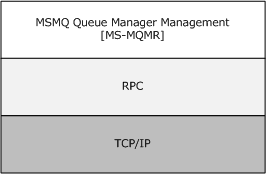
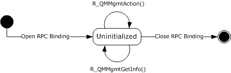
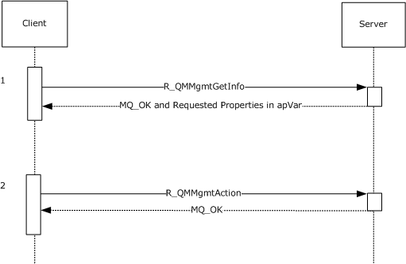

# [MS-MQMR]: Message Queuing (MSMQ): Queue Manager Management Protocol

Table of Contents

1 Introduction

- [1 Introduction](#Section_1)
  - [1.1 Glossary](#Section_1.1)
  - [1.2 References](#Section_1.2)
    - [1.2.1 Normative References](#Section_1.2.1)
    - [1.2.2 Informative References](#Section_1.2.2)
  - [1.3 Overview](#Section_1.3)
  - [1.4 Relationship to Other Protocols](#Section_1.4)
  - [1.5 Prerequisites/Preconditions](#Section_1.5)
  - [1.6 Applicability Statement](#Section_1.6)
  - [1.7 Versioning and Capability Negotiation](#Section_1.7)
  - [1.8 Vendor-Extensible Fields](#Section_1.8)
  - [1.9 Standards Assignments](#Section_1.9)

2 Messages

- [2 Messages](#Section_2)
  - [2.1 Transport](#Section_2.1)
  - [2.2 Common Data Types](#Section_2.2)
    - [2.2.1 Structures](#Section_2.2.1)
      - [2.2.1.1 DL_ID](#Section_2.2.1.1)
      - [2.2.1.2 MGMT_OBJECT](#Section_2.2.1.2)
      - [2.2.1.3 MULTICAST_ID](#Section_2.2.1.3)
      - [2.2.1.4 OBJECTID](#Section_2.2.1.4)
      - [2.2.1.5 QUEUE_FORMAT](#Section_2.2.1.5)
    - [2.2.2 Enumerators](#Section_2.2.2)
      - [2.2.2.1 MgmtObjectType](#Section_2.2.2.1)
      - [2.2.2.2 QUEUE_FORMAT_TYPE](#Section_2.2.2.2)
    - [2.2.3 Property Identifiers](#Section_2.2.3)
      - [2.2.3.1 Management Machine Property Identifiers](#Section_2.2.3.1)
      - [2.2.3.2 Management Queue Property Identifiers](#Section_2.2.3.2)
  - [2.3 Directory Service Schema Elements](#Section_2.3)

3 Protocol Details

- [3 Protocol Details](#Section_3)
  - [3.1 qmmgmt Server Details](#Section_3.1)
    - [3.1.1 Abstract Data Model](#Section_3.1.1)
      - [3.1.1.1 Shared Data Elements](#Section_3.1.1.1)
    - [3.1.2 Timers](#Section_3.1.2)
    - [3.1.3 Initialization](#Section_3.1.3)
    - [3.1.4 Message Processing Events and Sequencing Rules](#Section_3.1.4)
      - [3.1.4.1 R_QMMgmtGetInfo (Opnum 0)](#Section_3.1.4.1)
      - [3.1.4.2 R_QMMgmtAction (Opnum 1)](#Section_3.1.4.2)
    - [3.1.5 Timer Events](#Section_3.1.5)
    - [3.1.6 Other Local Events](#Section_3.1.6)
  - [3.2 qmmgmt Client Details](#Section_3.2)
    - [3.2.1 Abstract Data Model](#Section_3.2.1)
    - [3.2.2 Timers](#Section_3.2.2)
    - [3.2.3 Initialization](#Section_3.2.3)
    - [3.2.4 Message Processing Events and Sequencing Rules](#Section_3.2.4)
    - [3.2.5 Timer Events](#Section_3.2.5)
    - [3.2.6 Other Local Events](#Section_3.2.6)

4 Protocol Examples

- [4 Protocol Examples](#Section_4)
  - [4.1 QM Management Action and Retrieving QM Info Example](#Section_4.1)

5 Security

- [5 Security](#Section_5)
  - [5.1 Security Considerations for Implementers](#Section_5.1)
  - [5.2 Index of Security Parameters](#Section_5.2)

6 Appendix A: Full IDL

- [6 Appendix A: Full IDL](#Section_6)

7 Appendix B: Product Behavior

- [7 Appendix B: Product Behavior](#Section_7)

8 Change Tracking

- [8 Change Tracking](#Section_8)

For the legal notice and IP terms, see [LEGAL.md](../LEGAL.md).
Last updated: 4/23/2024.
See [Revision History](#revision-history) for full version history.

# 1 Introduction

The Message Queuing (MSMQ): Queue Manager Management Protocol is a [**remote procedure call (RPC)**](#gt_remote-procedure-call-rpc)-based protocol used for management operations on the [**MSMQ**](#gt_microsoft-message-queuing-msmq) server, including monitoring the MSMQ installation and the [**queues**](#gt_queue).

Operations that a client can perform using this protocol include:

- Getting information on MSMQ installation and queues.
- Performing actions on an MSMQ installation.
- Performing actions on a queue.
Sections 1.5, 1.8, 1.9, 2, and 3 of this specification are normative. All other sections and examples in this specification are informative.

## 1.1 Glossary

This document uses the following terms:

**active queue**: A [**queue**](#gt_queue) that contains [**messages**](#gt_message) or is currently opened by an application. Active queues can be public queues, [**private queues**](#gt_private-queue), or [**outgoing queues**](#gt_outgoing-queue).

**administrator**: A user who has complete and unrestricted access to the computer or domain.

**dead-letter queue**: A [**queue**](#gt_queue) that contains [**messages**](#gt_message) that were sent from a host with a request for negative source journaling and that could not be delivered. [**Message Queuing**](#gt_microsoft-message-queuing-msmq) provides a transactional dead-letter queue and a non-transactional dead-letter queue.

**directory**: The database that stores information about objects such as users, groups, computers, printers, and the directory service that makes this information available to users and applications.

**distribution list**: A collection of users, computers, contacts, or other groups that is used only for email distribution, and addressed as a single recipient.

**dynamic endpoint**: A network-specific server address that is requested and assigned at run time. For more information, see [[C706]](https://go.microsoft.com/fwlink/?LinkId=89824).

**endpoint**: A client that is on a network and is requesting access to a network access server (NAS).

**foreign queue**: A messaging queue that resides on a computer that does not run an [**MSMQ**](#gt_microsoft-message-queuing-msmq) messaging application.

**format name**: A name that is used to reference a [**queue**](#gt_queue) when making calls to API functions.

**globally unique identifier (GUID)**: A term used interchangeably with [**universally unique identifier (UUID)**](#gt_universally-unique-identifier-uuid) in Microsoft protocol technical documents (TDs). Interchanging the usage of these terms does not imply or require a specific algorithm or mechanism to generate the value. Specifically, the use of this term does not imply or require that the algorithms described in [[RFC4122]](https://go.microsoft.com/fwlink/?LinkId=90460) or [C706] must be used for generating the [**GUID**](#gt_globally-unique-identifier-guid). See also [**universally unique identifier (UUID)**](#gt_universally-unique-identifier-uuid).

**handle**: Any token that can be used to identify and access an object such as a device, file, or a window.

**Interface Definition Language (IDL)**: The International Standards Organization (ISO) standard language for specifying the interface for remote procedure calls. For more information, see [C706] section 4.

**message**: A data structure representing a unit of data transfer between distributed applications. A message has message properties, which may include message header properties, a message body property, and message trailer properties.

**Microsoft Message Queuing (MSMQ)**: A communications service that provides asynchronous and reliable [**message**](#gt_message) passing between distributed applications. In Message Queuing, applications send [**messages**](#gt_message) to [**queues**](#gt_queue) and consume [**messages**](#gt_message) from [**queues**](#gt_queue). The [**queues**](#gt_queue) provide persistence of the [**messages**](#gt_message), enabling the sending and receiving applications to operate asynchronously from one another.

**MSMQ Directory Service server**: An MSMQ queue manager that provides MSMQ Directory Service. The server can act in either of the MSMQ Directory Service roles: Primary Site Controller (PSC) or Backup Site Controller (BSC).

**MSMQ site**: A network of computers, typically physically collocated, that have high connectivity as measured in terms of latency (low) and throughput (high). A site is represented by a site object in the directory service. An MSMQ site maps one-to-one with an Active Directory site when Active Directory provides directory services to [**MSMQ**](#gt_microsoft-message-queuing-msmq).

**opnum**: An operation number or numeric identifier that is used to identify a specific [**remote procedure call (RPC)**](#gt_remote-procedure-call-rpc) method or a method in an interface. For more information, see [C706] section 12.5.2.12 or [MS-RPCE](../MS-RPCE/MS-RPCE.md).

**outgoing queue**: A temporary internal [**queue**](#gt_queue) that holds [**messages**](#gt_message) for a remote destination [**queue**](#gt_queue). The [**path name**](#gt_path-name) of an outgoing [**queue**](#gt_queue) is identical to the [**path name**](#gt_path-name) of the corresponding destination [**queue**](#gt_queue). An outgoing [**queue**](#gt_queue) is distinguished from its corresponding destination [**queue**](#gt_queue) by the fact that the outgoing [**queue**](#gt_queue) is located on the sending computer. The [**format name**](#gt_format-name) of an outgoing [**queue**](#gt_queue) is identical to the [**format name**](#gt_format-name) used by the [**messages**](#gt_message) to reference the destination [**queue**](#gt_queue). Messages that reference the destination [**queue**](#gt_queue) using a different [**format name**](#gt_format-name) are placed in a different outgoing [**queue**](#gt_queue).

**path name**: The name of the receiving computer where the [**messages**](#gt_message) for a particular [**queue**](#gt_queue) are stored, and an optional PRIVATE$ key word indicating whether the [**queue**](#gt_queue) is private, followed by the name of the [**queue**](#gt_queue). Path names can also refer to subqueues; for more information, see [MS-MQMQ](#Section_2.2.1) section 2.1.

**private queue**: An application-defined message queue that is not registered in the MSMQ Directory Service. A private queue is deployed on a particular [**queue manager**](#gt_queue-manager-qm).

**queue**: An object that holds [**messages**](#gt_message) passed between applications or [**messages**](#gt_message) passed between [**Message Queuing**](#gt_microsoft-message-queuing-msmq) and applications. In general, applications can send [**messages**](#gt_message) to queues and read [**messages**](#gt_message) from queues.

**queue journal**: A [**queue**](#gt_queue) that contains copies of the [**messages**](#gt_message) sent from a host when positive source journaling is requested.

**queue manager (QM)**: A message queuing service that manages [**queues**](#gt_queue) deployed on a computer. A queue manager can also provide asynchronous transfer of [**messages**](#gt_message) to [**queues**](#gt_queue) deployed on other queue managers.

**remote procedure call (RPC)**: A communication protocol used primarily between client and server. The term has three definitions that are often used interchangeably: a runtime environment providing for communication facilities between computers (the RPC runtime); a set of request-and-response message exchanges between computers (the RPC exchange); and the single message from an RPC exchange (the RPC message). For more information, see [C706].

**remote queue**: For a [**queue manager**](#gt_queue-manager-qm), a [**queue**](#gt_queue) that is hosted by a remote [**queue manager**](#gt_queue-manager-qm). For an application, a [**queue**](#gt_queue) hosted by a [**queue manager**](#gt_queue-manager-qm) other than the one with which the application communicates.

**RPC transport**: The underlying network services used by the remote procedure call (RPC) runtime for communications between network nodes. For more information, see [C706] section 2.

**subqueue**: A message queue that is logically associated, through a naming hierarchy, with a parent message queue. Subqueues can be used to partition [**messages**](#gt_message) within the [**queue**](#gt_queue). For example, a [**queue journal**](#gt_queue-journal) can be a subqueue that holds a copy of each [**message**](#gt_message) consumed from its parent [**queue**](#gt_queue).

**transactional message**: A [**message**](#gt_message) sent as part of a transaction. Transaction [**messages**](#gt_message) must be sent to [**transactional queues**](#gt_transactional-queue).

**transactional queue**: A [**queue**](#gt_queue) that contains only [**transactional messages**](#gt_transactional-message).

**universally unique identifier (UUID)**: A 128-bit value. UUIDs can be used for multiple purposes, from tagging objects with an extremely short lifetime, to reliably identifying very persistent objects in cross-process communication such as client and server interfaces, manager entry-point vectors, and [**RPC**](#gt_remote-procedure-call-rpc) objects. UUIDs are highly likely to be unique. UUIDs are also known as [**globally unique identifiers (GUIDs)**](#gt_globally-unique-identifier-guid) and these terms are used interchangeably in the Microsoft protocol technical documents (TDs). Interchanging the usage of these terms does not imply or require a specific algorithm or mechanism to generate the UUID. Specifically, the use of this term does not imply or require that the algorithms described in [RFC4122] or [C706] must be used for generating the UUID.

**MAY, SHOULD, MUST, SHOULD NOT, MUST NOT:** These terms (in all caps) are used as defined in [[RFC2119]](https://go.microsoft.com/fwlink/?LinkId=90317). All statements of optional behavior use either MAY, SHOULD, or SHOULD NOT.

## 1.2 References

Links to a document in the Microsoft Open Specifications library point to the correct section in the most recently published version of the referenced document. However, because individual documents in the library are not updated at the same time, the section numbers in the documents may not match. You can confirm the correct section numbering by checking the [Errata](https://go.microsoft.com/fwlink/?linkid=850906).

### 1.2.1 Normative References

We conduct frequent surveys of the normative references to assure their continued availability. If you have any issue with finding a normative reference, please contact [dochelp@microsoft.com](mailto:dochelp@microsoft.com). We will assist you in finding the relevant information.

[C706] The Open Group, "DCE 1.1: Remote Procedure Call", C706, August 1997, [https://publications.opengroup.org/c706](https://go.microsoft.com/fwlink/?LinkId=89824)

**Note** Registration is required to download the document.

[MS-ADTS] Microsoft Corporation, "[Active Directory Technical Specification](../MS-ADTS/MS-ADTS.md)".

[MS-DTYP] Microsoft Corporation, "[Windows Data Types](../MS-DTYP/MS-DTYP.md)".

[MS-ERREF] Microsoft Corporation, "[Windows Error Codes](../MS-ERREF/MS-ERREF.md)".

[MS-MQDMPR] Microsoft Corporation, "[Message Queuing (MSMQ): Common Data Model and Processing Rules](../MS-MQDMPR/MS-MQDMPR.md)".

[MS-MQDS] Microsoft Corporation, "[Message Queuing (MSMQ): Directory Service Protocol](../MS-MQDS/MS-MQDS.md)".

[MS-MQMQ] Microsoft Corporation, "[Message Queuing (MSMQ): Data Structures](#Section_2.2.1)".

[MS-MQQB] Microsoft Corporation, "[Message Queuing (MSMQ): Message Queuing Binary Protocol](../MS-MQQB/MS-MQQB.md)".

[MS-RPCE] Microsoft Corporation, "[Remote Procedure Call Protocol Extensions](../MS-RPCE/MS-RPCE.md)".

[RFC2119] Bradner, S., "Key words for use in RFCs to Indicate Requirement Levels", BCP 14, RFC 2119, March 1997, [https://www.rfc-editor.org/info/rfc2119](https://go.microsoft.com/fwlink/?LinkId=90317)

### 1.2.2 Informative References

[MS-MQDSSM] Microsoft Corporation, "[Message Queuing (MSMQ): Directory Service Schema Mapping](../MS-MQDSSM/MS-MQDSSM.md)".

[MS-MQOD] Microsoft Corporation, "[Message Queuing Protocols Overview](#Section_1.3)".

[MSDN-MQEIC] Microsoft Corporation, "Message Queuing Error and Information Codes", [http://msdn.microsoft.com/en-us/library/ms700106.aspx](https://go.microsoft.com/fwlink/?LinkId=90044)

## 1.3 Overview

The Message Queuing (MSMQ): Queue Manager Management Protocol allows an [**MSMQ**](#gt_microsoft-message-queuing-msmq) client application to perform management operations on an MSMQ server.

This protocol can be used to get the following information:

- [**Queue**](#gt_queue) properties, such as:
- The [**path name**](#gt_path-name) of a queue.
- The [**format name**](#gt_format-name) of a queue.
- Whether a queue is (or is not) located on a computer, or whether it is a [**transactional queue**](#gt_transactional-queue) or a [**foreign queue**](#gt_foreign-queue).
- The retransmit interval for messages in an [**outgoing queue**](#gt_outgoing-queue) for which no order acknowledgment has been received.
- The number of [**subqueues**](#gt_subqueue) in a specified queue.<1>
- The names of the subqueues in a specified queue.<2>
- The version and build information for the computer operating system and the MSMQ installation.
- Current queue state, such as:
- The number of messages in a queue or in a [**queue journal**](#gt_queue-journal).
- The number of message bytes in a queue or in a queue journal.
- The connection state of an outgoing queue.
- The list of the [**active queues**](#gt_active-queue) on a computer.
- The name of the current [**MSMQ Directory Service server**](#gt_msmq-directory-service-server) for a computer.
- Whether a [**queue manager**](#gt_queue-manager-qm) on a computer is disconnected from the network.
- The list of the path names of all the [**private queues**](#gt_private-queue) registered on a computer.
- Auditing information, such as:
- The connection state history of a queue.<3>
- The number of messages sent from a computer to a queue for which no order acknowledgment has been received.
- The number of messages sent from a computer to a queue for which an order acknowledgment has been received, but a receive acknowledgment message has not been received.
- The date and time when the last order acknowledgment for a message sent from a computer to a queue was received.
- The time when MSMQ will attempt to retransmit a message from a computer to a queue.
- The number of times that the last message in the corresponding outgoing queue on a computer was sent.
- The number of times that the last order acknowledgment for a message sent from a computer to a queue has been received.
- The number of message bytes stored in all the queues on a computer.<4>
- Sequence information, such as:
- The address or a list of possible addresses for routing messages to the destination queue in the next hop.
- The next message to be sent from a computer to a queue.
- The last message that was sent from a computer to a queue for which no order acknowledgment has been received.
- The first message sent from a computer to a queue for which no order acknowledgment has been received.
- An array of arrays of information on the [**transactional messages**](#gt_transactional-message) sent from all source computers to a queue on a target computer. Each element of the overall array is an array (vector) containing one of the following pieces of information for all of the source computers.
- The format names used to open a queue when the last messages were sent.
- The [**globally unique identifiers (GUIDs)**](#gt_globally-unique-identifier-guid) of the sending queue managers.
- The last sequence identifiers.
- The sequence numbers of the last messages sent to a queue by one or more sending queue managers.
- The times when each sending queue manager last accessed a queue.
- The number of times that the last messages were rejected.
The protocol can also be used to perform actions on a computer, such as:

- Connecting the queue manager on a computer to a network and an MSMQ Directory Service server.
- Disconnecting the queue manager on a computer from a network and an MSMQ Directory Service server.
- Deleting empty message files.
The protocol can also be used to perform actions on a queue, such as:

- Pausing the sending of messages from a computer. The queue manager will not send messages to the applicable destination queue until a resume action is initiated.
- Restarting the sending of messages after a pause action is initiated.
- Resending the pending transaction sequence (as specified in [MS-MQQB](../MS-MQQB/MS-MQQB.md)).
This is an [**RPC**](#gt_remote-procedure-call-rpc)-based protocol. The server does not maintain client state information. The protocol operation is stateless.

This is a simple request-response protocol. For each received method request, the server executes the requested method and returns a completion status to the client. This is a stateless protocol; each method call is independent of any previous method calls.

## 1.4 Relationship to Other Protocols

The Message Queuing (MSMQ): Queue Manager Management Protocol is dependent on [**RPC**](#gt_remote-procedure-call-rpc) over TCP/IP for its transport. This protocol uses RPC, as specified in section [2.1](#Section_2.1).

The Message Queuing (MSMQ): Queue Manager Management Protocol uses shared state and processing rules defined in [MS-MQDMPR](../MS-MQDMPR/MS-MQDMPR.md).

Figure 1: Protocol relationships

No other protocol currently depends on the Message Queuing (MSMQ): Queue Manager Management Protocol.

## 1.5 Prerequisites/Preconditions

The Message Queuing (MSMQ): Queue Manager Management Protocol is an [**RPC**](#gt_remote-procedure-call-rpc) interface and, as a result, has the prerequisites specified in [MS-RPCE](../MS-RPCE/MS-RPCE.md) as being common to RPC interfaces.

This protocol does not include any means for a client to discover the name of a remote computer that supports [**MSMQ**](#gt_microsoft-message-queuing-msmq). This protocol also does not include a means to discover the port number that a specific MSMQ server uses. It is assumed that the client has obtained the relevant name and port number through another means, implying:

- MSMQ clients know the names of one or more remote computers that support MSMQ.
- MSMQ clients and servers know the port number that is being used by the [**MSMQ site**](#gt_msmq-site).

## 1.6 Applicability Statement

The Message Queuing (MSMQ): Queue Manager Management Protocol is used for administration of [**queues**](#gt_queue). The operations exposed allow IT administrators to locally or remotely perform management operations as well as to retrieve properties that describe how an [**MSMQ**](#gt_microsoft-message-queuing-msmq) system is operating. This allows operations staff to monitor the health and activity load flowing through an MSMQ system.

## 1.7 Versioning and Capability Negotiation

There are no versioning issues for this protocol.

## 1.8 Vendor-Extensible Fields

The Message Queuing (MSMQ): Queue Manager Management Protocol uses HRESULTs, as specified in [MS-ERREF](../MS-ERREF/MS-ERREF.md) section 2.1. Vendors can define their own HRESULT values provided that the C bit (0x20000000) is set for each vendor-defined value, indicating that the value is a customer code.

## 1.9 Standards Assignments

This protocol uses the standard interfaces that are listed in the following table.

| Parameter | Value | Reference |
| --- | --- | --- |
| [**RPC**](#gt_remote-procedure-call-rpc) interface [**UUID**](#gt_universally-unique-identifier-uuid) | {41208ee0-e970-11d1-9b9e-00e02c064c39} | [[C706]](https://go.microsoft.com/fwlink/?LinkId=89824) |
| Interface version | 1.0 | [C706] |

# 2 Messages

The following sections specify how Message Queuing (MSMQ): Queue Manager Management Protocol messages are transported and the common data types for this protocol.

## 2.1 Transport

The Message Queuing (MSMQ): Queue Manager Management Protocol uses the following [**remote procedure call (RPC)**](#gt_remote-procedure-call-rpc) protocol sequence: RPC over TCP/IP (ncacn_ip_tcp), as specified in [MS-RPCE](../MS-RPCE/MS-RPCE.md).

This protocol uses RPC [**dynamic endpoints**](#gt_dynamic-endpoint), as specified in Part 4 of [[C706]](https://go.microsoft.com/fwlink/?LinkId=89824).

This protocol MUST use the [**universally unique identifier (UUID)**](#gt_universally-unique-identifier-uuid), as specified in section [1.9](#Section_1.9).

All structures are defined in the [**IDL**](#gt_interface-definition-language-idl) syntax and are marshaled as specified in [C706] sections 4, 5, and 6. The IDL is specified in section [6](#Section_6).

## 2.2 Common Data Types

The Message Queuing (MSMQ): Queue Manager Management Protocol MUST indicate to the [**RPC**](#gt_remote-procedure-call-rpc) runtime that it is to support the Network Data Representation (NDR) transfer syntax only, as specified in Part 4 of [[C706]](https://go.microsoft.com/fwlink/?LinkId=89824).

In addition to RPC base types (as specified in [C706], [MS-DTYP](../MS-DTYP/MS-DTYP.md), and [MS-RPCE](../MS-RPCE/MS-RPCE.md)) the following data types are defined in the Microsoft Interface Definition Language (MIDL) specification for this RPC interface.

The following table summarizes the types that are defined either in this specification or in [MS-MQMQ](#Section_2.2.1).

| Structure | Description |
| --- | --- |
| [DL_ID](#Section_2.2.1.1) | A [**distribution list**](#gt_distribution-list) [**queue**](#gt_queue) identifier. |
| [MGMT_OBJECT](#Section_2.2.1.2) | A structure containing information on a queue, a machine, or a session. |
| [MULTICAST_ID](#Section_2.2.1.3) | A multicast queue identifier. |
| [OBJECTID](#Section_2.2.1.4) | A structure that uniquely distinguishes a repository object from all other repository objects represented in a repository database. |
| [QUEUE_FORMAT](#Section_2.2.1.5) | Identifies the type of queue being managed and provides the appropriate connection address information. |

| Enumeration | Description |
| --- | --- |
| [MgmtObjectType](#Section_2.2.2.1) | Identifies the type of management object being used. |
| [QUEUE_FORMAT_TYPE](#Section_2.2.2.2) | Identifies the type of message queue being used. |

### 2.2.1 Structures

#### 2.2.1.1 DL_ID

This specification uses the **DL_ID** ([MS-MQMQ](#Section_2.2.1) section 2.2.9) type.

#### 2.2.1.2 MGMT_OBJECT

The MGMT_OBJECT structure defines information on a [**queue**](#gt_queue), a computer, or a session. The structure includes an embedded discriminated union.

typedef struct _MGMT_OBJECT {

MgmtObjectType type;

[switch_is(type)] union {

[case(MGMT_QUEUE)]

QUEUE_FORMAT* pQueueFormat;

[case(MGMT_MACHINE)]

DWORD Reserved1;

[case(MGMT_SESSION)]

DWORD Reserved2;

};

} MGMT_OBJECT;

**type:** An integer discriminator for the embedded discriminated union. The value of this field MUST be 1, 2, or 3, as specified in section [2.2.2.1](#Section_2.2.2.1).

**pQueueFormat:** A pointer to a **QUEUE_FORMAT** ([MS-MQMQ](#Section_2.2.1) section 2.2.7) structure that describes the type of the queue.

**Reserved1:** A 32-bit unsigned integer.<5>

**Reserved2:** A 32-bit unsigned integer.<6>

#### 2.2.1.3 MULTICAST_ID

This specification uses the **MULTICAST_ID** ([MS-MQMQ](#Section_2.2.1) section 2.2.10) type.<7>

#### 2.2.1.4 OBJECTID

The **OBJECTID** ([MS-MQMQ](#Section_2.2.1) section 2.2.8) structure uniquely distinguishes a repository object from all other repository objects represented in a repository database.

#### 2.2.1.5 QUEUE_FORMAT

The QUEUE_FORMAT structure (as specified in [MS-MQMQ](#Section_2.2.1) section 2.2.7) describes the type of [**queue**](#gt_queue) being managed and provides the appropriate connection address information.

### 2.2.2 Enumerators

#### 2.2.2.1 MgmtObjectType

The MgmtObjectType enumeration identifies the type of management object (as specified in section [2.2.1.2](#Section_2.2.1.2)) being used.

typedef enum __MgmtObjectType {

MGMT_MACHINE = 1,

MGMT_QUEUE = 2,

MGMT_SESSION = 3,

} MgmtObjectType;

**MGMT_MACHINE:** A machine management object.

**MGMT_QUEUE:** A [**queue**](#gt_queue) management object.

**MGMT_SESSION:** A session management object.

#### 2.2.2.2 QUEUE_FORMAT_TYPE

The **QUEUE_FORMAT_TYPE** ([MS-MQMQ](#Section_2.2.1) section 2.2.6) enumeration identifies the type of name format being used. The **QUEUE_FORMAT** ([MS-MQMQ] section 2.2.7) structure uses the values for the **m_qft** discriminated union member.

### 2.2.3 Property Identifiers

The [R_QMMgmtGetInfo](#Section_3.1.4.1) method uses property identifiers and corresponding property values. Property identifiers and properties are specified in [MS-MQMQ](#Section_2.2.1).

#### 2.2.3.1 Management Machine Property Identifiers

This protocol specifies the following properties for monitoring the queue manager on a computer.

| Value | Meaning |
| --- | --- |
| PROPID_MGMT_MSMQ_ACTIVEQUEUES (0x00000001) | Retrieves a list of the [**active queues**](#gt_active-queue) on a computer. |
| PROPID_MGMT_MSMQ_PRIVATEQ (0x00000002) | Retrieves a list of the [**path names**](#gt_path-name) of all the [**private queues**](#gt_private-queue) registered on the computer. |
| PROPID_MGMT_MSMQ_DSSERVER (0x00000003) | Retrieves the name of the current [**MSMQ Directory Service server**](#gt_msmq-directory-service-server) for the computer. |
| PROPID_MGMT_MSMQ_CONNECTED (0x00000004) | Indicates whether the [**queue manager**](#gt_queue-manager-qm) on a computer has been disconnected from the network. |
| PROPID_MGMT_MSMQ_TYPE (0x00000005) | Retrieves the version and build information for the computer operating system and [**MSMQ**](#gt_microsoft-message-queuing-msmq) installation. |
| PROPID_MGMT_MSMQ_BYTES_IN_ALL_QUEUES (0x00000006) | Retrieves the number of message bytes stored in all the [**queues**](#gt_queue) on the computer. |

#### 2.2.3.2 Management Queue Property Identifiers

This protocol specifies the following properties for monitoring the active queues on a computer.

| Value | Meaning |
| --- | --- |
| PROPID_MGMT_QUEUE_PATHNAME (0x00000001) | Retrieves the [**path name**](#gt_path-name) of a [**queue**](#gt_queue). |
| PROPID_MGMT_QUEUE_FORMATNAME (0x00000002) | Retrieves the [**format name**](#gt_format-name) of a queue. |
| PROPID_MGMT_QUEUE_TYPE (0x00000003) | Retrieves a string that indicates whether a queue is a public, private, system, connector, or multicast [**outgoing queue**](#gt_outgoing-queue). |
| PROPID_MGMT_QUEUE_LOCATION (0x00000004) | Retrieves a string that indicates whether a queue is located on the computer. |
| PROPID_MGMT_QUEUE_XACT (0x00000005) | Retrieves a string that indicates whether a queue is transactional. |
| PROPID_MGMT_QUEUE_FOREIGN (0x00000006) | Retrieves a string that indicates whether a queue is a [**foreign queue**](#gt_foreign-queue). |
| PROPID_MGMT_QUEUE_MESSAGE_COUNT (0x00000007) | Retrieves the number of messages in a queue. |
| PROPID_MGMT_QUEUE_BYTES_IN_QUEUE (0x00000008) | Retrieves the number of message bytes in a queue. |
| PROPID_MGMT_QUEUE_JOURNAL_MESSAGE_COUNT (0x00000009) | Retrieves the number of messages in a [**queue journal**](#gt_queue-journal). |
| PROPID_MGMT_QUEUE_BYTES_IN_JOURNAL (0x0000000A) | Retrieves the number of message bytes in a queue journal. |
| PROPID_MGMT_QUEUE_STATE (0x0000000B) | Retrieves the connection state of an outgoing queue. |
| PROPID_MGMT_QUEUE_NEXTHOPS (0x0000000C) | Retrieves the address or a list of possible addresses for routing messages to a destination queue in the next hop. |
| PROPID_MGMT_QUEUE_EOD_LAST_ACK (0x0000000D) | Retrieves the sequence information on the last message sent from a computer to a queue for which an order acknowledgment was received. |
| PROPID_MGMT_QUEUE_EOD_LAST_ACK_TIME (0x0000000E) | Retrieves the date and time when the last order acknowledgment was received for a message sent from a computer to a queue. |
| PROPID_MGMT_QUEUE_EOD_LAST_ACK_COUNT (0x0000000F) | Retrieves the number of times that the last order acknowledgment was received for a message sent from a computer to a queue. |
| PROPID_MGMT_QUEUE_EOD_FIRST_NON_ACK (0x00000010) | Retrieves the sequence information on the first message sent from a computer to a queue for which no order acknowledgment has been received. |
| PROPID_MGMT_QUEUE_EOD_LAST_NON_ACK (0x00000011) | Retrieves the sequence information on the last message sent from a computer to a queue for which no order acknowledgment has been received. |
| PROPID_MGMT_QUEUE_EOD_NEXT_SEQ (0x00000012) | Retrieves the sequence information on the next message to be sent from a computer to a queue. |
| PROPID_MGMT_QUEUE_EOD_NO_READ_COUNT (0x00000013) | Retrieves the number of messages sent from a computer to a queue for which an order acknowledgment has been received. |
| PROPID_MGMT_QUEUE_EOD_NO_ACK_COUNT (0x00000014) | Retrieves the number of messages sent from a computer to a queue for which no order acknowledgment has been received. |
| PROPID_MGMT_QUEUE_EOD_RESEND_TIME (0x00000015) | Retrieves the time when [**Message Queuing (MSMQ)**](#gt_microsoft-message-queuing-msmq) will attempt to retransmit a message from a computer to a queue. |
| PROPID_MGMT_QUEUE_EOD_RESEND_INTERVAL (0x00000016) | Retrieves the resend interval for the messages in the outgoing queue for which no order acknowledgment has been received. |
| PROPID_MGMT_QUEUE_EOD_RESEND_COUNT (0x00000017) | Retrieves the number of times that the last message was sent in the corresponding outgoing queue on a computer. |
| PROPID_MGMT_QUEUE_EOD_SOURCE_INFO (0x00000018) | Retrieves information on the [**transactional messages**](#gt_transactional-message) sent from all source computers to a queue.<8> |
| PROPID_MGMT_QUEUE_CONNECTION_HISTORY (0x00000019) | Retrieves queue connection state history.<9> |
| PROPID_MGMT_QUEUE_SUBQUEUE_COUNT (0x0000001A) | Retrieves a count of the number of [**subqueues**](#gt_subqueue) for a given queue.<10> |
| PROPID_MGMT_QUEUE_SUBQUEUE_NAMES (0x0000001B) | Retrieves a list of subqueues for a given queue.<11> |

## 2.3 Directory Service Schema Elements

This protocol uses ADM elements specified in section [3.1.1](#Section_3.2.1). A subset of these elements can be published in a [**directory**](#gt_directory). This protocol SHOULD<12> access the directory using the algorithm specified in [MS-MQDSSM](../MS-MQDSSM/MS-MQDSSM.md) and using LDAP [MS-ADTS](../MS-ADTS/MS-ADTS.md). The Directory Service schema elements for ADM elements published in the directory are defined in [MS-MQDSSM] section 2.4.<13>

# 3 Protocol Details

The Message Queuing (MSMQ): Queue Manager Management Protocol is used for performing management operations on the [**MSMQ**](#gt_microsoft-message-queuing-msmq) installation and a [**queue**](#gt_queue).

The client side of this protocol is simply a pass-through. That is, there are no timers or other states required on the client side. Calls made by a higher-layer protocol or an application are passed directly to the transport, and the results returned by the transport are passed directly back to the higher-layer protocol or application.

The client MUST have [**administrator**](#gt_administrator) privileges on the server machine.

This protocol permits establishing a connection to an [**RPC**](#gt_remote-procedure-call-rpc) server. For each connection, the server uses the underlying RPC protocol to retrieve the identity of the invoking client call, as specified in [MS-RPCE](../MS-RPCE/MS-RPCE.md) section 3.3.3.4.3. The server uses this identity to perform method-specific access checks, as specified in section [3.1.4](#Section_3.2.4).

The methods comprising this RPC interface all return 0x00000000 on success and a nonzero implementation-specific error code on failure. Unless otherwise specified in the following sections, a server-side implementation of this protocol uses any nonzero Win32 error value to signify an error condition, as specified in section [1.8](#Section_1.8). The client side of the Message Queuing (MSMQ): Queue Manager Management Protocol does not need to interpret the error codes returned from the server; instead, the client side can return the error code unprocessed to the invoking application without taking any protocol action.

**Note** The phrases "client side" and "server side" refer to the initiating and receiving ends of the protocol, respectively, rather than to client or server versions of an operating system. The receiving end of the protocol—the server side—behaves the same regardless of whether the server side is running on a client or server.

## 3.1 qmmgmt Server Details

This section describes a conceptual model of possible data organization that an implementation maintains to participate in this protocol. The described organization is provided to facilitate the explanation of how the protocol behaves. This document does not mandate that implementations adhere to this model provided that their external behavior is consistent with what is described in this document.

### 3.1.1 Abstract Data Model

The abstract data model for this protocol comprises elements that are shared between multiple MSMQ protocols that are co-located at a common MSMQ queue manager. The shared abstract data model is specified in [MS-MQDMPR](../MS-MQDMPR/MS-MQDMPR.md) section 3.1.1 and the relationship between this protocol and other protocols that share a common MSMQ queue manager is specified in [MS-MQOD](#Section_1.3).

#### 3.1.1.1 Shared Data Elements

This protocol manipulates the following abstract data model elements from the shared abstract data model defined in [MS-MQDMPR](../MS-MQDMPR/MS-MQDMPR.md) section 3.1.1:

**QueueManager:** Defined in [MS-MQDMPR] section 3.1.1.1.

**Queue:** Defined in [MS-MQDMPR] section 3.1.1.2.

**OutgoingQueue:** Defined in [MS-MQDMPR] section 3.1.1.3.

**OutgoingTransferInfo:** Defined in [MS-MQDMPR] section 3.1.1.4.

**IncomingTransactionalTransferInfo:** Defined in [MS-MQDMPR] section 3.1.1.5.

**OpenQueueDescriptor:** Defined in [MS-MQDMPR] section 3.1.1.16.

### 3.1.2 Timers

The Message Queuing (MSMQ): Queue Manager Management Protocol layer uses no timers. [**RPC**](#gt_remote-procedure-call-rpc) does, however, use timers internally, as specified in [MS-RPCE](../MS-RPCE/MS-RPCE.md).

### 3.1.3 Initialization

Software that utilizes **qmmgmt** MUST establish an [**RPC**](#gt_remote-procedure-call-rpc) connection to the client prior to utilizing this protocol, as specified in [MS-RPCE](../MS-RPCE/MS-RPCE.md) and section [2.1](#Section_2.1).

### 3.1.4 Message Processing Events and Sequencing Rules

The Message Queuing (MSMQ): Queue Manager Management Protocol MUST indicate to the [**RPC**](#gt_remote-procedure-call-rpc) runtime that it is to perform a strict NDR data consistency check at target level 6.0, as specified in [MS-RPCE](../MS-RPCE/MS-RPCE.md) section 3.

This protocol MUST indicate to the RPC runtime that it is to reject a NULL unique or full pointer with nonzero conformant value, as specified in [MS-RPCE] section 3.

This protocol MUST indicate to the RPC runtime via the strict_context_handle attribute that it is to reject use of context [**handles**](#gt_handle) created by a method of a different RPC interface than this one, as specified in [MS-RPCE] section 3.

This interface includes the following methods.

Methods in RPC Opnum Order

| Method | Description |
| --- | --- |
| [R_QMMgmtGetInfo](#Section_3.1.4.1) | Called by the client. In response, the server returns information on a [**queue**](#gt_queue) or the [**MSMQ**](#gt_microsoft-message-queuing-msmq) installation on the server. Opnum: 0 |
| [R_QMMgmtAction](#Section_3.1.4.2) | Called by the client. In response, the server performs a queue management function specified by the supplied [MGMT_OBJECT](#Section_2.2.1.2) structure. Opnum: 1 |

All methods MUST NOT throw exceptions.

#### 3.1.4.1 R_QMMgmtGetInfo (Opnum 0)

The R_QMMgmtGetInfo method requests information on an [**MSMQ**](#gt_microsoft-message-queuing-msmq) installation on a server or on a specific [**queue**](#gt_queue).

HRESULT R_QMMgmtGetInfo(

[in] handle_t hBind,

[in] const MGMT_OBJECT* pObjectFormat,

[in, range(1,128)] DWORD cp,

[in, size_is(cp)] ULONG aProp[],

[in, out, size_is(cp)] PROPVARIANT apVar[]

);

**hBind:** An [**RPC**](#gt_remote-procedure-call-rpc) binding [**handle**](#gt_handle), as specified in [MS-RPCE](../MS-RPCE/MS-RPCE.md) section 2.

**pObjectFormat:** A pointer to an [MGMT_OBJECT](#Section_2.2.1.2) structure that defines the **queue** or computer on which to return information.

**cp:** The length (in elements) of the arrays *aProp* and *apVar* MUST be at least 1, and MUST be at most 128.

**aProp:** Points to an array of property identifiers associated with the array of property values. This array MUST contain at least one element. Each element MUST specify a value from the property identifiers table, as specified in section [2.2.3](#Section_2.2.3). Each element MUST specify the property identifier for the corresponding property value at the same element index in *apVar*. This array and the array to which *apVar* points MUST be of the same length.

**apVar:** Points to an array that specifies the property values associated with the array of property identifiers. Each element in this array specifies the property value for the corresponding property identifier at the same element index in the array to which *aProp* points. This array MUST contain at least one element. The property value in each element MUST correspond accordingly to the property identifier from *aProp*, as specified in section 2.2.3, and MUST be set to VT_NULL<14> (as specified in [MS-MQMQ](#Section_2.2.1) section 2.2.12) before each call to R_QMMgmtGetInfo. This array and the array to which *aProp* points MUST be of the same length.

**Return Values:** On success, this method MUST return MQ_OK (0x00000000).

| Return value/code | Description |
| --- | --- |
| 0x00000000 MQ_OK | - |
| 0xC00E0001 MQ_ERROR | Generic error code. This error code is also the first of several error codes beginning with the string "MQ_ERR". A list of the errors prefaced with "MQ-ERR" is specified in 2.4. |

**Exceptions Thrown:** No exceptions are thrown beyond those thrown by the underlying RPC protocol, as specified in [MS-RPCE].

If an error occurs, the server MUST return a failure HRESULT and MUST NOT set any [out] parameter values.

The [**opnum**](#gt_opnum) field value for this method MUST be 0 and is received at a dynamically assigned [**endpoint**](#gt_endpoint) supplied by the RPC endpoint mapper, as specified in [MS-RPCE].

If the *pObjectFormat* parameter specifies an [MgmtObjectType](#Section_2.2.2.1) of MGMT_MACHINE, the server MUST return only those properties that pertain to the MSMQ installation. If *pObjectFormat* specifies an MgmtObjectType of MGMT_QUEUE, the server MUST return only those properties that pertain to a **queue**. If *pObjectFormat* specifies an MgmtObjectType of MGMT_SESSION, the call MUST fail, and the error message MAY be MQ_ERROR_INVALID_PARAMETER (0xC00E0006).<15>

If the *pObjectFormat* parameter specifies a computer, and one or more of the properties specified in *aProp* are different than those specified in section [2.2.3.1](#Section_2.2.3.1), the call MAY fail with MQ_ERROR_ILLEGAL_PROPID (0xC00E0039). If the *pObjectFormat* parameter specifies a **queue**, and one or more of the properties specified in *aProp* are different than those specified in section [2.2.3.2](#Section_2.2.3.2), the call MAY fail with MQ_ERROR_ILLEGAL_PROPID (0xC00E0039).<16>

MSMQ properties are specified in [MS-MQMQ] section 2.

For MSMQ error codes, see [[MSDN-MQEIC]](https://go.microsoft.com/fwlink/?LinkId=90044). The structure and sequence of data on the wire are specified in [[C706]](https://go.microsoft.com/fwlink/?LinkId=89824) Transfer Syntax NDR.

While processing this call, the server MUST use the QueueManager, Queue, OutgoingQueue, and OutgoingTransferInfo data elements as specified in [MS-MQDMPR](../MS-MQDMPR/MS-MQDMPR.md) section 3.1.1 to populate *apVar* with values for corresponding property from *aProp*.

If the *pObjectFormat* parameter specifies an MgmtObjectType of MGMT_MACHINE, the server MUST use attributes of the QueueManager and Queue data elements.

For each property identifier in the *aProp* array, populate the corresponding position in the *apVar* array as follows:

| Property Identifier | Value | Variant Type |
| --- | --- | --- |
| PROPID_MGMT_MSMQ_ACTIVEQUEUES | A vector of all the **queue names** from **QueueManager.QueueCollection**, where Queue.Active EQUALS True. | VT_LPWSTR VT_VECTOR |
| PROPID_MGMT_MSMQ_PRIVATEQ | A vector of path names of all the private **queues** from **QueueManager.QueueCollection**, where the **Queue.QueueType** EQUALS Private. | VT_LPWSTR VT_VECTOR |
| PROPID_MGMT_MSMQ_DSSERVER | The first directory server in the list, **QueueManager.DirectoryServerList**. If the queue manager is not integrated with an MSMQ Directory Service, then *apVar* will be set to VT_NULL. | VT_LPWSTR |
| PROPID_MGMT_MSMQ_CONNECTED | If **QueueManager.ConnectionActive** EQUALS True then "CONNECTED" else "DISCONNECTED". | VT_LPWSTR |
| PROPID_MGMT_MSMQ_TYPE | MAY be set to an empty string. | VT_LPWSTR |
| PROPID_MGMT_MSMQ_BYTES_IN_ALL_QUEUES | Sum of all **Queue.TotalBytes** from the **QueueManager.QueueCollection**. | VT_I8 |

If the *pObjectFormat* parameter specifies an MgmtObjectType of MGMT_QUEUE, the server MUST use attributes of the Queue, OutgoingQueue , and OutgoingTransferInfo objects as follows:

While processing this call, the **Open Queue event** SHOULD be used to get an **OpenQueueDescriptor** as specified in [MS-MQDMPR] sections 3.1.1.16 and 3.1.7.1.5 as following:

- Generate an **Open Queue event** with the following inputs:
- *iFormatName* := reference to a **Queue** specified by pQueueFormat from *pObjectFormat*.
- *iRequiredAccess* := **QueueAccessType.ReceiveAccess** as specified in [MS-MQDMPR] section 3.1.1.17.
- *iSharedMode* := **QueueShareMode.DenyNone** as specified in [MS-MQDMPR] section 3.1.1.17.
- If *rStatus* NOT-EQUALS MQ_OK then R_QMMgmtGetInfo SHOULD exit with an MQ_ERROR HRESULT value.
- Otherwise for each property identifier in the *aProp* array, populate the corresponding position in the *apVar* array as follows:
| Property Identifier | Value | Variant Type |
| --- | --- | --- |
| PROPID_MGMT_QUEUE_PATHNAME | **rOpenQueueDescriptor.QueueReference.Pathname**. | VT_LPWSTR |
| PROPID_MGMT_QUEUE_FORMATNAME | **rOpenQueueDescriptor.QueueReference.QualifiedPathname**. | VT_LPWSTR |
| PROPID_MGMT_QUEUE_TYPE | If **rOpenQueueDescriptor.QueueReference** is of type OutgoingQueue AND **rOpenQueueDescriptor.QueueReference.Multicast** EQUALS True then "MULTICAST" else If **rOpenQueueDescriptor.QueueReference.QueueType** EQUALS Public then "PUBLIC" else If **rOpenQueueDescriptor.QueueReference.QueueType** EQUALS Private then "PRIVATE" else If **rOpenQueueDescriptor.QueueReference.QueueType** EQUALS System then "MACHINE" else If **rOpenQueueDescriptor.QueueReference.QueueType** EQUALS Connector then "CONNECTOR". | VT_LPWSTR |
| PROPID_MGMT_QUEUE_LOCATION | If **rOpenQueueDescriptor.QueueReference is** of type OutgoingQueue then "REMOTE" else "LOCAL". | VT_LPWSTR |
| PROPID_MGMT_QUEUE_XACT | If **rOpenQueueDescriptor.QueueReference.Transactional** EQUALS True then "YES" else "NO" | VT_LPWSTR |
| PROPID_MGMT_QUEUE_FOREIGN | If **QueueManager.DirectoryOffline** is True If **rOpenQueueDescriptor.QueueReference.QueueType** is Private "NO" else "Unknown" else If **QueueManager.ForeignSystem** is True "YES" else "NO" | VT_LPWSTR |
| PROPID_MGMT_QUEUE_MESSAGE_COUNT | to the number of **MessagePosition** elements in the **rOpenQueueDescriptor.QueueReference.MessagePositionList** that are not in the **Deleted** state. | VT_UI4 |
| PROPID_MGMT_QUEUE_BYTES_IN_QUEUE | **rOpenQueueDescriptor.QueueReference.TotalBytes**. | VT_UI4 |
| PROPID_MGMT_QUEUE_JOURNAL_MESSAGE_COUNT | If **rOpenQueueDescriptor.QueueReference. JournalQueueReference** EQUALS NULL else The number of elements in the **rOpenQueueDescriptor.QueueReference. JournalQueueReference.MessagePositionList**. | VT_UI4 |
| PROPID_MGMT_QUEUE_BYTES_IN_JOURNAL | If **rOpenQueueDescriptor.QueueReference.Journaling** EQUALS True then **rOpenQueueDescriptor.QueueReference. JournalQueueReference.TotalBytes.**. else0. | VT_UI4 |
| PROPID_MGMT_QUEUE_STATE | If **rOpenQueueDescriptor.QueueReference** is not of type OutgoingQueue then "LOCAL CONNECTION" else If **rOpenQueueDescriptor.QueueReference.State** EQUALS Connected then "CONNECTED" else If **rOpenQueueDescriptor.QueueReference.State** EQUALS Disconnected then "DISCONNECTED" else If **rOpenQueueDescriptor.QueueReference.State** EQUALS Disconnecting then "DISCONNECTING" else If **rOpenQueueDescriptor.QueueReference.State** EQUALS Inactive then "INACTIVE" else If **rOpenQueueDescriptor.QueueReference.State** EQUALS Locked then "LOCKED" else If **rOpenQueueDescriptor.QueueReference.State** EQUALS NeedValidation then "NEED VALIDATION" else If **rOpenQueueDescriptor.QueueReference.State** EQUALS Waiting then "WAITING" else If **rOpenQueueDescriptor.QueueReference.State** EQUALS OnHold then "ONHOLD". | VT_LPWSTR |
| PROPID_MGMT_QUEUE_NEXTHOPS | If **rOpenQueueDescriptor.QueueReference** is of type OutgoingQueue If **rOpenQueueDescriptor.QueueReference.State** EQUALS Connected If **rOpenQueueDescriptor.QueueReference.Multicast** EQUALS True then **rOpenQueueDescriptor.QueueReference.QualifiedPathname** else **rOpenQueueDescriptor.QueueReference.NextHops** else If **rOpenQueueDescriptor.QueueReference.State** EQUALS Waiting then **rOpenQueueDescriptor.QueueReference.NextHops**. | VT_LPWSTR VT_VECTOR |
| PROPID_MGMT_QUEUE_EOD_LAST_ACK | If **rOpenQueueDescriptor.QueueReference** is of type OutgoingQueue AND **rOpenQueueDescriptor.QueueReference. OutgoingTransferInfoReference.EodNoAckCount** > 0 then **rOpenQueueDescriptor.QueueReference. OutgoingTransferInfoReference.EodLastAck** serialized into a byte array according to the **SEQUENCE_INFO** structure specified in [MS-MQMQ] section 2.2.5.1. | VT_BLOB |
| PROPID_MGMT_QUEUE_EOD_LAST_ACK_TIME | If **rOpenQueueDescriptor.QueueReference** is of type OutgoingQueue then **rOpenQueueDescriptor.QueueReference. OutgoingTransferInfoReference.EodLastAckTime**. | VT_I4 |
| PROPID_MGMT_QUEUE_EOD_LAST_ACK_COUNT | If **rOpenQueueDescriptor.QueueReference** is of type OutgoingQueue then **rOpenQueueDescriptor.QueueReference. OutgoingTransferInfoReference.EodLastAckCount**. | VT_UI4 |
| PROPID_MGMT_QUEUE_EOD_FIRST_NON_ACK | If **rOpenQueueDescriptor.QueueReference** is of type OutgoingQueue then **rOpenQueueDescriptor.QueueReference. OutgoingTransferInfoReference.EodFirstNonAck**. | VT_BLOB |
| PROPID_MGMT_QUEUE_EOD_LAST_NON_ACK | If **rOpenQueueDescriptor.QueueReference** is of type OutgoingQueue then **rOpenQueueDescriptor.QueueReference. OutgoingTransferInfoReference.EodLastNonAck**. | VT_BLOB |
| PROPID_MGMT_QUEUE_EOD_NEXT_SEQ | If **rOpenQueueDescriptor.QueueReference** is of type OutgoingQueue then **rOpenQueueDescriptor.QueueReference. OutgoingTransferInfoReference.EodNextSeq**. | VT_BLOB |
| PROPID_MGMT_QUEUE_EOD_NO_READ_COUNT | If **rOpenQueueDescriptor.QueueReference** is of type OutgoingQueue then **rOpenQueueDescriptor.QueueReference.OutgoingTransferInfoReference.EodNoReadCount**. | VT_UI4 |
| PROPID_MGMT_QUEUE_EOD_NO_ACK_COUNT | If **rOpenQueueDescriptor.QueueReference** is of type OutgoingQueue then **rOpenQueueDescriptor.QueueReference. OutgoingTransferInfoReference.EodNoAckCount**. | VT_UI4 |
| PROPID_MGMT_QUEUE_EOD_RESEND_TIME | If **rOpenQueueDescriptor.QueueReference** is of type OutgoingQueue then **rOpenQueueDescriptor.QueueReference. OutgoingTransferInfoReference.EodResendTime**. | VT_I4 |
| PROPID_MGMT_QUEUE_EOD_RESEND_INTERVAL | If **rOpenQueueDescriptor.QueueReference** is of type OutgoingQueue then **rOpenQueueDescriptor.QueueReference. OutgoingTransferInfoReference.EodResendInterval**. | VT_UI4 |
| PROPID_MGMT_QUEUE_EOD_RESEND_COUNT | If **rOpenQueueDescriptor.QueueReference** is of type OutgoingQueue then **rOpenQueueDescriptor.QueueReference. OutgoingTransferInfoReference.EodResendCount**. | VT_UI4 |
| PROPID_MGMT_QUEUE_EOD_SOURCE_INFO | **rOpenQueueDescriptor.QueueReference.IncomingTransactionalTransferInfoCollection**. The **IncomingTransactionalTransferInfoCollection** ADM element is to be formatted into a Variant VT_VECTOR type as specified in [MS-MQMQ] section 2.3.12.24. | VT_VARIANT VT_VECTOR |
| PROPID_MGMT_QUEUE_CONNECTION_HISTORY | If **rOpenQueueDescriptor.QueueReference** is of type OutgoingQueue then the **rOpenQueueDescriptor.QueueReference.OutgoingQueue.ConnectionHistory** ADM element.attribute tuple is formatted into a VT_VECTOR, as specified in [MS-MQMQ] section 2.3.12.25. | VT_VARIANT VT_VECTOR |
| PROPID_MGMT_QUEUE_SUBQUEUE_COUNT | The number of elements in the **rOpenQueueDescriptor.QueueReference.SubqueueCollection**. | VT_UI4 |
| PROPID_MGMT_QUEUE_SUBQUEUE_NAMES | The vector of all subqueue names in the **rOpenQueueDescriptor.QueueReference.SubqueueCollection**. | VT_VARIANT VT_VECTOR |

#### 3.1.4.2 R_QMMgmtAction (Opnum 1)

The R_QMMgmtAction method requests the server to perform a management function on a specific [**queue**](#gt_queue) or [**MSMQ**](#gt_microsoft-message-queuing-msmq) installation.

HRESULT R_QMMgmtAction(

[in] handle_t hBind,

[in] const MGMT_OBJECT* pObjectFormat,

[in] const wchar_t * lpwszAction

);

**hBind:** An [**RPC**](#gt_remote-procedure-call-rpc) binding [**handle**](#gt_handle), as specified in [MS-RPCE](../MS-RPCE/MS-RPCE.md) section 2.

**pObjectFormat:** A pointer to a [MGMT_OBJECT](#Section_2.2.1.2) structure that specifies the queue or computer to which the action is being applied.

**lpwszAction:** A pointer to a null-terminated Unicode string that specifies the action to perform on the computer. The *lpwszAction* value MUST be one of the following (the value is not case-sensitive).

| Value | Meaning |
| --- | --- |
| "CONNECT" | A machine action. Connects the computer to the network and the [**MSMQ Directory Service server**](#gt_msmq-directory-service-server). |
| "DISCONNECT" | A machine action. Disconnects the computer from the network and the MSMQ Directory Service server. |
| "TIDY" | A machine action. Cleans up empty message files. MSMQ does this every 6 hours. It is helpful when a large number of messages are deleted (purged or received by an application), and the application needs the disk space immediately. |
| "PAUSE" | A queue action. Valid for [**outgoing queues**](#gt_outgoing-queue) only. Stops the sending of messages from the computer. The [**queue manager**](#gt_queue-manager-qm) will not send messages to the applicable destination queue until a RESUME action is initiated. |
| "RESUME" | A queue action. Valid for outgoing queues only. Restarts the sending of messages after a PAUSE action is initiated. |
| "EOD_RESEND" | A queue action. Resends the pending transaction sequence. |

**Return Values:** On success, this method MUST return MQ_OK (0x00000000).

**MQ_OK** (0x00000000)

**MQ_ERROR** (0xC00E0001)

Exceptions Thrown: No exceptions are thrown beyond those thrown by the underlying RPC protocol, as specified in [MS-RPCE].

If *pObjectFormat* specifies an [MgmtObjectType](#Section_2.2.2.1) of MGMT_SESSION or an *lpwszAction* has different value than those in the table above, the call MUST fail and the error message MAY be MQ_ERROR_INVALID_PARAMETER (0xC00E0006).<17>

If an error occurs, the server MUST return a failure HRESULT.

The [**opnum**](#gt_opnum) field value for this method MUST be 1 and is received at a dynamically assigned [**endpoint**](#gt_endpoint) supplied by the RPC endpoint mapper, as specified in [MS-RPCE].

For MSMQ error codes, see [[MSDN-MQEIC]](https://go.microsoft.com/fwlink/?LinkId=90044). The structure and sequence of data on the wire are specified in the Transfer Syntax NDR section in [[C706]](https://go.microsoft.com/fwlink/?LinkId=89824).

While processing this call, the server MUST use the QueueManager and Queue data elements as specified in [MS-MQDMPR](../MS-MQDMPR/MS-MQDMPR.md) sections 3.1.1.1 and 3.1.1.2.

While processing this call, the server MUST generate the following events specified in [MS-MQDMPR]:

- Bring Online (section 3.1.4.13)
- Take Offline (section 3.1.4.12)
- Purge Queue (section 3.1.7.1.7)
- Pause Queue (section 3.1.7.2.3)
- Resume Queue (section 3.1.7.2.4)
The above-described data elements and events MUST be used as follows:

- If *lpwszAction* EQUALS "CONNECT" then generate the **Bring Online** event.
- If *lpwszAction* EQUALS "DISCONNECT" then generate the **Take Offline** event.
- If *lpwszAction* EQUALS "TIDY" then for each Queue in **QueueManager.QueueCollection**, generate the **Purge Queue** event with following inputs:
- IQueue : = reference to a **Queue** specified by element from **QueueManager.QueueCollection**.
- If *lpwszAction* EQUALS "PAUSE" then generate a **Pause Queue** event with following inputs:
- IQueue : = reference to a **Queue** specified by *pQueueFormat* from *pObjectFormat*.
- If *lpwszAction* EQUALS "RESUME" then generate a **Resume Queue** event with following inputs:
- IQueue : = reference to a **Queue** specified by *pQueueFormat* from *pObjectFormat*.
- If *lpwszAction* EQUALS "EOD_RESEND" then generate a **Resend Transactional Sequence** event with following inputs:
- IQueue : = reference to a **Queue** specified by *pQueueFormat* from *pObjectFormat*.

### 3.1.5 Timer Events

No protocol timer events are required on the server beyond the timers required in the underlying [**RPC transport**](#gt_rpc-transport).

### 3.1.6 Other Local Events

There are no local events used on the server beyond the events maintained in the underlying [**RPC transport**](#gt_rpc-transport).

## 3.2 qmmgmt Client Details

### 3.2.1 Abstract Data Model

The client maintains an [**RPC**](#gt_remote-procedure-call-rpc) binding [**handle**](#gt_handle) that it passes to each of the following methods:

- [R_QMMgmtAction](#Section_3.1.4.2)
- [R_QMMgmtGetInfo](#Section_3.1.4.1)
The procedure for acquiring a binding handle is specified in [[C706]](https://go.microsoft.com/fwlink/?LinkId=89824).

Figure 2: RPC binding and method calls

### 3.2.2 Timers

The Message Queuing (MSMQ): Queue Manager Management Protocol layer uses no timers. [**RPC**](#gt_remote-procedure-call-rpc) does, however, use timers internally (as specified in [MS-RPCE](../MS-RPCE/MS-RPCE.md)).

### 3.2.3 Initialization

Software that utilizes **qmmgmt** MUST establish an [**RPC**](#gt_remote-procedure-call-rpc) connection to the server prior to utilizing this protocol, as specified in [MS-RPCE](../MS-RPCE/MS-RPCE.md) and section [2.1](#Section_2.1).

### 3.2.4 Message Processing Events and Sequencing Rules

The client side of the Message Queuing (MSMQ): Queue Manager Management Protocol requires no special processing or interpretation of data or error messages beyond those required by the underlying [**RPC**](#gt_remote-procedure-call-rpc) protocol.

When a method completes, the client MUST return without modification all values returned by the RPC to the upper layer.

The client MUST ignore errors returned from the RPC server and MUST notify the higher layer of the error received. The client SHOULD ignore all out-parameter values when any failure HRESULT is returned.

This protocol MUST indicate to the RPC runtime that it is to perform a strict NDR data consistency check at target level 6.0, as specified in [MS-RPCE](../MS-RPCE/MS-RPCE.md) section 3.

This protocol MUST indicate to the RPC runtime that it is to reject a NULL unique or full pointer with nonzero conformant value, as specified in [MS-RPCE] section 3.

### 3.2.5 Timer Events

There are no timer events.

### 3.2.6 Other Local Events

There are no local events.

# 4 Protocol Examples

The following example pseudocode demonstrates how to pause a public [**queue**](#gt_queue) by using the [R_QMMgmtAction](#Section_3.1.4.2) method.

/////////////////////////////////////////////////////////////////////

INIT qf of type QUEUE_FORMAT

INIT mgmtObj of type MGMT_OBJECT

SET qf.m_qft to QUEUE_FORMAT_TYPE_PUBLIC

SET qf.m_SuffixAndFlags to 0

SET qf.m_gPublicID to GUID of the public queue

SET mgmtObj.type to MGMT_QUEUE;

SET mgmtObj.pQueueFormat to qf;

CALL R_QMMgmtAction with RPC binding handle, mgmtObj

and action const "PAUSE"

/////////////////////////////////////////////////////////////////////

## 4.1 QM Management Action and Retrieving QM Info Example

In the following example, an administrator needs to send [**messages**](#gt_message) to a [**remote queue**](#gt_remote-queue) on a server. First, the administrator queries to see what [**private queues**](#gt_private-queue) are available. Next, the administrator chooses one of the [**queues**](#gt_queue) and begins sending messages to it. While sending the messages, the administrator notices that messages are being put into the [**dead-letter queue**](#gt_dead-letter-queue). The administrator decides to stop producers while investigating the issue and to pause the **OutgoingQueue** abstract data model (ADM) element instance.

Figure 3: QM Management Operations

- This protocol can be used to determine the available private queues on a remote machine to which the client can send messages. The client retrieves a list of private queue [**path names**](#gt_path-name) by invoking the [R_QMMgmtGetInfo (section 3.1.4.1)](#Section_3.1.4.1) method with a *pObjectFormat* parameter **type** member set to the MGMT_MACHINE enumerated value, as defined in [MgmtObjectType (section 2.2.2.1)](#Section_2.2.2.1). Next, the client can create a [**format name**](#gt_format-name) pointing to one of the returned queues. Finally, the client can use the events in [MS-MQDMPR](../MS-MQDMPR/MS-MQDMPR.md) to open the queue of the constructed format name and to enqueue messages to it. The **OutgoingQueue** ADM element instance that was used to send messages can be used in the subsequent step.
- The client can pause an **OutgoingQueue** ADM element instance by performing the following steps. First, construct a **QUEUE_FORMAT** ([MS-MQMQ](#Section_2.2.1) section 2.2.7) structure of type QUEUE_FORMAT_TYPE_DIRECT and set the **m_pDirectID** member to the name identifier of a direct queue (as specified in [MS-MQMQ] section 2.1 for the ABNF). Next, construct an [MGMT_OBJECT (section 2.2.1.2)](#Section_2.2.1.2) structure of type MGMT_QUEUE and set the **MGMT_OBJECT.pQueueFormat** member to the address of the constructed **QUEUE_FORMAT** structure instance. Finally, the client pauses the **OutgoingQueue** ADM element instance by invoking the [R_QMMgmtAction (section 3.1.4.2)](#Section_3.1.4.2) method with an *lpwszAction* parameter value equal to "PAUSE" and a *pObjectFormat* parameter value set to the address of the constructed **MGMT_OBJECT** structure.

# 5 Security

The following sections specify security considerations for implementers of the Message Queuing (MSMQ): Queue Manager Management Protocol.

## 5.1 Security Considerations for Implementers

As specified in section [3](#Section_1.3), this protocol allows a client with [**administrator**](#gt_administrator) privileges to connect to the server. Security is dependent on the server performing security checks for each invocation of the server interface methods specified in this document. Any security bug in the server implementation of this protocol could be exploitable.

## 5.2 Index of Security Parameters

No security parameters are specified for this protocol.

# 6 Appendix A: Full IDL

For ease of implementation, the full [**IDL**](#gt_interface-definition-language-idl) is provided below, where "ms-dtyp.idl" refers to the IDL found in [MS-DTYP](../MS-DTYP/MS-DTYP.md) Appendix A (section 5), and "ms-mqmq.idl" refers to the IDL found in [MS-MQMQ](#Section_2.2.1) Appendix A (section 5). The syntax uses the IDL syntax extensions defined in [MS-RPCE](../MS-RPCE/MS-RPCE.md) sections 2.2.4 and 3.1.1.5.1. For example, as noted in [MS-RPCE] section 2.2.4.9, a pointer_default declaration is not required, and pointer_default(unique) is assumed.

import "ms-dtyp.idl";

import "ms-mqmq.idl";

[

uuid(41208ee0-e970-11d1-9b9e-00e02c064c39),

version(1.0),

pointer_default(unique)

]

interface qmmgmt

{

typedef enum __MgmtObjectType {

MGMT_MACHINE = 1,

MGMT_QUEUE = 2,

MGMT_SESSION = 3,

} MgmtObjectType;

typedef struct _MGMT_OBJECT {

MgmtObjectType type;

[switch_is(type)] union

{

[case(MGMT_QUEUE)]

QUEUE_FORMAT* pQueueFormat;

[case(MGMT_MACHINE)]

DWORD Reserved1;

[case(MGMT_SESSION)]

DWORD Reserved2;

};

} MGMT_OBJECT;

/*===================================================================

QM Management functions

===================================================================*/

HRESULT R_QMMgmtGetInfo(

[in] handle_t hBind,

[in] const MGMT_OBJECT* pObjectFormat,

[in, range(1,128)] DWORD cp,

[in, size_is (cp)] ULONG aProp[],

[in, out, size_is(cp)] PROPVARIANT apVar[]

);

HRESULT R_QMMgmtAction(

[in] handle_t hBind,

[in] const MGMT_OBJECT* pObjectFormat,

[in] const wchar_t * lpwszAction

);

}

# 7 Appendix B: Product Behavior

The information in this specification is applicable to the following Microsoft products or supplemental software. References to product versions include updates to those products.

- Windows NT operating system
- Windows 2000 operating system
- Windows XP operating system
- Windows Server 2003 operating system
- Windows Vista operating system
- Windows Server 2008 operating system
- Windows 7 operating system
- Windows Server 2008 R2 operating system
- Windows 8 operating system
- Windows Server 2012 operating system
- Windows 8.1 operating system
- Windows Server 2012 R2 operating system
- Windows 10 operating system
- Windows Server 2016 operating system
- Windows Server operating system
- Windows Server 2019 operating system
- Windows Server 2022 operating system
- Windows 11 operating system
- Windows Server 2025 operating system
Exceptions, if any, are noted in this section. If an update version, service pack or Knowledge Base (KB) number appears with a product name, the behavior changed in that update. The new behavior also applies to subsequent updates unless otherwise specified. If a product edition appears with the product version, behavior is different in that product edition.

Unless otherwise specified, any statement of optional behavior in this specification that is prescribed using the terms "SHOULD" or "SHOULD NOT" implies product behavior in accordance with the SHOULD or SHOULD NOT prescription. Unless otherwise specified, the term "MAY" implies that the product does not follow the prescription.

<1> Section 1.3: Not implemented in Windows NT, Windows 2000, Windows XP, and Windows Server 2003.

<2> Section 1.3: Not implemented in Windows NT, Windows 2000, Windows XP, and Windows Server 2003.

<3> Section 1.3: Not implemented in Windows NT, Windows 2000, Windows XP, and Windows Server 2003.

<4> Section 1.3: Not implemented in Windows NT, Windows 2000, and Windows XP.

<5> Section 2.2.1.2: The value of this member is ignored by Windows.

<6> Section 2.2.1.2: The value of this member is ignored by Windows.

<7> Section 2.2.1.3: Not available for servers implemented on Windows NT and Windows 2000.

<8> Section 2.2.3.2: Not implemented in Windows NT and Windows 2000.

<9> Section 2.2.3.2: Not implemented in Windows NT, Windows 2000, Windows XP, and Windows Server 2003.

<10> Section 2.2.3.2: Not implemented in Windows NT, Windows 2000, Windows XP, and Windows Server 2003.

<11> Section 2.2.3.2: Not implemented in Windows NT, Windows 2000, Windows XP, and Windows Server 2003.

<12> Section 2.3: For Windows NT and Windows 2000, this protocol uses the Message Queuing (MSMQ): Directory Service Protocol [MS-MQDS](../MS-MQDS/MS-MQDS.md).

<13> Section 2.3: For the Message Queuing (MSMQ): Directory Service Protocol [MS-MQDS], the Directory Service schema elements are described in [MS-MQDS] sections 2.2.10 and 3.1.4.21.1 through 3.1.4.21.4.

<14> Section 3.1.4.1: If a server cannot retrieve a property value that corresponds to an occurrence of the PROPID_MGMT_MSMQ_DSSERVER property identifier (section [2.2.3.1](#Section_2.2.3.1)) in *aProp*, then the server sets the corresponding *apVar* entry to VT_NULL.

<15> Section 3.1.4.1: The Windows NT and Windows 2000 implementations return MQ_ERROR (0xC00E0001).

<16> Section 3.1.4.1: Not implemented in Windows NT, Windows 2000, and Windows XP.

<17> Section 3.1.4.2: The Windows NT and Windows 2000 implementations return MQ_ERROR (0xC00E0001).

# 8 Change Tracking

This section identifies changes that were made to this document since the last release. Changes are classified as Major, Minor, or None.

The revision class **Major** means that the technical content in the document was significantly revised. Major changes affect protocol interoperability or implementation. Examples of major changes are:

- A document revision that incorporates changes to interoperability requirements.
- A document revision that captures changes to protocol functionality.
The revision class **Minor** means that the meaning of the technical content was clarified. Minor changes do not affect protocol interoperability or implementation. Examples of minor changes are updates to clarify ambiguity at the sentence, paragraph, or table level.

The revision class **None** means that no new technical changes were introduced. Minor editorial and formatting changes may have been made, but the relevant technical content is identical to the last released version.

The changes made to this document are listed in the following table. For more information, please contact [dochelp@microsoft.com](mailto:dochelp@microsoft.com).

| Section | Description | Revision class |
| --- | --- | --- |
| [7](#Section_7) Appendix B: Product Behavior | Added Windows Server 2025 to the list of applicable products. | Major |

## Revision History

| Date | Version | Revision Class | Comments |
| --- | --- | --- | --- |
| 5/11/2007 | 0.1 | New | Version 0.1 release |
| 8/10/2007 | 1.0 | Major | Updated and revised the technical content. |
| 9/28/2007 | 1.0.1 | Editorial | Changed language and formatting in the technical content. |
| 10/23/2007 | 1.0.2 | Editorial | Changed language and formatting in the technical content. |
| 11/30/2007 | 1.0.3 | Editorial | Changed language and formatting in the technical content. |
| 1/25/2008 | 1.0.4 | Editorial | Changed language and formatting in the technical content. |
| 3/14/2008 | 1.0.5 | Editorial | Changed language and formatting in the technical content. |
| 5/16/2008 | 1.0.6 | Editorial | Changed language and formatting in the technical content. |
| 6/20/2008 | 1.0.7 | Editorial | Changed language and formatting in the technical content. |
| 7/25/2008 | 1.0.8 | Editorial | Changed language and formatting in the technical content. |
| 8/29/2008 | 2.0 | Major | Updated and revised the technical content. |
| 10/24/2008 | 3.0 | Major | Updated and revised the technical content. |
| 12/5/2008 | 4.0 | Major | Updated and revised the technical content. |
| 1/16/2009 | 4.0.1 | Editorial | Changed language and formatting in the technical content. |
| 2/27/2009 | 4.0.2 | Editorial | Changed language and formatting in the technical content. |
| 4/10/2009 | 4.0.3 | Editorial | Changed language and formatting in the technical content. |
| 5/22/2009 | 4.0.4 | Editorial | Changed language and formatting in the technical content. |
| 7/2/2009 | 4.1 | Minor | Clarified the meaning of the technical content. |
| 8/14/2009 | 4.1.1 | Editorial | Changed language and formatting in the technical content. |
| 9/25/2009 | 4.2 | Minor | Clarified the meaning of the technical content. |
| 11/6/2009 | 4.2.1 | Editorial | Changed language and formatting in the technical content. |
| 12/18/2009 | 4.2.2 | Editorial | Changed language and formatting in the technical content. |
| 1/29/2010 | 5.0 | Major | Updated and revised the technical content. |
| 3/12/2010 | 5.0.1 | Editorial | Changed language and formatting in the technical content. |
| 4/23/2010 | 5.0.2 | Editorial | Changed language and formatting in the technical content. |
| 6/4/2010 | 6.0 | Major | Updated and revised the technical content. |
| 7/16/2010 | 7.0 | Major | Updated and revised the technical content. |
| 8/27/2010 | 8.0 | Major | Updated and revised the technical content. |
| 10/8/2010 | 8.1 | Minor | Clarified the meaning of the technical content. |
| 11/19/2010 | 8.1 | None | No changes to the meaning, language, or formatting of the technical content. |
| 1/7/2011 | 8.1 | None | No changes to the meaning, language, or formatting of the technical content. |
| 2/11/2011 | 8.1 | None | No changes to the meaning, language, or formatting of the technical content. |
| 3/25/2011 | 8.1 | None | No changes to the meaning, language, or formatting of the technical content. |
| 5/6/2011 | 8.1 | None | No changes to the meaning, language, or formatting of the technical content. |
| 6/17/2011 | 8.2 | Minor | Clarified the meaning of the technical content. |
| 9/23/2011 | 9.0 | Major | Updated and revised the technical content. |
| 12/16/2011 | 10.0 | Major | Updated and revised the technical content. |
| 3/30/2012 | 10.0 | None | No changes to the meaning, language, or formatting of the technical content. |
| 7/12/2012 | 10.1 | Minor | Clarified the meaning of the technical content. |
| 10/25/2012 | 11.0 | Major | Updated and revised the technical content. |
| 1/31/2013 | 11.0 | None | No changes to the meaning, language, or formatting of the technical content. |
| 8/8/2013 | 12.0 | Major | Updated and revised the technical content. |
| 11/14/2013 | 12.0 | None | No changes to the meaning, language, or formatting of the technical content. |
| 2/13/2014 | 12.0 | None | No changes to the meaning, language, or formatting of the technical content. |
| 5/15/2014 | 12.0 | None | No changes to the meaning, language, or formatting of the technical content. |
| 6/30/2015 | 13.0 | Major | Significantly changed the technical content. |
| 10/16/2015 | 13.0 | None | No changes to the meaning, language, or formatting of the technical content. |
| 7/14/2016 | 13.0 | None | No changes to the meaning, language, or formatting of the technical content. |
| 6/1/2017 | 13.0 | None | No changes to the meaning, language, or formatting of the technical content. |
| 9/15/2017 | 14.0 | Major | Significantly changed the technical content. |
| 9/12/2018 | 15.0 | Major | Significantly changed the technical content. |
| 4/7/2021 | 16.0 | Major | Significantly changed the technical content. |
| 6/25/2021 | 17.0 | Major | Significantly changed the technical content. |
| 4/23/2024 | 18.0 | Major | Significantly changed the technical content. |
