# [MS-MQQB]: Message Queuing (MSMQ): Message Queuing Binary Protocol

Table of Contents

1 Introduction

- [1 Introduction](#Section_1)
  - [1.1 Glossary](#Section_1.1)
  - [1.2 References](#Section_1.2)
    - [1.2.1 Normative References](#Section_1.2.1)
    - [1.2.2 Informative References](#Section_1.2.2)
  - [1.3 Overview](#Section_1.3)
    - [1.3.1 Message Queuing](#Section_1.3.1)
    - [1.3.2 User Messages](#Section_1.3.2)
      - [1.3.2.1 User Message Types](#Section_1.3.2.1)
        - [1.3.2.1.1 Express Message](#Section_1.3.2.1.1)
        - [1.3.2.1.2 Recoverable Message](#Section_1.3.2.1.2)
        - [1.3.2.1.3 Transactional Message](#Section_1.3.2.1.3)
      - [1.3.2.2 Message Security](#Section_1.3.2.2)
    - [1.3.3 Queues](#Section_1.3.3)
      - [1.3.3.1 System Queues](#Section_1.3.3.1)
    - [1.3.4 Source Journaling](#Section_1.3.4)
      - [1.3.4.1 Positive Source Journaling](#Section_1.3.4.1)
      - [1.3.4.2 Negative Source Journaling](#Section_1.3.4.2)
    - [1.3.5 Acknowledgments](#Section_1.3.5)
      - [1.3.5.1 Internal Acknowledgments](#Section_1.3.5.1)
      - [1.3.5.2 Administration Acknowledgments](#Section_1.3.5.2)
    - [1.3.6 Message Tracing](#Section_1.3.6)
    - [1.3.7 Message Routing](#Section_1.3.7)
    - [1.3.8 Typical Scenario](#Section_1.3.8)
  - [1.4 Relationship to Other Protocols](#Section_1.4)
  - [1.5 Prerequisites/Preconditions](#Section_1.5)
  - [1.6 Applicability Statement](#Section_1.6)
  - [1.7 Versioning and Capability Negotiation](#Section_1.7)
  - [1.8 Vendor-Extensible Fields](#Section_1.8)
  - [1.9 Standards Assignments](#Section_1.9)

2 Messages

- [2 Messages](#Section_2)
  - [2.1 Transport](#Section_2.1)
    - [2.1.1 Protocol Session](#Section_2.1.1)
    - [2.1.2 Ping Message](#Section_2.1.2)
  - [2.2 Message Syntax](#Section_2.2)
    - [2.2.1 InternalHeader](#Section_2.2.1)
    - [2.2.2 ConnectionParameters Packet](#Section_2.2.2)
      - [2.2.2.1 ConnectionParametersHeader](#Section_2.2.2.1)
    - [2.2.3 EstablishConnection Packet](#Section_2.2.3)
      - [2.2.3.1 EstablishConnectionHeader](#Section_2.2.3.1)
    - [2.2.4 OrderAck Packet](#Section_2.2.4)
      - [2.2.4.1 OrderAck Body](#Section_2.2.4.1)
    - [2.2.5 FinalAck Packet](#Section_2.2.5)
      - [2.2.5.1 FinalAck Body](#Section_2.2.5.1)
    - [2.2.6 SessionAck Packet](#Section_2.2.6)
    - [2.2.7 Ping Packet](#Section_2.2.7)
  - [2.3 Directory Service Schema Elements](#Section_2.3)
  - [2.4 Cryptographic Data Structures](#Section_2.4)
    - [2.4.1 PUBLICKEYBLOB](#Section_2.4.1)
    - [2.4.2 SIMPLEBLOB](#Section_2.4.2)

3 Protocol Details

- [3 Protocol Details](#Section_3)
  - [3.1 Common Details](#Section_3.1)
    - [3.1.1 Abstract Data Model](#Section_3.1.1)
      - [3.1.1.1 Protocol State](#Section_3.1.1.1)
        - [3.1.1.1.1 State Diagrams](#Section_3.1.1.1.1)
          - [3.1.1.1.1.1 Session State - Initiator](#Section_3.1.1.1.1.1)
          - [3.1.1.1.1.2 Session State - Acceptor](#Section_3.1.1.1.1.2)
          - [3.1.1.1.1.3 Express Message State - Sender](#Section_3.1.1.1.1.3)
          - [3.1.1.1.1.4 Express Message State - Receiver](#Section_3.1.1.1.1.4)
          - [3.1.1.1.1.5 Recoverable Message State - Sender](#Section_3.1.1.1.1.5)
          - [3.1.1.1.1.6 Recoverable Message State - Receiver](#Section_3.1.1.1.1.6)
          - [3.1.1.1.1.7 Transactional Message State - Sender](#Section_3.1.1.1.1.7)
          - [3.1.1.1.1.8 Transactional Message State - Receiver](#Section_3.1.1.1.1.8)
          - [3.1.1.1.1.9 Ping Mechanism State - Initiator](#Section_3.1.1.1.1.9)
      - [3.1.1.2 Shared Data Elements](#Section_3.1.1.2)
      - [3.1.1.3 Queue Manager State](#Section_3.1.1.3)
        - [3.1.1.3.1 Session State](#Section_3.1.1.3.1)
          - [3.1.1.3.1.1 OutgoingTransferSequence](#Section_3.1.1.3.1.1)
          - [3.1.1.3.1.2 OutgoingMessagePosition](#Section_3.1.1.3.1.2)
          - [3.1.1.3.1.3 NextHop](#Section_3.1.1.3.1.3)
        - [3.1.1.3.2 Persistent State Storage](#Section_3.1.1.3.2)
        - [3.1.1.3.3 CachedSymmetricKey](#Section_3.1.1.3.3)
        - [3.1.1.3.4 CachedUserCert](#Section_3.1.1.3.4)
      - [3.1.1.4 Session Message Sequence](#Section_3.1.1.4)
      - [3.1.1.5 Transactional Message Sequence](#Section_3.1.1.5)
      - [3.1.1.6 Acknowledgments](#Section_3.1.1.6)
        - [3.1.1.6.1 Session Acknowledgment](#Section_3.1.1.6.1)
        - [3.1.1.6.2 Transactional Acknowledgment](#Section_3.1.1.6.2)
      - [3.1.1.7 Sequence Diagrams](#Section_3.1.1.7)
        - [3.1.1.7.1 Session Initialization](#Section_3.1.1.7.1)
        - [3.1.1.7.2 Session with Express Messages Sent](#Section_3.1.1.7.2)
        - [3.1.1.7.3 Session with Transactional Messages Sent](#Section_3.1.1.7.3)
    - [3.1.2 Timers](#Section_3.1.2)
      - [3.1.2.1 Session Initialization Timer](#Section_3.1.2.1)
      - [3.1.2.2 Session Cleanup Timer](#Section_3.1.2.2)
      - [3.1.2.3 Session Retry Connect Timer](#Section_3.1.2.3)
      - [3.1.2.4 Session Ack Wait Timer](#Section_3.1.2.4)
      - [3.1.2.5 Session Ack Send Timer](#Section_3.1.2.5)
      - [3.1.2.6 Transactional Ack Wait Timer](#Section_3.1.2.6)
      - [3.1.2.7 Order Ack Send Timer](#Section_3.1.2.7)
      - [3.1.2.8 MessageIDHistory Cleanup Timer](#Section_3.1.2.8)
      - [3.1.2.9 Ping Response Timer](#Section_3.1.2.9)
      - [3.1.2.10 ReceiveSymmetricKeyCache Cleanup Timer](#Section_3.1.2.10)
      - [3.1.2.11 SendSymmetricKeyCache Cleanup Timer](#Section_3.1.2.11)
      - [3.1.2.12 SendBaseSymmetricKeyCache Cleanup Timer](#Section_3.1.2.12)
      - [3.1.2.13 UserCertCache Cleanup Timer](#Section_3.1.2.13)
    - [3.1.3 Initialization](#Section_3.1.3)
      - [3.1.3.1 Global Initialization](#Section_3.1.3.1)
      - [3.1.3.2 Session Initialization](#Section_3.1.3.2)
    - [3.1.4 Higher-Layer Triggered Events](#Section_3.1.4)
      - [3.1.4.1 Queue Manager Started Event](#Section_3.1.4.1)
      - [3.1.4.2 Queue Manager Stopped Event](#Section_3.1.4.2)
    - [3.1.5 Processing Events and Sequencing Rules](#Section_3.1.5)
      - [3.1.5.1 Receiving Any Packet](#Section_3.1.5.1)
        - [3.1.5.1.1 Identifying Packet Type](#Section_3.1.5.1.1)
        - [3.1.5.1.2 Verifying the Signature](#Section_3.1.5.1.2)
        - [3.1.5.1.3 Handling Incorrectly Formatted Messages](#Section_3.1.5.1.3)
      - [3.1.5.2 Establish a Protocol Session](#Section_3.1.5.2)
        - [3.1.5.2.1 Resolve Host Address](#Section_3.1.5.2.1)
        - [3.1.5.2.2 Ping Mechanism](#Section_3.1.5.2.2)
        - [3.1.5.2.3 Sending an EstablishConnection Request Packet](#Section_3.1.5.2.3)
      - [3.1.5.3 Receiving an EstablishConnection Packet](#Section_3.1.5.3)
        - [3.1.5.3.1 Request Packet](#Section_3.1.5.3.1)
        - [3.1.5.3.2 Response Packet](#Section_3.1.5.3.2)
      - [3.1.5.4 Receiving a ConnectionParameters Packet](#Section_3.1.5.4)
        - [3.1.5.4.1 Request Packet](#Section_3.1.5.4.1)
        - [3.1.5.4.2 Response Packet](#Section_3.1.5.4.2)
      - [3.1.5.5 Receiving a SessionAck Packet](#Section_3.1.5.5)
        - [3.1.5.5.1 Mark Acknowledged Messages](#Section_3.1.5.5.1)
        - [3.1.5.5.2 Delete Acknowledged Express Messages](#Section_3.1.5.5.2)
        - [3.1.5.5.3 Delete Acknowledged Recoverable Messages](#Section_3.1.5.5.3)
        - [3.1.5.5.4 Source Journaling](#Section_3.1.5.5.4)
        - [3.1.5.5.5 Validate Message Counts](#Section_3.1.5.5.5)
      - [3.1.5.6 Receiving an OrderAck Packet](#Section_3.1.5.6)
      - [3.1.5.7 Receiving a FinalAck Packet](#Section_3.1.5.7)
      - [3.1.5.8 Receiving a UserMessage Packet](#Section_3.1.5.8)
        - [3.1.5.8.1 Duplicate Detection](#Section_3.1.5.8.1)
        - [3.1.5.8.2 General Processing](#Section_3.1.5.8.2)
        - [3.1.5.8.3 Security](#Section_3.1.5.8.3)
        - [3.1.5.8.4 SessionHeader Processing](#Section_3.1.5.8.4)
        - [3.1.5.8.5 Determining Message Destination](#Section_3.1.5.8.5)
        - [3.1.5.8.6 Transactional Message Processing](#Section_3.1.5.8.6)
        - [3.1.5.8.7 Recoverable Message Processing](#Section_3.1.5.8.7)
        - [3.1.5.8.8 Inserting a Message into a Local Queue](#Section_3.1.5.8.8)
        - [3.1.5.8.9 Sending a Trace Message](#Section_3.1.5.8.9)
        - [3.1.5.8.10 Sending Administration Acknowledgments](#Section_3.1.5.8.10)
      - [3.1.5.9 Closing a Session](#Section_3.1.5.9)
      - [3.1.5.10 Handling an Incoming Transport Connection](#Section_3.1.5.10)
      - [3.1.5.11 Receiving Administration Acknowledgments](#Section_3.1.5.11)
    - [3.1.6 Timer Events](#Section_3.1.6)
      - [3.1.6.1 Session Retry Connect Timer Event](#Section_3.1.6.1)
      - [3.1.6.2 Session Cleanup Timer Event](#Section_3.1.6.2)
      - [3.1.6.3 Session Ack Wait Timer Event](#Section_3.1.6.3)
      - [3.1.6.4 Session Ack Send Timer Event](#Section_3.1.6.4)
      - [3.1.6.5 Transactional Ack Wait Timer Event](#Section_3.1.6.5)
      - [3.1.6.6 Session Initialization Timer Event](#Section_3.1.6.6)
      - [3.1.6.7 MessageIDHistory Cleanup Timer Event](#Section_3.1.6.7)
      - [3.1.6.8 Ping Response Timer Event](#Section_3.1.6.8)
      - [3.1.6.9 Order Ack Send Timer Event](#Section_3.1.6.9)
      - [3.1.6.10 ReceiveSymmetricKeyCache Cleanup Timer Event](#Section_3.1.6.10)
      - [3.1.6.11 SendSymmetricKeyCache Cleanup Timer Event](#Section_3.1.6.11)
      - [3.1.6.12 SendBaseSymmetricKeyCache Cleanup Timer Event](#Section_3.1.6.12)
      - [3.1.6.13 UserCertCache Cleanup Timer Event](#Section_3.1.6.13)
    - [3.1.7 Other Local Events](#Section_3.1.7)
      - [3.1.7.1 Send User Message Event](#Section_3.1.7.1)
        - [3.1.7.1.1 General Processing](#Section_3.1.7.1.1)
        - [3.1.7.1.2 Checking for Message Expiration](#Section_3.1.7.1.2)
        - [3.1.7.1.3 Updating the UserMessage Packet](#Section_3.1.7.1.3)
        - [3.1.7.1.4 Signing the Packet](#Section_3.1.7.1.4)
        - [3.1.7.1.5 Encrypting the Message Body](#Section_3.1.7.1.5)
          - [3.1.7.1.5.1 Handling Encryption Errors](#Section_3.1.7.1.5.1)
          - [3.1.7.1.5.2 Converting MQDSPUBLICKEY to PUBLICKEYBLOB](#Section_3.1.7.1.5.2)
        - [3.1.7.1.6 Sending the Packet](#Section_3.1.7.1.6)
        - [3.1.7.1.7 Sending Trace Message](#Section_3.1.7.1.7)
      - [3.1.7.2 Message Position Deleted](#Section_3.1.7.2)
        - [3.1.7.2.1 Administration Acknowledgment](#Section_3.1.7.2.1)
        - [3.1.7.2.2 Final Acknowledgment](#Section_3.1.7.2.2)
      - [3.1.7.3 Handling a Network Disconnect](#Section_3.1.7.3)
      - [3.1.7.4 Get Destination Info](#Section_3.1.7.4)
      - [3.1.7.5 Get Next Hops](#Section_3.1.7.5)
      - [3.1.7.6 Send Ping Request](#Section_3.1.7.6)
      - [3.1.7.7 Receive Ping Request](#Section_3.1.7.7)
      - [3.1.7.8 Receive Ping Response](#Section_3.1.7.8)
      - [3.1.7.9 Ping Response Processed](#Section_3.1.7.9)
      - [3.1.7.10 Get Message Data Element From Buffer](#Section_3.1.7.10)
      - [3.1.7.11 Construction of a UserMessage Packet](#Section_3.1.7.11)
      - [3.1.7.12 Message Position Available Event](#Section_3.1.7.12)
      - [3.1.7.13 Pause Queue Event](#Section_3.1.7.13)
      - [3.1.7.14 Resume Queue Event](#Section_3.1.7.14)
      - [3.1.7.15 Send Administration Acknowledgment](#Section_3.1.7.15)
      - [3.1.7.16 Send User Message Wrapper](#Section_3.1.7.16)
      - [3.1.7.17 Send Transactional Acknowledgment](#Section_3.1.7.17)

4 Protocol Examples

- [4 Protocol Examples](#Section_4)
  - [4.1 Session Initialization and Express Message Example](#Section_4.1)
    - [4.1.1 FRAME 1: Ping Request](#Section_4.1.1)
    - [4.1.2 FRAME 2: Ping Response](#Section_4.1.2)
    - [4.1.3 FRAME 3: Establish Connection Request](#Section_4.1.3)
    - [4.1.4 FRAME 4: Establish Connection Response](#Section_4.1.4)
    - [4.1.5 FRAME 5: Connection Parameters Request](#Section_4.1.5)
    - [4.1.6 FRAME 6: Connection Parameters Response](#Section_4.1.6)
    - [4.1.7 FRAME 7: User Message](#Section_4.1.7)
    - [4.1.8 FRAME 8: Session Acknowledgment](#Section_4.1.8)

5 Security

- [5 Security](#Section_5)
  - [5.1 Security Considerations for Implementers](#Section_5.1)
  - [5.2 Index of Security Parameters](#Section_5.2)

6 Appendix A: Product Behavior

- [6 Appendix A: Product Behavior](#Section_6)

7 Change Tracking

- [7 Change Tracking](#Section_7)

For the legal notice and IP terms, see [LEGAL.md](../LEGAL.md).
Last updated: 4/23/2024.
See [Revision History](#revision-history) for full version history.

# 1 Introduction

This document specifies the Message Queuing (MSMQ): Message Queuing Binary Protocol, which defines a mechanism for reliably transferring messages between two message [**queues**](#gt_queue) located on two different hosts. The protocol uses TCP or SPX to transport the data, but augments it with additional levels of acknowledgment that ensure that the messages are reliably transferred regardless of TCP or SPX connection failures, application failures, or node failures.

Familiarity with public key infrastructure (PKI) concepts such as asymmetric and symmetric cryptography, asymmetric and symmetric encryption techniques, digital [**certificate**](#gt_certificate) concepts, and cryptographic key establishment is required for a complete understanding of this specification. In addition, a comprehensive understanding of the [[X509]](https://go.microsoft.com/fwlink/?LinkId=90590) standard is required for a complete understanding of the protocol and its usage.

Sections 1.5, 1.8, 1.9, 2, and 3 of this specification are normative. All other sections and examples in this specification are informative.

## 1.1 Glossary

This document uses the following terms:

**acceptor**: A queue manager that accepts a protocol session initiated by a remote queue manager.

**administration queue**: A messaging [**queue**](#gt_queue) that receives [**Message Queuing (MSMQ)**](#gt_microsoft-message-queuing-msmq) system-generated acknowledgment [**messages**](#gt_message). An administration queue is available to MSMQ applications for checking [**message**](#gt_message) status.

**big-endian**: Multiple-byte values that are byte-ordered with the most significant byte stored in the memory location with the lowest address.

**certificate**: When referring to X.509v3 certificates, that information consists of a public key, a distinguished name (DN) of some entity assumed to have control over the private key corresponding to the public key in the certificate, and some number of other attributes and extensions assumed to relate to the entity thus referenced. Other forms of certificates can bind other pieces of information.

**Coordinated Universal Time (UTC)**: A high-precision atomic time standard that approximately tracks Universal Time (UT). It is the basis for legal, civil time all over the Earth. Time zones around the world are expressed as positive and negative offsets from UTC. In this role, it is also referred to as Zulu time (Z) and Greenwich Mean Time (GMT). In these specifications, all references to UTC refer to the time at UTC-0 (or GMT).

**dead-letter queue**: A [**queue**](#gt_queue) that contains [**messages**](#gt_message) that were sent from a host with a request for negative source journaling and that could not be delivered. [**Message Queuing**](#gt_microsoft-message-queuing-msmq) provides a transactional dead-letter queue and a non-transactional dead-letter queue.

**direct format name**: A name that is used to reference a public queue or a [**private queue**](#gt_private-queue) without accessing the MSMQ Directory Service. Message Queuing can use the physical, explicit location information provided by direct format names to send [**messages**](#gt_message) directly to their destinations. For more information, see [MS-MQMQ] section 2.1.

**format name**: A name that is used to reference a [**queue**](#gt_queue) when making calls to API functions.

**globally unique identifier (GUID)**: A term used interchangeably with universally unique identifier (UUID) in Microsoft protocol technical documents (TDs). Interchanging the usage of these terms does not imply or require a specific algorithm or mechanism to generate the value. Specifically, the use of this term does not imply or require that the algorithms described in [[RFC4122]](https://go.microsoft.com/fwlink/?LinkId=90460) or [[C706]](https://go.microsoft.com/fwlink/?LinkId=89824) must be used for generating the [**GUID**](#gt_globally-unique-identifier-guid). See also universally unique identifier (UUID).

**initiator**: A [**queue manager**](#gt_queue-manager-qm) that establishes a protocol session to a remote [**queue manager**](#gt_queue-manager-qm).

**little-endian**: Multiple-byte values that are byte-ordered with the least significant byte stored in the memory location with the lowest address.

**local queue**: For a [**queue manager**](#gt_queue-manager-qm), a [**queue**](#gt_queue) hosted by the [**queue manager**](#gt_queue-manager-qm) itself. For an application, a [**queue**](#gt_queue) hosted by the [**queue manager**](#gt_queue-manager-qm) with which the application communicates.

**message**: A data structure representing a unit of data transfer between distributed applications. A message has message properties, which may include message header properties, a [**message body**](#gt_message-body) property, and message trailer properties.

**message body**: A distinguished message property that represents the application payload.

**message queue**: A data structure containing an ordered list of zero or more [**messages**](#gt_message). A [**queue**](#gt_queue) has a head and a tail and supports a first in, first out (FIFO) access pattern. [**Messages**](#gt_message) are appended to the tail through a write operation (Send) that appends the [**message**](#gt_message) and increments the tail pointer. [**Messages**](#gt_message) are consumed from the head through a destructive read operation (Receive) that deletes the [**message**](#gt_message) and increments the head pointer. A [**message**](#gt_message) at the head can also be read through a nondestructive read operation (Peek).

**Microsoft Message Queuing (MSMQ)**: A communications service that provides asynchronous and reliable [**message**](#gt_message) passing between distributed applications. In Message Queuing, applications send [**messages**](#gt_message) to [**queues**](#gt_queue) and consume [**messages**](#gt_message) from [**queues**](#gt_queue). The [**queues**](#gt_queue) provide persistence of the [**messages**](#gt_message), enabling the sending and receiving applications to operate asynchronously from one another.

**MSMQ 1.0 digital signature**: A digital signature based on a hash of the MSMQ 1.0 Digital Signature Properties section in [MS-MQMQ]. This signature type is supported by all versions of [**Message Queuing**](#gt_microsoft-message-queuing-msmq).

**MSMQ 2.0 digital signature**: A digital signature that is more robust than the [**MSMQ 1.0 digital signature**](#gt_msmq-10-digital-signature) and is based on a hash of the MSMQ 2.0 Digital Signature Properties section in [MS-MQMQ]. This signature type is not supported by [**MSMQ**](#gt_microsoft-message-queuing-msmq) version 1.

**MSMQ 3.0 digital signature**: A digital signature that is used only for [**messages**](#gt_message) sent to distribution lists or multiple-element format names and is based on a hash of the MSMQ 3.0 Digital Signature Properties section in [MS-MQMQ]. This signature type is not supported by [**MSMQ**](#gt_microsoft-message-queuing-msmq) version 1 nor [**MSMQ**](#gt_microsoft-message-queuing-msmq) version 2.

**network byte order**: The order in which the bytes of a multiple-byte number are transmitted on a network, most significant byte first (in [**big-endian**](#gt_big-endian) storage). This may or may not match the order in which numbers are normally stored in memory for a particular processor.

**notification queue**: A private [**Microsoft Message Queuing (MSMQ)**](#gt_microsoft-message-queuing-msmq) [**queue**](#gt_queue) to which notifications are sent and from which notifications are received.

**order queue**: A messaging queue that is used to monitor the arrival order of [**messages**](#gt_message) that are sent as part of a transaction.

**outgoing queue**: A temporary internal [**queue**](#gt_queue) that holds [**messages**](#gt_message) for a remote destination [**queue**](#gt_queue). The path name of an outgoing [**queue**](#gt_queue) is identical to the path name of the corresponding destination [**queue**](#gt_queue). An outgoing [**queue**](#gt_queue) is distinguished from its corresponding destination [**queue**](#gt_queue) by the fact that the outgoing [**queue**](#gt_queue) is located on the sending computer. The [**format name**](#gt_format-name) of an outgoing [**queue**](#gt_queue) is identical to the [**format name**](#gt_format-name) used by the [**messages**](#gt_message) to reference the destination [**queue**](#gt_queue). Messages that reference the destination [**queue**](#gt_queue) using a different [**format name**](#gt_format-name) are placed in a different outgoing [**queue**](#gt_queue).

**private key**: One of a pair of keys used in public-key cryptography. The private key is kept secret and is used to decrypt data that has been encrypted with the corresponding public key. For an introduction to this concept, see [[CRYPTO]](https://go.microsoft.com/fwlink/?LinkId=89841) section 1.8 and [[IEEE1363]](https://go.microsoft.com/fwlink/?LinkId=89899) section 3.1.

**private queue**: An application-defined [**message queue**](#gt_message-queue) that is not registered in the MSMQ Directory Service. A private queue is deployed on a particular [**queue manager**](#gt_queue-manager-qm).

**queue**: An object that holds [**messages**](#gt_message) passed between applications or [**messages**](#gt_message) passed between [**Message Queuing**](#gt_microsoft-message-queuing-msmq) and applications. In general, applications can send [**messages**](#gt_message) to queues and read [**messages**](#gt_message) from queues.

**queue manager (QM)**: A message queuing service that manages [**queues**](#gt_queue) deployed on a computer. A queue manager can also provide asynchronous transfer of [**messages**](#gt_message) to [**queues**](#gt_queue) deployed on other queue managers.

**routing server**: See MSMQ routing server.

**security identifier (SID)**: An identifier for security principals that is used to identify an account or a group. Conceptually, the [**SID**](#gt_security-identifier-sid) is composed of an account authority portion (typically a domain) and a smaller integer representing an identity relative to the account authority, termed the relative identifier (RID). The [**SID**](#gt_security-identifier-sid) format is specified in [MS-DTYP](../MS-DTYP/MS-DTYP.md) section 2.4.2; a string representation of [**SIDs**](#gt_security-identifier-sid) is specified in [MS-DTYP] section 2.4.2 and [MS-AZOD](../MS-AZOD/MS-AZOD.md) section 1.1.1.2.

**sequence**: The set of message packets sent over a session that represent a message [**sequence**](#gt_sequence). A message is associated with a [**sequence**](#gt_sequence) number that corresponds to its position within the [**sequence**](#gt_sequence). [**Sequence**](#gt_sequence) numbers begin with 1 and increment by 1 with each subsequent message.

**source journaling**: The process of storing copies of outgoing messages on the source computer. Source journaling is configured on a per-message basis and can be used to track messages that were sent successfully, messages that could not be delivered, or both.

**transactional message**: A [**message**](#gt_message) sent as part of a transaction. Transaction [**messages**](#gt_message) must be sent to [**transactional queues**](#gt_transactional-queue).

**transactional queue**: A [**queue**](#gt_queue) that contains only [**transactional messages**](#gt_transactional-message).

**Unicode**: A character encoding standard developed by the Unicode Consortium that represents almost all of the written languages of the world. The [**Unicode**](#gt_unicode) standard [[UNICODE5.0.0/2007]](https://go.microsoft.com/fwlink/?LinkId=154659) provides three forms (UTF-8, UTF-16, and UTF-32) and seven schemes (UTF-8, UTF-16, UTF-16 BE, UTF-16 LE, UTF-32, UTF-32 LE, and UTF-32 BE).

**UTC (Coordinated Universal Time)**: A high-precision atomic time standard that approximately tracks Universal Time (UT). It is the basis for legal, civil time all over the Earth. Time zones around the world are expressed as positive and negative offsets from UTC. In this role, it is also referred to as Zulu time (Z) and Greenwich Mean Time (GMT). In these specifications, all references to UTC refer to the time at UTC–0 (or GMT).

**X.509**: An ITU-T standard for public key infrastructure subsequently adapted by the IETF, as specified in [[RFC3280]](https://go.microsoft.com/fwlink/?LinkId=90414).

**MAY, SHOULD, MUST, SHOULD NOT, MUST NOT:** These terms (in all caps) are used as defined in [[RFC2119]](https://go.microsoft.com/fwlink/?LinkId=90317). All statements of optional behavior use either MAY, SHOULD, or SHOULD NOT.

## 1.2 References

Links to a document in the Microsoft Open Specifications library point to the correct section in the most recently published version of the referenced document. However, because individual documents in the library are not updated at the same time, the section numbers in the documents may not match. You can confirm the correct section numbering by checking the [Errata](https://go.microsoft.com/fwlink/?linkid=850906).

### 1.2.1 Normative References

We conduct frequent surveys of the normative references to assure their continued availability. If you have any issue with finding a normative reference, please contact [dochelp@microsoft.com](mailto:dochelp@microsoft.com). We will assist you in finding the relevant information.

[FIPS180-2] National Institute of Standards and Technology, "Secure Hash Standard", FIPS PUB 180-2, August 2002, [http://csrc.nist.gov/publications/fips/fips180-2/fips180-2.pdf](https://go.microsoft.com/fwlink/?LinkId=89868)

[FIPS197] FIPS PUBS, "Advanced Encryption Standard (AES)", FIPS PUB 197, November 2001, [https://nvlpubs.nist.gov/nistpubs/FIPS/NIST.FIPS.197.pdf](https://go.microsoft.com/fwlink/?LinkId=89870)

[IANAPORT] IANA, "Service Name and Transport Protocol Port Number Registry", [https://www.iana.org/assignments/service-names-port-numbers/service-names-port-numbers.xhtml](https://go.microsoft.com/fwlink/?LinkId=89888)

[MS-ADTS] Microsoft Corporation, "[Active Directory Technical Specification](../MS-ADTS/MS-ADTS.md)".

[MS-DTYP] Microsoft Corporation, "[Windows Data Types](../MS-DTYP/MS-DTYP.md)".

[MS-LSAT] Microsoft Corporation, "[Local Security Authority (Translation Methods) Remote Protocol](#Section_3.1.5.8.3)".

[MS-MQBR] Microsoft Corporation, "[Message Queuing (MSMQ): Binary Reliable Message Routing Algorithm](#Section_1.3.1)".

[MS-MQDMPR] Microsoft Corporation, "[Message Queuing (MSMQ): Common Data Model and Processing Rules](#Section_1.3.1)".

[MS-MQDSSM] Microsoft Corporation, "[Message Queuing (MSMQ): Directory Service Schema Mapping](#Section_1.3.1)".

[MS-MQDS] Microsoft Corporation, "[Message Queuing (MSMQ): Directory Service Protocol](#Section_1.3.1)".

[MS-MQMQ] Microsoft Corporation, "[Message Queuing (MSMQ): Data Structures](#Section_1.3.1)".

[MS-PAC] Microsoft Corporation, "[Privilege Attribute Certificate Data Structure](../MS-PAC/MS-PAC.md)".

[MS-SFU] Microsoft Corporation, "[Kerberos Protocol Extensions: Service for User and Constrained Delegation Protocol](../MS-SFU/MS-SFU.md)".

[RFC1319] Kaliski, B., "The MD2 Message-Digest Algorithm", RFC 1319, April 1992, [https://www.rfc-editor.org/info/rfc1319](https://go.microsoft.com/fwlink/?LinkId=90273)

[RFC1320] Rivest, R., "The MD4 Message-Digest Algorithm", RFC 1320, April 1992, [https://www.rfc-editor.org/info/rfc1320](https://go.microsoft.com/fwlink/?LinkId=90274)

[RFC1321] Rivest, R., "The MD5 Message-Digest Algorithm", RFC 1321, April 1992, [https://www.rfc-editor.org/info/rfc1321](https://go.microsoft.com/fwlink/?LinkId=90275)

[RFC2119] Bradner, S., "Key words for use in RFCs to Indicate Requirement Levels", BCP 14, RFC 2119, March 1997, [https://www.rfc-editor.org/info/rfc2119](https://go.microsoft.com/fwlink/?LinkId=90317)

[RFC2212] Shenker, S., Partridge, C., and Guerin, R., "Specification of Guaranteed Quality of Service", RFC 2212, September 1997, [https://www.rfc-editor.org/info/rfc2212](https://go.microsoft.com/fwlink/?LinkId=90321)

[RFC2268] Rivest, R., "A Description of the RC2(r) Encryption Algorithm", RFC 2268, March 1998, [https://www.rfc-editor.org/info/rfc2268](https://go.microsoft.com/fwlink/?LinkId=90330)

[RFC3110] Eastlake III, D., "RSA/SHA-1 SIGs and RSA KEYs in the Domain Name System (DNS)", RFC 3110, May 2001, [https://www.rfc-editor.org/info/rfc3110](https://go.microsoft.com/fwlink/?LinkId=90406)

[RFC3986] Berners-Lee, T., Fielding, R., and Masinter, L., "Uniform Resource Identifier (URI): Generic Syntax", STD 66, RFC 3986, January 2005, [https://www.rfc-editor.org/info/rfc3986](https://go.microsoft.com/fwlink/?LinkId=90453)

[RFC4757] Jaganathan, K., Zhu, L., and Brezak, J., "The RC4-HMAC Kerberos Encryption Types Used by Microsoft Windows", RFC 4757, December 2006, [https://www.rfc-editor.org/info/rfc4757](https://go.microsoft.com/fwlink/?LinkId=90488)

[RFC8017] Moriarty, K., Ed., Kaliski, B., Jonsson, J., and Rusch, A., "PKCS #1: RSA Cryptography Specifications Version 2.2", November 2016, [https://www.rfc-editor.org/info/rfc8017](https://go.microsoft.com/fwlink/?linkid=2164409)

[SP800-38A] National Institute of Standards and Technology., "Special Publication 800-38A, Recommendation for Block Cipher Modes of Operation: Methods and Techniques", December 2001, [https://nvlpubs.nist.gov/nistpubs/Legacy/SP/nistspecialpublication800-38a.pdf](https://go.microsoft.com/fwlink/?LinkId=128809)

[X509] ITU-T, "Information Technology - Open Systems Interconnection - The Directory: Public-Key and Attribute Certificate Frameworks", Recommendation X.509, August 2005, [http://www.itu.int/rec/T-REC-X.509/en](https://go.microsoft.com/fwlink/?LinkId=90590)

### 1.2.2 Informative References

[LDAP] Microsoft Corporation, "About Lightweight Directory Access Protocol", [http://msdn.microsoft.com/en-us/library/aa366075.aspx](https://go.microsoft.com/fwlink/?LinkId=89932)

[MS-MQOD] Microsoft Corporation, "[Message Queuing Protocols Overview](#Section_1.3)".

## 1.3 Overview

The Message Queuing (MSMQ): Message Queuing Binary Protocol is used by a client to reliably transfer a message to a server. The protocol is stateful wherein the client establishes a connection to a server and then sends a variety of packets to transfer messages. The protocol defines additional behaviors such as administration acknowledgments and message [**source journaling**](#gt_source-journaling). The protocol uses UDP or SPX to determine server availability and TCP or SPX to transport the data but augments it with additional levels of acknowledgment that ensure that the messages are reliably transferred regardless of TCP or SPX connection failures, application failures, or node failures.

### 1.3.1 Message Queuing

[**Message Queuing**](#gt_microsoft-message-queuing-msmq) is a communications service that provides asynchronous and reliable [**message**](#gt_message) passing between client applications running on different hosts. In Message Queuing, clients send application messages to a [**queue**](#gt_queue) and/or consume application messages from a queue. The queue provides persistence of the messages, thereby enabling them to survive across application restarts and allowing the sending and receiving client applications to operate asynchronously from each other.

Queues are hosted by a communications service called a [**queue manager**](#gt_queue-manager-qm).

Implementing the queue manager as a separate service allows client applications to exchange queued messages asynchronously and eliminates the need for the client applications to execute at the same time.

Message Queuing is designed for the possibility of sending messages asynchronously to computers that are temporarily unavailable. When sending a message, the queue manager indicates to the client application that the sending operation has succeeded as soon as the message is created with valid properties and is placed in an outgoing queue, where the message remains until it is delivered to its destination or the message expires. Note that the sending operation does not immediately deliver the message but just stores it in a queue to be delivered asynchronously by the queue manager.

Queue managers handle the delivery of messages by continually checking for messages in all the local outgoing queues and attempting to transmit the found messages to their destinations. The queue manager on the sending side does not return any information to the sending application if the message does not reach its destination queue or if the message is discarded before being retrieved by a receiving application. Applications can obtain information from acknowledgment messages sent back from the destination host and can also examine the [**dead letter**](#gt_dead-letter-queue) and journal queues for information on messages sent.

The Message Queuing (MSMQ): Message Queuing Binary Protocol defines a mechanism for reliably transferring messages between queue managers that are located on two different hosts. The protocol does not define the queue manager or its interface to client applications.

### 1.3.2 User Messages

A typical message exchanged in a message queuing system has a set of [**message**](#gt_message) properties that contain metadata about the message and a distinguished property, called a [**message body**](#gt_message-body), that contains the application payload.

The protocol does not place restrictions on the contents of the message body. Applications can send arbitrary data in the message body, and application frameworks layered above the protocol can provide object serialization to allow objects to be exchanged using this protocol.

#### 1.3.2.1 User Message Types

Messages sent using the Message Queuing (MSMQ): Message Queuing Binary Protocol are either express or recoverable. The choice between the two delivery options is essentially a choice between better performance with minimal resource use (express messaging) and reliability and recovery after a failure (recoverable messaging).

##### 1.3.2.1.1 Express Message

When express messaging is used to send messages, the messages are stored in RAM during transfer and after delivery to the destination [**queue**](#gt_queue) until they are received. This provides fast performance, but the messages are not recoverable if any computer where the messages reside fails. Notably, this means that express messages can be lost when the [**queue manager**](#gt_queue-manager-qm) service is stopped. Express messages are not guaranteed to be delivered only once or in order.

Express messages can, like recoverable messages, survive a network failure. For example, if the client sends express messages and the link between the queue manager and the target computer fails, the queue manager continues to store the messages in its memory and will retry the connection. However, if the client process fails before the link is restored, the undelivered express messages are lost. Likewise, express messages on a server will be lost in the event of a process failure.

##### 1.3.2.1.2 Recoverable Message

When recoverable messaging is used to send [**messages**](#gt_message), they are written to disk on both the sending and receiving computer. After delivery to the destination [**queue**](#gt_queue), recoverable messages are stored on disk until they are consumed by a user application. This process makes delivery somewhat slower than express messaging, but it is ideal when persistence through service restart or failure is required. If a computer fails or is shut down while sending messages, they are stored on disk. Then when the computer is restarted and the [**queue manager**](#gt_queue-manager-qm) service restarts, the sending process is automatically resumed. Recoverable messages are not guaranteed to be delivered only once or in order except when they are [**transactional messages**](#gt_transactional-message).

##### 1.3.2.1.3 Transactional Message

A [**transactional message**](#gt_transactional-message) is a recoverable [**message**](#gt_message) that has exactly once and in order (EOIO) delivery guarantees. When delivering transactional messages, the protocol utilizes an additional level of acknowledgment to guarantee that messages arrive only once and in the correct order.

Transactional messaging is intended to be used in situations where the [**queue manager**](#gt_queue-manager-qm) has captured one or more messages under a transaction and subsequently delivers the messages to a queue manager on a remote host with EOIO delivery guarantees. This protocol is not a participant in the transaction under which the messages are captured; instead, it is used to transfer the messages after the transaction is committed.

This protocol does not mandate the implementation details of the transactional capture of messages as long as the external behavior of a queue manager is consistent with that specified in this document.

#### 1.3.2.2 Message Security

Messages sent using the Message Queuing (MSMQ): Binary Messaging Protocol can be digitally signed and/or encrypted using a variety of technologies. The MD2 [[RFC1319]](https://go.microsoft.com/fwlink/?LinkId=90273), MD4 [[RFC1320]](https://go.microsoft.com/fwlink/?LinkId=90274), MD5 [[RFC1321]](https://go.microsoft.com/fwlink/?LinkId=90275), SHA-1 [[RFC3110]](https://go.microsoft.com/fwlink/?LinkId=90406), SHA-256 [[FIPS180-2]](https://go.microsoft.com/fwlink/?LinkId=89868), and SHA-512 [FIPS180-2] hashing algorithms are supported<1> for generating digital signatures, and the RC2 [[RFC2268]](https://go.microsoft.com/fwlink/?LinkId=90330), RC4 [[RFC4757]](https://go.microsoft.com/fwlink/?LinkId=90488), and AES [[FIPS197]](https://go.microsoft.com/fwlink/?LinkId=89870) algorithms are supported for encrypting [**messages**](#gt_message).

Sender identity can be specified by including an [**X.509**](#gt_x509) digital certificate in a message. A receiver can authenticate a message by validating the digital signature by using the sender public key.

### 1.3.3 Queues

A [**queue**](#gt_queue) is a logical data structure containing an ordered list of zero or more [**messages**](#gt_message). A [**queue manager**](#gt_queue-manager-qm) maintains a set of queues that hold messages. The queue manager requires a set of predefined or system queues (defined following) that are referenced throughout this document. A queue manager configuration defines a set of user queues that are the typical targets for messages sent via the Message Queuing (MSMQ): Message Queuing Binary Protocol.

Messages transferred using this protocol are addressed to specific queues by name. This protocol identifies queues by using the formats specified in [MS-MQMQ](#Section_1.3.1) section 2.1. This protocol does not mandate the implementation details of queues as long as their external behaviors are consistent with those described in this document.

A queue can be transactional or non-transactional. A [**transactional queue**](#gt_transactional-queue) accepts only [**transactional messages**](#gt_transactional-message), while a non-transactional queue accepts only express and recoverable messages. A transactional queue requires persistent storage of messages and guaranteed consistency through process or node failure, while a non-transactional queue requires persistent storage of messages but does not require guaranteed consistency through process or node failures.

#### 1.3.3.1 System Queues

A [**queue manager**](#gt_queue-manager-qm) has a set of built-in [**queues**](#gt_queue) called system queues. System queues include the following types of queues:

**Dead-Letter Queues:** Contain messages that were sent from a host with a request for negative [**source journaling**](#gt_source-journaling) and could not be delivered. [**Dead-letter queues**](#gt_dead-letter-queue) can be implemented as transactional or nontransactional.

**Connector Queues:** Temporary locations to store messages that are forwarded to foreign messaging systems. Typically, a connector service running on a server waits for messages to arrive in one or more connector queues and forwards them to the foreign messaging systems. A connector service is application-defined and is not specified by this protocol.

**Journal Queues:** Contain copies of the messages sent from hosts when positive source journaling is requested by message queuing applications.

**OrderAck Queue:** An [**order queue**](#gt_order-queue) that is used by the message transfer protocols to implement exactly-once delivery assurance.

### 1.3.4 Source Journaling

[**Source journaling**](#gt_source-journaling) is the process of storing copies of outgoing [**messages**](#gt_message) on a source computer. It is configured on a per-message basis and is implemented as a property set programmatically by a message queuing application. Source journaling can be used to track messages that were sent successfully, that could not be delivered, or both. Source journaling is disabled by default.<2>

There are two types of source journaling: positive source journaling and negative source journaling.

#### 1.3.4.1 Positive Source Journaling

Positive [**source journaling**](#gt_source-journaling) tracks successfully sent messages by placing message copies in the local host journal queue.

#### 1.3.4.2 Negative Source Journaling

Negative [**source journaling**](#gt_source-journaling) tracks unsuccessfully sent messages by placing message copies in the local host [**dead-letter queue**](#gt_dead-letter-queue). When a message queuing application requests negative source journaling, messages are processed differently, depending on the message type.

For non-transactional messages, a copy of the message is placed in the local host dead-letter queue. Failure indicates that the source [**queue manager**](#gt_queue-manager-qm) on the host cannot transfer the message to the destination host queue manager.

For transactional messages, a copy of the message is placed in the transactional dead-letter queue of the local host only if [**Message Queuing**](#gt_microsoft-message-queuing-msmq) does not confirm that the message was retrieved from its destination queue.

### 1.3.5 Acknowledgments

#### 1.3.5.1 Internal Acknowledgments

Internal acknowledgments are system-generated protocol packets sent from a receiving [**queue manager**](#gt_queue-manager-qm) to a sending queue manager to acknowledge receipt (or other processing) of a user [**message**](#gt_message). Internal acknowledgments are used by the protocol to enforce guarantees such as exactly once and in order delivery. Retransmission of messages might occur when an internal acknowledgment is not received within a specific period of time.

Order and Final Acknowledgment packets are sent by using an existing active session to the queue manager on the original sender, or, if no such session exists, the messages are sent by establishing a new session to the queue manager on the original sender.

The protocol utilizes the following types of internal acknowledgments:

**Session Acknowledgment:** This packet acknowledges receipt of express and recoverable user message packets. Session Acknowledgments are acknowledgments within the context of a particular transfer session that is scoped to that TCP connection; they are sent back to the initiating port on which the session was established.

**Order Acknowledgment:** This packet acknowledges in-order receipt of a transactional message. This acknowledgment is required to guarantee exactly once in-order delivery of transactional messages. This acknowledgment is sent from the final destination queue manager to the original sender.

**Final Acknowledgment:** This packet acknowledges that a transactional message has been rejected by the receiver or that a delivered transactional message has been removed from the destination [**queue**](#gt_queue). Removal from the destination queue could be the result of a user-level application reading the message from the queue or of an administrative action such as deleting the message or queue. The packet can represent a positive or negative acknowledgment. This acknowledgment is sent from the final destination queue manager to the original sender.

#### 1.3.5.2 Administration Acknowledgments

Administration acknowledgment messages are system-generated messages that are sent to administration queues specified in a packet. These messages are express or recoverable depending on the message being acknowledged.

Administration acknowledgment messages are sent by using an existing active session to the queue manager on the original sender, or, if no such session exists, the messages are sent by establishing a new session to the queue manager on the original sender.

New sessions, if any, are established over the transport type that is specified in the **UserHeader.AdminQueue** format name of the original message if the **Flags.AQ** field is 0x7. When the **Flags.AQ** field is not 0x7, the default transport is TCP/IP.

These messages can indicate whether a message has reached its destination queue or whether the message has been retrieved. Additionally, these messages can indicate the reason for the loss of a rejected message. Administration acknowledgment messages are used by application logic to identify the status of sent messages.

### 1.3.6 Message Tracing

Message tracing is the process of generating report messages when a user message leaves or arrives at a [**queue manager**](#gt_queue-manager-qm). Message tracing is an option that can be specified by the original sender of a message. The sender specifies the queue that will receive the system-generated report messages. Report messages are utilized by application logic to track the delivery of sent messages.

A report message contains the following information:

- Source queue manager
- Destination queue manager
- Target queue name
- Received or sent time
- Message identifier

### 1.3.7 Message Routing

[**Message Queuing**](#gt_microsoft-message-queuing-msmq) always attempts to establish a direct connection, or session, with the destination [**queue manager**](#gt_queue-manager-qm) using the underlying TCP or SPX network protocol. If a direct connection is not possible due to lack of IP connectivity, Message Queuing servers with routing enabled (routing servers) can temporarily store messages and subsequently forward them to the destination computer or to another routing server.

Routing servers utilize this protocol to forward messages, via direct connections, to queue managers that are part of the route to a destination queue manager. This protocol utilizes the Binary Reliable Message Routing Algorithm specified in [MS-MQBR](#Section_1.3.1) to process messages that require routing.

### 1.3.8 Typical Scenario

A typical scenario for [**Message Queuing**](#gt_microsoft-message-queuing-msmq) is to achieve reliable, asynchronous messaging between a client computer and server application. The client application might be an order application used for entering orders from customers. This application could be installed on a laptop computer, moving with the salesperson from customer site to customer site. Connectivity from those customer sites to the head office might be unavailable or unreliable. In these cases, the order application on the salesperson's laptop computer would use Message Queuing to queue a [**message**](#gt_message) containing the order information to a [**local queue**](#gt_local-queue) on the laptop computer.

When the salesperson returned to his branch office, he would establish connectivity with the head office, and the queued message would then be transferred using the Message Queuing (MSMQ): Message Queuing Binary Protocol from the local [**message queue**](#gt_message-queue) on the laptop computer to the message queue server computer at the head office. At that point, the order would be retrieved from the message queue on the server and processed by the server application.

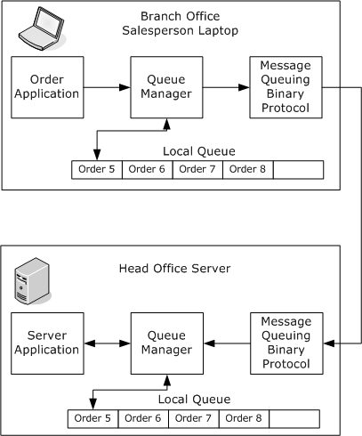

Figure 1: Queues and queue managers

The preceding diagram shows the relationship between the branch office laptop and the head office server. Messages containing orders are transferred from the outgoing [**queue**](#gt_queue) on the laptop to the destination queue on the server.

## 1.4 Relationship to Other Protocols

The Message Queuing (MSMQ): Message Queuing Binary Protocol depends upon direct TCP/IP or IPX/SPX to provide a reliable stream-oriented transport for messages. The protocol uses UDP or SPX to determine server availability.

This protocol uses shared state and processing rules defined in Message Queuing (MSMQ): Common Data Model and Processing Rules [MS-MQDMPR](#Section_1.3.1).

The protocol relies upon the Binary Reliable Message Routing Algorithm specified in [MS-MQBR](#Section_1.3.1) to process messages sent using public and private [**format names**](#gt_format-name).

The protocol relationships are described in the following diagram.

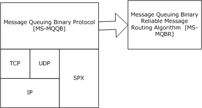

Figure 2: Relationships between MSMQ binary and transport protocols

## 1.5 Prerequisites/Preconditions

It is assumed that the protocol client has obtained the name of a server computer that supports this protocol and the name of a [**queue**](#gt_queue) hosted on the server before this protocol is invoked. This specification does not mandate how a client acquires this information.

It is assumed that the protocol client has access to a private encryption key used to decrypt [**messages**](#gt_message). A [**private key**](#gt_private-key) typically is stored in a secure location on the local host.

## 1.6 Applicability Statement

The server side of this protocol is applicable for implementation by a [**queue manager**](#gt_queue-manager-qm) providing message queuing communication services to clients. The client side of this protocol is applicable for implementation by client libraries providing [**message queue**](#gt_message-queue) managers to applications or by a queue manager delegating requests on behalf of a client.

The protocol is not applicable for distributed applications that require [**message**](#gt_message) delivery within a predefined amount of time and not for scenarios that require message data greater than 4 MB in size.

## 1.7 Versioning and Capability Negotiation

This document covers versioning issues in the following areas:

- **Supported Transports:** The Message Queuing (MSMQ): Message Queuing Binary Protocol can be implemented on top of TCP/IP with UDP or over IPX/SPX, as specified in section [2.1](#Section_2.1). This protocol uses both TCP/IP and UDP or SPX and IPX simultaneously.
- **Capability Negotiation:** There is a single version of this protocol at this time.

## 1.8 Vendor-Extensible Fields

The Message Queuing (MSMQ): Message Queuing Binary Protocol does not define any vendor-extensible fields.

## 1.9 Standards Assignments

This protocol uses the following assignments.

| Parameter | Value | Reference |
| --- | --- | --- |
| Microsoft-DS | TCP Port 1801 (0x709) | As specified in [[IANAPORT]](https://go.microsoft.com/fwlink/?LinkId=89888). |

# 2 Messages

The following sections specify the message transport and the common data types of the Message Queuing (MSMQ): Message Queuing Binary Protocol.

## 2.1 Transport

A client exchanges [**messages**](#gt_message) with a server over a protocol session to perform actions such as session establishment, user message transfer, and message acknowledgment. A client MAY<3> use a [Ping Message (section 2.1.2)](#Section_2.1.2) to determine if a server is available.

### 2.1.1 Protocol Session

A protocol session is a TCP or an SPX connection used to send **UserMessage Packet**s ([MS-MQMQ](#Section_1.3.1) section 2.2.20), which contain application-defined messages and internal packets between a local and remote [**queue manager**](#gt_queue-manager-qm). The protocol session begins with an [EstablishConnection Packet (section 2.2.3)](#Section_2.2.3) and [ConnectionParameters Packet (section 2.2.2)](#Section_2.2.2) exchange to initialize the session. From that point, **UserMessage Packet**s can be sent in either direction and are acknowledged by [SessionAck Packets (section 2.2.6)](#Section_2.2.6), [OrderAck Packets (section 2.2.4)](#Section_2.2.4), and [FinalAck Packets (section 2.2.5)](#Section_2.2.5) as required.

The packets supported within a protocol session are the ConnectionParameters Packet, the EstablishConnection Packet, the **UserMessage Packet**, the SessionAck Packet, the OrderAck Packet, and the FinalAck Packet. Each of these packets MUST begin with a BaseHeader ([MS-MQMQ] section 2.2.19.1), which contains information such as packet type, signature, and packet size. The header is followed by one or more headers, depending on the packet type.

The protocol MUST use direct TCP or SPX for a protocol session.<4> The protocol [**initiator**](#gt_initiator) MUST establish a connection to TCP port 1801 or SPX port 876 on the [**acceptor**](#gt_acceptor). The TCP or SPX source port used by the initiator MAY<5> be any TCP or SPX port value. The protocol acceptor MUST listen for connections on TCP port 1801 or SPX port 876.<6>

### 2.1.2 Ping Message

A Ping Message can be a **Ping Request** or a **Ping Response**. A **Ping Request** MAY<7> be sent from an [**initiator**](#gt_initiator) to an [**acceptor**](#gt_acceptor) to determine whether the acceptor is available and can accept a binary protocol sequence connection. An acceptor responds to a **Ping Request** by sending a **Ping Response** back to the initiator. All Ping Messages use the [Ping Packet (section 2.2.7)](#Section_2.2.7).

Ping Messages MAY<8> be sent using the UDP or the SPX protocol.

**Ping Requests** are sent to UDP or SPX port 3527 on the acceptor.<9> The source port used by the initiator can be any UDP or SPX port value. The initiator MUST listen on that source port for the **Ping Response**.

The acceptor MAY<10> listen for **Ping Requests**. If an acceptor listens for **Ping Requests**, it MAY<11> do so on UDP or SPX port 3527. A **Ping Response** MUST be sent to the UDP or SPX source address and port from which the corresponding **Ping Request** was sent.

## 2.2 Message Syntax

The Message Queuing (MSMQ): Message Queuing Binary Protocol uses [**little-endian**](#gt_little-endian) [**byte order**](#gt_502de58c-ffc0-4dda-8fcb-b152b2c31fba).

This protocol uses the following data types:

- **GUID** ([MS-DTYP](../MS-DTYP/MS-DTYP.md) section 2.3.4.2)
- **TxSequenceID** ([MS-MQMQ](#Section_1.3.1) section 2.2.18.1.2)
- **MessageIdentifier** ([MS-MQMQ] section 2.2.18.1.3)
- **MQFFormatNameElement** ([MS-MQMQ] section 2.2.18.1.4)
This protocol uses the following headers:

- **BaseHeader** ([MS-MQMQ] section 2.2.19.1)
- **UserHeader** ([MS-MQMQ] section 2.2.19.2)
- **MessagePropertiesHeader** ([MS-MQMQ] section 2.2.19.3)
- **MultiQueueFormatHeader** ([MS-MQMQ] section 2.2.20.1)
- **MQFAddressHeader** ([MS-MQMQ] section 2.2.20.2)
- **MQFSignatureHeader** ([MS-MQMQ] section 2.2.20.3)
- **SessionHeader** ([MS-MQMQ] section 2.2.20.4)
- **TransactionHeader** ([MS-MQMQ] section 2.2.20.5)
- **SecurityHeader** ([MS-MQMQ] section 2.2.20.6)
- **DebugHeader** ([MS-MQMQ] section 2.2.20.8)
This protocol uses the **UserMessage Packet** ([MS-MQMQ] section 2.2.20).

### 2.2.1 InternalHeader

The InternalHeader contains packet type and state information for the session. This header is used by internal packets.

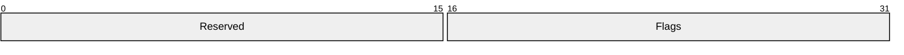

**Reserved (2 bytes):** A 16-bit unsigned short integer reserved for future use. MUST be set to zero when sent and MUST be ignored on receipt.

**Flags (2 bytes):** A 16-bit unsigned short integer that contains a set of options that provide additional information about the packet. Any combination of these values is acceptable unless otherwise noted following.

Where the bits are defined as follows:

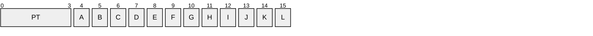

**PT (4 bits):** Specifies the packet type. These fields MUST be set to one of the following value combinations.

| Value | Meaning |
| --- | --- |
| 0x1 | [SessionAck Packet (section 2.2.6)](#Section_2.2.6) |
| 0x2 | [EstablishConnection Packet (section 2.2.3)](#Section_2.2.3) |
| 0x3 | [ConnectionParameters Packet (section 2.2.2)](#Section_2.2.2) |

Any value not specified in the preceding table MUST be treated as an error by closing the session.

**A - CS (1 bit):** Specifies connection state. This field is used during the session negotiation to establish a connection. When set, **CS** indicates that the connection is refused. This field MUST NOT be set in any packet other than an EstablishConnection Packet or a ConnectionParameters Packet. This bit MUST be set when the **EstablishConnectionHeader.ServerGuid** field is zero or not equal to the receiving queue manager's GUID. This bit SHOULD<12> be set when the connection violates server policies such as connection quotas.

**B - X5 (1 bit):** Reserved. SHOULD NOT be set when sent and MUST be ignored on receipt.

**C - X6 (1 bit):** Reserved. SHOULD NOT be set when sent and MUST be ignored on receipt.

**D - X7 (1 bit):** Reserved. SHOULD NOT be set when sent and MUST be ignored on receipt.

**E - X8 (1 bit):** Reserved. SHOULD NOT be set when sent and MUST be ignored on receipt.

**F - X9 (1 bit):** Reserved. SHOULD NOT be set when sent and MUST be ignored on receipt.

**G - X10 (1 bit):** Reserved. SHOULD NOT be set when sent and MUST be ignored on receipt.

**H - X11 (1 bit):** Reserved. SHOULD NOT be set when sent and MUST be ignored on receipt.

**I - X12 (1 bit):** Reserved. SHOULD NOT be set when sent and MUST be ignored on receipt.

**J - X13 (1 bit):** Reserved. SHOULD NOT be set when sent and MUST be ignored on receipt.

**K - X14 (1 bit):** Reserved. SHOULD NOT be set when sent and MUST be ignored on receipt.

**L - X15 (1 bit):** Reserved. SHOULD NOT be set when sent and MUST be ignored on receipt.

### 2.2.2 ConnectionParameters Packet

The ConnectionParameters Packet is used to communicate connection parameters between an [**initiator**](#gt_initiator) and an [**acceptor**](#gt_acceptor) during session initialization.

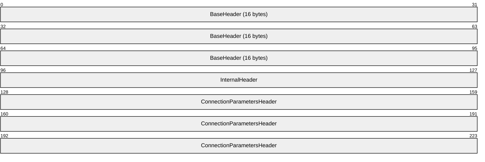

**BaseHeader (16 bytes):** A BaseHeader ([MS-MQMQ](#Section_1.3.1) section 2.2.19.1). The **BaseHeader.Flags.IN** field MUST be set to indicate that this packet is an internal message.

**InternalHeader (4 bytes):** An [InternalHeader (section 2.2.1)](#Section_2.2.1). The **InternalHeader.Flags.PT** field MUST be set to 0x3.

**ConnectionParametersHeader (12 bytes):** A [ConnectionParametersHeader (section 2.2.2.1)](#Section_2.2.2.1) that contains parameters for the acknowledgment timeout and sliding window size.

#### 2.2.2.1 ConnectionParametersHeader

The ConnectionParametersHeader contains parameters for acknowledgment timeout and sliding window size.

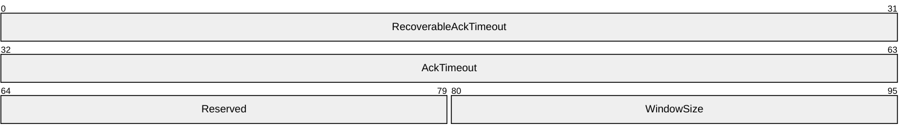

**RecoverableAckTimeout (4 bytes):** A 32-bit unsigned long integer that specifies the minimum time, in milliseconds, that the protocol waits before sending a [SessionAck Packet (section 2.2.6)](#Section_2.2.6) acknowledgment after receiving a recoverable **UserMessage Packet** ([MS-MQMQ](#Section_1.3.1) section 2.2.20). This field has a valid range from 0x000001F4 to 0x0001D4C0, inclusive.

**AckTimeout (4 bytes):** A 32-bit unsigned long integer that specifies the time, in milliseconds, that the protocol waits for a SessionAck Packet before closing the session. This field has a valid range from 0x00004E20 to 0x0001D4C0, inclusive.

**Reserved (2 bytes):** A 16-bit unsigned integer reserved for future use. MUST be set to 0x0000 by the sender, and MUST be ignored by the receiver.

**WindowSize (2 bytes):** A 16-bit unsigned integer containing a sliding window size, based on the number of unacknowledged packets received, for sending session acknowledgments. This field has a valid range from 0x0000 to 0xFFFF.

### 2.2.3 EstablishConnection Packet

The [**initiator**](#gt_initiator) sends an EstablishConnection Packet to an [**acceptor**](#gt_acceptor) to initiate a protocol session. The acceptor sends an EstablishConnection Packet back to the sender in response to indicate acceptance or rejection of the session request.

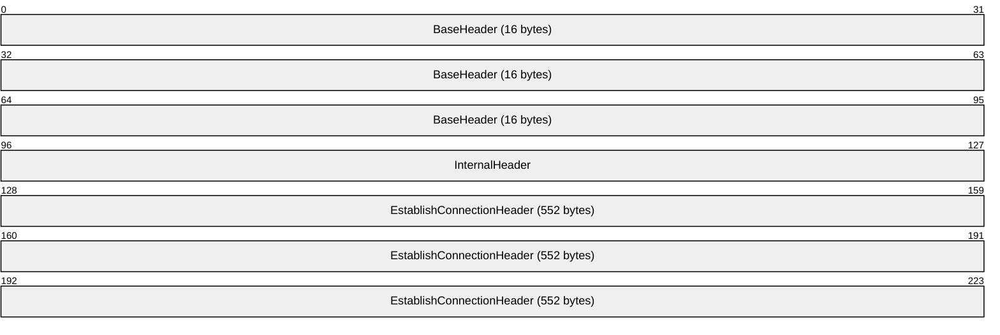

**BaseHeader (16 bytes):** A BaseHeader ([MS-MQMQ](#Section_1.3.1) section 2.2.19.1). The **BaseHeader.Flags.IN** field MUST be set to indicate that this packet is an internal message.

**InternalHeader (4 bytes):** An [InternalHeader (section 2.2.1)](#Section_2.2.1). The **InternalHeader.Flags.PT** field MUST be set to 0x2.

**EstablishConnectionHeader (552 bytes):** An [EstablishConnectionHeader (section 2.2.3.1)](#Section_2.2.3.1) that contains information to identify the initiator and acceptor, a time stamp set by the initiator, and a flags field.

#### 2.2.3.1 EstablishConnectionHeader

The EstablishConnectionHeader contains [**queue manager**](#gt_queue-manager-qm) **GUID**s ([MS-DTYP](../MS-DTYP/MS-DTYP.md) section 2.3.4.1) that identify the [**initiator**](#gt_initiator) and [**acceptor**](#gt_acceptor), a time stamp set by the initiator, and flags.

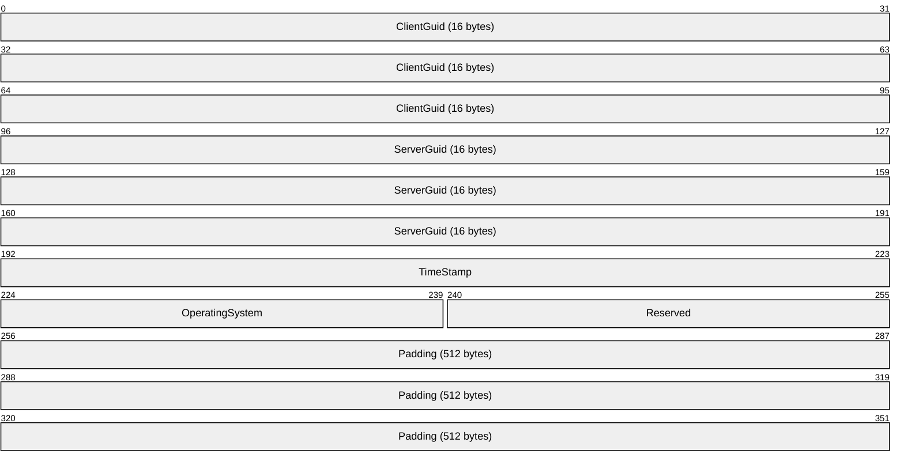

**ClientGuid (16 bytes):** The **GUID** for the queue manager of the initiator that is requesting the connection. In a connection request, the initiator sets this field. In a connection response, the acceptor sets this field to the queue manager **GUID** provided in the connection request.

**ServerGuid (16 bytes):** The **GUID** that identifies the queue manager of the acceptor responding to the connection request. In a connection request, the initiator MUST specify the acceptor queue manager **GUID** or MUST zero fill this field if a direct format name is used. In a connection response, the acceptor MUST set this field to the **GUID** provided in the connection request or to the acceptor queue manager **GUID** if a direct format name is used.

**TimeStamp (4 bytes):** A 32-bit unsigned integer that identifies when the connection request was made. This value represents the number of milliseconds since the operating system was started. In a connection request, the initiator sets this field. In a connection response, the acceptor sets this field to the time stamp provided in the connection request.

**OperatingSystem (2 bytes):** A 16-bit unsigned integer field containing flags related to the connection request. The field MUST be set to a combination of the following values.

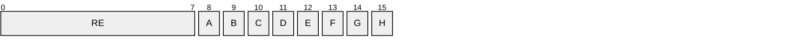

**RE (1 byte):** This field is reserved. MUST be set to 0x10.

**A - SE (1 bit):** Session flag. If a **Ping Request**, as specified in Ping Message (section [2.1.2](#Section_2.1.2)), is sent when the session is being created (section [3.1.5.2.2](#Section_3.1.5.2.2)), the sender MUST set this bit to 0; otherwise, the sender MUST set it to 1. The receiver MUST send the same value back to the sender in the Response Packet (section [3.1.5.3.2](#Section_3.1.5.3.2)).

| Value | Meaning |
| --- | --- |
| 0 | A **Ping Request** packet is sent when the session is being created. |
| 1 | A **Ping Request** packet is not sent when the session is being created. |

**B - OS (1 bit):** Indicates the type of the initiator operating system. The acceptor MAY use this parameter to impose a limit on the number of unique callers.<13> This field MUST be set to a value specified following:<14>

| Value | Meaning |
| --- | --- |
| 0 | Initiator operating system is not a server-class operating system. |
| 1 | Initiator operating system is a server-class operating system. |

**C - QS (1 bit):** Quality of Service (QOS) flag. This field SHOULD be set to a value specified following:<15>

| Value | Meaning |
| --- | --- |
| 0 | None. |
| 1 | Indicates that the underlying transport supports Guaranteed Quality of Service (GQoS). Details are as specified in [[RFC2212]](https://go.microsoft.com/fwlink/?LinkId=90321). |

**D - X11 (1 bit):** Unused bit field. SHOULD NOT be set when sent and MUST be ignored on receipt.

**E - X12 (1 bit):** Unused bit field. SHOULD NOT be set when sent and MUST be ignored on receipt.

**F - X13 (1 bit):** Unused bit field. SHOULD NOT be set when sent and MUST be ignored on receipt.

**G - X14 (1 bit):** Unused bit field. SHOULD NOT be set when sent and MUST be ignored on receipt.

**H - X15 (1 bit):** Unused bit field. SHOULD NOT be set when sent and MUST be ignored on receipt.

**Reserved (2 bytes):** A 16-bit unsigned integer field reserved for future use. MUST be set to zero when sent and MUST be ignored on receipt.

**Padding (512 bytes):** A fixed-length array of 512 bytes of padding to fill the remainder of the EstablishConnectionHeader packet. When the EstablishConnectionHeader is part of a response packet from a server, each byte of this array MUST be filled with the value 0x5A. When the EstablishConnectionHeader is not part of a response packet from a server, each byte in this field contains an uninitialized value.

### 2.2.4 OrderAck Packet

The OrderAck Packet (section 2.2.4) contains a stand-alone transactional acknowledgment [**message**](#gt_message). The packet acknowledges the transactional messages that have been received (accepted or rejected) by the receiver so that the sender can remove the messages from its [**outgoing queue**](#gt_outgoing-queue) and, if requested, add them to the wait list for receiving final acknowledgments. The OrderAck Packet is an end-to-end acknowledgment.

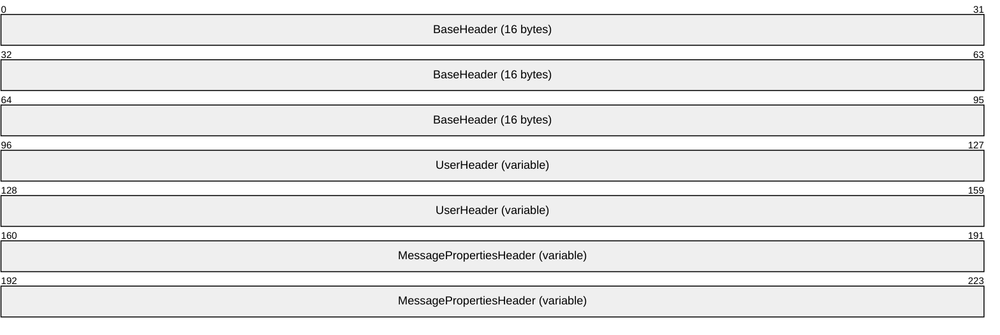

**BaseHeader (16 bytes):** A BaseHeader ([MS-MQMQ](#Section_1.3.1) section 2.2.19.1). The **BaseHeader.Flags** field MUST have all bits set to 0.

**UserHeader (variable):** A UserHeader ([MS-MQMQ] section 2.2.19.2). The **Flags.MP** flag MUST be set to 0x1 to indicate that a MessagePropertiesHeader ([MS-MQMQ] section 2.2.19.3) is included. All other bits MUST be set to 0 except **Flags.DQ**, which MUST be set either to 0x3 or to 0x7. If **Flags.DQ** is 0x3, the **DestinationQueue** field MUST be a PrivateQueueFormatNameId ([MS-MQMQ] section 2.2.18.1.5.1) with **PrivateQueueIdentifier** set to 0x00000004. If **Flags.DQ** is 0x7, the **DestinationQueue** field MUST be a DirectQueueFormatName ([MS-MQMQ] section 2.2.18.1.5.2) with **DirectFormatName** set to a string in the format specified by the following ABNF rules.

orderQueueName = ("TCP:" ip-address / "SPX:" ipx-address )

"\PRIVATE$\order_queue$"

ip-address=(IPv6address / IPv4address)

ipx-address= 8HEXDIG "." 12HEXDIG ; network.node

HEXDIG = Digit | "A" | "B" | "C" | "D" | "E" | "F"

Digit = %x30-39

The use of TCP or SPX depends on whether TCP or SPX transport is supported.<16> The value for IPv4address [[RFC3986]](https://go.microsoft.com/fwlink/?LinkId=90453), IPv6address [RFC3986], or ipx-address MUST represent the IP or IPX address of the [**queue manager**](#gt_queue-manager-qm) to receive the message.

**MessagePropertiesHeader (variable):** A MessagePropertiesHeader. The **Label** field MUST be set to "QM Ordering Ack". The **MessageSize** field MUST be set to 0x00000024. The **Flags** field MUST have all bits set to 0. The **MessageClass** field MUST be set to **MQMSG_CLASS_ORDER_ACK**.

For more details about message class identifiers, see [MS-MQMQ] section 2.2.18.1.6.

The **BodyType** field MUST be set to the value VT_EMPTY ([MS-MQMQ] section 2.2.12). The **MessageBody** field MUST be in the [OrderAck Body (section 2.2.4.1)](#Section_2.2.4.1) format.

#### 2.2.4.1 OrderAck Body

The OrderAck Body is used to acknowledge transactional messages as part of an [OrderAck Packet (section 2.2.4)](#Section_2.2.4).

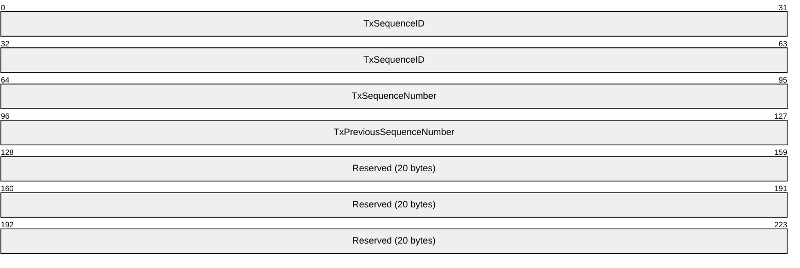

**TxSequenceID (8 bytes):** A transactional [**sequence**](#gt_sequence) identifier, TxSequenceID ([MS-MQMQ](#Section_1.3.1) section 2.2.18.1.2). This value MUST be set to the transactional sequence identifier of the [**message**](#gt_message) being acknowledged.

**TxSequenceNumber (4 bytes):** A 32-bit unsigned integer specifying a transactional sequence number that represents the order of a message within a transactional sequence. This value MUST be set to the transactional sequence number of the message being acknowledged. This field has a valid range from 0x00000001 to 0xFFFFFFFF.

**TxPreviousSequenceNumber (4 bytes):** A 32-bit unsigned integer specifying a transactional sequence number. This value MUST be set to (**TxSequenceNumber** - 1). This field has a valid range from 0x00000000 to 0xFFFFFFFE.

**Reserved (20 bytes):** This field SHOULD<17> be set to hexadecimal zeros (0x00) when sent and MUST be ignored on receipt.

### 2.2.5 FinalAck Packet

The FinalAck Packet contains a stand-alone transactional acknowledgment [**message**](#gt_message) that is sent to the original sender in one of two situations: either when a transactional message is rejected by the receiver; or when an accepted transactional message with a **UserHeader.Flags.JN** or a **UserHeader.Flags.JP** field set to 0x1 is removed from the destination [**queue**](#gt_queue).

The packet can represent a positive or negative acknowledgment. The **MessageClass** field of the contained MessagePropertiesHeader ([MS-MQMQ](#Section_1.3.1) section 2.2.19.3) packet defines the type of acknowledgment. The FinalAck Packet is an end-to-end acknowledgment.

**BaseHeader (16 bytes):** A BaseHeader ([MS-MQMQ] section 2.2.19.1). The **BaseHeader.Flags** field MUST have all bits set to 0.

**UserHeader (variable):** A UserHeader ([MS-MQMQ] section 2.2.19.2). The **Flags.MP** flag MUST be set to 0x1 to indicate that a MessagePropertiesHeader is included. The **Flags.DM** flag MUST be set to 0x1 to request recoverable messaging. All other bits MUST be set to 0 except **Flags.DQ**, which MUST be set either to 0x3 or to 0x7. If **Flags.DQ** is 0x3, the **DestinationQueue** field MUST be a PrivateQueueFormatNameId ([MS-MQMQ] section 2.2.18.1.5.1) with **PrivateQueueIdentifier** set to 0x00000004. If **Flags.DQ** is 0x7, the **DestinationQueue** field MUST be a DirectQueueFormatName ([MS-MQMQ] section 2.2.18.1.5.2) with **DirectFormatName** set to a string in the format specified by the following ABNF rules.

orderQueueName = ("TCP:" ip-address / "SPX:" ipx-address )

"\PRIVATE$\order_queue$"

ip-address=(IPv6address / IPv4address)

ipx-address= 8HEXDIG "." 12HEXDIG ; network.node

HEXDIG = Digit | "A" | "B" | "C" | "D" | "E" | "F"

Digit = %x30-39

The use of TCP or SPX depends on whether TCP or SPX transport is supported.<18> The value for IPv4address [[RFC3986]](https://go.microsoft.com/fwlink/?LinkId=90453), IPv6address [RFC3986], or ipx-address MUST represent the IP or IPX address of the [**queue manager**](#gt_queue-manager-qm) to receive the message.

**MessagePropertiesHeader (variable):** A MessagePropertiesHeader. The **Label** field MUST be set to "QM Ordering Ack". The **MessageSize** field MUST be set to 0x00000024. The **Flags** field MUST have all bits set to 0.

For a positive acknowledgment, the **MessageClass** field MUST be set to MQMSG_CLASS_ACK_RECEIVE. For a negative acknowledgment, the **MessageClass** field MUST be set to one of the following message class identifiers:

- MQMSG_CLASS_NACK_NOT_TRANSACTIONAL_Q
- MQMSG_CLASS_NACK_BAD_DST_Q
- MQMSG_CLASS_NACK_ACCESS_DENIED
- MQMSG_CLASS_NACK_BAD_ENCRYPTION
- MQMSG_CLASS_NACK_UNSUPPORTED_CRYPTO_PROVIDER
- MQMSG_CLASS_NACK_BAD_SIGNATURE
- MQMSG_CLASS_NACK_Q_EXCEED_QUOTA
- MQMSG_CLASS_NACK_Q_DELETED
- MQMSG_CLASS_NACK_Q_PURGED
- MQMSG_CLASS_NACK_RECEIVE_TIMEOUT
For more details on message class identifiers, see [MS-MQMQ] section 2.2.18.1.6.

The **BodyType** field MUST be set to the value VT_EMPTY ([MS-MQMQ] section 2.2.12). The **MessageBody** field MUST be in the [FinalAck Body (section 2.2.5.1)](#Section_2.2.5.1) format.

#### 2.2.5.1 FinalAck Body

The FinalAck Body is used to acknowledge transactional messages as part of a [FinalAck Packet (section 2.2.5)](#Section_2.2.5).

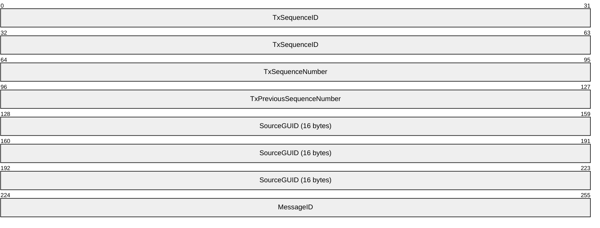

**TxSequenceID (8 bytes):** A TxSequenceID specifying a transactional [**sequence**](#gt_sequence) identifier. This value MUST be the transactional sequence identifier of the [**message**](#gt_message) being acknowledged. For more details, see the definition of TxSequenceID in [MS-MQMQ](#Section_1.3.1) section 2.2.18.1.2.

**TxSequenceNumber (4 bytes):** A 32-bit unsigned integer specifying a transactional sequence number that represents the order of a message within a transactional sequence. This value MUST be set to the transactional sequence number of the message being acknowledged. This field has a valid range from 0x00000001 to 0xFFFFFFFF, inclusive.

**TxPreviousSequenceNumber (4 bytes):** A 32-bit unsigned integer specifying a transactional sequence number. This value MUST be set to the transactional sequence number of the previous message received in the transactional sequence. This field has a valid range from 0x00000000 to 0xFFFFFFFE, inclusive.

**SourceGUID (16 bytes):** The GUID for the source [**queue manager**](#gt_queue-manager-qm) [**GUID**](#gt_globally-unique-identifier-guid).

**MessageID (4 bytes):** A 32-bit unsigned integer specifying a message identifier.

### 2.2.6 SessionAck Packet

The SessionAck Packet contains a session acknowledgment. This packet acknowledges express and recoverable UserMessage Packets ([MS-MQMQ](#Section_1.3.1) section 2.2.20) that have been received on the session.

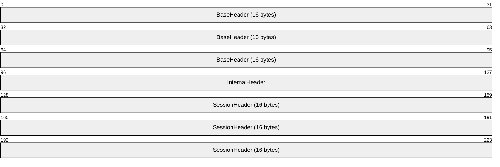

**BaseHeader (16 bytes):** A BaseHeader ([MS-MQMQ] section 2.2.19.1). The **BaseHeader.Flags.IN** and **BaseHeader.Flags.SH** bit fields MUST be set.

**InternalHeader (4 bytes):** An [InternalHeader](#Section_2.2.1). The **InternalHeader.Flags.PT** field MUST be set to 0x1.

**SessionHeader (16 bytes):** A SessionHeader ([MS-MQMQ] section 2.2.20.4) that contains acknowledgment and window size information.

A session acknowledgment can also be included within a UserMessage Packet. For more information about session acknowledgments, see section [3.1.1.6.1](#Section_3.1.1.6.1).

### 2.2.7 Ping Packet

The Ping Packet is used by [Ping Messages (section 2.1.2)](#Section_2.1.2) to allow an [**initiator**](#gt_initiator) to determine whether an [**acceptor**](#gt_acceptor) is available and can accept a binary protocol [**sequence**](#gt_sequence) connection.

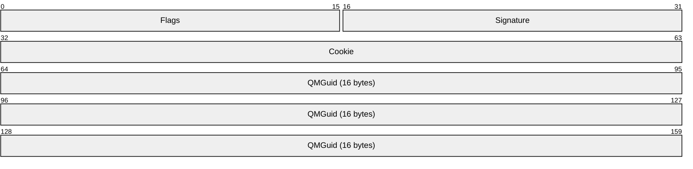

**Flags (2 bytes):** A 16-bit unsigned short integer field that provides additional information about the packet.

Fields marked X are unused. They MAY be set when sent. They MUST be ignored on receipt.<19>

| 0 | 1 | 2 | 3 | 4 | 5 | 6 | 7 | 8 | 9 | 1 0 | 1 | 2 | 3 | 4 | 5 |
| --- | --- | --- | --- | --- | --- | --- | --- | --- | --- | --- | --- | --- | --- | --- | --- |
| R C | R F | X | X | X | X | X | X | X | X | X | X | X | X | X | X |

Where the bits are defined as:

| Value | Description |
| --- | --- |
| RC | Specifies the type of the initiator. An initiator MUST set this field in a **Ping Request**, as defined in Ping Message (section 2.1.2), if the **OperatingSystemType** ADM attribute of the **QueueManager** ([MS-MQDMPR](#Section_1.3.1) section 3.1.1.1) ADM element is neither **WinServer** nor **WinEnt**; otherwise, this field MUST NOT be set. An acceptor MUST set this field in a **Ping Response**, as defined in Ping Message (section 2.1.2), to the value of this field in the **Ping Request** from the initiator. |
| RF | An acceptor MUST set this field in a **Ping Response** if it would currently refuse a protocol session over TCP or SPX from this initiator; otherwise, the field MUST be clear if a protocol session would be accepted. An initiator MUST clear this field in a **Ping Request**. |
| X | Unused bit field. MAY be set when sent and MUST be ignored on receipt. |
| X | Unused bit field. MAY be set when sent and MUST be ignored on receipt. |
| X | Unused bit field. MAY be set when sent and MUST be ignored on receipt. |
| X | Unused bit field. MAY be set when sent and MUST be ignored on receipt. |
| X | Unused bit field. MAY be set when sent and MUST be ignored on receipt. |
| X | Unused bit field. MAY be set when sent and MUST be ignored on receipt. |
| X | Unused bit field. MAY be set when sent and MUST be ignored on receipt. |
| X | Unused bit field. MAY be set when sent and MUST be ignored on receipt. |
| X | Unused bit field. MAY be set when sent and MUST be ignored on receipt. |
| X | Unused bit field. MAY be set when sent and MUST be ignored on receipt. |
| X | Unused bit field. MAY be set when sent and MUST be ignored on receipt. |
| X | Unused bit field. MAY be set when sent and MUST be ignored on receipt. |
| X | Unused bit field. MAY be set when sent and MUST be ignored on receipt. |
| X | Unused bit field. MAY be set when sent and MUST be ignored on receipt. |

**Signature (2 bytes):** A 16-bit unsigned short integer field that identifies the packet as a Ping Message packet. This value MUST be set to 0x5548. A receiver MUST ignore the packet if the signature is not set to this value.

**Cookie (4 bytes):** A 32-bit unsigned long integer that specifies a value used to correlate **Ping Requests** and **Ping Responses**. This value is generated by the initiator to uniquely identify the **Ping Request**. This field has a valid range from 0x00000000 to 0xFFFFFFFF.

When sending a **Ping Response**, an acceptor MUST set this field to the **Cookie** field value from the received **Ping Request**. When an initiator receives a **Ping Response**, it uses the **Cookie** field to correlate it to a **Ping Request**. An initiator MUST disregard a **Ping Response** that contains a **Cookie** field that does not correspond to the **Cookie** field in the most recent **Ping Request** that it has sent.

**QMGuid (16 bytes):** The **GUID** ([MS-DTYP](../MS-DTYP/MS-DTYP.md) section 2.3.4.1) that identifies the [**queue manager**](#gt_queue-manager-qm) where this packet was created, which is the initiator for **Ping Requests** and the acceptor for **Ping Responses**.

## 2.3 Directory Service Schema Elements

This protocol uses ADM elements specified in section [3.1.1](#Section_3.1.1). A subset of these elements can be published in a directory. This protocol SHOULD<20> access the directory using the algorithm specified in [MS-MQDSSM](#Section_1.3.1) and using LDAP as specified in [[LDAP]](https://go.microsoft.com/fwlink/?LinkId=89932) and [MS-ADTS](../MS-ADTS/MS-ADTS.md). The Directory Service schema elements for ADM elements published in the directory are defined in [MS-MQDSSM] section 2.4. <21>

## 2.4 Cryptographic Data Structures

### 2.4.1 PUBLICKEYBLOB

The PUBLICKEYBLOB type is used to export public keys for use with the RSA key exchange algorithm ([[RFC8017]](https://go.microsoft.com/fwlink/?linkid=2164409)) from a receiver to senders for use in sending encrypted messages to that receiver.

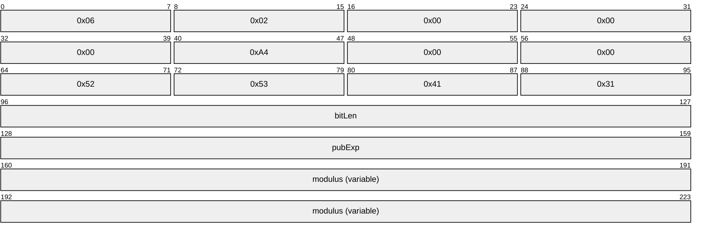

**bitLen (4 bytes):** A 32-bit unsigned number in little-endian format. MUST be the bit length of the RSA modulus, defined as **k*8** in the terminology of [RFC8017] section 2.

**pubExp (4 bytes):** A 32-bit unsigned number in little-endian format. MUST be the public exponent of the key pair, referred to as **e** in [RFC8017] section 2.

**modulus (variable):** The RSA modulus, referred to as **n** in [RFC8017] section 2. This field MUST be encoded in little-endian format. Its length in bits MUST be equal to the value in the **bitLen** field.

### 2.4.2 SIMPLEBLOB

The SIMPLEBLOB type is used for transferring cryptographic session keys from a sender to a receiver in a secure manner.

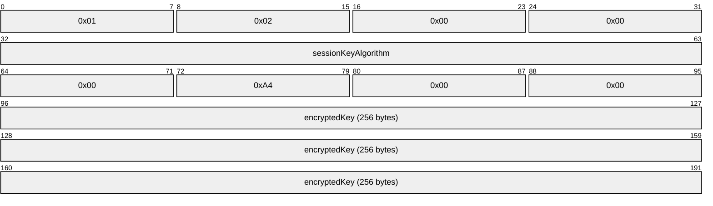

**sessionKeyAlgorithm (4 bytes):** A 32-bit integer in little-endian format that identifies the algorithm with which the session key is associated. This field MUST be assigned according to the following table.

| Bit Range | Field | Description |
| --- | --- | --- |
| Variable | AES-128 | 0x0000660e |
| Variable | AES-192 | 0x0000660f |
| Variable | AES-256 | 0x00006610 |
| Variable | RC2 | 0x00006602 |
| Variable | RC4 | 0x00006801 |

**encryptedKey (256 bytes):** The session key, encrypted with one of the receiver's public keys using the RSAES-PKCS1-v1_5 encryption scheme specified in [[RFC8017]](https://go.microsoft.com/fwlink/?linkid=2164409) section 7.2 and encoded in little-endian format. See section [3.1.7.1.5](#Section_3.1.7.1.5.2) for more information on how the receiver's public keys are retrieved and how a specific key is chosen.

# 3 Protocol Details

The Message Queuing (MSMQ): Message Queuing Binary Protocol is often described as a communication between a "client" and "server"; however, for the purpose of this section the terms "local host" and "remote/destination host" are used to refer to these roles, respectively. Before a protocol session is initialized as specified in section [3.1.5.4.2](#Section_3.1.5.4.2), these roles are referred to as "[**initiator**](#gt_initiator)" and "[**acceptor**](#gt_acceptor)", respectively. After a protocol session is initialized, the protocol behaves in a typical peer-to-peer mode where either participant sends and receives messages over the established protocol session. The participant sending a [**message**](#gt_message) is termed the "sender", while the participant receiving a message is termed the "receiver".

## 3.1 Common Details

### 3.1.1 Abstract Data Model

This section describes a conceptual model of possible data organization that an implementation maintains to participate in this protocol. The described organization is provided to facilitate the explanation of how the protocol behaves. This document does not mandate that implementations adhere to this model as long as their external behavior is consistent with that described in this document.

The abstract data model for this protocol comprises elements that are private to this protocol and others that are shared between multiple MSMQ protocols that are co-located at a common [**queue manager**](#gt_queue-manager-qm). The shared abstract data model is defined in [MS-MQDMPR](#Section_1.3.1) section 3.1.1, and the relationship between this protocol, a queue manager, and other protocols that share a common queue manager is described in [MS-MQOD](#Section_1.3).

Section [3.1.1.2](#Section_3.1.1.2) specifies the elements from the shared data model that are manipulated by this protocol. Sections [3.1.1.3](#Section_3.1.1.3) through [3.1.1.5](#Section_1.3.2.1.3) specify the data model elements that are private to this protocol.

**Abstract Data Model Syntax**

Throughout this document, the following standard syntactic conventions are observed:

- Unqualified and scalar abstract data model (ADM) element names are suffixed with "ADM element".
- Unqualified ADM attribute names are suffixed with "ADM attribute".
- Non-scalar ADM <element name>.<attribute name> constructions are unsuffixed.
- **Definitions**:
- An attribute is a property of an ADM element.
- A scalar ADM element does not define attributes.
- A non-scalar ADM element defines at least one attribute. Attributes can be nested to an arbitrary depth within a non-scalar ADM element.

#### 3.1.1.1 Protocol State

##### 3.1.1.1.1 State Diagrams

###### 3.1.1.1.1.1 Session State - Initiator

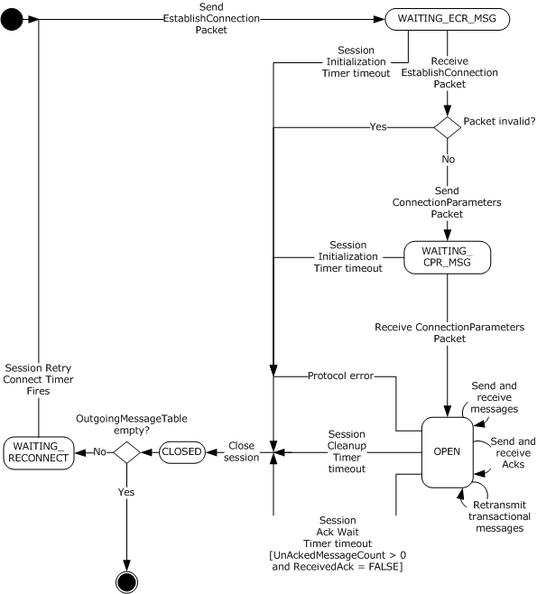

Figure 3: Initiator session state

###### 3.1.1.1.1.2 Session State - Acceptor

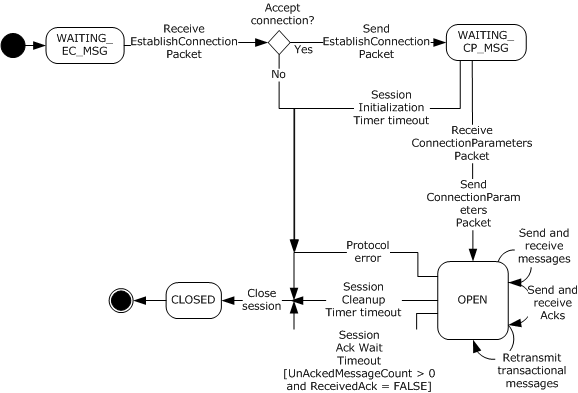

Figure 4: Acceptor session state

###### 3.1.1.1.1.3 Express Message State - Sender

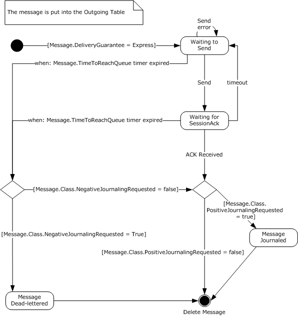

Figure 5: Sender express message state

###### 3.1.1.1.1.4 Express Message State - Receiver

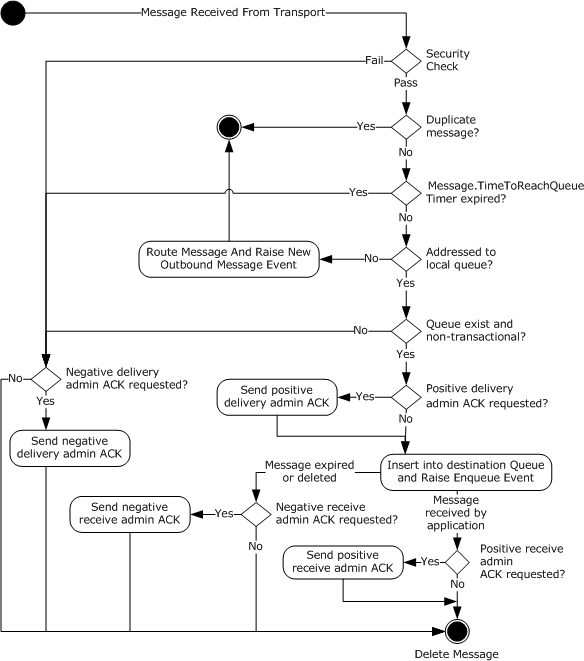

Figure 6: Receiver express message state

###### 3.1.1.1.1.5 Recoverable Message State - Sender

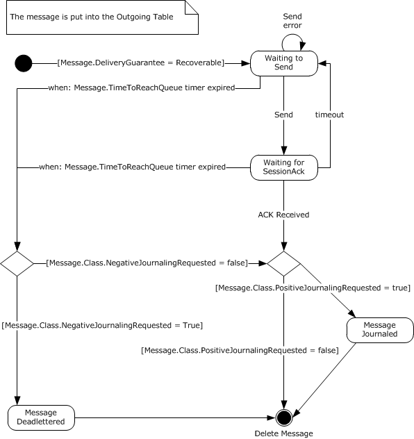

Figure 7: Sender recoverable message state

###### 3.1.1.1.1.6 Recoverable Message State - Receiver

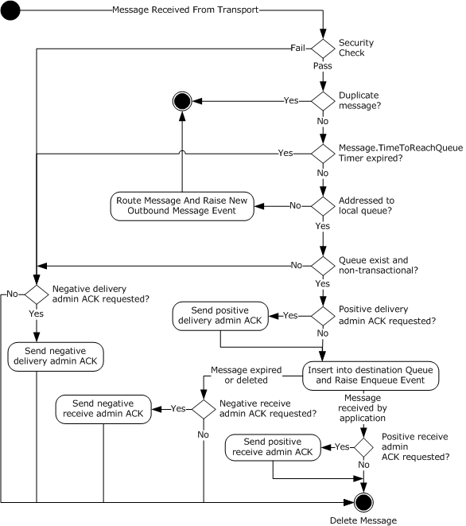

Figure 8: Receiver recoverable message state

###### 3.1.1.1.1.7 Transactional Message State - Sender

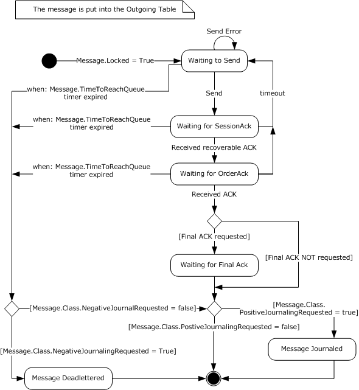

Figure 9: Sender transactional message state

###### 3.1.1.1.1.8 Transactional Message State - Receiver

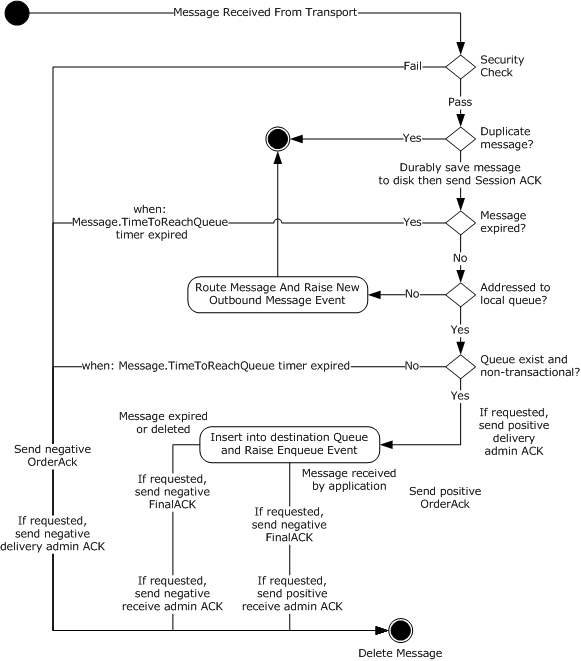

Figure 10: Receiver transactional message state

###### 3.1.1.1.1.9 Ping Mechanism State - Initiator

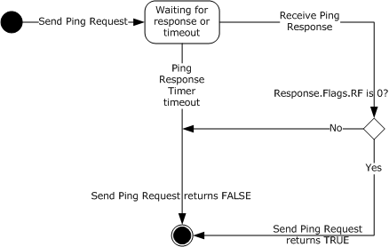

Figure 11: Initiator ping mechanism state

#### 3.1.1.2 Shared Data Elements

This protocol manipulates the following ADM elements and ADM attributes from the shared abstract data model defined in [MS-MQDMPR](#Section_1.3.1) section 3.1.1.

The **QueueManager** ([MS-MQDMPR] section 3.1.1.1) ADM element.

The **Identifier** ADM attribute of the **QueueManager** ADM element.

The **OutgoingTransferInfo** ([MS-MQDMPR] section 3.1.1.4) ADM element.

The **IncomingTransactionalTransferInfo** ([MS-MQDMPR] section 3.1.1.5) ADM element.

#### 3.1.1.3 Queue Manager State

The protocol MUST maintain these global ADM elements:

**UserCertCache:** A list of [CachedUserCert (section 3.1.1.3.4)](#Section_3.1.1.3.4) ADM element instances. Receivers use this list to cache verified user [**certificates**](#gt_certificate).

**UserCertCacheSize:** An integer indicating the maximum number of **CachedUserCert** ADM element instances that can be placed in the **UserCertCache** ADM element.

**UserCertLifetime:** An integer indicating the lifetime in milliseconds of **CachedUserCert** ADM element instances.

**ReceiveSymmetricKeyCache:** A list of [CachedSymmetricKey (section 3.1.1.3.3)](#Section_3.1.1.3.3) ADM element instances. [**Acceptors**](#gt_acceptor) use this list to store symmetric keys used for decrypting [**messages**](#gt_message).

**ReceiveBaseSymmetricKeyCache:** A list of **CachedSymmetricKey** ADM element instances. The acceptor MAY<22> cache some decrypted symmetric keys in this list instead of in the **ReceiveSymmetricKeyCache** ADM element.

**ReceiveSymmetricKeyCacheSize:** An integer indicating the maximum number of entries in the **ReceiveSymmetricKeyCache** ADM element and in the **ReceiveBaseSymmetricKeyCache** ADM element.

**SendSymmetricKeyCache:** A list of **CachedSymmetricKey** ADM element instances. [**Initiators**](#gt_initiator) use this list to store symmetric keys used for encrypting messages.

**SendBaseSymmetricKeyCache:** A list of **CachedSymmetricKey** ADM element instances. Initiators MAY<23> use this list instead of the **SendSymmetricKeyCache** ADM element to store some symmetric keys.

**SendSymmetricKeyCacheSize:** An integer indicating the maximum number of entries in the **SendSymmetricKeyCache** ADM element and in the **SendBaseSymmetricKeyCache** ADM element.

**SymmetricKeyShortLifetime:** An integer indicating the lifetimes in milliseconds of **CachedSymmetricKey** ADM element instances, as described in sections [3.1.6.10](#Section_3.1.6.10) through [3.1.6.12](#Section_3.1.6.12), section [3.1.5.8.3](#Section_3.1.5.8.3), and section [3.1.7.1.5](#Section_3.1.7.1.5.2).

**SymmetricKeyLongLifetime:** An integer indicating the lifetimes in milliseconds of **CachedSymmetricKey** ADM element instances.

**PreferredAdvancedAlgorithm:** An unsigned 32-bit integer indicating the preferred encryption algorithm to be used when encrypting a message where **Message.PrivacyLevel** is **Advanced**. Valid values are listed in the following table.

| Integer value | Encryption Algorithm |
| --- | --- |
| 0x00006610 | AES256 |
| 0x0000660E | AES128 |
| 0x0000660F | AES192 |

**PreferredEnhancedAlgorithm:** An unsigned 32-bit integer indicating the preferred encryption algorithm to be used when encrypting a message where **Message.PrivacyLevel** is **Enhanced**.

| Integer value | Encryption Algorithm |
| --- | --- |
| 0x00006602 | RC2 |
| 0x00006801 | RC4 |

**PreferredBaseAlgorithm:** An unsigned 32-bit integer indicating the preferred encryption algorithm to be used when encrypting a message where **Message.PrivacyLevel** is **Base**.

| Integer value | Encryption Algorithm |
| --- | --- |
| 0x00006602 | RC2 |
| 0x00006801 | RC4 |

**SendEnhancedRC2Using40BitKeys:** A Boolean that is TRUE if the effective symmetric encryption key length in bits MUST be reduced when encrypting messages with a **Message.PrivacyLevel** of **Enhanced** and a **Message.EncryptionAlgorithm** of RC2.

**RejectEnhancedRC2Using40BitKeys:** A Boolean that is TRUE if messages using a reduced symmetric encryption key length MUST be rejected.

**ResendTimerTable:** A table that contains the duration of the resend times for transactional messages.<24>

**MessageIDHistoryTable:** A table that contains **MessageIDHistoryEntry** ADM element instances. This table provides a lightweight duplicate elimination mechanism. For more information, see [Duplicate Detection (section 3.1.5.8.1)](#Section_3.1.5.8.1). The length of history that this table maintains is implementation-dependent; however, it MUST NOT contain more than 4,294,967,296 entries, because that is the point at which the **MessageIdOrdinal** ADM element value rolls over, and values can be reused. This table MUST be initialized to an empty table. This value SHOULD<25> survive process and node failures.

**MessageIDHistoryEntry:** An ADM element that contains information about a **UserMessage Packet** ([MS-MQMQ](#Section_1.3.1) section 2.2.20) that has been received by the protocol host. This ADM element MUST contain the following ADM attributes:

- **MessageIdentifier**: A **MessageIdentifier** ([MS-MQMQ] section 2.2.20) field.
- **TimeStamp**: A 32-bit unsigned integer that represents the time at which a **UserMessage Packet** was received.
**MessageIdOrdinal:** A monotonically increasing value used in the **MessageIdentifier** ADM attribute. This value MUST be incremented by 1 for each **UserMessage Packet** sent by the protocol and MUST be unique only within the scope of the local queue before a rollover occurs. When a rollover occurs, values MAY<26> be reused. Rollover of this value will not affect message delivery guarantees, provided that the **MessageIDHistoryTable** ADM element maximum history length is not exceeded. This value MUST be initialized to 0x00000000 and MUST survive process and node failures.

**PingCookie:** An integer value that MUST uniquely identify individual **Ping Requests**, as defined in [Ping Message (section 2.1.2)](#Section_2.1.2), from this host.<27> For more information, see [Ping Packet (section 2.2.7)](#Section_2.2.7).

**SendInsecureNacks:** A Boolean that indicates whether insecure Nacks are sent, as discussed in section [5.1](#Section_3.1.5.8.3). Insecure Nacks are sent if this value is TRUE, and are not sent if this value is FALSE. This value SHOULD<28> be initialized to FALSE and SHOULD<29> survive process and node failures.

**ResendTimeoutsShort:** A DWORD that indicates the number of seconds used to set up the **ResendTimerTable** ADM element in section [3.1.3.1](#Section_3.1.3.1). The value SHOULD<30> be 30 seconds and MUST survive process and node failures.

**ResendTimeoutsMedium:** A DWORD that indicates the number of seconds used to set up the **ResendTimerTable** ADM element in section 3.1.3.1. The value SHOULD<31> be 300 seconds (five minutes) and MUST survive process and node failures.

**ResendTimeoutsLong:** A DWORD that indicates the number of seconds used to set up the **ResendTimerTable** ADM element in section 3.1.3.1. The value SHOULD<32> be 1800 seconds (30 minutes) and MUST survive process and node failures.

**ResendTimeoutsFinal:** A DWORD that indicates the number of seconds used to set up the **ResendTimerTable** ADM element in section 3.1.3.1. The value SHOULD<33> be 21,600 seconds (6 hours) and MUST survive process and node failures.

##### 3.1.1.3.1 Session State

The sender and receiver MUST independently maintain the following ADM elements for each session.

**RemoteQMGuid:** The [**GUID**](#gt_globally-unique-identifier-guid) ([MS-DTYP](../MS-DTYP/MS-DTYP.md) section 2.3.4) of the remote [**queue manager**](#gt_queue-manager-qm). This value represents the destination queue manager if a direct connection is possible or the next hop if routing is required. This value uniquely identifies the remote host.<34>

**NextHopCollection:** A list of the possible next hops that can be used to create a session to the destination queue manager.

**NextHopIndexer:** A reference to the current item in the **NextHopCollection** ADM element that is used to try to establish a protocol session.

**RemoteQMPublicKey:** An MQDSPUBLICKEYS ([MS-MQMQ](#Section_1.3.1) section 2.2.2) structure that contains the public encryption keys of the remote queue manager.

**MessageSentCount:** A 16-bit unsigned integer that is the count of all **UserMessage Packets** ([MS-MQMQ] section 2.2.20) sent on a session. This value is incremented by 1 for each express, recoverable, and transacted **UserMessage Packet** sent.

**RecoverableMessageSentCount:** A 16-bit unsigned integer that is the count of recoverable **UserMessage Packets** sent on a session. This value is incremented by 1 for each recoverable message sent.

**MessageReceivedCount:** A 16-bit unsigned integer that is the count of all **UserMessage Packets** received on a session.

**RecoverableMessageReceivedCount:** A 16-bit unsigned integer that is the count of recoverable **UserMessage Packets** received on a session.

**LastAckedRecoverableMsgSeqNumber:** A 16-bit unsigned integer that is the [**sequence**](#gt_sequence) number of the last recoverable **UserMessage Packet** acknowledged by the last [SessionAck Packet (section 2.2.6)](#Section_2.2.6).

**RecoverableMsgAckFlags:** A 32-bit unsigned integer, as specified in [MS-MQMQ] section 2.2.20.4, representing up to 32 recoverable **UserMessage Packets** that are acknowledged as written to disk.

**UnackedReceivedMsgCount:** A 16-bit unsigned integer that is the count of **UserMessage Packets** received on a session that have not been acknowledged.

**OutgoingTxSequenceID:** A **TxSequenceID** ([MS-MQMQ] section 2.2.18.1.2) structure that identifies the current outgoing sequence of [**transactional messages**](#gt_transactional-message). Only one sequence is valid at a given time. When updating this value, the queue manager MUST guarantee that the new value is greater than any previously assigned value. This requirement allows the unique identification of an outgoing sequence of transactional messages. The value of **OutgoingTxSequenceID.Ordinal** MUST be set to 0x00000001, and the value of **OutgoingTxSequenceID.Timestamp** MUST be set to an implementation-dependent<35> value that is guaranteed to be greater than any previously generated value. This value MUST survive process and node failures.

**TxMessageRejectCount:** Identifies the number of times that the last **Message** ([MS-MQDMPR](#Section_1.3.1) section 3.1.1.12) ADM element instance sent by the remote queue manager was rejected before finally being accepted and placed in the local **Queue** ([MS-MQDMPR] section 3.1.1.2) ADM element instance. This value MUST be initialized to 0x00000000 and MUST survive process and node failures.

**OutgoingTxSequenceNumber:** A 32-bit unsigned integer. This ADM element is the sequence number of the next outgoing transactional **UserMessage Packet** to be sent on a session. This value MUST be initialized to 0x00000001 and MUST survive process and node failures.

**IncomingTxSequenceID:** A **TxSequenceID** ([MS-MQMQ] section 2.2.18.1.2) structure that identifies the last incoming transactional messages sequence on a session. An **IncomingTxSequenceID.Ordinal** value of 0x00000000 indicates that no transactional sequence has existed on a session. The value of **IncomingTxSequenceID.Ordinal** MUST be initialized to 0x00000000, and the value of **IncomingTxSequenceID.Timestamp** MUST be initialized to 0x00000000. This value MUST survive process and node failures.

**IncomingTxSequenceNumber:** A 32-bit unsigned integer that identifies the sequence number of the last transactional **UserMessage Packet** received on a session. This value MUST be initialized to 0x00000000 and MUST survive process and node failures.

**OutgoingQueueReference:** A reference to the **OutgoingQueue** ([MS-MQDMPR] section 3.1.1.3) ADM element instance associated with the session. This value MUST survive process and node failures, and the default value is NULL.

**TxOutgoingSequence:** A reference to an [OutgoingTransferSequence (section 3.1.1.3.1.1)](#Section_3.1.1.3.1.1) ADM element instance.

**WindowSize:** This ADM element represents the session acknowledgment window size.<36> The window size controls when the protocol sends session acknowledgments for received messages and sets a limit on the number of unacknowledged outgoing messages.

**ReceivedWindowSize:** This ADM element represents the session acknowledgment window size of the other queue manager participating in the session. For the local queue manager, the **ReceivedWindowSize** ADM element represents the **WindowSize** ADM element of the destination queue manager. For the destination queue manager, the **ReceivedWindowSize** ADM element represents the **WindowSize** ADM element of the local queue manager.

**SessionState:** A value that indicates the current state of the protocol. Valid values are as follows.

| Value | Meaning |
| --- | --- |
| OPEN | The protocol has completed session initialization. |
| CLOSED | Indicates that the session is closed. |
| WAITING_CP_MSG | The protocol is waiting for a [ConnectionParameters Packet](#Section_2.2.2). |
| WAITING_CPR_MSG | The protocol is waiting for a ConnectionParameters Packet response packet. |
| WAITING_EC_MSG | The protocol is waiting for an [EstablishConnection Packet](#Section_2.2.3). |
| WAITING_ECR_MSG | The protocol is waiting for an EstablishConnection Packet response packet. |
| WAITING_RECONNECT | The protocol is waiting for the [Session Retry Connect Timer Event (section 3.1.6.1)](#Section_3.1.2.3). |

**SessionActive:** A Boolean value that is set to TRUE when there is activity on the session. This value is used by the [Session Cleanup Timer (section 3.1.2.2)](#Section_3.1.2.2) to identify when there has been message activity since the last [Session Cleanup Timer Event (section 3.1.6.2)](#Section_3.1.2.2).

**ReceivedAck:** A Boolean value that is set to TRUE when there is activity on the session. This value is used by the [Session Ack Wait Timer (section 3.1.2.4)](#Section_3.1.2.4) to identify when there has been message activity since the last [Session Ack Wait Timer Event (section 3.1.6.3)](#Section_3.1.2.4).

**AckWaitTimeout:** Time, in milliseconds, that the protocol waits before closing the session because its messages are not acknowledged.

**RecoverableAckSendTimeout:** Time, in milliseconds, that the protocol waits before transmitting a session acknowledgment.

**RemoteQMAddress:** The address of the remote queue manager. This value MUST be a textual IPv4, IPv6, or SPX address.

**RemoteQMHostName:** A string representing the name of the destination host.

**UnAckedMessageCount:** The count of sent **UserMessage Packets** that have not been acknowledged by the remote queue manager.

**OutgoingMessageTable:** An ordered list of **OutgoingMessagePosition** ADM element instances. This table contains unsent messages and/or messages awaiting acknowledgment. The messages are listed in the order in which they are added to the list. This table MUST be initialized to an empty table and MUST survive process and node failures by saving each **OutgoingMessagePosition** ADM element instance containing recoverable or transactional messages in the order in which it is listed.

**AwaitingFinalACKTable:** A list of **OutgoingMessagePosition** ADM element instances. This table contains a list of messages that have been successfully delivered but that are awaiting final acknowledgment. Messages in this table have **UserMessage.UserHeader.Flags.JN** or **UserMessage.UserHeader.Flags.JP** bit fields set to values other than 0. This value MUST be initialized to an empty list and MUST survive process and node failures.

**DirectFormatSession:** A Boolean value that is set to TRUE when transactional messages are sent with a direct queue [**format name**](#gt_format-name). This value is used to populate the sender [**order queue**](#gt_order-queue) when an [OrderAck Packet (section 2.2.4)](#Section_2.2.4) or a [FinalAck Packet (section 2.2.5)](#Section_2.2.5) is sent from the receiver to the sender.

**OrderAckTimeout:** Time, in milliseconds, that the protocol waits before transmitting an order acknowledgment.

**LastOrderAckSendTime:** The time when the last order acknowledgment was sent to the sender. This value is the number of seconds elapsed since midnight (00:00:00), January 1, 1970 (UTC) according to the system clock.

**MaximumOrderAckDelay:** The maximum time, in seconds, that the protocol allows to lapse since **LastOrderAckSendTime** when determining whether to delay the transmission of an order acknowledgment.

**Note** The values of the **OutgoingTxSequenceID**, **OutgoingTxSequenceNumber**, **IncomingTxSequenceID**, **TxMessageRejectCount**, and **IncomingTxSequenceNumber** ADM elements apply only to transactional messages that originate from this host or are addressed to a final destination queue on this host. Transactional messages forwarded through this host are not processed as part of the incoming or outgoing transactional sequence.

The preceding conceptual data can be implemented by using a variety of techniques.

###### 3.1.1.3.1.1 OutgoingTransferSequence

**OutgoingTransferSequence:** This ADM element contains the following ADM attributes:

**TimeOfLastAck**: A datetime value that contains the date and time when the last order acknowledgment for a [**message**](#gt_message) sent to the destination [**queue manager**](#gt_queue-manager-qm) was received.

**LastAckCount**: A numeric value that contains the number of times that the last order acknowledgment has been received from the destination queue manager.

**ResendIntervalIndex**: A numeric value that contains the index of the element in the **ResendTimerTable** used for setting **ResendInterval**.

**ResendInterval**: A numeric value that contains the number of seconds that the local queue manager waits for an order acknowledgment before resending the message.

**LastAck**: A SEQUENCE_INFO structure ([MS-MQMQ](#Section_1.3.1) section 2.2.5) that contains sequence information about the last message sent from the local queue manager to the destination queue manager for which an order acknowledgment has been received.

**ResendTime**: A datetime value that contains the date and time when the local queue manager will attempt to send a message to the destination queue manager again.

**UnackedSequence**: A list of **SEQUENCE_INFO** structures sorted by the **SeqNo** field. This list contains sequence information about messages sent from the local queue manager to the destination queue manager for which an order acknowledgment has not been received.

###### 3.1.1.3.1.2 OutgoingMessagePosition

**OutgoingMessagePosition:** This ADM element contains the following ADM attributes:

- **MessagePosition**: A **MessagePosition** ([MS-MQDMPR](#Section_1.3.1) section 3.1.1.11) ADM element instance.
- **UserMessage**: A **UserMessage Packet** ([MS-MQMQ](#Section_1.3.1) section 2.2.20) structure.
- **SequenceNumber**: A 16-bit unsigned integer representing the session [**sequence**](#gt_sequence) number.
- **RecoverableSequenceNumber**: A 16-bit unsigned integer that specifies the sequence number of the recoverable **UserMessage Packet** referenced by the **UserMessage** ADM attribute within a stream of recoverable **UserMessage Packet**s that are sent on the same session identified by the **SequenceNumber** ADM attribute. This ADM attribute, along with the **SequenceNumber** ADM attribute, uniquely identifies a **UserMessage Packet** sent on a particular session. A value of zero indicates that the **UserMessage Packet** is not recoverable.
- **TxSequenceNumber**: A 32-bit unsigned integer. This ADM attribute is the sequence number of the last outgoing transactional **UserMessage Packet** sent on a session. The value zero indicates that no transactional **UserMessage Packets** have been sent on the current sequence. This value MUST survive process and node failures.
- **AwaitingAck**: A Boolean value indicating whether the [**message**](#gt_message) has been sent and is awaiting session acknowledgment.
- **ReceivedSessionAck**: A Boolean value indicating that the message has received a session acknowledgment.
- **ReceivedOrderAck**: A Boolean value indicating that the message has received an order acknowledgment.
- **Transmitted**: A Boolean value indicating that the message has been sent at least once.
**Note** The **OutgoingMessagePosition.TxSequenceNumber** state value applies only to [**transactional messages**](#gt_transactional-message) that originate from this host or are addressed to a final destination queue on this host. Transactional messages that are forwarded through this host are not processed as part of the incoming or outgoing transactional sequence.

###### 3.1.1.3.1.3 NextHop

**NextHop:** This ADM element contains the following ADM attributes:

- **QMGuid**: The **GUID** ([MS-DTYP](../MS-DTYP/MS-DTYP.md) section 2.3.4) of the remote [**queue manager**](#gt_queue-manager-qm). This value represents the destination queue manager if a direct connection is possible or the next hop if routing is required. This value uniquely identifies the remote host.<37>
- **HostName**: A string representing the name of the destination host in the form of the canonical fully qualified DNS name of the computer.
- **Address**: The address of the destination host. This value MUST be a textual IPv4, IPv6, or SPX address.

##### 3.1.1.3.2 Persistent State Storage

Some protocol ADM elements MUST be saved in a persistent location that will survive process and node failure. A persistent storage requirement is indicated with a "This value MUST survive process and node failures" note in the ADM element description.

##### 3.1.1.3.3 CachedSymmetricKey

Used by senders and receivers, this ADM element stores information about symmetric encryption keys and contains the following ADM attributes:

**RemoteQMGuid:** The GUID ([MS-DTYP](../MS-DTYP/MS-DTYP.md) section 2.3.4) of the remote [**queue manager**](#gt_queue-manager-qm). This value represents the destination queue manager if a direct connection is possible or the next hop if routing is required. This value uniquely identifies the remote host.

**CryptoServiceProvider:** A 16-bit null-terminated [**Unicode**](#gt_unicode) string indicating the cryptography service provider (CSP) that is used to perform encryption.

**CryptoAlgorithm:** A 32-bit unsigned integer.

**EncryptedSymmetricKey:** A [SIMPLEBLOB (section 2.4.2)](#Section_2.4.2) that contains the session symmetric key encrypted with the receiver's public key.

**SymmetricKey:** An array of BYTEs that contains the unencrypted session symmetric key generated by the sender.

**CachedTime:** A datetime value that contains the date and time that this ADM element instance was created.

##### 3.1.1.3.4 CachedUserCert

This ADM element stores information about a user [**certificate**](#gt_certificate) and contains the following ADM attributes:

**UserCert:** An MQUSERSIGNCERT ([MS-MQMQ](#Section_1.3.1) section 2.2.22) structure.

**SecurityID:** A [**security identifier (SID)**](#gt_security-identifier-sid) ([MS-DTYP](../MS-DTYP/MS-DTYP.md) section 2.4.2) that identifies the owner of the certificate.

**CachedTime:** A datetime value that contains the date and time that this ADM element instance was created.

#### 3.1.1.4 Session Message Sequence

The set of **UserMessage Packets** ([MS-MQMQ](#Section_1.3.1) section 2.2.20) sent over a session represents a [**message**](#gt_message) [**sequence**](#gt_sequence). There is a local-to-remote and remote-to-local sequence. These bidirectional message sequences exist for the lifetime of the session. Both the sender and receiver maintain counts of the **UserMessage Packets** sent and received. A message is associated with a sequence number that corresponds to its position within the sequence. Sequence numbers MUST begin with 1 and increment by 1 with each subsequent message. For example, the third message sent on the session will have a sequence number of 3.

Both the sender and receiver also maintain counts of recoverable **UserMessage Packets** transferred and associate recoverable sequence numbers to those messages. For example, the fifth recoverable message sent on a session will have a sequence number of 5.

[**Transactional messages**](#gt_transactional-message) are recoverable and are included in the recoverable sequence message count.

Both the sender and receiver maintain the following sequence message counts per session:

**MessageSentCount:** A count of all **UserMessage Packets** sent.

**RecoverableMessageSentCount:** A count of recoverable **UserMessage Packets** sent.

**MessageReceivedCount:** A count of all **UserMessage Packets** received.

**RecoverableMessageReceivedCount:** A count of recoverable **UserMessage Packets** received.

**RecoverableMsgAckFlags:** A 32-bit variable of flags representing recoverable **UserMessage Packets** received on a session.

**UnackedReceivedMsgCount:** A count of all received **UserMessage Packets** that have not been acknowledged.

A **UserMessage Packet** does not contain a field that specifies its sequence number, except when the **UserMessage Packet** includes a **SessionHeader** ([MS-MQMQ] section 2.2.20.4). Instead, the sender and receiver associate sequence numbers with **UserMessage Packets** based on the order in which they are sent and received, respectively.

The receiver utilizes session sequence numbers when acknowledging receipt of express and recoverable messages. Sequence numbers are specified in the **SessionHeader**, which can appear in a stand-alone [SessionAck Packet (section 2.2.6)](#Section_2.2.6) or as part of a **UserMessage Packet**.

#### 3.1.1.5 Transactional Message Sequence

To provide EOIO guarantees for [**transactional messages**](#gt_transactional-message), the protocol organizes transactional **UserMessage Packet**s ([MS-MQMQ](#Section_1.3.1) section 2.2.20) into transactional [**sequences**](#gt_sequence). A transactional message sequence is independent of the session [**message**](#gt_message) sequence of section [3.1.1.4](#Section_3.1.1.4). A transactional message is identified by a sequence number and a transactional sequence identifier pair. The transactional sequence identifier identifies the transaction, and the sequence number identifies the order of the message in that transaction. The first message within a transactional sequence is assigned a sequence number of 1. Only one transactional sequence is active at a given time.

The protocol maintains the following transactional sequence state for each session, as specified in section [3.1.1.3.1](#Section_3.1.1.3.1):

- **OutgoingTxSequenceID**: A **TxSequenceID** ([MS-MQMQ] section 2.2.18.1.2) that identifies the current outgoing sequence of transactional messages.
- **OutgoingTxSequenceNumber**: A 32-bit unsigned integer. This ADM element is the sequence number of the next outgoing transactional **UserMessage Packet** to be sent on this session.
- **IncomingTxSequenceID**: A value that identifies the last incoming transactional message sequence.
- **IncomingTxSequenceNumber**: A 32-bit unsigned integer that identifies the sequence number of the last transactional **UserMessage Packet** received on this session.
- **TxMessageRejectCount**: The number of times that the last **Message** ([MS-MQDMPR](#Section_1.3.1) section 3.1.1.12) sent by the remote [**queue manager**](#gt_queue-manager-qm) was rejected before finally being accepted and placed in the local **Queue** ([MS-MQDMPR] section 3.1.1.2).
A transactional **UserMessage Packet** contains a **TransactionHeader** ([MS-MQMQ] section 2.2.20.5) that specifies the message sequence ID, sequence number, and the sequence number of the previous message in the sequence. This information allows the receiver to determine whether a message is in order and to identify duplicates.

Because messages can expire, gaps are allowed in the transactional sequence numbers. The **TransactionHeader** includes the previous sequence number so that the receiver can determine whether the received message follows the prior transactional message that was received.

Whenever a transactional message is sent for the first time, the protocol MUST create a new **SEQUENCE_INFO** ([MS-MQMQ] section 2.2.5) structure instance and set its values as follows:

**SeqID** to **OutgoingTxSequenceID**

**SeqNo** to **OutgoingTxSequenceNumber**

**PrevNo** to **OutgoingTxSequenceNumber** - 1

The new instance MUST be inserted into **TxOutgoingSequence.UnackedSequence**. When all the messages within a transactional sequence have been acknowledged, the protocol MUST increment the **OutgoingTxSequenceID.Ordinal** by 1 and MUST reset **OutgoingTxSequenceNumber** to 1. This process creates a new transactional sequence. Subsequent transactional messages MUST be sent using the new **OutgoingTxSequenceID**. Messages MUST NOT be sent on prior transactional sequences.

The receiver utilizes transactional sequence numbers when acknowledging receipt of transactional messages. Transactional sequence ID and sequence number values are specified in the [OrderAck Packet](#Section_2.2.4) to acknowledge receipt of transactional messages.

The transactional message sequence mechanism exists alongside the session message sequence specified in section 3.1.1.4. Because transactional messages are recoverable, they are treated as recoverable messages in the session message sequence.

Transactional sequences are end-to-end. Processing of transactional sequences MUST be done only by the original sender queue manager and the final destination queue manager as defined by the queue manager identifier in the **UserMessage Packet**. An intermediate queue manager that receives a transactional message MUST pass the **TransactionHeader** to the next destination but perform no processing related to the transactional sequence.

#### 3.1.1.6 Acknowledgments

The Message Queuing (MSMQ): Message Queuing Binary Protocol augments the underlying transport with additional levels of acknowledgment that ensure that [**messages**](#gt_message) are reliably transferred regardless of transport connection failures, application failures, or node failures.

Message acknowledgment provides a mechanism for the receiver to notify the sender that it has received a message and, optionally, that the receiver has saved the message to disk. When the sender receives an acknowledgment, it can discard the acknowledged message or messages that it has stored locally.

The sender retransmits unacknowledged messages if it does not receive an acknowledgment within a time-out. This protocol implements message acknowledgments at both the session [**sequence**](#gt_sequence) and transactional sequence layers.

##### 3.1.1.6.1 Session Acknowledgment

Session acknowledgments related to the session [**message**](#gt_message) [**sequence**](#gt_sequence) are specified in [Session Message Sequence (section 3.1.1.7)](#Section_3.1.1.4).

A session acknowledgment is sent from the receiver to the sender either as a stand-alone [SessionAck Packet](#Section_2.2.6) or as a SessionHeader ([MS-MQMQ](#Section_1.3.1) section 2.2.20.4) included inside a UserMessage Packet ([MS-MQMQ] section 2.2.20). The purpose of a session acknowledgment is to notify the sender that the receiver has received messages from the sender, and, in the case of recoverable messages, has persisted them for reliable recovery.

The **SessionHeader.AckSequenceNumber** field specifies the total number of messages that have been received on the session. The sender SHOULD<38> discard its local copy of express messages up to the position in the sequence specified by the receiver.

The **SessionHeader.RecoverableMsgAckSeqNumber** and **SessionHeader.RecoverableMsgAckFlags** fields specify the recoverable messages that the receiver has successfully saved to disk since the last session acknowledgment. The sender SHOULD<39> discard its local copy of the specified recoverable messages if they are not transactional. The sender MUST set **SessionHeader.RecoverableMsgAckSeqNumber** to 0x0000. The sender MUST set **SessionHeader.RecoverableMsgAckFlags** to 0x00000000.

The receiver sends session acknowledgments to the sender at intervals defined by an acknowledgment timer or based on message count and session window size.

##### 3.1.1.6.2 Transactional Acknowledgment

Transactional acknowledgments related to the Transactional Message Sequence are specified in [Transactional Message Sequence (section 3.1.1.5)](#Section_1.3.2.1.3).

Transactional acknowledgments are end-to-end acknowledgments. Processing of transactional [**sequences**](#gt_sequence) MUST be done only by the original sender [**queue manager**](#gt_queue-manager-qm) and the final destination queue manager. An intermediate queue manager that receives a [Transactional Message](#Section_1.3.2.1.3) MUST pass the **TransactionHeader** ([MS-MQMQ](#Section_1.3.1) section 2.2.20.5) to the next destination but MUST NOT perform any processing related to the transactional sequence.

A transactional acknowledgment is sent from the final destination to the sender in the form of an [OrderAck Packet (section 2.2.4)](#Section_2.2.4). The purpose of a transactional acknowledgment is to notify the original sender that the final destination has received a Transactional Message and has persisted it for reliable recovery.

An OrderAck Packet includes a TxSequenceID ([MS-MQMQ] section 2.2.18.1.2) and **TxSequenceNumber** that specify the Transactional Message being acknowledged. The receiver MUST acknowledge transactional [**messages**](#gt_message) in sequence order. For example, if the receiver has received messages 1, 2, and 4 within a sequence, it cannot send an acknowledgment for message 4 until it has received, saved to disk, and acknowledged message 3.

The receiver MUST schedule sending an OrderAck Packet based on the state of the [Order Ack Send Timer (section 3.1.2.7)](#Section_3.1.2.7) and the values of the **LastOrderAckSendTime** and **MaximumOrderAckDelay** ADM elements. If the timer is active and the time elapsed from the **LastOrderAckSendTime** ADM element is less than the **MaximumOrderAckDelay** ADM element, the timer MUST be restarted with the duration set to the **OrderackTimeout** ADM element. If the timer is inactive, it MUST be started with the duration set to the **OrderackTimeout** ADM element. When the timer expires, an OrderAck Packet MUST be sent as specified in section [3.1.6.9](#Section_3.1.6.9).

A transactional acknowledgment MAY acknowledge multiple messages if multiple messages have been received since the last OrderAck Packet was sent. For example, if the last message acknowledged is 5 and the receiver has received and saved to disk messages 6, 7, and 8, then the receiver MAY set the **TxSequenceID** field to 0x0000000000000008.

The **TxSequenceID** field specifies to the sender the highest message sequence number that has been received by the receiver and saved to disk. The sender SHOULD<40> discard its local copy of the acknowledged transactional messages up to the position in the sequence specified by the sender.

Transactional acknowledgments are independent of session acknowledgments. Although transactional messages are processed by the session acknowledgment mechanism as recoverable messages, they MUST NOT be discarded by the sender as a result of a session acknowledgment. Transactional messages MUST be retained by the sender at least until the sender receives a matching transactional OrderAck Packet. If the sender requests a final acknowledgment, the sender MUST retain the message until it receives the [FinalAck Packet (section 2.2.5)](#Section_2.2.5).

#### 3.1.1.7 Sequence Diagrams

This section contains [**sequence**](#gt_sequence) diagrams that illustrate several common scenarios.

##### 3.1.1.7.1 Session Initialization

The following sequence diagram demonstrates session initialization.

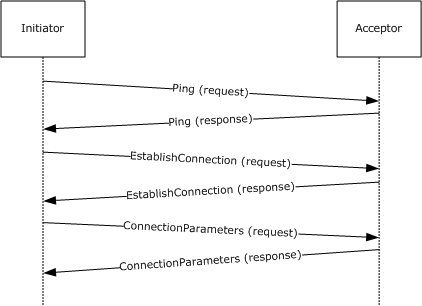

Figure 12: Sequence for session initialization

The [**initiator**](#gt_initiator) MAY<41> begin session initialization by sending a **Ping Request**, as specified in [Ping Message (section 2.1.2)](#Section_2.1.2), on the UDP or SPX transport to the [**acceptor**](#gt_acceptor) to determine whether it is available and can accept a connection. In that case, the acceptor MAY<42> respond with a **Ping Response**, as specified in section 2.1.2, indicating that it is available.

Next, the initiator initiates a protocol session by sending an [EstablishConnection Packet (section 2.2.3)](#Section_2.2.3) to the acceptor. The acceptor accepts the connection and responds with an EstablishConnection Packet. The initiator sends a [ConnectionParameters Packet (section 2.2.2)](#Section_2.2.2) to the acceptor to communicate session parameters such as timeouts and window size. The acceptor confirms the session parameters by responding with a ConnectionParameters Packet response packet.

##### 3.1.1.7.2 Session with Express Messages Sent

The following [**sequence**](#gt_sequence) diagram demonstrates the sending of express [**messages**](#gt_message) between two [**queue managers**](#gt_476f10ed-08f0-4887-b583-59d5cf909979) after a session has been established.

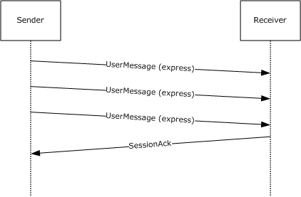

Figure 13: Sequence for express messages

The sender sends three express UserMessage Packets ([MS-MQMQ](#Section_1.3.1) section 2.2.20) to the receiver. The receiver acknowledges receipt of the UserMessage Packets by sending a [SessionAck Packet (section 2.2.6)](#Section_2.2.6) after a delay to allow batching of the session acknowledgments.

After an inactivity time-out, the session is closed by either side by performing the steps listed in section [3.1.5.9](#Section_3.1.5.9). The protocol does not exchange packets as part of session closure.

##### 3.1.1.7.3 Session with Transactional Messages Sent

The following [**sequence**](#gt_sequence) diagram demonstrates the sending of a [**transactional message**](#gt_transactional-message) between two [**queue managers**](#gt_476f10ed-08f0-4887-b583-59d5cf909979) with positive [**source journaling**](#gt_source-journaling) enabled after a session has been established.

Figure 14: Sequence for transactional messages

The sender sends a transactional UserMessage Packet ([MS-MQMQ](#Section_1.3.1) section 2.2.20) to the receiver with positive source journaling enabled. The receiver responds by sending an [OrderAck Packet (section 2.2.4)](#Section_2.2.4). The purpose of the OrderAck Packet is to acknowledge that the transactional message was received in the correct order and was not a duplicate. The sender sends another transactional UserMessage Packet and the receiver acknowledges it with an OrderAck Packet response.

The receiver sends a [SessionAck Packet (section 2.2.6)](#Section_2.2.6) that contains a session acknowledgment of both UserMessage Packets. It is important to note that session acknowledgments and transactional acknowledgments are separate mechanisms that serve different purposes.

The receiver sends a [FinalAck Packet (section 2.2.5)](#Section_2.2.5) to the sender for each of the messages. A FinalAck Packet is sent when the message is consumed from the destination queue by a higher-layer application.

The sender sends a SessionAck Packet that contains a session acknowledgment of both FinalAck Packets.

After an inactivity time-out, the session is closed by either side by performing the steps listed in section [3.1.5.9](#Section_3.1.5.9). The protocol does not exchange packets as part of session closure.

### 3.1.2 Timers

The Message Queuing (MSMQ): Message Queuing Binary Protocol MUST maintain the following timers, described in the following sections:

- [Session Initialization Timer (section 3.1.2.1)](#Section_3.1.1.7.1)
- [Session Cleanup Timer (section 3.1.2.2)](#Section_3.1.2.2)
- [Session Retry Connect Timer (section 3.1.2.3)](#Section_3.1.2.3)
- [Session Ack Wait Timer (section 3.1.2.4)](#Section_3.1.2.4)
- [Session Ack Send Timer (section 3.1.2.5)](#Section_3.1.2.5)
- [Transactional Ack Wait Timer (section 3.1.2.6)](#Section_3.1.2.6)
- [Order Ack Send Timer (section 3.1.2.7)](#Section_3.1.2.7)
- [MessageIDHistory Cleanup Timer (section 3.1.2.8)](#Section_3.1.2.8)
- [Ping Response Timer (section 3.1.2.9)](#Section_3.1.2.9)

#### 3.1.2.1 Session Initialization Timer

This timer regulates the amount of time that both the [**initiator**](#gt_initiator) and the [**acceptor**](#gt_acceptor) wait for each other to respond to session initialization [**messages**](#gt_message). A [**queue manager**](#gt_queue-manager-qm) employs a single instance of this timer. On the initiator, this timer is started after an [EstablishConnection Packet (section 2.2.3)](#Section_2.2.3) message is sent and is stopped after a [ConnectionParameters Packet (section 2.2.2)](#Section_2.2.2) is received. On the acceptor, this timer is started after the EstablishConnection Packet response is sent and is stopped after the ConnectionParameters Packet is received. The duration of this timer MUST be set based on the system configuration, which is implementation-dependent.<43>

#### 3.1.2.2 Session Cleanup Timer

This session-specific timer regulates the amount of time that the protocol waits before closing an idle protocol session. If the value of the **SessionActive** ADM element is FALSE when the timer expires, the session is closed. The **SessionActive** ADM element is set to TRUE when a UserMessage Packet ([MS-MQMQ](#Section_1.3.1) section 2.2.20) is sent or received by the protocol. The duration of this timer MUST be set based on the system configuration, which is implementation-dependent.<44>

#### 3.1.2.3 Session Retry Connect Timer

This session-specific timer regulates the amount of time that the protocol waits until it tries to re-establish a connection to a remote host. The duration of this timer MAY be set based on system configuration, which is implementation-dependent.<45> The protocol MAY implement an adaptive mechanism for reconnection time-outs.

#### 3.1.2.4 Session Ack Wait Timer

This session-specific timer regulates the amount of time that the protocol waits for a session acknowledgment before closing the session. The session is closed if the timer elapses while at least one packet is awaiting acknowledgment, and no packet has been received since the previous timer event. Closing the session will cause the [**queue manager**](#gt_queue-manager-qm) to establish a new session and to retransmit the unacknowledged [**messages**](#gt_message). This timer is started when updating a UserMessage Packet ([MS-MQMQ](#Section_1.3.1) section 2.2.20). See section [3.1.7.1.3](#Section_3.1.7.1.3). The duration of this timer MUST be set to a multiple<46> of the **AckWaitTimeout** ADM element.

#### 3.1.2.5 Session Ack Send Timer

This session-specific timer regulates the amount of time that the protocol waits before sending a session acknowledgment to the remote host. This timer is started when the [**queue manager**](#gt_queue-manager-qm) receives a UserMessage Packet ([MS-MQMQ](#Section_1.3.1) section 2.2.20) while this timer is not running. This timer is restarted when the queue manager processes a recoverable message (section [3.1.5.8.7](#Section_3.1.5.8.7)). Upon expiration of this timer, the protocol triggers a [Session Ack Send Timer Event (section 3.1.6.4)](#Section_3.1.2.5). During the processing of this event, this timer is started if the **UnackedReceivedMsgCount** ADM element does not equal 0x0000.

#### 3.1.2.6 Transactional Ack Wait Timer

This session-specific timer regulates the amount of time that the protocol waits for an [OrderAck Packet](#Section_2.2.4) before resending transactional messages to the receiver. This timer is started after sending a transactional UserMessage Packet ([MS-MQMQ](#Section_1.3.1) section 2.2.20). The duration of this timer MUST be **TxOutgoingSequence.ResendInterval**. When this timer is set, the value of the scheduled time for the next resend, which is the current time plus **TxOutgoingSequence.ResendInterval**, is stored in **TxOutgoingSequence.ResendTime**.

#### 3.1.2.7 Order Ack Send Timer

This session-specific timer regulates the amount of time that the protocol waits before sending an Order acknowledgment to the sender. This timer is started when a UserMessage Packet ([MS-MQMQ](#Section_1.3.1) section 2.2.20) containing a Transaction Header ([MS-MQMQ] section 2.2.20.5) is received. This timer is restarted when additional [**transactional messages**](#gt_transactional-message) are received and the time elapsed since the value of the **LastOrderAckSendTime** ADM element is less than the value of the **MaximumOrderAckDelay** ADM element.

The duration of this timer MUST be set to **OrderAckTimeout**.

#### 3.1.2.8 MessageIDHistory Cleanup Timer

This timer regulates the amount of time that the protocol waits before removing expired entries from the **MessageIDHistoryTable** ADM element. This timer is set during [Global Initialization (section 3.1.3.1)](#Section_3.1.3.1) when the **MessageIDHistoryTable** ADM element is nonempty, when a new **MessageIDHistoryEntry** ADM element instance is added to a previously empty **MessageIDHistoryTable** ADM element, or when this timer expires and the **MessageIDHistoryTable** ADM element is nonempty even after stale entries have been deleted, as specified in section [3.1.6.7](#Section_3.1.6.7). The duration of this timer MUST be set based on the system configuration, which is implementation-dependent.<47>

#### 3.1.2.9 Ping Response Timer

Instances of this timer regulate the amount of time that the protocol waits for a **Ping Response**, as defined in [Ping Message (section 2.1.2)](#Section_2.1.2), to arrive after sending a **Ping Request**, as specified in Ping Message (section 2.1.2). A new instance of this timer is started when a [Send Ping Request (section 3.1.7.6)](#Section_3.1.7.6) event occurs. The duration of the timer is always one second.

#### 3.1.2.10 ReceiveSymmetricKeyCache Cleanup Timer

This timer regulates the amount of time that the protocol waits before removing expired entries from the **ReceiveSymmetricKeyCache** ADM element. This timer is set either when a [CachedSymmetricKey (section 3.1.1.3.3)](#Section_3.1.1.3.3) ADM element instance is added to the **ReceiveSymmetricKeyCache** ADM element, as specified in section [3.1.5.8.3](#Section_3.1.5.8.3), or when the [ReceiveSymmetricKeyCache Cleanup Timer Event (section 3.1.6.10)](#Section_3.1.6.10) is processed.

#### 3.1.2.11 SendSymmetricKeyCache Cleanup Timer

This timer regulates the amount of time that the protocol waits before removing expired entries from the **SendSymmetricKeyCache** ADM element. This timer is set either when a [CachedSymmetricKey (section 3.1.1.3.3)](#Section_3.1.1.3.3) ADM element instance is added to the **SendSymmetricKeyCache** ADM element, as specified in section [3.1.7.1.5](#Section_3.1.7.1.5.2), or by the [SendSymmetricKeyCache Cleanup Timer Event (section 3.1.6.11)](#Section_3.1.6.11).

#### 3.1.2.12 SendBaseSymmetricKeyCache Cleanup Timer

This timer regulates the amount of time that the protocol waits before removing expired entries from the **SendBaseSymmetricKeyCache** ADM element. This timer is set either when a [CachedSymmetricKey (section 3.1.1.3.3)](#Section_3.1.1.3.3) ADM element instance is added to the **SendBaseSymmetricKeyCache** ADM element, as specified in section [3.1.7.1.5](#Section_3.1.7.1.5.2), or when the [SendBaseSymmetricKeyCache Cleanup Timer Event (section 3.1.6.12)](#Section_3.1.6.12) is processed.

#### 3.1.2.13 UserCertCache Cleanup Timer

This timer regulates the amount of time that the protocol waits before removing expired [CachedUserCert (section 3.1.1.3.4)](#Section_3.1.1.3.4) ADM element instances from the **UserCertCache** ADM element. This timer is set either when a **CachedUserCert** ADM element instance is added to the **UserCertCache** ADM element, as specified in section [3.1.5.8.3](#Section_3.1.5.8.3), or when the [UserCertCache Cleanup Timer Event (section 3.1.6.13)](#Section_3.1.6.13) is processed.

### 3.1.3 Initialization

#### 3.1.3.1 Global Initialization

The processing rules described in this section are executed when the queue manager starts.

The **ResendTimerTable** ADM element MUST be populated sequentially with the following values:

- The first three entries are set to the **ResendTimeoutsShort** ADM element.
- The next three entries are set to the **ResendTimeoutsMedium** ADM element.
- The next three entries are set to the **ResendTimeoutsLong** ADM element.
- The last entry is set to the **ResendTimeoutsFinal** ADM element.
The [MessageIDHistory Cleanup Timer (section 3.1.2.8)](#Section_3.1.2.8) MUST be stopped.

If the **MessageIDHistoryTable** ADM element is not empty, the MessageIDHistory Cleanup Timer MUST be started.

The **UserCertCache** ADM element MUST be initialized to be empty. The **UserCertCacheSize** ADM element SHOULD be set to 53.

The **UserCertLifetime** ADM element SHOULD be set to 1,200,000 milliseconds (20 minutes).

The **ReceiveSymmetricKeyCache** ADM element MUST be initialized to be empty. The **ReceiveBaseSymmetricKeyCache** ADM element MUST be initialized to be empty. The **ReceiveSymmetricKeyCacheSize** ADM element SHOULD be set to 127.

The **SendSymmetricKeyCache** ADM element MUST be initialized to be empty. The **SendBaseSymmetricKeyCache** ADM element MUST be initialized to be empty. The **SendSymmetricKeyCacheSize** ADM element SHOULD be set to 53.

The **SymmetricKeyShortLifetime** ADM element SHOULD be set to 600,000 milliseconds (10 minutes). The **SymmetricKeyLongLifetime** ADM element SHOULD be set to 43,200,000 milliseconds (12 hours).

The **PreferredAdvancedAlgorithm** ADM element SHOULD be set to 0x00006610, indicating the AES 256 algorithm as specified in [[FIPS197]](https://go.microsoft.com/fwlink/?LinkId=89870). The **PreferredEnhancedAlgorithm** ADM element SHOULD be set to 0x00006801, indicating the RC4 algorithm as specified in [[RFC4757]](https://go.microsoft.com/fwlink/?LinkId=90488). The **PreferredBaseAlgorithm** ADM element SHOULD be set to 0x00006801, indicating the RC4 algorithm.

The **SendEnhancedRC2Using40BitKeys** ADM element SHOULD be set to FALSE.<48>

The **RejectEnhancedRC2Using40BitKeys** ADM element SHOULD<49> be set to FALSE.

#### 3.1.3.2 Session Initialization

The following values MUST be initialized for each session:

- The value of the **MessageSentCount** ADM element MUST be set to 0x0000.
- The value of the **RecoverableMessageSentCount** ADM element MUST be set to 0x0000.
- The value of the **MessageReceivedCount** ADM element MUST be set to 0x0000.
- The value of the **RecoverableMessageReceivedCount** ADM element MUST be set to 0x0000.
- The value of the **RecoverableMsgAckFlags** ADM element MUST be set to 0x00000000.
- The value of the **LastAckedRecoverableMsgSeqNumber** ADM element MUST be set to 0x0000.
- The value of the **UnackedReceivedMsgCount** ADM element MUST be set to 0x0000.
- The [Session Ack Wait Timer (section 3.1.2.4)](#Section_3.1.2.4) MUST be stopped.
- The [Session Ack Send Timer (section 3.1.2.5)](#Section_3.1.2.5) MUST be stopped.
- The [Transactional Ack Wait Timer (section 3.1.2.6)](#Section_3.1.2.6) MUST be stopped.
- The [Order Ack Send Timer (section 3.1.2.7)](#Section_3.1.2.7) MUST be stopped.
- The [Session Cleanup Timer (section 3.1.2.2)](#Section_3.1.2.2) MUST be started.
- If the **OutgoingMessageTable** ADM element is not empty, the [Session Retry Connect Timer (section 3.1.2.3)](#Section_3.1.2.3) MUST be started.
- The **TxOutgoingSequence** ADM element MUST be set to a new instance of the **OutgoingTransferSequence** ADM element and initialized as follows:
- **LastAck.SeqNo** MUST be set to 0x00000000.
- The **TimeOfLastAck** ADM attribute MUST be set to the local system time.
- The **LastAckCount** ADM attribute MUST be set to zero.
- The **ResendIntervalIndex** ADM attribute MUST be set to the index of the first entry in the **ResendTimerTable** ADM element.
- The **ResendInterval** ADM attribute MUST be set to the value of the first entry in the **ResendTimerTable** ADM element.
- The **ResendTime** ADM attribute MUST be set to zero.
- The **AwaitingAck**, **ReceivedSessionAck**, **ReceivedOrderAck**, and **Transmitted** ADM attributes of each [OutgoingMessagePosition (section 3.1.1.3.1.2)](#Section_3.1.1.3.1.2) ADM element instance entry in the **OutgoingMessageTable** ADM element MUST be set to FALSE.
- The value of the **UnAckedMessageCount** ADM element MUST be set to the count of **OutgoingMessagePosition** ADM element instances with **ReceivedSessionAck** ADM attributes equal to FALSE in the **OutgoingMessageTable** ADM element.
- The value of the **WindowSize** ADM element SHOULD<50> be set to 64.
- The value of the **SessionActive** ADM element MUST be set to FALSE.
- The value of the **ReceivedAck** ADM element MUST be set to FALSE.
- The value of the **AckWaitTimeout** ADM element MUST be set based on the system configuration, which is implementation-dependent.<51>
- The **OrderAckTimeout** ADM element MUST be set to a value of 500 milliseconds.
- The **DirectFormatSession** ADM element MUST be set to FALSE.
- The value of the **MaximumOrderAckDelay** ADM element SHOULD<52> be set to 10 seconds.
- The value of the **LastOrderAckSendTime** ADM element MUST be set to the current system time, the number of seconds elapsed since midnight (00:00:00), January 1, 1970 (UTC) according to the system clock.
- The value of the **RecoverableAckSendTimeout** ADM element MUST be set to 0xFFFFFFFF.
- The **RemoteQMPublicKey** ADM element MUST be filled with zeroes (0x00) to indicate that it is not initialized.
- The value of **QueueManager.Identifier** MUST be globally unique and set based on system configuration, which is implementation-dependent.<53>
- The value of the **PingCookie** ADM element SHOULD<54> be set to 0x00000000.
- The value of the **SessionState** ADM element MUST be set to **WAITING_EC_MSG**.

### 3.1.4 Higher-Layer Triggered Events

In addition to the local events listed in section [3.1.7](#Section_3.1.7), the operation of the Message Queuing (MSMQ): Message Queuing Binary Protocol is initiated and subsequently driven by the following higher-layer triggered events:

- Queue Manager Started ([MS-MQDMPR](#Section_1.3.1) section 3.1.4.1).
- Queue Manager Stopped ([MS-MQDMPR] section 3.1.4.2).

#### 3.1.4.1 Queue Manager Started Event

The [**queue manager**](#gt_queue-manager-qm) service on startup MUST perform protocol initialization as specified in section [3.1.3](#Section_3.1.3). For each session, if the **OutgoingMessageTable** ADM element is not empty, the protocol MUST establish a connection to the remote queue manager. Protocol session establishment is specified in [Establish a Protocol Session (section 3.1.5.2)](#Section_3.1.5.2).

#### 3.1.4.2 Queue Manager Stopped Event

When the [**queue manager**](#gt_queue-manager-qm) service is stopped, the protocol MUST be closed as specified in [Closing a Session (section 3.1.5.9)](#Section_3.1.5.9).

### 3.1.5 Processing Events and Sequencing Rules

#### 3.1.5.1 Receiving Any Packet

The **ReceivedAck** session state ADM element MUST be set to TRUE on receipt of any packet. Unless specifically noted in a subsequent section, the following actions MUST be applied to any session [**message**](#gt_message) received:

- [Identifying Packet Type (section 3.1.5.1.1)](#Section_3.1.5.1.1)
- [Verifying the Signature (section 3.1.5.1.2)](#Section_3.1.5.1.2)
- [Handling Incorrectly Formatted Messages (section 3.1.5.1.3)](#Section_3.1.5.1.3)

##### 3.1.5.1.1 Identifying Packet Type

A packet is identified by inspecting the BaseHeader ([MS-MQMQ](#Section_1.3.1) section 2.2.19.1) and possibly subsequent packet headers. The following list describes how to identify each packet type.

[EstablishConnection Packet (section 2.2.3)](#Section_2.2.3)**:** The **BaseHeader.Flags.IN** field MUST be set, and the **InternalHeader.Flags.PT** field MUST be set to 0x2.

[ConnectionParameters Packet (section 2.2.2)](#Section_2.2.2)**:** The **BaseHeader.Flags.IN** field MUST be set, and the **InternalHeader.Flags.PT** field MUST be set to 0x3.

[SessionAck Packet (section 2.2.6)](#Section_2.2.6)**:** The **BaseHeader.Flags.IN** and **BaseHeader.Flags.SH** fields MUST be set, and the **InternalHeader.Flags.PT** field MUST be set to 0x1.

[OrderAck Packet (section 2.2.4)](#Section_2.2.4)**:** All bits in the **BaseHeader.Flags** field MUST be set to 0. The **UserMessage.UserHeader.DestinationQueue** field MUST address the message to the local [**private queue**](#gt_private-queue) named "order_queue$". The **UserMessage.MessagePropertiesHeader.Label** field MUST be set to "QM Ordering Ack". The **UserMessage.MessagePropertiesHeader.MessageSize** field MUST be set to 0x00000024. The **UserMessage.MessagePropertiesHeader.MessageClass** field MUST be set to MQMSG_CLASS_ORDER_ACK.

[FinalAck Packet (section 2.2.5)](#Section_2.2.5)**:** All bits in the **BaseHeader.Flags** field MUST be set to 0. The **UserMessage.UserHeader.DestinationQueue** field MUST address the local private queue named "order_queue$". The **UserMessage.MessagePropertiesHeader.Label** field MUST be set to "QM Ordering Ack". The **UserMessage.MessagePropertiesHeader.MessageClass** field MUST be set to one of the values that is not less than 0x4000, as specified in [MS-MQMQ] section 2.2.18.1.6.

UserMessage Packet ([MS-MQMQ] section2.2.20)**:** The **BaseHeader.Flags.IN** bit field MUST be set to 0, and the **UserMessage.MessagePropertiesHeader.MessageClass** field MUST be set to MQMSG_CLASS_NORMAL.

[Ping Messages (section 2.1.2)](#Section_2.1.2) are generated and handled separately from other packets and are sent to different ports from other packets, as described in section 2.1.2. Only [Ping Packets (section 2.2.7)](#Section_2.2.7) can be received on these ports.

##### 3.1.5.1.2 Verifying the Signature

A packet signature is validated by evaluating the **BaseHeader.VersionNumber** and **BaseHeader.Signature** fields. A packet is valid when the **BaseHeader.VersionNumber** field is set to 0x10 and the **BaseHeader.Signature** field is set to 0x524F494C ([**big-endian**](#gt_big-endian) order). Any other value indicates an invalid packet.

If signature validation fails, the protocol MUST discard the received packet, perform no further processing for it, and then close the session as specified in [Closing a Session (section 3.1.5.9)](#Section_3.1.5.9). If signature verification succeeds, the protocol continues processing on the packet as specified in subsequent sections.

##### 3.1.5.1.3 Handling Incorrectly Formatted Messages

If the protocol receives a request that does not conform to the structures specified in [Messages (section 2)](#Section_2), the protocol MUST discard the received packet, perform no further processing for it, and then close the session as specified in [Closing a Session (section 3.1.5.9)](#Section_3.1.5.9).

#### 3.1.5.2 Establish a Protocol Session

The [**queue manager**](#gt_queue-manager-qm) establishes a session to a remote queue manager to transfer [**messages**](#gt_message). This action could be the result of the queue manager receiving a message from a higher-layer application or of the queue manager retrying a connection to a remote queue manager, or of a session with outgoing messages during the queue manager startup.

Establishing a session to a remote queue manager consists of the following [**sequence**](#gt_sequence) of operations:

- [Resolve Host Address (section 3.1.5.2.1)](#Section_3.1.5.2.1)
- [Ping Mechanism (section 3.1.5.2.2)](#Section_3.1.5.2.2)
- [Sending an EstablishConnection Request Packet (section 3.1.5.2.3)](#Section_3.1.5.2.3)
If the session cannot be established with the remote queue manager due to an error in these steps, the protocol MUST append an entry to the **OutgoingQueueReference.ConnectionHistory** array. The **Status** ADM attribute of the array entry MUST be set to the value specified in [MS-MQDMPR](#Section_1.3.1) section 3.1.1.3 that describes the error. If no appropriate value can be used, the **Status** ADM attribute of the array entry MUST be set to **UnknownFailure**. The **ConnectionHistoryTime** ADM attribute of the array entry MUST be set to the current time; the **Error** ADM attribute of the array entry MUST be set to an HRESULT value indicating the error; and the **AddressList** ADM attribute of the array entry MUST be set to the **RemoteQMAddress** ADM element.

##### 3.1.5.2.1 Resolve Host Address

The [**queue manager**](#gt_queue-manager-qm) MUST provide a [**queue**](#gt_queue) [**format name**](#gt_format-name) that specifies the destination queue manager and queue.

The protocol MUST find the **OutgoingQueue** ([MS-MQDMPR](#Section_1.3.1)section 3.1.1.3) ADM element instance in the local **QueueManager.QueueCollection** with a **DestinationFormatName** equal to the provided queue format name.

The protocol MUST set the **OutgoingQueueReference** ADM element to the found **OutgoingQueue** ADM element instance.

The protocol MUST declare the **destinationHostName** and **destinationQmGuid** variables.

The protocol MUST obtain the value of **destinationHostName** and **destinationQmGuid** by performing the following steps:

- The protocol MUST raise a [Get Destination Info (section 3.1.7.4)](#Section_3.1.7.4) event with the following argument:
- *iFormatName*: The provided queue format name
- If the value in *rStatus* does not equal TRUE, the protocol MUST perform the following steps:
- If the **OutgoingMessageTable** ADM element is not empty and the **OutgoingQueueReference.State** is not **OnHold**:
- Start the [Session Retry Connect Timer (section 3.1.2.3)](#Section_3.1.2.3).
- Set the **OutgoingQueueReference.State** to NeedValidation.
- Take no further action.
- Set **destinationHostName** equal to the returned *rHostName*.
- Set **destinationQmGuid** equal to the returned *rQueueManagerGuid*.
If **destinationQmGuid** is not equal to all zero bytes, the protocol MUST obtain the host name and the [**GUID**](#gt_globally-unique-identifier-guid) of the **QueueManager** ADM element instance at the next hop to the destination by performing the following steps:

- The protocol MUST raise a [Get Next Hops (section 3.1.7.5)](#Section_3.1.7.5) event with the following argument:
- *iQmGuid*: **destinationQmGuid**
- If the value in *rStatus* does not equal TRUE, the protocol MUST perform the following steps:
- If the **OutgoingMessageTable** ADM element is not empty and the **OutgoingQueueReference.State** is not **OnHold**:
- Start the Session Retry Connect Timer (section 3.1.2.3).
- Set the **OutgoingQueueReference.State** to NeedValidation.
- Take no further action.
- Clear the **OutgoingQueueReference.NextHops** collection.
- For each **QueueManager** ADM element instance, referred to as *rQueueManager*, in the returned *rQueueManager*'s collection, perform the following:
- Resolve **destinationHostName** to addresses, referred to as *destinationAddresses*, which are usable by the transports specified in section [2.1](#Section_2.1).<55>
- For each successfully resolved *destinationAddress* in *destinationAddresses*, perform the following:
- Format the *destinationAddress*, as specified in [MS-MQMQ](#Section_1.3.1) section 2.3.12.12, and add it to the **OutgoingQueueReference.NextHops** collection.
- Create a [NextHop (section 3.1.1.3.1.3)](#Section_3.1.1.3.1.3) ADM element instance and perform the following:
- Set **NextHop.HostName** to *rQueueManager*.**QualifiedComputerName**.
- Set **NextHop.QMGuid** to *rQueueManager*.**Identifier**.
- Set **NextHop.Address** to *destinationAddress*.
- Add the **NextHop** ADM element instance to the **NextHopCollection** ADM element.
- Set the **NextHopIndexer** ADM element to the first element in the **NextHopCollection** ADM element.
- Get the reference to the **NextHop** ADM element instance referenced by the **NextHopIndexer** ADM element in the **NextHopCollection** ADM element and perform the following:
- Set the **RemoteQMAddress** ADM element to **NextHop.Address**.
- Set the **RemoteQMHostName** ADM element to **NextHop.HostName**.
- Set the **RemoteQMGuid** ADM element to **NextHop.QMGuid**.

##### 3.1.5.2.2 Ping Mechanism

If the session is not being created in response to a [Session Retry Connect Timer Event (section 3.1.6.1)](#Section_3.1.2.3), the [**initiator**](#gt_initiator) MAY send a **Ping Request**, as specified in [Ping Message (section 2.1.2)](#Section_2.1.2) to the [**acceptor**](#gt_acceptor) and receive a **Ping Response**, as specified in Ping Message (section 2.1.2), before attempting to establish a session.<56>This mechanism provides the initiator with information about whether a connection is likely to be accepted. The result in the **Ping Response** is not a guarantee, because the acceptor state could change before it receives the [EstablishConnection Packet (section 2.2.3)](#Section_2.2.3) from the initiator. If the initiator sends a **Ping Request**, it MUST do the following:

- Raise a [Send Ping Request (section 3.1.7.6)](#Section_3.1.7.6) event with the following argument:
- *iAddress*: the address resolved in **destinationHostName** as specified in [Resolve Host Address (section 3.1.5.2.1)](#Section_3.1.5.2.1).
- If the value of *rStatus* returned by the Send Ping Request event is TRUE, proceed to [Sending an EstablishConnection Request Packet (section 3.1.5.2.3)](#Section_3.1.5.2.3).
- If the value of *rStatus* returned by the Send Ping Request event is FALSE:
- Append an entry to the **OutgoingQueueReference.ConnectionHistory** array. The **Status** ADM attribute of the array entry MUST be set to **PingFailure**; the **ConnectionHistoryTime** ADM attribute of the array entry MUST be set to the current time; the **Error** ADM attribute of the array entry MUST be set to an HRESULT value indicating the error; and the **AddressList** ADM attribute of the array entry MUST be set to the **RemoteQMAddress** ADM element.
- Start the [Session Retry Connect Timer (section 3.1.2.3)](#Section_3.1.2.3) if the **OutgoingMessageTable** ADM element is not empty, and take no further action.

##### 3.1.5.2.3 Sending an EstablishConnection Request Packet

If the [Session Initialization Timer (section 3.1.2.1)](#Section_3.1.1.7.1) is running, the protocol MUST stop the timer before sending an [EstablishConnection Packet (section 2.2.3)](#Section_2.2.3).

The EstablishConnection Packet MUST be sent to the [**acceptor**](#gt_acceptor) by using the transport settings specified in [Protocol Session (section 2.1.1)](#Section_2.1.1). The following fields MUST be set in the EstablishConnection Packet:

- **BaseHeader.Flags.IN** MUST be set.
- **InternalHeader.Flags.PT** field MUST be set to 0x2.
- **InternalHeader.Flags.CS** MUST be set to 0.
- **EstablishConnectionHeader.ClientGuid** MUST be set to **QueueManager.Identifier**.
- **EstablishConnectionHeader.ServerGuid** MUST be set to **RemoteQMGuid** if a [**direct format name**](#gt_direct-format-name) was not used. **EstablishConnectionHeader.ServerGuid** MUST be zero-filled if a direct format name was used.
- **EstablishConnectionHeader.TimeStamp** MUST be set to the time, in milliseconds, since the operating system was started.
- **EstablishConnectionHeader.OperatingSystem.SE** MUST be set to 0 if a Ping Request (section [2.1.2](#Section_2.1.2)) was sent, as described in section [3.1.5.2.2](#Section_3.1.5.2.2); otherwise, it MUST be set to 1.
- The remaining fields of **EstablishConnectionHeader** MUST be initialized as specified in section [2.2.3.1](#Section_2.2.3.1).
The **SessionState** value MUST be set to WAITING_ECR_MSG. An entry MUST be appended to the **OutgoingQueueReference.ConnectionHistory** array; the **Status** ADM attribute of the array entry MUST be set to **InProcess**; the **ConnectionHistoryTime** ADM attribute of the array entry MUST be set to the current time; the **Error** ADM attribute of the array entry MUST be set to zero; and the **AddressList** ADM attribute of the array entry MUST be set to the **RemoteQMAddress** ADM element.

After the EstablishConnection Packet is sent, the protocol MUST start the Session Initialization Timer.

See [Receiving an EstablishConnection Packet (section 3.1.5.3)](#Section_3.1.5.3) for the next step in session initialization.

If the **OutgoingQueueReference.State** is not **OnHold**, **OutgoingQueueReference.State** MUST be set to **Waiting**.

#### 3.1.5.3 Receiving an EstablishConnection Packet

If the **SessionState** ADM element is not set to WAITING_EC_MSG or WAITING_ECR_MSG, the protocol MUST close the session as specified in [Closing a Session (section 3.1.5.9)](#Section_3.1.5.9).

An [EstablishConnection Packet (section 2.2.3)](#Section_2.2.3) is a connection request from the [**initiator**](#gt_initiator) or a response to an EstablishConnection Packet sent from this protocol, as specified in [Sending an EstablishConnection Request Packet (section 3.1.5.2.3)](#Section_3.1.5.2.3).

##### 3.1.5.3.1 Request Packet

The packet is processed as a connection request if **SessionState** is WAITING_EC_MSG.

The value of **RemoteQMGuid** MUST be set to **EstablishConnectionHeader.ClientGuid**.

If the **EstablishConnectionHeader.Flags.SE** field is set to 1, the protocol MAY<57> attempt to determine whether allowing this new connection would exceed an implementation-specific limit on the number of open connections. If the connection is rejected, the protocol closes the session as described in section [3.1.5.9](#Section_3.1.5.9).

The protocol MUST reply to a connection request by sending an [EstablishConnection Packet](#Section_2.2.3) response with the following values:

- The **BaseHeader.Flags.IN** bit field MUST be set.
- The **InternalHeader.Flags.PT** field MUST be set to 0x2.
- The packet is valid if the **EstablishConnectionHeader.ServerGuid** field is equal to **QueueManager.Identifier** or the **EstablishConnectionHeader.ServerGuid** field is GUID_NULL ({00000000-0000-0000-0000-000000000000}). If the packet is valid, the **InternalHeader.Flags.CS** bit field MUST be set to 0. If the packet is invalid, the **InternalHeader.Flags.CS** bit field MUST be set to 1.
- The **EstablishConnectionHeader.ClientGuid** field MUST be set to the **EstablishConnectionHeader.ClientGuid** field value in the original packet.
- The **EstablishConnectionHeader.ServerGuid** field MUST be set to **QueueManager.Identifier**.
- The **EstablishConnectionHeader.TimeStamp** field MUST be set to the **EstablishConnectionHeader.TimeStamp** field value in the original packet.
- The **EstablishConnectionHeader.OperatingSystem.SE** field MUST be set to the value of this field in the request packet.
- The remaining fields of the **EstablishConnectionHeader** MUST be initialized as specified in section [2.2.3.1](#Section_2.2.3.1).
The **SessionState** ADM element value MUST be set to WAITING_CP_MSG.

##### 3.1.5.3.2 Response Packet

The packet is processed as a connection response if **SessionState** is WAITING_ECR_MSG.

The packet is valid if **EstablishConnectionHeader.ClientGuid** is equal to **QueueManager.Identifier** and **EstablishConnectionHeader.ServerGUID** is equal to **RemoteQMGuid** and **InternalHeader.Flags.CS** is set to 0. If the packet is invalid, the protocol MUST discard the packet and close the session as specified in [Closing a Session (section 3.1.5.9)](#Section_3.1.5.9).

The protocol MUST set the **RecoverableAckSendTimeout** ADM element as follows:

- Get the current system time, in milliseconds, since the operating system was started.
- Calculate the round-trip time of the [EstablishConnection Packet (section 2.2.3)](#Section_2.2.3) by subtracting the **EstablishConnectionHeader.TimeStamp** field value from the current time.
- Set the **RecoverableAckSendTimeout** ADM element to the round-trip time multiplied by 8. If the **RecoverableAckSendTimeout** ADM element is out of the range of 0x000001F4 to 0x0001D4C0, inclusive, set it to the closest limit.
The protocol MUST reply to a connection response by sending a [ConnectionParameters Packet](#Section_2.2.2) with the following field values:

- The **BaseHeader.Flags.IN** field MUST be set.
- The **InternalHeader.Flags.PT** field MUST be set to 0x3.
- The **InternalHeader.Flags.CS** field MUST be set to 0.
- The **ConnectionParametersHeader.RecoverableAckTimeout** field MUST be set to the **RecoverableAckSendTimeout** ADM element.
- The **ConnectionParametersHeader.AckTimeout** field MUST be set to the **AckWaitTimeout** ADM element.
- The **ConnectionParametersHeader.WindowSize** field MUST be set to the **WindowSize** ADM element.
The **SessionState** ADM element value MUST be set to WAITING_CPR_MSG. An entry MUST be appended to the **OutgoingQueueReference.ConnectionHistory** array; the **Status** ADM attribute of the array entry MUST be set to **EstablishPacketReceived**; the **ConnectionHistoryTime** ADM attribute of the array entry MUST be set to the current time; the **Error** ADM attribute of the array entry MUST be set to zero; and the **AddressList** ADM attribute of the array entry MUST be set to the **RemoteQMAddress** ADM element.

See [Receiving a ConnectionParameters Packet (section 3.1.5.4)](#Section_3.1.5.4) for the next step in session initialization.

#### 3.1.5.4 Receiving a ConnectionParameters Packet

If **SessionState** is not set to WAITING_CP_MSG or WAITING_CPR_MSG, the protocol MUST close the session as specified in [Closing a Session (section 3.1.5.9)](#Section_3.1.5.9).

A [ConnectionParameters Packet (section 2.2.2)](#Section_2.2.2) is either a request from an initiator to an acceptor or a response from an acceptor to an initiator for a ConnectionParameters Packet received during protocol session initialization.

##### 3.1.5.4.1 Request Packet

The packet is processed as a request if the **SessionState** ADM element is WAITING_CP_MSG.

- The **ReceivedWindowSize** ADM element MUST be set to the **ConnectionParametersHeader.WindowSize** field value.
- The **AckWaitTimeout** ADM element MUST be set to the **ConnectionParametersHeader.AckTimeout** field value.
- The duration of the [Session Ack Wait Timer](#Section_3.1.2.4) MUST be set as specified in section 3.1.2.4.
- The **RecoverableAckSendTimeout** ADM element MUST be set to the **ConnectionParametersHeader.RecoverableAckTimeout** field value.
The protocol MUST reply to a connection request by sending a [ConnectionParameters Packet](#Section_2.2.2) response with the following values:

- The **BaseHeader.Flags.IN** bit field MUST be set.
- The **InternalHeader.Flags.PT** field MUST be set to 0x3.
- The **InternalHeader.Flags.CS** bit field MUST be set to 0.
- The **ConnectionParametersHeader.RecoverableAckTimeout** field MUST be set to the value of the **ConnectionParametersHeader.RecoverableAckTimeout** field in the received packet.
- The **ConnectionParametersHeader.AckTimeout** field MUST be set to the value of the **ConnectionParametersHeader.AckTimeout** field in the received packet.
- The **ConnectionParametersHeader.WindowSize** field MUST be set to the value of the **WindowSize** ADM element.
The [Session Initialization Timer](#Section_3.1.1.7.1) MUST be stopped. The value of the **SessionState** ADM element MUST be set to OPEN. The session is now initialized and is ready to send or receive UserMessage Packets ([MS-MQMQ](#Section_1.3.1) section 2.2.20).

##### 3.1.5.4.2 Response Packet

The packet is processed as a response if the value of the **SessionState** ADM element is WAITING_CPR_MSG.

The **ReceivedWindowSize** ADM element MUST be set to the value of the **ConnectionParametersHeader.WindowSize** field. The protocol MUST perform the following:

- Clear the **OutgoingQueueReference.NextHops** collection.
- Get the [NextHop (section 3.1.1.3.1.3)](#Section_3.1.1.3.1.3) ADM element instance of the **NextHopCollection** ADM element, referred to as *iNextHop* and referenced by the **NextHopIterator**.
- Format *iNextHop*.**Address**, as specified in [MS-MQMQ](#Section_1.3.1) section 2.3.12.12, and add it to the **OutgoingQueueReference.NextHops** collection.
The [Session Initialization Timer (section 3.1.2.1)](#Section_3.1.1.7.1) MUST be stopped. The value of the **SessionState** ADM element MUST be set to OPEN. An element MUST be appended to the **OutgoingQueueReference.ConnectionHistory** array; the **Status** ADM attribute of the array element MUST be set to **Established**; the **ConnectionHistoryTime** ADM attribute of the array element MUST be set to the current time; the **Error** ADM attribute of the array element MUST be set to zero; and the **AddressList** ADM attribute of the array element MUST be set to the **RemoteQMAddress** ADM element. The session is now initialized and is ready to send or receive **UserMessage Packet**s ([MS-MQMQ] section 2.2.20).

If the **OutgoingQueueReference.State** is not **OnHold**, the **OutgoingQueueReference.State** MUST be set to **Connected**.

#### 3.1.5.5 Receiving a SessionAck Packet

If the **SessionState** ADM element is not set to the value OPEN, the protocol MUST close the session as specified in [Closing a Session (section 3.1.5.9)](#Section_3.1.5.9).

A SessionHeader ([MS-MQMQ](#Section_1.3.1) section 2.2.20.4) contains a session acknowledgment that acknowledges express and recoverable messages. A SessionHeader can appear in a [SessionAck Packet](#Section_2.2.6) or can be piggy-backed onto a UserMessage Packet ([MS-MQMQ] section 2.2.20). A SessionHeader is present in the packet when the **Flags.SH** bit field of the BaseHeader ([MS-MQMQ] section 2.2.19.1) is set.

The protocol MUST perform the following steps to process a SessionHeader:

- [Mark Acknowledged Messages](#Section_3.1.5.5.1)
- [Delete Acknowledged Express Messages](#Section_3.1.5.5.2)
- [Delete Acknowledged Recoverable Messages](#Section_3.1.5.5.3)
- [Source Journaling](#Section_1.3.4)
- [Validate Message Counts](#Section_3.1.5.5.5)

##### 3.1.5.5.1 Mark Acknowledged Messages

The protocol MUST set the **ReceivedSessionAck** ADM attribute to TRUE for each [OutgoingMessagePosition (section 3.1.1.3.1.2)](#Section_3.1.1.3.1.2) ADM element instance *rOutgoingMessagePosition* in the **OutgoingMessageTable** ADM element where *rOutgoingMessagePosition*.**SequenceNumber** is less than or equal to the **SessionHeader.AckSequenceNumber** field.

The **UnAckedMessageCount** ADM element MUST be decremented by the number of **OutgoingMessagePosition** ADM element instances with **ReceivedSessionAck** ADM attributes that were set to TRUE by the preceding operation.

For each **OutgoingMessagePosition** ADM element instance *sOutgoingMessagePosition* in the **OutgoingMessageTable** ADM element where *sOutgoingMessagePosition*.**ReceivedSessionAck** is FALSE, the Add Message To Dispatch Collection ([MS-MQDMPR](#Section_1.3.1) section 3.1.7.1.28) event MUST be raised with the following arguments.

- *iPosition* := A reference to *sOutgoingMessagePosition*.**MessagePosition**.
- *iData* := A reference to *sOutgoingMessagePosition*.
The order in which each **OutgoingMessagePosition** ADM element instance *sOutgoingMessagePosition* is passed to the Add Message To Dispatch Collection event MUST match the order in which the instance is listed in the **OutgoingMessageTable** ADM element.

##### 3.1.5.5.2 Delete Acknowledged Express Messages

The protocol MUST delete each [OutgoingMessagePosition (section 3.1.1.3.1.2)](#Section_3.1.1.3.1.2) ADM element instance *rOutgoingMessagePosition* from the **OutgoingMessageTable** ADM element where *rOutgoingMessagePosition*.**SequenceNumber** is less than or equal to the **SessionHeader.AckSequenceNumber** field and *rOutgoingMessagePosition*.**RecoverableSequenceNumber** is set to 0x0000.

##### 3.1.5.5.3 Delete Acknowledged Recoverable Messages

The protocol MUST delete each [OutgoingMessagePosition (section 3.1.1.3.1.2)](#Section_3.1.1.3.1.2) ADM element instance *rOutgoingMessagePosition* from the **OutgoingMessageTable** ADM element where *rOutgoingMessagePosition*.**RecoverableSequenceNumber** is less than or equal to the **SessionHeader.RecoverableMsgAckSeqNumber** field and *rOutgoingMessagePosition*.**TxSequenceNumber** is set to 0x00000000.

The protocol MUST delete each **OutgoingMessagePosition** ADM element instance *sOutgoingMessagePosition* from the **OutgoingMessageTable** ADM element where *sOutgoingMessagePosition*.**RecoverableSequenceNumber** is represented in the **SessionHeader.RecoverableMsgAckFlags** field with a bit set to 1 and *sOutgoingMessagePosition*.TxSequenceNumber is set to 0x00000000. Details of the **SessionHeader.RecoverableMsgAckFlags** field bit representation are specified in [MS-MQMQ](#Section_1.3.1) section 2.2.20.4.

The protocol MUST delete each **OutgoingMessagePosition** ADM element instance *tOutgoingMessagePosition* from the **OutgoingMessageTable** ADM element where *tOutgoingMessagePosition*.**RecoverableSequenceNumber** is represented in the **SessionHeader.RecoverableMsgAckFlags** field with a bit set to 1 and where *tOutgoingMessagePosition*.**ReceivedOrderAck** is TRUE. Details of the **SessionHeader.RecoverableMsgAckFlags** field bit representation are specified in [MS-MQMQ] section 2.2.20.4.

##### 3.1.5.5.4 Source Journaling

An acknowledged message that is deleted from the **OutgoingMessageTable** ADM element and that has the **UserMessage.UserHeader.Flags.JP** field set MUST be logged locally by generating a Move Message ([MS-MQDMPR](#Section_1.3.1) section 3.1.7.1.16) event with the following arguments:

- *iMessagePos*: A **MessagePosition** ([MS-MQDMPR] section 3.1.1.11) ADM element instance referenced by the **MessagePosition** ADM attribute of the [OutgoingMessagePosition (section 3.1.1.3.1.2)](#Section_3.1.1.3.1.2) ADM element instance that was removed from the **OutgoingMessageTable** ADM element.
- *iTargetQueue*: A **QueueManager.SystemJournalQueue** ([MS-MQDMPR] section 3.1.1.1).

##### 3.1.5.5.5 Validate Message Counts

If the **SessionHeader.UserMsgSequenceNumber** field is not equal to the **MessageReceivedCount** ADM element or the **SessionHeader.RecoverableMsgSeqNumber** field is not equal to the **RecoverableMessageReceivedCount** ADM element, the protocol MUST close the session as specified in [Closing a Session (section 3.1.5.9)](#Section_3.1.5.9).

If the **OutgoingMessageTable** ADM element contains any message where the **AwaitingAck** ADM attribute of the corresponding [OutgoingMessagePosition (section 3.1.1.3.1.2)](#Section_3.1.1.3.1.2) ADM element instance is true, the [Session Ack Wait Timer (section 3.1.2.4)](#Section_3.1.2.4) MUST be restarted.

Each recoverable [**transactional message**](#gt_transactional-message) MUST be retained until receipt of the corresponding [OrderAck Packet (section 2.2.4)](#Section_2.2.4).

#### 3.1.5.6 Receiving an OrderAck Packet

If the **SessionState** ADM element is not set to the value OPEN, the protocol MUST close the session as specified in [Closing a Session (section 3.1.5.9)](#Section_3.1.5.9).

The ADM elements and ADM attributes defined in [Session State (section 3.1.1.3.1)](#Section_3.1.1.3.1) MUST be updated as follows:

- **TxOutgoingSequence.TimeOfLastAck** MUST be set to the local system time.
- **TxOutgoingSequence.ResendIntervalIndex** MUST be incremented by 1. If the new value is greater than the number of entries in the **ResendTimerTable** ADM element, it MUST be set to the index of the last entry. **TxOutgoingSequence.ResendInterval** MUST be set to the value at the index corresponding to **TxOutgoingSequence.ResendIntervalIndex** in the **ResendTimerTable** ADM element.
- The incoming **OrderAck.MessagePropertiesHeader.MessageBody.TxSequenceNumber** field MUST be compared against the stored value of **TxOutgoingSequence.LastAck.SeqNo**. When the stored value is less, it is replaced with the value of the incoming **OrderAck.MessagePropertiesHeader.MessageBody.TxSequenceNumber** field. The **TxOutgoingSequence.UnackedSequence** list MUST be iterated over, and all stored instances of **SEQUENCE_INFO** ([MS-MQMQ](#Section_1.3.1) section 2.2.5) MUST be deleted from the **TxOutgoingSequence.UnackedSequence** list for which the value of the **SeqNo** field is less than or equal to the **TxOutgoingSequence.LastAck.SeqNo**. The stored values MUST be deleted in a manner such that the relative ordering of the undeleted **SEQUENCE_INFO** instances is unaltered.
- If **TxOutgoingSequence.UnackedSequence** is empty, indicating that there are no remaining messages to be resent, **TxOutgoingSequence.ResendIntervalIndex** MUST be set to the index of the first entry of the **ResendTimerTable** ADM element.
- **TxOutgoingSequence.LastAckCount** MUST be incremented by 1.
- The protocol MUST delete each [OutgoingMessagePosition (section 3.1.1.3.1.2)](#Section_3.1.1.3.1.2) ADM element instance *rOutgoingMessagePosition* from the **OutgoingMessageTable** ADM element where *rOutgoingMessagePosition*.**TxSequenceNumber** is greater than 0x00000000 and is less than or equal to the **OrderAck.MessagePropertiesHeader.MessageBody.TxSequenceNumber** field and where *rOutgoingMessagePosition*.**ReceivedSessionAck** is set to TRUE.
- A message that is deleted from the **OutgoingMessageTable** ADM element and that has the **UserMessage.UserHeader.Flags.JN** field bit set or the **UserMessage.UserHeader.Flags.JP** field bit set MUST be copied to the **AwaitingFinalACKTable** ADM element.
- If the **OutgoingMessageTable** ADM element contains no **OutgoingMessagePosition** ADM element instances where **OutgoingMessagePosition.TxSequenceNumber** is nonzero, the protocol MUST increment **OutgoingTxSequenceID.Ordinal** by 1 and MUST set the **OutgoingTxSequenceNumber** ADM element to the value 0x00000001.
The attributes of the **OutgoingTransferInfo** ([MS-MQDMPR](#Section_1.3.1) section 3.1.1.4) ADM element instance referenced by **OutgoingQueueReference.OutgoingTransferInfoReference** from the Session State (section 3.1.1.3.1) MUST be set as follows:

- **EodLastAckTime**: This ADM attribute value MUST be set to **TxOutgoingSequence.TimeOfLastAck**.
- **EodLastAckCount**: This ADM attribute value MUST be set to **TxOutgoingSequence.LastAckCount**.
- **EodNoAckCount**: This ADM attribute value MUST be set to the number of entries in **TxOutgoingSequence.UnackedSequence**.
- **EodResendInterval**: This ADM attribute value MUST be set to the value of **TxOutgoingSequence.ResendInterval**.
- **EodFirstNonAck**: This ADM attribute value MUST be set to the value of the first entry in the **TxOutgoingSequence.UnackedSequence** list.
- **EodLastNonAck**: This ADM attribute value MUST be set to the value of the last entry in the **TxOutgoingSequence.UnackedSequence** list.
- **EodLastAck**: This ADM attribute value MUST be set to the value of **TxOutgoingSequence.LastAck**.
- **EodNoReadCount**: This ADM attribute value MUST be set to the number of **OutgoingMessagePosition** ADM element instances in the **AwaitingFinalACKTable** ADM element instance that corresponds to the sequence represented by the per-session **TxOutgoingSequence** ADM element instance.
- **EodResendCount**: This ADM attribute value MUST be set to the value of **TxOutgoingSequence.ResendIntervalIndex**.
- **EodResendTime**: This ADM attribute value MUST be set to the value of **TxOutgoingSequence.ResendTime**.

#### 3.1.5.7 Receiving a FinalAck Packet

If the **SessionState** ADM element is not set to the value OPEN, the protocol MUST close the session as specified in [Closing a Session (section 3.1.5.9)](#Section_3.1.5.9).

A [FinalAck Packet (section 2.2.5)](#Section_2.2.5) indicates that the message represented by the **FinalAck.MessagePropertiesHeader.MessageBody.MessageID** field has been rejected by the receiver or removed from the destination [**queue**](#gt_queue).

The message where the **UserMessage.UserHeader.MessageID** field is equal to the **FinalAck.MessagePropertiesHeader.MessageBody.MessageID** field in the **OutgoingMessageTable** ADM element or the **AwaitingFinalACKTable** ADM element MUST be moved to the system journal queue if the **UserMessage.UserHeader.Flags.JP** bit field is set and the **FinalAck.MessagePropertyHeader.MessageClass** field is equal to MQMSG_CLASS_ACK_RECEIVE. The Move Message ([MS-MQDMPR](#Section_1.3.1) section 3.1.7.1.16) event MUST be raised with the following arguments:

*iMessagePos*: A **MessagePosition** ([MS-MQDMPR] section 3.1.1.11) ADM element instance referenced by the **MessagePosition** ADM attribute of the **OutgoingMessagePosition** ADM element instance in the **OutgoingMessageTable** ADM element or in the **AwaitingFinalACKTable** ADM element that contains the **Message** ([MS-MQDMPR] section 3.1.1.12) ADM element instance that is moved to the **QueueManager.SystemJournalQueue** ([MS-MQDMPR] section 3.1.1.1).

*iTargetQueue*: The target **Queue** ([MS-MQDMPR] section 3.1.1.2) ADM element instance MUST be set to the **QueueManager.SystemJournalQueue**.

The message where the **UserMessage.UserHeader.MessageID** field is equal to the **FinalAck.MessagePropertiesHeader.MessageBody.MessageID** field in the **OutgoingMessageTable** ADM element or in the **AwaitingFinalACKTable** ADM element MUST be moved to the dead letter **Queue** ADM element instance if the **UserMessage.UserHeader.Flags.JN** bit field is set and the **FinalAck.MessagePropertyHeader.MessageClass** field is not equal to MQMSG_CLASS_ACK_RECEIVE. The Move Message ([MS-MQDMPR] section 3.1.7.1.16) event MUST be raised with the following arguments:

*iMessagePos*: A **MessagePosition** ADM element instance referenced by the **MessagePosition** ADM attribute of the **OutgoingMessagePosition** ADM element instance in the **OutgoingMessageTable** ADM element or in the **AwaitingFinalACKTable** ADM element that contains the **Message** ADM element instance that is moved to the dead letter **Queue** ADM element instance.

*iTargetQueue*: The target **Queue** ADM element instance MUST be set to the **QueueManager.SystemTransactionalDeadletterQueue** or to *iMessagePos*.**MessageReference.ApplicationDeadletterQueue** ([MS-MQDMPR] section 3.1.1.12) if it is specified.

#### 3.1.5.8 Receiving a UserMessage Packet

A UserMessage Packet ([MS-MQMQ](#Section_1.3.1) section 2.2.20) contains an application-defined or system-generated message sent from the sender. A received message can be addressed to a [**queue**](#gt_queue) on the local host or to a queue on another remote host.

If the **SessionState** ADM element is not set to the value OPEN, the protocol MUST close the session as specified in [Closing a Session (section 3.1.5.9)](#Section_3.1.5.9).

Processing a UserMessage Packet consists of the following [**sequence**](#gt_sequence) of operations. The protocol MUST perform the following steps to process a UserMessage Packet:

- [Duplicate Detection](#Section_3.1.5.8.1)
- [General Processing](#Section_3.1.7.1.1)
- [Security](#Section_3.1.5.8.3)
- [SessionHeader Processing](#Section_3.1.5.8.4)
- [Message Expiration](#Section_3.1.7.1.2)
- [Transactional Message Processing](#Section_3.1.5.8.6)
- [Recoverable Message Processing](#Section_3.1.5.8.7)
- [Inserting a Message into a Local Queue](#Section_3.1.5.8.8)
- [Sending a Trace Message](#Section_3.1.5.8.9)
- [Sending Administration Acknowledgments](#Section_3.1.5.8.10)

##### 3.1.5.8.1 Duplicate Detection

If the UserMessage Packet ([MS-MQMQ](#Section_1.3.1) section 2.2.20) contains a TransactionHeader ([MS-MQMQ] section 2.2.20.5), the message is transactional, and duplicate detection is done using the [**sequence**](#gt_sequence) numbers in the **UserMessage.TransactionHeader**, as specified in [3.1.5.8.6](#Section_3.1.5.8.6).

If the message is not transactional and the **MessageIDHistoryTable** ADM element table contains a **MessageIDHistoryEntry.MessageIdentifier.Ordinal** that matches the **UserMessage.UserHeader.MessageID** field, the protocol MUST perform the following logic:

- The protocol MUST update the matching **MessageIDHistoryEntry.MessageIdentifier.TimeStamp** by setting it equal to the current system time. This value is the number of seconds elapsed since midnight (00:00:00), January 1, 1970 ([**Coordinated Universal Time (UTC)**](#gt_coordinated-universal-time-utc)) according to the system clock.
- The protocol MUST discard this message and perform no further processing.

##### 3.1.5.8.2 General Processing

If the value of the **UserMessage.UserHeader.QueueManagerAddress** field is not equal to the **Identifier** ADM attribute of the local **QueueManager** ADM element instance and is not filled with the value 0x00 and the protocol is unable to save the [**message**](#gt_message) locally (for example, insufficient disk space), the protocol MUST disregard the message and perform no further processing.

The value of the **MessageReceivedCount** ADM element MUST be incremented by 1.

The value of the **UnackedReceivedMsgCount** ADM element MUST be incremented by 1.

If the **UserMessage.UserHeader.Flags.DQ** field is 0x7, The **DirectFormatSession** ADM element MUST be set to TRUE.

A new **MessageIDHistoryEntry** ADM element instance MUST be created with the following attributes:

- **MessageIDHistoryEntry.MessageIdentifier** = A **MessageIdentifier** consisting of the **UserMessage.UserHeader.MessageID** field and the **UserMessage.UserHeader.SourceQueueManager** field.
- **MessageIDHistoryEntry.TimeStamp** = The current system time. This value is the number of seconds elapsed since midnight (00:00:00), January 1, 1970 ([**UTC**](#gt_coordinated-universal-time-utc)) according to the system clock.
If the **MessageIDHistoryTable** ADM element is already at its maximum size, the table entry with the earliest **MessageIDHistoryEntry.TimeStamp** MUST be deleted.

The newly created **MessageIDHistoryEntry** ADM element MUST be inserted into the **MessageIDHistoryTable** ADM element.

The [MessageIDHistory Cleanup Timer](#Section_3.1.2.8) MUST be started if it is in a stopped state.

The [Session Ack Send Timer (section 3.1.2.5)](#Section_3.1.2.5) MUST be started with the duration set to (**AckWaitTimeout** / 2) if it is in a stopped state.

The value of the **SessionActive** ADM element MUST be set to TRUE.

If the value of the **UserMessage.UserHeader.QueueManagerAddress** field is equal to the **Identifier** ADM attribute of the local **QueueManager** ADM element instance, the protocol MUST perform the following logic:

- The protocol MUST disregard a message if it is addressed to a nonexistent [**queue**](#gt_queue). If the **UserMessage.UserHeader.DestinationQueue** field does not correspond to a queue in **QueueManager.QueueCollection**, the protocol MUST reject the message using the following logic:
- If the **UserMessage.MessagePropertiesHeader.Flags.NA** bit field is set, the protocol MUST send a negative administration acknowledgment by raising a [Send Administration Acknowledgment (section 3.1.7.15)](#Section_3.1.7.15) event with the following arguments:
- *iReceivedUserMessagePacket*: **UserMessage**
- *iMessageClass*: MQMSG_CLASS_NACK_BAD_DST_Q ([MS-MQMQ](#Section_1.3.1) section 2.2.18.1.6)
- If the packet contains a TransactionHeader ([MS-MQMQ] section 2.2.20.5), the protocol MUST send a negative [FinalAck Packet (section 2.2.5)](#Section_2.2.5) by raising a [Send Transactional Acknowledgment (section 3.1.7.17)](#Section_3.1.1.6.2) event with the following arguments:
- *iMessageClass*: MQMSG_CLASS_NACK_BAD_DST_Q
- *iUserMessagePacket*: **UserMessage**
- The protocol MUST disregard the message and perform no further processing.
- A [**transactional message**](#gt_transactional-message) can be delivered only to a [**transactional queue**](#gt_transactional-queue). If the UserMessage Packet ([MS-MQMQ] section 2.2.20) contains a TransactionHeader and **UserMessage.UserHeader.DestinationQueue** corresponds to a nontransactional queue in **QueueManager.QueueCollection**, the protocol MUST reject the message using the following logic:
- If the **UserMessage.MessagePropertiesHeader.Flags.NA** bit field is set, the protocol MUST send a negative administration acknowledgment by raising a Send Administration Acknowledgment event with the following arguments:
- *iReceivedUserMessagePacket*: **UserMessage**
- *iMessageClass*: MQMSG_CLASS_NACK_NOT_TRANSACTIONAL_Q ([MS-MQMQ] section 2.2.18.1.6)
- The protocol MUST send a negative FinalAck Packet (section 2.2.5) by raising a Send Transactional Acknowledgment event with the following arguments:
- *iMessageClass*: MQMSG_CLASS_NACK_NOT_TRANSACTIONAL_Q ([MS-MQMQ] section 2.2.18.1.6)
- *iUserMessagePacket*: **UserMessage**
- The protocol MUST disregard the message and perform no further processing.
- A nontransactional message can be delivered only to a nontransactional queue. If the UserMessage Packet does not contain a TransactionHeader and **UserMessage.UserHeader.DestinationQueue** corresponds to a transactional queue in **QueueManager.QueueCollection**, the protocol MUST reject the message using the following logic:
- If the **UserMessage.MessagePropertiesHeader.Flags.NA** bit field is set, the protocol MUST send a negative administration acknowledgment by raising a Send Administration Acknowledgment event with the following arguments:
- *iReceivedUserMessagePacket*: **UserMessage**
- *iMessageClass*: MQMSG_CLASS_NACK_NOT_TRANSACTIONAL_MSG ([MS-MQMQ] section 2.2.18.1.6)
- The protocol MUST disregard the message and perform no further processing.
If the value of the **UserMessage.UserHeader.QueueManagerAddress** field is not equal to the **Identifier** ADM attribute of the local **QueueManager** ADM element instance, the protocol MUST perform the following logic:

- The protocol MUST increment the value of the **UserMessage.UserHeader.Flags.RC** field by 1. If the incremented value exceeds the valid range of the field, the protocol MUST reject the message using the following logic:
- If the **UserMessage.MessagePropertiesHeader.Flags.NA** bit field is set, the protocol MUST send a negative administration acknowledgment by raising a Send Administration Acknowledgment event with the following arguments:
- *iReceivedUserMessagePacket*: **UserMessage**
- *iMessageClass*: MQMSG_CLASS_NACK_HOP_COUNT_EXCEEDED ([MS-MQMQ] section 2.2.18.1.6)
- If the packet contains a TransactionHeader, the protocol MUST send a negative FinalAck Packet (section 2.2.5) by raising a Send Transactional Acknowledgment event with the following arguments:
- *iMessageClass*: MQMSG_CLASS_NACK_HOP_COUNT_EXCEEDED ([MS-MQMQ] section 2.2.18.1.6)
- *iUserMessagePacket*: **UserMessage**
- The protocol MUST disregard the message and perform no further processing.
If the **UserMessage.UserHeader.Flags.DM** field is set to 0x1, the protocol MUST perform additional actions as specified in section [3.1.5.8.7](#Section_3.1.5.8.7).

##### 3.1.5.8.3 Security

If **UserMessage.UserHeader.QueueManagerAddress** is equal to **QueueManager.Identifier** and a **SecurityHeader** is present in the UserMessage Packet ([MS-MQMQ](#Section_1.3.1) section 2.2.20), the following logic MUST be applied to the message:

If the **UserMessage.SecurityHeader.SecurityData.Signature** field is set or the **UserMessage.MultiQueueFormatHeader.Signature** field is set, the protocol MUST perform the following steps to authenticate the packet:

- If the **UserMessage.SecurityHeader.SecurityData.Signature** field is set:
- Let *RecreatedSignature* equal the value obtained by computing the hash of the fields specified in [MS-MQMQ] section 2.5.2 for an [**MSMQ 2.0 digital signature**](#gt_msmq-20-digital-signature), using the hash algorithm specified by the **UserMessage.MessagePropertiesHeader.HashAlgorithm** field.
- Let *OriginalSignature* equal the value obtained by using Rivest-Shamir-Adleman (RSA) [[RFC8017]](https://go.microsoft.com/fwlink/?linkid=2164409) and the public key contained in the **UserMessage.SecurityHeader.SecurityData.SenderCert** certificate to decrypt the value of the **UserMessage.SecurityHeader.SecurityData.Signature** field.
- If *RecreatedSignature* and *OriginalSignature* match, set the **UserMessage.SecurityHeader.Flags.AS** field to 0x3.
- If the two signatures do not match:
- Set *RecreatedSignature* equal to the value obtained by computing the hash of the fields specified in [MS-MQMQ] section 2.5.1 for an [**MSMQ 1.0 digital signature**](#gt_msmq-10-digital-signature), using the hash algorithm specified by the **UserMessage.MessagePropertiesHeader.HashAlgorithm** field.
- If *RecreatedSignature* and *OriginalSignature* match, set the **UserMessage.SecurityHeader.Flags.AS** field to 0x1.
- Else if the **UserMessage.MultiQueueFormatHeader.Signature** field is set:
- Let *RecreatedSignature* equal the value obtained by computing the hash of the fields specified in [MS-MQMQ] section 2.5.3 for an [**MSMQ 3.0 digital signature**](#gt_msmq-30-digital-signature), using the hash algorithm specified by the **UserMessage.MessagePropertiesHeader.HashAlgorithm** field.
- Let *OriginalSignature* equal the value obtained by using Rivest-Shamir-Adleman (RSA) [RFC8017] and the public key contained in the **UserMessage.SecurityHeader.SecurityData.SenderCert** certificate to decrypt the value of the **UserMessage.MultiQueueFormatHeader.Signature** field.
- If *RecreatedSignature* and *OriginalSignature* match, set the **UserMessage.SecurityHeader.Flags.AS** field to 0x5.
- If *RecreatedSignature* and *OriginalSignature* do not match, the protocol MUST reject the message using the following logic:
- If the **UserMessage.MessagePropertiesHeader.Flags.NA** bit field is set, the protocol MUST send a negative administration acknowledgment by raising a [Send Administration Acknowledgment (section 3.1.7.15)](#Section_3.1.7.15) event with the following arguments:
- *iReceivedUserMessagePacket*: **UserMessage**
- *iMessageClass*: MQMSG_CLASS_NACK_BAD_SIGNATURE ([MS-MQMQ] section 2.2.18.1.6)
- If the rejected message contains a TransactionHeader ([MS-MQMQ] section 2.2.20.5), the protocol MUST send a negative [FinalAck Packet (section 2.2.5)](#Section_2.2.5) by raising a [Send Transactional Acknowledgment (section 3.1.7.17)](#Section_3.1.1.6.2) event with the following arguments:
- *iMessageClass*: MQMSG_CLASS_NACK_BAD_SIGNATURE
- *iUserMessagePacket*: **UserMessage**
- The protocol MUST disregard the message and perform no further processing.
- If the **UserMessage.SecurityHeader.Flags.ST** field is nonzero, the protocol MUST perform the following steps to verify the identity of the sender:
- The protocol MUST search the **UserCertCache** ADM element for a [CachedUserCert (section 3.1.1.3.4)](#Section_3.1.1.3.4) ADM element instance where **CachedUserCert.UserCert.Certificate** is bytewise identical to the certificate in the **UserMessage.SecurityHeader.SecurityData.SenderCert** field and **CachedUserCert.SecurityID** is equal to the **UserMessage.SecurityHeader.SecurityData.SecurityID** field.
- If no such instance is found, the protocol MUST raise a Read Directory ([MS-MQDMPR](#Section_1.3.1) section 3.1.7.1.20) event with the following arguments:
- *iDirectoryObjectType*: "User"
- *iFilter*: "SecurityIdentifier" EQUALS **UserMessage.SecurityHeader.SecurityData.SecurityID**
- If the query returns an *rStatus* value equal to **DirectoryOperationResult.Success**, the protocol MUST compare each of the certificates in *rDirectoryObject*.**Certificates** with the **UserMessage.SecurityHeader.SecurityData.SenderCert** field.
- If a matching certificate is found in *rDirectoryObject*.**Certificates**, the protocol MUST perform the following steps:
- Create a new **CachedUserCert** ADM element instance and initialize it as follows:
- **UserCert**: A copy of the matching MQUSERSIGNCERT ([MS-MQMQ] section 2.2.22) from *rDirectoryObject*.**Certificates**.
- **SecurityID**: The value of the **UserMessage.SecurityHeader.SecurityData.SecurityID** field.
- **CachedTime**: The current system time. This value is the number of seconds elapsed since midnight (00:00:00), January 1, 1970 ([**UTC**](#gt_coordinated-universal-time-utc)) according to the system clock.
- Add the newly created **CachedUserCert** ADM element instance to the **UserCertCache** ADM element. If doing so would cause the number of entries in the list to exceed the value of the **UserCertCacheSize** ADM element, the protocol MUST create space in the list by sorting the entries by the **CachedTime** ADM attribute of each **CachedUserCert** ADM element instance and discarding the oldest (**UserCertCacheSize** / 2) entries.
- Start the [UserCertCache Cleanup Timer (section 3.1.2.13)](#Section_3.1.2.13) with a duration of **UserCertLifetime** milliseconds if it is not already running.
- If no matching certificate is found, or if the query returns an *rStatus* value not equal to **DirectoryOperationResult.Success**, the protocol MUST reject the message using the following logic:
- If the **UserMessage.MessagePropertiesHeader.Flags.NA** bit field is set, the protocol MUST send a negative administration acknowledgment by raising a Send Administration Acknowledgment event with the following arguments:
- *iReceivedUserMessagePacket*: **UserMessage**
- *iMessageClass*: MQMSG_CLASS_NACK_BAD_SIGNATURE
- If the rejected message contains a TransactionHeader ([MS-MQMQ] section 2.2.20.5), the protocol MUST send a negative FinalAck Packet by raising a Send Transactional Acknowledgment event with the following arguments:
- *iMessageClass*: MQMSG_CLASS_NACK_BAD_SIGNATURE
- *iUserMessagePacket*: **UserMessage**
- The protocol MUST disregard the message and perform no further processing.
If the **UserMessage.SecurityHeader.Flags.EB** bit field is set, the protocol MUST perform the following steps to decrypt the message body:

- Let **SelectedCSP** be a 16-bit NULL-terminated [**Unicode**](#gt_unicode) string that is initialized to a cryptography service provider (CSP) name based on the value of the **UserMessage.MessagePropertiesHeader.PrivacyLevel** field according to the following table. If the value of the **UserMessage.MessagePropertiesHeader.PrivacyLevel** field does not appear in the table, the protocol MUST reject the message using the following logic:
- If the **UserMessage.MessagePropertiesHeader.Flags.NA** bit field is set, the protocol MUST send a negative administration acknowledgment by raising a Send Administration Acknowledgment event with the following arguments:
- *iReceivedUserMessagePacket*: **UserMessage**
- *iMessageClass*: MQMSG_CLASS_NACK_BAD_ENCRYPTION ([MS-MQMQ] section 2.2.18.1.6)
- If the rejected message contains a TransactionHeader ([MS-MQMQ] section 2.2.20.5), the protocol MUST send a negative FinalAck Packet by raising a Send Transactional Acknowledgment event with the following arguments:
- *iMessageClass*: MQMSG_CLASS_NACK_BAD_ENCRYPTION
- *iUserMessagePacket*: **UserMessage**
- The protocol MUST disregard the message and perform no further processing.
| PrivacyLevel Value | SelectedCSP Value |
| --- | --- |
| 0x00000001 | "Microsoft Base Cryptographic Provider v1.0" |
| 0x00000003 | "Microsoft Enhanced Cryptographic Provider v1.0" |
| 0x00000005 | "Microsoft Enhanced RSA and AES Cryptographic Provider"<58> |

- The protocol SHOULD<59> search the **ReceiveSymmetricKeyCache** ADM element for a [CachedSymmetricKey (section 3.1.1.3.3)](#Section_3.1.1.3.3) ADM element instance where **CachedSymmetricKey.CryptoServiceProvider** is the same as **SelectedCSP**, **CachedSymmetricKey.CryptoAlgorithm** is the same as the **UserMessage.MessagePropertiesHeader.EncryptionAlgorithm** field, **CachedSymmetricKey.RemoteQMGuid** is the same as the **UserMessage.UserHeader.SourceQueueManager** field, and **CachedSymmetricKey.EncryptedSymmetricKey** is the same as the **UserMessage.SecurityHeader.SecurityData.EncryptionKey** field. If found, let **UseCachedKey** be a reference to the matching **CachedSymmetricKey** ADM element instance. If one is not found, the protocol MUST perform the following steps:
- Create a new **CachedSymmetricKey** ADM element instance and initialize it as follows:
- The **RemoteQMGuid** ADM attribute set to the value of the **UserMessage.UserHeader.SourceQueueManager** field.
- The **CryptoServiceProvider** ADM attribute set to the value of **SelectedCSP**.
- The **CryptoAlgorithm** ADM attribute set to the value of the **UserMessage.MessagePropertiesHeader.EncryptionAlgorithm** field.
- The **EncryptedSymmetricKey** ADM attribute set to the value of the **UserMessage.SecurityHeader.EncryptionKey** field. It MUST be a [SIMPLEBLOB (section 2.4.2)](#Section_2.4.2) generated as described in section [3.1.7.1.5](#Section_3.1.7.1.5.2).
- The **SymmetricKey** ADM attribute set to the result of decrypting the **encryptedKey** field of the SIMPLEBLOB in the **UserMessage.SecurityHeader.EncryptionKey** field according to the RSA key exchange algorithm ([RFC8017]). The [**private key**](#gt_private-key) used for the decryption is selected from implementation-dependent local storage according to the value of **SelectedCSP**.
- The **CachedTime** ADM attribute set to the current date and time.
- The newly created **CachedSymmetricKey** ADM element instance SHOULD<60> be added to the **ReceiveSymmetricKeyCache** ADM element. If doing so would cause the number of entries in the list to exceed the value of the **ReceiveSymmetricKeyCacheSize** ADM element, the protocol MUST create space in the list by sorting the entries by the **CachedTime** ADM attribute and by discarding the (**ReceiveSymmetricKeyCacheSize** / 2) entries that are oldest.
- The protocol SHOULD<61> start the [ReceiveSymmetricKeyCache Cleanup Timer (section 3.1.2.10)](#Section_3.1.2.10) with a duration of **SymmetricKeyShortLifetime** milliseconds if it is not already running.
- **UseCachedKey** MUST be set to refer to the newly created **CachedSymmetricKey** ADM element instance.
- If **SelectedCSP** is "Microsoft Enhanced Cryptographic Provider v1.0" and the **UserMessage.MessagePropertiesHeader.EncryptionAlgorithm** field is 0x00006602 (RC2) and the **RejectEnhancedRC2Using40BitKeys** ADM element is TRUE and the final 88 bits of **UseCachedKey.SymmetricKey** are 0, the message MUST be rejected by performing the following steps:
- If the **UserMessage.MessagePropertiesHeader.Flags.NA** bit field is set, the protocol MUST send a negative administration acknowledgment by raising a Send Administration Acknowledgment event with the following arguments:
- *iReceivedUserMessagePacket*: **UserMessage**
- *iMessageClass*: MQMSG_CLASS_NACK_BAD_ENCRYPTION
- If the rejected message contains a TransactionHeader, the protocol MUST send a negative FinalAck Packet by raising a Send Transactional Acknowledgment event with the following arguments:
- *iMessageClass*: MQMSG_CLASS_NACK_BAD_ENCRYPTION
- *iUserMessagePacket*: **UserMessage**
- The protocol MUST disregard the message and perform no further processing.
- Decrypt the **UserMessage.MessagePropertiesHeader.MessageBody** field according to the method specified in the normative reference for the algorithm indicated by the **UserMessage.MessagePropertiesHeader.EncryptionAlgorithm** field (see the table in section 3.1.7.1.5) and using the key in **UseCachedKey.SymmetricKey**. For AES encryption, the AES algorithm specified in [[FIPS197]](https://go.microsoft.com/fwlink/?LinkId=89870) is employed in Cipher Block Chaining (CBC) mode [[SP800-38A]](https://go.microsoft.com/fwlink/?LinkId=128809) with a zero Initial Value (IV). If the decryption fails, the message MUST be rejected by performing the following steps:
- If the **UserMessage.MessagePropertiesHeader.Flags.NA** bit field is set, the protocol MUST send a negative administration acknowledgment by raising a Send Administration Acknowledgment event with the following arguments:
- *iReceivedUserMessagePacket*: **UserMessage**
- *iMessageClass*: MQMSG_CLASS_NACK_BAD_ENCRYPTION
- If the rejected message contains a TransactionHeader, the protocol MUST send a negative FinalAck Packet by raising a Send Transactional Acknowledgment event with the following arguments:
- *iMessageClass*: MQMSG_CLASS_NACK_BAD_ENCRYPTION
- *iUserMessagePacket*: **UserMessage**
- The protocol MUST disregard the message and perform no further processing.
The protocol MUST perform an access check to authorize the Security Identifier (SID) specified in the **UserMessage.SecurityHeader.SecurityData.SecurityID** field against the [**queue**](#gt_queue) specified by the **UserMessage.UserHeader.DestinationQueue** field, using the following logic:

- The protocol MUST declare the *destinationQueue* variable and set it equal to the **Queue** ([MS-MQDMPR] section 3.1.1.2) ADM element instance specified by the **UserMessage.UserHeader.DestinationQueue** field.
- The protocol MUST declare the *queueSecurityDescriptor* variable and set it equal to *destinationQueue*.**Security**.
- If *destinationQueue*.**QueueType** = **Public**, the *destinationQueue* security descriptor MUST be queried from the directory by raising a Read Directory event with the following arguments:
- *iDirectoryObjectType*: "Queue"
- *iFilter*: "Identifier" EQUALS *destinationQueue*.**Identifier**
- If the query returns an *rStatus* value equal to **DirectoryOperationResult.Success**, the protocol MUST set *queueSecurityDescriptor* equal to *rDirectoryObject*.**Security**.
- The protocol MUST declare the *userSID* variable and set it according to the following logic:
- If **UserMessage.SecurityHeader.Flags.ST** is set to 0x2, indicating that **UserMessage.SecurityHeader.SecurityID** contains the [**queue manager**](#gt_queue-manager-qm) [**GUID**](#gt_globally-unique-identifier-guid), *userSID* MUST be set to the well-known **SID** with string representation S-1-1-0 (relative identifier SECURITY_WORLD_RID combined with identifier authority SECURITY_WORLD_SID_AUTHORITY).
- Otherwise, *userSID* MUST be set to the **UserMessage.SecurityHeader.SecurityID** ([MS-MQMQ] section 2.2.20.6) field.
- The protocol MUST perform an access check by invoking the Access Check Algorithm ([MS-DTYP](../MS-DTYP/MS-DTYP.md) section 2.5.3.2) with the following parameters:
- *SecurityDescriptor*: *queueSecurityDescriptor*
- *Token*: Perform the following actions to generate a token to represent the sender's authorization data. If any failure occurs in these actions, the protocol MUST continue as if access_denied is returned from the Access Check Algorithm.
- Construct an RPC binding to the Local Security Authority (Translation Methods) Remote Protocol server on the local machine ([MS-LSAT](#Section_3.1.5.8.3) section 2.1).
- Invoke the **LsarOpenPolicy (Opnum 6)** method ([MS-LSAT] section 3.1.4.2) to obtain a policy handle with the *DesiredAccess* parameter set to POLICY_LOOKUP_NAMES.
- Invoke the **LsarLookupSids (Opnum 15)** method ([MS-LSAT] section 3.1.4.11) to obtain the account name of the message sender with the following parameters:
- *PolicyHandle*: the policy handle obtained in the preceding step.
- *SidEnumBuffer*: contains one **SID**, which is *userSID*.
- *ReferencedDomains*: a pointer to a **PLSAPR_REFERENCED_DOMAIN_LIST** structure ([MS-LSAT] section 2.2.12).
- *TranslatedNames*: a pointer to a **PLSAPR_TRANSLATED_NAMES** structure ([MS-LSAT] section 2.2.20). The sender's account name is placed in this parameter on successful return from **LsarLookupSids**.
- *LookupLevel*: LsapLookupWksta
- *MappedCount*: a pointer to an unsigned long integer.
- Invoke the **LsarClose (Opnum 0)** method ([MS-LSAT] section 3.1.4.3) to close the policy handle.
- Use the sender's account name to obtain its Privilege Attribute Certificate (PAC), [MS-PAC](../MS-PAC/MS-PAC.md)) as specified in [MS-SFU](../MS-SFU/MS-SFU.md) section 3.1.5.1.1.2.
- Create a token and populate its **Sids[]** field with the **SIDs** of the user, the user's primary group and other groups contained in the PAC ([MS-PAC] section 2.5). The **KERB_VALIDATION_INFO.LogonDomainId** field is used to construct the **SIDs** from relative identifiers.
- *Access Request mask*: **MQSEC_WRITE_MESSAGE** ([MS-MQMQ] section 2.2.25)
- *Object Tree*: NULL
- *PrincipalSelfSubst SID*: NULL
- If the Access Check Algorithm does not return success, the protocol MUST reject the message using the following logic:
- If the **UserMessage.MessagePropertiesHeader.Flags.NA** bit field is set, the protocol MUST send a negative administration acknowledgment by raising a Send Administration Acknowledgment event with the following arguments:
- *iReceivedUserMessagePacket*: **UserMessage**
- *iMessageClass*: MQMSG_CLASS_NACK_ACCESS_DENIED ([MS-MQMQ] section 2.2.18.1.6)
- If the rejected message contains a TransactionHeader, the protocol MUST send a negative FinalAck Packet by raising a Send Transactional Acknowledgment event with the following arguments:
- *iMessageClass*: MQMSG_CLASS_NACK_ACCESS_DENIED
- *iUserMessagePacket*: **UserMessage**
- The protocol MUST disregard the message and perform no further processing.

##### 3.1.5.8.4 SessionHeader Processing

The remote host can include a SessionHeader ([MS-MQMQ](#Section_1.3.1) section 2.2.20.4) in the UserMessage Packet ([MS-MQMQ] section 2.2.20) [**message**](#gt_message). A SessionHeader does not contain information about the UserMessage Packet message but instead contains session acknowledgment information for express and recoverable messages.

If a UserMessage Packet contains a SessionHeader, it MUST be processed as specified in [Receiving a SessionAck Packet (section 3.1.5.5)](#Section_3.1.5.5).

##### 3.1.5.8.5 Determining Message Destination

- Let *iTargetQueue* be a **Queue** ([MS-MQDMPR](#Section_1.3.1) section 3.1.1.2) ADM element instance reference initialized to NULL.
- If the value of the **UserMessage.UserHeader.QueueManagerAddress** field is equal to the **Identifier** ADM attribute of the local **QueueManager** element instance or is filled with the value 0x00, set *iTargetQueue* to the **Queue** ADM element instance reference in the **QueueCollection** ADM attribute of the local **QueueManager** ADM element instance that corresponds to the queue address specified in the **UserMessage.UserHeader.DestinationQueue** field.
- If the value of the **UserMessage.UserHeader.QueueManagerAddress** field is not equal to the **Identifier** ADM attribute of the local **QueueManager** ADM element instance and is not filled with the value 0x00, perform the following steps:
- Open the [**outgoing queue**](#gt_outgoing-queue) by raising an Open Queue ([MS-MQDMPR] section 3.1.7.1.5) event with the following arguments:
- *iFormatName* := **UserMessage.UserHeader.DestinationQueue**.
- *iRequiredAccess* := **QueueAccessType.SendAccess**.
- *iSharedMode* := **QueueShareMode.DenyNone**.
- Set *iTargetQueue* to *rOpenQueueDescriptor*.**QueueReference**.

##### 3.1.5.8.6 Transactional Message Processing

If the UserMessage Packet ([MS-MQMQ](#Section_1.3.1) section 2.2.20) contains a TransactionHeader ([MS-MQMQ] section 2.2.20.5) and the value of the **UserMesage.UserHeader.QueueManagerAddress** field is equal to **QueueManager.Identifier**, the following logic must be applied:

The receiver MUST schedule sending an [OrderAck Packet (section 2.2.4)](#Section_2.2.4) based on the state of the [Order Ack Send Timer (section 3.1.2.7)](#Section_3.1.2.7) and the values of the **LastOrderAckSendTime** ADM element and the **MaximumOrderAckDelay** ADM element. If the timer is active and the time elapsed from the **LastOrderAckSendTime** ADM element is less than the **MaximumOrderAckDelay** ADM element, the timer MUST be restarted with the duration set to the **OrderAckTimeout** ADM element. If the timer is inactive, it MUST be started with the duration set to the **OrderAckTimeout** ADM element. When the timer expires, an OrderAck Packet MUST be sent as specified in section [3.1.6.9](#Section_3.1.6.9).

Transactional [**messages**](#gt_message) are accepted only in order and exactly once. The following conditions define when a message is accepted. A transactional message is accepted if any of the following conditions is true:

- The **UserMessage.TransactionHeader.TxSequenceID** field is equal to the **IncomingTxSequenceID** ADM element and the **UserMessage.TransactionHeader.TxSequenceNumber** field is greater than the **IncomingTxSequenceNumber** ADM element and the **UserMessage.TransactionHeader.PreviousTxSequenceNumber** field is less than or equal to the **IncomingTxSequenceNumber** ADM element.
- The **UserMessage.TransactionHeader.TxSequenceID** field is greater than the **IncomingTxSequenceID** ADM element and the **UserMessage.TransactionHeader.PreviousTxSequenceNumber** field is equal to 0x00000000.
If the message is not accepted, the **TxMessageRejectCount** ADM element MUST be incremented by 1. The **IncomingTransactionalTransferInfo.RejectCount** ADM attribute MUST be set to the **TxMessageRejectCount** ADM element. If the packet is accepted, the **TxMessageRejectCount** ADM element MUST be set to zero.

The **IncomingTransactionalTransferInfo.LastAccessTime** ADM attribute MUST be set to the current system time.

The protocol MUST set the **IncomingTxSequenceID** ADM element to the **UserMessage.TransactionHeader.TxSequenceID** field and MUST set the **IncomingTxSequenceNumber** ADM element to the **UserMessage.TransactionHeader.TxSequenceNumber** field.

##### 3.1.5.8.7 Recoverable Message Processing

If the **UserMessage.UserHeader.Flags.DM** field is set to 0x1, the protocol MUST perform the following actions.

If **RecoverableMessageReceivedCount** - **LastAckedRecoverableMsgSeqNumber** is equal to or larger than the number of bits in the **RecoverableMsgAckFlags** ADM element, the protocol MUST set the **UnackedReceivedMsgCount** ADM element to 0x0000 and MUST immediately send a [SessionAck Packet (section 2.2.6)](#Section_2.2.6) to the remote host with the following values:

- The **BaseHeader.Flags.IN** and **BaseHeader.Flags.SH** bit fields MUST be set.
- The **InternalHeader.Flags.PT** field MUST be set to 0x1.
- The **SessionHeader.AckSequenceNumber** field MUST be set to the **MessageReceivedCount** ADM element.
- The **SessionHeader.RecoverableMsgAckSeqNumber** field MUST be set to the lowest unacknowledged recoverable [**message**](#gt_message) [**sequence**](#gt_sequence) number that has been persisted for reliable recovery.
- The **SessionHeader.UserMsgSequenceNumber** field MUST be set to the **MessageSentCount** ADM element.
- The **SessionHeader.RecoverableMsgSeqNumber** field MUST be set to the **RecoverableMessageSentCount** ADM element.
- The **SessionHeader.RecoverableMsgAckFlags** field MUST be set to the **RecoverableMsgAckFlags** ADM element.
- The **SessionHeader.WindowSize** field MUST be set to **WindowSize** ADM element.
- The **LastAckedRecoverableMsgSeqNumber** ADM element MUST be set to the **RecoverableMessageReceivedCount** ADM element.
The protocol MUST save the message to disk. The value of the **RecoverableMessageReceivedCount** ADM element MUST be incremented by 1. If this is the first recoverable message since the last time that a SessionAck Packet was sent, as indicated by a zero value of the **RecoverableMsgAckFlags** ADM element, the protocol MUST cancel the current [Session Ack Send Timer (section 3.1.2.5)](#Section_3.1.2.5) and restart it with the duration set to the **RecoverableAckSendTimeout** ADM element.

The bit in the **RecoverableMsgAckFlags** ADM element corresponding to **RecoverableMessageReceivedCount** - **LastAckedRecoverableMsgSeqNumber** - 1 MUST be set.

##### 3.1.5.8.8 Inserting a Message into a Local Queue

The **UserMessage Packet** ([MS-MQMQ](#Section_1.3.1) section 2.2.20) MUST be deserialized to a **Message** ([MS-MQDMPR](#Section_1.3.1) section 3.1.1.12) ADM element instance by generating the [Get Message Data Element From Buffer (section 3.1.7.10)](#Section_3.1.7.10) event with the following argument:

- *iBuffer*: MUST be set to the incoming or outgoing **UserMessage Packet**.
The Enqueue Message ([MS-MQDMPR] section 3.1.7.1.9) event MUST be generated with the following arguments:

- *iQueue*: MUST be set to *iTargetQueue* as declared and initialized in section [3.1.5.8.5](#Section_3.1.7.1.2).
- *iMessage*: MUST be set to the *rMessage* that was returned in the call to the Get Message Data Element From Buffer event.
If the *rStatus* returned by the Enqueue Message event is not zero:

- If *rStatus* is 1, indicating that the **QueueManagerQuota** ADM attribute of the **Queue** ADM element instance referenced by *iTargetQueue* would be exceeded, the protocol MUST reject the message using the following logic:
- If the **UserMessage.MessagePropertiesHeader.Flags.NA** bit field is set, the protocol MUST send a negative administration acknowledgment by raising a [Send Administration Acknowledgment (section 3.1.7.15)](#Section_3.1.7.15) event with the following arguments:
- *iReceivedUserMessagePacket*: **UserMessage**
- *iMessageClass*: MQMSG_CLASS_NACK_Q_EXCEED_QUOTA ([MS-MQMQ] section 2.2.18.1.6)
- If the rejected message contains a **UserMessage.UserHeader.Flags.JN** bit field that is set and does not contain a TransactionHeader ([MS-MQMQ] section 2.2.20.5), the message MUST be inserted into the **SystemDeadletterQueue** ADM attribute of the local **QueueManager** ADM element instance.
- If the rejected message contains a **TransactionHeader**, the protocol MUST send a negative [FinalAck Packet (section 2.2.5)](#Section_2.2.5) by raising a [SendTransactional Acknowledgment (section 3.1.7.17)](#Section_3.1.1.6.2) event with the following arguments:
- *iMessageClass*: MQMSG_CLASS_NACK_Q_EXCEED_QUOTA
- *iUserMessagePacket*: **UserMessage**
- The protocol MUST disregard the message and perform no further processing.
- If *rStatus* is 2, indicating that the **QueueManagerQuota** ADM attribute of the local **QueueManager** ADM element instance would be exceeded, the protocol MUST reject the message using the following logic:
- The session MUST be closed, as specified in section [3.1.5.9](#Section_3.1.5.9).
- The protocol MUST disregard the message and perform no further processing.
If the value of the **UserMessage.UserHeader.QueueManagerAddress** field is equal to the **Identifier** ADM attribute of the local **QueueManager** ADM element instance or is filled with the value 0x00, and the **UserMessage.UserHeader.Flags.TH** bit field is set to 1, the server MUST perform the following steps:

- Find an **IncomingTransactionalTransferInfo** ([MS-MQDMPR] section 3.1.1.5) ADM element instance in *iTargetQueue*.**IncomingTransactionalTransferInfoCollection** where **IncomingTransactionalTransferInfo.SequenceIdentifier** equals the **UserMessage.TransactionHeader.TxSequenceID** field data.
- If an **IncomingTransactionalTransferInfo** ADM element instance does not exist, it MUST be created and added to the *iTargetQueue*.**IncomingTransactionalTransferInfoCollection**. The ADM attributes of this newly created ADM element instance MUST be initialized from the incoming **UserMessage Packet** as follows:
- **QueueReference**: This ADM attribute MUST be initialized to *iTargetQueue*.
- **FormatName**: This ADM attribute MUST be initialized to the value of the **UserMessage.UserHeader.DestinationQueue** field.
- **SenderIdentifier**: This ADM attribute MUST be initialized from the **RemoteQMGuid** ADM element instance.
- **SequenceIdentifier**: This ADM attribute MUST be initialized from the **UserMessage.TransactionHeader.TxSequenceID** field.
- **SequenceNumber**: This ADM attribute MUST be initialized from the **UserMessage.TransactionHeader.TxPreviousSequenceNumber** field.
- **LastAccessTime**: This ADM attribute MUST be initialized as specified in section [3.1.5.8.6](#Section_3.1.5.8.6).
- **RejectCount**: This ADM attribute MUST be initialized as specified in section 3.1.5.8.6.
If the value of the **UserMessage.UserHeader.QueueManagerAddress** field is not equal to the **Identifier** ADM attribute of the local **QueueManager** ADM element instance and the **UserMessage.UserHeader.Flags.TH** bit field is set to 1, the following ADM attributes of the **OutgoingTransferInfo** ([MS-MQDMPR] section 3.1.1.4) ADM element instance referenced by *iTargetQueue*.**OutgoingTransferInfoReference** MUST be set:

- **EodLastAckTime**: This ADM attribute value MUST be set to **TxOutgoingSequence.TimeOfLastAck**.
- **EodLastAckCount**: This ADM attribute value MUST be set to **TxOutgoingSequence.LastAckCount**.
- **EodNoAckCount**: This ADM attribute value MUST be set to the number of entries in the **TxOutgoingSequence.UnackedSequence** list.
- **EodResendInterval**: This ADM attribute value MUST be set to the value of **TxOutgoingSequence.ResendInterval**.
- **EodFirstNonAck**: This ADM attribute value MUST be set to the value of the first entry in the **TxOutgoingSequence.UnackedSequence** list.
- **EodLastNonAck**: This ADM attribute value MUST be set to the value of the last entry in the **TxOutgoingSequence.UnackedSequence** list.
- **EodLastAck**: This ADM attribute value MUST be set to the value of **TxOutgoingSequence.LastAck**.
- **EodNextSeq**: This ADM attribute value MUST be set to a new **SEQUENCE_INFO** ([MS-MQMQ] section 2.2.5) structure with:
- The **SeqID** field set to the **OutgoingTxSequenceID** ADM element.
- The **SeqNo** field set to the **OutgoingTxSequenceNumber** ADM element.
- The **PrevNo** field set to the **OutgoingTxSequenceNumber** ADM element - 1.
- **EodNoReadCount**: This ADM attribute value MUST be set to the number of entries in the **AwaitingFinalACKTable** ADM element instance that corresponds to the sequence represented by the **TxOutgoingSequence** ADM element instance.
- **EodResendCount**: This ADM attribute value MUST be set to the value of **TxOutgoingSequence.ResendIntervalIndex**.
- **EodResendTime**: This ADM attribute value MUST be set to the value of **TxOutgoingSequence.ResendTime**.

##### 3.1.5.8.9 Sending a Trace Message

If the **UserMessage.BaseHeader.Flags.TR** bit field is set, the protocol MUST send a report message to the queue specified by the **UserMessage.DebugHeader.QueueIdentifier** field. Report [**messages**](#gt_message) are utilized by application logic to track the delivery of sent messages.

To send a report message, the protocol MUST construct a new **Message** ADM element instance ([MS-MQDMPR](#Section_1.3.1) section 3.1.1.12), referred to as *TraceMessage*, and MUST set the following attributes:

- *TraceMessage*.**Class** is set to **Report**.
- *TraceMessage*.**DestinationQueueFormatName** is set to a public [**format name**](#gt_format-name) ([MS-MQMQ](#Section_1.3.1) section 2.1.3) constructed using the GUID in the **DebugHeader.QueueIdentifier** field.
- *TraceMessage*.**DeliveryGuarantee** is set to **Express**.
- *TraceMessage*.**Label** is set to a [**Unicode**](#gt_unicode) string in the format specified by the following ABNF rules.
label = qm-id %x3A message-id %x3A hops SP "received by" SP computer

SP "at" SP time-date %x0000

qm-id = 4HEXDIG ; MUST be set to the first four hexadecimal digits

; of the source queue identifier

message-id = 8HEXDIG ; hexadecimal form of the UserHeader.MessageID

; field

hops = 2HEXDIG ; MUST be set to the UserHeader.Flags.RC field

computer = GUID ; MUST be set to UserHeader.SourceQueueManager field

time-date = hour SP ("AM" / "PM") SP date

hour = 2DIGIT ":" 2DIGIT [":" 2DIGIT] ; ANSI and Military

date = day "," month SP 2DIGIT SP year; day, month day year

month = "Jan" / "Feb" / "Mar" / "Apr" / "May" / "Jun"

/ "Jul" / "Aug" / "Sep" / "Oct" / "Nov" / "Dec"

day = "Mon" / "Tue" / "Wed" / "Thu" / "Fri" / "Sat" / "Sun"

year = 2DIGIT

GUID = 8HEXDIG "-" 4HEXDIG "-" 4HEXDIG "-" 4HEXDIG "-" 12HEXDIG

; A GUID the form XXXXXXXX-XXXX-XXXX-XXXX-XXXXXXXXXXXX

; Where each X is a Hex digit

- *TraceMessage*.**Body** is set to a Unicode string in the format specified by the following ABNF rules.

Report = "<MESSAGE ID>" id "</MESSAGE ID>" CR LF

"<TARGET QUEUE>" queue "</TARGET QUEUE>" CR LF

id = 8HEXDIG ; MUST be set to UserHeader.MessageID field

queue = queue-format; MUST be set to UserHeader.DestinationQueue field

The ABNF rule queue-format is as specified in [MS-MQMQ] section 2.1.

The protocol MUST generate an Open Queue ([MS-MQDMPR] section 3.1.7.1.5) event with the following arguments:

- *iFormatName* := *TraceMessage*.**DestinationQueueFormatName**
- *iRequiredAccess* := **QueueAccessType.SendAccess**
- *iSharedMode* := **QueueShareMode.DenyNone**
If the *rStatus* returned by the Open Queue event is not MQ_OK (0x00000000), the protocol MUST discard *TraceMessage*; otherwise, the protocol MUST generate an Enqueue Message To An Open Queue ([MS-MQDMPR] section 3.1.7.1.27) event with the following arguments:

- *iOpenQueueDescriptor* := the *rOpenQueueDescriptor* returned by the Open Queue event
- *iMessage* := *TraceMessage*

##### 3.1.5.8.10 Sending Administration Acknowledgments

This section specifies the sending of an administration acknowledgment when a [**message**](#gt_message) has reached its destination [**queue**](#gt_queue). Section [3.1.7.2.1](#Section_3.1.7.2.1) specifies the sending of an administration acknowledgment when a message is retrieved or rejected by the application.

If the **UserMessage.UserHeader.QueueManagerAddress** field of the received message is equal to **QueueManager.Identifier**, the following logic MUST be applied:<62>

- If the **UserMessage.MessagePropertiesHeader.Flags.PA** field of the received message is set, the protocol MUST send a positive administration acknowledgment by raising a [Send Administration Acknowledgment (section 3.1.7.15)](#Section_3.1.7.15) event with the following arguments:
- *iReceivedUserMessagePacket*: **UserMessage**
- *iMessageClass*: MQMSG_CLASS_ACK_REACH_QUEUE ([MS-MQMQ](#Section_1.3.1) section 2.2.18.1.6)

#### 3.1.5.9 Closing a Session

A protocol session is closed by executing the following steps. The protocol does not send a packet to indicate session closure; instead, the underlying transport connection is simply closed.

- If the initiator is closing the session and the **OutgoingQueueReference.State** is not **OnHold**:
- The **OutgoingQueueReference.State** MUST be set to **Disconnecting**.
- Close the underlying TCP or SPX transport connection.
- Stop all timers.
- The **SessionState** ADM element MUST be set to CLOSED.
- If the initiator is closing a session and the **OutgoingQueueReference.State** is not **OnHold**:
- The **OutgoingQueueReference.State** MUST be set to **Disconnected**.
- If the **OutgoingMessageTable** ADM element is not empty, the protocol MUST start the [Session Retry Connect Timer (section 3.1.2.3)](#Section_3.1.2.3) and set the **SessionState** ADM element to WAITING_RECONNECT.

#### 3.1.5.10 Handling an Incoming Transport Connection

When an [**acceptor**](#gt_acceptor) accepts an incoming transport connection from a remote [**initiator**](#gt_initiator) according to the transport settings specified in [Protocol Session (section 2.1.1)](#Section_2.1.1), it MUST initialize a session as specified in [Session Initialization (section 3.1.3.2)](#Section_3.1.1.7.1). The **SessionState** ADM element value MUST be set to WAITING_EC_MSG.

If the [Session Initialization Timer (section 3.1.2.1)](#Section_3.1.1.7.1) is running, it MUST be stopped and then restarted; otherwise, the protocol MUST start the Session Initialization Timer.

#### 3.1.5.11 Receiving Administration Acknowledgments

Administration acknowledgment [**messages**](#gt_message) are system-generated **UserMessage Packet**s ([MS-MQMQ](#Section_1.3.1) section 2.2.20) that indicate that a sent message has reached its destination [**queue**](#gt_queue) or that the message has been retrieved from its destination queue.

Administration acknowledgment messages are identified by the **UserMessage.MessagePropertiesHeader.MessageClass** field set to one of the positive or negative arrival acknowledgment classes specified in [MS-MQMQ] section 2.2.18.1.6.

Administration acknowledgment messages MUST be processed as specified in section [3.1.5.8](#Section_1.3).

### 3.1.6 Timer Events

#### 3.1.6.1 Session Retry Connect Timer Event

When the [Session Retry Connect Timer (section 3.1.2.3)](#Section_3.1.2.3) expires, the protocol MUST perform the following steps if the **OutgoingMessageTable** ADM element is non-empty:

- If the **NextHopCollection** ADM element does not contain a list item after the item referenced by the **NextHopIndexer** ADM element:
- Open the session to the remote [**queue manager**](#gt_queue-manager-qm) as specified in [Establish a Protocol Session (section 3.1.5.2)](#Section_3.1.5.2).
- Otherwise, advance the **NextHopIndexer** ADM element to reference the next item in the **NextHopCollection** ADM element.
- Get the reference *rNextHop* to the [NextHop (section 3.1.1.3.1.3)](#Section_3.1.1.3.1.3) ADM element instance referenced by the **NextHopIndexer** ADM element in the **NextHopCollection** ADM element and perform the following:
- Set the **RemoteQMAddress** ADM element to *rNextHop*.**Address**.
- Set the **RemoteQMHostName** ADM element to *rNextHop*.**HostName**.
- Set the **RemoteQMGuid** ADM element to *rNextHop*.**QMGuid**.
- Open the session to the remote queue manager without resolving new addresses by starting the session creation at the [Ping Mechanism (section 3.1.5.2.2)](#Section_3.1.5.2.2) stage.
- For each **OutgoingMessagePosition** ADM element instance *iOutgoingMessagePosition* in the **OutgoingMessageTable** ADM element, the Add Message To Dispatch Collection ([MS-MQDMPR](#Section_1.3.1) section 3.1.7.1.28) event MUST be raised with the following arguments:
- *iPosition* := A reference to *iOutgoingMessagePosition*.**MessagePosition**.
- *iData* := A reference to *iOutgoingMessagePosition*.
Initializing the session results in message retransmission, as specified in section [3.1.7](#Section_3.1.7).

#### 3.1.6.2 Session Cleanup Timer Event

When the [Session Cleanup Timer (section 3.1.2.2)](#Section_3.1.2.2) expires, the protocol SHOULD apply the following logic to close an idle session:

- If the **SessionActive** ADM element is FALSE, the protocol SHOULD close the session as specified in [Closing a Session (section 3.1.5.9)](#Section_3.1.5.9).
- If the **SessionActive** ADM element is TRUE, the protocol SHOULD restart the Session Cleanup Timer and set the **SessionActive** ADM element to FALSE.

#### 3.1.6.3 Session Ack Wait Timer Event

The Session Ack Wait Timer event indicates a timeout while waiting for a session acknowledgment from the remote host. When the [Session Ack Wait Timer (section 3.1.2.4)](#Section_3.1.2.4) expires, the protocol SHOULD apply the following logic to close an idle session:

If there are no packets awaiting acknowledgment, the protocol MUST set the **ReceivedAck** ADM element to FALSE and MUST NOT restart the Session Ack Wait Timer.

Else if the **ReceivedAck** ADM element is FALSE, the protocol MUST close the session as specified in section [3.1.5.9](#Section_3.1.5.9).

Else if the **ReceivedAck** ADM element is TRUE, the protocol MUST restart the Session Ack Wait Timer and set the **ReceivedAck** ADM element to FALSE.

#### 3.1.6.4 Session Ack Send Timer Event

When the [Session Ack Send Timer (section 3.1.2.5)](#Section_3.1.2.5) expires, if and only if the **UnackedReceivedMsgCount** ADM element does not equal 0x0000, a [SessionAck Packet (section 2.2.6)](#Section_2.2.6) MUST be sent to the remote host with the following values:

- The **BaseHeader.Flags.IN** and **BaseHeader.Flags.SH** fields MUST be set.
- The **InternalHeader.Flags.PT** field MUST be set to 0x1.
- The **SessionHeader.AckSequenceNumber** field MUST be set to the **MessageReceivedCount** ADM element.
- The **SessionHeader.RecoverableMsgAckSeqNumber** field MUST be set to the lowest unacknowledged recoverable message [**sequence**](#gt_sequence) number that has been persisted for reliable recovery.
- The **SessionHeader.UserMsgSequenceNumber** field MUST be set to the **MessageSentCount** ADM element.
- The **SessionHeader.RecoverableMsgSeqNumber** field MUST be set to the **RecoverableMessageSentCount** ADM element.
- The **SessionHeader.RecoverableMsgAckFlags** field MUST be set to the **RecoverableMsgAckFlags** ADM element.
- The **SessionHeader.WindowSize** field MUST be set to the **WindowSize** ADM element.
Subsequently, the **RecoverableMsgAckFlags** ADM element MUST be set to 0x00000000, the **UnackedReceivedMsgCount** ADM element MUST be set to 0x0000, and the **LastAckedRecoverableMsgSeqNumber** ADM element MUST be set to the **RecoverableMessageReceivedCount** ADM element.

The Session Ack Send Timer MUST be restarted.

#### 3.1.6.5 Transactional Ack Wait Timer Event

The Transactional Ack Wait Timer Event indicates a time-out while waiting for a transactional [OrderAck Packet (section 2.2.4)](#Section_2.2.4) from the receiver. When the [Transactional Ack Wait Timer (section 3.1.2.6)](#Section_3.1.2.6) expires, the protocol MUST resend all unacknowledged transactional messages.

For each [OutgoingMessagePosition (section 3.1.1.3.1.2)](#Section_3.1.1.3.1.2) ADM element instance *rOutgoingMessagePosition* in the **OutgoingMessageTable** ADM element where *rOutgoingMessagePosition*.**TxSequenceNumber** is not set to 0x00000000, the protocol MUST set *rOutgoingMessagePosition*.**AwaitingAck** and *rOutgoingMessagePosition*.**ReceivedSessionAck** to FALSE.

The preceding step causes all unacknowledged transactional messages to be resent to the remote [**queue manager**](#gt_queue-manager-qm).

#### 3.1.6.6 Session Initialization Timer Event

For the [**initiator**](#gt_initiator), the Session Initialization Timer Event indicates a time-out while contacting the [**acceptor**](#gt_acceptor) during session initialization. For the acceptor, the Session Initialization Timer Event indicates a time-out while responding to the initiator during session initialization. When the [Session Initialization Timer (section 3.1.2.1)](#Section_3.1.1.7.1) expires, the protocol MUST close the session as specified in section [3.1.5.9](#Section_3.1.5.9).

#### 3.1.6.7 MessageIDHistory Cleanup Timer Event

When the [MessageIDHistory Cleanup Timer (section 3.1.2.8)](#Section_3.1.2.8) expires, the protocol MUST apply the following logic, where CURRENT_TIME represents the current system time. This value is the number of seconds elapsed since midnight (00:00:00), January 1, 1970 ([**UTC**](#gt_coordinated-universal-time-utc)) according to the system clock.

- For each **MessageIDHistoryEntry** ADM element instance *rMessageIDHistoryEntry* in the **MessageIDHistoryTable** ADM element, if *rMessageIDHistoryEntry*.**TimeStamp** is less than CURRENT_TIME minus the MessageIDHistory Cleanup Timer duration, the **MessageIDHistoryEntry** ADM element instance referenced by *rMessageIDHistoryEntry* MUST be deleted from the **MessageIDHistoryTable** ADM element.
- If the **MessageIDHistoryTable** ADM element is not empty, the MessageIDHistory Cleanup Timer MUST be restarted.

#### 3.1.6.8 Ping Response Timer Event

When the [Ping Response Timer (section 3.1.2.9)](#Section_3.1.2.9) expires, the protocol MUST take the actions described in step 9 of the [Send Ping Request (section 3.1.7.6)](#Section_3.1.7.6) event.

#### 3.1.6.9 Order Ack Send Timer Event

When the [Order Ack Send Timer (section 3.1.2.7)](#Section_3.1.2.7) expires, if the session from which the timer was started is not closed, the protocol MUST send an [OrderAck Packet (section 2.2.4)](#Section_2.2.4) to the sender by raising a [Send Transactional Acknowledgment (section 3.1.7.17)](#Section_3.1.1.6.2) event with the following argument:

- *iMessageClass*: MQMSG_CLASS_ORDER_ACK ([MS-MQMQ](#Section_1.3.1) section 2.2.18.1.6)
The **LastOrderAckSendTime** ADM element MUST be set to current system time.

#### 3.1.6.10 ReceiveSymmetricKeyCache Cleanup Timer Event

When the [ReceiveSymmetricKeyCache Cleanup Timer (section 3.1.2.10)](#Section_3.1.2.10) expires, the protocol MUST apply the following logic, where CURRENT_TIME represents the current system time. This value is the number of seconds elapsed since midnight (00:00:00), January 1, 1970 (UTC) according to the system clock.

- For each [CachedSymmetricKey (section 3.1.1.3.3)](#Section_3.1.1.3.3) ADM element instance *rCachedSymmetricKey* in the **ReceiveSymmetricKeyCache** ADM element, if *rCachedSymmetricKey*.**CachedTime** is less than CURRENT_TIME minus the value of the **SymmetricKeyShortLifetime** ADM element, the **CachedSymmetricKey** ADM element instance referenced by *rCachedSymmetricKey* MUST be deleted from the **ReceiveSymmetricKeyCache** ADM element.
- If the **ReceiveSymmetricKeyCache** ADM element is not empty, the **CachedSymmetricKey** ADM element instance with the oldest **CachedTime** ADM attribute value MUST be found. The ReceiveSymmetricKeyCache Cleanup Timer (section 3.1.2.10) MUST be restarted with a duration of the value of the **SymmetricKeyShortLifetime** ADM element plus one minute minus the difference between CURRENT_TIME and the oldest **CachedTime** ADM attribute value.

#### 3.1.6.11 SendSymmetricKeyCache Cleanup Timer Event

When the [SendSymmetricKeyCache Cleanup Timer (section 3.1.2.11)](#Section_3.1.2.11) expires, the protocol MUST apply the following logic, where CURRENT_TIME represents the current system time. This value is the number of seconds elapsed since midnight (00:00:00), January 1, 1970 (UTC) according to the system clock.

- For each [CachedSymmetricKey (section 3.1.1.3.3)](#Section_3.1.1.3.3) ADM element instance *rCachedSymmetricKey* in the **SendSymmetricKeyCache** ADM element, if *rCachedSymmetricKey*.**CachedTime** is less than CURRENT_TIME minus the value of the **SymmetricKeyShortLifetime** ADM element, the **CachedSymmetricKey** ADM element instance referenced by *rCachedSymmetricKey* SHOULD be deleted from the **SendSymmetricKeyCache** ADM element.<63>
- If the **SendSymmetricKeyCache** ADM element is not empty, the **CachedSymmetricKey** ADM element instance with the oldest **CachedTime** ADM attribute value MUST be found. The SendSymmetricKeyCache Cleanup Timer SHOULD be restarted with a duration of the value of the **SymmetricKeyShortLifetime** ADM element plus one minute minus the difference between CURRENT_TIME and the oldest **CachedTime** ADM attribute value.<64>

#### 3.1.6.12 SendBaseSymmetricKeyCache Cleanup Timer Event

When the [SendBaseSymmetricKeyCache Cleanup Timer (section 3.1.2.12)](#Section_3.1.2.12) expires, the protocol MUST apply the following logic, where CURRENT_TIME represents the current system time. This value is the number of seconds elapsed since midnight (00:00:00), January 1, 1970 (UTC) according to the system clock.

- For each [CachedSymmetricKey (section 3.1.1.3.3)](#Section_3.1.1.3.3) ADM element instance *rCachedSymmetricKey* in the **SendBaseSymmetricKeyCache** ADM element, if *rCachedSymmetricKey*.**CachedTime** is less than CURRENT_TIME minus the value of the **SymmetricKeyShortLifetime** ADM element, the **CachedSymmetricKey** ADM element instance referenced by *rCachedSymmetricKey* MUST be deleted from the **SendBaseSymmetricKeyCache** ADM element.
- If the **SendBaseSymmetricKeyCache** ADM element is not empty, the **CachedSymmetricKey** ADM element instance with the oldest **CachedTime** ADM attribute value MUST be found. The SendBaseSymmetricKeyCache Cleanup Timer MUST be restarted with a duration of the value of the **SymmetricKeyShortLifetime** ADM element plus one minute minus the difference between CURRENT_TIME and the oldest **CachedTime** ADM attribute value.

#### 3.1.6.13 UserCertCache Cleanup Timer Event

When the [UserCertCache Cleanup Timer (section 3.1.2.13)](#Section_3.1.2.13) expires, the protocol MUST apply the following logic, where CURRENT_TIME represents the current system time. This value is the number of seconds elapsed since midnight (00:00:00), January 1, 1970 ([**UTC**](#gt_coordinated-universal-time-utc)) according to the system clock.

- For each [CachedUserCert (section 3.1.1.3.4)](#Section_3.1.1.3.4) ADM element instance *rCachedUserCert* in the **UserCertCache** ADM element, if *rCachedUserCert*.**CachedTime** is less than CURRENT_TIME minus the value of the **UserCertLifetime** ADM element, the **CachedUserCert** ADM element instance referenced by *rCachedUserCert* MUST be deleted from the **UserCertCache** ADM element.
- If the **UserCertCache** ADM element is not empty, the **CachedUserCert** ADM element instance with the oldest **CachedTime** ADM attribute value MUST be found. The UserCertCache Cleanup Timer MUST be restarted with a duration of the value of the **UserCertLifetime** ADM element plus one minute minus the difference between CURRENT_TIME and the oldest **CachedTime** ADM attribute value.

### 3.1.7 Other Local Events

In addition to the higher-layer triggered events listed in section [3.1.4](#Section_1.3), the operation of the Message Queuing (MSMQ): Message Queuing Binary Protocol is initiated and subsequently driven by the following events:

- Message Position Deleted ([MS-MQDMPR](#Section_1.3.1) section 3.1.7.2.1).
- Message Position Available ([MS-MQDMPR] section 3.1.7.2.2).
- Pause Queue ([MS-MQDMPR] section 3.1.7.2.3).
- Resume Queue ([MS-MQDMPR] section 3.1.7.2.4).

#### 3.1.7.1 Send User Message Event

The Send User Message Event indicates that there exists in the **OutgoingMessageTable** ADM element an **OutgoingMessagePosition** ADM element instance with a **UserMessage** ADM attribute that has been constructed as described in section [3.1.7.11](#Section_3.1.7.11) and that is ready to be sent to the remote [**queue manager**](#gt_queue-manager-qm). The event provides a reference to the corresponding **OutgoingMessagePosition** ADM element.

The following arguments are passed when the Send User Message Event is raised:

- The *iQueue* argument: A reference to a **Queue** ADM element instance.
- The *iPosition* argument: A reference to an **OutgoingMessagePosition** ADM element instance.
The following steps MUST be performed to process this event:

- If *iQueue*.**State** is not equal to **Connected**, take no further action.
- If the **UnAckedMessageCount** ADM element is greater than or equal to the **WindowSize** ADM element, take no further action.
- If the **OutgoingQueueReference** ADM element of the session is NULL, set it to *iQueue*.
- [General Processing (section 3.1.7.1.1)](#Section_3.1.7.1.1).
- [Checking for Message Expiration (section 3.1.7.1.2)](#Section_3.1.7.1.2).
- [Signing the Packet (section 3.1.7.1.4)](#Section_3.1.7.1.4).
- [Encrypting the Message Body (section 3.1.7.1.5)](#Section_3.1.7.1.5.2).
- [Updating the UserMessage Packet (section 3.1.7.1.3)](#Section_3.1.7.1.3).
- [Sending the Packet (section 3.1.7.1.6)](#Section_3.1.7.1.6).
- [Sending Trace Message (section 3.1.7.1.7)](#Section_3.1.7.1.7).
Unless specifically noted in a subsequent section, this logic MUST be applied to any UserMessage Packet ([MS-MQMQ](#Section_1.3.1) section 2.2.20) sent.

##### 3.1.7.1.1 General Processing

The protocol MUST serialize the message to be sent by performing the following actions:

- If *iPosition*.**MessagePosition**.**MessageReference**.**Identifier** is set to 0x00000000, the *iPosition*.**MessagePosition**.**MessageReference**.**Identifier** MUST be set to the **MessageIdOrdinal** ADM element, and the **MessageIdOrdinal** ADM element MUST be incremented by 1.
- Generate a Serialize Message to Buffer ([MS-MQDMPR](#Section_1.3.1) section 3.1.7.1.32) event with the following arguments:
- *iMessage*: the **Message** ([MS-MQDMPR] section 3.1.1.12) ADM element instance referenced by *iPosition*.**MessagePosition.MessageReference**.
- *iBuffer*: the UserMessage Packet ([MS-MQMQ](#Section_1.3.1) section 2.2.20) referenced by *iPosition*.**UserMessage**.

##### 3.1.7.1.2 Checking for Message Expiration

The value of the **UserMessage.BaseHeader.TimeToReachQueue** field controls the [**message**](#gt_message) lifetime. The protocol MUST check the message for expiration before sending.

For the purpose of this section, CURRENT_TIME is defined as the number of seconds elapsed since midnight (00:00:00), January 1, 1970 ([**Coordinated Universal Time**](#gt_utc-coordinated-universal-time)).

If CURRENT_TIME minus the **UserMessage.UserHeader.SentTime** field value is greater than the **UserMessage.BaseHeader.TimeToReachQueue** field value, the message has expired. An expired message MUST be deleted from the **OutgoingMessageTable** ADM element and MUST NOT be sent to the remote [**queue manager**](#gt_queue-manager-qm).

If the **UserMessage.MessagePropertiesHeader.Flags.NA** bit field is set, the protocol MUST send a negative acknowledgment by raising a [Send Administration Acknowledgment (section 3.1.7.15)](#Section_3.1.7.15) event with the following arguments:

- *iReceivedUserMessagePacket*: **UserMessage**
- *iMessageClass*: MQMSG_CLASS_NACK_REACH_QUEUE_TIMEOUT ([MS-MQMQ](#Section_1.3.1) section 2.2.18.1.6)
If the **UserMessage.UserHeader.Flags.JN** bit field is set, then an expired message MUST be logged locally by generating a Move Message ([MS-MQDMPR](#Section_1.3.1) section 3.1.7.1.16) event with the following arguments:

- *iMessagePos*: The **MessagePosition** ADM attribute of the **OutgoingMessagePosition** ADM element instance referenced by the *iPosition* argument from the [Send User Message Event (section 3.1.7.1)](#Section_3.1.7.1).
- *iTargetQueue*: If a TransactionHeader ([MS-MQMQ] section 2.2.20.5) is present in the message, this argument is set to **QueueManager.SystemTransactionalDeadletterQueue** ([MS-MQDMPR] section 3.1.1.1) or the **iMessagePos.MessageReference.ApplicationDeadletterQueue** ([MS-MQDMPR] section 3.1.1.12) if it is specified; otherwise, this argument is set to **QueueManager.SystemDeadletterQueue** ([MS-MQDMPR] section 3.1.1.1).

##### 3.1.7.1.3 Updating the UserMessage Packet

If the **UserMessage Packet** ([MS-MQMQ](#Section_1.3.1) section 2.2.20) contains a **TransactionHeader** ([MS-MQMQ] section 2.2.20.5) and the **UserMessage.UserHeader.SourceQueueManager** field is equal to **QueueManager.Identifier** and *iPosition*.**Transmitted** is FALSE, the following steps MUST be performed:

- The **UserMessage.TransactionHeader.TxSequenceID** field MUST be set to the **OutgoingTxSequenceID** ADM element.
- The **UserMessage.TransactionHeader.PreviousTxSequenceNumber** field MUST be set to the **OutgoingTxSequenceNumber** ADM element - 1.
- The **UserMessage.TransactionHeader.TxSequenceNumber** field MUST be set to the **OutgoingTxSequenceNumber** ADM element.
- *iPosition*.**TxSequenceNumber** MUST be set to the **OutgoingTxSequenceNumber** ADM element.
- A new **SEQUENCE_INFO** ([MS-MQMQ] section 2.2.5) structure instance MUST be created and inserted into **TxOutgoingSequence.UnackedSequence**. The **SEQUENCE_INFO** structure MUST be created and set as specified in section [3.1.1.5](#Section_1.3.2.1.3).
- The **OutgoingTxSequenceNumber** ADM element value MUST be incremented by 1.
- The [Transactional Ack Wait Timer (section 3.1.2.6)](#Section_3.1.2.6) MUST be started.
If the **UserMessage Packet** contains a **TransactionHeader** and *iPosition*.**Transmitted** is TRUE, the **TransactionHeader.PreviousTxSequenceNumber** field MUST be set to the **TxSequenceNumber** ADM element of the previous transactional message in the **OutgoingMessageTable** ADM element. This action is necessary to bridge gaps left by transactional messages that were removed from the table (for example, **TimeToReachQueue** expired) since the message was first sent.

The value of the **MessageSentCount** ADM element MUST be incremented by 1.

*iPosition*.**SequenceNumber** MUST be set to the **MessageSentCount** ADM element.

If the **UserMessage.UserHeader.Flags.DM** field is set to 0x1, the value of the **RecoverableMessageSentCount** ADM element MUST be incremented by 1, and *iPosition*.**RecoverableSequenceNumber** MUST be set to the **RecoverableMessageSentCount** ADM element.

The value of the **UnAckedMessageCount** ADM element MUST be incremented by 1.

If the **UserMessage Packet** contains a **SessionHeader** ([MS-MQMQ] section 2.2.20.4), the following fields MUST be set:

- The **SessionHeader.AckSequenceNumber** field MUST be set to the **MessageReceivedCount** ADM element.
- The **SessionHeader.RecoverableMsgAckSeqNumber** field MUST be set to the lowest unacknowledged recoverable message [**sequence**](#gt_sequence) number that has been persisted for reliable recovery.
- The **SessionHeader.UserMsgSequenceNumber** field MUST be set to the **MessageSentCount** ADM element.
- The **SessionHeader.RecoverableMsgSeqNumber** field MUST be set to the **RecoverableMessageSentCount** ADM element.
- The **SessionHeader.RecoverableMsgAckFlags** field MUST be set to the **RecoverableMsgAckFlags** ADM element. Subsequently, the **RecoverableMsgAckFlags** ADM element MUST be set to 0x00000000.
- The **SessionHeader.WindowSize** field MUST be set to the **WindowSize** ADM element.
If the **UserMessage Packet** contains a **SessionHeader**, the protocol MUST perform the following actions:

- The **UnackedReceivedMsgCount** ADM element MUST be set to 0x0000.
- The **LastAckedRecoverableMsgSeqNumber** ADM element MUST be set to the **RecoverableMessageReceivedCount** ADM element.
*iPosition*.**AwaitingAck** MUST be set to TRUE.

The protocol MUST start the [Session Ack Wait Timer (section 3.1.2.4)](#Section_3.1.2.4) if it is in the stopped state.

The value of the **SessionActive** ADM element MUST be set to TRUE.

##### 3.1.7.1.4 Signing the Packet

If **Message.AuthenticationLevel** is not **None**, the packet MUST be signed. The following steps MUST be performed to sign the packet:

- If **Message.DestinationMultiQueueFormatName** is set:
- The protocol MUST compute a hash of the fields specified in [MS-MQMQ](#Section_1.3.1) section 2.5.3 for an [**MSMQ 3.0 digital signature**](#gt_msmq-30-digital-signature), using the hash algorithm specified by the **UserMessage.MessagePropertiesHeader.HashAlgorithm** field.
- The **UserMessage.MultiQueueFormatHeader.Signature** field MUST be set to the value of the hash encrypted using RSA and the sender [**private key**](#gt_private-key).
- Otherwise:
- The protocol MUST compute a hash of the fields specified in [MS-MQMQ] section 2.5 for the MSMQ digital signature type indicated by the value of the **AuthenticationLevel** ADM attribute of the **Message** ([MS-MQDMPR](#Section_1.3.1) section 3.1.1.12) ADM element, using the hash algorithm specified by the **UserMessage.MessagePropertiesHeader.HashAlgorithm** field.
- The **UserMessage.SecurityHeader.SecurityData.Signature** field MUST be set to the value of the hash encrypted using RSA and the sender private key.

##### 3.1.7.1.5 Encrypting the Message Body

If the **PrivacyLevel** ADM attribute of the **Message** ([MS-MQDMPR](#Section_1.3.1) section 3.1.1.12) ADM element is not **None**, the [**message body**](#gt_message-body) MUST be encrypted. To encrypt the [**message**](#gt_message), the protocol MUST follow these steps:

- If the **UserMessage.UserHeader.DestinationQueue** field does not contain a public [**format name**](#gt_format-name) ([MS-MQMQ](#Section_1.3.1) section 2.1.3) or a private format name ([MS-MQMQ] section 2.1.4), the protocol MUST perform the steps in section [3.1.7.1.5.1](#Section_3.1.7.1.5.1).
- If the **RemoteQMPublicKey** ADM element is not initialized, the protocol MUST initialize it according to the following steps:
- Raise a Read Directory ([MS-MQDMPR] section 3.1.7.1.20) event with the following arguments:
- *iDirectoryObjectType* = "QueueManager"
- *iFilter* = an array of attribute-filter expressions that contains one element: "Identifier" EQUALS **RemoteQMGuid**
- *iAttributeList* = an array of strings that contains one element: "PublicEncryptionKeyList"
- If the return result *rStatus* of the Read Directory event is not **DirectoryOperationResult.Success**, perform the steps in section 3.1.7.1.5.1.
- The **MQDSPUBLICKEYS** ([MS-MQMQ] section 2.2.2) structure in the **RemoteQMPublicKey** ADM element SHOULD<65> contain three **MQDSPUBLICKEY** ([MS-MQMQ] section 2.2.1) structures, with **sProviderName** field values of "Microsoft Base Cryptographic Provider v1.0", "Microsoft Enhanced Cryptographic Provider v1.0", and "Microsoft Enhanced RSA and AES Cryptographic Provider" and **aBuf.bitlen** field values of 512, 1024, and 1024, respectively. These keys are generated for use with the RSA key exchange algorithm ([[RFC8017]](https://go.microsoft.com/fwlink/?linkid=2164409)).
- Let **UseCSP** be a 16-bit null-terminated [**Unicode**](#gt_unicode) string representing the cryptography service provider (CSP) to be used to encrypt the message, **UseAlgorithm** be a 32-bit unsigned integer representing the encryption algorithm to be used, **UseSymmKeyLength** be a 32-bit unsigned integer representing the length in bits of the symmetric key to be used, and **UsePublicKey** be a [PUBLICKEYBLOB (section 2.4.1)](#Section_2.4.1). The protocol SHOULD<66> select a CSP, encryption algorithm, and key length and set the values of **UseCSP**, **UseAlgorithm**, and **UseSymmKeyLength** according to the following steps:
- If the **MQDSPUBLICKEYS** structure in the **RemoteQMPublicKey** ADM element contains an **MQDSPUBLICKEY** structure where the **sProviderName** field is "Microsoft Enhanced RSA and AES Cryptographic Provider", set **UseCSP** to "Microsoft Enhanced RSA and AES Cryptographic Provider"; set **UseAlgorithm** to the value of **PreferredAdvancedAlgorithm**; set **UseSymmKeyLength** according to the value of **PreferredAdvancedAlgorithm** using the following table; and set **UsePublicKey** to the PUBLICKEYBLOB (section 2.4.1) that results when the **abuf** field of the **MQDSPUBLICKEY** structure is processed according to the steps in section [3.1.7.1.5.2](#Section_3.1.7.1.5.2). If **Message.PrivacyLevel** is **Advanced** and there is no such **MQDSPUBLICKEY** structure, then perform the steps in section 3.1.7.1.5.1.
| Bit Range | Field | Description |
| --- | --- | --- |
| Variable | 0x00006610 | 256 |
| Variable | 0x0000660E | 128 |
| Variable | 0x0000660F | 192 |

- If **UseCSP** was not set in the preceding step and the **MQDSPUBLICKEYS** structure in the **RemoteQMPublicKey** ADM element contains an **MQDSPUBLICKEY** structure where the **sProviderName** field is "Microsoft Enhanced Cryptographic Provider v1.0", set **UseCSP** to "Microsoft Enhanced Cryptographic Provider v1.0"; set **UseSymmKeyLength** to 128; set **UseAlgorithm** to the value of **PreferredEnhancedAlgorithm**; and set **UsePublicKey** to the PUBLICKEYBLOB (section 2.4.1) that results when the **abuf** field of the **MQDSPUBLICKEY** structure is processed according to the steps in section 3.1.7.1.5.2. If **PreferredEnhancedAlgorithm** is 0x00006602 and **SendEnhancedRC2Using40BitKeys** is TRUE, set **UseSymmKeyLength** to 40. If **Message.PrivacyLevel** is **Enhanced** and there is no such **MQDSPUBLICKEY** structure, then perform the steps in section 3.1.7.1.5.1.
- If **UseCSP** was not set in the preceding steps, and the **MQDSPUBLICKEYS** structure in the **RemoteQMPublicKey** ADM element contains an MQDSPUBLICKEY structure where the **sProviderName** field is "Microsoft Base Cryptographic Provider v1.0", set **UseCSP** to "Microsoft Base Cryptographic Provider v1.0"; set **UseSymmKeyLength** to 40; set **UseAlgorithm** to the value of **PreferredBaseAlgorithm**; and set **UsePublicKey** to the PUBLICKEYBLOB (section 2.4.1) that results when the **abuf** field of the **MQDSPUBLICKEY** structure is processed according to the steps in section 3.1.7.1.5.2.
- If **UseCSP** has not been set in the preceding steps, perform the steps in section 3.1.7.1.5.1.
- The protocol SHOULD<67> search the **SendSymmetricKeyCache** ADM element for a [CachedSymmetricKey (section 3.1.1.3.3)](#Section_3.1.1.3.3) ADM element instance where **CachedSymmetricKey.CryptoServiceProvider** is the same as **UseCSP**, **CachedSymmetricKey.CryptoAlgorithm** is the same as **UseAlgorithm**, and **CachedSymmetricKey.RemoteQMGuid** is the same as the **RemoteQMGuid** ADM element. If found, let **UseCachedKey** be a reference to the matching **CachedSymmetricKey** ADM element instance. If one is not found, the protocol MUST perform the following steps:
- Create a new **CachedSymmetricKey** ADM element instance *rCachedSymmetricKey* and initialize it as follows:
- *rCachedSymmetricKey*.**RemoteQMGuid** is set to the value of the **RemoteQMGuid** session Abstract Data Model (ADM) element.
- *rCachedSymmetricKey*.**CryptoServiceProvider** is set to the value of **UseCSP**.
- *rCachedSymmetricKey*.**CryptoAlgorithm** is set to the value of **UseAlgorithm**.
- *rCachedSymmetricKey*.**SymmetricKey** is a session symmetric key generated for use with the algorithm indicated by **UseAlgorithm** according to the following table and of length in bits indicated by **UseSymmKeyLength**. If **UseCSP** is "Microsoft Enhanced Cryptographic Provider v1.0" and **UseAlgorithm** is 0x00006602 and **UseSymmKeyLength** is 40, then the 40-bit key generated MUST be padded with 88 zero bits for a total of 128 bits.
| UseAlgorithm value | Algorithm |
| --- | --- |
| 0x0000660e, 0x0000660f, 0x00006610 | AES [[FIPS197]](https://go.microsoft.com/fwlink/?LinkId=89870) |
| 0x00006602 | RC2 [[RFC2268]](https://go.microsoft.com/fwlink/?LinkId=90330) |
| 0x00006801 | RC4 [[RFC4757]](https://go.microsoft.com/fwlink/?LinkId=90488) |

- *rCachedSymmetricKey*.**EncryptedSymmetricKey** is set to a [SIMPLEBLOB (section 2.4.2)](#Section_2.4.2) containing the session symmetric key encrypted by the RSA key exchange algorithm ([RFC8017]) using the public key in **UsePublicKey**.
- *rCachedSymmetricKey*.**CachedTime** is set to the current date and time.
- The newly created **CachedSymmetricKey** ADM element instance *rCachedSymmetricKey* SHOULD<68> be added to the **SendSymmetricKeyCache** ADM element. If doing so would cause the number of entries in the list to exceed the value of the **SendSymmetricKeyCacheSize** ADM element, then the protocol MUST create space in the list by sorting the entries by the **CachedTime** ADM attribute values and discarding the (**SendSymmetricKeyCacheSize** / 2) entries that are oldest.
- The protocol SHOULD<69> start the [SendSymmetricKeyCache Cleanup Timer (section 3.1.2.11)](#Section_3.1.2.11) with a duration of the value of the **SymmetricKeyShortLifetime** ADM element in milliseconds if it is not already running.
- **UseCachedKey** MUST be set to refer to the newly created **CachedSymmetricKey** ADM element instance *rCachedSymmetricKey*.
- Encrypt the **MessagePropertiesHeader.MessageBody** field according to the method specified in the normative reference for the algorithm indicated by **UseAlgorithm**, using the key in **UseCachedKey.SymmetricKey**, and place the encrypted data in the **MessagePropertiesHeader.MessageBody** field. For AES encryption, the AES algorithm described in [FIPS197] is employed in Cipher Block Chaining (CBC) mode [[SP800-38A]](https://go.microsoft.com/fwlink/?LinkId=128809) with a zero Initial Value (IV). The size of the **MessagePropertiesHeader.MessageBody** field MUST be adjusted if the encrypted data is a different size than the original data, and the **MessagePropertiesHeader.AllocationBodySize** field MUST be set to the size of the encrypted data. If the encryption fails, perform the steps in section 3.1.7.1.5.1.
- The **MessagePropertiesHeader.EncryptionAlgorithm** field MUST be set to the value of **UseAlgorithm**.
- The **SecurityHeader.ProviderName** field MUST be set to the value of **UseCSP**, and the **SecurityHeader.ProviderNameSize** field MUST be set to the size, in bytes, of the **ProviderName** field.
- The **SecurityHeader.EncryptionKey** field MUST be set to the contents of **UseCachedKey.EncryptedSymmetricKey**, and the **SecurityHeader.EncryptionKeySize** field MUST be set to the size, in bytes, of **UseCachedKey.EncryptedSymmetricKey**.

###### 3.1.7.1.5.1 Handling Encryption Errors

If an error occurs while encrypting a [**message**](#gt_message), the message MUST be deleted from the **OutgoingMessageTable** ADM element and MUST NOT be sent to the remote [**queue manager**](#gt_queue-manager-qm). If the **UserMessage.UserHeader.Flags.JN** field is set, the message MUST be logged locally by generating a Move Message event ([MS-MQDMPR](#Section_1.3.1) section 3.1.7.1.16) with the following arguments:

- *iMessagePos*: The **MessagePosition** ([MS-MQDMPR] section 3.1.1.11) ADM element instance referenced by the **MessagePosition** ADM attribute of the **OutgoingMessagePosition** ADM element instance that was removed from the **OutgoingMessageTable** ADM element.
- *iTargetQueue*: If a TransactionHeader ([MS-MQMQ](#Section_1.3.1) section 2.2.20.5) is present in the message, this argument is set to **QueueManager.SystemTransactionalDeadletterQueue**; otherwise, it is set to **QueueManager.SystemDeadletterQueue**.
An entry MUST be appended to the **OutgoingQueueReference.ConnectionHistory** array; the **Status** ADM attribute of the array entry MUST be set to **CertificateValidationFailure**; the **ConnectionHistoryTime** ADM attribute of the array entry MUST be set to the current time; the **Error** ADM attribute of the array entry MUST be set to an HRESULT value indicating the error; and the **AddressList** ADM attribute of the array entry MUST be set to the **RemoteQMAddress** ADM element.

###### 3.1.7.1.5.2 Converting MQDSPUBLICKEY to PUBLICKEYBLOB

Let **source** be the **MQDSPUBLICKEY** ([MS-MQMQ](#Section_1.3.1) section 2.2.1) structure to be converted. Let **result** be the [PUBLICKEYBLOB (section 2.4.1)](#Section_2.4.1) that is being constructed. The following steps MUST be performed to construct **result** from **source**:

- Initialize the constant fields of **result** as shown in section 2.4.1.
- Set the **result.bitLen** field to the **source.abuf.bitlen** field.
- Set the **result.pubExp** field to the **source.abuf.pubExp** field.
- Set the **result.modulus** field to the **source.abuf.modulus** field.

##### 3.1.7.1.6 Sending the Packet

The UserMessage Packet ([MS-MQMQ](#Section_1.3.1) section 2.2.20) MUST be sent to the remote [**queue manager**](#gt_queue-manager-qm) using the TCP or SPX connection associated with the protocol session.

If the transmission succeeds, the protocol MUST set *iPosition*.**Transmitted** to TRUE. Otherwise, if the TCP or SPX connection is closed while the UserMessage Packet is being sent, the protocol MUST perform the following steps:

- Raise a Remove Messages From Dispatch Collection By Queue ([MS-MQDMPR](#Section_1.3.1) section 3.1.7.1.34) event with the following argument:
- *iOutgoingQueue* := *iQueue*
- Perform the steps in [Closing a Session (section 3.1.5.9)](#Section_3.1.5.9), and then take no further action.

##### 3.1.7.1.7 Sending Trace Message

If the **Flags.TR** field of the **BaseHeader** ([MS-MQMQ](#Section_1.3.1) section 2.2.19.1) is set, the protocol MUST send a report message to the queue specified by the **QueueIdentifier** field of the **DebugHeader** ([MS-MQMQ] section 2.2.20.8). Report messages are utilized by application logic to track the delivery of sent messages.

To send a report message, the protocol MUST send a **UserMessage Packet** ([MS-MQMQ] section 2.2.20) with the following field values:

The **MessagePropertiesHeader.MessageClass** field MUST be set to MQMSG_CLASS_REPORT; the **UserHeader.DestinationQueue** field MUST be set to **DebugHeader.QueueIdentifier**; and the **UserHeader.Flags.DM** field MUST be set to 0x0.

The **MessagePropertiesHeader.Label** field MUST be set to a [**Unicode**](#gt_unicode) string in the format specified by the following ABNF rule.

label = qm-id %x3A message-id %x3A hops SP "received by" SP computer

SP "at" SP time-date %x0000

qm-id = 4HEXDIG ; MUST be set to the first four hexadecimal digits

; of the source queue identifier

message-id = 8HEXDIG ; hexadecimal form of the UserHeader.MessageID

; field

hops = 2HEXDIG ; MUST be set to the UserHeader.Flags.RC field

computer = GUID ; MUST be set to UserHeader.SourceQueueManager field

time-date = hour SP ("AM" / "PM") SP date

hour = 2DIGIT ":" 2DIGIT [":" 2DIGIT] ; ANSI and Military

date = day "," month SP 2DIGIT SP year; day, month day year

month = "Jan" / "Feb" / "Mar" / "Apr" / "May" / "Jun"

/ "Jul" / "Aug" / "Sep" / "Oct" / "Nov" / "Dec"

day = "Mon" / "Tue" / "Wed" / "Thu" / "Fri" / "Sat" / "Sun"

year = 2DIGIT

GUID = 8HEXDIG "-" 4HEXDIG "-" 4HEXDIG "-" 4HEXDIG "-" 12HEXDIG

; A GUID the form XXXXXXXX-XXXX-XXXX-XXXX-XXXXXXXXXXXX

; Where each X is a Hex digit

The **MessagePropertiesHeader.MessageBody** field MUST be set to a Unicode string in the format specified by the following ABNF rule.

Report = "<MESSAGE ID>" id "</MESSAGE ID>" CR LF

"<TARGET QUEUE>" queue "</TARGET QUEUE>" CR LF

"<NEXT HOP>" address "</NEXT HOP>" CR LF

"<HOP COUNT>" hops " </HOP COUNT>" CR LF

id = 8HEXDIG ; MUST be set to UserHeader.MessageID field

queue = queue-format; MUST be set to UserHeader.DestinationQueue

; field

address = ip-address; MUST be set to IP address of remote host.

hops = 2HEXDIG ; MUST be set to the UserHeader.Flags.RC field

ip-address=(IPv6address / IPv4address) ; as defined in [RFC3986]

The ABNF rule queue-format is as specified in [MS-MQMQ] section 2.1.

#### 3.1.7.2 Message Position Deleted

This event is triggered when the Message Position Deleted ([MS-MQDMPR](#Section_1.3.1) section 3.1.7.2.1) event is raised.

Whenever a [**message**](#gt_message) is removed from a final destination [**queue**](#gt_queue), the protocol MUST send an acknowledgment message under the conditions described in this section.

Message removal from a destination queue could be the result of the message being read by a higher-layer application or the queue being deleted. Operations that occur on messages in a destination queue are outside the definition of this protocol; however, the protocol must ensure that messages are tracked and that the following acknowledgment logic is applied.

##### 3.1.7.2.1 Administration Acknowledgment

If administration acknowledgments are requested, a [**message**](#gt_message) is sent to the [**administration queue**](#gt_administration-queue) specified in the message when it is removed from a destination [**queue**](#gt_queue). Administration acknowledgment messages are system-generated **UserMessage Packet**s ([MS-MQMQ](#Section_1.3.1) section 2.2.20). If the retrieved message is a recoverable message, the acknowledgment MUST be sent as a recoverable message. If the retrieved message is an express message, the acknowledgment MUST be sent as an express message.

This section specifies the sending of an administration acknowledgment when a message is retrieved or rejected by the application. Section [3.1.5.8.10](#Section_3.1.5.8.10) specifies the sending of an administration acknowledgment when a message has reached its destination queue.

If *iPosition*.**MessageReference.AcknowledgementsRequested** is one of **AckPosReceive** or **AckFullReceive** and *iMessageClass* is **AckReceive**, or if *iPosition*.**MessageReference.AcknowledgementsRequested** is one of **AckNegReceive**, **AckNackReceive**, or **AckFullReceive** and *iMessageClass* is not **AckReceive**, the protocol MUST send an administrative acknowledgment by raising a [Send Administration Acknowledgment (section 3.1.7.15)](#Section_3.1.7.15) event with the following arguments:

- *iReceivedUserMessagePacket*: NULL
- *iMessageClass*: the value from the following table indicated by *iReason*
- *iReceivedMessage*: *iPosition*.**MessageReference**
| iReason | iMessageClass (constants defined in [MS-MQMQ]) |
| --- | --- |
| **AckReceive** | MQMSG_CLASS_ACK_RECEIVE ([MS-MQMQ] section 2.2.18.1.6) |
| **NackQueueDeleted** | MQMSG_CLASS_NACK_Q_DELETED ([MS-MQMQ] section 2.2.18.1.6) |
| **NackQueuePurged** | MQMSG_CLASS_NACK_Q_PURGED ([MS-MQMQ] section 2.2.18.1.6) |
| **NackReceiveTimeout** | MQMSG_CLASS_NACK_RECEIVE_TIMEOUT ([MS-MQMQ] section 2.2.18.1.6) |
| **NackReceiveRejected** | MQMSG_CLASS_NACK_RECEIVE_REJECTED ([MS-MQMQ] section 2.2.18.1.6) |

##### 3.1.7.2.2 Final Acknowledgment

If *iPosition*.**MessageReference.PositiveJournalingRequested** is TRUE, or *iPosition*.**MessageReference.NegativeJournalingRequested** is TRUE, or *iPosition*.**MessageReference.FinalAckRequired** is TRUE, the protocol MUST send a [FinalAck Packet (section 2.2.5)](#Section_2.2.5) when the message is removed from the destination [**queue**](#gt_queue) by raising the [Send Transactional Acknowledgment (section 3.1.7.17)](#Section_3.1.1.6.2) event with the following arguments:

- *iMessageClass*: the *iReason* column value in the table in section [3.1.7.2.1](#Section_3.1.7.2.1)
- *iUserMessage*: *iPosition*.**MessageReference**

#### 3.1.7.3 Handling a Network Disconnect

When the underlying transport indicates a disconnect, the protocol MUST close the session as specified in [Closing a Session (section 3.1.5.9)](#Section_3.1.5.9).

#### 3.1.7.4 Get Destination Info

The Get Destination Info event MUST be generated with the following argument:

- *iFormatName*: A [**queue**](#gt_queue) [**format name**](#gt_format-name) as specified in [MS-MQMQ](#Section_1.3.1) section 2.1.
**Return Values**:

- *rStatus*: A Boolean value indicating success.
- *rHostName*: A string representing the name of the destination host.
- *rQueueManagerGuid*: A [**GUID**](#gt_globally-unique-identifier-guid) corresponding to the destination **QueueManager.Identifier**.
The server MUST perform the following actions to process this event, using the definitions of MSMQ queue format names in [MS-MQMQ] section 2.1:

- If a [**direct format name**](#gt_direct-format-name) ([MS-MQMQ] section 2.1.2) is specified, the protocol MUST perform the following steps:
- Parse the queue format name and set *rHostName* equal to the ProtocolAddressSpecification component of the direct format name.
- Set *rQueueManagerGuid* equal to all zero bytes.
- If a public format name ([MS-MQMQ] section 2.1.3) or a connector format name ([MS-MQMQ] section 2.1.6) is specified, the protocol MUST perform the following steps:
- Parse the queue format name and let PublicQueueGuid be a GUID that is initialized to the value of the QueueGuid component of the public format name.
- Raise a Read Directory ([MS-MQDMPR](#Section_1.3.1) section 3.1.7.1.20) event with the following arguments:
- *iDirectoryObjectType*: "Queue"
- *iFilter* = "Identifier" EQUALS PublicQueueGuid
- If the value in *rStatus* returned by the Read Directory event does not equal **DirectoryOperationResult.Success**, set the *rStatus* variable of this event equal to FALSE, and take no further action.
- Set *rHostName* equal to the returned *rDirectoryObject*.**QualifiedComputerName**.
- Set *rQueueManagerGuid* equal to the returned *rDirectoryObject*.**Identifier**.
- If a private format name ([MS-MQMQ] section 2.1.4) is specified, the protocol MUST perform the following steps:
- Set *rHostName* equal to an empty string.
- Parse the queue format name and set *rQueueManagerGuid* equal to the ComputerGuid component of the direct format name.
- Set the *rStatus* variable of this event to TRUE.

#### 3.1.7.5 Get Next Hops

The Get Next Hops event MUST be generated with the following arguments:

- *iQmGuid*: A [**GUID**](#gt_globally-unique-identifier-guid) corresponding to an **Identifier** ADM attribute of a **QueueManager** ([MS-MQDMPR](#Section_1.3.1) section 3.1.1.1) ADM element instance.
**Return Values:**

- *rStatus*: A Boolean value indicating success.
- *rQueueManagers*: A collection of **QueueManager** ADM element instances.
The server MUST perform the following actions to process this event:

- Declare the **nextHopQmGuids** variable.
- Use the Binary Reliable Message Routing Algorithm specified in [MS-MQBR](#Section_1.3.1) to obtain a list of [**queue manager**](#gt_queue-manager-qm) GUIDs and set **nextHopQmGuids** equal to it. The queue manager GUIDs computed by the algorithm represent the possible next hop queue managers to reach the required destination. The algorithm takes as input the value of the **QueueManager.Identifier** state variable and the *iQmGuid* argument.
- For each GUID, referred to as *rNextHopGuid*:
- Raise a Read Directory ([MS-MQDMPR] section 3.1.7.1.20) event with the following arguments:
- *iDirectoryObjectType*: "QueueManager"
- *iFilter* = "Identifier" EQUALS **nextHopQmGuid**
- If the *rStatus* returned by the Read Directory event equals **DirectoryOperationResult.Success**, append the returned *rDirectoryObject* to *rQueueManagers*.
- If the *rQueueManagers* collection is empty, set *rStatus* equal to FALSE and take no further action.

#### 3.1.7.6 Send Ping Request

The Send Ping Request event MUST be generated with the following argument:

- *iAddress*: A UDP or an SPX address for the [**acceptor**](#gt_acceptor) to which the **Ping Request**, as defined in [Ping Message (section 2.1.2)](#Section_2.1.2), will be sent.
**Return Value**:

- *rStatus*: A Boolean value indicating whether the acceptor will accept a connection.
The protocol MUST perform the following actions to process this event:

- The value of the **PingCookie** ADM element MUST be incremented by 1.
- Let *Request* be a new instance of a [Ping Packet (section 2.2.7)](#Section_2.2.7).
- The *Request*.**QMGuid** field MUST be set to the value of **QueueManager.Identifier**.
- The *Request*.**Cookie** field MUST be set to the value of the **PingCookie** ADM element.
- The remaining fields of *Request* MUST be initialized as specified in section 2.2.7 for an [**initiator**](#gt_initiator).
- *Request* MUST be sent as a **Ping Request** to the acceptor specified by the *iAddress* argument as specified in section 2.1.2.
- Start a new instance of the [Ping Response Timer (section 3.1.2.9)](#Section_3.1.2.9).
- Wait for either the [Ping Response Timer Event (section 3.1.6.8)](#Section_3.1.6.8) raised by the instance of the Ping Response Timer started in the previous step or a [Ping Response Processed (section 3.1.7.9)](#Section_3.1.7.9) event.
- If the Ping Response Timer Event is raised, set *rStatus* to FALSE and take no further action.
- Otherwise, if a Ping Response Processed event is raised, determine the value of *rStatus* based on the *Response* processed by the [Receive Ping Response (section 3.1.7.8)](#Section_3.1.7.8) event. If the *Response*.**Flags.RF** field is 0x0, *rStatus* MUST be set to TRUE; otherwise, *rStatus* MUST be set to FALSE. The instance of the Ping Response Timer is canceled.

#### 3.1.7.7 Receive Ping Request

The Receive Ping Request event is triggered when a packet is received on the UDP or SPX port on which the [**acceptor**](#gt_acceptor) is listening, as described in section [2.1.2](#Section_2.1.2). When this occurs, the protocol MUST perform the following actions:

- Let *Request* be a reference to a [Ping Packet (section 2.2.7)](#Section_2.2.7), initialized to refer to the Ping Request (section 2.1.2) received.
- If the *Request*.**Signature** field is not 0x5548, the protocol MUST ignore the packet and take no further action.
- Let *Response* be a new instance of a Ping Packet (section 2.2.7).
- The *Response*.**Flags.RF** field MUST NOT be set if the protocol will accept a session and MUST be set if the protocol will not accept a connection. The decision to accept or refuse a connection is implementation-dependent.<70>
- The *Response*.**Flags.RC** field MUST be set to the value of the *Request*.**Flags.RC** field.
- The *Response*.**Cookie** field MUST be set to the value of the *Request*.**Cookie** field.
- The *Response*.**QMGuid** field MUST be set to the value of **QueueManager.Identifier**.
- The *Response*.**Signature** field MUST be set to 0x5548, as specified in section 2.2.7.
- *Response* MUST be sent as a **Ping Response**, as defined in Ping Message (section 2.1.2).

#### 3.1.7.8 Receive Ping Response

The Receive Ping Response event is triggered when a packet is received on the UDP or SPX port on which the [**initiator**](#gt_initiator) is listening, as described in section [2.1.2](#Section_2.1.2). When this occurs, the protocol MUST perform the following actions:

- Let *Response* be a reference to a [Ping Packet (section 2.2.7)](#Section_2.2.7), initialized to refer to the Ping Response (section 2.1.2) received.
- If the *Response*.**Signature** field is not 0x5548, the protocol MUST ignore the packet and take no further action.
- If the *Response*.**Cookie** field has a different value from the **PingCookie** ADM element, the protocol MUST ignore the packet and take no further action.
- If a [Send Ping Request (section 3.1.7.6)](#Section_3.1.7.6) event is waiting for a [Ping Response Timer Event (section 3.1.6.8)](#Section_3.1.6.8) as specified in step 8 of section 3.1.7.6, the protocol MUST raise a [Ping Response Processed (section 3.1.7.9)](#Section_3.1.7.9) event. Otherwise, the protocol MUST ignore the packet and take no further action.

#### 3.1.7.9 Ping Response Processed

When this event is raised, the protocol MUST take the actions specified in step 10 of the [Send Ping Request (section 3.1.7.6)](#Section_3.1.7.6) event.

#### 3.1.7.10 Get Message Data Element From Buffer

The Get Message Data Element From Buffer event MUST be generated with the following input argument:

- *iBuffer*: A **UserMessage Packet** ([MS-MQMQ](#Section_1.3.1) section 2.2.20) structure.
**Return Values:**

- *rMessage:* A **Message** ([MS-MQDMPR](#Section_1.3.1) section 3.1.1.12) ADM element instance that corresponds to the **UserMessage Packet** structure stored in *iBuffer*.
The protocol MUST generate a Deserialize Message From Buffer ([MS-MQDMPR] section 3.1.7.1.31) event with the following argument:

- *iBuffer* := *iBuffer* of this event
The protocol MUST set *rMessage* to the *rMessage* returned by the Deserialize Message From Buffer event.

#### 3.1.7.11 Construction of a UserMessage Packet

The [**Queue Manager**](#gt_queue-manager-qm) MUST generate a Construct a UserMessage Packet ([MS-MQDMPR](#Section_1.3.1) section 3.1.7.1.30) event with the following argument:

- *iMessage*: the **Message** ([MS-MQDMPR] section 3.1.1.12) ADM element instance that is being processed.
The Queue Manager MUST perform further processing of the returned **UserMessage Packet** structure as follows.

If more than 75 percent of the time on the [Session Ack Send Timer (section 3.1.2.5)](#Section_3.1.2.5) has elapsed and the **UnackedReceivedMsgCount** ADM element does not equal 0x0000, the following processing steps MUST be performed:

- A **SessionHeader** ([MS-MQMQ](#Section_1.3.1) section 2.2.20.4) MUST be included in the **UserMessage Packet** structure and MUST be populated as follows:
- The **SessionHeader.AckSequenceNumber** field MUST be set to the **MessageReceivedCount** ADM element.
- The **SessionHeader.RecoverableMsgAckSeqNumber** field MUST be set to the lowest unacknowledged recoverable message sequence number that has been persisted for reliable recovery.
- The **SessionHeader.UserMsgSequenceNumber** field MUST be set to the **MessageSentCount** ADM element.
- The **SessionHeader.RecoverableMsgSeqNumber** field MUST be set to the **RecoverableMessageSentCount** ADM element.
- The **SessionHeader.RecoverableMsgAckFlags** field MUST be set to the **RecoverableMsgAckFlags** ADM element.
- The **SessionHeader.WindowSize** field MUST be set to the **WindowSize** ADM element.
- The **BaseHeader.Flags.SH** bit field MUST be set.
- The **RecoverableMsgAckFlags** ADM element MUST be set to 0x00000000.
- The **UnackedReceivedMsgCount** ADM element MUST be set to 0x0000.
- The **LastAckedRecoverableMsgSeqNumber** ADM element MUST be set to the **RecoverableMessageReceivedCount** ADM element.
- The Session Ack Send Timer MUST be restarted.

#### 3.1.7.12 Message Position Available Event

This event is triggered when the Message Position Available ([MS-MQDMPR](#Section_1.3.1) section 3.1.7.2.2) event is raised and processes the same arguments as that event:

- *iQueue*: A reference to the **Queue** ([MS-MQDMPR] section 3.1.1.2) ADM element instance in which the **MessagePosition** ([MS-MQDMPR] section 3.1.1.11) ADM element instance has become available.
- *iPosition*: A reference to the **MessagePosition** ADM element instance that has become available.
**Return Value**:

- None.
This event MUST be processed as follows:

- If *iQueue* is not an **OutgoingQueue** ([MS-MQDMPR] section 3.1.1.3) ADM element instance, take no further action.
- If *iQueue*.**Multicast** is **True**, take no further action.
- If *iQueue*.**State** is **Locked** or **OnHold**, take no further action.
- If *iQueue*.**DestinationFormatName** is a direct format name ([MS-MQMQ](#Section_1.3.1) section 2.1.2) and specifies usage of the HTTP or HTTPS protocol, take no further action.
- If the *iQueue*.**ConnectionHistory** array is empty, the protocol MUST establish a connection to the remote [**queue manager**](#gt_queue-manager-qm), as specified in section [3.1.5.2](#Section_3.1.5.2).
- An [OutgoingMessagePosition (section 3.1.1.3.1.2)](#Section_3.1.1.3.1.2) ADM element instance MUST be constructed as follows and then added to the **OutgoingMessageTable** ADM element:
- The **MessagePosition** ADM attribute MUST be set to the available **MessagePosition** ADM element instance.
- The **UserMessage** ADM attribute MUST be set to a **UserMessage Packet** ([MS-MQMQ] section 2.2.20) structure as constructed by an invocation of the [Construction of a UserMessage Packet (section 3.1.7.11)](#Section_3.1.7.11) event with an *iMessage* input argument set to *iPosition*.**MessageReference**.
- The **AwaitingAck**, **ReceivedSessionAck**, **ReceivedOrderAck**, and **Transmitted** ADM attributes MUST be set to FALSE.
- The **SequenceNumber** ADM attribute MUST be set to 0x0000.
- The **RecoverableSequenceNumber** ADM attribute MUST be set to 0x0000.
- The **TxSequenceNumber** ADM attribute MUST be set to 0x00000000.
- The Add Message To Dispatch Collection ([MS-MQDMPR] section 3.1.7.1.28) event MUST be raised with the following arguments.
- *iPosition* := A reference to **OutgoingMessagePosition**.**MessagePosition**.
- *iData* := A reference to **OutgoingMessagePosition**.

#### 3.1.7.13 Pause Queue Event

This event is triggered when the Pause Queue ([MS-MQDMPR](#Section_1.3.1) section 3.1.7.2.3) event is raised. Upon this event, the [Session Ack Send Timer (section 3.1.2.5)](#Section_3.1.2.5) MUST be stopped. A [SessionAck Packet (section 2.2.6)](#Section_2.2.6) MUST be sent to the remote host with the following values:

- The **SessionHeader.AckSequenceNumber** field MUST be set to the **MessageReceivedCount** ADM element.
- The **SessionHeader.RecoverableMsgAckSeqNumber** field MUST be set to the lowest unacknowledged recoverable message sequence number that has been persisted for reliable recovery.
- The **SessionHeader.UserMsgSequenceNumber** field MUST be set to the **MessageSentCount** ADM element.
- The **SessionHeader.RecoverableMsgSeqNumber** field MUST be set to the **RecoverableMessageSentCount** ADM element.
- The **SessionHeader.RecoverableMsgAckFlags** field MUST be set to the **RecoverableMsgAckFlags** ADM element.
- The **SessionHeader.WindowSize** field MUST be set to 0x0001.
Subsequently, the [Session State (section 3.1.1.3.1)](#Section_3.1.1.3.1) ADM elements MUST be updated as follows:

- The **RecoverableMsgAckFlags** ADM element MUST be set to 0x00000000.
- The **UnackedReceivedMsgCount** ADM element MUST be set to 0x0000, and the **LastAckedRecoverableMsgSeqNumber** ADM element MUST be set to the **RecoverableMessageReceivedCount** ADM element.
- The **SessionActive** ADM element MUST be set to FALSE.
Finally, *iQueue*.**State** MUST be set to **OnHold**, and a Remove Messages From Dispatch Collection By Queue ([MS-MQDMPR] section 3.1.7.1.34) event MUST be raised with the following argument:

- *iOutgoingQueue* := *iQueue*

#### 3.1.7.14 Resume Queue Event

This event is triggered when the Resume Queue ([MS-MQDMPR](#Section_1.3.1) section 3.1.7.2.4) event is raised. The [**queue manager**](#gt_queue-manager-qm) MUST establish a protocol session to the remote queue manager if there are [**messages**](#gt_message) in the *iQueue*.**MessagePositionList**. Protocol session establishment is specified in [Establish a Protocol Session (section 3.1.5.2)](#Section_3.1.5.2).

If the session whose **OutgoingQueueReference** ADM element matches *iQueue* has messages in its **OutgoingMessageTable** ADM element, the protocol MUST perform the following:

- If *iQueue*.**State** is **Disconnected**, the protocol must establish a connection to the remote queue manager as specified in section 3.1.5.2.
- For each **OutgoingMessagePosition** ADM element instance *iOutgoingMessagePosition* in the **OutgoingMessageTable** ADM element, the Add Message To Dispatch Collection ([MS-MQDMPR] section 3.1.7.1.28) event MUST be raised with the following arguments.
- *iPosition* := A reference to *iOutgoingMessagePosition*.**MessagePosition**.
- *iData* := A reference to *iOutgoingMessagePosition*.
- The **SessionActive** ADM element of the session MUST be set to TRUE.

#### 3.1.7.15 Send Administration Acknowledgment

Administration acknowledgment [**messages**](#gt_message) are system-generated UserMessage Packets ([MS-MQMQ](#Section_1.3.1) section 2.2.20) that are sent to [**administration queues**](#gt_administration-queue) specified in the packets. An administration acknowledgment can indicate whether a message has reached its destination [**queue**](#gt_queue) or whether the message has been retrieved. When a message is rejected, an administration acknowledgment message can indicate the reason for its loss.

The Send Administration Acknowledgment event MUST be generated with the following arguments:

- *iReceivedUserMessagePacket*: The UserMessage Packet ([MS-MQMQ] section 2.2.20) that triggers the sending of the acknowledgment. Can be NULL if *iReceivedMessage* is provided.
- *iMessageClass*: A message class identifier as specified in [MS-MQMQ] section 2.2.18.1.6.
- *iReceivedMessage*: Optional. A Message ([MS-MQDMPR](#Section_1.3.1) section 3.1.1.12) ADM element instance that triggers the sending of the acknowledgment. If this argument is supplied, *iReceivedUserMessagePacket* is ignored.
**Return Value**:

- None.
The protocol MUST perform the following actions to process this event:

- If *iReceivedMessage* is provided and the *iReceivedMessage*.**AdministrationQueueFormatName** ADM attribute is empty, take no further action. If *iReceivedMessage* is not provided and the *iReceivedUserMessagePacket*.**UserHeader.Flags.AQ** field is 0x0, take no further action.
- If *iMessageClass* is one of MQMSG_CLASS_NACK_BAD_DST_Q, MQMSG_CLASS_NACK_BAD_ENCRYPTION, MQMSG_CLASS_NACK_BAD_SIGNATURE, MQMSG_CLASS_NACK_ACCESS_DENIED, or MQMSG_CLASS_NACK_UNSUPPORTED_CRYPTO_PROVIDER, as defined in [MS-MQMQ] section 2.2.18.1.6, and the **SendInsecureNacks** ADM element is FALSE, take no further action.
- Create a **Message** ([MS-MQDMPR] section 3.1.1.12) ADM element instance *adminAcknowledgment* to use as the acknowledgment message.
- Set the *adminAcknowledgment*.**Class** ADM attribute to a value based the *iMessageClass* argument according to the following table.
| iMessageClass | enumeration value for adminAcknowledgment.Class |
| --- | --- |
| MQMSG_CLASS_ACK_REACH_QUEUE ([MS-MQMQ] section 2.2.18.1.6) | **AckReachQueue** |
| MQMSG_CLASS_ACK_RECEIVE ([MS-MQMQ] section 2.2.18.1.6) | **AckReceive** |
| MQMSG_CLASS_NACK_BAD_DST_Q ([MS-MQMQ] section 2.2.18.1.6) | **NackBadDestQueue** |
| MQMSG_CLASS_NACK_DELETED ([MS-MQMQ] section 2.2.18.1.6) | **NackPurged** |
| MQMSG_CLASS_NACK_REACH_QUEUE_TIMEOUT ([MS-MQMQ] section 2.2.18.1.6) | **NackReachQueueTimeout** |
| MQMSG_CLASS_NACK_Q_EXCEED_QUOTA ([MS-MQMQ] section 2.2.18.1.6) | **NackQueueExceedQuota** |
| MQMSG_CLASS_NACK_ACCESS_DENIED ([MS-MQMQ] section 2.2.18.1.6) | **NackAccessDenied** |
| MQMSG_CLASS_NACK_BAD_SIGNATURE ([MS-MQMQ] section 2.2.18.1.6) | **NackBadSignature** |
| MQMSG_CLASS_NACK_BAD_ENCRYPTION ([MS-MQMQ] section 2.2.18.1.6) | **NackBadEncryption** |
| MQMSG_CLASS_NACK_NOT_TRANSACTIONAL_Q ([MS-MQMQ] section 2.2.18.1.6) | **NackNotTransactionalQueue** |
| MQMSG_CLASS_NACK_NOT_TRANSACTIONAL_MSG ([MS-MQMQ] section 2.2.18.1.6) | **NackNotTransactionalMessage** |
| MQMSG_CLASS_NACK_UNSUPPORTED_CRYPTO_PROVIDER ([MS-MQMQ] section 2.2.18.1.6) | **NackUnsupportedCryptoProvider** |
| MQMSG_CLASS_NACK_Q_DELETED ([MS-MQMQ] section 2.2.18.1.6) | **NackQueueDeleted** |
| MQMSG_CLASS_NACK_Q_PURGED ([MS-MQMQ] section 2.2.18.1.6) | **NackQueuePurged** |
| MQMSG_CLASS_NACK_RECEIVE_TIMEOUT ([MS-MQMQ] section 2.2.18.1.6) | **NackReceiveTimeout** |
| MQMSG_CLASS_NACK_RECEIVE_REJECTED ([MS-MQMQ] section 2.2.18.1.6) | **NackReceiveRejected** |

- Let *DestinationForAck* be a Unicode string to contain a format name, as defined in [MS-MQMQ] section 2.1, initialized to be empty. If *iReceivedMessage* is provided, set *DestinationForAck* to the *iReceivedMessage*.**AdministrationQueueFormatName** ADM attribute. If *iReceivedMessage* is not provided, set *DestinationForAck* based on the value of the *iReceivedUserMessagePacket*.**UserHeader.Flags.AQ** field:
- If the *iReceivedUserMessagePacket*.**UserHeader.Flags.AQ** field is 0x2, set *DestinationForAck* to a Private Format Name ([MS-MQMQ] section 2.1.4), where *ComputerGuid* is the value of the *iReceivedUserMessagePacket*.**UserHeader.SourceQueueManager** field and the queue is identified by the hexadecimal representation of the **PrivateQueueIdentifier** field of the PrivateQueueFormatNameId ([MS-MQMQ] section 2.2.18.1.5.1) found in the *iReceivedUserMessagePacket*.**UserHeader.AdminQueue** field.
- If the *iReceivedUserMessagePacket*.**UserHeader.Flags.AQ** field is 0x3, set *DestinationForAck* to a Private Format Name ([MS-MQMQ] section 2.1.4), where *ComputerGuid* is the value of the *iReceivedUserMessagePacket*.**UserHeader.QueueManagerAddress** field and the queue is identified by the hexadecimal representation of the **PrivateQueueIdentifier** field of the **PrivateQueueFormatNameId** found in the *iReceivedUserMessagePacket*.**UserHeader.AdminQueue** field.
- If the *iReceivedUserMessagePacket*.**UserHeader.Flags.AQ** field is 0x5, set *DestinationForAck* to a Public Format Name ([MS-MQMQ] section 2.1.3), where *QueueGuid* is the value of the **PublicQueueIdentifier** field of the PublicQueueFormatName ([MS-MQMQ] section 2.2.18.1.7.1) found in the *iReceivedUserMessagePacket*.**UserHeader.AdminQueue** field.
- If the *iReceivedUserMessagePacket*.**UserHeader.Flags.AQ** field is 0x6, set *DestinationForAck* to a Private Format Name ([MS-MQMQ] section 2.1.4), where *ComputerGuid* is the value of the **SourceQueueManager** field of the PrivateQueueFormatName ([MS-MQMQ] section 2.2.18.1.7.1) found in the *iReceivedUserMessagePacket*.**UserHeader.AdminQueue** field, and the queue is identified by the hexadecimal representation of the **PrivateQueueIdentifier** field of that **PrivateQueueFormatName**.
- If the *iReceivedUserMessagePacket*.**UserHeader.Flags.AQ** field is 0x7, set *DestinationForAck* to the Direct Format Name ([MS-MQMQ] section 2.1.2) that is the value of the **DirectFormatName** field of the DirectQueueFormatName ([MS-MQMQ] section 2.2.18.1.5.2) found in the *iReceivedUserMessagePacket*.**UserHeader.AdminQueue** field.
- If *iReceivedMessage* is provided, set the *adminAcknowledgment*.**CorrelationIdentifier** ADM attribute to the *iReceivedMessage*.**Identifier** ADM attribute. If *iReceivedMessage* is not provided, construct an OBJECTID ([MS-MQMQ] section 2.2.8) and set the **Uniquifier** field to the value of the *iReceivedUserMessagePacket*.**UserHeader.MessageID** field and the **Lineage** field to the value of the *iReceivedUserMessagePacket*.**UserHeader.SourceQueueManager** field. Set the *adminAcknowledgment*.**CorrelationIdentifier** ADM attribute to the constructed **OBJECTID**.
- If *iReceivedMessage* is provided, set the *adminAcknowledgment*.**ResponseQueueFormatName** ADM attribute to the *iReceivedMessage*.**DestinationQueueFormatName** ADM attribute. If *iReceivedMessage* is not provided, set the *adminAcknowledgment*.**ResponseQueueFormatName** ADM attribute based on the value of the *iReceivedUserMessagePacket*.**UserHeader.Flags.DQ** field:
- If the *iReceivedUserMessagePacket*.**UserHeader.Flags.DQ** field is 0x3, set the *adminAcknowledgment*.**ResponseQueue** ADM attribute to a Private Format Name ([MS-MQMQ] section 2.1.4), where *ComputerGuid* is the value of the *iReceivedUserMessagePacket*.**UserHeader.QueueManagerAddress** field and the queue is identified by the hexadecimal representation of the **PrivateQueueIdentifier** field of the **PrivateQueueFormatNameId** found in the *iReceivedUserMessagePacket*.**UserHeader.DestinationQueue** field.
- If the *iReceivedUserMessagePacket*.**UserHeader.Flags.DQ** field is 0x5, set the *adminAcknowledgment*.**ResponseQueue** ADM attribute to a Public Format Name ([MS-MQMQ] section 2.1.3), where *QueueGuid* is the value of the **PublicQueueIdentifier** field of the **PublicQueueFormatName** found in the *iReceivedUserMessagePacket*.**UserHeader.DestinationQueue** field.
- If the *iReceivedUserMessagePacket*.**UserHeader.Flags.DQ** field is 0x7, set the *adminAcknowledgment*.**ResponseQueue** ADM attribute to the direct format name ([MS-MQMQ] section 2.1.2) that is the value of the **DirectFormatName** field of the **DirectQueueFormatName** found in the *iReceivedUserMessagePacket*.**UserHeader.DestinationQueue** field.
- If *iReceivedMessage* is provided, set the *adminAcknowledgment*.**DeliveryGuarantee** ADM attribute to the *iReceivedMessage*.**DeliveryGuarantee** ADM attribute. If *iReceivedMessage* is not provided, if the *iReceivedUserMessagePacket*.**UserHeader.Flags.DM** flag is set, set the *adminAcknowledgment*.**DeliveryGuarantee** ADM attribute to **Recoverable**; otherwise, set the *adminAcknowledgment*.**DeliveryGuarantee** ADM attribute to **Express**.
- Set the additional ADM attributes of *adminAcknowledgment* as shown in the following table.
| ADM Attribute | Value |
| --- | --- |
| **AcknowledgementRequested** | None |
| **TimeToReachQueue** | 0xFFFFFFFF |
| **TimeToBeReceived** | 0xFFFFFFFF |
| **PositiveJournalingRequested** | FALSE |
| **NegativeJournalingRequested** | FALSE |
| **PrivacyLevel** | None |
| **AuthenticationLevel** | None |

- If *iMessageClass* is not one of MQMSG_CLASS_ACK_REACH_QUEUE, MQMSG_CLASS_ACK_RECEIVED, or MQMSG_CLASS_NACK_MESSAGE_TOO_LARGE:
- If *iReceivedMessage* is provided and the *iReceivedMessage*.**PrivacyLevel** ADM attribute is **None**, set the *adminAcknowledgment*.**Body** ADM attribute to the *iReceivedMessage*.**Body** ADM attribute.
- If *iReceivedMessage* is not provided and the *iReceivedUserMessagePacket*.**SecurityHeader.Flags.EB** bit field is not set, set the *adminAcknowledgment*.**Body** ADM attribute to the bytes contained in the *iReceivedUserMessagePacket*.**MessagePropertiesHeader.MessageBody** field.
- The protocol MUST generate an Open Queue ([MS-MQDMPR] section 3.1.7.1.5) event with the following arguments:
- *iFormatName* := *DestinationForAck*
- *iRequiredAccess* := **QueueAccessType.SendAccess**
- *iSharedMode* := **QueueShareMode.DenyNone**
- If the *rStatus* returned by the Open Queue event is not MQ_OK (0x00000000), the protocol MUST discard *adminAcknowledgment*; otherwise, the protocol MUST generate an Enqueue Message To An Open Queue ([MS-MQDMPR] section 3.1.7.1.27) event with the following arguments:
- *iOpenQueueDescriptor* := the *rOpenQueueDescriptor* returned by the Open Queue event
- *iMessage* := *adminAcknowledgment*

#### 3.1.7.16 Send User Message Wrapper

This event MUST be generated with the following arguments:

- *iPosition*: A reference to an [OutgoingMessagePosition (section 3.1.1.3.1.2)](#Section_3.1.1.3.1.2) ADM element instance.
- *iMessagePosition*: A reference to a **MessagePosition** ([MS-MQDMPR](#Section_1.3.1) section 3.1.1.11) ADM element instance.
**Return Value**:

- None.
The following steps MUST be performed to process this event:

- Raise a [Send User Message Event (section 3.1.7.1)](#Section_3.1.7.1) with the following arguments:
- *iQueue* := *iPosition*.**MessagePosition**.**QueueReference**.
- *iPosition* := *iPosition*.
- Raise a Remove Message from Dispatch Collection ([MS-MQDMPR] section 3.1.7.1.29) event with the following argument:
- *iPosition* := *iMessagePosition*.

#### 3.1.7.17 Send Transactional Acknowledgment

The details of transactional acknowledgments are specified in section [3.1.1.6.2](#Section_3.1.1.6.2).

The Send Transactional Acknowledgment event MUST be generated with the following arguments:

- *iMessageClass*: A message class identifier as specified in [MS-MQMQ](#Section_1.3.1) section 2.2.18.1.6. If this argument is not MQMSG_CLASS_ORDER_ACK ([MS-MQMQ] section 2.2.18.1.6), one of *iUserMessagePacket* or *iUserMessage* is required.
- *iUserMessagePacket*: Optional. The UserMessage Packet ([MS-MQMQ] section 2.2.20) to acknowledge.
- *iUserMessage*: Optional. The **Message** ([MS-MQDMPR](#Section_1.3.1) section 3.1.1.12) ADM element instance to acknowledge.
**Return Value**:

- None.
The protocol MUST perform the following actions to process this event:

- Create a **Message** ADM element instance *transAcknowledgment* to use as the acknowledgment message.
- Set the *transAcknowledgment*.**Class** ADM attribute to a value based on the *iMessageClass* argument according to the following table.
| iMessageClass | Enumeration value for transAcknowledgment.Class |
| --- | --- |
| MQMSG_CLASS_ORDER_ACK ([MS-MQMQ] section 2.2.18.1.6) | **OrderAck** |
| MQMSG_CLASS_ACK_RECEIVE ([MS-MQMQ] section 2.2.18.1.6) | **AckReceive** |
| MQMSG_CLASS_NACK_BAD_DST_Q ([MS-MQMQ] section 2.2.18.1.6) | **NackBadDestQueue** |
| MQMSG_CLASS_NACK_DELETED ([MS-MQMQ] section 2.2.18.1.6) | **NackPurged** |
| MQMSG_CLASS_NACK_REACH_QUEUE_TIMEOUT ([MS-MQMQ] section 2.2.18.1.6) | **NackReachQueueTimeout** |
| MQMSG_CLASS_NACK_Q_EXCEED_QUOTA ([MS-MQMQ] section 2.2.18.1.6) | **NackQueueExceedQuota** |
| MQMSG_CLASS_NACK_ACCESS_DENIED ([MS-MQMQ] section 2.2.18.1.6) | **NackAccessDenied** |
| MQMSG_CLASS_NACK_HOP_COUNT_EXCEEDED ([MS-MQMQ] section 2.2.18.1.6) | **NackHopCountExceeded** |
| MQMSG_CLASS_NACK_BAD_SIGNATURE ([MS-MQMQ] section 2.2.18.1.6) | **NackBadSignature** |
| MQMSG_CLASS_NACK_BAD_ENCRYPTION ([MS-MQMQ] section 2.2.18.1.6) | **NackBadEncryption** |
| MQMSG_CLASS_NACK_NOT_TRANSACTIONAL_Q ([MS-MQMQ] section 2.2.18.1.6) | **NackNotTransactionalQueue** |
| MQMSG_CLASS_NACK_NOT_TRANSACTIONAL_MSG ([MS-MQMQ] section 2.2.18.1.6) | **NackNotTransactionalMessage** |
| MQMSG_CLASS_NACK_UNSUPPORTED_CRYPTO_PROVIDER ([MS-MQMQ] section 2.2.18.1.6) | **NackUnsupportedCryptoProvider** |
| MQMSG_CLASS_NACK_Q_DELETED ([MS-MQMQ] section 2.2.18.1.6) | **NackQueueDeleted** |
| MQMSG_CLASS_NACK_Q_PURGED ([MS-MQMQ] section 2.2.18.1.6) | **NackQueuePurged** |
| MQMSG_CLASS_NACK_RECEIVE_TIMEOUT ([MS-MQMQ] section 2.2.18.1.6) | **NackReceiveTimeout** |
| MQMSG_CLASS_NACK_RECEIVE_REJECTED ([MS-MQMQ] section 2.2.18.1.6) | **NackReceiveRejected** |

- Set additional ADM attributes of *transAcknowledgment* as shown in the following table.
| ADM Attribute | Value |
| --- | --- |
| **Priority** | Zero |
| **TracingRequested** | FALSE |
| **DeliveryGuarantee** | **Recoverable** |
| **PositiveJournalingRequested** | FALSE |
| **NegativeJournalingRequested** | FALSE |
| **AdministrationQueueFormatName** | empty string |
| **ResponseQueueFormatName** | empty string |
| **PrivacyLevel** | None |
| **AuthenticationLevel** | None |
| **Label** | "QM Ordering Ack" |
| **BodyType** | VT_EMPTY |

- If *iMessageClass* is MQMSG_CLASS_ORDER_ACK, construct an [OrderAck Body (section 2.2.4.1)](#Section_2.2.4.1) with the fields set to the values listed in the following table; then set the *transAcknowledgment*.**Body** ADM attribute to the bytes representing the OrderAck Body.
| Bit Range | Field | Description |
| --- | --- | --- |
| Variable | **TxSequenceId** | **OutgoingTxSequenceID** |
| Variable | **TxSequenceNumber** | **IncomingTxSequenceNumber** |
| Variable | **TxPreviousSequenceId** | **IncomingTxSequenceNumber** - 1 |

- Else if *iUserMessage* is provided, construct a [FinalAck Body (section 2.2.5.1)](#Section_2.2.5.1) with the fields set to the values listed in the following table; then set the *transAcknowledgment*.**Body** ADM attribute to the bytes representing the FinalAck Body.
| Bit Range | Field | Description |
| --- | --- | --- |
| Variable | **TxSequenceId** | *iUserMessage*.**TransactionalMessageSequenceIdentifier** |
| Variable | **TxSequenceNumber** | *iUserMessage*.**TransactionSequenceNumber** |
| Variable | **TxPreviousSequenceId** | *iUserMessage*.**TransactionPreviousSequenceNumber** |
| Variable | **SourceGUID** | *iUserMessage*.**SourceMachineIdentifier** |
| Variable | **MessageId** | The **Uniqifier** field of the OBJECTID ([MS-MQMQ] section 2.2.8) found in *iUserMessage*.**Identifier** |

- Else construct a FinalAck Body with the fields set to the values listed in the following table; then set the *transAcknowledgment*.**Body** ADM attribute to the bytes representing the FinalAck Body.
| Bit Range | Field | Description |
| --- | --- | --- |
| Variable | **TxSequenceId** | *iUserMessagePacket*.**TransactionHeader.TxSequenceID** |
| Variable | **TxSequenceNumber** | *iUserMessagePacket*.**TransactionHeader.TxSequenceNumber** |
| Variable | **TxPreviousSequenceId** | *iUserMessagePacket*.**TransactionHeader.PreviousTxSequenceNumber** |
| Variable | **SourceGUID** | *iUserMessagePacket*.**UserHeader.SourceQueueManager** |
| Variable | **MessageId** | *iUserMessagePacket*.**UserHeader.MessageID** |

- Let *DestinationForAck* be a Unicode string to contain a format name, as defined in [MS-MQMQ] section 2.1, initialized to be empty.
- If **DirectFormatsession** is TRUE, perform the following steps:
- If the address in **RemoteQMAddress** is an IPv4 or IPv6 address, construct a direct format name ([MS-MQMQ] section 2.1.2) of the form "DIRECT=TCP:address\PRIVATE$\order_queue$", where address is the value of **RemoteQMAddress**.
- If the address in **RemoteQMAddress** is an SPX address, construct a direct format name of the form "DIRECT=SPX:address\PRIVATE$\order_queue$", where address is the value of **RemoteQMAddress**.
- Set *DestinationForAck* to the constructed format name.
- Else if **DirectFormatsession** is FALSE, construct a private format name, as defined in [MS-MQMQ] section 2.1.4, where ComputerGuid is the value of RemoteQMGuid and the queue is identified by the hexadecimal string "00000004", and set *DestinationForAck* to that format name.
- The protocol MUST generate an Open Queue ([MS-MQDMPR] section 3.1.7.1.5) event with the following arguments:
- *iFormatName* := *DestinationForAck*
- *iRequiredAccess* := **QueueAccessType.SendAccess**
- *iSharedMode* := **QueueShareMode.DenyNone**
- If the *rStatus* returned by the Open Queue event is not MQ_OK (0x00000000), the protocol MUST discard *transAcknowledgment*; otherwise, the protocol MUST generate an Enqueue Message To An Open Queue ([MS-MQDMPR] section 3.1.7.1.27) event with the following arguments:
- *iOpenQueueDescriptor* := the *rOpenQueueDescriptor* returned by the Open Queue event
- *iMessage* := *transAcknowledgment*

# 4 Protocol Examples

The following sections describe several operations as used in common scenarios to illustrate the function of the Message Queuing (MSMQ): Message Queuing Binary Protocol.

## 4.1 Session Initialization and Express Message Example

The following Message Queuing (MSMQ): Message Queuing Binary Protocol packet [**sequence**](#gt_sequence) demonstrates session initialization and transfer of an express message between two [**queue managers**](#gt_476f10ed-08f0-4887-b583-59d5cf909979). This example follows the "Session with Express Messages Sent" scenario specified in [Session Initialization (section 3.1.1.7.1)](#Section_3.1.1.7.1) and [Session with Express Messages Sent (section 3.1.1.7.2)](#Section_3.1.1.7.2), except that only a single UserMessage Packet ([MS-MQMQ](#Section_1.3.1) section 2.2.20) is sent. [Ping Messages (section 2.1.2)](#Section_2.1.2) in the examples are sent over UDP. All other [**messages**](#gt_message) are exchanged using TCP/IP.

The messages follow the sequence shown.

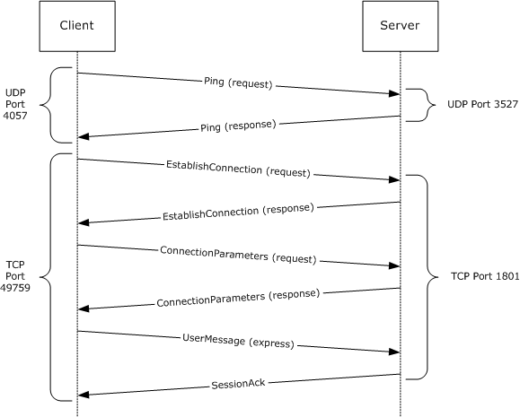

Figure 15: Session with Express Messages Sent scenario

### 4.1.1 FRAME 1: Ping Request

From client UDP port 4057 to server UDP port 3527:

Client -> Server: Ping packet

- StateFlag: 32001 (0x7D01)

Client: (...............1) - Client is independent

Server: (..............0.) - Server will accept new connection

Reserved: (01111101000000..) - Reserved

Signature: 21832 (0x5548)

Cookie: 4 (0x4)

QMGUID: {C626EA11-E6B6-9749-9595-9150557358D1}

Hex Dump:

01 7D 48 55 04 00 00 00 D1 58 73 55 50 91 95 95

49 97 B6 E6 11 EA 26 C6

### 4.1.2 FRAME 2: Ping Response

From server port 3527 to client UDP port 4057:

Server -> Client : Ping packet

- StateFlag: 45717 (0xB295)

Client: (...............1) - Client is independent

Server: (..............0.) - Server will accept new connection

Reserved: (10110010100101..) - Reserved

Signature: 21832 (0x5548)

Cookie: 4 (0x4)

QMGUID: {FCA09E90-7890-4544-8F11-394C43CD8907}

Hex Dump:

95 B2 48 55 04 00 00 00 07 89 CD 43 4C 39 11 8F

44 45 90 78 90 9E A0 FC

### 4.1.3 FRAME 3: Establish Connection Request

From client TCP port 49759 to TCP port 1801:

Client -> Server : EstablishConnection Packet

- MSMQBaseHeader:

VersionNumber: 16 (0x10)

Reserved: 192 (0xC0)

- FlagsBaseHeader: 11 (0xB)

MessagePriority: (.............011) - Message priority = 3

InternalMessage: (............1...) - Internal message

SessionHeader: (...........0....) - Session header not included

DebugSession: (..........0.....) - Debug header not included

Reserved1: (........00......) - Reserved

MessageTraceable: (.......0........) – Tracing disabled

Reserved2: (0000000.........) - Reserved

Signature: 1380927820 (0x524F494C)

PacketSize: 572 (0x23C)

TimeToReachQueue: 4294967295 (0xFFFFFFFF)

- MSMQInternalHeader:

Reserved: 0 (0x0)

- FlagsInternalHeader: 2 (0x2)

PacketType: (............0010) -

Session: (...........0....) - Session valid

Reserved: (00000000000.....) - Reserved

- EstablishConnectionPacket:

ClientGUID: { C626EA11-E6B6-9749-9595-9150557358D1}

ServerGUID: { FCA09E90-7890-4544-8F11-394C43CD8907}

TimeStamp: 501140046 milliseconds since the operating system was started

Reserved: 784 (0x310)

- OperatingSystem: 0 (0x0)

Reserved: ( ........................00000000 ) - Reserved bits

Session: ( .......................0........ ) - Not a new session

OperatingSystem: ( ......................0......... ) - Initiator OS is

not a server

QualityOfService: ( .....................0.......... ) - Quality of

transport service

not supported

Unused1: ( ................00000........... ) - Unused bits

Padding: Binary Large Object (512 Bytes)

Hex Dump:

10 C0 0B 00 4C 49 4F 52 3C 02 00 00 FF FF FF FF

00 00 02 00 D1 58 73 55 50 91 95 95 49 97 B6 E6

11 EA 26 C6 07 89 CD 43 4C 39 11 8F 44 45 90 78

90 9E A0 FC 4E CA DE 1D 10 03 00 00 5A 5A 5A 5A

5A 5A 5A 5A 5A 5A 5A 5A 5A 5A 5A 5A 5A 5A 5A 5A

5A 5A 5A 5A 5A 5A 5A 5A 5A 5A 5A 5A 5A 5A 5A 5A

5A 5A 5A 5A 5A 5A 5A 5A 5A 5A 5A 5A 5A 5A 5A 5A

5A 5A 5A 5A 5A 5A 5A 5A 5A 5A 5A 5A 5A 5A 5A 5A

5A 5A 5A 5A 5A 5A 5A 5A 5A 5A 5A 5A 5A 5A 5A 5A

5A 5A 5A 5A 5A 5A 5A 5A 5A 5A 5A 5A 5A 5A 5A 5A

5A 5A 5A 5A 5A 5A 5A 5A 5A 5A 5A 5A 5A 5A 5A 5A

5A 5A 5A 5A 5A 5A 5A 5A 5A 5A 5A 5A 5A 5A 5A 5A

5A 5A 5A 5A 5A 5A 5A 5A 5A 5A 5A 5A 5A 5A 5A 5A

5A 5A 5A 5A 5A 5A 5A 5A 5A 5A 5A 5A 5A 5A 5A 5A

5A 5A 5A 5A 5A 5A 5A 5A 5A 5A 5A 5A 5A 5A 5A 5A

5A 5A 5A 5A 5A 5A 5A 5A 5A 5A 5A 5A 5A 5A 5A 5A

5A 5A 5A 5A 5A 5A 5A 5A 5A 5A 5A 5A 5A 5A 5A 5A

5A 5A 5A 5A 5A 5A 5A 5A 5A 5A 5A 5A 5A 5A 5A 5A

5A 5A 5A 5A 5A 5A 5A 5A 5A 5A 5A 5A 5A 5A 5A 5A

5A 5A 5A 5A 5A 5A 5A 5A 5A 5A 5A 5A 5A 5A 5A 5A

5A 5A 5A 5A 5A 5A 5A 5A 5A 5A 5A 5A 5A 5A 5A 5A

5A 5A 5A 5A 5A 5A 5A 5A 5A 5A 5A 5A 5A 5A 5A 5A

5A 5A 5A 5A 5A 5A 5A 5A 5A 5A 5A 5A 5A 5A 5A 5A

5A 5A 5A 5A 5A 5A 5A 5A 5A 5A 5A 5A 5A 5A 5A 5A

5A 5A 5A 5A 5A 5A 5A 5A 5A 5A 5A 5A 5A 5A 5A 5A

5A 5A 5A 5A 5A 5A 5A 5A 5A 5A 5A 5A 5A 5A 5A 5A

5A 5A 5A 5A 5A 5A 5A 5A 5A 5A 5A 5A 5A 5A 5A 5A

5A 5A 5A 5A 5A 5A 5A 5A 5A 5A 5A 5A 5A 5A 5A 5A

5A 5A 5A 5A 5A 5A 5A 5A 5A 5A 5A 5A 5A 5A 5A 5A

5A 5A 5A 5A 5A 5A 5A 5A 5A 5A 5A 5A 5A 5A 5A 5A

5A 5A 5A 5A 5A 5A 5A 5A 5A 5A 5A 5A 5A 5A 5A 5A

5A 5A 5A 5A 5A 5A 5A 5A 5A 5A 5A 5A 5A 5A 5A 5A

5A 5A 5A 5A 5A 5A 5A 5A 5A 5A 5A 5A 5A 5A 5A 5A

5A 5A 5A 5A 5A 5A 5A 5A 5A 5A 5A 5A 5A 5A 5A 5A

5A 5A 5A 5A 5A 5A 5A 5A 5A 5A 5A 5A 5A 5A 5A 5A

5A 5A 5A 5A 5A 5A 5A 5A 5A 5A 5A 5A

### 4.1.4 FRAME 4: Establish Connection Response

From server TCP port 1801 to client TCP port 49759:

Server -> Client : EstablishConnection packet

- MSMQBaseHeader:

VersionNumber: 16 (0x10)

Reserved: 90 (0x5A)

- FlagsBaseHeader: 11 (0xB)

MessagePriority: (.............011) - Message priority = 3

InternalMessage: (............1...) - Internal message

SessionHeader: (...........0....) - Session header not included

DebugSession: (..........0.....) - Debug header not included

Reserved1: (........00......) - Reserved

MessageTraceable: (.......0........) – Tracing disabled

Reserved2: (0000000.........) - Reserved

Signature: 1380927820 (0x524F494C)

PacketSize: 572 (0x23C)

MessageLife: 4294967295 (0xFFFFFFFF)

- MSMQInternalHeader:

Reserved: 0 (0x0)

- FlagsInternalHeader: 2 (0x2)

PacketType: (............0010) -

Session: (...........0....) - Session valid

Reserved: (00000000000.....) - Reserved

- EstablishConnectionPacket:

ClientGUID: { C626EA11-E6B6-9749-9595-9150557358D1}

ServerGUID: { FCA09E90-7890-4544-8F11-394C43CD8907}

TimeStamp: 501140046 milliseconds since the operating system was started

Reserved: 784 (0x310)

- OperatingSystem: 0 (0x0)

Reserved: ( ........................00000000 ) - Reserved bits

Session: ( .......................0........ ) - Not a new session

OperatingSystem: ( ......................0......... ) - Initiator OS

is not a server

QualityOfService: ( .....................0.......... ) - Quality of

transport service

not supported

Unused1: ( ................00000........... ) - Unused bits

Padding: Binary Large Object (512 Bytes)

Hex Dump:

10 5A 0B 00 4C 49 4F 52 3C 02 00 00 FF FF FF FF

00 00 02 00 05 23 74 1F 5E BE 77 41 BC 77 C4 DD

77 19 E4 74 EB 6A 3A 3C 67 F5 43 41 87 D3 85 CF

4D 68 CE B4 4E CA DE 1D 10 03 00 00 5A 5A 5A 5A

5A 5A 5A 5A 5A 5A 5A 5A 5A 5A 5A 5A 5A 5A 5A 5A

5A 5A 5A 5A 5A 5A 5A 5A 5A 5A 5A 5A 5A 5A 5A 5A

5A 5A 5A 5A 5A 5A 5A 5A 5A 5A 5A 5A 5A 5A 5A 5A

5A 5A 5A 5A 5A 5A 5A 5A 5A 5A 5A 5A 5A 5A 5A 5A

5A 5A 5A 5A 5A 5A 5A 5A 5A 5A 5A 5A 5A 5A 5A 5A

5A 5A 5A 5A 5A 5A 5A 5A 5A 5A 5A 5A 5A 5A 5A 5A

5A 5A 5A 5A 5A 5A 5A 5A 5A 5A 5A 5A 5A 5A 5A 5A

5A 5A 5A 5A 5A 5A 5A 5A 5A 5A 5A 5A 5A 5A 5A 5A

5A 5A 5A 5A 5A 5A 5A 5A 5A 5A 5A 5A 5A 5A 5A 5A

5A 5A 5A 5A 5A 5A 5A 5A 5A 5A 5A 5A 5A 5A 5A 5A

5A 5A 5A 5A 5A 5A 5A 5A 5A 5A 5A 5A 5A 5A 5A 5A

5A 5A 5A 5A 5A 5A 5A 5A 5A 5A 5A 5A 5A 5A 5A 5A

5A 5A 5A 5A 5A 5A 5A 5A 5A 5A 5A 5A 5A 5A 5A 5A

5A 5A 5A 5A 5A 5A 5A 5A 5A 5A 5A 5A 5A 5A 5A 5A

5A 5A 5A 5A 5A 5A 5A 5A 5A 5A 5A 5A 5A 5A 5A 5A

5A 5A 5A 5A 5A 5A 5A 5A 5A 5A 5A 5A 5A 5A 5A 5A

5A 5A 5A 5A 5A 5A 5A 5A 5A 5A 5A 5A 5A 5A 5A 5A

5A 5A 5A 5A 5A 5A 5A 5A 5A 5A 5A 5A 5A 5A 5A 5A

5A 5A 5A 5A 5A 5A 5A 5A 5A 5A 5A 5A 5A 5A 5A 5A

5A 5A 5A 5A 5A 5A 5A 5A 5A 5A 5A 5A 5A 5A 5A 5A

5A 5A 5A 5A 5A 5A 5A 5A 5A 5A 5A 5A 5A 5A 5A 5A

5A 5A 5A 5A 5A 5A 5A 5A 5A 5A 5A 5A 5A 5A 5A 5A

5A 5A 5A 5A 5A 5A 5A 5A 5A 5A 5A 5A 5A 5A 5A 5A

5A 5A 5A 5A 5A 5A 5A 5A 5A 5A 5A 5A 5A 5A 5A 5A

5A 5A 5A 5A 5A 5A 5A 5A 5A 5A 5A 5A 5A 5A 5A 5A

5A 5A 5A 5A 5A 5A 5A 5A 5A 5A 5A 5A 5A 5A 5A 5A

5A 5A 5A 5A 5A 5A 5A 5A 5A 5A 5A 5A 5A 5A 5A 5A

5A 5A 5A 5A 5A 5A 5A 5A 5A 5A 5A 5A 5A 5A 5A 5A

5A 5A 5A 5A 5A 5A 5A 5A 5A 5A 5A 5A 5A 5A 5A 5A

5A 5A 5A 5A 5A 5A 5A 5A 5A 5A 5A 5A 5A 5A 5A 5A

5A 5A 5A 5A 5A 5A 5A 5A 5A 5A 5A 5A 5A 5A 5A 5A

5A 5A 5A 5A 5A 5A 5A 5A 5A 5A 5A 5A

### 4.1.5 FRAME 5: Connection Parameters Request

From client TCP port 49759 to server TCP port 1801:

Client -> Server : ConnectionParameters packet

- MSMQBaseHeader:

VersionNumber: 16 (0x10)

Reserved: 192 (0xC0)

- FlagsBaseHeader: 11 (0xB)

MessagePriority: (.............011) - Message priority = 3

InternalMessage: (............1...) - Internal message

SessionHeader: (...........0....) - Session header not included

DebugSession: (..........0.....) - Debug header not included

Reserved1: (........00......) - Reserved

MessageTraceable: (.......0........) – Tracing disabled

Reserved2: (0000000.........) - Reserved

Signature: 1380927820 (0x524F494C)

PacketSize: 32 (0x20)

MessageLife: 4294967295 (0xFFFFFFFF)

- MSMQInternalHeader:

Reserved: 0 (0x0)

- FlagsInternalHeader: 3 (0x3)

PacketType: (............0011) - ConnectionParameters packet

Session: (...........0....) - Session valid

Reserved: (00000000000.....) - Reserved

- ConnectionParametersHeader:

RecoverAckTimeout: 1496 (0x5D8)

AckTimeout: 120000 (0x1D4C0)

Reserved: 0 (0x0)

WindowSize: 64 (0x40)

Source port: 49759

Destination port: 1801

Hex Dump:

10 C0 0B 00 4C 49 4F 52 20 00 00 00 FF FF FF FF

00 00 03 00 D8 05 00 00 C0 D4 01 00 00 00 40 00

### 4.1.6 FRAME 6: Connection Parameters Response

From server TCP port 1801 to client TCP port 49759:

Server -> Client : ConnectionParameters packet

- MSMQBaseHeader:

VersionNumber: 16 (0x10)

Reserved: 192 (0xC0)

- FlagsBaseHeader: 11 (0xB)

MessagePriority: (.............011) - Message priority = 3

InternalMessage: (............1...) - Internal message

SessionHeader: (...........0....) - Session header not included

DebugSession: (..........0.....) - Debug session not included

Reserved1: (........00......) - Reserved

MessageTraceable: (.......0........) - Message is not traceable

Reserved2: (0000000.........) - Reserved

Signature: 1380927820 (0x524F494C)

PacketSize: 32 (0x20)

MessageLife: 4294967295 (0xFFFFFFFF)

- MSMQInternalHeader:

Reserved: 0 (0x0)

- FlagsInternalHeader: 3 (0x3)

PacketType: (............0011) -

Session: (...........0....) - Session valid

Reserved: (00000000000.....) - Reserved

- ConnectionParametersHeader:

RecoverAckTimeout: 1496 (0x5D8)

AckTimeout: 120000 (0x1D4C0)

Reserved: 0 (0x0)

WindowSize: 32 (0x20)

Source port: 1801

Destination port: 49759

Hex Dump:

10 C0 0B 00 4C 49 4F 52 20 00 00 00 FF FF FF FF

00 00 03 00 D8 05 00 00 C0 D4 01 00 00 00 40 00

### 4.1.7 FRAME 7: User Message

From client TCP port 49759 to server TCP port 1801:

Client -> Server : UserMessage packet

- BaseHeader:

VersionNumber: 16 (0x10)

Reserved: 0 (0x0)

- Flags: 3 (0x3)

MessagePriority: (.............011) - Message priority = 3

InternalMessage: (............0...) - UserMessge packet

SessionHeader: (...........0....) - Session header not included

DebugSession: (..........0.....) - Debug session not included

Reserved: (........00......) - Reserved

MessageTraceable: (.......0........) - Tracing disabled

Reserved2: (0000000.........) - Reserved

Signature: 1380927820 (0x524F494C)

PacketSize: 2224 (0x8B0)

MessageLife: 345600 (0x54600)

- UserHeader:

SourceQueueManager: {C626EA11-E6B6-9749-9595-9150557358D1}

QueueManagerAddress: {00000000-0000-0000-0000-000000000000}

TimeToBeReceived : 4294967295 (0xFFFFFFFF)

SentTime: 1141966310 (0x441105E6)

MessageID: 2286 (0x8EE)

- Flags: 2628608 (0x281C00)

RoutingSvrs: (...........................00000)

- 0 MSMQ routing servers have handled this packet

DeliveryMode: (.........................00.....)

- Express delivery mode

Reserved: (........................0.......) - Reserved

Journaling: (......................00........) - Disabled

DestinationQueue: (...................111..........) - Direct queue

AdminQueue: (................000.............) - None

ResponseQueue: (.............000................) - None

SecurityHdr: (............1...................)

- SecurityHeader included

TransactionHdr: (...........0....................)

- TransactionHeader not included

MessagePropertyHdr: (..........1.....................)

- MessagePropertyHeader included

Connector: (.........0......................)

- No ConnectorType field

MultiQueueFormatHdr: (........0.......................)

- MultiQueueFormatHeader not included

Multicast: (.......0........................)

- Message not part of multicast operation

Reserved: (....000.........................) - Reserved

SoapHdr:(...0............................) - SoapHeader not included

Reserved: (000.............................) - Reserved

- DestinationQueue:

- DirectQueue:

Length: 26 (0x1A)

Value: OS:a04bm02\q

Padding: 0 Bytes

- SecurityHeader:

- Flags: 1 (0x1)

SenderIDType: (............0001) - SID

Authenticated: (...........0....) - Not authenticated

Encrypted: (..........0.....) - Not encrypted

DefProv: (.........0......) - Default provider

SecInfoEx: (........0.......) - SecurityData not present

LevelOfAuthentication: (....0000........) - None

Unused: (0000............)

SenderIdSize: 28 (0x1C)

EncryptionKeySize: 0 (0x0)

SignatureSize: 0 (0x0)

SenderCertSize: 0 (0x0)

ProviderInfoSize: 0 (0x0)

SecurityID: Binary Large Object (28 bytes)

- MessagePropertiesHeader:

- Flags: Acknowledgment sent

PositiveArriveAck: (.......0) - None

PositiveReceiveAck: (......0.) - None

NegativeDeliveryAck: (.....0..) - None

NegativeReceiveAck: (....0...) - None

Reserved: (0000....) - Reserved

LabelLength: 15 (0xF)

MessageClass: 0 (0x0)

CorrelationID: Binary Large Object (20 Bytes)

(20 bytes, all values zero)

BodyType: VTBSTR [String data in unicode]

ApplicationTag: 0 (0x0)

MessageSize: 2000 (0x7D0)

AllocatedBodySize: 20 (0x14)

PrivacyLevel: No encryption

HashAlgorithm: 32772 (SHA1 Hash Algorithm ) (0x8004)

EncryptionAlgorithm: 26113 (RC4 Algorithm) (0x6601)

ExtensionSize: 0 (0x0)

Label: Binary Large Object (15 Bytes)

ExtensionData: Binary Large Object (0 Bytes)

MessageBody: Binary Large Object (20 Bytes)

Padding: 1 Bytes

Hex Dump:

10 00 03 00 4C 49 4F 52 B0 08 00 00 00 46 05 00

D1 58 73 55 50 91 95 95 49 97 B6 E6 11 EA 26 C6

00 00 00 00 00 00 00 00 00 00 00 00 00 00 00 00

FF FF FF FF 4C 49 4F 52 EE 08 00 00 00 1C 28 00

1A 00 4F 00 53 00 3A 00 61 00 30 00 34 00 62 00

6D 00 30 00 32 00 5C 00 71 00 00 00 01 00 1C 00

00 00 00 00 00 00 00 00 00 00 00 00 01 05 00 00

00 00 00 05 15 00 00 00 AD 4A 9E BD 36 D9 FA 3D

63 A6 56 DA E8 03 00 00 0F 0F 00 00 00 00 00 00

00 00 00 00 00 00 00 00 00 00 00 00 00 00 00 00

08 00 00 00 00 00 00 00 D0 07 00 00 D0 07 00 00

00 00 00 00 04 80 00 00 01 68 00 00 00 00 00 00

6D 00 71 00 73 00 65 00 6E 00 64 00 65 00 72 00

20 00 6C 00 61 00 62 00 65 00 6C 00 00 00 61 00

61 00 61 00 61 00 61 00 61 00 61 00 61 00 61 00

61 00 61 00 61 00 61 00 61 00 61 00 61 00 61 00

61 00 61 00 61 00 61 00 61 00 61 00 61 00 61 00

61 00 61 00 61 00 61 00 61 00 61 00 61 00 61 00

61 00 61 00 61 00 61 00 61 00 61 00 61 00 61 00

61 00 61 00 61 00 61 00 61 00 61 00 61 00 61 00

61 00 61 00 61 00 61 00 61 00 61 00 61 00 61 00

61 00 61 00 61 00 61 00 61 00 61 00 61 00 61 00

61 00 61 00 61 00 61 00 61 00 61 00 61 00 61 00

61 00 61 00 61 00 61 00 61 00 61 00 61 00 61 00

61 00 61 00 61 00 61 00 61 00 61 00 61 00 61 00

61 00 61 00 61 00 61 00 61 00 61 00 61 00 61 00

61 00 61 00 61 00 61 00 61 00 61 00 61 00 61 00

61 00 61 00 61 00 61 00 61 00 61 00 61 00 61 00

61 00 61 00 61 00 61 00 61 00 61 00 61 00 61 00

61 00 61 00 61 00 61 00 61 00 61 00 61 00 61 00

61 00 61 00 61 00 61 00 61 00 61 00 61 00 61 00

61 00 61 00 61 00 61 00 61 00 61 00 61 00 61 00

61 00 61 00 61 00 61 00 61 00 61 00 61 00 61 00

61 00 61 00 61 00 61 00 61 00 61 00 61 00 61 00

61 00 61 00 61 00 61 00 61 00 61 00 61 00 61 00

61 00 61 00 61 00 61 00 61 00 61 00 61 00 61 00

61 00 61 00 61 00 61 00 61 00 61 00 61 00 61 00

61 00 61 00 61 00 61 00 61 00 61 00 61 00 61 00

61 00 61 00 61 00 61 00 61 00 61 00 61 00 61 00

61 00 61 00 61 00 61 00 61 00 61 00 61 00 61 00

61 00 61 00 61 00 61 00 61 00 61 00 61 00 61 00

61 00 61 00 61 00 61 00 61 00 61 00 61 00 61 00

61 00 61 00 61 00 61 00 61 00 61 00 61 00 61 00

61 00 61 00 61 00 61 00 61 00 61 00 61 00 61 00

61 00 61 00 61 00 61 00 61 00 61 00 61 00 61 00

61 00 61 00 61 00 61 00 61 00 61 00 61 00 61 00

61 00 61 00 61 00 61 00 61 00 61 00 61 00 61 00

61 00 61 00 61 00 61 00 61 00 61 00 61 00 61 00

61 00 61 00 61 00 61 00 61 00 61 00 61 00 61 00

61 00 61 00 61 00 61 00 61 00 61 00 61 00 61 00

61 00 61 00 61 00 61 00 61 00 61 00 61 00 61 00

61 00 61 00 61 00 61 00 61 00 61 00 61 00 61 00

61 00 61 00 61 00 61 00 61 00 61 00 61 00 61 00

61 00 61 00 61 00 61 00 61 00 61 00 61 00 61 00

61 00 61 00 61 00 61 00 61 00 61 00 61 00 61 00

61 00 61 00 61 00 61 00 61 00 61 00 61 00 61 00

61 00 61 00 61 00 61 00 61 00 61 00 61 00 61 00

61 00 61 00 61 00 61 00 61 00 61 00 61 00 61 00

61 00 61 00 61 00 61 00 61 00 61 00 61 00 61 00

61 00 61 00 61 00 61 00 61 00 61 00 61 00 61 00

61 00 61 00 61 00 61 00 61 00 61 00 61 00 61 00

61 00 61 00 61 00 61 00 61 00 61 00 61 00 61 00

61 00 61 00 61 00 61 00 61 00 61 00 61 00 61 00

61 00 61 00 61 00 61 00 61 00 61 00 61 00 61 00

61 00 61 00 61 00 61 00 61 00 61 00 61 00 61 00

61 00 61 00 61 00 61 00 61 00 61 00 61 00 61 00

61 00 61 00 61 00 61 00 61 00 61 00 61 00 61 00

61 00 61 00 61 00 61 00 61 00 61 00 61 00 61 00

61 00 61 00 61 00 61 00 61 00 61 00 61 00 61 00

61 00 61 00 61 00 61 00 61 00 61 00 61 00 61 00

61 00 61 00 61 00 61 00 61 00 61 00 61 00 61 00

61 00 61 00 61 00 61 00 61 00 61 00 61 00 61 00

61 00 61 00 61 00 61 00 61 00 61 00 61 00 61 00

61 00 61 00 61 00 61 00 61 00 61 00 61 00 61 00

61 00 61 00 61 00 61 00 61 00 61 00 61 00 61 00

61 00 61 00 61 00 61 00 61 00 61 00 61 00 61 00

61 00 61 00 61 00 61 00 61 00 61 00 61 00 61 00

61 00 61 00 61 00 61 00 61 00 61 00 61 00 61 00

61 00 61 00 61 00 61 00 61 00 61 00 61 00 61 00

61 00 61 00 61 00 61 00 61 00 61 00 61 00 61 00

61 00 61 00 61 00 61 00 61 00 61 00 61 00 61 00

61 00 61 00 61 00 61 00 61 00 61 00 61 00 61 00

61 00 61 00 61 00 61 00 61 00 61 00 61 00 61 00

61 00 61 00 61 00 61 00 61 00 61 00 61 00 61 00

61 00 61 00 61 00 61 00 61 00 61 00 61 00 61 00

61 00 61 00 61 00 61 00 61 00 61 00 61 00 61 00

61 00 61 00 61 00 61 00 61 00 61 00 61 00 61 00

61 00 61 00 61 00 61 00 61 00 61 00 61 00 61 00

61 00 61 00 61 00 61 00 61 00 61 00 61 00 61 00

61 00 61 00 61 00 61 00 61 00 61 00 61 00 61 00

61 00 61 00 61 00 61 00 61 00 61 00 61 00 61 00

61 00 61 00 61 00 61 00 61 00 61 00 61 00 61 00

61 00 61 00 61 00 61 00 61 00 61 00 61 00 61 00

61 00 61 00 61 00 61 00 61 00 61 00 61 00 61 00

61 00 61 00 61 00 61 00 61 00 61 00 61 00 61 00

61 00 61 00 61 00 61 00 61 00 61 00 61 00 61 00

61 00 61 00 61 00 61 00 61 00 61 00 61 00 61 00

61 00 61 00 61 00 61 00 61 00 61 00 61 00 61 00

61 00 61 00 61 00 61 00 61 00 61 00 61 00 61 00

61 00 61 00 61 00 61 00 61 00 61 00 61 00 61 00

61 00 61 00 61 00 61 00 61 00 61 00 61 00 61 00

61 00 61 00 61 00 61 00 61 00 61 00 61 00 61 00

61 00 61 00 61 00 61 00 61 00 61 00 61 00 61 00

61 00

### 4.1.8 FRAME 8: Session Acknowledgment

From server TCP port 1801 to client TCP port 49759:

Server -> Client : SessionAck Packet

- BaseHeader:

VersionNumber: 16 (0x10)

Reserved: 205 (0xCD)

- FlagsBaseHeader: 27 (0x1B)

MessagePriority: (.............011) - Message priority = 3

InternalMessage: (............1...) - Internal message

SessionHeader: (...........1....) - Session header included

DebugSession: (..........0.....) - Debug session not included

Reserved1: (........00......) - Reserved

MessageTraceable: (.......0........) – Tracing disabled

Reserved2: (0000000.........) - Reserved

Signature: 1380927820 (0x524F494C)

PacketSize: 36 (0x24)

MessageLife: 4294967295 (0xFFFFFFFF)

- InternalHeader:

Reserved: 0 (0x0)

- FlagsInternalHeader: 1 (0x1)

PacketType: (............0001) - SessionAck packet

Session: (...........0....) - Session valid

Reserved: (00000000000.....) - Reserved

- SessionHeader:

AckSequenceNumber: 1 (0x01)

RecoverableMsgAckSeqNumber: 0 (0x0)

RecoverableMsgAckFlags: 0 (0x0)

UserMsgSequenceNumber: 0 (0x0)

RecoverableMsgSeqNumber: 0 (0x0)

WindowSize: 64 (0x40)

Reserved: 0 (0x0)

Hex Dump:

10 CD 1B 00 4C 49 4F 52 24 00 00 00 FF FF FF FF

00 00 01 00 01 00 00 00 00 00 00 00 00 00 00 00

40 00 00 00

# 5 Security

The following sections describe security considerations for implementers of the Message Queuing (MSMQ): Message Queuing Binary Protocol.

## 5.1 Security Considerations for Implementers

A sender can include a digital certificate and request authentication when sending a UserMessage Packet ([MS-MQMQ](#Section_1.3.1) section 2.2.20). A sender can request encryption of the [**message body**](#gt_message-body) to ensure message privacy. Use of the AES encryption algorithm is recommended for the best encryption strength.

Authentication and encryption are not supported when a message is sent to a queue using a direct format name. The information in a UserMessage Packet that is sent using a direct format name is susceptible to tampering.

A receiver authenticates received UserMessage Packets by verifying an included digital signature and certificate. The receiver performs an access check to authorize the message sender to the destination queue.

Administration Nacks of classes MQMSG_CLASS_NACK_ACCESS_DENIED, MQMSG_CLASS_NACK_BAD_DST_Q, MQMSG_CLASS_NACK_BAD_ENCRYPTION, MQMSG_CLASS_NACK_BAD_SIGNATURE, and MQMSG_CLASS_NACK_UNSUPPORTED_CRYPTO_PROVIDER present potential security vulnerabilities. The receiving [**queue manager**](#gt_queue-manager-qm) disables generation of these Nacks by default. The ability to temporarily enable them when required to diagnose a configuration or application issue is useful.

## 5.2 Index of Security Parameters

No security parameters are defined for this protocol.

# 6 Appendix A: Product Behavior

The information in this specification is applicable to the following Microsoft products or supplemental software. References to product versions include updates to those products.

The terms "earlier" and "later", when used with a product version, refer to either all preceding versions or all subsequent versions, respectively. The term "through" refers to the inclusive range of versions. Applicable Microsoft products are listed chronologically in this section.

**Windows Client**

- Windows NT operating system
- Windows 2000 operating system
- Windows XP operating system
- Windows Vista operating system
- Windows 7 operating system
- Windows 8 operating system
- Windows 8.1 operating system
- Windows 10 operating system
- Windows 11 operating system
**Windows Server**

- Windows NT
- Windows 2000
- Windows Server 2003 operating system
- Windows Server 2008 operating system
- Windows Server 2008 R2 operating system
- Windows Server 2012 operating system
- Windows Server 2012 R2 operating system
- Windows Server 2016 operating system
- Windows Server operating system
- Windows Server 2019 operating system
- Windows Server 2022 operating system
- Windows Server 2025 operating system
Exceptions, if any, are noted in this section. If an update version, service pack or Knowledge Base (KB) number appears with a product name, the behavior changed in that update. The new behavior also applies to subsequent updates unless otherwise specified. If a product edition appears with the product version, behavior is different in that product edition.

Unless otherwise specified, any statement of optional behavior in this specification that is prescribed using the terms "SHOULD" or "SHOULD NOT" implies product behavior in accordance with the SHOULD or SHOULD NOT prescription. Unless otherwise specified, the term "MAY" implies that the product does not follow the prescription.

<1> Section 1.3.2.2: Windows support for generating and accepting message hashes is as follows.

| Operating System Version(s) | Hash Generated | Hash Accepted |
| --- | --- | --- |
| Windows NT 4.0 operating system | MD2/MD4/MD5 | MD2/MD4/MD5 |
| Windows 2000 | MD2/MD4/MD5/SHA-1 | MD2/MD4/MD5/SHA-1 |
| Windows XP, Windows Server 2003 | MD2/MD4/MD5/SHA-1 | MD2/MD4/MD5/SHA-1 |
| Windows Vista, Windows Server 2008 | SHA-1 by default, MD2/MD4/MD5 can be configured | SHA-1 by default, MD2/MD4/MD5 can be configured |
| Windows 7, Windows Server 2008 R2 operating system | SHA-512 by default, MD2/MD4/MD5/SHA-1/SHA-256 can be configured | SHA-512 by default, MD2/MD4/MD5/SHA-1/SHA-256 can be configured |
| Windows 8 and later client operating systems, and Windows Server 2012 and later server operating systems | SHA-512 by default, SHA-1/SHA-256 can be configured | SHA-512 by default, MD2/MD4/MD5/SHA-1/SHA-256 can be configured |

<2> Section 1.3.4: Windows Server 2008 and later server operating systems, and Windows 7 and later client operating systems do not perform [**source journaling**](#gt_source-journaling) for messages sent to [**administration queues**](#gt_administration-queue), [**notification queues**](#gt_notification-queue), and [**order queues**](#gt_order-queue).

<3> Section 2.1: Windows NT, Windows 2000, Windows XP, and Windows Server 2003 use Ping Messages (section [2.1.2](#Section_2.1.2)) to determine whether a server is available.

<4> Section 2.1.1: The SPX/IPX protocol is supported only on Windows NT and Windows 2000.

<5> Section 2.1.1: The Windows implementation utilizes the Windows Sockets API for TCP or SPX connections. The Windows Sockets API is responsible for operations such as selection of the source port used by an [**initiator**](#gt_initiator) and listening/accepting connections by the [**acceptor**](#gt_acceptor).

<6> Section 2.1.1: The Windows implementation utilizes the Windows Sockets API for TCP or SPX connections. The Windows Sockets API is responsible for operations such as selection of the source port used by an initiator and listening/accepting connections by the acceptor.

<7> Section 2.1.2: Windows NT, Windows 2000, Windows XP, and Windows Server 2003 use Ping Messages (section 2.1.2) to determine whether a server is available.

<8> Section 2.1.2: The IPX/SPX protocol is supported only on Windows NT and Windows 2000.

<9> Section 2.1.2: The port to which **Ping Requests** are sent is controlled by the registry key HKEY_LOCAL_MACHINE\software\microsoft\msmq\parameters\MsmqIpPingPort for **Ping Requests** sent using UDP or the registry key HKEY_LOCAL_MACHINE\software\microsoft\msmq\parameters\MsmqIpxPingPort for **Ping Requests** sent using SPX. The default port number 3527 is used when the corresponding key is absent.

<10> Section 2.1.2: Windows NT, Windows 2000, Windows XP, and Windows Server 2003 always listen for **Ping Requests**. Otherwise, Windows does not listen for **Ping Requests** by default, but listening for **Ping Requests** can be enabled by defining a registry key of type DWORD called HKEY_LOCAL_MACHINE\software\microsoft\msmq\parameters\security\EnablePingService and setting its value to 0x00000001.

<11> Section 2.1.2: The port on which an acceptor listens for **Ping Requests** is controlled by the registry key HKEY_LOCAL_MACHINE\software\microsoft\msmq\parameters\MsmqIpPingPort for **Ping Requests** sent using UDP or the registry key HKEY_LOCAL_MACHINE\software\microsoft\msmq\parameters\MsmqIpxPingPort for **Ping Requests** sent using SPX. The default port number 3527 is used when the corresponding key is absent.

<12> Section 2.2.1: On Windows NT, Windows 2000, Windows XP, and Windows Server 2003, the acceptor refuses the connection when the number of open connections exceeds the number of Client Access Licenses (CALs). Multiple connections from the same initiator are counted as one. On Windows Vista and later client operating systems, and Windows Server 2008 and later server operating systems, the acceptor does not verify access licenses. The acceptor also refuses the connection when the maximum number of sessions has been reached. The value for the maximum number of sessions can be set in the registry key HKEY_LOCAL_MACHINE\software\microsoft\msmq\parameters\MaxInSessions. When this key is absent, the default maximum is 0xFFFFFFFF.

<13> Section 2.2.3.1: This parameter is used to implement client access licensing restrictions by Windows NT, Windows 2000, Windows XP, and Windows Server 2003. It is ignored by Windows Vista and later client operating systems, and Windows Server 2008 and later server operating systems.

<14> Section 2.2.3.1: The Windows implementation calls the **GetVersionEx()** Win32 API to determine client or server platform.

<15> Section 2.2.3.1: The **EstablishConnectionHeader.OperatingSystem.QS** bit field value does not affect the transport settings. The Guaranteed Quality of Service (GQoS) values exchanged are only informational.

<16> Section 2.2.4: The IPX/SPX protocol is supported only on Windows NT.

<17> Section 2.2.4.1: The Windows implementation can leave this field uninitialized; hence, it can contain arbitrary data when the OrderAck Packet (section [2.2.4](#Section_2.2.4)) is sent. This field is ignored when the OrderAck Packet is received.

<18> Section 2.2.5: The IPX/SPX protocol is supported only on Windows NT.

<19> Section 2.2.7: The unused fields are uninitialized data in the Windows implementation.

<20> Section 2.3: For Windows NT and Windows 2000, this protocol uses the Message Queuing (MSMQ): Directory Service Protocol [MS-MQDS](#Section_1.3.1).

<21> Section 2.3: For the Message Queuing (MSMQ): Directory Service Protocol [MS-MQDS], the Directory Service schema elements are described in [MS-MQDS] sections 2.2.10 and 3.1.4.21.1 through 3.1.4.21.4.

<22> Section 3.1.1.3: The **ReceiveBaseSymmetricKeyCache** ADM element is used only by Windows 2000, Windows XP, and Windows Server 2003. None of these enforces time-out of the CachedSymmetricKey (section [3.1.1.3.3](#Section_3.1.1.3.3)) ADM element instances in this list; therefore, there is no **ReceiveBaseSymmetricKeyCache** Cleanup Timer or associated event, where one might be expected by analogy with the **ReceiveSymmetricKeyCache** ADM element.

<23> Section 3.1.1.3: The **SendBaseSymmetricKeyCache** ADM element is used by Windows 2000, Windows XP, and Windows Server 2003.

<24> Section 3.1.1.3: The Windows default time-out is 30 seconds. The time-out grows as the number of sequential time-outs increases. The first, second, and third time-outs have periods of 30 seconds. The fourth, fifth, and sixth time-outs are 5 minutes. The seventh, eighth, and ninth time-outs are 30 minutes, and thereafter, the time-out period is 6 hours.

Windows provides a registry key at HKEY_LOCAL_MACHINE\software\microsoft\msmq\parameters\SeqResend13Time that can be used by the client to specify different resend times in seconds beyond the default values for the first, second, and third time-outs.

Windows provides a registry key at HKEY_LOCAL_MACHINE\software\microsoft\msmq\parameters\SeqResend46Time that can be used by the client to specify different resend times in seconds beyond the default values for the fourth, fifth, and sixth time-outs.

Windows provides a registry key at HKEY_LOCAL_MACHINE\software\microsoft\msmq\parameters\SeqResend79Time that can be used by the client to specify different resend times in seconds beyond the default values for the seventh, eighth, and ninth time-outs.

Windows provides a registry key at HKEY_LOCAL_MACHINE\software\microsoft\msmq\parameters\SeqResend10Time that can be used by the client to specify a different resend time in seconds beyond the default value for the tenth time-out.

<25> Section 3.1.1.3: Windows sets the maximum size of the **MessageIDHistoryTable** ADM element to RemoveDuplicateSize. The RemoveDuplicateSize value is contained in the registry key at HKEY_LOCAL_MACHINE\SOFTWARE\Microsoft\MSMQ\Parameters\RemoveDuplicateSize. If the registry key does not exist, the RemoveDuplicateSize value is 10,000.

<26> Section 3.1.1.3: Windows performs no special action when the **MessageIdOrdinal** ADM element value rolls over. Values are reused after the rollover; however, the rollover condition does not affect [**message**](#gt_message) delivery guarantees because the **MessageIDHistoryTable** ADM element length is sufficiently short.

Windows persistently stores up to the last RemoveDuplicateSize **MessageIDHistoryEntry** ADM element values. The RemoveDuplicateSize value is contained in the registry key at HKEY_LOCAL_MACHINE\SOFTWARE\Microsoft\MSMQ\Parameters\RemoveDuplicateSize. If the registry key does not exist, the RemoveDuplicateSize value is 10,000.

Windows removes expired entries from the **MessageIDHistoryTable** ADM element every RemoveDuplicateCleanup milliseconds. The RemoveDuplicateCleanup value is contained in the registry key at HKEY_LOCAL_MACHINE\SOFTWARE\Microsoft\MSMQ\Parameters\RemoveDuplicateCleanup. If the registry key does not exist, the RemoveDuplicateCleanup value is 30 * 60 * 1000 (30 minutes).

<27> Section 3.1.1.3: Windows initializes the **PingCookie** ADM element to 0x00000000 when the [**queue manager**](#gt_queue-manager-qm) is started and increments it by 1 before each **Ping Request**, as defined in Ping Message (section 2.1.2), is sent.

<28> Section 3.1.1.3: For Windows NT, Windows 2000, Windows XP, Windows Server 2003, and Windows Vista, the **SendInsecureNacks** ADM element is always TRUE. For Windows Vista operating system with Service Pack 1 (SP1) and later operating systems, and Windows Server 2008 and later server operating systems, the Windows implementation sets this value based on a registry key of type DWORD called HKEY_LOCAL_MACHINE\SOFTWARE\Microsoft\MSMQ\Parameters\Security\PermitInsecureNacks. The **SendInsecureNacks** ADM element is TRUE if the registry key value is 0x00000001 and FALSE if the registry key value is set to 0x00000000 or the registry key does not exist. By default, the registry key does not exist.

<29> Section 3.1.1.3: The **SendInsecureNacks** ADM element is saved to persistent storage for Windows Vista SP1 and later client operating systems, and for Windows Server 2008.

<30> Section 3.1.1.3: Windows provides a registry key at HKEY_LOCAL_MACHINE\software\microsoft\msmq\parameters\SeqResend13Time that can be used by the client to specify a different value in seconds.

<31> Section 3.1.1.3: Windows provides a registry key at HKEY_LOCAL_MACHINE\software\microsoft\msmq\parameters\SeqResend46Time that can be used by the client to specify a different value in seconds.

<32> Section 3.1.1.3: Windows provides a registry key at HKEY_LOCAL_MACHINE\software\microsoft\msmq\parameters\SeqResend79Time that can be used by the client to specify a different value in seconds.

<33> Section 3.1.1.3: Windows provides a registry key at HKEY_LOCAL_MACHINE\software\microsoft\msmq\parameters\SeqResend10Time that can be used by the client to specify a different value in seconds.

<34> Section 3.1.1.3.1: Each Windows client and server generates a unique GUID ([MS-DTYP](../MS-DTYP/MS-DTYP.md) section 2.3.4) upon setup and stores it durably as a binary value under the HKEY_LOCAL_MACHINE\SOFTWARE\Microsoft\MSMQ\Parameters\MachineCache\QMId registry key.

<35> Section 3.1.1.3.1: Windows sets the timestamp to the time of the queue manager installation or the last system restore. The value is the number of seconds elapsed since midnight (00:00:00), January 1, 1970 ([**Coordinated Universal Time (UTC)**](#gt_coordinated-universal-time-utc)).

<36> Section 3.1.1.3.1: Windows sets the **WindowSize** ADM element to the maximum allowed value, which can be configured by setting a value in the registry key HKEY_LOCAL_MACHINE\software\microsoft\msmq\parameters\MaxUnackedPacket. When this key is absent, the default maximum is 64.

<37> Section 3.1.1.3.1.3: Each Windows client and server generates a unique **GUID** ([MS-DTYP] section 2.3.4) upon setup and stores it durably as a binary value under the HKEY_LOCAL_MACHINE\SOFTWARE\Microsoft\MSMQ\Parameters\MachineCache\QMId registry key.

<38> Section 3.1.1.6.1: Windows discards express, recoverable, and transactional messages that have been acknowledged.

<39> Section 3.1.1.6.1: Windows discards express, recoverable, and transactional messages that have been acknowledged.

<40> Section 3.1.1.6.2: Windows discards express, recoverable, and transactional messages that have been acknowledged.

<41> Section 3.1.1.7.1: Only Windows NT, Windows 2000, Windows XP, and Windows Server 2003 utilize the Ping Message (section 2.1.2) mechanism.

<42> Section 3.1.1.7.1: Windows NT, Windows 2000, Windows XP, and Windows Server 2003 always respond to **Ping Requests**, as defined in Ping Message (section 2.1.2). Otherwise, Windows does not respond to **Ping Requests** by default, but **Ping Responses**, as specified in section 2.1.2, can be enabled by defining a registry key of type DWORD called HKEY_LOCAL_MACHINE\software\microsoft\msmq\parameters\security\EnablePingService and setting its value to 0x00000001.

<43> Section 3.1.2.1: The Microsoft implementation sets the Session Initialization Timer (section [3.1.2.1](#Section_3.1.1.7.1)) to a value in milliseconds equal to 60000 + (2 * RoundTripDelay). The RoundTripDelay value is contained in the registry key at HKEY_LOCAL_MACHINE\software\microsoft\msmq\parameters\RoundTripDelay. If the registry key does not exist, zero is used for the RoundTripDelay value.

<44> Section 3.1.2.2: The Windows default value for the Session Cleanup Timer (section [3.1.2.2](#Section_3.1.2.2)) is 300,000 milliseconds. If the queue manager is a [**routing server**](#gt_routing-server), the default value for the Session Cleanup Timer is 120,000 milliseconds. This default value can be overridden by setting the registry key HKEY_LOCAL_MACHINE\SOFTWARE\Microsoft\MSMQ\Parameters\CleanupInterval to the desired value, in milliseconds.

<45> Section 3.1.2.3: The Windows default reconnection time-out is 5,000 milliseconds unless otherwise specified in milliseconds in the registry key HKEY_LOCAL_MACHINE\SOFTWARE\Microsoft\MSMQ\Parameters\TryConnectInterval. Additionally, the value in milliseconds, if any, in the registry key HKEY_LOCAL_MACHINE\SOFTWARE\Microsoft\MSMQ\Parameters\RoundTripDelay is also added to the reconnection time-out.

<46> Section 3.1.2.4: For sessions established for a [**direct format name**](#gt_direct-format-name), this value is read from the registry key HKEY_LOCAL_MACHINE\SOFTWARE\Microsoft\MSMQ\Parameters\QosCleanupIntervalMultiplier that is of type DWORD. When this key is absent, the factor defaults to 2 for sessions established for direct format names. The default multiplying factor is 1 for sessions not established for direct format names.

<47> Section 3.1.2.8: The Windows default timeout is 30 * 60 * 1000 milliseconds (30 minutes). This default value can be overridden by setting the registry key HKEY_LOCAL_MACHINE\SOFTWARE\Microsoft\MSMQ\Parameters\RemoveDuplicateCleanup to the desired value, in milliseconds.

<48> Section 3.1.3.1: For Windows NT, the **SendEnhancedRC2Using40BitKeys** ADM element is always FALSE. For Windows 2000, Windows 2000 operating system Service Pack 1 (SP1), Windows 2000 operating system Service Pack 2 (SP2), Windows 2000 operating system Service Pack 3 (SP3), and Windows XP, the **SendEnhancedRC2Using40BitKeys** ADM element is always TRUE. For Windows 2000 operating system Service Pack 4 (SP4), the default value is TRUE. For Windows XP operating system Service Pack 1 (SP1), Windows XP operating system Service Pack 2 (SP2), Windows XP operating system Service Pack 3 (SP3), and Windows Server 2003, the default value is FALSE. For Windows Vista and later client operating systems, and Windows Server 2008 and later server operating systems, the **SendEnhancedRC2Using40BitKeys** ADM element is always FALSE.

<49> Section 3.1.3.1: For Windows NT, the **RejectEnhancedRC2Using40BitKeys** ADM element is always TRUE. For Windows 2000, Windows 2000 SP1, Windows 2000 SP2, Windows 2000 SP3, and Windows XP, the **RejectEnhancedRC2Using40BitKeys** ADM element is always FALSE. For Windows 2000 SP4 and later server operating systems, and for Windows XP SP1, and later client operating systems, the default value is FALSE.

<50> Section 3.1.3.2: Windows sets the **WindowSize** ADM element value to the maximum allowed value. The maximum allowed value of this field can be configured by setting a value in the registry key HKEY_LOCAL_MACHINE\software\microsoft\msmq\parameters\MaxUnackedPacket. When this key is absent, the default maximum is 64.

<51> Section 3.1.3.2: The default setting is 20,000 milliseconds on a local area network (LAN). The Microsoft implementation provides a registry key at HKEY_LOCAL_MACHINE\SOFTWARE\Microsoft\MSMQ\Parameters\RoundTripDelay that the client uses to specify additional time beyond the default value.

<52> Section 3.1.3.2: The value of the **MaximumOrderAckDelay** ADM element is contained in the registry key HKEY_LOCAL_MACHINE\software\microsoft\msmq\parameters\SeqMaxAckDelay. If the registry key does not exist, the value of the **MaximumOrderAckDelay** ADM element is 10 seconds.

<53> Section 3.1.3.2: Each Windows client and server generates a unique **GUID** ([MS-DTYP] section 2.3.4) upon setup and stores it durably as a binary value under the HKEY_LOCAL_MACHINE\SOFTWARE\Microsoft\MSMQ\Parameters\MachineCache\QMId registry key.

<54> Section 3.1.3.2: The Windows default value is 0x00000000.

<55> Section 3.1.5.2.1: The Windows implementation performs the host address resolution each time that a protocol session is established to the destination host computer. A protocol session can be used to send multiple messages to the destination host; however, the host address is queried only once when the protocol session is established.

The Windows implementation of this protocol uses the **Winsock** APIs to obtain a list of addresses corresponding to the destination host name.

<56> Section 3.1.5.2.2: The Ping Packet (section [2.2.7](#Section_2.2.7)) mechanism is utilized by Windows NT, Windows 2000, Windows XP, and Windows Server 2003 when connecting to remote queue managers.

<57> Section 3.1.5.3.1: On Windows NT, Windows 2000, Windows XP, and Windows Server 2003, the acceptor refuses the connection when the number of open connections exceeds the number of Client Access Licenses (CALs). Multiple connections from the same initiator are counted as one.

<58> Section 3.1.5.8.3: For Windows NT, Windows 2000, Windows XP, or Windows Server 2003, if the **MessagePropertiesHeader.PrivacyLevel** field has the value 0x00000005, the message is rejected using the same steps as for **PrivacyLevel** values that do not appear in the table.

<59> Section 3.1.5.8.3: Windows 2000, Windows XP, and Windows Server 2003 search the **ReceiveBaseSymmetricKeyCache** ADM element if the **MessagePropertiesHeader.PrivacyLevel** field is 0x00000001 and search the **ReceiveSymmetricKeyCache** ADM element if the **MessagePropertiesHeader.PrivacyLevel** field is 0x00000003.

<60> Section 3.1.5.8.3: Windows 2000, Windows XP, and Windows Server 2003 add the **CachedSymmetricKey** ADM element instance to the **ReceiveBaseSymmetricKeyCache** ADM element if the **MessagePropertiesHeader.PrivacyLevel** field is 0x00000001 or to the **ReceiveSymmetricKeyCache** ADM element if the **MessagePropertiesHeader.PrivacyLevel** field is 0x00000003.

<61> Section 3.1.5.8.3: Windows NT, Windows 2000, Windows XP, Windows Server 2003, Windows Vista, and Windows Server 2008 do not start the ReceiveSymmetricKeyCache Cleanup Timer (section [3.1.2.10](#Section_3.1.2.10)).

<62> Section 3.1.5.8.10: Windows Server 2008 and later server operating systems, and Windows 7 and later client operating systems, do not send administration acknowledgments for messages sent to administration queues, notification queues, and order queues.

<63> Section 3.1.6.11: Windows XP and Windows Server 2003 use the **SymmetricKeyLongLifetime** ADM element instead of the **SymmetricKeyShortLifetime** ADM element when calculating whether a **CachedSymmetricKey** ADM element instance has expired.

<64> Section 3.1.6.11: Windows XP and Windows Server 2003 use the **SymmetricKeyLongLifetime** ADM element instead of the **SymmetricKeyShortLifetime** ADM element when calculating the duration with which to restart the SendSymmetricKeyCache Cleanup Timer (section [3.1.2.11](#Section_3.1.2.11)).

<65> Section 3.1.7.1.5: If the remote queue manager identified by the **RemoteQMGuid** ADM element is Windows NT, Windows 2000, Windows XP, or Windows Server 2003, there are only two **MQDSPUBLICKEY** ([MS-MQMQ](#Section_1.3.1) section 2.2.1) structures, with **sProviderName** field values of "Microsoft Base Cryptographic Provider v1.0" and "Microsoft Enhanced Cryptographic Provider v1.0".

<66> Section 3.1.7.1.5: Windows NT, Windows 2000, Windows XP, or Windows Server 2003 select a CSP, encryption algorithm, and symmetric key length according to these steps:

- If **Message.PrivacyLevel** is **Base**, **UseCSP** is set to "Microsoft Base Cryptographic Provider 1.0", and **UseSymmKeyLength** is set to 40.
- If **Message.PrivacyLevel** is **Enhanced**, **UseCSP** is set to "Microsoft Enhanced Cryptographic Provider 1.0", and **UseSymmKeyLength** is set to 128. If **Message.EncryptionAlgorithm** is RC2 and **SendEnhancedRC2Using40BitKeys** is TRUE, **UseSymmKeyLength** is set to 40.
- If **Message.PrivacyLevel** is **Advanced**, the steps in section [3.1.7.1.5.1](#Section_3.1.7.1.5.1) are performed.
- **UseAlgorithm** is set according to the value of **Message.EncryptionAlgorithm**:
| Message.EncryptionAlgorithm | UseAlgorithm Value |
| --- | --- |
| RC2 | 0x00006602 |
| RC4 | 0x00006801 |

- Search the **MQDSPUBLICKEYS** ([MS-MQMQ] section 2.2.2) structure in the **RemoteQMPublicKey** ADM element for an **MQDSPUBLICKEY** ([MS-MQMQ] section 2.2.1) structure where the **sProviderName** field is equal to the value of **UseCSP**, and set **UsePublicKey** to the PUBLICKEYBLOB (section [2.4.1](#Section_2.4.1)) that results when the **abuf** field of the **MQDSPUBLICKEY** structure is processed according to the steps in section [3.1.7.1.5.2](#Section_3.1.7.1.5.2). If no **MQDSPUBLICKEY** structure is found, perform the steps in section 3.1.7.1.5.1.
<67> Section 3.1.7.1.5: Windows 2000, Windows XP, and Windows Server 2003 search the **SendBaseSymmetricKeyCache** ADM element if **UseCSP** is "Microsoft Base Cryptographic Provider v1.0".

<68> Section 3.1.7.1.5: Windows 2000, Windows XP, and Windows Server 2003 add the CachedSymmetricKey (section 3.1.1.3.3) ADM element instance *rCachedSymmetricKey* to the **SendBaseSymmetricKeyCache** ADM element if **UseCSP** is "Microsoft Base Cryptographic Provider v1.0".

<69> Section 3.1.7.1.5: Windows 2000, Windows XP, and Windows Server 2003 start the SendBaseSymmetricKeyCache Cleanup Timer (section [3.1.2.12](#Section_3.1.2.12)) with a duration of the value of the **SymmetricKeyShortLifetime** ADM element if the newly created CachedSymmetricKey (section 3.1.1.3.3) ADM element instance *rCachedSymmetricKey* was added to the **SendBaseSymmetricKeyCache** ADM element and the timer is not already running. Windows XP and Windows Server 2003 start the SendSymmetricKeyCache Cleanup Timer (section 3.1.2.11) with a duration of the value of the **SymmetricKeyLongLifetime** ADM element if the newly created **CachedSymmetricKey** ADM element instance *rCachedSymmetricKey* was added to the **SendSymmetricKeyCache** ADM element and the timer is not already running.

<70> Section 3.1.7.7: On Windows NT, Windows 2000, and Windows XP, the acceptor refuses the connection when the number of open connections exceeds the number of Client Access Licenses (CALs). Multiple connections from the same initiator are counted as one. On Windows Vista and later client operating systems, and Windows Server 2008 and later server operating systems, the acceptor does not verify access licenses. Except on Windows NT, the acceptor also refuses the connection when the maximum number of sessions has been reached. The value for the maximum number of sessions can be set in the registry key HKEY_LOCAL_MACHINE\software\microsoft\msmq\parameters\MaxInSessions. When this key is absent, the default maximum is 0xFFFFFFFF.

# 7 Change Tracking

This section identifies changes that were made to this document since the last release. Changes are classified as Major, Minor, or None.

The revision class **Major** means that the technical content in the document was significantly revised. Major changes affect protocol interoperability or implementation. Examples of major changes are:

- A document revision that incorporates changes to interoperability requirements.
- A document revision that captures changes to protocol functionality.
The revision class **Minor** means that the meaning of the technical content was clarified. Minor changes do not affect protocol interoperability or implementation. Examples of minor changes are updates to clarify ambiguity at the sentence, paragraph, or table level.

The revision class **None** means that no new technical changes were introduced. Minor editorial and formatting changes may have been made, but the relevant technical content is identical to the last released version.

The changes made to this document are listed in the following table. For more information, please contact [dochelp@microsoft.com](mailto:dochelp@microsoft.com).

| Section | Description | Revision class |
| --- | --- | --- |
| [6](#Section_6) Appendix A: Product Behavior | Added Windows Server 2025 to the list of applicable products. | Major |

## Revision History

| Date | Version | Revision Class | Comments |
| --- | --- | --- | --- |
| 5/11/2007 | 0.1 | New | Version 0.1 release |
| 8/10/2007 | 1.0 | Major | Updated and revised the technical content. |
| 9/28/2007 | 2.0 | Major | Updated and revised the technical content. |
| 10/23/2007 | 2.0.1 | Editorial | Changed language and formatting in the technical content. |
| 11/30/2007 | 2.0.2 | Editorial | Changed language and formatting in the technical content. |
| 1/25/2008 | 2.0.3 | Editorial | Changed language and formatting in the technical content. |
| 3/14/2008 | 3.0 | Major | Updated and revised the technical content. |
| 5/16/2008 | 4.0 | Major | Updated and revised the technical content. |
| 6/20/2008 | 5.0 | Major | Updated and revised the technical content. |
| 7/25/2008 | 5.0.1 | Editorial | Changed language and formatting in the technical content. |
| 8/29/2008 | 6.0 | Major | Updated and revised the technical content. |
| 10/24/2008 | 7.0 | Major | Updated and revised the technical content. |
| 12/5/2008 | 7.1 | Minor | Clarified the meaning of the technical content. |
| 1/16/2009 | 7.2 | Minor | Clarified the meaning of the technical content. |
| 2/27/2009 | 7.3 | Minor | Clarified the meaning of the technical content. |
| 4/10/2009 | 8.0 | Major | Updated and revised the technical content. |
| 5/22/2009 | 9.0 | Major | Updated and revised the technical content. |
| 7/2/2009 | 9.1 | Minor | Clarified the meaning of the technical content. |
| 8/14/2009 | 10.0 | Major | Updated and revised the technical content. |
| 9/25/2009 | 11.0 | Major | Updated and revised the technical content. |
| 11/6/2009 | 11.1 | Minor | Clarified the meaning of the technical content. |
| 12/18/2009 | 12.0 | Major | Updated and revised the technical content. |
| 1/29/2010 | 13.0 | Major | Updated and revised the technical content. |
| 3/12/2010 | 14.0 | Major | Updated and revised the technical content. |
| 4/23/2010 | 14.1 | Minor | Clarified the meaning of the technical content. |
| 6/4/2010 | 15.0 | Major | Updated and revised the technical content. |
| 7/16/2010 | 16.0 | Major | Updated and revised the technical content. |
| 8/27/2010 | 17.0 | Major | Updated and revised the technical content. |
| 10/8/2010 | 18.0 | Major | Updated and revised the technical content. |
| 11/19/2010 | 19.0 | Major | Updated and revised the technical content. |
| 1/7/2011 | 20.0 | Major | Updated and revised the technical content. |
| 2/11/2011 | 21.0 | Major | Updated and revised the technical content. |
| 3/25/2011 | 22.0 | Major | Updated and revised the technical content. |
| 5/6/2011 | 23.0 | Major | Updated and revised the technical content. |
| 6/17/2011 | 23.1 | Minor | Clarified the meaning of the technical content. |
| 9/23/2011 | 24.0 | Major | Updated and revised the technical content. |
| 12/16/2011 | 25.0 | Major | Updated and revised the technical content. |
| 3/30/2012 | 25.0 | None | No changes to the meaning, language, or formatting of the technical content. |
| 7/12/2012 | 25.1 | Minor | Clarified the meaning of the technical content. |
| 10/25/2012 | 26.0 | Major | Updated and revised the technical content. |
| 1/31/2013 | 26.0 | None | No changes to the meaning, language, or formatting of the technical content. |
| 8/8/2013 | 27.0 | Major | Updated and revised the technical content. |
| 11/14/2013 | 27.0 | None | No changes to the meaning, language, or formatting of the technical content. |
| 2/13/2014 | 27.0 | None | No changes to the meaning, language, or formatting of the technical content. |
| 5/15/2014 | 27.0 | None | No changes to the meaning, language, or formatting of the technical content. |
| 6/30/2015 | 28.0 | Major | Significantly changed the technical content. |
| 10/16/2015 | 28.0 | None | No changes to the meaning, language, or formatting of the technical content. |
| 7/14/2016 | 28.0 | None | No changes to the meaning, language, or formatting of the technical content. |
| 6/1/2017 | 28.0 | None | No changes to the meaning, language, or formatting of the technical content. |
| 9/15/2017 | 29.0 | Major | Significantly changed the technical content. |
| 9/12/2018 | 30.0 | Major | Significantly changed the technical content. |
| 4/7/2021 | 31.0 | Major | Significantly changed the technical content. |
| 6/25/2021 | 32.0 | Major | Significantly changed the technical content. |
| 4/23/2024 | 33.0 | Major | Significantly changed the technical content. |
