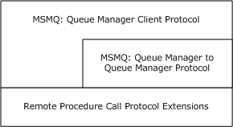
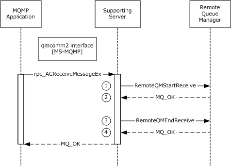
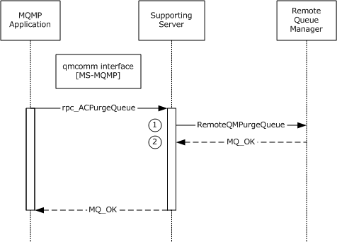

# [MS-MQQP]: Message Queuing (MSMQ): Queue Manager to Queue Manager Protocol

Table of Contents

1 Introduction

- [1 Introduction](#Section_1)
  - [1.1 Glossary](#Section_1.1)
  - [1.2 References](#Section_1.2)
    - [1.2.1 Normative References](#Section_1.2.1)
    - [1.2.2 Informative References](#Section_1.2.2)
  - [1.3 Overview](#Section_1.3)
    - [1.3.1 Messages](#Section_1.3.1)
    - [1.3.2 Queues](#Section_1.3.2)
    - [1.3.3 Queue Operations](#Section_1.3.3)
    - [1.3.4 Access Patterns](#Section_1.3.4)
  - [1.4 Relationship to Other Protocols](#Section_1.4)
  - [1.5 Prerequisites/Preconditions](#Section_1.5)
  - [1.6 Applicability Statement](#Section_1.6)
  - [1.7 Versioning and Capability Negotiation](#Section_1.7)
  - [1.8 Vendor-Extensible Fields](#Section_1.8)
  - [1.9 Standards Assignments](#Section_1.9)

2 Messages

- [2 Messages](#Section_2)
  - [2.1 Transport](#Section_2.1)
  - [2.2 Common Data Types](#Section_2.2)
    - [2.2.1 Data Types](#Section_2.2.1)
      - [2.2.1.1 PCTX_RRSESSION_HANDLE_TYPE](#Section_2.2.1.1)
      - [2.2.1.2 PCTX_REMOTEREAD_HANDLE_TYPE](#Section_2.2.1.2)
      - [2.2.1.3 REMOTEREADACK](#Section_2.2.1.3)
    - [2.2.2 Structures](#Section_2.2.2)
      - [2.2.2.1 REMOTEREADDESC](#Section_2.2.2.1)
      - [2.2.2.2 REMOTEREADDESC2](#Section_2.2.2.2)
  - [2.3 Directory Service Schema Elements](#Section_2.3)

3 Protocol Details

- [3 Protocol Details](#Section_3)
  - [3.1 qm2qm Server Details](#Section_3.1)
    - [3.1.1 Abstract Data Model](#Section_3.1.1)
      - [3.1.1.1 Shared Data Elements](#Section_3.1.1.1)
      - [3.1.1.2 RemoteReadEntry](#Section_3.1.1.2)
      - [3.1.1.3 RemoteReadEntryCollection](#Section_3.1.1.3)
      - [3.1.1.4 OpenQueueEntry](#Section_3.1.1.4)
      - [3.1.1.5 OpenQueueEntryCollection](#Section_3.1.1.5)
    - [3.1.2 Timers](#Section_3.1.2)
    - [3.1.3 Initialization](#Section_3.1.3)
    - [3.1.4 Message Processing Events and Sequencing Rules](#Section_3.1.4)
      - [3.1.4.1 RemoteQMStartReceive (Opnum 0)](#Section_3.1.4.1)
      - [3.1.4.2 RemoteQMEndReceive (Opnum 1)](#Section_3.1.4.2)
      - [3.1.4.3 RemoteQMOpenQueue (Opnum 2)](#Section_3.1.4.3)
      - [3.1.4.4 RemoteQMCloseQueue (Opnum 3)](#Section_3.1.4.4)
      - [3.1.4.5 RemoteQMCloseCursor (Opnum 4)](#Section_3.1.4.5)
      - [3.1.4.6 RemoteQMCancelReceive (Opnum 5)](#Section_3.1.4.6)
      - [3.1.4.7 RemoteQMPurgeQueue (Opnum 6)](#Section_3.1.4.7)
      - [3.1.4.8 RemoteQMGetQMQMServerPort (Opnum 7)](#Section_3.1.4.8)
      - [3.1.4.9 RemoteQmGetVersion (Opnum 8)](#Section_3.1.4.9)
      - [3.1.4.10 RemoteQMStartReceive2 (Opnum 9)](#Section_3.1.4.10)
      - [3.1.4.11 RemoteQMStartReceiveByLookupId (Opnum 10)](#Section_3.1.4.11)
    - [3.1.5 Timer Events](#Section_3.1.5)
    - [3.1.6 Other Local Events](#Section_3.1.6)
      - [3.1.6.1 PCTX_RRSESSION_HANDLE_TYPE Rundown](#Section_3.1.6.1)
      - [3.1.6.2 PCTX_REMOTEREAD_HANDLE_TYPE Rundown](#Section_3.1.6.2)
  - [3.2 qm2qm Client Details](#Section_3.2)
    - [3.2.1 Abstract Data Model](#Section_3.2.1)
      - [3.2.1.1 PendingRemoteReadEntry](#Section_3.2.1.1)
      - [3.2.1.2 PendingRemoteReadEntryCollection](#Section_3.2.1.2)
      - [3.2.1.3 RemoteOpenQueueEntry](#Section_3.2.1.3)
      - [3.2.1.4 RemoteOpenQueueEntryCollection](#Section_3.2.1.4)
    - [3.2.2 Timers](#Section_3.2.2)
    - [3.2.3 Initialization](#Section_3.2.3)
    - [3.2.4 Message Processing Events and Sequencing Rules](#Section_3.2.4)
      - [3.2.4.1 Opening a Queue](#Section_3.2.4.1)
      - [3.2.4.2 Peeking a Message](#Section_3.2.4.2)
      - [3.2.4.3 Receiving a Message](#Section_3.2.4.3)
      - [3.2.4.4 Purging a Queue](#Section_3.2.4.4)
      - [3.2.4.5 Peeking a Message by Using a Cursor](#Section_3.2.4.5)
      - [3.2.4.6 Receiving a Message by Using a Cursor](#Section_3.2.4.6)
      - [3.2.4.7 Canceling a Pending Peek or Receive](#Section_3.2.4.7)
      - [3.2.4.8 Closing a Cursor](#Section_3.2.4.8)
      - [3.2.4.9 Closing a Queue](#Section_3.2.4.9)
    - [3.2.5 Timer Events](#Section_3.2.5)
    - [3.2.6 Other Local Events](#Section_3.2.6)

4 Protocol Examples

- [4 Protocol Examples](#Section_4)
  - [4.1 Receive Example](#Section_4.1)
  - [4.2 Purge Example](#Section_4.2)

5 Security

- [5 Security](#Section_5)
  - [5.1 Security Considerations for Implementers](#Section_5.1)
  - [5.2 Index of Security Parameters](#Section_5.2)

6 Appendix A: Full IDL

- [6 Appendix A: Full IDL](#Section_6)

7 Appendix B: Product Behavior

- [7 Appendix B: Product Behavior](#Section_7)

8 Change Tracking

- [8 Change Tracking](#Section_8)

For the legal notice and IP terms, see [LEGAL.md](../LEGAL.md).
Last updated: 4/23/2024.
See [Revision History](#revision-history) for full version history.

# 1 Introduction

This document specifies the Message Queuing (MSMQ): Queue Manager to Queue Manager Protocol. The Queue Manager to Queue Manager Protocol is an [**RPC**](#gt_remote-procedure-call-rpc)-based protocol used by the [**queue manager**](#gt_queue-manager-qm) and runtime library to read and [**purge**](#gt_purge) [**messages**](#gt_message) from a [**remote queue**](#gt_remote-queue).

Sections 1.5, 1.8, 1.9, 2, and 3 of this specification are normative. All other sections and examples in this specification are informative.

## 1.1 Glossary

This document uses the following terms:

**authentication level**: A numeric value indicating the level of authentication or message protection that [**remote procedure call (RPC)**](#gt_remote-procedure-call-rpc) will apply to a specific message exchange. For more information, see [[C706]](https://go.microsoft.com/fwlink/?LinkId=89824) section 13.1.2.1 and [MS-RPCE](../MS-RPCE/MS-RPCE.md).

**cursor**: A data structure providing sequential access over a message queue. A cursor has a current pointer that lies between the head and tail pointer of the [**queue**](#gt_queue). The pointer can be moved forward or backward through an operation on the cursor (Next). A [**message**](#gt_message) at the current pointer can be accessed through a nondestructive read (Peek) operation or a destructive read (Receive) operation.

**dynamic endpoint**: A network-specific server address that is requested and assigned at run time. For more information, see [C706].

**endpoint**: A network-specific address of a remote procedure call (RPC) server process for remote procedure calls. The actual name and type of the endpoint depends on the [**RPC**](#gt_remote-procedure-call-rpc) protocol sequence that is being used. For example, for RPC over TCP (RPC Protocol Sequence ncacn_ip_tcp), an endpoint might be TCP port 1025. For RPC over Server Message Block (RPC Protocol Sequence ncacn_np), an endpoint might be the name of a named pipe. For more information, see [C706].

**globally unique identifier (GUID)**: A term used interchangeably with [**universally unique identifier (UUID)**](#gt_universally-unique-identifier-uuid) in Microsoft protocol technical documents (TDs). Interchanging the usage of these terms does not imply or require a specific algorithm or mechanism to generate the value. Specifically, the use of this term does not imply or require that the algorithms described in [[RFC4122]](https://go.microsoft.com/fwlink/?LinkId=90460) or [C706] must be used for generating the [**GUID**](#gt_globally-unique-identifier-guid). See also [**universally unique identifier (UUID)**](#gt_universally-unique-identifier-uuid).

**Interface Definition Language (IDL)**: The International Standards Organization (ISO) standard language for specifying the interface for remote procedure calls. For more information, see [C706] section 4.

**message**: A data structure representing a unit of data transfer between distributed applications. A message has [**message properties**](#gt_message-property), which may include message header properties, a [**message body**](#gt_message-body) property, and message trailer properties.

**message body**: A distinguished [**message property**](#gt_message-property) that represents the application payload.

**message header**: See message packet header.

**message property**: A data structure that contains a property identifier and a value, and that is associated with a [**message**](#gt_message).

**message queuing**: A communications service that provides asynchronous and reliable message passing between distributed client applications. In message queuing, clients send messages to message queues and consume messages from message queues. The message queues provide persistence of the messages, which enables the sending and receiving client applications to operate asynchronously from each other.

**message trailer**: See message packet trailer.

**Microsoft Message Queuing (MSMQ)**: A communications service that provides asynchronous and reliable [**message**](#gt_message) passing between distributed applications. In Message Queuing, applications send [**messages**](#gt_message) to [**queues**](#gt_queue) and consume [**messages**](#gt_message) from [**queues**](#gt_queue). The [**queues**](#gt_queue) provide persistence of the [**messages**](#gt_message), enabling the sending and receiving applications to operate asynchronously from one another.

**MQMP application**: An application that communicates with an [**MSMQ**](#gt_microsoft-message-queuing-msmq) supporting server using the [MS-MQMP](../MS-MQMP/MS-MQMP.md) protocol.

**Network Data Representation (NDR)**: A specification that defines a mapping from [**Interface Definition Language (IDL)**](#gt_interface-definition-language-idl) data types onto octet streams. [**NDR**](#gt_network-data-representation-ndr) also refers to the runtime environment that implements the mapping facilities (for example, data provided to [**NDR**](#gt_network-data-representation-ndr)). For more information, see [MS-RPCE] and [C706] section 14.

**purge**: In the context of a [**queue**](#gt_queue), to delete all [**messages**](#gt_message) from the [**queue**](#gt_queue).

**queue**: An object that holds [**messages**](#gt_message) passed between applications or [**messages**](#gt_message) passed between [**Message Queuing**](#gt_microsoft-message-queuing-msmq) and applications. In general, applications can send [**messages**](#gt_message) to queues and read [**messages**](#gt_message) from queues.

**queue manager (QM)**: A message queuing service that manages [**queues**](#gt_queue) deployed on a computer. A queue manager can also provide asynchronous transfer of [**messages**](#gt_message) to [**queues**](#gt_queue) deployed on other queue managers.

**remote procedure call (RPC)**: A communication protocol used primarily between client and server. The term has three definitions that are often used interchangeably: a runtime environment providing for communication facilities between computers (the RPC runtime); a set of request-and-response message exchanges between computers (the RPC exchange); and the single message from an RPC exchange (the RPC message). For more information, see [C706].

**remote queue**: For a [**queue manager**](#gt_queue-manager-qm), a [**queue**](#gt_queue) that is hosted by a remote [**queue manager**](#gt_queue-manager-qm). For an application, a [**queue**](#gt_queue) hosted by a [**queue manager**](#gt_queue-manager-qm) other than the one with which the application communicates.

**remote read**: The act of reading (receiving) [**messages**](#gt_message) from a [**remote queue**](#gt_remote-queue).

**universally unique identifier (UUID)**: A 128-bit value. UUIDs can be used for multiple purposes, from tagging objects with an extremely short lifetime, to reliably identifying very persistent objects in cross-process communication such as client and server interfaces, manager entry-point vectors, and [**RPC**](#gt_remote-procedure-call-rpc) objects. UUIDs are highly likely to be unique. UUIDs are also known as [**globally unique identifiers (GUIDs)**](#gt_globally-unique-identifier-guid) and these terms are used interchangeably in the Microsoft protocol technical documents (TDs). Interchanging the usage of these terms does not imply or require a specific algorithm or mechanism to generate the UUID. Specifically, the use of this term does not imply or require that the algorithms described in [RFC4122] or [C706] must be used for generating the UUID.

**MAY, SHOULD, MUST, SHOULD NOT, MUST NOT:** These terms (in all caps) are used as defined in [[RFC2119]](https://go.microsoft.com/fwlink/?LinkId=90317). All statements of optional behavior use either MAY, SHOULD, or SHOULD NOT.

## 1.2 References

Links to a document in the Microsoft Open Specifications library point to the correct section in the most recently published version of the referenced document. However, because individual documents in the library are not updated at the same time, the section numbers in the documents may not match. You can confirm the correct section numbering by checking the [Errata](https://go.microsoft.com/fwlink/?linkid=850906).

### 1.2.1 Normative References

We conduct frequent surveys of the normative references to assure their continued availability. If you have any issue with finding a normative reference, please contact [dochelp@microsoft.com](mailto:dochelp@microsoft.com). We will assist you in finding the relevant information.

[C706] The Open Group, "DCE 1.1: Remote Procedure Call", C706, August 1997, [https://publications.opengroup.org/c706](https://go.microsoft.com/fwlink/?LinkId=89824)

**Note** Registration is required to download the document.

[MC-MQAC] Microsoft Corporation, "[Message Queuing (MSMQ): ActiveX Client Protocol](../MC-MQAC/MC-MQAC.md)".

[MS-ADTS] Microsoft Corporation, "[Active Directory Technical Specification](../MS-ADTS/MS-ADTS.md)".

[MS-DTYP] Microsoft Corporation, "[Windows Data Types](#Section_2.2.1)".

[MS-ERREF] Microsoft Corporation, "[Windows Error Codes](../MS-ERREF/MS-ERREF.md)".

[MS-MQDMPR] Microsoft Corporation, "[Message Queuing (MSMQ): Common Data Model and Processing Rules](../MS-MQDMPR/MS-MQDMPR.md)".

[MS-MQDSSM] Microsoft Corporation, "[Message Queuing (MSMQ): Directory Service Schema Mapping](../MS-MQDSSM/MS-MQDSSM.md)".

[MS-MQDS] Microsoft Corporation, "[Message Queuing (MSMQ): Directory Service Protocol](../MS-MQDS/MS-MQDS.md)".

[MS-MQMP] Microsoft Corporation, "[Message Queuing (MSMQ): Queue Manager Client Protocol](../MS-MQMP/MS-MQMP.md)".

[MS-MQMQ] Microsoft Corporation, "[Message Queuing (MSMQ): Data Structures](#Section_2.2.2)".

[MS-MQRR] Microsoft Corporation, "[Message Queuing (MSMQ): Queue Manager Remote Read Protocol](../MS-MQRR/MS-MQRR.md)".

[MS-RPCE] Microsoft Corporation, "[Remote Procedure Call Protocol Extensions](../MS-RPCE/MS-RPCE.md)".

[RFC2119] Bradner, S., "Key words for use in RFCs to Indicate Requirement Levels", BCP 14, RFC 2119, March 1997, [https://www.rfc-editor.org/info/rfc2119](https://go.microsoft.com/fwlink/?LinkId=90317)

### 1.2.2 Informative References

[MS-MQOD] Microsoft Corporation, "[Message Queuing Protocols Overview](#Section_1.3)".

## 1.3 Overview

[**Message queuing**](#gt_microsoft-message-queuing-msmq) is a communications service that provides asynchronous and reliable [**message**](#gt_message) passing between client applications, including those client applications running on different hosts. In [**message queuing**](#gt_message-queuing), clients send messages to a [**queue**](#gt_queue) and consume application messages from a queue. The queue provides persistence of the messages, enabling them to survive across application restarts, and allowing the sending and receiving client applications to operate asynchronously from each other.

Queues are typically hosted by a communications service called a [**queue manager**](#gt_queue-manager-qm). By hosting the queue manager in a separate service from the client applications, applications can communicate by exchanging messages via a queue hosted by the queue manager, even if the client applications never execute at the same time.

The queue manager can perform operations on a [**remote queue**](#gt_remote-queue). When this scenario occurs, a protocol is required to insert messages into the remote queue, and another protocol is required to consume messages from the remote queue. The Message Queuing (MSMQ): Queue Manager to Queue Manager Protocol provides a protocol for consuming messages from a remote queue.

The Queue Manager to Queue Manager Protocol is used only to read messages from a queue or to [**purge**](#gt_purge) messages from the queue. Reading a message also implies deleting the message after it is read, as specified in Queue Operations (section [1.3.3](#Section_1.3.3)).

### 1.3.1 Messages

Each [**message**](#gt_message) that is exchanged in a [**message queuing**](#gt_message-queuing) system typically has a set of [**message properties**](#gt_message-property) that contain metadata about the message and a distinguished property, called a [**message body**](#gt_message-body), that contains the application payload.

Message properties that are serialized in front of the message body are referred to as [**message headers**](#gt_message-header), and message properties that are serialized after the message body property are referred to as [**message trailers**](#gt_message-trailer).

Messages that are carried by this protocol are treated as payload. The format and structure of the application messages are opaque to the protocol.

The protocol also requires that each message have a lookup identifier that is unique in the [**queue**](#gt_queue). This identifier is not part of the message but is instead assigned by the server.

### 1.3.2 Queues

A [**queue**](#gt_queue) is a logical data structure containing an ordered first-in-first-out (FIFO) list of zero or more [**messages**](#gt_message).

This protocol provides a mechanism to open a queue. Opening provides an opportunity to check for the existence of the queue and to perform authorization checks. The protocol provides for the return of an [**RPC**](#gt_remote-procedure-call-rpc) context handle that is used by the client to specify the queue to operate on in subsequent requests. The use of an RPC context handle provides a mechanism to ensure that server state is cleaned up if the connection between the client and server is lost.

When opening a queue, the client can specify an access mode that determines the operations (Peek, Receive, CancelReceive, and Purge) for which the returned handle can subsequently be used. The client can specify a sharing mode that either allows other clients to access the queue concurrently or ensures that the client has exclusive access to the queue. The exclusive access sharing mode can be used to avoid race conditions caused by other clients operating on the queue at the same time. This sharing mode is specified when opening a [**remote queue**](#gt_remote-queue), as specified in [MS-MQMP](../MS-MQMP/MS-MQMP.md) section 3.1.4.2.

### 1.3.3 Queue Operations

The protocol provides mechanisms for the following operations against an open [**queue**](#gt_queue).

A [**message**](#gt_message) can be consumed from an open queue through a destructive read operation referred to as Receive. This operation atomically reads the message and removes it from the queue. Since this operation removes a message from a queue, losing a network connection during this operation could result in permanent loss of the message.

To guard against this situation, the protocol provides a mechanism for the client to either positively or negatively acknowledge receipt of the message. On receipt of positive acknowledgment from the client, the server can remove the message from the queue. While the server is awaiting acknowledgment from the client, access to the message by other clients is prevented.

A message can be read from an open queue through a nondestructive read operation referred to as Peek. This operation reads the message but does not remove it from the queue.

All the messages can be removed from a queue through a [**Purge**](#gt_purge) mechanism. The messages removed through this mechanism are not returned to the client.

A client can inform the server that it has no need of a message via a CancelReceive operation. The server can use this indication to inform the sender that the client did not consume the message. How a server implements this notification functionality is not addressed in this specification.

When a client does a destructive read, the message is not deleted from the queue until the client acknowledges receipt of the message via an EndReceive operation.

### 1.3.4 Access Patterns

[**Messages**](#gt_message) in a [**queue**](#gt_queue) can be consumed in a FIFO access pattern. Because messages in a queue are ordered, there is a head, representing the front of the queue, and a tail, representing the end of the queue.

The protocol provides mechanisms to Peek or Receive the first message or the last message in the queue.

The protocol also allows the client to specify exactly which message to Peek or Receive, regardless of its position in the queue, through a unique lookup identifier assigned to each message by the server. A message can also be specified relative to the message identified by the lookup identifier, that is, the message immediately preceding or following the message identified by the lookup identifier.

Finally, the protocol provides a mechanism, referred to as a [**cursor**](#gt_cursor), for sequential forward access through the queue. A cursor logically represents a current pointer that lies between the head and the tail of the queue. A cursor can be specified to the Peek or Receive operation, which Peek or Receive the message at the current pointer represented by the cursor. The cursor's current pointer can be used, through a modified Peek operation called PeekNext, to do a Peek on the next message in the queue without moving the cursor's current position. A Receive operation intrinsically moves the cursor forward.

Because cursors are stateful, the protocol provides mechanisms to close a cursor opened as specified in [MS-MQMP](../MS-MQMP/MS-MQMP.md) section 3.1.4.4. Because a cursor represents a position within a queue, the protocol logically relates the cursor to the context handle associated with an open queue. The protocol places no limit on the number of concurrent cursors associated with a queue context handle.

## 1.4 Relationship to Other Protocols

This protocol is dependent on [**RPC**](#gt_remote-procedure-call-rpc) for its transport. This protocol uses RPC, as specified in section [2.1](#Section_2.1).

This protocol is tightly coupled with the Message Queuing (MSMQ): Queue Manager Client Protocol [MS-MQMP](../MS-MQMP/MS-MQMP.md) and therefore if one protocol is implemented, the other one also has to be implemented. The methods of this protocol are invoked only by the processing rules of Message Queuing (MSMQ): Queue Manager Client Protocol. The functionalities of this protocol coupled with the functionalities of Message Queuing (MSMQ): Queue Manager Client Protocol together provide the ability for reading and browsing messages from a remote queue. Furthermore, the arguments required for these methods are obtained from the qmcomm RPC interface, as specified in [MS-MQMP]. The following diagram illustrates the protocol layering for this protocol.

Figure 1: Protocol relationships

This protocol has been deprecated by the RemoteRead RPC interface, as specified in [MS-MQRR](../MS-MQRR/MS-MQRR.md).

This protocol uses shared state and processing rules defined in [MS-MQDMPR](../MS-MQDMPR/MS-MQDMPR.md).

## 1.5 Prerequisites/Preconditions

The Message Queuing (MSMQ): Queue Manager to Queue Manager Protocol is an [**RPC**](#gt_remote-procedure-call-rpc) interface and, as a result, has prerequisites, as specified in [MS-RPCE](../MS-RPCE/MS-RPCE.md), that are common to RPC interfaces.

## 1.6 Applicability Statement

This protocol provides functionality related to consumption of [**messages**](#gt_message) from a [**queue**](#gt_queue) hosted at a [**queue manager**](#gt_queue-manager-qm) running on a remote computer.<1> It does not provide functionality related to inserting messages into a queue.

The server side of the Message Queuing (MSMQ): Queue Manager to Queue Manager Protocol is applicable for implementation by a queue manager providing message queuing communication services to clients. The client side of this protocol is applicable for implementation by client libraries providing message queuing services to applications or by a client queue manager delegating requests on behalf of client applications.

## 1.7 Versioning and Capability Negotiation

**Supported Transports**: This protocol uses the [**RPC**](#gt_remote-procedure-call-rpc) over TCP/IP protocol sequence, as specified in section [2.1](#Section_2.1). However, it supports a mechanism for explicitly negotiating the RPC [**endpoint**](#gt_endpoint) to be used. For more information, see [RemoteQMGetQMQMServerPort](#Section_3.1.4.8).

**Protocol Versions**: This protocol uses a single version of the RPC interface, but that interface has been extended by adding the following methods at the end:<2>

- [RemoteQmGetVersion (section 3.1.4.9)](#Section_3.1.4.9)
- [RemoteQMStartReceive2 (section 3.1.4.10)](#Section_3.1.4.10)
- [RemoteQMStartReceiveByLookupId (section 3.1.4.11)](#Section_3.1.4.11)

## 1.8 Vendor-Extensible Fields

This protocol uses HRESULTs, as specified in [MS-DTYP](#Section_2.2.1) section 2.2.18. Vendors can define their own HRESULT values, provided that they set the C bit (0x20000000) for each vendor-defined value, indicating that the value is a customer code.

## 1.9 Standards Assignments

This protocol uses the standard interfaces that are listed in the following table.

| Parameter | Value | Reference |
| --- | --- | --- |
| [**RPC**](#gt_remote-procedure-call-rpc) interface [**UUID**](#gt_universally-unique-identifier-uuid) | {1088a980-eae5-11d0-8d9b-00a02453c337} | As specified in [[C706]](https://go.microsoft.com/fwlink/?LinkId=89824). |
| Interface version | 1.0 | As specified in [C706]. |

# 2 Messages

The following sections specify how Message Queuing (MSMQ): Queue Manager to Queue Manager Protocol [**messages**](#gt_message) are transported and the common data types for this protocol.

## 2.1 Transport

This protocol SHOULD use the RPC protocol sequence [**RPC**](#gt_remote-procedure-call-rpc) over TCP/IP (ncacn_ip_tcp), as specified in [MS-RPCE](../MS-RPCE/MS-RPCE.md).<3> This protocol MAY use the RPC over SPX (ncacn_spx) protocol sequence if TCP/IP is unavailable.<4>

This protocol SHOULD use RPC [**dynamic endpoints**](#gt_dynamic-endpoint), as specified in [[C706]](https://go.microsoft.com/fwlink/?LinkId=89824), Part 4. This protocol MAY use an RPC static [**endpoint**](#gt_endpoint), as specified in RemoteQMGetQMQMServerPort, section [3.1.4.8](#Section_3.1.4.8).<5>

This protocol allows any user to establish a connection to the RPC server. This protocol depends on the qmcomm interface, as specified in [MS-MQMP](../MS-MQMP/MS-MQMP.md), to use the underlying RPC protocol to retrieve the identity of the invoking client, as specified in [MS-RPCE], section 3.3.3.4.3. The qmcomm server uses this identity to perform method-specific access checks as specified in [MS-MQMP], section 3.1.4.

## 2.2 Common Data Types

This protocol MUST indicate to the [**RPC**](#gt_remote-procedure-call-rpc) runtime that it is to support both the [**Network Data Representation (NDR)**](#gt_network-data-representation-ndr) and NDR64 transfer syntaxes, and it MUST provide a negotiation mechanism for determining which transfer syntax will be used, as specified in [MS-RPCE](../MS-RPCE/MS-RPCE.md) section 3.

HRESULT: This specification uses the HRESULT type, as specified in [MS-ERREF](../MS-ERREF/MS-ERREF.md) section 2.1.1. Note: Throughout this specification, the phrase "a failure HRESULT" means any HRESULT where the Severity (S) bit is set, as specified by [MS-ERREF]. When this specification mandates the return of "a failure HRESULT" from a method, the specific error code is not relevant to the protocol, as long as the Severity bit is set. In this circumstance, the server MAY return MQ_ERROR (0xC00E0001), or any other HRESULT value where the Severity bit is set, such as a context-specific message queuing error code, as specified in [MS-MQMQ](#Section_2.2.2) section 2.4.

In addition to the RPC base types and definitions, as specified in [[C706]](https://go.microsoft.com/fwlink/?LinkId=89824) and [MS-RPCE], additional data types are defined as follows.

The following table summarizes the types defined in this specification.

| Data type name | Description |
| --- | --- |
| [PCTX_RRSESSION_HANDLE_TYPE](#Section_2.2.1.1) | A context handle representing an open [**queue**](#gt_queue). |
| [PCTX_REMOTEREAD_HANDLE_TYPE](#Section_2.2.1.2) | A context handle representing a read session. |
| [REMOTEREADACK](#Section_2.2.1.3) | An enumeration that represents an acknowledgment (ACK) or a negative acknowledgment (NACK). |
| [REMOTEREADDESC](#Section_2.2.2.1) | A structure used for receiving [**messages**](#gt_message) from a queue. |
| [REMOTEREADDESC2](#Section_2.2.2.1) | A structure containing the REMOTEREADDESC structure and defining an additional element for tracking transaction-related information. |

### 2.2.1 Data Types

#### 2.2.1.1 PCTX_RRSESSION_HANDLE_TYPE

The PCTX_RRSESSION_HANDLE_TYPE is a data type that defines an [**RPC**](#gt_remote-procedure-call-rpc) context handle corresponding to an open [**queue**](#gt_queue) handle. A client MUST call [RemoteQMOpenQueue](#Section_3.1.4.3) to create a PCTX_RRSESSION_HANDLE_TYPE and [RemoteQMCloseQueue](#Section_3.1.4.4) to delete a PCTX_RRSESSION_HANDLE_TYPE.

This type is declared as follows:

typedef [context_handle] void* PCTX_RRSESSION_HANDLE_TYPE;

#### 2.2.1.2 PCTX_REMOTEREAD_HANDLE_TYPE

The PCTX_REMOTEREAD_HANDLE_TYPE is a data type that defines an [**RPC**](#gt_remote-procedure-call-rpc) context handle corresponding to an open read session. A client MUST call [RemoteQMStartReceive](#Section_3.1.4.1), [RemoteQMStartReceive2](#Section_3.1.4.10), or [RemoteQMStartReceiveByLookupId](#Section_3.1.4.11) to create a PCTX_REMOTEREAD_HANDLE_TYPE context handle and call [RemoteQMEndReceive](#Section_3.1.4.2) to delete the PCTX_REMOTEREAD_HANDLE_TYPE handle.

This type is declared as follows:

typedef [context_handle] void* PCTX_REMOTEREAD_HANDLE_TYPE;

#### 2.2.1.3 REMOTEREADACK

The REMOTEREADACK enumeration represents an acknowledgment (ACK) or a negative acknowledgment (NACK), indicating a successfully or an unsuccessfully delivered packet, respectively.

typedef enum _REMOTEREADACK {

RR_UNKNOWN,

RR_NACK,

RR_ACK

} REMOTEREADACK ;

**RR_UNKNOWN:** No acknowledgment.

**RR_NACK:** Negative acknowledgment for a packet.

**RR_ACK:** Acknowledgment for a packet.

### 2.2.2 Structures

#### 2.2.2.1 REMOTEREADDESC

This structure is used to encapsulate the information necessary to perform operations [RemoteQMStartReceive](#Section_3.1.4.1), [RemoteQMStartReceive2](#Section_3.1.4.10), and [RemoteQMStartReceiveByLookupId](#Section_3.1.4.11).

typedef struct _REMOTEREADDESC {

DWORD hRemoteQueue;

DWORD hCursor;

DWORD ulAction;

DWORD ulTimeout;

[range(0, 4325376)] DWORD dwSize;

DWORD dwQueue;

DWORD dwRequestID;

DWORD Reserved;

DWORD dwArriveTime;

REMOTEREADACK eAckNack;

[unique, size_is(dwSize), length_is(dwSize)]

byte* lpBuffer;

} REMOTEREADDESC;

**hRemoteQueue:** A handle to the [**queue**](#gt_queue) as obtained from the *phQueue* parameter of the **qmcomm:R_QMOpenRemoteQueue** method, as specified in [MS-MQMP](../MS-MQMP/MS-MQMP.md) section 3.1.4.2. This value is set by the client.

**hCursor:** If nonzero, specifies a handle to a [**cursor**](#gt_cursor) that MUST have been obtained from the *phCursor* parameter of the **qmcomm:R_QMCreateRemoteCursor** method, as specified in [MS-MQMP] section 3.1.4.4. This value is set by the client.

**ulAction:** The following table describes possible actions. The Peek and Receive operations both enable access to the contents of a [**message**](#gt_message). This value is set by the client.

| Value | Type/Meaning |
| --- | --- |
| MQ_ACTION_RECEIVE 0x00000000 | Type = Receive Reads and removes a message from the current cursor location if **hCursor** is nonzero or from the front of the queue if **hCursor** is set to zero. |
| MQ_ACTION_PEEK_CURRENT 0x80000000 | Type = Peek Reads a message from the current cursor location if **hCursor** is nonzero or from the front of the queue if **hCursor** is set to zero but does not remove it from the queue. |
| MQ_ACTION_PEEK_NEXT 0x80000001 | Type = Peek Reads a message following the message at the current cursor location but does not remove it from the queue. |
| MQ_LOOKUP_PEEK_CURRENT 0x40000010 | Type = Peek Reads the message specified by a lookup identifier but does not remove it from the queue. |
| MQ_LOOKUP_PEEK_NEXT 0x40000011 | Type = Peek Reads the message following the message specified by a lookup identifier but does not remove it from the queue. |
| MQ_LOOKUP_PEEK_PREV 0x40000012 | Type = Peek Reads the message preceding the message specified by a lookup identifier but does not remove it from the queue. |
| MQ_LOOKUP_RECEIVE_CURRENT 0x40000020 | Type = Receive Reads the message specified by a lookup identifier and removes it from the queue. |
| MQ_LOOKUP_RECEIVE_NEXT 0x40000021 | Type = Receive Reads the message following the message specified by a lookup identifier and removes it from the queue. |
| MQ_LOOKUP_RECEIVE_PREV 0x40000022 | Type = Receive Reads the message preceding the message specified by a lookup identifier and removes it from the queue. |

**ulTimeout:** Specifies a time-out in milliseconds for the server to wait for a message to become available in the queue. This value is set by the client. To specify an infinite time-out, the client MUST set this field to 0xFFFFFFFF.

**dwSize:** Specifies the size, in bytes, of **lpBuffer**. The valid range is 0 to 0x00420000. This value is set by the server and MUST be set to 0 by the client.

**dwQueue:** A DWORD pointed to by the *dwpQueue* parameter of the **qmcomm:R_QMOpenRemoteQueue** method, as specified in [MS-MQMP] section 3.1.4.2. This value is set by the client.

**dwRequestID:** The client MUST set this member to a unique identifier for the receive request, which could later be used to identify and cancel the receive request. This value is set by the client. The client SHOULD NOT<6> reuse this identifier until a call to the RemoteQMEndReceive (Opnum 1) method or to the RemoteQMCancelReceive (Opnum 5) method has been made for that receive request.

**Reserved:** This is a reserved field of type **DWORD** that MUST be ignored.

| Value | Meaning |
| --- | --- |
| 0x00000000 | Returned by client. |
| 0x00000001 | Returned by server. |

**dwArriveTime:** The server MUST set this value to the time that the message was added to the queue. The time MUST be expressed as the number of seconds elapsed since 00:00:00.0, January 1, 1970 Coordinated Universal Time (UTC).

**eAckNack:** This is a reserved field and MUST be ignored by the client and the server.

**lpBuffer:** This field represents a pointer to a buffer containing the UserMessage Packet ([MS-MQMQ](#Section_2.2.2) section 2.2.20). The size of this field is specified by **dwSize**. This value is set by the server and MUST be set to NULL by the client.

#### 2.2.2.2 REMOTEREADDESC2

This structure is used by [RemoteQMStartReceive2](#Section_3.1.4.10) and [RemoteQMStartReceiveByLookupId](#Section_3.1.4.11) to encapsulate the parameters necessary for execution of these operations.

typedef struct _REMOTEREADDESC2 {

REMOTEREADDESC* pRemoteReadDesc;

ULONGLONG SequentialId;

} REMOTEREADDESC2;

**pRemoteReadDesc:** A pointer to a [REMOTEREADDESC](#Section_2.2.2.1) structure, as specified in section 2.2.2.1.

**SequentialId:** This field is set by the server to the value of a unique message identifier that corresponds to a received message.

## 2.3 Directory Service Schema Elements

This protocol uses ADM elements specified in section [3.1.1](#Section_3.1.1). A subset of these elements can be published in a directory. This protocol SHOULD<7> access the directory using the algorithm specified in [MS-MQDSSM](../MS-MQDSSM/MS-MQDSSM.md) and using LDAP [MS-ADTS](../MS-ADTS/MS-ADTS.md). The Directory Service schema elements for ADM elements published in the directory are defined in [MS-MQDSSM] section 2.4.<8>

# 3 Protocol Details

The following sections specify details of the Message Queuing (MSMQ): Queue Manager to Queue Manager Protocol including the abstract data model, interface method syntax, and [**message**](#gt_message) processing rules.

## 3.1 qm2qm Server Details

### 3.1.1 Abstract Data Model

This section describes a conceptual model of possible data organization that an implementation maintains to participate in this protocol. The described organization is provided to facilitate the explanation of how the protocol behaves. This document does not mandate that implementations adhere to this model as long as their external behavior is consistent with that described in this document.

The abstract data model for this protocol comprises elements that are private to this protocol and others that are shared between multiple MSMQ protocols that are colocated at a common queue manager. The shared abstract data model is defined in [MS-MQDMPR](../MS-MQDMPR/MS-MQDMPR.md) section 3.1.1 and the relationship between this protocol, a queue manager, and other protocols which share a common queue manager, is described in [MS-MQOD](#Section_1.3).

Section [3.1.1.1](#Section_3.1.1.1) details the elements from the shared data model that are manipulated by this protocol, and sections [3.1.1.2](#Section_3.1.1.2) through [3.1.1.5](#Section_3.1.1.5) detail the data model elements that are private to this protocol.

#### 3.1.1.1 Shared Data Elements

This protocol manipulates the following abstract data model elements from the shared abstract data model defined in [MS-MQDMPR](../MS-MQDMPR/MS-MQDMPR.md) section 3.1.1.

**QueueManager:** Defined in [MS-MQDMPR] section 3.1.1.1.

**Queue:** Defined in [MS-MQDMPR] section 3.1.1.2.

**Message:** Defined in [MS-MQDMPR] section 3.1.1.12.

**Cursor:** Defined in [MS-MQDMPR] section 3.2.

**OpenQueueDescriptor:** Defined in [MS-MQDMPR] section 3.1.1.16.

#### 3.1.1.2 RemoteReadEntry

The **RemoteReadEntry** is an ADM element that encapsulates an initialized, pending, or completed [**remote read**](#gt_remote-read) operation. This element has the following attributes:

**OpenQueueDescriptorHandle:** The **OpenQueueDescriptor.Handle** for the queue being read from.

**Timeout:** Time-out associated with the read request.

**Action (peek/receive):** The type of read operation performed.

**RequestId:** A unique DWORD value that identifies the pending read request. This value is generated by the client and passed to the server in a [REMOTEREADDESC (section 2.2.2.1)](#Section_2.2.2.1) structure.

**UserMessagepacket:** The message.

This element is referenced by means of a [PCTX_REMOTEREAD_HANDLE_TYPE](#Section_2.2.1.2) value.

#### 3.1.1.3 RemoteReadEntryCollection

The **RemoteReadEntryCollection** represents a collection of [RemoteReadEntry](#Section_3.1.1.2) elements, each of which represents a pending request to PEEK or receive a message from a queue. The server MUST maintain an instance of this element referred to as **rRemoteReadEntryCollection**. The server MUST serialize concurrent read, write, and iteration operations to **rRemoteReadEntryCollection**. For iterations, the serialization MUST include the processing of each element, if any, in the loop.

#### 3.1.1.4 OpenQueueEntry

The **OpenQueueEntry** is an ADM element that encapsulates an initialized, pending, or completed remote open queue operation. This element has the following attributes:

**OpenQueueDescriptorHandle: OpenQueueDescriptor.Handle** for the queue.

**ClientId:** A [**GUID**](#gt_globally-unique-identifier-guid) that uniquely identifies the client opening the queue.

This element is referenced by means of a [PCTX_RRSESSION_HANDLE_TYPE](#Section_2.2.1.1) value.

#### 3.1.1.5 OpenQueueEntryCollection

The **OpenQueueEntryCollection** represents a collection of [OpenQueueEntry](#Section_3.1.1.4) elements, each of which represents a remote queue opened by a client. The server MUST maintain an instance of this element referred to as **rOpenQueueEntryCollection**. The server MUST serialize concurrent read, write, and iteration operations to the **rOpenQueueEntryCollection**. For iterations, the serialization MUST include the processing of each element, if any, in the loop.

### 3.1.2 Timers

Beyond protocol timers used internally by [**RPC**](#gt_remote-procedure-call-rpc) to implement resiliency to network outages (for more information, see [MS-RPCE](../MS-RPCE/MS-RPCE.md)), the server MUST maintain the following timers:

**Call Timer:** The server MUST maintain a per-call timer for each call to [RemoteQMStartReceive](#Section_3.1.4.1) or [RemoteQMStartReceive2](#Section_3.1.4.10) in which the REMOTEREADDESC.ulTimeout parameter is nonzero. The timer MUST be set to the REMOTEREADDESC.ulTimeout parameter that is specified on the call.

### 3.1.3 Initialization

The server MUST listen on the [**RPC**](#gt_remote-procedure-call-rpc) protocol, as specified in section [2.1](#Section_2.1).

### 3.1.4 Message Processing Events and Sequencing Rules

This protocol SHOULD <9> indicate to the [**RPC**](#gt_remote-procedure-call-rpc) runtime that it is to perform a strict [**NDR**](#gt_network-data-representation-ndr) data consistency check at target level 6.0, as specified in [MS-RPCE](../MS-RPCE/MS-RPCE.md) section 3.

The qm2qm interface includes the following methods.

Methods in RPC Opnum Order

| Method | Description |
| --- | --- |
| [RemoteQMStartReceive](#Section_3.1.4.1) | Initiates a Receive or Peek request on the [**queue**](#gt_queue). Opnum: 0 |
| [RemoteQMEndReceive](#Section_3.1.4.2) | Finishes a Receive request. Opnum: 1 |
| [RemoteQMOpenQueue](#Section_3.1.4.3) | Opens a queue. Opnum: 2 |
| [RemoteQMCloseQueue](#Section_3.1.4.4) | Closes a queue. Opnum: 3 |
| [RemoteQMCloseCursor](#Section_3.1.4.5) | Closes a [**cursor**](#gt_cursor). Opnum: 4 |
| [RemoteQMCancelReceive](#Section_3.1.4.6) | Cancels a pending Receive request. Opnum: 5 |
| [RemoteQMPurgeQueue](#Section_3.1.4.7) | Deletes all [**messages**](#gt_message) in a queue. Opnum: 6 |
| [RemoteQMGetQMQMServerPort](#Section_3.1.4.8) | Returns an RPC [**endpoint**](#gt_endpoint) port number to use in subsequent calls on the interface. Opnum: 7 |
| [RemoteQmGetVersion](#Section_3.1.4.9) | Returns the server version. Opnum: 8 |
| [RemoteQMStartReceive2](#Section_3.1.4.10) | Initiates a Receive or Peek request on the queue by using a sequential ID. Opnum: 9 |
| [RemoteQMStartReceiveByLookupId](#Section_3.1.4.11) | Initiates a Receive or Peek request on the queue by using a lookup ID. Opnum: 10 |

#### 3.1.4.1 RemoteQMStartReceive (Opnum 0)

The RemoteQMStartReceive method peeks or receives a [**message**](#gt_message) from an open [**queue**](#gt_queue).

If RemoteQMStartReceive is invoked with a Peek action type, as specified in the *ulAction* member of the *lpRemoteReadDesc* parameter, the operation completes when RemoteQMStartReceive returns.

If RemoteQMStartReceive is invoked with a Receive action type, as specified in the *ulAction* member of the *lpRemoteReadDesc* parameter, the client MUST pair each call to RemoteQMStartReceive with a call to [RemoteQMEndReceive](#Section_3.1.4.2) to complete the operation, or to [RemoteQMCancelReceive](#Section_3.1.4.6) to cancel the operation.

For each call to RemoteQMCancelReceive, the *dwRequestID* parameter MUST match the *dwRequestID* member of the *lpRemoteReadDesc* parameter in a previous call to RemoteQMStartReceive.

If the client specifies a nonzero value for the **ulTimeout** member of the *lpRemoteReadDesc* parameter, and a message is not available in the queue at the time of the call, the server waits up to the specified time-out for a message to become available in the queue before responding to the call. The client can call RemoteQMCancelReceive with a matching **REMOTEREADDESC**.**dwRequestID** to cancel the pending RemoteQMStartReceive request.

Before calling this method, the client MUST have already called [RemoteQMOpenQueue](#Section_3.1.4.3).

HRESULT RemoteQMStartReceive(

[in] handle_t hBind,

[out] PCTX_REMOTEREAD_HANDLE_TYPE* pphContext,

[in, out] REMOTEREADDESC* lpRemoteReadDesc

);

**hBind:** An [**RPC**](#gt_remote-procedure-call-rpc) binding handle parameter, as specified in [MS-RPCE](../MS-RPCE/MS-RPCE.md) section 2, that MUST be specified.

**pphContext:** The server MUST return a non-NULL value for this handle upon success for receive calls. This handle will be used by the client in subsequent calls to RemoteQMEndReceive. This handle MUST NOT be set upon failure, or for peek calls. If this method returns an error, *pphContext* is undefined and MUST NOT be used as an argument for a call to RemoteQMEndReceive.

**lpRemoteReadDesc:** A pointer to an instance of a [REMOTEREADDESC (section 2.2.2.1)](#Section_2.2.2.1) structure.

In addition, the *ulAction* member of the *lpRemoteReadDesc* parameter MUST be one of the following values.

| Value of ulAction | Meaning |
| --- | --- |
| MQ_ACTION_RECEIVE 0x00000000 | If *hCursor* is nonzero, read and remove the first message available at the current [**cursor**](#gt_cursor)'s location walking towards the end of the queue. If *hCursor* is zero, read and remove the message from the front of the queue. |
| MQ_ACTION_PEEK_CURRENT 0x80000000 | If *hCursor* is nonzero, read the message at the current cursor location, but do not remove it from the queue. The cursor location does not change after the operation. If *hCursor* is zero, read the message at the front of the queue, but do not remove it from the queue. |
| MQ_ACTION_PEEK_NEXT 0x80000001 | Read the message following the message at the current cursor location, but do not remove it. The cursor location will then change to the next available message, walking towards the end of the queue. The *hCursor* parameter MUST be set to a nonzero cursor handle. |

The *hCursor* member of *lpRemoteReadDesc* specifies a handle to an opened cursor. A value of zero indicates that a cursor is not used for this operation.

The *dwRequestID* member of the *lpRemoteReadDesc* parameter is used in a subsequent call to RemoteQMCancelReceive to correlate that call with the call to RemoteQMStartReceive.

**Return Values:** The method MUST return MQ_OK (0x00000000) on success; otherwise, it MUST return a failure HRESULT, and the client MUST treat all failure HRESULTs identically.

**MQ_OK** (0x00000000)

**MQ_ERROR_INVALID_HANDLE** (0xC00E0007)

**MQ_ERROR_INVALID_PARAMETER** (0xC00E0006)

**STATUS_INVALID_PARAMETER** (0xC000000D)

**Exceptions Thrown**: None except those thrown by the underlying RPC protocol, as specified in [MS-RPCE].

While processing this method, the server MUST:

- Return MQ_ERROR_INVALID_HANDLE (0xC00E0007) if *lpRemoteReadDesc* is NULL.
- Return MQ_ERROR_INVALID_PARAMETER (0xC00E0006) if *lpRemoteReadDesc*.**dwQueue** is set to 0x00000000 or *lpRemoteReadDesc*.**dwQueue** is not equal to *lpRemoteReadDesc*.**hRemoteQueue**.
- The server SHOULD return MQ_ERROR_INVALID_PARAMETER (0xC00E0006) if the *lpRemoteReadDesc*.**dwRequestID** does not uniquely identify the receive request. This duplicate detection is performed by searching for a [RemoteReadEntry (section 3.1.1.2)](#Section_3.1.1.2) ADM element instance, referred to as **rRemoteReadEntry**, in **rRemoteReadEntryCollection** such that **rRemoteReadEntry.OpenQueueDescriptorHandle** = *lpRemoteReadDesc*.**hRemoteQueue** and **rRemoteReadEntry.RequestId** = *lpRemoteReadDesc*.**dwRequestID**.<10>
- Return STATUS_INVALID_PARAMETER (0xC000000D) if *lpRemoteReadDesc*.**hCursor** is set to 0x00000000 and the *lpRemoteReadDesc*.**ulAction** is set to MQ_ACTION_PEEK_NEXT.
- Search the **rOpenQueueEntryCollection** where **OpenQueueEntry.OpenQueueDescriptorHandle** = *lpRemoteReadDesc*.**hRemoteQueue**.
- If the **OpenQueueDescriptorHandle** is not found, return MQ_ERROR_INVALID_PARAMETER (0xc00e0006).
- Find the **OpenQueueDescriptor**, referred to as **rOpenQueueDescriptor**, in the **Queue.OpenQueueDescriptorCollection** of each queue object in **QueueManager.QueueCollection** such that **rOpenQueueDescriptor.Handle** = *lpRemoteReadDesc*.**hRemoteQueue**.
- If *lpRemoteReadDesc*.**hCursor** is not 0x00000000, find the cursor object, referred to as *rCursor*, in the **rOpenQueueDescriptor.CursorCollection** with a Handle property equal to *lpRemoteReadDesc*.**hCursor**.
- If no cursor object is found, return STATUS_INVALID_PARAMETER.
- If *lpRemoteReadDesc*.**hCursor** is 0x00000000, set *rCursor* to NULL.
- Create a new **RemoteReadEntry** ADM element instance, referred to as *rrEntry*, with the following attributes:
- **OpenQueueDescriptorHandle** = *lpRemoteReadDesc*.**hRemoteQueue**
- **Timeout** = *lpRemoteReadDesc*.**ulTimeout**
- **UserMessagePacket** = *lpRemoteReadDesc*.**lpBuffer**
- **Action** = *lpRemoteReadDesc*.**ulAction**
- **RequestId** = *lpRemoteReadDesc*.**dwRequestID**
- Add *rrEntry* to **rRemoteReadEntryCollection**.
- If the **ulAction** member of the *lpRemoteReadDesc* parameter is MQ_ACTION_RECEIVE, generate a Dequeue Message Begin event ([MS-MQDMPR](../MS-MQDMPR/MS-MQDMPR.md) section 3.1.7.1.11) with the following inputs:
- *iQueueDesc* := reference to **OpenQueueDescriptor** obtained earlier.
- *iTimeout* := *lpRemoteReadDesc*.**ulTimeout**
- *iTag* := *lpRemoteReadDesc*.**dwRequestID**
- *iCursor* := *rCursor*
- If the **ulAction** member of the *lpRemoteReadDesc* parameter is MQ_ACTION_PEEK_CURRENT, generate a Peek Message event with the following inputs:
- *iQueueDesc* := reference to **OpenQueueDescriptor** obtained earlier.
- *iTimeout* := *lpRemoteReadDesc*.**ulTimeout**
- *iCursor* := *rCursor*
- If the **ulAction** member of the *lpRemoteReadDesc* parameter is MQ_ACTION_PEEK_NEXT, generate a Peek Next Message event with the following inputs:
- *iQueueDesc* := reference to **OpenQueueDescriptor** obtained earlier.
- *iTimeout* := *lpRemoteReadDesc*.**ulTimeout**
- *iCursor* := *rCursor*
- If the *rStatus* value returned from the preceding events is MQ_OK (0x00000000), the server MUST process the returned *rMessage* as follows:
- Generate a Construct a UserMessage Packet ([MS-MQDMPR] section 3.1.7.1.30) event with the following argument:
- *iMessage* := *rMessage*
- Generate a Serialize Message to Buffer ([MS-MQDMPR] section 3.1.7.1.32) event with the following arguments:
- *iMessage* := *rMessage*
- *iBuffer* := *rUserMessage* returned by the Construct a UserMessage Packet event.
- Assign *rUserMessage* to the **lpBuffer** member of the *lpRemoteReadDesc* parameter.
- Assign *rUserMessage*.**BaseHeader**.**PacketSize** to *lpRemoteReadDesc*.**dwSize**.
- Remove the **RemoteReadEntry** ADM element instance from **rRemoteReadEntryCollection** for which **RemoteReadEntry**.**RequestId** equals *lpRemoteReadDesc*.**dwRequestID** and **RemoteReadEntry**.**OpenQueueDescriptorHandle** equals *lpRemoteReadDesc*.**hRemoteQueue**.
- If *rStatus* is MQ_OK (0x00000000) and *lpRemoteReadDesc*.**ulAction** is MQ_ACTION_RECEIVE, set *pphContext* to *rrEntry*; otherwise, delete *rrEntry*.
- Return *rStatus*.

#### 3.1.4.2 RemoteQMEndReceive (Opnum 1)

The client MUST invoke the RemoteQMEndReceive method to advise the server that the [**message**](#gt_message) packet returned by the [RemoteQMStartReceive](#Section_3.1.4.1), [RemoteQMStartReceive2](#Section_3.1.4.10), or [RemoteQMStartReceiveByLookupId](#Section_3.1.4.11) method has been received.

The combination of the RemoteQMStartReceive, RemoteQMStartReceive2, or RemoteQMStartReceiveByLookupId method and the positive acknowledgment of the RemoteQMEndReceive method ensures that a message packet is not lost in transit from the server to the client due to a network outage during the call sequence.

Before calling this method, the following methods MUST be called:

- RemoteQMOpenQueue
- RemoteQMStartReceive, RemoteQMStartReceive2, or RemoteQMStartReceiveByLookupId
HRESULT RemoteQMEndReceive(

[in] handle_t hBind,

[in, out] PCTX_REMOTEREAD_HANDLE_TYPE* pphContext,

[in, range(1, 2)] DWORD dwAck

);

**hBind:** MUST be an [**RPC**](#gt_remote-procedure-call-rpc) binding handle parameter for use by the server, as specified in [MS-RPCE](../MS-RPCE/MS-RPCE.md) section 2.

**pphContext:** A pointer to a context handle of a pending remote read operation.

**dwAck:** An ACK or NACK about the status of the message packet of the pending remote read operation.

| Value | Meaning |
| --- | --- |
| RR_NACK 0x00000001 | The client acknowledges that the message packet was not delivered successfully. The server MUST keep the message in the [**queue**](#gt_queue) and make it available for subsequent consumption. |
| RR_ACK 0x00000002 | The client acknowledges that the message packet was delivered successfully. The server MUST remove the message from the queue and make it unavailable for subsequent consumption. |

**Return Values:** The method MUST return MQ_OK (0x00000000) on success; otherwise, it MUST return a failure HRESULT, and the client MUST treat all failure HRESULTs identically.

**MQ_OK** (0x00000000)

**MQ_ERROR_INVALID_HANDLE** (0xC00E0007)

**MQ_ERROR_INVALID_PARAMETER** (0xC00E0006)

**MQ_ERROR_TRANSACTION_SEQUENCE** (0xC00E0051)

**Exceptions Thrown:** No exceptions are thrown except those thrown by the underlying RPC protocol, [MS-RPCE].

When processing this call, the server MUST:

- Return MQ_ERROR_INVALID_HANDLE (0xc00e0007) if *pphContext* is NULL.
- Use *pphContext* as **RemoteReadEntry**.
- The server MAY search **rRemoteReadEntryCollection** where **OpenQueueDescriptorHandle** = **RemoteReadEntry.OpenQueueDescriptorHandle** and return MQ_ERROR_INVALID_PARAMETER (0xC00E0006) if the **OpenQueueDescriptorHandle** is not found.<11>
- Within the **OpenQueueDescriptorCollection** properties of all queues present in **QueueManager.QueueCollection**, find the **OpenQueueDescriptor** where **OpenQueueDescriptor.Handle** = **RemoteReadEntry.OpenQueueDescriptorHandle** and generate a Dequeue Message End event with the following inputs:
- iQueueDesc:= reference to **OpenQueueDescriptor** obtained.
- iMessage:= **RemoteReadEntry.UserMessagePacket**.
- iDeleteMessage:= true if *dwAck* is equal to RR_ACK, and false if *dwAck* is equal to RR_NACK.
- Delete the **RemoteReadEntry**, and set *pphContext* to NULL.
- Return rStatus.

#### 3.1.4.3 RemoteQMOpenQueue (Opnum 2)

The RemoteQMOpenQueue method opens a [**queue**](#gt_queue) in preparation for subsequent operations against it. This method assumes that the client has called qmcomm:R_QMOpenRemoteQueue to obtain a queue handle; for more information, see [MS-MQMP](../MS-MQMP/MS-MQMP.md) section 3.1.4.2. This method is called as part of the sequence of events involved in opening a remote queue by an [**MQMP application**](#gt_mqmp-application) as described in [MS-MQMP] section 4.2. This method MUST be called prior to calling any of the following operations:

- [RemoteQMStartReceive](#Section_3.1.4.1)
- [RemoteQMEndReceive](#Section_3.1.4.2)
- [RemoteQMCloseQueue](#Section_3.1.4.4)
- [RemoteQMCloseCursor](#Section_3.1.4.5)
- [RemoteQMCancelReceive](#Section_3.1.4.6)
- [RemoteQMPurgeQueue](#Section_3.1.4.7)
- [RemoteQMStartReceive2](#Section_3.1.4.10)
- [RemoteQMStartReceiveByLookupId](#Section_3.1.4.11)
HRESULT RemoteQMOpenQueue(

[in] handle_t hBind,

[out] PCTX_RRSESSION_HANDLE_TYPE* phContext,

[in] GUID* pLicGuid,

[in, range(0, 16)] DWORD dwMQS,

[in] DWORD hQueue,

[in] DWORD pQueue,

[in] DWORD dwpContext

);

**hBind:** MUST be set to an [**RPC**](#gt_remote-procedure-call-rpc) binding handle, as specified in [MS-RPCE](../MS-RPCE/MS-RPCE.md) section 2.

**phContext:** A pointer to a context handle that contains the information about the opened queue, which corresponds to the abstract data model's **OpenQueueEntry**. The server MUST set this value; it gets deleted on a call to RemoteQMCloseQueue.

**pLicGuid:** A pointer to a valid [**GUID**](#gt_globally-unique-identifier-guid) ([MS-DTYP](#Section_2.2.1) section 2.3.4) that uniquely identifies the client. This value is set to the **QueueManager.Identifier** ADM element of the [**queue manager**](#gt_queue-manager-qm) at the client end.

**dwMQS:** This value MAY be used by the server to impose an implementation-specific limit on the number of concurrent callers.<12>

**hQueue:** A queue identifier. This value SHOULD be ignored by the server.<13>

**pQueue:** A DWORD that references an OpenQueueDescriptor of a remote opened queue.

**dwpContext:** A DWORD that references an OpenQueueDescriptor of a remote opened queue.

**Return Values:** The method MUST return MQ_OK (0x00000000) on success; otherwise, it MUST return a failure HRESULT, and the client MUST treat all failure HRESULTs identically.

**MQ_OK** (0x00000000)

**MQ_ERROR_INVALID_PARAMETER** (0xC00E0006)

**Exceptions Thrown:**

No exceptions are thrown except those thrown by the underlying RPC protocol (see [MS-RPCE]).

When processing this call, the server MUST do the following:

- Return MQ_ERROR_INVALID_PARAMETER (0xc00e0006) if *pLicGuid* is NULL or if *pQueue* or *dwpContext* is equal to zero.
- The server SHOULD return MQ_ERROR_INVALID_PARAMETER (0xc00e0006) if *pQueue* is not equal to *dwpContext*.<14>
- Create a new **OpenQueueEntry**:
- The server SHOULD set **OpenQueueDescriptorHandle** to *dwpContext*.<15>
- Set ClientId to the *pLicGuid* parameter.
- Add the **OpenQueueEntry** to the *rOpenQueueEntryCollection*.
- Set *phContext* to the **OpenQueueEntry** value, and return MQ_OK (0x00000000).

#### 3.1.4.4 RemoteQMCloseQueue (Opnum 3)

The RemoteQMCloseQueue method closes a [PCTX_RRSESSION_HANDLE_TYPE](#Section_2.2.1.1) that was previously opened by using a call to the [RemoteQMOpenQueue](#Section_3.1.4.3) method. The client MUST call this method to reclaim resources on the server allocated by the RemoteQMOpenQueue method.

HRESULT RemoteQMCloseQueue(

[in] handle_t hBind,

[in, out] PCTX_RRSESSION_HANDLE_TYPE* pphContext

);

**hBind:** MUST specify an [**RPC**](#gt_remote-procedure-call-rpc) binding handle parameter, as specified in [MS-RPCE](../MS-RPCE/MS-RPCE.md) section 2.

**pphContext:** A PCTX_RRSESSION_HANDLE_TYPE to a remote opened queue.

**Return Values:** The method MUST return MQ_OK (0x00000000) on success; otherwise, it MUST return a failure HRESULT, and the client MUST treat all failure HRESULTs identically.

**MQ_OK** (0x00000000)

**MQ_ERROR_INVALID_HANDLE** (0xC00E0007)

**MQ_ERROR_INVALID_PARAMETER** (0xC00E0006)

**Exceptions Thrown**: No exceptions are thrown except those thrown by the underlying RPC protocol, as specified in [MS-RPCE].

When processing this call, the server MUST:

- If *pphContext* is NULL, return MQ_ERROR_INVALID_HANDLE(0xC00E0007).
- Use *pphContext* as the **OpenQueueEntry**.
- The server MAY search the **rOpenQueueEntryCollection** for **OpenQueueDescriptorHandle**= **OpenQueueEntry.OpenQueueDescriptorHandle** and return MQ_ERROR_INVALID_PARAMETER (0xC00E0006) if the **OpenQueueDescriptorHandle** is not found.<16>
- Remove **OpenQueueEntry** from **rOpenQueueEntryCollection**.
- Loop over **rRemoteReadEntryCollection**, and for each entry where **OpenQueueDescriptorHandle** = **OpenQueueEntry.OpenQueueDescriptorHandle**:
- Cancel the operation, as specified in **RemoteQMCancelReceive**.
- For each queue present in the **QueueManager.QueueCollection**:
- For each **OpenQueueDescriptor** in **Queue.OpenQueueDescriptorCollection**:
- If **OpenQueueDescriptor.Handle**= **OpenQueueEntry.OpenQueueDescriptorHandle**, use that **OpenQueueDescriptor** for processing.
- Generate a Close Queue event with the following parameters:
- iQueueDesc:= reference to **OpenQueueDescriptor** obtained earlier.
- Delete the **OpenQueueEntry**.
- Set *pphContext* to NULL.
- Return MQ_OK (0x00000000).

#### 3.1.4.5 RemoteQMCloseCursor (Opnum 4)

The RemoteQMCloseCursor method closes the handle for a previously created [**cursor**](#gt_cursor). The client MUST call this method to reclaim resources on the server allocated by the qmcomm:R_QMCreateRemoteCursor method, as specified in [MS-MQMP](../MS-MQMP/MS-MQMP.md) section 3.1.4.4.

HRESULT RemoteQMCloseCursor(

[in] handle_t hBind,

[in] DWORD hQueue,

[in] DWORD hCursor

);

**hBind:** MUST be set to an [**RPC**](#gt_remote-procedure-call-rpc) binding handle, as specified in [MS-RPCE](../MS-RPCE/MS-RPCE.md) section 2.

**hQueue:** A [**queue**](#gt_queue) handle value upon which the cursor operates.

**hCursor:** Specifies the cursor handle to be closed.

**Return Values:** The method MUST return MQ_OK (0x00000000) on success; otherwise, it MUST return a failure HRESULT, and the client MUST treat all failure HRESULTs identically.

**MQ_OK** (0x00000000)

**MQ_ERROR_INVALID_HANDLE** (0xC00E0007)

**Exceptions Thrown**: No exceptions are thrown except those thrown by the underlying RPC protocol, as specified in [MS-RPCE].

When processing this call, the server MUST:

- For each queue present in the **QueueManager.QueueCollection**:
- For each **OpenQueueDescriptor** in **Queue.OpenQueueDescriptorCollection**:
- If **OpenQueueDescriptor.Handle**= *hQueue*, use that **OpenQueueDescriptor** for processing.
- For each **cursor** in **OpenQueueDescriptor.CursorCollection**:
- If **Cursor.Handle**= *hCursor*, use that **cursor** object for processing.
- If *hQueue* or *hCursor* is not found, return MQ_ERROR_INVALID_HANDLE(0xc00e0007).
- Generate a Close Cursor event with the following inputs:
- iCursor:= reference to **cursor** object obtained earlier.
- Return MQ_OK (0x00000000).

#### 3.1.4.6 RemoteQMCancelReceive (Opnum 5)

The RemoteQMCancelReceive method cancels a pending call to [RemoteQMStartReceive](#Section_3.1.4.1) and provides a way for the client to cancel a blocked request.

Before calling this method, the following methods MUST be called:

- [RemoteQMOpenQueue](#Section_3.1.4.3)
- RemoteQMStartReceive or [RemoteQMStartReceive2](#Section_3.1.4.10)
HRESULT RemoteQMCancelReceive(

[in] handle_t hBind,

[in] DWORD hQueue,

[in] DWORD pQueue,

[in] DWORD dwRequestID

);

**hBind:** MUST be set to an [**RPC**](#gt_remote-procedure-call-rpc) binding handle, as specified in [MS-RPCE](../MS-RPCE/MS-RPCE.md) section 2.

**hQueue:** Queue identifier to cancel receive. Its value is validated in the method's processing rules.

**pQueue:** Queue descriptor to cancel receive. Its value is validated in the method's processing rules.

**dwRequestID:** A unique value that identifies a pending [**remote read**](#gt_remote-read) operation.

**Return Values:** The method MUST return MQ_OK (0x00000000) on success; otherwise, it MUST return a failure HRESULT, and the client MUST treat all failure HRESULTs identically.

**MQ_OK** (0x00000000)

**MQ_ERROR** (0xC00E0001)

**MQ_ERROR_INVALID_PARAMETER** (0xC00E0006)

**MQ_ERROR_INVALID_HANDLE** (0xC00E0007)

**STATUS_NOT_FOUND** (0xC0000225)

**Exceptions Thrown:** No exceptions are thrown except those thrown by the underlying RPC protocol, as specified in [MS-RPCE].

When processing this call, the server MUST do the following:

- Return MQ_ERROR_INVALID_PARAMETER (0xc00e0006) if *pQueue* is equal to zero or not equal to *hQueue*. <17>
- Find the subset of **RemoteReadEntry** elements in **rRemoteReadEntryCollection** where *hQueue* = **RemoteReadEntry.OpenQueueDescriptorHandle**.
- If no such entry is found, return MQ_ERROR_INVALID_HANDLE(0xc00e0007).
- Find **RemoteReadEntry** from the collection preceding where **RemoteReadEntry.RequestId**=*dwRequestID*.
- If no such entry is found, return MQ_ERROR(0xC00E0001).
- For each queue in the **QueueManager.QueueCollection**:
- For each **OpenQueueDescriptor** in **Queue.OpenQueueDescriptorCollection**:
- Find the **OpenQueueDescriptor** where **OpenQueueDescriptor.Handle**=**RemoteReadEntry.OpenQueueDescriptorHandle**.
- Generate a Cancel Waiting Message Read Request ([MS-MQDMPR](../MS-MQDMPR/MS-MQDMPR.md) section 3.1.7.1.17) event with the following inputs:
- *iQueue*:=**QueueReference** member of the **OpenQueueDescriptor** obtained earlier.
- *iTag*:= *dwRequestID*.
- *iStatus*:= MQ_INFORMATION_REMOTE_CANCELED_BY_CLIENT (0x400E03E9).
- Delete the **RemoteReadEntry**.
- Return *rStatus* of the Cancel Waiting Message Read Request event.

#### 3.1.4.7 RemoteQMPurgeQueue (Opnum 6)

The RemoteQMPurgeQueue method removes all [**messages**](#gt_message) from the [**queue**](#gt_queue).

Before calling this method, the [RemoteQMOpenQueue](#Section_3.1.4.3) method MUST be called.

HRESULT RemoteQMPurgeQueue(

[in] handle_t hBind,

[in] DWORD hQueue

);

**hBind:** MUST specify an [**RPC**](#gt_remote-procedure-call-rpc) binding handle parameter, as specified in [MS-RPCE](../MS-RPCE/MS-RPCE.md) section 2.

**hQueue:** A queue handle value acquired from the *phQueue* parameter of the qmcomm:R_QMOpenRemoteQueue method as specified in [MS-MQMP](../MS-MQMP/MS-MQMP.md) section 3.1.4.2.

**Return Values:** The method MUST return MQ_OK (0x00000000) on success; otherwise, it MUST return a failure HRESULT, and the client MUST treat all failure HRESULTs identically.

**MQ_OK** (0x00000000)

**MQ_ERROR_INVALID_HANDLE** (0xC00E0007)

**Exceptions Thrown**: Failure HRESULTs returned by this method MAY<18> be thrown as exceptions as well as those thrown by the underlying RPC protocol, as specified in [MS-RPCE].

When processing this call, the server MUST:

- Look up **OpenQueueEntry** in the **rOpenQueueEntryCollection** where **OpenQueueEntry.OpenQueueDescriptorHandle**= *hQueue*.
- If no such entry is found, return MQ_ERROR_INVALID_HANDLE (0xC00E0007).
- For each queue present in the **QueueManager.QueueCollection**:
- For each OpenQueueDescriptor in Queue.OpenQueueDescriptorCollection:
- If**OpenQueueDescriptor.Handle**=**RemoteReadEntry.OpenQueueDescriptorHandle**, use that **OpenQueueDescriptor** for processing.
- Generate a Purge Queue event ([MS-MQDMPR](../MS-MQDMPR/MS-MQDMPR.md) section 3.1.7.1.7) with the following inputs:
- iQueue:=**QueueReference** member of the **OpenQueueDescriptor** obtained earlier.
- Return MQ_OK (0x00000000).

#### 3.1.4.8 RemoteQMGetQMQMServerPort (Opnum 7)

The RemoteQMGetQMQMServerPort method returns an [**RPC**](#gt_remote-procedure-call-rpc) port number (see [MS-RPCE](../MS-RPCE/MS-RPCE.md)) for the requested combination of interface and protocol.

DWORD RemoteQMGetQMQMServerPort(

[in] handle_t hBind,

[in, range(0, 3)] DWORD dwPortType

);

**hBind:** MUST be set to an RPC binding handle, as specified in [MS-RPCE] section 2.

**dwPortType:** Specifies the interface for which a port value is to be returned. One of the following values MUST be specified; otherwise, this method MUST return 0x00000000 to indicate failure.

| Value | Meaning |
| --- | --- |
| IP_HANDSHAKE 0x00000000 | Requests that the server return the RPC port number for the qmcomm and qmcomm2 interfaces bound to TCP/IP. For more information on the qmcomm and qmcomm2 interfaces, see [MS-MQMP](../MS-MQMP/MS-MQMP.md). The default port number is 2103. |
| IP_READ 0x00000001 | Requests that the server return the RPC port number for the qm2qm interface bound to TCP/IP. For more information on the qm2qm interface, see section [3.1.4](#Section_3.2.4). The default port number is 2105. |
| IPX_HANDSHAKE 0x00000002 | Requests that the server return the RPC port number for the qmcomm and qmcomm2 interfaces bound to SPX.<19> For more information on the qmcomm and qmcomm2 interfaces, see [MS-MQMP]. The default port number is 2103. |
| IPX_READ 0x00000003 | Requests that the server return the RPC port number for the qm2qm interface bound to SPX.<20> For more information on the qm2qm interface, see section 3.1.4. The default port number is 2105. |

**Return Values:** On success, this method returns a nonzero IP port value for the RPC interface specified by the *dwPortType* parameter. If an invalid value is specified for *dwPortType*, or if the requested interface is otherwise unavailable, or if any other error is encountered, this method MUST return 0x00000000.

**Exceptions Thrown**: No exceptions are thrown beyond those thrown by the underlying RPC protocol (see [MS-RPCE]).

As specified in section [3.1.3](#Section_3.2.3), this protocol configures a fixed listening endpoint at an RPC port number, which can vary. For the interface and protocol specified by the *dwPortType* parameter, this method returns the RPC port number determined at server initialization time. If the default port is already in use, the server SHOULD increment the port number by 11 until an unused port is found.

#### 3.1.4.9 RemoteQmGetVersion (Opnum 8)

The RemoteQmGetVersion method retrieves the [**Message queuing**](#gt_microsoft-message-queuing-msmq) version of the server; this method is called before the [RemoteQMOpenQueue](#Section_3.1.4.3) method.<21>

void RemoteQmGetVersion(

[in] handle_t hBind,

[out] unsigned char* pMajor,

[out] unsigned char* pMinor,

[out] unsigned short* pBuildNumber

);

**hBind:** MUST be set to an [**RPC**](#gt_remote-procedure-call-rpc) binding handle, as specified in [MS-RPCE](../MS-RPCE/MS-RPCE.md) section 2.

**pMajor:** A pointer to an unsigned character. The server SHOULD<22> set this parameter to 0x06.

**pMinor:** A pointer to an unsigned character. The server SHOULD<23> set this parameter to 0x01.

**pBuildNumber:** A pointer to an unsigned short. The server SHOULD<24> set this parameter to an implementation-specific build number.

**Return Values:** This method has no return values.

**Exceptions Thrown**: No exceptions are thrown except those thrown by the underlying RPC protocol, as specified in [MS-RPCE].

#### 3.1.4.10 RemoteQMStartReceive2 (Opnum 9)

The RemoteQMStartReceive2 method functions in the same way as [RemoteQMStartReceive (section 3.1.4.1)](#Section_3.1.4.1), except that it returns a structure that contains the **SequentialId** of the [**message**](#gt_message).<25>

HRESULT RemoteQMStartReceive2(

[in] handle_t hBind,

[out] PCTX_REMOTEREAD_HANDLE_TYPE* pphContext,

[in, out] REMOTEREADDESC2* lpRemoteReadDesc2

);

**hBind:** MUST be set to an [**RPC**](#gt_remote-procedure-call-rpc) binding handle, as specified in [MS-RPCE](../MS-RPCE/MS-RPCE.md) section 2.

**pphContext:** The server MUST return a non-NULL value for this handle upon success for receive calls. This handle will be used by the client in subsequent calls to [RemoteQMEndReceive (section 3.1.4.2)](#Section_3.1.4.2). This handle MUST NOT be set upon failure or for peek calls. If this method returns an error, *pphContext* is undefined and MUST NOT be used as an argument for a call to RemoteQMEndReceive.

**lpRemoteReadDesc2:** A pointer to an instance of a [REMOTEREADDESC2 (section 2.2.2.2)](#Section_2.2.2.1) structure. The **SequentialId** member MUST be set to the least significant 7 bytes of the **Message.LookupIdentifier** ([MS-MQDMPR](../MS-MQDMPR/MS-MQDMPR.md) section 3.1.1.12) of the message that is returned by this method.

The client MUST provide all parameters of *lpRemoteReadDesc2.pRemoteReadDesc* that are marked as to be set by the client in section [2.2.2.1](#Section_2.2.2.1).

The *lpRemoteReadDesc2.pRemoteReadDesc.ulAction* parameter MUST be one of the following values.

| Value of ulAction | Meaning |
| --- | --- |
| MQ_ACTION_RECEIVE 0x00000000 | If *hCursor* is nonzero, read and remove the first message available at the current cursor location walking toward the end of the queue. If *hCursor* is zero, read and remove the message from the front of the queue. |
| MQ_ACTION_PEEK_CURRENT 0x80000000 | If *hCursor* is nonzero, read the message at the current cursor location, but do not remove it from the queue. The cursor location does not change after the operation. If *hCursor* is zero, read the message at the front of the queue, but do not remove it from the queue. |
| MQ_ACTION_PEEK_NEXT 0x80000001 | Read the message following the message at the current cursor location, but do not remove it. The cursor location will then change to the next available message, walking toward the end of the queue. The *hCursor* parameter MUST be set to a nonzero cursor handle. |

The *hCursor* member of *lpRemoteReadDesc* specifies a handle to an opened cursor. A value of zero indicates that a cursor is not used for this operation.

The **dwRequestID** member of the *lpRemoteReadDesc* parameter is used in a subsequent call to RemoteQMEndReceive or [RemoteQMCancelReceive](#Section_3.1.4.6) to correlate that call with the call to RemoteQMStartReceive2.

**Return Values:** On success, this method MUST return MQ_OK (0x00000000).

If an error occurs, the server MUST return a failure HRESULT, and the client MUST treat all failure HRESULTs identically.

**Exceptions Thrown**: No exceptions are thrown except those thrown by the underlying RPC protocol, as specified in [MS-RPCE].

While processing this method, the server MUST:

- Return MQ_ERROR_INVALID_HANDLE (0xC00E0007) if *lpRemoteReadDesc2* is NULL.
- Return MQ_ERROR_INVALID_HANDLE (0xC00E0007) if *lpRemoteReadDesc2.pRemoteReadDesc* is NULL.
- Return MQ_ERROR_INVALID_PARAMETER (0xC00E0006) if *lpRemoteReadDesc2.pRemoteReadDesc.dwQueue* is set to 0x00000000 or *lpRemoteReadDesc2.pRemoteReadDesc.dwQueue* is not equal to *lpRemoteReadDesc2.pRemoteReadDesc.hRemoteQueue*.
- The server SHOULD return MQ_ERROR_INVALID_PARAMETER (0xC00E0006) if the *lpRemoteReadDesc2.pRemoteReadDesc.dwRequestID* does not uniquely identify the receive request. This duplicate detection is performed by searching for a **RemoteReadEntry**, referred to as **rRemoteReadEntry**, in **rRemoteReadEntryCollection** such that **rRemoteReadEntry.OpenQueueDescriptorHandle** = *lpRemoteReadDesc2.pRemoteReadDesc.hRemoteQueue* and **rRemoteReadEntry.RequestId** = *lpRemoteReadDesc2.pRemoteReadDesc.dwRequestID*.<26>
- Return *STATUS_INVALID_PARAMETER (0xC000000D)* if *lpRemoteReadDesc2.pRemoteReadDesc.hCursor* is set to 0x00000000 and the *lpRemoteReadDesc2.pRemoteReadDesc.ulAction* is set to MQ_ACTION_PEEK_NEXT.
- Search the **rOpenQueueEntryCollection** where **OpenQueueEntry.OpenQueueDescriptorHandle** = *lpRemoteReadDesc2.pRemoteReadDesc.hRemoteQueue*.
- If the **OpenQueueDescriptorHandle** is not found, return MQ_ERROR_INVALID_PARAMETER (0xC00E0006).
- Find the **OpenQueueDescriptor**, referred to as **rOpenQueueDescriptor**, in the **Queue.OpenQueueDescriptorCollection** of each queue object in **QueueManager.QueueCollection** such that **rOpenQueueDescriptor.Handle** = *lpRemoteReadDesc2.pRemoteReadDesc.hRemoteQueue*.
- If *lpRemoteReadDesc2.pRemoteReadDesc.hCursor* is not 0x00000000, find the cursor object, referred to by **rCursor**, in the **rOpenQueueDescriptor.CursorCollection** with a Handle property equal to *lpRemoteReadDesc2.pRemoteReadDesc.hCursor*.
- If no cursor object is found, return STATUS_INVALID_PARAMETER.
- If *lpRemoteReadDesc2.pRemoteReadDesc.hCursor* is 0x00000000, set **rCursor** to NULL.
- Create a new **RemoteReadEntry**, referred to as *rrEntry*, with the following attributes:
- **OpenQueueDescriptorHandle** = *lpRemoteReadDesc2.pRemoteReadDesc.hRemoteQueue*
- **Timeout** = *lpRemoteReadDesc2.pRemoteReadDesc.ulTimeout*
- **UserMessagePacket** = *lpRemoteReadDesc2.pRemoteReadDesc.lpBuffer*
- **Action** = *lpRemoteReadDesc2.pRemoteReadDesc.ulAction*
- **RequestId** = *lpRemoteReadDesc2.pRemoteReadDesc.dwRequestID*
- Add *rrEntry* to **rRemoteReadEntryCollection**.
- If the **ulAction** member of the *lpRemoteReadDesc2.pRemoteReadDesc* parameter is MQ_ACTION_RECEIVE, generate a Dequeue Message Begin event ([MS-MQDMPR] section 3.1.7.1.11) with the following inputs:
- *iQueueDesc* := **rOpenQueueDescriptor** obtained in a preceding step.
- *iTimeout* := *lpRemoteReadDesc2.pRemoteReadDesc.ulTimeout*.
- *iTag* := *lpRemoteReadDesc2.pRemoteReadDesc.dwRequestID*.
- *iCursor* := *rCursor*.
- If the **ulAction** member of the *lpRemoteReadDesc2.pRemoteReadDesc* parameter is MQ_ACTION_PEEK_CURRENT, generate a Peek Message ([MS-MQDMPR] section 3.1.7.1.15) event with the following inputs:
- *iQueueDesc* := **rOpenQueueDescriptor** obtained in a preceding step.
- *iTimeout* := *lpRemoteReadDesc2.pRemoteReadDesc.ulTimeout*.
- *iCursor* := *rCursor*.
- If the **ulAction** member of the *lpRemoteReadDesc2.pRemoteReadDesc* parameter is MQ_ACTION_PEEK_NEXT, generate a Peek Next Message ([MS-MQDMPR] section 3.1.7.1.14) event with the following inputs:
- *iQueueDesc* := **rOpenQueueDescriptor** obtained in a preceding step.
- *iTimeout* := *lpRemoteReadDesc2.pRemoteReadDesc.ulTimeout*.
- *iCursor* := *rCursor*.
- If the *rStatus* value returned from the preceding events is MQ_OK (0x00000000), the server MUST process the returned *rMessage* as follows:
- Generate a Construct a UserMessage Packet ([MS-MQDMPR] section 3.1.7.1.30) event with the following argument:
- *iMessage* := *rMessage*
- Generate a Serialize Message to Buffer ([MS-MQDMPR] section 3.1.7.1.32) event with the following arguments:
- *iMessage* := *rMessage*
- *iBuffer* := *rUserMessage* returned by the Construct a UserMessage Packet event.
- Assign *rUserMessage* to *lpRemoteReadDesc2*.**pRemoteReadDesc**.**lpBuffer**.
- Assign *rUserMessage*.**BaseHeader**.**PacketSize** to *lpRemoteReadDesc2*.**pRemoteReadDesc**.**dwSize**
- Assign the least significant seven bytes of *rMessage.LookupIdentifier* to the **SequentialId** member of *lpRemoteReadDesc2*.
- Remove the **RemoteReadEntry** ADM element instance from **rRemoteReadEntryCollection** for which **RemoteReadEntry**.**RequestId** equals *lpRemoteReadDesc2*.**pRemoteReadDesc**.**dwRequestID** and **RemoteReadEntry**.**OpenQueueDescriptorHandle** equals *lpRemoteReadDesc2*.**pRemoteReadDesc**.**hRemoteQueue**.
- If *rStatus* is MQ_OK (0x00000000) and *lpRemoteReadDesc2.pRemoteReadDesc.ulAction* is MQ_ACTION_RECEIVE, set *pphContext* to *rrEntry*; otherwise, delete *rrEntry*.
- Return *rStatus*.

#### 3.1.4.11 RemoteQMStartReceiveByLookupId (Opnum 10)

The RemoteQMStartReceiveByLookupId method reads a [**message**](#gt_message) from the opened [**remote queue**](#gt_remote-queue) by using the lookup identifier.<27>

HRESULT RemoteQMStartReceiveByLookupId(

[in] handle_t hBind,

[in] ULONGLONG LookupId,

[out] PCTX_REMOTEREAD_HANDLE_TYPE* pphContext,

[in, out] REMOTEREADDESC2* lpRemoteReadDesc2

);

**hBind:** MUST be set to an [**RPC**](#gt_remote-procedure-call-rpc) binding handle, as specified in [MS-RPCE](../MS-RPCE/MS-RPCE.md) section 2.

**LookupId:** Lookup identifier of the message to be returned.

**pphContext:** The server MUST return a non-NULL value for this handle, on success for receive calls. This handle is used by the client in subsequent calls to [RemoteQMEndReceive](#Section_3.1.4.2). This handle MUST NOT be set on failure, or for peek calls. If this method returns an error, *pphContext* is undefined and MUST NOT be used as an argument for a call to RemoteQMEndReceive.

**lpRemoteReadDesc2:** A [REMOTEREADDESC2 (section 2.2.2.2)](#Section_2.2.2.1) instance that contains the remote description accompanied by a sequential ID. The members of the **pRemoteReadDesc** member of the *lpRemoteReadDesc2* parameter MUST be assigned in the same manner as that specified in [RemoteQMStartReceive](#Section_3.1.4.1) and section [2.2.2.1](#Section_2.2.2.1). In addition, the **SequentialId** member MUST be set to the least significant 7 bytes of the **Message.LookupIdentifier** ([MS-MQDMPR](../MS-MQDMPR/MS-MQDMPR.md) section 3.1.1.12) of the message that is returned by this method.

The client must provide all parameters of *lpRemoteReadDesc2.pRemoteReadDesc* that are marked as to be set by the client in section 2.2.2.1.

*lpRemoteReadDesc2.pRemoteReadDesc.ulAction* MUST be set to one of the following values.

| Value of ulAction | Meaning |
| --- | --- |
| MQ_LOOKUP_PEEK_CURRENT 0x40000010 | Read the message that is specified by the *LookupId* parameter, but do not remove it from the [**queue**](#gt_queue). The *lpRemoteReadDesc2.pRemoteReadDesc.hCursor* parameter MUST be set to zero. The *LookupId* parameter MUST NOT be set to 0. The *lpRemoteReadDesc2.pRemoteReadDesc.ulTimeout* parameter MUST be set to 0x00000000. |
| MQ_LOOKUP_PEEK_NEXT 0x40000011 | If *LookupId* is 0, read the first message. Otherwise, read the message following the message that is specified by *LookupId*. In either case, do not remove the message. The *lpRemoteReadDesc2.pRemoteReadDesc.hCursor* parameter MUST be set to zero. The *lpRemoteReadDesc2.pRemoteReadDesc.ulTimeout* parameter MUST be set to 0x00000000. |
| MQ_LOOKUP_PEEK_PREV 0x40000012 | If *LookupId* is 0xFFFFFFFFFFFFFFFF, read the last message. Otherwise, read the message preceding the message that is specified by the *LookupId* parameter. In either case, do not remove the message from the queue. The *lpRemoteReadDesc2.pRemoteReadDesc.hCursor* parameter MUST be set to zero. The *LookupId* parameter MUST NOT be set to 0. The *lpRemoteReadDesc2.pRemoteReadDesc.ulTimeout* parameter MUST be set to 0x00000000. |
| MQ_LOOKUP_RECEIVE_CURRENT 0x40000020 | Read the message that is specified by the *LookupId* parameter, and remove it from the queue. The *lpRemoteReadDesc2.pRemoteReadDesc.hCursor* parameter MUST be set to zero. The *LookupId* parameter MUST NOT be set to 0. The *lpRemoteReadDesc2.pRemoteReadDesc.ulTimeout* parameter MUST be set to 0x00000000. |
| MQ_LOOKUP_RECEIVE_NEXT 0x40000021 | If *LookupId* is 0, read the first message. Otherwise, read the message following the message that is specified by the *LookupId* parameter. Remove the message from the queue. The *lpRemoteReadDesc2.pRemoteReadDesc.hCursor* parameter MUST be set to zero. The *lpRemoteReadDesc2.pRemoteReadDesc.ulTimeout* parameter MUST be set to 0x00000000. |
| MQ_LOOKUP_RECEIVE_PREV 0x40000022 | If *LookupId* is 0xFFFFFFFFFFFFFFFF, read the last message. Otherwise, read the message preceding the message that is specified by the *LookupId* parameter. Remove the message from the queue. The *lpRemoteReadDesc2.pRemoteReadDesc.hCursor* parameter MUST be set to zero. The *LookupId* parameter MUST NOT be set to 0. The *lpRemoteReadDesc2.pRemoteReadDesc.ulTimeout* parameter MUST be set to 0x00000000. |

**Return Values:** The method MUST return MQ_OK (0x00000000) on success; otherwise, it MUST return a failure HRESULT and the client MUST treat all failure HRESULTs identically.

**MQ_OK** (0x00000000)

**MQ_ERROR_INVALID_HANDLE** (0xC00E0007)

**MQ_ERROR_INVALID_PARAMETER** (0xC00E0006)

**MQ_ERROR_IO_TIMEOUT** ((0xC00E001B))

**MQ_ERROR_MESSAGE_ALREADY_RECEIVED** ((0xC00E001D))

**Exceptions Thrown**: No exceptions are thrown except those thrown by the underlying RPC protocol, as specified in [MS-RPCE].

While processing this method, the server MUST:

- Return MQ_ERROR_INVALID_HANDLE (0xC00E0007) if *lpRemoteReadDesc2* is NULL.
- Return MQ_ERROR_INVALID_PARAMETER (0xC00E0006) if:
- *lpRemoteReadDesc2.pRemoteReadDesc.hRemoteQueue* is set to 0.
- *lpRemoteReadDesc2.pRemoteReadDesc.ulTimeout* is not set to 0.
- *lpRemoteReadDesc2.pRemoteReadDesc.hCursor* is not set to 0.
- Search the **rOpenQueueEntryCollection** where **OpenQueueEntry.OpenQueueDescriptorHandle**= *lpRemoteReadDesc2.pRemoteReadDesc.hRemoteQueue*.
- If the **OpenQueueDescriptorHandle** is not found, return MQ_ERROR_INVALID_PARAMETER (0xC00E0006).
- For each queue present in the **QueueManager.QueueCollection**:
- For each **OpenQueueDescriptor** in **Queue.OpenQueueDescriptorCollection**:
- If **OpenQueueDescriptor.Handle**= *lpRemoteReadDesc2.pRemoteReadDesc.hRemoteQueue*, use that **OpenQueueDescriptor** for processing.
- Create a new **RemoteReadEntry**, referred to as *rrEntry*, with the following attributes:
- **OpenQueueDescriptorHandle**= *lpRemoteReadDesc2.lpRemoteReadDesc.hRemoteQueue*
- Timeout= *lpRemoteReadDesc2.pRemoteReadDesc.ulTimeout*
- UserMessagePacket= *lpRemoteReadDesc2.pRemoteReadDesc.lpBuffer*
- Action= *lpRemoteReadDesc2.pRemoteReadDesc.ulAction*
- RequestId= *lpRemoteReadDesc2.pRemoteReadDesc.dwRequestID*
- Add *rrEntry* to **rRemoteReadEntryCollection**.
- Generate a Read Message By Lookup Identifier event with the following inputs ('*' is used as a wildcard for possible symbolic names of *lpRemoteReadDesc2.pRemoteReadDesc.ulAction* as specified in the preceding Value of ulAction table):
- iQueueDesc:=**QueueReference** member of the **OpenQueueDescriptor** obtained earlier
- iLookupId:= *LookupId*
- iPeekOperation:= true if the value for *lpRemoteReadDesc2.pRemoteReadDesc.ulAction* is MQ_LOOKUP_PEEK_*; otherwise, false
- iLookupOperation:=
- SeekFirst, if *lpRemoteReadDesc2.pRemoteReadDesc.ulAction* is MQ_LOOKUP_*_NEXT, and *LookupId* is 0.
- SeekLast, if *lpRemoteReadDesc2.pRemoteReadDesc.ulAction* is MQ_LOOKUP_*_PREV, and *LookupId* is 0xFFFFFFFFFFFFFFFF.
- SeekPrevious, if *lpRemoteReadDesc2.pRemoteReadDesc.ulAction* is MQ_LOOKUP_*_PREV, and *LookupId* does not equal 0xFFFFFFFFFFFFFFFF.
- SeekCurrent, if *lpRemoteReadDesc2.pRemoteReadDesc.ulAction* is MQ_LOOKUP_*_CURRENT.
- SeekNext, if *lpRemoteReadDesc2.pRemoteReadDesc.ulAction* is MQ_LOOKUP_*_NEXT, and *LookupId* does not equal 0.
- If the *rStatus* value returned from the Read Message By Lookup Identifier event is MQ_OK (0x00000000), the server MUST process the returned *rMessage* as follows:
- Generate a Construct a UserMessage Packet ([MS-MQDMPR] section 3.1.7.1.30) event with the following argument:
- *iMessage* := *rMessage*
- Generate a Serialize Message to Buffer ([MS-MQDMPR] section 3.1.7.1.32) event with the following arguments:
- *iMessage* := *rMessage*
- *iBuffer* := *rUserMessage* returned by the Construct a UserMessage Packet event.
- Assign *rUserMessage* to *lpRemoteReadDesc2*.**pRemoteReadDesc**.**lpBuffer**.
- Assign *rUserMessage*.**BaseHeader**.**PacketSize** to *lpRemoteReadDesc2*.**pRemoteReadDesc**.**dwSize**.
- Assign the least significant 7 bytes of *rMessage.LookupIdentifier* to the **SequentialId** member of *lpRemoteReadDesc2*.
- Remove the **RemoteReadEntry** ADM element instance from **rRemoteReadEntryCollection** for which **RemoteReadEntry**.**RequestId** equals *lpRemoteReadDesc2*.**pRemoteReadDesc**.**dwRequestID** and **RemoteReadEntry**.**OpenQueueDescriptorHandle** equals *lpRemoteReadDesc2*.**pRemoteReadDesc**.**hRemoteQueue**.
- If *rStatus* is MQ_OK (0x00000000) and *lpRemoteReadDesc2.pRemoteReadDesc.ulAction* is MQ_LOOKUP_RECEIVE_*, set *pphContext* to *rrEntry*; otherwise, delete *rrEntry*.
- Return *rStatus*.

### 3.1.5 Timer Events

None.

### 3.1.6 Other Local Events

The following local events trigger operations on the server:

- [PCTX_RRSESSION_HANDLE_TYPE](#Section_2.2.1.1) rundown.
- [PCTX_REMOTEREAD_HANDLE_TYPE](#Section_2.2.1.2) rundown.

#### 3.1.6.1 PCTX_RRSESSION_HANDLE_TYPE Rundown

This event occurs when a [PCTX_RRSESSION_HANDLE_TYPE](#Section_2.2.1.1) context handle has been established between a client and server through a call to [RemoteQMOpenQueue](#Section_3.1.4.3), and the connection between the client and server is severed before the context handle is closed via a call to [RemoteQMCloseQueue](#Section_3.1.4.4).

The server MUST use the context handle supplied as an event argument to RemoteQMCloseQueue to look up the context handle in the OpenSessionHandle table and close the OpenSessionHandle, as specified in RemoteQMCloseQueue.

#### 3.1.6.2 PCTX_REMOTEREAD_HANDLE_TYPE Rundown

This event occurs when [PCTX_REMOTEREAD_HANDLE_TYPE](#Section_2.2.1.2) context handle has been established between a client and server through a call to [RemoteQMStartReceive](#Section_3.1.4.1), and the connection between the client and server is severed before the context handle is closed via a call to [RemoteQMEndReceive](#Section_3.1.4.2).

The server MUST use the context handle supplied as an event argument to look up the context handle in the **RemoteReadEntry** and close it, as specified in RemoteQMEndReceive. The server MUST set the *dwAck* parameter to RR_NACK in this case to RemoteQMEndReceive.

## 3.2 qm2qm Client Details

### 3.2.1 Abstract Data Model

#### 3.2.1.1 PendingRemoteReadEntry

The PendingRemoteReadEntry is an ADM element that encapsulates a pending remote read operation. This element has the following attributes:

**OpenQueueDescriptorHandle:** The **OpenQueueDescriptor.Handle** for the [**queue**](#gt_queue) being read from.

**RequestId:** A unique DWORD value that identifies the pending read request. This value is used to correlate calls to the server. It is initially generated when peeking or receiving a [**message**](#gt_message) and is subsequently used to advise the server that the message was received, or to cancel the pending peek or receive.

**RemoteReadHandle:** A [PCTX_REMOTEREAD_HANDLE_TYPE](#Section_2.2.1.2) value.

#### 3.2.1.2 PendingRemoteReadEntryCollection

The PendingRemoteReadEntryCollection represents a collection of [PendingRemoteReadEntry](#Section_3.2.1.1), each of which represents a pending request to receive a message from a [**queue**](#gt_queue). The client MUST maintain an instance of this collection, referred to as **rPendingRemoteReadEntryCollection**, to keep track of all pending receive requests made by the client.

#### 3.2.1.3 RemoteOpenQueueEntry

The **RemoteOpenQueueEntry** is an ADM element that encapsulates a remote open queue. This element has the following attributes:

**OpenQueueDescriptorHandle:** The **OpenQueueDescriptor.Handle** for the [**queue**](#gt_queue) being read from.

**RRSessionHandle:** A [PCTX_RRSESSION_HANDLE_TYPE](#Section_2.2.1.1) value.

#### 3.2.1.4 RemoteOpenQueueEntryCollection

The RemoteOpenQueueEntryCollection represents a collection of [RemoteOpenQueueEntry](#Section_3.2.1.3) elements, each of which represents a remote opened [**queue**](#gt_queue). The client MUST maintain an instance of this collection, referred to as **rRemoteOpenQueueEntryCollection**, to keep track of all [**remote queues**](#gt_remote-queue) opened by the client.

### 3.2.2 Timers

No protocol timers are required beyond those used internally by [**RPC**](#gt_remote-procedure-call-rpc) to implement resiliency to network outages. For more information, see [MS-RPCE](../MS-RPCE/MS-RPCE.md).

### 3.2.3 Initialization

None.

### 3.2.4 Message Processing Events and Sequencing Rules

The operation of the protocol is initiated and subsequently driven by the following higher-layer triggered events.

A [**message queuing**](#gt_message-queuing) application:

- Opens a [**queue**](#gt_queue).
- Peeks or Receives a [**message**](#gt_message).
- Cancels a pending Peek or Receive.
- [**Purges**](#gt_purge) a queue.
- Uses a [**cursor**](#gt_cursor) to Peek or Receive messages.
- Closes a cursor.
- Closes a queue.

#### 3.2.4.1 Opening a Queue

To open a [**queue**](#gt_queue), the following inputs are expected:

- *RemoteServer*: the name or network address that identifies the machine where the queue resides.
- *QueueHandle*: A value returned in the *phQueue* parameter by the remote server when the qmcomm:R_QMOpenRemoteQueue method is called ([MS-MQMP](../MS-MQMP/MS-MQMP.md) section 3.1.4.2) by the [**MQMP application**](#gt_mqmp-application).
- *QueueDescriptor*: A value returned in the *dwpQueue* parameter by the remote server when the qmcomm:R_QMOpenRemoteQueue method is called ([MS-MQMP] section 3.1.4.2) by the MQMP application.
- *OpenContext*: A value returned in the *pdwContext* parameter by the remote server when the qmcomm:R_QMOpenRemoteQueue method is called ([MS-MQMP] section 3.1.4.2) by the MQMP application.
The supporting server MUST perform the following actions to process this event:

- Construct an [**RPC**](#gt_remote-procedure-call-rpc) binding handle to the **qm2qm** interface on the remote server identified by *RemoteServer*, as specified in [[C706]](https://go.microsoft.com/fwlink/?LinkId=89824) section 2.3.
- Call the [RemoteQMGetQMQMServerPort](#Section_3.1.4.8) method using the RPC handle from the previous step. This method returns the RPC [**endpoint**](#gt_endpoint) port on which subsequent method calls to this interface are to be invoked.
- Construct a new RPC binding handle to the remote server using the RPC endpoint port determined in the previous step and close the initial RPC binding handle to the remote server. Any subsequent calls to the remote server require the new RPC binding handle to be successfully created. The new handle is closed when the queue is closed as specified in section [3.2.4.9](#Section_3.2.4.9).
- Call the [RemoteQMOpenQueue](#Section_3.1.4.3) method and specify the following parameter values:
- The RPC binding handle constructed in previous steps.
- *pLicGuid* set to the **QueueManager.Identifier** of the [**queue manager**](#gt_queue-manager-qm).
- If **QueueManager.RoutingServer** is True or **QueueManager.DirectoryServer** is True, set *dwMQS* to 0x00000001; otherwise set *dwMQS* to 0x00000000.
- *hQueue* set to *QueueHandle*.
- *pQueue* set to *QueueDescriptor*.
- *dwContext* set to *OpenContext*.
- The time-out for the RemoteQMOpenQueue method SHOULD be five minutes, and if the RPC call does not complete within this time, the call is canceled with the cancel time-out of zero minutes. For details on canceling an RPC call, refer to [C706] section 6.1.8.
- Create a new **RemoteOpenQueueEntry** using the following:
- **OpenQueueDescriptorHandle** = *QueueHandle*
- **RRSessionHandle** = the returned *phContext*
- Add the **RemoteOpenQueueEntry** to **rRemoteOpenQueueEntryCollection**.

#### 3.2.4.2 Peeking a Message

To peek a [**message**](#gt_message), the following inputs are expected:

*QueueHandle*: Handle of the [**queue**](#gt_queue) to be read from.

*TimeOut*: Set to the time-out in milliseconds.

*Action*: Set to MQ_ACTION_PEEK_CURRENT or MQ_ACTION_PEEK_NEXT as described in section [3.1.4.1](#Section_3.1.4.1).

The client MUST perform the following actions to process this event:

- Create a [PendingRemoteReadEntry (section 3.2.1.1)](#Section_3.2.1.1), referred to as **rPendingRemoteReadEntry**, and do the following:
- Set **rPendingRemoteReadEntry.OpenQueueDescriptorHandle** equal to *QueueHandle*.
- Set **rPendingRemoteReadEntry.RequestId** equal to a value that uniquely identifies this call from all other pending calls to this protocol. This value MUST NOT be equal to the **RequestId** of any other **PendingRemoteReadEntry** in **rPendingRemoteReadEntryCollection**.
- Add **rPendingRemoteReadEntry** to **rPendingRemoteReadEntryCollection**.
After creating a **PendingRemoteReadEntry**, the client SHOULD<28> call the [RemoteQmGetVersion](#Section_3.1.4.9) method to determine the capabilities of the server. The client SHOULD check for the following conditions:

- *pMajor* is less than 5.
- *pMajor* is equal to 5, and *pMinor* is less than 1.
- *pMajor* is equal to 5, and *pMinor* is less than 1, and *pBuildNumber* is less than 951.
If any of the above conditions are satisfied, the client MUST:

- Call the RemoteQMStartReceive method and MUST specify the following parameter values for the [REMOTEREADDESC](#Section_2.2.2.1) structure (lpRemoteReadDesc):
- *hRemoteQueue* set to the *phQueue* out parameter of the qmcomm:R_QMOpenRemoteQueue, as specified in [MS-MQMP](../MS-MQMP/MS-MQMP.md) section 3.1.4.2.
- *dwQueue* set to the **DWORD** pointed to by the *dwpQueue* out parameter of the qmcomm:R_QMOpenRemoteQueue, as specified in [MS-MQMP] section 3.1.4.2.
- *dwSize* set to 0.
- *lpBuffer* set to NULL.
- *hCursor* set to NULL.
- *ulAction* set to *Action*.
- *ulTimeout* set to *TimeOut*.
- *dwRequestID* set to **rPendingRemoteReadEntry.RequestId**.
Else if none of the above conditions are satisfied, the client MUST:

- Call the [RemoteQMStartReceive2](#Section_3.1.4.10) method and MUST specify the following parameter values for the [REMOTEREADDESC2](#Section_2.2.2.1) structure (lpRemoteReadDesc2):
- *hRemoteQueue* set to the *phQueue* out parameter of the qmcomm:R_QMOpenRemoteQueue, as specified in [MS-MQMP] section 3.1.4.2.
- *dwQueue* set to the **DWORD** pointed to by the *dwpQueue* out parameter of the qmcomm:R_QMOpenRemoteQueue, as specified in [MS-MQMP] section 3.1.4.2.
- *dwSize* set to 0.
- *lpBuffer* set to NULL.
- *hCursor* set to NULL.
- *ulAction* set to *Action*.
- *ulTimeout* set to *TimeOut*.
- *dwRequestID* set to **rPendingRemoteReadEntry.RequestId**.
- *SequentialId* set to 0.
The client MUST then perform the following actions to process this event:

- Set **rPendingRemoteReadEntry.RemoteReadHandle** to the returned *pphContext*.
- Reconstruct the message, as specified in [MS-MQMQ](#Section_2.2.2) section 2.2.18, from the returned *lpBuffer* element of the REMOTEREADDESC structure (lpRemoteReadDesc), which contains a UserMessage Packet ([MS-MQMQ] section 2.2.20).
- Remove the **rPendingRemoteReadEntry** element from **rPendingRemoteReadEntryCollection**.

#### 3.2.4.3 Receiving a Message

To receive a [**message**](#gt_message), the following inputs are expected:

*QueueHandle*: Handle of the [**queue**](#gt_queue) to be read from.

*TimeOut*: Set to the time-out in milliseconds.

The client MUST perform the following actions to process this event:

- Create a [PendingRemoteReadEntry (section 3.2.1.1)](#Section_3.2.1.1), referred to as **rPendingRemoteReadEntry**, and do the following:
- Set **rPendingRemoteReadEntry.OpenQueueDescriptorHandle** equal to *QueueHandle*.
- Set **rPendingRemoteReadEntry.RequestId** equal to a value that uniquely identifies this call from all other pending calls to this protocol. This value MUST NOT be equal to the **RequestId** of any other **PendingRemoteReadEntry** in **rPendingRemoteReadEntryCollection**.
- Add **rPendingRemoteReadEntry** to **rPendingRemoteReadEntryCollection**.
After creating a **PendingRemoteReadEntry**, the client SHOULD<29> call the [RemoteQmGetVersion](#Section_3.1.4.9) method to determine the capabilities of the server. The client SHOULD check for the following conditions:

- *pMajor* is less than 5.
- *pMajor* is equal to 5, and *pMinor* is less than 1.
- *pMajor* is equal to 5, and *pMinor* is less than 1, and *pBuildNumber* is less than 951.
If any of the above conditions are satisfied, the client MUST:

- Call the [RemoteQMStartReceive](#Section_3.1.4.1) method and MUST specify the following parameter values for the [REMOTEREADDESC](#Section_2.2.2.1) structure (lpRemoteReadDesc):
- *hRemoteQueue* set to the *phQueue* out parameter of the qmcomm:R_QMOpenRemoteQueue, as specified in [MS-MQMP](../MS-MQMP/MS-MQMP.md) section 3.1.4.2.
- *dwQueue* set to the **DWORD** pointed to by the *dwpQueue* out parameter of the qmcomm:R_QMOpenRemoteQueue, as specified in [MS-MQMP] section 3.1.4.2.
- *hCursor* set to NULL.
- *dwSize* set to 0.
- *lpBuffer* set to NULL.
- *ulAction* set to *MQ_ACTION_RECEIVE*.
- *ulTimeout* set to *TimeOut*.
- *dwRequestID* set to **rPendingRemoteReadEntry.RequestId**.
Else if none of the above conditions are satisfied, the client MUST:

- Call the [RemoteQMStartReceive2](#Section_3.1.4.10) method and MUST specify the following parameter values for the [REMOTEREADDESC2](#Section_2.2.2.1) structure (lpRemoteReadDesc2):
- *hRemoteQueue* set to the *phQueue* out parameter of the qmcomm:R_QMOpenRemoteQueue, as specified in [MS-MQMP] section 3.1.4.2.
- *dwQueue* set to the **DWORD** pointed to by the *dwpQueue* out parameter of the qmcomm:R_QMOpenRemoteQueue, as specified in [MS-MQMP] section 3.1.4.2.
- *hCursor* set to NULL.
- *dwSize* set to 0.
- *lpBuffer* set to NULL.
- *ulAction* set to *MQ_ACTION_RECEIVE*.
- *ulTimeout* set to *TimeOut*.
- *dwRequestID* set to **rPendingRemoteReadEntry.RequestId**.
- *SequentialId* set to 0.
The client MUST then perform the following actions to process this event:

- Set **rPendingRemoteReadEntry.RemoteReadHandle** to the returned *pphContext*.
- Reconstruct the message, as specified in [MS-MQMQ](#Section_2.2.2) section 2.2.18, from the returned *lpBuffer* element of the REMOTEREADDESC structure (lpRemoteReadDesc), which contains a UserMessage Packet ([MS-MQMQ] section 2.2.20).
- Advise the server that the message was received by calling the [RemoteQMEndReceive](#Section_3.1.4.2) method with the following parameter values:
- *pphContext* set to the **rPendingRemoteReadEntry.RemoteReadHandle**.
- *dwAck* set to 0x00000002 (RR_ACK).
- Remove the **rPendingRemoteReadEntry** element from **rPendingRemoteReadEntryCollection**.

#### 3.2.4.4 Purging a Queue

To [**purge**](#gt_purge) a [**queue**](#gt_queue), the following input is expected:

*QueueHandle*: Handle of the queue to be purged.

The client MUST perform the following actions to process this event:

- Call the [RemoteQMPurgeQueue](#Section_3.1.4.7) method with the *hQueue* parameter set to *QueueHandle*.

#### 3.2.4.5 Peeking a Message by Using a Cursor

To peek a [**message**](#gt_message) by using a [**cursor**](#gt_cursor), the following inputs are expected:

*QueueHandle*: Handle of the [**queue**](#gt_queue) to be peeked from.

*TimeOut*: Set to the time-out in milliseconds.

*Action*: Set to MQ_ACTION_PEEK_CURRENT or MQ_ACTION_PEEK_NEXT, as described in section [3.1.4.1](#Section_3.1.4.1).

The client MUST perform the following actions to process this event:

- Create a [PendingRemoteReadEntry (section 3.2.1.1)](#Section_3.2.1.1), referred to as **rPendingRemoteReadEntry**, and do the following:
- Set **rPendingRemoteReadEntry.OpenQueueDescriptorHandle** equal to *QueueHandle*.
- Set **rPendingRemoteReadEntry.RequestId** equal to a value that uniquely identifies this call from all other pending calls to this protocol. This value MUST NOT be equal to the **RequestId** of any other **PendingRemoteReadEntry** in **rPendingRemoteReadEntryCollection**.
- Add **rPendingRemoteReadEntry** to **rPendingRemoteReadEntryCollection**.
After creating a **PendingRemoteReadEntry**, the client SHOULD<30> call the [RemoteQmGetVersion](#Section_3.1.4.9) method to determine the capabilities of the server. The client SHOULD check for the following conditions:

- *pMajor* is less than 5.
- *pMajor* is equal to 5, and *pMinor* is less than 1.
- *pMajor* is equal to 5, and *pMinor* is less than 1, and *pBuildNumber* is less than 951.
If any of the above conditions are satisfied, the client MUST:

- Call the RemoteQMStartReceive method and MUST specify the following parameter values for the [REMOTEREADDESC](#Section_2.2.2.1) structure (lpRemoteReadDesc):
- *hRemoteQueue* set to the *phQueue* out parameter of the qmcomm:R_QMOpenRemoteQueue, as specified in [MS-MQMP](../MS-MQMP/MS-MQMP.md) section 3.1.4.2.
- *dwQueue* set to the **DWORD** pointed to by the *dwpQueue* out parameter of the qmcomm:R_QMOpenRemoteQueue, as specified in [MS-MQMP] section 3.1.4.2.
- *hCursor* set to the cursor handle obtained from qmcomm:R_QMCreateRemoteCursor, as specified in [MS-MQMP] section 3.1.4.4.
- *dwSize* set to 0.
- *lpBuffer* set to NULL.
- *ulAction* set to *Action*.
- *ulTimeout* set to *TimeOut*.
- *dwRequestID* set to **rPendingRemoteReadEntry.RequestId**.
Else if none of the above conditions are satisfied, the client MUST:

- Call the [RemoteQMStartReceive2](#Section_3.1.4.10) method and MUST specify the following parameter values for the [REMOTEREADDESC2](#Section_2.2.2.1) structure (lpRemoteReadDesc2):
- *hRemoteQueue* set to the *phQueue* out parameter of the qmcomm:R_QMOpenRemoteQueue, as specified in [MS-MQMP] section 3.1.4.2.
- *dwQueue* set to the **DWORD** pointed to by the *dwpQueue* out parameter of the qmcomm:R_QMOpenRemoteQueue, as specified in [MS-MQMP] section 3.1.4.2.
- *hCursor* set to the cursor handle obtained from qmcomm:R_QMCreateRemoteCursor, as specified in [MS-MQMP] section 3.1.4.4.
- *dwSize* set to 0.
- *lpBuffer* set to NULL.
- *ulAction* set to *Action*.
- *ulTimeout* set to *TimeOut*.
- *dwRequestID* set to **rPendingRemoteReadEntry.RequestId**.
- *SequentialId* set to 0.
The client MUST then perform the following actions to process this event:

- Set **rPendingRemoteReadEntry.RemoteReadHandle** to the returned *pphContext*.
- Reconstruct the message, as specified in [MS-MQMQ](#Section_2.2.2) section 2.2.18, from the returned *lpBuffer* element of the REMOTEREADDESC structure (*lpRemoteReadDesc*), which contains a UserMessage Packet ([MS-MQMQ] section 2.2.20).
- Remove the **rPendingRemoteReadEntry** element from **rPendingRemoteReadEntryCollection**.

#### 3.2.4.6 Receiving a Message by Using a Cursor

To receive a [**message**](#gt_message) by using a [**cursor**](#gt_cursor), the following inputs are expected:

*QueueHandle*: Handle of the [**queue**](#gt_queue) to be read from.

*TimeOut*: Set to the time-out in milliseconds.

The client MUST perform the following actions to process this event:

- Create a [PendingRemoteReadEntry (section 3.2.1.1)](#Section_3.2.1.1), referred to as **rPendingRemoteReadEntry**, and do the following:
- Set **rPendingRemoteReadEntry.OpenQueueDescriptorHandle** equal to *QueueHandle*.
- Set **rPendingRemoteReadEntry.RequestId** equal to a value that uniquely identifies this call from all other pending calls to this protocol. This value MUST NOT be equal to the **RequestId** of any other **PendingRemoteReadEntry** in **rPendingRemoteReadEntryCollection**.
- Add **rPendingRemoteReadEntry** to **rPendingRemoteReadEntryCollection**.
After creating a **PendingRemoteReadEntry**, the client SHOULD<31> call the [RemoteQmGetVersion](#Section_3.1.4.9) method to determine the capabilities of the server. The client SHOULD check for the following conditions:

- *pMajor* is less than 5.
- *pMajor* is equal to 5, and *pMinor* is less than 1.
- *pMajor* is equal to 5, and *pMinor* is less than 1, and *pBuildNumber* is less than 951.
If any of the above conditions are satisfied, the client MUST:

- Call the [RemoteQMStartReceive](#Section_3.1.4.1) method and MUST specify the following parameter values for the [REMOTEREADDESC](#Section_2.2.2.1) structure (lpRemoteReadDesc):
- *hRemoteQueue* set to the *phQueue* out parameter of the qmcomm:R_QMOpenRemoteQueue, as specified in [MS-MQMP](../MS-MQMP/MS-MQMP.md) section 3.1.4.2.
- *dwQueue* set to the **DWORD** pointed to by the *dwpQueue* out parameter of the qmcomm:R_QMOpenRemoteQueue, as specified in [MS-MQMP] section 3.1.4.2.
- *hCursor* set to the cursor handle obtained from qmcomm:R_QMCreateRemoteCursor, as specified in [MS-MQMP] section 3.1.4.4.
- *dwSize* set to 0.
- *lpBuffer* set to NULL.
- *ulAction* set to *MQ_ACTION_RECEIVE*.
- *ulTimeout* set to *TimeOut*.
- *dwRequestID* set to **rPendingRemoteReadEntry.RequestId**.
Else if none of the above conditions is satisfied, the client MUST:

- Call the [RemoteQMStartReceive2](#Section_3.1.4.10) method and MUST specify the following parameter values for the [REMOTEREADDESC2](#Section_2.2.2.1) structure (lpRemoteReadDesc2):
- *hRemoteQueue* set to the *phQueue* out parameter of the qmcomm:R_QMOpenRemoteQueue, as specified in [MS-MQMP] section 3.1.4.2.
- *dwQueue* set to the **DWORD** pointed to by the *dwpQueue* out parameter of the qmcomm:R_QMOpenRemoteQueue, as specified in [MS-MQMP] section 3.1.4.2.
- *hCursor* set to the cursor handle obtained from qmcomm:R_QMCreateRemoteCursor, as specified in [MS-MQMP] section 3.1.4.4.
- *dwSize* set to 0.
- *lpBuffer* set to NULL.
- *ulAction* set to *MQ_ACTION_RECEIVE*.
- *ulTimeout* set to *TimeOut*.
- *dwRequestID* set to **rPendingRemoteReadEntry.RequestId**.
- *SequentialId* set to 0.
The client MUST then perform the following actions to process this event:

- Set **rPendingRemoteReadEntry.RemoteReadHandle** to the returned *pphContext*.
- Reconstruct the message, as specified in [MS-MQMQ](#Section_2.2.2) section 2.2.18, from the returned *lpBuffer* element of the REMOTEREADDESC structure (lpRemoteReadDesc), which contains a UserMessage Packet ([MS-MQMQ] section 2.2.20).
- Advise the server that the message was received by calling the [RemoteQMEndReceive](#Section_3.1.4.2) method with the following parameter values:
- *pphContext* set to the **rPendingRemoteReadEntry.RemoteReadHandle**.
- *dwAck* set to 0x00000002 (RR_ACK).
- Remove the **rPendingRemoteReadEntry** element from **rPendingRemoteReadEntryCollection**.

#### 3.2.4.7 Canceling a Pending Peek or Receive

The client MAY trigger this event while processing the **Closing a Queue** event as specified in section [3.2.4.9](#Section_3.2.4.9), to explicitly cancel all pending peek and receive operations on the [**queue**](#gt_queue), prior to closing the queue.

To cancel a pending peek or receive, the following inputs are expected:

A queue handle value acquired from the *phQueue* out parameter of the qmcomm:R_QMOpenRemoteQueue method, as specified in [MS-MQMP](../MS-MQMP/MS-MQMP.md) section 3.1.4.2.

*RequestId*: The *requestId* that uniquely identifies the pending remote read operation.

The client MUST perform the following actions to process this event:

- Find the **PendingRemoteReadEntry**, referred to as **rPendingRemoteReadEntry**, in the **rPendingRemoteReadEntryCollection**, where **rPendingRemoteReadEntry.OpenQueueDescriptorHandle** = *QueueHandle*, and **rPendingRemoteReadEntry.RequestId** = *RequestId*.
- Call the [RemoteQMCancelReceive](#Section_3.1.4.6) method with the following:
- *hQueue* set to *QueueHandle*.
- *pQueue* set to the *dwpQueue* out parameter of the qmcomm:R_QMOpenRemoteQueue method, as specified in [MS-MQMP] section 3.1.4.2.
- *dwRequestID* set to *RequestId*.
- Remove the **rPendingRemoteReadEntry** element from **rPendingRemoteReadEntryCollection**.

#### 3.2.4.8 Closing a Cursor

To close a [**cursor**](#gt_cursor), the following inputs are expected:

*CursorHandle*: Handle of the cursor obtained in a previous call to qmcomm:R_QMCreateRemoteCursor, as specified in [MS-MQMP](../MS-MQMP/MS-MQMP.md) section 3.1.4.4.

The client MUST perform the following actions to process this event:

- Call the [RemoteQMCloseCursor](#Section_3.1.4.5) method with the following:
- *hQueue* set to the *phQueue* out parameter of qmcomm:R_QMOpenRemoteQueue method, as specified in [MS-MQMP].
- *hCursor* set to *CursorHandle*.

#### 3.2.4.9 Closing a Queue

To close a [**queue**](#gt_queue), the following inputs are expected:

*QueueHandle*: Handle of the queue to be closed.

*RequestId*: The requestId that uniquely identifies the pending [**remote read**](#gt_remote-read) operation.

The client MUST perform the following actions to process this event:

- Find the **RemoteOpenQueueEntry**, referred to as **rRemoteOpenQueueEntry**, in the **rRemoteOpenQueueEntryCollection**, where **rRemoteOpenQueueEntry.OpenQueueDescriptorHandle** = *QueueHandle*.
- The client MAY explicitly cancel all pending peek or receive operations on the queue by finding all **PendingRemoteReadEntry** elements from **rPendingRemoteReadEntryCollection**, where **PendingRemoteReadEntry.OpenQueueDescriptorHandle** = *QueueHandle*, and for each such element, raise the [Canceling a Pending Peek or Receive (section 3.2.4.7)](#Section_3.2.4.7) event with the following:
- *QueueHandle* set to **PendingRemoteReadEntry.OpenQueueDescriptorHandle**.
- *RequestId* set to **PendingRemoteReadEntry.RequestId**.
- Call the [RemoteQMCloseQueue (section 3.1.4.4)](#Section_3.1.4.4) method with the following:
- *pphContext* set to **rRemoteOpenQueueEntry.RRSessionHandle**.
- Remove the **rRemoteOpenQueueEntry** element from **rPendingRemoteReadEntryCollection**.

### 3.2.5 Timer Events

There are no timer events.

### 3.2.6 Other Local Events

There are no local events.

# 4 Protocol Examples

The following sections describe several operations as used in common scenarios to illustrate the function of the Message Queuing (MSMQ): Queue Manager to Queue Manager Protocol.

## 4.1 Receive Example

The following sequence diagram illustrates a supporting server receiving a [**message**](#gt_message) from a [**queue**](#gt_queue) on a remote queue manager on behalf of an [**MQMP application**](#gt_mqmp-application). It is closely related to the example in section 4.2 of [MS-MQMP](../MS-MQMP/MS-MQMP.md) and represents an expansion of step 12 of that example. This example assumes that steps 1-11 of that example have been executed prior to the beginning of the following sequence diagram, and that steps 13 and 14 of that example will be executed after the end of the following sequence diagram.

Figure 2: Client receive

In response to the MQMP application invoking the rpc_ACReceiveMessageEx method of [MS-MQMP], the supporting server invokes methods on the remote queue manager on the MQMP application's behalf:

- The supporting server calls [RemoteQMStartReceive](#Section_3.1.4.1) on the remote queue manager with a *ulAction* value of MQ_ACTION_RECEIVE (0x00000000) and a unique *dwRequestID* value chosen by the client.
- The remote queue manager associates a pending request with the passed *dwRequestID*, which will be used to correlate a subsequent call to [RemoteQMEndReceive](#Section_3.1.4.2) or [RemoteQMCancelReceive](#Section_3.1.4.6) with the same value for *dwRequestID*. In addition, the remote queue manager returns the message and MQ_OK (0x00000000) to indicate success.
- The supporting server indicates that the message was successfully received by calling RemoteQMEndReceive, specifying RR_ACK (0x00000002) for *dwAck*.
- The remote queue manager completes the corresponding pending request created by the call to RemoteQMStartReceive and, because RR_ACK is specified, removes the message from the queue. It also returns MQ_OK (0x00000000) to indicate success.

## 4.2 Purge Example

The following sequence diagram illustrates a supporting server [**purging**](#gt_purge) a [**queue**](#gt_queue) on a remote [**queue manager**](#gt_queue-manager-qm) on behalf of an [**MQMP application**](#gt_mqmp-application). It is closely related to the example in section 4.2 of [MS-MQMP](../MS-MQMP/MS-MQMP.md) and represents an expansion of step 12 of that example. This example assumes that steps 1-11 of that example have been executed prior to the beginning of the following sequence diagram, and that steps 13 and 14 of that example will be executed after the end of the following sequence diagram.

Figure 3: Purging a queue

In response to the MQMP application invoking the rpc_ACPurgeQueue method of [MS-MQMP], the supporting server invokes methods on the remote queue manager on the MQMP application's behalf:

- The supporting server calls [RemoteQMPurgeQueue](#Section_3.1.4.7) on the remote queue manager.
- The remote queue manager removes all messages from the queue and returns MQ_OK (0x00000000) to indicate success.

# 5 Security

Clients can invoke methods of this interface at the "none" [**authentication level**](#gt_authentication-level), depending on the network environment. Implementers need to consider carefully the security implications of accepting method calls from unauthenticated clients. Server implementations that are designed with these considerations in mind might reject methods invoked by unauthenticated clients by returning MQ_ERROR_ACCESS_DENIED (0xC00E0025).

This protocol depends on security checks being done when the [**queue**](#gt_queue) is opened by using the qmcomm:R_QMOpenRemoteQueue method, as specified in [MS-MQMP](../MS-MQMP/MS-MQMP.md) section 3.1.4.2.

The [RemoteQMGetQMQMServerPort](#Section_3.1.4.8) method is an exception to this consideration because, depending on the network environment, clients might invoke RemoteQMGetQMQMServerPort prior to configuring security for the [**RPC**](#gt_remote-procedure-call-rpc) binding. For this reason, server implementations do not restrict access to the RemoteQMGetQMQMServerPort method.

## 5.1 Security Considerations for Implementers

None.

## 5.2 Index of Security Parameters

None.

# 6 Appendix A: Full IDL

For ease of implementation, the full [**IDL**](#gt_interface-definition-language-idl) is provided below, where "ms-dtyp.idl" is the IDL found in [MS-DTYP](#Section_2.2.1) Appendix A (section 5) and "ms-mqmq.idl" is the IDL found in [MS-MQMQ](#Section_2.2.2) Appendix A (section 5).

import "ms-dtyp.idl";

import "ms-mqmq.idl";

[

uuid(1088a980-eae5-11d0-8d9b-00a02453c337),

version(1.0),

pointer_default(unique)

]

interface qm2qm

{

typedef [context_handle] void *PCTX_RRSESSION_HANDLE_TYPE;

typedef [context_handle] void *PCTX_REMOTEREAD_HANDLE_TYPE;

typedef enum _REMOTEREADACK {

RR_UNKNOWN,

RR_NACK,

RR_ACK

} REMOTEREADACK ;

typedef struct _REMOTEREADDESC {

DWORD hRemoteQueue ;

DWORD hCursor ;

DWORD ulAction ;

DWORD ulTimeout ;

[range (0, 4325376)] DWORD dwSize ;

DWORD dwQueue ;

DWORD dwRequestID;

DWORD Reserved;

DWORD dwArriveTime ;

REMOTEREADACK eAckNack ;

[unique, size_is(dwSize), length_is(dwSize)] byte *lpBuffer ;

} REMOTEREADDESC ;

HRESULT

RemoteQMStartReceive(

[in] handle_t hBind,

[out] PCTX_REMOTEREAD_HANDLE_TYPE *pphContext,

[in, out] REMOTEREADDESC* lpRemoteReadDesc

);

HRESULT

RemoteQMEndReceive(

[in] handle_t hBind,

[in, out] PCTX_REMOTEREAD_HANDLE_TYPE *pphContext,

[in, range(1, 2)] DWORD dwAck

);

HRESULT

RemoteQMOpenQueue (

[in] handle_t hBind,

[out] PCTX_RRSESSION_HANDLE_TYPE *phContext,

[in] GUID *pLicGuid,

[in, range(0, 16)] DWORD dwMQS,

[in] DWORD hQueue,

[in] DWORD pQueue,

[in] DWORD dwpContext

);

HRESULT

RemoteQMCloseQueue (

[in] handle_t hBind,

[in, out] PCTX_RRSESSION_HANDLE_TYPE *pphContext

);

HRESULT

RemoteQMCloseCursor (

[in] handle_t hBind,

[in] DWORD hQueue,

[in] DWORD hCursor

);

HRESULT

RemoteQMCancelReceive (

[in] handle_t hBind,

[in] DWORD hQueue,

[in] DWORD pQueue,

[in] DWORD dwRequestID

);

HRESULT

RemoteQMPurgeQueue (

[in] handle_t hBind,

[in] DWORD hQueue

);

DWORD

RemoteQMGetQMQMServerPort (

[in] handle_t hBind,

[in, range(0, 3)] DWORD dwPortType

);

typedef struct _REMOTEREADDESC2 {

REMOTEREADDESC * pRemoteReadDesc;

ULONGLONG SequentialId;

} REMOTEREADDESC2;

void

RemoteQmGetVersion(

[in] handle_t hBind,

[out] unsigned char * pMajor,

[out] unsigned char * pMinor,

[out] unsigned short * pBuildNumber

);

HRESULT

RemoteQMStartReceive2(

[in] handle_t hBind,

[out] PCTX_REMOTEREAD_HANDLE_TYPE *pphContext,

[in, out] REMOTEREADDESC2* lpRemoteReadDesc2

);

HRESULT

RemoteQMStartReceiveByLookupId(

[in] handle_t hBind,

[in] ULONGLONG LookupId,

[out] PCTX_REMOTEREAD_HANDLE_TYPE *pphContext,

[in, out] REMOTEREADDESC2* lpRemoteReadDesc2

);

}

# 7 Appendix B: Product Behavior

The information in this specification is applicable to the following Microsoft products or supplemental software. References to product versions include updates to those products.

The terms "earlier" and "later", when used with a product version, refer to either all preceding versions or all subsequent versions, respectively. The term "through" refers to the inclusive range of versions. Applicable Microsoft products are listed chronologically in this section.

**Windows Client**

- Windows NT Workstation operating system
- Windows 2000 Professional operating system
- Windows XP operating system
- Windows Vista operating system
- Windows 7 operating system
- Windows 8 operating system
- Windows 8.1 operating system
- Windows 10 operating system
- Windows 11 operating system
**Windows Server**

- Windows NT Server operating system
- Windows 2000 Server operating system
- Windows Server 2003 operating system
- Windows Server 2008 operating system
- Windows Server 2008 R2 operating system
- Windows Server 2012 operating system
- Windows Server 2012 R2 operating system
- Windows Server 2016 operating system
- Windows Server operating system
- Windows Server 2019 operating system
- Windows Server 2022 operating system
- Windows Server 2025 operating system
Exceptions, if any, are noted in this section. If an update version, service pack or Knowledge Base (KB) number appears with a product name, the behavior changed in that update. The new behavior also applies to subsequent updates unless otherwise specified. If a product edition appears with the product version, behavior is different in that product edition.

Unless otherwise specified, any statement of optional behavior in this specification that is prescribed using the terms "SHOULD" or "SHOULD NOT" implies product behavior in accordance with the SHOULD or SHOULD NOT prescription. Unless otherwise specified, the term "MAY" implies that the product does not follow the prescription.

<1> Section 1.6: This protocol is used only when an application is receiving messages from a remote queue using the [MS-MQMP](../MS-MQMP/MS-MQMP.md) protocol through an [**MSMQ**](#gt_microsoft-message-queuing-msmq) supporting server. The supporting server uses this protocol regardless of the Windows version on the destination machine of the queue. Only Windows NT operating system, Windows 2000 operating system, or Windows XP 32-bit and Windows Server 2003 32-bit on domain joined machines can be configured to support such applications. Applications can also receive messages from a remote queue using the [MC-MQAC](../MC-MQAC/MC-MQAC.md) protocol. In such case, the [MC-MQAC] protocol server uses the RemoteRead [MS-MQRR](../MS-MQRR/MS-MQRR.md) protocol for equivalent functionality.

<2> Section 1.7: These methods are not implemented by Windows NT or Windows 2000. All other versions of Windows implement these methods.

<3> Section 2.1: The ncacn_spx protocol sequence is supported only by Windows NT and Windows 2000. Support for IPX and the ncacn_spx protocol sequence is deprecated on Windows XP and later client operating systems and Windows Server 2003 and later server operating systems.

<4> Section 2.1: The ncacn_spx protocol sequence is supported only by Windows NT and Windows 2000. Support for IPX and the ncacn_spx protocol sequence is deprecated on Windows XP and later client operating systems and Windows Server 2003 and later server operating systems.

<5> Section 2.1: Windows NT, Windows 2000, Windows XP, and Windows Server 2003 clients use [**RPC**](#gt_remote-procedure-call-rpc) [**dynamic endpoints**](#gt_dynamic-endpoint) to obtain the initial RPC binding handle. These clients make the [RemoteQMGetQMQMServerPort](#Section_3.1.4.8) call as specified in section 3.1.4.8 with the initial binding handle and use the returned value to obtain a new RPC binding handle to be used for all subsequent RPC method calls on the protocol. On all other versions of the Windows operating system, the protocol clients do not call the RemoteQMGetQMQMServerPort method; instead, the clients use RPC dynamic endpoints to obtain the RPC binding handle and use this handle for all subsequent RPC method calls on the protocol.

<6> Section 2.2.2.1: The server returns an error if the receive request identifier supplied by the client is currently in use, as described in sections [3.1.4.1](#Section_3.1.4.1) and [3.1.4.10](#Section_3.1.4.10). Windows NT, Windows 2000, and Windows XP do not perform this validation.

<7> Section 2.3: For Windows NT and Windows 2000, this protocol uses the Message Queuing (MSMQ): Directory Service Protocol [MS-MQDS](../MS-MQDS/MS-MQDS.md).

<8> Section 2.3: For the Message Queuing (MSMQ): Directory Service Protocol [MS-MQDS], the Directory Service schema elements are described in [MS-MQDS] sections 2.2.10 and 3.1.4.21.1 through 3.1.4.21.4.

<9> Section 3.1.4: Windows 2000, Windows XP, and Windows Server 2003 use target level 5.0. Windows NT disables strict [**NDR**](#gt_network-data-representation-ndr) data consistency checks.

<10> Section 3.1.4.1: Windows NT, Windows 2000, and Windows XP do not perform this validation.

<11> Section 3.1.4.2: On Windows Vista and later client operating systems and Windows Server 2003 and later server operating systems, the server does not perform this search.

<12> Section 3.1.4.3: On Windows NT, Windows 2000, Windows XP, and Windows Server 2003, if the value of this parameter is 0x00000000, the server enforces the client access licensing restrictions; if it is nonzero, the server does not enforce the restrictions. This parameter is ignored by Windows Vista and later client operating systems and Windows Server 2008 and later server operating systems.

<13> Section 3.1.4.3: In Windows NT and Windows 2000 the *hQueue* parameter is required to be set to the same value as the *phQueue* out parameter of qmcomm:R_QMOpenRemoteQueue, as specified in [MS-MQMP] section 3.1.4.2. If an **OpenQueueDescriptor** whose Handle equals *hQueue* does not exist in the **OpenQueueDescriptorCollection** of any queue in **QueueManager.QueueCollection**, the server returns MQ_ERROR_INVALID_PARAMETER (0xC00E0006) when it starts processing the call.

<14> Section 3.1.4.3: Windows NT, Windows 2000, and Windows XP do not perform this validation.

<15> Section 3.1.4.3: Windows NT and Windows 2000 set **OpenQueueDescriptorHandle** to *hQueue*.

<16> Section 3.1.4.4: On Windows Vista and later client operating systems and Windows Server 2003 and later server operating systems, the server does not perform this search.

<17> Section 3.1.4.6: In Windows NT and Windows 2000, MQ_ERROR_INVALID_HANDLE (0xc00e0007) is returned if *pQueue* or *hQueue* is NULL

<18> Section 3.1.4.7: All Windows implementations of this method other than Windows NT, Windows 2000 and Windows XP throw an exception instead of returning the mentioned error codes in case of failure. The exception code contains the specific error code.

<19> Section 3.1.4.8: RPC over SPX is supported only by Windows NT and Windows 2000. Windows XP and later client operating systems and Windows Server 2003 and later server operating systems do not support this value, and the MQQP server returns 0x00000000 to indicate failure.

<20> Section 3.1.4.8: RPC over SPX is supported only by Windows NT and Windows 2000. Windows XP and later client operating systems and Windows Server 2003 and later server operating systems do not support this value, and the MQQP server returns 0x00000000 to indicate failure.

<21> Section 3.1.4.9: This method is not implemented by Windows NT or Windows 2000. All other versions of Windows implement this method.

<22> Section 3.1.4.9: Microsoft implementations of MQQP server on Windows set this value to the major version number of the underlying Windows operating system. The major version number is 0x05 for Windows XP or Windows Server 2003 and 0x06 for Windows Vista and later client operating systems and Windows Server 2008 and later server operating systems.

<23> Section 3.1.4.9: Microsoft implementations of MQQP server on Windows set this value to the minor version number of the underlying Windows operating system. The minor version number is 0x01 for Windows XP; 0x02 for Windows Server 2003; 0x00 for Windows Vista or Windows Server 2008; and 0x1 for Windows 7 and later client operating systems and Windows Server 2008 R2 and later server operating systems.

<24> Section 3.1.4.9: Microsoft implementations of MQQP server on Windows set this value to the specific build number of the underlying Windows operating system. The initial build numbers for Windows 2000, Windows XP, Windows Server 2003, Windows Vista, and Windows Server 2008 are 645, 1020, 1716, 6000, and 6001 respectively. The build number is 6531 or greater if the MQQP server is running on Windows 7 and later client operating systems and Windows Server 2008 R2 and later server operating systems. The build number is updated with each service pack or hot fix release of the operating system.

<25> Section 3.1.4.10: This method is not implemented by Windows NT or Windows 2000. All other versions of Windows implement this method.

<26> Section 3.1.4.10: Windows NT, Windows 2000, and Windows XP do not perform this validation.

<27> Section 3.1.4.11: This method is not implemented by Windows NT or Windows 2000. All other versions of Windows implement this method.

<28> Section 3.2.4.2: Windows NT and Windows 2000 clients do not make a call to [RemoteQmGetVersion](#Section_3.1.4.9), and always call RemoteQMStartReceive rather than RemoteQMStartReceive2.

<29> Section 3.2.4.3: Windows NT and Windows 2000 clients do not make a call to RemoteQmGetVersion, and always call RemoteQMStartReceive rather than RemoteQMStartReceive2.

<30> Section 3.2.4.5: Windows NT and Windows 2000 clients do not make a call to RemoteQmGetVersion, and always call RemoteQMStartReceive rather than RemoteQMStartReceive2.

<31> Section 3.2.4.6: Windows NT and Windows 2000 clients do not make a call to RemoteQmGetVersion, and always call RemoteQMStartReceive rather than RemoteQMStartReceive2.

# 8 Change Tracking

This section identifies changes that were made to this document since the last release. Changes are classified as Major, Minor, or None.

The revision class **Major** means that the technical content in the document was significantly revised. Major changes affect protocol interoperability or implementation. Examples of major changes are:

- A document revision that incorporates changes to interoperability requirements.
- A document revision that captures changes to protocol functionality.
The revision class **Minor** means that the meaning of the technical content was clarified. Minor changes do not affect protocol interoperability or implementation. Examples of minor changes are updates to clarify ambiguity at the sentence, paragraph, or table level.

The revision class **None** means that no new technical changes were introduced. Minor editorial and formatting changes may have been made, but the relevant technical content is identical to the last released version.

The changes made to this document are listed in the following table. For more information, please contact [dochelp@microsoft.com](mailto:dochelp@microsoft.com).

| Section | Description | Revision class |
| --- | --- | --- |
| [7](#Section_7) Appendix B: Product Behavior | Added Windows Server 2025 to the list of applicable products. | Major |

## Revision History

| Date | Version | Revision Class | Comments |
| --- | --- | --- | --- |
| 5/11/2007 | 0.1 | New | Version 0.1 release |
| 8/10/2007 | 1.0 | Major | Updated and revised the technical content. |
| 9/28/2007 | 1.0.1 | Editorial | Changed language and formatting in the technical content. |
| 10/23/2007 | 1.0.2 | Editorial | Changed language and formatting in the technical content. |
| 11/30/2007 | 1.0.3 | Editorial | Changed language and formatting in the technical content. |
| 1/25/2008 | 1.0.4 | Editorial | Changed language and formatting in the technical content. |
| 3/14/2008 | 1.0.5 | Editorial | Changed language and formatting in the technical content. |
| 5/16/2008 | 1.0.6 | Editorial | Changed language and formatting in the technical content. |
| 6/20/2008 | 1.0.7 | Editorial | Changed language and formatting in the technical content. |
| 7/25/2008 | 1.0.8 | Editorial | Changed language and formatting in the technical content. |
| 8/29/2008 | 2.0 | Major | Updated and revised the technical content. |
| 10/24/2008 | 3.0 | Major | Updated and revised the technical content. |
| 12/5/2008 | 4.0 | Major | Updated and revised the technical content. |
| 1/16/2009 | 4.1 | Minor | Clarified the meaning of the technical content. |
| 2/27/2009 | 4.2 | Minor | Clarified the meaning of the technical content. |
| 4/10/2009 | 4.2.1 | Editorial | Changed language and formatting in the technical content. |
| 5/22/2009 | 4.2.2 | Editorial | Changed language and formatting in the technical content. |
| 7/2/2009 | 5.0 | Major | Updated and revised the technical content. |
| 8/14/2009 | 6.0 | Major | Updated and revised the technical content. |
| 9/25/2009 | 7.0 | Major | Updated and revised the technical content. |
| 11/6/2009 | 8.0 | Major | Updated and revised the technical content. |
| 12/18/2009 | 9.0 | Major | Updated and revised the technical content. |
| 1/29/2010 | 10.0 | Major | Updated and revised the technical content. |
| 3/12/2010 | 10.0.1 | Editorial | Changed language and formatting in the technical content. |
| 4/23/2010 | 10.0.2 | Editorial | Changed language and formatting in the technical content. |
| 6/4/2010 | 11.0 | Major | Updated and revised the technical content. |
| 7/16/2010 | 11.0 | None | No changes to the meaning, language, or formatting of the technical content. |
| 8/27/2010 | 12.0 | Major | Updated and revised the technical content. |
| 10/8/2010 | 13.0 | Major | Updated and revised the technical content. |
| 11/19/2010 | 13.0 | None | No changes to the meaning, language, or formatting of the technical content. |
| 1/7/2011 | 13.0 | None | No changes to the meaning, language, or formatting of the technical content. |
| 2/11/2011 | 14.0 | Major | Updated and revised the technical content. |
| 3/25/2011 | 15.0 | Major | Updated and revised the technical content. |
| 5/6/2011 | 16.0 | Major | Updated and revised the technical content. |
| 6/17/2011 | 16.1 | Minor | Clarified the meaning of the technical content. |
| 9/23/2011 | 16.1 | None | No changes to the meaning, language, or formatting of the technical content. |
| 12/16/2011 | 17.0 | Major | Updated and revised the technical content. |
| 3/30/2012 | 17.0 | None | No changes to the meaning, language, or formatting of the technical content. |
| 7/12/2012 | 17.1 | Minor | Clarified the meaning of the technical content. |
| 10/25/2012 | 18.0 | Major | Updated and revised the technical content. |
| 1/31/2013 | 18.0 | None | No changes to the meaning, language, or formatting of the technical content. |
| 8/8/2013 | 19.0 | Major | Updated and revised the technical content. |
| 11/14/2013 | 19.0 | None | No changes to the meaning, language, or formatting of the technical content. |
| 2/13/2014 | 19.0 | None | No changes to the meaning, language, or formatting of the technical content. |
| 5/15/2014 | 19.0 | None | No changes to the meaning, language, or formatting of the technical content. |
| 6/30/2015 | 20.0 | Major | Significantly changed the technical content. |
| 10/16/2015 | 20.0 | None | No changes to the meaning, language, or formatting of the technical content. |
| 7/14/2016 | 20.0 | None | No changes to the meaning, language, or formatting of the technical content. |
| 6/1/2017 | 20.0 | None | No changes to the meaning, language, or formatting of the technical content. |
| 9/15/2017 | 21.0 | Major | Significantly changed the technical content. |
| 9/12/2018 | 22.0 | Major | Significantly changed the technical content. |
| 4/7/2021 | 23.0 | Major | Significantly changed the technical content. |
| 6/25/2021 | 24.0 | Major | Significantly changed the technical content. |
| 4/23/2024 | 25.0 | Major | Significantly changed the technical content. |
