# [MS-MQRR]: Message Queuing (MSMQ): Queue Manager Remote Read Protocol

Table of Contents

1 Introduction

- [1 Introduction](#Section_1)
  - [1.1 Glossary](#Section_1.1)
  - [1.2 References](#Section_1.2)
    - [1.2.1 Normative References](#Section_1.2.1)
    - [1.2.2 Informative References](#Section_1.2.2)
  - [1.3 Overview](#Section_1.3)
    - [1.3.1 Messages](#Section_1.3.1)
    - [1.3.2 Queues](#Section_1.3.2)
    - [1.3.3 Queue Operations](#Section_1.3.3)
    - [1.3.4 Access Patterns](#Section_1.3.4)
    - [1.3.5 Transactions](#Section_1.3.5)
  - [1.4 Relationship to Other Protocols](#Section_1.4)
  - [1.5 Prerequisites/Preconditions](#Section_1.5)
  - [1.6 Applicability Statement](#Section_1.6)
  - [1.7 Versioning and Capability Negotiation](#Section_1.7)
  - [1.8 Vendor-Extensible Fields](#Section_1.8)
  - [1.9 Standards Assignments](#Section_1.9)

2 Messages

- [2 Messages](#Section_2)
  - [2.1 Transport](#Section_2.1)
  - [2.2 Common Data Types](#Section_2.2)
    - [2.2.1 HRESULT](#Section_2.2.1)
    - [2.2.2 GUID](#Section_2.2.2)
    - [2.2.3 QUEUE_FORMAT](#Section_2.2.3)
    - [2.2.4 Queue Context Handles](#Section_2.2.4)
      - [2.2.4.1 QUEUE_CONTEXT_HANDLE_NOSERIALIZE](#Section_2.2.4.1)
      - [2.2.4.2 QUEUE_CONTEXT_HANDLE_SERIALIZE](#Section_2.2.4.2)
    - [2.2.5 Message Packet Structure](#Section_2.2.5)
      - [2.2.5.1 UserMessage](#Section_2.2.5.1)
        - [2.2.5.1.1 Binary Message](#Section_2.2.5.1.1)
        - [2.2.5.1.2 SRMP Message](#Section_2.2.5.1.2)
          - [2.2.5.1.2.1 SRMPEnvelopeHeader](#Section_2.2.5.1.2.1)
          - [2.2.5.1.2.2 CompoundMessageHeader](#Section_2.2.5.1.2.2)
      - [2.2.5.2 ExtensionHeader](#Section_2.2.5.2)
      - [2.2.5.3 SubqueueHeader](#Section_2.2.5.3)
      - [2.2.5.4 DeadLetterHeader](#Section_2.2.5.4)
      - [2.2.5.5 ExtendedAddressHeader](#Section_2.2.5.5)
    - [2.2.6 SectionBuffer](#Section_2.2.6)
    - [2.2.7 SectionType](#Section_2.2.7)
    - [2.2.8 XACTUOW](#Section_2.2.8)
  - [2.3 Directory Service Schema Elements](#Section_2.3)

3 Protocol Details

- [3 Protocol Details](#Section_3)
  - [3.1 RemoteRead Server Details](#Section_3.1)
    - [3.1.1 Abstract Data Model](#Section_3.1.1)
      - [3.1.1.1 Shared Data Elements](#Section_3.1.1.1)
      - [3.1.1.2 PendingRequestEntry](#Section_3.1.1.2)
      - [3.1.1.3 PendingRequestTable](#Section_3.1.1.3)
      - [3.1.1.4 Message](#Section_3.1.1.4)
    - [3.1.2 Timers](#Section_3.1.2)
      - [3.1.2.1 RPC Call Timeout Timer](#Section_3.1.2.1)
      - [3.1.2.2 Pending Request Cleanup Timer](#Section_3.1.2.2)
    - [3.1.3 Initialization](#Section_3.1.3)
    - [3.1.4 Message Processing Events and Sequencing Rules](#Section_3.1.4)
      - [3.1.4.1 R_GetServerPort (Opnum 0)](#Section_3.1.4.1)
      - [3.1.4.2 R_OpenQueue (Opnum 2)](#Section_3.1.4.2)
      - [3.1.4.3 R_CloseQueue (Opnum 3)](#Section_3.1.4.3)
      - [3.1.4.4 R_CreateCursor (Opnum 4)](#Section_3.1.4.4)
      - [3.1.4.5 R_CloseCursor (Opnum 5)](#Section_3.1.4.5)
      - [3.1.4.6 R_PurgeQueue (Opnum 6)](#Section_3.1.4.6)
      - [3.1.4.7 R_StartReceive (Opnum 7)](#Section_3.1.4.7)
      - [3.1.4.8 R_CancelReceive (Opnum 8)](#Section_3.1.4.8)
      - [3.1.4.9 R_EndReceive (Opnum 9)](#Section_3.1.4.9)
      - [3.1.4.10 R_MoveMessage (Opnum 10)](#Section_3.1.4.10)
      - [3.1.4.11 R_OpenQueueForMove (Opnum 11)](#Section_3.1.4.11)
      - [3.1.4.12 R_QMEnlistRemoteTransaction (Opnum 12)](#Section_3.1.4.12)
      - [3.1.4.13 R_StartTransactionalReceive (Opnum 13)](#Section_3.1.4.13)
      - [3.1.4.14 R_SetUserAcknowledgementClass (Opnum 14)](#Section_3.1.4.14)
      - [3.1.4.15 R_EndTransactionalReceive (Opnum 15)](#Section_3.1.4.15)
    - [3.1.5 Timer Events](#Section_3.1.5)
      - [3.1.5.1 Pending Request Cleanup Timer Event](#Section_3.1.5.1)
    - [3.1.6 Other Local Events](#Section_3.1.6)
      - [3.1.6.1 RPC Failure Event](#Section_3.1.6.1)
      - [3.1.6.2 Queue Context Handles Rundown Routine](#Section_3.1.6.2)
  - [3.2 RemoteRead Client Details](#Section_3.2)
    - [3.2.1 Abstract Data Model](#Section_3.2.1)
    - [3.2.2 Timers](#Section_3.2.2)
    - [3.2.3 Initialization](#Section_3.2.3)
    - [3.2.4 Message Processing Events and Sequencing Rules](#Section_3.2.4)
      - [3.2.4.1 Opening a Queue](#Section_3.2.4.1)
      - [3.2.4.2 Enlisting in a Transaction](#Section_3.2.4.2)
      - [3.2.4.3 Peek a Message](#Section_3.2.4.3)
      - [3.2.4.4 Receive a Message](#Section_3.2.4.4)
        - [3.2.4.4.1 Receive a Message Without a Transaction](#Section_3.2.4.4.1)
        - [3.2.4.4.2 Receive a Message with a Transaction](#Section_3.2.4.4.2)
      - [3.2.4.5 Reject a Message](#Section_3.2.4.5)
      - [3.2.4.6 Move a Message](#Section_3.2.4.6)
      - [3.2.4.7 Purging a Queue](#Section_3.2.4.7)
      - [3.2.4.8 Creating a Cursor](#Section_3.2.4.8)
      - [3.2.4.9 Peek a Message by Using a Cursor](#Section_3.2.4.9)
      - [3.2.4.10 Receive a Message by Using a Cursor](#Section_3.2.4.10)
        - [3.2.4.10.1 Receive a Message by Using a Cursor Without a Transaction](#Section_3.2.4.10.1)
        - [3.2.4.10.2 Receive a Message by Using a Cursor with a Transaction](#Section_3.2.4.10.2)
      - [3.2.4.11 Cancel a Pending Peek or Receive](#Section_3.2.4.11)
      - [3.2.4.12 Closing a Cursor](#Section_3.2.4.12)
      - [3.2.4.13 Closing a Queue](#Section_3.2.4.13)
    - [3.2.5 Timer Events](#Section_3.2.5)
    - [3.2.6 Other Local Events](#Section_3.2.6)

4 Protocol Examples

- [4 Protocol Examples](#Section_4)
  - [4.1 Binding to a Server and Purging a Queue](#Section_4.1)
  - [4.2 Receiving a Message](#Section_4.2)
  - [4.3 Receiving a Message in a Transaction](#Section_4.3)

5 Security

- [5 Security](#Section_5)
  - [5.1 Security Considerations for Implementers](#Section_5.1)
  - [5.2 Index of Security Parameters](#Section_5.2)

6 Appendix A: Full IDL

- [6 Appendix A: Full IDL](#Section_6)

7 Appendix B: Product Behavior

- [7 Appendix B: Product Behavior](#Section_7)

8 Change Tracking

- [8 Change Tracking](#Section_8)

For the legal notice and IP terms, see [LEGAL.md](../LEGAL.md).
Last updated: 11/21/2025.
See [Revision History](#revision-history) for full version history.

# 1 Introduction

This document specifies the Message Queuing (MSMQ): Queue Manager Remote Read Protocol, a [**remote procedure call (RPC)**](#gt_remote-procedure-call-rpc)-based protocol that is used by [**Microsoft Message Queuing (MSMQ)**](#gt_microsoft-message-queuing-msmq) clients to read or reject a [**message**](#gt_message) from a [**queue**](#gt_queue), to move a message between queues, and to purge all messages from a queue.

Sections 1.5, 1.8, 1.9, 2, and 3 of this specification are normative. All other sections and examples in this specification are informative.

## 1.1 Glossary

This document uses the following terms:

**authentication level**: A numeric value indicating the level of authentication or message protection that [**remote procedure call (RPC)**](#gt_remote-procedure-call-rpc) will apply to a specific message exchange. For more information, see [[C706]](https://go.microsoft.com/fwlink/?LinkId=89824) section 13.1.2.1 and [MS-RPCE](../MS-RPCE/MS-RPCE.md).

**Coordinated Universal Time (UTC)**: A high-precision atomic time standard that approximately tracks Universal Time (UT). It is the basis for legal, civil time all over the Earth. Time zones around the world are expressed as positive and negative offsets from UTC. In this role, it is also referred to as Zulu time (Z) and Greenwich Mean Time (GMT). In these specifications, all references to UTC refer to the time at UTC-0 (or GMT).

**cursor**: A data structure providing sequential access over a message queue. A cursor has a current pointer that lies between the head and tail pointer of the [**queue**](#gt_queue). The pointer can be moved forward or backward through an operation on the cursor (Next). A [**message**](#gt_message) at the current pointer can be accessed through a nondestructive read (Peek) operation or a destructive read (Receive) operation.

**dead-letter queue**: A [**queue**](#gt_queue) that contains [**messages**](#gt_message) that were sent from a host with a request for negative source journaling and that could not be delivered. [**Message Queuing**](#gt_microsoft-message-queuing-msmq) provides a transactional dead-letter queue and a non-transactional dead-letter queue.

**direct format name**: A name that is used to reference a public queue or a private queue without accessing the MSMQ Directory Service. Message Queuing can use the physical, explicit location information provided by direct format names to send [**messages**](#gt_message) directly to their destinations. For more information, see [MS-MQMQ] section 2.1.

**directory**: The database that stores information about objects such as users, groups, computers, printers, and the directory service that makes this information available to users and applications.

**dynamic endpoint**: A network-specific server address that is requested and assigned at run time. For more information, see [C706].

**endpoint**: A network-specific address of a remote procedure call (RPC) server process for remote procedure calls. The actual name and type of the endpoint depends on the [**RPC**](#gt_remote-procedure-call-rpc) protocol sequence that is being used. For example, for RPC over TCP (RPC Protocol Sequence ncacn_ip_tcp), an endpoint might be TCP port 1025. For RPC over Server Message Block (RPC Protocol Sequence ncacn_np), an endpoint might be the name of a named pipe. For more information, see [C706].

**globally unique identifier (GUID)**: A term used interchangeably with [**universally unique identifier (UUID)**](#gt_universally-unique-identifier-uuid) in Microsoft protocol technical documents (TDs). Interchanging the usage of these terms does not imply or require a specific algorithm or mechanism to generate the value. Specifically, the use of this term does not imply or require that the algorithms described in [[RFC4122]](https://go.microsoft.com/fwlink/?LinkId=90460) or [C706] have to be used for generating the GUID. See also universally unique identifier (UUID).

**Interface Definition Language (IDL)**: The International Standards Organization (ISO) standard language for specifying the interface for remote procedure calls. For more information, see [C706] section 4.

**Kerberos**: An authentication system that enables two parties to exchange private information across an otherwise open network by assigning a unique key (called a ticket) to each user that logs on to the network and then embedding these tickets into messages sent by the users. For more information, see [MS-KILE](../MS-KILE/MS-KILE.md).

**message**: A data structure representing a unit of data transfer between distributed applications. A message has [**message properties**](#gt_message-property), which can include message header properties, a [**message body**](#gt_message-body) property, and message trailer properties.

**message body**: A distinguished [**message property**](#gt_message-property) that represents the application payload.

**message header**: See [**message packet header**](#gt_message-packet-header).

**message packet**: A byte buffer that is the physical representation of the [**message**](#gt_message) in the [**queue manager**](#gt_queue-manager-qm) and on the wire.

**message packet header**: The set of [**message properties**](#gt_message-property) in a [**message packet**](#gt_message-packet) that precedes the [**message body**](#gt_message-body) property. Also called a [**message header**](#gt_message-header).

**message packet trailer**: The set of [**message properties**](#gt_message-property) in a [**message packet**](#gt_message-packet) that follows the [**message body**](#gt_message-body) property. Also called a [**message trailer**](#gt_message-trailer).

**message property**: A data structure that contains a property identifier and a value, and that is associated with a [**message**](#gt_message).

**message queuing**: A communications service that provides asynchronous and reliable message passing between distributed client applications. In message queuing, clients send messages to message queues and consume messages from message queues. The message queues provide persistence of the messages, which enables the sending and receiving client applications to operate asynchronously from each other.

**message trailer**: See [**message packet trailer**](#gt_message-packet-trailer).

**Microsoft Message Queuing (MSMQ)**: A communications service that provides asynchronous and reliable [**message**](#gt_message) passing between distributed applications. In Message Queuing, applications send [**messages**](#gt_message) to [**queues**](#gt_queue) and consume [**messages**](#gt_message) from [**queues**](#gt_queue). The [**queues**](#gt_queue) provide persistence of the [**messages**](#gt_message), enabling the sending and receiving applications to operate asynchronously from one another.

**MSMQ routing server**: A role played by an MSMQ queue manager. An MSMQ routing server implements store and forward messaging. A routing server can provide connectivity between different connected networks within a site or can provide session concentration between sites.

**Network Data Representation (NDR)**: A specification that defines a mapping from [**Interface Definition Language (IDL)**](#gt_interface-definition-language-idl) data types onto octet streams. [**NDR**](#gt_network-data-representation-ndr) also refers to the runtime environment that implements the mapping facilities (for example, data provided to [**NDR**](#gt_network-data-representation-ndr)). For more information, see [MS-RPCE] and [C706] section 14.

**NT LAN Manager (NTLM) Authentication Protocol**: A protocol using a challenge-response mechanism for authentication in which clients are able to verify their identities without sending a password to the server. It consists of three messages, commonly referred to as Type 1 (negotiation), Type 2 (challenge) and Type 3 (authentication).

**queue**: An object that holds [**messages**](#gt_message) passed between applications or [**messages**](#gt_message) passed between [**Message Queuing**](#gt_microsoft-message-queuing-msmq) and applications. In general, applications can send [**messages**](#gt_message) to queues and read [**messages**](#gt_message) from queues.

**queue manager (QM)**: A message queuing service that manages [**queues**](#gt_queue) deployed on a computer. A queue manager can also provide asynchronous transfer of [**messages**](#gt_message) to [**queues**](#gt_queue) deployed on other queue managers.

**remote procedure call (RPC)**: A communication protocol used primarily between client and server. The term has three definitions that are often used interchangeably: a runtime environment providing for communication facilities between computers (the RPC runtime); a set of request-and-response message exchanges between computers (the RPC exchange); and the single message from an RPC exchange (the RPC message). For more information, see [C706].

**remote queue**: For a [**queue manager**](#gt_queue-manager-qm), a [**queue**](#gt_queue) that is hosted by a remote [**queue manager**](#gt_queue-manager-qm). For an application, a [**queue**](#gt_queue) hosted by a [**queue manager**](#gt_queue-manager-qm) other than the one with which the application communicates.

**RPC protocol sequence**: A character string that represents a valid combination of a [**remote procedure call (RPC)**](#gt_remote-procedure-call-rpc) protocol, a network layer protocol, and a transport layer protocol, as described in [C706] and [MS-RPCE].

**subqueue**: A message queue that is logically associated, through a naming hierarchy, with a parent message queue. Subqueues can be used to partition [**messages**](#gt_message) within the [**queue**](#gt_queue). For example, a queue journal can be a subqueue that holds a copy of each [**message**](#gt_message) consumed from its parent [**queue**](#gt_queue).

**transactional queue**: A [**queue**](#gt_queue) that contains only transactional messages.

**Unicode**: A character encoding standard developed by the Unicode Consortium that represents almost all of the written languages of the world. The [**Unicode**](#gt_unicode) standard [[UNICODE5.0.0/2007]](https://go.microsoft.com/fwlink/?LinkId=154659) provides three forms (UTF-8, UTF-16, and UTF-32) and seven schemes (UTF-8, UTF-16, UTF-16 BE, UTF-16 LE, UTF-32, UTF-32 LE, and UTF-32 BE).

**universally unique identifier (UUID)**: A 128-bit value. UUIDs can be used for multiple purposes, from tagging objects with an extremely short lifetime, to reliably identifying very persistent objects in cross-process communication such as client and server interfaces, manager entry-point vectors, and [**RPC**](#gt_remote-procedure-call-rpc) objects. UUIDs are highly likely to be unique. UUIDs are also known as [**globally unique identifiers (GUIDs)**](#gt_globally-unique-identifier-guid) and these terms are used interchangeably in the Microsoft protocol technical documents (TDs). Interchanging the usage of these terms does not imply or require a specific algorithm or mechanism to generate the UUID. Specifically, the use of this term does not imply or require that the algorithms described in [RFC4122] or [C706] has to be used for generating the UUID.

**MAY, SHOULD, MUST, SHOULD NOT, MUST NOT:** These terms (in all caps) are used as defined in [[RFC2119]](https://go.microsoft.com/fwlink/?LinkId=90317). All statements of optional behavior use either MAY, SHOULD, or SHOULD NOT.

## 1.2 References

Links to a document in the Microsoft Open Specifications library point to the correct section in the most recently published version of the referenced document. However, because individual documents in the library are not updated at the same time, the section numbers in the documents may not match. You can confirm the correct section numbering by checking the [Errata](https://go.microsoft.com/fwlink/?linkid=850906).

### 1.2.1 Normative References

We conduct frequent surveys of the normative references to assure their continued availability. If you have any issue with finding a normative reference, please contact [dochelp@microsoft.com](mailto:dochelp@microsoft.com). We will assist you in finding the relevant information.

[C706] The Open Group, "DCE 1.1: Remote Procedure Call", C706, August 1997, [https://publications.opengroup.org/c706](https://go.microsoft.com/fwlink/?LinkId=89824)

**Note** Registration is required to download the document.

[MC-MQSRM] Microsoft Corporation, "[Message Queuing (MSMQ): SOAP Reliable Messaging Protocol (SRMP)](../MC-MQSRM/MC-MQSRM.md)".

[MS-ADTS] Microsoft Corporation, "[Active Directory Technical Specification](../MS-ADTS/MS-ADTS.md)".

[MS-DTCO] Microsoft Corporation, "[MSDTC Connection Manager: OleTx Transaction Protocol](../MS-DTCO/MS-DTCO.md)".

[MS-DTYP] Microsoft Corporation, "[Windows Data Types](../MS-DTYP/MS-DTYP.md)".

[MS-ERREF] Microsoft Corporation, "[Windows Error Codes](../MS-ERREF/MS-ERREF.md)".

[MS-MQDMPR] Microsoft Corporation, "[Message Queuing (MSMQ): Common Data Model and Processing Rules](../MS-MQDMPR/MS-MQDMPR.md)".

[MS-MQMQ] Microsoft Corporation, "[Message Queuing (MSMQ): Data Structures](../MS-MQMQ/MS-MQMQ.md)".

[MS-MQQB] Microsoft Corporation, "[Message Queuing (MSMQ): Message Queuing Binary Protocol](../MS-MQQB/MS-MQQB.md)".

[MS-MQQP] Microsoft Corporation, "[Message Queuing (MSMQ): Queue Manager to Queue Manager Protocol](../MS-MQQP/MS-MQQP.md)".

[MS-MQRR] Microsoft Corporation, "[Message Queuing (MSMQ): Queue Manager Remote Read Protocol](#Section_3.1.1.4)".

[MS-RPCE] Microsoft Corporation, "[Remote Procedure Call Protocol Extensions](../MS-RPCE/MS-RPCE.md)".

[MSDN-MQEIC] Microsoft Corporation, "Message Queuing Error and Information Codes", [http://msdn.microsoft.com/en-us/library/ms700106.aspx](https://go.microsoft.com/fwlink/?LinkId=90044)

[RFC2119] Bradner, S., "Key words for use in RFCs to Indicate Requirement Levels", BCP 14, RFC 2119, March 1997, [https://www.rfc-editor.org/info/rfc2119](https://go.microsoft.com/fwlink/?LinkId=90317)

[RFC2553] Gilligan, R., Thomson, S., Bound, J., and Stevens, W., "Basic Socket Interface Extensions for IPv6", RFC 2553, March 1999, [https://www.rfc-editor.org/info/rfc2553](https://go.microsoft.com/fwlink/?LinkId=90367)

### 1.2.2 Informative References

[MS-MQBR] Microsoft Corporation, "[Message Queuing (MSMQ): Binary Reliable Message Routing Algorithm](../MS-MQBR/MS-MQBR.md)".

[MS-MQDSSM] Microsoft Corporation, "[Message Queuing (MSMQ): Directory Service Schema Mapping](../MS-MQDSSM/MS-MQDSSM.md)".

[MS-MQOD] Microsoft Corporation, "[Message Queuing Protocols Overview](#Section_1.3)".

[MSDN-MMSCH] Microsoft Corporation, "Mixed Mode Serialization of Context Handles", [http://msdn.microsoft.com/en-us/library/aa367098(VS.85).aspx](https://go.microsoft.com/fwlink/?LinkId=151562)

## 1.3 Overview

[**Microsoft Message Queuing (MSMQ)**](#gt_microsoft-message-queuing-msmq) is a communications service that provides asynchronous and reliable [**message**](#gt_message) passing between client applications running on different hosts. In MSMQ, clients send application messages to a [**queue**](#gt_queue) and/or consume application messages from a queue. The queue provides persistence of the messages, enabling them to survive across application restarts and allowing the sending and receiving client applications to send and receive messages asynchronously from each other.

Queues are typically hosted by a communications service called a [**queue manager**](#gt_queue-manager-qm). By hosting the queue manager in a separate service from the client applications, applications can communicate even if they never execute at the same time by exchanging messages via a queue hosted by the queue manager.

The queue manager can execute on a different node than the client applications. When this scenario occurs, a protocol is required to insert messages into the queue, and another protocol is needed to consume messages from the queue. The Message Queuing (MSMQ): Queue Manager Remote Read Protocol provides a protocol for consuming messages from a [**remote queue**](#gt_remote-queue).

### 1.3.1 Messages

Each [**message**](#gt_message) exchanged in an [**MSMQ**](#gt_microsoft-message-queuing-msmq) system typically has a set of [**message properties**](#gt_message-property) that contain metadata about the message and a distinguished property called a [**message body**](#gt_message-body) that contains the application payload. Message properties that are serialized in front of the message body are referred to as message headers, and message properties serialized after the message body property are referred to as message trailers.

Messages carried by this protocol are treated as payload. The format and structure of the application messages are generally opaque to the protocol. However, the protocol assumes that such messages map to the abstractions of message header, message body, and message trailer. This mapping enables a consumer to request that a subset of the message body be returned while allowing all the message headers and message trailers to be returned. For more details, see the SectionBuffer (section [2.2.6](#Section_2.2.6)) structure.

The protocol also assumes that each message has a lookup identifier that is unique within the [**queue**](#gt_queue). This identifier is not part of the message but is instead assigned by the server.

### 1.3.2 Queues

A [**queue**](#gt_queue) is a logical data structure that contains an ordered list of zero or more [**messages**](#gt_message). Queues, like files, have names. This protocol uses the [QUEUE_FORMAT (section 2.2.3)](#Section_2.2.3) structure to identify queues.

This protocol provides a mechanism to open a queue. Opening provides an opportunity to check for the existence of the queue and to perform authorization checks. The protocol provides for the return of an [**RPC**](#gt_remote-procedure-call-rpc) context handle that is used by the client to specify the queue to operate on in subsequent requests. The use of an RPC context handle provides a mechanism to ensure that server state is cleaned up if the connection between the client and server is lost.

When opening a queue, the client can specify an access mode that determines the operations (Peek, Receive, Move, Reject, and Purge) for which the returned handle can subsequently be used. The client can specify a sharing mode that either allows other clients to concurrently access the queue or ensures that the client has exclusive access to the queue. The latter can be used to avoid race conditions caused by other clients operating on the queue at the same time.

### 1.3.3 Queue Operations

The protocol provides mechanisms for the following operations against an open [**queue**](#gt_queue).

A [**message**](#gt_message) can be consumed from an open queue through a destructive read operation referred to as a **Receive** operation, which atomically reads the message and removes it from the queue. Because this operation removes a message from a queue, a loss of network connection during this operation could result in permanent loss of the message. To guard against this situation, the protocol provides a mechanism for the client to positively or negatively acknowledge receipt of the message. Upon receipt of positive acknowledgment from the client, the server can remove the message from the queue. While the server is awaiting acknowledgment from the client, access to the message by other clients is prevented.

A message can be read from an open queue through a nondestructive read operation referred to as a **Peek** operation, which reads the message but does not remove it from the queue.

For both **Receive** and **Peek** operations, the client can limit the amount of the [**message body**](#gt_message-body) payload returned. This functionality enables efficient use of network resources when the client requires only a portion of the message body or when the client needs just the [**message properties**](#gt_message-property).

All the messages can be removed from a queue through a **Purge** mechanism. The messages removed through this mechanism are not returned to the client.

A message can be moved from one queue to another queue hosted at the same server through an atomic **Move** mechanism.

A client can inform the server that it has no need for a message via a **Reject** operation. The server can use this indication to inform the sender that the client did not consume the message. How a server does this task is not addressed in this specification.

### 1.3.4 Access Patterns

[**Messages**](#gt_message) in a [**queue**](#gt_queue) can be consumed in a first-in, first-out (FIFO) access pattern. Because messages in a queue are ordered, there is a head that represents the front of the queue and a tail that represents the end of the queue.

The protocol provides mechanisms to **Peek** or **Receive** the first message in the queue.

The protocol also allows the client to specify exactly which message to **Peek** or **Receive**, regardless of its position in the queue, through a unique lookup identifier assigned to each message by the server. A message can also be specified relative to the message identified by the lookup identifier: for example, the message immediately preceding or following the message identified by the lookup identifier.

Finally, the protocol provides a mechanism, referred to as a [**cursor**](#gt_cursor), for sequential forward access through the queue. A cursor logically represents a current pointer that lies between the head and tail of the queue. A cursor can be specified to the **Peek** or **Receive** operation, which **Peeks** or **Receives** the message at the current pointer represented by the cursor. The cursor current pointer can be moved forward through a modified **Peek** operation called **PeekNext**. A **Receive** operation intrinsically moves the cursor forward.

Because cursors are stateful, the protocol provides mechanisms to create a cursor, to return a cursor handle to the client, and to close a cursor. Because a cursor represents a position within a queue, the protocol logically relates the cursor to the context handle associated with an open queue. The protocol places no limit on the number of concurrent cursors associated with a queue context handle.

### 1.3.5 Transactions

The protocol allows the [**queue**](#gt_queue) operations **Receive** or **Move** to be performed within the context of a distributed atomic transaction, as specified in [MS-DTCO](../MS-DTCO/MS-DTCO.md). When this is done, the state changes that are related to the queue associated with the operation are performed provisionally, awaiting asynchronous notification of the outcome of the transaction. If the transaction outcome is **Commit**, the state changes become permanent. If the transaction outcome is **Abort**, the state changes are rolled back.

The protocol does not require that all queues support this atomic transaction behavior. A queue that supports transactional **Receive** is also required to support nontransactional **Receive**. The protocol returns an error if a transacted operation is attempted against a non-transactional queue. The protocol does not provide any other mechanism for determining whether a queue supports transactional behavior.

## 1.4 Relationship to Other Protocols

This protocol is dependent upon [**RPC**](#gt_remote-procedure-call-rpc) for its transport, as specified in section [2.1](#Section_2.1).

The protocol functionality is a superset of the functionality as specified in [MS-MQQP](../MS-MQQP/MS-MQQP.md). Implementers are advised to choose this protocol over [MS-MQQP] except where compatibility necessitates using it.<1>

This protocol carries **Propagation Token**s ([MS-DTCO](../MS-DTCO/MS-DTCO.md) section 2.2.5.4) to orchestrate transactional scenarios.

This protocol is capable of carrying the layout and internal structure of the [**message**](#gt_message) in the [**queue**](#gt_queue), as specified in [MS-MQQP].

## 1.5 Prerequisites/Preconditions

The Message Queuing (MSMQ): Queue Manager Remote Read Protocol is an [**RPC**](#gt_remote-procedure-call-rpc) interface and, as a result, has prerequisites, as specified in [MS-RPCE](../MS-RPCE/MS-RPCE.md), that are common to RPC interfaces.

It is assumed that the protocol client has obtained the name of a remote computer that supports this protocol before this protocol is invoked.

This protocol uses authentication through RPC. The client has previously acquired valid credentials recognized by the server. The server has to be started and fully initialized before the protocol can start.

## 1.6 Applicability Statement

This protocol provides functionality related to consumption of [**messages**](#gt_message) from a [**queue**](#gt_queue) hosted at a [**queue manager**](#gt_queue-manager-qm) running on a remote computer. It does not provide functionality related to inserting messages into a queue.

The server side of this protocol is applicable for implementation by a queue manager that provides [**message queuing**](#gt_message-queuing) communication services to clients. The client side of this protocol is applicable for implementation by client libraries that provide message queuing services to applications or by a client queue manager that delegates requests on behalf of a client application.

This protocol could be used to reliably transfer messages from a queue hosted at one queue manager (the server) to a queue hosted at another queue manager (the client). However, there are other protocols that are more suited to providing such reliable message transfer between queues. The Message Queuing (MSMQ): Binary Reliable Messaging protocol described in [MS-MQBR](../MS-MQBR/MS-MQBR.md) is one such protocol that provides message transfer functionality more efficiently and in a manner that provides end-to-end reliability through intermediate store-and-forward hops.

## 1.7 Versioning and Capability Negotiation

Supported transports: This protocol uses the [**RPC**](#gt_remote-procedure-call-rpc) over TCP/IP protocol sequence. However, it supports a mechanism for explicitly negotiating the RPC [**endpoint**](#gt_endpoint) to be used. Details are specified in section [3.1.4.1](#Section_3.1.4.1).

Protocol versions: This protocol uses a single version of the RPC interface, but that interface has been extended by adding the following additional methods at the end:

- R_MoveMessage (Opnum 10) (section [3.1.4.10)](#Section_3.1.4.10)
- R_OpenQueueForMove (Opnum 11) (section [3.1.4.11)](#Section_3.1.4.11)
- R_QMEnlistRemoteTransaction (Opnum 12) (section [3.1.4.12)](#Section_3.1.4.12)
- R_StartTransactionalReceive (Opnum 13) (section [3.1.4.13)](#Section_3.1.4.13)
- R_SetUserAcknowledgementClass (Opnum 14) (section [3.1.4.14)](#Section_3.1.4.14)
- R_EndTransactionalReceive (Opnum 15) (section [3.1.4.15)](#Section_3.1.4.15)
Capability Negotiation: This protocol is used for receiving messages from a remote [**queue manager**](#gt_queue-manager-qm).<2> The queue manager can implement a capability negotiation mechanism as specified in the processing rules for [Opening a Queue (section 3.2.4.1)](#Section_3.2.4.1) to determine whether this protocol is supported by the remote queue manager.

Security and authentication methods: This protocol supports the [**NT LAN Manager (NTLM) Authentication Protocol**](#gt_nt-lan-manager-ntlm-authentication-protocol) and [**Kerberos**](#gt_kerberos) authentication methods.<3>

## 1.8 Vendor-Extensible Fields

This protocol uses [HRESULT](#Section_2.2.1) values as defined in [MS-ERREF](../MS-ERREF/MS-ERREF.md) section 2.1. Vendors can define their own HRESULT values provided that they set the C bit (0x20000000) for each vendor-defined value, indicating that the value is a customer code.

## 1.9 Standards Assignments

This protocol uses the standard interfaces that are listed in the following table.

| Parameter | Value | Reference |
| --- | --- | --- |
| RPC interface [**Universally Unique Identifier (UUID)**](#gt_universally-unique-identifier-uuid) | 1A9134DD-7B39-45BA-AD88-44D01CA47F28 | [[C706]](https://go.microsoft.com/fwlink/?LinkId=89824) A.2.5 |
| Interface version | 1.0 | [C706] A.2.5 |

# 2 Messages

## 2.1 Transport

This protocol MUST use the following [**RPC protocol sequence**](#gt_rpc-protocol-sequence): [**RPC**](#gt_remote-procedure-call-rpc) over TCP/IP (ncacn_ip_tcp), as specified in [MS-RPCE](../MS-RPCE/MS-RPCE.md). This protocol uses RPC [**dynamic endpoints**](#gt_dynamic-endpoint) as specified in [[C706]](https://go.microsoft.com/fwlink/?LinkId=89824) section 4. This protocol MAY<4> use an RPC static [**endpoint**](#gt_endpoint) as specified in [C706] section 4.

This protocol allows any user to establish a connection to the RPC server. For each connection, the server uses the underlying RPC protocol to retrieve the identity of the invoking client, as specified in [MS-RPCE] section 3.3.3.4.3. The server SHOULD use this identity to perform method-specific access checks.

## 2.2 Common Data Types

This protocol references commonly used data types as defined in [MS-DTYP](../MS-DTYP/MS-DTYP.md).

This protocol MUST indicate to the [**RPC**](#gt_remote-procedure-call-rpc) runtime that it is to support both the [**Network Data Representation (NDR)**](#gt_network-data-representation-ndr) and NDR64 transfer syntaxes and MUST provide a negotiation mechanism for determining which transfer syntax will be used, as specified in [MS-RPCE](../MS-RPCE/MS-RPCE.md) (section 3).

In addition to the RPC base types and definitions, as specified in [[C706]](https://go.microsoft.com/fwlink/?LinkId=89824) and [MS-RPCE], this specification supports the following data types:

- [HRESULT](#Section_2.2.1)
- [GUID](#Section_2.2.2)
- **QUEUE_FORMAT** ([MS-MQMQ](../MS-MQMQ/MS-MQMQ.md) section 2.2.7)
- [Queue Context Handles (section 2.2.4)](#Section_2.2.4)
- [Message Packet Structure (section 2.2.5)](#Section_2.2.5)
- [SectionBuffer (section 2.2.6)](#Section_2.2.6)
- [SectionType (section 2.2.7)](#Section_2.2.7)

### 2.2.1 HRESULT

This specification uses the **HRESULT** ([MS-ERREF](../MS-ERREF/MS-ERREF.md) section 2.1) type.

### 2.2.2 GUID

This specification uses a [**globally unique identifier (GUID)**](#gt_globally-unique-identifier-guid). Unless otherwise qualified, instances of **GUID** in sections [2](../MS-DTYP/MS-DTYP.md) and [3](../MS-DTYP/MS-DTYP.md) refer to [MS-DTYP](../MS-DTYP/MS-DTYP.md) section 2.3.4.

### 2.2.3 QUEUE_FORMAT

This structure is used to identify a [**queue**](#gt_queue). This structure is common to many [**Microsoft Message Queuing (MSMQ)**](#gt_microsoft-message-queuing-msmq) protocols. For more details, see [MS-MQMQ](../MS-MQMQ/MS-MQMQ.md) section 2.2.7. Only a subset of the **QUEUE_FORMAT_TYPE** ([MS-MQMQ] section 2.2.6) enumeration is supported by this protocol. This subset is:

- QUEUE_FORMAT_TYPE_UNKNOWN
- QUEUE_FORMAT_TYPE_PUBLIC
- QUEUE_FORMAT_TYPE_PRIVATE
- QUEUE_FORMAT_TYPE_DIRECT
- QUEUE_FORMAT_TYPE_MACHINE
- QUEUE_FORMAT_TYPE_SUBQUEUE
In addition, this protocol supports only a subset of the Protocol Address Specifications defined for QUEUE_FORMAT in [MS-MQMQ] section 2.1.2 when the **m_qft** member of this structure is set to QUEUE_FORMAT_TYPE_DIRECT. This subset is:

- TCP
- OS

### 2.2.4 Queue Context Handles

A [**queue**](#gt_queue) context handle is an [**RPC**](#gt_remote-procedure-call-rpc) context handle corresponding to an open queue. A client MUST call the R_OpenQueue (Opnum 2) (section [3.1.4.2)](#Section_3.1.4.2) method or the R_OpenQueueForMove (Opnum 11) (section [3.1.4.11)](#Section_3.1.4.11) method to create a queue context handle and the R_CloseQueue (Opnum 3) (section [3.1.4.3)](#Section_3.1.4.3) method to delete a queue context handle.

Two [**IDL**](#gt_interface-definition-language-idl) types are defined to represent these queue context handles, namely [QUEUE_CONTEXT_HANDLE_NOSERIALIZE (section 2.2.4.1)](#Section_2.2.4.1) and [QUEUE_CONTEXT_HANDLE_SERIALIZE (section 2.2.4.2)](#Section_2.2.4.2). These two types are identical on the wire, but are defined separately so as to allow the serialization mode to be configured. Refer to [[MSDN-MMSCH]](https://go.microsoft.com/fwlink/?LinkId=151562) for details on modes of the context handles.

#### 2.2.4.1 QUEUE_CONTEXT_HANDLE_NOSERIALIZE

QUEUE_CONTEXT_HANDLE_NOSERIALIZE is an [**RPC**](#gt_remote-procedure-call-rpc) context handle representing an open [**queue**](#gt_queue). Refer to [[MSDN-MMSCH]](https://go.microsoft.com/fwlink/?LinkId=151562) for details on modes of the context handles. For the QUEUE_CONTEXT_HANDLE_NOSERIALIZE context handle, there can be more than one pending RPC call on the server. On the wire it is identical to QUEUE_CONTEXT_HANDLE_SERIALIZE (section [2.2.4.2](#Section_2.2.4.2)).

This type is declared as follows:

typedef [context_handle] void* QUEUE_CONTEXT_HANDLE_NOSERIALIZE;

The context handle MUST NOT be type_strict, but it MUST be strict. More details on RPC context handles are specified in [[C706]](https://go.microsoft.com/fwlink/?LinkId=89824) sections 4.2.16.6, 5.1.6, and 6.1 and [MS-RPCE](../MS-RPCE/MS-RPCE.md) sections 3.1.1.5.3.2.2.2 and 3.3.1.4.1.

#### 2.2.4.2 QUEUE_CONTEXT_HANDLE_SERIALIZE

QUEUE_CONTEXT_HANDLE_SERIALIZE is an [**RPC**](#gt_remote-procedure-call-rpc) context handle representing an open [**queue**](#gt_queue). Refer to [[MSDN-MMSCH]](https://go.microsoft.com/fwlink/?LinkId=151562) for details on modes of the context handles. For this context handle, there can be no more than one pending RPC call on the server. On the wire it is identical to [QUEUE_CONTEXT_HANDLE_NOSERIALIZE (section 2.2.4.1)](#Section_2.2.4.1).

This type is declared as follows:

typedef [context_handle] QUEUE_CONTEXT_HANDLE_NOSERIALIZE QUEUE_CONTEXT_HANDLE_SERIALIZE;

The context handle MUST NOT be type_strict, but it MUST be strict. More details on RPC context handles are specified in [[C706]](https://go.microsoft.com/fwlink/?LinkId=89824) sections 4.2.16.6, 5.1.6, and 6.1 and [MS-RPCE](../MS-RPCE/MS-RPCE.md) sections 3.1.1.5.3.2.2.2 and 3.3.1.4.1.

### 2.2.5 Message Packet Structure

The **Message Packet Structure** is the data structure that contains the **UserMessage** and other headers that represent the payload that is transferred across the wire as a result of a remote read operation. More details are specified in R_StartReceive (Opnum 7) (section [3.1.4.7)](#Section_3.1.4.7) and R_StartTransactionalReceive (Opnum 13) (section [3.1.4.13)](#Section_3.1.4.13).

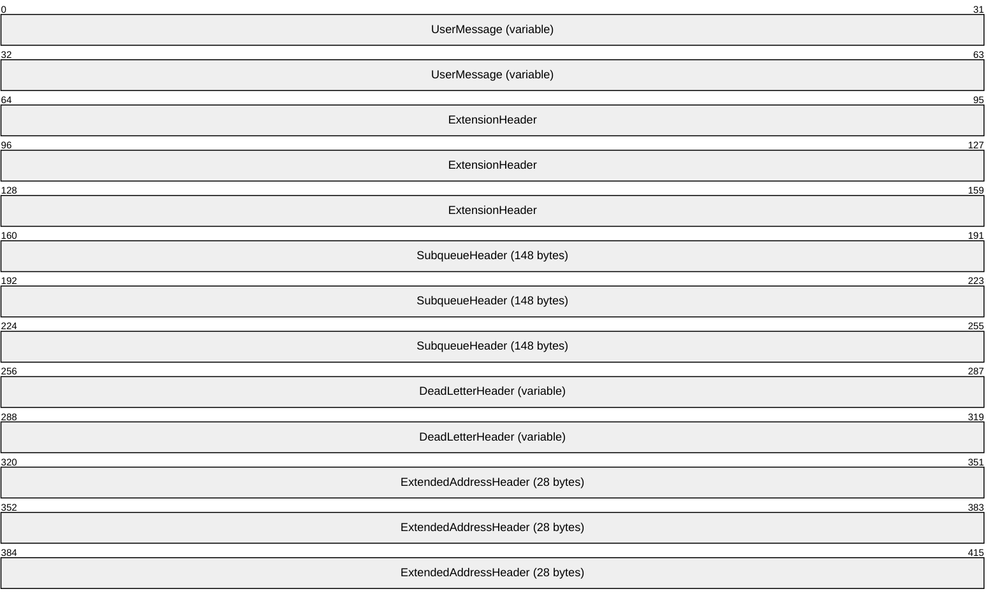

**UserMessage (variable):** A [UserMessage (section 2.2.5.1)](#Section_2.2.5.1) structure.

**ExtensionHeader (12 bytes):** An [ExtensionHeader (section 2.2.5.2)](#Section_2.2.5.2) structure.

**SubqueueHeader (148 bytes):** A [SubqueueHeader (section 2.2.5.3)](#Section_2.2.5.3) structure.

**DeadLetterHeader (variable):** A [DeadLetterHeader (section 2.2.5.4)](#Section_2.2.5.4) structure.

**ExtendedAddressHeader (28 bytes):** An [ExtendedAddressHeader (section 2.2.5.5)](#Section_2.2.5.5) structure.

#### 2.2.5.1 UserMessage

The **UserMessage** structure can be either a [Binary Message (section 2.2.5.1.1)](#Section_2.2.5.1.1) or an [SRMP Message (section 2.2.5.1.2)](#Section_2.2.5.1.2), depending on the transport over which the [**message**](#gt_message) was originally sent. A Binary Message is sent over the MSMQ: Binary Reliable Messaging Protocol [MS-MQQB](../MS-MQQB/MS-MQQB.md), while an **SRMP Message** is sent over HTTP. The message type is indicated by the **UserHeader.Flags.AH** bit field, which is set for **SRMP Messages** as specified in the definition of the **UserHeaderEnd** field in this section.

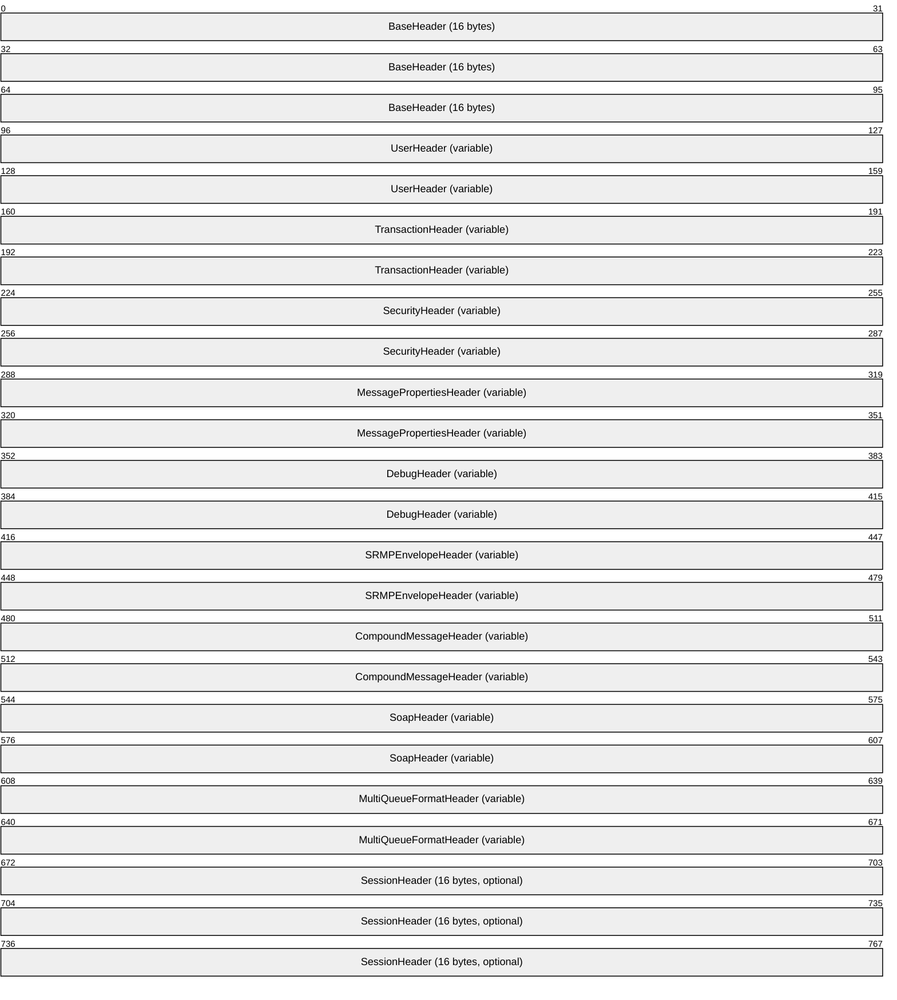

**BaseHeader (16 bytes):** A **BaseHeader** ([MS-MQMQ](../MS-MQMQ/MS-MQMQ.md) section 2.2.19.1). The **TimeToReachQueue** field has the same length and format as that specified in [MS-MQMQ] but differs in that it represents the absolute expiration time of the message as the number of seconds elapsed since midnight (00:00:00), January 1, 1970 [**Coordinated Universal Time (UTC)**](#gt_coordinated-universal-time-utc).

**UserHeader (variable):** A **UserHeader** ([MS-MQMQ] section 2.2.19.2) with the following field overlays, which pertain when the **UserHeader** specifies that the destination [**queue**](#gt_queue) is a [**direct format name**](#gt_direct-format-name). In this case, the **QueueManagerAddress** field specifies the host address from which a message was received. If the **UserHeader** specifies that the destination queue is anything other than a direct format name, the 16 bytes after the **SourceQueueManager** field are set to the GUID of the host from which the message was received, as specified in [MS-MQMQ] section 2.2.19.2.

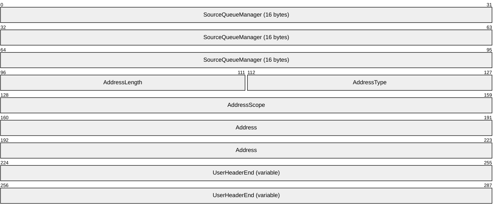

**SourceQueueManager (16 bytes):** A **GUID** ([MS-DTYP](../MS-DTYP/MS-DTYP.md) section 2.3.4.1) that identifies the sender of the message.

**AddressLength (2 bytes):** A **USHORT** ([MS-DTYP] section 2.2.58) that MUST be the actual address length in the **Address** field.

**AddressType (2 bytes):** A **USHORT** that MUST be set to one of the following values.

| Value | Meaning |
| --- | --- |
| IP_ADDRESS_TYPE 0x0001 | The address specified in the **Address** field is an IPv4 address. |
| IPV6_ADDRESS_TYPE 0x0006 | The address specified in the **Address** field is an IPv6 address. |

**AddressScope (4 bytes):** A **ULONG** ([MS-DTYP] section 2.2.51) that MUST be set either to the IPv6 address scope if the **AddressType** field is IPV6_ADDRESS_TYPE or otherwise to 0x00000000. More details are specified in [[RFC2553]](https://go.microsoft.com/fwlink/?LinkId=90367) section 3.3.

**Address (8 bytes):** An 8-byte array of **UCHAR** ([MS-DTYP] section 2.2.45) that MUST contain the address of the host from which the message was received. The field MUST contain as much of the address as can fit in the field. More details are specified in [RFC2553] section 3.3.

**UserHeaderEnd (variable):** A variable-length buffer mapped by a **UserHeader** beginning with the **TimeToBeReceived** field. Within the **Flags** field, the **AH** bit field MUST be set only if both the **SOAPEnvelope** and the **SOAPCompoundMessage** ADM attributes of the **Message** ([MS-MQDMPR](../MS-MQDMPR/MS-MQDMPR.md) section 3.1.1.12) ADM element are populated.

**TransactionHeader (variable):** A **TransactionHeader** ([MS-MQMQ] section 2.2.20.5).

**SecurityHeader (variable):** A **SecurityHeader** ([MS-MQMQ] section 2.2.20.6).

**MessagePropertiesHeader (variable):** A **MessagePropertiesHeader** ([MS-MQMQ] section 2.2.19.3).

**DebugHeader (variable):** A **DebugHeader** [MS-MQMQ] section 2.2.20.8).

**SRMPEnvelopeHeader (variable):** An [SRMPEnvelopeHeader (section 2.2.5.1.2.1)](#Section_2.2.5.1.2.1).

**CompoundMessageHeader (variable):** A [CompoundMessageHeader (section 2.2.5.1.2.2)](#Section_2.2.5.1.2.2).

**SoapHeader (variable):** A **SoapHeader** ([MS-MQMQ] section 2.2.20.7).

**MultiQueueFormatHeader (variable):** A **MultiQueueFormatHeader** ([MS-MQMQ] section 2.2.20.1).

**SessionHeader (16 bytes):** A **SessionHeader** ([MS-MQMQ] section 2.2.20.4). The **SessionHeader** is used to acknowledge express and recoverable **UserMessage Packet**s ([MS-MQMQ] section 2.2.20) when they are sent on a session. This header MUST be present if and only if the **BaseHeader.Flags.SH** bit field of the **UserMessage Packet** is set. This bit is set when the **SessionHeader** is piggy-backed onto a **UserMessage Packet** instead of sending it in a stand-alone **SessionAck Packet** ([MS-MQQB] section 2.2.6).

More details about the following individual headers, with the exceptions of SRMPEnvelopeHeader (section 2.2.5.1.2.1) and CompoundMessageHeader (section 2.2.5.1.2.2), are specified in [MS-MQQB] section 2.2.20.

In addition, the following exceptions also exist on the field attributes as specified in [MS-MQQB]. The overall structure of the data is the same; however, particular fields have been overridden or have different meanings in this protocol. The size of each overridden field is the same size as the original field.

**UserMessage.BaseHeader.TimeToReachQueue**

The definition for **TimeToReachQueue** differs from what is specified in [MS-MQQB] section 2.2.20 in the following manner:

- In [MS-MQQB], this field indicates the length of time, in seconds, that a **UserMessage Packet** has to reach its destination [**queue manager**](#gt_queue-manager-qm).
- In [MS-MQRR](#Section_9edbc8fa02ad4c79804f6bb8f430aac1), this field indicates the absolute expiration time of the message defined as the number of seconds elapsed since midnight (00:00:00), January 1, 1970 UTC.

##### 2.2.5.1.1 Binary Message

A binary message represents a message being received that was originally sent over the MSMQ: Binary Reliable Messaging Protocol [MS-MQQB](../MS-MQQB/MS-MQQB.md). The **UserHeader.Flags.AH** bit field MUST NOT be set, and the [SRMPEnvelopeHeader (section 2.2.5.1.2.1)](#Section_2.2.5.1.2.1) and the [CompoundMessageHeader (section 2.2.5.1.2.2)](#Section_2.2.5.1.2.2) MUST NOT be present in the [UserMessage (section 2.2.5.1)](#Section_2.2.5.1).

##### 2.2.5.1.2 SRMP Message

An SRMP message represents a message being received that was originally sent over HTTP. The **UserHeader.Flags.AH** bit field MUST be set, and the [SRMPEnvelopeHeader (section 2.2.5.1.2.1)](#Section_2.2.5.1.2.1) and the [CompoundMessageHeader (section 2.2.5.1.2.2)](#Section_2.2.5.1.2.2) MUST be present in the [UserMessage (section 2.2.5.1)](#Section_2.2.5.1).

###### 2.2.5.1.2.1 SRMPEnvelopeHeader

The SRMPEnvelopeHeader contains information about the SOAP envelope used to send the original message over HTTP. This header MUST be present only if the **UserHeader.Flags.AH** bit field is set.

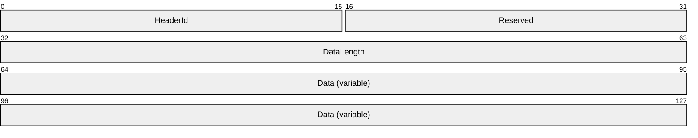

**HeaderId (2 bytes):** A **USHORT** ([MS-DTYP](../MS-DTYP/MS-DTYP.md) section 2.2.58) that specifies the identification number of the header.

**Reserved (2 bytes):** A **USHORT** that MUST be ignored.

**DataLength (4 bytes):** A **ULONG** ([MS-DTYP] section 2.2.51), that MUST be the length of the data in the **Data** field.

**Data (variable):** Specifies the data in **WCHAR** ([MS-DTYP] section 2.2.60) format, including the NULL terminator. The data is formatted as an **SRMP Message Structure** ([MC-MQSRM](../MC-MQSRM/MC-MQSRM.md) section 2.2.2).

###### 2.2.5.1.2.2 CompoundMessageHeader

The CompoundMessageHeader contains information about the SRMP compound [**message**](#gt_message), as specified in [MC-MQSRM](../MC-MQSRM/MC-MQSRM.md) section 2.2.2. This header MUST be present only if the **UserHeader.Flags.AH** bit field is set.

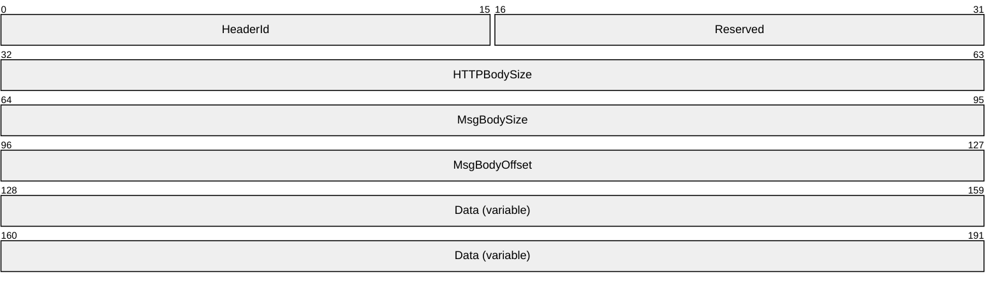

**HeaderId (2 bytes):** A **USHORT** ([MS-DTYP](../MS-DTYP/MS-DTYP.md) section 2.2.58) that specifies the identification number of the header.

**Reserved (2 bytes):** A **USHORT** that MUST be ignored.

**HTTPBodySize (4 bytes):** A **ULONG** ([MS-DTYP] section 2.2.51) that MUST be the size of the **Data** field in bytes.

**MsgBodySize (4 bytes):** A **ULONG** that MUST be the size, in bytes, of the [**message body**](#gt_message-body) within the **Data** field.

**MsgBodyOffset (4 bytes):** A **ULONG** that MUST be set to the offset of the message body within the **Data** field.

**Data (variable):** Specifies an array of bytes that contains the SRMP message, including the HTTP POST message that carried the SRMP message. More details are specified in [MC-MQSRM] section 4.1.

#### 2.2.5.2 ExtensionHeader

The **ExtensionHeader** contains information about the presence and size of other headers in the [Message Packet Structure (section 2.2.5)](#Section_2.2.5), such as [DeadLetterHeader (section 2.2.5.4)](#Section_2.2.5.4), [SubqueueHeader (section 2.2.5.3)](#Section_2.2.5.3), and [ExtendedAddressHeader (section 2.2.5.5)](#Section_2.2.5.5).<5>

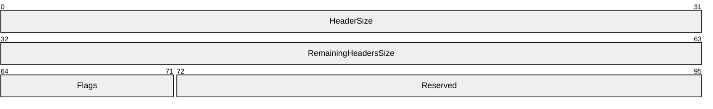

**HeaderSize (4 bytes):** A **ULONG** ([MS-DTYP](../MS-DTYP/MS-DTYP.md) section 2.2.51) that specifies the size in bytes of the **ExtensionHeader**.

**RemainingHeadersSize (4 bytes):** A **ULONG** that MUST be the sum of sizes in bytes of all headers that follow the **ExtensionHeader**.

**Flags (1 byte):** Indicates the presence or absence of other headers in the **Message Packet Structure**. Any combination of the following values is acceptable.

| 0 | 1 | 2 | 3 | 4 | 5 | 6 | 7 |
| --- | --- | --- | --- | --- | --- | --- | --- |
| D L | S Q | X 2 | D I | E A | X 5 | X 6 | X 7 |

Where the bits are defined as:

| Value | Description |
| --- | --- |
| DL | MUST be set to 1 if the **Message Packet Structure** contains the **DeadLetterHeader**. MUST be set to 0 otherwise. |
| SQ | Indicates whether the **Message Packet Structure** contains a **SubqueueHeader**. MUST be set to 1. |
| X2 | Unused bit field. MUST be ignored. |
| DI | MUST be set to 1 if the [**dead-letter queue**](#gt_dead-letter-queue) as specified by the **DeadLetterHeader** is invalid. MUST be set to 0 otherwise. If the **DeadLetterHeader** is not included, this field MUST be ignored when reading the message packet. |
| EA | Indicates whether the **Message Packet Structure** contains an **ExtendedAddressHeader**. MUST be set to 1. |
| X5 | Unused bit field. MUST be ignored. |
| X6 | Unused bit field. MUST be ignored. |
| X7 | Unused bit field. MUST be ignored. |

**Reserved (3 bytes):** MUST be ignored when reading the **Message Packet Structure**.

#### 2.2.5.3 SubqueueHeader

The **SubqueueHeader** encapsulates information about the [**message**](#gt_message) as specified following.<6> This header MUST be ignored if its **SubqueueName** field is an empty string.

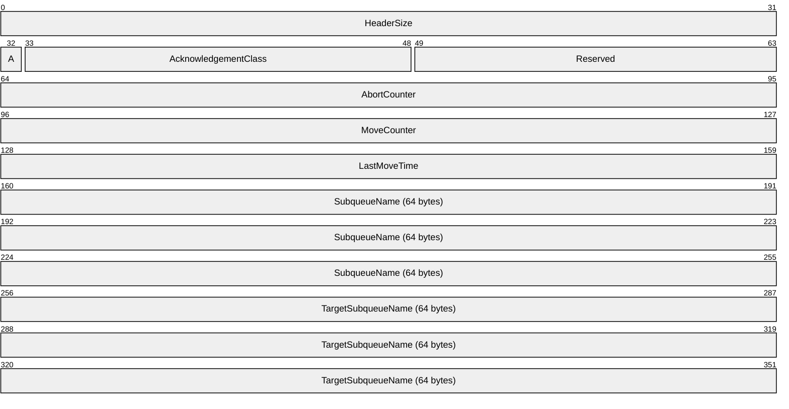

**HeaderSize (4 bytes):** A **ULONG** ([MS-DTYP](../MS-DTYP/MS-DTYP.md) section 2.2.51) that specifies the size in bytes of the **SubqueueHeader**.

**A - TM (1 bit):** A one-**bit** ([MS-DTYP] section 2.1.1) flag that MUST be set to 0.

**AcknowledgementClass (2 bytes):** A **USHORT** ([MS-DTYP] section 2.2.58) that MUST specify the acknowledgment class of the message. See [MS-MQQB](../MS-MQQB/MS-MQQB.md) section 2.2.18.1.6.

**Reserved (15 bits):** MUST be ignored.

**AbortCounter (4 bytes):** A **ULONG** that specifies the number of sequentially failed attempts to read the message or to move the message. See sections [3.1.4.13](#Section_3.1.4.13), [3.1.4.10](#Section_3.1.4.10), and [3.1.6.1](#Section_3.1.6.1).

**MoveCounter (4 bytes):** A **ULONG** that specifies the number of times that the message has been moved. See section 3.1.4.10.

**LastMoveTime (4 bytes):** A **ULONG** that specifies the local time of the most recent move of the message. The time is specified as the number of milliseconds elapsed since midnight of January 1, 1970. If the message has never been moved, this value is 0x00000000. See section 3.1.4.10.

**SubqueueName (64 bytes):** If the message belongs to a [**subqueue**](#gt_subqueue), the value MUST contain the null-terminated [**Unicode**](#gt_unicode) string that specifies the subqueue name. If the subqueue name is shorter than the field size, the remaining bytes MUST be set to 0x00. If the message does not belong to the subqueue, all bytes MUST be set to 0x00.

**TargetSubqueueName (64 bytes):** If the message is participating in the transacted Move operation that is not yet committed or aborted, this field MUST contain the null-terminated Unicode string that specifies the target subqueue name. If the subqueue name is shorter than the field size, the remaining bytes MUST be set to 0x00. If the message is not part of a transacted Move operation, all bytes MUST be set to 0x00.

#### 2.2.5.4 DeadLetterHeader

The **DeadLetterHeader** specifies the path of an application-specified [**dead-letter queue**](#gt_dead-letter-queue).<7>

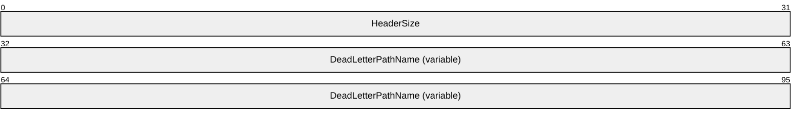

**HeaderSize (4 bytes):** A **ULONG** ([MS-DTYP](../MS-DTYP/MS-DTYP.md) section 2.2.51) that MUST be set to the total size in bytes of the **DeadLetterHeader**.

**DeadLetterPathName (variable):** MUST contain a null-terminated [**Unicode**](#gt_unicode) string that specifies the application-specified dead-letter queue. The array MUST be aligned up to the next 4-byte boundary by adding padding zeros if necessary.

#### 2.2.5.5 ExtendedAddressHeader

The **ExtendedAddressHeader** specifies the host address from which a [**message**](#gt_message) was received.<8> This header MUST be ignored if the **AddressType** field is 0x0000.

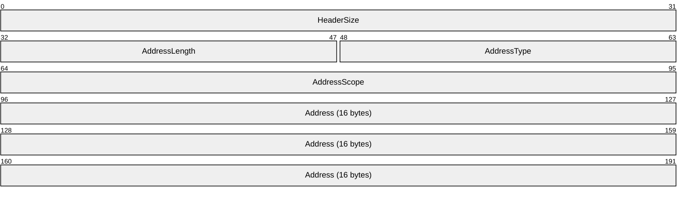

**HeaderSize (4 bytes):** A **ULONG** ([MS-DTYP](../MS-DTYP/MS-DTYP.md) section 2.2.51) that specifies the size, in bytes, of the ExtendedAddressHeader.

**AddressLength (2 bytes):** A **USHORT** ([MS-DTYP] section 2.2.58) that MUST be the actual address length in the **Address** field.

**AddressType (2 bytes):** A **USHORT** that MUST be set to one of the following values.

| Value | Meaning |
| --- | --- |
| 0x0000 | This header MUST be ignored. |
| IP_ADDRESS_TYPE 0x0001 | The address specified in the **Address** field is an IPv4 address. |
| IPV6_ADDRESS_TYPE 0x0006 | The address specified in the **Address** field is an IPv6 address. |

**AddressScope (4 bytes):** A **ULONG** that MUST be set either to the IPv6 address scope if the **AddressType** field is IPV6_ADDRESS_TYPE or otherwise to 0x00000000. See [[RFC2553]](https://go.microsoft.com/fwlink/?LinkId=90367) section 3.3.

**Address (16 bytes):** An array of **UCHAR** ([MS-DTYP] section 2.2.45) that MUST contain the host address from which the message was received. If the **AddressType** field is IP_ADDRESS_TYPE, the address MUST be in IPv4 address format. If the **AddressType** field is IPV6_ADDRESS_TYPE, the address MUST be in IPv6 address format. See [RFC2553] section 3.3.

### 2.2.6 SectionBuffer

A **SectionBuffer** represents a fragment or section of a Message Packet (section [2.2.5](#Section_2.2.5)). Operations R_StartReceive (Opnum 7) (section [3.1.4.7](#Section_3.1.4.7)) and R_StartTransactionalReceive (Opnum 13) (section [3.1.4.13](#Section_3.1.4.13)) fragment a **Message Packet** into an array of one or more **SectionBuffer** structures. The client concatenates these fragments to reconstruct a valid **Message Packet**. There can be up to two sections per [**message**](#gt_message). A **Message Packet** is split into two sections only when a subset of the distinguished [**message body**](#gt_message-body) property is returned. The first section always contains the message body property up to the size requested.

typedef struct _SectionBuffer {

SectionType SectionBufferType;

DWORD SectionSizeAlloc;

DWORD SectionSize;

[unique, size_is(SectionSize)] byte* pSectionBuffer;

} SectionBuffer;

**SectionBufferType:** MUST specify a type for the **SectionBuffer** structure that indicates whether the **pSectionBuffer** member contains the whole **Message Packet** or MUST indicate which section is contained. The SectionType (section [2.2.7](#Section_2.2.7)) enumeration lists possible values. More details are specified in 2.2.7.

**SectionSizeAlloc:** MUST specify the original size (in bytes) of the part of the **Message Packet** that this **SectionBuffer** represents. When the **SectionBuffer** represents the first section of the message, this field specifies the size that the **SectionBuffer** would have been if the entire message body property were included. The difference between the values of the **SectionSizeAlloc** member and the **SectionSize** member represents the size of the message body that was not transferred.

If the **SectionBufferType** member value is stFullPacket, stBinarySecondSection, or stSrmpSecondSection, then the **SectionSizeAlloc** member value MUST be equal to the **SectionSize** member value.

If the **SectionBufferType** member value is stBinaryFirstSection or stSrmpFirstSection, then the **SectionSizeAlloc** member value MUST be equal to or greater than the **SectionSize** member value.

**SectionSize:** MUST be the size (in bytes) of the buffer pointed to by the **pSectionBuffer** member. The **SectionSize** member specifies the size of the part of the **Message Packet** contained in the **pSectionBuffer** member.

**pSectionBuffer:** MUST be a pointer to an array of bytes containing a section of the **Message Packet**.

### 2.2.7 SectionType

The **SectionType** enumeration defines the available [SectionBuffer (section 2.2.6)](#Section_2.2.6) types.

typedef enum

{

stFullPacket = 0,

stBinaryFirstSection = 1,

stBinarySecondSection = 2,

stSrmpFirstSection = 3,

stSrmpSecondSection = 4

} SectionType;

**stFullPacket:** The **pSectionBuffer** member of the **SectionBuffer** structure contains a complete [Message Packet Structure (section 2.2.5)](#Section_2.2.5). The [UserMessage (section 2.2.5.1)](#Section_2.2.5.1) is either that specified in section [2.2.5.1.1](#Section_2.2.5.1.1) or in section [2.2.5.1.2](#Section_2.2.5.1.2).

**stBinaryFirstSection:** The **pSectionBuffer** member of the **SectionBuffer** structure contains the first section of the Binary Message (section 2.2.5.1.1) packet up to, but not beyond, the **MessagePropertiesHeader** ([MS-MQMQ](../MS-MQMQ/MS-MQMQ.md) section 2.2.19.3) in the **UserMessage**.

**stBinarySecondSection:** The **pSectionBuffer** member of the **SectionBuffer** structure contains the second section of the **Binary Message** packet from beyond the end of the **MessagePropertiesHeader** in the **UserMessage** to the end of the packet.

**stSrmpFirstSection:** The **pSectionBuffer** member of the **SectionBuffer** structure contains the first section of the SRMP Message packet up to, but not beyond, the [CompoundMessageHeader (section 2.2.5.1.2.2)](#Section_2.2.5.1.2.2) in the **UserMessage**.

**stSrmpSecondSection:** The **pSectionBuffer** member of the **SectionBuffer** structure contains the second section of the SRMP Message packet from beyond the end of the **CompoundMessageHeader** in the **UserMessage** to the end of the packet.

### 2.2.8 XACTUOW

The **XACTUOW** ([MS-MQMQ](../MS-MQMQ/MS-MQMQ.md) section 2.2.18.1.8) structure uniquely identifies the unit of work (UOW) for a transactional operation. For an external transaction, this value MUST be acquired from the transaction coordinator. For an internal transaction, a client MUST create a unique random value for each transaction.<9>

## 2.3 Directory Service Schema Elements

This protocol uses ADM elements specified in section [3.1.1](#Section_3.1.1). A subset of these elements can be published in a [**directory**](#gt_directory). This protocol accesses the directory using the algorithm specified in [MS-MQDSSM](../MS-MQDSSM/MS-MQDSSM.md) and using LDAP [MS-ADTS](../MS-ADTS/MS-ADTS.md). The Directory Service schema elements for ADM elements published in the directory are defined in [MS-MQDSSM] section 2.4.

# 3 Protocol Details

## 3.1 RemoteRead Server Details

### 3.1.1 Abstract Data Model

This section describes a conceptual model of possible data organization that an implementation maintains to participate in this protocol. The described organization is provided to facilitate the explanation of how the protocol behaves. This document does not mandate that implementations adhere to this model as long as their external behavior is consistent with that described in this document.

The abstract data model for this protocol comprises elements that are private to this protocol and others that are shared between multiple [**MSMQ**](#gt_microsoft-message-queuing-msmq) protocols that are co-located at a common [**queue manager**](#gt_queue-manager-qm). The shared abstract data model is defined in [MS-MQDMPR](../MS-MQDMPR/MS-MQDMPR.md) section 3.1.1, and the relationship between this protocol, a queue manager, and other protocols that share a common queue manager is described in [MS-MQOD](#Section_1.3).

Section [3.1.1.1](#Section_3.1.1.1) specifies the abstract data model (ADM) elements from the shared data model that are manipulated by this protocol, and sections [3.1.1.2](#Section_3.1.1.2) through [3.1.1.4](#Section_3.1.1.4) specify the ADM elements that are private to this protocol.

#### 3.1.1.1 Shared Data Elements

This protocol manipulates the following ADM elements from the shared abstract data model.

**Cursor:** [MS-MQDMPR](../MS-MQDMPR/MS-MQDMPR.md) section 3.2.

**Message:** [MS-MQDMPR] section 3.1.1.12.

**MessagePosition:** [MS-MQDMPR] section 3.1.1.11

**OpenQueueDescriptor:** [MS-MQDMPR] section 3.1.1.16.

**OpenQueueDescriptorCollection:** [MS-MQDMPR] section 3.1.1.2.

**Queue:** [MS-MQDMPR] section 3.1.1.2.

**QueueManager:** [MS-MQDMPR] section 3.1.1.1.

**Transaction:** [MS-MQDMPR] section 3.1.1.14.

#### 3.1.1.2 PendingRequestEntry

The **PendingRequestEntry** ADM element encapsulates a pending request to peek or receive a [**message**](#gt_message) from an open [**queue**](#gt_queue) and specifies the following ADM attributes:

**RequestId:** The request ID supplied by the client.

**LookupIdentifier:** The **LookupIdentifier** ADM attribute of a **Message** ([MS-MQDMPR](../MS-MQDMPR/MS-MQDMPR.md) section 3.1.1.12) ADM element instance associated with the request.

**QueueContextHandle:** An RPC context handle corresponding to an open queue, as defined by [QUEUE_CONTEXT_HANDLE_NOSERIALIZE (section 2.2.4.1)](#Section_2.2.4.1).

**TimeStamp:** A 32-bit unsigned integer that represents the time, in milliseconds, at which the client request was received.

#### 3.1.1.3 PendingRequestTable

The **PendingRequestTable** ADM element represents a hash table that contains references to [PendingRequestEntry (section 3.1.1.2)](#Section_3.1.1.2) ADM element instances keyed on {**PendingRequestEntry.RequestId**, **PendingRequestEntry.QueueContextHandle**}.

#### 3.1.1.4 Message

The local **Message** ADM element extends the base **Message** ([MS-MQDMPR](../MS-MQDMPR/MS-MQDMPR.md) section 3.1.1.10) ADM element.

The server MUST maintain private state for each local **Message** ADM element instance in addition to the state specified by the **Message** ([MS-MQDMPR] section 3.1.1.10) ADM element. The following additional ADM attributes are specified to reference this private state:

**Type:** The type of the message packet, either binary or SRMP.

**Offset:** The offset and byte size of the [**message headers**](#gt_message-header), [**message body**](#gt_message-body), and [**message trailers**](#gt_message-trailer).

### 3.1.2 Timers

The Message Queuing (MSMQ): Queue Manager Remote Read protocol MUST maintain the following timers:

- [RPC Call Timeout Timer (section 3.1.2.1)](#Section_3.1.2.1)
- [Pending Request Cleanup Timer (section 3.1.2.2)](#Section_3.1.2.2)

#### 3.1.2.1 RPC Call Timeout Timer

This protocol uses nondefault behavior for the RPC Call Timeout Timer, as specified in [MS-RPCE](../MS-RPCE/MS-RPCE.md) section 3.3.2.2.2. This protocol uses a timer value of 300,000 milliseconds<10>, which applies to the following method calls:

- R_OpenQueue (Opnum 2) (section [3.1.4.2)](#Section_3.1.4.2)
- R_OpenQueueForMove (Opnum 11) (section [3.1.4.11)](#Section_3.1.4.11)
- R_QMEnlistRemoteTransaction (Opnum 12) (section [3.1.4.12)](#Section_3.1.4.12)
The server MUST maintain a per-call timer for each call to the R_StartReceive (Opnum 7) (section [3.1.4.7)](#Section_3.1.4.7) method or the R_StartTransactionalReceive (Opnum 13) (section [3.1.4.13)](#Section_3.1.4.13) method in which the *dwTimeout* parameter is nonzero. The timer MUST be set to the *dwTimeout* parameter that is specified on the call.

#### 3.1.2.2 Pending Request Cleanup Timer

This timer regulates the amount of time that the protocol waits before removing expired entries from the [PendingRequestTable (section 3.1.1.3)](#Section_3.1.1.3) ADM element. The server MUST maintain a per-call timer for each call to the R_StartReceive (Opnum 7) (section [3.1.4.7)](#Section_3.1.4.7) method or the R_StartTransactionalReceive (Opnum 13) (section [3.1.4.13)](#Section_3.1.4.13) method. This timer is set when a [PendingRequestEntry (section 3.1.1.2)](#Section_3.1.1.2) ADM element instance is added to the **PendingRequestTable** ADM element. The duration of this timer MUST be set based on the system configuration, which is implementation-dependent.<11>

### 3.1.3 Initialization

The server MUST listen on the [**RPC**](#gt_remote-procedure-call-rpc) protocols, as specified in section [2.1](#Section_2.1).

### 3.1.4 Message Processing Events and Sequencing Rules

This protocol MUST indicate to the [**RPC**](#gt_remote-procedure-call-rpc) runtime that it is to perform a strict [**NDR**](#gt_network-data-representation-ndr) data consistency check at target level 6.0, as specified in [MS-RPCE](../MS-RPCE/MS-RPCE.md) section 3.

This protocol MUST indicate to the RPC runtime that it is to reject a NULL unique or full pointer with nonzero conformant value, as specified in [MS-RPCE] section 3.

The **RemoteRead** interface includes the following methods.

Methods in RPC Opnum Order

| Method | Description |
| --- | --- |
| R_GetServerPort (Opnum 0) (section [3.1.4.1)](#Section_3.1.4.1) | Returns an RPC endpoint port number to use in subsequent calls on the interface. Opnum: 0 |
| Opnum1NotUsedOnWire | Reserved for local use. Opnum: 1 |
| R_OpenQueue (Opnum 2) (section [3.1.4.2)](#Section_3.1.4.2) | Opens a [**queue**](#gt_queue). Opnum: 2 |
| R_CloseQueue (Opnum 3) (section [3.1.4.3)](#Section_3.1.4.3) | Closes a queue. Opnum: 3 |
| R_CreateCursor (Opnum 4) (section [3.1.4.4)](#Section_3.1.4.4) | Opens a cursor on a queue. Opnum: 4 |
| R_CloseCursor (Opnum 5) (section [3.1.4.5)](#Section_3.1.4.5) | Closes a cursor. Opnum: 5 |
| R_PurgeQueue (Opnum 6) (section [3.1.4.6)](#Section_3.1.4.6) | Deletes all [**messages**](#gt_message) in a queue. Opnum: 6 |
| R_StartReceive (Opnum 7) (section [3.1.4.7)](#Section_3.1.4.7) | Initiates a Receive or Peek request on the queue. Opnum: 7 |
| R_CancelReceive (Opnum 8) (section [3.1.4.8)](#Section_3.1.4.8) | Cancels a pending Receive request. Opnum: 8 |
| R_EndReceive (Opnum 9) (section [3.1.4.9)](#Section_3.1.4.9) | Finishes a Receive request. Opnum: 9 |
| R_MoveMessage (Opnum 10) (section [3.1.4.10)](#Section_3.1.4.10) | Moves a message between two queues. Opnum: 10 |
| R_OpenQueueForMove (Opnum 11) (section [3.1.4.11)](#Section_3.1.4.11) | Opens a queue to be a destination for a move operation. Opnum: 11 |
| R_QMEnlistRemoteTransaction (Opnum 12) (section [3.1.4.12)](#Section_3.1.4.12) | Enlists in a transaction on a remote machine. Opnum: 12 |
| R_StartTransactionalReceive (Opnum 13) (section [3.1.4.13)](#Section_3.1.4.13) | Initiates a transactional receive request on the queue. Opnum: 13 |
| R_SetUserAcknowledgementClass (Opnum 14) (section [3.1.4.14)](#Section_3.1.4.14) | Changes the acknowledgment class for a message in a queue. Opnum: 14 |
| R_EndTransactionalReceive (Opnum 15) (section [3.1.4.15)](#Section_3.1.4.15) | Finishes a transactional receive request. Opnum: 15 |

**Note** In the preceding table, the term "Reserved for local use" means that the client MUST NOT send the opnum and the server behavior is undefined since it does not affect interoperability.<12>

#### 3.1.4.1 R_GetServerPort (Opnum 0)

The R_GetServerPort method returns the [**RPC**](#gt_remote-procedure-call-rpc) [**endpoint**](#gt_endpoint) port for the client to use in subsequent method calls on the **RemoteRead** interface.

The server MUST return the TCP port number for the **RemoteRead** RPC interface. The default port number used is 2103. If this port is already in use, the server SHOULD increment the port number by 11 until an unused port is found.

The client MAY call this method prior to calling any other method on the protocol. The client MAY use the returned value to obtain another RPC binding handle to use with the remaining methods on the protocol.<13>

DWORD R_GetServerPort(

[in] handle_t hBind

);

**hBind:** MUST specify an RPC binding handle parameter, as specified in [MS-RPCE](../MS-RPCE/MS-RPCE.md) section 2.

**Return Values:** On success, this method MUST return a nonzero TCP port value for the RPC interface. If an error occurs, the server MUST return 0x00000000.

Exceptions Thrown:

No exceptions are thrown except those thrown by the underlying RPC protocol, as specified in [MS-RPCE].

As specified in section [3.1.3](#Section_3.2.3), this protocol configures a fixed listening endpoint at an RPC port number that can vary. This method returns the RPC port number determined at server initialization time.

#### 3.1.4.2 R_OpenQueue (Opnum 2)

The R_OpenQueue method opens a [**queue**](#gt_queue) in preparation for subsequent operations against it. This method MUST be called prior to calling any of the following operations:

- R_CreateCursor (Opnum 4) (section [3.1.4.4)](#Section_3.1.4.4)
- R_CloseCursor (Opnum 5) (section [3.1.4.5)](#Section_3.1.4.5)
- R_PurgeQueue (Opnum 6) (section [3.1.4.6)](#Section_3.1.4.6)
- R_StartReceive (Opnum 7) (section [3.1.4.7)](#Section_3.1.4.7)
- R_CancelReceive (Opnum 8) (section [3.1.4.8)](#Section_3.1.4.8)
- R_EndReceive (Opnum 9) (section [3.1.4.9)](#Section_3.1.4.9)
- R_MoveMessage (Opnum 10) (section [3.1.4.10)](#Section_3.1.4.10) for the source queue only.
- R_StartTransactionalReceive (Opnum 13) (section [3.1.4.13)](#Section_3.1.4.13)
- R_SetUserAcknowledgementClass (Opnum 14) (section [3.1.4.14)](#Section_3.1.4.14)
- R_EndTransactionalReceive (Opnum 15) (section [3.1.4.15)](#Section_3.1.4.15)
This method returns a [QUEUE_CONTEXT_HANDLE_SERIALIZE (section 2.2.4.2)](#Section_2.2.4.2) handle value, which is required as input in the operations listed preceding.

void R_OpenQueue(

[in] handle_t hBind,

[in] QUEUE_FORMAT* pQueueFormat,

[in] DWORD dwAccess,

[in] DWORD dwShareMode,

[in] GUID* pClientId,

[in] LONG fNonRoutingServer,

[in] unsigned char Major,

[in] unsigned char Minor,

[in] USHORT BuildNumber,

[in] LONG fWorkgroup,

[out] QUEUE_CONTEXT_HANDLE_SERIALIZE* pphContext

);

**hBind:** MUST specify an [**RPC**](#gt_remote-procedure-call-rpc) binding handle parameter, as specified in [MS-RPCE](../MS-RPCE/MS-RPCE.md) section 2.

**pQueueFormat:** MUST be a pointer to a **QUEUE_FORMAT** ([MS-MQMQ](../MS-MQMQ/MS-MQMQ.md) section 2.2.7) structure that identifies the queue to open. NULL is invalid for this parameter. The valid values for the **m_qft** member are QUEUE_FORMAT_TYPE_PUBLIC, QUEUE_FORMAT_TYPE_PRIVATE, QUEUE_FORMAT_TYPE_DIRECT, QUEUE_FORMAT_TYPE_MACHINE, and QUEUE_FORMAT_TYPE_SUBQUEUE.

**dwAccess:** Specifies the requested type of access to the queue. The required *dwAccess* parameter value for each event is specified in each of the corresponding events. If no requirement is listed, any *dwAccess* parameter value is accepted.

| Value | Meaning |
| --- | --- |
| RECEIVE_ACCESS 0x00000001 | The returned **QUEUE_CONTEXT_HANDLE_SERIALIZE** handle can be used in the **R_StartReceive** or **R_StartTransactionalReceive** methods with the *ulAction* parameter set to either a Peek or Receive action type as defined in the table under the *ulAction* parameter in the **R_StartReceive** method. |
| PEEK_ACCESS 0x00000020 | The returned **QUEUE_CONTEXT_HANDLE_SERIALIZE** handle can be used in the **R_StartReceive** method with the *ulAction* parameter set only to a Peek action type as defined in the table under the *ulAction* parameter in the **R_StartReceive** method. |

**dwShareMode:** Specifies whether the client needs exclusive access to the queue. The following values are valid for this parameter:

| Value | Meaning |
| --- | --- |
| MQ_DENY_NONE 0x00000000 | Permits multiple **QUEUE_CONTEXT_HANDLE_SERIALIZE** handles to the queue to be opened concurrently. |
| MQ_DENY_SHARE 0x00000001 | Permits a single **QUEUE_CONTEXT_HANDLE_SERIALIZE** handle to the queue at a time, providing exclusive access to the queue. |

**pClientId:** MUST be set by the client to a pointer to a valid [**GUID**](#gt_globally-unique-identifier-guid) that uniquely identifies the client. When the [**queue manager**](#gt_queue-manager-qm) acts as the client, the queue manager sets this value to the **Identifier** ADM attribute of the local **QueueManager** ADM element instance. The server SHOULD ignore this parameter. The server MAY<14> use this parameter to impose a limit on the number of unique callers. NULL is invalid for this parameter.

**fNonRoutingServer:** If the client is configured to operate in the role of an [**MSMQ routing server**](#gt_msmq-routing-server), this parameter MUST be set to FALSE (0x00000000); otherwise, it MUST be set to TRUE (0x00000001).<15> If the value of the *fNonRoutingServer* parameter is FALSE (0x00000000), the server MUST ignore the *pClientId* parameter.

| Name | Value |
| --- | --- |
| False | 0x00000000 |
| True | 0x00000001 |

**Major:** MUST be set by the client to an implementation-specific Major Version number of the client. SHOULD<16> be ignored by the server.

**Minor:** MUST be set by the client to an implementation-specific Minor Version number of the client. SHOULD<17> be ignored by the server.

**BuildNumber:** MUST be set by the client to an implementation-specific Build Number of the client. SHOULD<18> be ignored by the server.

**fWorkgroup:** MUST be set to TRUE (0x00000001) by the client if the client machine is not a member of a Windows domain; otherwise, it MUST be set to FALSE (0x00000000). The RPC [**authentication level**](#gt_authentication-level) required by the server MAY<19> be based on this value in subsequent calls on the interface.

| Name | Value |
| --- | --- |
| False | 0x00000000 |
| True | 0x00000001 |

**pphContext:** MUST be set by the server to a **QUEUE_CONTEXT_HANDLE_SERIALIZE** handle.

**Return Values:** The method has no return values. If the method fails, an RPC exception is thrown.

Exceptions Thrown:

In addition to the exceptions thrown by the underlying RPC protocol, as specified in [MS-RPCE], the method throws HRESULT failure codes as RPC exceptions. The client MUST treat all thrown HRESULT codes identically. The client MUST disregard all output parameter values when any failure HRESULT is thrown.

When processing this call, the server MUST do the following:

- If any of the input parameter values is invalid, throw MQ_ERROR_INVALID_PARAMETER (0xC00E0006).
- Look up the queue name in the **QueueCollection** ADM attribute of the local **QueueManager** ADM element instance. If not found, throw MQ_ERROR_QUEUE_NOT_FOUND (0xC00E0003).
- Generate an Open Queue ([MS-MQDMPR](../MS-MQDMPR/MS-MQDMPR.md) section 3.1.7.1.5) event with the following inputs:
- *iFormatName* := *pQueueFormat*
- *iRequiredAccess* := If the *dwAccess* parameter is RECEIVE_ACCESS then **QueueAccessType.ReceiveAccess** else **QueueAccessType.PeekAccess**.
- *iSharedMode* := If the *dwShareMode* parameter is MQ_DENY_NONE then **QueueShareMode.DenyNone** else **QueueShareMode.DenyReceive**.
- If *rStatus* is MQ_OK (0x00000000):
- Set the *pphContext* parameter to *rOpenQueueDescriptor*.**Handle**

#### 3.1.4.3 R_CloseQueue (Opnum 3)

The R_CloseQueue method closes a [QUEUE_CONTEXT_HANDLE_SERIALIZE (section 2.2.4.2)](#Section_2.2.4.2) handle that was previously opened by using a call to the R_OpenQueue (Opnum 2) (section [3.1.4.2)](#Section_3.1.4.2) method or the R_OpenQueueForMove (Opnum 11) (section [3.1.4.11)](#Section_3.1.4.11) method.

HRESULT R_CloseQueue(

[in] handle_t hBind,

[in, out] QUEUE_CONTEXT_HANDLE_SERIALIZE* pphContext

);

**hBind:** MUST specify an [**RPC**](#gt_remote-procedure-call-rpc) binding handle parameter, as specified in [MS-RPCE](../MS-RPCE/MS-RPCE.md) section 2.

**pphContext:** MUST be set by the client to the **QUEUE_CONTEXT_HANDLE_SERIALIZE** handle to be closed. The handle MUST have been returned by the server in the *pphContext* parameter of a prior call to the **R_OpenQueue** method or the **R_OpenQueueForMove** method and MUST NOT have been closed through a prior call to R_CloseQueue. This value MUST NOT be NULL. If the server returns MQ_OK, it MUST set this value to NULL.

**Return Values:** On success, this method MUST return MQ_OK (0x00000000).

If an error occurs, the server MUST return a failure **HRESULT**, and the client MUST treat all failure **HRESULTs** identically.

Exceptions Thrown:

No exceptions are thrown except those thrown by the underlying RPC protocol, as specified in [MS-RPCE].

When processing this call, the server MUST:

- Find the corresponding **OpenQueueDescriptor** ADM element instance by comparing the *pphContext* parameter with the **Handle** ADM attribute for all **OpenQueueDescriptor** ADM element instances maintained by the local **QueueManager** ADM element instance.
- If not found, return a failure HRESULT.
- Generate a Close Queue ([MS-MQDMPR](../MS-MQDMPR/MS-MQDMPR.md) section 3.1.7.1.6) event with the following inputs:
- *iQueueDesc* := The found **OpenQueueDescriptor** ADM element instance.
- Find all entries in the [PendingRequestTable (section 3.1.1.3)](#Section_3.1.1.3) ADM element that contain the *pphContext* parameter, and remove these entries.
- Set the *pphContext* parameter to NULL.
- Return MQ_OK (0x00000000).

#### 3.1.4.4 R_CreateCursor (Opnum 4)

The R_CreateCursor method creates a [**cursor**](#gt_cursor) and returns a handle to it. The handle can be used in subsequent calls to the R_StartReceive (Opnum 7) (section [3.1.4.7)](#Section_3.1.4.7) method or the R_StartTransactionalReceive (Opnum 13) (section [3.1.4.13)](#Section_3.1.4.13) method to specify a relative location in the [**queue**](#gt_queue) from which to receive a [**message**](#gt_message).

HRESULT R_CreateCursor(

[in] handle_t hBind,

[in] QUEUE_CONTEXT_HANDLE_NOSERIALIZE phContext,

[out] DWORD* phCursor

);

**hBind:** MUST specify an [**RPC**](#gt_remote-procedure-call-rpc) binding handle parameter, as specified in [MS-RPCE](../MS-RPCE/MS-RPCE.md) section 2.

**phContext:** MUST be set by the client to the [QUEUE_CONTEXT_HANDLE_NOSERIALIZE (section 2.2.4.1)](#Section_2.2.4.1) handle with which to associate the cursor. The handle MUST have been returned by the server in the *pphQueue* output parameter of a prior call to the R_OpenQueue (Opnum 2) (section [3.1.4.2)](#Section_3.1.4.2) method and MUST NOT have been closed through a prior call to the R_CloseQueue (Opnum 3) (section [3.1.4.3)](#Section_3.1.4.3) method. This value MUST NOT be NULL.

**phCursor:** MUST be set by the server to a handle for the created cursor.

**Return Values:** On success, this method MUST return MQ_OK (0x00000000).

If an error occurs, the server MUST return a failure, and the client MUST treat all failure **HRESULTs** identically.

The client MUST disregard all out-parameter values when any failure **HRESULT** is returned.

Exceptions Thrown:

No exceptions are thrown except those thrown by the underlying RPC protocol, as specified in [MS-RPCE].

When processing this call, the server MUST:

- Find the corresponding **OpenQueueDescriptor** ADM element instance by comparing the *pphContext* parameter with the **Handle** ADM attribute for all **OpenQueueDescriptor** ADM element instances maintained by the local **QueueManager** ADM element instance.
- If not found, return a failure HRESULT.
- Generate an Open Cursor ([MS-MQDMPR](../MS-MQDMPR/MS-MQDMPR.md) section 3.1.7.1.1) event with the following inputs:
- *iQueueDesc* := The found **OpenQueueDescriptor** ADM element instance.
- Set the *phCursor* parameter to *rCursor*.**Handle**.
- Return MQ_OK (0x00000000).

#### 3.1.4.5 R_CloseCursor (Opnum 5)

The R_CloseCursor method closes the handle for a previously created [**cursor**](#gt_cursor). The client MUST call this method to reclaim resources on the server allocated by the R_CreateCursor (Opnum 4) (section [3.1.4.4)](#Section_3.1.4.4) method.

HRESULT R_CloseCursor(

[in] handle_t hBind,

[in] QUEUE_CONTEXT_HANDLE_NOSERIALIZE phContext,

[in] DWORD hCursor

);

**hBind:** MUST specify an [**RPC**](#gt_remote-procedure-call-rpc) binding handle parameter, as specified in [MS-RPCE](../MS-RPCE/MS-RPCE.md) section 2.

**phContext:** MUST be set by the client to the [QUEUE_CONTEXT_HANDLE_NOSERIALIZE (section 2.2.4.1)](#Section_2.2.4.1) handle with which the cursor was associated in a call to the **R_CreateCursor** method. The handle MUST have been returned by the server in the *pphQueue* output parameter of a prior call to the R_OpenQueue (Opnum 2) (section [3.1.4.2)](#Section_3.1.4.2) method and MUST NOT have been closed through a prior call to the R_CloseQueue (Opnum 3) (section [3.1.4.3)](#Section_3.1.4.3) method. This value MUST NOT be NULL.

**hCursor:** MUST be set by the client to the handle of the cursor to be closed. The handle MUST have been obtained by a prior call to the **R_CreateCursor** method and MUST NOT have been closed through a prior call to the R_CloseCursor method.

**Return Values:** On success, this method MUST return MQ_OK (0x00000000).

If an error occurs, the server MUST return a failure **HRESULT** and the client MUST treat all failure **HRESULTs** identically.

Exceptions Thrown:

No exceptions are thrown except those that are thrown by the underlying RPC protocol, as specified in [MS-RPCE].

When processing this call, the server MUST:

- Find the corresponding **OpenQueueDescriptor** ADM element instance *fOpenQueueDescriptor* by comparing the *phContext* parameter with the **Handle** ADM attribute for all **OpenQueueDescriptor** ADM element instances maintained by the local **QueueManager** ADM element instance.
- If *fOpenQueueDescriptor* is found, then find the corresponding **Cursor** ADM element instance *fCursor* by comparing the *hCursor* parameter with the **Handle** ADM attribute of each **Cursor** ADM element instance in *fOpenQueueDescriptor*.**CursorCollection**.
- If not found, return a failure HRESULT.
- Generate a Close Cursor ([MS-MQDMPR](../MS-MQDMPR/MS-MQDMPR.md) section 3.1.7.1.2) event with the following input:
- *iCursor* := *fCursor*
- Return MQ_OK (0x00000000).

#### 3.1.4.6 R_PurgeQueue (Opnum 6)

The R_PurgeQueue method removes all [**messages**](#gt_message) from the [**queue**](#gt_queue).

HRESULT R_PurgeQueue(

[in] handle_t hBind,

[in] QUEUE_CONTEXT_HANDLE_NOSERIALIZE phContext

);

**hBind:** MUST specify an [**RPC**](#gt_remote-procedure-call-rpc) binding handle parameter, as specified in [MS-RPCE](../MS-RPCE/MS-RPCE.md) section 2.

**phContext:** MUST be set by the client to a [QUEUE_CONTEXT_HANDLE_NOSERIALIZE (section 2.2.4.1)](#Section_2.2.4.1) handle of the queue to be purged. The handle MUST have been returned by the server in the *pphQueue* output parameter of a prior call to the R_OpenQueue (Opnum 2) (section [3.1.4.2)](#Section_3.1.4.2) method with the *dwAccess* parameter set to RECEIVE_ACCESS and MUST NOT have been closed through a prior call to the R_CloseQueue (Opnum 3) (section [3.1.4.3)](#Section_3.1.4.3) method. This value MUST NOT be NULL.

**Return Values:** On success, this method MUST return MQ_OK (0x00000000).

If an error occurs, the server MUST return a failure **HRESULT**, and the client MUST treat all failure **HRESULT**s identically.

Exceptions Thrown:

No exceptions are thrown except those thrown by the underlying RPC protocol, as specified in [MS-RPCE].

When processing this call, the server MUST:

- Find the corresponding **OpenQueueDescriptor** ADM element instance by comparing the *phContext* parameter with the **Handle** ADM attribute for all **OpenQueueDescriptor** ADM element instances maintained by the local **QueueManager** ADM element instance.
- If not found, return a failure HRESULT, and perform no further actions. Otherwise, assign the found **OpenQueueDescriptor** ADM element instance to the local variable *queueDesc*.
- If *queueDesc*.**AccessType** is **QueueAccessType.ReceiveAccess**:
- Generate a Purge Queue ([MS-MQDMPR](../MS-MQDMPR/MS-MQDMPR.md) section 3.1.7.1.7) event with the following inputs:
- *iQueue* := *queueDesc*.**QueueReference**
- Return MQ_OK (0x00000000), and perform no further actions.
- Return STATUS_ACCESS_DENIED (0xC0000022).

#### 3.1.4.7 R_StartReceive (Opnum 7)

The **R_StartReceive** method peeks or receives a [**message**](#gt_message) from an open [**queue**](#gt_queue).

If the **R_StartReceive** method is invoked with a Peek action type, as specified in the *ulAction* parameter, the operation completes when the **R_StartReceive** method returns.

If the **R_StartReceive** method is invoked with a Receive action type, as specified in the *ulAction* parameter, the client MUST pair each call to the **R_StartReceive** method with a call to the R_EndReceive (Opnum 9) (section [3.1.4.9)](#Section_3.1.4.9) method to complete the operation, or to the R_CancelReceive (Opnum 8) (section [3.1.4.8)](#Section_3.1.4.8) method to cancel the operation. The call to the **R_EndReceive** method or the **R_CancelReceive** method is correlated to a call to the **R_StartReceive** method through matching *dwRequestId* parameters.

If the client specifies a nonzero *ulTimeout* parameter, and a message is not available in the queue at the time of the call, the server waits up to the specified time-out for a message to become available in the queue before responding to the call. The client can call the **R_CancelReceive** method with a matching *dwRequestId* parameter to cancel the pending **R_StartReceive** method request.

The message to be returned can be specified in one of three ways:

- LookupId: A nonzero *LookupId* parameter value specifies the unique identifier for the message to be returned. The *ulAction* parameter further specifies whether the message to be returned is the one identified by the *LookupId* parameter or the first unlocked message immediately preceding or following it. For more details, see the description of the *ulAction* parameter.
- Cursor: A nonzero [**cursor**](#gt_cursor) handle specifies the cursor to be used to identify the message to be returned. The cursor specifies a location in the queue. The *ulAction* parameter further specifies whether the message to be returned is the one identified by the cursor or the first unlocked message immediately following it. For more details, see the description of the *ulAction* parameter.
- First: if the *LookupId* parameter is set to zero and the *hCursor* parameter is set to zero, the first unlocked message in the queue can be returned. The *ulAction* parameter further specifies whether the first message is to be received or peeked.
The *ppPacketSections* parameter is the address of one or more pointers to one or more [SectionBuffer (section 2.2.6)](#Section_2.2.6) structures. The **pSectionBuffer** member of the first **SectionBuffer** structure points to the beginning of the [**message packet**](#gt_message-packet). If more than one **SectionBuffer** structure is present, the packet sections are concatenated in the order in which they appear in the array to form the entire packet. The size of each section is stored in the **SectionSizeAlloc** member of the **SectionBuffer** structure.

HRESULT R_StartReceive(

[in] handle_t hBind,

[in] QUEUE_CONTEXT_HANDLE_NOSERIALIZE phContext,

[in] ULONGLONG LookupId,

[in] DWORD hCursor,

[in] DWORD ulAction,

[in] DWORD ulTimeout,

[in] DWORD dwRequestId,

[in] DWORD dwMaxBodySize,

[in] DWORD dwMaxCompoundMessageSize,

[out] DWORD* pdwArriveTime,

[out] ULONGLONG* pSequenceId,

[out] DWORD* pdwNumberOfSections,

[out, size_is(, *pdwNumberOfSections)]

SectionBuffer** ppPacketSections

);

**hBind:** MUST specify an RPC binding handle parameter, as specified in [MS-RPCE](../MS-RPCE/MS-RPCE.md) section 2.

**phContext:** MUST be set by the client to a [QUEUE_CONTEXT_HANDLE_NOSERIALIZE (section 2.2.4.1)](#Section_2.2.4.1) handle of the queue from which to read a message. The handle MUST have been returned by the server in the *pphQueue* output parameter of a prior call to the R_OpenQueue (Opnum 2) (section [3.1.4.2)](#Section_3.1.4.2) method and MUST NOT have been closed through a call prior to the R_CloseQueue (Opnum 3) (section [3.1.4.3)](#Section_3.1.4.3) method. This value MUST NOT be NULL.

The handle MUST have been opened with a *dwAccess* parameter value that permits the operation specified by the *ulAction* parameter. For more details, see the *dwAccess* parameter in the **R_OpenQueue** method.

**LookupId:** If nonzero, specifies the lookup identifier of the message to be acted on.

If the client sets the *LookupId* parameter to a nonzero value, the valid values for other parameters are as follows:

- *ulTimeout* set to 0x00000000.
- *hCursor* set to 0x00000000.
- *ulAction* set to one of the following:
- MQ_LOOKUP_PEEK_PREV
- MQ_LOOKUP_PEEK_CURRENT
- MQ_LOOKUP_PEEK_NEXT
- MQ_LOOKUP_RECEIVE_PREV
- MQ_LOOKUP_RECEIVE_CURRENT
- MQ_LOOKUP_RECEIVE_NEXT
If the client sets the *LookupId* parameter to 0x0000000000000000, all of the preceding values of the *ulAction* parameter are invalid.

**hCursor:** If nonzero, specifies a handle to a cursor that MUST have been obtained from a prior call to the R_CreateCursor (Opnum 4) (section [3.1.4.4)](#Section_3.1.4.4) method. The handle MUST NOT have been closed through a prior call to the R_CloseCursor (Opnum 5) (section [3.1.4.5)](#Section_3.1.4.5) method.

If the client sets the *hCursor* parameter to a nonzero value, the valid values for other parameters are as follows:

- *LookupId* set to 0x0000000000000000
- *ulAction* set to one of the following:
- MQ_ACTION_RECEIVE
- MQ_ACTION_PEEK_CURRENT
- MQ_ACTION_PEEK_NEXT
**ulAction:** Specifies the action to perform on the message. The following table lists possible actions.

| Type / Value | Meaning |
| --- | --- |
| MQ_ACTION_RECEIVE 0x00000000 | If the *hCursor* parameter is nonzero, read and remove the message for the current cursor location, and advance the cursor to the next position. If the *hCursor* parameter is 0x00000000, read and remove the message from the front of the queue. The valid values for other parameters are as follows: *LookupId* set to 0x0000000000000000. |
| MQ_ACTION_PEEK_CURRENT 0x80000000 | If the *hCursor* parameter is nonzero, read the message at the current cursor location, but do not remove it from the queue. If the *hCursor* parameter is 0x00000000, read the message at the front of the queue, but do not remove it from the queue. The valid values for other parameters are as follows: *LookupId* set to 0x0000000000000000. |
| MQ_ACTION_PEEK_NEXT 0x80000001 | If the *hCursor* parameter is nonzero, advance the cursor to the next position and read the message, but do not remove it from the queue. The valid values for other parameters are as follows: *LookupId* set to 0x0000000000000000. *hCursor* set to a nonzero cursor handle obtained from the **R_CreateCursor** method. |
| MQ_LOOKUP_PEEK_CURRENT 0x40000010 | Read the message specified by the *LookupId* parameter, but do not remove it from the queue. The valid values for other parameters are as follows: *LookupId* set to a nonzero value. *hCursor* set to 0x00000000. *ulTimeout* set to 0x00000000. |
| MQ_LOOKUP_PEEK_NEXT 0x40000011 | Read the message following the message specified by the *LookupId* parameter, but do not remove it. The valid values for other parameters are as follows: *LookupId* set to a nonzero value. *hCursor* set to 0x00000000. *ulTimeout* set to 0x00000000. |
| MQ_LOOKUP_PEEK_PREV 0x40000012 | Read the message preceding the message specified by the *LookupId* parameter, but do not remove it from the queue. The valid values for other parameters are as follows: *LookupId* set to a nonzero value. *hCursor* set to 0x00000000. *ulTimeout* set to 0x00000000. |
| MQ_LOOKUP_RECEIVE_CURRENT 0x40000020 | Read the message specified by the *LookupId* parameter, and remove it from the queue. The valid values for other parameters are as follows: *LookupId* set to a nonzero value. *hCursor* set to 0x00000000. *ulTimeout* set to 0x00000000. |
| MQ_LOOKUP_RECEIVE_NEXT 0x40000021 | Read the message following the message specified by the *LookupId* parameter, and remove it from the queue. The valid values for other parameters are as follows: *LookupId* set to a nonzero value. *hCursor* set to 0x00000000. *ulTimeout* set to 0x00000000. |
| MQ_LOOKUP_RECEIVE_PREV 0x40000022 | Read the message preceding the message specified by the *LookupId* parameter, and remove it from the queue. The valid values for other parameters are as follows: *LookupId* set to 0x0000000000000000. *hCursor* set to 0x00000000. *ulTimeout* set to 0x00000000. |

If the *hCursor* parameter is 0x00000000 and the *LookupId* parameter is 0x0000000000000000, the valid values for the *ulAction* parameter are as follows:

- MQ_ACTION_RECEIVE
- MQ_ACTION_PEEK_CURRENT
**ulTimeout:** Specifies the time-out, in milliseconds, to wait for a message to become available in the queue. The valid value for this parameter is 0x00000000 if the *LookupId* parameter value is nonzero or if the action is not MQ_ACTION_RECEIVE, MQ_ACTION_PEEK_CURRENT, or MQ_ACTION_PEEK_NEXT.

**dwRequestId:** MUST be set by the client to a unique correlation identifier for the receive request. This value MUST be used in a subsequent call to the **R_EndReceive** method or the **R_CancelReceive** method to correlate that call with the call to the **R_StartReceive** method. The value MUST NOT be used in another **R_StartReceive** method call on the same **QUEUE_CONTEXT_HANDLE_NOSERIALIZE** handle until a call to either the **R_EndReceive** method or the **R_CancelReceive** method with the same *dwRequestId* parameter value has been completed.

**dwMaxBodySize:** MUST be set by the client to the maximum size, in bytes, of the [**message body**](#gt_message-body) to be returned. The server SHOULD ignore this parameter when the message is not a [Binary Message (section 2.2.5.1.1)](#Section_2.2.5.1.1).

**dwMaxCompoundMessageSize:** MUST be set by the client to the maximum size, in bytes, of the [CompoundMessageHeader (section 2.2.5.1.2.2)](#Section_2.2.5.1.2.2). The server SHOULD ignore this parameter when the message is not an [SRMP Message (section 2.2.5.1.2)](#Section_2.2.5.1.2).

**pdwArriveTime:** The server MUST set this value to the time that the message was added to the queue ([MS-MQDMPR](../MS-MQDMPR/MS-MQDMPR.md) section 3.1.7.3.1), expressed as the number of seconds elapsed since midnight 00:00:00.0, January 1, 1970 [**UTC**](#gt_coordinated-universal-time-utc).

**pSequenceId:** The server MUST set this parameter to the least significant 7 bytes of the **Message.LookupIdentifier** of the message that is received by this request.

**pdwNumberOfSections:** The server MUST set this parameter to the number of entries in the array pointed to by the *ppPacketSections* parameter.

**ppPacketSections:** The server MUST set this parameter to an array of pointers to **SectionBuffer** structures. The server MUST fill this array in the following manner:

- Create two local variables of type DWORD called *maxMessageSize* and *actualMessageSize*. Assign the following values to these variables:
If the message is a Binary Message (section 2.2.5.1.1):

- *maxMessageSize* := *dwMaxBodySize*
- *actualMessageSize* := message packet body size
If the message is an SRMP Message (section 2.2.5.1.2):

- *maxMessageSize* := *dwMaxCompoundMessageSize*
- *actualMessageSize* := size in bytes of **CompoundMessageHeader**
- If the value of *maxMessageSize* is greater than or equal to *actualMessageSize*, the *ppPacketSections* parameter MUST contain a single entry as follows:
- [SectionType (section 2.2.7)](#Section_2.2.7) MUST be set to stFullPacket (0x00000000).
- The **SectionSize** and **SectionSizeAlloc** elements MUST be set to the message packet size.
- The **pSectionBuffer** member MUST contain the entire message packet.
- If the value of *maxMessageSize* is less than *actualMessageSize*, the array MUST contain a first entry as follows:
- **SectionType** MUST be set to one of the following:
- stBinaryFirstSection if the message packet is a binary packet.
- stSrmpFirstSection if the message packet is an SRMP packet.
- The **pSectionBuffer** member MUST contain the [**message packet headers**](#gt_message-packet-header) concatenated with the first *maxMessageSize* bytes of the message body.
- The **SectionSizeAlloc** member MUST be set to the message packet header size plus *actualMessageSize*.
- The **SectionSize** member MUST be set to the size of the **pSectionBuffer** member.
- If the value of *maxMessageSize* is less than *actualMessageSize* and the [**message packet trailers**](#gt_message-packet-trailer) are not empty, the array MUST contain a second entry as follows:
- **SectionType** MUST be set to one of the following:
- stBinarySecondSection if the message packet is a binary packet.
- stSrmpSecondSection if the message packet is an SRMP packet.
- The **pSectionBuffer** member MUST contain the message packet trailers.
- The **SectionSize** member and the **SectionSizeAlloc** member MUST be equal and set to the message packet trailers size.
- For the first entry in this array, the **pSectionBuffer** member points to a [Message Packet Structure (section 2.2.5)](#Section_2.2.5). Within this structure, set **UserMessage.BaseHeader.TimeToReachQueue** to **UserHeader.SentTime** + **UserMessage.BaseHeader.TimeToReachQueue**.
**Return Values:** On success, this method MUST return MQ_OK (0x00000000).

If an error occurs, the server MUST return a failure HRESULT, and the client MUST treat all failure **HRESULT**s identically. The client MUST disregard all output parameter values when any failure **HRESULT** is returned. For descriptions of the following error codes, see [MS-MQMQ](../MS-MQMQ/MS-MQMQ.md) section 2.4. For error codes not described in [MS-MQMQ], refer to [[MSDN-MQEIC]](https://go.microsoft.com/fwlink/?LinkId=90044).

| Return value/code |
| --- |
| 0x00000000 MQ_OK |
| 0xC00E0007 MQ_ERROR_INVALID_HANDLE |
| 0xC00E001B MQ_ERROR_IO_TIMEOUT |
| 0xC00E0088 MQ_ERROR_MESSAGE_NOT_FOUND |
| 0xC00E001D MQ_ERROR_MESSAGE_ALREADY_RECEIVED |
| 0xC00E0008 MQ_ERROR_OPERATION_CANCELLED |
| 0xC00E0006 MQ_ERROR_INVALID_PARAMETER |

Exceptions Thrown:

No exceptions are thrown except those thrown by the underlying [**RPC**](#gt_remote-procedure-call-rpc) protocol, as specified in [MS-RPCE].

While processing this method, the server MUST:

- If any of the input parameter values is invalid, return MQ_ERROR_INVALID_PARAMETER (0xC00E0006).
- Find the corresponding **OpenQueueDescriptor** ADM element instance by comparing the *phContext* parameter with the **Handle** ADM attribute for all **OpenQueueDescriptor** ADM element instances maintained by the local **QueueManager** ADM element instance.
- If not found, return a failure **HRESULT**, and perform no further actions; otherwise, assign the found **OpenQueueDescriptor** ADM element instance to the local variable *queueDesc*.
- If the *hCursor* parameter is a nonzero value, find the corresponding **Cursor** ADM element instance by comparing the *hCursor* parameter with the **Handle** ADM attribute for all **Cursor** ADM element instances maintained by the local **QueueManager** ADM element instance. If not found, or the **Cursor** ADM element instance has previously been closed by a call to the **R_CloseCursor** method, return STATUS_INVALID_HANDLE (0xC0000008); otherwise, assign the found **Cursor** ADM element instance to the local variable *localCursor*.
- If the *ulAction* parameter is MQ_ACTION_RECEIVE, perform the following steps:
- Create a new [PendingRequestEntry (section 3.1.1.2)](#Section_3.1.1.2) ADM element instance with:
- The **RequestId** ADM attribute set to the *dwRequestId* parameter.
- The **QueueContextHandle** ADM attribute set to the *phContext* parameter.
- The **LookupIdentifier** ADM attribute set to zero.
- The **TimeStamp** ADM attribute set to the current system time, in milliseconds, since the operating system was started.
- The server MUST create a new instance of the [Pending Request Cleanup Timer (section 3.1.2.2)](#Section_3.1.2.2) associated with the new **PendingRequestEntry** ADM element instance and MUST start it.
- Add the new **PendingRequestEntry** ADM element instance to the [PendingRequestTable (section 3.1.1.3)](#Section_3.1.1.3) ADM element.
- Generate a Dequeue Message Begin ([MS-MQDMPR] section 3.1.7.1.11) event with the following inputs:
- *iQueueDesc* := *queueDesc*
- *iTimeout* := *ulTimeout*
- *iCursor* := *localCursor* only if the *hCursor* parameter is a nonzero value
- *iTag* := *dwRequestId*
- If the *rStatus* value returned from the Dequeue Message Begin event is MQ_OK (0x00000000), the server MUST set the **LookupIdentifier** ADM attribute of the new **PendingRequestEntry** ADM element instance to *rMessage*.**LookupIdentifier**.
- If the *ulAction* parameter is MQ_ACTION_PEEK_CURRENT, generate a Peek Message ([MS-MQDMPR] section 3.1.7.1.15) event with the following inputs:
- *iQueueDesc* := *queueDesc*
- *iTimeout* := *ulTimeout*
- *iCursor* := *localCursor* only if the *hCursor* parameter is a nonzero value
- If the *ulAction* parameter is MQ_ACTION_PEEK_NEXT, generate a Peek Next Message ([MS-MQDMPR] section 3.1.7.1.14) event with the following inputs:
- *iQueueDesc* := *queueDesc*
- *iTimeout* := *ulTimeout*
- *iCursor* := *localCursor*
- If the *ulAction* parameter is MQ_LOOKUP_PEEK_CURRENT, generate a Read Message By Lookup Identifier ([MS-MQDMPR] section 3.1.7.1.13) event with the following inputs:
- *iQueueDesc* := *queueDesc*
- *iLookupId* := *LookupId*
- *iPeekOperation* := True
- *iLookupOperation* := **MessageSeekAction**.**SeekCurrent**
- If the *ulAction* parameter is MQ_LOOKUP_PEEK_NEXT, generate a Read Message By Lookup Identifier event with the following inputs:
- *iQueueDesc* := *queueDesc*
- *iLookupId* := *LookupId*
- *iPeekOperation* := True
- *iLookupOperation* := **MessageSeekAction**.**SeekNext**
- If the *ulAction* parameter is MQ_LOOKUP_PEEK_PREV, generate a Read Message By Lookup Identifier event with the following inputs:
- *iQueueDesc* := *queueDesc*
- *iLookupId* := *LookupId*
- *iPeekOperation* := True
- *iLookupOperation* := **MessageSeekAction**.**SeekPrev**
- If the *ulAction* parameter is MQ_LOOKUP_RECEIVE_CURRENT, generate a Read Message By Lookup Identifier event with the following inputs:
- *iQueueDesc* := *queueDesc*
- *iLookupId* := *LookupId*
- *iPeekOperation* := False
- *iLookupOperation* := **MessageSeekAction**.**SeekCurrent**
- *iTwoPhaseRead* := True
- If the *ulAction* parameter is MQ_LOOKUP_RECEIVE_NEXT, generate a Read Message By Lookup Identifier event with the following inputs:
- *iQueueDesc* := *queueDesc*
- *iLookupId* := *LookupId*
- *iPeekOperation* := False
- *iLookupOperation* := **MessageSeekAction**.**SeekNext**
- *iTwoPhaseRead* := True
- If the *ulAction* parameter is MQ_LOOKUP_RECEIVE_PREV, generate a Read Message By Lookup Identifier event with the following inputs:
- *iQueueDesc* := *queueDesc*
- *iLookupId* := *LookupId*
- *iPeekOperation* := False
- *iLookupOperation* := **MessageSeekAction**.**SeekPrev**
- *iTwoPhaseRead* := True
If the *rStatus* value returned from the preceding events is MQ_OK (Ox00000000), the server MUST:

- Use *rMessage* to fill the *ppPacketSections* array as specified in the *ppPacketSections* parameter description. If the *ulAction* type, as defined in the table under the *ulAction* parameter, is Receive, the server MUST do the following:
- Set the *pdwArriveTime* parameter to *rMessage*.**ArrivalTime**.
Return *rStatus*.

#### 3.1.4.8 R_CancelReceive (Opnum 8)

The **R_CancelReceive** method cancels a pending call to the R_StartReceive (Opnum 7) (section [3.1.4.7)](#Section_3.1.4.7) method or the R_StartTransactionalReceive (Opnum 13) (section [3.1.4.13)](#Section_3.1.4.13) method. Each of those methods takes a time-out parameter that can cause the server to not return a response until a [**message**](#gt_message) becomes available or the time-out expires. The **R_CancelReceive** method provides a way for the client to cancel a blocked request.

HRESULT R_CancelReceive(

[in] handle_t hBind,

[in] QUEUE_CONTEXT_HANDLE_NOSERIALIZE phContext,

[in] DWORD dwRequestId

);

**hBind:** MUST be an [**RPC**](#gt_remote-procedure-call-rpc) binding handle parameter as specified in [MS-RPCE](../MS-RPCE/MS-RPCE.md) section 2.

**phContext:** MUST be set by the client to the [QUEUE_CONTEXT_HANDLE_NOSERIALIZE (section 2.2.4.1)](#Section_2.2.4.1) handle used in the corresponding call to the **R_StartReceive** method that is to be canceled. The handle MUST have been returned by the server in the *pphQueue* output parameter of a prior call to the R_OpenQueue (Opnum 2) (section [3.1.4.2)](#Section_3.1.4.2) method and MUST NOT have been previously closed through a call to the R_CloseQueue (Opnum 3) (section [3.1.4.3)](#Section_3.1.4.3) method. This value MUST NOT be NULL.

**dwRequestId:** MUST be set by the client to the same value as the *dwRequestId* parameter in the corresponding call to the **R_StartReceive** method or the **R_StartTransactionalReceive** method. This parameter acts as an identifier to correlate an **R_CancelReceive** method call to an **R_StartReceive** or an **R_StartTransactionalReceive** method call.

**Return Values:** On success, this method MUST return MQ_OK (0x00000000).

If an error occurs, the server MUST return a failure **HRESULT**, and the client MUST treat all failure **HRESULTs** identically.

Exceptions Thrown:

No exceptions are thrown except those thrown by the underlying RPC protocol, as specified in [MS-RPCE].

When processing this call, the server MUST:

- Find the corresponding **OpenQueueDescriptor** ADM element instance by comparing the *phContext* parameter with the **Handle** ADM attribute for all **OpenQueueDescriptor** ADM element instances maintained by the local **QueueManager** ADM element instance.
- If not found, return a failure **HRESULT**, and perform no further actions; otherwise, assign the found **OpenQueueDescriptor** ADM element instance to the local variable *queueDesc*.
- Generate a Cancel Waiting Message Read Request ([MS-MQDMPR](../MS-MQDMPR/MS-MQDMPR.md) section 3.1.7.1.17) event with the following inputs:
- *iQueue* := *queueDesc*.**QueueReference**
- *iTag* := *dwRequestId*
- If the Cancel Waiting Message Read Request event returns an error, return a failure **HRESULT**, and perform no further actions.
- Remove the [PendingRequestEntry (section 3.1.1.2)](#Section_3.1.1.2) ADM element instance referenced by the {*phContext*, *dwRequestId*} key pair from the [PendingRequestTable (section 3.1.1.3)](#Section_3.1.1.3) ADM element.
- Respond to the pending **R_StartReceive** or **R_StartTransactionalReceive** method request with MQ_ERROR_OPERATION_CANCELLED (0xC00E0008).

#### 3.1.4.9 R_EndReceive (Opnum 9)

The client MUST invoke the **R_EndReceive** method to advise the server that the [**message packet**](#gt_message-packet) returned by the R_StartReceive (Opnum 7) (section [3.1.4.7)](#Section_3.1.4.7) method has been received.

The combination of the **R_StartReceive** method and the positive acknowledgment of the **R_EndReceive** method ensures that a message packet is not lost in transit from the server to the client due to a network outage during the call sequence.

Note that a call to the R_StartTransactionalReceive (Opnum 13) (section [3.1.4.13)](#Section_3.1.4.13) method is ended through a corresponding call to the R_EndTransactionalReceive (Opnum 15) (section [3.1.4.15)](#Section_3.1.4.15) method, not through a call to this method.

HRESULT R_EndReceive(

[in] handle_t hBind,

[in] QUEUE_CONTEXT_HANDLE_NOSERIALIZE phContext,

[in, range(1,2)] DWORD dwAck,

[in] DWORD dwRequestId

);

**hBind:** MUST be an [**RPC**](#gt_remote-procedure-call-rpc) binding handle parameter for use by the server=, as specified in [MS-RPCE](../MS-RPCE/MS-RPCE.md) section 2.

**phContext:** MUST be set by the client to the [QUEUE_CONTEXT_HANDLE_NOSERIALIZE (section 2.2.4.1)](#Section_2.2.4.1) handle used in the corresponding call to the **R_StartReceive** method. The handle MUST have been returned by the server in the *pphQueue* output parameter of a prior call to the R_OpenQueue (Opnum 2) (section [3.1.4.2)](#Section_3.1.4.2) method and MUST NOT have been closed through a prior call to the R_CloseQueue (Opnum 3) (section [3.1.4.3)](#Section_3.1.4.3) method. This value MUST NOT be NULL.

**dwAck:** MUST be set to an Acknowledgment (ACK) or a Negative Acknowledgment (NACK) for the message packet received from the server in an **R_StartReceive** method request. The following table lists possible values.

| Value | Meaning |
| --- | --- |
| RR_ACK 0x00000002 | The client acknowledges that the message packet was received successfully. The server MUST remove the [**message**](#gt_message) from the [**queue**](#gt_queue) and make it unavailable for subsequent consumption. |
| RR_NACK 0x00000001 | The client acknowledges that the message packet was not received successfully. The server MUST keep the message in the queue and make it available for subsequent consumption. |

**dwRequestId:** MUST be set by the client to the same value as the *dwRequestId* parameter in the corresponding call to the **R_StartReceive** method. This parameter acts as an identifier to correlate an **R_EndReceive** method call to an **R_StartReceive** method call.

**Return Values:** On success, this method MUST return MQ_OK (0x00000000).

If an error occurs, the server MUST return a failure **HRESULT**, and the client MUST treat all failure **HRESULTs** identically.

Exceptions Thrown:

No exceptions are thrown except those thrown by the underlying RPC protocol [MS-RPCE].

When processing this call, the server MUST:

- If the queue referenced by the *phContext* parameter handle has no [PendingRequestEntry (section 3.1.1.2)](#Section_3.1.1.2) ADM element instance in its [PendingRequestTable (section 3.1.1.3)](#Section_3.1.1.3) ADM element, return MQ_ERROR_INVALID_HANDLE (0xC00E0007).
- Look up the **PendingRequestEntry** ADM element instance referenced by the {*phContext*, *dwRequestId*} key pair in the **PendingRequestTable** ADM element. If a match is not found on the {*phContext*, *dwRequestId*} key pair, return MQ_ERROR_INVALID_PARAMETER (0xC00E0006). Otherwise, remove the **PendingRequestEntry** ADM element instance from the **PendingRequestTable** ADM element, and cancel the associated instance of the [Pending Request Cleanup Timer (section 3.1.2.2)](#Section_3.1.2.2).
- Find the corresponding **OpenQueueDescriptor** ADM element instance by comparing the *phContext* parameter with the **Handle** ADM attribute for all **OpenQueueDescriptor** ADM element instances maintained by the local **QueueManager** ADM element instance.
- If not found, return a failure **HRESULT**, and perform no further actions; otherwise, assign the found **OpenQueueDescriptor** ADM element instance to the local variable *queueDesc*.
- Find the corresponding **Message** ADM element instance by searching **OpenQueueDescriptor.QueueReference.MessagePositionCollection** for a **MessagePosition** ADM element instance where **MessagePosition.MessageReference.LookupIdentifier** equals the **LookupIdentifier** ADM attribute of the **PendingRequestEntry** ADM element instance referenced by {*phContext*, *dwRequestId*}. The corresponding **Message** ADM element instance is referred to by the **MessageReference** ADM attribute of the **MessagePosition** ADM element instance where the match was found.
- If not found, return MQ_ERROR_MESSAGE_NOT_FOUND (0xC00E0088).
- Set *rStatus* to the result of a Dequeue Message End ([MS-MQDMPR](../MS-MQDMPR/MS-MQDMPR.md) section 3.1.7.1.12) event with the following inputs:
- *iQueueDesc* := *queueDesc*.
- *iMessage* := The found **Message** ADM element instance.
- *iDeleteMessage* := True if the *dwAck* parameter is equal to RR_ACK and false if the *dwAck* parameter is equal to RR_NACK.
- Return *rStatus*.

#### 3.1.4.10 R_MoveMessage (Opnum 10)

The **R_MoveMessage** method moves a [**message**](#gt_message) from one [**queue**](#gt_queue) to another.<20> The source and destination queues MUST be related as follows:

- The source is a queue, and the destination is a [**subqueue**](#gt_subqueue) of the source queue, or
- The destination is a queue, and the source is a subqueue of the destination queue, or
- The source and destination are two subqueues of the same queue.
HRESULT R_MoveMessage(

[in] handle_t hBind,

[in] QUEUE_CONTEXT_HANDLE_NOSERIALIZE phContextFrom,

[in] ULONGLONG ullContextTo,

[in] ULONGLONG LookupId,

[in] XACTUOW* pTransactionId

);

**hBind:** MUST be an [**RPC**](#gt_remote-procedure-call-rpc) binding handle parameter, as specified in [MS-RPCE](../MS-RPCE/MS-RPCE.md) section 2.

**phContextFrom:** MUST be set by the client to a [QUEUE_CONTEXT_HANDLE_NOSERIALIZE (section 2.2.4.1)](#Section_2.2.4.1) handle representing the source queue. The handle MUST have been returned by the server in the *pphQueue* output parameter of a prior call to the R_OpenQueue (Opnum 2) (section [3.1.4.2)](#Section_3.1.4.2) method with the *dwAccess* parameter set to RECEIVE_ACCESS and MUST NOT have been closed through a prior call to the R_CloseQueue (Opnum 3) (section [3.1.4.3)](#Section_3.1.4.3) method. This value MUST NOT be NULL.

**ullContextTo:** MUST be set by the client to the value returned by the server in the *pMoveContext* output parameter of a prior call to the R_OpenQueueForMove (Opnum 11) (section [3.1.4.11)](#Section_3.1.4.11) method and MUST NOT have been closed through a prior call to the **R_CloseQueue** method. This value MUST NOT be NULL.

**LookupId:** MUST be set by the client to the lookup identifier of the message to be moved.

**pTransactionId:** MUST be set by the client as a pointer to a transaction identifier or to a zero value **XACTUOW** ([MS-MQMQ](../MS-MQMQ/MS-MQMQ.md) section 2.2.18.1.8) structure. If the destination queue is not a transactional queue, this value MUST be a pointer to a zero value **XACTUOW** structure. If the value of the field is not zero, the transaction identifier MUST have been registered with the server through a prior call to the R_QMEnlistRemoteTransaction (Opnum 12) (section [3.1.4.12)](#Section_3.1.4.12) method and MUST NOT be NULL.

**Return Values:** On success, this method MUST return MQ_OK (0x00000000).

If an error occurs, the server MUST return a failure **HRESULT**, and the client treat all failure **HRESULTs** identically.

Exceptions Thrown:

No exceptions are thrown except those thrown by the underlying RPC protocol, as specified in [MS-RPCE].

The **R_MoveMessage** method provides both transactional and non-transactional operations. When using a transaction identifier, this method provisionally moves a message from the source queue to the destination queue, pending notification of the transaction outcome. See section [3.1.6](#Section_3.1.6). The non-transactional operation moves a message from the source queue to the destination queue without enlisting in a transaction.

When processing this call, the server MUST:

- Find the corresponding **OpenQueueDescriptor** ADM element instance for the source queue by comparing the *phContextFrom* parameter with the **Handle** ADM attribute for all **OpenQueueDescriptor** ADM element instances maintained by the local **QueueManager** ADM element instance, and then declare and set *iSourceQueueDescriptor* to the instance.
- If not found, return a failure **HRESULT**.
- Find the corresponding **OpenQueueDescriptor** ADM element instance for the destination queue by comparing the *ullContextTo* parameter with the **Handle** ADM attribute for all **OpenQueueDescriptor** ADM element instances maintained by the local **QueueManager** ADM element instance, and then declare and set *iDestinationQueueDescriptor* to that instance.
- If not found or if *iDestinationQueueDescriptor*.**AccessType** is not **QueueAccessType.MoveAccess**, then return MQ_ERROR_INVALID_HANDLE (0xC00E0007).
- If none of the following conditions is met, return STATUS_INVALID_PARAMETER (0xC000000D):
- *iSourceQueueDescriptor* is part of the collection *iDestinationQueueDescriptor*.**QueueReference**.**SubqueueCollection**.
- *iDestinationQueueDescriptor* is part of the collection *iSourceQueueDescriptor*.**QueueReference**.**SubqueueCollection**.
- *iSourceQueueDescriptor*.**QueueReference**.**Pathname** and *iDestinationQueueDescriptor*.**QueueReference**.**Pathname** have the same parent queue pathname. The parent queue pathname MUST be formed by removing the subqueue portion from the pathname and the preceding ";", as specified in [MS-MQMQ] section 2.1.1.
- If the method is provided with a nonzero *pTransactionId* parameter and if *iDestinationQueueDescriptor*.**QueueReference**.**Transactional** is False, return MQ_ERROR_TRANSACTION USAGE (0xC00E0050).
- Find the corresponding **Message** ADM element instance by comparing **PendingRequestEntry.LookupIdentifier** with **MessagePosition.MessageReference.Identifier** in the *iSourceQueueDescriptor*.**QueueReference**.**MessagePositionCollection**, and then declare and set *iFoundMessage* to that instance.
- If not found, then return MQ_ERROR_MESSAGE_NOT_FOUND (0xC00E0088).
- If the message is already part of another transaction, return MQ_ERROR_MESSAGE_LOCKED_UNDER_TRANSACTION (0xC00E009C).
- If the method is provided with a nonzero *pTransactionId* parameter, find the corresponding **Transaction** ADM element instance by comparing the *pTransactionId* parameter with the **Identifier** ADM attribute for all **Transaction** ADM element instances in the **TransactionCollection** ADM attribute of the local **QueueManager** ADM element instance, and then declare and set *iFoundTransaction* to that instance.
- If not found, return MQ_ERROR_TRANSACTION_SEQUENCE (0xC00E0051).
- Generate a Move Message ([MS-MQDMPR](../MS-MQDMPR/MS-MQDMPR.md) section 3.1.7.1.16) event with the following inputs:
- *iMessagePos* := *iFoundMessage*.**MessagePositionReference**.
- *iTargetQueue* := *iDestinationQueueDescriptor*.**QueueReference**.
- If there is a transaction, *iTransaction* := *iFoundTransaction*.
- Return MQ_OK (0x00000000).

#### 3.1.4.11 R_OpenQueueForMove (Opnum 11)

The R_OpenQueueForMove method opens the [**queue**](#gt_queue) and returns a [QUEUE_CONTEXT_HANDLE_SERIALIZE (section 2.2.4.2)](#Section_2.2.4.2) handle that can subsequently be used as the *ullContextTo* (destination queue) parameter of a call to the R_MoveMessage (Opnum 10) (section [3.1.4.10)](#Section_3.1.4.10) method. This method MUST be called before the **R_MoveMessage** method.<21>

void R_OpenQueueForMove(

[in] handle_t hBind,

[in] QUEUE_FORMAT* pQueueFormat,

[in] DWORD dwAccess,

[in] DWORD dwShareMode,

[in] GUID* pClientId,

[in] LONG fNonRoutingServer,

[in] unsigned char Major,

[in] unsigned char Minor,

[in] USHORT BuildNumber,

[in] LONG fWorkgroup,

[out] ULONGLONG* pMoveContext,

[out] QUEUE_CONTEXT_HANDLE_SERIALIZE* pphContext

);

**hBind:** MUST specify an [**RPC**](#gt_remote-procedure-call-rpc) binding handle parameter, as specified in [MS-RPCE](../MS-RPCE/MS-RPCE.md) section 2.

**pQueueFormat:** MUST be a pointer to a **QUEUE_FORMAT** ([MS-MQMQ](../MS-MQMQ/MS-MQMQ.md) section 2.2.7) structure that identifies the queue to open. This value MUST NOT be NULL. The value of the **m_qft** member MUST be one of QUEUE_FORMAT_TYPE_PUBLIC, QUEUE_FORMAT_TYPE_PRIVATE, QUEUE_FORMAT_TYPE_DIRECT, QUEUE_FORMAT_TYPE_MACHINE, or QUEUE_FORMAT_TYPE_SUBQUEUE.

**dwAccess:** Specifies the required type of access to the queue. MUST be set by the client to MQ_MOVE_ACCESS (0x00000004).

**dwShareMode:** Specifies whether the client needs exclusive access to the queue. MUST be set by the client to MQ_DENY_NONE (0x00000000), which permits multiple QUEUE_CONTEXT_HANDLE_SERIALIZE handles to the queue to be opened concurrently.

**pClientId:** MUST be set by the client to a pointer to a valid [**GUID**](#gt_globally-unique-identifier-guid) that uniquely identifies the client. When the [**queue manager**](#gt_queue-manager-qm) acts as the client, the queue manager sets this value to the **Identifier** ADM attribute of the local **QueueManager** ADM element instance. The server SHOULD ignore this parameter. This value MUST NOT be NULL.

**fNonRoutingServer:** If the client is configured to operate in the role of an [**MSMQ routing server**](#gt_msmq-routing-server), this parameter MUST be set to FALSE (0x00000000); otherwise, it MUST be set to TRUE (0x00000001).<22> If the value of the *fNonRoutingServer* parameter is FALSE (0x00000000), the server MUST ignore the *pClientId* parameter.

| Name | Value |
| --- | --- |
| FALSE | 0x00000000 |
| TRUE | 0x00000001 |

**Major:** MUST be set by the client to an implementation-specific Major Version number of the client. SHOULD<23> be ignored by the server.

**Minor:** MUST be set by the client to an implementation-specific Minor Version number of the client. SHOULD<24> be ignored by the server.

**BuildNumber:** MUST be set by the client to an implementation-specific Build Number of the client. SHOULD<25> be ignored by the server.

**fWorkgroup:** MUST be set to TRUE (0x00000001) by the client if the client machine is not a member of a Windows domain; otherwise, it MUST be set to FALSE (0x00000000). The RPC [**authentication level**](#gt_authentication-level) required by the server MAY be based on this value in subsequent calls on the interface.<26>

| Name | Value |
| --- | --- |
| FALSE | 0x00000000 |
| TRUE | 0x00000001 |

**pMoveContext:** The server MUST set this to a random value that can be used as the *ullContextTo* parameter in a subsequent call to the **R_MoveMessage** method. Logically, it represents a reference to the QUEUE_CONTEXT_HANDLE_SERIALIZE handle returned in the *pphContext* parameter.

**pphContext:** MUST be set by the server to a QUEUE_CONTEXT_HANDLE_SERIALIZE handle. A QUEUE_CONTEXT_HANDLE_SERIALIZE handle opened through a call to this method can be closed through a subsequent call to the R_CloseQueue (Opnum 3) (section [3.1.4.3)](#Section_3.1.4.3) method.

**Return Values:** The method has no return values. If the method fails, an RPC exception is thrown.

Exceptions Thrown:

In addition to the exceptions thrown by the underlying RPC protocol [MS-RPCE], the method throws **HRESULT** failure codes as RPC exceptions. The client MUST treat all thrown **HRESULT** codes identically.

The client MUST disregard all out-parameter values when any failure **HRESULT** is thrown.

When processing this call, the server MUST do the following:

- Look up the queue name in the **QueueCollection** ADM attribute of the local **QueueManager** ADM element instance. If not found, throw MQ_ERROR_QUEUE_NOT_FOUND (0xC00E0003).
- Generate an Open Queue ([MS-MQDMPR](../MS-MQDMPR/MS-MQDMPR.md) section 3.1.7.1.5) event with the following inputs:
- *iFormatName* := *pQueueFormat*
- *iRequiredAccess* := **QueueAccessType.MoveAccess**
- *iSharedMode* := If *dwShareMode* is MQ_DENY_NONE then **QueueShareMode.DenyNone** else **QueueShareMode.DenyReceive**.
- If *rStatus* is MQ_OK (0x00000000) then
- Set the *pphContext* parameter to *rOpenQueueDescriptor*.**Handle**.
- Set the *pMoveContext* parameter to a random value that logically references the handle value returned in the *pphContext* parameter.

#### 3.1.4.12 R_QMEnlistRemoteTransaction (Opnum 12)

The R_QMEnlistRemoteTransaction method propagates a distributed atomic transaction context to the server. The server MUST enlist in the transaction context. The client MUST call this method prior to the R_StartTransactionalReceive (Opnum 13) (section [3.1.4.13)](#Section_3.1.4.13) method or the R_MoveMessage (Opnum 10) (section [3.1.4.10)](#Section_3.1.4.10) method calls.<27> Subsequent calls to the **R_StartTransactionalReceive** method and the **R_MoveMessage** method that use the same transaction identifier are coordinated such that either all occur or none occurs, depending on whether the transaction outcome is Commit or Rollback.

HRESULT R_QMEnlistRemoteTransaction(

[in] handle_t hBind,

[in] XACTUOW* pTransactionId,

[in, range(0, 131072)] DWORD cbPropagationToken,

[in, size_is(cbPropagationToken)]

unsigned char* pbPropagationToken,

[in] QUEUE_FORMAT* pQueueFormat

);

**hBind:** MUST be an RPC binding handle parameter, as specified in [MS-RPCE](../MS-RPCE/MS-RPCE.md) section 2.

**pTransactionId:** MUST be a pointer to a transaction identifier obtained as specified in [MS-DTCO](../MS-DTCO/MS-DTCO.md) section 3.3.4.1. This value MUST NOT be NULL.

**cbPropagationToken:** MUST be the size, in bytes, of the *pbPropagationToken* parameter.

**pbPropagationToken:** MUST be a transaction propagation token, as specified in [MS-DTCO] section 2.2.5.4, that represents the transaction identified by the *pTransactionId* parameter. This parameter MUST NOT be NULL.

**pQueueFormat:** MUST be a pointer to a **QUEUE_FORMAT** ([MS-MQMQ](../MS-MQMQ/MS-MQMQ.md) section 2.2.7) structure that identifies the [**queue**](#gt_queue) to be passed to the **R_StartTransactionalReceive** method. SHOULD<28> be ignored by the server.

**Return Values:** On success, this method MUST return MQ_OK (0x00000000).

If an error occurs, the server MUST return a failure HRESULT, and the client MUST treat all failure **HRESULTs** identically.

**MQ_OK** (0x00000000)

Exceptions Thrown:

No exceptions are thrown except those that are thrown by the underlying [**RPC**](#gt_remote-procedure-call-rpc) protocol, as specified in [MS-RPCE].

While processing this operation, the server MUST:

- Enlist into the transaction as specified in [MS-DTCO] section 3.5.4.3.
- Generate a Create Transaction ([MS-MQDMPR](../MS-MQDMPR/MS-MQDMPR.md) section 3.1.7.1.8) event with the following inputs:
- *iTransactionIdentifier* := *pTransactionId*
- Return MQ_OK (0x00000000).

#### 3.1.4.13 R_StartTransactionalReceive (Opnum 13)

The **R_StartTransactionalReceive** method peeks or receives a [**message**](#gt_message) from the opened [**queue**](#gt_queue).<29> If a transaction identifier is provided, a message is received inside the specified transaction.

If the **R_StartTransactionalReceive** method is invoked with a Peek action type, as specified in the *ulAction* parameter, the operation completes when the **R_StartTransactionalReceive** method returns.

If the **R_StartTransactionalReceive** method is invoked with a Receive action type, as specified in the *ulAction* parameter, the client MUST pair each call to the **R_StartTransactionalReceive** method with a call to the R_EndTransactionalReceive (Opnum 15) (section [3.1.4.15)](#Section_3.1.4.15) method to complete the operation or to the R_CancelReceive (Opnum 8) (section [3.1.4.8)](#Section_3.1.4.8) method to cancel the operation. The call to the **R_EndTransactionalReceive** method or the **R_CancelReceive** method is correlated to a call to the **R_StartTransactionalReceive** method through matching *dwRequestId* parameters.

If the client specifies a nonzero *ulTimeout* parameter and a message is not available in the queue at the time of the call, the server waits up to the specified time-out for a message to become available in the queue before responding to the call. The client can call the **R_CancelReceive** method with a matching *dwRequestId* parameter to cancel the pending **R_StartTransactionalReceive** method request.

The message to be returned can be specified in one of three ways:

- LookupId: A nonzero *LookupId* parameter value that specifies the unique identifier for the message to be returned. The *ulAction* parameter further specifies whether the message to be returned is the one identified by the *LookupId* parameter or the first unlocked message immediately preceding or following it. For more details, see the description of the *ulAction* parameter.
- Cursor: A nonzero [**cursor**](#gt_cursor) handle that specifies the cursor to be used to identify the message to be returned. The cursor specifies a location in the queue. The *ulAction* parameter further specifies whether the message to be returned is the one identified by the cursor or the first unlocked message immediately following it. For more details, see the description of the *ulAction* parameter.
- First: If the *LookupId* parameter is set to 0x0000000000000000 and *hCursor* is set to 0x00000000, the first unlocked message in the queue can be returned. For more details, see the description of the *ulAction* parameter.
The *ppPacketSections* parameter is the address of one or more pointers to one or more [SectionBuffer (section 2.2.6)](#Section_2.2.6) structures. The **pSectionBuffer** member of the first **SectionBuffer** structure points to the beginning of the [**message packet**](#gt_message-packet). If more than one **SectionBuffer** structure is present, the packet sections are concatenated in the order in which they appear in the array to form the entire packet. The size of each section is stored in the **SectionSizeAlloc** member of the **SectionBuffer** structure.

HRESULT R_StartTransactionalReceive(

[in] handle_t hBind,

[in] QUEUE_CONTEXT_HANDLE_NOSERIALIZE phContext,

[in] ULONGLONG LookupId,

[in] DWORD hCursor,

[in] DWORD ulAction,

[in] DWORD ulTimeout,

[in] DWORD dwRequestId,

[in] DWORD dwMaxBodySize,

[in] DWORD dwMaxCompoundMessageSize,

[in] XACTUOW* pTransactionId,

[out] DWORD* pdwArriveTime,

[out] ULONGLONG* pSequenceId,

[out] DWORD* pdwNumberOfSections,

[out, size_is(, *pdwNumberOfSections)]

SectionBuffer** ppPacketSections

);

**hBind:** MUST be an RPC binding handle parameter, as specified in [MS-RPCE](../MS-RPCE/MS-RPCE.md) section 2.

**phContext:** MUST be set by the client to a [QUEUE_CONTEXT_HANDLE_NOSERIALIZE (section 2.2.4.1)](#Section_2.2.4.1) handle of the queue from which to read a message. The handle MUST have been returned by the server in the *pphQueue* output parameter of a prior call to the R_OpenQueue (Opnum 2) (section [3.1.4.2)](#Section_3.1.4.2) method with the *dwAccess* parameter set to RECEIVE_ACCESS and MUST NOT have been closed through a prior call to the R_CloseQueue (Opnum 3) (section [3.1.4.3)](#Section_3.1.4.3) method. NULL is invalid for this parameter.

**LookupId:** If nonzero, specifies the lookup identifier of the message to be acted on.

If the client sets the *LookupId* parameter to a nonzero value, the valid values for other parameters are as follows:

- *ulTimeout* set to 0x00000000
- *hCursor* set to 0x00000000
- *ulAction* set to one of the following:
- MQ_LOOKUP_PEEK_PREV (*pTransactionId* set to NULL)
- MQ_LOOKUP_PEEK_CURRENT (*pTransactionId* set to NULL)
- MQ_LOOKUP_PEEK_NEXT (*pTransactionId* set to NULL)
- MQ_LOOKUP_RECEIVE_PREV
- MQ_LOOKUP_RECEIVE_CURRENT
- MQ_LOOKUP_RECEIVE_NEXT
If the client sets the *LookupId* parameter to 0x0000000000000000, all of the preceding values of the *ulAction* parameter are invalid.

**hCursor:** If nonzero, specifies a handle to a cursor that MUST have been obtained from a prior call to the R_CreateCursor (Opnum 4) (section [3.1.4.4)](#Section_3.1.4.4) method. The handle MUST NOT have been closed through a prior call to the R_CloseCursor (Opnum 5) (section [3.1.4.5)](#Section_3.1.4.5) method.

If the client sets the *hCursor* parameter to a nonzero value, the valid values for other parameters are as follows:

- *LookupId* set to 0x0000000000000000.
- *ulAction* set to one of the following:
- MQ_ACTION_RECEIVE
- MQ_ACTION_PEEK_CURRENT (*pTransactionId* set to NULL)
- MQ_ACTION_PEEK_NEXT (*pTransactionId* set to NULL)
**ulAction:** Specifies the action to perform on the message. The following table lists possible actions.

| Type / Value | Meaning |
| --- | --- |
| MQ_ACTION_RECEIVE 0x00000000 | If the *hCursor* parameter is nonzero, read and remove the message at the current cursor location from the queue, and advance the cursor. If the *hCursor* parameter is 0x00000000, read and remove the message from the front of the queue. The valid values for other parameters are as follows: *LookupId* set to 0x0000000000000000. |
| MQ_ACTION_PEEK_CURRENT 0x80000000 | If the *hCursor* parameter is nonzero, read the message at the current cursor location, but do not remove it from the queue. If the *hCursor* parameter is 0x00000000, read the message at the front of the queue, but do not remove it from the queue. The valid values for other parameters are as follows: *LookupId* set to 0x0000000000000000. *pTransactionId* set to NULL. |
| MQ_ACTION_PEEK_NEXT 0x80000001 | If the *hCursor* parameter is nonzero, advance the cursor to the next position, and read the message, but do not remove it from the queue. The valid values for other parameters are as follows: *LookupId* set to 0x0000000000000000. *hCursor* set to a nonzero cursor handle obtained from the **R_CreateCursor** method. *pTransactionId* set to NULL. |
| MQ_LOOKUP_PEEK_CURRENT 0x40000010 | Read the message specified by the *LookupId* parameter, but do not remove it from the queue. The valid values for other parameters are as follows: *LookupId* set to a nonzero value. *hCursor* set to 0x00000000. *ulTimeout* set to 0x00000000. *pTransactionId* set to NULL. |
| MQ_LOOKUP_PEEK_NEXT 0x40000011 | Read the message following the message specified by the *LookupId* parameter, but do not remove it. The valid values for other parameters are as follows: *LookupId* set to a nonzero value. *hCursor* set to 0x00000000. *ulTimeout* set to 0x00000000. *pTransactionId* set to NULL. |
| MQ_LOOKUP_PEEK_PREV 0x40000012 | Read the message preceding the message specified by the *LookupId* parameter, but do not remove it from the queue. The valid values for other parameters are as follows: *LookupId* set to a nonzero value. *hCursor* set to 0x00000000. *ulTimeout* set to 0x00000000. *pTransactionId* set to NULL. |
| MQ_LOOKUP_RECEIVE_CURRENT 0x40000020 | Read the message specified by the *LookupId* parameter, and remove it from the queue. The valid values for other parameters are as follows: *LookupId* set to a nonzero value. *hCursor* set to 0x00000000. *ulTimeout* set to 0x00000000. |
| MQ_LOOKUP_RECEIVE_NEXT 0x40000021 | Read the message following the message specified by the *LookupId* parameter, and remove it from the queue. The valid values for other parameters are as follows: *LookupId* set to a nonzero value. *hCursor* set to 0x00000000. *ulTimeout* set to 0x00000000. |
| MQ_LOOKUP_RECEIVE_PREV 0x40000022 | Read the message preceding the message specified by the *LookupId* parameter, and remove it from the queue. The valid values for other parameters are as follows: *LookupId* set to a nonzero value. *hCursor* set to 0x00000000. *ulTimeout* set to 0x00000000. |

If the *hCursor* parameter is 0x00000000 and the *LookupId* parameter is 0x0000000000000000, the valid values for the *ulAction* parameter are as follows:

- MQ_ACTION_RECEIVE
- MQ_ACTION_PEEK_CURRENT (*pTransactionId* set to NULL)
**ulTimeout:** Specifies the time-out, in milliseconds, to wait for a message to become available in the queue. The valid value for this parameter is 0x00000000 if the *LookupId* parameter value is nonzero or if the action is not MQ_ACTION_RECEIVE, MQ_ACTION_PEEK_CURRENT, or MQ_ACTION_PEEK_NEXT.

**dwRequestId:** MUST be set by the client to a unique correlation identifier for the receive request. This value MUST be used in a subsequent call to the **R_EndTransactionalReceive** method or the **R_CancelReceive** method to correlate that call with the call to the **R_StartTransactionalReceive** method. The value MUST NOT be used in another **R_StartTransactionalReceive** method call on the same **QUEUE_CONTEXT_HANDLE_NOSERIALIZE** handle until a call to either the **R_EndTransactionalReceive** method or the **R_CancelReceive** method with the same *dwRequestId* parameter value has been completed.

**dwMaxBodySize:** MUST be set by the client to the maximum size, in bytes, of the [**message body**](#gt_message-body) to be returned. The server SHOULD ignore this parameter when the message is not a [Binary Message (section 2.2.5.1.1)](#Section_2.2.5.1.1).

**dwMaxCompoundMessageSize:** MUST be set by the client to the maximum size, in bytes, of the [CompoundMessageHeader (section 2.2.5.1.2.2)](#Section_2.2.5.1.2.2). The server SHOULD ignore this parameter when the message is not an [SRMP Message (section 2.2.5.1.2)](#Section_2.2.5.1.2).

**pTransactionId:** Set to NULL or set by the client to a transaction identifier that was registered with the server through a prior call to the R_QMEnlistRemoteTransaction (Opnum 12) (section [3.1.4.12)](#Section_3.1.4.12) method.

**pdwArriveTime:** The server MUST set this value to the time that the message was added to the queue ([MS-MQDMPR](../MS-MQDMPR/MS-MQDMPR.md) section 3.1.7.3.1), expressed as the number of seconds elapsed since midnight 00:00:00.0, January 1, 1970 [**UTC**](#gt_coordinated-universal-time-utc).

**pSequenceId:** The server MUST set this parameter to the lower 7 bytes of the **Message.LookupIdentifier** of the message that is received by this request.

**pdwNumberOfSections:** MUST be set by the server to the number of entries in the array that are pointed to by the *ppPacketSections* parameter.

**ppPacketSections:** MUST be set by the server to an array of pointers to SectionBuffer (section 2.2.6) structures. The server MUST fill this array in the following manner:

- Create two local variables of type DWORD called *maxMessageSize* and *actualMessageSize*. Assign the following values to these variables:
If the message is a **Binary Message**:

- *maxMessageSize* := *dwMaxBodySize*
- *actualMessageSize* := message packet body size
If the message is an **SRMP Message**:

- *maxMessageSize* := *dwMaxCompoundMessageSize*
- *actualMessageSize* := size in bytes of **CompoundMessageHeader**
- If the value of *maxMessageSize* is greater than or equal to *actualMessageSize*, the *ppPacketSections* parameter MUST contain a single entry as follows:
- The **SectionBufferType** member MUST be set to stFullPacket (0x00000000).
- The **SectionSize** and **SectionSizeAlloc** members MUST be set to the message packet size.
- The **pSectionBuffer** member MUST contain the entire message packet.
- If the value of *maxMessageSize* is less than *actualMessageSize*, the array MUST contain a first entry as follows:
The **SectionBufferType** member MUST be set to one of the following:

- stBinaryFirstSection if the message packet is a binary packet.
- stSrmpFirstSection if the message packet is an SRMP packet.
- The **pSectionBuffer** member MUST contain the [**message packet headers**](#gt_message-packet-header) concatenated with the first *maxMessageSize* bytes of the message body.
- The **SectionSizeAlloc** member MUST be set to the message packet headers plus *actualMessageSize*.
- The **SectionSize** member MUST be set to the size of the **pSectionBuffer** member.
- If the value of *maxMessageSize* is less than *actualMessageSize* and the [**message packet trailers**](#gt_message-packet-trailer) are not empty, the array MUST contain a second entry as follows:
The **SectionBufferType** member MUST be set to one of the following:

- stBinarySecondSection if the message packet is a binary packet.
- stSrmpSecondSection if the message packet is an SRMP packet.
- The **pSectionBuffer** member MUST contain the message packet trailers.
- The **SectionSize** and the **SectionSizeAlloc** members MUST be equal and MUST be set to the message packet trailers size.
- For the first entry in this array, the **pSectionBuffer** member points to a [Message Packet Structure (section 2.2.5)](#Section_2.2.5). Within this structure, set **UserMessage.BaseHeader.TimeToReachQueue** to **UserHeader.SentTime** + **UserMessage.BaseHeader.TimeToReachQueue**.
**Return Values:** On success, this method MUST return MQ_OK (0x00000000).

If an error occurs, the server MUST return a failure HRESULT, and the client MUST treat all failure **HRESULT**s identically. The client MUST disregard all output parameter values when any failure **HRESULT** is returned. For descriptions of the following error codes, see [MS-MQMQ](../MS-MQMQ/MS-MQMQ.md) section 2.4. For error codes not described in [MS-MQMQ], refer to [[MSDN-MQEIC]](https://go.microsoft.com/fwlink/?LinkId=90044).

| Return value/code |
| --- |
| 0x00000000 MQ_OK |
| 0xC00E0007 MQ_ERROR_INVALID_HANDLE |
| 0xC00E0088 MQ_ERROR_MESSAGE_NOT_FOUND |
| 0xC00E001B MQ_ERROR_IO_TIMEOUT |
| 0xC00E0050 MQ_ERROR_TRANSACTION_USAGE |
| 0xC00E0008 MQ_ERROR_OPERATION_CANCELLED |
| 0xC00E0006 MQ_ERROR_INVALID_PARAMETER |

Exceptions Thrown:

No exceptions are thrown except those thrown by the underlying [**RPC**](#gt_remote-procedure-call-rpc) protocol, as specified in [MS-RPCE].

While processing this method, the server MUST:

- If any of the input parameter values is invalid, return MQ_ERROR_INVALID_PARAMETER (0xC00E0006).
- If the *pTransactionId* parameter is NULL:
- Call the R_StartReceive (Opnum 7) (section [3.1.4.7)](#Section_3.1.4.7) method with the following parameters:
- *hBind* := *hBind*
- *phContext* := *phContext*
- *LookupId* := *LookupId*
- *hCursor* := *hCursor*
- *ulAction* := *ulAction*
- *ulTimeout* := *ulTimeout*
- *dwRequestId* := *dwRequestId*
- *dwMaxBodySize* := *dwMaxBodySize*
- *dwMaxCompoundMessageSize* := *dwMaxCompoundMessageSize*
- *pdwArriveTime* := *pdwArriveTime*
- *pSequenceId* := *pSequenceId*
- *pdwNumberOfSections* := *pdwNumberOfSections*
- *ppPacketSections* := *ppPacketSections*
- Return the result from the **R_StartReceive** method, and take no further action.
- Find the corresponding **OpenQueueDescriptor** ADM element instance by comparing the *phContext* parameter with the **Handle** ADM attribute for all **OpenQueueDescriptor** ADM element instances maintained by the local **QueueManager** ADM element instance.
- If not found, return a failure **HRESULT**, and perform no further actions; otherwise, assign the found **OpenQueueDescriptor** ADM element instance to the local variable *queueDesc*.
- If the *hCursor* parameter is a nonzero value, find the corresponding **Cursor** ADM element instance by comparing the *hCursor* parameter with the **Handle** ADM attribute for all **Cursor** ADM element instances maintained by the local **QueueManager** ADM element instance. If not found, or the **Cursor** ADM element instance has previously been closed by a call to the **R_CloseCursor** method, return STATUS_INVALID_HANDLE (0xC0000008).
- If *queueDesc*.**QueueReference**.**Transactional** is FALSE, the queue does not support transactional operations. Return MQ_ERROR_TRANSACTION_USAGE (0xC00E0050).
- If the *ulAction* parameter is MQ_ACTION_PEEK_CURRENT, MQ_ACTION_PEEK_NEXT, MQ_LOOKUP_PEEK_CURRENT, MQ_LOOKUP_PEEK_NEXT, or MQ_LOOKUP_PEEK_PREV, return MQ_ERROR_TRANSACTION_USAGE.
- Find the corresponding **Transaction** ADM element instance, referred to as *lpTransaction*, by comparing the *pTransactionId* parameter with the **Identifier** ADM attribute for all **Transaction** ADM element instances in the **TransactionCollection** ADM attribute of the local **QueueManager** ADM element instance.
- If a **Transaction** ADM element instance cannot be found:
- Generate a Create Transaction ([MS-MQDMPR] section 3.1.7.1.8) event with the following input:
- *iTransactionIdentifier* := NULL
- On return, set *lpTransaction* to *rTransaction*.
- If the *ulAction* parameter is MQ_ACTION_RECEIVE, perform the following steps:
- Create a new [PendingRequestEntry (section 3.1.1.2)](#Section_3.1.1.2) ADM element instance with:
- The **RequestId** ADM attribute set to the *dwRequestId* parameter.
- The **QueueContextHandle** ADM attribute set to the *phContext* parameter.
- The **LookupIdentifier** ADM attribute set to zero.
- The **TimeStamp** ADM attribute set to the current system time, in milliseconds, since the operating system was started.
- The server MUST create a new instance of the [Pending Request Cleanup Timer (section 3.1.2.2)](#Section_3.1.2.2) associated with the new **PendingRequestEntry** ADM element instance and MUST start it.
- Add the new **PendingRequestEntry** ADM element instance to the [PendingRequestTable (section 3.1.1.3)](#Section_3.1.1.3) ADM element.
- Generate a Dequeue Message Begin ([MS-MQDMPR] section 3.1.7.1.11) event with the following inputs:
- *iQueueDesc* := *queueDesc*
- *iTimeout* := *ulTimeout*
- *iCursor* := **Cursor** only if *hCursor* is a nonzero value
- *iTag* := *dwRequestId*
- *iTransaction* := *lpTransaction*
- If the *rStatus* value returned from the Dequeue Message Begin event is MQ_OK (0x00000000), the server MUST set the **LookupIdentifier** ADM attribute of the new **PendingRequestEntry** ADM element instance to *rMessage*.**LookupIdentifier**.
- If the *ulAction* parameter is MQ_LOOKUP_RECEIVE_CURRENT, generate a Read Message By Lookup Identifier ([MS-MQDMPR] section 3.1.7.1.13) event with the following inputs:
- *iQueueDesc* := *queueDesc*
- *iLookupId* := **LookupId**
- *iPeekOperation* := False
- *iLookupOperation* := **MessageSeekAction.SeekCurrent**
- *iTransaction* := *lpTransaction*
- *iTwoPhaseRead* := True
- If the *ulAction* parameter is MQ_LOOKUP_RECEIVE_NEXT, generate a Read Message By Lookup Identifier event with the following inputs:
- *iQueueDesc* := *queueDesc*
- *iLookupId* := **LookupId**
- *iPeekOperation* := False
- *iLookupOperation* := **MessageSeekAction.SeekNext**
- *iTransaction* := *lpTransaction*
- *iTwoPhaseRead* := True
- If the *ulAction* parameter is MQ_LOOKUP_RECEIVE_PREV, generate a Read Message By Lookup Identifier event with the following inputs:
- *iQueueDesc* := *queueDesc*
- *iLookupId* := **LookupId**
- *iPeekOperation* := False
- *iLookupOperation* := **MessageSeekAction.SeekPrev**
- *iTransaction* := *lpTransaction*
- *iTwoPhaseRead* := True
- If the *rStatus* value returned from the preceding events is MQ_OK (Ox00000000), the server MUST:
- Use *rMessage* to fill the *ppPacketSections* parameter array as specified in the *ppPacketSections* parameter description.
- Set the *pdwArriveTime* parameter to **Message.ArrivalTime**.
- Return *rStatus*.

#### 3.1.4.14 R_SetUserAcknowledgementClass (Opnum 14)

The **R_SetUserAcknowledgementClass** method sets the acknowledgment class property of a [**message**](#gt_message) in the [**queue**](#gt_queue). This allows marking the message as rejected.<30> This method MUST be called subsequent to calls to **R_StartTransactionalReceive** and R_EndTransactionalReceive (Opnum 15) (section [3.1.4.15)](#Section_3.1.4.15) and before the transaction is committed or aborted.

HRESULT R_SetUserAcknowledgementClass(

[in] handle_t hBind,

[in] QUEUE_CONTEXT_HANDLE_NOSERIALIZE phContext,

[in] ULONGLONG LookupId,

[in] USHORT usClass

);

**hBind:** MUST be an [**RPC**](#gt_remote-procedure-call-rpc) binding handle parameter, as specified in [MS-RPCE](../MS-RPCE/MS-RPCE.md) section 2.

**phContext:** MUST be set by the client to a [QUEUE_CONTEXT_HANDLE_NOSERIALIZE](#Section_2.2.4.1) handle representing the queue containing the message on which to set the acknowledgment class. The handle MUST have been returned by the server in the *pphQueue* output parameter of a prior call to the R_OpenQueue (Opnum 2) (section [3.1.4.2)](#Section_3.1.4.2) method with the *dwAccess* parameter set to MQ_RECEIVE_ACCESS and MUST NOT have been closed through a prior call to the R_CloseQueue (Opnum 3) (section [3.1.4.3)](#Section_3.1.4.3) method. This value MUST NOT be NULL.

**LookupId:** MUST be set by the client to the lookup identifier of the message on which to set the acknowledgment class.

**usClass:** The acknowledgment class to set. It MUST be set by the client to one of the following values.

| Value | Meaning |
| --- | --- |
| 0x0000 | No-op. No change is made to the acknowledgment class. |
| MQMSG_CLASS_NACK_RECEIVE_REJECTED 0xC004 | Marks the message as rejected. |

**Return Values:** On success, this method MUST return MQ_OK (0x00000000).

If an error occurs, the server MUST return a failure HRESULT, and the client MUST treat all failure **HRESULT**s identically.

**MQ_OK** (0x00000000)

**MQ_ERROR_INVALID_HANDLE** (0xC00E0007)

**MQ_ERROR_TRANSACTION_USAGE** (0xC00E0050)

**MQ_ERROR_MESSAGE_NOT_FOUND** (0xC00E0088)

Exceptions Thrown:

No exceptions are thrown except those thrown by the underlying RPC protocol, as specified in [MS-RPCE].

When processing this call, the server MUST do the following:

- Find the corresponding **OpenQueueDescriptor** ADM element instance *fOpenQueueDescriptor* by comparing the *phContext* parameter with the **Handle** ADM attribute for all **OpenQueueDescriptor** ADM element instances maintained by the local **QueueManager** ADM element instance.
- If not found, return a failure **HRESULT**.
- Find the corresponding **MessagePosition** ([MS-MQDMPR](../MS-MQDMPR/MS-MQDMPR.md) section 3.1.1.11) ADM element instance *fMessagePosition* by comparing the *LookupId* parameter with *rMessagePosition*.**MessageReference**.**Identifier** for each **MessagePosition** ADM element instance *rMessagePosition* in the *fOpenQueueDescriptor*.**QueueReference.MessagePositionList**.
- If not found, then return MQ_ERROR_MESSAGE_NOT_FOUND (0xC00E0088).
- Find the corresponding **TransactionOperation** ADM element instance *fTransactionOperation* by comparing the **MessagePosition** ADM element instance *fMessagePosition* with *rTransaction*.**TransactionalOperationCollection.MessagePositionReference** for each **Transaction** ADM element instance *rTransaction* in the **TransactionCollection** ADM attribute of the local **QueueManager** ADM element instance.
- If not found, then return MQ_ERROR_TRANSACTION_USAGE (0xC00E0050).
- If the *usClass* parameter is not 0x0000, set the **DequeueReason** ADM attribute of the **TransactionOperation** ADM element instance *fTransactionOperation* to **NackReceiveRejected**, as specified in [MS-MQDMPR] section 3.1.1.12.
- Return MQ_OK (0x00000000).

#### 3.1.4.15 R_EndTransactionalReceive (Opnum 15)

The client MUST invoke the **R_EndTransactionalReceive** method to advise the server that the [**message packet**](#gt_message-packet) returned by the R_StartTransactionalReceive (Opnum 13) (section [3.1.4.13)](#Section_3.1.4.13) method has been received by the client.<31>

The combination of the **R_StartTransactionalReceive** method and the positive acknowledgment of the **R_EndTransactionalReceive** method ensures that a message packet is not lost in transit from the server to the client due to a network outage during the call sequence.

HRESULT R_EndTransactionalReceive(

[in] handle_t hBind,

[in] QUEUE_CONTEXT_HANDLE_NOSERIALIZE phContext,

[in, range(1,2)] DWORD dwAck,

[in] DWORD dwRequestId

);

**hBind:** MUST be an [**RPC**](#gt_remote-procedure-call-rpc) binding handle parameter, as specified in [MS-RPCE](../MS-RPCE/MS-RPCE.md) section 2.

**phContext:** MUST be set by the client to the [QUEUE_CONTEXT_HANDLE_NOSERIALIZE](#Section_2.2.4.1) structure used in the corresponding call to the **R_StartTransactionalReceive** method. The handle MUST have been returned by the server in the *pphQueue* output parameter of a prior call to the R_OpenQueue (Opnum 2) (section [3.1.4.2)](#Section_3.1.4.2) method and MUST NOT have been closed through a prior call to the R_CloseQueue (Opnum 3) (section [3.1.4.3)](#Section_3.1.4.3) method. This value MUST NOT be NULL.

**dwAck:** MUST be set to an Acknowledgment (ACK) or a Negative Acknowledgment (NACK) for the message packet received from the server in an **R_StartTransactionalReceive** method request. The following table lists possible values.

| Value | Meaning |
| --- | --- |
| RR_ACK 0x00000002 | The client acknowledges that the message packet was received successfully. The server MUST NOT remove the packet from the [**queue**](#gt_queue). The server removes the packet from the queue when the transaction is committed. |
| RR_NACK 0x00000001 | The client acknowledges that the message packet was not received successfully. The server MUST keep the message packet and make it available for subsequent consumption. |

**dwRequestId:** MUST be set by the client to the same value as the *dwRequestId* parameter in the corresponding call to the **R_StartTransactionalReceive** method. This parameter acts as an identifier to correlate an **R_EndTransactionalReceive** method call to an **R_StartTransactionalReceive** method call.

**Return Values:** On success, this method MUST return MQ_OK (0x00000000).

If an error occurs, the server MUST return a failure HRESULT, and the client MUST treat all failure **HRESULT**s identically.

Exceptions Thrown:

No exceptions are thrown except those thrown by the underlying RPC protocol, as specified in [MS-RPCE].

When processing this call, the server MUST do the following:

- If the queue referenced by the *phContext* parameter handle has no [PendingRequestEntry (section 3.1.1.2)](#Section_3.1.1.2) ADM element instance in its [PendingRequestTable (section 3.1.1.3)](#Section_3.1.1.3) ADM element, return MQ_ERROR_INVALID_HANDLE (0xC00E0007).
- Look up the **PendingRequestEntry** ADM element instance referenced by the {*phContext*, *dwRequestId*} key pair in the **PendingRequestTable** ADM element. If a match is not found on the {*phContext*, *dwRequestId*} key pair, return MQ_ERROR_INVALID_PARAMETER (0xC00E0006). Otherwise, remove the **PendingRequestEntry** ADM element instance from the **PendingRequestTable** ADM element, and cancel the associated instance of [Pending Request Cleanup Timer (section 3.1.2.2)](#Section_3.1.2.2).
- Find the corresponding **OpenQueueDescriptor** ADM element instance by comparing the *phContext* parameter with the **Handle** ADM attribute for all **OpenQueueDescriptor** ADM element instances maintained by the local **QueueManager** ADM element instance.
- If not found, return a failure HRESULT, and perform no further actions; otherwise, assign the found **OpenQueueDescriptor** ADM element instance to the local variable *queueDesc*.
- Find the corresponding **Message** ADM element instance *fMessage* by searching *queueDesc*.**QueueReference.MessagePositionCollection** for a **MessagePosition** ADM element instance *fMessagePosition* where *fMessagePosition*.**MessageReference.LookupIdentifier** equals the **LookupIdentifier** ADM attribute of the **PendingRequestEntry** ADM element instance referenced by {*phContext*, *dwRequestId*}. The corresponding **Message** ADM element instance *fMessage* is referenced by the **MessageReference** ADM attribute of the matching **MessagePosition** ADM element instance *fMessagePosition*.
- If not found, return MQ_ERROR_MESSAGE_NOT_FOUND (0xC00E0088).
- Set *rStatus* to the result of a Dequeue Message End ([MS-MQDMPR](../MS-MQDMPR/MS-MQDMPR.md) section 3.1.7.1.12) event with the following inputs:
- *iQueueDesc* := *queueDesc*.
- *iMessage* := *fMessage*.
- *iDeleteMessage* := True if the *dwAck* parameter is equal to RR_ACK and false if the *dwAck* parameter is equal to RR_NACK.
- *iTransactional* := True.
- Return *rStatus*.

### 3.1.5 Timer Events

#### 3.1.5.1 Pending Request Cleanup Timer Event

When the [Pending Request Cleanup Timer (section 3.1.2.2)](#Section_3.1.2.2) expires, for the [PendingRequestEntry (section 3.1.1.2)](#Section_3.1.1.2) ADM element instance *iPendingRequestEntry* associated with this timer, the server MUST:

- Find the **OpenQueueDescriptor** ADM element instance *fOpenQueueDescriptor* by comparing *iPendingRequestEntry*.**QueueContextHandle** with the **Handle** ADM attribute for all **OpenQueueDescriptor** ADM element instances maintained by the local **QueueManager** ADM element instance.
- Find the corresponding **Message** ADM element instance *fMessage* by comparing *iPendingRequestEntry*.**LookupIdentifier** with the **MessageReference.Identifier** ADM attribute of all **MessagePosition** ADM element instances in *fOpenQueueDescriptor*.**QueueReference.MessagePositionCollection**.
- Generate a Dequeue Message End ([MS-MQDMPR](../MS-MQDMPR/MS-MQDMPR.md) section 3.1.7.1.12) event with the following inputs:
- *iQueueDesc* := *fOpenQueueDescriptor*.
- *iMessage* := *fMessage*.
- *iDeleteMessage* := false.
- Remove the **PendingRequestEntry** ADM element instance *iPendingRequestEntry* from the [PendingRequestTable (section 3.1.1.3)](#Section_3.1.1.3) ADM element, and cancel the timer.

### 3.1.6 Other Local Events

#### 3.1.6.1 RPC Failure Event

The event is received when [**RPC**](#gt_remote-procedure-call-rpc) detects a connection failure with a client identified by a specific [QUEUE_CONTEXT_HANDLE_SERIALIZE (section 2.2.4.2)](#Section_2.2.4.2) handle.

While processing this event, the server MUST:

- Find the corresponding **OpenQueueDescriptor** ADM element instance *fOpenQueueDescriptor* by comparing the QUEUE_CONTEXT_HANDLE_SERIALIZE handle with the **Handle** ADM attribute for all **OpenQueueDescriptor** ADM element instances maintained by the local **QueueManager** ADM element.
- If found then:
- Find all **Cursor** ADM element instances maintained by the local **QueueManager** ADM element instance where **Cursor.OpenQueueDescriptorReference** equals the found **OpenQueueDescriptor** ADM element instance *fOpenQueueDescriptor*.
- For each found **Cursor** ADM element instance *fCursor*:
- Generate a Close Cursor ([MS-MQDMPR](../MS-MQDMPR/MS-MQDMPR.md) section 3.1.7.1.2) event with the following inputs:
- *iCursor* :=*fCursor*.
- Generate a Close Queue ([MS-MQDMPR] section 3.1.7.1.6) event with the following inputs:
- *iQueueDesc* := *fOpenQueueDescriptor*.

#### 3.1.6.2 Queue Context Handles Rundown Routine

This event occurs on rundown of [**queue**](#gt_queue) context handles of type [QUEUE_CONTEXT_HANDLE_NOSERIALIZE (section 2.2.4.1)](#Section_2.2.4.1) and [QUEUE_CONTEXT_HANDLE_SERIALIZE (section 2.2.4.2)](#Section_2.2.4.2), as specified in [[C706]](https://go.microsoft.com/fwlink/?LinkId=89824) section 5.1.6. The queue context handle being run down is referred to as *lpQueueContextHandle*.

When processing this event, the server MUST:

- Find the corresponding **OpenQueueDescriptor** ADM element instance *fOpenQueueDescriptor* by comparing the *lpQueueContextHandle* being run down with the **Handle** ADM attribute for all **OpenQueueDescriptor** ADM element instances maintained by the local **QueueManager** ADM element instance.
- If not found, then return a failure HRESULT.
- Generate a Close Queue ([MS-MQDMPR](../MS-MQDMPR/MS-MQDMPR.md) section 3.1.7.1.6) event with the following inputs:
- *iQueueDesc* := *fOpenQueueDescriptor*.
- For each [PendingRequestEntry (section 3.1.1.2)](#Section_3.1.1.2) ADM element instance *iPendingRequestEntry* in the [PendingRequestTable (section 3.1.1.3)](#Section_3.1.1.3) ADM element where *iPendingRequestEntry*.**QueueContextHandle** is equal to the *lpQueueContextHandle* being run down:
- Search *fOpenQueueDescriptor*.**QueueReference.MessagePositionCollection** for a **MessagePosition** ADM element instance *fMessagePosition* where *fMessagePosition*.**MessageReference.Identifier** equals *iPendingRequestEntry*.**LookupIdentifier**.
- Generate a Dequeue Message End ([MS-MQDMPR] section 3.1.7.1.12) event with the following inputs:
- *iQueueDesc* := *fOpenQueueDescriptor*.
- *iMessage* := the **Message** ADM element instance referenced by *fMessagePosition*.**MessageReference**.
- *iDeleteMessage* := false.
- Remove the **PendingRequestEntry** ADM element instance *iPendingRequestEntry* from the **PendingRequestTable** ADM element.
- Set *lpQueueContextHandle* to NULL.
- Return MQ_OK (0x00000000).

## 3.2 RemoteRead Client Details

### 3.2.1 Abstract Data Model

Clients MUST maintain the following ADM elements:

- A [QUEUE_CONTEXT_HANDLE_SERIALIZE (section 2.2.4.2)](#Section_2.2.4.2) handle associated with a [**queue**](#gt_queue).
- A table of [**cursor**](#gt_cursor) handles associated with a [QUEUE_CONTEXT_HANDLE_NOSERIALIZE (section 2.2.4.1)](#Section_2.2.4.1) handle.

### 3.2.2 Timers

No protocol timers are required except those that are used internally by [**RPC**](#gt_remote-procedure-call-rpc) to implement resiliency to network outages, as specified in [MS-RPCE](../MS-RPCE/MS-RPCE.md).

### 3.2.3 Initialization

The client MUST create an [**RPC**](#gt_remote-procedure-call-rpc) connection to the remote computer by using the details specified in section [2.1](#Section_2.1).

### 3.2.4 Message Processing Events and Sequencing Rules

The operation of the protocol is initiated and subsequently driven by the following higher-layer triggered events.

- The message queuing application opens a queue.
- The message queuing application enlists in a transaction.
- The message queuing application Peeks or Receives a message.
- The message queuing application rejects a received message.
- The message queuing application cancels a pending Peek or Receive.
- The message queuing application moves a message between the queue and its subqueue or between two subqueues of the same queue.
- The message queuing application purges a queue.
- The message queuing application creates a cursor.
- The message queuing application uses the cursor to Peek or Receive messages.
- The message queuing application closes the cursor.
- The message queuing application closes the queue.

#### 3.2.4.1 Opening a Queue

The client MUST supply a [**queue**](#gt_queue) name, an access mode, and a share mode. Opening a queue consists of the following sequence of operations:

- The client MUST construct an [**RPC**](#gt_remote-procedure-call-rpc) binding handle to the server, as specified in [[C706]](https://go.microsoft.com/fwlink/?LinkId=89824) section 2.3.
- The client MAY<32> call the R_GetServerPort (Opnum 0) (section [3.1.4.1)](#Section_3.1.4.1) method by using the RPC handle from the previous step. This method returns the RPC endpoint port on which subsequent method calls to this interface are to be invoked.
- The client MAY<33> construct a new RPC binding handle to the server by using the RPC endpoint port determined in the previous step and replacing it with it the initial RPC binding handle to the server.
- The client MUST call the R_OpenQueue (Opnum 2) (section [3.1.4.2)](#Section_3.1.4.2) method and MUST specify the following parameter values:
- The RPC binding handle constructed in previous steps.
- *pQueueFormat* set to the queue format name.
- *dwAccess* mode set to the access mode.
- *dwShareMode* set to the share mode.
- Other parameters are as specified in section 3.1.4.2.
- If the previous step returns an error code of EPT_S_NOT_REGISTERED (0x000006D9), the client SHOULD try instead to use the Message Queuing (MSMQ): Queue Manager to Queue Manager Protocol specified in [MS-MQQP](../MS-MQQP/MS-MQQP.md).
- The client MUST record the returned [QUEUE_CONTEXT_HANDLE_SERIALIZE (section 2.2.4.2)](#Section_2.2.4.2) handle.

#### 3.2.4.2 Enlisting in a Transaction

The [**message queuing**](#gt_message-queuing) application MUST generate an Enlisting in a Transaction event before generating a [Receive a Message (section 3.2.4.4)](#Section_3.2.4.4) event, [Move a Message (section 3.2.4.6)](#Section_3.2.4.6) event, or [Receive a Message by Using a Cursor (section 3.2.4.10)](#Section_3.2.4.4) event, if the message is to be received or moved in a transaction context.

The message queuing application MUST specify the transaction identifier, and subsequent invocations of the Receive a Message event, Move a Message event, or Receive a Message by Using a Cursor event MUST be generated with the same transaction identifier.

- The client MUST enlist the server in the transaction through a call to the R_QMEnlistRemoteTransaction (Opnum 12) (section [3.1.4.12)](#Section_3.1.4.12) method with:
- The *pTransactionId* parameter set to the transaction identifier.
- The *pQueueFormat* parameter set to the queue format name.
- A transaction propagation token, obtained as specified in [MS-DTCO](../MS-DTCO/MS-DTCO.md) section 3.3.4.3.

#### 3.2.4.3 Peek a Message

The [**message queuing**](#gt_message-queuing) application MUST specify the [QUEUE_CONTEXT_HANDLE_NOSERIALIZE (section 2.2.4.1)](#Section_2.2.4.1) [**RPC**](#gt_remote-procedure-call-rpc) context handle of the [**queue**](#gt_queue) from which to be read, the time-out parameter for the operation, a *LookupId*, a maximum [**message body**](#gt_message-body) size, and an action from the table in the description of the *ulAction* parameter of the R_StartReceive (Opnum 7) (section [3.1.4.7)](#Section_3.1.4.7) method with action type of Peek.

- The client MUST call the **R_StartReceive** method and MUST specify the following parameter values:
- *phContext* set to a **QUEUE_CONTEXT_HANDLE_NOSERIALIZE** handle that has been returned by the server in the *pphQueue* output parameter of a prior call to the R_OpenQueue (Opnum 2) (section [3.1.4.2)](#Section_3.1.4.2) method and that MUST NOT have been previously closed through a call to the R_CloseQueue (Opnum 3) (section [3.1.4.3)](#Section_3.1.4.3) method. This value MUST NOT be NULL.
- *hCursor* set to NULL.
- *LookupId* set to the value specified by the message queuing application.
- *ulAction* set to the action specified by the message queuing application.
- *ulTimeout* set to the time-out value specified by the message queuing application.
- *dwMaxBodySize* set to the value specified by the message queuing application.
- A *dwRequestId* value that uniquely identifies this call from all other pending calls to this protocol.
- The client MUST reconstruct the [**message**](#gt_message) from the [SectionBuffers (section 2.2.6)](#Section_2.2.6) structure received in the *ppPacketSections* parameter, as specified in section 3.1.4.7.
- The client MUST return the message to the message queuing application.

#### 3.2.4.4 Receive a Message

The [**message queuing**](#gt_message-queuing) application MUST specify the [QUEUE_CONTEXT_HANDLE_NOSERIALIZE (section 2.2.4.1)](#Section_2.2.4.1) handle of the [**queue**](#gt_queue) from which to be read, a transaction identifier, the time-out parameter for the operation, a *LookupId*, a maximum [**message body**](#gt_message-body) size, and an action from the table in the description of the *ulAction* parameter in the R_StartReceive (Opnum 7) (section [3.1.4.7)](#Section_3.1.4.7) method with action type of Receive.

- If the transaction identifier specified by the message queuing application is NULL, follow the sequencing rules as specified in section [3.2.4.4.1](#Section_3.2.4.4.1).
- If the transaction identifier specified by the message queuing application is non-NULL, follow the sequencing rules as specified in section [3.2.4.4.2](#Section_3.2.4.4.2).

##### 3.2.4.4.1 Receive a Message Without a Transaction

- The client MUST call the R_StartReceive (Opnum 7) (section [3.1.4.7)](#Section_3.1.4.7) method and MUST specify the following parameter values:
- *phContext* set to a [QUEUE_CONTEXT_HANDLE_NOSERIALIZE (section 2.2.4.1)](#Section_2.2.4.1) [**RPC**](#gt_remote-procedure-call-rpc) context handle that has been returned by the server in the *pphQueue* output parameter of a prior call to the R_OpenQueue (Opnum 2) (section [3.1.4.2)](#Section_3.1.4.2) method and that MUST NOT have been previously closed through a call to the R_CloseQueue (Opnum 3) (section [3.1.4.3)](#Section_3.1.4.3) method. This value MUST NOT be NULL.
- *hCursor* set to NULL.
- *ulAction* set to the value specified by the [**message queuing**](#gt_message-queuing) application.
- *LookupId* set to the value specified by the message queuing application.
- *ulTimeout* set to the time-out value specified by the message queuing application.
- *dwMaxBodySize* set to the value specified by the message queuing application.
- *dwRequestId* set to a value that uniquely identifies this call from all other pending calls to this protocol.
- Let *readAck* be a DWORD value initialized to RR_ACK (0x00000002).
- The client MUST reconstruct the message from the [SectionBuffers (section 2.2.6)](#Section_2.2.6) structure received in the *ppPacketSections* parameter, as specified in section 3.1.4.7. If the message cannot be reconstructed, the client MUST set *readAck* to RR_NACK (0x00000001).
- If the **R_StartReceive** method was invoked with a Receive action type, as specified in the *ulAction* parameter, then the client MUST advise the server that the message has been received by the client by calling the R_EndReceive (Opnum 9) (section [3.1.4.9)](#Section_3.1.4.9) method with the following parameter values.
- *phContext* as in the call to the **R_StartReceive** method.
- *dwAck* := *readAck*
- *dwRequestId* set to the same value as in the call to the **R_StartReceive** method.
- If MQ_OK (0x00000000) is returned
- The client MUST return the reconstructed message to the message queuing application.
- Else if the return value is not MQ_OK
- The client MAY<34> return MQ_OK to the message queuing application.

##### 3.2.4.4.2 Receive a Message with a Transaction

- The [**message queuing**](#gt_message-queuing) application MUST specify a transaction identifier for a Receive a Message With a Transaction event. If the message queuing application has not previously done so, it MUST enlist the server in a transaction by generating an [Enlisting in a Transaction (section 3.2.4.2)](#Section_3.2.4.2) event.
- The client MUST call the R_StartTransactionalReceive (Opnum 13) (section [3.1.4.13)](#Section_3.1.4.13) method and MUST specify the following parameter values:
- *phContext* set to a [QUEUE_CONTEXT_HANDLE_NOSERIALIZE (section 2.2.4.1)](#Section_2.2.4.1) [**RPC**](#gt_remote-procedure-call-rpc) context handle that has been returned by the server in the *pphQueue* output parameter of a prior call to the R_OpenQueue (Opnum 2) (section [3.1.4.2)](#Section_3.1.4.2) method and that MUST NOT have been previously closed through a call to the R_CloseQueue (Opnum 3) (section [3.1.4.3)](#Section_3.1.4.3) method. This value MUST NOT be NULL.
- *hCursor* set to NULL.
- *ulAction* set to the value specified by the message queuing application.
- *LookupId* set to the value specified by the message queuing application.
- *ulTimeout* set to the time-out value specified by the message queuing application.
- *dwMaxBodySize* set to the value specified by the message queuing application.
- *dwRequestId* set to a value that uniquely identifies this call from all other pending calls to this protocol.
- *pTransactionId* set to the transaction identifier specified by the message queuing application.
- Let *readAck* be a DWORD value initialized to RR_ACK (0x00000002).
- The client MUST reconstruct the [**message**](#gt_message) from the [SectionBuffers (section 2.2.6)](#Section_2.2.6) structure received in the *ppPacketSections* parameter, as specified in the **R_StartTransactionalReceive** method. If the message cannot be reconstructed, the client MUST set *readAck* to RR_NACK (0x00000001).
- If the **R_StartTransactionalReceive** method was invoked with a Receive action type, as specified in the *ulAction* parameter, then the client MUST advise the server that the message has been received by the client by calling the R_EndTransactionalReceive (Opnum 15) (section [3.1.4.15)](#Section_3.1.4.15) method with:
- The same *phContext* parameter as in the call to the **R_StartTransactionalReceive** method.
- *dwAck* := *readAck*.
- The same *dwRequestId* parameter as in the call to the **R_StartTransactionalReceive** method.
- If MQ_OK (0x00000000) is returned:
- The client MUST return the reconstructed message to the message queuing application.
- Else if the return value is not MQ_OK:
- The client MUST return the value to the message queuing application.

#### 3.2.4.5 Reject a Message

The [**message queuing**](#gt_message-queuing) application MUST specify the [QUEUE_CONTEXT_HANDLE_NOSERIALIZE (section 2.2.4.1)](#Section_2.2.4.1) handle and the *LookupId* of the [**message**](#gt_message) to be rejected.

- The client MUST call the R_SetUserAcknowledgementClass (Opnum 14) (section [3.1.4.14)](#Section_3.1.4.14) method and MUST specify the following parameter values:
- *phContext* set to a **QUEUE_CONTEXT_HANDLE_NOSERIALIZE** handle that has been returned by the server in the *pphQueue* output parameter of a prior call to the R_OpenQueue (Opnum 2) (section [3.1.4.2)](#Section_3.1.4.2) method and MUST NOT have been previously closed through a call to the R_CloseQueue (Opnum 3) (section [3.1.4.3)](#Section_3.1.4.3) method. This value MUST NOT be NULL.
- *LookupId* set to the value passed by the client.
- *ulClass* set to MQMSG_CLASS_NACK_RECEIVE_REJECTED.

#### 3.2.4.6 Move a Message

The [**message queuing**](#gt_message-queuing) application MUST specify the [QUEUE_CONTEXT_HANDLE_NOSERIALIZE (section 2.2.4.1)](#Section_2.2.4.1) handle of the source [**queue**](#gt_queue) and the QUEUE_CONTEXT_HANDLE_NOSERIALIZE handle of the destination queue. The message queuing application MUST specify the *LookupId* of the [**message**](#gt_message) to be moved. The message queuing application MUST specify the transaction identifier if the destination queue is a [**transactional queue**](#gt_transactional-queue).

- If the destination queue is a transactional queue, the message queuing application MUST have enlisted the server in the transaction as specified in section [3.2.4.2](#Section_3.2.4.2), and it MUST specify the same transaction identifier for the Move a Message event.
- The client MUST call the R_MoveMessage (Opnum 10) (section [3.1.4.10)](#Section_3.1.4.10) method and MUST specify the following parameter values:
- *phContextFrom* set to the QUEUE_CONTEXT_HANDLE_NOSERIALIZE handle of the source queue that was returned by the server in the *pphQueue* output parameter of a prior call to the R_OpenQueue (Opnum 2) (section [3.1.4.2)](#Section_3.1.4.2) method and that MUST NOT have been previously closed through a call to the R_CloseQueue (Opnum 3) (section [3.1.4.3)](#Section_3.1.4.3) method. This value MUST NOT be NULL.
- *ulContextTo* set to the QUEUE_CONTEXT_HANDLE_NOSERIALIZE handle of the destination queue that was returned by the server in the *pphQueue* output parameter of a prior call to the R_OpenQueue method and that MUST NOT have been previously closed through a call to the R_CloseQueue method. This value MUST NOT be NULL.
- *pTransactionId* set to the transaction identifier specified by the message queuing application if the destination queue is a transactional queue; otherwise, to a zero-value **XACTUOW** ([MS-MQMQ](../MS-MQMQ/MS-MQMQ.md) section 2.2.18.1.8) structure.
- *LookupId* set to the value specified by the message queuing application.

#### 3.2.4.7 Purging a Queue

The [**message queuing**](#gt_message-queuing) application MUST specify the [QUEUE_CONTEXT_HANDLE_NOSERIALIZE (section 2.2.4.1)](#Section_2.2.4.1) handle of the [**queue**](#gt_queue). The client MUST call the R_PurgeQueue (Opnum 6) (section [3.1.4.6)](#Section_3.1.4.6) method with the *phContext* parameter set to a **QUEUE_CONTEXT_HANDLE_NOSERIALIZE** handle that has been returned by the server in the *pphQueue* output parameter of a prior call to the R_OpenQueue (Opnum 2) (section [3.1.4.2)](#Section_3.1.4.2) method and that MUST NOT have been previously closed through a call to the R_CloseQueue (Opnum 3) (section [3.1.4.3)](#Section_3.1.4.3) method. This value MUST NOT be NULL.

#### 3.2.4.8 Creating a Cursor

The [**message queuing**](#gt_message-queuing) application MUST specify the [QUEUE_CONTEXT_HANDLE_NOSERIALIZE (section 2.2.4.1)](#Section_2.2.4.1) handle to associate with the created [**cursor**](#gt_cursor). The client MUST call the R_CreateCursor (Opnum 4) (section [3.1.4.4)](#Section_3.1.4.4) method with the *phContext* parameter set to a **QUEUE_CONTEXT_HANDLE_NOSERIALIZE** handle that has been returned by the server in the *pphQueue* output parameter of a prior call to the R_OpenQueue (Opnum 2) (section [3.1.4.2)](#Section_3.1.4.2) method and that MUST NOT have been previously closed through a call to the R_CloseQueue (Opnum 3) (section [3.1.4.3)](#Section_3.1.4.3) method. This value MUST NOT be NULL. The client MUST record the returned cursor handle and return it to the message queuing application.

#### 3.2.4.9 Peek a Message by Using a Cursor

The [**message queuing**](#gt_message-queuing) application MUST specify the [QUEUE_CONTEXT_HANDLE_NOSERIALIZE (section 2.2.4.1)](#Section_2.2.4.1) [**RPC**](#gt_remote-procedure-call-rpc) context handle of the [**queue**](#gt_queue) to be read from, the cursor handle, the time-out parameter for the operation, a maximum [**message body**](#gt_message-body) size, and an action from the table in the description of the *ulAction* parameter of the R_StartReceive (Opnum 7) (section [3.1.4.7)](#Section_3.1.4.7) method with an action type of Peek.

- The client MUST call the R_StartReceive method and MUST specify the following parameter values:
- *hCursor* set to the value specified by the message queuing application.
- *LookupId* set to NULL.
- *ulAction* set to the action specified by the message queuing application.
- *ulTimeout* set to the time-out value specified by the message queuing application.
- *dwMaxBodySize* set to the value specified by the message queuing application.
- *dwRequestId* set to a value that uniquely identifies this call from all other pending calls to this protocol.
- The client MUST reconstruct the message from the [SectionBuffers (section 2.2.6)](#Section_2.2.6) structure received in the *ppPacketSections* parameter, as specified in section 3.1.4.7.
- The client MUST return the [**message**](#gt_message) to the message queuing application.

#### 3.2.4.10 Receive a Message by Using a Cursor

The [**message queuing**](#gt_message-queuing) application MUST specify the [QUEUE_CONTEXT_HANDLE_NOSERIALIZE (section 2.2.4.1)](#Section_2.2.4.1) handle of the [**queue**](#gt_queue) to be read from, the cursor handle, a transaction identifier, the time-out parameter for the operation, a maximum [**message body**](#gt_message-body) size, and an action from the table in the description of the *ulAction* parameter with action type of Receive, as specified in section [3.1.4.7](#Section_3.1.4.7).

If the transaction identifier specified by the message queuing application is NULL, follow the sequencing rules specified in section [3.2.4.10.1](#Section_3.2.4.10.1).

If the transaction identifier specified by the message queuing application is non-NULL, follow the sequencing rules specified in section [3.2.4.10.2](#Section_3.2.4.10.2).

##### 3.2.4.10.1 Receive a Message by Using a Cursor Without a Transaction

- The client MUST call the R_StartReceive (Opnum 7) (section [3.1.4.7)](#Section_3.1.4.7) method and MUST specify the following parameter values:
- *phContext* set to a [QUEUE_CONTEXT_HANDLE_NOSERIALIZE (section 2.2.4.1)](#Section_2.2.4.1) handle that has been returned by the server in the *pphQueue* output parameter of a prior call to the R_OpenQueue (Opnum 2) (section [3.1.4.2)](#Section_3.1.4.2) method and that MUST NOT have been previously closed through a call to the R_CloseQueue (Opnum 3) (section [3.1.4.3)](#Section_3.1.4.3) method. This value MUST NOT be NULL.
- *hCursor* set to the value specified by the [**message queuing**](#gt_message-queuing) application.
- *ulAction* set to the value specified by the message queuing application.
- *ulTimeout* set to the time-out value.
- *dwMaxBodySize* set to the value specified by the message queuing application.
- *dwRequestId* set to a value that uniquely identifies this call from all other pending calls to this protocol.
- *LookupId* set to 0x0000000000000000.
- The client MUST reconstruct the [**message**](#gt_message) from the [SectionBuffers (section 2.2.6)](#Section_2.2.6) received in the *ppPacketSections* parameter, as specified in section 3.1.4.7.
- The client MUST advise the server that the message was received by the message queuing application by calling the R_EndReceive (Opnum 9) (section [3.1.4.9)](#Section_3.1.4.9) method with:
- The same *phContext* parameter as in the call to the **R_StartReceive** method.
- The same *dwRequestId* parameter as in the call to the **R_StartReceive** method.
- If MQ_OK (0x00000000) is returned:
- The client MUST return the reconstructed message to the message queuing application.
- Else if the return value is not MQ_OK
- The client MAY<35> return MQ_OK to the message queuing application.

##### 3.2.4.10.2 Receive a Message by Using a Cursor with a Transaction

- The [**message queuing**](#gt_message-queuing) application MUST have previously enlisted the server in the transaction as specified in section [3.2.4.2](#Section_3.2.4.2).
- The client MUST call the R_StartTransactionalReceive (Opnum 13) (section [3.1.4.13)](#Section_3.1.4.13) method and MUST specify the following parameter values:
- *phContext* set to a [QUEUE_CONTEXT_HANDLE_NOSERIALIZE (section 2.2.4.1)](#Section_2.2.4.1) handle that was returned by the server in the *pphQueue* output parameter of a prior call to the R_OpenQueue (Opnum 2) (section [3.1.4.2)](#Section_3.1.4.2) method and that MUST NOT have been previously closed through a call to the R_CloseQueue (Opnum 3) (section [3.1.4.3)](#Section_3.1.4.3) method. This value MUST NOT be NULL.
- The *hCursor* parameter set to the cursor handle specified by the message queuing application.
- The *ulAction* parameter set to the value specified by the message queuing application.
- The *ulTimeout* parameter set to the time-out value.
- The *dwMaxBodySize* parameter set to the value specified by the message queuing application.
- A *dwRequestId* parameter value that uniquely identifies this call from all other pending calls to this protocol.
- The *pTransactionId* parameter set to the transaction identifier specified by the message queuing application.
- The *LookupId* parameter set to 0x0000000000000000.
- The client MUST reconstruct the [**message**](#gt_message) from the [SectionBuffers (section 2.2.6)](#Section_2.2.6) received in the *ppPacketSections* parameter, as specified in section [3.1.4.7](#Section_3.1.4.7).
- The client MUST advise the server that the message was received by the message queuing application by calling the R_EndTransactionalReceive (Opnum 15) (section [3.1.4.15)](#Section_3.1.4.15) method with:
- The same *phContext* parameter as in the call to the **R_StartTransactionalReceive** method.
- The same *dwRequestId* parameter as in the call to the **R_StartTransactionalReceive** method.
- If MQ_OK (0x00000000) is returned:
- The client MUST return the reconstructed message to the message queuing application.
- Else if the return value is not MQ_OK:
- The client MUST return the value to the message queuing application.

#### 3.2.4.11 Cancel a Pending Peek or Receive

The [**message queuing**](#gt_message-queuing) application MUST specify the [QUEUE_CONTEXT_HANDLE_NOSERIALIZE (section 2.2.4.1)](#Section_2.2.4.1) handle and the *dwRequestId* parameter of the operation to be canceled.

- The client MUST call the R_CancelReceive (Opnum 8) (section [3.1.4.8)](#Section_3.1.4.8) method and MUST specify the following parameter values:
- The *phContext* parameter set to a **QUEUE_CONTEXT_HANDLE_NOSERIALIZE** handle that has been returned by the server in the *pphQueue* output parameter of a prior call to the R_OpenQueue (Opnum 2) (section [3.1.4.2)](#Section_3.1.4.2) method and that MUST NOT have been previously closed through a call to the R_CloseQueue (Opnum 3) (section [3.1.4.3)](#Section_3.1.4.3) method. This value MUST NOT be NULL.
- The *dwRequestId* parameter set to the *dwRequestId* parameter passed by the message queuing application.

#### 3.2.4.12 Closing a Cursor

The [**message queuing**](#gt_message-queuing) application MUST specify the [QUEUE_CONTEXT_HANDLE_NOSERIALIZE (section 2.2.4.1)](#Section_2.2.4.1) handle and the cursor handle to be closed.

- If there are any pending requests associated with the cursor handle, the client SHOULD<36> cancel them as specified in section [3.2.4.11](#Section_3.2.4.11).
- The client MUST call the R_CloseCursor (Opnum 5) (section [3.1.4.5)](#Section_3.1.4.5) method with the following:
- The *phContext* parameter set to a **QUEUE_CONTEXT_HANDLE_NOSERIALIZE** handle that has been returned by the server in the *pphQueue* output parameter of a prior call to the R_OpenQueue (Opnum 2) (section [3.1.4.2)](#Section_3.1.4.2) method and that MUST NOT have been previously closed through a call to the R_CloseQueue (Opnum 3) (section [3.1.4.3)](#Section_3.1.4.3) method. This value MUST NOT be NULL.
- The *phCursor* parameter set to the cursor handle.
- The client MUST remove the cursor handle from its state.

#### 3.2.4.13 Closing a Queue

The [**message queuing**](#gt_message-queuing) application MUST specify the [QUEUE_CONTEXT_HANDLE_NOSERIALIZE (section 2.2.4.1)](#Section_2.2.4.1) handle that is to be closed, that has been returned by the server in the *pphQueue* output parameter of a prior call to the R_OpenQueue (Opnum 2) (section [3.1.4.2)](#Section_3.1.4.2) method, and that MUST NOT have been previously closed through a call to the R_CloseQueue (Opnum 3) (section [3.1.4.3)](#Section_3.1.4.3) method. This value MUST NOT be NULL. If there are any pending requests associated with the **QUEUE_CONTEXT_HANDLE_SERIALIZE** handle, the client SHOULD cancel them as specified in section [3.2.4.11](#Section_3.2.4.11). If any open cursor handles are associated with the **QUEUE_CONTEXT_HANDLE_SERIALIZE** handle, the client SHOULD close them as specified in section [3.2.4.12](#Section_3.2.4.12). The client MUST call the **R_CloseQueue** method with the *pphContext* parameter set to the **QUEUE_CONTEXT_HANDLE_SERIALIZE** handle. The client MUST remove the **QUEUE_CONTEXT_HANDLE_SERIALIZE** handle from its state.<37>

### 3.2.5 Timer Events

None.

### 3.2.6 Other Local Events

None.

# 4 Protocol Examples

The following sections describe several operations that are used in common scenarios in order to illustrate the function of the Message Queuing (MSMQ): Queue Manager Remote Read Protocol.

## 4.1 Binding to a Server and Purging a Queue

The sequence diagram that follows illustrates a scenario when the client purges a [**queue**](#gt_queue). In addition, it shows how the static [**RPC**](#gt_remote-procedure-call-rpc) [**endpoint**](#gt_endpoint) port is acquired by the client to create an RPC binding handle.

- The client begins the sequence by creating an RPC binding for the server. Next, the client calls the R_GetServerPort (Opnum 0) (section [3.1.4.1)](#Section_3.1.4.1) method, which returns an RPC endpoint port number with which the client creates a new binding. The client uses the new binding for all subsequent calls to the server.
- Using the binding from the previous step, the client calls the R_OpenQueue (Opnum 2) (section [3.1.4.2)](#Section_3.1.4.2) method, requesting the MQ_RECEIVE_ACCESS (0x00000001) access mode and a share mode, in addition to client-specific values for the *pClientId*, *fNonRoutingServer*, *Major*, *Minor*, *BuildNumber*, and *fWorkgroup* parameters. On success, the server returns a new [QUEUE_CONTEXT_HANDLE_SERIALIZE (section 2.2.4.2)](#Section_2.2.4.2) handle.
- The client calls the R_PurgeQueue (Opnum 6) (section [3.1.4.6)](#Section_3.1.4.6) method. The server confirms that the queue was opened with the MQ_RECEIVE_ACCESS (0x00000001) access mode and then removes all messages from the queue.
- Finally, the client closes the **QUEUE_CONTEXT_HANDLE_SERIALIZE** handle with a call to the R_CloseQueue (Opnum 3) (section [3.1.4.3)](#Section_3.1.4.3) method.
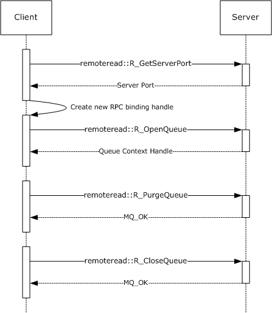

Figure 1: The client binds to a server and purges a queue.

## 4.2 Receiving a Message

This sequence diagram illustrates a client receiving a [**message**](#gt_message) from a [**queue**](#gt_queue) at the server. The call to the R_StartReceive (Opnum 7) (section [3.1.4.7)](#Section_3.1.4.7) method includes a *ulAction* parameter value of MQ_ACTION_RECEIVE (0x00000000) and a unique *dwRequestId* parameter value chosen by the client. In response, the server associates a pending request with the passed *dwRequestId* parameter, which is used to correlate a subsequent call to the R_EndReceive (Opnum 9) (section [3.1.4.9)](#Section_3.1.4.9) method or the R_CancelReceive (Opnum 8) (section [3.1.4.8)](#Section_3.1.4.8) method with the same value for the *dwRequestId* parameter. Additionally, the server returns a [SectionBuffer (section 2.2.6)](#Section_2.2.6) array that contains the message.

Next, the client indicates that the message was successfully received by calling the **R_EndReceive** method, specifying RR_ACK (0x00000002) for the *dwAck* parameter. The server completes the corresponding pending request created by the call to the **R_StartReceive** method and, because RR_ACK is specified, removes the message from the queue.

Figure 2: The client receives a message.

## 4.3 Receiving a Message in a Transaction

This sequence diagram demonstrates a scenario in which a client receives a [**message**](#gt_message) from a [**queue**](#gt_queue) within the context of a transaction. Although four roles are used to illustrate the participants in this scenario, the protocol that is described by this specification is used only between the client and server roles. The "Client Distributed Transaction Coordinator (DTC)" role (as specified in [MS-DTCO](../MS-DTCO/MS-DTCO.md)) and the "Server DTC" role are included to illustrate a typical end-to-end sequence of a transactional receive request.

The diagram includes reference numbers on the left side that identify operations of interest, which are explained in detail following.

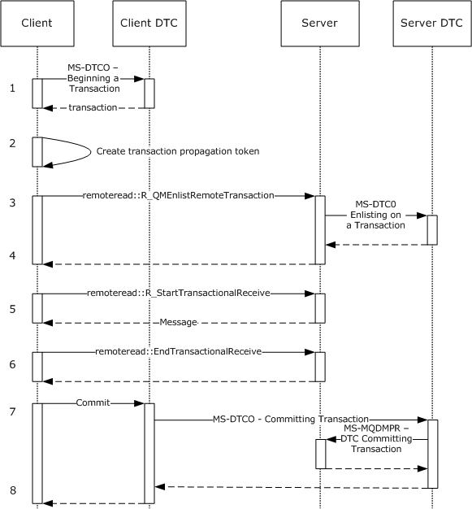

Figure 3: The client receives a message within a transaction.

- The client communicates with the local DTC to create a new transaction, as specified in [MS-DTCO] section 3.3.4.1.
- The client constructs a propagation token to be marshaled to the server's transaction manager, as specified in [MS-DTCO] section 2.2.5.4.
- The client calls the R_QMEnlistRemoteTransaction (Opnum 12) (section [3.1.4.12)](#Section_3.1.4.12) method, specifying the transaction identifier and the transaction propagation token.
- The server marshals the transaction propagation token to its local transaction manager and enlists its local resource manager in the transaction, as specified in [MS-DTCO] sections 3.3.4.12 and 3.5.4.3.
- The client calls the R_StartTransactionalReceive (Opnum 13) (section [3.1.4.13)](#Section_3.1.4.13) method to receive a message in the context of the transaction. The client specifies the transaction identifier to associate the receive operation with the transaction enlisted in the prior steps. The server returns a message in the [SectionBuffer (section 2.2.6)](#Section_2.2.6) array.
- The client advises the server that the message was received correctly by calling the R_EndTransactionalReceive (Opnum 15) (section [3.1.4.15)](#Section_3.1.4.15) method, specifying RR_ACK (0x00000002) for the *dwAck* parameter.
- The client commits the transaction, as specified in [MS-DTCO] section 3.3.4.8.2. The client DTC transaction manager notifies the server DTC transaction manager of the commit request.
- After receiving notification of the commit from the server DTC via the DTC Transaction Commit ([MS-MQDMPR](../MS-MQDMPR/MS-MQDMPR.md) section 3.1.4.7) event, the server deletes the message from the queue.

# 5 Security

The following sections specify security considerations for implementers of the Message Queuing (MSMQ): Queue Manager Remote Read Protocol.

## 5.1 Security Considerations for Implementers

In addition to imposing the minimum [**RPC**](#gt_remote-procedure-call-rpc) [**authentication level**](#gt_authentication-level) on the RPC handle for incoming calls, the server might require a different minimum RPC authentication level from the client, depending on whether the client is a member of a Windows domain, as specified by the *fWorkgroup* parameter in the R_OpenQueue (Opnum 2) (section [3.1.4.2)](#Section_3.1.4.2) and the R_OpenQueueForMove (Opnum 11) (section [3.1.4.11)](#Section_3.1.4.11) methods.<38>

## 5.2 Index of Security Parameters

| Security parameter | Section |
| --- | --- |
| fWorkgroup | R_OpenQueue (Opnum 2) (section [3.1.4.2)](#Section_3.1.4.2) R_OpenQueueForMove (Opnum 11) (section [3.1.4.11)](#Section_3.1.4.11) |

# 6 Appendix A: Full IDL

For ease of implementation, the full [**IDL**](#gt_interface-definition-language-idl) is provided in this section, where "ms-dtyp.idl" is the IDL as specified in [MS-DTYP](../MS-DTYP/MS-DTYP.md) Appendix A, and "ms-mqmq.idl" is the IDL as specified in [MS-MQMQ](../MS-MQMQ/MS-MQMQ.md) Appendix A.

import "ms-dtyp.idl";

import "ms-mqmq.idl";

[

uuid(1a9134dd-7b39-45ba-ad88-44d01ca47f28),

version(1.0),

pointer_default(unique)

]

interface RemoteRead

{

typedef [context_handle] void* QUEUE_CONTEXT_HANDLE_NOSERIALIZE;

typedef [context_handle]

QUEUE_CONTEXT_HANDLE_NOSERIALIZE QUEUE_CONTEXT_HANDLE_SERIALIZE;

typedef enum

{

stFullPacket = 0,

stBinaryFirstSection = 1,

stBinarySecondSection = 2,

stSrmpFirstSection = 3,

stSrmpSecondSection = 4

} SectionType;

typedef struct _SectionBuffer {

SectionType SectionBufferType;

DWORD SectionSizeAlloc;

DWORD SectionSize;

[unique, size_is(SectionSize)] byte* pSectionBuffer;

} SectionBuffer;

DWORD R_GetServerPort(

[in] handle_t hBind

);

void Opnum1NotUsedOnWire(void);

void R_OpenQueue(

[in] handle_t hBind,

[in] QUEUE_FORMAT* pQueueFormat,

[in] DWORD dwAccess,

[in] DWORD dwShareMode,

[in] GUID* pClientId,

[in] LONG fNonRoutingServer,

[in] unsigned char Major,

[in] unsigned char Minor,

[in] USHORT BuildNumber,

[in] LONG fWorkgroup,

[out] QUEUE_CONTEXT_HANDLE_SERIALIZE* pphContext

);

HRESULT R_CloseQueue(

[in] handle_t hBind,

[in, out] QUEUE_CONTEXT_HANDLE_SERIALIZE* pphContext

);

HRESULT R_CreateCursor(

[in] handle_t hBind,

[in] QUEUE_CONTEXT_HANDLE_NOSERIALIZE phContext,

[out] DWORD* phCursor

);

HRESULT R_CloseCursor(

[in] handle_t hBind,

[in] QUEUE_CONTEXT_HANDLE_NOSERIALIZE phContext,

[in] DWORD hCursor

);

HRESULT R_PurgeQueue(

[in] handle_t hBind,

[in] QUEUE_CONTEXT_HANDLE_NOSERIALIZE phContext

);

HRESULT R_StartReceive(

[in] handle_t hBind,

[in] QUEUE_CONTEXT_HANDLE_NOSERIALIZE phContext,

[in] ULONGLONG LookupId,

[in] DWORD hCursor,

[in] DWORD ulAction,

[in] DWORD ulTimeout,

[in] DWORD dwRequestId,

[in] DWORD dwMaxBodySize,

[in] DWORD dwMaxCompoundMessageSize,

[out] DWORD* pdwArriveTime,

[out] ULONGLONG* pSequenceId,

[out] DWORD* pdwNumberOfSections,

[out, size_is(, *pdwNumberOfSections)]

SectionBuffer** ppPacketSections

);

HRESULT R_CancelReceive(

[in] handle_t hBind,

[in] QUEUE_CONTEXT_HANDLE_NOSERIALIZE phContext,

[in] DWORD dwRequestId

);

HRESULT R_EndReceive(

[in] handle_t hBind,

[in] QUEUE_CONTEXT_HANDLE_NOSERIALIZE phContext,

[in, range(1,2)] DWORD dwAck,

[in] DWORD dwRequestId

);

HRESULT R_MoveMessage(

[in] handle_t hBind,

[in] QUEUE_CONTEXT_HANDLE_NOSERIALIZE phContextFrom,

[in] ULONGLONG ullContextTo,

[in] ULONGLONG LookupId,

[in] XACTUOW *pTransactionId

);

void R_OpenQueueForMove(

[in] handle_t hBind,

[in] QUEUE_FORMAT* pQueueFormat,

[in] DWORD dwAccess,

[in] DWORD dwShareMode,

[in] GUID* pClientId,

[in] LONG fNonRoutingServer,

[in] unsigned char Major,

[in] unsigned char Minor,

[in] USHORT BuildNumber,

[in] LONG fWorkgroup,

[out] ULONGLONG *pMoveContext,

[out] QUEUE_CONTEXT_HANDLE_SERIALIZE* pphContext

);

HRESULT R_QMEnlistRemoteTransaction(

[in] handle_t hBind,

[in] XACTUOW* pTransactionId,

[in, range(0, 131072)] DWORD cbPropagationToken,

[in, size_is (cbPropagationToken)]

unsigned char* pbPropagationToken,

[in] QUEUE_FORMAT* pQueueFormat

);

HRESULT R_StartTransactionalReceive(

[in] handle_t hBind,

[in] QUEUE_CONTEXT_HANDLE_NOSERIALIZE phContext,

[in] ULONGLONG LookupId,

[in] DWORD hCursor,

[in] DWORD ulAction,

[in] DWORD ulTimeout,

[in] DWORD dwRequestId,

[in] DWORD dwMaxBodySize,

[in] DWORD dwMaxCompoundMessageSize,

[in] XACTUOW* pTransactionId,

[out] DWORD* pdwArriveTime,

[out] ULONGLONG* pSequenceId,

[out] DWORD* pdwNumberOfSections,

[out, size_is(, *pdwNumberOfSections)]

SectionBuffer** ppPacketSections

);

HRESULT R_SetUserAcknowledgementClass(

[in] handle_t hBind,

[in] QUEUE_CONTEXT_HANDLE_NOSERIALIZE phContext,

[in] ULONGLONG LookupId,

[in] USHORT usClass

);

HRESULT R_EndTransactionalReceive(

[in] handle_t hBind,

[in] QUEUE_CONTEXT_HANDLE_NOSERIALIZE phContext,

[in, range(1,2)] DWORD dwAck,

[in] DWORD dwRequestId

);

}

# 7 Appendix B: Product Behavior

The information in this specification is applicable to the following Microsoft products or supplemental software. References to product versions include updates to those products.

The terms "earlier" and "later", when used with a product version, refer to either all preceding versions or all subsequent versions, respectively. The term "through" refers to the inclusive range of versions. Applicable Microsoft products are listed chronologically in this section.

**Windows Client**

- Windows NT Workstation operating system
- Windows 2000 Professional operating system
- Windows XP operating system
- Windows Vista operating system
- Windows 7 operating system
- Windows 8 operating system
- Windows 8.1 operating system
- Windows 10 operating system
- Windows 11 operating system
**Windows Server**

- Windows NT Server operating system
- Windows 2000 Server operating system
- Windows Server 2003 operating system
- Windows Server 2008 operating system
- Windows Server 2008 R2 operating system
- Windows Server 2012 operating system
- Windows Server 2012 R2 operating system
- Windows Server 2016 operating system
- Windows Server v1709 operating system
- Windows Server 2019 operating system
- Windows Server 2022 operating system
- Windows Server 2025 operating system
Exceptions, if any, are noted in this section. If an update version, service pack or Knowledge Base (KB) number appears with a product name, the behavior changed in that update. The new behavior also applies to subsequent updates unless otherwise specified. If a product edition appears with the product version, behavior is different in that product edition.

Unless otherwise specified, any statement of optional behavior in this specification that is prescribed using the terms "SHOULD" or "SHOULD NOT" implies product behavior in accordance with the SHOULD or SHOULD NOT prescription. Unless otherwise specified, the term "MAY" implies that the product does not follow the prescription.

<1> Section 1.4: If the originating [**MSMQ**](#gt_microsoft-message-queuing-msmq) application receives [**messages**](#gt_message) from a [**remote queue**](#gt_remote-queue) through a supporting server, the [**queue manager**](#gt_queue-manager-qm) on the supporting server uses the protocol described in [MS-MQQP](../MS-MQQP/MS-MQQP.md) but does not support this protocol.

<2> Section 1.7: Windows NT operating system, Windows 2000 operating system, and the Windows XP operating system do not support this protocol.

<3> Section 1.7: Windows Vista and later client operating systems and Windows Server 2003 and later server operating systems use [**Kerberos**](#gt_kerberos) when the computer is a member of a Windows domain; otherwise, they use [**NTLM**](#gt_nt-lan-manager-ntlm-authentication-protocol).

<4> Section 2.1: The Windows Server 2003 protocol client uses [**RPC**](#gt_remote-procedure-call-rpc) [**dynamic endpoints**](#gt_dynamic-endpoint) to obtain the initial RPC binding handle. The client calls the R_GetServerPort (Opnum 0) (section [3.1.4.1](#Section_3.1.4.1)) method with the initial RPC binding handle and uses the returned value to obtain a new RPC binding handle to be used for all subsequent RPC method calls on the protocol. When acting as protocol clients, Windows Vista and later client operating systems and Windows Server 2008 and later server operating systems use RPC dynamic endpoints to obtain the RPC binding handle. This handle is used for all RPC method calls on the protocol. The **R_GetServerPort** method is not called by the Windows Vista and later client operating systems and the Windows Server 2008 and later server operating systems when acting as protocol clients.

<5> Section 2.2.5.2: The ExtensionHeader (section [2.2.5.2](#Section_2.2.5.2)) is not supported on Windows Server 2003.

<6> Section 2.2.5.3: The SubqueueHeader (section [2.2.5.3](#Section_2.2.5.3)) is not supported on Windows Server 2003.

<7> Section 2.2.5.4: The DeadLetterHeader (section [2.2.5.4](#Section_2.2.5.4)) is not supported on Windows Server 2003.

<8> Section 2.2.5.5: The ExtendedAddressHeader (section [2.2.5.5](#Section_2.2.5.5)) is not supported on Windows Server 2003.

<9> Section 2.2.8: All Windows clients produce new **XACTUOW** ([MS-MQMQ](../MS-MQMQ/MS-MQMQ.md) section 2.2.18.1.8) structure values by calling the Windows RPC function **UuidCreate**.

<10> Section 3.1.2.1: If the registry key HKLM\SOFTWARE\Microsoft\MSMQ\Parameters\RpcCancelTimeout is defined and is set to a nonzero DWORD value, Windows Vista and later client operating systems and Windows Server 2003 and later server operating systems, when acting as protocol servers, interpret this value as the RPC Call Timeout value in minutes.

<11> Section 3.1.2.2: The Windows default timeout is 5 * 60 * 1000 milliseconds (5 minutes). This default value can be overridden by setting the registry key HKEY_LOCAL_MACHINE\SOFTWARE\Microsoft\MSMQ\Parameters\RpcCancelTimeout to the desired value, in minutes. This value cannot be set to zero.

<12> Section 3.1.4: Opnums reserved for local use apply to Windows as follows.

| Opnum | Description |
| --- | --- |
| 1 | Not used by Windows |

<13> Section 3.1.4.1: The Windows Server 2003 protocol client uses RPC dynamic endpoints to obtain the initial RPC binding handle. The client calls the R_GetServerPort (Opnum 0) (section 3.1.4.1) method with the initial RPC binding handle and uses the returned value to obtain a new RPC binding handle to be used for all subsequent RPC method calls on the protocol.

When acting as protocol clients, Windows Vista and later client operating systems and Windows Server 2008 and later server operating systems use RPC dynamic endpoints to obtain the RPC binding handle. This handle is used for all RPC method calls on the protocol. The **R_GetServerPort** method is not called by the Windows Vista and later client operating systems and the Windows Server 2008 and later server operating systems when acting as protocol clients.

<14> Section 3.1.4.2: Windows Server 2003 protocol servers limit the number of unique concurrent clients if the following DWORD registry key exists and its value is 0x00000001: HKLM\SYSTEM\CurrentControlSet\Services\LicenseInfo\FilePrint. The maximum number of unique concurrent clients permitted is taken from the DWORD registry key HKLM\System\CurrentControlSet\Services\LicenseInfo\FilePrint\ConcurrentLimit. If the number of existing unique callers is equal to this value, the R_OpenQueue (Opnum 2) (section [3.1.4.2](#Section_3.1.4.2)) method throws an RPC exception MQ_ERROR_DEPEND_WKS_LICENSE_OVERFLOW (0xc00e0067).

When acting as protocol servers, Windows Vista and later client operating systems and Windows Server 2008 and later server operating systems do not enforce limits on the number of unique concurrent clients. The *pClientId* parameter is ignored.

<15> Section 3.1.4.2: When acting as protocol clients, Windows Vista and later client operating systems and Windows Server 2003 and later server operating systems set the *fNonRoutingServer* parameter value based on the registry key HKLM\Software\Windows\MSMQ\Parameters\MachineCache\MQS_Routing.

If this key exists and is set to the DWORD value 0x00000001, the parameter is set to FALSE (0x00000000); otherwise, it is set to TRUE (0x00000001).

<16> Section 3.1.4.2: When acting as a protocol client, Windows Server 2003 sets the [**message queuing**](#gt_message-queuing) Major Version to 5. Windows Vista and later client operating systems and Windows Server 2008 and later server operating systems protocol clients set the message queuing Major Version to 6.

When acting as protocol servers, Windows Vista and later client operating systems and Windows Server 2003 and later server operating systems ignore the message queuing Major Version parameter.

<17> Section 3.1.4.2: The Windows Server 2003 protocol client sets the message queuing Minor Version to 2.

When acting as protocol clients, Windows Vista and Windows Server 2008 set the message queuing Minor Version to 0, while Windows 7 and later client operating systems and Windows Server 2008 R2 and later server operating systems set the message queuing Minor Version to 1.

When acting as protocol servers, the Windows Vista and later client operating systems and Windows Server 2003 and later server operating systems ignore the message queuing Minor Version parameter.

<18> Section 3.1.4.2: When acting as protocol clients, Windows Vista and later client operating systems and Windows Server 2003 and later server operating systems set the message queuing *BuildNumber* to a build-specific number.

When acting as protocol servers, Windows Vista and later client operating systems and Windows Server 2003 and later server operating systems ignore the message queuing *BuildNumber* parameter.

<19> Section 3.1.4.2: The Windows Server 2003 protocol server minimum RPC [**authentication level**](#gt_authentication-level) is determined as follows:

- RPC_C_AUTHN_LEVEL_NONE, if any of the following conditions is true
- The *fWorkgroup* parameter is TRUE.
- The registry key HKLM\Software\Microsoft\MSMQ\Parameters\security\NewRemoteReadServerAllowNoneSecurityClient exists and is set to any DWORD value other than 0x00000000, and the Anonymous Logon account is granted Peek or Receive permissions on the [**queue**](#gt_queue) being accessed.
- The registry key HKLM\Software\Microsoft\MSMQ\Parameters\security\NewRemoteReadServerDenyWorkgroupClient is set to the DWORD value 0x00000000 or does not exist.
- RPC_C_AUTHN_LEVEL_PKT_INTEGRITY, if the registry key HKLM\Software\Microsoft\MSMQ\Parameters\security\DebugRpc exists and is set to any DWORD value other than 0x00000000.
- RPC_C_AUTHN_LEVEL_PKT_PRIVACY otherwise.
When acting as protocol servers, Windows Vista and later client operating systems and Windows Server 2008 and later server operating systems have their minimum RPC authentication level determined as follows:

- RPC_C_AUTHN_LEVEL_NONE, if the registry key HKLM\Software\Microsoft\MSMQ\Parameters\security\AllowNonauthenticatedRpc exists and is set to any DWORD value other than 0x00000000 and any of the following conditions is true:
- The *fWorkgroup* parameter is TRUE.
- The registry key HKLM\Software\Microsoft\MSMQ\Parameters\security\NewRemoteReadServerDenyWorkgroupClient is set to the DWORD value 0x00000000 or does not exist.
- RPC_C_AUTHN_LEVEL_NONE, if the registry key HKLM\Software\Microsoft\MSMQ\Parameters\security\NewRemoteReadServerAllowNoneSecurityClient exists and is set to any DWORD value other than 0x00000000, and the Anonymous Logon account is granted Peek or Receive permissions on the queue being accessed.
- RPC_C_AUTHN_LEVEL_PKT_INTEGRITY, if the registry key HKLM\Software\Microsoft\MSMQ\Parameters\security\DebugRpc exists and is set to any DWORD value other than 0x00000000.
- RPC_C_AUTHN_LEVEL_PKT_PRIVACY otherwise.
<20> Section 3.1.4.10: R_MoveMessage (Opnum 10) (section [3.1.4.10](#Section_3.1.4.10)) is not implemented on Windows Server 2003.

<21> Section 3.1.4.11: The R_OpenQueueForMove (Opnum 11) (section [3.1.4.11](#Section_3.1.4.11)) method is not implemented on Windows Server 2003.

<22> Section 3.1.4.11: When acting as protocol clients, Windows Vista and later client operating systems and Windows Server 2003 and later server operating systems set the *fNonRoutingServer* parameter value based on the registry key HKLM\Software\Windows\MSMQ\Parameters\MachineCache\MQS_Routing.

If this key exists and is set to the DWORD value 0x00000001, the parameter is set to FALSE (0x00000000); otherwise, it is set to TRUE (0x00000001).

<23> Section 3.1.4.11: The Windows Server 2003 protocol client sets the message queuing Major Version to 5. When acting as protocol clients, Windows Vista and later client operating systems and Windows Server 2008 and later server operating systems set the message queuing Major version to 6.

When acting as protocol servers, Windows Vista and later client operating systems and Windows Server 2003 and later server operating systems ignore the message queuing Major Version parameter.

<24> Section 3.1.4.11: The Windows Server 2003 protocol client sets the message queuing Minor Version to 2.

The Windows Vista and Windows Server 2008 protocol clients set the message queuing Minor Version to 0.

When acting as protocol clients, Windows 7 and later client operating systems and Windows Server 2008 R2 and later server operating systems set the message queuing Minor Version to 1.

When acting as protocol servers, Windows Vista and later client operating systems and Windows Server 2003 and later server operating systems ignore the message queuing Minor Version parameter.

<25> Section 3.1.4.11: When acting as protocol clients, Windows Vista and later client operating systems and Windows Server 2003 and later server operating systems set the message queuing *BuildNumber* to a build-specific number.

When acting as protocol servers, Windows Vista and later client operating systems and Windows Server 2003 and later server operating systems ignore the message queuing *BuildNumber* parameter.

<26> Section 3.1.4.11: The Windows Server 2003 protocol server minimum RPC authentication level is determined as follows:

- RPC_C_AUTHN_LEVEL_NONE, if any of the following conditions is true.
- The *fWorkgroup* parameter is TRUE.
- The registry key HKLM\Software\Microsoft\MSMQ\Parameters\security\NewRemoteReadServerAllowNoneSecurityClient exists and is set to any DWORD value other than 0x00000000, and the Anonymous Logon account is granted Peek or Receive permissions on the queue being accessed.
- The registry key HKLM\Software\Microsoft\MSMQ\Parameters\security\NewRemoteReadServerDenyWorkgroupClient is set to the DWORD value 0x00000000 or does not exist.
- RPC_C_AUTHN_LEVEL_PKT_INTEGRITY, if the registry key HKLM\Software\Microsoft\MSMQ\Parameters\security\DebugRpc exists and is set to any DWORD value other than 0x00000000.
- RPC_C_AUTHN_LEVEL_PKT_PRIVACY otherwise.
When acting as protocol servers, the minimum RPC authentication level for Windows Vista and later client operating systems and Windows Server 2008 and later server operating systems is determined as follows:

- RPC_C_AUTHN_LEVEL_NONE, if the registry key HKLM\Software\Microsoft\MSMQ\Parameters\security\AllowNonauthenticatedRpc exists and is set to any DWORD value other than 0x00000000 and any of the following conditions is true:
- The *fWorkgroup* parameter is TRUE.
- The registry key HKLM\Software\Microsoft\MSMQ\Parameters\security\NewRemoteReadServerDenyWorkgroupClient is set to the DWORD value 0x00000000 or does not exist.
- RPC_C_AUTHN_LEVEL_NONE, if the registry key HKLM\Software\Microsoft\MSMQ\Parameters\security\NewRemoteReadServerAllowNoneSecurityClient exists and is set to any DWORD value other than 0x00000000, and the Anonymous Logon account is granted Peek or Receive permissions on the queue being accessed.
- RPC_C_AUTHN_LEVEL_PKT_INTEGRITY, if the registry key HKLM\Software\Microsoft\MSMQ\Parameters\security\DebugRpc exists and is set to any DWORD value other than 0x00000000.
- RPC_C_AUTHN_LEVEL_PKT_PRIVACY otherwise.
<27> Section 3.1.4.12: The R_QMEnlistRemoteTransaction (Opnum 12) (section [3.1.4.12](#Section_3.1.4.12)) method is not implemented on Windows Server 2003.

<28> Section 3.1.4.12: A server running Windows Vista and later client operating systems or Windows Server 2008 and later server operating systems ignores the *pQueueFormat* parameter.

<29> Section 3.1.4.13: The R_StartTransactionalReceive (Opnum 13) (section [3.1.4.13](#Section_3.1.4.13)) method is not implemented on Windows Server 2003.

<30> Section 3.1.4.14: R_SetUserAcknowledgementClass (Opnum 14) (section [3.1.4.14)](#Section_3.1.4.14) is not implemented on Windows Server 2003.

<31> Section 3.1.4.15: The R_EndTransactionalReceive (Opnum 15) (section [3.1.4.15](#Section_3.1.4.15)) method is not implemented on Windows Server 2003.

<32> Section 3.2.4.1: The Windows Server 2003 protocol client uses RPC dynamic endpoints to obtain the initial RPC binding handle. The client calls the R_GetServerPort (Opnum 0) (section 3.1.4.1) method with the initial RPC binding handle and uses the returned value to obtain a new RPC binding handle to be used for all subsequent RPC method calls on the protocol. The Windows Vista and Windows Server 2008 protocol clients use RPC dynamic endpoints to obtain the RPC binding handle. This handle is used for all RPC method calls on the protocol. The **R_GetServerPort** method is not called by the Windows Vista or Windows Server 2008 client.

<33> Section 3.2.4.1: The Windows Server 2003 protocol client uses RPC dynamic endpoints to obtain the initial RPC binding handle. The client calls the R_GetServerPort (Opnum 0) (section 3.1.4.1) method with the initial RPC binding handle and uses the returned value to obtain a new RPC binding handle to be used for all subsequent RPC method calls on the protocol. The Windows Vista and Windows Server 2008 clients use RPC dynamic endpoints to obtain the RPC binding handle. This handle is used for all RPC method calls on the protocol. The **R_GetServerPort** method is not called by the Windows Vista or Windows Server 2008 client.

<34> Section 3.2.4.4.1: When acting as protocol clients, Windows Vista and later client operating systems and Windows Server 2003 and later server operating systems return the message to the message queuing application with an MQ_OK (0x00000000) status even if the call to the R_EndReceive (Opnum 9) (section [3.1.4.9](#Section_3.1.4.9)) method fails.

<35> Section 3.2.4.10.1: When acting as protocol clients, Windows Vista and later client operating systems and Windows Server 2003 and later server operating systems return the message to the message queuing application with an MQ_OK (0x00000000) status even if the call to the R_EndReceive (Opnum 9) (section 3.1.4.9) method fails.

<36> Section 3.2.4.12: When acting as protocol clients, Windows Vista and later client operating systems and Windows Server 2003 and later server operating systems do not cancel pending requests associated with open cursor handles.

<37> Section 3.2.4.13: When acting as protocol clients, Windows Vista and later client operating systems and Windows Server 2003 and later server operating systems do not cancel pending requests or close associated cursor handles.

<38> Section 5.1: The minimum RPC authentication level for Windows Server 2003 protocol server is determined as follows:

- RPC_C_AUTHN_LEVEL_NONE, if any of the following conditions is true.
- The *fWorkgroup* parameter is TRUE.
- The registry key HKLM\Software\Microsoft\MSMQ\Parameters\security\NewRemoteReadServerAllowNoneSecurityClient exists and is set to any DWORD value other than 0x00000000, and the Anonymous Logon account is granted Peek or Receive permissions on the queue being accessed.
- The registry key HKLM\Software\Microsoft\MSMQ\Parameters\security\NewRemoteReadServerDenyWorkgroupClient is set to the **DWORD** value 0x00000000 or does not exist.
- RPC_C_AUTHN_LEVEL_PKT_INTEGRITY, if the registry key HKLM\Software\Microsoft\MSMQ\Parameters\security\DebugRpc exists and is set to any **DWORD** value other than 0x00000000.
- RPC_C_AUTHN_LEVEL_PKT_PRIVACY otherwise.
When acting as protocol servers, the minimum RPC authentication level for Windows Vista and later client operating systems and Windows Server 2008 and later server operating systems is determined as follows:

- RPC_C_AUTHN_LEVEL_NONE, if the registry key HKLM\Software\Microsoft\MSMQ\Parameters\security\AllowNonauthenticatedRpc exists and is set to any **DWORD** value other than 0x00000000 and any of the following conditions is true.
- The *fWorkgroup* parameter is TRUE.
- The registry key HKLM\Software\Microsoft\MSMQ\Parameters\security\NewRemoteReadServerDenyWorkgroupClient is set to the **DWORD** value 0x00000000 or does not exist.
- RPC_C_AUTHN_LEVEL_NONE, if the registry key HKLM\Software\Microsoft\MSMQ\Parameters\security\NewRemoteReadServerAllowNoneSecurityClient exists and is set to any **DWORD** value other than 0x00000000, and the Anonymous Logon account is granted Peek or Receive permissions on the queue being accessed.
- RPC_C_AUTHN_LEVEL_PKT_INTEGRITY, if the registry key HKLM\Software\Microsoft\MSMQ\Parameters\security\DebugRpc exists and is set to any **DWORD** value other than 0x00000000.
- RPC_C_AUTHN_LEVEL_PKT_PRIVACY otherwise.

# 8 Change Tracking

This section identifies changes that were made to this document since the last release. Changes are classified as Major, Minor, or None.

The revision class **Major** means that the technical content in the document was significantly revised. Major changes affect protocol interoperability or implementation. Examples of major changes are:

- A document revision that incorporates changes to interoperability requirements.
- A document revision that captures changes to protocol functionality.
The revision class **Minor** means that the meaning of the technical content was clarified. Minor changes do not affect protocol interoperability or implementation. Examples of minor changes are updates to clarify ambiguity at the sentence, paragraph, or table level.

The revision class **None** means that no new technical changes were introduced. Minor editorial and formatting changes may have been made, but the relevant technical content is identical to the last released version.

The changes made to this document are listed in the following table. For more information, please contact [dochelp@microsoft.com](mailto:dochelp@microsoft.com).

| Section | Description | Revision class |
| --- | --- | --- |
| [3.1.4.7](#Section_3.1.4.7) R_StartReceive (Opnum 7) | 30495 : Removed the "Description" column from the table of error values. Description should be clear between the error code and the cross-references in the preceding paragraph. | Minor |
| [3.1.4.11](#Section_3.1.4.11) R_OpenQueueForMove (Opnum 11) | 30495 : Revised the description of pMoveContext to use the correct parameter name used by the R_MoveMessage method. | Major |
| [3.1.4.13](#Section_3.1.4.13) R_StartTransactionalReceive (Opnum 13) | 30495 : Removed the "Description" column from the table of error values. Description should be clear between the error code and the cross-references in the preceding paragraph. | Minor |

## Revision History

| Date | Version | Revision Class | Comments |
| --- | --- | --- | --- |
| 2/22/2007 | 0.01 | New | Version 0.01 release |
| 6/1/2007 | 1.0 | Major | Updated and revised the technical content. |
| 7/3/2007 | 1.0.1 | Editorial | Changed language and formatting in the technical content. |
| 7/20/2007 | 1.0.2 | Editorial | Changed language and formatting in the technical content. |
| 8/10/2007 | 2.0 | Major | Updated and revised the technical content. |
| 9/28/2007 | 2.0.1 | Editorial | Changed language and formatting in the technical content. |
| 10/23/2007 | 2.0.2 | Editorial | Changed language and formatting in the technical content. |
| 11/30/2007 | 2.0.3 | Editorial | Changed language and formatting in the technical content. |
| 1/25/2008 | 2.0.4 | Editorial | Changed language and formatting in the technical content. |
| 3/14/2008 | 2.0.5 | Editorial | Changed language and formatting in the technical content. |
| 5/16/2008 | 2.0.6 | Editorial | Changed language and formatting in the technical content. |
| 6/20/2008 | 2.1 | Minor | Clarified the meaning of the technical content. |
| 7/25/2008 | 2.1.1 | Editorial | Changed language and formatting in the technical content. |
| 8/29/2008 | 3.0 | Major | Updated and revised the technical content. |
| 10/24/2008 | 4.0 | Major | Updated and revised the technical content. |
| 12/5/2008 | 5.0 | Major | Updated and revised the technical content. |
| 1/16/2009 | 5.1 | Minor | Clarified the meaning of the technical content. |
| 2/27/2009 | 6.0 | Major | Updated and revised the technical content. |
| 4/10/2009 | 6.0.1 | Editorial | Changed language and formatting in the technical content. |
| 5/22/2009 | 7.0 | Major | Updated and revised the technical content. |
| 7/2/2009 | 7.1 | Minor | Clarified the meaning of the technical content. |
| 8/14/2009 | 8.0 | Major | Updated and revised the technical content. |
| 9/25/2009 | 9.0 | Major | Updated and revised the technical content. |
| 11/6/2009 | 9.1 | Minor | Clarified the meaning of the technical content. |
| 12/18/2009 | 10.0 | Major | Updated and revised the technical content. |
| 1/29/2010 | 11.0 | Major | Updated and revised the technical content. |
| 3/12/2010 | 11.1 | Minor | Clarified the meaning of the technical content. |
| 4/23/2010 | 11.1.1 | Editorial | Changed language and formatting in the technical content. |
| 6/4/2010 | 11.2 | Minor | Clarified the meaning of the technical content. |
| 7/16/2010 | 11.2 | None | No changes to the meaning, language, or formatting of the technical content. |
| 8/27/2010 | 12.0 | Major | Updated and revised the technical content. |
| 10/8/2010 | 13.0 | Major | Updated and revised the technical content. |
| 11/19/2010 | 13.0 | None | No changes to the meaning, language, or formatting of the technical content. |
| 1/7/2011 | 14.0 | Major | Updated and revised the technical content. |
| 2/11/2011 | 15.0 | Major | Updated and revised the technical content. |
| 3/25/2011 | 16.0 | Major | Updated and revised the technical content. |
| 5/6/2011 | 16.0 | None | No changes to the meaning, language, or formatting of the technical content. |
| 6/17/2011 | 16.1 | Minor | Clarified the meaning of the technical content. |
| 9/23/2011 | 17.0 | Major | Updated and revised the technical content. |
| 12/16/2011 | 18.0 | Major | Updated and revised the technical content. |
| 3/30/2012 | 19.0 | Major | Updated and revised the technical content. |
| 7/12/2012 | 19.1 | Minor | Clarified the meaning of the technical content. |
| 10/25/2012 | 20.0 | Major | Updated and revised the technical content. |
| 1/31/2013 | 20.0 | None | No changes to the meaning, language, or formatting of the technical content. |
| 8/8/2013 | 21.0 | Major | Updated and revised the technical content. |
| 11/14/2013 | 21.0 | None | No changes to the meaning, language, or formatting of the technical content. |
| 2/13/2014 | 21.0 | None | No changes to the meaning, language, or formatting of the technical content. |
| 5/15/2014 | 21.0 | None | No changes to the meaning, language, or formatting of the technical content. |
| 6/30/2015 | 22.0 | Major | Significantly changed the technical content. |
| 10/16/2015 | 22.0 | None | No changes to the meaning, language, or formatting of the technical content. |
| 7/14/2016 | 22.0 | None | No changes to the meaning, language, or formatting of the technical content. |
| 6/1/2017 | 22.0 | None | No changes to the meaning, language, or formatting of the technical content. |
| 9/15/2017 | 23.0 | Major | Significantly changed the technical content. |
| 9/12/2018 | 24.0 | Major | Significantly changed the technical content. |
| 4/7/2021 | 25.0 | Major | Significantly changed the technical content. |
| 6/25/2021 | 26.0 | Major | Significantly changed the technical content. |
| 4/23/2024 | 27.0 | Major | Significantly changed the technical content. |
| 7/9/2024 | 28.0 | Major | Significantly changed the technical content. |
| 11/21/2025 | 29.0 | Major | Significantly changed the technical content. |
