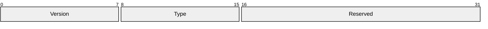
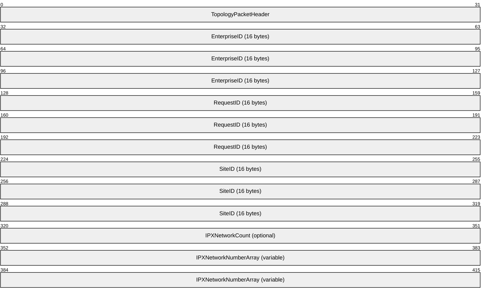
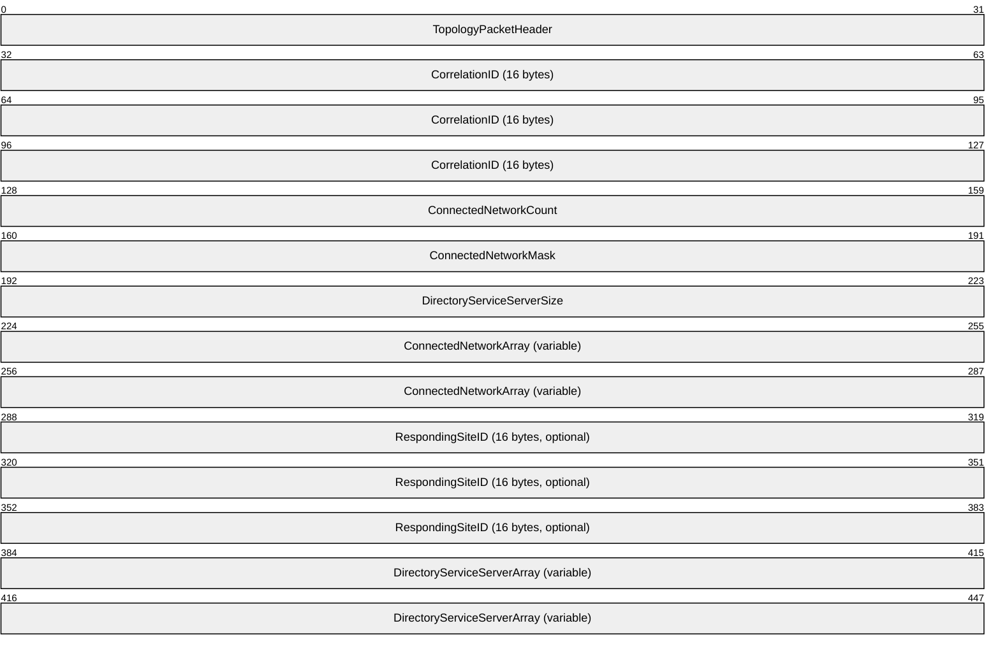
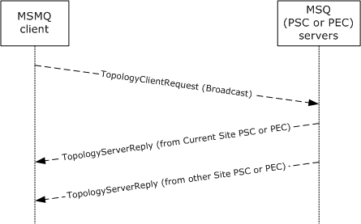

# [MS-MQSD]: Message Queuing (MSMQ): Directory Service Discovery Protocol

Table of Contents

1 Introduction

- [1 Introduction](#Section_1)
  - [1.1 Glossary](#Section_1.1)
  - [1.2 References](#Section_1.2)
    - [1.2.1 Normative References](#Section_1.2.1)
    - [1.2.2 Informative References](#Section_1.2.2)
  - [1.3 Overview](#Section_1.3)
  - [1.4 Relationship to Other Protocols](#Section_1.4)
  - [1.5 Prerequisites/Preconditions](#Section_1.5)
  - [1.6 Applicability Statement](#Section_1.6)
  - [1.7 Versioning and Capability Negotiation](#Section_1.7)
  - [1.8 Vendor-Extensible Fields](#Section_1.8)
  - [1.9 Standards Assignments](#Section_1.9)

2 Messages

- [2 Messages](#Section_2)
  - [2.1 Transport](#Section_2.1)
  - [2.2 Message Syntax](#Section_2.2)
    - [2.2.1 TopologyPacketHeader](#Section_2.2.1)
    - [2.2.2 TopologyClientRequest](#Section_2.2.2)
    - [2.2.3 TopologyServerReply](#Section_2.2.3)
  - [2.3 Directory Service Schema Elements](#Section_2.3)

3 Protocol Details

- [3 Protocol Details](#Section_3)
  - [3.1 MQSD Client Details](#Section_3.1)
    - [3.1.1 Abstract Data Model](#Section_3.1.1)
      - [3.1.1.1 Shared Data Elements](#Section_3.1.1.1)
      - [3.1.1.2 Private Data Elements](#Section_3.1.1.2)
    - [3.1.2 Timers](#Section_3.1.2)
      - [3.1.2.1 Wait For ResponseTimer](#Section_3.1.2.1)
    - [3.1.3 Initialization](#Section_3.1.3)
    - [3.1.4 Higher-Layer Triggered Events](#Section_3.1.4)
      - [3.1.4.1 Get Directory Server List](#Section_3.1.4.1)
    - [3.1.5 Processing Events and Sequencing Rules](#Section_3.1.5)
      - [3.1.5.1 Sending a TopologyClientRequest](#Section_3.1.5.1)
      - [3.1.5.2 Receiving a TopologyServerReply](#Section_3.1.5.2)
    - [3.1.6 Timer Events](#Section_3.1.6)
      - [3.1.6.1 No Server Response](#Section_3.1.6.1)
    - [3.1.7 Other Local Events](#Section_3.1.7)
      - [3.1.7.1 Populate DirectoryServerList](#Section_3.1.7.1)
      - [3.1.7.2 Populate ConnectedNetworkIdentifierList](#Section_3.1.7.2)
  - [3.2 MQSD Server Details](#Section_3.2)
    - [3.2.1 Abstract Data Model](#Section_3.2.1)
      - [3.2.1.1 Shared Data Elements](#Section_3.2.1.1)
      - [3.2.1.2 Private Data Elements](#Section_3.2.1.2)
    - [3.2.2 Timers](#Section_3.2.2)
    - [3.2.3 Initialization](#Section_3.2.3)
    - [3.2.4 Higher-Layer Triggered Events](#Section_3.2.4)
    - [3.2.5 Processing Events and Sequencing Rules](#Section_3.2.5)
      - [3.2.5.1 Receiving a TopologyClientRequest](#Section_3.2.5.1)
    - [3.2.6 Timer Events](#Section_3.2.6)
    - [3.2.7 Other Local Events](#Section_3.2.7)

4 Protocol Examples

- [4 Protocol Examples](#Section_4)

5 Security

- [5 Security](#Section_5)
  - [5.1 Security Considerations for Implementers](#Section_5.1)
  - [5.2 Index of Security Parameters](#Section_5.2)

6 Appendix A: Product Behavior

- [6 Appendix A: Product Behavior](#Section_6)

7 Change Tracking

- [7 Change Tracking](#Section_7)

For the legal notice and IP terms, see [LEGAL.md](../LEGAL.md).
Last updated: 6/1/2017.
See [Revision History](#revision-history) for full version history.

# 1 Introduction

This document specifies the Message Queuing (MSMQ): Directory Service Discovery Protocol (MQSD) used by [**MSMQ Queue Manager**](#gt_msmq-queue-manager) versions 1.0 and 2.0 to discover an accessible executing instance of an [**MSMQ Directory Service server**](#gt_msmq-directory-service-server).

Sections 1.5, 1.8, 1.9, 2, and 3 of this specification are normative. All other sections and examples in this specification are informative.

## 1.1 Glossary

This document uses the following terms:

**Active Directory**: A general-purpose network directory service. [**Active Directory**](#gt_active-directory) also refers to the Windows implementation of a directory service. [**Active Directory**](#gt_active-directory) stores information about a variety of objects in the network. Importantly, user accounts, computer accounts, groups, and all related credential information used by the Windows implementation of Kerberos are stored in [**Active Directory**](#gt_active-directory). [**Active Directory**](#gt_active-directory) is either deployed as Active Directory Domain Services (AD DS) or Active Directory Lightweight Directory Services (AD LDS). [MS-ADTS](../MS-ADTS/MS-ADTS.md) describes both forms. For more information, see [MS-AUTHSOD](../MS-AUTHSOD/MS-AUTHSOD.md) section 1.1.1.5.2, Lightweight Directory Access Protocol (LDAP) versions 2 and 3, Kerberos, and DNS.

**Augmented Backus-Naur Form (ABNF)**: A modified version of Backus-Naur Form (BNF), commonly used by Internet specifications. ABNF notation balances compactness and simplicity with reasonable representational power. ABNF differs from standard BNF in its definitions and uses of naming rules, repetition, alternatives, order-independence, and value ranges. For more information, see [[RFC5234]](https://go.microsoft.com/fwlink/?LinkId=123096).

**connected network**: A network of computers in which any two computers can communicate directly through a common transport protocol (for example, TCP/IP or SPX/IPX). A computer can belong to multiple connected networks.

**ConnectedNetworkID**: A [**GUID**](#gt_globally-unique-identifier-guid) that has been assigned to a particular [**MSMQ**](#gt_microsoft-message-queuing-msmq) [**Connected Network**](#gt_connected-network) and that is unique to that [**Connected Network**](#gt_connected-network).

**enterprise**: A unit of administration of a network of [**MSMQ queue managers**](#gt_msmq-queue-manager). An enterprise consists of an [**MSMQ Directory Service**](#gt_msmq-directory-service), one or more [**connected networks**](#gt_connected-network), and one or more [**MSMQ sites**](#gt_msmq-site).

**enterprise site**: An [**MSMQ site**](#gt_msmq-site) that has a Primary Enterprise Controller as its [**Primary Site Controller**](#gt_primary-site-controller-psc).

**EnterpriseID**: A [**GUID**](#gt_globally-unique-identifier-guid) that has been assigned to a particular [**MSMQ**](#gt_microsoft-message-queuing-msmq) [**enterprise**](#gt_enterprise) and is unique to that [**enterprise**](#gt_enterprise).

**globally unique identifier (GUID)**: A term used interchangeably with universally unique identifier (UUID) in Microsoft protocol technical documents (TDs). Interchanging the usage of these terms does not imply or require a specific algorithm or mechanism to generate the value. Specifically, the use of this term does not imply or require that the algorithms described in [[RFC4122]](https://go.microsoft.com/fwlink/?LinkId=90460) or [[C706]](https://go.microsoft.com/fwlink/?LinkId=89824) must be used for generating the [**GUID**](#gt_globally-unique-identifier-guid). See also universally unique identifier (UUID).

**Internetwork Packet Exchange (IPX)**: A protocol (see [[IPX]](https://go.microsoft.com/fwlink/?LinkId=89914)) maintained by Novell's NetWare product that provides connectionless datagram delivery of messages. IPX is based on Xerox Corporation's Internetwork Packet protocol, XNS.

**little-endian**: Multiple-byte values that are byte-ordered with the least significant byte stored in the memory location with the lowest address.

**Message Queuing Information Store (MQIS)**: The directory service store used by [**MSMQ Directory Service**](#gt_msmq-directory-service).

**Microsoft Message Queuing (MSMQ)**: A communications service that provides asynchronous and reliable message passing between distributed applications. In [**Message Queuing**](#gt_microsoft-message-queuing-msmq), applications send messages to [**queues**](#gt_queue) and consume messages from [**queues**](#gt_queue). The [**queues**](#gt_queue) provide persistence of the messages, enabling the sending and receiving applications to operate asynchronously from one another.

**MSMQ Directory Service**: A network directory service that provides directory information, including key distribution, to [**MSMQ**](#gt_microsoft-message-queuing-msmq). It initially shipped in the Windows NT 4.0 operating system Option Pack for Windows NT Server as part of [**MSMQ**](#gt_microsoft-message-queuing-msmq). This directory service predates and is superseded by [**Active Directory (AD)**](#gt_active-directory).

**MSMQ Directory Service server**: An [**MSMQ queue manager**](#gt_msmq-queue-manager) that provides [**MSMQ Directory Service**](#gt_msmq-directory-service). The server can act in either of the [**MSMQ Directory Service**](#gt_msmq-directory-service) roles: [**Primary Site Controller (PSC)**](#gt_primary-site-controller-psc) or Backup Site Controller (BSC).

**MSMQ queue manager**: An [**MSMQ**](#gt_microsoft-message-queuing-msmq) service hosted on a machine that provides [**queued**](#gt_c1a6400d-703b-4f9a-a74c-40f1487978d9) messaging services. [**Queue managers**](#gt_476f10ed-08f0-4887-b583-59d5cf909979) manage [**queues**](#gt_queue) deployed on the local computer and provide asynchronous transfer of messages to [**queues**](#gt_queue) located on other computers. A [**queue manager**](#gt_queue-manager-qm) is identified by a [**globally unique identifier (GUID)**](#gt_globally-unique-identifier-guid).

**MSMQ site**: A network of computers, typically physically collocated, that have high connectivity as measured in terms of latency (low) and throughput (high). A site is represented by a site object in the directory service. An MSMQ site maps one-to-one with an [**Active Directory**](#gt_active-directory) site when [**Active Directory**](#gt_active-directory) provides directory services to [**MSMQ**](#gt_microsoft-message-queuing-msmq).

**Primary Site Controller (PSC)**: An [**MSMQ Directory Service**](#gt_msmq-directory-service) role played by an [**MSMQ queue manager**](#gt_msmq-queue-manager). The PSC acts as the authority for the directory information for the site to which it belongs. The PSC can satisfy directory lookup requests and directory change requests. There is only one PSC per site.

**queue**: An object that holds messages passed between applications or messages passed between [**Message Queuing**](#gt_microsoft-message-queuing-msmq) and applications. In general, applications can send messages to queues and read messages from queues.

**queue manager (QM)**: A message queuing service that manages [**queues**](#gt_queue) deployed on a computer. A queue manager can also provide asynchronous transfer of messages to [**queues**](#gt_queue) deployed on other queue managers.

**SiteID**: A [**GUID**](#gt_globally-unique-identifier-guid) that has been assigned to a particular [**MSMQ site**](#gt_msmq-site) and is unique to that site.

**Unicode**: A character encoding standard developed by the Unicode Consortium that represents almost all of the written languages of the world. The [**Unicode**](#gt_unicode) standard [[UNICODE5.0.0/2007]](https://go.microsoft.com/fwlink/?LinkId=154659) provides three forms (UTF-8, UTF-16, and UTF-32) and seven schemes (UTF-8, UTF-16, UTF-16 BE, UTF-16 LE, UTF-32, UTF-32 LE, and UTF-32 BE).

**MAY, SHOULD, MUST, SHOULD NOT, MUST NOT:** These terms (in all caps) are used as defined in [[RFC2119]](https://go.microsoft.com/fwlink/?LinkId=90317). All statements of optional behavior use either MAY, SHOULD, or SHOULD NOT.

## 1.2 References

Links to a document in the Microsoft Open Specifications library point to the correct section in the most recently published version of the referenced document. However, because individual documents in the library are not updated at the same time, the section numbers in the documents may not match. You can confirm the correct section numbering by checking the [Errata](http://msdn.microsoft.com/en-us/library/dn781092.aspx).

### 1.2.1 Normative References

We conduct frequent surveys of the normative references to assure their continued availability. If you have any issue with finding a normative reference, please contact [dochelp@microsoft.com](mailto:dochelp@microsoft.com). We will assist you in finding the relevant information.

[IANAPORT] IANA, "Service Name and Transport Protocol Port Number Registry", [http://www.iana.org/assignments/service-names-port-numbers/service-names-port-numbers.xhtml](https://go.microsoft.com/fwlink/?LinkId=89888)

[MS-ADTS] Microsoft Corporation, "[Active Directory Technical Specification](../MS-ADTS/MS-ADTS.md)".

[MS-DTYP] Microsoft Corporation, "[Windows Data Types](../MS-DTYP/MS-DTYP.md)".

[MS-MQDMPR] Microsoft Corporation, "[Message Queuing (MSMQ): Common Data Model and Processing Rules](../MS-MQDMPR/MS-MQDMPR.md)".

[MS-MQDSSM] Microsoft Corporation, "[Message Queuing (MSMQ): Directory Service Schema Mapping](../MS-MQDSSM/MS-MQDSSM.md)".

[MS-MQDS] Microsoft Corporation, "[Message Queuing (MSMQ): Directory Service Protocol](../MS-MQDS/MS-MQDS.md)".

[MS-MQMP] Microsoft Corporation, "[Message Queuing (MSMQ): Queue Manager Client Protocol](../MS-MQMP/MS-MQMP.md)".

[MS-MQSD] Microsoft Corporation, "[Message Queuing (MSMQ): Directory Service Discovery Protocol](#Section_67089d8b4ca144f091334be5b843f667)".

[RFC2119] Bradner, S., "Key words for use in RFCs to Indicate Requirement Levels", BCP 14, RFC 2119, March 1997, [http://www.rfc-editor.org/rfc/rfc2119.txt](https://go.microsoft.com/fwlink/?LinkId=90317)

### 1.2.2 Informative References

[MS-MQOD] Microsoft Corporation, "[Message Queuing Protocols Overview](#Section_1.3)".

[MSDN-RAS3] Microsoft Corportion, "RasEnumConnections function", [http://msdn.microsoft.com/en-us/library/aa377284(VS.85).aspx](https://go.microsoft.com/fwlink/?LinkID=114660)

## 1.3 Overview

A [**queue manager**](#gt_queue-manager-qm) can be run in one of two roles—either running the [**MSMQ Directory Service**](#gt_msmq-directory-service) or not running the MSMQ Directory Service. A queue manager that is not running the MSMQ Directory Service uses the Message Queuing (MSMQ): Directory Service Discovery Protocol (MQSD) to obtain a current list of network-accessible queue managers running the MSMQ Directory Service.<1> After an MSMQ Directory Service has been located, other protocols are used to obtain [**MSMQ**](#gt_microsoft-message-queuing-msmq) configuration information such as [**queues**](#gt_queue) and machine names containing MSMQ installations.

MQSD clients obtain a list of queue managers that provide the MSMQ Directory Service by broadcasting (via a connectionless transport) a [TopologyClientRequest (section 2.2.2)](#Section_2.2.2) packet and by receiving [TopologyServerReply (section 2.2.3)](#Section_2.2.3) packets. A TopologyClientRequest packet contains a unique identifier of the [**enterprise site**](#gt_enterprise-site) of which the MQSD client is a member,<2> a unique correlation identifier for the request, and an identifier of the current [**MSMQ site**](#gt_msmq-site) (if any) of which the client is a member.<3> A TopologyServerReply packet contains the unique request correlation identifier assigned by the MQSD client and a list of known queue managers that provide the MSMQ Directory Service. In the case in which the MQSD client is already a member of the same MSMQ site as the responding MQSD server, the TopologyServerReply packet does not contain a list of queue managers that provide the MSMQ Directory Service.

## 1.4 Relationship to Other Protocols

This protocol depends on the UDP over IP or the [**IPX**](#gt_internetwork-packet-exchange-ipx) <4> protocol for sending discovery requests and for receiving discovery replies.

The Message Queuing (MSMQ): Queue Manager Client Protocol, as described in [MS-MQMP](../MS-MQMP/MS-MQMP.md), and the Message Queuing (MSMQ): Directory Service Protocol, as specified in [MS-MQDS](../MS-MQDS/MS-MQDS.md), make use of the information obtained by an [MS-MQSD](#Section_67089d8b4ca144f091334be5b843f667) client request.

## 1.5 Prerequisites/Preconditions

[**MSMQ queue managers**](#gt_msmq-queue-manager) have to be configured with the port number that has been assigned for use by the [**MSMQ site**](#gt_msmq-site) for the Message Queuing (MSMQ): Directory Service Discovery Protocol. <5>

## 1.6 Applicability Statement

The Message Queuing (MSMQ): Directory Service Discovery Protocol is applicable to all versions of [**MSMQ queue managers**](#gt_msmq-queue-manager) and is the only directory service discovery protocol used by [**MSMQ**](#gt_microsoft-message-queuing-msmq) version 1 and MSMQ version 2 [**queue managers**](#gt_476f10ed-08f0-4887-b583-59d5cf909979). The MSMQ: Directory Service Discovery Protocol has been deprecated for MSMQ version 3 and MSMQ version 4, but all MSMQ queue managers running the MSMQ Directory Service respond to the protocol for support of MSMQ version 1 and MSMQ version 2 queue managers.

## 1.7 Versioning and Capability Negotiation

A version number is present in the [TopologyPacketHeader (section 2.2.1)](#Section_2.2.1) packet, but it is not used.

## 1.8 Vendor-Extensible Fields

No vendor-extensible fields are available in the Message Queuing (MSMQ): Directory Service Discovery Protocol.

## 1.9 Standards Assignments

No standards assignments have been made for the Message Queuing (MSMQ): Directory Service Discovery Protocol and its data structures. Port number 1801 for UDP and TCP has been registered with the Internet Assigned Numbers Authority (IANA) by Microsoft Corporation for [**MSMQ**](#gt_microsoft-message-queuing-msmq) protocols, as specified in [[IANAPORT]](https://go.microsoft.com/fwlink/?LinkId=89888).

# 2 Messages

This protocol references commonly used data types as defined in [MS-DTYP](../MS-DTYP/MS-DTYP.md).

Unless otherwise qualified, instances of **GUID** in sections 2 and [3](../MS-DTYP/MS-DTYP.md) refer to [MS-DTYP] section 2.3.4.

## 2.1 Transport

Connectionless communications MUST be used, and either UDP over IP or [**IPX**](#gt_internetwork-packet-exchange-ipx) MAY<6> be used. The UDP or SPX source port used by the client MAY<7> be any TCP or SPX port value. The protocol server MUST<8> listen for connections on TCP port 1801 or SPX port 876.

## 2.2 Message Syntax

Message Queuing (MSMQ): Directory Service Discovery Protocol messages are formatted as either UDP or IPX packets. This protocol references commonly used data types as defined in [MS-DTYP](../MS-DTYP/MS-DTYP.md).

### 2.2.1 TopologyPacketHeader

A TopologyPacketHeader packet is sent as the first element of every [TopologyClientRequest (section 2.2.2)](#Section_2.2.2) packet and every [TopologyServerReply (section 2.2.3)](#Section_2.2.3) packet.

**Version (1 byte):** An 8-bit value that specifies the TopologyPacketHeader version. MQSD clients MUST set all bit positions to 0. MQSD servers MUST ignore this field.

**Type (1 byte):** An 8-bit value that MUST specify the type of the packet that follows. The value 0x01 MUST be used to specify a TopologyClientRequest (section 2.2.2). The value 0x02 MUST be used to specify a TopologyServerReply (section 2.2.3).

| Value | Meaning |
| --- | --- |
| 0x01 | Specifies a TopologyClientRequest (section 2.2.2). |
| 0x02 | Specifies a TopologyServerReply (section 2.2.3). |

**Reserved (2 bytes):** A 16-bit value that is not used. It MUST be set to 0x0000 by MQSD clients and MUST be ignored by MQSD servers.

### 2.2.2 TopologyClientRequest

A TopologyClientRequest packet MUST be prefixed with a [TopologyPacketHeader](#Section_2.2.1).

**TopologyPacketHeader (4 bytes):** As specified in section 2.2.1.

**EnterpriseID (16 bytes):** A [**GUID**](#gt_globally-unique-identifier-guid) that MUST contain the identifier for the [**enterprise**](#gt_enterprise) to which the client belongs.

**RequestID (16 bytes):** A GUID that MUST uniquely identify a request. This value is used to correlate TopologyClientRequest packets to [TopologyServerReply](#Section_2.2.3) packets. The **CorrelationID** field of a TopologyServerReply that is generated in response to a TopologyClientRequest packet MUST contain this value.

**SiteID (16 bytes):** A GUID that MUST contain the identifier for the [**MSMQ site**](#gt_msmq-site) to which the client belongs.

**IPXNetworkCount (4 bytes):** A 32-bit integer value in [**little-endian**](#gt_little-endian) order. When [**IPX**](#gt_internetwork-packet-exchange-ipx) networking is being used, this value MUST specify the number of **IPXNetworkNumberArray** entries that follow. When IP networking is being used, this field MUST NOT be present. When the field is present, the value MUST be in the range 1 to 32, inclusive.

**IPXNetworkNumberArray (variable):** An array of 32-bit integer values in little-endian order. Each entry specifies an IPX network address.<9> When IP networking is being used, this array MUST NOT be present. When the array is present, the number of entries is specified by the **IPXNetworkCount** field.

### 2.2.3 TopologyServerReply

A TopologyServerReply packet MUST be prefixed with a [TopologyPacketHeader](#Section_2.2.1).

**TopologyPacketHeader (4 bytes):** As specified in section 2.2.1.

**CorrelationID (16 bytes):** A [**GUID**](#gt_globally-unique-identifier-guid) that MUST contain the value from the **RequestID** field from the [TopologyClientRequest](#Section_2.2.2) packet for which the TopologyServerReply is generated.

**ConnectedNetworkCount (4 bytes):** A 32-bit integer value in [**little-endian**](#gt_little-endian) order. The value specifies the number of [**connected network**](#gt_connected-network) IDs that are present in the **ConnectedNetworkArray**. The value MUST be in the range 1 to 32, inclusive.

**ConnectedNetworkMask (4 bytes):** This 32-bit field is treated as 32 Boolean values. This entire field MUST be set to all zeros if the networking protocol being used is IP. When the networking protocol used is [**IPX**](#gt_internetwork-packet-exchange-ipx), the count of 1-valued bit positions MUST equal the value contained in the **ConnectedNetworkCount** field.

**DirectoryServiceServerSize (4 bytes):** A 32-bit integer value in little-endian order. The value of this field MUST specify the number of bytes occupied by the **DirectoryServiceServerArray**. If the [**SiteID**](#gt_siteid) assigned to the responding server matches the SiteID contained in the TopologyClientRequest, this value MUST be zero, and the **RespondingSiteID** and **DirectoryServiceServerArray** fields MUST NOT be present.

**ConnectedNetworkArray (variable):** An array of GUIDs that represents a list of directory service server [**ConnectedNetworkIDs**](#gt_connectednetworkid). The number of ConnectedNetworkIDs contained in this array (and thus its size) is determined by the value contained in the **ConnectedNetworkCount** field. The entries consist of ConnectedNetworkIDs of [**MSMQ Directory Service servers**](#gt_msmq-directory-service-server).

**RespondingSiteID (16 bytes):** A GUID that identifies the [**MSMQ site**](#gt_msmq-site) to which the server belongs. This field MUST NOT be present if the value of the **DirectoryServiceServerSize** field is zero.

**DirectoryServiceServerArray (variable):** If the **DirectoryServiceServerSize** field is not zero, this field MUST contain an array of [**Unicode**](#gt_unicode) characters. The array MUST contain a comma (value 0x002C)–separated list of MSMQ Directory Service servers and an indication of the networking protocol or protocols used by the named MSMQ Directory Service server. The first character of each delimited entry MUST specify whether the following named MSMQ Directory Service server supports the IP networking protocol, where the character value 1 (0x0031) indicates support and the character value 0 (0x0030) indicates otherwise. The second character of each delimited entry MUST specify whether the following named MSMQ Directory Service server supports the IPX networking protocol, where the character value 1 (0x0031) indicates support and the character value 0 (0x0030) indicates otherwise. The third character of each entry is the first character of a variable-length character string containing the name of an MSMQ Directory Service server. Each entry is a machine name, and the comma (value 0x002C) or null (value 0x0000) character MUST NOT be allowed as part of the name; the end of an MSMQ Directory Service server name is delimited by a comma (value 0x002C) or a null character (value 0x0000), which is not part of the MSMQ Directory Service server name.

A **DirectoryServiceServerArray** MUST be formatted according to the following [**Augmented Backus-Naur Form (ABNF)**](#gt_augmented-backus-naur-form-abnf) rules.

DirectoryServiceServerArray = Entry 0*ContinuedEntry Endlist

Supported = %x31.00 ; A Unicode 1 indicates is supported

NotSupported = %x30.00 ; A Unicode 0 indicates not supported

IP = Supported / NotSupported ; IP networking

IPX = Supported / NotSupported ; IPX networking

R1 = %x01-2b ; Range 1

R2 = %x2c-2c ; Range 2 is x2c only

R3 = %x00-ff ; Range 3

R4 = %x01-ff ; Range 4

R5 = %x2d-ff ; Range 5

R6 = %x00-00 ; Range 6 is x00 only

X1 = R1 R3 ; Two hex digit range 1

X2 = R2 R4 ; Two hex digit range 2

X3 = R5 R3 ; Two hex digit range 3

X4 = R6 R4 ; Two hex digit range 4

NameChar = X1 / X2 / X3 / X4 ; Name character: no commas or nulls

Delim = %x2c.00 ; Use comma delimiter when more follow

EndList = %x00.00 ; Use null for end of list

Entry = IP IPX 1*NameChar ; The layout for the final entry

ContinuedEntry = Delim Entry ; The layout for one continued entry

## 2.3 Directory Service Schema Elements

This protocol uses ADM elements specified in section [3.1.1](#Section_1.3). A subset of these elements can be published in a directory. This protocol SHOULD<10> access the directory using the algorithm specified in [MS-MQDSSM](../MS-MQDSSM/MS-MQDSSM.md) and using LDAP [MS-ADTS](../MS-ADTS/MS-ADTS.md). The Directory Service schema elements for ADM elements published in the directory are specified in [MS-MQDSSM] section 2.4. <11>

# 3 Protocol Details

## 3.1 MQSD Client Details

### 3.1.1 Abstract Data Model

This section describes a conceptual model of possible data organization that an implementation maintains to participate in this protocol. The described organization is provided to facilitate the explanation of how the protocol behaves. This document does not mandate that implementations adhere to this model as long as their external behavior is consistent with what is described in this document.

The abstract data model for this protocol comprises elements that are private to this protocol and others that are shared among multiple MSMQ protocols that are co-located at a common [**queue manager**](#gt_queue-manager-qm). The shared abstract data model is defined in [MS-MQDMPR](../MS-MQDMPR/MS-MQDMPR.md) section 3.1.1, and the relationship between this protocol, a queue manager, and other protocols that share a common queue manager is described in [MS-MQOD](#Section_1.3).

Section [3.1.1.1](#Section_3.2.1.1) details the elements from the shared data model that are manipulated by this protocol, and section [3.1.1.2](#Section_3.2.1.2) details the data model elements that are private to this protocol.

#### 3.1.1.1 Shared Data Elements

This protocol manipulates the following abstract data model elements from the shared abstract data model specified in [MS-MQDMPR](../MS-MQDMPR/MS-MQDMPR.md) section 3.1.1:

- **Enterprise.Identifier**, as specified in [MS-MQDMPR] section 3.1.1.6.<12>
- **Site.Identifier**, as specified in [MS-MQDMPR] section 3.1.1.7.<13>
- **QueueManager.DirectoryServerList**, as specified in [MS-MQDMPR] section 3.1.1.1.<14>
- **QueueManager.ConnectedNetworkIdentifierList**, as specified in [MS-MQDMPR] section 3.1.1.1.

#### 3.1.1.2 Private Data Elements

This protocol manipulates the following abstract data model (ADM) elements that are specific to this protocol:

**RequestID:** A [**GUID**](#gt_globally-unique-identifier-guid) that uniquely identifies the current request.

**LastSuccessfulNetworkAddress:** The address of the network from which the client has previously received the last valid [TopologyServerReply (section 2.2.3)](#Section_2.2.3) packet.

**ValidLastSuccessfulNetworkAddress:** A Boolean variable indicating whether the **LastSuccessfulNetworkAddress** ADM element contains a valid network address.

**LastTopologyServerReply:** Holds a copy of the last **TopologyServerReply** packet received by the client.

**TopologyServerReplyReceived:** A Boolean variable indicating whether the client has previously received a valid **TopologyServerReply** packet on any of the networks on which previous [TopologyClientRequest (section 2.2.2)](#Section_2.2.2) packets have been sent.

**NetworkAddressList:** A list of addresses of networks to which the client is connected.

**NumberOfNetworkAddresses:** The number of network addresses listed in the **NetworkAddressList** ADM element.

**CurrentNetworkIndex:** An Integer variable that indicates which of the network addresses listed in the **NetworkAddressList** ADM element was used to send the last **TopologyClientRequest** packet.

### 3.1.2 Timers

#### 3.1.2.1 Wait For ResponseTimer

A 15-second time-out value for receiving a response to the broadcast of the [TopologyClientRequest (section 2.2.2)](#Section_2.2.2). The timer starts when the TopologyClientRequest packet is sent on the network. If a response is not received within 15 seconds, a [No Server Response (section 3.1.6.1)](#Section_3.1.6.1) timer event is triggered.

### 3.1.3 Initialization

The protocol performs the following actions during initialization:

- The protocol MUST set **Enterprise.Identifier** to the local [**EnterpriseID**](#gt_enterpriseid).<15>
- The protocol MUST set the **ValidLastSuccessfulNetworkAddress** ADM element to FALSE.

### 3.1.4 Higher-Layer Triggered Events

#### 3.1.4.1 Get Directory Server List

This event causes this protocol to obtain a new list of [**MSMQ**](#gt_microsoft-message-queuing-msmq) directory servers. The event MUST return after the protocol obtains a valid list of directory servers. If the protocol is unable to obtain a valid list of directory servers, the protocol MUST return a result that indicates a failure.<16>

When this event is triggered, the protocol executes the following steps:

- The protocol MUST add all network addresses to which the computer is connected to the **NetworkAddressList** ADM element and MUST set the **NumberOfNetworkAddresses** ADM element to the number of network addresses listed in the **NetworkAddressList** ADM element.<17>
- If the **ValidLastSuccessfulNetworkAddress** ADM element equals TRUE and none of the network addresses listed in the **NetworkAddressList** ADM element is a Remote Access Service address<18>, the protocol MUST complete the processing of this event.
- The protocol MUST create a new [**GUID**](#gt_globally-unique-identifier-guid) and assign it to the **RequestID** ADM element.
- The protocol MUST set the **CurrentNetworkIndex** ADM elment to zero.
- The protocol MUST set the **TopologyServerReplyReceived** ADM element to FALSE.
- The protocol MUST initiate the sending of a [TopologyClientRequest (section 2.2.2)](#Section_2.2.2) packet, as specified in section [3.1.5.1](#Section_2.2.2).

### 3.1.5 Processing Events and Sequencing Rules

#### 3.1.5.1 Sending a TopologyClientRequest

To send a [TopologyClientRequest (section 2.2.2)](#Section_2.2.2) packet, the protocol performs the following actions:

- The protocol MUST increment the **CurrentNetworkIndex** ADM element by 1.
- The protocol MUST set the **LastTopologyServerReply** ADM element to empty.
- The protocol MUST start the [Wait For Response Timer (section 3.1.2.1)](#Section_3.1.2.1) with a timeout of 15 seconds.
- The protocol MUST create a new **TopologyClientRequest** packet and set **TopologyClientRequest.EnterpriseID** to **Enterprise.Identifier**, **TopologyClientRequest.RequestID** to the **RequestID** ADM element, and **TopologyClientRequest.SiteID** to **Site.Identifier**.
- The protocol MUST broadcast the **TopologyClientRequest** packet on the network address listed in the **NetworkAddressList** ADM element at the position corresponding to the **CurrentNetworkIndex** ADM element.

#### 3.1.5.2 Receiving a TopologyServerReply

The protocol receives a [TopologyServerReply (section 2.2.3)](#Section_2.2.3) packet as a response to the broadcast of a [TopologyClientRequest (section 2.2.2)](#Section_2.2.2) packet. If the packet is received on a network with an address other than the address specified in the **NetworkAddressList** ADM element at the position corresponding to the **CurrentNetworkIndex** ADM element, the protocol MUST discard the received packet and perform no further processing for it.

If an improperly formatted **TopologyServerReply** packet is received in response to the broadcast of the **TopologyClientRequest** packet, the protocol MUST discard the received packet and perform no further processing for it.

If **TopologyServerReply.CorrelationID** of the received **TopologyServerReply** packet does not match the **RequestID** ADM element, the protocol MUST discard the received packet and perform no further processing for it.

If the **CurrentNetworkIndex** ADM element does not equal the **NumberOfNetworkAddresses** ADM element and the **TopologyServerReply.DirectoryServiceServerSize** field equals 0x00000000, which indicates that the packet was sent by a server belonging to the local site, the protocol MUST perform the following actions:

- The protocol MUST copy the content of the received **TopologyServerReply** packet to the **LastTopologyServerReply** ADM element.
- The protocol MUST set the **TopologyServerReplyReceived** ADM element to TRUE.
- The protocol MUST set the **LastSuccessfulNetworkAddress** ADM element to the address of the network via which the **TopologyServerReply** packet was received and MUST set the **ValidLastSuccessfulNetworkAddress** ADM element to TRUE.
- The protocol MUST stop the [Wait For Response Timer (section 3.1.2.1)](#Section_3.1.2.1).
- The protocol MUST send a new **TopologyClientRequest** packet, as specified in section [3.1.5.1](#Section_2.2.2).
- The protocol MUST stop performing any further processing for the received **TopologyServerReply** packet.
If the **CurrentNetworkIndex** ADM element does not equal the **NumberOfNetworkAddresses** ADM element, the **LastTopologyServerReply** ADM element is not empty, and the **TopologyServerReply.DirectoryServiceServerSize** field does not equal 0x00000000, which indicates that the packet was sent by a server that does not belong to the local site, the protocol MUST send a new **TopologyClientRequest** packet, as specified in section 3.1.5.1 and MUST perform no further processing for the received **TopologyServerReply** packet.

If the **CurrentNetworkIndex** ADM element equals the **NumberOfNetworkAddresses** ADM element and the **TopologyServerReply.DirectoryServiceServerSize** field equals 0x00000000, which indicates that the packet was sent by a server belonging to the local site, the protocol MUST perform the following actions:

- The protocol MUST stop the Wait For Response Timer (section 3.1.2.1).
- The protocol MUST set the **LastSuccessfulNetworkAddress** ADM element to the address of the network via which the **TopologyServerReply** packet was received and MUST set the **ValidLastSuccessfulNetworkAddress** ADM element to TRUE.
- If **LastTopologyServerReply.DirectoryServiceServerSize** is not zero, the protocol MUST trigger the [Populate DirectoryServerList (section 3.1.7.1)](#Section_3.1.7.1) event.
- The protocol MUST trigger the [Populate ConnectedNetworkIdentifierList (section 3.1.7.2)](#Section_3.1.7.2) event.
- The protocol MUST complete the processing of the [Get Directory Server List (section 3.1.4.1)](#Section_3.1.4.1) Higher-Layer Triggered Event.
If the **LastTopologyServerReply** ADM element is empty and the **TopologyServerReply.DirectoryServiceServerSize** field does not equal 0x00000000, which indicates that the packet was sent by a server that does not belong to the local site, the protocol MUST perform the following actions:

- The protocol MUST copy the content of the received **TopologyServerReply** packet to the **LastTopologyServerReply** ADM element.
- The protocol MUST set the **TopologyServerReplyReceived** ADM element to TRUE.
- The protocol MUST set the **LastSuccessfulNetworkAddress** ADM element to the address of the network via which the **TopologyServerReply** packet was received and MUST set the **ValidLastSuccessfulNetworkAddress** ADM element to TRUE.
- The protocol MUST stop and start the Wait For Response Timer (section 3.1.2.1) with a timeout of 15 seconds.
- The protocol MUST stop performing any further processing for the received **TopologyServerReply** packet.
If the **CurrentNetworkIndex** ADM element equals the **NumberOfNetworkAddresses** ADM element, the **LastTopologyServerReply** ADM element is not empty, and **TopologyServerReply.DirectoryServiceServerSize** does not equal 0, which indicates that the packet was sent by a server that does not belong to the local site, the protocol MUST perform the following actions:

- The protocol MUST stop the Wait For Response Timer (section 3.1.2.1).
- If **LastTopologyServerReply.DirectoryServiceServerSize** is not zero, the protocol MUST invoke the Populate DirectoryServerList (section 3.1.7.1) event.
- The protocol MUST trigger the Populate ConnectedNetworkIdentifierList (section 3.1.7.2) event.
- The protocol MUST set the **LastSuccessfulNetworkAddress** ADM element to the address of the network via which the **TopologyServerReply** packet was received and MUST set the **ValidLastSuccessfulNetworkAddress** ADM element to TRUE.
- The protocol MUST complete the processing of the Get Directory Server List (section 3.1.4.1) Higher-Layer Triggered Event.

### 3.1.6 Timer Events

#### 3.1.6.1 No Server Response

This event is triggered by the expiration of the [Wait For Response Timer (section 3.1.2.1)](#Section_3.1.2.1).

If the **CurrentNetworkIndex** ADM element does not equal the **NumberOfNetworkAddresses** ADM element, the client MUST send a new [TopologyClientRequest (section 2.2.2)](#Section_2.2.2) packet.

If the **CurrentNetworkIndex** ADM element equals the **NumberOfNetworkAddresses** ADM element, the **LastTopologyServerReply** ADM element is empty, and the **TopologyServerReplyReceived** ADM element equals FALSE, the protocol MUST set the **ValidLastSuccessfulNetworkAddress** ADM element to FALSE and complete the processing of the [Get Directory Server List (section 3.1.4.1)](#Section_3.1.4.1) Higher-Layer Triggered event by returning a code that indicates failure.<19>

If the **CurrentNetworkIndex** ADM element equals the **NumberOfNetworkAddresses** ADM element and either the **LastTopologyServerReply** ADM element is not empty or the **TopologyServerReplyReceived** ADM element equals TRUE, the protocol MUST perform the following actions:

- If **LastTopologyServerReply.DirectoryServiceServerSize** is not zero, the protocol MUST trigger the [Populate DirectoryServerList (section 3.1.7.1)](#Section_3.1.7.1) event.
- The protocol MUST trigger the [Populate ConnectedNetworkIdentifierList (section 3.1.7.2)](#Section_3.1.7.2) event.
- The protocol MUST complete the processing of the Get Directory Server List (section 3.1.4.1) Higher-Layer Triggered Event.

### 3.1.7 Other Local Events

#### 3.1.7.1 Populate DirectoryServerList

This event causes the protocol to update **LocalQueueManager.DirectoryServerList**. The protocol MUST perform the following steps:

- The protocol MUST initialize **LocalQueueManager.DirectoryServerList** as empty.
- The protocol MUST read each list item of the comma (value 0x002C) or null-value (0x0000)–separated list stored in **LastTopologyServerReply.DirectoryServiceServerArray**. For each item found, the protocol MUST remove the first two [**Unicode**](#gt_unicode) characters. The remainder of the item, which is a NetBIOS computer name, MUST be appended to the list stored in **LocalQueueManager.DirectoryServerList**.

#### 3.1.7.2 Populate ConnectedNetworkIdentifierList

This event causes the protocol to update **LocalQueueManager.ConnectedNetworkIdentifierList**. The protocol MUST perform the following steps:

- The protocol MUST initialize **LocalQueueManager.ConnectedNetworkIdentifierList** as empty.
- The protocol MUST add all elements of the **LastTopologyServerReply.ConnectedNetworkArray** to **LocalQueueManager.ConnectedNetworkIdentifierList**.

## 3.2 MQSD Server Details

### 3.2.1 Abstract Data Model

This section describes a conceptual model of possible data organization that an implementation maintains to participate in this protocol. The described organization is provided to facilitate the explanation of how the protocol behaves. This document does not mandate that implementations adhere to this model as long as their external behavior is consistent with what is described in this document.

The abstract data model for this protocol comprises elements that are private to this protocol and others that are shared among multiple MSMQ protocols that are co-located at a common [**queue manager**](#gt_queue-manager-qm). The shared abstract data model is defined in [MS-MQDMPR](../MS-MQDMPR/MS-MQDMPR.md) section 3.1.1, and the relationship between this protocol, a queue manager, and other protocols that share a common queue manager is described in [MS-MQOD](#Section_1.3).

Section [3.2.1.1](#Section_3.2.1.1) details the elements from the shared data model that are manipulated by this protocol, and section [3.2.1.2](#Section_3.2.1.2) details the data model elements that are private to this protocol.

#### 3.2.1.1 Shared Data Elements

This protocol manipulates the following abstract data model elements from the shared abstract data model defined in [MS-MQDMPR](../MS-MQDMPR/MS-MQDMPR.md) section 3.1.1:

- **Enterprise.Identifier**, as defined in [MS-MQDMPR] section 3.1.1.6.
- **Site.Identifier**, as defined in [MS-MQDMPR] section 3.1.1.7.<20>
- **QueueManager.DirectoryServerList**, as defined in [MS-MQDMPR] section 3.1.1.1. The list of server names is stored in the MSMQ Directory Service that is exposed by [**Active Directory**](#gt_active-directory).<21>
- **QueueManager.ConnectedNetworkIdentifierList**, as defined in [MS-MQDMPR] section 3.1.1.1.

#### 3.2.1.2 Private Data Elements

None.

### 3.2.2 Timers

There are no timers.

### 3.2.3 Initialization

The server starts to listen for client requests. Typically, a sockets programming **select** operation is used as the means for listening for the client requests.

### 3.2.4 Higher-Layer Triggered Events

There are no higher-layer triggered events.

### 3.2.5 Processing Events and Sequencing Rules

On receiving a [TopologyClientRequest](#Section_2.2.2) packet, the server sends a [TopologyServerReply](#Section_2.2.3) packet and then immediately returns to listening for another TopologyClientRequest packet. In the event of a network error during a send operation, the server MUST close and reopen the socket and attempt to listen for incoming packets. If the socket cannot be opened, the server thread MUST terminate.

#### 3.2.5.1 Receiving a TopologyClientRequest

When receiving a [TopologyClientRequest (section 2.2.2)](#Section_2.2.2) packet, the protocol MUST perform the following steps:

- If the length of the data packet received is less than the length of a **TopologyClientRequest** packet, including the **IPXNetworkCount** field and at least one **IPXNetworkNumberArray** field entry, the **TopologyClientRequest** packet's **IPXNetworkCount** and **IPXNetworkNumberArray** fields are considered as not present and MUST be ignored.
- The protocol MUST create a new [TopologyServerReply (section 2.2.3)](#Section_2.2.3) packet.
- The protocol MUST set the **TopologyServerReply.CorrelationID** field to the **TopologyClientRequest.RequestID** field.
- The protocol MUST copy all elements of **LocalQueueManager.ConnectedNetworkIdentifierList** to the **TopologyServerReply.ConnectedNetworkArray** field and MUST set the **TopologyServerReply.ConnectedNetworkCount** field to the number of entries in the **TopologyServerReply.ConnectedNetworkArray** field.
- If the **TopologyClientRequest** received is an IP packet, the protocol MUST set the **TopologyServerReply.ConnectedNetworkMask** field to 0x00000000.
- If the **TopologyClientRequest** received is an IPX packet, the protocol MUST set an individual bit of the **TopologyServerReply.ConnectedNetworkMask** field to 1 for every entry that is placed in the **TopologyServerReply.ConnectedNetworkArray** field. The number of bits set to 1 MUST be equal to the value of the **TopologyServerReply.ConnectedNetworkCount** field.
- If **Site.Identifier** equals the **TopologyClientRequest.SiteID** field, the protocol MUST set the **TopologyServerReply.DirectoryServiceServerSize** field to 0x00000000. The protocol MUST NOT set the **TopologyServerReply.RespondingSiteID** field or the **TopologyServerReply.DirectoryServiceServerArray** field.
- If **Site.Identifier** does not equal the **TopologyClientRequest.SiteID** field, the protocol MUST set the **TopologyServerReply.RespondingSiteID** field to **Site.Identifier**, MUST copy all entries of **LocalQueueManager.DirectoryServerList** to the **TopologyServerReply.DirectoryServiceServerArray** field and MUST set the **TopologyServerReply.DirectoryServiceServerSize** field to the number of bytes contained in the **TopologyServerReply.DirectoryServiceServerArray** field.
- The protocol MUST send the **TopologyServerReply** packet to the sender of the **TopologyClientRequest** packet.

### 3.2.6 Timer Events

There are no timer events.

### 3.2.7 Other Local Events

There are no other local events.

# 4 Protocol Examples

A client broadcasts a [TopologyClientRequest](#Section_2.2.2) packet and receives zero or more [TopologyServerReply](#Section_2.2.3) packets.

In a trivial example, the only response is from the current site server. In this case, the value in the **DirectoryServiceServerCount** field of the TopologyServerReply contains a zero value.

In a more typical example, there are two or more responses: one from the [**Primary Site Controller (PSC)**](#gt_primary-site-controller-psc) of the site to which the client belongs and one or more responses from other PSCs.

The following sequence diagram shows a typical example.

Figure 1: Typical protocol example

Examples of the content of a TopologyClientRequest and two TopologyServerReply responses sent over TCP/IP are presented as follows.

The TopologyClientRequest data packet has the following content.

Offset Hexadecimal data value

in packet

00000000 00 01 00 00 61 BA EA E6 C6 D1 DB 11 BA AC 00 03

00000010 FF 4E 2D 22 03 A1 91 F2 3C E3 4F AB A9 30 BE 3A

00000020 33 E4 32 DD F6 1B C5 DC AD D4 43 45 87 39 71 56

00000030 8E 8F 91 28

The first TopologyServerReply data packet is from the local site server and does not contain a list of [**MSMQ Directory Service servers**](#gt_msmq-directory-service-server). The packet has the following content.

Offset Hexadecimal data value

in packet

00000000 00 02 00 00 03 A1 91 F2 3C E3 4F AB A9 30 BE 3A

00000010 33 E4 32 DD 01 00 00 00 00 00 00 00 00 00 00 00

00000020 62 BA EA E6 C6 D1 DB 11 BA AC 00 03 FF 4E 2D 22

The second TopologyServerReply data packet is from a site server of which the client is not a member and thus contains a list of MSMQ Directory Service servers; this packet is ignored because the requestor has received a reply from a server in the site of which the requestor is a member. The packet has the following content.

Offset Hexadecimal data value

in packet

00000000 00 02 00 00 03 A1 91 F2 3C E3 4F AB A9 30 BE 3A

00000010 33 E4 32 DD 01 00 00 00 00 00 00 00 12 00 00 00

00000020 62 BA EA E6 C6 D1 DB 11 BA AC 00 03 FF 4E 2D 22

00000030 60 BA EA E6 C6 D1 DB 11 BA AC 00 03 FF 4E 2D 22

00000040 31 00 30 00 6E 00 74 00 34 00 70 00 65 00 63 00

00000050 00 00

# 5 Security

## 5.1 Security Considerations for Implementers

The Message Queuing (MSMQ): Directory Service Discovery Protocol has no explicit security facilities. External security, such as IPsec, can be used to encrypt the packets as they flow in an IP network.

## 5.2 Index of Security Parameters

None.

# 6 Appendix A: Product Behavior

The information in this specification is applicable to the following Microsoft products or supplemental software. References to product versions include released service packs.

- Windows NT operating system
- Windows 2000 operating system
- Windows 2000 Server operating system
- Windows Server 2003 operating system
- Windows Server 2008 operating system
Exceptions, if any, are noted below. If a service pack or Quick Fix Engineering (QFE) number appears with the product version, behavior changed in that service pack or QFE. The new behavior also applies to subsequent service packs of the product unless otherwise specified. If a product edition appears with the product version, behavior is different in that product edition.

Unless otherwise specified, any statement of optional behavior in this specification that is prescribed using the terms "SHOULD" or "SHOULD NOT" implies product behavior in accordance with the SHOULD or SHOULD NOT prescription. Unless otherwise specified, the term "MAY" implies that the product does not follow the prescription.

<1> Section 1.3: This protocol is only supported on Windows NT, Windows 2000, Windows XP operating system, Windows Server 2003, Windows Vista operating system, and Windows Server 2008 and is now deprecated.

<2> Section 1.3: For a nonclustered [**MSMQ**](#gt_microsoft-message-queuing-msmq) installation, the [**enterprise site**](#gt_enterprise-site) identifier for an [**MSMQ site**](#gt_msmq-site) is a [**GUID**](#gt_globally-unique-identifier-guid) obtained by reading the registry with the value name HKEY_LOCAL_MACHINE\SOFTWARE\Microsoft\MSMQ\Parameters\MachineCache\EnterpriseId.

For a clustered MSMQ installation, the enterprise site identifier for an MSMQ site is a GUID obtained by reading the registry with the value name HKEY_LOCAL_MACHINE\SOFTWARE\Microsoft\MSMQ\ClusteredQMs\servicename\Parameters\MachineCache\EnterpriseId, where servicename is replaced by the Windows service names of the installed MSMQ clusters.

<3> Section 1.3: For a nonclustered MSMQ installation, the MSMQ site identifier for an MSMQ site is a GUID obtained by reading the registry with the value name HKEY_LOCAL_MACHINE\SOFTWARE\Microsoft\MSMQ\Parameters\MachineCache\SiteId.

For a clustered MSMQ installation, the MSMQ site identifier for an MSMQ site is a GUID obtained by reading the registry with the value name HKEY_LOCAL_MACHINE\SOFTWARE\Microsoft\MSMQ\ClusteredQMs\servicename\Parameters\MachineCache\SiteId, where servicename is replaced by the Windows service names of the installed MSMQ clusters.

<4> Section 1.4: IPX is not supported on MSMQ version 3 or 4 servers.

<5> Section 1.5: On Windows machines, the value for the directory service discovery port number is read from the Windows registry. If the MQSD client or MQSD server is unable to read the value from the registry, the default values 1801 and 876 are used for IP and [**IPX**](#gt_internetwork-packet-exchange-ipx), respectively.

For a nonclustered MSMQ installation, the IP port number is acquired by reading the registry with the value name HKEY_LOCAL_MACHINE\SOFTWARE\Microsoft\MSMQ\Parameters\MsmqIpPort.

For a clustered MSMQ installation, the IP port number is acquired by reading the registry with the value name HKEY_LOCAL_MACHINE\SOFTWARE\Microsoft\MSMQ\ClusteredQMs\servicename\Parameters\MsmqIpPort, where servicename is replaced by the Windows service names of the installed MSMQ clusters.

For a nonclustered MSMQ installation, the IPX port number is acquired by reading the registry with the value name HKEY_LOCAL_MACHINE\SOFTWARE\Microsoft\MSMQ\Parameters\MsmqIpxPort.

For a clustered MSMQ installation, the IPX port number is acquired by reading the registry with the value name HKEY_LOCAL_MACHINE\SOFTWARE\Microsoft\MSMQ\ClusteredQMs\servicename\Parameters\ MsmqIpxPort, where servicename is replaced by the Windows service names of the installed MSMQ clusters.

<6> Section 2.1: IPX is not supported on MSMQ version 3 or 4 servers.

<7> Section 2.1: The Windows implementation utilizes the Windows Sockets API for TCP or SPX connections. The Windows Sockets API is responsible for operations such as selection of the source port used by an initiator and listening/accepting connections by the acceptor.

<8> Section 2.1: The Windows implementation utilizes the Windows Sockets API for TCP or SPX connections. The Windows Sockets API is responsible for operations such as selection of the source port used by an initiator and listening/accepting connections by the acceptor.

<9> Section 2.2.2: This list is generated for IPX by calling the sockets function getsockopt with parameters as follows:

CALL getsockopt with socket_descriptor, NSPROTO_IPX, IPX_ADDRESS, &addressAdapter, &cbOpt

The IPX adapter list is in the buffer denoted by the addressAdapter pointer.

<10> Section 2.3: For Windows NT and Windows 2000, this protocol uses the directory service protocol specified in [MS-MQDS](../MS-MQDS/MS-MQDS.md).

<11> Section 2.3: For the directory service protocol, the Directory Service schema elements are specified in [MS-MQDS] sections 2.2.10 and 3.1.4.21.1 through 3.1.4.21.4.

<12> Section 3.1.1.1: On Windows clients, the values for SiteID and EnterpriseID are read from the Windows registry.

<13> Section 3.1.1.1: On Windows clients, the values for SiteID and EnterpriseID are read from the Windows registry.

<14> Section 3.1.1.1: Windows [MS-MQSD](#Section_67089d8b4ca144f091334be5b843f667) clients receive this information as a **DirectoryServiceServerArray** (see section [2.2.3](#Section_2.2.3)), and process the **DirectoryServiceServerArray** as indicated in [3.1.5](#Section_3.1.5). The information is used as the **DirectoryServerList** by the Message Queuing (MSMQ): Queue Manager Client Protocol, as specified in [MS-MQMP](../MS-MQMP/MS-MQMP.md).

<15> Section 3.1.3: On Windows clients, the values for [**SiteID**](#gt_siteid) and [**EnterpriseID**](#gt_enterpriseid) are read from the Windows registry.

<16> Section 3.1.4.1: Windows clients write a message to the event log, noting the failure of the client to initialize.

<17> Section 3.1.4.1: The Windows implementation utilizes the Windows Sockets function **gethostbyname** to obtain the IP and IPX addresses of a computer.

<18> Section 3.1.4.1: To determine whether an IPAddress is a RAS address, use the RASAPI32.dll function **RasEnumConnections** (see [[MSDN-RAS3]](https://go.microsoft.com/fwlink/?LinkID=114660)).

<19> Section 3.1.6.1: Windows clients write a message to the event log, noting the failure of the client to initialize.

<20> Section 3.2.1.1: In MSMQ version 1, the value for **Site.Identifier** is read from the Windows registry; for MSMQ version 2, the value for SiteID is read from the [**Message Queuing Information Store (MQIS)**](#gt_message-queuing-information-store-mqis) database.

<21> Section 3.2.1.1: Windows NT employs the Message Queuing Information Store (MQIS) database, which runs on top of SQL Server as the Directory Service.

# 7 Change Tracking

No table of changes is available. The document is either new or has had no changes since its last release.

## Revision History

| Date | Version | Revision Class | Comments |
| --- | --- | --- | --- |
| 5/11/2007 | 0.1 | New | Version 0.1 release |
| 8/10/2007 | 1.0 | Major | Updated and revised the technical content. |
| 9/28/2007 | 1.1 | Minor | Clarified the meaning of the technical content. |
| 10/23/2007 | 1.1.1 | Editorial | Changed language and formatting in the technical content. |
| 11/30/2007 | 2.0 | Major | Updated and revised the technical content. |
| 1/25/2008 | 2.0.1 | Editorial | Changed language and formatting in the technical content. |
| 3/14/2008 | 2.0.2 | Editorial | Changed language and formatting in the technical content. |
| 5/16/2008 | 2.0.3 | Editorial | Changed language and formatting in the technical content. |
| 6/20/2008 | 3.0 | Major | Updated and revised the technical content. |
| 7/25/2008 | 3.0.1 | Editorial | Changed language and formatting in the technical content. |
| 8/29/2008 | 4.0 | Major | Updated and revised the technical content. |
| 10/24/2008 | 5.0 | Major | Updated and revised the technical content. |
| 12/5/2008 | 6.0 | Major | Updated and revised the technical content. |
| 1/16/2009 | 6.0.1 | Editorial | Changed language and formatting in the technical content. |
| 2/27/2009 | 6.0.2 | Editorial | Changed language and formatting in the technical content. |
| 4/10/2009 | 6.0.3 | Editorial | Changed language and formatting in the technical content. |
| 5/22/2009 | 6.0.4 | Editorial | Changed language and formatting in the technical content. |
| 7/2/2009 | 6.1 | Minor | Clarified the meaning of the technical content. |
| 8/14/2009 | 6.1.1 | Editorial | Changed language and formatting in the technical content. |
| 9/25/2009 | 6.2 | Minor | Clarified the meaning of the technical content. |
| 11/6/2009 | 6.2.1 | Editorial | Changed language and formatting in the technical content. |
| 12/18/2009 | 6.2.2 | Editorial | Changed language and formatting in the technical content. |
| 1/29/2010 | 7.0 | Major | Updated and revised the technical content. |
| 3/12/2010 | 7.0.1 | Editorial | Changed language and formatting in the technical content. |
| 4/23/2010 | 7.1 | Minor | Clarified the meaning of the technical content. |
| 6/4/2010 | 7.2 | Minor | Clarified the meaning of the technical content. |
| 7/16/2010 | 7.2 | None | No changes to the meaning, language, or formatting of the technical content. |
| 8/27/2010 | 8.0 | Major | Updated and revised the technical content. |
| 10/8/2010 | 9.0 | Major | Updated and revised the technical content. |
| 11/19/2010 | 9.0 | None | No changes to the meaning, language, or formatting of the technical content. |
| 1/7/2011 | 9.0 | None | No changes to the meaning, language, or formatting of the technical content. |
| 2/11/2011 | 10.0 | Major | Updated and revised the technical content. |
| 3/25/2011 | 10.0 | None | No changes to the meaning, language, or formatting of the technical content. |
| 5/6/2011 | 10.0 | None | No changes to the meaning, language, or formatting of the technical content. |
| 6/17/2011 | 10.1 | Minor | Clarified the meaning of the technical content. |
| 9/23/2011 | 10.1 | None | No changes to the meaning, language, or formatting of the technical content. |
| 12/16/2011 | 11.0 | Major | Updated and revised the technical content. |
| 3/30/2012 | 11.0 | None | No changes to the meaning, language, or formatting of the technical content. |
| 7/12/2012 | 11.1 | Minor | Clarified the meaning of the technical content. |
| 10/25/2012 | 12.0 | Major | Updated and revised the technical content. |
| 1/31/2013 | 13.0 | Major | Updated and revised the technical content. |
| 8/8/2013 | 13.0 | None | No changes to the meaning, language, or formatting of the technical content. |
| 11/14/2013 | 13.0 | None | No changes to the meaning, language, or formatting of the technical content. |
| 2/13/2014 | 13.0 | None | No changes to the meaning, language, or formatting of the technical content. |
| 5/15/2014 | 13.0 | None | No changes to the meaning, language, or formatting of the technical content. |
| 6/30/2015 | 13.0 | None | No changes to the meaning, language, or formatting of the technical content. |
| 10/16/2015 | 13.0 | None | No changes to the meaning, language, or formatting of the technical content. |
| 7/14/2016 | 13.0 | None | No changes to the meaning, language, or formatting of the technical content. |
| 6/1/2017 | 13.0 | None | No changes to the meaning, language, or formatting of the technical content. |
