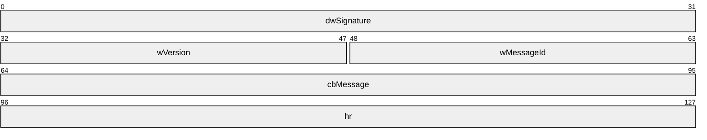
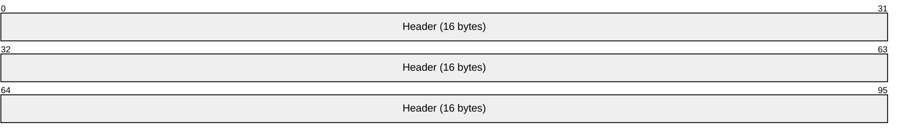
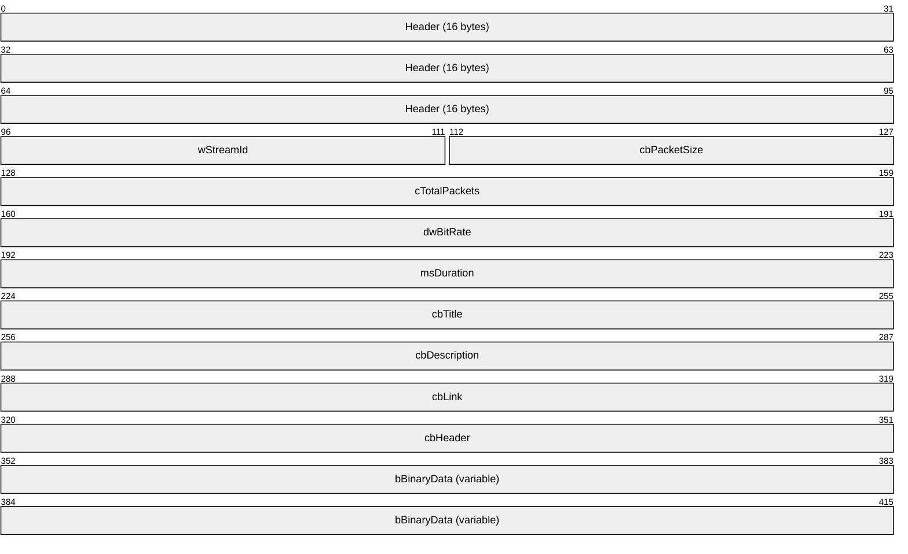
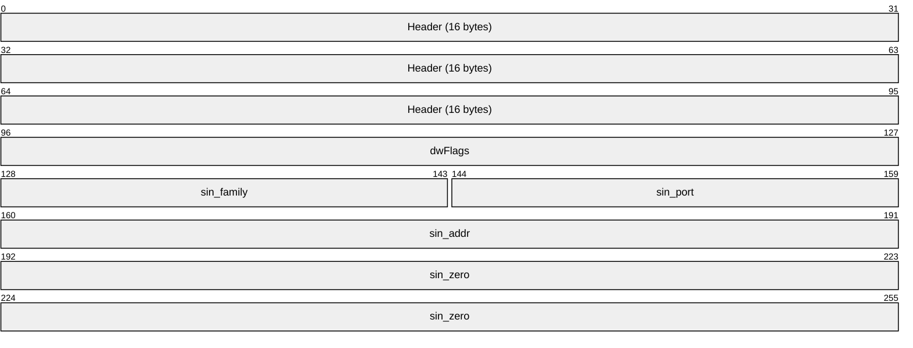
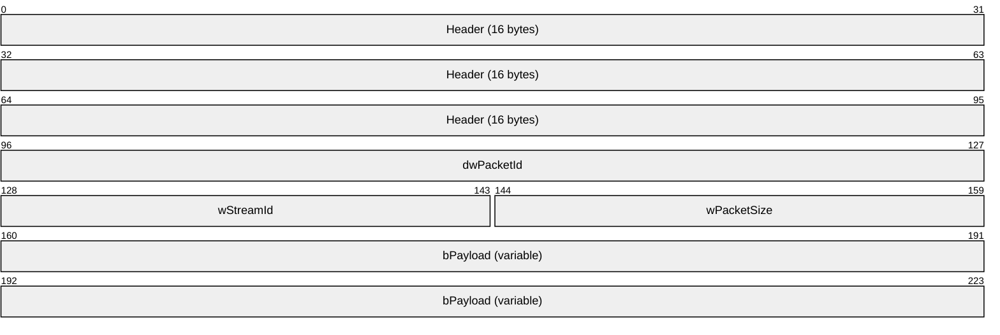
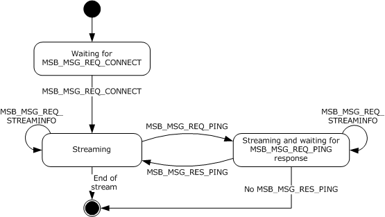
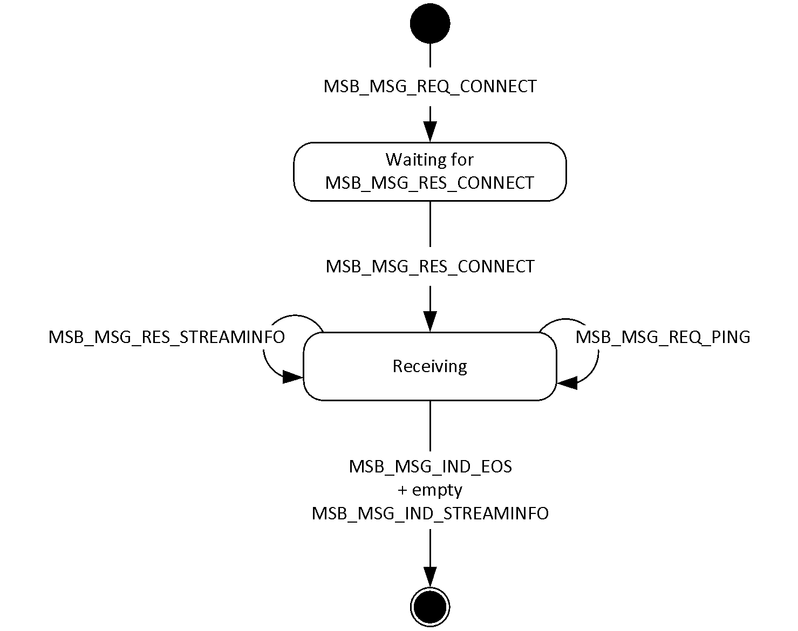
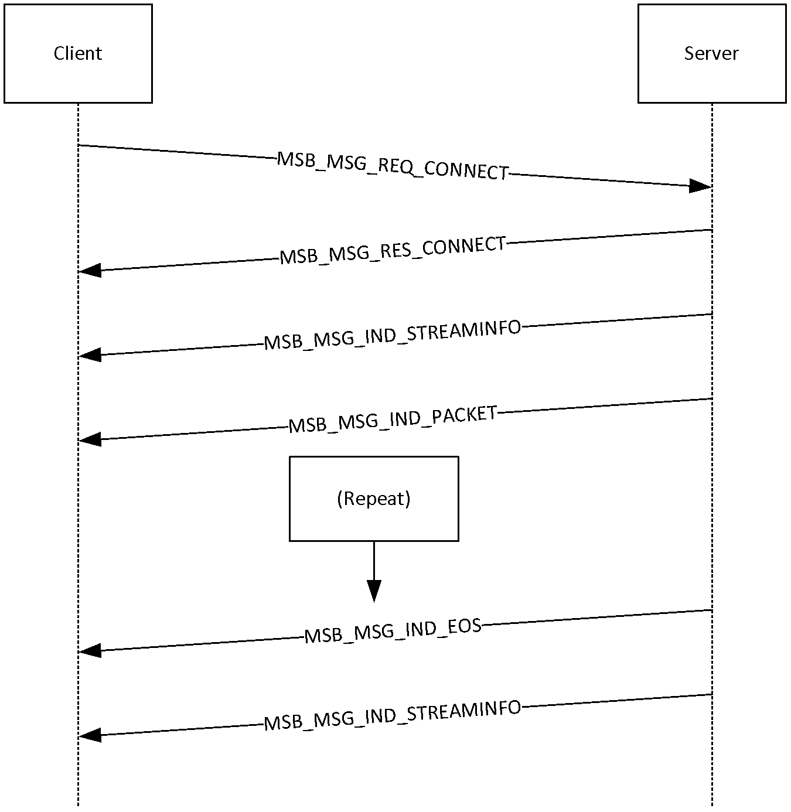
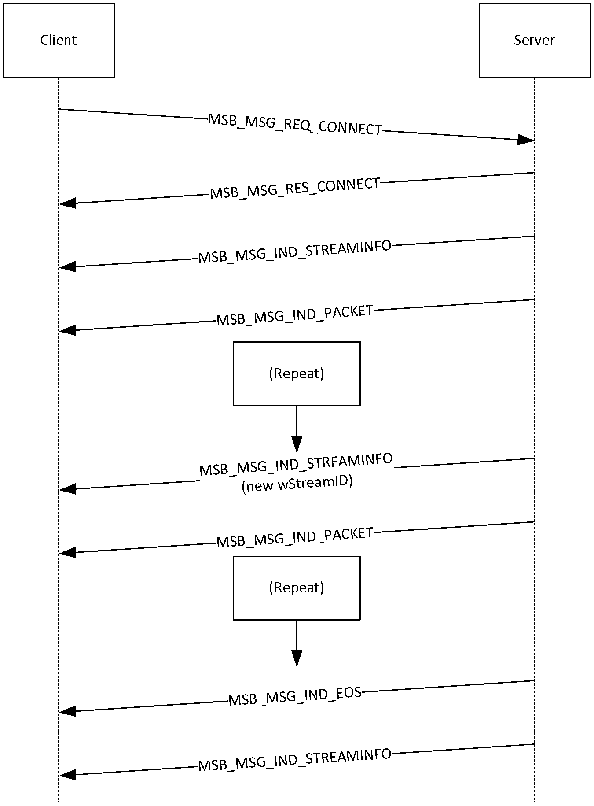

# [MS-MSBD]: Media Stream Broadcast Distribution (MSBD) Protocol

Table of Contents

1 Introduction

- [1 Introduction](#Section_1)
  - [1.1 Glossary](#Section_1.1)
  - [1.2 References](#Section_1.2)
    - [1.2.1 Normative References](#Section_1.2.1)
    - [1.2.2 Informative References](#Section_1.2.2)
  - [1.3 Overview](#Section_1.3)
  - [1.4 Relationship to Other Protocols](#Section_1.4)
  - [1.5 Prerequisites/Preconditions](#Section_1.5)
  - [1.6 Applicability Statement](#Section_1.6)
  - [1.7 Versioning and Capability Negotiation](#Section_1.7)
  - [1.8 Vendor-Extensible Fields](#Section_1.8)
  - [1.9 Standards Assignments](#Section_1.9)

2 Messages

- [2 Messages](#Section_2)
  - [2.1 Transport](#Section_2.1)
  - [2.2 Message Syntax](#Section_2.2)
    - [2.2.1 MSBMSGBASE](#Section_2.2.1)
    - [2.2.2 MSB_MSG_RES_PING](#Section_2.2.2)
    - [2.2.3 MSB_MSG_REQ_PING](#Section_2.2.3)
    - [2.2.4 MSB_MSG_REQ_STREAMINFO](#Section_2.2.4)
    - [2.2.5 MSB_MSG_RES_STREAMINFO](#Section_2.2.5)
    - [2.2.6 MSB_MSG_IND_STREAMINFO](#Section_2.2.6)
    - [2.2.7 MSB_MSG_REQ_CONNECT](#Section_2.2.7)
    - [2.2.8 MSB_MSG_RES_CONNECT](#Section_2.2.8)
    - [2.2.9 MSB_MSG_IND_EOS](#Section_2.2.9)
    - [2.2.10 MSB_MSG_IND_PACKET](#Section_2.2.10)

3 Protocol Details

- [3 Protocol Details](#Section_3)
  - [3.1 Server Details](#Section_3.1)
    - [3.1.1 Abstract Data Model](#Section_3.1.1)
    - [3.1.2 Timers](#Section_3.1.2)
    - [3.1.3 Initialization](#Section_3.1.3)
    - [3.1.4 Higher-Layer Triggered Events](#Section_3.1.4)
    - [3.1.5 Message Processing Events and Sequencing Rules](#Section_3.1.5)
      - [3.1.5.1 Receiving an MSB_MSG_REQ_CONNECT Packet](#Section_3.1.5.1)
      - [3.1.5.2 Receiving an MSB_MSG_REQ_STREAMINFO Packet](#Section_3.1.5.2)
      - [3.1.5.3 Reaching the End of the Stream](#Section_3.1.5.3)
    - [3.1.6 Timer Events](#Section_3.1.6)
    - [3.1.7 Other Local Events](#Section_3.1.7)
  - [3.2 Client Details](#Section_3.2)
    - [3.2.1 Abstract Data Model](#Section_3.2.1)
    - [3.2.2 Timers](#Section_3.2.2)
    - [3.2.3 Initialization](#Section_3.2.3)
    - [3.2.4 Higher-Layer Triggered Events](#Section_3.2.4)
    - [3.2.5 Message Processing Events and Sequencing Rules](#Section_3.2.5)
      - [3.2.5.1 Receiving an MSB_MSG_REQ_PING Packet](#Section_3.2.5.1)
      - [3.2.5.2 Receiving an MSB_MSG_IND_STREAMINFO Packet](#Section_3.2.5.2)
    - [3.2.6 Timer Events](#Section_3.2.6)
    - [3.2.7 Other Local Events](#Section_3.2.7)

4 Protocol Example

- [4 Protocol Example](#Section_4)
  - [4.1 General MSBD Sequence](#Section_4.1)
  - [4.2 Using MSBD for Server-Side Playlist Streaming](#Section_4.2)

5 Security

- [5 Security](#Section_5)
  - [5.1 Security Considerations for Implementers](#Section_5.1)
  - [5.2 Index of Security Parameters](#Section_5.2)

6 Appendix A: Product Behavior

- [6 Appendix A: Product Behavior](#Section_6)

7 Change Tracking

- [7 Change Tracking](#Section_7)

For the legal notice and IP terms, see [LEGAL.md](../LEGAL.md).
Last updated: 6/1/2017.
See [Revision History](#revision-history) for full version history.

# 1 Introduction

The Media Stream Broadcast Distribution (MSBD) Protocol is a protocol that is used for transferring an audio-visual content stream from a server to a single client or multiple clients.

Sections 1.5, 1.8, 1.9, 2, and 3 of this specification are normative. All other sections and examples in this specification are informative.

## 1.1 Glossary

This document uses the following terms:

**.nsc file**: A file that serves as an announcement for, and contains information about, a media stream broadcast. This file allows a client to tune in to a broadcast. The .nsc file was originally known as a NetShow Station Configuration file. Because the NetShow protocol suite is now obsolete, the original nomenclature is no longer applicable and is not used. Also known as a Windows Media Station file or an NSC file.

**Advanced Systems Format (ASF)**: An extensible file format that is designed to facilitate streaming digital media data over a network. This file format is used by Windows Media.

**HRESULT**: An integer value that indicates the result or status of an operation. A particular HRESULT can have different meanings depending on the protocol using it. See [MS-ERREF](../MS-ERREF/MS-ERREF.md) section 2.1 and specific protocol documents for further details.

**little-endian**: Multiple-byte values that are byte-ordered with the least significant byte stored in the memory location with the lowest address.

**parity packet**: An [**ASF**](#gt_advanced-systems-format-asf) data packet that contains parity data and is used for reconstructing other lost packets. Unlike other [**ASF**](#gt_advanced-systems-format-asf) data packets, parity packets always have the Opaque Data Present bit set to 1 in the [**ASF**](#gt_advanced-systems-format-asf) data packet header.

**MAY, SHOULD, MUST, SHOULD NOT, MUST NOT:** These terms (in all caps) are used as defined in [[RFC2119]](https://go.microsoft.com/fwlink/?LinkId=90317). All statements of optional behavior use either MAY, SHOULD, or SHOULD NOT.

## 1.2 References

Links to a document in the Microsoft Open Specifications library point to the correct section in the most recently published version of the referenced document. However, because individual documents in the library are not updated at the same time, the section numbers in the documents may not match. You can confirm the correct section numbering by checking the [Errata](http://msdn.microsoft.com/en-us/library/dn781092.aspx).

### 1.2.1 Normative References

We conduct frequent surveys of the normative references to assure their continued availability. If you have any issue with finding a normative reference, please contact [dochelp@microsoft.com](mailto:dochelp@microsoft.com). We will assist you in finding the relevant information.

[ASF] Microsoft Corporation, "Advanced Systems Format Specification", December 2004, [http://download.microsoft.com/download/7/9/0/790fecaa-f64a-4a5e-a430-0bccdab3f1b4/ASF_Specification.doc](https://go.microsoft.com/fwlink/?LinkId=89814)

[MS-DTYP] Microsoft Corporation, "[Windows Data Types](../MS-DTYP/MS-DTYP.md)".

[MS-ERREF] Microsoft Corporation, "[Windows Error Codes](../MS-ERREF/MS-ERREF.md)".

[MS-MSB] Microsoft Corporation, "[Media Stream Broadcast (MSB) Protocol](../MS-MSB/MS-MSB.md)".

[RFC2119] Bradner, S., "Key words for use in RFCs to Indicate Requirement Levels", BCP 14, RFC 2119, March 1997, [http://www.rfc-editor.org/rfc/rfc2119.txt](https://go.microsoft.com/fwlink/?LinkId=90317)

### 1.2.2 Informative References

None.

## 1.3 Overview

The MSBD Protocol is used for transferring a live stream of audio-visual content from a server to a single client or to multiple clients. For example, the MSBD Protocol might be used when transmitting the digitized sound and images of a lecture from a computer that is encoding the lecture in real time to another computer that is running the appropriate streaming media server software, such as Windows Media Services version 4.1.

The MSBD Protocol can also be used for transmitting a live stream from one Windows Media Services server installation to another. Certain versions of Windows Media Player<1> also support the MSBD Protocol and can use it to monitor a live stream by connecting to a server that is running Windows Media Services or by connecting directly to a real-time encoder.

## 1.4 Relationship to Other Protocols

MSBD packets are encapsulated in TCP. However, one MSBD packet type, [MSB_MSG_IND_PACKET](#Section_2.2.10), can also be encapsulated in the User Datagram Protocol (UDP). UDP encapsulation mode is only used for transmitting packets to an IPv4 multicast group.<2>

## 1.5 Prerequisites/Preconditions

The MSBD Protocol does not provide a mechanism for a client to discover the URL to the server. Therefore, it is a prerequisite that the client obtain a URL to the server before this protocol can be used.

## 1.6 Applicability Statement

The MSBD Protocol can be used to distribute [**Advanced Systems Format (ASF)**](#gt_advanced-systems-format-asf) packets over an IP-based network. The MSBD Protocol is designed for distribution of content between servers or from an encoder to a server.<3> The MSBD Protocol is not intended for use by an end-user application, such as Windows Media Player, except for troubleshooting use.

The UDP encapsulation mode of this protocol might not be suitable for content that uses large ASF data packets. Large ASF data packets can cause the UDP packets to be fragmented into multiple IP datagrams, and fragmentation of IP datagrams might be undesirable. When the content uses these large packets, TCP is the recommended encapsulation mode.

## 1.7 Versioning and Capability Negotiation

The MSBD Protocol does not support negotiation of versioning or capabilities. However, server implementations of the MSBD Protocol are not required to support delivery of [MSB_MSG_IND_PACKET](#Section_2.2.10) packets over UDP. If a client requests such delivery, and the server does not support it, the server sends an [MSB_MSG_RES_CONNECT](#Section_2.2.8) packet to indicate that the operation failed.

## 1.8 Vendor-Extensible Fields

This protocol uses [**HRESULT**](#gt_hresult) values as defined in [MS-ERREF](../MS-ERREF/MS-ERREF.md). Vendors can define their own HRESULT values, provided that they set the C bit (0x20000000) for each vendor-defined value, indicating that the value is a customer code.

## 1.9 Standards Assignments

The MSBD Protocol has no applicable standards assignments.

# 2 Messages

The following sections specify how MSBD Protocol messages are transported and give details on MSBD Protocol message syntax.

This protocol references commonly used data types as defined in [MS-DTYP](../MS-DTYP/MS-DTYP.md).

## 2.1 Transport

[MSB_MSG_IND_PACKET](#Section_2.2.10) packets are encapsulated in UDP packets if IP multicasting is used to deliver those packets. Otherwise, the MSB_MSG_IND_PACKET packets are encapsulated in TCP. All other MSBD Protocol packets MUST be encapsulated in TCP. The UDP and TCP packets MUST be encapsulated in the IP version 4 (IPv4).

There is no officially assigned TCP port for the MSBD Protocol; however, MSBD servers often listen on TCP port 7007 for client requests.

## 2.2 Message Syntax

All 16-bit and 32-bit integer fields MUST be transmitted in [**little-endian**](#gt_little-endian) byte order, unless otherwise specified.

All fields that are unsigned 16-bit integers have valid ranges from 0x0000 to 0xFFFF, inclusive, unless otherwise specified.

All fields that are unsigned 32-bit integers have valid ranges from 0x00000000 to 0x0000FFFF, inclusive, unless otherwise specified.

### 2.2.1 MSBMSGBASE

The MSBMSGBASE header defines the packet header.

**dwSignature (4 bytes):** An unsigned 32-bit integer that identifies the protocol as the MSBD Protocol. This value MUST be 0x2042534D, which is the [**little-endian**](#gt_little-endian) representation of the ASCII character sequence "MSB[space]".

**wVersion (2 bytes):** An unsigned 16-bit integer that represents the version number of the MSBD Protocol. This value is currently 0x0106.

**wMessageId (2 bytes):** An unsigned 16-bit integer that designates the MSBD packet type. This value MUST be one of the following.

| Value | Meaning |
| --- | --- |
| 0x0001 | Designates an [MSB_MSG_REQ_PING](#Section_2.2.3) packet. |
| 0x0002 | Designates an [MSB_MSG_RES_PING](#Section_2.2.2) packet. |
| 0x0003 | Designates an [MSB_MSG_REQ_STREAMINFO](#Section_2.2.4) packet. |
| 0x0004 | Designates an [MSB_MSG_RES_STREAMINFO](#Section_2.2.5) packet. |
| 0x0005 | Designates an [MSB_MSG_IND_STREAMINFO](#Section_2.2.6) packet. |
| 0x0007 | Designates an [MSB_MSG_REQ_CONNECT](#Section_2.2.7) packet. |
| 0x0008 | Designates an [MSB_MSG_RES_CONNECT](#Section_2.2.8) packet. |
| 0x0009 | Designates an [MSB_MSG_IND_EOS](#Section_2.2.9) packet. |
| 0x000A | Designates an [MSB_MSG_IND_PACKET](#Section_2.2.10) packet. |

**cbMessage (4 bytes):** An unsigned 32-bit integer that contains the byte length of the packet, including the header. The **cbMessage** field MUST be set to a value in the range 0x0010 to 0xFFFF, inclusive.

**hr (4 bytes):** An unsigned 32-bit integer field representing the status of an operation. The **hr** field MUST be set to an [**HRESULT**](#gt_hresult) code. For HRESULT codes, see [MS-ERREF](../MS-ERREF/MS-ERREF.md) section 2.1.

### 2.2.2 MSB_MSG_RES_PING

The client MUST respond with the MSB_MSG_RES_PING packet to the [MSB_MSG_REQ_PING](#Section_2.2.3) packet that is sent by the server. This packet informs the server that the client is still active.

**Header (16 bytes):** An [MSBMSGBASE](#Section_2.2.1) packet that defines the packet header. The **wMessageId** field MUST be set to 0x0002.

### 2.2.3 MSB_MSG_REQ_PING

The server MAY send an MSB_MSG_REQ_PING packet to confirm that the client is still active. It is recommended that the server send this packet approximately every 2 minutes. If active, the client MUST respond with an [MSB_MSG_RES_PING](#Section_2.2.2) packet; otherwise, the server SHOULD end the session.

**Header (16 bytes):** An [MSBMSGBASE](#Section_2.2.1) packet that defines the packet header. The **wMessageId** field MUST be set to 0x0001.

### 2.2.4 MSB_MSG_REQ_STREAMINFO

The client MAY send the MSB_MSG_REQ_STREAMINFO packet to request information about the media stream. This request is optional because the server always sends the stream information in an [MSB_MSG_IND_STREAMINFO](#Section_2.2.6) packet immediately after sending an [MSB_MSG_RES_CONNECT](#Section_2.2.8) packet. The MSB_MSG_REQ_STREAMINFO packet is deprecated and SHOULD NOT be sent by clients.

**Header (16 bytes):** An [MSBMSGBASE](#Section_2.2.1) packet that defines the packet header. The **wMessageId** field MUST be set to 0x0003.

### 2.2.5 MSB_MSG_RES_STREAMINFO

The server MUST respond with an MSB_MSG_RES_STREAMINFO packet to a client [MSB_MSG_REQ_STREAMINFO](#Section_2.2.4) packet that requests media stream information. The structure and purpose of this packet are identical to those of the [MSB_MSG_IND_STREAMINFO](#Section_2.2.6) packet. The client requests media stream information from the server only if the server omits sending the MSB_MSG_IND_STREAMINFO packet immediately after the [MSB_MSG_RES_CONNECT](#Section_2.2.8) packet.

**Header (16 bytes):** An [MSBMSGBASE](#Section_2.2.1) packet that defines the packet header. The **wMessageId** field MUST be set to 0x0004.

**wStreamId (2 bytes):** An unsigned 16-bit integer that uniquely identifies the media stream that is currently being transmitted. The value of this field MUST be identical to the value of **wStreamId** that is used in the MSB_MSG_IND_STREAMINFO packet that the server transmitted for the current stream. If the server has not transmitted an MSB_MSG_IND_STREAMINFO packet for the current stream, the value of **wStreamId** MUST be chosen in accordance with the rules for choosing a **wStreamId** value for an MSB_MSG_IND_STREAMINFO packet. The value of the **wStreamId** field MUST be in the range 0x0000 to 0xFFFF, inclusive.

**cbPacketSize (2 bytes):** An unsigned 16-bit integer that specifies the maximum size, in bytes, of the payload in each [MSB_MSG_IND_PACKET](#Section_2.2.10) packet. The value of the **cbPacketSize** field MUST be in the range 0x0000 to 0xFFFF, inclusive.

**cTotalPackets (4 bytes):** An unsigned 32-bit integer that MUST be set to the total number of MSB_MSG_IND_PACKET packets that are needed to transmit the entire media stream—if this information is known. Otherwise, the field MUST be set to zero. The value of the **cTotalPackets** field MUST be in the range 0x00000000 to 0x0000FFFF, inclusive.

**dwBitRate (4 bytes):** An unsigned 32-bit integer that contains the bit rate, in bits per second, of the media stream that is measured. For an ASF stream, the value of the **dwBitRate** field corresponds to the value of the Maximum Bitrate field in the ASF File Properties Object. The value of the **dwBitRate** field MUST be in the range 0x00000000 to 0x0000FFFF, inclusive.

**msDuration (4 bytes):** An unsigned 32-bit integer that MUST be set to the duration, in milliseconds, of the media stream, if this information is known. Otherwise, this value MUST be set to -1 (FFFFFFFF hexadecimal). For an ASF stream, the value of the **msDuration** field corresponds to the value of the Play Duration field in the ASF File Properties Object. The value of the **msDuration** field MUST be in the range 0x00000000 to 0x0000FFFF, inclusive.

**cbTitle (4 bytes):** An unsigned 32-bit integer that contains the size, in bytes, of the media stream title. The stream title MUST be first in the **bBinaryData** field. The value of the **cbTitle** field MUST be in the range 0x00000000 to 0x0000FFCF, inclusive.

**cbDescription (4 bytes):** An unsigned 32-bit integer that contains the size, in bytes, of the media stream description. The stream description MUST follow the stream title in the **bBinaryData** field. The value of the **cbDescription** field MUST be in the range 0x00000000 to 0x0000FFCF, inclusive.

**cbLink (4 bytes):** An unsigned 32-bit integer that contains the size, in bytes, of the media stream link (an arbitrary moniker for the connection over which the media stream is to be transmitted). The stream link MUST follow the stream description in the **bBinaryData** field. The value of the **cbLink** field MUST be in the range 0x00000000 to 0x0000FFCF, inclusive.

**cbHeader (4 bytes):** An unsigned 32-bit integer that contains the size, in bytes, of the media stream header. The stream header MUST follow the stream link in the **bBinaryData** field. If the **szChannel** field of the [MSB_MSG_REQ_CONNECT](#Section_2.2.7) packet is set to NetShow, the stream is in [**ASF**](#gt_advanced-systems-format-asf), as specified in [[ASF]](https://go.microsoft.com/fwlink/?LinkId=89814) section 2, and the stream header is an ASF header. In the case of an ASF Header, the value of the **cbHeader** field is the size of the entire ASF Header Object, as described in [ASF] section 3.1, plus 50 bytes (which represents the fixed initial portion of the ASF Data Object, as described in [ASF] section 5.1). The value of the **cbHeader** field MUST be in the range 0x00000000 to 0x0000FFCF, inclusive.

**bBinaryData (variable):** The binary data that contains the title, description, link, and header of the media stream, in that order. The method for generating the binary data comprising the title, description, link or header (if not an ASF header) of the media stream is implementation-specific and outside the scope of this documentation. The size of the **bBinaryData** field is equal to the sum of the values of the **cbTitle**, **cbDescription**, **cbLink**, and **cbHeader** fields. The size of the **bBinaryData** field MUST be in the range of 0 to 65,487 bytes. Note that these requirements impose a restriction on the values that the **cbTitle**, **cbDescription**, **cbLink**, and **cbHeader** fields can assume. For example, **cbTitle** and **cbDescription** cannot both have a value of 0x8000 at the same time.

### 2.2.6 MSB_MSG_IND_STREAMINFO

The server MUST send the MSB_MSG_IND_STREAMINFO packet, which describes the media stream, in the following circumstances:

- Following an [MSB_MSG_RES_CONNECT](#Section_2.2.8) packet.
- When a stream switch occurs while playing a server playlist.
- Following an [MSB_MSG_IND_EOS](#Section_2.2.9) packet. For more information about sending an MSB_MSG_IND_STREAMINFO packet in this case, see section [3.1.5.3](#Section_3.1.5.3).

**Header (16 bytes):** An [MSBMSGBASE](#Section_2.2.1) packet that defines the packet header. The **wMessageId** field MUST be set to 0x0005.

**wStreamId (2 bytes):** An unsigned 16-bit integer that uniquely identifies the media stream that will be transmitted, within the current server playlist. The value of this field can be chosen arbitrarily by the server; however, it MUST be different from the wStreamId values that are used for any other streams in the same server playlist. This allows the client to distinguish [MSB_MSG_IND_PACKET](#Section_2.2.10) packets that belong to the new stream from MSB_MSG_IND_PACKET packets that belong to previous streams (if any). The value of the wStreamId field MUST be in the range 0x0000 to 0x07FF, inclusive, or in the range 0x8000 to 0x87FF, inclusive.

**cbPacketSize (2 bytes):** An unsigned 16-bit integer that specifies the maximum size, in bytes, of the payload in each MSB_MSG_IND_PACKET packet. The value of the **cbPacketSize** field MUST be in the range 0x0000 to 0xFFF7, inclusive.

**cTotalPackets (4 bytes):** An unsigned 32-bit integer that MUST be set to the total number of MSB_MSG_IND_PACKET packets that are needed to transmit the entire media stream—if this information is known. Otherwise, the field MUST be set to 0. The value of the **cTotalPackets** field MUST be in the range 0x00000000 to 0xFFFFFFFF, inclusive.

**dwBitRate (4 bytes):** An unsigned 32-bit integer that represents the bit rate, measured in bits per second, of the media stream. For an ASF stream, the value of the **dwBitRate** field corresponds to the value of the Maximum Bitrate field in the ASF File Properties Object. The value of the **dwBitRate** field MUST be in the range 0x00000000 to 0xFFFFFFFF, inclusive.

**msDuration (4 bytes):** An unsigned 32-bit integer that MUST be set to the duration, in milliseconds, of the media stream—if this information is known. Otherwise, this value MUST be set to -1 (FFFFFFFF hexadecimal). For an ASF stream, the value of the **msDuration** field corresponds to the value of the Play Duration field in the ASF File Properties Object. The value of the **msDuration** field MUST be in the range 0x00000000 to 0xFFFFFFFF, inclusive.

**cbTitle (4 bytes):** An unsigned 32-bit integer that contains the size, in bytes, of the media stream title. The stream title MUST be first in the **bBinaryData** field. The value of the **cbTitle** field MUST be in the range 0x00000000 to 0x0000FFCF, inclusive.

**cbDescription (4 bytes):** An unsigned 32-bit integer that represents the size, in bytes, of the media stream description. The stream description MUST follow the stream title in the **bBinaryData** field. The value of the **cbDescription** field MUST be in the range 0x00000000 to 0x0000FFCF, inclusive.

**cbLink (4 bytes):** An unsigned 32-bit integer that contains the size, in bytes, of the media stream link (an arbitrary moniker for the connection over which the media stream is to be transmitted). The stream link MUST follow the stream description in the **bBinaryData** field. The value of the **cbLink** field MUST be in the range 0x00000000 to 0x0000FFCF, inclusive.

**cbHeader (4 bytes):** An unsigned 32-bit integer that contains the size, in bytes, of the media stream header. The stream header MUST follow the stream link in the **bBinaryData** field. If the **szChannel** field of the [MSB_MSG_REQ_CONNECT](#Section_2.2.7) packet is set to NetShow, the stream is in the [**ASF**](#gt_advanced-systems-format-asf), as specified in [[ASF]](https://go.microsoft.com/fwlink/?LinkId=89814) section 2, and the stream header is an ASF header. In the case of an ASF Header, the value of the **cbHeader** field is the size of the entire ASF Header Object, as described in [ASF] section 3.1, plus 50 bytes (which represents the fixed initial portion of the ASF Data Object, as described in [ASF] section 5.1). The value of the **cbHeader** field MUST be in the range 0x00000000 to 0x0000FFCF, inclusive.

**bBinaryData (variable):** The binary data that contains the title, description, link, and header of the media stream, in that order. The method for generating the binary data comprising the title, description, link or header (if not an ASF header) of the media stream is implementation-specific and outside the scope of this documentation. The size of the **bBinaryData** field is equal to the sum of the values of the **cbTitle**, **cbDescription**, **cbLink**, and **cbHeader** fields. The size of the **bBinaryData** field MUST be in the range of 0 to 65,487 bytes. Note that these requirements impose a restriction on the values that the **cbTitle**, **cbDescription**, **cbLink**, and **cbHeader** fields can assume. For example, **cbTitle** and **cbDescription** cannot both have a value of 0x8000 at the same time.

### 2.2.7 MSB_MSG_REQ_CONNECT

The client sends an MSB_MSG_REQ_CONNECT packet to request a media stream from the server.

**Header (16 bytes):** An [MSBMSGBASE](#Section_2.2.1) packet that defines the packet header. The **wMessageId** field MUST be set to 0x0007.

**dwFlags (4 bytes):** An unsigned 32-bit integer that represents the connection type. The value MUST be one of the following.

| Value | Meaning |
| --- | --- |
| 0x0002 | The media stream is sent to multiple clients simultaneously by using IP multicasting; each client maintains an individual TCP control connection to the server. |
| 0x0001 | The media stream is sent to a single client using the current TCP connection. |

**szChannel (variable):** This field SHOULD be set to the word NetShow, which MUST be represented as a string of Unicode characters. The terminating null character SHOULD NOT be included. The size of the string can be determined by subtracting the sizes of all other fields from the value of the **cbMessage** field in the packet header MSBMSGBASE. The size of the **szChannel** field MUST be between 0 and 65,514 bytes. Because the **szChannel** field consists of a Unicode character string, the size of the field must be an even number of bytes.

### 2.2.8 MSB_MSG_RES_CONNECT

The server MUST send the MSB_MSG_RES_CONNECT packet in response to the [MSB_MSG_REQ_CONNECT](#Section_2.2.7) packet that is sent by the client.

**Header (16 bytes):** An [MSBMSGBASE](#Section_2.2.1) packet that defines the packet header. The **wMessageId** field MUST be set to 0x0008.

**dwFlags (4 bytes):** An unsigned 32-bit integer that specifies [**ASF**](#gt_advanced-systems-format-asf) information. This field SHOULD be set to 0x00000002 if the ASF header is present in a Windows Media Station [**.nsc file**](#gt_nsc-file); otherwise, this field MUST be set to 0x00000000. For information about .nsc files, see [MS-MSB](../MS-MSB/MS-MSB.md) section 2.2.1.

| Value | Meaning |
| --- | --- |
| 0x00000000 | ASF header NOT present in .nsc file |
| 0x00000002 | ASF header present in .nsc file |

**sin_family (2 bytes):** An unsigned 16-bit integer. The **sin_family** field MUST be set to 2 if the media stream is being multicast; otherwise, it SHOULD be set to 0.

**sin_port (2 bytes):** An unsigned 16-bit integer transmitted in big-endian byte order. If the media stream is being multicast, the **sin_port** field MUST be set to the UDP port number for the requested channel; otherwise, it SHOULD be set to 0. The value of the **sin_port** field MUST be in the range 0x0000 to 0xFFFF, inclusive.

**sin_addr (4 bytes):** An unsigned 32-bit integer that is transmitted in big-endian byte order. If the media stream is being multicast, the **sin_addr** field MUST be set to a valid IPv4 multicast address for the requested channel; otherwise, it SHOULD be set to 0. The value of the **sin_addr** field MUST be in the range 0x00000000 to 0xFFFFFFFF, inclusive.

**sin_zero (8 bytes):** An array of 8 bytes. Each byte in the array SHOULD be set to 0 and MUST be ignored on receipt.

### 2.2.9 MSB_MSG_IND_EOS

The server MUST send the MSB_MSG_IND_EOS packet to indicate the end of the media stream. This packet always precedes an empty [MSB_MSG_IND_STREAMINFO](#Section_2.2.6) packet.

**Header (16 bytes):** An [MSBMSGBASE](#Section_2.2.1) packet that defines the packet header. The **wMessageId** field MUST be set to 0x0009.

### 2.2.10 MSB_MSG_IND_PACKET

The server transmits the media stream by using MSB_MSG_IND_PACKET packets. Each [**ASF**](#gt_advanced-systems-format-asf) data packet in the media stream MUST be encapsulated in a separate MSB_MSG_IND_PACKET packet. The server MUST NOT combine multiple ASF packets in a single MSB_MSG_IND_PACKET and MUST NOT fragment an ASF packet across multiple MSB_MSG_IND_PACKET packets.

The MSB_MSG_IND_PACKET packets MUST be transmitted over the MSBD TCP connection (that is, the same TCP connection on which the server transmitted the [MSB_MSG_RES_CONNECT](#Section_2.2.8) packet, except when the server has agreed to use IP multicasting to deliver the MSB_MSG_IND_PACKET packets). When IP multicasting is used, the server MUST transmit the MSB_MSG_IND_PACKET packets to the IP multicast address/UDP port number combination indicated in the MSB_MSG_RES_CONNECT packet.

**Header (16 bytes):** An [MSBMSGBASE](#Section_2.2.1) packet that defines the packet header. The **wMessageId** field MUST be set to 0x000A.

**dwPacketId (4 bytes):** An unsigned 32-bit integer that identifies the MSB_MSG_IND_PACKET packet. This value SHOULD start with 0 for the first MSB_MSG_IND_PACKET packet that is transmitted; alternatively, the starting value MAY be chosen randomly. The value of the **dwPacketId** field MUST be incremented for each new MSB_MSG_IND_PACKET packet that is transmitted. The value of the **dwPacketId** field MUST fall within the range 0x00000000 to 0xFFFFFFFF, inclusive.

**wStreamId (2 bytes):** An unsigned 16-bit integer that identifies the content. This value MUST be the same as the **wStreamId** field in the [MSB_MSG_IND_STREAMINFO](#Section_2.2.6) packet. The value of the **wStreamId** field MUST be in the range 0x0000 to 0x07FF, inclusive, or in the range 0x8000 to 0x87FF, inclusive.

**wPacketSize (2 bytes):** An unsigned 16-bit integer that contains the size, in bytes, of the **bPayload** field plus the size of the **wStreamId**, **dwPacketId**, and **wPacketSize** fields. The **wPacketSize** field MUST be set to a value in the range 0x0008 to 0xFFEF, inclusive.

**bPayload (variable):** One ASF packet. If the ASF packet contains a nonzero **Padding Data** field, this field MUST be included in **bPayload**. Details on the **Padding Data** field are as specified in [[ASF]](https://go.microsoft.com/fwlink/?LinkId=89814) section 5.2.4. Error correction, as specified in [MS-MSB](../MS-MSB/MS-MSB.md) section 2.2.2, MAY be used, in which case some of the ASF packets are [**parity packets**](#gt_parity-packet), as specified in [MS-MSB] section 2.2.2. If the **bPayload** field contains a parity packet, the **dwPacketId** field MUST be identical to that of the previously transmitted MSB_MSG_IND_PACKET.

# 3 Protocol Details

The following sections specify details of the MSBD Protocol, including abstract data models and message processing rules for both server and client.

## 3.1 Server Details

This section specifies details for server implementations of the MSBD Protocol. The state machine for MSBD on a server is depicted in the following diagram.

Figure 1: State machine for MSBD on a server

### 3.1.1 Abstract Data Model

Not applicable for this protocol specification.

### 3.1.2 Timers

An implementation of the MSBD Protocol on a server can use a timer to schedule the transmission of [MSB_MSG_REQ_PING](#Section_2.2.3) packets.

### 3.1.3 Initialization

If a timer is used to schedule the transmission of [MSB_MSG_REQ_PING](#Section_2.2.3) packets, that timer cannot be running initially.

The server initializes by listening for incoming TCP connections on the TCP port that is reserved by the server for communication using the MSBD Protocol. The server MUST then wait for an [MSB_MSG_REQ_CONNECT](#Section_2.2.7) packet to be received on a new TCP connection.

For more information about how to process the MSB_MSG_REQ_CONNECT packet, see section [3.1.5.1](#Section_2.2.7).

### 3.1.4 Higher-Layer Triggered Events

Not applicable for this protocol specification.

### 3.1.5 Message Processing Events and Sequencing Rules

#### 3.1.5.1 Receiving an MSB_MSG_REQ_CONNECT Packet

If the value of the **dwFlags** field in the [MSB_MSG_REQ_CONNECT](#Section_2.2.7) packet is 0x0002 and the server does not support delivery of [MSB_MSG_IND_PACKET](#Section_2.2.10) packets over UDP, then the server MUST reject the connection request. In that case, the server MUST respond with an [MSB_MSG_RES_CONNECT](#Section_2.2.8) packet where the **hr** field is set to an [**HRESULT**](#gt_hresult) failure code. The value of the **hr** field SHOULD then be set either to 0xC00D001A or to 0x80070057, but the server MAY set the **hr** field to a different value as long as it corresponds to an HRESULT failure code. For more information about HRESULT codes, see [MS-ERREF](../MS-ERREF/MS-ERREF.md).

If the connection is accepted, the server MUST send an MSB_MSG_RES_CONNECT packet with the **hr** field set to 0x00000000 and MUST follow it with an [MSB_MSG_IND_STREAMINFO](#Section_2.2.6) packet. If the connection is rejected, the server MUST close the TCP connection after having sent the MSB_MSG_RES_CONNECT packet.

If the connection is accepted, then the server transmits the stream as a sequence of MSB_MSG_IND_PACKET packets.

#### 3.1.5.2 Receiving an MSB_MSG_REQ_STREAMINFO Packet

The server MUST send an [MSB_MSG_RES_STREAMINFO](#Section_2.2.5) packet.

#### 3.1.5.3 Reaching the End of the Stream

When the server transmits the last [MSB_MSG_IND_PACKET](#Section_2.2.10) packet for a stream, the server MUST send an [MSB_MSG_IND_EOS](#Section_2.2.9) packet that is followed by an [MSB_MSG_IND_STREAMINFO](#Section_2.2.6) packet. The MSB_MSG_IND_STREAMINFO packet MUST contain information about the next stream to be transmitted. If there are no additional streams to transmit, the MSB_MSG_IND_STREAMINFO packet MUST be "empty". In an empty MSB_MSG_IND_STREAMINFO packet, the size of the **bBinaryData** field MUST be 0 bytes, and the **hr** field SHOULD be set to 0xC00D0033. The server SHOULD set all the remaining fields in the empty MSB_MSG_IND_STREAMINFO packet to 0.<4>

### 3.1.6 Timer Events

If the server uses a timer to schedule the transmission of the [MSB_MSG_REQ_PING](#Section_2.2.3) packets, when that timer expires, the server SHOULD send an MSB_MSG_REQ_PING packet. If after sending an MSB_MSG_REQ_PING packet, the server does not receive an [MSB_MSG_RES_PING](#Section_2.2.2) packet within 2 minutes, the server SHOULD end the session by closing the TCP connection to the client.

### 3.1.7 Other Local Events

Not applicable for this protocol specification.

## 3.2 Client Details

This section specifies details for client implementations of the MSBD Protocol. The state machine for MSBD on a client is depicted in the following diagram.

Figure 2: State machine for MSBD on a client

### 3.2.1 Abstract Data Model

Not applicable for this protocol specification.

### 3.2.2 Timers

Not applicable for this protocol specification.

### 3.2.3 Initialization

The client initializes an MSBD streaming session by establishing a TCP connection to the TCP port that the server reserves for communication by using the MSBD Protocol. The client and server MUST agree on the TCP port number that is used for the MSBD Protocol through some mechanism not addressed in the MSBD Protocol, because the port number MUST be known prior to the transmission of the first MSBD packet.

After the TCP connection is established, the client MUST send an [MSB_MSG_REQ_CONNECT](#Section_2.2.7) packet.

### 3.2.4 Higher-Layer Triggered Events

Not applicable for this protocol specification.

### 3.2.5 Message Processing Events and Sequencing Rules

#### 3.2.5.1 Receiving an MSB_MSG_REQ_PING Packet

The client MUST send an [MSB_MSG_RES_PING](#Section_2.2.2) packet.

#### 3.2.5.2 Receiving an MSB_MSG_IND_STREAMINFO Packet

If the client receives an "empty" [MSB_MSG_IND_STREAMINFO](#Section_2.2.6) packet (as specified in section [3.1.5.3](#Section_3.1.5.3)), the portion of the packet that does not include the **Header** field MUST be ignored.

### 3.2.6 Timer Events

Not applicable for this protocol specification.

### 3.2.7 Other Local Events

Not applicable for this protocol specification.

# 4 Protocol Example

The following sections describe several operations as used in common scenarios to illustrate the function of the MSBD Protocol.

## 4.1 General MSBD Sequence

The following diagram shows a typical communication sequence between the client and server.

Figure 3: Client/server communication sequence

- The client opens a TCP connection to the server and sends an [MSB_MSG_REQ_CONNECT](#Section_2.2.7) packet.
- The server responds with an [MSB_MSG_RES_CONNECT](#Section_2.2.8) packet followed by an [MSB_MSG_IND_STREAMINFO](#Section_2.2.6) packet that describes the media stream.
- The server sends one or more [MSB_MSG_IND_PACKET](#Section_2.2.10) packets, each of which contains one [**ASF**](#gt_advanced-systems-format-asf) packet. The packets are sent either over the TCP connection or by using UDP to an IP multicast group.
- When the stream ends, the server sends an [MSB_MSG_IND_EOS](#Section_2.2.9) packet that is followed by an empty MSB_MSG_IND_STREAMINFO packet.
During the previous message exchange, the server periodically pings the client by using an [MSB_MSG_REQ_PING](#Section_2.2.3) packet. If the client does not respond to the MSB_MSG_REQ_PING packet with an [MSB_MSG_RES_PING](#Section_2.2.2) packet, the server closes the TCP connection. In other cases, the client is responsible for ending the session by closing the TCP connection.

## 4.2 Using MSBD for Server-Side Playlist Streaming

The following diagram shows a typical communication sequence between a client and server when streaming content from a server-side playlist.

**Note** When using the MSBD Protocol, the client does not have the capability to seek or skip to a new entry in a server-side playlist.

Figure 4: Client/server communication sequence when streaming from a server-side playlist

- The client opens a TCP connection to the server and sends an [MSB_MSG_REQ_CONNECT](#Section_2.2.7) packet.
- The server responds with an [MSB_MSG_RES_CONNECT](#Section_2.2.8) packet followed by an [MSB_MSG_IND_STREAMINFO](#Section_2.2.6) packet that describes the media stream.
- The server sends one or more [MSB_MSG_IND_PACKET](#Section_2.2.10) packets, each of which contains one ASF packet. The packets are sent either over the TCP connection or by using UDP to an IP multicast group.
- When the entry changes in the server-side playlist, the server sends a MSB_MSG_IND_STREAMINFO packet with a new **wStreamId** value. For more information, see section 2.2.6.
- The server sends one or more MSB_MSG_IND_PACKET packets for the new playlist entry, each of which contains one ASF packet. The packets are sent either over the TCP connection or by using UDP to an IP multicast group.
- The preceding two steps are repeated for all entries in the server-side playlist.
- When the streams end, the server sends an [MSB_MSG_IND_EOS](#Section_2.2.9) packet that is followed by an empty MSB_MSG_IND_STREAMINFO packet.
During the preceding message exchange, the server periodically pings the client by using an [MSB_MSG_REQ_PING](#Section_2.2.3) packet. If the client does not respond to the MSB_MSG_REQ_PING packet with an [MSB_MSG_RES_PING](#Section_2.2.2) packet, the server closes the TCP connection. In other cases, the client is responsible for ending the session by closing the TCP connection.

# 5 Security

The following sections specify security considerations for implementers of the MSBD Protocol.

## 5.1 Security Considerations for Implementers

For any packet that contains fields that specify other field lengths, implementers ensure that the length values do not exceed the size of the packet itself. For example, [MSB_MSG_IND_STREAMINFO](#Section_2.2.6) is one packet that has multiple length fields.

Implementers do not assume that the [**ASF**](#gt_advanced-systems-format-asf) data in the MSB_MSG_IND_STREAMINFO and [MSB_MSG_IND_PACKET](#Section_2.2.10) packets can be trusted. Use caution when parsing variable-length fields, ensuring that length information, if any, does not cause the size of buffers to be exceeded.

## 5.2 Index of Security Parameters

The MSBD Protocol has no applicable security parameters.

# 6 Appendix A: Product Behavior

The information in this specification is applicable to the following Microsoft products or supplemental software. References to product versions include released service packs.

- Windows NT operating system
- Windows 2000 operating system
- Windows XP operating system
- Windows Server 2003 operating system
Exceptions, if any, are noted below. If a service pack or Quick Fix Engineering (QFE) number appears with the product version, behavior changed in that service pack or QFE. The new behavior also applies to subsequent service packs of the product unless otherwise specified. If a product edition appears with the product version, behavior is different in that product edition.

Unless otherwise specified, any statement of optional behavior in this specification that is prescribed using the terms "SHOULD" or "SHOULD NOT" implies product behavior in accordance with the SHOULD or SHOULD NOT prescription. Unless otherwise specified, the term "MAY" implies that the product does not follow the prescription.

<1> Section 1.3: The MSBD Protocol is only supported by Windows Media Player 6.4.

<2> Section 1.4: The IP multicast is supported only by Windows Media Services implementations in Windows NT 4.0 operating system and Windows 2000 Server operating system.

<3> Section 1.6: The server role is only supported in Windows NT 4.0 and Windows 2000 Server.

<4> Section 3.1.5.3: Windows Media Services on Windows NT 4.0, Windows 2000 Server, and Windows Server 2003 does not assign values to the **wStreamId**, **cbPacketSize**, **cTotalPackets**, **dwBitRate**, **msDuration**, **cbTitle**, **cbDescription**, **cbLink**, or **cbHeader** fields.

# 7 Change Tracking

No table of changes is available. The document is either new or has had no changes since its last release.

## Revision History

| Date | Version | Revision Class | Comments |
| --- | --- | --- | --- |
| 10/22/2006 | 0.01 | New | Version 0.01 release |
| 1/19/2007 | 1.0 | Major | Version 1.0 release |
| 3/2/2007 | 1.1 | Minor | Version 1.1 release |
| 4/3/2007 | 1.2 | Minor | Version 1.2 release |
| 5/11/2007 | 1.3 | Minor | Version 1.3 release |
| 6/1/2007 | 2.0 | Major | Updated and revised the technical content. |
| 7/3/2007 | 2.0.1 | Editorial | Changed language and formatting in the technical content. |
| 7/20/2007 | 3.0 | Major | Updated and revised the technical content. |
| 8/10/2007 | 4.0 | Major | Updated and revised the technical content. |
| 9/28/2007 | 4.1 | Minor | Clarified the meaning of the technical content. |
| 10/23/2007 | 5.0 | Major | Made revisions for maximum field. |
| 11/30/2007 | 5.1 | Minor | Clarified the meaning of the technical content. |
| 1/25/2008 | 5.1.1 | Editorial | Changed language and formatting in the technical content. |
| 3/14/2008 | 5.1.2 | Editorial | Changed language and formatting in the technical content. |
| 5/16/2008 | 5.1.3 | Editorial | Changed language and formatting in the technical content. |
| 6/20/2008 | 5.1.4 | Editorial | Changed language and formatting in the technical content. |
| 7/25/2008 | 5.1.5 | Editorial | Changed language and formatting in the technical content. |
| 8/29/2008 | 5.1.6 | Editorial | Changed language and formatting in the technical content. |
| 10/24/2008 | 5.1.7 | Editorial | Changed language and formatting in the technical content. |
| 12/5/2008 | 5.1.8 | Editorial | Changed language and formatting in the technical content. |
| 1/16/2009 | 5.1.9 | Editorial | Changed language and formatting in the technical content. |
| 2/27/2009 | 5.1.10 | Editorial | Changed language and formatting in the technical content. |
| 4/10/2009 | 5.1.11 | Editorial | Changed language and formatting in the technical content. |
| 5/22/2009 | 5.1.12 | Editorial | Changed language and formatting in the technical content. |
| 7/2/2009 | 5.1.13 | Editorial | Changed language and formatting in the technical content. |
| 8/14/2009 | 5.1.14 | Editorial | Changed language and formatting in the technical content. |
| 9/25/2009 | 5.2 | Minor | Clarified the meaning of the technical content. |
| 11/6/2009 | 5.2.1 | Editorial | Changed language and formatting in the technical content. |
| 12/18/2009 | 5.2.2 | Editorial | Changed language and formatting in the technical content. |
| 1/29/2010 | 5.3 | Minor | Clarified the meaning of the technical content. |
| 3/12/2010 | 5.3.1 | Editorial | Changed language and formatting in the technical content. |
| 4/23/2010 | 5.3.2 | Editorial | Changed language and formatting in the technical content. |
| 6/4/2010 | 5.3.3 | Editorial | Changed language and formatting in the technical content. |
| 7/16/2010 | 5.3.3 | None | No changes to the meaning, language, or formatting of the technical content. |
| 8/27/2010 | 5.3.3 | None | No changes to the meaning, language, or formatting of the technical content. |
| 10/8/2010 | 5.3.3 | None | No changes to the meaning, language, or formatting of the technical content. |
| 11/19/2010 | 5.3.3 | None | No changes to the meaning, language, or formatting of the technical content. |
| 1/7/2011 | 5.3.3 | None | No changes to the meaning, language, or formatting of the technical content. |
| 2/11/2011 | 5.3.3 | None | No changes to the meaning, language, or formatting of the technical content. |
| 3/25/2011 | 5.3.3 | None | No changes to the meaning, language, or formatting of the technical content. |
| 5/6/2011 | 5.3.3 | None | No changes to the meaning, language, or formatting of the technical content. |
| 6/17/2011 | 5.4 | Minor | Clarified the meaning of the technical content. |
| 9/23/2011 | 5.4 | None | No changes to the meaning, language, or formatting of the technical content. |
| 12/16/2011 | 5.4 | None | No changes to the meaning, language, or formatting of the technical content. |
| 3/30/2012 | 5.4 | None | No changes to the meaning, language, or formatting of the technical content. |
| 7/12/2012 | 5.4 | None | No changes to the meaning, language, or formatting of the technical content. |
| 10/25/2012 | 5.4 | None | No changes to the meaning, language, or formatting of the technical content. |
| 1/31/2013 | 5.4 | None | No changes to the meaning, language, or formatting of the technical content. |
| 8/8/2013 | 5.4 | None | No changes to the meaning, language, or formatting of the technical content. |
| 11/14/2013 | 5.4 | None | No changes to the meaning, language, or formatting of the technical content. |
| 2/13/2014 | 5.4 | None | No changes to the meaning, language, or formatting of the technical content. |
| 5/15/2014 | 5.4 | None | No changes to the meaning, language, or formatting of the technical content. |
| 6/30/2015 | 5.4 | None | No changes to the meaning, language, or formatting of the technical content. |
| 10/16/2015 | 5.4 | None | No changes to the meaning, language, or formatting of the technical content. |
| 7/14/2016 | 5.4 | None | No changes to the meaning, language, or formatting of the technical content. |
| 6/1/2017 | 5.4 | None | No changes to the meaning, language, or formatting of the technical content. |
