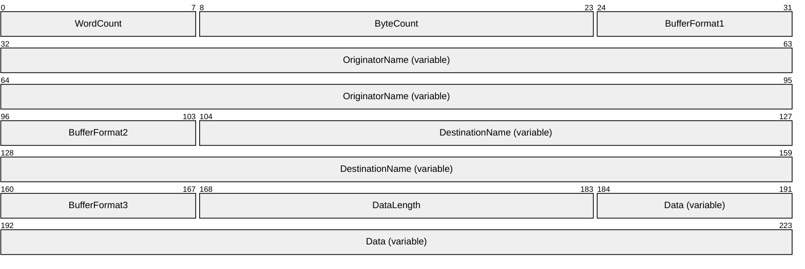
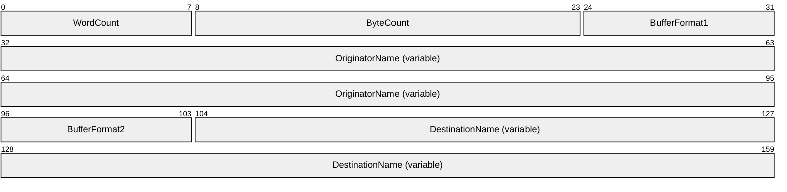
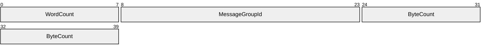
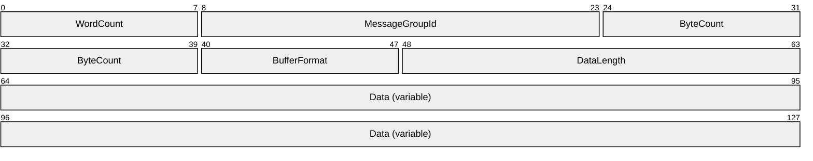
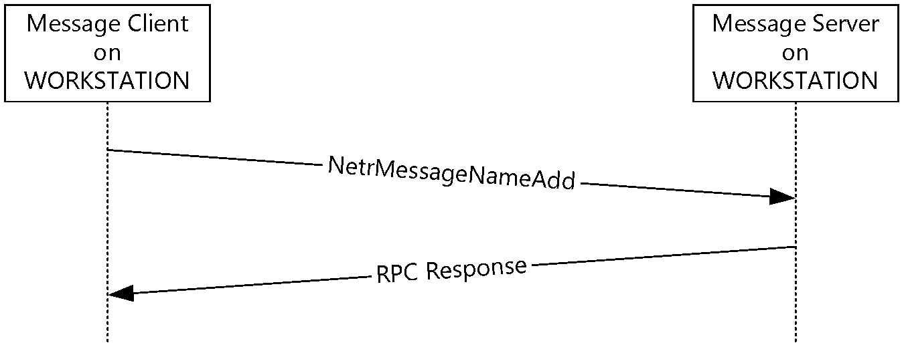
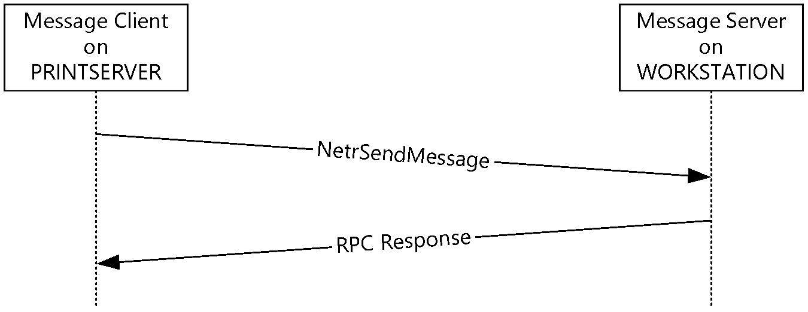

# [MS-MSRP]: Messenger Service Remote Protocol

Table of Contents

1 Introduction

- [1 Introduction](#Section_1)
  - [1.1 Glossary](#Section_1.1)
  - [1.2 References](#Section_1.2)
    - [1.2.1 Normative References](#Section_1.2.1)
    - [1.2.2 Informative References](#Section_1.2.2)
  - [1.3 Overview](#Section_1.3)
  - [1.4 Relationship to Other Protocols](#Section_1.4)
  - [1.5 Prerequisites/Preconditions](#Section_1.5)
  - [1.6 Applicability Statement](#Section_1.6)
  - [1.7 Versioning and Capability Negotiation](#Section_1.7)
  - [1.8 Vendor-Extensible Fields](#Section_1.8)
  - [1.9 Standards Assignments](#Section_1.9)

2 Messages

- [2 Messages](#Section_2)
  - [2.1 Transport](#Section_2.1)
    - [2.1.1 RPC Transport](#Section_2.1.1)
    - [2.1.2 Mailslots](#Section_2.1.2)
    - [2.1.3 SMB](#Section_2.1.3)
  - [2.2 Message Syntax](#Section_2.2)
    - [2.2.1 Data Types](#Section_2.2.1)
      - [2.2.1.1 MSGSVC_HANDLE](#Section_2.2.1.1)
    - [2.2.2 Structures](#Section_2.2.2)
      - [2.2.2.1 MSG_INFO_0](#Section_2.2.2.1)
      - [2.2.2.2 MSG_INFO_1](#Section_2.2.2.2)
      - [2.2.2.3 MSG_INFO_0_CONTAINER](#Section_2.2.2.3)
      - [2.2.2.4 MSG_INFO_1_CONTAINER](#Section_2.2.2.4)
      - [2.2.2.5 MSG_ENUM_STRUCT](#Section_2.2.2.5)
      - [2.2.2.6 MSG_INFO](#Section_2.2.2.6)
    - [2.2.3 SMB Message Delivery Protocol](#Section_2.2.3)
      - [2.2.3.1 SMB_COM_SEND_MESSAGE Request and Response Messages](#Section_2.2.3.1)
        - [2.2.3.1.1 SMB_COM_SEND_MESSAGE Request Message](#Section_2.2.3.1.1)
        - [2.2.3.1.2 SMB_COM_SEND_MESSAGE Response Message](#Section_2.2.3.1.2)
      - [2.2.3.2 SMB_COM_SEND_START_MB_MESSAGE Request and Response Messages](#Section_2.2.3.2)
        - [2.2.3.2.1 SMB_COM_SEND_START_MB_MESSAGE Request Message](#Section_2.2.3.2.1)
        - [2.2.3.2.2 SMB_COM_SEND_START_MB_MESSAGE Response Message](#Section_2.2.3.2.2)
      - [2.2.3.3 SMB_COM_SEND_TEXT_MB_MESSAGE Request and Response Messages](#Section_2.2.3.3)
        - [2.2.3.3.1 SMB_COM_SEND_TEXT_MB_MESSAGE Request Message](#Section_2.2.3.3.1)
        - [2.2.3.3.2 SMB_COM_SEND_TEXT_MB_MESSAGE Response Message](#Section_2.2.3.3.2)
      - [2.2.3.4 SMB_COM_SEND_END_MB_MESSAGE Request and Response Messages](#Section_2.2.3.4)
        - [2.2.3.4.1 SMB_COM_SEND_END_MB_MESSAGE Request Message](#Section_2.2.3.4.1)
        - [2.2.3.4.2 SMB_COM_SEND_END_MB_MESSAGE Response Message](#Section_2.2.3.4.2)

3 Protocol Details

- [3 Protocol Details](#Section_3)
  - [3.1 Name Management Protocol](#Section_3.1)
    - [3.1.1 Abstract Data Model](#Section_3.1.1)
    - [3.1.2 Timers](#Section_3.1.2)
    - [3.1.3 Initialization](#Section_3.1.3)
    - [3.1.4 Message Processing and Sequencing Rules](#Section_3.1.4)
      - [3.1.4.1 NetrMessageNameAdd (Opnum 0)](#Section_3.1.4.1)
      - [3.1.4.2 NetrMessageNameEnum (Opnum 1)](#Section_3.1.4.2)
      - [3.1.4.3 NetrMessageNameGetInfo (Opnum 2)](#Section_3.1.4.3)
      - [3.1.4.4 NetrMessageNameDel (Opnum 3)](#Section_3.1.4.4)
      - [3.1.4.5 Sending NetrMessageNameAdd](#Section_3.1.4.5)
      - [3.1.4.6 Receiving NetrMessageNameAdd](#Section_3.1.4.6)
      - [3.1.4.7 Sending NetrMessageNameEnum](#Section_3.1.4.7)
      - [3.1.4.8 Receiving NetrMessageNameEnum](#Section_3.1.4.8)
      - [3.1.4.9 Sending NetrMessageNameGetInfo](#Section_3.1.4.9)
      - [3.1.4.10 Receiving NetrMessageNameGetInfo](#Section_3.1.4.10)
      - [3.1.4.11 Sending NetrMessageNameDel](#Section_3.1.4.11)
      - [3.1.4.12 Receiving NetrMessageNameDel](#Section_3.1.4.12)
    - [3.1.5 Timer Events](#Section_3.1.5)
    - [3.1.6 Other Local Events](#Section_3.1.6)
  - [3.2 Messaging Protocol](#Section_3.2)
    - [3.2.1 Abstract Data Model](#Section_3.2.1)
    - [3.2.2 Timers](#Section_3.2.2)
    - [3.2.3 Initialization](#Section_3.2.3)
    - [3.2.4 Message Processing and Sequencing Rules](#Section_3.2.4)
      - [3.2.4.1 NetrSendMessage (Opnum 0)](#Section_3.2.4.1)
      - [3.2.4.2 Sending NetrSendMessage](#Section_3.2.4.2)
      - [3.2.4.3 Receiving NetrSendMessage](#Section_3.2.4.3)
      - [3.2.4.4 Sending Mailslot Messages or SMB Messages](#Section_3.2.4.4)
      - [3.2.4.5 Receiving Mailslot Messages or SMB Messages](#Section_3.2.4.5)
    - [3.2.5 Timer Events](#Section_3.2.5)
    - [3.2.6 Other Local Events](#Section_3.2.6)

4 Protocol Examples

- [4 Protocol Examples](#Section_4)

5 Security

- [5 Security](#Section_5)
  - [5.1 Security Considerations for Implementers](#Section_5.1)
  - [5.2 Index of Security Parameters](#Section_5.2)

6 Appendix A: Full IDL

- [6 Appendix A: Full IDL](#Section_6)
  - [6.1 Appendix A.1: msgsvcsend.idl](#Section_6.1)
  - [6.2 Appendix A.2: msgsvc.idl](#Section_6.2)

7 Appendix B: Product Behavior

- [7 Appendix B: Product Behavior](#Section_7)

8 Change Tracking

- [8 Change Tracking](#Section_8)

For the legal notice and IP terms, see [LEGAL.md](../LEGAL.md).
Last updated: 6/1/2017.
See [Revision History](#revision-history) for full version history.

# 1 Introduction

This document specifies the Messenger Service Remote Protocol. The Messenger Service Remote Protocol is a set of [**remote procedure call (RPC)**](#gt_remote-procedure-call-rpc) interfaces that instruct a [**server**](#gt_server) (referred to in this document as a "[**message server**](#gt_message-server)") to perform one or more of the following tasks:

- Deliver messages to a local or remote message server for display to a console user.
- Manage the names for which the message server receives messages.
The message server does not maintain [**client**](#gt_client) state information.

It is recommended that this protocol not be implemented due to the lack of security features in the protocol, as described in section [5.1](#Section_5).

Sections 1.5, 1.8, 1.9, 2, and 3 of this specification are normative. All other sections and examples in this specification are informative.

## 1.1 Glossary

This document uses the following terms:

**access control list (ACL)**: A list of access control entries (ACEs) that collectively describe the security rules for authorizing access to some resource; for example, an object or set of objects.

**client**: A computer on which the remote procedure call (RPC) client is executing.

**endpoint**: A network-specific address of a [**remote procedure call (RPC) server**](#gt_rpc-server) process for remote procedure calls. The actual name and type of the endpoint depends on the [**RPC**](#gt_remote-procedure-call-rpc) protocol sequence that is being used. For example, for RPC over TCP (RPC Protocol Sequence ncacn_ip_tcp), an endpoint might be TCP port 1025. For RPC over Server Message Block (RPC Protocol Sequence ncacn_np), an endpoint might be the name of a named pipe. For more information, see [[C706]](https://go.microsoft.com/fwlink/?LinkId=89824).

**fully qualified domain name (FQDN)**: An unambiguous domain name that gives an absolute location in the Domain Name System's (DNS) hierarchy tree, as defined in [[RFC1035]](https://go.microsoft.com/fwlink/?LinkId=90264) section 3.1 and [[RFC2181]](https://go.microsoft.com/fwlink/?LinkId=127732) section 11.

**local area network adapter (LANA)**: In NetBios-specific implementations, a number that is used to identify the network adapter to which NetBIOS is bound.

**mailslot**: A mechanism for one-way interprocess communications (IPC). For more information, see [[MSLOT]](https://go.microsoft.com/fwlink/?LinkId=90218) and [MS-MAIL](../MS-MAIL/MS-MAIL.md).

**message server**: A [**remote procedure call (RPC)**](#gt_remote-procedure-call-rpc) server that implements this protocol.

**NetBIOS name**: A 16-byte address that is used to identify a NetBIOS resource on the network. For more information, see [[RFC1001]](https://go.microsoft.com/fwlink/?LinkId=90260) and [[RFC1002]](https://go.microsoft.com/fwlink/?LinkId=90261).

**NetBIOS suffix**: The 16th byte of a 16-byte [**NetBIOS name**](#gt_netbios-name) that is constructed using the optional naming convention defined in [MS-NBTE](../MS-NBTE/MS-NBTE.md) section 1.8.

**original equipment manufacturer (OEM) character set**: A character encoding used where the mappings between characters is dependent upon the code page configured on the machine, typically by the manufacturer.

**remote procedure call (RPC)**: A context-dependent term commonly overloaded with three meanings. Note that much of the industry literature concerning RPC technologies uses this term interchangeably for any of the three meanings. Following are the three definitions: (*) The runtime environment providing remote procedure call facilities. The preferred usage for this meaning is "RPC runtime". (*) The pattern of request and response message exchange between two parties (typically, a client and a server). The preferred usage for this meaning is "RPC exchange". (*) A single message from an exchange as defined in the previous definition. The preferred usage for this term is "RPC message". For more information about RPC, see [C706].

**RPC dynamic endpoint**: A network-specific server address that is requested and assigned at run time, as described in [C706].

**RPC endpoint**: A network-specific address of a server process for remote procedure calls (RPCs). The actual name of the RPC endpoint depends on the RPC protocol sequence being used. For example, for the NCACN_IP_TCP RPC protocol sequence an RPC endpoint might be TCP port 1025. For more information, see [C706].

**RPC protocol sequence**: A character string that represents a valid combination of a [**remote procedure call (RPC)**](#gt_remote-procedure-call-rpc) protocol, a network layer protocol, and a transport layer protocol, as described in [C706] and [MS-RPCE](../MS-RPCE/MS-RPCE.md).

**RPC server**: A computer on the network that waits for messages, processes them when they arrive, and sends responses using RPC as its transport acts as the responder during a remote procedure call (RPC) exchange.

**RPC transport**: The underlying network services used by the remote procedure call (RPC) runtime for communications between network nodes. For more information, see [C706] section 2.

**server**: A computer on which the [**remote procedure call (RPC)**](#gt_remote-procedure-call-rpc) server is executing.

**Unicode**: A character encoding standard developed by the Unicode Consortium that represents almost all of the written languages of the world. The [**Unicode**](#gt_unicode) standard [[UNICODE5.0.0/2007]](https://go.microsoft.com/fwlink/?LinkId=154659) provides three forms (UTF-8, UTF-16, and UTF-32) and seven schemes (UTF-8, UTF-16, UTF-16 BE, UTF-16 LE, UTF-32, UTF-32 LE, and UTF-32 BE).

**universally unique identifier (UUID)**: A 128-bit value. UUIDs can be used for multiple purposes, from tagging objects with an extremely short lifetime, to reliably identifying very persistent objects in cross-process communication such as client and server interfaces, manager entry-point vectors, and [**RPC**](#gt_remote-procedure-call-rpc) objects. UUIDs are highly likely to be unique. UUIDs are also known as globally unique identifiers (GUIDs) and these terms are used interchangeably in the Microsoft protocol technical documents (TDs). Interchanging the usage of these terms does not imply or require a specific algorithm or mechanism to generate the UUID. Specifically, the use of this term does not imply or require that the algorithms described in [[RFC4122]](https://go.microsoft.com/fwlink/?LinkId=90460) or [C706] must be used for generating the UUID.

**MAY, SHOULD, MUST, SHOULD NOT, MUST NOT:** These terms (in all caps) are used as defined in [[RFC2119]](https://go.microsoft.com/fwlink/?LinkId=90317). All statements of optional behavior use either MAY, SHOULD, or SHOULD NOT.

## 1.2 References

Links to a document in the Microsoft Open Specifications library point to the correct section in the most recently published version of the referenced document. However, because individual documents in the library are not updated at the same time, the section numbers in the documents may not match. You can confirm the correct section numbering by checking the [Errata](http://msdn.microsoft.com/en-us/library/dn781092.aspx).

### 1.2.1 Normative References

We conduct frequent surveys of the normative references to assure their continued availability. If you have any issue with finding a normative reference, please contact [dochelp@microsoft.com](mailto:dochelp@microsoft.com). We will assist you in finding the relevant information.

[C706] The Open Group, "DCE 1.1: Remote Procedure Call", C706, August 1997, [https://www2.opengroup.org/ogsys/catalog/c706](https://go.microsoft.com/fwlink/?LinkId=89824)

[MS-CIFS] Microsoft Corporation, "[Common Internet File System (CIFS) Protocol](../MS-CIFS/MS-CIFS.md)".

[MS-DTYP] Microsoft Corporation, "[Windows Data Types](#Section_2.2.1)".

[MS-ERREF] Microsoft Corporation, "[Windows Error Codes](../MS-ERREF/MS-ERREF.md)".

[MS-MAIL] Microsoft Corporation, "[Remote Mailslot Protocol](../MS-MAIL/MS-MAIL.md)".

[MS-NBTE] Microsoft Corporation, "[NetBIOS over TCP (NBT) Extensions](../MS-NBTE/MS-NBTE.md)".

[MS-RPCE] Microsoft Corporation, "[Remote Procedure Call Protocol Extensions](../MS-RPCE/MS-RPCE.md)".

[MS-SMB] Microsoft Corporation, "[Server Message Block (SMB) Protocol](../MS-SMB/MS-SMB.md)".

[MS-UCODEREF] Microsoft Corporation, "[Windows Protocols Unicode Reference](../MS-UCODEREF/MS-UCODEREF.md)".

[RFC1001] Network Working Group, "Protocol Standard for a NetBIOS Service on a TCP/UDP Transport: Concepts and Methods", RFC 1001, March 1987, [http://www.ietf.org/rfc/rfc1001.txt](https://go.microsoft.com/fwlink/?LinkId=90260)

[RFC1002] Network Working Group, "Protocol Standard for a NetBIOS Service on a TCP/UDP Transport: Detailed Specifications", STD 19, RFC 1002, March 1987, [http://www.rfc-editor.org/rfc/rfc1002.txt](https://go.microsoft.com/fwlink/?LinkId=90261)

[RFC2119] Bradner, S., "Key words for use in RFCs to Indicate Requirement Levels", BCP 14, RFC 2119, March 1997, [http://www.rfc-editor.org/rfc/rfc2119.txt](https://go.microsoft.com/fwlink/?LinkId=90317)

[RFC768] Postel, J., "User Datagram Protocol", STD 6, RFC 768, August 1980, [http://www.rfc-editor.org/rfc/rfc768.txt](https://go.microsoft.com/fwlink/?LinkId=90490)

### 1.2.2 Informative References

[MSKB-330904] Microsoft Corporation, "Messenger Service Window That Contains an Internet Advertisement Appears", February 2007, [http://support.microsoft.com/kb/330904](https://go.microsoft.com/fwlink/?LinkId=89940)

[PIPE] Microsoft Corporation, "Named Pipes", [http://msdn.microsoft.com/en-us/library/aa365590.aspx](https://go.microsoft.com/fwlink/?LinkId=90247)

## 1.3 Overview

The Messenger Service Remote Protocol suite is designed to perform the following functions:

- Receive and display short text messages to the console user. (This function is referred to in this document as the "messaging protocol".)
- Manage the names for which a [**message server**](#gt_message-server) receives messages. (This function is referred to in this document as the "name management protocol".)
The name management protocol portion of the Messenger Service Remote Protocol is used to manage the set of names for which the message server accepts messages. The operations in this protocol are very simple, consisting of add, remove, and enumeration methods. The messaging protocol portion of the Messenger Service Remote Protocol actually has several forms and runs over [**mailslots**](#gt_mailslot) over Server Message Block Protocol, as specified in [MS-SMB](../MS-SMB/MS-SMB.md) and [**RPC dynamic endpoints**](#gt_rpc-dynamic-endpoint) over User Datagram Protocol (UDP) (as specified in [[RFC768]](https://go.microsoft.com/fwlink/?LinkId=90490)). For how the message [**client**](#gt_client) selects the transport that is used for the messaging protocol, see section [3.2](#Section_1.3).

Typically, the Messenger Service Remote Protocol is used to send a short text message from a [**server**](#gt_server), such as a file server or print server, to a client machine; for example, to indicate that a print job has completed or that a file server is shutting down and all of its clients need to save their work and disconnect. As such, the roles of client and server are reversed from typical protocols, with the message server (recipient) of the messages often being the workstation machine and the message client (sender) being a server-class machine.

## 1.4 Relationship to Other Protocols

The Messenger Service Remote Protocol suite is dependent on [**RPC**](#gt_remote-procedure-call-rpc) (as specified in [[C706]](https://go.microsoft.com/fwlink/?LinkId=89824)), the Server Message Block (SMB) Protocol (as specified in [MS-SMB](../MS-SMB/MS-SMB.md)), and the [**mailslot**](#gt_mailslot) datagram delivery service (as specified in [MS-MAIL](../MS-MAIL/MS-MAIL.md)), which are its transports.

The Messenger Service Remote Protocol uses [**NetBIOS names**](#gt_netbios-name) (as specified in [[RFC1001]](https://go.microsoft.com/fwlink/?LinkId=90260) section 14 and [[RFC1002]](https://go.microsoft.com/fwlink/?LinkId=90261) section 4.1) to identify message recipients.

## 1.5 Prerequisites/Preconditions

The messenger service name management protocol is an [**RPC**](#gt_remote-procedure-call-rpc) interface and, as a result, has the prerequisites specified in [MS-RPCE](../MS-RPCE/MS-RPCE.md) as being common to RPC interfaces. Both the message [**client**](#gt_client) and the [**message server**](#gt_message-server) have to have working RPC implementations.

The messenger service messaging protocol also uses the [**mailslot**](#gt_mailslot) (as specified in [MS-MAIL](../MS-MAIL/MS-MAIL.md)) datagram delivery mechanism and the CIFS Protocol (as specified in [MS-CIFS](../MS-CIFS/MS-CIFS.md)) for delivering messages to remote machines, and, therefore, it depends on this mailslot delivery mechanism being operational before the messenger service begins operation. For mailslot operational requirements, see [MS-MAIL] section1.5. For the mailslot delivery mechanism, see [MS-CIFS] section2.2.5.12.

## 1.6 Applicability Statement

The messenger service name management protocol is suitable only for managing simple [**NetBIOS names**](#gt_netbios-name). The messenger service messaging protocol is suitable only for short, human-readable messages that require no security and have no delivery guarantees.<1>

## 1.7 Versioning and Capability Negotiation

This document covers versioning issues in the following areas:

- Supported transports: The Messenger Service Remote Protocol uses [**RPC**](#gt_remote-procedure-call-rpc) over UDP (as specified in [MS-RPCE](../MS-RPCE/MS-RPCE.md)), RPC over Named Pipes (for more information, see [[PIPE]](https://go.microsoft.com/fwlink/?LinkId=90247)), SMB (as specified in [MS-SMB](../MS-SMB/MS-SMB.md)), and [**mailslots**](#gt_mailslot) (as specified in [MS-MAIL](../MS-MAIL/MS-MAIL.md)) for its transports.
- Protocol version: This protocol's RPC interfaces have a version number of 1.0.
- Security and authentication methods: See section [2.1](#Section_2.1).
- Capability negotiation: None.

## 1.8 Vendor-Extensible Fields

The Messenger Service Remote Protocol does not include any vendor-extensible fields.

## 1.9 Standards Assignments

There are no standards assignments directly associated with this protocol.

This protocol does depend on [**RPC**](#gt_remote-procedure-call-rpc) and uses the following RPC [**UUIDs**](#gt_universally-unique-identifier-uuid):

- 17FDD703-1827-4E34-79D4-24A55C53BB37 (for name management methods)
- 5A7B91F8-FF00-11D0-A9B2-00C04FB6E6FC (for the [NetrSendMessage](#Section_3.2.4.1) method)
This protocol does use NetBIOS for message delivery in some cases. If NetBIOS is used on a TCP/IP network, UDP port 138 can be used, and NetBIOS might need to perform other functions such as name resolution on other ports (as specified in [[RFC1001]](https://go.microsoft.com/fwlink/?LinkId=90260) and [[RFC1002]](https://go.microsoft.com/fwlink/?LinkId=90261)) to support this protocol.

When this protocol uses named pipes, the pipe name used is \PIPE\MSGSVC.

When this protocol uses [**mailslots**](#gt_mailslot) for message delivery, the mailslot name used is \\recipient name\MAILSLOT\MESSNGR where recipient name is the [**NetBIOS name**](#gt_netbios-name) of the intended recipient of the message.

This protocol builds NetBIOS names using the convention defined in [MS-NBTE](../MS-NBTE/MS-NBTE.md) section 1.8, with a [**NetBIOS suffix**](#gt_netbios-suffix) value of 0x03.

# 2 Messages

## 2.1 Transport

This protocol suite has a variety of transports, the use of which is detailed in the following sections. Implementations MAY use any one of the transports.

### 2.1.1 RPC Transport

The Messenger Service Remote Protocol MUST use either the [**RPC**](#gt_remote-procedure-call-rpc) over UDP protocol sequence (NCADG_IP_UDP) or the RPC over Named Pipes (NCACN_NP) protocol sequence, as specified in [MS-RPCE](../MS-RPCE/MS-RPCE.md), depending on the interface used. When RPC over Named Pipes is used as the [**RPC protocol sequence**](#gt_rpc-protocol-sequence), the pipe name that MUST be used is \PIPE\MSGSVC. For the NCADG_IP_UDP, see section [3.2.4](../MS-RPCE/MS-RPCE.md). For the NCACN_NP protocol, see section [3.1.4](../MS-RPCE/MS-RPCE.md).

This protocol MUST use the following [**UUIDs**](#gt_universally-unique-identifier-uuid):

- 17FDD703-1827-4E34-79D4-24A55C53BB37 (for recipient name management methods)
- 5A7B91F8-FF00-11D0-A9B2-00C04FB6E6FC (for the [NetrSendMessage](#Section_3.2.4.1) method)
This protocol MUST use [**RPC dynamic endpoints**](#gt_rpc-dynamic-endpoint) for RPC over TCP/IP, as specified in [[C706]](https://go.microsoft.com/fwlink/?LinkId=89824) section 4.

For each recipient name registered with the [**message server**](#gt_message-server), on each bound [**local area network adapter (LANA)**](#gt_local-area-network-adapter-lana), the message server MUST register the corresponding [**NetBIOS name**](#gt_netbios-name) using the convention defined in [MS-NBTE](../MS-NBTE/MS-NBTE.md) section 1.8, with a [**NetBIOS suffix**](#gt_netbios-suffix) value of 0x03.

This protocol allows any user to establish a connection to the [**RPC server**](#gt_rpc-server). When using named pipes as the [**RPC transport**](#gt_rpc-transport), the protocol uses the underlying RPC protocol to retrieve the identity of the caller that made the method call, as specified in [MS-RPCE]. The message server SHOULD use this identity to perform method-specific access checks, as specified in section [3.1.4.5](../MS-RPCE/MS-RPCE.md). When using UDP as the RPC transport, the protocol does not perform authentication.

### 2.1.2 Mailslots

This protocol MUST use the [**mailslot**](#gt_mailslot) datagram delivery [**server**](#gt_server), as specified in [MS-MAIL](../MS-MAIL/MS-MAIL.md). Mailslot messages, specified in sections [3.2.4.4](#Section_2) and [3.2.4.5](#Section_2), MUST be sent to the following mailslot: \\recipient name\MAILSLOT\MESSNGR.

The recipient name MUST be the [**NetBIOS name**](#gt_netbios-name) of the intended recipient of the message.

The [**message server**](#gt_message-server) MUST create this mailslot for each recipient name that is registered with the message server before it can receive messages for that recipient.

When using mailslots to transport messages, the protocol does not perform authentication.

### 2.1.3 SMB

The Messenger Service Remote Protocol MUST use the SMB [**server**](#gt_server), as specified in [MS-SMB](../MS-SMB/MS-SMB.md). SMB messages are specified in sections [3.2.4.4](#Section_2) and [3.2.4.5](#Section_2).

SMB messages MUST always be sent to the [**NetBIOS name**](#gt_netbios-name) of the intended recipient of the message.

When using SMB to transport messages, the protocol does not perform authentication.

## 2.2 Message Syntax

In addition to [**RPC**](#gt_remote-procedure-call-rpc) base types, the following sections use the definition of DWORD, as specified in [MS-DTYP](#Section_2.2.1).

### 2.2.1 Data Types

#### 2.2.1.1 MSGSVC_HANDLE

MSGSVC_HANDLE is a null-terminated string that MUST denote the [**NetBIOS name**](#gt_netbios-name) (as specified in [[RFC1001]](https://go.microsoft.com/fwlink/?LinkId=90260) section 14 and [[RFC1002]](https://go.microsoft.com/fwlink/?LinkId=90261) section 4.1) or the [**fully qualified domain name (FQDN)**](#gt_fully-qualified-domain-name-fqdn) of the remote computer on which the method is to execute. See ServerName parameter in NetrMessageNameAdd (Opnum 0) (section [3.1.4.1)](#Section_3.1.4.1), NetrMessageNameEnum (Opnum 1) (section [3.1.4.2)](#Section_3.1.4.8), NetrMessageNameGetInfo (Opnum 2) (section [3.1.4.3)](#Section_3.1.4.9), and NetrMessageNameDel (Opnum 3) (section [3.1.4.4)](#Section_e1bdd0470e864d02a712615d24b1a18a).

This type is declared as follows:

typedef [handle] wchar_t* MSGSVC_HANDLE;

### 2.2.2 Structures

#### 2.2.2.1 MSG_INFO_0

MSG_INFO_0 is a data structure that contains a string that specifies the recipient name to which a message is to be sent.

typedef struct _MSG_INFO_0 {

[string] wchar_t* msgi0_name;

} MSG_INFO_0,

*PMSG_INFO_0,

*LPMSG_INFO_0;

**msgi0_name:** Pointer to a buffer that receives the name string in UTF-16 format. There are two sources for this parameter:

- It is the UTF-16 formatted *Name* parameter passed in [NetrMessageNameGetInfo](#Section_3.1.4.9) (section 3.1.4.3) that has been verified to have an equivalent entry in the message table in section [3.1.1](#Section_3.1) according to the following algorithm.
Function CompareName (passed in Unicode name)

Convert the name to uppercase as specified in [MS-UCODEREF] section 3.1.5.3

Convert the Unicode string to an OEM string as specified in [MS-UCODEREF] section 3.1.5.1.1

If OEM string is < 15 bytes

Pad to 15 bytes with spaces

If OEM string is > 15 bytes

Truncate to 15 bytes

For each table entry

Compare the resulting 15 bytes for equality with the first 15 bytes of the NetBIOS name in the entry

If equal

Return True

End CompareName

- It is returned in the *InfoStruct* parameter of [NetrMessageNameEnum](#Section_3.1.4.8) (section 3.1.4.2) in which it was retrieved from the message table in section 3.1.1, the [**NetBIOS suffix**](#gt_netbios-suffix) and any trailing spaces removed, and the remaining characters converted to UTF-16.

#### 2.2.2.2 MSG_INFO_1

MSG_INFO_1 is a data structure that contains a string that specifies the recipient name to which a message is to be sent.

typedef struct _MSG_INFO_1 {

[string] wchar_t* msgi1_name;

DWORD msgi1_forward_flag;

[string] wchar_t* msgi1_forward;

} MSG_INFO_1,

*PMSG_INFO_1,

*LPMSG_INFO_1;

**msgi1_name:** Pointer to a buffer that receives the name string in UTF-16 format. There are two sources for this parameter:

- It is the UTF-16 formatted *Name* parameter passed in [NetrMessageNameGetInfo](#Section_3.1.4.9) (section 3.1.4.3) that has been verified to have an equivalent entry in the message table in section [3.1.1](#Section_3.1) according to the following algorithm.
Function CompareName (passed in Unicode name)

Convert the name to uppercase as specified in [MS-UCODEREF] section 3.1.5.3

Convert the Unicode string to an OEM string as specified in [MS-UCODEREF] section 3.1.5.1.1

If OEM string is < 15 bytes

Pad to 15 bytes with spaces

If OEM string is > 15 bytes

Truncate to 15 bytes

For each table entry

Compare the resulting 15 bytes for equality with the first 15 bytes of the NetBIOS name in the entry

If equal

Return True

End CompareName

- It is returned in the *InfoStruct* parameter of [NetrMessageNameEnum](#Section_3.1.4.8) (section 3.1.4.2) in which it was retrieved from the message table in section 3.1.1, the [**NetBIOS suffix**](#gt_netbios-suffix) and any trailing spaces removed, and the remaining characters converted to UTF-16.
**msgi1_forward_flag:** MUST be set to zero when sent and ignored on receipt.

**msgi1_forward:** MUST be NULL and ignored on receipt.

#### 2.2.2.3 MSG_INFO_0_CONTAINER

MSG_INFO_0_CONTAINER is a container structure that holds one or more [MSG_INFO_0](#Section_2.2.2.1) structures.

typedef struct _MSG_INFO_0_CONTAINER {

DWORD EntriesRead;

[size_is(EntriesRead)] LPMSG_INFO_0 Buffer;

} MSG_INFO_0_CONTAINER,

*PMSG_INFO_0_CONTAINER,

*LPMSG_INFO_0_CONTAINER;

**EntriesRead:** A 32-bit value that MUST denote the number of entries in *Buffer*.

**Buffer:** Pointer to a buffer that MUST contain one or more MSG_INFO_0 structures.

#### 2.2.2.4 MSG_INFO_1_CONTAINER

MSG_INFO_1_CONTAINER is a container structure that holds one or more [MSG_INFO_1](#Section_2.2.2.2) structures.

typedef struct _MSG_INFO_1_CONTAINER {

DWORD EntriesRead;

[size_is(EntriesRead)] LPMSG_INFO_1 Buffer;

} MSG_INFO_1_CONTAINER,

*PMSG_INFO_1_CONTAINER,

*LPMSG_INFO_1_CONTAINER;

**EntriesRead:** A 32-bit value that MUST denote the number of entries in *Buffer*.

**Buffer:** A pointer to a variable-size buffer that MUST contain one or more MSG_INFO_1 structures.

#### 2.2.2.5 MSG_ENUM_STRUCT

MSG_ENUM_STRUCT is a container structure holding either one [MSG_INFO_0_CONTAINER](#Section_2.2.2.3) container or one [MSG_INFO_1_CONTAINER](#Section_2.2.2.4) container. The structure also has a member to indicate what type of container it contains.

typedef struct _MSG_ENUM_STRUCT {

DWORD Level;

[switch_is(Level)] union _MSG_ENUM_UNION {

[case(0)]

LPMSG_INFO_0_CONTAINER Level0;

[case(1)]

LPMSG_INFO_1_CONTAINER Level1;

} MsgInfo;

} MSG_ENUM_STRUCT,

*PMSG_ENUM_STRUCT,

*LPMSG_ENUM_STRUCT;

**Level:** A 32-bit enumerated number that MUST denote the type of structure contained in *MsgInfo*. It must be either 0 or 1.

**MsgInfo:** A pointer to a buffer that MUST contain a union that consists of either an MSG_INFO_0_CONTAINER structure or an MSG_INFO_1_CONTAINER structure.

**Level0:** If *Level* is 0, *MsgInfo* MUST contain an MSG_INFO_0_CONTAINER named *Level0*.

**Level1:** If *Level* is 1, *MsgInfo* MUST contain an MSG_INFO_1_CONTAINER named *Level1*.

#### 2.2.2.6 MSG_INFO

MSG_INFO is a data structure that contains either an [MSG_INFO_0](#Section_2.2.2.1) or an [MSG_INFO_1](#Section_2.2.2.2) structure.

typedef

[switch_type(DWORD)]

union _MSG_INFO {

[case(0)]

LPMSG_INFO_0 MsgInfo0;

[case(1)]

LPMSG_INFO_1 MsgInfo1;

} MSG_INFO,

*PMSG_INFO,

*LPMSG_INFO;

**MsgInfo0:** A pointer to a variable-size buffer that MUST contain an MSG_INFO_0 data structure.

**MsgInfo1:** A pointer to a variable-size buffer that MUST contain an MSG_INFO_1 data structure.

### 2.2.3 SMB Message Delivery Protocol

Text messages MAY be delivered by SMB to a [**message server**](#gt_message-server). The SMB messages used for text message delivery are defined in this section.

Each of these SMB messages MUST be preceded by an SMB header, as specified in [MS-SMB](../MS-SMB/MS-SMB.md) section 2.2.3.1. These messages MAY be transported by the NetBIOS over UDP transport, the NetBIOS over IPX transport, or the NetBEUI transport, as specified in [[RFC1001]](https://go.microsoft.com/fwlink/?LinkId=90260) and [MS-SMB].<2>

Unless otherwise specified, numerical fields in these messages are in little-endian byte order.

#### 2.2.3.1 SMB_COM_SEND_MESSAGE Request and Response Messages

The following two sections describe how to implement and interpret SMB_COM_SEND_MESSAGE request messages and response messages.

##### 2.2.3.1.1 SMB_COM_SEND_MESSAGE Request Message

The [SMB_COM_SEND_MESSAGE](#Section_3.2.4.1) message is used to send an entire text message in which the length of the message is 128 bytes or less.

In the SMB header of these messages, the **Command** field MUST be set to 0xD0, as specified in [MS-SMB](../MS-SMB/MS-SMB.md) section 2.2.3.1. In the response message, the header MAY contain a Status code, as specified in [MS-SMB] section 2.2.3.1. All other fields in the SMB header MUST be set to 0x00.<3>

The payload of the SMB_COM_SEND_MESSAGE request message is specified as follows.

**WordCount (1 byte):** An 8-bit value that MUST denote the number of 2-byte word values between the WordCount and **ByteCount** values. WordCount MUST be zero for this message.

**ByteCount (2 bytes):** A 16-bit value that MUST denote the total size of all of the fields that follow, in bytes.

**BufferFormat1 (1 byte):** A constant that MUST denote the type of the next parameter. BufferFormat1 MUST be 0x04 in this message, indicating that the next parameter is a null-terminated ASCII string.

**OriginatorName (variable):** A null-terminated ASCII string that MUST denote the name of the sender of the message. OriginatorName MUST NOT be more than 15 characters (bytes) long, exclusive of the trailing null character (with the trailing null character, this field MAY be 16 bytes long).

**BufferFormat2 (1 byte):** An 8-bit value that MUST contain a constant that specifies the type of the next parameter. BufferFormat2 MUST be 0x04 in this message, indicating that the next parameter is a null-terminated ASCII string.

**DestinationName (variable):** A null-terminated ASCII string that MUST denote the name of the intended recipient of the message. DestinationName MUST NOT be more than 15 characters (bytes) long, exclusive of the trailing null character (with the trailing null character, this field MAY be 16 bytes long).

**BufferFormat3 (1 byte):** An 8-bit value that MUST contain a constant that specifies the type of the next parameter. BufferFormat3 MUST be 0x01 in this message, indicating that the next parameter is a length-prefixed buffer of bytes.

**DataLength (2 bytes):** A 16-bit value that MUST specify the length of the Data buffer. This value MUST NOT be greater than 128 (0x0080).

**Data (variable):** A null-terminated ASCII string that MUST contain the text of the message. Before the message is sent, the ASCII characters CR (0x0D) and LF (0x0A) MUST be converted to the value 0x14. Pairs of these characters (CRLF or LFCR) SHOULD be converted into a single 0x14 character. This buffer MUST NOT be more than 128 bytes in size.<4>

The response message to SMB_COM_SEND_MESSAGE is specified in section [2.2.3.1.2](#Section_2.2.3.1.2).

##### 2.2.3.1.2 SMB_COM_SEND_MESSAGE Response Message

The payload of the [SMB_COM_SEND_MESSAGE](#Section_3.2.4.1) response message is specified as follows.

**WordCount (1 byte):** An 8-bit value that MUST be zero for this message.

**ByteCount (2 bytes):** A 16-bit value that MUST be zero for this message.

The request message to SMB_COM_SEND_MESSAGE is specified in section [2.2.3.1.1](#Section_2.2.3.1.1).

#### 2.2.3.2 SMB_COM_SEND_START_MB_MESSAGE Request and Response Messages

The following two sections describe how to implement and interpret SMB_COM_SEND_START_MB_MESSAGE request messages and response messages.

##### 2.2.3.2.1 SMB_COM_SEND_START_MB_MESSAGE Request Message

The [SMB_COM_SEND_START_MB_MESSAGE](#Section_2.2.3.2.1) message is used to signal that a new text message is being sent and to carry the strings that contain the names of the sender and the intended recipient of the text message.

In the SMB header of this message, the **Command** field MUST be set to 0xD5, as specified in [MS-SMB](../MS-SMB/MS-SMB.md) section 2.2.3.1. In the response message, the header MAY contain a Status code, as specified in [MS-SMB] section 2.2.3.1. All other fields in the SMB header MUST be set to 0x00.<5>

The payload of the SMB_COM_SEND_START_MB_MESSAGE request message is specified as follows.

**WordCount (1 byte):** An 8-bit value that MUST specify the number of 2-byte word values between the WordCount and **ByteCount** values. WordCount MUST be zero for this message.

**ByteCount (2 bytes):** A 16-bit value that MUST specify the size of the remainder of the message (not including ByteCount), in bytes.

**BufferFormat1 (1 byte):** An 8-bit value that MUST contain the type of the next parameter. BufferFormat1 MUST be 0x04 in this message, indicating that the next parameter is a null-terminated ASCII string.

**OriginatorName (variable):** A buffer that MUST contain a null-terminated ASCII string that denotes the name of the sender of the message. OriginatorName MUST NOT be more than 15 characters (bytes) long, exclusive of the trailing null character (with the trailing null character, this field MAY be 16 bytes long).

**BufferFormat2 (1 byte):** An 8-bit value that MUST contain a constant that specifies the type of the next parameter. BufferFormat2 MUST be 0x04 in this message, indicating that the next parameter is a null-terminated ASCII string.

**DestinationName (variable):** A buffer that MUST contain a null-terminated ASCII string that denotes the name of the intended recipient of the message. DestinationName MUST NOT be more than 15 characters (bytes) long (with the trailing null character, this field MAY be 16 bytes long).

The response message to SMB_COM_SEND_START_MB_MESSAGE is specified in section [2.2.3.2.2](#Section_2.2.3.2.2).

##### 2.2.3.2.2 SMB_COM_SEND_START_MB_MESSAGE Response Message

The payload of the SMB_COM_SEND_START_MB_MESSAGE response message is specified as follows.

**WordCount (1 byte):** An 8-bit value that MUST be set to one (0x1) for this message.

**MessageGroupId (2 bytes):** A 16-bit value that MUST specify the NetBIOS session number on which this group of messages is to be delivered.

**ByteCount (2 bytes):** A 16-bit value that MUST be zero for this message.

The request message to [SMB_COM_SEND_START_MB_MESSAGE](#Section_2.2.3.2.1) is specified in section 2.2.3.2.1.

#### 2.2.3.3 SMB_COM_SEND_TEXT_MB_MESSAGE Request and Response Messages

The following two sections describe how to implement and interpret SMB_COM_SEND_TEXT_MB_MESSAGE request messages and response messages.

##### 2.2.3.3.1 SMB_COM_SEND_TEXT_MB_MESSAGE Request Message

The [SMB_COM_SEND_TEXT_MB_MESSAGE](#Section_2.2.3.3.2) message is used to transmit a block of text from a text message when the text message is larger than 128 bytes.

In the SMB header of this message, the **Command** field MUST be set to 0xD7, as specified in [MS-SMB](../MS-SMB/MS-SMB.md) section 2.2.3.1. In the response message, the header MAY contain a Status code, as specified in [MS-SMB] section 2.2.3.1. All other fields in the SMB header MUST be set to 0x00.<6>

The payload of the SMB_COM_SEND_TEXT_MB_MESSAGE request message is specified as follows.

**WordCount (1 byte):** An 8-bit value that MUST specify the number of 2-byte word values between the WordCount and **ByteCount** values. WordCount MUST be one (0x1) for this message.

**MessageGroupId (2 bytes):** A 16-bit value that MUST specify the NetBIOS session number on which this group of messages is to be delivered.

**ByteCount (2 bytes):** A 16-bit value that MUST specify the size of all of the following fields, in bytes.

**BufferFormat (1 byte):** An 8-bit value that MUST contain a constant value that specifies the type of the next parameter. BufferFormat MUST be 0x01 in this message, indicating that the next parameter is a length-prefixed buffer of bytes.

**DataLength (2 bytes):** A 16-bit value that MUST specify the length of the Data buffer. This value MUST NOT be greater than 128.

**Data (variable):** A block of null-terminated ASCII message text. Before the message is sent, the ASCII characters CR (0x0D) and LF (0x0A) MUST be converted to the value 0x14. Pairs of these characters (CRLF or LFCR) MUST be converted into a single 0x14 character. This buffer MUST NOT be more than 128 bytes in size.<7>

The response message to SMB_COM_SEND_TEXT_MB_MESSAGE is specified in section [2.2.3.3.2](#Section_2.2.3.3.2).

##### 2.2.3.3.2 SMB_COM_SEND_TEXT_MB_MESSAGE Response Message

The payload of the [SMB_COM_SEND_TEXT_MB_MESSAGE](#Section_2.2.3.3.2) response message is specified as follows.

**WordCount (1 byte):** An 8-bit value that MUST specify the number of 2-byte word values between the **WordCount** and **ByteCount** values. **WordCount** MUST be zero for this message.

**ByteCount (2 bytes):** A 16-bit value that MUST be zero for this message.

The request message to SMB_COM_SEND_TEXT_MB_MESSAGE is specified in section 2.2.3.3.1.

#### 2.2.3.4 SMB_COM_SEND_END_MB_MESSAGE Request and Response Messages

The following two sections describe how to implement and interpret SMB_COM_SEND_END_MB_MESSAGE request messages and response messages.

##### 2.2.3.4.1 SMB_COM_SEND_END_MB_MESSAGE Request Message

The [SMB_COM_SEND_END_MB_MESSAGE](#Section_2.2.3.4) message is used to indicate that transmission of a multiblock text message is complete.

In the SMB header of this message, the **Command** field MUST be set to 0xD6, as specified in [MS-SMB](../MS-SMB/MS-SMB.md) section 2.2.3.1. In the response message, the header MAY contain a Status code, as specified in [MS-SMB] section 2.2.3.1. All other fields in the SMB header MUST be set to 0x00.<8>

The payload of the SMB_COM_SEND_END_MB_MESSAGE request message is specified as follows.

**WordCount (1 byte):** An 8-bit value that MUST specify the number of 2-byte word values between the WordCount and **ByteCount** values. WordCount MUST be one (0x1) for this message.

**MessageGroupId (2 bytes):** A 16-bit value that MUST specify the NetBIOS session number on which this group of messages is to be delivered.

**ByteCount (2 bytes):** A 16-bit value that MUST be 0 for this message.

The response message to SMB_COM_SEND_END_MB_MESSAGE is specified in section [2.2.3.4.2](#Section_2.2.3.4.2).

##### 2.2.3.4.2 SMB_COM_SEND_END_MB_MESSAGE Response Message

The payload of the [SMB_COM_SEND_END_MB_MESSAGE](#Section_2.2.3.4) response message is specified as follows.

**WordCount (1 byte):** An 8-bit value that MUST specify the number of 2-byte word values between the **WordCount** and **ByteCount** values. **WordCount** MUST be zero for this message.

**ByteCount (2 bytes):** A 16-bit value that MUST be zero for this message.

The request message to SMB_COM_SEND_END_MB_MESSAGE is specified in section 2.2.3.4.1.

# 3 Protocol Details

As noted in section [1.3](#Section_1.3), there are two protocols that form the Messenger Service Remote Protocol suite. The first, the name management protocol, allows the invoker to control the names to which the [**message server**](#gt_message-server) responds. The second, the messaging protocol, contains the methods by which a message [**client**](#gt_client) can send a text message to the message server.

## 3.1 Name Management Protocol

The purpose of the name management protocol of the Messenger Service Remote Protocol suite is to manage the name table.

### 3.1.1 Abstract Data Model

This section describes a conceptual model of possible data organization that an implementation maintains to participate in this protocol. The organization is provided to explain how the protocol behaves. This document does not mandate that implementations adhere to this model as long as their external behavior is consistent with that described in this document.

The [**message server**](#gt_message-server) maintains a table (in memory) of [**NetBIOS names**](#gt_netbios-name) for which messages can be received. The message server maintains one such table per [**LANA**](#gt_local-area-network-adapter-lana). The names typically include the name of the machine and the names of the users who are currently using the machine. Each name MUST be a valid NetBIOS name with a [**NetBIOS suffix**](#gt_netbios-suffix) value of 0x03. The message server MUST only listen for NetBIOS names with suffix value 0x03, which specifies a message alias type.<9>

### 3.1.2 Timers

Timers are used to retry some name management operations that might initially fail due to contention issues with a name table. This behavior is specified in section [3.1.4.6](../MS-RPCE/MS-RPCE.md). Timers are used by [**RPC**](#gt_remote-procedure-call-rpc) to implement resiliency to network outages, as specified in [MS-RPCE](../MS-RPCE/MS-RPCE.md). Timers are present in [**NetBIOS name**](#gt_netbios-name) operations, as specified in [[RFC1001]](https://go.microsoft.com/fwlink/?LinkId=90260) section 15 and [[RFC1002]](https://go.microsoft.com/fwlink/?LinkId=90261) section 4.2.

### 3.1.3 Initialization

The [**message server**](#gt_message-server) side MUST register the [**endpoint**](#gt_endpoint) (as specified in section [2.1.1](#Section_2.1.1)) with [**RPC**](#gt_remote-procedure-call-rpc) (as specified in [MS-RPCE](../MS-RPCE/MS-RPCE.md)) using default security settings and dynamic endpoints. The server SHOULD register the local machine name as if it had received [NetrMessageNameAdd](#Section_3.1.4.1), as specified in section [3.1.4.6](../MS-RPCE/MS-RPCE.md).

### 3.1.4 Message Processing and Sequencing Rules

Methods in RPC Opnum Order

| Method | Description |
| --- | --- |
| [NetrMessageNameAdd](#Section_3.1.4.1) | Opnum: 0 |
| [NetrMessageNameEnum](#Section_3.1.4.8) | Opnum: 1 |
| [NetrMessageNameGetInfo](#Section_3.1.4.9) | Opnum: 2 |
| [NetrMessageNameDel](#Section_3.1.4.4) | Opnum: 3 |

#### 3.1.4.1 NetrMessageNameAdd (Opnum 0)

The NetrMessageNameAdd (Opnum 0) interface is used to configure the [**message server**](#gt_message-server) to listen for messages sent to an additional [**NetBIOS name**](#gt_netbios-name).

NET_API_STATUS NET_API_FUNCTION NetrMessageNameAdd(

[in, string, unique] MSGSVC_HANDLE ServerName,

[in, string] wchar_t* MsgName

);

**ServerName:** A pointer to a null-terminated string that MUST denote the NetBIOS name (as specified in [[RFC1001]](https://go.microsoft.com/fwlink/?LinkId=90260) section 5.2) or the [**fully qualified domain name (FQDN)**](#gt_fully-qualified-domain-name-fqdn) of the remote computer on which the function is to execute. There are no other constraints on the format of this string. The message server MUST ignore this parameter.

**MsgName:** A null-terminated [**Unicode**](#gt_unicode) string that MUST denote the recipient name to add. The name is not guaranteed to be unique or reachable by this method. The string MUST be represented using Unicode UTF-16.

**Return Values:** A NET_API_STATUS value that indicates return status. If the method returns a negative value, the method has failed. If the 12-bit facility code (bits 16–27) is set to 0x007, the value contains a Win32 error code (defined in [MS-ERREF](../MS-ERREF/MS-ERREF.md)) in the lower 16 bits. Zero or positive values indicate success, with the lower 16 bits in positive nonzero values containing warnings or flags defined in the method implementation.

| Return value/code | Description |
| --- | --- |
| 0x00000000 ERROR_SUCCESS | The operation completed successfully. |
| 0x00000005 ERROR_ACCESS_DENIED | Access is denied. |
| 0x0000007B ERROR_INVALID_NAME | The file name, directory name, or volume label syntax is incorrect. |
| 0x00000859 NERR_NetworkError | A general network error occurred. |
| 0x0000085C NERR_InternalError | An internal error occurred. |
| 0x000008E4 NERR_AlreadyExists | This message alias already exists locally. |
| 0x000008E5 NERR_TooManyNames | The maximum number of added message aliases has been exceeded. |
| 0x000008F9 NERR_DuplicateName | The name specified is already in use as a message alias on the network. |

#### 3.1.4.2 NetrMessageNameEnum (Opnum 1)

The NetrMessageNameEnum (Opnum 1) interface is used to enumerate the [**NetBIOS names**](#gt_netbios-name) for which the [**message server**](#gt_message-server) is currently listening for messages.

NET_API_STATUS NET_API_FUNCTION NetrMessageNameEnum(

[in, string, unique] MSGSVC_HANDLE ServerName,

[in, out] LPMSG_ENUM_STRUCT InfoStruct,

[in] DWORD PrefMaxLen,

[out] LPDWORD TotalEntries,

[in, out, unique] LPDWORD ResumeHandle

);

**ServerName:** A pointer to a null-terminated string that MUST denote the NetBIOS name (as specified in [[RFC1001]](https://go.microsoft.com/fwlink/?LinkId=90260) section 5.2) or the [**fully qualified domain name (FQDN)**](#gt_fully-qualified-domain-name-fqdn) of the remote computer on which the function is to execute. There are no other constraints on the format of this string. The message server MUST ignore this parameter.

**InfoStruct:** A pointer to a buffer that receives a variable-length data structure of type [MSG_ENUM_STRUCT](#Section_2.2.2.5). The buffer MUST be allocated, and the pointer MUST be assigned by the message server. On return, the structure MUST contain the list of names for which the message server is listening for messages.

**PrefMaxLen:** A 32-bit number that MUST denote the maximum number of bytes the message server allocates for the buffer. If *PrefMaxLen* is set to 0xFFFFFFFF, the message server MUST always allocate a buffer that can hold all of the information available in a single MSG_ENUM_STRUCT.

**TotalEntries:** A pointer to a 32-bit number that, on return, MUST contain the total number of entries in *InfoStruct*.

**ResumeHandle:** A pointer to a 32-bit number that MUST contain the ordinal value of the name, in the message server's internal list, on which to start enumeration. This MAY be null.

**Return Values:** A NET_API_STATUS value that indicates return status. If the method returns a negative value, the method has failed. If the 12-bit facility code (bits 16–27) is set to 0x007, the value contains a Win32 error code (defined in [MS-ERREF](../MS-ERREF/MS-ERREF.md)) in the lower 16 bits. Zero or positive values indicate success, with the lower 16 bits in positive nonzero values containing warnings or flags defined in the method implementation.

| Return value/code | Description |
| --- | --- |
| 0x00000000 NERR_Success | The operation completed successfully. |
| 0x00000005 ERROR_ACCESS_DENIED | Access is denied. |
| 0x00000057 ERROR_INVALID_PARAMETER | The parameter is incorrect. |
| 0x0000007C ERROR_INVALID_LEVEL | The system call level is not correct. |
| 0x0000084B NERR_BufTooSmall | The API return buffer is too small. |

#### 3.1.4.3 NetrMessageNameGetInfo (Opnum 2)

The NetrMessageNameGetInfo (Opnum 2) interface is used to retrieve information from the [**message server**](#gt_message-server) on a [**NetBIOS name**](#gt_netbios-name) for which the message server is currently listening for messages.

NET_API_STATUS NET_API_FUNCTION NetrMessageNameGetInfo(

[in, string, unique] MSGSVC_HANDLE ServerName,

[in, string] wchar_t* MsgName,

[in] DWORD Level,

[out, switch_is(Level)] LPMSG_INFO InfoStruct

);

**ServerName:** A pointer to a null-terminated string that MUST denote the NetBIOS name (as specified in [[RFC1001]](https://go.microsoft.com/fwlink/?LinkId=90260) section 5.2) or the [**fully qualified domain name (FQDN)**](#gt_fully-qualified-domain-name-fqdn) of the remote computer on which the function is to execute. There are no other constraints on the format of this string. The message server MUST ignore this parameter.

**MsgName:** A null-terminated [**Unicode**](#gt_unicode) UTF-16 string. It MUST denote the recipient name for which to get information. The name is not guaranteed to exist.

**Level:** A 32-bit number that MUST be either 0 or 1. It represents the type of structure contained in the InfoStruct [MSG_INFO](#Section_2.2.2.6) structure. If Level is 0, InfoStruct MUST contain an [MSG_INFO_0](#Section_2.2.2.1) data structure. If Level is 1, InfoStruct MUST contain an [MSG_INFO_1](#Section_2.2.2.2) data structure.

**InfoStruct:** A pointer to a structure of type MSG_INFO.

**Return Values:** A NET_API_STATUS value that indicates return status. If the method returns a negative value, the method has failed. If the 12-bit facility code (bits 16–27) is set to 0x007, the value contains a Win32 error code (defined in [MS-ERREF](../MS-ERREF/MS-ERREF.md)) in the lower 16 bits. Zero or positive values indicate success, with the lower 16 bits in positive nonzero values containing warnings or flags defined in the method implementation.

| Return value/code | Description |
| --- | --- |
| 0x00000000 NERR_Success | The operation completed successfully. |
| 0x00000005 ERROR_ACCESS_DENIED | Access is denied. |
| 0x00000008 ERROR_NOT_ENOUGH_MEMORY | Not enough storage is available to process this command. |
| 0x0000007B ERROR_INVALID_NAME | The file name, directory name, or volume label syntax is incorrect. |
| 0x0000007C ERROR_INVALID_LEVEL | The system call level is not correct. |
| 0x000008ED NERR_NotLocalName | The name is not on the local computer. |

#### 3.1.4.4 NetrMessageNameDel (Opnum 3)

The NetrMessageNameDel (Opnum 3) interface is used to configure the [**message server**](#gt_message-server) to stop listening for messages for a particular [**NetBIOS name**](#gt_netbios-name).

NET_API_STATUS NET_API_FUNCTION NetrMessageNameDel(

[in, string, unique] MSGSVC_HANDLE ServerName,

[in, string] wchar_t* MsgName

);

**ServerName:** A pointer to a null-terminated string that MUST denote the NetBIOS name (as specified in [[RFC1001]](https://go.microsoft.com/fwlink/?LinkId=90260) section 5.2) or the [**fully qualified domain name (FQDN)**](#gt_fully-qualified-domain-name-fqdn) of the remote computer on which the function is to execute. There are no other constraints on the format of this string. The message server MUST ignore this parameter.

**MsgName:** A null-terminated [**Unicode**](#gt_unicode) UTF-16 string that MUST denote the recipient name to delete. It is limited in length to 16 characters.<10>

**Return Values:** A NET_API_STATUS value that indicates return status. If the method returns a negative value, the method has failed. If the 12-bit facility code (bits 16–27) is set to 0x007, the value contains a Win32 error code (defined in [MS-ERREF](../MS-ERREF/MS-ERREF.md)) in the lower 16 bits. Zero or positive values indicate success, with the lower 16 bits in positive nonzero values containing warnings or flags defined in the method implementation.

| Return value/code | Description |
| --- | --- |
| 0x00000000 NERR_Success | The operation completed successfully. |
| 0x00000005 ERROR_ACCESS_DENIED | Access is denied. |
| 0x0000007B ERROR_INVALID_NAME | The file name, directory name, or volume label syntax is incorrect. |
| 0x000008E6 NERR_DelComputerName | The computer name could not be deleted. |
| 0x000008EB NERR_NameInUse | The message alias is currently in use. Try again later. |
| 0x000008ED NERR_NotLocalName | The name is not on the local computer. |
| 0x000008FB NERR_IncompleteDel | The message alias was not successfully deleted from all networks. |

#### 3.1.4.5 Sending NetrMessageNameAdd

The message [**client**](#gt_client) MUST select a [**message server**](#gt_message-server) for the Messenger Service Remote Protocol by means outside the protocol, and MUST set *ServerName* to the [**NetBIOS name**](#gt_netbios-name) or the [**fully qualified domain name (FQDN)**](#gt_fully-qualified-domain-name-fqdn) of the message server.

The message client MUST select a recipient name by means outside the protocol, and it MUST set *MsgName* to the NetBIOS name of the recipient to add.<11>

#### 3.1.4.6 Receiving NetrMessageNameAdd

On receipt of this message, the [**message server**](#gt_message-server) SHOULD check an internal [**access control list (ACL)**](#gt_access-control-list-acl) to determine whether the message [**client**](#gt_client) is authorized to access the name list. If the ACL authorization check is performed, and the message client is not authorized to perform the operation, the message server MUST return ERROR_ACCESS_DENIED.<12>

Next, the message server MUST convert *MsgName* to a valid [**NetBIOS name**](#gt_netbios-name), as specified in [[RFC1001]](https://go.microsoft.com/fwlink/?LinkId=90260) section 5.2 and [[RFC1002]](https://go.microsoft.com/fwlink/?LinkId=90261) section 4.1. If *MsgName* is not valid, the message server MUST return ERROR_INVALID_NAME. The process for conversion is as follows:

- [**Server**](#gt_server) MUST convert *MsgName* to an ASCII string.
- Server MUST truncate *MsgName* to 15 characters if *MsgName* is longer than 15 characters.
- Server MUST pad *MsgName* to 15 characters with the ASCII space character if *MsgName* is shorter than 15 characters.
- Server MUST remove the null terminator for *MsgName*, if present.
- Server MUST append the [**NetBIOS suffix**](#gt_netbios-suffix) value 0x03 to the converted *MsgName*.
If *MsgName* is valid, the message server MUST check each [**LANA**](#gt_local-area-network-adapter-lana) to see if *MsgName* is currently in the name table on that LANA.

- If *MsgName* is in the name table on any LANA, the message server MUST return NERR_AlreadyExists.
- If *MsgName* is currently in a delete pending status on any LANA, the message server MUST wait 5 seconds and check again. At that time, if *MsgName* is still present in the name table on that LANA, the message server MUST return NERR_AlreadyExists.
- If *MsgName* is not in the name table on any LANA, the message server MUST add *MsgName* to the name table on every LANA.
If the message server is unable to add *MsgName* to the name table on any LANA because the name table is full on that LANA, the message server MUST return NERR_TooManyNames.<13>

If the message server fails to add *MsgName* to the name table on any LANA, the message server MUST attempt to delete *MsgName* from the name table on any LANAs where it had successfully added *MsgName*. If it fails to delete *MsgName* from any name tables on any LANA, the message server MUST return NERR_InternalError.

If the message server successfully added *MsgName* to all LANAs, the message server MUST return ERROR_SUCCESS.

#### 3.1.4.7 Sending NetrMessageNameEnum

The message [**client**](#gt_client) MUST select a [**message server**](#gt_message-server) for this protocol by means outside the protocol, and MUST set *ServerName* to the [**NetBIOS name**](#gt_netbios-name) or the [**fully qualified domain name (FQDN)**](#gt_fully-qualified-domain-name-fqdn) of the message server.

The message client MUST select the information **Level** that is wanted, either 0 or 1, by means outside the protocol, and MUST set **Level** accordingly.

Fulfilling a [NetrMessageNameEnum](#Section_3.1.4.8) request might require multiple calls to this interface. If this is the first call to the interface for a specific request, the message client MUST set *ResumeHandle* to zero. If this is not the first call in a sequence of calls for a specific request, the message client MUST set *ResumeHandle* to the value of *ResumeHandle* returned by the message server in the last call to NetrMessageNameEnum.

#### 3.1.4.8 Receiving NetrMessageNameEnum

On receipt of this message, the [**message server**](#gt_message-server) SHOULD check an internal [**access control list (ACL)**](#gt_access-control-list-acl) to determine whether the message [**client**](#gt_client) is authorized to access the name list. If the ACL authorization check is performed, and the message client is not authorized to perform the operation, the message server MUST return ERROR_ACCESS_DENIED.<14>

Next, the message server MUST validate that the level passed in *InfoStruct* is either 0 or 1. If the level is any other value, the message server MUST return ERROR_INVALID_LEVEL.

If the message client specifies *PrefMaxLen* of 0xFFFFFFFF, the message server MUST attempt to return all names in a single buffer. Otherwise, if the message client specifies *Level* 0, and *PrefMaxLen* is larger than 11,776 bytes, the message server MUST return ERROR_INVALID_PARAMETER.<15>

The message server MUST iterate through its name table in order, starting with the name in ordinal position *ResumeHandle*. If *ResumeHandle* is larger than the number of names in the name table, the message server MUST return NERR_Success.

For each registered name, the message server MUST add a structure that contains the name to a return buffer. The type of structure used MUST be based on the value of Level, and MUST be as specified in section [2.2.2.5](#Section_2.2.2.5).

If the message server fills its buffer before it has iterated through all registered names, it MUST:

- Return the buffer as *InfoStruct*.
- Set *ResumeHandle* to the ordinal value of the last copied name plus 1.
- Set *TotalEntries* to the number of names in the buffer.
- Return NERR_BufTooSmall.
If the last registered name is copied into the buffer, the message server MUST:

- Copy the buffer to *InfoStruct*.
- Set *TotalEntries* to the number of names in the buffer.
- Return NERR_Success.

#### 3.1.4.9 Sending NetrMessageNameGetInfo

The message [**client**](#gt_client) MUST select a [**message server**](#gt_message-server) for this protocol by means outside the protocol, and MUST set *ServerName* to the [**NetBIOS name**](#gt_netbios-name) or the [**fully qualified domain name (FQDN)**](#gt_fully-qualified-domain-name-fqdn) of the message server.

The message client MUST select a recipient name for this protocol by means outside the protocol, and it MUST set *MsgName* to that name.<16>

The message client MUST select the information *Level* that is wanted, either 0 or 1, by means outside the protocol, and it MUST set *Level* accordingly.

#### 3.1.4.10 Receiving NetrMessageNameGetInfo

On receipt of this message, the [**message server**](#gt_message-server) SHOULD check an internal [**ACL**](#gt_access-control-list-acl) to determine whether the message [**client**](#gt_client) is authorized to access the name list. If the ACL authorization check is performed, and the message client is not authorized to perform the operation, the message server MUST return ERROR_ACCESS_DENIED.<17>

Before using *MsgName*, the message server MUST convert *MsgName* to a valid [**NetBIOS name**](#gt_netbios-name), as specified in [[RFC1001]](https://go.microsoft.com/fwlink/?LinkId=90260) section 5.2 and [[RFC1002]](https://go.microsoft.com/fwlink/?LinkId=90261) section 4.1. If *MsgName* is not valid, the message server MUST return ERROR_INVALID_NAME. The process for conversion is as follows:

- [**Server**](#gt_server) MUST convert *MsgName* to an ASCII string.
- Server MUST truncate *MsgName* to 15 characters if *MsgName* is longer than 15 characters.
- Server MUST pad *MsgName* to 15 characters with the ASCII space character if *MsgName* is shorter than 15 characters.
- Server MUST remove the null terminator for *MsgName*, if present.
- Server MUST append the [**NetBIOS suffix**](#gt_netbios-suffix) value 0x03 to the converted *MsgName*.
Then the message server MUST check to see if *MsgName* is in the name table on any [**LANA**](#gt_local-area-network-adapter-lana). If *MsgName* is not in the name table on any LANA, the message server MUST return NERR_NotLocalName.

Next, the message server MUST validate that the level passed in *InfoStruct* is either 0 or 1. If *Level* is any other value, the message server MUST return ERROR_INVALID_LEVEL.

The message server MUST allocate memory for a structure to return information on the name. If the message server fails to allocate a buffer, the message server MUST return ERROR_NOT_ENOUGH_MEMORY.

The type of structure returned MUST be based on the value of *Level*; fields other than names in the structure MUST be populated as specified in section [2.2.2](#Section_2.2.2). The message server MUST return all names as [**Unicode**](#gt_unicode) UTF-16 strings.

If the structure is successfully allocated and populated, the message server MUST return NERR_Success and return a pointer to the structure as *InfoStruct*.

#### 3.1.4.11 Sending NetrMessageNameDel

The message [**client**](#gt_client) MUST select a [**message server**](#gt_message-server) for this protocol by means outside the protocol, and it MUST set *ServerName* to the [**NetBIOS name**](#gt_netbios-name) or the [**fully qualified domain name (FQDN)**](#gt_fully-qualified-domain-name-fqdn) of the message server.

The message client MUST select a recipient name by means outside the protocol, and it MUST set *MsgName* to the name of the recipient to delete.<18>

#### 3.1.4.12 Receiving NetrMessageNameDel

On receipt of this message, the [**message server**](#gt_message-server) SHOULD check an internal [**ACL**](#gt_access-control-list-acl) to determine whether the message [**client**](#gt_client) is authorized to access the name list. If the ACL authorization check is performed, and the message client is not authorized to perform the operation, the message server MUST return ERROR_ACCESS_DENIED.<19>

Before using MsgName, the message server MUST convert MsgName to a valid [**NetBIOS name**](#gt_netbios-name), as specified in [[RFC1001]](https://go.microsoft.com/fwlink/?LinkId=90260) section 5.2 and [[RFC1002]](https://go.microsoft.com/fwlink/?LinkId=90261) section 4.1. The process for conversion is as follows:

- [**Server**](#gt_server) MUST convert *MsgName* to an ASCII string.
- Server MUST truncate *MsgName* to 15 characters if *MsgName* is longer than 15 characters.
- Server MUST pad *MsgName* to 15 characters with the ASCII space character if *MsgName* is shorter than 15 characters.
- Server MUST remove the null terminator for *MsgName*, if present.
- Server MUST append the [**NetBIOS suffix**](#gt_netbios-suffix) value 0x03 to the converted *MsgName*.
If conversion of *MsgName* to a NetBIOS name fails, the message server MUST return ERROR_INVALID_NAME.

If *MsgName* is the name of the computer, the message server MUST return NERR_DelComputerName.<20>

The message server MUST check the name table on each [**LANA**](#gt_local-area-network-adapter-lana) to verify whether *MsgName* is in the name table on that LANA. If *MsgName* is not in the name table on any LANA, the message server MUST return NERR_NotLocalName.

The message server MUST iterate through each LANA and attempt to delete *MsgName* from the name table for that LANA. If *MsgName* is locked (for example, currently being added) in the name table on any LANA and cannot be deleted, the message server MUST return NERR_NameInUse.

If *MsgName* is not locked in the name table for any LANA, and the message server attempted to delete *MsgName* from that name table, the message server MUST check the name table after the deletion to see if *MsgName* still exists. If the name still exists, the message server MUST return NERR_IncompleteDel.

If the deletion is successful, the message server MUST return NERR_Success.

### 3.1.5 Timer Events

There are no timer events for this protocol.

### 3.1.6 Other Local Events

There are no other local events for this protocol.

## 3.2 Messaging Protocol

The messaging protocol is used for the actual transmission of the text messages from the message [**client**](#gt_client) to the [**message server**](#gt_message-server).

### 3.2.1 Abstract Data Model

The messaging protocol relies on the name tables maintained by the name management protocol, as specified in section [3.1.1](#Section_3.1).

### 3.2.2 Timers

There are no timers in the transmission of the text messages. The messages are unreliable when sent by datagram. They are reliable when sent by SMB, as specified in [MS-SMB](../MS-SMB/MS-SMB.md).

### 3.2.3 Initialization

The [**message server**](#gt_message-server) MUST register the [**RPC endpoint**](#gt_rpc-endpoint) for messaging, as specified in section [2.1.1](#Section_2.1.1). Also, the message server MUST register the names from the name table on each [**LANA**](#gt_local-area-network-adapter-lana) as [**NetBIOS names**](#gt_netbios-name) for [**mailslot**](#gt_mailslot) delivery.

The message server SHOULD also register the NetBIOS name of the computer on which it resides as a NetBIOS name of type Messenger ([**NetBIOS suffix**](#gt_netbios-suffix) value 0x03) in the name table on each LANA to which it listens.

### 3.2.4 Message Processing and Sequencing Rules

Methods in RPC Opnum Order

| Method | Description |
| --- | --- |
| [NetrSendMessage](#Section_3.2.4.1) | Opnum: 0 |

#### 3.2.4.1 NetrSendMessage (Opnum 0)

The NetrSendMessage (Opnum 0) method is used to send a text message to a [**message server**](#gt_message-server).

error_status_t NetrSendMessage(

[in] handle_t hRpcBinding,

[in, string] LPSTR From,

[in, string] LPSTR To,

[in, string] LPSTR Text

);

**hRpcBinding:** An [**RPC**](#gt_remote-procedure-call-rpc) primitive binding handle, which MUST be as specified in [[C706]](https://go.microsoft.com/fwlink/?LinkId=89824) section 4 and [C706] section 5.<21>

**From:** A null-terminated string that MUST denote the name of the sender of the message. The name is not guaranteed to be unique or reachable by this method. The string MUST be expressed in the [**original equipment manufacturer (OEM) character set**](#gt_original-equipment-manufacturer-oem-character-set), as specified in [MS-UCODEREF](../MS-UCODEREF/MS-UCODEREF.md) section 2.2.1, of the invoker of this method.

**To:** A null-terminated string that MUST represent the name of the intended recipient of the message. The name is not guaranteed to be unique or reachable by this method. The string is expressed in the OEM character set, as specified in [MS-UCODEREF] section 2.2.1, of the invoker of this method.

**Text:** A null-terminated string that MUST contain the message that is being sent to the recipient in the *To* parameter. The string is expressed in the OEM character set, as specified in [MS-UCODEREF] section 2.2.1.

**Return Values:** An error_status_t value that indicates return status. If the method returns a negative value, the method has failed. If the 12-bit facility code (bits 16–27) is set to 0x007, the value contains a Win32 error code (defined in [MS-ERREF](../MS-ERREF/MS-ERREF.md)) in the lower 16 bits. Zero or positive values indicate success, with the lower 16 bits in positive nonzero values containing warnings or flags defined in the method implementation.

| Return value/code | Description |
| --- | --- |
| 0x00000000 ERROR_SUCCESS | The operation completed successfully. |
| 0x00000005 ERROR_ACCESS_DENIED | Access is denied. |
| 0x00000032 ERROR_NOT_SUPPORTED | The request is not supported.<22> |
| 0x00000057 ERROR_INVALID_PARAMETER | The parameter is incorrect. |
| 0x00000858 NERR_NetworkError | A general network error occurred. |
| 0x000008E1 NERR_NameNotFound | The message alias could not be found on the network. |
| 0x000008E8 NERR_GrpMsgProcessor | An error occurred in the domain message processor. |
| 0x000008E9 NERR_PausedRemote | The message was sent, but the recipient has paused the Messenger service. |
| 0x000008EA NERR_BadReceive | The message was sent but not received. |
| 0x000008EB NERR_NameInUse | The message alias is currently in use. Try again later. |
| 0x000008ED NERR_NotLocalName | The name is not on the local computer. |
| 0x000008F1 NERR_TruncatedBroadcast | The broadcast message was truncated. |
| 0x000008F9 NERR_DuplicateName | A duplicate message alias exists on the network. |

#### 3.2.4.2 Sending NetrSendMessage

The message [**client**](#gt_client) MUST select a [**message server**](#gt_message-server) for this protocol by means outside the protocol. After the name of the message server is selected, the message client MUST compose a primitive binding handle, as specified in [[C706]](https://go.microsoft.com/fwlink/?LinkId=89824), for [**RPC**](#gt_remote-procedure-call-rpc) over UDP.<23>

#### 3.2.4.3 Receiving NetrSendMessage

When the [**message server**](#gt_message-server) receives a [NetrSendMessage](#Section_3.2.4.1) message, it MUST check the table of names it is maintaining for each [**LANA**](#gt_local-area-network-adapter-lana) to see if the name supplied in the *To* parameter matches one of the names in the table. If there is a match, the message server SHOULD display the message in the *Text* parameter. The method of displaying the message is implementation-specific. A message server MAY impose security or other policies that control whether the message is displayed, the maximum length of a message, and so on.<24>

#### 3.2.4.4 Sending Mailslot Messages or SMB Messages

Although this protocol has no methods for constructing or sending [**mailslot**](#gt_mailslot) messages or SMB messages, the [**message server**](#gt_message-server) MUST be able to receive such messages. Therefore, it is necessary to discuss how such messages are constructed.

The sender MUST select a recipient name (called *To*) for the message. *To* MUST be a valid [**NetBIOS name**](#gt_netbios-name) of type 0x03. *To* MUST not begin with an asterisk character.

The sender SHOULD provide a *From* name field, indicating the sender of the message. If no sender name is available, the sender SHOULD use the NetBIOS name of the local computer as the *From* field.

The sender SHOULD provide textual content for the message (called *Text*). *Text* MUST be represented in the [**OEM character set**](#gt_original-equipment-manufacturer-oem-character-set) and MUST be 652 bytes or less in length.

The sender MAY send the message to the mailslot \\recipient name\MAILSLOT\MESSNGR on all [**LANAs**](#gt_local-area-network-adapter-lana).

The sender MAY send the message as a directed SMB on each LANA, as defined in the following.

If the message text is 128 bytes or less in length, the sender SHOULD send the message as an [SMB_COM_SEND_MESSAGE](#Section_3.2.4.1) request message. The SMB_COM_SEND_MESSAGE request message MUST be constructed as follows:

- *From* MUST be a valid NetBIOS name.
- *From* MUST be converted to a null-terminated ASCII string and be placed in the **OriginatorName** field.
- *To* MUST be a valid NetBIOS name.
- *To* MUST be converted to a null-terminated ASCII string and be placed in the **DestinationName** field.
- *Text* MUST be placed in the **Data** buffer.
If the message text is more than 128 bytes in length, the sender SHOULD break the message text into 128-byte segments. In this case:

- The sender MUST send the first segment as an [SMB_COM_SEND_START_MB_MESSAGE](#Section_2.2.3.2.1) request message. The SMB_COM_SEND_START_MB_MESSAGE request message MUST be constructed as follows:
- *From* MUST be a valid NetBIOS name.
- *From* MUST be converted to a null-terminated ASCII string and be placed in the **OriginatorName** field.
- *To* MUST be a valid NetBIOS name.
- *To* MUST be converted to a null-terminated ASCII string and be placed in the **DestinationName** field.
- The sender SHOULD wait for the acknowledgment, an SMB_COM_SEND_START_MB_MESSAGE response message, before proceeding.
- The sender MUST send each additional segment as an [SMB_COM_SEND_TEXT_MB_MESSAGE](#Section_2.2.3.3.2) request message. The SMB_COM_SEND_TEXT_MB_MESSAGE request message MUST be constructed as follows:
- The **Data** field of each of these messages MUST contain sequential, contiguous segments of *Text*.
- Every segment of *Text* except the last SHOULD be exactly 128 bytes in length.
- The sender SHOULD NOT send additional segments until acknowledgment is received that the previous segment is received in the form of an SMB_COM_SEND_TEXT_MB_MESSAGE response message.
- After sending the last segment of *Text*, the sender MUST send an [SMB_COM_SEND_END_MB_MESSAGE](#Section_2.2.3.4) request message.<25>

#### 3.2.4.5 Receiving Mailslot Messages or SMB Messages

When the [**message server**](#gt_message-server) receives a [**mailslot**](#gt_mailslot) message, it MUST check the table of names it is maintaining for each [**LANA**](#gt_local-area-network-adapter-lana) to see whether the name supplied in the *To* parameter matches one of the names in the table. If there is a match, the message server SHOULD display the message in the *Text* parameter. The method of displaying the message is implementation-specific. A message server MAY impose security or other policies that control whether the message is displayed, the maximum length of a message, and so on.<26>

When the message server receives an SMB message, it MUST validate the name supplied in the *To* parameter against the table of names that it is maintaining for each LANA. If there is a match, the message server SHOULD display the message in the *Text* parameter. The method of displaying the message is implementation-specific. A message server MAY impose security or other policies that control whether the message is displayed, the maximum length of a message, and so on. On receiving and successfully processing any SMB request message, the message server MUST send the corresponding SMB response message back to the message [**client**](#gt_client).<27>

When the message server receives an SMB message, it MUST validate the SMB message, and, if the message is not valid, it MUST return an appropriate SMB error code.<28>

| Validation test | SMB error code to return if validation fails |
| --- | --- |
| Message size is greater than or equal to the size of a valid SMB header structure. | 2 |
| SMB protocol prefix = 0xFF. | 3 |
| SMB protocol = S M B. | 4 |
| SMB command matches expected function code. | 5 |
| SMB has the correct number of parameters for the function performed. | 6 |
| SMB header length is less than or equal to the length of the buffer containing the SMB. | 7 |
| Variable-length data block fields in the SMB payload are prefixed by \001 or \005. | 8 |
| Null-terminated dialect strings in the SMB payload are prefixed by \002. | 9 |
| Null-terminated path strings in the SMB payload are prefixed by \003. | 10 |
| Null-terminated strings in the SMB payload are prefixed by \004. | 11 |
| Total length of SMB message is less than or equal to the buffer used to contain the message. | 12 |

When the message server receives an SMB message, if it is unable to buffer the message, it MUST return SMB_ERR_NO_ROOM to the message client in an appropriate SMB reply message. If it is able to successfully buffer the message, it MUST return SMB_ERR_SUCCESS to the message client in an appropriate SMB reply message.

### 3.2.5 Timer Events

None.

### 3.2.6 Other Local Events

None.

# 4 Protocol Examples

Consider two computers, PRINTSERVER (a print [**server**](#gt_server)) and WORKSTATION (a user's desktop). WORKSTATION has only one network interface card, which is on a physical network that is remote to PRINTSERVER, accessible by way of TCP/IP.

Figure 1: Name management protocol flow diagram

Example 1. The [**message server**](#gt_message-server) on WORKSTATION, during boot, registers the [**NetBIOS name**](#gt_netbios-name) "WORKSTATION [03]" with its sole [**LANA**](#gt_local-area-network-adapter-lana). The component that caused the name to be registered did so by using the [NetrMessageNameAdd](#Section_3.1.4.1) method of the name management protocol. The flow of this protocol is illustrated in Figure 1.

Example 2. A user "ALICE" logs on to WORKSTATION. The message server on WORKSTATION registers the NetBIOS name "ALICE [03]" with the LANA. The component that caused the name to be registered did so by using the NetrMessageNameAdd method of the name management protocol. The flow of this protocol is illustrated in Figure 1.

Figure 2: Name management protocol flow diagram

Example 3. Subsequently, Alice uses some program to print a document. Through means unrelated to this example, the print job is delivered to the print server. On finishing its work, the print server needs to notify Alice. The print server selects among the three protocols available to it for message delivery. Because [**mailslots**](#gt_mailslot) and SMB use broadcast mechanisms, and, therefore, are suitable only for machines in the same collision domain, the print server selects the [NetrSendMessage](#Section_3.2.4.1) method of the message-sending protocol.

The print server constructs the message, setting *To* to Alice's NetBIOS name, *From* to its own NetBIOS name, and *Text* to the text Print Job Completed. The print server invokes the NetrSendMessage method that delivers the message to the message service on Alice's machine. The message service causes the text of the message to display on the console. The flow of this protocol is illustrated in Figure 2.

# 5 Security

Some interfaces in this protocol do not support remote authentication or authorization, and can potentially be abused to interfere with or cause spurious message delivery.

## 5.1 Security Considerations for Implementers

Because some interfaces of this protocol are unauthenticated and do not perform authorization, a service that receives and acts on messages in this protocol can be used by an attacker to cause unwanted notifications to a console user. This occurred in the Windows implementation of this protocol (for more information, see [[MSKB-330904]](https://go.microsoft.com/fwlink/?LinkId=89940)) and was not due to a code defect in the [**message server**](#gt_message-server) that acted on the protocol messages. It is recommended that this protocol not be implemented due to the lack of security features in the protocol.

## 5.2 Index of Security Parameters

There are no security parameters associated with this protocol.

# 6 Appendix A: Full IDL

The Messenger Service Remote protocol uses two IDL files, msgsvcsend.idl and msgsvc.idl.

## 6.1 Appendix A.1: msgsvcsend.idl

The msgsvcsend.idl file appears as follows.

import "ms-dtyp.idl";

[ uuid (5a7b91f8-ff00-11d0-a9b2-00c04fb6e6fc),

version(1.0),

pointer_default(unique)

]

interface msgsvcsend

{

error_status_t

NetrSendMessage(

[in] handle_t hRpcBinding,

[in, string] LPSTR From,

[in, string] LPSTR To,

[in, string] LPSTR Text

);

}

## 6.2 Appendix A.2: msgsvc.idl

The msgsvc.idl file appears as follows.

import "ms-dtyp.idl";

#if (_MSC_VER >= 800) || defined(_STDCALL_SUPPORTED)

#define NET_API_FUNCTION __stdcall

#else

#define NET_API_FUNCTION

#endif

[ uuid(17FDD703-1827-4E34-79D4-24A55C53BB37),

version(1.0),

ms_union,

pointer_default(unique)

]

interface msgsvc

{

typedef [handle] wchar_t* MSGSVC_HANDLE;

typedef struct _MSG_INFO_0 {

[string] wchar_t* msgi0_name;

}MSG_INFO_0, *PMSG_INFO_0, *LPMSG_INFO_0;

typedef struct _MSG_INFO_1 {

[string] wchar_t* msgi1_name;

DWORD msgi1_forward_flag;

[string] wchar_t* msgi1_forward;

}MSG_INFO_1, *PMSG_INFO_1, *LPMSG_INFO_1;

typedef struct _MSG_INFO_0_CONTAINER {

DWORD EntriesRead;

[size_is(EntriesRead)] LPMSG_INFO_0 Buffer;

} MSG_INFO_0_CONTAINER, *PMSG_INFO_0_CONTAINER,

*LPMSG_INFO_0_CONTAINER;

typedef struct _MSG_INFO_1_CONTAINER {

DWORD EntriesRead;

[size_is(EntriesRead)] LPMSG_INFO_1 Buffer;

} MSG_INFO_1_CONTAINER, *PMSG_INFO_1_CONTAINER,

*LPMSG_INFO_1_CONTAINER;

typedef struct _MSG_ENUM_STRUCT {

DWORD Level;

[switch_is(Level)] union _MSG_ENUM_UNION {

[case(0)] LPMSG_INFO_0_CONTAINER Level0;

[case(1)] LPMSG_INFO_1_CONTAINER Level1;

} MsgInfo;

} MSG_ENUM_STRUCT, *PMSG_ENUM_STRUCT, *LPMSG_ENUM_STRUCT;

typedef [switch_type(DWORD)] union _MSG_INFO {

[case(0)] LPMSG_INFO_0 MsgInfo0;

[case(1)] LPMSG_INFO_1 MsgInfo1;

} MSG_INFO, *PMSG_INFO, *LPMSG_INFO;

NET_API_STATUS NET_API_FUNCTION

NetrMessageNameAdd (

[in,string,unique] MSGSVC_HANDLE ServerName,

[in,string] wchar_t* MsgName

);

NET_API_STATUS NET_API_FUNCTION

NetrMessageNameEnum (

[in,string,unique] MSGSVC_HANDLE ServerName,

[in,out] LPMSG_ENUM_STRUCT InfoStruct,

[in] DWORD PrefMaxLen,

[out] LPDWORD TotalEntries,

[in,out,unique] LPDWORD ResumeHandle

);

NET_API_STATUS NET_API_FUNCTION

NetrMessageNameGetInfo (

[in,string,unique] MSGSVC_HANDLE ServerName,

[in,string] wchar_t* MsgName,

[in] DWORD Level,

[out, switch_is(Level)] LPMSG_INFO InfoStruct

);

NET_API_STATUS NET_API_FUNCTION

NetrMessageNameDel (

[in,string,unique] MSGSVC_HANDLE ServerName,

[in,string] wchar_t* MsgName

);

}

# 7 Appendix B: Product Behavior

The information in this specification is applicable to the following Microsoft products or supplemental software. References to product versions include released service packs.

- Windows 2000 operating system
- Windows XP operating system
- Windows Server 2003 operating system
Exceptions, if any, are noted below. If a service pack or Quick Fix Engineering (QFE) number appears with the product version, behavior changed in that service pack or QFE. The new behavior also applies to subsequent service packs of the product unless otherwise specified. If a product edition appears with the product version, behavior is different in that product edition.

Unless otherwise specified, any statement of optional behavior in this specification that is prescribed using the terms "SHOULD" or "SHOULD NOT" implies product behavior in accordance with the SHOULD or SHOULD NOT prescription. Unless otherwise specified, the term "MAY" implies that the product does not follow the prescription.

<1> Section 1.6: The Messenger Service Remote Protocol has been present in Windows operating system products since before the release of Windows NT 4.0 operating system. In Windows 2000, the [**RPC**](#gt_remote-procedure-call-rpc) over UDP delivery option was introduced. The protocol specified in this document was present through Windows Server 2003. Support for the protocol was disabled by default (but could be enabled by administrator action) for new installations of Windows Server 2003 operating system with Service Pack 1 (SP1) and Windows XP operating system Service Pack 2 (SP2). This protocol was supported only in Windows 2000, Windows XP, and Windows Server 2003.

<2> Section 2.2.3: Windows uses whatever transport is bound to a particular [**local area network adapter (LANA)**](#gt_local-area-network-adapter-lana), and supports all of these transports.

<3> Section 2.2.3.1.1: Windows returns a 32-bit error code in the **Status** field when an SMB error occurs.

<4> Section 2.2.3.1.1: Windows always converts ASCII CR, LF, CRLF, and LFCR into a single 0x14 character.

<5> Section 2.2.3.2.1: Windows returns a 32-bit error code in the Status field when an SMB error occurs.

<6> Section 2.2.3.3.1: Windows returns a 32-bit error code in the Status field when an SMB error occurs.

<7> Section 2.2.3.3.1: Windows always converts ASCII CR, LF, CRLF, and LFCR into a single 0x14 character.

<8> Section 2.2.3.4.1: Windows returns a 32-bit error code in the Status field when an SMB error occurs.

<9> Section 3.1.1: The Windows implementation supports a table of up to 256 names for each LANA. Windows does not permit the deletion of the computer name from any LANA while the [**message server**](#gt_message-server) is running.

<10> Section 3.1.4.4: Windows XP and Windows Server 2003 both limit the MsgName parameter to 16 characters, including the terminating null character, when calling NetrMessageNameDel(). If the MsgName is longer than 16 characters, the server returns ERROR_INVALID_PARAMETER. Windows 2000 does not check the length of the MsgName parameter when calling NetrMessageNameDel() but reads in only the first 255 characters.

<11> Section 3.1.4.5: Windows XP and Windows Server 2003 both limit the *MsgName* parameter to 16 characters, including the terminating null character, when calling [NetrMessageNameAdd()](#Section_3.1.4.1). If the *MsgName* is longer than 16 characters, the server returns ERROR_INVALID_PARAMETER. Windows 2000 does not check the length of the *MsgName* parameter when calling NetrMessageNameAdd() but reads in only the first 255 characters.

<12> Section 3.1.4.6: Windows implementations require that the message client be an administrator or a local user of the machine.

<13> Section 3.1.4.6: The name table for each LANA on Windows can hold up to 256 entries.

<14> Section 3.1.4.8: Windows implementations require that the message client be an administrator or a local user of the machine.

<15> Section 3.1.4.8: If the message client specifies *Level* 0, and *PrefMaxLen* is larger than 11,776 bytes, a Windows 2000 Server operating system message server returns ERROR_SUCCESS.

<16> Section 3.1.4.9: Windows XP and Windows Server 2003 both limit the *MsgName* parameter to 16 characters, including the terminating null character, when calling [NetrMessageNameGetInfo()](#Section_3.1.4.9). If the *MsgName* is longer than 16 characters, the server returns ERROR_INVALID_PARAMETER. Windows 2000 does not check the length of the *MsgName* parameter when calling NetrMessageNameGetInfo() but reads in only the first 255 characters.

<17> Section 3.1.4.10: Windows implementations require that the message client be an administrator or a local user of the machine.

<18> Section 3.1.4.11: Windows XP and Windows Server 2003 both limit the *MsgName* parameter to 16 characters, including the terminating null character, when calling [NetrMessageNameDel()](#Section_3.1.4.4). If the *MsgName* is longer than 16 characters, the server returns ERROR_INVALID_PARAMETER. Windows 2000 does not check the length of the *MsgName* parameter when calling NetrMessageNameDel() but reads in only the first 255 characters.

<19> Section 3.1.4.12: Windows implementations require that the message client be an administrator or a local user of the machine.

<20> Section 3.1.4.12: If *MsgName* is the name of the computer, a Windows Server 2003 message server returns ERROR_SUCCESS.

<21> Section 3.2.4.1: hRpcBinding is an interface field, not a wire field, and was implicit rather than explicit in the interface prior to Windows XP. In Windows XP, the interface was changed to add the explicit RPC binding handle. The RPC binding handle is never seen in messages on the network.

<22> Section 3.2.4.1: This error is returned by Windows Vista operating system, Windows Server 2008 operating system, Windows 7 operating system, and Windows Server 2008 R2 operating system, to indicate that that the method is not supported by those versions.

<23> Section 3.2.4.2: Windows-based clients format the name specified in the *To* parameter as the [**NetBIOS name**](#gt_netbios-name) of the recipient (with [**NetBIOS suffix**](#gt_netbios-suffix) value 0x03) and use that to form the binding handle. For information on how the name can be truncated or padded, see section 3.1.4.1.

<24> Section 3.2.4.3: When the message server receives a message for a registered recipient name, the message server causes the message to be displayed on the console of the interactive user of the machine. The maximum message length that displays is 4,095 characters.

<25> Section 3.2.4.4: Windows sends messages of up to 128 bytes using [SMB_COM_SEND_MESSAGE](#Section_3.2.4.1) and uses the multiblock SMB sequence for messages larger than 128 bytes. When a message is more than 128 bytes, Windows breaks the messages into 128-byte segments prior to transmission. Where a behavior is defined as SHOULD, Windows implements that behavior.

The Windows implementation of the message client for the protocols defined in this document rejects messages sent to the recipient name *.

For recipient names that end in an asterisk, Windows attempts to deliver the message through mailslots.

For recipient names that do not end in an asterisk, Windows attempts to deliver the message by way of SMB.

If message delivery over SMB is attempted and fails, Windows attempts to deliver the message by way of a call to [NetrSendMessage](#Section_3.2.4.1).

<26> Section 3.2.4.5: When the message server receives a mailslot message for a registered recipient name, the message server causes the message to be displayed on the console of the interactive user of the machine. The maximum message length that displays is 4,095 characters.

<27> Section 3.2.4.5: When the message server receives an SMB message for a registered recipient name, the message server causes the message to be displayed on the console of the interactive user of the machine. The maximum message length that displays is 4,095 characters.

<28> Section 3.2.4.5: If the message client is unable to validate the SMB, it returns NERR_NetworkError.

# 8 Change Tracking

No table of changes is available. The document is either new or has had no changes since its last release.

## Revision History

| Date | Version | Revision Class | Comments |
| --- | --- | --- | --- |
| 3/2/2007 | 1.0 | Major | Updated and revised the technical content. |
| 4/3/2007 | 1.1 | Minor | Clarified the meaning of the technical content. |
| 5/11/2007 | 2.0 | Major | New format |
| 6/1/2007 | 2.0.1 | Editorial | Changed language and formatting in the technical content. |
| 7/3/2007 | 2.0.2 | Editorial | Changed language and formatting in the technical content. |
| 8/10/2007 | 3.0 | Major | Updated and revised the technical content. |
| 9/28/2007 | 4.0 | Major | Made change to IDL. |
| 10/23/2007 | 5.0 | Major | Updated and revised the technical content. |
| 1/25/2008 | 5.0.1 | Editorial | Changed language and formatting in the technical content. |
| 3/14/2008 | 6.0 | Major | Updated and revised the technical content. |
| 6/20/2008 | 6.0.1 | Editorial | Changed language and formatting in the technical content. |
| 7/25/2008 | 6.0.2 | Editorial | Changed language and formatting in the technical content. |
| 8/29/2008 | 6.0.3 | Editorial | Changed language and formatting in the technical content. |
| 10/24/2008 | 6.0.4 | Editorial | Changed language and formatting in the technical content. |
| 12/5/2008 | 6.1 | Minor | Clarified the meaning of the technical content. |
| 1/16/2009 | 6.1.1 | Editorial | Changed language and formatting in the technical content. |
| 2/27/2009 | 6.1.2 | Editorial | Changed language and formatting in the technical content. |
| 4/10/2009 | 6.1.3 | Editorial | Changed language and formatting in the technical content. |
| 5/22/2009 | 6.2 | Minor | Clarified the meaning of the technical content. |
| 7/2/2009 | 7.0 | Major | Updated and revised the technical content. |
| 8/14/2009 | 7.0.1 | Editorial | Changed language and formatting in the technical content. |
| 9/25/2009 | 8.0 | Major | Updated and revised the technical content. |
| 11/6/2009 | 8.0.1 | Editorial | Changed language and formatting in the technical content. |
| 12/18/2009 | 8.0.2 | Editorial | Changed language and formatting in the technical content. |
| 1/29/2010 | 9.0 | Major | Updated and revised the technical content. |
| 3/12/2010 | 9.1 | Minor | Clarified the meaning of the technical content. |
| 4/23/2010 | 10.0 | Major | Updated and revised the technical content. |
| 6/4/2010 | 10.0.1 | Editorial | Changed language and formatting in the technical content. |
| 7/16/2010 | 10.0.1 | None | No changes to the meaning, language, or formatting of the technical content. |
| 8/27/2010 | 10.0.1 | None | No changes to the meaning, language, or formatting of the technical content. |
| 10/8/2010 | 10.0.1 | None | No changes to the meaning, language, or formatting of the technical content. |
| 11/19/2010 | 10.0.1 | None | No changes to the meaning, language, or formatting of the technical content. |
| 1/7/2011 | 10.0.1 | None | No changes to the meaning, language, or formatting of the technical content. |
| 2/11/2011 | 10.0.1 | None | No changes to the meaning, language, or formatting of the technical content. |
| 3/25/2011 | 10.1 | Minor | Clarified the meaning of the technical content. |
| 5/6/2011 | 10.1 | None | No changes to the meaning, language, or formatting of the technical content. |
| 6/17/2011 | 10.2 | Minor | Clarified the meaning of the technical content. |
| 9/23/2011 | 10.2 | None | No changes to the meaning, language, or formatting of the technical content. |
| 12/16/2011 | 10.2 | None | No changes to the meaning, language, or formatting of the technical content. |
| 3/30/2012 | 10.2 | None | No changes to the meaning, language, or formatting of the technical content. |
| 7/12/2012 | 10.3 | Minor | Clarified the meaning of the technical content. |
| 10/25/2012 | 10.3 | None | No changes to the meaning, language, or formatting of the technical content. |
| 1/31/2013 | 10.3 | None | No changes to the meaning, language, or formatting of the technical content. |
| 8/8/2013 | 10.3 | None | No changes to the meaning, language, or formatting of the technical content. |
| 11/14/2013 | 10.3 | None | No changes to the meaning, language, or formatting of the technical content. |
| 2/13/2014 | 10.3 | None | No changes to the meaning, language, or formatting of the technical content. |
| 5/15/2014 | 10.3 | None | No changes to the meaning, language, or formatting of the technical content. |
| 6/30/2015 | 10.3 | None | No changes to the meaning, language, or formatting of the technical content. |
| 10/16/2015 | 10.3 | None | No changes to the meaning, language, or formatting of the technical content. |
| 7/14/2016 | 10.3 | None | No changes to the meaning, language, or formatting of the technical content. |
| 6/1/2017 | 10.3 | None | No changes to the meaning, language, or formatting of the technical content. |
