# [MS-NAPOD]: Network Access Protection Protocols Overview

Table of Contents

1 Introduction

- [1 Introduction](#Section_1)
  - [1.1 Conceptual Overview](#Section_1.1)
    - [1.1.1 Network Access Protection Concepts](#Section_1.1.1)
  - [1.2 Supported Deployment Scenarios](#Section_1.2)
    - [1.2.1 VPN Server](#Section_1.2.1)
    - [1.2.2 Network Access Devices/Servers](#Section_1.2.2)
    - [1.2.3 DHCP Servers](#Section_1.2.3)
    - [1.2.4 IPsec-Protected Networks](#Section_1.2.4)
    - [1.2.5 Terminal Services Networks](#Section_1.2.5)
  - [1.3 Glossary](#Section_1.3)
  - [1.4 References](#Section_1.4)

2 Functional Architecture

- [2 Functional Architecture](#Section_2)
  - [2.1 Overview](#Section_2.1)
    - [2.1.1 Requesting Network Access](#Section_2.1.1)
      - [2.1.1.1 Overview](#Section_2.1.1.1)
      - [2.1.1.2 Internal Architecture](#Section_2.1.1.2)
    - [2.1.2 Relevant Standards](#Section_2.1.2)
    - [2.1.3 Relationship Between Standards and Microsoft Extensions](#Section_2.1.3)
  - [2.2 Protocol Summary](#Section_2.2)
  - [2.3 Environment](#Section_2.3)
    - [2.3.1 Dependencies on This System](#Section_2.3.1)
    - [2.3.2 Dependencies on Other Systems/Components](#Section_2.3.2)
  - [2.4 Assumptions and Preconditions](#Section_2.4)
  - [2.5 Use Cases](#Section_2.5)
    - [2.5.1 Health Validation](#Section_2.5.1)
    - [2.5.2 Request Network Access](#Section_2.5.2)
    - [2.5.3 Remediation](#Section_2.5.3)
  - [2.6 Versioning, Capability Negotiation, and Extensibility](#Section_2.6)
  - [2.7 Error Handling](#Section_2.7)
  - [2.8 Coherency Requirements](#Section_2.8)
  - [2.9 Security](#Section_2.9)
  - [2.10 Additional Considerations](#Section_2.10)

3 Examples

- [3 Examples](#Section_3)
  - [3.1 Example 1: Validate Health of NAP Client for IPsec Communication](#Section_3.1)
  - [3.2 Example 2: Validate Health of NAP Client for DHCP Communication](#Section_3.2)

4 Microsoft Implementations

- [4 Microsoft Implementations](#Section_4)
  - [4.1 Product Behavior](#Section_4.1)

5 Change Tracking

- [5 Change Tracking](#Section_5)

For the legal notice and IP terms, see [LEGAL.md](../LEGAL.md).
Last updated: 6/1/2017.
See [Revision History](#revision-history) for full version history.

# 1 Introduction

This document provides an overview of the functionality and relationships of the protocols used in Network Access Protection (NAP). NAP verifies the identities of users and the proper software configuration of client computers and operating system states, such as anti-virus software and anti-malware, through network access processes.

NAP extends the Internet Engineering Task Force (IETF) network access architecture. Its primary extension is the introduction of client health evaluation as part of the process of determining network access. NAP uses underlying standards-based protocols for network access.

## 1.1 Conceptual Overview

The Windows client/server operating systems implement a set of NAP protocols. These protocols are used when a client attempts to gain access to an enterprise network, such as an enterprise-based wireless LAN, [**VPN server**](#gt_vpn-server), or an enterprise-wired Ethernet that is using [**DHCP**](#gt_dynamic-host-configuration-protocol-dhcp) or IEEE 802.1x [[IEEE802.1X]](https://go.microsoft.com/fwlink/?LinkId=89910). A goal of NAP is to allow enterprise network access to client systems that are properly configured and have performed security checks, such as anti-virus scanning with up-to-date anti-virus signatures.

The IETF defines an architecture for network access based on the following three considerations:

- [**Data link protocols**](#gt_data-link-protocols) (Point-to-Point Protocol (PPP) as defined in [[RFC1661]](https://go.microsoft.com/fwlink/?LinkId=90283) and Layer Two Tunneling Protocol (L2TP) as defined in [[RFC2661]](https://go.microsoft.com/fwlink/?LinkId=92843))
- [**Authentication**](#gt_authentication), Authorization, and Accounting (AAA) Protocols as defined in [[RFC2903]](https://go.microsoft.com/fwlink/?LinkId=235396) ([**Remote Authentication Dial-In User Service (RADIUS)**](#gt_remote-authentication-dial-in-user-service-radius) as defined in [[RFC2866]](https://go.microsoft.com/fwlink/?LinkId=90393) and [**DIAMETER**](#gt_diameter) protocols)
- Policy Control ([[RFC2748]](https://go.microsoft.com/fwlink/?LinkId=235395))
In the IETF architecture, there are well-defined roles for the following:

- Client: Requests network access from a [**policy enforcement point (PEP)**](#gt_policy-enforcement-point-pep).
- PEP: Performs network access control.
- [**Policy decision point (PDP)**](#gt_policy-decision-point-pdp): Makes access control decisions.
Common deployment of the IETF architecture consists of a host computer acting as a client, a dial-up [**network access server (NAS)**](#gt_network-access-server-nas) acting as a PEP, and a RADIUS server supplying the role of a PDP. In the dial-up case, the Network Access Protocol between the client and the PEP is PPP as specified in [RFC1661]. The process of authentication and [**authorization**](#gt_authorization) runs logically end-to-end between the client and the PDP. The actual protocol mechanisms are [**hop-by-hop**](#gt_hop-by-hop) where the client only communicates with the NAS data link protocols and the NAS communicates with the RADIUS server to perform the actual authentication and authorization decisions.

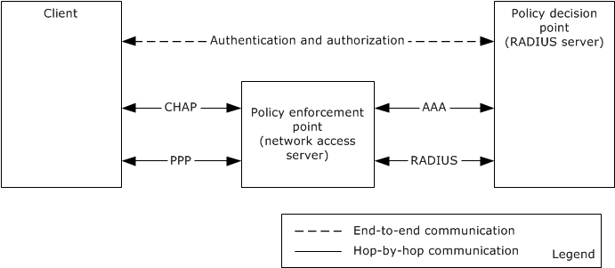

Figure 1: IETF architecture for network access

NAP is a minor extension of the IETF network access architecture. The primary extension is the introduction of client health evaluation as part of the process of determining network access. NAP uses underlying standards-based protocols for network access. NAP uses the authentication and authorization extension mechanisms of the data link protocols to implement the NAP health evaluation process. As such, the NAP architecture extends the IETF roles as follows:

- NAP enforcement point (NEP, an instance of a PEP): Performs network access control.
- [**NAP health policy Server (NPS)**](#gt_nap-health-policy-server-nps) (an instance of a PDP): Formulates access control decisions, including [**health state**](#gt_health-state) evaluation.
- NAP client: Requests network access from the corresponding NEP/PEP, including client health information.
A secondary extension of NAP is that improperly configured clients or clients without a recent security scan can be directed to reconfigure their software or run up-to-date security software before the clients are allowed access to the enterprise network. This process is called [**remediation**](#gt_remediation).

The NAP protocols allow verification of user and machine identities and checking a client's health state prior to allowing the client access to network resources. The health state can include the proper configuration of software, proper updates of systems software, access limits for specific hardware platforms, and executing security checking software on the client, such as anti-virus software and anti-malware to verify that a client computer is safe to use the network.

NAP has a pluggable architecture that allows client and server plug-ins to contribute to the evaluation of the client's statement of health ([**SoH**](#gt_statement-of-health-soh)). A client plug-in is called a system health agent (SHA) and the corresponding server side plug-in is called a system health validator (SHV). Windows-specific SHA and SHVs are described in [MS-WSH](../MS-WSH/MS-WSH.md). Other software packages, such as anti-virus software, can install an SHA to perform virus scanning and an SHV to keep track of the current version of signature files and acceptable results from a client scan.

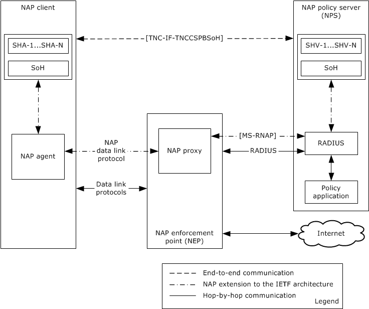

Figure 2: NAP extension to IETF architecture for network access

NAP introduces the primary NAP protocol, the Protocol Bindings for SoH [[TNC-IF-TNCCSPBSoH]](https://go.microsoft.com/fwlink/?LinkId=240054), which operates between the NAP client and the NAP policy server. The client determines its state of health and then uses the SoH protocol to request validation of its health state by the NAP policy server. The SoH protocol is designed as a simple request/response protocol to work end-to-end between the NAP client and NAP policy server. It is designed to be encapsulated and transported by the NAP data link protocols in a hop-by-hop manner so that intervening NASes can establish network access state based on the results of the SoH protocol running between the NAP client and NAP policy server. Network access state can include allowing full enterprise network access or allowing only partial connectivity so that the NAP client has access to only those servers required for remediation. The Vendor-Specific RADIUS Attributes for Network Access Protection (NAP) Data Structure (RNAP) [MS-RNAP](../MS-RNAP/MS-RNAP.md) allows the NAP communication to NAP policy servers.

### 1.1.1 Network Access Protection Concepts

The following diagram depicts the NAP components.

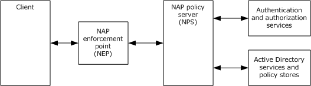

Figure 3: NAP components

Network Access Protection provides access control to networks based on an extensible list of constraints. The constraints come from an enterprise network administrator's policy for the network. The NAP client is a component on the client that aggregates the [**SoH**](#gt_statement-of-health-soh) of a client computer from multiple SHAs providing health information. For each SHA on the client, there is a corresponding SHV on the NPS. Successful evaluation of these constraints for a client by the SHVs on the NPS indicates that the client is healthy. There can be SHAs regarding the configuration of software, the configuration of client-based firewalls, the results of running anti-virus scans, the versions of security software, and so on.

A NAP client communicates with a NEP, an entity that either grants or restricts access to the enterprise network. In the enterprise network deployments, NEPs include VPN access servers, wireless LAN access servers, wired Ethernet switches, DHCP servers, and Remote Desktop gateways. In IPsec-capable networks, the logical NEP function is distributed across a certificate server and the IPsec component on all network servers in the network.

An NEP makes requests to an NPS to evaluate the health of the client making a network access request. Based on the evaluation of the client's health by the NPS, a NEP can either grant full or restricted network access to the client. Restricted access can include denying all access. An NPS can depend on Active Directory services [MS-ADOD](../MS-ADOD/MS-ADOD.md) for identity information and [**authentication**](#gt_authentication) services [MS-AUTHSOD](../MS-AUTHSOD/MS-AUTHSOD.md) and other group policy information [MS-GPOD](../MS-GPOD/MS-GPOD.md) [MS-GPNAP](../MS-GPNAP/MS-GPNAP.md).

An NPS can also direct the client to remediate any failures in health evaluation. Remediation can include upgrading the configuration of the client-based firewall, updating a software component to the latest version, and installing an updated set of anti-virus signatures and running a full scan. The client can take these directives, perform the required remediation, and then retry requesting network access with a new SoH.

## 1.2 Supported Deployment Scenarios

NAP is implemented for the following network access deployment scenarios and their related [**data link protocols**](#gt_data-link-protocols):

- VPN servers that implement either the Point-to-Point Tunneling Protocol (PPTP) Profile [MS-PTPT](../MS-PTPT/MS-PTPT.md) or the Layer Two Tunneling Protocol (L2TP) [[RFC2661]](https://go.microsoft.com/fwlink/?LinkId=92843).
- Network access devices that support IEEE 802.1x [[IEEE802.1X]](https://go.microsoft.com/fwlink/?LinkId=89910).
- DHCP servers that implement the Dynamic Host Configuration Protocol (DHCP) Extensions for Network Access Protection (NAP) [MS-DHCPN](../MS-DHCPN/MS-DHCPN.md).
- [**Internet Protocol security (IPsec)**](#gt_internet-protocol-security-ipsec) protected network resources that implement the Security Architecture for the Internet Protocol [[RFC2401]](https://go.microsoft.com/fwlink/?LinkId=90341), the Windows Client Certificate Enrollment Protocol [MS-WCCE](../MS-WCCE/MS-WCCE.md), and the Health Certificate Enrollment Protocol [MS-HCEP](../MS-HCEP/MS-HCEP.md).
- Remote Desktops that implement the Remote Desktop Gateway Server Protocol [MS-TSGU](../MS-TSGU/MS-TSGU.md).
In each scenario, the client uses data link protocols that are specific to the network configuration. A client can have more than one simultaneous network configuration. The [**authentication**](#gt_authentication) and [**authorization**](#gt_authorization) phase for the base network access protocol for the scenario is extended to perform a Network Access Protection authorization where the client and NPS have an [**end-to-end**](#gt_end-to-end) [**statement of health (SoH)**](#gt_statement-of-health-soh) request/response exchange. The SoH is [**hop-by-hop**](#gt_hop-by-hop) transported, where the first hop is from the client to the [**NAP enforcement point (NEP)**](#gt_nap-enforcement-point-nep), and the second hop is from the NEP to the [**NAP health policy Server (NPS)**](#gt_nap-health-policy-server-nps).

The first hop of transport of the SoH is specific to the scenario's base network access protocol. The client sends its SoH and the NEP then forwards the SoH to the NPS by using the [**RADIUS**](#gt_remote-authentication-dial-in-user-service-radius) protocol. The NPS evaluates that SoH against the enterprise's network policy thereby determining the client's health, then the NPS sends an [**SoHR**](#gt_statement-of-health-response-sohr) to the NEP either granting or restricting access. For each SHA on the client that contributed to the SoH, there is a corresponding SHV on the NPS that contributes to the SoHR. When restricting access, the NPS can optionally return a set of remediations that are required to be performed by the client prior to re-attempting network access. If remediations by the client are required, then an NPS can direct the NEP to provide some limited form of network access, such as a restricted virtual LAN (VLAN) or IP filtered access for the client to access network-based resources for remediation. This information is transported from the NPS to NEP by using RADIUS attributes [MS-RNAP](../MS-RNAP/MS-RNAP.md).

The main protocol for NAP is the Protocol Bindings for SoH (SOH) [[TNC-IF-TNCCSPBSoH]](https://go.microsoft.com/fwlink/?LinkId=240054). Communicating SoH/SoHR messages between the NAP client and the NPS is accomplished by tunneling SOH [TNC-IF-TNCCSPBSoH] over the available protocols on a per-hop basis. If the NEP supports EAP, which is common for VPN and LAN switches, then SoH/SoHR messages are transported end-to-end by using the Protected Extensible Authentication Protocol (PEAP) [MS-PEAP](../MS-PEAP/MS-PEAP.md) transport between the NAP client and the NPS. The PEAP protocol is an EAP method; therefore, on each hop, the SoH message is simply transported in EAP. A major feature of the PEAP protocol is that it provides strong cryptographic protection for communication between the NAP client and the NPS.

### 1.2.1 VPN Server

The following diagram shows how NAP is deployed with a VPN server.

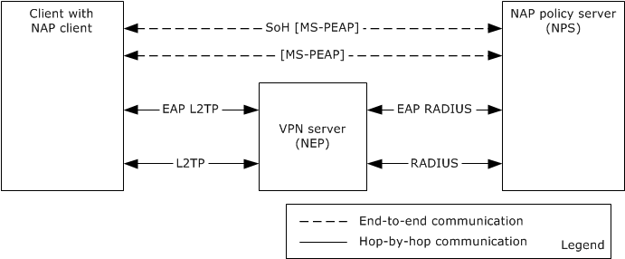

Figure 4: NAP deployment with VPN server

VPN servers are IP-based servers that are connected to the public Internet and which allow mobile computers, such as laptops, to securely tunnel enterprise-based traffic to enterprise networks behind the VPN servers. There is a wide variety of base VPN server protocols, including the Layer Two Tunneling Protocol (L2TP) [[RFC2661]](https://go.microsoft.com/fwlink/?LinkId=92843), the Point-to-Point Tunneling Protocol (PPTP) Profile [MS-PTPT](../MS-PTPT/MS-PTPT.md), IP over SSL/HTTPS, and many vendor specific solutions [[RFC2341]](https://go.microsoft.com/fwlink/?LinkId=235394). VPN servers use EAP for their [**authentication**](#gt_authentication) and authorization protocols. EAP allows a variety of AAA protocols as it provides an extensible framework for AAA.

If the [**NPS**](#gt_nap-health-policy-server-nps) determines that the client requires [**remediation**](#gt_remediation), the [**NEP**](#gt_nap-enforcement-point-nep) can install IP filters to allow the client to access network resources required for remediation, such as software distribution servers, [**Group Policy servers**](#gt_group-policy-server), or configuration file servers. After remediation, the client can retry gaining full access to the network to remove filtering.

### 1.2.2 Network Access Devices/Servers

The following diagram shows how NAP is deployed with network access devices.

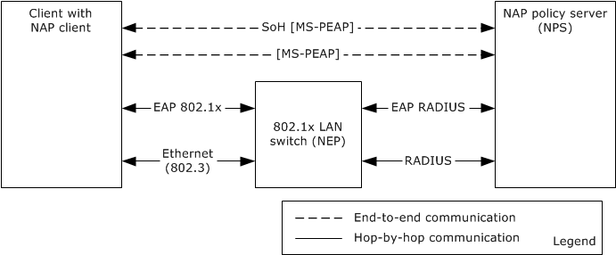

Figure 5: NAP deployment with network access devices

Network Access Devices are Layer Two ([[ISO/IEC-7498-1]](https://go.microsoft.com/fwlink/?LinkId=235913)) network switches that use IEEE 802.1x access protocols to control access to enterprise networks such as wireless network access and wired Ethernet switches. A client authenticates and gets authorization from the Network Access Device by using the 802.1x protocol. NAP extends this [**authentication**](#gt_authentication) and authorization phase by using EAP ([[RFC2716]](https://go.microsoft.com/fwlink/?LinkId=90374)) and EAP transports the SoH request/response protocol ([[TNC-IF-TNCCSPBSoH]](https://go.microsoft.com/fwlink/?LinkId=240054)) between the client and Network Access Device, and then the Network Access Device uses [**RADIUS**](#gt_remote-authentication-dial-in-user-service-radius) to transport the next hop from Network Access Device to the Network Policy Server. The [**NAP health policy server (NPS)**](#gt_nap-health-policy-server-nps) evaluates the client's SoH request against network policy constraints.

If the NPS determines that the client requires [**remediation**](#gt_remediation), the [**NAP enforcement point (NEP)**](#gt_nap-enforcement-point-nep) does one of the following:

- Installs IP filters.
- Puts the client on a restricted remediation network such as a virtual LAN, to allow the client to access network resources required for remediation, such as software distribution servers with up-to-date software, group policy servers, or configuration file servers.
After remediation the client can retry to gain full access to the enterprise network.

### 1.2.3 DHCP Servers

The following diagram shows how NAP is deployed with a DHCP Server.

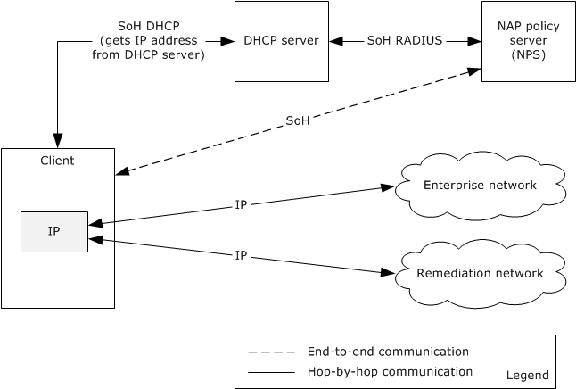

Figure 6: NAP deployment with DHCP server

Some enterprise networks control network access at Layer Three by controlling IP address assignment with DHCP ([[RFC2131]](https://go.microsoft.com/fwlink/?LinkId=90318)). In this scenario, the SoH/[**SoHR**](#gt_statement-of-health-response-sohr) is transported from the client to the DHCP server by using a DHCP option ([MS-DHCPN](../MS-DHCPN/MS-DHCPN.md)). The DHCP server uses [**RADIUS**](#gt_remote-authentication-dial-in-user-service-radius) to communicate with the [**NPS**](#gt_nap-health-policy-server-nps). Based on the policy evaluation by the NPS, the DHCP server can grant the client an IP address to use on the enterprise network, refuse to grant an IP address, or assign an IP address to a [**remediation**](#gt_remediation) network. The remediation network has servers that allow the client to perform remediation for updated software, new virus signatures used by anti-virus checkers, or scripts to configure host based firewalls on the client.

If the NPS determines that the client requires remediation, the DHCP server can give the client an IP address that has limited access to network resources to enable the client to access resources required to perform remediation. These resources can include software distribution servers, [**Group Policy servers**](#gt_group-policy-server), or configuration file servers. After remediation, the client retries accessing the network to obtain a new IP address that has full access to the enterprise network.

### 1.2.4 IPsec-Protected Networks

The following diagram shows how NAP is deployed with IPsec-protected networks.

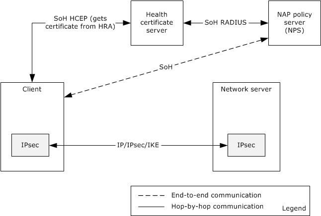

Figure 7: NAP deployment with IPsec-protected networks

[**Internet Protocol security (IPsec)**](#gt_internet-protocol-security-ipsec) provides for fine-grained [**end-to-end**](#gt_end-to-end) protection among clients and network server resources, such as web, file, print, and application servers in an enterprise network. NAP uses a certificate-based approach to enable NAP for IPsec-protected networks. A NAP client requests a certificate using the Health Certificate Enrollment Protocol (HCEP) [MS-HCEP](../MS-HCEP/MS-HCEP.md) and in the request sends the client's SoH, as defined in [MS-HCEP]. The certificate-granting server uses a NAP policy server to evaluate the client's health. If the client's health meets the enterprise network policy constraints, the certificate server grants the client a signed certificate for network access.

When a client accesses a network server, the client presents the health certificate to the network server. The certificate can be used by networked servers in the enterprise to validate the client's health. A client only requires one health certificate and usually obtains this certificate when the client's IP layer is initialized. Each client and network server has a NEP component in the IPsec layer, and the IPsec layer in the network server can use the client certificate to determine whether the client has IP access to the network server.

When a client initiates IP traffic with a network resource it starts an IPsec session with the destination network server. In that IPsec session initiation, the client starts an Internet Key Exchange (IKE) ([[RFC2409]](https://go.microsoft.com/fwlink/?LinkId=90349) and [MS-IKEE](../MS-IKEE/MS-IKEE.md)) to establish mutual [**authentication**](#gt_authentication) and to enable authorization of communication between the client and network server. The certificate containing the validated SoH for the client is used in the authentication and [**authorization**](#gt_authorization) phase of the IPsec/IKE protocols. The destination server can use the certificate to determine whether to authorize access to the server by allowing IPsec traffic with the client.

If the NPS determines that the client requires remediation the certificate server does not generate a health certificate for generic access to enterprise-networked resources. Resources required by clients, such as software distribution servers and file servers with configuration scripts, can be configured to not require a health certificate, and thus, the client can perform remediation by using non-IPsec data transport. After remediation, the client can retry an HCEP request to obtain a health certificate from the certificate server and then access enterprise-networked resources.

### 1.2.5 Terminal Services Networks

The following diagram shows how NAP is deployed with Remote Desktop networks.

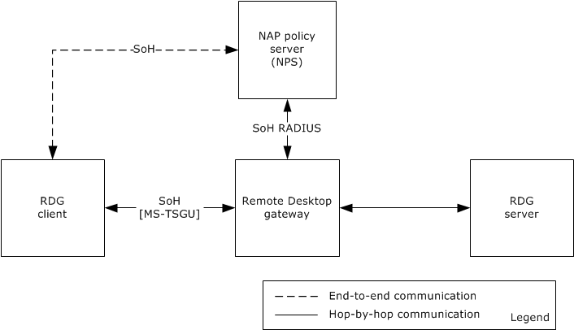

Figure 8: NAP deployment with Remote Desktop networks

A [**Remote Desktop Gateway client (RDG client)**](#gt_remote-desktop-gateway-client-rdg-client) can have its access to a remote desktop authorized by a Remote Desktop gateway [MS-TSGU](../MS-TSGU/MS-TSGU.md). NAP can use the Remote Desktop Gateway Server Protocol's authentication and authorization protocol phases for the evaluation of the client's SoH. The SoH request and [**SoHR**](#gt_statement-of-health-response-sohr) are transported over the Remote Desktop Gateway Server Protocol. The Remote Desktop gateway then communicates with an NPS to evaluate the client's health. This gateway uses the response from the NPS to either grant or deny access, and it can also direct the client to a set of remediation servers to fix software configuration, virus signatures, and so on.

## 1.3 Glossary

This document uses the following terms:

**Active Directory**: A general-purpose network directory service. [**Active Directory**](#gt_active-directory) also refers to the Windows implementation of a directory service. [**Active Directory**](#gt_active-directory) stores information about a variety of objects in the network. Importantly, user accounts, computer accounts, groups, and all related credential information used by the Windows implementation of Kerberos are stored in [**Active Directory**](#gt_active-directory). [**Active Directory**](#gt_active-directory) is either deployed as Active Directory Domain Services (AD DS) or Active Directory Lightweight Directory Services (AD LDS). [MS-ADTS](../MS-ADTS/MS-ADTS.md) describes both forms. For more information, see [MS-AUTHSOD](../MS-AUTHSOD/MS-AUTHSOD.md) section 1.1.1.5.2, Lightweight Directory Access Protocol (LDAP) versions 2 and 3, Kerberos, and DNS.

**authentication**: The ability of one entity to determine the identity of another entity.

**authorization**: The secure computation of roles and accesses granted to an identity.

**data link protocols**: Often called Layer Two protocols, data link protocols exist in the protocol layer just above the physical layer relative to the OSI protocol model. Data link protocols provide communication between two devices. Because there are many different ways to connect devices, there are many different data link protocols. Examples of data link protocols include PPP [2716], PPTP [MS-PTPT], IEEE 802 [IEEE802.1X], Wi-Fi, and IPsec.

**DIAMETER**: An authentication, authorization, and accounting (AAA) protocol for computer networks and an alternative to RADIUS. The Diameter Base Protocol [RFC3588] defines the minimum requirements for an AAA protocol.

**domain controller (DC)**: The service, running on a server, that implements [**Active Directory**](#gt_active-directory), or the server hosting this service. The service hosts the data store for objects and interoperates with other [**DCs**](#gt_domain-controller-dc) to ensure that a local change to an object replicates correctly across all [**DCs**](#gt_domain-controller-dc). When [**Active Directory**](#gt_active-directory) is operating as Active Directory Domain Services (AD DS), the [**DC**](#gt_domain-controller-dc) contains full NC replicas of the configuration naming context (config NC), schema naming context (schema NC), and one of the domain NCs in its forest. If the AD DS [**DC**](#gt_domain-controller-dc) is a global catalog server (GC server), it contains partial NC replicas of the remaining domain NCs in its forest. For more information, see [MS-AUTHSOD] section 1.1.1.5.2 and [MS-ADTS]. When [**Active Directory**](#gt_active-directory) is operating as Active Directory Lightweight Directory Services (AD LDS), several AD LDS [**DCs**](#gt_domain-controller-dc) can run on one server. When [**Active Directory**](#gt_active-directory) is operating as AD DS, only one AD DS [**DC**](#gt_domain-controller-dc) can run on one server. However, several AD LDS [**DCs**](#gt_domain-controller-dc) can coexist with one AD DS [**DC**](#gt_domain-controller-dc) on one server. The AD LDS [**DC**](#gt_domain-controller-dc) contains full NC replicas of the config NC and the schema NC in its forest. The domain controller is the server side of Authentication Protocol Domain Support [MS-APDS](../MS-APDS/MS-APDS.md).

**Dynamic Host Configuration Protocol (DHCP)**: A protocol that provides a framework for passing configuration information to hosts on a TCP/IP network, as described in [[RFC2131]](https://go.microsoft.com/fwlink/?LinkId=90318).

**end-to-end**: A transport mechanism where application-specific functions reside on the end nodes or hosts of a network rather than in intermediary nodes, provided that the functions can be implemented completely and correctly in the end hosts.

**Group Policy**: A mechanism that allows the implementer to specify managed configurations for users and computers in an [**Active Directory**](#gt_active-directory) service environment.

**Group Policy server**: A server holding a database of Group Policy Objects (GPOs) that can be retrieved by other machines. The [**Group Policy server**](#gt_group-policy-server) must be a [**domain controller (DC)**](#gt_domain-controller-dc).

**health state**: An abstract notion of the state of a machine that is used to indicate its compliance with network policies. Some examples of such state would include the state of the firewall on the machine, the version of the virus signature files for an antivirus application, and so on.

**hop-by-hop**: A transport mechanism in which chunks of data are forwarded from node to node in a network by using a store-and-forward manner involving a source node, destination node, and intermediate nodes. Hop-by-hop transport enables data to be forwarded even when the path between the source and destination nodes is not permanently connected during communication.

**Internet Protocol security (IPsec)**: A framework of open standards for ensuring private, secure communications over Internet Protocol (IP) networks through the use of cryptographic security services. IPsec supports network-level peer authentication, data origin authentication, data integrity, data confidentiality (encryption), and replay protection. The Microsoft implementation of IPsec is based on standards developed by the Internet Engineering Task Force (IETF) IPsec working group.

**Internet Protocol version 4 (IPv4)**: An Internet protocol that has 32-bit source and destination addresses. IPv4 is the predecessor of IPv6.

**NAP client**: A computer capable of examining and reporting on its health, and requesting for and using network resources. The NAP client is the set of NAP components installed and running on a Windows client. The NAP client is responsible for executing NAP-related operations on the client side. The NAP client is also responsible for collecting health information on the client, composing the health information into an SoH [TNC-IF-TNCCSPBSoH], and sending the SoH to a NEP.

**NAP data link protocol**: A NAP-capable protocol that transports NAP information between the NAP client and the NAP enforcement point (NEP). These protocols include [MS-DHCPN], [MS-HCEP], and [MS-TSGU].

**NAP enforcement point (NEP)**: A computer acting as a server that enforces Network Access Protection. Examples of NEPs are VPN Servers, DHCP Servers, Remote Desktop gateways, 802.1x Routers, and Health Registration Authority Servers.

**NAP health policy server (NPS)**: A computer acting as a server that stores health requirement policies and provides health state validation for NAP clients.

**network access server (NAS)**: A computer server that provides an access service for a user who is trying to access a network. A [**NAS**](#gt_network-access-server-nas) operates as a client of [**RADIUS**](#gt_remote-authentication-dial-in-user-service-radius). The RADIUS client is responsible for passing user information to designated RADIUS servers and then acting on the response returned by the RADIUS server. Examples of a NAS include: a VPN server, Wireless Access Point, 802.1x-enabled switch, or Network Access Protection (NAP) server.

**policy decision point (PDP)**: The point where policy decisions are made. In the case of NAP, this is the NAP health policy server [[RFC2753]](https://go.microsoft.com/fwlink/?LinkId=156668).

**policy enforcement point (PEP)**: The point where the policy decisions are actually enforced. [RFC2753].

**remediation**: The act of bringing a non-compliant computer into a compliant state.

**remediation server**: A server that is responsible for bringing a noncompliant computer back into a compliant state.

**Remote Authentication Dial-In User Service (RADIUS)**: A protocol for carrying authentication, authorization, and configuration information between a [**network access server (NAS)**](#gt_network-access-server-nas) that prefers to authenticate connection requests from endpoints and a shared server that performs authentication, authorization, and accounting.

**Remote Desktop Gateway client (RDG client)**: A client that facilitates the access of authorized users of remote computers on the private network accessible via the Internet, using Remote Desktop Gateway Server Protocol [MS-TSGU](../MS-TSGU/MS-TSGU.md).

**restricted network**: A network on which noncompliant systems are placed, which prevents their access to compliant systems. The restricted network can contain remediation servers so that noncompliant clients can update their configurations to comply with system health requirements.

**SHV**: See [**system health validator (SHV)**](#gt_system-health-validator-shv).

**statement of health (SoH)**: A collection of data generated by a system health entity, as specified in [[TNC-IF-TNCCSPBSoH]](https://go.microsoft.com/fwlink/?LinkId=240054), which defines the [**health state**](#gt_health-state) of a machine. The data is interpreted by a Health Policy Server, which determines whether the machine is healthy or unhealthy according to the policies defined by an administrator.

**statement of health response (SoHR)**: A collection of data that represents the evaluation of the [**statement of health (SoH)**](#gt_statement-of-health-soh) according to network policies, as specified in [TNC-IF-TNCCSPBSoH].

**system health agent (SHA)**: The client components that make declarations on a specific aspect of the client [**health state**](#gt_health-state) and generate a statement of health ReportEntry (SoH ReportEntry).

**system health validator (SHV)**: The server counterpart to the [**system health agent (SHA)**](#gt_system-health-agent-sha), which is responsible for verifying the declarations of client [**health state**](#gt_health-state) made by the respective [**SHA**](#gt_system-health-agent-sha). The [**SHV**](#gt_system-health-validator-shv) generates a statement of health response ReportEntry (SoHR ReportEntry).

**VPN server**: A server that makes remote resources of another network available in a secure way.

**Windows Security Health Agent (WSHA)**: A utility that reports the system security health state (Windows Security Center) to the Windows Security Health Validator (WSHV), as specified in [MS-WSH].

**Windows Security Health Validator (WSHV)**: A utility that responds to the report received from the Windows Security Health Agent (WSHA). If the status that is reported by the WSHA does not comply with the defined security health policy, the response from the WSHV includes quarantine and remediation instructions as specified in [MS-WSH].

## 1.4 References

[IEEE802.1X] Institute of Electrical and Electronics Engineers, "IEEE Standard for Local and Metropolitan Area Networks - Port-Based Network Access Control", December 2004, [http://ieeexplore.ieee.org/iel5/9828/30983/01438730.pdf](https://go.microsoft.com/fwlink/?LinkId=89910)

[ISO/IEC-7498-1] ISO/IEC, "Information technology -- Open Systems Interconnection -- Basic Reference Model -- The Basic Model", ISO/IEC 7498-1, November 1994, [http://www.iso.org/iso/iso_catalogue/catalogue_tc/catalogue_detail.htm?csnumber=20269](https://go.microsoft.com/fwlink/?LinkId=235913)

**Note** There is a charge to download the specification.

[MS-ADOD] Microsoft Corporation, "[Active Directory Protocols Overview](../MS-ADOD/MS-ADOD.md)".

[MS-APDS] Microsoft Corporation, "[Authentication Protocol Domain Support](../MS-APDS/MS-APDS.md)".

[MS-AUTHSOD] Microsoft Corporation, "[Authentication Services Protocols Overview](../MS-AUTHSOD/MS-AUTHSOD.md)".

[MS-CERSOD] Microsoft Corporation, "[Certificate Services Protocols Overview](../MS-CERSOD/MS-CERSOD.md)".

[MS-DHCPM] Microsoft Corporation, "[Microsoft Dynamic Host Configuration Protocol (DHCP) Server Management Protocol](../MS-DHCPM/MS-DHCPM.md)".

[MS-DHCPN] Microsoft Corporation, "[Dynamic Host Configuration Protocol (DHCP) Extensions for Network Access Protection (NAP)](../MS-DHCPN/MS-DHCPN.md)".

[MS-GPNAP] Microsoft Corporation, "[Group Policy: Network Access Protection (NAP) Extension](../MS-GPNAP/MS-GPNAP.md)".

[MS-GPOD] Microsoft Corporation, "[Group Policy Protocols Overview](../MS-GPOD/MS-GPOD.md)".

[MS-HCEP] Microsoft Corporation, "[Health Certificate Enrollment Protocol](../MS-HCEP/MS-HCEP.md)".

[MS-IKEE] Microsoft Corporation, "[Internet Key Exchange Protocol Extensions](../MS-IKEE/MS-IKEE.md)".

[MS-PEAP] Microsoft Corporation, "[Protected Extensible Authentication Protocol (PEAP)](../MS-PEAP/MS-PEAP.md)".

[MS-PTPT] Microsoft Corporation, "[Point-to-Point Tunneling Protocol (PPTP) Profile](../MS-PTPT/MS-PTPT.md)".

[MS-RDSOD] Microsoft Corporation, "[Remote Desktop Services Protocols Overview](../MS-RDSOD/MS-RDSOD.md)".

[MS-RNAP] Microsoft Corporation, "[Vendor-Specific RADIUS Attributes for Network Access Protection (NAP) Data Structure](../MS-RNAP/MS-RNAP.md)".

[MS-SNTP] Microsoft Corporation, "[Network Time Protocol (NTP) Authentication Extensions](../MS-SNTP/MS-SNTP.md)".

[MS-TLSP] Microsoft Corporation, "[Transport Layer Security (TLS) Profile](../MS-TLSP/MS-TLSP.md)".

[MS-TSGU] Microsoft Corporation, "[Terminal Services Gateway Server Protocol](../MS-TSGU/MS-TSGU.md)".

[MS-WCCE] Microsoft Corporation, "[Windows Client Certificate Enrollment Protocol](../MS-WCCE/MS-WCCE.md)".

[MS-WSH] Microsoft Corporation, "[Windows Security Health Agent (WSHA) and Windows Security Health Validator (WSHV) Protocol](../MS-WSH/MS-WSH.md)".

[RFC1661] Simpson, W., Ed., "The Point-to-Point Protocol (PPP)", STD 51, RFC 1661, July 1994, [http://www.ietf.org/rfc/rfc1661.txt](https://go.microsoft.com/fwlink/?LinkId=90283)

[RFC2131] Droms, R., "Dynamic Host Configuration Protocol", RFC 2131, March 1997, [http://www.ietf.org/rfc/rfc2131.txt](https://go.microsoft.com/fwlink/?LinkId=90318)

[RFC2132] Alexander, S., and Droms, R., "DHCP Options and BOOTP Vendor Extensions", RFC 2132, March 1997, [http://www.ietf.org/rfc/rfc2132.txt](https://go.microsoft.com/fwlink/?LinkId=90319)

[RFC2315] Kaliski, B., "PKCS #7: Cryptographic Message Syntax Version 1.5", RFC 2315, March 1998, [http://www.ietf.org/rfc/rfc2315.txt](https://go.microsoft.com/fwlink/?LinkId=90334)

[RFC2341] Valencia, A., Littlewood, M., and Kolar, T., "Cisco Layer Two Forwarding (Protocol)", L2F"", RFC 2341, May 1998, [http://www.ietf.org/rfc/rfc2341.txt](https://go.microsoft.com/fwlink/?LinkId=235394)

[RFC2401] Kent, S. and Atkinson, R., "Security Architecture for the Internet Protocol", RFC 2401, November 1998, [http://www.ietf.org/rfc/rfc2401.txt](https://go.microsoft.com/fwlink/?LinkId=90341)

[RFC2409] Harkins, D. and Carrel, D., "The Internet Key Exchange (IKE)", RFC 2409, November 1998, [http://www.ietf.org/rfc/rfc2409.txt](https://go.microsoft.com/fwlink/?LinkId=90349)

[RFC2661] Townsley, W., Valencia, A., Rubens, A., et al., "Layer Two Tunneling Protocol L2TP", RFC 2661, August 1999, [http://www.ietf.org/rfc/rfc2661.txt](https://go.microsoft.com/fwlink/?LinkId=92843)

[RFC2716] Aboba, B. and Simon, D., "PPP EAP TLS Authentication Protocol", RFC 2716, October 1999, [http://www.ietf.org/rfc/rfc2716.txt](https://go.microsoft.com/fwlink/?LinkId=90374)

[RFC2748] Durham, D., Boyle, J., Cohen, R., et al., "The COPS (Common Open Policy Service) Protocol", RFC 2748, January 2000, [http://www.ietf.org/rfc/rfc2748.txt](https://go.microsoft.com/fwlink/?LinkId=235395)

[RFC2865] Rigney, C., Willens, S., Rubens, A., and Simpson, W., "Remote Authentication Dial In User Service (RADIUS)", RFC 2865, June 2000, [http://www.ietf.org/rfc/rfc2865.txt](https://go.microsoft.com/fwlink/?LinkId=90392)

[RFC2866] Rigney, C., "RADIUS Accounting", RFC 2866, June 2000, [http://www.ietf.org/rfc/rfc2866.txt](https://go.microsoft.com/fwlink/?LinkId=90393)

[RFC2903] de Laat, C., Gross, G., Gommans, L., et al., "Generic AAA Architecture", RFC 2903, August 2000, [http://www.ietf.org/rfc/rfc2903.txt](https://go.microsoft.com/fwlink/?LinkId=235396)

[RFC3280] Housley, R., Polk, W., Ford, W., and Solo, D., "Internet X.509 Public Key Infrastructure Certificate and Certificate Revocation List (CRL) Profile", RFC 3280, April 2002, [http://www.ietf.org/rfc/rfc3280.txt](https://go.microsoft.com/fwlink/?LinkId=90414)

[RFC3579] Aboba, B. and Calhoun, P., "RADIUS (Remote Authentication Dial In User Service) Support For Extensible Authentication Protocol (EAP)", RFC 3579, September 2003, [http://www.ietf.org/rfc/rfc3579.txt](https://go.microsoft.com/fwlink/?LinkId=90435)

[RFC3748] Aboba, B., Blunk, L., Vollbrecht, J., Carlson, J., and Levkowetz, H., "Extensible Authentication Protocol (EAP)", RFC 3748, June 2004, [http://www.ietf.org/rfc/rfc3748.txt](https://go.microsoft.com/fwlink/?LinkId=90444)

[RFC4306] Kaufman, C., "Internet Key Exchange (IKEv2) Protocol", RFC 4306, December 2005, [http://www.ietf.org/rfc/rfc4306.txt](https://go.microsoft.com/fwlink/?LinkId=90469)

[RFC4559] Jaganathan, K., Zhu, L., and Brezak, J., "SPNEGO-based Kerberos and NTLM HTTP Authentication in Microsoft Windows", RFC 4559, June 2006, [http://www.rfc-editor.org/rfc/rfc4559.txt](https://go.microsoft.com/fwlink/?LinkId=90483)

[TNC-IF-TNCCSPBSoH] TCG, "TNC IF-TNCCS: Protocol Bindings for SoH", version 1.0, May 2007, [https://trustedcomputinggroup.org/tnc-if-tnccs-protocol-bindings-soh/](https://go.microsoft.com/fwlink/?LinkId=240054)

[TNC-IF-TNCCSTLVB] TCG, "TNC IF-TNCCS: TLV Binding", version 2.0, January 2010, [https://trustedcomputinggroup.org/wp-content/uploads/IF-TNCCS_TLVBinding_v2_0_r16a.pdf](https://go.microsoft.com/fwlink/?LinkId=235397)

# 2 Functional Architecture

NAP provides network management and control services for the following tasks:

- Network administrators configure network access policies, including health requirements for clients. These policies impact the behavior of [**NPS**](#gt_nap-health-policy-server-nps) and [**NEP**](#gt_nap-enforcement-point-nep).
- Network access requests by a client are authenticated and authorized when a network interface is initialized or there is a change in network configuration. Authorization takes the network access policies into account. Network interfaces can initialize due to an external event, such as plugging an Ethernet cable into an Ethernet switch port, or through user demand, such as when a user requests VPN access to an enterprise network.
- Clients can attempt to correct their health status via [**remediation**](#gt_remediation) to gain subsequent access to the network.
This document focuses on the network access request task.

## 2.1 Overview

The following figure shows the high-level interactions between the NAP components and other external services, such as the Authentication service, [**Active Directory**](#gt_active-directory) service, and [**Group Policy**](#gt_group-policy) service.

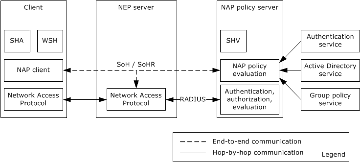

Figure 9: NAP interaction with other systems and components

NAP affects the network layer in the system from a higher level. The following figure shows NAP operating on the client computer.

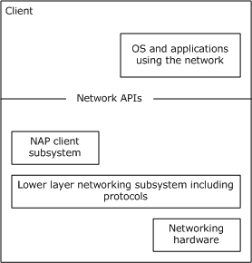

Figure 10: Client component relationship

The [**NAP data link protocol**](#gt_nap-data-link-protocol) controls client access to the network by operating between the client and a [**NEP**](#gt_nap-enforcement-point-nep). All system and user application networking on the client can be affected by the NAP data link protocol because the NAP data link protocol determines access to the network. NAP works with the authentication and authorization phases of the NAP data link protocol that runs when the client's networking subsystem is being initialized or reconfigured. At this time, the NAP client requests the health state from all [**system health agents (SHA)**](#gt_system-health-agent-sha) and creates a [**statement of health (SoH)**](#gt_statement-of-health-soh). The SoH is then encapsulated based on the NAP data link protocol and communicated to the NEP. The NEP asks the NPS to evaluate the client's SoH against the health policy for the network. The NPS generates an SoHR and sends the SoHR back to the NEP. The NEP can use the SoHR from the NPS to deny or restrict network access by the client. The NEP sends the SoHR back to the NAP client by using the NAP data link protocol. The following figure shows the interaction between the NAP client, NEP, and NPS.

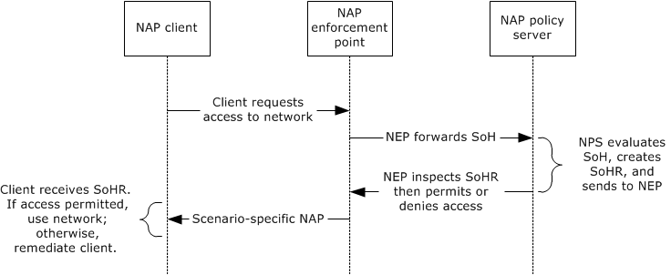

Figure 11: Interaction between NAP client, NAP enforcement point, and NAP policy server

NAP supports the following data link protocols:

- IEEE 802.1x for wired and wireless LANS
- L2TP and PPTP for VPN access, Authentication and Authorization supported by EAP [[RFC3748]](https://go.microsoft.com/fwlink/?LinkId=90444)
- DHCP for IP networks that use DHCP for IP configuration management of clients
- IPsec for IP-based networks that support IPsec
- Remote Desktop Gateway Server Protocol
For each NAP data link protocol, there is a corresponding method for transporting the SoH over the access protocol as follows:

- IEEE 802.1x supporting EAP over LAN (EAPoL): SoH is encapsulated in PEAP over EAPoL
- VPN protocols supporting EAP: SoH is encapsulated in PEAP over EAP
- DHCP: SoH is encapsulated as DHCP options [MS-DHCPN](../MS-DHCPN/MS-DHCPN.md)
- IPsec: SoH is encapsulated in a certificate request and the SoH response (SoHR) is encoded in a certificate [MS-HCEP](../MS-HCEP/MS-HCEP.md)
- Remote Desktop: SoH is transported in the Remote Desktop Gateway Server Protocol [MS-TSGU](../MS-TSGU/MS-TSGU.md)
**NAP Policy Server (NPS)**

NAP policy servers are RADIUS servers [[RFC2865]](https://go.microsoft.com/fwlink/?LinkId=90392). NAP provides mechanisms to encapsulate SoH requests/responses (SoHRs) on top of RADIUS exchanges between a NEP and NPS. An NPS can use Authentication Services [MS-AUTHOD], Active Directory service [MS-ADOD](../MS-ADOD/MS-ADOD.md), and Group Policy servers [MS-GPOD](../MS-GPOD/MS-GPOD.md) [MS-GPNAP](../MS-GPNAP/MS-GPNAP.md) to evaluate a client's SoH. The NPS can also log NAP transactions.

When a NEP is communicating with an NPS, the NEP is acting as a RADIUS client and the NPS is acting as a RADIUS server. RADIUS has direct support for using EAP [[RFC3579]](https://go.microsoft.com/fwlink/?LinkId=90435). In the cases where the client/NEP communication is not transported over EAP, SoH messages are directly transported as RADIUS attributes. Note that these encapsulations place limits on the size of SoH messages.

NPSes support the extensible model for System Health Validators (SHVs) by using an API. Each SHV registers with a callback interface when it is configured into the NPS. When a RADIUS request contains an SoH that includes content for a particular SHV, the corresponding SHV is invoked by the NPS with that content as a parameter of the invocation. An SHV can send content back in its part of the response to the SoH request with information related to remediation of the client with respect to the SHA. In this manner, SOH is implicitly a transport for SHA/SHV communication through the SOH request/response protocol. Note that the SOH request/response mechanism is a simple, two-legged protocol: one request and one corresponding response [[TNC-IF-TNCCSPBSoH]](https://go.microsoft.com/fwlink/?LinkId=240054).

**Policy Backend Databases**

There are several backend services used by the NPS. Authentication services [MS-AUTHSOD](../MS-AUTHSOD/MS-AUTHSOD.md) are used to authenticate user and client machine identities. Active Directory service [MS-ADOD] is used to store user and machine based policies and to group users and machines into logical groupings to simplify administration. Group Policy servers [MS-GPOD] are used to configure, manage, and distribute policies across clients and replicated servers.

### 2.1.1 Requesting Network Access

This section describes the network access authentication and authorization process used by NAP. Network access authentication and authorization is used as follows:

- To optionally identify user and machine identities.
- To allow the NPS to use user and machine identities to determine network access policy with respect to permitting or denying network access.
- To extend the authentication and authorization steps of the data link protocols to allow for the SOH request/response protocol. In the request phase, the client creates an SoH and sends it to the NPS to use to determine if the client has network access. The NPS sends the SoH response (SoHR) back to the client via the NEP, and the NEP can grant or limit network access based on the SoH response (SoHR).

#### 2.1.1.1 Overview

The following figure depicts the black box diagram for the NAP architecture. In the figure, the components on the client computer are the NAP client, the Network Access protocol components that implement the data link protocols, and the components on the NEP: for example, a NEP consists of data link protocols, and a RADIUS client component for communication with a NPS. The NAP client calls the low-level data link protocols to send the Statement of Health to the NEP, and to send any other parameters required for network access, such as authentication credentials for user and machine identities.

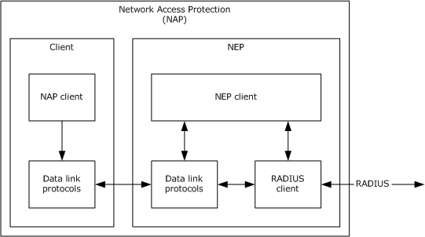

Figure 12: Black box diagram for the NAP architecture

#### 2.1.1.2 Internal Architecture

The following figure depicts the client architecture of NAP. The data link and NAP protocols are as follows:

**NAP protocols:**

- Protocol Bindings for SoH [[TNC-IF-TNCCSPBSoH]](https://go.microsoft.com/fwlink/?LinkId=240054)
- Windows Security Health Agent (WSHA) and Windows Security Health Validator (WSHV) Protocol [MS-WSH](../MS-WSH/MS-WSH.md)
- Authentication Protocol Domain Support [MS-APDS](../MS-APDS/MS-APDS.md) with NTLM pass-through [[RFC4559]](https://go.microsoft.com/fwlink/?LinkId=90483)
**Data link protocols:**

- Protected Extensible Authentication Protocol (PEAP) [MS-PEAP](../MS-PEAP/MS-PEAP.md)
- PPP EAP TLS Authentication Protocol [[RFC2716]](https://go.microsoft.com/fwlink/?LinkId=90374)
- IEEE Standard for Local and Metropolitan Area Networks - Port-Based Network Access Control [[IEEE802.1X]](https://go.microsoft.com/fwlink/?LinkId=89910)
- Dynamic Host Configuration Protocol (DHCP) Extensions for Network Access Protection (NAP) [MS-DHCPN](../MS-DHCPN/MS-DHCPN.md)
- Health Certificate Enrollment Protocol [MS-HCEP](../MS-HCEP/MS-HCEP.md)
- Remote Desktop Gateway Server Protocol [MS-TSGU](../MS-TSGU/MS-TSGU.md)
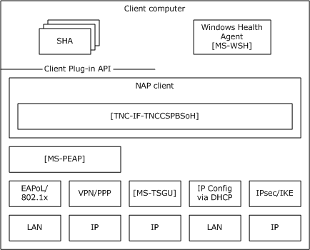

Figure 13: White box diagram of client architecture for multiple scenarios/protocols

In the client, there are five parallel NAP data link protocol stacks that support the five scenarios for NAP (section [1.2](#Section_1.2)), and across these stacks many of the components are shared. For example, PEAP [MS-PEAP] is used for the 802.1x scenarios and also for the VPN scenario. Note that stacks can execute simultaneously as the client can have multiple network interfaces, or the network administrator can configure a layered approach to NAP. The latter situation can occur when NAP is used for wired Ethernet access using the IEEE 802.1x stack and fine-grained, end-to-end IPsec NAP enforcement for all client/server communication being used with the IPsec stack.

An NPS is a RADIUS server that has been extended for NAP. As such, NAP-related RADIUS attributes [MS-RNAP](../MS-RNAP/MS-RNAP.md) from a network access RADIUS request are passed to a NAP policy evaluation engine that processes the SoH request. In the SoH request, there can be sections from several SHAs on the client. The corresponding SHV for each equivalent SHA is invoked to process its section of the SoH request and provides a portion of the SoH response (SoHR). The NAP policy evaluation engine uses several external services, such as authentication services and Active Directory services. NAP-related policies can be stored in Active Directory or in files.

The following figure depicts the server-side NAP architecture for an NPS.

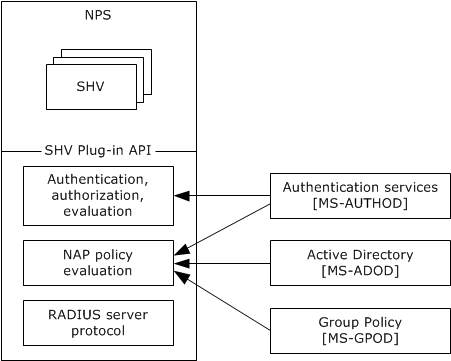

Figure 14: Server-side NAP architecture for NPS

### 2.1.2 Relevant Standards

The NAP protocols use and extend the following standards:

- Dynamic Host Configuration Protocol [[RFC2131]](https://go.microsoft.com/fwlink/?LinkId=90318)
- PPP EAP TLS Authentication Protocol [[RFC2716]](https://go.microsoft.com/fwlink/?LinkId=90374)
- Security Architecture for the Internet Protocol [[RFC2401]](https://go.microsoft.com/fwlink/?LinkId=90341) and The Internet Key Exchange (IKEv2) [[RFC4306]](https://go.microsoft.com/fwlink/?LinkId=90469), X.509 Certificates
- IEEE Standard for Local and Metropolitan Area Networks - Port-Based Network Access Control [[IEEE802.1X]](https://go.microsoft.com/fwlink/?LinkId=89910) and EAPoL
- Remote Authentication Dial In User Service (RADIUS) [[RFC2865]](https://go.microsoft.com/fwlink/?LinkId=90392)
- Protocol Bindings for SoH [[TNC-IF-TNCCSPBSoH]](https://go.microsoft.com/fwlink/?LinkId=240054) adopted by the Trusted Computing Group (TCG) as an interoperable implementation of the Trusted Network Connect Protocol IF-TNCCS [[TNC-IF-TNCCSTLVB]](https://go.microsoft.com/fwlink/?LinkId=235397) [TNC-IF-TNCCSPBSoH]

### 2.1.3 Relationship Between Standards and Microsoft Extensions

For details about these relationships, refer to the Normative References section of the individual protocol technical documents.

**DHCP Extensions for NAP** [MS-DHCPN](../MS-DHCPN/MS-DHCPN.md) **:**

- Details the DHCP vendor-specific options used for transport of the SoH request and NAP data and how the SoH response (SoHR) is transported over DHCP.
- Details the DHCP options used for transport of remediation information.
**RADIUS Protocol Extensions for NAP** [MS-RNAP](../MS-RNAP/MS-RNAP.md) **:**

- Details the RADIUS attributes used by NAP on a per-scenario basis.
- Details the RADIUS attributes used to transport the SoH request.
- Details the RADIUS attributes used to transport remediation information to a NEP from the NPS.
**Health Certificate Enrollment Protocol** [MS-HCEP](../MS-HCEP/MS-HCEP.md) **:**

- Details the certificate enrollment protocol and X.509 certificates used by NAP for IPsec-protected networks.
**Protected Extensible Authentication Protocol** [MS-PEAP](../MS-PEAP/MS-PEAP.md) **:**

- Details a TLS protected end to end authentication method between client and NPS that is implemented as an EAP method [[RFC2716]](https://go.microsoft.com/fwlink/?LinkId=90374).

## 2.2 Protocol Summary

The following tables provide a comprehensive list of the NAP member protocols, where the protocols are grouped according to their primary purpose for NAP deployment.

The following protocols enable NAP for IP Configuration access.

| Protocol name | Description | Short name |
| --- | --- | --- |
| Dynamic Host Configuration Protocol (DHCP) Extensions for Network Access Protection (NAP) | DHCP is used by clients to configure their IP stack including address, DNS hosts, and so on. | [MS-DHCPN](../MS-DHCPN/MS-DHCPN.md) |
| Microsoft Dynamic Host Configuration Protocol (DHCP) Server Management Protocol | As previously mentioned, DHCP is used by clients to configure their IP stack including their IP address, DNS servers, gateways, and so on. This document details extensions and implementation decisions made by Microsoft. | [MS-DHCPM](../MS-DHCPM/MS-DHCPM.md) |

The following protocols enable NAP for VPN access and LAN access.

| Protocol name | Description | Short name |
| --- | --- | --- |
| Protected Extensible Authentication Protocol (PEAP) | PEAP specifies the EAP method for end-to-end TLS-protected EAP between the client/NEP and NPS [[RFC2716]](https://go.microsoft.com/fwlink/?LinkId=90374). | [MS-PEAP](../MS-PEAP/MS-PEAP.md) |

The following protocols enable NAP for IPsec access.

| Protocol name | Description | Short name |
| --- | --- | --- |
| Health Certificate Enrollment Protocol (HCEP) | HCEP details how the client enrolls for a health certificate based on its SoH. This certificate is then used by the IPsec layer to perform network access enforcement. | [MS-HCEP](../MS-HCEP/MS-HCEP.md) |
| Internet Key Exchange Protocol | This document details extensions to and differences from the IETF IKE standards as made by Microsoft. | [MS-IKEE](../MS-IKEE/MS-IKEE.md) |

The following protocols enable NAP for Remote Desktop access.

| Protocol name | Description | Short name |
| --- | --- | --- |
| Remote Desktop Gateway Server Protocol | Remote Desktop is a Microsoft Protocol that allows thin clients to run displays from a terminal server supporting many clients. | [MS-TSGU](../MS-TSGU/MS-TSGU.md) |

The following protocols are used by NAP policy servers (NPS).

| Protocol name | Description | Short name |
| --- | --- | --- |
| Vendor-Specific RADIUS Attributes for Network Access Protection (NAP) Data Structure (RADIUS) | RADIUS allows for NAP communication to NAP policy servers. | [MS-RNAP](../MS-RNAP/MS-RNAP.md) |

The following protocols enable SoH communication.

| Protocol name | Description | Short name |
| --- | --- | --- |
| Protocol Bindings for SoH | Specifies the format and message exchange of SoH request and SoH response (SoHR) messages. | [[TNC-IF-TNCCSPBSoH]](https://go.microsoft.com/fwlink/?LinkId=240054) |
| Windows Security Health Agent (WSHA) and Windows Security Health Validator (WSHV) Protocol | The WSHA reports the system security health state (Windows Security Center) to the WSHV which responds with quarantine and remediation instructions if the status reported is not compliant with the defined security health policy. | [MS-WSH](../MS-WSH/MS-WSH.md) |

## 2.3 Environment

The following sections identify the context in which the system exists. This includes the systems that use the interfaces provided by this system of protocols, other systems that depend on this system, and, as appropriate, how components of the system communicate.

### 2.3.1 Dependencies on This System

Because NAP determines whether or not a client has access to the network, any system or protocol that accesses the network is influenced by this system. In general, applications and OS software are not direct consumers of interfaces from NAP because the NAP protocols strictly manage low-level network connectivity. As such, a client's network layer can be thought of as a customer of NAP functionality. NAP functionality is invoked based on network initialization and configuration change events in the client's system.

**Windows Update:** NAP policies usually mandate keeping operating system software up-to-date. As such, remediation might require a client to update its software.

**Remote Desktop Services System:** The functionality for securely connecting remote clients and servers, for channeling communication between components of remote clients and servers, and for managing servers as specified in [MS-RDSOD](../MS-RDSOD/MS-RDSOD.md). This system depends on the services of **NAP** to gain access in the Remote Desktop system.

### 2.3.2 Dependencies on Other Systems/Components

NAP depends on the following systems:

- Active Directory System [MS-ADOD](../MS-ADOD/MS-ADOD.md)
- Public Key Infrastructure (PKI) [MS-CERSOD](../MS-CERSOD/MS-CERSOD.md)
- Group Policy [MS-GPOD](../MS-GPOD/MS-GPOD.md)

## 2.4 Assumptions and Preconditions

The following assumptions and preconditions apply to this document.

- Information regarding network topology and/or addresses for the external server systems is configured or discoverable.
- One or more of the following external server systems has been set up and configured:
- Active Directory
- DNS
- Network Time Protocol Services [MS-SNTP](../MS-SNTP/MS-SNTP.md)
- If using Group Policy, a [**domain controller (DC)**](#gt_domain-controller-dc) has been set up and configured to support the domain infrastructure.
- The user account for the authenticating client has been created and provisioned on the DC.
- The client and server machines have been joined to the domain.
- Higher-layer protocols and service implementations are configured and running on the authenticating client and server systems, such as Group Policy [MS-GPOD](../MS-GPOD/MS-GPOD.md).

## 2.5 Use Cases

The following is the list of use cases which are described in detail in the following sections.

- Health Validation
- Request Network Access
- Remediation

### 2.5.1 Health Validation

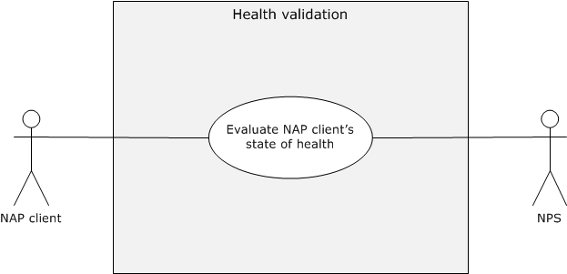

Figure 15: Client Computer Health Validation use case

**Context of Use:** Applies when the [**NAP client**](#gt_nap-client) is attempting to connect to a network.

**Goal:** Evaluate the NAP client's state of health.

**Actors**

- NAP client
The NAP client is the primary actor which triggers this use case. The NAP client is a Client computer that performs the network access use case by performing the role of the client in the authentication and authorization processes of the [**NAP data link protocols**](#gt_nap-data-link-protocol).

- [**NAP health policy server (NPS)**](#gt_nap-health-policy-server-nps)
The NPS uses the authentication information and [**SoH**](#gt_statement-of-health-soh) of the NAP client to determine whether or not the Client computer meets the requirements for network access.

**Stakeholders**

- **Client computer**
The **Client computer** is used to access and manipulate protected network resources. Client computers use the NAP protocols to communicate with the network to gain generic access to the network.

**Preconditions**

- The Client computer and the NPS can communicate with each other.
- The NAP-related policies are expressed in a policy database used by the NPS.
- The NPS can communicate with Authentication Services and [**Active Directory**](#gt_active-directory).
**Main Success Scenario**

- Trigger: The NAP client accumulates the SoH from a collection of [**SHAs**](#gt_system-health-agent-sha) including the Windows SHA [MS-WSH](../MS-WSH/MS-WSH.md) and sends the SoH to the NPS.
- The NPS validates the Client computer's health and sends the success [**SoHR**](#gt_statement-of-health-response-sohr) message.
**Extensions:** None.

**Alternate Scenario - Health Validation Failure**

- Trigger: The following scenario occurs when NAP health validation fails due to poor health of the NAP client as evaluated by the NPS.
- The NPS communicates an SoH response (SoHR) to the [**NAP enforcement point (NEP)**](#gt_nap-enforcement-point-nep) indicating which portions of the NAP client's health have failed verification.
- The NEP communicates the SoH response (SoHR) back to the NAP client.
- The NEP provides sufficient network connectivity to the NAP client to allow the NAP client to perform remediation using limited network resources.
- The NAP client uses the information in the SoH response (SoHR) to perform appropriate remediation.
- The NAP client re-attempts NAP with the NEP to gain full permission to the network.
**Post-Condition:** The NEP has state that grants the Client computer network access.

### 2.5.2 Request Network Access

Figure 16: Client computer gaining network access use case

**Context of Use:** This use case occurs when the Client computer requires specific network access from a [**NAP enforcement point (NEP)**](#gt_nap-enforcement-point-nep).

**Goal:** To gain network access for a Client computer.

**Actors**

- **Client computer**
A Client computer is used to access and manipulate protected network resources. Client computers use the NAP protocols to communicate with the network to gain generic access to the network.

- NEP
A NEP controls a Client computer's network access. A NEP uses the NAP services from a Network policy server to determine whether or not the client is sufficiently healthy to have network access.

**Stakeholders:** None.

**Preconditions**

- The identities of the user and the Client computer are configured in the account databases, such as [**Active Directory**](#gt_active-directory).
- The Client computer and the NEP can communicate with each other.
- The NAP-related policies are expressed in a policy database used by the NPS.
- The NEP is configured to use NAP and supports the NAP extensions to data link protocols.
- The NEP and the NPS can communicate with each other by using [**RADIUS**](#gt_remote-authentication-dial-in-user-service-radius).
- The NPS can communicate with Authentication Services and Active Directory.
- The NEP maintains a state that grants the Client computer network access.
**Success Guarantee:** The NEP provides network access to the Client computer.

**Main Success Scenario**

- Trigger: The Client computer attempts to access a resource on a network protected by a NEP.
- The NEP permits the Client computer's network access.
- The Client computer can access network resources over the network interface
**Post-Condition:** The NEP allows network access to the Client computer.

**Extensions:** None.

### 2.5.3 Remediation

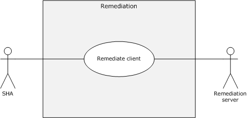

Figure 17: Remediation use case

**Context of Use:** This use case is employed when the client is noncompliant with the network policy and it is directed by [**system health validators (SHV)**](#gt_system-health-validator-shv) on the [**NPS**](#gt_nap-health-policy-server-nps) to remediate its' configuration.

**Goal:** To remediate the client based on the health evaluation response. The exact method of remediation depends on the specifics of the [**SHA**](#gt_system-health-agent-sha)/[**SHV**](#gt_system-health-validator-shv). However, this document uses the [**WSHA**](#gt_windows-security-health-agent-wsha)/[**WSHV**](#gt_windows-security-health-validator-wshv) as described in [MS-WSH](../MS-WSH/MS-WSH.md), as an example.

**Actors**

- SHA
The SHA is the primary actor which triggers this use case. SHA is a component that maintains and reports one or multiple elements of system health. For example, there might be an SHA for anti-virus signatures and an SHA for operating system updates. An SHA can use a locally-installed system health component to assist in system health management functions in conjunction with a [**remediation server**](#gt_remediation-server).

- Remediation server
Noncompliant computers can access the Remediation servers on the [**restricted network**](#gt_restricted-network) to obtain the necessary updates, anti-virus signatures, and other software or configuration instructions necessary to become compliant.

**Stakeholders**

- **Client computer**
The Client computer is used to access and manipulate protected network resources. Client computers use the NAP protocols to communicate with the network to gain generic access to the network.

**Preconditions**

- The NAP client components on the Client computer are deployed and configured correctly by the client administrator.
- The Client computer is not healthy; it is noncompliant with the enterprise network policy.
**Main Success Scenario**

- Trigger: The SHA receives the failed health evaluation results.
- The SHA determines the steps required to remediate from the [**SoHR**](#gt_statement-of-health-response-sohr).
- The SHA performs remediation using the Remediation server.
**Post-Condition:** Remediation is attempted and the health state of the client is re-evaluated.

**Extensions:** None.

## 2.6 Versioning, Capability Negotiation, and Extensibility

There is no capability negotiation that is associated with this system. Any deviations from a specific version's implementation of these protocol specifications are documented in the respective protocol document. Capability negotiations between client and server implementations of these protocols are specified in the System Versioning and Capability Negotiation sections in their respective technical documents (TDs). For more details, see sections 1.7 of the member protocol technical documents listed in section 2.2 of this document.

## 2.7 Error Handling

The NAP protocols do not handle errors at the system level for cross-protocol error states. The individual protocol documents describe the errors that the protocols return and what they mean for the system. How to handle the errors, based on the protocol descriptions, is determined by the implementer.

## 2.8 Coherency Requirements

None.

## 2.9 Security

The NEP and the [**NAP health policy server (NPS)**](#gt_nap-health-policy-server-nps) have a trust relationship that might have to be configured and protected.

The NAP/client system does not provide any security mechanism against tampering, spoofing, and replay attacks of the SoH message [[TNC-IF-TNCCSPBSoH]](https://go.microsoft.com/fwlink/?LinkId=240054) or its contents sent to the NAP policy server (NPS). Considerations for network deployment should include how to avoid network tampering attacks. The NPS blindly trusts the SoH messages received on the NEP channel and has no means to verify the integrity of the SoH message. Network deployment should consider integrity mechanisms.

Implementers and network operations personnel deploying NAP be aware that no special effort is made by NAP to protect SOH [TNC-IF-TNCCSPBSoH] in the general cases. As such, NAP depends on secure network infrastructure for NEP and NPS, as do all deployments of the IETF AAA architecture.

In the case of HCEP, the NAP client requires that the X.509 certificate use SSL as specified in [MS-TLSP](../MS-TLSP/MS-TLSP.md).

## 2.10 Additional Considerations

None.

# 3 Examples

## 3.1 Example 1: Validate Health of NAP Client for IPsec Communication

This example demonstrates the use cases described in sections [2.5.1](#Section_2.5.1) and [2.5.3](#Section_2.5.3).

The sequence described in this example details how IPsec enforcement is applied to a NAP client that has only a single SHA.

**Prerequisites**

- The underlying network infrastructures, such as the [**NAP data link protocol**](#gt_nap-data-link-protocol), name and address resolution, and routing services, are configured correctly.
- The NAP client is enabled and correctly configured.
- Preconditions have been satisfied, as defined in [[TNC-IF-TNCCSPBSoH]](https://go.microsoft.com/fwlink/?LinkId=240054) and [MS-RNAP](../MS-RNAP/MS-RNAP.md) section 1.5.
**Initial System State**

There is no health certificate issued for the NAP client.

**Final System State**

A health certificate is obtained by the NAP client that can be used for NAP with Internet Key Exchange (IKE) [[RFC2409]](https://go.microsoft.com/fwlink/?LinkId=90349) [MS-IKEE](../MS-IKEE/MS-IKEE.md) to establish mutual authentication and to enable authorization of communication between the client and network server. The sequence diagram below illustrates the client health validation for the NAP client.

This example is divided into two tasks:

- Obtain a health certificate and gain authorization using the health certificate via IKE, and use IPsec transports for the client and server.
- Upon failure to obtain a health certificate, perform remediation and retry obtaining the health certificate.
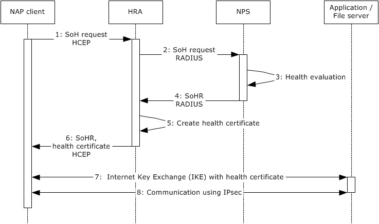

Figure 18: Sequence diagram detail for Task 1

**Sequence of Events**

- When the NAP client starts, it sends its current SoH [TNC-IF-TNCCSPBSoH] as a payload to the HCEP Request message ([MS-HCEP](../MS-HCEP/MS-HCEP.md) section 2.2.1), indicating its current health state to the HRA.
- The HRA passes the SoH information to the NPS using RADIUS to enable evaluation of the SoH. The HRA uses RADIUS [[RFC2865]](https://go.microsoft.com/fwlink/?LinkId=90392)) with the Vendor-Specific RADIUS Attributes for Network Access Protection (NAP) Data Structure (RNAP) [MS-RNAP].
- The NPS server evaluates the SoH of the NAP client and determines that the NAP client is compliant with the enterprise network policy.
- The NPS server sends the SoH response (SoHR) [TNC-IF-TNCCSPBSoH] to the HRA indicating that the NAP client is compliant. The HRA uses RADIUS [RFC2865]) with RNAP [MS-RNAP].
- HRA obtains an X.509-based health certificate for the NAP client. The HRA requests a certificate authority (CA) to issue a certificate. The Microsoft implementation of the HRA uses the Windows Client Certificate Enrollment Protocol [MS-WCCE](../MS-WCCE/MS-WCCE.md) to request and receive the certificate. This health certificate is used in conjunction with IPsec settings to authenticate the NAP client when it initiates IPsec-protected communication with other compliant NAP clients on an intranet.
- The HRA sends an HCEP response, the payload of which contains an SoH response (SoHR) [TNC-IF-TNCCSPBSoH], and if the client is compliant with health policies, it also includes a PKCS #7 message [[RFC2315]](https://go.microsoft.com/fwlink/?LinkId=90334) with possibly an X.509 certificate [[RFC3280]](https://go.microsoft.com/fwlink/?LinkId=90414).
- The NAP client initiates an IPsec communication with a server (Application/File Server) which has obtained a health certificate. Both computers authenticate each other using Internet Key Exchange (IKE), as specified in [MS-IKEE] and their respective health certificates. Both IPsec peers validate each other's certificate and do a secret key exchange which is subsequently used to sign and/or encrypt the IPsec communication.
- The NAP client and Application/File server start communicating and the data traffic is protected by using IPsec.
This task explains the message exchange between the NAP client, the HRA, the NPS, and the remediation server when a non-compliant NAP client requests a health certificate.

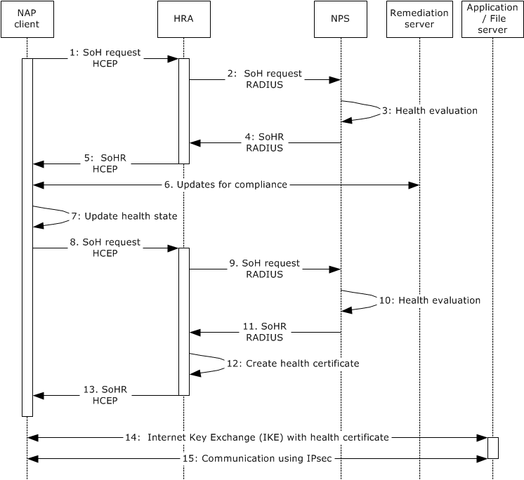

Figure 19: Sequence diagram details for Task 2

**Sequence of Events**

- When the NAP client starts, it sends its current SoH [TNC-IF-TNCCSPBSoH] as a payload to the HCEP Request message ([MS-HCEP] section 2.2.1) indicating its current health state to the HRA.
- The HRA passes the SoH information to the NPS server so that the SoH can be evaluated. The HRA uses RADIUS [RFC2865] with RNAP [MS-RNAP].
- The NPS server evaluates the SoH of the NAP client and determines that the NAP client is non-compliant with the enterprise network policy.
- The NPS server sends the SoH response (SoHR) [TNC-IF-TNCCSPBSoH] to the HRA indicating that the NAP client is non-compliant. The SoH response (SoHR) includes health remediation instructions. The HRA uses RADIUS [RFC2865] with RNAP [MS-RNAP].
- The HRA sends an HCEP response to the NAP client, the payload of which contains an SoH response (SoHR) [TNC-IF-TNCCSPBSoH].
- The NAP client communicates with the remediation server to obtain the required updates. For example, the SHA might call the Microsoft Windows Server Update Service and obtain the latest operating system or it might call the Windows Security Service and enable the firewall.
- The NAP client updates its health status by invoking the SHAs and constructing a new SoH.
- The NAP client sends a new SoH request to the HRA, as described in step 1.
- The HRA passes the SoH request to the NPS, as described in step 2.
- The NPS server evaluates the SoH of the NAP client and verifies that the NAP client is compliant.
- The NPS server sends the SoH response (SoHR) [TNC-IF-TNCCSPBSoH] to the HRA indicating that the NAP client is compliant. The HRA uses RADIUS [RFC2865]) with RNAP [MS-RNAP].
- The HRA creates an X.509-based health certificate for the NAP client. The HRA requests a CA to issue a certificate. The Microsoft implementation of the HRA uses the Windows Client Certificate Enrollment Protocol [MS-WCCE] to request and receive the certificate. This health certificate is used in conjunction with IPsec settings to authenticate the NAP client when it initiates IPsec-protected communication with other compliant NAP clients on an intranet.
- The HRA sends an HCEP response to the NAP client, the payload of which contains an SoH response (SoHR) [TNC-IF-TNCCSPBSoH], and if the client is compliant with health policies, it also includes a PKCS #7 message [RFC2315] with possibly an X.509 certificate [RFC3280].
- The client computer initiates an IPsec communication with a server (Application/File Server) which has obtained a health certificate. Both computers authenticate each other using Internet Key Exchange (IKE), as specified in [MS-IKEE] and their health certificates. Both IPsec peers validate each other's certificate and do a secret key exchange which is subsequently used to encrypt the IPsec communication.
- The NAP client and Application/File server start communicating and the data traffic is protected using IPsec.

## 3.2 Example 2: Validate Health of NAP Client for DHCP Communication

This example demonstrates the use case described in sections [2.5.1](#Section_2.5.1) and [2.5.3](#Section_2.5.3).

The sequence described in this example details how DHCP enforcement works for a NAP client that has only a single SHA.

**Prerequisites**

- The underlying network infrastructures, such as the data link protocols (i.e., Ethernet or WiFi), name and address resolution, and routing services, are configured correctly.
- The NAP client is enabled and correctly configured by the client administrator.
- The DHCP server is NAP enabled.
- Preconditions have been satisfied, as defined in [MS-RNAP](../MS-RNAP/MS-RNAP.md) section 1.5.
**Initial System State**

The Client computer either does not have an IPv4 address or has to renew its IPv4 address.

**Final System State**

The client obtains the [**IPv4**](#gt_internet-protocol-version-4-ipv4) address.

This example is divided into two tasks:

- Request and obtain an IPv4 address for network access.
- Request and obtain an IPv4 address after remediation.
This task explains the steps involved in obtaining an IPv4 address for a compliant client.

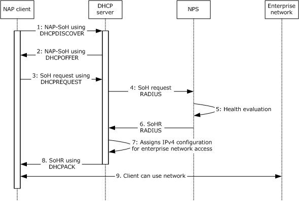

Figure 20: Sequence diagram detail for Task 1

**Sequence of Events**

- When the NAP client starts, it sends a NAP-SoH (NAP Statement of Health) message ([MS-DHCPN](../MS-DHCPN/MS-DHCPN.md) section 2.2.1.1) within the vendor-specific option ([[RFC2132]](https://go.microsoft.com/fwlink/?LinkId=90319) section 8.4) in a DHCPDISCOVER message to determine whether the DHCP server is NAP-enabled.
- A NAP-enabled DHCP server receives the DHCPDISCOVER message that includes the NAP-SoH. The DHCP server then indicates that it supports NAP by responding with a DHCPOFFER message that includes a NAP-SoH containing the text "NAP" inside the vendor-specific option ([RFC2132] section 8.4).
- The NAP client sends a DHCPREQUEST message to the selected DHCP server. The message contains the SoH [[TNC-IF-TNCCSPBSoH]](https://go.microsoft.com/fwlink/?LinkId=240054) within the NAP-SoH option that is encapsulated inside the DHCP vendor-specific option.
- The DHCP server passes the SoH information to the NPS server to determine whether the SoH is valid. The DHCP server acts as a RADIUS [[RFC2865]](https://go.microsoft.com/fwlink/?LinkId=90392)) client with NAP extensions [MS-RNAP] to communicate with the NPS.
- The NPS server evaluates the SoH of the NAP client and determines that the NAP client is compliant.
- The NPS server sends the SoH response (SoHR) [TNC-IF-TNCCSPBSoH] to the DHCP server indicating that the NAP client is compliant. The NPS uses RADIUS [RFC2865]) with RNAP [MS-RNAP].
- The DHCP server assigns the client computer a complete IPv4 address configuration. The client computer is given an IPv4 address that has access to the enterprise network, as defined by the group policy.
- The DHCP server responds with the network configuration options and includes an appropriate SoH response (SoHR) (obtained from the health policy server) in the DHCP acknowledgment message (DHCPACK).
- The NAP client can access to the enterprise network.
This task explains the message exchange between the NAP client, the DHCP server, the NPS, and the remediation server when a noncompliant NAP client requests an IPv4 address.

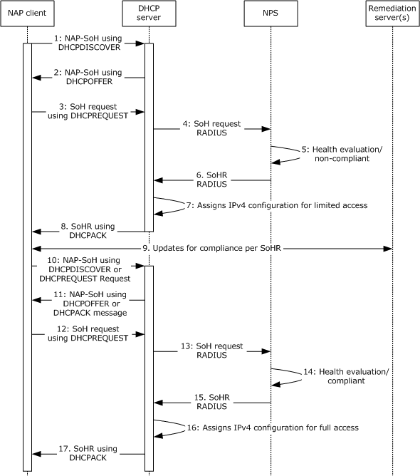

Figure 21: Sequence diagram detail for Task 2

**Sequence of Events**

- When the NAP client starts, it sends an NAP-SoH ([MS-DHCPN] section 2.2.1.1) within the vendor-specific option ([RFC2132] section 8.4) in a DHCPDISCOVER message to determine whether the DHCP server is NAP-enabled.
- A NAP-enabled DHCP server receives the DHCPDISCOVER message that includes the NAP-SoH. The DHCP server then indicates that it supports NAP by responding with a DHCPOFFER message that includes a NAP-SoH containing the text "NAP" inside the vendor-specific option ([RFC2132] section 8.4).
- The NAP client sends a DHCPREQUEST message to the selected DHCP server. The message contains the SoH [TNC-IF-TNCCSPBSoH] within the NAP-SoH option that is encapsulated inside the vendor-specific option.
- The DHCP server passes the SoH information to the NPS server to determine whether the SoH is valid. The DHCP server uses a RADIUS request [RFC2865] with RNAP [MS-RNAP].
- The NPS server evaluates the SoH of the NAP client and determines that the NAP client is non-compliant with the enterprise network policy.
- The NPS server sends the SoH response (SoHR) [TNC-IF-TNCCSPBSoH] to the DHCP server indicating that the NAP client is non-compliant. The NPS uses a corresponding RADIUS response [RFC2865] with RNAP [MS-RNAP]. The NPS server sends a set of IPv4 packet filters corresponding to the IPv4 address of the remediation server group to restrict the traffic of the DHCP client.
- The DHCP server assigns the NAP client an IP address configuration. The NAP client's access can be restricted to the IPv4 addresses of the remediation servers.
- The DHCP server responds with the network configuration options and includes an appropriate SoH response (SoHR) (obtained from the health policy server) in the DHCP acknowledgment message (DHCPACK).
- The NAP client communicates with the remediation server to obtain the required updates and configuration instructions.
- The NAP client updates its health status by calling the SHAs and constructing a new SoH. The NAP client sends a new NAP-SoH to discover NAP-enabled DHCP servers, as described in step 1. The NAP client can also use DHCPREQUEST to check if the server is NAP-enabled.
- A NAP-enabled DHCP server receives the DHCPDISCOVER message and responds, as described in step 2. If the NAP client has sent DHCPREQUEST in step 10, then a NAP-enabled server indicates that it supports NAP by responding with a DHCPACK message that includes a NAP-SoH containing the text "NAP ([MS-DHCPN] section 3.2.5.2.4).
- The NAP client sends a new DHCPREQUEST message with an updated SoH to the selected DHCP server, as described in step 3.
- The DHCP server passes the updated SoH information to the NPS, as described in step 4.
- The NPS server evaluates the updated SoH of the NAP client and determines that the NAP client is compliant.
- The NPS server sends the SoH response (SoHR) [TNC-IF-TNCCSPBSoH] to the DHCP server indicating that the NAP client is compliant. The NPS uses RADIUS [RFC2865] with RNAP [MS-RNAP].
- If the client's health state is compliant with the enterprise network policy, the DHCP server assigns an IPv4 address configuration for enterprise network access to the NAP client. The NAP client is given an IPv4 address that has access to the network, as defined by the group policy.
- The DHCP server responds with the network configuration options and includes an appropriate SoH response (SoHR) (obtained from the health policy server) in the DHCP acknowledgment message (DHCPACK).

# 4 Microsoft Implementations

There are no variations in the behavior of the NAP System in different versions of Windows beyond those described in the specifications of the protocols supported by the system, as listed in section [2.2](#Section_2.2).

The information in this specification is applicable to the following Microsoft products:

- Windows XP operating system
- Windows Server 2003 operating system
- Windows Vista operating system
- Windows Server 2008 operating system
- Windows 7 operating system
- Windows Server 2008 R2 operating system
- Windows 8 operating system
- Windows Server 2012 operating system
- Windows 8.1 operating system
- Windows Server 2012 R2 operating system
Exceptions, if any, are noted below. If a service pack number appears with the product version, behavior changed in that service pack. The new behavior also applies to subsequent service packs of the product unless otherwise specified.

## 4.1 Product Behavior

None.

# 5 Change Tracking

No table of changes is available. The document is either new or has had no changes since its last release.

## Revision History

| Date | Version | Revision Class | Comments |
| --- | --- | --- | --- |
| 3/30/2012 | 1.0 | New | Released new document. |
| 7/12/2012 | 1.0 | None | No changes to the meaning, language, or formatting of the technical content. |
| 10/25/2012 | 1.0 | None | No changes to the meaning, language, or formatting of the technical content. |
| 1/31/2013 | 1.0 | None | No changes to the meaning, language, or formatting of the technical content. |
| 8/8/2013 | 2.0 | Major | Updated and revised the technical content. |
| 11/14/2013 | 2.0 | None | No changes to the meaning, language, or formatting of the technical content. |
| 2/13/2014 | 2.0 | None | No changes to the meaning, language, or formatting of the technical content. |
| 5/15/2014 | 2.0 | None | No changes to the meaning, language, or formatting of the technical content. |
| 6/30/2015 | 2.0 | None | No changes to the meaning, language, or formatting of the technical content. |
| 10/16/2015 | 2.0 | None | No changes to the meaning, language, or formatting of the technical content. |
| 9/26/2016 | 2.0 | None | No changes to the meaning, language, or formatting of the technical content. |
| 6/1/2017 | 2.0 | None | No changes to the meaning, language, or formatting of the technical content. |
