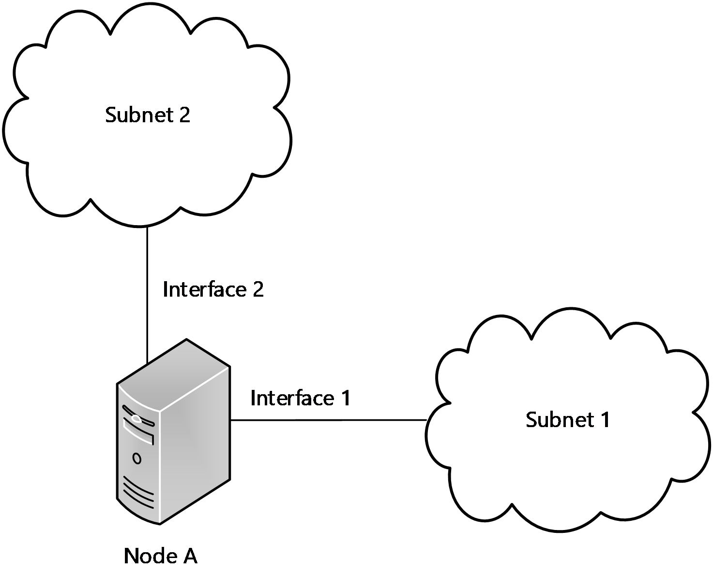

# [MS-NBTE]: NetBIOS over TCP (NBT) Extensions

Table of Contents

1 Introduction

- [1 Introduction](#Section_1)
  - [1.1 Glossary](#Section_1.1)
  - [1.2 References](#Section_1.2)
    - [1.2.1 Normative References](#Section_1.2.1)
    - [1.2.2 Informative References](#Section_1.2.2)
  - [1.3 Overview](#Section_1.3)
  - [1.4 Relationship to Other Protocols](#Section_1.4)
  - [1.5 Prerequisites/Preconditions](#Section_1.5)
  - [1.6 Applicability Statement](#Section_1.6)
  - [1.7 Versioning and Capability Negotiation](#Section_1.7)
  - [1.8 Vendor-Extensible Fields](#Section_1.8)
  - [1.9 Standards Assignments](#Section_1.9)

2 Messages

- [2 Messages](#Section_2)
  - [2.1 Transport](#Section_2.1)
  - [2.2 Message Syntax](#Section_2.2)
    - [2.2.1 NetBIOS Name Syntax](#Section_2.2.1)
    - [2.2.2 MULTIHOMED NAME REGISTRATION REQUEST](#Section_2.2.2)
    - [2.2.3 LMHOSTS File Syntax](#Section_2.2.3)
      - [2.2.3.1 Predefined Keywords in LMHOSTS File](#Section_2.2.3.1)
      - [2.2.3.2 Creating Lmhosts Entries for Specific NetBIOS Names](#Section_2.2.3.2)

3 Protocol Details

- [3 Protocol Details](#Section_3)
  - [3.1 NetBIOS End Node Details](#Section_3.1)
    - [3.1.1 Abstract Data Model](#Section_3.1.1)
    - [3.1.2 Timers](#Section_3.1.2)
    - [3.1.3 Initialization](#Section_3.1.3)
    - [3.1.4 Higher-Layer Triggered Events](#Section_3.1.4)
      - [3.1.4.1 Registering a NetBIOS Name](#Section_3.1.4.1)
      - [3.1.4.2 Resolving a NetBIOS Name](#Section_3.1.4.2)
        - [3.1.4.2.1 NBNS Selection](#Section_3.1.4.2.1)
    - [3.1.5 Message Processing Events and Sequencing Rules](#Section_3.1.5)
      - [3.1.5.1 Handling a NAME REGISTRATION REQUEST](#Section_3.1.5.1)
    - [3.1.6 Timer Events](#Section_3.1.6)
    - [3.1.7 Other Local Events](#Section_3.1.7)
    - [3.1.8 Using the LMHOSTS File to Resolve a Name Query](#Section_3.1.8)
      - [3.1.8.1 Using a #INCLUDE LMHOSTS File](#Section_3.1.8.1)
      - [3.1.8.2 Alternate Block Processing](#Section_3.1.8.2)
  - [3.2 NBNS Details](#Section_3.2)
    - [3.2.1 Abstract Data Model](#Section_3.2.1)
    - [3.2.2 Timers](#Section_3.2.2)
    - [3.2.3 Initialization](#Section_3.2.3)
    - [3.2.4 Higher-Layer Triggered Events](#Section_3.2.4)
    - [3.2.5 Message Processing Events and Sequencing Rules](#Section_3.2.5)
      - [3.2.5.1 Handling a NAME REGISTRATION REQUEST (GROUP)](#Section_3.2.5.1)
      - [3.2.5.2 Handling a MULTIHOMED NAME REGISTRATION REQUEST (GROUP)](#Section_3.2.5.2)
      - [3.2.5.3 Handling a MULTIHOMED NAME REGISTRATION REQUEST (UNIQUE)](#Section_3.2.5.3)
    - [3.2.6 Timer Events](#Section_3.2.6)
    - [3.2.7 Other Local Events](#Section_3.2.7)

4 Protocol Examples

- [4 Protocol Examples](#Section_4)
  - [4.1 NetBIOS Registration Example](#Section_4.1)
  - [4.2 LMHOSTS File Example](#Section_4.2)

5 Security Considerations

- [5 Security Considerations](#Section_5)
  - [5.1 Security Considerations for Implementers](#Section_5.1)
  - [5.2 Index of Security Parameters](#Section_5.2)

6 Appendix A: Product Behavior

- [6 Appendix A: Product Behavior](#Section_6)

7 Change Tracking

- [7 Change Tracking](#Section_7)

For the legal notice and IP terms, see [LEGAL.md](../LEGAL.md).
Last updated: 4/23/2024.
See [Revision History](#revision-history) for full version history.

# 1 Introduction

The NetBIOS over TCP (NBT) Extensions (NetBT) specify the extensions to the NetBIOS over TCP (NBT) protocol, as specified in [RFC1001] and [RFC1002]. These extensions modify the syntax of allowable NetBIOS names, the behavior of timers, and add support for multihomed hosts.

Sections 1.5, 1.8, 1.9, 2, and 3 of this specification are normative. All other sections and examples in this specification are informative.

## 1.1 Glossary

This document uses the following terms:

**code page**: An ordered set of characters of a specific script in which a numerical index (code-point value) is associated with each character. Code pages are a means of providing support for character sets and keyboard layouts used in different countries. Devices such as the display and keyboard can be configured to use a specific code page and to switch from one code page (such as the United States) to another (such as Portugal) at the user's request.

**Domain Name System (DNS)**: A hierarchical, distributed database that contains mappings of domain names to various types of data, such as IP addresses. DNS enables the location of computers and services by user-friendly names, and it also enables the discovery of other information stored in the database.

**group name**: A 16-byte, formatted NetBIOS computer name, which can have multiple IP addresses assigned to it; that is, multiple NetBIOS nodes (processor locations) can use this name to register for services, as specified in [[RFC1001]](https://go.microsoft.com/fwlink/?LinkId=90260) and [[RFC1002]](https://go.microsoft.com/fwlink/?LinkId=90261).

**Internet host name**: The name of a host as defined in [[RFC1123]](https://go.microsoft.com/fwlink/?LinkId=90268) section 2.1, with the extensions described in [MS-HNDS](../MS-HNDS/MS-HNDS.md).

**LMHOST**: A text file that contains entries that individually map a computer name or a NetBIOS service name to an IPv4 address. The LMHOST file is consulted when normal NetBIOS name resolution protocols fail on the wire. This legacy file is no longer installed by default on Windows systems. LM stands for "LAN Manager".

**multihomed**: Having two or more network interfaces on which NetBIOS over TCP is enabled.

**NBT**: See [**NetBIOS over TCP/IP (NBT)**](#gt_netbios-over-tcpip-nbt).

**NetBIOS**: A particular network transport that is part of the LAN Manager protocol suite. [**NetBIOS**](#gt_netbios) uses a broadcast communication style that was applicable to early segmented local area networks. A protocol family including name resolution, datagram, and connection services. For more information, see [RFC1001] and [RFC1002].

**NetBIOS name**: A 16-byte address that is used to identify a [**NetBIOS**](#gt_netbios) resource on the network. For more information, see [RFC1001] and [RFC1002].

**NetBIOS Name Server (NBNS)**: A server that stores NetBIOS name-to-IPv4 address mappings and that resolves NetBIOS names for NBT-enabled hosts. A server running the Windows Internet Name Service (WINS) is the Microsoft implementation of an NBNS.

**NetBIOS over TCP/IP (NBT)**: A feature that allows [**NetBIOS**](#gt_netbios) to be used over the TCP/IP protocol, as defined in [RFC1001] and [RFC1002].

**network dynamic data Exchange (NetDDE)**: A technology that allows applications using dynamic data exchange (DDE) to transparently share data over a network.

**unique name**: A 16-byte, formatted NetBIOS computer name that can have only one IP address assigned to it; that is, only a single NetBIOS node (or processing location) can use this name to register for services, as specified in [RFC1001] and [RFC1002].

**Universal Naming Convention (UNC)**: A string format that specifies the location of a resource. For more information, see [MS-DTYP](../MS-DTYP/MS-DTYP.md) section 2.2.57.

**Windows Internet Name Service (WINS)**: A name service for the NetBIOS protocol, particularly designed to ease transition to a TCP/IP based network. An implementation of an [**NBNS server**](#gt_netbios-name-server-nbns).

**MAY, SHOULD, MUST, SHOULD NOT, MUST NOT:** These terms (in all caps) are used as defined in [[RFC2119]](https://go.microsoft.com/fwlink/?LinkId=90317). All statements of optional behavior use either MAY, SHOULD, or SHOULD NOT.

## 1.2 References

Links to a document in the Microsoft Open Specifications library point to the correct section in the most recently published version of the referenced document. However, because individual documents in the library are not updated at the same time, the section numbers in the documents may not match. You can confirm the correct section numbering by checking the [Errata](https://go.microsoft.com/fwlink/?linkid=850906).

### 1.2.1 Normative References

We conduct frequent surveys of the normative references to assure their continued availability. If you have any issue with finding a normative reference, please contact [dochelp@microsoft.com](mailto:dochelp@microsoft.com). We will assist you in finding the relevant information.

[HYBRID] Noon, F., "HYBRID NETBIOS END-NODES", April 1993, [https://tools.ietf.org/html/draft-noon-hybrid-netbios-01](https://go.microsoft.com/fwlink/?LinkId=148113)

[MS-DTYP] Microsoft Corporation, "[Windows Data Types](../MS-DTYP/MS-DTYP.md)".

[RFC1001] Network Working Group, "Protocol Standard for a NetBIOS Service on a TCP/UDP Transport: Concepts and Methods", RFC 1001, March 1987, [https://www.rfc-editor.org/info/rfc1001](https://go.microsoft.com/fwlink/?LinkId=90260)

[RFC1002] Network Working Group, "Protocol Standard for a NetBIOS Service on a TCP/UDP Transport: Detailed Specifications", STD 19, RFC 1002, March 1987, [https://www.rfc-editor.org/info/rfc1002](https://go.microsoft.com/fwlink/?LinkId=90261)

[RFC2119] Bradner, S., "Key words for use in RFCs to Indicate Requirement Levels", BCP 14, RFC 2119, March 1997, [https://www.rfc-editor.org/info/rfc2119](https://go.microsoft.com/fwlink/?LinkId=90317)

[RFC2132] Alexander, S., and Droms, R., "DHCP Options and BOOTP Vendor Extensions", RFC 2132, March 1997, [https://www.rfc-editor.org/info/rfc2132](https://go.microsoft.com/fwlink/?LinkId=90319)

### 1.2.2 Informative References

[MS-RAIW] Microsoft Corporation, "[Remote Administrative Interface: WINS](../MS-RAIW/MS-RAIW.md)".

[MS-WINSRA] Microsoft Corporation, "[Windows Internet Naming Service (WINS) Replication and Autodiscovery Protocol](../MS-WINSRA/MS-WINSRA.md)".

[MSDOCS-WINS] Microsoft Corporation, "WINS", Windows Internet Name Service, March 2012, [https://learn.microsoft.com/en-us/previous-versions/windows/it-pro/windows-server-2003/cc739183(v=ws.10)](https://go.microsoft.com/fwlink/?linkid=2184108)

[RFC1035] Mockapetris, P., "Domain Names - Implementation and Specification", STD 13, RFC 1035, November 1987, [https://www.rfc-editor.org/info/rfc1035](https://go.microsoft.com/fwlink/?LinkId=90264)

[RFC4795] Aboba, B., Thaler, D., and Esibov, L., "Link-Local Multicast Name Resolution (LLMNR)", RFC 4795, January 2007, [https://www.rfc-editor.org/info/rfc4795](https://go.microsoft.com/fwlink/?LinkId=90489)

## 1.3 Overview

[**NetBIOS**](#gt_netbios) resources are referenced by [**NetBIOS name**](#gt_netbios-name)s. An application, representing a resource, registers one or more NetBIOS names that it uses to communicate with other hosts on the network. This document does the following:

- It discusses NetBIOS name registration and name querying on hosts with more than one interface.
- When a [**NetBIOS Name Server (NBNS)**](#gt_netbios-name-server-nbns) receives a registration for a [**group name**](#gt_group-name), [[RFC1002]](https://go.microsoft.com/fwlink/?LinkId=90261) section 5.1.4.1 requires that the NBNS replace any existing entry with the new entry, so that only one IP address can be registered for a group name. However, a group name is one that can be owned by any number of nodes. This document modifies the behavior of group name registrations to allow the NBNS to keep multiple addresses as originally intended.
- Defines the format of the [**LMHOSTS**](#gt_lmhost) file and when it is accessed. The LMHOSTS file is read on two separate occasions. At the initialization of the NetBIOS system, LMHOSTS is read to initialize the local name cache with the entries that are labeled #PRE. During NetBIOS name resolution, if the name cannot be resolved from the local name cache or by using the normal NetBIOS protocol name resolutions, then the NetBIOS name resolution process system can be configured to scan the LMHOSTS file on a per-query basis, looking for entries that resolve the query.

## 1.4 Relationship to Other Protocols

A [**NetBIOS name**](#gt_netbios-name) might or might not be derived from an [**Internet host name**](#gt_internet-host-name). The syntax for an Internet host name is much more constrained than the syntax for an arbitrary NetBIOS name. Therefore, it is possible to derive a NetBIOS name from a given Internet host name, but not necessarily vice versa.

The NetBIOS name service is used to resolve names within a local subnet and is also used to resolve names within a larger network using an [**NBNS**](#gt_netbios-name-server-nbns). However, it is only defined for IPv4. As such, its use for name resolution has largely been superseded by newer protocols, such as the Link-Local Multicast Name Resolution (LLMNR) Protocol [[RFC4795]](https://go.microsoft.com/fwlink/?LinkId=90489) and the Domain Name System (DNS) [[RFC1035]](https://go.microsoft.com/fwlink/?LinkId=90264).

## 1.5 Prerequisites/Preconditions

The prerequisites and preconditions are unchanged from [[RFC1001]](https://go.microsoft.com/fwlink/?LinkId=90260) and [[RFC1002]](https://go.microsoft.com/fwlink/?LinkId=90261).

## 1.6 Applicability Statement

This extension is applicable for discovering the IPv4 addresses of resources.

## 1.7 Versioning and Capability Negotiation

There is no versioning or localization support in this extension.

## 1.8 Vendor-Extensible Fields

It is important to understand that the choice of name used by a higher-layer protocol or application is up to that protocol or application and not [**NetBIOS over TCP/IP (NBT)**](#gt_netbios-over-tcpip-nbt). As such, this section provides a convention for use by higher-layer protocols and applications, but the extensions in this document do not enforce the use of this convention.

The recommended convention is for higher-layer protocols and applications to use the first 15 bytes of the Internet host name of the machine (padded with spaces if shorter than 15 bytes) followed by a 1-byte NetBIOS suffix chosen by the higher-layer protocol or application.<1><2><3>

The recommended convention allows for 256 NetBIOS suffix values and vendors can define a new value. However, there is no mechanism to acquire a unique value and hence collisions are possible if multiple vendors define the same NetBIOS suffix values. It is up to each higher-layer protocol or application to specify what NetBIOS suffix it uses, or how the NetBIOS name is constructed if it does not use this recommended convention.

## 1.9 Standards Assignments

None beyond what is in [[RFC1001]](https://go.microsoft.com/fwlink/?LinkId=90260), [[RFC1002]](https://go.microsoft.com/fwlink/?LinkId=90261), and [[RFC2132]](https://go.microsoft.com/fwlink/?LinkId=90319) section 8.7.

# 2 Messages

## 2.1 Transport

The transport is unchanged from [[RFC1002]](https://go.microsoft.com/fwlink/?LinkId=90261) except that name resolution is supported only over UDP and not TCP. The term "NetBIOS over TCP" refers to the standard protocol in the same way as [[RFC1001]](https://go.microsoft.com/fwlink/?LinkId=90260) and [RFC1002] do; that is, "TCP" refers to "TCP/IP".

## 2.2 Message Syntax

### 2.2.1 NetBIOS Name Syntax

[[RFC1001]](https://go.microsoft.com/fwlink/?LinkId=90260) and [[RFC1002]](https://go.microsoft.com/fwlink/?LinkId=90261) are confusing with respect to the definition of the name syntax. [RFC1001] section 5.2 states: "The name space is flat and uses sixteen alphanumeric characters. Names may not start with an asterisk (*)."

[RFC1002] section 4.1 states: "The following is the uncompressed representation of the NetBIOS name "FRED", which is the 4 ASCII characters, F, R, E, D, followed by 12 space characters (0x20)."

This creates ambiguity with regard to the term "alphanumeric characters" because the asterisk and space characters are neither letters nor numbers."

This document clarifies the ambiguity by specifying that the name space is defined as sixteen 8-bit binary bytes, with no restrictions, except that the name SHOULD NOT<4> start with an asterisk (*).

Neither [RFC1001] nor [RFC1002] discusses whether names are case-sensitive. This document clarifies this ambiguity by specifying that because the name space is defined as sixteen 8-bit binary bytes, a comparison MUST be done for equality against the entire 16 bytes. As a result, NetBIOS names are inherently case-sensitive.

It is important to understand that the choice of name used by a higher-layer protocol or application is up to that protocol or application and not NetBIOS.

### 2.2.2 MULTIHOMED NAME REGISTRATION REQUEST

[[RFC1002]](https://go.microsoft.com/fwlink/?LinkId=90261) section 4.2.2 defines the format of a NAME REGISTRATION REQUEST. This extension adds a MULTIHOMED NAME REGISTRATION REQUEST with an identical format except that the OPCODE field MUST be set to 0xF (15).

### 2.2.3 LMHOSTS File Syntax

The [**LMHOSTS**](#gt_lmhost) file is a static text file of [**NetBIOS name**](#gt_netbios-name) and IPv4 addresses along with additional directives for processing, including a #INCLUDE <filename> mechanism that includes the following:

- There can be one entry per line. An entry consists of an IPv4 address and a name, which can be either a computer name or a NetBIOS service name.
- Comment lines in the LMHOSTS file start with the pound sign (#).
- Comments can start after the start of a line, with the pound sign (#), and without the use of LMHOSTS keywords. (See the LMHOSTS keywords in the table that follows.)
- The pound sign (#) can also denote LMHOSTS keywords listed in the table that follows.
- ComputerName Entries consist of an IPv4 address and a NetBIOS computer name where the name is 1 to 15 characters in length. A computer name can be used to either: 1) resolve a name to an IP address, or 2) resolve a NetBIOS service name to an address. Example: "131.107.7.29 emailsrv1".
- ServiceName entries consist of an IPv4 address and a NetBIOS service name that specifies a 16-byte name where the last byte indicates the type of the service and bytes 1 to 15 specify ComputerName, padded at the end with blanks to the 15th byte:
- 131.107.7.30 "ComputerName \0x03" where the last byte is specified in hex.
- Entry Names are not case-sensitive.
- The LMHOSTS file has an implementation-specific file location.<5>

#### 2.2.3.1 Predefined Keywords in LMHOSTS File

The [**LMHOSTS**](#gt_lmhost) file can contain predefined keywords that are prefixed with the pound sign (#) character. The following LMHOSTS keywords table lists possible LMHOSTS keywords.

| LMHOSTS keyword | Description |
| --- | --- |
| #PRE | A tag that can follow the name in an entry. Tagged entries are loaded as permanent entries in the [**NetBIOS name**](#gt_netbios-name) cache during initialization of the NetBIOS name system. Preloaded entries are used to reduce network broadcasts. An entry tagged with #PRE, will be loaded in the **Local Name Table**. |
| #DOM:DomainName | A tag that can follow the name in an entry. It identifies Domain Controllers for the given domain name. |
| #INCLUDE Path\FileName | Reads entries in the file Path\FileName. FileName can be a local filesystem path or a [**Universal Naming Convention (UNC)**](#gt_universal-naming-convention-unc) path as specified in [MS-DTYP](../MS-DTYP/MS-DTYP.md) section 2.2.57. There must be entries for the computer names of remote servers hosting the shares in the local LMHOSTS file; otherwise, the shares will not be accessible. |
| #BEGIN_ALTERNATE and #END_ALTERNATE | A tag defines a list of alternative locations for the LMHOSTS files. This is used as a reliability mechanism. Only one of the files in a #BEGIN/#END block will be used. An attempt is made to read a file, one file at a time. |
| #MH | A tag that can follow the name of an entry. If present, that name can have multiple IP addresses reflected in multiple entries with the same IP address. This allows the reading of an LMHOSTS file to continue after a successful match of an entry. |

#### 2.2.3.2 Creating Lmhosts Entries for Specific NetBIOS Names

A ComputerName in the [**LMHOSTS**](#gt_lmhost) file can be up to 15 bytes in length. Names shorter than 15 bytes are padded with spaces.

However, it might be necessary to resolve a specific 16-byte [**NetBIOS name**](#gt_netbios-name) to a NetBIOS application running on a remote computer. Any arbitrary 16-byte NetBIOS name can be configured in the LMHOSTS file by using the following syntax.

IPv4Address "<Name><SpacePadding>\0xNN"

In which:

- IPv4Address is the IPv4 address to which this NetBIOS name is resolved.
- <Name> is the first part of the NetBIOS name (up to 15 bytes).
- <SpacePadding> is needed to ensure that the full NetBIOS name is 16 bytes. If the Name portion has fewer than 15 bytes, it MUST be padded with spaces up to 15 bytes.
- \0xNN indicates the two-digit hexadecimal representation of the 16th byte of the NetBIOS name. The syntax \0xNN can represent any byte in the NetBIOS name but is most often used for the 16th character.

# 3 Protocol Details

## 3.1 NetBIOS End Node Details

### 3.1.1 Abstract Data Model

This section describes a conceptual model of possible data organization that an implementation maintains to participate in this protocol. The described organization is provided to facilitate the explanation of how the protocol behaves. This document does not mandate that implementations adhere to this model as long as their external behavior is consistent with that described in this document.

The data model is as specified in [[RFC1002]](https://go.microsoft.com/fwlink/?LinkId=90261) and [[HYBRID]](https://go.microsoft.com/fwlink/?LinkId=148113), with the following clarifications:

- **Interface List:** A list of interfaces on which NetBIOS over TCP is enabled, in order from most preferred to least preferred. This list SHOULD be administratively configurable. Each entry contains the following:
- **NBNS Address List:** A configured list of [**NBNS**](#gt_netbios-name-server-nbns) addresses, in order from most preferred to least preferred.
- **Node Type:** The NetBIOS node type as specified in [RFC1002] and [HYBRID]. This document clarifies that this state is global, not per-interface.
- **Query Table:** For each outstanding resolution in progress, in addition to the information specified in [RFC1002] and [HYBRID], the following field is kept:
- **Interface List:** A list of interfaces awaiting a response.
- **Local Name Table:** The local name table as specified in [RFC1002] and [HYBRID], with the following clarifications:
- **Interface List:** A list of interfaces on which registration was attempted. Each entry also contains:
- **Conflict Detected Flag:** A flag that, if TRUE, indicates that a conflict was seen. This document clarifies that this flag is kept per-interface (not globally) for each local name.
- **Refresh Timeout:** [RFC1002] section 5.1.2.1 specifies the use of a **Refresh Timeout**. This document clarifies that this state is global, not per-interface.
- **ReadLMHostsFile:** A Boolean value that SHOULD default to FALSE.<6> If TRUE, the [**LMHOSTS**](#gt_lmhost) file will be read if the LMHOSTS file exists.
- **LMHostsFileLocation:** The location of the LMHOSTS file.

### 3.1.2 Timers

There is an **lmhost_include** timer used to determine whether an [**LMHOSTS**](#gt_lmhost) file can be read (see section [3.1.6](#Section_3.1.6)).

There are timers specified in [[RFC1002]](https://go.microsoft.com/fwlink/?LinkId=90261) and [[HYBRID]](https://go.microsoft.com/fwlink/?LinkId=148113), except as follows.

[RFC1002] section 6 states that the expected value for UCAST_REQ_RETRY_TIMEOUT is 5 seconds, but an adaptive timer can optionally be used. In these extensions, UCAST_REQ_RETRY_TIMEOUT SHOULD be set to 1.5 seconds.

[RFC1002] specifies the use of a periodic REFRESH_TIMER for each entry in the **Local Name Table**, with a period of **Refresh Timeout**. This extension clarifies that the REFRESH_TIMER for each name is kept globally, not per-interface.

### 3.1.3 Initialization

The rules for initialization are specified in [[RFC1002]](https://go.microsoft.com/fwlink/?LinkId=90261) and [[HYBRID]](https://go.microsoft.com/fwlink/?LinkId=148113). However, they are ambiguous as to how an end node chooses a node type. This document clarifies the rules as follows.

The NetBIOS Node Type (see [[RFC1001]](https://go.microsoft.com/fwlink/?LinkId=90260) section 10 and [HYBRID]) SHOULD be administratively configurable and be set to H by default if there is an [**NBNS**](#gt_netbios-name-server-nbns) specified (either administratively or via DHCP); otherwise, it MUST be set to B by default.

If DHCP is in use and a NetBIOS over TCP/IP Node Type Option (see [[RFC2132]](https://go.microsoft.com/fwlink/?LinkId=90319) section 8.7) is provided by the DHCP server, an end node MUST set its Node Type to the value indicated in the option. If this DHCP option is obtained over multiple interfaces, then the end node MUST choose one of them in any implementation-specific<7> way.

**ReadLMHostsFile** SHOULD be set from an implementation-specific store for its value.<8>

If **ReadLMHostsFile** is TRUE and if the [**LMHOSTS**](#gt_lmhost) file exists, the LMHOSTS file MUST be read at NetBIOS initialization, and any entries marked with #PRE, MUST be loaded into the **Local Name Table** (see section [3.1.8](#Section_3.1.8)). Before attempting to open an LMHOSTS file from the location specified by **LMHostsFileLocation**, the **lmhost_include** timer MUST be initialized to 6 seconds.

The NBT system MAY read the centralized LMHOSTS file before a user logs on to the computer as part of NBT initialization.<9><10>

### 3.1.4 Higher-Layer Triggered Events

Except as specified in the following sections, the rules for handling higher-layer triggered events are as specified in [[RFC1002]](https://go.microsoft.com/fwlink/?LinkId=90261) section 5.1, and [[HYBRID]](https://go.microsoft.com/fwlink/?LinkId=148113). This document clarifies that whenever [RFC1002] or [HYBRID] specify that a packet is to be broadcast, the end node MUST broadcast the packet on all interfaces in its **Interface List** unless otherwise specified.

#### 3.1.4.1 Registering a NetBIOS Name

When a higher-layer protocol or application requests that a [**NetBIOS name**](#gt_netbios-name) be registered on a given interface, processing MUST be done as specified in [[RFC1002]](https://go.microsoft.com/fwlink/?LinkId=90261) section 5.1 and [[HYBRID]](https://go.microsoft.com/fwlink/?LinkId=148113) according to its **Node Type**, except as follows.

If the name begins with an asterisk (*), then the request MUST be completed successfully with the name added to the **Local Name Table**, without attempting to register the name or check for conflicts.

An NBT implementation SHOULD NOT enforce the use of the convention specified in section [1.8](#Section_1.8).

If the name already exists in the **Local Name Table** and the **Conflict Detected Flag** is set on any interface in the **Interface List**, then the node MUST immediately fail the request.

If the end node is [**multihomed**](#gt_multihomed), the name to be registered is unique, and the end node is configured with an [**NBNS**](#gt_netbios-name-server-nbns), then the end node SHOULD send a MULTIHOMED NAME REGISTRATION REQUEST (UNIQUE).

If the registration completes successfully and no entry exists in the **Local Name Table**, then one MUST be added with the **Interface List** set to contain the given interface, with its **Conflict Detected Flag** cleared. The **Refresh Timeout** MUST be set to the TTL in the POSITIVE NAME REGISTRATION RESPONSE, or to 5 minutes if the TTL is less than 5 minutes.

If the registration completes successfully and an entry already exists in the **Local Name Table**, then the given interface MUST be added to the entry's **Interface List**, with its **Conflict Detected Flag** cleared. The **Refresh Timeout** MUST then be set, unless its value would increase by doing so, to the TTL in the POSITIVE NAME REGISTRATION RESPONSE, or to 5 minutes if the TTL is less than 5 minutes.

If the registration fails and an entry already exists in the **Local Name Table**, then the given interface MUST be added to the entry's **Interface List**, with its **Conflict Detected Flag** set.

#### 3.1.4.2 Resolving a NetBIOS Name

The rules for resolving a [**NetBIOS name**](#gt_netbios-name) are unchanged from [[RFC1002]](https://go.microsoft.com/fwlink/?LinkId=90261) section 5.1 and [[HYBRID]](https://go.microsoft.com/fwlink/?LinkId=148113) except as follows.

A NetBIOS over TCP implementation MUST NOT enforce the use of the convention specified in section [1.8](#Section_1.8) and MUST support resolving a name starting with an asterisk (*).

For **Node Types** other than B, the list of [**NBNS**](#gt_netbios-name-server-nbns)s to use MUST first be constructed as specified in section [3.1.4.2.1](#Section_3.1.4.2.1).

Name queries MUST then be performed as specified in [RFC1002] section 5.1 and [HYBRID], except that instead of simply querying a single NBNS, each address in the **NBNS Address List** MUST be consulted in turn until one responds or the end of the list is reached.

If the end of the list of NBNS is reached, the Name Query will be processed against a local file [**LMHOSTS**](#gt_lmhost) (see section [3.1.8](#Section_3.1.8)) if **ReadLMHostsFile** is TRUE.

##### 3.1.4.2.1 NBNS Selection

If the application or higher-layer protocol specified a specific interface, then the [**NBNS**](#gt_netbios-name-server-nbns) list MUST be the **NBNS Address List** for that interface.

If the application or higher-layer protocol did not specify a specific interface, then the NBNS list MUST be formed by concatenating the **NBNS Address List** for each interface in the **Interface List**, in the order the interfaces appear in the **Interface List**.

### 3.1.5 Message Processing Events and Sequencing Rules

The rules for processing NetBIOS messages are unchanged from [[RFC1002]](https://go.microsoft.com/fwlink/?LinkId=90261) section 5.1 and [[HYBRID]](https://go.microsoft.com/fwlink/?LinkId=148113). This document clarifies that whenever [RFC1002] or [HYBRID] specify that a packet is to be broadcast, the end node MUST broadcast the packet on all interfaces in its **Interface List**, unless otherwise specified. In addition, whenever [RFC1002] or [HYBRID] state that the **Conflict Detected Flag** is set, this refers to the **Conflict Detected Flag** for the interface over which the relevant message was received, unless otherwise specified.

#### 3.1.5.1 Handling a NAME REGISTRATION REQUEST

[[RFC1002]](https://go.microsoft.com/fwlink/?LinkId=90261) section 5.1 and [[HYBRID]](https://go.microsoft.com/fwlink/?LinkId=148113) are somewhat confusing as to how a node is to respond to a NAME REGISTRATION REQUEST when the name matches an entry in the local name table with the **Conflict Detected Flag** set. For example, [RFC1002] section 5.1.1.5 states that a NEGATIVE NAME REGISTRATION RESPONSE is sent if an entry exists in the local name table. However, it later clarifies that a name in the state "conflict detected" does not "logically" exist on that node and that such an entry will not be used for purposes of processing incoming request packets.

This document clarifies that a node MUST NOT send a NEGATIVE NAME REGISTRATION RESPONSE if there exists any entry in the name's **Interface List** whose **Conflict Detected Flag** is set, independent of the interface on which the NAME REGISTRATION REQUEST was received.

In addition, the node MUST NOT send a NEGATIVE NAME REGISTRATION RESPONSE if the name begins with an asterisk (*).

### 3.1.6 Timer Events

If the **lmhost_include** timer expires, the file MUST be closed, and the query completed with an error. See [Alternate Block Processing (section 3.1.8.2)](#Section_3.1.8.2).

### 3.1.7 Other Local Events

When an address change occurs on an interface, then the node MUST do the following.

For each entry in the **Local Name Table**, if the interface is in the entry's **Interface List**, then the node MUST repeat the registration of that name on that interface and update the interface's **Conflict Detected Flag** to be clear if it completes successfully or set if it fails. The node MUST also send NAME RELEASE REQUEST and/or NAME RELEASE DEMAND messages as specified in [[RFC1001]](https://go.microsoft.com/fwlink/?LinkId=90260) section 15.4. However, the behavior of an H-Node is not specified in that reference. For H-Nodes, the P-Node release procedure specified in [RFC1001] section 15.4.2 MUST be performed first. If and only if the P-Node release responds with a NEGATIVE NAME RELEASE RESPONSE or does not respond at all, then it MUST be followed by the B-Node release procedure specified in [RFC1001] section 15.4.1.

### 3.1.8 Using the LMHOSTS File to Resolve a Name Query

When [**NetBIOS name**](#gt_netbios-name) resolution, which uses NetBIOS protocols, does not result in successful name resolution, and if **ReadLMHostsFile** is TRUE and the [**LMHOSTS**](#gt_lmhost) file exists, the **ComputersQuery** MUST read the LMHOSTS file for NetBIOS name resolution to an IPv4 address.

When resolving a name, the LMHOSTS file MUST be opened and read, and a search is made for a matching entry, or entries, so that name resolution can return a list of IP addresses. The LMHOSTS file MUST be read sequentially, matching the name in the query with the name of an entry read from the LMHOSTS file until all matches are found, or no additional entries are in the LMHOSTS file. The matching function works as follows:

- Create an empty list of matching IP addresses.
- If the 16th byte of the query name is 0x1C, then search the list of domain names (LMHOSTS entries with the #DOM qualifier) that were preloaded in the **Local Name Table** during NetBIOS initialization. If the query name matches a domain entry, then add that entry's IP address to the list and further processing MUST stop.
- Search the **Local Name Table** for a match of names preloaded during NetBIOS initialization. If the query name matches an entry, then add that entry's IP address to the list and further processing MUST stop.
- Read a line from the LMHOSTS file.
- If the NetBIOS name from the LMHOSTS file is less than 16 bytes in length, pad the name with spaces, and uppercasing all characters within the ASCII range which results in ComputerName. If the resulting ComputerName and the query name match, then add the entry's IP address to the list of matching IP addresses. If there is no #MH tag on the entry, then further processing of the LMHOSTS file MUST stop.
- If the NetBIOS name from the LMHOSTS file is exactly 16 bytes in length, then this results in ComputerName. If the resulting ComputerName and the query name, then add the entry's IP address to the list of matching IP addresses. If there is no #MH tag on the entry, then further processing of the LMHOSTS file MUST stop.
- If there are more entries from the LMHOSTS file to be read, loop to step four.
Name resolution returns the list of matching IP addresses.

The #INCLUDE facility in LMHOSTS can result in reading additional files.

#### 3.1.8.1 Using a #INCLUDE LMHOSTS File

[**NBT**](#gt_netbios-over-tcpip-nbt) can read [**LMHOSTS**](#gt_lmhost) files that are located on other computers. This allows the use of a centralized LMHOSTS file that can be accessed through a computer's local LMHOSTS file. Using a centralized LMHOSTS file still requires each computer to have a local LMHOSTS file.

To access a centralized LMHOSTS file, a computer's local LMHOSTS file can have an entry with the #INCLUDE tag for the location of the centralized file as the following example.

#INCLUDE \\Fileserver\Public\Lmhosts

In this example, NBT includes the LMHOSTS file on the public shared folder of the server. An implementation MUST detect circular #INCLUDE directives and stop any further processing of the file and of the query.

#### 3.1.8.2 Alternate Block Processing

The #BEGIN_ALTERNATE and #END_ALTERNATE tags allow a block of remote [**LMHOSTS**](#gt_lmhost) file locations in the reading of the LMHOSTS file. This technique is known as block inclusion.

The files inside an **ALTERNATE** block MUST be opened and read one at a time and in order.

## 3.2 NBNS Details

### 3.2.1 Abstract Data Model

The data model is unchanged from [[RFC1002]](https://go.microsoft.com/fwlink/?LinkId=90261) and [[HYBRID]](https://go.microsoft.com/fwlink/?LinkId=148113). This document clarifies that an [**NBNS**](#gt_netbios-name-server-nbns) MUST support storing at least 25 addresses per NetBIOS name.

### 3.2.2 Timers

None beyond what is specified in [[RFC1002]](https://go.microsoft.com/fwlink/?LinkId=90261) and [[HYBRID]](https://go.microsoft.com/fwlink/?LinkId=148113).

### 3.2.3 Initialization

The rules for initialization are unchanged from [[RFC1002]](https://go.microsoft.com/fwlink/?LinkId=90261) and [[HYBRID]](https://go.microsoft.com/fwlink/?LinkId=148113).

### 3.2.4 Higher-Layer Triggered Events

None.

### 3.2.5 Message Processing Events and Sequencing Rules

Except as specified in the following sections, the rules for processing NetBIOS messages are unchanged from [[RFC1002]](https://go.microsoft.com/fwlink/?LinkId=90261) section 5.1.4.

#### 3.2.5.1 Handling a NAME REGISTRATION REQUEST (GROUP)

When an [**NBNS**](#gt_netbios-name-server-nbns) receives a NAME REGISTRATION REQUEST for a [**group name**](#gt_group-name), the server MUST handle it as specified in [[RFC1002]](https://go.microsoft.com/fwlink/?LinkId=90261) section 5.1.4.1, except as follows.

If an entry exists for a group name, then the NBNS SHOULD<11> skip the step of removing any previously stored address, so that the new address gets appended to the list rather than replacing it; the NBNS can choose to store the broadcast address 255.255.255.255 instead.

When appending a new address to an existing list, if the list would become larger than the maximum number of entries per name supported by the NBNS, the NBNS MUST remove the oldest stored address and then append the new address. (This is consistent with the [RFC1002] behavior, except that an implementation of [RFC1002] without these extensions only supports a maximum of a single address.)

#### 3.2.5.2 Handling a MULTIHOMED NAME REGISTRATION REQUEST (GROUP)

When an [**NBNS**](#gt_netbios-name-server-nbns) receives a MULTIHOMED NAME REGISTRATION REQUEST for a group name, the server MUST handle it the same as a NAME REGISTRATION REQUEST for a group name.

#### 3.2.5.3 Handling a MULTIHOMED NAME REGISTRATION REQUEST (UNIQUE)

When an [**NBNS**](#gt_netbios-name-server-nbns) receives a MULTIHOMED NAME REGISTRATION REQUEST for a [**unique name**](#gt_unique-name), the server MUST handle it the same as a NAME REGISTRATION REQUEST for a unique name as specified in [[RFC1002]](https://go.microsoft.com/fwlink/?LinkId=90261) section 5.1.4.1, except as follows.

Instead of removing an address when one is already stored, the oldest address MUST only be removed when the maximum number of addresses per name (which is implementation-specific) would be exceeded.

### 3.2.6 Timer Events

None beyond what is specified in [[RFC1002]](https://go.microsoft.com/fwlink/?LinkId=90261) and [[HYBRID]](https://go.microsoft.com/fwlink/?LinkId=148113).

### 3.2.7 Other Local Events

None beyond what is specified in [[RFC1002]](https://go.microsoft.com/fwlink/?LinkId=90261) and [[HYBRID]](https://go.microsoft.com/fwlink/?LinkId=148113).

# 4 Protocol Examples

## 4.1 NetBIOS Registration Example

Consider a multihomed node A with an [**Internet host name**](#gt_internet-host-name) of "EXAMPLE" supporting the extensions defined herein.

Figure 1: Multihomed node example

- At startup, Node A uses DHCP on each interface. On interface 1, it gets a NetBIOS over TCP/IP Node Type Option indicating it is to be an H node. From interface 2, it gets no DHCP response, but defaults to B node behavior. Hence when it decides to be a B node based on interface 2, it overwrites its **Node Type** to be the type from interface 2.
- Later, an application wants to publish a [**NetBIOS name**](#gt_netbios-name) and chooses to use the convention defined in section [1.8](#Section_1.8). The application chooses a NetBIOS suffix of 0x19, and constructs the NetBIOS name of "EXAMPLE", padded with spaces to 15 bytes, and puts the NetBIOS suffix in the 16th byte, resulting in the following hexadecimal bytes: [0x45, 0x58, 0x41, 0x4D, 0x50, 0x4C, 0x45, 0x20, 0x20, 0x20, 0x20, 0x20, 0x20, 0x20, 0x20, 0x19]. In this example, this is referred to as the name EXAMPLE. The application asks NetBIOS to register the name EXAMPLE on interface 1, and NetBIOS sends a NAME REGISTRATION REQUEST to the first [**NBNS**](#gt_netbios-name-server-nbns) learned on that interface.
In this example, the NBNS discovers that another node already has the name registered and so the NBNS responds with a NEGATIVE NAME REGISTRATION RESPONSE.

The node receives the response, the name EXAMPLE is not added to the **Local Name Table**, and a failure is returned to the application.

- The application then tries to register the NetBIOS name EXAMPLE on interface 2.
No NBNSs are known on interface 2, so the registration succeeds.

The name EXAMPLE is then added to the **Local Name Table**, with interface 2 in the **Interface List**.

- Later, another application tries to register the NetBIOS name EXAMPLE on interface 2. The name is already registered on that interface, so a success is immediately returned to the application.
- Later, another application tries to register EXAMPLE on interface 1.
The NBNS again responds with a NEGATIVE NAME REGISTRATION RESPONSE causing registration to again fail on subnet 1.

This time because an entry already exists in the **Local Name Table**, interface 1 is added to the **Interface List** for the name EXAMPLE in the **Local Name Table**, with the **Conflict Detected Flag** set.

- Later, another application tries to register EXAMPLE on interface 1.
Registration fails immediately (without sending any request) because an entry already exists with the **Conflict Detected Flag** set for some interface (interface 1).

- Later, another application tries to register EXAMPLE on interface 2.
Registration fails immediately (without sending any request) because the name is already registered on Node A.

- Later, a NAME QUERY is received on interface 2 for the name EXAMPLE.
The node replies with a POSITIVE NAME QUERY RESPONSE because the **Conflict Detected Flag** is clear for that interface.

- Later, a broadcast NAME QUERY is received on interface 1 for the name EXAMPLE.
No response is sent because the **Conflict Detected Flag** is set for that interface.

- Later, a unicast NAME QUERY is received on interface 1 for the name EXAMPLE.
The node replies with a NEGATIVE NAME QUERY RESPONSE to indicate that the name is in the **Local Name Table** but is in conflict.

- Later, a NAME REGISTRATION REQUEST is received for the name EXAMPLE on interface 1.
No response is sent because the **Conflict Detected Flag** is set on some interface (interface 1).

- Later, a NAME REGISTRATION REQUEST is received for the name EXAMPLE on interface 2.
The node replies with a POSITIVE NAME QUERY RESPONSE because the **Conflict Detected Flag** is clear for the interface (interface 2).

- Later, an address change occurs on interface 1 after the conflicting entry has been removed from the NBNS by an administrator.
Node A tries to reregister the name EXAMPLE on interface 1 by sending a new NAME REGISTRATION REQUEST.

This time registration succeeds, and the server replies with a POSITIVE NAME REGISTRATION RESPONSE.

The node receives the response and clears the **Conflict Detected Flag** for interface 1.

- Later, a NAME REGISTRATION REQUEST is received for the name EXAMPLE on interface 1.
The node replies with a NEGATIVE NAME REGISTRATION RESPONSE because the name is in the **Local Name Table** and no **Conflict Detected Flag** is set.

- Later, a NAME REGISTRATION REQUEST is received for the name EXAMPLE on interface 2.
The node replies with a NEGATIVE NAME REGISTRATION RESPONSE because the name is in the **Local Name Table** and no **Conflict Detected Flag** is set.

## 4.2 LMHOSTS File Example

The following is an example of an alternate block that might appear in the LMHOSTS file.

#BEGIN_ALTERNATE

#INCLUDE \\Bootsrv3Fileserver\Public\Lmhosts

#INCLUDE \\Bootsrv4Fileserver\Public\Lmhosts

#INCLUDE \\Bootsrv9Feilserver\Public\Lmhosts

#END_ALTERNATE

# 5 Security Considerations

## 5.1 Security Considerations for Implementers

The security considerations are unchanged from [[RFC1001]](https://go.microsoft.com/fwlink/?LinkId=90260) and [[RFC1002]](https://go.microsoft.com/fwlink/?LinkId=90261).

## 5.2 Index of Security Parameters

None.

# 6 Appendix A: Product Behavior

The information in this specification is applicable to the following Microsoft products or supplemental software. References to product versions include updates to those products.

- Windows NT operating system
- Windows 2000 operating system
- Windows XP operating system
- Windows Server 2003 operating system
- Windows Vista operating system
- Windows Server 2008 operating system
- Windows 7 operating system
- Windows Server 2008 R2 operating system
- Windows 8 operating system
- Windows Server 2012 operating system
- Windows 8.1 operating system
- Windows Server 2012 R2 operating system
- Windows 10 operating system
- Windows Server 2016 operating system
- Windows Server operating system
- Windows Server 2019 operating system
- Windows Server 2022 operating system
- Windows 11 operating system
- Windows Server 2025 operating system
Exceptions, if any, are noted in this section. If an update version, service pack or Knowledge Base (KB) number appears with a product name, the behavior changed in that update. The new behavior also applies to subsequent updates unless otherwise specified. If a product edition appears with the product version, behavior is different in that product edition.

Unless otherwise specified, any statement of optional behavior in this specification that is prescribed using the terms "SHOULD" or "SHOULD NOT" implies product behavior in accordance with the SHOULD or SHOULD NOT prescription. Unless otherwise specified, the term "MAY" implies that the product does not follow the prescription.

<1> Section 1.8: Unless a protocol using the recommended convention specifies otherwise, Windows protocols use the machine system [**code page**](#gt_code-page) for NetBIOS names; this means that two computers with different code pages cannot interoperate by using such a protocol with anything other than ASCII names.

<2> Section 1.8: Some common NetBIOS suffix values used by Windows NT and Windows 2000 are as follows.

All [**NetBIOS names**](#gt_netbios-name) are 16 characters in length. A NetBIOS suffix is the 16th character of the 16-character NetBIOS name. The NetBIOS suffix is used by Microsoft Networking software to identify functionality installed on the registered device. The following table lists the NetBIOS suffixes that are used by Microsoft Windows NT. The suffixes are listed in hexadecimal format because many of them are unprintable otherwise.

| Name | Number | Type | Usage |
| --- | --- | --- | --- |
| <computername> | 00 | U | Workstation Service |
| <computername> | 01 | U | Messenger Service |
| <\\--__MSBROWSE__> | 01 | G | Master Browser |
| <computername> | 03 | U | Messenger Service |
| <computername> | 06 | U | RAS Server Service |
| <computername> | 1F | U | NetDDE Service |
| <computername> | 20 | U | File Server Service |
| <computername> | 21 | U | RAS Client Service |
| <computername> | 22 | U | Microsoft Exchange Server Interchange (MSMail Connector) |
| <computername> | 23 | U | Microsoft Exchange Store |
| <computername> | 24 | U | Microsoft Exchange Directory |
| <computername> | 30 | U | Modem Sharing Server Service |
| <computername> | 31 | U | Modem Sharing Client Service |
| <computername> | 43 | U | SMS Clients Remote Control |
| <computername> | 44 | U | SMS Administrators Remote Control Tool |
| <computername> | 45 | U | SMS Clients Remote Chat |
| <computername> | 46 | U | SMS Clients Remote Transfer |
| <computername> | 4C | U | DEC Pathworks TCPIP service on Windows NT |
| <computername> | 42 | U | mcafee anti-virus |
| <computername> | 52 | U | DEC Pathworks TCPIP service on Windows NT |
| <computername> | 87 | U | Microsoft Exchange MTA |
| <computername> | 6A | U | Microsoft Exchange IMC |
| <computername> | BE | U | Network Monitor Agent |
| <computername> | BF | U | Network Monitor Application |
| <username> | 03 | U | Messenger Service |
| <domain> | 00 | G | Domain Name |
| <domain> | 1B | U | Domain Master Browser |
| <domain> | 1C | G | Domain Controllers |
| <domain> | 1D | U | Master Browser |
| <domain> | 1E | G | Browser Service Elections |
| <INet~Services> | 1C | G | Internet Information Services (IIS) |
| <IS~computer name> | 00 | U | IIS |
| <computername> | [2B] | U | Lotus Notes Server Service |
| IRISMULTICAST | [2F] | G | Lotus Notes |
| IRISNAMESERVER | [33] | G | Lotus Notes |
| Forte_$ND800ZA | [20] | U | DCA IrmaLan Gateway Server Service |

Unique (U): The name may have only one IP address assigned to it. On a network device multiple occurrences of a single name may appear to be registered. The suffix may be the only unique character in the name. Group (G): A normal group; the single name may exist with many IP addresses. [**WINS**](#gt_windows-internet-name-service-wins) responds to a name query on a group name with the limited broadcast address (255.255.255.255). Because routers block the transmission of these addresses, the Internet Group was designed to service communications between subnets. Multihomed (M): The name is unique, but due to multiple network interfaces on the same computer this configuration is necessary to permit the registration. The maximum number of addresses is 25. Internet Group (I): This is a special configuration of the group name used to manage Windows NT Domain names. Domain Name (D): New in Windows NT 4.0.

**WINS and DNS** Windows Internet Name Service (WINS) and Domain Name System (DNS) are both name resolution services for TCP/IP networks. While WINS resolves names in the NetBIOS namespace to IPv4 addresses, DNS resolves names in the DNS domain namespace to IPv6 addresses. WINS primarily supports clients that run older versions of Windows and applications that use NetBIOS. Windows 2000, Windows XP, and Windows Server 2003 use DNS names in addition to NetBIOS names. Environments that include some computers that use NetBIOS names and other computers that use domain names must include both WINS servers and DNS servers.

For more information on WINS see [MS-WINSRA](../MS-WINSRA/MS-WINSRA.md), [MS-RAIW](../MS-RAIW/MS-RAIW.md), and [[MSDOCS-WINS]](https://go.microsoft.com/fwlink/?linkid=2184108).

<3> Section 1.8: The following NetBIOS names reference applies to Windows Server 2003, Windows Server 2003 R2 operating system, Windows Server 2008, Windows Server 2008 R2, and Windows Server 2012 operating system.

For all Microsoft operating systems that support and use NetBIOS names, the first 15 characters of a name can be specified by a user. However, the 16th character of the name (00-FF hex) always indicates a resource type.

This section contains additional information and examples of NetBIOS names used by Microsoft networking components.

**NetBIOS name type overview**

The following are the most common types of NetBIOS names that can be used in the WINS database. When creating static mappings, these general types are available for selected use.

| Type | Description |
| --- | --- |
| Unique (U) | Used to associate the computer specified by name in Computer name and a single IP address in IP address for this static mapped entry. When this type is selected, three types of records are statically added to the WINS database for the specified computer name. These are the [00h]WorkStation, [03h]Messenger, and [20h] File Server types. |
| Group (G) | Also referred to as a normal group. This type is used to add a static entry for the computer, specified by name in a static mapping, to a workgroup used on your network. If this type is used, the IP address for the computer is not stored in WINS but is resolved through local subnet broadcasts. |
| Domain Name (D) | Indicates a domain name [1C] mapped entry for locating Windows NT domain controllers. |
| Internet Group (I) | Used for special user-defined administrative groups. You can use this to group resources. For example, you can indicate a group of file or print servers for organizing shared resources that are visible when browsing your network places. Each Internet group is represented by a shared group name of [20h] type in the WINS database. |
| Multihomed (M) | Used to register a unique name for a computer that has more than one IP address (either multiple adapters each using a single address or one network adapter configured with multiple IP addresses). |

**NetBIOS Unique Names** are for computers or users

| Format | Description |
| --- | --- |
| computer_name[00h] | Registered by the Workstation Service on the WINS client. In general, this name is called the NetBIOS computer name. |
| computer_name[03h] | Registered by the Messenger service on the WINS client. This service is used by the client when sending and receiving messages. This name is usually appended to both the NetBIOS computer name for the WINS client computer and the name of the user currently logged on to that computer when sending messages on the network. |
| computer_name[06h] | Registered by the Routing and Remote Access service on the WINS client (when the service is started). |
| domain_name[1Bh] | Registered by each Windows NT Server 4.0 operating system domain controller running as the domain master browser. This name record is used to allow remote browsing of domains. When a WINS server is queried for this name, a WINS server returns the IP address of the computer that registered this name. |
| computer_name[1Fh] | Registered by the [**Network Dynamic Data Exchange (NetDDE)**](#gt_network-dynamic-data-exchange-netdde) services. This appears only if the NetDDE services are started on the computer. |
| computer_name[20h] | Registered by the Server service on the WINS client. This service is used to provide points of service to the WINS client to provide sharing of its files on the network. |
| computer_name[21h] | Registered by the RAS Client service on the WINS client (when the RAS Client is started). |
| computer_name[BEh] | Registered by the Network Monitoring Agent Service and appearing only if the service is started on the WINS client computer. If the computer name has fewer than 15 characters, the remaining character spaces are padded with plus (+) symbols. |
| computer_name[BFh] | Registered by the Network Monitoring Utility (included with Microsoft Systems Management Server). If the computer name has fewer than 15 characters, the remaining character spaces are padded with plus (+) symbols. |
| username[03h] | Usernames for currently logged-on users are registered in the WINS database. Each username is registered by the Server service component so that users can receive any net send commands sent to the username. If more than one user logs on with the same username, only the first computer logged on with that name registers the name. |

**NetBIOS Group Names** are for domains, groups, or the master browser.

| Format | Description |
| --- | --- |
| domain_name[00h] | Registered by the Workstation Service so that it can receive browser broadcasts from LAN Manager-based computers. |
| domain_name[1Ch] | Registered for use by the domain controllers within the domain. These contain up to 25 IP addresses. |
| domain_name[1Dh] | Registered for use by master browsers, of which there is only one per subnet. Backup browsers use this name to communicate with the master browser, retrieving the list of available servers from the master browser. WINS servers always return a positive registration response for domain_name[1D], even though the WINS server does not register this name in its database. Therefore, when a WINS server is queried for the domain_name[1D], the WINS server returns a negative response, which forces the client to broadcast for name resolution. |
| group_name[1Eh] | A normal group name. Any computers configured to be network browsers can broadcast to this name, and listen for broadcasts to this name, to elect a master browser. A statically mapped group name uses this name to register itself on the network. When a WINS server receives a name query for a name ending with [1E], the WINS server always returns the network broadcast address for the local network of the requesting client. The client can then use this address to broadcast to the group members. These broadcasts are for the local subnet and should not cross routers. |
| group_name[20h] | A special group name called the Internet Group is registered with WINS servers to identify groups of computers for administrative purposes. For example, "printersg" could be a registered group name used to identify an administrative group of print servers. |
| --__MSBROWSE__[01h] | Registered by the master browser for each subnet. When a WINS server receives a name query for this name, the WINS server always returns the network broadcast address for local network of the requesting client. |

<4> Section 2.2.1: Windows 2000, Windows XP, and Windows Server 2003 allow the SMB protocol to add the name "*SMBSERVER" to the **Local Name Table**.

<5> Section 2.2.3: In Windows, this file is in the systemroot\System32\Drivers\Etc folder.

<6> Section 3.1.1: In Windows NT, Windows 2000, Windows XP, and Windows Server 2003, the default setting is TRUE.

<7> Section 3.1.3: When a DHCP option is received, Windows stores the value in its **Node Type**, so that the most recent one received is the one used for subsequent operations.

<8> Section 3.1.3: In Windows, except Windows NT, Windows 2000, Windows XP, and Windows Server 2003 the read is from the registry using HKEY_LOCAL_MACHINE\SYSTEM\CurrentControlSet\Services\NetBT\Parameters\ReadLMHostsFile if the key exists. A value of 1 means **ReadLMHostsFile** will be set to TRUE. If the key is not present in the registry the value of **ReadLMHostsFile** does not change.

<9> Section 3.1.3: In Windows because no user name is associated with the computer during startup, NBT uses a null user name for its credentials when accessing the shared folder where the central LMHOSTS file is located.

<10> Section 3.1.3: To allow null access to a shared folder that contains an LMHOSTS file on a Windows machine, the name of the folder can be set to the registry value of HKEY_LOCAL_MACHINE\SYSTEM\CurrentControlSet \Services\Lanmanserver \Parameters\NullSessionShares.

<11> Section 3.2.5.1: If the last byte of the group name is not 0x1C, Windows follows the RFC behavior of replacing addresses. For group names with the last byte equal to 0x1C, Windows appends addresses. For any group names except those with a last byte of 0x1C, Windows returns 255.255.255.255 in response to queries as if it had stored 255.255.255.255.

# 7 Change Tracking

This section identifies changes that were made to this document since the last release. Changes are classified as Major, Minor, or None.

The revision class **Major** means that the technical content in the document was significantly revised. Major changes affect protocol interoperability or implementation. Examples of major changes are:

- A document revision that incorporates changes to interoperability requirements.
- A document revision that captures changes to protocol functionality.
The revision class **Minor** means that the meaning of the technical content was clarified. Minor changes do not affect protocol interoperability or implementation. Examples of minor changes are updates to clarify ambiguity at the sentence, paragraph, or table level.

The revision class **None** means that no new technical changes were introduced. Minor editorial and formatting changes may have been made, but the relevant technical content is identical to the last released version.

The changes made to this document are listed in the following table. For more information, please contact [dochelp@microsoft.com](mailto:dochelp@microsoft.com).

| Section | Description | Revision class |
| --- | --- | --- |
| [6](#Section_6) Appendix A: Product Behavior | Added Windows Server 2025 to the list of applicable products. | Major |

## Revision History

| Date | Version | Revision Class | Comments |
| --- | --- | --- | --- |
| 5/22/2009 | 0.1 | Major | First Release. |
| 7/2/2009 | 0.1.1 | Editorial | Changed language and formatting in the technical content. |
| 8/14/2009 | 1.0 | Major | Updated and revised the technical content. |
| 9/25/2009 | 1.0.1 | Editorial | Changed language and formatting in the technical content. |
| 11/6/2009 | 1.0.2 | Editorial | Changed language and formatting in the technical content. |
| 12/18/2009 | 1.0.3 | Editorial | Changed language and formatting in the technical content. |
| 1/29/2010 | 2.0 | Major | Updated and revised the technical content. |
| 3/12/2010 | 3.0 | Major | Updated and revised the technical content. |
| 4/23/2010 | 4.0 | Major | Updated and revised the technical content. |
| 6/4/2010 | 4.0.1 | Editorial | Changed language and formatting in the technical content. |
| 7/16/2010 | 5.0 | Major | Updated and revised the technical content. |
| 8/27/2010 | 5.0 | None | No changes to the meaning, language, or formatting of the technical content. |
| 10/8/2010 | 6.0 | Major | Updated and revised the technical content. |
| 11/19/2010 | 6.0 | None | No changes to the meaning, language, or formatting of the technical content. |
| 1/7/2011 | 7.0 | Major | Updated and revised the technical content. |
| 2/11/2011 | 7.0 | None | No changes to the meaning, language, or formatting of the technical content. |
| 3/25/2011 | 8.0 | Major | Updated and revised the technical content. |
| 5/6/2011 | 9.0 | Major | Updated and revised the technical content. |
| 6/17/2011 | 9.1 | Minor | Clarified the meaning of the technical content. |
| 9/23/2011 | 9.1 | None | No changes to the meaning, language, or formatting of the technical content. |
| 12/16/2011 | 10.0 | Major | Updated and revised the technical content. |
| 3/30/2012 | 10.0 | None | No changes to the meaning, language, or formatting of the technical content. |
| 7/12/2012 | 11.0 | Major | Updated and revised the technical content. |
| 10/25/2012 | 12.0 | Major | Updated and revised the technical content. |
| 1/31/2013 | 12.0 | None | No changes to the meaning, language, or formatting of the technical content. |
| 8/8/2013 | 13.0 | Major | Updated and revised the technical content. |
| 11/14/2013 | 14.0 | Major | Updated and revised the technical content. |
| 2/13/2014 | 14.0 | None | No changes to the meaning, language, or formatting of the technical content. |
| 5/15/2014 | 15.0 | Major | Updated and revised the technical content. |
| 6/30/2015 | 16.0 | Major | Significantly changed the technical content. |
| 10/16/2015 | 16.0 | None | No changes to the meaning, language, or formatting of the technical content. |
| 7/14/2016 | 16.0 | None | No changes to the meaning, language, or formatting of the technical content. |
| 6/1/2017 | 16.0 | None | No changes to the meaning, language, or formatting of the technical content. |
| 9/15/2017 | 17.0 | Major | Significantly changed the technical content. |
| 9/12/2018 | 18.0 | Major | Significantly changed the technical content. |
| 4/7/2021 | 19.0 | Major | Significantly changed the technical content. |
| 6/25/2021 | 20.0 | Major | Significantly changed the technical content. |
| 4/29/2022 | 21.0 | Major | Significantly changed the technical content. |
| 4/23/2024 | 22.0 | Major | Significantly changed the technical content. |
