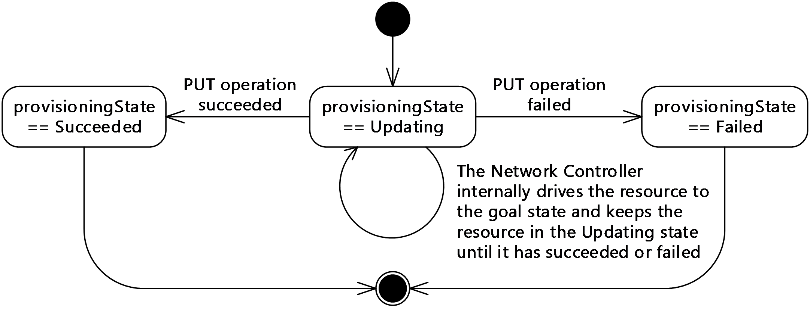
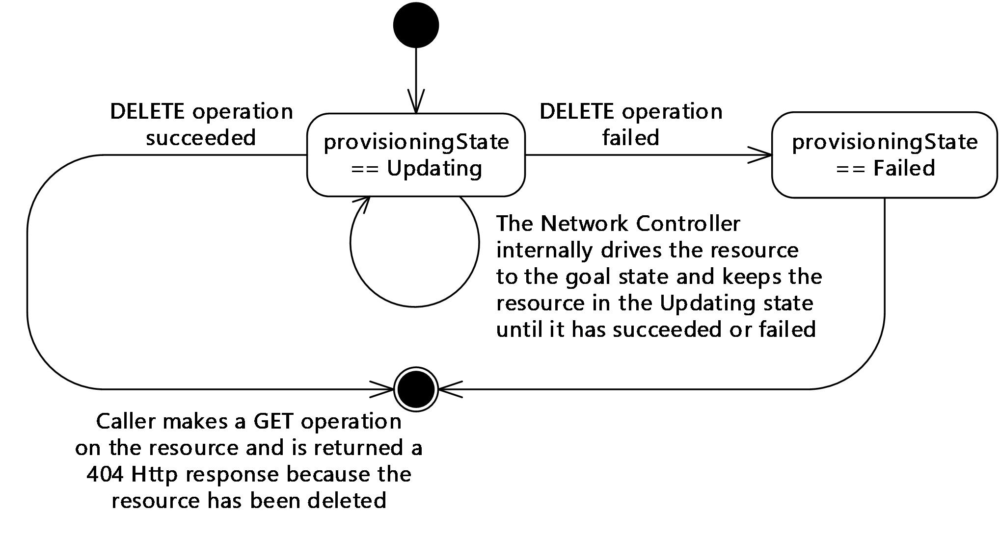
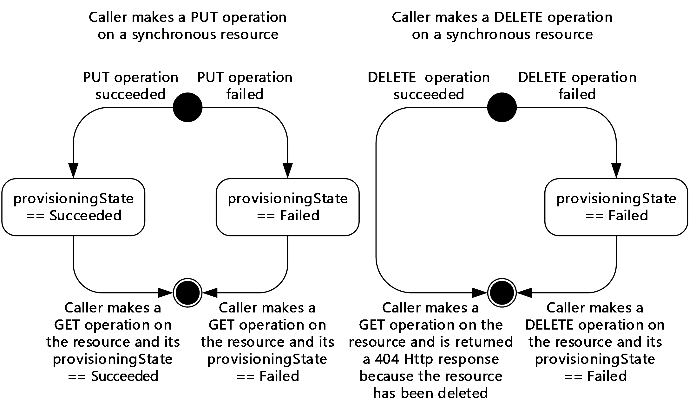
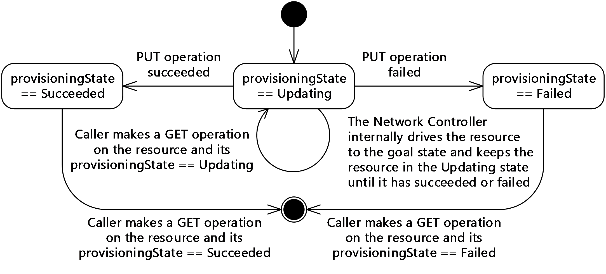
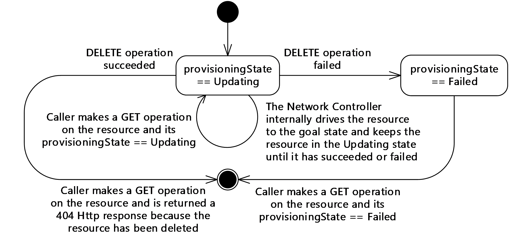
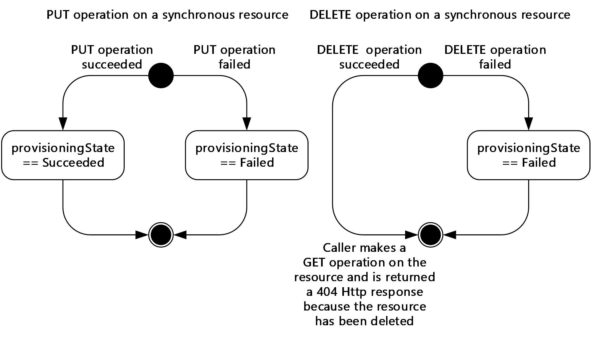
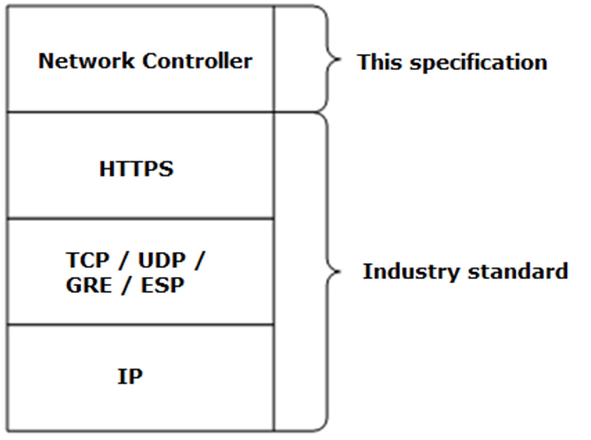

# [MS-NCNBI]: Network Controller Northbound Interface

Table of Contents

1 Introduction

- [1 Introduction](#Section_1)
  - [1.1 Glossary](#Section_1.1)
  - [1.2 References](#Section_1.2)
    - [1.2.1 Normative References](#Section_1.2.1)
    - [1.2.2 Informative References](#Section_1.2.2)
  - [1.3 Overview](#Section_1.3)
    - [1.3.1 Client-Server Interactions](#Section_1.3.1)
      - [1.3.1.1 ETag usage](#Section_1.3.1.1)
      - [1.3.1.2 Idempotency](#Section_1.3.1.2)
    - [1.3.2 Asynchronous Operations](#Section_1.3.2)
      - [1.3.2.1 POST and DELETE Operations](#Section_1.3.2.1)
      - [1.3.2.2 PUT Operation](#Section_1.3.2.2)
      - [1.3.2.3 Differences between operations and operationResults](#Section_1.3.2.3)
      - [1.3.2.4 properties.provisioningState usage](#Section_1.3.2.4)
      - [1.3.2.5 State Diagrams for Synchronous Operations](#Section_1.3.2.5)
      - [1.3.2.6 State Diagrams for Asynchronous Operations](#Section_1.3.2.6)
    - [1.3.3 Concurrent Operations](#Section_1.3.3)
      - [1.3.3.1 Concurrent operations on the same resource](#Section_1.3.3.1)
      - [1.3.3.2 Concurrent operations when there are dependent resources](#Section_1.3.3.2)
      - [1.3.3.3 Network Controller dependent resources](#Section_1.3.3.3)
  - [1.4 Relationship to Other Protocols](#Section_1.4)
  - [1.5 Prerequisites/Preconditions](#Section_1.5)
  - [1.6 Applicability Statement](#Section_1.6)
  - [1.7 Versioning and Capability Negotiation](#Section_1.7)
  - [1.8 Vendor-Extensible Fields](#Section_1.8)
  - [1.9 Standards Assignments](#Section_1.9)

2 Messages

- [2 Messages](#Section_2)
  - [2.1 Transport](#Section_2.1)
  - [2.2 Common Data Types](#Section_2.2)
    - [2.2.1 HTTP Headers](#Section_2.2.1)
      - [2.2.1.1 Content-Type](#Section_2.2.1.1)
      - [2.2.1.2 Request Headers](#Section_2.2.1.2)
        - [2.2.1.2.1 Accept-Language](#Section_2.2.1.2.1)
        - [2.2.1.2.2 If-Match](#Section_2.2.1.2.2)
        - [2.2.1.2.3 Referrer](#Section_2.2.1.2.3)
        - [2.2.1.2.4 x-ms-client-ip-address](#Section_2.2.1.2.4)
        - [2.2.1.2.5 x-ms-client-request-id](#Section_2.2.1.2.5)
        - [2.2.1.2.6 x-ms-return-client-request-id](#Section_2.2.1.2.6)
      - [2.2.1.3 Response Headers](#Section_2.2.1.3)
        - [2.2.1.3.1 Azure-AsyncOperation](#Section_2.2.1.3.1)
        - [2.2.1.3.2 Content-Length](#Section_2.2.1.3.2)
        - [2.2.1.3.3 Date](#Section_2.2.1.3.3)
        - [2.2.1.3.4 ETag](#Section_2.2.1.3.4)
        - [2.2.1.3.5 HTTP/1.1 Header](#Section_2.2.1.3.5)
        - [2.2.1.3.6 Location](#Section_2.2.1.3.6)
        - [2.2.1.3.7 Retry-After](#Section_2.2.1.3.7)
        - [2.2.1.3.8 Server](#Section_2.2.1.3.8)
        - [2.2.1.3.9 x-ms-request-id](#Section_2.2.1.3.9)
    - [2.2.2 Common JSON Elements](#Section_2.2.2)
    - [2.2.3 Common URI Parameters](#Section_2.2.3)
      - [2.2.3.1 grandParentResourceId](#Section_2.2.3.1)
      - [2.2.3.2 operationId](#Section_2.2.3.2)
      - [2.2.3.3 parentResourceId](#Section_2.2.3.3)
      - [2.2.3.4 resourceId](#Section_2.2.3.4)
      - [2.2.3.5 url](#Section_2.2.3.5)
    - [2.2.4 Data Structures](#Section_2.2.4)

3 Protocol Details

- [3 Protocol Details](#Section_3)
  - [3.1 Server Details](#Section_3.1)
    - [3.1.1 Abstract Data Model](#Section_3.1.1)
      - [3.1.1.1 Resource Counters](#Section_3.1.1.1)
    - [3.1.2 Timers](#Section_3.1.2)
    - [3.1.3 Initialization](#Section_3.1.3)
    - [3.1.4 Higher-Layer Triggered Events](#Section_3.1.4)
    - [3.1.5 Message Processing Events and Sequencing Rules](#Section_3.1.5)
      - [3.1.5.1 accessControlLists](#Section_3.1.5.1)
        - [3.1.5.1.1 HTTP Methods](#Section_3.1.5.1.1)
          - [3.1.5.1.1.1 PUT](#Section_3.1.5.1.1.1)
            - [3.1.5.1.1.1.1 Request Body](#Section_3.1.5.1.1.1.1)
            - [3.1.5.1.1.1.2 Response Body](#Section_3.1.5.1.1.1.2)
            - [3.1.5.1.1.1.3 Processing Details](#Section_3.1.5.1.1.1.3)
          - [3.1.5.1.1.2 GET](#Section_3.1.5.1.1.2)
            - [3.1.5.1.1.2.1 Request Body](#Section_3.1.5.1.1.2.1)
            - [3.1.5.1.1.2.2 Response Body](#Section_3.1.5.1.1.2.2)
            - [3.1.5.1.1.2.3 Processing Details](#Section_3.1.5.1.1.2.3)
          - [3.1.5.1.1.3 GET ALL](#Section_3.1.5.1.1.3)
            - [3.1.5.1.1.3.1 Request Body](#Section_3.1.5.1.1.3.1)
            - [3.1.5.1.1.3.2 Response Body](#Section_3.1.5.1.1.3.2)
            - [3.1.5.1.1.3.3 Processing Details](#Section_3.1.5.1.1.3.3)
          - [3.1.5.1.1.4 DELETE](#Section_3.1.5.1.1.4)
            - [3.1.5.1.1.4.1 Request Body](#Section_3.1.5.1.1.4.1)
            - [3.1.5.1.1.4.2 Response Body](#Section_3.1.5.1.1.4.2)
            - [3.1.5.1.1.4.3 Processing Details](#Section_3.1.5.1.1.4.3)
        - [3.1.5.1.2 aclRules](#Section_3.1.5.1.2)
          - [3.1.5.1.2.1 HTTP Methods](#Section_3.1.5.1.2.1)
            - [3.1.5.1.2.1.1 PUT](#Section_3.1.5.1.2.1.1)
              - [3.1.5.1.2.1.1.1 Request Body](#Section_3.1.5.1.2.1.1.1)
              - [3.1.5.1.2.1.1.2 Response Body](#Section_3.1.5.1.2.1.1.2)
              - [3.1.5.1.2.1.1.3 Processing Details](#Section_3.1.5.1.2.1.1.3)
            - [3.1.5.1.2.1.2 GET](#Section_3.1.5.1.2.1.2)
              - [3.1.5.1.2.1.2.1 Request Body](#Section_3.1.5.1.2.1.2.1)
              - [3.1.5.1.2.1.2.2 Response Body](#Section_3.1.5.1.2.1.2.2)
              - [3.1.5.1.2.1.2.3 Processing Details](#Section_3.1.5.1.2.1.2.3)
            - [3.1.5.1.2.1.3 GET ALL](#Section_3.1.5.1.2.1.3)
              - [3.1.5.1.2.1.3.1 Request Body](#Section_3.1.5.1.2.1.3.1)
              - [3.1.5.1.2.1.3.2 Response Body](#Section_3.1.5.1.2.1.3.2)
              - [3.1.5.1.2.1.3.3 Processing Details](#Section_3.1.5.1.2.1.3.3)
            - [3.1.5.1.2.1.4 DELETE](#Section_3.1.5.1.2.1.4)
              - [3.1.5.1.2.1.4.1 Request Body](#Section_3.1.5.1.2.1.4.1)
              - [3.1.5.1.2.1.4.2 Response Body](#Section_3.1.5.1.2.1.4.2)
              - [3.1.5.1.2.1.4.3 Processing Details](#Section_3.1.5.1.2.1.4.3)
      - [3.1.5.2 credentials](#Section_3.1.5.2)
        - [3.1.5.2.1 HTTP Methods](#Section_3.1.5.2.1)
          - [3.1.5.2.1.1 PUT](#Section_3.1.5.2.1.1)
            - [3.1.5.2.1.1.1 Request Body](#Section_3.1.5.2.1.1.1)
            - [3.1.5.2.1.1.2 Response Body](#Section_3.1.5.2.1.1.2)
            - [3.1.5.2.1.1.3 Processing Details](#Section_3.1.5.2.1.1.3)
          - [3.1.5.2.1.2 GET](#Section_3.1.5.2.1.2)
            - [3.1.5.2.1.2.1 Request Body](#Section_3.1.5.2.1.2.1)
            - [3.1.5.2.1.2.2 Response Body](#Section_3.1.5.2.1.2.2)
            - [3.1.5.2.1.2.3 Processing Details](#Section_3.1.5.2.1.2.3)
          - [3.1.5.2.1.3 GET ALL](#Section_3.1.5.2.1.3)
            - [3.1.5.2.1.3.1 Request Body](#Section_3.1.5.2.1.3.1)
            - [3.1.5.2.1.3.2 Response Body](#Section_3.1.5.2.1.3.2)
            - [3.1.5.2.1.3.3 Processing Details](#Section_3.1.5.2.1.3.3)
          - [3.1.5.2.1.4 DELETE](#Section_3.1.5.2.1.4)
            - [3.1.5.2.1.4.1 Request Body](#Section_3.1.5.2.1.4.1)
            - [3.1.5.2.1.4.2 Response Body](#Section_3.1.5.2.1.4.2)
            - [3.1.5.2.1.4.3 Processing Details](#Section_3.1.5.2.1.4.3)
      - [3.1.5.3 GatewayPools](#Section_3.1.5.3)
        - [3.1.5.3.1 HTTP Methods](#Section_3.1.5.3.1)
          - [3.1.5.3.1.1 PUT](#Section_3.1.5.3.1.1)
            - [3.1.5.3.1.1.1 Request Body](#Section_3.1.5.3.1.1.1)
            - [3.1.5.3.1.1.2 Response Body](#Section_3.1.5.3.1.1.2)
            - [3.1.5.3.1.1.3 Processing Details](#Section_3.1.5.3.1.1.3)
          - [3.1.5.3.1.2 GET](#Section_3.1.5.3.1.2)
            - [3.1.5.3.1.2.1 Request Body](#Section_3.1.5.3.1.2.1)
            - [3.1.5.3.1.2.2 Response Body](#Section_3.1.5.3.1.2.2)
            - [3.1.5.3.1.2.3 Processing Details](#Section_3.1.5.3.1.2.3)
          - [3.1.5.3.1.3 GET ALL](#Section_3.1.5.3.1.3)
            - [3.1.5.3.1.3.1 Request Body](#Section_3.1.5.3.1.3.1)
            - [3.1.5.3.1.3.2 Response Body](#Section_3.1.5.3.1.3.2)
            - [3.1.5.3.1.3.3 Processing Details](#Section_3.1.5.3.1.3.3)
          - [3.1.5.3.1.4 DELETE](#Section_3.1.5.3.1.4)
            - [3.1.5.3.1.4.1 Request Body](#Section_3.1.5.3.1.4.1)
            - [3.1.5.3.1.4.2 Response Body](#Section_3.1.5.3.1.4.2)
            - [3.1.5.3.1.4.3 Processing Details](#Section_3.1.5.3.1.4.3)
      - [3.1.5.4 gateways](#Section_3.1.5.4)
        - [3.1.5.4.1 HTTP Methods](#Section_3.1.5.4.1)
          - [3.1.5.4.1.1 PUT](#Section_3.1.5.4.1.1)
            - [3.1.5.4.1.1.1 Request Body](#Section_3.1.5.4.1.1.1)
            - [3.1.5.4.1.1.2 Response Body](#Section_3.1.5.4.1.1.2)
            - [3.1.5.4.1.1.3 Processing Details](#Section_3.1.5.4.1.1.3)
          - [3.1.5.4.1.2 GET](#Section_3.1.5.4.1.2)
            - [3.1.5.4.1.2.1 Request Body](#Section_3.1.5.4.1.2.1)
            - [3.1.5.4.1.2.2 Response Body](#Section_3.1.5.4.1.2.2)
            - [3.1.5.4.1.2.3 Processing Details](#Section_3.1.5.4.1.2.3)
          - [3.1.5.4.1.3 GET ALL](#Section_3.1.5.4.1.3)
            - [3.1.5.4.1.3.1 Request Body](#Section_3.1.5.4.1.3.1)
            - [3.1.5.4.1.3.2 Response Body](#Section_3.1.5.4.1.3.2)
            - [3.1.5.4.1.3.3 Processing Details](#Section_3.1.5.4.1.3.3)
          - [3.1.5.4.1.4 DELETE](#Section_3.1.5.4.1.4)
            - [3.1.5.4.1.4.1 Request Body](#Section_3.1.5.4.1.4.1)
            - [3.1.5.4.1.4.2 Response Body](#Section_3.1.5.4.1.4.2)
            - [3.1.5.4.1.4.3 Processing Details](#Section_3.1.5.4.1.4.3)
      - [3.1.5.5 loadBalancers](#Section_3.1.5.5)
        - [3.1.5.5.1 HTTP Methods](#Section_3.1.5.5.1)
          - [3.1.5.5.1.1 PUT](#Section_3.1.5.5.1.1)
            - [3.1.5.5.1.1.1 Request Body](#Section_3.1.5.5.1.1.1)
            - [3.1.5.5.1.1.2 Response Body](#Section_3.1.5.5.1.1.2)
            - [3.1.5.5.1.1.3 Processing Details](#Section_3.1.5.5.1.1.3)
          - [3.1.5.5.1.2 GET](#Section_3.1.5.5.1.2)
            - [3.1.5.5.1.2.1 Request Body](#Section_3.1.5.5.1.2.1)
            - [3.1.5.5.1.2.2 Response Body](#Section_3.1.5.5.1.2.2)
            - [3.1.5.5.1.2.3 Processing Details](#Section_3.1.5.5.1.2.3)
          - [3.1.5.5.1.3 GET ALL](#Section_3.1.5.5.1.3)
            - [3.1.5.5.1.3.1 Request Body](#Section_3.1.5.5.1.3.1)
            - [3.1.5.5.1.3.2 Response Body](#Section_3.1.5.5.1.3.2)
            - [3.1.5.5.1.3.3 Processing Details](#Section_3.1.5.5.1.3.3)
          - [3.1.5.5.1.4 DELETE](#Section_3.1.5.5.1.4)
            - [3.1.5.5.1.4.1 Request Body](#Section_3.1.5.5.1.4.1)
            - [3.1.5.5.1.4.2 Response Body](#Section_3.1.5.5.1.4.2)
            - [3.1.5.5.1.4.3 Processing Details](#Section_3.1.5.5.1.4.3)
        - [3.1.5.5.2 backendAddressPools](#Section_3.1.5.5.2)
          - [3.1.5.5.2.1 HTTP Methods](#Section_3.1.5.5.2.1)
            - [3.1.5.5.2.1.1 PUT](#Section_3.1.5.5.2.1.1)
              - [3.1.5.5.2.1.1.1 Request Body](#Section_3.1.5.5.2.1.1.1)
              - [3.1.5.5.2.1.1.2 Response Body](#Section_3.1.5.5.2.1.1.2)
              - [3.1.5.5.2.1.1.3 Processing Details](#Section_3.1.5.5.2.1.1.3)
            - [3.1.5.5.2.1.2 GET](#Section_3.1.5.5.2.1.2)
              - [3.1.5.5.2.1.2.1 Request Body](#Section_3.1.5.5.2.1.2.1)
              - [3.1.5.5.2.1.2.2 Response Body](#Section_3.1.5.5.2.1.2.2)
              - [3.1.5.5.2.1.2.3 Processing Details](#Section_3.1.5.5.2.1.2.3)
            - [3.1.5.5.2.1.3 GET ALL](#Section_3.1.5.5.2.1.3)
              - [3.1.5.5.2.1.3.1 Request Body](#Section_3.1.5.5.2.1.3.1)
              - [3.1.5.5.2.1.3.2 Response Body](#Section_3.1.5.5.2.1.3.2)
              - [3.1.5.5.2.1.3.3 Processing Details](#Section_3.1.5.5.2.1.3.3)
            - [3.1.5.5.2.1.4 DELETE](#Section_3.1.5.5.2.1.4)
              - [3.1.5.5.2.1.4.1 Request Body](#Section_3.1.5.5.2.1.4.1)
              - [3.1.5.5.2.1.4.2 Response Body](#Section_3.1.5.5.2.1.4.2)
              - [3.1.5.5.2.1.4.3 Processing Details](#Section_3.1.5.5.2.1.4.3)
        - [3.1.5.5.3 frontendIPConfigurations](#Section_3.1.5.5.3)
          - [3.1.5.5.3.1 HTTP Methods](#Section_3.1.5.5.3.1)
            - [3.1.5.5.3.1.1 PUT](#Section_3.1.5.5.3.1.1)
              - [3.1.5.5.3.1.1.1 Request Body](#Section_3.1.5.5.3.1.1.1)
              - [3.1.5.5.3.1.1.2 Response Body](#Section_3.1.5.5.3.1.1.2)
              - [3.1.5.5.3.1.1.3 Processing Details](#Section_3.1.5.5.3.1.1.3)
            - [3.1.5.5.3.1.2 GET](#Section_3.1.5.5.3.1.2)
              - [3.1.5.5.3.1.2.1 Request Body](#Section_3.1.5.5.3.1.2.1)
              - [3.1.5.5.3.1.2.2 Response Body](#Section_3.1.5.5.3.1.2.2)
              - [3.1.5.5.3.1.2.3 Processing Details](#Section_3.1.5.5.3.1.2.3)
            - [3.1.5.5.3.1.3 GET ALL](#Section_3.1.5.5.3.1.3)
              - [3.1.5.5.3.1.3.1 Request Body](#Section_3.1.5.5.3.1.3.1)
              - [3.1.5.5.3.1.3.2 Response Body](#Section_3.1.5.5.3.1.3.2)
              - [3.1.5.5.3.1.3.3 Processing Details](#Section_3.1.5.5.3.1.3.3)
            - [3.1.5.5.3.1.4 DELETE](#Section_3.1.5.5.3.1.4)
              - [3.1.5.5.3.1.4.1 Request Body](#Section_3.1.5.5.3.1.4.1)
              - [3.1.5.5.3.1.4.2 Response Body](#Section_3.1.5.5.3.1.4.2)
              - [3.1.5.5.3.1.4.3 Processing Details](#Section_3.1.5.5.3.1.4.3)
        - [3.1.5.5.4 inboundNatRules](#Section_3.1.5.5.4)
          - [3.1.5.5.4.1 HTTP Methods](#Section_3.1.5.5.4.1)
            - [3.1.5.5.4.1.1 PUT](#Section_3.1.5.5.4.1.1)
              - [3.1.5.5.4.1.1.1 Request Body](#Section_3.1.5.5.4.1.1.1)
              - [3.1.5.5.4.1.1.2 Response Body](#Section_3.1.5.5.4.1.1.2)
              - [3.1.5.5.4.1.1.3 Processing Details](#Section_3.1.5.5.4.1.1.3)
            - [3.1.5.5.4.1.2 GET](#Section_3.1.5.5.4.1.2)
              - [3.1.5.5.4.1.2.1 Request Body](#Section_3.1.5.5.4.1.2.1)
              - [3.1.5.5.4.1.2.2 Response Body](#Section_3.1.5.5.4.1.2.2)
              - [3.1.5.5.4.1.2.3 Processing Details](#Section_3.1.5.5.4.1.2.3)
            - [3.1.5.5.4.1.3 GET ALL](#Section_3.1.5.5.4.1.3)
              - [3.1.5.5.4.1.3.1 Request Body](#Section_3.1.5.5.4.1.3.1)
              - [3.1.5.5.4.1.3.2 Response Body](#Section_3.1.5.5.4.1.3.2)
              - [3.1.5.5.4.1.3.3 Processing Details](#Section_3.1.5.5.4.1.3.3)
            - [3.1.5.5.4.1.4 DELETE](#Section_3.1.5.5.4.1.4)
              - [3.1.5.5.4.1.4.1 Request Body](#Section_3.1.5.5.4.1.4.1)
              - [3.1.5.5.4.1.4.2 Response Body](#Section_3.1.5.5.4.1.4.2)
              - [3.1.5.5.4.1.4.3 Processing Details](#Section_3.1.5.5.4.1.4.3)
        - [3.1.5.5.5 loadBalancingRules](#Section_3.1.5.5.5)
          - [3.1.5.5.5.1 HTTP Methods](#Section_3.1.5.5.5.1)
            - [3.1.5.5.5.1.1 PUT](#Section_3.1.5.5.5.1.1)
              - [3.1.5.5.5.1.1.1 Request Body](#Section_3.1.5.5.5.1.1.1)
              - [3.1.5.5.5.1.1.2 Response Body](#Section_3.1.5.5.5.1.1.2)
              - [3.1.5.5.5.1.1.3 Processing Details](#Section_3.1.5.5.5.1.1.3)
            - [3.1.5.5.5.1.2 GET](#Section_3.1.5.5.5.1.2)
              - [3.1.5.5.5.1.2.1 Request Body](#Section_3.1.5.5.5.1.2.1)
              - [3.1.5.5.5.1.2.2 Response Body](#Section_3.1.5.5.5.1.2.2)
              - [3.1.5.5.5.1.2.3 Processing Details](#Section_3.1.5.5.5.1.2.3)
            - [3.1.5.5.5.1.3 GET ALL](#Section_3.1.5.5.5.1.3)
              - [3.1.5.5.5.1.3.1 Request Body](#Section_3.1.5.5.5.1.3.1)
              - [3.1.5.5.5.1.3.2 Response Body](#Section_3.1.5.5.5.1.3.2)
              - [3.1.5.5.5.1.3.3 Processing Details](#Section_3.1.5.5.5.1.3.3)
            - [3.1.5.5.5.1.4 DELETE](#Section_3.1.5.5.5.1.4)
              - [3.1.5.5.5.1.4.1 Request Body](#Section_3.1.5.5.5.1.4.1)
              - [3.1.5.5.5.1.4.2 Response Body](#Section_3.1.5.5.5.1.4.2)
              - [3.1.5.5.5.1.4.3 Processing Details](#Section_3.1.5.5.5.1.4.3)
        - [3.1.5.5.6 outboundNatRules](#Section_3.1.5.5.6)
          - [3.1.5.5.6.1 HTTP Methods](#Section_3.1.5.5.6.1)
            - [3.1.5.5.6.1.1 PUT](#Section_3.1.5.5.6.1.1)
              - [3.1.5.5.6.1.1.1 Request Body](#Section_3.1.5.5.6.1.1.1)
              - [3.1.5.5.6.1.1.2 Response Body](#Section_3.1.5.5.6.1.1.2)
              - [3.1.5.5.6.1.1.3 Processing Details](#Section_3.1.5.5.6.1.1.3)
            - [3.1.5.5.6.1.2 GET](#Section_3.1.5.5.6.1.2)
              - [3.1.5.5.6.1.2.1 Request Body](#Section_3.1.5.5.6.1.2.1)
              - [3.1.5.5.6.1.2.2 Response Body](#Section_3.1.5.5.6.1.2.2)
              - [3.1.5.5.6.1.2.3 Processing Details](#Section_3.1.5.5.6.1.2.3)
            - [3.1.5.5.6.1.3 GET ALL](#Section_3.1.5.5.6.1.3)
              - [3.1.5.5.6.1.3.1 Request Body](#Section_3.1.5.5.6.1.3.1)
              - [3.1.5.5.6.1.3.2 Response Body](#Section_3.1.5.5.6.1.3.2)
              - [3.1.5.5.6.1.3.3 Processing Details](#Section_3.1.5.5.6.1.3.3)
            - [3.1.5.5.6.1.4 DELETE](#Section_3.1.5.5.6.1.4)
              - [3.1.5.5.6.1.4.1 Request Body](#Section_3.1.5.5.6.1.4.1)
              - [3.1.5.5.6.1.4.2 Response Body](#Section_3.1.5.5.6.1.4.2)
              - [3.1.5.5.6.1.4.3 Processing Details](#Section_3.1.5.5.6.1.4.3)
        - [3.1.5.5.7 probes](#Section_3.1.5.5.7)
          - [3.1.5.5.7.1 HTTP Methods](#Section_3.1.5.5.7.1)
            - [3.1.5.5.7.1.1 PUT](#Section_3.1.5.5.7.1.1)
              - [3.1.5.5.7.1.1.1 Request Body](#Section_3.1.5.5.7.1.1.1)
              - [3.1.5.5.7.1.1.2 Response Body](#Section_3.1.5.5.7.1.1.2)
              - [3.1.5.5.7.1.1.3 Processing Details](#Section_3.1.5.5.7.1.1.3)
            - [3.1.5.5.7.1.2 GET](#Section_3.1.5.5.7.1.2)
              - [3.1.5.5.7.1.2.1 Request Body](#Section_3.1.5.5.7.1.2.1)
              - [3.1.5.5.7.1.2.2 Response Body](#Section_3.1.5.5.7.1.2.2)
              - [3.1.5.5.7.1.2.3 Processing Details](#Section_3.1.5.5.7.1.2.3)
            - [3.1.5.5.7.1.3 GET ALL](#Section_3.1.5.5.7.1.3)
              - [3.1.5.5.7.1.3.1 Request Body](#Section_3.1.5.5.7.1.3.1)
              - [3.1.5.5.7.1.3.2 Response Body](#Section_3.1.5.5.7.1.3.2)
              - [3.1.5.5.7.1.3.3 Processing Details](#Section_3.1.5.5.7.1.3.3)
            - [3.1.5.5.7.1.4 DELETE](#Section_3.1.5.5.7.1.4)
              - [3.1.5.5.7.1.4.1 Request Body](#Section_3.1.5.5.7.1.4.1)
              - [3.1.5.5.7.1.4.2 Response Body](#Section_3.1.5.5.7.1.4.2)
              - [3.1.5.5.7.1.4.3 Processing Details](#Section_3.1.5.5.7.1.4.3)
      - [3.1.5.6 loadBalancerManager](#Section_3.1.5.6)
        - [3.1.5.6.1 HTTP Methods](#Section_3.1.5.6.1)
          - [3.1.5.6.1.1 PUT](#Section_3.1.5.6.1.1)
            - [3.1.5.6.1.1.1 Request Body](#Section_3.1.5.6.1.1.1)
            - [3.1.5.6.1.1.2 Response Body](#Section_3.1.5.6.1.1.2)
            - [3.1.5.6.1.1.3 Processing Details](#Section_3.1.5.6.1.1.3)
          - [3.1.5.6.1.2 GET](#Section_3.1.5.6.1.2)
            - [3.1.5.6.1.2.1 Request Body](#Section_3.1.5.6.1.2.1)
            - [3.1.5.6.1.2.2 Response Body](#Section_3.1.5.6.1.2.2)
            - [3.1.5.6.1.2.3 Processing Details](#Section_3.1.5.6.1.2.3)
      - [3.1.5.7 loadBalancerMuxes](#Section_3.1.5.7)
        - [3.1.5.7.1 HTTP Methods](#Section_3.1.5.7.1)
          - [3.1.5.7.1.1 PUT](#Section_3.1.5.7.1.1)
            - [3.1.5.7.1.1.1 Request Body](#Section_3.1.5.7.1.1.1)
            - [3.1.5.7.1.1.2 Response Body](#Section_3.1.5.7.1.1.2)
            - [3.1.5.7.1.1.3 Processing Details](#Section_3.1.5.7.1.1.3)
          - [3.1.5.7.1.2 GET](#Section_3.1.5.7.1.2)
            - [3.1.5.7.1.2.1 Request Body](#Section_3.1.5.7.1.2.1)
            - [3.1.5.7.1.2.2 Response Body](#Section_3.1.5.7.1.2.2)
            - [3.1.5.7.1.2.3 Processing Details](#Section_3.1.5.7.1.2.3)
          - [3.1.5.7.1.3 GET ALL](#Section_3.1.5.7.1.3)
            - [3.1.5.7.1.3.1 Request Body](#Section_3.1.5.7.1.3.1)
            - [3.1.5.7.1.3.2 Response Body](#Section_3.1.5.7.1.3.2)
            - [3.1.5.7.1.3.3 Processing Details](#Section_3.1.5.7.1.3.3)
          - [3.1.5.7.1.4 DELETE](#Section_3.1.5.7.1.4)
            - [3.1.5.7.1.4.1 Request Body](#Section_3.1.5.7.1.4.1)
            - [3.1.5.7.1.4.2 Response Body](#Section_3.1.5.7.1.4.2)
            - [3.1.5.7.1.4.3 Processing Details](#Section_3.1.5.7.1.4.3)
      - [3.1.5.8 logicalNetworks](#Section_3.1.5.8)
        - [3.1.5.8.1 HTTP Methods](#Section_3.1.5.8.1)
          - [3.1.5.8.1.1 PUT](#Section_3.1.5.8.1.1)
            - [3.1.5.8.1.1.1 Request Body](#Section_3.1.5.8.1.1.1)
            - [3.1.5.8.1.1.2 Response Body](#Section_3.1.5.8.1.1.2)
            - [3.1.5.8.1.1.3 Processing Details](#Section_3.1.5.8.1.1.3)
          - [3.1.5.8.1.2 GET](#Section_3.1.5.8.1.2)
            - [3.1.5.8.1.2.1 Request Body](#Section_3.1.5.8.1.2.1)
            - [3.1.5.8.1.2.2 Response Body](#Section_3.1.5.8.1.2.2)
            - [3.1.5.8.1.2.3 Processing Details](#Section_3.1.5.8.1.2.3)
          - [3.1.5.8.1.3 GET ALL](#Section_3.1.5.8.1.3)
            - [3.1.5.8.1.3.1 Request Body](#Section_3.1.5.8.1.3.1)
            - [3.1.5.8.1.3.2 Response Body](#Section_3.1.5.8.1.3.2)
            - [3.1.5.8.1.3.3 Processing Details](#Section_3.1.5.8.1.3.3)
          - [3.1.5.8.1.4 DELETE](#Section_3.1.5.8.1.4)
            - [3.1.5.8.1.4.1 Request Body](#Section_3.1.5.8.1.4.1)
            - [3.1.5.8.1.4.2 Response Body](#Section_3.1.5.8.1.4.2)
            - [3.1.5.8.1.4.3 Processing Details](#Section_3.1.5.8.1.4.3)
        - [3.1.5.8.2 subnets](#Section_3.1.5.8.2)
          - [3.1.5.8.2.1 HTTP Methods](#Section_3.1.5.8.2.1)
            - [3.1.5.8.2.1.1 PUT](#Section_3.1.5.8.2.1.1)
              - [3.1.5.8.2.1.1.1 Request Body](#Section_3.1.5.8.2.1.1.1)
              - [3.1.5.8.2.1.1.2 Response Body](#Section_3.1.5.8.2.1.1.2)
              - [3.1.5.8.2.1.1.3 Processing Details](#Section_3.1.5.8.2.1.1.3)
            - [3.1.5.8.2.1.2 GET](#Section_3.1.5.8.2.1.2)
              - [3.1.5.8.2.1.2.1 Request Body](#Section_3.1.5.8.2.1.2.1)
              - [3.1.5.8.2.1.2.2 Response Body](#Section_3.1.5.8.2.1.2.2)
              - [3.1.5.8.2.1.2.3 Processing Details](#Section_3.1.5.8.2.1.2.3)
            - [3.1.5.8.2.1.3 GET ALL](#Section_3.1.5.8.2.1.3)
              - [3.1.5.8.2.1.3.1 Request Body](#Section_3.1.5.8.2.1.3.1)
              - [3.1.5.8.2.1.3.2 Response Body](#Section_3.1.5.8.2.1.3.2)
              - [3.1.5.8.2.1.3.3 Processing Details](#Section_3.1.5.8.2.1.3.3)
            - [3.1.5.8.2.1.4 DELETE](#Section_3.1.5.8.2.1.4)
              - [3.1.5.8.2.1.4.1 Request Body](#Section_3.1.5.8.2.1.4.1)
              - [3.1.5.8.2.1.4.2 Response Body](#Section_3.1.5.8.2.1.4.2)
              - [3.1.5.8.2.1.4.3 Processing Details](#Section_3.1.5.8.2.1.4.3)
          - [3.1.5.8.2.2 ipPools](#Section_3.1.5.8.2.2)
            - [3.1.5.8.2.2.1 HTTP Methods](#Section_3.1.5.8.2.2.1)
              - [3.1.5.8.2.2.1.1 PUT](#Section_3.1.5.8.2.2.1.1)
                - [3.1.5.8.2.2.1.1.1 Request Body](#Section_3.1.5.8.2.2.1.1.1)
                - [3.1.5.8.2.2.1.1.2 Response Body](#Section_3.1.5.8.2.2.1.1.2)
                - [3.1.5.8.2.2.1.1.3 Processing Details](#Section_3.1.5.8.2.2.1.1.3)
              - [3.1.5.8.2.2.1.2 GET](#Section_3.1.5.8.2.2.1.2)
                - [3.1.5.8.2.2.1.2.1 Request Body](#Section_3.1.5.8.2.2.1.2.1)
                - [3.1.5.8.2.2.1.2.2 Response Body](#Section_3.1.5.8.2.2.1.2.2)
                - [3.1.5.8.2.2.1.2.3 Processing Details](#Section_3.1.5.8.2.2.1.2.3)
              - [3.1.5.8.2.2.1.3 GET ALL](#Section_3.1.5.8.2.2.1.3)
                - [3.1.5.8.2.2.1.3.1 Request Body](#Section_3.1.5.8.2.2.1.3.1)
                - [3.1.5.8.2.2.1.3.2 Response Body](#Section_3.1.5.8.2.2.1.3.2)
                - [3.1.5.8.2.2.1.3.3 Processing Details](#Section_3.1.5.8.2.2.1.3.3)
              - [3.1.5.8.2.2.1.4 DELETE](#Section_3.1.5.8.2.2.1.4)
                - [3.1.5.8.2.2.1.4.1 Request Body](#Section_3.1.5.8.2.2.1.4.1)
                - [3.1.5.8.2.2.1.4.2 Response Body](#Section_3.1.5.8.2.2.1.4.2)
                - [3.1.5.8.2.2.1.4.3 Processing Details](#Section_3.1.5.8.2.2.1.4.3)
          - [3.1.5.8.2.3 routes](#Section_3.1.5.8.2.3)
            - [3.1.5.8.2.3.1 HTTP Methods](#Section_3.1.5.8.2.3.1)
              - [3.1.5.8.2.3.1.1 PUT](#Section_3.1.5.8.2.3.1.1)
                - [3.1.5.8.2.3.1.1.1 Request Body](#Section_3.1.5.8.2.3.1.1.1)
                - [3.1.5.8.2.3.1.1.2 Response Body](#Section_3.1.5.8.2.3.1.1.2)
                - [3.1.5.8.2.3.1.1.3 Processing Details](#Section_3.1.5.8.2.3.1.1.3)
              - [3.1.5.8.2.3.1.2 GET](#Section_3.1.5.8.2.3.1.2)
                - [3.1.5.8.2.3.1.2.1 Request Body](#Section_3.1.5.8.2.3.1.2.1)
                - [3.1.5.8.2.3.1.2.2 Response Body](#Section_3.1.5.8.2.3.1.2.2)
                - [3.1.5.8.2.3.1.2.3 Processing Details](#Section_3.1.5.8.2.3.1.2.3)
              - [3.1.5.8.2.3.1.3 GET ALL](#Section_3.1.5.8.2.3.1.3)
                - [3.1.5.8.2.3.1.3.1 Request Body](#Section_3.1.5.8.2.3.1.3.1)
                - [3.1.5.8.2.3.1.3.2 Response Body](#Section_3.1.5.8.2.3.1.3.2)
                - [3.1.5.8.2.3.1.3.3 Processing Details](#Section_3.1.5.8.2.3.1.3.3)
              - [3.1.5.8.2.3.1.4 DELETE](#Section_3.1.5.8.2.3.1.4)
                - [3.1.5.8.2.3.1.4.1 Request Body](#Section_3.1.5.8.2.3.1.4.1)
                - [3.1.5.8.2.3.1.4.2 Response Body](#Section_3.1.5.8.2.3.1.4.2)
                - [3.1.5.8.2.3.1.4.3 Processing Details](#Section_3.1.5.8.2.3.1.4.3)
      - [3.1.5.9 macPools](#Section_3.1.5.9)
        - [3.1.5.9.1 HTTP Methods](#Section_3.1.5.9.1)
          - [3.1.5.9.1.1 PUT](#Section_3.1.5.9.1.1)
            - [3.1.5.9.1.1.1 Request Body](#Section_3.1.5.9.1.1.1)
            - [3.1.5.9.1.1.2 Response Body](#Section_3.1.5.9.1.1.2)
            - [3.1.5.9.1.1.3 Processing Details](#Section_3.1.5.9.1.1.3)
          - [3.1.5.9.1.2 GET](#Section_3.1.5.9.1.2)
            - [3.1.5.9.1.2.1 Request Body](#Section_3.1.5.9.1.2.1)
            - [3.1.5.9.1.2.2 Response Body](#Section_3.1.5.9.1.2.2)
            - [3.1.5.9.1.2.3 Processing Details](#Section_3.1.5.9.1.2.3)
          - [3.1.5.9.1.3 GET ALL](#Section_3.1.5.9.1.3)
            - [3.1.5.9.1.3.1 Request Body](#Section_3.1.5.9.1.3.1)
            - [3.1.5.9.1.3.2 Response Body](#Section_3.1.5.9.1.3.2)
            - [3.1.5.9.1.3.3 Processing Details](#Section_3.1.5.9.1.3.3)
          - [3.1.5.9.1.4 DELETE](#Section_3.1.5.9.1.4)
            - [3.1.5.9.1.4.1 Request Body](#Section_3.1.5.9.1.4.1)
            - [3.1.5.9.1.4.2 Response Body](#Section_3.1.5.9.1.4.2)
            - [3.1.5.9.1.4.3 Processing Details](#Section_3.1.5.9.1.4.3)
      - [3.1.5.10 routeTables](#Section_3.1.5.10)
        - [3.1.5.10.1 HTTP Methods](#Section_3.1.5.10.1)
          - [3.1.5.10.1.1 PUT](#Section_3.1.5.10.1.1)
            - [3.1.5.10.1.1.1 Request Body](#Section_3.1.5.10.1.1.1)
            - [3.1.5.10.1.1.2 Response Body](#Section_3.1.5.10.1.1.2)
            - [3.1.5.10.1.1.3 Processing Details](#Section_3.1.5.10.1.1.3)
          - [3.1.5.10.1.2 GET](#Section_3.1.5.10.1.2)
            - [3.1.5.10.1.2.1 Request Body](#Section_3.1.5.10.1.2.1)
            - [3.1.5.10.1.2.2 Response Body](#Section_3.1.5.10.1.2.2)
            - [3.1.5.10.1.2.3 Processing Details](#Section_3.1.5.10.1.2.3)
          - [3.1.5.10.1.3 GET ALL](#Section_3.1.5.10.1.3)
            - [3.1.5.10.1.3.1 Request Body](#Section_3.1.5.10.1.3.1)
            - [3.1.5.10.1.3.2 Response Body](#Section_3.1.5.10.1.3.2)
            - [3.1.5.10.1.3.3 Processing Details](#Section_3.1.5.10.1.3.3)
          - [3.1.5.10.1.4 DELETE](#Section_3.1.5.10.1.4)
            - [3.1.5.10.1.4.1 Request Body](#Section_3.1.5.10.1.4.1)
            - [3.1.5.10.1.4.2 Response Body](#Section_3.1.5.10.1.4.2)
            - [3.1.5.10.1.4.3 Processing Details](#Section_3.1.5.10.1.4.3)
        - [3.1.5.10.2 routes](#Section_3.1.5.10.2)
          - [3.1.5.10.2.1 HTTP Methods](#Section_3.1.5.10.2.1)
            - [3.1.5.10.2.1.1 PUT](#Section_3.1.5.10.2.1.1)
              - [3.1.5.10.2.1.1.1 Request Body](#Section_3.1.5.10.2.1.1.1)
              - [3.1.5.10.2.1.1.2 Response Body](#Section_3.1.5.10.2.1.1.2)
              - [3.1.5.10.2.1.1.3 Processing Details](#Section_3.1.5.10.2.1.1.3)
            - [3.1.5.10.2.1.2 GET](#Section_3.1.5.10.2.1.2)
              - [3.1.5.10.2.1.2.1 Request Body](#Section_3.1.5.10.2.1.2.1)
              - [3.1.5.10.2.1.2.2 Response Body](#Section_3.1.5.10.2.1.2.2)
              - [3.1.5.10.2.1.2.3 Processing Details](#Section_3.1.5.10.2.1.2.3)
            - [3.1.5.10.2.1.3 GET ALL](#Section_3.1.5.10.2.1.3)
              - [3.1.5.10.2.1.3.1 Request Body](#Section_3.1.5.10.2.1.3.1)
              - [3.1.5.10.2.1.3.2 Response Body](#Section_3.1.5.10.2.1.3.2)
              - [3.1.5.10.2.1.3.3 Processing Details](#Section_3.1.5.10.2.1.3.3)
            - [3.1.5.10.2.1.4 DELETE](#Section_3.1.5.10.2.1.4)
              - [3.1.5.10.2.1.4.1 Request Body](#Section_3.1.5.10.2.1.4.1)
              - [3.1.5.10.2.1.4.2 Response Body](#Section_3.1.5.10.2.1.4.2)
              - [3.1.5.10.2.1.4.3 Processing Details](#Section_3.1.5.10.2.1.4.3)
      - [3.1.5.11 networkInterfaces](#Section_3.1.5.11)
        - [3.1.5.11.1 HTTP Methods](#Section_3.1.5.11.1)
          - [3.1.5.11.1.1 PUT](#Section_3.1.5.11.1.1)
            - [3.1.5.11.1.1.1 Request Body](#Section_3.1.5.11.1.1.1)
            - [3.1.5.11.1.1.2 Response Body](#Section_3.1.5.11.1.1.2)
            - [3.1.5.11.1.1.3 Processing Details](#Section_3.1.5.11.1.1.3)
          - [3.1.5.11.1.2 GET](#Section_3.1.5.11.1.2)
            - [3.1.5.11.1.2.1 Request Body](#Section_3.1.5.11.1.2.1)
            - [3.1.5.11.1.2.2 Response Body](#Section_3.1.5.11.1.2.2)
            - [3.1.5.11.1.2.3 Processing Details](#Section_3.1.5.11.1.2.3)
          - [3.1.5.11.1.3 GET ALL](#Section_3.1.5.11.1.3)
            - [3.1.5.11.1.3.1 Request Body](#Section_3.1.5.11.1.3.1)
            - [3.1.5.11.1.3.2 Response Body](#Section_3.1.5.11.1.3.2)
            - [3.1.5.11.1.3.3 Processing Details](#Section_3.1.5.11.1.3.3)
          - [3.1.5.11.1.4 DELETE](#Section_3.1.5.11.1.4)
            - [3.1.5.11.1.4.1 Request Body](#Section_3.1.5.11.1.4.1)
            - [3.1.5.11.1.4.2 Response Body](#Section_3.1.5.11.1.4.2)
            - [3.1.5.11.1.4.3 Processing Details](#Section_3.1.5.11.1.4.3)
        - [3.1.5.11.2 ipConfigurations](#Section_3.1.5.11.2)
          - [3.1.5.11.2.1 HTTP Methods](#Section_3.1.5.11.2.1)
            - [3.1.5.11.2.1.1 PUT](#Section_3.1.5.11.2.1.1)
              - [3.1.5.11.2.1.1.1 Request Body](#Section_3.1.5.11.2.1.1.1)
              - [3.1.5.11.2.1.1.2 Response Body](#Section_3.1.5.11.2.1.1.2)
              - [3.1.5.11.2.1.1.3 Processing Details](#Section_3.1.5.11.2.1.1.3)
            - [3.1.5.11.2.1.2 GET](#Section_3.1.5.11.2.1.2)
              - [3.1.5.11.2.1.2.1 Request Body](#Section_3.1.5.11.2.1.2.1)
              - [3.1.5.11.2.1.2.2 Response Body](#Section_3.1.5.11.2.1.2.2)
              - [3.1.5.11.2.1.2.3 Processing Details](#Section_3.1.5.11.2.1.2.3)
            - [3.1.5.11.2.1.3 GET ALL](#Section_3.1.5.11.2.1.3)
              - [3.1.5.11.2.1.3.1 Request Body](#Section_3.1.5.11.2.1.3.1)
              - [3.1.5.11.2.1.3.2 Response Body](#Section_3.1.5.11.2.1.3.2)
              - [3.1.5.11.2.1.3.3 Processing Details](#Section_3.1.5.11.2.1.3.3)
            - [3.1.5.11.2.1.4 DELETE](#Section_3.1.5.11.2.1.4)
              - [3.1.5.11.2.1.4.1 Request Body](#Section_3.1.5.11.2.1.4.1)
              - [3.1.5.11.2.1.4.2 Response Body](#Section_3.1.5.11.2.1.4.2)
              - [3.1.5.11.2.1.4.3 Processing Details](#Section_3.1.5.11.2.1.4.3)
      - [3.1.5.12 operations](#Section_3.1.5.12)
        - [3.1.5.12.1 HTTP Methods](#Section_3.1.5.12.1)
          - [3.1.5.12.1.1 GET](#Section_3.1.5.12.1.1)
            - [3.1.5.12.1.1.1 Request Body](#Section_3.1.5.12.1.1.1)
            - [3.1.5.12.1.1.2 Response Body](#Section_3.1.5.12.1.1.2)
            - [3.1.5.12.1.1.3 Processing Details](#Section_3.1.5.12.1.1.3)
      - [3.1.5.13 operationResults](#Section_3.1.5.13)
        - [3.1.5.13.1 HTTP Methods](#Section_3.1.5.13.1)
          - [3.1.5.13.1.1 GET](#Section_3.1.5.13.1.1)
            - [3.1.5.13.1.1.1 Request Body](#Section_3.1.5.13.1.1.1)
            - [3.1.5.13.1.1.2 Response Body](#Section_3.1.5.13.1.1.2)
            - [3.1.5.13.1.1.3 Processing Details](#Section_3.1.5.13.1.1.3)
      - [3.1.5.14 publicIPAddresses](#Section_3.1.5.14)
        - [3.1.5.14.1 HTTP Methods](#Section_3.1.5.14.1)
          - [3.1.5.14.1.1 PUT](#Section_3.1.5.14.1.1)
            - [3.1.5.14.1.1.1 Request Body](#Section_3.1.5.14.1.1.1)
            - [3.1.5.14.1.1.2 Response Body](#Section_3.1.5.14.1.1.2)
            - [3.1.5.14.1.1.3 Processing Details](#Section_3.1.5.14.1.1.3)
          - [3.1.5.14.1.2 GET](#Section_3.1.5.14.1.2)
            - [3.1.5.14.1.2.1 Request Body](#Section_3.1.5.14.1.2.1)
            - [3.1.5.14.1.2.2 Response Body](#Section_3.1.5.14.1.2.2)
            - [3.1.5.14.1.2.3 Processing Details](#Section_3.1.5.14.1.2.3)
          - [3.1.5.14.1.3 GET ALL](#Section_3.1.5.14.1.3)
            - [3.1.5.14.1.3.1 Request Body](#Section_3.1.5.14.1.3.1)
            - [3.1.5.14.1.3.2 Response Body](#Section_3.1.5.14.1.3.2)
            - [3.1.5.14.1.3.3 Processing Details](#Section_3.1.5.14.1.3.3)
          - [3.1.5.14.1.4 DELETE](#Section_3.1.5.14.1.4)
            - [3.1.5.14.1.4.1 Request Body](#Section_3.1.5.14.1.4.1)
            - [3.1.5.14.1.4.2 Response Body](#Section_3.1.5.14.1.4.2)
            - [3.1.5.14.1.4.3 Processing Details](#Section_3.1.5.14.1.4.3)
      - [3.1.5.15 servers](#Section_3.1.5.15)
        - [3.1.5.15.1 HTTP Methods](#Section_3.1.5.15.1)
          - [3.1.5.15.1.1 PUT](#Section_3.1.5.15.1.1)
            - [3.1.5.15.1.1.1 Request Body](#Section_3.1.5.15.1.1.1)
            - [3.1.5.15.1.1.2 Response Body](#Section_3.1.5.15.1.1.2)
            - [3.1.5.15.1.1.3 Processing Details](#Section_3.1.5.15.1.1.3)
          - [3.1.5.15.1.2 GET](#Section_3.1.5.15.1.2)
            - [3.1.5.15.1.2.1 Request Body](#Section_3.1.5.15.1.2.1)
            - [3.1.5.15.1.2.2 Response Body](#Section_3.1.5.15.1.2.2)
            - [3.1.5.15.1.2.3 Processing Details](#Section_3.1.5.15.1.2.3)
          - [3.1.5.15.1.3 GET ALL](#Section_3.1.5.15.1.3)
            - [3.1.5.15.1.3.1 Request Body](#Section_3.1.5.15.1.3.1)
            - [3.1.5.15.1.3.2 Response Body](#Section_3.1.5.15.1.3.2)
            - [3.1.5.15.1.3.3 Processing Details](#Section_3.1.5.15.1.3.3)
          - [3.1.5.15.1.4 DELETE](#Section_3.1.5.15.1.4)
            - [3.1.5.15.1.4.1 Request Body](#Section_3.1.5.15.1.4.1)
            - [3.1.5.15.1.4.2 Response Body](#Section_3.1.5.15.1.4.2)
            - [3.1.5.15.1.4.3 Processing Details](#Section_3.1.5.15.1.4.3)
        - [3.1.5.15.2 networkInterfaces](#Section_3.1.5.15.2)
          - [3.1.5.15.2.1 HTTP Methods](#Section_3.1.5.15.2.1)
            - [3.1.5.15.2.1.1 PUT](#Section_3.1.5.15.2.1.1)
              - [3.1.5.15.2.1.1.1 Request Body](#Section_3.1.5.15.2.1.1.1)
              - [3.1.5.15.2.1.1.2 Response Body](#Section_3.1.5.15.2.1.1.2)
              - [3.1.5.15.2.1.1.3 Processing Details](#Section_3.1.5.15.2.1.1.3)
            - [3.1.5.15.2.1.2 GET](#Section_3.1.5.15.2.1.2)
              - [3.1.5.15.2.1.2.1 Request Body](#Section_3.1.5.15.2.1.2.1)
              - [3.1.5.15.2.1.2.2 Response Body](#Section_3.1.5.15.2.1.2.2)
              - [3.1.5.15.2.1.2.3 Processing Details](#Section_3.1.5.15.2.1.2.3)
            - [3.1.5.15.2.1.3 GET ALL](#Section_3.1.5.15.2.1.3)
              - [3.1.5.15.2.1.3.1 Request Body](#Section_3.1.5.15.2.1.3.1)
              - [3.1.5.15.2.1.3.2 Response Body](#Section_3.1.5.15.2.1.3.2)
              - [3.1.5.15.2.1.3.3 Processing Details](#Section_3.1.5.15.2.1.3.3)
            - [3.1.5.15.2.1.4 DELETE](#Section_3.1.5.15.2.1.4)
              - [3.1.5.15.2.1.4.1 Request Body](#Section_3.1.5.15.2.1.4.1)
              - [3.1.5.15.2.1.4.2 Response Body](#Section_3.1.5.15.2.1.4.2)
              - [3.1.5.15.2.1.4.3 Processing Details](#Section_3.1.5.15.2.1.4.3)
      - [3.1.5.16 serviceInsertions](#Section_3.1.5.16)
        - [3.1.5.16.1 HTTP Methods](#Section_3.1.5.16.1)
          - [3.1.5.16.1.1 PUT](#Section_3.1.5.16.1.1)
            - [3.1.5.16.1.1.1 Request Body](#Section_3.1.5.16.1.1.1)
            - [3.1.5.16.1.1.2 Response Body](#Section_3.1.5.16.1.1.2)
            - [3.1.5.16.1.1.3 Processing Details](#Section_3.1.5.16.1.1.3)
          - [3.1.5.16.1.2 GET](#Section_3.1.5.16.1.2)
            - [3.1.5.16.1.2.1 Request Body](#Section_3.1.5.16.1.2.1)
            - [3.1.5.16.1.2.2 Response Body](#Section_3.1.5.16.1.2.2)
            - [3.1.5.16.1.2.3 Processing Details](#Section_3.1.5.16.1.2.3)
          - [3.1.5.16.1.3 GET ALL](#Section_3.1.5.16.1.3)
            - [3.1.5.16.1.3.1 Request Body](#Section_3.1.5.16.1.3.1)
            - [3.1.5.16.1.3.2 Response Body](#Section_3.1.5.16.1.3.2)
            - [3.1.5.16.1.3.3 Processing Details](#Section_3.1.5.16.1.3.3)
          - [3.1.5.16.1.4 DELETE](#Section_3.1.5.16.1.4)
            - [3.1.5.16.1.4.1 Request Body](#Section_3.1.5.16.1.4.1)
            - [3.1.5.16.1.4.2 Response Body](#Section_3.1.5.16.1.4.2)
            - [3.1.5.16.1.4.3 Processing Details](#Section_3.1.5.16.1.4.3)
      - [3.1.5.17 VirtualGateways](#Section_3.1.5.17)
        - [3.1.5.17.1 HTTP Methods](#Section_3.1.5.17.1)
          - [3.1.5.17.1.1 PUT](#Section_3.1.5.17.1.1)
            - [3.1.5.17.1.1.1 Request Body](#Section_3.1.5.17.1.1.1)
            - [3.1.5.17.1.1.2 Response Body](#Section_3.1.5.17.1.1.2)
            - [3.1.5.17.1.1.3 Processing Details](#Section_3.1.5.17.1.1.3)
          - [3.1.5.17.1.2 GET](#Section_3.1.5.17.1.2)
            - [3.1.5.17.1.2.1 Request Body](#Section_3.1.5.17.1.2.1)
            - [3.1.5.17.1.2.2 Response Body](#Section_3.1.5.17.1.2.2)
            - [3.1.5.17.1.2.3 Processing Details](#Section_3.1.5.17.1.2.3)
          - [3.1.5.17.1.3 GET ALL](#Section_3.1.5.17.1.3)
            - [3.1.5.17.1.3.1 Request Body](#Section_3.1.5.17.1.3.1)
            - [3.1.5.17.1.3.2 Response Body](#Section_3.1.5.17.1.3.2)
            - [3.1.5.17.1.3.3 Processing Details](#Section_3.1.5.17.1.3.3)
          - [3.1.5.17.1.4 DELETE](#Section_3.1.5.17.1.4)
            - [3.1.5.17.1.4.1 Request Body](#Section_3.1.5.17.1.4.1)
            - [3.1.5.17.1.4.2 Response Body](#Section_3.1.5.17.1.4.2)
            - [3.1.5.17.1.4.3 Processing Details](#Section_3.1.5.17.1.4.3)
        - [3.1.5.17.2 bgpRouters](#Section_3.1.5.17.2)
          - [3.1.5.17.2.1 HTTP Methods](#Section_3.1.5.17.2.1)
            - [3.1.5.17.2.1.1 PUT](#Section_3.1.5.17.2.1.1)
              - [3.1.5.17.2.1.1.1 Request Body](#Section_3.1.5.17.2.1.1.1)
              - [3.1.5.17.2.1.1.2 Response Body](#Section_3.1.5.17.2.1.1.2)
              - [3.1.5.17.2.1.1.3 Processing Details](#Section_3.1.5.17.2.1.1.3)
            - [3.1.5.17.2.1.2 GET](#Section_3.1.5.17.2.1.2)
              - [3.1.5.17.2.1.2.1 Request Body](#Section_3.1.5.17.2.1.2.1)
              - [3.1.5.17.2.1.2.2 Response Body](#Section_3.1.5.17.2.1.2.2)
              - [3.1.5.17.2.1.2.3 Processing Details](#Section_3.1.5.17.2.1.2.3)
            - [3.1.5.17.2.1.3 GET ALL](#Section_3.1.5.17.2.1.3)
              - [3.1.5.17.2.1.3.1 Request Body](#Section_3.1.5.17.2.1.3.1)
              - [3.1.5.17.2.1.3.2 Response Body](#Section_3.1.5.17.2.1.3.2)
              - [3.1.5.17.2.1.3.3 Processing Details](#Section_3.1.5.17.2.1.3.3)
            - [3.1.5.17.2.1.4 DELETE](#Section_3.1.5.17.2.1.4)
              - [3.1.5.17.2.1.4.1 Request Body](#Section_3.1.5.17.2.1.4.1)
              - [3.1.5.17.2.1.4.2 Response Body](#Section_3.1.5.17.2.1.4.2)
              - [3.1.5.17.2.1.4.3 Processing Details](#Section_3.1.5.17.2.1.4.3)
          - [3.1.5.17.2.2 bgpPeers](#Section_3.1.5.17.2.2)
            - [3.1.5.17.2.2.1 HTTP Methods](#Section_3.1.5.17.2.2.1)
              - [3.1.5.17.2.2.1.1 PUT](#Section_3.1.5.17.2.2.1.1)
                - [3.1.5.17.2.2.1.1.1 Request Body](#Section_3.1.5.17.2.2.1.1.1)
                - [3.1.5.17.2.2.1.1.2 Response Body](#Section_3.1.5.17.2.2.1.1.2)
                - [3.1.5.17.2.2.1.1.3 Processing Details](#Section_3.1.5.17.2.2.1.1.3)
              - [3.1.5.17.2.2.1.2 GET](#Section_3.1.5.17.2.2.1.2)
                - [3.1.5.17.2.2.1.2.1 Request Body](#Section_3.1.5.17.2.2.1.2.1)
                - [3.1.5.17.2.2.1.2.2 Response Body](#Section_3.1.5.17.2.2.1.2.2)
                - [3.1.5.17.2.2.1.2.3 Processing Details](#Section_3.1.5.17.2.2.1.2.3)
              - [3.1.5.17.2.2.1.3 GET ALL](#Section_3.1.5.17.2.2.1.3)
                - [3.1.5.17.2.2.1.3.1 Request Body](#Section_3.1.5.17.2.2.1.3.1)
                - [3.1.5.17.2.2.1.3.2 Response Body](#Section_3.1.5.17.2.2.1.3.2)
                - [3.1.5.17.2.2.1.3.3 Processing Details](#Section_3.1.5.17.2.2.1.3.3)
              - [3.1.5.17.2.2.1.4 DELETE](#Section_3.1.5.17.2.2.1.4)
                - [3.1.5.17.2.2.1.4.1 Request Body](#Section_3.1.5.17.2.2.1.4.1)
                - [3.1.5.17.2.2.1.4.2 Response Body](#Section_3.1.5.17.2.2.1.4.2)
                - [3.1.5.17.2.2.1.4.3 Processing Details](#Section_3.1.5.17.2.2.1.4.3)
        - [3.1.5.17.3 policyMaps](#Section_3.1.5.17.3)
          - [3.1.5.17.3.1 HTTP Methods](#Section_3.1.5.17.3.1)
            - [3.1.5.17.3.1.1 PUT](#Section_3.1.5.17.3.1.1)
              - [3.1.5.17.3.1.1.1 Request Body](#Section_3.1.5.17.3.1.1.1)
              - [3.1.5.17.3.1.1.2 Response Body](#Section_3.1.5.17.3.1.1.2)
              - [3.1.5.17.3.1.1.3 Processing Details](#Section_3.1.5.17.3.1.1.3)
            - [3.1.5.17.3.1.2 GET](#Section_3.1.5.17.3.1.2)
              - [3.1.5.17.3.1.2.1 Request Body](#Section_3.1.5.17.3.1.2.1)
              - [3.1.5.17.3.1.2.2 Response Body](#Section_3.1.5.17.3.1.2.2)
              - [3.1.5.17.3.1.2.3 Processing Details](#Section_3.1.5.17.3.1.2.3)
            - [3.1.5.17.3.1.3 GET ALL](#Section_3.1.5.17.3.1.3)
              - [3.1.5.17.3.1.3.1 Request Body](#Section_3.1.5.17.3.1.3.1)
              - [3.1.5.17.3.1.3.2 Response Body](#Section_3.1.5.17.3.1.3.2)
              - [3.1.5.17.3.1.3.3 Processing Details](#Section_3.1.5.17.3.1.3.3)
            - [3.1.5.17.3.1.4 DELETE](#Section_3.1.5.17.3.1.4)
              - [3.1.5.17.3.1.4.1 Request Body](#Section_3.1.5.17.3.1.4.1)
              - [3.1.5.17.3.1.4.2 Response Body](#Section_3.1.5.17.3.1.4.2)
              - [3.1.5.17.3.1.4.3 Processing Details](#Section_3.1.5.17.3.1.4.3)
        - [3.1.5.17.4 networkConnections](#Section_3.1.5.17.4)
          - [3.1.5.17.4.1 HTTP Methods](#Section_3.1.5.17.4.1)
            - [3.1.5.17.4.1.1 PUT](#Section_3.1.5.17.4.1.1)
              - [3.1.5.17.4.1.1.1 Request Body](#Section_3.1.5.17.4.1.1.1)
              - [3.1.5.17.4.1.1.2 Response Body](#Section_3.1.5.17.4.1.1.2)
              - [3.1.5.17.4.1.1.3 Processing Details](#Section_3.1.5.17.4.1.1.3)
            - [3.1.5.17.4.1.2 GET](#Section_3.1.5.17.4.1.2)
              - [3.1.5.17.4.1.2.1 Request Body](#Section_3.1.5.17.4.1.2.1)
              - [3.1.5.17.4.1.2.2 Response Body](#Section_3.1.5.17.4.1.2.2)
              - [3.1.5.17.4.1.2.3 Processing Details](#Section_3.1.5.17.4.1.2.3)
            - [3.1.5.17.4.1.3 GET ALL](#Section_3.1.5.17.4.1.3)
              - [3.1.5.17.4.1.3.1 Request Body](#Section_3.1.5.17.4.1.3.1)
              - [3.1.5.17.4.1.3.2 Response Body](#Section_3.1.5.17.4.1.3.2)
              - [3.1.5.17.4.1.3.3 Processing Details](#Section_3.1.5.17.4.1.3.3)
            - [3.1.5.17.4.1.4 DELETE](#Section_3.1.5.17.4.1.4)
              - [3.1.5.17.4.1.4.1 Request Body](#Section_3.1.5.17.4.1.4.1)
              - [3.1.5.17.4.1.4.2 Response Body](#Section_3.1.5.17.4.1.4.2)
              - [3.1.5.17.4.1.4.3 Processing Details](#Section_3.1.5.17.4.1.4.3)
      - [3.1.5.18 virtualNetworks](#Section_3.1.5.18)
        - [3.1.5.18.1 HTTP Methods](#Section_3.1.5.18.1)
          - [3.1.5.18.1.1 PUT](#Section_3.1.5.18.1.1)
            - [3.1.5.18.1.1.1 Request Body](#Section_3.1.5.18.1.1.1)
            - [3.1.5.18.1.1.2 Response Body](#Section_3.1.5.18.1.1.2)
            - [3.1.5.18.1.1.3 Processing Details](#Section_3.1.5.18.1.1.3)
          - [3.1.5.18.1.2 GET](#Section_3.1.5.18.1.2)
            - [3.1.5.18.1.2.1 Request Body](#Section_3.1.5.18.1.2.1)
            - [3.1.5.18.1.2.2 Response Body](#Section_3.1.5.18.1.2.2)
            - [3.1.5.18.1.2.3 Processing Details](#Section_3.1.5.18.1.2.3)
          - [3.1.5.18.1.3 GET ALL](#Section_3.1.5.18.1.3)
            - [3.1.5.18.1.3.1 Request Body](#Section_3.1.5.18.1.3.1)
            - [3.1.5.18.1.3.2 Response Body](#Section_3.1.5.18.1.3.2)
            - [3.1.5.18.1.3.3 Processing Details](#Section_3.1.5.18.1.3.3)
          - [3.1.5.18.1.4 DELETE](#Section_3.1.5.18.1.4)
            - [3.1.5.18.1.4.1 Request Body](#Section_3.1.5.18.1.4.1)
            - [3.1.5.18.1.4.2 Response Body](#Section_3.1.5.18.1.4.2)
            - [3.1.5.18.1.4.3 Processing Details](#Section_3.1.5.18.1.4.3)
        - [3.1.5.18.2 subnets](#Section_3.1.5.18.2)
          - [3.1.5.18.2.1 HTTP Methods](#Section_3.1.5.18.2.1)
            - [3.1.5.18.2.1.1 PUT](#Section_3.1.5.18.2.1.1)
              - [3.1.5.18.2.1.1.1 Request Body](#Section_3.1.5.18.2.1.1.1)
              - [3.1.5.18.2.1.1.2 Response Body](#Section_3.1.5.18.2.1.1.2)
              - [3.1.5.18.2.1.1.3 Processing Details](#Section_3.1.5.18.2.1.1.3)
            - [3.1.5.18.2.1.2 GET](#Section_3.1.5.18.2.1.2)
              - [3.1.5.18.2.1.2.1 Request Body](#Section_3.1.5.18.2.1.2.1)
              - [3.1.5.18.2.1.2.2 Response Body](#Section_3.1.5.18.2.1.2.2)
              - [3.1.5.18.2.1.2.3 Processing Details](#Section_3.1.5.18.2.1.2.3)
            - [3.1.5.18.2.1.3 GET ALL](#Section_3.1.5.18.2.1.3)
              - [3.1.5.18.2.1.3.1 Request Body](#Section_3.1.5.18.2.1.3.1)
              - [3.1.5.18.2.1.3.2 Response Body](#Section_3.1.5.18.2.1.3.2)
              - [3.1.5.18.2.1.3.3 Processing Details](#Section_3.1.5.18.2.1.3.3)
            - [3.1.5.18.2.1.4 DELETE](#Section_3.1.5.18.2.1.4)
              - [3.1.5.18.2.1.4.1 Request Body](#Section_3.1.5.18.2.1.4.1)
              - [3.1.5.18.2.1.4.2 Response Body](#Section_3.1.5.18.2.1.4.2)
              - [3.1.5.18.2.1.4.3 Processing Details](#Section_3.1.5.18.2.1.4.3)
        - [3.1.5.18.3 virtualNetworkPeerings](#Section_3.1.5.18.3)
          - [3.1.5.18.3.1 HTTP Methods](#Section_3.1.5.18.3.1)
            - [3.1.5.18.3.1.1 PUT](#Section_3.1.5.18.3.1.1)
              - [3.1.5.18.3.1.1.1 Request Body](#Section_3.1.5.18.3.1.1.1)
              - [3.1.5.18.3.1.1.2 Response Body](#Section_3.1.5.18.3.1.1.2)
              - [3.1.5.18.3.1.1.3 Processing Details](#Section_3.1.5.18.3.1.1.3)
            - [3.1.5.18.3.1.2 GET](#Section_3.1.5.18.3.1.2)
              - [3.1.5.18.3.1.2.1 Request Body](#Section_3.1.5.18.3.1.2.1)
              - [3.1.5.18.3.1.2.2 Response Body](#Section_3.1.5.18.3.1.2.2)
              - [3.1.5.18.3.1.2.3 Processing Details](#Section_3.1.5.18.3.1.2.3)
            - [3.1.5.18.3.1.3 GET ALL](#Section_3.1.5.18.3.1.3)
              - [3.1.5.18.3.1.3.1 Request Body](#Section_3.1.5.18.3.1.3.1)
              - [3.1.5.18.3.1.3.2 Response Body](#Section_3.1.5.18.3.1.3.2)
              - [3.1.5.18.3.1.3.3 Processing Details](#Section_3.1.5.18.3.1.3.3)
            - [3.1.5.18.3.1.4 DELETE](#Section_3.1.5.18.3.1.4)
              - [3.1.5.18.3.1.4.1 Request Body](#Section_3.1.5.18.3.1.4.1)
              - [3.1.5.18.3.1.4.2 Response Body](#Section_3.1.5.18.3.1.4.2)
              - [3.1.5.18.3.1.4.3 Processing Details](#Section_3.1.5.18.3.1.4.3)
      - [3.1.5.19 virtualNetworkManager](#Section_3.1.5.19)
        - [3.1.5.19.1 HTTP Methods](#Section_3.1.5.19.1)
          - [3.1.5.19.1.1 PUT](#Section_3.1.5.19.1.1)
            - [3.1.5.19.1.1.1 Request Body](#Section_3.1.5.19.1.1.1)
            - [3.1.5.19.1.1.2 Response Body](#Section_3.1.5.19.1.1.2)
            - [3.1.5.19.1.1.3 Processing Details](#Section_3.1.5.19.1.1.3)
          - [3.1.5.19.1.2 GET](#Section_3.1.5.19.1.2)
            - [3.1.5.19.1.2.1 Request Body](#Section_3.1.5.19.1.2.1)
            - [3.1.5.19.1.2.2 Response Body](#Section_3.1.5.19.1.2.2)
            - [3.1.5.19.1.2.3 Processing Details](#Section_3.1.5.19.1.2.3)
      - [3.1.5.20 auditingSettings](#Section_3.1.5.20)
        - [3.1.5.20.1 HTTP Methods](#Section_3.1.5.20.1)
          - [3.1.5.20.1.1 PUT](#Section_3.1.5.20.1.1)
            - [3.1.5.20.1.1.1 Request Body](#Section_3.1.5.20.1.1.1)
            - [3.1.5.20.1.1.2 Response Body](#Section_3.1.5.20.1.1.2)
            - [3.1.5.20.1.1.3 Processing Details](#Section_3.1.5.20.1.1.3)
          - [3.1.5.20.1.2 GET](#Section_3.1.5.20.1.2)
            - [3.1.5.20.1.2.1 Request Body](#Section_3.1.5.20.1.2.1)
            - [3.1.5.20.1.2.2 Response Body](#Section_3.1.5.20.1.2.2)
            - [3.1.5.20.1.2.3 Processing Details](#Section_3.1.5.20.1.2.3)
      - [3.1.5.21 virtualServers](#Section_3.1.5.21)
        - [3.1.5.21.1 HTTP Methods](#Section_3.1.5.21.1)
          - [3.1.5.21.1.1 PUT](#Section_3.1.5.21.1.1)
            - [3.1.5.21.1.1.1 Request Body](#Section_3.1.5.21.1.1.1)
            - [3.1.5.21.1.1.2 Response Body](#Section_3.1.5.21.1.1.2)
            - [3.1.5.21.1.1.3 Processing Details](#Section_3.1.5.21.1.1.3)
          - [3.1.5.21.1.2 GET](#Section_3.1.5.21.1.2)
            - [3.1.5.21.1.2.1 Request Body](#Section_3.1.5.21.1.2.1)
            - [3.1.5.21.1.2.2 Response Body](#Section_3.1.5.21.1.2.2)
            - [3.1.5.21.1.2.3 Processing Details](#Section_3.1.5.21.1.2.3)
          - [3.1.5.21.1.3 GET ALL](#Section_3.1.5.21.1.3)
            - [3.1.5.21.1.3.1 Request Body](#Section_3.1.5.21.1.3.1)
            - [3.1.5.21.1.3.2 Response Body](#Section_3.1.5.21.1.3.2)
            - [3.1.5.21.1.3.3 Processing Details](#Section_3.1.5.21.1.3.3)
          - [3.1.5.21.1.4 DELETE](#Section_3.1.5.21.1.4)
            - [3.1.5.21.1.4.1 Request Body](#Section_3.1.5.21.1.4.1)
            - [3.1.5.21.1.4.2 Response Body](#Section_3.1.5.21.1.4.2)
            - [3.1.5.21.1.4.3 Processing Details](#Section_3.1.5.21.1.4.3)
      - [3.1.5.22 Diagnostics](#Section_3.1.5.22)
        - [3.1.5.22.1 Diagnostics ConnectivityCheck](#Section_3.1.5.22.1)
          - [3.1.5.22.1.1 HTTP Methods](#Section_3.1.5.22.1.1)
            - [3.1.5.22.1.1.1 PUT](#Section_3.1.5.22.1.1.1)
              - [3.1.5.22.1.1.1.1 Request Body](#Section_3.1.5.22.1.1.1.1)
              - [3.1.5.22.1.1.1.2 Response Body](#Section_3.1.5.22.1.1.1.2)
              - [3.1.5.22.1.1.1.3 Processing Details](#Section_3.1.5.22.1.1.1.3)
        - [3.1.5.22.2 Diagnostics ConnectivityCheckResults](#Section_3.1.5.22.2)
          - [3.1.5.22.2.1 HTTP Methods](#Section_3.1.5.22.2.1)
            - [3.1.5.22.2.1.1 GET](#Section_3.1.5.22.2.1.1)
              - [3.1.5.22.2.1.1.1 Request Body](#Section_3.1.5.22.2.1.1.1)
              - [3.1.5.22.2.1.1.2 Response Body](#Section_3.1.5.22.2.1.1.2)
              - [3.1.5.22.2.1.1.3 Processing Details](#Section_3.1.5.22.2.1.1.3)
            - [3.1.5.22.2.1.2 GET ALL](#Section_3.1.5.22.2.1.2)
              - [3.1.5.22.2.1.2.1 Request Body](#Section_3.1.5.22.2.1.2.1)
              - [3.1.5.22.2.1.2.2 Response Body](#Section_3.1.5.22.2.1.2.2)
              - [3.1.5.22.2.1.2.3 Processing Details](#Section_3.1.5.22.2.1.2.3)
        - [3.1.5.22.3 Diagnostics SlbState](#Section_3.1.5.22.3)
          - [3.1.5.22.3.1 HTTP Methods](#Section_3.1.5.22.3.1)
            - [3.1.5.22.3.1.1 PUT](#Section_3.1.5.22.3.1.1)
              - [3.1.5.22.3.1.1.1 Request Body](#Section_3.1.5.22.3.1.1.1)
              - [3.1.5.22.3.1.1.2 Response Body](#Section_3.1.5.22.3.1.1.2)
              - [3.1.5.22.3.1.1.3 Processing Details](#Section_3.1.5.22.3.1.1.3)
        - [3.1.5.22.4 Diagnostics SlbStateResults](#Section_3.1.5.22.4)
          - [3.1.5.22.4.1 HTTP Methods](#Section_3.1.5.22.4.1)
            - [3.1.5.22.4.1.1 GET](#Section_3.1.5.22.4.1.1)
              - [3.1.5.22.4.1.1.1 Request Body](#Section_3.1.5.22.4.1.1.1)
              - [3.1.5.22.4.1.1.2 Response Body](#Section_3.1.5.22.4.1.1.2)
              - [3.1.5.22.4.1.1.3 Processing Details](#Section_3.1.5.22.4.1.1.3)
            - [3.1.5.22.4.1.2 GET ALL](#Section_3.1.5.22.4.1.2)
              - [3.1.5.22.4.1.2.1 Request Body](#Section_3.1.5.22.4.1.2.1)
              - [3.1.5.22.4.1.2.2 Response Body](#Section_3.1.5.22.4.1.2.2)
              - [3.1.5.22.4.1.2.3 Processing Details](#Section_3.1.5.22.4.1.2.3)
        - [3.1.5.22.5 Diagnostics NetworkControllerState](#Section_3.1.5.22.5)
          - [3.1.5.22.5.1 HTTP Methods](#Section_3.1.5.22.5.1)
            - [3.1.5.22.5.1.1 PUT](#Section_3.1.5.22.5.1.1)
              - [3.1.5.22.5.1.1.1 Request Body](#Section_3.1.5.22.5.1.1.1)
              - [3.1.5.22.5.1.1.2 Response Body](#Section_3.1.5.22.5.1.1.2)
              - [3.1.5.22.5.1.1.3 Processing Details](#Section_3.1.5.22.5.1.1.3)
      - [3.1.5.23 networkControllerStatistics](#Section_3.1.5.23)
        - [3.1.5.23.1 HTTP Methods](#Section_3.1.5.23.1)
          - [3.1.5.23.1.1 GET](#Section_3.1.5.23.1.1)
            - [3.1.5.23.1.1.1 Request Body](#Section_3.1.5.23.1.1.1)
            - [3.1.5.23.1.1.2 Response Body](#Section_3.1.5.23.1.1.2)
            - [3.1.5.23.1.1.3 Processing Details](#Section_3.1.5.23.1.1.3)
      - [3.1.5.24 internalResourceInstances](#Section_3.1.5.24)
        - [3.1.5.24.1 HTTP Methods](#Section_3.1.5.24.1)
          - [3.1.5.24.1.1 GET](#Section_3.1.5.24.1.1)
            - [3.1.5.24.1.1.1 Request Body](#Section_3.1.5.24.1.1.1)
            - [3.1.5.24.1.1.2 Response Body](#Section_3.1.5.24.1.1.2)
            - [3.1.5.24.1.1.3 Processing Details](#Section_3.1.5.24.1.1.3)
          - [3.1.5.24.1.2 GET ALL](#Section_3.1.5.24.1.2)
            - [3.1.5.24.1.2.1 Request Body](#Section_3.1.5.24.1.2.1)
            - [3.1.5.24.1.2.2 Response Body](#Section_3.1.5.24.1.2.2)
            - [3.1.5.24.1.2.3 Processing Details](#Section_3.1.5.24.1.2.3)
      - [3.1.5.25 iDnsServer](#Section_3.1.5.25)
        - [3.1.5.25.1 HTTP Methods](#Section_3.1.5.25.1)
          - [3.1.5.25.1.1 PUT](#Section_3.1.5.25.1.1)
            - [3.1.5.25.1.1.1 Request Body](#Section_3.1.5.25.1.1.1)
            - [3.1.5.25.1.1.2 Response Body](#Section_3.1.5.25.1.1.2)
            - [3.1.5.25.1.1.3 Processing Details](#Section_3.1.5.25.1.1.3)
          - [3.1.5.25.1.2 GET](#Section_3.1.5.25.1.2)
            - [3.1.5.25.1.2.1 Request Body](#Section_3.1.5.25.1.2.1)
            - [3.1.5.25.1.2.2 Response Body](#Section_3.1.5.25.1.2.2)
            - [3.1.5.25.1.2.3 Processing Details](#Section_3.1.5.25.1.2.3)
      - [3.1.5.26 virtualSwitchManager](#Section_3.1.5.26)
        - [3.1.5.26.1 HTTP Methods](#Section_3.1.5.26.1)
          - [3.1.5.26.1.1 PUT](#Section_3.1.5.26.1.1)
            - [3.1.5.26.1.1.1 Request Body](#Section_3.1.5.26.1.1.1)
            - [3.1.5.26.1.1.2 Response Body](#Section_3.1.5.26.1.1.2)
            - [3.1.5.26.1.1.3 Processing Details](#Section_3.1.5.26.1.1.3)
          - [3.1.5.26.1.2 GET](#Section_3.1.5.26.1.2)
            - [3.1.5.26.1.2.1 Request Body](#Section_3.1.5.26.1.2.1)
            - [3.1.5.26.1.2.2 Response Body](#Section_3.1.5.26.1.2.2)
            - [3.1.5.26.1.2.3 Processing Details](#Section_3.1.5.26.1.2.3)
      - [3.1.5.27 networkControllerBackup](#Section_3.1.5.27)
        - [3.1.5.27.1 HTTP Methods](#Section_3.1.5.27.1)
          - [3.1.5.27.1.1 PUT](#Section_3.1.5.27.1.1)
            - [3.1.5.27.1.1.1 Request Body](#Section_3.1.5.27.1.1.1)
            - [3.1.5.27.1.1.2 Response Body](#Section_3.1.5.27.1.1.2)
            - [3.1.5.27.1.1.3 Processing Details](#Section_3.1.5.27.1.1.3)
          - [3.1.5.27.1.2 GET](#Section_3.1.5.27.1.2)
            - [3.1.5.27.1.2.1 Request Body](#Section_3.1.5.27.1.2.1)
            - [3.1.5.27.1.2.2 Response Body](#Section_3.1.5.27.1.2.2)
            - [3.1.5.27.1.2.3 Processing Details](#Section_3.1.5.27.1.2.3)
      - [3.1.5.28 networkControllerRestore](#Section_3.1.5.28)
        - [3.1.5.28.1 HTTP Methods](#Section_3.1.5.28.1)
          - [3.1.5.28.1.1 PUT](#Section_3.1.5.28.1.1)
            - [3.1.5.28.1.1.1 Request Body](#Section_3.1.5.28.1.1.1)
            - [3.1.5.28.1.1.2 Response Body](#Section_3.1.5.28.1.1.2)
            - [3.1.5.28.1.1.3 Processing Details](#Section_3.1.5.28.1.1.3)
          - [3.1.5.28.1.2 GET](#Section_3.1.5.28.1.2)
            - [3.1.5.28.1.2.1 Request Body](#Section_3.1.5.28.1.2.1)
            - [3.1.5.28.1.2.2 Response Body](#Section_3.1.5.28.1.2.2)
            - [3.1.5.28.1.2.3 Processing Details](#Section_3.1.5.28.1.2.3)
      - [3.1.5.29 SubnetEgressReset](#Section_3.1.5.29)
        - [3.1.5.29.1 HTTP Methods](#Section_3.1.5.29.1)
          - [3.1.5.29.1.1 PUT](#Section_3.1.5.29.1.1)
            - [3.1.5.29.1.1.1 Request Body](#Section_3.1.5.29.1.1.1)
            - [3.1.5.29.1.1.2 Response Body](#Section_3.1.5.29.1.1.2)
            - [3.1.5.29.1.1.3 Processing Details](#Section_3.1.5.29.1.1.3)
          - [3.1.5.29.1.2 GET](#Section_3.1.5.29.1.2)
            - [3.1.5.29.1.2.1 Request Body](#Section_3.1.5.29.1.2.1)
            - [3.1.5.29.1.2.2 Response Body](#Section_3.1.5.29.1.2.2)
            - [3.1.5.29.1.2.3 Processing Details](#Section_3.1.5.29.1.2.3)
      - [3.1.5.30 discovery](#Section_3.1.5.30)
        - [3.1.5.30.1 HTTP Methods](#Section_3.1.5.30.1)
          - [3.1.5.30.1.1 GET](#Section_3.1.5.30.1.1)
            - [3.1.5.30.1.1.1 Request Body](#Section_3.1.5.30.1.1.1)
            - [3.1.5.30.1.1.2 Response Body](#Section_3.1.5.30.1.1.2)
            - [3.1.5.30.1.1.3 Processing Details](#Section_3.1.5.30.1.1.3)
      - [3.1.5.31 securityTags](#Section_3.1.5.31)
        - [3.1.5.31.1 HTTP Methods](#Section_3.1.5.31.1)
          - [3.1.5.31.1.1 PUT](#Section_3.1.5.31.1.1)
            - [3.1.5.31.1.1.1 Request Body](#Section_3.1.5.31.1.1.1)
            - [3.1.5.31.1.1.2 Response Body](#Section_3.1.5.31.1.1.2)
            - [3.1.5.31.1.1.3 Processing Details](#Section_3.1.5.31.1.1.3)
          - [3.1.5.31.1.2 GET](#Section_3.1.5.31.1.2)
            - [3.1.5.31.1.2.1 Request Body](#Section_3.1.5.31.1.2.1)
            - [3.1.5.31.1.2.2 Response Body](#Section_3.1.5.31.1.2.2)
            - [3.1.5.31.1.2.3 Processing Details](#Section_3.1.5.31.1.2.3)
          - [3.1.5.31.1.3 GET ALL](#Section_3.1.5.31.1.3)
            - [3.1.5.31.1.3.1 Request Body](#Section_3.1.5.31.1.3.1)
            - [3.1.5.31.1.3.2 Response Body](#Section_3.1.5.31.1.3.2)
            - [3.1.5.31.1.3.3 Processing Details](#Section_3.1.5.31.1.3.3)
          - [3.1.5.31.1.4 DELETE](#Section_3.1.5.31.1.4)
            - [3.1.5.31.1.4.1 Request Body](#Section_3.1.5.31.1.4.1)
            - [3.1.5.31.1.4.2 Response Body](#Section_3.1.5.31.1.4.2)
            - [3.1.5.31.1.4.3 Processing Details](#Section_3.1.5.31.1.4.3)
      - [3.1.5.32 learnedIPAddresses](#Section_3.1.5.32)
        - [3.1.5.32.1 HTTP Methods](#Section_3.1.5.32.1)
          - [3.1.5.32.1.1 PUT](#Section_3.1.5.32.1.1)
            - [3.1.5.32.1.1.1 Request Body](#Section_3.1.5.32.1.1.1)
            - [3.1.5.32.1.1.2 Response Body](#Section_3.1.5.32.1.1.2)
            - [3.1.5.32.1.1.3 Processing Details](#Section_3.1.5.32.1.1.3)
          - [3.1.5.32.1.2 GET](#Section_3.1.5.32.1.2)
            - [3.1.5.32.1.2.1 Request Body](#Section_3.1.5.32.1.2.1)
            - [3.1.5.32.1.2.2 Response Body](#Section_3.1.5.32.1.2.2)
            - [3.1.5.32.1.2.3 Processing Details](#Section_3.1.5.32.1.2.3)
          - [3.1.5.32.1.3 GET ALL](#Section_3.1.5.32.1.3)
            - [3.1.5.32.1.3.1 Request Body](#Section_3.1.5.32.1.3.1)
            - [3.1.5.32.1.3.2 Response Body](#Section_3.1.5.32.1.3.2)
            - [3.1.5.32.1.3.3 Processing Details](#Section_3.1.5.32.1.3.3)
          - [3.1.5.32.1.4 DELETE](#Section_3.1.5.32.1.4)
            - [3.1.5.32.1.4.1 Request Body](#Section_3.1.5.32.1.4.1)
            - [3.1.5.32.1.4.2 Response Body](#Section_3.1.5.32.1.4.2)
            - [3.1.5.32.1.4.3 Processing Details](#Section_3.1.5.32.1.4.3)
      - [3.1.5.33 multisite](#Section_3.1.5.33)
        - [3.1.5.33.1 HTTP Methods](#Section_3.1.5.33.1)
          - [3.1.5.33.1.1 PUT](#Section_3.1.5.33.1.1)
            - [3.1.5.33.1.1.1 Request Body](#Section_3.1.5.33.1.1.1)
            - [3.1.5.33.1.1.2 Response Body](#Section_3.1.5.33.1.1.2)
            - [3.1.5.33.1.1.3 Processing Details](#Section_3.1.5.33.1.1.3)
          - [3.1.5.33.1.2 GET](#Section_3.1.5.33.1.2)
            - [3.1.5.33.1.2.1 Request Body](#Section_3.1.5.33.1.2.1)
            - [3.1.5.33.1.2.2 Response Body](#Section_3.1.5.33.1.2.2)
            - [3.1.5.33.1.2.3 Processing Details](#Section_3.1.5.33.1.2.3)
        - [3.1.5.33.2 networkControllerSite](#Section_3.1.5.33.2)
      - [3.1.5.34 multisitePrimary](#Section_3.1.5.34)
        - [3.1.5.34.1 HTTP Methods](#Section_3.1.5.34.1)
          - [3.1.5.34.1.1 PUT](#Section_3.1.5.34.1.1)
            - [3.1.5.34.1.1.1 Request Body](#Section_3.1.5.34.1.1.1)
            - [3.1.5.34.1.1.2 Response Body](#Section_3.1.5.34.1.1.2)
            - [3.1.5.34.1.1.3 Processing Details](#Section_3.1.5.34.1.1.3)
          - [3.1.5.34.1.2 GET](#Section_3.1.5.34.1.2)
            - [3.1.5.34.1.2.1 Request Body](#Section_3.1.5.34.1.2.1)
            - [3.1.5.34.1.2.2 Response Body](#Section_3.1.5.34.1.2.2)
            - [3.1.5.34.1.2.3 Processing Details](#Section_3.1.5.34.1.2.3)
      - [3.1.5.35 Response Content for Errors](#Section_3.1.5.35)
    - [3.1.6 Timer Events](#Section_3.1.6)
    - [3.1.7 Other Local Events](#Section_3.1.7)

4 Protocol Examples

- [4 Protocol Examples](#Section_4)
  - [4.1 Example of the JSON used to create a default ACL for both inbound and outbound](#Section_4.1)
  - [4.2 macPools usage](#Section_4.2)

5 Security

- [5 Security](#Section_5)
  - [5.1 Security Considerations for Implementers](#Section_5.1)
  - [5.2 Index of Security Parameters](#Section_5.2)

6 Appendix A: Full JSON Schema

- [6 Appendix A: Full JSON Schema](#Section_6)
  - [6.1 accessControlLists](#Section_6.1)
    - [6.1.1 PUT Schema](#Section_6.1.1)
    - [6.1.2 GET Schema](#Section_6.1.2)
    - [6.1.3 GET ALL schema](#Section_6.1.3)
    - [6.1.4 aclRules](#Section_6.1.4)
      - [6.1.4.1 PUT schema](#Section_6.1.4.1)
      - [6.1.4.2 GET schema](#Section_6.1.4.2)
      - [6.1.4.3 GET ALL schema](#Section_6.1.4.3)
  - [6.2 credentials](#Section_6.2)
    - [6.2.1 PUT schema](#Section_6.2.1)
    - [6.2.2 GET schema](#Section_6.2.2)
    - [6.2.3 GET schema v2](#Section_6.2.3)
    - [6.2.4 GET ALL schema](#Section_6.2.4)
    - [6.2.5 GET ALL schema v2](#Section_6.2.5)
  - [6.3 GatewayPools](#Section_6.3)
    - [6.3.1 PUT schema](#Section_6.3.1)
    - [6.3.2 GET schema](#Section_6.3.2)
    - [6.3.3 GET ALL schema](#Section_6.3.3)
  - [6.4 gateways](#Section_6.4)
    - [6.4.1 PUT schema](#Section_6.4.1)
    - [6.4.2 GET schema](#Section_6.4.2)
    - [6.4.3 GET ALL schema](#Section_6.4.3)
  - [6.5 loadBalancers](#Section_6.5)
    - [6.5.1 PUT schema](#Section_6.5.1)
    - [6.5.2 GET schema](#Section_6.5.2)
    - [6.5.3 GET ALL schema](#Section_6.5.3)
    - [6.5.4 backendAddressPools](#Section_6.5.4)
      - [6.5.4.1 PUT schema](#Section_6.5.4.1)
      - [6.5.4.2 GET schema](#Section_6.5.4.2)
      - [6.5.4.3 GET ALL schema](#Section_6.5.4.3)
    - [6.5.5 frontendIPConfigurations](#Section_6.5.5)
      - [6.5.5.1 PUT schema](#Section_6.5.5.1)
      - [6.5.5.2 PUT schema v2](#Section_6.5.5.2)
      - [6.5.5.3 GET schema](#Section_6.5.5.3)
      - [6.5.5.4 GET schema v2](#Section_6.5.5.4)
      - [6.5.5.5 GET ALL schema](#Section_6.5.5.5)
      - [6.5.5.6 GET ALL schema v2](#Section_6.5.5.6)
    - [6.5.6 inboundNatRules](#Section_6.5.6)
      - [6.5.6.1 PUT schema](#Section_6.5.6.1)
      - [6.5.6.2 GET schema](#Section_6.5.6.2)
      - [6.5.6.3 GET ALL schema](#Section_6.5.6.3)
    - [6.5.7 loadBalancingRules](#Section_6.5.7)
      - [6.5.7.1 PUT schema](#Section_6.5.7.1)
      - [6.5.7.2 GET schema](#Section_6.5.7.2)
      - [6.5.7.3 GET ALL schema](#Section_6.5.7.3)
    - [6.5.8 outboundNatRules](#Section_6.5.8)
      - [6.5.8.1 PUT schema](#Section_6.5.8.1)
      - [6.5.8.2 GET schema](#Section_6.5.8.2)
      - [6.5.8.3 GET ALL schema](#Section_6.5.8.3)
    - [6.5.9 probes](#Section_6.5.9)
      - [6.5.9.1 PUT schema](#Section_6.5.9.1)
      - [6.5.9.2 GET schema](#Section_6.5.9.2)
      - [6.5.9.3 GET ALL schema](#Section_6.5.9.3)
  - [6.6 loadBalancerManager](#Section_6.6)
    - [6.6.1 PUT schema](#Section_6.6.1)
    - [6.6.2 GET schema](#Section_6.6.2)
  - [6.7 loadBalancerMuxes](#Section_6.7)
    - [6.7.1 PUT schema](#Section_6.7.1)
    - [6.7.2 GET schema](#Section_6.7.2)
    - [6.7.3 GET schema v2](#Section_6.7.3)
    - [6.7.4 GET ALL schema](#Section_6.7.4)
    - [6.7.5 GET ALL schema v2](#Section_6.7.5)
  - [6.8 logicalNetworks](#Section_6.8)
    - [6.8.1 PUT schema](#Section_6.8.1)
    - [6.8.2 GET schema](#Section_6.8.2)
    - [6.8.3 GET ALL schema](#Section_6.8.3)
    - [6.8.4 subnets](#Section_6.8.4)
      - [6.8.4.1 ipPools](#Section_6.8.4.1)
        - [6.8.4.1.1 PUT schema](#Section_6.8.4.1.1)
        - [6.8.4.1.2 GET schema](#Section_6.8.4.1.2)
        - [6.8.4.1.3 GET ALL schema](#Section_6.8.4.1.3)
  - [6.9 macPools](#Section_6.9)
    - [6.9.1 PUT schema](#Section_6.9.1)
    - [6.9.2 GET schema](#Section_6.9.2)
    - [6.9.3 GET ALL schema](#Section_6.9.3)
  - [6.10 routeTables](#Section_6.10)
    - [6.10.1 PUT schema](#Section_6.10.1)
    - [6.10.2 GET schema](#Section_6.10.2)
    - [6.10.3 GET ALL schema](#Section_6.10.3)
    - [6.10.4 routes](#Section_6.10.4)
      - [6.10.4.1 PUT schema](#Section_6.10.4.1)
      - [6.10.4.2 GET schema](#Section_6.10.4.2)
      - [6.10.4.3 GET ALL schema](#Section_6.10.4.3)
  - [6.11 networkInterfaces](#Section_6.11)
    - [6.11.1 PUT schema](#Section_6.11.1)
    - [6.11.2 PUT schema v2](#Section_6.11.2)
    - [6.11.3 GET schema](#Section_6.11.3)
    - [6.11.4 GET schema v2](#Section_6.11.4)
    - [6.11.5 GET ALL schema](#Section_6.11.5)
    - [6.11.6 GET ALL schema v2](#Section_6.11.6)
    - [6.11.7 ipConfigurations](#Section_6.11.7)
      - [6.11.7.1 GET schema](#Section_6.11.7.1)
      - [6.11.7.2 GET ALL schema](#Section_6.11.7.2)
  - [6.12 publicIPAddresses](#Section_6.12)
    - [6.12.1 PUT schema](#Section_6.12.1)
    - [6.12.2 PUT schema v2](#Section_6.12.2)
    - [6.12.3 GET schema](#Section_6.12.3)
    - [6.12.4 GET schema v2](#Section_6.12.4)
    - [6.12.5 GET ALL schema](#Section_6.12.5)
    - [6.12.6 GET ALL schema v2](#Section_6.12.6)
  - [6.13 servers](#Section_6.13)
    - [6.13.1 PUT schema](#Section_6.13.1)
    - [6.13.2 PUT schema v3](#Section_6.13.2)
    - [6.13.3 GET schema v1](#Section_6.13.3)
    - [6.13.4 GET schema v2](#Section_6.13.4)
    - [6.13.5 GET schema v3](#Section_6.13.5)
    - [6.13.6 GET ALL schema v1](#Section_6.13.6)
    - [6.13.7 GET ALL schema v2](#Section_6.13.7)
    - [6.13.8 GET ALL schema v3](#Section_6.13.8)
  - [6.14 serviceInsertions](#Section_6.14)
    - [6.14.1 PUT schema](#Section_6.14.1)
    - [6.14.2 GET schema](#Section_6.14.2)
    - [6.14.3 GET ALL schema](#Section_6.14.3)
  - [6.15 VirtualGateways](#Section_6.15)
    - [6.15.1 PUT schema](#Section_6.15.1)
    - [6.15.2 GET schema](#Section_6.15.2)
    - [6.15.3 GET ALL schema](#Section_6.15.3)
    - [6.15.4 bgpRouters](#Section_6.15.4)
      - [6.15.4.1 PUT schema](#Section_6.15.4.1)
      - [6.15.4.2 GET schema](#Section_6.15.4.2)
      - [6.15.4.3 GET ALL schema](#Section_6.15.4.3)
      - [6.15.4.4 bgpPeers](#Section_6.15.4.4)
        - [6.15.4.4.1 PUT schema](#Section_6.15.4.4.1)
        - [6.15.4.4.2 GET schema](#Section_6.15.4.4.2)
        - [6.15.4.4.3 GET ALL schema](#Section_6.15.4.4.3)
    - [6.15.5 policyMaps](#Section_6.15.5)
      - [6.15.5.1 PUT schema](#Section_6.15.5.1)
      - [6.15.5.2 GET schema](#Section_6.15.5.2)
      - [6.15.5.3 GET ALL schema](#Section_6.15.5.3)
  - [6.16 virtualNetworks](#Section_6.16)
    - [6.16.1 PUT schema v1](#Section_6.16.1)
    - [6.16.2 PUT schema v2](#Section_6.16.2)
    - [6.16.3 PUT schema v3](#Section_6.16.3)
    - [6.16.4 GET schema v1](#Section_6.16.4)
    - [6.16.5 GET schema v2](#Section_6.16.5)
    - [6.16.6 GET schema v3](#Section_6.16.6)
    - [6.16.7 GET ALL schema v1](#Section_6.16.7)
    - [6.16.8 GET ALL schema v2](#Section_6.16.8)
    - [6.16.9 GET ALL schema v3](#Section_6.16.9)
    - [6.16.10 subnets](#Section_6.16.10)
      - [6.16.10.1 PUT schema v1](#Section_6.16.10.1)
      - [6.16.10.2 PUT schema v2](#Section_6.16.10.2)
      - [6.16.10.3 GET schema v1](#Section_6.16.10.3)
      - [6.16.10.4 GET schema v2](#Section_6.16.10.4)
      - [6.16.10.5 GET ALL schema v1](#Section_6.16.10.5)
      - [6.16.10.6 GET ALL schema v2](#Section_6.16.10.6)
    - [6.16.11 virtualNetworkPeerings](#Section_6.16.11)
      - [6.16.11.1 PUT schema](#Section_6.16.11.1)
      - [6.16.11.2 GET schema](#Section_6.16.11.2)
      - [6.16.11.3 GET ALL schema](#Section_6.16.11.3)
  - [6.17 virtualNetworkManager](#Section_6.17)
    - [6.17.1 PUT schema v1](#Section_6.17.1)
    - [6.17.2 PUT schema v2](#Section_6.17.2)
    - [6.17.3 GET schema v1](#Section_6.17.3)
    - [6.17.4 GET schema v2](#Section_6.17.4)
  - [6.18 auditingSettings](#Section_6.18)
    - [6.18.1 PUT schema](#Section_6.18.1)
    - [6.18.2 GET schema](#Section_6.18.2)
  - [6.19 virtualServers](#Section_6.19)
    - [6.19.1 PUT schema](#Section_6.19.1)
    - [6.19.2 GET schema](#Section_6.19.2)
    - [6.19.3 GET ALL schema](#Section_6.19.3)
  - [6.20 Diagnostics](#Section_6.20)
    - [6.20.1 Diagnostics ConnectivityCheck](#Section_6.20.1)
      - [6.20.1.1 PUT Schema Request](#Section_6.20.1.1)
      - [6.20.1.2 PUT Schema Response](#Section_6.20.1.2)
    - [6.20.2 Diagnostics ConnectivityCheckResults](#Section_6.20.2)
      - [6.20.2.1 GET Schema](#Section_6.20.2.1)
      - [6.20.2.2 GET ALL Schema](#Section_6.20.2.2)
    - [6.20.3 Diagnostics SlbState](#Section_6.20.3)
      - [6.20.3.1 PUT Schema](#Section_6.20.3.1)
    - [6.20.4 Diagnostics SlbStateResults](#Section_6.20.4)
      - [6.20.4.1 GET Schema](#Section_6.20.4.1)
      - [6.20.4.2 GET ALL Schema](#Section_6.20.4.2)
    - [6.20.5 Diagnostics NetworkControllerState](#Section_6.20.5)
      - [6.20.5.1 PUT Schema](#Section_6.20.5.1)
  - [6.21 networkControllerStatistics](#Section_6.21)
    - [6.21.1 GET Schema](#Section_6.21.1)
    - [6.21.2 GET Schema v2](#Section_6.21.2)
  - [6.22 internalResourceInstances](#Section_6.22)
    - [6.22.1 GET schema](#Section_6.22.1)
    - [6.22.2 GET ALL schema](#Section_6.22.2)
  - [6.23 iDnsServer](#Section_6.23)
    - [6.23.1 PUT schema](#Section_6.23.1)
    - [6.23.2 GET schema](#Section_6.23.2)
  - [6.24 virtualSwitchManager](#Section_6.24)
    - [6.24.1 PUT Schema](#Section_6.24.1)
    - [6.24.2 GET Schema](#Section_6.24.2)
  - [6.25 networkControllerBackup](#Section_6.25)
    - [6.25.1 PUT Schema](#Section_6.25.1)
    - [6.25.2 GET Schema](#Section_6.25.2)
  - [6.26 networkControllerRestore](#Section_6.26)
    - [6.26.1 PUT Schema](#Section_6.26.1)
    - [6.26.2 GET Schema](#Section_6.26.2)
  - [6.27 SubnetEgressReset](#Section_6.27)
    - [6.27.1 PUT Schema](#Section_6.27.1)
    - [6.27.2 GET Schema](#Section_6.27.2)
  - [6.28 discovery](#Section_6.28)
    - [6.28.1 GET schema](#Section_6.28.1)
  - [6.29 multisite](#Section_6.29)
    - [6.29.1 PUT Schema](#Section_6.29.1)
    - [6.29.2 GET Schema](#Section_6.29.2)
  - [6.30 multisitePrimary](#Section_6.30)
    - [6.30.1 PUT Schema](#Section_6.30.1)
    - [6.30.2 GET Schema](#Section_6.30.2)
  - [6.31 securityTags](#Section_6.31)
    - [6.31.1 PUT Schema](#Section_6.31.1)
    - [6.31.2 GET Schema](#Section_6.31.2)
  - [6.32 learnedIPAddresses](#Section_6.32)
    - [6.32.1 PUT Schema](#Section_6.32.1)
    - [6.32.2 GET Schema](#Section_6.32.2)
    - [6.32.3 GET ALL Schema](#Section_6.32.3)
  - [6.33 Schema for Error Response](#Section_6.33)

7 Appendix B: Product Behavior

- [7 Appendix B: Product Behavior](#Section_7)

8 Change Tracking

- [8 Change Tracking](#Section_8)

For the legal notice and IP terms, see [LEGAL.md](../LEGAL.md).
Last updated: 1/26/2026.
See [Revision History](#revision-history) for full version history.

# 1 Introduction

Network Controller Northbound Interface specifies the Northbound API (NBI) definition of the Network Controller Protocol. The NBI is a RESTful API using JSON as the message format. The first sections of this document provide an overview of the API and common usage of it. The bulk of this document is the design of the resources that make up the NBI. The resources are in order of the top-level resources with their respective descendant resources defined in conjunction with their ancestor resource. The Network Controller Protocol is used by tenants and network administrators to control data center networking.

Sections 1.5, 1.8, 1.9, 2, and 3 of this specification are normative. All other sections and examples in this specification are informative.

## 1.1 Glossary

This document uses the following terms:

**access control list (ACL)**: A list of access control entries (ACEs) that collectively describe the security rules for authorizing access to some resource; for example, an object or set of objects.

**ancestor**: In a tree structure, an element from which other elements inherit attributes.

**asynchronous operation**: An operation executed on the server side. The client continues executing and does not check whether a response is available from the server.

**autonomous system number (ASN)**: A unique number allocated to each autonomous system for use in the BGP routing protocol.

**base64 encoding**: A binary-to-text encoding scheme whereby an arbitrary sequence of bytes is converted to a sequence of printable ASCII characters, as described in [[RFC4648]](https://go.microsoft.com/fwlink/?LinkId=90487).

**Border Gateway Protocol (BGP)**: An inter-autonomous system routing protocol designed for TCP/IP routing.

**classless inter-domain routing (CIDR)**: An alternate method for allocating IP addresses and routing IP packets, known as supernetting, that organizes IP addresses into subnetworks that are independent of the address values. It enables multiple subnets to be grouped together for network routing to reduce the growth of Internet routing tables and preserve available IPv4 addresses.

**create retrieve update delete (CRUD)**: The four basic functions of persistent storage. The "C" stands for create, the "R" for retrieve, the "U" for update, and the "D" for delete. CRUD is used to denote these conceptual actions and does not imply the associated meaning in a particular technology area (such as in databases, file systems, and so on) unless that associated meaning is explicitly stated.

**descendant**: A member that is below the current member in a hierarchy.

**Domain Name System (DNS)**: A hierarchical, distributed database that contains mappings of domain names to various types of data, such as IP addresses. DNS enables the location of computers and services by user-friendly names, and it also enables the discovery of other information stored in the database.

**Dynamic Host Configuration Protocol (DHCP)**: A protocol that provides a framework for passing configuration information to hosts on a TCP/IP network, as described in [[RFC2131]](https://go.microsoft.com/fwlink/?LinkId=90318).

**encryption**: In cryptography, the process of obscuring information to make it unreadable without special knowledge.

**Hypertext Transfer Protocol (HTTP)**: An application-level protocol for distributed, collaborative, hypermedia information systems (text, graphic images, sound, video, and other multimedia files) on the World Wide Web.

**Hypertext Transfer Protocol Secure (HTTPS)**: An extension of HTTP that securely encrypts and decrypts web page requests. In some older protocols, "Hypertext Transfer Protocol over Secure Sockets Layer" is still used (Secure Sockets Layer has been deprecated). For more information, see [[SSL3]](https://go.microsoft.com/fwlink/?LinkId=90534) and [[RFC5246]](https://go.microsoft.com/fwlink/?LinkId=129803).

**inbound**: The network traffic flowing from the client to the server.

**Internet Protocol security (IPsec)**: A framework of open standards for ensuring private, secure communications over Internet Protocol (IP) networks through the use of cryptographic security services. IPsec supports network-level peer authentication, data origin authentication, data integrity, data confidentiality (encryption), and replay protection.

**Internet Protocol version 4 (IPv4)**: An Internet protocol that has 32-bit source and destination addresses. IPv4 is the predecessor of IPv6.

**Internet Protocol version 6 (IPv6)**: A revised version of the Internet Protocol (IP) designed to address growth on the Internet. Improvements include a 128-bit IP address size, expanded routing capabilities, and support for authentication and privacy.

**JavaScript Object Notation (JSON)**: A text-based, data interchange format that is used to transmit structured data, typically in Asynchronous JavaScript + XML (AJAX) web applications, as described in [[RFC7159]](https://go.microsoft.com/fwlink/?linkid=842522). The JSON format is based on the structure of ECMAScript (Jscript, JavaScript) objects.

**Media Access Control (MAC) address**: A hardware address provided by the network interface vendor that uniquely identifies each interface on a physical network for communication with other interfaces, as specified in [[IEEE802.3]](https://go.microsoft.com/fwlink/?LinkId=89911). It is used by the media access control sublayer of the data link layer of a network connection.

**multiplexer (MUX)**: A software component that processes inbound traffic according to configured mapping rules.

**NetBIOS**: A particular network transport that is part of the LAN Manager protocol suite. [**NetBIOS**](#gt_netbios) uses a broadcast communication style that was applicable to early segmented local area networks. A protocol family including name resolution, datagram, and connection services. For more information, see [[RFC1001]](https://go.microsoft.com/fwlink/?LinkId=90260) and [[RFC1002]](https://go.microsoft.com/fwlink/?LinkId=90261).

**network address translation (NAT)**: The process of converting between IP addresses used within an intranet, or other private network, and Internet IP addresses.

**opaque**: Data that the client does not use and data (or, more often, a handle) for use on the server on behalf of the client. Opaque data is sent to the client and returned to the server and used to access data or state information needed to process client calls/requests.

**outbound**: Network traffic flowing from the server to the client.

**Representational State Transfer (REST)**: A class of [**web services**](#gt_web-service) that is used to transfer domain-specific data by using [**HTTP**](#gt_hypertext-transfer-protocol-http), without additional messaging layers or session tracking, and returns textual data, such as [**XML**](#gt_xml).

**resource**: An entity that can be identified by a URI. This term is used as specified in [[RFC2616]](https://go.microsoft.com/fwlink/?LinkId=90372) section 1.3.

**Secure Sockets Layer (SSL)**: A security protocol that supports confidentiality and integrity of messages in client and server applications that communicate over open networks. SSL supports server and, optionally, client authentication using X.509 certificates [[X509]](https://go.microsoft.com/fwlink/?LinkId=90590) and [[RFC5280]](https://go.microsoft.com/fwlink/?LinkId=131034). SSL is superseded by [**Transport Layer Security (TLS)**](#gt_transport-layer-security-tls). TLS version 1.0 is based on SSL version 3.0 [SSL3].

**security association (SA)**: A simplex "connection" that provides security services to the traffic carried by it. See [[RFC4301]](https://go.microsoft.com/fwlink/?LinkId=90465) for more information.

**Singleton SAO**: An SAO that is created the first time a method on its server type is called; subsequent calls to the remote methods on the server type reuse the existing SAO unless it expires. For shorter-lived SAOs, see single-call SAO.

**top-level resource**: A [**resource**](#gt_resource) that has no ancestors.

**Transport Layer Security (TLS)**: A security protocol that supports confidentiality and integrity of messages in client and server applications communicating over open networks. TLS supports server and, optionally, client authentication by using X.509 certificates (as specified in [X509]). TLS is standardized in the IETF TLS working group.

**Uniform Resource Identifier (URI)**: A string that identifies a resource. The URI is an addressing mechanism defined in Internet Engineering Task Force (IETF) Uniform Resource Identifier (URI): Generic Syntax [[RFC3986]](https://go.microsoft.com/fwlink/?LinkId=90453).

**Uniform Resource Locator (URL)**: A string of characters in a standardized format that identifies a document or resource on the World Wide Web. The format is as specified in [[RFC1738]](https://go.microsoft.com/fwlink/?LinkId=90287).

**Virtual Filtering Platform (VFP)**: A component that runs on a host and processes network traffic according to a configuration that is comprised of a set of programmable rules.

**virtual private network (VPN)**: A network that provides secure access to a private network over public infrastructure.

**web service**: A software system designed to support interoperable machine-to-machine interaction over a network, using XML-based standards and open transport protocols.

**Windows Management Instrumentation (WMI)**: The Microsoft implementation of Common Information Model (CIM), as specified in [[DMTF-DSP0004]](https://go.microsoft.com/fwlink/?LinkId=89848). WMI allows an administrator to manage local and remote machines and models computer and network objects using an extension of the CIM standard.

**XML**: The Extensible Markup Language, as described in [[XML1.0]](https://go.microsoft.com/fwlink/?LinkId=90599).

**MAY, SHOULD, MUST, SHOULD NOT, MUST NOT:** These terms (in all caps) are used as defined in [[RFC2119]](https://go.microsoft.com/fwlink/?LinkId=90317). All statements of optional behavior use either MAY, SHOULD, or SHOULD NOT.

## 1.2 References

Links to a document in the Microsoft Open Specifications library point to the correct section in the most recently published version of the referenced document. However, because individual documents in the library are not updated at the same time, the section numbers in the documents may not match. You can confirm the correct section numbering by checking the [Errata](https://go.microsoft.com/fwlink/?linkid=850906).

### 1.2.1 Normative References

We conduct frequent surveys of the normative references to assure their continued availability. If you have any issue with finding a normative reference, please contact [dochelp@microsoft.com](mailto:dochelp@microsoft.com). We will assist you in finding the relevant information.

[ECMA-404] Ecma International, "The JSON Data Interchange Format", Standard ECMA-404, 1st edition / October 2013, [https://ecma-international.org/wp-content/uploads/ECMA-404_1st_edition_october_2013.pdf](https://go.microsoft.com/fwlink/?LinkId=392730)

[JSON-Schema] Internet Engineering Task Force (IETF), "JSON Schema and Hyper-Schema", [http://json-schema.org/](https://go.microsoft.com/fwlink/?LinkId=392822)

[MSKB-3216755] Microsoft Corporation, "January 26, 2017—KB 3216755 (OS Build 14393.726)", [https://support.microsoft.com/en-us/help/4011347/windows-10-update-kb3216755](https://go.microsoft.com/fwlink/?linkid=841344)

[RFC1123] Braden, R., "Requirements for Internet Hosts - Application and Support", RFC 1123, October 1989, [https://www.rfc-editor.org/info/rfc1123](https://go.microsoft.com/fwlink/?LinkId=90268)

[RFC2119] Bradner, S., "Key words for use in RFCs to Indicate Requirement Levels", BCP 14, RFC 2119, March 1997, [https://www.rfc-editor.org/info/rfc2119](https://go.microsoft.com/fwlink/?LinkId=90317)

[RFC2409] Harkins, D. and Carrel, D., "The Internet Key Exchange (IKE)", RFC 2409, November 1998, [https://www.rfc-editor.org/info/rfc2409](https://go.microsoft.com/fwlink/?LinkId=90349)

[RFC2616] Fielding, R., Gettys, J., Mogul, J., et al., "Hypertext Transfer Protocol -- HTTP/1.1", RFC 2616, June 1999, [https://www.rfc-editor.org/info/rfc2616](https://go.microsoft.com/fwlink/?LinkId=90372)

[RFC2784] Farinacci, D., Li T., Hanks, S., et al., "Generic Routing Encapsulation (GRE)", RFC 2784, March 2000, [https://www.rfc-editor.org/info/rfc2784](https://go.microsoft.com/fwlink/?LinkId=111894)

[RFC2818] Rescorla, E., "HTTP Over TLS", RFC 2818, May 2000, [https://www.rfc-editor.org/info/rfc2818](https://go.microsoft.com/fwlink/?LinkId=90383)

[RFC4301] Kent, S. and Seo, K., "Security Architecture for the Internet Protocol", RFC 4301, December 2005, [https://www.rfc-editor.org/info/rfc4301](https://go.microsoft.com/fwlink/?LinkId=90465)

[RFC4306] Kaufman, C., "Internet Key Exchange (IKEv2) Protocol", RFC 4306, December 2005, [https://www.rfc-editor.org/info/rfc4306](https://go.microsoft.com/fwlink/?LinkId=90469)

[RFC5996] Kaufman, C., Hoffman, P., Nir, Y., and Eronen, P., "Internet Key Exchange Protocol Version 2 (IKEv2)", RFC 5996, September 2010, [https://www.rfc-editor.org/info/rfc5996](https://go.microsoft.com/fwlink/?LinkId=613135)

[RFC7231] Fielding, R., and Reschke, J., Eds., "Hypertext Transfer Protocol -- HTTP/1.1: Semantics and Content", RFC7231, June 2014, [https://www.rfc-editor.org/info/rfc7231](https://go.microsoft.com/fwlink/?LinkId=402095)

[RFC7348] Mahalingam, M., Dutt, D., Duda, K., et al., "Virtual eXtensible Local Area Network (VXLAN): A Framework for Overlaying Virtualized Layer 2 Networks over Layer 3 Networks", RFC 7348, August 2014, [https://www.rfc-editor.org/info/rfc7348](https://go.microsoft.com/fwlink/?linkid=868519)

[RFC792] Postel, J., "Internet Control Message Protocol", RFC 792, September 1981, [https://www.rfc-editor.org/info/rfc792](https://go.microsoft.com/fwlink/?LinkId=90492)

[X509] ITU-T, "Information Technology - Open Systems Interconnection - The Directory: Public-Key and Attribute Certificate Frameworks", Recommendation X.509, August 2005, [http://www.itu.int/rec/T-REC-X.509/en](https://go.microsoft.com/fwlink/?LinkId=90590)

### 1.2.2 Informative References

[MSKB-5055627] Microsoft Corporation, "April 2025 - 5055627", April 2025, [https://www.catalog.update.microsoft.com/Search.aspx?q=5055627](https://go.microsoft.com/fwlink/?linkid=2313107)

[RFC1034] Mockapetris, P., "Domain Names - Concepts and Facilities", STD 13, RFC 1034, November 1987, [https://www.rfc-edit.org/info/rfc1034](https://go.microsoft.com/fwlink/?LinkId=90263)

[RFC7637] Garg, P. and Wang, Y. Eds., "NVGRE: Network Virtualization Using Generic Routing Encapsulation", RFC 7637, September 2015, [https://www.rfc-editor.org/info/rfc7637](https://go.microsoft.com/fwlink/?linkid=868518)

## 1.3 Overview

Network Controller Northbound Interface provides the Northbound API (NBI) definition of the Network Controller Protocol. The NBI is a [**Representational State Transfer (REST)**](#gt_representational-state-transfer-rest) (RESTful) [**web services**](#gt_web-service) API that uses [**JavaScript Object Notation (JSON)**](#gt_javascript-object-notation-json) as the message format, as specified in [[ECMA-404]](https://go.microsoft.com/fwlink/?LinkId=392730) and [[JSON-Schema]](https://go.microsoft.com/fwlink/?LinkId=392822). The first sections of this document provide an overview of the API and common usage of it. The bulk of this document is the design of the [**resources**](#gt_resource) that make up the NBI.

The Network Controller Protocol is used by tenants and network administrators to control data center networking. Common tasks that would use these APIs include tenants designing and monitoring a virtual network in a data center and data center network admins monitoring the overall data center.

### 1.3.1 Client-Server Interactions

This section details the client-server interactions between the Network Controller (as the server) and any clients that call into its Northbound [**REST**](#gt_representational-state-transfer-rest) APIs.

#### 1.3.1.1 ETag usage

The ETag (entity-tag) is an HTTP/1.1 response header field that is defined by the W3C organization (See [[RFC2616]](https://go.microsoft.com/fwlink/?LinkId=90372) section 14.19). The Network Controller supports the behavior of ETag as defined by W3C. In addition, the following section outlines the behavior of the **etag** element that a client can expect from the Network Controller when nested resources are updated.

**Case 1:** A parent resource is updated.

- The **etag** of the parent is updated.
- The **etag** of all child resources are updated.
- Recursively the **etag** of all child resources of the parent's child resources are updated.
**Example 1**: If a **logicalNetworks** resource is updated then its **etag** is updated along with all **subnets** resources under it and all **ipPools** resources under all **subnets** resources under the original **logicalNetworks** resource.

**Case 2:** A child resource is updated.

- Recursively the **etag** of the parent resource of the child resource is updated.
- The **etag** of the child resource is updated.
- The **etag** of all child resources of the specific child resource are updated.
- The **etag** of any other child resources of the parent are not updated.
**Example 1**: If a **subnets** resource is updated then its **etag** is updated along with the **etag** of the parent **logicalNetworks** resource and all **ipPools** resources under the specific **subnets** resource. Any other **subnets** resources under the original **logicalNetworks** resource will not have their **etag** updated.

**Example 2**: If an **ipPools** resource is updated then its **etag** is updated along with the **etag** of the parent **subnets** resource and the **etag** of the **subnets**' parent **logicalNetworks** resource. But if there are any other **subnets** resources under the **logicalNetworks** resource and **ipPools** resources under these **subnets** resources their **etag** will not be updated.

**Case 3:** A resource with dependencies is updated

- The **etag** of the resource is updated.
- The **etag** of the dependent resource is not updated.
**Example 3:** A **gateways** resource takes a dependency on a **GatewayPools** resource. Then the **GatewayPools** resource is updated. The **GatewayPools** resource's **etag** is updated but the **gateways** resource's **etag** is not updated.

This is the table of HTTP/1.1 response codes related to **etags**.

| PUT | Resource does not exist | Resource exists |
| --- | --- | --- |
| If-Match = "" / absent | 201 Created | 200 OK |
| If-Match = "*" | 412 Precondition Failed | 200 OK |
| If-Match = "xyz" | 412 Precondition Failed | 200 OK / 412 Precondition Failed |
| If-None-Match = "*" | 201 Created | 412 Precondition Failed |

| PATCH | Resource does not exist | Resource exists |
| --- | --- | --- |
| If-Match = "" / absent | 404 Not Found | 200 OK |
| If-Match = "*" | 404 Not Found | 200 OK |
| If-Match = "xyz" | 404 Not Found | 200 OK / 412 Precondition Failed |

| DELETE | Resource does not exist | Resource exists |
| --- | --- | --- |
| If-Match = "" / absent | 204 No Content | 200 OK |
| If-Match = "*" | 204 No Content | 200 OK |
| If-Match = "xyz" | 204 No Content | 200 OK / 412 Precondition Failed |

#### 1.3.1.2 Idempotency

All requests coming from clients are expected to contain an **x-ms-client-request-id** header. If the client needs to retry a request due to intermittent network issues, the same value will be sent in the header. This allows the Network Controller to ignore the retry if it has already been processed. Note that even if the request is ignored, the same response will be returned, because the client needs the values in the response.

If the retry arrives while the original request is still being processed, the Network Controller is responsible for identifying the situation and handling it by either cancelling the original request, waiting until it completes or returning 202 (Accepted) in case of [**asynchronous operations**](#gt_asynchronous-operation).

### 1.3.2 Asynchronous Operations

All operations that mutate resources can potentially take a long time to complete. The Network Controller provides the **operations** and **operationsResults** resources for determining the status of any [**asynchronous operations**](#gt_asynchronous-operation).

Because the Network Controller is a distributed service made up of several services, it handles transient failures internally. It does this by having a retry loop that will continue retrying the operation several times while keeping the resource in the Updating state. If the operation succeeded, the retry loop will be stopped and the resource will be put in the Succeeded state. If after the retry limit is reached in the retry loop, then the retries will stop and the resource will be put in the Failed state.

For understanding the current state of the specific resource (as opposed to the state of a specific operation on the resource) the **properties.provisioningState** element is used.

For asynchronous operations, the valid states are Deleting, Failed, Succeeded, and Updating. In the following state diagram, the client makes a **PUT** operation on an asynchronous resource, and receives an **operationId**, which is used to monitor the provisioning state of the operation, including failure details if a failure occurs.

Figure 1: State diagram for asynchronous PUT operations

In the following state diagram, the client makes a **DELETE** operation on an asynchronous resource, and receives back the **operationId**, location, and **Retry-After**, which are used to monitor the state of the operation, including failure details if a failure occurs.

Figure 2: State diagram for asynchronous DELETE operations

#### 1.3.2.1 POST and DELETE Operations

For **POST** and **DELETE** operations, the following pattern is to be used to execute the operation asynchronously:

- The client initiates a **POST** or **DELETE** operation.
- The Network Controller returns HTTP code 202 (Accepted) with a **Location** header, an **Azure-AsyncOperation** header, and, optionally, a **Retry-After** header. The time interval in the **Retry-After** header can only be specified in seconds, with a minimum of 15 seconds and a maximum of 15 minutes.
- The client waits for the **Retry-After** interval, if it was specified, or the default of 60 seconds if it wasn't, as specified in section [2.2.1.3.7](#Section_2.2.1.3.7).
- Client invokes the [**Uniform Resource Identifier (URI)**](#gt_uniform-resource-identifier-uri) specified in the **Location** header using the **GET** verb.
- If the operation is not complete, the Network Controller returns 202 (Accepted) again, optionally with a **Retry-After** header.
- If the operation is complete, the Network Controller returns the exact same response that would have been returned had the operation been executed synchronously.
- As per the protocol for **Asynchronous Operations** described in section [1.3.2](#Section_1.3.2), a consumer can query the status of an asynchronous operation by initiating **GET** requests on the HTTP resource as specified in the **Location** header or **Azure-AsyncOperation** header. The **Location** header returned by the Network Controller is of the following form, where **operationId** is the value of the **x-ms-request-id** header returned by the resource provider.
https://<url>/networking/v1/operationResults/{operationId}

#### 1.3.2.2 PUT Operation

The following process executes the **PUT** operation asynchronously:

- The client initiates a **PUT** operation.
- The Network Controller returns HTTP code 200 (OK) or 201 (Created) with an **Azure-AsyncOperation** and the **provisioningState** element of the resource is set to Updating.
**Note** If the **provisioningState** is set to Succeeded or Failed in the HTTP response to the original **PUT** operation, then the operation was not an [**asynchronous operation**](#gt_asynchronous-operation).

- The client periodically polls the **operations** resource to determine the state of the operation.
- If the **operations** resource returns InProgress in the status element and a **GET** operation is performed on the actual resource will show the **provisioningState** element set to Updating.
- If the **operations** resource returns Succeeded in the status element, then the operation has succeeded. Performing a **GET** operation on the actual resource will show the **provisioningState** element set to Succeeded if no additional operations have been started on the resource.
- If the **operations** resource returns Failed in the **status** element, then client knows the operation has failed and the response also includes the error message related to the failure. Performing a **GET** operation on the actual resource will show the **provisioningState** element set to Failed if no additional operations have been started on the resource.
**Note** For **PUT** operations, the **operations** resource is used to determine the state of the operations and not the **provisioningState** element on the actual resource, because concurrent operations could change the **provisioningState** while the **operations** resource will always return the state of the specific operation. See **Concurrent Operations** section [1.3.3](#Section_1.3.3) for more details on how the client handles concurrent operations.

**PUT** operations do not return the **Location** header because the result of the operation is returned synchronously. The **Azure-AsyncOperation** header value has the following format:

https://<url>/networking/v1/operations/{operationId}

#### 1.3.2.3 Differences between operations and operationResults

The **GET** <location header value> returns either HTTP code 202 (Accepted) if operation did not complete yet, or 204 (No Content) and no body (if succeeded), or HTTP status indicating an error (for example, 500 (Internal Server Error)) and a body containing error information.

The **GET** <AsyncOperation header value> always returns HTTP code 200 (OK) and an **AsyncOperation** resource.

The **Location** header is more common but is ambiguous because when **GET** <Location> returns status code 500 (Internal Server Error), it is not clear if **DELETE** or **GET** failed.

The **Azure-AsyncOperation** header is better in that regard because it does not return HTTP Status for the asynchronous part of the **DELETE** operation.

#### 1.3.2.4 properties.provisioningState usage

For [**asynchronous operations**](#gt_asynchronous-operation), the **operations** and **operationsResults** resources are the recommended approach to determining the state of a specific operation. For understanding the current state of the specific resource (as opposed to the state of a specific operation on the resource) the **properties.provisioningState** element is used. This section describes the state machine that underlies transitioning between provisioning states and how the Network Controller makes changes to the **properties.provisioningState** element of parent/child resources or dependent resources. The valid provisioning states are the following (see Common JSON Elements, section [2.2.2](#Section_2.2.2), for a detailed definition of each):

- Deleting
- Failed
- Succeeded
- Updating
There are two valid state diagrams: one for synchronous and one for asynchronous operations.

#### 1.3.2.5 State Diagrams for Synchronous Operations

For synchronous operations, the only valid states are Failed or Succeeded. In the following state diagrams, the caller makes a **PUT** operation, or a **DELETE** operation on a synchronous resource until it succeeds or fails and then is moved to the appropriate final state.

Figure 3: State diagrams for synchronous operations

#### 1.3.2.6 State Diagrams for Asynchronous Operations

For [**asynchronous operations**](#gt_asynchronous-operation), the valid states are Deleting, Failed, Succeeded, and Updating. In the following state diagram, the caller makes a **PUT** operation on an asynchronous resource and receives an **operationId**, which is used to monitor the state of the operation including failure details if a failure occurs.

Figure 4: State diagram for asynchronous PUT and GET operations

In the following state diagram, the caller makes a **DELETE** operation on an asynchronous resource and receives back the **operationId**, location, and **Retry-After**, which are used to monitor the state of the operation including failure details if a failure occurs.

Figure 5: State diagram for asynchronous DELETE operations

**Provisioning State changes for Parent/Child resources or dependent resources**

**Case 1:** A parent resource is updated.

- The **property.provisioningState** element of the [**ancestor**](#gt_ancestor) resource is in the Updating state until it succeeds or fails, and then is moved to the appropriate final state.
- The **property.provisioningState** element of all [**descendant**](#gt_descendant) resources will be in the same state.
- Recursively the **property.provisioningState** element of all descendant resources of the parent's child resources are updated.
**Example 1:** If a **logicalNetworks** resource is updated then its **property.provisioningState** element is updated along with all **subnets** resources under it and all **ipPools** resources under all **subnets** resources under the original **logicalNetworks** resource.

**Case 2:** A descendant resource is updated.

- Recursively the **property.provisioningState** element of the ancestor resource of the descendant resource is updated.
- The **property.provisioningState** element of the descendant resource is updated.
- The **property.provisioningState** element of all descendant resources of the specific descendant resource are updated.
- The **property.provisioningState** element of any other descendant resources of the parent are not updated.
**Example 1:** If a **subnets** resource is updated then its **property.provisioningState** element is updated along with the **property.provisioningState** element of the parent **logicalNetworks** resource and all **ipPools** resources under the specific **subnets** resource. Any other **subnets** under the original **logicalNetworks** resource will not have their **property.provisioningState** element updated.

**Example 2:** If an **ipPools** resource is updated then its **property.provisioningState** element is updated along with the **property.provisioningState** element of the parent **subnets** resource and the **property.provisioningState** element of the **subnets**' parent **logicalNetworks** resource. But if there are any other **subnets** resources under the **logicalNetworks** resource and **ipPools** resources under these **subnets** resources, their **property.provisioningState** elements will not be updated.

**Note** Deleting a child resource is a special case because the child object will have its **property.provisioningState** element set to Deleting state while its ancestor resource will be set to Updating state until the **DELETE** operation has succeeded or failed.

**Case 3:** An asynchronous operation on a resource with dependencies is updated

- The **property.provisioningState** element of the resource is in the Updating state until it succeeds or fails and then is moved to the appropriate final state.
- The **property.provisioningState element** of the dependent resource is not updated.
**Example 1:** A **gateways** resource takes a dependency on a **GatewayPools** resource. Then the **GatewayPools** resource is updated. The **GatewayPools** resource's **property.provisioningState** element will be in the updating state until the asynchronous operation has succeeded for failed but the **gateways** resource's **property.provisioningState** is not changed from the current state.

### 1.3.3 Concurrent Operations

#### 1.3.3.1 Concurrent operations on the same resource

The Network Controller allows for concurrent operations on the same resource. Clients of the Network Controller's Northbound Interface have to be aware that concurrent operations from different clients will happen and therefore interactions with the Network Controller have to be developed with this assumption in mind.

Because the Network Controller is a distributed service made up of several services, it handles transient failures internally. It does this by having a retry loop that the Software-Defined Networking API (SDNAPI) service uses for communicating with the other services. The SDNAPI service is the component in the Network Controller that listens for HTTP/HTTPS web requests, parses them and forwards them on to the appropriate service module for handling. This retry loop will continue retrying the operation several times while keeping the resource in the Updating state. If the operation succeeded, the retry loop will be stopped and the resource will be put in the Succeeded state. If after the retry limit is reached in the retry loop, then the retries will stop and the resource will be put in the Failed state. The Network Controller internally handles [**asynchronous operations**](#gt_asynchronous-operation) when there aren't concurrent operations on the same resource.

The Network Controller can have only one operation in progress at a time for all resources in a parent-child tree. The rules for concurrent operations on the same resource are as follows:

- **PUT** on [**top-level resource**](#gt_top-level-resource) moves parent and all children ([**descendants**](#gt_descendant)) into Updating state
- **PUT** on top-level resource cancels **PUT** on itself and any **PUT**/**DELETE** on its children (descendants)
- **DELETE** on top-level resource moves top level resource and its entire set of descendants into Deleting state.
- **DELETE** of top-level resources cancels **PUT**/**DELETE** on itself and any descendants.
- **PUT** on a descendant resource moves [**ancestor**](#gt_ancestor) state to Updating.
- **PUT** on descendant resource cancels **PUT** on any parent or a **PUT** on itself. It does not cancel **PUT** on its sibling.
- **DELETE** of descendant resource moves ancestors to Updating state and itself to Deleting state.
- **DELETE** of descendant resource cancels **PUT** of ancestors or **PUT**/**DELETE** on itself.
For synchronous operations, the only valid states are Failed or Succeeded. The following diagrams show states for synchronous **PUT** or **DELETE** operations.

Figure 6: State diagrams for synchronous operations

If an operation cannot cancel another operation in progress on the resource, its child, sibling, or parent, the request is rejected with HTTP code 409 (Conflict) response. The error details are as follows:

**Error code:** AnotherOperationInProgress

**Error message:** Another operation on this or dependent resource is in progress. To retrieve the status of the operation, use uri: {0}.

**Note PUT** or **DELETE** of descendant resource updates the **etag** of itself and the ancestors. **PUT** on top-level resource updates the **etags** of all descendants.

For more information about how the Network Controller internally handles asynchronous operations, see section [1.3.2](#Section_1.3.2).

#### 1.3.3.2 Concurrent operations when there are dependent resources

In the Network Controller's Northbound API there are several resources that depend on other resources. This occurs when a resource has a required or optional element that is a **resourceRef** to a different resource. One example is that a **gateways** resource is dependent on a **GatewayPools** resource.

#### 1.3.3.3 Network Controller dependent resources

This section provides a complete list of all the dependencies between resources and how concurrent operations are handled. In addition, the sections on each resource provides its dependency information.

Read-only elements that are a **resourceRef** to a different resource will indicate that the resource has a different resource that has taken a dependency on it (for example, **GatewayPools** has a read-only **resourceRef** to one or more **gateways** resources).

There are 4 scenarios that are relevant for concurrent operations when there are dependent resources.

**DELETE descendant resource:** When a **DELETE** operation is performed on a descendant resource while its **property.provisioningState** is in the Updating, Deleting, or Failed state, that the **DELETE** operation will be processed.

**PUT descendant resource:** When a **PUT** operation is performed on a descendant resource while its **property.provisioningState** is in the Updating, Deleting, or Failed state, the **PUT** operation returns an HTTP code 409 (Conflict) response. See the error code section in each resource for error response content details.

**DELETE dependent resource:** When a **DELETE** operation is performed on a dependent resource that has resources depending on it, the **DELETE** operation will return an HTTP code 409 (Conflict) response. See the error code section in each resource for error response content details.

**PUT dependent resource:** When a **PUT** operation is performed on a resource while there are dependent resources, the **PUT** operation will be processed.

## 1.4 Relationship to Other Protocols

The following figure illustrates the relationship of this protocol to industry-standard protocols.

Figure 7: Relationship of the Network Controller to industry-standard protocols

## 1.5 Prerequisites/Preconditions

The certificate that allows communications between the Network Controller and the client MUST be present on the Network Controller.

## 1.6 Applicability Statement

This protocol defines a set of APIs for server and [**REST**](#gt_representational-state-transfer-rest). This protocol is applicable to both Internet and intranet client-server scenarios.

## 1.7 Versioning and Capability Negotiation

This protocol supports versioning. Currently 12 versions are supported: v1, v2, v3, v3.1, v3.2, v4, v4.2, v5, v6, v6.1, v7 and v7.1.<1> The URL has to include the v1, v2, v3, v3.1, v3.2, v4, v4.2, v5, v6, v6.1, v7 or v7.1 token. Each API that supports additional properties in version n compared to n-1 will be contained in a description of the behavior in the sections following Protocol Details (section [3](#Section_3)).

The 12 prefixes supported are as follows:

https://<url>/networking/v1/

https://<url>/networking/v2/

https://<url>/networking/v3/

https://<url>/networking/v3.1/

https://<url>/networking/v3.2/

https://<url>/networking/v4/

https://<url>/networking/v4.2/

https://<url>/networking/v5/

https://<url>/networking/v6/

https://<url>/networking/v6.1/

https://<url>/networking/v7/

https://<url>/networking/v7.1/

**url:** The address or name of the REST server of the Network Controller.

This protocol provides a mechanism for capability negotiation.<2>

The JSON Schemas in the appendix are present for a given version only if there are changes compared to its previous version. For example, **accessControlLists** resources can be retrieved via v2 and v3 uri in the current version, but there are no changes in properties compared to v1. In such a case, only the v1 schema is documented.

## 1.8 Vendor-Extensible Fields

None.

## 1.9 Standards Assignments

None.

# 2 Messages

## 2.1 Transport

This protocol consists of a set of [**REST**](#gt_representational-state-transfer-rest)ful (representational state transfer) web services, and [**HTTPS**](#gt_hypertext-transfer-protocol-secure-https) over TCP/IP, as specified in [[RFC2616]](https://go.microsoft.com/fwlink/?LinkId=90372). All client messages to the server MUST use HTTPS.

Protocol messages MUST be formatted as specified either in [**XML**](#gt_xml) or in JSON. Protocol server faults MUST be returned by using HTTP status codes as specified in [RFC2616], section 10, Status Code Definitions.

## 2.2 Common Data Types

### 2.2.1 HTTP Headers

The methods in this protocol use the following HTTP/1.1 headers as part of the information exchanged, prior to any requests or responses that are included in the exchange.

#### 2.2.1.1 Content-Type

The **Content-Type** header is common to all requests and responses. It contains the content type of the payload. This header is provided by clients in HTTP/1.1 requests to the Network Controller, and it is also provided by the Network Controller in HTTP responses to the client. This header is optional for responses that do not contain content, otherwise it is required. The only valid type is:

application/json

The status code InternalServerError (section [3.1.5.35](#Section_3.1.5.35)) will be returned in the HTTP Response property if the **Content-Type** header does not contain the appropriate value.

#### 2.2.1.2 Request Headers

The following HTTP/1.1 headers are provided by clients in HTTP requests to the Network Controller, in addition to the existing set of standard HTTP headers.

| **Header** | **Section** | **Type** | **Description** |
| --- | --- | --- | --- |
| **Accept-Language** | [2.2.1.2.1](#Section_2.2.1.2.1) | Optional | The language in which error messages are returned. |
| **Content-Type** | [2.2.1.1](#Section_2.2.1.1) | Required or Optional | The content type of the payload. Mandatory for PUT, MUST be "application/json; charset=UTF-8". Optional for **GET** or **DELETE**. |
| **if-match** | [2.2.1.2.2](#Section_2.2.1.2.2) | Optional | An **etag** that can be obtained by executing a **GET** command on a resource or collection of resources, or an etag that is contained in the output of a **PUT** or **PATCH** command. |
| **Referrer** | [2.2.1.2.3](#Section_2.2.1.2.3) | Optional | Specifies the hostname of the computer of the end user. |
| **x-ms-client-ip-address** | [2.2.1.2.4](#Section_2.2.1.2.4) | Optional | IP address of the client. This is recorded in the tracing logs for every Network Controller Northbound operation for audit. |
| **x-ms-client-request-id** | [2.2.1.2.5](#Section_2.2.1.2.5) | Optional | A unique ID provided by the client that the service uses to identify the specific request. |
| **x-ms-return-client-request-id** | [2.2.1.2.6](#Section_2.2.1.2.6) | Optional | Determines whether the Network Controller will echo the **x-ms-client-request-id**. |

##### 2.2.1.2.1 Accept-Language

Optional. Specifies language in which error messages are returned. The default is en-us.

##### 2.2.1.2.2 If-Match

Optional. The client can provide this header in **PUT** and **PATCH** requests. Specifies an **etag** that can be obtained by executing a **GET** command on a resource or collection of resources, or from the output of a **PUT** or **PATCH** command.

##### 2.2.1.2.3 Referrer

Optional. Specifies the hostname of the client, or the hostname of the computer of the end user.

##### 2.2.1.2.4 x-ms-client-ip-address

Optional. Specifies IP address of the client. This is recorded in the trace logs for every Network Controller Northbound operation.

##### 2.2.1.2.5 x-ms-client-request-id

Optional. Contains a unique ID provided by the client to identify the specific request. If two subsequent write requests (two **PUT**s, **POST**s, or **DELETE**s) have the same id, the Network Controller assumes that last request is a retry and returns the same result it returned for the previous request. The Network Controller also returns the same **x-ms-client-request-id** value with the response unless the response is explicitly disabled by using request header **x-ms-return-client-request-id** and setting the value to FALSE.

This value is echoed in the response if the **x-ms-return-client-request-id** header is set to TRUE.

##### 2.2.1.2.6 x-ms-return-client-request-id

Optional. Specifies whether the Network Controller will return the **x-ms-client-request-id** to the client. Valid values are TRUE and FALSE. The default value is TRUE.

#### 2.2.1.3 Response Headers

The following [**HTTP**](#gt_hypertext-transfer-protocol-http) headers are provided by the Network Controller in HTTP responses to the client in addition to the existing set of standard HTTP headers.

| **Header** | **Section** | **Description** |
| --- | --- | --- |
| **Azure-AsyncOperation** | [2.2.1.3.1](#Section_2.2.1.3.1) | Contains the URL to enable monitoring of asynchronous operations. |
| **Content-Length** | [2.2.1.3.2](#Section_2.2.1.3.2) | The length of the content that is returned. |
| **Content-Type** | [2.2.1.1](#Section_2.2.1.1) | Required. The content type of the payload. This header is not required in responses that do not contain content. |
| **Date** | [2.2.1.3.3](#Section_2.2.1.3.3) | The date that the request was processed, in [[RFC1123]](https://go.microsoft.com/fwlink/?LinkId=90268) format. |
| **ETag** | [2.2.1.3.4](#Section_2.2.1.3.4) | An [**opaque**](#gt_opaque) string representing the state of the resource at the time the response was generated. |
| **HTTP/1.1** | [2.2.1.3.5](#Section_2.2.1.3.5) | Indicates the HTTP status code of the request. |
| **Location** | [2.2.1.3.6](#Section_2.2.1.3.6) | Header for long-running operations. Contains the URL where the status of the long running operation can be checked. |
| **Retry-After** | [2.2.1.3.7](#Section_2.2.1.3.7) | Header for long-running operations. Set to the delay that the client uses when checking for the status of the operation. |
| **Server** | [2.2.1.3.8](#Section_2.2.1.3.8) | Indicates the HTTP server that is returning the HTTP response. For the Network Controller, the value will be Microsoft-HTTPAPI/2.0. |
| **x-ms-request-id** | [2.2.1.3.9](#Section_2.2.1.3.9) | A unique identifier for the current operation, service generated. |

##### 2.2.1.3.1 Azure-AsyncOperation

This is a common response header that contains the URL that can be used to monitor the progress of asynchronous operations. See section [1.3.2](#Section_1.3.2) for more details.

##### 2.2.1.3.2 Content-Length

This contains the length of the content that is returned, as a byte value.

##### 2.2.1.3.3 Date

This contains the date that the request was processed, in [[RFC1123]](https://go.microsoft.com/fwlink/?LinkId=90268) format.

##### 2.2.1.3.4 ETag

This is a common response header that contains an [**opaque**](#gt_opaque) string representing the state of the resource at the time the response was generated. This header is returned for requests that target a single entity. The Network Controller will also always return an **etag** in the response body, as the **etag** property of an entity.

If the request does not include an **If-Match** request header, then the Network Controller returns an error response code. Other status codes that are associated with the **etag** header are as follows.

| **Status code** | **Description** |
| --- | --- |
| 200 (OK) | Operation completed successfully. |
| 201 (Created) | Resource completed successfully. |
| 204 (No Content) | Resource to delete does not exist |
| 412 (Precondition Failed) | Parent resource is unavailable |
| 404 (Not Found) | Resource was not found. |

##### 2.2.1.3.5 HTTP/1.1 Header

This is a common response header that contains the HTTP status code of the request. The Network Controller will return the appropriate status code.

##### 2.2.1.3.6 Location

This specifies that the operation is a long-running operation. It is set to the URL that contains the status of the long running operation.

##### 2.2.1.3.7 Retry-After

Header for long-running operations. Set to the delay that the client uses when checking for the status of the operation. This value is an integer and represents the seconds. By default, this is set for all delete operations.

##### 2.2.1.3.8 Server

This contains a reference to the HTTP server that is returning the HTTP response. For the Network Controller, the value is Microsoft-HTTPAPI/2.0.

##### 2.2.1.3.9 x-ms-request-id

This is a common response header that contains a unique identifier for the current operation, service generated.

### 2.2.2 Common JSON Elements

Every resource that supports [**CRUD**](#gt_create-retrieve-update-delete-crud) operations uses common [**JSON**](#gt_javascript-object-notation-json) elements in any request or response. The following table summarizes the set of common [**URI**](#gt_uniform-resource-identifier-uri) parameters defined by this specification.

| JSON Element | Type | Description |
| --- | --- | --- |
| **resourceId** | Optional or Required | The resource ID is the identifier for the resource. The value MUST be unique in the context of the resource if it is a [**top-level resource**](#gt_top-level-resource), or in the context of the direct parent resource if it is a child resource. When optional for ancestor resource, then required for descendant resource. See section [2.2.3](#Section_2.2.3). |
| **resourceRef** | Read-only Optional or Required | A relative URI to an associated resource. See section 1.3.3.2. |
| **instanceId** | Read-only | This is the globally unique Id generated and used internally by the Network Controller. This value is a GUID in the form of XXXXXXXX-XXXX-XXXX-XXXX-XXXXXXXXXXXX. It is possible to do a reverse mapping from **instanceId** to **resourceId** with the **internalResourceInstances** resource, section [3.1.5.24](#Section_6.22). The *instanceId* element cannot be used directly in the API. |
| **tags** | Optional | Key-value pairs of arbitrary data that the client stores with the resource on the controller. |
| **resourceMetadata** | Optional | Structured data that the client provides to the server. This is an optional element, but it is suggested that all clients fill in the data that is applicable to them. |
| **resourceMetadata.client** | Optional | Indicates the client that creates or updates the resource. Although this element is optional, it is strongly recommended that it contain an appropriate value. |
| **resourceMetadata.tenantId** | Optional | The identifier of the tenant in the client environment. Provides linkage between the resource in the Network Controller and the tenant in the client network. |
| **resourceMetadata.groupId** | Optional | The identifier of the group that the tenant belongs to within the client environment. This is usually used in environments that contain multiple tenants that are aggregated into groups that the client manages. This provides linkage between the resource in the Network Controller and the group that the tenant belongs to in the client network. |
| **resourceMetadata.resourceName** | Optional | Indicates the globally unique name of the resource. If it is not assigned a value, then it will be blank. |
| **resourceMetadata.originalHref** | Optional | The original URI of the resource if the client uses a URI based system to organize resources. |
| **properties** | Optional | Array of structured data. The structure of this data is unique to each resource except two common read-only elements - **etag** and **provisioningState**. |
| **properties.etag** | Read-only | An opaque string representing the state of the resource at the time the response was generated. This header is returned for requests that target a single entity. The Network Controller will also always return an **etag** in the response body. The **etag** is updated every time the resource is updated. |
| **properties.provisioningState** | Read-only | Indicates the various states of the resource. Valid values are Deleting, Failed, Succeeded, and Updating. |

### 2.2.3 Common URI Parameters

Every resource that supports [**CRUD**](#gt_create-retrieve-update-delete-crud) operations uses common [**JSON**](#gt_javascript-object-notation-json) elements in any request or response. The following table summarizes the set of common URI parameters defined by this specification.

| URI parameter | Section | Description |
| --- | --- | --- |
| *<url>* | [2.2.3.5](#Section_2.2.3.5) | The URL of the Network Controller. |
| *grandParentResourceId* | [2.2.3.1](#Section_2.2.3.1) | The user-defined resource ID of the network resource that is the [**ancestor**](#gt_ancestor) of the resource that is the ancestor of the [**descendant**](#gt_descendant) resource. |
| *operationId* | [2.2.3.2](#Section_2.2.3.2) | The value of the **x-ms-request-id** header returned by the resource provider. |
| *parentResourceId* | [2.2.3.3](#Section_2.2.3.3) | The user-defined resource ID of the network resource that is the ancestor of the descendant resource. Depending on the type of resource, it can be: User-defined, system-defined, or both Unique across all resources of the same type Unique across all resources of the same type in the context of the specific grandparent resource. |
| *resourceId* | [2.2.3.4](#Section_2.2.3.4) | The resource ID of the network resource to create, retrieve, update or delete. Depending on the type of resource, it can be: User-defined, system-defined, or both Unique across all resources of the same type Unique across all resources of the same type in the context of the specific ancestor resource. When the *resourceId* is optional for an ancestor resource, it is required for the descendant resources. |
| *instanceId* | [3.1.5.24](#Section_6.22) | The globally unique Id generated and used internally by the Network Controller. The mapping resource that enables the client to map between the **instanceId** and the **resourceId**. |

#### 2.2.3.1 grandParentResourceId

The *grandParent*R*esourceId* parameter contains the resource ID that is associated with network objects that are ancestors of the parent of the necessary resource. When the relationship is specified on the Network Controller, it is created as a [**top-level resource**](#gt_top-level-resource) prior to its usage as the parent of another resource.

It is user-defined for the following grandchild resources: **ipPools**, **routes**.

The *grandParentResourceId* is user-defined as the parent of the following descendant resources: the **subnets** resource when it is parent for the **ipPools** resource, the **subnets** resource when it is parent for the **routes** resource, the **logicalNetworks** resource when it is parent to the **subnets** resource.

#### 2.2.3.2 operationId

The *operationId* parameter contains the resource ID that is associated with network objects that contain or point to the necessary resource.

#### 2.2.3.3 parentResourceId

The *parent*R*esourceId* parameter contains the resource ID that is associated with network objects that are ancestors of the necessary resource. When the relationship is specified on the Network Controller, it is created as a top-level resource prior to its usage as the parent of another resource.

The *parentResourceId* is user-defined for the following [**descendant**](#gt_descendant) resources: **aclRules**, **backendAddressPools**, **bgpPeers**, **bgpRouters**, **frontendIPConfigurations**, **networkInterfaces**, **inboundNatRules**, **ipConfigurations**, **ipPools**, **loadBalancingRules**, **networkConnections**, **outboundNatRules**, **policyMaps**, **probes**, **routes**, and **subnets**.

#### 2.2.3.4 resourceId

The *resourceId* parameter contains the resource ID that is associated with various network resources and containers. The value cannot be changed after the resource is created. It is a constant for [**singleton**](#gt_1cd0d487-1b2f-4b15-ad6b-bc2b85336fee) resources and other specific resources. The resources that use constants and their values are as follows.

| Resource | Value |
| --- | --- |
| auditingSettings | configuration |
| diagnostics | connectivityCheck |
| diagnostics | slbState |
| diagnostics | networkcontrollerstate |
| iDnsServer | configuration |
| loadBalancerManager | config |
| monitoring | networkControllerStatistics |
| multisite | configuration |
| multisitePrimary | configuration |
| virtualNetworkManager | configuration |
| virtualSwitchManager | configuration |

The *resourceId* parameter is user-defined for the following resources: **accessControlLists**, **aclRules**, **backendAddressPools**, **bgpPeers**, **bgpRouters**, **credentials**, **frontendIPConfigurations**, **GatewayPools**, **gateways**, **inboundNatRules**, **ipConfigurations**, **ipPools**, **loadBalancerMuxes**, **loadBalancers**, **loadBalancingRules**, **logicalNetworks**, **securityTags**, **subnets**, **macPools**, **networkConnections**, **outboundNatRules**, **networkInterfaces**, **policyMaps, probes**, **publicIPAddresses**, **routes**, **routeTables**, **servers**, **serviceInsertions**, **VirtualGateways**, **virtualNetworks**, and **virtualServers**.

The *resourceId* parameter is system-defined for the following resources: **Diagnostics connectivityCheckResults**, **Diagnostics slbStateResults, operations,** and **operationResults**.

The *resourceId* parameter is user-defined or system generated for the following resource: **subnets**.

The *resourceId* parameter MUST be unique within its context if it is a top-level resource. The server will send an error response of 400 (Bad Request) to the client if there are conflicts in the uniqueness of the *resourceId*. This means that the *resourceId* parameter MUST be unique across all of the resources of the same type for the following resources: **accessControlLists**, **bgpPeers**, **credentials**, **GatewayPools**, **gateways**, **loadBalancerMuxes**, **loadBalancers**, **logicalNetworks**, **macPools**, **policyMaps**, **publicIPAddresses**, **routeTables**, **securityTags**, **servers**, **serviceInsertions**, **VirtualGateways**, **virtualNetworks**, and **virtualServers**.

A resource that is the child within a parent-child relationship MUST be unique within the context of the specific ancestor interfaces resource. For example, two **aclRules** resources can have the same *resourceId* if their parent **accessControlLists** resources are different; however, two **aclRules** resources cannot have the same *resourceId* if they have the same parent.

The resources that MUST be unique in the context of the parent are:

- **loadBalancers** ancestor resource: **backendAddressPools**, **frontendIPConfigurations**, **inboundNatRules**, **loadBalancingRules**, **outboundNatRules**, **probes**
- **subnets** ancestor resource: **ipPools**, **routes**
- **networkInterfaces** ancestor resource: **ipConfigurations**
- **logicalNetworks** ancestor resource: **subnets**
- **servers** ancestor resource: **networkInterfaces**
- **VirtualGateways** ancestor resource: **bgpPeers**, **bgpRouters**, **networkConnections**, **policyMaps**
- **virtualNetworks** ancestor resource: **subnets**
The parent resource of a **PUT** request is an optional element and can be retrieved from the URL in cases where it is not supplied. For all descendant resources this is a required element. If it is not supplied, the server sends a 400 (Bad Request) response to the client.

#### 2.2.3.5 url

The *url* parameter contains the [**Uniform Resource Locator (URL)**](#gt_uniform-resource-locator-url) for the Network Controller. It identifies the server that is running the Network Controller. It MUST be the value in the following table.

| Value | Meaning |
| --- | --- |
| <url>/networking | The URL MUST be the remainder of the address of the computer on which the Network Controller is running, in addition to other services. |

### 2.2.4 Data Structures

The following table summarizes the set of common data structures that are consumed or produced by this protocol. Common structure definitions are included in this section, whereas those that are particular to a specific request/response body are defined within its corresponding sections.

| Data structure | Section | Description |
| --- | --- | --- |
| **accessControlLists** | In the **networkInterfaces** resource, the **ipConfigurations** resource, section [3.1.5.11.2](#Section_3.1.5.11.2.1). In the **virtualNetworks** resource, the **subnets** resource section [3.1.5.18.2](#Section_3.1.5.18.2). | Contains an **accessControlLists** resource that defines the [**access control lists (ACLs)**](#gt_access-control-list-acl) in and out of the IP Configuration. |
| **aclRules** | The **aclRules** resource, section [3.1.5.1.2](#Section_3.1.5.1.2.1). | Indicates the rules in an access control list, Indicates the action the ACL Rule will take. |
| **addressPrefixes** | The **addressSpace** resource in the **virtualNetworks** resource, section [3.1.5.18](#Section_3.1.5.18). | Indicates the valid list of address prefixes that can make up this virtual network. |
| **addressSpace** | The **virtualNetworks** resource, section 3.1.5.18. | Required. Indicates the address space of the virtual network. |
| **backendAddressPools** | The **outboundNatRules** resource, section [3.1.5.5.6](#Section_3.1.5.5.6). The **loadBalancingRules** resource, section [3.1.5.5.5](#Section_6.5.7). | Indicates an array of references to a **backendAddressPools** resource. [**Inbound**](#gt_inbound) traffic is randomly load balanced across IPs in the backend pool. Indicates a reference to the pool of IP addresses where [**outbound**](#gt_outbound) traffic originates. |
| **backendIPConfigurations** | The **backendAddressPools** resource, section [3.1.5.5.2](#Section_6.5.4). | An array of references to **ipConfigurations** resources. There is no restriction on having the same IP configurations in multiple **backendAddressPools**. |
| **bgpPeers** | In the **VirtualGateways** resource, in the **bgpPeers** resource, the **bgpRouters** resource, section [3.1.5.17.2.2](#Section_3.1.5.17.2.2). | A collection of [**Border Gateway Protocol (BGP)**](#gt_border-gateway-protocol-bgp) peers associated with the **bgpRouters** resource. |
| **bgpRouters** | The **VirtualGateways** resource, section [3.1.5.17](#Section_3.1.5.17.2.2). | An array of **bgpRouters** on the physical switch. |
| **connections** | The **gateways** resource, section [3.1.5.4](#Section_3.1.5.4). | A collection of all the connections on the gateway. |
| **connections** | The **servers** resource, section [3.1.5.15](#Section_3.1.5.15). The **loadBalancerMuxes** resource, section [3.1.5.7](#Section_3.1.5.7). The **iDnsServers** resource, section [3.1.5.25](#Section_6.23). The **virtualServers** resource, section [3.1.5.21](#Section_3.1.5.21). | An array of **connections** that specify the information needed to connect to the specific device to manage and control it. |
| **destinationSubnets** | The **rules** resource in the **serviceInsertions** resource, section [3.1.5.16](#Section_6.14). | An array of **subnets** to match as the destination subnet. |
| **details** | The **operations** resource, section [3.1.5.12](#Section_3.1.5.12). The **operationResults** resource, section [3.1.5.13](#Section_3.1.5.13). | Contains detailed information about the error. |
| **dhcpOptions** | The **virtualNetworks** resource, section 3.1.5.18. | Indicates the [**DHCP**](#gt_dynamic-host-configuration-protocol-dhcp) options used by servers in the virtual network. |
| **dnsRecord** | The **publicIPAddresses** resource, section [3.1.5.14](#Section_6.12). | Properties of a [**DNS**](#gt_domain-name-system-dns) record associated with this public IP address. This field is not supported. |
| **dnsServers** | The **subnets** resource, section [3.1.5.8.2](#Section_3.1.5.8.2). In the **virtualNetworks** resource, the **dhcpOptions** resource section 3.1.5.18. | An an array of IP Addresses for the DNS servers that this resource uses to resolve DNS queries by devices or hosts. |
| **dnsSettings** | The **networkInterfaces** resource, section [3.1.5.11](#Section_3.1.5.11.1.2) | Indicates the DNS settings of this network interface. |
| **error** | The **operations** resource, section 3.1.5.12. The **operationResults** resource, section 3.1.5.13. | A group of elements that contain information about an error and its cause when the request was in error or could not be processed. |
| **etag** | The **etag** header, section [2.2.1.3.4](#Section_2.2.1.3.4) | The Network Controller returns an **etag** in the response body as the **etag** property of the resource. |
| **externalIPAddress** | The **gateways** resource, section 3.1.5.4. | A collection of IP address information. |
| **frontendIPConfigurations** | The **loadBalancers** resource, section [3.1.5.5](#Section_6.5). The **frontendIPConfigurations** resource, section [3.1.5.5.3](#Section_6.5.5). | Indicates the front-end IP addresses of the load balancer. |
| **frontendIPConfigurations** | The **inboundNatRules** resource, section [3.1.5.5.4](#Section_3.1.5.5.4). The **outboundNatRules,** section 3.1.5.5.6. The **loadBalancingRules** resource, section 3.1.5.5.5. | Indicates an array of references to **frontendIPConfigurations** resources. |
| **gatewayCapacityKiloBitsPerSecond** | The **GatewayPools** resource, section [3.1.5.3](#Section_6.3). | Indicates the total capacity of the gateway pool in kilobits per second. |
| **GatewayPools** | The **VirtualGateways** resource, section 3.1.5.17. | The collection of references to **GatewayPools** resources in which connections can be created. This information is populated at the time of subscription and can be changed only by using the Service administrator portal. |
| **gateways** | The **GatewayPools** resource, section 3.1.5.3. | An array that contains references to the **gateways** resources in the gateway pool. |
| **gatewaySubnets** | The **VirtualGateways** resource, section 3.1.5.17. | Indicates collection of references to [**IPv4**](#gt_internet-protocol-version-4-ipv4)/[**IPv6**](#gt_internet-protocol-version-6-ipv6) subnet of the virtual subnet Identifier (VSID)/gateway subnet that contains the specified gateway. |
| **greConfiguration** | The **networkConnections** resource, section [3.1.5.17.4](#Section_3.1.5.17.4). | Indicates details of Generic Routing Encapsulation (GRE) configuration. GRE is defined in [[RFC2784]](https://go.microsoft.com/fwlink/?LinkId=111894). |
| **IcmpProtocolConfig** | The **Diagnostics ConnectivityCheck** resource, section [3.1.5.22.1](#Section_6.20). The **Diagnostics ConnectivityCheckResults** resource, section [3.1.5.22.2](#Section_6.20). | Contains the details of an Internet Control Message Protocol (ICMP) Protocol specific configuration, as specified in [[RFC792]](https://go.microsoft.com/fwlink/?LinkId=90492). |
| **iDnsServer** | The **iDnsServer** resource, section 3.1.5.25. | Indicates the configuration details for the DNS server in the internal DNS service. |
| **inboundNatRules** | The **loadBalancers** resource, section 3.1.5.5. The **inboundNatRules** resource, section 3.1.5.5.4. | Indicates an array of inbound [**network address translation (NAT)**](#gt_network-address-translation-nat) rules configured for the load balancer. |
| **ipConfiguration** | The **networkInterfaces** resource, section [3.1.5.15.2](#Section_3.1.5.15.2). | Indicates an array of IP configurations. |
| **ipConfigurations** | The **accessControlLists** resource, section [3.1.5.1](#Section_3.1.5.1). | Indicates references to the IP addresses of **networkInterfaces** resources that are associated with an **accessControlLists** resource. |
| **ipConfigurations** | The **subnets** resource in the **virtualNetworks** resource, section 3.1.5.18.2. | Indicates an array of references of **networkInterfaces** resources that are connected to the subnet. |
| **ipPools** | The **ipPools** resource, section [3.1.5.8.2.2](#Section_3.1.5.8.2.2). The **subnets** resource, section 3.1.5.8.2. | Indicates the IP Pools that are contained in the logical subnet. |
| **ipsecConfiguration** | The **networkConnections** resource, section 3.1.5.17.4. | Details of [**IPsec**](#gt_internet-protocol-security-ipsec) configuration. |
| **IPv4AddressPrefixes** | The **vpnConfiguration** in the V**irtualGateways** resource, section 3.1.5.17. | Indicates collection of IPv4 address pools from which [**virtual private network (VPN)**](#gt_virtual-private-network-vpn) clients are assigned addresses. |
| **l3Configuration** | The **networkConnections** resource, section 3.1.5.17.4. | Indicates details of L3 configuration. |
| **loadBalancerMuxes** | The **virtualServers** resource, section 3.1.5.21. | Indicates the loadBalancer [**multiplexer (MUX)**](#gt_multiplexer-mux) running on this virtualServer. |
| **loadBalancers** | The **loadBalancers** resource, section 3.1.5.5. | Contains information about the frontend and backend configurations for load balancing. |
| **loadBalancingRules** | The **loadBalancers** resource, section 3.1.5.5. | Contains a list of load balancing configurations. |
| **loadBalancingRules** | The **backendAddressPools** resource, section 3.1.5.5.2. The **probes** resource, section [3.1.5.5.7](#Section_3.1.5.5.7). | An array of references to **loadBalancingRules** resources. |
| **localVpnTrafficSelector** | The **ipsecConfiguration** resource in the **networkConnections** resource, section 3.1.5.17.4 | Indicates collection of IPSec **TrafficSelectors** on the host side. |
| **logicalSubnets** | The **networkInterfaces** resource, section 3.1.5.15.2. | Indicates an array of **subnets** resource that the network interface is connected to. |
| **mainMode** | The **ipsecConfiguration** resource in the **networkConnections** resource, section 3.1.5.17.4. | In the **networkConnections** resource. Main mode IPsec configuration details, as specified in [[RFC2409]](https://go.microsoft.com/fwlink/?LinkId=90349). |
| **ManagementAddresses** | The **loadBalancerMuxes** resource, section 3.1.5.7. | The management address used to connect to the server. |
| **networkConnections** | The **networkConnections** resource, section 3.1.5.17.4. The **VirtualGateways** resource, section 3.1.5.17. | Indicates list of network connections that are configured for this **VirtualGateways** resource. |
| **networkInterfaces** | The **gateways** resource, section 3.1.5.4. The **subnets** resource, section 3.1.5.8.2. | An array of references to **networkInterfaces** resources that are used by a gateway or a logical subnet. |
| **networkInterfaces** | In the **servers** resource, the **networkInterfaces** resource section 3.1.5.15.2. | An array of references to **networkInterfaces** resources that represent the physical network interface cards (NICs) of the server. These resources are automatically created. |
| **outboundNatRules** | The **backendAddressPools** resource, section 3.1.5.5.2. The **loadBalancers** resource, section 3.1.5.5. | An array of references to the **outboundNatRules** resources. |
| **output.DataGroups** | The **Diagnostics slbStateResults** resource, section [3.1.5.22.4](#Section_6.20.4). | The hierarchical output of this diagnostics operation. Data group as level 1, data section as level 2 and data unit as level 3. |
| **peerIPAddresses** | The **networkConnections** resource, section 3.1.5.17.4. | Array of IP Addresses of the destination (S2S IP). |
| **peerRouterConfigurations** | The **routerConfiguration** structure in the **loadBalancerMuxes** resource, section 3.1.5.7. | The BGP settings that are used to establish and maintain BGP peering with one or more peers. |
| **peerTrafficSelector** | The **ipsecConfiguration** resource in the **networkConnections** resource, section 3.1.5.17.4. | Indicates collection of IPSec **TrafficSelectors** on the enterprise side. |
| **policyMaps** | The **VirtualGateways** resource, section 3.1.5.17. | A collection of **policyMaps** resources for the **VirtualGateways** resource. |
| **probes** | The **probes** resource, section 3.1.5.5.7. The **loadBalancers** resource, section 3.1.5.5. | Indicates an array of **probes** configured for the load balancer. |
| **properties** | The **Properties** in Common JSON Elements, section [2.2.2](#Section_2.2.2). | An array of structured data. The structure of this data is unique to each resource except two common read-only elements: **etag** and **provisioningState**. If properties is not included this will cause the resource to be created but have no properties. |
| **publicIPAddresses** | The **GatewayPools** resource, section 3.1.5.3. | A collection of public IP address to which external connections connect. |
| **portSettings** | The **networkInterfaces** resource, section 3.1.5.11. | Contains a reference to quality of service settings to apply to virtual network interface. |
| **redundantGatewayCount** | The **GatewayPools** resource, section 3.1.5.4. | Indicates the number of redundant gateway VMs that will be used for each **VirtualGateways** instance to ensure its availability. |
| **remoteVpnTrafficSelector** | The **ipsecConfiguration** resource in the **networkConnections** resource, section 3.1.5.17.4. | Indicates collection of IPSec **TrafficSelectors** on the host side. |
| **resourceMetadata** | Specified in Common JSON Elements, section 2.2.2. | An array of structured data that client sends to the server. |
| **routerConfiguration** | The **loadBalancerMuxes** resource, section 3.1.5.7. | Provides the BGP router configuration to the MUX to ensure that it peers with the datacenter routing infrastructure and properly advertises routes. |
| **routerIP** | The **bgpRouters** resource in the **VirtualGateways** resource, section [3.1.5.17.2](#Section_6.15.4). | Indicates IP addresses to which BGP peering can be established. |
| **routes** | The **routeTables** resource, section [3.1.5.10](#Section_3.1.5.10). | The routes that are contained in a route table. |
| **routes** | The **routes** resource in the **subnets** resource, section [3.1.5.8.2.3](#Section_3.1.5.8.2.3). | The routes that are contained in the logical subnet. |
| **routes** | The **networkConnections** resource, section 3.1.5.17.4. | All the routes (static and those learned via BGP) on the network Interface. Traffic that matches the routes is transmitted on the network Interface. |
| **rules** | The **serviceInsertions** resource, section 3.1.5.16. | Indicates an array of rules that define what traffic goes through the service insertion. |
| **configurationState** | This is a common base data structure that can be present on resources. Currently the following resources contain an instance of this structure. The **gateways** resource section 3.1.5.4. The **loadBalancerMuxes** resource section 3.1.5.7. The **networkInterfaces** resource section 3.1.5.11. The **servers** resource section 3.1.5.15. The **VirtualGateways** resource section 3.1.5.17. The **bgpRouters** resource section 3.1.5.17.2. The **bgpPeers** resource section 3.1.5.17.2.2. The **networkConnections** resource section 3.1.5.17.4. The **virtualNetworks** resource section 3.1.5.18. | Configuration state indicates any failures in processing goal state corresponding to the resource it is contained in. In absence of failures it can note that the configuration corresponding to the resource was successful. Multiple failures can be noted against the same resource. The overall severity of these failures is reflected in the **status** field of the **configurationState** structure. Information pertaining to each failure is collected in the **detailedInfo** field. Please see definition of **detailedInfo** field following. Running state update time is noted within the running state structure. The **LastUpdatedTime** stores this information. |
| **configurationState.detailedInfo** | The **configurationState** structures can contain one or more **detailedInfo** fields to reflect fine-grained success or failure information in processing operations related to the resource which the configuration state field is contained in. Specific values related to each resource are listed in each section. | The **detailedInfo** has 3 fields: **Source:** The source field identifies the component within the SDN stack that encountered a failure while processing this resource. Possible values are: ResourceGlobal, SoftwareLoadBalancerManager, VirtualNetwork, VirtualSwitch, Firewall. **Message:** A friendly message that describes the encountered error. **Code:** This field contains somewhat fine-grained classification of the error encountered while processing this resource. **Note** Some codes and Messages correspond to success cases as well. |
| **configurationState.status** | Resources where **configurationState** might be present. | The **status** MUST be one of the following values: Uninitialized, InProgress, Success, Warning, Failure. **Note configurationState.status** contains Uninitialized until the initial **configurationState** has been calculated. |
| **configurationState.lastUpdatedTime** | Resources where **configurationState** might be present. | A timestamp that is used to order the sequence of events. The representation is implementation-specific. |
| **configurationState.id** | Resources where **configurationState** might be present. | Certain resources use the **id** field. It is discussed in the section where it is applicable. The **id** is an instance ID for a resource. See the following sections for definitions of instance IDs. See **instanceId** specified in Common JSON Elements, section 2.2.2. |
| **configurationState** | The **loadBalancers** resource section 3.1.5.5. The **frontendIPConfigurations** resource section 3.1.5.5.3. The **publicIPAddresses** resource section 3.1.5.14. | A **LoadBalancerVipConfigurationState** structure that represents the running state of a VIP endpoint. This structure extends the base **configurationState** and adds a **LoadBalancerVipEndPointConfigurationState** type array that is a list of **VipEndpointStates**. See **frontendIPConfigurations** section 3.1.5.5.3 for more details. |
| **configurationState** | The multisite resource, section [3.1.5.33](#Section_3.1.5.33). | A **NetworkControllerSiteConfigurationState** structure that represents the resource synchronization running state. This structure extends the base **configurationState** and adds the following properties: - **failedResources**: Contains set of failed resources during peering. - **conflictingResources**: Contains set of conflicting resources during peering. |
| **securityTags** | The **networkInterfaces** resource, section 3.1.5.11. | An array of **securityTag** resources that are associated with a **networkInterfaces** resource. |
| **serviceInsertionElements** | The **networkInterfaces** resource, section 3.1.5.11. | Indicates an array of **serviceInsertions** resources that contains this **networkInterfaces** resource. |
| **serviceInsertionElements** | The **serviceInsertions** resource, section 3.1.5.16. | Indicates an array of service insertion elements through which to send packets that match the rules. |
| **sites** | The **multisite** resource, section 3.1.5.33. | An array of references to **networkControllerSite** resources. Each reference contains configuration information used to peer with another site. |
| **sourceSubnets** | The **rules** resource in the **serviceInsertions** resource, section 3.1.5.16. | Indicates an array of subnets to match as source subnet. For a single source IP address match specify as a /32 subnet. |
| **statistics** | The **networkConnections** resource, section 3.1.5.17.4. The **bgpPeers** resource in the **bgpRouters** resource in the **VirtualGateways** resource, section 3.1.5.17.2.2. | Statistics of the connection. |
| **subnets** | The **accessControlLists** resource, section 3.1.5.1. | An array of references to **subnets** resources that are associated with the access control list. |
| **subnets** | The **logicalNetworks** resource, section [3.1.5.8](#Section_6.8). The **virtualNetworks** resource, section 3.1.5.18. | Indicates the **subnets** that are on the virtual network or are contained in the logical network. |
| **subnets** | The **serviceInsertions** resource, section 3.1.5.16. | Indicates an array of references to **subnets** resources this **serviceInsertions** resource is associated with. |
| **subnets** | The **routeTables** resource, section 3.1.5.10. | Indicates an array of references to **subnets** resources this routeTables configuration is associated with. |
| **tags** | Most resources. | Key-value pairs of arbitrary data that the client stores with the resource. |
| **usage** | The **ipPools** resource, section 3.1.5.8.2.2. The **macPools** resource, section [3.1.5.9](#Section_3.1.1.1). | Indicates the usage statistics of the IP pool or the [**MAC address**](#gt_5f9ccdf4-2607-4855-9a72-2010aa3300bf) pool. |
| **vipIpPools** | The **loadBalancerManager** resource, section [3.1.5.6](#Section_6.6). | An array of references to **ipPools** resources to use for the frontend IP Addresses. |
| **VirtualGateways** | The **gateways** resource, section 3.1.5.4. The **GatewayPools** resource, section 3.1.5.3. | A collection of virtual gateways for a tenant. This enumerates the tenants that are dependent on this gateway. |
| **virtualNetworks** | The **logicalNetworks** resource, section 3.1.5.8. | An array of **virtualNetworks** resources that are using the network. |
| **virtualNetworkPeerings** | The **virtualNetworks** resource, section 3.1.5.18, **virtualNetworkPeerings** section [3.1.5.18.3](#Section_3.1.5.18.3). | Array of **virtualNetworkPeerings** resources that describe peering relationships. |
| **virtualServers** | The **virtualServer** resource. | Indicates an array of virtual servers that are on the server and being managed by the Network Controller. |
| **vlanIds** | In the **servers** resource, section 3.1.5.15. under the **networkInterfaces** resource, section 3.1.5.15.2. | Indicates the ID of the VLANs to which the network interface of a server is connected. |
| **vpnConfiguration** | The **VirtualGateways** resource, section 3.1.5.17. | Indicates details of remote access for VPN client configuration. |

# 3 Protocol Details

## 3.1 Server Details

Besides **PUT**/**GET**/**DELETE** operations on resources, the server supports the ability to enumerate all resources of a certain kind if these resources are not singletons. For example, virtualnetworkmanager/configuration is a singleton. Details about the **GET ALL** enumerations are provided in the subsections of each resource. In general, the response for **GET ALL** follows this pattern.

{

"value": [

resource1,

resource2,

resourceN

],

"nextLink": ""

}

In the value array, resource1 to resource*N* are valid resources of the same kind. The value is a JSON array of objects. The nextLink is a link for the client to retrieve the next page of the response, in case the server paginates the response.<3>

**Error response** The server MUST return the error response as JSON content in the response when it fails to complete the **GET**/**PUT**/**DELETE** operation. There is commonality of responses for the various resources, so this topic is treated in detail in section [3.1.5.35](#Section_3.1.5.35).

### 3.1.1 Abstract Data Model

This section describes a conceptual model of possible data organization that an implementation maintains to participate in this protocol. The described organization is provided to facilitate the explanation of how the protocol behaves. This document does not mandate that implementations adhere to this model as long as their external behavior is consistent with that described in this document.

#### 3.1.1.1 Resource Counters

Resources SHOULD<4> provide counter information. Counters are read-only data sets that provide insights into the operation of the resource. Resources that return count information MUST return arrays of the **ResourceCounter** structure, called **ResourceCounters**, defined following.

The following property elements are valid for the **ResourceCounter** structure.

| **Element name** | **Type** | **Description** |
| --- | --- | --- |
| **name** | Read-only | A unique string identifier within the scope of the resource that returns the specific counter. Supported strings are described for each individual resource. |
| **unit** | Read-only | Decimal, Seconds, or MilliSeconds. |
| **currentValue** | Read-only | Integer value whose meaning is dependent on the unit. |
| **context** | Read-only | A structure that describes the source and category of the counter. |
| **context.source** | Read-only | For counters with the category Performance or Global source can be: **NetworkController**, **SoftwareLoadBalancer**, **VirtualNetworkManager**, **VirtualSwitchManager**, **GatewayManager**, or **FirewallManager**. For counters with the category Diagnostics the source string can be anything. |
| **context.category** | Read-only | Global, Performance, or Diagnostics. |

Server implementations SHOULD return all **counters** with category Global and Performance as indicated for each resource type. **Counters** with category Diagnostics are implementation specific; they are meant to aid in debugging the specific server implementation.

### 3.1.2 Timers

None.

### 3.1.3 Initialization

The Network Controller MUST be installed and configured prior to using the **macPools** resource. The **macPools** resource SHOULD be created prior to the creation of any **servers**.

The certificate that allows communications between the NC and the client MUST be present on the NC.

### 3.1.4 Higher-Layer Triggered Events

None.

### 3.1.5 Message Processing Events and Sequencing Rules

The following resources are required to create and maintain a proper network configuration between the Network Controller (NC) and its clients. A policy or policies is a synonym for network configuration settings such as IP or [**MAC addresses**](#gt_5f9ccdf4-2607-4855-9a72-2010aa3300bf).

Resources are processed one at a time. However, the **GET** method can act on all the resources at once when the **resourceId** is omitted. The following table lists all the resources.

| Resource | Section | Description |
| --- | --- | --- |
| **accessControlLists** | [3.1.5.1](#Section_3.1.5.1) | Contains a list of [**access control list (ACL)**](#gt_access-control-list-acl) rules that can be assigned to subnets or individual NICs and IP addresses. |
| **aclRules** | [3.1.5.1.2](#Section_3.1.5.1.2.1) | Describes the network traffic that is allowed or denied for a network interface of a virtual machine. |
| **auditingSettings** | [3.1.5.20](#Section_3.1.5.20) | Contains configuration related to auditing network traffic on hosts. |
| **backendAddressPools** | [3.1.5.5.2](#Section_6.5.4) | This resource represents the list of IPs that can receive network traffic that comes via the front-end IPs. The Load Balancing [**multiplexer (MUX)**](#gt_multiplexer-mux) handles incoming traffic via the front-end IPs and distributes them to backend IPs based on load balancing configuration. |
| **bgpPeers** | [3.1.5.17.2.2](#Section_3.1.5.17.2.2) | The **bgpPeers** resource of the **bgpRouters** resource of the **VirtualGateways** resource. Configures [**Border Gateway Protocol (BGP)**](#gt_border-gateway-protocol-bgp) peers of the **VirtualGateways** resource. |
| **bgpRouters** | [3.1.5.17.2](#Section_6.15.4) | The **bgpRouters** resource of the **VirtualGateways** resource. Contains the configuration for the BGP router in the virtual gateway. |
| **credentials** | [3.1.5.2](#Section_6.2) | Contains the credential information needed to connect to a southbound device, with the appropriate permissions to manage the device, or enabling the Network Controller to connect to and configure a device in the network. |
| **diagnostics/ConnectivityCheck** | [3.1.5.22.1](#Section_6.20) | This resource initiates a **diagnostics Action** to check data path connectivity between two endpoints. |
| **diagnostics/ConnectivityCheckResults** | [3.1.5.22.2](#Section_6.20) | This resource queries the result of a previously initiated **diagnostics Action** between two endpoints. |
| **diagnostics/NetworkControllerState** | [3.1.5.22.5](#Section_6.20.5) | This resource creates a dump of internal server data that can be used for troubleshooting. |
| **diagnostics/SlbState** | [3.1.5.22.3](#Section_3.1.5.22.3) | This resource initiates a **diagnostics Action** to collect internal state for the software load Balancer. |
| **diagnostics/SlbStateResults** | [3.1.5.22.4](#Section_6.20.4) | This resource queries the result of a previously initiated diagnostics slbState action. |
| **discovery** | [3.1.5.30](#Section_3.1.5.30) | This resource provides versioning information. |
| **frontendIPConfigurations** | [3.1.5.5.3](#Section_6.5.5) | This resource represents the front-end IP addresses of the load Balancer. |
| **GatewayPools** | [3.1.5.3](#Section_6.3) | Contains an array of gateways that provide the infrastructure for **VirtualGateways** resources for tenant virtual networks. |
| **gateways** | [3.1.5.4](#Section_3.1.5.4) | Provides gateway services to one or more **virtualNetworks** resources. |
| **iDnsServer** | [3.1.5.25](#Section_6.23) | Contains the configuration details for the DNS server in the internal DNS (iDNS) service. |
| **inboundNatRules** | [3.1.5.5.4](#Section_3.1.5.5.4) | This resource is used to configure the load balancer to apply Network Address Translation (NAT) of inbound traffic. |
| **internalResourceInstances** | [3.1.5.24](#Section_6.22) | This resource provides a means to map instance IDs to resource IDs or to get all the mappings. |
| **ipConfigurations** | [3.1.5.11.2](#Section_3.1.5.11.2.1) | This resource represents configuration information for IP addresses: allocation method, actual IP address, membership of a logical or virtual subnet, load balancing and access control information. |
| **ipPools** | [3.1.5.8.2.2](#Section_3.1.5.8.2.2) | The **ipPools** resource represents the range from which IP addresses will be allocated for nodes within a subnet. The start and end IP addresses of the pool for a virtual subnet are based on the IP prefix of the virtual subnet. |
| **loadBalancerManager** | [3.1.5.6](#Section_6.6) | The **loadBalancerManager** resource is a singleton resource that configures the load balancing service of the Network Controller. |
| **loadBalancerMuxes** | [3.1.5.7](#Section_3.1.5.7) | The **loadBalancerMuxes** resource represents a MUX VM deployed in the Network Controller's stamp. |
| **loadBalancers** | [3.1.5.5](#Section_6.5) | Consists of a frontend and a backend configuration. The frontend configuration exposes the IP address of the load Balancer. The backend configuration specifies the distribution of traffic across VM instances and how to determine the health of VM instances or endpoints. |
| **loadBalancingRules** | [3.1.5.5.5](#Section_6.5.7) | This resource is used to configure load balancing policies. The policies dictate the kind of traffic that is load-balanced, and port mapping between frontend IPs and backend IPs. |
| **logicalNetworks** | [3.1.5.8](#Section_6.8) | A collection of logical subnets or a logical partition of physical network that is dedicated for a specific purpose. |
| **subnets** | [3.1.5.8.2](#Section_3.1.5.8.2) | A **subnets** resource consists of a subnet/VLAN pair. The **vlanId** resource is required; however, it MAY contain a value of zero if the subnet is not associated with a vlan. |
| **macPools** | [3.1.5.9](#Section_3.1.1.1) | The **macPools** resource specifies one or more ranges of MAC addresses, which are used internally by the Network Controller. The MAC addresses are used for both overlay and underlay needs. |
| **multisite** | [3.1.5.33](#Section_3.1.5.33) | The **multisite** resource is a singleton resource that configures the synchronization of two Network Controller—managed sites. |
| **multisitePrimary** | [3.1.5.34](#Section_3.1.5.33) | The **multisitePrimary** resource is a singleton resource that represents a mechanism to set a Network Controller—managed site as the primary site in the context of multisite. |
| **monitoring/NetworkControllerStatistics** | [3.1.5.23](#Section_3.1.5.23) | This resource provides a means to get usage and health information for a few resources. |
| **networkConnections** | [3.1.5.17.4](#Section_3.1.5.17.4) | Specifies a connection from a virtual network to external networks. |
| **networkControllerSite** | [3.1.5.33.2](#Section_3.1.5.33.2) | The **networkControllerSite** resource represents configuration information regarding a remote Network Controller—managed site. |
| **networkInterfaces** | [3.1.5.11](#Section_3.1.5.11.1.2) | Specifies the configuration of either a host virtual network interface card (host vNIC) or a virtual server NIC (VMNIC). |
| **operationResults** | [3.1.5.13](#Section_3.1.5.13) | Provides the status of a specific [**asynchronous operation**](#gt_asynchronous-operation). The URL for a specific **operations** resource is returned in the **Location** header of that operation. |
| **operations** | [3.1.5.12](#Section_3.1.5.12) | Provides the status of a specific asynchronous operation. The URL for a specific **operations** resource is returned in the **Azure-AsyncOperation** header of that operation. |
| **outboundNatRules** | [3.1.5.5.6](#Section_3.1.5.5.6) | This resource is used to configure the load Balancer to apply Network Address Translation (NAT) to outbound traffic. |
| **policyMaps** | [3.1.5.17.3](#Section_6.15.5) | The **policyMaps** resource of the **VirtualGateways** resource. Contains the routing policies that enable the BGP routers in the virtual gateway to exchange information as specified with peers. A routing policy consists of match criteria and actions that are executed when the conditions specified in the match criteria are satisfied. |
| **probes** | [3.1.5.5.7](#Section_3.1.5.5.7) | Configures the mechanism of detection of connectivity issues with load balanced IPs. |
| **publicIPAddresses** | [3.1.5.14](#Section_6.12) | Specifies an IP Address that can be used to communicate with the virtual network from outside it. This address is publically available for use by the **VirtualGateways** resource and the **loadBalancers** resource. |
| **routes** | [3.1.5.10.2](#Section_3.1.5.8.2.3) | Create **routes** under a tenant's Route Table. |
| **routes** | [3.1.5.8.2.3](#Section_3.1.5.8.2.3) | Represents a provider route that the host uses to route traffic to a specific destination. If a host connects to a logical subnet as part of hosting a virtual network, then all routes in that logical subnet are applied to the host. |
| **routeTables** | [3.1.5.10](#Section_3.1.5.10) | Contains a list of tenant routes that can be assigned to virtual subnets to control routing within a virtual network. |
| **securityTags** | [3.1.5.31](#Section_3.1.5.31) | A grouping of network interfaces used to manage and apply firewall policies. |
| **servers** | [3.1.5.15](#Section_3.1.5.15) | Represents a physical server that is being controlled by the Network Controller. |
| **serviceInsertions** | [3.1.5.16](#Section_6.14) | Specifies the relationship between the service insertion and the service insertion rule. |
| **subnets** | [3.1.5.18.2](#Section_3.1.5.18.2) | Contains the Virtual Subnet IDs (VSIDs) under a tenant's Virtual Network Routing Domain ID (RDID). User can specify the addressPrefix to use for the **subnets**, the **accessControlLists** to protect the **subnets**, the **routeTable** to apply to the subnet, and optionally **serviceInsertions** to use within the subnet. |
| **VirtualGateways** | [3.1.5.17](#Section_3.1.5.17.2.2) | A logical entity that runs on multiple gateways in the **GatewayPools** resource, the **VirtualGateways** resource describes the gateway used for cross-premises connectivity from the virtual network. |
| **virtualNetworkManager** | [3.1.5.19](#Section_3.1.5.19) | A singleton resource that configures the virtual network service of the Network Controller. The properties in this resource are global for all virtual networks managed by the Network Controller. |
| **virtualNetworkPeerings** | [3.1.5.18.3](#Section_3.1.5.18.3) | Peers virtual networks so that network traffic can be shared without the need of a gateway resource. |
| **virtualNetworks** | [3.1.5.18](#Section_3.1.5.18) | Creates a Virtual Network using Hyper-V Network Virtualization (HNV) for tenant overlays. |
| **virtualServers** | [3.1.5.21](#Section_3.1.5.21) | A resource that corresponds to a VM. Such resources need to be created for VMs that correspond to **gateways** (section 3.1.5.4) and **loadBalancerMuxes** resources (section 3.1.5.7). |
| **virtualSwitchManager** | [3.1.5.26](#Section_3.1.5.26) | Configures the virtual switch properties on every server managed by the Network Controller. |

The responses to all the resources can result in the following status codes.

| Status Code | Description |
| --- | --- |
| 200 (OK) | Indicates that the operation was successful. The server MUST return this status code when the operation was performed on an existing REST resource. |
| 201 (Created) | Indicates that the operation was successful. The server MUST return this status code when a new REST resource was created on the server due to execution and completion of the operation. |
| 202 (Accepted) | Indicates that the request has been accepted and is being processed. See **Asynchronous Operations**, section [1.3.2](#Section_1.3.2), to understand how the client handles responses with 202 (Accepted). |
| 204 (No Content) | Indicates that the resource with the specified **resourceId** could not be found. |
| 404 (Not Found) | Indicates that the resource does not exist. |
| 409 (Conflict) | An operation cannot cancel another operation in progress on the resource, its child, sibling, or parent. |
| 412 (Precondition Failed) | Indicates that the resource's **etag** doesn't match one specified in the **If-Match** header. |
| 500 (Internal Server Error) | Indicates that the validation on the resource has failed. See the message body of the response for more details. |

#### 3.1.5.1 accessControlLists

An **accessControlLists** resource contains a list of [**access control list (ACL)**](#gt_access-control-list-acl) rules. Access control list resources can be assigned to virtual subnets or IP configurations.

An ACL can be associated with:

- Subnets of a virtual or logical network. This means that all network interface cards (NICs) with IP configurations created in the subnet inherit the ACL rules in the Access Control List. Often, subnets are used for a specific architectural tier (frontend, middle tier, backend) in more complex applications. Assigning an ACL to subnets can thus be used to control the network flow between the different tiers.
- IP configuration of a NIC. This means that the ACL will be applied to the parent network interface of the specified IP configuration.
It is invoked through the following URI.

https://<url>/networking/v1/accessControlLists/{resourceId}

**url:** The address or name of the REST server of the Network Controller.

**resourceId:** the identifier for the specific resource within the resource type. See section [2.2.3.4](#Section_2.2.3.4) for more details.

**Note** The server MAY support additional versions, v1 or later, in the URI.

The following HTTP methods can be performed on this resource.

| HTTP method | Section | Description |
| --- | --- | --- |
| **PUT** | [3.1.5.1.1.1](#Section_3.1.5.1.1.1) | Create a new **accessControlLists** resource or update an existing **accessControlLists** resource. |
| **GET** | [3.1.5.1.1.2](#Section_3.1.5.1.1.2) | Get one **accessControlLists** resource. |
| **GET ALL** | [3.1.5.1.1.3](#Section_3.1.5.1.1.3) | List all **accessControlLists** resources in the Network Controller. |
| **DELETE** | [3.1.5.1.1.4](#Section_3.1.5.1.1.4) | Delete an **accessControlLists** resource. |

The following property elements are valid.

| Element name | Type | Description |
| --- | --- | --- |
| **etag** | Read-only | Specified in Common JSON Elements, section [2.2.2](#Section_2.2.2). |
| **provisioningState** | Read-only | Specified in Common JSON Elements, section 2.2.2. |
| **aclRules** | Optional | Indicates the rules in an access control list. See section [3.1.5.1.2](#Section_3.1.5.1.2.1) for full details on this element. |
| **inboundDefaultAction** | Optional | Indicates the default action for [**inbound**](#gt_inbound) rules. Valid values are Permit or Deny. The default value is Permit. |
| **ipConfigurations** | Read-only | Indicates references to IP addresses of **networkInterfaces** resources this access control list is associated with. |
| **outboundDefaultAction** | Optional | Indicates the default action for [**outbound**](#gt_outbound) rules. Valid values are Permit or Deny. The default value is Permit. |
| **subnets** | Read-only | Indicates an array of references to **subnets** resources this access control list is associated with. |
| **configurationState** | Optional Read-only | See **configurationState** in section [2.2.4](#Section_2.2.4). |
| **configurationState.id** | Optional Read-only | This is the instance ID of the access control list. |
| **virtualNetworkInterfaceErrors** | Optional Read-only | An array of **configurationState** objects as defined in section 2.2.4. |
| **securityTags** | Optional | An array of security tags (section [3.1.5.31](#Section_3.1.5.31)) to which the parent access control list is applied. That is, the parent access control list will be applied to all virtual interfaces associated with each security tag. |

##### 3.1.5.1.1 HTTP Methods

###### 3.1.5.1.1.1 PUT

This method creates a new **accessControlLists** resource or updates an existing **accessControlLists** resource.

It is invoked through the following URI.

https://<url>/networking/v1/accessControlLists/{resourceId}

The query parameters are defined in section [2.2.3](#Section_2.2.3).

The request message for this method contains the HTTP headers defined in section [2.2.1.2](#Section_2.2.1.2).

The response message for this method contains the HTTP headers defined in section [2.2.1.3](#Section_2.2.1.3).

The response message for this method can result in the following status codes.

| **Status code** |
| --- |
| 200 (OK) |
| 201 (Created) |
| 412 (Precondition Failed) |
| 500 (Internal Server Error) |

Request Body

The format for the request body for the **accessControlLists PUT** method is as follows.

{

"properties": {

"aclRules": [

{

"resourceId": "port2003",

"properties": {

"protocol": "All",

"sourcePortRange": "0-65535",

"destinationPortRange": "2003",

"action": "Allow",

"sourceAddressPrefix": "*",

"destinationAddressPrefix": "13.168.100.21",

"priority": "200",

"type": "Inbound",

"logging": "Enabled"

}

},

{

"resourceId": "port5100",

"properties": {

"description": "Port 5100 over tcp",

"protocol": "Tcp",

"sourcePortRange": "0-65535",

"destinationPortRange": "5100",

"action": "Allow",

"sourceAddressPrefix": "*",

"destinationAddressPrefix": "13.168.100.22",

"priority": "201",

"type": "Inbound",

"logging": "Enabled"

}

}

]

}

}

The JSON schema for the **accessControlLists PUT** method is located in section [6.1.1](#Section_6.1.1).

Response Body

The format for the **accessControlLists PUT** response body is the same as the format for the **accessControlLists GET** response body (section [3.1.5.1.1.2.2](#Section_3.1.5.1.1.2.2)). The JSON schema is located in section [6.1.2](#Section_6.1.2).

Processing Details

This method creates a new **accessControlLists** resource or updates an existing **accessControlLists** resource.

The server fails PUT operations if the **portDefaultState** property of the **virtualSwitchManager** resource is equal to AllowTraffic.

###### 3.1.5.1.1.2 GET

This method retrieves an **accessControlLists** resource.

It is invoked through the following URI.

https://<url>/networking/v1/accessControlLists/{resourceId}

The query parameters are defined in section [2.2.3](#Section_2.2.3).

The request message for this method contains the HTTP headers defined in section [2.2.1.2](#Section_2.2.1.2).

The response message for this method contains the HTTP headers defined in section [2.2.1.3](#Section_2.2.1.3).

The response message for this method can result in the following status codes.

| Status code |
| --- |
| 200 (OK) |
| 404 (Not Found) |

Request Body

None.

Response Body

The format for the response body for the **accessControlLists GET** method is as follows.

{

"resourceRef": "/accessControlLists/ff285019-45d6-4afa-a109-9faca0fda415",

"resourceId": "ff285019-45d6-4afa-a109-9faca0fda415",

"etag": "W/\"9b5305e6-3cf4-45d6-a108-6bce0411f0ab\"",

"instanceId": "99d5c41e-fba5-4bbd-aa63-2c6ba3da7553",

"properties": {

"provisioningState": "Succeeded",

"aclRules": [

{

"resourceRef": "/accessControlLists/ff285019-45d6-4afa-a109-9faca0fda415/aclRules/b5bfc35d-423a-4c2f-9cf0-5f2c5aa4482e",

"resourceId": "b5bfc35d-423a-4c2f-9cf0-5f2c5aa4482e",

"etag": "W/\"9b5305e6-3cf4-45d6-a108-6bce0411f0ab\"",

"instanceId": "4a36c357-33df-41bd-b5a4-a7fdc57af257",

"properties": {

"provisioningState": "Succeeded",

"protocol": "All",

"sourcePortRange": "0-65535",

"destinationPortRange": "2003",

"action": "Allow",

"sourceAddressPrefix": "*",

"destinationAddressPrefix": "13.168.100.23",

"sourceSecurityTags": [

],

"destinationSecurityTags": [

],

"priority": "200",

"type": "Inbound",

"logging": "Enabled",

"description": "CTS rule"

}

}

],

"ipConfigurations": [

{

"resourceRef": "/networkInterfaces/6ebf2132-2871-4535-b412-b6e255bcafa2/ipConfigurations/74fe0850-09a0-4526-9d43-906cd4e6f52a"

}

],

"subnets": [],

"configurationState": {

"status": "Failure",

"lastUpdatedTime": "2016-06-14T19:11:54.416138-07:00",

"id": "c08b3aec-be27-4be2-ab5e-19e1705ca555",

"virtualNetworkInterfaceErrors": [

{

"status": "Failure",

"detailedInfo": [

{

"source": "Firewall",

"message": "The Firewall Service encountered an error in pushing the rules to the Virtual machine host, through Ovsdb protocol. Error Code : 80131500",

"code": "PolicyConfigurationFailure"

}

],

"lastUpdatedTime": "2016-06-14T19:11:54.416138-07:00",

"id": "4058b793-6c28-43d4-a957-937d453075d7"

}

]

}

},

"tags": {

"good": "0",

"full": "empty"

}

}

The JSON schema for the **accessControlLists GET** method is located in section [6.1.2](#Section_6.1.2).

Processing Details

The server uses the **resourceId** contained in the body of the message to locate the **accessControlLists** resource to send to the client. The server MUST return a status code of 200 (OK) if the operation succeeds, and the server MUST return a status code of 404 (Not Found) if the resource does not exist.

The properties that are associated with the **accessControlLists** resource are in section [3.1.5.1](#Section_3.1.5.1).

The server returns configuration state only if it has already attempted to configure settings according to the REST resource properties that were created or updated by using the **PUT** method. **configurationState.id** MUST be set to the access control list resource identifier. **configurationState.lastUpdatedTime** is set to a value that is implementation-specific.

The server returns a configuration state property **configurationState.status** set to Success if there were no errors. The following is an example.

"configurationState": {

"status": "Success",

"lastUpdatedTime": "2016-12-01T13:58:11.8350187-08:00",

"id": "98a05ec0-62ef-45ce-9540-da8dc6ffddde"

}

The server returns a configuration state property **configurationState.status** set to Failure if there were errors during configuration of settings. The property **configurationState.virtualNetworkInterfaceErrors** MUST contain **configurationState** content as defined in section [2.2.4](#Section_2.2.4). Acceptable code values for this inner **configurationState** are in the following table.

| configurationState.status | Code | Description |
| --- | --- | --- |
| Failure | Unknown | An unknown error occurred while configuring policies. |
| Failure | PolicyConfigurationFailure | The server failed to send settings to lower layer components. |
| Failure | PolicyConfigurationFailureOnVfp | The server sent settings to the lower layer components, but the they could not be configured. |

The following is an example of failures.

"configurationState": {

"status": "Failure",

"lastUpdatedTime": "2016-12-01T13:58:11.8350187-08:00",

"id": "98a05ec0-62ef-45ce-9540-da8dc6ffddde",

"virtualNetworkInterfaceErrors": [

{

"status": "Failure",

"detailedInfo": [

{

"source": "Firewall",

"message": "The Firewall Service encountered an error in adding the rules to the Virtual Network Interface. Error Code : 80070002",

"code": "PolicyConfigurationFailureOnVfp"

}

],

"lastUpdatedTime": "2016-12-01T13:58:11.8350187-08:00",

"id": "aaebdfd8-ed06-43fd-96be-1773ad6fc750"

}

]

}

###### 3.1.5.1.1.3 GET ALL

This operation retrieves a list of all **accessControlLists** resources in the Network Controller.

It is invoked through the following URI.

https://<url>/networking/v1/accessControlLists

There are no parameters for this query.

The request message for this method contains the HTTP headers defined in section [2.2.1.2](#Section_2.2.1.2).

The response message for this method contains the HTTP headers defined in section [2.2.1.3](#Section_2.2.1.3).

The response message for this method can result in the following status codes.

| **Status code** |
| --- |
| 200 (OK) |

Request Body

None.

Response Body

The format for the **accessControlLists GET ALL** response body is as follows.

{

"value": [

{

"resourceRef": "/accessControlLists/049460a0-3d29-48a5-92fe-1b418287f2a1",

"resourceId": "049460a0-3d29-48a5-92fe-1b418287f2a1",

"etag": "W/\"736b0e54-7976-42fd-a89e-c7d00e9fbcf0\"",

"instanceId": "12053554-2e17-4389-8667-c3b9c7eb4d6f",

"properties": {

"provisioningState": "Succeeded",

"aclRules": [

{

"resourceRef": "/accessControlLists/049460a0-3d29-48a5-92fe-1b418287f2a1/aclRules/1d62b477-9992-400b-bfbb-411c8c91ed9d",

"resourceId": "1d62b477-9992-400b-bfbb-411c8c91ed9d",

"etag": "W/\"736b0e54-7976-42fd-a89e-c7d00e9fbcf0\"",

"instanceId": "985c5ee5-e275-4006-8cba-5fd704ef4c62",

"properties": {

"provisioningState": "Succeeded",

"protocol": "All",

"sourcePortRange": "0-65535",

"destinationPortRange": "31267",

"action": "Allow",

"sourceAddressPrefix": "*",

"destinationAddressPrefix": "20.169.0.22",

"sourceSecurityTags": [

],

"destinationSecurityTags": [

],

"priority": "200",

"type": "Inbound",

"logging": "Enabled"

}

}

],

"ipConfigurations": [

{

"resourceRef": "/networkInterfaces/418eefd9-82b4-46ba-acda-354bb4559b23/ipConfigurations/601917dc-cd8c-4561-8de7-4161085bf0ac"

}

],

"subnets": [

],

"configurationState": {

"status": "Failure",

"lastUpdatedTime": "2016-06-14T19:11:54.416138-07:00",

"id": "c08b3aec-be27-4be2-ab5e-19e1705ca555",

"virtualNetworkInterfaceErrors": [

{

"status": "Failure",

"detailedInfo": [

{

"source": "Firewall",

"message": "The Firewall Service encountered an error in pushing the rules to the Virtual machine host, through Ovsdb protocol. Error Code : 80131500",

"code": "PolicyConfigurationFailure"

}

],

"lastUpdatedTime": "2016-06-14T19:11:54.416138-07:00",

"id": "4058b793-6c28-43d4-a957-937d453075d7"

}

]

}

}

},

{

"resourceRef": "/accessControlLists/0b8d785b-bd56-4cd3-9fda-317ec3211cac",

"resourceId": "0b8d785b-bd56-4cd3-9fda-317ec3211cac",

"etag": "W/\"f4497264-84c9-489e-a37f-5b687b888351\"",

"instanceId": "fff90af7-631a-45d0-a965-0491067f2941",

"properties": {

"provisioningState": "Succeeded",

"aclRules": [

{

"resourceRef": "/accessControlLists/0b8d785b-bd56-4cd3-9fda-317ec3211cac/aclRules/b7eb9623-4ce3-4687-bf0b-9a9cf3245208",

"resourceId": "b7eb9623-4ce3-4687-bf0b-9a9cf3245208",

"etag": "W/\"f4497264-84c9-489e-a37f-5b687b888351\"",

"instanceId": "b4ab908b-caba-4728-a147-555f15e4a0cb",

"properties": {

"provisioningState": "Succeeded",

"protocol": "All",

"sourcePortRange": "0-65535",

"destinationPortRange": "31267",

"action": "Allow",

"sourceAddressPrefix": "*",

"destinationAddressPrefix": "20.168.0.25",

"sourceSecurityTags": [

],

"destinationSecurityTags": [

],

"priority": "200",

"type": "Inbound",

"logging": "Enabled"

}

}

],

"ipConfigurations": [

{

"resourceRef": "/networkInterfaces/b33b9c69-32f9-4ef9-83cf-d42c3510cea7/ipConfigurations/0115d4cc-e5a9-43fd-a729-41a791e540fb"

}

],

"subnets": [

]

}

},

{

"resourceRef": "/accessControlLists/1253aa5c-6de6-41ef-b4cf-a36a2ac8abb1",

"resourceId": "1253aa5c-6de6-41ef-b4cf-a36a2ac8abb1",

"etag": "W/\"6a4601fd-e427-44cc-87b3-403e7d434c65\"",

"instanceId": "f22df31d-822d-479c-9fb6-30f4237b39d4",

"properties": {

"provisioningState": "Succeeded",

"aclRules": [

{

"resourceRef": "/accessControlLists/1253aa5c-6de6-41ef-b4cf-a36a2ac8abb1/aclRules/bd36daaa-e337-4185-838f-dae07e251e8b",

"resourceId": "bd36daaa-e337-4185-838f-dae07e251e8b",

"etag": "W/\"6a4601fd-e427-44cc-87b3-403e7d434c65\"",

"instanceId": "99588a06-08c7-468e-acf7-1c76e62a514a",

"properties": {

"provisioningState": "Succeeded",

"protocol": "All",

"sourcePortRange": "0-65535",

"destinationPortRange": "31267",

"action": "Allow",

"sourceAddressPrefix": "*",

"destinationAddressPrefix": "20.168.0.26",

"sourceSecurityTags": [

],

"destinationSecurityTags": [

],

"priority": "200",

"type": "Inbound",

"logging": "Enabled"

}

}

],

"ipConfigurations": [

{

"resourceRef": "/networkInterfaces/2325bf87-8f25-4187-9796-3a568946cf13/ipConfigurations/14c78c28-7104-417b-b57c-068a431c9649"

}

],

"subnets": [

]

}

},

{

"resourceRef": "/accessControlLists/14604ca7-8079-4c0a-a5f7-91a460b7e547",

"resourceId": "14604ca7-8079-4c0a-a5f7-91a460b7e547",

"etag": "W/\"77daffcc-dc38-4fc4-9c08-2d111a40941f\"",

"instanceId": "31c647f3-72ec-4947-8e8d-d4d023f63b5e",

"properties": {

"provisioningState": "Succeeded",

"aclRules": [

{

"resourceRef": "/accessControlLists/14604ca7-8079-4c0a-a5f7-91a460b7e547/aclRules/df034f28-6492-4577-a80f-0a7009c55c97",

"resourceId": "df034f28-6492-4577-a80f-0a7009c55c97",

"etag": "W/\"77daffcc-dc38-4fc4-9c08-2d111a40941f\"",

"instanceId": "af13fd31-79a0-432c-97cd-339c6be0bfb1",

"properties": {

"provisioningState": "Succeeded",

"protocol": "All",

"sourcePortRange": "0-65535",

"destinationPortRange": "31267",

"action": "Allow",

"sourceAddressPrefix": "*",

"destinationAddressPrefix": "20.170.0.21",

"sourceSecurityTags": [

],

"destinationSecurityTags": [

],

"priority": "200",

"type": "Inbound",

"logging": "Enabled"

}

}

],

"ipConfigurations": [

{

"resourceRef": "/networkInterfaces/24599f61-01ef-484d-98d3-dcbb81d2d076/ipConfigurations/bdc7dbe5-bb40-44c4-ae9e-6d37c2558647"

}

],

"subnets": [

]

}

},

{

"resourceRef": "/accessControlLists/162ac5f0-7b18-4aee-a470-1764aa9e068f",

"resourceId": "162ac5f0-7b18-4aee-a470-1764aa9e068f",

"etag": "W/\"3db28c51-0c6d-48f8-bfa1-14263ef3f17b\"",

"instanceId": "a7c0b162-46ef-4c5c-bbc3-266cd7c8d4cb",

"properties": {

"provisioningState": "Succeeded",

"aclRules": [

{

"resourceRef": "/accessControlLists/162ac5f0-7b18-4aee-a470-1764aa9e068f/aclRules/f15507e8-5d46-45d3-9efb-30c28a78dc9c",

"resourceId": "f15507e8-5d46-45d3-9efb-30c28a78dc9c",

"etag": "W/\"3db28c51-0c6d-48f8-bfa1-14263ef3f17b\"",

"instanceId": "df2d3959-e471-4a14-9f56-071058dbd5ff",

"properties": {

"provisioningState": "Succeeded",

"protocol": "All",

"sourcePortRange": "0-65535",

"destinationPortRange": "31267",

"action": "Allow",

"sourceAddressPrefix": "*",

"destinationAddressPrefix": "20.168.0.21",

"sourceSecurityTags": [

],

"destinationSecurityTags": [

],

"priority": "200",

"type": "Inbound",

"logging": "Enabled"

}

}

],

"ipConfigurations": [

{

"resourceRef": "/networkInterfaces/c088c35a-cd91-4352-a33a-e513bfd6f169/ipConfigurations/4cbf96c7-56d3-4aea-a2b0-617ea3c45d42"

}

],

"subnets": [

]

}

},

{

"resourceRef": "/accessControlLists/1e05607b-7524-491f-a703-4399a6799090",

"resourceId": "1e05607b-7524-491f-a703-4399a6799090",

"etag": "W/\"9bad685c-42eb-4497-a0b9-dbca466e0cb9\"",

"instanceId": "483b4be9-f338-4517-81f9-219fb018ef45",

"properties": {

"provisioningState": "Succeeded",

"aclRules": [

{

"resourceRef": "/accessControlLists/1e05607b-7524-491f-a703-4399a6799090/aclRules/1fe29735-e639-459c-bc53-5dc1a7129039",

"resourceId": "1fe29735-e639-459c-bc53-5dc1a7129039",

"etag": "W/\"9bad685c-42eb-4497-a0b9-dbca466e0cb9\"",

"instanceId": "4ab0800e-e776-46a0-a093-863c4a66940e",

"properties": {

"provisioningState": "Succeeded",

"protocol": "All",

"sourcePortRange": "0-65535",

"destinationPortRange": "31267",

"action": "Allow",

"sourceAddressPrefix": "*",

"destinationAddressPrefix": "20.169.0.21",

"sourceSecurityTags": [

],

"destinationSecurityTags": [

],

"priority": "200",

"type": "Inbound",

"logging": "Enabled"

}

}

],

"ipConfigurations": [

{

"resourceRef": "/networkInterfaces/6c28c3f6-0a1e-42a6-bec7-fdec4885c52f/ipConfigurations/ba2f6b90-c63e-4203-9199-e6cffa41986c"

}

],

"subnets": [

]

}

},

{

"resourceRef": "/accessControlLists/28ecc664-74e0-41fc-81f8-b38a4c6975c7",

"resourceId": "28ecc664-74e0-41fc-81f8-b38a4c6975c7",

"etag": "W/\"c3562a19-9845-428d-9609-f9ea0995e72a\"",

"instanceId": "523fc8ce-503f-41c3-9c85-de506192afd2",

"properties": {

"provisioningState": "Succeeded",

"aclRules": [

{

"resourceRef": "/accessControlLists/28ecc664-74e0-41fc-81f8-b38a4c6975c7/aclRules/d9f12865-ec9a-4b64-9ba1-899bc0c17b72",

"resourceId": "d9f12865-ec9a-4b64-9ba1-899bc0c17b72",

"etag": "W/\"c3562a19-9845-428d-9609-f9ea0995e72a\"",

"instanceId": "2c2137e6-b9f1-4fb8-a96c-d28299a76240",

"properties": {

"provisioningState": "Succeeded",

"protocol": "All",

"sourcePortRange": "0-65535",

"destinationPortRange": "31267",

"action": "Allow",

"sourceAddressPrefix": "*",

"destinationAddressPrefix": "20.168.0.27",

"sourceSecurityTags": [

],

"destinationSecurityTags": [

],

"priority": "200",

"type": "Inbound",

"logging": "Enabled"

}

}

],

"ipConfigurations": [

{

"resourceRef": "/networkInterfaces/4e435410-a0e6-450a-a582-40fa7382d474/ipConfigurations/5c4c0c3c-336b-4a49-8566-8b861f4dcb49"

}

],

"subnets": [

]

}

},

{

"resourceRef": "/accessControlLists/2d151145-53f0-49a1-b980-7f68adc79c89",

"resourceId": "2d151145-53f0-49a1-b980-7f68adc79c89",

"etag": "W/\"756ac992-bf88-4329-bf46-676b630400f8\"",

"instanceId": "0018cb4e-596e-4503-8847-5c1c871b4fda",

"properties": {

"provisioningState": "Succeeded",

"aclRules": [

{

"resourceRef": "/accessControlLists/2d151145-53f0-49a1-b980-7f68adc79c89/aclRules/de76ee71-6749-4c5b-bcf6-651a697f1fa4",

"resourceId": "de76ee71-6749-4c5b-bcf6-651a697f1fa4",

"etag": "W/\"756ac992-bf88-4329-bf46-676b630400f8\"",

"instanceId": "b8bac4d9-6b5e-400b-8a4d-45f0ef83b94f",

"properties": {

"provisioningState": "Succeeded",

"protocol": "All",

"sourcePortRange": "0-65535",

"destinationPortRange": "0-65535",

"action": "Allow",

"sourceAddressPrefix": "*",

"destinationAddressPrefix": "*",

"sourceSecurityTags": [

],

"destinationSecurityTags": [

],

"priority": "200",

"type": "Inbound",

"logging": "Enabled"

}

}

],

"ipConfigurations": [

],

"subnets": [

{

"resourceRef": "/virtualNetworks/b1fdf9f9-a2a9-49e2-a207-0e210fac77ba/subnets/2010829e-7c10-4b6a-aab8-0332f9bb6fb7"

}

]

}

},

{

"resourceRef": "/accessControlLists/44870ad0-cf6d-4c0b-9eb2-1de4b0b45342",

"resourceId": "44870ad0-cf6d-4c0b-9eb2-1de4b0b45342",

"etag": "W/\"94dbc080-32a3-40a7-aa51-fe1a8cd026c1\"",

"instanceId": "be445606-97cb-43af-a961-9afed9ecd85a",

"properties": {

"provisioningState": "Succeeded",

"aclRules": [

{

"resourceRef": "/accessControlLists/44870ad0-cf6d-4c0b-9eb2-1de4b0b45342/aclRules/3ec50e18-a66d-4daf-b70f-2cf1ce997a45",

"resourceId": "3ec50e18-a66d-4daf-b70f-2cf1ce997a45",

"etag": "W/\"94dbc080-32a3-40a7-aa51-fe1a8cd026c1\"",

"instanceId": "09a7e3c7-6f51-43ea-be31-f25174eb4066",

"properties": {

"provisioningState": "Succeeded",

"protocol": "All",

"sourcePortRange": "0-65535",

"destinationPortRange": "31267",

"action": "Allow",

"sourceAddressPrefix": "*",

"destinationAddressPrefix": "20.170.0.26",

"sourceSecurityTags": [

],

"destinationSecurityTags": [

],

"priority": "200",

"type": "Inbound",

"logging": "Enabled"

}

}

],

"ipConfigurations": [

{

"resourceRef": "/networkInterfaces/3b2f21f0-fd38-40b4-8c53-e6f648f1ba25/ipConfigurations/ff715733-de86-4dd1-a3ee-70afedf49b38"

}

],

"subnets": [

]

}

},

{

"resourceRef": "/accessControlLists/47ad53ea-cf60-4266-8e89-1e8be8234f61",

"resourceId": "47ad53ea-cf60-4266-8e89-1e8be8234f61",

"etag": "W/\"e92706a1-717a-4c8c-9c04-96ed5ad47b45\"",

"instanceId": "8849536d-5460-419f-a036-370846ef410e",

"properties": {

"provisioningState": "Succeeded",

"aclRules": [

{

"resourceRef": "/accessControlLists/47ad53ea-cf60-4266-8e89-1e8be8234f61/aclRules/dba8f86e-25ea-4702-9628-962732cb4984",

"resourceId": "dba8f86e-25ea-4702-9628-962732cb4984",

"etag": "W/\"e92706a1-717a-4c8c-9c04-96ed5ad47b45\"",

"instanceId": "585efbff-d269-465e-8a49-85b018f01466",

"properties": {

"provisioningState": "Succeeded",

"protocol": "All",

"sourcePortRange": "0-65535",

"destinationPortRange": "31267",

"action": "Allow",

"sourceAddressPrefix": "*",

"destinationAddressPrefix": "20.170.0.24",

"sourceSecurityTags": [

],

"destinationSecurityTags": [

],

"priority": "200",

"type": "Inbound",

"logging": "Enabled"

}

}

],

"ipConfigurations": [

{

"resourceRef": "/networkInterfaces/1a5800e4-bd4e-474a-bfe9-b154e7174dc9/ipConfigurations/e011114a-b631-4eb3-9422-d4c7e3f1e959"

}

],

"subnets": [

]

}

},

{

"resourceRef": "/accessControlLists/4e387fd0-a83d-46f1-af14-257f2676a7b7",

"resourceId": "4e387fd0-a83d-46f1-af14-257f2676a7b7",

"etag": "W/\"bbf3cf36-14c7-42f3-97a6-2437818f48ae\"",

"instanceId": "61e5e84a-e205-43ec-9e92-ebd8571e98d6",

"properties": {

"provisioningState": "Succeeded",

"aclRules": [

{

"resourceRef": "/accessControlLists/4e387fd0-a83d-46f1-af14-257f2676a7b7/aclRules/f0f5f438-09ac-4acd-958d-586d5fe0230c",

"resourceId": "f0f5f438-09ac-4acd-958d-586d5fe0230c",

"etag": "W/\"bbf3cf36-14c7-42f3-97a6-2437818f48ae\"",

"instanceId": "39e68201-4d43-44ed-befc-f1be6a0e736a",

"properties": {

"provisioningState": "Succeeded",

"protocol": "All",

"sourcePortRange": "0-65535",

"destinationPortRange": "0-65535",

"action": "Allow",

"sourceAddressPrefix": "*",

"destinationAddressPrefix": "*",

"sourceSecurityTags": [

],

"destinationSecurityTags": [

],

"priority": "200",

"type": "Inbound",

"logging": "Enabled"

}

}

],

"ipConfigurations": [

],

"subnets": [

{

"resourceRef": "/virtualNetworks/fccc1c28-6e3a-4d9f-b32a-4d460d0bf21f/subnets/227326db-f68e-40c6-8f7b-d2c5a15695f3"

}

]

}

},

{

"resourceRef": "/accessControlLists/507106e7-36cf-42d5-b831-0114de8e6ac2",

"resourceId": "507106e7-36cf-42d5-b831-0114de8e6ac2",

"etag": "W/\"68668a39-27aa-45a3-a578-b6e285529483\"",

"instanceId": "a8842acd-f995-4a54-b659-76dc31d99d44",

"properties": {

"provisioningState": "Succeeded",

"aclRules": [

{

"resourceRef": "/accessControlLists/507106e7-36cf-42d5-b831-0114de8e6ac2/aclRules/442c895c-8013-4cb2-b96f-4f6b9b90924b",

"resourceId": "442c895c-8013-4cb2-b96f-4f6b9b90924b",

"etag": "W/\"68668a39-27aa-45a3-a578-b6e285529483\"",

"instanceId": "446443c0-9d06-4cf6-8ec4-2efe8a97602a",

"properties": {

"provisioningState": "Succeeded",

"protocol": "All",

"sourcePortRange": "0-65535",

"destinationPortRange": "0-65535",

"action": "Allow",

"sourceAddressPrefix": "*",

"destinationAddressPrefix": "*",

"destinationAddressPrefix": "*",

"sourceSecurityTags": [

],

"destinationSecurityTags": [

],

"priority": "200",

"type": "Inbound",

"logging": "Enabled"

}

}

],

"ipConfigurations": [

],

"subnets": [

{

"resourceRef": "/virtualNetworks/1b04d9e5-c435-4aea-8ea3-365250e9ff7b/subnets/18cd3cf0-5507-4876-8232-3175f3f020af"

}

]

}

},

{

"resourceRef": "/accessControlLists/5a7e4538-43fd-4519-9305-ed3e51a4449d",

"resourceId": "5a7e4538-43fd-4519-9305-ed3e51a4449d",

"etag": "W/\"6c029bf6-94b3-429c-9714-218aca49b06a\"",

"instanceId": "626a1625-4ae2-42a9-8c4e-5f97d3dcbc3d",

"properties": {

"provisioningState": "Succeeded",

"aclRules": [

{

"resourceRef": "/accessControlLists/5a7e4538-43fd-4519-9305-ed3e51a4449d/aclRules/933b7d87-fde0-413e-b387-2e843a4080ff",

"resourceId": "933b7d87-fde0-413e-b387-2e843a4080ff",

"etag": "W/\"6c029bf6-94b3-429c-9714-218aca49b06a\"",

"instanceId": "9ff29ca5-a86c-4365-a8f5-17ca1072c1b1",

"properties": {

"provisioningState": "Succeeded",

"protocol": "All",

"sourcePortRange": "0-65535",

"destinationPortRange": "31267",

"action": "Allow",

"sourceAddressPrefix": "*",

"destinationAddressPrefix": "20.170.0.25",

"sourceSecurityTags": [

],

"destinationSecurityTags": [

],

"priority": "200",

"type": "Inbound",

"logging": "Enabled"

}

}

],

"ipConfigurations": [

{

"resourceRef": "/networkInterfaces/57f32f39-07d8-4f6c-9014-270d5af96b50/ipConfigurations/eed8e42e-17e7-46b8-80fd-c580f7a37d54"

}

],

"subnets": [

]

}

},

{

"resourceRef": "/accessControlLists/5cd7c188-a510-40de-ae59-d8f338f638eb",

"resourceId": "5cd7c188-a510-40de-ae59-d8f338f638eb",

"etag": "W/\"a47e550c-526f-4dba-9b58-a650500f489c\"",

"instanceId": "31305b92-68bc-473f-a91c-cc6efc743b44",

"properties": {

"provisioningState": "Succeeded",

"aclRules": [

{

"resourceRef": "/accessControlLists/5cd7c188-a510-40de-ae59-d8f338f638eb/aclRules/bab91fb0-ce4a-4fff-a0b7-a545d7ed41cb",

"resourceId": "bab91fb0-ce4a-4fff-a0b7-a545d7ed41cb",

"etag": "W/\"a47e550c-526f-4dba-9b58-a650500f489c\"",

"instanceId": "73f052fc-96e9-4a5d-992b-f16ad5f766c2",

"properties": {

"provisioningState": "Succeeded",

"protocol": "All",

"sourcePortRange": "0-65535",

"destinationPortRange": "31267",

"action": "Allow",

"sourceAddressPrefix": "*",

"destinationAddressPrefix": "20.169.0.25",

"sourceSecurityTags": [

],

"destinationSecurityTags": [

],

"priority": "200",

"type": "Inbound",

"logging": "Enabled"

}

}

],

"ipConfigurations": [

{

"resourceRef": "/networkInterfaces/1c4f0be6-0ba9-417c-9f66-c4a4c1163029/ipConfigurations/28ba9be8-4d21-4829-91dd-dc88f964507c"

}

],

"subnets": [

]

}

},

{

"resourceRef": "/accessControlLists/673519cb-f22d-432e-bae0-e8d5f3da5a17",

"resourceId": "673519cb-f22d-432e-bae0-e8d5f3da5a17",

"etag": "W/\"2885d50c-8053-46e1-9350-dfe9241c4f34\"",

"instanceId": "0df2783a-0f30-46dc-a133-faad53335a1c",

"properties": {

"provisioningState": "Succeeded",

"aclRules": [

{

"resourceRef": "/accessControlLists/673519cb-f22d-432e-bae0-e8d5f3da5a17/aclRules/3d2080b2-2fca-4ccb-8b97-3337e92aeb5e",

"resourceId": "3d2080b2-2fca-4ccb-8b97-3337e92aeb5e",

"etag": "W/\"2885d50c-8053-46e1-9350-dfe9241c4f34\"",

"instanceId": "5a25bbbd-df7a-4cbd-8c2a-55736dbdc4cd",

"properties": {

"provisioningState": "Succeeded",

"protocol": "All",

"sourcePortRange": "0-65535",

"destinationPortRange": "31267",

"action": "Allow",

"sourceAddressPrefix": "*",

"destinationAddressPrefix": "20.169.0.23",

"sourceSecurityTags": [

],

"destinationSecurityTags": [

],

"priority": "200",

"type": "Inbound",

"logging": "Enabled"

}

}

],

"ipConfigurations": [

{

"resourceRef": "/networkInterfaces/80f93684-4711-4319-beac-dfb81c2cef23/ipConfigurations/cdcedf7f-e216-406a-971a-cbd553e3020e"

}

],

"subnets": [

]

}

},

{

"resourceRef": "/accessControlLists/782332ab-9736-49c7-a5a2-71e31bd7c898",

"resourceId": "782332ab-9736-49c7-a5a2-71e31bd7c898",

"etag": "W/\"225175df-cddf-4752-88e0-94bf2f302ce2\"",

"instanceId": "9e26e2f7-32c6-4f29-85a8-344660df17b1",

"properties": {

"provisioningState": "Succeeded",

"aclRules": [

{

"resourceRef": "/accessControlLists/782332ab-9736-49c7-a5a2-71e31bd7c898/aclRules/1eb3767c-40fd-4ef4-bcb5-b6e40e3d4eb9",

"resourceId": "1eb3767c-40fd-4ef4-bcb5-b6e40e3d4eb9",

"etag": "W/\"225175df-cddf-4752-88e0-94bf2f302ce2\"",

"instanceId": "1163eda6-c64a-4f8d-8490-6609bfc3e6fb",

"properties": {

"provisioningState": "Succeeded",

"protocol": "All",

"sourcePortRange": "0-65535",

"destinationPortRange": "31267",

"action": "Allow",

"sourceAddressPrefix": "*",

"destinationAddressPrefix": "20.168.0.22",

"sourceSecurityTags": [

],

"destinationSecurityTags": [

],

"priority": "200",

"type": "Inbound",

"logging": "Enabled"

}

}

],

"ipConfigurations": [

{

"resourceRef": "/networkInterfaces/9aca78f4-ddbd-4201-8199-1e530a38b1c2/ipConfigurations/4a1870d8-6c53-4e6c-afdb-9f490e9a8f18"

}

],

"subnets": [

]

}

},

{

"resourceRef": "/accessControlLists/942b2145-982f-47d1-b360-e65d589c200c",

"resourceId": "942b2145-982f-47d1-b360-e65d589c200c",

"etag": "W/\"6b22bafe-ac18-4fd9-b468-8efc4c8bc684\"",

"instanceId": "f9bf6580-e1a0-4fd7-a32d-ee55f13e7998",

"properties": {

"provisioningState": "Succeeded",

"aclRules": [

{

"resourceRef": "/accessControlLists/942b2145-982f-47d1-b360-e65d589c200c/aclRules/8bb9cd37-ed88-4486-bff1-57ff54d86cd0",

"resourceId": "8bb9cd37-ed88-4486-bff1-57ff54d86cd0",

"etag": "W/\"6b22bafe-ac18-4fd9-b468-8efc4c8bc684\"",

"instanceId": "07818909-bba2-4500-8d93-852e33332ea6",

"properties": {

"provisioningState": "Succeeded",

"protocol": "All",

"sourcePortRange": "0-65535",

"destinationPortRange": "31267",

"action": "Allow",

"sourceAddressPrefix": "*",

"destinationAddressPrefix": "20.169.0.24",

"sourceSecurityTags": [

],

"destinationSecurityTags": [

],

"priority": "200",

"type": "Inbound",

"logging": "Enabled"

}

}

],

"ipConfigurations": [

{

"resourceRef": "/networkInterfaces/bb78e9a2-3949-4d93-81e8-8ba5bd01c0d1/ipConfigurations/d8685944-e3f5-45e5-ac4b-162a9431b70f"

}

],

"subnets": [

]

}

},

{

"resourceRef": "/accessControlLists/969e7826-44ef-4a11-baa9-98cd6414fb45",

"resourceId": "969e7826-44ef-4a11-baa9-98cd6414fb45",

"etag": "W/\"9a819856-6e87-46d6-92e8-e92e3b114b86\"",

"instanceId": "9a5e1f25-0cbc-43b4-b185-7f84c2291205",

"properties": {

"provisioningState": "Succeeded",

"aclRules": [

{

"resourceRef": "/accessControlLists/969e7826-44ef-4a11-baa9-98cd6414fb45/aclRules/a5b6bf1d-91ce-4879-ad35-e783a20e88a1",

"resourceId": "a5b6bf1d-91ce-4879-ad35-e783a20e88a1",

"etag": "W/\"9a819856-6e87-46d6-92e8-e92e3b114b86\"",

"instanceId": "764ac2e7-9fa7-4c33-b6cd-d0b84b553476",

"properties": {

"provisioningState": "Succeeded",

"protocol": "All",

"sourcePortRange": "0-65535",

"destinationPortRange": "31267",

"action": "Allow",

"sourceAddressPrefix": "*",

"destinationAddressPrefix": "20.170.0.27",

"sourceSecurityTags": [

],

"destinationSecurityTags": [

],

"priority": "200",

"type": "Inbound",

"logging": "Enabled"

}

}

],

"ipConfigurations": [

{

"resourceRef": "/networkInterfaces/7d855a76-7be7-4681-8710-cff77f67fbcd/ipConfigurations/8f26861a-3a97-4564-8fc0-7b40553c954a"

}

],

"subnets": [

]

}

},

{

"resourceRef": "/accessControlLists/994ea3d0-43a5-4bbf-baae-fa72bc87a7b5",

"resourceId": "994ea3d0-43a5-4bbf-baae-fa72bc87a7b5",

"etag": "W/\"ba590e2a-3ba9-4964-b2d4-9bfce3fc1f71\"",

"instanceId": "4dded1f2-af8f-4c2b-9400-357f73fadd96",

"properties": {

"provisioningState": "Succeeded",

"aclRules": [

{

"resourceRef": "/accessControlLists/994ea3d0-43a5-4bbf-baae-fa72bc87a7b5/aclRules/ef188f68-79d6-4e37-8cbc-2e55e0554167",

"resourceId": "ef188f68-79d6-4e37-8cbc-2e55e0554167",

"etag": "W/\"ba590e2a-3ba9-4964-b2d4-9bfce3fc1f71\"",

"instanceId": "9c4f2ed9-9ec5-4c31-b0b3-12f32474f83b",

"properties": {

"provisioningState": "Succeeded",

"protocol": "All",

"sourcePortRange": "0-65535",

"destinationPortRange": "31267",

"action": "Allow",

"sourceAddressPrefix": "*",

"destinationAddressPrefix": "20.169.0.26",

"sourceSecurityTags": [

],

"destinationSecurityTags": [

],

"priority": "200",

"type": "Inbound",

"logging": "Enabled"

}

}

],

"ipConfigurations": [

{

"resourceRef": "/networkInterfaces/10ad4e45-26a5-4dc1-85a5-618525b940df/ipConfigurations/e016f4e6-766e-4ac7-a9d8-ef1881d4e824"

}

],

"subnets": [

]

}

},

{

"resourceRef": "/accessControlLists/b3430b40-f6ab-4bb7-9587-17adfc8d258f",

"resourceId": "b3430b40-f6ab-4bb7-9587-17adfc8d258f",

"etag": "W/\"8804d8e1-b8e2-4581-a132-4e66997a8780\"",

"instanceId": "bda54313-903f-4623-92c7-7923e1984f91",

"properties": {

"provisioningState": "Succeeded",

"aclRules": [

{

"resourceRef": "/accessControlLists/b3430b40-f6ab-4bb7-9587-17adfc8d258f/aclRules/7cb584e8-a018-4061-a95b-1263fef7c861",

"resourceId": "7cb584e8-a018-4061-a95b-1263fef7c861",

"etag": "W/\"8804d8e1-b8e2-4581-a132-4e66997a8780\"",

"instanceId": "38737310-2a72-454e-a7f3-aedc56bae055",

"properties": {

"provisioningState": "Succeeded",

"protocol": "All",

"sourcePortRange": "0-65535",

"destinationPortRange": "31267",

"action": "Allow",

"sourceAddressPrefix": "*",

"destinationAddressPrefix": "20.168.0.23",

"sourceSecurityTags": [

],

"destinationSecurityTags": [

],

"priority": "200",

"type": "Inbound",

"logging": "Enabled"

}

}

],

"ipConfigurations": [

{

"resourceRef": "/networkInterfaces/f2a23d03-ea52-43a9-8c1f-7921b4621ddf/ipConfigurations/9a9b2039-f578-43bd-b761-2de4f5b10e18"

}

],

"subnets": [

]

}

},

{

"resourceRef": "/accessControlLists/bd8ae3b4-5f4b-4a1d-ab58-b30e15932af0",

"resourceId": "bd8ae3b4-5f4b-4a1d-ab58-b30e15932af0",

"etag": "W/\"f841ece6-95de-4390-8c5a-da803c179cb1\"",

"instanceId": "35ff4cd3-f4c2-446b-a8d6-dddd81d37231",

"properties": {

"provisioningState": "Succeeded",

"aclRules": [

{

"resourceRef": "/accessControlLists/bd8ae3b4-5f4b-4a1d-ab58-b30e15932af0/aclRules/e37cbf9a-83f5-4f2b-831a-c316cf71f3a5",

"resourceId": "e37cbf9a-83f5-4f2b-831a-c316cf71f3a5",

"etag": "W/\"f841ece6-95de-4390-8c5a-da803c179cb1\"",

"instanceId": "1458c402-bb13-4a6a-a551-7bc464db60ba",

"properties": {

"provisioningState": "Succeeded",

"protocol": "All",

"sourcePortRange": "0-65535",

"destinationPortRange": "31267",

"action": "Allow",

"sourceAddressPrefix": "*",

"destinationAddressPrefix": "20.169.0.27",

"sourceSecurityTags": [

],

"destinationSecurityTags": [

],

"priority": "200",

"type": "Inbound",

"logging": "Enabled"

}

}

],

"ipConfigurations": [

{

"resourceRef": "/networkInterfaces/c996e4c2-d062-4e8f-a9b9-30f63cc36ffb/ipConfigurations/6e3bcf32-5af0-4b33-b6f6-1b8f902ea0e3"

}

],

"subnets": [

]

}

},

{

"resourceRef": "/accessControlLists/dd2481a6-51b7-42d8-b22d-b87c191c7c70",

"resourceId": "dd2481a6-51b7-42d8-b22d-b87c191c7c70",

"etag": "W/\"cb1703c4-9a53-4989-b843-23f2790db01b\"",

"instanceId": "8ec4262d-62f7-4970-b931-f53acd198678",

"properties": {

"provisioningState": "Succeeded",

"aclRules": [

{

"resourceRef": "/accessControlLists/dd2481a6-51b7-42d8-b22d-b87c191c7c70/aclRules/35479197-05fb-4292-a88f-e02f74ce5133",

"resourceId": "35479197-05fb-4292-a88f-e02f74ce5133",

"etag": "W/\"cb1703c4-9a53-4989-b843-23f2790db01b\"",

"instanceId": "3bd79d27-8791-4149-b88d-a856e2ddcaa0",

"properties": {

"provisioningState": "Succeeded",

"protocol": "All",

"sourcePortRange": "0-65535",

"destinationPortRange": "31267",

"action": "Allow",

"sourceAddressPrefix": "*",

"destinationAddressPrefix": "20.170.0.23",

"sourceSecurityTags": [

],

"destinationSecurityTags": [

],

"priority": "200",

"type": "Inbound",

"logging": "Enabled"

}

}

],

"ipConfigurations": [

{

"resourceRef": "/networkInterfaces/ba1b152b-2671-4dd1-9069-763eb77ae259/ipConfigurations/3980df14-989b-4f0c-adaa-1be54b78b5e1"

}

],

"subnets": [

]

}

},

{

"resourceRef": "/accessControlLists/e8920953-c894-4eac-9cf7-ca79ee8412dc",

"resourceId": "e8920953-c894-4eac-9cf7-ca79ee8412dc",

"etag": "W/\"7fa32fec-62bb-4659-a6b8-48951f615ecc\"",

"instanceId": "6d641dab-a2a4-44fb-871c-e286ebb4ae95",

"properties": {

"provisioningState": "Succeeded",

"aclRules": [

{

"resourceRef": "/accessControlLists/e8920953-c894-4eac-9cf7-ca79ee8412dc/aclRules/e4f6b8a9-a8d8-46a3-b5f6-4c6948edcdd3",

"resourceId": "e4f6b8a9-a8d8-46a3-b5f6-4c6948edcdd3",

"etag": "W/\"7fa32fec-62bb-4659-a6b8-48951f615ecc\"",

"instanceId": "196dc2b8-c44c-4627-acb4-f600e9bbfcaa",

"properties": {

"provisioningState": "Succeeded",

"protocol": "All",

"sourcePortRange": "0-65535",

"destinationPortRange": "31267",

"action": "Allow",

"sourceAddressPrefix": "*",

"destinationAddressPrefix": "20.170.0.22",

"sourceSecurityTags": [

],

"destinationSecurityTags": [

],

"priority": "200",

"type": "Inbound",

"logging": "Enabled"

}

}

],

"ipConfigurations": [

{

"resourceRef": "/networkInterfaces/fe79110d-7075-478c-975c-79f362791a88/ipConfigurations/268203d3-bffc-4d82-a402-6e274d3dce28"

}

],

"subnets": [

]

}

},

{

"resourceRef": "/accessControlLists/eae828ec-2c50-426f-90db-97449b187d3f",

"resourceId": "eae828ec-2c50-426f-90db-97449b187d3f",

"etag": "W/\"1c2e4e25-7b2c-48f5-b9a2-660351e17097\"",

"instanceId": "3dab675e-62f6-42c9-a929-a31dfe28c3c0",

"properties": {

"provisioningState": "Succeeded",

"aclRules": [

{

"resourceRef": "/accessControlLists/eae828ec-2c50-426f-90db-97449b187d3f/aclRules/dafb0eaf-446d-4d22-a05d-b4fc6182a419",

"resourceId": "dafb0eaf-446d-4d22-a05d-b4fc6182a419",

"etag": "W/\"1c2e4e25-7b2c-48f5-b9a2-660351e17097\"",

"instanceId": "530ea20d-95d3-43a4-83f0-053a556ed638",

"properties": {

"provisioningState": "Succeeded",

"protocol": "All",

"sourcePortRange": "0-65535",

"destinationPortRange": "31267",

"action": "Allow",

"sourceAddressPrefix": "*",

"destinationAddressPrefix": "20.168.0.24",

"sourceSecurityTags": [

],

"destinationSecurityTags": [

],

"priority": "200",

"type": "Inbound",

"logging": "Enabled"

}

}

],

"ipConfigurations": [

{

"resourceRef": "/networkInterfaces/6a5e50b8-9662-4645-b5cc-f4bb19e14202/ipConfigurations/5092e884-f118-453a-842b-9c0242e55588"

}

],

"subnets": [

]

}

}

],

"nextLink": ""

}

The JSON schema for the **accessControlLists GET ALL** method is located in section [6.1.3](#Section_6.1.3).

Processing Details

The server locates the **accessControlLists** resource. The server MUST return a status code of 200 (OK) if the operation succeeds. If no **accessControlLists** resources are defined, the server MUST return the result as an empty array.

###### 3.1.5.1.1.4 DELETE

This method deletes an **accessControlLists** resource.

It is invoked through the following URI.

https://<url>/networking/v1/accessControlLists/{resourceId}

The query parameters are defined in section [2.2.3](#Section_2.2.3).

The request message for this method contains the HTTP headers defined in section [2.2.1.2](#Section_2.2.1.2).

The response message for this method contains the HTTP headers defined in section [2.2.1.3](#Section_2.2.1.3).

The response message for this method can result in the following status codes.

| **Status code** |
| --- |
| 200 (OK) |
| 202 (Accepted) |
| 204 (No Content) |
| 412 (Precondition Failed) |

Request Body

None.

Response Body

None.

Processing Details

Deletes an **accessControlLists** resource.

##### 3.1.5.1.2 aclRules

The **aclRules** resource describes the network traffic that is allowed or denied for a network interface of a virtual machine. Currently, only [**inbound**](#gt_inbound) rules are expressed.

It is invoked through the following URI.

https://<url>/networking/v1/accessControlLists/{parentResourceId}/aclRules/{resourceId}

**url:** The address or name of the REST server of the Network Controller.

**parentResourceId:** the identifier for the specific ancestor resource within the resource type. See section [2.2.3.3](#Section_2.2.3.3) for more details.

**resourceId:** the identifier for the specific descendant resource within the resource type. See section [2.2.3.4](#Section_2.2.3.4) for more details.

**Note** The server MAY support additional versions, v1 or later, in the URI.

The following HTTP methods can be performed on this resource.

| HTTP method | Section | Description |
| --- | --- | --- |
| **PUT** | [3.1.5.1.2.1.1](#Section_3.1.5.1.2.1.1) | Create a new **aclRules** resource or update an existing **aclRules** resource. |
| **GET** | [3.1.5.1.2.1.2](#Section_3.1.5.1.2.1.2) | Get one **aclRules** resource. |
| **GET ALL** | [3.1.5.1.2.1.3](#Section_3.1.5.1.2.1.3) | List all **aclRules** resources in the Network Controller. |
| **DELETE** | [3.1.5.1.2.1.4](#Section_3.1.5.1.2.1.4) | Delete an **aclRules** resource. |

The following property elements are valid.

| Element name | Type | Description |
| --- | --- | --- |
| **etag** | Read-only | Specified in Common JSON Elements, section [2.2.2](#Section_2.2.2). |
| **provisioningState** | Read-only | Specified in Common JSON Elements, section 2.2.2. |
| **action** | Required | Indicates the **action** the ACL Rule will take. Valid values are Allow or Deny. There is no default value because it is a required element. |
| **description** | Optional | Indicates a description of the ACL rule. |
| **destinationAddressPrefix** | Required | Indicates the [**classless inter-domain routing (CIDR)**](#gt_classless-inter-domain-routing-cidr) value of destination IP or a pre-defined tag to which traffic is destined. You can specify 0.0.0.0/0 for IPv4 all and ::/0 for IPv6 all traffic. The asterisk (*) can be specified for all the IPv4 and IPv6 traffic combined. Pre-defined tags can also be used within **aclRules** which are being applied to virtual subnets or IP configurations of virtual subnets. Pre-defined tags cannot be applied to IP configurations of logical subnets. Valid pre-defined TAG values are VIRTUALNETWORK, INTERNET, or AZURELOADBALANCER. VIRTUALNETWORK - This tag denotes all your virtual network address space. INTERNET - This tag denotes the IP address space that is outside the virtual network and reachable by public Internet. AZURELOADBALANCER - This tag denotes the datacenter IP addresses from which the load balancer health probes originate. |
| **destinationSecurityTags** | Optional | An array of **securityTags** resources that acts as the destination field of the ACL rule. IP addresses of network interfaces associated with the security tags are concatenated and assigned to the destination IP field of the ACL rule. This field MUST not be included or be an empty array if the property **destinationAddressPrefix** contains at least one address prefix**.** This property is supported in URI version v5 or later. |
| **destinationPortRange** | Required | Indicates the destination ports that will trigger this ACL rule. Valid values include a single port, port range separated by hyphen (-), or asterisk (*) for all ports. All numbers are inclusive. Example: 80, 80-80, 80-81, * The port value MUST be between 1 and 65535. |
| **logging** | Required | Indicates whether logging will be turned on for when this rule gets triggered. Valid values are Enabled or Disabled. The default value is Enabled. |
| **priority** | Required | Indicates the priority of the rule relative to the priority of other ACL rules. This is a unique numeric value in the context of an **accessControlLists** resource. Value from 101 – 65000 are user defined. Values 1- 100 and 65001 – 65535 are reserved. |
| **protocol** | Required | Indicates the protocol to which the ACL rule will apply. Allowed values are TCP, UDP, HTTP, ICMPv4, ICMPv6, and All. The value "All" means any protocol. ICMPv4 and ICMPv6 are supported with URI version v3 or later. |
| **sourceAddressPrefix** | Required | Indicates the CIDR value of source IP or a pre-defined TAG from which traffic is originating. You can specify 0.0.0.0/0 for IPv4 all and ::/0 forIPv6 all traffic. The asterisk (*) can be specified for all the IPv4 and IPv6 traffic combined. Valid pre-defined TAG values are VIRTUALNETWORK, INTERNET, or AZURELOADBALANCER. VIRTUALNETWORK - This tag denotes all your virtual network address space. INTERNET - This tag denotes the IP address space that is outside the virtual network and reachable by public Internet. AZURELOADBALANCER - This tag denotes the datacenter IP addresses from which the load balancer health probes originate. |
| **sourceSecurityTags** | Optional | An array of **securityTags** resources that acts as the source field of the ACL rule. IP addresses of network interfaces associated with the security tags are concatenated and assigned to the source IP field of the ACL rule. This field MUST not be included or be an empty array if the property **sourceAddressPrefix** contains at least one address prefix**.** This property is supported in URI version v5 or later. |
| **sourcePortRange** | Required | Indicates the source ports that will trigger this ACL rule. Valid values include a single port, port range separated by hyphen (-), or asterisk (*) for all ports. All numbers are inclusive. Example: 80, 80-80, 80-81, * The value MUST be between 1 and 65535. |
| **type** | Required | Indicates whether the rule is to be evaluated against ingress traffic (Inbound) or egress traffic ([**Outbound**](#gt_outbound)). Valid values are Inbound or Outbound. There is no default value because it is a required element. |

###### 3.1.5.1.2.1 HTTP Methods

PUT

This method creates a new **aclRules** resource or updates an existing **aclRules** resource.

It is invoked through the following URI.

https://<url>/networking/v1/accessControlLists/{parentResourceId}/aclRules/{resourceId}

The query parameters are defined in section [2.2.3](#Section_2.2.3).

The request message for this method contains the HTTP headers defined in section [2.2.1.2](#Section_2.2.1.2).

The response message for this method contains the HTTP headers defined in section [2.2.1.3](#Section_2.2.1.3).

The response message for this method can result in the following status codes.

| **Status code** |
| --- |
| 200 (OK) |
| 202 (Accepted) |
| 204 (No Content) |
| 412 (Precondition Failed) |

Request Body

The format for the response body for the **aclRules PUT** method is as follows.

{

"resourceId": "1d62b477-9992-400b-bfbb-411c8c91ed9d",

"resourceMetadata": {

},

"properties": {

"provisioningState": "Succeeded",

"protocol": "All",

"sourcePortRange": "0-65535",

"destinationPortRange": "31267",

"action": "Allow",

"sourceAddressPrefix": "*",

"destinationAddressPrefix": "20.169.0.22",

"priority": "200",

"type": "Inbound",

"logging": "Enabled"

}

}

The JSON schema for the **aclRules PUT** method is located in section [6.1.4.1](#Section_6.1.4.1).

Response Body

The format for the **PUT aclRules** response body is the same as the format for the **GET aclRules** response body (section [3.1.5.1.2.1.2](#Section_3.1.5.1.2.1.2)). The JSON schema is located in section [6.1.4.2](#Section_6.1.4.2).

Processing Details

Describes the network traffic that is allowed or denied for a network interface of a virtual machine.

GET

This method retrieves an **aclRules** resource.

It is invoked through the following URI.

https://<url>/networking/v1/accessControlLists/{parentResourceId}/aclRules/{resourceId}

The query parameters are defined in section [2.2.3](#Section_2.2.3).

The request message for this method contains the HTTP headers defined in section [2.2.1.2](#Section_2.2.1.2).

The response message for this method contains the HTTP headers defined in section [2.2.1.3](#Section_2.2.1.3).

The response message for this method can result in the following status codes.

| **Status code** |
| --- |
| 200 (OK) |
| 404 (Not Found) |

Request Body

None.

Response Body

The format for the response body for the **aclRules GET** method is as follows.

{

"resourceRef": "/accessControlLists/049460a0-3d29-48a5-92fe-1b418287f2a1/aclRules/1d62b477-9992-400b-bfbb-411c8c91ed9d",

"resourceId": "1d62b477-9992-400b-bfbb-411c8c91ed9d",

"etag": "W/\"736b0e54-7976-42fd-a89e-c7d00e9fbcf0\"",

"instanceId": "985c5ee5-e275-4006-8cba-5fd704ef4c62",

"properties": {

"provisioningState": "Succeeded",

"protocol": "All",

"sourcePortRange": "0-65535",

"destinationPortRange": "31267",

"action": "Allow",

"sourceAddressPrefix": "*",

"destinationAddressPrefix": "20.169.0.22",

"sourceSecurityTags": [],

"destinationSecurityTags": [],

"priority": "200",

"type": "Inbound",

"logging": "Enabled"

}

}

The JSON schema for the **aclRules GET** method is located in section [6.1.4.2](#Section_6.1.4.2).

Processing Details

This method retrieves an **aclRules** resource.

GET ALL

This method retrieves all **aclRules** resources that belong to an **accessControlLists** resource.

It is invoked through the following URI.

https://<url>/networking/v1/accessControlLists/{parentResourceId}/aclRules

The query parameters are defined in section [2.2.3](#Section_2.2.3).

The request message for this method contains the HTTP headers defined in section [2.2.1.2](#Section_2.2.1.2).

The response message for this method contains the HTTP headers defined in section [2.2.1.3](#Section_2.2.1.3).

The response message for this method can result in the following status codes.

| **Status code** |
| --- |
| 200 (OK) |

If no resources of this type exist, the result is returned as an empty array.

Request Body

None.

Response Body

The format for the response body for the **aclRules GET ALL** method is as follows.

{

"value": [

{

"resourceRef": "/accessControlLists/049460a0-3d29-48a5-92fe-1b418287f2a1/aclRules/1d62b477-9992-400b-bfbb-411c8c91ed9d",

"resourceId": "1d62b477-9992-400b-bfbb-411c8c91ed9d",

"etag": "W/\"736b0e54-7976-42fd-a89e-c7d00e9fbcf0\"",

"instanceId": "985c5ee5-e275-4006-8cba-5fd704ef4c62",

"properties": {

"provisioningState": "Succeeded",

"protocol": "All",

"sourcePortRange": "0-65535",

"destinationPortRange": "31267",

"action": "Allow",

"sourceAddressPrefix": "*",

"destinationAddressPrefix": "20.169.0.22",

"sourceSecurityTags": [],

"destinationSecurityTags": [],

"priority": "200",

"type": "Inbound",

"logging": "Enabled"

}

},

{

"resourceRef": "/accessControlLists/049460a0-3d29-48a5-92fe-1b418287f2a1/aclRules/1d62b477-9992-400b-bfbb-411c8c91ed9",

"resourceId": "1d62b477-9992-400b-bfbb-411c8c91ed9",

"etag": "W/\"736b0e54-7976-42fd-a89e-c7d00e9fbcf0\"",

"instanceId": "985c5ee5-e275-4006-8cba-5fd704ef4c62",

"properties": {

"provisioningState": "Succeeded",

"protocol": "All",

"sourcePortRange": "0-65535",

"destinationPortRange": "31267",

"action": "Allow",

"sourceAddressPrefix": "*",

"destinationAddressPrefix": "20.169.0.22",

"sourceSecurityTags": [],

"destinationSecurityTags": [],

"priority": "200",

"type": "Inbound",

"logging": "Enabled"

}

}

],

"nextLink": ""

}

The JSON schema for the **aclRules GET** method is located in section [6.1.4.3](#Section_6.1.4.3).

Processing Details

Retrieves all **aclRules** resources that belong to an **accessControlLists** resource.

DELETE

This method deletes an **aclRules** resource.

It is invoked through the following URI.

https://<url>/networking/v1/accessControlLists/{parentResourceId}/aclRules/{resourceId}

The query parameters are defined in section [2.2.3](#Section_2.2.3).

The request message for this method contains the HTTP headers defined in section [2.2.1.2](#Section_2.2.1.2).

The response message for this method contains the HTTP headers defined in section [2.2.1.3](#Section_2.2.1.3).

The response message for this method can result in the following status codes.

| **Status code** |
| --- |
| 200 (OK) |
| 202 (Accepted) |
| 204 (No Content) |
| 412 (Precondition Failed) |

Request Body

None.

Response Body

None.

Processing Details

Deletes an aclRules resource.

#### 3.1.5.2 credentials

The **credentials** resource contains the credential information needed to connect to a southbound device with the appropriate permissions to manage the device. This resource is referenced by one or more southbound device resources combining the credential information with the connection information, therefore allowing the Network Controller to connect to and configure a device in the network.

A **credentials** resource can be referenced by one or more resources. **Credentials** resources are stored in encrypted form. [**Encryption**](#gt_encryption) is done using the [**Secure Sockets Layer (SSL)**](#gt_secure-sockets-layer-ssl)/[**Transport Layer Security (TLS)**](#gt_transport-layer-security-tls) certificate provisioned on the Network Controller nodes, as specified in [[RFC2818]](https://go.microsoft.com/fwlink/?LinkId=90383) and [[X509]](https://go.microsoft.com/fwlink/?LinkId=90590). If the credential type is usernamePassword, the credentials value (password) is not provided in the **GET** response. If a **credentials** resource is referenced by one or more devices and is deleted, the reference will be removed from all devices.

It is invoked through the following URI.

https://<url>/networking/v1/credentials/{resourceId}

**url:** The address or name of the REST server of the Network Controller.

**resourceId:** The identifier for the specific descendant resource within the resource type. See section [2.2.3.4](#Section_2.2.3.4) for more details.

**Note** The server MAY support additional versions, v1 or later, in the URI.

The following HTTP methods can be performed on this resource.

| HTTP method | Section | Description |
| --- | --- | --- |
| **PUT** | [3.1.5.2.1.1](#Section_3.1.5.2.1.1) | Create a new **credentials** resource or update an existing **credentials** resource. |
| **GET** | [3.1.5.2.1.2](#Section_3.1.5.2.1.2) | Get one **credentials** resource. |
| **GET ALL** | [3.1.5.2.1.3](#Section_3.1.5.2.1.3) | List all **credentials** resources in the Network Controller. |
| **DELETE** | [3.1.5.2.1.4](#Section_3.1.5.2.1.4) | Delete a **credentials** resource. |

The following property elements are valid.

| Element name | Type | Description |
| --- | --- | --- |
| **etag** | Read-only | Specified in Common JSON Elements, section [2.2.2](#Section_2.2.2). |
| **provisioningState** | Read-only | Specified in Common JSON Elements, section 2.2.2. |
| **type** | Required | Indicates the type of the credential. Valid values are: usernamePassword X509Certificate SnmpCommunityString GroupManagedServiceAccount X509CertificateSubjectName (URI version v6.1 and later) |
| **userName** | Optional | If the **credentials** resource is of type usernamePassword, then this username used for the credential. If the credential resource is of type GroupManagedServiceAccount, this contains the name of the account. For all other types, this field will be ignored. |
| **value** | Required | Indicates the value of the **credentials** resources type. The actual value will depend on the type field: usernamePassword: This element represents the password. X509Certificate: This element represents the certificate thumbprint. SnmpCommunityString: This element represents the community string. GroupManagedServiceAccount: This element is expected to be empty. X509CertificateSubjectName: This represents the certificate subject (common) name (URI version v6.1 and later). |
| **networks** | Optional Read-only | Indicates an array of references to the virtual networks that use this credential to encrypt virtualized traffic. This property is supported in URI version v2 or later. |
| **auditingSettings** | Optional | A singleton resource that configures the directory where servers log firewall auditing information. This property is supported with URI version v3 or later. |

##### 3.1.5.2.1 HTTP Methods

###### 3.1.5.2.1.1 PUT

This method creates a new **credentials** resource or updates an existing **credentials** resource.

It is invoked through the following URI.

https://<url>/networking/v1/credentials/{resourceId}

The query parameters are defined in section [2.2.3](#Section_2.2.3).

The request message for this method contains the HTTP headers defined in section [2.2.1.2](#Section_2.2.1.2).

The response message for this method contains the HTTP headers defined in section [2.2.1.3](#Section_2.2.1.3).

The response message for this method can result in the following status codes.

| **Status code** |
| --- |
| 200 (OK) |
| 201 (Created) |
| 412 (Precondition Failed) |
| 500 (Internal Server Error) |

Request Body

The format for the request body for the **credentials PUT** method is as follows.

{

"properties": {

"type": "usernamePassword",

"userName": "localhost\\administrator",

"value": "SeMmFe1bh3f2ZgGRs6XHR+"

}

}

The JSON schema for the **credentials PUT** method is located in section [6.2.1](#Section_6.2.1).

Response Body

The format for the **credentials PUT** response body is the same as the format for the **credentials GET** response body (section [3.1.5.2.1.2.2](#Section_3.1.5.2.1.2.2)). The JSON schema is located in section [6.2.2](#Section_6.2.2).

Processing Details

Creates a new **credentials** resource or updates an existing **credentials** resource. For **credentials** resources of type **GroupManagedServiceAccount (GMSA)**, **PUT** is not allowed. When Network Controller is deployed using **Install-NetworkController** cmdlet, the **GMSA** account provided there will automatically be added to the **credentials** resource.

###### 3.1.5.2.1.2 GET

This method retrieves a **credentials** resource.

It is invoked through the following URI.

https://<url>/networking/v1/credentials/{resourceId}

The query parameters are defined in section [2.2.3](#Section_2.2.3).

The request message for this method contains the HTTP headers defined in section [2.2.1.2](#Section_2.2.1.2).

The response message for this method contains the HTTP headers defined in section [2.2.1.3](#Section_2.2.1.3).

The response message for this method can result in the following status codes.

| **Status code** |
| --- |
| 200 (OK) |
| 404 (Not Found) |

Request Body

None.

Response Body

The format for the response body for the **credentials GET** method is as follows.

{

"resourceRef": "/credentials/8e6e30ac-4853-42e2-9909-3c222c197bc1",

"resourceId": "8e6e30ac-4853-42e2-9909-3c222c197bc1",

"etag": "W/\"3a581ff1-554a-4fef-81d9-680ba4bdb22f\"",

"instanceId": "d4e62086-09de-4bd1-8b9a-bb7a25c96546",

"properties": {

"provisioningState": "Succeeded",

"type": "X509Certificate",

"value": "2A299C0C4B52D8719217880C53F789F5071D0C6F",

"networks": [],

"auditingSettings": {

"resourceRef": "/auditingSettings/configuration"

}

}

}

The JSON schema for the **credentials GET** method is located in section [6.2.2](#Section_6.2.2).

Processing Details

Retrieves a **credentials** resource.

###### 3.1.5.2.1.3 GET ALL

This method retrieves all **credentials** resources.

It is invoked through the following URI.

https://<url>/networking/v1/credentials/

There are no parameters for this query.

The request message for this method contains the HTTP headers defined in section [2.2.1.2](#Section_2.2.1.2).

The response message for this method contains the HTTP headers defined in section [2.2.1.3](#Section_2.2.1.3).

The response message for this method can result in the following status codes.

| **Status code** |
| --- |
| 200 (OK) |

If no resources of this type exist, the result is returned as an empty array.

Request Body

None.

Response Body

The format for the response body for the **credentials GET ALL** method is as follows.

{

"value": [

{

"resourceRef": "/credentials/5eda8dd3-9fad-4f73-bb46-fa696b2ca894",

"resourceId": "5eda8dd3-9fad-4f73-bb46-fa696b2ca894",

"etag": "W/\"858c6520-f861-4ab0-9e18-8a11822bbafd\"",

"instanceId": "0a83672d-08d1-4ce3-92f8-8cb3efcaf60e",

"properties": {

"provisioningState": "Succeeded",

"type": "X509Certificate",

"value": "DED5163DBA00F32C842B35B6250B852464BA7978"

}

},

{

"resourceRef": "/credentials/SA21n28-3-credentials",

"resourceId": "SA21n28-3-credentials",

"etag": "W/\"e5bc80c8-7013-42ce-b1e9-c2df34f73999\"",

"instanceId": "3dcf5684-63b4-4577-b6da-ffbfc46f435d",

"properties": {

"provisioningState": "Succeeded",

"type": "usernamePassword",

"userName": "localhost\\localadminuser",

"value": "VZZfCgi1TXfcM7axGvzpUztMsPnKQTPn152CFcxKmFk="

}

},

{

"resourceRef": "/credentials/SA21n28-4-credentials",

"resourceId": "SA21n28-4-credentials",

"etag": "W/\"dd2d880b-8dd5-4f44-b0d1-0e32f2027c9d\"",

"instanceId": "6c5d30d4-dce4-47c8-b9f3-8ad2b233c1d6",

"properties": {

"provisioningState": "Succeeded",

"type": "usernamePassword",

"userName": "localhost\\localadminuser",

"value": "tpmR2o32hkahVfw4VchYkReo3I9gjfuhGQQwOCZkgBw="

}

}

],

"nextLink": ""

}

The JSON schema for the **credentials GET ALL** method is located in section [6.2.4](#Section_6.2.4).

Processing Details

This method retrieves all **credentials** resources.

###### 3.1.5.2.1.4 DELETE

This method deletes a **credentials** resource.

It is invoked through the following URI.

https://<url>/networking/v1/credentials/{resourceId}

The query parameters are defined in section [2.2.3](#Section_2.2.3).

The request message for this method contains the HTTP headers defined in section [2.2.1.2](#Section_2.2.1.2).

The response message for this method contains the HTTP headers defined in section [2.2.1.3](#Section_2.2.1.3).

The response message for this method can result in the following status codes.

| **Status code** |
| --- |
| 200 (OK) |
| 202 (Accepted) |
| 204 (No Content) |
| 412 (Precondition Failed) |

Request Body

None.

Response Body

None.

Processing Details

Deletes a **credentials** resource.

#### 3.1.5.3 GatewayPools

The **GatewayPools** resource aggregates a set of **gateways** resources into a single pool. It contains an array of **gateways** that provide the infrastructure needed to service **VirtualGateways** instances with differentiated services for tenant virtual networks.

A gateway pool usually consists of gateways that provide services, such as IPsec, Generic Routing Encapsulation (GRE) ([[RFC2784]](https://go.microsoft.com/fwlink/?LinkId=111894)) or a Forwarding (L3) gateway. A gateway pool can also be created for different categories of customers or resellers. After a gateway pool is created, **gateways** of identical type and capacity can be added to the pool. Each tenant can be assigned one or more gateway pools from which its connections are serviced. **Gateways** in a gateway pool can service multiple tenants.

It is invoked through the following URI.

https://<url>/networking/v1/GatewayPools/{resourceId}

**url:** The address or name of the REST server of the Network Controller.

- **resourceId:** the identifier for the specific resource within the resource type. See section [2.2.3.4](#Section_2.2.3.4) for more details.
**Note** The server MAY support additional versions, v1 or later, in the URI.

The following HTTP methods can be performed on this resource.

| HTTP method | Section | Description |
| --- | --- | --- |
| **PUT** | [3.1.5.3.1.1](#Section_3.1.5.3.1.1) | Create a new **GatewayPools** resource or update an existing **GatewayPools** resource. |
| **GET** | [3.1.5.3.1.2](#Section_3.1.5.3.1.2) | Get one **GatewayPools** resource. |
| **GET ALL** | [3.1.5.3.1.3](#Section_3.1.5.3.1.3) | List all **GatewayPools** resources in the Network Controller. |
| **DELETE** | [3.1.5.3.1.4](#Section_3.1.5.3.1.4) | Delete a **GatewayPools** resource. |

The following property elements are valid.

| Element name | Type | Description |
| --- | --- | --- |
| **etag** | Read-only | Specified in Common JSON Elements, section [2.2.2](#Section_2.2.2). |
| **provisioningState** | Read-only | Specified in Common JSON Elements, section 2.2.2. |
| **Type** | Required | Indicates the type of the role of gateway VMs in the pool. The following are valid string values: s2sIPsec s2sGre forwarding ALL |
| **greVipSubnets** | Read/write. Required if Type is equal to s2sGre or ALL. | Indicates the logical subnet from which VIPs for **gateways** providing GRE-based network connections. |
| **publicIPAddresses** | Read/write Optional | Indicates collection of public IP address references. These are the IPs to which external connections connect to. This is optional in case **Type** is s2sGre. |
| **redundantGatewayCount** | Read/write | Indicates the number of redundant gateway VMs that will be used for each **VirtualGateways** instance to ensure its availability. For example, in a 3+1 gateway deployment, 1 will be redundant gateway count. |
| **gatewayCapacityKiloBitsPerSecond** | Read/write | Indicates the total capacity of each gateway in the pool in kilobits per second. |
| **Gateways** | Read-only | Indicates references to collection of **gateways** that comprise the gateway pool. |
| **VirtualGateways** | Read-only | Indicate references to collection of **VirtualGateways** (that contains subscription connection information) that are dependent on the pool. |

##### 3.1.5.3.1 HTTP Methods

###### 3.1.5.3.1.1 PUT

This method creates a new **GatewayPools** resource or updates an existing **GatewayPools** resource.

It is invoked through the following URI.

https://<url>/networking/v1/GatewayPools/{resourceId}

The query parameters are defined in section [2.2.3](#Section_2.2.3).

The request message for this method contains the HTTP headers defined in section [2.2.1.2](#Section_2.2.1.2).

The response message for this method contains the HTTP headers defined in section [2.2.1.3](#Section_2.2.1.3).

The response message for this method can result in the following status codes.

| **Status code** |
| --- |
| 200 (OK) |
| 201 (Created) |
| 412 (Precondition Failed) |
| 500 (Internal Server Error) |

Request Body

The format for the request body for the **GatewayPools PUT** method is as follows.

{

"resourceId": "default",

"properties": {

"ipConfiguration": {

"greVipSubnets": [

{

"resourceRef": "/logicalNetworks/00000000-2222-0000-9999-000000000000/Subnets/00000000-2222-1111-9999-000000000003"

}

],

"publicIPAddresses": [

{

"resourceRef": "/publicIPAddresses/00000000-5555-0000-0001-000000000000"

}

]

},

"redundantGatewayCount": 0,

"gatewayCapacityKiloBitsPerSecond": 104857600,

"RadiusServer": "1.2.3.4",

"RadiusSecret": "111_aaa",

"type": "All"

}

}

The JSON schema for the **GatewayPools PUT** method is located in section [6.3.1](#Section_6.3.1).

Response Body

The same as the format for the **GatewayPools GET** response body (section [3.1.5.3.1.2.2](#Section_3.1.5.3.1.2.2)). The JSON schema is located in section [6.3.2](#Section_6.3.2).

Processing Details

Creates a new **GatewayPools** resource or updates an existing **GatewayPools** resource.

###### 3.1.5.3.1.2 GET

This method retrieves a **GatewayPools** resource.

It is invoked through the following URI.

https://<url>/networking/v1/GatewayPools/{resourceId}

The query parameters are defined in section [2.2.3](#Section_2.2.3).

The request message for this method contains the HTTP headers defined in section [2.2.1.2](#Section_2.2.1.2).

The response message for this method contains the HTTP headers defined in section [2.2.1.3](#Section_2.2.1.3).

The response message for this method can result in the following status codes.

| **Status code** |
| --- |
| 200 (OK) |
| 404 (Not Found) |

Request Body

None.

Response Body

The format for the **GatewayPools GET** response body is as follows.

{

"resourceRef": "/GatewayPools/default",

"resourceId": "default",

"etag": "W/\"0800327a-f275-4fb7-a8ac-9db9f9b74dfa\"",

"instanceId": "d3bc394b-0779-4e87-a5c2-44f48091ecc2",

"properties": {

"provisioningState": "Succeeded",

"type": "All",

"ipConfiguration": {

"greVipSubnets": [

{

"resourceRef": "/logicalNetworks/00000000-2222-0000-9999-000000000000/subnets/00000000-2222-1111-9999-000000000003"

}

],

"publicIPAddresses": [

{

"resourceRef": "/publicIPAddresses/00000000-5555-0000-0001-000000000000"

}

]

},

"redundantGatewayCount": 0,

"gatewayCapacityKiloBitsPerSecond": 104857600,

"gateways": [

{

"resourceRef": "/Gateways/CloudGw1"

}

],

"VirtualGateways": [

{

"resourceRef": "/VirtualGateways/VirtualGateway_1"

},

{

"resourceRef": "/VirtualGateways/VirtualGateway_2"

},

{

"resourceRef": "/VirtualGateways/VirtualGateway_3"

},

{

"resourceRef": "/VirtualGateways/VirtualGateway_4"

},

{

"resourceRef": "/VirtualGateways/VirtualGateway_5"

},

{

"resourceRef": "/VirtualGateways/VirtualGateway_6"

},

{

"resourceRef": "/VirtualGateways/VirtualGateway_7"

},

{

"resourceRef": "/VirtualGateways/VirtualGateway_8"

},

{

"resourceRef": "/VirtualGateways/VirtualGateway_9"

},

{

"resourceRef": "/VirtualGateways/VirtualGateway_10"

},

{

"resourceRef": "/VirtualGateways/VirtualGateway_11"

},

{

"resourceRef": "/VirtualGateways/VirtualGateway_12"

},

{

"resourceRef": "/VirtualGateways/VirtualGateway_13"

},

{

"resourceRef": "/VirtualGateways/VirtualGateway_14"

},

{

"resourceRef": "/VirtualGateways/VirtualGateway_15"

},

{

"resourceRef": "/VirtualGateways/VirtualGateway_16"

},

{

"resourceRef": "/VirtualGateways/VirtualGateway_17"

},

{

"resourceRef": "/VirtualGateways/VirtualGateway_18"

},

{

"resourceRef": "/VirtualGateways/VirtualGateway_19"

},

{

"resourceRef": "/VirtualGateways/VirtualGateway_20"

}

]

}

}

The JSON schema for the **GatewayPools GET** method is located in section [6.3.2](#Section_6.3.2).

Processing Details

Retrieves a **GatewayPools** resource.

###### 3.1.5.3.1.3 GET ALL

This method retrieves all **GatewayPools** resources.

It is invoked through the following URI.

https://<url>/networking/v1/GatewayPools

There are no parameters for this query.

The request message for this method contains the HTTP headers defined in section [2.2.1.2](#Section_2.2.1.2).

The response message for this method contains the HTTP headers defined in section [2.2.1.3](#Section_2.2.1.3).

The response message for this method can result in the following status codes.

| **Status code** |
| --- |
| 200 (OK) |

If no resources of this type exist, the result is returned as an empty array.

Request Body

None.

Response Body

The format for the **GatewayPools GET ALL** response body is as follows.

{

"value": [

{

"resourceRef": "/GatewayPools/default",

"resourceId": "default",

"etag": "W/\"0800327a-f275-4fb7-a8ac-9db9f9b74dfa\"",

"instanceId": "d3bc394b-0779-4e87-a5c2-44f48091ecc2",

"properties": {

"provisioningState": "Succeeded",

"type": "All",

"ipConfiguration": {

"greVipSubnets": [

{

"resourceRef": "/logicalNetworks/00000000-2222-0000-9999-000000000000/subnets/00000000-2222-1111-9999-000000000003"

}

],

"publicIPAddresses": [

{

"resourceRef": "/publicIPAddresses/00000000-5555-0000-0001-000000000000"

}

]

},

"redundantGatewayCount": 0,

"gatewayCapacityKiloBitsPerSecond": 104857600,

"gateways": [

{

"resourceRef": "/Gateways/CloudGw1"

}

],

"VirtualGateways": [

{

"resourceRef": "/VirtualGateways/VirtualGateway_1"

},

{

"resourceRef": "/VirtualGateways/VirtualGateway_2"

},

{

"resourceRef": "/VirtualGateways/VirtualGateway_3"

},

{

"resourceRef": "/VirtualGateways/VirtualGateway_4"

},

{

"resourceRef": "/VirtualGateways/VirtualGateway_5"

},

{

"resourceRef": "/VirtualGateways/VirtualGateway_6"

},

{

"resourceRef": "/VirtualGateways/VirtualGateway_7"

},

{

"resourceRef": "/VirtualGateways/VirtualGateway_8"

},

{

"resourceRef": "/VirtualGateways/VirtualGateway_9"

},

{

"resourceRef": "/VirtualGateways/VirtualGateway_10"

},

{

"resourceRef": "/VirtualGateways/VirtualGateway_11"

},

{

"resourceRef": "/VirtualGateways/VirtualGateway_12"

},

{

"resourceRef": "/VirtualGateways/VirtualGateway_13"

},

{

"resourceRef": "/VirtualGateways/VirtualGateway_14"

},

{

"resourceRef": "/VirtualGateways/VirtualGateway_15"

},

{

"resourceRef": "/VirtualGateways/VirtualGateway_16"

},

{

"resourceRef": "/VirtualGateways/VirtualGateway_17"

},

{

"resourceRef": "/VirtualGateways/VirtualGateway_18"

},

{

"resourceRef": "/VirtualGateways/VirtualGateway_19"

},

{

"resourceRef": "/VirtualGateways/VirtualGateway_20"

}

]

}

}

],

"nextLink": ""

}

The JSON schema for the **GatewayPools GET ALL** method is located in section [6.3.3](#Section_6.3.3).

Processing Details

Retrieves all **GatewayPools** resources.

###### 3.1.5.3.1.4 DELETE

This method deletes a **GatewayPools** resource.

It is invoked through the following URI.

https://<url>/networking/v1/GatewayPools/{resourceId}

The query parameters are defined in section [2.2.3](#Section_2.2.3).

The request message for this method contains the HTTP headers defined in section [2.2.1.2](#Section_2.2.1.2).

The response message for this method contains the HTTP headers defined in section [2.2.1.3](#Section_2.2.1.3).

The response message for this method can result in the following status codes.

| **Status code** |
| --- |
| 200 (OK) |
| 202 (Accepted) |
| 204 (No Content) |
| 412 (Precondition Failed) |

Request Body

None.

Response Body

None.

Processing Details

Deletes a **GatewayPools** resource.

#### 3.1.5.4 gateways

A **gateways** resource is the computing resource that provides gateway services to one or more **virtualNetworks** resources. The configuration in this resource is the generic configuration that provides gateway services to the virtualNetwork resources.

It is invoked through the following URI.

https://<url>/networking/v1/gateways/{resourceId}

**url:** The address or name of the REST server of the Network Controller.

**resourceId:** the identifier for the specific resource within the resource type. See section [2.2.3.4](#Section_2.2.3.4) for more details.

**Note** The server MAY support additional versions, v1 or later, in the URI.

The following HTTP methods can be performed on this resource.

| HTTP method | Section | Description |
| --- | --- | --- |
| **PUT** | [3.1.5.4.1.1](#Section_3.1.5.4.1.1) | Create a new **gateways** resource or update an existing **gateways** resource. |
| **GET** | [3.1.5.4.1.2](#Section_3.1.5.4.1.2) | Get one **gateways** resource. |
| **GET ALL** | [3.1.5.4.1.3](#Section_3.1.5.4.1.3) | List all **gateways** resources in the Network Controller. |
| **DELETE** | [3.1.5.4.1.4](#Section_3.1.5.4.1.4) | Delete a **gateways** resource. |

The following property elements are valid.

| Element name | Type | Description |
| --- | --- | --- |
| **etag** | Read-only | Specified in Common JSON Elements, section [2.2.2](#Section_2.2.2). |
| **provisioningState** | Read-only | Specified in Common JSON Elements, section 2.2.2. |
| **VirtualGateways** | Read-only | Reference to collection of tenants' virtual gateways. This helps in enumerating the tenants that are dependent on this gateway. |
| **configurationState** | Optional Read-only | Indicates the last known running state of this gateway. See **configurationState** specification in section [2.2.4](#Section_2.2.4). More details are given in the section for the **GET** operation section 3.1.5.4.1.2. |
| **virtualServer** | Read-only | Reference to the virtual server that acts as a gateway. |
| **totalCapacity** | Read-only | Indicates total bandwidth capacity of the gateway when it was provisioned. This value indicates plain-text processing capacity. For example, for a 6-core VM the value will be 6 Gbps. |
| **connections** | Read/write | Indicates a reference to collection of all the connections on the gateway. |
| **pool** | Required | Indicates a reference to the **GatewayPools** resource the gateway is part of. |
| **networkInterfaces** | Required Read/write | Indicates the external and internal network interfaces that the **gateways** resource operates on. Both references MUST be present on both read and write. The references cannot be changed after the **gateways** resource is created. |
| **networkInterfaces.externalNetworkInterface** | Read/Write | A resource reference to a network interface with precisely one IP configuration on a logical network. |
| **networkInterfaces.internalNetworkInterface** | Read/Write | A resource reference to a network interface without any IP configurations. |
| **type** | Read-only | Indicates the type of pool – All, IKEv2, GRE, or forwarding. |
| **bgpConfig** | Read/write | Indicates the BGP peering information required for peering with Top-of-Rack (ToR) router for GRE Gateway. |
| **bgpConfig.extASNumber** | Read/write | Extended (4-byte) Autonomous System Number ([**ASN**](#gt_autonomous-system-number-asn)) of the local BGP Router in XX.YY format. |
| **bgpConfig.bgpPeer** | Read/write | Indicates information of the BGP peer. |
| **bgpConfig.bgpPeer.peerIP** | Read/write | IP address of the peer, in this case the ToR. |
| **bgpConfig.bgpPeer.peerExtAsNumber** | Read/write | Extended (4-byte) ASN of the peer BGP router in XX.YY format. |

##### 3.1.5.4.1 HTTP Methods

###### 3.1.5.4.1.1 PUT

This method creates a new **gateways** resource or updates an existing **gateways** resource.

It is invoked through the following URI.

https://<url>/networking/v1/gateways/{resourceId}

The query parameters are defined in section [2.2.3](#Section_2.2.3).

The request message for this method contains the HTTP headers defined in section [2.2.1.2](#Section_2.2.1.2).

The response message for this method contains the HTTP headers defined in section [2.2.1.3](#Section_2.2.1.3).

The response message for this method can result in the following status codes.

| **Status code** |
| --- |
| 200 (OK) |
| 201 (Created) |
| 412 (Precondition Failed) |
| 500 (Internal Server Error) |

Request Body

The format for the request body for the **gateways PUT** method is as follows.

{

"resourceId": "CloudGw1",

"properties": {

"pool": {

"resourceRef": "/GatewayPools/default"

},

"types": [

"s2sipsec",

"s2sgre",

"forwarding",

"vpn"

],

"virtualServer": {

"resourceRef": "/VirtualServers/CloudGw1"

},

"networkInterfaces": {

"externalNetworkInterface": {

"resourceRef": "/NetworkInterfaces/00000000-3333-0000-1111-000000000001"

},

"internalNetworkInterface": {

"resourceRef": "/NetworkInterfaces/00000000-3333-0000-0000-000000000001"

}

},

"bgpConfig": {

"extASNumber": "0.1",

"bgpPeer": [

{

"peerIP": "11.0.1.100",

"peerExtAsNumber": "0.1"

}

]

}

}

- }
The JSON schema for the **gateways PUT** method is located in section [6.4.1](#Section_6.4.1).

Response Body

The same as the format for the **gateways GET** response body (section [3.1.5.4.1.2.2](#Section_3.1.5.4.1.2.2)). The JSON schema is located in section [6.4.2](#Section_6.4.2).

Processing Details

Creates or updates a **gateways** resource.

###### 3.1.5.4.1.2 GET

This method retrieves a **gateways** resource.

It is invoked through the following URI.

https://<url>/networking/v1/gateways/{resourceId}

The query parameters are defined in section [2.2.3](#Section_2.2.3).

The request message for this method contains the HTTP headers defined in section [2.2.1.2](#Section_2.2.1.2).

The response message for this method contains the HTTP headers defined in section [2.2.1.3](#Section_2.2.1.3).

The response message for this method can result in the following status codes.

| **Status code** |
| --- |
| 200 (OK) |
| 404 (Not Found) |

Request Body

None.

Response Body

The format for the **gateways GET** response body is as follows.

{

"resourceRef": "/gateways/CloudGw1",

"resourceId": "CloudGw1",

"etag": "W/\"367c9147-5186-4ff5-99f6-712d9b73d022\"",

"instanceId": "956d2556-57db-4f53-ac05-cd4f01563a6e",

"properties": {

"provisioningState": "Succeeded",

"VirtualGateways": [

{

"virtualGateway": {

"resourceRef": "/VirtualGateways/VirtualGateway_1"

},

"networkConnections": [

{

"resourceRef": "/VirtualGateways/VirtualGateway_1/NetworkConnections/VirtualGateway_1_IPSEC_1"

},

{

"resourceRef": "/VirtualGateways/VirtualGateway_1/NetworkConnections/VirtualGateway_1_Gre_1"

},

{

"resourceRef": "/VirtualGateways/VirtualGateway_1/NetworkConnections/VirtualGateway_1_L3_1"

}

],

"bgpRouter": {

"resourceRef": "/VirtualGateways/VirtualGateway_1/BgpRouters/router1"

}

},

{

"virtualGateway": {

"resourceRef": "/VirtualGateways/VirtualGateway_2"

},

"networkConnections": [

{

"resourceRef": "/VirtualGateways/VirtualGateway_2/NetworkConnections/VirtualGateway_2_IPSEC_1"

}

],

"bgpRouter": {

"resourceRef": "/VirtualGateways/VirtualGateway_2/BgpRouters/BGP_VirtualGateway_2_83e43f34-c516-46ac-ad48-755ee9c1f665"

}

},

{

"virtualGateway": {

"resourceRef": "/VirtualGateways/VirtualGateway_3"

},

"networkConnections": [

{

"resourceRef": "/VirtualGateways/VirtualGateway_3/NetworkConnections/VirtualGateway_3_IPSEC_1"

}

],

"bgpRouter": {

"resourceRef": "/VirtualGateways/VirtualGateway_3/BgpRouters/BGP_VirtualGateway_3_366d5a41-19c9-4ec8-bd82-01a2fb9fef37"

}

},

{

"virtualGateway": {

"resourceRef": "/VirtualGateways/VirtualGateway_4"

},

"networkConnections": [

{

"resourceRef": "/VirtualGateways/VirtualGateway_4/NetworkConnections/VirtualGateway_4_IPSEC_1"

}

],

"bgpRouter": {

"resourceRef": "/VirtualGateways/VirtualGateway_4/BgpRouters/BGP_VirtualGateway_4_b73ef149-6db2-4d60-abfc-1fc7bf6c2271"

}

},

{

"virtualGateway": {

"resourceRef": "/VirtualGateways/VirtualGateway_5"

},

"networkConnections": [

{

"resourceRef": "/VirtualGateways/VirtualGateway_5/NetworkConnections/VirtualGateway_5_IPSEC_1"

}

],

"bgpRouter": {

"resourceRef": "/VirtualGateways/VirtualGateway_5/BgpRouters/BGP_VirtualGateway_5_7d561f64-09e0-4338-be20-49d5e812c94d"

}

},

{

"virtualGateway": {

"resourceRef": "/VirtualGateways/VirtualGateway_6"

},

"networkConnections": [

{

"resourceRef": "/VirtualGateways/VirtualGateway_6/NetworkConnections/VirtualGateway_6_IPSEC_1"

}

],

"bgpRouter": {

"resourceRef": "/VirtualGateways/VirtualGateway_6/BgpRouters/BGP_VirtualGateway_6_78c53fcf-ac05-4e8b-ae03-775d4875fad4"

}

},

{

"virtualGateway": {

"resourceRef": "/VirtualGateways/VirtualGateway_7"

},

"networkConnections": [

{

"resourceRef": "/VirtualGateways/VirtualGateway_7/NetworkConnections/VirtualGateway_7_IPSEC_1"

}

],

"bgpRouter": {

"resourceRef": "/VirtualGateways/VirtualGateway_7/BgpRouters/BGP_VirtualGateway_7_351ddc6d-d68c-40b1-94db-d2a5939c4eb0"

}

},

{

"virtualGateway": {

"resourceRef": "/VirtualGateways/VirtualGateway_8"

},

"networkConnections": [

{

"resourceRef": "/VirtualGateways/VirtualGateway_8/NetworkConnections/VirtualGateway_8_IPSEC_1"

}

],

"bgpRouter": {

"resourceRef": "/VirtualGateways/VirtualGateway_8/BgpRouters/BGP_VirtualGateway_8_f4c1d9a5-b3b8-4aa0-8b7e-c7cec321a0de"

}

},

{

"virtualGateway": {

"resourceRef": "/VirtualGateways/VirtualGateway_9"

},

"networkConnections": [

{

"resourceRef": "/VirtualGateways/VirtualGateway_9/NetworkConnections/VirtualGateway_9_IPSEC_1"

}

],

"bgpRouter": {

"resourceRef": "/VirtualGateways/VirtualGateway_9/BgpRouters/BGP_VirtualGateway_9_6c2433ae-410f-4eb2-bd38-3c6a4c170079"

}

},

{

"virtualGateway": {

"resourceRef": "/VirtualGateways/VirtualGateway_10"

},

"networkConnections": [

{

"resourceRef": "/VirtualGateways/VirtualGateway_10/NetworkConnections/VirtualGateway_10_IPSEC_1"

}

],

"bgpRouter": {

"resourceRef": "/VirtualGateways/VirtualGateway_10/BgpRouters/BGP_VirtualGateway_10_b04b21a5-eab4-49e2-9770-d98a63662c17"

}

},

{

"virtualGateway": {

"resourceRef": "/VirtualGateways/VirtualGateway_11"

},

"networkConnections": [

{

"resourceRef": "/VirtualGateways/VirtualGateway_11/NetworkConnections/VirtualGateway_11_IPSEC_1"

}

],

"bgpRouter": {

"resourceRef": "/VirtualGateways/VirtualGateway_11/BgpRouters/BGP_VirtualGateway_11_6e83f798-f561-4f45-844e-e6a0585930d8"

}

},

{

"virtualGateway": {

"resourceRef": "/VirtualGateways/VirtualGateway_12"

},

"networkConnections": [

{

"resourceRef": "/VirtualGateways/VirtualGateway_12/NetworkConnections/VirtualGateway_12_IPSEC_1"

}

],

"bgpRouter": {

"resourceRef": "/VirtualGateways/VirtualGateway_12/BgpRouters/BGP_VirtualGateway_12_ef8630d4-8aac-46df-b037-0d93eb8b6a82"

}

},

{

"virtualGateway": {

"resourceRef": "/VirtualGateways/VirtualGateway_13"

},

"networkConnections": [

{

"resourceRef": "/VirtualGateways/VirtualGateway_13/NetworkConnections/VirtualGateway_13_IPSEC_1"

}

],

"bgpRouter": {

"resourceRef": "/VirtualGateways/VirtualGateway_13/BgpRouters/BGP_VirtualGateway_13_d6efc0cd-c388-475c-b3ae-45ce38d213c9"

}

},

{

"virtualGateway": {

"resourceRef": "/VirtualGateways/VirtualGateway_14"

},

"networkConnections": [

{

"resourceRef": "/VirtualGateways/VirtualGateway_14/NetworkConnections/VirtualGateway_14_IPSEC_1"

}

],

"bgpRouter": {

"resourceRef": "/VirtualGateways/VirtualGateway_14/BgpRouters/BGP_VirtualGateway_14_424d5a1c-654d-4279-ae22-bd2e61d050ca"

}

},

{

"virtualGateway": {

"resourceRef": "/VirtualGateways/VirtualGateway_15"

},

"networkConnections": [

{

"resourceRef": "/VirtualGateways/VirtualGateway_15/NetworkConnections/VirtualGateway_15_IPSEC_1"

}

],

"bgpRouter": {

"resourceRef": "/VirtualGateways/VirtualGateway_15/BgpRouters/BGP_VirtualGateway_15_8f4ea52f-b2b1-4641-b554-454ef27ae9e3"

}

},

{

"virtualGateway": {

"resourceRef": "/VirtualGateways/VirtualGateway_16"

},

"networkConnections": [

{

"resourceRef": "/VirtualGateways/VirtualGateway_16/NetworkConnections/VirtualGateway_16_IPSEC_1"

}

],

"bgpRouter": {

"resourceRef": "/VirtualGateways/VirtualGateway_16/BgpRouters/BGP_VirtualGateway_16_42df86d7-6a36-42fc-a558-9f9110b8288d"

}

},

{

"virtualGateway": {

"resourceRef": "/VirtualGateways/VirtualGateway_17"

},

"networkConnections": [

{

"resourceRef": "/VirtualGateways/VirtualGateway_17/NetworkConnections/VirtualGateway_17_IPSEC_1"

}

],

"bgpRouter": {

"resourceRef": "/VirtualGateways/VirtualGateway_17/BgpRouters/BGP_VirtualGateway_17_6ec56965-4f32-4146-9413-aeacfde18626"

}

},

{

"virtualGateway": {

"resourceRef": "/VirtualGateways/VirtualGateway_18"

},

"networkConnections": [

{

"resourceRef": "/VirtualGateways/VirtualGateway_18/NetworkConnections/VirtualGateway_18_IPSEC_1"

}

],

"bgpRouter": {

"resourceRef": "/VirtualGateways/VirtualGateway_18/BgpRouters/BGP_VirtualGateway_18_0d2b38e7-79fd-4eb2-a445-8214c0da5d05"

}

},

{

"virtualGateway": {

"resourceRef": "/VirtualGateways/VirtualGateway_19"

},

"networkConnections": [

{

"resourceRef": "/VirtualGateways/VirtualGateway_19/NetworkConnections/VirtualGateway_19_IPSEC_1"

}

],

"bgpRouter": {

"resourceRef": "/VirtualGateways/VirtualGateway_19/BgpRouters/BGP_VirtualGateway_19_19b87991-6ec7-4e79-8b25-b5bbac60baf6"

}

},

{

"virtualGateway": {

"resourceRef": "/VirtualGateways/VirtualGateway_20"

},

"networkConnections": [

{

"resourceRef": "/VirtualGateways/VirtualGateway_20/NetworkConnections/VirtualGateway_20_IPSEC_1"

}

],

"bgpRouter": {

"resourceRef": "/VirtualGateways/VirtualGateway_20/BgpRouters/BGP_VirtualGateway_20_557cfc53-e621-4559-bcb1-e1f2045fbe56"

}

}

],

"configurationState": {

"status": "Success",

"lastUpdatedTime": "2016-06-15T21:34:32.1843967-07:00"

},

"virtualServer": {

"resourceRef": "/virtualServers/CloudGw1"

},

"networkInterfaces": {

"externalNetworkInterface": {

"resourceRef": "/networkInterfaces/00000000-3333-0000-1111-000000000001"

},

"internalNetworkInterface": {

"resourceRef": "/networkInterfaces/00000000-3333-0000-0000-000000000001"

}

},

"type": "All",

"state": "Active",

"healthState": "Healthy",

"totalCapacity": 104857600,

"availableCapacity": 18636800,

"bgpConfig": {

"extASNumber": "0.1",

"bgpPeer": [

{

"peerIP": "11.0.1.100",

"peerExtAsNumber": "0.1"

}

]

},

"connections": [],

"externalIPAddress": [

{

"ipAddress": "27.1.1.15",

"prefixLength": 24

}

],

"pool": {

"resourceRef": "/GatewayPools/default"

}

}

}

The JSON schema for the **gateways GET** method is located in section [6.4.2](#Section_6.4.2).

Processing Details

Retrieves a **gateways** resource.

The server returns a configuration state only if it has already attempted to configure settings according to the REST resource properties that were created or updated by using the **PUT** method. **configurationState.lastUpdatedTime** is set to a value that is implementation-specific.

The server MUST return a configuration state property **configurationState.status** set to Success if there were no errors. The server MUST return a configuration state property **configurationState.status** set to Failure if there were errors during the configuration of settings. The **configurationState.detailedInfo** contains an array of objects per the definition in section [2.2.4](#Section_2.2.4). The following table contains acceptable values in the response.

| configurationState.status | Code inside the configurationState.detailedInfo array | Description |
| --- | --- | --- |
| Failure | Failure | Unable to fetch properties from the virtual switch. |
| InProgress | HostUnreachable | Gateway cleanup is in progress. |
| Failure | HostUnreachable | Could not connect to the gateway. |
| Failure | PolicyConfigurationFailure | Could not configure policies on the gateway. |

###### 3.1.5.4.1.3 GET ALL

Retrieves all **gateways** resources. Lists all **gateways** resources in the Network Controller.

It is invoked through the following URI.

https://<url>/networking/v1/gateways

There are no parameters for this query.

The request message for this method contains the HTTP headers defined in section [2.2.1.2](#Section_2.2.1.2).

The response message for this method contains the HTTP headers defined in section [2.2.1.3](#Section_2.2.1.3).

The response message for this method can result in the following status codes.

| **Status code** |
| --- |
| 200 (OK) |

If no resources of this type exist, the result is returned as an empty array.

Request Body

None.

Response Body

The format for the **gateways GET ALL** response body is as follows.

{

"value": [

{

"resourceRef": "/gateways/CloudGw1",

"resourceId": "CloudGw1",

"etag": "W/\"367c9147-5186-4ff5-99f6-712d9b73d022\"",

"instanceId": "956d2556-57db-4f53-ac05-cd4f01563a6e",

"properties": {

"provisioningState": "Succeeded",

"VirtualGateways": [

{

"virtualGateway": {

"resourceRef": "/VirtualGateways/VirtualGateway_1"

},

"networkConnections": [

{

"resourceRef": "/VirtualGateways/VirtualGateway_1/NetworkConnections/VirtualGateway_1_IPSEC_1"

},

{

"resourceRef": "/VirtualGateways/VirtualGateway_1/NetworkConnections/VirtualGateway_1_Gre_1"

},

{

"resourceRef": "/VirtualGateways/VirtualGateway_1/NetworkConnections/VirtualGateway_1_L3_1"

}

],

"bgpRouter": {

"resourceRef": "/VirtualGateways/VirtualGateway_1/BgpRouters/router1"

}

},

{

"virtualGateway": {

"resourceRef": "/VirtualGateways/VirtualGateway_2"

},

"networkConnections": [

{

"resourceRef": "/VirtualGateways/VirtualGateway_2/NetworkConnections/VirtualGateway_2_IPSEC_1"

}

],

"bgpRouter": {

"resourceRef": "/VirtualGateways/VirtualGateway_2/BgpRouters/BGP_VirtualGateway_2_83e43f34-c516-46ac-ad48-755ee9c1f665"

}

},

{

"virtualGateway": {

"resourceRef": "/VirtualGateways/VirtualGateway_3"

},

"networkConnections": [

{

"resourceRef": "/VirtualGateways/VirtualGateway_3/NetworkConnections/VirtualGateway_3_IPSEC_1"

}

],

"bgpRouter": {

"resourceRef": "/VirtualGateways/VirtualGateway_3/BgpRouters/BGP_VirtualGateway_3_366d5a41-19c9-4ec8-bd82-01a2fb9fef37"

}

},

{

"virtualGateway": {

"resourceRef": "/VirtualGateways/VirtualGateway_4"

},

"networkConnections": [

{

"resourceRef": "/VirtualGateways/VirtualGateway_4/NetworkConnections/VirtualGateway_4_IPSEC_1"

}

],

"bgpRouter": {

"resourceRef": "/VirtualGateways/VirtualGateway_4/BgpRouters/BGP_VirtualGateway_4_b73ef149-6db2-4d60-abfc-1fc7bf6c2271"

}

},

{

"virtualGateway": {

"resourceRef": "/VirtualGateways/VirtualGateway_5"

},

"networkConnections": [

{

"resourceRef": "/VirtualGateways/VirtualGateway_5/NetworkConnections/VirtualGateway_5_IPSEC_1"

}

],

"bgpRouter": {

"resourceRef": "/VirtualGateways/VirtualGateway_5/BgpRouters/BGP_VirtualGateway_5_7d561f64-09e0-4338-be20-49d5e812c94d"

}

},

{

"virtualGateway": {

"resourceRef": "/VirtualGateways/VirtualGateway_6"

},

"networkConnections": [

{

"resourceRef": "/VirtualGateways/VirtualGateway_6/NetworkConnections/VirtualGateway_6_IPSEC_1"

}

],

"bgpRouter": {

"resourceRef": "/VirtualGateways/VirtualGateway_6/BgpRouters/BGP_VirtualGateway_6_78c53fcf-ac05-4e8b-ae03-775d4875fad4"

}

},

{

"virtualGateway": {

"resourceRef": "/VirtualGateways/VirtualGateway_7"

},

"networkConnections": [

{

"resourceRef": "/VirtualGateways/VirtualGateway_7/NetworkConnections/VirtualGateway_7_IPSEC_1"

}

],

"bgpRouter": {

"resourceRef": "/VirtualGateways/VirtualGateway_7/BgpRouters/BGP_VirtualGateway_7_351ddc6d-d68c-40b1-94db-d2a5939c4eb0"

}

},

{

"virtualGateway": {

"resourceRef": "/VirtualGateways/VirtualGateway_8"

},

"networkConnections": [

{

"resourceRef": "/VirtualGateways/VirtualGateway_8/NetworkConnections/VirtualGateway_8_IPSEC_1"

}

],

"bgpRouter": {

"resourceRef": "/VirtualGateways/VirtualGateway_8/BgpRouters/BGP_VirtualGateway_8_f4c1d9a5-b3b8-4aa0-8b7e-c7cec321a0de"

}

},

{

"virtualGateway": {

"resourceRef": "/VirtualGateways/VirtualGateway_9"

},

"networkConnections": [

{

"resourceRef": "/VirtualGateways/VirtualGateway_9/NetworkConnections/VirtualGateway_9_IPSEC_1"

}

],

"bgpRouter": {

"resourceRef": "/VirtualGateways/VirtualGateway_9/BgpRouters/BGP_VirtualGateway_9_6c2433ae-410f-4eb2-bd38-3c6a4c170079"

}

},

{

"virtualGateway": {

"resourceRef": "/VirtualGateways/VirtualGateway_10"

},

"networkConnections": [

{

"resourceRef": "/VirtualGateways/VirtualGateway_10/NetworkConnections/VirtualGateway_10_IPSEC_1"

}

],

"bgpRouter": {

"resourceRef": "/VirtualGateways/VirtualGateway_10/BgpRouters/BGP_VirtualGateway_10_b04b21a5-eab4-49e2-9770-d98a63662c17"

}

},

{

"virtualGateway": {

"resourceRef": "/VirtualGateways/VirtualGateway_11"

},

"networkConnections": [

{

"resourceRef": "/VirtualGateways/VirtualGateway_11/NetworkConnections/VirtualGateway_11_IPSEC_1"

}

],

"bgpRouter": {

"resourceRef": "/VirtualGateways/VirtualGateway_11/BgpRouters/BGP_VirtualGateway_11_6e83f798-f561-4f45-844e-e6a0585930d8"

}

},

{

"virtualGateway": {

"resourceRef": "/VirtualGateways/VirtualGateway_12"

},

"networkConnections": [

{

"resourceRef": "/VirtualGateways/VirtualGateway_12/NetworkConnections/VirtualGateway_12_IPSEC_1"

}

],

"bgpRouter": {

"resourceRef": "/VirtualGateways/VirtualGateway_12/BgpRouters/BGP_VirtualGateway_12_ef8630d4-8aac-46df-b037-0d93eb8b6a82"

}

},

{

"virtualGateway": {

"resourceRef": "/VirtualGateways/VirtualGateway_13"

},

"networkConnections": [

{

"resourceRef": "/VirtualGateways/VirtualGateway_13/NetworkConnections/VirtualGateway_13_IPSEC_1"

}

],

"bgpRouter": {

"resourceRef": "/VirtualGateways/VirtualGateway_13/BgpRouters/BGP_VirtualGateway_13_d6efc0cd-c388-475c-b3ae-45ce38d213c9"

}

},

{

"virtualGateway": {

"resourceRef": "/VirtualGateways/VirtualGateway_14"

},

"networkConnections": [

{

"resourceRef": "/VirtualGateways/VirtualGateway_14/NetworkConnections/VirtualGateway_14_IPSEC_1"

}

],

"bgpRouter": {

"resourceRef": "/VirtualGateways/VirtualGateway_14/BgpRouters/BGP_VirtualGateway_14_424d5a1c-654d-4279-ae22-bd2e61d050ca"

}

},

{

"virtualGateway": {

"resourceRef": "/VirtualGateways/VirtualGateway_15"

},

"networkConnections": [

{

"resourceRef": "/VirtualGateways/VirtualGateway_15/NetworkConnections/VirtualGateway_15_IPSEC_1"

}

],

"bgpRouter": {

"resourceRef": "/VirtualGateways/VirtualGateway_15/BgpRouters/BGP_VirtualGateway_15_8f4ea52f-b2b1-4641-b554-454ef27ae9e3"

}

},

{

"virtualGateway": {

"resourceRef": "/VirtualGateways/VirtualGateway_16"

},

"networkConnections": [

{

"resourceRef": "/VirtualGateways/VirtualGateway_16/NetworkConnections/VirtualGateway_16_IPSEC_1"

}

],

"bgpRouter": {

"resourceRef": "/VirtualGateways/VirtualGateway_16/BgpRouters/BGP_VirtualGateway_16_42df86d7-6a36-42fc-a558-9f9110b8288d"

}

},

{

"virtualGateway": {

"resourceRef": "/VirtualGateways/VirtualGateway_17"

},

"networkConnections": [

{

"resourceRef": "/VirtualGateways/VirtualGateway_17/NetworkConnections/VirtualGateway_17_IPSEC_1"

}

],

"bgpRouter": {

"resourceRef": "/VirtualGateways/VirtualGateway_17/BgpRouters/BGP_VirtualGateway_17_6ec56965-4f32-4146-9413-aeacfde18626"

}

},

{

"virtualGateway": {

"resourceRef": "/VirtualGateways/VirtualGateway_18"

},

"networkConnections": [

{

"resourceRef": "/VirtualGateways/VirtualGateway_18/NetworkConnections/VirtualGateway_18_IPSEC_1"

}

],

"bgpRouter": {

"resourceRef": "/VirtualGateways/VirtualGateway_18/BgpRouters/BGP_VirtualGateway_18_0d2b38e7-79fd-4eb2-a445-8214c0da5d05"

}

},

{

"virtualGateway": {

"resourceRef": "/VirtualGateways/VirtualGateway_19"

},

"networkConnections": [

{

"resourceRef": "/VirtualGateways/VirtualGateway_19/NetworkConnections/VirtualGateway_19_IPSEC_1"

}

],

"bgpRouter": {

"resourceRef": "/VirtualGateways/VirtualGateway_19/BgpRouters/BGP_VirtualGateway_19_19b87991-6ec7-4e79-8b25-b5bbac60baf6"

}

},

{

"virtualGateway": {

"resourceRef": "/VirtualGateways/VirtualGateway_20"

},

"networkConnections": [

{

"resourceRef": "/VirtualGateways/VirtualGateway_20/NetworkConnections/VirtualGateway_20_IPSEC_1"

}

],

"bgpRouter": {

"resourceRef": "/VirtualGateways/VirtualGateway_20/BgpRouters/BGP_VirtualGateway_20_557cfc53-e621-4559-bcb1-e1f2045fbe56"

}

}

],

"configurationState": {

"status": "Success",

"lastUpdatedTime": "2016-06-15T21:34:32.1843967-07:00"

},

"virtualServer": {

"resourceRef": "/virtualServers/CloudGw1"

},

"networkInterfaces": {

"externalNetworkInterface": {

"resourceRef": "/networkInterfaces/00000000-3333-0000-1111-000000000001"

},

"internalNetworkInterface": {

"resourceRef": "/networkInterfaces/00000000-3333-0000-0000-000000000001"

}

},

"type": "All",

"state": "Active",

"healthState": "Healthy",

"totalCapacity": 104857600,

"availableCapacity": 18636800,

"bgpConfig": {

"extASNumber": "0.1",

"bgpPeer": [

{

"peerIP": "11.0.1.100",

"peerExtAsNumber": "0.1"

}

]

},

"connections": [],

"externalIPAddress": [

{

"ipAddress": "27.1.1.15",

"prefixLength": 24

}

],

"pool": {

"resourceRef": "/GatewayPools/default"

}

}

}

],

"nextLink": ""

}

The JSON schema for the **gateways GET ALL** method is located in section [6.4.3](#Section_6.4.3).

Processing Details

Retrieves all **gateways** resources.

###### 3.1.5.4.1.4 DELETE

This method deletes a **gateways** resource.

It is invoked through the following URI.

https://<url>/networking/v1/gateways/{resourceId}

The query parameters are defined in section [2.2.3](#Section_2.2.3).

The request message for this method contains the HTTP headers defined in section [2.2.1.2](#Section_2.2.1.2).

The response message for this method contains the HTTP headers defined in section [2.2.1.3](#Section_2.2.1.3).

The response message for this method can result in the following status codes.

| **Status code** |
| --- |
| 200 (OK) |
| 202 (Accepted) |
| 204 (No Content) |
| 412 (Precondition Failed) |

Request Body

None.

Response Body

None.

Processing Details

Deletes a **gateways** resource.

#### 3.1.5.5 loadBalancers

The **loadBalancers** resource allows fine-grained configuration of the distribution of incoming traffic across VM instances that are hosted in the environment managed by the server. This resource has two main parts: a front-end and a back-end configuration.

The front-end configuration exposes the IP address of the load balancer. For example, this address can be a reserved public or private IP address previously provided to the client, or it can be an IP address that is dynamically allocated from a subnet of a virtual network.

The back-end configuration identifies the tenant workload VMs to which the traffic will be delivered.

**Probes** define how the loadBalancer determines the health of a specific VM instance or endpoint of that instance. The loadBalancer sends traffic to a VM instance or endpoint only if the VM instance or endpoint was determined to be healthy.

A load balancing rule refers to a front-end configuration, a back-end configuration, and optionally to a **probes** resource to create a mapping between Virtual IP and a set of workload VMs. Traffic directed to the VIP is then load-balanced onto one of the workload VMs.

The loadBalancer uses a distribution algorithm to map traffic to available servers. The algorithm is a 5-tuple hash based on source IP, source port, destination IP, destination port, and protocol type. It provides stickiness only within a transport session, which is a feature that routes the requests for a specific session to the same physical machine that serviced the first request for that session.

Packets in the same TCP or UDP session will be directed to the same datacenter IP instance behind the load balanced endpoint. When the client closes and re-opens the connection or starts a new session from the same source IP, the source port changes and causes the traffic to go to a different datacenter IP endpoint.

The loadBalancer can be configured to use a 2-tuple (Source IP, Destination IP) or 3-tuple (Source IP, Destination IP, Protocol) to map traffic to the available servers. By using SourceIPProtocol, connections initiated from the same client computer go to the same datacenter IP endpoint.

**Linkage to Other Resources**

When a port of a specific frontend IP address sends traffic to the **loadBalancers** resource, the **loadBalancers** resource distributes the traffic to a specific port of a set of back-end IP addresses. The back-end IP addresses are associated with network interface cards (NICs) of VMs. Then back-end IP addresses in the **loadBalancers** resource are specified as references to these private IPs.

A public IP address can be associated with the private frontend IP of the **loadBalancers** resource by setting an ipConfigurationRef on the **publicIPAddresses** resource.

The resources that MUST be unique in the context of the parent **loadBalancers** resource are: **backendAddressPools**, **frontendIPConfigurations**, **inboundNatRules**, **loadBalancingRules**, **outboundNatRules**, **probe**.

The **loadBalancers** resource is invoked through the following URI.

https://<url>/networking/v1/loadBalancers/{resourceId}

**url:** The address or name of the REST server of the Network Controller.

- **resourceId:** The identifier for the specific resource within the resource type. See section [2.2.3.4](#Section_2.2.3.4) for more details.
- **Note** The server MAY support additional versions, v1 or later, in the URI.
The following HTTP methods can be performed on this resource.

| HTTP method | Section | Description |
| --- | --- | --- |
| **PUT** | [3.1.5.5.1.4](#Section_3.1.5.5.1.4) | Create a new **loadBalancers** resource or update an existing **loadBalancers** resource. |
| **GET** | [3.1.5.5.1.2](#Section_3.1.5.5.1.2) | Get one **loadBalancers** resource. |
| **GET ALL** | [3.1.5.5.1.3](#Section_3.1.5.5.1.3) | List all **loadBalancers** resources in the Network Controller. |
| **DELETE** | [3.1.5.5.1.1](#Section_3.1.5.5.1.1) | Delete a **loadBalancers** resource. |

The following property elements are valid.

| Element name | Type | Description |
| --- | --- | --- |
| **etag** | Read-only | Specified in Common JSON Elements, section [2.2.2](#Section_2.2.2). |
| **provisioningState** | Read-only | Specified in Common JSON Elements, section 2.2.2. |
| **backendAddressPools** | Optional | Indicates the back-end Address Pool of the load balancer, see section [3.1.5.5.2](#Section_6.5.4) for full details on this element. |
| **frontendIPConfigurations** | Required | Indicates the front-end IP addresses of the load balancer, see section [3.1.5.5.3](#Section_6.5.5) for full details on this element. |
| **loadBalancingRules** | Optional | A list of load balancing configurations. Each configuration describes what traffic and how it gets load balanced between back-end IPs. |
| **inboundNatRules** | Optional | Indicates an array of [**inbound**](#gt_inbound) NAT rules configured for the load balancer, see section [3.1.5.5.4](#Section_3.1.5.5.4) for full details on this element. |
| **outboundNatRules** | Optional | Indicates an array of [**outbound**](#gt_outbound) NAT rules configured for the load balancer, see section [3.1.5.5.6](#Section_3.1.5.5.6) for full details on this element. |
| **probes** | Optional | Indicates an array of **probes** configured for the load balancer, see section [3.1.5.5.7](#Section_3.1.5.5.7) for full details on this element. |
| **updateBackendAddressPools** | Optional | Indicates whether back-end IP configurations can be added or removed via a PUT on the load balancer. This property is supported with URI version v7 or later. |

##### 3.1.5.5.1 HTTP Methods

###### 3.1.5.5.1.1 PUT

This method creates a new **loadBalancers** resource or updates an existing **loadBalancers** resource.

It is invoked through the following URI.

https://<url>/networking/v1/loadBalancers/{resourceId}

The query parameters are defined in section [2.2.3](#Section_2.2.3).

The request message for this method contains the HTTP headers defined in section [2.2.1.2](#Section_2.2.1.2).

The response message for this method contains the HTTP headers defined in section [2.2.1.3](#Section_2.2.1.3).

The response message for this method can result in the following status codes.

| **Status code** |
| --- |
| 200 (OK) |
| 201 (Created) |
| 412 (Precondition Failed) |
| 500 (Internal Server Error) |

Request Body

The format for the request body for the **loadBalancers PUT** method is as follows.

{

"resourceRef": "/loadBalancers/",

"resourceId": "ee396509-27d3-44f9-849c-f6ed28d59f66",

"instanceId": "00000000-0000-0000-0000-000000000000",

"properties": {

"provisioningState": "Succeeded",

"updateBackendAddressPools": false,

"frontendIPConfigurations": [

{

"resourceRef": "/loadBalancers/ee396509-27d3-44f9-849c-f6ed28d59f66/frontendIPConfigurations/30951b82-73dc-4223-9fd6-c11676fdcde0",

"resourceId": "30951b82-73dc-4223-9fd6-c11676fdcde0",

"instanceId": "60fff655-907b-41f7-9ea4-623cdb261137",

"properties": {

"provisioningState": "Succeeded",

"privateIPAddress": "10.0.21.22",

"privateIPAllocationMethod": "Static",

"subnet": {

"resourceRef": "/logicalNetworks/4b14f3a1-ed8d-4647-b370-2ae3ff227b9a/subnets/6d290ba5-f642-49bc-9cab-1478d76a8565"

},

"loadBalancingRules": [],

"inboundNatRules": [],

"outboundNatRules": []

}

}

],

"backendAddressPools": [

{

"resourceRef": "/loadBalancers/ee396509-27d3-44f9-849c-f6ed28d59f66/backendAddressPools/ab3e87bd-6d7a-4204-b895-5953cc52edd7",

"resourceId": "ab3e87bd-6d7a-4204-b895-5953cc52edd7",

"instanceId": "85ae7f16-8e2d-430c-88f0-5f77e4209098",

"properties": {

"provisioningState": "Succeeded",

"backendIPConfigurations": [],

"outboundNatRules": [],

"loadBalancingRules": []

}

}

],

"loadBalancingRules": [

{

"resourceRef": "/loadBalancers/ee396509-27d3-44f9-849c-f6ed28d59f66/loadBalancingRules/2ea746ea-968f-41f2-8bfa-71d2391ef752",

"resourceId": "2ea746ea-968f-41f2-8bfa-71d2391ef752",

"instanceId": "2844edde-b297-429f-927a-f2de89e0ff3b",

"properties": {

"provisioningState": "Succeeded",

"frontendIPConfigurations": [

{

"resourceRef": "/loadBalancers/ee396509-27d3-44f9-849c-f6ed28d59f66/frontendIPConfigurations/30951b82-73dc-4223-9fd6-c11676fdcde0"

}

],

"protocol": "Tcp",

"frontendPort": 2003,

"backendPort": 2003,

"enableFloatingIP": false,

"idleTimeoutInMinutes": 4,

"backendAddressPool": {

"resourceRef": "/loadBalancers/ee396509-27d3-44f9-849c-f6ed28d59f66/backendAddressPools/ab3e87bd-6d7a-4204-b895-5953cc52edd7"

},

"loadDistribution": "Default"

}

}

],

"probes": [

{

"resourceRef": "/loadBalancers/ee396509-27d3-44f9-849c-f6ed28d59f66/probes/9a73ea99-99be-4ca6-8f20-f9b070477742",

"resourceId": "9a73ea99-99be-4ca6-8f20-f9b070477742",

"instanceId": "0ca5aae2-ec9a-4fdc-9bd1-963f609e5ff7",

"properties": {

"provisioningState": "Succeeded",

"protocol": "Tcp",

"port": 55555,

"intervalInSeconds": 30,

"numberOfProbes": 1,

"loadBalancingRules": []

}

}

],

"outboundNatRules": [

{

"resourceRef": "/loadBalancers/ee396509-27d3-44f9-849c-f6ed28d59f66/outboundNatRules/5cf81a74-9922-4f0d-8a05-b3a9d6f0db9d",

"resourceId": "5cf81a74-9922-4f0d-8a05-b3a9d6f0db9d",

"instanceId": "429ea927-d1c0-4e10-9ce7-c27fb57302a5",

"properties": {

"provisioningState": "Succeeded",

"frontendIPConfigurations": [

{

"resourceRef": "/loadBalancers/ee396509-27d3-44f9-849c-f6ed28d59f66/frontendIPConfigurations/30951b82-73dc-4223-9fd6-c11676fdcde0"

}

],

"protocol": "All",

"backendAddressPool": {

"resourceRef": "/loadBalancers/ee396509-27d3-44f9-849c-f6ed28d59f66/backendAddressPools/ab3e87bd-6d7a-4204-b895-5953cc52edd7"

}

}

}

]

}

}

The JSON schema for the **loadBalancers PUT** method is located in section [6.5.1](#Section_6.5.1).

Response Body

The format for the PUT **loadBalancers** response body is the same as the format for the **GET loadBalancers** response body (section [3.1.5.5.1.2.2](#Section_3.1.5.5.1.2.2)). The JSON schema is located in section [6.5.2](#Section_6.5.2).

Processing Details

Create a new **loadBalancers** resource or update an existing **loadBalancers** resource.

###### 3.1.5.5.1.2 GET

This method retrieves a **loadBalancers** resource.

It is invoked through the following URI.

https://<url>/networking/v1/loadBalancers/{resourceId}

The query parameters are defined in section [2.2.3](#Section_2.2.3).

The request message for this method contains the HTTP headers defined in section [2.2.1.2](#Section_2.2.1.2).

The response message for this method contains the HTTP headers defined in section [2.2.1.3](#Section_2.2.1.3).

The response message for this method can result in the following status codes.

| **Status code** |
| --- |
| 200 (OK) |
| 404 (Not Found) |

Request Body

None.

Response Body

The format for the response body for the **loadBalancers GET** method is as follows.

{

"resourceRef": "/loadBalancers/0cac5f8a-9d5c-455a-a971-2682d597e098",

"resourceId": "0cac5f8a-9d5c-455a-a971-2682d597e098",

"etag": "W/\"fb318cf6-9102-4e34-a684-5e25aee8d3f4\"",

"instanceId": "d91f4951-faf7-4a15-a84a-8a9f6dffaff8",

"properties": {

"provisioningState": "Succeeded",

"updateBackendAddressPools": false,

"frontendIPConfigurations": [

{

"resourceRef": "/loadBalancers/0cac5f8a-9d5c-455a-a971-2682d597e098/frontendIPConfigurations/5187779d-c61c-44d2-87be-fa69ac2d9d57",

"resourceId": "5187779d-c61c-44d2-87be-fa69ac2d9d57",

"etag": "W/\"fb318cf6-9102-4e34-a684-5e25aee8d3f4\"",

"instanceId": "3902a530-9639-4759-9bbf-9bab6675593a",

"properties": {

"provisioningState": "Succeeded",

"privateIPAddress": "22.0.0.22",

"privateIPAllocationMethod": "Static",

"subnet": {

"resourceRef": "/logicalNetworks/ccb732ec-a3b5-4755-99ff-fddb91d50884/subnets/262b479f-0952-49b9-ad20-3d6732729389"

},

"loadBalancingRules": [

{

"resourceRef": "/loadBalancers/ee396509-27d3-44f9-849c-f6ed28d59f66/loadBalancingRules/2ea746ea-968f-41f2-8bfa-71d2391ef752"

}

],

"inboundNatRules": [

{

"resourceRef": "/loadBalancers/0cac5f8a-9d5c-455a-a971-2682d597e098/inboundNatRules/fc44af15-be82-46c5-b75a-3e89ccd792a9"

}

],

"outboundNatRules": [

{

"resourceRef": "/loadBalancers/0cac5f8a-9d5c-455a-a971-2682d597e098/outboundNatRules/49053c15-2d0f-45a2-8148-be8615282160"

}

]

}

},

{

"resourceRef": "/loadBalancers/0cac5f8a-9d5c-455a-a971-2682d597e098/frontendIPConfigurations/94c568d8-d839-431a-aed4-a5c178356018",

"resourceId": "94c568d8-d839-431a-aed4-a5c178356018",

"etag": "W/\"fb318cf6-9102-4e34-a684-5e25aee8d3f4\"",

"instanceId": "d896da12-37f2-4e36-b229-7278a672a0ac",

"properties": {

"provisioningState": "Succeeded",

"privateIPAddress": "22.0.0.23",

"privateIPAllocationMethod": "Static",

"subnet": {

"resourceRef": "/logicalNetworks/ccb732ec-a3b5-4755-99ff-fddb91d50884/subnets/262b479f-0952-49b9-ad20-3d6732729389"

},

"loadBalancingRules": [],

"inboundNatRules": [

{

"resourceRef": "/loadBalancers/0cac5f8a-9d5c-455a-a971-2682d597e098/inboundNatRules/0e5ed8cf-60fb-40f4-b02a-90932d4de000"

}

],

"outboundNatRules": [

{

"resourceRef": "/loadBalancers/0cac5f8a-9d5c-455a-a971-2682d597e098/outboundNatRules/49053c15-2d0f-45a2-8148-be8615282160"

}

]

}

}

],

"backendAddressPools": [

{

"resourceRef": "/loadBalancers/0cac5f8a-9d5c-455a-a971-2682d597e098/backendAddressPools/b32b5ef0-5332-49a8-b383-f91090135f71",

"resourceId": "b32b5ef0-5332-49a8-b383-f91090135f71",

"etag": "W/\"fb318cf6-9102-4e34-a684-5e25aee8d3f4\"",

"instanceId": "f980604c-258c-4d60-8be4-559edd085384",

"properties": {

"provisioningState": "Succeeded",

"backendIPConfigurations": [

{

"resourceRef": "/networkInterfaces/97c69782-f173-4793-a408-64074e601dd1/ipConfigurations/1b94ce74-b012-49a7-8e93-9315252c6ab2"

},

{

"resourceRef": "/networkInterfaces/e5ea0c14-ce85-4eb7-909a-993f0477f5ac/ipConfigurations/45af7ff3-555f-43b0-ae74-7fcce88c5197"

}

],

"outboundNatRules": [

{

"resourceRef": "/loadBalancers/0cac5f8a-9d5c-455a-a971-2682d597e098/outboundNatRules/49053c15-2d0f-45a2-8148-be8615282160"

}

],

"loadBalancingRules": [

{

"resourceRef": "/loadBalancers/ee396509-27d3-44f9-849c-f6ed28d59f66/loadBalancingRules/2ea746ea-968f-41f2-8bfa-71d2391ef752"

}

]

}

}

],

"probes": [

{

"resourceRef": "/loadBalancers/0cac5f8a-9d5c-455a-a971-2682d597e098/probes/9f940e29-1d25-44fc-88d3-c81151a0344e",

"resourceId": "9f940e29-1d25-44fc-88d3-c81151a0344e",

"etag": "W/\"fb318cf6-9102-4e34-a684-5e25aee8d3f4\"",

"instanceId": "0da65588-247b-475b-bd1a-7ead0ba1a182",

"properties": {

"provisioningState": "Succeeded",

"protocol": "Tcp",

"port": 55555,

"intervalInSeconds": 30,

"numberOfProbes": 1,

"loadBalancingRules": []

}

}

],

"inboundNatRules": [

{

"resourceRef": "/loadBalancers/0cac5f8a-9d5c-455a-a971-2682d597e098/inboundNatRules/fc44af15-be82-46c5-b75a-3e89ccd792a9",

"resourceId": "fc44af15-be82-46c5-b75a-3e89ccd792a9",

"etag": "W/\"fb318cf6-9102-4e34-a684-5e25aee8d3f4\"",

"instanceId": "a748c5db-e2fd-4335-8c89-280b78d2511c",

"properties": {

"provisioningState": "Succeeded",

"frontendIPConfigurations": [

{

"resourceRef": "/loadBalancers/0cac5f8a-9d5c-455a-a971-2682d597e098/frontendIPConfigurations/5187779d-c61c-44d2-87be-fa69ac2d9d57"

}

],

"protocol": "Tcp",

"frontendPort": 2003,

"backendPort": 2003,

"enableFloatingIP": false,

"idleTimeoutInMinutes": 4,

"backendIPConfiguration": {

"resourceRef": "/networkInterfaces/e5ea0c14-ce85-4eb7-909a-993f0477f5ac/ipConfigurations/45af7ff3-555f-43b0-ae74-7fcce88c5197"

}

}

},

{

"resourceRef": "/loadBalancers/0cac5f8a-9d5c-455a-a971-2682d597e098/inboundNatRules/0e5ed8cf-60fb-40f4-b02a-90932d4de000",

"resourceId": "0e5ed8cf-60fb-40f4-b02a-90932d4de000",

"etag": "W/\"fb318cf6-9102-4e34-a684-5e25aee8d3f4\"",

"instanceId": "e8c59538-e641-4796-968d-50c4e11225e7",

"properties": {

"provisioningState": "Succeeded",

"frontendIPConfigurations": [

{

"resourceRef": "/loadBalancers/0cac5f8a-9d5c-455a-a971-2682d597e098/frontendIPConfigurations/94c568d8-d839-431a-aed4-a5c178356018"

}

],

"protocol": "Tcp",

"frontendPort": 2003,

"backendPort": 2003,

"enableFloatingIP": false,

"idleTimeoutInMinutes": 4,

"backendIPConfiguration": {

"resourceRef": "/networkInterfaces/97c69782-f173-4793-a408-64074e601dd1/ipConfigurations/1b94ce74-b012-49a7-8e93-9315252c6ab2"

}

}

}

],

"outboundNatRules": [

{

"resourceRef": "/loadBalancers/0cac5f8a-9d5c-455a-a971-2682d597e098/outboundNatRules/49053c15-2d0f-45a2-8148-be8615282160",

"resourceId": "49053c15-2d0f-45a2-8148-be8615282160",

"etag": "W/\"fb318cf6-9102-4e34-a684-5e25aee8d3f4\"",

"instanceId": "c4000c95-7f90-4bb4-b68d-b2bc9c1dfc3e",

"properties": {

"provisioningState": "Succeeded",

"frontendIPConfigurations": [

{

"resourceRef": "/loadBalancers/0cac5f8a-9d5c-455a-a971-2682d597e098/frontendIPConfigurations/5187779d-c61c-44d2-87be-fa69ac2d9d57"

},

{

"resourceRef": "/loadBalancers/0cac5f8a-9d5c-455a-a971-2682d597e098/frontendIPConfigurations/94c568d8-d839-431a-aed4-a5c178356018"

}

],

"protocol": "All",

"backendAddressPool": {

"resourceRef": "/loadBalancers/0cac5f8a-9d5c-455a-a971-2682d597e098/backendAddressPools/b32b5ef0-5332-49a8-b383-f91090135f71"

}

}

}

],

"loadBalancingRules": [

{

"resourceRef": "/loadBalancers/ee396509-27d3-44f9-849c-f6ed28d59f66/loadBalancingRules/2ea746ea-968f-41f2-8bfa-71d2391ef752",

"resourceId": "2ea746ea-968f-41f2-8bfa-71d2391ef752",

"instanceId": "2844edde-b297-429f-927a-f2de89e0ff3b",

"properties": {

"provisioningState": "Succeeded",

"frontendIPConfigurations": [

{

"resourceRef": "/loadBalancers/0cac5f8a-9d5c-455a-a971-2682d597e098/frontendIPConfigurations/5187779d-c61c-44d2-87be-fa69ac2d9d57"

}

],

"protocol": "Tcp",

"frontendPort": 2003,

"backendPort": 2003,

"enableFloatingIP": false,

"idleTimeoutInMinutes": 4,

"backendAddressPool": {

"resourceRef": "/loadBalancers/0cac5f8a-9d5c-455a-a971-2682d597e098/backendAddressPools/b32b5ef0-5332-49a8-b383-f91090135f71"

},

"loadDistribution": "Default"

}

}

]

}

}

The JSON schema for the **loadBalancers GET** method is located in section [6.5.2](#Section_6.5.2).

Processing Details

Retrieves a **loadBalancers** resource.

###### 3.1.5.5.1.3 GET ALL

This method retrieves all **loadBalancers** resources.

It is invoked through the following URI.

https://<url>/networking/v1/loadBalancers

There are no parameters for this query.

The request message for this method contains the HTTP headers defined in section [2.2.1.2](#Section_2.2.1.2).

The response message for this method contains the HTTP headers defined in section [2.2.1.3](#Section_2.2.1.3).

The response message for this method can result in the following status codes.

| **Status code** |
| --- |
| 200 (OK) |

If no resources of this type exist, the result is returned as an empty array.

Request Body

None.

Response Body

The format for the response body for the **loadBalancers GET ALL** method is as follows.

{

"value": [

{

"resourceRef": "/loadBalancers/0cac5f8a-9d5c-455a-a971-2682d597e098",

"resourceId": "0cac5f8a-9d5c-455a-a971-2682d597e098",

"etag": "W/\"fb318cf6-9102-4e34-a684-5e25aee8d3f4\"",

"instanceId": "d91f4951-faf7-4a15-a84a-8a9f6dffaff8",

"properties": {

"provisioningState": "Succeeded",

"updateBackendAddressPools": false,

"frontendIPConfigurations": [

{

"resourceRef": "/loadBalancers/0cac5f8a-9d5c-455a-a971-2682d597e098/frontendIPConfigurations/5187779d-c61c-44d2-87be-fa69ac2d9d57",

"resourceId": "5187779d-c61c-44d2-87be-fa69ac2d9d57",

"etag": "W/\"fb318cf6-9102-4e34-a684-5e25aee8d3f4\"",

"instanceId": "3902a530-9639-4759-9bbf-9bab6675593a",

"properties": {

"provisioningState": "Succeeded",

"privateIPAddress": "22.0.0.22",

"privateIPAllocationMethod": "Static",

"subnet": {

"resourceRef": "/logicalNetworks/ccb732ec-a3b5-4755-99ff-fddb91d50884/subnets/262b479f-0952-49b9-ad20-3d6732729389"

},

"loadBalancingRules": [],

"inboundNatRules": [

{

"resourceRef": "/loadBalancers/0cac5f8a-9d5c-455a-a971-2682d597e098/inboundNatRules/fc44af15-be82-46c5-b75a-3e89ccd792a9"

}

],

"outboundNatRules": [

{

"resourceRef": "/loadBalancers/0cac5f8a-9d5c-455a-a971-2682d597e098/outboundNatRules/49053c15-2d0f-45a2-8148-be8615282160"

}

]

}

},

{

"resourceRef": "/loadBalancers/0cac5f8a-9d5c-455a-a971-2682d597e098/frontendIPConfigurations/94c568d8-d839-431a-aed4-a5c178356018",

"resourceId": "94c568d8-d839-431a-aed4-a5c178356018",

"etag": "W/\"fb318cf6-9102-4e34-a684-5e25aee8d3f4\"",

"instanceId": "d896da12-37f2-4e36-b229-7278a672a0ac",

"properties": {

"provisioningState": "Succeeded",

"privateIPAddress": "22.0.0.23",

"privateIPAllocationMethod": "Static",

"subnet": {

"resourceRef": "/logicalNetworks/ccb732ec-a3b5-4755-99ff-fddb91d50884/subnets/262b479f-0952-49b9-ad20-3d6732729389"

},

"loadBalancingRules": [],

"inboundNatRules": [

{

"resourceRef": "/loadBalancers/0cac5f8a-9d5c-455a-a971-2682d597e098/inboundNatRules/0e5ed8cf-60fb-40f4-b02a-90932d4de000"

}

],

"outboundNatRules": [

{

"resourceRef": "/loadBalancers/0cac5f8a-9d5c-455a-a971-2682d597e098/outboundNatRules/49053c15-2d0f-45a2-8148-be8615282160"

}

]

}

}

],

"backendAddressPools": [

{

"resourceRef": "/loadBalancers/0cac5f8a-9d5c-455a-a971-2682d597e098/backendAddressPools/b32b5ef0-5332-49a8-b383-f91090135f71",

"resourceId": "b32b5ef0-5332-49a8-b383-f91090135f71",

"etag": "W/\"fb318cf6-9102-4e34-a684-5e25aee8d3f4\"",

"instanceId": "f980604c-258c-4d60-8be4-559edd085384",

"properties": {

"provisioningState": "Succeeded",

"backendIPConfigurations": [

{

"resourceRef": "/networkInterfaces/97c69782-f173-4793-a408-64074e601dd1/ipConfigurations/1b94ce74-b012-49a7-8e93-9315252c6ab2"

},

{

"resourceRef": "/networkInterfaces/e5ea0c14-ce85-4eb7-909a-993f0477f5ac/ipConfigurations/45af7ff3-555f-43b0-ae74-7fcce88c5197"

}

],

"outboundNatRules": [

{

"resourceRef": "/loadBalancers/0cac5f8a-9d5c-455a-a971-2682d597e098/outboundNatRules/49053c15-2d0f-45a2-8148-be8615282160"

}

],

"loadBalancingRules": []

}

}

],

"probes": [

{

"resourceRef": "/loadBalancers/0cac5f8a-9d5c-455a-a971-2682d597e098/probes/9f940e29-1d25-44fc-88d3-c81151a0344e",

"resourceId": "9f940e29-1d25-44fc-88d3-c81151a0344e",

"etag": "W/\"fb318cf6-9102-4e34-a684-5e25aee8d3f4\"",

"instanceId": "0da65588-247b-475b-bd1a-7ead0ba1a182",

"properties": {

"provisioningState": "Succeeded",

"protocol": "Tcp",

"port": 55555,

"intervalInSeconds": 30,

"numberOfProbes": 1,

"loadBalancingRules": []

}

}

],

"inboundNatRules": [

{

"resourceRef": "/loadBalancers/0cac5f8a-9d5c-455a-a971-2682d597e098/inboundNatRules/fc44af15-be82-46c5-b75a-3e89ccd792a9",

"resourceId": "fc44af15-be82-46c5-b75a-3e89ccd792a9",

"etag": "W/\"fb318cf6-9102-4e34-a684-5e25aee8d3f4\"",

"instanceId": "a748c5db-e2fd-4335-8c89-280b78d2511c",

"properties": {

"provisioningState": "Succeeded",

"frontendIPConfigurations": [

{

"resourceRef": "/loadBalancers/0cac5f8a-9d5c-455a-a971-2682d597e098/frontendIPConfigurations/5187779d-c61c-44d2-87be-fa69ac2d9d57"

}

],

"protocol": "Tcp",

"frontendPort": 2003,

"backendPort": 2003,

"enableFloatingIP": false,

"idleTimeoutInMinutes": 4,

"backendIPConfiguration": {

"resourceRef": "/networkInterfaces/e5ea0c14-ce85-4eb7-909a-993f0477f5ac/ipConfigurations/45af7ff3-555f-43b0-ae74-7fcce88c5197"

}

}

},

{

"resourceRef": "/loadBalancers/0cac5f8a-9d5c-455a-a971-2682d597e098/inboundNatRules/0e5ed8cf-60fb-40f4-b02a-90932d4de000",

"resourceId": "0e5ed8cf-60fb-40f4-b02a-90932d4de000",

"etag": "W/\"fb318cf6-9102-4e34-a684-5e25aee8d3f4\"",

"instanceId": "e8c59538-e641-4796-968d-50c4e11225e7",

"properties": {

"provisioningState": "Succeeded",

"frontendIPConfigurations": [

{

"resourceRef": "/loadBalancers/0cac5f8a-9d5c-455a-a971-2682d597e098/frontendIPConfigurations/94c568d8-d839-431a-aed4-a5c178356018"

}

],

"protocol": "Tcp",

"frontendPort": 2003,

"backendPort": 2003,

"enableFloatingIP": false,

"idleTimeoutInMinutes": 4,

"backendIPConfiguration": {

"resourceRef": "/networkInterfaces/97c69782-f173-4793-a408-64074e601dd1/ipConfigurations/1b94ce74-b012-49a7-8e93-9315252c6ab2"

}

}

}

],

"outboundNatRules": [

{

"resourceRef": "/loadBalancers/0cac5f8a-9d5c-455a-a971-2682d597e098/outboundNatRules/49053c15-2d0f-45a2-8148-be8615282160",

"resourceId": "49053c15-2d0f-45a2-8148-be8615282160",

"etag": "W/\"fb318cf6-9102-4e34-a684-5e25aee8d3f4\"",

"instanceId": "c4000c95-7f90-4bb4-b68d-b2bc9c1dfc3e",

"properties": {

"provisioningState": "Succeeded",

"frontendIPConfigurations": [

{

"resourceRef": "/loadBalancers/0cac5f8a-9d5c-455a-a971-2682d597e098/frontendIPConfigurations/5187779d-c61c-44d2-87be-fa69ac2d9d57"

},

{

"resourceRef": "/loadBalancers/0cac5f8a-9d5c-455a-a971-2682d597e098/frontendIPConfigurations/94c568d8-d839-431a-aed4-a5c178356018"

}

],

"protocol": "All",

"backendAddressPool": {

"resourceRef": "/loadBalancers/0cac5f8a-9d5c-455a-a971-2682d597e098/backendAddressPools/b32b5ef0-5332-49a8-b383-f91090135f71"

}

}

}

]

}

},

{

"resourceRef": "/loadBalancers/d2251a0d-32d2-457e-b3aa-e0fe1f42cce1",

"resourceId": "d2251a0d-32d2-457e-b3aa-e0fe1f42cce1",

"etag": "W/\"72fdfa3d-34f4-4c90-ae94-d97ed73c9cf7\"",

"instanceId": "b32d0db3-13db-431a-a265-32185aa5a905",

"properties": {

"provisioningState": "Succeeded",

"updateBackendAddressPools": false,

"frontendIPConfigurations": [

{

"resourceRef": "/loadBalancers/d2251a0d-32d2-457e-b3aa-e0fe1f42cce1/frontendIPConfigurations/9f37a479-7d60-489a-aab6-d7eb2200306f",

"resourceId": "9f37a479-7d60-489a-aab6-d7eb2200306f",

"etag": "W/\"72fdfa3d-34f4-4c90-ae94-d97ed73c9cf7\"",

"instanceId": "51b57d2a-80da-464a-988a-4a805bd1d875",

"properties": {

"provisioningState": "Succeeded",

"privateIPAddress": "21.0.0.23",

"privateIPAllocationMethod": "Static",

"subnet": {

"resourceRef": "/logicalNetworks/9c1b2b61-dec2-49e3-b573-c2ecff57893d/subnets/a4f7c90b-6056-4dff-97fb-f46211ecdc10"

},

"loadBalancingRules": [],

"inboundNatRules": [

{

"resourceRef": "/loadBalancers/d2251a0d-32d2-457e-b3aa-e0fe1f42cce1/inboundNatRules/d076eae7-926a-457a-a60c-0a713a02977d"

}

],

"outboundNatRules": [

{

"resourceRef": "/loadBalancers/d2251a0d-32d2-457e-b3aa-e0fe1f42cce1/outboundNatRules/f3f3291d-b26c-44d3-8d55-99b644b70388"

}

]

}

},

{

"resourceRef": "/loadBalancers/d2251a0d-32d2-457e-b3aa-e0fe1f42cce1/frontendIPConfigurations/ab5ccbe7-2ce9-4cdf-a0da-e4e5d81479d8",

"resourceId": "ab5ccbe7-2ce9-4cdf-a0da-e4e5d81479d8",

"etag": "W/\"72fdfa3d-34f4-4c90-ae94-d97ed73c9cf7\"",

"instanceId": "fe6adbed-8b73-4fc2-82cd-191143753c4a",

"properties": {

"provisioningState": "Succeeded",

"privateIPAddress": "21.0.0.24",

"privateIPAllocationMethod": "Static",

"subnet": {

"resourceRef": "/logicalNetworks/9c1b2b61-dec2-49e3-b573-c2ecff57893d/subnets/a4f7c90b-6056-4dff-97fb-f46211ecdc10"

},

"loadBalancingRules": [],

"inboundNatRules": [

{

"resourceRef": "/loadBalancers/d2251a0d-32d2-457e-b3aa-e0fe1f42cce1/inboundNatRules/425eea91-5a9e-4777-b2c3-0442dfc20344"

}

],

"outboundNatRules": [

{

"resourceRef": "/loadBalancers/d2251a0d-32d2-457e-b3aa-e0fe1f42cce1/outboundNatRules/f3f3291d-b26c-44d3-8d55-99b644b70388"

}

]

}

}

],

"backendAddressPools": [

{

"resourceRef": "/loadBalancers/d2251a0d-32d2-457e-b3aa-e0fe1f42cce1/backendAddressPools/db1fa644-bd00-4c05-b11b-f5f07bfed86b",

"resourceId": "db1fa644-bd00-4c05-b11b-f5f07bfed86b",

"etag": "W/\"72fdfa3d-34f4-4c90-ae94-d97ed73c9cf7\"",

"instanceId": "b638b320-5569-444f-9adf-78a683072269",

"properties": {

"provisioningState": "Succeeded",

"backendIPConfigurations": [

{

"resourceRef": "/networkInterfaces/add9dac6-ddcc-4108-8543-e167c0a8d9dc/ipConfigurations/2e8a0316-66a6-4a3e-bd86-89b0e43b080f"

},

{

"resourceRef": "/networkInterfaces/b3dc7295-7144-4f6e-8235-35d88b917482/ipConfigurations/581ab448-8e6f-436c-9dec-43366a9817dd"

}

],

"outboundNatRules": [

{

"resourceRef": "/loadBalancers/d2251a0d-32d2-457e-b3aa-e0fe1f42cce1/outboundNatRules/f3f3291d-b26c-44d3-8d55-99b644b70388"

}

],

"loadBalancingRules": []

}

}

],

"probes": [

{

"resourceRef": "/loadBalancers/d2251a0d-32d2-457e-b3aa-e0fe1f42cce1/probes/ddb4dab8-b1eb-4476-90ca-948697240317",

"resourceId": "ddb4dab8-b1eb-4476-90ca-948697240317",

"etag": "W/\"72fdfa3d-34f4-4c90-ae94-d97ed73c9cf7\"",

"instanceId": "18336b2f-8b2e-4bf2-a196-99009ec8feb8",

"properties": {

"provisioningState": "Succeeded",

"protocol": "Tcp",

"port": 55555,

"intervalInSeconds": 30,

"numberOfProbes": 1,

"loadBalancingRules": []

}

}

],

"inboundNatRules": [

{

"resourceRef": "/loadBalancers/d2251a0d-32d2-457e-b3aa-e0fe1f42cce1/inboundNatRules/d076eae7-926a-457a-a60c-0a713a02977d",

"resourceId": "d076eae7-926a-457a-a60c-0a713a02977d",

"etag": "W/\"72fdfa3d-34f4-4c90-ae94-d97ed73c9cf7\"",

"instanceId": "4be2c156-cbcb-466d-a8fe-865bc9f0045d",

"properties": {

"provisioningState": "Succeeded",

"frontendIPConfigurations": [

{

"resourceRef": "/loadBalancers/d2251a0d-32d2-457e-b3aa-e0fe1f42cce1/frontendIPConfigurations/9f37a479-7d60-489a-aab6-d7eb2200306f"

}

],

"protocol": "Tcp",

"frontendPort": 2003,

"backendPort": 2003,

"enableFloatingIP": false,

"idleTimeoutInMinutes": 4,

"backendIPConfiguration": {

"resourceRef": "/networkInterfaces/b3dc7295-7144-4f6e-8235-35d88b917482/ipConfigurations/581ab448-8e6f-436c-9dec-43366a9817dd"

}

}

},

{

"resourceRef": "/loadBalancers/d2251a0d-32d2-457e-b3aa-e0fe1f42cce1/inboundNatRules/425eea91-5a9e-4777-b2c3-0442dfc20344",

"resourceId": "425eea91-5a9e-4777-b2c3-0442dfc20344",

"etag": "W/\"72fdfa3d-34f4-4c90-ae94-d97ed73c9cf7\"",

"instanceId": "ae841775-a3b2-454e-bd69-b78a298ca7bf",

"properties": {

"provisioningState": "Succeeded",

"frontendIPConfigurations": [

{

"resourceRef": "/loadBalancers/d2251a0d-32d2-457e-b3aa-e0fe1f42cce1/frontendIPConfigurations/ab5ccbe7-2ce9-4cdf-a0da-e4e5d81479d8"

}

],

"protocol": "Tcp",

"frontendPort": 2003,

"backendPort": 2003,

"enableFloatingIP": false,

"idleTimeoutInMinutes": 4,

"backendIPConfiguration": {

"resourceRef": "/networkInterfaces/add9dac6-ddcc-4108-8543-e167c0a8d9dc/ipConfigurations/2e8a0316-66a6-4a3e-bd86-89b0e43b080f"

}

}

}

],

"outboundNatRules": [

{

"resourceRef": "/loadBalancers/d2251a0d-32d2-457e-b3aa-e0fe1f42cce1/outboundNatRules/f3f3291d-b26c-44d3-8d55-99b644b70388",

"resourceId": "f3f3291d-b26c-44d3-8d55-99b644b70388",

"etag": "W/\"72fdfa3d-34f4-4c90-ae94-d97ed73c9cf7\"",

"instanceId": "f5065c75-ab45-4e5b-bb76-fb69667bf5d6",

"properties": {

"provisioningState": "Succeeded",

"frontendIPConfigurations": [

{

"resourceRef": "/loadBalancers/d2251a0d-32d2-457e-b3aa-e0fe1f42cce1/frontendIPConfigurations/9f37a479-7d60-489a-aab6-d7eb2200306f"

},

{

"resourceRef": "/loadBalancers/d2251a0d-32d2-457e-b3aa-e0fe1f42cce1/frontendIPConfigurations/ab5ccbe7-2ce9-4cdf-a0da-e4e5d81479d8"

}

],

"protocol": "All",

"backendAddressPool": {

"resourceRef": "/loadBalancers/d2251a0d-32d2-457e-b3aa-e0fe1f42cce1/backendAddressPools/db1fa644-bd00-4c05-b11b-f5f07bfed86b"

}

}

}

]

}

}

],

"nextLink": ""

}

The JSON schema for the **loadBalancers GET ALL** method is located in section [6.5.3](#Section_6.5.3).

Processing Details

Retrieves all **loadBalancers** resources.

###### 3.1.5.5.1.4 DELETE

This method deletes a **loadBalancers** resource.

It is invoked through the following URI.

https://<url>/networking/v1/loadBalancers/{resourceId}

The query parameters are defined in section [2.2.3](#Section_2.2.3).

The request message for this method contains the HTTP headers defined in section [2.2.1.2](#Section_2.2.1.2).

The response message for this method contains the HTTP headers defined in section [2.2.1.3](#Section_2.2.1.3).

The response message for this method can result in the following status codes.

| **Status code** |
| --- |
| 200 (OK) |
| 204 (No Content) |
| 412 (Precondition Failed) |

Request Body

None.

Response Body

None.

Processing Details

Deletes a **loadBalancers** resource.

##### 3.1.5.5.2 backendAddressPools

A **backendAddressPools** resource represents the list of IPs that can receive network traffic that comes via the front-end IPs. The load Balancing MUX handles incoming traffic via the front-end IPs and distributes them to back-end IPs based on load balancing configuration.

It is invoked through the following URI.

https://<url>/networking/v1/loadBalancers/{parentResourceId}/backendAddressPools/{resourceId}

**url:** The address or name of the REST server of the Network Controller.

**parentResourceId:** The identifier for the specific ancestor resource within the resource type. See section [2.2.3.3](#Section_2.2.3.3) for more details.

**resourceId:** The identifier for the specific descendant resource within the resource type. See section [2.2.3.4](#Section_2.2.3.4) for more details.

**Note** The server MAY support additional versions, v1 or later, in the URI.

The following HTTP methods can be performed on this resource.

| HTTP method | Section | Description |
| --- | --- | --- |
| **PUT** | [3.1.5.5.2.1.1](#Section_3.1.5.5.2.1.1) | Create a new **backendAddressPools** resource or update an existing **backendAddressPools** resource. |
| **GET** | [3.1.5.5.2.1.2](#Section_3.1.5.5.2.1.2) | Get one **backendAddressPools** resource. |
| **GET ALL** | [3.1.5.5.2.1.3](#Section_3.1.5.5.2.1.3) | List all **backendAddressPools** resources in the Network Controller. |
| **DELETE** | [3.1.5.5.2.1.4](#Section_3.1.5.5.2.1.4) | Delete a **backendAddressPools** resource. |

The following property elements are valid.

| Element name | Type | Description |
| --- | --- | --- |
| **etag** | Read-only | Specified in Common JSON Elements, section [2.2.2](#Section_2.2.2). |
| **provisioningState** | Read-only | Specified in Common JSON Elements, section 2.2.2. |
| **backendIPConfigurations** | Read-only Read/write (URI v7 and later) | Indicates an array of references to **ipConfigurations** resources. There is no restriction on having the same **ipConfigurations** in multiple **backendAddressPools**. An IP configuration can become a part of a backendAddressPool by setting a reference to a **backendAddressPools** resource in the **loadBalancerBackendAddressPools** array field on the **ipConfigurations** resource. For URI v7 and later, IP configurations can also be directly added or removed by modifying the array of **ipConfigurations** references, provided the **loadBalancers** property **updateBackendAddressPools** is set to true. |
| **loadBalancingRules** | Read-only | Indicates an array of references to the set of **loadBalancingRules** resources that use this back-end address pool. |
| **outboundNatRules** | Read-only | Indicates an array of references to the set of **outboundNatRules** resources that use this back-end address pool. |

###### 3.1.5.5.2.1 HTTP Methods

PUT

This method creates a new **backendAddressPools** resource or updates an existing **backendAddressPools** resource.

It is invoked through the following URI.

https://<url>/networking/v1/loadBalancers/{parentResourceId}/backendAddressPools/{resourceId}

The query parameters are defined in section [2.2.3](#Section_2.2.3).

The request message for this method contains the HTTP headers defined in section [2.2.1.2](#Section_2.2.1.2).

The response message for this method contains the HTTP headers defined in section [2.2.1.3](#Section_2.2.1.3).

The response message for this method can result in the following status codes.

| **Status code** |
| --- |
| 200 (OK) |
| 201 (Created) |
| 412 (Precondition Failed) |
| 500 (Internal Server Error) |

Request Body

The format for the request body for the **backendAddressPools PUT** method is as follows.

{

"resourceId": "b32b5ef0-5332-49a8-b383-f91090135f71",

"properties": {

"backendIPConfigurations": [],

"outboundNatRules": [

{

"resourceRef": "/loadBalancers/6fb51980-ae9f-40c0-a0a0-bccdea506b0f/outboundNatRules/b056293e-8bf0-4de4-b51c-497422b81433"

}

],

"loadBalancingRules": [

{

"resourceRef": "/loadBalancers/6fb51980-ae9f-40c0-a0a0-bccdea506b0f/loadBalancingRules/36c02dfc-9462-4484-b539-cb2dfd317f86"

}

]

}

}

The JSON schema for the **backendAddressPools PUT** method is located in section [6.5.4.1](#Section_6.5.4.1).

Response Body

The format for the **backendAddressPools PUT** response body is the same as the format for the **backendAddressPools GET** response body (section [3.1.5.5.2.1.2.2](#Section_3.1.5.5.2.1.2.2)). The JSON schema is located in section [6.5.4.2](#Section_6.5.4.2).

Processing Details

Create a new **backendAddressPools** resource or update an existing backendAddressPools resource.

GET

This method retrieves a **backendAddressPools** resource.

It is invoked through the following URI.

https://<url>/networking/v1/loadBalancers/{parentResourceId}/backendAddressPools/{resourceId}

The query parameters are defined in section [2.2.3](#Section_2.2.3).

The request message for this method contains the HTTP headers defined in section [2.2.1.2](#Section_2.2.1.2).

The response message for this method contains the HTTP headers defined in section [2.2.1.3](#Section_2.2.1.3).

The response message for this method can result in the following status codes.

| **Status code** |
| --- |
| 200 (OK) |
| 404 (Not Found) |

Request Body

None.

Response Body

The format for the response body for the **backendAddressPools GET** method is as follows.

{

"resourceRef": "/loadBalancers/0cac5f8a-9d5c-455a-a971-2682d597e098/backendAddressPools/b32b5ef0-5332-49a8-b383-f91090135f71",

"resourceId": "b32b5ef0-5332-49a8-b383-f91090135f71",

"etag": "W/\"fb318cf6-9102-4e34-a684-5e25aee8d3f4\"",

"instanceId": "f980604c-258c-4d60-8be4-559edd085384",

"properties": {

"provisioningState": "Succeeded",

"backendIPConfigurations": [

{

"resourceRef": "/networkInterfaces/97c69782-f173-4793-a408-64074e601dd1/ipConfigurations/1b94ce74-b012-49a7-8e93-9315252c6ab2"

},

{

"resourceRef": "/networkInterfaces/e5ea0c14-ce85-4eb7-909a-993f0477f5ac/ipConfigurations/45af7ff3-555f-43b0-ae74-7fcce88c5197"

}

],

"outboundNatRules": [

{

"resourceRef": "/loadBalancers/0cac5f8a-9d5c-455a-a971-2682d597e098/outboundNatRules/49053c15-2d0f-45a2-8148-be8615282160"

}

],

"loadBalancingRules": []

}

}

The JSON schema for the **backendAddressPools GET** method is located in section [6.5.4.2](#Section_6.5.4.2).

Processing Details

Retrieves a **backendAddressPools** resource.

GET ALL

This method retrieves all **backendAddressPools** resources.

It is invoked through the following URI.

https://<url>/networking/v1/loadBalancers/{parentResourceId}/backendAddressPools

The query parameters are defined in section [2.2.3](#Section_2.2.3).

The request message for this method contains the HTTP headers defined in section [2.2.1.2](#Section_2.2.1.2).

The response message for this method contains the HTTP headers defined in section [2.2.1.3](#Section_2.2.1.3).

The response message for this method can result in the following status codes.

| **Status code** |
| --- |
| 200 (OK) |

If no resources of this type exist, the result is returned as an empty array.

Request Body

None.

Response Body

The format for the response body for the **backendAddressPools GET ALL** method is as follows.

{

"value": [

{

"resourceRef": "/loadBalancers/0cac5f8a-9d5c-455a-a971-2682d597e098/backendAddressPools/b32b5ef0-5332-49a8-b383-f91090135f71",

"resourceId": "b32b5ef0-5332-49a8-b383-f91090135f71",

"etag": "W/\"fb318cf6-9102-4e34-a684-5e25aee8d3f4\"",

"instanceId": "f980604c-258c-4d60-8be4-559edd085384",

"properties": {

"provisioningState": "Succeeded",

"backendIPConfigurations": [

{

"resourceRef": "/networkInterfaces/97c69782-f173-4793-a408-64074e601dd1/ipConfigurations/1b94ce74-b012-49a7-8e93-9315252c6ab2"

},

{

"resourceRef": "/networkInterfaces/e5ea0c14-ce85-4eb7-909a-993f0477f5ac/ipConfigurations/45af7ff3-555f-43b0-ae74-7fcce88c5197"

}

],

"outboundNatRules": [

{

"resourceRef": "/loadBalancers/0cac5f8a-9d5c-455a-a971-2682d597e098/outboundNatRules/49053c15-2d0f-45a2-8148-be8615282160"

}

],

"loadBalancingRules": []

}

}

],

"nextLink": ""

}

The JSON schema for the **backendAddressPools GET ALL** method is located in section [6.5.4.3](#Section_6.5.4.3).

Processing Details

Retrieves all **backendAddressPools** resources.

DELETE

This method deletes a **backendAddressPools** resource.

It is invoked through the following URI.

https://<url>/networking/v1/loadBalancers/{parentResourceId}/backendAddressPools/{resourceId}

The query parameters are defined in section [2.2.3](#Section_2.2.3).

The request message for this method contains the HTTP headers defined in section [2.2.1.2](#Section_2.2.1.2).

The response message for this method contains the HTTP headers defined in section [2.2.1.3](#Section_2.2.1.3).

The response message for this method can result in the following status codes.

| **Status code** |
| --- |
| 200 (OK) |
| 202 (Accepted) |
| 204 (No Content) |
| 412 (Precondition Failed) |

Request Body

None.

Response Body

None.

Processing Details

Deletes a **backendAddressPools** resource.

##### 3.1.5.5.3 frontendIPConfigurations

The **frontendIPConfigurations** resource represents the front-end IP addresses of the load balancer. Either a **publicIPAddress** or a **privateIPAddress** and subnet MUST be configured.

It is invoked through the following URI.

https://<url>/networking/v1/loadBalancers/{parentResourceId}/frontendIPConfigurations/{resourceId}

**url:** The address or name of the REST server of the Network Controller.

**parentResourceId:** The identifier for the specific ancestor resource within the resource type. See section [2.2.3.3](#Section_2.2.3.3) for more details.

**resourceId:** The identifier for the specific descendant resource within the resource type. See section [2.2.3.4](#Section_2.2.3.4) for more details.

**Note** The server MAY support additional versions, v1 or later, in the URI.

The following HTTP methods can be performed on this resource.

| HTTP method | Section | Description |
| --- | --- | --- |
| **PUT** | [3.1.5.5.3.1.1](#Section_3.1.5.5.3.1.1) | Create a new **frontendIPConfigurations** resource or update an existing **frontendIPConfigurations** resource. |
| **GET** | [3.1.5.5.3.1.2](#Section_3.1.5.5.3.1.2) | Get one **frontendIPConfigurations** resource. |
| **GET ALL** | [3.1.5.5.3.1.3](#Section_3.1.5.5.3.1.3) | List all **frontendIPConfigurations** resources in the Network Controller. |
| **DELETE** | [3.1.5.5.3.1.4](#Section_3.1.5.5.3.1.4) | Deletes a **frontendIPConfigurations** resource. |

The following property elements are valid.

| Element name | Type | Description |
| --- | --- | --- |
| **etag** | Read-only | Specified in Common JSON Elements, section [2.2.2](#Section_2.2.2). |
| **provisioningState** | Read-only | Specified in Common JSON Elements, section 2.2.2. |
| **inboundNatRules** | Read-only | Indicates a reference to the **inboundNatRules** resource used by the **frontEndIPConfigurations** resource. |
| **loadBalancingRules** | Read-only | Indicates a reference to the **loadBalancingRules** resource used by the **frontendIPConfigurations** resource. |
| **outboundNatRules** | Read-only | Indicates a reference to the **outboundNatRules** resource used by the **frontendIPConfigurations** resource. |
| **publicIPAddress** | Optional | Indicates a reference to the **publicIPAddresses** resource (section [3.1.5.14](#Section_6.12)) used by the **frontendIPConfigurations** resource. If a **publicIPAddress** is specified, then a **privateIPaddress** is not specified. When a **publicIPAddress** is specified, the **privateIPAllocationMethod** is set to Dynamic. IPv6 addresses are supported with URI version v2 or later. |
| **privateIPAddress** | Optional | This is only specified if a specific private IP address identifies an IP address which is statically configured for use with this **frontendIPConfigurations** resource. The **privateIPAllocationMethod** MUST be allocated static for this case. If a **privateIPAddress** is specified, a reference to a **publicIPaddress** cannot be specified at the same time. The private IP address can be either from the infrastructure address space or from a tenant address space, in either case they MUST be accompanied with a valid subnet specified in the **subnet** element reference. IPv6 addresses are supported with URI version v2 or later. |
| **privateIPAllocationMethod** | Optional | Static or Dynamic |
| **subnet** | Optional | Indicates a reference to the **subnet** resource used by the **frontendIPConfigurations** resource. MUST be specified if a **privateIPaddress** is specified. A subnet reference to a logical network subnet is needed if the **privateIPAddress** is from the infrastructure address space. A subnet reference to a virtual network subnet is needed if the **privateIPAddress** is from a tenant address space. The subnet MUST include the IP address specified in **privateIPAddress**. |
| **configurationState** | Read-only | A **LoadBalancerVipConfigurationState** structure that represents the running state of a VIP endpoint. This structure extends the base **configurationState** (section [2.2.4](#Section_2.2.4)) and adds a **LoadBalancerVipEndPointConfigurationState** type array that is a list of **VipEndpointStates**. More details are given in the section for the **GET** operation section 3.1.5.5.3.1.2. This property is supported with URI version v2 or later. |
| **configurationState.vipEndpointStates** | Read-only | An array that contains the **configurationState** of the VIP endpoints (**privateIPAddress**) associated with the **frontendIPConfigurations** resource in **loadBalancers** resource or the VIP endpoints (**ipAddress**) associated with the **publicIPAddresses** resource. |
| **configurationState.vipEndpointStates.vipEndpoint** | Read-only | Virtual IP endpoint. |
| **configurationState.vipEndpointStates.dipEndpointStates** | Read-only | An array that contains the configurationState of the DIP endpoints associated with: the VIP endpoints (privateIPAddress) associated with the frontendIPConfigurations resource in loadBalancers resource, or the VIP endpoints (ipAddress) associated with the publicIPAddresses resource. |
| **configurationState.vipEndpointStates.dipEndpointStates.dipEndpoint** | Read-only | Contextual information about the load-balanced dip endpoint for which the associated state is presented. Formatted as "IPAddress:Port". |
| **configurationState.vipEndpointStates.dipEndpointStates.hostIPAddress** | Read-only | The host server’s IP address from which the fault state is being provided. See **servers** resource section [3.1.5.15](#Section_3.1.5.15) |
| **configurationState.vipEndpointStates.dipEndpointStates.hostId** | Read-only | Unique identifier for the server for which the fault state is being provided for, see **servers** resource. |
| **configurationState.vipEndpointStates.dipEndpointStates.AdapterId** | Read-only | Physical address (MAC) of the adapter for which fault state is being provided for. |
| **configurationState.vipEndpointStates.dipEndpointStates.ProbeRule** | Read-only | Any associated probe rule which might be offline. Empty ("") if no probe was specified. |
| **counters** | Optional Read-only | Array of **ResourceCounter** structures (section [3.1.1.1](#Section_3.1.1.1)). The supported properties are documented in the following table. This property is supported with URI version v2 or later. |

Either a **privateIPAddress** or a reference to a **publicIPAddresses** MUST be specified – both these represent VIPs. A **privateIPAddress** can specify a VIP in either the infrastructure space or in the tenant space (depending on the subnet reference). A public IP reference can only specify a VIP in the infrastructure address space. VIPs in the infrastructure space MUST be contained within a VIP pool configured on the **loadBalancerManager** object.

- Properties supported in the **counters** for the **loadBalancers frontendIpConfigurations** resource. The following property elements are valid where **source** is **SoftwareLoadBalancer**, and **category** is Performance.
| **Name** | **Unit** | **Meaning** |
| --- | --- | --- |
| **TotalPackets** | Decimal | Total IP packets processed by the MUX. |
| **DroppedPackets** | Decimal | Total packets dropped for the VIP. |
| **FlowEntries** | Decimal | Total flow entries created for the VIP. |
| **DroppedFlowEntries** | Decimal | Total flow entries dropped for the VIP. |
| **SynPackets** | Decimal | Total SYN packets processed for the VIP. |
| **AverageBandwidth** | Decimal | Average bandwidth in Mbps. |
| **PacketsPerSecond** | Decimal | Total packets processed per second for the VIP. |

###### 3.1.5.5.3.1 HTTP Methods

PUT

This method creates a new **frontendIPConfigurations** resource or updates an existing **frontendIPConfigurations** resource.

It is invoked through the following URI.

https://<url>/networking/v1/loadBalancers/{parentResourceId}/frontendIPConfigurations/{resourceId}

The query parameters are defined in section [2.2.3](#Section_2.2.3).

The request message for this method contains the HTTP headers defined in section [2.2.1.2](#Section_2.2.1.2).

The response message for this method contains the HTTP headers defined in section [2.2.1.3](#Section_2.2.1.3).

The response message for this method can result in the following status codes.

| **Status code** |
| --- |
| 200 (OK) |
| 201 (Created) |
| 412 (Precondition Failed) |
| 500 (Internal Server Error) |

Request Body

The format for the request body for the **frontendIPConfigurations PUT** method is as follows.

{

"properties": {

"privateIPAllocationMethod": "Dynamic",

"publicIPAddress": {

"resourceRef": "/publicIPAddresses/c13bf350-858e-4aa5-9b76-97e3f471d5d8"

},

"loadBalancingRules": [

{

"resourceRef": "/loadBalancers/0df23cd2-633f-4322-a9e6-c4388c023e32 /loadBalancingRules/de525f1a-8714-4b73-af18-5461703529d2"

}

],

"inboundNatRules": [],

"outboundNatRules": [

{

"resourceRef": "/loadBalancers/0df23cd2-633f-4322-a9e6-c4388c023e32 /outboundNatRules/18894e88-0238-4e7b-9680-9af237a18bf0"

}

]

}

}

The JSON schema for the **frontendIPConfigurations PUT** method is located in section [6.5.5.1](#Section_6.5.5.1).

Response Body

The format for the **frontendIPConfigurations PUT** response body is the same as the format for the **frontendIPConfigurations GET** response body (section [3.1.5.5.3.1.2.2](#Section_3.1.5.5.3.1.2.2)). The JSON schema is located in section [6.5.5.3](#Section_6.5.5.3).

Processing Details

Create a new **frontendIPConfigurations** resource or update an existing **frontendIPConfigurations** resource.

If there are two or more resources of type **frontendIPConfigurations** in the load balancers, then the frontend IPs MUST be either all from a logical network (including public IP) or all from a virtual network.<5>

GET

This method retrieves a **frontendIPConfigurations** resource.

It is invoked through the following URI.

https://<url>/networking/v1/loadBalancers/{parentResourceId}/frontendIPConfigurations/{resourceId}

The query parameters are defined in section [2.2.3](#Section_2.2.3).

The request message for this method contains the HTTP headers defined in section [2.2.1.2](#Section_2.2.1.2).

The response message for this method contains the HTTP headers defined in section [2.2.1.3](#Section_2.2.1.3).

The response message for this method can result in the following status codes.

| **Status code** |
| --- |
| 200 (OK) |
| 404 (Not Found) |

Request Body

None.

Response Body

The format for the response body for the **frontendIPConfigurations GET** method is as follows. For a sample that includes v2 properties, see **GET** Processing Details section [3.1.5.5.3.1.2.3](#Section_3.1.5.5.3.1.2.3).

{

"resourceRef": "/loadBalancers/0cac5f8a-9d5c-455a-a971-2682d597e098/frontendIPConfigurations/94c568d8-d839-431a-aed4-a5c178356018",

"resourceId": "94c568d8-d839-431a-aed4-a5c178356018",

"etag": "W/\"fb318cf6-9102-4e34-a684-5e25aee8d3f4\"",

"instanceId": "d896da12-37f2-4e36-b229-7278a672a0ac",

"properties": {

"provisioningState": "Succeeded",

"privateIPAddress": "22.0.0.23",

"privateIPAllocationMethod": "Static",

"subnet": {

"resourceRef": "/logicalNetworks/ccb732ec-a3b5-4755-99ff-fddb91d50884/subnets/262b479f-0952-49b9-ad20-3d6732729389"

},

"loadBalancingRules": [],

"inboundNatRules": [

{

"resourceRef": "/loadBalancers/0cac5f8a-9d5c-455a-a971-2682d597e098/inboundNatRules/0e5ed8cf-60fb-40f4-b02a-90932d4de000"

}

],

"outboundNatRules": [

{

"resourceRef": "/loadBalancers/0cac5f8a-9d5c-455a-a971-2682d597e098/outboundNatRules/49053c15-2d0f-45a2-8148-be8615282160"

}

]

}

}

The JSON schema for the **frontendIPConfigurations GET** method is located in section [6.5.5.3](#Section_6.5.5.3).

Processing Details

Retrieves a **frontendIPConfigurations** resource.

The server returns a configuration state only if it has already attempted to configure settings according to the REST resource properties that were created or updated by using the **PUT** method. **configurationState.lastUpdatedTime** is set to a value that is implementation-specific.

The server returns a configuration state property **configurationState.status** set to Success if there were no errors. The server returns a configuration state property **configurationState.status** set to Failure if there were errors during the configuration of settings. **configurationState.detailedInfo** contains an array of objects per the specification in section [2.2.4](#Section_2.2.4). The property **configurationState.vipEndpointStates** contains both virtual IP (VIP) and dynamic IP (DIP) endpoint states with **configurationState** content as defined in section 2.2.4.

The following is an example of failures.

{

"resourceRef": "/loadBalancers/2653279b-159f-43d1-a9bd-c5b16d7f0189",

"resourceId": "2653279b-159f-43d1-a9bd-c5b16d7f0189",

"etag": "W/\"0cdcd90c-3ac3-43ab-9430-67619a296ac7\"",

"instanceId": "ed537d95-338d-4505-ab7e-d4cdea718e0c",

"properties": {

"provisioningState": "Succeeded",

"frontendIPConfigurations": [

{

"resourceRef": "/loadBalancers/2653279b-159f-43d1-a9bd-c5b16d7f0189/frontendIPConfigurations/a3f28894-81ed-4311-8078-fcd10a1fdd6e",

"resourceId": "a3f28894-81ed-4311-8078-fcd10a1fdd6e",

"etag": "W/\"0cdcd90c-3ac3-43ab-9430-67619a296ac7\"",

"instanceId": "84861488-29d2-4ae3-80d1-b5a2c4a26520",

"properties": {

"provisioningState": "Succeeded",

"privateIPAddress": "5757:5555::15",

"privateIPAllocationMethod": "Static",

"subnet": {

"resourceRef": "/logicalnetworks/4edaf1bb-7012-43a8-aa59-522fb544e1da/subnets/23d5e1fd-6a1e-425d-9255-3695cd678120"

},

"loadBalancingRules": [

{

"resourceRef": "/loadBalancers/2653279b-159f-43d1-a9bd-c5b16d7f0189/loadBalancingRules/8c83c104-ba02-4e7f-b671-860362ba5893"

}

],

"inboundNatRules": [],

"outboundNatRules": [

{

"resourceRef": "/loadBalancers/2653279b-159f-43d1-a9bd-c5b16d7f0189/outboundNatRules/5010e7fb-fc61-45ce-9f0e-84c1a5764b56"

}

],

"counters": [

{

"name": "TotalPackets",

"currentValue": 13699525,

"unit": "Decimal",

"context": {

"source": "SoftwareLoadBalancer",

"category": "Performance"

}

},

{

"name": "DroppedPackets",

"currentValue": 0,

"unit": "Decimal",

"context": {

"source": "SoftwareLoadBalancer",

"category": "Performance"

}

},

{

"name": "FlowEntries",

"currentValue": 53,

"unit": "Decimal",

"context": {

"source": "SoftwareLoadBalancer",

"category": "Performance"

}

},

{

"name": "DroppedFlowEntries",

"currentValue": 0,

"unit": "Decimal",

"context": {

"source": "SoftwareLoadBalancer",

"category": "Performance"

}

},

{

"name": "SynPackets",

"currentValue": 115,

"unit": "Decimal",

"context": {

"source": "SoftwareLoadBalancer",

"category": "Performance"

}

},

{

"name": "AverageBandwidth",

"currentValue": 0,

"unit": "Decimal",

"context": {

"source": "SoftwareLoadBalancer",

"category": "Performance"

}

},

{

"name": "PacketsPerSecond",

"currentValue": 0,

"unit": "Decimal",

"context": {

"source": "SoftwareLoadBalancer",

"category": "Performance"

}

}

],

"configurationState": {

"status": "Failure",

"lastUpdatedTime": "2018-08-14T14:31:55.1718034-07:00",

"id": "84861488-29d2-4ae3-80d1-b5a2c4a26520",

"vipEndpointStates": [

{

"status": "Failure",

"lastUpdatedTime": "2018-08-14T14:31:55.1718034-07:00",

"vipEndpoint": "Tcp:[5757:5555::15]:2003",

"dipEndpointStates": [

{

"status": "Failure",

"detailedInfo": [

{

"source": "SoftwareLoadBalancerManager",

"message": "Failed to configure the policies on mux pool.",

"code": "PolicyConfigurationFailureOnMux"

}

],

"lastUpdatedTime": "2018-08-14T14:31:55.1718034-07:00",

"dipEndpoint": "[4218:caca::15]:2003",

"hostIPAddress": "192.153.0.21",

"hostId": "6e059be9-f546-47de-9db9-f9af11915118",

"adapterId": "005762000000",

"probeRule": ""

},

{

"status": "Failure",

"detailedInfo": [

{

"source": "SoftwareLoadBalancerManager",

"message": "Failed to configure the policies on mux pool.",

"code": "PolicyConfigurationFailureOnMux"

}

],

"lastUpdatedTime": "2018-08-14T14:31:55.1718034-07:00",

"dipEndpoint": "[4218:caca::16]:2003",

"hostIPAddress": "192.153.0.21",

"hostId": "6e059be9-f546-47de-9db9-f9af11915118",

"adapterId": "005762000001",

"probeRule": ""

}

]

}

]

}

}

}

],

"backendAddressPools": [

{

"resourceRef": "/loadBalancers/2653279b-159f-43d1-a9bd-c5b16d7f0189/backendAddressPools/df9ec826-27ae-4184-8e50-01001c50811a",

"resourceId": "df9ec826-27ae-4184-8e50-01001c50811a",

"etag": "W/\"778c40a4-cea4-437e-8d33-ec8f6cc0046e\"",

"instanceId": "1640b748-97c9-410c-8883-2fb404431f2a",

"properties": {

"provisioningState": "Succeeded",

"backendIPConfigurations": [

{

"resourceRef": "/networkInterfaces/8d9930fe-6b71-42a3-b9e1-9612b3e9b0c8/ipConfigurations/f51d3d41-efb2-4070-aa77-c19f9b781a2d"

},

{

"resourceRef": "/networkInterfaces/3c35c29c-543e-4b37-8397-a8ea5ad6b7f5/ipConfigurations/77455994-c49f-4d8c-a839-bd6da52772e6"

}

],

"outboundNatRules": [

{

"resourceRef": "/loadBalancers/2653279b-159f-43d1-a9bd-c5b16d7f0189/outboundNatRules/5010e7fb-fc61-45ce-9f0e-84c1a5764b56"

}

],

"loadBalancingRules": [

{

"resourceRef": "/loadBalancers/2653279b-159f-43d1-a9bd-c5b16d7f0189/loadBalancingRules/8c83c104-ba02-4e7f-b671-860362ba5893"

}

]

}

}

],

"loadBalancingRules": [

{

"resourceRef": "/loadBalancers/2653279b-159f-43d1-a9bd-c5b16d7f0189/loadBalancingRules/8c83c104-ba02-4e7f-b671-860362ba5893",

"resourceId": "8c83c104-ba02-4e7f-b671-860362ba5893",

"etag": "W/\"778c40a4-cea4-437e-8d33-ec8f6cc0046e\"",

"instanceId": "b43bdd09-4086-4765-941d-ab32741d5cd1",

"properties": {

"provisioningState": "Succeeded",

"frontendIPConfigurations": [

{

"resourceRef": "/loadBalancers/2653279b-159f-43d1-a9bd-c5b16d7f0189/frontendIPConfigurations/a3f28894-81ed-4311-8078-fcd10a1fdd6e"

}

],

"protocol": "Tcp",

"frontendPort": 2003,

"backendPort": 2003,

"enableFloatingIP": false,

"idleTimeoutInMinutes": 4,

"backendAddressPool": {

"resourceRef": "/loadBalancers/2653279b-159f-43d1-a9bd-c5b16d7f0189/backendAddressPools/df9ec826-27ae-4184-8e50-01001c50811a"

},

"loadDistribution": "Default"

}

}

]

}

}

GET ALL

This method retrieves all **frontendIPConfigurations** resources.

It is invoked through the following URI.

https://<url>/networking/v1/loadBalancers/{parentResourceId}/frontendIPConfigurations

The query parameters are defined in section [2.2.3](#Section_2.2.3).

The request message for this method contains the HTTP headers defined in section [2.2.1.2](#Section_2.2.1.2).

The response message for this method contains the HTTP headers defined in section [2.2.1.3](#Section_2.2.1.3).

The response message for this method can result in the following status codes.

| **Status code** |
| --- |
| 200 (OK) |

If no resources of this type exist, the result is returned as an empty array.

Request Body

None.

Response Body

The format for the response body for the **frontendIPConfigurations GET ALL** method is as follows.

{

"value": [

{

"resourceRef": "/loadBalancers/0cac5f8a-9d5c-455a-a971-2682d597e098/frontendIPConfigurations/5187779d-c61c-44d2-87be-fa69ac2d9d57",

"resourceId": "5187779d-c61c-44d2-87be-fa69ac2d9d57",

"etag": "W/\"fb318cf6-9102-4e34-a684-5e25aee8d3f4\"",

"instanceId": "3902a530-9639-4759-9bbf-9bab6675593a",

"properties": {

"provisioningState": "Succeeded",

"privateIPAddress": "22.0.0.22",

"privateIPAllocationMethod": "Static",

"subnet": {

"resourceRef": "/logicalNetworks/ccb732ec-a3b5-4755-99ff-fddb91d50884/subnets/262b479f-0952-49b9-ad20-3d6732729389"

},

"loadBalancingRules": [],

"inboundNatRules": [

{

"resourceRef": "/loadBalancers/0cac5f8a-9d5c-455a-a971-2682d597e098/inboundNatRules/fc44af15-be82-46c5-b75a-3e89ccd792a9"

}

],

"outboundNatRules": [

{

"resourceRef": "/loadBalancers/0cac5f8a-9d5c-455a-a971-2682d597e098/outboundNatRules/49053c15-2d0f-45a2-8148-be8615282160"

}

]

}

},

{

"resourceRef": "/loadBalancers/0cac5f8a-9d5c-455a-a971-2682d597e098/frontendIPConfigurations/94c568d8-d839-431a-aed4-a5c178356018",

"resourceId": "94c568d8-d839-431a-aed4-a5c178356018",

"etag": "W/\"fb318cf6-9102-4e34-a684-5e25aee8d3f4\"",

"instanceId": "d896da12-37f2-4e36-b229-7278a672a0ac",

"properties": {

"provisioningState": "Succeeded",

"privateIPAddress": "22.0.0.23",

"privateIPAllocationMethod": "Static",

"subnet": {

"resourceRef": "/logicalNetworks/ccb732ec-a3b5-4755-99ff-fddb91d50884/subnets/262b479f-0952-49b9-ad20-3d6732729389"

},

"loadBalancingRules": [],

"inboundNatRules": [

{

"resourceRef": "/loadBalancers/0cac5f8a-9d5c-455a-a971-2682d597e098/inboundNatRules/0e5ed8cf-60fb-40f4-b02a-90932d4de000"

}

],

"outboundNatRules": [

{

"resourceRef": "/loadBalancers/0cac5f8a-9d5c-455a-a971-2682d597e098/outboundNatRules/49053c15-2d0f-45a2-8148-be8615282160"

}

]

}

}

],

"nextLink": ""

}

The JSON schema for the **frontendIPConfigurations GET ALL** method is located in section [6.5.5.5](#Section_6.5.5.5).

Processing Details

Retrieves all **frontendIPConfigurations** resources.

DELETE

This method deletes a **frontendIPConfigurations** resource.

It is invoked through the following URI.

https://<url>/networking/v1/loadBalancers/{parentResourceId}/frontendIPConfigurations/{resourceId}

The query parameters are defined in section [2.2.3](#Section_2.2.3).

The request message for this method contains the HTTP headers defined in section [2.2.1.2](#Section_2.2.1.2).

The response message for this method contains the HTTP headers defined in section [2.2.1.3](#Section_2.2.1.3).

The response message for this method can result in the following status codes.

| **Status code** |
| --- |
| 200 (OK) |
| 202 (Accepted) |
| 204 (No Content) |
| 412 (Precondition Failed) |

Request Body

None.

Response Body

None.

Processing Details

Deletes a **frontendIPConfigurations** resource.

##### 3.1.5.5.4 inboundNatRules

The **inboundNatRules** resource is used to configure the load balancer to apply Network Address Translation (NAT) of inbound traffic.

It is invoked through the following URI.

https://<url>/networking/v1/loadBalancers/{parentResourceId}/inboundNatRules/{resourceId}

**url:** The address or name of the REST server of the Network Controller.

**parentResourceId:** the identifier for the specific ancestor resource within the resource type. See section [2.2.3.3](#Section_2.2.3.3) for more details.

**resourceId:** the identifier for the specific descendant resource within the resource type. See section [2.2.3.4](#Section_2.2.3.4) for more details.

**Note** The server MAY support additional versions, v1 or later, in the URI.

The following HTTP methods can be performed on this resource.

| HTTP method | Section | Description |
| --- | --- | --- |
| **PUT** | [3.1.5.5.4.1.1](#Section_3.1.5.5.4.1.1) | Create a new **inboundNatRules** resource or update an existing inboundNatRules resource. |
| **GET** | [3.1.5.5.4.1.2](#Section_3.1.5.5.4.1.2) | Get one **inboundNatRules** resource. |
| **GET ALL** | [3.1.5.5.4.1.3](#Section_3.1.5.5.4.1.3) | List all **inboundNatRules** resources in the Network Controller. |
| **DELETE** | [3.1.5.5.4.1.4](#Section_3.1.5.5.4.1.4) | Deletes a **inboundNatRules** resource. |

The following property elements are valid.

| Element name | Type | Description |
| --- | --- | --- |
| **etag** | Read-only | Specified in Common JSON Elements, section [2.2.2](#Section_2.2.2). |
| **provisioningState** | Read-only | Specified in Common JSON Elements, section 2.2.2. |
| **frontendIPConfigurations** | Required | Indicates an array of references to **frontendIPConfigurations** resources. |
| **protocol** | Required | Indicates the inbound transport protocol for the external endpoint. Valid values include UDP, TCP, GRE, ESP, or ALL. ALL indicates a wildcard. |
| **frontendPort** | Optional | The port for the external endpoint. Any port number can be specified, but the port numbers specified for each role in the service MUST be unique. Possible values range between 0 and 65535, inclusive.<6> This parameter MUST be specified if protocol is TCP or UDP (see section [3.1.5.5.5.1.1.3](#Section_3.1.5.5.5.1.1.3)). |
| **backendPort** | Optional | Indicates a port used for internal connections on the endpoint. The localPort attribute maps the external port on the endpoint to an internal port on a role. This is useful in scenarios where a role has to communicate to an internal component on a port that is different from the one that is exposed externally. Possible values range between 0 and 65535, inclusive.<7> This parameter is required if the protocol is TCP or UDP (see section 3.1.5.5.5.1.1.3). |
| **enableFloatingIP** | Optional | This specifies that a floating IP (VIP) will be used on the available servers behind a loadBalancer. Floating IP will be forwarded by the loadBalancer to the backend server. The back-end server will be configured with that VIP, a datacenter IP and weakhost forwarding. Floating IP configuration is required if you are using the SQL AlwaysOn Availability Group feature. This setting can't be changed after you create the endpoint. |
| **idleTimeoutInMinutes** | Optional | Indicates the timeout for the TCP idle connection in the inbound direction, i.e. a connection initiated by an internet client to a VIP. The value can be set between 4 and 30 minutes. The default value is 4 minutes. |
| **backendIPConfiguration** | Optional | Indicates a reference to **backendAddressPools** resource. Traffic sent to **frontendPort** of each of the **frontendIPConfigurations** is forwarded to the backend IP. |
| **enableTcpReset** | Optional | Enables TCP connection reset when the flow times out due to inactivity. The default value is FALSE. This property is supported with URI version v3.2 and later.<8> |

###### 3.1.5.5.4.1 HTTP Methods

PUT

This method creates a new **inboundNatRules** resource or updates an existing **inboundNatRules** resource.

It is invoked through the following URI.

https://<url>/networking/v1/loadBalancers/{parentResourceId}/inboundNatRules/{resourceId}

The query parameters are defined in section [2.2.3](#Section_2.2.3).

The request message for this method contains the HTTP headers defined in section [2.2.1.2](#Section_2.2.1.2).

The response message for this method contains the HTTP headers defined in section [2.2.1.3](#Section_2.2.1.3).

The response message for this method can result in the following status codes.

| **Status code** |
| --- |
| 200 (OK) |
| 201 (Created) |
| 412 (Precondition Failed) |
| 500 (Internal Server Error) |

Request Body

The format for the request body for the **inboundNatRules PUT** method is as follows.

{

"properties": {

"frontendIPConfigurations": [

{

"resourceRef": "/loadBalancers/0df23cd2-633f-4322-a9e6-c4388c023e32/frontendIPConfigurations/046e56a4-9dca-422f-b3ad-42d4d1174259"

}

],

"protocol": "Tcp",

"frontendPort": 36921,

"backendPort": 56921,

"backendAddressPool": {

"resourceRef": "/loadBalancers/0df23cd2-633f-4322-a9e6-c4388c023e32/backendAddressPools/0a4e1f96-1a82-497e-8979-38b96bf9344a"

}

}

}

The JSON schema for the **inboundNatRules PUT** method is located in section [6.5.6.1](#Section_6.5.6.1).

Response Body

The format for the PUT **inboundNatRules** response body is the same as the format for the **GET inboundNatRules** response body (section [3.1.5.5.4.1.2.2](#Section_3.1.5.5.4.1.2.2)). The JSON schema is located in section [6.5.6.2](#Section_6.5.6.2).

Processing Details

Create a new **inboundNatRules** resource or update an existing inboundNatRules resource.

GET

This method retrieves an **inboundNatRules** resource.

It is invoked through the following URI.

https://<url>/networking/v1/loadBalancers/{parentResourceId}/inboundNatRules/{resourceId}

The query parameters are defined in section [2.2.3](#Section_2.2.3).

The request message for this method contains the HTTP headers defined in section [2.2.1.2](#Section_2.2.1.2).

The response message for this method contains the HTTP headers defined in section [2.2.1.3](#Section_2.2.1.3).

The response message for this method can result in the following status codes.

| **Status code** |
| --- |
| 200 (OK) |

Request Body

None.

Response Body

The format for the response body for the **inboundNatRules GET** method is as follows.

{

"resourceRef": "/loadBalancers/0cac5f8a-9d5c-455a-a971-2682d597e098/inboundNatRules/fc44af15-be82-46c5-b75a-3e89ccd792a9",

"resourceId": "fc44af15-be82-46c5-b75a-3e89ccd792a9",

"etag": "W/\"fb318cf6-9102-4e34-a684-5e25aee8d3f4\"",

"instanceId": "a748c5db-e2fd-4335-8c89-280b78d2511c",

"properties": {

"provisioningState": "Succeeded",

"frontendIPConfigurations": [

{

"resourceRef": "/loadBalancers/0cac5f8a-9d5c-455a-a971-2682d597e098/frontendIPConfigurations/5187779d-c61c-44d2-87be-fa69ac2d9d57"

}

],

"protocol": "Tcp",

"frontendPort": 2003,

"backendPort": 2003,

"enableFloatingIP": false,

"idleTimeoutInMinutes": 4,

"backendIPConfiguration": {

"resourceRef": "/networkInterfaces/e5ea0c14-ce85-4eb7-909a-993f0477f5ac/ipConfigurations/45af7ff3-555f-43b0-ae74-7fcce88c5197"

}

}

}

The JSON schema for the **inboundNatRules GET** method is located in section [6.5.6.2](#Section_6.5.6.2).

Processing Details

Retrieves an inboundNatRules resource.

GET ALL

This method retrieves all **inboundNatRules** resources.

It is invoked through the following [**URI**](#gt_uniform-resource-identifier-uri).

https://<url>/networking/v1/loadBalancers/{parentResourceId}/inboundNatRules

The query parameters are defined in section [2.2.3](#Section_2.2.3).

The request message for this method contains the HTTP headers defined in section [2.2.1.2](#Section_2.2.1.2).

The response message for this method contains the HTTP headers defined in section [2.2.1.3](#Section_2.2.1.3).

The response message for this method can result in the following status codes.

| **Status code** |
| --- |
| 200 (OK) |

If no resources of this type exist, the result is returned as an empty array.

Request Body

None.

Response Body

The format for the response body for the **inboundNatRules GET ALL** method is as follows.

{

"value": [

{

"resourceRef": "/loadBalancers/0cac5f8a-9d5c-455a-a971-2682d597e098/inboundNatRules/fc44af15-be82-46c5-b75a-3e89ccd792a9",

"resourceId": "fc44af15-be82-46c5-b75a-3e89ccd792a9",

"etag": "W/\"fb318cf6-9102-4e34-a684-5e25aee8d3f4\"",

"instanceId": "a748c5db-e2fd-4335-8c89-280b78d2511c",

"properties": {

"provisioningState": "Succeeded",

"frontendIPConfigurations": [

{

"resourceRef": "/loadBalancers/0cac5f8a-9d5c-455a-a971-2682d597e098/frontendIPConfigurations/5187779d-c61c-44d2-87be-fa69ac2d9d57"

}

],

"protocol": "Tcp",

"frontendPort": 2003,

"backendPort": 2003,

"enableFloatingIP": false,

"idleTimeoutInMinutes": 4,

"backendIPConfiguration": {

"resourceRef": "/networkInterfaces/e5ea0c14-ce85-4eb7-909a-993f0477f5ac/ipConfigurations/45af7ff3-555f-43b0-ae74-7fcce88c5197"

}

}

},

{

"resourceRef": "/loadBalancers/0cac5f8a-9d5c-455a-a971-2682d597e098/inboundNatRules/0e5ed8cf-60fb-40f4-b02a-90932d4de000",

"resourceId": "0e5ed8cf-60fb-40f4-b02a-90932d4de000",

"etag": "W/\"fb318cf6-9102-4e34-a684-5e25aee8d3f4\"",

"instanceId": "e8c59538-e641-4796-968d-50c4e11225e7",

"properties": {

"provisioningState": "Succeeded",

"frontendIPConfigurations": [

{

"resourceRef": "/loadBalancers/0cac5f8a-9d5c-455a-a971-2682d597e098/frontendIPConfigurations/94c568d8-d839-431a-aed4-a5c178356018"

}

],

"protocol": "Tcp",

"frontendPort": 2003,

"backendPort": 2003,

"enableFloatingIP": false,

"idleTimeoutInMinutes": 4,

"backendIPConfiguration": {

"resourceRef": "/networkInterfaces/97c69782-f173-4793-a408-64074e601dd1/ipConfigurations/1b94ce74-b012-49a7-8e93-9315252c6ab2"

}

}

}

],

"nextLink": ""

}

The JSON schema for the **inboundNatRules GET ALL** method is located in section [6.5.6.3](#Section_6.5.6.3).

Processing Details

Retrieves all **inboundNatRules** resources.

DELETE

This method deletes an **inboundNatRules** resource.

It is invoked through the following URI.

https://<url>/networking/v1/loadBalancers/{parentResourceId}/inboundNatRules/{resourceId}

The query parameters are defined in section [2.2.3](#Section_2.2.3).

The request message for this method contains the HTTP headers defined in section [2.2.1.2](#Section_2.2.1.2).

The response message for this method contains the HTTP headers defined in section [2.2.1.3](#Section_2.2.1.3).

The response message for this method can result in the following status codes.

| **Status code** |
| --- |
| 200 (OK) |
| 202 (Accepted) |
| 204 (No Content) |
| 412 (Precondition Failed) |

Request Body

None.

Response Body

None.

Processing Details

Deletes an **inboundNatRules** resource.

##### 3.1.5.5.5 loadBalancingRules

The **loadBalancingRules** resource is used to configure load balancing policies. The policies dictate the kind of traffic that is load-balanced, and port mapping between front-end IPs and back-end IPs.

It is invoked through the following URI.

https://<url>/networking/v1/loadBalancers/{parentResourceId}/loadBalancingRules/{resourceId}

**url:** The address or name of the REST server of the Network Controller.

**parentResourceId:** The identifier for the specific ancestor resource within the resource type. See section [2.2.3.3](#Section_2.2.3.3) for more details.

**resourceId:** The identifier for the specific descendant resource within the resource type. See section [2.2.3.4](#Section_2.2.3.4) for more details.

**Note** The server MAY support additional versions, v1 or later, in the URI.

The following HTTP methods can be performed on this resource.

| HTTP method | Section | Description |
| --- | --- | --- |
| **PUT** | [3.1.5.5.5.1.1](#Section_3.1.5.5.5.1.1) | Create a new **loadBalancingRules** resource or update an existing loadBalancingRules resource. |
| **GET** | [3.1.5.5.5.1.2](#Section_3.1.5.5.5.1.2) | Get one **loadBalancingRules** resource. |
| **GET ALL** | [3.1.5.5.5.1.3](#Section_3.1.5.5.5.1.3) | List all **loadBalancingRules** resources in the Network Controller. |
| **DELETE** | [3.1.5.5.5.1.4](#Section_3.1.5.5.5.1.4) | Deletes a **loadBalancingRules** resource. |

The following property elements are valid.

| Element name | Type | Description |
| --- | --- | --- |
| **etag** | Read-only | Specified in Common JSON Elements, section [2.2.2](#Section_2.2.2). |
| **provisioningState** | Read-only | Specified in Common JSON Elements, section 2.2.2. |
| **backendAddressPool** | Optional | Indicates an array of references to a **backendAddressPool**s resource. Inbound traffic is randomly load balanced across IPs in the backend pool. |
| **backendPort** | Optional | Indicates the port used for internal connections on the endpoint. The localPort attribute maps the external port on the endpoint to an internal port on a role. This is useful in scenarios where a role has to communicate to an internal component on a port that is different from the one that is exposed externally. If not specified, the value of localPort is the same as the port attribute. Set the value of localPort to asterisk (*) to automatically assign an unallocated port that is discoverable using the runtime API. Possible values range between 1 and 65535, inclusive. This parameter is required if the protocol is TCP or UDP. |
| **frontendIPConfigurations** | Required | Indicates an array of references to **frontendIpAddress** resources. |
| **frontendPort** | Optional | Indicates the port for the external endpoint. Possible values range between 1 and 65535, inclusive. This value MUST be unique for the **loadBalancers** resource. This parameter is required if the protocol is TCP or UDP. |
| **idleTimeoutInMinutes** | Optional | Indicates the timeout for the TCP idle connection in the inbound direction, i.e. a connection initiated by an internet client to a VIP. The value can be set between 4 and 30 minutes. The default value is 4 minutes. |
| **protocol** | Required | Indicates the inbound transport protocol for the external endpoint. Valid values include UDP, TCP, GRE, ESP, or ALL**.** |
| **probe** | Optional | Indicates a reference to the probe resource used by this **loadBalancingRule**. |
| **enableFloatingIP** | Optional | This specifies that a floating IP (VIP) will be used on the available servers behind a loadBalancer. Floating IP will be forwarded by the loadBalancer to the backend server. The back-end server will be configured with that VIP, a datacenter IP and weakhost forwarding. Floating IP configuration is required if you are using the SQL AlwaysOn Availability Group feature. This setting can't be changed after you create the endpoint. |
| **loadDistribution** | Optional | This specifies the load balancing distribution type to be used by the loadBalancer. The loadBalancer uses a distribution algorithm which is a 5-tuple (source IP, source port, destination IP, destination port, protocol type) hash to map traffic to available servers. It provides stickiness only within a transport session, which is a feature that routes the requests for a specific session to the same physical machine that serviced the first request for that session. Packets in the same TCP or UDP session will be directed to the same datacenter IP instance behind the load balanced endpoint. When the client closes and re-opens the connection or starts a new session from the same source IP, the source port changes and causes the traffic to go to a different datacenter IP endpoint. The loadBalancer can be configured to use a 2-tuple (Source IP, Destination IP) or 3-tuple (Source IP, Destination IP, Protocol) to map traffic to the available servers. By using **SourceIPProtocol**, connections initiated from the same client computer go to the same datacenter IP endpoint. **Default:** The loadBalancer is configured to use a 5-tuple hash to map traffic to available servers. **SourceIP:** The loadBalancer is configured to use a 2-tuple hash to map traffic to available servers. **SourceIPProtocol:** The loadBalancer is configured to use a 3-tuple hash to map traffic to available servers. |
| **enableTcpReset** | Optional | Enables TCP connection reset when the flow times out due to inactivity. The default value is FALSE. This property is supported with URI version v3.2 or later.<9> |

###### 3.1.5.5.5.1 HTTP Methods

PUT

This method creates a new **loadBalancingRules** resource or updates an existing **loadBalancingRules** resource.

It is invoked through the following URI.

https://<url>/networking/v1/loadBalancers/{parentResourceId}/loadBalancingRules/{resourceId}

The query parameters are defined in section [2.2.3](#Section_2.2.3).

The request message for this method contains the HTTP headers defined in section [2.2.1.2](#Section_2.2.1.2).

The response message for this method contains the HTTP headers defined in section [2.2.1.3](#Section_2.2.1.3).

The response message for this method can result in the following status codes.

| **Status code** |
| --- |
| 200 (OK) |
| 201 (Created) |
| 412 (Precondition Failed) |
| 500 (Internal Server Error) |

Request Body

The format for the request body for the **loadBalancingRules PUT** method is as follows.

{

"properties": {

"frontendIPConfigurations": [

{

"resourceRef": "/loadBalancers/0df23cd2-633f-4322-a9e6-c4388c023e32 /frontendIPConfigurations/046e56a4-9dca-422f-b3ad-42d4d1174259"

}

],

"protocol": "Tcp",

"frontendPort": 36920,

"backendPort": 31267,

"enableFloatingIP": false,

"idleTimeoutInMinutes": 4,

"backendAddressPool": {

"resourceRef": "/loadBalancers/0df23cd2-633f-4322-a9e6-c4388c023e32 /backendAddressPools/0a4e1f96-1a82-497e-8979-38b96bf9344a"

},

"loadDistribution": "Default"

}

}

The JSON schema for the **loadBalancingRules PUT** method is located in section [6.5.7.1](#Section_6.5.7.1).

Response Body

The format for the **loadBalancingRules PUT** response body is the same as the format for the **loadBalancingRules GET** response body (section [3.1.5.5.5.1.2.2](#Section_3.1.5.5.5.1.2.2)). The JSON schema is located in section [6.5.7.2](#Section_6.5.7.2).

Processing Details

Create a new **loadBalancingRules** resource or update an existing **loadBalancingRules** resource.

Previously, the REST server allowed **frontendPort** and **backendPort** for the resource of type **inboundNatRules** to be 0 and protocol to be ALL, but the REST resource that is created is not usable.

**New Rules**<10>

When protocol is ALL, port numbers for **frontendPort** and **backendPort** for the resource of type **inboundNatRules** MUST both be 0.

When protocol is TCP or UDP, port numbers for **frontendPort** and **backendPort** for the resource of type **inboundNatRules** MUST both be non-zero.

A maximum one rule is allowed per resource of type **frontendIPConfigurations**, if the **frontendPort** and **backendPort** are both 0. The mentioned resource of type **frontendIPConfigurations** cannot have outbound rules.

GET

This method retrieves a **loadBalancingRules** resource.

It is invoked through the following URI.

https://<url>/networking/v1/loadBalancers/{parentResourceId}/loadBalancingRules/{resourceId}

The query parameters are defined in section [2.2.3](#Section_2.2.3).

The request message for this method contains the HTTP headers defined in section [2.2.1.2](#Section_2.2.1.2).

The response message for this method contains the HTTP headers defined in section [2.2.1.3](#Section_2.2.1.3).

The response message for this method can result in the following status codes.

| **Status code** |
| --- |
| 200 (OK) |
| 404 (Not Found) |

Request Body

None.

Response Body

The format for the response body for the **loadBalancingRules GET** method is as follows.

{

"resourceRef": "/loadBalancers/d2251a0d-32d2-457e-b3aa-e0fe1f42cce1/loadBalancingRules/6339de0b-5730-4057-b2ee-37e90d3e4470",

"resourceId": "6339de0b-5730-4057-b2ee-37e90d3e4470",

"etag": "W/\"87c5f43a-3d37-4955-b6ba-bc3037fcfefd\"",

"instanceId": "58b176c8-f4d1-4a5f-bfe4-623dcfe3ba2a",

"properties": {

"provisioningState": "Succeeded",

"frontendIPConfigurations": [

{

"resourceRef": "/loadBalancers/d2251a0d-32d2-457e-b3aa-e0fe1f42cce1/frontendIPConfigurations/6bad6ea2-eca8-4143-8925-55aa497d3882"

}

],

"protocol": "Tcp",

"frontendPort": 2003,

"backendPort": 2003,

"enableFloatingIP": false,

"idleTimeoutInMinutes": 4,

"backendAddressPool": {

"resourceRef": "/loadBalancers/d2251a0d-32d2-457e-b3aa-e0fe1f42cce1/backendAddressPools/9827f986-4606-4331-b63f-7cc39665e2c9"

},

"loadDistribution": "Default"

}

}

The JSON schema for the **loadBalancingRules GET** method is located in section [6.5.7.2](#Section_6.5.7.2).

Processing Details

Retrieves a **loadBalancingRules** resource.

GET ALL

This method retrieves all **loadBalancingRules** resources.

It is invoked through the following URI.

https://<url>/networking/v1/loadBalancers/{parentResourceId}/loadBalancingRules

The query parameters are defined in section [2.2.3](#Section_2.2.3).

The request message for this method contains the HTTP headers defined in section [2.2.1.2](#Section_2.2.1.2).

The response message for this method contains the HTTP headers defined in section [2.2.1.3](#Section_2.2.1.3).

The response message for this method can result in the following status codes.

| **Status code** |
| --- |
| 200 (OK) |

If no resources of this type exist, the result is returned as an empty array.

Request Body

None.

Response Body

The format for the response body for the **loadBalancingRules GET ALL** method is as follows.

{

"value": [

{

"resourceRef": "/loadBalancers/d2251a0d-32d2-457e-b3aa-e0fe1f42cce1/loadBalancingRules/6339de0b-5730-4057-b2ee-37e90d3e4470",

"resourceId": "6339de0b-5730-4057-b2ee-37e90d3e4470",

"etag": "W/\"87c5f43a-3d37-4955-b6ba-bc3037fcfefd\"",

"instanceId": "58b176c8-f4d1-4a5f-bfe4-623dcfe3ba2a",

"properties": {

"provisioningState": "Succeeded",

"frontendIPConfigurations": [

{

"resourceRef": "/loadBalancers/d2251a0d-32d2-457e-b3aa-e0fe1f42cce1/frontendIPConfigurations/6bad6ea2-eca8-4143-8925-55aa497d3882"

}

],

"protocol": "Tcp",

"frontendPort": 2003,

"backendPort": 2003,

"enableFloatingIP": false,

"idleTimeoutInMinutes": 4,

"backendAddressPool": {

"resourceRef": "/loadBalancers/d2251a0d-32d2-457e-b3aa-e0fe1f42cce1/backendAddressPools/9827f986-4606-4331-b63f-7cc39665e2c9"

},

"loadDistribution": "Default"

}

}

],

"nextLink": ""

}

The JSON schema for the **loadBalancingRules GET ALL** method is located in section [6.5.7.3](#Section_6.5.7.3).

Processing Details

Retrieves all loadBalancingRules resources.

DELETE

This method deletes a **loadBalancingRules** resource.

It is invoked through the following URI.

https://<url>/networking/v1/loadBalancers/{parentResourceId}/loadBalancingRules/{resourceId}

The query parameters are defined in section [2.2.3](#Section_2.2.3).

The request message for this method contains the HTTP headers defined in section [2.2.1.2](#Section_2.2.1.2).

The response message for this method contains the HTTP headers defined in section [2.2.1.3](#Section_2.2.1.3).

The response message for this method can result in the following status codes.

| **Status code** |
| --- |
| 200 (OK) |
| 202 (Accepted) |
| 204 (No Content) |
| 412 (Precondition Failed) |

Request Body

None.

Response Body

None.

Processing Details

Deletes a loadBalancingRules resource.

##### 3.1.5.5.6 outboundNatRules

The **outboundNatRules** resource is used to configure the load balancer to apply Network Address Translation of outbound traffic.

It is invoked through the following URI.

https://<url>/networking/v1/loadBalancers/{parentResourceId}/outboundNatRules/{resourceId}

**url:** The address or name of the REST server of the Network Controller.

**parentResourceId:** the identifier for the specific ancestor resource within the resource type. See section [2.2.3.3](#Section_2.2.3.3) for more details.

**resourceId:** the identifier for the specific descendant resource within the resource type. See section [2.2.3.4](#Section_2.2.3.4) for more details.

**Note** The server MAY support additional versions, v1 or later, in the URI.

The following HTTP methods can be performed on this resource.

| HTTP method | Section | Description |
| --- | --- | --- |
| **PUT** | [3.1.5.5.6.1.1](#Section_3.1.5.5.6.1.1) | Create a new **outboundNatRules** resource or update an existing outboundNatRules resource. |
| **GET** | [3.1.5.5.6.1.2](#Section_3.1.5.5.6.1.2) | Get one **outboundNatRules** resource. |
| **GET ALL** | [3.1.5.5.6.1.3](#Section_3.1.5.5.6.1.3) | List all **outboundNatRules** resources in the Network Controller. |
| **DELETE** | [3.1.5.5.6.1.4](#Section_3.1.5.5.6.1.4) | Delete an **outboundNatRules** resource. |

The following property elements are valid.

| Element name | Type | Description |
| --- | --- | --- |
| **etag** | Read-only | Specified in Common JSON Elements, section [2.2.2](#Section_2.2.2). |
| **provisioningState** | Read-only | Specified in Common JSON Elements, section 2.2.2. |
| **frontendIPConfigurations** | Required | Indicates an array of **frontendIPConfigurations** resources. Indicates an array of references to **frontendIpAddress** resources. |
| **backendAddressPool** | Required | Indicates a reference to the **backendAddressPools** resource. This is the pool of IP addresses where outbound traffic originates. |
| **protocol** | Required | Protocol for outbound traffic. For transparent outbound NAT specify All. Valid values include TCP, UDP, GRE, ESP, or All. |
| **enableTcpReset** | Optional | Enables TCP connection reset when the flow times out due to inactivity. The default value is FALSE. This property is supported with URI version v3.2 and later.<11> |

###### 3.1.5.5.6.1 HTTP Methods

PUT

This method creates a new **outboundNatRules** resource or updates an existing **outboundNatRules** resource.

It is invoked through the following URI.

https://<url>/networking/v1/loadBalancers/{parentResourceId}/outboundNatRules/{resourceId}

The query parameters are defined in section [2.2.3](#Section_2.2.3).

The request message for this method contains the HTTP headers defined in section [2.2.1.2](#Section_2.2.1.2).

The response message for this method contains the HTTP headers defined in section [2.2.1.3](#Section_2.2.1.3).

The response message for this method can result in the following status codes.

| Status code |
| --- |
| 200 (OK) |
| 201 (Created) |
| 412 (Precondition Failed) |
| 500 (Internal Server Error) |

Request Body

The format for the request body for the **outboundNatRules PUT** method is as follows.

{

"properties": {

"frontendIPConfigurations": [

{

"resourceRef": "/loadBalancers/0df23cd2-633f-4322-a9e6-c4388c023e32/frontendIPConfigurations/046e56a4-9dca-422f-b3ad-42d4d1174259"

}

],

"protocol": "All",

"backendAddressPool": {

"resourceRef": "/loadBalancers/0df23cd2-633f-4322-a9e6-c4388c023e32/backendAddressPools/0a4e1f96-1a82-497e-8979-38b96bf9344a"

}

}

}

The JSON schema for the **outboundNatRules PUT** method is located in section [6.5.8.1](#Section_6.5.8.1).

Response Body

The format for the **outboundNatRules PUT** response body is the same as the format for the **outboundNatRules GET** response body (section [3.1.5.5.6.1.2.2](#Section_3.1.5.5.6.1.2.2)). The JSON schema is located in section [6.5.8.2](#Section_6.5.8.2).

Processing Details

Create a new **outboundNatRules** resource or update an existing **outboundNatRules** resource.

GET

This method retrieves an **outboundNatRules** resource.

It is invoked through the following URI.

- https://<url>/networking/v1/loadBalancers/{parentResourceId}/outboundNatRules/{resourceId}
The query parameters are defined in section [2.2.3](#Section_2.2.3).

The request message for this method contains the HTTP headers defined in section [2.2.1.2](#Section_2.2.1.2).

The response message for this method contains the HTTP headers defined in section [2.2.1.3](#Section_2.2.1.3).

The response message for this method can result in the following status codes.

| **Status code** |
| --- |
| 200 (OK) |
| 404 (Not Found) |

Request Body

None.

Response Body

The format for the response body for the **outboundNatRules GET** method is as follows.

{

"resourceRef": "/loadBalancers/0cac5f8a-9d5c-455a-a971-2682d597e098/outboundNatRules/49053c15-2d0f-45a2-8148-be8615282160",

"resourceId": "49053c15-2d0f-45a2-8148-be8615282160",

"etag": "W/\"fb318cf6-9102-4e34-a684-5e25aee8d3f4\"",

"instanceId": "c4000c95-7f90-4bb4-b68d-b2bc9c1dfc3e",

"properties": {

"provisioningState": "Succeeded",

"frontendIPConfigurations": [

{

"resourceRef": "/loadBalancers/0cac5f8a-9d5c-455a-a971-2682d597e098/frontendIPConfigurations/5187779d-c61c-44d2-87be-fa69ac2d9d57"

},

{

"resourceRef": "/loadBalancers/0cac5f8a-9d5c-455a-a971-2682d597e098/frontendIPConfigurations/94c568d8-d839-431a-aed4-a5c178356018"

}

],

"protocol": "All",

"backendAddressPool": {

"resourceRef": "/loadBalancers/0cac5f8a-9d5c-455a-a971-2682d597e098/backendAddressPools/b32b5ef0-5332-49a8-b383-f91090135f71"

}

}

}

The JSON schema for the **outboundNatRules GET** method is located in section [6.5.8.2](#Section_6.5.8.2).

Processing Details

Retrieves an **outboundNatRules** resource.

GET ALL

This method retrieves all **outboundNatRules** resources.

It is invoked through the following URI.

https://<url>/networking/v1/loadBalancers/{parentResourceId}/outboundNatRules

The query parameters are defined in section [2.2.3](#Section_2.2.3).

The request message for this method contains the HTTP headers defined in section [2.2.1.2](#Section_2.2.1.2).

The response message for this method contains the HTTP headers defined in section [2.2.1.3](#Section_2.2.1.3).

The response message for this method can result in the following status codes.

| **Status code** |
| --- |
| 200 (OK) |

If no resources of this type exist, the result is returned as an empty array.

Request Body

None.

Response Body

The format for the response body for the **outboundNatRules GET ALL** method is as follows.

{

"value": [

{

"resourceRef": "/loadBalancers/0cac5f8a-9d5c-455a-a971-2682d597e098/outboundNatRules/49053c15-2d0f-45a2-8148-be8615282160",

"resourceId": "49053c15-2d0f-45a2-8148-be8615282160",

"etag": "W/\"fb318cf6-9102-4e34-a684-5e25aee8d3f4\"",

"instanceId": "c4000c95-7f90-4bb4-b68d-b2bc9c1dfc3e",

"properties": {

"provisioningState": "Succeeded",

"frontendIPConfigurations": [

{

"resourceRef": "/loadBalancers/0cac5f8a-9d5c-455a-a971-2682d597e098/frontendIPConfigurations/5187779d-c61c-44d2-87be-fa69ac2d9d57"

},

{

"resourceRef": "/loadBalancers/0cac5f8a-9d5c-455a-a971-2682d597e098/frontendIPConfigurations/94c568d8-d839-431a-aed4-a5c178356018"

}

],

"protocol": "All",

"backendAddressPool": {

"resourceRef": "/loadBalancers/0cac5f8a-9d5c-455a-a971-2682d597e098/backendAddressPools/b32b5ef0-5332-49a8-b383-f91090135f71"

}

}

}

],

"nextLink": ""

}

The JSON schema for the **outboundNatRules GET ALL** method is located in section [6.5.8.3](#Section_6.5.8.3).

Processing Details

Retrieves all outboundNatRules resources.

DELETE

This method deletes an **outboundNatRules** resource.

It is invoked through the following URI.

https://<url>/networking/v1/loadBalancers/{parentResourceId}/outboundNatRules/{resourceId}

The query parameters are defined in section [2.2.3](#Section_2.2.3).

The request message for this method contains the HTTP headers defined in section [2.2.1.2](#Section_2.2.1.2).

The response message for this method contains the HTTP headers defined in section [2.2.1.3](#Section_2.2.1.3).

The response message for this method can result in the following status codes.

| **Status code** |
| --- |
| 200 (OK) |
| 202 (Accepted) |
| 204 (No Content) |
| 412 (Precondition Failed) |

Request Body

None.

Response Body

None.

Processing Details

Deletes a outboundNatRules resource.

##### 3.1.5.5.7 probes

The **probes** resources are used to configure the mechanism of detection of connectivity issues with load balanced IPs.

It is invoked through the following URI.

https://<url>/networking/v1/loadBalancers/{parentResourceId}/probes/{resourceId}

**url:** The address or name of the REST server of the Network Controller.

**parentResourceId:** the identifier for the specific ancestor resource within the resource type. See section [2.2.3.3](#Section_2.2.3.3) for more details.

**resourceId:** the identifier for the specific descendant resource within the resource type. See section [2.2.3.4](#Section_2.2.3.4) for more details.

**Note** The server MAY support additional versions, v1 or later, in the URI.

The following HTTP methods can be performed on this resource.

| HTTP method | Section | Description |
| --- | --- | --- |
| **PUT** | [3.1.5.5.7.1.1](#Section_3.1.5.5.7.1.1) | Create a new **probes** resource or update an existing probes resource. |
| **GET** | [3.1.5.5.7.1.2](#Section_3.1.5.5.7.1.2) | Get one **probes** resource. |
| **GET ALL** | [3.1.5.5.7.1.3](#Section_3.1.5.5.7.1.3) | List all **probes** resources in the Network Controller. |
| **DELETE** | [3.1.5.5.7.1.4](#Section_3.1.5.5.7.1.4) | Deletes a **probes** resource. |

The following property elements are valid.

| Element name | Type | Description |
| --- | --- | --- |
| **etag** | Read-only | Specified in Common JSON Elements, section [2.2.2](#Section_2.2.2). |
| **provisioningState** | Read-only | Specified in Common JSON Elements, section 2.2.2. |
| **intervalInSeconds** | Optional | Indicates the interval, in seconds, for how frequently to probe the endpoint for health status. Typically, the interval SHOULD<12> be slightly less than half the allocated timeout period (in seconds), which allows two full **probes** before taking the instance out of rotation. |
| **loadBalancingRules** | Read-only | Indicates an array of references to **loadBalancingRule** resources that use this probe. |
| **numberOfProbes** | Optional | Indicates the timeout period, in seconds, applied to the probe where no response will result in stopping further traffic from being delivered to the endpoint. This value allows endpoints to be taken out of rotation faster or slower than the typical times (which are the defaults). The default value is 31, the minimum value is 11. |
| **protocol** | Required | Indicates the protocol of the endpoint. Valid values are HTTP or TCP. If TCP is specified, a received ACK is required for the probe to be successful. If HTTP is specified, a 200 (OK) response from the specified URI is required for the probe to be successful. |
| **port** | Required | Indicates the port for communicating the probe. Possible values range from 1 to 65535, inclusive. |
| **requestPath** | Required | Indicates the URI used for requesting health status from the VM. path is required if protocol is set to HTTP. Otherwise, it is not allowed. There is no default value. |

###### 3.1.5.5.7.1 HTTP Methods

PUT

This method creates a new **probes** resource or updates an existing **probes** resource.

It is invoked through the following URI.

https://<url>/networking/v1/loadBalancers/{parentResourceId}/probes/{resourceId}

The query parameters are defined in section [2.2.3](#Section_2.2.3).

The request message for this method contains the HTTP headers defined in section [2.2.1.2](#Section_2.2.1.2).

The response message for this method contains the HTTP headers defined in section [2.2.1.3](#Section_2.2.1.3).

The response message for this method can result in the following status codes.

| **Status code** |
| --- |
| 200 (OK) |
| 201 (Created) |
| 412 (Precondition Failed) |
| 500 (Internal Server Error) |

Request Body

The format for the request body for the **probes PUT** method is as follows.

{

"resourceId": "{uniqueString}",

"instanceId": "XXXXXXXX-XXXX-XXXX-XXXX-XXXXXXXXXXXX",

"tags": { "key": "value" } ,

"resourceMetadata":

{

"client": "WAP Network Resource Provider",

"tenantId": "{subscriptionid}",

"groupId": "{groupname}",

"name": "{name}",

"originalHref": "https://..."

},

"properties": {

<insertProperties>

}

}

The JSON schema for the **probes PUT** method is located in section [6.5.9.1](#Section_6.5.9.1).

Response Body

The format for the **probes PUT** response body is the same as the format for the **probes GET** response body (section [3.1.5.5.7.1.2.2](#Section_3.1.5.5.7.1.2.2)). The JSON schema is located in section [6.5.9.2](#Section_6.5.9.2).

Processing Details

Create a new probes resource or update an existing probes resource.

GET

This method retrieves a **probes** resource.

It is invoked through the following URI.

- https://<url>/networking/v1/loadBalancers/{parentResourceId}/probes/{resourceId}
The query parameters are defined in section [2.2.3](#Section_2.2.3).

The request message for this method contains the HTTP headers defined in section [2.2.1.2](#Section_2.2.1.2).

The response message for this method contains the HTTP headers defined in section [2.2.1.3](#Section_2.2.1.3).

The response message for this method can result in the following status codes.

| **Status code** |
| --- |
| 200 (OK) |
| 404 (Not Found) |

Request Body

None.

Response Body

The format for the response body for the **probes GET** method is as follows.

{

"resourceRef": "/loadBalancers/0cac5f8a-9d5c-455a-a971-2682d597e098/probes/9f940e29-1d25-44fc-88d3-c81151a0344e",

"resourceId": "9f940e29-1d25-44fc-88d3-c81151a0344e",

"etag": "W/\"fb318cf6-9102-4e34-a684-5e25aee8d3f4\"",

"instanceId": "0da65588-247b-475b-bd1a-7ead0ba1a182",

"properties": {

"provisioningState": "Succeeded",

"protocol": "Tcp",

"port": 55555,

"intervalInSeconds": 30,

"numberOfProbes": 1,

"loadBalancingRules": [

{

"resourceRef": "/loadBalancers/ee396509-27d3-44f9-849c-f6ed28d59f66/loadBalancingRules/2ea746ea-968f-41f2-8bfa-71d2391ef752"

}

]

}

}

The JSON schema for the **probes GET** method is located in section [6.5.9.2](#Section_6.5.9.2).

Processing Details

Retrieves a **probes** resource.

GET ALL

This method retrieves all **probes** resources.

It is invoked through the following URI.

https://<url>/networking/v1/loadBalancers/{parentResourceId}/probes/{resourceId}

The query parameters are defined in section [2.2.3](#Section_2.2.3).

The request message for this method contains the HTTP headers defined in section [2.2.1.2](#Section_2.2.1.2).

The response message for this method contains the HTTP headers defined in section [2.2.1.3](#Section_2.2.1.3).

The response message for this method can result in the following status codes.

| **Status code** |
| --- |
| 200 (OK) |

If no resources of this type exist, the result is returned as an empty array.

Request Body

None.

Response Body

The format for the response body for the **probes GET ALL** method is as follows.

{

"value": [

{

"resourceRef": "/loadBalancers/0cac5f8a-9d5c-455a-a971-2682d597e098/probes/9f940e29-1d25-44fc-88d3-c81151a0344e",

"resourceId": "9f940e29-1d25-44fc-88d3-c81151a0344e",

"etag": "W/\"fb318cf6-9102-4e34-a684-5e25aee8d3f4\"",

"instanceId": "0da65588-247b-475b-bd1a-7ead0ba1a182",

"properties": {

"provisioningState": "Succeeded",

"protocol": "Tcp",

"port": 55555,

"intervalInSeconds": 30,

"numberOfProbes": 1,

"loadBalancingRules": []

}

}

],

"nextLink": ""

}

The JSON schema for the **probes GET ALL** method is located in section [6.5.9.3](#Section_6.5.9.3).

Processing Details

Retrieves all probes resources.

DELETE

This method deletes a **probes** resource.

It is invoked through the following URI.

https://<url>/networking/v1/loadBalancers/{parentResourceId}/probes/{resourceId}

The query parameters are defined in section [2.2.3](#Section_2.2.3).

The request message for this method contains the HTTP headers defined in section [2.2.1.2](#Section_2.2.1.2).

The response message for this method contains the HTTP headers defined in section [2.2.1.3](#Section_2.2.1.3).

The response message for this method can result in the following status codes.

| **Status code** |
| --- |
| 200 (OK) |
| 202 (Accepted) |
| 204 (No Content) |
| 412 (Precondition Failed) |

Request Body

None.

Response Body

None.

Processing Details

Deletes a **probes** resource.

#### 3.1.5.6 loadBalancerManager

The **loadBalancerManager** resource is a [**singleton**](#gt_1cd0d487-1b2f-4b15-ad6b-bc2b85336fee) resource that configures the load balancing service of the Network Controller.

It is invoked through the following URI.

https://<url>/networking/v1/loadBalancerManager/config

**url:** The address or name of the REST server of the Network Controller.

**Note** The server MAY support additional versions, v1 or later, in the URI.

The following HTTP methods can be performed on this resource.

| HTTP method | Section | Description |
| --- | --- | --- |
| **PUT** | [3.1.5.6.1.1](#Section_3.1.5.6.1.1) | Create a new **loadBalancerManager** resource or update an existing **loadBalancerManager** resource. |
| **GET** | [3.1.5.6.1.2](#Section_3.1.5.6.1.2) | Get the **loadBalancerManager** resource. |

The following property elements are valid.

| Element name | Type | Description |
| --- | --- | --- |
| **etag** | Read-only | Specified in Common JSON Elements, section [2.2.2](#Section_2.2.2). |
| **provisioningState** | Read-only | Specified in Common JSON Elements, section 2.2.2. |
| **loadBalancerManagerIPAddress** | Required | The IP address of the load balancer service. This is part of one of the **vipIpPools** elements as specified in the **vipIpPools** element in this resource. |
| **outboundNatIPExemptions** | Required | An array of v4 or v6 subnets masks with prefixes that will not have the source IP and Port changed by being [**NAT**](#gt_network-address-translation-nat)-ed. This is typically used for datacenter services that will be communicated with other services within the same datacenter or cluster. Array of strings in the following format: 0.0.0.0/0. **Note** There is no validation that these IP addresses are known by the Network Controller. |
| **vipIpPools** | Optional | An array of references to **ipPools** resources that will be used for the front-end IP addresses.<13> |
| **loadBalancerMuxMode** | Optional | The load balancer multiplexer's (MUX) 's mode of operation. Can be the following values: **BgpPeering**: Tells MUX to advertise VIP routes to the Top Of Rack Switch through BGP peering. **L2Forwarding**: Tells MUX to respond to ARP requests for VIPs sent by the Top Of Rack Switch with its own MAC address. Default value is **BgpPeering**. This property is supported in URI version v6 or later. |

A **loadBalancerManager** is a singleton resource, it cannot be deleted once it is created. However, it can be updated.

The **loadBalancerManager** IP address MUST be part of one of the **vipIpPools** configured on the **loadBalancerManager** resource.

In any update removal of an **ipPools** reference form **vipIpPools** MUST only be attempted when no **loadBalancers** reference IP addresses from that pool in their **frontendIPConfigurations** and no public IPs are allocated from that **ipPool**. Removal of an in use **ipPools** is disallowed and will place the **loadBalancerManager** resource in a failed provisioning state.

Similarly, if an **ipPools** is added for use by the **loadBalancerManager** resource, it MUST have no IP address usage prior to being added to the **loadBalancerManager** resource.

##### 3.1.5.6.1 HTTP Methods

###### 3.1.5.6.1.1 PUT

This method creates a new **loadBalancerManager** resource or updates the existing **loadBalancerManager** resource.

It is invoked through the following URI.

https://<url>/networking/v1/loadBalancerManager/config

There are no parameters for this query.

The request message for this method contains the HTTP headers defined in section [2.2.1.2](#Section_2.2.1.2).

The response message for this method contains the HTTP headers defined in section [2.2.1.3](#Section_2.2.1.3).

The response message for this method can result in the following status codes.

| **Status code** |
| --- |
| 200 (OK) |
| 201 (Created) |
| 412 (Precondition Failed) |
| 500 (Internal Server Error) |

Request Body

The format for the request body for the **loadBalancerManager PUT** method is as follows.

{

"resourceRef": "/loadBalancerManager/",

"resourceId": "config",

"instanceId": "00000000-0000-0000-0000-000000000000",

"properties": {

"provisioningState": "Succeeded",

"loadBalancerManagerIPAddress": "10.0.21.21",

"outboundNatIPExemptions": [],

"vipIpPools": [

{

"resourceRef": "/logicalNetworks/4b14f3a1-ed8d-4647-b370-2ae3ff227b9a/subnets/6d290ba5-f642-49bc-9cab-1478d76a8565/ipPools/843ef1a8-2b23-4496-8be0-4317fecf5870"

}

]

}

}

The JSON schema for the **loadBalancerManager PUT** method is located in section [6.6.1](#Section_6.6.1).

Response Body

The format for the **loadBalancerManager PUT** response body is the same as the format for the **loadBalancerManager GET** response body (section [3.1.5.6.1.2.2](#Section_3.1.5.6.1.2.2)). The JSON schema is located in section [6.6.2](#Section_6.6.2).

Processing Details

Updates the existing **loadBalancerManager** resource.

###### 3.1.5.6.1.2 GET

This method retrieves a **loadBalancerManager** resource.

It is invoked through the following URI.

- https://<url>/networking/v1/loadBalancerManager/config
There are no query parameters.

The request message for this method contains the HTTP headers defined in section [2.2.1.2](#Section_2.2.1.2).

The response message for this method contains the HTTP headers defined in section [2.2.1.3](#Section_2.2.1.3).

The response message for this method can result in the following status codes.

| **Status code** |
| --- |
| 200 (OK) |
| 404 (Not Found) |

Request Body

None.

Response Body

The format for the response body for the **loadBalancerManager GET** method is as follows.

{

"resourceRef": "/loadBalancerManager/config",

"resourceId": "config",

"etag": "W/\"ea4ce83a-3b5c-4b92-90b4-f1a69aa5935f\"",

"instanceId": "6a42e935-92bb-4081-a1a7-bac1d772671f",

"properties": {

"provisioningState": "Succeeded",

"loadBalancerManagerIPAddress": "21.0.0.21",

"outboundNatIPExemptions": [],

"vipIpPools": [

{

"resourceRef": "/logicalNetworks/ccb732ec-a3b5-4755-99ff-fddb91d50884/subnets/262b479f-0952-49b9-ad20-3d6732729389/ipPools/968917ad-8122-447d-90f7-bee2f95828c8"

},

{

"resourceRef": "/logicalNetworks/9c1b2b61-dec2-49e3-b573-c2ecff57893d/subnets/a4f7c90b-6056-4dff-97fb-f46211ecdc10/ipPools/6b7c0255-c68d-4b2f-9870-9757255b55de"

}

]

}

}

The JSON schema for the **loadBalancerManager GET** method is located in section [6.6.2](#Section_6.6.2).

Processing Details

Retrieves one **loadBalancerManager** resource.

#### 3.1.5.7 loadBalancerMuxes

The **loadBalancerMuxes** resource represents a MUX VM deployed in the Network Controller's stamp.

It is invoked through the following URI.

https://<url>/networking/v1/loadBalancerMuxes/{resourceId}

- **url:** The address or name of the REST server of the Network Controller.
- **resourceId:** The identifier for the specific descendant resource within the resource type. See section [2.2.3.4](#Section_2.2.3.4) for more details.
- **Note** The server MAY support additional versions, v1 or later, in the URI.
The following HTTP methods can be performed on this resource.

| HTTP method | Section | Description |
| --- | --- | --- |
| **PUT** | [3.1.5.7.1.1](#Section_3.1.5.7.1.1) | Create a new **loadBalancerMuxes** resource or update an existing **loadBalancerMuxes** resource. |
| **GET** | [3.1.5.7.1.2](#Section_3.1.5.7.1.2) | Get one **loadBalancerMuxes** resource. |
| **GET ALL** | [3.1.5.7.1.3](#Section_3.1.5.7.1.3) | List all **loadBalancerMuxes** resources. |
| **DELETE** | [3.1.5.7.1.4](#Section_3.1.5.7.1.4) | Delete a **loadBalancerMuxes** resource. |

The following property elements are valid.

| Element name | Type | Description |
| --- | --- | --- |
| **etag** | Read-only | Specified in Common JSON Elements, section [2.2.2](#Section_2.2.2). |
| **provisioningState** | Read-only | Specified in Common JSON Elements, section 2.2.2. |
| **connections** | Optional | Indicates an array of connections that specifies the information needed to connect to the specific device for the purposes of managing and controlling the device. |
| **connections.credential** | Optional | Indicates a reference to a **credentials** resource that can be used to connect to the device for management purposes. |
| **connections.credentialType** | Optional | Indicates the type of credential, e.g., X509Certificate or usernamePassword. |
| **connections.managementAddresses** | Optional | Indicates the management address used to connect to the server. This is in the form of an IPv4 IP address, an IPv6 IP address, a DNS name or a flat ([**NetBIOS**](#gt_netbios)) name. |
| **routerConfiguration** | Required | Provides the BGP router configuration to the MUX to ensure it peers with the datacenter routing infrastructure and properly advertises routes. |
| **routerConfiguration.localASN** | Required/ Optional | The 2-byte BGP [**autonomous system number (ASN)**](#gt_autonomous-system-number-asn) of the MUX. This element MUST be present if **localASN4** is 0 or not specified in the configuration. For v7.1 and later, this element is deprecated and SHOULD be ignored if **localASN4** is non-zero. |
| **routerConfiguration.localASN4** | Required/ Optional | The 4-byte BGP autonomous system number (ASN) of the MUX.<14> For v7.1 and later, this element MUST be present if **localASN** is 0 or not configured. When both **localASN and localASN4** are configured, **localASN4** MUST take precedence over **localASN**. GET operation MUST always return **localASN4** value, if configured. |
| **routerConfiguration.peerRouterConfigurations** | Required | The BGP settings the MUX uses to establish and maintain BGP peering with one or more peers. |
| **routerConfiguration.peerRouterConfigurations.routerName** | Required | The friendly name of the peer router. |
| **routerConfiguration.peerRouterConfigurations.peerASN** | Required/ Optional | The 2-byte BGP autonomous system number (ASN) of the peer. This element MUST be present if **peerASN4** is 0 or not specified. For v7.1 and later, this element is deprecated and SHOULD be ignored if **peerASN4** is non-zero. |
| **routerConfiguration.peerRouterConfigurations.peerASN4** | Required/ Optional | The 4-byte BGP autonomous system number (ASN) of the peer.<15> For v7.1 and later, this element MUST be present if **peerASN** is 0 or not configured. When both **peerASN** and **peerASN4** are configured, **peerASN4** MUST take precedence over **peerASN.** GET operation MUST always return **peerASN4** value, if configured. |
| **routerConfiguration.peerRouterConfigurations.routerIpAddress** | Optional | The IPv4 address of the local interface on the MUX from which peering to BGP will be established. If this is not specified, peering is attempted from the management interface on the MUX. If a **localIpAddress** is specified on a router configuration, the same **localIpAddress** MUST be specified for every other router configuration in a given MUX resource. |
| **virtualServer** | Required | Indicates a reference to the **virtualServer** resource that the loadBalancer MUX runs on. |
| **configurationState** | Optional Read-only | See **configurationState** specification in section [2.2.4](#Section_2.2.4). Additional details are in the section for the **GET** operation section 3.1.5.7.1.2. |
| **networkInterfaces** | Optional Read/write | Indicates the external and internal interfaces on which the **loadBalancerMuxes** resource operates. |
| **networkInterfaces.externalNetworkInterface** | Required<16> | In L2-Forwarding (BGP-less) mode, this interface identifies where the VIPs will be plumbed. In BGP mode, the reference is empty and not used. |
| **networkInterfaces.internalNetworkInterface** | Required<17> | In L2-Forwarding (BGP-less) mode, the reference is required. The referenced network interface is managed by Network Controller. The IP allocation method MUST be dynamic and the referenced subnet MUST be a logical subnet. In BGP mode, this reference SHOULD be set to network interface for which the IP allocation method MUST be dynamic and the referenced subnet MUST be a logical subnet. If this reference is created, it MUST be used to identify the network interface on Mux where static TCP/IP routes MUST be plumbed for workload VMs that are on logical networks. |
| **counters** | Optional Read-only | Array of **ResourceCounter** structures (section [3.1.1.1](#Section_3.1.1.1)). The supported properties are documented in the following table. This property is supported with URI version v2 or later. |
| **activityState** | Read-only | Indicates the activity state of the mux. The activity state will be set to NA, Active, or Standby. NA indicates not initialized. Active in BGP mode indicates all muxes that are active and advertise VIPs. Active in L2-Forwarding (BGP-less) mode denotes the single mux that is active and has VIPs configured on its interface. Standby indicates a mux is in standby state. In L2-Forwarding (BGP-less) mode, the VIPs will not be configured on a standby mux’s interface. This property is supported with URI v6 or later. |

Properties supported in the **counters** for the **loadBalancerMuxes** resource. The following property elements are valid where **source** is **SoftwareLoadBalancer**, and **category** is Performance.

| **Name** | **Unit** | **Meaning** |
| --- | --- | --- |
| **TotalPacketsIPv4** | Decimal | Total IPv4 packets processed by the MUX. |
| **TotalPacketsIPv6** | Decimal | Total IPv6 packets processed by the MUX. |
| **DroppedPacketsIPv4** | Decimal | Total IPv4 packets dropped by the MUX. |
| **DroppedPacketsIPv6** | Decimal | Total IPv6 packets dropped by the MUX |
| **SynPacketsIPv4** | Decimal | Total IPv4 SYN packets processed by the MUX. |
| **SynPacketsIPv6** | Decimal | Total IPv6 SYN packets processed by the MUX. |
| **FlowEntriesIPv4** | Decimal | Total IPv4 Flow entries currently being processed by the MUX. |
| **FlowEntriesIPv6** | Decimal | Total IPv6 Flow entries currently being processed by the MUX. |
| **DroppedFlowEntriesIPv4** | Decimal | Total number of IPv4 flows that were failed during setup. |
| **DroppedFlowEntriesIPv6** | Decimal | Total number of IPv6 flows that were failed during setup. |
| **AverageBandwidthIPv4** | Decimal | Average bandwidth for IPv4 in Mbps. |
| **AverageBandwidthIPv6** | Decimal | Average bandwidth for IPv6 in Mbps. |
| **PacketsPerSecondIPv4** | Decimal | Total IPv4 packets being process per second. |
| **PacketsPerSecondIPv6** | Decimal | Total IPv6 packets being process per second. |

##### 3.1.5.7.1 HTTP Methods

###### 3.1.5.7.1.1 PUT

This method creates a new **loadBalancerMuxes** resource or updates an existing **loadBalancerMuxes** resource.

It is invoked through the following URI.

https://<url>/networking/v1/loadBalancerMuxes/{resourceId}

There are no parameters for this query.

The request message for this method contains the HTTP headers defined in section [2.2.1.2](#Section_2.2.1.2).

The response message for this method contains the HTTP headers defined in section [2.2.1.3](#Section_2.2.1.3).

The response message for this method can result in the following status codes.

| **Status code** |
| --- |
| 200 (OK) |
| 201 (Created) |
| 412 (Precondition Failed) |
| 500 (Internal Server Error) |

Request Body

The format for the request body for the **loadBalancerMuxes PUT** method is as follows.

{

"resourceRef": "/loadBalancerMuxes/Mux-0",

"resourceId": "Mux-0",

"etag": "W/\"2c51ddb2-39bb-45f3-8072-2f5437a00b30\"",

"instanceId": "bf7ab799-0bfc-44c6-acd5-ef320295d57c",

"properties": {

"provisioningState": "Succeeded",

"routerConfiguration": {

"localASN": 2,

"peerRouterConfigurations": [

{

"routerName": "BGPGateway-0",

"routerIPAddress": "192.168.0.1",

"peerASN": 1,

"id": "77ee5813-6292-45c8-846f-898c36626ca4"

}

]

},

"virtualServer": {

"resourceRef": "/virtualServers/ae2a42ad-659b-4519-bf26-694dce109fc1"

},

"connections": [],

"configurationState": {

"status": "Success",

"detailedInfo": [

{

"source": "SoftwareLoadBalancerManager",

"message": "LoadBalancer Mux is healthy.",

"code": "Success"

}

],

"lastUpdatedTime": "2018-01-17T22:31:35.575849-08:00"

},

"networkInterfaces": {}

}

}

The JSON schema for the **loadBalancerMuxes PUT** method is located in section [6.7.1](#Section_6.7.1).

Response Body

The format for the **loadBalancerMuxes PUT** response body is the same as the format for the **loadBalancerMuxes GET** response body (section [3.1.5.7.1.2.2](#Section_3.1.5.7.1.2.2)). The JSON schema is located in section [6.7.2](#Section_6.7.2).

Processing Details

Create a new **loadBalancerMuxes** resource or update an existing **loadBalancerMuxes** resource.

###### 3.1.5.7.1.2 GET

This method retrieves a **loadBalancerMuxes** resource.

It is invoked through the following URI.

- https://<url>/networking/v1/loadBalancerMuxes/{resourceId}
The query parameters are defined in section [2.2.3](#Section_2.2.3).

The request message for this method contains the HTTP headers defined in section [2.2.1.2](#Section_2.2.1.2).

The response message for this method contains the HTTP headers defined in section [2.2.1.3](#Section_2.2.1.3).

The response message for this method can result in the following status codes.

| **Status code** |
| --- |
| 200 (OK) |
| 404 (Not Found) |

Request Body

None.

Response Body

The format for the response body for the **loadBalancerMuxes GET** method is as follows. For a sample that includes v2 properties, see **frontendIPConfigurations GET Processing Details** section [3.1.5.5.3.1.2.3](#Section_3.1.5.5.3.1.2.3).

{

"resourceRef": "/loadBalancerMuxes/Mux-01",

"resourceId": "Mux-01",

"etag": "W/\"36d925b3-dfa1-4782-b7fc-9440da0f3367\"",

"instanceId": "bf7622fc-092b-4165-bf9a-bf5f35cc9f0b",

"properties": {

"provisioningState": "Succeeded",

"routerConfiguration": {

"localASN": 64628,

"peerRouterConfigurations": [

{

"localIPAddress": "10.10.0.8",

"routerName": "10_10_0_1",

"routerIPAddress": "10.10.0.1",

"peerASN": 64601,

"id": "8dacd645-9b01-48b4-bd4f-519c4a46ae2a"

}

]

},

"virtualServer": {

"resourceRef": "/virtualServers/Mux-01"

},

"connections": [

],

"configurationState": {

"status": "Success",

"detailedInfo": [

{

"source": "SoftwareLoadBalancerManager",

"message": "Loadbalancer Mux is Healthy.",

"code": "Success"

}

],

"lastUpdatedTime": "2024-02-08T13:37:31.7127181-08:00"

},

"counters": [

],

"activityState": "NA",

"networkInterfaces": {

}

}

}

The JSON schema for the **loadBalancerMuxes GET** method is located in section [6.7.2](#Section_6.7.2).

Processing Details

Retrieves a **loadBalancerMuxes** resource.

The server returns a configuration state only if it has already attempted to configure settings according to the REST resource properties that were created or updated by using the **PUT** method. **configurationState.lastUpdatedTime** is set to a value that is implementation-specific.

The server returns a configuration state property **configurationState.status** set to Success if there were no errors. The server returns a configuration state property **configurationState.status** set to Failure if there were errors during the configuration of settings. **configurationState.detailedInfo** contains an array of objects per the specification in section [2.2.4](#Section_2.2.4). Acceptable values in the response are as follows.

| configurationState.status | Code values in configurationState.detailedInfo | Description |
| --- | --- | --- |
| Success | Success | LoadBalancer Mux is healthy. |
| InProgress | InProgress | LoadBalancer Mux is getting ready to receive Goal States. |
| Failure | Unknown | LoadBalancer Mux is unHealthy. |
| Failure | VirtualServerUnreachable | LoadBalancer Mux is not connected to SLBM. |
| Failure | VirtualServerUnreachable | Host is not connected. |
| Failure | CertificateNotTrusted | LoadBalancer Mux is not connected to SLBM due to certificate errors. |
| Failure | CertificateNotAuthorized | LoadBalancer Mux is not connected to SLBM due to certificate errors. |
| Failure | RoutePublicationFailure | LoadBalancer Mux is not connected to a BGP router. |

The following is an example.

"configurationState": {

"status": "Success",

"detailedInfo": [

{

"source": "SoftwareLoadBalancerManager",

"message": "LoadBalancer Mux is healthy.",

"code": "Success"

}

],

"lastUpdatedTime": "2017-01-05T16:34:45.2662488-08:00"

}

"configurationState": {

"status": "Failure",

"detailedInfo": [

{

"source": "SoftwareLoadBalancerManager",

"message": "LoadBalancer Mux is unHealthy.",

"code": "Unknown"

}

],

"lastUpdatedTime": "2017-01-05T13:22:44.8066949-08:00"

}

###### 3.1.5.7.1.3 GET ALL

This method retrieves all **loadBalancerMuxes** resources.

It is invoked through the following URI.

https://<url>/networkng/v1/loadBalancerMuxes

There are no parameters for this query.

The request message for this method contains the HTTP headers defined in section [2.2.1.2](#Section_2.2.1.2).

The response message for this method contains the HTTP headers defined in section [2.2.1.3](#Section_2.2.1.3).

The response message for this method can result in the following status codes.

| **Status code** |
| --- |
| 200 (OK) |

If no resources of this type exist, the result is returned as an empty array.

Request Body

None.

Response Body

The format for the response body for the **loadBalancerMuxes GET ALL** method is an array of resources that is similar to what **loadBalancerMuxes GET** returns (section [3.1.5.7.1.2.2](#Section_3.1.5.7.1.2.2)).

{

"resourceRef": "/loadBalancerMuxes/Mux-01",

"resourceId": "Mux-01",

"etag": "W/\"36d925b3-dfa1-4782-b7fc-9440da0f3367\"",

"instanceId": "bf7622fc-092b-4165-bf9a-bf5f35cc9f0b",

"properties": {

"provisioningState": "Succeeded",

"routerConfiguration": {

"localASN": 64628,

"peerRouterConfigurations": [

{

"localIPAddress": "10.10.0.8",

"routerName": "10_10_0_1",

"routerIPAddress": "10.10.0.1",

"peerASN": 64601,

"id": "8dacd645-9b01-48b4-bd4f-519c4a46ae2a"

}

]

},

"virtualServer": {

"resourceRef": "/virtualServers/Mux-01"

},

"connections": [

],

"configurationState": {

"status": "Success",

"detailedInfo": [

{

"source": "SoftwareLoadBalancerManager",

"message": "Loadbalancer Mux is Healthy.",

"code": "Success"

}

],

"lastUpdatedTime": "2024-02-08T13:37:31.7127181-08:00"

},

"counters": [

],

"activityState": "NA",

"networkInterfaces": {

}

}

}

The JSON schema for the **loadBalancerMuxes GET** method is located in section [6.7.4](#Section_6.7.4).

Processing Details

Retrieves all **loadBalancerMuxes** resources.

###### 3.1.5.7.1.4 DELETE

This method deletes a **loadBalancerMuxes** resource.

It is invoked through the following URI.

https://<url>/networking/v1/loadBalancerMuxes/{resourceId}

The query parameters are defined in section [2.2.3](#Section_2.2.3).

The request message for this method contains the HTTP headers defined in section [2.2.1.2](#Section_2.2.1.2).

The response message for this method contains the HTTP headers defined in section [2.2.1.3](#Section_2.2.1.3).

The response message for this method can result in the following status codes.

| **Status code** |
| --- |
| 200 (OK) |
| 202 (Accepted) |
| 204 (No Content) |
| 412 (Precondition Failed) |

Request Body

None.

Response Body

None.

Processing Details

Deletes a **loadBalancerMuxes** resource.

#### 3.1.5.8 logicalNetworks

The **logicalNetworks** resource represents a logical partition of physical network that is dedicated for a specific purpose. A logical network comprises of a collection of logical subnets.

It is invoked through the following URI.

https://<url>/networking/v1/logicalNetworks/{resourceId}

**url:** The address or name of the REST server of the Network Controller.

- **resourceId:** the identifier for the specific resource within the resource type. See section [2.2.3.4](#Section_2.2.3.4) for more details.
**Note** The server MAY support additional versions, v1 or later, in the URI.

The following HTTP methods can be performed on this resource.

| HTTP method | Section | Description |
| --- | --- | --- |
| **PUT** | [3.1.5.8.1.1](#Section_3.1.5.8.1.1) | Create a new **logicalNetworks** resource or update an existing logicalNetworks resource. |
| **GET** | [3.1.5.8.1.2](#Section_3.1.5.8.1.2) | Get one **logicalNetworks** resource. |
| **GET ALL** | [3.1.5.8.1.3](#Section_3.1.5.8.1.3) | List all **logicalNetworks** resources in the Network Controller. |
| **DELETE** | [3.1.5.8.1.4](#Section_3.1.5.8.1.4) | Deletes a **logicalNetworks** resource. |

The following property elements are valid.

| Element name | Type | Description |
| --- | --- | --- |
| **etag** | Read-only | Specified in Common JSON Elements, section [2.2.2](#Section_2.2.2). |
| **provisioningState** | Read-only | Specified in Common JSON Elements, section 2.2.2. |
| **subnets** | Optional | Indicates the subnets that are contained in the logical network. See **subnets** resource, section [3.1.5.8.2](#Section_3.1.5.8.2), for full details on this element. |
| **networkVirtualizationEnabled** | Optional | Indicates if the logical network is enabled to be the Provider Address (underlay) network for one or more virtual networks. Valid values are TRUE or FALSE. The default is FALSE. |
| **virtualNetworks** | Read-only | Indicates an array of **virtualNetworks** resources that are using the network. |

##### 3.1.5.8.1 HTTP Methods

###### 3.1.5.8.1.1 PUT

This method creates a new **logicalNetworks** resource or updates an existing **logicalNetworks** resource.

It is invoked through the following URI.

https://<url>/networking/v1/logicalNetworks/{resourceId}

The query parameters are defined in section [2.2.3](#Section_2.2.3).

The request message for this method contains the HTTP headers defined in section [2.2.1.2](#Section_2.2.1.2).

The response message for this method contains the HTTP headers defined in section [2.2.1.3](#Section_2.2.1.3).

The response message for this method can result in the following status codes.

| **Status code** |
| --- |
| 200 (OK) |
| 201 (Created) |
| 412 (Precondition Failed) |
| 500 (Internal Server Error) |

Request Body

The format for the request body for the **logicalNetworks PUT** method is as follows.

{

"etag": "W/\"88023c76-85bf-4f3a-82a0-f3385025be23\"",

"properties": {

"subnets": [

{

"resourceId": "lnsubnet1",

"etag": "W/\"88023c76-85bf-4f3a-82a0-f3385025be23\"",

"instanceId": "d99fad69-d311-4a08-bff2-255265dff8aa",

"properties": {

"addressPrefix": "192.168.1.0/24",

"ipConfigurations": [],

"networkInterfaces": [],

"GatewayPools": [],

"networkConnections": [],

"vlanId": "1",

"routes": [

{

"resourceId": "lnroute1",

"etag": "W/\"88023c76-85bf-4f3a-82a0-f3385025be23\"",

"properties": {

"destination": "192.168.1.252/31",

"nextHop": "192.168.1.1"

}

}

],

"dnsServers": [

"10.0.0.1",

"10.0.0.2"

],

"defaultGateways": [

"192.168.1.1",

"192.168.1.2"

],

"isPublic": true

}

}

],

"virtualNetworks": [],

"networkVirtualizationEnabled": "True"

},

"resourceId": "1b0993ad-9690-4f26-9a99-f4ee1d101c52"

}

The JSON schema for the **logicalNetworks PUT** method is located in section [6.8.1](#Section_6.8.1).

Response Body

The format for the **logicalNetworks PUT** response body is the same as the format for the **logicalNetworks GET** response body (section [3.1.5.8.1.2.2](#Section_3.1.5.8.1.2.2)). The JSON schema is located in section [6.8.2](#Section_6.8.2).

Processing Details

Create a new **logicalNetworks** resource or update an existing **logicalNetworks** resource.

###### 3.1.5.8.1.2 GET

This method retrieves a **logicalNetworks** resource.

It is invoked through the following URI.

- https://<url>/networking/v1/logicalNetworks/{resourceId}
The query parameters are defined in section [2.2.3](#Section_2.2.3).

The request message for this method contains the HTTP headers defined in section [2.2.1.2](#Section_2.2.1.2).

The response message for this method contains the HTTP headers defined in section [2.2.1.3](#Section_2.2.1.3).

The response message for this method can result in the following status codes.

| **Status code** |
| --- |
| 200 (OK) |
| 404 (Not Found) |

Request Body

None.

Response Body

The format for the response body for the **logicalNetworks GET** method is as follows.

{

"resourceRef": "/logicalNetworks/1b0993ad-9690-4f26-9a99-f4ee1d101c52",

"resourceId": "1b0993ad-9690-4f26-9a99-f4ee1d101c52",

"etag": "W/\"88023c76-85bf-4f3a-82a0-f3385025be23\"",

"instanceId": "6e383781-d3fe-4925-bfb6-b743f7783674",

"properties": {

"provisioningState": "Succeeded",

"subnets": [

{

"resourceRef": "/logicalNetworks/1b0993ad-9690-4f26-9a99-f4ee1d101c52/subnets/lnsubnet1",

"resourceId": "lnsubnet1",

"etag": "W/\"88023c76-85bf-4f3a-82a0-f3385025be23\"",

"instanceId": "d99fad69-d311-4a08-bff2-255265dff8aa",

"properties": {

"provisioningState": "Succeeded",

"addressPrefix": "192.168.1.0/24",

"ipConfigurations": [],

"networkInterfaces": [],

"GatewayPools": [],

"networkConnections": [],

"vlanId": "1",

"ipPools": [

{

"resourceRef": "/logicalNetworks/1b0993ad-9690-4f26-9a99-f4ee1d101c52/subnets/lnsubnet1/ipPools/{1DAED41A-1D11-4DA5-8839-99B89C7C1806}",

"resourceId": "{1DAED41A-1D11-4DA5-8839-99B89C7C1806}",

"etag": "W/\"57d03dea-0e8a-44af-8883-b0f3403de0b9\"",

"instanceId": "52bd179d-a747-4f2d-9608-cce85ca4365a",

"properties": {

"provisioningState": "Succeeded",

"startIpAddress": "192.168.1.0",

"endIpAddress": "192.168.1.99"

}

}

],

"routes": [

{

"resourceRef": "/logicalNetworks/1b0993ad-9690-4f26-9a99-f4ee1d101c52/subnets/lnsubnet1/routes/lnroute1",

"resourceId": "lnroute1",

"etag": "W/\"88023c76-85bf-4f3a-82a0-f3385025be23\"",

"instanceId": "bfb3ddf0-1cb4-413f-bf7d-24649df812ed",

"properties": {

"provisioningState": "Succeeded",

"destination": "192.168.1.252/31",

"nextHop": "192.168.1.1"

}

}

],

"dnsServers": [

"10.0.0.1"

],

"defaultGateways": [

"192.168.1.1"

],

"isPublic": true

}

}

],

"virtualNetworks": [],

"networkVirtualizationEnabled": "True"

}

}

The JSON schema for the **logicalNetworks GET** method is located in section [6.8.2](#Section_6.8.2).

Processing Details

Retrieves one **logicalNetworks** resource.

###### 3.1.5.8.1.3 GET ALL

This method retrieves all **logicalNetworks** resources.

It is invoked through the following URI.

https://<url>/networking/v1/logicalNetworks

There are no parameters for this query.

The request message for this method contains the HTTP headers defined in section [2.2.1.2](#Section_2.2.1.2).

The response message for this method contains the HTTP headers defined in section [2.2.1.3](#Section_2.2.1.3).

The response message for this method can result in the following status codes.

| **Status code** |
| --- |
| 200 (OK) |

If no resources of this type exist, the result is returned as an empty array.

Request Body

None.

Response Body

The format for the response body for the **logicalNetworks GET ALL** method is as follows.

{

"value": [

{

"resourceRef": "/logicalNetworks/72570539-58a9-43d6-b858-d7ec3f202c6d",

"resourceId": "72570539-58a9-43d6-b858-d7ec3f202c6d",

"etag": "W/\"34b565dc-c69e-4165-97ea-6e8ef6c84420\"",

"instanceId": "b75b250f-f2d1-4a2f-bb2e-57380523b407",

"properties": {

"provisioningState": "Succeeded",

"subnets": [

{

"resourceRef": "/logicalNetworks/72570539-58a9-43d6-b858-d7ec3f202c6d/subnets/3d46ae72-b1d0-48fa-b4fe-ab183e737493",

"resourceId": "3d46ae72-b1d0-48fa-b4fe-ab183e737493",

"etag": "W/\"34b565dc-c69e-4165-97ea-6e8ef6c84420\"",

"instanceId": "78c262d9-de13-4f33-a564-5f168b38a573",

"properties": {

"provisioningState": "Succeeded",

"addressPrefix": "192.83.0.0/16",

"ipConfigurations": [],

"networkInterfaces": [

{

"resourceRef": "/servers/27-3145F0416/networkInterfaces/ab055aa1-27d6-4a2e-a4b7-7916008dd1a4"

}

],

"GatewayPools": [],

"networkConnections": [],

"vlanId": "109",

"ipPools": [

{

"resourceRef": "/logicalNetworks/72570539-58a9-43d6-b858-d7ec3f202c6d/subnets/3d46ae72-b1d0-48fa-b4fe-ab183e737493/ipPools/66ce16cb-7c9e-4666-b6b4-41208a497604",

"resourceId": "66ce16cb-7c9e-4666-b6b4-41208a497604",

"etag": "W/\"34b565dc-c69e-4165-97ea-6e8ef6c84420\"",

"instanceId": "0d68218b-50dc-4cc9-bb36-66324e93b407",

"properties": {

"provisioningState": "Succeeded",

"startIpAddress": "192.83.0.100",

"endIpAddress": "192.83.255.255"

}

},

{

"resourceRef": "/logicalNetworks/72570539-58a9-43d6-b858-d7ec3f202c6d/subnets/3d46ae72-b1d0-48fa-b4fe-ab183e737493/ipPools/small",

"resourceId": "small",

"etag": "W/\"34b565dc-c69e-4165-97ea-6e8ef6c84420\"",

"instanceId": "581b56e7-dfb2-4fc1-833c-1aaf970c91e6",

"properties": {

"provisioningState": "Succeeded",

"startIpAddress": "192.83.0.90",

"endIpAddress": "192.83.0.98"

}

}

],

"dnsServers": [],

"defaultGateways": [

"192.83.0.1"

],

"isPublic": false,

"usage": {

"numberOfIPAddresses": 65445,

"numberofIPAddressesAllocated": 2,

"numberOfIPAddressesInTransition": 0

}

}

}

],

"virtualNetworks": [

{

"resourceRef": "/virtualNetworks/fcfc99f9-50ce-4644-8a47-a23711c3b704"

}

],

"networkVirtualizationEnabled": "True"

}

}

],

"nextLink": ""

}

The JSON schema for the **logicalNetworks GET ALL** method is located in section [6.8.3](#Section_6.8.3).

Processing Details

Retrieves all **logicalNetworks** resources.

###### 3.1.5.8.1.4 DELETE

This method deletes a **logicalNetworks** resource.

It is invoked through the following URI.

https://<url>/networking/v1/logicalNetworks/{resourceId}

The query parameters are defined in section [2.2.3](#Section_2.2.3).

The request message for this method contains the HTTP headers defined in section [2.2.1.2](#Section_2.2.1.2).

The response message for this method contains the HTTP headers defined in section [2.2.1.3](#Section_2.2.1.3).

The response message for this method can result in the following status codes.

| **Status code** |
| --- |
| 200 (OK) |
| 202 (Accepted) |
| 204 (No Content) |
| 412 (Precondition Failed) |

Request Body

None.

Response Body

None.

Processing Details

Deletes a **logicalNetworks** resource.

##### 3.1.5.8.2 subnets

The **subnets** resource consists of a subnet/VLAN pair. The **vlanId** resource is required; however, it MAY contain a value of zero if the subnet is not associated with a VLAN.

An IP subnet MUST NOT overlap with any other IP subnet in same logical network. An IP subnet MUST NOT span across multiple VLANs within a logical network. All **nextHops** resources that are associated with the **routes** resource for this **logicalSubnets** resource MUST be contained within the logical subnet.

It is invoked through the following URI.

https://<url>/networking/v1/logicalNetworks/{parentResourceId}/subnets/{resourceId}

**url:** The address or name of the REST server of the Network Controller.

**parentResourceId:** the identifier for the specific ancestor resource within the resource type. See section [2.2.3.3](#Section_2.2.3.3) for more details.

**resourceId:** the identifier for the specific descendant resource within the resource type. See section [2.2.3.4](#Section_2.2.3.4) for more details.

**Note** The server MAY support additional versions, v1 or later, in the URI.

The following HTTP methods can be performed on this resource.

| HTTP method | Section | Description |
| --- | --- | --- |
| **PUT** | [3.1.5.8.2.1.1](#Section_3.1.5.8.2.1.1) | Create a new **subnets** resource or update an existing **subnets** resource. |
| **GET** | [3.1.5.8.2.1.2](#Section_3.1.5.8.2.1.2) | Get one **subnets** resource. |
| **GET ALL** | [3.1.5.8.2.1.3](#Section_3.1.5.8.2.1.3) | List all **subnets** resources in the Network Controller. |
| **DELETE** | [3.1.5.8.2.1.4](#Section_3.1.5.8.2.1.4) | Deletes a **subnets** resource. |

The following property elements are valid.

| Element name | Type | Description |
| --- | --- | --- |
| **etag** | Read-only | Specified in Common JSON Elements, section [2.2.2](#Section_2.2.2). |
| **provisioningState** | Read-only | Specified in Common JSON Elements, section 2.2.2. |
| **addressPrefix** | Read/write | Identifies the subnet ID in form of ipAddress/prefixlength. The address prefix can be either IPV4 or IPv6. |
| **vlanId** | Read/write Required | Indicates the VLAN ID associated with the logical subnet. Valid values range from 0 through 4095. The value can be shared across multiple **subnets**. |
| **routes** | Optional Read/write | Indicates the **routes** that are contained in the logical subnet. See section [3.1.5.8.2.3](#Section_3.1.5.8.2.3) for full details on this element. |
| **ipPools** | Optional Read/write | Indicates the **ipPools** that are contained in the logical subnet. See section [3.1.5.8.2.2](#Section_3.1.5.8.2.2) for full details on this element. |
| **dnsServers** | Optional Read/write | Indicates one or more DNS servers that are used for resolving DNS queries by devices or host connected to this logical subnet. |
| **networkInterfaces** | Read-only | Indicates an array of references to **networkInterfaces** resources that are attached to the logical subnet. |
| **isPublic** | Read/write | Boolean flag specifying whether the logical subnet is a public subnet. |
| **defaultGateways** | Read/write | A collection of one or more **gateways** for the subnet. |

###### 3.1.5.8.2.1 HTTP Methods

PUT

This method creates a new **subnets** resource or updates an existing **subnets** resource.

It is invoked through the following URI.

https://<url>/networking/v1/logicalNetworks/{parentResourceId}/subnets/{resourceId}

The query parameters are defined in section [2.2.3](#Section_2.2.3).

The request message for this method contains the HTTP headers defined in section [2.2.1.2](#Section_2.2.1.2).

The response message for this method contains the HTTP headers defined in section [2.2.1.3](#Section_2.2.1.3).

The response message for this method can result in the following status codes.

| Status code |
| --- |
| 200 (OK) |
| 201 (Created) |
| 412 (Precondition Failed) |
| 500 (Internal Server Error) |

Request Body

The format for the request body for the **subnets PUT** method is as follows.

{

"resourceId": "{uniqueString}",

"tags": { "key": "value" } ,

"resourceMetadata":

{

"client": "Windows PowerShell",

"name": "{name}",

"originalHref": "https://..."

},

"properties": {

"addressPrefix": "192.168.1.0/24",

"ipConfigurations": [],

"vlanId": "1",

"routes": [],

"dnsServers": [ "10.0.0.1", "10.0.0.2"],

"defaultGateway": [ "192.168.1.1", "192.168.1.2"],

"isPublic": true,

"ipPools":[]

}

}

The JSON schema for the **subnets PUT** method is contained within the **logicalNetworks PUT** schema in section [6.8.1](#Section_6.8.1).

Response Body

The format for the **subnets PUT** response body is the same as the format for the **subnets GET** response body (section [3.1.5.8.2.1.2.2](#Section_3.1.5.8.2.1.2.2)). The JSON schema is contained within the **logicalNetworks GET** schema in section [6.8.2](#Section_6.8.2).

Processing Details

Create a new **subnets** resource or update an existing **subnets** resource.

GET

This method retrieves a **subnets** resource.

It is invoked through the following URI.

- https://<url>/networking/v1/logicalNetworks/{parentResourceId}/subnets/{resourceId}
The query parameters are defined in section [2.2.3](#Section_2.2.3).

The request message for this method contains the HTTP headers defined in section [2.2.1.2](#Section_2.2.1.2).

The response message for this method contains the HTTP headers defined in section [2.2.1.3](#Section_2.2.1.3).

The response message for this method can result in the following status codes.

| **Status code** |
| --- |
| 200 (OK) |
| 404 (Not Found) |

Request Body

None.

Response Body

The format for the response body for the **subnets GET** method is as follows.

{

"resourceId": "{uniqueString}",

"etag": "00000000-0000-0000-0000-000000000000",

"instanceId": "XXXXXXXX-XXXX-XXXX-XXXX-XXXXXXXXXXXX",

"tags": { "key": "value" } ,

"resourceMetadata":

{

"client": "<Insert likely client>",

"tenantId": "{subscriptionid}",

"groupId": "{groupname}",

"name": "{name}",

"originalHref": "https://..."

},

"properties": {

"provisioningState": "Updating|Deleting|Failed|Succeeded",

"addressPrefix": "192.168.1.0/24",

"ipConfigurations": [],

"networkInterfaces": [],

"vlanId": "1",

"routes": [],

"dnsServers": [ "10.0.0.1", "10.0.0.2"],

"defaultGateways": [ "192.168.1.1", "192.168.1.2"],

"isPublic": true,

"ipPools":[]

}

}

The JSON schema for the **subnets GET** method is contained within the **logicalNetworks GET** schema in section [6.8.2](#Section_6.8.2).

Processing Details

Retrieves a **subnets** resource.

GET ALL

This method retrieves all **subnets** resources.

It is invoked through the following URI.

https://<url>/networking/v1/logicalNetworks/{parentResourceId}/subnets

The query parameters are defined in section [2.2.3](#Section_2.2.3).

The request message for this method contains the HTTP headers defined in section [2.2.1.2](#Section_2.2.1.2).

The response message for this method contains the HTTP headers defined in section [2.2.1.3](#Section_2.2.1.3).

The response message for this method can result in the following status codes.

| **Status code** |
| --- |
| 200 (OK) |

If no resources of this type exist, the result is returned as an empty array.

Request Body

None.

Response Body

The format for the response body for the **subnets GET ALL** method is as follows.

[

{

"resourceId": "{uniqueString}",

"etag": "00000000-0000-0000-0000-000000000000",

"instanceId": "XXXXXXXX-XXXX-XXXX-XXXX-XXXXXXXXXXXX",

"tags": { "key": "value" } ,

"resourceMetadata":

{

"client": "<Insert likely client>",

"tenantId": "{subscriptionid}",

"groupId": "{groupname}",

"name": "{name}",

"originalHref": "https://..."

},

"properties": {

"provisioningState": "Updating|Deleting|Failed|Succeeded",

"ipConfigurations": [],

"networkInterfaces": [],

"vlanId": "1",

"routes": [],

"dnsServers": [ "10.0.0.1", "10.0.0.2"],

"defaultGateways": [ "192.168.1.1", "192.168.1.2"],

"isPublic": true,

"ipPools":[]

}

},

{

"resourceId": "{uniqueString}",

"etag": "00000000-0000-0000-0000-000000000000",

"instanceId": "XXXXXXXX-XXXX-XXXX-XXXX-XXXXXXXXXXXX",

"tags": { "key": "value" } ,

"resourceMetadata":

{

"client": "<Insert likely client>",

"tenantId": "{subscriptionid}",

"groupId": "{groupname}",

"name": "{name}",

"originalHref": "https://..."

},

"properties":

{

"provisioningState": "Updating|Deleting|Failed|Succeeded",

"ipConfigurations": [],

"networkInterfaces": [],

"vlanId": "1",

"routes": [],

"dnsServers": [ "10.0.0.1", "10.0.0.2"],

"defaultGateways": [ "192.168.1.1", "192.168.1.2"],

"isPublic": true,

"ipPools":[]

}

}

]

The JSON schema for the **subnets GET ALL** method is contained within the **logicalNetworks GET ALL** schema in section [6.8.3](#Section_6.8.3).

Processing Details

Retrieves all **subnets** resources.

DELETE

This method deletes a **subnets** resource.

It is invoked through the following URI.

https://<url>/networking/v1/logicalNetworks/{parentResourceId}/subnets/{resourceId}

The query parameters are defined in section [2.2.3](#Section_2.2.3).

The request message for this method contains the HTTP headers defined in section [2.2.1.2](#Section_2.2.1.2).

The response message for this method contains the HTTP headers defined in section [2.2.1.3](#Section_2.2.1.3).

The response message for this method can result in the following status codes.

| **Status code** |
| --- |
| 200 (OK) |
| 202 (Accepted) |
| 204 (No Content) |
| 412 (Precondition Failed) |

Request Body

None.

Response Body

None.

Processing Details

Deletes a **subnets** resource.

###### 3.1.5.8.2.2 ipPools

The **ipPools** resource represents the range of IP addresses from which IP addresses will be allocated for nodes within a subnet. The subnet is a logical or physical subnet inside a logical network. The pools can be either IPv4 or IPv6. A logical subnet can reference pools of one single type: IPV4 or IPV6. The address family of the logical subnet MUST match the address family of the IP pool.

The **ipPools** for a virtual subnet are implicit. The start and end IP addresses of the pool of the virtual subnet is based on the IP prefix of the virtual subnet.

It is invoked through the following URI.

https://<url>/networking/v1/logicalNetworks/{grandParentResourceId}/subnets/{parentResourceId}/ipPools/{resourceId}

**url:** The address or name of the REST server of the Network Controller.

**grandParentResourceId:** the identifier for the specific ancestor resource within the resource type. See section [2.2.3.1](#Section_2.2.3.1) for more details.

**parentResourceId:** the identifier for the specific resource that is the descendant of the grandParentResource and the ancestor of the ipPools resource. See section [2.2.3.3](#Section_2.2.3.3) for more details.

**resourceId:** the identifier for the specific resource within the resource type that is the descendant of the parentResource. See section [2.2.3.4](#Section_2.2.3.4) for more details.

**Note** The server MAY support additional versions, v1 or later, in the URI.

The following HTTP methods can be performed on this resource.

| HTTP method | Section | Description |
| --- | --- | --- |
| **PUT** | [3.1.5.8.2.2.1.1](#Section_3.1.5.8.2.2.1.1) | Create a new **ipPools** resource or update an existing **ipPools** resource. |
| **GET** | [3.1.5.8.2.2.1.2](#Section_3.1.5.8.2.2.1.2) | Get one **ipPools** resource. |
| **GET ALL** | [3.1.5.8.2.2.1.3](#Section_3.1.5.8.2.2.1.3) | List all **ipPools** resources in the Network Controller. |
| **DELETE** | [3.1.5.8.2.2.1.4](#Section_3.1.5.8.2.2.1.4) | Deletes an **ipPools** resource. |

The following property elements are valid.

| Element name | Type | Description |
| --- | --- | --- |
| **etag** | Read-only | Specified in Common JSON Elements, section [2.2.2](#Section_2.2.2). |
| **provisioningState** | Read-only | Specified in Common JSON Elements, section 2.2.2. |
| **startIpAddress** | Read/write Required | Start IP address of the pool. **Note** This is an inclusive value so it is a valid IP address from this pool. |
| **endIpAddress** | Read/write Required | End IP address of the pool. **Note** This is an inclusive value so it is a valid IP address from this pool. |
| **usage** | Read-only | Statistics of the usage of the IP pool |
| **usage.numberOfIPAddresses** | Read-only | Total number of IP Addresses in the IP pool |
| **usage.numberOfIPAddresses Allocated** | Read-only | Number of allocated IP addresses in the IP pool |
| **usage.numberOfIPAddresses InTransition** | Read-only | Number of IP addresses which are in transition state. These IP addresses are freed but are not yet available for allocation because of a hold-off period. |

HTTP Methods

PUT

This method creates a new **ipPools** resource or updates an existing **ipPools** resource.

It is invoked through the following URI.

https://<url>/networking/v1/logicalNetworks/{grandParentResourceId}/subnets/{parentResourceId}/ipPools/{resourceId}

The query parameters are defined in section [2.2.3](#Section_2.2.3).

The request message for this method contains the HTTP headers defined in section [2.2.1.2](#Section_2.2.1.2).

The response message for this method contains the HTTP headers defined in section [2.2.1.3](#Section_2.2.1.3).

The response message for this method can result in the following status codes.

| **Status code** |
| --- |
| 200 (OK) |
| 201 (Created) |
| 412 (Precondition Failed) |
| 500 (Internal Server Error) |

Request Body

The format for the request body for the **ipPools PUT** method is as follows.

{

"resourceId": "{1DAED41A-1D11-4DA5-8839-99B89C7C1806}",

"properties": {

"startIpAddress": "192.168.1.0",

"endIpAddress": "192.168.1.99"

}

}

The JSON schema for the **ipPools PUT** method is located in section [6.8.4.1.1](#Section_6.8.4.1.1).

Response Body

The format for the **ipPools PUT** response body is the same as the format for the **ipPools GET** response body (section [3.1.5.8.2.2.1.2.2](#Section_3.1.5.8.2.2.1.2.2)). The JSON schema is located in section [6.8.4.1.2](#Section_6.8.4.1.2).

Processing Details

Create a new **ipPools** resource or update an existing **ipPools** resource.

GET

This method retrieves an **ipPools** resource.

It is invoked through the following URI.

- https://<url>/logicalnetworking/v1/logicalNetworks/{grandParentResourceId}/subnets/{parentResourceid}/ipPools/{resourceId}
The query parameters are defined in section [2.2.3](#Section_2.2.3).

The request message for this method contains the HTTP headers defined in section [2.2.1.2](#Section_2.2.1.2).

The response message for this method contains the HTTP headers defined in section [2.2.1.3](#Section_2.2.1.3).

The response message for this method can result in the following status codes.

| **Status code** |
| --- |
| 200 (OK) |
| 404 (Not Found) |

Request Body

None.

Response Body

The format for the response body for the **ipPools GET** method is as follows.

{

"resourceRef": "/logicalNetworks/72570539-58a9-43d6-b858-d7ec3f202c6d/subnets/3d46ae72-b1d0-48fa-b4fe-ab183e737493/ipPools/66ce16cb-7c9e-4666-b6b4-41208a497604",

"resourceId": "66ce16cb-7c9e-4666-b6b4-41208a497604",

"etag": "W/\"18b36409-81e3-4bc1-8234-cf924de405ce\"",

"instanceId": "0d68218b-50dc-4cc9-bb36-66324e93b407",

"properties": {

"provisioningState": "Succeeded",

"startIpAddress": "192.83.0.100",

"endIpAddress": "192.83.255.255",

"usage": {

"numberOfIPAddresses": 65436,

"numberofIPAddressesAllocated": 2,

"numberOfIPAddressesInTransition": 0

}

}

}

The JSON schema for the **ipPools GET** method is located in section [6.8.4.1.2](#Section_6.8.4.1.2).

Processing Details

Retrieves a **ipPools** resource.

GET ALL

This method retrieves all **ipPools** resources.

It is invoked through the following URI.

https://<url>/networking/v1/logicalNetworks/{grandParentResourceId}/subnets/{parentResourceId}/ipPools

The query parameters are defined in section [2.2.3](#Section_2.2.3).

The request message for this method contains the HTTP headers defined in section [2.2.1.2](#Section_2.2.1.2).

The response message for this method contains the HTTP headers defined in section [2.2.1.3](#Section_2.2.1.3).

The response message for this method can result in the following status codes.

| **Status code** |
| --- |
| 200 (OK) |

If no resources of this type exist, the result is returned as an empty array.

Request Body

None.

Response Body

The format for the response body for the **ipPools GET ALL** method is as follows.

{

"value": [

{

"resourceRef": "/logicalNetworks/a647c7f3-9203-44df-a15e-bfff856c83d7 /subnets/d1078059-fe58-4c26-bdce-9bf61e0d2be2/ipPools/9176fa09-48ca-4e0e-b953- c9c065561e03",

"resourceId": "9176fa09-48ca-4e0e-b953-c9c065561e03",

"etag": "W/\"fd2b18a6-f142-494c-adee-fb244cd7245d\"",

"instanceId": "10080cf6-504d-4e6c-bf22-d2b90bd51090",

"properties": {

"provisioningState": "Succeeded",

"startIpAddress": "15.65.2.100",

"endIpAddress": "15.65.2.255",

"usage": {

"numberOfIPAddresses": 156,

"numberofIPAddressesAllocated": 0,

"numberOfIPAddressesInTransition": 0

}

}

}

],

"nextLink": ""

}

The JSON schema for the **ipPools GET ALL** method is located in section [6.8.4.1.3](#Section_6.8.4.1.3).

Processing Details

Retrieves all **ipPools** resources.

DELETE

This method deletes an **ipPools** resource.

It is invoked through the following URI.

https://<url>/networking/v1/logicalNetworks/{grandParentResourceId}/subnets/{parentResourceId}/ipPools/{resourceId}

The query parameters are defined in section [2.2.3](#Section_2.2.3).

The request message for this method contains the HTTP headers defined in section [2.2.1.2](#Section_2.2.1.2).

The response message for this method contains the HTTP headers defined in section [2.2.1.3](#Section_2.2.1.3).

The response message for this method can result in the following status codes.

| **Status code** |
| --- |
| 200 (OK) |
| 202 (Accepted) |
| 204 (No Content) |
| 412 (Precondition Failed) |

Request Body

None.

Response Body

None.

Processing Details

Deletes an **ipPools** resource.

###### 3.1.5.8.2.3 routes

The **routes** resource represents a provider route. If a host connects to a logical subnet as part of hosting a virtual network, then all routes in that logical subnet are applied to the host. Consequently, the host can route the traffic to the correct destination.

It is invoked through the following URI.

https://<url>/networking/v1/logicalNetworks/{grandParentResourceId}/subnets/{parentResourceId}/routes/{resourceId}

**url:** The address or name of the REST server of the Network Controller.

**grandParentResourceId:** the identifier for the specific ancestor resource within the resource type. See section [2.2.3.1](#Section_2.2.3.1) for more details.

**parentResourceId:** the identifier for the specific resource that is the descendant of the grandParentResource and the ancestor of the routes resource. See section [2.2.3.3](#Section_2.2.3.3) for more details.

**resourceId:** the identifier for the specific resource within the resource type that is the descendant of the parentResource. See section [2.2.3.4](#Section_2.2.3.4) for more details.

**Note** The server MAY support additional versions, v1 or later, in the URI.

The following HTTP methods can be performed on this resource.

| HTTP method | Section | Description |
| --- | --- | --- |
| **PUT** | [3.1.5.8.2.3.1.1](#Section_3.1.5.8.2.3.1.1) | Create a new **routes** resource or update an existing **routes** resource. |
| **GET** | [3.1.5.8.2.3.1.2](#Section_3.1.5.8.2.3.1.2) | Get one **routes** resource. |
| **GET ALL** | [3.1.5.8.2.3.1.3](#Section_3.1.5.8.2.3.1.3) | List all **routes** resources in the Network Controller. |
| **DELETE** | [3.1.5.8.2.3.1.4](#Section_3.1.5.8.2.3.1.4) | Delete a **routes** resource. |

The following property elements are valid.

| Element name | Type | Description |
| --- | --- | --- |
| **etag** | Read-only | Specified in Common JSON Elements, section [2.2.2](#Section_2.2.2). |
| **provisioningState** | Read-only | Specified in Common JSON Elements, section 2.2.2. |
| **destination** | Required | Indicates the destination subnet that this route applies to. It is specified in the form of 0.0.0.0/0. The destination subnet is of the same type as the subnet that it is created in. For example, this has to be an IPv4 destination subnet if its parent subnet is an IPv4 subnet, similarily for IPv6 the destination route is the subnet is IPv6. |
| **nextHop** | Required | Indicates the next hop IP address for this **routes** resource. It is specified in the form of 0.0.0.0. The next hop has to be a valid IP address in the subnet. |

HTTP Methods

PUT

This method creates a new **routes** resource or updates an existing **routes** resource.

It is invoked through the following URI.

https://<url>/networking/v1/logicalNetworks/{grandParentResourceId}/subnets/{parentResourceId}/routes/{resourceId}

The query parameters are defined in section [2.2.3](#Section_2.2.3).

The request message for this method contains the HTTP headers defined in section [2.2.1.2](#Section_2.2.1.2).

The response message for this method contains the HTTP headers defined in section [2.2.1.3](#Section_2.2.1.3).

The response message for this method can result in the following status codes.

| **Status code** |
| --- |
| 200 (OK) |
| 201 (Created) |
| 412 (Precondition Failed) |
| 500 (Internal Server Error) |

Request Body

The format for the request body for the **routes PUT** method is as follows.

{

"resourceId": "lnroute2",

"properties": {

"destination": "192.168.1.128/31",

"nextHop": "192.168.1.1"

}

}

The JSON schema for the **routes PUT** method is contained within the **logicalNetworks GET** schema in section [6.8.1](#Section_6.8.1).

Response Body

The format for the **routes PUT** response body is the same as the format for the **routes GET** response body (section [3.1.5.8.2.3.1.2.2](#Section_3.1.5.8.2.3.1.2.2)). The JSON schema is contained within the **logicalNetworks GET** schema in section [6.8.2](#Section_6.8.2).

Processing Details

Create a new **routes** resource or update an existing **routes** resource.

GET

This method retrieves a **routes** resource.

It is invoked through the following URI.

- https://<url>/networking/v1/logicalNetworks/{grandParentResourceId}/subnets/{parentResourceId}/routes/{resourceId}
The query parameters are defined in section [2.2.3](#Section_2.2.3).

The request message for this method contains the HTTP headers defined in section [2.2.1.2](#Section_2.2.1.2).

The response message for this method contains the HTTP headers defined in section [2.2.1.3](#Section_2.2.1.3).

The response message for this method can result in the following status codes.

| **Status code** |
| --- |
| 200 (OK) |
| 404 (Not Found) |

Request Body

None.

Response Body

The format for the response body for the **routes GET** method is as follows.

{

"resourceRef": "/logicalNetworks/testln/subnets/lnsubnet1/routes/lnroute1",

"resourceId": "lnroute1",

"etag": "W/\"01f97500-620c-4877-868a-2f07833ed040\"",

"instanceId": "93229775-761a-448e-a9eb-df2ea3878f8a",

"properties": {

"provisioningState": "Succeeded",

"destination": "192.168.1.252/31",

"nextHop": "192.168.1.1"

}

}

The JSON schema for the **routes GET** method is contained within the **logicalNetworks GET** schema in section [6.8.2](#Section_6.8.2).

Processing Details

Retrieves a **routes** resource.

GET ALL

This method retrieves all **routes** resources.

It is invoked through the following URI.

https://<url>/networking/v1/logicalNetworks/{grandParentResourceId}/subnets/{parentResourceId}/routes

The query parameters are defined in section [2.2.3](#Section_2.2.3).

The request message for this method contains the HTTP headers defined in section [2.2.1.2](#Section_2.2.1.2).

The response message for this method contains the HTTP headers defined in section [2.2.1.3](#Section_2.2.1.3).

The response message for this method can result in the following status codes.

| **Status code** |
| --- |
| 200 (OK) |

If no resources of this type exist, the result is returned as an empty array.

Request Body

None.

Response Body

The format for the response body for the **routes GET ALL** method is as follows.

{

"value": [

{

"resourceRef": "/logicalNetworks/testln/subnets/lnsubnet1/routes/lnroute1",

"resourceId": "lnroute1",

"etag": "W/\"6b69784b-5bcc-4724-a2ab-4eab0fafdf7e\"",

"instanceId": "93229775-761a-448e-a9eb-df2ea3878f8a",

"properties": {

"provisioningState": "Succeeded",

"destination": "192.168.1.252/31",

"nextHop": "192.168.1.1"

}

},

{

"resourceRef": "/logicalNetworks/testln/subnets/lnsubnet1/routes/lnroute2",

"resourceId": "lnroute2",

"etag": "W/\"6b69784b-5bcc-4724-a2ab-4eab0fafdf7e\"",

"instanceId": "1ae56b5f-5b8d-49dd-8d52-40cc6b02face",

"properties": {

"provisioningState": "Succeeded",

"destination": "192.168.1.128/31",

"nextHop": "192.168.1.1"

}

}

],

"nextLink": ""

}

The JSON schema for the **routes GET ALL** method is contained within the **logicalNetworks GET** schema in section [6.8.2](#Section_6.8.2).

Processing Details

Retrieves all **routes** resources.

DELETE

This method deletes a **routes** resource.

It is invoked through the following URI.

https://<url>/networking/v1/logicalNetworks/{grandParentResourceId}/subnets/{parentResourceId}/routes/{resourceId}

The query parameters are defined in section [2.2.3](#Section_2.2.3).

The request message for this method contains the HTTP headers defined in section [2.2.1.2](#Section_2.2.1.2).

The response message for this method contains the HTTP headers defined in section [2.2.1.3](#Section_2.2.1.3).

The response message for this method can result in the following status codes.

| **Status code** |
| --- |
| 200 (OK) |
| 202 (Accepted) |
| 204 (No Content) |
| 412 (Precondition Failed) |

Request Body

None.

Response Body

None.

Processing Details

Deletes a **routes** resource.

#### 3.1.5.9 macPools

**macPools** resource specifies one or more ranges of [**MAC addresses**](#gt_5f9ccdf4-2607-4855-9a72-2010aa3300bf), which are used internally by the Network Controller. The MAC addresses are used for both overlay and underlay needs. If more than one MAC pool is created, the MAC address space management component in the Network Controller MUST determine which pool to allocate the MAC from. After a MAC pool has been created, the pool cannot be extended or shrunk. MACs from the pool will not be reassigned.

It is invoked through the following URI.

https://<url>/networking/v1/macPools/{resourceId}

**url:** The address or name of the REST server of the Network Controller.

- **resourceId:** the identifier for the specific resource within the resource type. See section [2.2.3.4](#Section_2.2.3.4) for more details.
**Note** The server MAY support additional versions, v1 or later, in the URI.

The Network Controller MUST be installed and configured prior to using this resource.

In addition, the admin MUST create a dedicated range of MACs, and make non-overlapping subset of those MACs available to the Network Controller for internal use as defined with this resource.

A **macPools** resource SHOULD be created prior to the creation of any server or **networkInterfaces** resources.

The following HTTP methods can be performed on this resource.

| HTTP method | Section | Description |
| --- | --- | --- |
| **PUT** | [3.1.5.9.1.1](#Section_3.1.5.9.1.1) | Create a new **macPools** resource or update an existing **macPools** resource. |
| **GET** | [3.1.5.9.1.2](#Section_3.1.5.9.1.2) | Get one **macPools** resource. |
| **GET ALL** | [3.1.5.9.1.3](#Section_3.1.5.9.1.3) | List all **macPools** resources in the Network Controller. |
| **DELETE** | [3.1.5.9.1.4](#Section_3.1.5.9.1.4) | Deletes a **macPools** resource. |

The following property elements are valid.

| Element name | Type | Description |
| --- | --- | --- |
| **etag** | Read-only | Specified in Common JSON Elements, section [2.2.2](#Section_2.2.2). |
| **provisioningState** | Read-only | Specified in Common JSON Elements, section 2.2.2. |
| **startMacAddress** | Required Read/write | This is a string in the form of AA-BB-CC-DD-EE-FF. |
| **endMacAddress** | Required Read/write | This is a string in the form of UU-VV-WW-XX-YY-ZZ. |
| **usage** | Read-only | Usage statistics of the MAC address pool. |
| **usage.numberOfMacAddresses** | Read-only | Number of MAC addresses in the address pool. |
| **usage.numberOfMACAddressesAllocated** | Read-only | Number of allocated MAC addresses in the address pool. |

##### 3.1.5.9.1 HTTP Methods

###### 3.1.5.9.1.1 PUT

This method creates a new **macPools** resource or updates an existing **macPools** resource.

It is invoked through the following URI.

https://<url>/networking/v1/macPools/{resourceId}

The query parameters are defined in section [2.2.3](#Section_2.2.3).

The request message for this method contains the HTTP headers defined in section [2.2.1.2](#Section_2.2.1.2).

The response message for this method contains the HTTP headers defined in section [2.2.1.3](#Section_2.2.1.3).

The response message for this method can result in the following status codes.

| Status code |
| --- |
| 200 (OK) |
| 201 (Created) |
| 412 (Precondition Failed) |
| 500 (Internal Server Error) |

Request Body

The format for the request body for the **macPools PUT** method is as follows.

{

"properties": {

"startMacAddress": "E0-60-F0-0D-FF-FE",

"endMacAddress": "E0-60-F0-0D-FF-FF"

}

}

The JSON schema for the **macPools PUT** method is located in section [6.9.1](#Section_6.9.1).

Response Body

The format for the **macPools PUT** response body is the same as the format for the **macPools GET** response body (section [3.1.5.9.1.2.2](#Section_3.1.5.9.1.2.2)). The JSON schema is located in section [6.9.2](#Section_6.9.2).

Processing Details

Create a new **macPools** resource or update an existing **macPools** resource.

###### 3.1.5.9.1.2 GET

This method retrieves a **macPools** resource.

It is invoked through the following URI.

- https://<url>/networking/v1/macPools/{resourceId}
The query parameters are defined in section [2.2.3](#Section_2.2.3).

The request message for this method contains the HTTP headers defined in section [2.2.1.2](#Section_2.2.1.2).

The response message for this method contains the HTTP headers defined in section [2.2.1.3](#Section_2.2.1.3).

The response message for this method can result in the following status codes.

| **Status code** |
| --- |
| 200 (OK) |
| 404 (Not Found) |

Request Body

None.

Response Body

The format for the response body for the **macPools GET** method is as follows.

{

"resourceRef": "/macPools/macPool3",

"resourceId": "macPool3",

"etag": "W/\"5785aa19-c76b-44d3-99cf-dbe04db06172\"",

"instanceId": "5b9f4e36-e483-4408-a928-78c8cca26af4",

"properties": {

"provisioningState": "Succeeded",

"startMacAddress": "B0-60-F0-0D-00-00",

"endMacAddress": "B0-60-F0-0D-FF-FF",

"usage": {

"numberOfMacAddresses": 65536,

"numberofMacAddressesAllocated": 0

}

}

}

The JSON schema for the **macPools GET** method is located in section [6.9.2](#Section_6.9.2).

Processing Details

Retrieves a **macPools** resource.

###### 3.1.5.9.1.3 GET ALL

This method retrieves all **macPools** resources.

It is invoked through the following URI.

https://<url>/networking/v1/macPools

There are no parameters for this query.

The request message for this method contains the HTTP headers defined in section [2.2.1.2](#Section_2.2.1.2).

The response message for this method contains the HTTP headers defined in section [2.2.1.3](#Section_2.2.1.3).

The response message for this method can result in the following status codes.

| **Status code** |
| --- |
| 200 (OK) |

If no resources of this type exist, the result is returned as an empty array.

Request Body

None.

Response Body

The format for the response body for the **macPools GET ALL** method is as follows.

{

"value": [

{

"resourceRef": "/macPools/macPool1",

"resourceId": "macPool1",

"etag": "W/\"2ec6925c-71fe-4698-9342-ec0dcd292d84\"",

"instanceId": "d48f4896-19a8-4553-889f-835dce11bda0",

"properties": {

"provisioningState": "Succeeded",

"startMacAddress": "D0-60-F0-0D-00-00",

"endMacAddress": "D0-60-F0-0D-FF-FF",

"usage": {

"numberOfMacAddresses": 65536,

"numberofMacAddressesAllocated": 0

}

}

},

{

"resourceRef": "/macPools/macPool2",

"resourceId": "macPool2",

"etag": "W/\"e6f5a533-51da-434f-b115-3193f7e2393a\"",

"instanceId": "47a5ea1e-586a-4953-ad84-916eed92a0c1",

"properties": {

"provisioningState": "Succeeded",

"startMacAddress": "A0-60-F0-0D-00-00",

"endMacAddress": "A0-60-F0-0D-FF-FF",

"usage": {

"numberOfMacAddresses": 65536,

"numberofMacAddressesAllocated": 0

}

}

},

{

"resourceRef": "/macPools/macPool3",

"resourceId": "macPool3",

"etag": "W/\"5785aa19-c76b-44d3-99cf-dbe04db06172\"",

"instanceId": "5b9f4e36-e483-4408-a928-78c8cca26af4",

"properties": {

"provisioningState": "Succeeded",

"startMacAddress": "B0-60-F0-0D-00-00",

"endMacAddress": "B0-60-F0-0D-FF-FF",

"usage": {

"numberOfMacAddresses": 65536,

"numberofMacAddressesAllocated": 0

}

}

}

]

}

The JSON schema for the **macPools GET ALL** method is located in section [6.9.3](#Section_6.9.3).

Processing Details

Retrieves all **macPools** resources.

###### 3.1.5.9.1.4 DELETE

This method deletes a **macPools** resource.

It is invoked through the following URI.

https://<url>/networking/v1/macPools/{resourceId}

The query parameters are defined in section [2.2.3](#Section_2.2.3).

The request message for this method contains the HTTP headers defined in section [2.2.1.2](#Section_2.2.1.2).

The response message for this method contains the HTTP headers defined in section [2.2.1.3](#Section_2.2.1.3).

The response message for this method can result in the following status codes.

| **Status code** |
| --- |
| 200 (OK) |
| 202 (Accepted) |
| 204 (No Content) |
| 412 (Precondition Failed) |

Request Body

None.

Response Body

None.

Processing Details

Deletes a **macPools** resource.

#### 3.1.5.10 routeTables

The **routeTables** resource contains a list of **routes**. **routeTables** resources can be applied to **subnets** of a tenant virtual network to control routing within a virtual network. Once **routeTables** has been associated to a virtual subnet, all tenant VMs created within that subnet will inherit the **routeTables** and will have their traffic routed per the routes contained in the table.

It is invoked through the following URI.

https://<url>/networking/v1/routeTables/{resourceId}

**url:** The address or name of the REST server of the Network Controller.

**resourceId:** the identifier for the specific resource within the resource type. See section [2.2.3.4](#Section_2.2.3.4) for more details.

**Note** The server MAY support additional versions, v1 or later, in the URI.

The following HTTP methods can be performed on this resource.

| HTTP method | Section | Description |
| --- | --- | --- |
| **PUT** | [3.1.5.10.1.1](#Section_3.1.5.10.1.1) | Create a new **routeTables** resource or update an existing **routeTables** resource. |
| **GET** | [3.1.5.10.1.2](#Section_3.1.5.10.1.2) | Get one **routeTables** resource. |
| **GET ALL** | [3.1.5.10.1.3](#Section_3.1.5.10.1.3) | List all **routeTables** resources in the Network Controller. |
| **DELETE** | [3.1.5.10.1.4](#Section_3.1.5.10.1.4) | Deletes a **routeTables** resource. |

The following property elements are valid.

| Element name | Type | Description |
| --- | --- | --- |
| **etag** | Read-only | Specified in Common JSON Elements, section [2.2.2](#Section_2.2.2). |
| **provisioningState** | Read-only | Specified in Common JSON Elements, section 2.2.2. |
| **routes** | Optional | Indicates the **routes** in a route table, see **routes** resource section [3.1.5.10.2](#Section_3.1.5.8.2.3) for full details on this element.<18> |
| **subnets** | Read-only | Indicates an array of references to **subnets** resources this route table is associated with. |

##### 3.1.5.10.1 HTTP Methods

###### 3.1.5.10.1.1 PUT

This operation creates a new **routeTables** resource or updates an existing **routeTables** resource.

It is invoked through the following URI.

https://<url>/networking/v1/routeTables/{resourceId}

The query parameters are defined in section [2.2.3](#Section_2.2.3).

The request message for this method contains the HTTP headers defined in section [2.2.1.2](#Section_2.2.1.2).

The response message for this method contains the HTTP headers defined in section [2.2.1.3](#Section_2.2.1.3).

The response message for this method can result in the following status codes.

| **Status code** |
| --- |
| 200 (OK) |
| 201 (Created) |
| 412 (Precondition Failed) |
| 500 (Internal Server Error) |

Request Body

The format for the request body for the **routeTables PUT** method is as follows.

{

"properties": {

"routes": [

{

"resourceId": "4f7b9b29-6744-436d-af0e-779fa7093f29",

"resourceMetadata": {},

"properties": {

"addressPrefix": "11.0.0.0/24",

"nextHopType": "VirtualAppliance",

"nextHopIpAddress": "12.0.0.21"

}

}

]

}

}

The JSON schema for the **routeTables PUT** method is located in section [6.10.1](#Section_6.10.1).

Response Body

The format for the **routeTables PUT** response body is the same as the format for the **routeTables GET** response body. The JSON schema is located in section [6.10.2](#Section_6.10.2).

Processing Details

Creates a new **routeTables** resource or update an existing **routeTables** resource.

###### 3.1.5.10.1.2 GET

This operation retrieves a **routeTables** resource.

It is invoked through the following URI.

https://<url>/networking/v1/routeTables/{resourceId}

The query parameters are defined in section [2.2.3](#Section_2.2.3).

The request message for this method contains the HTTP headers defined in section [2.2.1.2](#Section_2.2.1.2).

The response message for this method contains the HTTP headers defined in section [2.2.1.3](#Section_2.2.1.3).

The response message for this method can result in the following status codes.

| Status code |
| --- |
| 200 (OK) |
| 404 (Not Found) |

Request Body

None.

Response Body

The format for the response body for the **routeTables GET** is as follows.

{

"resourceRef": "/routeTables/d81c27bd-4be4-438a-8b88-31ca717cfe75",

"resourceId": "d81c27bd-4be4-438a-8b88-31ca717cfe75",

"etag": "W/\"7a107f52-a9b3-486e-b8a0-cb85426c1400\"",

"instanceId": "a6070cef-9db4-439a-a095-1cc5e5b9ed8c",

"properties": {

"provisioningState": "Succeeded",

"routes": [

{

"resourceRef": "/routeTables/d81c27bd-4be4-438a-8b88-31ca717cfe75/routes/4f7b9b29-6744-436d-af0e-779fa7093f29",

"resourceId": "4f7b9b29-6744-436d-af0e-779fa7093f29",

"etag": "W/\"7a107f52-a9b3-486e-b8a0-cb85426c1400\"",

"instanceId": "94428b30-47fa-4ba3-b5c5-0fa949eb0ccc",

"properties": {

"provisioningState": "Succeeded",

"addressPrefix": "11.0.0.0/24",

"nextHopType": "VirtualAppliance",

"nextHopIpAddress": "12.0.0.21"

}

},

{

"resourceRef": "/routeTables/d81c27bd-4be4-438a-8b88-31ca717cfe75/routes/4e65fd4c-51bd-4ac5-bbec-c9fad8d66a24",

"resourceId": "4e65fd4c-51bd-4ac5-bbec-c9fad8d66a24",

"etag": "W/\"7a107f52-a9b3-486e-b8a0-cb85426c1400\"",

"instanceId": "1dcd588f-56b9-4807-b818-b1325831684b",

"properties": {

"provisioningState": "Succeeded",

"addressPrefix": "11.0.0.22/32",

"nextHopType": "VnetLocal",

"nextHopIpAddress": ""

}

}

],

"subnets": [

{

"resourceRef": "/virtualNetworks/13b0d711-6db5-4309-b454-595625165034/subnets/4e577d52-e7be-4c45-a369-f0f941f3555a"

}

]

}

}

The JSON schema for the **routeTables GET** method is located in section [6.10.2](#Section_6.10.2).

Processing Details

Retrieves a **routeTables** resource.

###### 3.1.5.10.1.3 GET ALL

This operation retrieves a list of all **routeTables** resources in the Network Controller.

It is invoked through the following URI.

https://<url>/networking/v1/routeTables

There are no parameters for this query.

The query parameters are defined in section [2.2.3](#Section_2.2.3).

The request message for this method contains the HTTP headers defined in section [2.2.1.2](#Section_2.2.1.2).

The response message for this method contains the HTTP headers defined in section [2.2.1.3](#Section_2.2.1.3).

The response message for this method can result in the following status codes.

| **Status code** |
| --- |
| 200 (OK) |

Request Body

None.

Response Body

The format for the response body for the **routeTables GET ALL** is as follows.

{

"value": [

{

"resourceRef": "/routeTables/rt",

"resourceId": "rt",

"resourceMetadata": {},

"etag": "W/\"153bce9f-1830-4f13-b90d-a7017119ac24\"",

"instanceId": "0cbeadb5-6bc8-41b6-9bba-6b96ca010eba",

"properties": {

"provisioningState": "Succeeded",

"routes": [

{

"resourceRef": "/routeTables/rt/routes/4f7b9b29-6744-436d-af0e-779fa7093f29",

"resourceId": "4f7b9b29-6744-436d-af0e-779fa7093f29",

"resourceMetadata": {},

"etag": "W/\"153bce9f-1830-4f13-b90d-a7017119ac24\"",

"instanceId": "cdbf5edf-d288-4d8e-89b9-f45a2a1d59ec",

"properties": {

"provisioningState": "Succeeded",

"addressPrefix": "11.0.0.0/24",

"nextHopType": "VirtualAppliance",

"nextHopIpAddress": "12.0.0.21"

}

}

],

"subnets": []

}

}

],

"nextLink": ""

}

The JSON schema for the **routeTables GET ALL** method is located in section [6.10.3](#Section_6.10.3).

Processing Details

Retrieves all **routeTables** resources.

###### 3.1.5.10.1.4 DELETE

This operation deletes a **routeTables** resource. The operation is transported by a HTTP DELETE.

It is invoked through the following URI.

https://<url>/networking/v1/routeTables/{resourceId}

The query parameters are defined in section [2.2.3](#Section_2.2.3).

The request message for this method contains the HTTP headers defined in section [2.2.1.2](#Section_2.2.1.2).

The response message for this method contains the HTTP headers defined in section [2.2.1.3](#Section_2.2.1.3).

The response message for this method can result in the following status codes.

| **Status code** |
| --- |
| 200 (OK) |
| 202 (Accepted) |
| 204 (No Content) |
| 412 (Precondition Failed) |

Request Body

None.

Response Body

None.

Processing Details

Deletes a **routeTables** resource.

##### 3.1.5.10.2 routes

A **routes** resource is used to create routes under a tenant's Route Table. The tenant can specify the **addressPrefix** of the route, the type of next hop, and the next hop customer IP address.

It is invoked through the following URI.

https://<url>/networking/v1/routeTables/{parentResourceId}/routes/{resourceId}

**url:** The address or name of the REST server of the Network Controller.

**parentResourceId:** the identifier for the specific ancestor resource within the resource type. See [2.2.3.3](#Section_2.2.3.3) for more details.

**resourceId:** the identifier for the specific descendant resource within the resource type. See [2.2.3.4](#Section_2.2.3.4) for more details.

**Note** The server MAY support additional versions, v1 or later, in the URI.

The following HTTP methods can be performed on this resource.

| HTTP method | Section | Description |
| --- | --- | --- |
| **PUT** | [3.1.5.10.2.1.1](#Section_3.1.5.10.2.1.1) | Create a new **routes** resource or update an existing **routes** resource. |
| **GET** | [3.1.5.10.2.1.2](#Section_3.1.5.10.2.1.2) | Get one **routes** resource. |
| **GET ALL** | [3.1.5.10.2.1.3](#Section_3.1.5.10.2.1.3) | List all **routes** resources in the Network Controller. |
| **DELETE** | [3.1.5.10.2.1.4](#Section_3.1.5.10.2.1.4) | Deletes a **routes** resource. |

The following property elements are valid.

| Element name | Type | Description |
| --- | --- | --- |
| **etag** | Read-only | Specified in Common JSON Elements, section [2.2.2](#Section_2.2.2). |
| **provisioningState** | Read-only | Specified in Common JSON Elements, section 2.2.2. |
| **addressPrefix** | Required | The destination [**CIDR**](#gt_classless-inter-domain-routing-cidr) to which the route applies, such as 10.1.0.0/16 |
| **nextHopType** | Required | The type of hop to which the packet is sent. Valid values are **VirtualAppliance**, **VnetLocal**, **VirtualNetworkGateway**, **Internet**, or **None**. **VirtualAppliance** - represents a virtual appliance VM within the tenant virtual network. **VnetLocal** - represents the local virtual network. **VirtualNetworkGateway** - represents a virtual network gateway. **Internet** - represents the default internet gateway. **None** - represents a black hole. Packets forwarded to a black hole will not be forwarded out of it. |
| **nextHopIpAddress** | Optional | Indicates the next hop to which IP address packets are forwarded, such as 11.0.0.23. This value can only be specified for **routes** where the next hop type is **VirtualAppliance** and this value MUST be specified when the next hop type is **VirtualAppliance**. |

###### 3.1.5.10.2.1 HTTP Methods

PUT

This method creates a new **routes** resource or updates an existing **routes** resource.

It is invoked through the following URI.

https://<url>/networking/v1/routeTables/{parentResourceId}/routes/{resourceId}

The query parameters are defined in section [2.2.3](#Section_2.2.3).

The request message for this method contains the HTTP headers defined in section [2.2.1.2](#Section_2.2.1.2).

The response message for this method contains the HTTP headers defined in section [2.2.1.3](#Section_2.2.1.3).

The response message for this method can result in the following status codes.

| **Status code** |
| --- |
| 200 (OK) |
| 202 (Accepted) |
| 204 (No Content) |
| 412 (Precondition Failed) |

Request Body

The format for the request body for the **routes PUT** method is as follows.

{

"resourceId": "4f7b9b29-6744-436d-af0e-779fa7093f29",

"resourceMetadata": {

},

"properties": {

"addressPrefix": "11.0.0.0/24",

"nextHopType": "VirtualAppliance",

"nextHopIpAddress": "12.0.0.21"

}

}

The JSON schema for the **routes PUT** method is located in section [6.10.4.1](#Section_6.10.4.1).

Response Body

The format is the same as in the format for **routes GET** (section [3.1.5.10.2.1.2.2](#Section_3.1.5.10.2.1.2.2)). The JSON schema is located in section [6.10.4.2](#Section_6.10.4.2).

Processing Details

Create a new **routes** resource or update an existing **routes** resource.

GET

This method retrieves a **routes** resource.

It is invoked through the following URI.

https://<url>/networking/v1/routeTables/{parentResourceId}/routes/{resourceId}

The query parameters are defined in section [2.2.3](#Section_2.2.3).

The request message for this method contains the HTTP headers defined in section [2.2.1.2](#Section_2.2.1.2).

The response message for this method contains the HTTP headers defined in section [2.2.1.3](#Section_2.2.1.3).

The response message for this method can result in the following status codes.

| **Status code** |
| --- |
| 200 (OK) |
| 404 (Not Found) |

Request Body

None.

Response Body

The format for the response body for the **routes GET** method is as follows.

{

"resourceRef": "/routeTables/d81c27bd-4be4-438a-8b88-31ca717cfe75/routes/4f7b9b29-6744-436d-af0e-779fa7093f29",

"resourceId": "4f7b9b29-6744-436d-af0e-779fa7093f29",

"etag": "W/\"7a107f52-a9b3-486e-b8a0-cb85426c1400\"",

"instanceId": "94428b30-47fa-4ba3-b5c5-0fa949eb0ccc",

"properties": {

"provisioningState": "Succeeded",

"addressPrefix": "11.0.0.0/24",

"nextHopType": "VirtualAppliance",

"nextHopIpAddress": "12.0.0.21"

}

}

The JSON schema for the **routes GET** method is located in section [6.10.4.2](#Section_6.10.4.2).

Processing Details

Retrieves a **routes** resource.

GET ALL

This method retrieves all **routes** resources that belong to a **routeTables** resource.

It is invoked through the following URI.

https://<url>/networking/v1/routeTables/{parentResourceId}/routes

The query parameters are defined in section [2.2.3](#Section_2.2.3).

The request message for this method contains the HTTP headers defined in section [2.2.1.2](#Section_2.2.1.2).

The response message for this method contains the HTTP headers defined in section [2.2.1.3](#Section_2.2.1.3).

The response message for this method can result in the following status codes.

| **Status code** |
| --- |
| 200 (OK) |

If no resources of this type exist, the result is returned as an empty array.

Request Body

None.

Response Body

The format for the response body for the **routes GET ALL** method is as follows.

[

{

"resourceId": "{uniqueString}",

"instanceId": "XXXXXXXX-XXXX-XXXX-XXXX-XXXXXXXXXXXX",

"tags": { "key": "value" } ,

"resourceMetadata": {

"client": "WAP Network Resource Provider",

"tenantId": "{subscriptionid}",

"groupId": "{groupname}",

"name": "{name}",

"originalHref": "https://..."

},

"properties": {

"etag": "00000000-0000-0000-0000-000000000000",

"provisioningState": "Updating|Deleting|Failed|Succeeded",

"addressPrefix": "10.0.0.0/24",

"nextHopType": "VirtualAppliance",

"nextHopIpAddress": "11.0.0.5"

}

}

]

[

{

"resourceId": "{uniqueString}",

"instanceId": "XXXXXXXX-XXXX-XXXX-XXXX-XXXXXXXXXXXX",

"tags": { "key": "value" } ,

"resourceMetadata": {

"client": "WAP Network Resource Provider",

"tenantId": "{subscriptionid}",

"groupId": "{groupname}",

"name": "{name}",

"originalHref": "https://..."

},

"properties": {

"etag": "00000000-0000-0000-0000-000000000000",

"provisioningState": "Updating|Deleting|Failed|Succeeded",

"addressPrefix": "11.11.0.0/16",

"nextHopType": "VirtualAppliance",

"nextHopIpAddress": "11.12.5.5"

}

}

]

The JSON schema for the **routes GET ALL** method is located in section [6.10.4.3](#Section_6.10.4.3).

Processing Details

Retrieves all **routes** resources that belong to a **routeTables** resource.

DELETE

This method deletes a **routes** resource.

It is invoked through the following URI.

https://<url>/networking/v1/routeTables/{parentResourceId}/routes/{resourceId}

The query parameters are defined in section [2.2.3](#Section_2.2.3).

The request message for this method contains the HTTP headers defined in section [2.2.1.2](#Section_2.2.1.2).

The response message for this method contains the HTTP headers defined in section [2.2.1.3](#Section_2.2.1.3).

The response message for this method can result in the following status codes.

| **Status code** |
| --- |
| 200 (OK) |
| 202 (Accepted) |
| 204 (No Content) |
| 412 (Precondition Failed) |

Request Body

None.

Response Body

None.

Processing Details

Deletes a **routes** resource.

#### 3.1.5.11 networkInterfaces

The **networkInterfaces** resource specifies the configuration of either a host virtual network interface card (host vNIC) or a virtual server NIC (VMNIC).

It is invoked through the following URI.

https://<url>/networking/v1/networkInterfaces/{resourceId}

**url:** The address or name of the REST server of the Network Controller.

- **resourceId:** The identifier for the specific resource within the resource type. See section [2.2.3.4](#Section_2.2.3.4) for more details.
**Note** The server MAY support additional versions, v1 or later, in the URI.

The following HTTP methods can be performed on this resource.

| HTTP method | Section | Description |
| --- | --- | --- |
| **PUT** | [3.1.5.11.1.1](#Section_3.1.5.11.1.1) | Create a new **networkInterfaces** resource or update an existing **networkInterfaces** resource. |
| **GET** | [3.1.5.11.1.2](#Section_3.1.5.11.1.2) | Get one **networkInterfaces** resource. |
| **GET ALL** | [3.1.5.11.1.3](#Section_3.1.5.11.1.3) | List all **networkInterfaces** resources in the Network Controller. |
| **DELETE** | [3.1.5.11.1.4](#Section_3.1.5.11.1.4) | Delete a **networkInterfaces** resource. |

The following property elements are valid.

| Element name | Type | Description |
| --- | --- | --- |
| **etag** | Read-only | Specified in Common JSON Elements, section [2.2.2](#Section_2.2.2). |
| **provisioningState** | Read-only | Specified in Common JSON Elements, section 2.2.2. |
| **dnsSettings** | Optional | Indicates the [**DNS**](#gt_domain-name-system-dns) settings of this network interface. |
| **dnsSettings.dnsServers** | Optional | Indicates an array of IP Addresses that this network interface resource will use for the DNS servers. |
| **ipConfigurations** | Read-only | Indicates an array of IP configurations that are contained in the network interface. See section [3.1.5.11.2](#Section_3.1.5.11.2.1) for full details on this element. |
| **isHostVirtualNetworkInterface** | Optional | TRUE – this is a host virtual network interface card (host vNIC). FALSE – this is a virtual server NIC (VMNIC) (default). Cannot be changed after creation. |
| **internalDnsNameLabel** | Optional | Determines the name that will be registered in the internal Domain Name Service (iDNS) when the **iDnsServer** resource is configured. The host address record that contains the **internalDnsNameLabel** string is in addition to that which contains the virtual machine host name string. The names in the two records are the **internalDnsNameLabel** and the virtual machine hostname, respectively, followed by the virtual network resource ID, which is followed by the global zone name. The **internalDnsNameLabel** can be set only for primary interfaces (meaning interfaces for which the **isPrimary** property is TRUE). When the iDnsServer is configured and the **internalDnsNameLabel** is specified, it is guaranteed that the label will be registered. The virtual machine guest operating system might not provide a host name part of the DHCP negotiation. |
| **isPrimary** | Optional | TRUE – this is the primary interface and the default value if the property is not set. FALSE - this is a secondary interface. The distinction is important if a virtual machine has more than one network interface. This property cannot be changed after the resource is created. |
| **configurationState** | Optional Read-only | The **configurationState** for network interfaces contains an **id** field that is set to the **instanceId** of the network interface. See specification in section [2.2.4](#Section_2.2.4). More details are given in the section for the **GET** operation section 3.1.5.11.1.2. |
| **isMultitenantStack** | Optional | TRUE – Allows the NIC to be part of multiple virtual networks. FALSE – the opposite (default). |
| **server** | Read-only | Indicates a reference to the **servers** resource for the machine that is currently hosting the virtual machine to which this network interface belongs. |
| **portSettings** | - | See following Port Settings table. |
| **privateMacAddress** | Optional | Indicates the private MAC address of this network interface. Only set if **privateMacAllocationMethod** is set to Static. |
| **privateMacAllocationMethod** | Required | Indicates the allocation scheme of the MAC for this network interface. Valid values are Static or Dynamic. |
| **serviceInsertionElements** | Read-only Optional | Indicates an array of **serviceInsertions** resources that this **networkInterfaces** resource is part of. |
| **securityTags** | Optional | An array of **securityTags** resources associated with this network interface. This property is supported in URI version v5 or later. |
| **counters** | Read-only Optional | Array of **ResourceCounter** structures (section [3.1.1.1](#Section_3.1.1.1)). The supported properties are documented in the following **counters** properties table. This property is supported with URI version v2 or later. |

**Port Settings**

| Element name | Type | Description |
| --- | --- | --- |
| **macSpoofing** | Optional | Specifies whether virtual machines can change the source MAC address in outgoing packets to one not assigned to them. Allowed values are Enabled - allows the virtual machine to use a different MAC address, and Disabled - allows the virtual machine to use only the MAC address assigned to it. |
| **arpGuard** | Optional | Specifies whether ARP guard is enabled or not. ARP guard when enabled will allow only the IP assigned to the network interface and any addresses specified in **arpFilter** to pass through the port. Allowed values are Enabled or Disabled. |
| **arpFilter** | Optional | A string of comma separated IP addresses. This parameter is ignored and not used. |
| **dhcpGuard** | Optional | Specifies whether to drop DHCP messages from a virtual machine claiming to be a DHCP server. Allowed values are Enabled **-** drops DHCP messages because the virtualized DHCP server is considered untrusted, or Disabled **-** allows the message to be received because the virtualized DHCP server is considered trustworthy. |
| **stormLimit** | Optional | Specifies the number of broadcast, multicast, and unknown unicast packets per second a virtual machine is allowed to send through the specified virtual network adapter. Broadcast, multicast, and unknown unicast packets beyond the limit during that one second interval are dropped. A value of zero means there is no limit. |
| **portFlowLimit** | Optional | Specifies the maximum number of flows that can be executed for the port. A value of blank or zero means there is no limit. |
| **vmqWeight** | Optional | Specifies whether virtual machine queue (VMQ) is to be enabled on the virtual network adapter. The relative weight describes the affinity of the virtual network adapter to use VMQ. The range of value is typically from 0 through 100. Specify 0 to disable VMQ on the virtual network adapter. |
| **iovWeight** | Optional | Specifies whether single-root I/O virtualization (SR-IOV) is to be enabled on this virtual network adapter. The relative weight sets the affinity of the virtual network adapter to the assigned SR-IOV virtual function. The range of the value is typically from 0 through 100. Specify 0 to disable SR-IOV on the virtual network adapter. |
| **iovInterruptModeration** | Optional | Specifies the interrupt moderation value for a single-root I/O virtualization (SR-IOV) virtual function assigned to a virtual network adapter. Allowed values are Default, Adaptive, Off, Low, Medium, and High. Default - the value is determined by the physical network adapter vendor's setting. Adaptive - the interrupt moderation rate will be based on the runtime traffic pattern. |
| **iovQueuePairsRequested** | Optional | Specifies the number of hardware queue pairs to be allocated to an SR-IOV virtual function. If receive-side scaling (RSS) is required, and if the physical network adapter that binds to the virtual switch supports RSS on SR-IOV virtual functions, then more than one queue pair is required. Allowed values range from 1 to 4294967295. |
| **QosSettings** | Optional | The following QOS Settings can be configured; all are optional: **outboundReservedValue:** If outboundReservedMode is Absolute then the value indicates the bandwidth, in Mbps, guaranteed to the virtual port for transmission (egress). If outboundReservedMode is Weight then the value indicates the weighted portion of the bandwidth guaranteed. **outboundMaximumMbps:** Indicates the maximum permitted send-side bandwidth, in Mbps, for the virtual port (egress). **InboundMaximumMbps:** Indicates the maximum permitted receive-side bandwidth for the virtual port (ingress) in Mbps. **enableHardwareLimits:** If this is set to TRUE, hardware QOS limits is enabled. When this property is TRUE, QOS is done in hardware if it supports it. Otherwise, QOS is done in software. This property is supported with URI version v4 or later. |
| **configurationState** | Optional Read-only | See specification in section 2.2.4. More details are given in the section for the **GET** operation section 3.1.5.11.1.2. |

Properties supported in the **counters** for the **networkInterfaces** resource. The following property elements are valid where **source** is **VirtualNetworkManager** and **category** is Performance.

| **Name** | **Unit** | **Meaning** |
| --- | --- | --- |
| **TotalPacketsOut** | Decimal | Total Packets outgoing from Network Interface. |
| **TotalPacketsIn** | Decimal | Total Packets incoming to Network Interface. |
| **DropPacketsOut** | Decimal | Total Packets outgoing that are dropped by Network Interface. |
| **DropPacketsIn** | Decimal | Total Packets incoming that are dropped by Network Interface. |
| **DropNoRuleMatchPacketsOut** | Decimal | Total outgoing packets dropped by virtual filtering platform on the Network Interface which does not match any configured rules. |
| **DropNoRuleMatchPacketsIn** | Decimal | Total incoming packets dropped by virtual filtering platform on the Network Interface which does not match any configured rules. |
| **DropAclPacketsOut** | Decimal | Total outgoing packets dropped by virtual filtering platform on the network interface due to Access Control Lists configuration. |
| **DropAclPacketsIn** | Decimal | Total incoming packets dropped by virtual filtering platform on the network interface due to Access Control Lists configuration. |
| **DropForwardingPacketsOut** | Decimal | Total outgoing forwarding packets dropped by virtual filtering platform. |
| **DropForwardingPacketsIn** | Decimal | Total incoming forwarding packets dropped by virtual filtering platform. |
| **TcpSynPacketsOut** | Decimal | Total outgoing TCP SYN packets processed by virtual filtering platform on the network interface. |
| **TcpSynPacketsIn** | Decimal | Total incoming TCP SYN packets processed by virtual filtering platform on the network interface. |
| **TcpFinPacketsOut** | Decimal | Total outgoing TCP FIN packets processed by virtual filtering platform on the network interface. |
| **TcpFinPacketsIn** | Decimal | Total incoming TCP FIN packets processed by virtual filtering platform on the network interface. |
| **TcpResetPacketsOut** | Decimal | Total outgoing TCP RESET packets processed by virtual filtering platform on the network interface. |
| **TcpResetPacketsIn** | Decimal | Total incoming TCP RESET packets processed by virtual filtering platform on the network interface. |

##### 3.1.5.11.1 HTTP Methods

###### 3.1.5.11.1.1 PUT

This method creates a new **networkInterfaces** resource or updates an existing **networkInterfaces** resource.

It is invoked through the following URI.

https://<url>/networking/v1/networkInterfaces/{resourceId}

The query parameters are defined in section [2.2.3](#Section_2.2.3).

The request message for this method contains the HTTP headers defined in section [2.2.1.2](#Section_2.2.1.2).

The response message for this method contains the HTTP headers defined in section [2.2.1.3](#Section_2.2.1.3).

The response message for this method can result in the following status codes.

| **Status code** |
| --- |
| 200 (OK) |
| 201 (Created) |
| 412 (Precondition Failed) |
| 500 (Internal Server Error) |

Request Body

The format for the request body for the **networkInterfaces PUT** method is as follows.

{

"properties": {

"ipConfigurations": [

{

"resourceId": "c1fe8acf-cf68-45f0-bc70-f9a1cd8d3953",

"properties": {

"privateIPAddress": "20.168.0.126",

"privateIPAllocationMethod": "Static",

"subnet": {

"resourceRef": "/virtualNetworks/29d028bc-a244-4bec-b3bb-958ea0c64681/subnets/c0f6d801-ca07-4345-8274-20b13454c51a"

},

"accessControlList": {

"resourceRef": "/accessControlLists/28f4e1fc-2d3a-41c0-97f2-261be40bda77"

}

}

}

],

"privateMacAddress": "003624000005",

"privateMacAllocationMethod": "Static",

"isHostVirtualNetworkInterface": false,

"internalDnsNameLabel": "VM10-Adapter1"

},

"tags": {

"VirtualMachineId": "a898f3ec-aa8c-49de-bbcf-84f59c5e6a53",

"VnicId": "7edb10da-bcd1-4d2d-87ca-f17405be5849"

}

}

The JSON schema for the **networkInterfaces PUT** method is located in section [6.11.1](#Section_6.11.1).

Response Body

The format is the same as the format for the **networkInterfaces GET** response body (section [3.1.5.11.1.2.2](#Section_3.1.5.11.1.2.2)). The JSON schema is located in section [6.11.3](#Section_6.11.3).

Processing Details

Create a new **networkInterfaces** resource or update an existing **networkInterfaces** resource.

###### 3.1.5.11.1.2 GET

This method retrieves a **networkInterfaces** resource.

It is invoked through the following URI.

- https://<url>/networking/v1/networkInterfaces/{resourceId}
The query parameters are defined in section [2.2.3](#Section_2.2.3).

The request message for this method contains the HTTP headers defined in section [2.2.1.2](#Section_2.2.1.2).

The response message for this method contains the HTTP headers defined in section [2.2.1.3](#Section_2.2.1.3).

The response message for this method can result in the following status codes.

| **Status code** |
| --- |
| 200 (OK) |
| 404 (Not Found) |

Request Body

None.

Response Body

The format for the response body for the **networkInterfaces GET** method is as follows.

{

"resourceRef": "/networkInterfaces/81cf4776-e842-421c-9b09-65889177a9ca",

"resourceId": "81cf4776-e842-421c-9b09-65889177a9ca",

"etag": "W/\"3146e60f-9760-48fc-a94c-95ed95260504\"",

"instanceId": "60b36f34-e880-4792-ad0d-df18d4fcfcc7",

"properties": {

"provisioningState": "Succeeded",

"ipConfigurations": [

{

"resourceRef": "/networkInterfaces/81cf4776-e842-421c-9b09-65889177a9ca/ipConfigurations/983ab5d2-fb70-48d8-90cf-a2af145e019e",

"resourceId": "983ab5d2-fb70-48d8-90cf-a2af145e019e",

"etag": "W/\"3146e60f-9760-48fc-a94c-95ed95260504\"",

"instanceId": "3bc913c4-34c1-4e27-8a42-abbf96070bc6",

"properties": {

"provisioningState": "Succeeded",

"privateIPAddress": "13.168.101.23",

"privateIPAllocationMethod": "Static",

"subnet": {

"resourceRef": "/virtualNetworks/f6d4ce32-0c2c-4b1b-bce1-172e7fce955d/subnets/9ff17bd3-dfe1-424c-80c9-c1affee9de58"

},

"accessControlList": {

"resourceRef": "/accessControlLists/454cf89c-c545-43e4-95d1-6a26898cdd02"

},

"loadBalancerBackendAddressPools": [],

"loadBalancerInboundNatRules": []

}

}

],

"dnsSettings": {},

"privateMacAddress": "00155D52E711",

"privateMacAllocationMethod": "Static",

"serviceInsertionElements": [],

"securityTags": [],

"portSettings": {

"macSpoofingEnabled": "Disabled",

"arpGuardEnabled": "Disabled",

"dhcpGuardEnabled": "Disabled",

"stormLimit": 0,

"portFlowLimit": 0,

"iovWeight": 0,

"iovInterruptModeration": "Off",

"iovQueuePairsRequested": 0,

"vmqWeight": 100

},

"isHostVirtualNetworkInterface": false,

"runningState": {

"status": "Failure",

"detailedInfo": [

{

"source": "VirtualNetwork",

"message": "Failed to configure the policies on the host device.",

"code": "PolicyConfigurationFailure"

}

],

"lastUpdatedTime": "2016-02-22T20:04:54.109219-08:00",

"id": "60b36f34-e880-4792-ad0d-df18d4fcfcc7"

},

"isMultitenantStack": false

- }
- }
The JSON schema for the **networkInterfaces GET** method is located in section [6.11.3](#Section_6.11.3).

Processing Details

Retrieves a **networkInterfaces** resource.

The server returns a configuration state only if it has already attempted to configure settings according to the REST resource properties that were created or updated by using the **PUT** method. **configurationState.lastUpdatedTime** is set to a value that is implementation-specific. **configurationState.id** MUST be set to the resource instance ID of the network interface.

The server MUST return a configuration state property **configurationState.status** set to Success if there were no errors. The server MUST return a configuration state property **configurationState.status** set to Failure if there were errors during the configuration of settings. **configurationState.detailedInfo** contains an array of objects per the specification in section [2.2.4](#Section_2.2.4). The following table contains acceptable values in the response when **configurationState.status** is Failure.

| Code inside configurationState.detailedInfo array | Description |
| --- | --- |
| Unknown | An unknown error occurred while configuring policies. |
| HostUnreachable | The host is unreachable. |
| PAIpAddressExhausted | Failed to assign an IP address on the host. |
| PAMacAddressExhausted | Failed to assign a Mac address on the host. |
| PAAddressConfigurationFailure | Failed to configure IP addresses on the host. |
| CertificateNotTrusted | The certificate used to establish the connection is not trusted. |
| CertificateNotAuthorized | The certificate used to establish the connection is not authorized. |
| PolicyConfigurationFailureOnVfp | Failed to configure the policies on the [**Virtual Filtering Platform (VFP)**](#gt_virtual-filtering-platform-vfp). |
| PolicyConfigurationFailure | Failed to configure the policies on the host device. |
| HostNotConnectedToController | The host has not yet established communication with the Network Controller. |
| MultipleVfpEnabledSwitches | Multiple switches with the VFP enabled exist on the host, which is unsupported. |
| DhcpAddressAllocationFailure | Failed to assign DHCP address to the Network Interface. |
| PortBlocked | The Port is blocked on the host. |
| DistributedRouterConfigurationFailure | Failed to configure isolation settings on the host. |
| QosConfigurationFailure | Failed to configure QOS policies on the Virtual Filtering Platform (VFP). |
| InfrastructurePortsBlocked | One or more Infrastructure ports are blocked on this host. |
| PolicyConfigurationFailureOnVfp | The Firewall Service encountered an error in adding the rules to the Virtual Network Interface. |

###### 3.1.5.11.1.3 GET ALL

This method retrieves all **networkInterfaces** resources.

It is invoked through the following URI.

https://<url>/networking/v1/networkInterfaces

There are no parameters for this query.

The request message for this method contains the HTTP headers defined in section [2.2.1.2](#Section_2.2.1.2).

The response message for this method contains the HTTP headers defined in section [2.2.1.3](#Section_2.2.1.3).

The response message for this method can result in the following status codes.

| **Status code** |
| --- |
| 200 (OK) |

If no resources of this type exist, the result is returned as an empty array.

Request Body

None.

Response Body

The format for the response body for the **GET ALL** method is similar to the format for the **networkInterfaces GET** method but in an array format.

{

"value": [

{

"resourceRef": "/networkInterfaces/00000000-3333-0000-0000-000000000001",

"resourceId": "00000000-3333-0000-0000-000000000001",

"etag": "W/\"f2bf845b-a81a-4148-9971-501fc017ffb0\"",

"instanceId": "2c784cfe-47f4-499c-ab27-905cfad0fb22",

"properties": {

"provisioningState": "Succeeded",

"dnsSettings": {},

"privateMacAddress": "00FFFF009B80",

"privateMacAllocationMethod": "Static",

"serviceInsertionElements": [],

"securityTags": [],

"portSettings": {

"macSpoofingEnabled": "Disabled",

"arpGuardEnabled": "Disabled",

"dhcpGuardEnabled": "Disabled",

"stormLimit": 0,

"portFlowLimit": 0,

"iovWeight": 0,

"iovInterruptModeration": "Off",

"iovQueuePairsRequested": 0,

"vmqWeight": 100

},

"isHostVirtualNetworkInterface": false,

"configurationState": {

"status": "Failure",

"detailedInfo": [

{

"source": "VirtualSwitch",

"message": "The Port is blocked on the host.",

"code": "PortBlocked"

}

],

"lastUpdatedTime": "2016-06-10T17:03:38.1131088-07:00",

"id": "2c784cfe-47f4-499c-ab27-905cfad0fb22"

},

"isMultitenantStack": false

}

},

{

"resourceRef": "/networkInterfaces/00000000-3333-0000-0000-000000000002",

"resourceId": "00000000-3333-0000-0000-000000000002",

"etag": "W/\"b69c7e1e-a13e-45e5-a5f5-3b7b7da4427a\"",

"instanceId": "568a9d72-3790-4b99-a8cb-245caeeeeffb",

"properties": {

"provisioningState": "Succeeded",

"dnsSettings": {},

"privateMacAddress": "00FFFF0045FB",

"privateMacAllocationMethod": "Static",

"serviceInsertionElements": [],

"securityTags": [],

"portSettings": {

"macSpoofingEnabled": "Disabled",

"arpGuardEnabled": "Disabled",

"dhcpGuardEnabled": "Disabled",

"stormLimit": 0,

"portFlowLimit": 0,

"iovWeight": 0,

"iovInterruptModeration": "Off",

"iovQueuePairsRequested": 0,

"vmqWeight": 100

},

"isHostVirtualNetworkInterface": false,

"configurationState": {

"status": "Failure",

"detailedInfo": [

{

"source": "VirtualSwitch",

"message": "The Port is blocked on the host.",

"code": "PortBlocked"

}

],

"lastUpdatedTime": "2016-06-10T17:03:38.1286886-07:00",

"id": "568a9d72-3790-4b99-a8cb-245caeeeeffb"

},

"isMultitenantStack": false

}

},

{

"resourceRef": "/networkInterfaces/12fc43be-402b-4251-9298-f983fc3f5342",

"resourceId": "12fc43be-402b-4251-9298-f983fc3f5342",

"etag": "W/\"bc08a698-966b-40e0-924a-47ca7f674a77\"",

"instanceId": "f54b24e6-4ff8-46f0-88e8-3043087d871a",

"properties": {

"provisioningState": "Succeeded",

"ipConfigurations": [

{

"resourceRef": "/networkInterfaces/12fc43be-402b-4251-9298-f983fc3f5342/ipConfigurations/5941da25-a39b-43dc-afbe-014b3b105c16",

"resourceId": "5941da25-a39b-43dc-afbe-014b3b105c16",

"etag": "W/\"bc08a698-966b-40e0-924a-47ca7f674a77\"",

"instanceId": "2f9e0add-e89a-4a51-8696-7b5c0ed1a1e3",

"properties": {

"provisioningState": "Succeeded",

"privateIPAddress": "10.11.20.28",

"privateIPAllocationMethod": "Static",

"subnet": {

"resourceRef": "/logicalNetworks/47931036-2874-4d45-b1f1-b69666088968/subnets/d977fe45-c5d0-43b6-8420-acc441cd15ec"

},

"accessControlList": {

"resourceRef": "/accessControlLists/R2H06D4-ACS03"

},

"loadBalancerBackendAddressPools": [

{

"resourceRef": "/loadBalancers/539bd9de-9506-4423-9047-6eb9364c2a84/backendAddressPools/b6fbd9dd-1611-4ab0-ab3a-37176707bb9b"

}

],

"loadBalancerInboundNatRules": []

}

}

],

"dnsSettings": {},

"privateMacAddress": "00FFFF003561",

"privateMacAllocationMethod": "Static",

"serviceInsertionElements": [],

"securityTags": [],

"portSettings": {

"macSpoofingEnabled": "Disabled",

"arpGuardEnabled": "Disabled",

"dhcpGuardEnabled": "Disabled",

"stormLimit": 0,

"portFlowLimit": 0,

"iovWeight": 0,

"iovInterruptModeration": "Off",

"iovQueuePairsRequested": 0,

"vmqWeight": 100

},

"isHostVirtualNetworkInterface": false,

"configurationState": {

"status": "Failure",

"detailedInfo": [

{

"source": "VirtualSwitch",

"message": "Failed to configure the policies on the Virtual Filtering Platform.",

"code": "PolicyConfigurationFailureOnVfp"

}

],

"lastUpdatedTime": "2016-06-10T17:03:37.7948284-07:00",

"id": "f54b24e6-4ff8-46f0-88e8-3043087d871a"

},

"isMultitenantStack": false

}

},

{

"resourceRef": "/networkInterfaces/2bebbd8f-e18b-4990-ba88-ed7c9b1892f5",

"resourceId": "2bebbd8f-e18b-4990-ba88-ed7c9b1892f5",

"etag": "W/\"e018a8ef-a59c-4dff-9aae-f3f5c8cd24a9\"",

"instanceId": "38f40abe-9e46-4a00-beb1-3688652d3a4a",

"properties": {

"provisioningState": "Succeeded",

"ipConfigurations": [

{

"resourceRef": "/networkInterfaces/2bebbd8f-e18b-4990-ba88-ed7c9b1892f5/ipConfigurations/f0131475-1920-40c6-a951-789557254a54",

"resourceId": "f0131475-1920-40c6-a951-789557254a54",

"etag": "W/\"e018a8ef-a59c-4dff-9aae-f3f5c8cd24a9\"",

"instanceId": "11f615e6-5527-4659-8c2c-6dc7104011d1",

"properties": {

"provisioningState": "Succeeded",

"privateIPAddress": "10.11.20.25",

"privateIPAllocationMethod": "Static",

"subnet": {

"resourceRef": "/logicalNetworks/47931036-2874-4d45-b1f1-b69666088968/subnets/d977fe45-c5d0-43b6-8420-acc441cd15ec"

},

"accessControlList": {

"resourceRef": "/accessControlLists/R2H06D4-WAS01"

},

"loadBalancerBackendAddressPools": [

{

"resourceRef": "/loadBalancers/6e0d8b8d-6b9e-4704-b3a1-098f41ea0468/backendAddressPools/bf7d6edf-540f-4e3f-8984-06a86e89204a"

},

{

"resourceRef": "/loadBalancers/67e54e56-e5e8-4a53-9a4b-cc932704b878/backendAddressPools/457cba88-2301-44cc-bc4a-9de74823ec2d"

},

{

"resourceRef": "/loadBalancers/d1a62bf4-b448-40bb-9ebd-e14507c1a935/backendAddressPools/070493a5-3929-4292-80b5-0fdff61f8d39"

}

],

"loadBalancerInboundNatRules": []

}

}

],

"dnsSettings": {},

"privateMacAddress": "00FFFF0033D3",

"privateMacAllocationMethod": "Static",

"serviceInsertionElements": [],

"securityTags": [],

"portSettings": {

"macSpoofingEnabled": "Disabled",

"arpGuardEnabled": "Disabled",

"dhcpGuardEnabled": "Disabled",

"stormLimit": 0,

"portFlowLimit": 0,

"iovWeight": 0,

"iovInterruptModeration": "Off",

"iovQueuePairsRequested": 0,

"vmqWeight": 100

},

"isHostVirtualNetworkInterface": false,

"configurationState": {

"status": "Failure",

"detailedInfo": [

{

"source": "VirtualSwitch",

"message": "Failed to configure the policies on the Virtual Filtering Platform.",

"code": "PolicyConfigurationFailureOnVfp"

}

],

"lastUpdatedTime": "2016-06-10T17:03:37.9099622-07:00",

"id": "38f40abe-9e46-4a00-beb1-3688652d3a4a"

},

"isMultitenantStack": false

}

},

{

"resourceRef": "/networkInterfaces/5508df81-a766-48d9-a42d-7a9ae1f6492d",

"resourceId": "5508df81-a766-48d9-a42d-7a9ae1f6492d",

"etag": "W/\"cda45dd0-9d32-44cf-af5f-deb74a246c62\"",

"instanceId": "8372e129-0b4f-43f1-96f7-4bd49b3e6192",

"properties": {

"provisioningState": "Succeeded",

"ipConfigurations": [

{

"resourceRef": "/networkInterfaces/5508df81-a766-48d9-a42d-7a9ae1f6492d/ipConfigurations/e5ae036b-1b35-4529-9291-79522a5563e8",

"resourceId": "e5ae036b-1b35-4529-9291-79522a5563e8",

"etag": "W/\"cda45dd0-9d32-44cf-af5f-deb74a246c62\"",

"instanceId": "4e301a29-a3aa-425e-a3b3-e0be0a3d333c",

"properties": {

"provisioningState": "Succeeded",

"privateIPAddress": "10.11.20.29",

"privateIPAllocationMethod": "Static",

"subnet": {

"resourceRef": "/logicalNetworks/47931036-2874-4d45-b1f1-b69666088968/subnets/d977fe45-c5d0-43b6-8420-acc441cd15ec"

},

"accessControlList": {

"resourceRef": "/accessControlLists/R2H06D4-Xrp01"

},

"loadBalancerBackendAddressPools": [

{

"resourceRef": "/loadBalancers/7c13fef9-2dcd-4561-8b33-087425c0b519/backendAddressPools/2fd20693-a837-430c-b695-8a1c9323d158"

},

{

"resourceRef": "/loadBalancers/888db9d4-716c-4002-8bee-fc1b933a1457/backendAddressPools/4374e94e-4aef-4f24-bdfa-bf6b51498da5"

},

{

"resourceRef": "/loadBalancers/99bdd85b-f979-4d3f-931e-48a80a88a885/backendAddressPools/9bfcf3b2-1c25-4360-88d8-0158cd0859bd"

},

{

"resourceRef": "/loadBalancers/c5d4d9c6-5cdd-401f-a08c-3ac01315036a/backendAddressPools/39eed82a-28b1-4288-be68-631262788785"

}

],

"loadBalancerInboundNatRules": []

}

}

],

"dnsSettings": {},

"privateMacAddress": "00FFFF008AE5",

"privateMacAllocationMethod": "Static",

"serviceInsertionElements": [],

"securityTags": [],

"portSettings": {

"macSpoofingEnabled": "Disabled",

"arpGuardEnabled": "Disabled",

"dhcpGuardEnabled": "Disabled",

"stormLimit": 0,

"portFlowLimit": 0,

"iovWeight": 0,

"iovInterruptModeration": "Off",

"iovQueuePairsRequested": 0,

"vmqWeight": 100

},

"isHostVirtualNetworkInterface": false,

"configurationState": {

"status": "Failure",

"detailedInfo": [

{

"source": "VirtualSwitch",

"message": "Failed to configure the policies on the Virtual Filtering Platform.",

"code": "PolicyConfigurationFailureOnVfp"

}

],

"lastUpdatedTime": "2016-06-10T17:03:38.0193353-07:00",

"id": "8372e129-0b4f-43f1-96f7-4bd49b3e6192"

},

"isMultitenantStack": false

}

},

{

"resourceRef": "/networkInterfaces/5ecfd6cf-0792-45c4-8fce-63a201e3f5d9",

"resourceId": "5ecfd6cf-0792-45c4-8fce-63a201e3f5d9",

"etag": "W/\"2b58427a-8613-4a16-baa4-3fc7450f4a42\"",

"instanceId": "c8d172b2-f756-4a25-8bcc-1d54d7d64955",

"properties": {

"provisioningState": "Succeeded",

"ipConfigurations": [

{

"resourceRef": "/networkInterfaces/5ecfd6cf-0792-45c4-8fce-63a201e3f5d9/ipConfigurations/33b79dbc-8632-439d-bd27-2b85d515f8f4",

"resourceId": "33b79dbc-8632-439d-bd27-2b85d515f8f4",

"etag": "W/\"2b58427a-8613-4a16-baa4-3fc7450f4a42\"",

"instanceId": "317ce731-a7cb-4ef9-89fa-5e0f63574be9",

"properties": {

"provisioningState": "Succeeded",

"privateIPAddress": "10.11.20.22",

"privateIPAllocationMethod": "Static",

"subnet": {

"resourceRef": "/logicalNetworks/47931036-2874-4d45-b1f1-b69666088968/subnets/d977fe45-c5d0-43b6-8420-acc441cd15ec"

},

"accessControlList": {

"resourceRef": "/accessControlLists/R2H06D4-ASql02"

},

"loadBalancerBackendAddressPools": [],

"loadBalancerInboundNatRules": []

}

}

],

"dnsSettings": {},

"privateMacAddress": "00FFFF003346",

"privateMacAllocationMethod": "Static",

"serviceInsertionElements": [],

"securityTags": [],

"portSettings": {

"macSpoofingEnabled": "Disabled",

"arpGuardEnabled": "Disabled",

"dhcpGuardEnabled": "Disabled",

"stormLimit": 0,

"portFlowLimit": 0,

"iovWeight": 0,

"iovInterruptModeration": "Off",

"iovQueuePairsRequested": 0,

"vmqWeight": 100

},

"isHostVirtualNetworkInterface": false,

"configurationState": {

"status": "Failure",

"detailedInfo": [

{

"source": "VirtualSwitch",

"message": "Failed to configure the policies on the Virtual Filtering Platform.",

"code": "PolicyConfigurationFailureOnVfp"

}

],

"lastUpdatedTime": "2016-06-10T17:03:37.847415-07:00",

"id": "c8d172b2-f756-4a25-8bcc-1d54d7d64955"

},

"isMultitenantStack": false

}

},

{

"resourceRef": "/networkInterfaces/64814d86-8a2e-4a66-b452-f67b5e148a6f",

"resourceId": "64814d86-8a2e-4a66-b452-f67b5e148a6f",

"etag": "W/\"75a9396f-4fc9-47de-8404-eb33e38e0201\"",

"instanceId": "35bac936-f071-4644-a6e9-1543054b0e50",

"properties": {

"provisioningState": "Succeeded",

"ipConfigurations": [

{

"resourceRef": "/networkInterfaces/64814d86-8a2e-4a66-b452-f67b5e148a6f/ipConfigurations/6d118103-b6b8-4621-8d67-93101a4770a5",

"resourceId": "6d118103-b6b8-4621-8d67-93101a4770a5",

"etag": "W/\"75a9396f-4fc9-47de-8404-eb33e38e0201\"",

"instanceId": "c0bec304-d698-4278-8bcb-521bde580ec5",

"properties": {

"provisioningState": "Succeeded",

"privateIPAddress": "10.11.20.31",

"privateIPAllocationMethod": "Static",

"subnet": {

"resourceRef": "/logicalNetworks/47931036-2874-4d45-b1f1-b69666088968/subnets/d977fe45-c5d0-43b6-8420-acc441cd15ec"

},

"accessControlList": {

"resourceRef": "/accessControlLists/R2H06D4-CA01"

},

"loadBalancerBackendAddressPools": [],

"loadBalancerInboundNatRules": []

}

}

],

"dnsSettings": {},

"privateMacAddress": "00FFFF0036EE",

"privateMacAllocationMethod": "Static",

"serviceInsertionElements": [],

"securityTags": [],

"portSettings": {

"macSpoofingEnabled": "Disabled",

"arpGuardEnabled": "Disabled",

"dhcpGuardEnabled": "Disabled",

"stormLimit": 0,

"portFlowLimit": 0,

"iovWeight": 0,

"iovInterruptModeration": "Off",

"iovQueuePairsRequested": 0,

"vmqWeight": 100

},

"isHostVirtualNetworkInterface": false,

"configurationState": {

"status": "Failure",

"detailedInfo": [

{

"source": "VirtualSwitch",

"message": "Failed to configure the policies on the Virtual Filtering Platform.",

"code": "PolicyConfigurationFailureOnVfp"

}

],

"lastUpdatedTime": "2016-06-10T17:03:38.0974609-07:00",

"id": "35bac936-f071-4644-a6e9-1543054b0e50"

},

"isMultitenantStack": false

}

},

{

"resourceRef": "/networkInterfaces/665d0a8b-00bd-4db8-9a9d-d7a234e58dcd",

"resourceId": "665d0a8b-00bd-4db8-9a9d-d7a234e58dcd",

"etag": "W/\"df409b55-8ba2-4540-b274-69f90c09427f\"",

"instanceId": "08062f05-7d88-4e0b-9ee9-5fd36e367a02",

"properties": {

"provisioningState": "Succeeded",

"ipConfigurations": [

{

"resourceRef": "/networkInterfaces/665d0a8b-00bd-4db8-9a9d-d7a234e58dcd/ipConfigurations/834c1c0a-3880-41b2-a034-58a9143d8853",

"resourceId": "834c1c0a-3880-41b2-a034-58a9143d8853",

"etag": "W/\"df409b55-8ba2-4540-b274-69f90c09427f\"",

"instanceId": "bee20f5a-23ea-491a-9da6-041bfd927344",

"properties": {

"provisioningState": "Succeeded",

"privateIPAddress": "10.11.20.30",

"privateIPAllocationMethod": "Static",

"subnet": {

"resourceRef": "/logicalNetworks/47931036-2874-4d45-b1f1-b69666088968/subnets/d977fe45-c5d0-43b6-8420-acc441cd15ec"

},

"accessControlList": {

"resourceRef": "/accessControlLists/R2H06D4-ADFS01"

},

"loadBalancerBackendAddressPools": [

{

"resourceRef": "/loadBalancers/92b66fb0-c8e4-4f2d-9548-aab8e70dd59a/backendAddressPools/15a0482e-0b94-4102-adf5-f6efb0c04237"

},

{

"resourceRef": "/loadBalancers/c7672d18-8497-4359-85bf-e4e0982bf718/backendAddressPools/8b562e63-5b5a-4598-8953-52fd4c2e2f6e"

}

],

"loadBalancerInboundNatRules": []

}

}

],

"dnsSettings": {},

"privateMacAddress": "00FFFF00DF6A",

"privateMacAllocationMethod": "Static",

"serviceInsertionElements": [],

"securityTags": [],

"portSettings": {

"macSpoofingEnabled": "Disabled",

"arpGuardEnabled": "Disabled",

"dhcpGuardEnabled": "Disabled",

"stormLimit": 0,

"portFlowLimit": 0,

"iovWeight": 0,

"iovInterruptModeration": "Off",

"iovQueuePairsRequested": 0,

"vmqWeight": 100

},

"isHostVirtualNetworkInterface": false,

"configurationState": {

"status": "Failure",

"detailedInfo": [

{

"source": "VirtualSwitch",

"message": "Failed to configure the policies on the Virtual Filtering Platform.",

"code": "PolicyConfigurationFailureOnVfp"

}

],

"lastUpdatedTime": "2016-06-10T17:03:38.066241-07:00",

"id": "08062f05-7d88-4e0b-9ee9-5fd36e367a02"

},

"isMultitenantStack": false

}

},

{

"resourceRef": "/networkInterfaces/6bfd26f7-c43e-4d25-9d9f-a995faf37e16",

"resourceId": "6bfd26f7-c43e-4d25-9d9f-a995faf37e16",

"etag": "W/\"a6c0a639-3182-4c64-bd8f-f21149f471f0\"",

"instanceId": "ff62cf92-b5bb-4bf2-9259-0704e41a9243",

"properties": {

"provisioningState": "Succeeded",

"ipConfigurations": [

{

"resourceRef": "/networkInterfaces/6bfd26f7-c43e-4d25-9d9f-a995faf37e16/ipConfigurations/c4bbe7ab-e201-4fdd-9e97-fb6e11072829",

"resourceId": "c4bbe7ab-e201-4fdd-9e97-fb6e11072829",

"etag": "W/\"a6c0a639-3182-4c64-bd8f-f21149f471f0\"",

"instanceId": "17735903-d811-4c5e-837e-74363be61be9",

"properties": {

"provisioningState": "Succeeded",

"privateIPAddress": "10.11.20.20",

"privateIPAllocationMethod": "Static",

"subnet": {

"resourceRef": "/logicalNetworks/47931036-2874-4d45-b1f1-b69666088968/subnets/d977fe45-c5d0-43b6-8420-acc441cd15ec"

},

"accessControlList": {

"resourceRef": "/accessControlLists/R2H06D4-Con01"

},

"loadBalancerBackendAddressPools": [],

"loadBalancerInboundNatRules": []

}

}

],

"dnsSettings": {},

"privateMacAddress": "00FFFF00873D",

"privateMacAllocationMethod": "Static",

"serviceInsertionElements": [],

"securityTags": [],

"portSettings": {

"macSpoofingEnabled": "Disabled",

"arpGuardEnabled": "Disabled",

"dhcpGuardEnabled": "Disabled",

"stormLimit": 0,

"portFlowLimit": 0,

"iovWeight": 0,

"iovInterruptModeration": "Off",

"iovQueuePairsRequested": 0,

"vmqWeight": 100

},

"isHostVirtualNetworkInterface": false,

"configurationState": {

"status": "Failure",

"detailedInfo": [

{

"source": "VirtualSwitch",

"message": "Failed to configure the policies on the Virtual Filtering Platform.",

"code": "PolicyConfigurationFailureOnVfp"

}

],

"lastUpdatedTime": "2016-06-10T17:03:37.8104684-07:00",

"id": "ff62cf92-b5bb-4bf2-9259-0704e41a9243"

},

"isMultitenantStack": false

}

},

{

"resourceRef": "/networkInterfaces/c295951a-a495-41f0-b8ef-84d3317150a3",

"resourceId": "c295951a-a495-41f0-b8ef-84d3317150a3",

"etag": "W/\"592569bf-fdfa-4004-b465-5ec46fcdf27b\"",

"instanceId": "a362889f-e715-4f71-b798-d9530ec27306",

"properties": {

"provisioningState": "Succeeded",

"ipConfigurations": [

{

"resourceRef": "/networkInterfaces/c295951a-a495-41f0-b8ef-84d3317150a3/ipConfigurations/e3d8fbc1-a0c2-4583-a3bc-96f59e1a31a3",

"resourceId": "e3d8fbc1-a0c2-4583-a3bc-96f59e1a31a3",

"etag": "W/\"592569bf-fdfa-4004-b465-5ec46fcdf27b\"",

"instanceId": "41b6f512-0224-4953-a7af-09757e1fe94d",

"properties": {

"provisioningState": "Succeeded",

"privateIPAddress": "10.11.20.24",

"privateIPAllocationMethod": "Static",

"subnet": {

"resourceRef": "/logicalNetworks/47931036-2874-4d45-b1f1-b69666088968/subnets/d977fe45-c5d0-43b6-8420-acc441cd15ec"

},

"accessControlList": {

"resourceRef": "/accessControlLists/R2H06D4-WDS01"

},

"loadBalancerBackendAddressPools": [],

"loadBalancerInboundNatRules": []

}

}

],

"dnsSettings": {},

"privateMacAddress": "00FFFF00DD4F",

"privateMacAllocationMethod": "Static",

"serviceInsertionElements": [],

"securityTags": [],

"portSettings": {

"macSpoofingEnabled": "Disabled",

"arpGuardEnabled": "Disabled",

"dhcpGuardEnabled": "Disabled",

"stormLimit": 0,

"portFlowLimit": 0,

"iovWeight": 0,

"iovInterruptModeration": "Off",

"iovQueuePairsRequested": 0,

"vmqWeight": 100

},

"isHostVirtualNetworkInterface": false,

"configurationState": {

"status": "Failure",

"detailedInfo": [

{

"source": "VirtualSwitch",

"message": "Failed to configure the policies on the Virtual Filtering Platform.",

"code": "PolicyConfigurationFailureOnVfp"

}

],

"lastUpdatedTime": "2016-06-10T17:03:37.8787124-07:00",

"id": "a362889f-e715-4f71-b798-d9530ec27306"

},

"isMultitenantStack": false

}

},

{

"resourceRef": "/networkInterfaces/cb30d461-1921-42b3-b8f1-042c02271aa1",

"resourceId": "cb30d461-1921-42b3-b8f1-042c02271aa1",

"etag": "W/\"c53edc8f-e195-4dd8-85e2-134c79e3a763\"",

"instanceId": "1dbd4c42-d37b-472c-a4dc-f3f983078515",

"properties": {

"provisioningState": "Succeeded",

"ipConfigurations": [

{

"resourceRef": "/networkInterfaces/cb30d461-1921-42b3-b8f1-042c02271aa1/ipConfigurations/0d1e86b9-2442-43fc-8fdf-7d12f1f152ca",

"resourceId": "0d1e86b9-2442-43fc-8fdf-7d12f1f152ca",

"etag": "W/\"c53edc8f-e195-4dd8-85e2-134c79e3a763\"",

"instanceId": "09f3330e-2fec-41cc-a0f7-47598bbee61a",

"properties": {

"provisioningState": "Succeeded",

"privateIPAddress": "10.11.20.21",

"privateIPAllocationMethod": "Static",

"subnet": {

"resourceRef": "/logicalNetworks/47931036-2874-4d45-b1f1-b69666088968/subnets/d977fe45-c5d0-43b6-8420-acc441cd15ec"

},

"accessControlList": {

"resourceRef": "/accessControlLists/R2H06D4-ASql01"

},

"loadBalancerBackendAddressPools": [],

"loadBalancerInboundNatRules": []

}

}

],

"dnsSettings": {},

"privateMacAddress": "00FFFF00DDC1",

"privateMacAllocationMethod": "Static",

"serviceInsertionElements": [],

"securityTags": [],

"portSettings": {

"macSpoofingEnabled": "Disabled",

"arpGuardEnabled": "Disabled",

"dhcpGuardEnabled": "Disabled",

"stormLimit": 0,

"portFlowLimit": 0,

"iovWeight": 0,

"iovInterruptModeration": "Off",

"iovQueuePairsRequested": 0,

"vmqWeight": 100

},

"isHostVirtualNetworkInterface": false,

"configurationState": {

"status": "Failure",

"detailedInfo": [

{

"source": "VirtualSwitch",

"message": "Failed to configure the policies on the Virtual Filtering Platform.",

"code": "PolicyConfigurationFailureOnVfp"

}

],

"lastUpdatedTime": "2016-06-10T17:03:37.8359266-07:00",

"id": "1dbd4c42-d37b-472c-a4dc-f3f983078515"

},

"isMultitenantStack": false

}

},

{

"resourceRef": "/networkInterfaces/e40e3b34-13fd-42fc-a74e-26fe68999b73",

"resourceId": "e40e3b34-13fd-42fc-a74e-26fe68999b73",

"etag": "W/\"7481d801-d103-4c30-a6d2-013df0790946\"",

"instanceId": "cf89bc5d-32d6-4f35-9cbf-66ae94e5c004",

"properties": {

"provisioningState": "Succeeded",

"ipConfigurations": [

{

"resourceRef": "/networkInterfaces/e40e3b34-13fd-42fc-a74e-26fe68999b73/ipConfigurations/424fb61c-3b12-4c02-82d3-4a36d66d1617",

"resourceId": "424fb61c-3b12-4c02-82d3-4a36d66d1617",

"etag": "W/\"7481d801-d103-4c30-a6d2-013df0790946\"",

"instanceId": "b53ecbbf-b21c-43f1-a606-36b9fe111e80",

"properties": {

"provisioningState": "Succeeded",

"privateIPAddress": "10.11.20.26",

"privateIPAllocationMethod": "Static",

"subnet": {

"resourceRef": "/logicalNetworks/47931036-2874-4d45-b1f1-b69666088968/subnets/d977fe45-c5d0-43b6-8420-acc441cd15ec"

},

"accessControlList": {

"resourceRef": "/accessControlLists/R2H06D4-ACS01"

},

"loadBalancerBackendAddressPools": [

{

"resourceRef": "/loadBalancers/539bd9de-9506-4423-9047-6eb9364c2a84/backendAddressPools/b6fbd9dd-1611-4ab0-ab3a-37176707bb9b"

}

],

"loadBalancerInboundNatRules": []

}

}

],

"dnsSettings": {},

"privateMacAddress": "00FFFF008A58",

"privateMacAllocationMethod": "Static",

"serviceInsertionElements": [],

"securityTags": [],

"portSettings": {

"macSpoofingEnabled": "Disabled",

"arpGuardEnabled": "Disabled",

"dhcpGuardEnabled": "Disabled",

"stormLimit": 0,

"portFlowLimit": 0,

"iovWeight": 0,

"iovInterruptModeration": "Off",

"iovQueuePairsRequested": 0,

"vmqWeight": 100

},

"isHostVirtualNetworkInterface": false,

"configurationState": {

"status": "Failure",

"detailedInfo": [

{

"source": "VirtualSwitch",

"message": "Failed to configure the policies on the Virtual Filtering Platform.",

"code": "PolicyConfigurationFailureOnVfp"

}

],

"lastUpdatedTime": "2016-06-10T17:03:37.9412444-07:00",

"id": "cf89bc5d-32d6-4f35-9cbf-66ae94e5c004"

},

"isMultitenantStack": false

}

},

{

"resourceRef": "/networkInterfaces/e9e900f3-8285-4fef-b336-65b4896e09a8",

"resourceId": "e9e900f3-8285-4fef-b336-65b4896e09a8",

"etag": "W/\"e248b728-51a2-4be7-91cf-8d894a33dbaf\"",

"instanceId": "dbd62461-2f1b-434a-aa54-d7fab820cd57",

"properties": {

"provisioningState": "Succeeded",

"ipConfigurations": [

{

"resourceRef": "/networkInterfaces/e9e900f3-8285-4fef-b336-65b4896e09a8/ipConfigurations/007efd64-1e3e-4104-97c7-039cc1bd3ec3",

"resourceId": "007efd64-1e3e-4104-97c7-039cc1bd3ec3",

"etag": "W/\"e248b728-51a2-4be7-91cf-8d894a33dbaf\"",

"instanceId": "7f9593e7-c92b-4e63-b1d8-c0bfa3119e2e",

"properties": {

"provisioningState": "Succeeded",

"privateIPAddress": "10.11.20.23",

"privateIPAllocationMethod": "Static",

"subnet": {

"resourceRef": "/logicalNetworks/47931036-2874-4d45-b1f1-b69666088968/subnets/d977fe45-c5d0-43b6-8420-acc441cd15ec"

},

"accessControlList": {

"resourceRef": "/accessControlLists/R2H06D4-SUS01"

},

"loadBalancerBackendAddressPools": [],

"loadBalancerInboundNatRules": []

}

}

],

"dnsSettings": {},

"privateMacAddress": "00FFFF0089CA",

"privateMacAllocationMethod": "Static",

"serviceInsertionElements": [],

"securityTags": [],

"portSettings": {

"macSpoofingEnabled": "Disabled",

"arpGuardEnabled": "Disabled",

"dhcpGuardEnabled": "Disabled",

"stormLimit": 0,

"portFlowLimit": 0,

"iovWeight": 0,

"iovInterruptModeration": "Off",

"iovQueuePairsRequested": 0,

"vmqWeight": 100

},

"isHostVirtualNetworkInterface": false,

"configurationState": {

"status": "Failure",

"detailedInfo": [

{

"source": "VirtualSwitch",

"message": "Failed to configure the policies on the Virtual Filtering Platform.",

"code": "PolicyConfigurationFailureOnVfp"

}

],

"lastUpdatedTime": "2016-06-10T17:03:37.8630807-07:00",

"id": "dbd62461-2f1b-434a-aa54-d7fab820cd57"

},

"isMultitenantStack": false

}

},

{

"resourceRef": "/networkInterfaces/f5730847-0879-4eab-89de-ce54b217630c",

"resourceId": "f5730847-0879-4eab-89de-ce54b217630c",

"etag": "W/\"0d7aa01f-dd17-48ad-ba7b-cf20de59563b\"",

"instanceId": "d0842ac6-36aa-4fae-93ce-98beedaca3ee",

"properties": {

"provisioningState": "Succeeded",

"ipConfigurations": [

{

"resourceRef": "/networkInterfaces/f5730847-0879-4eab-89de-ce54b217630c/ipConfigurations/cf2a6356-c9de-4e63-9abe-d4b7759a7181",

"resourceId": "cf2a6356-c9de-4e63-9abe-d4b7759a7181",

"etag": "W/\"0d7aa01f-dd17-48ad-ba7b-cf20de59563b\"",

"instanceId": "efce1627-227b-44a7-8bee-83cb578472a8",

"properties": {

"provisioningState": "Succeeded",

"privateIPAddress": "10.11.20.27",

"privateIPAllocationMethod": "Static",

"subnet": {

"resourceRef": "/logicalNetworks/47931036-2874-4d45-b1f1-b69666088968/subnets/d977fe45-c5d0-43b6-8420-acc441cd15ec"

},

"accessControlList": {

"resourceRef": "/accessControlLists/R2H06D4-ACS02"

},

"loadBalancerBackendAddressPools": [

{

"resourceRef": "/loadBalancers/539bd9de-9506-4423-9047-6eb9364c2a84/backendAddressPools/b6fbd9dd-1611-4ab0-ab3a-37176707bb9b"

}

],

"loadBalancerInboundNatRules": []

}

}

],

"dnsSettings": {},

"privateMacAddress": "00FFFF00DFDC",

"privateMacAllocationMethod": "Static",

"serviceInsertionElements": [],

"securityTags": [],

"portSettings": {

"macSpoofingEnabled": "Disabled",

"arpGuardEnabled": "Disabled",

"dhcpGuardEnabled": "Disabled",

"stormLimit": 0,

"portFlowLimit": 0,

"iovWeight": 0,

"iovInterruptModeration": "Off",

"iovQueuePairsRequested": 0,

"vmqWeight": 100

},

"isHostVirtualNetworkInterface": false,

"configurationState": {

"status": "Failure",

"detailedInfo": [

{

"source": "VirtualSwitch",

"message": "Failed to configure the policies on the Virtual Filtering Platform.",

"code": "PolicyConfigurationFailureOnVfp"

}

],

"lastUpdatedTime": "2016-06-10T17:03:37.972492-07:00",

"id": "d0842ac6-36aa-4fae-93ce-98beedaca3ee"

},

"isMultitenantStack": false

}

}

],

"nextLink": ""

}

The JSON schema for the **networkInterfaces GET ALL** method is located in section [6.11.5](#Section_6.11.5).

Processing Details

Retrieves all **networkInterfaces** resources.

###### 3.1.5.11.1.4 DELETE

This method deletes a **networkInterfaces** resource.

It is invoked through the following URI.

https://<url>/networking/v1/networkInterfaces/{resourceId}

The query parameters are defined in section [2.2.3](#Section_2.2.3).

The request message for this method contains the HTTP headers defined in section [2.2.1.2](#Section_2.2.1.2).

The response message for this method contains the HTTP headers defined in section [2.2.1.3](#Section_2.2.1.3).

The response message for this method can result in the following status codes.

| **Status code** |
| --- |
| 200 (OK) |
| 202 (Accepted) |
| 204 (No Content) |
| 412 (Precondition Failed) |

Request Body

None.

Response Body

None.

Processing Details

Deletes a **networkInterfaces** resource.

##### 3.1.5.11.2 ipConfigurations

The **ipConfigurations** resource represents configuration information for IP addresses: allocation method, actual IP address, membership of a logical or virtual subnet, load balancing and access control information.

It is invoked through the following URI.

https://<url>/networking/v1/networkInterfaces/{parentResourceId}/ipConfigurations/{resourceId}

**url:** The address or name of the REST server of the Network Controller.

**parentResourceId:** The identifier for the specific ancestor resource within the resource type. See section [2.2.3.3](#Section_2.2.3.3) for more details.

**resourceId:** The identifier for the specific descendant resource within the resource type. See section [2.2.3.4](#Section_2.2.3.4) for more details.

**Note** The server MAY support additional versions, v1 or later, in the URI.

The following HTTP methods can be performed on this resource.

| HTTP method | Section | Description |
| --- | --- | --- |
| **PUT** | [3.1.5.11.2.1.1](#Section_3.1.5.11.2.1.1) | Create a new **ipConfigurations** resource or update an existing **ipConfigurations** resource. |
| **GET** | [3.1.5.11.2.1.2](#Section_3.1.5.11.2.1.2) | Get one **ipConfigurations** resource. |
| **GET ALL** | [3.1.5.11.2.1.3](#Section_3.1.5.11.2.1.3) | List all **ipConfigurations** resources in the Network Controller. |
| **DELETE** | [3.1.5.11.2.1.4](#Section_3.1.5.11.2.1.4) | Deletes an **ipConfigurations** resource. |

The following property elements are valid.

| Element name | Type | Description |
| --- | --- | --- |
| **etag** | Read-only | Specified in Common JSON Elements, section [2.2.2](#Section_2.2.2). |
| **provisioningState** | Read-only | Specified in Common JSON Elements, section 2.2.2. |
| **accessControlList** | Optional | Indicates a reference to an **accessControlLists** resource that defines the ACLs in and out of the IP configuration. |
| **loadBalancerBackendAddressPool** | Optional Read-only | Reference to **backendAddressPools** child resource of **loadBalancers** resource. |
| **loadBalancerInboundNatRules** | Optional | Reference to **inboundNatRules** child resource of **loadBalancers** resource. |
| **privateIPAddress** | Optional | Indicates the private IP address of the IP configuration. |
| **privateIPAllocationMethod** | Optional | Possible values are: Static, Dynamic, and Unmanged. Static allocation The server MUST validate that there is a **privateIPAddress** property in the input message and that the IP Address falls within the range of the subnet referenced by the IP configuration REST resource, and that the IP address is not already in use. If the IP is not in the subnet range, the server MUST return an error response with the error code set to PrivateIPAddressNotInSubnet. If the IP is already in use, the server MUST return an error response with the error code set to PrivateIPAddressInUse. Dynamic allocation The server SHOULD allocate an IP address from the subnet referenced by the IP configuration. The server SHOULD return an error response with code SubnetIsFull if there are no more IP Addresses available. If the server allocates an IP address, then the server MUST return the allocated IP in the **privateIPAddress** property in GET operations on the resource, see section 3.1.5.11.2.1.2. Unmanaged allocation The server MUST support unmanaged allocation only for IP configurations with references to logical network subnets that have the **networkVirtualizationEnabled** property set to FALSE. The server MUST return an error response with code UnmanagedAllocationMethodNotSupported for references to any other type of subnets. The server MUST apply all applicable policies except IP address to the network interface that contains an IP configuration with unmanaged private IP allocation. Examples of applicable policies are access control lists and QOS. |
| **publicIPAddress** | Optional | Indicates the public IP address of the IP configuration. |
| **serviceInsertion** | Optional | Indicates a reference to a **serviceInsertions** resource that defines the service insertion in and out of the IP configuration. |
| **subnet** | Read-only | Indicates a reference to the **subnets** resource that the IP configuration is connected to. |
| **isPrimary** | Optional | Indicates the primary IP address when a network interface has more than one IP configuration. Only the primary IP address is registered in DNS. This property is supported on URI version V4 or higher. |

###### 3.1.5.11.2.1 HTTP Methods

PUT

This method creates a new **ipConfigurations** resource or updates an existing **ipConfigurations** resource.

It is invoked through the following URI.

https://<url>/networking/v1/networkInterfaces/{parentResourceId}/ipConfigurations/{resourceId}

The query parameters are defined in section [2.2.3](#Section_2.2.3).

The request message for this method contains the HTTP headers defined in section [2.2.1.2](#Section_2.2.1.2).

The response message for this method contains the HTTP headers defined in section [2.2.1.3](#Section_2.2.1.3).

The response message for this method can result in the following status codes.

| **Status code** |
| --- |
| 200 (OK) |
| 201 (Created) |
| 412 (Precondition Failed) |
| 500 (Internal Server Error) |

Request Body

The format for the request body for the **ipConfigurations PUT** method is as follows.

{

"resourceId": "bb36bb47-b8c7-48a8-b868-bc0d695452f7",

"properties": {

"ipConfigurations": [

{

"resourceId": "2aaa9fe0-2d74-475b-9ecf-a8ce8ad8c919",

"properties": {

"privateIPAddress": "13.168.101.21",

"privateIPAllocationMethod": "Static",

"subnet": {

"resourceRef": "/virtualNetworks/69ec2dd0-510f-4e28-b665-54eee2ed41b5/subnets/2e777dcc-7bbd-427f-8f2b-62ab85853de9"

},

"accessControlList": {

"resourceRef": "/accessControlLists/097890d3-b154-46c8-a9ad-c19871e4ecfc",

"loadBalancerInboundNatRules": [

{

"resourceRef": "/loadBalancers/2ea43ab6-cb92-4ad3-854f-bc62092cf4b0/inboundNatRules/inb"

},

{

"resourceRef": "/loadBalancers/2ea43ab6-cb92-4ad3-854f-bc62092cf4b0/inboundNatRules/inb2"

}

]

}

}

}

],

"dnsSettings": {

"DnsServers": [ "1.2.3.4", "1.2.3.5" ]

},

"privateMacAddress": "001F46000004",

"privateMacAllocationMethod": "Static",

"serviceInsertionElements": [],

"portSettings": {

"macSpoofingEnabled": "Disabled",

"arpGuardEnabled": "Disabled",

"dhcpGuardEnabled": "Disabled",

"stormLimit": 0,

"portFlowLimit": 0,

"iovWeight": 0,

"iovInterruptModeration": "Off",

"iovQueuePairsRequested": 0,

"vmqWeight": 100

},

"isHostVirtualNetworkInterface": false,

"internalDnsNameLabel": "Tenant0-App0-Tier1-DIP-0_VMAdapter-13",

"isMultitenantStack": false,

}

}

The JSON schema for the **ipConfigurations PUT** method is contained within the schema for its parent resource **networkInterfaces**, in section [6.11.1](#Section_6.11.1).

Response Body

The format for the **ipConfigurations PUT** response body is the same as the format for the **ipConfigurations GET** response body (section [3.1.5.11.2.1.2.2](#Section_3.1.5.11.2.1.2.2)). The JSON schema is located in section [6.11.7.1](#Section_6.11.7.1).

Processing Details

Create a new **ipConfigurations** resource or update an existing **ipConfigurations** resource.

GET

This method retrieves a **ipConfigurations** resource.

It is invoked through the following URI.

- https://<url>/networking/v1/networkInterfaces/{parentResourceId}/ipConfigurations/{resourceId}
The query parameters are defined in section [2.2.3](#Section_2.2.3).

The request message for this method contains the HTTP headers defined in section [2.2.1.2](#Section_2.2.1.2).

The response message for this method contains the HTTP headers defined in section [2.2.1.3](#Section_2.2.1.3).

The response message for this method can result in the following status codes.

| **Status code** |
| --- |
| 200 (OK) |
| 404 (Not Found) |

Request Body

None.

Response Body

The format for the response body for the **ipConfigurations GET** method is as follows.

{

"resourceRef": "/networkInterfaces/ec3ac77e-64be-4bc1-a2e3-7cd6170a4752/ipConfigurations/cbcab016-6c87-4a32-8158-08e0db71635a",

"resourceId": "cbcab016-6c87-4a32-8158-08e0db71635a",

"etag": "W/\"5e2e060a-2103-4022-87ee-bf1667bd18eb\"",

"instanceId": "83283a7e-4885-468a-9a2a-c7c568efd290",

"properties": {

"provisioningState": "Succeeded",

"privateIPAddress": "13.168.101.21",

"privateIPAllocationMethod": "Static",

"subnet": {

"resourceRef": "/virtualNetworks/740f3670-de42-4345-aaa7-6bb8d423c5df/subnets/da459373-42ee-43d3-b094-6e2176406e4a"

},

"accessControlList": {

"resourceRef": "/accessControlLists/4561e835-128c-44cd-b55f-98bca0d34aba"

},

"loadBalancerBackendAddressPools": [

{

"resourceRef": "/loadBalancers/2ea43ab6-cb92-4ad3-854f-bc62092cf4b0/backendAddressPools/1cd5d838-b574-4bcb-b6ac-9db3fc5e5f4d"

}

],

"loadBalancerInboundNatRules": []

}

}

The JSON schema for the **ipConfigurations GET** method is located in section [6.11.7.1](#Section_6.11.7.1).

Processing Details

Retrieves an **ipConfigurations** resource.

GET ALL

This method retrieves all **ipConfigurations** resources.

It is invoked through the following URI.

https://<url>/networking/v1/networkInterfaces/{parentResourceId}/ipConfigurations

The query parameters are defined in section [2.2.3](#Section_2.2.3).

The request message for this method contains the HTTP headers defined in section [2.2.1.2](#Section_2.2.1.2).

The response message for this method contains the HTTP headers defined in section [2.2.1.3](#Section_2.2.1.3).

The response message for this method can result in the following status codes.

| **Status code** |
| --- |
| 200 (OK) |

If no resources of this type exist, the result is returned as an empty array.

Request Body

None.

Response Body

The format for the response body for the **ipConfigurations GET ALL** method is as follows.

{

"value": [

{

"resourceRef": "/networkInterfaces/ee9be550-4dd3-43af-9b69-8a45f1ef3569 /ipConfigurations/c1fe8acf-cf68-45f0-bc70-f9a1cd8d3953",

"resourceId": "c1fe8acf-cf68-45f0-bc70-f9a1cd8d3953",

"etag": "W/\"d728c292-9499-497b-a328-0216b50e7f21\"",

"instanceId": "2d254540-9c81-4216-8da6-44d498061040",

"properties": {

"provisioningState": "Succeeded",

"privateIPAddress": "20.168.0.26",

"privateIPAllocationMethod": "Static",

"subnet": {

"resourceRef": "/virtualNetworks/29d028bc-a244-4bec-b3bb-958ea0c64681 /subnets/c0f6d801-ca07-4345-8274-20b13454c51a"

},

"accessControlList": {

"resourceRef": "/accessControlLists/28f4e1fc-2d3a-41c0-97f2-261be40bda77"

},

"loadBalancerBackendAddressPools": [],

"loadBalancerInboundNatRules": []

}

}

],

"nextLink": ""

}

The JSON schema for the **ipConfigurations GET ALL** method is located in section [6.11.7.2](#Section_6.11.7.2).

Processing Details

Retrieves all **ipConfigurations** resources.

DELETE

This method deletes an **ipConfigurations** resource.

It is invoked through the following URI.

https://<url>/networking/v1/networkInterfaces/{parentResourceId}/ipConfigurations/{resourceId}

The query parameters are defined in section [2.2.3](#Section_2.2.3).

The request message for this method contains the HTTP headers defined in section [2.2.1.2](#Section_2.2.1.2).

The response message for this method contains the HTTP headers defined in section [2.2.1.3](#Section_2.2.1.3).

The response message for this method can result in the following status codes.

| **Status code** |
| --- |
| 200 (OK) |
| 202 (Accepted) |
| 204 (No Content) |
| 412 (Precondition Failed) |

Request Body

None.

Response Body

None.

Processing Details

Deletes an **ipConfigurations** resource.

#### 3.1.5.12 operations

The **operations** resource provides the status of a specific [**asynchronous operation**](#gt_asynchronous-operation). The URL for a specific operations resource is returned in the **Azure-AsyncOperation** header of that operation.

**Note** The system currently stores a history of one million operations. If the system reaches more than a million operations, then the oldest ones will be removed from the Network Controller and are stored in the operational logs of the Network Controller.

It is invoked through the following URI.

https://<url>/networking/v1/operations/{resourceId}

**url:** The address or name of the REST server of the Network Controller.

**resourceId:** the identifier for the specific resource within the resource type. See section [2.2.3.4](#Section_2.2.3.4) for more details.

**Note** The server MAY support additional versions, v1 or later, in the URI.

The following HTTP methods can be performed on this resource.

| HTTP method | Section | Description |
| --- | --- | --- |
| **GET** | [3.1.5.12.1](#Section_3.1.5.12.1) | Get an operations resource. |

See section [1.3.2](#Section_1.3.2) for more details on asynchronous operation usage.

The following property elements are valid.

| **Element name** | **Type** | **Description** |
| --- | --- | --- |
| **Status** | Read-only | This is the status of the **operations** resource. The following are valid values InProgress, Succeeded, Failed, or Canceled. |
| **error** | Read-only | Indicates that the request was in error or could not be processed. This element contains the detailed explanation on what the error was and what caused it. It will only be returned when the status element is returned as Failed. |
| **error.code** | Read-only | Indicates the string value of the error code associated with the error being returned. This will always be returned in case of an **error** response. |
| **error.message** | Read-only | Indicates the **error** message provided to the caller. This is used in diagnosing what caused the error. This will always be returned in case of an **error** response. |
| **error.details** | Read-only | Indicates the detailed information of the error. This is used for advanced diagnostics purposes. It is ideal for diagnostics if all these details are returned but they will not always be returned. It will not be in the **error** response content if it is not returned. |
| **error.details.code** | Read-only | Indicates the detailed error code of the **error** response. It is ideal for diagnostics if this code is returned but it will not always be returned. It will not be in the **error** response content if it is not returned. |
| **error.details.target** | Read-only | Indicates the target of the detailed error message in the **error** response. It is ideal for diagnostics if this code is returned but it will not always be returned. It will not be in the **error** response content if it is not returned. |
| **error.details.message** | Read-only | Indicates the detailed message of the **error** response. It is ideal for diagnostics if this code is returned but it will not always be returned. It will not be in the **error** response content if it is not returned. |
| **error.details.innerError** | Read-only | Provides the inner error details if any for the error. This can help with more detailed diagnostics of the error. |

##### 3.1.5.12.1 HTTP Methods

###### 3.1.5.12.1.1 GET

This method retrieves an **operations** resource.

It is invoked through the following URI.

- https://<url>/networking/v1/operations/{resourceId}
The query parameters are defined in section [2.2.3](#Section_2.2.3).

The request message for this method contains the HTTP headers defined in section [2.2.1.2](#Section_2.2.1.2).

The response message for this method contains the HTTP headers defined in section [2.2.1.3](#Section_2.2.1.3).

The response message for this method can result in the following status codes.

| **Status code** |
| --- |
| 200 (OK) |
| 404 (Not Found) |

Request Body

None.

Response Body

The format for the response body for the **operations GET** method is as follows.

{

"status": "Succeeded"

}

Processing Details

Retrieves an **operations** resource.

#### 3.1.5.13 operationResults

The **operationResults** resource provides the status of a specific [**asynchronous operation**](#gt_asynchronous-operation). The URL for a specific operations resource is returned in the **Location** header of that operations.

**Note**: The system currently stores a history of one million **operationResults**. If the system reaches more than a million **operationResults** then the oldest ones will be removed from the Network Controller but are still located in the operational logs of the Network Controller.

It is invoked through the following URI.

https://<url>/networking/v1/operationResults/{resourceId}

**url:** The address or name of the REST server of the Network Controller.

**resourceId:** the identifier for the specific resource within the resource type. See section [2.2.3.4](#Section_2.2.3.4) for more details.

**Note** The server MAY support additional versions, v1 or later, in the URI.

The following HTTP methods can be performed on this resource.

| HTTP method | Section | Description |
| --- | --- | --- |
| **GET** | [3.1.5.13.1](#Section_3.1.5.13.1) | Get an **operationResults** resource. |

See Asynchronous Operations, section [1.3.2](#Section_1.3.2), for more details on its usage.

The following property elements are valid.

| **Element name** | **Type** | **Description** |
| --- | --- | --- |
| **Status** | Read-only | This is the status of the **operations**. The following are valid values InProgress, Succeeded, Failed, or Canceled. |
| **error** | Read-only | Indicates that the request was in error or could not be processed. This element contains the detailed explanation on what the error was and what caused it. It will only be returned when the status element is returned as Failed. |
| **error.code** | Read-only | Indicates the string value of the error code associated with the error being returned. This will always be returned in case of an **error** response. |
| **error.message** | Read-only | Indicates the **error** message provided to the caller. This is used in diagnosing what caused the error. This will always be returned in case of an **error** response. |
| **error.details** | Read-only | Indicates the detailed information of the error. This is used for advanced diagnostics purposes. It is ideal for diagnostics if all these details are returned but they will not always be returned. It will not be in the **error** response content if it is not returned. |
| **error.details.code** | Read-only | Indicates the detailed error code of the **error** response. It is ideal for diagnostics if this code is returned but it will not always be returned. It will not be in the **error** response content if it is not returned. |
| **error.details.target** | Read-only | Indicates the target of the detailed error message in the **error** response. It is ideal for diagnostics if this code is returned but it will not always be returned. It will not be in the **error** response content if it is not returned. |
| **error.details.message** | Read-only | Indicates the detailed message of the **error** response. It is ideal for diagnostics if this code is returned but it will not always be returned. It will not be in the **error** response content if it is not returned. |
| **error.details.innerError** | Read-only | Provides the inner error details if any for the error. This can help with more detailed diagnostics of the error. |

##### 3.1.5.13.1 HTTP Methods

###### 3.1.5.13.1.1 GET

This method retrieves an **operationResults** resource.

It is invoked through the following URI.

- https://<url>/networking/v1/operationResults/{resourceId}
The query parameters are deleted in section [2.2.3](#Section_2.2.3).

The request message for this method contains the HTTP headers defined in section [2.2.1.2](#Section_2.2.1.2).

The response message for this method contains the HTTP headers defined in section [2.2.1.3](#Section_2.2.1.3).

The response message for this method can result in the following status codes.

| **Status code** |
| --- |
| 200 (OK) |
| 404 (Not Found) |

Request Body

None.

Response Body

The format for the response body for the **operationResults GET** method is as follows.

{

"resourceRef": "/networkInterfaces/VM12interface",

"resourceId": "VM12interface",

"etag": "W/\"6cf71bc5-4624-4903-a1d2-89b9c1f0761f\"",

"instanceId": "75801123-0db8-4927-987a-bbaf6f4b3326",

"properties": {

"provisioningState": "Succeeded",

"ipConfigurations": [

{

"resourceRef": "/networkInterfaces/VM12interface/ipConfigurations/c1fe8acf-cf68-45f0-bc70-f9a1cd8d3953",

"resourceId": "c1fe8acf-cf68-45f0-bc70-f9a1cd8d3953",

"etag": "W/\"6cf71bc5-4624-4903-a1d2-89b9c1f0761f\"",

"instanceId": "00802eaf-97bb-4f85-a4f5-dac025d1cf8f",

"properties": {

"provisioningState": "Succeeded",

"privateIPAddress": "20.168.0.126",

"privateIPAllocationMethod": "Static",

"subnet": {

"resourceRef": "/virtualNetworks/29d028bc-a244-4bec-b3bb-958ea0c64681/subnets/c0f6d801-ca07-4345-8274-20b13454c51a"

},

"accessControlList": {

"resourceRef": "/accessControlLists/28f4e1fc-2d3a-41c0-97f2-261be40bda77"

},

"loadBalancerBackendAddressPools": [],

"loadBalancerInboundNatRules": []

}

}

],

"dnsSettings": {},

"privateMacAddress": "003624000005",

"privateMacAllocationMethod": "Static",

"serviceInsertionElements": [],

"portSettings": {

"macSpoofingEnabled": "Disabled",

"arpGuardEnabled": "Disabled",

"dhcpGuardEnabled": "Disabled",

"stormLimit": 0,

"portFlowLimit": 0,

"iovWeight": 0,

"iovInterruptModeration": "Off",

"iovQueuePairsRequested": 0,

"vmqWeight": 100

},

"isHostVirtualNetworkInterface": false,

"internalDnsNameLabel": "VM10-Adapter1",

"configurationState": {

"status": "Failure",

"detailedInfo": [

{

"source": "VirtualSwitch",

"message": "The host has not yet established communication with the Network Controller.",

"code": "HostNotConnectedToController"

}

],

"lastUpdatedTime": "2016-06-23T17:39:16.8945892-07:00",

"id": "75801123-0db8-4927-987a-bbaf6f4b3326"

},

"isMultitenantStack": false

},

"tags": {

"VirtualMachineId": "a898f3ec-aa8c-49de-bbcf-84f59c5e6a53",

"VnicId": "7edb10da-bcd1-4d2d-87ca-f17405be5849"

}

}

Processing Details

Retrieves an **operationResults** resource.

#### 3.1.5.14 publicIPAddresses

The **publicIPAddresses** resource specifies an IP Address which is publically available. This **publicIPAddresses** resource is used by the **VirtualGateways** (section [3.1.5.17](#Section_3.1.5.17.2.2)) resource and the **loadBalancers** resource (section [3.1.5.5](#Section_6.5)) to indicate the IP Address that can be used to communicate with the virtual network from outside it.

It is invoked through the following URI.

https://<url>/networking/v1/publicIPAddresses/{resourceId}

**url:** The address or name of the REST server of the Network Controller.

**resourceId:** the identifier for the specific resource within the resource type. See section [2.2.3.4](#Section_2.2.3.4) for more details.

**Note** The server MAY support additional versions, v1 or later, in the URI.

The following HTTP methods can be performed on this resource.

| HTTP method | Section | Description |
| --- | --- | --- |
| **PUT** | [3.1.5.14.1.1](#Section_3.1.5.14.1.1) | Create a new **publicIPAddresses** resource or update an existing **publicIPAddresses** resource. |
| **GET** | [3.1.5.14.1.2](#Section_3.1.5.14.1.2) | Get one **publicIPAddresses** resource. |
| **GET ALL** | [3.1.5.14.1.3](#Section_3.1.5.14.1.3) | List all **publicIPAddresses** resources in the Network Controller. |
| **DELETE** | [3.1.5.14.1.4](#Section_3.1.5.14.1.4) | Delete a **publicIPAddresses** resource. |

The following property elements are valid.

| Element name | Type | Description |
| --- | --- | --- |
| **etag** | Read-only | Specified in Common JSON Elements, section [2.2.2](#Section_2.2.2). |
| **provisioningState** | Read-only | Specified in Common JSON Elements, section 2.2.2. |
| **ipAddress** | Optional | IP address which is allocated. The caller can pass in a specific public IP address to be allocated or leave it empty. IPv6 is supported. |
| **publicIPAllocationMethod** | Optional | Dynamic or Static In case of Static **publicIPAllocationMethod**, **ipAddress** property needs to be passed indicating the specific public IP address which needs to be allocated. In case of Dynamic **publicIPAllocationMethod**, the **ipAddress** property is not meaningful in a **PUT** (allocation request). In case of Dynamic, any free public IP address will be allocated to the caller. |
| **dnsSettings** | - | Indicates the DNS settings of this network interface. |
| **IdleTimeoutInMinutes** | Optional | Specifies the timeout for the TCP idle connection. The value can be set between 4 and 30 minutes. The default is 4 minutes. If public IP is used as a frontend IP of a load Balancer this value is ignored. |
| **ipConfiguration** | Read-only | Reference to an **ipConfigurations** resource. Relative URI of the private IP address with which this public IP is associated. Private IP can be defined on NIC, **loadBalancers**, or **gateways**. |
| **publicIPAddressVersion** | Option on PUT | If present it, MUST be one of the following values: IPv6 or IPv4. The default is IPv4. This property is supported with URI version v2 or later. |
| **configurationState** | Read-only | A **LoadBalancerVipConfigurationState** structure that represents the running state of a VIP endpoint. This structure extends the base **configurationState** (section [2.2.4](#Section_2.2.4)) and adds a **LoadBalancerVipEndPointConfigurationState** type array that is a list of **VipEndpointStates**. See **frontendIPConfigurations** section [3.1.5.5.3](#Section_6.5.5). More details are given in the section for the **GET** operation section 3.1.5.14.1.2. This property is supported with URI version v2 or later. |
| **counters** | Optional | Array of **ResourceCounter** structures (section [3.1.1.1](#Section_3.1.1.1)). The supported properties are documented in the following table. This property is supported with URI version v2 or later. |

Properties supported in the **counters** for the **publicIPAddresses**. The following property elements are valid where **source** is **SoftwareLoadBalancer** and **category** is Performance.

| **Name** | **Unit** | **Meaning** |
| --- | --- | --- |
| **TotalPackets** | Decimal | Total IP packets processed for this public IP address. |
| **DroppedPackets** | Decimal | Total packets dropped for this public IP address. |
| **FlowEntries** | Decimal | Total flow entries created for this public ip address. A flow is a 5-Tuple created for Load balancing. |
| **DroppedFlowEntries** | Decimal | Total flow entries dropped for this public ip address. |
| **SynPackets** | Decimal | Total TCP SYN packets created for this public IP address. The SYN packet is sent to indicate that a new connection is to be established. |
| **AverageBandwidth** | Decimal | Average bandwith in Mbps. |
| **PacketsPerSecond** | Decimal | Total packets per second processed for this public IP address. |

##### 3.1.5.14.1 HTTP Methods

###### 3.1.5.14.1.1 PUT

This method creates a new **publicIPAddresses** resource or updates an existing **publicIPAddresses** resource.

It is invoked through the following URI.

https://<url>/networking/v1/publicIPAddresses/{resourceId}

The query parameters are defined in section [2.2.3](#Section_2.2.3).

The request message for this method contains the HTTP headers defined in section [2.2.1.2](#Section_2.2.1.2).

The response message for this method contains the HTTP headers defined in section [2.2.1.3](#Section_2.2.1.3).

The response message for this method can result in the following status codes.

| **Status code** |
| --- |
| 200 (OK) |
| 201 (Created) |
| 412 (Precondition Failed) |
| 500 (Internal Server Error) |

Request Body

The format for the request body for the **publicIPAddresses PUT** method is as follows.

{

"resourceId": "{uniqueString}",

"etag": "generated-guid",

"instanceId": "XXXXXXXX-XXXX-XXXX-XXXX-XXXXXXXXXXXX",

"tags": { "key": "value" } ,

"resourceMetadata": {

"client": "WAP Network Resource Provider",

"tenantId": "{subscriptionid}",

"groupId": "{groupname}",

"name": "{name}",

"originalHref": "https://..."

},

"properties": {

"provisioningState": "Updating|Deleting|Failed|Succeeded|Cancelled",

"ipAddress": "203.0.113.1", // the given IP address

"publicIPAllocationMethod": "Static|Dynamic",

"idleTimeoutInMinutes": 4,

"dnsSettings":

{

"domainNameLabel": "test",

"fqdn": "my-cloud-service.cloudapp.net"

}

}

}

The JSON schema for the **publicIPAddresses PUT** method is located in section [6.12.1](#Section_6.12.1).

Response Body

The format is the same as the format for the **publicIPAddresses GET** response body (section [3.1.5.14.1.2.2](#Section_3.1.5.14.1.2.2)). The JSON schema is located in section [6.12.3](#Section_6.12.3).

Processing Details

Create a new **publicIPAddresses** resource or update an existing **publicIPAddresses** resource.

###### 3.1.5.14.1.2 GET

This method retrieves a **publicIPAddresses** resource.

It is invoked through the following URI.

- https://<url>/networking/v1/publicIPAddresses/{resourceId}
The query parameters are defined in section [2.2.3](#Section_2.2.3).

The request message for this method contains the HTTP headers defined in section [2.2.1.2](#Section_2.2.1.2).

The response message for this method contains the HTTP headers defined in section [2.2.1.3](#Section_2.2.1.3).

The response message for this method can result in the following status codes.

| **Status code** |
| --- |
| 200 (OK) |
| 404 (Not Found) |

Request Body

None.

Response Body

The format for the **publicIPAddresses GET** response body is as follows.

{

"resourceRef": "/publicIPAddresses/pip2",

"resourceId": "pip2",

"resourceMetadata": {

"resourceName": "outbound1"

},

"etag": "W/\"90a799f7-549d-44ac-baa9-f7ccf69b1dda\"",

"instanceId": "018a7e31-cf8e-4292-899d-2f3f4b9b96c5",

"properties": {

"provisioningState": "Updating",

"ipAddress": "12.21.4.51",

"publicIPAllocationMethod": "Static",

"idleTimeoutInMinutes": 1

}

}

The JSON schema for the **publicIPAddresses GET** method is located in section [6.12.3](#Section_6.12.3).

Processing Details

Retrieves a **publicIPAddresses** resource.

The server returns a configuration state only if it has already attempted to configure settings according to the REST resource properties that were created or updated by using the **PUT** method. **configurationState.lastUpdatedTime** is set to a value that is implementation-specific.

The server returns a configuration state property **configurationState.status** set to Success if there were no errors. The server returns a configuration state property **configurationState.status** set to Failure if there were errors during the configuration of settings. **configurationState.detailedInfo** contains an array of objects per the specification in section [2.2.4](#Section_2.2.4). The property **configurationState.vipEndpointStates** contains both virtual IP (VIP) and dynamic IP (DIP) endpoint states with **configurationState** content as defined in section 2.2.4.

The following is an example of **configurationState** failures. The next example shows **counters**.

{

"resourceRef": "/publicIPAddresses/2c8f4adc-c0df-42d6-8045-efe0cd40f253",

"resourceId": "2c8f4adc-c0df-42d6-8045-efe0cd40f253",

"etag": "W/\"0ac8a579-8d85-4569-a8db-464037b4cd71\"",

"instanceId": "e21e01a7-c8c8-4a32-b5ce-ad3c70055dce",

"properties": {

"provisioningState": "Succeeded",

"counters": [],

"configurationState": {

"status": "Failure",

"lastUpdatedTime": "2018-08-14T14:38:55.2804744-07:00",

"id": "e21e01a7-c8c8-4a32-b5ce-ad3c70055dce",

"vipEndpointStates": [

{

"status": "Failure",

"lastUpdatedTime": "2018-08-14T14:38:55.2804744-07:00",

"vipEndpoint": "All:22.0.0.6:0",

"dipEndpointStates": [

{

"status": "Failure",

"detailedInfo": [

{

"source": "SoftwareLoadBalancerManager",

"message": "Failed to configure the policies on mux pool.",

"code": "PolicyConfigurationFailureOnMux"

}

],

"lastUpdatedTime": "2018-08-14T14:38:55.2804744-07:00",

"dipEndpoint": "13.168.100.22:0",

"hostIPAddress": "192.153.0.21",

"hostId": "6e059be9-f546-47de-9db9-f9af11915118",

"adapterId": "005762000001",

"probeRule": ""

}

]

}

]

},

"ipAddress": "22.0.0.6",

"publicIPAddressVersion": "IPv4",

"publicIPAllocationMethod": "Dynamic",

"idleTimeoutInMinutes": 4,

"ipConfiguration": {

"resourceRef": "/networkInterfaces/3c35c29c-543e-4b37-8397-a8ea5ad6b7f5/ipConfigurations/eba25962-268b-42e8-a8fd-82ceab53d06b"

}

}

}

The following example shows **publicIPAddresses counters**.

{

"resourceRef": "/publicIPAddresses/3ab403d5-0c85-423a-ac74-637d47a2127f",

"resourceId": "3ab403d5-0c85-423a-ac74-637d47a2127f",

"etag": "W/\"c4ed744d-a809-4a8b-b0e1-64f447c98f14\"",

"instanceId": "ac65782e-7cbb-49db-ac20-989cd1d563b2",

"properties": {

"provisioningState": "Succeeded",

"counters": [

{

"name": "TotalPackets",

"currentValue": 2700966,

"unit": "Decimal",

"context": {

"source": "SoftwareLoadBalancer",

"category": "Performance"

}

}

]

}

}

###### 3.1.5.14.1.3 GET ALL

This method retrieves all **publicIPAddresses** resources.

It is invoked through the following URI.

https://<url>/networking/v1/publicIPAddresses

There are no parameters for this query.

The request message for this method contains the HTTP headers defined in section [2.2.1.2](#Section_2.2.1.2).

The response message for this method contains the HTTP headers defined in section [2.2.1.3](#Section_2.2.1.3).

The response message for this method can result in the following status codes.

| **Status code** |
| --- |
| 200 (OK) |

If no resources of this type exist, the result is returned as an empty array.

Request Body

None.

Response Body

The format for the **publicIPAddresses GET ALL** response body is as follows.

{

"value": [

{

"resourceRef": "/publicIPAddresses/pip1",

"resourceId": "pip1",

"etag": "W/\"2b2feb9e-9830-42ed-9923-01d6693fb240\"",

"instanceId": "b34f7a07-4637-40f2-abc5-075ddfc9b785",

"properties": {

"provisioningState": "Succeeded",

"ipAddress": "12.21.4.5",

"publicIPAllocationMethod": "Dynamic",

"idleTimeoutInMinutes": 4

}

},

{

"resourceRef": "/publicIPAddresses/pip2",

"resourceId": "pip2",

"etag": "W/\"c7a95773-8ad3-44a6-b89c-f4a305569e1d\"",

"instanceId": "018a7e31-cf8e-4292-899d-2f3f4b9b96c5",

"properties": {

"provisioningState": "Succeeded",

"ipAddress": "12.21.4.51",

"publicIPAllocationMethod": "Static",

"idleTimeoutInMinutes": 4

},

"tags": {

"a": "b"

}

}

],

"nextLink": ""

}

The JSON schema for the **publicIPAddresses GET ALL** method is located in section [6.12.5](#Section_6.12.5).

Processing Details

Retrieves all **publicIPAddresses** resources.

###### 3.1.5.14.1.4 DELETE

This method deletes a **publicIPAddress** resource.

It is invoked through the following URI.

https://<url>/networking/v1/publicIPAddresses/{resourceId}

The query parameters are defined in section [2.2.3](#Section_2.2.3).

The request message for this method contains the HTTP headers defined in section [2.2.1.2](#Section_2.2.1.2).

The response message for this method contains the HTTP headers defined in section [2.2.1.3](#Section_2.2.1.3).

The response message for this method can result in the following status codes.

| **Status code** |
| --- |
| 200 (OK) |
| 202 (Accepted) |
| 204 (No Content) |
| 412 (Precondition Failed) |

Request Body

None.

Response Body

None.

Processing Details

Deletes a **publicIPAddress** resource.

#### 3.1.5.15 servers

The **servers** resource represents a physical server that is being controlled by the Network Controller. The network controller controls all the physical servers that the client adds to the network.

It is invoked through the following URI.

https://<url>/networking/v1/servers/{resourceId}

**url:** The address or name of the REST server of the Network Controller.

**resourceId:** the identifier for the specific resource within the resource type. See section [2.2.3.4](#Section_2.2.3.4) for more details.

**Note** The server MAY support additional versions, v1 or later, in the URI.

The following HTTP methods can be performed on this resource.

| HTTP method | Section | Description |
| --- | --- | --- |
| **PUT** | [3.1.5.15.1.1](#Section_3.1.5.15.1.1) | Create a new **servers** resource or update an existing **servers** resource. |
| **GET** | [3.1.5.15.1.2](#Section_3.1.5.15.1.2) | Get one **servers** resource. |
| **GET ALL** | [3.1.5.15.1.3](#Section_3.1.5.15.1.3) | List all **servers** resources in the Network Controller. |
| **DELETE** | [3.1.5.15.1.4](#Section_3.1.5.15.1.4) | Deletes a **servers** resource. |

The following property elements are valid.

| Element name | Type | Description |
| --- | --- | --- |
| **etag** | Read-only | Specified in Common JSON Elements, section [2.2.2](#Section_2.2.2). |
| **provisioningState** | Read-only | Specified in Common JSON Elements, section 2.2.2. |
| **connections** | - | Indicates an array of **connections** that specifies the information needed to connect to the specific device for the purposes of managing and controlling the device. |
| **connections.credential** | - | Reference to a **credentials** resource that can be used to connect to the device for management purposes. |
| **connections.credentialType** | - | See **credentials** resource, section [3.1.5.2](#Section_6.2). |
| **connections.managementAddresses** | - | The management address used to connect to the server. This can be in the form of an IPv4 IP address, an IPv6 IP address, or a DNS name. |
| **model** | Optional | Model number of the server. |
| **networkInterfaces** | Optional | An array of network interfaces this server has. See **networkInterfaces** resource, section [3.1.5.15.2](#Section_3.1.5.15.2), for more details. These **networkInterfaces** resources will be automatically created based on the physical network interface cards the server has. They cannot be created or deleted but can have their properties updated. |
| **os** | Optional | Identifies the operating system running on the server. |
| **rackSlot** | Optional | Indicates the slot in the rack in which the server has been plugged. |
| **serial** | Optional | Indicates the serial number of the server. |
| **vendor** | Optional | Indicates the name of the server's vendor. |
| **certificate** | - | The encoded representation of the certificate that the Network Controller accepts when the server (host) represented by this REST resource connects to the controller. |
| **configurationState** | Optional Read-only | Indicates the configuration state for the server (host). See definition in section [2.2.4](#Section_2.2.4). The values are the same as for network interfaces and load Balancer MUX. |
| **VirtualNetworkInterfaces** | Optional Read-only | Indicates an array of references to the virtual network interfaces that are hosted on this server. This property supported with URI version v2 and later. |
| **auditingEnabled** | Optional | A string array that is a list of a combination of the following strings: Disabled, or Firewall. If both Firewall and Disabled are present, the state is disabled. Firewall is the only kind of auditing currently supported. This property is supported with URI version v3 and later. |

##### 3.1.5.15.1 HTTP Methods

###### 3.1.5.15.1.1 PUT

This method creates a new **servers** resource or updates an existing **servers** resource.

It is invoked through the following URI.

https://<url>/networking/v1/servers/{resourceId}

The query parameters are defined in section [2.2.3](#Section_2.2.3).

The request message for this method contains the HTTP headers defined in section [2.2.1.2](#Section_2.2.1.2).

The response message for this method contains the HTTP headers defined in section [2.2.1.3](#Section_2.2.1.3).

The response message for this method can result in the following status codes.

| **Status code** |
| --- |
| 200 (OK) |
| 201 (Created) |
| 412 (Precondition Failed) |
| 500 (Internal Server Error) |

Request Body

The format for the request body for the **servers PUT** method is as follows.

{

"resourceId": "server1",

"properties": {

"connections": [

{

"managementAddresses": [

"servername"

],

"credential": {

"resourceRef": "/credentials/sn-credentials"

},

"credentialType": "usernamePassword"

},

{

"managementAddresses": [

"servername",

"altservername"

],

"credential": {

"resourceRef": "/credentials/9321c52a-3bb5-4553-89a5-4d453b7bcb05"

},

"credentialType": "X509Certificate"

}

],

"certificate": "MIIC",

"networkInterfaces": [

{

"resourceId": "ab055aa1-27d6-4a2e-a4b7-7916008dd1a4",

"properties": {

"interfaceIndex": "0",

"isBMC": "false",

"logicalSubnets": [

{

"resourceRef": "/logicalNetworks/72570539-58a9-43d6-b858-d7ec3f202c6d/subnets/3d46ae72-b1d0-48fa-b4fe-ab183e737493"

}

]

}

}

]

}

}

The JSON schema for the **servers PUT** method is located in section [6.13.1](#Section_6.13.1).

Response Body

The format is the same as the format for the **servers GET** response body (section [3.1.5.15.1.2.2](#Section_3.1.5.15.1.2.2)). The JSON schema is located in section [6.13.3](#Section_6.13.3).

Processing Details

Create a new **servers** resource or update an existing **servers** resource.

###### 3.1.5.15.1.2 GET

This method retrieves a **servers** resource.

It is invoked through the following URI.

https://<url>/networking/v1/servers/{resourceId}

The query parameters are defined in section [2.2.3](#Section_2.2.3).

The request message for this method contains the HTTP headers defined in section [2.2.1.2](#Section_2.2.1.2).

The response message for this method contains the HTTP headers defined in section [2.2.1.3](#Section_2.2.1.3).

The response message for this method can result in the following status codes.

| **Status code** |
| --- |
| 200 (OK) |
| 404 (Not Found) |

Request Body

None.

Response Body

The format for the response body for the **servers GET** method is as follows.

{

"resourceRef": "/servers/Server501",

"resourceId": "Server501",

"resourceMetadata": {

"client": "Test",

"groupId": "",

"resourceName": "Server501"

},

"etag": "W/\"61c878ca-fa0b-4509-b736-24d67bb2086c\"",

"instanceId": "64313570-3232-4b5e-914e-8b3b7895e550",

"properties": {

"provisioningState": "Succeeded",

"connections": [

{

"managementAddresses": [

"10.1.1.1"

],

"credential": {

"resourceRef": "/credentials/Administrator"

},

"credentialType": "usernamePassword"

}

],

"certificate": "",

"rackSlot": "1",

"os": "Windows",

"model": "Minitower",

"vendor": "Dell",

"serial": "101010",

"configurationState": {

"status": "Warning",

"detailedInfo": [

{

"source": "SoftwareLoadBalancerManager",

"message": "Host is not Connected.",

"code": "HostNotConnectedToController"

}

],

"lastUpdatedTime": "2016-06-15T07:44:00.4342843-07:00"

},

"networkInterfaces": [

{

"resourceRef": "/servers/Server501/networkInterfaces/NetworkInterface501",

"resourceId": "NetworkInterface501",

"resourceMetadata": {

"client": "Test",

"groupId": "",

"resourceName": "NetworkInterface501"

},

"etag": "W/\"61c878ca-fa0b-4509-b736-24d67bb2086c\"",

"instanceId": "80cb7d15-9a9d-4f17-b3a7-c7d862469a93",

"properties": {

"provisioningState": "Succeeded",

"interfaceName": "NetworkInterface501",

"mac": "18-03-73-B3-C2-4B",

"ipConfiguration": [

{

"ipAddress": "1.1.1.1",

"networkPrefix": "23",

"isDhcpEnabled": "true"

},

{

"ipAddress": "2.2.2.2",

"networkPrefix": "24",

"isDhcpEnabled": "false"

}

],

"vlanIds": [

"1",

"2"

],

"adminStatus": "1",

"operationalStatus": "1",

"interfaceIndex": "1",

"interfaceSpeed": "300",

"isBMC": "false",

"logicalSubnets": []

}

}

]

},

"tags": {

"abc": "abc"

}

}

The JSON schema for the **servers GET** method is located in section [6.13.3](#Section_6.13.3).

Processing Details

Retrieves a **servers** resource.

###### 3.1.5.15.1.3 GET ALL

This method retrieves all **servers** resources.

It is invoked through the following URI.

https://<url>/networking/v1/servers

There are no parameters for this query.

The request message for this method contains the HTTP headers defined in section [2.2.1.2](#Section_2.2.1.2).

The response message for this method contains the HTTP headers defined in section [2.2.1.3](#Section_2.2.1.3).

The response message for this method can result in the following status codes.

| **Status code** |
| --- |
| 200 (OK) |

If no resources exist, the result is returned as an empty array.

Request Body

None.

Response Body

The format for the **servers GET ALL** response body is as follows.

{

"value": [

{

"resourceRef": "/servers/Server501",

"resourceId": "Server501",

"resourceMetadata": {

"client": "Test",

"groupId": "",

"resourceName": "Server501"

},

"etag": "W/\"37ac6989-a791-4bc1-bf80-7b3ccb598d5c\"",

"instanceId": "64313570-3232-4b5e-914e-8b3b7895e550",

"properties": {

"provisioningState": "Succeeded",

"connections": [

{

"managementAddresses": [

"10.1.1.1"

],

"credential": {

"resourceRef": "/credentials/Administrator"

},

"credentialType": "usernamePassword"

}

],

"certificate": "",

"rackSlot": "1",

"os": "Windows",

"model": "Minitower",

"vendor": "Dell",

"serial": "101010",

"configurationState": {

"status": "Warning",

"detailedInfo": [

{

"source": "SoftwareLoadBalancerManager",

"message": "Host is not Connected.",

"code": "HostNotConnectedToController"

}

],

"lastUpdatedTime": "2016-06-15T08:08:32.4020758-07:00"

},

"networkInterfaces": [

{

"resourceRef": "/servers/Server501/networkInterfaces/NetworkInterface501",

"resourceId": "NetworkInterface501",

"resourceMetadata": {

"client": "Test",

"groupId": "",

"resourceName": "NetworkInterface501"

},

"etag": "W/\"37ac6989-a791-4bc1-bf80-7b3ccb598d5c\"",

"instanceId": "80cb7d15-9a9d-4f17-b3a7-c7d862469a93",

"properties": {

"provisioningState": "Succeeded",

"interfaceName": "NetworkInterface501",

"mac": "18-03-73-B3-C2-4B",

"ipConfiguration": [

{

"ipAddress": "1.1.1.1",

"networkPrefix": "23",

"isDhcpEnabled": "true"

},

{

"ipAddress": "2.2.2.2",

"networkPrefix": "24",

"isDhcpEnabled": "false"

}

],

"vlanIds": [

"1",

"2"

],

"adminStatus": "1",

"operationalStatus": "1",

"interfaceIndex": "1",

"interfaceSpeed": "300",

"isBMC": "false",

"logicalSubnets": []

}

}

]

},

"tags": {

"abc": "abc"

}

}

],

"nextLink": ""

}

The JSON schema for the **servers GET ALL** method is located in section [6.13.6](#Section_6.13.6).

Processing Details

Retrieves all **servers** resources.

###### 3.1.5.15.1.4 DELETE

This method deletes a **servers** resource.

It is invoked through the following URI.

https://<url>/networking/v1/servers/{resourceId}

The query parameters are defined in section [2.2.3](#Section_2.2.3).

The request message for this method contains the HTTP headers defined in section [2.2.1.2](#Section_2.2.1.2).

The response message for this method contains the HTTP headers defined in section [2.2.1.3](#Section_2.2.1.3).

The response message for this method can result in the following status codes.

| **Status code** |
| --- |
| 200 (OK) |
| 202 (Accepted) |
| 204 (No Content) |
| 412 (Precondition Failed) |

Request Body

None.

Response Body

None.

Processing Details

Deletes a **servers** resource.

##### 3.1.5.15.2 networkInterfaces

The **networkInterfaces** resource represents a physical NIC on the host device.

It is invoked through the following URI.

https://<url>/networking/v1/servers/{parentResourceId}/networkInterfaces/{resourceId}

**url:** The address or name of the REST server of the Network Controller.

**parentResourceId:** the identifier for the specific ancestor resource within the resource type. See section [2.2.3.3](#Section_2.2.3.3) for more details.

**resourceId:** the identifier for the specific descendant resource within the resource type. See section [2.2.3.4](#Section_2.2.3.4) for more details.

**Note** The server MAY support additional versions, v1 or later, in the URI.

The following HTTP methods can be performed on this resource.

| HTTP method | Section | Description |
| --- | --- | --- |
| **PUT** | [3.1.5.15.2.1.1](#Section_3.1.5.15.2.1.1) | Create a new **networkInterfaces** resource or update an existing **networkInterfaces** resource. |
| **GET** | [3.1.5.15.2.1.2](#Section_3.1.5.15.2.1.2) | Get one **networkInterfaces** resource. |
| **GET ALL** | [3.1.5.15.2.1.3](#Section_3.1.5.15.2.1.3) | List all **networkInterfaces** resources in the Network Controller. |
| **DELETE** | [3.1.5.15.2.1.4](#Section_3.1.5.15.2.1.4) | Deletes a **networkInterfaces** resource. |

The following property elements are valid.

| Element name | Type | Description |
| --- | --- | --- |
| **etag** | Read-only | Specified in Common JSON Elements, section [2.2.2](#Section_2.2.2). |
| **provisioningState** | Read-only | Specified in Common JSON Elements, section 2.2.2. |
| **adminStatus** | Optional | Indicates the administrator status of the network interface. |
| **interfaceIndex** | Optional | Indicates the interface index of the network interface. |
| **interfaceName** | Optional | Indicates the name of the network interface. |
| **interfaceSpeed** | Optional | Indicates the speed of the network interface. |
| **ipConfiguration** | Optional | Indicates an array of IP configurations. |
| **ipConfiguration.ipAddress** | Optional | IP address of the interface. |
| **ipConfiguration.networkPrefix** | Optional | Network prefix associated with the interface IP address. |
| **ipConfiguration.defaultGateway** | Optional | Default gateway associated with the interface. |
| **ipConfiguration.isDhcpEnabled** | Optional | Boolean flag indicating whether the IP address has been obtained using DHCP. TRUE means the IP address has been obtained using DHCP; otherwise the default is FALSE. |
| **logicalSubnets** | Read-only | Indicates an array of **subnets** resources that the network interface is connected to. The array MAY contain both IPv6 and IPv6 subnets. |
| **mac** | Optional | Indicates the MAC address of the network interface. |
| **operationalStatus** | Optional | Indicates the operational status of the network interface. |
| **vlanIds** | Optional | Indicates the ID of the VLANs that the network interface is connected to. |
| **isBMC** | Optional | Boolean flag to indicate whether the interface is a BMC interface. TRUE if the interface is a BMC interface, FALSE otherwise. |

###### 3.1.5.15.2.1 HTTP Methods

PUT

This method creates a new **networkInterfaces** resource or updates an existing **networkInterfaces** resource.

It is invoked through the following URI.

https://<url>/networking/v1/servers/{parentResourceId}/networkInterfaces/{resourceId}

The query parameters are defined in section [2.2.3](#Section_2.2.3).

The request message for this method contains the HTTP headers defined in section [2.2.1.2](#Section_2.2.1.2).

The response message for this method contains the HTTP headers defined in section [2.2.1.3](#Section_2.2.1.3).

The response message for this method can result in the following status codes.

| **Status code** |
| --- |
| 200 (OK) |
| 201 (Created) |
| 412 (Precondition Failed) |
| 500 (Internal Server Error) |

Request Body

The format for the request body for the **networkInterfaces PUT** method is as follows.

{

"properties": {

"interfaceIndex": "0",

"isBMC": "false",

"logicalSubnets": [

{

"resourceRef": "/logicalNetworks/7d14191e-5b55-4e99-9059-a42d120da0ce/subnets/33a30080-b71d-4c64-8385-750525216905"

}

]

}

}

The JSON schema for the **networkInterfaces PUT** method is contained within the **servers PUT** method schema in section [6.13.1](#Section_6.13.1).

Response Body

The format is the same as the format for the **networkInterfaces GET** response body (section [3.1.5.15.2.1.2.2](#Section_3.1.5.15.2.1.2.2)). The JSON schema for the **networkInterfaces GET** method is contained within the **servers GET** method schema in section [6.13.3](#Section_6.13.3).

Processing Details

Create or update a **networkInterfaces** resource.

GET

This method retrieves a **networkInterfaces** resource.

It is invoked through the following URI.

https://<url>/networking/v1/servers/{parentResourceId}/networkInterfaces/{resourceId}

The query parameters are defined in section [2.2.3](#Section_2.2.3).

The request message for this method contains the HTTP headers defined in section [2.2.1.2](#Section_2.2.1.2).

The response message for this method contains the HTTP headers defined in section [2.2.1.3](#Section_2.2.1.3).

The response message for this method can result in the following status codes.

| **Status code** |
| --- |
| 200 (OK) |
| 404 (Not Found) |

Request Body

None.

Response Body

The format for the **networkInterfaces GET** response body is as follows.

{

"resourceRef": "/servers/s27/networkInterfaces/2bd6b8e5-d173-4474-a7ab-cc1f60cba579",

"resourceId": "2bd6b8e5-d173-4474-a7ab-cc1f60cba579",

"etag": "W/\"a05b0a83-8051-4379-a1f8-e365c57284f5\"",

"instanceId": "137a1ebe-9ffc-473a-be69-2f6ed84c0463",

"properties": {

"provisioningState": "Succeeded",

"interfaceIndex": "0",

"isBMC": "false",

"logicalSubnets": [

{

"resourceRef": "/logicalNetworks/7d14191e-5b55-4e99-9059-a42d120da0ce/subnets/33a30080-b71d-4c64-8385-750525216905"

}

]

}

}

The JSON schema for the **networkInterfaces GET** method is contained within the **servers GET** method schema in section [6.13.3](#Section_6.13.3).

Processing Details

Retrieves a **networkInterfaces** resource.

GET ALL

This method retrieves all **networkInterfaces** resources.

It is invoked through the following URI.

https://<url>/networking/v1/servers/{parentResourceId}/networkInterfaces/

The query parameters are defined in section [2.2.3](#Section_2.2.3).

The request message for this method contains the HTTP headers defined in section [2.2.1.2](#Section_2.2.1.2).

The response message for this method contains the HTTP headers defined in section [2.2.1.3](#Section_2.2.1.3).

The response message for this method can result in the following status codes.

| **Status code** |
| --- |
| 200 (OK) |

If no resources of this type exist, the result is returned as an empty array.

Request Body

None.

Response Body

The format for the **networkInterfaces GET ALL** response body is as follows.

{

"value": [

{

"resourceRef": "/servers/s27/networkInterfaces/2bd6b8e5-d173-4474-a7ab-cc1f60cba579",

"resourceId": "2bd6b8e5-d173-4474-a7ab-cc1f60cba579",

"etag": "W/\"a05b0a83-8051-4379-a1f8-e365c57284f5\"",

"instanceId": "137a1ebe-9ffc-473a-be69-2f6ed84c0463",

"properties": {

"provisioningState": "Succeeded",

"interfaceIndex": "0",

"isBMC": "false",

"logicalSubnets": [

{

"resourceRef": "/logicalNetworks/7d14191e-5b55-4e99-9059-a42d120da0ce/subnets/33a30080-b71d-4c64-8385-750525216905"

}

]

}

}

],

"nextLink": ""

}

The JSON schema for the **networkInterfaces GET ALL** method is contained within the **servers GET ALL** method schema in section [6.13.6](#Section_6.13.6).

Processing Details

Retrieves all **networkInterfaces** resources.

DELETE

This method deletes a **networkInterfaces** resource.

It is invoked through the following URI.

https://<url>/networking/v1/servers/{parentResourceId}/networkInterfaces/{resourceId}

The query parameters are defined in section [2.2.3](#Section_2.2.3).

The request message for this method contains the HTTP headers defined in section [2.2.1.2](#Section_2.2.1.2).

The response message for this method contains the HTTP headers defined in section [2.2.1.3](#Section_2.2.1.3).

The response message for this method can result in the following status codes.

| **Status code** |
| --- |
| 200 (OK) |
| 202 (Accepted) |
| 204 (No Content) |
| 412 (Precondition Failed) |

Request Body

None.

Response Body

None.

Processing Details

Deletes a **networkInterfaces** resource.

#### 3.1.5.16 serviceInsertions

The **serviceInsertions** resource specifies the relationship between the service insertion and the service insertion rule.

It is invoked through the following URI.

https://<url>/networking/v1/serviceInsertions/{resourceId}

**url:** The address or name of the REST server of the Network Controller.

**resourceId:** the identifier for the specific resource within the resource type. See section [2.2.3.4](#Section_2.2.3.4) for more details.

**Note** The server MAY support additional versions, v1 or later, in the URI.

The following HTTP methods can be performed on this resource.

| HTTP method | Section | Description |
| --- | --- | --- |
| **PUT** | [3.1.5.16.1.1](#Section_3.1.5.16.1.1) | Create a new **serviceInsertions** resource or update an existing **serviceInsertions** resource. |
| **GET** | [3.1.5.16.1.2](#Section_3.1.5.16.1.2) | Get one **serviceInsertions** resource. |
| **GET ALL** | [3.1.5.16.1.3](#Section_3.1.5.16.1.3) | List all **serviceInsertions** resources in the Network Controller. |
| **DELETE** | [3.1.5.16.1.4](#Section_3.1.5.16.1.4) | Deletes a **serviceInsertions** resource |

The following property elements are valid.

| Element name | Type | Description |
| --- | --- | --- |
| **etag** | Read-only | Specified in Common JSON Elements, section [2.2.2](#Section_2.2.2). |
| **provisioningState** | Read-only | Specified in Common JSON Elements, section 2.2.2. |
| **ipConfiguration** | Read-only | Indicate references to **ipConfigurations** resources this access control list is associated with. |
| **priority** | Required | Indicates the relative order in which the policies are processed. Priorities MUST be unique, and a **PUT** will fail if policies with duplicate priorities are specified. |
| **type** | Required | Indicate the type of service insertion. Valid value is PortMirror. |
| **rules** | Optional | Indicates an array of rules used to define what traffic will go through the service insertion. |
| **rules.protocol** | Optional | Indicates the protocol to match for this rule. Valid values are Tcp, Udp, Http, or All. The value "All" indicates the rule will match for all protocols. |
| **rules.sourcePortStart** | Required | Indicates the starting source port to match. This value MUST be between 0 and 65535. Specify 0 to indicate any port. |
| **rules.sourcePortEnd** | Optional | Indicates the end of range of source ports to match. This value MUST be greater than the **sourcePortStart** element. If not specified, then only the start port is matched. |
| **rules.destinationPortStart** | Required | Indicates the starting destination port to match. This value MUST be between 0 and 65535. Specify 0 to indicate any port. |
| **rules.destinationPortEnd** | Optional | Indicates the end of range of destination ports to match. This value MUST be greater than the **destinationPortStart** element. If not specified, then only the start destination port is matched. |
| **rules.sourceSubnets** | Optional | Indicates an array of subnets to match as source subnet. For a single source IP address match specify as a /32 subnet. |
| **rules.destinationSubnets** | Optional | Indicates an array of subnets to match as the destination subnet. For a single source IP address match specify as a /32 subnet. |
| **serviceInsertionElements** | Optional | Indicates an array of elements in the list of network interfaces to send packets matching rules through. If type is PortMirror then the array MUST contain 1 element. |
| **serviceInsertionElements.description** | Optional | Indicates the description of the element in the service insertion. |
| **serviceInsertionElements.order** | Required | Indicates the position in the service insertion that the element is located. This value MUST be unique in the **serviceInsertions** resource. The lowest value element will be the first element in the insertion. |
| **serviceInsertionElements.name** | Optional | User friendly name of the appliance/element. |
| **serviceInsertionElements.networkInterface** | Required | Indicates a **networkInterfaces** resource that is an element in the service insertion. |
| **subnets** | Read-only | Indicates an array of references to **subnets** resources with which this **serviceInsertions** resource is associated. |

##### 3.1.5.16.1 HTTP Methods

###### 3.1.5.16.1.1 PUT

This method creates a new **serviceInsertions** resource or updates an existing **serviceInsertions** resource.

It is invoked through the following URI.

https://<url>/networking/v1/serviceInsertions/{resourceId}

The query parameters are defined in section [2.2.3](#Section_2.2.3).

The request message for this method contains the HTTP headers defined in section [2.2.1.2](#Section_2.2.1.2).

The response message for this method contains the HTTP headers defined in section [2.2.1.3](#Section_2.2.1.3).

The response message for this method can result in the following status codes.

| **Status code** |
| --- |
| 200 (OK) |
| 201 (Created) |
| 412 (Precondition Failed) |
| 500 (Internal Server Error) |

Request Body

The format for the request body for the **serviceInsertions PUT** method is as follows.

{

"resourceId": "80a29b25-0216-4f02-bc9a-ce41fab1b1b9",

"resourceMetadata": {

},

"properties": {

"serviceInsertionRules": [

{

"resourceId": "3b11aaf2-de79-44a3-8f5e-f14f009d3216",

"resourceMetadata": {

},

"properties": {

"description": "Http Traffic Rule",

"protocol": "Tcp",

"sourcePortRangeStart": 0,

"sourcePortRangeEnd": 65535,

"destinationPortRangeStart": 80,

"destinationPortRangeEnd": 80,

"sourceSubnets": [

"*"

],

"destinationSubnets": [

"11.0.0.0/8"

]

}

}

],

"serviceInsertionElements": [

{

"resourceId": "4a9ee40b-aa42-4b31-b8d3-d7fe3508bbb1",

"resourceMetadata": {

},

"properties": {

"description": "My Appliance",

"order": 1,

"networkInterface": {

"resourceRef": "/networkInterfaces/05e4ff39-a1a2-4913-8197-0fe9eaa61eb9"

}

}

}

],

"priority": 1

}

}

The JSON schema for the **serviceInsertions PUT** method is located in section [6.14.1](#Section_6.14.1).

Response Body

The format is the same as the format for the **serviceInsertions GET** response body (section [3.1.5.16.1.2.2](#Section_3.1.5.16.1.2.2)). The JSON schema is located in section [6.14.2](#Section_6.14.2).

Processing Details

Create a new **serviceInsertions** resource or update an existing **serviceInsertions** resource.

###### 3.1.5.16.1.2 GET

This method retrieves a **serviceInsertions** resource.

It is invoked through the following URI.

https://<url>/networking/v1/serviceInsertions/{resourceId}

The query parameters are defined in section [2.2.3](#Section_2.2.3).

The request message for this method contains the HTTP headers defined in section [2.2.1.2](#Section_2.2.1.2).

The response message for this method contains the HTTP headers defined in section [2.2.1.3](#Section_2.2.1.3).

The response message for this method can result in the following status codes.

| **Status code** |
| --- |
| 200 (OK) |
| 404 (Not Found) |

Request Body

None.

Response Body

The format for the **serviceInsertions GET** response body is as follows.

{

"resourceRef": "/serviceInsertions/PortMirror200345",

"resourceId": "PortMirror200345",

"etag": "W/\"8b7ae5bf-7e7d-4159-b964-56ef8c94275e\"",

"instanceId": "76d78690-9250-4b81-8110-51b71d646759",

"properties": {

"provisioningState": "Succeeded",

"serviceInsertionRules": [

{

"resourceRef": "/serviceInsertions/PortMirror200345/serviceInsertionRules/Rule1",

"resourceId": "Rule1",

"etag": "W/\"8b7ae5bf-7e7d-4159-b964-56ef8c94275e\"",

"instanceId": "7a87d61b-61d4-4a90-8bc3-7d83d4d33d40",

"properties": {

"provisioningState": "Succeeded",

"description": "Port Mirror Rule Port 2003 2004",

"protocol": "Tcp",

"sourcePortRangeStart": 0,

"sourcePortRangeEnd": 65535,

"destinationPortRangeStart": 2003,

"destinationPortRangeEnd": 2004,

"sourceSubnets": [

"*"

],

"destinationSubnets": [

"*"

]

}

},

{

"resourceRef": "/serviceInsertions/PortMirror200345/serviceInsertionRules/Rule2",

"resourceId": "Rule2",

"etag": "W/\"8b7ae5bf-7e7d-4159-b964-56ef8c94275e\"",

"instanceId": "456870d3-79a2-45f9-aa8e-266ee52c2b3c",

"properties": {

"provisioningState": "Succeeded",

"description": "Port Mirror Rule Port 2005",

"protocol": "Tcp",

"sourcePortRangeStart": 0,

"sourcePortRangeEnd": 65535,

"destinationPortRangeStart": 2005,

"destinationPortRangeEnd": 2005,

"sourceSubnets": [

"*"

],

"destinationSubnets": [

"*"

]

}

}

],

"serviceInsertionElements": [

{

"resourceRef": "/serviceInsertions/PortMirror200345/serviceInsertionElements/Element1",

"resourceId": "Element1",

"etag": "W/\"8b7ae5bf-7e7d-4159-b964-56ef8c94275e\"",

"instanceId": "866af805-15d6-4171-a9c2-64079da33457",

"properties": {

"provisioningState": "Succeeded",

"description": "Port Mirror Element",

"order": 1,

"networkInterface": {

"resourceRef": "/networkInterfaces/appliance"

}

}

}

],

"ipConfigurations": [

{

"resourceRef": "/networkInterfaces/1f2f2b5c-6af3-47fb-97bf-73df9828233f/ipConfigurations/60012030-5989-45d3-9946-d2ae1b891ffc"

}

],

"subnets": [],

"priority": 1

}

}

The JSON schema for the **serviceInsertions GET** method is located in section [6.14.2](#Section_6.14.2).

Processing Details

Retrieves a **serviceInsertions** resource.

###### 3.1.5.16.1.3 GET ALL

This method retrieves all **serviceInsertions** resources.

It is invoked through the following URI.

https://<url>/networking/v1/serviceInsertions

There are no parameters for this query.

The request message for this method contains the HTTP headers defined in section [2.2.1.2](#Section_2.2.1.2).

The response message for this method contains the HTTP headers defined in section [2.2.1.3](#Section_2.2.1.3).

The response message for this method can result in the following status codes.

| **Status code** |
| --- |
| 200 (OK) |

If no resources exist, the result is returned as an empty array.

Request Body

None.

Response Body

The format for the **serviceInsertions GET ALL** response body is as follows.

{

"value": [

{

"resourceRef": "/serviceInsertions/PortMirror200345",

"resourceId": "PortMirror200345",

"etag": "W/\"8b7ae5bf-7e7d-4159-b964-56ef8c94275e\"",

"instanceId": "76d78690-9250-4b81-8110-51b71d646759",

"properties": {

"provisioningState": "Succeeded",

"serviceInsertionRules": [

{

"resourceRef": "/serviceInsertions/PortMirror200345/serviceInsertionRules/Rule1",

"resourceId": "Rule1",

"etag": "W/\"8b7ae5bf-7e7d-4159-b964-56ef8c94275e\"",

"instanceId": "7a87d61b-61d4-4a90-8bc3-7d83d4d33d40",

"properties": {

"provisioningState": "Succeeded",

"description": "Port Mirror Rule Port 2003 2004",

"protocol": "Tcp",

"sourcePortRangeStart": 0,

"sourcePortRangeEnd": 65535,

"destinationPortRangeStart": 2003,

"destinationPortRangeEnd": 2004,

"sourceSubnets": [

"*"

],

"destinationSubnets": [

"*"

]

}

},

{

"resourceRef": "/serviceInsertions/PortMirror200345/serviceInsertionRules/Rule2",

"resourceId": "Rule2",

"etag": "W/\"8b7ae5bf-7e7d-4159-b964-56ef8c94275e\"",

"instanceId": "456870d3-79a2-45f9-aa8e-266ee52c2b3c",

"properties": {

"provisioningState": "Succeeded",

"description": "Port Mirror Rule Port 2005",

"protocol": "Tcp",

"sourcePortRangeStart": 0,

"sourcePortRangeEnd": 65535,

"destinationPortRangeStart": 2005,

"destinationPortRangeEnd": 2005,

"sourceSubnets": [

"*"

],

"destinationSubnets": [

"*"

]

}

}

],

"serviceInsertionElements": [

{

"resourceRef": "/serviceInsertions/PortMirror200345/serviceInsertionElements/Element1",

"resourceId": "Element1",

"etag": "W/\"8b7ae5bf-7e7d-4159-b964-56ef8c94275e\"",

"instanceId": "866af805-15d6-4171-a9c2-64079da33457",

"properties": {

"provisioningState": "Succeeded",

"description": "Port Mirror Element",

"order": 1,

"networkInterface": {

"resourceRef": "/networkInterfaces/appliance"

}

}

}

],

"ipConfigurations": [

{

"resourceRef": "/networkInterfaces/1f2f2b5c-6af3-47fb-97bf-73df9828233f/ipConfigurations/60012030-5989-45d3-9946-d2ae1b891ffc"

}

],

"subnets": [],

"priority": 1

}

},

{

"resourceRef": "/serviceInsertions/PortMirrorALL",

"resourceId": "PortMirrorALL",

"etag": "W/\"3d304162-ba3b-47cd-90db-88e5cc26f51c\"",

"instanceId": "dedb4574-3574-47cd-9050-f5d5c7c39c37",

"properties": {

"provisioningState": "Succeeded",

"serviceInsertionRules": [

{

"resourceRef": "/serviceInsertions/PortMirrorALL/serviceInsertionRules/Rule1",

"resourceId": "Rule1",

"etag": "W/\"3d304162-ba3b-47cd-90db-88e5cc26f51c\"",

"instanceId": "d78f1d35-7f6f-4d88-a60e-006174b886c7",

"properties": {

"provisioningState": "Succeeded",

"description": "Port Mirror Rule For ALL Ports",

"protocol": "All",

"sourcePortRangeStart": 0,

"sourcePortRangeEnd": 65535,

"destinationPortRangeStart": 2003,

"destinationPortRangeEnd": 2004,

"sourceSubnets": [

"*"

],

"destinationSubnets": [

"*"

]

}

}

],

"serviceInsertionElements": [

{

"resourceRef": "/serviceInsertions/PortMirrorALL/serviceInsertionElements/Element1",

"resourceId": "Element1",

"etag": "W/\"3d304162-ba3b-47cd-90db-88e5cc26f51c\"",

"instanceId": "78293494-d09b-43fb-bc1e-57ba8d2ec3d5",

"properties": {

"provisioningState": "Succeeded",

"description": "Port Mirror Element",

"order": 1,

"networkInterface": {

"resourceRef": "/networkInterfaces/appliance"

}

}

}

],

"ipConfigurations": [],

"subnets": [],

"priority": 1

}

}

],

"nextLink": ""

}

The JSON schema for the **serviceInsertions GET ALL** method is located in section [6.14.3](#Section_6.14.3).

Processing Details

Retrieves all serviceInsertions resources.

###### 3.1.5.16.1.4 DELETE

This method deletes a **serviceInsertions** resource.

It is invoked through the following URI.

https://<url>/networking/v1/serviceInsertions/{resourceId}

The query parameters are defined in section [2.2.3](#Section_2.2.3).

The request message for this method contains the HTTP headers defined in section [2.2.1.2](#Section_2.2.1.2).

The response message for this method contains the HTTP headers defined in section [2.2.1.3](#Section_2.2.1.3).

The response message for this method can result in the following status codes.

| **Status code** |
| --- |
| 200 (OK) |
| 202 (Accepted) |
| 204 (No Content) |
| 412 (Precondition Failed) |

Request Body

None.

Response Body

None.

Processing Details

Deletes a **serviceInsertions** resource.

#### 3.1.5.17 VirtualGateways

The **VirtualGateways** resource describes the gateway used for cross-premises connectivity from the virtual network. The virtualGateway is a logical entity that runs on multiple gateways in the **GatewayPools** resource.

The Network Controller can create only one instance of the **VirtualGateways** resource per subscription. Clients or client tenants can then connect to it.

It is invoked through the following URI.

https://<url>/networking/v1/VirtualGateways/{resourceId}

**url:** The address or name of the REST server of the Network Controller.

**resourceId:** the identifier for the specific resource within the resource type. See section [2.2.3.4](#Section_2.2.3.4) for more details.

**Note** The server MAY support additional versions, v1 or later, in the URI.

The following HTTP methods can be performed on this resource.

| HTTP method | Section | Description |
| --- | --- | --- |
| **PUT** | [3.1.5.17.1.1](#Section_3.1.5.17.1.1) | Create a new **VirtualGateways** resource or update an existing **VirtualGateways** resource. |
| **GET** | [3.1.5.17.1.2](#Section_3.1.5.17.1.2) | Get one **VirtualGateways** resource. |
| **GET ALL** | [3.1.5.17.1.3](#Section_3.1.5.17.1.3) | List all **VirtualGateways** resources in the Network Controller. |
| **DELETE** | [3.1.5.17.1.4](#Section_3.1.5.17.1.4) | Delete a **VirtualGateways** resource. |

The following property elements are valid.

| Element name | Type | Description |
| --- | --- | --- |
| **etag** | Read-only | Specified in Common JSON Elements, section [2.2.2](#Section_2.2.2). |
| **provisioningState** | Read-only | Specified in Common JSON Elements, section 2.2.2. |
| **gatewaySubnets** | Required Read/write | Indicates collection of references to IPv4/IPv6 subnet of the VSID/gateway subnet that includes the gateway. |
| **networkConnections** | Optional Read/write | Indicates list of network connections that are configured for this **VirtualGateways** resource. See section [3.1.5.17.4](#Section_3.1.5.17.4) for full details on this element. |
| **vpnConfiguration.IPv4AddressPrefixes** | Read/write | Indicates collection of IPv4 address pools from which VPN clients are assigned addresses. |
| **vpnConfiguration.IPv4AddressPrefixes** | Read/write | Indicates IPv4 prefix of the pool. |
| **vpnConfiguration.IPv4AddressPrefixes.start** | Read/write | Starting IPv4 address of the pool. This is required if the start and end addresses do not form a subnet. |
| **vpnConfiguration.IPv4AddressPrefixes.end** | Read/write | Ending IPv4 address of the pool. This is not required if the start and end addresses form a subnet. |
| **vpnConfiguration.IPv6AddressPrefixes** | Read/write | Indicates IPv6 prefix advertised to remote access VPN clients. |
| **vpnConfiguration.capacity** | Read/write | Aggregate bandwidth capacity of VPN Clients in Kbps. |
| **vpnConfiguration.Realm** | Read/write | **Realm** used to identify tenants. E.g. contoso, Woodgrove. |
| **bgpRouters** | Optional Read/write | Indicates the BGP peering information. See section [3.1.5.17.2](#Section_6.15.4) for full details on this element. |
| **policyMaps** | Optional Read/write | Indicates BGP policy maps. See section [3.1.5.17.3](#Section_6.15.5) for details. |
| **GatewayPools** | Required Read/write | Indicates a collection of references to **GatewayPools** resources in which connections can be created. This information is populated at the time of subscription and can be changed only via the Service administrator portal. |
| **routingType** | Read-only | Dynamic is the only support value for this field. |
| **configurationState** | Optional Read-only | Indicates the last known running state of this virtual gateway. See specification in section [2.2.4](#Section_2.2.4). More details are given in the section for the **GET** operation section 3.1.5.17.1.2. |

##### 3.1.5.17.1 HTTP Methods

###### 3.1.5.17.1.1 PUT

This method creates a new **VirtualGateways** resource or updates an existing **VirtualGateways** resource.

It is invoked through the following URI.

https://<url>/networking/v1/VirtualGateways/{resourceId}

The query parameters are defined in section [2.2.3](#Section_2.2.3).

The request message for this method contains the HTTP headers defined in section [2.2.1.2](#Section_2.2.1.2).

The response message for this method contains the HTTP headers defined in section [2.2.1.3](#Section_2.2.1.3).

The response message for this method can result in the following status codes.

| **Status code** |
| --- |
| 200 (OK) |
| 201 (Created) |
| 412 (Precondition Failed) |
| 500 (Internal Server Error) |

Request Body

The format for the request body for the **VirtualGateways PUT** method is as follows.

{

"resourceRef": "/VirtualGateways/VirtualGateway_1",

"resourceId": "VirtualGateway_1",

"properties": {

"networkConnections": [

{

"resourceRef": "/VirtualGateways/VirtualGateway_1/NetworkConnections/VirtualGateway_1_IPSEC_1",

"resourceId": "VirtualGateway_1_IPSEC_1",

"properties": {

"connectionType": "IPSec",

"outboundKiloBitsPerSecond": 1000,

"inboundKiloBitsPerSecond": 1000,

"ipSecConfiguration": {

"authenticationMethod": "PSK",

"quickMode": {

"perfectForwardSecrecy": "PFS2048",

"cipherTransformationConstant": "DES3",

"authenticationTransformationConstant": "SHA256128",

"idleDisconnectSeconds": 500,

"saLifeTimeSeconds": 1233,

"saLifeTimeKiloBytes": 2000

},

"mainMode": {

"diffieHellmanGroup": "Group2",

"encryptionAlgorithm": "AES256",

"integrityAlgorithm": "SHA256",

"saLifeTimeSeconds": 1234,

"saLifeTimeKiloBytes": 2000

},

"localVpnTrafficSelector": [],

"remoteVpnTrafficSelector": []

},

"l3Configuration": {},

"ipAddresses": [],

"peerIPAddresses": [],

"routes": [

{

"destinationPrefix": "50.1.1.0/24",

"nextHop": "0.0.0.0",

"metric": 10,

"protocol": "Static"

},

{

"destinationPrefix": "40.1.1.4/32",

"nextHop": "0.0.0.0",

"metric": 10,

"protocol": "Static"

}

],

"connectionStatus": "Enabled",

"destinationIPAddress": "11.1.0.1",

}

},

{

"resourceRef": "/VirtualGateways/VirtualGateway_1/NetworkConnections/VirtualGateway_1_Gre_1",

"resourceId": "VirtualGateway_1_Gre_1",

"properties": {

"connectionType": "GRE",

"outboundKiloBitsPerSecond": 1000,

"inboundKiloBitsPerSecond": 1000,

"greConfiguration": {

"greKey": "1234"

},

"l3Configuration": {},

"ipAddresses": [],

"peerIPAddresses": [],

"routes": [

{

"destinationPrefix": "50.1.2.0/24",

"nextHop": "0.0.0.0",

"metric": 10,

"protocol": "Static"

},

{

"destinationPrefix": "40.1.2.4/32",

"nextHop": "0.0.0.0",

"metric": 10,

"protocol": "Static"

}

],

"connectionStatus": "Enabled",

"destinationIPAddress": "11.1.0.2",

}

},

{

"resourceRef": "/VirtualGateways/VirtualGateway_1/NetworkConnections/VirtualGateway_1_L3_1",

"resourceId": "VirtualGateway_1_L3_1",

"properties": {

"connectionType": "L3",

"outboundKiloBitsPerSecond": 1000,

"inboundKiloBitsPerSecond": 1000,

"l3Configuration": {

"vlanSubnet": {

"resourceRef": "/logicalNetworks/LogicalNetwork_VG_1/subnets/LogicalNetwork_VG_1_Subnet_1"

}

},

"ipAddresses": [

{

"ipAddress": "31.1.1.4",

"prefixLength": 24

}

],

"peerIPAddresses": [

"31.1.1.5"

],

"routes": [

{

"destinationPrefix": "50.1.3.0/24",

"nextHop": "0.0.0.0",

"metric": 10,

"protocol": "Static"

},

{

"destinationPrefix": "40.1.3.4/32",

"nextHop": "0.0.0.0",

"metric": 10,

"protocol": "Static"

}

],

"connectionStatus": "Enabled",

}

}

],

"bgpRouters": [

{

"resourceRef": "/VirtualGateways/VirtualGateway_1/BgpRouters/router1",

"resourceId": "router1",

"properties": {

"isEnabled": true,

"requireIgpSync": true,

"extAsNumber": "0.3458",

"routerId": "10.1.1.1",

"routerIP": [

"10.1.1.1"

],

"isGenerated": false,

"bgpPeers": [

{

"resourceRef": "/VirtualGateways/VirtualGateway_1/BgpRouters/router1/BgpPeers/Peer1",

"resourceId": "Peer1",

"etag": "W/\"8d23a02c-3465-41b5-afdb-644272787bae\"",

"instanceId": "f7d8724b-7be9-46f4-882f-5c37ef4143e8",

"properties": {

"provisioningState": "Succeeded",

"asNumber": "1236",

"extAsNumber": "0.1236",

"peerIpAddress": "40.1.1.4",

"addressFamily": "IPv4",

"policyMapIn": {

"resourceRef": "/VirtualGateways/VirtualGateway_1/PolicyMaps/MAP1"

},

"policyMapOut": {

"resourceRef": "/VirtualGateways/VirtualGateway_1/PolicyMaps/MAP1"

},

"isGenerated": false

}

},

],

}

}

],

"policyMaps": [

{

"resourceRef": "/VirtualGateways/VirtualGateway_1/PolicyMaps/MAP1",

"resourceId": "MAP1",

"etag": "W/\"e4b527be-c107-4de2-bc83-9985de964168\"",

"instanceId": "c8b34df3-cc7b-4eab-9ccf-97512e6014a9",

"properties": {

"provisioningState": "Succeeded",

"bgpPeersWithPolicyMapIn": [

{

"resourceRef": "/VirtualGateways/VirtualGateway_1/BgpRouters/router1/BgpPeers/Peer1"

}

],

"bgpPeersWithPolicyMapOut": [

{

"resourceRef": "/VirtualGateways/VirtualGateway_1/BgpRouters/router1/BgpPeers/Peer1"

}

],

"policyMapEntryList": [

{

"action": "Deny",

"matchCriteria": [

{

"property": "MatchPrefix",

"value": [

"5.4.3.2/32",

"5.4.3.1/32"

]

},

{

"property": "NextHop",

"value": [

"4.3.2.1",

"6.4.3.1"

]

}

],

"setActions": []

},

{

"action": "Permit",

"matchCriteria": [

{

"property": "AsnRange",

"value": [

"123",

"345"

]

},

{

"property": "Community",

"value": [

"1:1",

"2:2"

]

}

],

"setActions": []

}

]

}

}

],

"routingType": "Dynamic",

"GatewayPools": [

{

"resourceRef": "/GatewayPools/default"

}

],

"gatewaySubnets": [

{

"resourceRef": "/virtualNetworks/00000000-1111-0000-0001-000000000000/subnets/00000000-1111-1111-0001-000000000001"

}

]

}

}

The JSON schema for the **VirtualGateways PUT** method is located in section [6.15.1](#Section_6.15.1).

Response Body

The format is the same as the format for the **VirtualGateways GET** response body (section [3.1.5.17.1.2.2](#Section_3.1.5.17.1.2.2)). The JSON schema is located in section [6.15.2](#Section_6.15.2).

Processing Details

Create a new **VirtualGateways** resource or update an existing **VirtualGateways** resource.

###### 3.1.5.17.1.2 GET

This method retrieves a **VirtualGateways** resource.

It is invoked through the following URI.

https://<url>/networking/v1/VirtualGateways/{resourceId}

The query parameters are defined in section [2.2.3](#Section_2.2.3).

The request message for this method contains the HTTP headers defined in section [2.2.1.2](#Section_2.2.1.2).

The response message for this method contains the HTTP headers defined in section [2.2.1.3](#Section_2.2.1.3).

The response message for this method can result in the following status codes.

| **Status code** |
| --- |
| 200 (OK) |
| 404 (Not Found) |

Request Body

None.

Response Body

The format for the **VirtualGateways GET** response body is as follows.

{

"resourceRef": "/VirtualGateways/VirtualGateway_1",

"resourceId": "VirtualGateway_1",

"etag": "W/\"681f2608-6588-49d2-ba50-85db700a4300\"",

"instanceId": "cc7de412-f5d0-4f0c-83f2-1cabb2e6a3a9",

"properties": {

"provisioningState": "Succeeded",

"networkConnections": [

{

"resourceRef": "/VirtualGateways/VirtualGateway_1/NetworkConnections/VirtualGateway_1_IPSEC_1",

"resourceId": "VirtualGateway_1_IPSEC_1",

"etag": "W/\"681f2608-6588-49d2-ba50-85db700a4300\"",

"instanceId": "21974569-b8b3-4bde-a517-c8f5bb7ae13e",

"properties": {

"provisioningState": "Succeeded",

"connectionType": "IPSec",

"outboundKiloBitsPerSecond": 307200,

"inboundKiloBitsPerSecond": 307200,

"ipSecConfiguration": {

"authenticationMethod": "PSK",

"quickMode": {

"perfectForwardSecrecy": "None",

"cipherTransformationConstant": "AES128",

"authenticationTransformationConstant": "SHA196",

"idleDisconnectSeconds": 500,

"saLifeTimeSeconds": 3600,

"saLifeTimeKiloBytes": 33552408

},

"mainMode": {

"diffieHellmanGroup": "Group2",

"encryptionAlgorithm": "DES3",

"integrityAlgorithm": "SHA1",

"saLifeTimeSeconds": 28800,

"saLifeTimeKiloBytes": 33552408

},

"localVpnTrafficSelector": [],

"remoteVpnTrafficSelector": []

},

"l3Configuration": {},

"ipAddresses": [],

"peerIPAddresses": [],

"routes": [

{

"destinationPrefix": "50.1.1.0/24",

"nextHop": "0.0.0.0",

"metric": 10,

"protocol": "Static"

},

{

"destinationPrefix": "40.1.1.4/32",

"nextHop": "0.0.0.0",

"metric": 10,

"protocol": "Static"

}

],

"connectionStatus": "Enabled",

"connectionState": "Disconnected",

"connectionUpTime": "00:00:00",

"connectionErrorReason": "809",

"unreachabilityReason": "ConnectionFailure",

"statistics": {

"outboundBytes": 7608457281,

"inboundBytes": 91940776693,

"rxTotalPacketsDropped": 0,

"txTotalPacketsDropped": 0,

"txRateKbps": 0,

"rxRateKbps": 0,

"txRateLimitedPacketsDropped": 0,

"rxRateLimitedPacketsDropped": 0,

"lastUpdated": "2016-06-16T06:17:26.5237938Z"

},

"configurationState": {

"status": "Success",

"lastUpdatedTime": "2016-06-15T23:13:41.1459839-07:00"

},

"sourceIPAddress": "91.1.1.4",

"destinationIPAddress": "11.1.0.1",

"gateway": {

"resourceRef": "/Gateways/CloudGw1"

}

}

},

{

"resourceRef": "/VirtualGateways/VirtualGateway_1/NetworkConnections/VirtualGateway_1_Gre_1",

"resourceId": "VirtualGateway_1_Gre_1",

"etag": "W/\"681f2608-6588-49d2-ba50-85db700a4300\"",

"instanceId": "b8102aff-71ae-40ef-a8f6-4d1d2aad7521",

"properties": {

"provisioningState": "Succeeded",

"connectionType": "GRE",

"outboundKiloBitsPerSecond": 307200,

"inboundKiloBitsPerSecond": 307200,

"greConfiguration": {

"greKey": "101"

},

"l3Configuration": {},

"ipAddresses": [],

"peerIPAddresses": [],

"routes": [

{

"destinationPrefix": "50.2.1.0/24",

"nextHop": "0.0.0.0",

"metric": 10,

"protocol": "Static"

},

{

"destinationPrefix": "40.1.2.4/32",

"nextHop": "0.0.0.0",

"metric": 10,

"protocol": "Static"

}

],

"connectionStatus": "Enabled",

"connectionState": "Connected",

"connectionUpTime": "01:43:04",

"connectionErrorReason": "",

"unreachabilityReason": "",

"statistics": {

"outboundBytes": 29356,

"inboundBytes": 0,

"rxTotalPacketsDropped": 0,

"txTotalPacketsDropped": 0,

"txRateKbps": 0,

"rxRateKbps": 0,

"txRateLimitedPacketsDropped": 0,

"rxRateLimitedPacketsDropped": 0,

"lastUpdated": "2016-06-16T06:17:26.5237938Z"

},

"configurationState": {

"status": "Success",

"lastUpdatedTime": "2016-06-15T23:13:41.1459839-07:00"

},

"sourceIPAddress": "22.1.1.2",

"destinationIPAddress": "11.1.0.2",

"gateway": {

"resourceRef": "/Gateways/CloudGw1"

}

}

},

{

"resourceRef": "/VirtualGateways/VirtualGateway_1/NetworkConnections/VirtualGateway_1_L3_1",

"resourceId": "VirtualGateway_1_L3_1",

"etag": "W/\"681f2608-6588-49d2-ba50-85db700a4300\"",

"instanceId": "92db503f-fa02-445e-96ec-eaefb02bb459",

"properties": {

"provisioningState": "Succeeded",

"connectionType": "L3",

"outboundKiloBitsPerSecond": 307200,

"inboundKiloBitsPerSecond": 307200,

"l3Configuration": {

"vlanSubnet": {

"resourceRef": "/logicalNetworks/LogicalNetwork_VG_1/subnets/LogicalNetwork_VG_1_Subnet_1"

}

},

"ipAddresses": [

{

"ipAddress": "31.1.1.4",

"prefixLength": 24

}

],

"peerIPAddresses": [

"31.1.1.5"

],

"routes": [

{

"destinationPrefix": "50.3.1.0/24",

"nextHop": "0.0.0.0",

"metric": 10,

"protocol": "Static"

},

{

"destinationPrefix": "40.1.3.4/32",

"nextHop": "0.0.0.0",

"metric": 10,

"protocol": "Static"

}

],

"connectionStatus": "Enabled",

"connectionState": "Connected",

"connectionUpTime": "00:00:00",

"statistics": {

"outboundBytes": 0,

"inboundBytes": 0,

"rxTotalPacketsDropped": 0,

"txTotalPacketsDropped": 0,

"txRateKbps": 0,

"rxRateKbps": 0,

"txRateLimitedPacketsDropped": 0,

"rxRateLimitedPacketsDropped": 0,

"lastUpdated": "0001-01-01T00:00:00"

},

"configurationState": {

"status": "Success",

"lastUpdatedTime": "2016-06-15T23:13:41.1459839-07:00"

},

"gateway": {

"resourceRef": "/Gateways/CloudGw1"

}

}

}

],

"bgpRouters": [

{

"resourceRef": "/VirtualGateways/VirtualGateway_1/BgpRouters/router1",

"resourceId": "router1",

"etag": "W/\"681f2608-6588-49d2-ba50-85db700a4300\"",

"instanceId": "be8fe6b1-302f-4bbc-97f7-e727b2f533df",

"properties": {

"provisioningState": "Succeeded",

"isEnabled": true,

"requireIgpSync": true,

"extAsNumber": "0.3458",

"routerId": "10.2.2.2",

"routerIP": [

"10.2.2.2"

],

"isGenerated": false,

"bgpPeers": [

{

"resourceRef": "/VirtualGateways/VirtualGateway_1/BgpRouters/router1/BgpPeers/Peer2",

"resourceId": "Peer2",

"etag": "W/\"681f2608-6588-49d2-ba50-85db700a4300\"",

"instanceId": "6dfc12fb-484a-4771-98f9-6c1d4ffbaa1a",

"properties": {

"provisioningState": "Succeeded",

"asNumber": "1236",

"extAsNumber": "0.1236",

"peerIpAddress": "40.1.2.4",

"connectionState": "Disconnected",

"statistics": {

"tcpConnectionClosed": "2016-06-15T23:17:02.419-07:00",

"openMessageStats": {

"sentCount": 0,

"receivedCount": 0

},

"notificationMessageStats": {

"sentCount": 0,

"receivedCount": 0

},

"keepAliveMessageStats": {

"sentCount": 0,

"receivedCount": 0

},

"routeRefreshMessageStats": {

"sentCount": 0,

"receivedCount": 0

},

"updateMessageStats": {

"sentCount": 0,

"receivedCount": 0

},

"ipv4Route": {

"updateSentCount": 0,

"updateReceivedCount": 0,

"withdrawlSentCount": 0,

"withdrawlReceivedCount": 0

},

"ipv6Route": {

"updateSentCount": 0,

"updateReceivedCount": 0,

"withdrawlSentCount": 0,

"withdrawlReceivedCount": 0

},

"lastUpdated": "2016-06-16T06:17:26.4229961Z"

},

"isGenerated": false

}

},

{

"resourceRef": "/VirtualGateways/VirtualGateway_1/BgpRouters/router1/BgpPeers/Peer3",

"resourceId": "Peer3",

"etag": "W/\"681f2608-6588-49d2-ba50-85db700a4300\"",

"instanceId": "d6bc7e33-4ac9-4f74-a3f2-81c39eb2a85d",

"properties": {

"provisioningState": "Succeeded",

"asNumber": "1236",

"extAsNumber": "0.1236",

"peerIpAddress": "40.1.3.4",

"connectionState": "Disconnected",

"statistics": {

"tcpConnectionClosed": "2016-06-15T23:17:07.293-07:00",

"openMessageStats": {

"sentCount": 0,

"receivedCount": 0

},

"notificationMessageStats": {

"sentCount": 0,

"receivedCount": 0

},

"keepAliveMessageStats": {

"sentCount": 0,

"receivedCount": 0

},

"routeRefreshMessageStats": {

"sentCount": 0,

"receivedCount": 0

},

"updateMessageStats": {

"sentCount": 0,

"receivedCount": 0

},

"ipv4Route": {

"updateSentCount": 0,

"updateReceivedCount": 0,

"withdrawlSentCount": 0,

"withdrawlReceivedCount": 0

},

"ipv6Route": {

"updateSentCount": 0,

"updateReceivedCount": 0,

"withdrawlSentCount": 0,

"withdrawlReceivedCount": 0

},

"lastUpdated": "2016-06-16T06:17:26.4229961Z"

},

"isGenerated": false

}

},

{

"resourceRef": "/VirtualGateways/VirtualGateway_1/BgpRouters/router1/BgpPeers/Peer1",

"resourceId": "Peer1",

"etag": "W/\"681f2608-6588-49d2-ba50-85db700a4300\"",

"instanceId": "b9e57199-f352-4121-9842-24c0ba23f3f1",

"properties": {

"provisioningState": "Succeeded",

"asNumber": "1236",

"extAsNumber": "0.1236",

"peerIpAddress": "40.1.1.4",

"connectionState": "Disconnected",

"statistics": {

"tcpConnectionClosed": "2016-06-15T23:17:22.498-07:00",

"openMessageStats": {

"sentCount": 0,

"receivedCount": 0

},

"notificationMessageStats": {

"sentCount": 0,

"receivedCount": 0

},

"keepAliveMessageStats": {

"sentCount": 0,

"receivedCount": 0

},

"routeRefreshMessageStats": {

"sentCount": 0,

"receivedCount": 0

},

"updateMessageStats": {

"sentCount": 0,

"receivedCount": 0

},

"ipv4Route": {

"updateSentCount": 0,

"updateReceivedCount": 0,

"withdrawlSentCount": 0,

"withdrawlReceivedCount": 0

},

"ipv6Route": {

"updateSentCount": 0,

"updateReceivedCount": 0,

"withdrawlSentCount": 0,

"withdrawlReceivedCount": 0

},

"lastUpdated": "2016-06-16T06:17:26.4229961Z"

},

"isGenerated": false

}

}

],

"configurationState": {

"status": "Success",

"lastUpdatedTime": "2016-06-15T23:13:41.1459839-07:00"

}

}

}

],

"policyMaps": [

{

"resourceRef": "/VirtualGateways/VirtualGateway_1/PolicyMaps/MAP1",

"resourceId": "MAP1",

"etag": "W/\"681f2608-6588-49d2-ba50-85db700a4300\"",

"instanceId": "b52840f9-91a9-4a3e-91b3-0383ae1ea607",

"properties": {

"provisioningState": "Succeeded",

"bgpPeersWithPolicyMapIn": [],

"bgpPeersWithPolicyMapOut": [],

"policyMapEntryList": [

{

"action": "Deny",

"matchCriteria": [

{

"property": "MatchPrefix",

"value": [

"5.4.3.2/32",

"5.4.3.1/32"

]

},

{

"property": "NextHop",

"value": [

"4.3.2.1",

"6.4.3.1"

]

}

],

"setActions": []

}

]

}

}

],

"routingType": "Dynamic",

"GatewayPools": [

{

"resourceRef": "/GatewayPools/default"

}

],

"configurationState": {

"status": "Success",

"lastUpdatedTime": "2016-06-15T23:13:41.1459839-07:00"

},

"gatewaySubnets": [

{

"resourceRef": "/virtualNetworks/00000000-1111-0000-0001-000000000000/subnets/00000000-1111-1111-0001-000000000002"

}

]

}

}

The JSON schema for the **VirtualGateways GET** method is located in section [6.15.2](#Section_6.15.2).

Processing Details

Retrieves a **VirtualGateways** resource.

The server returns a configuration state only if it has already attempted to configure settings according to the REST resource properties that were created or updated by using the **PUT** method. **configurationState.lastUpdatedTime** is set to a value that is implementation-specific.

The server MUST return a configuration state property **configurationState.status** set to Success if there were no errors. The server MUST return a configuration state property **configurationState.status** set to a value other than Failure if there were errors during the configuration of settings. **configurationState.detailedInfo** contains an array of objects per the specification in section [2.2.4](#Section_2.2.4). The following table contains acceptable values in the response when status is not Success.

| configurationState.status | Code inside configurationState.detailedInfo array | Description |
| --- | --- | --- |
| Failure | Failure | Unknown error has occurred. |
| InProgress | HostUnreachable | Unable to allocate resources. |
| Failure | HostUnreachable | Could not configure virtual gateway settings. |
| Warning | HostUnreachable | Stale connection for the **VirtualGateways** resource is present on the gateway. |

###### 3.1.5.17.1.3 GET ALL

This method retrieves all **VirtualGateways** resources.

It is invoked through the following URI.

https://<url>/networking/v1/VirtualGateways/{resourceId}

The query parameters are defined in section [2.2.3](#Section_2.2.3).

The request message for this method contains the HTTP headers defined in section [2.2.1.2](#Section_2.2.1.2).

The response message for this method contains the HTTP headers defined in section [2.2.1.3](#Section_2.2.1.3).

The response message for this method can result in the following status codes.

| **Status code** |
| --- |
| 200 (OK) |

If no resources, the result is returned as an empty array.

Request Body

None.

Response Body

The format for the **VirtualGateways GET ALL** response body is as follows.

{

"value": [

{

"resourceRef": "/VirtualGateways/VirtualGateway_1",

"resourceId": "VirtualGateway_1",

"etag": "W/\"681f2608-6588-49d2-ba50-85db700a4300\"",

"instanceId": "cc7de412-f5d0-4f0c-83f2-1cabb2e6a3a9",

"properties": {

"provisioningState": "Succeeded",

"networkConnections": [

{

"resourceRef": "/VirtualGateways/VirtualGateway_1/NetworkConnections/VirtualGateway_1_IPSEC_1",

"resourceId": "VirtualGateway_1_IPSEC_1",

"etag": "W/\"681f2608-6588-49d2-ba50-85db700a4300\"",

"instanceId": "21974569-b8b3-4bde-a517-c8f5bb7ae13e",

"properties": {

"provisioningState": "Succeeded",

"connectionType": "IPSec",

"outboundKiloBitsPerSecond": 307200,

"inboundKiloBitsPerSecond": 307200,

"ipSecConfiguration": {

"authenticationMethod": "PSK",

"quickMode": {

"perfectForwardSecrecy": "None",

"cipherTransformationConstant": "AES128",

"authenticationTransformationConstant": "SHA196",

"idleDisconnectSeconds": 500,

"saLifeTimeSeconds": 3600,

"saLifeTimeKiloBytes": 33552408

},

"mainMode": {

"diffieHellmanGroup": "Group2",

"encryptionAlgorithm": "DES3",

"integrityAlgorithm": "SHA1",

"saLifeTimeSeconds": 28800,

"saLifeTimeKiloBytes": 33552408

},

"localVpnTrafficSelector": [],

"remoteVpnTrafficSelector": []

},

"l3Configuration": {},

"ipAddresses": [],

"peerIPAddresses": [],

"routes": [

{

"destinationPrefix": "50.1.1.0/24",

"nextHop": "0.0.0.0",

"metric": 10,

"protocol": "Static"

},

{

"destinationPrefix": "40.1.1.4/32",

"nextHop": "0.0.0.0",

"metric": 10,

"protocol": "Static"

}

],

"connectionStatus": "Enabled",

"connectionState": "Disconnected",

"connectionUpTime": "00:00:00",

"connectionErrorReason": "809",

"unreachabilityReason": "ConnectionFailure",

"statistics": {

"outboundBytes": 7608457281,

"inboundBytes": 91940776693,

"rxTotalPacketsDropped": 0,

"txTotalPacketsDropped": 0,

"txRateKbps": 0,

"rxRateKbps": 0,

"txRateLimitedPacketsDropped": 0,

"rxRateLimitedPacketsDropped": 0,

"lastUpdated": "2016-06-16T06:17:26.5237938Z"

},

"configurationState": {

"status": "Success",

"lastUpdatedTime": "2016-06-15T23:13:41.1459839-07:00"

},

"sourceIPAddress": "91.1.1.4",

"destinationIPAddress": "11.1.0.1",

"gateway": {

"resourceRef": "/Gateways/CloudGw1"

}

}

},

{

"resourceRef": "/VirtualGateways/VirtualGateway_1/NetworkConnections/VirtualGateway_1_Gre_1",

"resourceId": "VirtualGateway_1_Gre_1",

"etag": "W/\"681f2608-6588-49d2-ba50-85db700a4300\"",

"instanceId": "b8102aff-71ae-40ef-a8f6-4d1d2aad7521",

"properties": {

"provisioningState": "Succeeded",

"connectionType": "GRE",

"outboundKiloBitsPerSecond": 307200,

"inboundKiloBitsPerSecond": 307200,

"greConfiguration": {

"greKey": "101"

},

"l3Configuration": {},

"ipAddresses": [],

"peerIPAddresses": [],

"routes": [

{

"destinationPrefix": "50.2.1.0/24",

"nextHop": "0.0.0.0",

"metric": 10,

"protocol": "Static"

},

{

"destinationPrefix": "40.1.2.4/32",

"nextHop": "0.0.0.0",

"metric": 10,

"protocol": "Static"

}

],

"connectionStatus": "Enabled",

"connectionState": "Connected",

"connectionUpTime": "01:43:04",

"connectionErrorReason": "",

"unreachabilityReason": "",

"statistics": {

"outboundBytes": 29356,

"inboundBytes": 0,

"rxTotalPacketsDropped": 0,

"txTotalPacketsDropped": 0,

"txRateKbps": 0,

"rxRateKbps": 0,

"txRateLimitedPacketsDropped": 0,

"rxRateLimitedPacketsDropped": 0,

"lastUpdated": "2016-06-16T06:17:26.5237938Z"

},

"configurationState": {

"status": "Success",

"lastUpdatedTime": "2016-06-15T23:13:41.1459839-07:00"

},

"sourceIPAddress": "22.1.1.2",

"destinationIPAddress": "11.1.0.2",

"gateway": {

"resourceRef": "/Gateways/CloudGw1"

}

}

},

{

"resourceRef": "/VirtualGateways/VirtualGateway_1/NetworkConnections/VirtualGateway_1_L3_1",

"resourceId": "VirtualGateway_1_L3_1",

"etag": "W/\"681f2608-6588-49d2-ba50-85db700a4300\"",

"instanceId": "92db503f-fa02-445e-96ec-eaefb02bb459",

"properties": {

"provisioningState": "Succeeded",

"connectionType": "L3",

"outboundKiloBitsPerSecond": 307200,

"inboundKiloBitsPerSecond": 307200,

"l3Configuration": {

"vlanSubnet": {

"resourceRef": "/logicalNetworks/LogicalNetwork_VG_1/subnets/LogicalNetwork_VG_1_Subnet_1"

}

},

"ipAddresses": [

{

"ipAddress": "31.1.1.4",

"prefixLength": 24

}

],

"peerIPAddresses": [

"31.1.1.5"

],

"routes": [

{

"destinationPrefix": "50.3.1.0/24",

"nextHop": "0.0.0.0",

"metric": 10,

"protocol": "Static"

},

{

"destinationPrefix": "40.1.3.4/32",

"nextHop": "0.0.0.0",

"metric": 10,

"protocol": "Static"

}

],

"connectionStatus": "Enabled",

"connectionState": "Connected",

"connectionUpTime": "00:00:00",

"statistics": {

"outboundBytes": 0,

"inboundBytes": 0,

"rxTotalPacketsDropped": 0,

"txTotalPacketsDropped": 0,

"txRateKbps": 0,

"rxRateKbps": 0,

"txRateLimitedPacketsDropped": 0,

"rxRateLimitedPacketsDropped": 0,

"lastUpdated": "0001-01-01T00:00:00"

},

"configurationState": {

"status": "Success",

"lastUpdatedTime": "2016-06-15T23:13:41.1459839-07:00"

},

"gateway": {

"resourceRef": "/Gateways/CloudGw1"

}

}

}

],

"bgpRouters": [

{

"resourceRef": "/VirtualGateways/VirtualGateway_1/BgpRouters/router1",

"resourceId": "router1",

"etag": "W/\"681f2608-6588-49d2-ba50-85db700a4300\"",

"instanceId": "be8fe6b1-302f-4bbc-97f7-e727b2f533df",

"properties": {

"provisioningState": "Succeeded",

"isEnabled": true,

"requireIgpSync": true,

"extAsNumber": "0.3458",

"routerId": "10.2.2.2",

"routerIP": [

"10.2.2.2"

],

"isGenerated": false,

"bgpPeers": [

{

"resourceRef": "/VirtualGateways/VirtualGateway_1/BgpRouters/router1/BgpPeers/Peer2",

"resourceId": "Peer2",

"etag": "W/\"681f2608-6588-49d2-ba50-85db700a4300\"",

"instanceId": "6dfc12fb-484a-4771-98f9-6c1d4ffbaa1a",

"properties": {

"provisioningState": "Succeeded",

"asNumber": "1236",

"extAsNumber": "0.1236",

"peerIpAddress": "40.1.2.4",

"connectionState": "Disconnected",

"statistics": {

"tcpConnectionClosed": "2016-06-15T23:17:02.419-07:00",

"openMessageStats": {

"sentCount": 0,

"receivedCount": 0

},

"notificationMessageStats": {

"sentCount": 0,

"receivedCount": 0

},

"keepAliveMessageStats": {

"sentCount": 0,

"receivedCount": 0

},

"routeRefreshMessageStats": {

"sentCount": 0,

"receivedCount": 0

},

"updateMessageStats": {

"sentCount": 0,

"receivedCount": 0

},

"ipv4Route": {

"updateSentCount": 0,

"updateReceivedCount": 0,

"withdrawlSentCount": 0,

"withdrawlReceivedCount": 0

},

"ipv6Route": {

"updateSentCount": 0,

"updateReceivedCount": 0,

"withdrawlSentCount": 0,

"withdrawlReceivedCount": 0

},

"lastUpdated": "2016-06-16T06:17:26.4229961Z"

},

"isGenerated": false

}

},

{

"resourceRef": "/VirtualGateways/VirtualGateway_1/BgpRouters/router1/BgpPeers/Peer3",

"resourceId": "Peer3",

"etag": "W/\"681f2608-6588-49d2-ba50-85db700a4300\"",

"instanceId": "d6bc7e33-4ac9-4f74-a3f2-81c39eb2a85d",

"properties": {

"provisioningState": "Succeeded",

"asNumber": "1236",

"extAsNumber": "0.1236",

"peerIpAddress": "40.1.3.4",

"connectionState": "Disconnected",

"statistics": {

"tcpConnectionClosed": "2016-06-15T23:17:07.293-07:00",

"openMessageStats": {

"sentCount": 0,

"receivedCount": 0

},

"notificationMessageStats": {

"sentCount": 0,

"receivedCount": 0

},

"keepAliveMessageStats": {

"sentCount": 0,

"receivedCount": 0

},

"routeRefreshMessageStats": {

"sentCount": 0,

"receivedCount": 0

},

"updateMessageStats": {

"sentCount": 0,

"receivedCount": 0

},

"ipv4Route": {

"updateSentCount": 0,

"updateReceivedCount": 0,

"withdrawlSentCount": 0,

"withdrawlReceivedCount": 0

},

"ipv6Route": {

"updateSentCount": 0,

"updateReceivedCount": 0,

"withdrawlSentCount": 0,

"withdrawlReceivedCount": 0

},

"lastUpdated": "2016-06-16T06:17:26.4229961Z"

},

"isGenerated": false

}

},

{

"resourceRef": "/VirtualGateways/VirtualGateway_1/BgpRouters/router1/BgpPeers/Peer1",

"resourceId": "Peer1",

"etag": "W/\"681f2608-6588-49d2-ba50-85db700a4300\"",

"instanceId": "b9e57199-f352-4121-9842-24c0ba23f3f1",

"properties": {

"provisioningState": "Succeeded",

"asNumber": "1236",

"extAsNumber": "0.1236",

"peerIpAddress": "40.1.1.4",

"connectionState": "Disconnected",

"statistics": {

"tcpConnectionClosed": "2016-06-15T23:17:22.498-07:00",

"openMessageStats": {

"sentCount": 0,

"receivedCount": 0

},

"notificationMessageStats": {

"sentCount": 0,

"receivedCount": 0

},

"keepAliveMessageStats": {

"sentCount": 0,

"receivedCount": 0

},

"routeRefreshMessageStats": {

"sentCount": 0,

"receivedCount": 0

},

"updateMessageStats": {

"sentCount": 0,

"receivedCount": 0

},

"ipv4Route": {

"updateSentCount": 0,

"updateReceivedCount": 0,

"withdrawlSentCount": 0,

"withdrawlReceivedCount": 0

},

"ipv6Route": {

"updateSentCount": 0,

"updateReceivedCount": 0,

"withdrawlSentCount": 0,

"withdrawlReceivedCount": 0

},

"lastUpdated": "2016-06-16T06:17:26.4229961Z"

},

"isGenerated": false

}

}

],

"configurationState": {

"status": "Success",

"lastUpdatedTime": "2016-06-15T23:13:41.1459839-07:00"

}

}

}

],

"policyMaps": [

{

"resourceRef": "/VirtualGateways/VirtualGateway_1/PolicyMaps/MAP1",

"resourceId": "MAP1",

"etag": "W/\"681f2608-6588-49d2-ba50-85db700a4300\"",

"instanceId": "b52840f9-91a9-4a3e-91b3-0383ae1ea607",

"properties": {

"provisioningState": "Succeeded",

"bgpPeersWithPolicyMapIn": [],

"bgpPeersWithPolicyMapOut": [],

"policyMapEntryList": [

{

"action": "Deny",

"matchCriteria": [

{

"property": "MatchPrefix",

"value": [

"5.4.3.2/32",

"5.4.3.1/32"

]

},

{

"property": "NextHop",

"value": [

"4.3.2.1",

"6.4.3.1"

]

}

],

"setActions": []

}

]

}

}

],

"routingType": "Dynamic",

"GatewayPools": [

{

"resourceRef": "/GatewayPools/default"

}

],

"configurationState": {

"status": "Success",

"lastUpdatedTime": "2016-06-15T23:13:41.1459839-07:00"

},

"gatewaySubnets": [

{

"resourceRef": "/virtualNetworks/00000000-1111-0000-0001-000000000000/subnets/00000000-1111-1111-0001-000000000002"

}

]

}

},

{

"resourceRef": "/VirtualGateways/VirtualGateway_10",

"resourceId": "VirtualGateway_10",

"etag": "W/\"b185a9f7-abc6-40ec-8800-751f88777d34\"",

"instanceId": "5e8cb561-ddcd-475f-87c5-ec182fbd6b53",

"properties": {

"provisioningState": "Succeeded",

"networkConnections": [

{

"resourceRef": "/VirtualGateways/VirtualGateway_10/NetworkConnections/VirtualGateway_10_IPSEC_1",

"resourceId": "VirtualGateway_10_IPSEC_1",

"etag": "W/\"b185a9f7-abc6-40ec-8800-751f88777d34\"",

"instanceId": "4c2ec16e-d110-4dd6-9ab4-69c7d82feb50",

"properties": {

"provisioningState": "Succeeded",

"connectionType": "IPSec",

"outboundKiloBitsPerSecond": 307200,

"inboundKiloBitsPerSecond": 307200,

"ipSecConfiguration": {

"authenticationMethod": "PSK",

"quickMode": {

"perfectForwardSecrecy": "None",

"cipherTransformationConstant": "AES128",

"authenticationTransformationConstant": "SHA196",

"idleDisconnectSeconds": 500,

"saLifeTimeSeconds": 3600,

"saLifeTimeKiloBytes": 33552408

},

"mainMode": {

"diffieHellmanGroup": "Group2",

"encryptionAlgorithm": "DES3",

"integrityAlgorithm": "SHA1",

"saLifeTimeSeconds": 28800,

"saLifeTimeKiloBytes": 33552408

},

"localVpnTrafficSelector": [],

"remoteVpnTrafficSelector": []

},

"l3Configuration": {},

"ipAddresses": [],

"peerIPAddresses": [],

"routes": [

{

"destinationPrefix": "50.10.1.0/24",

"nextHop": "0.0.0.0",

"metric": 10,

"protocol": "Static"

}

],

"connectionStatus": "Enabled",

"connectionState": "Disconnected",

"connectionUpTime": "00:00:00",

"connectionErrorReason": "0",

"unreachabilityReason": "",

"statistics": {

"outboundBytes": 985135812,

"inboundBytes": 48811304059,

"rxTotalPacketsDropped": 0,

"txTotalPacketsDropped": 0,

"txRateKbps": 0,

"rxRateKbps": 0,

"txRateLimitedPacketsDropped": 0,

"rxRateLimitedPacketsDropped": 0,

"lastUpdated": "2016-06-16T06:17:26.5237938Z"

},

"configurationState": {

"status": "Success",

"lastUpdatedTime": "2016-06-15T23:13:41.1459839-07:00"

},

"sourceIPAddress": "91.1.1.4",

"destinationIPAddress": "11.10.0.1",

"gateway": {

"resourceRef": "/Gateways/CloudGw1"

}

}

}

],

"bgpRouters": [

{

"resourceRef": "/VirtualGateways/VirtualGateway_10/BgpRouters/BGP_VirtualGateway_10_b04b21a5-eab4-49e2-9770-d98a63662c17",

"resourceId": "BGP_VirtualGateway_10_b04b21a5-eab4-49e2-9770-d98a63662c17",

"instanceId": "b04b21a5-eab4-49e2-9770-d98a63662c17",

"properties": {

"provisioningState": "Succeeded",

"extAsNumber": "0.65001",

"routerId": "10.2.11.2",

"routerIP": [

"10.2.11.2"

],

"isGenerated": true,

"configurationState": {

"status": "Success",

"lastUpdatedTime": "2016-06-15T23:13:41.1459839-07:00"

}

}

}

],

"routingType": "Dynamic",

"GatewayPools": [

{

"resourceRef": "/GatewayPools/default"

}

],

"configurationState": {

"status": "Success",

"lastUpdatedTime": "2016-06-15T23:13:41.1459839-07:00"

},

"gatewaySubnets": [

{

"resourceRef": "/virtualNetworks/00000000-1111-0000-0010-000000000000/subnets/00000000-1111-1111-0010-000000000002"

}

]

}

},

{

"resourceRef": "/VirtualGateways/VirtualGateway_11",

"resourceId": "VirtualGateway_11",

"etag": "W/\"37c3b8ec-c329-4383-b1fd-4df96aba70b0\"",

"instanceId": "a80b5015-f71f-467f-8c2e-747863d5275a",

"properties": {

"provisioningState": "Succeeded",

"networkConnections": [

{

"resourceRef": "/VirtualGateways/VirtualGateway_11/NetworkConnections/VirtualGateway_11_IPSEC_1",

"resourceId": "VirtualGateway_11_IPSEC_1",

"etag": "W/\"37c3b8ec-c329-4383-b1fd-4df96aba70b0\"",

"instanceId": "0f4a568e-e910-4f97-ad05-eff8b57c94da",

"properties": {

"provisioningState": "Succeeded",

"connectionType": "IPSec",

"outboundKiloBitsPerSecond": 307200,

"inboundKiloBitsPerSecond": 307200,

"ipSecConfiguration": {

"authenticationMethod": "PSK",

"quickMode": {

"perfectForwardSecrecy": "None",

"cipherTransformationConstant": "AES128",

"authenticationTransformationConstant": "SHA196",

"idleDisconnectSeconds": 500,

"saLifeTimeSeconds": 3600,

"saLifeTimeKiloBytes": 33552408

},

"mainMode": {

"diffieHellmanGroup": "Group2",

"encryptionAlgorithm": "DES3",

"integrityAlgorithm": "SHA1",

"saLifeTimeSeconds": 28800,

"saLifeTimeKiloBytes": 33552408

},

"localVpnTrafficSelector": [],

"remoteVpnTrafficSelector": []

},

"l3Configuration": {},

"ipAddresses": [],

"peerIPAddresses": [],

"routes": [

{

"destinationPrefix": "50.11.1.0/24",

"nextHop": "0.0.0.0",

"metric": 10,

"protocol": "Static"

}

],

"connectionStatus": "Enabled",

"connectionState": "Disconnected",

"connectionUpTime": "00:00:00",

"connectionErrorReason": "0",

"unreachabilityReason": "",

"statistics": {

"outboundBytes": 1444062644,

"inboundBytes": 72530686817,

"rxTotalPacketsDropped": 0,

"txTotalPacketsDropped": 0,

"txRateKbps": 0,

"rxRateKbps": 0,

"txRateLimitedPacketsDropped": 0,

"rxRateLimitedPacketsDropped": 0,

"lastUpdated": "2016-06-16T06:17:26.5237938Z"

},

"configurationState": {

"status": "Success",

"lastUpdatedTime": "2016-06-15T23:13:41.1459839-07:00"

},

"sourceIPAddress": "91.1.1.4",

"destinationIPAddress": "11.11.0.1",

"gateway": {

"resourceRef": "/Gateways/CloudGw1"

}

}

}

],

"bgpRouters": [

{

"resourceRef": "/VirtualGateways/VirtualGateway_11/BgpRouters/BGP_VirtualGateway_11_6e83f798-f561-4f45-844e-e6a0585930d8",

"resourceId": "BGP_VirtualGateway_11_6e83f798-f561-4f45-844e-e6a0585930d8",

"instanceId": "6e83f798-f561-4f45-844e-e6a0585930d8",

"properties": {

"provisioningState": "Succeeded",

"extAsNumber": "0.65001",

"routerId": "10.2.12.2",

"routerIP": [

"10.2.12.2"

],

"isGenerated": true,

"configurationState": {

"status": "Success",

"lastUpdatedTime": "2016-06-15T23:13:41.1459839-07:00"

}

}

}

],

"routingType": "Dynamic",

"GatewayPools": [

{

"resourceRef": "/GatewayPools/default"

}

],

"configurationState": {

"status": "Success",

"lastUpdatedTime": "2016-06-15T23:13:41.1459839-07:00"

},

"gatewaySubnets": [

{

"resourceRef": "/virtualNetworks/00000000-1111-0000-0011-000000000000/subnets/00000000-1111-1111-0011-000000000002"

}

]

}

},

{

"resourceRef": "/VirtualGateways/VirtualGateway_12",

"resourceId": "VirtualGateway_12",

"etag": "W/\"70007e68-6534-48c3-b01d-cca0ae32dbbd\"",

"instanceId": "11748d24-b2ef-4e97-8c97-d5bb3bd53109",

"properties": {

"provisioningState": "Succeeded",

"networkConnections": [

{

"resourceRef": "/VirtualGateways/VirtualGateway_12/NetworkConnections/VirtualGateway_12_IPSEC_1",

"resourceId": "VirtualGateway_12_IPSEC_1",

"etag": "W/\"70007e68-6534-48c3-b01d-cca0ae32dbbd\"",

"instanceId": "6296e4dc-aefc-42ff-a5fa-4b6f2e1b0e8f",

"properties": {

"provisioningState": "Succeeded",

"connectionType": "IPSec",

"outboundKiloBitsPerSecond": 307200,

"inboundKiloBitsPerSecond": 307200,

"ipSecConfiguration": {

"authenticationMethod": "PSK",

"quickMode": {

"perfectForwardSecrecy": "None",

"cipherTransformationConstant": "AES128",

"authenticationTransformationConstant": "SHA196",

"idleDisconnectSeconds": 500,

"saLifeTimeSeconds": 3600,

"saLifeTimeKiloBytes": 33552408

},

"mainMode": {

"diffieHellmanGroup": "Group2",

"encryptionAlgorithm": "DES3",

"integrityAlgorithm": "SHA1",

"saLifeTimeSeconds": 28800,

"saLifeTimeKiloBytes": 33552408

},

"localVpnTrafficSelector": [],

"remoteVpnTrafficSelector": []

},

"l3Configuration": {},

"ipAddresses": [],

"peerIPAddresses": [],

"routes": [

{

"destinationPrefix": "50.12.1.0/24",

"nextHop": "0.0.0.0",

"metric": 10,

"protocol": "Static"

}

],

"connectionStatus": "Enabled",

"connectionState": "Disconnected",

"connectionUpTime": "00:00:00",

"connectionErrorReason": "0",

"unreachabilityReason": "",

"statistics": {

"outboundBytes": 1446425432,

"inboundBytes": 71394354914,

"rxTotalPacketsDropped": 0,

"txTotalPacketsDropped": 0,

"txRateKbps": 0,

"rxRateKbps": 0,

"txRateLimitedPacketsDropped": 0,

"rxRateLimitedPacketsDropped": 0,

"lastUpdated": "2016-06-16T06:17:26.5237938Z"

},

"configurationState": {

"status": "Success",

"lastUpdatedTime": "2016-06-15T23:13:41.1459839-07:00"

},

"sourceIPAddress": "91.1.1.4",

"destinationIPAddress": "11.12.0.1",

"gateway": {

"resourceRef": "/Gateways/CloudGw1"

}

}

}

],

"bgpRouters": [

{

"resourceRef": "/VirtualGateways/VirtualGateway_12/BgpRouters/BGP_VirtualGateway_12_ef8630d4-8aac-46df-b037-0d93eb8b6a82",

"resourceId": "BGP_VirtualGateway_12_ef8630d4-8aac-46df-b037-0d93eb8b6a82",

"instanceId": "ef8630d4-8aac-46df-b037-0d93eb8b6a82",

"properties": {

"provisioningState": "Succeeded",

"extAsNumber": "0.65001",

"routerId": "10.2.13.2",

"routerIP": [

"10.2.13.2"

],

"isGenerated": true,

"configurationState": {

"status": "Success",

"lastUpdatedTime": "2016-06-15T23:13:41.1459839-07:00"

}

}

}

],

"routingType": "Dynamic",

"GatewayPools": [

{

"resourceRef": "/GatewayPools/default"

}

],

"configurationState": {

"status": "Success",

"lastUpdatedTime": "2016-06-15T23:13:41.1459839-07:00"

},

"gatewaySubnets": [

{

"resourceRef": "/virtualNetworks/00000000-1111-0000-0012-000000000000/subnets/00000000-1111-1111-0012-000000000002"

}

]

}

},

{

"resourceRef": "/VirtualGateways/VirtualGateway_13",

"resourceId": "VirtualGateway_13",

"etag": "W/\"ea80c5b6-8cd5-4925-84b8-4d51f60e68fc\"",

"instanceId": "cec7ff21-0c58-45cf-afe2-480465abe062",

"properties": {

"provisioningState": "Succeeded",

"networkConnections": [

{

"resourceRef": "/VirtualGateways/VirtualGateway_13/NetworkConnections/VirtualGateway_13_IPSEC_1",

"resourceId": "VirtualGateway_13_IPSEC_1",

"etag": "W/\"ea80c5b6-8cd5-4925-84b8-4d51f60e68fc\"",

"instanceId": "1ab3c12b-4591-4d69-8a13-163cc1f8ae2e",

"properties": {

"provisioningState": "Succeeded",

"connectionType": "IPSec",

"outboundKiloBitsPerSecond": 307200,

"inboundKiloBitsPerSecond": 307200,

"ipSecConfiguration": {

"authenticationMethod": "PSK",

"quickMode": {

"perfectForwardSecrecy": "None",

"cipherTransformationConstant": "AES128",

"authenticationTransformationConstant": "SHA196",

"idleDisconnectSeconds": 500,

"saLifeTimeSeconds": 3600,

"saLifeTimeKiloBytes": 33552408

},

"mainMode": {

"diffieHellmanGroup": "Group2",

"encryptionAlgorithm": "DES3",

"integrityAlgorithm": "SHA1",

"saLifeTimeSeconds": 28800,

"saLifeTimeKiloBytes": 33552408

},

"localVpnTrafficSelector": [],

"remoteVpnTrafficSelector": []

},

"l3Configuration": {},

"ipAddresses": [],

"peerIPAddresses": [],

"routes": [

{

"destinationPrefix": "50.13.1.0/24",

"nextHop": "0.0.0.0",

"metric": 10,

"protocol": "Static"

}

],

"connectionStatus": "Enabled",

"connectionState": "Disconnected",

"connectionUpTime": "00:00:00",

"connectionErrorReason": "0",

"unreachabilityReason": "",

"statistics": {

"outboundBytes": 1791277084,

"inboundBytes": 94221208682,

"rxTotalPacketsDropped": 0,

"txTotalPacketsDropped": 0,

"txRateKbps": 0,

"rxRateKbps": 0,

"txRateLimitedPacketsDropped": 0,

"rxRateLimitedPacketsDropped": 0,

"lastUpdated": "2016-06-16T06:17:26.5237938Z"

},

"configurationState": {

"status": "Success",

"lastUpdatedTime": "2016-06-15T23:13:41.1459839-07:00"

},

"sourceIPAddress": "91.1.1.4",

"destinationIPAddress": "11.13.0.1",

"gateway": {

"resourceRef": "/Gateways/CloudGw1"

}

}

}

],

"bgpRouters": [

{

"resourceRef": "/VirtualGateways/VirtualGateway_13/BgpRouters/BGP_VirtualGateway_13_d6efc0cd-c388-475c-b3ae-45ce38d213c9",

"resourceId": "BGP_VirtualGateway_13_d6efc0cd-c388-475c-b3ae-45ce38d213c9",

"instanceId": "d6efc0cd-c388-475c-b3ae-45ce38d213c9",

"properties": {

"provisioningState": "Succeeded",

"extAsNumber": "0.65001",

"routerId": "10.2.14.2",

"routerIP": [

"10.2.14.2"

],

"isGenerated": true,

"configurationState": {

"status": "Success",

"lastUpdatedTime": "2016-06-15T23:13:41.1459839-07:00"

}

}

}

],

"routingType": "Dynamic",

"GatewayPools": [

{

"resourceRef": "/GatewayPools/default"

}

],

"configurationState": {

"status": "Success",

"lastUpdatedTime": "2016-06-15T23:13:41.1459839-07:00"

},

"gatewaySubnets": [

{

"resourceRef": "/virtualNetworks/00000000-1111-0000-0013-000000000000/subnets/00000000-1111-1111-0013-000000000002"

}

]

}

},

{

"resourceRef": "/VirtualGateways/VirtualGateway_14",

"resourceId": "VirtualGateway_14",

"etag": "W/\"f5560e3b-0aaa-4780-8235-7c89c66cab36\"",

"instanceId": "81db5245-cfb7-4324-a2c0-d669ebd55c1a",

"properties": {

"provisioningState": "Succeeded",

"networkConnections": [

{

"resourceRef": "/VirtualGateways/VirtualGateway_14/NetworkConnections/VirtualGateway_14_IPSEC_1",

"resourceId": "VirtualGateway_14_IPSEC_1",

"etag": "W/\"f5560e3b-0aaa-4780-8235-7c89c66cab36\"",

"instanceId": "c41c2b7a-7d09-45e6-aae0-1ed709da63d9",

"properties": {

"provisioningState": "Succeeded",

"connectionType": "IPSec",

"outboundKiloBitsPerSecond": 307200,

"inboundKiloBitsPerSecond": 307200,

"ipSecConfiguration": {

"authenticationMethod": "PSK",

"quickMode": {

"perfectForwardSecrecy": "None",

"cipherTransformationConstant": "AES128",

"authenticationTransformationConstant": "SHA196",

"idleDisconnectSeconds": 500,

"saLifeTimeSeconds": 3600,

"saLifeTimeKiloBytes": 33552408

},

"mainMode": {

"diffieHellmanGroup": "Group2",

"encryptionAlgorithm": "DES3",

"integrityAlgorithm": "SHA1",

"saLifeTimeSeconds": 28800,

"saLifeTimeKiloBytes": 33552408

},

"localVpnTrafficSelector": [],

"remoteVpnTrafficSelector": []

},

"l3Configuration": {},

"ipAddresses": [],

"peerIPAddresses": [],

"routes": [

{

"destinationPrefix": "50.14.1.0/24",

"nextHop": "0.0.0.0",

"metric": 10,

"protocol": "Static"

}

],

"connectionStatus": "Enabled",

"connectionState": "Disconnected",

"connectionUpTime": "00:00:00",

"connectionErrorReason": "0",

"unreachabilityReason": "",

"statistics": {

"outboundBytes": 1199806611,

"inboundBytes": 60091390974,

"rxTotalPacketsDropped": 0,

"txTotalPacketsDropped": 0,

"txRateKbps": 0,

"rxRateKbps": 0,

"txRateLimitedPacketsDropped": 0,

"rxRateLimitedPacketsDropped": 0,

"lastUpdated": "2016-06-16T06:17:26.5237938Z"

},

"configurationState": {

"status": "Success",

"lastUpdatedTime": "2016-06-15T23:13:41.1459839-07:00"

},

"sourceIPAddress": "91.1.1.4",

"destinationIPAddress": "11.14.0.1",

"gateway": {

"resourceRef": "/Gateways/CloudGw1"

}

}

}

],

"bgpRouters": [

{

"resourceRef": "/VirtualGateways/VirtualGateway_14/BgpRouters/BGP_VirtualGateway_14_424d5a1c-654d-4279-ae22-bd2e61d050ca",

"resourceId": "BGP_VirtualGateway_14_424d5a1c-654d-4279-ae22-bd2e61d050ca",

"instanceId": "424d5a1c-654d-4279-ae22-bd2e61d050ca",

"properties": {

"provisioningState": "Succeeded",

"extAsNumber": "0.65001",

"routerId": "10.2.15.2",

"routerIP": [

"10.2.15.2"

],

"isGenerated": true,

"configurationState": {

"status": "Success",

"lastUpdatedTime": "2016-06-15T23:13:41.1459839-07:00"

}

}

}

],

"routingType": "Dynamic",

"GatewayPools": [

{

"resourceRef": "/GatewayPools/default"

}

],

"configurationState": {

"status": "Success",

"lastUpdatedTime": "2016-06-15T23:13:41.1459839-07:00"

},

"gatewaySubnets": [

{

"resourceRef": "/virtualNetworks/00000000-1111-0000-0014-000000000000/subnets/00000000-1111-1111-0014-000000000002"

}

]

}

},

{

"resourceRef": "/VirtualGateways/VirtualGateway_15",

"resourceId": "VirtualGateway_15",

"etag": "W/\"5e4a60e8-1dbb-4737-8743-3f60338a220d\"",

"instanceId": "43106c7c-5f04-4a47-a2ab-3eaa90dddf40",

"properties": {

"provisioningState": "Succeeded",

"networkConnections": [

{

"resourceRef": "/VirtualGateways/VirtualGateway_15/NetworkConnections/VirtualGateway_15_IPSEC_1",

"resourceId": "VirtualGateway_15_IPSEC_1",

"etag": "W/\"5e4a60e8-1dbb-4737-8743-3f60338a220d\"",

"instanceId": "c296a3c8-f038-4afe-8206-689e2a870378",

"properties": {

"provisioningState": "Succeeded",

"connectionType": "IPSec",

"outboundKiloBitsPerSecond": 307200,

"inboundKiloBitsPerSecond": 307200,

"ipSecConfiguration": {

"authenticationMethod": "PSK",

"quickMode": {

"perfectForwardSecrecy": "None",

"cipherTransformationConstant": "AES128",

"authenticationTransformationConstant": "SHA196",

"idleDisconnectSeconds": 500,

"saLifeTimeSeconds": 3600,

"saLifeTimeKiloBytes": 33552408

},

"mainMode": {

"diffieHellmanGroup": "Group2",

"encryptionAlgorithm": "DES3",

"integrityAlgorithm": "SHA1",

"saLifeTimeSeconds": 28800,

"saLifeTimeKiloBytes": 33552408

},

"localVpnTrafficSelector": [],

"remoteVpnTrafficSelector": []

},

"l3Configuration": {},

"ipAddresses": [],

"peerIPAddresses": [],

"routes": [

{

"destinationPrefix": "50.15.1.0/24",

"nextHop": "0.0.0.0",

"metric": 10,

"protocol": "Static"

}

],

"connectionStatus": "Enabled",

"connectionState": "Disconnected",

"connectionUpTime": "00:00:00",

"connectionErrorReason": "0",

"unreachabilityReason": "",

"statistics": {

"outboundBytes": 2171444318,

"inboundBytes": 116700933274,

"rxTotalPacketsDropped": 0,

"txTotalPacketsDropped": 0,

"txRateKbps": 0,

"rxRateKbps": 0,

"txRateLimitedPacketsDropped": 0,

"rxRateLimitedPacketsDropped": 0,

"lastUpdated": "2016-06-16T06:17:26.5237938Z"

},

"configurationState": {

"status": "Success",

"lastUpdatedTime": "2016-06-15T23:13:41.1459839-07:00"

},

"sourceIPAddress": "91.1.1.4",

"destinationIPAddress": "11.15.0.1",

"gateway": {

"resourceRef": "/Gateways/CloudGw1"

}

}

}

],

"bgpRouters": [

{

"resourceRef": "/VirtualGateways/VirtualGateway_15/BgpRouters/BGP_VirtualGateway_15_8f4ea52f-b2b1-4641-b554-454ef27ae9e3",

"resourceId": "BGP_VirtualGateway_15_8f4ea52f-b2b1-4641-b554-454ef27ae9e3",

"instanceId": "8f4ea52f-b2b1-4641-b554-454ef27ae9e3",

"properties": {

"provisioningState": "Succeeded",

"extAsNumber": "0.65001",

"routerId": "10.2.16.2",

"routerIP": [

"10.2.16.2"

],

"isGenerated": true,

"configurationState": {

"status": "Success",

"lastUpdatedTime": "2016-06-15T23:13:41.1459839-07:00"

}

}

}

],

"routingType": "Dynamic",

"GatewayPools": [

{

"resourceRef": "/GatewayPools/default"

}

],

"configurationState": {

"status": "Success",

"lastUpdatedTime": "2016-06-15T23:13:41.1459839-07:00"

},

"gatewaySubnets": [

{

"resourceRef": "/virtualNetworks/00000000-1111-0000-0015-000000000000/subnets/00000000-1111-1111-0015-000000000002"

}

]

}

},

{

"resourceRef": "/VirtualGateways/VirtualGateway_16",

"resourceId": "VirtualGateway_16",

"etag": "W/\"835a7333-af3f-46d6-a9bf-59395c3d8143\"",

"instanceId": "46fd95d9-ff1d-49c2-ae3e-48dbeda29aaf",

"properties": {

"provisioningState": "Succeeded",

"networkConnections": [

{

"resourceRef": "/VirtualGateways/VirtualGateway_16/NetworkConnections/VirtualGateway_16_IPSEC_1",

"resourceId": "VirtualGateway_16_IPSEC_1",

"etag": "W/\"835a7333-af3f-46d6-a9bf-59395c3d8143\"",

"instanceId": "aa52df50-0123-4c58-b3b8-d470ac10b18f",

"properties": {

"provisioningState": "Succeeded",

"connectionType": "IPSec",

"outboundKiloBitsPerSecond": 307200,

"inboundKiloBitsPerSecond": 307200,

"ipSecConfiguration": {

"authenticationMethod": "PSK",

"quickMode": {

"perfectForwardSecrecy": "None",

"cipherTransformationConstant": "AES128",

"authenticationTransformationConstant": "SHA196",

"idleDisconnectSeconds": 500,

"saLifeTimeSeconds": 3600,

"saLifeTimeKiloBytes": 33552408

},

"mainMode": {

"diffieHellmanGroup": "Group2",

"encryptionAlgorithm": "DES3",

"integrityAlgorithm": "SHA1",

"saLifeTimeSeconds": 28800,

"saLifeTimeKiloBytes": 33552408

},

"localVpnTrafficSelector": [],

"remoteVpnTrafficSelector": []

},

"l3Configuration": {},

"ipAddresses": [],

"peerIPAddresses": [],

"routes": [

{

"destinationPrefix": "50.16.1.0/24",

"nextHop": "0.0.0.0",

"metric": 10,

"protocol": "Static"

}

],

"connectionStatus": "Enabled",

"connectionState": "Disconnected",

"connectionUpTime": "00:00:00",

"connectionErrorReason": "0",

"unreachabilityReason": "",

"statistics": {

"outboundBytes": 1942546566,

"inboundBytes": 92567236069,

"rxTotalPacketsDropped": 0,

"txTotalPacketsDropped": 0,

"txRateKbps": 0,

"rxRateKbps": 0,

"txRateLimitedPacketsDropped": 0,

"rxRateLimitedPacketsDropped": 0,

"lastUpdated": "2016-06-16T06:17:26.5237938Z"

},

"configurationState": {

"status": "Success",

"lastUpdatedTime": "2016-06-15T23:13:41.1459839-07:00"

},

"sourceIPAddress": "91.1.1.4",

"destinationIPAddress": "11.16.0.1",

"gateway": {

"resourceRef": "/Gateways/CloudGw1"

}

}

}

],

"bgpRouters": [

{

"resourceRef": "/VirtualGateways/VirtualGateway_16/BgpRouters/BGP_VirtualGateway_16_42df86d7-6a36-42fc-a558-9f9110b8288d",

"resourceId": "BGP_VirtualGateway_16_42df86d7-6a36-42fc-a558-9f9110b8288d",

"instanceId": "42df86d7-6a36-42fc-a558-9f9110b8288d",

"properties": {

"provisioningState": "Succeeded",

"extAsNumber": "0.65001",

"routerId": "10.2.17.2",

"routerIP": [

"10.2.17.2"

],

"isGenerated": true,

"configurationState": {

"status": "Success",

"lastUpdatedTime": "2016-06-15T23:13:41.1459839-07:00"

}

}

}

],

"routingType": "Dynamic",

"GatewayPools": [

{

"resourceRef": "/GatewayPools/default"

}

],

"configurationState": {

"status": "Success",

"lastUpdatedTime": "2016-06-15T23:13:41.1459839-07:00"

},

"gatewaySubnets": [

{

"resourceRef": "/virtualNetworks/00000000-1111-0000-0016-000000000000/subnets/00000000-1111-1111-0016-000000000002"

}

]

}

},

{

"resourceRef": "/VirtualGateways/VirtualGateway_17",

"resourceId": "VirtualGateway_17",

"etag": "W/\"4cc6d29e-faee-47a8-8fd1-53e14a78a0d8\"",

"instanceId": "7d773cd9-9e9a-4d49-806c-8c2082f5349a",

"properties": {

"provisioningState": "Succeeded",

"networkConnections": [

{

"resourceRef": "/VirtualGateways/VirtualGateway_17/NetworkConnections/VirtualGateway_17_IPSEC_1",

"resourceId": "VirtualGateway_17_IPSEC_1",

"etag": "W/\"4cc6d29e-faee-47a8-8fd1-53e14a78a0d8\"",

"instanceId": "a3e73063-b6e2-42ea-8510-40b5b47fb462",

"properties": {

"provisioningState": "Succeeded",

"connectionType": "IPSec",

"outboundKiloBitsPerSecond": 307200,

"inboundKiloBitsPerSecond": 307200,

"ipSecConfiguration": {

"authenticationMethod": "PSK",

"quickMode": {

"perfectForwardSecrecy": "None",

"cipherTransformationConstant": "AES128",

"authenticationTransformationConstant": "SHA196",

"idleDisconnectSeconds": 500,

"saLifeTimeSeconds": 3600,

"saLifeTimeKiloBytes": 33552408

},

"mainMode": {

"diffieHellmanGroup": "Group2",

"encryptionAlgorithm": "DES3",

"integrityAlgorithm": "SHA1",

"saLifeTimeSeconds": 28800,

"saLifeTimeKiloBytes": 33552408

},

"localVpnTrafficSelector": [],

"remoteVpnTrafficSelector": []

},

"l3Configuration": {},

"ipAddresses": [],

"peerIPAddresses": [],

"routes": [

{

"destinationPrefix": "50.17.1.0/24",

"nextHop": "0.0.0.0",

"metric": 10,

"protocol": "Static"

}

],

"connectionStatus": "Enabled",

"connectionState": "Disconnected",

"connectionUpTime": "00:00:00",

"connectionErrorReason": "0",

"unreachabilityReason": "",

"statistics": {

"outboundBytes": 1043475124,

"inboundBytes": 51078178327,

"rxTotalPacketsDropped": 0,

"txTotalPacketsDropped": 0,

"txRateKbps": 0,

"rxRateKbps": 0,

"txRateLimitedPacketsDropped": 0,

"rxRateLimitedPacketsDropped": 0,

"lastUpdated": "2016-06-16T06:17:26.5237938Z"

},

"configurationState": {

"status": "Success",

"lastUpdatedTime": "2016-06-15T23:13:41.1459839-07:00"

},

"sourceIPAddress": "91.1.1.4",

"destinationIPAddress": "11.17.0.1",

"gateway": {

"resourceRef": "/Gateways/CloudGw1"

}

}

}

],

"bgpRouters": [

{

"resourceRef": "/VirtualGateways/VirtualGateway_17/BgpRouters/BGP_VirtualGateway_17_6ec56965-4f32-4146-9413-aeacfde18626",

"resourceId": "BGP_VirtualGateway_17_6ec56965-4f32-4146-9413-aeacfde18626",

"instanceId": "6ec56965-4f32-4146-9413-aeacfde18626",

"properties": {

"provisioningState": "Succeeded",

"extAsNumber": "0.65001",

"routerId": "10.2.18.2",

"routerIP": [

"10.2.18.2"

],

"isGenerated": true,

"configurationState": {

"status": "Success",

"lastUpdatedTime": "2016-06-15T23:13:41.1459839-07:00"

}

}

}

],

"routingType": "Dynamic",

"GatewayPools": [

{

"resourceRef": "/GatewayPools/default"

}

],

"configurationState": {

"status": "Success",

"lastUpdatedTime": "2016-06-15T23:13:41.1459839-07:00"

},

"gatewaySubnets": [

{

"resourceRef": "/virtualNetworks/00000000-1111-0000-0017-000000000000/subnets/00000000-1111-1111-0017-000000000002"

}

]

}

},

{

"resourceRef": "/VirtualGateways/VirtualGateway_18",

"resourceId": "VirtualGateway_18",

"etag": "W/\"9db2adb7-7aed-4179-9ef2-086850ca45b6\"",

"instanceId": "0b0d4416-6189-480e-9e98-3c3e8994dff5",

"properties": {

"provisioningState": "Succeeded",

"networkConnections": [

{

"resourceRef": "/VirtualGateways/VirtualGateway_18/NetworkConnections/VirtualGateway_18_IPSEC_1",

"resourceId": "VirtualGateway_18_IPSEC_1",

"etag": "W/\"9db2adb7-7aed-4179-9ef2-086850ca45b6\"",

"instanceId": "38fd724b-05a8-464d-8e8e-69290261bbef",

"properties": {

"provisioningState": "Succeeded",

"connectionType": "IPSec",

"outboundKiloBitsPerSecond": 307200,

"inboundKiloBitsPerSecond": 307200,

"ipSecConfiguration": {

"authenticationMethod": "PSK",

"quickMode": {

"perfectForwardSecrecy": "None",

"cipherTransformationConstant": "AES128",

"authenticationTransformationConstant": "SHA196",

"idleDisconnectSeconds": 500,

"saLifeTimeSeconds": 3600,

"saLifeTimeKiloBytes": 33552408

},

"mainMode": {

"diffieHellmanGroup": "Group2",

"encryptionAlgorithm": "DES3",

"integrityAlgorithm": "SHA1",

"saLifeTimeSeconds": 28800,

"saLifeTimeKiloBytes": 33552408

},

"localVpnTrafficSelector": [],

"remoteVpnTrafficSelector": []

},

"l3Configuration": {},

"ipAddresses": [],

"peerIPAddresses": [],

"routes": [

{

"destinationPrefix": "50.18.1.0/24",

"nextHop": "0.0.0.0",

"metric": 10,

"protocol": "Static"

}

],

"connectionStatus": "Enabled",

"connectionState": "Disconnected",

"connectionUpTime": "00:00:00",

"connectionErrorReason": "0",

"unreachabilityReason": "",

"statistics": {

"outboundBytes": 1421356117,

"inboundBytes": 69812308550,

"rxTotalPacketsDropped": 0,

"txTotalPacketsDropped": 0,

"txRateKbps": 0,

"rxRateKbps": 0,

"txRateLimitedPacketsDropped": 0,

"rxRateLimitedPacketsDropped": 0,

"lastUpdated": "2016-06-16T06:17:26.5237938Z"

},

"configurationState": {

"status": "Success",

"lastUpdatedTime": "2016-06-15T23:13:41.1459839-07:00"

},

"sourceIPAddress": "91.1.1.4",

"destinationIPAddress": "11.18.0.1",

"gateway": {

"resourceRef": "/Gateways/CloudGw1"

}

}

}

],

"bgpRouters": [

{

"resourceRef": "/VirtualGateways/VirtualGateway_18/BgpRouters/BGP_VirtualGateway_18_0d2b38e7-79fd-4eb2-a445-8214c0da5d05",

"resourceId": "BGP_VirtualGateway_18_0d2b38e7-79fd-4eb2-a445-8214c0da5d05",

"instanceId": "0d2b38e7-79fd-4eb2-a445-8214c0da5d05",

"properties": {

"provisioningState": "Succeeded",

"extAsNumber": "0.65001",

"routerId": "10.2.19.2",

"routerIP": [

"10.2.19.2"

],

"isGenerated": true,

"configurationState": {

"status": "Success",

"lastUpdatedTime": "2016-06-15T23:13:41.1459839-07:00"

}

}

}

],

"routingType": "Dynamic",

"GatewayPools": [

{

"resourceRef": "/GatewayPools/default"

}

],

"configurationState": {

"status": "Success",

"lastUpdatedTime": "2016-06-15T23:13:41.1459839-07:00"

},

"gatewaySubnets": [

{

"resourceRef": "/virtualNetworks/00000000-1111-0000-0018-000000000000/subnets/00000000-1111-1111-0018-000000000002"

}

]

}

},

{

"resourceRef": "/VirtualGateways/VirtualGateway_19",

"resourceId": "VirtualGateway_19",

"etag": "W/\"36077b7b-36cc-404e-b776-6c52eaa581a1\"",

"instanceId": "26ff4542-a4bf-4b51-a241-59d295f39815",

"properties": {

"provisioningState": "Succeeded",

"networkConnections": [

{

"resourceRef": "/VirtualGateways/VirtualGateway_19/NetworkConnections/VirtualGateway_19_IPSEC_1",

"resourceId": "VirtualGateway_19_IPSEC_1",

"etag": "W/\"36077b7b-36cc-404e-b776-6c52eaa581a1\"",

"instanceId": "c4bdef1b-9afc-4084-9b07-22a8ab800317",

"properties": {

"provisioningState": "Succeeded",

"connectionType": "IPSec",

"outboundKiloBitsPerSecond": 307200,

"inboundKiloBitsPerSecond": 307200,

"ipSecConfiguration": {

"authenticationMethod": "PSK",

"quickMode": {

"perfectForwardSecrecy": "None",

"cipherTransformationConstant": "AES128",

"authenticationTransformationConstant": "SHA196",

"idleDisconnectSeconds": 500,

"saLifeTimeSeconds": 3600,

"saLifeTimeKiloBytes": 33552408

},

"mainMode": {

"diffieHellmanGroup": "Group2",

"encryptionAlgorithm": "DES3",

"integrityAlgorithm": "SHA1",

"saLifeTimeSeconds": 28800,

"saLifeTimeKiloBytes": 33552408

},

"localVpnTrafficSelector": [],

"remoteVpnTrafficSelector": []

},

"l3Configuration": {},

"ipAddresses": [],

"peerIPAddresses": [],

"routes": [

{

"destinationPrefix": "50.19.1.0/24",

"nextHop": "0.0.0.0",

"metric": 10,

"protocol": "Static"

}

],

"connectionStatus": "Enabled",

"connectionState": "Disconnected",

"connectionUpTime": "00:00:00",

"connectionErrorReason": "0",

"unreachabilityReason": "",

"statistics": {

"outboundBytes": 1505920243,

"inboundBytes": 74271334779,

"rxTotalPacketsDropped": 0,

"txTotalPacketsDropped": 0,

"txRateKbps": 0,

"rxRateKbps": 0,

"txRateLimitedPacketsDropped": 0,

"rxRateLimitedPacketsDropped": 0,

"lastUpdated": "2016-06-16T06:17:26.5237938Z"

},

"configurationState": {

"status": "Success",

"lastUpdatedTime": "2016-06-15T23:13:41.1459839-07:00"

},

"sourceIPAddress": "91.1.1.4",

"destinationIPAddress": "11.19.0.1",

"gateway": {

"resourceRef": "/Gateways/CloudGw1"

}

}

}

],

"bgpRouters": [

{

"resourceRef": "/VirtualGateways/VirtualGateway_19/BgpRouters/BGP_VirtualGateway_19_19b87991-6ec7-4e79-8b25-b5bbac60baf6",

"resourceId": "BGP_VirtualGateway_19_19b87991-6ec7-4e79-8b25-b5bbac60baf6",

"instanceId": "19b87991-6ec7-4e79-8b25-b5bbac60baf6",

"properties": {

"provisioningState": "Succeeded",

"extAsNumber": "0.65001",

"routerId": "10.2.20.2",

"routerIP": [

"10.2.20.2"

],

"isGenerated": true,

"configurationState": {

"status": "Success",

"lastUpdatedTime": "2016-06-15T23:13:41.1459839-07:00"

}

}

}

],

"routingType": "Dynamic",

"GatewayPools": [

{

"resourceRef": "/GatewayPools/default"

}

],

"configurationState": {

"status": "Success",

"lastUpdatedTime": "2016-06-15T23:13:41.1459839-07:00"

},

"gatewaySubnets": [

{

"resourceRef": "/virtualNetworks/00000000-1111-0000-0019-000000000000/subnets/00000000-1111-1111-0019-000000000002"

}

]

}

},

{

"resourceRef": "/VirtualGateways/VirtualGateway_2",

"resourceId": "VirtualGateway_2",

"etag": "W/\"17d90b70-e0f4-4153-a1b0-f4910bdb46e5\"",

"instanceId": "b04ee085-fd0d-4267-8b35-35ae504a715f",

"properties": {

"provisioningState": "Succeeded",

"networkConnections": [

{

"resourceRef": "/VirtualGateways/VirtualGateway_2/NetworkConnections/VirtualGateway_2_IPSEC_1",

"resourceId": "VirtualGateway_2_IPSEC_1",

"etag": "W/\"17d90b70-e0f4-4153-a1b0-f4910bdb46e5\"",

"instanceId": "7aff20cc-d426-4ff0-aaa8-0d6fc5979286",

"properties": {

"provisioningState": "Succeeded",

"connectionType": "IPSec",

"outboundKiloBitsPerSecond": 307200,

"inboundKiloBitsPerSecond": 307200,

"ipSecConfiguration": {

"authenticationMethod": "PSK",

"quickMode": {

"perfectForwardSecrecy": "None",

"cipherTransformationConstant": "AES128",

"authenticationTransformationConstant": "SHA196",

"idleDisconnectSeconds": 500,

"saLifeTimeSeconds": 3600,

"saLifeTimeKiloBytes": 33552408

},

"mainMode": {

"diffieHellmanGroup": "Group2",

"encryptionAlgorithm": "DES3",

"integrityAlgorithm": "SHA1",

"saLifeTimeSeconds": 28800,

"saLifeTimeKiloBytes": 33552408

},

"localVpnTrafficSelector": [],

"remoteVpnTrafficSelector": []

},

"l3Configuration": {},

"ipAddresses": [],

"peerIPAddresses": [],

"routes": [

{

"destinationPrefix": "50.2.1.0/24",

"nextHop": "0.0.0.0",

"metric": 10,

"protocol": "Static"

}

],

"connectionStatus": "Enabled",

"connectionState": "Disconnected",

"connectionUpTime": "00:00:00",

"connectionErrorReason": "0",

"unreachabilityReason": "",

"statistics": {

"outboundBytes": 1104506155,

"inboundBytes": 54005992110,

"rxTotalPacketsDropped": 0,

"txTotalPacketsDropped": 0,

"txRateKbps": 0,

"rxRateKbps": 0,

"txRateLimitedPacketsDropped": 0,

"rxRateLimitedPacketsDropped": 0,

"lastUpdated": "2016-06-16T06:17:26.5237938Z"

},

"configurationState": {

"status": "Success",

"lastUpdatedTime": "2016-06-15T23:13:41.1459839-07:00"

},

"sourceIPAddress": "91.1.1.4",

"destinationIPAddress": "11.2.0.1",

"gateway": {

"resourceRef": "/Gateways/CloudGw1"

}

}

}

],

"bgpRouters": [

{

"resourceRef": "/VirtualGateways/VirtualGateway_2/BgpRouters/BGP_VirtualGateway_2_83e43f34-c516-46ac-ad48-755ee9c1f665",

"resourceId": "BGP_VirtualGateway_2_83e43f34-c516-46ac-ad48-755ee9c1f665",

"instanceId": "83e43f34-c516-46ac-ad48-755ee9c1f665",

"properties": {

"provisioningState": "Succeeded",

"extAsNumber": "0.65001",

"routerId": "10.2.3.2",

"routerIP": [

"10.2.3.2"

],

"isGenerated": true,

"configurationState": {

"status": "Success",

"lastUpdatedTime": "2016-06-15T23:13:41.1459839-07:00"

}

}

}

],

"routingType": "Dynamic",

"GatewayPools": [

{

"resourceRef": "/GatewayPools/default"

}

],

"configurationState": {

"status": "Success",

"lastUpdatedTime": "2016-06-15T23:13:41.1459839-07:00"

},

"gatewaySubnets": [

{

"resourceRef": "/virtualNetworks/00000000-1111-0000-0002-000000000000/subnets/00000000-1111-1111-0002-000000000002"

}

]

}

},

{

"resourceRef": "/VirtualGateways/VirtualGateway_20",

"resourceId": "VirtualGateway_20",

"etag": "W/\"2de7077e-d755-4529-8982-6a8baa0cf6ca\"",

"instanceId": "5a994f0c-b738-43d9-9364-5f19c0ef746e",

"properties": {

"provisioningState": "Succeeded",

"networkConnections": [

{

"resourceRef": "/VirtualGateways/VirtualGateway_20/NetworkConnections/VirtualGateway_20_IPSEC_1",

"resourceId": "VirtualGateway_20_IPSEC_1",

"etag": "W/\"2de7077e-d755-4529-8982-6a8baa0cf6ca\"",

"instanceId": "8d562ef8-3fd5-412b-98e1-8ccbb2e6adf1",

"properties": {

"provisioningState": "Succeeded",

"connectionType": "IPSec",

"outboundKiloBitsPerSecond": 307200,

"inboundKiloBitsPerSecond": 307200,

"ipSecConfiguration": {

"authenticationMethod": "PSK",

"quickMode": {

"perfectForwardSecrecy": "None",

"cipherTransformationConstant": "AES128",

"authenticationTransformationConstant": "SHA196",

"idleDisconnectSeconds": 500,

"saLifeTimeSeconds": 3600,

"saLifeTimeKiloBytes": 33552408

},

"mainMode": {

"diffieHellmanGroup": "Group2",

"encryptionAlgorithm": "DES3",

"integrityAlgorithm": "SHA1",

"saLifeTimeSeconds": 28800,

"saLifeTimeKiloBytes": 33552408

},

"localVpnTrafficSelector": [],

"remoteVpnTrafficSelector": []

},

"l3Configuration": {},

"ipAddresses": [],

"peerIPAddresses": [],

"routes": [

{

"destinationPrefix": "50.20.1.0/24",

"nextHop": "0.0.0.0",

"metric": 10,

"protocol": "Static"

}

],

"connectionStatus": "Enabled",

"connectionState": "Disconnected",

"connectionUpTime": "00:00:00",

"connectionErrorReason": "0",

"unreachabilityReason": "",

"statistics": {

"outboundBytes": 1150643261,

"inboundBytes": 57801964901,

"rxTotalPacketsDropped": 0,

"txTotalPacketsDropped": 0,

"txRateKbps": 0,

"rxRateKbps": 0,

"txRateLimitedPacketsDropped": 0,

"rxRateLimitedPacketsDropped": 0,

"lastUpdated": "2016-06-16T06:17:26.5237938Z"

},

"configurationState": {

"status": "Success",

"lastUpdatedTime": "2016-06-15T23:13:41.1459839-07:00"

},

"sourceIPAddress": "91.1.1.4",

"destinationIPAddress": "11.20.0.1",

"gateway": {

"resourceRef": "/Gateways/CloudGw1"

}

}

}

],

"bgpRouters": [

{

"resourceRef": "/VirtualGateways/VirtualGateway_20/BgpRouters/BGP_VirtualGateway_20_557cfc53-e621-4559-bcb1-e1f2045fbe56",

"resourceId": "BGP_VirtualGateway_20_557cfc53-e621-4559-bcb1-e1f2045fbe56",

"instanceId": "557cfc53-e621-4559-bcb1-e1f2045fbe56",

"properties": {

"provisioningState": "Succeeded",

"extAsNumber": "0.65001",

"routerId": "10.2.21.2",

"routerIP": [

"10.2.21.2"

],

"isGenerated": true,

"configurationState": {

"status": "Success",

"lastUpdatedTime": "2016-06-15T23:13:41.1459839-07:00"

}

}

}

],

"routingType": "Dynamic",

"GatewayPools": [

{

"resourceRef": "/GatewayPools/default"

}

],

"configurationState": {

"status": "Success",

"lastUpdatedTime": "2016-06-15T23:13:41.1459839-07:00"

},

"gatewaySubnets": [

{

"resourceRef": "/virtualNetworks/00000000-1111-0000-0020-000000000000/subnets/00000000-1111-1111-0020-000000000002"

}

]

}

},

{

"resourceRef": "/VirtualGateways/VirtualGateway_3",

"resourceId": "VirtualGateway_3",

"etag": "W/\"db876b1d-1121-4e57-bf8a-0f7981b00cc1\"",

"instanceId": "aeff9881-caba-4620-8c11-89d9e0ceeaed",

"properties": {

"provisioningState": "Succeeded",

"networkConnections": [

{

"resourceRef": "/VirtualGateways/VirtualGateway_3/NetworkConnections/VirtualGateway_3_IPSEC_1",

"resourceId": "VirtualGateway_3_IPSEC_1",

"etag": "W/\"db876b1d-1121-4e57-bf8a-0f7981b00cc1\"",

"instanceId": "ea6df5fc-ce09-47ad-9447-8ac6b45397a3",

"properties": {

"provisioningState": "Succeeded",

"connectionType": "IPSec",

"outboundKiloBitsPerSecond": 307200,

"inboundKiloBitsPerSecond": 307200,

"ipSecConfiguration": {

"authenticationMethod": "PSK",

"quickMode": {

"perfectForwardSecrecy": "None",

"cipherTransformationConstant": "AES128",

"authenticationTransformationConstant": "SHA196",

"idleDisconnectSeconds": 500,

"saLifeTimeSeconds": 3600,

"saLifeTimeKiloBytes": 33552408

},

"mainMode": {

"diffieHellmanGroup": "Group2",

"encryptionAlgorithm": "DES3",

"integrityAlgorithm": "SHA1",

"saLifeTimeSeconds": 28800,

"saLifeTimeKiloBytes": 33552408

},

"localVpnTrafficSelector": [],

"remoteVpnTrafficSelector": []

},

"l3Configuration": {},

"ipAddresses": [],

"peerIPAddresses": [],

"routes": [

{

"destinationPrefix": "50.3.1.0/24",

"nextHop": "0.0.0.0",

"metric": 10,

"protocol": "Static"

}

],

"connectionStatus": "Enabled",

"connectionState": "Disconnected",

"connectionUpTime": "00:00:00",

"connectionErrorReason": "0",

"unreachabilityReason": "",

"statistics": {

"outboundBytes": 1239147857,

"inboundBytes": 63220805197,

"rxTotalPacketsDropped": 0,

"txTotalPacketsDropped": 0,

"txRateKbps": 0,

"rxRateKbps": 0,

"txRateLimitedPacketsDropped": 0,

"rxRateLimitedPacketsDropped": 0,

"lastUpdated": "2016-06-16T06:17:26.5237938Z"

},

"configurationState": {

"status": "Success",

"lastUpdatedTime": "2016-06-15T23:13:41.1459839-07:00"

},

"sourceIPAddress": "91.1.1.4",

"destinationIPAddress": "11.3.0.1",

"gateway": {

"resourceRef": "/Gateways/CloudGw1"

}

}

}

],

"bgpRouters": [

{

"resourceRef": "/VirtualGateways/VirtualGateway_3/BgpRouters/BGP_VirtualGateway_3_366d5a41-19c9-4ec8-bd82-01a2fb9fef37",

"resourceId": "BGP_VirtualGateway_3_366d5a41-19c9-4ec8-bd82-01a2fb9fef37",

"instanceId": "366d5a41-19c9-4ec8-bd82-01a2fb9fef37",

"properties": {

"provisioningState": "Succeeded",

"extAsNumber": "0.65001",

"routerId": "10.2.4.2",

"routerIP": [

"10.2.4.2"

],

"isGenerated": true,

"configurationState": {

"status": "Success",

"lastUpdatedTime": "2016-06-15T23:13:41.1459839-07:00"

}

}

}

],

"routingType": "Dynamic",

"GatewayPools": [

{

"resourceRef": "/GatewayPools/default"

}

],

"configurationState": {

"status": "Success",

"lastUpdatedTime": "2016-06-15T23:13:41.1459839-07:00"

},

"gatewaySubnets": [

{

"resourceRef": "/virtualNetworks/00000000-1111-0000-0003-000000000000/subnets/00000000-1111-1111-0003-000000000002"

}

]

}

},

{

"resourceRef": "/VirtualGateways/VirtualGateway_4",

"resourceId": "VirtualGateway_4",

"etag": "W/\"28708f02-8b93-4a31-b265-98c6ba91e95e\"",

"instanceId": "b3bd4bfb-129b-4a3a-9c4d-120b91c8b82b",

"properties": {

"provisioningState": "Succeeded",

"networkConnections": [

{

"resourceRef": "/VirtualGateways/VirtualGateway_4/NetworkConnections/VirtualGateway_4_IPSEC_1",

"resourceId": "VirtualGateway_4_IPSEC_1",

"etag": "W/\"28708f02-8b93-4a31-b265-98c6ba91e95e\"",

"instanceId": "afb4b00e-23f3-421b-a524-04f108ffe54e",

"properties": {

"provisioningState": "Succeeded",

"connectionType": "IPSec",

"outboundKiloBitsPerSecond": 307200,

"inboundKiloBitsPerSecond": 307200,

"ipSecConfiguration": {

"authenticationMethod": "PSK",

"quickMode": {

"perfectForwardSecrecy": "None",

"cipherTransformationConstant": "AES128",

"authenticationTransformationConstant": "SHA196",

"idleDisconnectSeconds": 500,

"saLifeTimeSeconds": 3600,

"saLifeTimeKiloBytes": 33552408

},

"mainMode": {

"diffieHellmanGroup": "Group2",

"encryptionAlgorithm": "DES3",

"integrityAlgorithm": "SHA1",

"saLifeTimeSeconds": 28800,

"saLifeTimeKiloBytes": 33552408

},

"localVpnTrafficSelector": [],

"remoteVpnTrafficSelector": []

},

"l3Configuration": {},

"ipAddresses": [],

"peerIPAddresses": [],

"routes": [

{

"destinationPrefix": "50.4.1.0/24",

"nextHop": "0.0.0.0",

"metric": 10,

"protocol": "Static"

}

],

"connectionStatus": "Enabled",

"connectionState": "Disconnected",

"connectionUpTime": "00:00:00",

"connectionErrorReason": "0",

"unreachabilityReason": "",

"statistics": {

"outboundBytes": 1231011513,

"inboundBytes": 59974878997,

"rxTotalPacketsDropped": 0,

"txTotalPacketsDropped": 0,

"txRateKbps": 0,

"rxRateKbps": 0,

"txRateLimitedPacketsDropped": 0,

"rxRateLimitedPacketsDropped": 0,

"lastUpdated": "2016-06-16T06:17:26.5237938Z"

},

"configurationState": {

"status": "Success",

"lastUpdatedTime": "2016-06-15T23:13:41.1459839-07:00"

},

"sourceIPAddress": "91.1.1.4",

"destinationIPAddress": "11.4.0.1",

"gateway": {

"resourceRef": "/Gateways/CloudGw1"

}

}

}

],

"bgpRouters": [

{

"resourceRef": "/VirtualGateways/VirtualGateway_4/BgpRouters/BGP_VirtualGateway_4_b73ef149-6db2-4d60-abfc-1fc7bf6c2271",

"resourceId": "BGP_VirtualGateway_4_b73ef149-6db2-4d60-abfc-1fc7bf6c2271",

"instanceId": "b73ef149-6db2-4d60-abfc-1fc7bf6c2271",

"properties": {

"provisioningState": "Succeeded",

"extAsNumber": "0.65001",

"routerId": "10.2.5.2",

"routerIP": [

"10.2.5.2"

],

"isGenerated": true,

"configurationState": {

"status": "Success",

"lastUpdatedTime": "2016-06-15T23:13:41.1459839-07:00"

}

}

}

],

"routingType": "Dynamic",

"GatewayPools": [

{

"resourceRef": "/GatewayPools/default"

}

],

"configurationState": {

"status": "Success",

"lastUpdatedTime": "2016-06-15T23:13:41.1459839-07:00"

},

"gatewaySubnets": [

{

"resourceRef": "/virtualNetworks/00000000-1111-0000-0004-000000000000/subnets/00000000-1111-1111-0004-000000000002"

}

]

}

},

{

"resourceRef": "/VirtualGateways/VirtualGateway_5",

"resourceId": "VirtualGateway_5",

"etag": "W/\"bb807699-0fdc-4e80-ac95-c673eaad0329\"",

"instanceId": "a2ff56a2-5755-46f1-a5c9-28c4b88bf0d3",

"properties": {

"provisioningState": "Succeeded",

"networkConnections": [

{

"resourceRef": "/VirtualGateways/VirtualGateway_5/NetworkConnections/VirtualGateway_5_IPSEC_1",

"resourceId": "VirtualGateway_5_IPSEC_1",

"etag": "W/\"bb807699-0fdc-4e80-ac95-c673eaad0329\"",

"instanceId": "c9740314-d444-404c-b057-666b3f97bac9",

"properties": {

"provisioningState": "Succeeded",

"connectionType": "IPSec",

"outboundKiloBitsPerSecond": 307200,

"inboundKiloBitsPerSecond": 307200,

"ipSecConfiguration": {

"authenticationMethod": "PSK",

"quickMode": {

"perfectForwardSecrecy": "None",

"cipherTransformationConstant": "AES128",

"authenticationTransformationConstant": "SHA196",

"idleDisconnectSeconds": 500,

"saLifeTimeSeconds": 3600,

"saLifeTimeKiloBytes": 33552408

},

"mainMode": {

"diffieHellmanGroup": "Group2",

"encryptionAlgorithm": "DES3",

"integrityAlgorithm": "SHA1",

"saLifeTimeSeconds": 28800,

"saLifeTimeKiloBytes": 33552408

},

"localVpnTrafficSelector": [],

"remoteVpnTrafficSelector": []

},

"l3Configuration": {},

"ipAddresses": [],

"peerIPAddresses": [],

"routes": [

{

"destinationPrefix": "50.5.1.0/24",

"nextHop": "0.0.0.0",

"metric": 10,

"protocol": "Static"

}

],

"connectionStatus": "Enabled",

"connectionState": "Disconnected",

"connectionUpTime": "00:00:00",

"connectionErrorReason": "0",

"unreachabilityReason": "",

"statistics": {

"outboundBytes": 2063901411,

"inboundBytes": 97287921459,

"rxTotalPacketsDropped": 0,

"txTotalPacketsDropped": 0,

"txRateKbps": 0,

"rxRateKbps": 0,

"txRateLimitedPacketsDropped": 0,

"rxRateLimitedPacketsDropped": 0,

"lastUpdated": "2016-06-16T06:17:26.5237938Z"

},

"configurationState": {

"status": "Success",

"lastUpdatedTime": "2016-06-15T23:13:41.1459839-07:00"

},

"sourceIPAddress": "91.1.1.4",

"destinationIPAddress": "11.5.0.1",

"gateway": {

"resourceRef": "/Gateways/CloudGw1"

}

}

}

],

"bgpRouters": [

{

"resourceRef": "/VirtualGateways/VirtualGateway_5/BgpRouters/BGP_VirtualGateway_5_7d561f64-09e0-4338-be20-49d5e812c94d",

"resourceId": "BGP_VirtualGateway_5_7d561f64-09e0-4338-be20-49d5e812c94d",

"instanceId": "7d561f64-09e0-4338-be20-49d5e812c94d",

"properties": {

"provisioningState": "Succeeded",

"extAsNumber": "0.65001",

"routerId": "10.2.6.2",

"routerIP": [

"10.2.6.2"

],

"isGenerated": true,

"configurationState": {

"status": "Success",

"lastUpdatedTime": "2016-06-15T23:13:41.1459839-07:00"

}

}

}

],

"routingType": "Dynamic",

"GatewayPools": [

{

"resourceRef": "/GatewayPools/default"

}

],

"configurationState": {

"status": "Success",

"lastUpdatedTime": "2016-06-15T23:13:41.1459839-07:00"

},

"gatewaySubnets": [

{

"resourceRef": "/virtualNetworks/00000000-1111-0000-0005-000000000000/subnets/00000000-1111-1111-0005-000000000002"

}

]

}

},

{

"resourceRef": "/VirtualGateways/VirtualGateway_6",

"resourceId": "VirtualGateway_6",

"etag": "W/\"f89cd8c8-5f5e-4ae4-8154-56f3bd7cc19f\"",

"instanceId": "bda4dd1d-d1b9-4d49-87aa-0aac445a3a40",

"properties": {

"provisioningState": "Succeeded",

"networkConnections": [

{

"resourceRef": "/VirtualGateways/VirtualGateway_6/NetworkConnections/VirtualGateway_6_IPSEC_1",

"resourceId": "VirtualGateway_6_IPSEC_1",

"etag": "W/\"f89cd8c8-5f5e-4ae4-8154-56f3bd7cc19f\"",

"instanceId": "355c2da0-07c9-484f-90e0-3a88cdd9598b",

"properties": {

"provisioningState": "Succeeded",

"connectionType": "IPSec",

"outboundKiloBitsPerSecond": 307200,

"inboundKiloBitsPerSecond": 307200,

"ipSecConfiguration": {

"authenticationMethod": "PSK",

"quickMode": {

"perfectForwardSecrecy": "None",

"cipherTransformationConstant": "AES128",

"authenticationTransformationConstant": "SHA196",

"idleDisconnectSeconds": 500,

"saLifeTimeSeconds": 3600,

"saLifeTimeKiloBytes": 33552408

},

"mainMode": {

"diffieHellmanGroup": "Group2",

"encryptionAlgorithm": "DES3",

"integrityAlgorithm": "SHA1",

"saLifeTimeSeconds": 28800,

"saLifeTimeKiloBytes": 33552408

},

"localVpnTrafficSelector": [],

"remoteVpnTrafficSelector": []

},

"l3Configuration": {},

"ipAddresses": [],

"peerIPAddresses": [],

"routes": [

{

"destinationPrefix": "50.6.1.0/24",

"nextHop": "0.0.0.0",

"metric": 10,

"protocol": "Static"

}

],

"connectionStatus": "Enabled",

"connectionState": "Disconnected",

"connectionUpTime": "00:00:00",

"connectionErrorReason": "0",

"unreachabilityReason": "",

"statistics": {

"outboundBytes": 1204267121,

"inboundBytes": 56474135188,

"rxTotalPacketsDropped": 0,

"txTotalPacketsDropped": 0,

"txRateKbps": 0,

"rxRateKbps": 0,

"txRateLimitedPacketsDropped": 0,

"rxRateLimitedPacketsDropped": 0,

"lastUpdated": "2016-06-16T06:17:26.5237938Z"

},

"configurationState": {

"status": "Success",

"lastUpdatedTime": "2016-06-15T23:13:41.1459839-07:00"

},

"sourceIPAddress": "91.1.1.4",

"destinationIPAddress": "11.6.0.1",

"gateway": {

"resourceRef": "/Gateways/CloudGw1"

}

}

}

],

"bgpRouters": [

{

"resourceRef": "/VirtualGateways/VirtualGateway_6/BgpRouters/BGP_VirtualGateway_6_78c53fcf-ac05-4e8b-ae03-775d4875fad4",

"resourceId": "BGP_VirtualGateway_6_78c53fcf-ac05-4e8b-ae03-775d4875fad4",

"instanceId": "78c53fcf-ac05-4e8b-ae03-775d4875fad4",

"properties": {

"provisioningState": "Succeeded",

"extAsNumber": "0.65001",

"routerId": "10.2.7.2",

"routerIP": [

"10.2.7.2"

],

"isGenerated": true,

"configurationState": {

"status": "Success",

"lastUpdatedTime": "2016-06-15T23:13:41.1459839-07:00"

}

}

}

],

"routingType": "Dynamic",

"GatewayPools": [

{

"resourceRef": "/GatewayPools/default"

}

],

"configurationState": {

"status": "Success",

"lastUpdatedTime": "2016-06-15T23:13:41.1459839-07:00"

},

"gatewaySubnets": [

{

"resourceRef": "/virtualNetworks/00000000-1111-0000-0006-000000000000/subnets/00000000-1111-1111-0006-000000000002"

}

]

}

},

{

"resourceRef": "/VirtualGateways/VirtualGateway_7",

"resourceId": "VirtualGateway_7",

"etag": "W/\"f651cd2f-fd67-40b9-8a4d-7709043a2794\"",

"instanceId": "075d12f6-bc57-4586-80f5-8703e094fb80",

"properties": {

"provisioningState": "Succeeded",

"networkConnections": [

{

"resourceRef": "/VirtualGateways/VirtualGateway_7/NetworkConnections/VirtualGateway_7_IPSEC_1",

"resourceId": "VirtualGateway_7_IPSEC_1",

"etag": "W/\"f651cd2f-fd67-40b9-8a4d-7709043a2794\"",

"instanceId": "aed01446-a80f-456e-a111-a828fb56ae88",

"properties": {

"provisioningState": "Succeeded",

"connectionType": "IPSec",

"outboundKiloBitsPerSecond": 307200,

"inboundKiloBitsPerSecond": 307200,

"ipSecConfiguration": {

"authenticationMethod": "PSK",

"quickMode": {

"perfectForwardSecrecy": "None",

"cipherTransformationConstant": "AES128",

"authenticationTransformationConstant": "SHA196",

"idleDisconnectSeconds": 500,

"saLifeTimeSeconds": 3600,

"saLifeTimeKiloBytes": 33552408

},

"mainMode": {

"diffieHellmanGroup": "Group2",

"encryptionAlgorithm": "DES3",

"integrityAlgorithm": "SHA1",

"saLifeTimeSeconds": 28800,

"saLifeTimeKiloBytes": 33552408

},

"localVpnTrafficSelector": [],

"remoteVpnTrafficSelector": []

},

"l3Configuration": {},

"ipAddresses": [],

"peerIPAddresses": [],

"routes": [

{

"destinationPrefix": "50.7.1.0/24",

"nextHop": "0.0.0.0",

"metric": 10,

"protocol": "Static"

}

],

"connectionStatus": "Enabled",

"connectionState": "Disconnected",

"connectionUpTime": "00:00:00",

"connectionErrorReason": "0",

"unreachabilityReason": "",

"statistics": {

"outboundBytes": 1331091986,

"inboundBytes": 64440380975,

"rxTotalPacketsDropped": 0,

"txTotalPacketsDropped": 0,

"txRateKbps": 0,

"rxRateKbps": 0,

"txRateLimitedPacketsDropped": 0,

"rxRateLimitedPacketsDropped": 0,

"lastUpdated": "2016-06-16T06:17:26.5237938Z"

},

"configurationState": {

"status": "Success",

"lastUpdatedTime": "2016-06-15T23:13:41.1459839-07:00"

},

"sourceIPAddress": "91.1.1.4",

"destinationIPAddress": "11.7.0.1",

"gateway": {

"resourceRef": "/Gateways/CloudGw1"

}

}

}

],

"bgpRouters": [

{

"resourceRef": "/VirtualGateways/VirtualGateway_7/BgpRouters/BGP_VirtualGateway_7_351ddc6d-d68c-40b1-94db-d2a5939c4eb0",

"resourceId": "BGP_VirtualGateway_7_351ddc6d-d68c-40b1-94db-d2a5939c4eb0",

"instanceId": "351ddc6d-d68c-40b1-94db-d2a5939c4eb0",

"properties": {

"provisioningState": "Succeeded",

"extAsNumber": "0.65001",

"routerId": "10.2.8.2",

"routerIP": [

"10.2.8.2"

],

"isGenerated": true,

"configurationState": {

"status": "Success",

"lastUpdatedTime": "2016-06-15T23:13:41.1459839-07:00"

}

}

}

],

"routingType": "Dynamic",

"GatewayPools": [

{

"resourceRef": "/GatewayPools/default"

}

],

"configurationState": {

"status": "Success",

"lastUpdatedTime": "2016-06-15T23:13:41.1459839-07:00"

},

"gatewaySubnets": [

{

"resourceRef": "/virtualNetworks/00000000-1111-0000-0007-000000000000/subnets/00000000-1111-1111-0007-000000000002"

}

]

}

},

{

"resourceRef": "/VirtualGateways/VirtualGateway_8",

"resourceId": "VirtualGateway_8",

"etag": "W/\"7be191c6-7a9f-43e0-aa04-b5d8c916d815\"",

"instanceId": "4dad330a-8d7a-42d6-8ab1-8b6d5e85f6bd",

"properties": {

"provisioningState": "Succeeded",

"networkConnections": [

{

"resourceRef": "/VirtualGateways/VirtualGateway_8/NetworkConnections/VirtualGateway_8_IPSEC_1",

"resourceId": "VirtualGateway_8_IPSEC_1",

"etag": "W/\"7be191c6-7a9f-43e0-aa04-b5d8c916d815\"",

"instanceId": "c9781dac-b4b0-4cf3-bd85-951222b669a4",

"properties": {

"provisioningState": "Succeeded",

"connectionType": "IPSec",

"outboundKiloBitsPerSecond": 307200,

"inboundKiloBitsPerSecond": 307200,

"ipSecConfiguration": {

"authenticationMethod": "PSK",

"quickMode": {

"perfectForwardSecrecy": "None",

"cipherTransformationConstant": "AES128",

"authenticationTransformationConstant": "SHA196",

"idleDisconnectSeconds": 500,

"saLifeTimeSeconds": 3600,

"saLifeTimeKiloBytes": 33552408

},

"mainMode": {

"diffieHellmanGroup": "Group2",

"encryptionAlgorithm": "DES3",

"integrityAlgorithm": "SHA1",

"saLifeTimeSeconds": 28800,

"saLifeTimeKiloBytes": 33552408

},

"localVpnTrafficSelector": [],

"remoteVpnTrafficSelector": []

},

"l3Configuration": {},

"ipAddresses": [],

"peerIPAddresses": [],

"routes": [

{

"destinationPrefix": "50.8.1.0/24",

"nextHop": "0.0.0.0",

"metric": 10,

"protocol": "Static"

}

],

"connectionStatus": "Enabled",

"connectionState": "Disconnected",

"connectionUpTime": "00:00:00",

"connectionErrorReason": "0",

"unreachabilityReason": "",

"statistics": {

"outboundBytes": 1813010299,

"inboundBytes": 87629965539,

"rxTotalPacketsDropped": 0,

"txTotalPacketsDropped": 0,

"txRateKbps": 0,

"rxRateKbps": 0,

"txRateLimitedPacketsDropped": 0,

"rxRateLimitedPacketsDropped": 0,

"lastUpdated": "2016-06-16T06:17:26.5237938Z"

},

"configurationState": {

"status": "Success",

"lastUpdatedTime": "2016-06-15T23:13:41.1459839-07:00"

},

"sourceIPAddress": "91.1.1.4",

"destinationIPAddress": "11.8.0.1",

"gateway": {

"resourceRef": "/Gateways/CloudGw1"

}

}

}

],

"bgpRouters": [

{

"resourceRef": "/VirtualGateways/VirtualGateway_8/BgpRouters/BGP_VirtualGateway_8_f4c1d9a5-b3b8-4aa0-8b7e-c7cec321a0de",

"resourceId": "BGP_VirtualGateway_8_f4c1d9a5-b3b8-4aa0-8b7e-c7cec321a0de",

"instanceId": "f4c1d9a5-b3b8-4aa0-8b7e-c7cec321a0de",

"properties": {

"provisioningState": "Succeeded",

"extAsNumber": "0.65001",

"routerId": "10.2.9.2",

"routerIP": [

"10.2.9.2"

],

"isGenerated": true,

"configurationState": {

"status": "Success",

"lastUpdatedTime": "2016-06-15T23:13:41.1459839-07:00"

}

}

}

],

"routingType": "Dynamic",

"GatewayPools": [

{

"resourceRef": "/GatewayPools/default"

}

],

"configurationState": {

"status": "Success",

"lastUpdatedTime": "2016-06-15T23:13:41.1459839-07:00"

},

"gatewaySubnets": [

{

"resourceRef": "/virtualNetworks/00000000-1111-0000-0008-000000000000/subnets/00000000-1111-1111-0008-000000000002"

}

]

}

},

{

"resourceRef": "/VirtualGateways/VirtualGateway_9",

"resourceId": "VirtualGateway_9",

"etag": "W/\"754364d9-2932-4430-bd0c-b0cb7c2560ba\"",

"instanceId": "1d681158-0e80-40d5-9842-a8fdad35063b",

"properties": {

"provisioningState": "Succeeded",

"networkConnections": [

{

"resourceRef": "/VirtualGateways/VirtualGateway_9/NetworkConnections/VirtualGateway_9_IPSEC_1",

"resourceId": "VirtualGateway_9_IPSEC_1",

"etag": "W/\"754364d9-2932-4430-bd0c-b0cb7c2560ba\"",

"instanceId": "caf7c894-a658-47de-a4b4-68f61ef2db12",

"properties": {

"provisioningState": "Succeeded",

"connectionType": "IPSec",

"outboundKiloBitsPerSecond": 307200,

"inboundKiloBitsPerSecond": 307200,

"ipSecConfiguration": {

"authenticationMethod": "PSK",

"quickMode": {

"perfectForwardSecrecy": "None",

"cipherTransformationConstant": "AES128",

"authenticationTransformationConstant": "SHA196",

"idleDisconnectSeconds": 500,

"saLifeTimeSeconds": 3600,

"saLifeTimeKiloBytes": 33552408

},

"mainMode": {

"diffieHellmanGroup": "Group2",

"encryptionAlgorithm": "DES3",

"integrityAlgorithm": "SHA1",

"saLifeTimeSeconds": 28800,

"saLifeTimeKiloBytes": 33552408

},

"localVpnTrafficSelector": [],

"remoteVpnTrafficSelector": []

},

"l3Configuration": {},

"ipAddresses": [],

"peerIPAddresses": [],

"routes": [

{

"destinationPrefix": "50.9.1.0/24",

"nextHop": "0.0.0.0",

"metric": 10,

"protocol": "Static"

}

],

"connectionStatus": "Enabled",

"connectionState": "Disconnected",

"connectionUpTime": "00:00:00",

"connectionErrorReason": "0",

"unreachabilityReason": "",

"statistics": {

"outboundBytes": 1188774461,

"inboundBytes": 57971114251,

"rxTotalPacketsDropped": 0,

"txTotalPacketsDropped": 0,

"txRateKbps": 0,

"rxRateKbps": 0,

"txRateLimitedPacketsDropped": 0,

"rxRateLimitedPacketsDropped": 0,

"lastUpdated": "2016-06-16T06:17:26.5237938Z"

},

"configurationState": {

"status": "Success",

"lastUpdatedTime": "2016-06-15T23:13:41.1459839-07:00"

},

"sourceIPAddress": "91.1.1.4",

"destinationIPAddress": "11.9.0.1",

"gateway": {

"resourceRef": "/Gateways/CloudGw1"

}

}

}

],

"bgpRouters": [

{

"resourceRef": "/VirtualGateways/VirtualGateway_9/BgpRouters/BGP_VirtualGateway_9_6c2433ae-410f-4eb2-bd38-3c6a4c170079",

"resourceId": "BGP_VirtualGateway_9_6c2433ae-410f-4eb2-bd38-3c6a4c170079",

"instanceId": "6c2433ae-410f-4eb2-bd38-3c6a4c170079",

"properties": {

"provisioningState": "Succeeded",

"extAsNumber": "0.65001",

"routerId": "10.2.10.2",

"routerIP": [

"10.2.10.2"

],

"isGenerated": true,

"configurationState": {

"status": "Success",

"lastUpdatedTime": "2016-06-15T23:13:41.1459839-07:00"

}

}

}

],

"routingType": "Dynamic",

"GatewayPools": [

{

"resourceRef": "/GatewayPools/default"

}

],

"configurationState": {

"status": "Success",

"lastUpdatedTime": "2016-06-15T23:13:41.1459839-07:00"

},

"gatewaySubnets": [

{

"resourceRef": "/virtualNetworks/00000000-1111-0000-0009-000000000000/subnets/00000000-1111-1111-0009-000000000002"

}

]

}

}

],

"nextLink": ""

}

The JSON schema for the **VirtualGateways GET ALL** method is located in section [6.15.3](#Section_6.15.3).

Processing Details

Retrieves all **VirtualGateways** resources.

###### 3.1.5.17.1.4 DELETE

This method deletes a **VirtualGateways** resource.

It is invoked through the following URI.

https://<url>/networking/v1/VirtualGateways/{resourceId}

The query parameters are defined in section [2.2.3](#Section_2.2.3).

The request message for this method contains the HTTP headers defined in section [2.2.1.2](#Section_2.2.1.2).

The response message for this method contains the HTTP headers defined in section [2.2.1.3](#Section_2.2.1.3).

The response message for this method can result in the following status codes.

| **Status code** |
| --- |
| 200 (OK) |
| 202 (Accepted) |
| 204 (No Content) |
| 412 (Precondition Failed) |

Request Body

None.

Response Body

None.

Processing Details

Deletes a **VirtualGateways** resource.

##### 3.1.5.17.2 bgpRouters

The **bgpRouters** resource contains the configuration needed for the BGP router in the virtual gateway to connect to BGP routers outside the virtual network in order to exchange routing information.

It is invoked through the following URI.

https://<url>/networking/v1/VirtualGateways/{parentResourceId}/bgpRouters/{resourceId}

**url:** The address or name of the REST server of the Network Controller.

**parentResourceId:** the identifier for the specific ancestor resource within the resource type. See section [2.2.3.3](#Section_2.2.3.3) for more details.

**resourceId:** the identifier for the specific descendant resource within the resource type. See section [2.2.3.4](#Section_2.2.3.4) for more details.

**Note** The server MAY support additional versions, v1 or later, in the URI.

The following HTTP methods can be performed on this resource.

| HTTP method | Section | Description |
| --- | --- | --- |
| **PUT** | [3.1.5.17.2.1.1](#Section_3.1.5.17.2.1.1) | Create or update a **bgpRouters** resource. |
| **GET** | [3.1.5.17.2.1.2](#Section_3.1.5.17.2.1.2) | Get a **bgpRouters** resource. |
| **GET ALL** | [3.1.5.17.2.1.3](#Section_3.1.5.17.2.1.3) | List all **bgpRouters** resources in the Network Controller. |
| **DELETE** | [3.1.5.17.2.1.4](#Section_3.1.5.17.2.1.4) | Deletes a **bgpRouters** resource. |

The following property elements are valid.

| Element name | Type | Description |
| --- | --- | --- |
| **etag** | Read-only | Specified in Common JSON Elements, section [2.2.2](#Section_2.2.2). |
| **provisioningState** | Read-only | Specified in Common JSON Elements, section 2.2.2. |
| **isEnabled** | - | Reserved for future use. |
| **requireIGPSync** | Read/write | If this is set to TRUE, BGP will not advertise a route before all routers in an Autonomous System (AS) learn about the route via IGP. BGP waits until IGP propagates the route within the AS and then advertises it to external peers. |
| **extAsNumber** | Read/write | Extended (4-byte) [**ASN**](#gt_autonomous-system-number-asn) of the local BGP Router in XX.YY format. |
| **routerId** | Read/write | Indicates Router ID. |
| **routerIP** | Read/write | Indicates an array of IP addresses to which BGP peering can be established. |
| **isGenerated** | Read-only | If this BGP router is automatically enabled, without making any REST calls then **isGenerated** is set to TRUE. |
| **bgpPeers** | Read/write | Collection array of BGP peers associated with the **bgpRouters** resource. See section [3.1.5.17.2.2](#Section_3.1.5.17.2.2) for details. |
| **configurationState** | Optional Read-only | Indicates the last known running state of this router. See specification in section [2.2.4](#Section_2.2.4). More details are given in the section for the **GET** operation section 3.1.5.17.2.1.2. |

###### 3.1.5.17.2.1 HTTP Methods

PUT

Creates or updates a **bgpRouters** resource.

It is invoked through the following URI.

https://<url>/networking/v1/VirtualGateways/{parentResourceId}/bgpRouters/{resourceId}

The query parameters are defined in section [2.2.3](#Section_2.2.3).

The request message for this method contains the HTTP headers defined in section [2.2.1.2](#Section_2.2.1.2).

The response message for this method contains the HTTP headers defined in section [2.2.1.3](#Section_2.2.1.3).

The response message for this method can result in the following status codes.

| **Status code** |
| --- |
| 200 (OK) |
| 201 (Created) |
| 412 (Precondition Failed) |
| 500 (Internal Server Error) |

Request Body

The format for the request body for the **bgpRouters PUT** method is as follows.

{

"resourceId": "router1",

"etag": "W/\"fe4cd15f-f117-449a-b819-9fd007a1abdf\"",

"instanceId": "6638f081-a838-43f8-90f9-18bc662c130f",

"properties": {

"provisioningState": "Succeeded",

"isEnabled": "true",

"requireIGPSync": "true",

"extASNumber": "0.3458",

"routerIP": [

],

"isGenerated": false,

"bgpPeers": [

{

"resourceId": "Peer1",

"properties": {

"peerIpAddress": "40.1.1.4",

"asNumber": "1236",

"extAsNumber": "0.1236",

"policyMapIn": null,

"policyMapOut": null

}

},

{

"resourceId": "Peer2",

"properties": {

"peerIpAddress": "40.1.2.4",

"asNumber": "1236",

"extAsNumber": "0.1236",

"policyMapIn": null,

"policyMapOut": null

}

},

{

"resourceId": "Peer3",

"properties": {

"peerIpAddress": "40.1.3.4",

"asNumber": "1236",

"extAsNumber": "0.1236",

"policyMapIn": null,

"policyMapOut": null

}

}

]

}

}

The JSON schema for the **PUT bgpRouters** method is located in section [6.15.4.1](#Section_6.15.4.1).

Response Body

The format is the same as the format for the **bgpRouters GET** response body (section [3.1.5.17.2.1.2.2](#Section_3.1.5.17.2.1.2.2)). The JSON schema is located in section [6.15.4.2](#Section_6.15.4.2).

Processing Details

Create a new **bgpRouters** resource or update an existing **bgpRouters** resource.

GET

This method retrieves a **bgpRouters** resource.

It is invoked through the following URI.

https://<url>/networking/v1/VirtualGateways/{parentResourceId}/bgpRouters/{resourceId}

The query parameters are defined in section [2.2.3](#Section_2.2.3).

The request message for this method contains the HTTP headers defined in section [2.2.1.2](#Section_2.2.1.2).

The response message for this method contains the HTTP headers defined in section [2.2.1.3](#Section_2.2.1.3).

The response message for this method can result in the following status codes.

| **Status code** |
| --- |
| 200 (OK) |
| 404 (Not Found) |

Request Body

None.

Response Body

The format for the **bgpRouters GET** response body is as follows.

{

"resourceRef": "/VirtualGateways/VirtualGateway_1/BgpRouters/router1",

"resourceId": "router1",

"etag": "W/\"5fb62acf-04c7-4071-9f06-c89ea8b0b1b0\"",

"instanceId": "dc972df1-cce2-44b7-a0e4-df6f882b101a",

"properties": {

"provisioningState": "Succeeded",

"isEnabled": true,

"requireIgpSync": true,

"extAsNumber": "0.3458",

"routerId": "10.2.2.2",

"routerIP": [

"10.2.2.2"

],

"isGenerated": false,

"bgpPeers": [

{

"resourceRef": "/VirtualGateways/VirtualGateway_1/BgpRouters/router1/BgpPeers/Peer1",

"resourceId": "Peer1",

"etag": "W/\"5fb62acf-04c7-4071-9f06-c89ea8b0b1b0\"",

"instanceId": "cb4a4eba-9716-4d22-bd51-50998181e3a8",

"properties": {

"provisioningState": "Succeeded",

"asNumber": "1236",

"extAsNumber": "0.1236",

"peerIpAddress": "40.1.1.4",

"connectionState": "Disconnected",

"statistics": {

"tcpConnectionClosed": "2016-06-15T21:56:27.063-07:00",

"openMessageStats": {

"sentCount": 0,

"receivedCount": 0

},

"notificationMessageStats": {

"sentCount": 0,

"receivedCount": 0

},

"keepAliveMessageStats": {

"sentCount": 0,

"receivedCount": 0

},

"routeRefreshMessageStats": {

"sentCount": 0,

"receivedCount": 0

},

"updateMessageStats": {

"sentCount": 0,

"receivedCount": 0

},

"ipv4Route": {

"updateSentCount": 0,

"updateReceivedCount": 0,

"withdrawlSentCount": 0,

"withdrawlReceivedCount": 0

},

"ipv6Route": {

"updateSentCount": 0,

"updateReceivedCount": 0,

"withdrawlSentCount": 0,

"withdrawlReceivedCount": 0

},

"lastUpdated": "2016-06-16T04:56:29.6397721Z"

},

"isGenerated": false

}

},

{

"resourceRef": "/VirtualGateways/VirtualGateway_1/BgpRouters/router1/BgpPeers/Peer2",

"resourceId": "Peer2",

"etag": "W/\"5fb62acf-04c7-4071-9f06-c89ea8b0b1b0\"",

"instanceId": "d85b9574-8d53-4b70-8b4b-4053eaeeba60",

"properties": {

"provisioningState": "Succeeded",

"asNumber": "1236",

"extAsNumber": "0.1236",

"peerIpAddress": "40.1.2.4",

"connectionState": "Disconnected",

"statistics": {

"tcpConnectionClosed": "2016-06-15T21:56:12.053-07:00",

"openMessageStats": {

"sentCount": 0,

"receivedCount": 0

},

"notificationMessageStats": {

"sentCount": 0,

"receivedCount": 0

},

"keepAliveMessageStats": {

"sentCount": 0,

"receivedCount": 0

},

"routeRefreshMessageStats": {

"sentCount": 0,

"receivedCount": 0

},

"updateMessageStats": {

"sentCount": 0,

"receivedCount": 0

},

"ipv4Route": {

"updateSentCount": 0,

"updateReceivedCount": 0,

"withdrawlSentCount": 0,

"withdrawlReceivedCount": 0

},

"ipv6Route": {

"updateSentCount": 0,

"updateReceivedCount": 0,

"withdrawlSentCount": 0,

"withdrawlReceivedCount": 0

},

"lastUpdated": "2016-06-16T04:56:29.6397721Z"

},

"isGenerated": false

}

},

{

"resourceRef": "/VirtualGateways/VirtualGateway_1/BgpRouters/router1/BgpPeers/Peer3",

"resourceId": "Peer3",

"etag": "W/\"5fb62acf-04c7-4071-9f06-c89ea8b0b1b0\"",

"instanceId": "3b7e4db3-c415-4b06-8d0a-b2138142a8ff",

"properties": {

"provisioningState": "Succeeded",

"asNumber": "1236",

"extAsNumber": "0.1236",

"peerIpAddress": "40.1.3.4",

"connectionState": "Disconnected",

"statistics": {

"tcpConnectionClosed": "2016-06-15T21:56:14.232-07:00",

"openMessageStats": {

"sentCount": 0,

"receivedCount": 0

},

"notificationMessageStats": {

"sentCount": 0,

"receivedCount": 0

},

"keepAliveMessageStats": {

"sentCount": 0,

"receivedCount": 0

},

"routeRefreshMessageStats": {

"sentCount": 0,

"receivedCount": 0

},

"updateMessageStats": {

"sentCount": 0,

"receivedCount": 0

},

"ipv4Route": {

"updateSentCount": 0,

"updateReceivedCount": 0,

"withdrawlSentCount": 0,

"withdrawlReceivedCount": 0

},

"ipv6Route": {

"updateSentCount": 0,

"updateReceivedCount": 0,

"withdrawlSentCount": 0,

"withdrawlReceivedCount": 0

},

"lastUpdated": "2016-06-16T04:56:29.6397721Z"

},

"isGenerated": false

}

}

],

"configurationState": {

"status": "Success",

"lastUpdatedTime": "2016-06-15T21:34:32.1843967-07:00"

}

}

}

The JSON schema for the **GET bgpRouters** method is located in section [6.15.4.2](#Section_6.15.4.2).

Processing Details

Retrieves a **bgpRouters** resource.

The server returns a configuration state only if it has already attempted to configure settings according to the REST resource properties that were created or updated by using the **PUT** method. **configurationState.lastUpdatedTime** is set to a value that is implementation-specific.

The server MUST return a configuration state property **configurationState.status** set to Success if there were no errors. The server MUST return a configuration state property **configurationState.status** set to a value other than Failure if there were errors during the configuration of settings. **configurationState.detailedInfo** contains an array of objects per the specification in section [2.2.4](#Section_2.2.4). The following table contains acceptable values in the response when status is not Success.

| configurationState.status | Code inside configurationState.detailedInfo array | Description |
| --- | --- | --- |
| Failure | HostUnreachable | Unable to configure the **bgpRouters** resource settings on the gateway. |

GET ALL

This method retrieves all **bgpRouters** resources.

It is invoked through the following URI.

https://<url>/networking/v1/VirtualGateways/{parentResourceId}/bgpRouters

The query parameters are defined in section [2.2.3](#Section_2.2.3).

The request message for this method contains the HTTP headers defined in section [2.2.1.2](#Section_2.2.1.2).

The response message for this method contains the HTTP headers defined in section [2.2.1.3](#Section_2.2.1.3).

The response message for this method can result in the following status codes.

| **Status code** |
| --- |
| 200 (OK) |

If no resources exist, the result is returned as an empty array.

Request Body

None.

Response Body

The format for the **bgpRouters GET ALL** response body is as follows.

{

"value": [

{

"resourceRef": "/VirtualGateways/VirtualGateway_1/BgpRouters/router1",

"resourceId": "router1",

"etag": "W/\"5fb62acf-04c7-4071-9f06-c89ea8b0b1b0\"",

"instanceId": "dc972df1-cce2-44b7-a0e4-df6f882b101a",

"properties": {

"provisioningState": "Succeeded",

"isEnabled": true,

"requireIgpSync": true,

"extAsNumber": "0.3458",

"routerId": "10.2.2.2",

"routerIP": [

"10.2.2.2"

],

"isGenerated": false,

"bgpPeers": [

{

"resourceRef": "/VirtualGateways/VirtualGateway_1/BgpRouters/router1/BgpPeers/Peer1",

"resourceId": "Peer1",

"etag": "W/\"5fb62acf-04c7-4071-9f06-c89ea8b0b1b0\"",

"instanceId": "cb4a4eba-9716-4d22-bd51-50998181e3a8",

"properties": {

"provisioningState": "Succeeded",

"asNumber": "1236",

"extAsNumber": "0.1236",

"peerIpAddress": "40.1.1.4",

"connectionState": "Disconnected",

"statistics": {

"tcpConnectionClosed": "2016-06-15T22:01:03.186-07:00",

"openMessageStats": {

"sentCount": 0,

"receivedCount": 0

},

"notificationMessageStats": {

"sentCount": 0,

"receivedCount": 0

},

"keepAliveMessageStats": {

"sentCount": 0,

"receivedCount": 0

},

"routeRefreshMessageStats": {

"sentCount": 0,

"receivedCount": 0

},

"updateMessageStats": {

"sentCount": 0,

"receivedCount": 0

},

"ipv4Route": {

"updateSentCount": 0,

"updateReceivedCount": 0,

"withdrawlSentCount": 0,

"withdrawlReceivedCount": 0

},

"ipv6Route": {

"updateSentCount": 0,

"updateReceivedCount": 0,

"withdrawlSentCount": 0,

"withdrawlReceivedCount": 0

},

"lastUpdated": "2016-06-16T05:01:33.2899007Z"

},

"isGenerated": false

}

},

{

"resourceRef": "/VirtualGateways/VirtualGateway_1/BgpRouters/router1/BgpPeers/Peer2",

"resourceId": "Peer2",

"etag": "W/\"5fb62acf-04c7-4071-9f06-c89ea8b0b1b0\"",

"instanceId": "d85b9574-8d53-4b70-8b4b-4053eaeeba60",

"properties": {

"provisioningState": "Succeeded",

"asNumber": "1236",

"extAsNumber": "0.1236",

"peerIpAddress": "40.1.2.4",

"connectionState": "Disconnected",

"statistics": {

"tcpConnectionClosed": "2016-06-15T22:01:21.091-07:00",

"openMessageStats": {

"sentCount": 0,

"receivedCount": 0

},

"notificationMessageStats": {

"sentCount": 0,

"receivedCount": 0

},

"keepAliveMessageStats": {

"sentCount": 0,

"receivedCount": 0

},

"routeRefreshMessageStats": {

"sentCount": 0,

"receivedCount": 0

},

"updateMessageStats": {

"sentCount": 0,

"receivedCount": 0

},

"ipv4Route": {

"updateSentCount": 0,

"updateReceivedCount": 0,

"withdrawlSentCount": 0,

"withdrawlReceivedCount": 0

},

"ipv6Route": {

"updateSentCount": 0,

"updateReceivedCount": 0,

"withdrawlSentCount": 0,

"withdrawlReceivedCount": 0

},

"lastUpdated": "2016-06-16T05:01:33.2899007Z"

},

"isGenerated": false

}

},

{

"resourceRef": "/VirtualGateways/VirtualGateway_1/BgpRouters/router1/BgpPeers/Peer3",

"resourceId": "Peer3",

"etag": "W/\"5fb62acf-04c7-4071-9f06-c89ea8b0b1b0\"",

"instanceId": "3b7e4db3-c415-4b06-8d0a-b2138142a8ff",

"properties": {

"provisioningState": "Succeeded",

"asNumber": "1236",

"extAsNumber": "0.1236",

"peerIpAddress": "40.1.3.4",

"connectionState": "Disconnected",

"statistics": {

"tcpConnectionClosed": "2016-06-15T22:01:27.67-07:00",

"openMessageStats": {

"sentCount": 0,

"receivedCount": 0

},

"notificationMessageStats": {

"sentCount": 0,

"receivedCount": 0

},

"keepAliveMessageStats": {

"sentCount": 0,

"receivedCount": 0

},

"routeRefreshMessageStats": {

"sentCount": 0,

"receivedCount": 0

},

"updateMessageStats": {

"sentCount": 0,

"receivedCount": 0

},

"ipv4Route": {

"updateSentCount": 0,

"updateReceivedCount": 0,

"withdrawlSentCount": 0,

"withdrawlReceivedCount": 0

},

"ipv6Route": {

"updateSentCount": 0,

"updateReceivedCount": 0,

"withdrawlSentCount": 0,

"withdrawlReceivedCount": 0

},

"lastUpdated": "2016-06-16T05:01:33.2899007Z"

},

"isGenerated": false

}

}

],

"configurationState": {

"status": "Success",

"lastUpdatedTime": "2016-06-15T21:34:32.1843967-07:00"

}

}

}

],

"nextLink": ""

}

The JSON schema for the **GET ALL bgpRouters** method is located in section [6.15.4.3](#Section_6.15.4.3).

Processing Details

Retrieves all **bgpRouters** resources.

DELETE

This method deletes a **bgpRouters** resource.

It is invoked through the following URI.

https://<url>/networking/v1/VirtualGateways/{parentResourceId}/bgpRouters/{resourceId}

The query parameters are defined in section [2.2.3](#Section_2.2.3).

The request message for this method contains the HTTP headers defined in section [2.2.1.2](#Section_2.2.1.2).

The response message for this method contains the HTTP headers defined in section [2.2.1.3](#Section_2.2.1.3).

The response message for this method can result in the following status codes.

| **Status code** |
| --- |
| 200 (OK) |
| 202 (Accepted) |
| 204 (No Content) |
| 412 (Precondition Failed) |

Request Body

None.

Response Body

None.

Processing Details

Deletes a **bgpRouters** resource.

###### 3.1.5.17.2.2 bgpPeers

The **bgpPeers** resource configures BGP peers of the **VirtualGateways** resource.

The peer is identified by **resourceId** and **asNumber**.

A Virtual Routing and Forwarding (VRF) context can be specified on devices that support VRF. The **routeMapIn** and **routeMapOut** properties can specify a policy map that controls the route updates that are associated with the BGP peer.

It is invoked through the following URI.

https://<url>/networking/v1/VirtualGateways/{grandParentResourceId}/bgpRouters/ {parentResourceId}/bgpPeers/{resourceId}

**url:** The address or name of the REST server of the Network Controller.

**grandParentResourceId:** the identifier for the specific ancestor of the ancestor resource within the resource type. See section [2.2.3.1](#Section_2.2.3.1) for more details.

**parentResourceId:** the identifier for the specific ancestor resource within the resource type. See section [2.2.3.3](#Section_2.2.3.3) for more details.

**resourceId:** the identifier for the specific descendant resource within the resource type. See section [2.2.3.4](#Section_2.2.3.4) for more details.

**Note** The server MAY support additional versions, v1 or later, in the URI.

The following HTTP methods can be performed on this resource.

| HTTP method | Section | Description |
| --- | --- | --- |
| **PUT** | [3.1.5.17.2.2.1.1](#Section_3.1.5.17.2.2.1.1) | Create or update a **bgpPeers** resource. |
| **GET** | [3.1.5.17.2.2.1.2](#Section_3.1.5.17.2.2.1.2) | Get a **bgpPeers** resource. |
| **GET ALL** | [3.1.5.17.2.2.1.3](#Section_3.1.5.17.2.2.1.3) | List all **bgpPeers** resources in the Network Controller. |
| **DELETE** | [3.1.5.17.2.2.1.4](#Section_3.1.5.17.2.2.1.4) | Deletes a **bgpPeers** resource. |

The following property elements are valid.

| Element name | Type | Description |
| --- | --- | --- |
| **etag** | Read-only | Specified in Common JSON Elements, section [2.2.2](#Section_2.2.2). |
| **provisioningState** | Read-only | Specified in Common JSON Elements, section 2.2.2. |
| **resourceId** | Read-only | Indicates identifier of BGP peer. |
| **asNumber** | Read-only | Indicates the [**ASN**](#gt_autonomous-system-number-asn) number of the BGP Peer. |
| **extAsNumber** | Read/write | Indicates extended ASN number of the BGP Peer in XX.YY format. |
| **peerIpAddress** | Read/write | IP address of the peer. |
| **connectionState** | Read-only | Status of BGP peering for this peer. Possible values are Connected and Disconnected. |
| **statistics** | Read-only | Provides statistics for this peer. |
| **statistics.tcpConnectionEstablished** | Read-only | Timestamp of TCP connection establishment for BGP. |
| **statistics.tcpConnectionClosed** | Read-only | Timestamp when the TCP connection was closed. |
| **statistics.openMessageStats** | Read-only | Stats for open messages. |
| **statistics.openMessageStats.lastsent** | Read-only | Last sent timestamp. |
| **statistics.openMessageStats.lastReceived** | Read-only | Last received timestamp. |
| **statistics.openMessageStats.sentCount** | Read-only | Sent count. |
| **statistics.openMessageStats.receivedCount** | Read-only | Received count. |
| **statistics.notificationMessageStats** | Read-only | Stats for notification messages. |
| **statistics.notificationMessageStats.sentCount** | Read-only | Sent count. |
| **statistics.notificationMessageStats.receivedCount** | Read-only | Received count. |
| **statistics.keepAliveMessageStats** | Read-only | Stats for keepalive messages. |
| **statistics.keepAliveMessageStats.lastSent** | Read-only | Last sent timestamp. |
| **statistics.keepAliveMessageStats.lastReceived** | Read-only | Last received timestamp. |
| **statistics.keepAliveMessageStats.sentCount** | Read-only | Sent count. |
| **statistics.keepAliveMessageStats.receivedCount** | Read-only | Received count. |
| **statistics.routeRefreshMessageStats** | Read-only | Stats for route refresh messages. |
| **statistics.routeRefreshMessageStats.sentCount** | Read-only | Sent count. |
| **statistics.routeRefreshMessageStats.receivedCount** | Read-only | Received count. |
| **statistics.updateMessageStats** | Read-only | Stats for update messages. |
| **statistics.updateMessageStats.lastReceived** | Read-only | Last received timestamp. |
| **statistics.updateMessageStats.sentCount** | Read-only | Sent count. |
| **statistics.updateMessageStats.receivedCount** | Read-only | Received count. |
| **statistics.ipv4Route** | Read-only | Stats for IPv4 routes. |
| **statistics.ipv4Route.updateSentCount** | Read-only | Route update sent count. |
| **statistics.ipv4Route.updateReceivedCount** | Read-only | Route update received count. |
| **statistics.ipv4Route.withdrawlSentCount** | Read-only | Route withdrawal sent count. |
| **statistics.ipv4Route.withdrawlReceivedCount** | Read-only | Route withdrawal received count. |
| **statistics.ipv6Route** | Read-only | Stats for IPv6 routes. |
| **statistics.ipv6Route.updateSentCount** | Read-only | Route update sent count. |
| **statistics.ipv6Route.updateReceivedCount** | Read-only | Route update received count. |
| **statistics.ipv6Route.withdrawlSentCount** | Read-only | Route withdrawal sent count. |
| **statistics.ipv6Route.withdrawlReceivedCount** | Read-only | Route withdrawal received count. |
| **Statistics.lastUpdated** | Read-only | Time stamp when the stats were last updated. |
| **policyMapOut** | Read/write | Reference to the policy map object that is used to filter the routing updates sent to the peer. |
| **policyMapIn** | Read/write | Reference to the policy map object that is used to filter routing updates received from the peer. |
| **isGenerated** | Read-only | This flag is set to TRUE for internal BGP (iBGP) peers. |
| **configurationState** | Optional Read-only | See **configurationState** in section [2.2.4](#Section_2.2.4). More details are given in the section for the GET operation section 3.1.5.17.2.2.1.2. |

HTTP Methods

PUT

This method creates a new **bgpPeers** resource or updates an existing **bgpPeers** resource.

It is invoked through the following URI.

https://<url>/networking/v1/VirtualGateways/{grandParentResourceId}/bgpRouters/{parentResourceId}/bgpPeers/{resourceId}

The query parameters are defined in section [2.2.3](#Section_2.2.3).

The request message for this method contains the HTTP headers defined in section [2.2.1.2](#Section_2.2.1.2).

The response message for this method contains the HTTP headers defined in section [2.2.1.3](#Section_2.2.1.3).

The response message for this method can result in the following status codes.

| **Status code** |
| --- |
| 200 (OK) |
| 201 (Created) |
| 412 (Precondition Failed) |
| 500 (Internal Server Error) |

Request Body

The format for the request body for the **bgpPeers PUT** method is as follows.

{

"resourceId": "Peer1",

"properties": {

"peerIpAddress": "40.1.1.4",

"asNumber": "1236",

"extAsNumber": "0.1236",

"policyMapIn": null,

"policyMapOut": null

}

}

The JSON schema for the **bgpPeers PUT** method is located in section [6.15.4.4.1](#Section_6.15.4.4.1).

Response Body

The format is the same as the format for the **bgpPeers GET** response body (section [3.1.5.17.2.2.1.2.2](#Section_3.1.5.17.2.2.1.2.2)). The JSON schema is located in section [6.15.4.4.2](#Section_6.15.4.4.2).

Processing Details

Create a new **bgpPeers** resource or update an existing **bgpPeers** resource.

GET

This method retrieves a **bgpPeers** resource.

It is invoked through the following URI.

https://<url>/networking/v1/VirtualGateways/{grandParentResourceId}/bgpRouters/{parentResourceId}/bgpPeers/{resourceId}

The query parameters are defined in section [2.2.3](#Section_2.2.3).

The request message for this method contains the HTTP headers defined in section [2.2.1.2](#Section_2.2.1.2).

The response message for this method contains the HTTP headers defined in section [2.2.1.3](#Section_2.2.1.3).

The response message for this method can result in the following status codes.

| **Status code** |
| --- |
| 200 (OK) |
| 404 (Not Found) |

Request Body

None.

Response Body

The format for the response body for the **bgpPeers GET** method is as follows.

{

"resourceRef": "/VirtualGateways/VirtualGateway_1/BgpRouters/router1/BgpPeers/Peer1",

"resourceId": "Peer1",

"etag": "W/\"6b3cec3d-d04b-4e4b-828b-355cd29d7ece\"",

"instanceId": "6f6a0c77-3830-4884-9b22-833f58f13e02",

"properties": {

"provisioningState": "Succeeded",

"asNumber": "1236",

"extAsNumber": "0.1236",

"peerIpAddress": "40.1.1.4",

"connectionState": "Disconnected",

"statistics": {

"tcpConnectionClosed": "2016-06-15T22:11:33.395-07:00",

"openMessageStats": {

"sentCount": 0,

"receivedCount": 0

},

"notificationMessageStats": {

"sentCount": 0,

"receivedCount": 0

},

"keepAliveMessageStats": {

"sentCount": 0,

"receivedCount": 0

},

"routeRefreshMessageStats": {

"sentCount": 0,

"receivedCount": 0

},

"updateMessageStats": {

"sentCount": 0,

"receivedCount": 0

},

"ipv4Route": {

"updateSentCount": 0,

"updateReceivedCount": 0,

"withdrawlSentCount": 0,

"withdrawlReceivedCount": 0

},

"ipv6Route": {

"updateSentCount": 0,

"updateReceivedCount": 0,

"withdrawlSentCount": 0,

"withdrawlReceivedCount": 0

},

"lastUpdated": "2016-06-16T05:11:39.7306466Z"

},

"isGenerated": false

}

}

The JSON schema for the **bgpPeers GET** method is located in section [6.15.4.4.2](#Section_6.15.4.4.2).

Processing Details

Retrieves a **bgpPeers** resource.

GET ALL

This method retrieves all **bgpPeers** resources.

It is invoked through the following URI.

https://<url>/networking/v1/VirtualGateways/{grandParentResourceId}/bgpRouters/{parentResourceId}/bgpPeers

The query parameters are defined in section [2.2.3](#Section_2.2.3).

The request message for this method contains the HTTP headers defined in section [2.2.1.2](#Section_2.2.1.2).

The response message for this method contains the HTTP headers defined in section [2.2.1.3](#Section_2.2.1.3).

The response message for this method can result in the following status codes.

| **Status code** |
| --- |
| 200 (OK) |

If no resources exist, the result is returned as an empty array.

Request Body

None.

Response Body

The format for the response body for the **bgpPeers GET ALL** method is as follows.

{

"value": [

{

"resourceRef": "/VirtualGateways/VirtualGateway_1/BgpRouters/router1/BgpPeers/Peer1",

"resourceId": "Peer1",

"etag": "W/\"6b3cec3d-d04b-4e4b-828b-355cd29d7ece\"",

"instanceId": "6f6a0c77-3830-4884-9b22-833f58f13e02",

"properties": {

"provisioningState": "Succeeded",

"asNumber": "1236",

"extAsNumber": "0.1236",

"peerIpAddress": "40.1.1.4",

"connectionState": "Disconnected",

"statistics": {

"tcpConnectionClosed": "2016-06-15T22:11:33.395-07:00",

"openMessageStats": {

"sentCount": 0,

"receivedCount": 0

},

"notificationMessageStats": {

"sentCount": 0,

"receivedCount": 0

},

"keepAliveMessageStats": {

"sentCount": 0,

"receivedCount": 0

},

"routeRefreshMessageStats": {

"sentCount": 0,

"receivedCount": 0

},

"updateMessageStats": {

"sentCount": 0,

"receivedCount": 0

},

"ipv4Route": {

"updateSentCount": 0,

"updateReceivedCount": 0,

"withdrawlSentCount": 0,

"withdrawlReceivedCount": 0

},

"ipv6Route": {

"updateSentCount": 0,

"updateReceivedCount": 0,

"withdrawlSentCount": 0,

"withdrawlReceivedCount": 0

},

"lastUpdated": "2016-06-16T05:11:39.7306466Z"

},

"isGenerated": false

}

},

{

"resourceRef": "/VirtualGateways/VirtualGateway_1/BgpRouters/router1/BgpPeers/Peer2",

"resourceId": "Peer2",

"etag": "W/\"6b3cec3d-d04b-4e4b-828b-355cd29d7ece\"",

"instanceId": "6dfc12fb-484a-4771-98f9-6c1d4ffbaa1a",

"properties": {

"provisioningState": "Succeeded",

"asNumber": "1236",

"extAsNumber": "0.1236",

"peerIpAddress": "40.1.2.4",

"connectionState": "Disconnected",

"statistics": {

"tcpConnectionClosed": "2016-06-15T22:11:33.41-07:00",

"openMessageStats": {

"sentCount": 0,

"receivedCount": 0

},

"notificationMessageStats": {

"sentCount": 0,

"receivedCount": 0

},

"keepAliveMessageStats": {

"sentCount": 0,

"receivedCount": 0

},

"routeRefreshMessageStats": {

"sentCount": 0,

"receivedCount": 0

},

"updateMessageStats": {

"sentCount": 0,

"receivedCount": 0

},

"ipv4Route": {

"updateSentCount": 0,

"updateReceivedCount": 0,

"withdrawlSentCount": 0,

"withdrawlReceivedCount": 0

},

"ipv6Route": {

"updateSentCount": 0,

"updateReceivedCount": 0,

"withdrawlSentCount": 0,

"withdrawlReceivedCount": 0

},

"lastUpdated": "2016-06-16T05:11:39.7306466Z"

},

"isGenerated": false

}

},

{

"resourceRef": "/VirtualGateways/VirtualGateway_1/BgpRouters/router1/BgpPeers/Peer3",

"resourceId": "Peer3",

"etag": "W/\"6b3cec3d-d04b-4e4b-828b-355cd29d7ece\"",

"instanceId": "d6bc7e33-4ac9-4f74-a3f2-81c39eb2a85d",

"properties": {

"provisioningState": "Succeeded",

"asNumber": "1236",

"extAsNumber": "0.1236",

"peerIpAddress": "40.1.3.4",

"connectionState": "Disconnected",

"statistics": {

"tcpConnectionClosed": "2016-06-15T22:11:33.425-07:00",

"openMessageStats": {

"sentCount": 0,

"receivedCount": 0

},

"notificationMessageStats": {

"sentCount": 0,

"receivedCount": 0

},

"keepAliveMessageStats": {

"sentCount": 0,

"receivedCount": 0

},

"routeRefreshMessageStats": {

"sentCount": 0,

"receivedCount": 0

},

"updateMessageStats": {

"sentCount": 0,

"receivedCount": 0

},

"ipv4Route": {

"updateSentCount": 0,

"updateReceivedCount": 0,

"withdrawlSentCount": 0,

"withdrawlReceivedCount": 0

},

"ipv6Route": {

"updateSentCount": 0,

"updateReceivedCount": 0,

"withdrawlSentCount": 0,

"withdrawlReceivedCount": 0

},

"lastUpdated": "2016-06-16T05:11:39.7306466Z"

},

"isGenerated": false

}

}

],

"nextLink": ""

}

The JSON schema for the **bgpPeers GET ALL** method is located in section [6.15.4.4.3](#Section_6.15.4.4.3).

Processing Details

Retrieves all **bgpPeers** resources.

DELETE

This method deletes a **bgpPeers** resource.

It is invoked through the following URI.

https://<url>/networking/v1/VirtualGateways/{grandParentResourceId}/bgpRouters/{parentResourceId}/bgpPeers/{resourceId}

The query parameters are defined in section [2.2.3](#Section_2.2.3).

The request message for this method contains the HTTP headers defined in section [2.2.1.2](#Section_2.2.1.2).

The response message for this method contains the HTTP headers defined in section [2.2.1.3](#Section_2.2.1.3).

The response message for this method can result in the following status codes.

| **Status code** |
| --- |
| 200 (OK) |
| 202 (Accepted) |
| 204 (No Content) |
| 412 (Precondition Failed) |

Request Body

None.

Response Body

None.

Processing Details

This method deletes a **bgpPeers** resource.

##### 3.1.5.17.3 policyMaps

The **policyMaps** resource contains the configuration needed for the routing policies for the BGP router in the virtual gateway to be able to exchange routing information with peers.

It is invoked through the following URI.

https://<url>/networking/v1/VirtualGateways/{parentResourceId}/policyMaps/{resourceId}

**url:** The address or name of the REST server of the Network Controller.

**parentResourceId:** the identifier for the specific ancestor resource within the resource type. See section [2.2.3.3](#Section_2.2.3.3) for more details.

**resourceId:** the identifier for the specific descendant resource within the resource type. See section [2.2.3.4](#Section_2.2.3.4) for more details.

**Note** The server MAY support additional versions, v1 or later, in the URI.

The following HTTP methods can be performed on this resource.

| HTTP method | Section | Description |
| --- | --- | --- |
| **PUT** | [3.1.5.17.3.1.1](#Section_3.1.5.17.3.1.1) | Create or update a **policyMaps**. |
| **GET** | [3.1.5.17.3.1.2](#Section_3.1.5.17.3.1.2) | Geta **policyMaps** resource. |
| **GET ALL** | [3.1.5.17.3.1.3](#Section_3.1.5.17.3.1.3) | List all **policyMaps** resources in the Network Controller. |
| **DELETE** | [3.1.5.17.3.1.4](#Section_3.1.5.17.3.1.4) | Delete a **policyMaps** resource. |

The following property elements are valid.

| Element name | Type | Description |
| --- | --- | --- |
| **etag** | Read-only | Specified in Common JSON Elements, section [2.2.2](#Section_2.2.2). |
| **provisioningState** | Read-only | Specified in Common JSON Elements, section 2.2.2. |
| **policyMapEntryList** | - | Indicates a list of policies, an array of **policyMapEntry** type objects. |
| **policyMapEntry.policyName** | Read/write | Indicates the name of the policy. |
| **policyMapEntry.action** | Read/write | Indicates type of policy action to take: Deny, Allow, or ModifyAttribute. |
| **policyMapEntry.matchCritera** | Read/write | Indicates criteria to be matched, an array of **policyMapEntryMatchCriteria** type objects. |
| **policyMapEntry.matchCritera.property** | Read/write | Indicates the clause to be matched: MatchPrefix, NextHop, IgnorePrefix, AsnRange, or Community. |
| **policyMapEntry.matchCriteria.value** | Read/write | Indicates an array of values for the property to be matched with the ingress/egress packet. |
| **policyMapEntry.setActions** | Read/write | Indicates values of policy **action** to be taken once there is match in criteria, an array of **policyMapEntrySetAction** type objects. |
| **policyMapEntry.setActions.property** | Read/write | Enum that indicates the property of the egress/ingress data packet to update when the **if-match** criteria specified in the entry are successfully matched with the data packet. Values are: As-Path, Add-Community, Remove-Community, Remove-All-Community, MED, Clear-MED, Weight, Local-Pref, or Next-Hop. |
| **policyMapEntry.setActions.value** | Read/write | New value of the property specified in **policyMapEntry.setActions.property** to update in the ingress/egress data packet. |
| **bgpPeersWithPolicyMapIn** | Read/write | Collection of back references to BGP peers on which this policy map has been set as a route map to filter incoming routes. |
| **bgpPeersWithPolicyMapOut** | Read/write | Collection of back references to BGP peers on which this policy map has been set as a route map to filter outgoing routes. |

###### 3.1.5.17.3.1 HTTP Methods

PUT

This method creates a new policy Map resource or update an existing policy Map resource for a switch.

It is invoked through the following URI.

https://<url>/networking/v1/VirtualGateways/{parentResourceId}/policyMaps/{resourceId}

The query parameters are defined in section [2.2.3](#Section_2.2.3).

The request message for this method contains the HTTP headers defined in section [2.2.1.2](#Section_2.2.1.2).

The response message for this method contains the HTTP headers defined in section [2.2.1.3](#Section_2.2.1.3).

The response message for this method can result in the following status codes.

| **Status code** |
| --- |
| 200 (OK) |
| 201 (Created) |
| 412 (Precondition Failed) |
| 500 (Internal Server Error) |

Request Body

The format for the request body for the **policyMaps PUT** method is as follows.

{

"resourceId": "MAP1",

"etag": "W/\"fe4cd15f-f117-449a-b819-9fd007a1abdf\"",

"instanceId": "c8b34df3-cc7b-4eab-9ccf-97512e6014a9",

"properties": {

"provisioningState": "Succeeded",

"policyMapEntryList": [

{

"policyName": "INPOLICY1",

"action": "Deny",

"matchCriteria": [

{

"property": "MatchPrefix",

"value": [

"5.4.3.2/32",

"5.4.3.1/32"

]

},

{

"property": "NextHop",

"value": [

"4.3.2.1",

"6.4.3.1"

]

}

],

"setActions": []

}

]

}

}

The JSON schema for the **policyMaps PUT** method is located in section [6.15.5.1](#Section_6.15.5.1).

Response Body

The format is the same as the format for the **GET policyMaps** response body (section [3.1.5.17.3.1.2.2](#Section_3.1.5.17.3.1.2.2)). The JSON schema is located in section [6.15.5.2](#Section_6.15.5.2).

Processing Details

Create a new **policyMaps** resource or update an existing **policyMaps** resource.

GET

This method retrieves a **policyMap** resource.

It is invoked through the following URI.

https://<url>/networking/v1/VirtualGateways/{parentResourceId}/portChannels/{resourceId}

The query parameters are defined in section [2.2.3](#Section_2.2.3).

The request message for this method contains the HTTP headers defined in section [2.2.1.2](#Section_2.2.1.2).

The response message for this method contains the HTTP headers defined in section [2.2.1.3](#Section_2.2.1.3).

The response message for this method can result in the following status codes.

| **Status code** |
| --- |
| 200 (OK) |
| 404 (Not Found) |

Request Body

None.

Response Body

The format for the **policyMaps GET** response body is as follows.

{

"resourceRef": "/VirtualGateways/VirtualGateway_1/PolicyMaps/MAP1",

"resourceId": "MAP1",

"etag": "W/\"681f2608-6588-49d2-ba50-85db700a4300\"",

"instanceId": "b52840f9-91a9-4a3e-91b3-0383ae1ea607",

"properties": {

"provisioningState": "Succeeded",

"bgpPeersWithPolicyMapIn": [],

"bgpPeersWithPolicyMapOut": [],

"policyMapEntryList": [

{

"action": "Deny",

"matchCriteria": [

{

"property": "MatchPrefix",

"value": [

"5.4.3.2/32",

"5.4.3.1/32"

]

},

{

"property": "NextHop",

"value": [

"4.3.2.1",

"6.4.3.1"

]

}

],

"setActions": []

}

]

}

- }
The JSON schema for the **policyMaps GET** method is located in section [6.15.5.2](#Section_6.15.5.2).

Processing Details

Retrieves a **policyMap** resource.

GET ALL

This method retrieves all **policyMap** resources defined for a switch.

It is invoked through the following URI.

https://<url>/networking/v1/VirtualGateways/{parentResourceId}/policyMaps/

The query parameters are defined in section [2.2.3](#Section_2.2.3).

The request message for this method contains the HTTP headers defined in section [2.2.1.2](#Section_2.2.1.2).

The response message for this method contains the HTTP headers defined in section [2.2.1.3](#Section_2.2.1.3).

The response message for this method can result in the following status codes.

| **Status code** |
| --- |
| 200 (OK) |

If no resources exist, the result is returned as an empty array.

Request Body

None.

Response Body

The format for the **policyMaps GET ALL** method response body is as follows.

{

"value": [

{

"resourceRef": "/VirtualGateways/VirtualGateway_1/PolicyMaps/MAP1",

"resourceId": "MAP1",

"etag": "W/\"681f2608-6588-49d2-ba50-85db700a4300\"",

"instanceId": "b52840f9-91a9-4a3e-91b3-0383ae1ea607",

"properties": {

"provisioningState": "Succeeded",

"bgpPeersWithPolicyMapIn": [],

"bgpPeersWithPolicyMapOut": [],

"policyMapEntryList": [

{

"action": "Deny",

"matchCriteria": [

{

"property": "MatchPrefix",

"value": [

"5.4.3.2/32",

"5.4.3.1/32"

]

},

{

"property": "NextHop",

"value": [

"4.3.2.1",

"6.4.3.1"

]

}

],

"setActions": []

}

]

}

}

],

"nextLink": ""

}

The JSON schema for the **policyMaps GET ALL** method is located in section [6.15.5.3](#Section_6.15.5.3).

Processing Details

List all **policyMaps** resources in the Network Controller.

DELETE

This method deletes a **policyMap** resource.

It is invoked through the following URI.

https://<url>/networking/v1/VirtualGateways/{parentResourceId}/policyMaps/{resourceId}

The query parameters are defined in section [2.2.3](#Section_2.2.3).

The request message for this method contains the HTTP headers defined in section [2.2.1.2](#Section_2.2.1.2).

The response message for this method contains the HTTP headers defined in section [2.2.1.3](#Section_2.2.1.3).

The response message for this method can result in the following status codes.

| **Status code** |
| --- |
| 200 (OK) |
| 202 (Accepted) |
| 204 (No Content) |
| 412 (Precondition Failed) |

Request Body

None.

Response Body

None.

Processing Details

Deletes a **policyMap** resource.

##### 3.1.5.17.4 networkConnections

The **networkConnections** resource specifies a connection from virtual network to external networks. Multiple connections can exist for a given virtual network and there are different types of connections.

It is invoked through the following URI.

https://<url>/networking/v1/VirtualGateways/{parentResourceId}/networkConnections/{resourceId}

**url:** The address or name of the REST server of the Network Controller.

**parentResourceId:** the identifier for the specific ancestor resource within the resource type. See section [2.2.3.3](#Section_2.2.3.3) for more details.

**resourceId:** the identifier for the specific descendant resource within the resource type. See section [2.2.3.4](#Section_2.2.3.4) for more details.

**Note** The server MAY support additional versions, v1 or later, in the URI.

The following HTTP methods can be performed on this resource.

| HTTP method | Section | Description |
| --- | --- | --- |
| **PUT** | [3.1.5.17.4.1.1](#Section_3.1.5.17.4.1.1) | Create or update a **networkConnections** resource. |
| **GET** | [3.1.5.17.4.1.2](#Section_3.1.5.17.4.1.2) | Get a **networkConnections** resource. |
| **GET ALL** | [3.1.5.17.4.1.3](#Section_3.1.5.17.4.1.3) | List all **networkConnections** resources in the Network Controller. |
| **DELETE** | [3.1.5.17.4.1.4](#Section_3.1.5.17.4.1.4) | Delete a **networkConnections** resource. |

The following property elements are valid.

| Element name | Type | Description |
| --- | --- | --- |
| **etag** | Read-only | Specified in Common JSON Elements, section [2.2.2](#Section_2.2.2). |
| **provisioningState** | Read-only | Specified in Common JSON Elements, section 2.2.2. |
| **resourceId** | Required | Friendly name of the connection. |
| **connectionType** | Read/write | Indicates type of connection. Valid values are IPSec, GRE, or L3 (Forwarding). |
| **outboundKiloBitsPerSecond** | Read/write | Indicates maximum allowed outbound bandwidth in Kbps. |
| **inboundKiloBitsPerSecond** | Read/write | Indicates maximum allowed inbound bandwidth in Kbps. |
| **ipsecConfiguration** | Read/write | Details of IPsec configuration. |
| **ipsecConfiguration.authenticationMethod** | Read/write | Indicates authentication method. PSK is the only valid value. |
| **ipsecConfiguration.sharedsecret** | Write | The shared secret used for this NetworkConnection. Note this is write-only property and the value of this field is not shown in the **GET** of **networkConnections**. |
| **ipsecConfiguration.mainMode** | Read/write | Main mode IPsec configuration details, as specified in [[RFC2409]](https://go.microsoft.com/fwlink/?LinkId=90349). |
| **ipsecConfiguration.mainMode.diffieHellmanGroup** | Read/write | Indicates Diffie Hellman group used during main mode IKE negotiation, as specified in [[RFC5996]](https://go.microsoft.com/fwlink/?LinkId=613135). Values: Group1, Group2, Group14, ECP256, ECP384, or Group24. |
| **ipsecConfiguration.mainMode.integrityAlgorithm** | Read/write | Indicates Integrity algorithm used during main mode IKE negotiation, as specified in [[RFC4306]](https://go.microsoft.com/fwlink/?LinkId=90469). Values: MD5, SHA196, SHA256, or SHA384. |
| **ipsecConfiguration.mainMode.encryptionAlgorithm** | Read/write | Indicates cipher algorithm used during main mode IKE negotiation. Values: DES, DES3, AES128, AES192,or AES256. |
| **ipsecConfiguration.mainMode.saLifeTimeSeconds** | Read/write | Indicates life time of [**security association (SA)**](#gt_security-association-sa) in seconds, as specified in [[RFC4301]](https://go.microsoft.com/fwlink/?LinkId=90465). |
| **ipsecConfiguration.mainMode.saLifeTimeKilobytes** | Read/write | Indicates life time of SA in Kilobytes. Ignored by IPsec. |
| **ipsecConfiguration.quickMode** | Read/write | Quick mode IPsec configuration. |
| **ipsecConfiguration.quickMode.perfectForwardSecrecy** | Read/write | Indicates whether Perfect Forward Secrecy is enabled or not. If enabled specifies the algorithm. Values: None, PFS1, PFS2, PFS2048, PFS14, ECP256, ECP384, PFSMM, or PFS24. |
| **ipsecConfiguration.quickMode.cipherTransformationConstant** | Read/write | Indicates the encryption algorithm used for data traffic. Values: None, DES, CBCDES, DES3, CBCDES3, AES128, AES192, AES256, AES128CBC, AES192CBC, AES256, GCMAES128, GCMAES192, or GCMAES256. |
| **ipsecConfiguration.quickMode.authenticationTranformationConstant** | Read/write | Indicates the authentication transform used for data traffic. Values: None, MD596, SHA196, SHA256, GCMAES128, GCMAES192, GCMAES256. |
| **ipsecConfiguration.quickMode.saLifeTimeSeconds** | Read/write | Indicates life time of SA in seconds. |
| **ipsecConfiguration.quickMode.saLifeTimeKilobytes** | Read/write | Indicates life time of SA in Kilobytes. |
| **ipsecConfiguration.quickMode.idleDisconnectSeconds** | Read/write | Indicates idle time after which SA is disconnected. |
| **ipsecConfiguration.localVpnTrafficSelector** | Read/write | Indicates collection of IPsec **TrafficSelectors** on the host side. |
| **ipsecConfiguration.localVpnTrafficSelector.Type** | Read/write | Indicates whether traffic is IPv4 or IPv6. |
| **ipsecConfiguration.localVpnTrafficSelector.ProtocolId** | Read/write | Indicates IP protocol ID (UDP, TCP, or ICMP). |
| **ipsecConfiguration.localVpnTrafficSelector.PortStart** | Read/write | Indicates start of port range. |
| **ipsecConfiguration.localVpnTrafficSelector.PortEnd** | Read/write | Indicates end of port range. |
| **ipsecConfiguration.localVpnTrafficSelectorIpAddressStart** | Read/write | Indicates start of IP addresses. |
| **ipsecConfiguration.localVpnTrafficSelector.IpAddressEnd** | Read/write | Indicates end of IP addresses. |
| **ipsecConfiguration.localVpnTrafficSelector.tsPayloadId** | Read/write | Indicates the ID of theTrafficSelector payload. |
| **ipsecConfiguration.remoteVpnTrafficSelector** | Read/write | Indicates collection of IPsec **TrafficSelectors** on the tenant side. |
| **ipsecConfiguration.remoteVpnTrafficSelector.Type** | Read/write | Indicates whether traffic is IPv4 or IPv6. |
| **ipsecConfiguration.remoteVpnTrafficSelector.ProtocolId** | Read/write | Indicates IP protocol ID (UDP, TCP, or ICMP). |
| **ipsecConfiguration.remoteVpnTrafficSelector.PortStart** | Read/write | Indicates start of port range. |
| **ipsecConfiguration.remoteVpnTrafficSelector.PortEnd** | Read/write | Indicates end of port range. |
| **ipsecConfiguration.remoteVpnTrafficSelector.IpAddressStart** | Read/write | Indicates start of IP addresses. |
| **ipsecConfiguration.remoteVpnTrafficSelector.IpAddressEnd** | Read/write | Indicates end of IP addresses. |
| **IpAddress** | Read/write | Indicates **ConnecTo** Address to which peers connect to and which is the source IP address in egress direction. This would be the VIP. |
| **ipAddresses** | Read/write | IP assigned in the tenant compartment for L3 interface. |
| **ipAddresses.ipAddress** | Read/write | IP address for L3 interface in tenant compartment. |
| **ipAddress.prefixLength** | Read/write | Prefix length of the IP address. |
| **PeerIpAddress** | Read/write | Indicates peer IP address to which connection is made. Used by L3 interface. |
| **SourceIPAddress** | Read/write | Indicates sourceIPAddress used by the tunnel. Applicable to IKEv2 and GRE. |
| **destinationIpAddress** | Read/write | Indicates destination ip address of the tunnel. Applicable to IKEv2 and GRE. |
| **routes** | Read/write | An array that lists of all the routes (static and those learned via BGP) on the network Interface. Traffic matching the routes is transmitted on the network Interface. |
| **routes.destinationPrefix** | Required | Prefix with subnet of the routes. |
| **routes.nextHop** | Optional | Next Hop of the routes. Is significant only for L3 connections. Has no significance for point to point connections such as IPsec and GRE. |
| **routes.metric** | Optional | Indicates Metric of the route. |
| **routes.protocol** | Read-only | Indicates how the route is learnt/added (static `or` BGP). |
| **ConnectionStatus** | Read/write | Indicates administrative status of connection. Values: Enabled or Disabled. |
| **ConnectionState** | Read/write | Indicates operational status of connection. Values: Connected or Disconnected. |
| **statistics** | Read-only | Statistics of the connection. |
| **statistics.outboundBytes** | Read-only | Indicates number of bytes transmitted. |
| **statistics.inboundBytes** | Read-only | Indicates number of bytes received. |
| **statistics.rxTotalPacketdDropped** | Read-only | Indicates number of packets dropped in ingress (receiving (Rx)) direction. |
| **statistics.txTotalPacketsDropped** | Read-only | Indicates number of packets dropped in egress (transmitting (Tx)) direction. |
| **statistics.txRateKbps** | Read-only | Indicates rate at which traffic is going out in Kbps. |
| **statistics.rxRateKbps** | Read-only | Indicates rate at which traffic is coming in Kbps. |
| **statistics.txRateLimitedPacketsDropped** | Read-only | Indicates number of packets dropped in egress direction due to rate limiting. |
| **statistics.rxRateLimitedPacketsDropped** | Read-only | Indicates number of packets dropped in ingress direction due to rate limiting. |
| **statistics.lastUpdated** | Read-only | Indicates the time the statistics were last updated. |
| **ConnectionUpTime** | Read-only | Indicates operations up time of the connection in seconds. |
| **ConnectionErrorReason** | Read-only | Indicates the reason for not being able to connect after dialling in the previous attempt. |
| **unreachabilityReason** | Read-only | Indicates the reason for not being able to connect/dial in the previous attempt. |
| **greConfiguration** | Read/write | Indicates details of GRE configuration. |
| **greConfiguration.greKey** | Read/write | Indicates GRE key. |
| **l3Configuration** | Read/write | Indicates details of L3 configuration. |
| **l3Configuration.vlanSubnet** | Read/write | Reference to a logical subnet of L3 connection. |
| **gateway** | ResourceRef | Reference of the gateway on which the connection exists. |
| **configurationState** | Optional Read-only | Indicates the last known running state of this connection. See specification in section [2.2.4](#Section_2.2.4). More details are given in the section for the **GET** operation section 3.1.5.17.4.1.2. |

###### 3.1.5.17.4.1 HTTP Methods

PUT

This method creates a new **networkConnections** resource or updates an existing **networkConnections** resource.

It is invoked through the following URI.

https://<url>/networking/v1/VirtualGateways/{parentResourceId}/networkConnections/{resourceId}

The query parameters are defined in section [2.2.3](#Section_2.2.3).

The request message for this method contains the HTTP headers defined in section [2.2.1.2](#Section_2.2.1.2).

The response message for this method contains the HTTP headers defined in section [2.2.1.3](#Section_2.2.1.3).

The response message for this method can result in the following status codes.

| **Status code** |
| --- |
| 200 (OK) |
| 201 (Created) |
| 412 (Precondition Failed) |
| 500 (Internal Server Error) |

Request Body

The format for the request body for the **networkConnections PUT** method is as follows.

{

"resourceRef": "/VirtualGateways/VirtualGatewayTenant_1/NetworkConnections/VirtualGatewayTenant_1_IPSEC_1",

"resourceId": "VirtualGatewayTenant_1_IPSEC_1",

"properties": {

"connectionType": "IPSec",

"outboundKiloBitsPerSecond": 1000700000,

"inboundKiloBitsPerSecond": 1000700000,

"ipSecConfiguration": {

"authenticationMethod": "PSK",

"SharedSecret": "123abc",

"quickMode": {

"perfectForwardSecrecy": "PFS2048",

"cipherTransformationConstant": "DES3",

"authenticationTransformationConstant": "SHA256128",

"idleDisconnectSeconds": 500,

"saLifeTimeSeconds": 1233,

"saLifeTimeKiloBytes": 2000

},

"mainMode": {

"diffieHellmanGroup": "Group2",

"encryptionAlgorithm": "AES256",

"integrityAlgorithm": "SHA256",

"saLifeTimeSeconds": 1234,

"saLifeTimeKiloBytes": 2000

},

"localVpnTrafficSelector": [

{

"type": "IPv4",

"protocolId": 0,

"portStart": 0,

"portEnd": 65535,

"ipAddressStart": "0.0.0.0",

"ipAddressEnd": "255.255.255.255",

"tsPayloadId": 0

}

],

"remoteVpnTrafficSelector": [

{

"type": "IPv4",

"protocolId": 0,

"portStart": 0,

"portEnd": 65535,

"ipAddressStart": "0.0.0.0",

"ipAddressEnd": "255.255.255.255",

"tsPayloadId": 0

}

]

},

"l3Configuration": {},

"ipAddresses": [],

"peerIPAddresses": [],

"routes": [

{

"destinationPrefix": "50.1.110.2.3.0/24",

"nextHop": "0.0.0.0",

"metric": 10,

"protocol": "Static"

},

{

"destinationPrefix": "40.1.1.4/32",

"nextHop": "0.0.0.0",

"metric": 10,

"protocol": "Static"

}

],

"connectionStatus": "Enabled",

"destinationIPAddress": "11.1.0.1",

}

}

The JSON schema for the **networkConnections PUT** method is contained within the **VirtualGateways PUT** method schema in section [6.15.1](#Section_6.15.1).

Response Body

The format is the same as the format for the **networkConnections GET** response body (section [3.1.5.17.4.1.2.2](#Section_3.1.5.17.4.1.2.2)). The JSON schema for the **networkConnections GET** method is contained within the **VirtualGateways GET** method schema in section [6.15.2](#Section_6.15.2).

Processing Details

Create a new **networkConnections** resource or update an existing **networkConnections** resource.

GET

This method retrieves a **networkConnections** resource.

It is invoked through the following URI.

https://<url>/networking/v1/VirtualGateways/{parentResourceId}/networkConnections/{resourceId}

The query parameters are defined in section [2.2.3](#Section_2.2.3).

The request message for this method contains the HTTP headers defined in section [2.2.1.2](#Section_2.2.1.2).

The response message for this method contains the HTTP headers defined in section [2.2.1.3](#Section_2.2.1.3).

The response message for this method can result in the following status codes.

| **Status code** |
| --- |
| 200 (OK) |
| 404 (Not Found) |

Request Body

None.

Response Body

The format for the **networkConnections GET** response body is as follows.

{

"resourceRef": "/VirtualGateways/VirtualGatewayTenant_1/NetworkConnections/VirtualGatewayTenant_1_IPSEC_1",

"resourceId": "VirtualGatewayTenant_1_IPSEC_1",

"etag": "W/\"8559fe48-df3e-4765-8515-e43151d93cfe\"",

ae62a1d6-a1ea-48a7-a122-56db52d5e7ee\"",

"instanceId": "a192d851-0849-4d88-a0d5-86647f1b9efc",

827c5920-ce65-4175-a18f-6dfd84538a14",

"properties": {

"provisioningState": "Succeeded",

"connectionType": "IPSec",

"outboundKiloBitsPerSecond": 1000, 700000,

"inboundKiloBitsPerSecond": 1000, 700000,

"ipSecConfiguration": {

"authenticationMethod": "PSK",

"quickMode": {

"perfectForwardSecrecy": "PFS2048",

"cipherTransformationConstant": "DES3",

"authenticationTransformationConstant": "SHA256128",

"idleDisconnectSeconds": 500,

"saLifeTimeSeconds": 1233,

"saLifeTimeKiloBytes": 2000

},

},

"mainMode": {

"diffieHellmanGroup": "Group2",

"encryptionAlgorithm": "AES256",

"integrityAlgorithm": "SHA256",

"saLifeTimeSeconds": 1234,

"saLifeTimeKiloBytes": 2000

},

},

"localVpnTrafficSelector": [

{

"type": "IPv4",

"protocolId": 0,

"portStart": 0,

"portEnd": 65535,

"ipAddressStart": "0.0.0.0",

"ipAddressEnd": "255.255.255.255",

"tsPayloadId": 0

}

],

"remoteVpnTrafficSelector": [

{

"type": "IPv4",

"protocolId": 0,

"portStart": 0,

"portEnd": 65535,

"ipAddressStart": "0.0.0.0",

"ipAddressEnd": "255.255.255.255",

"tsPayloadId": 0

}

]

},

"l3Configuration": {},

"ipAddresses": [],

"peerIPAddresses": [],

"routes": [

{

"destinationPrefix": "50.1.1.0/24",

"nextHop": "0.0.0.0",

"metric": 10,

"protocol": "Static"

},

{

"destinationPrefix": "40.1.1.4/32",

"nextHop": "0.0.0.0",

"metric": 10,

"protocol": "Static"

}

],

"connectionStatus": "Enabled",

"connectionErrorReason": "0",

"unreachabilityReason": "",

"statistics": {

"outboundBytes": 0,

"inboundBytes": 0,

"txTotalPacketsDropped": 0,

"txRateKbps": 0,

"rxRateKbps": 0,

"txRateLimitedPacketsDropped": 0,

"rxRateLimitedPacketsDropped": 0,

"lastUpdated": "2016-02-19T10:48:49.9938698Z"

},

"configurationState": {

"status": "Success",

"lastUpdatedTime": "2016-02-19T02:48:49.3532316-08:00"

},

"sourceIPAddress": "91.1.1.4",

"destinationIPAddress": "11.1.0.1",

"routes": [

{

"destinationPrefix": "10.2.3.0/24",

"nextHop":"0.0.0.0",

"metric": 10,

"protocol": "Static"

}

],

"connectionStatus": "Enabled",

"connectionState": "Disconnected",

"connectionUpTime": "00:00:00",

"connectionErrorReason": "809",

"unreachabilityReason": "ConnectionFailure",

"statistics": {

"outboundBytes": 0,

"inboundBytes": 0,

"rxTotalPacketsDropped": 0,

"txTotalPacketsDropped": 0,

"txRateKbps": 0,

"rxRateKbps": 0,

"txRateLimitedPacketsDropped": 0,

"rxRateLimitedPacketsDropped": 0,

"lastUpdated": "2016-01-14T08:26:37.8964269Z"

},

"gateway": {

"resourceRef": "/Gateways/CloudGw1"CloudGW2"

}

}

}

}

}

The JSON schema for the **networkConnections GET** method is contained within the **VirtualGateways GET** method schema in section [6.15.2](#Section_6.15.2).

Processing Details

Get one **networkConnections** resource.

The server returns a configuration state only if it has already attempted to configure settings according to the REST resource properties that were created or updated by using the **PUT** method. **configurationState.lastUpdatedTime** is set to a value that is implementation-specific.

The server MUST return a configuration state property **configurationState.status** set to Success if there were no errors. The server MUST return a configuration state property **configurationState.status** set to a value other than Failure if there were errors during configuration of settings. **configurationState.detailedInfo** contains an array of objects per the specification in section [2.2.4](#Section_2.2.4). The following table contains acceptable values in the response when status is not Success.

| configurationState.status | Code inside configurationState.detailedInfo array | Description |
| --- | --- | --- |
| Failure | HostUnreachable | Unable to configure settings related to connections on gateways. |

GET ALL

This method retrieves all **networkConnections** resources.

It is invoked through the following URI.

https://<url>/networking/v1/VirtualGateways/{parentResourceId}/networkConnections

The query parameters are defined in section [2.2.3](#Section_2.2.3).

The request message for this method contains the HTTP headers defined in section [2.2.1.2](#Section_2.2.1.2).

The response message for this method contains the HTTP headers defined in section [2.2.1.3](#Section_2.2.1.3).

The response message for this method can result in the following status codes.

| **Status code** |
| --- |
| 200 (OK) |

If no resources of this type exist, the result is returned as an empty array.

Request Body

None.

Response Body

The format for the **networkConnections GET ALL** response body is as follows.

{

"resourceRef": "/VirtualGateways/VirtualGatewayTenant_1/NetworkConnections/VirtualGatewayTenant_1_IPSEC_1",

"resourceId": "VirtualGatewayTenant_1_IPSEC_1",

"etag": "W/\"8559fe48-df3e-4765-8515-e43151d93cfe\"",

ae62a1d6-a1ea-48a7-a122-56db52d5e7ee\"",

"instanceId": "a192d851-0849-4d88-a0d5-86647f1b9efc",

827c5920-ce65-4175-a18f-6dfd84538a14",

"properties": {

"provisioningState": "Succeeded",

"connectionType": "IPSec",

"outboundKiloBitsPerSecond": 1000,700000,

"inboundKiloBitsPerSecond": 1000,700000,

"ipSecConfiguration": {

"authenticationMethod": "PSK",

"quickMode": {

"perfectForwardSecrecy": "PFS2048",

"cipherTransformationConstant": "DES3",

"authenticationTransformationConstant": "SHA256128",

"idleDisconnectSeconds": 500,

"saLifeTimeSeconds": 1233,

"saLifeTimeKiloBytes": 2000

},

},

"mainMode": {

"diffieHellmanGroup": "Group2",

"encryptionAlgorithm": "AES256",

"integrityAlgorithm": "SHA256",

"saLifeTimeSeconds": 1234,

"saLifeTimeKiloBytes": 2000

},

},

"localVpnTrafficSelector": [

{

"type": "IPv4",

"protocolId": 0,

"portStart": 0,

"portEnd": 65535,

"ipAddressStart": "0.0.0.0",

"ipAddressEnd": "255.255.255.255",

"tsPayloadId": 0

}

],

"remoteVpnTrafficSelector": [

{

"type": "IPv4",

"protocolId": 0,

"portStart": 0,

"portEnd": 65535,

"ipAddressStart": "0.0.0.0",

"ipAddressEnd": "255.255.255.255",

"tsPayloadId": 0

}

]

},

"l3Configuration": {},

"ipAddresses": [],

"peerIPAddresses": [],

"routes": [

{

"destinationPrefix": "50.1.1.0/24",

"nextHop": "0.0.0.0",

"metric": 10,

"protocol": "Static"

},

{

"destinationPrefix": "40.1.1.4/32",

"nextHop": "0.0.0.0",

"metric": 10,

"protocol": "Static"

}

],

"connectionStatus": "Enabled",

"connectionErrorReason": "0",

"unreachabilityReason": "",

"statistics": {

"outboundBytes": 0,

"lastUpdated": "2016-02-19T10:48:49.9938698Z"

},

"configurationState": {

"status": "Success",

"lastUpdatedTime": "2016-02-19T02:48:49.3532316-08:00"

},

"sourceIPAddress": "91.1.1.4",

"destinationIPAddress": "11.1.0.1",

"routes": [

{

"destinationPrefix": "10.2.3.0/24",

"metric": 10,

"protocol": "Static"

}

],

"connectionStatus": "Enabled",

"connectionState": "Disconnected",

"connectionUpTime": "00:00:00",

"connectionErrorReason": "809",

"unreachabilityReason": "ConnectionFailure",

"statistics": {

"outboundBytes": 0,

"inboundBytes": 0,

"rxTotalPacketsDropped": 0,

"txTotalPacketsDropped": 0,

"txRateKbps": 0,

"rxRateKbps": 0,

"txRateLimitedPacketsDropped": 0,

"rxRateLimitedPacketsDropped": 0,

"lastUpdated": "2016-01-14T08:26:37.8964269Z"

},

"gateway": {

"resourceRef": "/Gateways/CloudGw1"

}

}CloudGW2"

}

}

The JSON schema for the **networkConnections GET ALL** method is contained within the **VirtualGateways GET ALL** method schema in section [6.15.3](#Section_6.15.3).

Processing Details

Retrieves all **networkConnections** resources.

DELETE

This method deletes a **networkConnections** resource.

It is invoked through the following URI.

https://<url>/networking/v1/VirtualGateways/{parentResourceId}/networkConnections/{resourceId}

The query parameters are defined in section [2.2.3](#Section_2.2.3).

The request message for this method contains the HTTP headers defined in section [2.2.1.2](#Section_2.2.1.2).

The response message for this method contains the HTTP headers defined in section [2.2.1.3](#Section_2.2.1.3).

The response message for this method can result in the following status codes.

| **Status code** |
| --- |
| 200 (OK) |
| 202 (Accepted) |
| 204 (No Content) |
| 412 (Precondition Failed) |

Request Body

None.

Response Body

None.

Processing Details

Deletes a **networkConnections** resource.

#### 3.1.5.18 virtualNetworks

The **virtualNetworks** resource is used to create a virtual network using Hyper-v network virtualization (HNV) for tenant overlays. The default encapsulation for **virtualNetworks** is Virtual Extensible LAN (VXLAN) but this can be changed by updating the **virtualNetworkManager** resource. Similarly, the HNV Distributed Router is enabled by default but this can be overridden using the **virtualNetworkManager** resource.

It is invoked through the following URI.

https://<url>/networking/v1/virtualNetworks/{resourceId}

**url:** The address or name of the REST server of the Network Controller.

**resourceId:** the identifier for the specific resource within the resource type. See section [2.2.3.4](#Section_2.2.3.4) for more details.

**Note** The server MAY support additional versions, v1 or later, in the URI.

The following HTTP methods can be performed on this resource.

| HTTP method | Section | Description |
| --- | --- | --- |
| **PUT** | [3.1.5.18.1.1](#Section_3.1.5.18.1.1) | Create a new or update an existing **virtualNetworks** resource. |
| **GET** | [3.1.5.18.1.2](#Section_3.1.5.18.1.2) | Get one **virtualNetworks** resource. |
| **GET ALL** | [3.1.5.18.1.3](#Section_3.1.5.18.1.3) | List all **virtualNetworks** resources in the Network Controller. |
| **DELETE** | [3.1.5.18.1.4](#Section_3.1.5.18.1.4) | Deletes a **virtualNetworks** resource. |

The following property elements are valid.

| Element name | Type | Description |
| --- | --- | --- |
| **etag** | Read-only | Specified in Common JSON Elements, section [2.2.2](#Section_2.2.2). |
| **provisioningState** | Read-only | Specified in Common JSON Elements, section 2.2.2. |
| **logicalNetwork** | Required | Indicates a reference to the **networks** resource that is the underlay network which the virtual network runs on. |
| **subnets** | Optional | Indicates an array of the subnets that are on the virtual network. For more details see section [3.1.5.18.2](#Section_3.1.5.18.2). |
| **addressSpace** | Required | Indicates the address space of the virtual network. |
| **addressSpace.addressPrefixes** | Required | Indicates an array of the valid list of address prefixes that can make up this virtual network. The value is an array of address prefixes in the IPv4 or IPv6 format. The space cannot be shrunk if addresses are in use in a subnet belonging to the virtual network. |
| **dhcpOptions** | Optional | Indicates the DHCP options used by servers in the virtual network. |
| **dhcpOptions.dnsServers** | Optional | Indicates an array of DNS servers that are being used by the virtual network.<19> IPv6 addresses are supported. |
| **configurationState** | Optional Read-only | See **configurationState** in section [2.2.4](#Section_2.2.4). More details are given in the section for the GET operation section 3.1.5.18.1.2. |
| **configurationState.id** | - | This is the instance ID of the virtual network resource. |
| **configurationState.hostErrors** | - | An array of **configurationState** objects as specified in section 2.2.4. The values for the various fields are the same as for the network interface configuration state specified in section [3.1.5.11](#Section_3.1.5.11.1.2). |
| **UnbilledAddressRanges** | Optional | Comma separated values of IP ranges for which egress traffic is not billed (not tallied towards billing). This property is supported in URI version v2 or later. |
| **encryptionCredential** | Optional | Reference to a credential resource of type X509 certificate. The certificate will be used to encrypt virtualized traffic for this virtual network. The certificate MUST be installed on all the hosts (servers) in both the Root and the MY stores of the local machine. This property is supported in URI version v2 or later. |
| **virtualNetworkPeerings** | Optional | Indicates virtual networks that are peered in order to enable network traffic to flow between the virtual networks without the use of a gateway. For more details see section [3.1.5.18.3](#Section_3.1.5.18.3). This property is supported in URI version v3 or later. |

##### 3.1.5.18.1 HTTP Methods

###### 3.1.5.18.1.1 PUT

Create a new **virtualNetworks** resource or update an existing virtualNetwork resource.

It is invoked through the following URI.

https://<url>/networking/v1/virtualNetworks/{resourceId}

The query parameters are defined in section [2.2.3](#Section_2.2.3).

The request message for this method contains the HTTP headers defined in section [2.2.1.2](#Section_2.2.1.2).

The response message for this method contains the HTTP headers defined in section [2.2.1.3](#Section_2.2.1.3).

The response message for this method can result in the following status codes.

| **Status code** |
| --- |
| 200 (OK) |
| 201 (Created) |
| 412 (Precondition Failed) |
| 500 (Internal Server Error) |

Request Body

The format for the request body for the **virtualNetworks PUT** method is as follows.

{

"properties": {

"addressSpace": {

"addressPrefixes": [

"20.169.0.0/16"

]

},

"subnets": [

{

"resourceId": "919a1273-fb13-4810-b85b-f6474df694a9",

"properties": {

"addressPrefix": "20.169.0.0/16",

"accessControlList": {

"resourceRef": "/accessControlLists/7165e618-7957-43e9-9727-644b0021da7f"

}

}

}

],

"logicalNetwork": {

"resourceRef": "/logicalNetworks/7d14191e-5b55-4e99-9059-a42d120da0ce"

}

}

}

The JSON schema for the **virtualNetworks PUT** method is located in section [6.16.1](#Section_6.16.1).

Response Body

The format is the same as the format for the **virtualNetworks GET** response body (section [3.1.5.18.1.2.2](#Section_3.1.5.18.1.2.2)). The JSON schema is located in section [6.16.4](#Section_6.16.4).

Processing Details

Create a new virtualNetwork resource or update an existing virtualNetwork resource.

The server fails PUT operations if the **portDefaultState** property of the **virtualSwitchManager** resource is equal to AllowTraffic.

###### 3.1.5.18.1.2 GET

This method retrieves a **virtualNetwork** resource.

It is invoked through the following URI.

https://<url>/networking/v1/virtualNetworks/{resourceId}

The query parameters are defined in section [2.2.3](#Section_2.2.3).

The request message for this method contains the HTTP headers defined in section [2.2.1.2](#Section_2.2.1.2).

The response message for this method contains the HTTP headers defined in section [2.2.1.3](#Section_2.2.1.3).

The response message for this method can result in the following status codes.

| **Status code** |
| --- |
| 200 (OK) |
| 404 (Not Found) |

Request Body

None.

Response Body

The format for the **virtualNetworks GET** response body is as follows.

{

"resourceRef": "/virtualNetworks/88e38f44-a55b-4604-af5b-83d44bb32508",

"resourceId": "88e38f44-a55b-4604-af5b-83d44bb32508",

"etag": "W/\"f940af0b-194b-4264-b581-cf9ecd02417d\"",

"instanceId": "77ccbb79-a7a2-432d-af08-cde9b6fbf89c",

"properties": {

"provisioningState": "Succeeded",

"addressSpace": {

"addressPrefixes": [

"13.168.100.0/24",

"13.168.101.0/24"

]

},

"dhcpOptions": { "DnsServers": [ "2.4.5.6" ] },

"configurationState": {

"status": "Failure",

"lastUpdatedTime": "2016-06-14T19:12:06.400512-07:00",

"id": "368ebe7d-38de-48f8-a0d8-b3b816a4b1ea",

"virtualNetworkInterfaceErrors": [

{

"status": "Failure",

"detailedInfo": [

{

"source": "VirtualNetwork",

"message": "Failed to configure the policies on the host device.",

"code": "PolicyConfigurationFailure"

},

{

"source": "VirtualNetwork2",

"message": "Failed to configure the policies on the host device2.",

"code": "PolicyConfigurationFailure2"

}

],

"lastUpdatedTime": "2016-06-14T19:12:06.400512-07:00",

"id": "c7ab848f-e522-47cd-b9f6-5a2c7749a73f"

},

{

"status": "Failure",

"detailedInfo": [

{

"source": "VirtualNetwork",

"message": "Failed to configure the policies on the host device.",

"code": "PolicyConfigurationFailure"

}

],

"lastUpdatedTime": "2016-06-14T19:12:06.400512-07:00",

"id": "5ef191d3-6ec6-4246-984c-8d6a19da301f"

},

{

"status": "Failure",

"detailedInfo": [

{

"source": "VirtualNetwork",

"message": "Failed to configure the policies on the host device.",

"code": "PolicyConfigurationFailure"

}

],

"lastUpdatedTime": "2016-06-14T19:12:06.400512-07:00",

"id": "4058b793-6c28-43d4-a957-937d453075d7"

},

{

"status": "Failure",

"detailedInfo": [

{

"source": "VirtualNetwork",

"message": "Failed to configure the policies on the host device.",

"code": "PolicyConfigurationFailure"

}

],

"lastUpdatedTime": "2016-06-14T19:12:06.400512-07:00",

"id": "2a9e39e6-8258-42b8-9db2-31bb2e3932c4"

}

],

"hostErrors": [

{

"status": "Failure",

"detailedInfo": [

{

"source": "VirtualNetwork",

"message": "Failed to configure the policies on the host device.",

"code": "PolicyConfigurationFailure"

}

],

"lastUpdatedTime": "2016-06-14T19:12:06.400512-07:00",

"id": "6af6ddf0-cd09-44d8-917f-97de215f7c9d"

}

]

},

"subnets": [

{

"resourceRef": "/virtualNetworks/88e38f44-a55b-4604-af5b-83d44bb32508/subnets/32e2069d-b05c-4090-9f2a-dd1d9e076c18",

"resourceId": "32e2069d-b05c-4090-9f2a-dd1d9e076c18",

"etag": "W/\"f940af0b-194b-4264-b581-cf9ecd02417d\"",

"instanceId": "30acab53-f9ef-4a8b-b349-5152d4ca0847",

"properties": {

"provisioningState": "Succeeded",

"addressPrefix": "13.168.100.0/24",

"accessControlList": {

"resourceRef": "/accessControlLists/00000000-0000-BAAD-F00D-000000000000"

},

"ipConfigurations": [

{

"resourceRef": "/networkInterfaces/35cd19a9-a47b-457c-a616-b19dfb80a284/ipConfigurations/36bb234c-3594-486f-bfd8-84aee4f15c55"

},

{

"resourceRef": "/networkInterfaces/6065ddd9-9574-422a-8ff7-cfb51275ebd5/ipConfigurations/60ce029d-d7ff-482d-88f7-7baca89f6d47"

},

{

"resourceRef": "/networkInterfaces/4f937e27-dbbc-401f-8acf-60eb1b7f42f2/ipConfigurations/90db0417-9067-449a-bc19-776f07707497"

},

{

"resourceRef": "/networkInterfaces/dda65508-b384-4215-b6cc-23c442d0b185/ipConfigurations/7bda1749-a1ed-4489-b871-c1378bae5f33"

}

]

}

},

{

"resourceRef": "/virtualNetworks/88e38f44-a55b-4604-af5b-83d44bb32508/subnets/45819314-35b0-47ff-8447-3c78ed3ad8eb",

"resourceId": "45819314-35b0-47ff-8447-3c78ed3ad8eb",

"etag": "W/\"f940af0b-194b-4264-b581-cf9ecd02417d\"",

"instanceId": "ba555875-c564-4987-94a5-a0e260d7e2af",

"properties": {

"provisioningState": "Succeeded",

"addressPrefix": "13.168.101.0/24",

"accessControlList": {

"resourceRef": "/accessControlLists/949fc25d-0675-4af4-b989-2bf653b795eb"

},

"ipConfigurations": [

{

"resourceRef": "/networkInterfaces/e8a7fea7-e4f9-4742-9e89-aced72ee5a57/ipConfigurations/a9fbf102-6646-442b-8631-6c0c2c193b35"

},

{

"resourceRef": "/networkInterfaces/f94421e8-3efb-42dc-b7dd-aaa61f1f32e5/ipConfigurations/ea5d80da-70da-4592-8d07-ce31b38808e4"

},

{

"resourceRef": "/networkInterfaces/d9259a46-b685-4b40-ad0d-2afd74fbf6b3/ipConfigurations/34f81b26-ad6b-4dbf-b5d7-2ca3c5bbf9cf"

},

{

"resourceRef": "/networkInterfaces/9be77260-a529-4162-b2a2-f04495a200da/ipConfigurations/fff40242-ca47-4e91-a206-3d11f2c49c7e"

}

]

}

}

],

"logicalNetwork": {

"resourceRef": "/logicalNetworks/dbbd37e2-031e-43b3-a16a-d167caca0067"

}

}

}

The JSON schema for the **virtualNetworks GET** method is located in section [6.16.4](#Section_6.16.4).

Processing Details

Retrieves a **virtualNetwork** resource.

###### 3.1.5.18.1.3 GET ALL

This method retrieves all **virtualNetworks** resources.

It is invoked through the following URI.

https://<url>/networking/v1/virtualNetworks

The query parameters are defined in section [2.2.3](#Section_2.2.3).

The request message for this method contains the HTTP headers defined in section [2.2.1.2](#Section_2.2.1.2).

The response message for this method contains the HTTP headers defined in section [2.2.1.3](#Section_2.2.1.3).

The response message for this method can result in the following status codes.

| **Status code** |
| --- |
| 200 (OK) |

If no resources exist, the result is returned as an empty array.

Request Body

None.

Response Body

The format for the **virtualNetworks GET ALL** response body is as follows.

{

"value": [

{

"resourceRef": "/virtualNetworks/2c40fb79-6488-4804-980a-a178a8e123f4",

"resourceId": "2c40fb79-6488-4804-980a-a178a8e123f4",

"etag": "W/\"f183dbae-3908-4a08-b2d3-7f73bae97cab\"",

"instanceId": "e5a0bb17-f781-4dc2-9f11-f472d61f8470",

"properties": {

"provisioningState": "Succeeded",

"addressSpace": {

"addressPrefixes": [

"13.168.100.0/24",

"13.168.101.0/24"

]

},

"dhcpOptions": {},

"configurationState": {

"status": "Failure",

"lastUpdatedTime": "2016-06-14T19:12:06.400512-07:00",

"id": "368ebe7d-38de-48f8-a0d8-b3b816a4b1ea",

"virtualNetworkInterfaceErrors": [

{

"status": "Failure",

"detailedInfo": [

{

"source": "VirtualNetwork",

"message": "Failed to configure the policies on the host device.",

"code": "PolicyConfigurationFailure"

},

{

"source": "VirtualNetwork2",

"message": "Failed to configure the policies on the host device2.",

"code": "PolicyConfigurationFailure2"

}

],

"lastUpdatedTime": "2016-06-14T19:12:06.400512-07:00",

"id": "c7ab848f-e522-47cd-b9f6-5a2c7749a73f"

},

{

"status": "Failure",

"detailedInfo": [

{

"source": "VirtualNetwork",

"message": "Failed to configure the policies on the host device.",

"code": "PolicyConfigurationFailure"

}

],

"lastUpdatedTime": "2016-06-14T19:12:06.400512-07:00",

"id": "5ef191d3-6ec6-4246-984c-8d6a19da301f"

},

{

"status": "Failure",

"detailedInfo": [

{

"source": "VirtualNetwork",

"message": "Failed to configure the policies on the host device.",

"code": "PolicyConfigurationFailure"

}

],

"lastUpdatedTime": "2016-06-14T19:12:06.400512-07:00",

"id": "4058b793-6c28-43d4-a957-937d453075d7"

},

{

"status": "Failure",

"detailedInfo": [

{

"source": "VirtualNetwork",

"message": "Failed to configure the policies on the host device.",

"code": "PolicyConfigurationFailure"

}

],

"lastUpdatedTime": "2016-06-14T19:12:06.400512-07:00",

"id": "2a9e39e6-8258-42b8-9db2-31bb2e3932c4"

}

],

"hostErrors": [

{

"status": "Failure",

"detailedInfo": [

{

"source": "VirtualNetwork",

"message": "Failed to configure the policies on the host device.",

"code": "PolicyConfigurationFailure"

}

],

"lastUpdatedTime": "2016-06-14T19:12:06.400512-07:00",

"id": "6af6ddf0-cd09-44d8-917f-97de215f7c9d"

}

]

},

"subnets": [

{

"resourceRef": "/virtualNetworks/2c40fb79-6488-4804-980a-a178a8e123f4/subnets/1b466669-3c06-4e34-b0c9-d737591ecc2c",

"resourceId": "1b466669-3c06-4e34-b0c9-d737591ecc2c",

"etag": "W/\"f183dbae-3908-4a08-b2d3-7f73bae97cab\"",

"instanceId": "9db21d13-63ce-4571-9674-930663dafa90",

"properties": {

"provisioningState": "Succeeded",

"addressPrefix": "13.168.100.0/24",

"accessControlList": {

"resourceRef": "/accessControlLists/0879bb16-0cdc-435a-88ff-ef24813201d9"

},

"ipConfigurations": [

{

"resourceRef": "/networkInterfaces/7cc631c8-ca6b-4d21-b1f8-5b0373d32301/ipConfigurations/18e3af43-be4a-4116-882c-d7257a8bc72b"

},

{

"resourceRef": "/networkInterfaces/6ebf2132-2871-4535-b412-b6e255bcafa2/ipConfigurations/74fe0850-09a0-4526-9d43-906cd4e6f52a"

},

{

"resourceRef": "/networkInterfaces/c55a70de-34a7-4260-be7b-76e4b65f32c6/ipConfigurations/486734ba-5521-4348-81a9-3158e2b7fa6e"

},

{

"resourceRef": "/networkInterfaces/d9a8a624-9356-4f4e-bd88-fcde1574dba3/ipConfigurations/11aa8ca8-b684-4ca0-b35d-4e7db62e7b6f"

}

]

}

},

{

"resourceRef": "/virtualNetworks/2c40fb79-6488-4804-980a-a178a8e123f4/subnets/9c01100a-2bbc-4388-adb2-6cbcdee3447f",

"resourceId": "9c01100a-2bbc-4388-adb2-6cbcdee3447f",

"etag": "W/\"f183dbae-3908-4a08-b2d3-7f73bae97cab\"",

"instanceId": "0ef3bac9-3496-40ec-aeff-3403ea6541ef",

"properties": {

"provisioningState": "Succeeded",

"addressPrefix": "13.168.101.0/24",

"accessControlList": {

"resourceRef": "/accessControlLists/0879bb16-0cdc-435a-88ff-ef24813201d9"

},

"ipConfigurations": [

{

"resourceRef": "/networkInterfaces/447843e7-3fe4-4337-aac5-72e38258d6a4/ipConfigurations/31bb0476-a4d4-4a9a-8d98-3a47dea56f59"

},

{

"resourceRef": "/networkInterfaces/7a4ba9a1-7542-42f9-b718-80de763001cb/ipConfigurations/833540aa-5037-490f-96b9-6a7d78faa762"

},

{

"resourceRef": "/networkInterfaces/3157a320-6a05-463f-8c32-5af4759fbf88/ipConfigurations/fe4536ec-8443-4393-b534-2e035bbe6aaf"

},

{

"resourceRef": "/networkInterfaces/125f3909-8fc9-4ab4-b46c-3e8d39b52de2/ipConfigurations/7cca0ee7-dbcd-4d25-a211-8c26708093ca"

}

]

}

}

],

"logicalNetwork": {

"resourceRef": "/logicalNetworks/dbbd37e2-031e-43b3-a16a-d167caca0067"

}

}

},

{

"resourceRef": "/virtualNetworks/88e38f44-a55b-4604-af5b-83d44bb32508",

"resourceId": "88e38f44-a55b-4604-af5b-83d44bb32508",

"etag": "W/\"f940af0b-194b-4264-b581-cf9ecd02417d\"",

"instanceId": "77ccbb79-a7a2-432d-af08-cde9b6fbf89c",

"properties": {

"provisioningState": "Succeeded",

"addressSpace": {

"addressPrefixes": [

"13.168.100.0/24",

"13.168.101.0/24"

]

},

"dhcpOptions": {},

"subnets": [

{

"resourceRef": "/virtualNetworks/88e38f44-a55b-4604-af5b-83d44bb32508/subnets/32e2069d-b05c-4090-9f2a-dd1d9e076c18",

"resourceId": "32e2069d-b05c-4090-9f2a-dd1d9e076c18",

"etag": "W/\"f940af0b-194b-4264-b581-cf9ecd02417d\"",

"instanceId": "30acab53-f9ef-4a8b-b349-5152d4ca0847",

"properties": {

"provisioningState": "Succeeded",

"addressPrefix": "13.168.100.0/24",

"accessControlList": {

"resourceRef": "/accessControlLists/00000000-0000-BAAD-F00D-000000000000"

},

"ipConfigurations": [

{

"resourceRef": "/networkInterfaces/35cd19a9-a47b-457c-a616-b19dfb80a284/ipConfigurations/36bb234c-3594-486f-bfd8-84aee4f15c55"

},

{

"resourceRef": "/networkInterfaces/6065ddd9-9574-422a-8ff7-cfb51275ebd5/ipConfigurations/60ce029d-d7ff-482d-88f7-7baca89f6d47"

},

{

"resourceRef": "/networkInterfaces/4f937e27-dbbc-401f-8acf-60eb1b7f42f2/ipConfigurations/90db0417-9067-449a-bc19-776f07707497"

},

{

"resourceRef": "/networkInterfaces/dda65508-b384-4215-b6cc-23c442d0b185/ipConfigurations/7bda1749-a1ed-4489-b871-c1378bae5f33"

}

]

}

},

{

"resourceRef": "/virtualNetworks/88e38f44-a55b-4604-af5b-83d44bb32508/subnets/45819314-35b0-47ff-8447-3c78ed3ad8eb",

"resourceId": "45819314-35b0-47ff-8447-3c78ed3ad8eb",

"etag": "W/\"f940af0b-194b-4264-b581-cf9ecd02417d\"",

"instanceId": "ba555875-c564-4987-94a5-a0e260d7e2af",

"properties": {

"provisioningState": "Succeeded",

"addressPrefix": "13.168.101.0/24",

"accessControlList": {

"resourceRef": "/accessControlLists/949fc25d-0675-4af4-b989-2bf653b795eb"

},

"ipConfigurations": [

{

"resourceRef": "/networkInterfaces/e8a7fea7-e4f9-4742-9e89-aced72ee5a57/ipConfigurations/a9fbf102-6646-442b-8631-6c0c2c193b35"

},

{

"resourceRef": "/networkInterfaces/f94421e8-3efb-42dc-b7dd-aaa61f1f32e5/ipConfigurations/ea5d80da-70da-4592-8d07-ce31b38808e4"

},

{

"resourceRef": "/networkInterfaces/d9259a46-b685-4b40-ad0d-2afd74fbf6b3/ipConfigurations/34f81b26-ad6b-4dbf-b5d7-2ca3c5bbf9cf"

},

{

"resourceRef": "/networkInterfaces/9be77260-a529-4162-b2a2-f04495a200da/ipConfigurations/fff40242-ca47-4e91-a206-3d11f2c49c7e"

}

]

}

}

],

"logicalNetwork": {

"resourceRef": "/logicalNetworks/dbbd37e2-031e-43b3-a16a-d167caca0067"

}

}

}

],

"nextLink": ""

}

The JSON schema for the **virtualNetworks GET ALL** method is located in section [6.16.7](#Section_6.16.7).

Processing Details

Retrieves all **virtualNetwork** resources.

###### 3.1.5.18.1.4 DELETE

This method deletes a **virtualNetwork** resource.

It is invoked through the following URI.

https://<url>/networking/v1/virtualNetworks/{resourceId}

The query parameters are defined in section [2.2.3](#Section_2.2.3).

The request message for this method contains the HTTP headers defined in section [2.2.1.2](#Section_2.2.1.2).

The response message for this method contains the HTTP headers defined in section [2.2.1.3](#Section_2.2.1.3).

The response message for this method can result in the following status codes.

| **Status code** |
| --- |
| 200 (OK) |
| 202 (Accepted) |
| 204 (No Content) |
| 412 (Precondition Failed) |

Request Body

None.

Response Body

None.

Processing Details

Deletes a **virtualNetwork** resource.

##### 3.1.5.18.2 subnets

The **subnets** resource is used to create virtual subnets IDs (VSIDs) under a tenant's virtual network routing domain ID (RDID). The user can specify the **addressPrefix** to use for the **subnets**, the **accessControlLists** to protect the **subnets**, the **routeTable** to be applied to the subnet, and optionally the service insertion to use within the subnet.

It is invoked through the following URI.

- https://<url>/networking/v1/virtualNetworks/{parentResourceId}/subnets/{resourceId}
**url:** The address or name of the REST server of the Network Controller.

**parentResourceId:** the identifier for the specific ancestor resource within the resource type. See section [2.2.3.3](#Section_2.2.3.3) for more details.

**resourceId:** the identifier for the specific descendant resource within the resource type. See section [2.2.3.4](#Section_2.2.3.4) for more details.

**Note** The server MAY support additional versions, v1 or later, in the URI.

The following HTTP methods can be performed on this resource.

| HTTP method | Section | Description |
| --- | --- | --- |
| **PUT** | [3.1.5.18.1.1](#Section_3.1.5.18.1.1) | Create a new **subnets** resource or update an existing **subnets** resource. |
| **GET** | [3.1.5.18.1.2](#Section_3.1.5.18.1.2) | Get one **subnets** resource. |
| **GET ALL** | [3.1.5.18.1.3](#Section_3.1.5.18.1.3) | List all **subnets** resources for a parent virtual network resource. |
| **DELETE** | [3.1.5.18.1.4](#Section_3.1.5.18.1.4) | Delete a subnets resource. |

The following property elements are valid.

| Element name | Type | Description |
| --- | --- | --- |
| **etag** | Read-only | Specified in Common JSON Elements, section [2.2.2](#Section_2.2.2). |
| **provisioningState** | Read-only | Specified in Common JSON Elements, section 2.2.2. |
| **addressPrefix** | Required | Indicates the address prefix that defines the subnet. The prefix MUST be either IPv4 or IPv6. This value MUST NOT overlap with other subnets in the virtual network and MUST fall in the addressPrefix defined in the virtual network. |
| **accessControlList** | Optional | Indicates a reference to an **accessControlLists** resource that defines the ACLs in and out of the subnet. |
| **dualStackSubnet** | Optional | Indicates a reference to another virtual network subnet part of the same virtual network resources. The two subnets that reference each other MUST be of different address family: one IPV4, the other IPV6. The relationship MUST be at most one to one. The relationship enables a network interface to support dual stack, meaning both an IPv4 and an IPv6 at the same time. This property is supported with URI version v3 or later. |
| **serviceInsertion** | Optional | Indicates a reference to a **serviceInsertions** resource that defines the service insertion to be applied to the subnet. |
| **routeTable** | Optional | Indicates a reference to a **routeTable** resource that defines the tenant routes to be applied to the subnet. |
| **ipConfigurations** | Read-only | Indicates an array of references of **networkInterfaces** resources that are connected to the subnet. |
| **VirtualSubnetId** | Read-only | String representation of the unique virtual subnet identified allocated by the network controller for this subnet. This property is supported with URI version v2 or later. |
| **UnbilledEgressBytes** | Optional | Number of unbilled bytes sent by virtual machines with network interfaces with IP configurations from this virtual subnet. Unbilled bytes are bytes sent to address ranges that are part of the **UnbilledAddressRanges** property of the parent virtual network. This property is supported with URI version v2 or later. |
| **BilledEgressBytes** | Optional | Number of billed bytes sent by virtual machines with network interfaces with IP configurations from this virtual subnet. Billed bytes are bytes sent to address ranges that are not part of the **UnbilledAddressRanges** property of the parent virtual network. This property is supported with URI version v2 or later. |
| **encryptionEnabled** | Optional | Boolean. TRUE indicates encryption is enabled. FALSE by default encryption is disabled. If this property is set to TRUE, then the parent virtual network resource MUST have the **encryptionCredential** property set to a valid credential of type X509 certificate. This property is supported with URI version v2 or later. |

###### 3.1.5.18.2.1 HTTP Methods

PUT

This method creates a new **subnets** resource or updates an existing **subnets** resource.

It is invoked through the following URI.

https://<url>/networking/v1/virtualNetworks/{parentResourceId}/subnets/{resourceId}

The query parameters are defined in section [2.2.3](#Section_2.2.3).

The request message for this method contains the HTTP headers defined in section [2.2.1.2](#Section_2.2.1.2).

The response message for this method contains the HTTP headers defined in section [2.2.1.3](#Section_2.2.1.3).

The response message for this method can result in the following status codes.

| **Status code** |
| --- |
| 200 (OK) |
| 201 (Created) |
| 412 (Precondition Failed) |
| 500 (Internal Server Error) |

Request Body

The format for the request body for the **subnets PUT** method is as follows.

{

"resourceId": "{uniqueString}",

"instanceId": "XXXXXXXX-XXXX-XXXX-XXXX-XXXXXXXXXXXX",

"tags": { "key": "value" } ,

"resourceMetadata":

{

"client": "WAP Network Resource Provider",

"tenantId": "{subscriptionid}",

"groupId": "{groupname}",

"name": "{name}",

"originalHref": "https://..."

},

"properties": {

"addressSpace": {

"addressPrefixes": [ "13.0.0.0/24", "11.1.1.0/24" ]

},

"logicalNetwork": {

"resourceRef": "/networks/00000000-0000-0000-0000-001000000000"

},

"subnets": [

{

"resourceId": "00000000-0000-0000-0001-000000000010",

"resourceMetadata": {

"resourceName": "subnet1"

},

"properties": {

"addressPrefix": "13.0.0.0/24",

"accessControlList": {

"resourceRef": "/accessControlLists/00000000-0000-0000-0000-000000000001"

},

"ipConfigurations": []

}

},

{

"resourceId": "00000000-0000-0000-0002-000000000010",

"resourceMetadata": {

"resourceName": "subnet2"

},

"properties": {

"addressPrefix": "11.1.1.0/24",

"accessControlList": {

"resourceRef": "/accessControlLists/00000000-0000-0000-0000-000000000001"

},

"ipConfigurations": []

}

}

}

}

The JSON schema for the **subnets PUT** method is located in section [6.16.10.1](#Section_6.16.10.1).

Response Body

The format is the same as the format for the **GET subnets** response body (section [3.1.5.18.2.1.2.2](#Section_3.1.5.18.2.1.2.2)). The JSON schema is located in section [6.16.10.3](#Section_6.16.10.3).

Processing Details

Create a new **subnets** resource or update an existing **subnets** resource.

GET

This method retrieves a **subnets** resource.

It is invoked through the following URI.

https://<url>/networking/v1/virtualNetworks/{parentResourceId}/subnets/{resourceId}

The query parameters are defined in section [2.2.3](#Section_2.2.3).

The request message for this method contains the HTTP headers defined in section [2.2.1.2](#Section_2.2.1.2).

The response message for this method contains the HTTP headers defined in section [2.2.1.3](#Section_2.2.1.3).

The response message for this method can result in the following status codes.

| **Status code** |
| --- |
| 200 (OK) |
| 404 (Not Found) |

Request Body

None.

Response Body

The format for the **subnets GET** response body is as follows.

{

"resourceRef": "/virtualNetworks/740f3670-de42-4345-aaa7-6bb8d423c5df/subnets/da459373-42ee-43d3-b094-6e2176406e4a",

"resourceId": "da459373-42ee-43d3-b094-6e2176406e4a",

"etag": "W/\"63e97aed-2900-46d3-8667-ef183d773655\"",

"instanceId": "b526c5e7-927c-4d74-be86-cd2933ac286d",

"properties": {

"provisioningState": "Succeeded",

"addressPrefix": "13.168.101.0/24",

"accessControlList": {

"resourceRef": "/accessControlLists/b79fe2f0-8f27-4521-9c8c-4c02be8c62eb"

},

"ipConfigurations": [

{

"resourceRef": "/networkInterfaces/178480e8-cb41-4105-9ce9-d3c4051b1e16/ipConfigurations/5d24f2a5-557c-4692-86d7-dce921ef7e57"

},

{

"resourceRef": "/networkInterfaces/f7957eeb-55b0-46dd-8ef8-0bb0127c55d1/ipConfigurations/8dd5a2e6-5d83-43b5-ad5b-c08a2fa26935"

},

{

"resourceRef": "/networkInterfaces/ec3ac77e-64be-4bc1-a2e3-7cd6170a4752/ipConfigurations/cbcab016-6c87-4a32-8158-08e0db71635a"

},

{

"resourceRef": "/networkInterfaces/caa5e37a-30ce-4c0a-877c-d21b7c732bce/ipConfigurations/aa0eff2d-00f6-413b-9650-7e13e3d31ead"

}

]

}

}

The JSON schema for the **subnets GET** method is located in section [6.16.10.3](#Section_6.16.10.3).

Processing Details

Retrieves a **subnets** resource.

GET ALL

This method retrieves all **subnets** resources.

It is invoked through the following URI.

https://<url>/networking/v1/virtualNetworks/{parentResourceId}/subnets

The query parameters are defined in section [2.2.3](#Section_2.2.3).

The request message for this method contains the HTTP headers defined in section [2.2.1.2](#Section_2.2.1.2).

The response message for this method contains the HTTP headers defined in section [2.2.1.3](#Section_2.2.1.3).

The response message for this method can result in the following status codes.

| **Status code** |
| --- |
| 200 (OK) |

If no resources of this type exist, the result is returned as an empty array.

Request Body

None.

Response Body

The format for the response body for the **subnets GET ALL** method is as follows.

{

"value": [

{

"resourceRef": "/virtualNetworks/740f3670-de42-4345-aaa7-6bb8d423c5df/subnets/f144bb56-9868-48f7-af38-73d331e780cc",

"resourceId": "f144bb56-9868-48f7-af38-73d331e780cc",

"etag": "W/\"63e97aed-2900-46d3-8667-ef183d773655\"",

"instanceId": "bd2a55ed-47ad-478a-b7ee-c0ed3e14ca69",

"properties": {

"provisioningState": "Succeeded",

"addressPrefix": "13.168.100.0/24",

"accessControlList": {

"resourceRef": "/accessControlLists/b79fe2f0-8f27-4521-9c8c-4c02be8c62eb"

},

"ipConfigurations": [

{

"resourceRef": "/networkInterfaces/350ab978-a032-402e-96cb-ad48fbdce219/ipConfigurations/340229d1-fb10-46a6-bf83-e752d76871cd"

},

{

"resourceRef": "/networkInterfaces/519d1b64-f99d-430b-b626-347ef7690ee1/ipConfigurations/8420d069-6414-43f7-bbaf-5c1f5cc9b434"

},

{

"resourceRef": "/networkInterfaces/bc0b4ec5-8d40-4b62-bb1c-09181bb1ca57/ipConfigurations/bbda3955-5c56-454b-956c-ab576fea1c8d"

},

{

"resourceRef": "/networkInterfaces/1e03dd1d-c4c4-4153-a1c8-d692d8e340ab/ipConfigurations/a6d79d5e-b266-47a1-83e1-e61f8784f882"

}

]

}

},

{

"resourceRef": "/virtualNetworks/740f3670-de42-4345-aaa7-6bb8d423c5df/subnets/da459373-42ee-43d3-b094-6e2176406e4a",

"resourceId": "da459373-42ee-43d3-b094-6e2176406e4a",

"etag": "W/\"63e97aed-2900-46d3-8667-ef183d773655\"",

"instanceId": "b526c5e7-927c-4d74-be86-cd2933ac286d",

"properties": {

"provisioningState": "Succeeded",

"addressPrefix": "13.168.101.0/24",

"accessControlList": {

"resourceRef": "/accessControlLists/b79fe2f0-8f27-4521-9c8c-4c02be8c62eb"

},

"ipConfigurations": [

{

"resourceRef": "/networkInterfaces/178480e8-cb41-4105-9ce9-d3c4051b1e16/ipConfigurations/5d24f2a5-557c-4692-86d7-dce921ef7e57"

},

{

"resourceRef": "/networkInterfaces/f7957eeb-55b0-46dd-8ef8-0bb0127c55d1/ipConfigurations/8dd5a2e6-5d83-43b5-ad5b-c08a2fa26935"

},

{

"resourceRef": "/networkInterfaces/ec3ac77e-64be-4bc1-a2e3-7cd6170a4752/ipConfigurations/cbcab016-6c87-4a32-8158-08e0db71635a"

},

{

"resourceRef": "/networkInterfaces/caa5e37a-30ce-4c0a-877c-d21b7c732bce/ipConfigurations/aa0eff2d-00f6-413b-9650-7e13e3d31ead"

}

]

}

}

],

"nextLink": ""

}

The JSON schema for the **subnets GET ALL** method is located in section [6.16.10.5](#Section_6.16.10.5).

Processing Details

Retrieves all **subnet** resources.

DELETE

This method deletes a **subnets** resource.

It is invoked through the following URI.

https://<url>/networking/v1/virtualNetworks/{parentResourceId}/subnets/{resourceId}

The query parameters are defined in section [2.2.3](#Section_2.2.3).

The request message for this method contains the HTTP headers defined in section [2.2.1.2](#Section_2.2.1.2).

The response message for this method contains the HTTP headers defined in section [2.2.1.3](#Section_2.2.1.3).

The response message for this method can result in the following status codes.

| **Status code** |
| --- |
| 200 (OK) |
| 202 (Accepted) |
| 204 (No Content) |
| 412 (Precondition Failed) |

Request Body

None.

Response Body

None.

Processing Details

Deletes a **subnets** resource.

##### 3.1.5.18.3 virtualNetworkPeerings

The **virtualNetworkPeerings** resource SHOULD<20> be used to create peered networks. Peered networks can share network traffic without the need to use a gateway. The address spaces in any peered networks MUST not overlap.

A **virtualNetworkPeerings** resource is used through the following v3 URI.

- https://<url>/networking/v3/virtualNetworks/{parentResourceId}/virtualNetworkPeerings/{resourceId}
**url:** The address or name of the REST server of the Network Controller.

**parentResourceId:** The identifier for the specific ancestor resource within the resource type. See section [2.2.3.3](#Section_2.2.3.3) for more details.

**resourceId:** the identifier for the specific descendant resource within the resource type. See section [2.2.3.4](#Section_2.2.3.4) for more details.

The following HTTP methods can be performed on this resource.

| HTTP method | Section | Description |
| --- | --- | --- |
| **PUT** | [3.1.5.18.3.1.1](#Section_3.1.5.18.3.1.1) | Create a new **virtualNetworkPeerings** resource or update an existing **virtualNetworkPeerings** resource. |
| **GET** | [3.1.5.18.3.1.2](#Section_3.1.5.18.3.1.2) | Get one **virtualNetworkPeerings** resource. |
| **GET ALL** | [3.1.5.18.3.1.3](#Section_3.1.5.18.3.1.3) | List all **virtualNetworkPeerings** resources for a parent virtual network. |
| **DELETE** | [3.1.5.18.3.1.4](#Section_3.1.5.18.3.1.4) | Delete a **virtualNetworkPeerings** resource. |

The following property elements are valid.

| Element name | Type | Description |
| --- | --- | --- |
| **etag** | Read-only | Specified in Common JSON Elements, section [2.2.2](#Section_2.2.2). |
| **provisioningState** | Read-only | Specified in Common JSON Elements, section 2.2.2. |
| **peeringState** | Read-only | Values are "Initiated", "Connected", "Disconnected", or "Disconnecting". Initiated: Peering is created in Initiated state if the remote virtual network does not have a matching peering. Connected: Two virtual networks have peerings each referencing the other virtual network. Disconnected: When remote peering or virtual network is deleted, local peering state is Disconnected. |
| **remoteVirtualNetwork** | - | Indicates a reference to a **virtualNetworks** resource that defines the other peer. The current virtual network and the specified virtual network are going to be peered. |
| **allowVirtualNetworkAccess** | Optional | True or False, default is TRUE. A knob that enables or disables traffic between the peered networks. |
| **allowForwardedTraffic** | Optional | True or False, default is FALSE. Indicates whether traffic that did not originate from the peered virtual networks is accepted or dropped. |
| **allowGatewayTransit** | Optional | True or False, default is FALSE. Indicates whether the remote (peered) virtual networks can use gateways configured for this virtual network. |
| **useRemoteGateways** | Optional | Indicates whether this virtual network is to use gateways configured for the remote (peered) virtual networks. |
| **remoteAddressSpace** | Read-only | The **addressSpace** property (section [3.1.5.18](#Section_3.1.5.18)) of the peered virtual network. |

###### 3.1.5.18.3.1 HTTP Methods

PUT

This method creates a new **virtualNetworkPeerings** resource or updates an existing **virtualNetworkPeerings** resource.

It is invoked through the following v3 URI.

- https://<url>/networking/v3/virtualNetworks/{parentResourceId}/virtualNetworkPeerings/{resourceId}
The query parameters are defined in section [2.2.3](#Section_2.2.3).

The request message for this method contains the HTTP headers defined in section [2.2.1.2](#Section_2.2.1.2).

The response message for this method contains the HTTP headers defined in section [2.2.1.3](#Section_2.2.1.3).

The response message for this method can result in the following status codes.

| **Status code** |
| --- |
| 200 (OK) |
| 201 (Created) |
| 412 (Precondition Failed) |
| 500 (Internal Server Error) |

Request Body

The format for the request body for the **virtualNetworkPeerings PUT** method is as follows.

- {
- "resourceId": "toVnetC",
- "properties": {
- "remoteVirtualNetwork": {
- "resourceRef": "/virtualNetworks/vnetC"
- },
- "allowVirtualNetworkAccess": true,
- "allowForwardedTraffic": false,
- "allowGatewayTransit": false,
- "useRemoteGateways": false
- }
- }
The JSON schema for the **virtualNetworkPeerings PUT** method is located in section [6.16.11.1](#Section_6.16.11.1).

Response Body

The format is the same as the format for the **virtualNetworkPeerings GET** response body (section [3.1.5.18.3.1.2.2](#Section_3.1.5.18.3.1.2.2)). The JSON schema is located in section [6.16.11.2](#Section_6.16.11.2).

Processing Details

Create a new **virtualNetworkPeerings** resource or update an existing **virtualNetworkPeerings** resource. A virtual network can be peered to multiple other virtual networks. In order for two virtual networks to be peered, a **virtualNetworkPeerings** resource MUST be created in each one of the virtual networks and the **remoteVirtualNetwork** reference MUST point to the other virtual network.

GET

This method retrieves a **virtualNetworkPeerings** resource.

It is invoked through the following v3 URI.

- https://<url>/networking/v3/virtualNetworks/{parentResourceId}/virtualNetworkPeerings/{resourceId}
The query parameters are defined in section [2.2.3](#Section_2.2.3).

The request message for this method contains the HTTP headers defined in section [2.2.1.2](#Section_2.2.1.2).

The response message for this method contains the HTTP headers defined in section [2.2.1.3](#Section_2.2.1.3).

The response message for this method can result in the following status codes.

| **Status code** |
| --- |
| 200 (OK) |
| 404 (Not Found) |

Request Body

None.

Response Body

The format for the **virtualNetworkPeerings GET** response body is as follows.

- {
- "resourceRef": "/virtualNetworks/vnetA/virtualNetworkPeerings/toVnetB",
- "resourceId": "toVnetB",
- "etag": "W/\"194a680c-4cc2-4ded-b3ed-fbc28e2ba68a\"",
- "instanceId": "d92f56f9-9b89-46b1-9883-2819354455b8",
- "properties": {
- "provisioningState": "Succeeded",
- "peeringState": "Initiated",
- "remoteVirtualNetwork": {
- "resourceRef": "/virtualNetworks/vnetB"
- },
- "allowVirtualNetworkAccess": true,
- "allowForwardedTraffic": false,
- "allowGatewayTransit": false,
- "useRemoteGateways": false,
- "remoteAddressSpace": {
- "addressPrefixes": [
- "192.168.102.0/24"
- ]
- }
- }
}

The JSON schema for the **virtualNetworkPeerings GET** method is located in section [6.16.11.2](#Section_6.16.11.2).

Processing Details

Retrieves a **virtualNetworkPeerings** resource.

GET ALL

This method retrieves all **virtualNetworkPeerings** resources.

It is invoked through the following v3 URI.

- https://<url>/networking/v3/virtualNetworks/{parentResourceId}/virtualNetworkPeerings
The query parameters are defined in section [2.2.3](#Section_2.2.3).

The request message for this method contains the HTTP headers defined in section [2.2.1.2](#Section_2.2.1.2).

The response message for this method contains the HTTP headers defined in section [2.2.1.3](#Section_2.2.1.3).

The response message for this method can result in the following status codes.

| **Status code** |
| --- |
| 200 (OK) |

Request Body

None.

Response Body

The format for the response body for the **virtualNetworkPeerings GET ALL** method is as follows.

- {
- "value": [
- {
- "resourceRef": "/virtualNetworks/vnetA/virtualNetworkPeerings/toVnetB",
- "resourceId": "toVnetB",
- "etag": "W/\"194a680c-4cc2-4ded-b3ed-fbc28e2ba68a\"",
- "instanceId": "d92f56f9-9b89-46b1-9883-2819354455b8",
- "properties": {
- "provisioningState": "Succeeded",
- "peeringState": "Initiated",
- "remoteVirtualNetwork": {
- "resourceRef": "/virtualNetworks/vnetB"
- },
- "allowVirtualNetworkAccess": true,
- "allowForwardedTraffic": false,
- "allowGatewayTransit": false,
- "useRemoteGateways": false,
- "remoteAddressSpace": {
- "addressPrefixes": [
- "192.168.102.0/24"
- ]
- }
- }
- },
- {
- "resourceRef": "/virtualNetworks/vnetA/virtualNetworkPeerings/toVnetC",
- "resourceId": "toVnetC",
- "etag": "W/\"9c27a43b-9b7c-41cc-a34c-dcea4a753b06\"",
- "instanceId": "b02c0819-b7fb-4c14-8ba1-9e4351808c04",
- "properties": {
- "provisioningState": "Succeeded",
- "peeringState": "Initiated",
- "remoteVirtualNetwork": {
- "resourceRef": "/virtualNetworks/vnetC"
- },
- "allowVirtualNetworkAccess": true,
- "allowForwardedTraffic": false,
- "allowGatewayTransit": false,
- "useRemoteGateways": false,
- "remoteAddressSpace": {
- "addressPrefixes": [
- "192.168.101.0/24"
- ]
- }
- }
- }
- ],
- "nextLink": ""
}

The JSON schema for the **virtualNetworkPeerings GET ALL** method is located in section [6.16.11.3](#Section_6.16.11.3).

Processing Details

Retrieves all **virtualNetworkPeerings** resources.

DELETE

This method deletes a **virtualNetworkPeerings** resource.

It is invoked through the following v3 URI.

- https://<url>/networking/v3/virtualNetworks/{parentResourceId}/virtualNetworkPeerings/{resourceId}
The query parameters are defined in section [2.2.3](#Section_2.2.3).

The request message for this method contains the HTTP headers defined in section [2.2.1.2](#Section_2.2.1.2).

The response message for this method contains the HTTP headers defined in section [2.2.1.3](#Section_2.2.1.3).

The response message for this method can result in the following status codes.

| **Status code** |
| --- |
| 200 (OK) |
| 202 (Accepted) |
| 204 (No Content) |
| 412 (Precondition Failed) |

Request Body

None.

Response Body

None.

Processing Details

Deletes a **virtualNetworkPeerings** resource.

#### 3.1.5.19 virtualNetworkManager

The **virtualNetworkManager** resource is a singleton resource that configures the virtual network service of the Network Controller. The properties in this resource are global for all virtual networks managed by the Network Controller.

It is invoked through the following URI.

https://<url>/networking/v1/virtualNetworkManager/configuration

**url:** The address or name of the REST server of the Network Controller.

**Note** The server MAY support additional versions, v1 or later, in the URI.

The following HTTP methods can be performed on this resource.

| HTTP method | Section | Description |
| --- | --- | --- |
| **PUT** | [3.1.5.19.1.1](#Section_3.1.5.19.1.1) | Create a new **virtualNetworkManager** resource or update an existing **virtualNetworkManager** resource. |
| **GET** | [3.1.5.19.1.2](#Section_3.1.5.19.1.2) | Get the **virtualNetworkManager** resource. |

The following property elements are valid.

| Element name | Type | Description |
| --- | --- | --- |
| **etag** | Read-only | Specified in Common JSON Elements, section [2.2.2](#Section_2.2.2). |
| **provisioningState** | Read-only | Specified in Common JSON Elements, section 2.2.2. |
| **distributedRouterState** | Optional | Indicates the state of the built-in distributed router of the virtual network. Values can be "Enable" or "Disable". The default value is "Enable". |
| **networkVirtualizationProtocol** | Optional | Indicates the encapsulation format string values which can be Network Virtualization using Generic Routing Encapsulation (NVGRE) [[RFC7637]](https://go.microsoft.com/fwlink/?linkid=868518) or Virtual Extensible LAN (VXLAN)([[RFC7348]](https://go.microsoft.com/fwlink/?linkid=868519)). The default value is VXLAN. |
| **virtualSubnetIdRange** | Optional | A structure of type **virtualSubnetIdRange** that has the following two properties, **StartId** and **EndId**. It allows configuration of the server to use a desired range of identifiers for virtual subnets. This property is supported with URI version v2 or later. |
| **StartId** | Optional | Indicates the minimum identifier that the server MUST use for virtual subnets. This value cannot be less than 4096. This property is supported with URI version v2 or later. |
| **EndId** | Optional | Indicates the maximum identifier that the server MUST use for virtual subnets. This value cannot be greater than 16777215. This property is supported with URI version v2 or later. |
| **enableMetering** | Optional | Indicates whether subnet usage metering is enabled. This property is supported in URI version v6 or later. |

##### 3.1.5.19.1 HTTP Methods

###### 3.1.5.19.1.1 PUT

This method creates or updates the **virtualNetworkManager** resource.

It is invoked through the following URI.

https://<url>/networking/v1/virtualNetworkManager/configuration

The query parameters are defined in section [2.2.3](#Section_2.2.3).

The request message for this method contains the HTTP headers defined in section [2.2.1.2](#Section_2.2.1.2).

The response message for this method contains the HTTP headers defined in section [2.2.1.3](#Section_2.2.1.3).

The response message for this method can result in the following status codes.

| **Status code** |
| --- |
| 200 (OK) |
| 201 (Created) |
| 412 (Precondition Failed) |
| 500 (Internal Server Error) |

Request Body

The format for the request body for the **virtualNetworkManager PUT** method is as follows.

{

"resourceRef": "/virtualNetworkManager/configuration",

"properties": {

"distributedRouterState": "Enabled",

"networkVirtualizationProtocol": "NVGRE"

}

}

The JSON schema for the **virtualNetworkManager PUT** method is located in section [6.17.1](#Section_6.17.1).

Response Body

The format is the same as the format for the **GET virtualNetworkManager** response body (section [3.1.5.19.1.2.2](#Section_3.1.5.19.1.2.2)). The JSON schema is located in section [6.17.3](#Section_6.17.3).

Processing Details

Create a new **virtualNetworkManager** resource or update an existing **virtualNetworkManager** resource.

###### 3.1.5.19.1.2 GET

Retrieves the **virtualNetworkManager** configuration.

It is invoked through the following URI.

- https://<url>/networking/v1/virtualNetworkManager/configuration
The query parameters are defined in section [2.2.3](#Section_2.2.3).

The request message for this method contains the HTTP headers defined in section [2.2.1.2](#Section_2.2.1.2).

The response message for this method contains the HTTP headers defined in section [2.2.1.3](#Section_2.2.1.3).

The response message for this method can result in the following status codes.

| **Status code** |
| --- |
| 200 (OK) |
| 404 (Not Found) |

Request Body

None.

Response Body

The format for the response body for the **virtualNetworkManager GET** method is as follows.

{

"resourceRef": "/virtualNetworkManager/configuration",

"resourceId": "configuration",

"etag": "W/\"5794dfc2-194d-4b07-910f-5eb373c0569a\"",

"instanceId": "2bb4802e-f894-4337-b048-1abeb8153778",

"properties": {

"provisioningState": "Succeeded",

"distributedRouterState": "Enabled",

"networkVirtualizationProtocol": "VXLAN"

}

}

The JSON schema for the **virtualNetworkManager GET** method is located in section [6.17.3](#Section_6.17.3).

Processing Details

Retrieves the **virtualNetworkManager** configuration.

#### 3.1.5.20 auditingSettings

The **auditingSettings** resource SHOULD<21> be used as a singleton resource that configures the directory where servers log firewall auditing information. Servers are the machines managed by the product, and they correspond to the **servers** resource.

It is invoked through the following v3 URI.

- https://<url>/networking/v3/auditingSettings/configuration
**url:** The address or name of the REST server of the Network Controller.

The following HTTP methods can be performed on this resource.

| HTTP method | Section | Description |
| --- | --- | --- |
| **PUT** | [3.1.5.20.1.1](#Section_3.1.5.20.1.1) | Creates or updates an **auditingSettings** resource. |
| **GET** | [3.1.5.20.1.2](#Section_3.1.5.20.1.2) | Gets an **auditingSettings** resource configuration. |

The following property elements are valid.

| Element name | Type | Description |
| --- | --- | --- |
| **etag** | Read-only | Specified in Common JSON Elements, section [2.2.2](#Section_2.2.2). |
| **provisioningState** | Read-only | Specified in Common JSON Elements, section 2.2.2. |
| **outputDirectory** | Required | Indicates the local directory on each machine where the firewall audit data is saved. |
| **encryptionCredential** | Optional | Credential MUST have X509Certificate type. |

##### 3.1.5.20.1 HTTP Methods

###### 3.1.5.20.1.1 PUT

This method creates or updates the **auditingSettings** resource.

It is invoked through the following v3 URI.

- https://<url>/networking/v3/auditingSettings/configuration
The query parameters are defined in section [2.2.3](#Section_2.2.3).

The request message for this method contains the HTTP headers defined in section [2.2.1.2](#Section_2.2.1.2).

The response message for this method contains the HTTP headers defined in section [2.2.1.3](#Section_2.2.1.3).

The response message for this method can result in the following status codes.

| **Status code** |
| --- |
| 200 (OK) |
| 201 (Created) |
| 412 (Precondition Failed) |
| 500 (Internal Server Error) |

Request Body

The format for the request body for the **auditingSettings PUT** method is as follows.

- {
- "properties": {
- "outputDirectory": "c:\\FirewallAaudit"
- }
- }
The JSON schema for the **auditingSettings PUT** method is located in section [6.18.1](#Section_6.18.1).

Response Body

The format is the same as the format for the **auditingSettings GET** response body (section [3.1.5.20.1.2.2](#Section_3.1.5.20.1.2.2)). The JSON schema is located in section [6.18.2](#Section_6.18.2).

Processing Details

Creates or updates an existing **auditingSettings** resource.

Auditing won’t be enabled until the "auditingEnabled" property of the **servers** resource is updated via a **PUT** call.

###### 3.1.5.20.1.2 GET

Retrieves the **auditingSettings** configuration.

It is invoked through the following v3 URI.

- https://<url>/networking/v3/auditingSettings/configuration
The query parameters are defined in section [2.2.3](#Section_2.2.3).

The request message for this method contains the HTTP headers defined in section [2.2.1.2](#Section_2.2.1.2).

The response message for this method contains the HTTP headers defined in section [2.2.1.3](#Section_2.2.1.3).

The response message for this method can result in the following status codes.

| **Status code** |
| --- |
| 200 (OK) |
| 404 (Not Found) |

Request Body

None.

Response Body

The format for the response body for the **auditingSettings GET** method is as follows.

{

"resourceRef": "/auditingSettings/configuration",

"resourceId": "configuration",

"etag": "W/\"9ea822c9-28a3-4cd0-b3a0-01e937c59d5e\"",

"instanceId": "d0436eee-3580-4551-8ca4-73512343bd0d",

"properties": {

"provisioningState": "Succeeded",

"outputDirectory": "c:\\FirewallAudit\\logs",

"encryptionCredential": {

"resourceRef": "/credentials/8e6e30ac-4853-42e2-9909-3c222c197bc1"

}

}

}

The JSON schema for the **auditingSettings GET** method is located in (REDOREF 6.18.2)section.

Processing Details

Retrieves the **auditingSettings** configuration. The value of the **outputDirectory** property is empty string ("") if GET is called before a PUT is ever made.

#### 3.1.5.21 virtualServers

The **virtualServers** resource corresponds to a virtual machine (VM). Such resources MUST be created for VMs that correspond to gateway resources (section [3.1.5.4](#Section_3.1.5.4)) and MUX resources (section [3.1.5.7](#Section_3.1.5.7)).

It is invoked through the following URI.

https://<url>/networking/v1/virtualServers/{resourceId}

- **url:** The address or name of the REST server of the Network Controller.
- **resourceId:** the identifier for the specific resource within the resource type. See section [2.2.3.4](#Section_2.2.3.4) for more details.
**Note** The server MAY support additional versions, v1 or later, in the URI.

The following HTTP methods can be performed on this resource.

| HTTP method | Section | Description |
| --- | --- | --- |
| **PUT** | [3.1.5.21.1.1](#Section_3.1.5.21.1.1) | Create a new **virtualServers** resource or update an existing **virtualServers** resource. |
| **GET** | [3.1.5.21.1.2](#Section_3.1.5.21.1.2) | Get one **virtualServers** resource. |
| **GET ALL** | [3.1.5.21.1.3](#Section_3.1.5.21.1.3) | List all **virtualServers** resources in the Network Controller. |
| **DELETE** | [3.1.5.21.1.4](#Section_3.1.5.21.1.4) | Deletes a **virtualServers** resource. |

The following property elements are valid.

| Element name | Type | Description |
| --- | --- | --- |
| **etag** | Read-only | Specified in Common JSON Elements, section [2.2.2](#Section_2.2.2). |
| **provisioningState** | Read-only | Specified in Common JSON Elements, section 2.2.2. |
| **connections** | Optional | Indicates an array of connections that specifies the information needed to connect to the specific device for the purposes of managing and controlling the device. |
| **connections.credential** | Optional | Indicates a reference to a credential resource that can be used to connect to the device for management purposes. |
| **connections.credentialType** | Optional | Indicates a reference to a **credentials** resource that specifies the type of credential. |
| **connections.managementAddresses** | Optional | Indicates the management address used to connect to the server. This is in the form of an IPv4 IP address, an IPv6 IP address, a DNS name or a flat (NetBIOS) name. |
| **gateway** | Read-only | Indicates a reference to the gateway resource representing the gateway running on this virtualServer. This element will not be returned if there is not a gateway running on the virtual server. |
| **loadBalancerMuxes** | Read-only | Indicates a reference to the **loadBalancerMuxes** resource representing the loadBalancer MUX running on this virtualServer. This element will not be returned if there is not a loadBalancer MUX running on the virtual server. |
| **server** | Read-only | Indicates a reference to the **servers** resource this virtualServer is located on. The server reference is automatically created when a corresponding NIC arrival notification from the south bound is handled. |
| **vmGuid** | Required | Indicates the GUID of the VM object as found in the Hyper-V [**Windows Management Instrumentation (WMI)**](#gt_windows-management-instrumentation-wmi). |

##### 3.1.5.21.1 HTTP Methods

###### 3.1.5.21.1.1 PUT

This method creates a new **virtualServers** resource or updates an existing **virtualServers** resource.

It is invoked through the following URI.

https://<url>/networking/v1/virtualServers/{resourceId}

The query parameters are defined in section [2.2.3](#Section_2.2.3).

The request message for this method contains the HTTP headers defined in section [2.2.1.2](#Section_2.2.1.2).

The response message for this method contains the HTTP headers defined in section [2.2.1.3](#Section_2.2.1.3).

The response message for this method can result in the following status codes.

| **Status code** |
| --- |
| 200 (OK) |
| 201 (Created) |
| 412 (Precondition Failed) |
| 500 (Internal Server Error) |

Request Body

The format for the request body for the **virtualServers PUT** method is as follows.

{

"properties": {

"connections": [

{

"managementAddresses": [

"192.126.0.39"

],

"credential": {

"resourceRef": "/credentials/70a57404-967f-41fe-93a5-c309f601b068"

},

"credentialType": "X509Certificate"

}

],

"certificate": "this string MUST be replaced with valid certificate data",

"vmGuid": "43613f44-ba4d-4540-8d60-d02d25464478"

}

}

The JSON schema for the **virtualServers PUT** method is located in section [6.19.1](#Section_6.19.1).

Response Body

The format is the same as the format for the **GET virtualServers** response body (section [3.1.5.21.1.2.2](#Section_3.1.5.21.1.2.2)). The JSON schema is located in section [6.19.2](#Section_6.19.2).

Processing Details

Creates a new **virtualServers** resource or updates an existing **virtualServers** resource.

###### 3.1.5.21.1.2 GET

This method retrieves a **virtualServers** resource.

It is invoked through the following URI.

https://<url>/networking/v1/virtualServers/{resourceId}

The query parameters are defined in section [2.2.3](#Section_2.2.3).

The request message for this method contains the HTTP headers defined in section [2.2.1.2](#Section_2.2.1.2).

The response message for this method contains the HTTP headers defined in section [2.2.1.3](#Section_2.2.1.3).

The response message for this method can result in the following status codes.

| **Status code** |
| --- |
| 200 (OK) |
| 404 (Not Found) |

Request Body

None.

Response Body

The format for the response body for the **virtualServers GET** is as follows.

{

"resourceRef": "/virtualServers/ffbf0739-7de9-4175-8333-83687fc39653",

"resourceId": "ffbf0739-7de9-4175-8333-83687fc39653",

"etag": "W/\"87b4a1b5-ccdc-42e1-b7bd-897c83340890\"",

"instanceId": "46306786-f927-42dc-8d12-9ea869497b26",

"properties": {

"provisioningState": "Succeeded",

"connections": [

{

"managementAddresses": [

"190.218.0.46",

"foo"

],

"credential": {

"resourceRef": "/credentials/5eda8dd3-9fad-4f73-bb46-fa696b2ca894"

},

"credentialType": "X509Certificate"

}

],

"certificate": "MIICFjCCAYOgAwIBAgIQNHec33eFI59BpfQhRM5E5jAJBgUrDgMCHQUAMBcxFTATBgNVBAMTDDE5MC4yMTguMC40NjAeFw0xMjA1MTAwNzAwMDBaFw0yMDEyMjIwNzAwMDBaMBcxFTATBgNVBAMTDDE5MC4yMTguMC40NjCBnzANBgkqhkiG9w0BAQEFAAOBjQAwgYkCgYEAq1XZZ2AakK1/qpxnh6mZjGrza5KpoilcIkdJNHfD6lbs7t0DrfZa3PPuWkMAaP9bMMBuN9QFeVe3jh0mLnpeAAAX49sNyY1cxtVKtBYaDd2fG1vJQMMce0WQvEDj+yCN/NDoHXtJ8Icr1thqmxlHerMHOrP/PcA2SJZhWh7tzC0CAwEAAaNrMGkwHQYDVR0lBBYwFAYIKwYBBQUHAwEGCCsGAQUFBwMCMEgGA1UdAQRBMD+AEMprq6gkkM6zsBHNK13nJK+hGTAXMRUwEwYDVQQDEwwxOTAuMjE4LjAuNDaCEDR3nN93hSOfQaX0IUTOROYwCQYFKw4DAh0FAAOBgQBW6Nj/tzmBW+KzmI2+YWiFex1PEVrM7ue7yVwLne1c+uH+5Eu9y1qg4DcgeIxwMYRk4AMXBqG6BBtTE9sID7seG2cO1yHyn5ZH0SPkPiI6cnMuDLCC9YuUFEh7HN+9Vo1BjQJ7cHMrqke0nlpSuPLYSYQYSyPNE+jQPawypuDy2A==",

"vmGuid": "051e441c-bd92-4c81-9e3d-167b2e357e60"

},

"markServerReadOnly": true,

"tags": {

"good": "bad",

"full": "empty",

"num": "0"

}

}

The JSON schema for the **virtualServers GET** method is located in section [6.19.2](#Section_6.19.2).

Processing Details

Retrieves a **virtualServers** resource.

###### 3.1.5.21.1.3 GET ALL

This method retrieves all **virtualServers** resources.

It is invoked through the following URI.

https://<url>/networking/v1/virtualServers

There are no parameters for this query.

The request message for this method contains the HTTP headers defined in section [2.2.1.2](#Section_2.2.1.2).

The response message for this method contains the HTTP headers defined in section [2.2.1.3](#Section_2.2.1.3).

The response message for this method can result in the following status codes.

| **Status code** |
| --- |
| 200 (OK) |

If no resources exist, the result is returned as an empty array.

Request Body

None.

Response Body

The format for the response body for the **virtualServers GET ALL** is as follows.

{

"value": [

{

"resourceRef": "/virtualServers/0dc92d03-5642-420c-8c9a-09df9bf85909",

"resourceId": "0dc92d03-5642-420c-8c9a-09df9bf85909",

"etag": "W/\"d5710775-4394-4746-9d38-f8047812aa93\"",

"instanceId": "5c6146da-97e7-48ce-8484-da3add066acb",

"properties": {

"provisioningState": "Succeeded",

"connections": [

{

"managementAddresses": [

"190.218.0.47"

],

"credential": {

"resourceRef": "/credentials/5eda8dd3-9fad-4f73-bb46-fa696b2ca894"

},

"credentialType": "X509Certificate"

}

],

"certificate": "MIICFjCCAYOgAwIBAgIQQkEUCk8XN7tDJNJwqcDYQjAJBgUrDgMCHQUAMBcxFTATBgNVBAMTDDE5MC4yMTguMC40NzAeFw0xMjA1MTAwNzAwMDBaFw0yMDEyMjIwNzAwMDBaMBcxFTATBgNVBAMTDDE5MC4yMTguMC40NzCBnzANBgkqhkiG9w0BAQEFAAOBjQAwgYkCgYEAwSbVTki5HaelHMDef9ugNfqSGr5ZKcUA3nwh6SQV/pJBe41jfWcVUyNhh7SVYv8TPQlB4tNmxfnYbKkWH1SRDkOXJ+8DFJDODF9aFfuPUebi8U9gZhbxtfurWkf1hNukAx7vpmi9+mta+POB0F27wsmuFNXw1v/JjIz6SKtuv2cCAwEAAaNrMGkwHQYDVR0lBBYwFAYIKwYBBQUHAwEGCCsGAQUFBwMCMEgGA1UdAQRBMD+AELm0o2+hOxw9qeVual9OmuehGTAXMRUwEwYDVQQDEwwxOTAuMjE4LjAuNDeCEEJBFApPFze7QyTScKnA2EIwCQYFKw4DAh0FAAOBgQBQDD/zN+T4u7UqkuOK9Oc1i7q99kgolonOv96pUBctKMaNaTPVKNXERii7cedvihGMwSWQCBJ1JorpFZrfZ09D+tDOk50EYSugx/O6niVcXah4qN+TAFzGsc/N4FpX+NGe0QsLj4YX9uKUKiCjsmjfljTsX1TBwRtDOWiHkCWnLg==",

"vmGuid": "44c1b231-b505-41b6-ac3d-5a3cddb82a5d"

},

"markServerReadOnly": true

},

{

"resourceRef": "/virtualServers/1801d562-54ad-43b4-957f-ce739b955c4b",

"resourceId": "1801d562-54ad-43b4-957f-ce739b955c4b",

"etag": "W/\"ec2e137a-4cd3-4ec7-ac94-39527249ea13\"",

"instanceId": "e5331a63-8af1-43dc-bdc0-e60edf36dfa0",

"properties": {

"provisioningState": "Succeeded",

"connections": [

{

"managementAddresses": [

"190.218.0.45"

],

"credential": {

"resourceRef": "/credentials/5eda8dd3-9fad-4f73-bb46-fa696b2ca894"

},

"credentialType": "X509Certificate"

}

],

"certificate": "MIICFjCCAYOgAwIBAgIQNdW6IC0WzLROqrW5yBYYNjAJBgUrDgMCHQUAMBcxFTATBgNVBAMTDDE5MC4yMTguMC40NTAeFw0xMjA1MTAwNzAwMDBaFw0yMDEyMjIwNzAwMDBaMBcxFTATBgNVBAMTDDE5MC4yMTguMC40NTCBnzANBgkqhkiG9w0BAQEFAAOBjQAwgYkCgYEArSgIbPMq9dWg2hUYBDQfKMuv3MBOCfvmm2WH0e2c0WRexdLR0Q0etIJrv9Gxbo5RW/U53y10ZAbgFB58NStEHf1o+8UAJVU+tH/g2/L5KOucYa4YzGOgftJKxkPJ85U1rtdxfd+MU9K9loQWgHYElmftdq2LdQ33tfI1YFuT40MCAwEAAaNrMGkwHQYDVR0lBBYwFAYIKwYBBQUHAwEGCCsGAQUFBwMCMEgGA1UdAQRBMD+AENepbWjRjtRvYGX3OTZ8/lShGTAXMRUwEwYDVQQDEwwxOTAuMjE4LjAuNDWCEDXVuiAtFsy0Tqq1ucgWGDYwCQYFKw4DAh0FAAOBgQCFR7J+lxZkfpLEh6lmWXTquizJiI2av9zR6M31EKdHYM20gia1UsMEFnxbuFamJ4TTXSM4juHfE9kxJ+K5JAhQl3eRA+z6VQwrWAUKUtJmg+PVuIAaatIGe+tpvRpzAEUMIxypGIC/fTwmqUPDWIBOc0eYKnYDnQ0DvGGBdHCYwA==",

"vmGuid": "4d258e6b-d058-4b51-ab94-d38af22f9592"

},

"markServerReadOnly": true

},

{

"resourceRef": "/virtualServers/ffbf0739-7de9-4175-8333-83687fc39653",

"resourceId": "ffbf0739-7de9-4175-8333-83687fc39653",

"etag": "W/\"87b4a1b5-ccdc-42e1-b7bd-897c83340890\"",

"instanceId": "46306786-f927-42dc-8d12-9ea869497b26",

"properties": {

"provisioningState": "Succeeded",

"connections": [

{

"managementAddresses": [

"190.218.0.46"

],

"credential": {

"resourceRef": "/credentials/5eda8dd3-9fad-4f73-bb46-fa696b2ca894"

},

"credentialType": "X509Certificate"

}

],

"certificate": "MIICFjCCAYOgAwIBAgIQNHec33eFI59BpfQhRM5E5jAJBgUrDgMCHQUAMBcxFTATBgNVBAMTDDE5MC4yMTguMC40NjAeFw0xMjA1MTAwNzAwMDBaFw0yMDEyMjIwNzAwMDBaMBcxFTATBgNVBAMTDDE5MC4yMTguMC40NjCBnzANBgkqhkiG9w0BAQEFAAOBjQAwgYkCgYEAq1XZZ2AakK1/qpxnh6mZjGrza5KpoilcIkdJNHfD6lbs7t0DrfZa3PPuWkMAaP9bMMBuN9QFeVe3jh0mLnpeAAAX49sNyY1cxtVKtBYaDd2fG1vJQMMce0WQvEDj+yCN/NDoHXtJ8Icr1thqmxlHerMHOrP/PcA2SJZhWh7tzC0CAwEAAaNrMGkwHQYDVR0lBBYwFAYIKwYBBQUHAwEGCCsGAQUFBwMCMEgGA1UdAQRBMD+AEMprq6gkkM6zsBHNK13nJK+hGTAXMRUwEwYDVQQDEwwxOTAuMjE4LjAuNDaCEDR3nN93hSOfQaX0IUTOROYwCQYFKw4DAh0FAAOBgQBW6Nj/tzmBW+KzmI2+YWiFex1PEVrM7ue7yVwLne1c+uH+5Eu9y1qg4DcgeIxwMYRk4AMXBqG6BBtTE9sID7seG2cO1yHyn5ZH0SPkPiI6cnMuDLCC9YuUFEh7HN+9Vo1BjQJ7cHMrqke0nlpSuPLYSYQYSyPNE+jQPawypuDy2A==",

"vmGuid": "051e441c-bd92-4c81-9e3d-167b2e357e60"

},

"markServerReadOnly": true

}

],

"nextLink": ""

}

The JSON schema for the **virtualServers GET ALL** method is located in section [6.19.3](#Section_6.19.3).

Processing Details

Retrieves all **virtualServers** resources.

###### 3.1.5.21.1.4 DELETE

This method deletes a **virtualServer** resource.

It is invoked through the following URI.

https://<url>/networking/v1/virtualServer/{resourceId}

The query parameters are defined in section [2.2.3](#Section_2.2.3).

The request message for this method contains the HTTP headers defined in section [2.2.1.2](#Section_2.2.1.2).

The response message for this method contains the HTTP headers defined in section [2.2.1.3](#Section_2.2.1.3).

The response message for this method can result in the following status codes.

| **Status code** |
| --- |
| 200 (OK) |
| 202 (Accepted) |
| 204 (No Content) |
| 412 (Precondition Failed) |

Request Body

None.

Response Body

None.

Processing Details

Deletes a **virtualServers** resource.

#### 3.1.5.22 Diagnostics

##### 3.1.5.22.1 Diagnostics ConnectivityCheck

The **ConnectivityCheck** resource initiates a **diagnostics Action** to check data path connectivity between two endpoints.

It is invoked through the following URI.

https://<url>/networking/v1/diagnostics/ConnectivityCheck

**url:** The address or name of the REST server of the Network Controller.

**Note** The server MAY support additional versions, v1 or later, in the URI.

The following HTTP methods can be performed on this resource.

| HTTP method | Section | Description |
| --- | --- | --- |
| **PUT** | [3.1.5.22.1.1.1](#Section_3.1.5.22.1.1.1) | Initiates a **diagnostics Action** to check data path connectivity between two endpoints. |

The following property elements are valid.

| Element name | Type | Description |
| --- | --- | --- |
| **etag** | Read-only | Specified in Common JSON Elements, section [2.2.2](#Section_2.2.2). |
| **senderIpAddress** | Required | IP Address of the Sender endpoint from which the diagnostics needs to be initiated. |
| **receiverIpAddress** | Required | IP Address of the Receiver endpoint to which the diagnostics needs to be initiated. |
| **senderVirtualNetwork** | Optional | Virtual Network reference of the Sender endpoint from which the diagnostics needs to be initiated. |
| **receiverVirtualNetwork** | Optional | Virtual Network reference of the Receiver endpoint to which the diagnostics needs to be initiated. |
| **senderLogicalNetwork** | Optional | Logical Network reference of the Sender endpoint from which the diagnostics needs to be initiated. |
| **receiverLogicalNetwork** | Optional | Logical Network reference of the Receiver endpoint to which the diagnostics needs to be initiated. |
| **protocol** | Required | Protocol to be used for diagnostics. |
| **IcmpProtocolConfig** | Optional | ICMP Protocol specific configuration. |
| **IcmpProtocolConfig.Length** | Optional | Length of the ICMP packet. |
| **IcmpProtocolConfig.SequenceNumber** | Optional | Sequence Number of the ICMP packet. |
| **operationId** | Read-only | Operation ID for this diagnostics operation. |
| **ConnectivityCheckResult** | Read-only | Resource Reference of the result resource. |
| **submitTime** | Read-only | Submit Time of this diagnostics operation. |

###### 3.1.5.22.1.1 HTTP Methods

PUT

Initiates a **diagnostics Action** to check data path connectivity between two endpoints.

It is invoked through the following URI.

https://<url>/networking/v1/diagnostics/ConnectivityCheck

The query parameters are defined in section [2.2.3](#Section_2.2.3).

The request message for this method contains the HTTP headers defined in section [2.2.1.2](#Section_2.2.1.2).

The response message for this method contains the HTTP headers defined in section [2.2.1.3](#Section_2.2.1.3).

The response message for this method can result in the following status codes.

| **Status code** |
| --- |
| 200 (OK) |
| 201 (Created) |
| 412 (Precondition Failed) |
| 500 (Internal Server Error) |

Request Body

The format for the **ConnectivityCheck PUT** request body is as follows.

{

"properties": {

"senderVirtualNetwork": {

"resourceRef": "/virtualNetworks/fcfc99f9-50ce-4644-8a47-a23711c3b704"

},

"receiverVirtualNetwork": {

"resourceRef": "/virtualNetworks/fcfc99f9-50ce-4644-8a47-a23711c3b704"

},

"senderIpAddress": "13.168.100.21",

"receiverIpAddress": "13.168.100.22",

"disableTracing": false,

"protocol": "Icmp"

}

}

The JSON schema for the **ConnectivityCheck PUT** method request body is located in section [6.20.1.1](#Section_6.20.1.1).

Response Body

The format for the **ConnectivityCheck PUT** response body is as follows.

{

"resourceRef": "/diagnostics/ConnectivityCheck/Action",

"resourceId": "Action",

"etag": "W/\"66a5e77a-3c60-46e6-a9d2-4df34c2636fd\"",

"instanceId": "178fe70f-c00d-4784-82ac-266e9758d345",

"properties": {

"provisioningState": "Updating",

"senderVirtualNetwork": {

"resourceRef": "/virtualNetworks/fcfc99f9-50ce-4644-8a47-a23711c3b704"

},

"receiverVirtualNetwork": {

"resourceRef": "/virtualNetworks/fcfc99f9-50ce-4644-8a47-a23711c3b704"

},

"senderIpAddress": "13.168.100.21",

"receiverIpAddress": "13.168.100.22",

"protocol": "Icmp",

"operationId": "e5c6e548-9a81-4493-9cad-47e06f830b69",

"connectivityCheckResult": {

"resourceRef": "/diagnostics/connectivityCheckResults/e5c6e548-9a81-4493-9cad-47e06f830b69"

},

"submitTime": "2016-06-21T03:05:34.2067482Z"

}

- }
The JSON schema for the **ConnectivityCheck PUT** method response body is located in section [6.20.1.2](#Section_6.20.1.2)

Processing Details

Initiates a **diagnostics Action** to check data path connectivity between two endpoints and returns the **operationId** to query the status using the **GET** operation on **Diagnostics ConnectivityCheckResults** in section [3.1.5.22.2.1.1](#Section_3.1.5.22.2.1.1).

##### 3.1.5.22.2 Diagnostics ConnectivityCheckResults

The **ConnectivityCheckResults** resource queries the result of a previously initiated **diagnostics Action** between two endpoints.

It is invoked through the following URI.

https://<url>/networking/v1/diagnostics/ConnectivityCheckResults/{resourceId}

**url:** The address or name of the REST server of the Network Controller.

**resourceId:** the identifier for the specific resource within the resource type. See section [2.2.3.4](#Section_2.2.3.4) for more details.

**Note** The server MAY support additional versions, v1 or later, in the URI.

The following HTTP methods can be performed on this resource.

| HTTP method | Section | Description |
| --- | --- | --- |
| **GET** | [3.1.5.22.2.1.1](#Section_3.1.5.22.2.1.1) | Retrieves the result of the previously initiated diagnostics operation. |
| **GET ALL** | [3.1.5.22.2.1.2](#Section_3.1.5.22.2.1.2) | Lists the result of previously initiated diagnostics operation. |

The following property elements are valid.

| Element name | Type | Description |
| --- | --- | --- |
| **etag** | Read-only | Specified in Common JSON Elements, section [2.2.2](#Section_2.2.2). |
| **senderIpAddress** | Read-only | IP Address of the Sender endpoint from which the diagnostics needs to be initiated. |
| **receiverIpAddress** | Read-only | IP Address of the Receiver endpoint to which the diagnostics needs to be initiated. |
| **senderVirtualNetwork** | Read-only | Virtual Network reference of the Sender endpoint from which the diagnostics needs to be initiated. |
| **receiverVirtualNetwork** | Read-only | Virtual Network reference of the Receiver endpoint to which the diagnostics needs to be initiated. |
| **senderLogicalNetwork** | Read-only | Logical Network reference of the Sender endpoint from which the diagnostics needs to be initiated. |
| **receiverLogicalNetwork** | Read-only | Logical Network reference of the Receiver endpoint to which the diagnostics needs to be initiated. |
| **protocol** | Read-only | Protocol to be used for diagnostics. |
| **IcmpProtocolConfig** | Read-only | ICMP Protocol specific configuration. |
| **IcmpProtocolConfig.Length** | Read-only | Length of the ICMP packet. |
| **IcmpProtocolConfig.SequenceNumber** | Read-only | Sequence Number of the ICMP packet. |
| **operationId** | Read-only | Operation ID for this diagnostics operation. |
| **submitTime** | Read-only | Submit Time of this diagnostics operation. |
| **result** | Read-only | Result output of this diagnostics operation. |
| **result.status** | Read-only | Status of the diagnostics operation. |
| **result.roundTripTimeMSec** | Read-only | Round trip time in msec. |
| **result.errorMessage** | Read-only | Error occurred while executing the operation, if any. |
| **result.nodeOutput** | Read-only | Diagnostics Trace Output. |
| **result.nodeOutput.nodeType** | Read-only | Type of the node: sender, receiver, or transit. |
| **result.nodeOutput.nodeSequenceNumber** | Read-only | Sequence number of the node in the data path. |
| **result.nodeOutput.traceOutput** | Read-only | Trace Output from the node. |

###### 3.1.5.22.2.1 HTTP Methods

GET

Retrieves the status of **diagnostics ConnectivityCheck Action**.

It is invoked through the following URI.

https://<url>/networking/v1/diagnostics/ConnectivityCheckResults/{operationId}

There are no parameters for this query.

The request message for this method contains the HTTP headers defined in section [2.2.1.2](#Section_2.2.1.2).

The response message for this method contains the HTTP headers defined in section [2.2.1.3](#Section_2.2.1.3).

The response message for this method can result in the following status codes.

| **Status code** |
| --- |
| 200 (OK) |
| 404 (Not Found) |

Request Body

None.

Response Body

The format for the response body for the **Diagnostics ConnectivityCheckResults GET** method is as follows.

{

"$schema": "http://json-schema.org/draft-04/schema#",

"title": "PUT JSON Schema for ConnectivityCheck",

"definitions": {

"networkReference": {

"type": "object",

"properties": {

"resourceRef": {

"type": "string"

}

},

"required": [

"resourceRef"

]

}

},

"properties": {

"properties": {

"type": "object",

"properties": {

"senderLogicalNetwork": { "$ref": "#/definitions/networkReference" },

"receiverLogicalNetwork": { "$ref": "#/definitions/networkReference" },

"senderVirtualNetwork": { "$ref": "#/definitions/networkReference" },

"receiverVirtualNetwork": { "$ref": "#/definitions/networkReference" },

"senderIpAddress": {

"type": "string",

"format": "ipv4"

},

"receiverIpAddress": {

"type": "string",

"format": "ipv4"

},

"disableTracing": {

"type": "boolean",

"default": false

},

"protocol": {

"type": "string",

"enum": [ "Icmp", "Tcp", "Udp" ],

"default": "Icmp"

}

},

"required": [

"senderIpAddress",

"receiverIpAddress"

]

}

},

"required": [

"properties"

]

- }
The JSON schema for the **Diagnostics ConnectivityCheckResults GET** method is located in section [6.20.2.1](#Section_6.20.2.1).

Processing Details

None.

GET ALL

Retrieves the status of all available **diagnostics ConnectivityCheck Action**.

The URI for this resource is as follows.

https://<url>/networking/v1/diagnostics/ConnectivityCheckResults

There are no parameters for this query.

The request message for this method contains the HTTP headers defined in section [2.2.1.2](#Section_2.2.1.2).

The response message for this method contains the HTTP headers defined in section [2.2.1.3](#Section_2.2.1.3).

The response message for this method can result in the following status codes.

| **Status code** |
| --- |
| 200 (OK) |

Request Body

None.

Response Body

The format for the response body for the **Diagnostics ConnectivityCheckResults GET ALL** resource is as follows.

{

"value": [

{

"resourceRef": "/diagnostics/connectivityCheckResults/6f637294-e71c-4f61-b563-d002dadb5111",

"resourceId": "6f637294-e71c-4f61-b563-d002dadb5111",

"etag": "W/\"d8364719-f6cf-4f5a-af45-7eb7b5088316\"",

"instanceId": "fd06886f-1659-409d-8f48-82020cf9a6fe",

"properties": {

"provisioningState": "Succeeded",

"senderVirtualNetwork": {

"resourceRef": "/virtualNetworks/fcfc99f9-50ce-4644-8a47-a23711c3b704"

},

"receiverVirtualNetwork": {

"resourceRef": "/virtualNetworks/fcfc99f9-50ce-4644-8a47-a23711c3b704"

},

"senderIpAddress": "13.168.100.21",

"receiverIpAddress": "13.168.100.22",

"protocol": "Icmp",

"operationId": "6f637294-e71c-4f61-b563-d002dadb5111",

"submitTime": "2016-06-21T05:10:58.7674039Z",

"result": {

"status": "Pending",

"roundTripTimeMSec": 0

}

}

},

{

"resourceRef": "/diagnostics/connectivityCheckResults/7ba38ad6-19a2-4f11-b1ec-5c7fc03ba6a8",

"resourceId": "7ba38ad6-19a2-4f11-b1ec-5c7fc03ba6a8",

"etag": "W/\"2b815690-115e-4a8f-b257-38fa87e3eb0f\"",

"instanceId": "ca18a390-42a0-4298-a4dc-72b5440f59da",

"properties": {

"provisioningState": "Succeeded",

"senderVirtualNetwork": {

"resourceRef": "/virtualNetworks/fcfc99f9-50ce-4644-8a47-a23711c3b704"

},

"receiverVirtualNetwork": {

"resourceRef": "/virtualNetworks/fcfc99f9-50ce-4644-8a47-a23711c3b704"

},

"senderIpAddress": "13.168.100.21",

"receiverIpAddress": "13.168.100.22",

"protocol": "Icmp",

"operationId": "7ba38ad6-19a2-4f11-b1ec-5c7fc03ba6a8",

"submitTime": "2016-06-21T05:10:42.7213297Z",

"result": {

"status": "InProgress",

"roundTripTimeMSec": 0

}

}

}

],

"nextLink": ""

}

The JSON schema for the **Diagnostics connectivityCheckResults GET ALL** method is located in section [6.20.2.2](#Section_6.20.2.2).

Processing Details

None.

##### 3.1.5.22.3 Diagnostics SlbState

The **SlbState** resource initiates a **diagnostics Action** to collect internal state for the software load-balancer.

It is invoked through the following URI.

https://<url>/networking/v1/diagnostics/SlbState

**url:** The address or name of the REST server of the Network Controller.

**Note** The server MAY support additional versions, v1 or later, in the URI.

The following HTTP methods can be performed on this resource.

| HTTP method | Section | Description |
| --- | --- | --- |
| **PUT** | [3.1.5.22.3.1.1](#Section_3.1.5.22.3.1.1) | Initiates a **diagnostics Action** to check data path connectivity between two endpoints. |

The following property elements are valid.

| Element name | Type | Description |
| --- | --- | --- |
| **etag** | Read-only | Specified in Common JSON Elements, section [2.2.2](#Section_2.2.2). |
| **operationId** | Read-only | Operation ID for this diagnostics operation. |
| **ConnectivityCheckResult** | Read-only | Resource reference of the result resource. |
| **SubmitTime** | Read-only | Submit Time of this diagnostics operation. |

###### 3.1.5.22.3.1 HTTP Methods

PUT

Initiates a **diagnostics Action** to collect internal state for the software load-balancer.

The URI for this resource is as follows.

https://<url>/networking/v1/diagnostics/SlbState

The query parameters are defined in section [2.2.3](#Section_2.2.3).

The request message for this method contains the HTTP headers defined in section [2.2.1.2](#Section_2.2.1.2).

The response message for this method contains the HTTP headers defined in section [2.2.1.3](#Section_2.2.1.3) .

The response message for this method can result in the following status codes.

| Status code |
| --- |
| 200 (OK) |
| 201 (Created) |
| 412 (Precondition Failed) |
| 500 (Internal Server Error) |

Request Body

The **slbState PUT** request body is empty JSON `{}`.

Response Body

The **slbState PUT** response body is as follows.

{

"resourceRef": "/diagnostics/slbState/Action",

"resourceId": "Action",

"etag": "W/\"0ed77291-6ae3-473d-8761-c1bb71369210\"",

"instanceId": "0e85c90a-2f1f-49e9-9b0c-c24f721846fe",

"properties": {

"provisioningState": "Updating",

"operationId": "f6b8c92c-fd23-4d3e-bdaf-a8375d78a1b4",

"slbStateResult": {

"resourceRef": "/diagnostics/slbStateResults/f6b8c92c-fd23-4d3e-bdaf-a8375d78a1b4"

},

"submitTime": "2016-06-21T05:00:46.5387407Z"

}

}

The JSON schema for the **slbState PUT** method is located in section [6.20.3.1](#Section_6.20.3.1).

Processing Details

Initiates a **diagnostics Action** to collect internal state for the software load-balancer and returns the **operationId** to query the status using the **GET** operation on **Diagnostics SlbStateResults** in section [3.1.5.22.4.1.1](#Section_3.1.5.22.4.1.1).

##### 3.1.5.22.4 Diagnostics SlbStateResults

The **SlbStateResults** resource queries the result of a previously initiated diagnostics **slbState** action.

It is invoked through the following URI.

https://<url>/networking/v1/diagnostics/SlbStateResults/{resourceId}

**url:** The address or name of the REST server of the Network Controller.

**resourceId:** the identifier for the specific resource within the resource type. See section [2.2.3.4](#Section_2.2.3.4) for more details.

**Note** The server MAY support additional versions, v1 or later, in the URI.

The following HTTP methods can be performed on this resource.

| HTTP method | Section | Description |
| --- | --- | --- |
| **GET** | [3.1.5.22.4.1.1.1](#Section_3.1.5.22.4.1.1.1) | Retrieves the result of the previously initiated diagnostics operation. |
| **GET ALL** | [3.1.5.22.4.1.1.2](#Section_3.1.5.22.4.1.1.2) | Lists the result of previously initiated diagnostics operation. |

The following property elements are valid.

| Element name | Type | Description |
| --- | --- | --- |
| **etag** | Read-only | Specified in Common JSON Elements, section [2.2.2](#Section_2.2.2). |
| **operationId** | Read-only | Operation ID for this diagnostics operation. |
| **submitTime** | Read-only | Submit Time of this diagnostics operation. |
| **status** | Read-only | Status of the diagnostics operation. |
| **output** | Read-only | Result output of this diagnostics operation. The output is hierarchical with data group as level 1, data section as level 2 and data unit as level 3. |
| **output.dataGroups** | Read-only | Result output group. |
| **output.dataGroups.name** | Read-only | Result output group name. |
| **output.dataGroups.description** | Read-only | Result output group description. |
| **output.dataGroups.dataSections** | Read-only | Result output section (level 2). |
| **output.dataGroups.dataSections.name** | Read-only | Result output section name. |
| **output.dataGroups.dataSections.description** | Read-only | Result output section description. |
| **output.dataGroups.dataSections.dataRetrievalFailed** | Read-only | Flag to indicate if the data section retrieval failed. |
| **output.dataGroups.dataSections.dataUnits** | Read-only | Result output data unit (level 3). |
| **output.dataGroups.dataSections.dataUnits.value** | Read-only | Result output data unit value. |

###### 3.1.5.22.4.1 HTTP Methods

GET

Retrieves the status of the **diagnostics slbState** action.

The URI for this resource is as follows.

https://<url>/networking/v1/diagnostics/SlbStateResults/{operationId}

There are no parameters for this query.

The request message for this method contains the HTTP headers defined in section [2.2.1.2](#Section_2.2.1.2).

The response message for this method contains the HTTP headers defined in section [2.2.1.3](#Section_2.2.1.3).

The response message for this method can result in the following status codes.

| Status code |
| --- |
| 200 (OK) |
| 404 (Not Found) |

Request Body

None.

Response Body

The format for the response body for the **Diagnostics SlbStateResults GET** method is as follows.

{

"resourceRef": "/diagnostics/slbStateResults/1e40106e-61e9-40ca-892d-6fdefd369249",

"resourceId": "1e40106e-61e9-40ca-892d-6fdefd369249",

"etag": "W/\"38d22344-97f3-4284-bf01-e6b13ce121de\"",

"instanceId": "25c6fa83-e890-4cd4-a808-9cb1aab94d8d",

"properties": {

"provisioningState": "Succeeded",

"submitTime": "2016-06-22T00:01:31.2015235Z",

"status": "Success",

"output": {

"dataGroups": [

{

"name": "Fabric",

"description": "Fabric Slb State",

"dataSections": [

{

"name": "SlbmVips",

"description": "Slbm Vips",

"dataRetrievalFailed": false,

"dataUnits": [

{

"value": [

"\"21.0.0.21\""

]

}

]

},

{

"name": "RouterConfiguration",

"description": "Router Configuration",

"dataRetrievalFailed": false,

"dataUnits": [

{

"value": [

"{\r\n \"goalStateId\": \"\",\r\n \"routerID\": \"BGPGateway-0\",\r\n \"routerIP\": \"192.216.0.1\",\r\n \"routerAS\": 1,\r\n \"bgpSharpAS\": 2\r\n}"

]

}

]

}

]

},

{

"name": "Tenant",

"description": "Tenant Slb State",

"dataSections": [

{

"name": "VipConsolidatedState",

"description": "Vip Consolidated State",

"dataRetrievalFailed": false,

"dataUnits": [

{

"name": "21.0.0.21",

"value": [

"\r\nProgramming and Connectivity state for VipAddress: 21.0.0.21\r\n====================================================================\r\nSTATE ON SLBM:\r\n\r\nCurrentStatus : Achieved\r\nEndpointStateAchieved : True\r\nSnatStateAchieved : True\r\nRoutingStateAchieved : True\r\nNumPendingVipEndpoints : 0\r\nCurrentStateId : 90dc2516-0b52-4ada-a75c-832ede7c3257\r\nCurrentOwner : 192.216.0.23\r\nGoalStateId : 90dc2516-0b52-4ada-a75c-832ede7c3257\r\nGoalStateReceivedTimeStamp : 6/21/2016 8:29:12 PM\r\nLastStateChangeTimeStamp : 6/21/2016 10:20:25 PM\r\nErrorMessage : \r\nProgrammingTime : 01:51:12.8335361\r\nEndpointStateProgrammingTime : 00:00:00\r\nSnatStateProgrammingTime : 00:00:00.0468756\r\nRoutingStateProgrammingTime : 00:00:00.0156269\r\n\r\nVip Route States :\r\n\r\nPrefixRouteStateInfo :\r\nPrefix : 21.0.0.21-21.0.0.21\r\nCidr : 21.0.0.21/32\r\nIsEmpty : False\r\nIsRoutingEnabled : True\r\nIsRouteReady : True\r\nIsRoutePending : False\r\nIsRouteAchieved : True\r\nIsDripEnabled : False\r\nDripNextHop : \r\nAnnouncedPrefixes : 1\r\nAnnouncedPrefixesAggregatedRanges :\r\n : 21.0.0.21-21.0.0.21\r\nNotYetAnnouncedPrefixesAggregatedRanges :\r\n\r\nVipEndpoints: :\r\nVipEndpoint : Tcp:21.0.0.21:8570\r\nCurrentStatus : Achieved\r\nLastStateChangeTimeStamp : 6/21/2016 10:20:25 PM\r\nErrorMessage : \r\n\r\nDipEndpoints: :\r\nDipEndpoint : [DipEndpoint = 192.216.0.23:8570@Host=1.1.1.1, AdapterId=A29EBC4BBFD0, (not VNet), InService, NA, , Type=IPinIP, Info=0|192.216.0.23|A29EBC4BBFD0]\r\nGoalState : ConfiguredOnHostAndMuxPool\r\nAchieved : True\r\nAchievedOnHost : True\r\nAchievedOnMux : True\r\nDipHealthProbeEnabled : False\r\nDipMonitoredState : NA\r\nErrorMessage : \r\n\r\n\r\nVipEndpoint : Tcp:21.0.0.21:49001\r\nCurrentStatus : Achieved\r\nLastStateChangeTimeStamp : 6/21/2016 10:20:25 PM\r\nErrorMessage : \r\n\r\nDipEndpoints: :\r\nDipEndpoint : [DipEndpoint = 192.216.0.23:49001@Host=1.1.1.1, AdapterId=A29EBC4BBFD0, (not VNet), InService, NA, , Type=IPinIP, Info=0|192.216.0.23|A29EBC4BBFD0]\r\nGoalState : ConfiguredOnHostAndMuxPool\r\nAchieved : True\r\nAchievedOnHost : True\r\nAchievedOnMux : True\r\nDipHealthProbeEnabled : False\r\nDipMonitoredState : NA\r\nErrorMessage : \r\n\r\n\r\n\r\nSTATE ON MUXs:\r\n\r\nMUX info:\r\nMuxId : b639057c-9027-445a-8e34-9d503cf6a344\r\nMux IPaddress : 192.216.0.34\r\nMuxCurrentState : Up\r\nIsMuxAlive : True\r\nCurrentStateOfMuxInSlbm : Healthy\r\nLastIncubationTime : 6/21/2016 8:36:04 PM\r\n\r\nVipEndpoint : Tcp:21.0.0.21:8570\r\nDipMap:\r\nDipInfo : (Address=192.216.0.23, Reachability=Type=IPinIP, Info=0|192.216.0.23|2AE9CBB4FB0D)\r\n\r\nVipEndpoint : Tcp:21.0.0.21:49001\r\nDipMap:\r\nDipInfo : (Address=192.216.0.23, Reachability=Type=IPinIP, Info=0|192.216.0.23|2AE9CBB4FB0D)\r\n\r\n\r\nPRUNED HOSTS (Hosts containing any state for this VIP)\r\n\r\nSTATE ON HOSTs:\r\n\r\n\r\nOutbound Rules[HOSTs state]:\r\n\r\nOutboundGoalStateKey : Tcp:21.0.0.21:0\r\n\r\nOutboundGoalStateKey : Udp:21.0.0.21:0\r\n\r\n\r\nVIP PROBE STATE:\r\n\r\nVip Probe not enabled \r\n\r\nSNAT Allocations[IMOS state] for ProtocolEndpoint: Tcp:21.0.0.21:0\r\n\r\n\r\nSNAT Allocations[IMOS state] for ProtocolEndpoint: Udp:21.0.0.21:0\r\n\r\n\r\nSNAT Allocations[MUX state] for ProtocolEndpoint: Tcp:21.0.0.21:0\r\n\r\nMux : 192.216.0.34\r\nVipEndpoint : DipAddress\r\n\r\n\r\nSNAT Allocations[MUX state] for ProtocolEndpoint: Udp:21.0.0.21:0\r\n\r\nMux : 192.216.0.34\r\nVipEndpoint : DipAddress\r\n\r\n\r\nSNAT Allocations[HOSTs state] for ProtocolEndpoint: Tcp:21.0.0.21:0\r\n\r\n\r\nSNAT Allocations[HOSTs state] for ProtocolEndpoint: Udp:21.0.0.21:0\r\n\r\n\r\nPROBE STATE ON SLBM:\r\nProbeId State Delivery DeliveryTime LastStateUpdateTime ProbeDownIgnored\r\n\r\nPROBE STATE ON HOSTS:\r\nProbeId State ProbeFlaps \r\n"

]

}

]

}

]

}

]

}

}

}

The JSON schema for the **Diagnostics SlbStateResults GET** method is located in section [6.20.4.1](#Section_6.20.4.1).

Processing Details

None.

GET ALL

Retrieves the status of all available **diagnostics slbState** actions.

The URI for this resource is as follows.

https://<url>/networking/v1/diagnostics/SlbStateResults

There are no parameters for this query.

The request message for this method contains the HTTP headers defined in section [2.2.1.2](#Section_2.2.1.2).

The response message for this method contains the HTTP headers defined in section [2.2.1.3](#Section_2.2.1.3).

The response message for this method can result in the following status codes.

| Status code |
| --- |
| 200 (OK) |

Request Body

None.

Response Body

The format for the response body for the **Diagnostics SlbStateResults GET ALL** method is as follows.

{

"value": [

{

"resourceRef": "/diagnostics/slbStateResults/f6b8c92c-fd23-4d3e-bdaf-a8375d78a1b4",

"resourceId": "f6b8c92c-fd23-4d3e-bdaf-a8375d78a1b4",

"etag": "W/\"68cb7d72-a116-4872-b3b0-a82826a25e54\"",

"instanceId": "ddce237d-2434-47ca-90cc-39c5dae5a135",

"properties": {

"provisioningState": "Succeeded",

"submitTime": "2016-06-21T05:00:46.4918153Z",

"status": "Success",

"output": {

"dataGroups": [

{

"name": "Fabric",

"description": "Fabric Slb State",

"dataSections": [

{

"name": "SlbmVips",

"description": "Slbm Vips",

"dataRetrievalFailed": false,

"dataUnits": [

{

"value": []

}

]

},

{

"name": "MuxState",

"description": "Mux State",

"dataRetrievalFailed": false,

"dataUnits": [

{

"value": []

}

]

},

{

"name": "RouterConfiguration",

"description": "Router Configuration",

"dataRetrievalFailed": false,

"dataUnits": [

{

"value": []

}

]

},

{

"name": "ConnectedHostInfo",

"description": "Connected Host Info",

"dataRetrievalFailed": false,

"dataUnits": [

{

"value": []

}

]

},

{

"name": "VipRanges",

"description": "Vip Ranges",

"dataRetrievalFailed": false,

"dataUnits": [

{

"value": []

},

{

"value": []

}

]

},

{

"name": "MuxRoutes",

"description": "Mux Routes",

"dataRetrievalFailed": false,

"dataUnits": []

}

]

},

{

"name": "Tenant",

"description": "Tenant Slb State",

"dataSections": [

{

"name": "VipConsolidatedState",

"description": "Vip Consolidated State",

"dataRetrievalFailed": false,

"dataUnits": []

}

]

}

]

}

}

}

],

"nextLink": ""

}

The JSON schema for the **Diagnostics SlbStateResults GET ALL** method is located in section [6.20.4.2](#Section_6.20.4.2).

Processing Details

None.

##### 3.1.5.22.5 Diagnostics NetworkControllerState

The **NetworkControllerState** resource is used to create a dump of internal server data that can be useful for troubleshooting. The format and location of the saved data is implementation-specific.

It is invoked through the following URI.

https://<url>/networking/v1/diagnostics/networkcontrollerstate

**url:** The address or name of the REST server of the Network Controller.

**Note** The server MAY support additional versions, v1 or later, in the URI.

The following HTTP methods can be performed on this resource.

| HTTP method | Section | Description |
| --- | --- | --- |
| **PUT** | [3.1.5.22.5.1.1](#Section_3.1.5.22.5.1.1) | The server will generate a dump of internal data. |

The following property elements are valid.

| Element name | Type | Description |
| --- | --- | --- |
| **etag** | Read-only | Specified in Common JSON Elements, section [2.2.2](#Section_2.2.2). |
| **resourceRef** | Read-only | MUST be /networkControllerState/NetworkControllerState. |
| **resourceId** | Read-only | MUST be NetworkControllerState. |
| **instanceId** | Read-only | Specified in Common JSON Elements, section 2.2.2. |
| **Properties.provisioningState** | Read-only | Specified in Common JSON Elements, section 2.2.2. |
| **properties.lastQueryTimeStamp** | Read-only | Timestamp of the last query operation in format MMddyyyyHHmmssfff. |

###### 3.1.5.22.5.1 HTTP Methods

PUT

The URI for this resource is as follows.

https://<url>/networking/v1/diagnostics/diagnostics/networkcontrollerstate

There are no parameters for this operation.

The request message for this method contains the HTTP headers defined in section [2.2.1.2](#Section_2.2.1.2).

The response message for this method contains the HTTP headers defined in section [2.2.1.3](#Section_2.2.1.3).

The response message for this method can result in the following status codes.

| Status code |
| --- |
| 200 (OK) |
| 404 (Not Found) |

Request Body

The body MUST be `{"properties": {}}`.

Response Body

The format for the response body for the **Diagnostics NetworkControllerState PUT** method is as follows.

{

"resourceRef": "/networkControllerState/NetworkControllerState",

"resourceId": "NetworkControllerState",

"etag": "W/\"bc673415-9256-429d-869c-15dc55614616\"",

"instanceId": "87dabccd-c2db-472e-af07-af92d7ce0283",

"properties": {

"provisioningState": "Updating",

"lastQueryTimeStamp": "06152016163859310"

}

}

The JSON schema for the **Diagnostics NetworkControllerState PUT** method is located in section [6.20.5.1](#Section_6.20.5.1).

Processing Details

None.

#### 3.1.5.23 networkControllerStatistics

The **networkControllerStatistics** resource provides a means to get usage and health information for a few resources:

- Health for **virtualNetworks**, **gateways**, and **loadBalancerMuxes**.
- Usage for **publicIPAddresses**, **loadBalancer** backend IPs and **macPools**.
It is invoked through the following URI.

https://<url>/networking/v1/monitoring/networkControllerStatistics

**url:** The address or name of the REST server of the Network Controller.

**Note** The server MAY support additional versions, v1 or later, in the URI.

The following HTTP methods can be performed on this resource.

| HTTP method | Section | Description |
| --- | --- | --- |
| **GET** | [3.1.5.24.1.1](#Section_3.1.5.24.1.1) | Map one instance ID to resource ID. |

The following property elements are valid.

| Element name | Type | Description |
| --- | --- | --- |
| **resourceRef** | Read-only | Specified in Common JSON Elements, section [2.2.2](#Section_2.2.2). Must be /monitoring/networkControllerStatistics. |
| **instanceId** | Read-only | Specified in Common JSON Elements, section 2.2.2. |
| **Properties.provisioningState** | Read-only | Specified in Common JSON Elements, section 2.2.2. |
| **Properties.healthStatistics** | Read-only | Array of **healthStatisticsItem**, properties table follows. |
| **Properties.usageStatistics** | Read-only | Array of **usageStatisticsItem**, properties table follows. |
| **counters** | Read-only Optional | Array of **ResourceCounter** structures, section [3.1.1.1](#Section_3.1.1.1). This property is supported with URI version v2 or later. |

**healthStatisticsItem**

| Element name | Type | Description |
| --- | --- | --- |
| **resourceType** | Read-only | Can be VirtualNetwork, Gateway or LoadBalancerMux These correspond to the top-level resources **virtualNetworks**, **gateways**, or **loadBalancerMuxes**. |
| **totalResourceCount** | Read-only | Total count of REST resources of the type of resource specified by resourceType. |
| **healthyResourceCount** | Read-only | Count of such resources in healthy state. |
| **errorResourceCount** | Read-only | Count of such resources in an error state. |
| **warningResourceCount** | Read-only | Count of such resources in a warning state. |
| **healthUnknownCount** | Read-only | Count of such resources for which the health cannot be assessed. |

**usageStatisticsItem**

| Element name | Type | Description |
| --- | --- | --- |
| **resourceType** | Read-only | Can be PublicIPUtilization, BackendIPUtilization or MacPoolUtilization corresponding to **publicIPAddresses** resource, IPs in **backendAddressPools**, or **macPools** resource. |
| **totalResourceCount** | Read-only | Total count of REST resources of the type of resource specified by **resourceType**. |
| **inUseResourceCount** | Read-only | Count of such resources that are in use. |

##### 3.1.5.23.1 HTTP Methods

###### 3.1.5.23.1.1 GET

This method retrieves health and usage information.

It is invoked through the following URI.

https://<url>/networking/v1/monitoring/networkControllerStatistics

The query parameters are defined in section [2.2.3](#Section_2.2.3).

The request message for this method contains the HTTP headers defined in section [2.2.1.2](#Section_2.2.1.2).

The response message for this method contains the HTTP headers defined in section [2.2.1.3](#Section_2.2.1.3).

The response message for this method can result in the following status codes.

| Status code |
| --- |
| 200 (OK) |
| 404 (Not Found) |

Request Body

None.

Response Body

The format for the response body for the **monitoring/networkControllerStatistics GET** method is as follows:

{

"resourceRef": "/monitoring/networkControllerStatistics/",

"instanceId": "00000000-0000-0000-0000-000000000000",

"properties": {

"provisioningState": "Succeeded",

"healthStatistics": [

{

"resourceType": "VirtualNetwork",

"totalResourceCount": 1,

"healthyResourceCount": 0,

"errorResourceCount": 0,

"warningResourceCount": 0,

"healthUnknownCount": 1

},

{

"resourceType": "Gateway",

"totalResourceCount": 0,

"healthyResourceCount": 0,

"errorResourceCount": 0,

"warningResourceCount": 0,

"healthUnknownCount": 0

},

{

"resourceType": "LoadBalancerMux",

"totalResourceCount": 0,

"healthyResourceCount": 0,

"errorResourceCount": 0,

"warningResourceCount": 0,

"healthUnknownCount": 0

}

],

"usageStatistics": [

{

"resourceType": "PublicIPUtilization",

"totalResourceCount": 0,

"inUseResourceCount": 0

},

{

"resourceType": "BackendIPUtilization",

"totalResourceCount": 65436,

"inUseResourceCount": 2

},

{

"resourceType": "MacPoolUtilization",

"totalResourceCount": 65536,

"inUseResourceCount": 4

}

]

}

}

The JSON schema for the **monitoring/networkControllerStatistics GET** method is located in section [6.21.1](#Section_6.21.1).

Processing Details

This method retrieves a health and usage statistics.

#### 3.1.5.24 internalResourceInstances

The **internalResourceInstances** resource provides a means to map instance IDs to resource IDs or to get all the mappings.

It is invoked through the following URI.

https://<url>/networking/v1/internalResourceInstances/{instanceId}

**url:** The address or name of the REST server of the Network Controller.

**instanceId:** the identifier for the specific resource within the resource type. See section [2.2.2](#Section_2.2.2) common JSON Elements.

**Note** The server MAY support additional versions, v1 or later, in the URI.

The following HTTP methods can be performed on this resource.

| HTTP method | Section | Description |
| --- | --- | --- |
| **GET** | [3.1.5.24.1.1](#Section_3.1.5.24.1.1) | Map one instance ID to resource ID. |
| **GET ALL** | [3.1.5.24.1.2](#Section_3.1.5.24.1.2) | List all the mappings. |

The following property elements are valid.

| Element name | Type | Description |
| --- | --- | --- |
| **resourceRef** | Read-only | Specified in Common JSON Elements, section 2.2.2. Reference relative to **internalResourceInstances** resource. |
| **resourceId** | Read-only | Specified in Common JSON Elements, section 2.2.2. |
| **instanceId** | Read-only | Specified in Common JSON Elements, section 2.2.2. |
| **Properties.provisioningState** | Read-only | Specified in Common JSON Elements, section 2.2.2. |
| **Properties.resourceReference** | Read-only | Actual resource reference. |

##### 3.1.5.24.1 HTTP Methods

###### 3.1.5.24.1.1 GET

This method retrieves an instance ID to resource ID mapping.

It is invoked through the following URI.

- https://<url>/networking/v1/internalResourceInstances/{instanceId}
The query parameters are defined in section [2.2.3](#Section_2.2.3).

The request message for this method contains the HTTP headers defined in section [2.2.1.2](#Section_2.2.1.2).

The response message for this method contains the HTTP headers defined in section section [2.2.1.3](#Section_2.2.1.3).

The response message for this method can result in the following status codes.

| Status code |
| --- |
| 200 (OK) |
| 404 (Not Found) |

Request Body

None.

Response Body

The format for the response body for the **internalResourceInstances GET** method is as follows:

- {
- "resourceRef": "/internalResourceInstances/feaceea7-d230-43a8-8432-dc3ecb82c813",
- "resourceId": "feaceea7-d230-43a8-8432-dc3ecb82c813",
- "instanceId": "866a1b81-e241-41bc-a424-aab75fff9ffb",
- "properties": {
- "provisioningState": "Succeeded",
- "resourceReference": "/loadBalancers/d7574599-9ac8-451b-aadf-bbd3b5d9d311/outboundNatRules/57140aa8-d782-453d-98bc-1df9fd264e50"
- }
- }
The JSON schema for the **internalResourceInstances GET** method is located in section [6.22.1](#Section_6.22.1).

Processing Details

This method retrieves an instance ID to resource ID mapping.

###### 3.1.5.24.1.2 GET ALL

This method retrieves all instance ID to resource ID mappings.

It is invoked through the following URI.

- https://<url>/networking/v1/internalResourceInstances/
The query parameters are defined in section [2.2.3](#Section_2.2.3).

The request message for this method contains the HTTP headers defined in section [2.2.1.2](#Section_2.2.1.2).

The response message for this method contains the HTTP headers defined in section [2.2.1.3](#Section_2.2.1.3).

The response message for this method can result in the following status codes.

| Status code |
| --- |
| 200 (OK) |
| 404 (Not Found) |

Request Body

None.

Response Body

The format for the response body for the **internalResourceInstances GET ALL** method is as follows.

- {
- "value": [
- {
- "resourceRef": "/internalResourceInstances/feaceea7-d230-43a8-8432-dc3ecb82c813",
- "resourceId": "feaceea7-d230-43a8-8432-dc3ecb82c813",
- "instanceId": "866a1b81-e241-41bc-a424-aab75fff9ffb",
- "properties": {
- "provisioningState": "Succeeded",
- "resourceReference": "/loadBalancers/d7574599-9ac8-451b-aadf-bbd3b5d9d311/outboundNatRules/57140aa8-d782-453d-98bc-1df9fd264e50"
- }
- },
- {
- "resourceRef": "/internalResourceInstances/ffa98c72-fffa-4523-92db-a37bf151074a",
- "resourceId": "ffa98c72-fffa-4523-92db-a37bf151074a",
- "instanceId": "9c5f9ab7-358e-4465-ac0e-ec532761768a",
- "properties": {
- "provisioningState": "Succeeded",
- "resourceReference": "/networkInterfaces/2abde95f-ed76-4245-bcf4-27da32e3a757"
- }
- }
- ],
- "nextLink": ""
- }
The JSON schema for the **internalResourceInstances GET ALL** method is located in section [6.22.2](#Section_6.22.2).

Processing Details

This method retrieves all instance ID to resource ID mappings.

#### 3.1.5.25 iDnsServer

The **iDnsServer** resource contains the configuration details for the DNS server in the internal DNS (iDNS) service.

It is invoked through the following URI.

https://<url>/networking/v1/iDnsServer/configuration

**url:** The address or name of the REST server of the Network Controller.

**Note** The server MAY support additional versions, v1 or later, in the URI.

The following HTTP methods can be performed on this resource.

| HTTP method | Section | Description |
| --- | --- | --- |
| **PUT** | [3.1.5.25.1.1](#Section_3.1.5.25.1.1) | Create the **iDnsServer** resource or update the existing iDnsServer resource. |
| **GET** | [3.1.5.25.1.2](#Section_3.1.5.25.1.2) | Get the **iDnsServer** resource. |

The following property elements are valid.

| Element name | Type | Description |
| --- | --- | --- |
| **etag** | Read-only | Specified in Common JSON Elements, section [2.2.2](#Section_2.2.2). |
| **provisioningState** | Read-only | Specified in Common JSON Elements, section 2.2.2. |
| **Connections** | Required | Indicates a reference to collection of all the connections on the iDNS Server of the deployment. |
| **Zone** | Required | Indicates the DNS zone under which the tenant host DNS resource records as described in [[RFC1034]](https://go.microsoft.com/fwlink/?LinkId=90263) section 3.6 are stored. |

##### 3.1.5.25.1 HTTP Methods

###### 3.1.5.25.1.1 PUT

This method creates the **iDnsServer** resource or updates the existing **iDnsServer** resource.

It is invoked through the following URI.

https://<url>/networking/v1/iDnsServer/configuration

The request message for this method contains the HTTP headers defined in section [2.2.1.2](#Section_2.2.1.2).

The response message for this method contains the HTTP headers defined in section [2.2.1.3](#Section_2.2.1.3).

The response message for this method can result in the following status codes:

| **Status code** |
| --- |
| 200 (OK) |
| 201 (Created) |
| 412 (Precondition Failed) |
| 500 (Internal Server Error) |

Request Body

The format for the request body for the **iDnsServer PUT** method is as follows.

{

"properties": {

"connections": [

{

"managementAddresses": [

"192.83.0.23"

],

"credential": {

"resourceRef": "/credentials/iDnsServer-Credentials"

},

"credentialType": "usernamePassword"

}

],

"zone": "cloudapp.net"

}

}

The JSON schema for the **iDnsServer PUT** method is located in section [6.23.1](#Section_6.23.1).

Response Body

The format for the response body for the **PUT** method is the same as the **GET iDnsServer** response body (section [3.1.5.25.1.2.2](#Section_3.1.5.25.1.2.2)). The JSON schema is located in section [6.23.2](#Section_6.23.2).

Processing Details

Creates the **iDnsServer** resource or updates an existing **iDnsServer** resource.

###### 3.1.5.25.1.2 GET

This method retrieves the **iDnsServer** resource.

It is invoked through the following URI.

https://<url>/networking/v1/iDnsServer/configuration

The query parameters are defined in section [2.2.3](#Section_2.2.3).

The request message for this method contains the HTTP headers defined in section [2.2.1.2](#Section_2.2.1.2).

The response message for this method contains the HTTP headers defined in section [2.2.1.3](#Section_2.2.1.3).

The response message for this method can result in the following status codes.

| Status code |
| --- |
| 200 (OK) |
| 404 (Not Found) |

Request Body

None.

Response Body

The format for the response body for the **iDnsServer GET** method is as follows.

{

"resourceRef": "/iDnsServer/configuration",

"resourceId": "configuration",

"etag": "W/\"0ba91307-fe4d-4ed1-8e7c-472f77e942ca\"",

"instanceId": "ae39e307-f8e6-43f6-9264-4a54c43ee33a",

"properties": {

"provisioningState": "Succeeded",

"connections": [

{

"managementAddresses": [

"192.83.0.23"

],

"credential": {

"resourceRef": "/credentials/iDnsServer-Credentials"

},

"credentialType": "usernamePassword"

}

],

"zone": "cloudapp.net"

}

}

The JSON schema for the **iDnsServer GET** method is located in section [6.23.2](#Section_6.23.2).

Processing Details

Retrieves the **iDnsServer** resource.

#### 3.1.5.26 virtualSwitchManager

The **virtualSwitchManager** resource is a singleton resource that configures the virtual switch properties on every server managed by the Network Controller, meaning that the Network Controller has server resources for those machines.

It is invoked through the following URI.

`https://<url>/networking/v1/virtualSwitchManager/configuration`

**url:** The address or name of the REST server of the Network Controller.

**Note** The server MAY support additional versions, v1 or later, in the URI.

The following HTTP methods can be performed on this resource.

| HTTP method | Section | Description |
| --- | --- | --- |
| **PUT** | [3.1.5.26.1.1](#Section_3.1.5.26.1.1) | Update the **virtualSwitchManager** singleton resource. |
| **GET** | [3.1.5.26.1.2](#Section_3.1.5.26.1.2) | Get the **virtualSwitchManager** resource. |

The following property elements are valid.

| Element name | Type | Description |
| --- | --- | --- |
| **etag** | Read-only | Specified in Common JSON Elements, section [2.2.2](#Section_2.2.2). |
| **provisioningState** | Read-only | Specified in Common JSON Elements, section 2.2.2. |
| **QosSettings** | Optional | See QosSettings table following. |
| **PortDefaultState** | Optional | Sets the default state for a port. Possible values are: Default**:** Ports created on a virtual switch have a default state. The default state is dependent on the platform (server implementation). This setting tells the server to keep the port state the same as it was when the port was created. BlockTraffic**:** VFP is enabled, and all traffic is blocked. AllowTraffic**:** VFP is disabled, and all traffic is allowed. This property is supported on URI v3.1 and later.<22> |
| **numInterfacesHavingQos** | Optional Read-only | The number of resources of type **networkInterfaces** for which any of the following are greater than 0. portSettings.qosSettings.outboundReservedValue portSettings.qosSettings.outboundMaximumMbp portSettings.qosSettings.inboundMaximumMbps This property is supported on URI v1 and later.<23> |

**QosSettings**

| Element name | Type | Description |
| --- | --- | --- |
| reservationMode | Optional | Specifies whether outboundReservedValue is applied as the absolute bandwidth (Mbps) or as a weighted value. Allowed values are Absolute or Weight. |
| **enableSoftwareRevervation** | Optional | TRUE to enable software QoS reservation. |
| **enableHardwareLimits** | Optional | Offloads transmit Tx rings and receive Rx rings capabilities (cap) to hardware. |
| **enableHardwareReservation** | Optional | Offloads bandwidth reservation to hardware. |
| **linkSpeedPercentage** | Optional | The percentage of the link speed to be used for calculating reservable bandwidth. |
| **defaultReservation** | Optional | The default value of the reservation to be used for NICs that do not have any reservation specified (0). |

##### 3.1.5.26.1 HTTP Methods

###### 3.1.5.26.1.1 PUT

This method updates the **virtualSwitchManager** resource.

It is invoked through the following URI.

https://<url>/networking/v1/virtualSwitchManager/configuration

Request Body

The format for the **virtualSwitchManager PUT** request body is as follows.

{

"resourceId": "configuration",

"etag": "W/\"14753c1f-5893-45d7-8710-daf66c8dbb1e\"",

"properties": {

"qosSettings": {

"reservationMode": "Weight",

"linkSpeedPercentage": 50,

"defaultReservation": 10,

"enableHardwareLimits": false,

"enableHardwareReservations": false,

"enableSoftwareReservations": true

}

}

}

The JSON schema for the **virtualSwitchManager PUT** method is located in section [6.24.1](#Section_6.24.1).

Response Body

The format for the response body for the **PUT virtualSwitchManager** method is the same as the format for the **GET virtualSwitchManager** response body (section [3.1.5.26.1.2.2](#Section_3.1.5.26.1.2.2)). The JSON schema is located in section [6.24.2](#Section_6.24.2).

Processing Details

Create or update the global virtual switch settings.

###### 3.1.5.26.1.2 GET

Retrieves the **virtualSwitchManager** configuration

It is invoked through the following URI.

https://<url>/networking/v1/virtualSwitchManager/configuration

There are no parameters for this query.

The request message for this method contains the HTTP headers defined in section [2.2.1.2](#Section_2.2.1.2).

The response message for this method contains the HTTP headers defined in section [2.2.1.3](#Section_2.2.1.3).

The response message for this method can result in the following status codes.

| **Status code** |
| --- |
| 200 (OK) |

Request Body

None.

Response Body

The format for the **virtualSwitchManager GET** response body is as follows.

{

"resourceRef": "/virtualSwitchManager/configuration",

"resourceId": "configuration",

"etag": "W/\"ad1807d8-6ba6-4c24-9ad5-771f5e39474f\"",

"instanceId": "d8ebbd42-6334-4c4a-8a11-5351df46984e",

"properties": {

"provisioningState": "Succeeded",

"qosSettings": {

"reservationMode": "Absolute",

"linkSpeedPercentage": 22,

"defaultReservation": 0,

"enableHardwareLimits": false,

"enableHardwareReservations": false,

"enableSoftwareReservations": true

},

"numInterfacesHavingQos": 0

}

}

The JSON schema for the **virtualSwitchManager GET** method is located in section [6.24.2](#Section_6.24.2).

Processing Details

Retrieves the **virtualSwitchManager** configuration.

#### 3.1.5.27 networkControllerBackup

The **networkControllerBackup** resource SHOULD<24> be used to persist to disk all the applicable configuration data for a network controller. The backed-up data can be used to restore the configuration of the network controller. For more details, see **networkControllerRestore** section [3.1.5.28](#Section_3.1.5.28.1). The format of the backed-up data is implementation-specific and is treated as opaque data.

It is invoked through the following URI.

https://<url>/networking/v1/networkControllerBackup/{resourceId}

**url:** The address or name of the REST server of the Network Controller.

**resourceId:** the identifier for the specific resource within the resource type. See section [2.2.3.4](#Section_2.2.3.4) for more details.

**Note** The server MAY support additional versions, v1 or later, in the URI.

The following HTTP methods can be performed on this resource.

| HTTP method | Section | Description |
| --- | --- | --- |
| **PUT** | [3.1.5.27.1.1](#Section_3.1.5.27.1.1) | Create a new **networkControllerBackup** resource or update an existing networkControllerBackup resource. |
| **GET** | [3.1.5.27.1.2](#Section_3.1.5.27.1.2) | Get a **networkControllerBackup** resource. |

The following property elements are valid.

| Element name | Type | Description |
| --- | --- | --- |
| **etag** | Read-only | Specified in Common JSON Elements, section [2.2.2](#Section_2.2.2). |
| **provisioningState** | Read-only | Specified in Common JSON Elements, section 2.2.2. |
| **instanceId** | Read-only | Specified in Common JSON Elements, section 2.2.2. |
| **backupPath** | Required | A path to a location where the backup operation persists files. |
| **credential** | Optional | A reference (**resourceRef** in section 2.2.2) to a **credentials** resource. The credential MUST be of type usernamePassword. The credential is used to access the **backupPath**. |
| **errorMessage** | Read-only | A string that describes an error, such as, **backupPath** is not accessible. An empty string can be returned. |
| **failedResourcesList** | Read-only | An array of strings that are references (**resourceRef** in section 2.2.2) to resources that could not be backed up. An empty array can be returned.<25> |
| **successfulResourcesList** | Read-only | An array of strings that are references (**resourceRef** in section 2.2.2) to resources that were successfully backed up. An empty array can be returned.<26> |
| **inProgressResourcesList** | Read-only | An array of strings that are references (**resourceRef** in section 2.2.2) to resources that are in progress of being backed up. An empty array can be returned.<27> |

##### 3.1.5.27.1 HTTP Methods

###### 3.1.5.27.1.1 PUT

This method creates a new **networkControllerBackup** resource or updates an existing **networkControllerBackup** resource.

It is invoked through the following URI.

https://<url>/networking/v1/networkControllerBackup/{resourceId}

The query parameters are defined in section [2.2.3](#Section_2.2.3).

The request message for this method contains the HTTP headers defined in section [2.2.1.2](#Section_2.2.1.2).

The response message for this method contains the HTTP headers defined in section [2.2.1.3](#Section_2.2.1.3).

The response message for this method can result in the following status codes.

| **Status code** |
| --- |
| 200 (OK) |
| 201 (Created) |
| 412 (Precondition Failed) |
| 500 (Internal Server Error) |

Request Body

The format for the request body for the **networkControllerBackup PUT** method is as follows.

{

"properties": {

"backupPath": "\\\\cloudshare\\backups\\09072016",

"credential": {

"resourceRef": "/credentials/backuprestore-credential"

}

}

}

The JSON schema for the **networkControllerBackup PUT** method is located in section [6.25.1](#Section_6.25.1).

Response Body

The format for the response body for the **PUT networkControllerBackup** method is the same as the format for the **GET networkControllerBackup** response body (section [3.1.5.28.1.2.2](#Section_3.1.5.28.1.2.2)). The JSON schema is located in section [6.25.2](#Section_6.25.2).

Processing Details

Creates a new **networkControllerBackup** resource or updates an existing **networkControllerBackup** resource. The network controller begins an internal operation of backing up all the applicable configuration data.

###### 3.1.5.27.1.2 GET

This method retrieves a **networkControllerBackup** resource.

It is invoked through the following URI.

https://<url>/networking/v1/networkControllerBackup/{resourceId}

The query parameters are defined in section [2.2.3](#Section_2.2.3).

The request message for this method contains the HTTP headers defined in section [2.2.1.2](#Section_2.2.1.2).

The response message for this method contains the HTTP headers defined in section [2.2.1.3](#Section_2.2.1.3).

The response message for this method can result in the following status codes.

| **Status code** |
| --- |
| 200 (OK) |
| 404 (Not Found) |

Request Body

None.

Response Body

The format for the response body for the **networkControllerBackup GET** method is as follows.

{

"resourceRef": "/networkControllerBackup/backup3",

"resourceId": "backup3",

"etag": "W/\"a7a81dab-826a-4adb-8176-1e2a8b4658c5\"",

"instanceId": "90c0dbec-afa2-4378-a277-ffe822fb8288",

"properties": {

"provisioningState": "Succeeded",

"backupPath": "\\\\cloudshare\\backup\\backup3",

"credential": {

"resourceRef": "/credentials/host1-credentials"

},

"errorMessage": "",

"failedResourcesList": [],

"successfulResourcesList": [

"/networking/v1/credentials/238c0490-71c6-49ea-9189-fb325fa47eb9",

"/networking/v1/credentials/host1-credentials",

"/networking/v1/virtualNetworkManager/configuration",

"/networking/v1/virtualSwitchManager/configuration",

"/networking/v1/accessControlLists/00269b41-e4c8-4193-a8e3-73a31ad62ebd",

"/networking/v1/accessControlLists/eb5d4509-f4e5-45ac-befd-05c841d85709",

"/networking/v1/accessControlLists/f6d79b36-867c-4a8b-9ae7-f7229a511d01",

"/networking/v1/logicalNetworks/a9ff429f-168c-4ed7-8cca-6fc623dfff9c",

"/networking/v1/macPools/5baae598-b262-477c-8801-207431a9da6b",

"/networking/v1/servers/host1",

"/networking/v1/networkInterfaces/52f2414c-0b95-44ce-afab-e2f8c395fb96",

"/networking/v1/networkInterfaces/e73f7a7f-adfa-47e2-ad2f-8014c9411902",

"/networking/v1/virtualNetworks/9119efd6-9a34-4073-ba87-e862b2c60140"

],

"inProgressResourcesList": []

}

- }
The JSON schema for the **networkControllerBackup GET** method is located in section [6.25.2](#Section_6.25.2).

The value for the returned properties depends on when the **GET** method is invoked. The value can contain any or all the following lists: a list of resources that are in progress of being backed up, lists of resources that have been successfully backed up, or a list of resources that could not be backed up. An error message can be returned if not all the resources were backed up successfully.

Processing Details

Retrieves the status of the backup operation that was launched when the first **PUT** of the resource occurred.

#### 3.1.5.28 networkControllerRestore

The **networkControllerRestore** resource SHOULD<28> be used to restore from disk all the applicable configuration data for a network controller. The configuration of the network controller MUST first be backed up via a PUT operation on a **networkControllerBackup** resource. For more details, see **networkControllerBackup** section [3.1.5.27](#Section_3.1.5.27.1.1).

It is invoked through the following URI.

https://<url>/networking/v1/networkControllerRestore/{resourceId}

- **url:** The address or name of the REST server of the Network Controller.
- **resourceId:** the identifier for the specific resource within the resource type. See section [2.2.3.4](#Section_2.2.3.4) for more details.
**Note** The server MAY support additional versions, v1 or later, in the URI.

The following HTTP methods can be performed on this resource.

| HTTP method | Section | Description |
| --- | --- | --- |
| **PUT** | [3.1.5.28.1.1](#Section_3.1.5.28.1.1) | Create a new **networkControllerRestore** resource or update an existing **networkControllerRestore** resource. |
| **GET** | [3.1.5.28.1.2](#Section_3.1.5.28.1.2) | Get a **networkControllerRestore** resource. |

The following property elements are valid.

| Element name | Type | Description |
| --- | --- | --- |
| **etag** | Read-only | Specified in Common JSON Elements, section [2.2.2](#Section_2.2.2). |
| **provisioningState** | Read-only | Specified in Common JSON Elements, section 2.2.2. |
| **instanceId** | Read-only | Specified in Common JSON Elements, section 2.2.2. |
| **restorePath** | Required | Location from which to pick up the backup data. The location MUST contain data previously created by a PUT operation on a **networkControllerBackup** resource. |
| **credential** | Required | A reference (**resourceRef** in section 2.2.2) to a **credentials** resource. The credential MUST be of type usernamePassword. The credential is used to access the **restorePath**. |
| **statusMessages** | Read-only | An array of strings that describe the current progress of the restore. The messages are implementation-specific. They can provide time stamps or the time that was spent restoring resources. An empty array can be returned. |
| **successfulResourceList** | Read-only | Array of strings that represent references (**resourceRef** in section 2.2.2) for resources that were restored successfully. An empty array can be returned. |
| **failedResourceList** | Read-only | Array of strings that represent references (**resourceRef** in section 2.2.2) for resources that were not restored successfully. An empty array can be returned. |

##### 3.1.5.28.1 HTTP Methods

###### 3.1.5.28.1.1 PUT

This method creates a new **networkControllerRestore** resource or updates an existing **networkControllerRestore** resource.

It is invoked through the following URI.

https://<url>/networking/v1/networkControllerRestore/{resourceId}

The query parameters are defined in section [2.2.3](#Section_2.2.3).

The request message for this method contains the HTTP headers defined in section [2.2.1.2](#Section_2.2.1.2).

The response message for this method contains the HTTP headers defined in section [2.2.1.3](#Section_2.2.1.3).

The response message for this method can result in the following status codes.

| **Status code** |
| --- |
| 200 (OK) |
| 201 (Created) |
| 412 (Precondition Failed) |
| 500 (Internal Server Error) |

Request Body

The format for the request body for the **networkControllerRestore PUT** method is as follows.

{

"properties": {

"restorePath": "\\\\cloudshare\\backups\\09072016",

"credential": {

"resourceRef": "/credentials/backuprestore-credential"

}

}

}

The JSON schema for the **networkControllerRestore PUT** method is located in section [6.26.1](#Section_6.26.1).

Response Body

The format for the response body for the **PUT networkControllerRestore** method is the same as the format for the **GET networkControllerRestore** response body (section [3.1.5.28.1.2.2](#Section_3.1.5.28.1.2.2)). The JSON schema is located in section [6.26.1](#Section_6.26.1).

Processing Details

Creates a new **networkControllerRestore** resource or updates an existing **networkControllerRestore** resource. The network controller begins an internal operation of restoring resource configuration from the back-up data on disk. The network controller updates the provisioning state and, optionally, the error message properties depending on the restore status.

###### 3.1.5.28.1.2 GET

This method retrieves a **networkControllerRestore** resource.

It is invoked through the following URI.

https://<url>/networking/v1/networkControllerRestore/{resourceId}

The query parameters are defined in section [2.2.3](#Section_2.2.3).

The request message for this method contains the HTTP headers defined in section [2.2.1.2](#Section_2.2.1.2).

The response message for this method contains the HTTP headers defined in section [2.2.1.3](#Section_2.2.1.3).

The response message for this method can result in the following status codes.

| **Status code** |
| --- |
| 200 (OK) |
| 404 (Not Found) |

Request Body

None.

Response Body

The format for the response body for the **networkControllerRestore GET** is as follows.

{

"resourceRef": "/networkControllerRestore/restore09072016",

"resourceId": "rloc",

"etag": "W/\"7f448790-3191-46fb-bb80-b13740e1cde1\"",

"instanceId": "cbfcfdf2-5049-44e9-9776-461029ed78a1",

"properties": {

"provisioningState": "Succeeded",

"restorePath": "\\\\cloudshare\\backups\\09072016",

"failedResourceList": [],

"successfulResourceList": [

"/networking/v1/credentials/9f205df2-d36b-4b81-a2a6-a0aefcd3e557",

"/networking/v1/credentials/backuprestore-credential",

"/networking/v1/virtualNetworkManager/configuration",

"/networking/v1/virtualSwitchManager/configuration",

"/networking/v1/accessControlLists/357742e1-9cf9-468a-b33a-994ddaa65939",

"/networking/v1/accessControlLists/3c916a36-fa6e-470b-a945-d3ab8aa76c28",

"/networking/v1/accessControlLists/6601cb8d-c7b9-43cf-a156-9c98a4c1a3be",

"/networking/v1/accessControlLists/c11f6c66-4029-4236-a30f-b80fbcdf0e94",

"/networking/v1/accessControlLists/c342db3a-83aa-40d4-b905-e72ed2420f87",

"/networking/v1/logicalNetworks/84188228-6705-4980-b622-be2127d66a5d",

"/networking/v1/macPools/d7b7e3d4-0308-4328-93ef-5bfb97bc2c3a",

"/networking/v1/servers/testhost1",

"/networking/v1/networkInterfaces/64c301dc-b2f4-406e-849d-ef4088337fb5",

"/networking/v1/networkInterfaces/91f93708-7d06-44ca-b10d-d99956b6b1db",

"/networking/v1/networkInterfaces/a6e56a93-cfbd-4a83-917e-a7727d9052d9",

"/networking/v1/networkInterfaces/e1692488-039a-4786-8799-d819724f1fa1",

"/networking/v1/virtualNetworks/a9ec521a-ee88-4e7d-9200-a74f7c31a3f7"

]

"statusMessages": [

"OverallStatus:Restore is currenty in Stage: GenerateReport",

"Service : NamedPropertyStore , Stage : RestoreNamedPropertyStoreCompleted, Status : Success, StartTime : 11/30/2016 11:00:26 AM, EndTime : 11/30/2016 11:00:28 AM",

"Service : SlbManagerService , Stage : RestoreKVSCompleted, Status : Success, StartTime : 11/30/2016 11:01:28 AM, EndTime : 11/30/2016 11:01:28 AM",

"Service : FirewallService , Stage : RestoreKVSCompleted, Status : Success, StartTime : 11/30/2016 11:01:08 AM, EndTime : 11/30/2016 11:01:08 AM",

"Service : VSwitchService , Stage : RestoreKVSCompleted, Status : Success, StartTime : 11/30/2016 11:01:20 AM, EndTime : 11/30/2016 11:01:20 AM",

"Service : GatewayManager , Stage : RestoreKVSCompleted, Status : Success, StartTime : 11/30/2016 11:01:01 AM, EndTime : 11/30/2016 11:01:01 AM",

"Service : ServiceInsertion , Stage : RestoreKVSCompleted, Status : Success, StartTime : 11/30/2016 11:00:58 AM, EndTime : 11/30/2016 11:00:58 AM",

"Service : ControllerService , Stage : RestoreKVSCompleted, Status : Success, StartTime : 11/30/2016 11:01:29 AM, EndTime : 11/30/2016 11:01:29 AM",

"Service : FnmService , Stage : RestoreKVSCompleted, Status : Success, StartTime : 11/30/2016 11:01:10 AM, EndTime : 11/30/2016 11:01:10 AM",

"Service : ApiService , Stage : ReplayCompleted, Status : Success, StartTime : 11/30/2016 11:06:04 AM, EndTime : 11/30/2016 11:06:05 AM"

]

}

}

The JSON schema for the **networkControllerRestore GET** method is located in section [6.26.2](#Section_6.26.2).

Processing Details

Retrieves the status of the restore operation that was launched when the first **PUT** of the resource occurred.

#### 3.1.5.29 SubnetEgressReset

The **SubnetEgressReset** resource SHOULD<29> be used to create an action to reset the **UnbilledEgressBytes** and **BilledEgressBytes** properties of virtual network subnets to zero (0).

It is invoked through the following URI.

https://<url>/networking/v1/SubnetEgressReset

**url:** The address or name of the REST server of the Network Controller.

**Note** The server MAY support additional versions, v1 or later, in the URI.

The following HTTP methods can be performed on this resource.

| HTTP method | Section | Description |
| --- | --- | --- |
| **PUT** | [3.1.5.29.1.1](#Section_3.1.5.29.1.1) | Create a new **SubnetEgressReset** resource. |
| **GET** | [3.1.5.29.1.2](#Section_3.1.5.29.1.2) | Get a **SubnetEgressReset** resource. |

##### 3.1.5.29.1 HTTP Methods

###### 3.1.5.29.1.1 PUT

The **SubnetEgressReset PUT** method creates a new **SubnetEgressReset** resource.

It is invoked through the following URI.

https://<url>/networking/v1/SubnetEgressReset

The request message for this method contains the HTTP headers defined in section [2.2.1.2](#Section_2.2.1.2).

The response message for this method contains the HTTP headers defined in section [2.2.1.3](#Section_2.2.1.3).

The response message for this method can result in the following status codes.

| **Status code** |
| --- |
| 200 (OK) |
| 201 (Created) |
| 404 (Not Found) |
| 500 (Internal Server Error) |

Request Body

The format for the request body for the **SubnetEgressReset PUT** method is as follows.

{

"properties": {

"virtualSubnetResourceReference": "/virtualnetwork/vnet1/subnet/subnet2"

}

}

The **virtualSubnetResourceReference** property MUST be a reference to an existing virtual network subnet resource. The JSON schema for the **SubnetEgressReset PUT** method is located in section [6.27.1](#Section_6.27.1).

Response Body

The format for the response body for the **SubnetEgressReset PUT** method is the same as the format for the **SubnetEgressReset GET** response body (section [3.1.5.29.1.2.2](#Section_3.1.5.29.1.2.2)). The JSON schema is located in section [6.27.2](#Section_6.27.2).

Processing Details

The **UnbilledEgressBytes** and **BilledEgressBytes** properties of the referenced virtual network subnet are reset to 0.

###### 3.1.5.29.1.2 GET

The **SubnetEgressReset GET** method retrieves the result of an action created via **SubnetEgressReset PUT** resource.

It is invoked through the following URI.

https://<url>/networking/v1/SubnetEgressReset

The request message for this method contains the HTTP headers defined in section [2.2.1.2](#Section_2.2.1.2).

The response message for this method contains the HTTP headers defined in section [2.2.1.3](#Section_2.2.1.3).

The response message for this method can result in the following status codes.

| **Status code** |
| --- |
| 200 (OK) |
| 404 (Not Found) |

Request Body

None.

Response Body

The format for the response body for the **SubnetEgressReset GET** is as follows.

{

"resourceRef": "/subnetEgressReset/Action",

"resourceId": "Action",

"etag": "W/\"d7a4302a-a0c1-4b6f-a612-095c52f32a88\"",

"instanceId": "c8cac2f9-e5af-4671-a2ae-635f386a87eb",

"properties": {

"provisioningState": "Updating",

"virtualSubnetResourceReference": "/virtualnetwork/vnet1/subnet/subnet2"

}

}

The JSON schema for the **SubnetEgressReset GET** method is located in section [6.27.2](#Section_6.27.2).

Processing Details

Retrieves the status of the last action created via the **PUT** operation.

#### 3.1.5.30 discovery

The **discovery** resource SHOULD<30> provide versioning information about the server. It returns all supported URI versions.

The URI for the **discovery** resource is as follows.

- https://<url>/networking/discovery
**url:** The address or name of the REST server of the Network Controller.

**Note** version token not required in the URI.

The following HTTP method can be performed on this resource.

| HTTP method | Section | Description |
| --- | --- | --- |
| **GET** | [3.1.5.30.1.1](#Section_3.1.5.30.1.1) | Get the **discovery** resource. |

The following property elements are valid.

| Element name | Type | Description |
| --- | --- | --- |
| **Etag** | Read-only | Specified in Common JSON Elements, section [2.2.2](#Section_2.2.2). |
| **provisioningState** | Read-only | Specified in Common JSON Elements, section 2.2.2. |
| **networkControllerVersion** | Required | A string that indicates the versions of the server. It follows the format of X.Y.Z (Major.Minor.Revision).<31> |
| **supportedRestVersions** | Required | Array of string elements. Returns all supported versions. The supported values are "V1", "V2", "V3", "V3.1", "V3.2", V4", and "V5". |
| **currentRestVersion** | Required | The preferred version for accessing resources on the server. |

The query parameters are defined in section [2.2.3](#Section_2.2.3).

The request message for this method contains the HTTP headers defined in section [2.2.1.2](#Section_2.2.1.2).

The response message for this method contains the HTTP headers defined in section [2.2.1.3](#Section_2.2.1.3).

The response message for this method can result in the following status codes.

| **Status code** |
| --- |
| 200 (OK) |
| 201 (Created) |
| 412 (Precondition Failed) |
| 500 (Internal Server Error) |

##### 3.1.5.30.1 HTTP Methods

###### 3.1.5.30.1.1 GET

This method retrieves the **discovery** resource.

It is invoked through the following URI.

- https://<url>/networking/discovery
The query parameters are defined in section [2.2.3](#Section_2.2.3).

The request message for this method contains the HTTP headers defined in section [2.2.1.2](#Section_2.2.1.2).

The response message for this method contains the HTTP headers defined in section [2.2.1.3](#Section_2.2.1.3).

The response message for this method can result in the following status codes.

| Status code |
| --- |
| 200 (OK) |
| 404 (Not Found) |

Request Body

None.

Response Body

The format for the response body for the **discovery GET** method is as follows.<32>

- {
- "resourceRef": "/discovery/discovery",
- "resourceId": "discovery",
- "instanceId": "6a6efd73-b2a5-4b83-99fd-3956cabb58ec",
- "properties": {
- "provisioningState": "Succeeded",
- "networkControllerVersion": "12.0.0",
- "supportedRestVersions": [
- "V1",
- "V2",
- "V3",
- "V4"
- ],
- "currentRestVersion": "V4"
- }
- }
The JSON schema for the **discovery GET** method is located in section [6.28.1](#Section_6.28.1).

Processing Details

Retrieves the **discovery** resource.

#### 3.1.5.31 securityTags

A **securityTags** resource represents a mechanism to modify and apply firewall policies to a group of network interface cards (NICs). **securityTags** resources can be assigned to network interfaces (section [3.1.5.11](#Section_3.1.5.11.1.2)). This means that any access control list (ACL) (section [3.1.5.1](#Section_3.1.5.1)) associated with the security tag are also applied to each NIC associated with the security tag. Also, security tags can be used as the source or destination field of an ACL rule (section [3.1.5.1.2](#Section_3.1.5.1.2.1)). If this happens, then the IP addresses of newly associated NICs are included in the source or destination field of that ACL rule.

It is invoked through the following v5 URI.

https://<url>/networking/v5/securityTags/{resourceId}

**url:** The address or name of the REST server of the Network Controller.

**resourceId:** the identifier for the specific resource within the resource type. See section [2.2.3.4](#Section_2.2.3.4) for more details.

**Note** The server MAY support additional versions, v5 or later, in the URI.

The following HTTP methods can be performed on this resource.

| HTTP method | Section | Description |
| --- | --- | --- |
| **PUT** | [3.1.5.31.1.1](#Section_3.1.5.31.1.1) | Create a new **securityTags** resource or update an existing **securityTags** resource. |
| **GET** | [3.1.5.31.1.2](#Section_3.1.5.31.1.2) | Get one **securityTags** resource. |
| **GET ALL** | [3.1.5.31.1.3](#Section_3.1.5.31.1.3) | List all **securityTags** resources in the Network Controller. |
| **DELETE** | [3.1.5.31.1.4](#Section_3.1.5.31.1.4) | Delete a **securityTags** resource. |

The following property elements are valid.

| Element name | Type | Description |
| --- | --- | --- |
| **etag** | Read-only | Specified in Common JSON Elements, section [2.2.2](#Section_2.2.2). |
| **provisioningState** | Read-only | Specified in Common JSON Elements, section 2.2.2. |
| **type** | Optional | A string that can be used to filter security tags after listing all security tags. |
| **accessControlList** | Read-only | A reference to an **accessControlLists** resource (section 3.1.5.1) that defines the ACL rules to be applied to each NIC associated with this security tag. |
| **networkInterfaces** | Read-only | An array of references to **networkInterfaces** resources (section 3.1.5.11) that this security tag is associated with. |
| **aclRulesAsSource** | Read-only | An array of references to **aclRules** resources (section 3.1.5.1.2) that include this security tag in its **sourceSecurityTags** field. |
| **aclRulesAsDestination** | Read-only | An array of references to **aclRules** resources that include this security tag in its **destinationSecurityTags** field. |

##### 3.1.5.31.1 HTTP Methods

###### 3.1.5.31.1.1 PUT

This method creates a new **securityTags** resource or updates an existing **securityTags** resource.

It is invoked through the following v5 URI.

https://<url>/networking/v5/securityTags/{resourceId}

The query parameters are defined in section [2.2.3](#Section_2.2.3).

The request message for this method contains the HTTP headers defined in section [2.2.1.2](#Section_2.2.1.2).

The response message for this method contains the HTTP headers defined in section [2.2.1.3](#Section_2.2.1.3).

The response message for this method can result in the following status codes.

| **Status code** |
| --- |
| 200 (OK) |
| 201 (Created) |
| 412 (Precondition Failed) |
| 500 (Internal Server Error) |

Request Body

The format for the request body for the **securityTags PUT** method is as follows.

{

"resourceRef": "/securityTags/dev",

"resourceId": "dev",

"etag": "W/\"41fcbdcb-a21c-4630-9e4c-d4f23a00213e\"",

"instanceId": "bc94ec26-2cea-427d-b350-e61f6cfd1e28",

"properties": {

"provisioningState": "Succeeded",

"type": "Environment",

"accessControlList": {

"resourceRef": "/accessControlLists/prodDevRdpAllow"

}

}

}

The JSON schema for the **securityTags PUT** method is located in section [6.31.1](#Section_6.31.1).

Response Body

The format for the **securityTags PUT** response body is the same as the format for the **securityTags GET** response body (section [3.1.5.31.1.2.2](#Section_3.1.5.31.1.2.2)). The JSON schema is located in section [6.31.2](#Section_6.31.2).

Processing Details

This method creates a new **securityTags** resource or updates an existing **securityTags** resource.

###### 3.1.5.31.1.2 GET

This method retrieves a **securityTags** resource.

It is invoked through the following URI.

https://<url>/networking/v5/securityTags/{resourceId}

The query parameters are defined in section [2.2.3](#Section_2.2.3).

The request message for this method contains the HTTP headers defined in section [2.2.1.2](#Section_2.2.1.2).

The response message for this method contains the HTTP headers defined in section [2.2.1.3](#Section_2.2.1.3).

The response message for this method can result in the following status code.

| Status code |
| --- |
| 200 (OK) |
| 404 (Not Found) |

Request Body

None.

Response Body

The format for the response body for the **securityTags GET** method is as follows.

{

"resourceRef": "/securityTags/dev",

"resourceId": "dev",

"etag": "W/\"1793c626-92fe-4157-8e21-c10393636c23\"",

"instanceId": "bc94ec26-2cea-427d-b350-e61f6cfd1e28",

"properties": {

"provisioningState": "Succeeded",

"type": "Environment",

"accessControlList": {

"resourceRef": "/accessControlLists/prodDevRdpAllow"

},

"networkInterfaces": [

{

"resourceRef": "/networkInterfaces/ddafa6c7-4102-4d2b-b3e9-61514c5bc5ae"

}

],

"aclRulesAsSource": [

{

"resourceRef": "/accessControlLists/c326be5b-7353-41bd-bb78-0897744728bf/aclRules/4516a232-8394-4e9e-8f93-c196eff9662c"

}

],

"aclRulesAsDestination": [

{

"resourceRef": "/accessControlLists/devProdDeny/aclRules/devProdDeny"

},

{

"resourceRef": "/accessControlLists/prodDevRdpAllow/aclRules/prodDevRdpAllow"

}

]

}

}

The JSON schema for the **securityTags GET** method is located in section [6.31.2](#Section_6.31.2).

Processing Details

The server uses the **resourceId** contained in the body of the message to locate the **securityTags** resource to send to the client. The server MUST return a status code of 200 (OK) if the operation succeeds, and the server MUST return a status code of 404 (Not Found) if the resource does not exist.

The properties that are associated with the **securityTags** resource are in section [3.1.5.31](#Section_3.1.5.31).

###### 3.1.5.31.1.3 GET ALL

This operation retrieves a list of all **securityTags** resources in the Network Controller.

It is invoked through the following URI.

https://<url>/networking/v5/securityTags

There are no parameters for this query.

The request message for this method contains the HTTP headers defined in section [2.2.1.2](#Section_2.2.1.2).

The response message for this method contains the HTTP headers defined in section [2.2.1.3](#Section_2.2.1.3).

The response message for this method can result in the following status code.

| **Status code** |
| --- |
| 200 (OK) |

Request Body

None.

Response Body

The format for the **securityTags GET ALL** response body is as follows.

{

"value": [

{

"resourceRef": "/securityTags/database",

"resourceId": "database",

"etag": "W/\"1b3d08f6-69f9-4008-9b95-2270cf9cb63a\"",

"instanceId": "3a1ca665-49c9-4274-95dc-af95730493e8",

"properties": {

"provisioningState": "Succeeded",

"type": "Application",

"networkInterfaces": [

{

"resourceRef": "/networkInterfaces/ddafa6c7-4102-4d2b-b3e9-61514c5bc5ae"

}

],

"aclRulesAsSource": [],

"aclRulesAsDestination": [

{

"resourceRef": "/accessControlLists/webDatabaseDeny/aclRules/webDatabaseDeny"

}

]

}

},

{

"resourceRef": "/securityTags/dev",

"resourceId": "dev",

"etag": "W/\"1793c626-92fe-4157-8e21-c10393636c23\"",

"instanceId": "bc94ec26-2cea-427d-b350-e61f6cfd1e28",

"properties": {

"provisioningState": "Succeeded",

"type": "Environment",

"accessControlList": {

"resourceRef": "/accessControlLists/prodDevRdpAllow"

},

"networkInterfaces": [

{

"resourceRef": "/networkInterfaces/ddafa6c7-4102-4d2b-b3e9-61514c5bc5ae"

}

],

"aclRulesAsSource": [

{

"resourceRef": "/accessControlLists/c326be5b-7353-41bd-bb78-0897744728bf/aclRules/4516a232-8394-4e9e-8f93-c196eff9662c"

}

],

"aclRulesAsDestination": [

{

"resourceRef": "/accessControlLists/devProdDeny/aclRules/devProdDeny"

},

{

"resourceRef": "/accessControlLists/prodDevRdpAllow/aclRules/prodDevRdpAllow"

}

]

}

},

{

"resourceRef": "/securityTags/production",

"resourceId": "production",

"etag": "W/\"5cfe0e9f-021c-48aa-86f3-285da40aba2e\"",

"instanceId": "a1bf823e-4ce0-4e7a-af79-065fe34928d8",

"properties": {

"provisioningState": "Succeeded",

"type": "Environment",

"networkInterfaces": [

{

"resourceRef": "/networkInterfaces/16ae8562-2e34-448a-b3f1-a35ad4ad9371"

}

],

"aclRulesAsSource": [

{

"resourceRef": "/accessControlLists/devProdDeny/aclRules/devProdDeny"

},

{

"resourceRef": "/accessControlLists/prodDevRdpAllow/aclRules/prodDevRdpAllow"

}

],

"aclRulesAsDestination": []

}

},

{

"resourceRef": "/securityTags/web",

"resourceId": "web",

"etag": "W/\"60a7aa9f-8543-4730-9a1f-c99bb368c916\"",

"instanceId": "ca403358-ea72-4d12-beab-5d78239bac3a",

"properties": {

"provisioningState": "Succeeded",

"type": "Application",

"networkInterfaces": [

{

"resourceRef": "/networkInterfaces/16ae8562-2e34-448a-b3f1-a35ad4ad9371"

}

],

"aclRulesAsSource": [

{

"resourceRef": "/accessControlLists/webDatabaseDeny/aclRules/webDatabaseDeny"

}

],

"aclRulesAsDestination": []

}

}

],

"nextLink": ""

}

The JSON schema for the **securityTags GET** method is located in section [6.31.2](#Section_6.31.2).

Processing Details

The server retrieves all **securityTags** resources.

###### 3.1.5.31.1.4 DELETE

This method deletes a **securityTags** resource.

It is invoked through the following URI.

https://<url>/networking/v5/securityTags/{resourceId}

The query parameters are defined in section [2.2.3](#Section_2.2.3).

The request message for this method contains the HTTP headers defined in section [2.2.1.2](#Section_2.2.1.2).

The response message for this method contains the HTTP headers defined in section [2.2.1.3](#Section_2.2.1.3).

The response message for this method can result in the following status codes.

| **Status code** |
| --- |
| 200 (OK) |
| 202 (Accepted) |
| 204 (No Content) |
| 412 (Precondition Failed) |

Request Body

None.

Response Body

None.

Processing Details

Deletes a **securityTags** resource.

#### 3.1.5.32 learnedIPAddresses

The **learnedIPaddresses** resource represents a virtual network IP address which may be dynamically moved across different virtual machines and is automatically detected by software defined networking (SDN)stack. This resource is referenced by **ipConfigurations** resource (section [3.1.5.11.2](#Section_3.1.5.11.2.1)) referenced in **networkInterfaces** resource (section [3.1.5.11](#Section_3.1.5.11.1.2)).

It is invoked through the following URI.

https://<url>/networking/v5/learnedIpAddresses/{resourceId}

**url:** The address or name of the REST server of the Network Controller.

**resourceId:** The identifier for the specific resource within the resource type. See section [2.2.3.4](#Section_2.2.3.4) for more details.

**Note** The server MAY support additional versions, besides v5 in the URI.

The following HTTP methods can be performed on this resource.

| HTTP method | Section | Description |
| --- | --- | --- |
| **PUT** | [3.1.5.32.1.1](#Section_3.1.5.32.1.1) | Create a new **learnedIpAddresses** resource or update an existing **learnedIpAddresses** resource. |
| **GET** | [3.1.5.32.1.2](#Section_3.1.5.32.1.2) | Get one **learnedIpAddresses** resource. |
| **GET ALL** | [3.1.5.32.1.3](#Section_3.1.5.32.1.3) | List all **learnedIpAddresses** resources in the Network Controller. |
| **DELETE** | [3.1.5.32.1.4](#Section_3.1.5.32.1.4) | Delete a **learnedIpAddresses** resource. |

The following property elements are valid.

| Element name | Type | Description |
| --- | --- | --- |
| **etag** | Read-only | Specified in Common JSON Elements, section [2.2.2](#Section_2.2.2). |
| **provisioningState** | Read-only | Specified in Common JSON Elements, section 2.2.2. |
| **ipAddress** | Required | A VNET IP address which is allocated. The caller can pass in a specific VNET IP address to be allocated or leave it empty. IPv6 is not supported. |
| **ipConfiguration** | Read-only | Shows back references to **ipConfigurations** resources that share this learned IP address. |
| **virtualSubnet** | Required | A reference to the virtual subnet from which the IP address is allocated. |

##### 3.1.5.32.1 HTTP Methods

###### 3.1.5.32.1.1 PUT

This method creates a new **learnedIPAdresses** resource or updates an existing **learnedIPAdresses** resource.

It is invoked through the following URI.

https://<url>/networking/v5/learnedIpAddresses/{resourceId}

The query parameters are defined in section [2.2.3](#Section_2.2.3).

The request message for this method contains the HTTP headers defined in section [2.2.1.2](#Section_2.2.1.2).

The response message for this method contains the HTTP headers defined in section [2.2.1.3](#Section_2.2.1.3).

The response message for this method can result in the following status codes.

| **Status code** |
| --- |
| 200 (OK) |
| 201 (Created) |
| 412 (Precondition Failed) |

Request Body

The format for the request body for the **learnedIPAddresses PUT** method is as follows.

{

"resourceId": "{uniqueString}",

"etag": "generated-guid",

"instanceId": "XXXXXXXX-XXXX-XXXX-XXXX-XXXXXXXXXXXX",

"tags": { "key": "value" } ,

"resourceMetadata": {

"client": "WAP Network Resource Provider",

"tenantId": "{subscriptionid}",

"groupId": "{groupname}",

"name": "{name}",

"originalHref": "https://..."

},

"properties": {

"provisioningState": "Updating|Deleting|Failed|Succeeded|Cancelled",

"ipAddress": "13.168.100.100", // the given IP address

"subnet": {

“resourceRef": "/virtualNetworks/29d028bc-a244-4bec-b3bb- 958ea0c64681/subnets/c0f6d801-ca07-4345-8274-20b13454c51a"

},

}

}

The JSON schema for the **learnedIPAddresses PUT** method is located in section [6.32.1](#Section_6.32.1).

Response Body

The format is the same as the format for the **learnedIPAddresses GET** response body (section [3.1.5.32.1.2.2](#Section_3.1.5.32.1.2.2)). The JSON schema is located in section [6.32.2](#Section_6.32.2).

Processing Details

Creates a new **learnedIPAddresses** resource or updates an existing **learnedIPAddresses** resource.

###### 3.1.5.32.1.2 GET

This method retrieves a **learnedIPAddresses** resource.

It is invoked through the following URI.

https://<url>/networking/v5/learnedIPAddresses/{resourceId}

The query parameters are defined in section [2.2.3](#Section_2.2.3).

The request message for this method contains the HTTP headers defined in section [2.2.1.2](#Section_2.2.1.2).

The response message for this method contains the HTTP headers defined in section [2.2.1.3](#Section_2.2.1.3).

The response message for this method can result in the following status codes.

| **Status code** |
| --- |
| 200 (OK) |
| 404 (Not Found) |

Request Body

None.

Response Body

The format for the **learnedIPAddresses GET** response body is as follows.

- {
- "resourceRef": "/learnedIPAddresses/LIP_176993538",
- "resourceId": "LIP_176993538",
- "etag": "W/\"cdef43cc-0455-4e93-b41e-ee9490c1277c\"",
- "instanceId": "af345f5e-ccc2-4995-ae8c-2c8b179744d2",
- "properties": {
- "provisioningState": "Succeeded",
- "ipConfiguration": [
- {
- "resourceRef": "/networkInterfaces/9b6afb9f-7e25-4553-8977-6c432aa293f7/ipConfigurations/1214839207"
- },
- {
- "resourceRef": "/networkInterfaces/09f4b40e-1dd4-42e2-8deb-7429a2698764/ipConfigurations/977845845"
- },
- {
- "resourceRef": "/networkInterfaces/bea506b0-57fb-4a6b-99b6-22c0f0358b55/ipConfigurations/1068510011"
- },
- {
- "resourceRef": "/networkInterfaces/73a390cf-7727-4dd9-8b99-a710c0887a19/ipConfigurations/228980991"
- }
- ],
- "virtualSubnet": {
- "resourceRef": "/virtualNetworks/63d04603-0dc0-4435-bf00-533a051b2d27/subnets/1b9d8b94-bcd4-4db7-8eb9-d481572ced7b"
- },
- "ipAddress": "13.168.100.244"
- }
- }
The JSON schema for the **learnedIPAddresses GET** method is located in section [6.32.2](#Section_6.32.2).

Processing Details

Retrieves a **learnedIPAddresses** resource.

###### 3.1.5.32.1.3 GET ALL

This method retrieves all **learnedIPAddresses** resources.

It is invoked through the following URI.

https://<url>/networking/v5/learnedIPAddresses

There are no parameters for this query.

The request message for this method contains the HTTP headers defined in section [2.2.1.2](#Section_2.2.1.2).

The response message for this method contains the HTTP headers defined in section [2.2.1.3](#Section_2.2.1.3).

The response message for this method can result in the following status code.

| **Status code** |
| --- |
| 200 (OK) |

Request Body

None.

Response Body

The format for the **learnedIPAddresses GET ALL** response body is as follows.

{

"value": [

{

"resourceRef": "/learnedIPAddresses/LIP_0_0_930403821",

"resourceId": "LIP_0_0_930403821",

"etag": "W/\"ca580863-cb36-439d-8cc3-1f7bd3351e2f\"",

"instanceId": "22b1bdee-60ea-4dea-915a-02c99bdd68de",

"properties": {

"provisioningState": "Succeeded",

"ipConfiguration": [],

"virtualSubnet": {

"resourceRef": "/virtualNetworks/63d04603-0dc0-4435-bf00-533a051b2d27/subnets/1b9d8b94-bcd4-4db7-8eb9-d481572ced7b"

},

"ipAddress": "13.168.100.112"

}

},

{

"resourceRef": "/learnedIPAddresses/LIP_1738614592",

"resourceId": "LIP_1738614592",

"etag": "W/\"20a2be24-211a-4e55-bd83-9ebbc37ff106\"",

"instanceId": "44dafca5-1f4e-4a38-821f-2bdd449b5958",

"properties": {

"provisioningState": "Succeeded",

"ipConfiguration": [

{

"resourceRef": "/networkInterfaces/9339532f-048d-4f60-98d3-6616a6f2dadf/ipConfigurations/546108446"

},

{

"resourceRef": "/networkInterfaces/b7ab4011-e5ab-4cf1-ae15-03d94c3ad7bc/ipConfigurations/696517911"

},

{

"resourceRef": "/networkInterfaces/80e45926-9e98-4625-ba12-f43e98f149ae/ipConfigurations/1572354596"

},

{

"resourceRef": "/networkInterfaces/8274dbe5-e785-4afd-a911-84e006350530/ipConfigurations/1587971265"

}

],

"virtualSubnet": {

"resourceRef": "/virtualNetworks/63d04603-0dc0-4435-bf00-533a051b2d27/subnets/a43cdf42-79b7-4951-9bed-0af940a97c73"

},

"ipAddress": "13.168.101.243"

}

}

],

"nextLink": ""

}

The JSON schema for the **learnedIPAddresses GET ALL** method is located in section [6.32.3](#Section_6.32.3).

Processing Details

Retrieves all **learnedIPAddresses** resources.

###### 3.1.5.32.1.4 DELETE

This method deletes a **learnedIPAddress** resource.

It is invoked through the following URI.

https://<url>/networking/v5/learnedIPAddresses/{resourceId}

The query parameters are defined in section [2.2.3](#Section_2.2.3).

The request message for this method contains the HTTP headers defined in section [2.2.1.2](#Section_2.2.1.2).

The response message for this method contains the HTTP headers defined in section [2.2.1.3](#Section_2.2.1.3).

The response message for this method can result in the following status codes.

| **Status code** |
| --- |
| 200 (OK) |
| 202 (Accepted) |
| 204 (No Content) |
| 412 (Precondition Failed) |

Request Body

None.

Response Body

None.

Processing Details

Deletes a **learnedIPAddress** resource.

#### 3.1.5.33 multisite

The **multisite** resource is a singleton resource that configures the synchronization of two Network Controller—managed sites.

It is invoked through the following v6 URI.

https://<url>/networking/v6/multisite/configuration

**url**: The address or name of the REST server of the Network Controller.

**Note** The server MAY support additional versions, v6 or later, in the URI.

The following HTTP methods can be performed on this resource.

| HTTP method | Section | Description |
| --- | --- | --- |
| **PUT** | [3.1.5.33.1.1](#Section_3.1.5.33.1.1) | Create a new **multisite** resource or update the existing multisite resource. |
| **GET** | [3.1.5.33.1.2](#Section_3.1.5.33.1.2) | Get the **multisite** resource. |

The following property elements are valid.

| Element name | Type | Description |
| --- | --- | --- |
| **etag** | Read-only | Specified in Common JSON Elements, section [2.2.2](#Section_2.2.2). |
| **provisioningState** | Read-only | Specified in Common JSON Elements, section 2.2.2. |
| **securityGroup** | Optional | The security group to use for authorizing the connection to another site. If this property is populated, that security group's authentication and authorization will be used for connections to other sites. This property is mutually exclusive with the **certificateSubjectName** property. |
| **certificateSubjectName** | Optional | The name of the certificate to use when connecting to another site. If this property is populated, certificate-based authentication and authorization will be used for connections to other sites. This property is mutually exclusive with the **securityGroup** field. |
| **sites** | Optional | An array of references to **networkControllerSite** resources (section [3.1.5.33.2](#Section_3.1.5.33.2)). Each reference contains configuration information to peer with another site. |

##### 3.1.5.33.1 HTTP Methods

###### 3.1.5.33.1.1 PUT

This method creates or updates the **multisite** resource.

It is invoked through the following v6 URI.

https://<url>/networking/v6/multisite/configuration

The query parameters are defined in section [2.2.3](#Section_2.2.3).

The request message for this method contains the HTTP headers defined in section [2.2.1.2](#Section_2.2.1.2).

The response message for this method contains the HTTP headers defined in section [2.2.1.3](#Section_2.2.1.3).

The response message for this method can result in the following status codes.

| **Status code** |
| --- |
| 200 (OK) |
| 201 (Created) |
| 412 (Precondition Failed) |
| 500 (Internal Server Error) |

Request Body

The format for the request body for the **multisite PUT** method specifying certificate-based authentication and authorization is as follows.

{

"resourceRef": "/multisite/configuration",

"resourceId": "configuration",

"etag": "W/\"b9bc9ee3-e458-46ed-aa22-47b87201f64b\"",

"instanceId": "6a967f13-c4f4-4e08-b027-2528602886d8",

"properties": {

"provisioningState": "Succeeded",

"certificateSubjectName": "RR05-NC01.CFDEV.NTTEST.MICROSOFT.COM",

"sites": [

{

"resourceRef": "/multisite/configuration/networkControllerSite/site1",

"resourceId": "site2",

"etag": "W/\"b9bc9ee3-e458-46ed-aa22-47b87201f64b\"",

"instanceId": "87309fc8-9097-427c-b343-a492c33bd8e1",

"properties": {

"provisioningState": "Succeeded",

"isPrimary": false,

"restIPAddress": "RR06-NC01.CFDEV.NTTEST.MICROSOFT.COM",

"certificateSubjectName": "RR06-NC01.CFDEV.NTTEST.MICROSOFT.COM",

"EncodedCertificate": "<base64-encoded certificate>"

}

}

]

}

}

The JSON schema for the **multisite PUT** method is located in section [6.29.1](#Section_6.29.1).

Response Body

The format for the **multisite PUT** response body is the same as the format for the **multisite GET** response body (section [3.1.5.33.1.2.2](#Section_3.1.5.33.1.2.2)). The JSON schema is located in section [6.29.2](#Section_6.29.2).

Processing Details

This method creates a new **multisite** resource or updates the existing **multisite** resource.

###### 3.1.5.33.1.2 GET

This method retrieves the **multisite** resource.

It is invoked through the following URI.

https://<url>/networking/v6/multisite/configuration

The query parameters are defined in section [2.2.3](#Section_2.2.3).

The request message for this method contains the HTTP headers defined in section [2.2.1.2](#Section_2.2.1.2).

The response message for this method contains the HTTP headers defined in section [2.2.1.3](#Section_2.2.1.3).

The response message for this method can result in the following status code.

| Status code |
| --- |
| 200 (OK) |
| 404 (Not Found) |

Request Body

None.

Response Body

The format for the response body for the **multisite GET** method is as follows.

{

"resourceRef": "/multisite/configuration",

"resourceId": "configuration",

"etag": "W/\"1234ac4c-8c08-4ca2-ab60-7f5320bedfef\"",

"instanceId": "599201a2-86e0-4e55-9f9b-b4cba2809026",

"properties": {

"provisioningState": "Succeeded",

"certificateSubjectName": "RR05-NC.CFDEV.NTTEST.MICROSOFT.COM",

"sites": [

{

"resourceRef": "/multisite/configuration/networkControllerSite/site2",

"resourceId": "site2",

"etag": "W/\"1234ac4c-8c08-4ca2-ab60-7f5320bedfef\"",

"instanceId": "27fa1ce8-5c32-4ba1-9250-175677b94f89",

"properties": {

"provisioningState": "Succeeded",

"isPrimary": false,

"restIPAddress": "RR06-NC.CFDEV.NTTEST.MICROSOFT.COM",

"state": "InitiatedNotAuthorized",

"apiVersion": "V1",

"networkControllerVersion": "",

"certificateSubjectName": "RR06-NC.CFDEV.NTTEST.MICROSOFT.COM",

"encodedCertificate": "<base64-encoded certificate>",

"configurationState": {

"status": "Uninitialized",

"lastUpdatedTime": "2023-07-24T11:34:41.3500691-07:00",

"failedResources": [],

"conflictingResources": []

}

}

}

]

}

}

The JSON schema for the **multisite GET** method is located in section [6.29.2](#Section_6.29.2).

Processing Details

The server retrieves the **multisite** resource.

##### 3.1.5.33.2 networkControllerSite

The **networkControllerSite** resource contains configuration information used to connect to a remote Network Controller—managed site.

HTTP methods cannot be directly performed on this resource. To retrieve or modify this resource, HTTP methods need to be performed on the parent **multisite** resource (section [3.1.5.33](#Section_3.1.5.33)).

The following property elements are valid.

| Element name | Type | Description |
| --- | --- | --- |
| **etag** | Read-only | Specified in Common JSON Elements, section [2.2.2](#Section_2.2.2). |
| **provisioningState** | Read-only | Specified in Common JSON Elements, section 2.2.2. |
| **isPrimary** | Read-only | Indicates if this site is primary. |
| **restIPAddress** | Required | REST IP address or host name of remote site. |
| **state** | Read-only | Peering state of the remote site. |
| **deploymentId** | Read-only | Network Controller unique deployment ID. |
| **ApiVersion** | Read-only | Remote site NRP API version. |
| **NetworkControllerVersion** | Read-only | Remote site Network Controller version. |
| **CertificateSubjectName** | Optional | Subject name of remote certificate from site to trust for authorizing connection. Can only be specified if this site is configured to use certificate-based authentication and authorization. |
| **EncodedCertificate** | Optional | The [**base64-encoded**](#gt_179b9392-9019-45a3-880b-26f6890522b7) certificate that belongs to remote site. Can only be specified if this site is configured to use certificate-based authentication and authorization. This property must be set only if the certificate of the remote site is not already trusted, such as when self-signed certificates are used. |
| **ConfigurationState** | Read-only | Shows information about remote site peering and resource synchronization status. |

#### 3.1.5.34 multisitePrimary

The **multisitePrimary** resource is a singleton resource that represents a mechanism to set a Network Controller—managed site as the primary site in the context of multisite.

It is invoked through the following v6 URI.

https://<url>/networking/v6/multisitePrimary/configuration

**url**: The address or name of the REST server of the Network Controller.

**Note** The server MAY support additional versions, v6 or later, in the URI.

The following HTTP methods can be performed on this resource.

| HTTP method | Section | Description |
| --- | --- | --- |
| **PUT** | [3.1.5.31.1.1](#Section_3.1.5.31.1.1) | Create a new **multisitePrimary** resource or update the existing **multisitePrimary** resource. |
| **GET** | [3.1.5.31.1.2](#Section_3.1.5.31.1.2) | Get the **multisitePrimary** resource. |

The following property elements are valid.

| Element name | Type | Description |
| --- | --- | --- |
| **etag** | Read-only | Specified in Common JSON Elements, section [2.2.2](#Section_2.2.2). |
| **provisioningState** | Read-only | Specified in Common JSON Elements, section 2.2.2. |
| **force** | Optional | Indicates if primary has to be changed even if current primary is unreachable. Defaults to FALSE. |

##### 3.1.5.34.1 HTTP Methods

###### 3.1.5.34.1.1 PUT

This method creates a new **multisitePrimary** resource or updates the existing **multisitePrimary** resource.

It is invoked through the following v6 URI.

https://<url>/networking/v6/multisitePrimary/configuration

The query parameters are defined in section [2.2.3](#Section_2.2.3).

The request message for this method contains the HTTP headers defined in section [2.2.1.2](#Section_2.2.1.2).

The response message for this method contains the HTTP headers defined in section [2.2.1.3](#Section_2.2.1.3).

The response message for this method can result in the following status codes.

| **Status code** |
| --- |
| 200 (OK) |
| 201 (Created) |
| 412 (Precondition Failed) |
| 500 (Internal Server Error) |

Request Body

The format for the request body for the **multisitePrimary PUT** method is as follows.

{

"resourceRef": "/multisitePrimary/configuration",

"resourceId": "configuration",

"etag": "W/\"b9bc9ee3-e458-46ed-aa22-47b87201f64b\"",

"instanceId": "6a967f13-c4f4-4e08-b027-2528602886d8",

"properties": {

"force": true

}

}

The JSON schema for the **multisitePrimary PUT** method is located in section [6.30.1](#Section_6.30.1).

Response Body

The format for the **multisitePrimary PUT** response body is the same as the format for the **multisitePrimary GET** response body (section [3.1.5.34.1.2.2](#Section_3.1.5.34.1.2.2)). The JSON schema is located in section [6.30.2](#Section_6.30.2).

Processing Details

This method creates a new **multisitePrimary** resource or updates an existing **multisitePrimary** resource.

###### 3.1.5.34.1.2 GET

This method retrieves the **multisitePrimary** resource.

It is invoked through the following URI.

https://<url>/networking/v6/multisitePrimary/configuration

The query parameters are defined in section [2.2.3](#Section_2.2.3).

The request message for this method contains the HTTP headers defined in section [2.2.1.2](#Section_2.2.1.2).

The response message for this method contains the HTTP headers defined in section [2.2.1.3](#Section_2.2.1.3).

The response message for this method can result in the following status code.

| Status code |
| --- |
| 200 (OK) |
| 404 (Not Found) |

Request Body

None.

Response Body

The format for the response body for the **multisitePrimary GET** method is as follows.

{

"resourceRef": "/multisitePrimary/configuration",

"resourceId": "configuration",

"etag": "W/\"daec8b8a-e46e-4376-b484-487811da9902\"",

"instanceId": "d57ff320-aee0-4987-af40-f840c3bef75a",

"properties": {

"provisioningState": "Succeeded",

"force": true

}

}

The JSON schema for the **multisitePrimary GET** method is located in section [6.30.2](#Section_6.30.2).

Processing Details

The server retrieves the **multisitePrimary** resource.

#### 3.1.5.35 Response Content for Errors

If the Network Controller returns an error for any operation, it includes the appropriate HTTP status code and a response body. See the HTTP Status Code Registry definition of specific response codes [[RFC7231]](https://go.microsoft.com/fwlink/?LinkId=402095). The JSON schema for the response body is given in the appendix, section [6.29](#Section_6.29).

The following property elements are valid for the response body.

| Element name | Type | Description |
| --- | --- | --- |
| **error** | Read-only | Container for the properties defined following. |
| **error.code** | Read-only | A string that is an error identifier. These error identifiers are defined in detail later in this section. |
| **error.message** | Read-only | A description of the error. This string is implementation-specific. |
| **error.innerError** | Read-only Optional | A string description of an error that was the initial cause for a subsequent error (for **error.code).** This string is implementation-specific. |
| **error.target** | Read-only Optional | This string is implementation-specific. It contains extra details about the source of the error. |
| **error.details** | Read-only Optional | An array of structures that describe in more detail any errors that happened while the server was processing a REST method call. |
| **error.details.code** | Read-only | The same description applies as for **error.code.** |
| **error.details.message** | Read-only | The same description applies as for **error.message.** |

The following is an example of a complete error response that include headers and JSON body.

- HTTP/1.1 400 Bad Request
- Content-Length: 1552
- Content-Type: application/json; charset=utf-8
- Server: Microsoft-HTTPAPI/2.0
- x-ms-request-id: 3be9ff32-8097-47ad-8961-8de9caad8475
- Date: Thu, 12 Jan 2017 20:11:43 GMT
- Connection: close

- {
- "error": {
- "code": "InvalidParameterValue",
- "message": "'2221.1.1.0/24' is not a valid argument for 'addressPrefix' of a subnet.",
- "target": "SubnetAddress",
- "innerError": "Message: '2221.1.1.0/24' is not a valid argument for 'addressPrefix' of a subnet., Target: SubnetAddress, InnerException: null, Exception: Microsoft.Windows.Networking.NetworkController.Framework.Utilities.ParameterInvalidException: '2221.1.1.0/24' is not a valid argument for 'addressPrefix' of a subnet.\r\n at Microsoft.Windows.Networking.NetworkController.RestApi.Fabric.Fnm.FnmUtility.ParseIpAddressWithPrefix(String addressWithPrefix, IPAddress& ipAddress, UInt32& adressPrefix)\r\n at Microsoft.Windows.Networking.NetworkController.RestApi.Fabric.Fnm.FnmUtility.ValidateLogicalSubnet(LogicalSubnet newSubnet, LogicalNetwork logicalNetwork)\r\n at Microsoft.Windows.Networking.NetworkController.RestApi.Fabric.Fnm.FnmUtility.ValidateLogicalNetwork(LogicalNetwork logicalNetwork)\r\n at Microsoft.Windows.Networking.NetworkController.RestApi.Fabric.Fnm.PutLogicalNetworkOperation.ExecuteInternal(LogicalNetwork logicalNetwork, ITransaction transaction)\r\n at Microsoft.Windows.Networking.NetworkController.RestApi.Common.Operations.PutResourceDefaultOperation`1.DefaultExecuteTopLevelResource()\r\n at Microsoft.Windows.Networking.NetworkController.RestApi.Common.Operations.PutResourceDefaultOperation`1.Execute()\r\n at Microsoft.WindowsAzure.Networking.Nrp.Frontend.Operations.OperationBase`1.Run()"
- }
- }
The following table contains all possible error codes returned by servers, along with a description.

| Error.Code value | Description |
| --- | --- |
| InternalServerError | An unknown error occurred. |
| Canceled | The operation was canceled by a different, concurrent operation. |
| NotFound | The specified resource was not found. |
| BadRequest | The input contains invalid parameters. |
| RetryableError | A retry-able error occurred. This error is an indication that the client SHOULD retry the previous operation. |
| PublicIPAddressInUse | A public IP address specified in the request is already in use. |
| StaticAllocationMethodNotSupported | The static allocation method for public IP addresses is not supported. |
| PublicIPAddressMissing | A public IP address is required when the **privateIPAllocationMethod** is static. |
| SubnetIsFull | The subnet of the virtual or logical network does not have any more available IP addresses. |
| PrivateIPAddressMissing | A private IP address is required when the **privateIPAllocationMethod** property is static. |
| SubnetIsRequired | Subnet reference is required for IP configuration resources. |
| PrivateIPAddressNotInSubnet | The specified private static IP address does not belong to the range of subnet prefix. |
| PrivateIPAddressInReservedRange | The specified private static IP address falls within reserved IP range of subnet prefix. |
| InvalidPrivateIPAddressFormat | The private static IP address value is invalid. |
| PrivateIPAddressInUse | Another IP configuration is already using the specified IP address. |
| FrontendPrivateIPAddressIsNotNull | The front-end private IP address MUST NOT be specified when subnet is not specified. |
| FrontendPrivateIPAllocationMethodIsNotDynamic | The front-end private IP allocation method MUST be set to "Dynamic" when subnet is not specified. |
| InvalidResourceReference | The specified resource reference is invalid. |
| InvalidRequestFormat | The request cannot be parsed. **Note** This is a top-level error with InvalidJson, InvalidJsonReferenceWrongType used as error details. |
| InvalidJson | Errors were encountered while parsing the request body. |
| InvalidJsonReferenceWrongType | An invalid resource reference was encountered. |
| InvalidJsonReferenceFormat | The resource reference format is invalid. |
| PublicIPAddressInUseCannotUpdate | The properties for the specified public IP address cannot be updated because the public IP is in use. |
| MultipleGatwaysUseSameVnet | More than one gateway is associated with subnets of this VNet. |
| InvalidGatewayIPCount | The specified VPN Gateway has more than one IP configuration. |
| DuplicateLocalVpnGatewayAddress | The specified VPN Gateway defines two local networks with the same local VPN Gateway address property but different address space. |
| ReferencedResourceNotProvisioned | The referenced resource has not been successfully provisioned. |
| DnsRecordInUse | The specified DNS record is already in use by another public IP. |
| InvalidDomainNameLabel | The domain name label is invalid. |
| DomainNameLabelCannotBeNullOrEmpty | The domain name label for a DNS record specified for the public IP address is null or empty. If a DNS record is specified, its domain name label MUST NOT be null or empty. |
| InUseSubnetCannotBeDeleted | The specified subnet is in use and cannot be deleted. |
| SubnetsOldReferencesNotCleanedUp | Subnets cannot be updated or deleted because old references for following subnets have not been released yet. |
| InUseSubnetCannotBeUpdated | The subnet is in use and cannot be updated. |
| VnetInUse | The properties on the virtual network resource cannot be changed because it is in use. |
| AnotherOperationInProgress | Another operation on this or dependent resource is in progress. |
| DnsServerCountLimitReached | The limit has been reached for the number of DNS servers allowed for a virtual network.<33> |
| NicInUse | The **networkInterfaces** resource is in use. |
| OperationNotSupported | The specified operation on the specified resource is not supported. |
| OutboundNatRulesAreNotSupported | Outbound [**NAT**](#gt_network-address-translation-nat) rules are not supported. |
| RuleNameDuplicate | Two rules of different types use the same name. |
| InvalidFrontendIPCount | The load balancer resources MUST have one front-end IP configuration. |
| FrontendIPConfigHasNoSubnetOrPublicIP | The front-end IP configuration MUST reference either a subnet or a public IP address. |
| FrontendIPConfigHasBothSubnetAndPublicIP | The front-end IP configuration MUST NOT reference both a subnet and a public IP address. |
| RulesUseSameFrontendPort | Multiple load balancer rules cannot use the same front-end port. |
| RulesUseSameBackendPort | Multiple load balancer rules cannot use the same back-end port. |
| InvalidProtocolForProbe | The probe can use only HTTP or TCP protocol. |
| ProbeRequestPathIsNotNull | The probe request path MUST be null when its protocol is TCP. |
| ProbeIntervalIsOutOfRange | The probe interval is invalid. |
| ProbeRequestPathIsRequired | A request path is required for probes that use the HTTP protocol. |
| PortValueIsOutOfRange | The port value is invalid. |
| NumberOfProbesIsOutOfRange | The numberOfProbes value for the probe is invalid. |
| BackendAndFrontendPortsAreDifferent | The load balancer rule MUST use the same front-end and back-end ports, because its enableFloatingIP flag is set to TRUE. |
| RuleIdleTimeoutIsOutOfRange | The load balancer rule has invalid Idle Timeout. |
| PublicIPIdleTimeoutIsOutOfRange | The public IP address has invalid Idle Timeout. |
| BackendIPConfigurationsDontUseSameVnet | Not all back-end IP configurations that are referenced by the load balancer use the same virtual network. |
| FrontendIPConfigAndBackendIPConfigsAreInDifferentVnets | Not all back-end IP configurations that are referenced by the load balancer use the same virtual network as front-end IP configurations of the load balancer. |
| CannotSwitchLbBetweenAvailabilitySets | The load balancer cannot be reassigned from one availability set to another. |
| InvalidResourceName | The resource name is invalid. |
| InvalidRouteAddressPrefix | The **addressPrefix** property for the specified route is invalid. |
| AddressPrefixInRestrictedAddressSpace | The **addressPrefix** property for the specified route is not allowed. |
| MissingNextHopIpAddress | The **nextHopIpAddress** property cannot be null or empty. |
| InvalidNextHopIpAddress | The **nextHopIpAddress** property for the specified route is invalid. |
| AddressPrefixMustBeInPublicAddressSpace | Invalid **addressPrefix** property for route. The **nextHopType** property MUST have **addressPrefix** in public address space. |
| NextHopIpAddressNotAllowed | The **nextHopIpAddress** for the route cannot be specified. |
| InUseRouteTableCannotBeDeleted | The specified route table is in use and cannot be deleted. |
| RouteCountLimitReached | The number of allowed routes in a route table has been exceeded. |
| RouteConflict | Two or more routes cannot have the same **addressPrefix** property. |
| InUseFrontendIpConfigurationCannotBeDeleted | The specified front-end IP configuration is in use and cannot be deleted. |
| InUseBackendAddressPoolCannotBeDeleted | The specified back-end address pool is in use and cannot be deleted. |
| InUseProbeCannotBeDeleted | The specified probe is in use and cannot be deleted. |
| InUseAccessControlListCannotBeDeleted | The specified **accessControlLists** resource is in use and cannot be deleted. |
| InvalidParameterValue | An invalid parameter was specified. |
| ValidationError | A validation error occurred. |
| ServiceUnavailable | The Network Controller REST service is unavailable. |
| InvalidLogicalNetworkReference | A logical network resource is required for creating a virtual network. Specify a valid reference to an existing logical network resource. |
| InvalidIPAddress | The IP address is not in the correct format. |
| InvalidIPPrefix | The IP prefix is not in the correct format. |
| PrivateMacAddressMissing | A private MAC address is required when **privateMacAllocationMethod** property is static. |
| InvalidPrivateMacAddress | The private static MAC address is invalid. |
| InvalidNetworkInterfaceReference | A network interface reference is not valid. |
| InUseServiceInsertionCannotBeDeleted | The specified **serviceInsertions** resource is in use and cannot be deleted. |
| InUseServerCannotBeDeleted | The specified server resource is in use. |
| InUseVirtualServerCannotBeDeleted | The specified **virtualServers** resource is in use and cannot be deleted. |
| InUseIpPoolCannotBeDeleted | The specified **ipPools** resource is in use and cannot be deleted. |
| ResourceInUse | A resource cannot be deleted because a related resource is in use. |
| IsHostVirtualNetworkInterfaceCannotBeUpdated | The **isHostVirtualNetworkInterface** property cannot be updated after the network interface has been created. |
| HostVirtualNetworkInterfaceCannotConnectToVirtualNetwork | The host virtual network interface cannot be connected to a virtual network. |
| PrivateMacAllocationMethodCannotBeUpdated | The **privateMacAllocationMethod** property cannot be updated after the network interface has been created. |
| InUseQosSettingsCannotBeUpdated | The quality of service (QoS) settings are referenced by one or more network interfaces and cannot be modified. |
| QosGlobalSettingsNotConfigured | The QoS global settings are not configured. The QoS configuration cannot be specified on the network interface. |
| InvalidSubnet | An invalid subnet was specified. |
| AclRuleNullOrEmptySourceAddressPrefix | The **sourceAddressPrefix** property cannot be null or empty. |
| AclRuleNullOrEmptyDestinationAddressPrefix | The **destinationAddressPrefix** property cannot be null or empty. |
| AclRuleNullOrEmptySourcePortRange | The **sourcePortRange** property cannot be null or empty. |
| AclRuleNullOrEmptyDestinationPortRange | The **destinationPortRange** property cannot be null or empty. |
| InvalidAclRuleType | The ACL rules type is invalid. |
| InvalidAclRuleAction | The ACL rules action is invalid. |
| InvalidAclRulePriority | The specified priority is invalid. |
| InvalidAclRuleProtocol | The specified protocol is invalid. Possible values are TCP, UDP, or ALL. |
| UpgradeInProgress | The operation failed because an internal upgrade is in progress. |
| NetworkMismatch | Both networks are not of the same type. |
| VirtualNetworkMismatch | The **senderVirtualNetwork** property MUST be same as the **receiverVirtualNetwork** property.. |
| AclRuleTagsNotSupportedOnLogicalNetwork | The ACL rule does not support tags on network interfaces with an IP configuration in a logical subnet. |
| RouteNextHopIpAddressNotFound | The **nextHopIpAddress** route resource was not found within the virtual network to which the route table is connected. |
| UnmanagedAllocationMethodNotSupported | Unmanaged IP allocation is not supported on virtual network or logical networks where virtualization is enabled. |
| InUseVipPoolCannotBeRemoved | A pool that has VIPs allocated from it cannot be removed from the load balancer manager. |
| LbManagerResourceNotConfigured | The **loadBalancerManager** resource MUST be configured before a **loadBalancers** resource can be configured. |
| FrontEndIpNotInVipPool | The specified front-end IP address is not part of a VIP Pool. |
| FrontendPrivateIpAllocationMethodIsNotStatic | The front-end private IP allocation method MUST be set to "Static" when subnet is specified. |
| VipRangeTooLarge | The maximum number of addresses allowed in a single VIP range has been exceeded. |
| PrimaryNicPropertyCannotBeUpdated | The primary NIC property for a network interface resource cannot be updated after the resource has been created. |
| OnlyPrimaryNetworkInterfaceCanHaveDnsSettings | Only primary network interfaces can have DNS settings. |
| RestoreOperationInProgress | A restore operation is in progress. |
| AclRuleInvalidSourcePortRange | The **sourcePortRange** value is invalid. |
| BackupFolderNotEmpty | The backup folder path is not empty. |
| AclRuleInvalidDestinationPortRange | The **destinationPortRange** value is invalid. |
| AclRuleInvalidSourceAddressPrefix | The **sourceAddressPrefix** value is invalid. |
| AclRuleInvalidDestinationAddressPrefix | The **destinationAddressPrefix** value is invalid. |
| TransientError | A retry-able error occurred. This error is an indication that the client SHOULD retry the previous operation. |
| PublicIPAddressVersionCannotUpdate | The IP version cannot be changed from IPv4 to IPv6 or vice-versa. |
| UnsupportedCredentialType | Only the X509Certificate credential can be used to encrypt the subnet. |
| InUseCredentialCannotBeDeleted | The credential is in use and cannot be deleted. |
| InboundNatRuleInUse | The network interface cannot use the NAT rule because it is already in use by another network interface. |
| InvalidVsidRangeFormat | The **virtualSubnetIdRange** property value is invalid. The range start value MUST be lower than the end value. |
| InvalidVsidRangeValues | The **virtualSubnetIdRange** property value is invalid. The range start and end values MUST be between the listed bounds. |
| MinimumApiVersionNotSpecifiedForVsidRange | Specified API version (URI version) does not meet the minimum required API version for the virtual subnet ID range configuration. |
| InvalidUnbilledAddressRange | An invalid unbilled address range was specified for the resource. |
| UseRemoteAndAllowTransitCannotBeTrue | Peering cannot have both useRemoteGateways flag and allowGatewayTransit flag set to TRUE. |
| RemoteVnetHasNoGateways | Peering cannot have useRemoteGateways flag set to TRUE, because the remote virtual network referenced by the peering does not have any gateways. |
| ParentVnetAlreadyHasGateways | Peering cannot have useRemoteGateways flag set to TRUE, because the parent virtual network already has a gateway configured. |
| AnotherPeeringAlreadyUsesRemoteGateways | Peering cannot have useRemoteGateways flag set to TRUE, because another peering already has useRemoteGateways flag set to TRUE. |
| RemotePeeringDoesNotAllowGatewayTransit | Peering cannot have useRemoteGateways flag set to TRUE, because corresponding remote peering has allowGatewayTransit flag set to FALSE. |
| RemoteVirtualNetworkNotSpecified | A **remoteVirtualNetwork** property is required for peering. |
| ChangingRemoteVirtualNetworkNotAllowed | Changing the **remoteVirtualNetwork** property of a peering is not allowed. Delete and re-create the peering with new **remoteVirtualNetwork** value instead. |
| AnotherPeeringAlreadyReferencesRemoteVnet | The peering resource already references the remote virtual network. Cannot add another peering referencing the same remote virtual network. |
| VnetAddressSpacesOverlap | The peering resource cannot be created or updated. The virtual networks cannot be peered because their address spaces overlap. |
| VnetAddressSpaceOverlapsWithAlreadyPeeredVnet | The peering resource cannot be created or updated. The virtual networks cannot be peered because address space of the first virtual network overlaps with address space of a third virtual network that is already peered with the second virtual network. |
| RemotePeeringIsStaleBecauseVnetWasRecreated | The peering resource cannot be created or updated because a remote peering resource is stale. It became stale because the virtual network was deleted and re-created. Update or re-create the remote peering to make sure it is in sync with the virtual network. |
| PeeringRemoteVnetIsSameAsParentVnet | The **remoteVirtualNetwork** property of the peering resource cannot reference the parent virtual network of the peering. |
| VnetAddressSpaceCannotChangeDueToPeerings | The address space of the virtual network cannot be changed when the virtual network has peering resources. |
| AclRuleBothDestinationAddressPrefixAndSecurityTagsPresent | The **destinationAddressPrefix** and the **destinationSecurityTags** properties cannot both have values. |
| AclRuleBothSourceAddressPrefixAndSecurityTagsPresent | The **sourceAddressPrefix** and the **sourceSecurityTags** properties cannot both have values. |
| AclRuleDestinationNeitherAddressPrefixNorSecurityTagsPresent | The **destinationAddressPrefix** and **destinationSecurityTags** properties cannot both be null or empty. |
| AclRuleSourceNeitherAddressPrefixNorSecurityTagsPresent | The **sourceAddressPrefix** and the **sourceSecurityTags** properties cannot both be null or empty. |
| InUseSecurityTagCannotBeDeleted | A security tag is in use and cannot be deleted. |
| MultisiteCannotSpecifyBothCertificateSubjectNameAndSecurityGroup | The certificate subject name and security group cannot both be specified for multisite configuration. |
| MultisiteCertificateSubjectNameCannotBeSpecifiedWithWindowsAuth | The certificate subject name cannot be specified for site if multisite is configured to use Windows authorization. |
| InvalidMultisiteApiVersion | Invalid API version specified in the request URL. |
| BackendPoolReferenceNotProvided | The load balancer rule does not have any reference to back-end address pool. |
| FrontendIpConfigReferenceNotProvided | The load balancer rule does not have any reference to front-end IP configuration. |
| AnyPortProtocolNotAllowedWithOtherInboundRules | The front-end IP configuration SHOULD only have one inbound rule if that rule load balances across all ports. Remove other load balancing rules and inbound NAT rules. |
| InvalidAnyPortAnyProtocolInboundRule | A rule that supports any port and protocol load balancing MUST have the following settings: FrontendPort: 0, BackendPort: 0, and Protocol: All. |
| AnyPortProtocolNotAllowedWithOtherOutboundNatRules | The front-end IP configuration cannot have an outbound NAT rule because it has an inbound rule that load balances across all ports. |
| IpConfigCannotHaveFloatingIpAnyPortLbRulesWithNonFloatingIpRules | The network interface IP configuration cannot reference Floating IP-enabled AnyPort (HA Port) Protocol rules with other Floating IP-disabled load balancing rules. |
| IpConfigCannotHaveOtherLbRulesWithNonFloatingIpAnyPortRule | The network interface IP configuration cannot reference Floating IP-disabled AnyPort (HA Port) Protocol rule with any other load balancing rule. |
| LoadBalancerHasBothPublicAndInternalFrontends | The load balancer contains both public and internal front ends. All front-end IPs SHOULD either be from a logical network or a virtual network. |
| IpConfigCannotChangeFromInternalToPublicViceVersa | The front-end IP configuration cannot change from internal to public or vice versa. |
| LearnedIpConfigModified | The IP configurations with AddressAllocationType Learned or IP addresses for learned IP cannot be modified |
| LearnedIpConfigMissingPrimary | The IP configurations with AddressAllocationType Learned require a primary IP configuration on the network interface. |
| LearnedIpConfigCannotBePrimary | The IP configuration with AddressAllocationType Learned cannot be the primary IP configuration. |
| LearnedIpConfigCannotBeLoadbalancedOrHavePublicIP | The IP configuration with AddressAllocationType Learned cannot be load balanced or contain a public IP address. |
| LearnedIpConfigInvalidConfiguration | The IP configuration with AddressAllocationType Learned is invalid. |
| SingleLearnedIpPerNic | Only one IP configuration with AddressAllocationType Learned is supported per virtual network interface card (VNIC). |
| LearnedIpConfigurationNotSupported | Only URI version v5 and above support Learned IP configurations. |
| LearnedIpAddressSubnetMissing | A valid subnet reference MUST be provided for Learned IP configuration. |
| LearnedIpInvalidIpAddress | A valid IP address was not provided for Learned IP configuration. |
| LearnedIpSubnetNotReady | The subnet is not ready for provisioning a Learned IP address. |
| LearnedIpNotPartofSubnet | The Learned IP is not a part of the subnet. |
| LearnedIpConfigPrivateIpNotSet | The IP address is not set for the Learned IP resource. |
| LearnedIpSubnetInUse | The subnet cannot be removed because it is in use by learned IP. |
| InvalidMacAddressForMacPool | Invalid MAC address as start or end of a MAC pool. |
| MacPoolContainsMulticastAddresses | A MAC pool cannot contain any multicast addresses. |
| PrivateIpAllocationMethodCannotBeUpdated | The **privateIpAllocationMethod** property cannot be updated after the network interface has been created. |
| PrivateIpAllocationMethodMustBeUnmanaged | The **privateIpAllocationMethod** property of network interface MUST be set to "Unmanaged" if it belongs to a logical subnet without an address prefix. |
| OutboundIdleTimeoutImmutableIfLessThanV4_2 | The default outbound idle timeout cannot be changed if the version of the NRP API is < 4.2 (less than 4.2). |
| FeatureDisabled | The feature is disabled on this platform. |
| FrontendIPConfigDoesNotSupportServiceInsertion | The logical subnet has a reference to service insertion, which is not supported. |
| ServiceInsertionElementWithUnsupportedNetworkInterface | The service insertion element does not support a network interface with IP configuration in a logical subnet. |
| VirtualSubnetIsRequiredForServiceInsertion | The IP configuration has a reference to service insertion, which requires virtual subnet reference. |
| SiteCountLimitReached | The limit of (the count of) Network Controller sites has been reached. No more can be created. |
| SecurityTagAlreadyHasAclApplied | The security tag already has access control list applied. |
| BrownfieldSites | Both sites have global resources. Delete global resources on one of the sites and retry the operation. |
| ResourceFailedRemoteSiteValidation | The resource failed validation in the remote site. |
| SiteHasConflictingResource | A conflicting resource already exists in site. |
| CanceledByRemoteSite | The operation was canceled by another operation from a remote site. |
| CanceledByPrimarySite | The operation was canceled by primary site. |
| OperationFailedInPrimarySite | The operation failed in primary site. |
| InvalidOutboundNatProtocolType | There is an invalid outbound NAT rule protocol type on this version of NetworkController. |
| LnetDynamicAllocationBlocked | The logical network dynamic IP address allocation is blocked until the one-time migration of currently configured static IP addresses to address space manager is complete. |
| LnetDynamicAllocationBlockedIfLessThanV6 | The logical network dynamic IP address allocation is not supported for NRP API versions earlier than V5. |
| FrontendIpConfigSubnetNoAddrPrefix | The front-end IP configuration cannot reference a subnet with no address prefix. |
| CannotUpdateDisconnectedPeeringWithNullRemoteVnet | A disconnected peering with a null remote virtual network reference cannot be updated. |
| CannotUpdateMuxModeAfterCreatingLoadBalancerMuxes | The mux mode cannot be updated because one or more load balancer muxes have already been created. |
| CannotUpdateMuxModeAfterCreatingNetworkInterfaceWithPublicIP | The mux mode cannot be updated because one or more network interfaces with public IP addresses are configured. |
| CannotUpdateMuxModeAfterCreatingLoadBalancers | The mux mode cannot be updated because one or more load balancers have already been created. |
| CannotUpdateMuxModeAfterCreatingVirtualGatewayWithIPSecConnection | The mux mode cannot be updated because one or more virtual gateways have already been created with an IPSec network connection. |
| LoadBalancerMuxModeNotSupported | An invalid load balancer mux mode is on this version of the Network Controller. |
| DuplicateNonZeroVIPSubnetVLanID | More than one VIP subnet have same VLAN ID. |
| CannotUpdateNetworkInterfaceAfterCreationInL2ForwardingMode | The internal or external network interface references for a load balancer mux in L2Forwarding mode cannot be updated. |
| RequiredParamMissing | A required parameter is missing. |
| CannotUpdateVLanId | The VLAN ID cannot be modified for the subnet because it has one or more **vipIpPools** properties allocated from it. |
| CommonNameExtractionFailed | Subject distinguished name detected but failed to extract common name from subject distinguished name. |
| UpdateBackendAddressPoolsNotAllowed | Cannot specify **updateBackendAddressPools** if NRP API version is earlier than V7. |

### 3.1.6 Timer Events

None.

### 3.1.7 Other Local Events

None.

# 4 Protocol Examples

## 4.1 Example of the JSON used to create a default ACL for both inbound and outbound

This example describes the [**JSON**](#gt_javascript-object-notation-json) that creates default [**ACLs**](#gt_access-control-list-acl) for [**inbound**](#gt_inbound) and [**outbound**](#gt_outbound) **aclRules** resources for the **accessControlLists** resource.

PUT ~/Networking/v1/accessControlLists/acl3

{

"properties": {

"aclRules": [

{

"resourceId": "e4dc9ca4-d5b0-459c-a3e2-9212ba1db7af",

"properties": {

"protocol": "All",

"sourcePortRange": "0-65535",

"destinationPortRange": "0-65535",

"action": "Allow",

"sourceAddressPrefix": "13.168.100.0/24",

"destinationAddressPrefix": "*",

"priority": "200",

"type": "Inbound",

"logging": "Enabled"

}

},

{

"resourceId": "a2a19a67-381e-47e9-bdba-8c8e281d303d",

"properties": {

"protocol": "All",

"sourcePortRange": "0-65535",

"destinationPortRange": "0-65535",

"action": "Allow",

"sourceAddressPrefix": "13.168.101.0/24",

"destinationAddressPrefix": "*",

"priority": "200",

"type": "Inbound",

"logging": "Enabled"

}

}

]

}

}

## 4.2 macPools usage

The admin creates a **macPools** resource on the Network Controller.

PUT ~/networking/v1/macPools/macPool1

{

"properties": {

"startMacAddress": "00-1D-A8-B7-1C-00",

"endMacAddress": "00-1D-A8-F4-1F-FF"

}

}

# 5 Security

## 5.1 Security Considerations for Implementers

None.

## 5.2 Index of Security Parameters

None.

# 6 Appendix A: Full JSON Schema

## 6.1 accessControlLists

### 6.1.1 PUT Schema

{

"$schema": "http://json-schema.org/draft-04/schema#",

"title": "PUT JSON Schema for Access Control Lists",

"type": "object",

"definitions": {

"resourceMetadata": {

"properties": {

"client": {

"type": "string"

},

"tenantId": {

"type": "string"

},

"groupId": {

"type": "string"

},

"resourceName": {

"type": "string"

},

"originalHref": {

"type": "string"

}

}

}

},

"properties": {

"resourceRef": {

"type": "string"

},

"resourceId": {

"type": "string"

},

"etag": {

"type": "string"

},

"resourceMetadata": {

"$ref": "#/definitions/resourceMetadata"

},

"tags": {

"additionalProperties": {

"type": "string"

}

},

"properties": {

"type": "object",

"properties": {

"aclRules": {

"type": "array",

"items": {

"type": "object",

"properties": {

"resourceRef": {

"type": "string"

},

"resourceId": {

"type": "string"

},

"resourceMetadata": {

"$ref": "#/definitions/resourceMetadata"

},

"etag": {

"type": "string"

},

"properties": {

"type": "object",

"properties": {

"protocol": {

"enum": [ "ALL", "all", "All", "TCP", "Tcp", "tcp", "UDP", "Udp", "udp", "HTTP", "Http", "http", "ICMPv4", "ICMPv6" ]

},

"sourcePortRange": {

"type": "string"

},

"destinationPortRange": {

"type": "string"

},

"action": {

"enum": [ "Allow", "Deny" ]

},

"sourceAddressPrefix": {

"type": "string"

},

"destinationAddressPrefix": {

"type": "string"

},

"sourceSecurityTags": {

"type": "object",

"properties": {

"resourceRef": {

"type": "string"

}

},

"required": [

"resourceRef"

]

},

"destinationSecurityTags": {

"type": "object",

"properties": {

"resourceRef": {

"type": "string"

}

},

"required": [

"resourceRef"

]

},

"priority": {

"type": "string",

"pattern": "^[1-9][0-9][0-9]+$"

},

"type": {

"enum": [ "Inbound", "Outbound" ]

},

"logging": {

"enum": [ "Enabled", "Disabled" ]

},

"description": {

"type": "string"

}

},

"required": [

"protocol",

"sourcePortRange",

"destinationPortRange",

"action",

"priority",

"type",

"logging"

]

}

},

"required": [

"resourceId",

"properties"

]

}

},

"securityTags": {

"type": "array",

"items": {

"type": "object",

"properties": {

"resourceRef": {

"type": "string"

}

},

"required": [

"resourceRef"

]

}

}

},

"required": [

"aclRules"

]

}

},

"required": [

"properties"

]

}

### 6.1.2 GET Schema

{

"$schema": "http://json-schema.org/draft-04/schema#",

"title": "GET JSON Schema for Access Control Lists",

"type": "object",

"definitions": {

"GUID": {

"type" : "string",

"pattern": "^[a-fA-F0-9]{8}-[a-fA-F0-9]{4}-[a-fA-F0-9]{4}-[a-fA-F0-9]{4}-[a-fA-F0-9]{12}$"

},

"resourceMetadata": {

"properties": {

"client": {

"type": "string"

},

"tenantId": {

"type": "string"

},

"groupId": {

"type": "string"

},

"resourceName": {

"type": "string"

},

"originalHref": {

"type": "string"

}

}

},

"provisioningState": {

"enum": [ "Succeeded", "Updating", "Deleting", "Failed" ]

},

"detailedInfo": {

"type": "array",

"items": {

"additionalProperties": false,

"properties": {

"status": {

"enum": [ "Success", "Failure" ]

},

"id": {

"$ref": "#/definitions/GUID"

},

"lastUpdatedTime": {

"type": "string"

},

"detailedInfo": {

"type": "array",

"items": {

"type": "object",

"properties": {

"source": {

"type": "string"

},

"message": {

"type": "string"

},

"code": {

"type": "string"

}

}

}

}

},

"required": [ "status", "id", "lastUpdatedTime" ]

}

},

"configurationState":

{

"type": "object",

"additionalProperties": false,

"properties": {

"status": {

"enum": [ "Success", "Failure" ]

},

"id": {

"$ref": "#/definitions/GUID"

},

"lastUpdatedTime": {

"type": "string"

},

"virtualNetworkInterfaceErrors": {

"$ref": "#/definitions/detailedInfo"

}

},

"required": [

"status",

"id",

"lastUpdatedTime"

]

}

},

"properties": {

"resourceRef": {

"type": "string"

},

"resourceId": {

"type": "string"

},

"etag": {

"type": "string"

},

"instanceId": {

"$ref": "#/definitions/GUID"

},

"resourceMetadata": {

"$ref": "#/definitions/resourceMetadata"

},

"tags": {

"additionalProperties": { "type": "string" }

},

"properties": {

"type": "object",

"properties": {

"provisioningState": {

"$ref": "#/definitions/provisioningState"

},

"aclRules": {

"type": "array",

"items": {

"type": "object",

"properties": {

"resourceRef": {

"type": "string"

},

"resourceId": {

"type": "string"

},

"resourceMetadata": {

"$ref": "#/definitions/resourceMetadata"

},

"etag": {

"type": "string"

},

"instanceId": {

"$ref": "#/definitions/GUID"

},

"properties": {

"type": "object",

"properties": {

"provisioningState": {

"$ref": "#/definitions/provisioningState"

},

"protocol": {

"enum": [ "All", "TCP", "UDP", "HTTP", "ICMPv4", "ICMPv6" ]

},

"sourcePortRange": {

"type": "string"

},

"destinationPortRange": {

"type": "string"

},

"action": {

"enum": [ "Allow", "Deny" ]

},

"sourceAddressPrefix": {

"type": "string"

},

"destinationAddressPrefix": {

"type": "string"

},

"sourceSecurityTags": {

"type": "object",

"properties": {

"resourceRef": {

"type": "string"

}

},

"required": [

"resourceRef"

]

},

"destinationSecurityTags": {

"type": "object",

"properties": {

"resourceRef": {

"type": "string"

}

},

"required": [

"resourceRef"

]

},

"priority": {

"type": "string",

"pattern": "^[1-9][0-9][0-9]+$"

},

"type": {

"enum": [ "Inbound", "Outbound" ]

},

"logging": {

"enum": [ "Enabled", "Disabled" ]

},

"description": {

"type": "string"

}

},

"required": [

"provisioningState",

"protocol",

"sourcePortRange",

"destinationPortRange",

"action",

"priority",

"type",

"logging"

]

}

},

"required": [

"resourceRef",

"resourceId",

"etag",

"instanceId",

"properties"

]

}

},

"ipConfigurations": {

"type": "array",

"items": {

"type": "object",

"properties": {

"resourceRef": {

"type": "string"

}

},

"required": [

"resourceRef"

]

}

},

"subnets": {

"type": "array",

"items": {

"type": "object",

"properties": {

"resourceRef": {

"type": "string"

}

},

"required": [

"resourceRef"

]

}

},

"securityTags": {

"type": "array",

"items": {

"type": "object",

"properties": {

"resourceRef": {

"type": "string"

}

},

"required": [

"resourceRef"

]

}

},

"configurationState": {

"$ref": "#/definitions/configurationState"

}

},

"required": [

"provisioningState",

"aclRules"

]

}

},

"required": [

"resourceRef",

"resourceId",

"etag",

"instanceId",

"properties"

]

}

### 6.1.3 GET ALL schema

{

"$schema": "http://json-schema.org/draft-04/schema#",

"title": "GET ALL JSON Schema for Access Control Lists",

"type": "object",

"definitions": {

"GUID": {

"type": "string",

"pattern": "^[a-fA-F0-9]{8}-[a-fA-F0-9]{4}-[a-fA-F0-9]{4}-[a-fA-F0-9]{4}-[a-fA-F0-9]{12}$"

},

"resourceMetadata": {

"properties": {

"client": {

"type": "string"

},

"tenantId": {

"type": "string"

},

"groupId": {

"type": "string"

},

"resourceName": {

"type": "string"

},

"originalHref": {

"type": "string"

}

}

},

"provisioningState": {

"enum": [ "Succeeded", "Updating", "Deleting", "Failed" ]

},

"detailedInfo": {

"type": "array",

"items": {

"additionalProperties": false,

"properties": {

"status": {

"enum": [ "Success", "Failure" ]

},

"id": {

"$ref": "#/definitions/GUID"

},

"lastUpdatedTime": {

"type": "string"

},

"detailedInfo": {

"type": "array",

"items": {

"type": "object",

"properties": {

"source": {

"type": "string"

},

"message": {

"type": "string"

},

"code": {

"type": "string"

}

}

}

}

},

"required": [ "status", "id", "lastUpdatedTime" ]

}

},

"configurationState":

{

"type": "object",

"additionalProperties": false,

"properties": {

"status": {

"enum": [ "Success", "Failure" ]

},

"id": {

"$ref": "#/definitions/GUID"

},

"lastUpdatedTime": {

"type": "string"

},

"virtualNetworkInterfaceErrors": {

"$ref": "#/definitions/detailedInfo"

}

},

"required": [

"status",

"id",

"lastUpdatedTime"

]

},

"AccessControlList": {

"type": "object",

"properties": {

"resourceRef": {

"type": "string"

},

"resourceId": {

"type": "string"

},

"etag": {

"type": "string"

},

"instanceId": {

"$ref": "#/definitions/GUID"

},

"resourceMetadata": {

"$ref": "#/definitions/resourceMetadata"

},

"tags": {

"additionalProperties": { "type": "string" }

},

"properties": {

"type": "object",

"properties": {

"provisioningState": {

"$ref": "#/definitions/provisioningState"

},

"aclRules": {

"type": "array",

"items": {

"type": "object",

"properties": {

"resourceRef": {

"type": "string"

},

"resourceId": {

"type": "string"

},

"resourceMetadata": {

"$ref": "#/definitions/resourceMetadata"

},

"etag": {

"type": "string"

},

"instanceId": {

"$ref": "#/definitions/GUID"

},

"properties": {

"type": "object",

"properties": {

"provisioningState": {

"$ref": "#/definitions/provisioningState"

},

"protocol": {

"enum": [ "All", "TCP", "UDP", "HTTP", "ICMPv4", "ICMPv6" ]

},

"sourcePortRange": {

"type": "string"

},

"destinationPortRange": {

"type": "string"

},

"action": {

"enum": [ "Allow", "Deny" ]

},

"sourceAddressPrefix": {

"type": "string"

},

"destinationAddressPrefix": {

"type": "string"

},

"sourceSecurityTags": {

"type": "object",

"properties": {

"resourceRef": {

"type": "string"

}

},

"required": [

"resourceRef"

]

},

"destinationSecurityTags": {

"type": "object",

"properties": {

"resourceRef": {

"type": "string"

}

},

"required": [

"resourceRef"

]

},

"priority": {

"type": "string",

"pattern": "^[1-9][0-9][0-9]+$"

},

"type": {

"enum": [ "Inbound", "Outbound" ]

},

"logging": {

"enum": [ "Enabled", "Disabled" ]

},

"description": {

"type": "string"

}

},

"required": [

"provisioningState",

"protocol",

"sourcePortRange",

"destinationPortRange",

"action",

"priority",

"type",

"logging"

]

}

},

"required": [

"resourceRef",

"resourceId",

"etag",

"instanceId",

"properties"

]

}

},

"ipConfigurations": {

"type": "array",

"items": {

"type": "object",

"properties": {

"resourceRef": {

"type": "string"

}

},

"required": [

"resourceRef"

]

}

},

"subnets": {

"type": "array",

"items": {

"type": "object",

"properties": {

"resourceRef": {

"type": "string"

}

},

"required": [

"resourceRef"

]

}

},

"securityTags": {

"type": "array",

"items": {

"type": "object",

"properties": {

"resourceRef": {

"type": "string"

}

},

"required": [

"resourceRef"

]

}

},

"configurationState": {

"$ref": "#/definitions/configurationState"

}

},

"required": [

"provisioningState",

"aclRules"

]

}

},

"required": [

"resourceRef",

"resourceId",

"etag",

"instanceId",

"properties"

]

},

"AccessControlListArray": {

"type": "array",

"minItems": 0,

"uniqueItems": true,

"items": { "$ref": "#/definitions/AccessControlList" }

}

},

"properties": {

"value": { "$ref": "#/definitions/AccessControlListArray" },

"nextLink": {

"type": "string",

"format": "uri",

"default": ""

}

},

"required": [ "nextLink" ]

}

### 6.1.4 aclRules

#### 6.1.4.1 PUT schema

{

"$schema": "http://json-schema.org/draft-04/schema#",

"title": "PUT JSON Schema for Access Control List Rules",

"type": "object",

"definitions": {

"resourceMetadata": {

"properties": {

"client": {

"type": "string"

},

"tenantId": {

"type": "string"

},

"groupId": {

"type": "string"

},

"resourceName": {

"type": "string"

},

"originalHref": {

"type": "string"

}

}

}

},

"properties": {

"resourceId": {

"type": "string"

},

"resourceMetadata": {

"$ref": "#/definitions/resourceMetadata"

},

"properties": {

"type": "object",

"properties": {

"protocol": {

"enum": [ "ALL", "all", "All", "TCP", "Tcp", "tcp", "UDP", "Udp", "udp", "HTTP", "Http", "http", "ICMPv4", "ICMPv6" ]

},

"sourcePortRange": {

"type": "string"

},

"destinationPortRange": {

"type": "string"

},

"action": {

"enum": [ "Allow", "Deny" ]

},

"sourceAddressPrefix": {

"type": "string"

},

"destinationAddressPrefix": {

"type": "string"

},

"sourceSecurityTags": {

"type": "object",

"properties": {

"resourceRef": {

"type": "string"

}

},

"required": [

"resourceRef"

]

},

"destinationSecurityTags": {

"type": "object",

"properties": {

"resourceRef": {

"type": "string"

}

},

"required": [

"resourceRef"

]

},

"priority": {

"type": "string",

"pattern": "^[1-9][0-9][0-9]+$"

},

"type": {

"enum": [ "Inbound", "Outbound" ]

},

"logging": {

"enum": [ "Enabled", "Disabled" ]

},

"description": {

"type": "string"

}

},

"required": [

"protocol",

"sourcePortRange",

"destinationPortRange",

"action",

"priority",

"type",

"logging"

]

}

},

"required": [

"properties"

]

}

#### 6.1.4.2 GET schema

{

"$schema": "http://json-schema.org/draft-04/schema#",

"title": "GET JSON Schema for Access Control List Rules",

"type": "object",

"definitions": {

"GUID": {

"type" : "string",

"pattern": "^[a-fA-F0-9]{8}-[a-fA-F0-9]{4}-[a-fA-F0-9]{4}-[a-fA-F0-9]{4}-[a-fA-F0-9]{12}$"

},

"resourceMetadata": {

"properties": {

"client": {

"type": "string"

},

"tenantId": {

"type": "string"

},

"groupId": {

"type": "string"

},

"resourceName": {

"type": "string"

},

"originalHref": {

"type": "string"

}

}

},

"provisioningState": {

"enum": [ "Succeeded", "Updating", "Deleting", "Failed" ]

}

},

"properties": {

"resourceRef": {

"type": "string"

},

"resourceId": {

"type": "string"

},

"etag": {

"type": "string"

},

"instanceId": {

"type": "string"

},

"resourceMetadata": {

"$ref": "#/definitions/resourceMetadata"

},

"properties": {

"type": "object",

"properties": {

"provisioningState": {

"$ref": "#/definitions/provisioningState"

},

"protocol": {

"enum": [ "All", "TCP", "UDP", "HTTP", "ICMPv4", "ICMPv6" ]

},

"sourcePortRange": {

"type": "string"

},

"destinationPortRange": {

"type": "string"

},

"action": {

"enum": [ "Allow", "Deny" ]

},

"sourceAddressPrefix": {

"type": "string"

},

"destinationAddressPrefix": {

"type": "string"

},

"sourceSecurityTags": {

"type": "object",

"properties": {

"resourceRef": {

"type": "string"

}

},

"required": [

"resourceRef"

]

},

"destinationSecurityTags": {

"type": "object",

"properties": {

"resourceRef": {

"type": "string"

}

},

"required": [

"resourceRef"

]

},

"priority": {

"type": "string",

"pattern": "^[1-9][0-9][0-9]+$"

},

"type": {

"enum": [ "Inbound", "Outbound" ]

},

"logging": {

"enum": [ "Enabled", "Disabled" ]

},

"description": {

"type": "string"

}

},

"required": [

"provisioningState",

"protocol",

"sourcePortRange",

"destinationPortRange",

"action",

"priority",

"type",

"logging"

]

}

},

"required": [

"resourceRef",

"resourceId",

"etag",

"instanceId",

"properties"

]

}

#### 6.1.4.3 GET ALL schema

{

"$schema": "http://json-schema.org/draft-04/schema#",

"title": "GET ALL JSON Schema for Access Control List Rules",

"type": "object",

"definitions": {

"GUID": {

"type": "string",

"pattern": "^[a-fA-F0-9]{8}-[a-fA-F0-9]{4}-[a-fA-F0-9]{4}-[a-fA-F0-9]{4}-[a-fA-F0-9]{12}$"

},

"resourceMetadata": {

"properties": {

"client": {

"type": "string"

},

"tenantId": {

"type": "string"

},

"groupId": {

"type": "string"

},

"resourceName": {

"type": "string"

},

"originalHref": {

"type": "string"

}

}

},

"provisioningState": {

"enum": [ "Succeeded", "Updating", "Deleting", "Failed" ]

},

"aclRule": {

"type": "object",

"properties": {

"resourceRef": {

"type": "string"

},

"resourceId": {

"type": "string"

},

"resourceMetadata": {

"$ref": "#/definitions/resourceMetadata"

},

"etag": {

"type": "string"

},

"instanceId": {

"$ref": "#/definitions/GUID"

},

"properties": {

"type": "object",

"properties": {

"provisioningState": {

"$ref": "#/definitions/provisioningState"

},

"protocol": {

"enum": [ "All", "TCP", "UDP", "HTTP", "ICMPv4", "ICMPv6" ]

},

"sourcePortRange": {

"type": "string"

},

"destinationPortRange": {

"type": "string"

},

"action": {

"enum": [ "Allow", "Deny" ]

},

"sourceAddressPrefix": {

"type": "string"

},

"destinationAddressPrefix": {

"type": "string"

},

"sourceSecurityTags": {

"type": "object",

"properties": {

"resourceRef": {

"type": "string"

}

},

"required": [

"resourceRef"

]

},

"destinationSecurityTags": {

"type": "object",

"properties": {

"resourceRef": {

"type": "string"

}

},

"required": [

"resourceRef"

]

},

"priority": {

"type": "string",

"pattern": "^[1-9][0-9][0-9]+$"

},

"type": {

"enum": [ "Inbound", "Outbound" ]

},

"logging": {

"enum": [ "Enabled", "Disabled" ]

},

"description": {

"type": "string"

}

},

"required": [

"provisioningState",

"protocol",

"sourcePortRange",

"destinationPortRange",

"action",

"priority",

"type",

"logging"

]

}

},

"required": [

"resourceRef",

"resourceId",

"etag",

"instanceId",

"properties"

]

},

"aclRuleArray": {

"type": "array",

"minItems": 0,

"uniqueItems": true,

"items": { "$ref": "#/definitions/aclRule" }

}

},

"properties": {

"value": { "$ref": "#/definitions/aclRuleArray" },

"nextLink": {

"type": "string",

"format": "uri",

"default": ""

}

},

"required": [ "nextLink" ]

}

## 6.2 credentials

### 6.2.1 PUT schema

{

"$schema": "http://json-schema.org/draft-04/schema#",

"title": "PUT JSON Schema for credentials",

"type": "object",

"definitions": {

"resourceMetadata": {

"properties": {

"client": {

"type": "string"

},

"tenantId": {

"type": "string"

},

"groupId": {

"type": "string"

},

"resourceName": {

"type": "string"

},

"originalHref": {

"type": "string"

}

}

},

"certType": {

"type": "object",

"properties": {

"type": {

"enum": [ "usernamePassword" , "X509Certificate", " SnmpCommunityString",

"X509CertificateSubjectName"]

},

"value": {

"type": "string"

}

},

"required": [

"type",

"value"

]

},

"usernameType": {

"type": "object",

"properties": {

"type": {

"enum": [ "usernamePassword" ]

},

"userName": {

"type": "string"

},

"value": {

"type": "string"

}

},

"required": [

"type",

"userName",

"value"

]

}

},

"properties": {

"resourceId": {

"type": "string"

},

"etag": {

"type": "string"

},

"resourceMetadata": {

"$ref": "#/definitions/resourceMetadata"

},

"tags": {

"additionalProperties": { "type": "string" }

},

"properties": {

"oneOf": [

{ "$ref": "#/definitions/certType" },

{ "$ref": "#/definitions/usernameType" }

]

}

},

"required": [

"properties"

]

}

### 6.2.2 GET schema

{

"$schema": "http://json-schema.org/draft-04/schema#",

"title": "GET JSON Schema for credentials",

"type": "object",

"definitions": {

"GUID": {

"type" : "string",

"pattern": "^[a-fA-F0-9]{8}-[a-fA-F0-9]{4}-[a-fA-F0-9]{4}-[a-fA-F0-9]{4}-[a-fA-F0-9]{12}$"

},

"resourceMetadata": {

"properties": {

"client": {

"type": "string"

},

"tenantId": {

"type": "string"

},

"groupId": {

"type": "string"

},

"resourceName": {

"type": "string"

},

"originalHref": {

"type": "string"

}

}

},

"provisioningState": {

"enum": [ "Succeeded", "Updating", "Deleting", "Failed" ]

},

"certType": {

"type": "object",

"properties": {

"provisioningState": {

"$ref": "#/definitions/provisioningState"

},

"type": {

"enum": [ "X509Certificate" ]

},

"value": {

"type": "string"

}

},

"required": [

"provisioningState",

"type",

"value"

]

},

"usernameType": {

"type": "object",

"properties": {

"provisioningState": {

"$ref": "#/definitions/provisioningState"

},

"type": {

"enum": [ "usernamePassword" ]

},

"userName": {

"type": "string"

},

"value": {

"type": "string"

}

},

"required": [

"provisioningState",

"type",

"userName",

"value"

]

}

},

"properties": {

"resourceRef": {

"type": "string"

},

"resourceId": {

"type": "string"

},

"etag": {

"type": "string"

},

"instanceId": {

"$ref": "#/definitions/GUID"

},

"resourceMetadata": {

"$ref": "#/definitions/resourceMetadata"

},

"tags": {

"additionalProperties": { "type": "string" }

},

"properties": {

"oneOf": [

{ "$ref": "#/definitions/certType" },

{ "$ref": "#/definitions/usernameType" }

]

}

},

"required": [

"resourceRef",

"resourceId",

"etag",

"instanceId",

"properties"

]

}

### 6.2.3 GET schema v2

{

"$schema": "http://json-schema.org/draft-04/schema#",

"title": "GET JSON Schema for credentials v2",

"type": "object",

"definitions": {

"GUID": {

"type" : "string",

"pattern": "^[a-fA-F0-9]{8}-[a-fA-F0-9]{4}-[a-fA-F0-9]{4}-[a-fA-F0-9]{4}-[a-fA-F0-9]{12}$"

},

"resourceMetadata": {

"properties": {

"client": {

"type": "string"

},

"tenantId": {

"type": "string"

},

"groupId": {

"type": "string"

},

"resourceName": {

"type": "string"

},

"originalHref": {

"type": "string"

}

}

},

"provisioningState": {

"enum": [ "Succeeded", "Updating", "Deleting", "Failed" ]

},

"certType": {

"type": "object",

"properties": {

"provisioningState": {

"$ref": "#/definitions/provisioningState"

},

"type": {

"enum": [ "usernamePassword" , "X509Certificate", " SnmpCommunityString",

"X509CertificateSubjectName"]

},

"value": {

"type": "string"

},

"networks": {

"type": "array",

"items": {

"type": "object",

"properties": {

"resourceRef": {

"type": "string"

}

},

"required": [

"resourceRef"

]

}

}

},

"required": [

"provisioningState",

"type",

"value"

]

},

"usernameType": {

"type": "object",

"properties": {

"provisioningState": {

"$ref": "#/definitions/provisioningState"

},

"type": {

"enum": [ "usernamePassword" ]

},

"userName": {

"type": "string"

},

"value": {

"type": "string"

}

},

"required": [

"provisioningState",

"type",

"userName",

"value"

]

}

},

"properties": {

"resourceRef": {

"type": "string"

},

"resourceId": {

"type": "string"

},

"etag": {

"type": "string"

},

"instanceId": {

"$ref": "#/definitions/GUID"

},

"resourceMetadata": {

"$ref": "#/definitions/resourceMetadata"

},

"tags": {

"additionalProperties": { "type": "string" }

},

"properties": {

"oneOf": [

{ "$ref": "#/definitions/certType" },

{ "$ref": "#/definitions/usernameType" }

]

}

},

"required": [

"resourceRef",

"resourceId",

"etag",

"instanceId",

"properties"

]

}

### 6.2.4 GET ALL schema

{

"$schema": "http://json-schema.org/draft-04/schema#",

"title": "GET ALL JSON Schema for credentials",

"type": "object",

"definitions": {

"GUID": {

"type": "string",

"pattern": "^[a-fA-F0-9]{8}-[a-fA-F0-9]{4}-[a-fA-F0-9]{4}-[a-fA-F0-9]{4}-[a-fA-F0-9]{12}$"

},

"resourceMetadata": {

"properties": {

"client": {

"type": "string"

},

"tenantId": {

"type": "string"

},

"groupId": {

"type": "string"

},

"resourceName": {

"type": "string"

},

"originalHref": {

"type": "string"

}

}

},

"provisioningState": {

"enum": [ "Succeeded", "Updating", "Deleting", "Failed" ]

},

"certType": {

"type": "object",

"properties": {

"provisioningState": {

"$ref": "#/definitions/provisioningState"

},

"type": {

"enum": [ "X509Certificate" ]

},

"value": {

"type": "string"

}

},

"required": [

"provisioningState",

"type",

"value"

]

},

"usernameType": {

"type": "object",

"properties": {

"provisioningState": {

"$ref": "#/definitions/provisioningState"

},

"type": {

"enum": [ "usernamePassword" ]

},

"userName": {

"type": "string"

},

"value": {

"type": "string"

}

},

"required": [

"provisioningState",

"type",

"userName",

"value"

]

},

"credential": {

"type" : "object",

"properties": {

"resourceRef": {

"type": "string"

},

"resourceId": {

"type": "string"

},

"etag": {

"type": "string"

},

"instanceId": {

"$ref": "#/definitions/GUID"

},

"resourceMetadata": {

"$ref": "#/definitions/resourceMetadata"

},

"tags": {

"additionalProperties": { "type": "string" }

},

"properties": {

"oneOf": [

{ "$ref": "#/definitions/certType" },

{ "$ref": "#/definitions/usernameType" }

]

}

},

"required": [

"resourceRef",

"resourceId",

"etag",

"instanceId",

"properties"

]

},

"credentialArray": {

"type": "array",

"minItems": 0,

"uniqueItems": true,

"items": { "$ref": "#/definitions/credential" }

}

},

"properties": {

"value": { "$ref": "#/definitions/credentialArray" },

"nextLink": {

"type": "string",

"format": "uri",

"default": ""

}

},

"required": [ "nextLink" ]

}

### 6.2.5 GET ALL schema v2

{

"$schema": "http://json-schema.org/draft-04/schema#",

"title": "GET ALL JSON Schema for credentials v2",

"type": "object",

"definitions": {

"GUID": {

"type": "string",

"pattern": "^[a-fA-F0-9]{8}-[a-fA-F0-9]{4}-[a-fA-F0-9]{4}-[a-fA-F0-9]{4}-[a-fA-F0-9]{12}$"

},

"resourceMetadata": {

"properties": {

"client": {

"type": "string"

},

"tenantId": {

"type": "string"

},

"groupId": {

"type": "string"

},

"resourceName": {

"type": "string"

},

"originalHref": {

"type": "string"

}

}

},

"provisioningState": {

"enum": [ "Succeeded", "Updating", "Deleting", "Failed" ]

},

"certType": {

"type": "object",

"properties": {

"provisioningState": {

"$ref": "#/definitions/provisioningState"

},

"type": {

"enum": [ "usernamePassword" , "X509Certificate", " SnmpCommunityString",

"X509CertificateSubjectName"]

},

"value": {

"type": "string"

},

"networks": {

"type": "array",

"items": {

"type": "object",

"properties": {

"resourceRef": {

"type": "string"

}

},

"required": [

"resourceRef"

]

}

}

},

"required": [

"provisioningState",

"type",

"value"

]

},

"usernameType": {

"type": "object",

"properties": {

"provisioningState": {

"$ref": "#/definitions/provisioningState"

},

"type": {

"enum": [ "usernamePassword" ]

},

"userName": {

"type": "string"

},

"value": {

"type": "string"

}

},

"required": [

"provisioningState",

"type",

"userName",

"value"

]

},

"credential": {

"type" : "object",

"properties": {

"resourceRef": {

"type": "string"

},

"resourceId": {

"type": "string"

},

"etag": {

"type": "string"

},

"instanceId": {

"$ref": "#/definitions/GUID"

},

"resourceMetadata": {

"$ref": "#/definitions/resourceMetadata"

},

"tags": {

"additionalProperties": { "type": "string" }

},

"properties": {

"oneOf": [

{ "$ref": "#/definitions/certType" },

{ "$ref": "#/definitions/usernameType" }

]

}

},

"required": [

"resourceRef",

"resourceId",

"etag",

"instanceId",

"properties"

]

},

"credentialArray": {

"type": "array",

"minItems": 0,

"uniqueItems": true,

"items": { "$ref": "#/definitions/credential" }

}

},

"properties": {

"value": { "$ref": "#/definitions/credentialArray" },

"nextLink": {

"type": "string",

"format": "uri",

"default": ""

}

},

"required": [ "nextLink" ]

}

## 6.3 GatewayPools

### 6.3.1 PUT schema

{

"$schema": "http://json-schema.org/draft-04/schema#",

"title": "PUT JSON Schema for GatewayPools",

"definitions": {

"GUID": {

"type": "string",

"pattern": "^[a-fA-F0-9]{8}-[a-fA-F0-9]{4}-[a-fA-F0-9]{4}-[a-fA-F0-9]{4}-[a-fA-F0-9]{12}$"

},

"resourceMetadata": {

"properties": {

"client": {

"type": "string"

},

"tenantId": {

"type": "string"

},

"groupId": {

"type": "string"

},

"resourceName": {

"type": "string"

},

"originalHref": {

"type": "string"

}

}

},

"provisioningState": {

"enum": [ "Succeeded", "Updating", "Deleting", "Failed" ]

}

},

"type": "object",

"properties": {

"resourceId": {

"type": "string"

},

"properties": {

"type": "object",

"properties": {

"ipConfiguration": {

"type": "object",

"properties": {

"greVipSubnets": {

"type": "array",

"items": {

"type": "object",

"properties": {

"resourceRef": {

"type": "string"

}

},

"required": [

"resourceRef"

]

}

},

"publicIPAddresses": {

"type": "array",

"items": {

"type": "object",

"properties": {

"resourceRef": {

"type": "string"

}

},

"required": [

"resourceRef"

]

}

}

},

"required": [

"greVipSubnets",

"publicIPAddresses"

]

},

"redundantGatewayCount": {

"type": "integer"

},

"gatewayCapacityKiloBitsPerSecond": {

"type": "integer"

},

"RadiusServer": {

"type": "string"

},

"RadiusSecret": {

"type": "string"

},

"type": {

"type": "string"

}

},

"required": [

"ipConfiguration",

"redundantGatewayCount",

"gatewayCapacityKiloBitsPerSecond",

"RadiusServer",

"RadiusSecret",

"type"

]

}

},

"required": [

"resourceId",

"properties"

]

}

### 6.3.2 GET schema

{

"$schema": "http://json-schema.org/draft-04/schema#",

"title": "GET JSON Schema for GatewayPools",

"definitions": {

"GUID": {

"type": "string",

"pattern": "^[a-fA-F0-9]{8}-[a-fA-F0-9]{4}-[a-fA-F0-9]{4}-[a-fA-F0-9]{4}-[a-fA-F0-9]{12}$"

},

"resourceMetadata": {

"properties": {

"client": {

"type": "string"

},

"tenantId": {

"type": "string"

},

"groupId": {

"type": "string"

},

"resourceName": {

"type": "string"

},

"originalHref": {

"type": "string"

}

}

},

"provisioningState": {

"enum": [ "Succeeded", "Updating", "Deleting", "Failed" ]

}

},

"type": "object",

"properties": {

"resourceRef": {

"type": "string"

},

"resourceId": {

"type": "string"

},

"etag": {

"type": "string"

},

"instanceId": {

"$ref": "#/definitions/GUID"

},

"properties": {

"type": "object",

"properties": {

"provisioningState": {

"$ref": "#/definitions/provisioningState"

},

"type": {

"type": "string"

},

"ipConfiguration": {

"type": "object",

"properties": {

"greVipSubnets": {

"type": "array",

"items": {

"type": "object",

"properties": {

"resourceRef": {

"type": "string"

}

},

"required": [

"resourceRef"

]

}

},

"publicIPAddresses": {

"type": "array",

"items": {

"type": "object",

"properties": {

"resourceRef": {

"type": "string"

}

},

"required": [

"resourceRef"

]

}

}

},

"required": [

"greVipSubnets",

"publicIPAddresses"

]

},

"redundantGatewayCount": {

"type": "integer"

},

"gatewayCapacityKiloBitsPerSecond": {

"type": "integer"

},

"gateways": {

"type": "array",

"items": {

"type": "object",

"properties": {

"resourceRef": {

"type": "string"

}

},

"required": [

"resourceRef"

]

}

},

"VirtualGateways": {

"type": "array",

"items": {

"type": "object",

"properties": {

"resourceRef": {

"type": "string"

}

},

"required": [

"resourceRef"

]

}

}

},

"required": [

"provisioningState",

"type",

"ipConfiguration",

"redundantGatewayCount",

"gatewayCapacityKiloBitsPerSecond",

"gateways",

"VirtualGateways"

]

}

},

"required": [

"resourceRef",

"resourceId",

"etag",

"instanceId",

"properties"

]

}

### 6.3.3 GET ALL schema

{

"$schema": "http://json-schema.org/draft-04/schema#",

"title": "GET ALL JSON Schema for GatewayPools",

"definitions": {

"GUID": {

"type": "string",

"pattern": "^[a-fA-F0-9]{8}-[a-fA-F0-9]{4}-[a-fA-F0-9]{4}-[a-fA-F0-9]{4}-[a-fA-F0-9]{12}$"

},

"resourceMetadata": {

"properties": {

"client": {

"type": "string"

},

"tenantId": {

"type": "string"

},

"groupId": {

"type": "string"

},

"resourceName": {

"type": "string"

},

"originalHref": {

"type": "string"

}

}

},

"provisioningState": {

"enum": [ "Succeeded", "Updating", "Deleting", "Failed" ]

}

},

"type": "object",

"properties": {

"value": {

"type": "array",

"items": {

"type": "object",

"properties": {

"resourceRef": {

"type": "string"

},

"resourceId": {

"type": "string"

},

"etag": {

"type": "string"

},

"instanceId": {

"$ref": "#/definitions/GUID"

},

"properties": {

"type": "object",

"properties": {

"provisioningState": {

"$ref": "#/definitions/provisioningState"

},

"type": {

"type": "string"

},

"ipConfiguration": {

"type": "object",

"properties": {

"greVipSubnets": {

"type": "array",

"items": {

"type": "object",

"properties": {

"resourceRef": {

"type": "string"

}

},

"required": [

"resourceRef"

]

}

},

"publicIPAddresses": {

"type": "array",

"items": {

"type": "object",

"properties": {

"resourceRef": {

"type": "string"

}

},

"required": [

"resourceRef"

]

}

}

},

"required": [

"greVipSubnets",

"publicIPAddresses"

]

},

"redundantGatewayCount": {

"type": "integer"

},

"gatewayCapacityKiloBitsPerSecond": {

"type": "integer"

},

"gateways": {

"type": "array",

"items": {

"type": "object",

"properties": {

"resourceRef": {

"type": "string"

}

},

"required": [

"resourceRef"

]

}

},

"VirtualGateways": {

"type": "array",

"items": {

"type": "object",

"properties": {

"resourceRef": {

"type": "string"

}

},

"required": [

"resourceRef"

]

}

}

},

"required": [

"provisioningState",

"type",

"ipConfiguration",

"redundantGatewayCount",

"gatewayCapacityKiloBitsPerSecond",

"gateways",

"VirtualGateways"

]

}

},

"required": [

"resourceRef",

"resourceId",

"etag",

"instanceId",

"properties"

]

}

},

"nextLink": {

"type": "string"

}

},

"required": [

"value",

"nextLink"

]

}

## 6.4 gateways

### 6.4.1 PUT schema

{

"$schema": "http://json-schema.org/draft-04/schema#",

"title": "PUT JSON Schema for gateways",

"definitions": {

"GUID": {

"type": "string",

"pattern": "^[a-fA-F0-9]{8}-[a-fA-F0-9]{4}-[a-fA-F0-9]{4}-[a-fA-F0-9]{4}-[a-fA-F0-9]{12}$"

},

"resourceMetadata": {

"properties": {

"client": {

"type": "string"

},

"tenantId": {

"type": "string"

},

"groupId": {

"type": "string"

},

"resourceName": {

"type": "string"

},

"originalHref": {

"type": "string"

}

}

},

"provisioningState": {

"enum": [ "Succeeded", "Updating", "Deleting", "Failed" ]

}

},

"type": "object",

"properties": {

"resourceId": {

"type": "string"

},

"properties": {

"type": "object",

"properties": {

"pool": {

"type": "object",

"properties": {

"resourceRef": {

"type": "string"

}

},

"required": [

"resourceRef"

]

},

"types": {

"type": "array",

"items": {

"enum": [ "s2sipsec", "s2sgre", "forwarding", "vpn" ]

}

},

"virtualServer": {

"type": "object",

"properties": {

"resourceRef": {

"type": "string"

}

},

"required": [

"resourceRef"

]

},

"networkInterfaces": {

"type": "object",

"properties": {

"externalNetworkInterface": {

"type": "object",

"properties": {

"resourceRef": {

"type": "string"

}

},

"required": [

"resourceRef"

]

},

"internalNetworkInterface": {

"type": "object",

"properties": {

"resourceRef": {

"type": "string"

}

},

"required": [

"resourceRef"

]

}

},

"required": [

"externalNetworkInterface",

"internalNetworkInterface"

]

},

"bgpConfig": {

"type": "object",

"properties": {

"extASNumber": {

"type": "string"

},

"bgpPeer": {

"type": "array",

"items": {

"type": "object",

"properties": {

"peerIP": {

"type": "string"

},

"peerExtAsNumber": {

"type": "string"

}

},

"required": [

"peerIP",

"peerExtAsNumber"

]

}

}

},

"required": [

"extASNumber",

"bgpPeer"

]

}

},

"required": [

"pool",

"types",

"virtualServer",

"networkInterfaces"

]

}

},

"required": [

"resourceId",

"properties"

]

}

### 6.4.2 GET schema

{

"$schema": "http://json-schema.org/draft-04/schema#",

"title": "GET JSON Schema for gateways",

"definitions": {

"GUID": {

"type": "string",

"pattern": "^[a-fA-F0-9]{8}-[a-fA-F0-9]{4}-[a-fA-F0-9]{4}-[a-fA-F0-9]{4}-[a-fA-F0-9]{12}$"

},

"resourceMetadata": {

"properties": {

"client": {

"type": "string"

},

"tenantId": {

"type": "string"

},

"groupId": {

"type": "string"

},

"resourceName": {

"type": "string"

},

"originalHref": {

"type": "string"

}

}

},

"provisioningState": {

"enum": [ "Succeeded", "Updating", "Deleting", "Failed" ]

}

},

"type": "object",

"properties": {

"resourceRef": {

"type": "string"

},

"resourceId": {

"type": "string"

},

"etag": {

"type": "string"

},

"instanceId": {

"$ref": "#/definitions/GUID"

},

"properties": {

"type": "object",

"properties": {

"provisioningState": {

"$ref": "#/definitions/provisioningState"

},

"VirtualGateways": {

"type": "array",

"items": {

"type": "object",

"properties": {

"virtualGateway": {

"type": "object",

"properties": {

"resourceRef": {

"type": "string"

}

},

"required": [

"resourceRef"

]

},

"networkConnections": {

"type": "array",

"items": {

"type": "object",

"properties": {

"resourceRef": {

"type": "string"

}

},

"required": [

"resourceRef"

]

}

},

"bgpRouter": {

"type": "object",

"properties": {

"resourceRef": {

"type": "string"

}

},

"required": [

"resourceRef"

]

}

},

"required": [

"virtualGateway",

"networkConnections",

"bgpRouter"

]

}

},

"configurationState": {

"type": "object",

"properties": {

"status": {

"type": "string"

},

"lastUpdatedTime": {

"type": "string"

}

},

"required": [

"status",

"lastUpdatedTime"

]

},

"virtualServer": {

"type": "object",

"properties": {

"resourceRef": {

"type": "string"

}

},

"required": [

"resourceRef"

]

},

"networkInterfaces": {

"type": "object",

"properties": {

"externalNetworkInterface": {

"type": "object",

"properties": {

"resourceRef": {

"type": "string"

}

},

"required": [

"resourceRef"

]

},

"internalNetworkInterface": {

"type": "object",

"properties": {

"resourceRef": {

"type": "string"

}

},

"required": [

"resourceRef"

]

}

},

"required": [

"externalNetworkInterface",

"internalNetworkInterface"

]

},

"type": {

"type": "string"

},

"state": {

"type": "string"

},

"healthState": {

"type": "string"

},

"totalCapacity": {

"type": "integer"

},

"availableCapacity": {

"type": "integer"

},

"bgpConfig": {

"type": "object",

"properties": {

"extASNumber": {

"type": "string"

},

"bgpPeer": {

"type": "array",

"items": {

"type": "object",

"properties": {

"peerIP": {

"type": "string"

},

"peerExtAsNumber": {

"type": "string"

}

},

"required": [

"peerIP",

"peerExtAsNumber"

]

}

}

},

"required": [

"extASNumber",

"bgpPeer"

]

},

"connections": {

"type": "array",

"items": {}

},

"certificate": {

"type": "string"

},

"externalIPAddress": {

"type": "array",

"items": {

"type": "object",

"properties": {

"ipAddress": {

"type": "string"

},

"prefixLength": {

"type": "integer"

}

},

"required": [

"ipAddress",

"prefixLength"

]

}

},

"pool": {

"type": "object",

"properties": {

"resourceRef": {

"type": "string"

}

},

"required": [

"resourceRef"

]

}

},

"required": [

"provisioningState",

"configurationState",

"networkInterfaces",

"type",

"state",

"healthState",

"totalCapacity",

"availableCapacity",

"bgpConfig",

"connections",

"externalIPAddress",

"pool"

]

}

},

"required": [

"resourceRef",

"resourceId",

"etag",

"instanceId",

"properties"

]

}

### 6.4.3 GET ALL schema

{

"$schema": "http://json-schema.org/draft-04/schema#",

"title": "GET ALL JSON Schema for gateways",

"definitions": {

"GUID": {

"type": "string",

"pattern": "^[a-fA-F0-9]{8}-[a-fA-F0-9]{4}-[a-fA-F0-9]{4}-[a-fA-F0-9]{4}-[a-fA-F0-9]{12}$"

},

"resourceMetadata": {

"properties": {

"client": {

"type": "string"

},

"tenantId": {

"type": "string"

},

"groupId": {

"type": "string"

},

"resourceName": {

"type": "string"

},

"originalHref": {

"type": "string"

}

}

},

"provisioningState": {

"enum": [ "Succeeded", "Updating", "Deleting", "Failed" ]

}

},

"type": "object",

"properties": {

"value": {

"type": "array",

"items": {

"type": "object",

"properties": {

"resourceRef": {

"type": "string"

},

"resourceId": {

"type": "string"

},

"etag": {

"type": "string"

},

"instanceId": {

"$ref": "#/definitions/GUID"

},

"properties": {

"type": "object",

"properties": {

"provisioningState": {

"$ref": "#/definitions/provisioningState"

},

"VirtualGateways": {

"type": "array",

"items": {

"type": "object",

"properties": {

"virtualGateway": {

"type": "object",

"properties": {

"resourceRef": {

"type": "string"

}

},

"required": [

"resourceRef"

]

},

"networkConnections": {

"type": "array",

"items": {

"type": "object",

"properties": {

"resourceRef": {

"type": "string"

}

},

"required": [

"resourceRef"

]

}

},

"bgpRouter": {

"type": "object",

"properties": {

"resourceRef": {

"type": "string"

}

},

"required": [

"resourceRef"

]

}

},

"required": [

"virtualGateway",

"networkConnections",

"bgpRouter"

]

}

},

"configurationState": {

"type": "object",

"properties": {

"status": {

"type": "string"

},

"lastUpdatedTime": {

"type": "string"

}

},

"required": [

"status",

"lastUpdatedTime"

]

},

"virtualServer": {

"type": "object",

"properties": {

"resourceRef": {

"type": "string"

}

},

"required": [

"resourceRef"

]

},

"networkInterfaces": {

"type": "object",

"properties": {

"externalNetworkInterface": {

"type": "object",

"properties": {

"resourceRef": {

"type": "string"

}

},

"required": [

"resourceRef"

]

},

"internalNetworkInterface": {

"type": "object",

"properties": {

"resourceRef": {

"type": "string"

}

},

"required": [

"resourceRef"

]

}

},

"required": [

"externalNetworkInterface",

"internalNetworkInterface"

]

},

"type": {

"type": "string"

},

"state": {

"type": "string"

},

"healthState": {

"type": "string"

},

"totalCapacity": {

"type": "integer"

},

"availableCapacity": {

"type": "integer"

},

"bgpConfig": {

"type": "object",

"properties": {

"extASNumber": {

"type": "string"

},

"bgpPeer": {

"type": "array",

"items": {

"type": "object",

"properties": {

"peerIP": {

"type": "string"

},

"peerExtAsNumber": {

"type": "string"

}

},

"required": [

"peerIP",

"peerExtAsNumber"

]

}

}

},

"required": [

"extASNumber",

"bgpPeer"

]

},

"connections": {

"type": "array",

"items": {}

},

"externalIPAddress": {

"type": "array",

"items": {

"type": "object",

"properties": {

"ipAddress": {

"type": "string"

},

"prefixLength": {

"type": "integer"

}

},

"required": [

"ipAddress",

"prefixLength"

]

}

},

"pool": {

"type": "object",

"properties": {

"resourceRef": {

"type": "string"

}

},

"required": [

"resourceRef"

]

}

},

"required": [

"provisioningState",

"configurationState",

"type",

"state",

"healthState",

"totalCapacity",

"availableCapacity",

"pool"

]

}

},

"required": [

"resourceRef",

"resourceId",

"etag",

"instanceId",

"properties"

]

}

},

"nextLink": {

"type": "string"

}

},

"required": [

"value",

"nextLink"

]

}

## 6.5 loadBalancers

### 6.5.1 PUT schema

{

"$schema": "http://json-schema.org/draft-04/schema#",

"title": "PUT JSON Schema for loadBalancers",

"type": "object",

"definitions": {

"resourceRef": {

"type": "object",

"additionalProperties": false,

"properties": {

"resourceRef": {

"type": "string"

}

},

"required": [

"resourceRef"

]

},

"protocol": {

"enum": [ "Tcp", "Udp", "Http", "Https", "GRE", "ESP", "All" ]

},

"loadDistribution": {

"enum": [ "Default", "SourceIP", "SourceIPProtocol" ]

},

"ipAllocationMethod": {

"enum": [ "Dynamic", "Static", "Unmanaged" ]

},

"provisioningState": {

"enum": [ "Succeeded", "Updating", "Deleting", "Failed" ]

}

},

"properties": {

"resourceRef": {

"type": "string"

},

"resourceId": {

"type": "string"

},

"instanceId": {

"type": "string"

},

"properties": {

"type": "object",

"properties": {

"provisioningState": {

"$ref": "#/definitions/provisioningState"

},

"updateBackendAddressPools": {

"type": "boolean"

},

"frontendIPConfigurations": {

"type": "array",

"items": {

"type": "object",

"properties": {

"resourceRef": {

"type": "string"

},

"resourceId": {

"type": "string"

},

"instanceId": {

"type": "string"

},

"properties": {

"type": "object",

"properties": {

"provisioningState": {

"$ref": "#/definitions/provisioningState"

},

"privateIPAddress": {

"type": "string",

"format": "ipv4"

},

"privateIPAllocationMethod": {

"$ref": "#/definitions/ipAllocationMethod"

},

"subnet": {

"$ref": "#/definitions/resourceRef"

},

"loadBalancingRules": {

"type": "array",

"items": {

"$ref": "#/definitions/resourceRef"

}

},

"inboundNatRules": {

"type": "array",

"items": {

"$ref": "#/definitions/resourceRef"

}

},

"outboundNatRules": {

"type": "array",

"items": {

"$ref": "#/definitions/resourceRef"

}

}

}

}

},

"required": [

"properties"

]

}

},

"backendAddressPools": {

"type": "array",

"items": {

"type": "object",

"properties": {

"resourceRef": {

"type": "string"

},

"resourceId": {

"type": "string"

},

"instanceId": {

"type": "string"

},

"properties": {

"type": "object",

"properties": {

"provisioningState": {

"$ref": "#/definitions/provisioningState"

},

"backendIPConfigurations": {

"type": "array",

"items": {

"$ref": "#/definitions/resourceRef"

}

},

"outboundNatRules": {

"type": "array",

"items": {

"$ref": "#/definitions/resourceRef"

}

},

"loadBalancingRules": {

"type": "array",

"items": {

"$ref": "#/definitions/resourceRef"

}

}

},

"required": [

"backendIPConfigurations"

]

}

},

"required": [

"properties"

]

}

},

"loadBalancingRules": {

"type": "array",

"items": {

"type": "object",

"properties": {

"resourceRef": {

"type": "string"

},

"resourceId": {

"type": "string"

},

"instanceId": {

"type": "string"

},

"properties": {

"type": "object",

"properties": {

"provisioningState": {

"$ref": "#/definitions/provisioningState"

},

"frontendIPConfigurations": {

"type": "array",

"items": {

"$ref": "#/definitions/resourceRef"

}

},

"protocol": {

"$ref": "#/definitions/protocol"

},

"frontendPort": {

"type": "integer"

},

"backendPort": {

"type": "integer"

},

"enableFloatingIP": {

"type": "boolean"

},

"idleTimeoutInMinutes": {

"type": "integer"

},

"backendAddressPool": {

"$ref": "#/definitions/resourceRef"

},

"loadDistribution": {

"$ref": "#/definitions/loadDistribution"

}

},

"required": [

"frontendIPConfigurations",

"protocol",

"frontendPort"

]

}

},

"required": [

"properties"

]

}

},

"probes": {

"type": "array",

"items": {

"type": "object",

"properties": {

"resourceRef": {

"type": "string"

},

"resourceId": {

"type": "string"

},

"instanceId": {

"type": "string"

},

"properties": {

"type": "object",

"properties": {

"provisioningState": {

"$ref": "#/definitions/provisioningState"

},

"protocol": {

"$ref": "#/definitions/protocol"

},

"port": {

"type": "integer"

},

"intervalInSeconds": {

"type": "integer"

},

"numberOfProbes": {

"type": "integer"

},

"loadBalancingRules": {

"type": "array",

"items": {

"$ref": "#/definitions/resourceRef"

}

}

},

"required": [

"protocol",

"port"

]

}

},

"required": [

"properties"

]

}

},

"outboundNatRules": {

"type": "array",

"items": {

"type": "object",

"properties": {

"resourceRef": {

"type": "string"

},

"resourceId": {

"type": "string"

},

"instanceId": {

"type": "string"

},

"properties": {

"type": "object",

"properties": {

"provisioningState": {

"$ref": "#/definitions/provisioningState"

},

"frontendIPConfigurations": {

"type": "array",

"items": {

"$ref": "#/definitions/resourceRef"

}

},

"protocol": {

"$ref": "#/definitions/protocol"

},

"backendAddressPool": {

"$ref": "#/definitions/resourceRef"

}

},

"required": [

"frontendIPConfigurations",

"protocol",

"backendAddressPool"

]

}

},

"required": [

"properties"

]

}

}

},

"required": [

"frontendIPConfigurations"

]

}

},

"required": [

"properties"

]

}

### 6.5.2 GET schema

{

"$schema": "http://json-schema.org/draft-04/schema#",

"title": "GET JSON Schema for loadBalancers",

"type": "object",

"definitions": {

"resourceRef": {

"type": "object",

"additionalProperties": false,

"properties": {

"resourceRef": {

"type": "string"

}

},

"required": [

"resourceRef"

]

},

"GUID": {

"type": "string",

"pattern": "^[a-fA-F0-9]{8}-[a-fA-F0-9]{4}-[a-fA-F0-9]{4}-[a-fA-F0-9]{4}-[a-fA-F0-9]{12}$"

},

"protocol": {

"enum": [ "Tcp", "Udp", "Http", "Https", "GRE", "ESP", "All" ]

},

"loadDistribution": {

"enum": [ "Default", "SourceIP", "SourceIPProtocol" ]

},

"ipAllocationMethod": {

"enum": [ "Dynamic", "Static", "Unmanaged" ]

},

"provisioningState": {

"enum": [ "Succeeded", "Updating", "Deleting", "Failed" ]

}

},

"properties": {

"resourceRef": {

"type": "string"

},

"resourceId": {

"type": "string"

},

"etag": {

"type": "string"

},

"instanceId": {

"$ref": "#/definitions/GUID"

},

"properties": {

"type": "object",

"properties": {

"provisioningState": {

"$ref": "#/definitions/provisioningState"

},

"updateBackendAddressPools": {

"type": "boolean"

},

"frontendIPConfigurations": {

"type": "array",

"items": {

"type": "object",

"properties": {

"resourceRef": {

"type": "string"

},

"resourceId": {

"type": "string"

},

"etag": {

"type": "string"

},

"instanceId": {

"$ref": "#/definitions/GUID"

},

"properties": {

"type": "object",

"properties": {

"provisioningState": {

"$ref": "#/definitions/provisioningState"

},

"privateIPAddress": {

"type": "string",

"format": "ipv4"

},

"privateIPAllocationMethod": {

"$ref": "#/definitions/ipAllocationMethod"

},

"subnet": {

"$ref": "#/definitions/resourceRef"

},

"loadBalancingRules": {

"type": "array",

"items": {

"$ref": "#/definitions/resourceRef"

}

},

"inboundNatRules": {

"type": "array",

"items": {

"$ref": "#/definitions/resourceRef"

}

},

"outboundNatRules": {

"type": "array",

"items": {

"$ref": "#/definitions/resourceRef"

}

}

},

"required": [

"provisioningState"

]

}

},

"required": [

"resourceRef",

"resourceId",

"etag",

"instanceId",

"properties"

]

}

},

"backendAddressPools": {

"type": "array",

"items": {

"type": "object",

"properties": {

"resourceRef": {

"type": "string"

},

"resourceId": {

"type": "string"

},

"etag": {

"type": "string"

},

"instanceId": {

"$ref": "#/definitions/GUID"

},

"properties": {

"type": "object",

"properties": {

"provisioningState": {

"$ref": "#/definitions/provisioningState"

},

"backendIPConfigurations": {

"type": "array",

"items": {

"$ref": "#/definitions/resourceRef"

}

},

"outboundNatRules": {

"type": "array",

"items": {

"$ref": "#/definitions/resourceRef"

}

},

"loadBalancingRules": {

"type": "array",

"items": {

"$ref": "#/definitions/resourceRef"

}

}

},

"required": [

"provisioningState",

"backendIPConfigurations"

]

}

},

"required": [

"resourceRef",

"resourceId",

"etag",

"instanceId",

"properties"

]

}

},

"probes": {

"type": "array",

"items": {

"type": "object",

"properties": {

"resourceRef": {

"type": "string"

},

"resourceId": {

"type": "string"

},

"etag": {

"type": "string"

},

"instanceId": {

"$ref": "#/definitions/GUID"

},

"properties": {

"type": "object",

"properties": {

"provisioningState": {

"$ref": "#/definitions/provisioningState"

},

"protocol": {

"$ref": "#/definitions/protocol"

},

"port": {

"type": "integer"

},

"intervalInSeconds": {

"type": "integer"

},

"numberOfProbes": {

"type": "integer"

},

"loadBalancingRules": {

"type": "array",

"items": {

"$ref": "#/definitions/resourceRef"

}

}

},

"required": [

"provisioningState",

"protocol",

"port"

]

}

},

"required": [

"resourceRef",

"resourceId",

"etag",

"instanceId",

"properties"

]

}

},

"inboundNatRules": {

"type": "array",

"items": {

"type": "object",

"properties": {

"resourceRef": {

"type": "string"

},

"resourceId": {

"type": "string"

},

"etag": {

"type": "string"

},

"instanceId": {

"$ref": "#/definitions/GUID"

},

"properties": {

"type": "object",

"properties": {

"provisioningState": {

"$ref": "#/definitions/provisioningState"

},

"frontendIPConfigurations": {

"type": "array",

"items": {

"$ref": "#/definitions/resourceRef"

}

},

"protocol": {

"$ref": "#/definitions/protocol"

},

"frontendPort": {

"type": "integer"

},

"backendPort": {

"type": "integer"

},

"enableFloatingIP": {

"type": "boolean"

},

"idleTimeoutInMinutes": {

"type": "integer"

},

"backendIPConfiguration": {

"$ref": "#/definitions/resourceRef"

}

},

"required": [

"provisioningState",

"frontendIPConfigurations",

"protocol",

"frontendPort",

"enableFloatingIP"

]

}

},

"required": [

"resourceRef",

"resourceId",

"etag",

"instanceId",

"properties"

]

}

},

"outboundNatRules": {

"type": "array",

"items": {

"type": "object",

"properties": {

"resourceRef": {

"type": "string"

},

"resourceId": {

"type": "string"

},

"etag": {

"type": "string"

},

"instanceId": {

"$ref": "#/definitions/GUID"

},

"properties": {

"type": "object",

"properties": {

"provisioningState": {

"$ref": "#/definitions/provisioningState"

},

"frontendIPConfigurations": {

"type": "array",

"items": {

"$ref": "#/definitions/resourceRef"

}

},

"protocol": {

"$ref": "#/definitions/protocol"

},

"backendAddressPool": {

"$ref": "#/definitions/resourceRef"

}

},

"required": [

"provisioningState",

"frontendIPConfigurations",

"protocol",

"backendAddressPool"

]

}

},

"required": [

"resourceRef",

"resourceId",

"etag",

"instanceId",

"properties"

]

}

},

"loadBalancingRules": {

"type": "array",

"items": {

"type": "object",

"properties": {

"resourceRef": {

"type": "string"

},

"resourceId": {

"type": "string"

},

"instanceId": {

"$ref": "#/definitions/GUID"

},

"properties": {

"type": "object",

"properties": {

"provisioningState": {

"$ref": "#/definitions/provisioningState"

},

"frontendIPConfigurations": {

"type": "array",

"items": {

"$ref": "#/definitions/resourceRef"

}

},

"protocol": {

"$ref": "#/definitions/protocol"

},

"frontendPort": {

"type": "integer"

},

"backendPort": {

"type": "integer"

},

"enableFloatingIP": {

"type": "boolean"

},

"idleTimeoutInMinutes": {

"type": "integer"

},

"backendAddressPool": {

"$ref": "#/definitions/resourceRef"

},

"loadDistribution": {

"$ref": "#/definitions/loadDistribution"

}

},

"required": [

"provisioningState",

"frontendIPConfigurations",

"protocol",

"frontendPort",

"loadDistribution"

]

}

},

"required": [

"resourceRef",

"resourceId",

"instanceId",

"properties"

]

}

}

},

"required": [

"provisioningState",

"frontendIPConfigurations"

]

}

},

"required": [

"resourceRef",

"resourceId",

"etag",

"instanceId",

"properties"

]

}

### 6.5.3 GET ALL schema

{

"$schema": "http://json-schema.org/draft-04/schema#",

"title": "GET JSON Schema for ALL loadBalancers",

"type": "object",

"definitions": {

"resourceRef": {

"type": "object",

"additionalProperties": false,

"properties": {

"resourceRef": {

"type": "string"

}

},

"required": [

"resourceRef"

]

},

"GUID": {

"type": "string",

"pattern": "^[a-fA-F0-9]{8}-[a-fA-F0-9]{4}-[a-fA-F0-9]{4}-[a-fA-F0-9]{4}-[a-fA-F0-9]{12}$"

},

"protocol": {

"enum": [ "Tcp", "Udp", "Http", "Https", "GRE", "ESP", "All" ]

},

"loadDistribution": {

"enum": [ "Default", "SourceIP", "SourceIPProtocol" ]

},

"ipAllocationMethod": {

"enum": [ "Dynamic", "Static", "Unmanaged" ]

},

"provisioningState": {

"enum": [ "Succeeded", "Updating", "Deleting", "Failed" ]

}

},

"properties": {

"value": {

"type": "array",

"items": {

"type": "object",

"properties": {

"resourceRef": {

"type": "string"

},

"resourceId": {

"type": "string"

},

"etag": {

"type": "string"

},

"instanceId": {

"$ref": "#/definitions/GUID"

},

"properties": {

"type": "object",

"properties": {

"provisioningState": {

"$ref": "#/definitions/provisioningState"

},

"updateBackendAddressPools": {

"type": "boolean"

},

"frontendIPConfigurations": {

"type": "array",

"items": {

"type": "object",

"properties": {

"resourceRef": {

"type": "string"

},

"resourceId": {

"type": "string"

},

"etag": {

"type": "string"

},

"instanceId": {

"$ref": "#/definitions/GUID"

},

"properties": {

"type": "object",

"properties": {

"provisioningState": {

"$ref": "#/definitions/provisioningState"

},

"privateIPAddress": {

"type": "string",

"format": "ipv4"

},

"privateIPAllocationMethod": {

"$ref": "#/definitions/ipAllocationMethod"

},

"subnet": {

"$ref": "#/definitions/resourceRef"

},

"loadBalancingRules": {

"type": "array",

"items": {

"$ref": "#/definitions/resourceRef"

}

},

"inboundNatRules": {

"type": "array",

"items": {

"$ref": "#/definitions/resourceRef"

}

},

"outboundNatRules": {

"type": "array",

"items": {

"$ref": "#/definitions/resourceRef"

}

}

},

"required": [

"provisioningState"

]

}

},

"required": [

"resourceRef",

"resourceId",

"etag",

"instanceId",

"properties"

]

}

},

"backendAddressPools": {

"type": "array",

"items": {

"type": "object",

"properties": {

"resourceRef": {

"type": "string"

},

"resourceId": {

"type": "string"

},

"etag": {

"type": "string"

},

"instanceId": {

"$ref": "#/definitions/GUID"

},

"properties": {

"type": "object",

"properties": {

"provisioningState": {

"$ref": "#/definitions/provisioningState"

},

"backendIPConfigurations": {

"type": "array",

"items": {

"$ref": "#/definitions/resourceRef"

}

},

"outboundNatRules": {

"type": "array",

"items": {

"$ref": "#/definitions/resourceRef"

}

},

"loadBalancingRules": {

"type": "array",

"items": {

"$ref": "#/definitions/resourceRef"

}

}

},

"required": [

"provisioningState",

"backendIPConfigurations"

]

}

},

"required": [

"resourceRef",

"resourceId",

"etag",

"instanceId",

"properties"

]

}

},

"probes": {

"type": "array",

"items": {

"type": "object",

"properties": {

"resourceRef": {

"type": "string"

},

"resourceId": {

"type": "string"

},

"etag": {

"type": "string"

},

"instanceId": {

"$ref": "#/definitions/GUID"

},

"properties": {

"type": "object",

"properties": {

"provisioningState": {

"$ref": "#/definitions/provisioningState"

},

"protocol": {

"$ref": "#/definitions/protocol"

},

"port": {

"type": "integer"

},

"intervalInSeconds": {

"type": "integer"

},

"numberOfProbes": {

"type": "integer"

},

"loadBalancingRules": {

"type": "array",

"items": {

"$ref": "#/definitions/resourceRef"

}

}

},

"required": [

"provisioningState",

"protocol",

"port"

]

}

},

"required": [

"resourceRef",

"resourceId",

"etag",

"instanceId",

"properties"

]

}

},

"inboundNatRules": {

"type": "array",

"items": {

"type": "object",

"properties": {

"resourceRef": {

"type": "string"

},

"resourceId": {

"type": "string"

},

"etag": {

"type": "string"

},

"instanceId": {

"$ref": "#/definitions/GUID"

},

"properties": {

"type": "object",

"properties": {

"provisioningState": {

"$ref": "#/definitions/provisioningState"

},

"frontendIPConfigurations": {

"type": "array",

"items": {

"$ref": "#/definitions/resourceRef"

}

},

"protocol": {

"$ref": "#/definitions/protocol"

},

"frontendPort": {

"type": "integer"

},

"backendPort": {

"type": "integer"

},

"enableFloatingIP": {

"type": "boolean"

},

"idleTimeoutInMinutes": {

"type": "integer"

},

"backendIPConfiguration": {

"$ref": "#/definitions/resourceRef"

}

},

"required": [

"provisioningState",

"frontendIPConfigurations",

"protocol",

"frontendPort",

"enableFloatingIP"

]

}

},

"required": [

"resourceRef",

"resourceId",

"etag",

"instanceId",

"properties"

]

}

},

"outboundNatRules": {

"type": "array",

"items": {

"type": "object",

"properties": {

"resourceRef": {

"type": "string"

},

"resourceId": {

"type": "string"

},

"etag": {

"type": "string"

},

"instanceId": {

"$ref": "#/definitions/GUID"

},

"properties": {

"type": "object",

"properties": {

"provisioningState": {

"$ref": "#/definitions/provisioningState"

},

"frontendIPConfigurations": {

"type": "array",

"items": {

"$ref": "#/definitions/resourceRef"

}

},

"protocol": {

"$ref": "#/definitions/protocol"

},

"backendAddressPool": {

"$ref": "#/definitions/resourceRef"

}

},

"required": [

"provisioningState",

"frontendIPConfigurations",

"protocol",

"backendAddressPool"

]

}

},

"required": [

"resourceRef",

"resourceId",

"etag",

"instanceId",

"properties"

]

}

},

"loadBalancingRules": {

"type": "array",

"items": {

"type": "object",

"properties": {

"resourceRef": {

"type": "string"

},

"resourceId": {

"type": "string"

},

"instanceId": {

"$ref": "#/definitions/GUID"

},

"properties": {

"type": "object",

"properties": {

"provisioningState": {

"$ref": "#/definitions/provisioningState"

},

"frontendIPConfigurations": {

"type": "array",

"items": {

"$ref": "#/definitions/resourceRef"

}

},

"protocol": {

"$ref": "#/definitions/protocol"

},

"frontendPort": {

"type": "integer"

},

"backendPort": {

"type": "integer"

},

"enableFloatingIP": {

"type": "boolean"

},

"idleTimeoutInMinutes": {

"type": "integer"

},

"backendAddressPool": {

"$ref": "#/definitions/resourceRef"

},

"loadDistribution": {

"$ref": "#/definitions/loadDistribution"

}

},

"required": [

"provisioningState",

"frontendIPConfigurations",

"protocol",

"frontendPort",

"loadDistribution"

]

}

},

"required": [

"resourceRef",

"resourceId",

"instanceId",

"properties"

]

}

}

},

"required": [

"provisioningState",

"frontendIPConfigurations"

]

}

},

"required": [

"resourceRef",

"resourceId",

"etag",

"instanceId",

"properties"

]

}

},

"nextLink": {

"type": "string",

"format": "uri",

"default": ""

}

},

"required": [

"nextLink"

]

}

### 6.5.4 backendAddressPools

#### 6.5.4.1 PUT schema

{

"$schema": "http://json-schema.org/draft-04/schema#",

"title": "PUT JSON Schema for loadBalancers backendAddressPools",

"type": "object",

"definitions": {

"resourceRef": {

"type": "object",

"additionalProperties": false,

"properties": {

"resourceRef": {

"type": "string"

}

},

"required": [

"resourceRef"

]

},

"provisioningState": {

"enum": [ "Succeeded", "Updating", "Deleting", "Failed" ]

}

},

"properties": {

"resourceRef": {

"type": "string"

},

"resourceId": {

"type": "string"

},

"instanceId": {

"type": "string"

},

"properties": {

"type": "object",

"properties": {

"provisioningState": {

"$ref": "#/definitions/provisioningState"

},

"backendIPConfigurations": {

"type": "array",

"items": {

"$ref": "#/definitions/resourceRef"

}

},

"outboundNatRules": {

"type": "array",

"items": {

"$ref": "#/definitions/resourceRef"

}

},

"loadBalancingRules": {

"type": "array",

"items": {

"$ref": "#/definitions/resourceRef"

}

}

},

"required": [

"backendIPConfigurations"

]

}

},

"required": [

"properties"

]

}

#### 6.5.4.2 GET schema

{

"$schema": "http://json-schema.org/draft-04/schema#",

"title": "GET JSON Schema for loadBalancers backendAddressPools",

"type": "object",

"definitions": {

"resourceRef": {

"type": "object",

"additionalProperties": false,

"properties": {

"resourceRef": {

"type": "string"

}

},

"required": [

"resourceRef"

]

},

"GUID": {

"type": "string",

"pattern": "^[a-fA-F0-9]{8}-[a-fA-F0-9]{4}-[a-fA-F0-9]{4}-[a-fA-F0-9]{4}-[a-fA-F0-9]{12}$"

},

"provisioningState": {

"enum": [ "Succeeded", "Updating", "Deleting", "Failed" ]

}

},

"properties": {

"resourceRef": {

"type": "string"

},

"resourceId": {

"type": "string"

},

"etag": {

"type": "string"

},

"instanceId": {

"$ref": "#/definitions/GUID"

},

"properties": {

"type": "object",

"properties": {

"provisioningState": {

"$ref": "#/definitions/provisioningState"

},

"backendIPConfigurations": {

"type": "array",

"items": {

"$ref": "#/definitions/resourceRef"

}

},

"outboundNatRules": {

"type": "array",

"items": {

"$ref": "#/definitions/resourceRef"

}

},

"loadBalancingRules": {

"type": "array",

"items": {

"$ref": "#/definitions/resourceRef"

}

}

},

"required": [

"provisioningState",

"backendIPConfigurations"

]

}

},

"required": [

"resourceRef",

"resourceId",

"etag",

"instanceId",

"properties"

]

}

#### 6.5.4.3 GET ALL schema

{

"$schema": "http://json-schema.org/draft-04/schema#",

"title": "GET JSON Schema for loadBalancers backendAddressPools",

"type": "object",

"definitions": {

"resourceRef": {

"type": "object",

"additionalProperties": false,

"properties": {

"resourceRef": {

"type": "string"

}

},

"required": [

"resourceRef"

]

},

"GUID": {

"type": "string",

"pattern": "^[a-fA-F0-9]{8}-[a-fA-F0-9]{4}-[a-fA-F0-9]{4}-[a-fA-F0-9]{4}-[a-fA-F0-9]{12}$"

},

"provisioningState": {

"enum": [ "Succeeded", "Updating", "Deleting", "Failed" ]

}

},

"properties": {

"value": {

"type": "array",

"items": {

"type": "object",

"properties": {

"resourceRef": {

"type": "string"

},

"resourceId": {

"type": "string"

},

"etag": {

"type": "string"

},

"instanceId": {

"$ref": "#/definitions/GUID"

},

"properties": {

"type": "object",

"properties": {

"provisioningState": {

"$ref": "#/definitions/provisioningState"

},

"backendIPConfigurations": {

"type": "array",

"items": {

"$ref": "#/definitions/resourceRef"

}

},

"outboundNatRules": {

"type": "array",

"items": {

"$ref": "#/definitions/resourceRef"

}

},

"loadBalancingRules": {

"type": "array",

"items": {

"$ref": "#/definitions/resourceRef"

}

}

},

"required": [

"provisioningState",

"backendIPConfigurations"

]

}

},

"required": [

"resourceRef",

"resourceId",

"etag",

"instanceId",

"properties"

]

}

},

"nextLink": {

"type": "string",

"format": "uri",

"default": ""

}

},

"required": [

"nextLink"

]

}

### 6.5.5 frontendIPConfigurations

#### 6.5.5.1 PUT schema

{

"$schema": "http://json-schema.org/draft-04/schema#",

"title": "PUT JSON Schema for loadbalancers frontendipconfigurations",

"type": "object",

"definitions": {

"resourceRef": {

"type": "object",

"additionalProperties": false,

"properties": {

"resourceRef": {

"type": "string"

}

},

"required": [

"resourceRef"

]

},

"protocol": {

"enum": [ "Tcp", "Udp", "Http", "Https", "GRE", "ESP", "All" ]

},

"ipAllocationMethod": {

"enum": [ "Dynamic", "Static", "Unmanaged" ]

}

},

"properties": {

"resourceRef": {

"type": "string"

},

"resourceId": {

"type": "string"

},

"instanceId": {

"type": "string"

},

"properties": {

"type": "object",

"properties": {

"publicIPAddress": {

"$ref": "#/definitions/resourceRef"

},

"privateIPAddress": {

"type": "string",

"format": "ipv4"

},

"privateIPAllocationMethod": {

"$ref": "#/definitions/ipAllocationMethod"

},

"subnet": {

"$ref": "#/definitions/resourceRef"

},

"loadBalancingRules": {

"type": "array",

"items": {

"$ref": "#/definitions/resourceRef"

}

},

"inboundNatRules": {

"type": "array",

"items": {

"$ref": "#/definitions/resourceRef"

}

},

"outboundNatRules": {

"type": "array",

"items": {

"$ref": "#/definitions/resourceRef"

}

}

},

"oneOf": [

{

"type": "object",

"required": [ "publicIPAddress" ]

},

{

"type": "object",

"required": [ "privateIPAddress" ]

}

]

}

},

"required": [

"properties"

]

}

#### 6.5.5.2 PUT schema v2

{

"$schema": "http://json-schema.org/draft-04/schema#",

"title": "PUT JSON Schema for loadbalancers frontendipconfigurations v2",

"type": "object",

"definitions": {

"resourceRef": {

"type": "object",

"additionalProperties": false,

"properties": {

"resourceRef": {

"type": "string"

}

},

"required": [

"resourceRef"

]

},

"protocol": {

"enum": [ "Tcp", "Udp", "Http", "Https", "GRE", "ESP", "All" ]

},

"ipAllocationMethod": {

"enum": [ "Dynamic", "Static", "Unmanaged" ]

}

},

"properties": {

"resourceRef": {

"type": "string"

},

"resourceId": {

"type": "string"

},

"instanceId": {

"type": "string"

},

"properties": {

"type": "object",

"properties": {

"publicIPAddress": {

"$ref": "#/definitions/resourceRef"

},

"privateIPAddress": {

"type": "string",

"oneOf": [

{ "format": "ipv4" },

{ "format": "ipv6" }

]

},

"privateIPAllocationMethod": {

"$ref": "#/definitions/ipAllocationMethod"

},

"subnet": {

"$ref": "#/definitions/resourceRef"

},

"loadBalancingRules": {

"type": "array",

"items": {

"$ref": "#/definitions/resourceRef"

}

},

"inboundNatRules": {

"type": "array",

"items": {

"$ref": "#/definitions/resourceRef"

}

},

"outboundNatRules": {

"type": "array",

"items": {

"$ref": "#/definitions/resourceRef"

}

}

},

"oneOf": [

{

"type": "object",

"required": [ "publicIPAddress" ]

},

{

"type": "object",

"required": [ "privateIPAddress" ]

}

]

}

},

"required": [

"properties"

]

}

#### 6.5.5.3 GET schema

{

"$schema": "http://json-schema.org/draft-04/schema#",

"title": "PUT JSON Schema for loadbalancers frontendipconfigurations v2",

"type": "object",

"definitions": {

"resourceRef": {

"type": "object",

"additionalProperties": false,

"properties": {

"resourceRef": {

"type": "string"

}

},

"required": [

"resourceRef"

]

},

"protocol": {

"enum": [ "Tcp", "Udp", "Http", "Https", "GRE", "ESP", "All" ]

},

"ipAllocationMethod": {

"enum": [ "Dynamic", "Static", "Unmanaged" ]

}

},

"properties": {

"resourceRef": {

"type": "string"

},

"resourceId": {

"type": "string"

},

"instanceId": {

"type": "string"

},

"properties": {

"type": "object",

"properties": {

"publicIPAddress": {

"$ref": "#/definitions/resourceRef"

},

"privateIPAddress": {

"type": "string",

"oneOf": [

{ "format": "ipv4" },

{ "format": "ipv6" }

]

},

"privateIPAllocationMethod": {

"$ref": "#/definitions/ipAllocationMethod"

},

"subnet": {

"$ref": "#/definitions/resourceRef"

},

"loadBalancingRules": {

"type": "array",

"items": {

"$ref": "#/definitions/resourceRef"

}

},

"inboundNatRules": {

"type": "array",

"items": {

"$ref": "#/definitions/resourceRef"

}

},

"outboundNatRules": {

"type": "array",

"items": {

"$ref": "#/definitions/resourceRef"

}

}

},

"oneOf": [

{

"type": "object",

"required": [ "publicIPAddress" ]

},

{

"type": "object",

"required": [ "privateIPAddress" ]

}

]

}

},

"required": [

"properties"

]

}

#### 6.5.5.4 GET schema v2

{

"$schema": "http://json-schema.org/draft-04/schema#",

"title": "GET JSON Schema for loadbalancers frontendipconfigurations v2",

"type": "object",

"definitions": {

"resourceRef": {

"type": "object",

"additionalProperties": false,

"properties": {

"resourceRef": {

"type": "string"

}

},

"required": [

"resourceRef"

]

},

"GUID": {

"type": "string",

"pattern": "^[a-fA-F0-9]{8}-[a-fA-F0-9]{4}-[a-fA-F0-9]{4}-[a-fA-F0-9]{4}-[a-fA-F0-9]{12}$"

},

"protocol": {

"enum": [ "Tcp", "Udp", "Http", "Https", "GRE", "ESP", "All" ]

},

"ipAllocationMethod": {

"enum": [ "Dynamic", "Static", "Unmanaged" ]

},

"provisioningState": {

"enum": [ "Succeeded", "Updating", "Deleting", "Failed" ]

},

"resourceCounters": {

"type": "array",

"items": {

"type": "object",

"properties": {

"name": {

"enum": [

"TotalPackets",

"DroppedPackets",

"DroppedPacketsIPv6",

"FlowEntries",

"DroppedFlowEntries",

"SynPackets",

"AverageBandwidth",

"PacketsPerSecond"

]

},

"unit": {

"enum": [ "Decimal", "Seconds", "MilliSeconds" ]

},

"currentValue": {

"type": "number"

},

"context": {

"type": "object",

"properties": {

"source": {

"enum": [ "SoftwareLoadBalancer" ]

},

"category": {

"enum": [ "Performance" ]

}

},

"required": [ "source","category" ]

}

},

"required": [ "name", "unit", "currentValue", "context" ]

}

}

},

"properties": {

"resourceRef": {

"type": "string"

},

"resourceId": {

"type": "string"

},

"etag": {

"type": "string"

},

"instanceId": {

"$ref": "#/definitions/GUID"

},

"properties": {

"type": "object",

"properties": {

"provisioningState": {

"$ref": "#/definitions/provisioningState"

},

"publicIPAddress": {

"$ref": "#/definitions/resourceRef"

},

"privateIPAddress": {

"type": "string",

"oneOf": [

{"format": "ipv4"},

{"format": "ipv6"}

]

},

"privateIPAllocationMethod": {

"$ref": "#/definitions/ipAllocationMethod"

},

"subnet": {

"$ref": "#/definitions/resourceRef"

},

"loadBalancingRules": {

"type": "array",

"items": {

"$ref": "#/definitions/resourceRef"

}

},

"inboundNatRules": {

"type": "array",

"items": {

"$ref": "#/definitions/resourceRef"

}

},

"outboundNatRules": {

"type": "array",

"items": {

"$ref": "#/definitions/resourceRef"

}

},

"counters": {

"$ref": "#/definitions/resourceCounters"

}

},

"required": [

"provisioningState"

],

"oneOf": [

{

"type": "object",

"required": [ "publicIPAddress" ]

},

{

"type": "object",

"required": [ "privateIPAddress" ]

}

]

}

},

"required": [

"resourceRef",

"resourceId",

"etag",

"instanceId",

"properties"

]

}

#### 6.5.5.5 GET ALL schema

{

"$schema": "http://json-schema.org/draft-04/schema#",

"title": "GET JSON Schema for ALL loadBalancers frontendIPConfigurations",

"type": "object",

"definitions": {

"resourceRef": {

"type": "object",

"additionalProperties": false,

"properties": {

"resourceRef": {

"type": "string"

}

},

"required": [

"resourceRef"

]

},

"GUID": {

"type": "string",

"pattern": "^[a-fA-F0-9]{8}-[a-fA-F0-9]{4}-[a-fA-F0-9]{4}-[a-fA-F0-9]{4}-[a-fA-F0-9]{12}$"

},

"protocol": {

"enum": [ "Tcp", "Udp", "Http", "Https", "GRE", "ESP", "All" ]

},

"ipAllocationMethod": {

"enum": [ "Dynamic", "Static", "Unmanaged" ]

},

"provisioningState": {

"enum": [ "Succeeded", "Updating", "Deleting", "Failed" ]

}

},

"properties": {

"value": {

"type": "array",

"items": {

"type": "object",

"properties": {

"resourceRef": {

"type": "string"

},

"resourceId": {

"type": "string"

},

"etag": {

"type": "string"

},

"instanceId": {

"$ref": "#/definitions/GUID"

},

"properties": {

"type": "object",

"properties": {

"provisioningState": {

"$ref": "#/definitions/provisioningState"

},

"privateIPAddress": {

"type": "string",

"format": "ipv4"

},

"privateIPAllocationMethod": {

"$ref": "#/definitions/ipAllocationMethod"

},

"subnet": {

"$ref": "#/definitions/resourceRef"

},

"loadBalancingRules": {

"type": "array",

"items": {

"$ref": "#/definitions/resourceRef"

}

},

"inboundNatRules": {

"type": "array",

"items": {

"$ref": "#/definitions/resourceRef"

}

},

"outboundNatRules": {

"type": "array",

"items": {

"$ref": "#/definitions/resourceRef"

}

}

},

"required": [

"provisioningState"

]

}

},

"required": [

"resourceRef",

"resourceId",

"etag",

"instanceId",

"properties"

]

}

},

"nextLink": {

"type": "string",

"format": "uri",

"default": ""

}

},

"required": [ "nextLink" ]

}

#### 6.5.5.6 GET ALL schema v2

{

"$schema": "http://json-schema.org/draft-04/schema#",

"title": "GET JSON Schema for ALL loadbalancers frontendipconfigurations v2",

"type": "object",

"definitions": {

"resourceRef": {

"type": "object",

"additionalProperties": false,

"properties": {

"resourceRef": {

"type": "string"

}

},

"required": [

"resourceRef"

]

},

"GUID": {

"type": "string",

"pattern": "^[a-fA-F0-9]{8}-[a-fA-F0-9]{4}-[a-fA-F0-9]{4}-[a-fA-F0-9]{4}-[a-fA-F0-9]{12}$"

},

"protocol": {

"enum": [ "Tcp", "Udp", "Http", "Https", "GRE", "ESP", "All" ]

},

"ipAllocationMethod": {

"enum": [ "Dynamic", "Static", "Unmanaged" ]

},

"provisioningState": {

"enum": [ "Succeeded", "Updating", "Deleting", "Failed" ]

},

"resourceCounters": {

"type": "array",

"items": {

"type": "object",

"properties": {

"name": {

"enum": [

"TotalPackets",

"DroppedPackets",

"DroppedPacketsIPv6",

"FlowEntries",

"DroppedFlowEntries",

"SynPackets",

"AverageBandwidth",

"PacketsPerSecond"

]

},

"unit": {

"enum": [ "Decimal", "Seconds", "MilliSeconds" ]

},

"currentValue": {

"type": "number"

},

"context": {

"type": "object",

"properties": {

"source": {

"enum": [ "SoftwareLoadBalancer" ]

},

"category": {

"enum": [ "Performance" ]

}

},

"required": [ "source","category" ]

}

},

"required": [ "name", "unit", "currentValue", "context" ]

}

}

},

"properties": {

"value": {

"type": "array",

"items": {

"type": "object",

"properties": {

"resourceRef": {

"type": "string"

},

"resourceId": {

"type": "string"

},

"etag": {

"type": "string"

},

"instanceId": {

"$ref": "#/definitions/GUID"

},

"properties": {

"type": "object",

"properties": {

"provisioningState": {

"$ref": "#/definitions/provisioningState"

},

"publicIPAddress": {

"$ref": "#/definitions/resourceRef"

},

"privateIPAddress": {

"type": "string",

"oneOf": [

{"format": "ipv4"},

{"format": "ipv6"}

]

},

"privateIPAllocationMethod": {

"$ref": "#/definitions/ipAllocationMethod"

},

"subnet": {

"$ref": "#/definitions/resourceRef"

},

"loadBalancingRules": {

"type": "array",

"items": {

"$ref": "#/definitions/resourceRef"

}

},

"inboundNatRules": {

"type": "array",

"items": {

"$ref": "#/definitions/resourceRef"

}

},

"outboundNatRules": {

"type": "array",

"items": {

"$ref": "#/definitions/resourceRef"

}

},

"counters": {

"$ref": "#/definitions/resourceCounters"

}

},

"required": [

"provisioningState"

],

"oneOf": [

{

"type": "object",

"required": [ "publicIPAddress" ]

},

{

"type": "object",

"required": [ "privateIPAddress" ]

}

]

}

},

"required": [

"resourceRef",

"resourceId",

"etag",

"instanceId",

"properties"

]

}

},

"nextLink": {

"type": "string",

"format": "uri",

"default": ""

}

},

"required": [ "nextLink" ]

}

### 6.5.6 inboundNatRules

#### 6.5.6.1 PUT schema

{

"$schema": "http://json-schema.org/draft-04/schema#",

"title": "PUT JSON Schema for loadbalancers inboundNatRules",

"type": "object",

"definitions": {

"resourceRef": {

"type": "object",

"additionalProperties": false,

"properties": {

"resourceRef": {

"type": "string"

}

},

"required": [

"resourceRef"

]

},

"protocol": {

"enum": [ "Tcp", "Udp", "Http", "Https", "GRE", "ESP", "All" ]

},

"provisioningState": {

"enum": [ "Succeeded", "Updating", "Deleting", "Failed" ]

}

},

"properties": {

"resourceRef": {

"type": "string"

},

"resourceId": {

"type": "string"

},

"instanceId": {

"type": "string"

},

"properties": {

"type": "object",

"properties": {

"provisioningState": {

"$ref": "#/definitions/provisioningState"

},

"frontendIPConfigurations": {

"type": "array",

"items": {

"$ref": "#/definitions/resourceRef"

}

},

"protocol": {

"$ref": "#/definitions/protocol"

},

"frontendPort": {

"type": "integer"

},

"backendPort": {

"type": "integer"

},

"enableFloatingIP": {

"type": "boolean"

},

"idleTimeoutInMinutes": {

"type": "integer"

},

"backendIPConfiguration": {

"$ref": "#/definitions/resourceRef"

}

},

"required": [

"frontendIPConfigurations",

"protocol",

"frontendPort"

]

}

},

"required": [

"properties"

]

}

#### 6.5.6.2 GET schema

{

"$schema": "http://json-schema.org/draft-04/schema#",

"title": "GET JSON Schema for loadBalancers outboundNatRules",

"type": "object",

"definitions": {

"resourceRef": {

"type": "object",

"additionalProperties": false,

"properties": {

"resourceRef": {

"type": "string"

}

},

"required": [

"resourceRef"

]

},

"GUID": {

"type": "string",

"pattern": "^[a-fA-F0-9]{8}-[a-fA-F0-9]{4}-[a-fA-F0-9]{4}-[a-fA-F0-9]{4}-[a-fA-F0-9]{12}$"

},

"protocol": {

"enum": [ "Tcp", "Udp", "Http", "Https", "GRE", "ESP", "All" ]

},

"provisioningState": {

"enum": [ "Succeeded", "Updating", "Deleting", "Failed" ]

}

},

"properties": {

"resourceRef": {

"type": "string"

},

"resourceId": {

"type": "string"

},

"etag": {

"type": "string"

},

"instanceId": {

"$ref": "#/definitions/GUID"

},

"properties": {

"type": "object",

"properties": {

"provisioningState": {

"$ref": "#/definitions/provisioningState"

},

"frontendIPConfigurations": {

"type": "array",

"items": {

"$ref": "#/definitions/resourceRef"

}

},

"protocol": {

"$ref": "#/definitions/protocol"

},

"frontendPort": {

"type": "integer"

},

"backendPort": {

"type": "integer"

},

"enableFloatingIP": {

"type": "boolean"

},

"idleTimeoutInMinutes": {

"type": "integer"

},

"backendIPConfiguration": {

"$ref": "#/definitions/resourceRef"

}

},

"required": [

"provisioningState",

"frontendIPConfigurations",

"protocol",

"frontendPort"

]

}

},

"required": [

"resourceRef",

"resourceId",

"etag",

"instanceId",

"properties"

]

}

#### 6.5.6.3 GET ALL schema

{

"$schema": "http://json-schema.org/draft-04/schema#",

"title": "GET JSON Schema for loadBalancers inboundNatRules",

"type": "object",

"definitions": {

"resourceRef": {

"type": "object",

"additionalProperties": false,

"properties": {

"resourceRef": {

"type": "string"

}

},

"required": [

"resourceRef"

]

},

"GUID": {

"type": "string",

"pattern": "^[a-fA-F0-9]{8}-[a-fA-F0-9]{4}-[a-fA-F0-9]{4}-[a-fA-F0-9]{4}-[a-fA-F0-9]{12}$"

},

"protocol": {

"enum": [ "Tcp", "Udp", "Http", "Https", "GRE", "ESP", "All" ]

},

"provisioningState": {

"enum": [ "Succeeded", "Updating", "Deleting", "Failed" ]

}

},

"properties": {

"value": {

"type": "array",

"items": {

"type": "object",

"properties": {

"resourceRef": {

"type": "string"

},

"resourceId": {

"type": "string"

},

"etag": {

"type": "string"

},

"instanceId": {

"$ref": "#/definitions/GUID"

},

"properties": {

"type": "object",

"properties": {

"provisioningState": {

"$ref": "#/definitions/provisioningState"

},

"frontendIPConfigurations": {

"type": "array",

"items": {

"$ref": "#/definitions/resourceRef"

}

},

"protocol": {

"$ref": "#/definitions/protocol"

},

"frontendPort": {

"type": "integer"

},

"backendPort": {

"type": "integer"

},

"enableFloatingIP": {

"type": "boolean"

},

"idleTimeoutInMinutes": {

"type": "integer"

},

"backendIPConfiguration": {

"$ref": "#/definitions/resourceRef"

}

},

"required": [

"provisioningState",

"frontendIPConfigurations",

"protocol",

"frontendPort"

]

}

},

"required": [

"resourceRef",

"resourceId",

"etag",

"instanceId",

"properties"

]

}

},

"nextLink": {

"type": "string",

"format": "uri",

"default": ""

}

},

"required": [ "nextLink" ]

}

### 6.5.7 loadBalancingRules

#### 6.5.7.1 PUT schema

{

"$schema": "http://json-schema.org/draft-04/schema#",

"title": "PUT JSON Schema for loadBalancers loadBalancingRules",

"type": "object",

"definitions": {

"resourceRef": {

"type": "object",

"additionalProperties": false,

"properties": {

"resourceRef": {

"type": "string"

}

},

"required": [

"resourceRef"

]

},

"protocol": {

"enum": [ "Tcp", "Udp", "Http", "Https", "GRE", "ESP", "All" ]

},

"loadDistribution": {

"enum": [ "Default", "SourceIP", "SourceIPProtocol" ]

},

"provisioningState": {

"enum": [ "Succeeded", "Updating", "Deleting", "Failed" ]

}

},

"properties": {

"resourceRef": {

"type": "string"

},

"instanceId": {

"type": "string"

},

"properties": {

"type": "object",

"properties": {

"provisioningState": {

"$ref": "#/definitions/provisioningState"

},

"frontendIPConfigurations": {

"type": "array",

"items": {

"$ref": "#/definitions/resourceRef"

}

},

"protocol": {

"$ref": "#/definitions/protocol"

},

"frontendPort": {

"type": "integer"

},

"backendPort": {

"type": "integer"

},

"enableFloatingIP": {

"type": "boolean"

},

"idleTimeoutInMinutes": {

"type": "integer"

},

"backendAddressPool": {

"$ref": "#/definitions/resourceRef"

},

"loadDistribution": {

"$ref": "#/definitions/loadDistribution"

}

},

"required": [

"frontendIPConfigurations",

"protocol",

"frontendPort"

]

}

},

"required": [

"properties"

]

}

#### 6.5.7.2 GET schema

{

"$schema": "http://json-schema.org/draft-04/schema#",

"title": "GET JSON Schema for loadbalancers loadBalancingRules",

"type": "object",

"definitions": {

"resourceRef": {

"type": "object",

"additionalProperties": false,

"properties": {

"resourceRef": {

"type": "string"

}

},

"required": [

"resourceRef"

]

},

"GUID": {

"type": "string",

"pattern": "^[a-fA-F0-9]{8}-[a-fA-F0-9]{4}-[a-fA-F0-9]{4}-[a-fA-F0-9]{4}-[a-fA-F0-9]{12}$"

},

"protocol": {

"enum": [ "Tcp", "Udp", "Http", "Https", "GRE", "ESP", "All" ]

},

"loadDistribution": {

"enum": [ "Default", "SourceIP", "SourceIPProtocol" ]

},

"provisioningState": {

"enum": [ "Succeeded", "Updating", "Deleting", "Failed" ]

}

},

"properties": {

"resourceRef": {

"type": "string"

},

"resourceId": {

"type": "string"

},

"instanceId": {

"$ref": "#/definitions/GUID"

},

"properties": {

"type": "object",

"properties": {

"provisioningState": {

"$ref": "#/definitions/provisioningState"

},

"frontendIPConfigurations": {

"type": "array",

"items": {

"$ref": "#/definitions/resourceRef"

}

},

"protocol": {

"$ref": "#/definitions/protocol"

},

"frontendPort": {

"type": "integer"

},

"backendPort": {

"type": "integer"

},

"enableFloatingIP": {

"type": "boolean"

},

"idleTimeoutInMinutes": {

"type": "integer"

},

"backendAddressPool": {

"$ref": "#/definitions/resourceRef"

},

"loadDistribution": {

"$ref": "#/definitions/loadDistribution"

}

},

"required": [

"provisioningState",

"frontendIPConfigurations",

"protocol",

"frontendPort"

]

}

},

"required": [

"resourceRef",

"resourceId",

"instanceId",

"properties"

]

}

#### 6.5.7.3 GET ALL schema

{

"$schema": "http://json-schema.org/draft-04/schema#",

"title": "GET JSON Schema for ALL loadBalancers loadBalancingRules",

"type": "object",

"definitions": {

"resourceRef": {

"type": "object",

"additionalProperties": false,

"properties": {

"resourceRef": {

"type": "string"

}

},

"required": [

"resourceRef"

]

},

"GUID": {

"type": "string",

"pattern": "^[a-fA-F0-9]{8}-[a-fA-F0-9]{4}-[a-fA-F0-9]{4}-[a-fA-F0-9]{4}-[a-fA-F0-9]{12}$"

},

"protocol": {

"enum": [ "Tcp", "Udp", "Http", "Https", "GRE", "ESP", "All" ]

},

"loadDistribution": {

"enum": [ "Default", "SourceIP", "SourceIPProtocol" ]

},

"provisioningState": {

"enum": [ "Succeeded", "Updating", "Deleting", "Failed" ]

}

},

"properties": {

"value": {

"type": "array",

"items": {

"type": "object",

"properties": {

"resourceRef": {

"type": "string"

},

"resourceId": {

"type": "string"

},

"etag": {

"type": "string"

},

"instanceId": {

"$ref": "#/definitions/GUID"

},

"properties": {

"type": "object",

"properties": {

"provisioningState": {

"$ref": "#/definitions/provisioningState"

},

"frontendIPConfigurations": {

"type": "array",

"items": {

"$ref": "#/definitions/resourceRef"

}

},

"protocol": {

"$ref": "#/definitions/protocol"

},

"frontendPort": {

"type": "integer"

},

"backendPort": {

"type": "integer"

},

"enableFloatingIP": {

"type": "boolean"

},

"idleTimeoutInMinutes": {

"type": "integer"

},

"backendAddressPool": {

"$ref": "#/definitions/resourceRef"

},

"loadDistribution": {

"$ref": "#/definitions/loadDistribution"

}

},

"required": [

"provisioningState",

"frontendIPConfigurations",

"protocol",

"frontendPort"

]

}

},

"required": [

"resourceRef",

"resourceId",

"etag",

"instanceId",

"properties"

]

}

},

"nextLink": {

"type": "string",

"format": "uri",

"default": ""

}

},

"required": [ "nextLink" ]

}

### 6.5.8 outboundNatRules

#### 6.5.8.1 PUT schema

{

"$schema": "http://json-schema.org/draft-04/schema#",

"title": "PUT JSON Schema for loadBalancers outboundNatRules",

"type": "object",

"definitions": {

"resourceRef": {

"type": "object",

"additionalProperties": false,

"properties": {

"resourceRef": {

"type": "string"

}

},

"required": [

"resourceRef"

]

},

"protocol": {

"enum": [ "Tcp", "Udp", "Http", "Https", "GRE", "ESP", "All" ]

},

"provisioningState": {

"enum": [ "Succeeded", "Updating", "Deleting", "Failed" ]

}

},

"properties": {

"resourceRef": {

"type": "string"

},

"resourceId": {

"type": "string"

},

"instanceId": {

"type": "string"

},

"properties": {

"type": "object",

"properties": {

"provisioningState": {

"$ref": "#/definitions/provisioningState"

},

"frontendIPConfigurations": {

"type": "array",

"items": {

"$ref": "#/definitions/resourceRef"

}

},

"protocol": {

"$ref": "#/definitions/protocol"

},

"backendAddressPool": {

"$ref": "#/definitions/resourceRef"

}

},

"required": [

"frontendIPConfigurations",

"protocol",

"backendAddressPool"

]

}

},

"required": [

"properties"

]

}

#### 6.5.8.2 GET schema

{

"$schema": "http://json-schema.org/draft-04/schema#",

"title": "GET JSON Schema for loadBalancers outboundNatRules",

"type": "object",

"definitions": {

"resourceRef": {

"type": "object",

"additionalProperties": false,

"properties": {

"resourceRef": {

"type": "string"

}

},

"required": [

"resourceRef"

]

},

"GUID": {

"type": "string",

"pattern": "^[a-fA-F0-9]{8}-[a-fA-F0-9]{4}-[a-fA-F0-9]{4}-[a-fA-F0-9]{4}-[a-fA-F0-9]{12}$"

},

"protocol": {

"enum": [ "Tcp", "Udp", "Http", "Https", "GRE", "ESP", "All" ]

},

"provisioningState": {

"enum": [ "Succeeded", "Updating", "Deleting", "Failed" ]

}

},

"properties": {

"resourceRef": {

"type": "string"

},

"resourceId": {

"type": "string"

},

"etag": {

"type": "string"

},

"instanceId": {

"$ref": "#/definitions/GUID"

},

"properties": {

"type": "object",

"properties": {

"provisioningState": {

"$ref": "#/definitions/provisioningState"

},

"frontendIPConfigurations": {

"type": "array",

"items": {

"$ref": "#/definitions/resourceRef"

}

},

"protocol": {

"$ref": "#/definitions/protocol"

},

"backendAddressPool": {

"$ref": "#/definitions/resourceRef"

}

},

"required": [

"provisioningState",

"frontendIPConfigurations",

"protocol",

"backendAddressPool"

]

}

},

"required": [

"resourceRef",

"resourceId",

"etag",

"instanceId",

"properties"

]

}

#### 6.5.8.3 GET ALL schema

{

"$schema": "http://json-schema.org/draft-04/schema#",

"title": "GET JSON Schema for ALL loadBalancers outboundNatRules",

"type": "object",

"definitions": {

"resourceRef": {

"type": "object",

"additionalProperties": false,

"properties": {

"resourceRef": {

"type": "string"

}

},

"required": [

"resourceRef"

]

},

"GUID": {

"type": "string",

"pattern": "^[a-fA-F0-9]{8}-[a-fA-F0-9]{4}-[a-fA-F0-9]{4}-[a-fA-F0-9]{4}-[a-fA-F0-9]{12}$"

},

"protocol": {

"enum": [ "Tcp", "Udp", "Http", "Https", "GRE", "ESP", "All" ]

},

"provisioningState": {

"enum": [ "Succeeded", "Updating", "Deleting", "Failed" ]

}

},

"properties": {

"value": {

"type": "array",

"items": {

"type": "object",

"properties": {

"resourceRef": {

"type": "string"

},

"resourceId": {

"type": "string"

},

"etag": {

"type": "string"

},

"instanceId": {

"$ref": "#/definitions/GUID"

},

"properties": {

"type": "object",

"properties": {

"provisioningState": {

"$ref": "#/definitions/provisioningState"

},

"frontendIPConfigurations": {

"type": "array",

"items": {

"$ref": "#/definitions/resourceRef"

}

},

"protocol": {

"$ref": "#/definitions/protocol"

},

"backendAddressPool": {

"$ref": "#/definitions/resourceRef"

}

},

"required": [

"provisioningState",

"frontendIPConfigurations",

"protocol",

"backendAddressPool"

]

}

},

"required": [

"resourceRef",

"resourceId",

"etag",

"instanceId",

"properties"

]

}

},

"nextLink": {

"type": "string",

"format": "uri",

"default": ""

}

},

"required": [

"nextLink"

]

}

### 6.5.9 probes

#### 6.5.9.1 PUT schema

{

"$schema": "http://json-schema.org/draft-04/schema#",

"title": "PUT JSON Schema for loadBalancers probes",

"type": "object",

"definitions": {

"resourceRef": {

"type": "object",

"additionalProperties": false,

"properties": {

"resourceRef": {

"type": "string"

}

},

"required": [

"resourceRef"

]

},

"protocol": {

"enum": [ "Tcp", "Udp", "Http", "Https", "GRE", "ESP", "All" ]

},

"provisioningState": {

"enum": [ "Succeeded", "Updating", "Deleting", "Failed" ]

}

},

"properties": {

"resourceRef": {

"type": "string"

},

"resourceId": {

"type": "string"

},

"instanceId": {

"type": "string"

},

"properties": {

"type": "object",

"properties": {

"provisioningState": {

"$ref": "#/definitions/provisioningState"

},

"protocol": {

"$ref": "#/definitions/protocol"

},

"port": {

"type": "integer"

},

"intervalInSeconds": {

"type": "integer"

},

"numberOfProbes": {

"type": "integer"

},

"loadBalancingRules": {

"type": "array",

"items": {

"$ref": "#/definitions/resourceRef"

}

}

},

"required": [

"protocol",

"port"

]

}

},

"required": [

"properties"

]

}

#### 6.5.9.2 GET schema

{

"$schema": "http://json-schema.org/draft-04/schema#",

"title": "GET JSON Schema for loadBalancers probes",

"type": "object",

"definitions": {

"resourceRef": {

"type": "object",

"additionalProperties": false,

"properties": {

"resourceRef": {

"type": "string"

}

},

"required": [

"resourceRef"

]

},

"GUID": {

"type": "string",

"pattern": "^[a-fA-F0-9]{8}-[a-fA-F0-9]{4}-[a-fA-F0-9]{4}-[a-fA-F0-9]{4}-[a-fA-F0-9]{12}$"

},

"protocol": {

"enum": [ "Tcp", "Udp", "Http", "Https", "GRE", "ESP", "All" ]

},

"provisioningState": {

"enum": [ "Succeeded", "Updating", "Deleting", "Failed" ]

}

},

"properties": {

"resourceRef": {

"type": "string"

},

"resourceId": {

"type": "string"

},

"etag": {

"type": "string"

},

"instanceId": {

"$ref": "#/definitions/GUID"

},

"properties": {

"type": "object",

"properties": {

"provisioningState": {

"$ref": "#/definitions/provisioningState"

},

"protocol": {

"$ref": "#/definitions/protocol"

},

"port": {

"type": "integer"

},

"intervalInSeconds": {

"type": "integer"

},

"numberOfProbes": {

"type": "integer"

},

"loadBalancingRules": {

"type": "array",

"items": {

"$ref": "#/definitions/resourceRef"

}

}

},

"required": [

"provisioningState",

"protocol",

"port"

]

}

},

"required": [

"resourceRef",

"resourceId",

"etag",

"instanceId",

"properties"

]

}

#### 6.5.9.3 GET ALL schema

{

"$schema": "http://json-schema.org/draft-04/schema#",

"title": "GET JSON Schema for ALL loadBalancers probes",

"definitions": {

"resourceRef": {

"type": "object",

"additionalProperties": false,

"properties": {

"resourceRef": {

"type": "string"

}

},

"required": [

"resourceRef"

]

},

"GUID": {

"type": "string",

"pattern": "^[a-fA-F0-9]{8}-[a-fA-F0-9]{4}-[a-fA-F0-9]{4}-[a-fA-F0-9]{4}-[a-fA-F0-9]{12}$"

},

"protocol": {

"enum": [ "Tcp", "Udp", "Http", "Https", "GRE", "ESP", "All" ]

},

"provisioningState": {

"enum": [ "Succeeded", "Updating", "Deleting", "Failed" ]

}

},

"type": "object",

"properties": {

"value": {

"type": "array",

"items": {

"type": "object",

"properties": {

"resourceRef": {

"type": "string"

},

"resourceId": {

"type": "string"

},

"etag": {

"type": "string"

},

"instanceId": {

"$ref": "#/definitions/GUID"

},

"properties": {

"type": "object",

"properties": {

"provisioningState": {

"$ref": "#/definitions/provisioningState"

},

"protocol": {

"$ref": "#/definitions/protocol"

},

"port": {

"type": "integer"

},

"intervalInSeconds": {

"type": "integer"

},

"numberOfProbes": {

"type": "integer"

},

"loadBalancingRules": {

"type": "array",

"items": {

"$ref": "#/definitions/resourceRef"

}

}

},

"required": [

"provisioningState",

"protocol",

"port"

]

}

},

"required": [

"resourceRef",

"resourceId",

"etag",

"instanceId",

"properties"

]

}

},

"nextLink": {

"type": "string",

"format": "uri",

"default": ""

}

},

"required": [ "nextLink" ]

}

## 6.6 loadBalancerManager

### 6.6.1 PUT schema

{

"$schema": "http://json-schema.org/draft-04/schema#",

"title": "PUT JSON Schema for loadBalancerManager",

"type": "object",

"definitions": {

"provisioningState": {

"enum": [ "Succeeded", "Updating", "Deleting", "Failed" ]

},

"resourceRef": {

"type": "object",

"additionalProperties": false,

"properties": {

"resourceRef": {

"type": "string"

}

},

"required": [

"resourceRef"

]

}

},

"properties": {

"resourceRef": {

"type": "string"

},

"resourceId": {

"type": "string"

},

"instanceId": {

"type": "string"

},

"properties": {

"type": "object",

"properties": {

"provisioningState": {

"$ref": "#/definitions/provisioningState"

},

"loadBalancerManagerIPAddress": {

"type": "string",

"format": "ipv4"

},

"outboundNatIPExemptions": {

"type": "array",

"items": {

"type": "string",

"format": "ipv4"

}

},

"vipIpPools": {

"type": "array",

"items": {

"$ref": "#/definitions/resourceRef"

},

"minItems": 1

},

"loadBalancerMuxMode": {

"enum": [ "BgpPeering", "L2Forwarding"]

}

},

"required": [

"loadBalancerManagerIPAddress",

"outboundNatIPExemptions"

]

}

},

"required": [

"properties"

]

}

### 6.6.2 GET schema

{

"$schema": "http://json-schema.org/draft-04/schema#",

"title": "GET JSON Schema for loadBalancerManager",

"type": "object",

"definitions": {

"GUID": {

"type": "string",

"pattern": "^[a-fA-F0-9]{8}-[a-fA-F0-9]{4}-[a-fA-F0-9]{4}-[a-fA-F0-9]{4}-[a-fA-F0-9]{12}$"

},

"provisioningState": {

"enum": [ "Succeeded", "Updating", "Deleting", "Failed" ]

},

"resourceRef": {

"type": "object",

"additionalProperties": false,

"properties": {

"resourceRef": {

"type": "string"

}

},

"required": [

"resourceRef"

]

}

},

"properties": {

"resourceRef": {

"type": "string"

},

"resourceId": {

"type": "string"

},

"etag": {

"type": "string"

},

"instanceId": {

"$ref": "#/definitions/GUID"

},

"properties": {

"type": "object",

"properties": {

"provisioningState": {

"$ref": "#/definitions/provisioningState"

},

"loadBalancerManagerIPAddress": {

"type": "string",

"format": "ipv4"

},

"outboundNatIPExemptions": {

"type": "array",

"items": {

"type": "string",

"format": "ipv4"

}

},

"vipIpPools": {

"type": "array",

"items": {

"$ref": "#/definitions/resourceRef"

},

"minItems": 1

},

"loadBalancerMuxMode": {

"enum": [ "BgpPeering", "L2Forwarding"]

}

},

"required": [

"provisioningState",

"loadBalancerManagerIPAddress",

"outboundNatIPExemptions"

]

}

},

"required": [

"resourceRef",

"resourceId",

"etag",

"instanceId",

"properties"

]

}

## 6.7 loadBalancerMuxes

### 6.7.1 PUT schema

{

"$schema": "http://json-schema.org/draft-04/schema#",

"title": "PUT JSON Schema for loadBalancerMuxes",

"type": "object",

"definitions": {

"resourceRef": {

"type": "object",

"additionalProperties": false,

"properties": {

"resourceRef": {

"type": "string"

}

},

"required": [

"resourceRef"

]

},

"protocol": {

"enum": [ "Tcp", "Udp", "Http", "Https", "GRE", "ESP", "All" ]

},

"provisioningState": {

"enum": [ "Succeeded", "Updating", "Deleting", "Failed" ]

},

"peerRouterConfigurations": {

"type": "array",

"items": {

"type": "object",

"properties": {

"routerName": {

"type": "string"

},

"routerIPAddress": {

"type": "string",

"format": "ipv4"

},

"peerASN": {

"type": "integer"

},

"peerASN4": {

"type": "integer"

},

"id": {

"type": "string"

}

},

"required": [

"routerName",

"routerIPAddress",

"id"

]

}

}

},

"properties": {

"resourceRef": {

"type": "string"

},

"resourceId": {

"type": "string"

},

"instanceId": {

"type": "string"

},

"properties": {

"type": "object",

"properties": {

"provisioningState": {

"$ref": "#/definitions/provisioningState"

},

"routerConfiguration": {

"type": "object",

"properties": {

"localASN": {

"type": "integer"

},

"localASN4": {

"type": "integer"

},

"peerRouterConfigurations": {

"$ref": "#/definitions/peerRouterConfigurations"

}

},

"required": [

"peerRouterConfigurations"

]

},

"virtualServer": {

"$ref": "#/definitions/resourceRef"

},

"connections": {

"type": "array",

"items": {

"type": "object",

"properties": {

"managementAddresses": {

"type": "array",

"items": {

"type": "string",

"format": "ipv4"

}

},

"credential": {

"$ref": "#/definitions/resourceRef"

},

"credentialType": {

"type": "string"

},

"protocol": {

"$ref": "#/definitions/protocol"

},

"port": {

"type": "string"

}

},

"required": [

"managementAddresses",

"credential",

"credentialType"

]

}

}

},

"required": [

"routerConfiguration",

"virtualServer"

]

}

},

"required": [

"properties"

]

}

### 6.7.2 GET schema

{

"$schema": "http://json-schema.org/draft-04/schema#",

"title": "GET JSON Schema for loadBalancerMuxes",

"type": "object",

"definitions": {

"resourceRef": {

"type": "object",

"additionalProperties": false,

"properties": {

"resourceRef": {

"type": "string"

}

},

"required": [

"resourceRef"

]

},

"GUID": {

"type": "string",

"pattern": "^[a-fA-F0-9]{8}-[a-fA-F0-9]{4}-[a-fA-F0-9]{4}-[a-fA-F0-9]{4}-[a-fA-F0-9]{12}$"

},

"protocol": {

"enum": [ "Tcp", "Udp", "Http", "Https", "GRE", "ESP", "All" ]

},

"provisioningState": {

"enum": [ "Succeeded", "Updating", "Deleting", "Failed" ]

},

"peerRouterConfigurations": {

"type": "array",

"items": {

"type": "object",

"properties": {

"routerName": {

"type": "string"

},

"routerIPAddress": {

"type": "string",

"format": "ipv4"

},

"peerASN": {

"type": "integer"

},

"id": {

"type": "string"

}

},

"required": [

"routerName",

"routerIPAddress",

"peerASN",

"id"

]

}

},

"configurationState": {

"type": "object",

"items": {

"additionalProperties": false,

"properties": {

"status": {

"enum": [

"Uninitialized",

"InProgress",

"Success",

"Warning",

"Failure"

]

},

"lastUpdatedTime": {

"type": "string"

},

"detailedInfo": {

"type": "array",

"items": {

"type": "object",

"properties": {

"source": {

"enum": [

"ResourceGlobal",

"SoftwareLoadBalancerManager",

"VirtualNetwork",

"VirtualSwitch",

"Firewall"

]

},

"message": {

"type": "string"

},

"code": {

"enum": [

"Unknown",

"Success",

"InProgress",

"HostUnreachable",

"PAIpAddressExhausted",

"PAMacAddressExhausted",

"PAAddressConfigurationFailure",

"CertificateNotTrusted",

"CertificateNotAuthorized",

"PolicyConfigurationFailureOnVfp",

"PolicyConfigurationFailure",

"HostNotConnectedToController",

"MultipleVfpEnabledSwitches",

"DhcpAddressAllocationFailure",

"DistributedRouterConfigurationFailure",

"PortBlocked",

"Overloaded",

"RoutePublicationFailure",

"VirtualServerUnreachable",

"QosConfigurationFailure",

"InfrastructurePortsBlocked"

]

}

}

}

}

},

"required": [

"status",

"lastUpdatedTime"

]

}

}

},

"properties": {

"resourceRef": {

"type": "string"

},

"resourceId": {

"type": "string"

},

"etag": {

"type": "string"

},

"instanceId": {

"$ref": "#/definitions/GUID"

},

"properties": {

"type": "object",

"properties": {

"provisioningState": {

"$ref": "#/definitions/provisioningState"

},

"routerConfiguration": {

"type": "object",

"properties": {

"localASN": {

"type": "integer"

},

"peerRouterConfigurations": {

"$ref": "#/definitions/peerRouterConfigurations"

}

},

"required": [

"localASN",

"peerRouterConfigurations"

]

},

"virtualServer": {

"$ref": "#/definitions/resourceRef"

},

"connections": {

"type": "array",

"items": {

"type": "object",

"properties": {

"managementAddresses": {

"type": "array",

"items": {

"type": "string",

"format": "ipv4"

}

},

"credential": {

"$ref": "#/definitions/resourceRef"

},

"credentialType": {

"type": "string"

},

"protocol": {

"$ref": "#/definitions/protocol"

},

"port": {

"type": "string"

}

},

"required": [

"managementAddresses",

"credential",

"credentialType"

]

}

},

"configurationState": {

"$ref": "#/definitions/configurationState"

}

},

"required": [

"provisioningState",

"routerConfiguration",

"virtualServer",

"configurationState"

]

}

},

"required": [

"resourceRef",

"resourceId",

"etag",

"instanceId",

"properties"

]

}

### 6.7.3 GET schema v2

{

"$schema": "http://json-schema.org/draft-04/schema#",

"title": "GET JSON Schema for loadbalancerMuxes v2",

"type": "object",

"definitions": {

"resourceRef": {

"type": "object",

"additionalProperties": false,

"properties": {

"resourceRef": {

"type": "string"

}

},

"required": [

"resourceRef"

]

},

"GUID": {

"type": "string",

"pattern": "^[a-fA-F0-9]{8}-[a-fA-F0-9]{4}-[a-fA-F0-9]{4}-[a-fA-F0-9]{4}-[a-fA-F0-9]{12}$"

},

"protocol": {

"enum": [ "Tcp", "Udp", "Http", "Https", "GRE", "ESP", "All" ]

},

"provisioningState": {

"enum": [ "Succeeded", "Updating", "Deleting", "Failed" ]

},

"peerRouterConfigurations": {

"type": "array",

"items": {

"type": "object",

"properties": {

"routerName": {

"type": "string"

},

"routerIPAddress": {

"type": "string",

"format": "ipv4"

},

"peerASN": {

"type": "integer"

},

"id": {

"type": "string"

}

},

"required": [

"routerName",

"routerIPAddress",

"peerASN",

"id"

]

}

},

"configurationState": {

"type": "object",

"items": {

"additionalProperties": false,

"properties": {

"status": {

"enum": [

"Uninitialized",

"InProgress",

"Success",

"Warning",

"Failure"

]

},

"lastUpdatedTime": {

"type": "string"

},

"detailedInfo": {

"type": "array",

"items": {

"type": "object",

"properties": {

"source": {

"enum": [

"ResourceGlobal",

"SoftwareLoadBalancerManager",

"VirtualNetwork",

"VirtualSwitch",

"Firewall"

]

},

"message": {

"type": "string"

},

"code": {

"enum": [

"Unknown",

"Success",

"InProgress",

"HostUnreachable",

"PAIpAddressExhausted",

"PAMacAddressExhausted",

"PAAddressConfigurationFailure",

"CertificateNotTrusted",

"CertificateNotAuthorized",

"PolicyConfigurationFailureOnVfp",

"PolicyConfigurationFailure",

"HostNotConnectedToController",

"MultipleVfpEnabledSwitches",

"DhcpAddressAllocationFailure",

"DistributedRouterConfigurationFailure",

"PortBlocked",

"Overloaded",

"RoutePublicationFailure",

"VirtualServerUnreachable",

"QosConfigurationFailure",

"InfrastructurePortsBlocked"

]

}

}

}

}

},

"required": [

"status",

"lastUpdatedTime"

]

}

},

"resourceCounters": {

"type": "array",

"items": {

"type": "object",

"properties": {

"name": {

"enum": [

"TotalPacketsIPv4",

"TotalPacketsIPv6",

"DroppedPacketsIPv4",

"DroppedPacketsIPv6",

"SynPacketsIPv4",

"SynPacketsIPv6",

"FlowEntriesIPv4",

"FlowEntriesIPv6",

"DroppedFlowEntriesIPv4",

"DroppedFlowEntriesIPv6",

"AverageBandwidthIPv4",

"AverageBandwidthIPv6",

"PacketsPerSecondIPv4",

"PacketsPerSecondIPv6"

]

},

"unit": {

"enum": [ "Decimal", "Seconds", "MilliSeconds" ]

},

"currentValue": {

"type": "number"

},

"context": {

"type": "object",

"properties": {

"source": {

"enum": [ "SoftwareLoadBalancer" ]

},

"category": {

"enum": [ "Performance" ]

}

},

"required": [ "source","category" ]

}

},

"required": [ "name", "unit", "currentValue", "context" ]

}

}

},

"properties": {

"resourceRef": {

"type": "string"

},

"resourceId": {

"type": "string"

},

"etag": {

"type": "string"

},

"instanceId": {

"$ref": "#/definitions/GUID"

},

"properties": {

"type": "object",

"properties": {

"provisioningState": {

"$ref": "#/definitions/provisioningState"

},

"routerConfiguration": {

"type": "object",

"properties": {

"localASN": {

"type": "integer"

},

"peerRouterConfigurations": {

"$ref": "#/definitions/peerRouterConfigurations"

}

},

"required": [

"localASN",

"peerRouterConfigurations"

]

},

"virtualServer": {

"$ref": "#/definitions/resourceRef"

},

"connections": {

"type": "array",

"items": {

"type": "object",

"properties": {

"managementAddresses": {

"type": "array",

"items": {

"type": "string",

"format": "ipv4"

}

},

"credential": {

"$ref": "#/definitions/resourceRef"

},

"credentialType": {

"type": "string"

},

"protocol": {

"$ref": "#/definitions/protocol"

},

"port": {

"type": "string"

}

},

"required": [

"managementAddresses",

"credential",

"credentialType"

]

}

},

"configurationState": {

"$ref": "#/definitions/configurationState"

},

"counters": {

"$ref": "#/definitions/resourceCounters"

},

"activityState": {

"enum": [ "NA", "Active", "Standby"]

}

},

"required": [

"provisioningState",

"routerConfiguration",

"virtualServer",

"configurationState",

"counters",

"activityState”

]

}

},

"required": [

"resourceRef",

"resourceId",

"etag",

"instanceId",

"properties"

]

}

### 6.7.4 GET ALL schema

{

"$schema": "http://json-schema.org/draft-04/schema#",

"title": "GET JSON Schema for loadBalancerMuxes",

"type": "object",

"definitions": {

"resourceRef": {

"type": "object",

"additionalProperties": false,

"properties": {

"resourceRef": {

"type": "string"

}

},

"required": [

"resourceRef"

]

},

"GUID": {

"type": "string",

"pattern": "^[a-fA-F0-9]{8}-[a-fA-F0-9]{4}-[a-fA-F0-9]{4}-[a-fA-F0-9]{4}-[a-fA-F0-9]{12}$"

},

"protocol": {

"enum": [ "Tcp", "Udp", "Http", "Https", "GRE", "ESP", "All" ]

},

"provisioningState": {

"enum": [ "Succeeded", "Updating", "Deleting", "Failed" ]

},

"peerRouterConfigurations": {

"type": "array",

"items": {

"type": "object",

"properties": {

"routerName": {

"type": "string"

},

"routerIPAddress": {

"type": "string",

"format": "ipv4"

},

"peerASN": {

"type": "integer"

},

"id": {

"type": "string"

}

},

"required": [

"routerName",

"routerIPAddress",

"peerASN",

"id"

]

}

},

"configurationState": {

"type": "object",

"items": {

"additionalProperties": false,

"properties": {

"status": {

"enum": [

"Uninitialized",

"InProgress",

"Success",

"Warning",

"Failure"

]

},

"lastUpdatedTime": {

"type": "string"

},

"detailedInfo": {

"type": "array",

"items": {

"type": "object",

"properties": {

"source": {

"enum": [

"ResourceGlobal",

"SoftwareLoadBalancerManager",

"VirtualNetwork",

"VirtualSwitch",

"Firewall"

]

},

"message": {

"type": "string"

},

"code": {

"enum": [

"Unknown",

"Success",

"InProgress",

"HostUnreachable",

"PAIpAddressExhausted",

"PAMacAddressExhausted",

"PAAddressConfigurationFailure",

"CertificateNotTrusted",

"CertificateNotAuthorized",

"PolicyConfigurationFailureOnVfp",

"PolicyConfigurationFailure",

"HostNotConnectedToController",

"MultipleVfpEnabledSwitches",

"DhcpAddressAllocationFailure",

"DistributedRouterConfigurationFailure",

"PortBlocked",

"Overloaded",

"RoutePublicationFailure",

"VirtualServerUnreachable",

"QosConfigurationFailure",

"InfrastructurePortsBlocked"

]

}

}

}

}

},

"required": [

"status",

"lastUpdatedTime"

]

}

}

},

"properties": {

"value": {

"type": "array",

"items": {

"type": "object",

"properties": {

"resourceRef": {

"type": "string"

},

"resourceId": {

"type": "string"

},

"etag": {

"type": "string"

},

"instanceId": {

"$ref": "#/definitions/GUID"

},

"properties": {

"type": "object",

"properties": {

"provisioningState": {

"$ref": "#/definitions/provisioningState"

},

"routerConfiguration": {

"type": "object",

"properties": {

"localASN": {

"type": "integer"

},

"peerRouterConfigurations": {

"$ref": "#/definitions/peerRouterConfigurations"

}

},

"required": [

"localASN",

"peerRouterConfigurations"

]

},

"virtualServer": {

"$ref": "#/definitions/resourceRef"

},

"connections": {

"type": "array",

"items": {

"type": "object",

"properties": {

"managementAddresses": {

"type": "array",

"items": {

"type": "string",

"format": "ipv4"

}

},

"credential": {

"$ref": "#/definitions/resourceRef"

},

"credentialType": {

"type": "string"

},

"protocol": {

"$ref": "#/definitions/protocol"

},

"port": {

"type": "string"

}

},

"required": [

"managementAddresses",

"credential",

"credentialType"

]

}

},

"configurationState": {

"$ref": "#/definitions/configurationState"

}

},

"required": [

"provisioningState",

"routerConfiguration",

"virtualServer",

"configurationState"

]

}

},

"required": [

"resourceRef",

"resourceId",

"etag",

"instanceId",

"properties"

]

}

},

"nextLink": {

"type": "string",

"format": "uri",

"default": ""

}

},

"required": [

"nextLink"

]

}

### 6.7.5 GET ALL schema v2

{

"$schema": "http://json-schema.org/draft-04/schema#",

"title": "GET JSON Schema for loadbalancerMuxes v2",

"type": "object",

"definitions": {

"resourceRef": {

"type": "object",

"additionalProperties": false,

"properties": {

"resourceRef": {

"type": "string"

}

},

"required": [

"resourceRef"

]

},

"GUID": {

"type": "string",

"pattern": "^[a-fA-F0-9]{8}-[a-fA-F0-9]{4}-[a-fA-F0-9]{4}-[a-fA-F0-9]{4}-[a-fA-F0-9]{12}$"

},

"protocol": {

"enum": [ "Tcp", "Udp", "Http", "Https", "GRE", "ESP", "All" ]

},

"provisioningState": {

"enum": [ "Succeeded", "Updating", "Deleting", "Failed" ]

},

"peerRouterConfigurations": {

"type": "array",

"items": {

"type": "object",

"properties": {

"routerName": {

"type": "string"

},

"routerIPAddress": {

"type": "string",

"format": "ipv4"

},

"peerASN": {

"type": "integer"

},

"id": {

"type": "string"

}

},

"required": [

"routerName",

"routerIPAddress",

"peerASN",

"id"

]

}

},

"configurationState": {

"type": "object",

"items": {

"additionalProperties": false,

"properties": {

"status": {

"enum": [

"Uninitialized",

"InProgress",

"Success",

"Warning",

"Failure"

]

},

"lastUpdatedTime": {

"type": "string"

},

"detailedInfo": {

"type": "array",

"items": {

"type": "object",

"properties": {

"source": {

"enum": [

"ResourceGlobal",

"SoftwareLoadBalancerManager",

"VirtualNetwork",

"VirtualSwitch",

"Firewall"

]

},

"message": {

"type": "string"

},

"code": {

"enum": [

"Unknown",

"Success",

"InProgress",

"HostUnreachable",

"PAIpAddressExhausted",

"PAMacAddressExhausted",

"PAAddressConfigurationFailure",

"CertificateNotTrusted",

"CertificateNotAuthorized",

"PolicyConfigurationFailureOnVfp",

"PolicyConfigurationFailure",

"HostNotConnectedToController",

"MultipleVfpEnabledSwitches",

"DhcpAddressAllocationFailure",

"DistributedRouterConfigurationFailure",

"PortBlocked",

"Overloaded",

"RoutePublicationFailure",

"VirtualServerUnreachable",

"QosConfigurationFailure",

"InfrastructurePortsBlocked"

]

}

}

}

}

},

"required": [

"status",

"lastUpdatedTime"

]

}

},

"resourceCounters": {

"type": "array",

"items": {

"type": "object",

"properties": {

"name": {

"enum": [

"TotalPacketsIPv4",

"TotalPacketsIPv6",

"DroppedPacketsIPv4",

"DroppedPacketsIPv6",

"SynPacketsIPv4",

"SynPacketsIPv6",

"FlowEntriesIPv4",

"FlowEntriesIPv6",

"DroppedFlowEntriesIPv4",

"DroppedFlowEntriesIPv6",

"AverageBandwidthIPv4",

"AverageBandwidthIPv6",

"PacketsPerSecondIPv4",

"PacketsPerSecondIPv6"

]

},

"unit": {

"enum": [ "Decimal", "Seconds", "MilliSeconds" ]

},

"currentValue": {

"type": "number"

},

"context": {

"type": "object",

"properties": {

"source": {

"enum": [ "SoftwareLoadBalancer" ]

},

"category": {

"enum": [ "Performance" ]

}

},

"required": [ "source","category" ]

}

},

"required": [ "name", "unit", "currentValue", "context" ]

}

}

},

"properties": {

"value": {

"type": "array",

"items": {

"type": "object",

"properties": {

"resourceRef": {

"type": "string"

},

"resourceId": {

"type": "string"

},

"etag": {

"type": "string"

},

"instanceId": {

"$ref": "#/definitions/GUID"

},

"properties": {

"type": "object",

"properties": {

"provisioningState": {

"$ref": "#/definitions/provisioningState"

},

"routerConfiguration": {

"type": "object",

"properties": {

"localASN": {

"type": "integer"

},

"peerRouterConfigurations": {

"$ref": "#/definitions/peerRouterConfigurations"

}

},

"required": [

"localASN",

"peerRouterConfigurations"

]

},

"virtualServer": {

"$ref": "#/definitions/resourceRef"

},

"connections": {

"type": "array",

"items": {

"type": "object",

"properties": {

"managementAddresses": {

"type": "array",

"items": {

"type": "string",

"format": "ipv4"

}

},

"credential": {

"$ref": "#/definitions/resourceRef"

},

"credentialType": {

"type": "string"

},

"protocol": {

"$ref": "#/definitions/protocol"

},

"port": {

"type": "string"

}

},

"required": [

"managementAddresses",

"credential",

"credentialType"

]

}

},

"configurationState": {

"$ref": "#/definitions/configurationState"

},

"counters": {

"$ref": "#/definitions/resourceCounters"

},

"activityState": {

"enum": [ "NA", "Active", "Standby"]

}

},

"required": [

"provisioningState",

"routerConfiguration",

"virtualServer",

"configurationState",

"counters",

"activityState"

]

}

},

"required": [

"resourceRef",

"resourceId",

"etag",

"instanceId",

"properties"

]

}

},

"nextLink": {

"type": "string",

"format": "uri",

"default": ""

}

},

"required": [ "nextLink" ]

}

## 6.8 logicalNetworks

### 6.8.1 PUT schema

{

"$schema": "http://json-schema.org/draft-04/schema#",

"title": "PUT JSON Schema for logicalNetworks",

"type": "object",

"definitions": {

"resourceMetadata": {

"properties": {

"client": {

"type": "string"

},

"tenantId": {

"type": "string"

},

"groupId": {

"type": "string"

},

"resourceName": {

"type": "string"

},

"originalHref": {

"type": "string"

}

}

},

"properties": {

"resourceRef": {

"type": "string"

},

"resourceId": {

"type": "string"

},

"etag": {

"type": "string"

},

"resourceMetadata": {

"$ref": "#/definitions/resourceMetadata"

},

"tags": {

"additionalProperties": { "type": "string" }

},

"properties": {

"properties": {

"subnets": {

"type": "array",

"items": {

"type": "object",

"resourceRef": {

"type": "string"

},

"resourceId": {

"type": "string"

},

"resourceMetadata": {

"$ref": "#/definitions/resourceMetadata"

},

"etag": {

"type": "string"

},

"properties": {

"type": "object",

"properties": {

"addressPrefix": {

"type": "string"

},

"vlanID": {

"type": "string"

},

"routes": {

"type": "array",

"items": {

"type": "object",

"properties": {

"resourceRef": {

"type": "string"

},

"resourceId": {

"type": "string"

},

"resourceMetadata": {

"$ref": "#/definitions/resourceMetadata"

},

"etag": {

"type": "string"

},

"properties": {

"type": "object",

"properties": {

"destination": {

"type": "string"

},

"nextHop": {

"type": "string"

}

}

}

},

"required": [

"resourceId",

"properties"

]

}

},

"dnsServers": {

"type": "array",

"items": {

"type": "string"

}

},

"defaultGateways": {

"type": "array",

"items": {

"type": "string"

}

},

"isPublic": {

"type": "boolean"

}

},

"required": [

"addressPrefix"

]

}

},

"required": [

"resourceId",

"properties"

]

}

},

"networkVirtualizationEnabled": {

"type": "string"

}

}

}

},

"required": [

"resourceId",

"properties"

]

}

### 6.8.2 GET schema

{

"$schema": "http://json-schema.org/draft-04/schema#",

"title": "GET JSON Schema for logicalNetworks",

"type": "object",

"definitions": {

"GUID": {

"type": "string",

"pattern": "^[a-fA-F0-9]{8}-[a-fA-F0-9]{4}-[a-fA-F0-9]{4}-[a-fA-F0-9]{4}-[a-fA-F0-9]{12}$"

},

"resourceMetadata": {

"properties": {

"client": {

"type": "string"

},

"tenantId": {

"type": "string"

},

"groupId": {

"type": "string"

},

"resourceName": {

"type": "string"

},

"originalHref": {

"type": "string"

}

}

},

"provisioningState": {

"enum": [ "Succeeded", "Updating", "Deleting", "Failed" ]

}

},

"properties": {

"resourceRef": {

"type": "string"

},

"resourceId": {

"type": "string"

},

"etag": {

"type": "string"

},

"instanceId": {

"type": "string"

},

"resourceMetadata": {

"$ref": "#/definitions/resourceMetadata"

},

"tags": {

"additionalProperties": { "type": "string" }

},

"properties": {

"type": "object",

"properties": {

"provisioningState": {

"$ref": "#/definitions/provisioningState"

},

"subnets": {

"type": "array",

"items": {

"type": "object",

"properties": {

"resourceRef": {

"type": "string"

},

"resourceId": {

"type": "string"

},

"etag": {

"type": "string"

},

"instanceId": {

"$ref": "#/definitions/GUID"

},

"resourceMetadata": {

"$ref": "#/definitions/resourceMetadata"

},

"tags": {

"additionalProperties": { "type": "string" }

},

"properties": {

"type": "object",

"properties": {

"provisioningState": {

"$ref": "#/definitions/provisioningState"

},

"addressPrefix": {

"type": "string"

},

"networkInterfaces": {

"type": "array",

"items": {

"type": "object",

"properties": {

"resourceRef": {

"type": "string"

}

},

"required": [

"resourceRef"

]

}

},

"GatewayPools": {

"type": "array",

"items": {

"type": "object",

"properties": {

"resourceRef": {

"type": "string"

}

},

"required": [

"resourceRef"

]

}

},

"networkConnections": {

"type": "array",

"items": {

"type": "object",

"properties": {

"resourceRef": {

"type": "string"

}

},

"required": [

"resourceRef"

]

}

},

"vlanID": {

"type": "string"

},

"ipPools": {

"type": "array",

"items": {

"type": "object",

"properties": {

"resourceRef": {

"type": "string"

},

"resourceId": {

"type": "string"

},

"etag": {

"type": "string"

},

"instanceId": {

"$ref": "#/definitions/GUID"

},

"resourceMetadata": {

"$ref": "#/definitions/resourceMetadata"

},

"properties": {

"type": "object",

"properties": {

"provisioningState": {

"$ref": "#/definitions/provisioningState"

},

"startIpAddress": {

"type": "string"

},

"endIpAddress": {

"type": "string"

}

},

"required": [

"provisioningState",

"startIpAddress",

"endIpAddress"

]

}

},

"required": [

"resourceRef",

"resourceId",

"etag",

"instanceId",

"properties"

]

}

},

"routes": {

"type": "array",

"items": {

"type": "object",

"properties": {

"resourceRef": {

"type": "string"

},

"resourceId": {

"type": "string"

},

"etag": {

"type": "string"

},

"instanceId": {

"$ref": "#/definitions/GUID"

},

"resourceMetadata": {

"$ref": "#/definitions/resourceMetadata"

},

"tags": {

"additionalProperties": { "type": "string" }

},

"properties": {

"type": "object",

"properties": {

"provisioningState": {

"$ref": "#/definitions/provisioningState"

},

"destination": {

"type": "string"

},

"nextHop": {

"type": "string"

}

},

"required": [

"provisioningState",

"destination",

"nextHop"

]

}

},

"required": [

"resourceRef",

"resourceId",

"etag",

"instanceId",

"properties"

]

}

},

"dnsServers": {

"type": "array",

"items": {

"type": "string"

}

},

"defaultGateways": {

"type": "array",

"items": {

"type": "string"

}

},

"isPublic": {

"type": "boolean"

}

},

"required": [

"provisioningState",

"addressPrefix",

"isPublic"

]

}

},

"required": [

"resourceRef",

"resourceId",

"etag",

"instanceId",

"properties"

]

}

},

"virtualNetworks": {

"type": "array",

"items": {

"type": "object",

"properties": {

"resourceRef": {

"type": "string"

}

},

"required": [

"resourceRef"

]

}

},

"networkVirtualizationEnabled": {

"type": "string"

},

"usage": {

"type": "object",

"properties": {

"numberOfIPAddresses": {

"type": "string"

},

"numberofIPAddressesAllocated": {

"type": "string"

},

"numberOfIPAddressesInTransition": {

"type": "string"

}

}

}

},

"required": [

"provisioningState"

]

}

},

"required": [

"resourceRef",

"resourceId",

"etag",

"instanceId",

"properties"

]

}

### 6.8.3 GET ALL schema

{

"$schema": "http://json-schema.org/draft-04/schema#",

"title": "GET ALL JSON Schema for logicalNetworks",

"type": "object",

"definitions": {

"GUID": {

"type": "string",

"pattern": "^[a-fA-F0-9]{8}-[a-fA-F0-9]{4}-[a-fA-F0-9]{4}-[a-fA-F0-9]{4}-[a-fA-F0-9]{12}$"

},

"resourceMetadata": {

"properties": {

"client": {

"type": "string"

},

"tenantId": {

"type": "string"

},

"groupId": {

"type": "string"

},

"resourceName": {

"type": "string"

},

"originalHref": {

"type": "string"

}

}

},

"provisioningState": {

"enum": [ "Succeeded", "Updating", "Deleting", "Failed" ]

},

"logicalnetwork": {

"type": "object",

"resourceRef": {

"type": "string"

},

"resourceId": {

"type": "string"

},

"etag": {

"type": "string"

},

"instanceId": {

"type": "string"

},

"resourceMetadata": {

"$ref": "#/definitions/resourceMetadata"

},

"tags": {

"additionalProperties": { "type": "string" }

},

"properties": {

"provisioningState": {

"$ref": "#/definitions/provisioningState"

},

"subnets": {

"type": "array",

"items": {

"type": "object",

"properties": {

"resourceRef": {

"type": "string"

},

"resourceId": {

"type": "string"

},

"etag": {

"type": "string"

},

"instanceId": {

"$ref": "#/definitions/GUID"

},

"resourceMetadata": {

"$ref": "#/definitions/resourceMetadata"

},

"tags": {

"additionalProperties": { "type": "string" }

},

"properties": {

"type": "object",

"properties": {

"provisioningState": {

"$ref": "#/definitions/provisioningState"

},

"addressPrefix": {

"type": "string"

},

"networkInterfaces": {

"type": "array",

"items": {

"type": "object",

"properties": {

"resourceRef": {

"type": "string"

}

},

"required": [

"resourceRef"

]

}

},

"GatewayPools": {

"type": "array",

"items": {

"type": "object",

"properties": {

"resourceRef": {

"type": "string"

}

},

"required": [

"resourceRef"

]

}

},

"networkConnections": {

"type": "array",

"items": {

"type": "object",

"properties": {

"resourceRef": {

"type": "string"

}

},

"required": [

"resourceRef"

]

}

},

"vlanID": {

"type": "string"

},

"ipPools": {

"type": "array",

"items": {

"type": "object",

"properties": {

"resourceRef": {

"type": "string"

},

"resourceId": {

"type": "string"

},

"etag": {

"type": "string"

},

"instanceId": {

"$ref": "#/definitions/GUID"

},

"resourceMetadata": {

"$ref": "#/definitions/resourceMetadata"

},

"properties": {

"type": "object",

"properties": {

"provisioningState": {

"$ref": "#/definitions/provisioningState"

},

"startIpAddress": {

"type": "string"

},

"endIpAddress": {

"type": "string"

}

},

"required": [

"provisioningState",

"startIpAddress",

"endIpAddress"

]

}

},

"required": [

"resourceRef",

"resourceId",

"etag",

"instanceId",

"properties"

]

}

},

"routes": {

"type": "array",

"items": {

"type": "object",

"properties": {

"resourceRef": {

"type": "string"

},

"resourceId": {

"type": "string"

},

"etag": {

"type": "string"

},

"instanceId": {

"$ref": "#/definitions/GUID"

},

"resourceMetadata": {

"$ref": "#/definitions/resourceMetadata"

},

"tags": {

"additionalProperties": { "type": "string" }

},

"properties": {

"type": "object",

"properties": {

"provisioningState": {

"$ref": "#/definitions/provisioningState"

},

"destination": {

"type": "string"

},

"nextHop": {

"type": "string"

}

},

"required": [

"provisioningState",

"destination",

"nextHop"

]

}

},

"required": [

"resourceRef",

"resourceId",

"etag",

"instanceId",

"properties"

]

}

},

"dnsServers": {

"type": "array",

"items": {

"type": "string"

}

},

"defaultGateways": {

"type": "array",

"items": {

"type": "string"

}

},

"isPublic": {

"type": "boolean"

}

},

"required": [

"provisioningState",

"addressPrefix",

"isPublic"

]

}

},

"required": [

"resourceRef",

"resourceId",

"etag",

"instanceId",

"properties"

]

}

},

"virtualNetworks": {

"type": "array",

"items": {

"type": "object",

"properties": {

"resourceRef": {

"type": "string"

}

},

"required": [

"resourceRef"

]

}

},

"networkVirtualizationEnabled": {

"type": "string"

},

"usage": {

"type": "object",

"properties": {

"numberOfIPAddresses": {

"type": "string"

},

"numberofIPAddressesAllocated": {

"type": "string"

},

"numberOfIPAddressesInTransition": {

"type": "string"

}

}

}

},

"required": [

"resourceRef",

"resourceId",

"etag",

"instanceId",

"properties"

]

},

"logicalnetworkArray": {

"type": "array",

"minItems": 0,

"uniqueItems": true,

"items": { "$ref": "#/definitions/logicalnetwork" }

}

},

"properties": {

"value": { "$ref": "#/definitions/logicalnetworkArray" },

"nextLink": {

"type": "string",

"format": "uri",

"default": ""

}

},

"required": [ "nextLink" ]

}

### 6.8.4 subnets

#### 6.8.4.1 ipPools

##### 6.8.4.1.1 PUT schema

{

"$schema": "http://json-schema.org/draft-04/schema#",

"title": "PUT JSON Schema for ipPools",

"type": "object",

"properties": {

"resourceId": {

"type": "string"

},

"properties": {

"type": "object",

"properties": {

"startIpAddress": {

"type": "string"

},

"endIpAddress": {

"type": "string"

}

},

"required": [

"startIpAddress",

"endIpAddress"

]

}

},

"required": [

"resourceId",

"properties"

]

}

##### 6.8.4.1.2 GET schema

{

"$schema": "http://json-schema.org/draft-04/schema#",

"title": "GET JSON Schema for ipPools",

"type": "object",

"definitions": {

"GUID": {

"type" : "string",

"pattern": "^[a-fA-F0-9]{8}-[a-fA-F0-9]{4}-[a-fA-F0-9]{4}-[a-fA-F0-9]{4}-[a-fA-F0-9]{12}$"

},

"provisioningState": {

"enum": [ "Succeeded", "Updating", "Deleting", "Failed" ]

}

},

"properties": {

"resourceRef": {

"type": "string"

},

"resourceId": {

"type": "string"

},

"etag": {

"type": "string"

},

"instanceId": {

"$ref": "#/definitions/GUID"

},

"properties": {

"type": "object",

"properties": {

"provisioningState": {

"$ref": "#/definitions/provisioningState"

},

"startIpAddress": {

"type": "string"

},

"endIpAddress": {

"type": "string"

}

},

"required": [

"startIpAddress",

"endIpAddress",

"provisioningState"

]

}

},

"required": [

"resourceRef",

"resourceId",

"etag",

"instanceId",

"properties"

]

}

##### 6.8.4.1.3 GET ALL schema

## 6.9 macPools

### 6.9.1 PUT schema

{

"$schema": "http://json-schema.org/draft-04/schema#",

"title": "PUT JSON Schema for macPools",

"type": "object",

"definitions": {

"resourceMetadata": {

"properties": {

"client": {

"type": "string"

},

"tenantId": {

"type": "string"

},

"groupId": {

"type": "string"

},

"resourceName": {

"type": "string"

},

"originalHref": {

"type": "string"

}

}

}

},

"properties": {

"resourceId": {

"type": "string"

},

"etag": {

"type": "string"

},

"resourceMetadata": {

"$ref": "#/definitions/resourceMetadata"

},

"tags": {

"additionalProperties": { "type": "string" }

},

"properties": {

"type": "object",

"properties": {

"startMacAddress": {

"type": "string",

"pattern": "^[a-fA-F0-9]{2}-[a-fA-F0-9]{2}-[a-fA-F0-9]{2}-[a-fA-F0-9]{2}-[a-fA-F0-9]{2}-[a-fA-F0-9]{2}$"

},

"endMacAddress": {

"type": "string",

"pattern": "^[a-fA-F0-9]{2}-[a-fA-F0-9]{2}-[a-fA-F0-9]{2}-[a-fA-F0-9]{2}-[a-fA-F0-9]{2}-[a-fA-F0-9]{2}$"

}

},

"required": [

"startMacAddress",

"endMacAddress"

]

}

},

"required": [

"properties"

]

}

### 6.9.2 GET schema

{

"$schema": "http://json-schema.org/draft-04/schema#",

"title": "GET JSON Schema for macPools",

"type": "object",

"definitions": {

"GUID": {

"type" : "string",

"pattern": "^[a-fA-F0-9]{8}-[a-fA-F0-9]{4}-[a-fA-F0-9]{4}-[a-fA-F0-9]{4}-[a-fA-F0-9]{12}$"

},

"resourceMetadata": {

"properties": {

"client": {

"type": "string"

},

"tenantId": {

"type": "string"

},

"groupId": {

"type": "string"

},

"resourceName": {

"type": "string"

},

"originalHref": {

"type": "string"

}

}

},

"provisioningState": {

"enum": [ "Succeeded", "Updating", "Deleting", "Failed" ]

}

},

"properties": {

"resourceRef": {

"type": "string"

},

"resourceId": {

"type": "string"

},

"etag": {

"type": "string"

},

"instanceId": {

"$ref": "#/definitions/GUID"

},

"resourceMetadata": {

"$ref": "#/definitions/resourceMetadata"

},

"tags": {

"additionalProperties": { "type": "string" }

},

"properties": {

"type": "object",

"properties": {

"provisioningState": {

"$ref": "#/definitions/provisioningState"

},

"startMacAddress": {

"type": "string",

"pattern": "^[a-fA-F0-9]{2}-[a-fA-F0-9]{2}-[a-fA-F0-9]{2}-[a-fA-F0-9]{2}-[a-fA-F0-9]{2}-[a-fA-F0-9]{2}$"

},

"endMacAddress": {

"type": "string",

"pattern": "^[a-fA-F0-9]{2}-[a-fA-F0-9]{2}-[a-fA-F0-9]{2}-[a-fA-F0-9]{2}-[a-fA-F0-9]{2}-[a-fA-F0-9]{2}$"

},

"usage": {

"type": "object",

"properties": {

"numberOfMacAddresses": {

"type": "integer"

},

"numberofMacAddressesAllocated": {

"type": "integer"

}

},

"required": [

"numberOfMacAddresses",

"numberofMacAddressesAllocated"

]

}

},

"required": [

"provisioningState",

"startMacAddress",

"endMacAddress",

"usage"

]

}

},

"required": [

"resourceRef",

"resourceId",

"etag",

"instanceId",

"properties"

]

}

### 6.9.3 GET ALL schema

{

"$schema": "http://json-schema.org/draft-04/schema#",

"title": "GET ALL JSON Schema for macPools",

"type": "object",

"definitions": {

"GUID": {

"type": "string",

"pattern": "^[a-fA-F0-9]{8}-[a-fA-F0-9]{4}-[a-fA-F0-9]{4}-[a-fA-F0-9]{4}-[a-fA-F0-9]{12}$"

},

"resourceMetadata": {

"properties": {

"client": {

"type": "string"

},

"tenantId": {

"type": "string"

},

"groupId": {

"type": "string"

},

"resourceName": {

"type": "string"

},

"originalHref": {

"type": "string"

}

}

},

"provisioningState": {

"enum": [ "Succeeded", "Updating", "Deleting", "Failed" ]

},

"macpool": {

"type": "object",

"properties": {

"resourceRef": {

"type": "string"

},

"resourceId": {

"type": "string"

},

"etag": {

"type": "string"

},

"instanceId": {

"$ref": "#/definitions/GUID"

},

"resourceMetadata": {

"$ref": "#/definitions/resourceMetadata"

},

"tags": {

"additionalProperties": { "type": "string" }

},

"properties": {

"type": "object",

"properties": {

"provisioningState": {

"$ref": "#/definitions/provisioningState"

},

"startMacAddress": {

"type": "string",

"pattern": "^[a-fA-F0-9]{2}-[a-fA-F0-9]{2}-[a-fA-F0-9]{2}-[a-fA-F0-9]{2}-[a-fA-F0-9]{2}-[a-fA-F0-9]{2}$"

},

"endMacAddress": {

"type": "string",

"pattern": "^[a-fA-F0-9]{2}-[a-fA-F0-9]{2}-[a-fA-F0-9]{2}-[a-fA-F0-9]{2}-[a-fA-F0-9]{2}-[a-fA-F0-9]{2}$"

},

"usage": {

"type": "object",

"properties": {

"numberOfMacAddresses": {

"type": "integer"

},

"numberofMacAddressesAllocated": {

"type": "integer"

}

},

"required": [

"numberOfMacAddresses",

"numberofMacAddressesAllocated"

]

}

},

"required": [

"provisioningState",

"startMacAddress",

"endMacAddress",

"usage"

]

}

},

"required": [

"resourceRef",

"resourceId",

"etag",

"instanceId",

"properties"

]

},

"macpoolArray": {

"type": "array",

"minItems": 0,

"uniqueItems": true,

"items": { "$ref": "#/definitions/macpool" }

}

},

"properties": {

"value": { "$ref": "#/definitions/macpoolArray" },

"nextLink": {

"type": "string",

"format": "uri",

"default": ""

}

},

"required": [ "nextLink" ]

}

## 6.10 routeTables

### 6.10.1 PUT schema

{

"$schema": "http://json-schema.org/draft-04/schema#",

"title": "PUT JSON Schema for Route Tables",

"type": "object",

"definitions": {

"resourceMetadata": {

"properties": {

"client": {

"type": "string"

},

"tenantId": {

"type": "string"

},

"groupId": {

"type": "string"

},

"resourceName": {

"type": "string"

},

"originalHref": {

"type": "string"

}

}

}

},

"properties": {

"resourceId": {

"type": "string"

},

"resourceMetadata": {

"$ref": "#/definitions/resourceMetadata"

},

"properties": {

"type": "object",

"properties": {

"routes": {

"type": "array",

"items": {

"type": "object",

"properties": {

"resourceId": {

"type": "string"

},

"resourceMetadata": {

"$ref": "#/definitions/resourceMetadata"

},

"properties": {

"type": "object",

"properties": {

"addressPrefix": {

"type": "string"

},

"nextHopType": {

"enum": [ "VirtualAppliance", "VnetLocal", "Internet", "VirtualNetworkGateway", "None" ]

},

"nextHopIpAddress": {

"type": "string"

}

},

"required": [

"addressPrefix",

"nextHopType"

]

}

},

"required": [

"resourceId",

"properties"

]

}

}

},

"required": [

"routes"

]

}

},

"required": [

"properties"

]

}

### 6.10.2 GET schema

{

"$schema": "http://json-schema.org/draft-04/schema#",

"title": "GET JSON Schema for Route Tables",

"type": "object",

"definitions": {

"GUID": {

"type" : "string",

"pattern": "^[a-fA-F0-9]{8}-[a-fA-F0-9]{4}-[a-fA-F0-9]{4}-[a-fA-F0-9]{4}-[a-fA-F0-9]{12}$"

},

"resourceMetadata": {

"properties": {

"client": {

"type": "string"

},

"tenantId": {

"type": "string"

},

"groupId": {

"type": "string"

},

"resourceName": {

"type": "string"

},

"originalHref": {

"type": "string"

}

}

},

"provisioningState": {

"enum": [ "Succeeded", "Updating", "Deleting", "Failed" ]

}

},

"properties": {

"resourceRef": {

"type": "string"

},

"resourceId": {

"type": "string"

},

"etag": {

"type": "string"

},

"instanceId": {

"type": "string"

},

"resourceMetadata": {

"$ref": "#/definitions/resourceMetadata"

},

"properties": {

"type": "object",

"properties": {

"provisioningState": {

"$ref": "#/definitions/provisioningState"

},

"routes": {

"type": "array",

"items": {

"type": "object",

"properties": {

"resourceRef": {

"type": "string"

},

"resourceId": {

"type": "string"

},

"resourceMetadata": {

"$ref": "#/definitions/resourceMetadata"

},

"etag": {

"type": "string"

},

"instanceId": {

"$ref": "#/definitions/GUID"

},

"properties": {

"type": "object",

"properties": {

"provisioningState": {

"$ref": "#/definitions/provisioningState"

},

"addressPrefix": {

"type": "string"

},

"nextHopType": {

"enum": [ "VirtualAppliance", "VnetLocal", "Internet", "VirtualNetworkGateway", "None" ]

},

"nextHopIpAddress": {

"type": "string"

}

},

"required": [

"provisioningState",

"addressPrefix",

"nextHopType"

]

}

},

"required": [

"resourceRef",

"resourceId",

"etag",

"instanceId",

"properties"

]

}

},

"subnets": {

"type": "array",

"items": {

"type": "object",

"properties": {

"resourceRef": {

"type": "string"

}

},

"required": [

"resourceRef"

]

}

}

},

"required": [

"provisioningState",

"routes"

]

}

},

"required": [

"resourceRef",

"resourceId",

"etag",

"instanceId",

"properties"

]

}

### 6.10.3 GET ALL schema

{

"$schema": "http://json-schema.org/draft-04/schema#",

"title": "GET ALL JSON Schema for Route Tables",

"type": "object",

"definitions": {

"GUID": {

"type": "string",

"pattern": "^[a-fA-F0-9]{8}-[a-fA-F0-9]{4}-[a-fA-F0-9]{4}-[a-fA-F0-9]{4}-[a-fA-F0-9]{12}$"

},

"resourceMetadata": {

"properties": {

"client": {

"type": "string"

},

"tenantId": {

"type": "string"

},

"groupId": {

"type": "string"

},

"resourceName": {

"type": "string"

},

"originalHref": {

"type": "string"

}

}

},

"provisioningState": {

"enum": [ "Succeeded", "Updating", "Deleting", "Failed" ]

},

"RouteTables": {

"type": "object",

"properties": {

"resourceRef": {

"type": "string"

},

"resourceId": {

"type": "string"

},

"etag": {

"type": "string"

},

"instanceId": {

"type": "string"

},

"resourceMetadata": {

"$ref": "#/definitions/resourceMetadata"

},

"properties": {

"type": "object",

"properties": {

"provisioningState": {

"$ref": "#/definitions/provisioningState"

},

"routes": {

"type": "array",

"items": {

"type": "object",

"properties": {

"resourceRef": {

"type": "string"

},

"resourceId": {

"type": "string"

},

"resourceMetadata": {

"$ref": "#/definitions/resourceMetadata"

},

"etag": {

"type": "string"

},

"instanceId": {

"$ref": "#/definitions/GUID"

},

"properties": {

"type": "object",

"properties": {

"provisioningState": {

"$ref": "#/definitions/provisioningState"

},

"addressPrefix": {

"type": "string"

},

"nextHopType": {

"enum": [ "VirtualAppliance", "VnetLocal", "Internet", "VirtualNetworkGateway", "None" ]

},

"nextHopIpAddress": {

"type": "string"

}

},

"required": [

"provisioningState",

"addressPrefix",

"nextHopType"

]

}

},

"required": [

"resourceRef",

"resourceId",

"etag",

"instanceId",

"properties"

]

}

},

"subnets": {

"type": "array",

"items": {

"type": "object",

"properties": {

"resourceRef": {

"type": "string"

}

},

"required": [

"resourceRef"

]

}

}

},

"required": [

"provisioningState",

"routes"

]

}

},

"required": [

"resourceRef",

"resourceId",

"etag",

"instanceId",

"properties"

]

},

"RouteTablesArray": {

"type": "array",

"minItems": 0,

"uniqueItems": true,

"items": { "$ref": "#/definitions/RouteTables" }

}

},

"properties": {

"value": { "$ref": "#/definitions/RouteTablesArray" },

"nextLink": {

"type": "string",

"format": "uri",

"default": ""

}

},

"required": [ "nextLink" ]

}

### 6.10.4 routes

#### 6.10.4.1 PUT schema

{

"$schema": "http://json-schema.org/draft-04/schema#",

"title": "PUT JSON Schema for Route Table Routes",

"type": "object",

"definitions": {

"resourceMetadata": {

"properties": {

"client": {

"type": "string"

},

"tenantId": {

"type": "string"

},

"groupId": {

"type": "string"

},

"resourceName": {

"type": "string"

},

"originalHref": {

"type": "string"

}

}

}

},

"properties": {

"resourceId": {

"type": "string"

},

"resourceMetadata": {

"$ref": "#/definitions/resourceMetadata"

},

"tags": {

"additionalProperties": { "type": "string" }

},

"properties": {

"type": "object",

"properties": {

"addressPrefix": {

"type": "string"

},

"nextHopType": {

"enum": [ "VirtualAppliance", "VnetLocal", "Internet", "VirtualNetworkGateway", "None" ]

},

"nextHopIpAddress": {

"type": "string"

}

},

"required": [

"addressPrefix",

"nextHopType"

]

}

},

"required": [

"properties"

]

}

#### 6.10.4.2 GET schema

{

"$schema": "http://json-schema.org/draft-04/schema#",

"title": "GET JSON Schema for Route Table Routes",

"type": "object",

"definitions": {

"GUID": {

"type" : "string",

"pattern": "^[a-fA-F0-9]{8}-[a-fA-F0-9]{4}-[a-fA-F0-9]{4}-[a-fA-F0-9]{4}-[a-fA-F0-9]{12}$"

},

"resourceMetadata": {

"properties": {

"client": {

"type": "string"

},

"tenantId": {

"type": "string"

},

"groupId": {

"type": "string"

},

"resourceName": {

"type": "string"

},

"originalHref": {

"type": "string"

}

}

},

"provisioningState": {

"enum": [ "Succeeded", "Updating", "Deleting", "Failed" ]

}

},

"properties": {

"resourceRef": {

"type": "string"

},

"resourceId": {

"type": "string"

},

"etag": {

"type": "string"

},

"instanceId": {

"type": "string"

},

"resourceMetadata": {

"$ref": "#/definitions/resourceMetadata"

},

"tags": {

"additionalProperties": { "type": "string" }

},

"properties": {

"type": "object",

"properties": {

"provisioningState": {

"$ref": "#/definitions/provisioningState"

},

"addressPrefix": {

"type": "string"

},

"nextHopType": {

"enum": [ "VirtualAppliance", "VnetLocal", "Internet", "VirtualNetworkGateway", "None" ]

},

"nextHopIpAddress": {

"type": "string"

}

},

"required": [

"provisioningState",

"addressPrefix",

"nextHopType"

]

}

},

"required": [

"resourceRef",

"resourceId",

"etag",

"instanceId",

"properties"

]

}

#### 6.10.4.3 GET ALL schema

{

"$schema": "http://json-schema.org/draft-04/schema#",

"title": "GET ALL JSON Schema for Route Table Routes",

"type": "object",

"definitions": {

"GUID": {

"type": "string",

"pattern": "^[a-fA-F0-9]{8}-[a-fA-F0-9]{4}-[a-fA-F0-9]{4}-[a-fA-F0-9]{4}-[a-fA-F0-9]{12}$"

},

"resourceMetadata": {

"properties": {

"client": {

"type": "string"

},

"tenantId": {

"type": "string"

},

"groupId": {

"type": "string"

},

"resourceName": {

"type": "string"

},

"originalHref": {

"type": "string"

}

}

},

"provisioningState": {

"enum": [ "Succeeded", "Updating", "Deleting", "Failed" ]

},

"routes": {

"type": "object",

"properties": {

"resourceRef": {

"type": "string"

},

"resourceId": {

"type": "string"

},

"resourceMetadata": {

"$ref": "#/definitions/resourceMetadata"

},

"tags": {

"additionalProperties": { "type": "string" }

},

"etag": {

"type": "string"

},

"instanceId": {

"$ref": "#/definitions/GUID"

},

"properties": {

"type": "object",

"properties": {

"provisioningState": {

"$ref": "#/definitions/provisioningState"

},

"addressPrefix": {

"type": "string"

},

"nextHopType": {

"enum": [ "VirtualAppliance", "VnetLocal", "Internet", "VirtualNetworkGateway", "None" ]

},

"nextHopIpAddress": {

"type": "string"

}

},

"required": [

"provisioningState",

"addressPrefix",

"nextHopType"

]

}

},

"required": [

"resourceRef",

"resourceId",

"etag",

"instanceId",

"properties"

]

},

"routesArray": {

"type": "array",

"minItems": 0,

"uniqueItems": true,

"items": { "$ref": "#/definitions/routes" }

}

},

"properties": {

"value": { "$ref": "#/definitions/routesArray" },

"nextLink": {

"type": "string",

"format": "uri",

"default": ""

}

},

"required": [ "nextLink" ]

}

## 6.11 networkInterfaces

### 6.11.1 PUT schema

{

"$schema": "http://json-schema.org/draft-04/schema#",

"title": "PUT JSON Schema for networkInterfaces",

"type": "object",

"definitions": {

"resourceMetadata": {

"properties": {

"client": {

"type": "string"

},

"tenantId": {

"type": "string"

},

"groupId": {

"type": "string"

},

"resourceName": {

"type": "string"

},

"originalHref": {

"type": "string"

}

}

},

"resourceRef": {

"type": "object",

"additionalProperties": false,

"properties": {

"resourceRef": {

"type": "string"

}

},

"required": [

"resourceRef"

]

},

"portSettings": {

"type": "object",

"additionalProperties": false,

"properties": {

"macSpoofingEnabled": {

"enum": [ "Eanbled", "Disabled" ],

"default" : "Disabled"

},

"arpGuardEnabled": {

"enum": [ "Eanbled", "Disabled" ],

"default" : "Disabled"

},

"dhcpGuardEnabled": {

"enum": [ "Eanbled", "Disabled" ],

"default" : "Disabled"

},

"stormLimit": {

"type": "integer",

"default": 0

},

"portFlowLimit": {

"type": "integer",

"default": 0

},

"iovWeight": {

"type": "integer",

"default": 0

},

"iovInterruptModeration": {

"enum": [ "On", "Off" ],

"default" : "Off"

},

"iovQueuePairsRequested": {

"type": "integer",

"default": 0

},

"vmqWeight": {

"type": "integer",

"default": 100

}

}

},

"ipConfigurations": {

"type": "array",

"items": {

"type": "object",

"properties": {

"resourceId": {

"type": "string"

},

"resourceMetadata": {

"$ref": "#/definitions/resourceMetadata"

},

"properties": {

"type": "object",

"properties": {

"privateIPAllocationMethod": {

"enum": [ "Static", "Dynamic", "Unmanaged" ]

},

"privateIPAddress": {

"type": "string",

"format": "ipv4"

},

"subnet": {

"$ref": "#/definitions/resourceRef"

},

"accessControlList": {

"$ref": "#/definitions/resourceRef"

},

"learnedIp": {

"$ref": "#/definitions/resourceRef"

}

},

"required": [

"privateIPAllocationMethod",

"privateIPAddress",

"subnet"

]

}

},

"required": [

"resourceId",

"properties"

]

}

}

},

"properties": {

"resourceMetadata": {

"$ref": "#/definitions/resourceMetadata"

},

"tags": {

"additionalProperties": { "type": "string" }

},

"properties": {

"type": "object",

"properties": {

"ipConfigurations": {

"$ref": "#/definitions/ipConfigurations"

},

"isHostVirtualNetworkInterface": {

"type": "boolean",

"default" : false

},

"isMultitenantStack": {

"type": "boolean",

"default": false

},

"isPrimary": {

"type": "boolean",

"default" : true

},

"internalDnsNameLabel": {

"type": "string"

},

"privateMacAddress": {

"type": "string",

"pattern": "^[a-fA-F0-9]{12}$"

},

"privateMacAllocationMethod": {

"enum": [ "Static", "Dynamic" ]

},

"dnsSettings": {

"type": "object",

"properties": {

"DnsServers": {

"type": "array",

"items": {

"type": "string",

"format": "ipv4"

}

}

}

},

"serviceInsertionElements": {

"type": "array",

"uniqueItems": true,

"items": { "$ref": "#/definitions/resourceRef" }

},

"portSettings": {

"$ref": "#/definitions/portSettings"

}

},

"required": [

"provisioningState",

"privateMacAddress",

"privateMacAllocationMethod"

]

}

},

"required": [

"properties"

]

}

### 6.11.2 PUT schema v2

{

"$schema": "http://json-schema.org/draft-04/schema#",

"title": "PUT JSON Schema for NetworkInterfaces v2",

"type": "object",

"definitions": {

"resourceMetadata": {

"properties": {

"client": {

"type": "string"

},

"tenantId": {

"type": "string"

},

"groupId": {

"type": "string"

},

"resourceName": {

"type": "string"

},

"originalHref": {

"type": "string"

}

}

},

"resourceRef": {

"type": "object",

"additionalProperties": false,

"properties": {

"resourceRef": {

"type": "string"

}

},

"required": [

"resourceRef"

]

},

"portSettings": {

"type": "object",

"additionalProperties": false,

"properties": {

"macSpoofingEnabled": {

"enum": [ "Eanbled", "Disabled" ],

"default" : "Disabled"

},

"arpGuardEnabled": {

"enum": [ "Eanbled", "Disabled" ],

"default" : "Disabled"

},

"dhcpGuardEnabled": {

"enum": [ "Eanbled", "Disabled" ],

"default" : "Disabled"

},

"stormLimit": {

"type": "integer",

"default": 0

},

"portFlowLimit": {

"type": "integer",

"default": 0

},

"iovWeight": {

"type": "integer",

"default": 0

},

"iovInterruptModeration": {

"enum": [ "On", "Off" ],

"default" : "Off"

},

"iovQueuePairsRequested": {

"type": "integer",

"default": 0

},

"vmqWeight": {

"type": "integer",

"default": 100

}

}

},

"ipConfigurations": {

"type": "array",

"items": {

"type": "object",

"properties": {

"resourceId": {

"type": "string"

},

"resourceMetadata": {

"$ref": "#/definitions/resourceMetadata"

},

"properties": {

"type": "object",

"properties": {

"privateIPAllocationMethod": {

"enum": [ "Static", "Dynamic", "Unmanaged" ]

},

"publicIPAddress": {

"$ref": "#/definitions/resourceRef"

},

"privateIPAddress": {

"type": "string",

"oneOf": [

{"format": "ipv4"},

{"format": "ipv6"}

]

},

"subnet": {

"$ref": "#/definitions/resourceRef"

},

"accessControlList": {

"$ref": "#/definitions/resourceRef"

},

"learnedIp": {

"$ref": "#/definitions/resourceRef"

}

},

"required": [

"privateIPAllocationMethod",

"privateIPAddress",

"subnet"

]

}

},

"required": [

"resourceId",

"properties"

]

}

}

},

"properties": {

"resourceMetadata": {

"$ref": "#/definitions/resourceMetadata"

},

"tags": {

"additionalProperties": { "type": "string" }

},

"properties": {

"type": "object",

"properties": {

"ipConfigurations": {

"$ref": "#/definitions/ipConfigurations"

},

"isHostVirtualNetworkInterface": {

"type": "boolean",

"default" : false

},

"isMultitenantStack": {

"type": "boolean",

"default": false

},

"isPrimary": {

"type": "boolean",

"default" : true

},

"internalDnsNameLabel": {

"type": "string"

},

"privateMacAddress": {

"type": "string",

"pattern": "^[a-fA-F0-9]{12}$"

},

"privateMacAllocationMethod": {

"enum": [ "Static", "Dynamic" ]

},

"dnsSettings": {

"type": "object",

"properties": {

"DnsServers": {

"type": "array",

"items": {

"type": "string",

"oneOf": [

{"format": "ipv4"},

{"format": "ipv6"}

]

}

}

}

},

"serviceInsertionElements": {

"type": "array",

"uniqueItems": true,

"items": { "$ref": "#/definitions/resourceRef" }

},

"portSettings": {

"$ref": "#/definitions/portSettings"

}

},

"required": [

"provisioningState",

"privateMacAddress",

"privateMacAllocationMethod"

]

}

},

"required": [

"properties"

]

}

### 6.11.3 GET schema

{

"$schema": "http://json-schema.org/draft-04/schema#",

"title": "GET JSON Schema for networkInterfaces",

"type": "object",

"definitions": {

"GUID": {

"type" : "string",

"pattern": "^[a-fA-F0-9]{8}-[a-fA-F0-9]{4}-[a-fA-F0-9]{4}-[a-fA-F0-9]{4}-[a-fA-F0-9]{12}$"

},

"resourceMetadata": {

"properties": {

"client": {

"type": "string"

},

"tenantId": {

"type": "string"

},

"groupId": {

"type": "string"

},

"resourceName": {

"type": "string"

},

"originalHref": {

"type": "string"

}

}

},

"provisioningState": {

"enum": [ "Succeeded", "Updating", "Deleting", "Failed" ]

},

"resourceRef": {

"type": "object",

"additionalProperties": false,

"properties": {

"resourceRef": {

"type": "string"

}

},

"required": [

"resourceRef"

]

},

"portSettings": {

"type": "object",

"additionalProperties": false,

"properties": {

"macSpoofingEnabled": {

"enum": [ "Eanbled", "Disabled" ],

"default" : "Disabled"

},

"arpGuardEnabled": {

"enum": [ "Eanbled", "Disabled" ],

"default" : "Disabled"

},

"dhcpGuardEnabled": {

"enum": [ "Eanbled", "Disabled" ],

"default" : "Disabled"

},

"stormLimit": {

"type": "integer",

"default": 0

},

"portFlowLimit": {

"type": "integer",

"default": 0

},

"iovWeight": {

"type": "integer",

"default": 0

},

"iovInterruptModeration": {

"enum": [ "On", "Off" ],

"default" : "Off"

},

"iovQueuePairsRequested": {

"type": "integer",

"default": 0

},

"vmqWeight": {

"type": "integer",

"default": 100

}

}

},

"configurationState": {

"type": "object",

"additionalProperties": false,

"properties": {

"status": {

"enum": [ "Success", "Failure" ]

},

"id": {

"type": "string"

},

"lastUpdatedTime": {

"type": "string"

},

"detailedInfo": {

"type": "array",

"items": {

"type": "object",

"properties": {

"source": {

"type": "string"

},

"message": {

"type": "string"

},

"code": {

"type": "string"

}

}

}

}

},

"required": [

"status",

"id",

"lastUpdatedTime"

]

},

"ipConfigurations": {

"type": "array",

"items": {

"type": "object",

"properties": {

"resourceRef": {

"type": "string"

},

"resourceId": {

"type": "string"

},

"resourceMetadata": {

"$ref": "#/definitions/resourceMetadata"

},

"etag": {

"type": "string"

},

"instanceId": {

"$ref": "#/definitions/GUID"

},

"properties": {

"type": "object",

"properties": {

"provisioningState": {

"$ref": "#/definitions/provisioningState"

},

"privateIPAllocationMethod": {

"enum": [ "Static", "Dynamic", "Unmanaged" ]

},

"privateIPAddress": {

"type": "string",

"format": "ipv4"

},

"subnet": {

"$ref": "#/definitions/resourceRef"

},

"accessControlList": {

"$ref": "#/definitions/resourceRef"

},

"learnedIp": {

"$ref": "#/definitions/resourceRef"

},

"loadBalancerBackendAddressPools": {

"type": "array",

"uniqueItems": true,

"items": { "$ref": "#/definitions/resourceRef" }

},

"loadBalancerInboundNatRules": {

"type": "array",

"uniqueItems": true,

"items": { "$ref": "#/definitions/resourceRef" }

}

},

"required": [

"provisioningState",

"privateIPAllocationMethod",

"privateIPAddress",

"subnet"

]

}

},

"required": [

"resourceRef",

"resourceId",

"etag",

"instanceId",

"properties"

]

}

}

},

"properties": {

"resourceRef": {

"type": "string"

},

"resourceId": {

"type": "string"

},

"etag": {

"type": "string"

},

"instanceId": {

"$ref": "#/definitions/GUID"

},

"resourceMetadata": {

"$ref": "#/definitions/resourceMetadata"

},

"tags": {

"additionalProperties": { "type": "string" }

},

"properties": {

"type": "object",

"properties": {

"provisioningState": {

"$ref": "#/definitions/provisioningState"

},

"ipConfigurations": {

"$ref": "#/definitions/ipConfigurations"

},

"isHostVirtualNetworkInterface": {

"type": "boolean",

"default" : false

},

"isMultitenantStack": {

"type": "boolean",

"default": false

},

"isPrimary": {

"type": "boolean",

"default" : true

},

"server": {

"$ref": "#/definitions/resourceRef"

},

"internalDnsNameLabel": {

"type": "string"

},

"configurationState": {

"$ref": "#/definitions/configurationState"

},

"privateMacAddress": {

"type": "string",

"pattern": "^[a-fA-F0-9]{12}$"

},

"privateMacAllocationMethod": {

"enum": [ "Static", "Dynamic" ]

},

"dnsSettings": {

"type": "object",

"properties": {

"DnsServers": {

"type": "array",

"items": {

"type": "string",

"format": "ipv4"

}

}

}

},

"serviceInsertionElements": {

"type": "array",

"uniqueItems": true,

"items": { "$ref": "#/definitions/resourceRef" }

},

"securityTags": {

"type": "array",

"uniqueItems": true,

"items": { "$ref": "#/definitions/resourceRef" }

},

"portSettings": {

"$ref": "#/definitions/portSettings"

}

},

"required": [

"provisioningState"

]

}

},

"required": [

"resourceRef",

"resourceId",

"etag",

"instanceId",

"properties"

]

}

### 6.11.4 GET schema v2

{

"$schema": "http://json-schema.org/draft-04/schema#",

"title": "GET JSON Schema for NetworkInterfaces v2",

"type": "object",

"definitions": {

"GUID": {

"type" : "string",

"pattern": "^[a-fA-F0-9]{8}-[a-fA-F0-9]{4}-[a-fA-F0-9]{4}-[a-fA-F0-9]{4}-[a-fA-F0-9]{12}$"

},

"resourceMetadata": {

"properties": {

"client": {

"type": "string"

},

"tenantId": {

"type": "string"

},

"groupId": {

"type": "string"

},

"resourceName": {

"type": "string"

},

"originalHref": {

"type": "string"

}

}

},

"provisioningState": {

"enum": [ "Succeeded", "Updating", "Deleting", "Failed" ]

},

"resourceRef": {

"type": "object",

"additionalProperties": false,

"properties": {

"resourceRef": {

"type": "string"

}

},

"required": [

"resourceRef"

]

},

"resourceCounters": {

"type": "array",

"items": {

"type": "object",

"properties": {

"name": {

"enum": [

"TotalPacketsOut",

"TotalPacketsIn",

"DropPacketsOut",

"DropPacketsIn",

"DropNoRuleMatchPacketsOut",

"DropNoRuleMatchPacketsIn",

"DropAclPacketsOut",

"DropAclPacketsIn",

"DropForwardingPacketsOut",

"DropForwardingPacketsIn",

"TcpSynPacketsOut",

"TcpSynPacketsIn",

"TcpFinPacketsOut",

"TcpFinPacketsIn",

"TcpResetPacketsOut",

"TcpResetPacketsIn"

]

},

"unit": {

"enum": [ "Decimal", "Seconds", "MilliSeconds" ]

},

"currentValue": {

"type": "number"

},

"context": {

"type": "object",

"properties": {

"source": {

"enum": [ "VirtualNetworkManager" ]

},

"category": {

"enum": [ "Performance" ]

}

},

"required": [ "source","category" ]

}

},

"required": [ "name", "unit", "currentValue", "context" ]

}

},

"portSettings": {

"type": "object",

"additionalProperties": false,

"properties": {

"macSpoofingEnabled": {

"enum": [ "Eanbled", "Disabled" ],

"default" : "Disabled"

},

"arpGuardEnabled": {

"enum": [ "Eanbled", "Disabled" ],

"default" : "Disabled"

},

"dhcpGuardEnabled": {

"enum": [ "Eanbled", "Disabled" ],

"default" : "Disabled"

},

"stormLimit": {

"type": "integer",

"default": 0

},

"portFlowLimit": {

"type": "integer",

"default": 0

},

"iovWeight": {

"type": "integer",

"default": 0

},

"iovInterruptModeration": {

"enum": [ "On", "Off" ],

"default" : "Off"

},

"iovQueuePairsRequested": {

"type": "integer",

"default": 0

},

"vmqWeight": {

"type": "integer",

"default": 100

}

}

},

"configurationState":

{

"type": "object",

"additionalProperties": false,

"properties": {

"status": {

"enum": [ "Success", "Failure" ]

},

"id": {

"type": "string"

},

"lastUpdatedTime": {

"type": "string"

},

"detailedInfo": {

"type": "array",

"items": {

"type": "object",

"properties": {

"source": {

"type": "string"

},

"message": {

"type": "string"

},

"code": {

"type": "string"

}

}

}

}

},

"required": [

"status",

"id",

"lastUpdatedTime"

]

},

"ipConfigurations": {

"type": "array",

"items": {

"type": "object",

"properties": {

"resourceRef": {

"type": "string"

},

"resourceId": {

"type": "string"

},

"resourceMetadata": {

"$ref": "#/definitions/resourceMetadata"

},

"etag": {

"type": "string"

},

"instanceId": {

"$ref": "#/definitions/GUID"

},

"properties": {

"type": "object",

"properties": {

"provisioningState": {

"$ref": "#/definitions/provisioningState"

},

"publicIPAddress": {

"$ref": "#/definitions/resourceRef"

},

"privateIPAddress": {

"type": "string",

"oneOf": [

{"format": "ipv4"},

{"format": "ipv6"}

]

},

"privateIPAllocationMethod": {

"enum": [ "Static", "Dynamic", "Unmanaged" ]

},

"subnet": {

"$ref": "#/definitions/resourceRef"

},

"accessControlList": {

"$ref": "#/definitions/resourceRef"

},

"learnedIp": {

"$ref": "#/definitions/resourceRef"

},

"loadBalancerBackendAddressPools": {

"type": "array",

"uniqueItems": true,

"items": { "$ref": "#/definitions/resourceRef" }

},

"loadBalancerInboundNatRules": {

"type": "array",

"uniqueItems": true,

"items": { "$ref": "#/definitions/resourceRef" }

}

},

"required": [

"provisioningState",

"privateIPAllocationMethod",

"privateIPAddress",

"subnet"

]

}

},

"required": [

"resourceRef",

"resourceId",

"etag",

"instanceId",

"properties"

]

}

}

},

"properties": {

"resourceRef": {

"type": "string"

},

"resourceId": {

"type": "string"

},

"etag": {

"type": "string"

},

"instanceId": {

"$ref": "#/definitions/GUID"

},

"resourceMetadata": {

"$ref": "#/definitions/resourceMetadata"

},

"tags": {

"additionalProperties": { "type": "string" }

},

"properties": {

"type": "object",

"properties": {

"provisioningState": {

"$ref": "#/definitions/provisioningState"

},

"ipConfigurations": {

"$ref": "#/definitions/ipConfigurations"

},

"isHostVirtualNetworkInterface": {

"type": "boolean",

"default" : false

},

"isMultitenantStack": {

"type": "boolean",

"default": false

},

"server": {

"$ref": "#/definitions/resourceRef"

},

"internalDnsNameLabel": {

"type": "string"

},

"configurationState": {

"$ref": "#/definitions/configurationState"

},

"privateMacAddress": {

"type": "string",

"pattern": "^[a-fA-F0-9]{12}$"

},

"privateMacAllocationMethod": {

"enum": [ "Static", "Dynamic" ]

},

"dnsSettings": {

"type": "object",

"properties": {

"DnsServers": {

"type": "array",

"items": {

"type": "string",

"oneOf": [

{"format": "ipv4"},

{"format": "ipv6"}

]

}

}

}

},

"serviceInsertionElements": {

"type": "array",

"uniqueItems": true,

"items": { "$ref": "#/definitions/resourceRef" }

},

"securityTags": {

"type": "array",

"uniqueItems": true,

"items": { "$ref": "#/definitions/resourceRef" }

},

"portSettings": {

"$ref": "#/definitions/portSettings"

},

"counters": {

"$ref": "#/definitions/resourceCounters"

}

},

"required": [

"provisioningState",

"counters"

]

}

},

"required": [

"resourceRef",

"resourceId",

"etag",

"instanceId",

"properties"

]

}

### 6.11.5 GET ALL schema

{

"$schema": "http://json-schema.org/draft-04/schema#",

"title": "GET ALL JSON Schema for networkInterfaces",

"type": "object",

"definitions": {

"GUID": {

"type" : "string",

"pattern": "^[a-fA-F0-9]{8}-[a-fA-F0-9]{4}-[a-fA-F0-9]{4}-[a-fA-F0-9]{4}-[a-fA-F0-9]{12}$"

},

"resourceMetadata": {

"properties": {

"client": {

"type": "string"

},

"tenantId": {

"type": "string"

},

"groupId": {

"type": "string"

},

"resourceName": {

"type": "string"

},

"originalHref": {

"type": "string"

}

}

},

"provisioningState": {

"enum": [ "Succeeded", "Updating", "Deleting", "Failed" ]

},

"resourceRef": {

"type": "object",

"additionalProperties": false,

"properties": {

"resourceRef": {

"type": "string"

}

},

"required": [

"resourceRef"

]

},

"portSettings": {

"type": "object",

"additionalProperties": false,

"properties": {

"macSpoofingEnabled": {

"enum": [ "Eanbled", "Disabled" ],

"default" : "Disabled"

},

"arpGuardEnabled": {

"enum": [ "Eanbled", "Disabled" ],

"default" : "Disabled"

},

"dhcpGuardEnabled": {

"enum": [ "Eanbled", "Disabled" ],

"default" : "Disabled"

},

"stormLimit": {

"type": "integer",

"default": 0

},

"portFlowLimit": {

"type": "integer",

"default": 0

},

"iovWeight": {

"type": "integer",

"default": 0

},

"iovInterruptModeration": {

"enum": [ "On", "Off" ],

"default" : "Off"

},

"iovQueuePairsRequested": {

"type": "integer",

"default": 0

},

"vmqWeight": {

"type": "integer",

"default": 100

}

}

},

"configurationState":

{

"type": "object",

"additionalProperties": false,

"properties": {

"status": {

"enum": [ "Success", "Failure" ]

},

"id": {

"type": "string"

},

"lastUpdatedTime": {

"type": "string"

},

"detailedInfo": {

"type": "array",

"items": {

"type": "object",

"properties": {

"source": {

"type": "string"

},

"message": {

"type": "string"

},

"code": {

"type": "string"

}

}

}

}

},

"required": [

"status",

"id",

"lastUpdatedTime"

]

},

"ipConfigurations": {

"type": "array",

"items": {

"type": "object",

"properties": {

"resourceRef": {

"type": "string"

},

"resourceId": {

"type": "string"

},

"resourceMetadata": {

"$ref": "#/definitions/resourceMetadata"

},

"etag": {

"type": "string"

},

"instanceId": {

"$ref": "#/definitions/GUID"

},

"properties": {

"type": "object",

"properties": {

"provisioningState": {

"$ref": "#/definitions/provisioningState"

},

"privateIPAllocationMethod": {

"enum": [ "Static", "Dynamic", "Unmanaged" ]

},

"privateIPAddress": {

"type": "string",

"format": "ipv4"

},

"subnet": {

"$ref": "#/definitions/resourceRef"

},

"accessControlList": {

"$ref": "#/definitions/resourceRef"

},

"learnedIp": {

"$ref": "#/definitions/resourceRef"

},

"loadBalancerBackendAddressPools": {

"type": "array",

"uniqueItems": true,

"items": { "$ref": "#/definitions/resourceRef" }

},

"loadBalancerInboundNatRules": {

"type": "array",

"uniqueItems": true,

"items": { "$ref": "#/definitions/resourceRef" }

}

},

"required": [

"provisioningState",

"privateIPAllocationMethod",

"privateIPAddress",

"subnet"

]

}

},

"required": [

"resourceRef",

"resourceId",

"etag",

"instanceId",

"properties"

]

}

},

"networkInterface": {

"type": "object",

"properties": {

"resourceRef": {

"type": "string"

},

"resourceId": {

"type": "string"

},

"etag": {

"type": "string"

},

"instanceId": {

"$ref": "#/definitions/GUID"

},

"resourceMetadata": {

"$ref": "#/definitions/resourceMetadata"

},

"tags": {

"additionalProperties": { "type": "string" }

},

"properties": {

"type": "object",

"properties": {

"provisioningState": {

"$ref": "#/definitions/provisioningState"

},

"ipConfigurations": {

"$ref": "#/definitions/ipConfigurations"

},

"isHostVirtualNetworkInterface": {

"type": "boolean",

"default": false

},

"isMultitenantStack": {

"type": "boolean",

"default": false

},

"isPrimary": {

"type": "boolean",

"default" : true

},

"server": {

"$ref": "#/definitions/resourceRef"

},

"internalDnsNameLabel": {

"type": "string"

},

"configurationState": {

"$ref": "#/definitions/configurationState"

},

"privateMacAddress": {

"type": "string",

"pattern": "^[a-fA-F0-9]{12}$"

},

"privateMacAllocationMethod": {

"enum": [ "Static", "Dynamic" ]

},

"dnsSettings": {

"type": "object",

"properties": {

"DnsServers": {

"type": "array",

"items": {

"type": "string",

"format": "ipv4"

}

}

}

},

"serviceInsertionElements": {

"type": "array",

"uniqueItems": true,

"items": { "$ref": "#/definitions/resourceRef" }

},

"securityTags": {

"type": "array",

"uniqueItems": true,

"items": { "$ref": "#/definitions/resourceRef" }

},

"portSettings": {

"$ref": "#/definitions/portSettings"

}

},

"required": [

"provisioningState",

"privateMacAddress",

"privateMacAllocationMethod"

]

}

},

"required": [

"resourceRef",

"resourceId",

"etag",

"instanceId",

"properties"

]

},

"networkInterfaceArray": {

"type": "array",

"minItems": 0,

"uniqueItems": true,

"items": { "$ref": "#/definitions/networkInterface" }

}

},

"properties": {

"value": { "$ref": "#/definitions/networkInterfaceArray" },

"nextLink": {

"type": "string",

"format": "uri",

"default": ""

}

},

"required": [ "value","nextLink" ]

}

### 6.11.6 GET ALL schema v2

{

"$schema": "http://json-schema.org/draft-04/schema#",

"title": "GET ALL JSON Schema for NetworkInterfaces v2",

"type": "object",

"definitions": {

"GUID": {

"type" : "string",

"pattern": "^[a-fA-F0-9]{8}-[a-fA-F0-9]{4}-[a-fA-F0-9]{4}-[a-fA-F0-9]{4}-[a-fA-F0-9]{12}$"

},

"resourceMetadata": {

"properties": {

"client": {

"type": "string"

},

"tenantId": {

"type": "string"

},

"groupId": {

"type": "string"

},

"resourceName": {

"type": "string"

},

"originalHref": {

"type": "string"

}

}

},

"provisioningState": {

"enum": [ "Succeeded", "Updating", "Deleting", "Failed" ]

},

"resourceRef": {

"type": "object",

"additionalProperties": false,

"properties": {

"resourceRef": {

"type": "string"

}

},

"required": [

"resourceRef"

]

},

"resourceCounters": {

"type": "array",

"items": {

"type": "object",

"properties": {

"name": {

"enum": [

"TotalPacketsOut",

"TotalPacketsIn",

"DropPacketsOut",

"DropPacketsIn",

"DropNoRuleMatchPacketsOut",

"DropNoRuleMatchPacketsIn",

"DropAclPacketsOut",

"DropAclPacketsIn",

"DropForwardingPacketsOut",

"DropForwardingPacketsIn",

"TcpSynPacketsOut",

"TcpSynPacketsIn",

"TcpFinPacketsOut",

"TcpFinPacketsIn",

"TcpResetPacketsOut",

"TcpResetPacketsIn"

]

},

"unit": {

"enum": [ "Decimal", "Seconds", "MilliSeconds" ]

},

"currentValue": {

"type": "number"

},

"context": {

"type": "object",

"properties": {

"source": {

"enum": [ "VirtualNetworkManager" ]

},

"category": {

"enum": [ "Performance" ]

}

},

"required": [ "source","category" ]

}

},

"required": [ "name", "unit", "currentValue", "context" ]

}

},

"portSettings": {

"type": "object",

"additionalProperties": false,

"properties": {

"macSpoofingEnabled": {

"enum": [ "Eanbled", "Disabled" ],

"default" : "Disabled"

},

"arpGuardEnabled": {

"enum": [ "Eanbled", "Disabled" ],

"default" : "Disabled"

},

"dhcpGuardEnabled": {

"enum": [ "Eanbled", "Disabled" ],

"default" : "Disabled"

},

"stormLimit": {

"type": "integer",

"default": 0

},

"portFlowLimit": {

"type": "integer",

"default": 0

},

"iovWeight": {

"type": "integer",

"default": 0

},

"iovInterruptModeration": {

"enum": [ "On", "Off" ],

"default" : "Off"

},

"iovQueuePairsRequested": {

"type": "integer",

"default": 0

},

"vmqWeight": {

"type": "integer",

"default": 100

}

}

},

"configurationState":

{

"type": "object",

"additionalProperties": false,

"properties": {

"status": {

"enum": [ "Success", "Failure" ]

},

"id": {

"type": "string"

},

"lastUpdatedTime": {

"type": "string"

},

"detailedInfo": {

"type": "array",

"items": {

"type": "object",

"properties": {

"source": {

"type": "string"

},

"message": {

"type": "string"

},

"code": {

"type": "string"

}

}

}

}

},

"required": [

"status",

"id",

"lastUpdatedTime"

]

},

"ipConfigurations": {

"type": "array",

"items": {

"type": "object",

"properties": {

"resourceRef": {

"type": "string"

},

"resourceId": {

"type": "string"

},

"resourceMetadata": {

"$ref": "#/definitions/resourceMetadata"

},

"etag": {

"type": "string"

},

"instanceId": {

"$ref": "#/definitions/GUID"

},

"properties": {

"type": "object",

"properties": {

"provisioningState": {

"$ref": "#/definitions/provisioningState"

},

"privateIPAllocationMethod": {

"enum": [ "Static", "Dynamic", "Unmanaged" ]

},

"publicIPAddress": {

"$ref": "#/definitions/resourceRef"

},

"privateIPAddress": {

"type": "string",

"oneOf": [

{"format": "ipv4"},

{"format": "ipv6"}

]

},

"subnet": {

"$ref": "#/definitions/resourceRef"

},

"accessControlList": {

"$ref": "#/definitions/resourceRef"

},

"learnedIp": {

"$ref": "#/definitions/resourceRef"

},

"loadBalancerBackendAddressPools": {

"type": "array",

"uniqueItems": true,

"items": { "$ref": "#/definitions/resourceRef" }

},

"loadBalancerInboundNatRules": {

"type": "array",

"uniqueItems": true,

"items": { "$ref": "#/definitions/resourceRef" }

}

},

"required": [

"provisioningState",

"privateIPAllocationMethod",

"privateIPAddress",

"subnet"

]

}

},

"required": [

"resourceRef",

"resourceId",

"etag",

"instanceId",

"properties"

]

}

},

"networkInterface": {

"type": "object",

"properties": {

"resourceRef": {

"type": "string"

},

"resourceId": {

"type": "string"

},

"etag": {

"type": "string"

},

"instanceId": {

"$ref": "#/definitions/GUID"

},

"resourceMetadata": {

"$ref": "#/definitions/resourceMetadata"

},

"tags": {

"additionalProperties": { "type": "string" }

},

"properties": {

"type": "object",

"properties": {

"provisioningState": {

"$ref": "#/definitions/provisioningState"

},

"ipConfigurations": {

"$ref": "#/definitions/ipConfigurations"

},

"isHostVirtualNetworkInterface": {

"type": "boolean",

"default": false

},

"isMultitenantStack": {

"type": "boolean",

"default": false

},

"server": {

"$ref": "#/definitions/resourceRef"

},

"internalDnsNameLabel": {

"type": "string"

},

"configurationState": {

"$ref": "#/definitions/configurationState"

},

"privateMacAddress": {

"type": "string",

"pattern": "^[a-fA-F0-9]{12}$"

},

"privateMacAllocationMethod": {

"enum": [ "Static", "Dynamic" ]

},

"dnsSettings": {

"type": "object",

"properties": {

"DnsServers": {

"type": "array",

"items": {

"type": "string",

"oneOf": [

{"format": "ipv4"},

{"format": "ipv6"}

]

}

}

}

},

"serviceInsertionElements": {

"type": "array",

"uniqueItems": true,

"items": { "$ref": "#/definitions/resourceRef" }

},

"securityTags": {

"type": "array",

"uniqueItems": true,

"items": { "$ref": "#/definitions/resourceRef" }

},

"portSettings": {

"$ref": "#/definitions/portSettings"

},

"counters": {

"$ref": "#/definitions/resourceCounters"

}

},

"required": [

"provisioningState",

"privateMacAddress",

"privateMacAllocationMethod",

"counters"

]

}

},

"required": [

"resourceRef",

"resourceId",

"etag",

"instanceId",

"properties"

]

},

"networkInterfaceArray": {

"type": "array",

"minItems": 0,

"uniqueItems": true,

"items": { "$ref": "#/definitions/networkInterface" }

}

},

"properties": {

"value": { "$ref": "#/definitions/networkInterfaceArray" },

"nextLink": {

"type": "string",

"format": "uri",

"default": ""

}

},

"required": [ "value","nextLink" ]

}

### 6.11.7 ipConfigurations

#### 6.11.7.1 GET schema

{

"$schema": "http://json-schema.org/draft-04/schema#",

"title": "GET JSON Schema for IP Configurations",

"type": "object",

"definitions": {

"GUID": {

"type": "string",

"pattern": "^[a-fA-F0-9]{8}-[a-fA-F0-9]{4}-[a-fA-F0-9]{4}-[a-fA-F0-9]{4}-[a-fA-F0-9]{12}$"

},

"resourceMetadata": {

"properties": {

"client": {

"type": "string"

},

"tenantId": {

"type": "string"

},

"groupId": {

"type": "string"

},

"resourceName": {

"type": "string"

},

"originalHref": {

"type": "string"

}

}

},

"provisioningState": {

"enum": [ "Succeeded", "Updating", "Deleting", "Failed" ]

},

"resourceRef": {

"type": "object",

"additionalProperties": false,

"properties": {

"resourceRef": {

"type": "string"

}

},

"required": [

"resourceRef"

]

}

},

"properties": {

"resourceRef": {

"type": "string"

},

"resourceId": {

"type": "string"

},

"etag": {

"type": "string"

},

"instanceId": {

"$ref": "#/definitions/GUID"

},

"properties": {

"type": "object",

"properties": {

"provisioningState": {

"$ref": "#/definitions/provisioningState"

},

"privateIPAllocationMethod": {

"enum": [ "Static", "Dynamic", "Unmanaged" ]

},

"privateIPAddress": {

"type": "string",

"format": "ipv4"

},

"subnet": {

"$ref": "#/definitions/resourceRef"

},

"learnedIp": {

"$ref": "#/definitions/resourceRef"

},

"accessControlList": {

"$ref": "#/definitions/resourceRef"

},

"loadBalancerBackendAddressPools": {

"type": "array",

"uniqueItems": true,

"items": { "$ref": "#/definitions/resourceRef" }

},

"loadBalancerInboundNatRules": {

"type": "array",

"uniqueItems": true,

"items": { "$ref": "#/definitions/resourceRef" }

}

},

"required": [

"provisioningState",

"privateIPAllocationMethod",

"privateIPAddress",

"subnet"

]

}

},

"required": [

"resourceRef",

"resourceId",

"etag",

"instanceId",

"properties"

]

}

#### 6.11.7.2 GET ALL schema

{

"$schema": "http://json-schema.org/draft-04/schema#",

"title": "GET ALL JSON Schema for IP Configurations",

"type": "object",

"definitions": {

"GUID": {

"type" : "string",

"pattern": "^[a-fA-F0-9]{8}-[a-fA-F0-9]{4}-[a-fA-F0-9]{4}-[a-fA-F0-9]{4}-[a-fA-F0-9]{12}$"

},

"resourceMetadata": {

"properties": {

"client": {

"type": "string"

},

"tenantId": {

"type": "string"

},

"groupId": {

"type": "string"

},

"resourceName": {

"type": "string"

},

"originalHref": {

"type": "string"

}

}

},

"provisioningState": {

"enum": [ "Succeeded", "Updating", "Deleting", "Failed" ]

},

"resourceRef": {

"type": "object",

"additionalProperties": false,

"properties": {

"resourceRef": {

"type": "string"

}

},

"required": [

"resourceRef"

]

},

"ipConfigurations": {

"type": "array",

"items": {

"type": "object",

"properties": {

"resourceRef": {

"type": "string"

},

"resourceId": {

"type": "string"

},

"resourceMetadata": {

"$ref": "#/definitions/resourceMetadata"

},

"etag": {

"type": "string"

},

"instanceId": {

"$ref": "#/definitions/GUID"

},

"properties": {

"type": "object",

"properties": {

"provisioningState": {

"$ref": "#/definitions/provisioningState"

},

"privateIPAllocationMethod": {

"enum": [ "Static", "Dynamic", "Unmanaged" ]

},

"privateIPAddress": {

"type": "string",

"format": "ipv4"

},

"subnet": {

"$ref": "#/definitions/resourceRef"

},

"accessControlList": {

"$ref": "#/definitions/resourceRef"

},

"learnedIp": {

"$ref": "#/definitions/resourceRef"

},

"loadBalancerBackendAddressPools": {

"type": "array",

"uniqueItems": true,

"items": { "$ref": "#/definitions/resourceRef" }

},

"loadBalancerInboundNatRules": {

"type": "array",

"uniqueItems": true,

"items": { "$ref": "#/definitions/resourceRef" }

}

},

"required": [

"provisioningState",

"privateIPAllocationMethod",

"privateIPAddress",

"subnet"

]

}

},

"required": [

"resourceRef",

"resourceId",

"etag",

"instanceId",

"properties"

]

}

}

},

"properties": {

"value": { "$ref": "#/definitions/ipConfigurations" },

"nextLink": {

"type": "string",

"format": "uri",

"default": ""

}

},

"required": [ "value","nextLink" ]

}

## 6.12 publicIPAddresses

### 6.12.1 PUT schema

{

"$schema": "http://json-schema.org/draft-04/schema#",

"title": "PUT JSON Schema for public IP Addresses",

"type": "object",

"definitions": {

"resourceMetadata": {

"properties": {

"client": {

"type": "string"

},

"tenantId": {

"type": "string"

},

"groupId": {

"type": "string"

},

"resourceName": {

"type": "string"

},

"originalHref": {

"type": "string"

}

}

},

"staticIP": {

"type": "object",

"properties": {

"ipAddress": {

"type": "string",

"format": "ipv4"

},

"publicIPAllocationMethod": {

"enum": [ "Static" ]

},

"idleTimeoutInMinutes": {

"type": "integer",

"minimum": 1

}

},

"required": [

"ipAddress",

"publicIPAllocationMethod"

]

},

"dynamicIP": {

"type": "object",

"properties": {

"ipAddress": {

"type": "string",

"format": "ipv4"

},

"publicIPAllocationMethod": {

"enum": [ "Dynamic" ]

},

"idleTimeoutInMinutes": {

"type": "integer",

"minimum": 1

}

},

"required": [

"publicIPAllocationMethod"

]

}

},

"properties": {

"resourceId": {

"type": "string"

},

"resourceMetadata": {

"$ref": "#/definitions/resourceMetadata"

},

"tags": {

"additionalProperties": { "type": "string" }

},

"properties": {

"oneOf": [

{ "$ref": "#/definitions/staticIP" },

{ "$ref": "#/definitions/dynamicIP" }

]

}

},

"required": [

"properties"

]

}

### 6.12.2 PUT schema v2

{

"$schema": "http://json-schema.org/draft-04/schema#",

"title": "PUT JSON Schema for public IP Addresses v2",

"type": "object",

"definitions": {

"resourceMetadata": {

"properties": {

"client": {

"type": "string"

},

"tenantId": {

"type": "string"

},

"groupId": {

"type": "string"

},

"resourceName": {

"type": "string"

},

"originalHref": {

"type": "string"

}

}

}

},

"properties": {

"resourceMetadata": {

"$ref": "#/definitions/resourceMetadata"

},

"tags": {

"additionalProperties": { "type": "string" }

},

"properties": {

"type": "object",

"properties": {

"ipAddress": {

"type": "string",

"oneOf": [

{"format": "ipv4"},

{"format": "ipv6"}

]

},

"publicIPAllocationMethod": {

"enum": [ "Static", "Dynamic" ]

},

"idleTimeoutInMinutes": {

"type": "integer",

"minimum": 1

},

"publicIPAddressVersion": {

"enum": [ "IPv4", "IPv6" ]

}

},

"required": [

"publicIPAllocationMethod",

"publicIPAddressVersion"

]

}

},

"required": [

"properties"

]

}

### 6.12.3 GET schema

{

"$schema": "http://json-schema.org/draft-04/schema#",

"title": "GET JSON Schema for public IP Addresses",

"type": "object",

"definitions": {

"GUID": {

"type" : "string",

"pattern": "^[a-fA-F0-9]{8}-[a-fA-F0-9]{4}-[a-fA-F0-9]{4}-[a-fA-F0-9]{4}-[a-fA-F0-9]{12}$"

},

"resourceMetadata": {

"properties": {

"client": {

"type": "string"

},

"tenantId": {

"type": "string"

},

"groupId": {

"type": "string"

},

"resourceName": {

"type": "string"

},

"originalHref": {

"type": "string"

}

}

},

"provisioningState": {

"enum": [ "Succeeded", "Updating", "Deleting", "Failed" ]

}

},

"properties": {

"resourceRef": {

"type": "string"

},

"resourceId": {

"type": "string"

},

"etag": {

"type": "string"

},

"instanceId": {

"$ref": "#/definitions/GUID"

},

"resourceMetadata": {

"$ref": "#/definitions/resourceMetadata"

},

"tags": {

"additionalProperties": { "type": "string" }

},

"properties": {

"type": "object",

"properties": {

"provisioningState": {

"$ref": "#/definitions/provisioningState"

},

"ipAddress": {

"type": "string",

"format": "ipv4"

},

"publicIPAllocationMethod": {

"enum": [ "Static", "Dynamic" ]

},

"idleTimeoutInMinutes": {

"type": "integer",

"minimum": 1

}

},

"required": [

"ipAddress",

"publicIPAllocationMethod",

"idleTimeoutInMinutes"

]

}

},

"required": [

"resourceRef",

"resourceId",

"etag",

"instanceId",

"properties"

]

}

### 6.12.4 GET schema v2

{

"$schema": "http://json-schema.org/draft-04/schema#",

"title": "GET JSON Schema for public IP Addresses v2",

"type": "object",

"definitions": {

"GUID": {

"type" : "string",

"pattern": "^[a-fA-F0-9]{8}-[a-fA-F0-9]{4}-[a-fA-F0-9]{4}-[a-fA-F0-9]{4}-[a-fA-F0-9]{12}$"

},

"resourceMetadata": {

"properties": {

"client": {

"type": "string"

},

"tenantId": {

"type": "string"

},

"groupId": {

"type": "string"

},

"resourceName": {

"type": "string"

},

"originalHref": {

"type": "string"

}

}

},

"provisioningState": {

"enum": [ "Succeeded", "Updating", "Deleting", "Failed" ]

},

"resourceCounters": {

"type": "array",

"items": {

"type": "object",

"properties": {

"name": {

"enum": [

"TotalPackets",

"DroppedPackets",

"DroppedPacketsIPv6",

"FlowEntries",

"DroppedFlowEntries",

"SynPackets",

"AverageBandwidth",

"PacketsPerSecond"

]

},

"unit": {

"enum": [ "Decimal", "Seconds", "MilliSeconds" ]

},

"currentValue": {

"type": "number"

},

"context": {

"type": "object",

"properties": {

"source": {

"enum": [ "SoftwareLoadBalancer" ]

},

"category": {

"enum": [ "Performance" ]

}

},

"required": [ "source","category" ]

}

},

"required": [ "name", "unit", "currentValue", "context" ]

}

}

},

"properties": {

"resourceRef": {

"type": "string"

},

"resourceId": {

"type": "string"

},

"etag": {

"type": "string"

},

"instanceId": {

"$ref": "#/definitions/GUID"

},

"resourceMetadata": {

"$ref": "#/definitions/resourceMetadata"

},

"tags": {

"additionalProperties": { "type": "string" }

},

"properties": {

"type": "object",

"properties": {

"provisioningState": {

"$ref": "#/definitions/provisioningState"

},

"ipAddress": {

"type": "string",

"oneOf": [

{"format": "ipv4"},

{"format": "ipv6"}

]

},

"publicIPAllocationMethod": {

"enum": [ "Static", "Dynamic" ]

},

"idleTimeoutInMinutes": {

"type": "integer",

"minimum": 1

},

"publicIPAddressVersion": {

"enum": [ "IPv4", "IPv6" ]

},

"counters": {

"$ref": "#/definitions/resourceCounters"

}

},

"required": [

"ipAddress",

"publicIPAllocationMethod",

"publicIPAddressVersion",

"idleTimeoutInMinutes",

"provisioningState"

]

}

},

"required": [

"resourceRef",

"resourceId",

"etag",

"instanceId",

"properties"

]

}

### 6.12.5 GET ALL schema

{

"$schema": "http://json-schema.org/draft-04/schema#",

"title": "GET ALL JSON Schema for public IP Addresses",

"type": "object",

"definitions": {

"GUID": {

"type": "string",

"pattern": "^[a-fA-F0-9]{8}-[a-fA-F0-9]{4}-[a-fA-F0-9]{4}-[a-fA-F0-9]{4}-[a-fA-F0-9]{12}$"

},

"resourceMetadata": {

"properties": {

"client": {

"type": "string"

},

"tenantId": {

"type": "string"

},

"groupId": {

"type": "string"

},

"resourceName": {

"type": "string"

},

"originalHref": {

"type": "string"

}

}

},

"provisioningState": {

"enum": [ "Succeeded", "Updating", "Deleting", "Failed" ]

},

"publicIP": {

"type": "object",

"properties": {

"resourceRef": {

"type": "string"

},

"resourceId": {

"type": "string"

},

"etag": {

"type": "string"

},

"instanceId": {

"$ref": "#/definitions/GUID"

},

"resourceMetadata": {

"$ref": "#/definitions/resourceMetadata"

},

"tags": {

"additionalProperties": { "type": "string" }

},

"properties": {

"type": "object",

"properties": {

"provisioningState": {

"$ref": "#/definitions/provisioningState"

},

"ipAddress": {

"type": "string",

"format": "ipv4"

},

"publicIPAllocationMethod": {

"enum": [ "Static", "Dynamic" ]

},

"idleTimeoutInMinutes": {

"type": "integer",

"minimum": 1

}

},

"required": [

"ipAddress",

"publicIPAllocationMethod",

"idleTimeoutInMinutes"

]

}

},

"required": [

"resourceRef",

"resourceId",

"etag",

"instanceId",

"properties"

]

},

"publicIPArray": {

"type": "array",

"minItems": 0,

"uniqueItems": true,

"items": { "$ref": "#/definitions/publicIP" }

}

},

"properties": {

"value": { "$ref": "#/definitions/publicIPArray" },

"nextLink": {

"type": "string",

"format": "uri",

"default": ""

}

},

"required": [ "nextLink" ]

}

### 6.12.6 GET ALL schema v2

{

"$schema": "http://json-schema.org/draft-04/schema#",

"title": "GET ALL JSON Schema for public IP Addresses v2",

"type": "object",

"definitions": {

"GUID": {

"type": "string",

"pattern": "^[a-fA-F0-9]{8}-[a-fA-F0-9]{4}-[a-fA-F0-9]{4}-[a-fA-F0-9]{4}-[a-fA-F0-9]{12}$"

},

"resourceMetadata": {

"properties": {

"client": {

"type": "string"

},

"tenantId": {

"type": "string"

},

"groupId": {

"type": "string"

},

"resourceName": {

"type": "string"

},

"originalHref": {

"type": "string"

}

}

},

"resourceCounters": {

"type": "array",

"items": {

"type": "object",

"properties": {

"name": {

"enum": [

"TotalPackets",

"DroppedPackets",

"DroppedPacketsIPv6",

"FlowEntries",

"DroppedFlowEntries",

"SynPackets",

"AverageBandwidth",

"PacketsPerSecond"

]

},

"unit": {

"enum": [ "Decimal", "Seconds", "MilliSeconds" ]

},

"currentValue": {

"type": "number"

},

"context": {

"type": "object",

"properties": {

"source": {

"enum": [ "SoftwareLoadBalancer" ]

},

"category": {

"enum": [ "Performance" ]

}

},

"required": [ "source","category" ]

}

},

"required": [ "name", "unit", "currentValue", "context" ]

}

},

"provisioningState": {

"enum": [ "Succeeded", "Updating", "Deleting", "Failed" ]

},

"publicIP": {

"type": "object",

"properties": {

"resourceRef": {

"type": "string"

},

"resourceId": {

"type": "string"

},

"etag": {

"type": "string"

},

"instanceId": {

"$ref": "#/definitions/GUID"

},

"resourceMetadata": {

"$ref": "#/definitions/resourceMetadata"

},

"tags": {

"additionalProperties": { "type": "string" }

},

"properties": {

"type": "object",

"properties": {

"provisioningState": {

"$ref": "#/definitions/provisioningState"

},

"ipAddress": {

"type": "string",

"oneOf": [

{"format": "ipv4"},

{"format": "ipv6"}

]

},

"publicIPAllocationMethod": {

"enum": [ "Static", "Dynamic" ]

},

"idleTimeoutInMinutes": {

"type": "integer",

"minimum": 1

},

"publicIPAddressVersion": {

"enum": [ "IPv4", "IPv6" ]

},

"counters": {

"$ref": "#/definitions/resourceCounters"

}

},

"required": [

"ipAddress",

"publicIPAllocationMethod",

"idleTimeoutInMinutes",

"publicIPAddressVersion"

]

}

},

"required": [

"resourceRef",

"resourceId",

"etag",

"instanceId",

"properties"

]

},

"publicIPArray": {

"type": "array",

"minItems": 0,

"uniqueItems": true,

"items": { "$ref": "#/definitions/publicIP" }

}

},

"properties": {

"value": { "$ref": "#/definitions/publicIPArray" },

"nextLink": {

"type": "string",

"format": "uri",

"default": ""

}

},

"required": [ "nextLink" ]

}

## 6.13 servers

### 6.13.1 PUT schema

{

"$schema": "http://json-schema.org/draft-04/schema#",

"title": "PUT JSON Schema for servers",

"type": "object",

"definitions": {

"resourceMetadata": {

"properties": {

"client": {

"type": "string"

},

"tenantId": {

"type": "string"

},

"groupId": {

"type": "string"

},

"resourceName": {

"type": "string"

},

"originalHref": {

"type": "string"

}

}

}

},

"properties": {

"resourceMetadata": {

"$ref": "#/definitions/resourceMetadata"

},

"properties": {

"type": "object",

"properties": {

"connections": {

"type": "array",

"items": {

"type": "object",

"properties": {

"managementAddresses": {

"type": "array",

"items": {

"type": "string"

}

},

"credential": {

"type": "object",

"properties": {

"resourceRef": {

"type": "string"

}

},

"required": [

"resourceRef"

]

},

"credentialType": {

"type": "string"

}

},

"required": [

"managementAddresses",

"credential",

"credentialType"

]

}

},

"certificate": {

"type": "string"

},

"rackSlot": {

"type": "string"

},

"os": {

"type": "string"

},

"model": {

"type": "string"

},

"vendor": {

"type": "string"

},

"serial": {

"type": "string"

},

"networkInterfaces": {

"type": "array",

"items": {

"type": "object",

"properties": {

"resourceId": {

"type": "string"

},

"properties": {

"type": "object",

"properties": {

"interfaceName": {

"type": "string"

},

"mac": {

"type": "string"

},

"ipConfiguration": {

"type": "array",

"items": {

"type": "object",

"properties": {

"ipAddress": {

"type": "string"

},

"networkPrefix": {

"type": "string"

},

"isDhcpEnabled": {

"type": "string"

}

}

}

},

"vlanIds": {

"type": "array",

"items": {

"type": "string"

}

},

"interfaceIndex": {

"type": "string"

},

"interfaceSpeed": {

"type": "string"

},

"isBMC": {

"type": "string"

},

"logicalSubnets": {

"type": "array",

"items": {

"type": "object",

"properties": {

"resourceRef": {

"type": "string"

}

},

"required": [

"resourceRef"

]

}

}

},

"required": [

"logicalSubnets"

]

}

},

"required": [

"resourceId",

"properties"

]

}

}

},

"required": [

"connections"

]

},

"tags": {

"additionalProperties": { "type": "string" }

}

},

"required": [

"resourceId",

"properties"

]

}

### 6.13.2 PUT schema v3

{

"$schema": "http://json-schema.org/draft-04/schema#",

"title": "PUT JSON Schema for servers v3",

"type": "object",

"definitions": {

"resourceMetadata": {

"properties": {

"client": {

"type": "string"

},

"tenantId": {

"type": "string"

},

"groupId": {

"type": "string"

},

"resourceName": {

"type": "string"

},

"originalHref": {

"type": "string"

}

}

}

},

"properties": {

"resourceMetadata": {

"$ref": "#/definitions/resourceMetadata"

},

"properties": {

"type": "object",

"properties": {

"connections": {

"type": "array",

"items": {

"type": "object",

"properties": {

"managementAddresses": {

"type": "array",

"items": {

"type": "string"

}

},

"credential": {

"type": "object",

"properties": {

"resourceRef": {

"type": "string"

}

},

"required": [

"resourceRef"

]

},

"credentialType": {

"type": "string"

}

},

"required": [

"managementAddresses",

"credential",

"credentialType"

]

}

},

"certificate": {

"type": "string"

},

"rackSlot": {

"type": "string"

},

"os": {

"type": "string"

},

"model": {

"type": "string"

},

"vendor": {

"type": "string"

},

"serial": {

"type": "string"

},

"auditingEnabled": {

"type": "string"

},

"networkInterfaces": {

"type": "array",

"items": {

"type": "object",

"properties": {

"resourceId": {

"type": "string"

},

"properties": {

"type": "object",

"properties": {

"interfaceName": {

"type": "string"

},

"mac": {

"type": "string"

},

"ipConfiguration": {

"type": "array",

"items": {

"type": "object",

"properties": {

"ipAddress": {

"type": "string"

},

"networkPrefix": {

"type": "string"

},

"isDhcpEnabled": {

"type": "string"

}

}

}

},

"vlanIds": {

"type": "array",

"items": {

"type": "string"

}

},

"interfaceIndex": {

"type": "string"

},

"interfaceSpeed": {

"type": "string"

},

"isBMC": {

"type": "string"

},

"logicalSubnets": {

"type": "array",

"items": {

"type": "object",

"properties": {

"resourceRef": {

"type": "string"

}

},

"required": [

"resourceRef"

]

}

}

},

"required": [

"logicalSubnets"

]

}

},

"required": [

"resourceId",

"properties"

]

}

}

},

"required": [

"connections"

]

},

"tags": {

"additionalProperties": { "type": "string" }

}

},

"required": [

"resourceId",

"properties"

]

}

### 6.13.3 GET schema v1

{

"$schema": "http://json-schema.org/draft-04/schema#",

"title": "GET JSON Schema for servers",

"type": "object",

"definitions": {

"GUID": {

"type": "string",

"pattern": "^[a-fA-F0-9]{8}-[a-fA-F0-9]{4}-[a-fA-F0-9]{4}-[a-fA-F0-9]{4}-[a-fA-F0-9]{12}$"

},

"resourceMetadata": {

"properties": {

"client": {

"type": "string"

},

"tenantId": {

"type": "string"

},

"groupId": {

"type": "string"

},

"resourceName": {

"type": "string"

},

"originalHref": {

"type": "string"

}

}

},

"provisioningState": {

"enum": [ "Succeeded", "Updating", "Deleting", "Failed" ]

}

},

"properties": {

"resourceRef": {

"type": "string"

},

"resourceId": {

"type": "string"

},

"resourceMetadata": {

"$ref": "#/definitions/resourceMetadata"

},

"etag": {

"type": "string"

},

"instanceId": {

"$ref": "#/definitions/GUID"

},

"properties": {

"type": "object",

"properties": {

"provisioningState": {

"$ref": "#/definitions/provisioningState"

},

"connections": {

"type": "array",

"items": {

"type": "object",

"properties": {

"managementAddresses": {

"type": "array",

"items": {

"type": "string"

}

},

"credential": {

"type": "object",

"properties": {

"resourceRef": {

"type": "string"

}

},

"required": [

"resourceRef"

]

},

"credentialType": {

"type": "string"

}

},

"required": [

"managementAddresses",

"credential",

"credentialType"

]

}

},

"virtualServers": {

"type": "array",

"items": {

"type": "object",

"properties": {

"resourceRef": {

"type": "string"

}

},

"required": [

"resourceRef"

]

}

},

"virtualSwitches": {

"type": "array",

"items": {

"type": "object",

"properties": {

"resourceRef": {

"type": "string"

}

},

"required": [

"resourceRef"

]

}

}

},

"certificate": {

"type": "string"

},

"rackSlot": {

"type": "string"

},

"os": {

"type": "string"

},

"model": {

"type": "string"

},

"vendor": {

"type": "string"

},

"serial": {

"type": "string"

},

"configurationState": {

"type": "object",

"properties": {

"status": {

"type": "string"

},

"detailedInfo": {

"type": "array",

"items": {

"type": "object",

"properties": {

"source": {

"type": "string"

},

"message": {

"type": "string"

},

"code": {

"type": "string"

}

},

"required": [

"source",

"message",

"code"

]

}

},

"lastUpdatedTime": {

"type": "string"

}

},

"required": [

"status",

"detailedInfo",

"lastUpdatedTime"

]

},

"networkInterfaces": {

"type": "array",

"items": {

"type": "object",

"properties": {

"resourceRef": {

"type": "string"

},

"resourceId": {

"type": "string"

},

"resourceMetadata": {

"$ref": "#/definitions/resourceMetadata"

},

"etag": {

"type": "string"

},

"instanceId": {

"$ref": "#/definitions/GUID"

},

"properties": {

"type": "object",

"properties": {

"provisioningState": {

"$ref": "#/definitions/provisioningState"

},

"interfaceName": {

"type": "string"

},

"mac": {

"type": "string"

},

"ipConfiguration": {

"type": "array",

"items": {

"type": "object",

"properties": {

"ipAddress": {

"type": "string"

},

"networkPrefix": {

"type": "string"

},

"isDhcpEnabled": {

"type": "string"

}

},

"required": [

]

}

},

"vlanIds": {

"type": "array",

"items": {

"type": "string"

}

},

"adminStatus": {

"type": "string"

},

"operationalStatus": {

"type": "string"

},

"interfaceIndex": {

"type": "string"

},

"interfaceSpeed": {

"type": "string"

},

"isBMC": {

"type": "string"

},

"logicalSubnets": {

"type": "array",

"items": {

"type": "object",

"properties": {

"resourceRef": {

"type": "string"

}

},

"required": [

"resourceRef"

]

}

}

}

},

"required": [

"provisioningState",

"mac",

"ipConfiguration",

"vlanIds",

"interfaceIndex",

"isBMC",

"logicalSubnets"

]

}

},

"required": [

"resourceRef",

"resourceId",

"etag",

"instanceId",

"properties"

]

},

"required": [

"provisioningState",

"connections",

"configurationState",

"networkInterfaces"

]

},

"tags": {

"additionalProperties": { "type": "string" }

}

},

"required": [

"resourceRef",

"resourceId",

"etag",

"instanceId",

"properties",

]

}

### 6.13.4 GET schema v2

{

"$schema": "http://json-schema.org/draft-04/schema#",

"title": "GET JSON Schema for servers v2",

"type": "object",

"definitions": {

"GUID": {

"type": "string",

"pattern": "^[a-fA-F0-9]{8}-[a-fA-F0-9]{4}-[a-fA-F0-9]{4}-[a-fA-F0-9]{4}-[a-fA-F0-9]{12}$"

},

"resourceMetadata": {

"properties": {

"client": {

"type": "string"

},

"tenantId": {

"type": "string"

},

"groupId": {

"type": "string"

},

"resourceName": {

"type": "string"

},

"originalHref": {

"type": "string"

}

}

},

"provisioningState": {

"enum": [ "Succeeded", "Updating", "Deleting", "Failed" ]

}

},

"properties": {

"resourceRef": {

"type": "string"

},

"resourceId": {

"type": "string"

},

"resourceMetadata": {

"$ref": "#/definitions/resourceMetadata"

},

"etag": {

"type": "string"

},

"instanceId": {

"$ref": "#/definitions/GUID"

},

"properties": {

"type": "object",

"properties": {

"provisioningState": {

"$ref": "#/definitions/provisioningState"

},

"connections": {

"type": "array",

"items": {

"type": "object",

"properties": {

"managementAddresses": {

"type": "array",

"items": {

"type": "string"

}

},

"credential": {

"type": "object",

"properties": {

"resourceRef": {

"type": "string"

}

},

"required": [

"resourceRef"

]

},

"credentialType": {

"type": "string"

}

},

"required": [

"managementAddresses",

"credential",

"credentialType"

]

}

},

"virtualServers": {

"type": "array",

"items": {

"type": "object",

"properties": {

"resourceRef": {

"type": "string"

}

},

"required": [

"resourceRef"

]

}

},

"virtualSwitches": {

"type": "array",

"items": {

"type": "object",

"properties": {

"resourceRef": {

"type": "string"

}

},

"required": [

"resourceRef"

]

}

}

},

"certificate": {

"type": "string"

},

"rackSlot": {

"type": "string"

},

"os": {

"type": "string"

},

"model": {

"type": "string"

},

"vendor": {

"type": "string"

},

"serial": {

"type": "string"

},

"configurationState": {

"type": "object",

"properties": {

"status": {

"type": "string"

},

"detailedInfo": {

"type": "array",

"items": {

"type": "object",

"properties": {

"source": {

"type": "string"

},

"message": {

"type": "string"

},

"code": {

"type": "string"

}

},

"required": [

"source",

"message",

"code"

]

}

},

"lastUpdatedTime": {

"type": "string"

}

},

"required": [

"status",

"detailedInfo",

"lastUpdatedTime"

]

},

"virtualNetworkInterfaces": {

"type": "array",

"items": {

"type": "object",

"properties": {

"resourceRef": {

"type": "string"

}

},

"required": [

"resourceRef"

]

}

},

"networkInterfaces": {

"type": "array",

"items": {

"type": "object",

"properties": {

"resourceRef": {

"type": "string"

},

"resourceId": {

"type": "string"

},

"resourceMetadata": {

"$ref": "#/definitions/resourceMetadata"

},

"etag": {

"type": "string"

},

"instanceId": {

"$ref": "#/definitions/GUID"

},

"properties": {

"type": "object",

"properties": {

"provisioningState": {

"$ref": "#/definitions/provisioningState"

},

"interfaceName": {

"type": "string"

},

"mac": {

"type": "string"

},

"ipConfiguration": {

"type": "array",

"items": {

"type": "object",

"properties": {

"ipAddress": {

"type": "string"

},

"networkPrefix": {

"type": "string"

},

"isDhcpEnabled": {

"type": "string"

}

},

"required": [

]

}

},

"vlanIds": {

"type": "array",

"items": {

"type": "string"

}

},

"adminStatus": {

"type": "string"

},

"operationalStatus": {

"type": "string"

},

"interfaceIndex": {

"type": "string"

},

"interfaceSpeed": {

"type": "string"

},

"isBMC": {

"type": "string"

},

"logicalSubnets": {

"type": "array",

"items": {

"type": "object",

"properties": {

"resourceRef": {

"type": "string"

}

},

"required": [

"resourceRef"

]

}

}

}

},

"required": [

"provisioningState",

"mac",

"ipConfiguration",

"vlanIds",

"interfaceIndex",

"isBMC",

"logicalSubnets"

]

}

},

"required": [

"resourceRef",

"resourceId",

"etag",

"instanceId",

"properties"

]

},

"required": [

"provisioningState",

"connections",

"configurationState",

"networkInterfaces"

]

},

"tags": {

"additionalProperties": { "type": "string" }

}

},

"required": [

"resourceRef",

"resourceId",

"etag",

"instanceId",

"properties"

]

}

### 6.13.5 GET schema v3

{

"$schema": "http://json-schema.org/draft-04/schema#",

"title": "GET JSON Schema for servers v3",

"type": "object",

"definitions": {

"GUID": {

"type": "string",

"pattern": "^[a-fA-F0-9]{8}-[a-fA-F0-9]{4}-[a-fA-F0-9]{4}-[a-fA-F0-9]{4}-[a-fA-F0-9]{12}$"

},

"resourceMetadata": {

"properties": {

"client": {

"type": "string"

},

"tenantId": {

"type": "string"

},

"groupId": {

"type": "string"

},

"resourceName": {

"type": "string"

},

"originalHref": {

"type": "string"

}

}

},

"provisioningState": {

"enum": [ "Succeeded", "Updating", "Deleting", "Failed" ]

}

},

"properties": {

"resourceRef": {

"type": "string"

},

"resourceId": {

"type": "string"

},

"resourceMetadata": {

"$ref": "#/definitions/resourceMetadata"

},

"etag": {

"type": "string"

},

"instanceId": {

"$ref": "#/definitions/GUID"

},

"properties": {

"type": "object",

"properties": {

"provisioningState": {

"$ref": "#/definitions/provisioningState"

},

"connections": {

"type": "array",

"items": {

"type": "object",

"properties": {

"managementAddresses": {

"type": "array",

"items": {

"type": "string"

}

},

"credential": {

"type": "object",

"properties": {

"resourceRef": {

"type": "string"

}

},

"required": [

"resourceRef"

]

},

"credentialType": {

"type": "string"

}

},

"required": [

"managementAddresses",

"credential",

"credentialType"

]

}

},

"virtualServers": {

"type": "array",

"items": {

"type": "object",

"properties": {

"resourceRef": {

"type": "string"

}

},

"required": [

"resourceRef"

]

}

},

"virtualSwitches": {

"type": "array",

"items": {

"type": "object",

"properties": {

"resourceRef": {

"type": "string"

}

},

"required": [

"resourceRef"

]

}

}

},

"certificate": {

"type": "string"

},

"rackSlot": {

"type": "string"

},

"os": {

"type": "string"

},

"model": {

"type": "string"

},

"vendor": {

"type": "string"

},

"serial": {

"type": "string"

},

"configurationState": {

"type": "object",

"properties": {

"status": {

"type": "string"

},

"detailedInfo": {

"type": "array",

"items": {

"type": "object",

"properties": {

"source": {

"type": "string"

},

"message": {

"type": "string"

},

"code": {

"type": "string"

}

},

"required": [

"source",

"message",

"code"

]

}

},

"lastUpdatedTime": {

"type": "string"

}

},

"required": [

"status",

"detailedInfo",

"lastUpdatedTime"

]

},

"auditingEnabled": {

"type": "string"

},

"virtualNetworkInterfaces": {

"type": "array",

"items": {

"type": "object",

"properties": {

"resourceRef": {

"type": "string"

}

},

"required": [

"resourceRef"

]

}

},

"networkInterfaces": {

"type": "array",

"items": {

"type": "object",

"properties": {

"resourceRef": {

"type": "string"

},

"resourceId": {

"type": "string"

},

"resourceMetadata": {

"$ref": "#/definitions/resourceMetadata"

},

"etag": {

"type": "string"

},

"instanceId": {

"$ref": "#/definitions/GUID"

},

"properties": {

"type": "object",

"properties": {

"provisioningState": {

"$ref": "#/definitions/provisioningState"

},

"interfaceName": {

"type": "string"

},

"mac": {

"type": "string"

},

"ipConfiguration": {

"type": "array",

"items": {

"type": "object",

"properties": {

"ipAddress": {

"type": "string"

},

"networkPrefix": {

"type": "string"

},

"isDhcpEnabled": {

"type": "string"

}

},

"required": [

]

}

},

"vlanIds": {

"type": "array",

"items": {

"type": "string"

}

},

"adminStatus": {

"type": "string"

},

"operationalStatus": {

"type": "string"

},

"interfaceIndex": {

"type": "string"

},

"interfaceSpeed": {

"type": "string"

},

"isBMC": {

"type": "string"

},

"logicalSubnets": {

"type": "array",

"items": {

"type": "object",

"properties": {

"resourceRef": {

"type": "string"

}

},

"required": [

"resourceRef"

]

}

}

}

},

"required": [

"provisioningState",

"mac",

"ipConfiguration",

"vlanIds",

"interfaceIndex",

"isBMC",

"logicalSubnets"

]

}

},

"required": [

"resourceRef",

"resourceId",

"resourceMetadata",

"etag",

"instanceId",

"properties"

]

},

"required": [

"provisioningState",

"connections",

"configurationState",

"networkInterfaces",

"auditingEnabled"

]

},

"tags": {

"additionalProperties": { "type": "string" }

}

},

"required": [

"resourceRef",

"resourceId",

"resourceMetadata",

"etag",

"instanceId",

"properties"

]

}

### 6.13.6 GET ALL schema v1

{

"$schema": "http://json-schema.org/draft-04/schema#",

"title": "GET ALL JSON Schema for servers",

"type": "object",

"definitions": {

"GUID": {

"type": "string",

"pattern": "^[a-fA-F0-9]{8}-[a-fA-F0-9]{4}-[a-fA-F0-9]{4}-[a-fA-F0-9]{4}-[a-fA-F0-9]{12}$"

},

"resourceMetadata": {

"properties": {

"client": {

"type": "string"

},

"tenantId": {

"type": "string"

},

"groupId": {

"type": "string"

},

"resourceName": {

"type": "string"

},

"originalHref": {

"type": "string"

}

}

},

"provisioningState": {

"enum": [ "Succeeded", "Updating", "Deleting", "Failed" ]

},

"server": {

"type": "object",

"propertes": {

"resourceRef": {

"type": "string"

},

"resourceId": {

"type": "string"

},

"resourceMetadata": {

"$ref": "#/definitions/resourceMetadata"

},

"etag": {

"type": "string"

},

"instanceId": {

"$ref": "#/definitions/GUID"

},

"properties": {

"provisioningState": {

"$ref": "#/definitions/provisioningState"

},

"connections": {

"type": "array",

"items": {

"type": "object",

"properties": {

"managementAddresses": {

"type": "array",

"items": {

"type": "string"

}

},

"credential": {

"type": "object",

"properties": {

"resourceRef": {

"type": "string"

}

},

"required": [

"resourceRef"

]

},

"credentialType": {

"type": "string"

}

},

"required": [

"managementAddresses",

"credential",

"credentialType"

]

}

},

"virtualServers": {

"type": "array",

"items": {

"type": "object",

"properties": {

"resourceRef": {

"type": "string"

}

},

"required": [

"resourceRef"

]

}

},

"virtualSwitches": {

"type": "array",

"items": {

"type": "object",

"properties": {

"resourceRef": {

"type": "string"

}

},

"required": [

"resourceRef"

]

}

}

},

"certificate": {

"type": "string"

},

"rackSlot": {

"type": "string"

},

"os": {

"type": "string"

},

"model": {

"type": "string"

},

"vendor": {

"type": "string"

},

"serial": {

"type": "string"

},

"configurationState": {

"type": "object",

"properties": {

"status": {

"type": "string"

},

"detailedInfo": {

"type": "array",

"items": {

"type": "object",

"properties": {

"source": {

"type": "string"

},

"message": {

"type": "string"

},

"code": {

"type": "string"

}

},

"required": [

"source",

"message",

"code"

]

}

},

"lastUpdatedTime": {

"type": "string"

}

},

"required": [

"status",

"detailedInfo",

"lastUpdatedTime"

]

},

"networkInterfaces": {

"type": "array",

"items": {

"type": "object",

"properties": {

"resourceRef": {

"type": "string"

},

"resourceId": {

"type": "string"

},

"resourceMetadata": {

"$ref": "#/definitions/resourceMetadata"

},

"etag": {

"type": "string"

},

"instanceId": {

"$ref": "#/definitions/GUID"

},

"properties": {

"type": "object",

"properties": {

"provisioningState": {

"$ref": "#/definitions/provisioningState"

},

"interfaceName": {

"type": "string"

},

"mac": {

"type": "string"

},

"ipConfiguration": {

"type": "array",

"items": {

"type": "object",

"properties": {

"ipAddress": {

"type": "string"

},

"networkPrefix": {

"type": "string"

},

"isDhcpEnabled": {

"type": "string"

}

}

}

},

"vlanIds": {

"type": "array",

"items": {

"type": "string"

}

},

"adminStatus": {

"type": "string"

},

"operationalStatus": {

"type": "string"

},

"interfaceIndex": {

"type": "string"

},

"interfaceSpeed": {

"type": "string"

},

"isBMC": {

"type": "string"

},

"logicalSubnets": {

"type": "array",

"items": {

"type": "object",

"properties": {

"resourceRef": {

"type": "string"

}

},

"required": [

"resourceRef"

]

}

}

}

},

"required": [

"provisioningState",

"mac",

"ipConfiguration",

"vlanIds",

"interfaceIndex",

"isBMC",

"logicalSubnets"

]

}

},

"required": [

"resourceRef",

"resourceId",

"etag",

"instanceId",

"properties"

]

},

"required": [

"provisioningState",

"connections",

"configurationState",

"networkInterfaces"

],

"tags": {

"additionalProperties": { "type": "string" }

}

},

"required": [

"resourceRef",

"resourceId",

"etag",

"instanceId",

"properties",

]

},

"serverArray": {

"type": "array",

"minItems": 0,

"uniqueItems": true,

"items": { "$ref": "#/definitions/server" }

}

},

"properties": {

"value": { "$ref": "#/definitions/serverArray" },

"nextLink": {

"type": "string",

"format": "uri",

"default": ""

}

},

"required": [ "nextLink" ]

}

### 6.13.7 GET ALL schema v2

{

"$schema": "http://json-schema.org/draft-04/schema#",

"title": "GET ALL JSON Schema for servers v2",

"type": "object",

"definitions": {

"GUID": {

"type": "string",

"pattern": "^[a-fA-F0-9]{8}-[a-fA-F0-9]{4}-[a-fA-F0-9]{4}-[a-fA-F0-9]{4}-[a-fA-F0-9]{12}$"

},

"resourceMetadata": {

"properties": {

"client": {

"type": "string"

},

"tenantId": {

"type": "string"

},

"groupId": {

"type": "string"

},

"resourceName": {

"type": "string"

},

"originalHref": {

"type": "string"

}

}

},

"provisioningState": {

"enum": [ "Succeeded", "Updating", "Deleting", "Failed" ]

},

"server": {

"type": "object",

"propertes": {

"resourceRef": {

"type": "string"

},

"resourceId": {

"type": "string"

},

"resourceMetadata": {

"$ref": "#/definitions/resourceMetadata"

},

"etag": {

"type": "string"

},

"instanceId": {

"$ref": "#/definitions/GUID"

},

"properties": {

"provisioningState": {

"$ref": "#/definitions/provisioningState"

},

"connections": {

"type": "array",

"items": {

"type": "object",

"properties": {

"managementAddresses": {

"type": "array",

"items": {

"type": "string"

}

},

"credential": {

"type": "object",

"properties": {

"resourceRef": {

"type": "string"

}

},

"required": [

"resourceRef"

]

},

"credentialType": {

"type": "string"

}

},

"required": [

"managementAddresses",

"credential",

"credentialType"

]

}

},

"virtualServers": {

"type": "array",

"items": {

"type": "object",

"properties": {

"resourceRef": {

"type": "string"

}

},

"required": [

"resourceRef"

]

}

},

"virtualSwitches": {

"type": "array",

"items": {

"type": "object",

"properties": {

"resourceRef": {

"type": "string"

}

},

"required": [

"resourceRef"

]

}

}

},

"certificate": {

"type": "string"

},

"rackSlot": {

"type": "string"

},

"os": {

"type": "string"

},

"model": {

"type": "string"

},

"vendor": {

"type": "string"

},

"serial": {

"type": "string"

},

"configurationState": {

"type": "object",

"properties": {

"status": {

"type": "string"

},

"detailedInfo": {

"type": "array",

"items": {

"type": "object",

"properties": {

"source": {

"type": "string"

},

"message": {

"type": "string"

},

"code": {

"type": "string"

}

},

"required": [

"source",

"message",

"code"

]

}

},

"lastUpdatedTime": {

"type": "string"

}

},

"required": [

"status",

"detailedInfo",

"lastUpdatedTime"

]

},

"virtualNetworkInterfaces": {

"type": "array",

"items": {

"type": "object",

"properties": {

"resourceRef": {

"type": "string"

}

},

"required": [

"resourceRef"

]

}

},

"networkInterfaces": {

"type": "array",

"items": {

"type": "object",

"properties": {

"resourceRef": {

"type": "string"

},

"resourceId": {

"type": "string"

},

"resourceMetadata": {

"$ref": "#/definitions/resourceMetadata"

},

"etag": {

"type": "string"

},

"instanceId": {

"$ref": "#/definitions/GUID"

},

"properties": {

"type": "object",

"properties": {

"provisioningState": {

"$ref": "#/definitions/provisioningState"

},

"interfaceName": {

"type": "string"

},

"mac": {

"type": "string"

},

"ipConfiguration": {

"type": "array",

"items": {

"type": "object",

"properties": {

"ipAddress": {

"type": "string"

},

"networkPrefix": {

"type": "string"

},

"isDhcpEnabled": {

"type": "string"

}

}

}

},

"vlanIds": {

"type": "array",

"items": {

"type": "string"

}

},

"adminStatus": {

"type": "string"

},

"operationalStatus": {

"type": "string"

},

"interfaceIndex": {

"type": "string"

},

"interfaceSpeed": {

"type": "string"

},

"isBMC": {

"type": "string"

},

"logicalSubnets": {

"type": "array",

"items": {

"type": "object",

"properties": {

"resourceRef": {

"type": "string"

}

},

"required": [

"resourceRef"

]

}

}

}

},

"required": [

"provisioningState",

"mac",

"ipConfiguration",

"vlanIds",

"interfaceIndex",

"isBMC",

"logicalSubnets"

]

}

},

"required": [

"resourceRef",

"resourceId",

"etag",

"instanceId",

"properties"

]

},

"required": [

"provisioningState",

"connections",

"configurationState",

"networkInterfaces"

],

"tags": {

"additionalProperties": { "type": "string" }

}

},

"required": [

"resourceRef",

"resourceId",

"etag",

"instanceId",

"properties"

]

},

"serverArray": {

"type": "array",

"minItems": 0,

"uniqueItems": true,

"items": { "$ref": "#/definitions/server" }

}

},

"properties": {

"value": { "$ref": "#/definitions/serverArray" },

"nextLink": {

"type": "string",

"format": "uri",

"default": ""

}

},

"required": [ "nextLink" ]

}

### 6.13.8 GET ALL schema v3

{

"$schema": "http://json-schema.org/draft-04/schema#",

"title": "GET ALL JSON Schema for servers v3",

"type": "object",

"definitions": {

"GUID": {

"type": "string",

"pattern": "^[a-fA-F0-9]{8}-[a-fA-F0-9]{4}-[a-fA-F0-9]{4}-[a-fA-F0-9]{4}-[a-fA-F0-9]{12}$"

},

"resourceMetadata": {

"properties": {

"client": {

"type": "string"

},

"tenantId": {

"type": "string"

},

"groupId": {

"type": "string"

},

"resourceName": {

"type": "string"

},

"originalHref": {

"type": "string"

}

}

},

"provisioningState": {

"enum": [ "Succeeded", "Updating", "Deleting", "Failed" ]

},

"server": {

"type": "object",

"propertes": {

"resourceRef": {

"type": "string"

},

"resourceId": {

"type": "string"

},

"resourceMetadata": {

"$ref": "#/definitions/resourceMetadata"

},

"etag": {

"type": "string"

},

"instanceId": {

"$ref": "#/definitions/GUID"

},

"properties": {

"provisioningState": {

"$ref": "#/definitions/provisioningState"

},

"connections": {

"type": "array",

"items": {

"type": "object",

"properties": {

"managementAddresses": {

"type": "array",

"items": {

"type": "string"

}

},

"credential": {

"type": "object",

"properties": {

"resourceRef": {

"type": "string"

}

},

"required": [

"resourceRef"

]

},

"credentialType": {

"type": "string"

}

},

"required": [

"managementAddresses",

"credential",

"credentialType"

]

}

},

"virtualServers": {

"type": "array",

"items": {

"type": "object",

"properties": {

"resourceRef": {

"type": "string"

}

},

"required": [

"resourceRef"

]

}

},

"virtualSwitches": {

"type": "array",

"items": {

"type": "object",

"properties": {

"resourceRef": {

"type": "string"

}

},

"required": [

"resourceRef"

]

}

}

},

"certificate": {

"type": "string"

},

"rackSlot": {

"type": "string"

},

"os": {

"type": "string"

},

"model": {

"type": "string"

},

"vendor": {

"type": "string"

},

"serial": {

"type": "string"

},

"configurationState": {

"type": "object",

"properties": {

"status": {

"type": "string"

},

"detailedInfo": {

"type": "array",

"items": {

"type": "object",

"properties": {

"source": {

"type": "string"

},

"message": {

"type": "string"

},

"code": {

"type": "string"

}

},

"required": [

"source",

"message",

"code"

]

}

},

"lastUpdatedTime": {

"type": "string"

}

},

"required": [

"status",

"detailedInfo",

"lastUpdatedTime"

]

},

"auditingEnabled": {

"type": "string"

},

"virtualNetworkInterfaces": {

"type": "array",

"items": {

"type": "object",

"properties": {

"resourceRef": {

"type": "string"

}

},

"required": [

"resourceRef"

]

}

},

"networkInterfaces": {

"type": "array",

"items": {

"type": "object",

"properties": {

"resourceRef": {

"type": "string"

},

"resourceId": {

"type": "string"

},

"resourceMetadata": {

"$ref": "#/definitions/resourceMetadata"

},

"etag": {

"type": "string"

},

"instanceId": {

"$ref": "#/definitions/GUID"

},

"properties": {

"type": "object",

"properties": {

"provisioningState": {

"$ref": "#/definitions/provisioningState"

},

"interfaceName": {

"type": "string"

},

"mac": {

"type": "string"

},

"ipConfiguration": {

"type": "array",

"items": {

"type": "object",

"properties": {

"ipAddress": {

"type": "string"

},

"networkPrefix": {

"type": "string"

},

"isDhcpEnabled": {

"type": "string"

}

}

}

},

"vlanIds": {

"type": "array",

"items": {

"type": "string"

}

},

"adminStatus": {

"type": "string"

},

"operationalStatus": {

"type": "string"

},

"interfaceIndex": {

"type": "string"

},

"interfaceSpeed": {

"type": "string"

},

"isBMC": {

"type": "string"

},

"logicalSubnets": {

"type": "array",

"items": {

"type": "object",

"properties": {

"resourceRef": {

"type": "string"

}

},

"required": [

"resourceRef"

]

}

}

}

},

"required": [

"provisioningState",

"mac",

"ipConfiguration",

"vlanIds",

"interfaceIndex",

"isBMC",

"logicalSubnets"

]

}

},

"required": [

"resourceRef",

"resourceId",

"etag",

"instanceId",

"properties"

]

},

"required": [

"provisioningState",

"connections",

"configurationState",

"networkInterfaces",

"auditingEnabled"

],

"tags": {

"additionalProperties": { "type": "string" }

}

},

"required": [

"resourceRef",

"resourceId",

"etag",

"instanceId",

"properties"

]

},

"serverArray": {

"type": "array",

"minItems": 0,

"uniqueItems": true,

"items": { "$ref": "#/definitions/server" }

}

},

"properties": {

"value": { "$ref": "#/definitions/serverArray" },

"nextLink": {

"type": "string",

"format": "uri",

"default": ""

}

},

"required": [ "nextLink" ]

}

## 6.14 serviceInsertions

### 6.14.1 PUT schema

{

"$schema": "http://json-schema.org/draft-04/schema#",

"title": "PUT JSON Schema for service Insertions",

"type": "object",

"definitions": {

"resourceMetadata": {

"properties": {

"client": {

"type": "string"

},

"tenantId": {

"type": "string"

},

"groupId": {

"type": "string"

},

"resourceName": {

"type": "string"

},

"originalHref": {

"type": "string"

}

}

}

},

"properties": {

"resourceId": {

"type": "string"

},

"resourceMetadata": {

"$ref": "#/definitions/resourceMetadata"

},

"properties": {

"type": "object",

"properties": {

"serviceInsertionRules": {

"type": "array",

"items": {

"type": "object",

"properties": {

"resourceId": {

"type": "string"

},

"resourceMetadata": {

"$ref": "#/definitions/resourceMetadata"

},

"properties": {

"type": "object",

"properties": {

"description": {

"type": "string"

},

"protocol": {

"enum": [ "All", "Tcp", "Udp", "Http" ]

},

"sourcePortRangeStart": {

"type": "integer"

},

"sourcePortRangeEnd": {

"type": "integer"

},

"destinationPortRangeStart": {

"type": "integer"

},

"destinationPortRangeEnd": {

"type": "integer"

},

"sourceSubnets": {

"type": "array",

"items": {

"type": "string"

}

},

"destinationSubnets": {

"type": "array",

"items": {

"type": "string"

}

}

},

"required": [

"protocol",

"sourcePortRangeStart",

"sourcePortRangeEnd",

"destinationPortRangeStart",

"destinationPortRangeEnd",

"sourceSubnets",

"destinationSubnets"

]

}

},

"required": [

"resourceId",

"properties"

]

}

},

"serviceInsertionElements": {

"type": "array",

"items": {

"type": "object",

"properties": {

"resourceId": {

"type": "string"

},

"resourceMetadata": {

"$ref": "#/definitions/resourceMetadata"

},

"properties": {

"type": "object",

"properties": {

"description": {

"type": "string"

},

"order": {

"type": "integer"

}

},

"required": [

"order"

]

}

},

"required": [

"resourceId",

"properties"

]

}

},

"priority": {

"type": "integer"

}

},

"required": [

"serviceInsertionRules",

"serviceInsertionElements",

"priority"

]

}

},

"required": [

"resourceId",

"properties"

]

}

### 6.14.2 GET schema

{

"$schema": "http://json-schema.org/draft-04/schema#",

"title": "GET JSON Schema for service Insertions",

"type": "object",

"definitions": {

"GUID": {

"type": "string",

"pattern": "^[a-fA-F0-9]{8}-[a-fA-F0-9]{4}-[a-fA-F0-9]{4}-[a-fA-F0-9]{4}-[a-fA-F0-9]{12}$"

},

"resourceMetadata": {

"properties": {

"client": {

"type": "string"

},

"tenantId": {

"type": "string"

},

"groupId": {

"type": "string"

},

"resourceName": {

"type": "string"

},

"originalHref": {

"type": "string"

}

}

},

"provisioningState": {

"enum": [ "Succeeded", "Updating", "Deleting", "Failed" ]

}

},

"properties": {

"resourceRef": {

"type": "string"

},

"resourceId": {

"type": "string"

},

"etag": {

"type": "string"

},

"instanceId": {

"type": "string"

},

"resourceMetadata": {

"$ref": "#/definitions/resourceMetadata"

},

"properties": {

"type": "object",

"properties": {

"provisioningState": {

"$ref": "#/definitions/provisioningState"

},

"serviceInsertionRules": {

"type": "array",

"items": {

"type": "object",

"properties": {

"resourceRef": {

"type": "string"

},

"resourceId": {

"type": "string"

},

"resourceMetadata": {

"$ref": "#/definitions/resourceMetadata"

},

"etag": {

"type": "string"

},

"instanceId": {

"$ref": "#/definitions/GUID"

},

"properties": {

"type": "object",

"properties": {

"provisioningState": {

"$ref": "#/definitions/provisioningState"

},

"description": {

"type": "string"

},

"protocol": {

"enum": [ "All", "Tcp", "Udp", "Http" ]

},

"sourcePortRangeStart": {

"type": "integer"

},

"sourcePortRangeEnd": {

"type": "integer"

},

"destinationPortRangeStart": {

"type": "integer"

},

"destinationPortRangeEnd": {

"type": "integer"

},

"sourceSubnets": {

"type": "array",

"items": {

"type": "string"

}

},

"destinationSubnets": {

"type": "array",

"items": {

"type": "string"

}

}

},

"required": [

"provisioningState",

"protocol",

"sourcePortRangeStart",

"sourcePortRangeEnd",

"destinationPortRangeStart",

"destinationPortRangeEnd",

"sourceSubnets",

"destinationSubnets"

]

}

},

"required": [

"resourceRef",

"resourceId",

"etag",

"instanceId",

"properties"

]

}

},

"serviceInsertionElements": {

"type": "array",

"items": {

"type": "object",

"properties": {

"resourceRef": {

"type": "string"

},

"resourceId": {

"type": "string"

},

"resourceMetadata": {

"$ref": "#/definitions/resourceMetadata"

},

"etag": {

"type": "string"

},

"instanceId": {

"$ref": "#/definitions/GUID"

},

"properties": {

"type": "object",

"properties": {

"provisioningState": {

"$ref": "#/definitions/provisioningState"

},

"description": {

"type": "string"

},

"order": {

"type": "integer"

}

},

"required": [

"provisioningState",

"order"

]

}

},

"required": [

"resourceRef",

"resourceId",

"etag",

"instanceId",

"properties"

]

}

},

"priority": {

"type": "integer"

},

"ipConfigurations": {

"type": "array",

"items": {

"type": "object",

"properties": {

"resourceRef": {

"type": "string"

}

},

"required": [

"resourceRef"

]

}

},

"subnets": {

"type": "array",

"items": {

"type": "object",

"properties": {

"resourceRef": {

"type": "string"

}

},

"required": [

"resourceRef"

]

}

}

},

"required": [

"provisioningState",

"serviceInsertionRules",

"serviceInsertionElements",

"priority"

]

}

},

"required": [

"resourceRef",

"resourceId",

"etag",

"instanceId",

"properties"

]

}

### 6.14.3 GET ALL schema

{

"$schema": "http://json-schema.org/draft-04/schema#",

"title": "GET ALL JSON Schema for service Insertions",

"type": "object",

"definitions": {

"GUID": {

"type": "string",

"pattern": "^[a-fA-F0-9]{8}-[a-fA-F0-9]{4}-[a-fA-F0-9]{4}-[a-fA-F0-9]{4}-[a-fA-F0-9]{12}$"

},

"resourceMetadata": {

"properties": {

"client": {

"type": "string"

},

"tenantId": {

"type": "string"

},

"groupId": {

"type": "string"

},

"resourceName": {

"type": "string"

},

"originalHref": {

"type": "string"

}

}

},

"provisioningState": {

"enum": [ "Succeeded", "Updating", "Deleting", "Failed" ]

},

"serviceInsertions": {

"type": "object",

"properties": {

"resourceRef": {

"type": "string"

},

"resourceId": {

"type": "string"

},

"etag": {

"type": "string"

},

"instanceId": {

"type": "string"

},

"resourceMetadata": {

"$ref": "#/definitions/resourceMetadata"

},

"properties": {

"type": "object",

"properties": {

"provisioningState": {

"$ref": "#/definitions/provisioningState"

},

"serviceInsertionRules": {

"type": "array",

"items": {

"type": "object",

"properties": {

"resourceRef": {

"type": "string"

},

"resourceId": {

"type": "string"

},

"resourceMetadata": {

"$ref": "#/definitions/resourceMetadata"

},

"etag": {

"type": "string"

},

"instanceId": {

"$ref": "#/definitions/GUID"

},

"properties": {

"type": "object",

"properties": {

"provisioningState": {

"$ref": "#/definitions/provisioningState"

},

"description": {

"type": "string"

},

"protocol": {

"enum": [ "All", "Tcp", "Udp", "Http" ]

},

"sourcePortRangeStart": {

"type": "integer"

},

"sourcePortRangeEnd": {

"type": "integer"

},

"destinationPortRangeStart": {

"type": "integer"

},

"destinationPortRangeEnd": {

"type": "integer"

},

"sourceSubnets": {

"type": "array",

"items": {

"type": "string"

}

},

"destinationSubnets": {

"type": "array",

"items": {

"type": "string"

}

}

},

"required": [

"provisioningState",

"protocol",

"sourcePortRangeStart",

"sourcePortRangeEnd",

"destinationPortRangeStart",

"destinationPortRangeEnd",

"sourceSubnets",

"destinationSubnets"

]

}

},

"required": [

"resourceRef",

"resourceId",

"etag",

"instanceId",

"properties"

]

}

},

"serviceInsertionElements": {

"type": "array",

"items": {

"type": "object",

"properties": {

"resourceRef": {

"type": "string"

},

"resourceId": {

"type": "string"

},

"resourceMetadata": {

"$ref": "#/definitions/resourceMetadata"

},

"etag": {

"type": "string"

},

"instanceId": {

"$ref": "#/definitions/GUID"

},

"properties": {

"type": "object",

"properties": {

"provisioningState": {

"$ref": "#/definitions/provisioningState"

},

"description": {

"type": "string"

},

"order": {

"type": "integer"

}

},

"required": [

"provisioningState",

"order"

]

}

},

"required": [

"resourceRef",

"resourceId",

"etag",

"instanceId",

"properties"

]

}

},

"priority": {

"type": "integer"

},

"ipConfigurations": {

"type": "array",

"items": {

"type": "object",

"properties": {

"resourceRef": {

"type": "string"

}

},

"required": [

"resourceRef"

]

}

},

"subnets": {

"type": "array",

"items": {

"type": "object",

"properties": {

"resourceRef": {

"type": "string"

}

},

"required": [

"resourceRef"

]

}

}

},

"required": [

"provisioningState",

"serviceInsertionRules",

"serviceInsertionElements",

"priority"

]

}

},

"required": [

"resourceRef",

"resourceId",

"etag",

"instanceId",

"properties"

]

},

"ServiceInsertionsArray": {

"type": "array",

"minItems": 0,

"uniqueItems": true,

"items": { "$ref": "#/definitions/serviceInsertions" }

}

},

"properties": {

"value": { "$ref": "#/definitions/ServiceInsertionsArray" },

"nextLink": {

"type": "string",

"format": "uri",

"default": ""

}

},

"required": [ "nextLink" ]

}

## 6.15 VirtualGateways

### 6.15.1 PUT schema

{

"$schema": "http://json-schema.org/draft-04/schema#",

"title": "GET JSON Schema for VirtualGateways",

"definitions": {

"GUID": {

"type": "string",

"pattern": "^[a-fA-F0-9]{8}-[a-fA-F0-9]{4}-[a-fA-F0-9]{4}-[a-fA-F0-9]{4}-[a-fA-F0-9]{12}$"

},

"resourceMetadata": {

"properties": {

"client": {

"type": "string"

},

"tenantId": {

"type": "string"

},

"groupId": {

"type": "string"

},

"resourceName": {

"type": "string"

},

"originalHref": {

"type": "string"

}

}

},

"provisioningState": {

"enum": [ "Succeeded", "Updating", "Deleting", "Failed" ]

}

},

"type": "object",

"properties": {

"resourceId": {

"type": "string"

},

"properties": {

"type": "object",

"properties": {

"provisioningState": {

"$ref": "#/definitions/provisioningState"

},

"gatewaypool": {

"type": "object",

"properties": {

"resourceRef": {

"type": "string"

}

},

"required": [

"resourceRef"

]

},

"GatewayPools": {

"type": "array",

"items": {

"type": "object",

"properties": {

"resourceRef": {

"type": "string"

}

},

"required": [

"resourceRef"

]

}

},

"gatewaySubnets": {

"type": "array",

"items": {

"type": "object",

"properties": {

"resourceRef": {

"type": "string"

}

},

"required": [

"resourceRef"

]

}

},

"vpnClientAddressSpace": {

"type": "null"

},

"networkConnections": {

"type": "array",

"items": {

"type": "object",

"properties": {

"resourceId": {

"type": "string"

},

"properties": {

"type": "object",

"properties": {

"connectionType": {

"enum": [ "IPSec", "GRE", "L3" ]

},

"outboundKiloBitsPerSecond": {

"type": "integer"

},

"inboundKiloBitsPerSecond": {

"type": "integer"

},

"outboundBytes": {

"type": "integer"

},

"inboundBytes": {

"type": "integer"

},

"outboundDroppedPackets": {

"type": "integer"

},

"inboundDroppedPackets": {

"type": "integer"

},

"ipSecConfiguration": {

"type": "object",

"properties": {

"authenticationMethod": {

"enum": [ "Certificates", "PSK" ]

},

"sharedSecret": {

"type": "string"

},

"quickMode": {

"type": "object",

"properties": {

"perfectForwardSecrecy": {

"enum": [ "None", "PFS1", "PFS2", "PFS2048", "ECP256", "ECP384", "PFSMM", "PFS24" ]

},

"authenticationTransformationConstant": {

"enum": [ "MD596", "SHA196", "SHA256128", "GCMAES128", "GCMAES192", "GCMAES256", "None" ]

},

"cipherTransformationConstant": {

"enum": [ "DES", "DES3", "AES128", "AES192", "AES256", "GCMAES128", "GCMAES192", "GCMAES256" ]

},

"saLifeTimeSeconds": {

"type": "integer"

},

"idleDisconnectSeconds": {

"type": "integer"

},

"saLifeTimeKiloBytes": {

"type": "integer"

}

},

"required": [

"perfectForwardSecrecy",

"authenticationTransformationConstant",

"cipherTransformationConstant",

"saLifeTimeSeconds",

"idleDisconnectSeconds",

"saLifeTimeKiloBytes"

]

},

"mainMode": {

"type": "object",

"properties": {

"diffieHellmanGroup": {

"enum": [ "Group1", "Group2", "Group14", "ECP258", "ECP384" ]

},

"integrityAlgorithm": {

"enum": [ "MD5", "SHA1", "SHA256", "SHA384" ]

},

"encryptionAlgorithm": {

"enum": [ "DES", "DES3", "AES128", "AES192", "AES256" ]

},

"saLifeTimeSeconds": {

"type": "integer"

},

"saLifeTimeKiloBytes": {

"type": "integer"

}

},

"required": [

"diffieHellmanGroup",

"integrityAlgorithm",

"encryptionAlgorithm",

"saLifeTimeSeconds",

"saLifeTimeKiloBytes"

]

}

},

"required": [

"authenticationMethod",

"sharedSecret",

"quickMode",

"mainMode"

]

},

"greConfiguration": {

"type": "object",

"properties": {

"greKey": {

"type": "string"

}

},

"required": [

"greKey"

]

},

"l3Configuration": {

"type": "object",

"properties": {

"vlanSubnet": {

"type": "object",

"properties": {

"resourceRef": {

"type": "string"

}

},

"required": [

"resourceRef"

]

}

},

"required": [

"vlanSubnet"

]

},

"ipAddresses": {

"type": "array",

"items": {

"type": "object",

"properties": {

"ipAddress": {

"type": "string"

},

"prefixLength": {

"type": "integer"

}

},

"required": [

"ipAddress",

"prefixLength"

]

}

},

"PeerIPAddresses": {

"type": "array",

"items": {

"type": "string"

}

},

"destinationIPAddress": {

"type": "string"

},

"routes": {

"type": "array",

"items": {

"type": "object",

"properties": {

"Metric": {

"type": "integer"

},

"DestinationPrefix": {

"type": "string"

}

},

"required": [

"Metric",

"DestinationPrefix"

]

}

}

},

"required": [

"connectionType",

"outboundKiloBitsPerSecond",

"inboundKiloBitsPerSecond",

"outboundBytes",

"inboundBytes",

"outboundDroppedPackets",

"inboundDroppedPackets"

]

}

},

"required": [

"resourceId",

"properties"

]

}

},

"bgpRouters": {

"type": "array",

"items": {

"type": "object",

"properties": {

"resourceId": {

"type": "string"

},

"etag": {

"type": "string"

},

"instanceId": {

"type": "string"

},

"properties": {

"type": "object",

"properties": {

"provisioningState": {

"$ref": "#/definitions/provisioningState"

},

"isEnabled": {

"type": "string"

},

"requireIGPSync": {

"type": "string"

},

"extASNumber": {

"type": "string"

},

"routerIP": {

"type": "array",

"items": {}

},

"isGenerated": {

"type": "boolean"

},

"bgpPeers": {

"type": "array",

"items": {

"type": "object",

"properties": {

"resourceId": {

"type": "string"

},

"properties": {

"type": "object",

"properties": {

"peerIpAddress": {

"type": "string"

},

"asNumber": {

"type": "string"

},

"extAsNumber": {

"type": "string"

},

"policyMapIn": {

"type": "null"

},

"policyMapOut": {

"type": "null"

}

},

"required": [

"peerIpAddress",

"asNumber",

"extAsNumber",

"policyMapIn",

"policyMapOut"

]

}

},

"required": [

"resourceId",

"properties"

]

}

}

},

"required": [

"isEnabled",

"requireIGPSync",

"extASNumber",

"routerIP",

"isGenerated",

"bgpPeers"

]

}

},

"required": [

"resourceId",

"etag",

"instanceId",

"properties"

]

}

},

"policyMaps": {

"type": "array",

"items": {

"type": "object",

"properties": {

"resourceId": {

"type": "string"

},

"etag": {

"type": "string"

},

"instanceId": {

"type": "string"

},

"properties": {

"type": "object",

"policyMapEntryList": {

"type": "array",

"items": {

"type": "object",

"properties": {

"policyName": {

"type": "string"

},

"action": {

"type": "string"

},

"matchCriteria": {

"type": "array",

"items": {

"type": "object",

"properties": {

"property": {

"type": "string"

},

"value": {

"type": "array",

"items": {

"type": "string"

}

}

},

"required": [

"property",

"value"

]

}

},

"setActions": {

"type": "array",

"items": {}

}

},

"required": [

"policyName",

"action",

"matchCriteria",

"setActions"

]

}

}

}

}

},

"required": [

"resourceId",

"etag",

"instanceId",

"properties"

]

},

"routingType": {

"type": "string"

}

},

"required": [

"gatewaypool",

"GatewayPools",

"gatewaySubnets",

"networkConnections",

"bgpRouters"

]

}

},

"required": [

"resourceId",

"properties"

]

}

### 6.15.2 GET schema

{

"$schema": "http://json-schema.org/draft-04/schema#",

"title": "GET JSON Schema for VirtualGateways",

"definitions": {

"GUID": {

"type": "string",

"pattern": "^[a-fA-F0-9]{8}-[a-fA-F0-9]{4}-[a-fA-F0-9]{4}-[a-fA-F0-9]{4}-[a-fA-F0-9]{12}$"

},

"resourceMetadata": {

"properties": {

"client": {

"type": "string"

},

"tenantId": {

"type": "string"

},

"groupId": {

"type": "string"

},

"resourceName": {

"type": "string"

},

"originalHref": {

"type": "string"

}

}

},

"provisioningState": {

"enum": [ "Succeeded", "Updating", "Deleting", "Failed" ]

}

},

"type": "object",

"properties": {

"resourceRef": {

"type": "string"

},

"resourceId": {

"type": "string"

},

"etag": {

"type": "string"

},

"instanceId": {

"$ref": "#/definitions/GUID"

},

"properties": {

"type": "object",

"properties": {

"provisioningState": {

"$ref": "#/definitions/provisioningState"

},

"networkConnections": {

"type": "array",

"items": {

"type": "object",

"properties": {

"resourceRef": {

"type": "string"

},

"resourceId": {

"type": "string"

},

"etag": {

"type": "string"

},

"instanceId": {

"$ref": "#/definitions/GUID"

},

"properties": {

"type": "object",

"properties": {

"provisioningState": {

"$ref": "#/definitions/provisioningState"

},

"connectionType": {

"enum": [ "IPSec", "GRE", "L3" ]

},

"outboundKiloBitsPerSecond": {

"type": "integer"

},

"inboundKiloBitsPerSecond": {

"type": "integer"

},

"ipSecConfiguration": {

"type": "object",

"properties": {

"authenticationMethod": {

"enum": [ "Certificates", "PSK" ]

},

"quickMode": {

"type": "object",

"properties": {

"perfectForwardSecrecy": {

"enum": [ "None", "PFS1", "PFS2", "PFS2048", "ECP256", "ECP384", "PFSMM", "PFS24" ]

},

"cipherTransformationConstant": {

"enum": [ "DES", "DES3", "AES128", "AES192", "AES256", "GCMAES128", "GCMAES192", "GCMAES256" ]

},

"authenticationTransformationConstant": {

"enum": [ "MD596", "SHA196", "SHA256128", "GCMAES128", "GCMAES192", "GCMAES256", "None" ]

},

"idleDisconnectSeconds": {

"type": "integer"

},

"saLifeTimeSeconds": {

"type": "integer"

},

"saLifeTimeKiloBytes": {

"type": "integer"

}

},

"required": [

"perfectForwardSecrecy",

"cipherTransformationConstant",

"authenticationTransformationConstant",

"idleDisconnectSeconds",

"saLifeTimeSeconds",

"saLifeTimeKiloBytes"

]

},

"mainMode": {

"type": "object",

"properties": {

"diffieHellmanGroup": {

"enum": [ "Group1", "Group2", "Group14", "ECP258", "ECP384" ]

},

"encryptionAlgorithm": {

"enum": [ "DES", "DES3", "AES128", "AES192", "AES256" ]

},

"integrityAlgorithm": {

"enum": [ "MD5", "SHA1", "SHA256", "SHA384" ]

},

"saLifeTimeSeconds": {

"type": "integer"

},

"saLifeTimeKiloBytes": {

"type": "integer"

}

},

"required": [

"diffieHellmanGroup",

"encryptionAlgorithm",

"integrityAlgorithm",

"saLifeTimeSeconds",

"saLifeTimeKiloBytes"

]

},

"localVpnTrafficSelector": {

"type": "array",

"items":

{

"type": "string"

}

},

"remoteVpnTrafficSelector": {

"type": "array",

"items":

{

"type": "string"

}

}

}

},

"greConfiguration": {

"type": "object",

"properties": {

"greKey": {

"type": "string"

}

}

},

"l3Configuration": {

"type": "object",

"properties": {

"vlanSubnet": {

"type": "object",

"properties": {

"resourceRef": {

"type": "string"

}

}

}

}

},

"ipAddresses": {

"type": "array",

"items": {

"type": "object",

"properties": {

"ipAddress": {

"type": "string"

},

"prefixLength": {

"type": "integer"

}

},

"required": [

"ipAddress",

"prefixLength"

]

}

},

"peerIPAddresses": {

"type": "array",

"items": {

"type": "string"

}

},

"routes": {

"type": "array",

"items": {

"type": "object",

"properties": {

"destinationPrefix": {

"type": "string"

},

"nextHop": {

"type": "string"

},

"metric": {

"type": "integer"

},

"protocol": {

"type": "string"

}

},

"required": [

"destinationPrefix",

"nextHop",

"metric",

"protocol"

]

}

},

"connectionStatus": {

"type": "string"

},

"connectionState": {

"type": "string"

},

"connectionUpTime": {

"type": "string"

},

"connectionErrorReason": {

"type": "string"

},

"unreachabilityReason": {

"type": "string"

},

"statistics": {

"type": "object",

"properties": {

"outboundBytes": {

"type": "integer"

},

"inboundBytes": {

"type": "integer"

},

"rxTotalPacketsDropped": {

"type": "integer"

},

"txTotalPacketsDropped": {

"type": "integer"

},

"txRateKbps": {

"type": "integer"

},

"rxRateKbps": {

"type": "integer"

},

"txRateLimitedPacketsDropped": {

"type": "integer"

},

"rxRateLimitedPacketsDropped": {

"type": "integer"

},

"lastUpdated": {

"type": "string"

}

},

"required": [

"outboundBytes",

"inboundBytes",

"rxTotalPacketsDropped",

"txTotalPacketsDropped",

"txRateKbps",

"rxRateKbps",

"txRateLimitedPacketsDropped",

"rxRateLimitedPacketsDropped",

"lastUpdated"

]

},

"configurationState": {

"type": "object",

"properties": {

"status": {

"type": "string"

},

"lastUpdatedTime": {

"type": "string"

}

},

"required": [

"status",

"lastUpdatedTime"

]

},

"gateway": {

"type": "object",

"properties": {

"resourceRef": {

"type": "string"

}

},

"required": [

"resourceRef"

]

}

},

"required": [

"provisioningState",

"connectionType",

"outboundKiloBitsPerSecond",

"inboundKiloBitsPerSecond",

"ipAddresses",

"routes",

"connectionStatus",

"connectionState",

"connectionUpTime",

"statistics",

"configurationState",

"gateway"

]

}

},

"required": [

"resourceRef",

"resourceId",

"etag",

"instanceId",

"properties"

]

}

},

"bgpRouters": {

"type": "array",

"items": {

"type": "object",

"properties": {

"resourceRef": {

"type": "string"

},

"resourceId": {

"type": "string"

},

"etag": {

"type": "string"

},

"instanceId": {

"$ref": "#/definitions/GUID"

},

"properties": {

"type": "object",

"properties": {

"provisioningState": {

"$ref": "#/definitions/provisioningState"

},

"isEnabled": {

"type": "boolean"

},

"requireIgpSync": {

"type": "boolean"

},

"extAsNumber": {

"type": "string"

},

"routerId": {

"type": "string"

},

"routerIP": {

"type": "array",

"items": {

"type": "string"

}

},

"isGenerated": {

"type": "boolean"

},

"bgpPeers": {

"type": "array",

"items": {

"type": "object",

"properties": {

"resourceRef": {

"type": "string"

},

"resourceId": {

"type": "string"

},

"etag": {

"type": "string"

},

"instanceId": {

"$ref": "#/definitions/GUID"

},

"properties": {

"type": "object",

"properties": {

"provisioningState": {

"$ref": "#/definitions/provisioningState"

},

"asNumber": {

"type": "string"

},

"extAsNumber": {

"type": "string"

},

"peerIpAddress": {

"type": "string"

},

"connectionState": {

"type": "string"

},

"statistics": {

"type": "object",

"properties": {

"tcpConnectionClosed": {

"type": "string"

},

"openMessageStats": {

"type": "object",

"properties": {

"sentCount": {

"type": "integer"

},

"receivedCount": {

"type": "integer"

}

},

"required": [

"sentCount",

"receivedCount"

]

},

"notificationMessageStats": {

"type": "object",

"properties": {

"sentCount": {

"type": "integer"

},

"receivedCount": {

"type": "integer"

}

},

"required": [

"sentCount",

"receivedCount"

]

},

"keepAliveMessageStats": {

"type": "object",

"properties": {

"sentCount": {

"type": "integer"

},

"receivedCount": {

"type": "integer"

}

},

"required": [

"sentCount",

"receivedCount"

]

},

"routeRefreshMessageStats": {

"type": "object",

"properties": {

"sentCount": {

"type": "integer"

},

"receivedCount": {

"type": "integer"

}

},

"required": [

"sentCount",

"receivedCount"

]

},

"updateMessageStats": {

"type": "object",

"properties": {

"sentCount": {

"type": "integer"

},

"receivedCount": {

"type": "integer"

}

},

"required": [

"sentCount",

"receivedCount"

]

},

"ipv4Route": {

"type": "object",

"properties": {

"updateSentCount": {

"type": "integer"

},

"updateReceivedCount": {

"type": "integer"

},

"withdrawlSentCount": {

"type": "integer"

},

"withdrawlReceivedCount": {

"type": "integer"

}

},

"required": [

"updateSentCount",

"updateReceivedCount",

"withdrawlSentCount",

"withdrawlReceivedCount"

]

},

"ipv6Route": {

"type": "object",

"properties": {

"updateSentCount": {

"type": "integer"

},

"updateReceivedCount": {

"type": "integer"

},

"withdrawlSentCount": {

"type": "integer"

},

"withdrawlReceivedCount": {

"type": "integer"

}

},

"required": [

"updateSentCount",

"updateReceivedCount",

"withdrawlSentCount",

"withdrawlReceivedCount"

]

},

"lastUpdated": {

"type": "string"

}

},

"required": [

"tcpConnectionClosed",

"openMessageStats",

"notificationMessageStats",

"keepAliveMessageStats",

"routeRefreshMessageStats",

"updateMessageStats",

"ipv4Route",

"ipv6Route",

"lastUpdated"

]

},

"isGenerated": {

"type": "boolean"

}

},

"required": [

"provisioningState",

"asNumber",

"extAsNumber",

"peerIpAddress",

"connectionState",

"statistics",

"isGenerated"

]

}

},

"required": [

"resourceRef",

"resourceId",

"etag",

"instanceId",

"properties"

]

}

},

"configurationState": {

"type": "object",

"properties": {

"status": {

"type": "string"

},

"lastUpdatedTime": {

"type": "string"

}

},

"required": [

"status",

"lastUpdatedTime"

]

}

},

"required": [

"provisioningState",

"configurationState"

]

}

},

"required": [

"resourceRef",

"resourceId",

"etag",

"instanceId",

"properties"

]

}

},

"policyMaps": {

"type": "array",

"items": {

"type": "object",

"properties": {

"resourceRef": {

"type": "string"

},

"resourceId": {

"type": "string"

},

"etag": {

"type": "string"

},

"instanceId": {

"$ref": "#/definitions/GUID"

},

"properties": {

"type": "object",

"properties": {

"provisioningState": {

"$ref": "#/definitions/provisioningState"

},

"bgpPeersWithPolicyMapIn": {

"type": "array",

"items": {}

},

"bgpPeersWithPolicyMapOut": {

"type": "array",

"items": {}

},

"policyMapEntryList": {

"type": "array",

"items": {

"type": "object",

"properties": {

"action": {

"type": "string"

},

"matchCriteria": {

"type": "array",

"items": {

"type": "object",

"properties": {

"property": {

"type": "string"

},

"value": {

"type": "array",

"items": {

"type": "string"

}

}

},

"required": [

"property",

"value"

]

}

},

"setActions": {

"type": "array",

"items": {}

}

},

"required": [

"action",

"matchCriteria",

"setActions"

]

}

}

},

"required": [

"provisioningState",

"bgpPeersWithPolicyMapIn",

"bgpPeersWithPolicyMapOut",

"policyMapEntryList"

]

}

},

"required": [

"resourceRef",

"resourceId",

"etag",

"instanceId",

"properties"

]

}

},

"routingType": {

"type": "string"

},

"GatewayPools": {

"type": "array",

"items": {

"type": "object",

"properties": {

"resourceRef": {

"type": "string"

}

},

"required": [

"resourceRef"

]

}

},

"configurationState": {

"type": "object",

"properties": {

"status": {

"type": "string"

},

"lastUpdatedTime": {

"type": "string"

}

},

"required": [

"status",

"lastUpdatedTime"

]

},

"gatewaySubnets": {

"type": "array",

"items": {

"type": "object",

"properties": {

"resourceRef": {

"type": "string"

}

},

"required": [

"resourceRef"

]

}

}

},

"required": [

"provisioningState",

"networkConnections",

"bgpRouters",

"routingType",

"GatewayPools",

"configurationState",

"gatewaySubnets"

]

}

},

"required": [

"resourceRef",

"resourceId",

"etag",

"instanceId",

"properties"

]

}

### 6.15.3 GET ALL schema

{

"$schema": "http://json-schema.org/draft-04/schema#",

"title": "GET ALL JSON Schema for VirtualGateways",

"definitions": {

"GUID": {

"type": "string",

"pattern": "^[a-fA-F0-9]{8}-[a-fA-F0-9]{4}-[a-fA-F0-9]{4}-[a-fA-F0-9]{4}-[a-fA-F0-9]{12}$"

},

"resourceMetadata": {

"properties": {

"client": {

"type": "string"

},

"tenantId": {

"type": "string"

},

"groupId": {

"type": "string"

},

"resourceName": {

"type": "string"

},

"originalHref": {

"type": "string"

}

}

},

"provisioningState": {

"enum": [ "Succeeded", "Updating", "Deleting", "Failed" ]

}

},

"type": "object",

"properties": {

"value": {

"type": "array",

"items": {

"type": "object",

"properties": {

"resourceRef": {

"type": "string"

},

"resourceId": {

"type": "string"

},

"etag": {

"type": "string"

},

"instanceId": {

"$ref": "#/definitions/GUID"

},

"properties": {

"type": "object",

"properties": {

"provisioningState": {

"$ref": "#/definitions/provisioningState"

},

"networkConnections": {

"type": "array",

"items": {

"type": "object",

"properties": {

"resourceRef": {

"type": "string"

},

"resourceId": {

"type": "string"

},

"etag": {

"type": "string"

},

"instanceId": {

"$ref": "#/definitions/GUID"

},

"properties": {

"type": "object",

"properties": {

"provisioningState": {

"$ref": "#/definitions/provisioningState"

},

"connectionType": {

"enum": [ "IPSec", "GRE", "L3" ]

},

"outboundKiloBitsPerSecond": {

"type": "integer"

},

"inboundKiloBitsPerSecond": {

"type": "integer"

},

"ipSecConfiguration": {

"type": "object",

"properties": {

"authenticationMethod": {

"enum": [ "Certificates", "PSK" ]

},

"quickMode": {

"type": "object",

"properties": {

"perfectForwardSecrecy": {

"enum": [ "None", "PFS1", "PFS2", "PFS2048", "ECP256", "ECP384", "PFSMM", "PFS24" ]

},

"cipherTransformationConstant": {

"enum": [ "DES", "DES3", "AES128", "AES192", "AES256", "GCMAES128", "GCMAES192", "GCMAES256" ]

},

"authenticationTransformationConstant": {

"enum": [ "MD596", "SHA196", "SHA256128", "GCMAES128", "GCMAES192", "GCMAES256", "None" ]

},

"idleDisconnectSeconds": {

"type": "integer"

},

"saLifeTimeSeconds": {

"type": "integer"

},

"saLifeTimeKiloBytes": {

"type": "integer"

}

},

"required": [

"perfectForwardSecrecy",

"cipherTransformationConstant",

"authenticationTransformationConstant",

"idleDisconnectSeconds",

"saLifeTimeSeconds",

"saLifeTimeKiloBytes"

]

},

"mainMode": {

"type": "object",

"properties": {

"diffieHellmanGroup": {

"enum": [ "Group1", "Group2", "Group14", "ECP258", "ECP384" ]

},

"encryptionAlgorithm": {

"enum": [ "DES", "DES3", "AES128", "AES192", "AES256" ]

},

"integrityAlgorithm": {

"enum": [ "MD5", "SHA1", "SHA256", "SHA384" ]

},

"saLifeTimeSeconds": {

"type": "integer"

},

"saLifeTimeKiloBytes": {

"type": "integer"

}

},

"required": [

"diffieHellmanGroup",

"encryptionAlgorithm",

"integrityAlgorithm",

"saLifeTimeSeconds",

"saLifeTimeKiloBytes"

]

},

"localVpnTrafficSelector": {

"type": "array",

"items":

{

"type": "string"

}

},

"remoteVpnTrafficSelector": {

"type": "array",

"items":

{

"type": "string"

}

}

}

},

"greConfiguration": {

"type": "object",

"properties": {

"greKey": {

"type": "string"

}

}

},

"l3Configuration": {

"type": "object",

"properties": {

"vlanSubnet": {

"type": "object",

"properties": {

"resourceRef": {

"type": "string"

}

}

}

}

},

"ipAddresses": {

"type": "array",

"items": {

"type": "object",

"properties": {

"ipAddress": {

"type": "string"

},

"prefixLength": {

"type": "integer"

}

},

"required": [

"ipAddress",

"prefixLength"

]

}

},

"peerIPAddresses": {

"type": "array",

"items": {

"type": "string"

}

},

"routes": {

"type": "array",

"items": {

"type": "object",

"properties": {

"destinationPrefix": {

"type": "string"

},

"nextHop": {

"type": "string"

},

"metric": {

"type": "integer"

},

"protocol": {

"type": "string"

}

},

"required": [

"destinationPrefix",

"nextHop",

"metric",

"protocol"

]

}

},

"connectionStatus": {

"type": "string"

},

"connectionState": {

"type": "string"

},

"connectionUpTime": {

"type": "string"

},

"connectionErrorReason": {

"type": "string"

},

"unreachabilityReason": {

"type": "string"

},

"statistics": {

"type": "object",

"properties": {

"outboundBytes": {

"type": "integer"

},

"inboundBytes": {

"type": "integer"

},

"rxTotalPacketsDropped": {

"type": "integer"

},

"txTotalPacketsDropped": {

"type": "integer"

},

"txRateKbps": {

"type": "integer"

},

"rxRateKbps": {

"type": "integer"

},

"txRateLimitedPacketsDropped": {

"type": "integer"

},

"rxRateLimitedPacketsDropped": {

"type": "integer"

},

"lastUpdated": {

"type": "string"

}

},

"required": [

"outboundBytes",

"inboundBytes",

"rxTotalPacketsDropped",

"txTotalPacketsDropped",

"txRateKbps",

"rxRateKbps",

"txRateLimitedPacketsDropped",

"rxRateLimitedPacketsDropped",

"lastUpdated"

]

},

"configurationState": {

"type": "object",

"properties": {

"status": {

"type": "string"

},

"lastUpdatedTime": {

"type": "string"

}

},

"required": [

"status",

"lastUpdatedTime"

]

},

"gateway": {

"type": "object",

"properties": {

"resourceRef": {

"type": "string"

}

},

"required": [

"resourceRef"

]

}

},

"required": [

"provisioningState",

"connectionType",

"outboundKiloBitsPerSecond",

"inboundKiloBitsPerSecond",

"ipAddresses",

"routes",

"connectionStatus",

"connectionState",

"connectionUpTime",

"statistics",

"configurationState",

"gateway"

]

}

},

"required": [

"resourceRef",

"resourceId",

"etag",

"instanceId",

"properties"

]

}

},

"bgpRouters": {

"type": "array",

"items": {

"type": "object",

"properties": {

"resourceRef": {

"type": "string"

},

"resourceId": {

"type": "string"

},

"etag": {

"type": "string"

},

"instanceId": {

"$ref": "#/definitions/GUID"

},

"properties": {

"type": "object",

"properties": {

"provisioningState": {

"$ref": "#/definitions/provisioningState"

},

"isEnabled": {

"type": "boolean"

},

"requireIgpSync": {

"type": "boolean"

},

"extAsNumber": {

"type": "string"

},

"routerId": {

"type": "string"

},

"routerIP": {

"type": "array",

"items": {

"type": "string"

}

},

"isGenerated": {

"type": "boolean"

},

"bgpPeers": {

"type": "array",

"items": {

"type": "object",

"properties": {

"resourceRef": {

"type": "string"

},

"resourceId": {

"type": "string"

},

"etag": {

"type": "string"

},

"instanceId": {

"$ref": "#/definitions/GUID"

},

"properties": {

"type": "object",

"properties": {

"provisioningState": {

"$ref": "#/definitions/provisioningState"

},

"asNumber": {

"type": "string"

},

"extAsNumber": {

"type": "string"

},

"peerIpAddress": {

"type": "string"

},

"connectionState": {

"type": "string"

},

"statistics": {

"type": "object",

"properties": {

"tcpConnectionClosed": {

"type": "string"

},

"openMessageStats": {

"type": "object",

"properties": {

"sentCount": {

"type": "integer"

},

"receivedCount": {

"type": "integer"

}

},

"required": [

"sentCount",

"receivedCount"

]

},

"notificationMessageStats": {

"type": "object",

"properties": {

"sentCount": {

"type": "integer"

},

"receivedCount": {

"type": "integer"

}

},

"required": [

"sentCount",

"receivedCount"

]

},

"keepAliveMessageStats": {

"type": "object",

"properties": {

"sentCount": {

"type": "integer"

},

"receivedCount": {

"type": "integer"

}

},

"required": [

"sentCount",

"receivedCount"

]

},

"routeRefreshMessageStats": {

"type": "object",

"properties": {

"sentCount": {

"type": "integer"

},

"receivedCount": {

"type": "integer"

}

},

"required": [

"sentCount",

"receivedCount"

]

},

"updateMessageStats": {

"type": "object",

"properties": {

"sentCount": {

"type": "integer"

},

"receivedCount": {

"type": "integer"

}

},

"required": [

"sentCount",

"receivedCount"

]

},

"ipv4Route": {

"type": "object",

"properties": {

"updateSentCount": {

"type": "integer"

},

"updateReceivedCount": {

"type": "integer"

},

"withdrawlSentCount": {

"type": "integer"

},

"withdrawlReceivedCount": {

"type": "integer"

}

},

"required": [

"updateSentCount",

"updateReceivedCount",

"withdrawlSentCount",

"withdrawlReceivedCount"

]

},

"ipv6Route": {

"type": "object",

"properties": {

"updateSentCount": {

"type": "integer"

},

"updateReceivedCount": {

"type": "integer"

},

"withdrawlSentCount": {

"type": "integer"

},

"withdrawlReceivedCount": {

"type": "integer"

}

},

"required": [

"updateSentCount",

"updateReceivedCount",

"withdrawlSentCount",

"withdrawlReceivedCount"

]

},

"lastUpdated": {

"type": "string"

}

},

"required": [

"tcpConnectionClosed",

"openMessageStats",

"notificationMessageStats",

"keepAliveMessageStats",

"routeRefreshMessageStats",

"updateMessageStats",

"ipv4Route",

"ipv6Route",

"lastUpdated"

]

},

"isGenerated": {

"type": "boolean"

}

},

"required": [

"provisioningState",

"asNumber",

"extAsNumber",

"peerIpAddress",

"connectionState",

"statistics",

"isGenerated"

]

}

},

"required": [

"resourceRef",

"resourceId",

"etag",

"instanceId",

"properties"

]

}

},

"configurationState": {

"type": "object",

"properties": {

"status": {

"type": "string"

},

"lastUpdatedTime": {

"type": "string"

}

},

"required": [

"status",

"lastUpdatedTime"

]

}

},

"required": [

"provisioningState",

"configurationState"

]

}

},

"required": [

"resourceRef",

"resourceId",

"instanceId",

"properties"

]

}

},

"policyMaps": {

"type": "array",

"items": {

"type": "object",

"properties": {

"resourceRef": {

"type": "string"

},

"resourceId": {

"type": "string"

},

"etag": {

"type": "string"

},

"instanceId": {

"$ref": "#/definitions/GUID"

},

"properties": {

"type": "object",

"properties": {

"provisioningState": {

"$ref": "#/definitions/provisioningState"

},

"bgpPeersWithPolicyMapIn": {

"type": "array",

"items": {}

},

"bgpPeersWithPolicyMapOut": {

"type": "array",

"items": {}

},

"policyMapEntryList": {

"type": "array",

"items": {

"type": "object",

"properties": {

"action": {

"type": "string"

},

"matchCriteria": {

"type": "array",

"items": {

"type": "object",

"properties": {

"property": {

"type": "string"

},

"value": {

"type": "array",

"items": {

"type": "string"

}

}

},

"required": [

"property",

"value"

]

}

},

"setActions": {

"type": "array",

"items": {}

}

},

"required": [

"action",

"matchCriteria",

"setActions"

]

}

}

},

"required": [

"provisioningState",

"bgpPeersWithPolicyMapIn",

"bgpPeersWithPolicyMapOut",

"policyMapEntryList"

]

}

},

"required": [

"resourceRef",

"resourceId",

"etag",

"instanceId",

"properties"

]

}

},

"routingType": {

"type": "string"

},

"GatewayPools": {

"type": "array",

"items": {

"type": "object",

"properties": {

"resourceRef": {

"type": "string"

}

},

"required": [

"resourceRef"

]

}

},

"configurationState": {

"type": "object",

"properties": {

"status": {

"type": "string"

},

"lastUpdatedTime": {

"type": "string"

}

},

"required": [

"status",

"lastUpdatedTime"

]

},

"gatewaySubnets": {

"type": "array",

"items": {

"type": "object",

"properties": {

"resourceRef": {

"type": "string"

}

},

"required": [

"resourceRef"

]

}

}

},

"required": [

"provisioningState",

"networkConnections",

"bgpRouters",

"routingType",

"GatewayPools",

"configurationState",

"gatewaySubnets"

]

}

},

"required": [

"resourceRef",

"resourceId",

"instanceId",

"properties"

]

}

},

"nextLink": {

"type": "string"

}

},

"required": [

"value",

"nextLink"

]

}

### 6.15.4 bgpRouters

#### 6.15.4.1 PUT schema

{

"$schema": "http://json-schema.org/draft-04/schema#",

"type": "object",

"properties": {

"resourceId": {

"type": "string"

},

"etag": {

"type": "string"

},

"instanceId": {

"type": "string"

},

"properties": {

"type": "object",

"properties": {

"provisioningState": {

"type": "string"

},

"isEnabled": {

"type": "string"

},

"requireIGPSync": {

"type": "string"

},

"extASNumber": {

"type": "string"

},

"routerIP": {

"type": "array",

"items": {}

},

"isGenerated": {

"type": "boolean"

},

"bgpPeers": {

"type": "array",

"items": {

"type": "object",

"properties": {

"resourceId": {

"type": "string"

},

"properties": {

"type": "object",

"properties": {

"peerIpAddress": {

"type": "string"

},

"asNumber": {

"type": "string"

},

"extAsNumber": {

"type": "string"

},

"policyMapIn": {

"type": "null"

},

"policyMapOut": {

"type": "null"

}

},

"required": [

"peerIpAddress",

"asNumber",

"extAsNumber",

"policyMapIn",

"policyMapOut"

]

}

},

"required": [

"resourceId",

"properties"

]

}

}

},

"required": [

"provisioningState",

"isEnabled",

"requireIGPSync",

"extASNumber",

"routerIP",

"isGenerated",

"bgpPeers"

]

}

},

"required": [

"resourceId",

"etag",

"instanceId",

"properties"

]

}

#### 6.15.4.2 GET schema

{

"$schema": "http://json-schema.org/draft-04/schema#",

"type": "object",

"properties": {

"resourceRef": {

"type": "string"

},

"resourceId": {

"type": "string"

},

"etag": {

"type": "string"

},

"instanceId": {

"type": "string"

},

"properties": {

"type": "object",

"properties": {

"provisioningState": {

"type": "string"

},

"isEnabled": {

"type": "boolean"

},

"requireIgpSync": {

"type": "boolean"

},

"extAsNumber": {

"type": "string"

},

"routerId": {

"type": "string"

},

"routerIP": {

"type": "array",

"items": {

"type": "string"

}

},

"isGenerated": {

"type": "boolean"

},

"bgpPeers": {

"type": "array",

"items": {

"type": "object",

"properties": {

"resourceRef": {

"type": "string"

},

"resourceId": {

"type": "string"

},

"etag": {

"type": "string"

},

"instanceId": {

"type": "string"

},

"properties": {

"type": "object",

"properties": {

"provisioningState": {

"type": "string"

},

"asNumber": {

"type": "string"

},

"extAsNumber": {

"type": "string"

},

"peerIpAddress": {

"type": "string"

},

"connectionState": {

"type": "string"

},

"statistics": {

"type": "object",

"properties": {

"tcpConnectionClosed": {

"type": "string"

},

"openMessageStats": {

"type": "object",

"properties": {

"sentCount": {

"type": "integer"

},

"receivedCount": {

"type": "integer"

}

},

"required": [

"sentCount",

"receivedCount"

]

},

"notificationMessageStats": {

"type": "object",

"properties": {

"sentCount": {

"type": "integer"

},

"receivedCount": {

"type": "integer"

}

},

"required": [

"sentCount",

"receivedCount"

]

},

"keepAliveMessageStats": {

"type": "object",

"properties": {

"sentCount": {

"type": "integer"

},

"receivedCount": {

"type": "integer"

}

},

"required": [

"sentCount",

"receivedCount"

]

},

"routeRefreshMessageStats": {

"type": "object",

"properties": {

"sentCount": {

"type": "integer"

},

"receivedCount": {

"type": "integer"

}

},

"required": [

"sentCount",

"receivedCount"

]

},

"updateMessageStats": {

"type": "object",

"properties": {

"sentCount": {

"type": "integer"

},

"receivedCount": {

"type": "integer"

}

},

"required": [

"sentCount",

"receivedCount"

]

},

"ipv4Route": {

"type": "object",

"properties": {

"updateSentCount": {

"type": "integer"

},

"updateReceivedCount": {

"type": "integer"

},

"withdrawlSentCount": {

"type": "integer"

},

"withdrawlReceivedCount": {

"type": "integer"

}

},

"required": [

"updateSentCount",

"updateReceivedCount",

"withdrawlSentCount",

"withdrawlReceivedCount"

]

},

"ipv6Route": {

"type": "object",

"properties": {

"updateSentCount": {

"type": "integer"

},

"updateReceivedCount": {

"type": "integer"

},

"withdrawlSentCount": {

"type": "integer"

},

"withdrawlReceivedCount": {

"type": "integer"

}

},

"required": [

"updateSentCount",

"updateReceivedCount",

"withdrawlSentCount",

"withdrawlReceivedCount"

]

},

"lastUpdated": {

"type": "string"

}

},

"required": [

"tcpConnectionClosed",

"openMessageStats",

"notificationMessageStats",

"keepAliveMessageStats",

"routeRefreshMessageStats",

"updateMessageStats",

"ipv4Route",

"ipv6Route",

"lastUpdated"

]

},

"isGenerated": {

"type": "boolean"

}

},

"required": [

"provisioningState",

"asNumber",

"extAsNumber",

"peerIpAddress",

"connectionState",

"statistics",

"isGenerated"

]

}

},

"required": [

"resourceRef",

"resourceId",

"etag",

"instanceId",

"properties"

]

}

},

"configurationState": {

"type": "object",

"properties": {

"status": {

"type": "string"

},

"lastUpdatedTime": {

"type": "string"

}

},

"required": [

"status",

"lastUpdatedTime"

]

}

},

"required": [

"provisioningState",

"isEnabled",

"requireIgpSync",

"extAsNumber",

"routerId",

"routerIP",

"isGenerated",

"bgpPeers",

"configurationState"

]

}

},

"required": [

"resourceRef",

"resourceId",

"etag",

"instanceId",

"properties"

]

}

#### 6.15.4.3 GET ALL schema

{

"$schema": "http://json-schema.org/draft-04/schema#",

"type": "object",

"properties": {

"value": {

"type": "array",

"items": {

"type": "object",

"properties": {

"resourceRef": {

"type": "string"

},

"resourceId": {

"type": "string"

},

"etag": {

"type": "string"

},

"instanceId": {

"type": "string"

},

"properties": {

"type": "object",

"properties": {

"provisioningState": {

"type": "string"

},

"isEnabled": {

"type": "boolean"

},

"requireIgpSync": {

"type": "boolean"

},

"extAsNumber": {

"type": "string"

},

"routerId": {

"type": "string"

},

"routerIP": {

"type": "array",

"items": {

"type": "string"

}

},

"isGenerated": {

"type": "boolean"

},

"bgpPeers": {

"type": "array",

"items": {

"type": "object",

"properties": {

"resourceRef": {

"type": "string"

},

"resourceId": {

"type": "string"

},

"etag": {

"type": "string"

},

"instanceId": {

"type": "string"

},

"properties": {

"type": "object",

"properties": {

"provisioningState": {

"type": "string"

},

"asNumber": {

"type": "string"

},

"extAsNumber": {

"type": "string"

},

"peerIpAddress": {

"type": "string"

},

"connectionState": {

"type": "string"

},

"statistics": {

"type": "object",

"properties": {

"tcpConnectionClosed": {

"type": "string"

},

"openMessageStats": {

"type": "object",

"properties": {

"sentCount": {

"type": "integer"

},

"receivedCount": {

"type": "integer"

}

},

"required": [

"sentCount",

"receivedCount"

]

},

"notificationMessageStats": {

"type": "object",

"properties": {

"sentCount": {

"type": "integer"

},

"receivedCount": {

"type": "integer"

}

},

"required": [

"sentCount",

"receivedCount"

]

},

"keepAliveMessageStats": {

"type": "object",

"properties": {

"sentCount": {

"type": "integer"

},

"receivedCount": {

"type": "integer"

}

},

"required": [

"sentCount",

"receivedCount"

]

},

"routeRefreshMessageStats": {

"type": "object",

"properties": {

"sentCount": {

"type": "integer"

},

"receivedCount": {

"type": "integer"

}

},

"required": [

"sentCount",

"receivedCount"

]

},

"updateMessageStats": {

"type": "object",

"properties": {

"sentCount": {

"type": "integer"

},

"receivedCount": {

"type": "integer"

}

},

"required": [

"sentCount",

"receivedCount"

]

},

"ipv4Route": {

"type": "object",

"properties": {

"updateSentCount": {

"type": "integer"

},

"updateReceivedCount": {

"type": "integer"

},

"withdrawlSentCount": {

"type": "integer"

},

"withdrawlReceivedCount": {

"type": "integer"

}

},

"required": [

"updateSentCount",

"updateReceivedCount",

"withdrawlSentCount",

"withdrawlReceivedCount"

]

},

"ipv6Route": {

"type": "object",

"properties": {

"updateSentCount": {

"type": "integer"

},

"updateReceivedCount": {

"type": "integer"

},

"withdrawlSentCount": {

"type": "integer"

},

"withdrawlReceivedCount": {

"type": "integer"

}

},

"required": [

"updateSentCount",

"updateReceivedCount",

"withdrawlSentCount",

"withdrawlReceivedCount"

]

},

"lastUpdated": {

"type": "string"

}

},

"required": [

"tcpConnectionClosed",

"openMessageStats",

"notificationMessageStats",

"keepAliveMessageStats",

"routeRefreshMessageStats",

"updateMessageStats",

"ipv4Route",

"ipv6Route",

"lastUpdated"

]

},

"isGenerated": {

"type": "boolean"

}

},

"required": [

"provisioningState",

"asNumber",

"extAsNumber",

"peerIpAddress",

"connectionState",

"statistics",

"isGenerated"

]

}

},

"required": [

"resourceRef",

"resourceId",

"etag",

"instanceId",

"properties"

]

}

},

"configurationState": {

"type": "object",

"properties": {

"status": {

"type": "string"

},

"lastUpdatedTime": {

"type": "string"

}

},

"required": [

"status",

"lastUpdatedTime"

]

}

},

"required": [

"provisioningState",

"isEnabled",

"requireIgpSync",

"extAsNumber",

"routerId",

"routerIP",

"isGenerated",

"bgpPeers",

"configurationState"

]

}

},

"required": [

"resourceRef",

"resourceId",

"etag",

"instanceId",

"properties"

]

}

},

"nextLink": {

"type": "string"

}

},

"required": [

"value",

"nextLink"

]

}

#### 6.15.4.4 bgpPeers

##### 6.15.4.4.1 PUT schema

{

"$schema": "http://json-schema.org/draft-04/schema#",

"type": "object",

"properties": {

"resourceId": {

"type": "string"

},

"properties": {

"type": "object",

"properties": {

"peerIpAddress": {

"type": "string"

},

"asNumber": {

"type": "string"

},

"extAsNumber": {

"type": "string"

},

"policyMapIn": {

"type": "null"

},

"policyMapOut": {

"type": "null"

}

},

"required": [

"peerIpAddress",

"asNumber",

"extAsNumber",

"policyMapIn",

"policyMapOut"

]

}

},

"required": [

"resourceId",

"properties"

]

}

##### 6.15.4.4.2 GET schema

{

"$schema": "http://json-schema.org/draft-04/schema#",

"type": "object",

"properties": {

"resourceRef": {

"type": "string"

},

"resourceId": {

"type": "string"

},

"etag": {

"type": "string"

},

"instanceId": {

"type": "string"

},

"properties": {

"type": "object",

"properties": {

"provisioningState": {

"type": "string"

},

"asNumber": {

"type": "string"

},

"extAsNumber": {

"type": "string"

},

"peerIpAddress": {

"type": "string"

},

"connectionState": {

"type": "string"

},

"statistics": {

"type": "object",

"properties": {

"tcpConnectionClosed": {

"type": "string"

},

"openMessageStats": {

"type": "object",

"properties": {

"sentCount": {

"type": "integer"

},

"receivedCount": {

"type": "integer"

}

},

"required": [

"sentCount",

"receivedCount"

]

},

"notificationMessageStats": {

"type": "object",

"properties": {

"sentCount": {

"type": "integer"

},

"receivedCount": {

"type": "integer"

}

},

"required": [

"sentCount",

"receivedCount"

]

},

"keepAliveMessageStats": {

"type": "object",

"properties": {

"sentCount": {

"type": "integer"

},

"receivedCount": {

"type": "integer"

}

},

"required": [

"sentCount",

"receivedCount"

]

},

"routeRefreshMessageStats": {

"type": "object",

"properties": {

"sentCount": {

"type": "integer"

},

"receivedCount": {

"type": "integer"

}

},

"required": [

"sentCount",

"receivedCount"

]

},

"updateMessageStats": {

"type": "object",

"properties": {

"sentCount": {

"type": "integer"

},

"receivedCount": {

"type": "integer"

}

},

"required": [

"sentCount",

"receivedCount"

]

},

"ipv4Route": {

"type": "object",

"properties": {

"updateSentCount": {

"type": "integer"

},

"updateReceivedCount": {

"type": "integer"

},

"withdrawlSentCount": {

"type": "integer"

},

"withdrawlReceivedCount": {

"type": "integer"

}

},

"required": [

"updateSentCount",

"updateReceivedCount",

"withdrawlSentCount",

"withdrawlReceivedCount"

]

},

"ipv6Route": {

"type": "object",

"properties": {

"updateSentCount": {

"type": "integer"

},

"updateReceivedCount": {

"type": "integer"

},

"withdrawlSentCount": {

"type": "integer"

},

"withdrawlReceivedCount": {

"type": "integer"

}

},

"required": [

"updateSentCount",

"updateReceivedCount",

"withdrawlSentCount",

"withdrawlReceivedCount"

]

},

"lastUpdated": {

"type": "string"

}

},

"required": [

"tcpConnectionClosed",

"openMessageStats",

"notificationMessageStats",

"keepAliveMessageStats",

"routeRefreshMessageStats",

"updateMessageStats",

"ipv4Route",

"ipv6Route",

"lastUpdated"

]

},

"isGenerated": {

"type": "boolean"

}

},

"required": [

"provisioningState",

"asNumber",

"extAsNumber",

"peerIpAddress",

"connectionState",

"statistics",

"isGenerated"

]

}

},

"required": [

"resourceRef",

"resourceId",

"etag",

"instanceId",

"properties"

]

}

##### 6.15.4.4.3 GET ALL schema

{

"$schema": "http://json-schema.org/draft-04/schema#",

"type": "object",

"properties": {

"value": {

"type": "array",

"items": {

"type": "object",

"properties": {

"resourceRef": {

"type": "string"

},

"resourceId": {

"type": "string"

},

"etag": {

"type": "string"

},

"instanceId": {

"type": "string"

},

"properties": {

"type": "object",

"properties": {

"provisioningState": {

"type": "string"

},

"asNumber": {

"type": "string"

},

"extAsNumber": {

"type": "string"

},

"peerIpAddress": {

"type": "string"

},

"connectionState": {

"type": "string"

},

"statistics": {

"type": "object",

"properties": {

"tcpConnectionClosed": {

"type": "string"

},

"openMessageStats": {

"type": "object",

"properties": {

"sentCount": {

"type": "integer"

},

"receivedCount": {

"type": "integer"

}

},

"required": [

"sentCount",

"receivedCount"

]

},

"notificationMessageStats": {

"type": "object",

"properties": {

"sentCount": {

"type": "integer"

},

"receivedCount": {

"type": "integer"

}

},

"required": [

"sentCount",

"receivedCount"

]

},

"keepAliveMessageStats": {

"type": "object",

"properties": {

"sentCount": {

"type": "integer"

},

"receivedCount": {

"type": "integer"

}

},

"required": [

"sentCount",

"receivedCount"

]

},

"routeRefreshMessageStats": {

"type": "object",

"properties": {

"sentCount": {

"type": "integer"

},

"receivedCount": {

"type": "integer"

}

},

"required": [

"sentCount",

"receivedCount"

]

},

"updateMessageStats": {

"type": "object",

"properties": {

"sentCount": {

"type": "integer"

},

"receivedCount": {

"type": "integer"

}

},

"required": [

"sentCount",

"receivedCount"

]

},

"ipv4Route": {

"type": "object",

"properties": {

"updateSentCount": {

"type": "integer"

},

"updateReceivedCount": {

"type": "integer"

},

"withdrawlSentCount": {

"type": "integer"

},

"withdrawlReceivedCount": {

"type": "integer"

}

},

"required": [

"updateSentCount",

"updateReceivedCount",

"withdrawlSentCount",

"withdrawlReceivedCount"

]

},

"ipv6Route": {

"type": "object",

"properties": {

"updateSentCount": {

"type": "integer"

},

"updateReceivedCount": {

"type": "integer"

},

"withdrawlSentCount": {

"type": "integer"

},

"withdrawlReceivedCount": {

"type": "integer"

}

},

"required": [

"updateSentCount",

"updateReceivedCount",

"withdrawlSentCount",

"withdrawlReceivedCount"

]

},

"lastUpdated": {

"type": "string"

}

},

"required": [

"tcpConnectionClosed",

"openMessageStats",

"notificationMessageStats",

"keepAliveMessageStats",

"routeRefreshMessageStats",

"updateMessageStats",

"ipv4Route",

"ipv6Route",

"lastUpdated"

]

},

"isGenerated": {

"type": "boolean"

}

},

"required": [

"provisioningState",

"asNumber",

"extAsNumber",

"peerIpAddress",

"connectionState",

"statistics",

"isGenerated"

]

}

},

"required": [

"resourceRef",

"resourceId",

"etag",

"instanceId",

"properties"

]

}

},

"nextLink": {

"type": "string"

}

},

"required": [

"value",

"nextLink"

]

}

### 6.15.5 policyMaps

#### 6.15.5.1 PUT schema

{

"$schema": "http://json-schema.org/draft-04/schema#",

"type": "object",

"properties": {

"resourceId": {

"type": "string"

},

"etag": {

"type": "string"

},

"instanceId": {

"type": "string"

},

"properties": {

"type": "object",

"properties": {

"provisioningState": {

"type": "string"

},

"policyMapEntryList": {

"type": "array",

"items": {

"type": "object",

"properties": {

"policyName": {

"type": "string"

},

"action": {

"type": "string"

},

"matchCriteria": {

"type": "array",

"items": {

"type": "object",

"properties": {

"property": {

"type": "string"

},

"value": {

"type": "array",

"items": {

"type": "string"

}

}

},

"required": [

"property",

"value"

]

}

},

"setActions": {

"type": "array",

"items": {}

}

},

"required": [

"policyName",

"action",

"matchCriteria",

"setActions"

]

}

}

},

"required": [

"provisioningState",

"policyMapEntryList"

]

}

},

"required": [

"resourceId",

"etag",

"instanceId",

"properties"

]

}

#### 6.15.5.2 GET schema

{

"$schema": "http://json-schema.org/draft-04/schema#",

"type": "object",

"properties": {

"resourceRef": {

"type": "string"

},

"resourceId": {

"type": "string"

},

"etag": {

"type": "string"

},

"instanceId": {

"type": "string"

},

"properties": {

"type": "object",

"properties": {

"provisioningState": {

"type": "string"

},

"bgpPeersWithPolicyMapIn": {

"type": "array",

"items": {}

},

"bgpPeersWithPolicyMapOut": {

"type": "array",

"items": {}

},

"policyMapEntryList": {

"type": "array",

"items": {

"type": "object",

"properties": {

"action": {

"type": "string"

},

"matchCriteria": {

"type": "array",

"items": {

"type": "object",

"properties": {

"property": {

"type": "string"

},

"value": {

"type": "array",

"items": {

"type": "string"

}

}

},

"required": [

"property",

"value"

]

}

},

"setActions": {

"type": "array",

"items": {}

}

},

"required": [

"action",

"matchCriteria",

"setActions"

]

}

}

},

"required": [

"provisioningState",

"bgpPeersWithPolicyMapIn",

"bgpPeersWithPolicyMapOut",

"policyMapEntryList"

]

}

},

"required": [

"resourceRef",

"resourceId",

"etag",

"instanceId",

"properties"

]

}

#### 6.15.5.3 GET ALL schema

{

"$schema": "http://json-schema.org/draft-04/schema#",

"type": "object",

"properties": {

"value": {

"type": "array",

"items": {

"type": "object",

"properties": {

"resourceRef": {

"type": "string"

},

"resourceId": {

"type": "string"

},

"etag": {

"type": "string"

},

"instanceId": {

"type": "string"

},

"properties": {

"type": "object",

"properties": {

"provisioningState": {

"type": "string"

},

"bgpPeersWithPolicyMapIn": {

"type": "array",

"items": {}

},

"bgpPeersWithPolicyMapOut": {

"type": "array",

"items": {}

},

"policyMapEntryList": {

"type": "array",

"items": {

"type": "object",

"properties": {

"action": {

"type": "string"

},

"matchCriteria": {

"type": "array",

"items": {

"type": "object",

"properties": {

"property": {

"type": "string"

},

"value": {

"type": "array",

"items": {

"type": "string"

}

}

},

"required": [

"property",

"value"

]

}

},

"setActions": {

"type": "array",

"items": {}

}

},

"required": [

"action",

"matchCriteria",

"setActions"

]

}

}

},

"required": [

"provisioningState",

"bgpPeersWithPolicyMapIn",

"bgpPeersWithPolicyMapOut",

"policyMapEntryList"

]

}

},

"required": [

"resourceRef",

"resourceId",

"etag",

"instanceId",

"properties"

]

}

},

"nextLink": {

"type": "string"

}

},

"required": [ "value", "nextLink" ]

}

## 6.16 virtualNetworks

### 6.16.1 PUT schema v1

{

"$schema": "http://json-schema.org/draft-04/schema#",

"title": "PUT JSON Schema for virtualNetworks",

"type": "object",

"definitions": {

"resourceMetadata": {

"properties": {

"client": {

"type": "string"

},

"tenantId": {

"type": "string"

},

"groupId": {

"type": "string"

},

"resourceName": {

"type": "string"

},

"originalHref": {

"type": "string"

}

}

},

"resourceRef": {

"type": "object",

"additionalProperties": false,

"properties": {

"resourceRef": {

"type": "string"

}

},

"required": [

"resourceRef"

]

},

"subnets": {

"type": "array",

"items": {

"type": "object",

"properties": {

"resourceId": {

"type": "string"

},

"resourceMetadata": {

"$ref": "#/definitions/resourceMetadata"

},

"etag": {

"type": "string"

},

"properties": {

"type": "object",

"properties": {

"addressPrefix": {

"type": "string"

},

"routeTable": {

"type": "object",

"properties": {

"resourceRef": {

"type": "string"

}

},

"required": [

"resourceRef"

]

}

},

"required": [

"addressPrefix"

]

}

},

"required": [

"resourceId",

"properties"

]

}

}

},

"properties": {

"resourceId": {

"type": "string"

},

"etag": {

"type": "string"

},

"resourceMetadata": {

"$ref": "#/definitions/resourceMetadata"

},

"tags": {

"additionalProperties": { "type": "string" }

},

"properties": {

"type": "object",

"properties": {

"addressSpace": {

"type": "object",

"properties": {

"addressPrefixes": {

"type": "array",

"items": {

"type": "string"

},

"minItems": 1

}

},

"required": [

"addressPrefixes"

]

},

"dhcpOptions": {

"type": "object",

"properties": {

"DnsServers": {

"type": "array",

"items": {

"type": "string",

"format": "ipv4"

}

}

}

},

"subnets": {

"$ref": "#/definitions/subnets"

},

"logicalNetwork": {

"$ref": "#/definitions/resourceRef"

}

},

"required": [

"addressSpace",

"logicalNetwork"

]

}

},

"required": [

"properties"

]

}

### 6.16.2 PUT schema v2

{

"$schema": "http://json-schema.org/draft-04/schema#",

"title": "PUT JSON Schema for virtualNetworks v2",

"type": "object",

"definitions": {

"resourceMetadata": {

"properties": {

"client": {

"type": "string"

},

"tenantId": {

"type": "string"

},

"groupId": {

"type": "string"

},

"resourceName": {

"type": "string"

},

"originalHref": {

"type": "string"

}

}

},

"resourceRef": {

"type": "object",

"additionalProperties": false,

"properties": {

"resourceRef": {

"type": "string"

}

},

"required": [

"resourceRef"

]

},

"subnets": {

"type": "array",

"items": {

"type": "object",

"properties": {

"resourceId": {

"type": "string"

},

"resourceMetadata": {

"$ref": "#/definitions/resourceMetadata"

},

"etag": {

"type": "string"

},

"properties": {

"type": "object",

"properties": {

"addressPrefix": {

"type": "string"

},

"routeTable": {

"type": "object",

"properties": {

"resourceRef": {

"type": "string"

}

},

"required": [

"resourceRef"

]

},

"encryptionEnabled": {

"type": "boolean",

"default": false

}

},

"required": [

"addressPrefix"

]

}

},

"required": [

"resourceId",

"properties"

]

}

}

},

"properties": {

"resourceId": {

"type": "string"

},

"etag": {

"type": "string"

},

"resourceMetadata": {

"$ref": "#/definitions/resourceMetadata"

},

"tags": {

"additionalProperties": { "type": "string" }

},

"properties": {

"type": "object",

"properties": {

"addressSpace": {

"type": "object",

"properties": {

"addressPrefixes": {

"type": "array",

"items": {

"type": "string"

},

"minItems": 1

}

},

"required": [

"addressPrefixes"

]

},

"dhcpOptions": {

"type": "object",

"properties": {

"DnsServers": {

"type": "array",

"items": {

"type": "string",

"format": "ipv4"

}

}

}

},

"subnets": {

"$ref": "#/definitions/subnets"

},

"logicalNetwork": {

"$ref": "#/definitions/resourceRef"

},

"encryptionCredential": {

"$ref": "#/definitions/resourceRef"

}

},

"required": [

"addressSpace",

"logicalNetwork"

]

}

},

"required": [

"properties"

]

}

### 6.16.3 PUT schema v3

{

"$schema": "http://json-schema.org/draft-04/schema#",

"title": "PUT JSON Schema for virtualNetworks v3",

"type": "object",

"definitions": {

"resourceMetadata": {

"properties": {

"client": {

"type": "string"

},

"tenantId": {

"type": "string"

},

"groupId": {

"type": "string"

},

"resourceName": {

"type": "string"

},

"originalHref": {

"type": "string"

}

}

},

"resourceRef": {

"type": "object",

"additionalProperties": false,

"properties": {

"resourceRef": {

"type": "string"

}

},

"required": [

"resourceRef"

]

},

"subnets": {

"type": "array",

"items": {

"type": "object",

"properties": {

"resourceId": {

"type": "string"

},

"resourceMetadata": {

"$ref": "#/definitions/resourceMetadata"

},

"properties": {

"type": "object",

"properties": {

"addressPrefix": {

"type": "string"

},

"accessControlList": {

"$ref": "#/definitions/resourceRef"

},

"dualStackSubnet": {

"$ref": "#/definitions/resourceRef"

},

"routeTable": {

"type": "object",

"properties": {

"resourceRef": {

"type": "string"

}

},

"required": [

"resourceRef"

]

},

"encryptionEnabled": {

"type": "boolean",

"default": false

}

},

"required": [

"addressPrefix"

]

}

},

"required": [

"resourceId",

"properties"

]

}

},

"peerings": {

"type": "array",

"items": {

"type": "object",

"properties": {

"resourceMetadata": {

"$ref": "#/definitions/resourceMetadata"

},

"resourceId": {

"type": "string"

},

"properties": {

"type": "object",

"properties": {

"remoteVirtualNetwork": {

"$ref": "#/definitions/resourceRef"

},

"allowVirtualNetworkAccess": {

"type": "boolean",

"default": true

},

"allowForwardedTraffic": {

"type": "boolean",

"default": false

},

"allowGatewayTransit": {

"type": "boolean",

"default": false

},

"useRemoteGateways": {

"type": "boolean",

"default": false

}

},

"required": [

"remoteVirtualNetwork"

]

}

},

"required": [

"resourceId",

"properties"

]

}

}

},

"properties": {

"resourceMetadata": {

"$ref": "#/definitions/resourceMetadata"

},

"tags": {

"additionalProperties": { "type": "string" }

},

"properties": {

"type": "object",

"properties": {

"addressSpace": {

"type": "object",

"properties": {

"addressPrefixes": {

"type": "array",

"items": {

"type": "string"

},

"minItems": 1

}

},

"required": [

"addressPrefixes"

]

},

"dhcpOptions": {

"type": "object",

"properties": {

"DnsServers": {

"type": "array",

"items": {

"type": "string",

"oneOf": [

{ "format": "ipv4" },

{ "format": "ipv6" }

]

},

"minItems": 0

}

}

},

"subnets": {

"$ref": "#/definitions/subnets"

},

"logicalNetwork": {

"$ref": "#/definitions/resourceRef"

},

"virtualNetworkPeerings": {

"$ref": "#/definitions/peerings"

},

"encryptionCredential": {

"$ref": "#/definitions/resourceRef"

}

},

"required": [

"addressSpace",

"logicalNetwork"

]

}

},

"required": [

"properties"

]

}

### 6.16.4 GET schema v1

{

"$schema": "http://json-schema.org/draft-04/schema#",

"title": "GET JSON Schema for virtualNetworks",

"type": "object",

"definitions": {

"GUID": {

"type": "string",

"pattern": "^[a-fA-F0-9]{8}-[a-fA-F0-9]{4}-[a-fA-F0-9]{4}-[a-fA-F0-9]{4}-[a-fA-F0-9]{12}$"

},

"resourceMetadata": {

"properties": {

"client": {

"type": "string"

},

"tenantId": {

"type": "string"

},

"groupId": {

"type": "string"

},

"resourceName": {

"type": "string"

},

"originalHref": {

"type": "string"

}

}

},

"provisioningState": {

"enum": [ "Succeeded", "Updating", "Deleting", "Failed" ]

},

"detailedInfo": {

"type": "array",

"items": {

"additionalProperties": false,

"properties": {

"status": {

"enum": [ "Success", "Failure" ]

},

"id": {

"$ref": "#/definitions/GUID"

},

"lastUpdatedTime": {

"type": "string"

},

"detailedInfo": {

"type": "array",

"items": {

"type": "object",

"properties": {

"source": {

"type": "string"

},

"message": {

"type": "string"

},

"code": {

"type": "string"

}

}

}

}

},

"required": [ "status", "id", "lastUpdatedTime" ]

}

},

"configurationState":

{

"type": "object",

"additionalProperties": false,

"properties": {

"status": {

"enum": [ "Success", "Failure" ]

},

"id": {

"$ref": "#/definitions/GUID"

},

"lastUpdatedTime": {

"type": "string"

},

"virtualNetworkInterfaceErrors": {

"$ref": "#/definitions/detailedInfo"

},

"hostErrors": {

"$ref": "#/definitions/detailedInfo"

}

},

"required": [

"status",

"id",

"lastUpdatedTime"

]

},

"resourceRef":

{

"type": "object",

"additionalProperties": false,

"properties": {

"resourceRef": {

"type": "string"

}

},

"required": [

"resourceRef"

]

},

"subnets": {

"type": "array",

"items": {

"type": "object",

"properties": {

"resourceRef": {

"type": "string"

},

"resourceId": {

"type": "string"

},

"resourceMetadata": {

"$ref": "#/definitions/resourceMetadata"

},

"etag": {

"type": "string"

},

"instanceId": {

"$ref": "#/definitions/GUID"

},

"properties": {

"type": "object",

"properties": {

"provisioningState": {

"$ref": "#/definitions/provisioningState"

},

"addressPrefix": {

"type": "string"

},

"accessControlList": {

"$ref": "#/definitions/resourceRef"

},

"ipConfigurations": {

"type": "array",

"uniqueItems": true,

"items": { "$ref": "#/definitions/resourceRef" }

},

"routeTable": {

"type": "object",

"properties": {

"resourceRef": {

"type": "string"

}

},

"required": [

"resourceRef"

]

},

"learnedIpAddresses": {

"type": "array",

"uniqueItems": true,

"items": { "$ref": "#/definitions/resourceRef" }

}

},

"required": [

"provisioningState",

"addressPrefix"

]

}

},

"required": [

"resourceRef",

"resourceId",

"etag",

"instanceId",

"properties"

]

}

}

},

"properties": {

"resourceRef": {

"type": "string"

},

"resourceId": {

"type": "string"

},

"etag": {

"type": "string"

},

"instanceId": {

"$ref": "#/definitions/GUID"

},

"resourceMetadata": {

"$ref": "#/definitions/resourceMetadata"

},

"tags": {

"additionalProperties": { "type": "string" }

},

"properties": {

"type": "object",

"properties": {

"provisioningState": {

"$ref": "#/definitions/provisioningState"

},

"addressSpace": {

"type": "object",

"properties": {

"addressPrefixes": {

"type": "array",

"items": {

"type": "string"

},

"minItems": 1

}

},

"required": [

"addressPrefixes"

]

},

"dhcpOptions": {

"type": "object",

"properties": {

"DnsServers": {

"type": "array",

"items": {

"type": "string",

"format": "ipv4"

}

}

}

},

"subnets": {

"$ref": "#/definitions/subnets"

},

"logicalNetwork": {

"$ref": "#/definitions/resourceRef"

},

"configurationState": {

"$ref": "#/definitions/configurationState"

}

},

"required": [

"addressSpace"

]

}

},

"required": [

"resourceRef",

"resourceId",

"etag",

"instanceId",

"properties"

]

}

### 6.16.5 GET schema v2

{

"$schema": "http://json-schema.org/draft-04/schema#",

"title": "GET JSON Schema for virtualNetworks v2",

"type": "object",

"definitions": {

"GUID": {

"type": "string",

"pattern": "^[a-fA-F0-9]{8}-[a-fA-F0-9]{4}-[a-fA-F0-9]{4}-[a-fA-F0-9]{4}-[a-fA-F0-9]{12}$"

},

"resourceMetadata": {

"properties": {

"client": {

"type": "string"

},

"tenantId": {

"type": "string"

},

"groupId": {

"type": "string"

},

"resourceName": {

"type": "string"

},

"originalHref": {

"type": "string"

}

}

},

"provisioningState": {

"enum": [ "Succeeded", "Updating", "Deleting", "Failed" ]

},

"detailedInfo": {

"type": "array",

"items": {

"additionalProperties": false,

"properties": {

"status": {

"enum": [ "Success", "Failure" ]

},

"id": {

"$ref": "#/definitions/GUID"

},

"lastUpdatedTime": {

"type": "string"

},

"detailedInfo": {

"type": "array",

"items": {

"type": "object",

"properties": {

"source": {

"type": "string"

},

"message": {

"type": "string"

},

"code": {

"type": "string"

}

}

}

}

},

"required": [ "status", "id", "lastUpdatedTime" ]

}

},

"configurationState":

{

"type": "object",

"additionalProperties": false,

"properties": {

"status": {

"enum": [ "Success", "Failure" ]

},

"id": {

"$ref": "#/definitions/GUID"

},

"lastUpdatedTime": {

"type": "string"

},

"virtualNetworkInterfaceErrors": {

"$ref": "#/definitions/detailedInfo"

},

"hostErrors": {

"$ref": "#/definitions/detailedInfo"

}

},

"required": [

"status",

"id",

"lastUpdatedTime"

]

},

"resourceRef":

{

"type": "object",

"additionalProperties": false,

"properties": {

"resourceRef": {

"type": "string"

}

},

"required": [

"resourceRef"

]

},

"subnets": {

"type": "array",

"items": {

"type": "object",

"properties": {

"resourceRef": {

"type": "string"

},

"resourceId": {

"type": "string"

},

"resourceMetadata": {

"$ref": "#/definitions/resourceMetadata"

},

"etag": {

"type": "string"

},

"instanceId": {

"$ref": "#/definitions/GUID"

},

"properties": {

"type": "object",

"properties": {

"provisioningState": {

"$ref": "#/definitions/provisioningState"

},

"addressPrefix": {

"type": "string"

},

"accessControlList": {

"$ref": "#/definitions/resourceRef"

},

"ipConfigurations": {

"type": "array",

"uniqueItems": true,

"items": { "$ref": "#/definitions/resourceRef" }

},

"routeTable": {

"type": "object",

"properties": {

"resourceRef": {

"type": "string"

}

},

"required": [

"resourceRef"

]

},

"unbilledEgressBytes": {

"type": "integer",

"minimum": 0

},

"billedEgressBytes": {

"type": "integer",

"minimum": 0

},

"encryptionEnabled": {

"type": "boolean",

"default": false

},

"learnedIpAddresses": {

"type": "array",

"uniqueItems": true,

"items": { "$ref": "#/definitions/resourceRef" }

}

},

"required": [

"provisioningState",

"addressPrefix"

]

}

},

"required": [

"resourceRef",

"resourceId",

"etag",

"instanceId",

"properties"

]

}

}

},

"properties": {

"resourceRef": {

"type": "string"

},

"resourceId": {

"type": "string"

},

"etag": {

"type": "string"

},

"instanceId": {

"$ref": "#/definitions/GUID"

},

"resourceMetadata": {

"$ref": "#/definitions/resourceMetadata"

},

"tags": {

"additionalProperties": { "type": "string" }

},

"properties": {

"type": "object",

"properties": {

"provisioningState": {

"$ref": "#/definitions/provisioningState"

},

"addressSpace": {

"type": "object",

"properties": {

"addressPrefixes": {

"type": "array",

"items": {

"type": "string"

},

"minItems": 1

}

},

"required": [

"addressPrefixes"

]

},

"dhcpOptions": {

"type": "object",

"properties": {

"DnsServers": {

"type": "array",

"items": {

"type": "string",

"format": "ipv4"

}

}

}

},

"subnets": {

"$ref": "#/definitions/subnets"

},

"encryptionCredential": {

"$ref": "#/definitions/resourceRef"

},

"logicalNetwork": {

"$ref": "#/definitions/resourceRef"

},

"configurationState": {

"$ref": "#/definitions/configurationState"

}

},

"required": [

"addressSpace"

]

}

},

"required": [

"resourceRef",

"resourceId",

"etag",

"instanceId",

"properties"

]

}

### 6.16.6 GET schema v3

{

"$schema": "http://json-schema.org/draft-04/schema#",

"title": "GET JSON Schema for virtualNetworks v3",

"type": "object",

"definitions": {

"GUID": {

"type": "string",

"pattern": "^[a-fA-F0-9]{8}-[a-fA-F0-9]{4}-[a-fA-F0-9]{4}-[a-fA-F0-9]{4}-[a-fA-F0-9]{12}$"

},

"resourceMetadata": {

"properties": {

"client": {

"type": "string"

},

"tenantId": {

"type": "string"

},

"groupId": {

"type": "string"

},

"resourceName": {

"type": "string"

},

"originalHref": {

"type": "string"

}

}

},

"provisioningState": {

"enum": [ "Succeeded", "Updating", "Deleting", "Failed" ]

},

"detailedInfo": {

"type": "array",

"items": {

"additionalProperties": false,

"properties": {

"status": {

"enum": [ "Success", "Failure" ]

},

"id": {

"$ref": "#/definitions/GUID"

},

"lastUpdatedTime": {

"type": "string"

},

"detailedInfo": {

"type": "array",

"items": {

"type": "object",

"properties": {

"source": {

"type": "string"

},

"message": {

"type": "string"

},

"code": {

"type": "string"

}

}

}

}

},

"required": [ "status", "id", "lastUpdatedTime" ]

}

},

"configurationState":

{

"type": "object",

"additionalProperties": false,

"properties": {

"status": {

"enum": [ "Success", "Failure" ]

},

"id": {

"$ref": "#/definitions/GUID"

},

"lastUpdatedTime": {

"type": "string"

},

"virtualNetworkInterfaceErrors": {

"$ref": "#/definitions/detailedInfo"

},

"hostErrors": {

"$ref": "#/definitions/detailedInfo"

}

},

"required": [

"status",

"id",

"lastUpdatedTime"

]

},

"resourceRef":

{

"type": "object",

"additionalProperties": false,

"properties": {

"resourceRef": {

"type": "string"

}

},

"required": [

"resourceRef"

]

},

"subnets": {

"type": "array",

"items": {

"type": "object",

"properties": {

"resourceRef": {

"type": "string"

},

"resourceId": {

"type": "string"

},

"resourceMetadata": {

"$ref": "#/definitions/resourceMetadata"

},

"etag": {

"type": "string"

},

"instanceId": {

"$ref": "#/definitions/GUID"

},

"properties": {

"type": "object",

"properties": {

"provisioningState": {

"$ref": "#/definitions/provisioningState"

},

"addressPrefix": {

"type": "string"

},

"accessControlList": {

"$ref": "#/definitions/resourceRef"

},

"dualStackSubnet": {

"$ref": "#/definitions/resourceRef"

},

"ipConfigurations": {

"type": "array",

"uniqueItems": true,

"items": { "$ref": "#/definitions/resourceRef" }

},

"routeTable": {

"type": "object",

"properties": {

"resourceRef": {

"type": "string"

}

},

"required": [

"resourceRef"

]

},

"unbilledEgressBytes": {

"type": "integer",

"minimum": 0

},

"billedEgressBytes": {

"type": "integer",

"minimum": 0

},

"encryptionEnabled": {

"type": "boolean",

"default": false

},

"learnedIpAddresses": {

"type": "array",

"uniqueItems": true,

"items": { "$ref": "#/definitions/resourceRef" }

}

},

"required": [

"provisioningState",

"addressPrefix"

]

}

},

"required": [

"resourceRef",

"resourceId",

"etag",

"instanceId",

"properties"

]

}

},

"peerings": {

"type": "array",

"items": {

"type": "object",

"properties": {

"resourceMetadata": {

"$ref": "#/definitions/resourceMetadata"

},

"resourceRef": {

"type": "string"

},

"resourceId": {

"type": "string"

},

"etag": {

"type": "string"

},

"instanceId": {

"$ref": "#/definitions/GUID"

},

"properties": {

"type": "object",

"properties": {

"provisioningState": {

"$ref": "#/definitions/provisioningState"

},

"remoteVirtualNetwork": {

"$ref": "#/definitions/resourceRef"

},

"allowVirtualNetworkAccess": {

"type": "boolean",

"default": true

},

"allowForwardedTraffic": {

"type": "boolean",

"default": false

},

"allowGatewayTransit": {

"type": "boolean",

"default": false

},

"useRemoteGateways": {

"type": "boolean",

"default": false

},

"remoteAddressSpace": {

"type": "object",

"properties": {

"addressPrefixes": {

"type": "array",

"items": {

"type": "string"

},

"minItems": 1

}

},

"required": [

"addressPrefixes"

]

},

"peeringState": {

"enum": [ "Initiated", "Connected", "Disconnected", "Disconnecting" ]

}

},

"required": [

"remoteVirtualNetwork",

"provisioningState",

"allowVirtualNetworkAccess",

"allowForwardedTraffic",

"allowGatewayTransit",

"useRemoteGateways",

"remoteAddressSpace",

"peeringState"

]

}

},

"required": [

"resourceRef",

"resourceId",

"etag",

"instanceId",

"properties"

]

}

}

},

"properties": {

"resourceRef": {

"type": "string"

},

"resourceId": {

"type": "string"

},

"etag": {

"type": "string"

},

"instanceId": {

"$ref": "#/definitions/GUID"

},

"resourceMetadata": {

"$ref": "#/definitions/resourceMetadata"

},

"tags": {

"additionalProperties": { "type": "string" }

},

"properties": {

"type": "object",

"properties": {

"provisioningState": {

"$ref": "#/definitions/provisioningState"

},

"addressSpace": {

"type": "object",

"properties": {

"addressPrefixes": {

"type": "array",

"items": {

"type": "string"

},

"minItems": 1

}

},

"required": [

"addressPrefixes"

]

},

"dhcpOptions": {

"type": "object",

"properties": {

"DnsServers": {

"type": "array",

"items": {

"type": "string",

"oneOf": [

{"format": "ipv4"},

{"format": "ipv6"}

]

},

"minItems": 0

}

}

},

"subnets": {

"$ref": "#/definitions/subnets"

},

"virtualNetworkPeerings": {

"$ref": "#/definitions/peerings"

},

"encryptionCredential": {

"$ref": "#/definitions/resourceRef"

},

"logicalNetwork": {

"$ref": "#/definitions/resourceRef"

},

"configurationState": {

"$ref": "#/definitions/configurationState"

}

},

"required": [

"addressSpace",

"logicalNetwork", "dhcpOptions"

]

}

},

"required": [

"resourceRef",

"resourceId",

"etag",

"instanceId",

"properties"

]

}

### 6.16.7 GET ALL schema v1

{

"$schema": "http://json-schema.org/draft-04/schema#",

"title": "GET ALL JSON Schema for virtualNetworks",

"type": "object",

"definitions": {

"GUID": {

"type": "string",

"pattern": "^[a-fA-F0-9]{8}-[a-fA-F0-9]{4}-[a-fA-F0-9]{4}-[a-fA-F0-9]{4}-[a-fA-F0-9]{12}$"

},

"resourceMetadata": {

"properties": {

"client": {

"type": "string"

},

"tenantId": {

"type": "string"

},

"groupId": {

"type": "string"

},

"resourceName": {

"type": "string"

},

"originalHref": {

"type": "string"

}

}

},

"provisioningState": {

"enum": [ "Succeeded", "Updating", "Deleting", "Failed" ]

},

"detailedInfo": {

"type": "array",

"items": {

"additionalProperties": false,

"properties": {

"status": {

"enum": [ "Success", "Failure" ]

},

"id": {

"$ref": "#/definitions/GUID"

},

"lastUpdatedTime": {

"type": "string"

},

"detailedInfo": {

"type": "array",

"items": {

"type": "object",

"properties": {

"source": {

"type": "string"

},

"message": {

"type": "string"

},

"code": {

"type": "string"

}

}

}

}

},

"required": [ "status", "id", "lastUpdatedTime" ]

}

},

"configurationState":

{

"type": "object",

"additionalProperties": false,

"properties": {

"status": {

"enum": [ "Success", "Failure" ]

},

"id": {

"$ref": "#/definitions/GUID"

},

"lastUpdatedTime": {

"type": "string"

},

"virtualNetworkInterfaceErrors": {

"$ref": "#/definitions/detailedInfo"

},

"hostErrors": {

"$ref": "#/definitions/detailedInfo"

}

},

"required": [

"status",

"id",

"lastUpdatedTime"

]

},

"resourceRef": {

"type": "object",

"additionalProperties": false,

"properties": {

"resourceRef": {

"type": "string"

}

},

"required": [

"resourceRef"

]

},

"subnets": {

"type": "array",

"items": {

"type": "object",

"properties": {

"resourceRef": {

"type": "string"

},

"resourceId": {

"type": "string"

},

"resourceMetadata": {

"$ref": "#/definitions/resourceMetadata"

},

"etag": {

"type": "string"

},

"instanceId": {

"$ref": "#/definitions/GUID"

},

"properties": {

"type": "object",

"properties": {

"provisioningState": {

"$ref": "#/definitions/provisioningState"

},

"addressPrefix": {

"type": "string"

},

"accessControlList": {

"$ref": "#/definitions/resourceRef"

},

"ipConfigurations": {

"type": "array",

"uniqueItems": true,

"items": { "$ref": "#/definitions/resourceRef" }

},

"routeTable": {

"type": "object",

"properties": {

"resourceRef": {

"type": "string"

}

},

"required": [

"resourceRef"

]

},

"learnedIpAddresses": {

"type": "array",

"uniqueItems": true,

"items": { "$ref": "#/definitions/resourceRef" }

}

},

"required": [

"provisioningState",

"addressPrefix"

]

}

},

"required": [

"resourceRef",

"resourceId",

"etag",

"instanceId",

"properties"

]

}

},

"virtualNetwork": {

"type": "object",

"properties": {

"resourceRef": {

"type": "string"

},

"resourceId": {

"type": "string"

},

"etag": {

"type": "string"

},

"instanceId": {

"$ref": "#/definitions/GUID"

},

"resourceMetadata": {

"$ref": "#/definitions/resourceMetadata"

},

"tags": {

"additionalProperties": { "type": "string" }

},

"properties": {

"type": "object",

"properties": {

"provisioningState": {

"$ref": "#/definitions/provisioningState"

},

"addressSpace": {

"type": "object",

"properties": {

"addressPrefixes": {

"type": "array",

"items": {

"type": "string"

},

"minItems": 1

}

},

"required": [

"addressPrefixes"

]

},

"dhcpOptions": {

"type": "object",

"properties": {

"DnsServers": {

"type": "array",

"items": {

"type": "string",

"format": "ipv4"

}

}

}

},

"subnets": {

"$ref": "#/definitions/subnets"

},

"logicalNetwork": {

"$ref": "#/definitions/resourceRef"

},

"configurationState": {

"$ref": "#/definitions/configurationState"

}

},

"required": [

"addressSpace"

]

}

},

"required": [

"resourceRef",

"resourceId",

"etag",

"instanceId",

"properties"

]

},

"virtualNetworkArray": {

"type": "array",

"minItems": 0,

"uniqueItems": true,

"items": { "$ref": "#/definitions/virtualNetwork" }

}

},

"properties": {

"value": { "$ref": "#/definitions/virtualNetworkArray" },

"nextLink": {

"type": "string",

"format": "uri",

"default": ""

}

},

"required": [ "nextLink" ]

}

### 6.16.8 GET ALL schema v2

{

"$schema": "http://json-schema.org/draft-04/schema#",

"title": "GET ALL JSON Schema for virtualNetworks v2",

"type": "object",

"definitions": {

"GUID": {

"type": "string",

"pattern": "^[a-fA-F0-9]{8}-[a-fA-F0-9]{4}-[a-fA-F0-9]{4}-[a-fA-F0-9]{4}-[a-fA-F0-9]{12}$"

},

"resourceMetadata": {

"properties": {

"client": {

"type": "string"

},

"tenantId": {

"type": "string"

},

"groupId": {

"type": "string"

},

"resourceName": {

"type": "string"

},

"originalHref": {

"type": "string"

}

}

},

"provisioningState": {

"enum": [ "Succeeded", "Updating", "Deleting", "Failed" ]

},

"detailedInfo": {

"type": "array",

"items": {

"additionalProperties": false,

"properties": {

"status": {

"enum": [ "Success", "Failure" ]

},

"id": {

"$ref": "#/definitions/GUID"

},

"lastUpdatedTime": {

"type": "string"

},

"detailedInfo": {

"type": "array",

"items": {

"type": "object",

"properties": {

"source": {

"type": "string"

},

"message": {

"type": "string"

},

"code": {

"type": "string"

}

}

}

}

},

"required": [ "status", "id", "lastUpdatedTime" ]

}

},

"configurationState":

{

"type": "object",

"additionalProperties": false,

"properties": {

"status": {

"enum": [ "Success", "Failure" ]

},

"id": {

"$ref": "#/definitions/GUID"

},

"lastUpdatedTime": {

"type": "string"

},

"virtualNetworkInterfaceErrors": {

"$ref": "#/definitions/detailedInfo"

},

"hostErrors": {

"$ref": "#/definitions/detailedInfo"

}

},

"required": [

"status",

"id",

"lastUpdatedTime"

]

},

"resourceRef": {

"type": "object",

"additionalProperties": false,

"properties": {

"resourceRef": {

"type": "string"

}

},

"required": [

"resourceRef"

]

},

"subnets": {

"type": "array",

"items": {

"type": "object",

"properties": {

"resourceRef": {

"type": "string"

},

"resourceId": {

"type": "string"

},

"resourceMetadata": {

"$ref": "#/definitions/resourceMetadata"

},

"etag": {

"type": "string"

},

"instanceId": {

"$ref": "#/definitions/GUID"

},

"properties": {

"type": "object",

"properties": {

"provisioningState": {

"$ref": "#/definitions/provisioningState"

},

"addressPrefix": {

"type": "string"

},

"accessControlList": {

"$ref": "#/definitions/resourceRef"

},

"ipConfigurations": {

"type": "array",

"uniqueItems": true,

"items": { "$ref": "#/definitions/resourceRef" }

},

"routeTable": {

"type": "object",

"properties": {

"resourceRef": {

"type": "string"

}

},

"required": [

"resourceRef"

]

},

"unbilledEgressBytes": {

"type": "integer",

"minimum": 0

},

"billedEgressBytes": {

"type": "integer",

"minimum": 0

},

"encryptionEnabled": {

"type": "boolean",

"default": false

},

"learnedIpAddresses": {

"type": "array",

"uniqueItems": true,

"items": { "$ref": "#/definitions/resourceRef" }

}

},

"required": [

"provisioningState",

"addressPrefix"

]

}

},

"required": [

"resourceRef",

"resourceId",

"etag",

"instanceId",

"properties"

]

}

},

"virtualNetwork": {

"type": "object",

"properties": {

"resourceRef": {

"type": "string"

},

"resourceId": {

"type": "string"

},

"etag": {

"type": "string"

},

"instanceId": {

"$ref": "#/definitions/GUID"

},

"resourceMetadata": {

"$ref": "#/definitions/resourceMetadata"

},

"tags": {

"additionalProperties": { "type": "string" }

},

"properties": {

"type": "object",

"properties": {

"provisioningState": {

"$ref": "#/definitions/provisioningState"

},

"addressSpace": {

"type": "object",

"properties": {

"addressPrefixes": {

"type": "array",

"items": {

"type": "string"

},

"minItems": 1

}

},

"required": [

"addressPrefixes"

]

},

"dhcpOptions": {

"type": "object",

"properties": {

"DnsServers": {

"type": "array",

"items": {

"type": "string",

"format": "ipv4"

}

}

}

},

"subnets": {

"$ref": "#/definitions/subnets"

},

"logicalNetwork": {

"$ref": "#/definitions/resourceRef"

},

"configurationState": {

"$ref": "#/definitions/configurationState"

},

"encryptionCredential": {

"$ref": "#/definitions/resourceRef"

}

},

"required": [

"addressSpace"

]

}

},

"required": [

"resourceRef",

"resourceId",

"etag",

"instanceId",

"properties"

]

},

"virtualNetworkArray": {

"type": "array",

"minItems": 0,

"uniqueItems": true,

"items": { "$ref": "#/definitions/virtualNetwork" }

}

},

"properties": {

"value": { "$ref": "#/definitions/virtualNetworkArray" },

"nextLink": {

"type": "string",

"format": "uri",

"default": ""

}

},

"required": [ "nextLink" ]

}

### 6.16.9 GET ALL schema v3

{

"$schema": "http://json-schema.org/draft-04/schema#",

"title": "GET ALL JSON Schema for virtualNetworks v3",

"type": "object",

"definitions": {

"GUID": {

"type": "string",

"pattern": "^[a-fA-F0-9]{8}-[a-fA-F0-9]{4}-[a-fA-F0-9]{4}-[a-fA-F0-9]{4}-[a-fA-F0-9]{12}$"

},

"resourceMetadata": {

"properties": {

"client": {

"type": "string"

},

"tenantId": {

"type": "string"

},

"groupId": {

"type": "string"

},

"resourceName": {

"type": "string"

},

"originalHref": {

"type": "string"

}

}

},

"provisioningState": {

"enum": [ "Succeeded", "Updating", "Deleting", "Failed" ]

},

"detailedInfo": {

"type": "array",

"items": {

"additionalProperties": false,

"properties": {

"status": {

"enum": [ "Success", "Failure" ]

},

"id": {

"$ref": "#/definitions/GUID"

},

"lastUpdatedTime": {

"type": "string"

},

"detailedInfo": {

"type": "array",

"items": {

"type": "object",

"properties": {

"source": {

"type": "string"

},

"message": {

"type": "string"

},

"code": {

"type": "string"

}

}

}

}

},

"required": [ "status", "id", "lastUpdatedTime" ]

}

},

"configurationState":

{

"type": "object",

"additionalProperties": false,

"properties": {

"status": {

"enum": [ "Success", "Failure" ]

},

"id": {

"$ref": "#/definitions/GUID"

},

"lastUpdatedTime": {

"type": "string"

},

"virtualNetworkInterfaceErrors": {

"$ref": "#/definitions/detailedInfo"

},

"hostErrors": {

"$ref": "#/definitions/detailedInfo"

}

},

"required": [

"status",

"id",

"lastUpdatedTime"

]

},

"resourceRef": {

"type": "object",

"additionalProperties": false,

"properties": {

"resourceRef": {

"type": "string"

}

},

"required": [

"resourceRef"

]

},

"subnets": {

"type": "array",

"items": {

"type": "object",

"properties": {

"resourceRef": {

"type": "string"

},

"resourceId": {

"type": "string"

},

"resourceMetadata": {

"$ref": "#/definitions/resourceMetadata"

},

"etag": {

"type": "string"

},

"instanceId": {

"$ref": "#/definitions/GUID"

},

"properties": {

"type": "object",

"properties": {

"provisioningState": {

"$ref": "#/definitions/provisioningState"

},

"addressPrefix": {

"type": "string"

},

"accessControlList": {

"$ref": "#/definitions/resourceRef"

},

"dualStackSubnet": {

"$ref": "#/definitions/resourceRef"

},

"ipConfigurations": {

"type": "array",

"uniqueItems": true,

"items": { "$ref": "#/definitions/resourceRef" }

},

"routeTable": {

"type": "object",

"properties": {

"resourceRef": {

"type": "string"

}

},

"required": [

"resourceRef"

]

},

"unbilledEgressBytes": {

"type": "integer",

"minimum": 0

},

"billedEgressBytes": {

"type": "integer",

"minimum": 0

},

"encryptionEnabled": {

"type": "boolean",

"default": false

},

"learnedIpAddresses": {

"type": "array",

"uniqueItems": true,

"items": { "$ref": "#/definitions/resourceRef" }

}

},

"required": [

"provisioningState",

"addressPrefix"

]

}

},

"required": [

"resourceRef",

"resourceId",

"etag",

"instanceId",

"properties"

]

}

},

"peerings": {

"type": "array",

"items": {

"type": "object",

"properties": {

"resourceMetadata": {

"$ref": "#/definitions/resourceMetadata"

},

"resourceRef": {

"type": "string"

},

"resourceId": {

"type": "string"

},

"etag": {

"type": "string"

},

"instanceId": {

"$ref": "#/definitions/GUID"

},

"properties": {

"type": "object",

"properties": {

"provisioningState": {

"$ref": "#/definitions/provisioningState"

},

"remoteVirtualNetwork": {

"$ref": "#/definitions/resourceRef"

},

"allowVirtualNetworkAccess": {

"type": "boolean",

"default": true

},

"allowForwardedTraffic": {

"type": "boolean",

"default": false

},

"allowGatewayTransit": {

"type": "boolean",

"default": false

},

"useRemoteGateways": {

"type": "boolean",

"default": false

},

"remoteAddressSpace": {

"type": "object",

"properties": {

"addressPrefixes": {

"type": "array",

"items": {

"type": "string"

},

"minItems": 1

}

},

"required": [

"addressPrefixes"

]

},

"peeringState": {

"enum": [ "Initiated", "Connected", "Disconnected", "Disconnecting" ]

}

},

"required": [

"remoteVirtualNetwork",

"provisioningState",

"allowVirtualNetworkAccess",

"allowForwardedTraffic",

"allowGatewayTransit",

"useRemoteGateways",

"remoteAddressSpace",

"peeringState"

]

}

},

"required": [

"resourceRef",

"resourceId",

"etag",

"instanceId",

"properties"

]

}

},

"virtualNetwork": {

"type": "object",

"properties": {

"resourceRef": {

"type": "string"

},

"resourceId": {

"type": "string"

},

"etag": {

"type": "string"

},

"instanceId": {

"$ref": "#/definitions/GUID"

},

"resourceMetadata": {

"$ref": "#/definitions/resourceMetadata"

},

"tags": {

"additionalProperties": { "type": "string" }

},

"properties": {

"type": "object",

"properties": {

"provisioningState": {

"$ref": "#/definitions/provisioningState"

},

"addressSpace": {

"type": "object",

"properties": {

"addressPrefixes": {

"type": "array",

"items": {

"type": "string"

},

"minItems": 1

}

},

"required": [

"addressPrefixes"

]

},

"dhcpOptions": {

"type": "object",

"properties": {

"DnsServers": {

"type": "array",

"items": {

"type": "string",

"oneOf": [

{ "format": "ipv4" },

{ "format": "ipv6" }

]

},

"minItems": 0

}

}

},

"subnets": {

"$ref": "#/definitions/subnets"

},

"virtualNetworkPeerings": {

"$ref": "#/definitions/peerings"

},

"logicalNetwork": {

"$ref": "#/definitions/resourceRef"

},

"configurationState": {

"$ref": "#/definitions/configurationState"

},

"encryptionCredential": {

"$ref": "#/definitions/resourceRef"

}

},

"required": [

"addressSpace"

]

}

},

"required": [

"resourceRef",

"resourceId",

"etag",

"instanceId",

"properties"

]

},

"virtualNetworkArray": {

"type": "array",

"minItems": 0,

"uniqueItems": true,

"items": { "$ref": "#/definitions/virtualNetwork" }

}

},

"properties": {

"value": { "$ref": "#/definitions/virtualNetworkArray" },

"nextLink": {

"type": "string",

"format": "uri",

"default": ""

}

},

"required": [ "nextLink" ]

}

### 6.16.10 subnets

#### 6.16.10.1 PUT schema v1

{

"$schema": "http://json-schema.org/draft-04/schema#",

"title": "PUT JSON Schema for subnet",

"type": "object",

"definitions": {

"resourceRef": {

"type": "object",

"additionalProperties": false,

"properties": {

"resourceRef": {

"type": "string"

}

},

"required": [

"resourceRef"

]

}

},

"properties": {

"resourceId": {

"type": "string"

},

"properties": {

"type": "object",

"properties": {

"addressPrefix": {

"type": "string"

},

"accessControlList": {

"$ref": "#/definitions/resourceRef"

}

},

"required": [

"addressPrefix"

]

}

},

"required": [

"properties"

]

}

#### 6.16.10.2 PUT schema v2

{

"$schema": "http://json-schema.org/draft-04/schema#",

"title": "PUT JSON Schema for subnet v2",

"type": "object",

"definitions": {

"resourceRef": {

"type": "object",

"additionalProperties": false,

"properties": {

"resourceRef": {

"type": "string"

}

},

"required": [

"resourceRef"

]

}

},

"properties": {

"resourceId": {

"type": "string"

},

"properties": {

"type": "object",

"properties": {

"addressPrefix": {

"type": "string"

},

"accessControlList": {

"$ref": "#/definitions/resourceRef"

},

"encryptionEnabled": {

"type": "boolean",

"default": false

}

},

"required": [

"addressPrefix"

]

}

},

"required": [

"properties"

]

}

#### 6.16.10.3 GET schema v1

{

"$schema": "http://json-schema.org/draft-04/schema#",

"title": "GET JSON Schema for subnet",

"type": "object",

"definitions": {

"GUID": {

"type": "string",

"pattern": "^[a-fA-F0-9]{8}-[a-fA-F0-9]{4}-[a-fA-F0-9]{4}-[a-fA-F0-9]{4}-[a-fA-F0-9]{12}$"

},

"resourceMetadata": {

"properties": {

"client": {

"type": "string"

},

"tenantId": {

"type": "string"

},

"groupId": {

"type": "string"

},

"resourceName": {

"type": "string"

},

"originalHref": {

"type": "string"

}

}

},

"provisioningState": {

"enum": [ "Succeeded", "Updating", "Deleting", "Failed" ]

},

"resourceRef": {

"type": "object",

"additionalProperties": false,

"properties": {

"resourceRef": {

"type": "string"

}

},

"required": [

"resourceRef"

]

}

},

"properties": {

"resourceRef": {

"type": "string"

},

"resourceId": {

"type": "string"

},

"etag": {

"type": "string"

},

"instanceId": {

"$ref": "#/definitions/GUID"

},

"resourceMetadata": {

"$ref": "#/definitions/resourceMetadata"

},

"properties": {

"type": "object",

"properties": {

"provisioningState": {

"$ref": "#/definitions/provisioningState"

},

"addressPrefix": {

"type": "string"

},

"accessControlList": {

"$ref": "#/definitions/resourceRef"

},

"ipConfigurations": {

"type": "array",

"uniqueItems": true,

"items": { "$ref": "#/definitions/resourceRef" }

},

"routeTable": {

"type": "object",

"properties": {

"resourceRef": {

"type": "string"

}

},

"required": [

"resourceRef"

]

},

"learnedIpAddresses": {

"type": "array",

"uniqueItems": true,

"items": { "$ref": "#/definitions/resourceRef" }

}

},

"required": [

"provisioningState",

"addressPrefix"

]

}

},

"required": [

"resourceRef",

"resourceId",

"etag",

"instanceId",

"properties"

]

}

#### 6.16.10.4 GET schema v2

{

"$schema": "http://json-schema.org/draft-04/schema#",

"title": "GET JSON Schema for subnet",

"type": "object",

"definitions": {

"GUID": {

"type": "string",

"pattern": "^[a-fA-F0-9]{8}-[a-fA-F0-9]{4}-[a-fA-F0-9]{4}-[a-fA-F0-9]{4}-[a-fA-F0-9]{12}$"

},

"resourceMetadata": {

"properties": {

"client": {

"type": "string"

},

"tenantId": {

"type": "string"

},

"groupId": {

"type": "string"

},

"resourceName": {

"type": "string"

},

"originalHref": {

"type": "string"

}

}

},

"provisioningState": {

"enum": [ "Succeeded", "Updating", "Deleting", "Failed" ]

},

"resourceRef": {

"type": "object",

"additionalProperties": false,

"properties": {

"resourceRef": {

"type": "string"

}

},

"required": [

"resourceRef"

]

}

},

"properties": {

"resourceRef": {

"type": "string"

},

"resourceId": {

"type": "string"

},

"etag": {

"type": "string"

},

"instanceId": {

"$ref": "#/definitions/GUID"

},

"resourceMetadata": {

"$ref": "#/definitions/resourceMetadata"

},

"properties": {

"type": "object",

"properties": {

"provisioningState": {

"$ref": "#/definitions/provisioningState"

},

"addressPrefix": {

"type": "string"

},

"accessControlList": {

"$ref": "#/definitions/resourceRef"

},

"ipConfigurations": {

"type": "array",

"uniqueItems": true,

"items": { "$ref": "#/definitions/resourceRef" }

},

"routeTable": {

"type": "object",

"properties": {

"resourceRef": {

"type": "string"

}

},

"required": [

"resourceRef"

]

},

"unbilledEgressBytes": {

"type": "integer",

"minimum": 0

},

"billedEgressBytes": {

"type": "integer",

"minimum": 0

},

"encryptionEnabled": {

"type": "boolean",

"default": false

},

"learnedIpAddresses": {

"type": "array",

"uniqueItems": true,

"items": { "$ref": "#/definitions/resourceRef" }

}

},

"required": [

"provisioningState",

"addressPrefix"

]

}

},

"required": [

"resourceRef",

"resourceId",

"etag",

"instanceId",

"properties"

]

}

#### 6.16.10.5 GET ALL schema v1

{

"$schema": "http://json-schema.org/draft-04/schema#",

"title": "GET ALL JSON Schema for subnets",

"type": "object",

"definitions": {

"GUID": {

"type": "string",

"pattern": "^[a-fA-F0-9]{8}-[a-fA-F0-9]{4}-[a-fA-F0-9]{4}-[a-fA-F0-9]{4}-[a-fA-F0-9]{12}$"

},

"provisioningState": {

"enum": [ "Succeeded", "Updating", "Deleting", "Failed" ]

},

"resourceRef": {

"type": "object",

"additionalProperties": false,

"properties": {

"resourceRef": {

"type": "string"

}

},

"required": [

"resourceRef"

]

},

"subnets": {

"type": "array",

"items": {

"type": "object",

"properties": {

"resourceRef": {

"type": "string"

},

"resourceId": {

"type": "string"

},

"etag": {

"type": "string"

},

"instanceId": {

"$ref": "#/definitions/GUID"

},

"properties": {

"type": "object",

"properties": {

"provisioningState": {

"$ref": "#/definitions/provisioningState"

},

"addressPrefix": {

"type": "string"

},

"accessControlList": {

"$ref": "#/definitions/resourceRef"

},

"ipConfigurations": {

"type": "array",

"uniqueItems": true,

"items": { "$ref": "#/definitions/resourceRef" }

},

"routeTable": {

"type": "object",

"properties": {

"resourceRef": {

"type": "string"

}

},

"required": [

"resourceRef"

]

},

"learnedIpAddresses": {

"type": "array",

"uniqueItems": true,

"items": { "$ref": "#/definitions/resourceRef" }

}

},

"required": [

"provisioningState",

"addressPrefix"

]

}

},

"required": [

"resourceRef",

"resourceId",

"etag",

"instanceId",

"properties"

]

}

}

},

"properties": {

"value": { "$ref": "#/definitions/subnets" },

"nextLink": {

"type": "string",

"format": "uri",

"default": ""

}

},

"required": [ "nextLink" ]

}

#### 6.16.10.6 GET ALL schema v2

{

"$schema": "http://json-schema.org/draft-04/schema#",

"title": "GET ALL JSON Schema for subnets v2",

"type": "object",

"definitions": {

"GUID": {

"type": "string",

"pattern": "^[a-fA-F0-9]{8}-[a-fA-F0-9]{4}-[a-fA-F0-9]{4}-[a-fA-F0-9]{4}-[a-fA-F0-9]{12}$"

},

"provisioningState": {

"enum": [ "Succeeded", "Updating", "Deleting", "Failed" ]

},

"resourceRef": {

"type": "object",

"additionalProperties": false,

"properties": {

"resourceRef": {

"type": "string"

}

},

"required": [

"resourceRef"

]

},

"subnets": {

"type": "array",

"items": {

"type": "object",

"properties": {

"resourceRef": {

"type": "string"

},

"resourceId": {

"type": "string"

},

"etag": {

"type": "string"

},

"instanceId": {

"$ref": "#/definitions/GUID"

},

"properties": {

"type": "object",

"properties": {

"provisioningState": {

"$ref": "#/definitions/provisioningState"

},

"addressPrefix": {

"type": "string"

},

"accessControlList": {

"$ref": "#/definitions/resourceRef"

},

"ipConfigurations": {

"type": "array",

"uniqueItems": true,

"items": { "$ref": "#/definitions/resourceRef" }

},

"routeTable": {

"type": "object",

"properties": {

"resourceRef": {

"type": "string"

}

},

"required": [

"resourceRef"

]

},

"unbilledEgressBytes": {

"type": "integer",

"minimum": 0

},

"billedEgressBytes": {

"type": "integer",

"minimum": 0

},

"encryptionEnabled": {

"type": "boolean",

"default": false

},

"learnedIpAddresses": {

"type": "array",

"uniqueItems": true,

"items": { "$ref": "#/definitions/resourceRef" }

}

},

"required": [

"provisioningState",

"addressPrefix"

]

}

},

"required": [

"resourceRef",

"resourceId",

"etag",

"instanceId",

"properties"

]

}

}

},

"properties": {

"value": { "$ref": "#/definitions/subnets" },

"nextLink": {

"type": "string",

"format": "uri",

"default": ""

}

},

"required": [ "nextLink" ]

}

### 6.16.11 virtualNetworkPeerings

#### 6.16.11.1 PUT schema

{

"$schema": "http://json-schema.org/draft-04/schema#",

"title": "PUT JSON Schema for PUT virtualNetworkPeerings",

"type": "object",

"definitions": {

"resourceMetadata": {

"properties": {

"client": {

"type": "string"

},

"tenantId": {

"type": "string"

},

"groupId": {

"type": "string"

},

"resourceName": {

"type": "string"

},

"originalHref": {

"type": "string"

}

}

},

"resourceRef":

{

"type": "object",

"additionalProperties": false,

"properties": {

"resourceRef": {

"type": "string"

}

},

"required": [

"resourceRef"

]

}

},

"properties": {

"resourceMetadata": {

"$ref": "#/definitions/resourceMetadata"

},

"properties": {

"type": "object",

"properties": {

"remoteVirtualNetwork": {

"$ref": "#/definitions/resourceRef"

},

"allowVirtualNetworkAccess": {

"type": "boolean",

"default": true

},

"allowForwardedTraffic": {

"type": "boolean",

"default": false

},

"allowGatewayTransit": {

"type": "boolean",

"default": false

},

"useRemoteGateways": {

"type": "boolean",

"default": false

}

},

"required": [

"remoteVirtualNetwork"

]

}

},

"required": [

"properties"

]

}

#### 6.16.11.2 GET schema

{

"$schema": "http://json-schema.org/draft-04/schema#",

"title": "GET JSON Schema for virtualNetworkPeerings",

"type": "object",

"definitions": {

"resourceMetadata": {

"properties": {

"client": {

"type": "string"

},

"tenantId": {

"type": "string"

},

"groupId": {

"type": "string"

},

"resourceName": {

"type": "string"

},

"originalHref": {

"type": "string"

}

}

},

"resourceRef": {

"type": "object",

"additionalProperties": false,

"properties": {

"resourceRef": {

"type": "string"

}

},

"required": [

"resourceRef"

]

},

"GUID": {

"type": "string",

"pattern": "^[a-fA-F0-9]{8}-[a-fA-F0-9]{4}-[a-fA-F0-9]{4}-[a-fA-F0-9]{4}-[a-fA-F0-9]{12}$"

},

"provisioningState": {

"enum": [ "Succeeded", "Updating", "Deleting", "Failed" ]

}

},

"properties": {

"resourceMetadata": {

"$ref": "#/definitions/resourceMetadata"

},

"resourceRef": {

"type": "string"

},

"resourceId": {

"type": "string"

},

"etag": {

"type": "string"

},

"instanceId": {

"$ref": "#/definitions/GUID"

},

"properties": {

"type": "object",

"properties": {

"provisioningState": {

"$ref": "#/definitions/provisioningState"

},

"remoteVirtualNetwork": {

"$ref": "#/definitions/resourceRef"

},

"allowVirtualNetworkAccess": {

"type": "boolean",

"default": true

},

"allowForwardedTraffic": {

"type": "boolean",

"default": false

},

"allowGatewayTransit": {

"type": "boolean",

"default": false

},

"useRemoteGateways": {

"type": "boolean",

"default": false

},

"remoteAddressSpace": {

"type": "object",

"properties": {

"addressPrefixes": {

"type": "array",

"items": {

"type": "string"

},

"minItems": 1

}

},

"required": [

"addressPrefixes"

]

},

"peeringState": {

"enum": [ "Initiated", "Connected", "Disconnected", "Disconnecting" ]

}

},

"required": [

"remoteVirtualNetwork",

"provisioningState",

"allowVirtualNetworkAccess",

"allowForwardedTraffic",

"allowGatewayTransit",

"useRemoteGateways",

"remoteAddressSpace",

"peeringState"

]

}

},

"required": [

"resourceRef",

"resourceId",

"etag",

"instanceId",

"properties"

]

}

#### 6.16.11.3 GET ALL schema

{

"$schema": "http://json-schema.org/draft-04/schema#",

"title": "GET ALL JSON Schema for subnets",

"type": "object",

"definitions": {

"resourceMetadata": {

"properties": {

"client": {

"type": "string"

},

"tenantId": {

"type": "string"

},

"groupId": {

"type": "string"

},

"resourceName": {

"type": "string"

},

"originalHref": {

"type": "string"

}

}

},

"resourceRef": {

"type": "object",

"additionalProperties": false,

"properties": {

"resourceRef": {

"type": "string"

}

},

"required": [

"resourceRef"

]

},

"GUID": {

"type": "string",

"pattern": "^[a-fA-F0-9]{8}-[a-fA-F0-9]{4}-[a-fA-F0-9]{4}-[a-fA-F0-9]{4}-[a-fA-F0-9]{12}$"

},

"provisioningState": {

"enum": [ "Succeeded", "Updating", "Deleting", "Failed" ]

},

"peerings": {

"type": "array",

"items": {

"type": "object",

"properties": {

"resourceMetadata": {

"$ref": "#/definitions/resourceMetadata"

},

"resourceRef": {

"type": "string"

},

"resourceId": {

"type": "string"

},

"etag": {

"type": "string"

},

"instanceId": {

"$ref": "#/definitions/GUID"

},

"properties": {

"type": "object",

"properties": {

"provisioningState": {

"$ref": "#/definitions/provisioningState"

},

"remoteVirtualNetwork": {

"$ref": "#/definitions/resourceRef"

},

"allowVirtualNetworkAccess": {

"type": "boolean",

"default": true

},

"allowForwardedTraffic": {

"type": "boolean",

"default": false

},

"allowGatewayTransit": {

"type": "boolean",

"default": false

},

"useRemoteGateways": {

"type": "boolean",

"default": false

},

"remoteAddressSpace": {

"type": "object",

"properties": {

"addressPrefixes": {

"type": "array",

"items": {

"type": "string"

},

"minItems": 1

}

},

"required": [

"addressPrefixes"

]

},

"peeringState": {

"enum": [ "Initiated", "Connected", "Disconnected", "Disconnecting" ]

}

},

"required": [

"remoteVirtualNetwork",

"provisioningState",

"allowVirtualNetworkAccess",

"allowForwardedTraffic",

"allowGatewayTransit",

"useRemoteGateways",

"remoteAddressSpace",

"peeringState"

]

}

},

"required": [

"resourceRef",

"resourceId",

"etag",

"instanceId",

"properties"

]

}

}

},

"properties": {

"value": { "$ref": "#/definitions/peerings" },

"nextLink": {

"type": "string",

"format": "uri",

"default": ""

}

},

"required": [ "nextLink" ]

}

## 6.17 virtualNetworkManager

### 6.17.1 PUT schema v1

{

"$schema": "http://json-schema.org/draft-04/schema#",

"title": "PUT JSON Schema for virtualNetworkManager configuration",

"type": "object",

"properties": {

"resourceId": {

"type": "string"

},

"etag": {

"type": "string"

},

"properties": {

"type": "object",

"properties": {

"distributedRouterState": {

"enum": [ "Enabled" ]

},

"networkVirtualizationProtocol": {

"enum": [ "VXLAN", "NVGRE" ],

"default": "VXLAN"

},

"enableMetering": {

"type": "boolean",

"default": false

}

}

}

},

"required": [

"properties"

]

}

### 6.17.2 PUT schema v2

{

"$schema": "http://json-schema.org/draft-04/schema#",

"title": "PUT JSON Schema for virtualNetworkManager configuration v2",

"type": "object",

"definitions": {

"virtualSubnetIdRange": {

"properties": {

"startId": {

"type": "integer",

"minimum": 4096,

"maximum": 16777215

},

"endId": {

"type": "integer",

"minimum": 4096,

"maximum": 16777215

}

}

}

},

"properties": {

"resourceId": {

"type": "string"

},

"etag": {

"type": "string"

},

"properties": {

"type": "object",

"properties": {

"distributedRouterState": {

"enum": [ "Enabled" ]

},

"networkVirtualizationProtocol": {

"enum": [ "VXLAN", "NVGRE" ],

"default": "VXLAN"

},

"virtualSubnetIdRange": {

"$ref": "#/definitions/virtualSubnetIdRange"

},

"enableMetering": {

"type": "boolean",

"default": false

}

}

}

},

"required": [

"properties"

]

}

### 6.17.3 GET schema v1

{

"$schema": "http://json-schema.org/draft-04/schema#",

"title": "GET JSON Schema for virtualNetworkManager configuration",

"type": "object",

"definitions": {

"GUID": {

"type" : "string",

"pattern": "^[a-fA-F0-9]{8}-[a-fA-F0-9]{4}-[a-fA-F0-9]{4}-[a-fA-F0-9]{4}-[a-fA-F0-9]{12}$"

},

"provisioningState": {

"enum": [ "Succeeded", "Updating", "Deleting", "Failed" ]

}

},

"properties": {

"resourceRef": {

"type": "string"

},

"resourceId": {

"type": "string"

},

"etag": {

"type": "string"

},

"instanceId": {

"$ref": "#/definitions/GUID"

},

"properties": {

"type": "object",

"properties": {

"provisioningState": {

"$ref": "#/definitions/provisioningState"

},

"distributedRouterState": {

"enum": [ "Enabled" ]

},

"networkVirtualizationProtocol": {

"enum": [ "VXLAN", "NVGRE" ],

"default": "VXLAN"

},

"enableMetering": {

"type": "boolean",

"default": false

}

},

"required": [

"provisioningState",

"distributedRouterState",

"networkVirtualizationProtocol"

]

}

},

"required": [

"resourceRef",

"resourceId",

"etag",

"instanceId",

"properties"

]

}

### 6.17.4 GET schema v2

{

"$schema": "http://json-schema.org/draft-04/schema#",

"title": "GET JSON Schema for virtualNetworkManager configuration v2",

"type": "object",

"definitions": {

"GUID": {

"type" : "string",

"pattern": "^[a-fA-F0-9]{8}-[a-fA-F0-9]{4}-[a-fA-F0-9]{4}-[a-fA-F0-9]{4}-[a-fA-F0-9]{12}$"

},

"provisioningState": {

"enum": [ "Succeeded", "Updating", "Deleting", "Failed" ]

},

"virtualSubnetIdRange": {

"properties": {

"startId": {

"type": "integer",

"minimum": 4096,

"maximum": 16777215

},

"endId": {

"type": "integer",

"minimum": 4096,

"maximum": 16777215

}

}

}

},

"properties": {

"resourceRef": {

"type": "string"

},

"resourceId": {

"type": "string"

},

"etag": {

"type": "string"

},

"instanceId": {

"$ref": "#/definitions/GUID"

},

"properties": {

"type": "object",

"properties": {

"provisioningState": {

"$ref": "#/definitions/provisioningState"

},

"distributedRouterState": {

"enum": [ "Enabled" ]

},

"networkVirtualizationProtocol": {

"enum": [ "VXLAN", "NVGRE" ],

"default": "VXLAN"

},

"virtualSubnetIdRange": {

"$ref": "#/definitions/virtualSubnetIdRange"

},

"enableMetering": {

"type": "boolean",

"default": false

}

},

"required": [

"provisioningState",

"distributedRouterState",

"networkVirtualizationProtocol"

]

}

},

"required": [

"resourceRef",

"resourceId",

"etag",

"instanceId",

"properties"

]

}

## 6.18 auditingSettings

### 6.18.1 PUT schema

{

"$schema": "http://json-schema.org/draft-04/schema#",

"title": "PUT JSON Schema for auditingSettings/configuration",

"type": "object",

"properties": {

"tags": {

"additionalProperties": { "type": "string" }

},

"properties": {

"type": "object",

"properties": {

"outputDirectory": {

"type": "string"

}

},

"required": [

"outputDirectory"

]

}

},

"required": [

"properties"

]

}

### 6.18.2 GET schema

{

"$schema": "http://json-schema.org/draft-04/schema#",

"title": "GET JSON Schema for auditingSettings/configuration",

"type": "object",

"definitions": {

"GUID": {

"type" : "string",

"pattern": "^[a-fA-F0-9]{8}-[a-fA-F0-9]{4}-[a-fA-F0-9]{4}-[a-fA-F0-9]{4}-[a-fA-F0-9]{12}$"

},

"provisioningState": {

"enum": [ "Succeeded", "Updating", "Deleting", "Failed" ]

},

"resourceRef": {

"type": "object",

"additionalProperties": false,

"properties": {

"resourceRef": {

"type": "string"

}

},

"required": [

"resourceRef"

]

}

},

"properties": {

"resourceRef": {

"type": "string"

},

"resourceId": {

"type": "string"

},

"etag": {

"type": "string"

},

"instanceId": {

"$ref": "#/definitions/GUID"

},

"tags": {

"additionalProperties": { "type": "string" }

},

"properties": {

"type": "object",

"properties": {

"provisioningState": {

"$ref": "#/definitions/provisioningState"

},

"outputDirectory": {

"type": "string"

}

},

"required": [

"provisioningState",

"outputDirectory"

]

}

},

"required": [

"resourceRef",

"resourceId",

"etag",

"instanceId",

"properties"

]

}

## 6.19 virtualServers

### 6.19.1 PUT schema

{

"$schema": "http://json-schema.org/draft-04/schema#",

"title": "PUT JSON Schema for Virtual Servers",

"type": "object",

"definitions": {

"resourceMetadata": {

"properties": {

"client": {

"type": "string"

},

"tenantId": {

"type": "string"

},

"groupId": {

"type": "string"

},

"resourceName": {

"type": "string"

},

"originalHref": {

"type": "string"

}

}

}

},

"properties": {

"resourceId": {

"type": "string"

},

"etag": {

"type": "string"

},

"resourceMetadata": {

"$ref": "#/definitions/resourceMetadata"

},

"properties": {

"type": "object",

"properties": {

"connections": {

"type": "array",

"items": {

"type": "object",

"properties": {

"managementAddresses": {

"type": "array",

"items": {

"type": "string"

},

"minItems": 1

},

"credential": {

"type": "object",

"properties": {

"resourceRef": {

"type": "string"

}

},

"required": [

"resourceRef"

]

},

"credentialType": {

"enum": [ "usernamePassword", "X509Certificate" ]

}

},

"required": [

"managementAddresses",

"credential",

"credentialType"

]

}

},

"vmGuid": {

"type": "string"

}

},

"required": [

"connections",

"vmGuid"

]

},

"markServerReadOnly": {

"type": "boolean"

},

"tags": {

"additionalProperties": { "type": "string" }

}

},

"required": [

"properties",

"markServerReadOnly"

]

}

### 6.19.2 GET schema

{

"$schema": "http://json-schema.org/draft-04/schema#",

"title": "GET JSON Schema for VirtualServers",

"type": "object",

"definitions": {

"GUID": {

"type" : "string",

"pattern": "^[a-fA-F0-9]{8}-[a-fA-F0-9]{4}-[a-fA-F0-9]{4}-[a-fA-F0-9]{4}-[a-fA-F0-9]{12}$"

},

"resourceMetadata": {

"properties": {

"client": {

"type": "string"

},

"tenantId": {

"type": "string"

},

"groupId": {

"type": "string"

},

"resourceName": {

"type": "string"

},

"originalHref": {

"type": "string"

}

}

},

"provisioningState": {

"enum": [ "Succeeded", "Updating", "Deleting", "Failed" ]

}

},

"properties": {

"resourceRef": {

"type": "string"

},

"resourceId": {

"type": "string"

},

"etag": {

"type": "string"

},

"instanceId": {

"$ref": "#/definitions/resourceMetadata"

},

"resourceMetadata": {

"$ref": "#/definitions/resourceMetadata"

},

"properties": {

"type": "object",

"properties": {

"provisioningState": {

"$ref": "#/definitions/provisioningState"

},

"connections": {

"type": "array",

"items": {

"type": "object",

"properties": {

"managementAddresses": {

"type": "array",

"items": {

"type": "string"

},

"minItems": 1

},

"credential": {

"type": "object",

"properties": {

"resourceRef": {

"type": "string"

}

},

"required": [

"resourceRef"

]

},

"credentialType": {

"enum": [ "usernamePassword", "X509Certificate" ]

}

},

"required": [

"managementAddresses",

"credential",

"credentialType"

]

}

},

"vmGuid": {

"type": "string"

}

},

"required": [

"provisioningState",

"connections",

"vmGuid"

]

},

"markServerReadOnly": {

"type": "boolean"

},

"tags": {

"additionalProperties": { "type": "string" }

}

},

"required": [

"resourceRef",

"resourceId",

"etag",

"instanceId",

"properties",

"markServerReadOnly"

]

}

### 6.19.3 GET ALL schema

{

"$schema": "http://json-schema.org/draft-04/schema#",

"title": "GET ALL JSON Schema for VirtualServers",

"type": "object",

"definitions": {

"GUID": {

"type": "string",

"pattern": "^[a-fA-F0-9]{8}-[a-fA-F0-9]{4}-[a-fA-F0-9]{4}-[a-fA-F0-9]{4}-[a-fA-F0-9]{12}$"

},

"resourceMetadata": {

"properties": {

"client": {

"type": "string"

},

"tenantId": {

"type": "string"

},

"groupId": {

"type": "string"

},

"resourceName": {

"type": "string"

},

"originalHref": {

"type": "string"

}

}

},

"provisioningState": {

"enum": [ "Succeeded", "Updating", "Deleting", "Failed" ]

},

"virtualServer": {

"type" : "object",

"properties": {

"resourceRef": {

"type": "string"

},

"resourceId": {

"type": "string"

},

"etag": {

"type": "string"

},

"instanceId": {

"type": "string"

},

"resourceMetadata": {

"$ref": "#/definitions/resourceMetadata"

},

"markServerReadOnly": {

"type": "boolean"

},

"tags": {

"additionalProperties": { "type": "string" }

},

"properties": {

"type": "object",

"properties": {

"provisioningState": {

"$ref": "#/definitions/provisioningState"

},

"connections": {

"type": "array",

"items": {

"type": "object",

"properties": {

"managementAddresses": {

"type": "array",

"items": {

"type": "string"

},

"minItems": 1

},

"credential": {

"type": "object",

"properties": {

"resourceRef": {

"type": "string"

}

},

"required": [

"resourceRef"

]

},

"credentialType": {

"enum": [ "usernamePassword", "X509Certificate" ]

}

},

"required": [

"managementAddresses",

"credential",

"credentialType"

]

}

},

"vmGuid": {

"type": "string"

}

},

"required": [

"provisioningState",

"connections",

"vmGuid"

]

}

},

"required": [

"resourceRef",

"resourceId",

"etag",

"instanceId",

"properties",

"markServerReadOnly"

]

},

"virtualServerArray": {

"type": "array",

"minItems": 0,

"uniqueItems": true,

"items": { "$ref": "#/definitions/virtualServer" }

}

},

"properties": {

"value": { "$ref": "#/definitions/virtualServerArray" },

"nextLink": {

"type": "string",

"format": "uri",

"default": ""

}

},

"required": [ "nextLink" ]

}

## 6.20 Diagnostics

### 6.20.1 Diagnostics ConnectivityCheck

#### 6.20.1.1 PUT Schema Request

{

"$schema": "http://json-schema.org/draft-04/schema#",

"title": "PUT JSON Schema for ConnectivityCheck",

"definitions": {

"networkReference": {

"type": "object",

"properties": {

"resourceRef": {

"type": "string"

}

},

"required": [

"resourceRef"

]

}

},

"properties": {

"properties": {

"type": "object",

"properties": {

"senderLogicalNetwork": { "$ref": "#/definitions/networkReference" },

"receiverLogicalNetwork": { "$ref": "#/definitions/networkReference" },

"senderVirtualNetwork": { "$ref": "#/definitions/networkReference" },

"receiverVirtualNetwork": { "$ref": "#/definitions/networkReference" },

"senderIpAddress": {

"type": "string",

"format": "ipv4"

},

"receiverIpAddress": {

"type": "string",

"format": "ipv4"

},

"disableTracing": {

"type": "boolean",

"default": false

},

"protocol": {

"type": "string",

"enum": [ "Icmp", "Tcp", "Udp" ],

"default": "Icmp"

}

},

"required": [

"senderIpAddress",

"receiverIpAddress"

]

}

},

"required": [

"properties"

]

}

#### 6.20.1.2 PUT Schema Response

{

"$schema": "http://json-schema.org/draft-04/schema#",

"title": "PUT JSON Schema for ConnectivityCheck",

"definitions": {

"networkReference": {

"type": "object",

"properties": {

"resourceRef": {

"type": "string"

}

},

"required": [

"resourceRef"

]

}

},

"properties": {

"properties": {

"type": "object",

"properties": {

"senderLogicalNetwork": { "$ref": "#/definitions/networkReference" },

"receiverLogicalNetwork": { "$ref": "#/definitions/networkReference" },

"senderVirtualNetwork": { "$ref": "#/definitions/networkReference" },

"receiverVirtualNetwork": { "$ref": "#/definitions/networkReference" },

"senderIpAddress": {

"type": "string",

"format": "ipv4"

},

"receiverIpAddress": {

"type": "string",

"format": "ipv4"

},

"disableTracing": {

"type": "boolean",

"default": false

},

"protocol": {

"type": "string",

"enum": [ "Icmp", "Tcp", "Udp" ],

"default": "Icmp"

}

},

"required": [

"senderIpAddress",

"receiverIpAddress"

]

}

},

"required": [

"properties"

]

}

### 6.20.2 Diagnostics ConnectivityCheckResults

#### 6.20.2.1 GET Schema

{

"$schema": "http://json-schema.org/draft-04/schema#",

"title": "GET JSON Schema for ConnectivityCheckResults",

"definitions": {

"networkReference": {

"type": "object",

"properties": {

"resourceRef": {

"type": "string"

}

},

"required": [

"resourceRef"

]

},

"resourceRef": {

"type": "object",

"additionalProperties": false,

"properties": {

"resourceRef": {

"type": "string"

}

},

"required": [

"resourceRef"

]

},

"GUID": {

"type" : "string",

"pattern": "^[a-fA-F0-9]{8}-[a-fA-F0-9]{4}-[a-fA-F0-9]{4}-[a-fA-F0-9]{4}-[a-fA-F0-9]{12}$"

},

"provisioningState": {

"enum": [ "Succeeded", "Updating", "Deleting", "Failed" ]

}

},

"properties": {

"resourceRef": {

"type": "string"

},

"resourceId": {

"type": "string"

},

"etag": {

"type": "string"

},

"instanceId": {

"$ref": "#/definitions/GUID"

},

"properties": {

"type": "object",

"properties": {

"provisioningState": {

"$ref": "#/definitions/provisioningState"

},

"senderLogicalNetwork": { "$ref": "#/definitions/networkReference" },

"receiverLogicalNetwork": { "$ref": "#/definitions/networkReference" },

"senderVirtualNetwork": { "$ref": "#/definitions/networkReference" },

"receiverVirtualNetwork": { "$ref": "#/definitions/networkReference" },

"senderIpAddress": {

"type": "string",

"format": "ipv4"

},

"receiverIpAddress": {

"type": "string",

"format": "ipv4"

},

"disableTracing": {

"type": "boolean",

"default": false

},

"protocol": {

"type": "string",

"enum": [ "Icmp", "Tcp", "Udp" ]

},

"operationId":{

"$ref": "#/definitions/GUID"

},

"submitTime": {

"type": "string"

},

"result": {

"type": "object",

"properties": {

"status": {

"type": "string",

"enum": [ "Pending", "InProgress", "Failure", "Success"]

},

"roundTripTimeMSec": {

"type": "integer",

"default": 0

},

"nodeOuput": {

"type": "array",

"items": {

"type": "object",

"properties": {

"nodeType": {

"type": "string",

"enum": [ "Sender", "Transit", "Receiver"]

},

"nodeSequenceNumber": {

"type": "integer"

},

"errorMessage": {

"type": "string"

},

"traceOutput": {

"type": "array",

"items": {

"type": "string"

}

}

},

"required": [

"nodeType",

"nodeSequenceNumber"

]

}

}

},

"required": [

"status",

"roundTripTimeMSec",

"nodeOuput"

]

}

},

"required": [

"senderIpAddress",

"receiverIpAddress",

"provisioningState",

"protocol",

"submitTime",

"result"

]

}

},

"required": [

"properties",

"resourceRef",

"etag",

"instanceId"

]

}

#### 6.20.2.2 GET ALL Schema

{

"$schema": "http://json-schema.org/draft-04/schema#",

"title": "GET ALL JSON Schema for connectivityCheckResults",

"type": "object",

"definitions": {

"networkReference": {

"type": "object",

"properties": {

"resourceRef": {

"type": "string"

}

},

"required": [

"resourceRef"

]

},

"GUID": {

"type": "string",

"pattern": "^[a-fA-F0-9]{8}-[a-fA-F0-9]{4}-[a-fA-F0-9]{4}-[a-fA-F0-9]{4}-[a-fA-F0-9]{12}$"

},

"provisioningState": {

"enum": [ "Succeeded", "Updating", "Deleting", "Failed" ]

},

"resourceRef": {

"type": "object",

"additionalProperties": false,

"properties": {

"resourceRef": {

"type": "string"

}

},

"required": [

"resourceRef"

]

},

"checkResult": {

"properties": {

"resourceRef": {

"type": "string"

},

"resourceId": {

"type": "string"

},

"etag": {

"type": "string"

},

"instanceId": {

"$ref": "#/definitions/GUID"

},

"properties": {

"type": "object",

"properties": {

"provisioningState": {

"$ref": "#/definitions/provisioningState"

},

"senderLogicalNetwork": { "$ref": "#/definitions/networkReference" },

"receiverLogicalNetwork": { "$ref": "#/definitions/networkReference" },

"senderVirtualNetwork": { "$ref": "#/definitions/networkReference" },

"receiverVirtualNetwork": { "$ref": "#/definitions/networkReference" },

"senderIpAddress": {

"type": "string",

"format": "ipv4"

},

"receiverIpAddress": {

"type": "string",

"format": "ipv4"

},

"disableTracing": {

"type": "boolean",

"default": false

},

"protocol": {

"type": "string",

"enum": [ "Icmp", "Tcp", "Udp" ]

},

"operationId": {

"$ref": "#/definitions/GUID"

},

"submitTime": {

"type": "string"

},

"result": {

"type": "object",

"properties": {

"status": {

"type": "string",

"enum": [ "Pending", "InProgress", "Failure", "Success" ]

},

"roundTripTimeMSec": {

"type": "integer",

"default": 0

},

"nodeOuput": {

"type": "array",

"items": {

"type": "object",

"properties": {

"nodeType": {

"type": "string",

"enum": [ "Sender", "Transit", "Receiver" ]

},

"nodeSequenceNumber": {

"type": "integer"

},

"errorMessage": {

"type": "string"

},

"traceOutput": {

"type": "array",

"items": {

"type": "string"

}

}

},

"required": [

"nodeType",

"nodeSequenceNumber"

]

}

}

},

"required": [

"status"

]

}

},

"required": [

"senderIpAddress",

"receiverIpAddress",

"provisioningState",

"protocol",

"submitTime",

"result"

]

}

},

"required": [

"properties",

"resourceRef",

"etag",

"instanceId"

]

},

"checkResultArray": {

"type": "array",

"minItems": 0,

"uniqueItems": true,

"items": { "$ref": "#/definitions/checkResult" }

}

},

"properties": {

"value": { "$ref": "#/definitions/checkResultArray" },

"nextLink": {

"type": "string",

"format": "uri",

"default": ""

}

},

"required": [ "value","nextLink" ]

}

### 6.20.3 Diagnostics SlbState

#### 6.20.3.1 PUT Schema

{

"$schema": "http://json-schema.org/draft-04/schema#",

"title": "GET JSON Schema for SlbState PUT Response",

"definitions": {

"resourceRef": {

"type": "object",

"additionalProperties": false,

"properties": {

"resourceRef": {

"type": "string"

}

},

"required": [

"resourceRef"

]

},

"GUID": {

"type" : "string",

"pattern": "^[a-fA-F0-9]{8}-[a-fA-F0-9]{4}-[a-fA-F0-9]{4}-[a-fA-F0-9]{4}-[a-fA-F0-9]{12}$"

},

"provisioningState": {

"enum": [ "Succeeded", "Updating", "Deleting", "Failed" ]

}

},

"properties": {

"resourceRef": {

"type": "string",

"enum": [ "/diagnostics/slbState/Action" ]

},

"resourceId": {

"type": "string",

"enum": [ "Action" ]

},

"etag": {

"type": "string"

},

"instanceId": {

"$ref": "#/definitions/GUID"

},

"properties": {

"type": "object",

"properties": {

"provisioningState": {

"$ref": "#/definitions/provisioningState"

},

"operationId":{

"$ref": "#/definitions/GUID"

},

"slbStateResult": {

"$ref": "#/definitions/resourceRef"

},

"submitTime": {

"type": "string"

}

},

"required": [

"operationId",

"slbStateResult",

"submitTime"

]

}

},

"required": [

"properties",

"resourceRef",

"etag",

"instanceId",

"resourceId"

]

}

### 6.20.4 Diagnostics SlbStateResults

#### 6.20.4.1 GET Schema

{

"$schema": "http://json-schema.org/draft-04/schema#",

"title": "GET JSON Schema for SlbStateResults",

"definitions": {

"resourceRef": {

"type": "object",

"additionalProperties": false,

"properties": {

"resourceRef": {

"type": "string"

}

},

"required": [

"resourceRef"

]

},

"GUID": {

"type" : "string",

"pattern": "^[a-fA-F0-9]{8}-[a-fA-F0-9]{4}-[a-fA-F0-9]{4}-[a-fA-F0-9]{4}-[a-fA-F0-9]{12}$"

},

"provisioningState": {

"enum": [ "Succeeded", "Updating", "Deleting", "Failed" ]

},

"dataGroups": {

"type": "array",

"items": {

"additionalProperties": false,

"properties": {

"name": {

"enum": [ "Fabric", "Tenant" ]

},

"description":{

"type": "string"

},

"dataSections": {

"type": "array",

"items": {

"type": "object",

"properties": {

"name": {

"type": "string",

"enum": [ "SlbmVips", "MuxState", "RouterConfiguration", "ConnectedHostInfo", "VipRanges", "MuxRoutes", "VipConsolidatedState" ]

},

"description": {

"type": "string",

"enum": [ "Slbm Vips", "Mux State", "Router Configuration", "Connected Host Info", "Vip Ranges", "Mux Routes", "Vip Consolidated State" ]

},

"dataRetrievalFailed": {

"type": "boolean"

},

"dataUnits": {

"type": "array",

"items": {

"additionalProperties": false,

"properties": {

"name": {

"type": "string"

},

"value": {

"type": "array",

"items": {

"type": "string"

}

}

},

"required": [ "value" ]

}

}

},

"required": [ "name", "description", "dataRetrievalFailed", "dataUnits" ]

}

}

},

"required": [ "name", "description", "dataSections" ]

}

}

},

"properties": {

"resourceRef": {

"type": "string"

},

"resourceId": {

"type": "string"

},

"etag": {

"type": "string"

},

"instanceId": {

"$ref": "#/definitions/GUID"

},

"properties": {

"type": "object",

"properties": {

"provisioningState": {

"$ref": "#/definitions/provisioningState"

},

"submitTime": {

"type": "string"

},

"status": {

"type": "string",

"enum": [ "Pending", "InProgress", "Failure", "Success" ]

},

"output": {

"type": "object",

"properties": {

"dataGroups": {

"$ref": "#/definitions/dataGroups"

}

}

}

},

"required": [

"provisioningState",

"status",

"submitTime"

]

}

},

"required": [

"properties",

"resourceRef",

"etag",

"instanceId",

"resourceId"

]

}

#### 6.20.4.2 GET ALL Schema

{

"$schema": "http://json-schema.org/draft-04/schema#",

"title": "GET ALL JSON Schema for slbStateResults",

"type": "object",

"definitions": {

"GUID": {

"type": "string",

"pattern": "^[a-fA-F0-9]{8}-[a-fA-F0-9]{4}-[a-fA-F0-9]{4}-[a-fA-F0-9]{4}-[a-fA-F0-9]{12}$"

},

"resourceMetadata": {

"properties": {

"client": {

"type": "string"

},

"tenantId": {

"type": "string"

},

"groupId": {

"type": "string"

},

"resourceName": {

"type": "string"

},

"originalHref": {

"type": "string"

}

}

},

"provisioningState": {

"enum": [ "Succeeded", "Updating", "Deleting", "Failed" ]

},

"dataGroups": {

"type": "array",

"items": {

"additionalProperties": false,

"properties": {

"name": {

"enum": [ "Fabric", "Tenant" ]

},

"description": {

"type": "string"

},

"dataSections": {

"type": "array",

"items": {

"type": "object",

"properties": {

"name": {

"type": "string",

"enum": [ "SlbmVips", "MuxState", "RouterConfiguration", "ConnectedHostInfo", "VipRanges", "MuxRoutes", "VipConsolidatedState" ]

},

"description": {

"type": "string",

"enum": [ "Slbm Vips", "Mux State", "Router Configuration", "Connected Host Info", "Vip Ranges", "Mux Routes", "Vip Consolidated State" ]

},

"dataRetrievalFailed": {

"type": "boolean"

},

"dataUnits": {

"type": "array",

"items": {

"additionalProperties": false,

"properties": {

"name": {

"type": "string"

},

"value": {

"type": "array",

"items": {

"type": "string"

}

}

},

"required": [ "value" ]

}

}

},

"required": [ "name", "description", "dataRetrievalFailed", "dataUnits" ]

}

}

},

"required": [ "name", "description", "dataSections" ]

}

},

"slbState": {

"type": "object",

"properties": {

"resourceRef": {

"type": "string"

},

"resourceId": {

"type": "string"

},

"etag": {

"type": "string"

},

"instanceId": {

"$ref": "#/definitions/GUID"

},

"properties": {

"type": "object",

"properties": {

"provisioningState": {

"$ref": "#/definitions/provisioningState"

},

"submitTime": {

"type": "string"

},

"status": {

"type": "string",

"enum": [ "Pending", "InProgress", "Failure", "Success" ]

},

"output": {

"type": "object",

"properties": {

"dataGroups": {

"$ref": "#/definitions/dataGroups"

}

}

}

},

"required": [

"provisioningState",

"status",

"submitTime"

]

}

},

"required": [

"properties",

"resourceRef",

"etag",

"instanceId",

"resourceId"

]

},

"slbStateArray": {

"type": "array",

"minItems": 0,

"uniqueItems": true,

"items": { "$ref": "#/definitions/slbState" }

}

},

"properties": {

"value": { "$ref": "#/definitions/slbStateArray" },

"nextLink": {

"type": "string",

"format": "uri",

"default": ""

}

},

"required": [ "nextLink" ]

}

### 6.20.5 Diagnostics NetworkControllerState

#### 6.20.5.1 PUT Schema

{

"$schema": "http://json-schema.org/draft-04/schema#",

"title": "PUT JSON Schema for networkControllerState",

"type": "object",

"definitions": {

"GUID": {

"type" : "string",

"pattern": "^[a-fA-F0-9]{8}-[a-fA-F0-9]{4}-[a-fA-F0-9]{4}-[a-fA-F0-9]{4}-[a-fA-F0-9]{12}$"

},

"provisioningState": {

"enum": [ "Succeeded", "Updating", "Deleting", "Failed" ]

}

},

"properties": {

"resourceRef": {

"type": "string",

"enum": [ "/networkControllerState/NetworkControllerState" ]

},

"resourceId": {

"type": "string",

"enum": [ "NetworkControllerState" ]

},

"etag": {

"type": "string"

},

"instanceId": {

"$ref": "#/definitions/GUID"

},

"properties": {

"type": "object",

"properties": {

"provisioningState": {

"$ref": "#/definitions/provisioningState"

},

"lastQueryTimeStamp": {

"type": "string"

}

},

"required": [

"provisioningState",

"lastQueryTimeStamp"

]

}

},

"required": [

"resourceRef",

"resourceId",

"etag",

"instanceId",

"properties"

]

}

## 6.21 networkControllerStatistics

### 6.21.1 GET Schema

{

"$schema": "http://json-schema.org/draft-04/schema#",

"title": "GET JSON Schema for networkControllerStatistics",

"type": "object",

"definitions": {

"provisioningState": {

"enum": [ "Succeeded", "Failed" ]

},

"GUID": {

"type": "string",

"pattern": "^[a-fA-F0-9]{8}-[a-fA-F0-9]{4}-[a-fA-F0-9]{4}-[a-fA-F0-9]{4}-[a-fA-F0-9]{12}$"

}

},

"properties": {

"resourceRef": {

"type": "string"

},

"instanceId": {

"$ref": "#/definitions/GUID"

},

"properties": {

"type": "object",

"properties": {

"provisioningState": {

"$ref": "#/definitions/provisioningState"

},

"healthStatistics": {

"type": "array",

"items": {

"type": "object",

"properties": {

"resourceType": {

"enum": [ "VirtualNetwork", "Gateway", "LoadBalancerMux" ]

},

"totalResourceCount": {

"type": "integer",

"minimum": 0

},

"healthyResourceCount": {

"type": "integer",

"minimum": 0

},

"errorResourceCount": {

"type": "integer",

"minimum": 0

},

"warningResourceCount": {

"type": "integer",

"minimum": 0

},

"healthUnknownCount": {

"type": "integer",

"minimum": 0

}

},

"required": [

"errorResourceCount",

"healthUnknownCount",

"healthyResourceCount",

"resourceType",

"totalResourceCount",

"warningResourceCount"

]

}

},

"usageStatistics": {

"type": "array",

"items": {

"type": "object",

"properties": {

"resourceType": {

"enum": [ "PublicIPUtilization", "BackendIPUtilization", "MacPoolUtilization" ]

},

"totalResourceCount": {

"type": "integer",

"minimum": 0

},

"inUseResourceCount": {

"type": "integer",

"minimum": 0

}

},

"required": [

"inUseResourceCount",

"resourceType",

"totalResourceCount"

]

}

}

},

"required": [

"provisioningState",

"healthStatistics",

"usageStatistics"

]

}

},

"required": [

"resourceRef",

"instanceId",

"properties"

]

}

### 6.21.2 GET Schema v2

{

"$schema": "http://json-schema.org/draft-04/schema#",

"title": "GETPUT JSON Schema for networkControllerStatistics v2",

"type": "object",

"definitions": {

"provisioningState": {

"enum": [ "Succeeded", "Failed" ]

},

"GUID": {

"type": "string",

"pattern": "^[a-fA-F0-9]{8}-[a-fA-F0-9]{4}-[a-fA-F0-9]{4}-[a-fA-F0-9]{4}-[a-fA-F0-9]{12}$"

},

"resourceCounters": {

"type": "array",

"items": {

"type": "object",

"properties": {

"name": {

"type": "string"

},

"unit": {

"enum": [ "Decimal", "Seconds", "MilliSeconds" ]

},

"currentValue": {

"type": "number"

},

"context": {

"type": "object",

"properties": {

"source": {

"type": "string"

},

"category": {

"enum": [ "Global", "Performance", "Diagnostics" ]

}

},

"required": [ "source","category" ]

}

},

"required": [ "name", "unit", "currentValue", "context" ]

}

}

},

"properties": {

"resourceRef": {

"type": "string"

},

"instanceId": {

"$ref": "#/definitions/GUID"

},

"properties": {

"type": "object",

"properties": {

"provisioningState": {

"$ref": "#/definitions/provisioningState"

},

"healthStatistics": {

"type": "array",

"items": {

"type": "object",

"properties": {

"resourceType": {

"enum": [ "VirtualNetwork", "Gateway", "LoadBalancerMux" ]

},

"totalResourceCount": {

"type": "integer",

"minimum": 0

},

"healthyResourceCount": {

"type": "integer",

"minimum": 0

},

"errorResourceCount": {

"type": "integer",

"minimum": 0

},

"warningResourceCount": {

"type": "integer",

"minimum": 0

},

"healthUnknownCount": {

"type": "integer",

"minimum": 0

}

},

"required": [

"errorResourceCount",

"healthUnknownCount",

"healthyResourceCount",

"resourceType",

"totalResourceCount",

"warningResourceCount"

]

}

},

"usageStatistics": {

"type": "array",

"items": {

"type": "object",

"properties": {

"resourceType": {

"enum": [ "PublicIPUtilization", "BackendIPUtilization", "MacPoolUtilization" ]

},

"totalResourceCount": {

"type": "integer",

"minimum": 0

},

"inUseResourceCount": {

"type": "integer",

"minimum": 0

}

},

"required": [

"inUseResourceCount",

"resourceType",

"totalResourceCount"

]

}

},

"counters": {

"$ref": "#/definitions/resourceCounters"

}

},

"required": [

"provisioningState",

"healthStatistics",

"usageStatistics",

"counters"

]

}

},

"required": [

"resourceRef",

"instanceId",

"properties"

]

}

## 6.22 internalResourceInstances

### 6.22.1 GET schema

{

"$schema": "http://json-schema.org/draft-04/schema#",

"title": "GET JSON Schema for internalResourceInstances",

"type": "object",

"definitions": {

"GUID": {

"type": "string",

"pattern": "^[a-fA-F0-9]{8}-[a-fA-F0-9]{4}-[a-fA-F0-9]{4}-[a-fA-F0-9]{4}-[a-fA-F0-9]{12}$"

},

"provisioningState": {

"enum": [ "Succeeded", "Updating", "Deleting", "Failed" ]

}

},

"properties": {

"resourceRef": {

"type": "string"

},

"resourceId": {

"type": "string"

},

"instanceId": {

"$ref": "#/definitions/GUID"

},

"properties": {

"type": "object",

"properties": {

"provisioningState": {

"$ref": "#/definitions/provisioningState"

},

"resourceReference": {

"type": "string"

}

},

"required": [

"provisioningState",

"resourceReference"

]

}

},

"required": [

"resourceRef",

"resourceId",

"instanceId",

"properties"

]

}

### 6.22.2 GET ALL schema

{

"$schema": "http://json-schema.org/draft-04/schema#",

"title": "GET ALL JSON Schema for internalResourceInstances",

"type": "object",

"definitions": {

"GUID": {

"type": "string",

"pattern": "^[a-fA-F0-9]{8}-[a-fA-F0-9]{4}-[a-fA-F0-9]{4}-[a-fA-F0-9]{4}-[a-fA-F0-9]{12}$"

},

"provisioningState": {

"enum": [ "Succeeded", "Updating", "Deleting", "Failed" ]

},

"internalResourceInstances": {

"type": "array",

"uniqueItems": true,

"items": {

"type": "object",

"properties": {

"resourceRef": {

"type": "string"

},

"resourceId": {

"type": "string"

},

"instanceId": {

"$ref": "#/definitions/GUID"

},

"properties": {

"type": "object",

"properties": {

"provisioningState": {

"$ref": "#/definitions/provisioningState"

},

"resourceReference": {

"type": "string"

}

},

"required": [

"provisioningState",

"resourceReference"

]

}

},

"required": [

"resourceRef",

"resourceId",

"instanceId",

"properties"

]

}

}

},

"properties": {

"value": { "$ref": "#/definitions/internalResourceInstances" },

"nextLink": {

"type": "string",

"format": "uri",

"default": ""

}

},

"required": [ "nextLink" ]

}

## 6.23 iDnsServer

### 6.23.1 PUT schema

{

"$schema": "http://json-schema.org/draft-04/schema#",

"title": "PUT JSON Schema for iDNSServer/configuration",

"type": "object",

"properties": {

"properties": {

"type": "object",

"properties": {

"connections": {

"type": "array",

"items": {

"type": "object",

"properties": {

"managementAddresses": {

"type": "array",

"items": {

"type": "string"

}

},

"credential": {

"type": "object",

"properties": {

"resourceRef": {

"type": "string"

}

},

"required": [

"resourceRef"

]

},

"credentialType": {

"type": "string",

"enum": [ "X509Certificate", "usernamePassword" ]

}

},

"required": [

"managementAddresses",

"credential",

"credentialType"

]

}

},

"zone": {

"type": "string"

}

},

"required": [

"connections",

"zone"

]

}

},

"required": [

"properties"

]

}

### 6.23.2 GET schema

{

"$schema": "http://json-schema.org/draft-04/schema#",

"title": "GET JSON Schema for iDNSServer/configuration",

"type": "object",

"definitions": {

"GUID": {

"type" : "string",

"pattern": "^[a-fA-F0-9]{8}-[a-fA-F0-9]{4}-[a-fA-F0-9]{4}-[a-fA-F0-9]{4}-[a-fA-F0-9]{12}$"

},

"provisioningState": {

"enum": [ "Succeeded", "Updating", "Deleting", "Failed" ]

}

},

"properties": {

"resourceRef": {

"type": "string",

"enum": [ "/iDnsServer/configuration" ]

},

"resourceId": {

"type": "string",

"enum": [ "configuration" ]

},

"etag": {

"type": "string"

},

"instanceId": {

"$ref": "#/definitions/GUID"

},

"properties": {

"type": "object",

"properties": {

"provisioningState": {

"$ref": "#/definitions/provisioningState"

},

"connections": {

"type": "array",

"items": {

"type": "object",

"properties": {

"managementAddresses": {

"type": "array",

"items": {

"type": "string"

}

},

"credential": {

"type": "object",

"properties": {

"resourceRef": {

"type": "string"

}

},

"required": [

"resourceRef"

]

},

"credentialType": {

"type": "string",

"enum": [ "X509Certificate", "usernamePassword" ]

}

},

"required": [

"managementAddresses",

"credential",

"credentialType"

]

}

},

"zone": {

"type": "string"

}

},

"required": [

"connections",

"provisioningState",

"zone"

]

}

},

"required": [

"resourceRef",

"resourceId",

"etag",

"instanceId",

"properties"

]

}

## 6.24 virtualSwitchManager

### 6.24.1 PUT Schema

{

"$schema": "http://json-schema.org/draft-04/schema#",

"title": "GET JSON Schema for virtualSwitchManager configuration",

"type": "object",

"definitions": {

"provisioningState": {

"enum": [ "Succeeded", "Updating", "Deleting", "Failed" ]

}

},

"properties": {

"resourceId": {

"type": "string"

},

"etag": {

"type": "string"

},

"properties": {

"type": "object",

"properties": {

"provisioningState": {

"$ref": "#/definitions/provisioningState"

},

"numInterfacesHavingQos": {

"type": "integer"

},

"portDefaultState": {

"type": "string",

"enum": [ "default", "BlockTraffic", "AllowTraffic"]

},

"qosSettings": {

"type": "object",

"properties": {

"reservationMode": {

"enum": [ "Absolute", "Weight" ],

"default": "Weight"

},

"linkSpeedPercentage": {

"type": "integer",

"minimum": 0,

"maximum": 100

},

"defaultReservation": {

"type": "integer"

},

"enableHardwareLimits": {

"type": "boolean"

},

"enableHardwareReservations": {

"type": "boolean"

},

"enableSoftwareReservations": {

"type": "integer"

}

}

}

},

"required": [

"qosSettings"

]

}

},

"required": [

"properties"

]

}

### 6.24.2 GET Schema

{

"$schema": "http://json-schema.org/draft-04/schema#",

"title": "GET JSON Schema for virtualSwitchManager configuration",

"type": "object",

"definitions": {

"GUID": {

"type": "string",

"pattern": "^[a-fA-F0-9]{8}-[a-fA-F0-9]{4}-[a-fA-F0-9]{4}-[a-fA-F0-9]{4}-[a-fA-F0-9]{12}$"

},

"resourceMetadata": {

"properties": {

"client": {

"type": "string"

},

"tenantId": {

"type": "string"

},

"groupId": {

"type": "string"

},

"resourceName": {

"type": "string"

},

"originalHref": {

"type": "string"

}

}

},

"provisioningState": {

"enum": [ "Succeeded", "Updating", "Deleting", "Failed" ]

}

},

"properties": {

"resourceRef": {

"type": "string"

},

"resourceId": {

"type": "string"

},

"etag": {

"type": "string"

},

"instanceId": {

"type": "string"

},

"resourceMetadata": {

"$ref": "#/definitions/resourceMetadata"

},

"properties": {

"type": "object",

"properties": {

"provisioningState": {

"$ref": "#/definitions/provisioningState"

},

"numInterfacesHavingQos": {

"type": "integer"

},

"qosSettings": {

"type": "object",

"properties": {

"reservationMode": {

"enum": [ "Absolute", "Weight" ]

},

"linkSpeedPercentage": {

"type": "integer",

"minimum": 0,

"maximum": 100

},

"defaultReservation": {

"type": "integer"

},

"enableHardwareLimits": {

"type": "boolean"

},

"enableHardwareReservations": {

"type": "boolean"

},

"enableSoftwareReservations": {

"type": "boolean"

}

}

}

},

"required": [

"provisioningState",

"qosSettings",

"numInterfacesHavingQos"

]

}

},

"required": [

"resourceRef",

"resourceId",

"etag",

"instanceId",

"properties"

]

}

## 6.25 networkControllerBackup

### 6.25.1 PUT Schema

{

"$schema": "http://json-schema.org/draft-04/schema#",

"title": "PUT JSON Schema for networkControllerBackup",

"type": "object",

"definitions": {

"GUID": {

"type" : "string",

"pattern": "^[a-fA-F0-9]{8}-[a-fA-F0-9]{4}-[a-fA-F0-9]{4}-[a-fA-F0-9]{4}-[a-fA-F0-9]{12}$"

},

"resourceMetadata": {

"properties": {

"client": {

"type": "string"

},

"tenantId": {

"type": "string"

},

"groupId": {

"type": "string"

},

"resourceName": {

"type": "string"

},

"originalHref": {

"type": "string"

}

}

},

"resourceRef": {

"type": "object",

"additionalProperties": false,

"properties": {

"resourceRef": {

"type": "string"

}

},

"required": [

"resourceRef"

]

}

},

"properties": {

"resourceMetadata": {

"$ref": "#/definitions/resourceMetadata"

},

"tags": {

"additionalProperties": { "type": "string" }

},

"properties": {

"type": "object",

"properties": {

"backupPath": {

"type": "string"

},

"credential": {

"$ref": "#/definitions/resourceRef"

}

},

"required": [

"backupPath",

"credential"

]

}

},

"required": [

"properties"

]

}

### 6.25.2 GET Schema

{

"$schema": "http://json-schema.org/draft-04/schema#",

"title": "GET JSON Schema for networkControllerBackup",

"type": "object",

"definitions": {

"GUID": {

"type" : "string",

"pattern": "^[a-fA-F0-9]{8}-[a-fA-F0-9]{4}-[a-fA-F0-9]{4}-[a-fA-F0-9]{4}-[a-fA-F0-9]{12}$"

},

"resourceMetadata": {

"properties": {

"client": {

"type": "string"

},

"tenantId": {

"type": "string"

},

"groupId": {

"type": "string"

},

"resourceName": {

"type": "string"

},

"originalHref": {

"type": "string"

}

}

},

"provisioningState": {

"enum": [ "Succeeded", "Updating", "Deleting", "Failed" ]

},

"resourceRef": {

"type": "object",

"additionalProperties": false,

"properties": {

"resourceRef": {

"type": "string"

}

},

"required": [

"resourceRef"

]

}

},

"properties": {

"resourceRef": {

"type": "string"

},

"resourceId": {

"type": "string"

},

"etag": {

"type": "string"

},

"instanceId": {

"$ref": "#/definitions/GUID"

},

"resourceMetadata": {

"$ref": "#/definitions/resourceMetadata"

},

"tags": {

"additionalProperties": { "type": "string" }

},

"properties": {

"type": "object",

"properties": {

"provisioningState": {

"$ref": "#/definitions/provisioningState"

},

"backupPath": {

"type": "string"

},

"credential": {

"$ref": "#/definitions/resourceRef"

},

"errorMessage": {

"type": "string"

},

"failedResourcesList": {

"type": "array",

"minItems": 0,

"uniqueItems": true,

"items": { "type": "string" }

},

"successfulResourcesList": {

"type": "array",

"minItems": 0,

"uniqueItems": true,

"items": { "type": "string" }

},

"inProgressResourcesList": {

"type": "array",

"minItems": 0,

"uniqueItems": true,

"items": { "type": "string" }

}

},

"required": [

"provisioningState",

"backupPath",

"credential",

"errorMessage",

"failedResourcesList",

"successfulResourcesList",

"inProgressResourcesList"

]

}

},

"required": [

"resourceRef",

"resourceId",

"etag",

"instanceId",

"properties"

]

}

## 6.26 networkControllerRestore

### 6.26.1 PUT Schema

{

"$schema": "http://json-schema.org/draft-04/schema#",

"title": "PUT JSON Schema for networkControllerRestore",

"type": "object",

"definitions": {

"GUID": {

"type" : "string",

"pattern": "^[a-fA-F0-9]{8}-[a-fA-F0-9]{4}-[a-fA-F0-9]{4}-[a-fA-F0-9]{4}-[a-fA-F0-9]{12}$"

},

"resourceMetadata": {

"properties": {

"client": {

"type": "string"

},

"tenantId": {

"type": "string"

},

"groupId": {

"type": "string"

},

"resourceName": {

"type": "string"

},

"originalHref": {

"type": "string"

}

}

},

"resourceRef": {

"type": "object",

"additionalProperties": false,

"properties": {

"resourceRef": {

"type": "string"

}

},

"required": [

"resourceRef"

]

}

},

"properties": {

"resourceMetadata": {

"$ref": "#/definitions/resourceMetadata"

},

"tags": {

"additionalProperties": { "type": "string" }

},

"properties": {

"type": "object",

"properties": {

"restorePath": {

"type": "string"

},

"credential": {

"$ref": "#/definitions/resourceRef"

}

},

"required": [

"restorePath",

"credential"

]

}

},

"required": [

"properties"

]

}

### 6.26.2 GET Schema

{

"$schema": "http://json-schema.org/draft-04/schema#",

"title": "GET JSON Schema for networkControllerRestore",

"type": "object",

"definitions": {

"GUID": {

"type": "string",

"pattern": "^[a-fA-F0-9]{8}-[a-fA-F0-9]{4}-[a-fA-F0-9]{4}-[a-fA-F0-9]{4}-[a-fA-F0-9]{12}$"

},

"resourceMetadata": {

"properties": {

"client": {

"type": "string"

},

"tenantId": {

"type": "string"

},

"groupId": {

"type": "string"

},

"resourceName": {

"type": "string"

},

"originalHref": {

"type": "string"

}

}

},

"provisioningState": {

"enum": [ "Succeeded", "Updating", "Deleting", "Failed" ]

},

"resourceRef": {

"type": "object",

"additionalProperties": false,

"properties": {

"resourceRef": {

"type": "string"

}

},

"required": [

"resourceRef"

]

}

},

"properties": {

"resourceRef": {

"type": "string"

},

"resourceId": {

"type": "string"

},

"etag": {

"type": "string"

},

"instanceId": {

"$ref": "#/definitions/GUID"

},

"resourceMetadata": {

"$ref": "#/definitions/resourceMetadata"

},

"tags": {

"additionalProperties": { "type": "string" }

},

"properties": {

"type": "object",

"properties": {

"provisioningState": {

"$ref": "#/definitions/provisioningState"

},

"restorePath": {

"type": "string"

},

"statusMessages": {

"type": "array",

"minItems": 0,

"uniqueItems": true,

"items": { "type": "string" }

},

"failedResources": {

"type": "array",

"minItems": 0,

"uniqueItems": true,

"items": { "type": "string" }

},

"successfulResources": {

"type": "array",

"minItems": 0,

"uniqueItems": true,

"items": { "type": "string" }

}

},

"required": [

"provisioningState",

"restorePath",

"statusMessages",

"failedResources",

"successfulResources"

]

}

},

"required": [

"resourceRef",

"resourceId",

"etag",

"instanceId",

"properties"

]

}

## 6.27 SubnetEgressReset

### 6.27.1 PUT Schema

{

"$schema": "http://json-schema.org/draft-04/schema#",

"title": "PUT JSON Schema for SubnetEgressReset",

"type": "object",

"properties": {

"properties": {

"type": "object",

"properties": {

"virtualSubnetResourceReference": {

"type": "string"

}

},

"required": [

"virtualSubnetResourceReference"

]

}

},

"required": [

"properties"

]

}

### 6.27.2 GET Schema

{

"$schema": "http://json-schema.org/draft-04/schema#",

"title": "GET JSON Schema for SubnetEgressReset",

"type": "object",

"definitions": {

"GUID": {

"type" : "string",

"pattern": "^[a-fA-F0-9]{8}-[a-fA-F0-9]{4}-[a-fA-F0-9]{4}-[a-fA-F0-9]{4}-[a-fA-F0-9]{12}$"

},

"provisioningState": {

"enum": [ "Succeeded", "Updating", "Deleting", "Failed" ]

}

},

"properties": {

"resourceRef": {

"type": "string"

},

"resourceId": {

"type": "string"

},

"etag": {

"type": "string"

},

"instanceId": {

"$ref": "#/definitions/GUID"

},

"properties": {

"type": "object",

"properties": {

"provisioningState": {

"$ref": "#/definitions/provisioningState"

},

"virtualSubnetResourceReference": {

"type": "string"

}

},

"required": [

"provisioningState",

"virtualSubnetResourceReference"

]

}

},

"required": [

"resourceRef",

"resourceId",

"etag",

"instanceId",

"properties"

]

}

## 6.28 discovery

### 6.28.1 GET schema

{

"$schema": "http://json-schema.org/draft-04/schema#",

"title": "GET JSON Schema for discovery resource",

"type": "object",

"definitions": {

"GUID": {

"type" : "string",

"pattern": "^[a-fA-F0-9]{8}-[a-fA-F0-9]{4}-[a-fA-F0-9]{4}-[a-fA-F0-9]{4}-[a-fA-F0-9]{12}$"

},

"provisioningState": {

"enum": [ "Succeeded", "Updating", "Deleting", "Failed" ]

}

},

"properties": {

"resourceRef": {

"type": "string"

},

"resourceId": {

"type": "string"

},

"instanceId": {

"type": "string"

},

"properties": {

"type": "object",

"properties": {

"provisioningState": {

"$ref": "#/definitions/provisioningState"

},

"networkControllerVersion": {

"type": "string"

},

"currentRestVersion": {

"type": "string",

"enum": [ "v1", "v2", "v3", "V1", "V2", "V3" ]

},

"supportedRestVersions": {

"type": "array",

"minItems": 1,

"items": [

{

"type": "string",

"enum": [ "v1", "v2", "v3", "V1", "V2", "V3" ]

}

]

}

},

"required": [

"provisioningState",

"currentRestVersion",

"networkControllerVersion",

"supportedRestVersions"

]

}

},

"required": [

"resourceRef",

"resourceId",

"instanceId",

"properties"

]

}

## 6.29 multisite

### 6.29.1 PUT Schema

{

"$schema": http://json-schema.org/draft-04/schema#,

"title": "PUT JSON Schema for multisite",

"type": "object",

"definitions": {

"GUID": {

"type": "string",

"pattern": "^[a-fA-F0-9]{8}-[a-fA-F0-9]{4}-[a-fA-F0-9]{4}-[a-fA-F0-9]{4}-[a-fA-F0-9]{12}$"

},

"resourceMetadata": {

"properties": {

"client": {

"type": "string"

},

"tenantId": {

"type": "string"

},

"groupId": {

"type": "string"

},

"resourceName": {

"type": "string"

},

"originalHref": {

"type": "string"

}

}

}

},

"properties": {

"resourceRef": {

"type": "string"

},

"resourceId": {

"type": "string"

},

"resourceMetadata": {

"$ref": "#/definitions/resourceMetadata"

},

"etag": {

"type": "string"

},

"instanceId": {

"$ref": "#/definitions/GUID"

},

"properties": {

"type": "object",

"properties": {

"certificateSubjectName": {

"type": "string"

},

"securityGroup": {

"type": "string"

},

"sites": {

"type": "array",

"items": {

"type": "object",

"properties": {

"resourceRef": {

"type": "string"

},

"resourceId": {

"type": "string"

},

"resourceMetadata": {

"$ref": "#/definitions/resourceMetadata"

},

"etag": {

"type": "string"

},

"instanceId": {

"$ref": "#/definitions/GUID"

},

"properties": {

"type": "object",

"properties": {

"restIPAddress": {

"type": "string"

},

"isPrimary": {

"type": "boolean"

},

"certificateSubjectName": {

"type": "string"

},

"EncodedCertificate": {

"type": "string"

}

},

"required": [

"provisioningState",

"restIPAddress",

"isPrimary"

]

}

},

"required": [

"resourceId",

"etag",

"properties"

]

}

}

}

}

},

"required": [

"resourceId",

"properties"

]

}

### 6.29.2 GET Schema

{

"$schema": http://json-schema.org/draft-04/schema#,

"title": "GET JSON Schema for multisite",

"type": "object",

"definitions": {

"GUID": {

"type": "string",

"pattern": "^[a-fA-F0-9]{8}-[a-fA-F0-9]{4}-[a-fA-F0-9]{4}-[a-fA-F0-9]{4}-[a-fA-F0-9]{12}$"

},

"resourceMetadata": {

"properties": {

"client": {

"type": "string"

},

"tenantId": {

"type": "string"

},

"groupId": {

"type": "string"

},

"resourceName": {

"type": "string"

},

"originalHref": {

"type": "string"

}

}

},

"provisioningState": {

"enum": [ "Succeeded", "Updating", "Deleting", "Failed" ]

}

},

"properties": {

"resourceRef": {

"type": "string"

},

"resourceId": {

"type": "string"

},

"resourceMetadata": {

"$ref": "#/definitions/resourceMetadata"

},

"etag": {

"type": "string"

},

"instanceId": {

"$ref": "#/definitions/GUID"

},

"properties": {

"type": "object",

"properties": {

"provisioningState": {

"$ref": "#/definitions/provisioningState"

},

"certificateSubjectName": {

"type": "string"

},

"securityGroup": {

"type": "string"

},

"sites": {

"type": "array",

"items": {

"type": "object",

"properties": {

"resourceRef": {

"type": "string"

},

"resourceId": {

"type": "string"

},

"resourceMetadata": {

"$ref": "#/definitions/resourceMetadata"

},

"etag": {

"type": "string"

},

"instanceId": {

"$ref": "#/definitions/GUID"

},

"properties": {

"type": "object",

"properties": {

"provisioningState": {

"$ref": "#/definitions/provisioningState"

},

"restIPAddress": {

"type": "string"

},

"isPrimary": {

"type": "boolean"

},

"certificateSubjectName": {

"type": "string"

},

"EncodedCertificate": {

"type": "string"

},

"deploymentId": {

"type": "string"

},

"apiVersion": {

"type": "string"

},

"networkControllerVersion": {

"type": "string"

},

"state": {

"enum": [ "Initiated", "InitiatedNotAuthorized", "Connected", "ConnectedInitialSync", "Reconnecting", "Disconnecting", "Disconnected" ]

},

"configurationState": {

"type": "object",

"properties": {

"status": {

"enum": [ "Uninitialized", "InProgress", "Success", "Warning", "Failure" ]

},

"lastUpdatedTime": {

"type": "string"

},

"failedResources ": {

"type": "array",

"items": {

"type": "string"

}

},

"conflictingResources ": {

"type": "array",

"items": {

"type": "string"

}

}

}

}

},

"required": [

"provisioningState",

"restIPAddress",

"isPrimary",

"apiVersion",

"networkControllerVersion",

"state"

]

}

}

}

}

}

}

},

"required": [

"resourceRef",

"resourceId",

"etag",

"instanceId",

"properties"

]

}

## 6.30 multisitePrimary

### 6.30.1 PUT Schema

{

"$schema": "http://json-schema.org/draft-04/schema#",

"title": "PUT JSON Schema for multisitePrimary",

"type": "object",

"definitions": {

"resourceMetadata": {

"properties": {

"client": {

"type": "string"

},

"tenantId": {

"type": "string"

},

"groupId": {

"type": "string"

},

"resourceName": {

"type": "string"

},

"originalHref": {

"type": "string"

}

}

}

},

"properties": {

"resourceRef": {

"type": "string"

},

"resourceId": {

"type": "string"

},

"etag": {

"type": "string"

},

"resourceMetadata": {

"$ref": "#/definitions/resourceMetadata"

},

"tags": {

"additionalProperties": {

"type": "string"

}

},

"properties": {

"type": "object",

"properties": {

"force": {

"type": "boolean",

"default": false

}

}

}

}

}

### 6.30.2 GET Schema

{

"$schema": "http://json-schema.org/draft-04/schema#",

"title": "GET JSON Schema for multisitePrimary",

"type": "object",

"definitions": {

"GUID": {

"type": "string",

"pattern": "^[a-fA-F0-9]{8}-[a-fA-F0-9]{4}-[a-fA-F0-9]{4}-[a-fA-F0-9]{4}-[a-fA-F0-9]{12}$"

},

"resourceMetadata": {

"properties": {

"client": {

"type": "string"

},

"tenantId": {

"type": "string"

},

"groupId": {

"type": "string"

},

"resourceName": {

"type": "string"

},

"originalHref": {

"type": "string"

}

}

},

"provisioningState": {

"enum": [ "Succeeded", "Updating", "Deleting", "Failed" ]

}

},

"properties": {

"resourceRef": {

"type": "string"

},

"resourceId": {

"type": "string"

},

"etag": {

"type": "string"

},

"instanceId": {

"$ref": "#/definitions/GUID"

},

"resourceMetadata": {

"$ref": "#/definitions/resourceMetadata"

},

"tags": {

"additionalProperties": {

"type": "string"

}

},

"properties": {

"type": "object",

"properties": {

"provisioningState": {

"$ref": "#/definitions/provisioningState"

},

"force": {

"type": "boolean",

"default": false

}

}

}

},

"required": [

"resourceRef",

"resourceId",

"etag",

"instanceId",

"properties"

]

}

## 6.31 securityTags

### 6.31.1 PUT Schema

{

"$schema": "http://json-schema.org/draft-04/schema#",

"title": "PUT JSON Schema for security tags",

"type": "object",

"definitions": {

"resourceMetadata": {

"properties": {

"client": {

"type": "string"

},

"tenantId": {

"type": "string"

},

"groupId": {

"type": "string"

},

"resourceName": {

"type": "string"

},

"originalHref": {

"type": "string"

}

}

}

},

"properties": {

"resourceRef": {

"type": "string"

},

"resourceId": {

"type": "string"

},

"etag": {

"type": "string"

},

"resourceMetadata": {

"$ref": "#/definitions/resourceMetadata"

},

"tags": {

"additionalProperties": {

"type": "string"

}

},

"properties": {

"type": "object",

"properties": {

"type": {

"type": "string"

}

}

}

}

}

### 6.31.2 GET Schema

{

"$schema": "http://json-schema.org/draft-04/schema#",

"title": "GET JSON Schema for security tags",

"type": "object",

"definitions": {

"GUID": {

"type": "string",

"pattern": "^[a-fA-F0-9]{8}-[a-fA-F0-9]{4}-[a-fA-F0-9]{4}-[a-fA-F0-9]{4}-[a-fA-F0-9]{12}$"

},

"resourceMetadata": {

"properties": {

"client": {

"type": "string"

},

"tenantId": {

"type": "string"

},

"groupId": {

"type": "string"

},

"resourceName": {

"type": "string"

},

"originalHref": {

"type": "string"

}

}

},

"provisioningState": {

"enum": [ "Succeeded", "Updating", "Deleting", "Failed" ]

},

"resourceRef": {

"type": "object",

"additionalProperties": false,

"properties": {

"resourceRef": {

"type": "string"

}

},

"required": [

"resourceRef"

]

}

},

"properties": {

"resourceRef": {

"type": "string"

},

"resourceId": {

"type": "string"

},

"etag": {

"type": "string"

},

"instanceId": {

"$ref": "#/definitions/GUID"

},

"resourceMetadata": {

"$ref": "#/definitions/resourceMetadata"

},

"tags": {

"additionalProperties": {

"type": "string"

}

},

"properties": {

"type": "object",

"properties": {

"provisioningState": {

"$ref": "#/definitions/provisioningState"

},

"type": {

"type": "string"

},

"accessControlList": {

"$ref": "#/definitions/resourceRef"

},

"networkInterfaces": {

"type": "array",

"uniqueItems": true,

"items": {

"$ref": "#/definitions/resourceRef"

}

},

"aclRulesAsSource": {

"type": "array",

"uniqueItems": true,

"items": {

"$ref": "#/definitions/resourceRef"

}

},

"aclRulesAsDestination": {

"type": "array",

"uniqueItems": true,

"items": {

"$ref": "#/definitions/resourceRef"

}

}

},

"required": [

"provisioningState"

]

}

},

"required": [

"resourceRef",

"resourceId",

"etag",

"instanceId",

"properties"

]

}

## 6.32 learnedIPAddresses

### 6.32.1 PUT Schema

{

"$schema": "http://json-schema.org/draft-04/schema#",

"title": "PUT JSON Schema for learned IP addresses",

"type": "object",

"definitions": {

"resourceMetadata": {

"properties": {

"client": {

"type": "string"

},

"tenantId": {

"type": "string"

},

"groupId": {

"type": "string"

},

"resourceName": {

"type": "string"

},

"originalHref": {

"type": "string"

}

}

},

"resourceRef": {

"type": "object",

"additionalProperties": false,

"properties": {

"resourceRef": {

"type": "string"

}

},

"required": [

"resourceRef"

]

}

},

"properties": {

"resourceRef": {

"type": "string"

},

"resourceId": {

"type": "string"

},

"etag": {

"type": "string"

},

"resourceMetadata": {

"$ref": "#/definitions/resourceMetadata"

},

"tags": {

"additionalProperties": {

"type": "string"

}

},

"properties": {

"type": "object",

"properties": {

"virtualSubnet": {

"$ref": "#/definitions/resourceRef"

},

"ipAddress": {

"type": "string"

}

},

"required": [

"virtualSubnet",

"ipAddress"

]

}

},

"required": [

"properties"

]

}

### 6.32.2 GET Schema

{

"$schema": "http://json-schema.org/draft-04/schema#",

"title": "GET JSON Schema for learned IP addresses",

"type": "object",

"definitions": {

"GUID": {

"type": "string",

"pattern": "^[a-fA-F0-9]{8}-[a-fA-F0-9]{4}-[a-fA-F0-9]{4}-[a-fA-F0-9]{4}-[a-fA-F0-9]{12}$"

},

"resourceMetadata": {

"properties": {

"client": {

"type": "string"

},

"tenantId": {

"type": "string"

},

"groupId": {

"type": "string"

},

"resourceName": {

"type": "string"

},

"originalHref": {

"type": "string"

}

}

},

"provisioningState": {

"enum": [ "Succeeded", "Updating", "Deleting", "Failed" ]

},

"configurationState": {

"type": "object",

"additionalProperties": false,

"properties": {

"status": {

"enum": [ "Uninitialized", "InProgress", "Success", "Warning", "Failure" ]

},

"lastUpdatedTime": {

"type": "string"

},

"detailedInfo": {

"type": "array",

"items": {

"type": "object",

"properties": {

"source": {

"type": "string"

},

"message": {

"type": "string"

},

"code": {

"type": "string"

}

}

}

},

},

"required": [

"status",

"lastUpdatedTime"

]

},

"resourceRef": {

"type": "object",

"additionalProperties": false,

"properties": {

"resourceRef": {

"type": "string"

}

},

"required": [

"resourceRef"

]

}

},

"properties": {

"resourceRef": {

"type": "string"

},

"resourceId": {

"type": "string"

},

"etag": {

"type": "string"

},

"instanceId": {

"$ref": "#/definitions/GUID"

},

"resourceMetadata": {

"$ref": "#/definitions/resourceMetadata"

},

"tags": {

"additionalProperties": {

"type": "string"

}

},

"properties": {

"type": "object",

"properties": {

"provisioningState": {

"$ref": "#/definitions/provisioningState"

},

"ipConfiguration": {

"type": "array",

"uniqueItems": true,

"items": {

"$ref": "#/definitions/resourceRef"

}

},

"virtualSubnet": {

"$ref": "#/definitions/resourceRef"

},

"ipAddress": {

"type": "string"

},

"configurationState": {

"$ref": "#/definitions/configurationState"

}

},

"required": [

"provisioningState",

"virtualSubnet",

"ipAddress"

]

}

},

"required": [

"resourceRef",

"resourceId",

"etag",

"instanceId",

"properties"

]

}

### 6.32.3 GET ALL Schema

{

"$schema": "http://json-schema.org/draft-04/schema#",

"title": "GET ALL JSON Schema for LearnedIPAddresses",

"type": "object",

"definitions": {

"GUID": {

"type": "string",

"pattern": "^[a-fA-F0-9]{8}-[a-fA-F0-9]{4}-[a-fA-F0-9]{4}-[a-fA-F0-9]{4}-[a-fA-F0-9]{12}$"

},

"resourceMetadata": {

"properties": {

"client": {

"type": "string"

},

"tenantId": {

"type": "string"

},

"groupId": {

"type": "string"

},

"resourceName": {

"type": "string"

},

"originalHref": {

"type": "string"

}

}

},

"provisioningState": {

"enum": [ "Succeeded", "Updating", "Deleting", "Failed" ]

},

"resourceRef": {

"type": "object",

"additionalProperties": false,

"properties": {

"resourceRef": {

"type": "string"

}

},

"required": [

"resourceRef"

]

}

},

"properties": {

"resourceRef": {

"type": "string"

},

"resourceId": {

"type": "string"

},

"etag": {

"type": "string"

},

"instanceId": {

"$ref": "#/definitions/GUID"

},

"resourceMetadata": {

"$ref": "#/definitions/resourceMetadata"

},

"tags": {

"additionalProperties": { "type": "string" }

},

"properties": {

"type": "object",

"properties": {

"provisioningState": {

"$ref": "#/definitions/provisioningState"

},

"ipAddress": {

"type": "string",

"format": "ipv4"

},

"ipConfigurations": {

"type": "array",

"items": {

"type": "object",

"properties": {

"resourceRef": {

"type": "string"

}

}

}

},

"virtualSubnet": {

"$ref": "#/definitions/resourceRef"

}

},

"required": [

"provisioningState",

"ipConfigurations",

"virtualSubnet",

"ipAddress"

]

}

},

"required": [

"resourceRef",

"resourceId",

"etag",

"instanceId",

"properties"

]

}

## 6.33 Schema for Error Response

{

"$schema": "http://json-schema.org/draft-04/schema#",

"title": "GET JSON Schema for error responses",

"type": "object",

"properties": {

"error": {

"type": "object",

"properties": {

"code": {

"type": "string"

},

"message": {

"type": "string"

},

"target": {

"type": "string"

},

"innerError": {

"type": "string"

},

"details": {

"type": "array",

"items": {

"type": "object",

"properties": {

"code": {

"type": "string"

},

"message": {

"type": "string"

}

},

"required": [

"code"

]

}

}

},

"required": [

"code"

]

}

},

"required": [

"error"

]

}

# 7 Appendix B: Product Behavior

The information in this specification is applicable to the following Microsoft products or supplemental software. References to product versions include updates to those products.

The terms "earlier" and "later", when used with a product version, refer to either all preceding versions or all subsequent versions, respectively. The term "through" refers to the inclusive range of versions. Applicable Microsoft products are listed chronologically in this section.

- Windows Server 2016 operating system
- Windows Server 2019 operating system
- Windows Server 2022 operating system
- Windows Server 2025 operating system
Exceptions, if any, are noted in this section. If an update version, service pack or Knowledge Base (KB) number appears with a product name, the behavior changed in that update. The new behavior also applies to subsequent updates unless otherwise specified. If a product edition appears with the product version, behavior is different in that product edition.

Unless otherwise specified, any statement of optional behavior in this specification that is prescribed using the terms "SHOULD" or "SHOULD NOT" implies product behavior in accordance with the SHOULD or SHOULD NOT prescription. Unless otherwise specified, the term "MAY" implies that the product does not follow the prescription.

<1> Section 1.7: Version v2 is not supported in Windows Server 2016 with the [[MSKB-3216755]](https://go.microsoft.com/fwlink/?linkid=841344) update. Version v3 is not supported in Windows Server v1709 operating system. Version 3.1 was added in the June 2021 patch for Windows Server 2022. Version 3.2 was added in the August 2021 patch for Windows Server 2022. April 2022 versions v3.1 and v3.2 were applied to Windows Server v1809 operating system and Windows Server 2019. Version v4 is not supported in Windows Server v1809 and Windows Server 2019.

<2> Section 1.7: The capability negotiation resources are supported according to the following table.

| Operating system versions | Protocol versions | Resources and properties available |
| --- | --- | --- |
| Windows Server 2016 | v1 | All original v1 resources |
| Windows Server 2016 with the [MSKB-3216755] update | v1 | Added v1 resources: **networkControllerBackup** (section [3.1.5.27](#Section_3.1.5.27.1.1)) **networkControllerRestore** (section [3.1.5.28](#Section_3.1.5.28.1)) **Response Content for Errors** (section [3.1.5.35](#Section_3.1.5.35)) Added v1 properties to resources: **accessControlLists** (section [3.1.5.1](#Section_3.1.5.1)) **gateways** (section [3.1.5.4](#Section_3.1.5.4)) **loadBalancerMuxes** (section [3.1.5.7](#Section_3.1.5.7)) **networkInterfaces** (section [3.1.5.11](#Section_3.1.5.11.1.2)) **ipConfigurations** (section [3.1.5.11.2](#Section_3.1.5.11.2.1)) **virtualNetworks** (section [3.1.5.18](#Section_3.1.5.18)) |
| Windows Server v1709 | v1 | All previous v1 resources |
| - | v2 | Added v2 resource: **SubnetEgressReset** (section [3.1.5.29](#Section_3.1.5.29)) **Note** available in v1 or later. Added v2 properties to resources: **credentials** (section [3.1.5.2](#Section_6.2)) **frontendIpConfigurations** (section [3.1.5.5.3](#Section_6.5.5)) **virtualNetworks** (section 3.1.5.18) **subnets** (section [3.1.5.18.2](#Section_3.1.5.18.2)) **virtualNetworkManager** (section [3.1.5.19](#Section_3.1.5.19)) **Response Content for Errors** (section 3.1.5.35) |
| Windows Server v1809 and Windows Server 2019 | v1 | All previous v1 resources |
| - | v2 | All previous v2 resources Added v2 resource: **Resource Counters** structure (section [3.1.1.1](#Section_3.1.1.1)) Added v2 properties to resources: **frontendIPConfigurations** (section 3.1.5.5.3) **loadBalancerMuxes** (section 3.1.5.7) **networkInterfaces** (section 3.1.5.11) **publicIpAddresses** (section [3.1.5.14](#Section_6.12)) **virtualNetworkManager** (section 3.1.5.19) **networkControllerStatistics** (section [3.1.5.23](#Section_3.1.5.23)) |
| - | v3 | All v1 and v2 resources can be retrieved via v3 URI even if there is no change in the data format. Added v3 resources: **virtualNetworkPeerings** (section [3.1.5.18.3](#Section_3.1.5.18.3)) **auditingSettings** (section [3.1.5.20](#Section_3.1.5.20)) **discovery** (section [3.1.5.30](#Section_3.1.5.30)) returns all supported URI versions Added v3 properties to resources: **credentials** (section 3.1.5.2) **servers** (section [3.1.5.15](#Section_3.1.5.15)) **virtualNetworks** (section 3.1.5.18) **subnets** (section 3.1.5.18.2) **Response Content for Errors** (section 3.1.5.35) |
| June 2021 patch for Windows Server 2022 April 2022 applied to Windows 10 v1809 operating system and Windows Server 2019 | v3.1 | Updated to v3.1 property: **PortDefaultState** (section [3.1.5.26](#Section_3.1.5.26)) Added v1 property: **numInterfacesHavingQos** (section 3.1.5.26) |
| August 2021 patch for Windows Server 2022 April 2022 applied to Windows 10 v1809 and to Windows Server 2019 | v3.2 | Updated to v3.2 property: **enableTcpReset** (section [3.1.5.5.4](#Section_3.1.5.5.4), section [3.1.5.5.5](#Section_6.5.7), and section [3.1.5.5.6](#Section_3.1.5.5.6)) |
| Windows Server 2022 | v4 | All previous v1, v2, and v3 resources are available except the following removals, updates, and additions: Removed properties: **counters** (section [3.1.1](#Section_3.1.1)) **failedResourcesList** (section 3.1.5.27) **successfulResourcesList** (section 3.1.5.27) **inProgressResourcesList** (section 3.1.5.27) Updated v3 properties: **protocol –** added ICMPv4 and ICMPv6 (section [3.1.5.1.2](#Section_3.1.5.1.2.1)) Added v4 properties: **enableHardwareLimits** (section 3.1.5.11) Added v4 properties: **isPrimary** (section 3.1.5.11.2) |
| Windows Server 2022 patch February 2023 | v4.2 | Added v4.2 property **idleTimeoutInMinutes** (section 3.1.5.5.6) Removed in version 6. |
| Windows Server 2022, 23H2 operating system | v5 | Added v5 resources: **securityTags** (section [3.1.5.31](#Section_3.1.5.31)) **learnedIpAddresses** (section [3.1.5.32](#Section_6.32)) Added v5 properties: **destinationSecurityTags** and **sourceSecurityTags** (section 3.1.5.1.2) **securityTags** (section 3.1.5.1 and 3.1.5.11) **learnedIp** (section 3.1.5.11.2) **learnedIpAddresses** (section 3.1.5.18.2) |
| Windows Server 2022, 23H2 | v6 | Removed v4.2 property **idleTimeoutInMinutes** (section 3.1.5.5.6) Added v6 resources: **multisite** (section [3.1.5.33](#Section_3.1.5.33)) **networkControllerSite** (section [3.1.5.33.2](#Section_3.1.5.33.2)) **multisitePrimary** (section [3.1.5.34](#Section_3.1.5.33)) Added v6 properties: **loadBalancerMuxMode** (section [3.1.5.6](#Section_6.6)) **enableMetering** (section 3.1.5.19) |
| Windows Server 2025 | v6.1 | Added v6.1 properties: type: X509CertificateSubjectName (section 3.1.5.2) value: X509CertificateSubjectName (section 3.1.5.2) |
| Windows Server 2025 | v7 | Added v6 property: **activityState**: NA, Active, or Standby (section 3.1.5.7) Added v7 properties: **updateBackendAddressPools** (section [3.1.5.5](#Section_6.5)) **backendIPConfigurations**: Read/write - to add/remove IP configurations (section [3.1.5.5.2](#Section_6.5.4)) Error codes (section 3.1.5.35) CommonNameExtractionFailed UpdateBackendAddressPoolsNotAllowed |
| Windows Server 2025 with [[MSKB-5055627]](https://go.microsoft.com/fwlink/?linkid=2313107) | v7.1 | Added v7.1 properties: **localASN4** (section 3.1.5.7) **peerASN4** (section 3.1.5.7) |

<3> Section 3.1: In applicable Windows Server releases, the server does not paginate, and "nextLink" is always set to empty string ("").

<4> Section 3.1.1.1: Support for the **ResouceCounter** structure with version v2 is not available in Windows Server 2016 with the [MSKB-3216755] update.

<5> Section 3.1.5.5.3.1.1.3: Network source rules for two or more **frontendIPConfigurations** resources is applicable to Windows Server v1809 and Windows Server 2019 and later.

<6> Section 3.1.5.5.4: The **frontendPort** lowest possible value change from 1 to 0 is applicable to Windows Server v1809 and Windows Server 2019 and later.

<7> Section 3.1.5.5.4: The **backendPort** lowest possible value change from 1 to 0 is applicable to Windows Server v1809 and Windows Server 2019 and later.

<8> Section 3.1.5.5.4: Support for the **enableTcpReset** property was backported to Windows Server v1809 and Windows Server 2019 and later.

<9> Section 3.1.5.5.5: Support for the **enableTcpReset** property was backported to Windows Server v1809 and Windows Server 2019 and later.

<10> Section 3.1.5.5.5.1.1.3: The new rules for port numbers for **frontendPort** and **backendPort** for the resource of type **inboundNatRules** resource is applicable to Windows Server v1809 and Windows Server 2019 and later.

<11> Section 3.1.5.5.6: Support for the **enableTcpReset** property was backported to Windows Server v1809 and Windows Server 2019 and later.

<12> Section 3.1.5.5.7: In Windows, the default value for the probe interval is 15 seconds, the minimum value is 5, and the maximum value is 2147483646.

<13> Section 3.1.5.6: In NCNBI Servers prior to Windows Server 2025, **vipIpPools** is a required element. In Windows Server 2025 with [MSKB-5055627] and later, **vipIpPools** is required only if the load balanced backend NICs are attached to virtual networks. **vipIpPools** is optional if all the load balanced backend NICs are attached to logical networks.

<14> Section 3.1.5.7: **localASN4** element is available in Windows Server 2025 with [MSKB-5055627] and later.

<15> Section 3.1.5.7: **peerASN4** element is available in Windows Server 2025 with [MSKB-5055627] and later.

<16> Section 3.1.5.7: **externalNetworkInterface** is an optional element in servers prior to Windows Server 2025.

<17> Section 3.1.5.7: **internalNetworkInterface** is an optional element in servers prior to Windows Server 2025.

<18> Section 3.1.5.10: The server limits the number of routes per table to 100.

<19> Section 3.1.5.18: In applicable Windows Server releases, the server limits the number of DNS servers per virtual network to 9.

<20> Section 3.1.5.18.3: Support for the **virtualNetworkPeerings** resource in version v3 is not available in Windows Server v1709.

<21> Section 3.1.5.20: Support for **auditingSettings** resource in version v3 is not available in Windows Server v1709.

<22> Section 3.1.5.26: Support for the **PortDefaultState** property was backported to Windows Server v1809 and Windows Server 2019 and later.

<23> Section 3.1.5.26: Support for the **numInterfacesHavingQos** property was backported to Windows Server 2016 and later.

<24> Section 3.1.5.27: The **networkControllerBackup** resource is not available prior to Windows Server 2016 with the [MSKB-3216755] update.

<25> Section 3.1.5.27: The **failedResourcesList** property is removed from Windows Server 2022 and later.

<26> Section 3.1.5.27: The **successfulResourcesList** property is removed from Windows Server 2022 and later.

<27> Section 3.1.5.27: The **inProgressResourcesList** property is removed from Windows Server 2022 and later.

<28> Section 3.1.5.28: The **networkControllerRestore** resource is not available prior to Windows Server 2016 with the [MSKB-3216755] update.

<29> Section 3.1.5.29: Support for **SubnetEgressReset** resource in version v2 is not available in Windows Server 2016.

<30> Section 3.1.5.30: Support for the **discovery** resource in version v3 is not available in Windows Server v1709.

<31> Section 3.1.5.30: In Windows Server the x.y.z value changes. Each monthly servicing release has a different minor version. From a protocol perspective the number helps in ordering.

<32> Section 3.1.5.30.1.1.2: Version "V4" is supported in Windows Server 2022 and later.

<33> Section 3.1.5.35: In applicable Windows Server releases, the server limits the number of DNS servers per virtual network to 9.

# 8 Change Tracking

This section identifies changes that were made to this document since the last release. Changes are classified as Major, Minor, or None.

The revision class **Major** means that the technical content in the document was significantly revised. Major changes affect protocol interoperability or implementation. Examples of major changes are:

- A document revision that incorporates changes to interoperability requirements.
- A document revision that captures changes to protocol functionality.
The revision class **Minor** means that the meaning of the technical content was clarified. Minor changes do not affect protocol interoperability or implementation. Examples of minor changes are updates to clarify ambiguity at the sentence, paragraph, or table level.

The revision class **None** means that no new technical changes were introduced. Minor editorial and formatting changes may have been made, but the relevant technical content is identical to the last released version.

The changes made to this document are listed in the following table. For more information, please contact [dochelp@microsoft.com](mailto:dochelp@microsoft.com).

| Section | Description | Revision class |
| --- | --- | --- |
| [3.1.5.7](#Section_3.1.5.7) loadBalancerMuxes | 30535 : Updated the descriptions for four elements: localASN, localASN4, peerASN, and peerASN4 . | Major |
| [6.6.2](#Section_6.6.2) GET schema | 30537 : Removed the "vipIpPools" element from the required collection in the GET schema. | Major |
| [6.7.1](#Section_6.7.1) PUT schema | 30538 : Updated the schema by revising the required element list. | Major |

## Revision History

| Date | Version | Revision Class | Comments |
| --- | --- | --- | --- |
| 7/14/2016 | 1.0 | New | Released new document. |
| 9/26/2016 | 2.0 | Major | Significantly changed the technical content. |
| 2/14/2017 | 3.0 | Major | Significantly changed the technical content. |
| 6/1/2017 | 3.0 | None | No changes to the meaning, language, or formatting of the technical content. |
| 9/15/2017 | 4.0 | Major | Significantly changed the technical content. |
| 3/16/2018 | 5.0 | Major | Significantly changed the technical content. |
| 9/12/2018 | 6.0 | Major | Significantly changed the technical content. |
| 4/7/2021 | 7.0 | Major | Significantly changed the technical content. |
| 10/6/2021 | 8.0 | Major | Significantly changed the technical content. |
| 4/29/2022 | 9.0 | Major | Significantly changed the technical content. |
| 9/20/2023 | 10.0 | Major | Significantly changed the technical content. |
| 4/23/2024 | 11.0 | Major | Significantly changed the technical content. |
| 4/7/2025 | 12.0 | Major | Significantly changed the technical content. |
| 6/9/2025 | 13.0 | Major | Significantly changed the technical content. |
| 1/26/2026 | 14.0 | Major | Significantly changed the technical content. |
