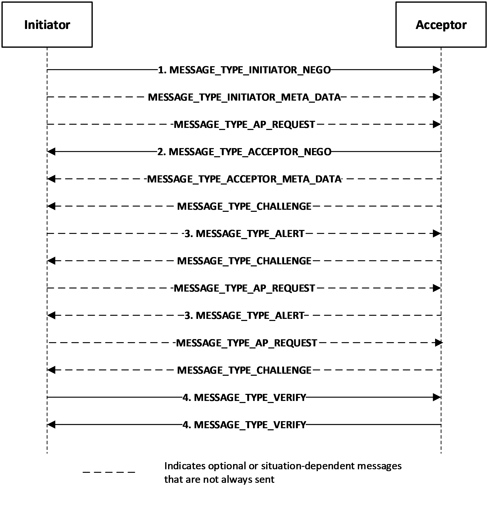
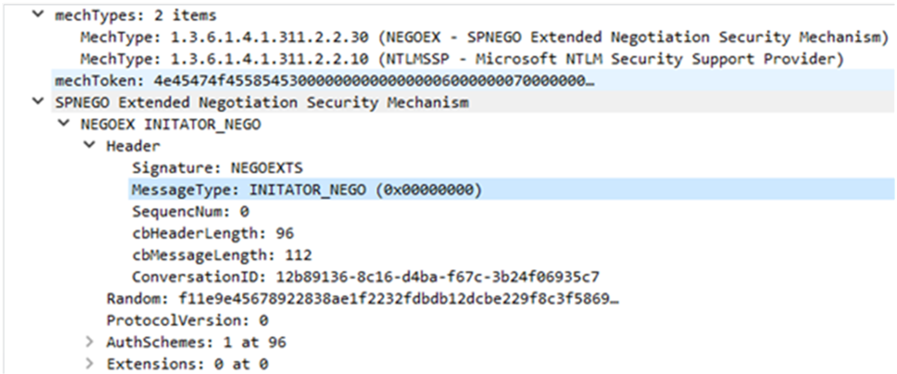
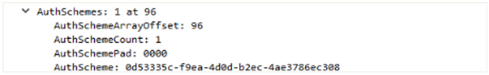

# [MS-NEGOEX]: SPNEGO Extended Negotiation (NEGOEX) Security Mechanism

Table of Contents

1 Introduction

- [1 Introduction](#Section_1)
  - [1.1 Glossary](#Section_1.1)
  - [1.2 References](#Section_1.2)
    - [1.2.1 Normative References](#Section_1.2.1)
    - [1.2.2 Informative References](#Section_1.2.2)
  - [1.3 Overview](#Section_1.3)
    - [1.3.1 NEGOEX Message Flow](#Section_1.3.1)
    - [1.3.2 NEGOEX Message Processing](#Section_1.3.2)
  - [1.4 Relationship to Other Protocols](#Section_1.4)
  - [1.5 Prerequisites/Preconditions](#Section_1.5)
  - [1.6 Applicability Statement](#Section_1.6)
  - [1.7 Versioning and Capability Negotiation](#Section_1.7)
  - [1.8 Vendor-Extensible Fields](#Section_1.8)
  - [1.9 Standards Assignments](#Section_1.9)
    - [1.9.1 Use of Constants Assigned Elsewhere](#Section_1.9.1)

2 Messages

- [2 Messages](#Section_2)
  - [2.1 Transport](#Section_2.1)
  - [2.2 Message Syntax](#Section_2.2)
    - [2.2.1 Numbers](#Section_2.2.1)
    - [2.2.2 GUID typedefs](#Section_2.2.2)
    - [2.2.3 Constants](#Section_2.2.3)
    - [2.2.4 Random array](#Section_2.2.4)
    - [2.2.5 Structures](#Section_2.2.5)
      - [2.2.5.1 Constructed types](#Section_2.2.5.1)
        - [2.2.5.1.1 ALERT](#Section_2.2.5.1.1)
        - [2.2.5.1.2 ALERT_PULSE](#Section_2.2.5.1.2)
        - [2.2.5.1.3 CHECKSUM](#Section_2.2.5.1.3)
        - [2.2.5.1.4 EXTENSION](#Section_2.2.5.1.4)
      - [2.2.5.2 Vector types](#Section_2.2.5.2)
        - [2.2.5.2.1 ALERT_VECTOR](#Section_2.2.5.2.1)
        - [2.2.5.2.2 AUTH_SCHEME_VECTOR](#Section_2.2.5.2.2)
        - [2.2.5.2.3 BYTE_VECTOR](#Section_2.2.5.2.3)
        - [2.2.5.2.4 EXTENSION_VECTOR](#Section_2.2.5.2.4)
    - [2.2.6 Messages](#Section_2.2.6)
      - [2.2.6.1 MESSAGE_TYPE](#Section_2.2.6.1)
      - [2.2.6.2 MESSAGE_HEADER](#Section_2.2.6.2)
      - [2.2.6.3 NEGO_MESSAGE](#Section_2.2.6.3)
      - [2.2.6.4 EXCHANGE_MESSAGE](#Section_2.2.6.4)
      - [2.2.6.5 VERIFY_MESSAGE](#Section_2.2.6.5)
      - [2.2.6.6 ALERT_MESSAGE](#Section_2.2.6.6)

3 Protocol Details

- [3 Protocol Details](#Section_3)
  - [3.1 Common Details](#Section_3.1)
    - [3.1.1 Abstract Data Model](#Section_3.1.1)
    - [3.1.2 Timers](#Section_3.1.2)
    - [3.1.3 Initialization](#Section_3.1.3)
    - [3.1.4 Higher-Layer Triggered Events](#Section_3.1.4)
    - [3.1.5 Message Processing Events and Sequencing Rules](#Section_3.1.5)
      - [3.1.5.1 NEGOEX Supported Security Mechanisms](#Section_3.1.5.1)
      - [3.1.5.2 ConversationID](#Section_3.1.5.2)
      - [3.1.5.3 Cryptographic Computations](#Section_3.1.5.3)
      - [3.1.5.4 Generation of the Initiator Initial Token](#Section_3.1.5.4)
      - [3.1.5.5 Receipt of the Initial Initiator Token and Generation of the Initial Acceptor Response](#Section_3.1.5.5)
      - [3.1.5.6 Receipt of the Acceptor Initial Response and Completion of Authentication After the Negotiation Phrase](#Section_3.1.5.6)
      - [3.1.5.7 Finalizing Negotiation](#Section_3.1.5.7)
      - [3.1.5.8 Supporting GSS-API Extensions](#Section_3.1.5.8)
        - [3.1.5.8.1 GSS_Query_meta_data](#Section_3.1.5.8.1)
        - [3.1.5.8.2 GSS_Exchange_meta_data](#Section_3.1.5.8.2)
        - [3.1.5.8.3 GSS_Query_mechanism_info](#Section_3.1.5.8.3)
        - [3.1.5.8.4 GSS_Inquire_context](#Section_3.1.5.8.4)
    - [3.1.6 Timer Events](#Section_3.1.6)
    - [3.1.7 Other Local Events](#Section_3.1.7)

4 Protocol Examples

- [4 Protocol Examples](#Section_4)

5 Security

- [5 Security](#Section_5)
  - [5.1 Security Considerations for Implementers](#Section_5.1)
  - [5.2 Index of Security Parameters](#Section_5.2)

6 Appendix A: Full NEGOEX

- [6 Appendix A: Full NEGOEX](#Section_6)

7 Appendix B: Product Behavior

- [7 Appendix B: Product Behavior](#Section_7)

8 Change Tracking

- [8 Change Tracking](#Section_8)

For the legal notice and IP terms, see [LEGAL.md](../LEGAL.md).
Last updated: 4/23/2024.
See [Revision History](#revision-history) for full version history.

# 1 Introduction

The SPNEGO Extended Negotiation (NEGOEX) Security Mechanism enhances the capabilities of SPNEGO by providing a security mechanism that can be negotiated by the SPNEGO protocol. When the NEGOEX security mechanism is selected by SPNEGO, NEGOEX provides a method that allows the selection of a common authentication protocol based on metadata such as trust configurations.

Sections 1.5, 1.8, 1.9, 2, and 3 of this specification are normative. All other sections and examples in this specification are informative.

## 1.1 Glossary

This document uses the following terms:

**acceptor**: A participant that receives a session or connection request. This role is also known as the "subordinate".

**application protocol**: A network protocol that operates in the application layer at the top of the OSI model. It visibly accomplishes the task that the user or other agent wants to perform. This is distinguished from all manner of support protocols: from Ethernet or IP at the bottom to security and routing protocols. While necessary, these are not always visible to the user. Application protocols include, for instance, HTTP and Server Message Block (SMB).

**authentication**: The act of proving an identity to a server while providing key material that binds the identity to subsequent communications.

**checksum**: A value that is the summation of a byte stream. By comparing the checksums computed from a data item at two different times, one can quickly assess whether the data items are identical.

**datagram**: A style of communication offered by a network transport protocol where each message is contained within a single network packet. In this style, there is no requirement for establishing a session prior to communication, as opposed to a connection-oriented style.

**Generic Security Services (GSS)**: An Internet standard, as described in [[RFC2743]](https://go.microsoft.com/fwlink/?LinkId=90378), for providing security services to applications. It consists of an application programming interface (GSS-API) set, as well as standards that describe the structure of the security data.

**globally unique identifier (GUID)**: A term used interchangeably with universally unique identifier (UUID) in Microsoft protocol technical documents (TDs). Interchanging the usage of these terms does not imply or require a specific algorithm or mechanism to generate the value. Specifically, the use of this term does not imply or require that the algorithms described in [[RFC4122]](https://go.microsoft.com/fwlink/?LinkId=90460) or [[C706]](https://go.microsoft.com/fwlink/?LinkId=89824) must be used for generating the [**GUID**](#gt_globally-unique-identifier-guid). See also universally unique identifier (UUID).

**initiator**: An actor who starts an action instance.

**object identifier (OID)**: In the context of an object server, a 64-bit number that uniquely identifies an object.

**security protocol**: A protocol that performs [**authentication**](#gt_authentication) and possibly additional security services on a network.

**security token**: An opaque message or data packet produced by a [**Generic Security Services (GSS)**](#gt_generic-security-services-gss)-style [**authentication**](#gt_authentication) package and carried by the application protocol. The application has no visibility into the contents of the token.

**Simple and Protected GSS-API Negotiation Mechanism (SPNEGO)**: An [**authentication**](#gt_authentication) mechanism that allows [**Generic Security Services (GSS)**](#gt_generic-security-services-gss) peers to determine whether their credentials support a common set of GSS-API security mechanisms, to negotiate different options within a given security mechanism or different options from several security mechanisms, to select a service, and to establish a security context among themselves using that service. [**SPNEGO**](#gt_simple-and-protected-gss-api-negotiation-mechanism-spnego) is specified in [[RFC4178]](https://go.microsoft.com/fwlink/?LinkId=90461).

**MAY, SHOULD, MUST, SHOULD NOT, MUST NOT:** These terms (in all caps) are used as defined in [[RFC2119]](https://go.microsoft.com/fwlink/?LinkId=90317). All statements of optional behavior use either MAY, SHOULD, or SHOULD NOT.

## 1.2 References

Links to a document in the Microsoft Open Specifications library point to the correct section in the most recently published version of the referenced document. However, because individual documents in the library are not updated at the same time, the section numbers in the documents may not match. You can confirm the correct section numbering by checking the [Errata](https://go.microsoft.com/fwlink/?linkid=850906).

### 1.2.1 Normative References

We conduct frequent surveys of the normative references to assure their continued availability. If you have any issue with finding a normative reference, please contact [dochelp@microsoft.com](mailto:dochelp@microsoft.com). We will assist you in finding the relevant information.

[IETFDRAFT-NEGOEX-04] Short, M., Zhu, L., Damour, K, and McPherson, D, "SPNEGO Extended Negotiation (NEGOEX) Security Mechanism", draft-zhu-negoex-04, January 2011, [https://tools.ietf.org/id/draft-zhu-negoex-04.txt](https://go.microsoft.com/fwlink/?linkid=2112888)

[MS-DTYP] Microsoft Corporation, "[Windows Data Types](../MS-DTYP/MS-DTYP.md)".

[MS-ERREF] Microsoft Corporation, "[Windows Error Codes](../MS-ERREF/MS-ERREF.md)".

[MS-SPNG] Microsoft Corporation, "[Simple and Protected GSS-API Negotiation Mechanism (SPNEGO) Extension](../MS-SPNG/MS-SPNG.md)".

[RFC2119] Bradner, S., "Key words for use in RFCs to Indicate Requirement Levels", BCP 14, RFC 2119, March 1997, [https://www.rfc-editor.org/info/rfc2119](https://go.microsoft.com/fwlink/?LinkId=90317)

[RFC2743] Linn, J., "Generic Security Service Application Program Interface Version 2, Update 1", RFC 2743, January 2000, [https://www.rfc-editor.org/info/rfc2743](https://go.microsoft.com/fwlink/?LinkId=90378)

[RFC3961] Raeburn, K., "Encryption and Checksum Specifications for Kerberos 5", RFC 3961, February 2005, [https://www.rfc-editor.org/info/rfc3961](https://go.microsoft.com/fwlink/?LinkId=90450)

### 1.2.2 Informative References

[MSDOCS-CustomSSPs] Microsoft Corporation, "Creating Custom Security Packages", [https://learn.microsoft.com/en-us/windows/win32/secauthn/creating-custom-security-packages](https://go.microsoft.com/fwlink/?linkid=2133498)

[MSDOCS-NegoExSSP] McPherson, D., "The Windows Negotiation Extension and Writing NegoEx SSPs", March 2011, [https://learn.microsoft.com/en-us/previous-versions/ff468736(v=msdn.10)](https://go.microsoft.com/fwlink/?linkid=2133834)

[MSDOCS-NTSECPKG-H] Microsoft Corporation, "ntsecpkg.h header", NT Security Package header Calllback functions, Structures, and Enumerations, [https://learn.microsoft.com/en-us/windows/win32/api/ntsecpkg/](https://go.microsoft.com/fwlink/?linkid=2133730)

[RFC4178] Zhu, L., Leach, P., Jaganathan, K., and Ingersoll, W., "The Simple and Protected Generic Security Service Application Program Interface (GSS-API) Negotiation Mechanism", RFC 4178, October 2005, [https://www.rfc-editor.org/info/rfc4178](https://go.microsoft.com/fwlink/?LinkId=90461)

## 1.3 Overview

The [**SPNEGO**](#gt_simple-and-protected-gss-api-negotiation-mechanism-spnego) Extended Negotiation Security Mechanism (NEGOEX) extends Simple and Protected GSS-API Negotiation Mechanism (SPNEGO) described in [[RFC4178]](https://go.microsoft.com/fwlink/?LinkId=90461). SPNEGO provides a negotiation mechanism for [**Generic Security Services (GSS)**](#gt_generic-security-services-gss) API (GSS-API), as described in [[RFC2743]](https://go.microsoft.com/fwlink/?LinkId=90378). NEGOEX is based on the NEGOEX version 4 draft [[IETFDRAFT-NEGOEX-04]](https://go.microsoft.com/fwlink/?linkid=2112888) that enhances the capabilities of SPNEGO and provides a security mechanism that can be negotiated by the SPNEGO protocol. NEGOEX defines a few new GSS-API extensions that a security mechanism MUST support to be negotiated by NEGOEX. This document defines these GSS-API extensions. Unlike SPNEGO, NEGOEX defines its own way for signing the protocol messages to protect the protocol negotiation.

The NEGOEX protocol is designed to address the drawbacks of the SPNEGO negotiation model. When negotiated by SPNEGO, NEGOEX uses the concepts developed in the GSS-API specification. The negotiation data is encapsulated in context-level tokens. Therefore, callers of the GSS-API do not need to be aware of the existence of the negotiation tokens but only of the SPNEGO pseudo-security mechanism. When selected, NEGOEX provides a method that allows selection of a common [**authentication**](#gt_authentication) protocol. It preserves the optimistic token semantics of SPNEGO and applies that recursively. Accordingly, a context establishment mechanism token can be included in the initial NEGOEX message, such that NEGOEX does not require an extra round trip when the initiator’s or client’s optimistic token is accepted by the target (or server acceptor).

Standard GSS has a strict interpretation of client ([**initiator**](#gt_initiator)) and server ([**acceptor**](#gt_acceptor)). SPNEGO Extension (SPNG) has extended [RFC4178] to allow the server to initiate SPNG message flow. The message flow can begin from either the client or the server as the initiator, whereas the receiver is the acceptor. See [MS-SPNG](../MS-SPNG/MS-SPNG.md) for client/server roles and variations.

### 1.3.1 NEGOEX Message Flow

NEGOEX message flow is composed of several messages in which the header contains the type of message that is sent. The message types are defined by the **MESSAGE_TYPE** enumeration, as defined in section [2.2.6.1](#Section_2.2.6.1). These message types are shown in the following exchange:

Figure 1: The NEGOEX message flow

- The initiator sends a MESSAGE_TYPE_INITIATOR_NEGO type message to the acceptor, which can be followed by zero or more MESSAGE_TYPE_INITIATOR_META_DATA type messages containing meta-data tokens, followed by zero or one MESSAGE_TYPE_AP_REQUEST type messages containing an optimistic initial context token.
- The acceptor responds back to the initiator with MESSAGE_TYPE_ACCEPTOR_NEGO type message, followed by zero or more MESSAGE_TYPE_ACCEPTOR_META_DATA type messages containing meta-data tokens, followed by zero or more MESSAGE_TYPE_CHALLENGE type messages.
- The initiator or acceptor can send a MESSAGE_TYPE_ALERT type message to request the peer to resend the message. The alert message might not always be sent.
- The initiator and acceptor use the MESSAGE_TYPE_VERIFY type message in the output token, if there is a shared key that was established. The key is used to sign all the NEGOEX messages in the negotiation context.

### 1.3.2 NEGOEX Message Processing

The NEGOEX message flow between the initiator and the acceptor is processed as follows:

- The initiator proposes a list of security mechanisms in decreasing order of preference. NEGOEX optionally includes a mechanism-specific metadata token for each negotiated security mechanism. For a metadata token that is received from the initiator, NEGOEX acceptor queries the initiator message to get the metadata token to include in the acceptor's NEGOEX reply message. The GSS-API extensions that are used for processing the exchange are described in section [3.1.5.8](#Section_3.1.5.8). The metadata exchange allows security mechanisms to exchange secondary information such as trust configurations. Thus, NEGOEX provides more flexibility than simply a security mechanism exchange of [**object identifiers (OIDs)**](#gt_object-identifier-oid) in SPNEGO.
- The acceptor then forwards the metadata token from the initiator to the intended security mechanism. A metadata token that is not supported on the acceptor side is ignored. A security mechanism that reports a failure is removed from the set of mutually supported mechanisms. The acceptor then responds with the list of mutually supported mechanisms in decreasing order of preference. For each of these mechanisms, NEGOEX again optionally supplies a mechanism-specific metadata token in the response, which the acceptor obtains from each remaining supported mechanism in the initiator's message via the new GSS-API extensions described in the step 1.
- The initiator again optionally applies a mechanism-specific metadata token in the response, which the initiator obtains from each remaining supported mechanism in the acceptor message using the GSS-API extensions. The initiator then removes the failed security mechanisms from the set of mutually supported mechanisms. If more than one security mechanism is available, the highest security mechanism in the acceptor’s preference order is selected, unless otherwise specified. Later, when the common security mechanism is identified, the security mechanism might also negotiate mechanism-specific options during its context establishments. This will be inside the mechanism tokens and will be invisible to the NEGOEX protocol during step 5.
- The selected security mechanism provides keying materials to NEGOEX via new GSS-API extensions, which are defined later in this document. NEGOEX signs and verifies the negotiation NEGOEX messages to protect the negotiation.
- Token exchanges between the initiator and the acceptor take place until the GSS-API context for the selected security mechanism is established. After this, the per-message tokens are generated and verified according to the selected security mechanism.
To avoid an extra round trip, the initial [**security token**](#gt_security-token) of the preferred mechanism for the initiator can be embedded in the initial NEGOEX token. The optimistic mechanism token can be accompanied by the metadata tokens, and it MUST be the first mechanism in the list of the mechanisms proposed by the initiator. The NEGOEX MESSAGE_TYPE_INITIATOR_NEGO message type (section [2.2.6.1](#Section_2.2.6.1)) that contains signatures for protecting the NEGOEX negotiation can also accompany the optimistic mechanism token. If the acceptor's preferred mechanism matches the initiator's preferred mechanism and the NEGOEX negotiation protection messages are included with the mechanism token, no additional round trips are incurred by using the NEGOEX protocol with SPNEGO.

## 1.4 Relationship to Other Protocols

NEGOEX cannot work outside of the [**SPNEGO**](#gt_simple-and-protected-gss-api-negotiation-mechanism-spnego) protocol. Its relationship to other protocols is defined in [MS-SPNG](../MS-SPNG/MS-SPNG.md) section 1.3.2, which pertains specifically to NEGOEX.

## 1.5 Prerequisites/Preconditions

When negotiated by [**SPNEGO**](#gt_simple-and-protected-gss-api-negotiation-mechanism-spnego), NEGOEX uses the concepts developed in the GSS-API specification [[RFC2743]](https://go.microsoft.com/fwlink/?LinkId=90378). Therefore, the prerequisites/preconditions defined in [MS-SPNG](../MS-SPNG/MS-SPNG.md) section 1.5 are applicable to NEGOEX.

Because NEGOEX relies on other [**security protocols**](#gt_security-protocol) that perform [**authentication**](#gt_authentication), those protocols have to be available for it to operate. The set of available protocols is implementation specific and is set at the time of installation<1>.

The message signing and verification in NEGOEX is based on [[RFC3961]](https://go.microsoft.com/fwlink/?LinkId=90450), which is used as a generic framework. A security mechanism has to support [RFC3961] in order to be negotiated by NEGOEX.

## 1.6 Applicability Statement

Like [**SPNEGO**](#gt_simple-and-protected-gss-api-negotiation-mechanism-spnego), NEGOEX can be used in almost any situation where an application protocol uses [**GSS**](#gt_generic-security-services-gss) to perform [**authentication**](#gt_authentication). The protocol has to be connection oriented, as it is not designed to tolerate packet loss; [**datagram**](#gt_datagram)-only protocols cannot support negotiation of this form.

## 1.7 Versioning and Capability Negotiation

Like [**SPNEGO**](#gt_simple-and-protected-gss-api-negotiation-mechanism-spnego), NEGOEX does not contain any versioning capacity. Any capability negotiation must be performed by the authentication protocols that SPNEGO is using.

## 1.8 Vendor-Extensible Fields

None.

## 1.9 Standards Assignments

None.

### 1.9.1 Use of Constants Assigned Elsewhere

The [**object identifier (OID)**](#gt_object-identifier-oid) of NEGOEX within [**SPNEGO**](#gt_simple-and-protected-gss-api-negotiation-mechanism-spnego) has the following value:

iso.org.dod.internet.private.enterprise.microsoft.security.mechanisms.negoex (1.3.6.1.4.1.311.2.2.30)

# 2 Messages

## 2.1 Transport

Because NEGOEX cannot work outside of [**SPNEGO**](#gt_simple-and-protected-gss-api-negotiation-mechanism-spnego), the transport concepts of SPNEGO are applicable to NEGOEX, as specified in [MS-SPNG](../MS-SPNG/MS-SPNG.md) section 2.1. NEGOEX is transported only when encapsulated in an [**application protocol**](#gt_application-protocol).

## 2.2 Message Syntax

The messages that NEGOEX uses are specified in [[IETFDRAFT-NEGOEX-04]](https://go.microsoft.com/fwlink/?linkid=2112888).<2> NEGOEX uses the following message enumeration and message structures, which are documented in the specified sections:

- **MESSAGE_TYPE** enumeration (section [2.2.6.1](#Section_2.2.6.1))
- **MESSAGE_HEADER** (section [2.2.6.2](#Section_2.2.6.2))
- **NEGO_MESSAGE** (section [2.2.6.3](#Section_2.2.6.3))
- **EXCHANGE_MESSAGE** (section [2.2.6.4](#Section_2.2.6.4))
- **VERIFY_MESSAGE** (section [2.2.6.5](#Section_2.2.6.5))
- **ALERT_MESSAGE** (section [2.2.6.6](#Section_2.2.6.6))
**MESSAGE_TYPE:** An enumeration that designates the type of message that is used. It is contained in the **MESSAGE_HEADER**.

**MESSAGE_HEADER:** A structure that is used in each message that contains metadata about each message, such as message signature, message type, sequence number, header length, message length, and conversation ID.

**NEGO_MESSAGE:** A structure that is used to begin and exchange negotiation of security mechanisms. The **NEGO_MESSAGE** message is sent from the initiator to the acceptor with the message type set to MESSAGE_TYPE_INITIATOR_NEGO to begin the negotiation. <3> The initiator uses this message to specify the set of supported security mechanisms. The acceptor then responds with the **NEGO_MESSAGE** message with the message type set to MESSAGE_TYPE_ACCEPTOR_NEGO and with its own list of supported security mechanisms.<4>

**EXCHANGE_MESSAGE:** A structure that is used to exchange context tokens and metadata tokens by a request or challenge between the initiator and the acceptor. The **MessageType** field is set to MESSAGE_TYPE_AP_REQUEST for the initiator or MESSAGE_TYPE_CHALLENGE for the acceptor when context tokens are being exchanged. The **MessageType** field is set to MESSAGE_TYPE_INITIATOR_META_DATA for the initiator or MESSAGE_TYPE_ACCEPTOR_META_DATA for the acceptor when metadata tokens are being exchanged.

**VERIFY_MESSAGE:** A structure that uses the [**checksum**](#gt_checksum) mechanism to verify messages between the initiator and the acceptor. The message type MUST be set to MESSAGE_TYPE_VERIFY.

**ALERT_MESSAGE:** A structure that is used to indicate that a message needs to be resent. This message contains the security mechanism, error codes, and various alert types. This message might not always be sent.

### 2.2.1 Numbers

The numbers that follow are defined in hexadecimal format for use in NEGOEX structures.

- UCHAR is the data type for a one-octet number, as specified in [MS-DTYP](../MS-DTYP/MS-DTYP.md) section 2.2.45.
- ULONG is the data type for a 4-octet number encoded in little-endian, as specified in [MS-DTYP] section 2.2.51.
- USHORT is the data type for a 2-octet number encoded in little-endian, as specified in [MS-DTYP] section 2.2.58.
- ULONG64 is the data type for an 8-octet number encoded in little-endian, as specified in [MS-DTYP] section 2.2.54.
- GUID is the data type for a 16-octet number encoded in little-endian, as specified in [MS-DTYP] section 2.3.4.

### 2.2.2 GUID typedefs

GUID typedefs are used to create more meaningful names for existing types. The following [**GUID**](#gt_globally-unique-identifier-guid) type synonyms are defined.

typedef GUID AUTH_SCHEME;

typedef GUID CONVERSATION_ID;

**AUTH_SCHEME:** A GUID that contains the security mechanism's ID.

**CONVERSATION_ID:** A GUID that contains the conversation ID used by the initiator and acceptor as the context handle to identify the exchange conversation. The initiator generates a random cryptographic-strength 16-byte value, stores it in the ConversationId field of the **MESSAGE_HEADER** structure, as specified in section [2.2.6.2](#Section_2.2.6.2). See section [3.1.5.2](#Section_3.1.5.2).

### 2.2.3 Constants

Constants for various messages are defined as follows.

In the **MESSAGE_HEADER** structure (section [2.2.6.2](#Section_2.2.6.2)), the **Signature** field contains the MESSAGE_SIGNATURE.

#define MESSAGE_SIGNATURE 0x535458454f47454ei64 // "NEGOEXTS"

In the **CHECKSUM** structure (section [2.2.5.1.3](#Section_2.2.5.1.3)), the **ChecksumScheme** field describes how checksum is computed and verified.

#define CHECKSUM_SCHEME_RFC3961 1

The **ALERT_MESSAGE** structure (section [2.2.6.6](#Section_2.2.6.6)) uses the following alert type.

#define ALERT_TYPE_PULSE 1

The following is the reason code for the heartbeat message.

#define ALERT_VERIFY_NO_KEY 1

### 2.2.4 Random array

The **Random** array is used in the **NEGO_MESSAGE** message (section [2.2.6.3](#Section_2.2.6.3)) **Random** field and is defined as an array of 32 octets, as follows.

UCHAR Random[32];

**Random:** An array of UCHAR integers as specified in section [2.2.1](#Section_2.2.1). The initiator fills the array using a secure random number generator.

### 2.2.5 Structures

NEGOEX defines constructed-type and vector-type structures. These two structure types are defined in the following sections.

#### 2.2.5.1 Constructed types

Constructed types are structure types that are constructed from primitive types for convenience. Each specification declares a new, unique type. The syntax for definition is much like the syntax in the C programming language. Structure definitions can be embedded. The following sections define constructed types.

##### 2.2.5.1.1 ALERT

The **ALERT** structure is used in the **ALERT_VECTOR** structure, which is used in the **Alerts** field of the **ALERT_MESSAGE** structure message, as specified in section [2.2.6.6](#Section_2.2.6.6).

struct

{

ULONG AlertType;

BYTE_VECTOR AlertValue;

} ALERT;

**AlertType:** A ULONG that indicates the type of the alert.

**AlertValue:** A **BYTE_VECTOR** structure, as specified in section [2.2.5.2.3](#Section_2.2.5.2.3), that contains an array of alert values.

##### 2.2.5.1.2 ALERT_PULSE

The **ALERT_PULSE** structure is used in the **ALERT_MESSAGE** structure message, as specified in section [2.2.6.6](#Section_2.2.6.6).

struct

{

ULONG cbHeaderLength;

ULONG Reason;

- } ALERT_PULSE;
**cbHeaderLength:** A ULONG that contains the header length of this message.

**Reason:** A ULONG that contains the reason code for the heartbeat message ALERT_VERIFY_NO_KEY, as specified in section [2.2.3](#Section_2.2.3).

##### 2.2.5.1.3 CHECKSUM

The **CHECKSUM** structure is used in the **VERIFY_MESSAGE** structure (section [2.2.6.5](#Section_2.2.6.5)) and is defined as follows.

struct

{

ULONG cbHeaderLength;

ULONG ChecksumScheme;

ULONG ChecksumType;

BYTE_VECTOR ChecksumValue;

} CHECKSUM;

**cbHeaderLength:** A ULONG that contains the length of the structure definition in octets; this field has a value of 20.

**ChecksumScheme:** A ULONG that describes how checksum is computed and verified. Only the CHECKSUM_SCHEME_RFC3961 is defined, as specified in section [2.2.3](#Section_2.2.3). When the value of the **ChecksumScheme** field is 1 (CHECKSUM_SCHEME_RFC3961), the **ChecksumValue** field contains a sequence of octets computed according to [[RFC3961]](https://go.microsoft.com/fwlink/?LinkId=90450) and the **ChecksumType** field contains the checksum type value defined according to [RFC3961].

**ChecksumType:** A ULONG that contains the checksum type of value defined according to [RFC3961].

**ChecksumValue:** A **BYTE_VECTOR** structure that contains a sequence of octets computed according to [RFC3961].

##### 2.2.5.1.4 EXTENSION

An **EXTENSION** structure is used in the **EXTENSION_VECTOR** structure (section [2.2.5.2.4](#Section_2.2.5.2.4)) as the **Extensions** field in the **NEGO_MESSAGE** structure, as specified in section [2.2.6.3](#Section_2.2.6.3).

struct

{

ULONG ExtensionType;

BYTE_VECTOR ExtensionValue;

} EXTENSION;

**ExtensionType:** A ULONG that indicates how the extension data should be interpreted. All negative extension types (the highest bit is set to 1) are critical. If the receiver does not understand a critical extension, the authentication attempt MUST be rejected.

**ExtensionValue:** A **BYTE_VECTOR** structure that contains the extension data.

#### 2.2.5.2 Vector types

Vector types are data structures that hold multiple variables of the same data type consecutively, and the number of elements is not fixed. A vector contains a fixed-length header followed by a variable-length payload. The header of a vector structure contains the count of elements and the offset to the payload. In this protocol all the offset fields start from the beginning of the containing NEGOEX message. The size of each element is specified by the vector type definition. Vector type structures are defined in the following sections.

##### 2.2.5.2.1 ALERT_VECTOR

The **ALERT_VECTOR** structure contains the alert types and the count of alerts used in the **ALERT_MESSAGE** structure, as specified in section [2.2.6.6](#Section_2.2.6.6).

struct

{

ULONG AlertArrayOffset;

USHORT AlertCount;

- } ALERT_VECTOR;
**AlertArrayOffset:** A ULONG that contains array of **ALERT** structures, as specified in section [2.2.5.1.1](#Section_2.2.5.1.1).

**AlertCount:** A USHORT that contains the number of alerts in the **AlertArrayOffset** field.

##### 2.2.5.2.2 AUTH_SCHEME_VECTOR

The **AUTH_SCHEME_VECTOR** structure encapsulates a variable-length array of **AUTH_SCHEME** [**GUID**](#gt_globally-unique-identifier-guid)s that are stored consecutively.

`struct`

`{`

`ULONG AuthSchemeArrayOffset;`

`USHORT AuthSchemeCount;`

`} AUTH_SCHEME_VECTOR;`

**AuthSchemeArrayOffset:** A ULONG type array of ordered **AUTH_SCHEME** GUID values, specified in section [2.2.2](#Section_2.2.2), that represents the security mechanism's ID in decreasing order of preference.

**AuthSchemeCount:** A USHORT that contains the count of **AUTH_SCHEME** values.

##### 2.2.5.2.3 BYTE_VECTOR

The **BYTE_VECTOR** structure encapsulates a variable-length array of octets (or bytes) that are stored consecutively. The **BYTE_VECTOR** structure is used in the following structures:

- **CHECKSUM** structure (section [2.2.5.1.3](#Section_2.2.5.1.3))
- **EXTENSION** structure (section [2.2.5.1.4](#Section_2.2.5.1.4))
- **EXCHANGE_MESSAGE** structure (section [2.2.6.4](#Section_2.2.6.4))
struct

{

ULONG ByteArrayOffset;

ULONG ByteArrayLength;

} BYTE_VECTOR;

**ByteArrayOffset:** A ULONG type array. Each element contains 1 byte.

**ByteArrayLength:** A ULONG type that contains the length of the **ByteArrayOffset** field.

##### 2.2.5.2.4 EXTENSION_VECTOR

The **EXTENSION_VECTOR** structure encapsulates a variable-length array of **EXTENSION** structures (section [2.2.5.1.4](#Section_2.2.5.1.4)) that are stored consecutively. The **EXTENSION_VECTOR** structure is used in the **Extensions** field in the **NEGO_MESSAGE** structure, as specified in section [2.2.6.3](#Section_2.2.6.3).

struct

{

ULONG ExtensionArrayOffset;

USHORT ExtensionCount;

} EXTENSION_VECTOR;

**ExtensionArrayOffset:** A ULONG type array. Each element contains an **EXTENSION** structure, as specified in section 2.2.5.1.4.

**ExtensionCount:** A USHORT that contains the count of elements in the **ExtensionArrayOffset** field.

### 2.2.6 Messages

Each NEGOEX message has a type that is indicated with a value from the **MESSAGE_TYPE** enumeration (section [2.2.6.1](#Section_2.2.6.1)) that is in the **MessageType** field of the **MESSAGE_HEADER** structure (section [2.2.6.2](#Section_2.2.6.2)). This header provides metadata for every NEGOEX message. The **MESSAGE_TYPE** enumeration, **MESSAGE_HEADER** structure, and NEGOEX messages are defined in the following sections.

#### 2.2.6.1 MESSAGE_TYPE

The **MESSAGE_TYPE** enumeration defines the types of messages sent in the **MESSAGE_HEADER** structure **MessageType** field in every message, as specified in section [2.2.6.2](#Section_2.2.6.2). MESSAGE_TYPE_INITIATOR_NEGO type has the value 0, and MESSAGE_TYPE_ALERT type has the value 7. A value is a 4-octet number encoded in little-endian.

enum

{

MESSAGE_TYPE_INITIATOR_NEGO = 0,

MESSAGE_TYPE_ACCEPTOR_NEGO,

MESSAGE_TYPE_INITIATOR_META_DATA,

MESSAGE_TYPE_ACCEPTOR_META_DATA,

MESSAGE_TYPE_CHALLENGE,

MESSAGE_TYPE_AP_REQUEST,

MESSAGE_TYPE_VERIFY,

MESSAGE_TYPE_ALERT

} MESSAGE_TYPE;

**MESSAGE_TYPE_INITIATOR_NEGO:** Used in **NEGO_MESSAGE**, as specified in section [2.2.6.3](#Section_2.2.6.3), to begin negotiation of security mechanisms.

**MESSAGE_TYPE_ACCEPTOR_NEGO:** Used in **NEGO_MESSAGE**, as specified in section 2.2.6.3, for the acceptor's output token.

**MESSAGE_TYPE_INITIATOR_META_DATA:** Used in **EXCHANGE_MESSAGE**, as specified in section [2.2.6.4](#Section_2.2.6.4), to return a metadata token to NEGOEX for a security mechanism by the initiator.

**MESSAGE_TYPE_ACCEPTOR_META_DATA:** Used in **EXCHANGE_MESSAGE**, as specified in section 2.2.6.4, to return a metadata token to NEGOEX for a security mechanism by the acceptor.

**MESSAGE_TYPE_CHALLENGE:** Used in **EXCHANGE_MESSAGE**, as specified in section 2.2.6.4, to encapsulate context tokens of the negotiated security mechanism by the acceptor.

**MESSAGE_TYPE_AP_REQUEST:** Used in **EXCHANGE_MESSAGE**, as specified in section 2.2.6.4, to encapsulate context tokens of the negotiated security mechanism by the initiator.

**MESSAGE_TYPE_VERIFY:** Used in **VERIFY_MESSAGE**, as specified in section [2.2.6.5](#Section_2.2.6.5), when there is a shared key established that is used to sign all the NEGOEX messages in the negotiation context.

**MESSAGE_TYPE_ALERT:** Used in **ALERT_MESSAGE**, as specified in section [2.2.6.6](#Section_2.2.6.6), to indicate that the message needs to be resent. Contains the security mechanism, error codes, and various alert types.

#### 2.2.6.2 MESSAGE_HEADER

The **MESSAGE_HEADER** structure is a member of other message structures and is used to provide metadata about each message. The fields are common for all the NEGOEX messages in a conversation exchange except for the **MESSAGE_TYPE** field, which varies according to the message.

struct

{

ULONG64 Signature;

MESSAGE_TYPE MessageType;

ULONG SequenceNum;

ULONG cbHeaderLength;

ULONG cbMessageLength;

CONVERSATION_ID ConversationId;

} MESSAGE_HEADER;

**Signature:** A ULONG64 type that contains the MESSAGE_SIGNATURE constant in hexadecimal format that indicates "NEGOEXTS", as specified in section [2.2.3](#Section_2.2.3). The message signature should remain the same throughout the negotiation process.

**MessageType:** A value of the **MESSAGE_TYPE** enumeration, as specified in section [2.2.6.1](#Section_2.2.6.1), that contains the type of message.

**SequenceNum:** A ULONG type that contains the message sequence number of the specific conversation, starting with 0 and incremented sequentially.

**cbHeaderLength:** A ULONG type that contains the header length of the message, which includes the message-specific header and excludes the payload.

**cbMessageLength:** A ULONG type that contains the length of the message.

**ConversationId**: A **CONVERSATION_ID** GUID, as specified in section [2.2.2](#Section_2.2.2), that the initiator and the acceptor use as a context handle to identify an exchange conversation. The **CONVERSATION_ID** is referred to as ConversationID (section [3.1.5.2](#Section_3.1.5.2)). The ConversationID MUST remain the same throughout the entire exchange.

#### 2.2.6.3 NEGO_MESSAGE

The **NEGO_MESSAGE** structure message is used to begin and exchange negotiation of security mechanisms. This message is sent from the initiator to the acceptor with the message type set to MESSAGE_TYPE_INITIATOR_NEGO to begin the negotiation. The initiator uses this message to specify the set of supported security mechanisms. The acceptor then responds with a **NEGO_MESSAGE** message, with the message type set to MESSAGE_TYPE_ACCEPTOR_NEGO and with its own list of supported security mechanisms. This message contains signatures for protecting the NEGOEX negotiation and might also contain the optimistic mechanism token.

The **NEGO_MESSAGE** structure has the following definition.

struct

{

MESSAGE_HEADER Header;

UCHAR Random[32];

ULONG64 ProtocolVersion;

AUTH_SCHEME_VECTOR AuthSchemes;

EXTENSION_VECTOR Extensions;

- } NEGO_MESSAGE;
**Header:** A **MESSAGE_HEADER** structure, as specified in section [2.2.6.2](#Section_2.2.6.2). Its **MessageType** field can carry from the **MESSAGE_TYPE** enumeration (section [2.2.6.1](#Section_2.2.6.1)) either the value MESSAGE_TYPE_INITIATOR_NEGO for the initiator or the value MESSAGE_TYPE_ACCEPTOR_NEGO for the acceptor.

**Random:** A UCHAR integer array. The **Random** field is filled using a secure random number generator, as specified in section [2.2.4](#Section_2.2.4).

**ProtocolVersion:** A ULONG64 type that indicates the numbered version of this protocol. This field contains 0.

**AuthSchemes:** An **AUTH_SCHEME_VECTOR** structure, as specified in section [2.2.5.2.2](#Section_2.2.5.2.2), that contains an ordered list of available, supported security mechanism IDs in decreasing order of preference.

**Extensions:** All negative extension types are critical (the highest bit is set to 1). If the receiver does not understand a critical extension, the authentication attempt MUST be rejected.

#### 2.2.6.4 EXCHANGE_MESSAGE

The **EXCHANGE_MESSAGE** structure message is used to encapsulate context tokens of the negotiated security mechanism for either the initiator or the acceptor.

struct

{

MESSAGE_HEADER Header;

AUTH_SCHEME AuthScheme;

BYTE_VECTOR Exchange;

- } EXCHANGE_MESSAGE;
**Header:** A **MESSAGE_HEADER** structure, as specified in section [2.2.6.2](#Section_2.2.6.2). The Header’s **MessageType** field is set from the values of the **MESSAGE_TYPE** enumeration, as specified in section [2.2.6.1](#Section_2.2.6.1). The **MessageType** field MUST be set to MESSAGE_TYPE_AP_REQUEST type for the initiator or MESSAGE_TYPE_CHALLENGE type for the acceptor when context tokens are being exchanged. The **MessageType** field MUST be set to MESSAGE_TYPE_INITIATOR_META_DATA type for the initiator or MESSAGE_TYPE_ACCEPTOR_META_DATA type for the acceptor when metadata tokens are being exchanged.

**AuthScheme:** An **AUTH_SCHEME** GUID that contains the security mechanism's ID, as specified in section [2.2.2](#Section_2.2.2).

**Exchange:** A **BYTE_VECTOR** structure, specified in section [2.2.5.2.3](#Section_2.2.5.2.3), that contains the opaque handshake message for the client authentication scheme.

#### 2.2.6.5 VERIFY_MESSAGE

A **VERIFY_MESSAGE** structure message is produced using the required [**checksum**](#gt_checksum) mechanism per [[RFC3961]](https://go.microsoft.com/fwlink/?LinkId=90450) and is included in the output token.

struct

{

MESSAGE_HEADER Header;

AUTH_SCHEME AuthScheme;

CHECKSUM Checksum;

} VERIFY_MESSAGE;

**Header:** A **MESSAGE_HEADER** structure, as specified in section [2.2.6.2](#Section_2.2.6.2). The header’s message type MUST be set to the MESSAGE_TYPE_VERIFY value from the **MESSAGE_TYPE** enumeration, as specified in section [2.2.6.1](#Section_2.2.6.1).

**AuthScheme:** An **AUTH_SCHEME** GUID, as specified in section [2.2.2](#Section_2.2.2), that identifies the security mechanism ID from which the protocol key was obtained.

**Checksum:** A **CHECKSUM** structure, specified in section [2.2.5.1.3](#Section_2.2.5.1.3), that contains the checksum of all the previously exchanged messages in the order they were sent in the conversation. The checksum is calculated based on [RFC3961].

#### 2.2.6.6 ALERT_MESSAGE

The **ALERT_MESSAGE** structure message is sent by the initiator or the acceptor requesting that the peer resend the message. The **ALERT_MESSAGE** might not always be sent.

struct

{

MESSAGE_HEADER Header;

AUTH_SCHEME AuthScheme;

ULONG ErrorCode;

ALERT_VECTOR Alerts;

} ALERT_MESSAGE;

**Header:** A **MESSAGE_HEADER** structure, as specified in section [2.2.6.2](#Section_2.2.6.2). The header’s message type MUST be set to the MESSAGE_TYPE_ALERT value from the **MESSAGE_TYPE** enumeration, as specified in section [2.2.6.1](#Section_2.2.6.1).

**AuthScheme:** An **AUTH_SCHEME** GUID, as specified in section [2.2.2](#Section_2.2.2), that indicates the security mechanism ID to which the alert message is targeted.

**ErrorCode:** A ULONG type indicating an NTSTATUS code, as specified in [MS-ERREF](../MS-ERREF/MS-ERREF.md) section 2.3.

**Alerts:** An **ALERT_VECTOR** structure, as specified in section [2.2.5.2.1](#Section_2.2.5.2.1), that contains **ALERT** structures, as specified in section [2.2.5.1.1](#Section_2.2.5.1.1).

# 3 Protocol Details

## 3.1 Common Details

The following sections specify common variations for both client and server processing in the NEGOEX extension, as specified in [[IETFDRAFT-NEGOEX-04]](https://go.microsoft.com/fwlink/?linkid=2112888).

### 3.1.1 Abstract Data Model

This section describes a conceptual model of possible data organization that an implementation maintains to participate in this protocol. The described organization is provided to facilitate the explanation of how the protocol behaves. This document does not mandate that implementations adhere to this model as long as their external behavior is consistent with that described in this document.

The **MESSAGE_TYPE** enumerator specified in section [2.2.6.1](#Section_2.2.6.1) lists all NEGOEX message types. A GSS-API context token for NEGOEX consists of one or more NEGOEX messages. If there is more than one NEGOEX message, these messages are concatenated together. The smallest data unit for NEGOEX to compute the checksum for negotiation protection is a NEGOEX message. Note that NEGOEX is not a GSS-API mechanism itself and that the initial NEGOEX context establishment token does not follow the mechanism-independent token format specified in [[RFC2743]](https://go.microsoft.com/fwlink/?LinkId=90378) section 3.1.

The object identifier of the NEGOEX within SPNEGO is specified in section [1.9.1](#Section_1.9.1).

### 3.1.2 Timers

None.

### 3.1.3 Initialization

None.

### 3.1.4 Higher-Layer Triggered Events

None.

### 3.1.5 Message Processing Events and Sequencing Rules

The following sections specify how the initiator and the acceptor process and return messages.

#### 3.1.5.1 NEGOEX Supported Security Mechanisms

NEGOEX maintains an ordered list of supported security mechanism names to determine the priority of the security mechanisms. A security mechanism negotiable by NEGOEX is identified by an identifier of the **AUTH_SCHEME** data type, as specified in section [2.2.2](#Section_2.2.2), and is referenced by the corresponding authentication scheme ID. The authentication scheme ID of a security mechanism is returned to NEGOEX by calling **GSS_Query_mechanism_info()** with the name of the security mechanism, as specified in section [3.1.5.8.3](#Section_3.1.5.8.3).

The selected security mechanism provides keying materials to NEGOEX via new GSS-API extensions that are specified in the following sections. NEGOEX signs and verifies the NEGOEX messages to protect the negotiation.

#### 3.1.5.2 ConversationID

ConversationID hereafter refers to CONVERSATION_ID, as specified in section [2.2.2](#Section_2.2.2), as a GUID that MUST be used by both the initiator and the acceptor to maintain protocol state. The CONVERSATION_ID is a random, cryptographic-strength 16-byte value generated by the initiator and is used to set the **MESSAGE_HEADER** structure **ConversationId** field to that value, as specified in section [2.2.6.2](#Section_2.2.6.2). The ConversationID in subsequent NEGOEX messages MUST remain the same for the duration of the exchange.

#### 3.1.5.3 Cryptographic Computations

The message signing and verification in NEGOEX is based on [[RFC3961]](https://go.microsoft.com/fwlink/?LinkId=90450), which is used as a generic framework. This application is not Kerberos specific. A security mechanism MUST support [RFC3961] to be negotiated by NEGOEX.

The initiator generates a random, cryptographic-strength 16-byte CONVERSATION_ID value (section [2.2.2](#Section_2.2.2)) and stores it in the **NEGO_MESSAGE** message (section [2.2.6.3](#Section_2.2.6.3)) **MESSAGE_HEADER** structure (section [2.2.6.2](#Section_2.2.6.2)) **ConversationId** field. The acceptor extracts the **ConversationId** from the **NEGO_MESSAGE** message and stores it for the context handle to be used in successive message headers.

#### 3.1.5.4 Generation of the Initiator Initial Token

The GSS_API initiator makes the first call to **GSS_Init_sec_context()** (specified in [[RFC2743]](https://go.microsoft.com/fwlink/?LinkId=90378) section 2.2.1) without any input token. The output token will be a **NEGO_MESSAGE** message with the MESSAGE_TYPE_INITIATOR_NEGO message type (section [2.2.6.3](#Section_2.2.6.3)), followed by zero or more **EXCHANGE_MESSAGE** messages (section [2.2.6.4](#Section_2.2.6.4)) containing metadata tokens. The **EXCHANGE_MESSAGE** messages can be followed by zero or more type MESSAGE_TYPE_AP_REQUEST messages (section [2.2.6.1](#Section_2.2.6.1)) containing an optimistic initial context token.

- The initiator generates a random, cryptographic-strength 16-byte value, stores it as the ConversationID, and then sets the **MESSAGE_HEADER** header **ConversationId** field to that value. The ConversationID in subsequent NEGOEX messages MUST remain the same.
- The initiator fills the **Random** field using a secure random number generator, as specified in section [2.2.4](#Section_2.2.4).
- The initiator fills the **AuthSchemes** field with the available, supported security mechanism in decreasing order of preference.
- The **Extensions** field contains NEGOEX extensions for future extensibility. All negative extension types (the highest bit is set to 1) are critical. If the receiver does not understand a critical extension, then the authentication attempt MUST be rejected.
- The initiator can optionally include one metadata token for each available security mechanism.
- A security mechanism’s metadata token is returned to NEGOEX using the **GSS_Query_meta_data()** extension, as specified in section [3.1.5.8.1](#Section_3.1.5.8.1). If a non-empty metadata token is returned, then the metadata token is encapsulated in an **EXCHANGE_MESSAGE** message with the message type set to MESSAGE_TYPE_INITIATOR_META_DATA. Upon the failure of a **GSS_Query_meta_data()** call, NEGOEX SHOULD remove that specific security mechanism from the set of authentication mechanisms to be negotiated.
- The **AuthScheme** field identifies the security mechanism that the **EXCHANGE_MESSAGE** message targets. If a security mechanism fails to produce the metadata token, it SHOULD be removed from the list of supported security mechanisms for that negotiation context.
- The **EXCHANGE_MESSAGE** messages are in an unordered set. The **NEGO_MESSAGE** message might be followed by a set of MESSAGE_TYPE_INITIATOR_META_DATA type messages. In that case, all the NEGOEX messages are concatenated and returned as a single output token.
- The first security mechanism in the list proposed by the initiator can optionally include its initial context token in a MESSAGE_TYPE_AP_REQUEST type message.
- The MESSAGE_TYPE_INITIATOR_META_DATA and MESSAGE_TYPE_AP_REQUEST message types are instances of the **EXCHANGE_MESSAGE** structure with various message type values.

#### 3.1.5.5 Receipt of the Initial Initiator Token and Generation of the Initial Acceptor Response

The acceptor verifies the **NEGO_MESSAGE** message received from the initiator to ensure that it is well formed. The acceptor extracts the ConversationID from the **NEGO_MESSAGE** and stores it for the context handle to be used in successive message headers. The acceptor then computes the list of authentication schemes that are mutually supported by examining the set of security mechanisms proposed by the initiator and the metadata tokens sent from the initiator.

- The metadata tokens are passed to the security mechanism through the **GSS_Exchange_meta_data()** call, as specified in section [3.1.5.8.2](#Section_3.1.5.8.2). Upon the failure of **GSS_Exchange_meta_data()** call, NEGOEX SHOULD remove the specific security mechanism from the set of authentication mechanisms to be negotiated.
- The acceptor MUST examine the NEGOEX extensions in the **NEGO_MESSAGE** message. If there is an unknown critical extension, the authentication MUST be rejected.
- The acceptor’s output token is a **NEGO_MESSAGE** message with the **MESSAGE_HEADER** header set to the MESSAGE_TYPE_ACCEPTOR_NEGO message type, followed by zero or more **EXCHANGE_MESSAGE** messages containing metadata tokens.
- The **AuthSchemes** field contains the list of mutually supported security mechanisms in the decreasing order of preference set by the acceptor. The acceptor does not need to honor the preference order proposed by the initiator when computing its preference list.
- Like the initiator, the acceptor can optionally include one metadata token for each available security mechanism.
- The **GSS_Query_meta_data()** extension specified in section [3.1.5.8.1](#Section_3.1.5.8.1) is used by NEGOEX to obtain a metadata token for a security mechanism. If a non-empty metadata token is returned, then the metadata token is encapsulated in an **EXCHANGE_MESSAGE** message set to the MESSAGE_TYPE_ACCEPTOR_META_DATA message type.
- For a security mechanism, if a metadata token is received from the initiator, **GSS_Query_meta_data()** MUST be invoked on the acceptor side for that specific security mechanism; and if the output metadata token is present, **GSS_Query_meta_data()** MUST be included in the NEGOEX reply.
- Upon a **GSS_Query_meta_data()** call’s failure, NEGOEX SHOULD remove the security mechanism from the set of authentication schemes to be negotiated.

#### 3.1.5.6 Receipt of the Acceptor Initial Response and Completion of Authentication After the Negotiation Phrase

After the receipt of the initial response token from the acceptor, the application calls **GSS_Init_sec_context()** with the response token.

- The initiator verifies the received **NEGO_MESSAGE** message to ensure that it is well formed. The initiator makes sure that the context handle is correct by verifying that the ConversationID of the context handle matches the conversation ID in the NEGOEX message that was received.
- The initiator then computes the list of mutually supported authentication schemes by examining the set of security mechanisms and metadata tokens received from the acceptor.
- The metadata tokens are passed to the security mechanism through **GSS_Exchange_meta_data()**, as specified in section [3.1.5.8.2](#Section_3.1.5.8.2). Upon the **GSS_Exchange_meta_data()** call failure, NEGOEX SHOULD remove the security mechanism from the set of authentication schemes to be negotiated.
- The initiator MUST examine the NEGOEX extensions in the **NEGO_MESSAGE** message. If there is an unknown critical extension, the authentication MUST be rejected.
- After the initial exchange of **NEGO_MESSAGE** messages, the initiator MUST choose the negotiated security mechanism. Once it has been selected, the negotiated security mechanism cannot be changed.
- The initiator and the acceptor can then proceed to exchange handshake messages by returning a **GSS_S_CONTINUE_NEEDED** status code (specified in [[RFC2743]](https://go.microsoft.com/fwlink/?LinkId=90378) section 1.2.1.1) to the calling application, as determined by the negotiated security mechanism, until the authentication context is established.
- The negotiated security mechanism’s context tokens are encapsulated in an **EXCHANGE_MESSAGE** message. If a context token is from the initiator, the **EXCHANGE_MESSAGE** message has the MESSAGE_TYPE_AP_REQUEST message type; otherwise, it has the MESSAGE_TYPE_CHALLENGE message type.

#### 3.1.5.7 Finalizing Negotiation

After the security mechanism has been selected, the initiator and the acceptor can use **GSS_Inquire_context()** to obtain the **Negoex_Verify_key,** as defined in section [3.1.5.8.4](#Section_3.1.5.8.4), to determine whether there is a shared key for the **VERIFY_MESSAGE** message specified in section [2.2.6.5](#Section_2.2.6.5).

- If there is an established shared **key** and that **key** is returned by **GSS_Inquire_context()**, as defined in section 3.1.5.8.4, a **VERIFY_MESSAGE** message is produced using the checksum mechanism, as specified in [[RFC3961]](https://go.microsoft.com/fwlink/?LinkId=90450), and that message is included in the output token.
- The returned protocol **key** is used as the **base key** in [RFC3961] section 5.1, to sign all the NEGOEX messages in the negotiation context.
- A **VERIFY_MESSAGE** message structure is specified in section 2.2.6.5.
- The **AuthScheme** field denotes the security mechanism from which the protocol **key** was obtained.
- The **checksum** is calculated based on the **key usage number**, [RFC3961]. The key usage number is 23 for the message signed by the initiator. The **key usage number** is 25 for the acceptor. The **checksum** is performed on all previous NEGOEX messages in the context negotiation.
- The **VERIFY_MESSAGE** message can be included before the security context for the negotiated security mechanism is fully established.

#### 3.1.5.8 Supporting GSS-API Extensions

This section defines the GSS-API function extensions required by NEGOEX, which MUST be supported by security mechanisms to be usable with NEGOEX.<5>

##### 3.1.5.8.1 GSS_Query_meta_data

The **GSS_Query_meta_data** function is used to retrieve a security mechanism’s metadata. The major_status codes are specified in [[RFC2743]](https://go.microsoft.com/fwlink/?LinkId=90378).<6>

GSS_Query_meta_data

Inputs:

- input_context_handle CONTEXT HANDLE,
- targ_name INTERNAL NAME, optional
- deleg_req_flag BOOLEAN,
- mutual_req_flag BOOLEAN,
- replay_det_req_flag BOOLEAN,
- sequence_req_flag BOOLEAN,
- conf_req_flag BOOLEAN,
- integ_req_flag BOOLEAN
Outputs:

- metadata OCTET STRING,
- output_context_handle CONTEXT HANDLE
Return major_status codes:

- GSS_S_COMPLETE indicates that the context referenced by the input_context_handle argument is valid, and that the output metadata value represents the security mechanism's provided metadata. A security mechanism can return empty metadata.
- GSS_S_NO_CONTEXT indicates that no valid context was recognized for the input context_handle that was provided. Return values other than major_status and minor_status are undefined.
- GSS_S_NO_CRED indicates that no metadata could be returned about the referenced credentials either because the input cred_handle was invalid or the caller lacks authorization to access the referenced credentials.
- GSS_S_UNAVAILABLE indicates that the authentication security service does not support this operation.
- GSS_S_FAILURE indicates that the requested operation failed for reasons unspecified at the GSS-API level. Return values other than major_status and minor_status are undefined.

##### 3.1.5.8.2 GSS_Exchange_meta_data

The **GSS_Exchange_meta_data** function is used to provide the metadata to each security mechanism. The major_status codes are specified in [[RFC2743]](https://go.microsoft.com/fwlink/?LinkId=90378).<7>

GSS_Exchange_meta_data

Inputs:

- input_context_handle CONTEXT HANDLE
- cred_handle CREDENTIAL HANDLE, optional
- targ_name INTERNAL NAME, optional
- deleg_req_flag BOOLEAN,
- mutual_req_flag BOOLEAN,
- replay_det_req_flag BOOLEAN,
- sequence_req_flag BOOLEAN,
- conf_req_flag BOOLEAN,
- integ_req_flag BOOLEAN,
- metadata OCTET STRING
Outputs:

output_context_handle CONTEXT HANDLE

Return major_status codes:

- GSS_S_COMPLETE indicates that the metadata was provided to the security mechanism.
- GSS_S_NO_CONTEXT indicates that no valid context was recognized for the input context_handle that was provided. Return values other than major_status and minor_status are undefined.
- GSS_S_NO_CRED indicates that the metadata passed requested credentials that are not available via this credential handle.
- GSS_S_UNAVAILABLE indicates that the security mechanism does not support this operation.
- GSS_S_FAILURE indicates that the requested operation failed for reasons unspecified at the GSS-API level. Return values other than major_status and minor_status are undefined.

##### 3.1.5.8.3 GSS_Query_mechanism_info

The **GSS_Query_mechanism_info** function returns a security mechanism's authentication scheme value. The major_status codes are specified in [[RFC2743]](https://go.microsoft.com/fwlink/?LinkId=90378).<8>

GSS_Query_mechanism_info

Input:

- SecMechName STRING,
Output:

- AuthScheme AUTH_SCHEME
Return major_status codes:

- GSS_S_COMPLETE indicates that the authentication scheme value represents the security mechanism's AUTH_SCHEME.
- GSS_S_FAILURE indicates that the security mechanism does not support NEGOEX. Return values other than major_status and minor_status are undefined.

##### 3.1.5.8.4 GSS_Inquire_context

The **GSS_Inquire_context** function is used to get the information about the context, as specified in [[RFC2743]](https://go.microsoft.com/fwlink/?LinkId=90378) section 2.2.6.<9> The following output is added to **GSS_Inquire_context**.

GSS_Inquire_context

Outputs:

- Negoex_Verify_key OCTET STRING
This output is the **key** that NEGOEX uses for the **VERIFY_MESSAGE** message (section [2.2.6.5](#Section_2.2.6.5)).

### 3.1.6 Timer Events

None.

### 3.1.7 Other Local Events

None.

# 4 Protocol Examples

The following figure shows the network trace of the NEGOEX protocol having the INITIATOR_NEGO (short for MESSAGE_TYPE_INITIATOR_NEGO) message type that is sent via the **NEGO_MESSAGE** message (section [2.2.6.3](#Section_2.2.6.3)).

Figure 2: Network trace example for the NEGOEX protocol

The following is the annotated HEX dump for the INITIATOR_NEGO message.

0000 4e 45 47 4f 45 58 54 53 00 00 00 00 00 00 00 00 NEGOEXTS........

0010 60 00 00 00 70 00 00 00 36 91 b8 12 16 8c ba d4 `...p...6.......

0020 f6 7c 3b 24 f0 69 35 c7 f1 1e 9e 45 67 89 22 83 .|;$.i5....Eg.".

0030 8a e1 f2 23 2f db db 12 dc be 22 9f 8c 3f 58 69 ...#/....."..?Xi

0040 4d e6 0a 4f 5a 82 8e f4 00 00 00 00 00 00 00 00 M..OZ...........

0050 60 00 00 00 01 00 00 00 00 00 00 00 00 00 00 00 `...............

0060 5c 33 53 0d ea f9 0d 4d b2 ec 4a e3 78 6e c3 08 \3S....M..J.xn..

The **Header** is the **MESSAGE_HEADER** structure (as defined in section [2.2.6.2](#Section_2.2.6.2)), which is the first part of the NEGOEX INITIATOR_NEGO message. The header consists of the following lines.

0000 4e 45 47 4f 45 58 54 53 00 00 00 00 00 00 00 00 NEGOEXTS........

0010 60 00 00 00 70 00 00 00 36 91 b8 12 16 8c ba d4 `...p...6.......

0020 f6 7c 3b 24 f0 69 35 c7 .|;$.i5.

- **Signature:** The message signature that contains the MESSAGE_SIGNATURE (as defined in section [2.2.3](#Section_2.2.3)) with the value NEGOEXTS.
- **MessageType:** A MESSAGE_TYPE value (0x00000000) that is set to INITIATOR_NEGO and that refers to MESSAGE_TYPE_INITIATOR_NEGO (as defined in section [2.2.6.1](#Section_2.2.6.1)).
- **SequencNum:** The sequence number is the **SequenceNum** field with value 0.
- **cbHeaderLength:** The length of the header with value 96.
- **cbMessageLength:** The length of the message with value 112.
- **ConversationID:** The ID GUID of the conversation stored in the **ConversationId** field (as defined in section [3.1.5.2](#Section_3.1.5.2)), which remains the same between the initiator and the acceptor throughout the negotiation process.
The header is followed by the **Random** field, a 16-byte number that begins at the second half of 0020 at f1. The **ProtocolVersion** 8-byte field follows with value 0, as shown in the following example.

0020 f6 7c 3b 24 f0 69 35 c7 f1 1e 9e 45 67 89 22 83 .|;$.i5....Eg.".

0030 8a e1 f2 23 2f db db 12 dc be 22 9f 8c 3f 58 69 ...#/....."..?Xi

0040 4d e6 0a 4f 5a 82 8e f4 00 00 00 00 00 00 00 00 M..OZ...........

**AuthSchemes** contains the list of supported security mechanism IDs, in decreasing order of preference, that is sent by the initiator to the acceptor. In this negotiation, as shown in the following figure, the initiator supports only one security mechanism (1 of 96), count 1, with its unique ID in the **AuthScheme** field.

Figure 3: AuthSchemes contents

The **AuthSchemes** 8-byte field is followed by the **Extension** 8-byte field, which is shown in the HEX dump example at address 0050. The **AuthScheme** security mechanism unique ID is shown at address 0060.

0050 60 00 00 00 01 00 00 00 00 00 00 00 00 00 00 00 `...............

0060 5c 33 53 0d ea f9 0d 4d b2 ec 4a e3 78 6e c3 08 \3S....M..J.xn..

# 5 Security

## 5.1 Security Considerations for Implementers

The security mechanism SHOULD support providing **Negoex_Verify_Key** for the **VERIFY_MESSAGE** message, as specified in section [3.1.5.7](#Section_3.1.5.7). This ensures that **VERIFY_MESSAGE** messages, as specified in section [2.2.6.5](#Section_2.2.6.5), are generated to make NEGOEX safe from downgrade attacks.

## 5.2 Index of Security Parameters

| Bit Range | Field | Description |
| --- | --- | --- |
| Variable | Negoex_Verify_key | GSS_Inquire_context (section [3.1.5.8.4](#Section_3.1.5.8.4)) |

# 6 Appendix A: Full NEGOEX

For ease of implementation, the following is the full NEGOEX version 4 syntax for this protocol, as defined in [[IETFDRAFT-NEGOEX-04]](https://go.microsoft.com/fwlink/?linkid=2112888).

#define MESSAGE_SIGNATURE 0x535458454f47454ei64 // "NEGOEXTS"

struct

{

ULONG ByteArrayOffset; // each element contains a byte

ULONG ByteArrayLength;

} BYTE_VECTOR;

struct

{

ULONG AuthSchemeArrayOffset; // each element contains an AUTH_SCHEME

USHORT AuthSchemeCount;

} AUTH_SCHEME_VECTOR;

struct

{

ULONG ExtensionArrayOffset; // each element contains an EXTENSION

USHORT ExtensionCount;

} EXTENSION_VECTOR;

struct

{

ULONG ExtensionType; // negative extensions are critical

BYTE_VECTOR ExtensionValue;

} EXTENSION;

//

// schemes defined for the checksum in the VERIFY message

//

#define CHECKSUM_SCHEME_RFC3961 1

struct

{

ULONG cbHeaderLength;

ULONG ChecksumScheme;

ULONG ChecksumType; // in the case of RFC3961 scheme, this is the RFC3961 checksum type

BYTE_VECTOR ChecksumValue;

- } CHECKSUM;

typedef GUID AUTH_SCHEME;

- typedef GUID CONVERSATION_ID;

enum

{

MESSAGE_TYPE_INITIATOR_NEGO = 0,

MESSAGE_TYPE_ACCEPTOR_NEGO,

MESSAGE_TYPE_INITIATOR_META_DATA,

MESSAGE_TYPE_ACCEPTOR_META_DATA,

MESSAGE_TYPE_CHALLENGE, // an exchange message from the acceptor

MESSAGE_TYPE_AP_REQUEST, // an exchange message from the initiator

MESSAGE_TYPE_VERIFY,

MESSAGE_TYPE_ALERT,

- } MESSAGE_TYPE;

struct

{

ULONG64 Signature; // contains MESSAGE_SIGNATURE

MESSAGE_TYPE MessageType;

ULONG SequenceNum;

// the message sequence number of this, conversation,

// starting with 0 and sequentially incremented

ULONG cbHeaderLength;

// the header length of this message, including

// the message specific header, excluding the payload

ULONG cbMessageLength; // the length of this message

CONVERSATION_ID ConversationId;

- } MESSAGE_HEADER;

struct

{

MESSAGE_HEADER Header;

// MESSAGE_TYPE_INITIATOR_NEGO for the initiator,

// MESSAGE_TYPE_ACCEPTOR_NEGO for the acceptor

UCHAR Random[32];

ULONG64 ProtocolVersion; // version of the protocol, this contains 0

AUTH_SCHEME_VECTOR AuthSchemes;

EXTENSION_VECTOR Extensions;

- } NEGO_MESSAGE;

struct

{

MESSAGE_HEADER Header;

// MESSAGE_TYPE_CHALLENGE for the acceptor, or

// MESSAGE_TYPE_AP_REQUEST for the initiator

// MESSAGE_TYPE_INITIATOR_META_DATA for the initiator metadata

// MESSAGE_TYPE_ACCEPTOR_META_DATA for the acceptor metadata

AUTH_SCHEME AuthScheme;

BYTE_VECTOR Exchange;

// contains the opaque handshake message for the authentication scheme

- } EXCHANGE_MESSAGE;

struct

{

MESSAGE_HEADER Header; // MESSAGE_TYPE_VERIFY

AUTH_SCHEME AuthScheme;

CHECKSUM Checksum;

// contains the checksum of all the previously

// exchanged messages in the order they were sent.

- } VERIFY_MESSAGE;

struct

{

ULONG AlertType;

BYTE_VECTOR AlertValue;

} ALERT;

//

// alert types

//

#define ALERT_TYPE_PULSE 1

//

// reason codes for the heartbeat message

//

#define ALERT_VERIFY_NO_KEY 1

struct

{

ULONG cbHeaderLength;

ULONG Reason;

- } ALERT_PULSE;

struct

{

ULONG AlertArrayOffset; // the element is an ALERT

USHORT AlertCount; // contains the number of alerts

- } ALERT_VECTOR;

struct

{

MESSAGE_HEADER Header;

AUTH_SCHEME AuthScheme;

ULONG ErrorCode; // an NTSTATUS code

ALERT_VECTOR Alerts;

- } ALERT_MESSAGE;

# 7 Appendix B: Product Behavior

The information in this specification is applicable to the following Microsoft products or supplemental software. References to product versions include updates to those products.

- Windows 7 operating system
- Windows Server 2008 R2 operating system
- Windows 8 operating system
- Windows Server 2012 operating system
- Windows 8.1 operating system
- Windows Server 2012 R2 operating system
- Windows 10 operating system
- Windows Server 2016 operating system
- Windows Server operating system
- Windows Server 2019 operating system
- Windows Server 2022 operating system
- Windows 11 operating system
- Windows Server 2025 operating system
Exceptions, if any, are noted in this section. If an update version, service pack or Knowledge Base (KB) number appears with a product name, the behavior changed in that update. The new behavior also applies to subsequent updates unless otherwise specified. If a product edition appears with the product version, behavior is different in that product edition.

Unless otherwise specified, any statement of optional behavior in this specification that is prescribed using the terms "SHOULD" or "SHOULD NOT" implies product behavior in accordance with the SHOULD or SHOULD NOT prescription. Unless otherwise specified, the term "MAY" implies that the product does not follow the prescription.

<1> Section 1.5: By default, the Kerberos protocol and NTLM are available in Windows. The interface for authentication protocols in Windows is open and extensible; other protocols might be installed by third parties.

<2> Section 2.2: Parallel to GSS API, Microsoft developed the Windows Negotiation Extension. For information on writing NegoEx Security Support Packages (SSPs), see [[MSDOCS-NegoExSSP]](https://go.microsoft.com/fwlink/?linkid=2133834). For information on Creating Microsoft Win32 Custom Security Support Packages, see [[MSDOCS-CustomSSPs]](https://go.microsoft.com/fwlink/?linkid=2133498). For information on the GSS matching Win32 API functions, which are found in the NT Security Package header ntsecpkg.h, see [[MSDOCS-NTSECPKG-H]](https://go.microsoft.com/fwlink/?linkid=2133730).

<3> Section 2.2: The GSS function is **GSS_init_sec_context**. The Win32 API SSP function is **SpInitLsaModeContextFn**. For more information, see [MSDOCS-NTSECPKG-H].

<4> Section 2.2: The GSS function is **GSS_accept_sec_context**. The Win32 API SSP function is **SpAcceptLsaModeContextFn**. For more information, see [MSDOCS-NTSECPKG-H].

<5> Section 3.1.5.8: Parallel to GSS API, Microsoft developed the Windows Negotiation Extension. For information on writing NegoEx SSPs, see [MSDOCS-NegoExSSP]. For information on creating Win32 Custom Security Packages, see [MSDOCS-CustomSSPs]. For information on the GSS matching Win32 API functions, which are found in the NT Security Package header ntsecpkg.h, see [MSDOCS-NTSECPKG-H].

<6> Section 3.1.5.8.1: The Win32 API SSP function is either **SpQueryMetaData** or **SpQueryMetaDataFn** in the NT Security Package header ntsecpkg.h. For more information, see [MSDOCS-NTSECPKG-H].

<7> Section 3.1.5.8.2: The Win32 API SSP function is either **SpExchangeMetaData** or **SpExchangeMetaDataFn** in the NT Security Package header ntsecpkg.h. For more information, see [MSDOCS-NTSECPKG-H].

<8> Section 3.1.5.8.3: The Win32 API SSP functions are **SpGetInfoFn** and **SpGetExtendedInformationFn** in the NT Security Package header ntsecpkg.h. For more information, see [MSDOCS-NTSECPKG-H].

<9> Section 3.1.5.8.4: The Win32 API SSP functions are either **SpQueryContextAttributes** or **SpQueryContextAttributesFn** in the NT Security Package header ntsecpkg.h. For more information, see [MSDOCS-NTSECPKG-H].

# 8 Change Tracking

This section identifies changes that were made to this document since the last release. Changes are classified as Major, Minor, or None.

The revision class **Major** means that the technical content in the document was significantly revised. Major changes affect protocol interoperability or implementation. Examples of major changes are:

- A document revision that incorporates changes to interoperability requirements.
- A document revision that captures changes to protocol functionality.
The revision class **Minor** means that the meaning of the technical content was clarified. Minor changes do not affect protocol interoperability or implementation. Examples of minor changes are updates to clarify ambiguity at the sentence, paragraph, or table level.

The revision class **None** means that no new technical changes were introduced. Minor editorial and formatting changes may have been made, but the relevant technical content is identical to the last released version.

The changes made to this document are listed in the following table. For more information, please contact [dochelp@microsoft.com](mailto:dochelp@microsoft.com).

| Section | Description | Revision class |
| --- | --- | --- |
| [7](#Section_7) Appendix B: Product Behavior | Added Windows Server 2025 to the list of applicable products. | Major |

## Revision History

| Date | Version | Revision Class | Comments |
| --- | --- | --- | --- |
| 7/9/2020 | 1.0 | New | Released new document. |
| 8/26/2020 | 1.1 | Minor | Clarified the meaning of the technical content. |
| 4/7/2021 | 2.0 | Major | Significantly changed the technical content. |
| 6/25/2021 | 3.0 | Major | Significantly changed the technical content. |
| 10/6/2021 | 3.0 | None | No changes to the meaning, language, or formatting of the technical content. |
| 4/23/2024 | 4.0 | Major | Significantly changed the technical content. |
