# [MS-NETOD]: Microsoft .NET Framework Protocols Overview

Table of Contents

1 Introduction

- [1 Introduction](#Section_1)
  - [1.1 Glossary](#Section_1.1)
  - [1.2 References](#Section_1.2)
  - [1.3 Background Information](#Section_1.3)

2 Functional Architecture

- [2 Functional Architecture](#Section_2)
  - [2.1 Overview](#Section_2.1)
    - [2.1.1 Windows Workflow Foundation (WF)](#Section_2.1.1)
    - [2.1.2 Windows Communication Foundation (WCF)](#Section_2.1.2)
    - [2.1.3 Identity and Directory Services](#Section_2.1.3)
    - [2.1.4 Data Access](#Section_2.1.4)
    - [2.1.5 ASP.NET](#Section_2.1.5)
    - [2.1.6 .NET Remoting](#Section_2.1.6)
  - [2.2 Protocol Summary](#Section_2.2)
  - [2.3 Environment](#Section_2.3)
    - [2.3.1 Dependencies on This System](#Section_2.3.1)
    - [2.3.2 Dependencies on Other Systems/Components](#Section_2.3.2)
  - [2.4 Assumptions and Preconditions](#Section_2.4)
  - [2.5 Use Cases](#Section_2.5)
    - [2.5.1 Stakeholders](#Section_2.5.1)
    - [2.5.2 Actors](#Section_2.5.2)
    - [2.5.3 WCF Use Cases](#Section_2.5.3)
      - [2.5.3.1 Use Case Diagrams](#Section_2.5.3.1)
      - [2.5.3.2 Use Case Descriptions](#Section_2.5.3.2)
        - [2.5.3.2.1 Dynamically Discover a Web Service](#Section_2.5.3.2.1)
        - [2.5.3.2.2 Consume a Web Service](#Section_2.5.3.2.2)
        - [2.5.3.2.3 Use a Web Service with Reliable Messaging](#Section_2.5.3.2.3)
        - [2.5.3.2.4 Use a Web Service with Reliable Messaging and Flow Control](#Section_2.5.3.2.4)
        - [2.5.3.2.5 Use a Web Service with Reliable Messaging in the Request Reply](#Section_2.5.3.2.5)
    - [2.5.4 .NET Remoting Use Cases](#Section_2.5.4)
      - [2.5.4.1 Use Case Diagrams](#Section_2.5.4.1)
      - [2.5.4.2 Use Case Descriptions](#Section_2.5.4.2)
        - [2.5.4.2.1 Invoke a Method on a Server-Activated Object](#Section_2.5.4.2.1)
        - [2.5.4.2.2 Activate a Client-Activated Object and Invoke a Method](#Section_2.5.4.2.2)
        - [2.5.4.2.3 Manage Server-Object Lifetime by Using the Renew Method](#Section_2.5.4.2.3)
        - [2.5.4.2.4 Manage Server Object Lifetime by Using a Sponsor Object](#Section_2.5.4.2.4)
    - [2.5.5 Data Access Use Cases](#Section_2.5.5)
      - [2.5.5.1 Use Case Diagrams](#Section_2.5.5.1)
      - [2.5.5.2 Use Case Descriptions](#Section_2.5.5.2)
        - [2.5.5.2.1 Accessing Data from a Data Service](#Section_2.5.5.2.1)
  - [2.6 Versioning, Capability Negotiation, and Extensibility](#Section_2.6)
  - [2.7 Error Handling](#Section_2.7)
  - [2.8 Coherency Requirements](#Section_2.8)
  - [2.9 Security](#Section_2.9)
  - [2.10 Additional Considerations](#Section_2.10)

3 Examples

- [3 Examples](#Section_3)
  - [3.1 Example 1 (.NET Remoting): Two-Way Method Invocation Using SOAP Over HTTP](#Section_3.1)
    - [3.1.1 Initial System State](#Section_3.1.1)
    - [3.1.2 Sequence of Events](#Section_3.1.2)
    - [3.1.3 Final System State](#Section_3.1.3)
  - [3.2 Example 2 (WCF): Hello World](#Section_3.2)
    - [3.2.1 Initial System State](#Section_3.2.1)
    - [3.2.2 Sequence of Events](#Section_3.2.2)
    - [3.2.3 Final System State](#Section_3.2.3)
  - [3.3 Example 3 (WCF): Reliable Messaging with TCP as Transport](#Section_3.3)
    - [3.3.1 Initial System State](#Section_3.3.1)
    - [3.3.2 Sequence of Events](#Section_3.3.2)
    - [3.3.3 Final System State](#Section_3.3.3)
  - [3.4 Example 4 (WCF): Reliable Messaging with Flow Control](#Section_3.4)
    - [3.4.1 Initial System State](#Section_3.4.1)
    - [3.4.2 Sequence of Events](#Section_3.4.2)
    - [3.4.3 Final System State](#Section_3.4.3)
  - [3.5 Example 5 (Data Access): Retrieve a Single Entity Using the JSON Format](#Section_3.5)
    - [3.5.1 Initial System State](#Section_3.5.1)
    - [3.5.2 Sequence of Events](#Section_3.5.2)
    - [3.5.3 Final System State](#Section_3.5.3)

4 Microsoft Implementations

- [4 Microsoft Implementations](#Section_4)
  - [4.1 Product Behavior](#Section_4.1)

5 Change Tracking

- [5 Change Tracking](#Section_5)

For the legal notice and IP terms, see [LEGAL.md](../LEGAL.md).
Last updated: 5/30/2019.
See [Revision History](#revision-history) for full version history.

# 1 Introduction

This document provides an overview of the communication protocols that are implemented in the Microsoft .NET Framework.

## 1.1 Glossary

This document uses the following terms:

**.NET remoting**: A framework that enables objects executing within the logical subdivisions of [**application domains**](#gt_application-domain) and [**contexts**](#gt_context) to interact with one another across [**.NET remoting**](#gt_net-remoting) boundaries.

**Application Destination (AD)**: The endpoint to which a message is delivered. For fuller information, see [[WSRM1-0]](https://go.microsoft.com/fwlink/?LinkId=117285), [[WSRM1-1]](https://go.microsoft.com/fwlink/?LinkId=117286), and [[WSRM1-2]](https://go.microsoft.com/fwlink/?LinkId=192440).

**application domain**: A virtual process space within which managed code applications are hosted and executed. It is possible to have multiple managed code applications running inside a single process. Each managed code application runs within its own [**application domain**](#gt_application-domain) and is isolated from other applications that are running in separate [**application domains**](#gt_application-domain). An application domain has a unique identifier used as part of the identifying key on a state server when storing and retrieving session data.

**Application Source**: Defined in [WSRM1-1] as the endpoint that sends a message.

**binding**: The string representation of the protocol sequence, NetworkAddress, and optionally the endpoint. Also referred to as "string binding". For more information, see [[C706]](https://go.microsoft.com/fwlink/?LinkId=89824) section "String Bindings".

**callback context**: The [**context**](#gt_context) that is required for a [**server**](#gt_server) to make callbacks to a [**client**](#gt_client). A callback context consists of an endpoint reference for a [**client**](#gt_client) endpoint with an optional context identifier.

**CardSpace**: A specialized meta-identity system that helps in managing multiple digital identities, regardless of the kinds of [**security tokens**](#gt_security-token) that they use.

**client**: A computer on which the remote procedure call (RPC) client is executing.

**Client-Activated Object (CAO)**: A Marshaled Server Object (MSO) that requires an explicit activation message to create the Server Object.

**common language runtime (CLR)**: A runtime library that acts as an agent to manages code at execution time, providing core services such as memory management, thread management, and remoting, while also enforcing strict type safety and other forms of code accuracy that promote security and robustness. The Microsoft implementation of the Common Language Infrastructure (CLI), as specified in [[ECMA-335]](https://go.microsoft.com/fwlink/?LinkId=93453).

**connection**: A time-bounded association between two endpoints that allows the two endpoints to exchange messages.

**context**: An abstract concept that represents an association between a resource and a set of messages that are exchanged between a [**client**](#gt_client) and a [**server**](#gt_server). A context is uniquely identified by a context identifier.

**data service**: A server-side application that implements the OData protocol for the purpose of enabling clients to publish and edit [**resources**](#gt_resource). The [**resources**](#gt_resource) exposed by [**data services**](#gt_data-service) are described by using the [**EDM**](#gt_entity-data-model-edm), as specified in [MC-CSDL](../MC-CSDL/MC-CSDL.md).

**directory service (DS)**: A service that stores and organizes information about a computer network's users and network shares, and that allows network administrators to manage users' access to the shares. See also Active Directory.

**discovery**: The process used to discover other nodes in the [**mesh**](#gt_mesh) of interest.

**discovery service**: The service that is used to [**discover**](#gt_discovery) other nodes. The Peer Channel Protocol [MC-PRCH](../MC-PRCH/MC-PRCH.md) can use PNRP [MS-PNRP](../MS-PNRP/MS-PNRP.md) or any other service implementing the Peer Channel Custom Resolver Protocol [MC-PRCR] to [**discover**](#gt_discovery) other nodes.

**Domain Name System (DNS)**: A hierarchical, distributed database that contains mappings of domain names to various types of data, such as IP addresses. DNS enables the location of computers and services by user-friendly names, and it also enables the discovery of other information stored in the database.

**Entity Data Model (EDM)**: A set of concepts that describes the structure of data, regardless of its stored form.

**Extensible Application Markup Language (XAML)**: An XML schema that defines the appearance and some aspects of the behavior of an application's user interface.

**Hypertext Transfer Protocol (HTTP)**: An application-level protocol for distributed, collaborative, hypermedia information systems (text, graphic images, sound, video, and other multimedia files) on the World Wide Web.

**lease object**: A type of MSO that contains methods that control the lifetime of a server object. Although a lease object is also a server object, it does not have a lease object of its own; its lifetime is bound by the lifetime of the associated server object.

**managed code**: Code that is executed by the [**common language runtime (CLR)**](#gt_common-language-runtime-clr) environment rather than directly by the operating system. Managed code applications gain CLR services, such as automatic garbage collection, runtime type checking, and security support. These services provide uniform behavior that is independent of platform and language.

**mesh**: A network of nodes that are all identified with the same mesh name.

**named pipe**: A named, one-way, or duplex pipe for communication between a pipe server and one or more pipe clients.

**node**: A computer system that is configured as a member of a cluster. That is, the computer has the necessary software installed and configured to participate in the cluster, and the cluster configuration includes this computer as a member.

**PeerNodeAddress**: A structure that contains the URI of a node and a set of IP addresses on which the client is listening ([MC-PRCR](../MC-PRCR/MC-PRCR.md) section 2.2.2.1).

**proxy**: A network node that accepts network traffic originating from one network agent and transmits it to another network agent.

**reliable messaging destination (RMD)**: An endpoint that receives a message. For more information, see [WSRM1-0], [WSRM1-1], and [WSRM1-2].

**reliable messaging source (RMS)**: An endpoint that sends a message. For more information, see [WSRM1-0], [WSRM1-1], and [WSRM1-2].

**RemoteActivationService**: A registered [**Server-Activated Object (SAO)**](#gt_server-activated-object-sao) that implements the IActivator interface ([MS-NRLS](#Section_2.1.6) section 3.1). The [**Server Object URI**](#gt_server-object-uri) of the [**SAO**](#gt_server-activated-object-sao) is "RemoteActivationService.rem".

**resource**: Any component that a computer can access that can read, write, and process data. This includes internal components (such as a disk drive), a service, or an application running on and managed by the cluster on a network that is used to access a file.

**RM Destination**: Defined in [WSRM1-1] as the endpoint that receives messages that are transmitted reliably from an [**RM Source**](#gt_rm-source).

**RM Source**: Defined in [WSRM1-1] as the endpoint that [**transmits**](#gt_transmit) messages reliably to an [**RM Destination**](#gt_rm-destination).

**security token**: An opaque message or data packet produced by a Generic Security Services (GSS)-style authentication package and carried by the application protocol. The application has no visibility into the contents of the token.

**server**: A computer on which the remote procedure call (RPC) server is executing.

**server object**: Part of the Remoting Data Model. A [**server object**](#gt_server-object) is an instance of a Server Type. A [**server object**](#gt_server-object) is either an [**SAO**](#gt_server-activated-object-sao) or an MSO.

**Server Object Reference**: A representation of an [**SAO**](#gt_server-activated-object-sao) or MSO that can be passed between a client and a server. It contains sufficient information to construct a [**proxy**](#gt_proxy) to invoke Remote Methods on the [**SAO**](#gt_server-activated-object-sao) or MSO.

**Server Object URI**: A relative [**URI**](#gt_uniform-resource-identifier-uri) that identifies a [**Server Object**](#gt_server-object) in a given server. It is the path part of Request URI, excluding the leading forward slash (/).

**server-activated object (SAO)**: A server object that is created on demand in response to a client request. See also marshaled server object.

**SOAP**: A lightweight protocol for exchanging structured information in a decentralized, distributed environment. [**SOAP**](#gt_soap) uses XML technologies to define an extensible messaging framework, which provides a message construct that can be exchanged over a variety of underlying protocols. The framework has been designed to be independent of any particular programming model and other implementation-specific semantics. SOAP 1.2 supersedes SOAP 1.1. See [[SOAP1.2-1/2003]](https://go.microsoft.com/fwlink/?LinkId=90521).

**Sponsor**: An MSO that is implemented by clients to participate in the renewal process of a Server Object's lifetime.

**Time-To-Live (TTL)**: The time duration for which a [**Server Object**](#gt_server-object) is available.

**Transmission Control Protocol (TCP)**: A protocol used with the Internet Protocol (IP) to send data in the form of message units between computers over the Internet. TCP handles keeping track of the individual units of data (called packets) that a message is divided into for efficient routing through the Internet.

**transmit**: Defined in [WSRM1-1] as the act of writing a message to a network connection.

**Uniform Resource Identifier (URI)**: A string that identifies a resource. The URI is an addressing mechanism defined in Internet Engineering Task Force (IETF) Uniform Resource Identifier (URI): Generic Syntax [[RFC3986]](https://go.microsoft.com/fwlink/?LinkId=90453).

**unmanaged code**: Code that does not target the [**common language runtime (CLR)**](#gt_common-language-runtime-clr).

**User Datagram Protocol (UDP)**: The connectionless protocol within TCP/IP that corresponds to the transport layer in the ISO/OSI reference model.

**web server**: A server computer that hosts websites and responds to requests from applications.

**web service**: A software system designed to support interoperable machine-to-machine interaction over a network, using XML-based standards and open transport protocols.

**Windows Communication Foundation (WCF)**: A framework for building connected service-oriented applications.

**Windows Presentation Foundation (WPF)**: A framework for developing standalone and browser-hosted applications.

**Windows Workflow Foundation (WF)**: A framework that provides a programming model, an in-process workflow engine, and a workflow designer to implement long-running processes as workflows within .NET applications.

## 1.2 References

Links to a document in the Microsoft Open Specifications library point to the correct section in the most recently published version of the referenced document. However, because individual documents in the library are not updated at the same time, the section numbers in the documents may not match. You can confirm the correct section numbering by checking the [Errata](https://go.microsoft.com/fwlink/?linkid=850906).

[ISO/IEC-23270] ISO/IEC, "Information technology - Programming languages - C#", ISO/IEC 23270:2006, [http://www.iso.org/iso/home/store/catalogue_tc/catalogue_detail.htm?csnumber=42926](https://go.microsoft.com/fwlink/?LinkId=207200)

[ISO/IEC-23271] ISO/IEC, "Information technology — Common Language Infrastructure (CLI) Partitions I to VI", ISO/IEC 23271:2006, [http://standards.iso.org/ittf/licence.html](https://go.microsoft.com/fwlink/?LinkId=207201)

[MC-CSDL] Microsoft Corporation, "[Conceptual Schema Definition File Format](../MC-CSDL/MC-CSDL.md)".

[MC-EDMX] Microsoft Corporation, "[Entity Data Model for Data Services Packaging Format](../MC-EDMX/MC-EDMX.md)".

[MC-NBFSE] Microsoft Corporation, "[.NET Binary Format: SOAP Extension](../MC-NBFSE/MC-NBFSE.md)".

[MC-NBFS] Microsoft Corporation, "[.NET Binary Format: SOAP Data Structure](../MC-NBFS/MC-NBFS.md)".

[MC-NBFX] Microsoft Corporation, "[.NET Binary Format: XML Data Structure](../MC-NBFX/MC-NBFX.md)".

[MC-NETCEX] Microsoft Corporation, "[.NET Context Exchange Protocol](../MC-NETCEX/MC-NETCEX.md)".

[MC-NMF] Microsoft Corporation, "[.NET Message Framing Protocol](../MC-NMF/MC-NMF.md)".

[MC-NPR] Microsoft Corporation, "[.NET Packet Routing Protocol](../MC-NPR/MC-NPR.md)".

[MC-PRCH] Microsoft Corporation, "[Peer Channel Protocol](../MC-PRCH/MC-PRCH.md)".

[MC-PRCR] Microsoft Corporation, "[Peer Channel Custom Resolver Protocol](../MC-PRCR/MC-PRCR.md)".

[MS-ASPSS] Microsoft Corporation, "ASP.NET State Service Database Repository Communications Protocol", (Archived), [ASP.NET State Service Database Repository Communications Protocol](https://go.microsoft.com/fwlink/?LinkID=311687)

[MS-ASP] Microsoft Corporation, "[ASP.NET State Server Protocol](../MS-ASP/MS-ASP.md)".

[MS-CIFS] Microsoft Corporation, "[Common Internet File System (CIFS) Protocol](../MS-CIFS/MS-CIFS.md)".

[MS-CMPO] Microsoft Corporation, "[MSDTC Connection Manager: OleTx Transports Protocol](../MS-CMPO/MS-CMPO.md)".

[MS-CMP] Microsoft Corporation, "[MSDTC Connection Manager: OleTx Multiplexing Protocol](../MS-CMP/MS-CMP.md)".

[MS-DSML] Microsoft Corporation, "[Directory Services Markup Language (DSML) 2.0 Protocol Extensions](../MS-DSML/MS-DSML.md)".

[MS-DTCO] Microsoft Corporation, "[MSDTC Connection Manager: OleTx Transaction Protocol](../MS-DTCO/MS-DTCO.md)".

[MS-IOI] Microsoft Corporation, "[IManagedObject Interface Protocol](../MS-IOI/MS-IOI.md)".

[MS-MQOD] Microsoft Corporation, "[Message Queuing Protocols Overview](#Section_2.1)".

[MS-NETTR] Microsoft Corporation, "[.NET Tracing Protocol](../MS-NETTR/MS-NETTR.md)".

[MS-NLMP] Microsoft Corporation, "[NT LAN Manager (NTLM) Authentication Protocol](../MS-NLMP/MS-NLMP.md)".

[MS-NMFMB] Microsoft Corporation, "[.NET Message Framing MSMQ Binding Protocol](../MS-NMFMB/MS-NMFMB.md)".

[MS-NMFTB] Microsoft Corporation, "[.NET Message Framing TCP Binding Protocol](../MS-NMFTB/MS-NMFTB.md)".

[MS-NNS] Microsoft Corporation, "[.NET NegotiateStream Protocol](../MS-NNS/MS-NNS.md)".

[MS-NRBF] Microsoft Corporation, "[.NET Remoting: Binary Format Data Structure](#Section_2.1.6)".

[MS-NRLS] Microsoft Corporation, "[.NET Remoting: Lifetime Services Extension](#Section_2.1.6)".

[MS-NRTP] Microsoft Corporation, "[.NET Remoting: Core Protocol](#Section_2.1.6)".

[MS-NTHT] Microsoft Corporation, "[NTLM Over HTTP Protocol](../MS-NTHT/MS-NTHT.md)".

[MS-ODATA] Microsoft Corporation, "[Open Data Protocol (OData)](../MS-ODATA/MS-ODATA.md)".

[MS-PNRP] Microsoft Corporation, "[Peer Name Resolution Protocol (PNRP) Version 4.0](../MS-PNRP/MS-PNRP.md)".

[MS-RPCE] Microsoft Corporation, "[Remote Procedure Call Protocol Extensions](../MS-RPCE/MS-RPCE.md)".

[MS-SMB2] Microsoft Corporation, "[Server Message Block (SMB) Protocol Versions 2 and 3](../MS-SMB2/MS-SMB2.md)".

[MS-TPSOD] Microsoft Corporation, "[Transaction Processing Services Protocols Overview](#Section_2.1)".

[MS-WFIM] Microsoft Corporation, "[Workflow Instance Management Protocol](../MS-WFIM/MS-WFIM.md)".

[MS-WSPOL] Microsoft Corporation, "[Web Services: Policy Assertions and WSDL Extensions](../MS-WSPOL/MS-WSPOL.md)".

[MS-WSRVCAT] Microsoft Corporation, "[WS-AtomicTransaction (WS-AT) Version 1.0 Protocol Extensions](../MS-WSRVCAT/MS-WSRVCAT.md)".

[MS-WSRVCRM] Microsoft Corporation, "[WS-ReliableMessaging Protocol: Advanced Flow Control Extension](../MS-WSRVCRM/MS-WSRVCRM.md)".

[MS-WSRVCRR] Microsoft Corporation, "[WS-ReliableMessaging Protocol: Reliable Request-Reply Extension](../MS-WSRVCRR/MS-WSRVCRR.md)".

[MS-WSSEC] Microsoft Corporation, "Web Services: Security Policy Assertions Format", (Archived).

[MS-WSTC] Microsoft Corporation, "[WS-Discovery: Termination Criteria Protocol Extensions](../MS-WSTC/MS-WSTC.md)".

[MSDN-.NET-FRAMEWORK] Microsoft Corporation, "Overview of the .NET Framework", [http://msdn.microsoft.com/en-us/library/zw4w595w.aspx](https://go.microsoft.com/fwlink/?LinkId=195551)

[MSDN-EDMSpecs] Microsoft Corporation, "EDM Specifications", [http://msdn.microsoft.com/en-us/library/bb399281.aspx](https://go.microsoft.com/fwlink/?LinkId=214575)

[MSDOCS-.NETSysReqs] Microsoft Corporation, ".NET Framework system requirements", [https://docs.microsoft.com/en-us/dotnet/framework/get-started/system-requirements](https://go.microsoft.com/fwlink/?linkid=861790)

[MSFT-LifecyclePolicy] Microsoft Corporation, "Search Product LIfecycle: .NET Framework", [https://support.microsoft.com/en-us/lifecycle/search?sort=PN&alpha=.NET%20Framework&Filter=FilterNO](https://go.microsoft.com/fwlink/?linkid=861933)

[REST] Fielding, R., "Architectural Styles and the Design of Network-based Software Architectures", 2000, [http://www.ics.uci.edu/~fielding/pubs/dissertation/top.htm](https://go.microsoft.com/fwlink/?LinkId=140866)

[RFC2616] Fielding, R., Gettys, J., Mogul, J., et al., "Hypertext Transfer Protocol -- HTTP/1.1", RFC 2616, June 1999, [http://www.rfc-editor.org/rfc/rfc2616.txt](https://go.microsoft.com/fwlink/?LinkId=90372)

[RFC2617] Franks, J., Hallam-Baker, P., Hostetler, J., et al., "HTTP Authentication: Basic and Digest Access Authentication", RFC 2617, June 1999, [http://www.rfc-editor.org/rfc/rfc2617.txt](https://go.microsoft.com/fwlink/?LinkId=90373)

[RFC5023] Gregorio, J., and de hOra, B., Eds., "The Atom Publishing Protocol", RFC 5023, October 2007, [http://www.rfc-editor.org/rfc/rfc5023.txt](https://go.microsoft.com/fwlink/?LinkId=140880)

[RFC5246] Dierks, T., and Rescorla, E., "The Transport Layer Security (TLS) Protocol Version 1.2", RFC 5246, August 2008, [http://www.ietf.org/rfc/rfc5246.txt](https://go.microsoft.com/fwlink/?LinkId=129803)

[RFC793] Postel, J., Ed., "Transmission Control Protocol: DARPA Internet Program Protocol Specification", RFC 793, September 1981, [http://www.rfc-editor.org/rfc/rfc793.txt](https://go.microsoft.com/fwlink/?LinkId=150872)

[SOAP-MTOM] Gudgin, M., Medelsohn, N., Nottingham, M., and Ruellan, H., "SOAP Message Transmission Optimization Mechanism", W3C Recommendation, 25 January 2005, [http://www.w3.org/TR/2005/REC-soap12-mtom-20050125/](https://go.microsoft.com/fwlink/?LinkId=95126)

[SOAP1.1] Box, D., Ehnebuske, D., Kakivaya, G., et al., "Simple Object Access Protocol (SOAP) 1.1", W3C Note, May 2000, [http://www.w3.org/TR/2000/NOTE-SOAP-20000508/](https://go.microsoft.com/fwlink/?LinkId=90520)

[WS-Discovery] Beatty, J., Kakivaya, G., Kemp D., et al., "Web Services Dynamic Discovery (WS-Discovery)", April 2005, [http://specs.xmlsoap.org/ws/2005/04/discovery/ws-discovery.pdf](https://go.microsoft.com/fwlink/?LinkId=90576)

[WSAT10] Arjuna Technologies Ltd., BEA Systems, Hitachi Ltd., IBM, IONA Technologies and Microsoft, "Web Services Atomic Transaction (WS-AtomicTransaction)", August 2005, [http://schemas.xmlsoap.org/ws/2004/10/wsat/](https://go.microsoft.com/fwlink/?LinkId=113066)

[WSAT11] OASIS, "Web Services Atomic Transaction (WS-AtomicTransaction) Version 1.1", July 2007, [http://docs.oasis-open.org/ws-tx/wsat/2006/06](https://go.microsoft.com/fwlink/?LinkId=113067)

[WSPolicyAtt] BEA Systems, IBM, Microsoft Corporation, SAP, Sonic Software, VeriSign, "Web Services Policy 1.2 - Attachment (WS-PolicyAttachment)", April 2006, [http://www.w3.org/Submission/WS-PolicyAttachment/](https://go.microsoft.com/fwlink/?LinkId=90583)

[WSRM1-0] Bilorusets, R., "Web Services Reliable Messaging Protocol (WS-ReliableMessaging)", February 2005, [http://specs.xmlsoap.org/ws/2005/02/rm/](https://go.microsoft.com/fwlink/?LinkId=117285)

[WSRM1-1] Fremantle, P., Patil, S., Davis, D., et al., "Web Services Reliable Messaging (WS-ReliableMessaging) Version 1.1", January 2008, [http://docs.oasis-open.org/ws-rx/wsrm/200702/wsrm-1.1-spec-os-01-e1.html](https://go.microsoft.com/fwlink/?LinkId=117286)

[WSRM1-2] Fremantle, P., Patil, S., Davis, D., et al., "Web Services Reliable Messaging (WS-ReliableMessaging) Version 1.2", February 2009, [http://docs.oasis-open.org/ws-rx/wsrm/200702/wsrm-1.2-spec-os.html](https://go.microsoft.com/fwlink/?LinkId=192440)

[WSSP] Della-Libera, G., Gudgin, M., Hallam-Baker, P., et al., "Web Services Security Policy Language (WS-SecurityPolicy)", July 2005, [http://download.boulder.ibm.com/ibmdl/pub/software/dw/specs/ws-secpol/ws-secpol.pdf](https://go.microsoft.com/fwlink/?LinkId=130729)

[WSS] OASIS, "Web Services Security: SOAP Message Security 1.1 (WS-Security 2004)", February 2006, [http://www.oasis-open.org/committees/download.php/16790/wss-v1.1-spec-os-SOAPMessageSecurity.pdf](https://go.microsoft.com/fwlink/?LinkId=130727)

## 1.3 Background Information

The .NET Framework is an application development platform. It includes a software component for running and loading applications that is called the [**common language runtime (CLR)**](#gt_common-language-runtime-clr) and a set of class libraries of prewritten functionality that developers can use in their applications to present graphical user interfaces, access databases and files, and communicate over networks including the Internet.

The .NET Framework provides developers with a foundation on which to build applications that can communicate based on industry standards so that code based on the .NET Framework can interoperate with applications that are developed on other platforms. The following diagram shows its high-level architecture.

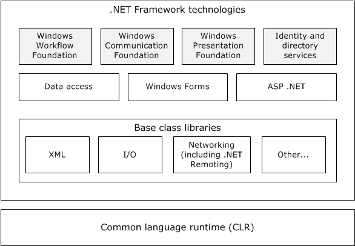

Figure 1: High-level architecture of the .NET Framework

**.NET Framework technologies**

[**Windows Workflow Foundation (WF)**](#gt_windows-workflow-foundation-wf) provides a programming model, an in-process workflow engine, and a workflow designer to implement long-running processes as workflows within .NET applications. Windows Workflow Foundation is not itself an executable application or program; instead, it enables developers to create workflow applications. Windows Workflow Foundation is flexible and extensible. Developers can write workflows directly in code, in markup, or in a combination of both. They can implement custom workflow patterns through custom activities that can be reused across workflows. Windows Workflow Foundation provides protocol support to administer the execution of developer-defined workflow applications on Windows systems, but does not prescribe the use of specific communications methods or protocols by workflow applications that are developed by using WF.

[**Windows Communication Foundation (WCF)**](#gt_windows-communication-foundation-wcf) provides a programming model for building connected, service-oriented applications. WCF is designed in accordance with service-oriented architecture principles to support distributed computing by using a variety of protocols including HTTP and [**Web services**](#gt_web-service) (WS-*) protocols.

[**Windows Presentation Foundation (WPF)**](#gt_windows-presentation-foundation-wpf) is a framework for developing standalone and browser-hosted applications with graphical user interfaces. WPF offers additional programming enhancements for Windows client application development, including the ability to develop an application by using both markup and code-behind programming models. [**Extensible Application Markup Language (XAML)**](#gt_extensible-application-markup-language-xaml) markup is generally used to configure the appearance of an application while using managed programming languages (code-behind) to implement its behavior. Because WPF is a user interface framework that does not provide network communication services or protocols to developers, WPF is not addressed in this protocol overview.

**Identity and Directory services** provide support for [**directory services**](#gt_c36db657-3138-4d9a-9289-ded5cbb8b40e) and management of diverse digital identities.

[**CardSpace**](#gt_cardspace) is a specialized meta-identity system that helps in managing multiple identities. The identity metasystem in CardSpace provides a consistent way to work with multiple digital identities, regardless of the kinds of security tokens that they use. Windows CardSpace provides the following features:

- Support for any digital identity system.
- Consistent user control of digital identity.
- Replacement of password-based web login.
**Data Access** features in the .NET Framework provide interfaces for accessing local and remote data sources from within .NET applications.

**WCF Data Services** (formerly known as ADO.NET Data Services) supports the creation of services that use the Open Data Protocol (OData, see [MS-ODATA](../MS-ODATA/MS-ODATA.md)) to expose and consume data over the web or intranet by using the semantics of representational state transfer (REST). OData exposes data as [**resources**](#gt_resource) that are addressable by URIs. WCF Data Services uses the OData protocol for addressing and updating resources. WCF Data Services can expose data that originates from various sources as OData feeds. WCF Data Services integrates with the ADO.NET Entity Framework which enables application developers to create [**data services**](#gt_data-service) that expose relational data.

**Windows Forms** is a set of managed libraries for developing graphical applications. In Windows Forms, a form is a visual surface on which an application displays information to the user and can gather input from the user. Because Windows Forms is a user interface framework that does not provide network communication services or protocols to developers, it is not addressed in this protocol overview.

**ASP.NET** is a web application framework that allows programmers to build dynamic websites, web applications, and Web services that are based on standard web protocols.

ASP.NET features include:

- An extensible hosting environment that controls the life cycle of an application from the time a user first accesses a resource, such as a page, in the application to the point at which the application is shut down.
- ASP.NET Model View Controller (MVC) helps web developers build standards-based web applications that are easy to maintain, because it decreases the dependency among application layers by using the MVC pattern.
- ASP.NET Dynamic Data is a framework that creates data-driven ASP.NET web applications easily by automatically discovering data model metadata at run time and by deriving UI behavior from it.
- ASP.NET health monitoring enables reporting of key events that provide information about the health of an application and about error conditions.
**Base Class Libraries**

The Base Class Libraries (BCLs) provide prebuilt code that is required for common low-level programming tasks. The BCLs provide a comprehensive, object-oriented collection of reusable types that developers can use to develop various applications, such as console applications, GUI applications (using Windows Forms and/or the Windows Presentation Foundation), Windows services, and XML Web services.

The BCLs include support for XML, input/output (I/O), and networking features. Networking features in the BCLs include support for [**.NET remoting**](#gt_net-remoting), which is a technology that is used for interprocess communication. .NET remoting can be used to communicate with [**application domains**](#gt_application-domain) in the same process or in a different process. .NET remoting includes a set of protocols to provide communication between two application domains as described later in this document.

**Common language runtime**

The common language runtime (CLR), which is based on the international standard for Common Language Infrastructures ([[ISO/IEC-23271]](https://go.microsoft.com/fwlink/?LinkId=207201)), is the foundation of the .NET Framework, and provides an abstraction layer over the operating system. The common language runtime acts as an agent that manages code at execution time by providing core services such as memory management, thread management, and remoting, while also enforcing strict type safety and other forms of code accuracy that promote security and robustness. The concept of code management is a fundamental principle of the CLR. Code that targets the runtime is known as [**managed code**](#gt_managed-code), while code that does not target the runtime is known as [**unmanaged code**](#gt_unmanaged-code).

When a developer writes an application for the .NET Framework in a language such as Visual C#, which is based on the C# standard defined in [[ISO/IEC-23270]](https://go.microsoft.com/fwlink/?LinkId=207200), or Visual Basic .NET, the source code is not compiled directly into machine code. Instead, the Visual C# or Visual Basic compiler converts the code into a special language that is named Microsoft Intermediate Language (MSIL). MSIL, which is based on the Common Intermediate Language standard specified in [ISO/IEC-23271] looks like an object-oriented assembly language; however, unlike a typical assembly language, it is not CPU-specific. MSIL is a low-level and platform-independent language.

When a .NET application is executed, the MSIL code is compiled just-in-time into machine code by the Just-In-Time (JIT) compiler. The entire application might not be compiled from MSIL into machine code at initial execution of the application. Instead, only the methods that are actually called during execution are compiled. The CLR manages this process.

For more information about the .NET Framework, see [[MSDN-.NET-FRAMEWORK]](https://go.microsoft.com/fwlink/?LinkId=195551).

# 2 Functional Architecture

This section describes the basic structure of the system and the interrelationships among its parts, consumers, and dependencies.

Section [2.1](#Section_2.1) provides an architectural overview of the protocols that are implemented by the various modules and how these protocols relate to each other. The protocols described are grouped by module and, where applicable, by the overall functionality that the protocol provides (security, messaging, and so on).

Section [2.2](#Section_2.2) provides a summary description of all the protocols that are mentioned in this document.

Section [2.3](#Section_2.1) identifies the context in which the system exists. This includes the systems that use the interfaces that are provided by this system of protocols, other systems that depend on this system, and, as appropriate, how components of the system communicate.

Section [2.4](#Section_2.4) describes assumptions and preconditions.

Section [2.5](#Section_2.5) provides a set of use cases illustrating a variety of scenarios for how the protocols are used.

## 2.1 Overview

Not all protocols included in this overview document are interrelated. The protocols provided by the Microsoft .NET Framework are built on Windows native protocols and other industry-standard protocols. This document focuses on the protocols that map to the .NET Framework distributed technologies to enable network communications. These protocols can be grouped into the following categories:

- [**Windows Workflow Foundation (WF)**](#gt_windows-workflow-foundation-wf)
- [**Windows Communication Foundation (WCF)**](#gt_windows-communication-foundation-wcf)
- Identity and [**directory services**](#gt_c36db657-3138-4d9a-9289-ded5cbb8b40e)
- Data access
- ASP.NET
- [**.NET remoting**](#gt_net-remoting)

### 2.1.1 Windows Workflow Foundation (WF)

The following diagram shows the protocol stack of the Workflow Instance Management Protocol [MS-WFIM](../MS-WFIM/MS-WFIM.md).

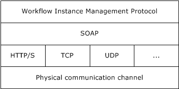

Figure 2: Workflow protocol relationships

The Workflow Instance Management Protocol [MS-WFIM] defines a set of SOAP messages for the management of durable program instances, such as suspending, resuming, or canceling an instance of an application-defined workflow.

### 2.1.2 Windows Communication Foundation (WCF)

[**Windows Communication Foundation (WCF)**](#gt_windows-communication-foundation-wcf) is the .NET Framework technology that is used to create independently versionable, secure, and reliable service-oriented applications. Applications that use WCF can communicate by using message schemas and choreographies defined in the WS-* specifications. WCF complies with many WS-* specifications.

Following is a brief overview describing the most relevant WCF features and how they relate to the various protocols that are mentioned in this document.

**Security**

WCF supports many different security models and makes it easy to implement widely accepted security measures. Because WCF has an extensible architecture, it is also relatively easy to extend WCF security to meet the requirements of a particular application. The default security options range from the traditional transport-centric security to more modern message-based security, as specified in WS-Security [[WSS]](https://go.microsoft.com/fwlink/?LinkId=130727) and related specifications.

**Reliable messaging**

Distributed applications require reliable messaging. For this purpose, WCF implements WS-ReliableMessaging and extensions to WS standards including the Advanced Flow Control Extension ([MS-WSRVCRM](../MS-WSRVCRM/MS-WSRVCRM.md)) and Reliable Request-Reply Extension ([MS-WSRVCRR](../MS-WSRVCRR/MS-WSRVCRR.md)).

**Transactional support**

WCF allows transactional scopes to flow across multiple applications. WCF implements WS-AtomicTransaction and its extension ([MS-WSRVCAT](../MS-WSRVCAT/MS-WSRVCAT.md)), enabling software entities that use the WS-AtomicTransaction protocol to participate in transactions that are coordinated by OleTx transaction managers, as specified in [MS-DTCO](../MS-DTCO/MS-DTCO.md). The entire set of transaction-related protocols supported in Windows, including [MS-WSRVCAT], is described in [MS-TPSOD](#Section_2.1).

**Interoperability**

Applications, which are built on WCF, can communicate with other applications that can use WS-*, Basic Profile (BP), and XML messages over [**TCP**](#gt_transmission-control-protocol-tcp), [**HTTP**](#gt_hypertext-transfer-protocol-http), [**named pipes**](#gt_named-pipe), and Microsoft Message Queuing (MSMQ).

**Configurability**

- **Bindings**: Specifies all [**bindings**](#gt_binding) that can be used by any endpoint that is defined in any service. The binding elements that are contained in the **bindings** element can be either one of the system-provided bindings or a custom binding. A binding defines which type of transport, security, and encoding is used, and whether reliable sessions, transactions, or streaming is supported or enabled.
- **Services**: Contains the specifications for all services that the application hosts. Each service specification contains an endpoint element that provides the following information:
- **Address**: Specifies the service's Uniform Resource Identifier (URI), which can be an absolute address or one that is given relative to the base address of the service.
- **Binding**: Specifies a system-provided or user-defined binding.
- **Contract**: Specifies the interface that defines the contract.
- **Behaviors**: Contains a collection of settings for the behavior of a service-like discoverability of service endpoints, settings that authorize access to service operations, the timeout for a service, throttling mechanism of a WCF service, and so on.
The protocol stack in WCF can be configured by the developer in code, or by the developer or end user by simply changing configuration entries in the application's XML configuration file. Although an understanding of the WCF application configuration schema is not necessary to interoperate with WCF-based applications at the protocol level, certain elements of that schema are discussed in this overview document in order to provide an understanding of how those configuration elements can influence the network communications of a WCF-based application. The recommended order of stack elements is the following:

- Transactions (optional)
- Reliable messaging (optional)
- Security (optional)
- Transport
- Encoder (optional)
The following diagram represents the protocol stack of WCF.

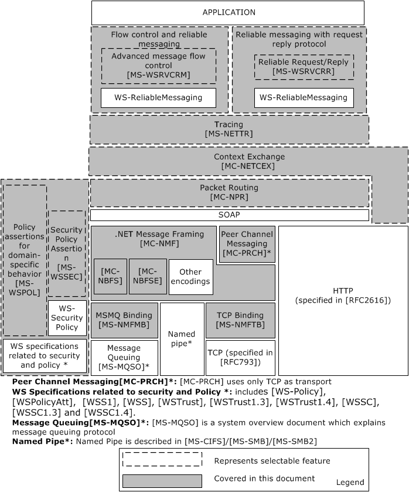

Figure 3: The protocol stack of Windows Communication Foundation

The various components in the preceding diagram are described in the following paragraphs.

**Transport**

A transport is a means of communicating with a source on the service side. The transport channel is the bottom-most channel of the WCF stack. The protocols that are typically used in this channel are HTTP, TCP, MSMQ, and named pipes, but WCF allows application developers to use other transports as well, such as Simple Mail Transfer Protocol (SMTP) or File Transfer Protocol (FTP).

**SOAP encoding**

The SOAP encoding defines a set of rules for mapping programmatic types to XML. XML allows very flexible encoding of data, whereas SOAP defines a narrower set of rules for encoding the graphs in the SOAP Data Model specified in [[SOAP1.1]](https://go.microsoft.com/fwlink/?LinkId=90520) section 2.

**[MC-NBFX], [MC-NBFS], and [MC-NBFSE]**

[MC-NBFX](../MC-NBFX/MC-NBFX.md) defines the .NET Binary Format: XML Data Structure, which is a binary format that can represent many XML documents. [MC-NBFS](../MC-NBFS/MC-NBFS.md) extends [MC-NBFX] for the SOAP data structure and specifies a way to efficiently encode strings that are common to many SOAP messages. [MC-NBFSE](../MC-NBFSE/MC-NBFSE.md) extends [MC-NBFS], and defines a mechanism by which strings can be transmitted once and referred to by subsequent XML documents.

**.NET Message Framing ([MC-NMF])**

The relationship between [MC-NMF](../MC-NMF/MC-NMF.md) and other protocols is shown in the following diagram.

![[MC-NMF] and related protocols](media/image4.png)

Figure 4: [MC-NMF] and related protocols

Message framing is the breaking up of a stream of data into demarcated units that are called messages. Some protocols such as HTTP natively include a notion of message framing. Other protocols such as TCP do not natively include a notion of message framing and therefore rely on a protocol that does provide message framing. WCF includes a message framing protocol that is called .NET Message Framing for use with transports that do not natively support messaging. This framing protocol is used with the TCP transport to create NetTcp and with the MSMQ transport to create NetMsmq.

The .NET Message Framing Protocol [MC-NMF], can use any of the following encoding specifications: UTF-8, UTF-16, Little Endian Unicode, and MTOM, as specified in [[SOAP-MTOM]](https://go.microsoft.com/fwlink/?LinkId=95126), [MC-NBFS], and [MC-NBFSE].

The .NET Message Framing TCP Binding Protocol [MS-NMFTB](../MS-NMFTB/MS-NMFTB.md) and the .NET Message Framing MSMQ Binding Protocol [MS-NMFMB](../MS-NMFMB/MS-NMFMB.md) specify how the mechanism, described in [MC-NMF], for framing messages over any transport protocol can be applied over TCP and Message Queue (MSMQ) respectively.

**Reliable Messaging and Flow Control**

WCF implements WS-ReliableMessaging to allow messages to be delivered reliably between distributed applications in the presence of software component, system, or network failures. It implements the WS-ReliableMessaging Protocol: Advanced Flow Control Extension [MS-WSRVCRM], which extends WS-ReliableMessaging and provides an advanced message flow control. This protocol attempts to minimize the number of dropped messages by synchronizing the rate at which the [**reliable messaging source (RMS)**](#gt_reliable-messaging-source-rms) sends messages with the rate at which the [**reliable messaging destination (RMD)**](#gt_reliable-messaging-destination-rmd) can receive them.

**Reliable Request Reply**

The WS-ReliableMessaging Protocol: Reliable Request-Reply Extension ([MS-WSRVCRR]) extends WS-ReliableMessaging by enabling applications to communicate reliably over transfer protocols that only support the SOAP Request-Response protocol.

**Message Security**

Windows implements WS-* protocols that are designed for secure communication. These protocols include WS-Security, WS-SecurityPolicy, WS-Trust, and WS-SecureConversation.

Web Services: The Security Policy Assertions Format ([MS-WSSEC](../MS-WSSEC/MS-WSSEC.md)) defines additional policy assertions that can be used together with policy assertions that are defined in WS-Security Policy ([[WSSP]](https://go.microsoft.com/fwlink/?LinkId=130729)) to express constraints and requirements that cannot be expressed with the policy assertions that are defined in [WSSP] alone, as shown in the following diagram.

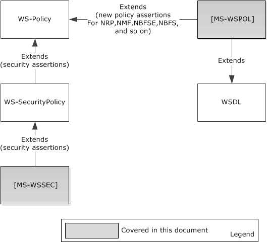

Figure 5: Security and policy extensions

**Policy**

WS-Policy defines a framework for allowing [**Web services**](#gt_web-service) to express their constraints and requirements. Such constraints and requirements are expressed as policy assertions. WS-Policy provides a flexible and extensible grammar for expressing the capabilities, requirements, and general characteristics of entities in an XML Web services-based system. WS-Policy defines a framework and a model for the expression of these properties as policies.

WS-PolicyAttachment ([[WSPolicyAtt]](https://go.microsoft.com/fwlink/?LinkId=90583)) defines a mechanism for associating policy with various entities and [**resources**](#gt_resource).

Web services: Policy Assertions and WSDL Extensions ([MS-WSPOL](../MS-WSPOL/MS-WSPOL.md)) specifies a collection of Web service policy assertions and Web Services Description Language (WSDL) extensions that define domain-specific behavior for the interaction between two Web service entities.

**Packet Routing**

The .NET Packet Routing Protocol [MC-NPR](../MC-NPR/MC-NPR.md) defines a SOAP header for indicating that a SOAP message can safely be treated as a packet or datagram. The .NET Packet Routing Protocol does not prescribe any specific algorithm or communications infrastructure for forwarding a packet after it has been received by the router. The .NET Packet Routing Protocol enables a SOAP message originator to indicate that a message does not have a behavioral dependency on the path that is taken to deliver the message from the source to the destination. A .NET Packet Routing Protocol router can use this indication when selecting among different routing algorithms to apply to the message. The indication provided by the .NET Packet Routing Protocol conveys routing information that enables the router to select a more efficient routing algorithm.

**Tracing**

The .NET Tracing Protocol [MS-NETTR](../MS-NETTR/MS-NETTR.md) defines a SOAP message header for correlating sets of messages. Diagnosing errors in distributed applications is a complex task that usually involves multiple messages. By correlating messages between distributed application endpoints, users can map message exchanges and infer causality relationships between messages. This information helps isolate the set of messages that led up to an error and the set of messages that resulted from it.

The .NET Tracing Protocol provides two main functions:

- It enables users to map outgoing messages to incoming messages between components in a distributed application. It does this by assigning each message a unique identifier, named the CorrelationId.
- It provides a way to group related messages together.
**Context Exchange**

The .NET Context Exchange Protocol [MC-NETCEX](../MC-NETCEX/MC-NETCEX.md) specifies a message syntax for identifying [**context**](#gt_context) that is shared between a [**client**](#gt_client) and a [**server**](#gt_server) that is independent of [**connection**](#gt_connection) usage, and a protocol for establishing that context. This protocol specifies two roles for context exchange: a client role and a server role. The server role is responsible for creating context identifiers in response to client requests and associating context identifiers with resources. The protocol also specifies two roles for [**callback context**](#gt_callback-context) exchange: a client role and a server role.

**Message Broadcasting**

The Peer Channel Protocol ([MC-PRCH](../MC-PRCH/MC-PRCH.md)) is used for broadcasting messages over a virtual network of cooperating [**nodes**](#gt_node), and to send and receive messages between nodes in a named [**mesh**](#gt_mesh). The nodes form the network by establishing connections to each other by using a [**discovery service**](#gt_discovery-service) in which every node registers itself into a named mesh and discovers other nodes that are using the name of the mesh.

The Peer Channel Protocol ([MC-PRCH]) depends on NMF ([MC-NMF]), NBFS ([MC-NBFS]), and NBFSE ([MC-NBFSE]).

PRCH optionally uses PRCR ([MC-PRCR](../MC-PRCR/MC-PRCR.md)) to register and resolve peers' addresses during connection and maintenance operations.

The relationships are shown in the following diagram.

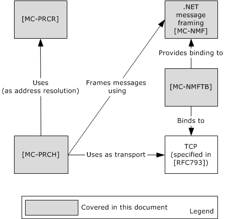

Figure 6: Relationship of the Peer Channel Protocol to other protocols

**Discovery and Addressing**

The various components of discovery and addressing are shown in the following diagram, and further described in the paragraphs that follow it.

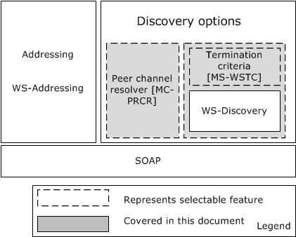

Figure 7: Discovery and addressing stack

**Discovery Options**

WCF implements WS-Discovery and an extension, WSTC ([MS-WSTC](../MS-WSTC/MS-WSTC.md)), which allows [**discovery**](#gt_discovery) of services in ad hoc networks with a minimum of networking services (for example, where there are no [**DNS**](#gt_domain-name-system-dns) or [**directory services**](#gt_c36db657-3138-4d9a-9289-ded5cbb8b40e)). The WS-Discovery: Termination Criteria Protocol Extensions ([MS-WSTC]) is an extension of the WS-Discovery Protocol ([[WS-Discovery]](https://go.microsoft.com/fwlink/?LinkId=90576)) for sending and receiving termination criteria as part of the WS-Discovery Probe and Resolve messages. WS-Discovery can be used without its extension [MS-WSTC].

PRCR, the Peer Channel Custom Resolver Protocol ([MC-PRCR]) is a client/server protocol that is used to register and retrieve client endpoint information at a well-known resolver service. The information that is registered and retrieved is the [**PeerNodeAddress**](#gt_peernodeaddress) of clients that are associated with a named mesh. This information can then be used to establish direct connections among these clients. This protocol is transport-agnostic, and therefore is used together with a variety of transport protocols such as TCP and HTTP. It is intended for use by PRCH, the Peer Channel Protocol ([MC-PRCH]) for neighbor discovery when PNPR, the Peer Name Resolution Protocol ([MS-PNRP](../MS-PNRP/MS-PNRP.md)) is unavailable.

Either PRCR ([MC-PRCR]) or WS-Discovery with or without WSTC ([MS-WSTC]) can be used to get the web service address.

**Addressing**

WCF implements WS-Addressing, which is one of the WS-* specifications that provides a framework for one of the most fundamental tasks of any service-oriented application, namely indicating the target of a message.

### 2.1.3 Identity and Directory Services

A [**security token**](#gt_security-token) is a set of bytes that expresses information about a digital identity. When transmitted on the network, every digital identity is represented by a security token. The identity metasystem in [**CardSpace**](#gt_cardspace) provides a consistent way to work with multiple digital identities, regardless of the kinds of security tokens that they use. Windows CardSpace uses the following three distinct roles:

- Relying Party
- Identity Provider
- User
**Relying Party:** The Relying Party is an application that in some way relies on a digital identity. A Relying Party frequently uses an identity to authenticate a user, and then makes an authorization decision, such as allowing that user to access information. A Relying Party accepts security tokens, defines policy by using WS-SecurityPolicy, and then allows the policy to be accessed by using WS-MetadataExchange.

**Identity Provider:** An Identity Provider provides a digital identity for a user. Digital identities that are created by different identity providers can carry different information and provide different levels of assurance that the user really is who he or she claims to be. An Identity Provider creates information cards, provides a way to get these cards to users, and implements a security token service (STS), as defined by the WS-Trust specification.

**User:** The User is the entity that is associated with a digital identity. Users are often people, but organizations, applications, machines and other things can also have digital identities.

The following diagram illustrates the interactions among Users, Relying Parties, and Identity Providers.

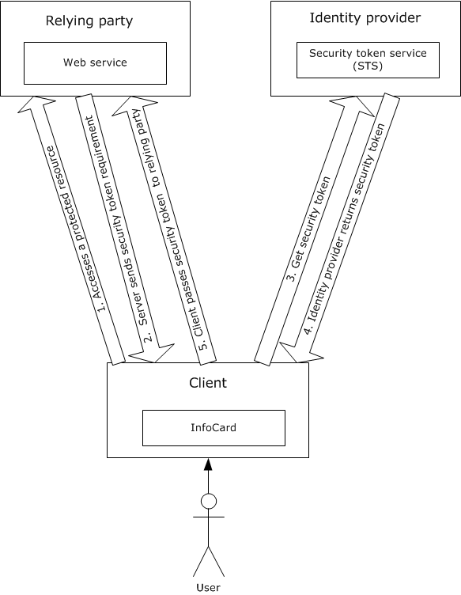

Figure 8: Interactions among Users, Relying Parties, and Identity Providers

The following steps are involved in CardSpace communication:

- The process begins when a [**client**](#gt_client) accesses a protected resource on a Relying Party.
- The Relying Party sends its security token requirements to the client. This information is contained in the Relying Party's policy, and it includes information such as which security token formats the Relying Party accepts, and exactly what claims those tokens have to contain.
- After getting the details about the security token that the Relying Party requires, the client passes this information to CardSpace and the system displays the card selection screen. After the User clicks a particular card, CardSpace issues a request to the Identity Provider that is associated with that card.
- The Identity Provider then returns a security token to CardSpace.
- CardSpace gives the security token to the client, which in turn passes it to the Relying Party.
CardSpace can be used from browsers as well as from [**WCF**](#gt_windows-communication-foundation-wcf) applications.

Information cards and the identity metasystem are documented in Identity Metasystem Interoperability V1.0 [IMI].

The Microsoft .NET Framework provides support for applications that require access to network [**directory services**](#gt_c36db657-3138-4d9a-9289-ded5cbb8b40e) through the Microsoft extensions to the directory services markup language.

[MS-DSML](../MS-DSML/MS-DSML.md) is known as the SOAP session extension (SSE) of Microsoft extensions to the Directory Services Markup Language (DSML) 2.0 Protocol. It provides for the creation of a session, association with a particular session, and a way to terminate the session.

### 2.1.4 Data Access

The Conceptual Schema Definition File Format ([MC-CSDL](../MC-CSDL/MC-CSDL.md)) describes the structure and semantics of the Conceptual Schema Definition Language (CSDL) for the [**Entity Data Model (EDM)**](#gt_entity-data-model-edm).

The Open Data Protocol (OData) Specification ([MS-ODATA](../MS-ODATA/MS-ODATA.md)) depends on [**HTTP**](#gt_hypertext-transfer-protocol-http) [[RFC2616]](https://go.microsoft.com/fwlink/?LinkId=90372), for transfer of all protocol messages and user data, and follows or extends the messaging semantics defined in AtomPub [[RFC5023]](https://go.microsoft.com/fwlink/?LinkId=140880). ODATA ([MS-ODATA]) uses the structure defined in [MC-CSDL].

The Entity Data Model for Data Services Packaging Format ([MC-EDMX](../MC-EDMX/MC-EDMX.md)) is an XML-based file format that serves as the packaging format for the service metadata of a [**data service**](#gt_data-service), (as specified in [MS-ODATA]).

The following diagram describes the relationship of Data Access protocols.

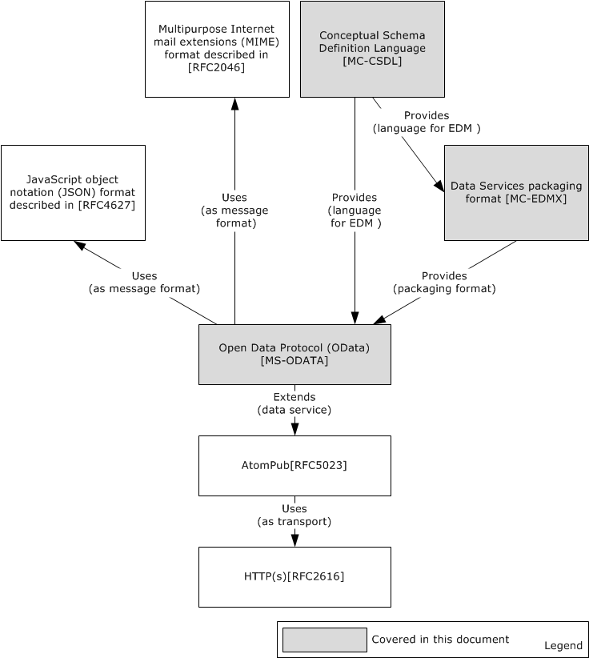

Figure 9: Data access protocol relationships

### 2.1.5 ASP.NET

ASP.NET primarily relies on existing industry standard web protocols for data communication. Microsoft has implemented two protocols that are specific to ASP.NET for administrative communications with servers hosting ASP.NET web applications.

The ASP.NET State Server Protocol ([MS-ASP](../MS-ASP/MS-ASP.md)) specifies an out-of-process state server that is responsible for storing session state used by client applications that require persistent session state storage. [MS-ASP] uses [**HTTP**](#gt_hypertext-transfer-protocol-http) as its transport.

The ASP.NET State Service Database Repository Communications Protocol ([MS-ASPSS](../MS-ASPSS/MS-ASPSS.md)) specifies an interface for clients to store and retrieve serialized session data.

### 2.1.6 .NET Remoting

The following diagram shows the typical architecture of a distributed application that is built by using the [**.NET remoting**](#gt_net-remoting) framework.

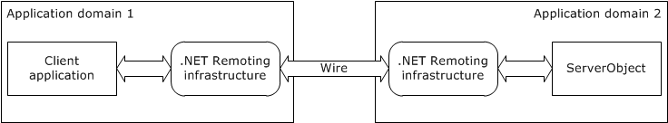

Figure 10: Typical architecture of a distributed application that uses the .NET remoting framework

By using .NET remoting, objects executing within the logical subdivisions of [**application domains**](#gt_application-domain) and contexts can interact with one another across .NET remoting boundaries.

With .NET remoting, client applications can be built that use objects in other processes on the same computer or on any other computer that is reachable over its network. The .NET remoting framework can also be used to communicate with other application domains in the same process. The .NET remoting framework provides an approach to interprocess communication that abstracts the remotable object from a specific client or server application domain and from a specific mechanism of communication.

To use .NET remoting to build an application in which two components communicate directly across an application domain boundary, the following components are required:

- A remotable object, which is referred to as ServerObject in the typical architecture of a distributed application diagram.
- A host application domain to listen for requests for that object (Application Domain 2 in the typical architecture of a distributed application diagram).
- A client application domain that makes requests for that object (Application Domain 1 in the typical architecture of a distributed application diagram).
On the client side, the remoting infrastructure creates a [**proxy**](#gt_proxy) that stands in as a pseudo-instantiation of the remotable object and returns to the client object a reference to the proxy. It does not implement the functionality of the remotable object, but instead presents a similar interface. When a client calls a method, the remoting infrastructure handles the call, checks the type information, and sends the call over the channel to the server process. On the server side, the listening channel picks up the request and makes the call to the remotable object on behalf of the client. The results are serialized and transferred by way of the sink to the client, where the proxy reads them and hands them over to the calling application.

The .NET remoting infrastructure manages transferring the required information over the wire. The following diagram shows the protocol stack of the remoting infrastructure.

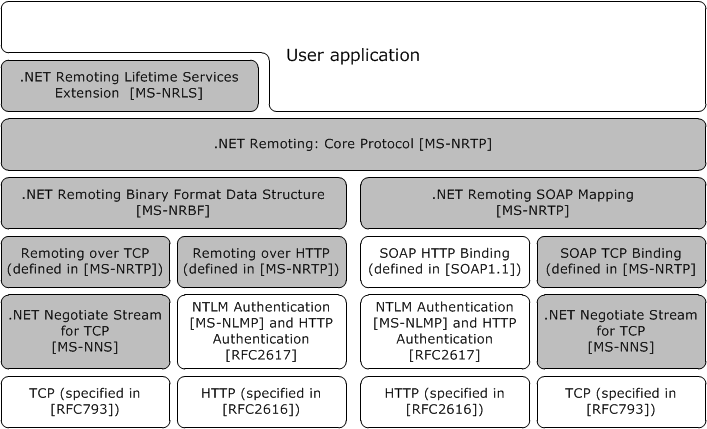

Figure 11: Protocol stack of the .NET remoting infrastructure

The .NET remoting framework supports two transport protocols, namely [**TCP**](#gt_transmission-control-protocol-tcp) and [**HTTP**](#gt_hypertext-transfer-protocol-http), but a user can add any transport to the .NET remoting stack.

The .NET remoting core protocol ([MS-NRTP](#Section_2.1.6)) specifies a mechanism whereby a calling program can invoke a method in a different address space over the network.

The .NET Remote Lifetime Services Extension ([MS-NRLS](#Section_2.1.6)) extends the .NET Remoting: Core Protocol [MS-NRTP] to add a mechanism allowing clients to explicitly create Server Objects, and adds another mechanism allowing clients and servers to control the lifetime of Server Objects. The .NET Remote Lifetime Services Extension adds new methods and semantics for activation and lifetime management.

**Encoding**

A .NET remoting application can use either a binary encoding for .NET remoting as specified in the .NET Remoting Binary Format ([MS-NRBF](#Section_2.1.6)), or SOAP encoding, as specified in [[SOAP1.1]](https://go.microsoft.com/fwlink/?LinkId=90520), with the .NET remoting-specific portions of the mapping specified in SOAP Serialization Format ([MS-NRTP] section 2.2.4).

**Binding**

The .NET remoting framework can be bound to either TCP ([[RFC793]](https://go.microsoft.com/fwlink/?LinkId=150872)) or HTTP ([[RFC2616]](https://go.microsoft.com/fwlink/?LinkId=90372)). The TCP [**binding**](#gt_binding) for binary encoding is specified in TCP Transport ([MS-NRTP] section 2.1.1), and the HTTP binding is specified in HTTP Transport ([MS-NRTP] section 2.1.2). The TCP binding to SOAP is specified in SOAP on TCP ([MS-NRTP] section 2.1.3.2), and the HTTP binding can be found in [SOAP1.1] section 6, with .NET remoting-specific portions of the mapping specified in SOAP on HTTP ([MS-NRTP] section 2.1.3.1).

**Security**

Over a TCP connection, optional security can be provided by .NET NegotiateStream Protocol ([MS-NNS](../MS-NNS/MS-NNS.md)). This protocol enables:

- Client and/or server authentication
- Data confidentiality and integrity
The .NET NegotiateStream Protocol provides mutually authenticated and confidential communication as specified in [MS-NNS].

A key benefit is that authentication in [MS-NNS] is accomplished without the use of digital certificates. Other protocols, such as Transport Layer Security (TLS, [[RFC5246]](https://go.microsoft.com/fwlink/?LinkId=129803)), require the use of digital certificates.

Over an HTTP connection, NTLM Authentication ([MS-NLMP](../MS-NLMP/MS-NLMP.md)) or HTTP authentication ([[RFC2617]](https://go.microsoft.com/fwlink/?LinkId=90373)) can be used. The NTLM Over HTTP Protocol ([MS-NTHT](../MS-NTHT/MS-NTHT.md)) specifies how NTLM authentication is used over an HTTP connection.

**Interoperability Between CLR and COM**

The IManagedObject Interface Protocol ([MS-IOI](../MS-IOI/MS-IOI.md)) provides interoperability for [**CLR**](#gt_common-language-runtime-clr). It defines the **IManagedObject**, **IRemoteDispatch**, and **IServicedComponentInfo** interfaces.

- The **IManagedObject** interface is useful as part of the infrastructure for allowing the CLR to interoperate with COM.
- The **IRemoteDispatch** interface is used for method-call dispatch and deactivation.
- The **IServicedComponentInfo** interface is used for determining [**Server Object**](#gt_server-object) instance identity.
The following diagram shows the relationship among .NET remoting protocols.

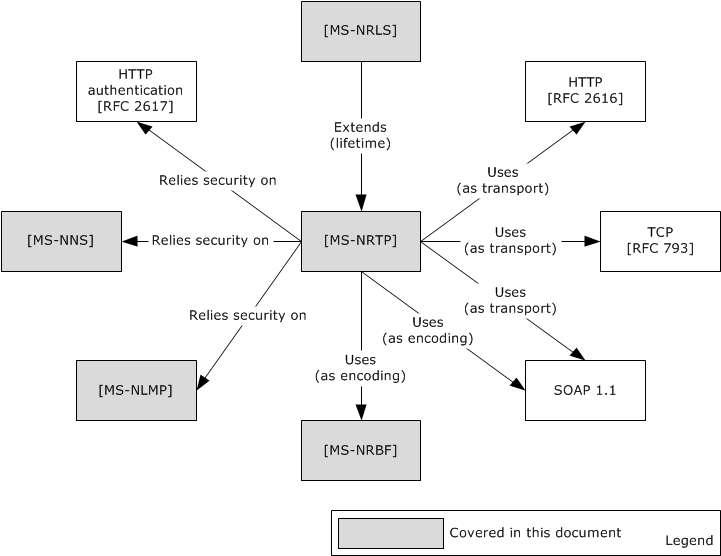

Figure 12: .NET remoting protocol relationships

## 2.2 Protocol Summary

The following tables provide a comprehensive list of the member protocols of the .NET Framework. The member protocols are grouped according to their primary purpose.

Protocols in the following table are used for [**Windows Workflow Foundation**](#gt_windows-workflow-foundation-wf).

| Protocol name | Description | Short name |
| --- | --- | --- |
| Workflow Instance Management Protocol | Defines a set of SOAP messages for the management of **durable program instances**, such as suspending, resuming, or canceling an instance. | [MS-WFIM](../MS-WFIM/MS-WFIM.md) |

Protocols in the following table enable communication for [**WCF**](#gt_windows-communication-foundation-wcf).

| Protocol name | Description | Short name |
| --- | --- | --- |
| NET Packet Routing Protocol | Defines a SOAP header for indicating that a SOAP message can safely be treated as a packet or datagram. | [MC-NPR](../MC-NPR/MC-NPR.md) |
| .NET Binary Format: XML Data Structure | Defines the .NET Binary Format: XML Data Structure, which is a binary format that can represent many XML documents, as specified in [XML1.0]. | [MC-NBFX](../MC-NBFX/MC-NBFX.md) |
| .NET Binary Format: SOAP Data Structure | Defines the .NET Binary Format: SOAP Data Structure, which is a new format that is built by extending the format as described in the .NET Binary Format: XML Data Structure, as specified in [MC-NBFX]. | [MC-NBFS](../MC-NBFS/MC-NBFS.md) |
| .NET Binary Format: SOAP Extension | Defines the .NET Binary Format: SOAP Extension, which is a new format that is built by extending the format specified in [MC-NBFS]. | [MC-NBFSE](../MC-NBFSE/MC-NBFSE.md) |
| Peer Channel Protocol | Used for broadcasting messages over a virtual network of cooperating [**nodes**](#gt_node). This protocol is used to send and receive messages among nodes in a named [**mesh**](#gt_mesh). | [MC-PRCH](../MC-PRCH/MC-PRCH.md) |
| Peer Channel Custom Resolver Protocol | Specifies storage and retrieval of endpoint information for clients that have access to a known service. | [MC-PRCR](../MC-PRCR/MC-PRCR.md) |
| WS-ReliableMessaging Protocol: Advanced Flow Control Extension | Specifies an advanced message flow control extension to the Web Services Reliable Messaging Protocol [[WSRM1-0]](https://go.microsoft.com/fwlink/?LinkId=117285), [[WSRM1-1]](https://go.microsoft.com/fwlink/?LinkId=117286), and [[WSRM1-2]](https://go.microsoft.com/fwlink/?LinkId=192440). | [MS-WSRVCRM](../MS-WSRVCRM/MS-WSRVCRM.md) |
| WS-ReliableMessaging Protocol: Reliable Request-Reply Extension | Enables applications to communicate reliably over transfer protocols that support only SOAP Request-Response. | [MS-WSRVCRR](../MS-WSRVCRR/MS-WSRVCRR.md) |
| .NET Context Exchange Protocol | Specifies a message syntax for identifying [**context**](#gt_context) that is shared between a client and a server and a protocol for establishing that context. | [MC-NETCEX](../MC-NETCEX/MC-NETCEX.md) |
| .NET Tracing Protocol | Defines a SOAP message header for correlating sets of messages together. | [MS-NETTR](../MS-NETTR/MS-NETTR.md) |
| WS-Discovery: Termination Criteria Protocol Extensions | An extension to the WS-Discovery Protocol for sending and receiving a termination criterion as part of WS-Discovery Probe and Resolve messages. | [MS-WSTC](../MS-WSTC/MS-WSTC.md) |
| Web Services: Security Policy Assertions Format | Defines additional policy assertions that can be used together with policy assertions defined in [[WSSP]](https://go.microsoft.com/fwlink/?LinkId=130729) to express constraints and requirements that cannot be expressed with policy assertions alone defined in [WSSP]. | [MS-WSSEC](../MS-WSSEC/MS-WSSEC.md) |
| Web Services: Policy Assertions and WSDL Extensions | Specifies a collection of [**Web service**](#gt_web-service) policy assertions and Web Services Description Language (WSDL) extensions, which define domain-specific behavior for the interaction between two Web service entities. | [MS-WSPOL](../MS-WSPOL/MS-WSPOL.md) |
| .NET Message Framing Protocol | Defines a mechanism for framing messages. | [MC-NMF](../MC-NMF/MC-NMF.md) |
| .NET Message Framing [**TCP**](#gt_transmission-control-protocol-tcp) Binding Protocol | Specifies how the .NET Message Framing Protocol [MC-NMF] is used for framing SOAP messages over TCP [[RFC793]](https://go.microsoft.com/fwlink/?LinkId=150872). | [MS-NMFTB](../MS-NMFTB/MS-NMFTB.md) |
| .NET Message Framing MSMQ Binding Protocol | A collection of Web service policy assertions that define behavior for the interaction with a Web service entity. This set of policy assertions pertains to an endpoint that is using the .NET Message Framing MSMQ Binding Protocol as the transport. | [MS-NMFMB](../MS-NMFMB/MS-NMFMB.md) |
| WS-AtomicTransaction (WS-AT) Version 1.0 Protocol Extensions | Extends the WS-AtomicTransaction Protocol specified in [[WSAT10]](https://go.microsoft.com/fwlink/?LinkId=113066) and [[WSAT11]](https://go.microsoft.com/fwlink/?LinkId=113067), by enabling software entities that use the WS-AtomicTransaction Protocol to participate in transactions that are coordinated by OleTx transaction managers, as specified in [MS-DTCO](../MS-DTCO/MS-DTCO.md). | [MS-WSRVCAT](../MS-WSRVCAT/MS-WSRVCAT.md) |

The protocols in the following table are used for Identity and Directory Services.

| Protocol name | Description | Short name |
| --- | --- | --- |
| Directory Services Markup Language (DSML) 2.0 Protocol Extensions | Microsoft extensions to the Directory Services Markup Language (DSML) 2.0 Protocol. | [MS-DSML](../MS-DSML/MS-DSML.md) |

The protocol and file formats in the following table are used for Data Access.

| Protocol name | Description | Short name |
| --- | --- | --- |
| Open Data Protocol (OData) | Used for creating Representational State Transfer (REST)-based [[REST]](https://go.microsoft.com/fwlink/?LinkId=140866) data services, which enable resources, identified by using Uniform Resource Identifiers ([**URIs**](#gt_uniform-resource-identifier-uri)) and defined in an abstract data model, to be published and edited by web clients within corporate networks and across the Internet by using simple [**HTTP**](#gt_hypertext-transfer-protocol-http) messages. | [MS-ODATA](../MS-ODATA/MS-ODATA.md) |
| Conceptual Schema Definition File Format | Describes the structure and semantics of the Conceptual Schema Definition Language (CSDL) for the [**Entity Data Model (EDM)**](#gt_entity-data-model-edm). | [MC-CSDL](../MC-CSDL/MC-CSDL.md) |
| Entity Data Model for Data Services Packaging Format | Specifies the Entity Data Model for Data Services Packaging Format (EDMX), an XML-based file format that serves as the packaging format for the service metadata of a [**data service**](#gt_data-service). | [MC-EDMX](../MC-EDMX/MC-EDMX.md) |

Protocols in the following table are used in ASP.NET.

| Protocol name | Description | Short name |
| --- | --- | --- |
| ASP.NET State Server Protocol | Used for interaction between a client application that requires persistent session state storage, and an out-of-process state server that is responsible for storing session state. | [MS-ASP](../MS-ASP/MS-ASP.md) |
| ASP.NET State Service Database Repository Communications Protocol | This protocol specifies an interface for clients to store and retrieve serialized session data. | [MS-ASPSS](../MS-ASPSS/MS-ASPSS.md) |

Protocols in the following table enable communication for [**.NET remoting**](#gt_net-remoting).

| Protocol name | Description | Short name |
| --- | --- | --- |
| .NET Remoting: Core Protocol | Specifies a mechanism by which a calling program can invoke a method in a different address space over the network. | [MS-NRTP](#Section_2.1.6) |
| NET Remoting: Binary Format Data Structure | Defines a set of structures that represent object graph or method invocation information as an octet stream. | [MS-NRBF](#Section_2.1.6) |
| .NET Remoting: Lifetime Services Extension | Adds lifetime and remote activation capabilities to the .NET Remoting Protocol (specified in [MS-NRTP]). | [MS-NRLS](#Section_2.1.6) |
| .NET NegotiateStream Protocol | Provides mutually authenticated and confidential communication over a TCP connection. | [MS-NNS](../MS-NNS/MS-NNS.md) |
| IManagedObject Interface Protocol | Provides interoperability support for the [**common language runtime (CLR)**](#gt_common-language-runtime-clr). | [MS-IOI](../MS-IOI/MS-IOI.md) |

## 2.3 Environment

The following sections identify the [**context**](#gt_context) in which the system exists. This includes the systems that use the interfaces that are provided by this system of protocols, other systems that depend on this system, and, as appropriate, how components of the system communicate.

### 2.3.1 Dependencies on This System

None.

### 2.3.2 Dependencies on Other Systems/Components

The Microsoft .NET Framework relies on the following Windows and standard protocols:

- Message Queuing protocols described in [MS-MQOD](#Section_2.1)
- [**TCP**](#gt_transmission-control-protocol-tcp)
- [**Named pipes**](#gt_named-pipe), as described in [MS-CIFS](../MS-CIFS/MS-CIFS.md) / [MS-SMB2](../MS-SMB2/MS-SMB2.md)
- [**HTTP**](#gt_hypertext-transfer-protocol-http)/HTTPS
- Web services standard protocols (WS* protocols)
- WS-Addressing
- WS-ReliableMessaging
- WS-AtomicTransaction
- WS-Coordination
- SecureConversation
- WS-Discovery
- WS-Policy
- WS-Security
- WS-SecurityPolicy
- WS-Trust
- WS-PolicyAttachment
- WS-Enumeration
- WS-Transfer
- SOAP
- [MS-DTCO](../MS-DTCO/MS-DTCO.md)
- [MS-CMP](../MS-CMP/MS-CMP.md)
- [MS-CMPO](../MS-CMPO/MS-CMPO.md)
- [MS-RPCE](../MS-RPCE/MS-RPCE.md)

## 2.4 Assumptions and Preconditions

None.

## 2.5 Use Cases

### 2.5.1 Stakeholders

The stakeholders and their associated interests for the .NET Framework protocols are as follows.

**Application developer**

An individual who implements distributed applications that use .NET Framework protocols. The primary interest of the application developer is to develop the client and/or server application by using the .NET Framework or another programming framework.

**System developer**

An individual who implements the client or server side of the protocols. The primary interest of the system developer is to implement the .NET protocols on platforms other than Windows so that the distributed applications that are developed on the other platforms can interoperate with the applications that are built on the .NET Framework.

**End user**

An individual who uses .NET Framework applications either directly or through a web client that accesses a web application or Web services. The end user's interest is to accomplish a task that he is authorized to do by using the Web service; the task could be to perform a financial transaction, to obtain data, or to change existing data. The end user is not necessarily aware that a separate web server or Web service is performing the task, but is aware only of the Web service interface.

**Web service provider**

The entity (individual or corporate) that owns and operates the Web service. The service provider has an interest (financial or otherwise) in the Web service operating reliably and correctly.

### 2.5.2 Actors

**Web client**

A web client is an application programming construct that consumes the Web service. It communicates with the Web service to obtain information or to perform an operation on the server. The operation which a web client can perform is limited to the interface that is published by the Web service. A developer can use the infrastructure that is provided by the Microsoft .NET Framework to develop a web client, and web clients can use the protocols that are provided by the .NET Framework to communicate with a Web service, but a web client is not necessarily built by using the .NET Framework. A Web service is external to the .NET Framework.

**Web service**

A [**Web service**](#gt_web-service) is a means by which two computing devices can perform specifically requested tasks over a network. The W3C defines a Web service as "a software system designed to support interoperable machine-to-machine interaction over a network". A web client can access Web services by using various protocols, the most common of which are REST, SOAP, and RPC. A remote system, which is called the [**web server**](#gt_web-server), executes the request and sends the requested data to the web client. A developer can use the .NET Framework to develop a Web service; however, a Web service is a generic application programming construct, which is not necessarily built with the .NET Framework.

**Data service**

A [**data service**](#gt_data-service) is an application that resides on a web server and enables clients to publish and edit [**resources**](#gt_resource). The resources that are exposed by data services are described by using the [**Entity Data Model (EDM)**](#gt_entity-data-model-edm), which is described in more detail in [[MSDN-EDMSpecs]](https://go.microsoft.com/fwlink/?LinkId=214575).

**RM Source**

The [**reliable messaging source (RM Source)**](#gt_rm-source) is the endpoint that [**transmits**](#gt_transmit) the message between [**client**](#gt_client) and [**server**](#gt_server) over the network. RM Source adds reliability headers into messages and resends messages if necessary. It requests creation and termination of the reliability contract. The web client acts as an [**application source**](#gt_application-source) that sends the message to the [**RM Destination**](#gt_rm-destination) for reliable delivery. RM Source is described in detail in the Web Services Reliable Messaging Protocol specifications (see [[WSRM1-1]](https://go.microsoft.com/fwlink/?LinkId=117286) and [[WSRM1-2]](https://go.microsoft.com/fwlink/?LinkId=192440)).

**RM Destination**

The reliable messaging destination (RM Destination) is the endpoint that receives the message. The RM Destination responds to requests to create and terminate a reliability contract. It accepts and acknowledges messages and optionally holds back out-of-order messages until missing messages arrive. The RM Destination transfers the received messages to the Web service, which acts as the [**application destination**](#gt_application-destination-ad). The RM Destination is described in detail in the Web Services Reliable Messaging Protocol specifications (see [WSRM1-1] and [WSRM1-2]).

**Client application**

A client application is a [**.NET remoting**](#gt_net-remoting) client that invokes a method on a [**Server Object**](#gt_server-object) or manages the lifetime of the Server Object.

**Remoting server**

A remoting server contains the Server Object that responds to the remote queries of the client application in .NET remoting.

**Sponsor Object**

A sponsor object specifies whether the Server Object's [**Time-To-Live (TTL)**](#gt_time-to-live-ttl) has to be extended; it also specifies the duration of the extension.

### 2.5.3 WCF Use Cases

#### 2.5.3.1 Use Case Diagrams

The following diagram shows the use cases for Windows Communication Foundation web services.

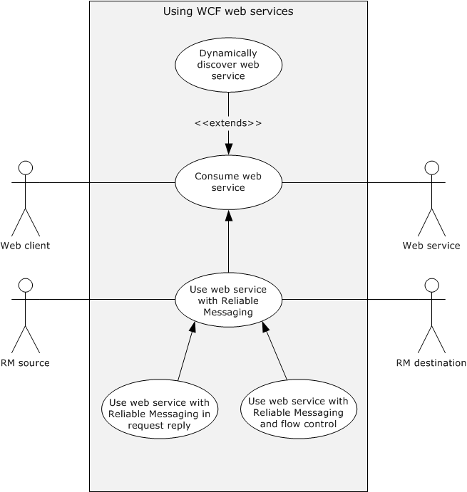

Figure 13: Windows Communication Foundation use cases

#### 2.5.3.2 Use Case Descriptions

##### 2.5.3.2.1 Dynamically Discover a Web Service

See the diagram named "WCF use cases" in section [2.5.3.1](#Section_2.5).

**Goal**: The web client obtains the uniform resource identifier (URI) of the Web service.

**Context of Use**: A web client requires the use of a Web service, but the identifying address ([**URI**](#gt_uniform-resource-identifier-uri)) of the Web service is unknown. The web client dynamically seeks a suitable Web service (the target service); this process is called service discovery.

**Primary Actor**: The primary actor is the web client, an application that resides on the end user's computer, and makes requests to a server over a network connection.

**Supporting Actor**: The supporting actor is a Web service. This provides a remote computing or data access function that a web client can dynamically discover and consume.

**Preconditions**: The following enables a [**Windows Communication Foundation (WCF)**](#gt_windows-communication-foundation-wcf) Web service to become discoverable over [**UDP**](#gt_user-datagram-protocol-udp) on a network by using WS-Discovery ([[WS-Discovery]](https://go.microsoft.com/fwlink/?LinkId=90576)).

- The Web service is connected to the network.
- The Web service application developer enables [**discovery**](#gt_discovery) of the service. In WCF, the developer adds a discovery endpoint to enable service discovery.
**Trigger**: Web service discovery can be initiated in two ways: A developer can perform Web service discovery manually and statically bind the Web service's URI to the web client application. Alternatively, when the web client does not already have the location of a service appropriate to a particular task, the web client can initiate discovery of a Web service by performing the steps that are listed under Main Success Scenario in this section.

**Main Success Scenario**:

- The web client searches for a Web service with a multicast Probe message specifying the contract type (the methods that are exposed by the service).
- The Web service responds with a unicast Probe Match message.
- The web client sends a multicast Resolve message requesting the Web service's URI.
- The Web service responds with a unicast Resolve Match message containing its address (URI).
The web client uses a multicast discovery protocol that is called WS-Discovery ([WS-Discovery]) to locate the Web service on a network. The detailed steps in discovering the service are described in [WS-Discovery] section 3. The client can add constraints to the probe and response messages as described in [MS-WSTC](../MS-WSTC/MS-WSTC.md).

**Minimal Guarantees**: If the service is unavailable, the web server does not respond to the client. No data on the web client or the web server is changed.

**Success Guarantees**: The system guarantees the following:

- The web server responds to requests from the web client.
- The discovery service obtains the URI of the Web service.
- The web client receives the URI of the Web service.

##### 2.5.3.2.2 Consume a Web Service

See the diagram named WCF use cases in section [2.5.3.1](#Section_2.5).

**Goal**: The web client consumes the Web service according to the service contract. "Consume" means that the Web service successfully fulfills the web client's request.

**Context of Use**: An end user performs a task on a web client that requires consumption of a Web service.

**Primary Actor**: The primary actor is a web client, an application that resides on the end user's computer and connects to a server over a network.

**Supporting Actor**: The supporting actor is a Web service, which provides the remote application that the web client consumes.

**Preconditions**: The Web service is connected to the network.

**Trigger**: When an end user visits a website, uses a web application, or performs a transaction on the web, that site or application might access a Web service. The end user is not necessarily aware that a Web service is involved in the task at hand. The web client makes a request on a Web service endpoint. For example, an end user uses a web browser to visit a weather reporting website. When the website's home page loads, it accesses one or more Web services to retrieve weather-related data.

**Main Success Scenario**:

- The web client discovers the Web service (obtains its URI).
- The web client sends a request message to the Web service's URI.
- The Web service validates the service contract, which describes the service's functionality and communication format.
- If the contract is valid, the Web service sends a response message to the web client.
**Extension**:

- If the web client does not already have the URI of the service, it can obtain it dynamically by using WS-Discovery as described in the use case in section [2.5.3.2.1](#Section_2.5.3.2.1).
**Minimal Guarantees**: If the service is unavailable, it does not respond to the client. No data on the web client or the web server is changed.

**Success Guarantee**: The web client consumes the Web service according to the service contract.

##### 2.5.3.2.3 Use a Web Service with Reliable Messaging

See the diagram named WCF use cases in section [2.5.3.1](#Section_2.5).

**Goal**: A web client is guaranteed to consume data in the same order in which it requested the data.

**Context of Use**: A web client requires that the order in which it consumes data be the same as the order in which it requested the data.

**Primary Actor**: The primary actor is a web client.

**Supporting Actors**: The supporting actors are as follows:

- **Web service**: Provides the remote application that the web client consumes.
- **RM Source**: Helps the sender by assuring that the message is sent reliably to the client.
- **RM Destination**: Makes sure that all the messages are received and notifies the [**RM Source**](#gt_rm-source) about the missing message.
**Preconditions**: Preconditions are defined in [[WSRM1-1]](https://go.microsoft.com/fwlink/?LinkId=117286) section 2.2.

**Minimal Guarantees**: The Web service receives the messages from the web client in the requested order.

**Success Guarantee**: The web client consumes all messages from the Web service in the requested order. The Web service receives all messages from the web client in the same order that they were sent.

**Trigger**: A web client is required to send messages reliably.

**Main Success Scenario**:

- The web client submits a sequence of messages to the RM Source for reliable delivery.
- The RM Source requests the creation of an outbound Sequence by sending a <CreateSequence> element in the body of a message to the [**RM Destination**](#gt_rm-destination).
- The RM Destination responds with a <CreateSequenceResponse> element in the body of a message to the RM Destination by returning a globally unique identifier (GUID).
- The RM Source forwards messages that are sent by the web client with a <Sequence> element header block, which contains the sequence number of the message.
- The RM Destination informs the RM Source of successful message receipt by using a <SequenceAcknowledgement> element header block. The RM Destination delivers the message to the Web service.
- The RM Source sends the last message by adding a <LastMessage> element in the Sequence header to indicate the RM Destination that this is the last message in sequence. The RM Destination responds with the acknowledgment of the last message.
- After receiving the acknowledgment of the last message, the RM Source sends a <TerminateSequence> element in the body of a message to the RM Destination to indicate that the Sequence is complete.
**Variant**:

Because the infrastructure might be unreliable, the following scenario shows how lost messages are retransmitted. The RM Source requests creation of a new Sequence.

- The RM Destination creates a Sequence by returning a globally unique identifier (GUID).
- The RM Source begins sending messages beginning with message number 1.
- The RM Source includes a <LastMessage> element token to the last message in the sequence.
- The message number **n** is lost in transit.
- The RM Destination acknowledges receipt of message numbers 1 to **n**-1 and the messages after the **n**th message.
- The RM Source retransmits the **n**th message. This message is a new message on the underlying transport, but it has the same sequence identifier and message number so that the RM Destination can recognize it as equivalent to the earlier message, in case both are received.
- The RM Destination receives the second transmission of the message with MessageNumber **n** and acknowledges receipt of message numbers 1 to last.
- The RM Source receives this acknowledgment and sends a <TerminateSequence> element message to the RM Destination indicating that the sequence is completed and reclaims any [**resources**](#gt_resource) that are associated with the Sequence.
- The RM Destination receives the <TerminateSequence> element message indicating that the RM Source does not send any more messages and reclaims any resources that are associated with the Sequence.

##### 2.5.3.2.4 Use a Web Service with Reliable Messaging and Flow Control

See the diagram titled "WCF use cases" in section [2.5.3.1](#Section_2.5).

**Goal**: A web client requires that the order of consumption is the same as the order of request and resending of messages is minimized by applying the flow control.

**Context of Use**: The web client requires consuming the Web service in a given order with minimum resend.

**Primary Actor**: The primary actor is a web client.

**Supporting Actors**: The supporting actors for this use case are as follows:

- **Web Service**: Provides the service that can be consumed by the client.
- **RM Source**: Helps the sender by assuring that the message is sent reliably to the client and implements flow control.
- **RM Destination**: Makes sure that all the messages are received and notifies the [**RM Source**](#gt_rm-source) about the missing message. It implements flow control.
**Preconditions**: The preconditions are defined in [MS-WSRVCRM](../MS-WSRVCRM/MS-WSRVCRM.md) section 1.5.

**Trigger**: The web client makes a request on a service that is configured for Web Services Reliable Messaging (see [[WSRM1-1]](https://go.microsoft.com/fwlink/?LinkId=117286) and [[WSRM1-2]](https://go.microsoft.com/fwlink/?LinkId=192440)).

**Main Success Scenario**:

- The web client submits a sequence of messages to the RM Source for reliable delivery.
- The RM Source sends the first message with a <Sequence> element header block that contains the sequence number of the message.
- After receiving a message, the [**RM Destination**](#gt_rm-destination) informs the RM Source of successful message receipt by using a <SequenceAcknowledgement> element header block with the <BufferRemaining> element which contains the number of further messages that the RM Destination can accept. The RM Destination delivers the message to the Web service.
- After receiving the <SequenceAcknowledgement> element header block, the RM Source processes it by checking the <BufferRemaining> element. It polls for the acknowledgment from RM Destination and does not send any further messages unless the <BufferRemaining> element indicates that RM Destination can receive further messages.
- The RM Source sends the last message by adding a <LastMessage> element in the Sequence header to indicate to the RM Destination that this is the last message in the sequence. The RM Destination responds with the acknowledgment of the last message.
- After receiving the acknowledgment of the last message, the RM Source sends a <TerminateSequence> element in the body of a message to the RM Destination to indicate that the Sequence is complete.
**Minimal Guarantees**: The web client consumes the Web service with the messages in the requested order.

**Success Guarantee**: The web client consumes the Web service in the specified order with the minimum number of dropped messages.

##### 2.5.3.2.5 Use a Web Service with Reliable Messaging in the Request Reply

See the diagram titled "WCF use cases" in section [2.5.3.1](#Section_2.5).

**Goal**: The web client requires that the order of consumption is the same as the order of request over transfer protocols that only support the SOAP Request-Response protocol.

**Context of Use**: The web client is required to send its messages to the web server in an orderly manner.

**Primary Actor**: The primary actor is a web client.

**Supporting Actors**: The supporting actors for this use case are as follows:

- **Web Service**: Provides the service that can be consumed by the client.
- **RM Source**: Helps the sender by assuring that the message is sent reliably to the [**RM Destination**](#gt_rm-destination) over transfer protocols that support only the SOAP Request-Response protocol.
- **RM Destination**: Makes sure that all the messages are received and notifies the [**RM Source**](#gt_rm-source) about the missing message.
**Preconditions**: The preconditions are defined in [MS-WSRVCRR](../MS-WSRVCRR/MS-WSRVCRR.md) section 1.5.

**Trigger**: The web client makes a request on a service that is configured for Web Services Reliable Messaging (see [[WSRM1-1]](https://go.microsoft.com/fwlink/?LinkId=117286) and [[WSRM1-2]](https://go.microsoft.com/fwlink/?LinkId=192440)).

**Main Success Scenario**:

- The web client submits a sequence of messages to the RM Source for reliable delivery on a transfer protocol that supports only the SOAP Request-Response protocol.
- The RM Source sends a CreateSequence message for establishing a pair of sequences.
- RM Destination in turn responds with a CreateSequenceResponse message for establishing a pair of sequences
- The RM Source sends request messages.
- The RM Destination informs the RM Source of successful message receipts by sending response messages.
- RM Source continues resending the request messages for which a response is not received to provide the RM Destination a way to send the acknowledgment.
- After the RM Source receives acknowledgment of all the messages sent, it sends a CloseSequence message.
- The RM Destination responds with a CloseSequenceResponse message.
- The RM Source sends a TerminateSequence message and the RM Destination responds with a TerminateSequenceResponse message.
**Minimal Guarantees**: The web client and web server need to communicate reliably over transfer protocols that support only the SOAP Request-Response protocol.

**Success Guarantee**: All the messages that are sent by the web client will reach the Web service in an orderly manner.

### 2.5.4 .NET Remoting Use Cases

#### 2.5.4.1 Use Case Diagrams

The following diagram shows the use case for .NET object remoting.

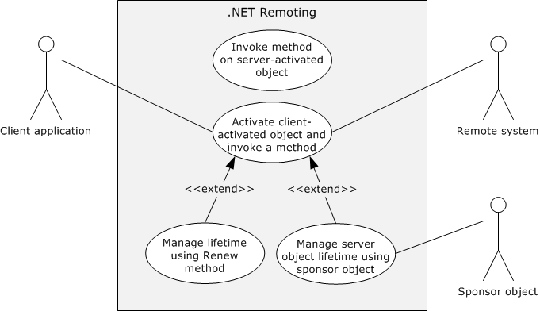

Figure 14: .NET remoting use cases

#### 2.5.4.2 Use Case Descriptions

##### 2.5.4.2.1 Invoke a Method on a Server-Activated Object

**Goal**: A client application performs an operation on a [**Server-Activated Object (SAO)**](#gt_server-activated-object-sao) on a remoting server.

**Context of Use**: A client application invokes a method on a Server-Activated Object (SAO) on a remoting server.

**Primary Actor**: The primary actor is the client application.

**Supporting Actor**: The supporting actor for this use case is the remoting server (the server application on which the Server-Activated Object resides).

**Preconditions**:

- The client application and remoting server have negotiated the encoding to be used.
- The client application recognizes the [**Server Object URI**](#gt_server-object-uri).
**Trigger**: The client application invokes a method on the Server-Activated Object on the remoting server.

**Main Success Scenario**:

- The client application connects to the remoting server by using the Server Object URI.
- The client application invokes a method on the remoting server.
- The remoting server executes the method.
**Variations**:

- If the method invocation is two-way, the client application waits for response from the remoting server.
- The remoting server sends back a response that can contain a return value and output arguments.
**Minimal Guarantees**: The method invocation fails.

**Success Guarantee**: The client application successfully invokes the remote object method on the remoting server.

##### 2.5.4.2.2 Activate a Client-Activated Object and Invoke a Method

**Goal**: A client application activates a [**Client-Activated Object (CAO)**](#gt_client-activated-object-cao) and invokes a method on the activated object.

**Context of Use**: The client application activates a Client-Activated Object on a remoting server and invokes a method on that object.

**Primary Actor**: The primary actor is the client application.

**Supporting Actor**: The supporting actor is the remoting server (the server application on which the remote object resides). The remoting server also hosts the [**RemoteActivationService**](#gt_remoteactivationservice) service, which activates the Client-Activated Objects.

**Preconditions**:

- The client system and remote system have negotiated the encoding to be used.
- The client application recognizes the [**Server Object URI**](#gt_server-object-uri) of the RemoteActivationService and is configured with enough information about the Server Type to construct the activation message.
**Main Success Scenario**:

- The client application calls the **Activate** method of the RemoteActivationService to activate a Client-Activated Object of a particular Server Type. The **Activate** method returns the [**Server Object Reference**](#gt_server-object-reference) of the activated object.
- The client application invokes a method on the returned [**Server Object**](#gt_server-object).
- The remoting server executes the method.
**Extensions**

- If the client application is required to access a method or methods of the activated Server Object, it can prevent the object from being unmarshaled by using lifetime management after step 3, as described in the use cases in sections [2.5.4.2.3](#Section_2.5.4.2.3) and [2.5.4.2.4](#Section_2.5.4.2.4).
**Minimal Guarantees**: The client application cannot activate the Client-Activated Object.

**Success Guarantee**: The client application activates a Client-Activated Object and invokes a method on the activated object.

##### 2.5.4.2.3 Manage Server-Object Lifetime by Using the Renew Method

**Goal**: A client application extends the lifetime of a [**Server Object**](#gt_server-object) by using the [**Lease Object's**](#gt_lease-object) **Renew** method.

**Context of Use**: A client application extends the lifetime of a [**Client-Activated Object (CAO)**](#gt_client-activated-object-cao) to avoid the unmarshaling of the object so that it can invoke a method of the Server Object efficiently at later point.

**Primary Actor**: The primary actor is the client application.

**Supporting Actor**: The supporting actor is the remoting server (the server application on which the remote object resides). The remoting server also hosts the [**RemoteActivationService**](#gt_remoteactivationservice) service, which activates Client-Activated Objects. It also manages the Lease Object that is associated with each Client-Activated Object.

**Preconditions**:

- The client system and remote system have negotiated the encoding to be used.
- The client application has obtained the [**Server Object Reference**](#gt_server-object-reference) of the Client-Activated Object.
**Main Success Scenario**:

- The client application calls the Client-Activated Object's **GetLifetimeService** remote method.
- The remoting server returns a Server Object Reference to the Lease Object for the Server Object.
- The client application invokes the **Renew** remote method on the Lease Object to extend the [**Time-To-Live (TTL)**](#gt_time-to-live-ttl) value by a specified amount.
**Minimal Guarantees**: The Client-Activated Object's Time-To-Live (TTL) is not extended.

**Success Guarantee**: The Time-To-Live (TTL) value of the Client-Activated Object is increased.

##### 2.5.4.2.4 Manage Server Object Lifetime by Using a Sponsor Object

**Goal**: A client application extends the lifetime of a [**Server Object**](#gt_server-object) by using a [**Sponsor Object**](#gt_f2ec27e9-3944-4923-98e5-0010000cd01b).

**Context of Use**: A client application extends the lifetime of a [**Client-Activated Object (CAO)**](#gt_client-activated-object-cao) to avoid the unmarshaling of the object so that it can invoke a method of the Server Object efficiently at a later point.

**Primary Actor**: The primary actor is the client application.

**Supporting Actors**: The supporting actors are as follows:

- **Remoting Server**: The server application where the remote object resides. The remoting server hosts the [**RemoteActivationService**](#gt_remoteactivationservice) service, which is used to activate Client-Activated Objects. It also manages the [**Lease Object**](#gt_lease-object), which is associated with every Client-Activated Object.
- **Sponsor Object**: A Sponsor object can specify whether the Server Object's [**Time-To-Live (TTL)**](#gt_time-to-live-ttl) has to be extended, and can specify the duration of the extension.
**Preconditions**:

- The client system and remote system have negotiated the encoding to be used.
- The client application has obtained the [**Server Object Reference**](#gt_server-object-reference) of the Client-Activated Object.
**Main Success Scenario**:

- The client application calls the Client-Activated Object's **GetLifetimeService** remote method.
- The remoting server returns a Server Object Reference to the Lease Object for the Server Object.
- The client application registers a Sponsor object by using the **Register** method of the returned Lease Object.
- The client application makes no call to the Client-Activated Object, and the lease of Client-Activated Object expires.
- When the Client-Activated Object's TTL is over, the Lease Object sends a Renewal request to the Sponsor object.
- The Sponsor object returns a Renewal response to the Lease Object, and the lease is extended.
**Minimal Guarantees**: The Client-Activated Object's Time-To-Live (TTL) is not extended.

**Success Guarantee**: The TTL value of the Client-Activated Object is increased.

### 2.5.5 Data Access Use Cases

#### 2.5.5.1 Use Case Diagrams

The following diagram shows the use case for accessing data from a data service.

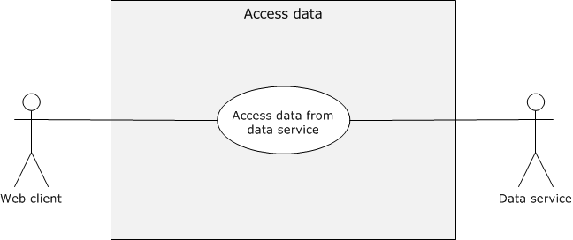

Figure 15: Accessing data from the data service use case

#### 2.5.5.2 Use Case Descriptions

##### 2.5.5.2.1 Accessing Data from a Data Service

**Goal**: A web client retrieves or updates data from a [**data service**](#gt_data-service).

**Context of Use**: A web client accesses data on a data service.

**Primary Actor**: The primary actor is a web client.

**Supporting actor**: The supporting actor is a data service that provides the data store, which the web client retrieves or updates.

**Preconditions**:

- The web service is connected to the network.
- The prerequisites and preconditions defined in [MS-ODATA](../MS-ODATA/MS-ODATA.md) section 1.5 have been addressed.
**Trigger**: The client makes a request to access data from the data service.

**Main Success Scenario**:

- The client sends the request to the data service by using an [**HTTP**](#gt_hypertext-transfer-protocol-http) header.
- The server processes the request and sends a response to the client.
- The web client processes the response.
**Minimal Guarantees**: The web client cannot access data from the Web service. No data in the data store changes.

**Success Guarantee**: The web client retrieves data from the data service and updates it.

## 2.6 Versioning, Capability Negotiation, and Extensibility

None.

## 2.7 Error Handling

The system does not define any errors beyond those described in the specifications of the member protocols, as listed in section [2.2](#Section_2.2).

## 2.8 Coherency Requirements

This system has no special coherency requirements.

## 2.9 Security

Implementation of secure communication is up to the developer. The developer has to select security features that are based on the business value of the data. Because the security of Windows Communication Foundation ([**WCF**](#gt_windows-communication-foundation-wcf))-based communications is application-dependent, application developers have to be aware of security exploits and risks that are associated with existing security features, such as authentication, encryption, signing and hashing methods, and therefore choose appropriate security methods to mitigate such known security risks in accord with the business requirements.

## 2.10 Additional Considerations

The Microsoft .NET Framework is not a system but rather a platform for application developers to write distributed .NET applications. Use of the underlying protocols is entirely at the developer's discretion.

# 3 Examples

## 3.1 Example 1 (.NET Remoting): Two-Way Method Invocation Using SOAP Over HTTP

The [**.NET Remoting**](#gt_net-remoting) framework is one of the main categories of .NET protocols. This example illustrates the two-way method invocation that is mapped to the [Invoke a Method on a Server-Activated Object](#Section_2.5.4.2.1) use case. In this example, the client invokes a method on the server, and the server responds with the result, which is an object of the **address** class. For the detailed example, see [MS-NRTP](#Section_2.1.6) section 4.2.

### 3.1.1 Initial System State

- General requirements as set forth in [MS-NRTP](#Section_2.1.6) section 1.5.
- The server was previously configured to respond with the address.

### 3.1.2 Sequence of Events

The following diagram shows the sequence of events for two-way method invocation.

Figure 16: Sequence diagram for two-way method invocation

- The client requests an address from the server.
- The server responds with the address.

### 3.1.3 Final System State

The client receives the requested address. Client and server can communicate further by using the same or a different contract.

## 3.2 Example 2 (WCF): Hello World

This code example illustrates a simple request and response that is mapped to the [Consume a Web Service](#Section_2.5.3.2.2) use case. The service defines the following service contract.

[ServiceContract]

public interface IHelloWorldService

{

[OperationContract]

string SayHello(string name);

}

The server implementation returns the string "Hello World!!" when the client sends the sayHello message with "World!!" as its input argument.

public class HelloWorldService : IHelloWorldService

{

public string SayHello(string name)

{

return string.Format("Hello, {0}", name);

}

}

This code example uses basicHttpbinding, which uses SOAP over [**HTTP**](#gt_hypertext-transfer-protocol-http).

<endpoint address="http: //localhost: 80/QuickReturns/Exchange"

bindingsSectionName="BasicHttpBinding"

contract="IHelloWorldService" />

### 3.2.1 Initial System State

- The client requires the request URI of the server, and both the client and server have the service contract.
- The client has the address and [**binding**](#gt_binding) of the service.

### 3.2.2 Sequence of Events

The following diagram shows the sequence of events for a 'Hello World' application using Windows Communication Foundation (WCF).

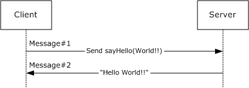

Figure 17: Sequence diagram for Hello World!!

- The client sends a SayHello request.
The code example shows the [**HTTP**](#gt_hypertext-transfer-protocol-http) headers of the request message.

POST /Hello HTTP/1.1..

Content-Type: text/xml;

charset=utf-8..

SOAPAction: "http://tempuri.org/IHelloWorldService/SayHello"..

Host: 10.185.189.63..Content-Length: 163..

Expect: 100-continue..

Accept-Encoding: gzip, deflate..

Connection: Keep-Alive....

The code example shows the body of the message.

<s:Envelope xmlns:s="http://schemas.xmlsoap.org/soap/envelope/">

<s:Body>

<SayHello xmlns="http://tempuri.org/">

<name>world!!</name>

</SayHello>

</s:Body>

</s:Envelope>

The SOAP Body element contains the method name to be called and the input arguments.

- The server responds with the "Hello World!!" string.
The code example shows the HTTP headers of the response message.

HTTP/1.1 200 OK.

.Content-Length: 206.

.Content-Type: text/xml;

charset=utf-8..

Server: Microsoft-HTTPAPI/2.0..

Date: Tue, 21 Sep 2010 22:02:33 GMT....

The code example shows the SOAP response message.

<s:Envelope xmlns:s="http://schemas.xmlsoap.org/soap/envelope/">

<s:Body>

<SayHelloResponse xmlns="http://tempuri.org/">

<SayHelloResult>Hello, world!!</SayHelloResult>

</SayHelloResponse>

</s:Body>

</s:Envelope>

The SOAP response contains an entry for SayHelloResponse that contains the response string: "Hello World!!"

### 3.2.3 Final System State

There is no change in state.

## 3.3 Example 3 (WCF): Reliable Messaging with TCP as Transport

This example illustrates how reliable messaging can be used in Windows Communication Foundation ([**WCF**](#gt_windows-communication-foundation-wcf)). This example describes the main scenario of the [Use a Web Service with Reliable Messaging](#Section_2.5.3.2.3) use case.

The code example shows that the following interface is used to establish the service contract.

[ServiceContract]

public interface IMessage

{

[OperationContract]

void Message1();

[OperationContract]

void Message2();

}

The user is required to add the following configuration entries to enable reliable messaging over [**TCP**](#gt_transmission-control-protocol-tcp).

<system.serviceModel>

<services>

<service name="<ServiceName>" >

<host>

<baseAddresses>

<add baseAddress="net.tcp://<ServerName>:<Port>/service"/>

</baseAddresses>

</host>

<endpoint address=""

binding="customBinding"

bindingConfiguration="TcpBinding"

bindingName="<TcpBinding_Name>"

contract="IMessage" />

</service>

</services>

<bindings>

<customBinding>

<!-- Configure a CustomBinding that supports tcp transport

and text encoding -->

<binding name="TcpBinding">

<!-- This will enable the WS Reliable messaging -->

<reliableSession flowControlEnabled ="false"/>

<textMessageEncoding messageVersion="Soap12WSAddressing10"/>

<tcpTransport/>

</binding>

</customBinding>

</bindings>

</system.serviceModel>

The user sends two messages and finally a third message with the <LastMessage> element tag.

The .NET Message Framing Protocol ([MC-NMF](../MC-NMF/MC-NMF.md)) is used to frame the [**SOAP**](#gt_soap) messages over TCP. This example focuses on SOAP messages, which are sent by using [MC-NMF] messages to frame them, as follows:

The Initiator and Receiver exchange a set of Preamble messages, as described in [MC-NMF] sections 3.2.4.2 and 3.3.4.2. After a session is established by using Preamble messages, the Initiator and Receiver send and receive SOAP messages, as described in [MC-NMF] sections 3.2.4.3, 3.2.4.4, 3.3.4.3, and 3.3.4.4. After the message exchange is complete, the Initiator and Receiver close the session by sending an End Record message, as described in [MC-NMF] section 3.2.4.5 and 3.3.4.5.

### 3.3.1 Initial System State

An implementation of WS-ReliableMessaging (WSRM) was previously made available.

### 3.3.2 Sequence of Events

The following diagram shows the sequence of events for reliable messaging with TCP as the transport.

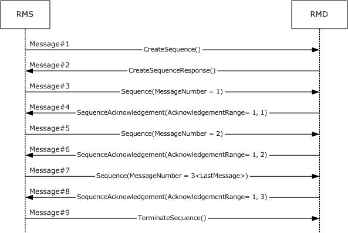

Figure 18: Reliable messaging with TCP as transport

- The [**RM Source**](#gt_rm-source) ([**RMS**](#gt_reliable-messaging-source-rms)) sends a CreateSequence message, as specified in [[WSRM1-1]](https://go.microsoft.com/fwlink/?LinkId=117286) section 3.4, to the [**RM Destination**](#gt_rm-destination) ([**RMD**](#gt_reliable-messaging-destination-rmd)).
- The RMD sends a CreateSequenceResponse message, as specified in [WSRM1-1] section 3.4, to the RMS.
- The RMS sends the first message to the RMD with MessageNumber = 1 and an <AckRequested> element header block in the header to signal to the RMD that the RMS is requesting a <SequenceAcknowledgement> element to be returned, as specified in [WSRM1-1] section 3.3.
<r:AckRequested>

<r:Identifier>urn:uuid:cd8ea5a2-4867-45ed-bb39-46c4cab2213f</r:Identifier>

</r:AckRequested>

<r:Sequence s:mustUnderstand="1">

<r:Identifier>urn:uuid:cd8ea5a2-4867-45ed-bb39-46c4cab2213f</r:Identifier>

<r:MessageNumber>1</r:MessageNumber>

</r:Sequence>

- The RMD responds with acknowledgement range = 1, 1 in a <SequenceAcknowledgement> element header block, as specified in [WSRM1-1] section 3.2.
<r:SequenceAcknowledgement>

<r:Identifier>urn:uuid:cd8ea5a2-4867-45ed-bb39-46c4cab2213f</r:Identifier>

<r:AcknowledgementRange Lower="1" Upper="1"/>

</r:SequenceAcknowledgement>

- The RMS sends a second message to the RMD with MessageNumber = 2 and an <AckRequested> element header block in the header to signal to the RMD that the RMS is requesting that a <SequenceAcknowledgement> element be returned, as specified in [WSRM1-1] section 3.3.

<r:AckRequested>

<r:Identifier>urn:uuid:cd8ea5a2-4867-45ed-bb39-46c4cab2213f</r:Identifier>

</r:AckRequested>

<r:Sequence s:mustUnderstand="1">

<r:Identifier>urn:uuid:cd8ea5a2-4867-45ed-bb39-46c4cab2213f</r:Identifier>

<r:MessageNumber>2</r:MessageNumber>

</r:Sequence>

- The RMD responds with acknowledgement range = 1, 2 in <SequenceAcknowledgement> element header block, as specified in [WSRM1-1] section 3.2.

<r:SequenceAcknowledgement>

<r:Identifier>urn:uuid:cd8ea5a2-4867-45ed-bb39-46c4cab2213f</r:Identifier>

<r:AcknowledgementRange Lower="1" Upper="2"/>

</r:SequenceAcknowledgement>

- The RMS sends the last message to RMD with MessageNumber = 3 and an <AckRequested> element header block in the header to signal to the RMD that the RMS is requesting that a <SequenceAcknowledgement> element be returned, as in [WSRM1-1] section 3.3. It adds a <LastMessage> element in the sequence block to indicate to the RMD that this message is the last message in the sequence.

<s:Envelope>

<s:Header>

<!-- ... -->

<r:Sequence s:mustUnderstand="1">

<r:Identifier>urn:uuid:cd8ea5a2-4867-45ed-bb39-46c4cab2213f</r:Identifier>

<r:MessageNumber>3</r:MessageNumber>

<r:LastMessage />

</r:Sequence>

<a:Action s:mustUnderstand="1">

http://schemas.xmlsoap.org/ws/2005/02/rm/LastMessage

</a:Action>

<a:To s:mustUnderstand="1">

net.tcp://10.185.189.61:9000/servicemodelsamples/service

</a:To>

</s:Header>

<s:Body />

</s:Envelope>

- The RMD responds with an acknowledgement range = 1, 3 in the <SequenceAcknowledgement> element header block, as specified in [WSRM1-1] section 3.2.

<r:SequenceAcknowledgement>

<r:Identifier>urn:uuid:cd8ea5a2-4867-45ed-bb39-46c4cab2213f</r:Identifier>

<r:AcknowledgementRange Lower="1" Upper="3"/>

</r:SequenceAcknowledgement>

- After receiving acknowledgement of the last message, RMS sends a <TerminateSequence> element, as specified in [WSRM1-1] section 3.5.
<s:Envelope xmlns:s="http://www.w3.org/2003/05/soap-envelope"

xmlns:a="http://www.w3.org/2005/08/addressing">

<s:Header>

<a:Action s:mustUnderstand="1">

http://schemas.xmlsoap.org/ws/2005/02/rm/TerminateSequence

</a:Action>

<a:To s:mustUnderstand="1">

net.tcp://10.185.189.61:9000/servicemodelsamples/service

</a:To>

</s:Header>

<s:Body>

<TerminateSequence xmlns="http://schemas.xmlsoap.org/ws/2005/02/rm">

<Identifier>urn:uuid:cd8ea5a2-4867-45ed-bb39-46c4cab2213f</Identifier>

</TerminateSequence>

</s:Body>

</s:Envelope>

### 3.3.3 Final System State

There is no change in the server state except for the operations that are performed by the server.

## 3.4 Example 4 (WCF): Reliable Messaging with Flow Control

This example is mapped to the [Use a Web Service with Reliable Messaging and Flow Control](#Section_2.5.3.2.4) use case.

This example illustrates the use of flow control in reliable messaging. The extension, as described in [MS-WSRVCRM](../MS-WSRVCRM/MS-WSRVCRM.md), extends WS-ReliableMessaging to provide advanced flow-control (AFCE). This example assumes that the [**RM Destination**](#gt_rm-destination) ([**RMD**](#gt_reliable-messaging-destination-rmd)) can store only one message. After storing a message, the RMD passes it to the [**Application Destination (AD)**](#gt_application-destination-ad) for processing. This example assumes that the processing rate of the consumer application (RMD) is slower than the processing rate of the producer application ([**RMS**](#gt_reliable-messaging-source-rms)). The message exchange pattern between sender and receiver is simplex. The RMS sends three messages to the RMD and a third and last message with an empty body and an Action URI of: "http://schemas.xmlsoap.org/ws/2005/02/rm/LastMessage".

In the Windows Communication Foundation ([**WCF**](#gt_windows-communication-foundation-wcf)), the flow control can be enabled by adding the flowControlEnabled attribute that is set to "true" to the <reliableSession> element. The maximum number of messages, which an RMD can accept at a time, can be specified by using the maxTransferWindowSize attribute. In this code example, the value is 1.

<system:serviceModel>

<!-- ... -->

<bindings>

<customBinding>

<!-- Configure a CustomBinding that supports

Http transport and text encoding -->

<binding name="httpBinding">

<!-- This will enable the WS Reliable messaging with flow control -->

<reliableSession flowControlEnabled="true"

maxTransferWindowSize="1" />

<textMessageEncoding messageVersion="Soap12WSAddressing10" />

< httpsTransport />

</binding>

</customBinding>

</bindings>

</system.serviceModel>

### 3.4.1 Initial System State

The general requirements, as specified in [MS-WSRVCRM](../MS-WSRVCRM/MS-WSRVCRM.md) section 1.5.

### 3.4.2 Sequence of Events

The following diagram shows the sequence of events for reliable messaging with flow control.

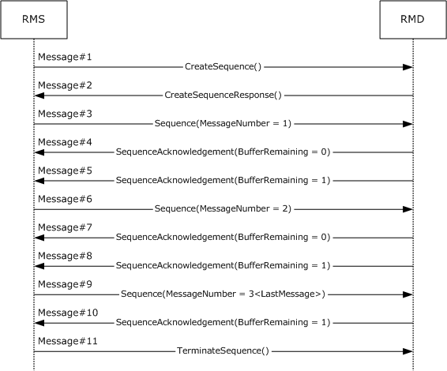

Figure 19: Reliable messaging with flow control

As shown in the preceding diagram, the following messages are the actual messages that are sent between the [**RM Source**](#gt_rm-source) ([**RMS**](#gt_reliable-messaging-source-rms)) and the [**RM Destination**](#gt_rm-destination) ([**RMD**](#gt_reliable-messaging-destination-rmd)). The body of each message is not shown, because it is not relevant to the advanced flow-control extension (AFCE) to the Web Services Reliable Messaging Protocol ([WSRM]). The purpose of each message is not included in this example. For more details on each message type, see the WSRM specifications [[WSRM1-0]](https://go.microsoft.com/fwlink/?LinkId=117285), [[WSRM1-1]](https://go.microsoft.com/fwlink/?LinkId=117286), and [[WSRM1-2]](https://go.microsoft.com/fwlink/?LinkId=192440).

- CreateSequence
The RMS sends a CreateSequence message, as specified in [WSRM1-1] section 3.4, to the RMD.

- CreateSequenceResponse
The RMD sends a CreateSequenceResponse message, as specified in [WSRM1-1] section 3.4, to the RMS.

- Sequence (MessageNumber = 1)
The RMS sends the first message to the RMD with a <MessageNumber> value of 1 and an <AckRequested> header block in the header to signal to the RMD that the RMS is requesting a <SequenceAcknowledgement> to be returned as specified in [WSRM1-1] section 3.3.

<s:Envelope xmlns:s="http://www.w3.org/2003/05/soap-envelope"

xmlns:r=http://schemas.xmlsoap.org/ws/2005/02/rm

xmlns:a="http://www.w3.org/2005/08/addressing">

<s:Header>

<r:AckRequested>

<r:Identifier>urn:uuid:ed0fc900-3bef-43a6-a5a0-83ed5935e2de</r:Identifier>

</r:AckRequested>

<r:Sequence s:mustUnderstand="1">

<r:Identifier>urn:uuid:ed0fc900-3bef-43a6-a5a0-83ed5935e2de</r:Identifier>

<r:MessageNumber>1</r:MessageNumber>

</r:Sequence>

<a:Action s:mustUnderstand="1"> http://Server/AFCEExample </a:Action>

</s:Header>

<s:Body> </s:Body>

</s:Envelope>

- SequenceAcknowledgement (BufferRemaining = 0)
This message contains the <SequenceAcknowledgement> header block, (as specified in [MS-WSRVCRM](../MS-WSRVCRM/MS-WSRVCRM.md) section 2.2.1) , that is sent by the RMD in response to message 1.

The RMD responds with <AcknowledgementRange> values of 1, 1 to acknowledge receipt of the first message, but indicates with a **BufferRemaining** value of zero that it cannot receive more messages until the [**Application Destination (AD)**](#gt_application-destination-ad) finishes processing the first message.

<s:Envelope xmlns:s="http://www.w3.org/2003/05/soap-envelope"

xmlns:r="http://schemas.xmlsoap.org/ws/2005/02/rm"

xmlns:a="http://www.w3.org/2005/08/addressing">

<s:Header>

<r:SequenceAcknowledgement>

<r:Identifier>urn:uuid:ed0fc900-3bef-43a6-a5a0-83ed5935e2de</r:Identifier>

<r:AcknowledgementRange Lower="1" Upper="1"/>

<netrm:BufferRemaining xmlns:netrm="http://schemas.microsoft.com/ws/2006/05/rm">0</netrm:BufferRemaining>

</r:SequenceAcknowledgement>

<a:Action s:mustUnderstand="1">http://schemas.xmlsoap.org/ws/2005/02/rm/SequenceAcknowledgement</a:Action>

</s:Header>

<s:Body/>

</s:Envelope>

- SequenceAcknowledgement (BufferRemaining = 1)
The RMD responds with <AcknowledgementRange> values of 1, 1 to acknowledge receipt of the first message and with a <BufferRemaining> value of 1 in the header block to indicate that the RMD can receive another message.

<s:Envelope xmlns:s="http://www.w3.org/2003/05/soap-envelope"

xmlns:r="http://schemas.xmlsoap.org/ws/2005/02/rm"

xmlns:a="http://www.w3.org/2005/08/addressing">

<s:Header>

<r:SequenceAcknowledgement>

<r:Identifier>urn:uuid:ed0fc900-3bef-43a6-a5a0-83ed5935e2de</r:Identifier>

<r:AcknowledgementRange Lower="1" Upper="1"/>

<netrm:BufferRemaining xmlns:netrm="http://schemas.microsoft.com/ws/2006/05/rm">1</netrm:BufferRemaining>

</r:SequenceAcknowledgement>

<a:Action s:mustUnderstand="1">http://schemas.xmlsoap.org/ws/2005/02/rm/SequenceAcknowledgement</a:Action>

</s:Header>

<s:Body/>

</s:Envelope>

- Sequence (MessageNumber = 2)
The RMS sends a second message to the RMD with a <MessageNumber> value of 2 and an <AckRequested> element header block in the header to signal to the RMD that the RMS is requesting a <SequenceAcknowledgement> to be returned, as specified in [WSRM1-1] section 3.3.

<s:Envelope xmlns:s="http://www.w3.org/2003/05/soap-envelope"

xmlns:r="http://schemas.xmlsoap.org/ws/2005/02/rm"

xmlns:a="http://www.w3.org/2005/08/addressing">

<s:Header>

<r:AckRequested>

<r:Identifier>urn:uuid:ed0fc900-3bef-43a6-a5a0-83ed5935e2de</r:Identifier>

</r:AckRequested>

<r:Sequence s:mustUnderstand="1">

<r:Identifier>urn:uuid:ed0fc900-3bef-43a6-a5a0-83ed5935e2de</r:Identifier>

<r:MessageNumber>2</r:MessageNumber>

</r:Sequence>

<a:Action s:mustUnderstand="1"> http://Server/AFCEExample</a:Action>

</s:Header>

<s:Body> </s:Body>

</s:Envelope>

- SequenceAcknowledgement (BufferRemaining = 0)
This message contains the <SequenceAcknowledgement> element header block, (as specified in [MS-WSRVCRM] section 2.2.1) sent by the RMD in response to message 2.

The RMD responds to the RMS with <AcknowledgementRange> values of 1, 2 to acknowledge receipt of the first and second messages, but indicates with a <BufferRemaining> value of zero that it cannot receive more messages until AD finishes processing the second message.

<s:Envelope xmlns:s="http://www.w3.org/2003/05/soap-envelope"

xmlns:r="http://schemas.xmlsoap.org/ws/2005/02/rm"

xmlns:a="http://www.w3.org/2005/08/addressing">

<s:Header>

<r:SequenceAcknowledgement>

<r:Identifier>urn:uuid:ed0fc900-3bef-43a6-a5a0-83ed5935e2de</r:Identifier>

<r:AcknowledgementRange Lower="1" Upper="2"/>

<netrm:BufferRemaining xmlns:netrm="http://schemas.microsoft.com/ws/2006/05/rm">0</netrm:BufferRemaining>

</r:SequenceAcknowledgement>

<a:Action s:mustUnderstand="1">http://schemas.xmlsoap.org/ws/2005/02/rm/SequenceAcknowledgement</a:Action>

</s:Header>

<s:Body/>

</s:Envelope>

- SequenceAcknowledgement (BufferRemaining = 1)
After the AD finishes processing the first message and starts processing the second message, the RMD sends a <SequenceAcknowledgement> header block (as specified in [MS-WSRVCRM] section 2.2.1) with a <BufferRemaining> value of 1 to inform the RMS that it can receive another message.

<s:Envelope xmlns:s="http://www.w3.org/2003/05/soap-envelope"

xmlns:r="http://schemas.xmlsoap.org/ws/2005/02/rm"

xmlns:a="http://www.w3.org/2005/08/addressing">

<s:Header>

<r:SequenceAcknowledgement>

<r:Identifier>urn:uuid:ed0fc900-3bef-43a6-a5a0-83ed5935e2de</r:Identifier>

<r:AcknowledgementRange Lower="1" Upper="2"/>

<netrm:BufferRemaining xmlns:netrm="http://schemas.microsoft.com/ws/2006/05/rm">1</netrm:BufferRemaining>

</r:SequenceAcknowledgement>

<a:Action s:mustUnderstand="1">http://schemas.xmlsoap.org/ws/2005/02/rm/SequenceAcknowledgement</a:Action>

</s:Header>

<s:Body/>

</s:Envelope>

- Sequence (MessageNumber = 3)
The RMS sends a third message to the RMD with a <MessageNumber> value of 3 and an <AckRequested> header block in the header to signal to the RM Destination that the RM Source is requesting a <SequenceAcknowledgement> to be returned, as specified in [WSRM1-1] section 3.3. It adds a <LastMessage> element in the sequence block to indicate to the RMD that this is the last message in the sequence. This message contains no Application message, and its Action [**URI**](#gt_uniform-resource-identifier-uri) is "http://schemas.xmlsoap.org/ws/2005/02/rm/LastMessage".

<s:Envelope xmlns:s="http://www.w3.org/2003/05/soap-envelope"

xmlns:r="http://schemas.xmlsoap.org/ws/2005/02/rm"

xmlns:a="http://www.w3.org/2005/08/addressing">

<s:Header>

<r:AckRequested>

<r:Identifier>urn:uuid:ed0fc900-3bef-43a6-a5a0-83ed5935e2de</r:Identifier>

</r:AckRequested>

<r:Sequence s:mustUnderstand="1">

<r:Identifier>urn:uuid:ed0fc900-3bef-43a6-a5a0-83ed5935e2de</r:Identifier>

<r:MessageNumber>3</r:MessageNumber>

</r:Sequence>

<a:Action s:mustUnderstand="1"> http://Server/AFCEExample</a:Action>

</s:Header>

<s:Body> </s:Body>

</s:Envelope>

- SequenceAcknowledgement (LastMessage)
This message contains the <SequenceAcknowledgement> header block (as specified in [MS-WSRVCRM] section 2.2.1) sent by the RMD in response to message 3.

The RMD informs the RMS that it has received messages 1 through 3 in the sequence. Message 3 is the last message.

<s:Envelope xmlns:s="http://www.w3.org/2003/05/soap-envelope"

xmlns:r="http://schemas.xmlsoap.org/ws/2005/02/rm"

xmlns:a="http://www.w3.org/2005/08/addressing">

<s:Header>

<r:SequenceAcknowledgement>

<r:Identifier>urn:uuid:ed0fc900-3bef-43a6-a5a0-83ed5935e2de</r:Identifier>

<r:AcknowledgementRange Lower="1" Upper="3"/>

<netrm:BufferRemaining xmlns:netrm="http://schemas.microsoft.com/ws/2006/05/rm">0</netrm:BufferRemaining>

</r:SequenceAcknowledgement>

<a:Action s:mustUnderstand="1">http://schemas.xmlsoap.org/ws/2005/02/rm/SequenceAcknowledgement</a:Action>

</s:Header>

<s:Body/>

</s:Envelope>

- TerminateSequence()
After receiving acknowledgement of the last message, the RMS sends a <TerminateSequence> element, as specified in [WSRM1-1] section 3.5.

<s:Envelope xmlns:s="http://www.w3.org/2003/05/soap-envelope"

xmlns:a="http://www.w3.org/2005/08/addressing">

<s:Header>

<a:Action s:mustUnderstand="1">http://schemas.xmlsoap.org/ws/2005/02/rm/TerminateSequence</a:Action>

</s:Header>

<s:Body>

<TerminateSequence xmlns="http://schemas.xmlsoap.org/ws/2005/02/rm">

<Identifier>urn:uuid:ed0fc900-3bef-43a6-a5a0-83ed5935e2de</Identifier>

</TerminateSequence>

</s:Body>

</s:Envelope>

### 3.4.3 Final System State

There is no change in state.

## 3.5 Example 5 (Data Access): Retrieve a Single Entity Using the JSON Format

This example is mapped to the [Accessing Data from a Data Service](#Section_2.5.5.2.1) use case.

This example illustrates the retrieval of an entity from a [**data service**](#gt_data-service). The EntityKey value "ALKFI" is used in the send request with the data-interchange format as JavaScript Object Notation (JSON).

### 3.5.1 Initial System State

The sample data model and instance data in this example are taken from "Appendix A: Sample Entity Data Model and CSDL Document" in [MS-ODATA](../MS-ODATA/MS-ODATA.md) section 6.

### 3.5.2 Sequence of Events

The following diagram shows the sequence of events for single-entry retrieval using the JSON format.

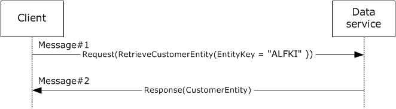

Figure 20: Retrieval of a single entity by using the JSON format

The request and response messages are described in [MS-ODATA](../MS-ODATA/MS-ODATA.md) section 4.2.3.

### 3.5.3 Final System State

There is no change in state.

# 4 Microsoft Implementations

The information in this document is applicable to the following major versions of the Microsoft .NET Framework:

- Microsoft .NET Framework 1.0
- Microsoft .NET Framework 1.1
- Microsoft .NET Framework 2.0
- Microsoft .NET Framework 3.0
- Microsoft .NET Framework 3.5
- Microsoft .NET Framework 4.0
- Microsoft .NET Framework 4.5
- Microsoft .NET Framework 4.6
- Microsoft .NET Framework 4.7
- Microsoft .NET Framework 4.8
Exceptions, if any, are noted in the following section.

For more information about .NET Framework versions versus Windows operating system version support, including whether a particular .NET Framework version is part of the initial operating system installation or installs separately as out-of-box supplemental software, see [[MSDOCS-.NETSysReqs]](https://go.microsoft.com/fwlink/?linkid=861790). For related information on Microsoft Lifecycle Policy for the .NET Framework versions (for example, extended support dates) see [[MSFT-LifecyclePolicy]](https://go.microsoft.com/fwlink/?linkid=861933).

## 4.1 Product Behavior

There are no exceptions.

# 5 Change Tracking

No table of changes is available. The document is either new or has had no changes since its last release.

## Revision History

| Date | Version | Revision Class | Comments |
| --- | --- | --- | --- |
| 5/6/2011 | 1.0 | New | Released new document. |
| 6/17/2011 | 2.0 | Major | Updated and revised the technical content. |
| 9/23/2011 | 2.0 | None | No changes to the meaning, language, or formatting of the technical content. |
| 12/16/2011 | 2.0 | None | No changes to the meaning, language, or formatting of the technical content. |
| 3/30/2012 | 2.0 | None | No changes to the meaning, language, or formatting of the technical content. |
| 7/12/2012 | 2.0 | None | No changes to the meaning, language, or formatting of the technical content. |
| 10/25/2012 | 2.0 | None | No changes to the meaning, language, or formatting of the technical content. |
| 1/31/2013 | 2.0 | None | No changes to the meaning, language, or formatting of the technical content. |
| 8/8/2013 | 3.0 | Major | Updated and revised the technical content. |
| 11/14/2013 | 4.0 | Major | Updated and revised the technical content. |
| 2/13/2014 | 4.0 | None | No changes to the meaning, language, or formatting of the technical content. |
| 5/15/2014 | 4.0 | None | No changes to the meaning, language, or formatting of the technical content. |
| 6/30/2015 | 5.0 | Major | Significantly changed the technical content. |
| 9/24/2015 | 5.1 | Minor | Clarified the meaning of the technical content. |
| 10/16/2015 | 5.1 | None | No changes to the meaning, language, or formatting of the technical content. |
| 9/26/2016 | 5.2 | Minor | Clarified the meaning of the technical content. |
| 3/16/2017 | 6.0 | Major | Significantly changed the technical content. |
| 6/1/2017 | 7.0 | Major | Significantly changed the technical content. |
| 12/15/2017 | 8.0 | Major | Significantly changed the technical content. |
| 5/30/2019 | 8.0 | None | No changes to the meaning, language, or formatting of the technical content. |
