# [MS-NFPB]: Near Field Proximity: Bidirectional Services Protocol

Table of Contents

<details>
<summary>1 Introduction</summary>

- [1 Introduction](#Section_1)
  - [1.1 Glossary](#Section_1.1)
  - [1.2 References](#Section_1.2)
    - [1.2.1 Normative References](#Section_1.2.1)
    - [1.2.2 Informative References](#Section_1.2.2)
  - [1.3 Overview](#Section_1.3)
    - [1.3.1 Session Factory Service Activation](#Section_1.3.1)
    - [1.3.2 OOB Connector Service Activation](#Section_1.3.2)
    - [1.3.3 Session Activation](#Section_1.3.3)
    - [1.3.4 Connection Validation](#Section_1.3.4)
  - [1.4 Relationship to Other Protocols](#Section_1.4)
  - [1.5 Prerequisites/Preconditions](#Section_1.5)
  - [1.6 Applicability Statement](#Section_1.6)
  - [1.7 Versioning and Capability Negotiation](#Section_1.7)
  - [1.8 Vendor-Extensible Fields](#Section_1.8)
    - [1.8.1 Service Descriptor Entries](#Section_1.8.1)
    - [1.8.2 AppInfo Platform Qualifiers](#Section_1.8.2)
    - [1.8.3 Session Activation and Acknowledgment Extensions](#Section_1.8.3)
  - [1.9 Standards Assignments](#Section_1.9)
</details>

<details>
<summary>2 Messages</summary>

- [2 Messages](#Section_2)
  - [2.1 Transport](#Section_2.1)
  - [2.2 Message Syntax](#Section_2.2)
    - [2.2.1 Accept Header](#Section_2.2.1)
    - [2.2.2 AppInfo Structure](#Section_2.2.2)
    - [2.2.3 Extension Structure](#Section_2.2.3)
    - [2.2.4 OOB Connector Service ACK Message](#Section_2.2.4)
      - [2.2.4.1 OOB Attribute Header](#Section_2.2.4.1)
      - [2.2.4.2 OOB Attribute Type Constants](#Section_2.2.4.2)
      - [2.2.4.3 OOB Provisioning Settings Constants](#Section_2.2.4.3)
      - [2.2.4.4 OOB Device Info Attribute Format](#Section_2.2.4.4)
      - [2.2.4.5 OOB Provisioning Info Attribute Format](#Section_2.2.4.5)
      - [2.2.4.6 OOB Configuration Timeout Attribute Format](#Section_2.2.4.6)
    - [2.2.5 OOB Connector Service Activation Message](#Section_2.2.5)
    - [2.2.6 Role Compatibility Constants](#Section_2.2.6)
    - [2.2.7 Service Activation Header](#Section_2.2.7)
    - [2.2.8 Service Descriptor Message](#Section_2.2.8)
    - [2.2.9 Service Descriptor Structure](#Section_2.2.9)
    - [2.2.10 Session ACK Message](#Section_2.2.10)
    - [2.2.11 Session Activation Message](#Section_2.2.11)
    - [2.2.12 Session Factory Service Activation Message](#Section_2.2.12)
</details>

<details>
<summary>3 Protocol Details</summary>

- [3 Protocol Details](#Section_3)
  - [3.1 Peer Details](#Section_3.1)
    - [3.1.1 Abstract Data Model](#Section_3.1.1)
      - [3.1.1.1 NfpService](#Section_3.1.1.1)
      - [3.1.1.2 OOB Connector Object](#Section_3.1.1.2)
      - [3.1.1.3 Session Factory Object](#Section_3.1.1.3)
      - [3.1.1.4 Session Object](#Section_3.1.1.4)
    - [3.1.2 Timers](#Section_3.1.2)
    - [3.1.3 Initialization](#Section_3.1.3)
    - [3.1.4 Higher-Layer Triggered Events](#Section_3.1.4)
    - [3.1.5 Message Processing Events and Sequencing Rules](#Section_3.1.5)
      - [3.1.5.1 Service Descriptor Sequence](#Section_3.1.5.1)
      - [3.1.5.2 OOB Connector Exchange](#Section_3.1.5.2)
      - [3.1.5.3 Handling OOB Connector Service Activation Messages](#Section_3.1.5.3)
      - [3.1.5.4 Handling OOB Connector Service ACK Messages](#Section_3.1.5.4)
      - [3.1.5.5 Session Factory Exchange](#Section_3.1.5.5)
      - [3.1.5.6 Handling Session Factory Service Activation](#Section_3.1.5.6)
      - [3.1.5.7 Handling Session Activation](#Section_3.1.5.7)
      - [3.1.5.8 Handling Session ACK Messages](#Section_3.1.5.8)
      - [3.1.5.9 Handling the Accept Header](#Section_3.1.5.9)
    - [3.1.6 Timer Events](#Section_3.1.6)
    - [3.1.7 Other Local Events](#Section_3.1.7)
</details>

<details>
<summary>4 Protocol Examples</summary>

- [4 Protocol Examples](#Section_4)
  - [4.1 Transport Activation and Initial Service Descriptor](#Section_4.1)
  - [4.2 Peer A Service Descriptor Received by Peer B](#Section_4.2)
  - [4.3 Peer B Service Descriptor Received by Peer A](#Section_4.3)
  - [4.4 Peer A Receives OOB Connector Service Activation Message, Responds with OOB Connector Service ACK](#Section_4.4)
  - [4.5 Peer A Session Factory Service Activation Received by Peer B, Responds with Session Activation](#Section_4.5)
  - [4.6 Peer B Session Activation Received by Peer A, Responds with Session ACK](#Section_4.6)
  - [4.7 Peer A Session ACK Received by Peer B, Begins Connection Validation](#Section_4.7)
  - [4.8 Peer B Accept Header Received by Peer A, Completes Connection Validation](#Section_4.8)
</details>

<details>
<summary>5 Security</summary>

- [5 Security](#Section_5)
  - [5.1 Security Considerations for Implementers](#Section_5.1)
  - [5.2 Index of Security Parameters](#Section_5.2)
</details>

<details>
<summary>6 Appendix A: Product Behavior</summary>

- [6 Appendix A: Product Behavior](#Section_6)
</details>

<details>
<summary>7 Change Tracking</summary>

- [7 Change Tracking](#Section_7)
</details>

For the legal notice and IP terms, see [LEGAL.md](../LEGAL.md).
Last updated: 4/23/2024.
See [Revision History](#revision-history) for full version history.

<a id="Section_1"></a>
# 1 Introduction

The Near Field Proximity: Bidirectional Services Protocol provides a way for devices such as smartphones to discover services and version information on other devices. It provides a transport-agnostic means of building up impromptu connections between peers, so it can be used on any transport system where peers can subscribe to message types and publish messages based on those types. A prototypical transport is [**Near Field Communication (NFC)**](#gt_near-field-communication-nfc) [[ECMA-340]](https://go.microsoft.com/fwlink/?LinkId=272909).

Sections 1.5, 1.8, 1.9, 2, and 3 of this specification are normative. All other sections and examples in this specification are informative.

<a id="Section_1.1"></a>
## 1.1 Glossary

This document uses the following terms:

<a id="gt_authentication"></a>
**authentication**: The ability of one entity to determine the identity of another entity.

<a id="gt_base64-encoding"></a>
**base64 encoding**: A binary-to-text encoding scheme whereby an arbitrary sequence of bytes is converted to a sequence of printable ASCII characters, as described in [[RFC4648]](https://go.microsoft.com/fwlink/?LinkId=90487).

<a id="gt_big-endian"></a>
**big-endian**: Multiple-byte values that are byte-ordered with the most significant byte stored in the memory location with the lowest address.

<a id="gt_binary-large-object-blob"></a>
**binary large object (BLOB)**: A discrete packet of data that is stored in a database and is treated as a sequence of uninterpreted bytes.

<a id="gt_bluetooth-bt"></a>
**Bluetooth (BT)**: A wireless technology standard which is managed by the Bluetooth Special Interest Group and that is used for exchanging data over short distances between mobile and fixed devices.

<a id="gt_channelid"></a>
**ChannelID**: An 8-byte value used in message exchanges to identify the channel on which the next message is published. It is generated by using cryptographically secure pseudo-random numbers to make the chance of collision in the 64-bit address space unlikely.

<a id="gt_domain"></a>
**domain**: A set of users and computers sharing a common namespace and management infrastructure. At least one computer member of the set has to act as a domain controller (DC) and host a member list that identifies all members of the domain, as well as optionally hosting the Active Directory service. The domain controller provides authentication of members, creating a unit of trust for its members. Each domain has an identifier that is shared among its members. For more information, see [MS-AUTHSOD](../MS-AUTHSOD/MS-AUTHSOD.md) section 1.1.1.5 and [MS-ADTS](../MS-ADTS/MS-ADTS.md).

<a id="gt_elliptic-curve-diffie-hellman-ecdh"></a>
**Elliptic Curve Diffie-Hellman (ECDH)**: A key agreement protocol that allows two parties, each having an elliptic-curve public–private key pair, to establish a shared secret over an insecure channel.

<a id="gt_encryption"></a>
**encryption**: In cryptography, the process of obscuring information to make it unreadable without special knowledge.

<a id="gt_internet-protocol-version-4-ipv4"></a>
**Internet Protocol version 4 (IPv4)**: An Internet protocol that has 32-bit source and destination addresses. IPv4 is the predecessor of IPv6.

<a id="gt_internet-protocol-version-6-ipv6"></a>
**Internet Protocol version 6 (IPv6)**: A revised version of the Internet Protocol (IP) designed to address growth on the Internet. Improvements include a 128-bit IP address size, expanded routing capabilities, and support for [**authentication**](#gt_authentication) and privacy.

<a id="gt_keepalive-timer"></a>
**KeepAlive timer**: A method of tracking the currency of an instance of Session Factory or OOB Connector object in the abstract data model. The timer is started when an object instance is created, and it keeps track of the number of references to that instance by protocol clients. When the number of client references reaches zero, the object is deleted.

<a id="gt_key"></a>
**key**: In cryptography, a generic term used to refer to cryptographic data that is used to initialize a cryptographic algorithm. [**Keys**](#gt_key) are also sometimes referred to as keying material.

<a id="gt_key-derivation"></a>
**key derivation**: The act of deriving a cryptographic [**key**](#gt_key) from another value (for example, the derivation of a cryptographic [**key**](#gt_key) from a password).

<a id="gt_key-exchange"></a>
**key exchange**: A synonym for key establishment. The procedure that results in shared secret keying material among different parties. Key agreement and key transport are two forms of [**key exchange**](#gt_key-exchange). For more information, see [[CRYPTO]](https://go.microsoft.com/fwlink/?LinkId=89841) section 1.11, [[SP800-56A]](https://go.microsoft.com/fwlink/?LinkId=90525) section 3.1, and [[IEEE1363]](https://go.microsoft.com/fwlink/?LinkId=89899) section 3.

<a id="gt_little-endian"></a>
**little-endian**: Multiple-byte values that are byte-ordered with the least significant byte stored in the memory location with the lowest address.

<a id="gt_media-access-control-mac-address"></a>
**Media Access Control (MAC) address**: A hardware address provided by the network interface vendor that uniquely identifies each interface on a physical network for communication with other interfaces, as specified in [[IEEE802.3]](https://go.microsoft.com/fwlink/?LinkId=89911). It is used by the media access control sublayer of the data link layer of a network connection.

<a id="gt_near-field-communication-nfc"></a>
**Near Field Communication (NFC)**: An international standard for short-range wireless, contactless connectivity that provides intuitive, simple, and safe communication between electronic devices. NFC is the technology on smartphones that makes proximity scenarios possible. For example, it allows a user to wave the smartphone over a NFC-compatible device to send information without needing to touch the devices together or go through multiple steps setting up a connection.

<a id="gt_network-layer-l3"></a>
**network layer (L3)**: The third layer in the ISO/OSI reference model that provides the ability to transfer variable length data sequences from a source host on one network to a destination host on a different network while maintaining the quality of service (QoS) requested by the transport layer.

<a id="gt_organizationally-unique-identifier-oui"></a>
**organizationally unique identifier (OUI)**: A unique 24-bit string that uniquely identifies a vendor, manufacturer, or organization on a worldwide l basis, as specified in [IEEE-OUI]. The OUI is used to help distinguish both physical devices and software, such as a network protocol, that belong to one entity from those that belong to another.

<a id="gt_out-of-band-oob"></a>
**out-of-band (OOB)**: A process for authenticating a user where two communication channels are used simultaneously between two devices or roles. A cellular network is an example of a channel that is commonly used for performing out-of-band authentication.

<a id="gt_peer-to-peer"></a>
**peer-to-peer**: A server-less networking technology that allows several participating network devices to share resources and communicate directly with each other.

<a id="gt_private-key"></a>
**private key**: One of a pair of keys used in public-key cryptography. The private key is kept secret and is used to decrypt data that has been encrypted with the corresponding public key. For an introduction to this concept, see [CRYPTO] section 1.8 and [IEEE1363] section 3.1.

<a id="gt_pubsub"></a>
**pub/sub**: Refers to publication/subscription, a design model in which publishers send notification of events that are received by subscribers, which have registered for those events.

<a id="gt_public-key"></a>
**public key**: One of a pair of keys used in public-key cryptography. The public key is distributed freely and published as part of a digital certificate. For an introduction to this concept, see [CRYPTO] section 1.8 and [IEEE1363] section 3.1.

<a id="gt_publication"></a>
**publication**: A message placed on the underlying transport along with a type identifier. Multiple individual publication messages may be placed on the transport with the same type identifier. Peers receive a published message if they have previously subscribed to it by type.

<a id="gt_radio-frequency-communications-rfcomm"></a>
**radio frequency communications (RFCOMM)**: A protocol that provides serial port emulation of EIA-232 (formerly RS-232) control signals over the Bluetooth baseband layer. RFCOMM is used to create a virtual serial data stream to enable binary data transport.

<a id="gt_subscription"></a>
**subscription**: A registration performed by a subscriber to specify a requirement to receive events, future messages, or historical data.

<a id="gt_transmission-control-protocol-tcp"></a>
**Transmission Control Protocol (TCP)**: A protocol used with the Internet Protocol (IP) to send data in the form of message units between computers over the Internet. TCP handles keeping track of the individual units of data (called packets) that a message is divided into for efficient routing through the Internet.

<a id="gt_uniform-resource-identifier-uri"></a>
**Uniform Resource Identifier (URI)**: A string that identifies a resource. The URI is an addressing mechanism defined in Internet Engineering Task Force (IETF) Uniform Resource Identifier (URI): Generic Syntax [[RFC3986]](https://go.microsoft.com/fwlink/?LinkId=90453).

<a id="gt_universally-unique-identifier-uuid"></a>
**universally unique identifier (UUID)**: A 128-bit value. UUIDs can be used for multiple purposes, from tagging objects with an extremely short lifetime, to reliably identifying very persistent objects in cross-process communication such as client and server interfaces, manager entry-point vectors, and RPC objects. UUIDs are highly likely to be unique. UUIDs are also known as globally unique identifiers (GUIDs) and these terms are used interchangeably in the Microsoft protocol technical documents (TDs). Interchanging the usage of these terms does not imply or require a specific algorithm or mechanism to generate the UUID. Specifically, the use of this term does not imply or require that the algorithms described in [[RFC4122]](https://go.microsoft.com/fwlink/?LinkId=90460) or [[C706]](https://go.microsoft.com/fwlink/?LinkId=89824) must be used for generating the UUID.

<a id="gt_utf-8"></a>
**UTF-8**: A byte-oriented standard for encoding Unicode characters, defined in the Unicode standard. Unless specified otherwise, this term refers to the UTF-8 encoding form specified in [[UNICODE5.0.0/2007]](https://go.microsoft.com/fwlink/?LinkId=154659) section 3.9.

<a id="gt_wi-fi-direct-wfd"></a>
**Wi-Fi Direct (WFD)**: A standard that allows Wi-Fi devices to connect to each other without requiring a wireless access point (WAP). This standard enables WFD devices to transfer data directly among each other resulting in significant reductions in setup.

<a id="gt_winning-peer"></a>
**winning peer**: A peer that has the preference to be the server in future message exchanges. This term applies to the relevant message exchange between the two peers.

**MAY, SHOULD, MUST, SHOULD NOT, MUST NOT:** These terms (in all caps) are used as defined in [[RFC2119]](https://go.microsoft.com/fwlink/?LinkId=90317). All statements of optional behavior use either MAY, SHOULD, or SHOULD NOT.

<a id="Section_1.2"></a>
## 1.2 References

Links to a document in the Microsoft Open Specifications library point to the correct section in the most recently published version of the referenced document. However, because individual documents in the library are not updated at the same time, the section numbers in the documents may not match. You can confirm the correct section numbering by checking the [Errata](https://go.microsoft.com/fwlink/?linkid=850906).

<a id="Section_1.2.1"></a>
### 1.2.1 Normative References

We conduct frequent surveys of the normative references to assure their continued availability. If you have any issue with finding a normative reference, please contact [dochelp@microsoft.com](mailto:dochelp@microsoft.com). We will assist you in finding the relevant information.

[RFC2045] Freed, N., and Borenstein, N., "Multipurpose Internet Mail Extensions (MIME) Part One: Format of Internet Message Bodies", RFC 2045, November 1996, [https://www.rfc-editor.org/info/rfc2045](https://go.microsoft.com/fwlink/?LinkId=90307)

[RFC2119] Bradner, S., "Key words for use in RFCs to Indicate Requirement Levels", BCP 14, RFC 2119, March 1997, [https://www.rfc-editor.org/info/rfc2119](https://go.microsoft.com/fwlink/?LinkId=90317)

[WF-P2P1.2] Wi-Fi Alliance, "Wi-Fi Peer-to-Peer (P2P) Technical Specification v1.2", [https://www.wi-fi.org/wi-fi-peer-to-peer-p2p-technical-specification-v12](https://go.microsoft.com/fwlink/?LinkId=225584)

**Note** There is a charge to download the specification.

[WF-WSC2.0.2] Wi-Fi Alliance, "Wi-Fi Simple Configuration Technical Specification v2.0.2", August 2011, [https://www.wi-fi.org/wi-fi-simple-configuration-technical-specification-v202](https://go.microsoft.com/fwlink/?LinkId=282666)

**Note** There is a charge to download the specification.

<a id="Section_1.2.2"></a>
### 1.2.2 Informative References

[ECMA-340] ECMA International, "Near Field Communication Interface and Protocol (NFCIP-1)", 2nd edition, ECMA-340, December 2004, [http://www.ecma-international.org/publications/files/ECMA-ST/Ecma-340.pdf](https://go.microsoft.com/fwlink/?LinkId=272909)

[IEEE-OUI] IEEE Standards Association, "IEEE MAC Address Block Large (MA-L) Field Registration Authority Public Listing", [http://standards-oui.ieee.org/oui/oui.txt](https://go.microsoft.com/fwlink/?LinkId=89895)

[MS-NFPS] Microsoft Corporation, "[Near Field Proximity: Sharing Protocol](../MS-NFPS/MS-NFPS.md)".

[NSA] National Security Agency, "Suite B Implementer’s Guide to FIPS 186-3 (ECDSA)", February 2010, [https://silo.tips/download/suite-b-implementer-s-guide-to-fips-ecdsa](https://go.microsoft.com/fwlink/?LinkId=183693)

[RFC4380] Huitema, C., "Teredo: Tunneling IPv6 over UDP through Network Address Translations (NATs)", RFC 4380, February 2006, [https://www.rfc-editor.org/info/rfc4380](https://go.microsoft.com/fwlink/?LinkId=90476)

<a id="Section_1.3"></a>
## 1.3 Overview

Although the underlying transport for the Near Field Proximity: Bidirectional Services Protocol is undefined, the protocol models the transport as a [**publication**](#gt_publication)/[**subscription**](#gt_subscription) system to exchange messages between peers. The transport is modeled with the assumption that it is either active or inactive. Typically, there is user-intent to activate the transport, but that is not required. When active, the transport transmits all local publications to peer subscribers on the other side of the transport, and it does so just once. When inactive, the transport does not transmit or receive any data.

Peers can use the information in protocol messages to activate services. A **Service Descriptor** contains a list of services and versions that are defined by this protocol. Each service is identified by a [**UUID**](#gt_universally-unique-identifier-uuid), which peers can use to send activation messages for the service. To exchange **Service Descriptor** messages, each peer both publishes and subscribes to the service.

Some services can be inherently client/server, so that upon reception of a **Service Descriptor** message with a compatible service, a client can immediately activate this service by replying with an activation message.

Other services can be inherently [**peer-to-peer**](#gt_peer-to-peer) and use client preference ID fields to determine the specific peer that will begin the next phase of service activation. Each peer randomly generates an ID to provide highly probable uniqueness and includes the ID in each **Service Descriptor**. The peer that generates the numerically higher ID is the [**winning peer**](#gt_winning-peer), and it sends the next message for a given service. A specific peer can only be winning or losing with respect to another specific peer.

When a client application establishes a connection over the [**network layer (L3)**](#gt_network-layer-l3), it validates the connection by exchanging handshake data with the server, as described in section [1.3.4](#Section_1.3.4) Connection Validation.

<a id="Section_1.3.1"></a>
### 1.3.1 Session Factory Service Activation

Either peer can choose to activate the remote peer's **Session Factory** service in order to establish a single-instanced session between an application running locally and another instance of the same application running on the remote peer. Optionally, a peer can support launching or acquiring the application in addition to, or instead of, establishing the single-instanced session between two instances of the application.

<a id="Section_1.3.2"></a>
### 1.3.2 OOB Connector Service Activation

A [**winning peer**](#gt_winning-peer) can activate the remote peer's **OOB Connector** service in order to provide [**out-of-band (OOB)**](#gt_out-of-band-oob) transport options for the peers to connect. These connection options allow the **Session Factory** service a simple means of address resolution.

<a id="Section_1.3.3"></a>
### 1.3.3 Session Activation

The following diagram shows a generic sequence of session activation.

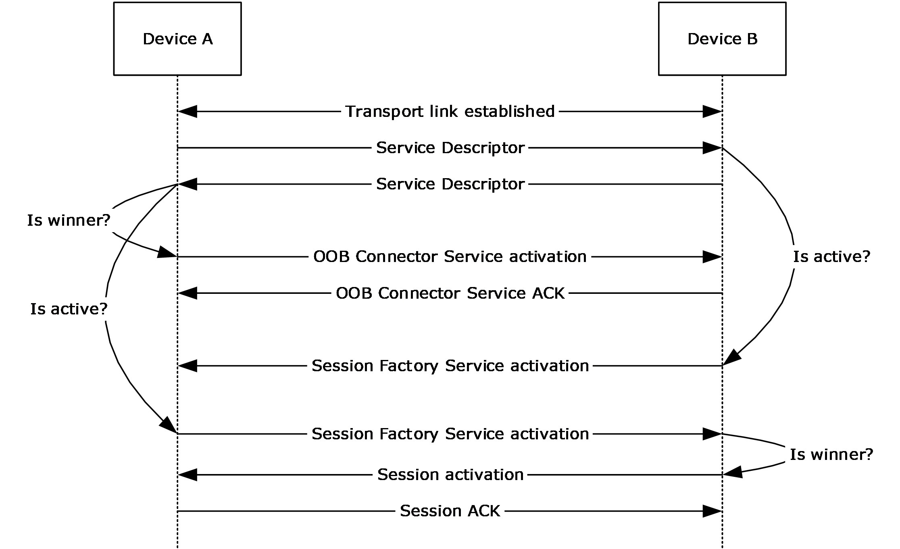

Figure 1: Session activation sequence

<a id="Section_1.3.4"></a>
### 1.3.4 Connection Validation

After session activation (section [1.3.3](#Section_1.3.3)) and subsequent L3 establishment, the client validates the connection by exchanging handshake data with the server, as shown in the following diagram. The handshake data consists of an Accept Header (section [2.2.1](#Section_2.2.1)).

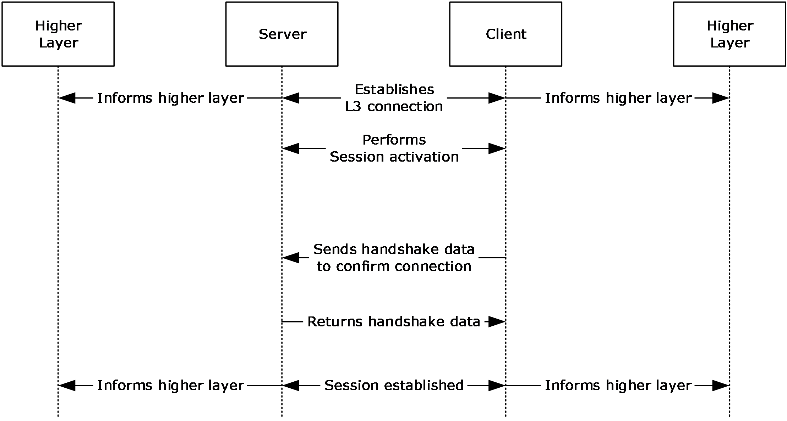

Figure 2: Connection validation

<a id="Section_1.4"></a>
## 1.4 Relationship to Other Protocols

The following diagram shows the relationship of the Near Field Proximity: Bidirectional Services Protocol with other protocols.

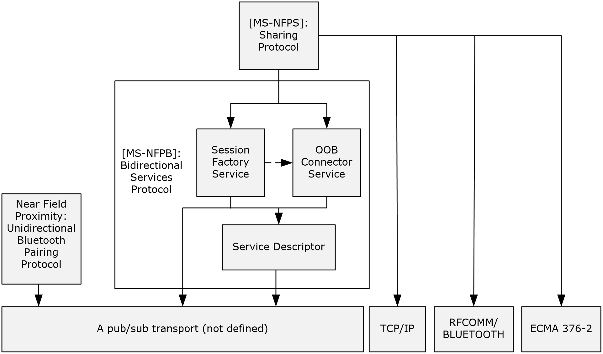

Figure 3: Relationship to other protocols

The **Service Descriptor** does not depend on any specific transport, and as such, does not technically depend on any other protocol.

The **OOB Connector** service depends only on the **Service Descriptor** for service discovery, versioning, and winner/loser role-determination. The **OOB Connector** service uses the [**publication**](#gt_publication)/[**subscription**](#gt_subscription) transport for activation and acknowledgment. The exchanged data is combined with data exchanged by the **Session Factory** service by higher-level protocols to establish single-instanced connections between applications.

The **Session Factory** service depends only on the **Service Descriptor** for service discovery and versioning; it does not depend on the **Service Descriptor** for winner/loser role-determination. The **Session Factory** service performs winner/loser role-determination in the activation message exchange rather than the **Service Descriptor** message exchange. The **Session Factory** service uses the publication/subscription transport for winner/loser role-determination, activation, and acknowledgement. As described previously, the exchanged data in activation and acknowledgment scenarios is combined with data exchanged by the **OOB Connector** service by higher-level protocols to establish single-instanced connections between applications. These connections are typically established over [**TCP**](#gt_transmission-control-protocol-tcp)/IP or [**RFCOMM**](#gt_radio-frequency-communications-rfcomm)/[**Bluetooth**](#gt_bluetooth-bt). However, the **OOB Connector** service does not mandate a specific transport. The higher-level protocol can determine, at runtime, which transports to use to establish the session's connection.

The Near Field Proximity: Sharing Protocol [MS-NFPS](../MS-NFPS/MS-NFPS.md) is an example of a higher-level protocol.

<a id="Section_1.5"></a>
## 1.5 Prerequisites/Preconditions

Peers communicate by using compatible networking technologies such as [**TCP**](#gt_transmission-control-protocol-tcp)/IP over wireless networks. There are no other preconditions or prerequisites for this protocol to function between peers. There are no presupposed security associations or connections required between peers except those that are required by the unspecified [**pub/sub**](#gt_pubsub) transport link layer.

<a id="Section_1.6"></a>
## 1.6 Applicability Statement

The Near Field Proximity: Bidirectional Services Protocol is well-suited to function on top of transports such as [**Near Field Communication (NFC)**](#gt_near-field-communication-nfc) [[ECMA-340]](https://go.microsoft.com/fwlink/?LinkId=272909). This protocol has been designed for linking two applications for the purposes of simple real-time sharing of files. This protocol is designed to function in cross-platform, cross-[**domain**](#gt_domain), and non-domain configurations.

<a id="Section_1.7"></a>
## 1.7 Versioning and Capability Negotiation

This document covers versioning issues in the following areas:

- **Security and Authentication Methods:** The **Service Descriptor** neither requires nor provides any security or [**authentication**](#gt_authentication) methods. The **OOB Connector** service and **Session Factory** service contain specific embedded [**key exchange**](#gt_key-exchange) algorithms that can be used by higher-level protocols to provide a level of security for continuing communication over an [**OOB**](#gt_out-of-band-oob) channel. However, the specific algorithms are attached to specific versions of the **Session Factory** service; there is not a more granular means of negotiating algorithms.
- **Capability Negotiation:** This protocol performs explicit capability negotiation by using the **Service Descriptor** structure (section [2.2.9](#Section_2.2.9)).
<a id="Section_1.8"></a>
## 1.8 Vendor-Extensible Fields

<a id="Section_1.8.1"></a>
### 1.8.1 Service Descriptor Entries

Each entry within a **Service Descriptor** message (section [2.2.8](#Section_2.2.8)) is a **Service Descriptor** structure (section [2.2.9](#Section_2.2.9)), which contains a service activation [**UUID**](#gt_universally-unique-identifier-uuid) that uniquely identifies each service. Vendors that wish to define a new service MUST generate a new UUID for the service.

<a id="Section_1.8.2"></a>
### 1.8.2 AppInfo Platform Qualifiers

AppInfo platform qualifiers SHOULD be defined by each vendor that implements any of the following protocols:

- The Session Factory protocol
- The Launch App protocol
- The Launch Compatible App protocol
A vendor SHOULD define its qualifier based on a domain name, like "fabrikam.com", which is owned by the vendor, to ensure that no other vendor uses the same value. The platform qualifier is specified by an **AppInfo** structure (section [2.2.2](#Section_2.2.2)).

<a id="Section_1.8.3"></a>
### 1.8.3 Session Activation and Acknowledgment Extensions

The Session Factory protocol has an extension pattern that can be used by implementations of this protocol. If an implementation defines an extension, a random 8-byte value SHOULD be used to ensure that no other implementation uses the same value. 8 bytes is enough to make collisions unlikely.

<a id="Section_1.9"></a>
## 1.9 Standards Assignments

None.

<a id="Section_2"></a>
# 2 Messages

<a id="Section_2.1"></a>
## 2.1 Transport

As stated earlier in this document, a specific transport is not defined. However, the general requirements for a transport are as follows:

Transports on which this protocol is built MUST be able to provide reliable packet-based delivery of messages. The transport MUST be able to provide the size of each message, independently of its payload, to the component that implements the protocol.

Messages are published and subscribed over the transport on channels that are analogous to ports in [**TCP**](#gt_transmission-control-protocol-tcp)/IP. Well-known channel names allow two peers to establish initial communication. If a bi-directional exchange is required, the first message SHOULD contain an ID that allows the receiver to return a message on a channel based on that ID.

In this document, all multi-message exchanges except the final message use an 8-byte identifier to denote the channel on which the following message MUST be published. This identifier is referred to as a [**ChannelID**](#gt_channelid). ChannelIDs MUST be generated by using cryptographically secure pseudo-random numbers to reduce the likelihood of collisions. A collision can result in a protocol failure, which means that the exchange MUST be manually attempted again. With [**Near Field Communication (NFC)**](#gt_near-field-communication-nfc) as the typical transport, the user is required to tap or swipe the devices together again. However, with 64 bits of ChannelID address space, the chance of collision is unlikely.

Some transports, like Near Field Communication (NFC), require that the channel be encoded in characters that are allowed in a [**URI**](#gt_uniform-resource-identifier-uri). When that is the case, the channel MUST be encoded by using [**base64**](#gt_179b9392-9019-45a3-880b-26f6890522b7) [[RFC2045]](https://go.microsoft.com/fwlink/?LinkId=90307), with the exception that padding characters MUST be omitted. ChannelIDs that are 8 bytes therefore result in channels that are exactly 11 characters long.

<a id="Section_2.2"></a>
## 2.2 Message Syntax

None of the messages in this protocol has alignment requirements; that is, there are no padding bytes for forcing specific alignment. Additionally, fields are made as small as possible to optimize for fast transmission over low-bit-rate transports. Unless explicitly specified otherwise, all fields use [**big-endian**](#gt_big-endian) encoding.

There is no single common header for all messages in this protocol; however, there are some common structures within messages, which are described in the sections that follow.

<a id="Section_2.2.1"></a>
### 2.2.1 Accept Header

The **Accept** header is sent by a client application to the server after a session is activated over an L3 connection. The server MUST validate the handshake data and return the same **Accept** header to the client on the connected socket.

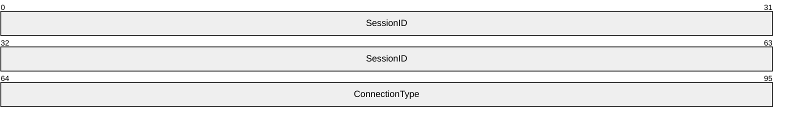

**SessionID (8 bytes):** This MUST be the same value that the client generated and sent in the **ReplyChannelID** field of the preceding **Session Activation** message (section [2.2.11](#Section_2.2.11)). The **SessionID** verification ensures that the applications that tapped are the ones that are connected over L3.

**ConnectionType (4 bytes):** Indicates the type of transport that the server and client connected over. This MUST be set to one of the following values.

| Value | Connection Type |
| --- | --- |
| 0x00000000 | [**Wi-Fi Direct (WFD)**](#gt_wi-fi-direct-wfd) |
| 0x00000001 | Link Local (IPv6) |
| 0x00000002 | Link Local (IPv4) |
| 0x00000004 | [**Bluetooth**](#gt_bluetooth-bt) |

<a id="Section_2.2.2"></a>
### 2.2.2 AppInfo Structure

The **AppInfo** structure is used by platforms implementing the Session Factory protocol, the Launch App protocol, or the Launch Compatible App protocol. The **AppInfo** structure format is specified as follows.

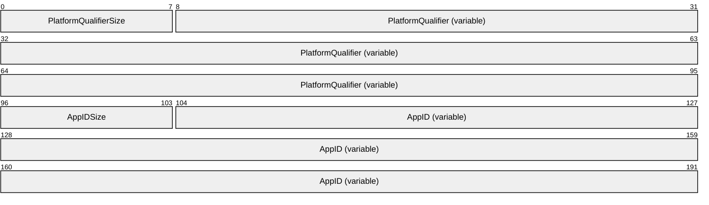

**PlatformQualifierSize (1 byte):** The length of the **PlatformQualifier** field, in bytes. The value MUST be greater than zero and less than or equal to 20.

**PlatformQualifier (variable):** A [**UTF-8**](#gt_utf-8) string that specifies the namespace for the application identifier **AppID**. This usually refers to an application store or application environment within an OS platform. The string MUST NOT be null-terminated or contain embedded nulls.

**AppIDSize (1 byte):** The length of the **AppID** field, in bytes. The value MUST be nonzero.

**AppID (variable):** A platform-dependent identifier for a specific application. Platforms SHOULD use the smallest identifier size that is practical in order to produce compact designs. This field contains arbitrary binary data up to the length specified in the **AppIDSize** field.

A message containing an **AppInfo** structure that does not meet any of the preceding field criteria MUST be ignored.

<a id="Section_2.2.3"></a>
### 2.2.3 Extension Structure

The **Extension** structure can be used by platforms implementing the Session Factory protocol. The **Extension** structure format is specified as follows.

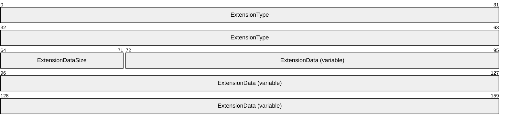

**ExtensionType (8 bytes):** A platform-dependent value that identifies the type of the extension. A platform that defines an extension SHOULD declare and publish a random number to identify that extension.

**ExtensionDataSize (1 byte):** The length of the **ExtensionData** field in bytes. The value MUST be nonzero. Extensions not meeting this criterion MUST be ignored.

**ExtensionData (variable):** A platform-dependent [**BLOB**](#gt_binary-large-object-blob) of data for a specific extension. Platforms SHOULD use the smallest data size that is practical in order to produce compact designs. This field contains arbitrary binary data up to the length specified in the **ExtensionDataSize** field.

<a id="Section_2.2.4"></a>
### 2.2.4 OOB Connector Service ACK Message

The **OOB Connector Service ACK** message is the acknowledgment reply to the **OOB Connector Service Activation** message (section [2.2.5](#Section_2.2.5)). The **OOB Connector Service ACK** message format is specified as follows.

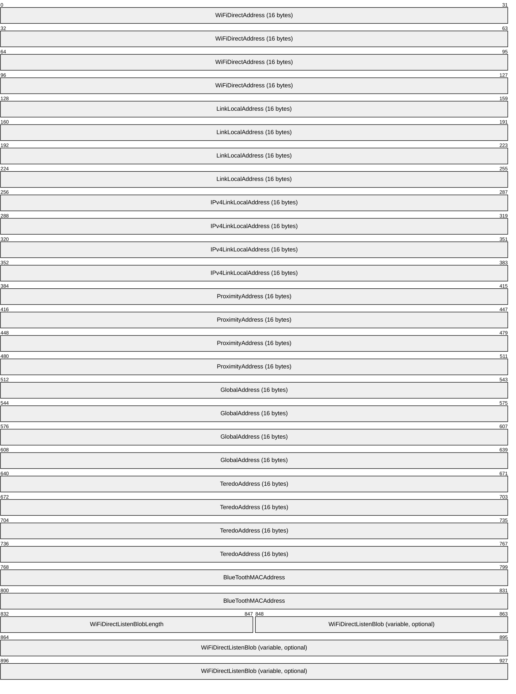

**WiFiDirectAddress (16 bytes):** A randomly-generated [**IPv6**](#gt_internet-protocol-version-6-ipv6) link-local address. If the OOB Connector protocol results in a new [**WFD**](#gt_wi-fi-direct-wfd) layer 2 link, the publisher MUST assign this address to the link in order to allow layer 3 connectivity.

Use of this value is optional. It SHOULD be set to zero if not used.

**LinkLocalAddress (16 bytes):** The best link-local IPv6 address assigned to the publisher. "Best" is defined in order of decreasing precedence of the following: connectivity, Wi-Fi infrastructure links, transmit bit rate, receive bit rate, and non-tunnel links. If no link-local address is suitable, the value of this field SHOULD be zero.

**IPv4LinkLocalAddress (16 bytes):** The best [**IPv4**](#gt_internet-protocol-version-4-ipv4) link-local address assigned to the publisher in V4-MAPPED format. "Best" is defined in order of decreasing precedence of the following: connectivity, Wi-Fi infrastructure links, transmit bit rate, receive bit rate, and non-tunnel links. If no IPv4 link-local address is suitable, the value of this field SHOULD be zero.

This value provides for connectivity over networks that do not support link-local IPv6 traffic, such as some legacy Wi-Fi networks.

**ProximityAddress (16 bytes):** An IPv6 address assigned to the transport link that this message is published on. Not all [**pub/sub**](#gt_pubsub) transports support IP connectivity; an example that can support IP is TransferJet. If the underlying transport does not support IP, the value of this field SHOULD be zero.

**GlobalAddress (16 bytes):** The "best" global IPv6 address assigned to the publisher. "Best" is defined in order of decreasing precedence of the following: connectivity, non-Teredo-type [[RFC4380]](https://go.microsoft.com/fwlink/?LinkId=90476), transmit bit rate, receive bit rate, and, non-tunnel links. If no global address is suitable, the value of this field SHOULD be zero.

**TeredoAddress (16 bytes):** The"best" Teredo-type IPv6 address assigned to the publisher. "Best" is defined in order of decreasing precedence of the following: connectivity, Teredo-type, transmit bitrate, and receive bitrate. If no Teredo address is suitable, the value of this field SHOULD be zero.

The Teredo Tunneling protocol is a technology that allows Internet nodes to have global IPv6 addressing capability tunneled over IPv4 networks.

**BlueToothMACAddress (8 bytes):** The [**Media Access Control (MAC) address**](#gt_media-access-control-mac-address) of the best [**Bluetooth**](#gt_bluetooth-bt) adapter available to the publisher. "Best" is defined by the platform; many platforms only allow zero or one Bluetooth adapter. If no Bluetooth adapter is available, the value of this field SHOULD be zero.

**WiFiDirectListenBlobLength (2 bytes):** The length, in bytes, of the **WiFiDirectListenBlob** field that follows. If the value of this field is zero, the **WiFiDirectListenBlob** field is not present.

**WiFiDirectListenBlob (variable, optional):** The WFD listen data, in the following format. All values for this structure are in little-endian format, unless specified otherwise.

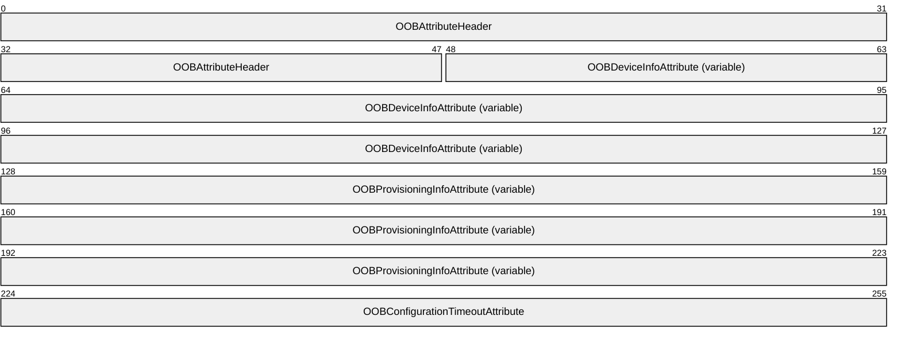

**OOBAttributeHeader (6 bytes):** The OOB Attribute header (section [2.2.4.1](#Section_2.2.4.1)).

**OOBDeviceInfoAttribute (variable):** OOB data in Device Info Attribute format (section [2.2.4.4](#Section_2.2.4.4)).

**OOBProvisioningInfoAttribute (variable):** OOB data in Provisioning Info Attribute format (section [2.2.4.5](#Section_2.2.4.5)).

**OOBConfigurationTimeoutAttribute (4 bytes):** OOB data in Configuration Timeout Attribute format (section [2.2.4.6](#Section_2.2.4.6)).

<a id="Section_2.2.4.1"></a>
#### 2.2.4.1 OOB Attribute Header

The **OOB Attribute** header defines the version and size of either the **WiFiDirectListenBlob** in an **OOB Connector Service ACK** message (section [2.2.4](#Section_2.2.4)) or the **WiFiDirectConnectBlob** in an **OOB Connector Service Activation** message (section [2.2.5](#Section_2.2.5)). The **OOB Attribute** header is specified as follows.

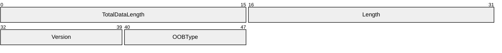

**TotalDataLength (2 bytes):** The length, in bytes, of the OOB data [**BLOB**](#gt_binary-large-object-blob), which can be either a WiFiDirectListenBlob or a WiFiDirectConnectBlob, depending on the value of the **OOBType** field.

**Length (2 bytes):** The length, in bytes, of the following fields.

**Version (1 byte):** A value identifying the version of OOB data. This value MUST be 0x10.

**OOBType (1 byte):** A value identifying the type of OOB data. This value MUST be one of the following.

| OOB type | Description |
| --- | --- |
| 0x01 | OOB provisioning listener data |
| 0x02 | OOB provisioning connector data |

<a id="Section_2.2.4.2"></a>
#### 2.2.4.2 OOB Attribute Type Constants

The **OOB Attribute Type** constants specify the identifiers of possible formats of OOB attribute data.

| Attribute ID | Attribute type |
| --- | --- |
| 0 | OOB status |
| 1 | OOB device info |
| 2 | OOB provisioning info |
| 3 | OOB group ID |
| 4 | OOB listen channel |
| 5 | OOB configuration timeout |
| 6-220 | Reserved |

<a id="Section_2.2.4.3"></a>
#### 2.2.4.3 OOB Provisioning Settings Constants

The **OOB Provisioning Setting**s constants specify the bit settings of possible provisioning options for the **OOB Provisioning Info Attribute** format (section [2.2.4.5](#Section_2.2.4.5)).

| Bit Range | Field | Description |
| --- | --- | --- |
| Variable | 0 | Create new group |
| Variable | 1 | Enforce group type setting |
| Variable | 2 | Desired group type |
| 3-7 | Reserved | - |

**Bit 0:** This bit is set to 1 if the provisioning information can be used for forming a new group with the target [**peer-to-peer**](#gt_peer-to-peer) device; otherwise, the information is used for joining an existing group.

**Bit 1:** This bit is set to 1 to enforce the desired group type setting in **Bit 2**; otherwise, the desired group type setting is simply a preference.

**Bit 2:** This bit is set to 0 if the desired group type is transient and set to 1 if the desired group type is persistent.

<a id="Section_2.2.4.4"></a>
#### 2.2.4.4 OOB Device Info Attribute Format

The **OOB Device Info Attribute** format defines device information in either the WiFiDirectListenBlob in an OOB Connector Service ACK message (section [2.2.4](#Section_2.2.4)) or the WiFiDirectConnectBlob in an OOB Connector Service Activation message (section [2.2.5](#Section_2.2.5)). The **OOB Device Info Attribute Format** is specified as follows.

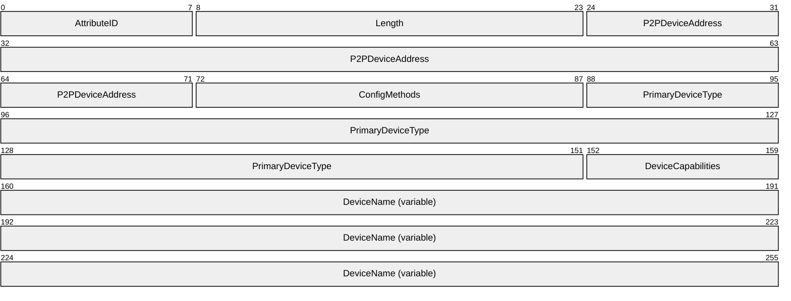

**AttributeID (1 byte):** The type of OOB attribute, as defined in section [2.2.4.2](#Section_2.2.4.2). This value is 0x01 for the **OOB Device Info Attribute** format.

**Length (2 bytes):** The length, in bytes, of the following fields.

**P2PDeviceAddress (6 bytes):** An identifier that uniquely references a [**peer-to-peer**](#gt_peer-to-peer) device [[WF-P2P1.2]](https://go.microsoft.com/fwlink/?LinkId=225584).

**ConfigMethods (2 bytes):** The Wi-Fi Simple Configuration (WSC) methods [[WF-WSC2.0.2]](https://go.microsoft.com/fwlink/?LinkId=282666) that are supported by this device. Byte ordering within the **ConfigMethods** field is big-endian.

**PrimaryDeviceType (8 bytes):** The primary device type of the peer-to-peer device in the following format. Byte ordering within the **PrimaryDeviceType** field is [**big-endian**](#gt_big-endian).

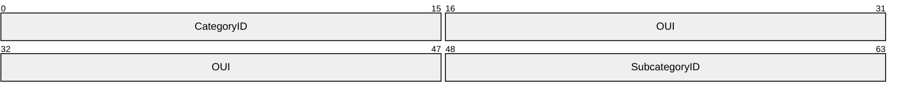

**CategoryID (2 bytes):** The vendor-independent main device category identifier. The predefined values for this field and the corresponding values for the **SubcategoryID** field are shown in the following table. Note that there is no way to indicate a vendor-specific main device category. The [**organizationally unique identifier (OUI)**](#gt_organizationally-unique-identifier-oui) [[IEEE-OUI]](https://go.microsoft.com/fwlink/?LinkId=89895) value in the **OUI** field applies only to the interpretation of the subcategory value.

| Main device category | CategoryID | Device subcategory | SubcategoryID |
| --- | --- | --- | --- |
| Computer | 1 | PC | 1 |
| - | - | Server | 2 |
| - | - | Media Center | 3 |
| Input Device | 2 | - | - |
| Printers, Scanners, Faxes, and Copiers | 3 | Printer | 1 |
| - | - | Scanner | 2 |
| Camera | 4 | Digital Still Camera | 1 |
| Storage | 5 | NAS | 1 |
| Network Infrastructure | 6 | Access point | 1 |
| - | - | Router | 2 |
| - | - | Switch | 3 |
| Displays | 7 | Television | 1 |
| - | - | Electronic Picture Frame | 2 |
| - | - | Projector | 3 |
| Multimedia Devices | 8 | DAR | 1 |
| - | - | PVR | 2 |
| - | - | MCX | 3 |
| - | - | DMR | 4 |
| Gaming Devices | 9 | Xbox | 1 |
| - | - | Xbox360 | 2 |
| - | - | Playstation | 3 |
| Telephone | 10 | Windows Mobile | 1 |

**OUI (4 bytes):** The OUI of the device. For the predefined values specified in the **CategoryID** field, the Wi-Fi Alliance byte values 0x00 0x50 0xF2 0x04 are used.

**SubcategoryID (2 bytes):** The vendor-specific device subcategory identifier. The predefined values for this field are specified in the preceding table.

**DeviceCapabilities (1 byte):** The capabilities of the peer-to-peer device.

**DeviceName (variable):** A [**UTF-8**](#gt_utf-8) string that specifies the friendly name of the peer-to-peer device. Byte ordering within the **DeviceName** field is big-endian.

<a id="Section_2.2.4.5"></a>
#### 2.2.4.5 OOB Provisioning Info Attribute Format

The **OOB Provisioning Info Attribute** format defines provisioning settings in the WiFiDirectListenBlob in an OOB Connector Service ACK message (section [2.2.4](#Section_2.2.4)). The **OOB Provisioning Info Attribute** format is specified as follows.

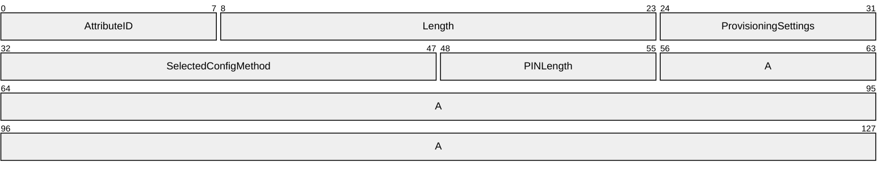

**AttributeID (1 byte):** The type of OOB attribute, as defined in section [2.2.4.2](#Section_2.2.4.2). This value is 0x02 for the **OOB Provisioning Info Attribute** format.

**Length (2 bytes):** The length, in bytes, of the following fields.

**ProvisioningSettings (1 byte):** One or more provisioning bit settings, as defined in section [2.2.4.4](#Section_2.2.4.4).

**SelectedConfigMethod (2 bytes):** The Wi-Fi Simple Configuration (WSC) method [[WF-WSC2.0.2]](https://go.microsoft.com/fwlink/?LinkId=282666) that was selected by a [**peer-to-peer**](#gt_peer-to-peer) device for provisioning.

**PINLength (1 byte):** The length, in bytes, of the following **PINData** field. This field contains a value from 0 to 8 bytes. If it is zero, the **PINData** field is not present.

**A - PINData (variable, optional):** An array of bytes that represent a PIN to be used for provisioning.

<a id="Section_2.2.4.6"></a>
#### 2.2.4.6 OOB Configuration Timeout Attribute Format

The **OOB Configuration Timeout Attribute** format defines the listener timeout in the WiFiDirectListenBlob in an OOB Connector Service ACK message (section [2.2.4](#Section_2.2.4)). The **OOB Configuration Timeout Attribute** format is specified as follows.

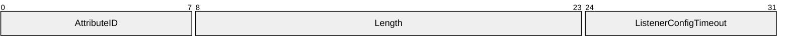

**AttributeID (1 byte):** The type of OOB attribute, as defined in section [2.2.4.2](#Section_2.2.4.2). This value is 0x05 for OOB Configuration Timeout Attribute format.

**Length (2 bytes):** Contains the length of the following fields in the attribute in bytes. This value MUST be 1.

**ListenerConfigTimeout (1 byte):** The amount of time, in units of 100 milliseconds, this [**peer-to-peer**](#gt_peer-to-peer) device will spend waiting for [**WFD**](#gt_wi-fi-direct-wfd) communication after an OOB data transfer. Valid timeout values range from zero to 255.

<a id="Section_2.2.5"></a>
### 2.2.5 OOB Connector Service Activation Message

The **OOB Connector Service Activation** message is a reply to the **Service Descriptor** message (section [2.2.8](#Section_2.2.8)). It is used to establish a paired set of **OOB Connector** objects (section [3.1.1.2](#Section_3.1.1.2)) between two peers. If the local **SourceID** is greater than the **ActivationChannelID** in the received **Service Descriptor** message, an **OOB Connector Service Activation** message MUST be published on the **ActivationChannelID** of the **Session Activation** message (section [2.2.11](#Section_2.2.11)), unless the **OOB Connector** object for that remote service is already created and active.

The **OOB Connector Service Activation** message format is specified as follows.

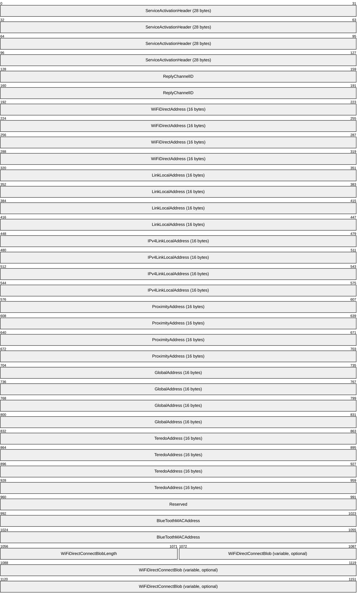

**ServiceActivationHeader (28 bytes):** A **Service Activation** header (section [2.2.7](#Section_2.2.7)). The **ServiceActivationUUID** MUST be {E46EDA50-9B5D-41F1-B89E-327B5EA38B16}. The **ServiceVersion** MUST be 1.

**ReplyChannelID (8 bytes):** This value is also the identifier of the **OOB Connector** object (section 3.1.1.2). It MUST be generated at random by the publisher. The publisher of this message MUST subscribe to the **ReplyChannelID** prior to publishing this message to ensure that replies are not missed.

**WiFiDirectAddress (16 bytes):** A randomly generated [**IPv6**](#gt_internet-protocol-version-6-ipv6) link-local address. If the OOB Connector protocol results in a new [**WFD**](#gt_wi-fi-direct-wfd) layer 2 link, the publisher MUST assign this address to the link in order to allow layer 3 connectivity.

Use of this field is OPTIONAL. It MAY be ignored and the value SHOULD be set to zero if unused.

**LinkLocalAddress (16 bytes):** The best link-local IPv6 address assigned to the publisher. "Best" is defined in order of decreasing precedence of the following: connectivity, Wi-Fi infrastructure links, transmit bit rate, receive bit rate, and non-tunnel links. If no link-local address is suitable, the value of this field SHOULD be zero.

**IPv4LinkLocalAddress (16 bytes):** The best [**IPv4**](#gt_internet-protocol-version-4-ipv4) link-local address assigned to the publisher in V4-mapped format. "Best" is defined in order of decreasing precedence of the following: connectivity, Wi-Fi infrastructure links, transmit bit rate, receive bit rate, and non-tunnel links. If no IPv4 link-local address is suitable, the value of this field SHOULD be zero.

This value provides for connectivity over networks that do not support link-local IPv6 traffic, such as some legacy Wi-Fi networks.

**ProximityAddress (16 bytes):** The IPv6 address assigned to the transport link that this message is published on. Not all [**pub/sub**](#gt_pubsub) transports support IP connectivity; an example that can support IP is TransferJet. If the underlying transport does not support IP, the value of this field SHOULD be zero.

**GlobalAddress (16 bytes):** The best global IPv6 address assigned to the publisher. "Best" is defined in order of decreasing precedence of the following: connectivity, non-Teredo-type [[RFC4380]](https://go.microsoft.com/fwlink/?LinkId=90476), transmit bit rate, receive bit rate, and non-tunnel links. If no global address is suitable, the value of this field SHOULD be zero.

**TeredoAddress (16 bytes):** The best Teredo-type IPv6 address assigned to the publisher. "Best" is defined in order of decreasing precedence of the following: connectivity, Teredo-type, transmit bit rate, and receive bit rate. If no Teredo address is suitable, the value of this field SHOULD be zero.

The Teredo Tunneling protocol is a technology that allows Internet nodes to have global IPv6 addressing capability tunneled over IPv4 networks.

**Reserved (4 bytes):** This field MUST be set to zero when sent and MUST be ignored when received.

**BlueToothMACAddress (8 bytes):** The [**Media Access Control (MAC) address**](#gt_media-access-control-mac-address) of the best [**Bluetooth**](#gt_bluetooth-bt) adapter available to the publisher. "Best" is defined by the platform; many platforms only allow zero or one Bluetooth adapter. If no Bluetooth adapter is available, the value of this field SHOULD be zero.

**WiFiDirectConnectBlobLength (2 bytes):** The length, in bytes, of the **WiFiDirectConnectBlob** field that follows. If the value of this field is zero, the **WiFiDirectConnectBlob** field is not present.

**WiFiDirectConnectBlob (variable, optional):** The WFD connect data, in the following format. All values for this structure are in [**little-endian**](#gt_little-endian) format, unless specified otherwise.

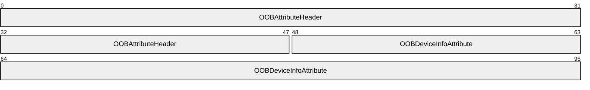

**OOBAttributeHeader (6 bytes):** The OOB Attribute header (section [2.2.4.1](#Section_2.2.4.1)).

**OOBDeviceInfoAttribute (variable):** OOB data in Device Info Attribute format (section [2.2.4.4](#Section_2.2.4.4)).

<a id="Section_2.2.6"></a>
### 2.2.6 Role Compatibility Constants

The **Role Compatibility** constants SHOULD<1> be used to check the value of the **Role** field in a **Session Factory Service Activation** message (section [2.2.12](#Section_2.2.12)) for compatibility with the role of the receiver of that message.

| Bit Range | Field | Description |
| --- | --- | --- |
| Variable | 0x01 (peer role) | 0x01 (peer role) |
| Variable | 0x02 (host role) | 0x03 (client role) |
| Variable | 0x03 (client role) | 0x02 (host role) |

<a id="Section_2.2.7"></a>
### 2.2.7 Service Activation Header

The **Service Activation** header is common to all service activation messages. The **Service Activation** header format is specified as follows.

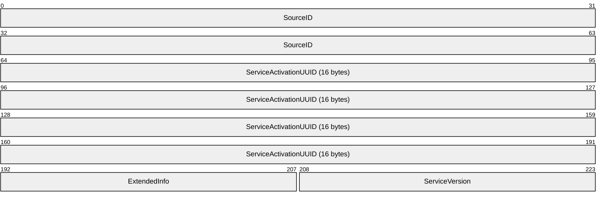

**SourceID (8 bytes):** The identifier of the system that published the activation message. The value of the **SourceID** field MUST be identical to the value of the **ActivationChannelID** field that the sending system also published within its **Service Descriptor** message (section [2.2.8](#Section_2.2.8)). This identifier is not used as the reply [**ChannelID**](#gt_channelid) for this message; it is used for debugging and role determination. If the activation message requires a reply message, the reply ChannelID MUST be specified in the body of the specific activation message rather than in this header.

**ServiceActivationUUID (16 bytes):** A [**UUID**](#gt_universally-unique-identifier-uuid) that specifies the service being activated.

**ExtendedInfo (2 bytes):** This field is primarily provided for 32-bit alignment of the **Service Activation** header. All service protocols defined in this specification require that this field SHOULD be zero; however, it can safely be ignored by receivers. Other service protocols might require other uses for this field.

**ServiceVersion (2 bytes):** An unsigned integer that specifies the version of the service being activated. The value MUST be nonzero; service activations containing a zero service version MUST be ignored. The first version of all service protocols MUST be 1. A peer that supports version *X* of a given service MUST support activations with versions 1 through *X*.

<a id="Section_2.2.8"></a>
### 2.2.8 Service Descriptor Message

The **Service Descriptor** message MUST be published and subscribed at the following well-known channel: "Windows.windows.com/SD".

The length of the **Service Descriptor** message MUST be provided by the transport layer in order to allow the determination of the number of **Service Descriptor (SD)** structures (section [2.2.9](#Section_2.2.9)) contained within it. Each **SD** structure MUST be fully decoded before being accepted, and if a partial structure occurs at the end of the **Service Descriptor** message, it MUST be ignored.

The **Service Descriptor** message format is specified as follows.

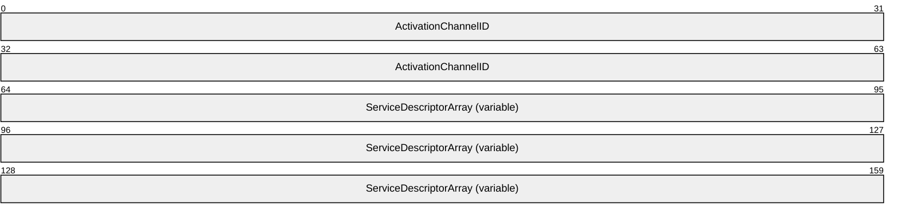

**ActivationChannelID (8 bytes):** The source identifier of the system that published the **Service Descriptor** message. This value SHOULD be used as the reply [**ChannelID**](#gt_channelid) by the receiver for any activation messages.

**ServiceDescriptorArray (variable):** Some number of **SD** structures. The **SD** structure format is specified in section 2.2.9.

<a id="Section_2.2.9"></a>
### 2.2.9 Service Descriptor Structure

The **Service Descriptor (SD)** structure specifies a service to be activated and provides for explicit capability negotiation. An array of **SD** structures is specified in a **Service Descriptor** message (section [2.2.8](#Section_2.2.8)). The **SD** structure format is specified as follows.

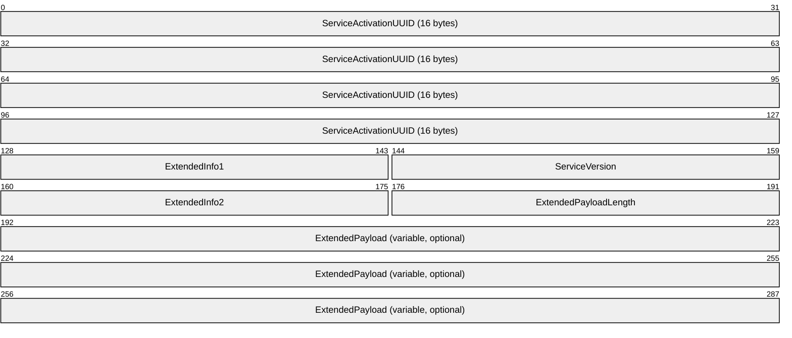

**ServiceActivationUUID (16 bytes):** The [**UUID**](#gt_universally-unique-identifier-uuid) of the specific service being activated.

**ExtendedInfo1 (2 bytes):** Service-specific extension information. Each service protocol SHOULD define what this field is used for**.**

**ServiceVersion (2 bytes):** A positive integer that specifies the version of the service being activated. The value SHOULD be nonzero; service activations containing a zero service version MUST be ignored. The first version of all service protocols MUST be 1. A peer that claims to support version *X* of a given service MUST support activations with versions 1 through *X*.

**ExtendedInfo2 (2 bytes):** Service-specific extension information. Each service protocol SHOULD define what this field is used for**.**

**ExtendedPayloadLength (2 bytes):** The length in bytes of additional service-specific extension information in the **ExtendedPayload** field. Each service protocol SHOULD define whether or not the Extended Payload is used. If this field is nonzero, but there are not enough bytes left in this message, then this last entry is ill-formed and MUST be ignored.

**ExtendedPayload (variable, optional):** Additional service-specific extension information. Each service protocol defines whether or not this information is used, and if so, how it is used.

The service listed in the **SD** MUST have a positive integer **ServiceVersion** value associated with it. If an implementation specifies a service with version *X* in its published **SD**, the implementation MUST be compatible with all version numbers less than or equal to *X*. If an implementation cannot support prior versions, it MUST specify a new **ServiceActivationUUID**, in effect creating a new service. A **Service Activation** header (section [2.2.7](#Section_2.2.7)) contains the UUID of the service to activate and the service version number.

<a id="Section_2.2.10"></a>
### 2.2.10 Session ACK Message

The **Session ACK** message is the acknowledgment/reply to the Session Activation message (section [2.2.11](#Section_2.2.11)). The transport-provided length of this message MUST be used by the receiver in order to determine the existence or number of extension structures that follow the non-optional portions of the message. The publisher MUST NOT publish messages that are less than 75 bytes long to a Session Activation message's ReplyChannelID. The subscriber MUST drop all Session ACK messages that are less than 75 bytes long.

The **Session ACK** message format is specified as follows.

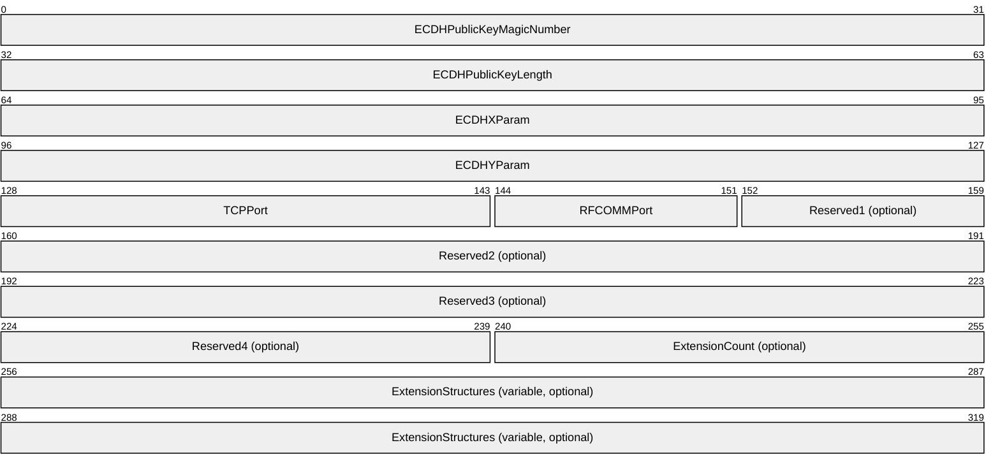

**ECDHPublicKeyMagicNumber (4 bytes):** The 4-byte value 0x45, 0x43, 0x4B, and 0x31. This indicates that the [**Elliptic Curve Diffie-Hellman (ECDH)**](#gt_elliptic-curve-diffie-hellman-ecdh) [**key exchange**](#gt_key-exchange) follows the P256 convention [[NSA]](https://go.microsoft.com/fwlink/?LinkId=183693).

**ECDHPublicKeyLength (4 bytes):** A 32-bit, unsigned integer in [**little-endian**](#gt_little-endian) format that specifies the [**key**](#gt_key) length in bytes. This value MUST be 0x00000020.

**ECDHXParam (4 bytes):** A 32-bit, unsigned integer that specifies the X coordinate of a single-use, generated ECDH [**public key**](#gt_public-key). The [**private key**](#gt_private-key) portion MUST NOT be transmitted and is used in the local **Session** object (section [3.1.1.4](#Section_3.1.1.4)) with the ECDH Public Key received from the **Session Activation** message (section 2.2.11).

**ECDHYParam (4 bytes):** A 32-bit, unsigned integer that specifies the Y coordinate of a single-use, generated ECDH public key. The private key portion MUST NOT be transmitted and is used in the local **Session** object with the ECDH Public Key received from the **Session Activation** message.

**TCPPort (2 bytes):** The [**TCP**](#gt_transmission-control-protocol-tcp) port that the publisher's session is listening on.

**RFCOMMPort (1 byte):** The [**RFCOMM**](#gt_radio-frequency-communications-rfcomm) port that the publisher's session is listening on.

**Reserved1 (1 byte, optional):** If present, this field MUST be set to zero when sent and MUST be ignored when received.

**Reserved2 (4 bytes, optional):** If present, this field MUST be set to zero when sent and MUST be ignored when received.

**Reserved3 (4 bytes, optional):** If present, this field MUST be set to zero when sent and MUST be ignored when received.

**Reserved4 (2 bytes, optional):** If present, this field MUST be set to zero when sent and MUST be ignored when received.

**ExtensionCount (2 bytes, optional):** The number of **Extension** structures (section [2.2.3](#Section_2.2.3)) in the **ExtensionStructures** field. Use of this field is platform specific. A subscriber MUST ignore extensions that it does not process.

If this message is between 75 and 87 bytes long (inclusive), the value of this field is treated as zero.

**ExtensionStructures (variable, optional):** Zero or more **Extension** structures. Any incorrectly formatted **Extension** structures MUST be ignored by the subscriber.

<a id="Section_2.2.11"></a>
### 2.2.11 Session Activation Message

The **Session Activation** message is a reply to the **Session Factory Service Activation** message (section [2.2.12](#Section_2.2.12)). It is used to establish a paired set of **Session** objects (section [3.1.1.4](#Section_3.1.1.4)) between two peers. For each active **Session Factory** object (section [3.1.1.3](#Section_3.1.1.3)) on the receiver, a **Session Activation** message MUST be published on the **Session Factory Service Activation** message's **ReplyChannelID**, unless the **Session** object is already created and active.

The transport-provided length of this message MUST be used by the receiver in order to determine the existence or number of extension structures that follow the non-optional portions of the message. The publisher MUST NOT publish messages to a **Session Factory Service Activation** message's **ReplyChannelID** that are less than 96 bytes long. The subscriber MUST drop all **Session Activation** messages that are less than 96 bytes long.

The **Session Activation** message format is specified as follows.

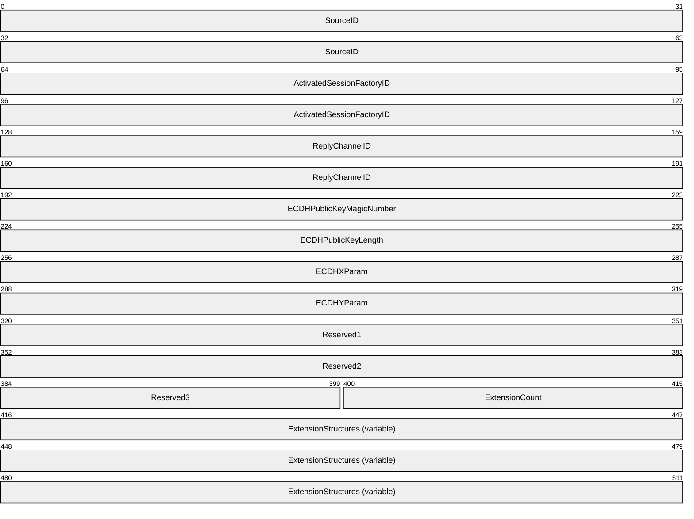

**SourceID (8 bytes):** The publisher identification to the subscriber. The publisher of this message MUST set this field to the value of the **ActivationChannelID** field specified in the **Service Descriptor** message that is the source identifier of the publisher. This allows a created **Session** object for the peers to reference an **OOB Connector** object (section [3.1.1.2](#Section_3.1.1.2)) for the same two peers.

**ActivatedSessionFactoryID (8 bytes):** The identifier of the active **Session Factory** object that was activated by the **Session Factory Service Activation** message.

**ReplyChannelID (8 bytes):** The identifier of the newly created **Session** object. It MUST be generated at random by the publisher. The publisher of this message MUST subscribe to the **ReplyChannelID** prior to publishing this message to ensure that replies are not missed. The publisher MUST handle **Session ACK** messages (section [2.2.10](#Section_2.2.10)) on this channel.

**ECDHPublicKeyMagicNumber (4 bytes):** The 4-byte value 0x45, 0x43, 0x4B, and 0x31. This indicates that the [**Elliptic Curve Diffie-Hellman (ECDH)**](#gt_elliptic-curve-diffie-hellman-ecdh) [**key exchange**](#gt_key-exchange) follows the P256 convention [[NSA]](https://go.microsoft.com/fwlink/?LinkId=183693).

**ECDHPublicKeyLength (4 bytes):** A 32-bit, unsigned integer in [**little-endian**](#gt_little-endian) format that specifies the [**key**](#gt_key) length in bytes. This value MUST be 0x00000020.

**ECDHXParam (4 bytes):** A 32-bit, unsigned integer that specifies the X coordinate of a single-use, generated ECDH [**public key**](#gt_public-key). The [**private key**](#gt_private-key) portion MUST NOT be transmitted and is held in the local **Session** object for later use when the **Session ACK** message is received.

**ECDHYParam (4 bytes):** A 32-bit, unsigned integer that specifies the Y coordinate of a single-use, generated ECDH public key. The private key portion MUST NOT be transmitted and is held in the local **Session** object for later use when the **Session ACK** message is received.

**Reserved1 (4 bytes):** This field MUST be set to zero when sent and MUST be ignored when received.

**Reserved2 (4 bytes):** This field MUST be set to zero when sent and MUST be ignored when received.

**Reserved3 (2 bytes):** This field MUST be set to zero when sent and MUST be ignored when received.

**ExtensionCount (2 bytes):** The number of **Extension** structures (section [2.2.3](#Section_2.2.3)) in the **ExtensionStructures** field. Use of this field is platform-specific. A subscriber MUST ignore extensions that it does not process.

If this message is between 96 and 107 bytes long (inclusive), the value of this field is treated as zero.

**ExtensionStructures (variable, optional):** Zero or more **Extension** structures. Any incorrectly formatted **Extension** structures MUST be ignored by the subscriber.

If the **Session Factory Service Activation** message to which this **Session Activation** message is a response contains a **Role** field, the following additional requirements for this message are defined:<2>

- The input **Role** field value SHOULD be checked, as specified in section [3.1.5.6](#Section_3.1.5.6).
- The **Extension** structure in the **ExtensionStructures** field SHOULD be structured as follows.
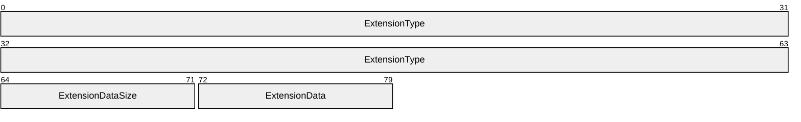

**ExtensionType (8 bytes):** The value 0x89A14CC3AB4CF821.

**ExtensionDataSize (1 byte):** The value 0x01.

**ExtensionData (1 byte):** The compatible role value according to the **Role Compatibility** constants (section [2.2.6](#Section_2.2.6)).

<a id="Section_2.2.12"></a>
### 2.2.12 Session Factory Service Activation Message

The **Session Factory Service Activation** message is a reply to the **Service Descriptor** message (section [2.2.8](#Section_2.2.8)). It is used to establish a paired set of **Session** objects (section [3.1.1.4](#Section_3.1.1.4)) between two peers. For each active **Session Factory** object (section [3.1.1.3](#Section_3.1.1.3)) on the receiver, a **Session Activation** message (section [2.2.11](#Section_2.2.11)) MUST be published on the **ReplyChannelID** of the **Session Factory Service Activation** message, unless the **Session** object is already created and active.

The **Session Factory Service Activation** message format is specified as follows.

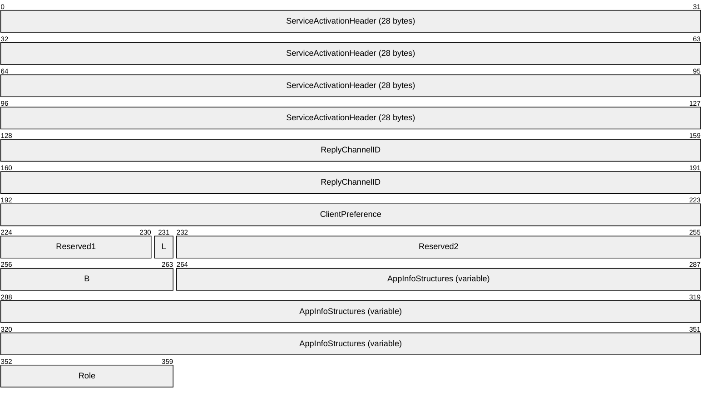

**ServiceActivationHeader (28 bytes):** A **Service Activation** header (section [2.2.7](#Section_2.2.7)). The **ServiceActivationUUID** value SHOULD<3> be {F1DEBC56-CFBA-4129-983B-7D79499D1A7D} for a peer role or {DAA42D35-1323-485A-8B34-3B86E416E6EC} for a host or client role. If it is the latter, the **Role** field MUST be included in this message, as specified later in this section.

The **ServiceVersion** value in the **Service Activation** header MUST be 1.

**ReplyChannelID (8 bytes):** This value is also the identifier of the **Session Factory** object (section 3.1.1.3). It MUST be generated at random by the publisher. The publisher of this message MUST subscribe to the **ReplyChannelID** prior to publishing this message to ensure that replies are not missed. The publisher MUST handle **Session Activation** messages on this channel.

**ClientPreference (4 bytes):** The preference of the sender to be the peer that actually sends the subsequent **Session Activation** message. Values higher than 0x1000 indicate a preference to have **Session** objects be the client role. Values lower than 0x1000 indicate a preference to have **Session** objects be the server role.

**Reserved1 (7 bits):** This field MUST be set to zero by publishers and MUST be ignored by subscribers.

**L (1 bit):** The Launch flag. The presence of this flag indicates the publisher's intent for the application on the subscriber side to be launched or activated if it is not already. If this flag is not set, the subscriber MUST NOT trigger the launching of the application specified in the **AppInfo** structure (section [2.2.2](#Section_2.2.2)).

**Reserved2 (3 bytes):** This field MUST be set to zero by publishers and MUST be ignored by subscribers.

**AppInfoCount (1 byte):** The number of **AppInfo** structures that follow this field. The publisher MUST provide 1 or more **AppInfo** structures. If this field is zero, the entire message MUST be ignored by the subscriber.

**AppInfoStructures (variable):** An array of **AppInfo** structures. Typically the first one uniquely refers to the application on the platform that published this message. The publisher can provide application information that refers to the application on other platforms for the purposes of interoperation.

**Role (1 byte, optional):** The session role of the application. This field SHOULD<4> be included in this message if the application role is either host or client. The following values are valid.

| Value | Description |
| --- | --- |
| 0x02 | Host role |
| 0x03 | Client role |

<a id="Section_3"></a>
# 3 Protocol Details

<a id="Section_3.1"></a>
## 3.1 Peer Details

This section defines peer roles in the Near Field Proximity: Bidirectional Services Protocol.

In a socket-based connection between two peer applications, one peer has the role of client, and the other peer has the role of server. The roles are distinguished as follows:

- The client is the peer that sends the **Session Activation** message (section [2.2.11](#Section_2.2.11)) and waits for the **Session ACK** message (section [2.2.10](#Section_2.2.10)).
- The server is the peer that receives the **Session Activation** message and sends the **Session ACK** message.
Possible states and state transitions of the client and server roles are described in section [3.1.1.4](#Section_3.1.1.4).

In an [**OOB**](#gt_out-of-band-oob) connection between two peers, one peer has the role of connector, and the other peer has the role of listener. The roles are distinguished as follows:

- The connector is the peer that sends the **OOB Connector Service Activation** message (section [2.2.5](#Section_2.2.5)) and waits for the **OOB Connector Service ACK** message (section [2.2.4](#Section_2.2.4)).
- The listener is the peer that receives the **OOB Connector Service Activation** message and sends the **OOB Connector Service ACK** message.
Possible states and state transitions of the connector and listener roles are described in section [3.1.1.2](#Section_3.1.1.2).

<a id="Section_3.1.1"></a>
### 3.1.1 Abstract Data Model

This section describes a conceptual model of possible data organization that an implementation maintains to participate in this protocol. The described organization is provided to facilitate the explanation of how the protocol behaves. This document does not mandate that implementations adhere to this model as long as their external behavior is consistent with that described in this document.

The abstract data model defines **OOB Connector** objects, **Session Factory** objects, and **Session** objects. When the underlying transport is triggered, an exchange is performed by peers that can result in new instances of these objects: each peer can create an **OOB Connector** object, one in the listener role and one in the connector role. If both sides have active **Session Factory** objects that are compatible, then each peer creates a **Session** object, one in the client role and one in the server role.

Each **Session** object references one **OOB Connector** object in order to provide connectivity options to higher-level protocols.

If there is only one peer with an active **Session Factory** object, but it specifies the **L** (Launch) flag in the **Session Factory Service Activation** message (section [2.2.12](#Section_2.2.12)), then the other peer can create a **Session Factory** object on behalf of a soon-to-be-launched application. This provides for the ability to establish [**OOB**](#gt_out-of-band-oob) connections at the same time as launching an application.

Note that the abstract interface notation (Public) indicates that the abstract data model element can be directly read or written from outside this protocol by higher-level protocols. For example, the Near Field Proximity: Sharing Protocol [MS-NFPS](../MS-NFPS/MS-NFPS.md) uses members of the **Session** and **OOB Connector** objects to construct a socket for the purposes of sharing file(s).

<a id="Section_3.1.1.1"></a>
#### 3.1.1.1 NfpService

The Near Field Proximity service **NfpService** encapsulates the entire state for the protocols described by this document.

**SourceID (8 bytes):** A random number that uniquely identifies the **NfpService** instance.

**OOBConnectorList:** A list of active **OOB Connector** objects.

**SessionFactoryList (Public):** A list of active **Session Factory** objects.

**HandshakeData:** The **SessionID** and **ConnectionType** handshake data from the **Accept Header** (section [2.2.1](#Section_2.2.1)) that was used to confirm the connection.

<a id="Section_3.1.1.2"></a>
#### 3.1.1.2 OOB Connector Object

An **OOB Connector** object encapsulates the state for an [**OOB**](#gt_out-of-band-oob) connection between two peers.

**Role:** The role of the **OOB Connector** object. One peer is the connector, and the other peer is the listener. The roles are distinguished as follows:

- The connector is the peer that sends the **OOB Connector Service Activation** message (section [2.2.5](#Section_2.2.5)) and waits for the **OOB Connector Service ACK** message (section [2.2.4](#Section_2.2.4)).
- The listener is the peer that receives the **OOB Connector Service Activation** message and sends the **OOB Connector Service ACK** message.
**State:** The current state of the **OOB Connector** object. The meaning of the state depends on the object role; this allows an asymmetric client/server message exchange. For the connector role, the state can be one of the following.

| Value | Meaning |
| --- | --- |
| WaitingForAck | The object has published the **OOB Connector Service Activation** message (section 2.2.5) and is waiting to receive the **OOB Connector Service ACK** message (section 2.2.4). |
| Incomplete | The OOB Connector protocol timed out. The object is still alive to facilitate object continuity across multiple taps. |
| Ready | The object has received the **OOB Connector Service ACK** message and has all the information required to facilitate communications between the two peers. |

The following is a diagram that shows the state transitions for the connector role of an **OOB Connector** object.

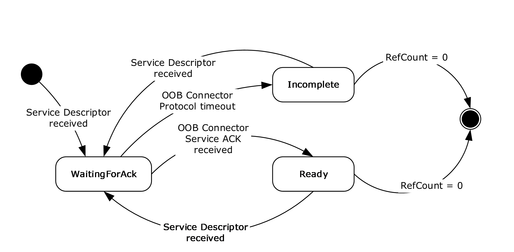

Figure 4: OOB Connector state transitions: Connector role

For the listener role, the state can be one of the following.

| Value | Meaning |
| --- | --- |
| WaitingForTransmit | The object has received the **OOB Connector Service Activation** message, has published the **OOB Connector Service ACK** message to the transport, and is waiting for the transport to indicate the ACK message has been transmitted to a remote peer |
| Incomplete | The OOB Connector protocol timed out. The object is still alive to facilitate object continuity across multiple taps. |
| Ready | This object has received notification of successful transmission of the ACK message and has all the information required to facilitate communication between two peers. |

The following is a diagram that shows the state transitions for the listener role of an **OOB Connector** object.

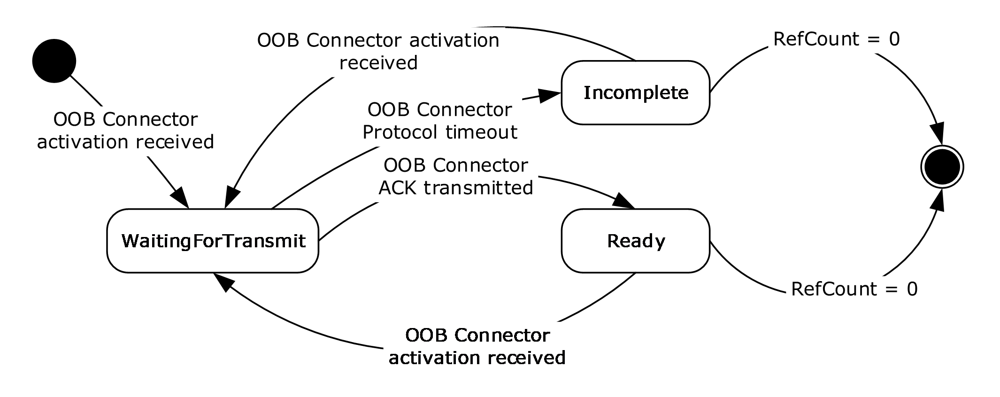

Figure 5: OOB Connector state transitions: Listener role

**RemoteSourceID:** This identifies the peer to which a given **OOB Connector** object is connected. For the connector, this is copied from the **ActivationChannelID** field in the received **Service Descriptor** message (section [2.2.8](#Section_2.2.8)). For the listener, this is copied from the **SourceID** field in the **Service Activation** header (section [2.2.7](#Section_2.2.7)) of the received **OOB Connector Service Activation** message.

**OOBConnectorID:** For the connector, this is randomly generated and used in the **OOB Connector Service Activation** message. For the listener, this is copied from the received **OOB Connector Service Activation** message.

**WFDPeerConnected:** A Boolean value that indicates whether the **OOB Connector** object has an active [**Wi-Fi Direct (WFD)**](#gt_wi-fi-direct-wfd) connection to the peer.

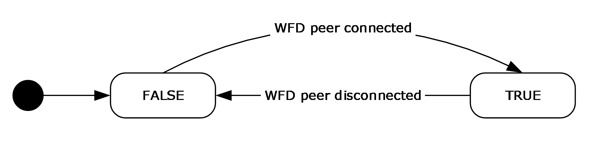

Figure 6: OOB Connector WFDPeerConnected transitions

**LocalAddresses (Public Read):** The list of local addresses collected by the **OOB Connector** object from the local machine and sent to the remote machine via either the Activation or ACK message.

**RemoteAddresses (Public Read):** The list of remote addresses received by the **OOB Connector** object from the remote machine via either the Activation or ACK message.

**ReferenceCount:** A count of references to the **OOB Connector** object by either **Session** objects or [**KeepAlive timers**](#gt_keepalive-timer).

<a id="Section_3.1.1.3"></a>
#### 3.1.1.3 Session Factory Object

A **Session Factory** object encapsulates a factory for socket-based connections between set(s) of peer applications.

**SessionList:** A list of **Session** objects (section [3.1.1.4](#Section_3.1.1.4)) that are a part of this **Session Factory** object.

**AppID (Public Read/Write):** A [**UTF-8**](#gt_utf-8) string that identifies the contract or interface for this **Session Factory** object. This **Session Factory** will only create and link up **Session** objects with other **Session Factory** objects that provide exactly the same **AppID** in the **AppInfo** field of the **Session Factory Service Activation** message (section [2.2.12](#Section_2.2.12)).

**AlternateIDList (Public Read/Write):** A list of alternate **AppIDs** for other platforms that the **Session Factory** will also attempt to activate.

**Launch (Boolean):** TRUE if the **L** (Launch) flag SHOULD be set in the appropriate **Session Factory Service Activation** message. FALSE if the flag SHOULD be cleared.

**SessionFactoryID (8 bytes):** A random number that uniquely identifies this instance of **Session Factory** object.

**TcpPort (Public Read):** The [**TCP**](#gt_transmission-control-protocol-tcp)/IP port on which the **Session Factory** is listening and can accept **Session** sockets after a **Session Activation** (section [2.2.11](#Section_2.2.11))/ **Session ACK** (section [2.2.10](#Section_2.2.10)) exchange.

**RfcommPort (Public Read):** The [**RFCOMM**](#gt_radio-frequency-communications-rfcomm)/[**Bluetooth**](#gt_bluetooth-bt) port on which the **Session Factory** is listening and can accept **Session** sockets after a **Session Activation**/**Session ACK** exchange.

**ReferenceCount (Public Write):** A count of references to the **Session Factory** object by either the client application or [**KeepAlive timers**](#gt_keepalive-timer).

<a id="Section_3.1.1.4"></a>
#### 3.1.1.4 Session Object

A **Session** object encapsulates the state for a socket-based connection between two peer applications.

**Role (Public Read):** The role of the **Session** object. One peer is the client, and the other peer is the server. The roles are distinguished as follows:

- The client is the peer that sends the **Session Activation** message (section [2.2.11](#Section_2.2.11)) and waits for the **Session ACK** message (section [2.2.10](#Section_2.2.10)).
- The server is the peer that receives the **Session Activation** message and sends the **Session ACK** message.
**State (Public Read/Write):** The current state of the **Session** object. The state can be one of the following.

| Value | Meaning |
| --- | --- |
| WaitingForAck | A client **Session** object transitions to this state immediately prior to publishing the **Session Activation** message. |
| WaitingForTransmit | A server **Session** object transitions to this state when beginning to publish the **Session ACK** message. |
| Ready | The **Session** object is ready to be used by an application for [**peer-to-peer**](#gt_peer-to-peer) communication. A client **Session** object transitions to this state after receiving the **Session ACK** message. A server **Session** object transitions to this state after successfully transmitting the **Session ACK** message. |
| Terminated | The **Session** object has been terminated by the application, or it timed out. |

The following shows the possible state transitions for the client role of a **Session** object.

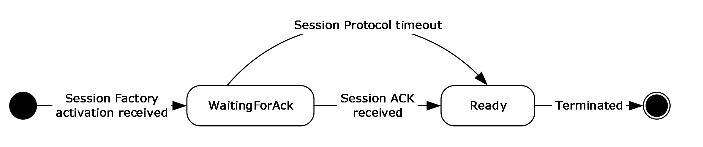

Figure 7: Session state transitions: Client role

The following shows the possible state transitions for the server role of a **Session** object.

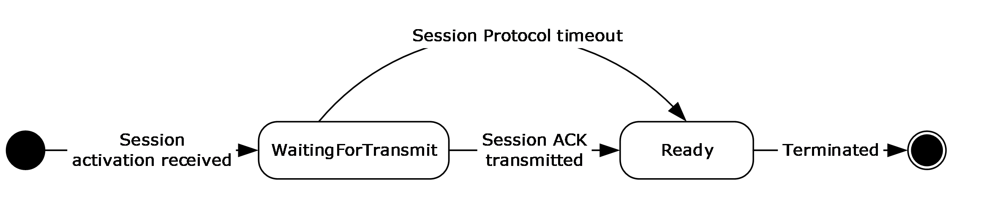

Figure 8: Session state transitions: Server role

**SessionID:** For the client, this is randomly generated and used in the **Session Activation** message. For the server, this is copied from the **ReplyChannelID** field of the received **Session Activation** message. The server uses this ID to publish the **Session ACK** message.

**RemoteSessionFactoryID (8 bytes):** The SessionFactoryID of the remote peer this **Session** object is connected to. For the client, this is copied from the **ReplyChannelID** field of the received **Session Factory Service Activation** message (section [2.2.12](#Section_2.2.12)). For the server, this is copied from the **ActivatedSessionFactoryID** field of the received **Session Activation** message.

**RemoteTcpPort (Public Read):** The [**TCP**](#gt_transmission-control-protocol-tcp)/IP port on which the remote **Session Factory** is listening and can accept **Session** sockets after a **Session Activation**/**Session ACK** exchange.

**RemoteRfcommPort (Public Read):** The [**RFCOMM**](#gt_radio-frequency-communications-rfcomm)/[**Bluetooth**](#gt_bluetooth-bt) port on which the remote **Session Factory** is listening and can accept **Session** sockets after a **Session Activation**/**Session ACK** exchange.

**PrivateKey:** The [**private key**](#gt_private-key) used in an [**Elliptic Curve Diffie-Hellman (ECDH)**](#gt_elliptic-curve-diffie-hellman-ecdh) exchange to derive a shared [**key**](#gt_key). The client and server have different private keys and do not share them with anyone.

**PublicKey:** The [**public key**](#gt_public-key) (linked with the **PrivateKey**) used in an Elliptic Curve Diffie-Hellman (ECDH) exchange to derive a shared key. The client and the server have different public keys and exchange them in the **Session Activation** and **Session ACK** messages.

**SharedSecretKey (Public Read):** The key derived from the ECDH [**key exchange**](#gt_key-exchange). This key is not published and SHOULD remain a shared secret between the server and clients. The key can be provided to the application on each side so that it can provide a level of [**authentication**](#gt_authentication)/[**encryption**](#gt_encryption) over the Session link.

**ReferencedOOBConnector:** A link to the **OOB Connector** object that holds [**OOB**](#gt_out-of-band-oob) connection information for the two peers linked by the **Session** object. When present, this represents a reference count on the **OOB Connector** object.

<a id="Section_3.1.2"></a>
### 3.1.2 Timers

The following timers are used by this protocol.

**SessionProtocolTimer:** An independent timer for each **Session** object (section [3.1.1.4](#Section_3.1.1.4)), which causes the **Session** object to time out if its **State** is not Ready.

The legal range for the **SessionProtocolTimer** timeout value is 8-60 seconds.<5>

**OOBConnectorProtocolTimer:** An independent timer for each **OOB Connector** object, which is started each time an **OOB Connector** object **State** transitions into WaitingForTransmit or WaitingForACK. If the timer fires before the object **State** transitions to Ready, the protocol is incomplete and the object **State** transitions to Incomplete.

The legal range for the **OOBConnectorProtocolTimer** timeout value is 8-60 seconds.<6>

The following timers illustrate abstract data model object lifetime issues, but they are not necessary in all implementations:

**OOBConnectorKeepAliveTimer:** An independent timer for each **OOB Connector** object (section [3.1.1.2](#Section_3.1.1.2)), which is started each time an **OOB Connector** object **State** transitions into Incomplete. If it fires before the object **State** transitions out of Incomplete, the initialization reference SHOULD be released.<7> If there are no other references to the object, the object is destroyed.

**SessionFactoryKeepAliveTimer:** An independent timer for each **Session Factory** object (section [3.1.1.3](#Section_3.1.1.3)), which is started when a **Session Factory** object is created. If it fires before a client takes ownership of the object, the **Session Factory** object SHOULD BE deleted.<8>

<a id="Section_3.1.3"></a>
### 3.1.3 Initialization

The **NfpService** MUST be initialized prior to being useful to any higher-level protocol; initializing at system startup is sufficient. On initialization:

- A subscription MUST be made on a **Service Descriptor** message (section [2.2.8](#Section_2.2.8)) well-known channel.
- A **SourceID** MUST be randomly generated.
- A subscription for **Session Activation** messages (section [2.2.11](#Section_2.2.11)) MUST be made by using the **SourceID** as the [**ChannelID**](#gt_channelid).
- A local **Service Descriptor** message MUST be constructed, which will be published as required, based on higher-layer triggered events:
- The message MUST use the **SourceID** of the **NfpService**.
- The message MUST contain one **Service Descriptor (SD)** structure (section [2.2.9](#Section_2.2.9)) for the **OOB Connector** service with the following:
- **ServiceActivationUUID**: {E46EDA50-9B5D-41F1-B89E-327B5EA38B16}
- **ServiceVersion**: 1
- **ExtendedInfo1**: Zeros
- **ExtendedInfo2**: Zeros
- **ExtendedPayloadLength**: Zero
- The **Service Descriptor** message MUST contain one **SD** structure for **Session Factory Service Activation** with the following values:
- **ServiceActivationUUID**: {F1DEBC56-CFBA-4129-983B-7D79499D1A7D}
- **ServiceVersion**: 1
- **ExtendedInfo1**: Zeros
- **ExtendedInfo2**: Zeros
- **ExtendedPayloadLength**: Zero
<a id="Section_3.1.4"></a>
### 3.1.4 Higher-Layer Triggered Events

Higher-layer protocols use this protocol by creating **Session Factory** objects. When an active **Session Factory** object is created, the NfpService MUST ensure that its local **Service Descriptor** (section [2.2.9](#Section_2.2.9)) is published to the transport. Higher-layer protocols like the Near Field Proximity: Sharing Protocol [MS-NFPS](../MS-NFPS/MS-NFPS.md) can also register to handle launching of applications that can use the created socket connection. The implementation for this is not specified.

<a id="Section_3.1.5"></a>
### 3.1.5 Message Processing Events and Sequencing Rules

<a id="Section_3.1.5.1"></a>
#### 3.1.5.1 Service Descriptor Sequence

The following list defines the required actions of the **NfpService** if an incoming **Service Descriptor** message (section [2.2.8](#Section_2.2.8)) is received on a transport link:

- The local **Service Descriptor (SD)** structure (section [2.2.9](#Section_2.2.9)) MUST be published, unless it has already been sent on the current active transport link.
- The local **SD** MUST NOT be published twice on any one active transport link.
- If the incoming message contains an **SD** structure with an **OOB Connector** service [**UUID**](#gt_universally-unique-identifier-uuid) as specified in section 2.2.9, the **OOB Connector** exchange MUST be followed as specified in section [3.1.5.2](#Section_3.1.5.2).
- If the incoming message contains an **SD** structure with a **Session Factory** service UUID and an **OOB Connector** service UUID as specified in section 2.2.9, the **Session Factory** exchange MUST be followed as specified in section [3.1.5.5](#Section_3.1.5.5).
<a id="Section_3.1.5.2"></a>
#### 3.1.5.2 OOB Connector Exchange

The following sequence defines the required actions of the **NfpService** if a **Service Descriptor** message (section [2.2.8](#Section_2.2.8)) received on the transport link contains an **SD** structure with a valid **OOB Connector** service [**UUID**](#gt_universally-unique-identifier-uuid) as specified in section [2.2.9](#Section_2.2.9):

- If the received **ActivationChannelID** is equal to the **SourceID** of the local **NfpService**, then this sequence MUST be stopped: Steps 2 and later MUST NOT occur.
- If the received **ActivationChannelID** is greater than or equal to the **SourceID** of the local **NfpService**, then this sequence MUST be stopped: Steps 3 and later MUST NOT occur.
**Note** The remote peer is the one that continues the **OOB Connector** exchange.

- A new **OOB Connector** object SHOULD be created in the **NfpService** list with the following attributes, unless one already exists with a **RemoteSourceID** equal to the **ActivationChannelID** field of the received **Service Descriptor** message:
- **Role**: Connector
- **RemoteSourceID**: The received **ActivationChannelID**
- **OOBConnectorID**: This ID is randomly generated.
- **WFDPeerConnected**: FALSE
- If the **OOB Connector** object has the listener role, then this sequence MUST be stopped: Steps 5 and later MUST NOT occur.
- Reset the following **OOB Connector** object variables:
- **State**: WaitingForAck
- **LocalAddresses**: The list of local addresses collected from the local machine.
- If the **OOB Connector** object's **WFDPeerConnected** field is equal to FALSE, construct a new [**WFD**](#gt_wi-fi-direct-wfd) connect [**BLOB**](#gt_binary-large-object-blob) for the local machine.
- Subscribe to the **OOB Connector Service ACK** message (section [2.2.4](#Section_2.2.4)) on the **OOB Connector** object's **OOBConnectorID**.
- Construct an **OOB Connector Service Activation** message (section [2.2.5](#Section_2.2.5)):
- Set the **ServiceActivationHeader**, **WiFiDirectConnectBlobLength**, and **WiFiDirectConnectBlob** fields.
- Use the **OOB Connector** object's **OOBConnectorID** element to set the **ReplyChannelID** field.
- Use the **OOB Connector** object's **LocalAddresses** element to set the various **Address** fields.
- Publish the **OOB Connector Service Activation** message on the received **ActivationChannelID**.
- If the **OOBConnectorProtocolTimer** (section [3.1.2](#Section_3.1.2)) has not yet fired for this **OOB Connector** object, stop the timer and decrement the **OOB Connector** object's **ReferenceCount** element by 1.
- Start the **OOBConnectorProtocolTimer** for this **OOB Connector** object.
- Increment the **OOB Connector** object's **ReferenceCount** element by 1.
<a id="Section_3.1.5.3"></a>
#### 3.1.5.3 Handling OOB Connector Service Activation Messages

The following sequence defines the required actions of the **NfpService** if an **OOB Connector Service Activation** message (section [2.2.5](#Section_2.2.5)) is received on the transport link on the **SourceID** of the **NfpService**.

- A new **OOB Connector** object SHOULD be created in the NfpService's list with the following attributes, unless one already exists with a **RemoteSourceID** equal to the **SourceID** field in the **Service Activation** header (section [2.2.7](#Section_2.2.7)) within the received message:
- **Role**: Listener
- **RemoteSourceID**: The **SourceID** field in the **Service Activation** header within the received message.
- **WFDPeerConnected**: FALSE
- If the **OOB Connector** object has the connector role, then this sequence MUST be stopped: Steps 5 and later MUST NOT occur.
- Reset the following **OOB Connector** object variables:
- **State**: WaitingForTransmit
- **OOBConnectorID**: Copy this value from the **ReplyChannelID** field of the received message.
- **LocalAddresses**: The list of local addresses collected from the local machine.
- **RemoteAddresses**: Copy this value from the various **Address** fields of the received message.
- If the **OOB Connector** object's **WFDPeerConnected** field is equal to FALSE, construct a new [**WFD**](#gt_wi-fi-direct-wfd) listen [**BLOB**](#gt_binary-large-object-blob) for the local machine.
- If the **OOB Connector** object's **WFDPeerConnected** field is equal to FALSE, the **NfpService** can attempt to use the WFD connect BLOB to start listening for WFD OOB pairing connections.
- Construct an **OOB Connector Service ACK** message (section [2.2.4](#Section_2.2.4)):
- Set the **WiFiDirectListenBlobLength** and **WiFiDirectListenBlob** fields as specified in section 2.2.4.
- Use the **OOB Connector** object's **LocalAddresses** to set the various address fields.
- Publish the **OOB Connector Service ACK** message on the received **ReplyChannelID**.
If the transport link indicates that this message is transmitted prior to the **OOBConnectorProtocolTimer** expiring for this **OOB Connector** object, then the **OOB Connector** object's **State** moves to Ready.

- If the **OOBConnectorProtocolTimer** has not yet fired for this **OOB Connector** object, stop the timer and decrement the **OOB Connector ReferenceCount** by 1.
- Start the **OOBConnectorProtocolTimer** for this **OOB Connector** object.
- Increment the **OOB Connector ReferenceCount** by 1.
<a id="Section_3.1.5.4"></a>
#### 3.1.5.4 Handling OOB Connector Service ACK Messages

The following sequence defines the required actions of the **NfpService** if an **OOB Connector Service ACK** message (section [2.2.4](#Section_2.2.4)) is received on the transport link on the **OOBConnectorID** [**ChannelID**](#gt_channelid) of a specific **OOB Connector** object:

- If the **OOB Connector** object's **State** is NOT WaitingForAck, then this sequence MUST be stopped: Steps 2 and later MUST NOT occur.
- Reset the following **OOB Connector** object variables:
- **State**: Ready
- **RemoteAddresses**: Copy this value from the various **Address** fields of the received message.
- If the **OOB Connector** object's **WFDPeerConnected** field is equal to FALSE, the **NfpService** can attempt to use the received [**WFD**](#gt_wi-fi-direct-wfd) listen [**BLOB**](#gt_binary-large-object-blob) and the previously sent WFD connector BLOB to initiate a WFD OOB pairing connection.
<a id="Section_3.1.5.5"></a>
#### 3.1.5.5 Session Factory Exchange

The following sequence defines the required actions of the **NfpService** if a **Service Descriptor** message (section [2.2.8](#Section_2.2.8)) is received on the transport link with both a valid **OOB Connector** service [**UUID**](#gt_universally-unique-identifier-uuid) and a valid **Session Factory** service UUID. Both MUST be present because the **Session Factory** service relies on the **OOB Connector** exchange.

For each **Session Factory** object (section [3.1.1.3](#Section_3.1.1.3)) in the **NfpService SessionFactoryList** where the context of the system indicates that the user intends to use the **Session Factory** to link with the Peer, the following can be performed:

- Construct a **Session Factory Service Activation** message (section [2.2.12](#Section_2.2.12)):
- Set the **Service Activation** header (section [2.2.7](#Section_2.2.7)), **ClientPreference**, and **Reserved** fields.
- Use the **Session Factory** object's **SessionFactoryID** to set the **ReplyChannelID** field in the message.
- If the context of the system indicates that the user wants to have the peer launch and/or acquire an application able to handle the Session connection, then the **L** (Launch) flag can be set.
- Use the **Session Factory** object's **AppID** and **AlternateIDList** to add one or more **AppInfo** structures (section [2.2.2](#Section_2.2.2)) to the message.
- Ensure that a subscription is made on the **ReplyChannelID** (also known as the **SessionFactoryID**) that handles **Session Activation** messages (section [2.2.11](#Section_2.2.11)).
- Publish the **Session Factory Service Activation** message on the lower layer transport.
<a id="Section_3.1.5.6"></a>
#### 3.1.5.6 Handling Session Factory Service Activation

The following sequence defines the required actions of the **NfpService** if a **Session Factory Service Activation** message (section [2.2.12](#Section_2.2.12)) is received on the transport link on the **SourceID** of the **NfpService**. For each **Session Factory** object (section [3.1.1.3](#Section_3.1.1.3)) in the **NfpService SessionFactoryList**:

- If the received message does not contain an **AppInfo** structure (section [2.2.2](#Section_2.2.2)) with the local platform qualifier and the **Session Factory** object's **AppID** field, then this sequence MUST be aborted.
**Note** Although the **AppID** string is platform-dependent, a binary comparison can be performed.

- If the received **ClientPreference** field is greater than the local client preference, then this sequence MUST be aborted.
- If the received **ReplyChannelID** field is greater than the **Session Factory** object's **SessionFactoryID**, then this sequence MUST be aborted.
- If a **Session** object (section [3.1.1.4](#Section_3.1.1.4)) can be found in the **Session Factory** object's **SessionList** with a **State** equal to Ready and a **RemoteSessionFactoryID** equal to the received **ReplyChannelID** field, then this sequence MUST be aborted.
- If the **Session Factory Service Activation** message that is received contains a **Role** field, its value SHOULD<9> be checked for compatibility according to the **Role Compatibility** constants (section [2.2.6](#Section_2.2.6)). If the **Role** value is incompatible, then this sequence MUST be aborted.
- A higher-level protocol can begin at this step.
- Create a new **Session** object and add it to the **Session Factory** object's **SessionList** with the following attributes:
- **Role**: Client
- **State**: WaitingForAck
- **SessionID**: This is randomly generated.
- **RemoteSessionFactoryID**: Set to the **ReplyChannelID** field of the received message.
- **PrivateKey/PublicKey**: Generate 256-bit [**key**](#gt_key) pair using the [**Elliptic Curve Diffie-Hellman (ECDH)**](#gt_elliptic-curve-diffie-hellman-ecdh) P256 convention [[NSA]](https://go.microsoft.com/fwlink/?LinkId=183693).
- **SharedSecretKey**: Zeroed.
- Attempt to get a reference link to the **OOB Connector** object indexed by the **SourceID** field in the **Service Activation** header (section [2.2.7](#Section_2.2.7)) within the received **Session Factory Service Activation** message.
If this is not yet available, it MUST be set if it becomes available prior to the **SessionProtocolTimer** expiration for this **Session** object.

- Start the **SessionProtocolTimer** for this **Session** object.
- Construct a **Session Activation** message (section [2.2.11](#Section_2.2.11)):
- Set the **SourceID** and various **Reserved** fields.
- Set the **ExtensionCount** and **ExtensionStructures** fields. If the **Session Factory Service Activation** message that is received contains a **Role** field, the **Extension** structure in the **ExtensionStructures** field SHOULD be formatted as specified in section 2.2.11.
- Use the **Session Factory** object's **SessionFactoryID** to set the **ActivatedSession FactoryID** field.
- Use the **Session** object's **SessionID** to set the **ReplyChannelID** field.
- Use the **Session** object's **PublicKey** to set the **ECDHPublicKeyMagicNumber** field.
- Subscribe to **Session ACK** messages (section [2.2.10](#Section_2.2.10)) using the **Session** object's **SessionID** as the [**ChannelID**](#gt_channelid).
- Publish the **Session Activation** message to the received **ReplyChannelID**.
When the transport indicates that this message has been transmitted, the **Session** object's **State** moves to Ready.

<a id="Section_3.1.5.7"></a>
#### 3.1.5.7 Handling Session Activation

The following sequence defines the required actions of the **NfpService** if a **Session Activation** message (section [2.2.11](#Section_2.2.11)) is received on the transport link on the **ReplyChannelID** of a specific **Session Factory** object (section [3.1.1.3](#Section_3.1.1.3)):

- If a **Session** object (section [3.1.1.4](#Section_3.1.1.4)) can be found in the **Session Factory** object's **SessionList** with a **State** equal to Ready and a **RemoteSessionFactoryID** equal to the received **ActivatedSessionFactoryID** field, then this sequence MUST be aborted.
- Create a new **Session** object and add it to the **Session Factory** object's **SessionList** with the following attributes:
- **Role**: Server
- **State**: WaitingForTransmit
- **SessionID**: Set to the received **ReplyChannelID**
- **RemoteSessionFactoryID**: Set to the **ActivatedSessionFactoryID** field of the received message
- **PrivateKey/PublicKey**: Generate 256-bit [**key**](#gt_key) pair using the [**Elliptic Curve Diffie-Hellman (ECDH)**](#gt_elliptic-curve-diffie-hellman-ecdh) P256 convention [[NSA]](https://go.microsoft.com/fwlink/?LinkId=183693).
- **SharedSecretKey**: Derive using the SHA256 [**key derivation**](#gt_key-derivation) algorithm with the above **PrivateKey** and **PublicKey** pair and the **ECDH Public Key** field of the received message.
- Start the **SessionProtocolTimer** for this **Session** object.
- Construct a **Session ACK** message (section [2.2.10](#Section_2.2.10)):
- Set the **Reserved** and **Extension** fields.
- Use the **Session** object's **PublicKey** to set the **ECDH Public Key** field.
- Use the **Session Factory** object's **TcpPort** to set the **TCP Port** field.
- Use the **Session Factory** object's **RfcommPort** to set the **RFCOMM Port** field.
- Publish the **Session ACK** message to the received **ReplyChannelID**.
If the transport link indicates that this message is transmitted prior to the **SessionProtocolTimer** expiring for this **Session** object, then the **Session** object's **State** moves to Ready.

The **Session** object can then be used by higher-level protocols to create connections to the peer.

<a id="Section_3.1.5.8"></a>
#### 3.1.5.8 Handling Session ACK Messages

The following sequence defines the required actions of the **NfpService** if a **Session ACK** message (section [2.2.10](#Section_2.2.10)) is received on the transport link on the **SessionID** [**ChannelID**](#gt_channelid) of a specific **Session** object (section [3.1.1.4](#Section_3.1.1.4)):

- If the **Session** object's **State** is not WaitingForAck, then this sequence MUST be aborted.
- Derive the **SharedSecretKey** using the SHA256 [**key derivation**](#gt_key-derivation) algorithm (see P256 curve in [[NSA]](https://go.microsoft.com/fwlink/?LinkId=183693)) with the **Session** object's **PrivateKey** and **PublicKey** pair and the **ECDHPublicKeyMagicNumber** field of the received message.
- The **TCP Port** field of the received message is copied to the **Session** object.
- The **RFCOMM Port** field of the received message is copied to the **Session** object.
- The **Session** object's **State** moves to Ready.
- The **Session** object can be used by higher-level protocols to create connections to the peer.
<a id="Section_3.1.5.9"></a>
#### 3.1.5.9 Handling the Accept Header

The following sequence defines the required actions following the activation of the session:

- The server MUST listen on transports according to information that was exchanged with the client in earlier steps of the protocol.
- The client MUST attempt to connect to the server on all the transports that the server is listening on.
- The server chooses the best connection and accepts it.
- On connection establishment, the client MUST send an **Accept Header** (section [2.2.1](#Section_2.2.1)) to the server.
- On receipt of the **Accept Header**, the server MUST validate the **SessionID** from the **Accept Header** by comparing it to the **ReplyChannelID** that it received from the client in the **Session Activation** message (section [2.2.11](#Section_2.2.11)).
- If the IDs match, the server MUST send the **Accept Header** back to the client. If the IDs do not match, the server MUST abort the connection.
- The client MUST validate the **Accept Header** received from the server by comparing it to the **Accept Header** it sent before. If the **Accept Headers** match, the negotiation is complete; otherwise, the client MUST abort the connection.
<a id="Section_3.1.6"></a>
### 3.1.6 Timer Events

The following timer events are associated with the timers defined by this protocol (section [3.1.2](#Section_3.1.2)).

**SessionProtocolTimer:** If this timer fires when the associated **Session** object (section [3.1.1.4](#Section_3.1.1.4)) **State** is WaitingForAck or WaitingForTransmit, the object transitions to the Terminated state. This **Session** object is not usable by higher-level protocols. If this timer fires when the **Session** object **State** is Ready, the timer is ignored.

**OOBConnectorProtocolTimer:** If this timer fires when the associated **OOB Connector** object (section [3.1.1.2](#Section_3.1.1.2)) **State** is WaitingForAck or WaitingForTransmit, the object **State** transitions to Incomplete. If this timer fires when the **OOB Connector** object **State** is any other value, the timer is ignored.

**OOBConnectorKeepAliveTimer:** If this timer fires before the associated **OOB Connector** object **State** transitions out of Incomplete, the reference logged at initialization SHOULD be released. If there are no other references to the object, the object SHOULD be destroyed.

**SessionFactoryKeepAliveTimer:** An independent timer for each **Session Factory** object (section [3.1.1.3](#Section_3.1.1.3)), which is started when a **Session Factory** object is created. If it fires before a client takes ownership of the object, the **Session Factory** object SHOULD be deleted.

<a id="Section_3.1.7"></a>
### 3.1.7 Other Local Events

None.

<a id="Section_4"></a>
# 4 Protocol Examples

The following scenario shows a successful real-time connection established between two peers, Peer A and Peer B. The example demonstrates this through a hypothetical application called Adventure Works, made by Contoso. This example assumes that the underlying transport works like [**Near Field Communication (NFC)**](#gt_near-field-communication-nfc), in that the transport is activated when two peers become proximate. Peer A has the **NfpService** (section [3.1.1.1](#Section_3.1.1.1)) initialized with an active **Session Factory** object (section [3.1.1.3](#Section_3.1.1.3)) that is configured to establish a session when the transport is next activated. Peer A is running on a platform called "Windows". Peer B merely has the **NfpService** initialized, and it is running on a platform called "Android".

Peer A's **NfpService** happens to have a **SourceID** = 0x80, 0x29, 0x84, 0xF4, 0xD6, 0x0E, 0x8D, 0x2B. The [**base64**](#gt_179b9392-9019-45a3-880b-26f6890522b7) encoding for this **SourceID** is "gCmE9NYOjSs".

Peer B's **NfpService** happens to have a **SourceID** = 0xF3, 0x88, 0xC0, 0x6B, 0xE9, 0xCF, 0xD4, 0xDE. The base64 encoding for this **SourceID** is "84jAa+nP1N4".

In this example, the application is uniquely identified on each platform by the following IDs:

- "Android" – "Contoso-Adventure Works-3/6/2012"
- "Windows" – "Contoso%AdventureWorksApp"
- "WinPhone" – "{8342DF32-AD41-8993-927F-CACE4A295751}
Initially, Peer A's **Session Factory** object has the following abstract data model elements:

**SessionList:** Empty, no **Session** objects (section [3.1.1.4](#Section_3.1.1.4)) that represent connections to Peer B.

**AppID:** "Windows" – "Contoso%AdventureWorksApp"

**AlternateIDList:** "Android" – "Contoso-Adventure Works-3/6/2012", "WinPhone" – "{8342DF32-AD41-8993-927F-CACE4A295751}

**Launch:** TRUE.

**SessionFactoryID:** 0x6c331689, c15ca44b. This number is specified as random. However, for this example, this number was specifically chosen to make it easy to recognize.

**TcpPort:** 55555.

**RfcommPort:** 5.

**ReferenceCount:** 1 (referenced by the running Adventure Works app).

<a id="Section_4.1"></a>
## 4.1 Transport Activation and Initial Service Descriptor

When the underlying transport is activated, the protocol begins transmitting. Peer A begins by publishing its pre-initialized **Service Descriptor** message (section [2.2.8](#Section_2.2.8)) on the well-known channel: "Windows.windows.com/SD". Length = 56 bytes.

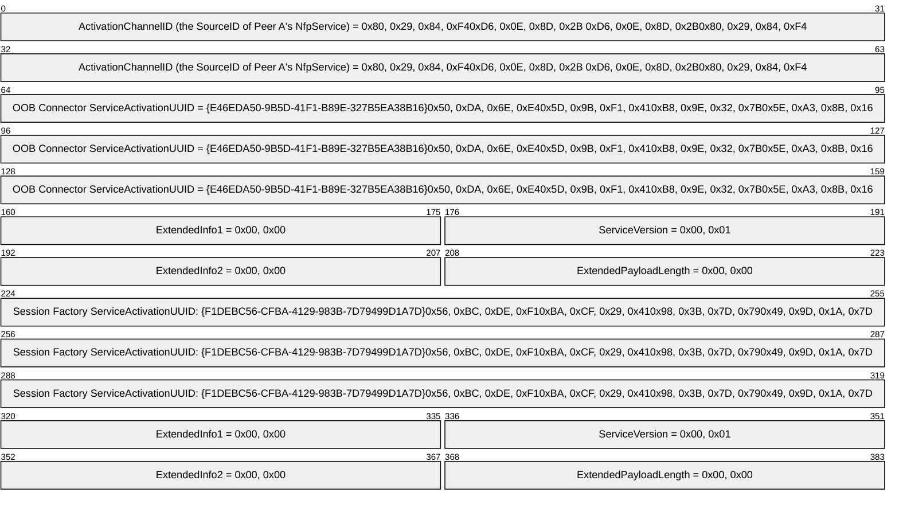

<a id="Section_4.2"></a>
## 4.2 Peer A Service Descriptor Received by Peer B

When a valid **Service Descriptor (SD)** structure (section [2.2.9](#Section_2.2.9)) is received by Peer B, it will immediately respond with its own **Service Descriptor** message (section [2.2.8](#Section_2.2.8)) on the same well-known channel: "Windows.windows.com/SD". Length is equal to 56 bytes.

```mermaid
packet-beta
  0-63: "ActivationChannelID (the SourceID of Peer B's NfpService) = 0xF3, 0x88, 0xC0, 0x6B0xE9, 0xCF, 0xD4, 0xDE"
  64-159: "Session Factory ServiceActivationUUID: {F1DEBC56-CFBA-4129-983B-7D79499D1A7D}0x56, 0xBC, 0xDE, 0xF10xBA, 0xCF, 0x29, 0x410x98, 0x3B, 0x7D, 0x790x49, 0x9D, 0x1A, 0x7D"
  160-175: "ExtendedInfo1 = 0x00, 0x00"
  176-191: "ServiceVersion = 0x00, 0x01"
  192-207: "ExtendedInfo2 = 0x00, 0x00"
  208-223: "ExtendedPayloadLength = 0x00, 0x00"
  224-319: "OOB Connector ServiceActivationUUID = {E46EDA50-9B5D-41F1-B89E-327B5EA38B16}0x50, 0xDA, 0x6E, 0xE40x5D, 0x9B, 0xF1, 0x410xB8, 0x9E, 0x32, 0x7B0x5E, 0xA3, 0x8B, 0x16"
  320-335: "ExtendedInfo1 = 0x00, 0x00"
  336-351: "ServiceVersion = 0x00, 0x01"
  352-367: "ExtendedInfo2 = 0x00, 0x00"
  368-383: "ExtendedPayloadLength = 0x00, 0x00"
```

In this example, Peer B also responds to the **SD** with the **OOB Connector Service Activation** message (section [2.2.5](#Section_2.2.5)) on Peer A's **Service Activation** [**base64**](#gt_179b9392-9019-45a3-880b-26f6890522b7)-encoded **SourceID**: "Windows.gCmE9NYOjSs". Length is equal to 186 bytes.

```mermaid
packet-beta
  0-63: "SourceID (of Peer B's NfpService) = 0xF3, 0x88, 0xC0, 0x6B0xE9, 0xCF, 0xD4, 0xDE"
  64-159: "OOB Connector ServiceActivationUUID = {E46EDA50-9B5D-41F1-B89E-327B5EA38B16}0x50, 0xDA, 0x6E, 0xE40x5D, 0x9B, 0xF1, 0x410xB8, 0x9E, 0x32, 0x7B0x5E, 0xA3, 0x8B, 0x16"
  160-175: "ExtendedInfo = 0x00, 0x00"
  176-191: "ServiceVersion = 0x00, 0x01"
  192-255: "ReplyChannelID (the OOBConnectorID of the newly created OOB Connector object) = "bcso+pFofkc"0x6D, 0xCB, 0x28, 0xFA0x91, 0x68, 0x7E, 0x47"
  256-351: "WiFiDirectAddress = fe80::c8:b1:5d9d:779e:81b20xFE, 0x80, 0x00, 0x000x00, 0x00, 0x00, 0x000xC8, 0xB1, 0x5D, 0x9D0x77, 0x9E, 0x81, 0xB2"
  352-447: "LinkLocalAddress = fe80::3858:bb83:6ca5:11b8"
  448-543: "IPv4LinkLocalAddress = 172.31.233.146 (::ffff:ac1f:e992)0x00, 0x00, 0x00, 0x000x00, 0x00, 0x00, 0x000x00, 0x00, 0xFF, 0xFF0xAC, 0x1F, 0xE9, 0x92"
  544-639: "ProximityAddress = ::"
  640-735: "GlobalAddress = 2001:4898:001a:0003:3858:bb83:6ca5:11b8"
  736-863: "TeredoAddress (16 bytes)"
  864-895: "Reserved =0x00, 0x00, 0x00, 0x00"
  896-959: "BluetoothMACAddress = e0:ca:94:49:33:340x34, 0x33, 0x49, 0x940xCA, 0xE0, 0x00, 0x00"
  960-975: "WiFiDirectConnectBlobLength = 0x00, 0x28"
  976-991: "WiFiDirectConnectBlob = 0x28, 0x00"
  992-1055: "WiFiDirectConnectBlob (continued) =0x02, 0x00, 0x10, 0x020x01, 0x1F, 0x00, 0x120x0C, 0xE3, 0x6E, 0x570xE2, 0x01, 0x88, 0x000x01, 0x00, 0x50, 0xF20x00, 0x00, 0x00, 0x240x10, 0x11, 0x00, 0x0A0x54, 0x52, 0x41, 0x560x4D, 0x2D, 0x4E, 0x490x4B, 0x45"
```

<a id="Section_4.3"></a>
## 4.3 Peer B Service Descriptor Received by Peer A

When Peer B's valid **Service Descriptor (SD)** structure (section [2.2.9](#Section_2.2.9)) is received by Peer A, it responds with a **Session Factory Service Activation** message (section [2.2.12](#Section_2.2.12)) on Peer B's **Service Activation** [**base64**](#gt_179b9392-9019-45a3-880b-26f6890522b7)-encoded **SourceID**: "Windows.84jAa+nP1N4". Length is equal to 141 bytes.

```mermaid
packet-beta
  0-63: "SourceID (of Peer A's NfpService) =0x80, 0x29, 0x84, 0xF40xD6, 0x0E, 0x8D, 0x2B"
  64-159: "Session Factory ServiceActivationUUID: {F1DEBC56-CFBA-4129-983B-7D79499D1A7D}"
  160-175: "ExtendedInfo = 0x00, 0x00"
  176-191: "ServiceVersion = 0x00, 0x01"
  192-255: "ReplyChannelID (the SessionFactoryID of the Adventure Works App's Session Factory) = "bDMWicFcpEs"0x6C, 0x33, 0x16, 0x890xC1, 0x5C, 0xA4, 0x4B"
  256-287: "ClientPreference = 0x00, 0x01, 0x00, 0x00"
  288-295: "AppInfoCount = 0x0003"
  296-303: "PlatformQualifierSize = 0x07"
  304-383: "PlatformQualifier = "Windows" 0x57, 0x69, 0x6E, 0x64, 0x6F, 0x77, 0x73"
  384-391: "AppIDSize = 0x19"
  392-479: "AppID = "Contoso%AdventureWorksApp""
  480-487: "PlatformQualifierSize = 0x07"
  488-575: "PlatformQualifier = "Android""
  576-583: "AppIDSize = 0x20"
  584-671: "AppID = "Contoso-Adventure Works-3/6/2012""
  672-679: "PlatformQualifierSize = 0x08"
  680-767: "PlatformQualifier = "WinPhone""
  768-775: "AppIDSize = 0x26"
  776-863: "AppID = "{8342DF32-AD41-8993-927F-CACE4A295751}""
```

<a id="Section_4.4"></a>
## 4.4 Peer A Receives OOB Connector Service Activation Message, Responds with OOB Connector Service ACK

When Peer B's valid **OOB Connector Service Activation** message (section [2.2.5](#Section_2.2.5)) is received by Peer A, it responds with a **OOB Connector Service ACK** message (section [2.2.4](#Section_2.2.4)) on the received **ReplyChannelID**, which is the **OOBConnectorID** of Peer B's newly created **OOB Connector** object (section [3.1.1.2](#Section_3.1.1.2)): "Windows.bcso+pFofkc". Length is equal to 106 bytes.

```mermaid
packet-beta
  0-95: "WiFiDirectAddress = fe80:0000:0000:0000:0dd5:fba4:be61:fedf"
  96-191: "LinkLocalAddress = fe80:0000:0000:0000:a87f:8ed4:32c2:a4dd"
  192-287: "IPv4LinkLocalAddress = 172.31.233.149 (0000:0000:0000:0000:0000:ffff:ac1f:e995)"
  288-415: "ProximityAddress (16 bytes)"
  416-543: "GlobalAddress (16 bytes)"
  544-671: "TeredoAddress (16 bytes)"
  672-735: "BluetoothMACAddress = (00:19:0e:08:6f:8f)0x8F, 0x6F, 0x08, 0x0E0x19, 0x00, 0x00, 0x00"
  736-751: "WiFiDirectListenBlobLength = 0x0000"
```

<a id="Section_4.5"></a>
## 4.5 Peer A Session Factory Service Activation Received by Peer B, Responds with Session Activation

When Peer A's valid **Session Factory Service Activation** message (section [2.2.12](#Section_2.2.12)) is received by Peer B, it responds by launching the Adventure Works App, creating a **Session Factory** object, creating a **Session** object (section [3.1.1.4](#Section_3.1.1.4)), and replying with a **Session Activation** message (section [2.2.11](#Section_2.2.11)) on the received **ReplyChannelID**, which is the **SessionFactoryID** of Peer A's **Session Factory** object (section [3.1.1.3](#Section_3.1.1.3)) for the Adventure Works application: "Windows.bDMWicFcpEs". Length is equal to 96 bytes.

```mermaid
packet-beta
  0-63: "SourceID (the SourceID of Peer B's NfpService) = 0xF3, 0x88, 0xC0, 0x6B0xE9, 0xCF, 0xD4, 0xDE"
  64-127: "ActivatedSessionFactoryID (newly created Session Factory object's SessionFactoryID) = 0x40, 0xCA, 0xDB, 0x31 0x50, 0x96, 0xD8, 0x32"
  128-191: "ReplyChannelID (newly created Session object's SessionID) = "rhlJshr/7Ew"0xAE, 0x19, 0x49, 0xB2 0x1A, 0xFF, 0xEC, 0x4C"
  192-223: "ECDHPublicKeyMagicNumber = 0x45, 0x43, 0x4B, 0x31"
  224-255: "ECDHPublicKeyLength (little-endian) = 0x20, 0x00, 0x00, 0x00"
  256-287: "ECDHXParam"
  288-319: "ECDHYParam"
```

<a id="Section_4.6"></a>
## 4.6 Peer B Session Activation Received by Peer A, Responds with Session ACK

When Peer B's valid **Session Activation** message (section [2.2.11](#Section_2.2.11)) is received by Peer A, it responds with a **Session ACK** message (section [2.2.10](#Section_2.2.10)) on the received **ReplyChannelID,** which is the **SessionID** of Peer B's newly created **Session** object (section [3.1.1.4](#Section_3.1.1.4)): "Windows.rhlJshr/7Ew". Length is equal to 76 bytes.

```mermaid
packet-beta
  0-63: "ECDHPublicKeyMagicNumber = 0x45, 0x43, 0x4B, 0x31"
  64-95: "ECDHPublicKeyLength (little-endian) = 0x20, 0x00, 0x00, 0x00"
  96-127: "ECDHXParam"
  128-159: "ECDHYParam"
  160-175: "TCPPort = 51351 (0xC8, 0x97)"
  176-183: "RFCOMMPort = 0x01"
  184-191: "Reserved1 = 0x00"
```

<a id="Section_4.7"></a>
## 4.7 Peer A Session ACK Received by Peer B, Begins Connection Validation

When Peer A's valid **Session ACK** message (section [2.2.10](#Section_2.2.10)) is received by Peer B, it responds with an **Accept Header** (section [2.2.1](#Section_2.2.1)) on the **SessionID** of its **Session** object (section [3.1.1.4](#Section_3.1.1.4)): "Windows.rhlJshr/7Ew". The **ConnectionType** field indicates that this is an [**IPv4**](#gt_internet-protocol-version-4-ipv4) connection. This begins the connection validation handshake.

```mermaid
packet-beta
  0-63: "SessionID = "rhlJshr/7Ew"0xAE, 0x19, 0x49, 0xB2 0x1A, 0xFF, 0xEC, 0x4C"
  64-79: "ConnectionType = Link Local (IPv4)0x00, 0x00, 0x00, 0x000x00, 0x00, 0x00, 0x02"
```

<a id="Section_4.8"></a>
## 4.8 Peer B Accept Header Received by Peer A, Completes Connection Validation

When Peer B's valid **Accept Header** (section [2.2.1](#Section_2.2.1)) is received by Peer A, it responds by saving the structure in its **NfpService** state element **HandshakeData** and returning the identical **Accept Header** shown in section [4.7](#Section_4.7). This completes the connection validation handshake.

<a id="Section_5"></a>
# 5 Security

<a id="Section_5.1"></a>
## 5.1 Security Considerations for Implementers

None.

<a id="Section_5.2"></a>
## 5.2 Index of Security Parameters

None.

<a id="Section_6"></a>
# 6 Appendix A: Product Behavior

The information in this specification is applicable to the following Microsoft products or supplemental software. References to product versions include updates to those products.

- Windows 8 operating system
- Windows Server 2012 operating system
- Windows 8.1 operating system
- Windows Server 2012 R2 operating system
- Windows 10 operating system
- Windows Server 2016 operating system
- Windows Server 2019 operating system
- Windows Server 2022 operating system
- Windows 11 operating system
- Windows Server 2025 operating system
Exceptions, if any, are noted in this section. If an update version, service pack or Knowledge Base (KB) number appears with a product name, the behavior changed in that update. The new behavior also applies to subsequent updates unless otherwise specified. If a product edition appears with the product version, behavior is different in that product edition.

Unless otherwise specified, any statement of optional behavior in this specification that is prescribed using the terms "SHOULD" or "SHOULD NOT" implies product behavior in accordance with the SHOULD or SHOULD NOT prescription. Unless otherwise specified, the term "MAY" implies that the product does not follow the prescription.

<1> Section 2.2.6: Windows 8 and Windows Server 2012: Role compatibility checking is not supported.

<2> Section 2.2.11: Windows 8 and Windows Server 2012: The **Role** field in the **Session Factory Service Activation** message is not supported.

<3> Section 2.2.12: Windows 8 and Windows Server 2012: The host or client **ServiceActivationUUID** value is not supported.

<4> Section 2.2.12: Windows 8 and Windows Server 2012: The **Role** field is not supported.

<5> Section 3.1.2: Windows: The default value is 10 seconds.

<6> Section 3.1.2: Windows: The default value is 10 seconds.

<7> Section 3.1.2: Windows: A timeout value of 10 minutes is used.

<8> Section 3.1.2: Windows: A timeout value of 6 minutes is used.

<9> Section 3.1.5.6: Windows 8 and Windows Server 2012: The **Role** field in the **Session Factory Service Activation** message is not supported.

<a id="Section_7"></a>
# 7 Change Tracking

This section identifies changes that were made to this document since the last release. Changes are classified as Major, Minor, or None.

The revision class **Major** means that the technical content in the document was significantly revised. Major changes affect protocol interoperability or implementation. Examples of major changes are:

- A document revision that incorporates changes to interoperability requirements.
- A document revision that captures changes to protocol functionality.
The revision class **Minor** means that the meaning of the technical content was clarified. Minor changes do not affect protocol interoperability or implementation. Examples of minor changes are updates to clarify ambiguity at the sentence, paragraph, or table level.

The revision class **None** means that no new technical changes were introduced. Minor editorial and formatting changes may have been made, but the relevant technical content is identical to the last released version.

The changes made to this document are listed in the following table. For more information, please contact [dochelp@microsoft.com](mailto:dochelp@microsoft.com).

| Section | Description | Revision class |
| --- | --- | --- |
| [6](#Section_6) Appendix A: Product Behavior | Added Windows Server 2025 to the list of applicable products. | Major |

<a id="revision-history"></a>

## Revision History

| Date | Version | Revision Class | Comments |
| --- | --- | --- | --- |
| 1/31/2013 | 1.0 | New | Released new document. |
| 8/8/2013 | 2.0 | Major | Significantly changed the technical content. |
| 11/14/2013 | 3.0 | Major | Significantly changed the technical content. |
| 2/13/2014 | 4.0 | Major | Significantly changed the technical content. |
| 5/15/2014 | 5.0 | Major | Significantly changed the technical content. |
| 6/30/2015 | 6.0 | Major | Significantly changed the technical content. |
| 10/16/2015 | 6.0 | None | No changes to the meaning, language, or formatting of the technical content. |
| 7/14/2016 | 7.0 | Major | Significantly changed the technical content. |
| 6/1/2017 | 8.0 | Major | Significantly changed the technical content. |
| 12/1/2017 | 8.0 | None | No changes to the meaning, language, or formatting of the technical content. |
| 9/12/2018 | 9.0 | Major | Significantly changed the technical content. |
| 4/7/2021 | 10.0 | Major | Significantly changed the technical content. |
| 6/25/2021 | 11.0 | Major | Significantly changed the technical content. |
| 4/23/2024 | 12.0 | Major | Significantly changed the technical content. |
