# [MS-NFPS]: Near Field Proximity: Sharing Protocol

Table of Contents

1 Introduction

- [1 Introduction](#Section_1)
  - [1.1 Glossary](#Section_1.1)
  - [1.2 References](#Section_1.2)
    - [1.2.1 Normative References](#Section_1.2.1)
    - [1.2.2 Informative References](#Section_1.2.2)
  - [1.3 Overview](#Section_1.3)
  - [1.4 Relationship to Other Protocols](#Section_1.4)
  - [1.5 Prerequisites/Preconditions](#Section_1.5)
  - [1.6 Applicability Statement](#Section_1.6)
  - [1.7 Versioning and Capability Negotiation](#Section_1.7)
  - [1.8 Vendor-Extensible Fields](#Section_1.8)
  - [1.9 Standards Assignments](#Section_1.9)

2 Messages

- [2 Messages](#Section_2)
  - [2.1 Transport](#Section_2.1)
  - [2.2 Message Syntax](#Section_2.2)
    - [2.2.1 Socket Connect Header](#Section_2.2.1)
    - [2.2.2 Share Header](#Section_2.2.2)
    - [2.2.3 Reply Header](#Section_2.2.3)
    - [2.2.4 Share Protocol Footer](#Section_2.2.4)
    - [2.2.5 Connection Type Enumeration](#Section_2.2.5)

3 Protocol Details

- [3 Protocol Details](#Section_3)
  - [3.1 Common Details](#Section_3.1)
    - [3.1.1 Abstract Data Model](#Section_3.1.1)
    - [3.1.2 Timers](#Section_3.1.2)
    - [3.1.3 Initialization](#Section_3.1.3)
    - [3.1.4 Higher-Layer Triggered Events](#Section_3.1.4)
    - [3.1.5 Message Processing Events and Sequencing Rules](#Section_3.1.5)
    - [3.1.6 Timer Events](#Section_3.1.6)
    - [3.1.7 Other Local Events](#Section_3.1.7)
      - [3.1.7.1 Setting Up a Socket: When the Session is a Client](#Section_3.1.7.1)
      - [3.1.7.2 Setting Up a Socket: When the Session is a Server](#Section_3.1.7.2)
  - [3.2 Share Sender Details](#Section_3.2)
    - [3.2.1 Abstract Data Model](#Section_3.2.1)
    - [3.2.2 Timers](#Section_3.2.2)
    - [3.2.3 Initialization](#Section_3.2.3)
    - [3.2.4 Higher-Layer Triggered Events](#Section_3.2.4)
    - [3.2.5 Message Processing Events and Sequencing Rules](#Section_3.2.5)
    - [3.2.6 Timer Events](#Section_3.2.6)
    - [3.2.7 Other Local Events](#Section_3.2.7)
      - [3.2.7.1 Session Provided](#Section_3.2.7.1)
      - [3.2.7.2 Session Socket Successfully Set Up](#Section_3.2.7.2)
  - [3.3 Share Receiver Details](#Section_3.3)
    - [3.3.1 Abstract Data Model](#Section_3.3.1)
    - [3.3.2 Timers](#Section_3.3.2)
    - [3.3.3 Initialization](#Section_3.3.3)
    - [3.3.4 Higher-Layer Triggered Events](#Section_3.3.4)
    - [3.3.5 Message Processing Events and Sequencing Rules](#Section_3.3.5)
    - [3.3.6 Timer Events](#Section_3.3.6)
    - [3.3.7 Other Local Events](#Section_3.3.7)
      - [3.3.7.1 TapAndSendFiles Activation Event](#Section_3.3.7.1)
      - [3.3.7.2 Session Socket Successfully Set Up Event](#Section_3.3.7.2)
      - [3.3.7.3 Socket Closed Due to Fault Event](#Section_3.3.7.3)
      - [3.3.7.4 Socket Gracefully Closed Event](#Section_3.3.7.4)

4 Protocol Examples

- [4 Protocol Examples](#Section_4)
  - [4.1 Success Scenario](#Section_4.1)
    - [4.1.1 Connect](#Section_4.1.1)
    - [4.1.2 Accept](#Section_4.1.2)
    - [4.1.3 Share Header](#Section_4.1.3)
    - [4.1.4 Reply Header](#Section_4.1.4)
    - [4.1.5 Share Data](#Section_4.1.5)
      - [4.1.5.1 Base Case](#Section_4.1.5.1)
      - [4.1.5.2 511-Byte OPC Package](#Section_4.1.5.2)
      - [4.1.5.3 512-Byte OPC Package](#Section_4.1.5.3)
  - [4.2 Abort Scenario](#Section_4.2)
    - [4.2.1 Connect](#Section_4.2.1)
    - [4.2.2 Accept](#Section_4.2.2)
    - [4.2.3 Abort Received](#Section_4.2.3)

5 Security

- [5 Security](#Section_5)
  - [5.1 Security Considerations for Implementers](#Section_5.1)
  - [5.2 Index of Security Parameters](#Section_5.2)

6 Appendix A: Product Behavior

- [6 Appendix A: Product Behavior](#Section_6)

7 Change Tracking

- [7 Change Tracking](#Section_7)

For the legal notice and IP terms, see [LEGAL.md](../LEGAL.md).
Last updated: 4/23/2024.
See [Revision History](#revision-history) for full version history.

# 1 Introduction

The Near Field Proximity: Sharing Protocol primarily relies on the Near Field Proximity: Bidirectional Services Protocol [MS-NFPB](../MS-NFPB/MS-NFPB.md) as a trigger for completing the message exchange specified in this protocol. After being triggered, this protocol then relies on Office Open XML File Format [[ECMA-376]](https://go.microsoft.com/fwlink/?LinkId=200054) for creating an [**OPC package**](#gt_opc-package), and then [**TCP**](#gt_transmission-control-protocol-tcp)/IP and/or Bluetooth/RFCOMM for data transport.

Sections 1.5, 1.8, 1.9, 2, and 3 of this specification are normative. All other sections and examples in this specification are informative.

## 1.1 Glossary

This document uses the following terms:

**Advanced Encryption Standard (AES)**: A block cipher that supersedes the Data Encryption Standard (DES). AES can be used to protect electronic data. The AES algorithm can be used to encrypt (encipher) and decrypt (decipher) information. Encryption converts data to an unintelligible form called ciphertext; decrypting the ciphertext converts the data back into its original form, called plaintext. AES is used in symmetric-key cryptography, meaning that the same key is used for the encryption and decryption operations. It is also a block cipher, meaning that it operates on fixed-size blocks of plaintext and ciphertext, and requires the size of the plaintext as well as the ciphertext to be an exact multiple of this block size. AES is also known as the Rijndael symmetric encryption algorithm [[FIPS197]](https://go.microsoft.com/fwlink/?LinkId=89870).

**big-endian**: Multiple-byte values that are byte-ordered with the most significant byte stored in the memory location with the lowest address.

**domain**: A set of users and computers sharing a common namespace and management infrastructure. At least one computer member of the set has to act as a domain controller (DC) and host a member list that identifies all members of the domain, as well as optionally hosting the Active Directory service. The domain controller provides authentication of members, creating a unit of trust for its members. Each domain has an identifier that is shared among its members. For more information, see [MS-AUTHSOD](../MS-AUTHSOD/MS-AUTHSOD.md) section 1.1.1.5 and [MS-ADTS](../MS-ADTS/MS-ADTS.md).

**little-endian**: Multiple-byte values that are byte-ordered with the least significant byte stored in the memory location with the lowest address.

**Near Field Communication (NFC)**: An international standard for short-range wireless, contactless connectivity that provides intuitive, simple, and safe communication between electronic devices. NFC is the technology on smartphones that makes proximity scenarios possible. For example, it allows a user to wave the smartphone over a NFC-compatible device to send information without needing to touch the devices together or go through multiple steps setting up a connection.

**NFPB**: The Near Field Proximity: Bidirectional Services Protocol [MS-NFPB].

**OPC file**: See OPC package.

**OPC package**: A .ZIP file archive [PKZIP] that follows the Open Packaging Conventions (OPC).

**Open Packaging Conventions (OPC)**: An open standard for a portable container technology that defines a structured way to store application data with related resources by using a standard .ZIP file format. OPC is a component of Office Open XML File Formats [ECMA-376].

**pub/sub**: Refers to publication/subscription, a design model in which publishers send notification of events that are received by subscribers, which have registered for those events.

**Transmission Control Protocol (TCP)**: A protocol used with the Internet Protocol (IP) to send data in the form of message units between computers over the Internet. TCP handles keeping track of the individual units of data (called packets) that a message is divided into for efficient routing through the Internet.

**UTF-8**: A byte-oriented standard for encoding Unicode characters, defined in the Unicode standard. Unless specified otherwise, this term refers to the UTF-8 encoding form specified in [[UNICODE5.0.0/2007]](https://go.microsoft.com/fwlink/?LinkId=154659) section 3.9.

**MAY, SHOULD, MUST, SHOULD NOT, MUST NOT:** These terms (in all caps) are used as defined in [[RFC2119]](https://go.microsoft.com/fwlink/?LinkId=90317). All statements of optional behavior use either MAY, SHOULD, or SHOULD NOT.

## 1.2 References

Links to a document in the Microsoft Open Specifications library point to the correct section in the most recently published version of the referenced document. However, because individual documents in the library are not updated at the same time, the section numbers in the documents may not match. You can confirm the correct section numbering by checking the [Errata](https://go.microsoft.com/fwlink/?linkid=850906).

### 1.2.1 Normative References

We conduct frequent surveys of the normative references to assure their continued availability. If you have any issue with finding a normative reference, please contact [dochelp@microsoft.com](mailto:dochelp@microsoft.com). We will assist you in finding the relevant information.

[MS-NFPB] Microsoft Corporation, "[Near Field Proximity: Bidirectional Services Protocol](../MS-NFPB/MS-NFPB.md)".

[RFC2119] Bradner, S., "Key words for use in RFCs to Indicate Requirement Levels", BCP 14, RFC 2119, March 1997, [https://www.rfc-editor.org/info/rfc2119](https://go.microsoft.com/fwlink/?LinkId=90317)

### 1.2.2 Informative References

[ECMA-376] ECMA International, "Office Open XML File Formats", [https://www.ecma-international.org/publications-and-standards/standards/ecma-376/](https://go.microsoft.com/fwlink/?LinkId=200054)

## 1.3 Overview

The Near Field Proximity: Sharing Protocol provides real-time sharing of an [**Open Packaging Conventions (OPC)**](#gt_open-packaging-conventions-opc) [[ECMA-376]](https://go.microsoft.com/fwlink/?LinkId=200054) package from one peer to another.

In this specification, the server role of this protocol is referred to as the Share Sender, and the client role is referred to as the Share Receiver.

In the Share Sender role, when the user wants to share an [**OPC package**](#gt_opc-package), this protocol uses the Near Field Proximity: Bidirectional Services Protocol [MS-NFPB](../MS-NFPB/MS-NFPB.md) to establish a session that can be used to send the OPC package to the user-indicated peer.

The receiving peer implements the Share Receiver, which is performed by handling an incoming trigger from the underlying [**NFPB**](#gt_nfpb) protocol. This trigger is a share-specific session.

The following diagram shows a generic sequence of data sharing with this protocol.

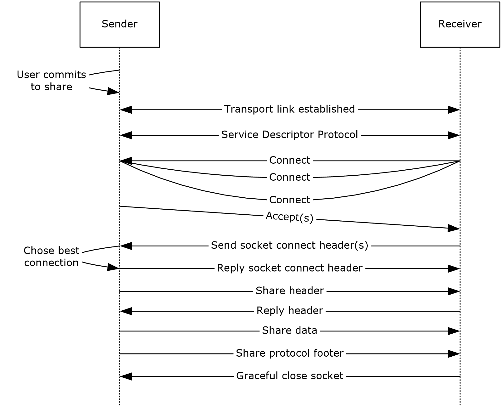

Figure 1: Data sharing sequence

## 1.4 Relationship to Other Protocols

The following diagram shows the relationship of the Near Field Proximity: Sharing Protocol with other protocols.

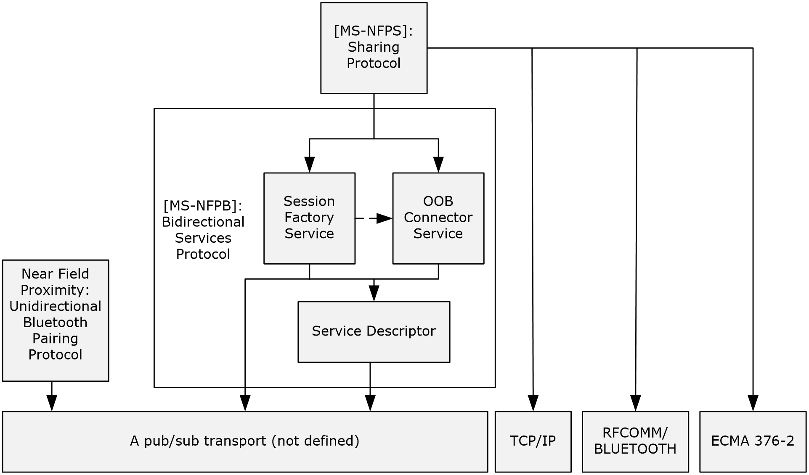

Figure 2: Relationship to other protocols

The Near Field Proximity: Sharing Protocol uses the Near Field Proximity: Bidirectional Services Protocol [MS-NFPB](../MS-NFPB/MS-NFPB.md) to establish a session between a share source and share target. That session is then used to establish a connection between the source and the target. That connection can be used by the source to send an [**OPC package**](#gt_opc-package) to the target.

## 1.5 Prerequisites/Preconditions

Peers are required to be able to communicate via compatible networking technologies; for example, [**TCP**](#gt_transmission-control-protocol-tcp)/IP over wireless networks. There are no other preconditions or prerequisites for these protocols to function between peers. There are no assumed security associations or connections required between peers except those that are required by the [**pub/sub**](#gt_pubsub) transport link layer.

## 1.6 Applicability Statement

The Near Field Proximity: Sharing Protocol is well-suited to function on top of transports such as [**Near Field Communication (NFC)**](#gt_near-field-communication-nfc). This protocol has been designed for linking two applications for the purposes of simple, real-time sharing of files. This protocol is designed to function in a cross-platform, cross-[**domain**](#gt_domain), or non-domain environment.

## 1.7 Versioning and Capability Negotiation

This document covers versioning issues in the following areas:

- **Security and Authentication Methods:** The Near Field Proximity: Sharing Protocol relies on the underlying [**NFPB**](#gt_nfpb) protocol for versioning. As specified in [MS-NFPB](../MS-NFPB/MS-NFPB.md), the underlying Session Factory service has bound algorithms for each version of the service. If, in the future, security and/or authentication methods require updating, the use of this protocol will trigger updated behavior on the underlying negotiated Session Factory service version.
- **Capability Negotiation:** This protocol relies on the underlying NFPB protocol for explicit capability negotiation as specified in section 3.2.3.

## 1.8 Vendor-Extensible Fields

None.

## 1.9 Standards Assignments

None.

# 2 Messages

## 2.1 Transport

The transport for the Near Field Proximity: Sharing Protocol is either [**TCP**](#gt_transmission-control-protocol-tcp)/IP or Bluetooth/RFCOMM. Each of those is a reliable connection-oriented socket.

## 2.2 Message Syntax

None of the messages in this protocol has alignment requirements; that is, there are no padding bytes to force a specific alignment. Unless explicitly specified otherwise, all fields use [**big-endian**](#gt_big-endian) encoding.

Most of this protocol consists of a stream of bytes that contain the [**OPC file**](#gt_opc-file) being transferred; however, there are well-defined header and footer messages, which are described in the following sections.

### 2.2.1 Socket Connect Header

The **Socket Connect** header specifies the connection type of a socket connection to be established. It has the following structure.

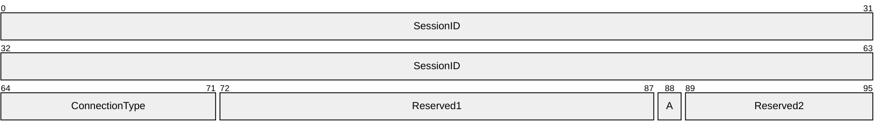

**SessionID (8 bytes):** The ID of the **Session** object. At the conclusion of the session exchange, each peer has a **Session** object, and the two **Session** objects' **SessionID** fields match. It is used by the Share Receiver to find the correct **Session** object to associate with the inbound socket.

**ConnectionType (1 byte):** The connection type of the socket connection to be established, from the **Connection Type Enumeration** (section [2.2.5](#Section_2.2.5)).

**Reserved1 (2 bytes):** This field MUST be set to zero when sent and MUST be ignored when received.

**A (1 bit):** The Abort flag. A client sets this flag in order to indicate to the server that the client is required to terminate the session immediately. This flag is useful when, for example, the user has decided not to accept a socket or share connection.

**Reserved2 (7 bits):** This field MUST be set to zero when sent and MUST be ignored when received.

### 2.2.2 Share Header

The **Share** header specifies an estimated size of an [**OPC package**](#gt_opc-package).

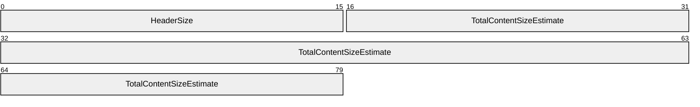

**HeaderSize (2 bytes):** The value 10 in [**little-endian**](#gt_little-endian) encoding (0x0A, 0x00). Future versions of this protocol MAY specify a larger size, and implementations MUST accept any value greater than or equal to 10 and ignore fields that are not defined in this specification.

**TotalContentSizeEstimate (8 bytes):** An estimated size of the OPC package to be shared, in little-endian encoding. When this field is set to zero, the sender indicates that the size of the package is unknown, which can happen when the package is being streamed. This value is used only for providing an estimate to the user of how long the transfer will take.

### 2.2.3 Reply Header

The **Reply** header specifies how many bytes to read from the socket for the rest of the header.

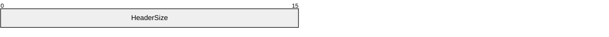

**HeaderSize (2 bytes):** The value 2 in [**little-endian**](#gt_little-endian) encoding (0x02, 0x00). Future versions of this protocol might specify a larger size, and implementations MUST accept any value greater than or equal to 2 and MUST ignore fields that are not defined in this specification.

### 2.2.4 Share Protocol Footer

The **Share Protocol** footer specifies the last piece of the [**OPC package**](#gt_opc-package), up to 15 bytes. The total size of this message MUST be 48 bytes.

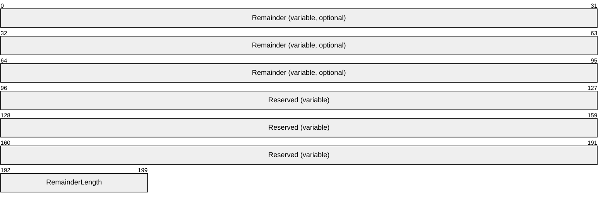

**Remainder (variable, optional):** The final bytes of the [**OPC file**](#gt_opc-file), which did not fit exactly in a block of data. The size of this field is specified in the **RemainderLength** field. If the size is zero, this field SHOULD NOT be not present.

**Reserved (variable):** This field MUST be set to zero when sent and MUST be ignored when received. The size of this field is a function of the **RemainderLength** field value, as follows:

ReservedLength = 47 - RemainderLength

**RemainderLength (1 byte):** The length of the **Remainder** field, in bytes. This value MUST be from zero to 15, inclusive.

### 2.2.5 Connection Type Enumeration

The **Connection Type** enumeration is used to specify the type of source and destination address used by the Near Field Proximity: Sharing Protocol. These values are based on the same addresses exchanged in the [**NFPB**](#gt_nfpb) **OOB Connector** service [MS-NFPB](../MS-NFPB/MS-NFPB.md) section 2.2.9. The source refers to the peer with a **Session** object that has a Share Receiver role. The destination refers to the peer with a Session object that has a Share Sender role.

| Value | Source address | Destination address |
| --- | --- | --- |
| 0 | Wi-Fi Direct Address | Wi-Fi Direct Address |
| 1 | Link Local Address | Link Local Address |
| 2 | IPv4 Link Local Address | IPv4 Link Local Address |
| 3 | Proximity Address | Proximity Address |
| 4 | Bluetooth MAC Address | Bluetooth MAC Address |
| 5 | Global Address | Global Address |
| 6 | Global Address | Teredo Address |
| 7 | Teredo Address | Global Address |
| 8 | Teredo Address | Teredo Address |

# 3 Protocol Details

## 3.1 Common Details

There are some aspects of the Near Field Proximity: Sharing Protocol that are common to both the Share Sender and Share Receiver roles. Conceptually, these requirements reside in a layer between the [**NFPB**](#gt_nfpb) protocol [MS-NFPB](../MS-NFPB/MS-NFPB.md) and this protocol. In the abstract data model of the NFPB protocol, the Session Factory service allows creation of Session objects, one within each peer. The protocol provides for either static or random role-determination for these Session objects; in both cases, one Session object has the client role and the other Session object has the server role.

The Near Field Proximity: Sharing Protocol mandates, by the conventions it follows, that the Share Sender MUST always produce **Session** objects with the server role, and the Share Receiver MUST always produce **Session** objects with the client role. This is a direct result of the fact that the Share Sender always creates a **SessionFactory** object with the **Launch** flag set.

### 3.1.1 Abstract Data Model

None.

### 3.1.2 Timers

None.

### 3.1.3 Initialization

None.

### 3.1.4 Higher-Layer Triggered Events

None.

### 3.1.5 Message Processing Events and Sequencing Rules

None.

### 3.1.6 Timer Events

None.

### 3.1.7 Other Local Events

This section specifies actions taken by either a Share Sender or Share Receiver for setting up a socket.

#### 3.1.7.1 Setting Up a Socket: When the Session is a Client

When a **Session** object with the client role transitions to the Ready state, and its **ReferencedOOBConnector** object has also transitioned to the Ready state, the Share Sender or Share Receiver MUST start a parallel set of socket connects to the remote peer, with each of the nine different connection types (section [2.2.5](#Section_2.2.5)). With respect to these connect attempts, the Share Sender or Receiver MUST perform the following actions:

- Use the **Session** object's **RemoteTcpPort** element as the destination TCP port for all IP socket connects.
- Use the **Session** object's **RemoteRfcommPort** element as the destination RFCOMM port for all Bluetooth socket connects.
- Use the **Session** object's **ReferencedOobConnector** object's **LocalAddresses** as the bound source address for each socket connect.
- Use the **Session** object's **ReferencedOOBConnector** object's **RemoteAddresses** as the specific destination address for each socket connect.
**Note** Sending from a specific bound port is not required.

The Share Sender or Share Receiver MUST NOT attempt a specific connect if either the Local or Remote address is all zeros.

The Share Sender or Share Receiver can delay connection type 0 until after the **Session** object's **ReferencedOOBConnector** object's **WfdPeerConnected** element transitions to TRUE.

If a connect attempt fails, it SHOULD be retried after a 10-millisecond delay, unless the **Session** socket is already successfully set up.

If a full handshake is incomplete after 4 seconds, a second, parallel set of socket connects to the remote peer can be started.

When a socket successfully connects, the Share Receiver MUST send an appropriate **Socket Connect** header (section [2.2.1](#Section_2.2.1)) on the socket. The **ConnectionType** field MUST match the type of connection attempted by that socket. When the Share Receiver successfully sends its **Socket Connect** header, the Share Receiver MUST wait for a **Socket Connect** header to be received from the Share Sender in reply. If the received **Socket Connect** header is not identical to the one the Share Receiver just sent, the socket MUST be closed and the connection attempt is considered to have failed. If the received **Socket Connect** header is identical to the one the Share Receiver just sent:

- The **Session** socket MUST be considered successfully set up and MUST be set as the **Socket** object within the appropriate Share Sender or Receiver.
- All the other parallel connection attempts MUST be stopped and abandoned.

#### 3.1.7.2 Setting Up a Socket: When the Session is a Server

When a **Session** object with the server role transitions to the Ready state, and its **ReferencedOOBConnector** object has also transitioned to the Ready state, the Share Sender or Share Receiver MUST perform the following actions:

- Begin accepting socket connections on the TCP port and/or the RFCOMM port.
- Read a **Socket Connect** header (section [2.2.1](#Section_2.2.1)) from any connected sockets:
- The Share Sender or Share Receiver MUST use its **SessionFactory** object to find the **Session** object by its **SessionID**, which is found in the **Socket Connect** header.
- If the **Session** object cannot be found, or if the **Session** already has a socket successfully set up, the Share Sender or Share Receiver MUST close the socket.
- The Share Sender or Share Receiver MUST choose exactly one of the connected sockets for this **Session** object and send the **Socket Connect** header as a reply.
**Note** The timeframe for choosing a socket is not specified, but it SHOULD be done quickly enough to ensure a good user experience.

- If the **A** (Abort) flag is set, the Share Sender or Share Receiver MUST transition the **Session** object to the Terminated state and gracefully close all sockets created by the **Session** object.
- If the **A** (Abort) flag is not set, the **Session** socket MUST be considered successfully set up and MUST be set as the **Socket** object within the Share Sender or Share Receiver.

## 3.2 Share Sender Details

The Share Sender corresponds to the server role in the Near Field Proximity: Sharing Protocol.

### 3.2.1 Abstract Data Model

This section describes a conceptual model of possible data organization that a Share Sender implementation maintains to participate in this protocol. The described organization is provided to facilitate the explanation of how the protocol behaves. This document does not mandate that implementations adhere to this model as long as their external behavior is consistent with that described in this document.

**ShareSender:** An instance of a **ShareSender** element contains the entire state for an outbound sharing attempt.

**Note** This protocol includes the following abstract data model elements, which are directly accessed from the [**NFPB**](#gt_nfpb) protocol, as specified in [MS-NFPB](../MS-NFPB/MS-NFPB.md) section 3.1.1:

**Session:** The **Session** object provided by the **SessionFactory**.

**SessionFactory:** The **SessionFactory** object that the Share Sender creates within the NFPB protocol to handle the creation of **Session** objects.

The following elements are specific to this protocol:

**IV:** A random 16-byte initialization vector used for encrypting.

**Package:** A single [**OPC package**](#gt_opc-package) to be shared with a peer.

**Socket:** The [**TCP**](#gt_transmission-control-protocol-tcp)/IP or Bluetooth/RFCOMM socket chosen for sending the **Package**.

**State:** The current state of the Share Sender. The state value can be one of the following.

| Value | Meaning |
| --- | --- |
| WaitingForSession | The object has created the **SessionFactory**, and is waiting for a **Session**. |
| SetupSocket | The object has received a **Session** from the **SessionFactory**, and is attempting to set up a **Socket** to the peer for transmission of the **Package**. |
| SendingBody | The object's **Socket** is successfully set up and the object is now transmitting the **Share** header (section [2.2.2](#Section_2.2.2)), waiting for the **Reply** header (section [2.2.3](#Section_4.1.4)), sending the **IV** object, or sending the encrypted OPC package over the socket. |
| SendingFooter | The object is transmitting the **Share Protocol** footer (section [2.2.4](#Section_2.2.4)). |

The following diagram shows the state transitions for the Share Sender.

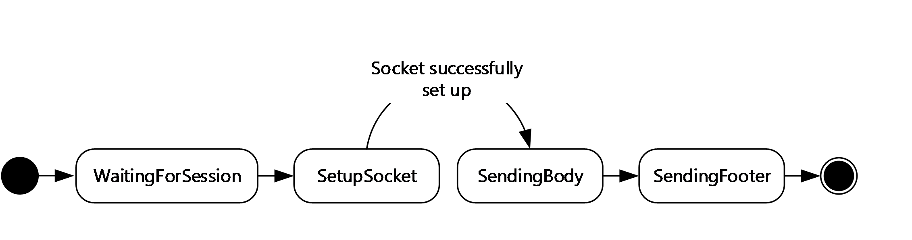

Figure 3: Share sender state transitions

**SymmetricKey:** A 128-bit [**Advanced Encryption Standard (AES)**](#gt_advanced-encryption-standard-aes) key derived by taking the SHA256 hash of the **Session** object's **SharedSecretKey** field.

### 3.2.2 Timers

None.

### 3.2.3 Initialization

When the user indicates an intention to share an [**OPC package**](#gt_opc-package), a **ShareSender** object SHOULD be created with elements initialized as follows:

**Package:** The OPC package specified by the user.

**SessionFactory:** A newly created **SessionFactory** object with the following elements:

- An **AppID** string, set to "Global" or "TapAndSendFiles". This element provides for capability negotiation via the [**NFPB**](#gt_nfpb) protocol.
- The **L** (Launch) flag MUST be set.
**IV:** A 16-byte cryptographically-random initialization vector.

**State:** WaitingForSession.

### 3.2.4 Higher-Layer Triggered Events

The only higher-layer triggered event is the user creating a new instance of a **ShareSender** object.

### 3.2.5 Message Processing Events and Sequencing Rules

None.

### 3.2.6 Timer Events

None.

### 3.2.7 Other Local Events

The following local events change the Share Sender's **State**, as shown in the diagram in section [3.2.1](#Section_3.2.1).

- Session provided
- Session socket successfully set up
The actions required by these events are specified in the sections that follow.

#### 3.2.7.1 Session Provided

This event is triggered when the Share Sender's **SessionFactory** object provides a **Session** object. If the Share Sender's **State** is WaitingForSession, this MUST be set as the object's **Session** element, the **State** element MUST transition to SetupSocket, and the **SessionFactory** object MUST be deactivated or destroyed.

The behavior for the SetupSocket state is specified in section [3.1.7](#Section_3.1.7).

#### 3.2.7.2 Session Socket Successfully Set Up

When a Share Sender's **Socket** object has been successfully set up (section [3.1.7](#Section_3.1.7)), the Share Sender state MUST transition to SendingBody, and the following actions MUST be performed:

- Create a **Share** header (section [2.2.2](#Section_2.2.2)) with the following values:
- **HeaderSize:** The value 10 in [**little-endian**](#gt_little-endian) encoding (0x0A, 0x00). No other value is valid.
- **TotalContentSizeEstimate:** An estimate of the size of the [**OPC package**](#gt_opc-package). If an estimate cannot be determined, this value MUST be zero.
- Send the **Share** header over the **Socket**.
- Synchronously read 2 bytes for the **HeaderSize** field of a **Reply** header (section [2.2.3](#Section_4.1.4)) from the **Socket**.
- Interpret the 2 bytes as a little-endian encoded 16-bit unsigned integer that specifies how many bytes to read for the rest of the message.
- If nonzero length, synchronously read (**HeaderSize** – 2) bytes from the **Socket**.
**Note** If the **HeaderSize** is exactly 2, there is nothing to read.

- Set the Share Sender's **SymmetricKey** element to a 128-bit key derived by taking the SHA256 hash of the **Session** object's **SharedSecretKey** element.
- Send the **IV** as the first block on the **Socket**.
The Near Field Proximity: Sharing Protocol requires a specific encryption scheme. Each block MUST be encrypted by using a standard AES 128-block cipher with the **IV** and **SymmetricKey** objects as input.

Each complete block (16 full bytes) of the OPC package MUST be encrypted and then sent on the **Socket**.

After all complete blocks of data have been encrypted and sent, the following actions MUST be performed:

- Create a **Share Protocol** footer (section [2.2.4](#Section_2.2.4)) and initialize to all zeros.
- Place any remaining (less than 16 bytes) OPC package data at the beginning of the **Share Protocol** footer.
- Set the **RemainderLength** field to be the number of OPC package data bytes placed into the **Share Protocol** footer.
- Encrypt the three final blocks that comprise the **Share Protocol** footer.
- Send the final three blocks that comprise the **Share Protocol** footer on the **Socket**.
- Gracefully close the **Socket**.

## 3.3 Share Receiver Details

The Share Receiver corresponds to the client role in the Near Field Proximity: Sharing Protocol.

### 3.3.1 Abstract Data Model

This section describes a conceptual model of possible data organization that a Share Receiver implementation maintains to participate in this protocol. The described organization is provided to facilitate the explanation of how the protocol behaves. This document does not mandate that implementations adhere to this model as long as their external behavior is consistent with that described in this document.

**ShareReceiver:** An instance of a **ShareReceiver** element contains the entire state for an inbound sharing attempt.

**Note** This protocol includes the following abstract data model elements, which are directly accessed from the [**NFPB**](#gt_nfpb) protocol, as specified in [MS-NFPB](../MS-NFPB/MS-NFPB.md) section 3.1.1:

**Session:** The **Session** object provided by the **SessionFactory**.

**SessionFactory:** The **SessionFactory** object that the Share Receiver creates within the NFPB protocol to handle the creation of **Session** objects.

The following elements are specific to this protocol:

**IV:** A 16-byte initialization vector used for decrypting.

**Socket:** The [**TCP**](#gt_transmission-control-protocol-tcp)/IP or Bluetooth/RFCOMM socket used for receiving the **Package** (section [3.2.1](#Section_3.2.1)).

**State:** The current state of the Share Receiver. The state value can be one of the following.

| Value | Meaning |
| --- | --- |
| SetupSocket | The object has received its **Session** from the **SessionFactory**, and is attempting to set up a **Socket** to the peer for transmission of the **Package**. |
| ReceivingHeader | The object's **Socket** is successfully set up and the object is now waiting for the **Share** header (section [2.2.2](#Section_2.2.2)) over this socket. |
| ReplyHeaderAndReceivingIV | The **Share** header has been successfully received and the object is now transmitting the **Reply** header (section [2.2.3](#Section_4.1.4)) and receiving the **IV** over this socket. |
| ReceivingPackage | The object has received the **IV** and is now receiving the encrypted [**OPC package**](#gt_opc-package) over this socket. |

The following diagram shows the state transitions for the Share Receiver:

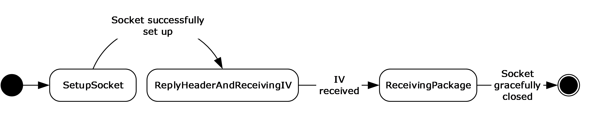

Figure 4: Share receiver state transitions

**SymmetricKey:** A 128-bit AES key derived by taking the SHA256 hash of the **Session** object's **SharedSecretKey** field.

### 3.3.2 Timers

None.

### 3.3.3 Initialization

Inbound activations of the Share Receiver can arrive without any explicit user context. In order to support this role, the [**NFPB**](#gt_nfpb) protocol and its services MUST be initialized as specified in [MS-NFPB](../MS-NFPB/MS-NFPB.md) section 3.1.3. In addition, the TapAndSendFiles Activation (section [3.3.7.1](../MS-NFPB/MS-NFPB.md)) local event MUST be registered as a handler for **Session Factory Service Activation** messages ([MS-NFPB] section 2.2.12) that contain the following elements:

- An **AppInfo** structure with a **PlatformQualifier** field containing the "Global" [**UTF-8**](#gt_utf-8) string and an **AppID** field containing the "TapAndSendFiles" UTF-8 string.
- The **L** (Launch) flag set.

### 3.3.4 Higher-Layer Triggered Events

The only higher-layer triggered event is the user creating a new instance of a **ShareReceiver** object.

### 3.3.5 Message Processing Events and Sequencing Rules

When the Share Receiver is in the ReceivingPackage state, all received data MUST be interpreted as 16-byte blocks of encrypted [**OPC package**](#gt_opc-package). Each block MUST be decrypted by using a standard AES 128 block cipher with the **IV** and **SymmetricKey** objects as input.

### 3.3.6 Timer Events

None.

### 3.3.7 Other Local Events

The following local events change the Share Receiver's **State**, as shown in the diagram in section [3.3.1](#Section_3.3.1).

- TapAndSendFiles activation
- Session socket successfully set up
- Socket closed due to fault
- Socket gracefully closed
The actions required by these events are specified in the sections that follow.

#### 3.3.7.1 TapAndSendFiles Activation Event

When the underlying NFPB protocol indicates that a TapAndSendFiles Activation has occurred, a new **ShareReceiver** object (section [3.3.1](#Section_3.3.1)) MUST be created with the following elements:

- A **SessionFactory** object, starting with step 6 of Handling Session Factory Service Activation ([MS-NFPB](../MS-NFPB/MS-NFPB.md) section 3.1.5.6).
- The **Session** object provided by the **SessionFactory**.
- The **State** set to SetupSocket.
The behavior for the SetupSocket state is specified in section [3.1.7](#Section_3.1.7).

#### 3.3.7.2 Session Socket Successfully Set Up Event

When a Share Receiver's **Socket** has been successfully set up (section [3.1.7](#Section_3.1.7)), the Share Receiver state MUST transition to ReplyHeaderAndReceivingIV (section [3.3.1](#Section_3.3.1)), and the following actions MUST be performed:

- Synchronously read 2 bytes for the **HeaderSize** field of a **Share** header (section [2.2.2](#Section_2.2.2)) from the **Socket**.
- Interpret the 2 bytes as a [**little-endian**](#gt_little-endian) encoded 16-bit unsigned integer that specifies how many bytes to read for the rest of the message.
- If nonzero length, synchronously read (**HeaderSize** – 2) bytes from the **Socket**.
**Note** If the **HeaderSize** value is exactly 2, there is nothing to read.

- If the total received **HeaderSize** value is greater than or equal to 10 (0x0A, 0x00), bytes 3 through 10 are to be interpreted as the **TotalContentSizeEstimate** field of the message, which is a little-endian encoded 64-bit unsigned integer.
- All bytes received in the **Share** header after the 10th byte MUST be ignored.
- Create a **Reply** header (section [2.2.3](#Section_4.1.4)) with the following value:
- **HeaderSize**: The value 2 in little-endian encoding (0x02, 0x00). No other value is valid.
- Set the Share Receiver's **SymmetricKey** element to a 128-bit key derived by taking the SHA256 hash of the **Session** object's **SharedSecretKey** element.
- Prepare the Share Receiver to receive the **IV** as the next 16 bytes of the data stream.
- Send the **Reply** header over the **Socket**.
- The next 16 bytes received MUST be set as the Share Receiver's **IV** element. After these 16 bytes have been received, the state MUST transition to ReceivingPackage.

#### 3.3.7.3 Socket Closed Due to Fault Event

The **ShareReceiver** object (section [3.3.1](#Section_3.3.1)) MUST be abandoned.

#### 3.3.7.4 Socket Gracefully Closed Event

If the Share Receiver state is not ReceivingPackage, the **ShareReceiver** object MUST be abandoned.

If the Share Receiver state is ReceivingPackage, the received data can be decrypted and provided to the user. The **ShareReceiver** object MUST now be deactivated for external interactions.

All decrypted data except the final three blocks MUST be interpreted as an [**OPC package**](#gt_opc-package).

The final three blocks of decrypted data MUST be interpreted as a **Share Protocol** footer (section [2.2.4](#Section_2.2.4)), and only the **Remainder** field is to be interpreted as the final bytes of the actual OPC package.

# 4 Protocol Examples

This section describes the following scenarios as examples of the Near Field Proximity: Sharing Protocol:

- Success scenario: The protocol running successfully to completion.
- Abort scenario: The protocol running to failure.

## 4.1 Success Scenario

This scenario describes an example of the protocol running successfully to completion. It is assumed that the [**NFPB**](#gt_nfpb) protocol is triggered by the underlying transport and runs to completion, producing a **Session** object on both the Share Sender (section [3.2.1](#Section_3.2.1)) and Share Receiver (section [3.3.1](#Section_3.3.1)) systems running this protocol.

This example demonstrates the Share Sender sharing an [**OPC file**](#gt_opc-file) with a known size of 500 bytes.

### 4.1.1 Connect

The Share Sender begins accepting socket connections (section [3.1.7.2](#Section_3.1.7.2)).

The Share Receiver begins socket connection attempts to the Share Sender (section [3.1.7.1](#Section_3.1.7.1)).

Two of the socket connections are successful within 700 milliseconds, and a third would have been successful at 2 seconds. The Share Sender sends the following **Socket Connect** header (section [2.2.1](#Section_2.2.1)) on the two successful socket connections.

First connection (successful).

Second connection (successful).

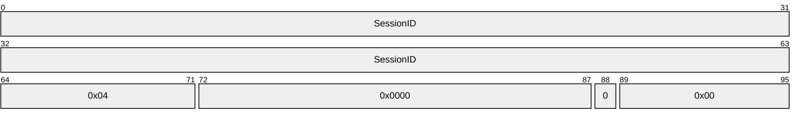

Third connection (would have been successful, given enough time).

### 4.1.2 Accept

The Share Receiver receives the **Socket Connect** header (section [2.2.1](#Section_2.2.1)) for the two successful connections. After an implementation-defined delay, the Share Receiver selects one of the socket connections for which to send a **Socket Connect** header reply. This reply exactly matches the data received on that socket.

The third connection, which would have been successful given enough time, did not complete before the Share Receiver made its selection. It is not possible to determine which connection types will be successful prior to their actually connecting.

### 4.1.3 Share Header

Upon receipt of the reply **Socket Connect** header (section [2.2.1](#Section_2.2.1)), the Share Sender sends the **Share** header (section [2.2.2](#Section_2.2.2)). The Share Sender has the size of the [**OPC package**](#gt_opc-package) to be sent, so it sets the **TotalContentSizeEstimate** field of the **Share** header appropriately. In this case, the **Share** header contains the following values in byte order: 0x0A, 0x00, 0xF4, 0x01, 0x00, 0x00, 0x00, 0x00, 0x00, 0x00. The following packet diagram shows the values in [**little-endian**](#gt_little-endian) 16-bit word order.

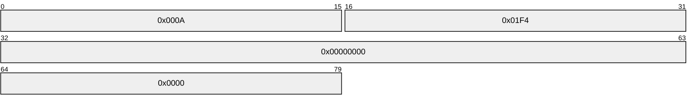

### 4.1.4 Reply Header

Upon receipt of the complete **Share** header (section [2.2.2](#Section_2.2.2)), the Share Receiver responds with a **Reply** header (section [2.2.3](#Section_4.1.4)). The **Reply** header contains no useful information in this version of the protocol and is provided for future versions of the protocol. The **Reply** header contains the following values: 0x02, 0x00. The following packet diagram shows the values in [**little-endian**](#gt_little-endian) 16-bit word order.

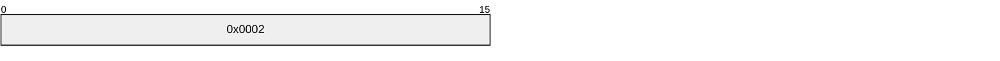

### 4.1.5 Share Data

Upon receipt of the **Reply** header (section [2.2.3](#Section_4.1.4)), the Share Receiver starts streaming the **IV** () followed by the encrypted blocks of OPC data (except any remainder bytes that do not fill a full 16-byte block; these are included instead within the Share Protocol footer). Once it is done streaming the main OPC data, it constructs the **Share Protocol** footer (section [2.2.4](#Section_2.2.4)) and sends it on the socket, and then gracefully closes the socket.

#### 4.1.5.1 Base Case

With the above base-case assumptions, the following OPC data is sent:

**IV** (16 bytes)

31 x Encrypted OPC data blocks (16 bytes each, 496 bytes total)

**Share Protocol** footer (48 bytes)

The **Share Protocol** footer contains the following values:

**Remainder** (500 – 496 = 4 bytes)

Zeros (43 bytes)

**RemainderLength:** 0x04 (1 byte)

The following packet diagram shows the **Share Protocol** footer with these values.

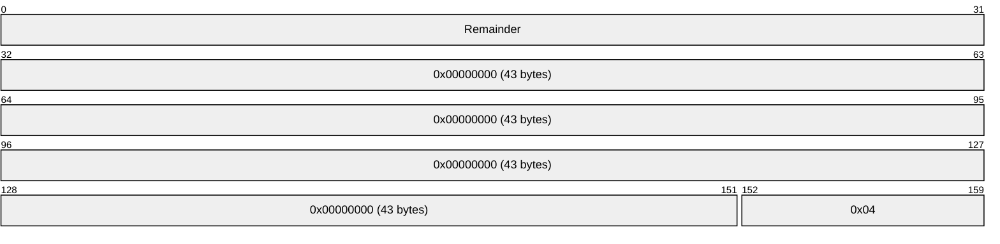

#### 4.1.5.2 511-Byte OPC Package

In order to illustrate a corner block-size case, instead assume that the [**OPC package**](#gt_opc-package) is 511 bytes:

**IV** (16 bytes)

31 x Encrypted OPC data blocks (16 bytes each, 496 bytes total)

**Share Protocol** footer (48 bytes)

The **Share Protocol** footer would contain the following values:

**Remainder** (511 – 496 = 15 bytes)

Zeros (32 bytes)

**RemainderLength**: 0x0F (1 byte)

The following packet diagram shows the **Share Protocol** footer with these values.

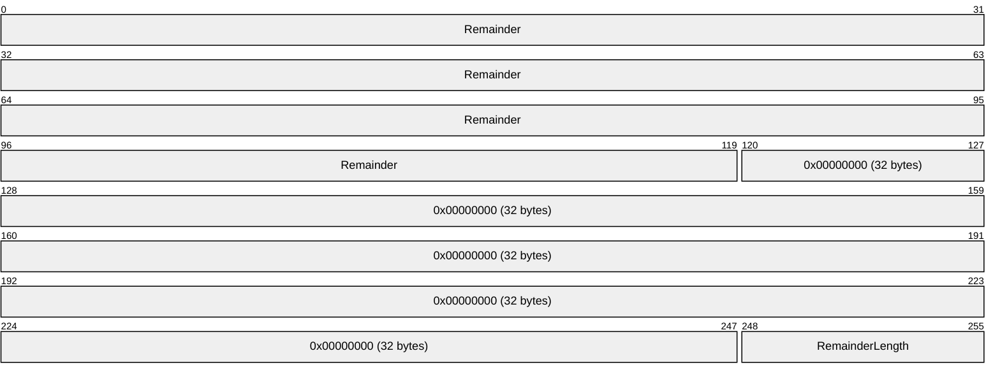

#### 4.1.5.3 512-Byte OPC Package

In order to illustrate a case with even divisibility by the block size, instead assume that the [**OPC package**](#gt_opc-package) is 512 bytes:

**IV** (16 bytes)

32 x Encrypted OPC data blocks (16 bytes each, 512 bytes total)

**Share Protocol** footer (48 bytes)

The **Share Protocol** footer would contain the following values:

**Remainder** (512 – 512 = 0 bytes) Zeros (47 bytes) **RemainderLength**: 0x00 (1 byte)

The following packet diagram shows the **Share Protocol** footer with these values.

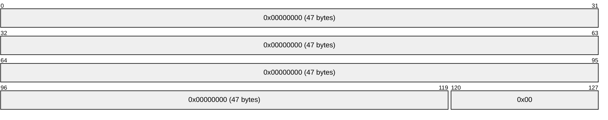

## 4.2 Abort Scenario

This scenario describes an example of the protocol running to failure due to the user on the Share Receiver declining a message to receive the [**OPC package**](#gt_opc-package). This makes the assumption that the [**NFPB**](#gt_nfpb) protocol is triggered by the underlying transport and runs to completion, producing **Session** objects on both the Share Sender and Share Receiver systems running this protocol. After the **Session** objects are created, the user on the Share Receiver is given the opportunity to decline, and does so.

In this example, the Share Sender is prepared to share an [**OPC file**](#gt_opc-file), but because it is declined, its length is ignored.

### 4.2.1 Connect

The Share Receiver begins accepting socket connections. See section [3.1.7.2](#Section_3.1.7.2).

The Share Sender begins socket connection attempts to the Share Receiver. See section [3.1.7.1](#Section_3.1.7.1).

The Share Sender sends the **Socket Connect** header (section [2.2.1](#Section_2.2.1)) on each of the successful socket connections.

### 4.2.2 Accept

The Share Receiver receives the **Socket Connect** header (section [2.2.1](#Section_2.2.1)) for the first successful connection. The Share Receiver sends the **Socket Connect** header reply on the first successful connection, but because the user has declined, the Abort flag is set. The Share Receiver then closes the socket gracefully, and the **ShareReceiver** object (section [3.3.1](#Section_3.3.1)) is abandoned.

### 4.2.3 Abort Received

The Share Sender receives the **Socket Connect** header (section [2.2.1](#Section_2.2.1)) reply with the Abort flag set, and so it closes all its sockets and abandons the **Session** object.

# 5 Security

## 5.1 Security Considerations for Implementers

None.

## 5.2 Index of Security Parameters

None.

# 6 Appendix A: Product Behavior

The information in this specification is applicable to the following Microsoft products or supplemental software. References to product versions include updates to those products.

- Windows 8 operating system
- Windows Server 2012 operating system
- Windows 8.1 operating system
- Windows Server 2012 R2 operating system
- Windows 10 operating system
- Windows Server 2016 operating system
- Windows Server 2019 operating system
- Windows Server 2022 operating system
- Windows 11 operating system
- Windows Server 2025 operating system
Exceptions, if any, are noted in this section. If an update version, service pack or Knowledge Base (KB) number appears with a product name, the behavior changed in that update. The new behavior also applies to subsequent updates unless otherwise specified. If a product edition appears with the product version, behavior is different in that product edition.

Unless otherwise specified, any statement of optional behavior in this specification that is prescribed using the terms "SHOULD" or "SHOULD NOT" implies product behavior in accordance with the SHOULD or SHOULD NOT prescription. Unless otherwise specified, the term "MAY" implies that the product does not follow the prescription.

# 7 Change Tracking

This section identifies changes that were made to this document since the last release. Changes are classified as Major, Minor, or None.

The revision class **Major** means that the technical content in the document was significantly revised. Major changes affect protocol interoperability or implementation. Examples of major changes are:

- A document revision that incorporates changes to interoperability requirements.
- A document revision that captures changes to protocol functionality.
The revision class **Minor** means that the meaning of the technical content was clarified. Minor changes do not affect protocol interoperability or implementation. Examples of minor changes are updates to clarify ambiguity at the sentence, paragraph, or table level.

The revision class **None** means that no new technical changes were introduced. Minor editorial and formatting changes may have been made, but the relevant technical content is identical to the last released version.

The changes made to this document are listed in the following table. For more information, please contact [dochelp@microsoft.com](mailto:dochelp@microsoft.com).

| Section | Description | Revision class |
| --- | --- | --- |
| [6](#Section_6) Appendix A: Product Behavior | Added Windows Server 2025 to the list of applicable products. | Major |

## Revision History

| Date | Version | Revision Class | Comments |
| --- | --- | --- | --- |
| 1/31/2013 | 1.0 | New | Released new document. |
| 8/8/2013 | 1.1 | Minor | Clarified the meaning of the technical content. |
| 11/14/2013 | 1.1 | None | No changes to the meaning, language, or formatting of the technical content. |
| 2/13/2014 | 1.1 | None | No changes to the meaning, language, or formatting of the technical content. |
| 5/15/2014 | 1.1 | None | No changes to the meaning, language, or formatting of the technical content. |
| 6/30/2015 | 2.0 | Major | Significantly changed the technical content. |
| 10/16/2015 | 2.0 | None | No changes to the meaning, language, or formatting of the technical content. |
| 7/14/2016 | 3.0 | Major | Significantly changed the technical content. |
| 6/1/2017 | 4.0 | Major | Significantly changed the technical content. |
| 12/1/2017 | 4.0 | None | No changes to the meaning, language, or formatting of the technical content. |
| 9/12/2018 | 5.0 | Major | Significantly changed the technical content. |
| 4/7/2021 | 6.0 | Major | Significantly changed the technical content. |
| 6/25/2021 | 7.0 | Major | Significantly changed the technical content. |
| 4/23/2024 | 8.0 | Major | Significantly changed the technical content. |
