# [MS-NKPU]: Network Key Protector Unlock Protocol

Table of Contents

1 Introduction

- [1 Introduction](#Section_1)
  - [1.1 Glossary](#Section_1.1)
  - [1.2 References](#Section_1.2)
    - [1.2.1 Normative References](#Section_1.2.1)
    - [1.2.2 Informative References](#Section_1.2.2)
  - [1.3 Overview](#Section_1.3)
    - [1.3.1 Message Flow](#Section_1.3.1)
  - [1.4 Relationship to Other Protocols](#Section_1.4)
  - [1.5 Prerequisites/Preconditions](#Section_1.5)
  - [1.6 Applicability Statement](#Section_1.6)
  - [1.7 Versioning and Capability Negotiation](#Section_1.7)
  - [1.8 Vendor-Extensible Fields](#Section_1.8)
  - [1.9 Standards Assignments](#Section_1.9)

2 Messages

- [2 Messages](#Section_2)
  - [2.1 Transport](#Section_2.1)
  - [2.2 Message Syntax](#Section_2.2)
    - [2.2.1 Structures](#Section_2.2.1)
      - [2.2.1.1 DHCPv6 Vendor Class Option Structure](#Section_2.2.1.1)
      - [2.2.1.2 DHCPv6 Vendor Specific Information Option Structure](#Section_2.2.1.2)
      - [2.2.1.3 DHCPv4 Vendor-Identifying Vendor-Specific Information Option Structure](#Section_2.2.1.3)
      - [2.2.1.4 DHCPv4 Vendor Specific Information Option Structure](#Section_2.2.1.4)
      - [2.2.1.5 DHCPv4 Vendor Class Identifier Option Structure](#Section_2.2.1.5)

3 Protocol Details

- [3 Protocol Details](#Section_3)
  - [3.1 Client Details](#Section_3.1)
    - [3.1.1 Abstract Data Model](#Section_3.1.1)
    - [3.1.2 Timers](#Section_3.1.2)
    - [3.1.3 Initialization](#Section_3.1.3)
    - [3.1.4 Higher-Layer Triggered Events](#Section_3.1.4)
    - [3.1.5 Message Processing Events and Sequencing Rules](#Section_3.1.5)
      - [3.1.5.1 Sending a DHCPv4 NKPU Request](#Section_3.1.5.1)
      - [3.1.5.2 Sending a DHCPv6 NKPU Request](#Section_3.1.5.2)
      - [3.1.5.3 Receiving a DHCPv4 BOOTREPLY for NKPU](#Section_3.1.5.3)
      - [3.1.5.4 Receiving a DHCPv6 Reply for NKPU](#Section_3.1.5.4)
    - [3.1.6 Timer Events](#Section_3.1.6)
    - [3.1.7 Other Local Events](#Section_3.1.7)
  - [3.2 Server Details](#Section_3.2)
    - [3.2.1 Abstract Data Model](#Section_3.2.1)
    - [3.2.2 Timers](#Section_3.2.2)
    - [3.2.3 Initialization](#Section_3.2.3)
    - [3.2.4 Higher-Layer Triggered Events](#Section_3.2.4)
    - [3.2.5 Message Processing Events and Sequencing Rules](#Section_3.2.5)
      - [3.2.5.1 Sending a DHCPv4 BOOTREPLY for NKPU](#Section_3.2.5.1)
      - [3.2.5.2 Sending a DHCPv6 Reply for NKPU](#Section_3.2.5.2)
      - [3.2.5.3 Receiving a DHCPDISCOVER Message for NKPU](#Section_3.2.5.3)
      - [3.2.5.4 Receiving a DHCPv6 Information-Request Message for NKPU](#Section_3.2.5.4)
    - [3.2.6 Timer Events](#Section_3.2.6)
    - [3.2.7 Other Local Events](#Section_3.2.7)

4 Protocol Examples

- [4 Protocol Examples](#Section_4)
  - [4.1 Client Requesting Unlock over DHCPv4](#Section_4.1)
  - [4.2 Client Requesting Unlock Over DHCPv6](#Section_4.2)

5 Security

- [5 Security](#Section_5)
  - [5.1 Security Considerations for Implementers](#Section_5.1)
  - [5.2 Index of Security Parameters](#Section_5.2)

6 Appendix A: Product Behavior

- [6 Appendix A: Product Behavior](#Section_6)

7 Change Tracking

- [7 Change Tracking](#Section_7)

For the legal notice and IP terms, see [LEGAL.md](../LEGAL.md).
Last updated: 4/23/2024.
See [Revision History](#revision-history) for full version history.

# 1 Introduction

This document specifies the Network Key Protector Unlock (NKPU) Protocol. NKPU enables a client to send key material along with a [**session key**](#gt_session-key) as an encrypted package to a remote server and to receive the decrypted key material protected by the session key.

This protocol is built on top of the [**Dynamic Host Configuration Protocol (DHCP)**](#gt_dynamic-host-configuration-protocol-dhcp) and uses DHCP options to transmit its data between client and server. Applicable DHCP versions are specified in section [1.7](#Section_1.7).

Sections 1.5, 1.8, 1.9, 2, and 3 of this specification are normative. All other sections and examples in this specification are informative.

## 1.1 Glossary

This document uses the following terms:

**allowed list**: An optional list of IPv4 and/or IPv6 subnets, in CIDR notation, from which clients are permitted to be unlocked. If the list is empty or not implemented for an IP protocol version, all addresses are considered allowed for that IP protocol version.

**ASCII**: The American Standard Code for Information Interchange (ASCII) is an 8-bit character-encoding scheme based on the English alphabet. ASCII codes represent text in computers, communications equipment, and other devices that work with text. ASCII refers to a single 8-bit ASCII character or an array of 8-bit ASCII characters with the high bit of each character set to zero.

**broadcast**: A style of resource location or data transmission in which a client makes a request to all parties on a network simultaneously (a one-to-many communication). Also, a mode of resource location that does not use a name service.

**certificate**: A certificate is a collection of attributes and extensions that can be stored persistently. The set of attributes in a certificate can vary depending on the intended usage of the certificate. A certificate securely binds a public key to the entity that holds the corresponding private key. A certificate is commonly used for authentication and secure exchange of information on open networks, such as the Internet, extranets, and intranets. Certificates are digitally signed by the issuing certification authority (CA) and can be issued for a user, a computer, or a service. The most widely accepted format for certificates is defined by the ITU-T X.509 version 3 international standards. For more information about attributes and extensions, see [[RFC3280]](https://go.microsoft.com/fwlink/?LinkId=90414) and [[X509]](https://go.microsoft.com/fwlink/?LinkId=90590) sections 7 and 8.

**classless inter-domain routing (CIDR)**: An alternate method for allocating IP addresses and routing IP packets, known as supernetting, that organizes IP addresses into subnetworks that are independent of the address values. It enables multiple subnets to be grouped together for network routing to reduce the growth of Internet routing tables and preserve available IPv4 addresses.

**client key**: A cryptographic key that is generated by the client and used, either directly or indirectly, to encrypt a full volume encryption key.

**Dynamic Host Configuration Protocol (DHCP)**: A protocol that provides a framework for passing configuration information to hosts on a TCP/IP network, as described in [[RFC2131]](https://go.microsoft.com/fwlink/?LinkId=90318).

**full volume encryption**: The process of encrypting an entire volume, similar to the way BitLocker encrypts a volume.

**full volume encryption key**: The symmetric key used in full volume encryption to encrypt volume data on a protected volume.

**Internet Protocol version 4 (IPv4)**: An Internet protocol that has 32-bit source and destination addresses. IPv4 is the predecessor of IPv6.

**Internet Protocol version 6 (IPv6)**: A revised version of the Internet Protocol (IP) designed to address growth on the Internet. Improvements include a 128-bit IP address size, expanded routing capabilities, and support for authentication and privacy.

**key protector**: A structure containing a cryptographic key in protected form.

**local area network (LAN)**: A group of computers and other devices dispersed over a relatively limited area and connected by a communications link that enables any device to interact with any other device on the network.

**network byte order**: The order in which the bytes of a multiple-byte number are transmitted on a network, most significant byte first (in big-endian storage). This may or may not match the order in which numbers are normally stored in memory for a particular processor.

**private key**: One of a pair of keys used in public-key cryptography. The private key is kept secret and is used to decrypt data that has been encrypted with the corresponding public key. For an introduction to this concept, see [[CRYPTO]](https://go.microsoft.com/fwlink/?LinkId=89841) section 1.8 and [[IEEE1363]](https://go.microsoft.com/fwlink/?LinkId=89899) section 3.1.

**public key**: One of a pair of keys used in public-key cryptography. The public key is distributed freely and published as part of a digital certificate. For an introduction to this concept, see [CRYPTO] section 1.8 and [IEEE1363] section 3.1.

**session key**: A short-lived symmetric key used to encrypt or authenticate data sent in the NKPU protocol.

**state machine**: A model of computing behavior composed of a specified number of states, transitions between those states, and actions to be taken. A state stores information about past transactions as it reflects input changes from the startup of the system to the present moment. A transition (such as connecting a network share) indicates a state change and is described by a condition that would need to be fulfilled to enable the transition. An action is a description of an activity that is to be performed at a given moment. There are several action types: Entry action: Performed when entering the state. Exit action: Performed when exiting the state. Input action: Performed based on the present state and input conditions. Transition action: Performed when executing a certain state transition.

**thumbprint**: A hash value computed over a datum.

**trusted platform module (TPM)**: A component of a trusted computing platform. The TPM stores keys, passwords, and digital certificates. See [[TCG-Architect]](https://go.microsoft.com/fwlink/?LinkId=301944) for more information.

**unicast**: A delivery method used by media servers for providing content to connected clients in which each client receives a discrete stream that no other client has access to.

**User Datagram Protocol (UDP)**: The connectionless protocol within TCP/IP that corresponds to the transport layer in the ISO/OSI reference model.

**X.509**: An ITU-T standard for public key infrastructure subsequently adapted by the IETF, as specified in [RFC3280].

**MAY, SHOULD, MUST, SHOULD NOT, MUST NOT:** These terms (in all caps) are used as defined in [[RFC2119]](https://go.microsoft.com/fwlink/?LinkId=90317). All statements of optional behavior use either MAY, SHOULD, or SHOULD NOT.

## 1.2 References

Links to a document in the Microsoft Open Specifications library point to the correct section in the most recently published version of the referenced document. However, because individual documents in the library are not updated at the same time, the section numbers in the documents may not match. You can confirm the correct section numbering by checking the [Errata](https://go.microsoft.com/fwlink/?linkid=850906).

### 1.2.1 Normative References

We conduct frequent surveys of the normative references to assure their continued availability. If you have any issue with finding a normative reference, please contact [dochelp@microsoft.com](mailto:dochelp@microsoft.com). We will assist you in finding the relevant information.

[FIPS180] FIPS PUBS, "Secure Hash Standard", FIPS PUB 180-1, April 1995, [https://www.niatec.iri.isu.edu/GetFile.aspx?pid=63](https://go.microsoft.com/fwlink/?LinkId=89867)

[FIPS197] FIPS PUBS, "Advanced Encryption Standard (AES)", FIPS PUB 197, November 2001, [https://nvlpubs.nist.gov/nistpubs/FIPS/NIST.FIPS.197.pdf](https://go.microsoft.com/fwlink/?LinkId=89870)

[IANA-ENT] Internet Assigned Numbers Authority, "Private Enterprise Numbers", January 2007, [http://www.iana.org/assignments/enterprise-numbers](https://go.microsoft.com/fwlink/?LinkId=89883)

[ITUX690] ITU-T, "ASN.1 Encoding Rules: Specification of Basic Encoding Rules (BER), Canonical Encoding Rules (CER) and Distinguished Encoding Rules (DER)", Recommendation X.690, July 2002, [http://www.itu.int/ITU-T/studygroups/com17/languages/X.690-0207.pdf](https://go.microsoft.com/fwlink/?LinkId=89924)

[RFC2119] Bradner, S., "Key words for use in RFCs to Indicate Requirement Levels", BCP 14, RFC 2119, March 1997, [https://www.rfc-editor.org/info/rfc2119](https://go.microsoft.com/fwlink/?LinkId=90317)

[RFC2131] Droms, R., "Dynamic Host Configuration Protocol", RFC 2131, March 1997, [https://www.rfc-editor.org/info/rfc2131](https://go.microsoft.com/fwlink/?LinkId=90318)

[RFC2132] Alexander, S., and Droms, R., "DHCP Options and BOOTP Vendor Extensions", RFC 2132, March 1997, [https://www.rfc-editor.org/info/rfc2132](https://go.microsoft.com/fwlink/?LinkId=90319)

[RFC2459] Housley, R., Ford, W., Polk, W., and Solo, D., "Internet X.509 Public Key Infrastructure Certificate and CRL Profile", RFC 2459, January 1999, [https://www.rfc-editor.org/info/rfc2459](https://go.microsoft.com/fwlink/?LinkId=90356)

[RFC2462] Narten T., and S. Thomson, "IPv6 Stateless Address Autoconfiguration", RFC 2462, December 1998, [https://www.rfc-editor.org/info/rfc2462](https://go.microsoft.com/fwlink/?LinkId=111891)

[RFC3315] Droms, R., Bound, J., Volz, B., et al., "Dynamic Host Configuration Protocol for IPv6 (DHCPv6)", RFC 3315, July 2003, [https://www.rfc-editor.org/info/rfc3315](https://go.microsoft.com/fwlink/?LinkId=90417)

[RFC3610] Whiting, D., Housley, R., and Ferguson, N., "Counter with CBC-MAC (CCM)", RFC 3610, September 2003, [https://www.rfc-editor.org/info/rfc3610](https://go.microsoft.com/fwlink/?LinkId=229733)

[RFC3925] Littlefield, J., "Vendor-Identifying Vendor Options for Dynamic Host Configuration Protocol Version 4 (DHCPv4)", RFC 3925, October 2004, [https://www.rfc-editor.org/info/rfc3925](https://go.microsoft.com/fwlink/?LinkId=90447)

[RFC8017] Moriarty, K., Ed., Kaliski, B., Jonsson, J., and Rusch, A., "PKCS #1: RSA Cryptography Specifications Version 2.2", November 2016, [https://www.rfc-editor.org/info/rfc8017](https://go.microsoft.com/fwlink/?linkid=2164409)

### 1.2.2 Informative References

[IEEE802.11-2007] Institute of Electrical and Electronics Engineers, "Telecommunications and Information Exchange Between Systems - Local and Metropolitan Area Networks - Specific Requirements - Part 11: Wireless LAN Medium Access Control (MAC) and Physical Layer (PHY) Specifications", IEEE 802.11-2007, [https://standards.ieee.org/ieee/802.11/3605/](https://go.microsoft.com/fwlink/?LinkID=89905)

**Note** Subcription Login or purchase to download this document.

## 1.3 Overview

When a drive volume is protected with a [**full volume encryption**](#gt_full-volume-encryption) solution and the data stored on the volume is encrypted with a [**full volume encryption key**](#gt_full-volume-encryption-key), this type of solution usually provides multiple ways in which a user can authenticate. Such authentication methods result in obtaining the full volume encryption key or a proxy to it, which allows the user to seamlessly access data. Some examples of authentication mechanisms for this type of solution include password entry, smart-card based authentication, and authentication using system integrity measurements and a [**trusted platform module (TPM)**](#gt_trusted-platform-module-tpm).

The Network Key Protector Unlock Protocol provides a different kind of authentication for this type of encryption solution, where some or all of the information required for authentication is sent to a network server, decrypted by the server, and then provided to the authorized client computer in response to the client request.

This specification provides details about how the Network Key Protector Unlock Protocol performs authentication. It also describes the following NKPU capabilities:

- The client can securely [**broadcast**](#gt_broadcast) key material and a [**session key**](#gt_session-key), with both of these encrypted using a [**public key**](#gt_public-key).
- The server, upon successfully decrypting the request content with the [**private key**](#gt_private-key) corresponding to the public key that was used to make the request, can securely [**unicast**](#gt_unicast) a reply of the key material to the client that sent the request by using the session key sent by the client.
Both the request and reply messages are sent in [**DHCP**](#gt_dynamic-host-configuration-protocol-dhcp) packets, with the key material and/or session key carried in the packet via DHCP options [[RFC2132]](https://go.microsoft.com/fwlink/?LinkId=90319) [[RFC3315]](https://go.microsoft.com/fwlink/?LinkId=90417).

### 1.3.1 Message Flow

The messages that are exchanged between the client and the server and the processing that occurs as part of a network key protector unlock attempt can be summarized as follows:

- The client broadcasts an NKPU-formatted DHCPv4 or DHCPv6 packet that includes the following:
- The client's IP address (in the packet header).
- A [**client key**](#gt_client-key) and a [**session key**](#gt_session-key), both encrypted with a [**public key**](#gt_public-key), sent in a DHCPv4 or DHCPv6 option.
- The [**thumbprint**](#gt_thumbprint) of the public key, also in the DHCPv4 or DHCPv6 option used by the NKPU Protocol.
- The server processes the request by:
- Looking up the thumbprint that came with the request, and providing that an [**allowed list**](#gt_allowed-list) restriction is configured by the implementation, verifying that the IP address of the client comes from the allowed list of subnets by reading the IP address of the client from the packet.
- Checking whether it has access to the [**private key**](#gt_private-key) corresponding to the public key used in the request: the server looks up the private key by using the thumbprint that came with the request.
- If the server checks succeed, the server then decrypts the client key and session key by using the private key corresponding to the thumbprint in the request, and forms a [**DHCP**](#gt_dynamic-host-configuration-protocol-dhcp) packet that contains the client key encrypted with the session key in the NKPU DHCP options. The server then unicasts the packet to the IP address of the client.
- The client waits a short time for responses, during which it receives zero or more replies from one or more servers. For each reply, the client attempts to decrypt the client key by using the session key. When the client has obtained the client key, it discards all other replies.
The following diagram illustrates this message exchange between an NKPU client and server during a network key protector unlock attempt.

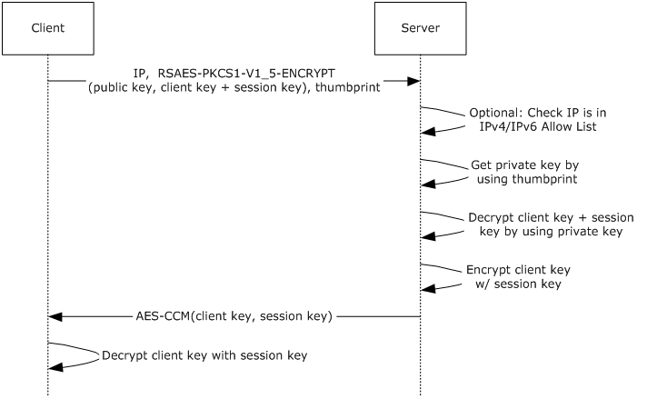

Figure 1: Network key protector unlock process

## 1.4 Relationship to Other Protocols

The NKPU Protocol relies on and is transported within DHCPv4 vendor-specific options on [**Internet Protocol version 4 (IPv4)**](#gt_internet-protocol-version-4-ipv4) and uses DHCPv6 and vendor options on [**Internet Protocol version 6 (IPv6)**](#gt_internet-protocol-version-6-ipv6).

## 1.5 Prerequisites/Preconditions

The behavior of the NKPU Protocol described in this specification assumes that the client and server ADM elements are all populated, as specified in sections [3.1.1](#Section_3.2.1) and [3.2.1](#Section_3.2.1). This means that the following conditions apply:

- The client and the server share an RSA [[RFC8017]](https://go.microsoft.com/fwlink/?linkid=2164409) [**public key**](#gt_public-key) [**certificate**](#gt_certificate) for the protocol.
- The client and the server have the [**thumbprint**](#gt_thumbprint) of the certificate.
- The server has access to the [**private key**](#gt_private-key) corresponding to the certificate.
- The server can look up the public key certificate and the private key by using the thumbprint.
- The client has a list of unused [**key protector**](#gt_key-protector) and [**session key**](#gt_session-key) pairs.
When using DHCPv4 as the transport, the NKPU Protocol assumes that the client has obtained a valid [**IPv4**](#gt_internet-protocol-version-4-ipv4) address via the [**DHCP**](#gt_dynamic-host-configuration-protocol-dhcp) protocol prior to a request message [**broadcast**](#gt_broadcast). When using DHCPv6 as the transport, the NKPU client needs a valid [**IPv6**](#gt_internet-protocol-version-6-ipv6) address and can either dynamically obtain an IPv6 address over DHCP or use stateless address autoconfiguration [[RFC2462]](https://go.microsoft.com/fwlink/?LinkId=111891).

## 1.6 Applicability Statement

This protocol is intended to secure access to an encrypted client resource based on physical attachment to a particular network.

## 1.7 Versioning and Capability Negotiation

This specification covers versioning issues in the following areas:

- **Supported Transports:** The NKPU Protocol can be implemented on top of DHCPv4 [[RFC2131]](https://go.microsoft.com/fwlink/?LinkId=90318) or DHCPv6 [[RFC3315]](https://go.microsoft.com/fwlink/?LinkId=90417), as discussed in section [2.1](#Section_2.1).
- **Protocol Version:** The NKPU Protocol has only one version.
- **Security and Authentication Methods:** The NKPU Protocol relies on the prerequisites and preconditions described in section [1.5](#Section_1.5) combined with physical presence on the network, optionally restricted to one or more specific subnets, to provide security and authentication.
- This protocol does no explicit version or capability negotiation and does not attempt to determine the version of the operating system or the NKPU Protocol.

## 1.8 Vendor-Extensible Fields

None.

## 1.9 Standards Assignments

None.

# 2 Messages

## 2.1 Transport

The messages of the NKPU Protocol are transported within [**DHCP**](#gt_dynamic-host-configuration-protocol-dhcp). DHCPv4 and DHCPv6 use the [**User Datagram Protocol (UDP)**](#gt_user-datagram-protocol-udp) as a transport, as specified in [[RFC2131]](https://go.microsoft.com/fwlink/?LinkId=90318) section 4.1 and [[RFC3315]](https://go.microsoft.com/fwlink/?LinkId=90417) section 5.2, respectively. The following table describes the ports on which NKPU clients and servers listen for DHCPv4 and DHCPv6 messages.

| UDP port | Port value | DHCP version | Description | Reference |
| --- | --- | --- | --- | --- |
| 67 | 0x0043 | DHCPv4 | NKPU servers listen on the specified port for DHCPv4 messages. | [RFC2131] section 4.1 |
| 68 | 0x0044 | DHCPv4 | NKPU clients listen on the specified port for DHCPv4 messages. | [RFC2131] section 4.1 |
| 546 | 0x0222 | DHCPv6 | NKPU clients listen on the specified port for DHCPv6 messages. | [RFC3315] section 5.2 |
| 547 | 0x0223 | DHCPv6 | NKPU servers listen on the specified port for DHCPv6 messages. | [RFC3315] section 5.2 |

NKPU clients SHOULD attempt to use DHCPv6 first and then fall back to DHCPv4 if there is no valid response over DHCPv6.

NKPU servers MUST ignore non-NKPU DHCP requests and NKPU clients MUST ignore non-NKPU DHCP responses.

## 2.2 Message Syntax

The messages of the NKPU Protocol on [**IPv4**](#gt_internet-protocol-version-4-ipv4) are carried by DHCPv4 by using the message format for DHCPv4 vendor-specific options, as specified in [[RFC2132]](https://go.microsoft.com/fwlink/?LinkId=90319) section 8.4 and in [[RFC3925]](https://go.microsoft.com/fwlink/?LinkId=90447) section 3. On [**IPv6**](#gt_internet-protocol-version-6-ipv6), the messages are carried by DHCPv6 by using the message format for DHCPv6 vendor-specific options, as specified in [[RFC3315]](https://go.microsoft.com/fwlink/?LinkId=90417).

All option fields and values described in this specification are sent in [**network byte order**](#gt_network-byte-order) unless indicated otherwise.

### 2.2.1 Structures

#### 2.2.1.1 DHCPv6 Vendor Class Option Structure

An NKPU client on DHCPv6 can identify its traffic as specifically NKPU by using the **vendor class** option specified in [[RFC3315]](https://go.microsoft.com/fwlink/?LinkId=90417) section 22.16 and by including the string value "BITLOCKER" in the **Vendor Class Data String** field. The **DHCPv6 Vendor Class Option** structure consists of the following fields.

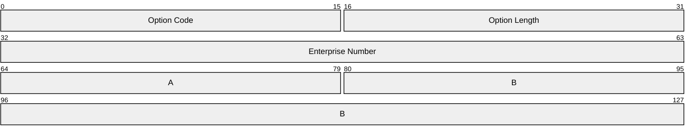

**Option Code (2 bytes):** As specified in [RFC3315] section 22.16, this field is used to indicate the **DHCPv6 Vendor Class Option**. The value of this field MUST be 16 (0x0010).

**Option Length (2 bytes):** This field MUST be set to 15 (0x000F). (Hint: 4 + 2 + the size of Vendor Class Data String = 15.)

**Enterprise Number (4 bytes):** This field MUST be set to 0x00000137 (decimal 311), which is the Microsoft Enterprise number [[IANA-ENT]](https://go.microsoft.com/fwlink/?LinkId=89883) assigned by the Internet Assigned Numbers Authority (IANA).

**A - Vendor Class Data Length (2 bytes):** The length of the **Vendor Class Data String** field MUST be set to 0x0009.

**B - Vendor Class Data String (variable):** This field is a non-NULL terminated [**ASCII**](#gt_ascii) string. It MUST be set to the string value "BITLOCKER".

#### 2.2.1.2 DHCPv6 Vendor Specific Information Option Structure

An NKPU client and server that are using DHCPv6 exchange information in the form of a vendor-specific information option, as specified in [[RFC3315]](https://go.microsoft.com/fwlink/?LinkId=90417) section 22.17. The **DHCPv6 Vendor Specific Information Option** structure consists of the following fields.

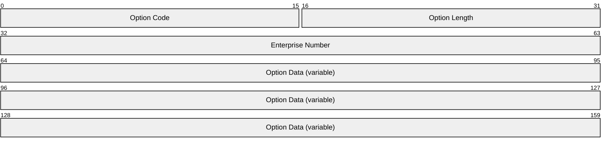

**Option Code (2 bytes):** As specified in [RFC3315] section 22.17, this field is used to indicate the **DHCPv6 Vendor Specific Information Option**. The value of this field MUST be 0x0011.

**Option Length (2 bytes):** This field is set to the size of **Option Data** field, in bytes, plus 4.

**Enterprise Number (4 bytes):** This field MUST be set to 0x00000137 (decimal 311), which is the Microsoft Enterprise number [[IANA-ENT]](https://go.microsoft.com/fwlink/?LinkId=89883) assigned by the Internet Assigned Numbers Authority (IANA).

**Option Data (variable):** This field contains the values of the **Thumbprint** and **KP** ADM elements (section [3.1.1](#Section_3.2.1)) data as suboptions, as described in [RFC3315] section 22.17. It has the following two possible NKPU suboptions:

**Certificate Thumbprint Suboption:** This suboption MUST only be used in the client request.

**Opt-Code (2 bytes):** This field MUST be set to 1 (0x0001).

**Option-Len (2 bytes):** This field MUST be set to 20 (0x0014).

**Option-Data:** This field contains the SHA1 hash [[FIPS180]](https://go.microsoft.com/fwlink/?LinkId=89867) of the encryption certificate that protects the **KP** ADM element data.

**Encrypted Buffer Suboption: Opt-Code (2 bytes):** This field MUST be set to 2 (0x0002).

**Option-Len (2 bytes):** In the client request, this field MUST be set to 256 (0x0100), which is the length of the **KP** ADM element data as specified in section 3.1.1. In the server response, this field MUST be set to the length of the **KPR** ADM element as specified in section [3.2.1](#Section_3.2.1).

**Option-Data:** In a client request, this field contains the **KP** ADM element data. In a server response, this field contains the **KPR** ADM element.

When both suboptions are present, the **Certificate Thumbprint Suboption** MUST come before the **Encrypted Buffer Suboption**.

#### 2.2.1.3 DHCPv4 Vendor-Identifying Vendor-Specific Information Option Structure

DHCPv4 options are constrained to be of maximum size of 255 bytes due to the length of the 8-bit **Option Length** field that [**DHCP**](#gt_dynamic-host-configuration-protocol-dhcp) defines. The **DHCPv4 Vendor-Identifying Vendor-Specific Information Option** structure consists of the following fields:

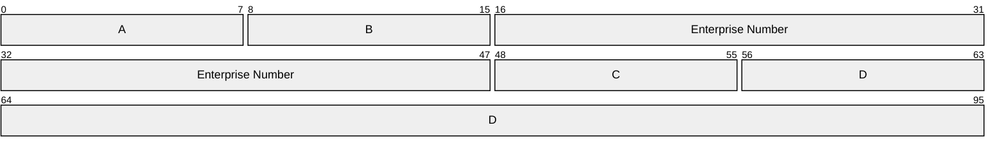

**A - Option Code (1 byte):** As specified in [[RFC3925]](https://go.microsoft.com/fwlink/?LinkId=90447) section 4, this field is used to indicate the **DHCPv4 Vendor-Identifying Vendor-Specific Information Option**. The value of this field MUST be 125 (0x7D).

**B - Option Length (1 byte):** This field is the unsigned length, in bytes, of the option, not including the **Option Code** and **Option Length** fields. The value of this field MUST be 135 (0x87).

**Enterprise Number (4 bytes):** This field MUST be set to 0x0137 (decimal 311), which is the Microsoft Enterprise number [[IANA-ENT]](https://go.microsoft.com/fwlink/?LinkId=89883) assigned by the Internet Assigned Numbers Authority (IANA).

**C - Data Length (1 byte):** This field is the unsigned length, in bytes, of the **Option Data** field.

**D - Option Data (variable):** As specified in [RFC3925] section 4, this field MUST contain a byte for the **Suboption Code**, followed by a byte for the **Suboption Length**, followed by the **Suboption Data** itself. The necessary contents of these suboption fields are as follows:

**Suboption Code (1 byte):** This field MUST be set to 1 (0x01).

**Suboption Length (1 byte):** This field MUST be set to 128 (0x80).

**Suboption Data (variable):** This MUST contain the second 128 bytes of the **KP** ADM element data, continued from Option 43.

#### 2.2.1.4 DHCPv4 Vendor Specific Information Option Structure

DHCPv4 options are constrained to be of maximum size of 255 bytes due to the length of the 8-bit **Option Length** field that the protocol defines. NKPU data is therefore split across Option 43 and Option 125 when delivered by DHCPv4. Option 43 carries the [**certificate**](#gt_certificate) **Thumbprint** ADM element (section [3.1.1](#Section_3.2.1)) data and the first part of the **Key Protector (KP)** ADM element (section 3.1.1) data. The **DHCPv4 Vendor Specific Information Option** structure consists of the following fields.

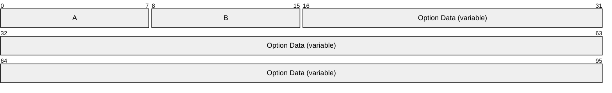

**A - Option Code (1 byte):** As specified in [[RFC2132]](https://go.microsoft.com/fwlink/?LinkId=90319) section 8.4, this field is used to indicate the **DHCPv4 Vendor Specific Information Option**. The value of this field MUST be 43 (0x2B).

**B - Option Length (1 byte):** This field is the unsigned length, in bytes, of the option, not including the **Option Code** and **Option Length** fields. For client requests, the value of this field MUST be 152 (0x98). For server replies, the value of this field MUST be 34 (0x22).

**Option Data (variable):** For client requests, this field contains the certificate **Thumbprint** ADM element data (20 bytes) in a **Certificate Thumbprint Suboption**, followed by an **Encrypted Buffer Suboption** containing the first 128 bytes of the **KP** ADM element data (section 3.1.1). The **Certificate Thumbprint Suboption** MUST come before the **Encrypted Buffer Suboption**. For server replies, this field only contains the **Encrypted Buffer Suboption** containing the 256-bit **Client Key (CK)** ADM element (section 3.1.1) encrypted with the 256-bit [**session key**](#gt_session-key) **(SK)** ADM element (section 3.1.1). Note that the last 128 bytes of the **KP** ADM element data in a DHCPv4-transported NKPU client request are carried in Option 125 (0x7D). The necessary contents of the suboption fields are as follows:

**Certificate Thumbprint Suboption:** This suboption MUST only be used in the client request.

**Suboption Code (1 byte):** This field MUST be set to 1 (0x01).

**Suboption Length (1 byte):** This field MUST be set to 20 (0x14).

**Suboption Data:** This field contains the SHA1 hash [[FIPS180]](https://go.microsoft.com/fwlink/?LinkId=89867) of the encryption certificate that protects the **KP** ADM element data.

**Encrypted Buffer Suboption:**

**Suboption Code (1 byte):** This field MUST be set to 2 (0x02).

**Suboption Length (1 byte):** In the client request, this field MUST be set to 128 (0x80), which is half the length of the **KP** ADM element data as specified in section 3.1.1. In the server response, this field MUST be set to the length of the **KPR** ADM element as specified in section [3.2.1](#Section_3.2.1).

**Suboption Data:** In a client request, this field contains the first 128 bytes of the **KP** ADM element data. In a server response, this field contains the **KPR** ADM element.

#### 2.2.1.5 DHCPv4 Vendor Class Identifier Option Structure

An NKPU client includes this vendor information in all DHCPv4 packets that it sends to the NKPU server to indicate that this protocol is being used. This information is sent as a **Vendor Class Identifier Option** that is specified in [[RFC2132]](https://go.microsoft.com/fwlink/?LinkId=90319) section 9.13 and is contained in the fields of the following structure.

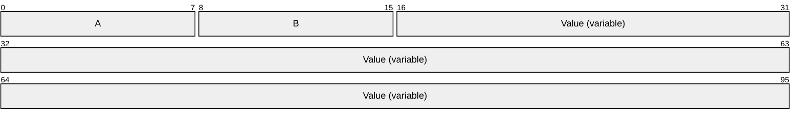

**A - Option Code (1 byte):** As specified in [RFC2132] section 9.13, this field MUST be set to 60 (0x3C) to indicate the DHCPv4 Vendor Class Identifier Option.

**B - Option Length (1 byte):** The unsigned length, in bytes, of the Value field. This field MUST be set to 9 (0x9).

**Value (variable):** This field MUST be set to the following value, where the value shown is encoded as a non-NULL-terminated [**ASCII**](#gt_ascii) string.

| Value | Description |
| --- | --- |
| BITLOCKER | Mandatory value when using the NKPU protocol. |

# 3 Protocol Details

## 3.1 Client Details

NKPU clients MUST have access to either DHCPv6 or DHCPv4 as a transport and SHOULD have the ability to use either.

### 3.1.1 Abstract Data Model

This section describes a conceptual model of possible data organization that an implementation maintains to participate in this protocol. The described organization is provided to facilitate the explanation of how the protocol behaves. This specification does not mandate that implementations adhere to this model as long as their external behavior is consistent with that described in this specification.

As a protocol that uses DHCP as a transport, NKPU relies on the [**DHCP**](#gt_dynamic-host-configuration-protocol-dhcp) data store, as defined in [[RFC2131]](https://go.microsoft.com/fwlink/?LinkId=90318) section 2.1. The [**state machine**](#gt_state-machine) and data model for DHCP are defined in [RFC2131] section 4.4. The data model for DHCPv6 is similar and is defined in [[RFC3315]](https://go.microsoft.com/fwlink/?LinkId=90417).

NKPU clients also maintain the following state:

**Client Key (CK):** The key data that the client sends to the server in the **KP** ADM element and expects the server to return in the **KPR** ADM element (section [3.2.1](#Section_3.2.1)). It is RSA-encrypted [[RFC8017]](https://go.microsoft.com/fwlink/?linkid=2164409) with the **PK** ADM element content in the **KP** ADM element data that is sent to the server in the NKPU client request, and is AES-CCM [[FIPS197]](https://go.microsoft.com/fwlink/?LinkId=89870) [[RFC3610]](https://go.microsoft.com/fwlink/?LinkId=229733) encrypted with the 256-bit **SK** ADM element content in the **KPR** server response received by the client.

**Key Protector (KP):** An encrypted package composed of the 256-bit **CK** ADM element data concatenated with the 256-bit **SK** ADM element data and all encrypted with the RSA 2,048-bit server **PK** ADM element content, as defined in [RFC8017] section 7.2.1. Using the terminology from [RFC8017], this can be expressed as the following, where the plus symbol (+) denotes concatenation:

`RSAES-PKCS1-V1_5-ENCRYPT (PK, CK+SK)`

The size of the **KP** ADM element data is the output of an RSA [RFC8017] encryption operation with a 2,048-bit key, or 256 bytes.

**Key Protector List (KPL):** An ordered list of **KP** ADM elements that includes a methodology for determining the first unused **KP** data element in the list and the **SK** within each **KP**.<1>

**Public Key (PK):** A 2,048-bit RSA [RFC8017] [**public key**](#gt_public-key) [**certificate**](#gt_certificate) in [**X.509**](#gt_x509) format [[RFC2459]](https://go.microsoft.com/fwlink/?LinkId=90356). This contains the public key used to encrypt the data of the **KP** ADM element.

**Session Key (SK):** A randomly generated 256-bit key for use in AES-CCM [FIPS197], [RFC3610].

**Thumbprint:** The SHA-1 hash [[FIPS180]](https://go.microsoft.com/fwlink/?LinkId=89867) of the complete ASN.1 DER [[ITUX690]](https://go.microsoft.com/fwlink/?LinkId=89924) encoded X.509 certificate for the **PK** ADM element data, as contained in that certificate.

### 3.1.2 Timers

This protocol requires no timers beyond those that are used by its DHCPv4 and DHCPv6 transports, as specified in [[RFC2131]](https://go.microsoft.com/fwlink/?LinkId=90318) and [[RFC3315]](https://go.microsoft.com/fwlink/?LinkId=90417), respectively. These timers and other parameters are summarized here for convenience.

RA: The DHCPv4 retransmission attempts (RA) described in [RFC2131] section 4.1. It is the number of retransmission attempts that an NKPU client makes when sending packets to an NKPU server. The time at which each RA occurs is determined by the RDT. Used only when NKPU packets are transported via DHCPv4.

RDT**:** The DHCPv4 retransmission delay timer (RDT) described in [RFC2131] section 4.1. It is the maximum amount of time (in seconds) that the NKPU client waits for return packets from NKPU servers before retransmitting. Used only when NKPU packets are transported via DHCPv4.

RT**:** The DHCPv6 retransmission time-out (RT) described in [RFC3315] section 14. Used only when NKPU packets are transported via DHCPv6.

IRT**:** The DHCPv6 initial retransmission time (IRT) described in [RFC3315] section 14. Used only when NKPU packets are transported via DHCPv6.

MRC: The DHCPv6 maximum retransmission count (MRC) described in [RFC3315] section 14. Used only when NKPU packets are transported via DHCPv6.

MRD**:** The DHCPv6 maximum retransmission duration (MRD) described in [RFC3315] section 14. Used only when NKPU packets are transported via DHCPv6.

MRT**:** The DHCPv6 maximum retransmission time (MRT) described in [RFC3315] section 14. Used only when NKPU packets are transported via DHCPv6.

### 3.1.3 Initialization

NKPU clients rely on their transports to be properly initialized. DHCPv4 client and server initialization is specified in [[RFC2131]](https://go.microsoft.com/fwlink/?LinkId=90318) and DHCPv6 client and server initialization is specified in [[RFC3315]](https://go.microsoft.com/fwlink/?LinkId=90417).

When DHCPv4 is the available transport, set the DHCPv4 parameter values ([RFC2131] section 4.1) as follows (or set them to another reasonable value):

- The RA SHOULD be set to 1.
- The RDT SHOULD be set to 2.
When DHCPv6 is the available transport, set the DHCPv6 parameter values ([RFC3315] section 14) as follows (or set them to another reasonable value):

- The IRT SHOULD be set to 2.
- The MRC SHOULD be set to 2.
- The MRT SHOULD be set to 4.
- The MRD SHOULD be set to 4.
For other prerequisites and preconditions, see section [1.5](#Section_1.5).

### 3.1.4 Higher-Layer Triggered Events

None.

### 3.1.5 Message Processing Events and Sequencing Rules

The NKPU Protocol exchange consists of a client request followed by either a server reply or a time-out failure. In case of a failure on one transport, a client SHOULD retry the request on another supported transport. The first request SHOULD use DHCPv6 as the transport, providing that the client supports DHCPv6. If the client does not support DHCPv6 as a transport or there is a failure or no response with DHCPv6 as the transport, the client SHOULD then try DHCPv4 as the transport, providing that it supports DHCPv4.

On DHCPv4, clients process [**DHCP**](#gt_dynamic-host-configuration-protocol-dhcp) messages as specified in [[RFC2131]](https://go.microsoft.com/fwlink/?LinkId=90318) sections 3 and 4, with additional behavior as specified therein.

On DHCPv6, clients process DHCP messages as specified in [[RFC3315]](https://go.microsoft.com/fwlink/?LinkId=90417), with additional behavior as specified therein.

If the data or the data length of the field for any of the options in a DHCP message received by clients implementing this protocol is inconsistent, the client MUST discard the message and take no further action.

A client implementing this protocol MUST also ignore the following:

- All DHCPv4 message types except **BOOTREPLY** [RFC2131].
- All DHCPv6 message types except **DHCPv6 Reply** [RFC3315].
- Any **BOOTREPLY** message that does not contain a **DHCPv4 Vendor Specific Information Option**, a **DHCPv4 Vendor-Identifying Vendor-Specific Information Option**, and a **Vendor Class Identifier Option**, as specified in section [2.2.1](#Section_2.2.1) of this specification.
- Any **DHCPv6 Reply** message that does not contain a **DHCPv6 Vendor Class Option** and a **DHCPv6 Vendor Specific Information Option**, as specified in section 2.2.1 of this specification.

#### 3.1.5.1 Sending a DHCPv4 NKPU Request

Clients on DHCPv4 send an NKPU request via a **DHCPDISCOVER** message, as specified in [[RFC2131]](https://go.microsoft.com/fwlink/?LinkId=90318) section 3.1. Clients implementing this protocol MUST perform the following when sending an NKPU request via DHCPv4:

**Note** The client’s IPv4 address MUST be configured prior to sending an NKPU request.

- Set the **Vendor Class Identifier Option** as described in section [2.2.1.5](#Section_2.2.1.5).
- Set the **DHCPv4 Vendor Specific Information Option** as described in section [2.2.1.4](#Section_2.2.1.4) by placing the value of the **Thumbprint** ADM element and the value of the first part of the first unused **KP** data element in the **Key Protector List (KPL)** ADM element (section [3.1.1](#Section_3.2.1)) in the **Option Data** field.
- Set the **DHCPv4 Vendor-Identifying Vendor-Specific Information Option** as described in section [2.2.1.3](#Section_2.2.1.3) with its **Option Data** field containing the second part of the same **KP** ADM element value that was used to set the **DHCPv4 Vendor Specific Information Option**.
- In the **KPL** ADM element, mark the sent **KP** data item as used.

#### 3.1.5.2 Sending a DHCPv6 NKPU Request

Clients on DHCPv6 send an NKPU request via an **Information-Request** message, as specified in [[RFC3315]](https://go.microsoft.com/fwlink/?LinkId=90417) section 15.12. Clients implementing this protocol MUST perform the following when sending an NKPU request via DHCPv6:

- Set the **DHCPv6 Vendor Class Option** as described in section [2.2.1.1](#Section_2.2.1.1).
- Set the **DHCPv6 Vendor Specific Information Option** as described in section [2.2.1.2](#Section_2.2.1.2), placing the value of the **Thumbprint** ADM element into the **Option-Data** field of the **Certificate Thumbprint Suboption** and placing the value of the first unused **KP** ADM element in the **KPL** ADM element into the **Option-Data** field of the **Encrypted Buffer Suboption**.
- In the **KPL** ADM element, mark the sent **KP** data item as used.

#### 3.1.5.3 Receiving a DHCPv4 BOOTREPLY for NKPU

When an NKPU client implementing this protocol receives a **BOOTREPLY** message that contains the **DHCPv4 Vendor Specific Information Option** and the **Vendor Class Identifier Option**, the client MUST first check whether the options conform to the syntax specified in sections [2.2.1.4](#Section_2.2.1.4) and [2.2.1.5](#Section_2.2.1.5). If either of the options do not conform to the specified syntax, the client MUST discard the message and take no further action. Otherwise, the NKPU client uses the information in an implementation-specific manner.

#### 3.1.5.4 Receiving a DHCPv6 Reply for NKPU

When an NKPU client implementing this protocol receives a **DHCPv6 Reply** message that contains the **DHCPv6 Vendor Class Option** and the **DHCPv6 Vendor Specific Information Option**, it MUST first check whether the options conform to the syntax specified in sections [2.2.1.1](#Section_2.2.1.1) and [2.2.1.2](#Section_2.2.1.2). If any of the options do not conform to the specified syntax, the client MUST discard the message and take no further action. Otherwise, the NKPU client uses the information in an implementation-specific manner.

### 3.1.6 Timer Events

The NKPU Protocol relies on the underlying transport, either DHCPv4 or DHCPv6, to respond to its timer events while adhering to relevant RFC standards.

On DHCPv4, when the RDT expires (section [3.1.2](#Section_3.1.2)), the retransmission delay logic described in [[RFC2131]](https://go.microsoft.com/fwlink/?LinkId=90318) section 4.1 is executed. If the DHCPv4 RA is exhausted, the NKPU protocol has failed on this transport.

On DHCPv6, when the RT expires (section 3.1.2), the retransmission time-out logic described in [[RFC3315]](https://go.microsoft.com/fwlink/?LinkId=90417) section 14 is executed. If the DHCPv6 MRC is reached, the NKPU Protocol has failed on this transport.

### 3.1.7 Other Local Events

None.

## 3.2 Server Details

NKPU servers MUST have access to DHCPv6 or DHCPv4 as a transport and SHOULD have the ability to use either.

### 3.2.1 Abstract Data Model

This section describes a conceptual model of possible data organization that an implementation maintains to participate in this protocol. The described organization is provided to facilitate the explanation of how the protocol behaves. This specification does not mandate that implementations adhere to this model as long as their external behavior is consistent with that described in this specification.

As a protocol that uses [**DHCP**](#gt_dynamic-host-configuration-protocol-dhcp) for transport, NKPU relies on the DHCP data store (as defined in [[RFC2131]](https://go.microsoft.com/fwlink/?LinkId=90318) section 2.1). The [**state machine**](#gt_state-machine) and data model for DHCP are defined in [RFC2131] section 4.4. The data model for DHCPv6 is similar and is defined by [[RFC3315]](https://go.microsoft.com/fwlink/?LinkId=90417).

NKPU servers also maintain the following state:

**Key Protector Response (KPR)**: The key data that the server returns to the client, encrypted with the **SK** ADM element (section [3.1.1](#Section_3.2.1)) content by using the AES-CCM [[FIPS197]](https://go.microsoft.com/fwlink/?LinkId=89870), [[RFC3610]](https://go.microsoft.com/fwlink/?LinkId=229733), mode of encryption. The server uses AES-CCM to encrypt the concatenation of an implementation-specific<2> header and the **CK** ADM element (section 3.1.1) and to produce the MAC. When calling AES-CCM, there is no authentication data and the nonce used is 12 bytes, all zeros, and is not transmitted. The **KPR** is the encrypted output prepended with the 16-byte MAC.

**Public Key (PK):** As defined in section 3.1.1.

**Private Key:** The RSA [[RFC8017]](https://go.microsoft.com/fwlink/?linkid=2164409) private key corresponding to the **PK** ADM element (section 3.1.1).

An NKPU server implementation can optionally maintain the following state:

**IPv4 Allow List:** A list of [**IPv4**](#gt_internet-protocol-version-4-ipv4) subnets, in [**classless inter-domain routing (CIDR)**](#gt_classless-inter-domain-routing-cidr) notation, from which clients are permitted to be unlocked. If empty or not implemented, all IPv4 addresses are considered allowed.

**IPv6 Allow List:** A list of [**IPv6**](#gt_internet-protocol-version-6-ipv6) subnets, in CIDR notation, from which clients are permitted to be unlocked. If empty or not implemented, all IPv6 addresses are considered allowed.<3>

**Note** A server implementation is permitted to have multiple configurations for NKPU, each with its own **IPv4 Allow List** and **IPv6 Allow List**. However, each NKPU configuration in a server implementation MUST have its own unique **Public Key** and **Private Key** pair.

### 3.2.2 Timers

This protocol requires no timers beyond those that are used by its transport, as specified in section [3.1.2](#Section_3.1.2).

### 3.2.3 Initialization

NKPU servers rely on their transport(s) to be properly initialized. DHCPv4 client and server initializations are specified in [[RFC2131]](https://go.microsoft.com/fwlink/?LinkId=90318). DHCPv6 client and server initializations are specified in [[RFC3315]](https://go.microsoft.com/fwlink/?LinkId=90417).

For other prerequisites and preconditions, see section [1.5](#Section_1.5).

### 3.2.4 Higher-Layer Triggered Events

None.

### 3.2.5 Message Processing Events and Sequencing Rules

With DHCPv4 as the transport, NKPU servers process [**DHCP**](#gt_dynamic-host-configuration-protocol-dhcp) messages as specified in [[RFC2131]](https://go.microsoft.com/fwlink/?LinkId=90318) sections 3 and 4, with the additional behavior regarding message types, contents, and integrity specified in this section.

With DHCPv6 as the transport, NKPU servers process DHCP messages as specified in [[RFC3315]](https://go.microsoft.com/fwlink/?LinkId=90417) sections 18.2.5 and 18.2.8, with the additional behavior regarding message types, contents, and integrity specified in this section.

If the data or data length of the field for any of the options in a DHCP message received by servers implementing this protocol is inconsistent, the server MUST discard the message and take no further action.

A server implementing this protocol MUST ignore all DHCPv4 message types except **DHCPDISCOVER** and MUST ignore all DHCPv6 message types except **DHCPv6 Information-Request**. A server implementing this protocol MUST also ignore the following:

- Any **DHCPDISCOVER** message that does not contain all of the following:
- A **DHCPv4 Vendor Specific Information Option** structure, as specified in section [2.2.1.4](#Section_2.2.1.4).
- A **DHCPv4 Vendor-Identifying Vendor-Specific Information Option** structure, as specified in section [2.2.1.3](#Section_2.2.1.3).
- A **DHCPv4 Vendor Class Identifier Option** structure, as specified in section [2.2.1.5](#Section_2.2.1.5).
- Any **DHCPv6 Information-Request** message that does not contain all of the following:
- A **DHCPv6 Vendor Class Option** structure, as specified in section [2.2.1.1](#Section_2.2.1.1).
- A **DHCPv6 Vendor Specific Information Option** structure, as specified in section [2.2.1.2](#Section_2.2.1.2).

#### 3.2.5.1 Sending a DHCPv4 BOOTREPLY for NKPU

Compose and send a DHCPv4 **BOOTREPLY** to the client, as specified in [[RFC2131]](https://go.microsoft.com/fwlink/?LinkId=90318) section 2, with the following additions:

- Include the **DHCPv4 Vendor-Identifying Vendor-Specific Information Option**, as specified in section [2.2.1.3](#Section_2.2.1.3).
- Include the value of the **KPR** ADM element (section [3.2.1](#Section_3.2.1)) in the **DHCPv4 Vendor Specific Information Option** structure, as specified in section [2.2.1.4](#Section_2.2.1.4), for the server response.
- Include the **DHCPv4 Vendor Class Identifier Option**, as specified in section [2.2.1.5](#Section_2.2.1.5).

#### 3.2.5.2 Sending a DHCPv6 Reply for NKPU

Compose and send a DHCPv6 **Reply** to the client, as specified in [[RFC3315]](https://go.microsoft.com/fwlink/?LinkId=90417) section 18.2.8, with the following additions:

- Include the value of the **KPR** ADM element (section [3.2.1](#Section_3.2.1)) in the **DHCPv6 Vendor Specific Information Option** structure, as specified in section [2.2.1.2](#Section_2.2.1.2), for the server response.
- Include the **DHCPv6 Vendor Class Option** structure, as specified in section [2.2.1.1](#Section_2.2.1.1).

#### 3.2.5.3 Receiving a DHCPDISCOVER Message for NKPU

If the **IPv4 Allow List** ADM element (section [3.2.1](#Section_3.2.1)) is implemented and the [**IPv4**](#gt_internet-protocol-version-4-ipv4) address of the request is not from a listed subnet, the server MUST ignore the request and take no further action. Note that the client MUST be authorized to contact the NKPU server on a listed subnet.

If the **DHCPDISCOVER** message is valid according to the rules in section [3.2.5](#Section_3.2.5), determine whether the value of the **Thumbprint** ADM element matches the server's **PK** ADM element value. If not, the server MUST ignore the request and take no further action. Otherwise, the server MUST do the following:

- Decrypt the value of the **KP** ADM element (section [3.1.1](#Section_3.2.1)) with the **Private Key** ADM element (section 3.2.1) value.
- Extract the values of the **CK** and **SK** ADM elements (section 3.1.1).
- Construct the **KPR** ADM element as specified in section 3.2.1.
- Reply to the client by sending the message specified in section [3.2.5.1](#Section_3.2.5.1).

#### 3.2.5.4 Receiving a DHCPv6 Information-Request Message for NKPU

If the **IPv6 Allow List** ADM element (section [3.2.1](#Section_3.2.1)) is implemented and the [**IPv6**](#gt_internet-protocol-version-6-ipv6) address of the request is not from a listed subnet, the server MUST ignore the request and take no further action. Note that the client MUST be authorized to contact the NKPU server on a listed subnet.

If the **DHCPv6 Information-Request** message, as specified in [[RFC3315]](https://go.microsoft.com/fwlink/?LinkId=90417) section 15.12, is valid according to the rules in section [3.2.5](#Section_3.2.5), determine whether the value of the **Thumbprint** ADM element matches the server's **PK** ADM element value (section [3.1.1](#Section_3.2.1)). If not, the server MUST ignore the request and take no further action. Otherwise, the server MUST do the following:

- Decrypt the value of the **KP** ADM element (section 3.1.1) with the **Private Key** ADM element (section 3.2.1) value.
- Extract the values of the **CK** and **SK** ADM elements (section 3.1.1).
- Construct the **KPR** ADM element as specified in section 3.2.1.
- Reply to the client by sending the message specified in section [3.2.5.2](#Section_3.2.5.2).

### 3.2.6 Timer Events

The NKPU Protocol relies on the underlying transport, either DHCPv4 or DHCPv6, to respond to its timer events while adhering to relevant RFC standards.

### 3.2.7 Other Local Events

None.

# 4 Protocol Examples

This section contains examples that utilize the DHCPv4 and DHCPv6 transports, as described below. The message exchanges for the DHCPv4 example are described in [[RFC2131]](https://go.microsoft.com/fwlink/?LinkId=90318) section 3 and 4.1. The message exchanges for the DHCPv6 example are described in [[RFC3315]](https://go.microsoft.com/fwlink/?LinkId=90417) sections 13, 15, 18.1.5, 18.1.8, 18.2.5, and 18.2.8. The message sequences and the operation of the DHCPv4 and DHCPv6 transports are unchanged by the NKPU Protocol in these examples.

The following examples are described in this section for the NKPU Protocol:

- Client requesting an unlock over DHCPv4.
- Client requesting an unlock over DHCPv6.

## 4.1 Client Requesting Unlock over DHCPv4

In this example, an NKPU client requests an unlock over DHCPv4 and successfully receives the server response. The following steps describe the message exchanges and processing:

- The NKPU client sends a **DHCPDISCOVER** message that includes a **DHCPv4 Vendor Specific Information Option** structure, as specified in section [2.2.1.4](#Section_2.2.1.4); a **DHCPv4 Vendor-Identifying Vendor-Specific Information Option** structure, as specified in section [2.2.1.3](#Section_2.2.1.3); and a **DHCPv4 Vendor Class Identifier Option** structure, as specified in section [2.2.1.5](#Section_2.2.1.5).

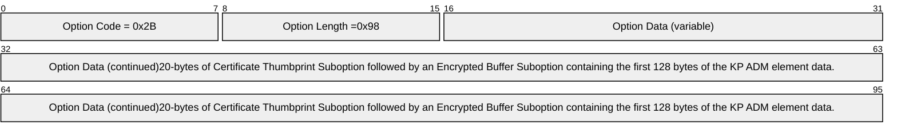

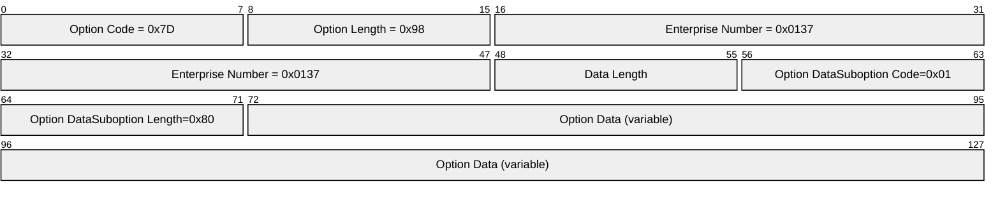

- The NKPU server receives the **DHCPDISCOVER** message that includes a **Vendor Class Identifier Option** structure with the vendor class set to "BITLOCKER", and with other fields of the **DHCPDISCOVER** message meeting the requirements specified in section [3.2.5](#Section_3.2.5). To process this message, the NKPU server is required to do the following:
- Extract the value of the **Thumbprint** ADM element from the **DHCPv4 Vendor Specific Information Option** structure.
- Using the value of the **Thumbprint** ADM element, locate the **Public Key** ADM element and related **Private Key** ADM element in the local data store.
- Concatenate the value of the **KP** ADM element (section [3.1.1](#Section_3.2.1)) in Option 43 (0x2B) and Option 125 (0x7D) and then decrypt it.
- Using AES-CCM [[FIPS197]](https://go.microsoft.com/fwlink/?LinkId=89870), [[RFC3610]](https://go.microsoft.com/fwlink/?LinkId=229733), construct the **KPR** ADM element (section [3.2.1](#Section_3.2.1)), in preparation for the reply of the next step.
- The NKPU server responds with a **BOOTREPLY** message, which includes the following:
- The **DHCPv4 Vendor Specific Information Option** structure (section 2.2.1.4) containing the **KPR** ADM element value.
- The **DHCPv4 Vendor Class Identifier Option** structure, as defined in section 2.2.1.5.
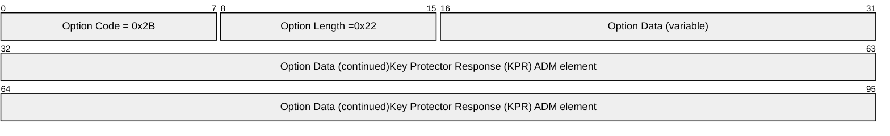

## 4.2 Client Requesting Unlock Over DHCPv6

In this example, an NKPU client requests an unlock over DHCPv6 and successfully receives the server response. The following steps describe the message exchanges and processing:

- The NKPU client sends a DHCPv6 **Information-Request** message that includes the **DHCPv6 Vendor Class Option** structure, as specified in section [2.2.1.1](#Section_2.2.1.1), and the **DHCPv6 Vendor Specific Information Option** structure, as specified in section [2.2.1.2](#Section_2.2.1.2).

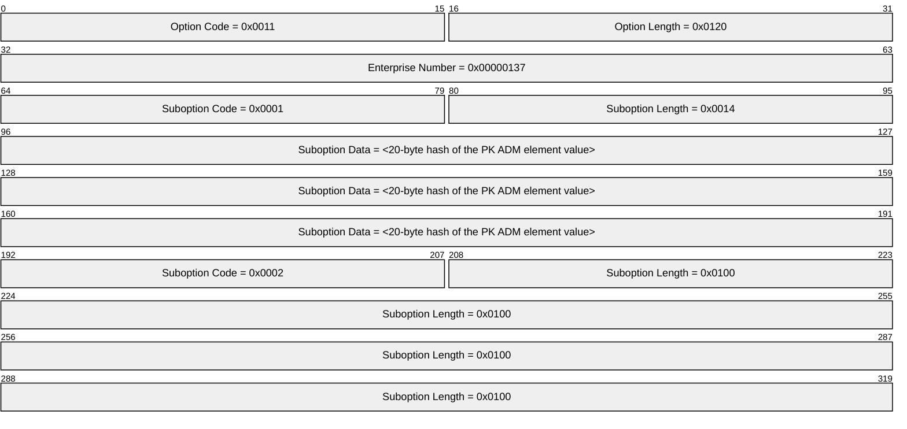

- The NKPU server receives the DHCPv6 **Information-Request** message that includes a **Vendor Class Identifier Option** structure with the **vendor class** set to "BITLOCKER", and with other fields of the **Information-Request** message meeting the requirements specified in section [3.2.5](#Section_3.2.5).
To process this message, the NKPU server is required to do the following:

- Extract the value of the **Thumbprint** ADM element from **DHCPv6 Vendor Specific Information Option** structure Option 17 (0x0011), suboption 1 (0x0001).
- Using the value of the **Thumbprint** ADM element (section [3.1.1](#Section_3.2.1)), locate the **Public Key** ADM element (section 3.1.1) and the related **Private Key** ADM element (section [3.2.1](#Section_3.2.1)) in the local data store.
- Decrypt the **KP** ADM element (section 3.1.1) data in Option 17 (0x0011), suboption 2 (0x0002).
- Using AES-CCM [[FIPS197]](https://go.microsoft.com/fwlink/?LinkId=89870), [[RFC3610]](https://go.microsoft.com/fwlink/?LinkId=229733), encrypt the value of the **KPR** ADM element (section 3.2.1), in preparation for the reply of the next step.
- The NKPU server responds with a DHCPv6 **Reply** message that includes the **DHCPv6 Vendor Class Option** structure (section 2.2.1.1) and **DHCPv6 Vendor Specific Information Option** structure (section 2.2.1.2) containing the **KPR** ADM element value as the **Encrypted Buffer Suboption** in the **Option Data** field.

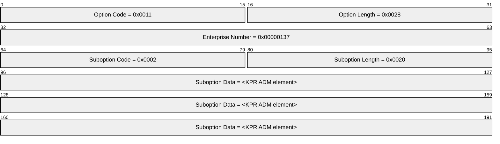

# 5 Security

## 5.1 Security Considerations for Implementers

The security of this protocol assumes that only a physical [**local area network (LAN)**](#gt_local-area-network-lan) connection is available when executing this protocol, and that physical connectivity to the LAN is an implicit built-in authentication factor. Note that wireless networks do not offer this security. However, WiFi usage with the NKPU Protocol is acceptable if the user is required to authenticate to the access point [[IEEE802.11-2007]](https://go.microsoft.com/fwlink/?LinkID=89905) when establishing a connection to the NKPU server.

This assumption might be considered reasonable when the environment executing the protocol runs prior to booting the full operating system, because firmware generally does not provide a wireless network stack.

The ability or inability of an NKPU client request to reach an NKPU server is also a means of securing or restricting access, respectively. Thus, network topology and/or a network appliance configuration that prevent requests from parts of the network from reaching the NKPU unlock server also effectively prevent network unlock.

To be secure from brute-force guessing attacks, keys need to be securely generated with a cryptographically strong random number generator.

To resist two-touch replay attacks, where an attacker on the physical network first records an exchange and then takes the client outside the physical network, it is recommended that session keys and key protectors be used only once and then discarded.

## 5.2 Index of Security Parameters

| Security parameter | Section |
| --- | --- |
| RSA Public Key – an [**X.509**](#gt_x509) encryption certificate for creating the **KP** data element value. | [3.1.1](#Section_3.2.1) |
| RSA Private Key – a [**private key**](#gt_private-key) associated with the certificate that created the **KP** data element value. | [3.2.1](#Section_3.2.1) |
| Session Key – an AES 256-bit key that protects the **CK** data element value in the server response. | 3.1.1 |
| Client message processing rules | [3.1.5](#Section_3.2.5), [3.1.5.3](#Section_3.1.5.3), [3.1.5.4](#Section_3.1.5.4), 3.1.5.3, 3.1.5.4 |
| Server message processing rules | [3.2.5](#Section_3.2.5), [3.2.5.3](#Section_3.2.5.3), [3.2.5.4](#Section_3.2.5.4), 3.2.5.3, 3.2.5.4 |

# 6 Appendix A: Product Behavior

The information in this specification is applicable to the following Microsoft products or supplemental software. References to product versions include updates to those products.

- Windows 8 operating system
- Windows Server 2012 operating system
- Windows 8.1 operating system
- Windows Server 2012 R2 operating system
- Windows 10 operating system
- Windows Server 2016 operating system
- Windows Server operating system
- Windows Server 2019 operating system
- Windows Server 2022 operating system
- Windows 11 operating system
- Windows Server 2025 operating system
Exceptions, if any, are noted in this section. If an update version, service pack or Knowledge Base (KB) number appears with a product name, the behavior changed in that update. The new behavior also applies to subsequent updates unless otherwise specified. If a product edition appears with the product version, behavior is different in that product edition.

Unless otherwise specified, any statement of optional behavior in this specification that is prescribed using the terms "SHOULD" or "SHOULD NOT" implies product behavior in accordance with the SHOULD or SHOULD NOT prescription. Unless otherwise specified, the term "MAY" implies that the product does not follow the prescription.

<1> Section 3.1.1: An implementation can generate session keys and encrypt them with the server [**public key**](#gt_public-key) immediately before sending an NKPU request via [**DHCP**](#gt_dynamic-host-configuration-protocol-dhcp). If public-key cryptography or symmetric key generation is unavailable in the implementation's boot environment, then an implementation needs to use pre-generated session keys encrypted with the server public key.

<2> Section 3.2.1: In Windows implementations, the key data is composed of a 16-byte MAC followed by the encrypted output of the concatenation of an implementation-specific 12-byte header of 2c 00 00 00 01 00 00 00-06 20 00 00 and the 32-byte **CK** ADM element.

<3> Section 3.2.1: Windows NKPU servers always accept and reply to requests from link local addresses in Ipv6, regardless of the contents of an Ipv6 [**allowed list**](#gt_allowed-list).

# 7 Change Tracking

This section identifies changes that were made to this document since the last release. Changes are classified as Major, Minor, or None.

The revision class **Major** means that the technical content in the document was significantly revised. Major changes affect protocol interoperability or implementation. Examples of major changes are:

- A document revision that incorporates changes to interoperability requirements.
- A document revision that captures changes to protocol functionality.
The revision class **Minor** means that the meaning of the technical content was clarified. Minor changes do not affect protocol interoperability or implementation. Examples of minor changes are updates to clarify ambiguity at the sentence, paragraph, or table level.

The revision class **None** means that no new technical changes were introduced. Minor editorial and formatting changes may have been made, but the relevant technical content is identical to the last released version.

The changes made to this document are listed in the following table. For more information, please contact [dochelp@microsoft.com](mailto:dochelp@microsoft.com).

| Section | Description | Revision class |
| --- | --- | --- |
| [6](#Section_6) Appendix A: Product Behavior | Added Windows Server 2025 to the list of applicable products. | Major |

## Revision History

| Date | Version | Revision Class | Comments |
| --- | --- | --- | --- |
| 12/16/2011 | 1.0 | New | Released new document. |
| 3/30/2012 | 2.0 | Major | Significantly changed the technical content. |
| 7/12/2012 | 2.0 | None | No changes to the meaning, language, or formatting to the technical content. |
| 10/25/2012 | 2.0 | None | No changes to the meaning, language, or formatting of the technical content. |
| 1/31/2013 | 3.0 | Major | Significantly changed the technical content. |
| 8/8/2013 | 4.0 | Major | Significantly changed the technical content. |
| 11/14/2013 | 4.0 | None | No changes to the meaning, language, or formatting of the technical content. |
| 2/13/2014 | 4.0 | None | No changes to the meaning, language, or formatting of the technical content. |
| 5/15/2014 | 4.0 | None | No changes to the meaning, language, or formatting of the technical content. |
| 6/30/2015 | 5.0 | Major | Significantly changed the technical content. |
| 10/16/2015 | 5.0 | None | No changes to the meaning, language, or formatting of the technical content. |
| 7/14/2016 | 5.0 | None | No changes to the meaning, language, or formatting of the technical content. |
| 6/1/2017 | 6.0 | Major | Significantly changed the technical content. |
| 9/15/2017 | 7.0 | Major | Significantly changed the technical content. |
| 12/1/2017 | 8.0 | Major | Significantly changed the technical content. |
| 9/12/2018 | 9.0 | Major | Significantly changed the technical content. |
| 4/7/2021 | 10.0 | Major | Significantly changed the technical content. |
| 6/25/2021 | 11.0 | Major | Significantly changed the technical content. |
| 4/23/2024 | 12.0 | Major | Significantly changed the technical content. |
