# [MS-NLMP]: NT LAN Manager (NTLM) Authentication Protocol

Table of Contents

<details>
<summary>1 Introduction</summary>

- [1 Introduction](#Section_1)
  - [1.1 Glossary](#Section_1.1)
  - [1.2 References](#Section_1.2)
    - [1.2.1 Normative References](#Section_1.2.1)
    - [1.2.2 Informative References](#Section_1.2.2)
  - [1.3 Overview](#Section_1.3)
    - [1.3.1 NTLM Authentication Call Flow](#Section_1.3.1)
      - [1.3.1.1 NTLM Connection-Oriented Call Flow](#Section_1.3.1.1)
      - [1.3.1.2 NTLM Connectionless (Datagram-Oriented) Call Flow](#Section_1.3.1.2)
  - [1.4 Relationship to Other Protocols](#Section_1.4)
  - [1.5 Prerequisites/Preconditions](#Section_1.5)
  - [1.6 Applicability Statement](#Section_1.6)
  - [1.7 Versioning and Capability Negotiation](#Section_1.7)
  - [1.8 Vendor-Extensible Fields](#Section_1.8)
  - [1.9 Standards Assignments](#Section_1.9)
</details>

<details>
<summary>2 Messages</summary>

- [2 Messages](#Section_2)
  - [2.1 Transport](#Section_2.1)
  - [2.2 Message Syntax](#Section_2.2)
    - [2.2.1 NTLM Messages](#Section_2.2.1)
      - [2.2.1.1 NEGOTIATE_MESSAGE](#Section_2.2.1.1)
      - [2.2.1.2 CHALLENGE_MESSAGE](#Section_2.2.1.2)
      - [2.2.1.3 AUTHENTICATE_MESSAGE](#Section_2.2.1.3)
    - [2.2.2 NTLM Structures](#Section_2.2.2)
      - [2.2.2.1 AV_PAIR](#Section_2.2.2.1)
      - [2.2.2.2 Single_Host_Data](#Section_2.2.2.2)
      - [2.2.2.3 LM_RESPONSE](#Section_2.2.2.3)
      - [2.2.2.4 LMv2_RESPONSE](#Section_2.2.2.4)
      - [2.2.2.5 NEGOTIATE](#Section_2.2.2.5)
      - [2.2.2.6 NTLM v1 Response: NTLM_RESPONSE](#Section_2.2.2.6)
      - [2.2.2.7 NTLM v2: NTLMv2_CLIENT_CHALLENGE](#Section_2.2.2.7)
      - [2.2.2.8 NTLM2 V2 Response: NTLMv2_RESPONSE](#Section_2.2.2.8)
      - [2.2.2.9 NTLMSSP_MESSAGE_SIGNATURE](#Section_2.2.2.9)
        - [2.2.2.9.1 NTLMSSP_MESSAGE_SIGNATURE](#Section_2.2.2.9.1)
        - [2.2.2.9.2 NTLMSSP_MESSAGE_SIGNATURE for Extended Session Security](#Section_2.2.2.9.2)
      - [2.2.2.10 VERSION](#Section_2.2.2.10)
</details>

<details>
<summary>3 Protocol Details</summary>

- [3 Protocol Details](#Section_3)
  - [3.1 Client Details](#Section_3.1)
    - [3.1.1 Abstract Data Model](#Section_3.1.1)
      - [3.1.1.1 Variables Internal to the Protocol](#Section_3.1.1.1)
      - [3.1.1.2 Variables Exposed to the Application](#Section_3.1.1.2)
    - [3.1.2 Timers](#Section_3.1.2)
    - [3.1.3 Initialization](#Section_3.1.3)
    - [3.1.4 Higher-Layer Triggered Events](#Section_3.1.4)
    - [3.1.5 Message Processing Events and Sequencing Rules](#Section_3.1.5)
      - [3.1.5.1 Connection-Oriented](#Section_3.1.5.1)
        - [3.1.5.1.1 Client Initiates the NEGOTIATE_MESSAGE](#Section_3.1.5.1.1)
        - [3.1.5.1.2 Client Receives a CHALLENGE_MESSAGE from the Server](#Section_3.1.5.1.2)
      - [3.1.5.2 Connectionless](#Section_3.1.5.2)
        - [3.1.5.2.1 Client Receives a CHALLENGE_MESSAGE](#Section_3.1.5.2.1)
    - [3.1.6 Timer Events](#Section_3.1.6)
    - [3.1.7 Other Local Events](#Section_3.1.7)
  - [3.2 Server Details](#Section_3.2)
    - [3.2.1 Abstract Data Model](#Section_3.2.1)
      - [3.2.1.1 Variables Internal to the Protocol](#Section_3.2.1.1)
      - [3.2.1.2 Variables Exposed to the Application](#Section_3.2.1.2)
    - [3.2.2 Timers](#Section_3.2.2)
    - [3.2.3 Initialization](#Section_3.2.3)
    - [3.2.4 Higher-Layer Triggered Events](#Section_3.2.4)
    - [3.2.5 Message Processing Events and Sequencing Rules](#Section_3.2.5)
      - [3.2.5.1 Connection-Oriented](#Section_3.2.5.1)
        - [3.2.5.1.1 Server Receives a NEGOTIATE_MESSAGE from the Client](#Section_3.2.5.1.1)
        - [3.2.5.1.2 Server Receives an AUTHENTICATE_MESSAGE from the Client](#Section_3.2.5.1.2)
      - [3.2.5.2 Connectionless NTLM](#Section_3.2.5.2)
        - [3.2.5.2.1 Server Sends the Client an Initial CHALLENGE_MESSAGE](#Section_3.2.5.2.1)
        - [3.2.5.2.2 Server Response Checking](#Section_3.2.5.2.2)
    - [3.2.6 Timer Events](#Section_3.2.6)
    - [3.2.7 Other Local Events](#Section_3.2.7)
  - [3.3 NTLM v1 and NTLM v2 Messages](#Section_3.3)
    - [3.3.1 NTLM v1 Authentication](#Section_3.3.1)
    - [3.3.2 NTLM v2 Authentication](#Section_3.3.2)
  - [3.4 Session Security Details](#Section_3.4)
    - [3.4.1 Abstract Data Model](#Section_3.4.1)
    - [3.4.2 Message Integrity](#Section_3.4.2)
    - [3.4.3 Message Confidentiality](#Section_3.4.3)
    - [3.4.4 Message Signature Functions](#Section_3.4.4)
      - [3.4.4.1 Without Extended Session Security](#Section_3.4.4.1)
      - [3.4.4.2 With Extended Session Security](#Section_3.4.4.2)
      - [3.4.4.3 Without NTLMSSP_NEGOTIATE_SIGN](#Section_3.4.4.3)
    - [3.4.5 KXKEY, SIGNKEY, and SEALKEY](#Section_3.4.5)
      - [3.4.5.1 KXKEY](#Section_3.4.5.1)
      - [3.4.5.2 SIGNKEY](#Section_3.4.5.2)
      - [3.4.5.3 SEALKEY](#Section_3.4.5.3)
    - [3.4.6 GSS_WrapEx() Call](#Section_3.4.6)
      - [3.4.6.1 Signature Creation for GSS_WrapEx()](#Section_3.4.6.1)
    - [3.4.7 GSS_UnwrapEx() Call](#Section_3.4.7)
      - [3.4.7.1 Signature Creation for GSS_UnwrapEx()](#Section_3.4.7.1)
    - [3.4.8 GSS_GetMICEx() Call](#Section_3.4.8)
      - [3.4.8.1 Signature Creation for GSS_GetMICEx()](#Section_3.4.8.1)
    - [3.4.9 GSS_VerifyMICEx() Call](#Section_3.4.9)
      - [3.4.9.1 Signature Creation for GSS_VerifyMICEx()](#Section_3.4.9.1)
</details>

<details>
<summary>4 Protocol Examples</summary>

- [4 Protocol Examples](#Section_4)
  - [4.1 NTLM Over Server Message Block (SMB)](#Section_4.1)
  - [4.2 Cryptographic Values for Validation](#Section_4.2)
    - [4.2.1 Common Values](#Section_4.2.1)
    - [4.2.2 NTLM v1 Authentication](#Section_4.2.2)
      - [4.2.2.1 Calculations](#Section_4.2.2.1)
        - [4.2.2.1.1 LMOWFv1()](#Section_4.2.2.1.1)
        - [4.2.2.1.2 NTOWFv1()](#Section_4.2.2.1.2)
        - [4.2.2.1.3 Session Base Key and Key Exchange Key](#Section_4.2.2.1.3)
      - [4.2.2.2 Results](#Section_4.2.2.2)
        - [4.2.2.2.1 NTLMv1 Response](#Section_4.2.2.2.1)
        - [4.2.2.2.2 LMv1 Response](#Section_4.2.2.2.2)
        - [4.2.2.2.3 Encrypted Session Key](#Section_4.2.2.2.3)
      - [4.2.2.3 Messages](#Section_4.2.2.3)
      - [4.2.2.4 GSS_WrapEx Examples](#Section_4.2.2.4)
    - [4.2.3 NTLM v1 with Client Challenge](#Section_4.2.3)
      - [4.2.3.1 Calculations](#Section_4.2.3.1)
        - [4.2.3.1.1 NTOWFv1()](#Section_4.2.3.1.1)
        - [4.2.3.1.2 Session Base Key](#Section_4.2.3.1.2)
        - [4.2.3.1.3 Key Exchange Key](#Section_4.2.3.1.3)
      - [4.2.3.2 Results](#Section_4.2.3.2)
        - [4.2.3.2.1 LMv1 Response](#Section_4.2.3.2.1)
        - [4.2.3.2.2 NTLMv1 Response](#Section_4.2.3.2.2)
      - [4.2.3.3 Messages](#Section_4.2.3.3)
      - [4.2.3.4 GSS_WrapEx Examples](#Section_4.2.3.4)
    - [4.2.4 NTLMv2 Authentication](#Section_4.2.4)
      - [4.2.4.1 Calculations](#Section_4.2.4.1)
        - [4.2.4.1.1 NTOWFv2() and LMOWFv2()](#Section_4.2.4.1.1)
        - [4.2.4.1.2 Session Base Key](#Section_4.2.4.1.2)
        - [4.2.4.1.3 temp](#Section_4.2.4.1.3)
      - [4.2.4.2 Results](#Section_4.2.4.2)
        - [4.2.4.2.1 LMv2 Response](#Section_4.2.4.2.1)
        - [4.2.4.2.2 NTLMv2 Response](#Section_4.2.4.2.2)
        - [4.2.4.2.3 Encrypted Session Key](#Section_4.2.4.2.3)
      - [4.2.4.3 Messages](#Section_4.2.4.3)
      - [4.2.4.4 GSS_WrapEx Examples](#Section_4.2.4.4)
</details>

<details>
<summary>5 Security</summary>

- [5 Security](#Section_5)
  - [5.1 Security Considerations for Implementers](#Section_5.1)
  - [5.2 Index of Security Parameters](#Section_5.2)
</details>

<details>
<summary>6 Appendix A: Cryptographic Operations Reference</summary>

- [6 Appendix A: Cryptographic Operations Reference](#Section_6)
</details>

<details>
<summary>7 Appendix B: Product Behavior</summary>

- [7 Appendix B: Product Behavior](#Section_7)
</details>

<details>
<summary>8 Change Tracking</summary>

- [8 Change Tracking](#Section_8)
</details>

For the legal notice and IP terms, see [LEGAL.md](../LEGAL.md).
Last updated: 4/23/2024.
See [Revision History](#revision-history) for full version history.

<a id="Section_1"></a>
# 1 Introduction

The NT LAN Manager (NTLM) Authentication Protocol is used for authentication between clients and servers. These extensions provide additional capability for authorization information including group memberships, interactive logon information, and message integrity, as well as constrained delegation and encryption supported by Kerberos principals.

Kerberos authentication [MS-KILE](../MS-KILE/MS-KILE.md) replaces NTLM as the preferred authentication protocol.<1> However, NTLM can be used when the Kerberos Protocol Extensions (KILE) do not work, such as in the following scenarios.

- One of the machines is not Kerberos-capable.
- The server is not joined to a domain.
- The KILE configuration is not set up correctly.
- The implementation chooses to directly use NLMP.
Sections 1.5, 1.8, 1.9, 2, and 3 of this specification are normative. All other sections and examples in this specification are informative.

<a id="Section_1.1"></a>
## 1.1 Glossary

This document uses the following terms:

<a id="gt_active-directory"></a>
**Active Directory**: The Windows implementation of a general-purpose directory service, which uses LDAP as its primary access protocol. [**Active Directory**](#gt_active-directory) stores information about a variety of objects in the network such as user accounts, computer accounts, groups, and all related credential information used by [**Kerberos**](#gt_kerberos) [MS-KILE](../MS-KILE/MS-KILE.md). [**Active Directory**](#gt_active-directory) is either deployed as Active Directory Domain Services (AD DS) or Active Directory Lightweight Directory Services (AD LDS), which are both described in [MS-ADOD](../MS-ADOD/MS-ADOD.md): Active Directory Protocols Overview.

<a id="gt_authentication"></a>
**authentication**: The act of proving an identity to a server while providing key material that binds the identity to subsequent communications.

<a id="gt_av-pair"></a>
**AV pair**: An attribute/value pair. The name of some attribute, along with its value. [**AV pairs**](#gt_av-pair) in NTLM have a structure specifying the encoding of the information stored in them.

<a id="gt_byte-order-mark"></a>
**byte order mark**: A Unicode character that is used to indicate that text is encoded in UTF-8, UTF-16, or UTF-32.

<a id="gt_challenge"></a>
**challenge**: A piece of data used to authenticate a user. Typically a challenge takes the form of a [**nonce**](#gt_nonce).

<a id="gt_checksum"></a>
**checksum**: A value that is the summation of a byte stream. By comparing the checksums computed from a data item at two different times, one can quickly assess whether the data items are identical.

<a id="gt_code-page"></a>
**code page**: An ordered set of characters of a specific script in which a numerical index (code-point value) is associated with each character. Code pages are a means of providing support for character sets and keyboard layouts used in different countries. Devices such as the display and keyboard can be configured to use a specific code page and to switch from one code page (such as the United States) to another (such as Portugal) at the user's request.

<a id="gt_connection-oriented-ntlm"></a>
**connection oriented NTLM**: A particular variant of NTLM designed to be used with connection oriented [**remote procedure call (RPC)**](#gt_remote-procedure-call-rpc).

<a id="gt_connectionless-protocol"></a>
**connectionless protocol**: A transport protocol that enables endpoints to communicate without a previous connection arrangement and that treats each packet independently as a datagram. Examples of connectionless protocols are Internet Protocol (IP) and User Datagram Protocol (UDP).

<a id="gt_connection-oriented-ntlm"></a>
**connection-oriented NTLM**: A particular variant of NTLM designed to be used with connection-oriented [**remote procedure call (RPC)**](#gt_remote-procedure-call-rpc), as described in [MS-NLMP](#Section_b38c36ed28044868a9ff8dd3182128e4).

<a id="gt_connection-oriented-transport-protocol"></a>
**connection-oriented transport protocol**: A transport protocol that enables endpoints to communicate after first establishing a connection and that treats each packet according to the connection state. An example of a connection-oriented transport protocol is Transmission Control Protocol (TCP).

<a id="gt_cyclic-redundancy-check-crc"></a>
**cyclic redundancy check (CRC)**: An algorithm used to produce a [**checksum**](#gt_checksum) (a small, fixed number of bits) against a block of data, such as a packet of network traffic or a block of a computer file. The CRC is a broad class of functions used to detect errors after transmission or storage. A CRC is designed to catch random errors, as opposed to intentional errors. If errors might be introduced by a motivated and intelligent adversary, a cryptographic hash function has to be used instead.

<a id="gt_directory"></a>
**directory**: The database that stores information about objects such as users, groups, computers, printers, and the directory service that makes this information available to users and applications.

<a id="gt_domain"></a>
**domain**: A set of users and computers sharing a common namespace and management infrastructure. At least one computer member of the set has to act as a [**domain controller (DC)**](#gt_domain-controller-dc) and host a member list that identifies all members of the domain, as well as optionally hosting the [**Active Directory**](#gt_active-directory) service. The domain controller provides [**authentication**](#gt_authentication) of members, creating a unit of trust for its members. Each domain has an identifier that is shared among its members. For more information, see [MS-AUTHSOD](#Section_1.3) section 1.1.1.5 and [MS-ADTS](../MS-ADTS/MS-ADTS.md).

<a id="gt_domain-controller-dc"></a>
**domain controller (DC)**: The service, running on a server, that implements [**Active Directory**](#gt_active-directory), or the server hosting this service. The service hosts the data store for objects and interoperates with other [**DCs**](#gt_domain-controller-dc) to ensure that a local change to an object replicates correctly across all [**DCs**](#gt_domain-controller-dc). When [**Active Directory**](#gt_active-directory) is operating as Active Directory Domain Services (AD DS), the [**DC**](#gt_domain-controller-dc) contains full NC replicas of the configuration naming context (config NC), schema naming context (schema NC), and one of the domain NCs in its [**forest**](#gt_forest). If the AD DS [**DC**](#gt_domain-controller-dc) is a global catalog server (GC server), it contains partial NC replicas of the remaining domain NCs in its [**forest**](#gt_forest). For more information, see [MS-AUTHSOD] section 1.1.1.5.2 and [MS-ADTS]. When [**Active Directory**](#gt_active-directory) is operating as Active Directory Lightweight Directory Services (AD LDS), several AD LDS [**DCs**](#gt_domain-controller-dc) can run on one server. When [**Active Directory**](#gt_active-directory) is operating as AD DS, only one AD DS [**DC**](#gt_domain-controller-dc) can run on one server. However, several AD LDS [**DCs**](#gt_domain-controller-dc) can coexist with one AD DS [**DC**](#gt_domain-controller-dc) on one server. The AD LDS [**DC**](#gt_domain-controller-dc) contains full NC replicas of the config NC and the schema NC in its [**forest**](#gt_forest). The domain controller is the server side of Authentication Protocol Domain Support [MS-APDS](../MS-APDS/MS-APDS.md).

<a id="gt_domain-name"></a>
**domain name**: A domain name or a NetBIOS name that identifies a [**domain**](#gt_domain).

<a id="gt_forest"></a>
**forest**: One or more [**domains**](#gt_domain) that share a common schema and trust each other transitively. An organization can have multiple [**forests**](#gt_forest). A [**forest**](#gt_forest) establishes the security and administrative boundary for all the objects that reside within the [**domains**](#gt_domain) that belong to the [**forest**](#gt_forest). In contrast, a [**domain**](#gt_domain) establishes the administrative boundary for managing objects, such as users, groups, and computers. In addition, each [**domain**](#gt_domain) has individual security policies and trust relationships with other [**domains**](#gt_domain).

<a id="gt_fully-qualified-domain-name-fqdn"></a>
**fully qualified domain name (FQDN)**: In [**Active Directory**](#gt_active-directory), a fully qualified domain name (FQDN) that identifies a [**domain**](#gt_domain).

<a id="gt_generic-security-services-gss"></a>
**Generic Security Services (GSS)**: An Internet standard, as described in [[RFC2743]](https://go.microsoft.com/fwlink/?LinkId=90378), for providing security services to applications. It consists of an application programming interface (GSS-API) set, as well as standards that describe the structure of the security data.

<a id="gt_identify-level-token"></a>
**identify level token**: A security token resulting from authentication that represents the authenticated user but does not allow the [**service**](#gt_service) holding the token to impersonate that user to other resources.

<a id="gt_kerberos"></a>
**Kerberos**: An [**authentication**](#gt_authentication) system that enables two parties to exchange private information across an otherwise open network by assigning a unique [**key**](#gt_key) (called a ticket) to each user that logs on to the network and then embedding these tickets into messages sent by the users. For more information, see [MS-KILE].

<a id="gt_key"></a>
**key**: In cryptography, a generic term used to refer to cryptographic data that is used to initialize a cryptographic algorithm. [**Keys**](#gt_key) are also sometimes referred to as keying material.

<a id="gt_key-exchange-key"></a>
**key exchange key**: The [**key**](#gt_key) used to protect the [**session key**](#gt_session-key) that is generated by the client. The [**key exchange key**](#gt_key-exchange-key) is derived from the [**response key**](#gt_response-key) during authentication.

<a id="gt_little-endian"></a>
**little-endian**: Multiple-byte values that are byte-ordered with the least significant byte stored in the memory location with the lowest address.

<a id="gt_lmowf"></a>
**LMOWF**: In the context of NTLM authentication, a [**NT LAN Manager**](#gt_nt-lan-manager-ntlm) (LM) one-way function (OWF) is used to create a hash based on the user's password to generate a principal's secret key. The LAN Manager (LM) hash was superseded by the NTLM (NT) hash.

<a id="gt_lmowf-v2"></a>
**LMOWF v2**: Based on The LAN Manager (LM) version 2, a one-way function (OWF) used to create a hash based on the user's password to generate a principal's secret key.

<a id="gt_message-authentication-code-mac"></a>
**Message Authentication Code (MAC)**: A message authenticator computed through the use of a symmetric key. A [**MAC**](#gt_message-authentication-code-mac) algorithm accepts a secret key and a data buffer, and outputs a [**MAC**](#gt_message-authentication-code-mac). The data and [**MAC**](#gt_message-authentication-code-mac) can then be sent to another party, which can verify the integrity and authenticity of the data by using the same secret key and the same [**MAC**](#gt_message-authentication-code-mac) algorithm.

<a id="gt_netlogon"></a>
**Netlogon**: The Netlogon Remote Protocol, as specified in [MS-NRPC](../MS-NRPC/MS-NRPC.md).

<a id="gt_nonce"></a>
**nonce**: A number that is used only once. This is typically implemented as a random number large enough that the probability of number reuse is extremely small. A nonce is used in authentication protocols to prevent replay attacks. For more information, see [[RFC2617]](https://go.microsoft.com/fwlink/?LinkId=90373).

<a id="gt_nt-lan-manager-ntlm"></a>
**NT LAN Manager (NTLM)**: An [**authentication**](#gt_authentication) protocol that is based on a challenge-response sequence for [**authentication**](#gt_authentication).

<a id="gt_ntlm-client"></a>
**NTLM client**: The NT LAN Manager (NTLM) Authentication Protocol [MS-NLMP] client.

<a id="gt_ntlm-message"></a>
**NTLM message**: A message that carries [**authentication**](#gt_authentication) information. Its payload data is passed to the application that supports embedded NTLM authentication by the NTLM software installed on the local computer. NTLM messages are transmitted between the client and server embedded within the application protocol that is using NTLM authentication. There are three types of NTLM messages: NTLM NEGOTIATE_MESSAGE, NTLM CHALLENGE_MESSAGE, and NTLM AUTHENTICATE_MESSAGE.

<a id="gt_ntlm-server"></a>
**NTLM server**: The server side of NT LAN Manager (NTLM) Authentication Protocol [MS-NLMP].

<a id="gt_ntowf"></a>
**NTOWF**: In the context of an NTLM authentication, a [**NT LAN Manager**](#gt_nt-lan-manager-ntlm) (NT) one-way function (OWF) used to create a hash based on the user's password to generate a principal's secret key. The NTLM hash superseded the LAN Manager (LM) hash.

<a id="gt_ntowf-v2"></a>
**NTOWF v2**: Based on the [**NT LAN Manager (NTLM)**](#gt_nt-lan-manager-ntlm) (NT) version 2, a one-way function (OWF) used to create a hash based on the user's password to generate a principal's secret key.

<a id="gt_object-identifier-oid"></a>
**object identifier (OID)**: In the context of an object server, a 64-bit number that uniquely identifies an object.

<a id="gt_original-equipment-manufacturer-oem-character-set"></a>
**original equipment manufacturer (OEM) character set**: A character encoding used where the mappings between characters is dependent upon the [**code page**](#gt_code-page) configured on the machine, typically by the manufacturer.

<a id="gt_remote-procedure-call-rpc"></a>
**remote procedure call (RPC)**: A communication protocol used primarily between client and server. The term has three definitions that are often used interchangeably: a runtime environment providing for communication facilities between computers (the RPC runtime); a set of request-and-response message exchanges between computers (the RPC exchange); and the single message from an RPC exchange (the RPC message). For more information, see [[C706]](https://go.microsoft.com/fwlink/?LinkId=89824).

<a id="gt_response-key"></a>
**response key**: A [**key**](#gt_key) generated by a one-way function from the name of the user, the name of the user's domain, and the password. The function depends on which version of NTLM is being used. The [**response key**](#gt_response-key) is used to derive the [**key exchange key**](#gt_key-exchange-key).

<a id="gt_security-support-provider-ssp"></a>
**security support provider (SSP)**: A dynamic-link library (DLL) that implements the [**Security Support Provider Interface (SSPI)**](#gt_security-support-provider-interface-sspi) by making one or more security packages available to applications. Each security package provides mappings between an application's [**SSPI**](#gt_security-support-provider-interface-sspi) function calls and an actual security model's functions. Security packages support security protocols such as [**Kerberos**](#gt_kerberos) authentication and NTLM.

<a id="gt_security-support-provider-interface-sspi"></a>
**Security Support Provider Interface (SSPI)**: An API that allows connected applications to call one of several security providers to establish authenticated connections and to exchange data securely over those connections. It is equivalent to Generic Security Services (GSS)-API, and the two are on-the-wire compatible.

<a id="gt_sequence-number"></a>
**sequence number**: In the NTLM protocol, a sequence number can be explicitly provided by the application protocol, or generated by NTLM. If generated by NTLM, the sequence number is the count of each message sent, starting with 0.

<a id="gt_service"></a>
**service**: A process or agent that is available on the network, offering resources or services for clients. Examples of services include file servers, web servers, and so on.

<a id="gt_session"></a>
**session**: In [**Kerberos**](#gt_kerberos), an active communication channel established through [**Kerberos**](#gt_kerberos) that also has an associated cryptographic [**key**](#gt_key), message counters, and other state.

<a id="gt_session-key"></a>
**session key**: A relatively short-lived symmetric key (a cryptographic key negotiated by the client and the server based on a shared secret). A [**session key's**](#gt_session-key) lifespan is bounded by the [**session**](#gt_session) to which it is associated. A [**session key**](#gt_session-key) has to be strong enough to withstand cryptanalysis for the lifespan of the [**session**](#gt_session).

<a id="gt_session-security"></a>
**session security**: The provision of message integrity and/or confidentiality through use of a [**session key**](#gt_session-key).

<a id="gt_unicode"></a>
**Unicode**: A character encoding standard developed by the Unicode Consortium that represents almost all of the written languages of the world. The [**Unicode**](#gt_unicode) standard [[UNICODE5.0.0/2007]](https://go.microsoft.com/fwlink/?LinkId=154659) provides three forms (UTF-8, UTF-16, and UTF-32) and seven schemes (UTF-8, UTF-16, UTF-16 BE, UTF-16 LE, UTF-32, UTF-32 LE, and UTF-32 BE).

**MAY, SHOULD, MUST, SHOULD NOT, MUST NOT:** These terms (in all caps) are used as defined in [[RFC2119]](https://go.microsoft.com/fwlink/?LinkId=90317). All statements of optional behavior use either MAY, SHOULD, or SHOULD NOT.

<a id="Section_1.2"></a>
## 1.2 References

Links to a document in the Microsoft Open Specifications library point to the correct section in the most recently published version of the referenced document. However, because individual documents in the library are not updated at the same time, the section numbers in the documents may not match. You can confirm the correct section numbering by checking the [Errata](https://go.microsoft.com/fwlink/?linkid=850906).

<a id="Section_1.2.1"></a>
### 1.2.1 Normative References

We conduct frequent surveys of the normative references to assure their continued availability. If you have any issue with finding a normative reference, please contact [dochelp@microsoft.com](mailto:dochelp@microsoft.com). We will assist you in finding the relevant information.

[FIPS46-2] FIPS PUBS, "Data Encryption Standard (DES)", FIPS PUB 46-2, December 1993, [https://csrc.nist.gov/publications/detail/fips/46/2/archive/1993-12-30](https://go.microsoft.com/fwlink/?LinkId=89871)

[MS-APDS] Microsoft Corporation, "[Authentication Protocol Domain Support](../MS-APDS/MS-APDS.md)".

[MS-DTYP] Microsoft Corporation, "[Windows Data Types](../MS-DTYP/MS-DTYP.md)".

[MS-ERREF] Microsoft Corporation, "[Windows Error Codes](../MS-ERREF/MS-ERREF.md)".

[MS-RPCE] Microsoft Corporation, "[Remote Procedure Call Protocol Extensions](../MS-RPCE/MS-RPCE.md)".

[MS-SMB] Microsoft Corporation, "[Server Message Block (SMB) Protocol](../MS-SMB/MS-SMB.md)".

[MS-SPNG] Microsoft Corporation, "[Simple and Protected GSS-API Negotiation Mechanism (SPNEGO) Extension](../MS-SPNG/MS-SPNG.md)".

[RFC1320] Rivest, R., "The MD4 Message-Digest Algorithm", RFC 1320, April 1992, [https://www.rfc-editor.org/info/rfc1320](https://go.microsoft.com/fwlink/?LinkId=90274)

[RFC1321] Rivest, R., "The MD5 Message-Digest Algorithm", RFC 1321, April 1992, [https://www.rfc-editor.org/info/rfc1321](https://go.microsoft.com/fwlink/?LinkId=90275)

[RFC2104] Krawczyk, H., Bellare, M., and Canetti, R., "HMAC: Keyed-Hashing for Message Authentication", RFC 2104, February 1997, [https://www.rfc-editor.org/info/rfc2104](https://go.microsoft.com/fwlink/?LinkId=90314)

[RFC2119] Bradner, S., "Key words for use in RFCs to Indicate Requirement Levels", BCP 14, RFC 2119, March 1997, [https://www.rfc-editor.org/info/rfc2119](https://go.microsoft.com/fwlink/?LinkId=90317)

[RFC2743] Linn, J., "Generic Security Service Application Program Interface Version 2, Update 1", RFC 2743, January 2000, [https://www.rfc-editor.org/info/rfc2743](https://go.microsoft.com/fwlink/?LinkId=90378)

[RFC2744] Wray, J., "Generic Security Service API Version 2 : C-bindings", RFC 2744, January 2000, [https://www.rfc-editor.org/info/rfc2744](https://go.microsoft.com/fwlink/?LinkId=125716)

[RFC4121] Zhu, L., Jaganathan, K., and Hartman, S., "The Kerberos Version 5 Generic Security Service Application Program Interface (GSS-API) Mechanism: Version 2", RFC 4121, July 2005, [https://www.rfc-editor.org/info/rfc4121](https://go.microsoft.com/fwlink/?LinkId=90459)

[RFC4757] Jaganathan, K., Zhu, L., and Brezak, J., "The RC4-HMAC Kerberos Encryption Types Used by Microsoft Windows", RFC 4757, December 2006, [https://www.rfc-editor.org/info/rfc4757](https://go.microsoft.com/fwlink/?LinkId=90488)

<a id="Section_1.2.2"></a>
### 1.2.2 Informative References

[MS-AUTHSOD] Microsoft Corporation, "[Authentication Services Protocols Overview](#Section_1.3)".

[MS-GPOL] Microsoft Corporation, "[Group Policy: Core Protocol](../MS-GPOL/MS-GPOL.md)".

[MS-KILE] Microsoft Corporation, "[Kerberos Protocol Extensions](../MS-KILE/MS-KILE.md)".

[MS-NTHT] Microsoft Corporation, "[NTLM Over HTTP Protocol](../MS-NTHT/MS-NTHT.md)".

[MSDN-DecryptMsg] Microsoft Corporation, "DecryptMessage (General) function", [http://msdn.microsoft.com/en-us/library/aa375211.aspx](https://go.microsoft.com/fwlink/?LinkId=101488)

[MSDN-EncryptMsg] Microsoft Corporation, "EncryptMessage (General)", [http://msdn.microsoft.com/en-us/library/aa375378.aspx](https://go.microsoft.com/fwlink/?LinkId=94577)

<a id="Section_1.3"></a>
## 1.3 Overview

[**NT LAN Manager (NTLM)**](#gt_nt-lan-manager-ntlm) is the name of a family of security protocols. NTLM is used by application protocols to [**authenticate**](#gt_authentication) remote users and, optionally, to provide [**session security**](#gt_session-security) when requested by the application.

NTLM is a [**challenge**](#gt_challenge)-response style authentication protocol. This means that to authenticate a user, the server sends a challenge to the client. The client then sends back a response that is a function of the challenge, the user's password, and possibly other information. Computing the correct response requires knowledge of the user's password. The server (or another party trusted by the server) can validate the response by consulting an account database to get the user's password and computing the proper response for that challenge.

NTLM has messages and a state machine, like other protocols, but it does not have a network protocol stack layer. The NTLM protocols are embedded protocols. Rather, NTLM is implemented as a subroutine package that creates, reads and manipulates NTLM packets - but communicates those packets as byte arrays between the NTLM code and the caller. The caller is typically the code of some other protocol - one that has a defined layer in the network stack. Unlike stand-alone application protocols such as [MS-SMB](../MS-SMB/MS-SMB.md) or HTTP, [**NTLM messages**](#gt_ntlm-message) are embedded in the packets of an application protocol that requires authentication of a user. The application protocol semantics determine how and when the NTLM messages are encoded, framed, and transported from the client to the server and vice versa. See section [4](../MS-SMB/MS-SMB.md) for an example of how NTLM messages are embedded in the SMB Version 1.0 Protocol as specified in [MS-SMB].

The NTLM implementation also differs from normal protocol implementations, in that the best way to implement it is as a function library called by some other protocol implementation (the application protocol), rather than as a layer in a network protocol stack. For more information about [**GSS**](#gt_generic-security-services-gss)-API calls, see section [3.4.6](#Section_3.4.6). The NTLM function library receives parameters from the application protocol caller and returns an authentication message that the caller places into fields of its own messages as it chooses. Nevertheless, if one looks at just the NTLM messages apart from the application protocol in which they are embedded, there is an NTLM protocol and that is what is specified by this document.

There are two major variants of the NTLM authentication protocol: the [**connection-oriented transport protocol**](#gt_connection-oriented-transport-protocol) variant and the [**connectionless protocol**](#gt_connectionless-protocol) variant. In the connectionless (datagram) variant:

- NTLM does not use the internal [**sequence number**](#gt_sequence-number) maintained by the NTLM implementation. Instead, it uses a sequence number passed in by the protocol implementation in which NTLM is embedded.
- [**Keys**](#gt_key) for session security are established at client initialization time (while in connection-oriented mode they are established only at the end of authentication exchange), and session security can be used as soon as the [**session keys**](#gt_session-key) are established.
- It is not possible to send a NEGOTIATE_MESSAGE message (section [2.2.1.1](#Section_2.2.1.1)).
Each of these variants has three versions: LM, NTLMv1, and NTLMv2. The message flow for all three is the same; the only differences are the function used to compute various response fields from the challenge, and which response fields are set. <2>

In addition to authentication, the NTLM protocol optionally provides for session security—specifically message integrity and confidentiality through signing and sealing functions in NTLM.

<a id="Section_1.3.1"></a>
### 1.3.1 NTLM Authentication Call Flow

This section provides an overview of the end-to-end message flow when application protocols use NTLM to [**authenticate**](#gt_authentication) a user to a server.

The following diagram shows a typical [**connection-oriented NTLM**](#gt_connection-oriented-ntlm) message flow when an application uses NTLM. The message flow typically consists of a number of application messages, followed by NTLM authentication messages (which are embedded in the application protocol and transported by the application from the client to the server), and then additional application messages, as specified in the application protocol.

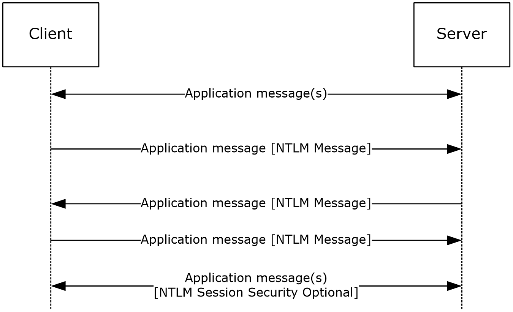

Figure 1: Typical NTLM authentication message flow

**Note** In the preceding diagram, the embedding of NTLM messages in the application protocol is shown by placing the NTLM messages within [ ] brackets. NTLM messages for both connection-oriented and [**connectionless**](#gt_connectionless-protocol) authentication are embedded in the application protocol as shown. Variations between the connection-oriented and connectionless NTLM protocol sequence are documented in sections [1.3.1.1](#Section_3.1.5.1) and [1.3.1.2](#Section_3.1.5.2).

After an authenticated NTLM [**session**](#gt_session) is established, the subsequent application messages can be protected with NTLM [**session security**](#gt_session-security). This is done by the application, which specifies what options (such as message integrity or confidentiality, as specified in the Abstract Data Model) it requires, before the NTLM authentication message sequence begins.<3>

Success and failure messages that are sent after the NTLM authentication message sequence are specific to the application protocol invoking NTLM authentication and are not part of the NTLM Authentication Protocol.

**Note** In subsequent message flows, only the NTLM message flows are shown because they are the focus of this document. Keep in mind that the NTLM messages in this section are embedded in the application protocol and transported by that protocol.

An overview of the connection-oriented and connectionless variants of NTLM is provided in the following sections.

<a id="Section_1.3.1.1"></a>
#### 1.3.1.1 NTLM Connection-Oriented Call Flow

The following illustration shows a typical NTLM [**connection-oriented**](#gt_a102d214-1b25-4113-b95f-466986ddbade) call flow when an application protocol creates an [**authenticated**](#gt_authentication) [**session**](#gt_session). For detailed message specifications, see section [2](#Section_2). The messages are processed (section [3](#Section_1.3)).

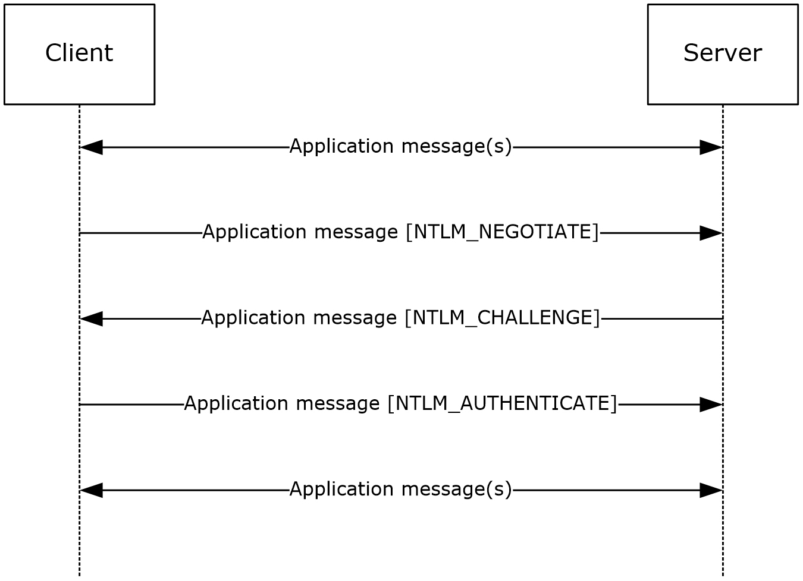

Figure 2: Connection-oriented NTLM message flow

- Application-specific protocol messages are sent between client and server.
- The NTLM protocol begins when the application requires an authenticated session. The client sends an NTLM NEGOTIATE_MESSAGE message to the server. This message specifies the desired security features of the session.
- The server sends an NTLM CHALLENGE_MESSAGE message to the client. The message includes agreed upon security features, and a [**nonce**](#gt_nonce) that the server generates.
- The client sends an NTLM AUTHENTICATE_MESSAGE message to the server. The message contains the name of a user and a response that proves that the client has the user's password. The server validates the response sent by the client. If the user name is for a local account, it can validate the response by using information in its local account database. If the user name is for a [**domain**](#gt_domain) account, it can validate the response by sending the user authentication information (the user name, the [**challenge**](#gt_challenge) sent to the client, and the response received from the client) to a [**domain controller (DC)**](#gt_domain-controller-dc) that can validate the response. (Section 3.1 [MS-APDS](../MS-APDS/MS-APDS.md)). The NTLM protocol completes.
- If the challenge and the response prove that the client has the user's password, the authentication succeeds, and the application protocol continues according to its specification. If the authentication fails, the server might send the status in an application protocol–specified way, or it might simply terminate the connection.
<a id="Section_1.3.1.2"></a>
#### 1.3.1.2 NTLM Connectionless (Datagram-Oriented) Call Flow

The following illustration shows a typical NTLM [**connectionless**](#gt_connectionless-protocol) (datagram-oriented) call flow.

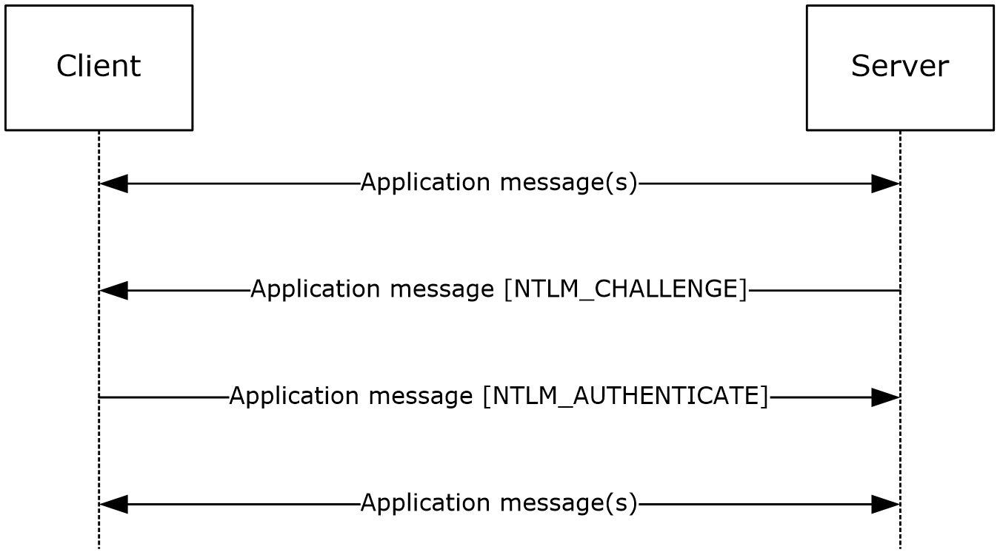

Figure 3: Connectionless NTLM message flow

Although it appears that the server is initiating the request, the client initiates the sequence by sending a message specified by the application protocol in use.

- Application-specific protocol messages are sent between client and server.
- The NTLM protocol begins when the application requires an authenticated session. The server sends the client an NTLM CHALLENGE_MESSAGE message. The message includes an indication of the security features desired by the server, and a [**nonce**](#gt_nonce) that the server generates.
- The client sends an NTLM AUTHENTICATE_MESSAGE message to the server. The message contains the name of a user and a response that proves that the client has the user's password. The server validates the response sent by the client. If the user name is for a local account, it can validate the response by using information in its local account database. If the user name is for a [**domain**](#gt_domain) account, it validates the response by sending the user authentication information (the user name, the [**challenge**](#gt_challenge) sent to the client, and the response received from the client) to a [**domain controller (DC)**](#gt_domain-controller-dc) that can validate the response. (see [MS-APDS](../MS-APDS/MS-APDS.md) section 3.1). The NTLM protocol completes.
- If the challenge and the response prove that the client has the user's password, the authentication succeeds and the application protocol continues according to its specification. If the authentication fails, the server might send the status in an application protocol–specified way, or it might simply terminate the connection.
<a id="Section_1.4"></a>
## 1.4 Relationship to Other Protocols

Because NTLM is embedded in the application protocol, it does not have transport dependencies of its own.

NTLM is used for authentication by several application protocols, including server message block [MS-SMB](../MS-SMB/MS-SMB.md) (SMB), and [MS-NTHT](../MS-NTHT/MS-NTHT.md) (HTTP). For an example of how NTLM is used in SMB, see section [4](../MS-SMB/MS-SMB.md).

Other protocols invoke NTLM as a function library. The interface to that library is specified in GSS-API [[RFC2743]](https://go.microsoft.com/fwlink/?LinkId=90378). The NTLM implementation of GSS-API calls is specified in section [3.4.6](#Section_3.4.6).<4>

<a id="Section_1.5"></a>
## 1.5 Prerequisites/Preconditions

To use NTLM or to use the NTLM [**security support provider (SSP)**](#gt_security-support-provider-ssp), a client is required to have a shared secret with the server or [**domain controller (DC)**](#gt_domain-controller-dc) when using a domain account.

<a id="Section_1.6"></a>
## 1.6 Applicability Statement

An implementer can use the NTLM Authentication Protocol to provide for client authentication (where the server verifies the client's identity) for applications. Because NTLM does not provide for server authentication, applications that use NTLM are susceptible to attacks from spoofed servers. Applications are therefore discouraged from using NTLM directly. If it is an option, authentication via KILE is preferred.<5>

<a id="Section_1.7"></a>
## 1.7 Versioning and Capability Negotiation

The NTLM authentication version is not negotiated by the protocol. It has to be configured on both the client and the server prior to authentication. The version is selected by the client, and requested during the protocol negotiation. If the server does not support the version selected by the client, authentication fails.

NTLM implements capability negotiation by using the flags described in section [2.2.2.5](#Section_2.2.2.5). The protocol messages used for negotiation depend on the mode of NTLM being used:

- In [**connection-oriented**](#gt_a102d214-1b25-4113-b95f-466986ddbade) NTLM, negotiation starts with a NEGOTIATE_MESSAGE message, carrying the client's preferences, and the server replies with **NegotiateFlags** in the subsequent CHALLENGE_MESSAGE message.
- In [**connectionless**](#gt_connectionless-protocol) NTLM, the server starts the negotiation with the CHALLENGE_MESSAGE message and the client replies with **NegotiateFlags** in the subsequent AUTHENTICATE_MESSAGE message.
<a id="Section_1.8"></a>
## 1.8 Vendor-Extensible Fields

None.

<a id="Section_1.9"></a>
## 1.9 Standards Assignments

NTLM has been assigned the following [**object identifier (OID)**](#gt_object-identifier-oid): iso.org.dod.internet.private.enterprise.Microsoft.security.mechanisms.NTLM (1.3.6.1.4.1.311.2.2.10)

<a id="Section_2"></a>
# 2 Messages

<a id="Section_2.1"></a>
## 2.1 Transport

NTLM messages are passed between the client and server. The NTLM messages MUST be embedded within the application protocol that is using NTLM authentication. NTLM itself does not establish any transport connections.

<a id="Section_2.2"></a>
## 2.2 Message Syntax

The NTLM Authentication Protocol consists of three message types used during authentication and one message type used for message integrity after authentication has occurred.

The authentication messages:

- [NEGOTIATE_MESSAGE](#Section_2.2.1.1) (2.2.1.1)
- [CHALLENGE_MESSAGE](#Section_2.2.1.2) (2.2.1.2)
- [AUTHENTICATE_MESSAGE](#Section_2.2.1.3) (2.2.1.3)
These are variable-length messages containing a fixed-length header and a variable-sized message payload. The fixed-length header always starts as shown in the following table with a **Signature** and **MessageType** field.

Depending on the **MessageType** field, the message can have other message-dependent fixed-length fields. The fixed-length fields are then followed by a variable-length message payload.

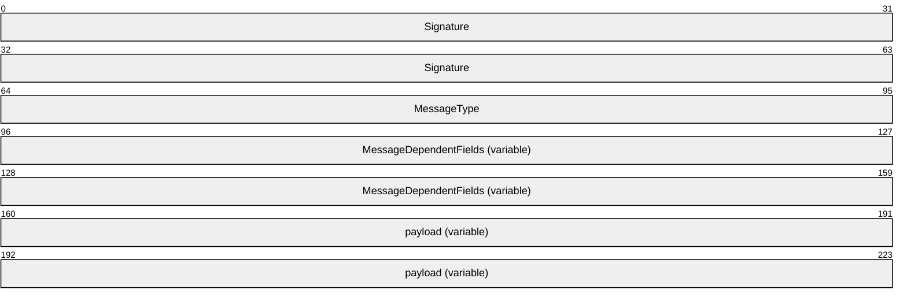

**Signature (8 bytes):** An 8-byte character array that MUST contain the ASCII string ('N', 'T', 'L', 'M', 'S', 'S', 'P', '\0').

**MessageType (4 bytes):** The **MessageType** field MUST take one of the values from the following list:

| Value | Meaning |
| --- | --- |
| NtLmNegotiate 0x00000001 | The message is a NEGOTIATE_MESSAGE. |
| NtLmChallenge 0x00000002 | The message is a CHALLENGE_MESSAGE. |
| NtLmAuthenticate 0x00000003 | The message is an AUTHENTICATE_MESSAGE. |

**MessageDependentFields (variable):** The NTLM message contents, as specified in section [2.2.1](#Section_2.2.1).

**payload (variable):** The payload data contains a message-dependent number of individual payload messages. This payload data is referenced by byte offsets located in the **MessageDependentFields**.

The message integrity NTLMSSP_MESSAGE_SIGNATURE message (section [2.2.2.9](#Section_2.2.2.9.1)) is fixed length and is appended to the calling application's messages. This message type is used only when an application has requested message integrity or confidentiality operations, based on the [**session key**](#gt_session-key) negotiated during a successful authentication.

All multiple-byte values are encoded in [**little-endian**](#gt_little-endian) byte order. Unless specified otherwise, 16-bit value fields are of type unsigned short, while 32-bit value fields are of type unsigned long.

In the NEGOTIATE_MESSAGE message all character string fields contain characters in the [**OEM character set**](#gt_3240e34e-920e-40ac-a672-342ac34a5e22). As specified in section [2.2.2.5](#Section_2.2.2.5), the client and server negotiate if they both support Unicode characters—in which case, all character string fields in the CHALLENGE_MESSAGE message and AUTHENTICATE_MESSAGE message contain an **RPC_UNICODE_STRING** structure ([MS-DTYP](../MS-DTYP/MS-DTYP.md) section 2.3.10) unless otherwise specified. Otherwise, the OEM character set is used. Agreement between client and server on the choice of OEM character set is not covered by the protocol and MUST occur out-of-band.

All Unicode strings are encoded with UTF-16 and the [**byte order mark**](#gt_byte-order-mark) (BOM) is not sent over the wire. NLMP uses little-endian order unless otherwise specified.

<a id="Section_2.2.1"></a>
### 2.2.1 NTLM Messages

<a id="Section_2.2.1.1"></a>
#### 2.2.1.1 NEGOTIATE_MESSAGE

The NEGOTIATE_MESSAGE defines an NTLM negotiate message that is sent from the client to the server. This message allows the client to specify its supported NTLM options to the server.

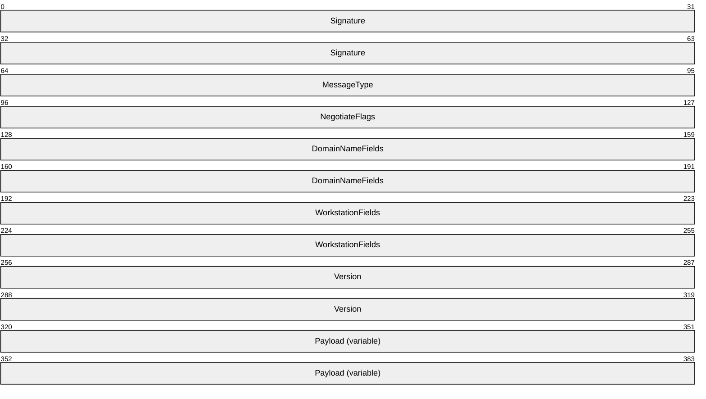

**Signature (8 bytes):** An 8-byte character array that MUST contain the ASCII string ('N', 'T', 'L', 'M', 'S', 'S', 'P', '\0').

**MessageType (4 bytes):** A 32-bit unsigned integer that indicates the message type. This field MUST be set to 0x00000001.

**NegotiateFlags (4 bytes):** A **NEGOTIATE** structure that contains a set of flags, as defined in section [2.2.2.5](#Section_2.2.2.5). The client sets flags to indicate options it supports.

**DomainNameFields (8 bytes):** A field containing **DomainName** information. The field diagram for **DomainNameFields** is as follows.

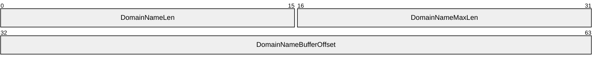

If the NTLMSSP_NEGOTIATE_OEM_DOMAIN_SUPPLIED flag is set in **NegotiateFlags**, indicating that a **DomainName** is supplied in the **Payload**, the fields are set to the following values:

- **DomainNameLen (2 bytes):** A 16-bit unsigned integer that defines the size, in bytes, of **DomainName** in the **Payload**.
- **DomainNameMaxLen (2 bytes):** A 16-bit unsigned integer that SHOULD be set to the value of **DomainNameLen,** and MUST be ignored on receipt.
- **DomainNameBufferOffset (4 bytes):** A 32-bit unsigned integer that defines the offset, in bytes, from the beginning of the NEGOTIATE_MESSAGE to **DomainName** in **Payload**.
Otherwise, if the NTLMSSP_NEGOTIATE_OEM_DOMAIN_SUPPLIED flag is not set in **NegotiateFlags**, indicating that a **DomainName** is not supplied in the **Payload**, the fields take the following values, and MUST be ignored upon receipt.

- **DomainNameLen** and **DomainNameMaxLen** fields SHOULD be set to zero.
- **DomainNameBufferOffset** field SHOULD be set to the offset from the beginning of the NEGOTIATE_MESSAGE to where the **DomainName** would be in **Payload** if it were present.
**WorkstationFields (8 bytes):** A field containing **WorkstationName** information**.** The field diagram for **WorkstationFields** is as follows.

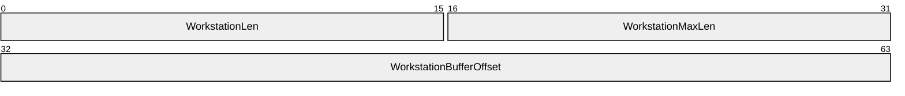

If the NTLMSSP_NEGOTIATE_OEM_WORKSTATION_SUPPLIED flag is set in **NegotiateFlags**, indicating that a **WorkstationName** is supplied in the **Payload**, the fields are set to the following values:

- **WorkstationLen (2 bytes):** A 16-bit unsigned integer that defines the size, in bytes, of **WorkStationName** in the **Payload**.
- **WorkstationMaxLen (2 bytes):** A 16-bit unsigned integer that SHOULD be set to the value of **WorkstationLen** and MUST be ignored on receipt.
- **WorkstationBufferOffset (4 bytes):** A 32-bit unsigned integer that defines the offset, in bytes, from the beginning of the NEGOTIATE_MESSAGE to **WorkstationName** in the **Payload**.
Otherwise, if the NTLMSSP_NEGOTIATE_OEM_WORKSTATION_SUPPLIED flag is not set in **NegotiateFlags**, indicating that a **WorkstationName** is not supplied in the **Payload**, the fields take the following values, and MUST be ignored upon receipt.

- **WorkstationLen** and **WorkstationMaxLen** fields SHOULD be set to zero.
- **WorkstationBufferOffset** field SHOULD be set to the offset from the beginning of the NEGOTIATE_MESSAGE to where the **WorkstationName** would be in **Payload** if it were present.
**Version (8 bytes):** A **VERSION** structure (as defined in section [2.2.2.10](#Section_2.2.2.10)) that is populated only when the NTLMSSP_NEGOTIATE_VERSION flag is set in the **NegotiateFlags** field; otherwise, it MUST be set to all zero. This structure SHOULD<6> be used for debugging purposes only. In normal (nondebugging) protocol messages, it is ignored and does not affect the NTLM message processing.

**Payload (variable):** A byte-array that contains the data referred to by the **DomainNameBufferOffset** and **WorkstationBufferOffset** fields. **Payload** data can be present in any order within the **Payload** field, with variable-length padding before or after the data. The data that can be present in the **Payload** field of this message, in no particular order, are:

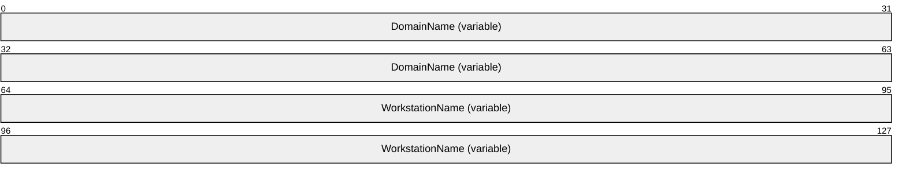

**DomainName (variable):** If **DomainNameLen** does not equal 0x0000, **DomainName** MUST be a byte-array that contains the name of the client authentication [**domain**](#gt_domain) that MUST be encoded using the [**OEM character set**](#gt_3240e34e-920e-40ac-a672-342ac34a5e22). Otherwise, this data is not present.<7>

**WorkstationName (variable):** If **WorkstationLen** does not equal 0x0000, **WorkstationName** MUST be a byte array that contains the name of the client machine that MUST be encoded using the OEM character set. Otherwise, this data is not present.

<a id="Section_2.2.1.2"></a>
#### 2.2.1.2 CHALLENGE_MESSAGE

The CHALLENGE_MESSAGE defines an NTLM [**challenge**](#gt_challenge) message that is sent from the server to the client. The CHALLENGE_MESSAGE is used by the server to challenge the client to prove its identity. For connection-oriented requests, the CHALLENGE_MESSAGE generated by the server is in response to the [NEGOTIATE_MESSAGE (section 2.2.1.1)](#Section_2.2.1.1) from the client.

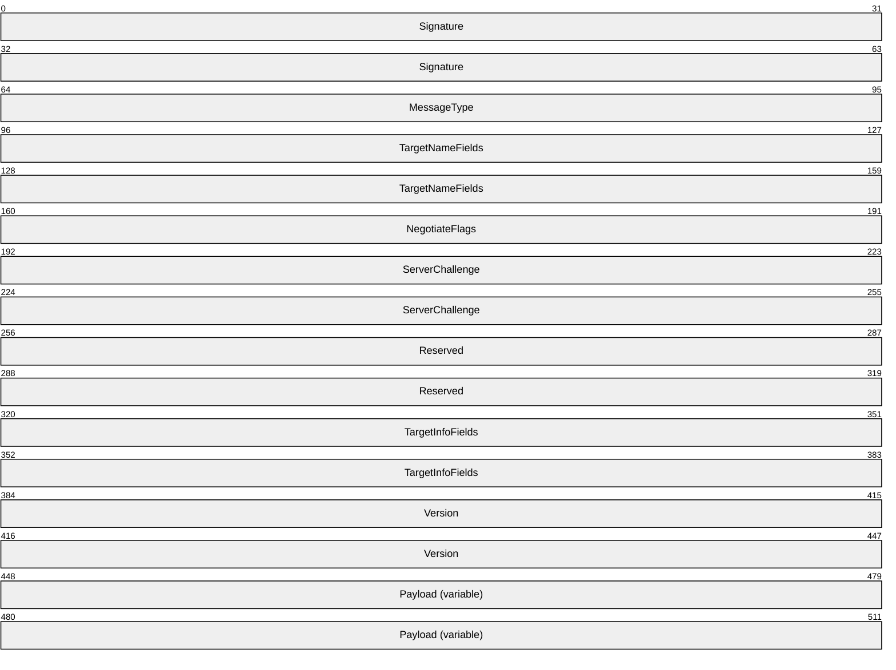

**Signature (8 bytes):** An 8-byte character array that MUST contain the ASCII string ('N', 'T', 'L', 'M', 'S', 'S', 'P', '\0').

**MessageType (4 bytes):** A 32-bit unsigned integer that indicates the message type. This field MUST be set to 0x00000002.

**TargetNameFields (8 bytes):** A field containing **TargetName** information. The field diagram for **TargetNameFields** is as follows.

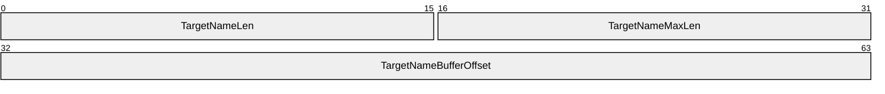

If the NTLMSSP_REQUEST_TARGET flag is set in **NegotiateFlags**, indicating that a **TargetName** is required, the fields are set to the following values:

- **TargetNameLen (2 bytes):** A 16-bit unsigned integer that defines the size, in bytes, of **TargetName** in **Payload**.
- **TargetNameMaxLen (2 bytes):** A 16-bit unsigned integer that SHOULD be set to the value of **TargetNameLen** and MUST be ignored on receipt.
- **TargetNameBufferOffset (4 bytes):** A 32-bit unsigned integer that defines the offset, in bytes, from the beginning of the CHALLENGE_MESSAGE to **TargetName** in **Payload**. If **TargetName** is a Unicode string, the values of **TargetNameBufferOffset** and **TargetNameLen** MUST be multiples of 2.
If the NTLMSSP_REQUEST_TARGET flag is not set in **NegotiateFlags**, indicating that a **TargetName** is not required, the fields take the following values, and MUST be ignored upon receipt.

- **TargetNameLen** and **TargetNameMaxLen** SHOULD be set to zero on transmission.
- **TargetNameBufferOffset** field SHOULD be set to the offset from the beginning of the CHALLENGE_MESSAGE to where the **TargetName** would be in **Payload** if it were present.
**NegotiateFlags (4 bytes):** A **NEGOTIATE** structure that contains a set of flags, as defined by section [2.2.2.5](#Section_2.2.2.5). The server sets flags to indicate options it supports or, if there has been a NEGOTIATE_MESSAGE (section 2.2.1.1), the choices it has made from the options offered by the client. If the client has set the NTLMSSP_NEGOTIATE_SIGN in the NEGOTIATE_MESSAGE the Server MUST return it.

**ServerChallenge (8 bytes):** A 64-bit value that contains the NTLM challenge. The challenge is a 64-bit [**nonce**](#gt_nonce). The processing of the ServerChallenge is specified in sections [3.1.5](#Section_3.1.5) and [3.2.5](#Section_1.3).

**Reserved (8 bytes):** An 8-byte array whose elements MUST be zero when sent and MUST be ignored on receipt.

**TargetInfoFields (8 bytes):** A field containing **TargetInfo** information. The field diagram for **TargetInfoFields** is as follows.


If the NTLMSSP_NEGOTIATE_TARGET_INFO flag is not clear in **NegotiateFlags**, indicating that **TargetInfo** is required, the fields SHOULD<8> be set to the following values:

- **TargetInfoLen (2 bytes):** A 16-bit unsigned integer that defines the size, in bytes, of TargetInfo in Payload.
- **TargetInfoMaxLen (2 bytes):** A 16-bit unsigned integer that SHOULD be set to the value of TargetInfoLen and MUST be ignored on receipt.
- **TargetInfoBufferOffset (4 bytes):** A 32-bit unsigned integer that defines the offset, in bytes, from the beginning of the CHALLENGE_MESSAGE to TargetInfo in Payload.
If the NTLMSSP_NEGOTIATE_TARGET_INFO flag is clear in **NegotiateFlags**, indicating that **TargetInfo** is not required, the fields take the following values, and MUST be ignored upon receipt.

- **TargetInfoLen** and **TargetInfoMaxLen** SHOULD be set to zero on transmission.
- **TargetInfoBufferOffset** field SHOULD be set to the offset from the beginning of the CHALLENGE_MESSAGE to where the **TargetInfo** would be in **Payload** if it were present.
**Version (8 bytes):** A **VERSION** structure (as defined in section [2.2.2.10](#Section_2.2.2.10)) that SHOULD<9> be populated only when the NTLMSSP_NEGOTIATE_VERSION flag is set in the **NegotiateFlags** field; otherwise, it MUST be set to all zero. This structure is used for debugging purposes only. In normal (non-debugging) protocol messages, it is ignored and does not affect the NTLM message processing.

**Payload (variable):** A byte array that contains the data referred to by the **TargetNameBufferOffset** and **TargetInfoBufferOffset** fields. Payload data can be present in any order within the **Payload** field, with variable-length padding before or after the data. The data that can be present in the **Payload** field of this message, in no particular order, are:

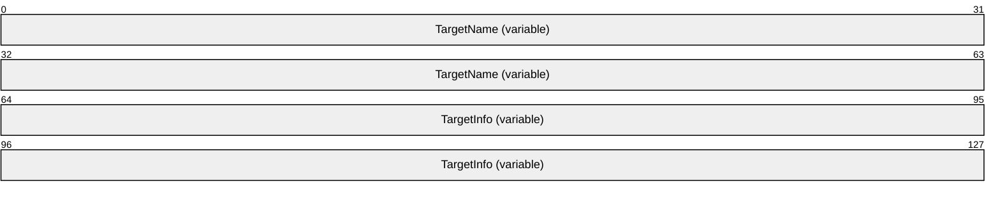

**TargetName (variable):** If **TargetNameLen** does not equal 0x0000, **TargetName** MUST be a byte array that contains the name of the server authentication realm, and MUST be expressed in the negotiated character set. A server that is a member of a [**domain**](#gt_domain) returns the domain of which it is a member, and a server that is not a member of a domain returns the server name.

**TargetInfo (variable):** If **TargetInfoLen** does not equal 0x0000, **TargetInfo** MUST be a byte array that contains a sequence of **AV_PAIR** structures. The **AV_PAIR** structure is defined in section [2.2.2.1](#Section_2.2.2.1). The length of each **AV_PAIR** is determined by its **AvLen** field (plus 4 bytes).

**Note** An **AV_PAIR** structure can start on any byte alignment and the sequence of **AV_PAIRs** has no padding between structures.

The sequence MUST be terminated by an **AV_PAIR** structure with an **AvId** field of MsvAvEOL. The total length of the **TargetInfo** byte array is the sum of the lengths, in bytes, of the **AV_PAIR** structures it contains.

**Note** If a **TargetInfo** AV_PAIR Value is textual, it MUST be encoded in Unicode irrespective of what character set was negotiated (section 2.2.2.1).

<a id="Section_2.2.1.3"></a>
#### 2.2.1.3 AUTHENTICATE_MESSAGE

The AUTHENTICATE_MESSAGE defines an NTLM authenticate message that is sent from the client to the server after the [CHALLENGE_MESSAGE (section 2.2.1.2)](#Section_2.2.1.2) is processed by the client.

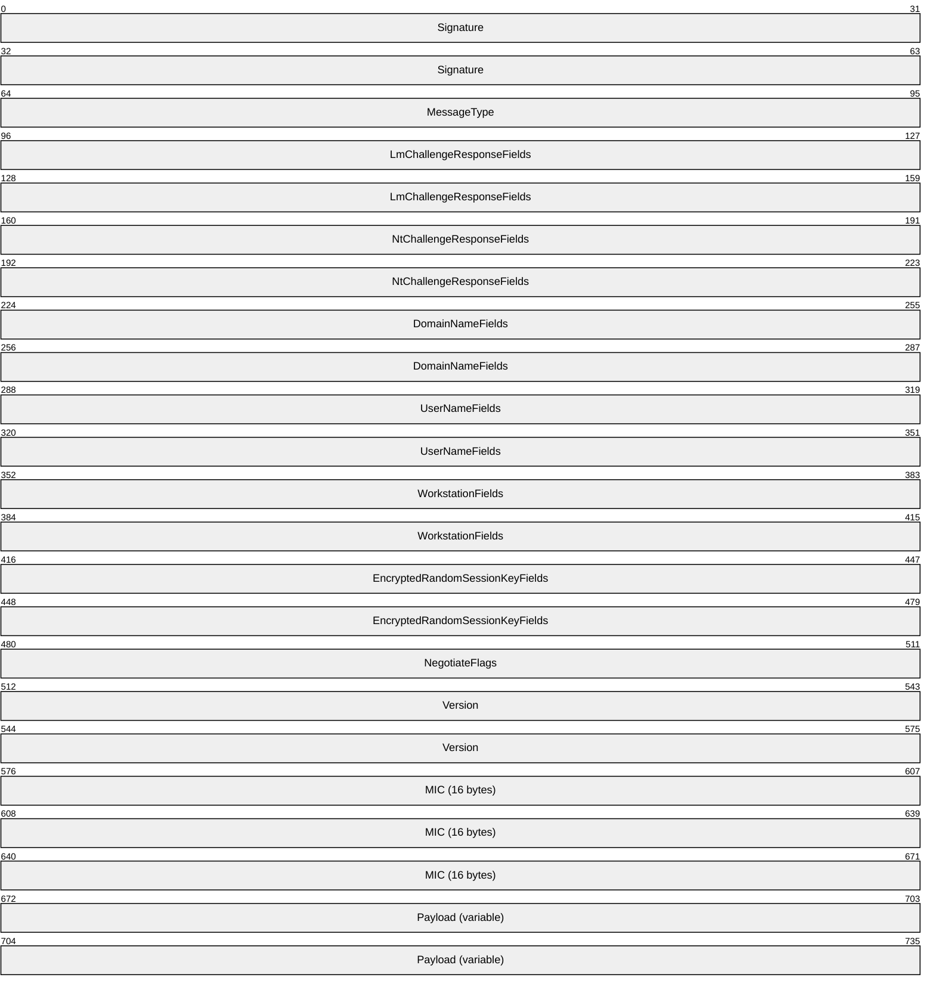

**Signature (8 bytes):** An 8-byte character array that MUST contain the ASCII string ('N', 'T', 'L', 'M', 'S', 'S', 'P', '\0').

**MessageType (4 bytes):** A 32-bit unsigned integer that indicates the message type. This field MUST be set to 0x00000003.

**LmChallengeResponseFields (8 bytes):** A field containing **LmChallengeResponse** information. The field diagram for **LmChallengeResponseFields** is as follows.

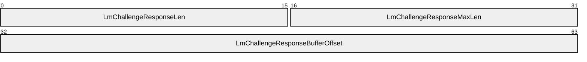

If the client chooses to send an **LmChallengeResponse** to the server, the fields are set to the following values:

- **LmChallengeResponseLen (2 bytes):** A 16-bit unsigned integer that defines the size, in bytes, of LmChallengeResponse in Payload.
- **LmChallengeResponseMaxLen (2 bytes):** A 16-bit unsigned integer that SHOULD be set to the value of LmChallengeResponseLen and MUST be ignored on receipt.
- **LmChallengeResponseBufferOffset (4 bytes):** A 32-bit unsigned integer that defines the offset, in bytes, from the beginning of the AUTHENTICATE_MESSAGE to LmChallengeResponse in Payload.
Otherwise, if the client chooses not to send an **LmChallengeResponse** to the server, the fields take the following values:

- **LmChallengeResponseLen** and **LmChallengeResponseMaxLen** MUST be set to zero on transmission.
- **LmChallengeResponseBufferOffset** field SHOULD be set to the offset from the beginning of the AUTHENTICATE_MESSAGE to where the **LmChallengeResponse** would be in **Payload** if it was present.
**NtChallengeResponseFields (8 bytes):** A field containing **NtChallengeResponse** information. The field diagram for **NtChallengeResponseFields** is as follows.

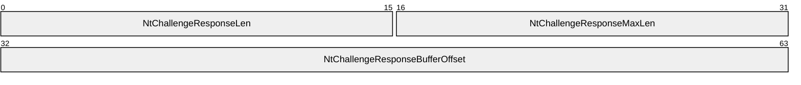

If the client chooses to send an **NtChallengeResponse** to the server, the fields are set to the following values:

- **NtChallengeResponseLen (2 bytes):** A 16-bit unsigned integer that defines the size, in bytes, of **NtChallengeResponse** in **Payload**.
- **NtChallengeResponseMaxLen (2 bytes):** A 16-bit unsigned integer that SHOULD be set to the value of **NtChallengeResponseLen** and MUST be ignored on receipt.
- **NtChallengeResponseBufferOffset (4 bytes):** A 32-bit unsigned integer that defines the offset, in bytes, from the beginning of the AUTHENTICATE_MESSAGE to **NtChallengeResponse** in **Payload**.<10>
Otherwise, if the client chooses not to send an **NtChallengeResponse** to the server, the fields take the following values:

- **NtChallengeResponseLen**, and **NtChallengeResponseMaxLen** MUST be set to zero on transmission.
- **NtChallengeResponseBufferOffset** field SHOULD be set to the offset from the beginning of the AUTHENTICATE_MESSAGE to where the **NtChallengeResponse** would be in **Payload** if it was present.
**DomainNameFields (8 bytes):** A field containing **DomainName** information. The field diagram for **DomainNameFields** is as follows.


If the client chooses to send a **DomainName** to the server, the fields are set to the following values:

- **DomainNameLen (2 bytes):** A 16-bit unsigned integer that defines the size, in bytes, of **DomainName** in **Payload**.
- **DomainNameMaxLen (2 bytes):** A 16-bit unsigned integer that SHOULD be set to the value of **DomainNameLen** and MUST be ignored on receipt.
- **DomainNameBufferOffset (4 bytes):** A 32-bit unsigned integer that defines the offset, in bytes, from the beginning of the AUTHENTICATE_MESSAGE to **DomainName** in **Payload**. If **DomainName** is a Unicode string, the values of **DomainNameBufferOffset** and **DomainNameLen** MUST be multiples of 2.
Otherwise, if the client chooses not to send a **DomainName** to the server, the fields take the following values:

- **DomainNameLen** and **DomainNameMaxLen** MUST be set to zero on transmission.
- **DomainNameBufferOffset** field SHOULD be set to the offset from the beginning of the AUTHENTICATE_MESSAGE to where the **DomainName** would be in **Payload** if it was present.
**UserNameFields (8 bytes):** A field containing **UserName** information. The field diagram for the **UserNameFields** is as follows.

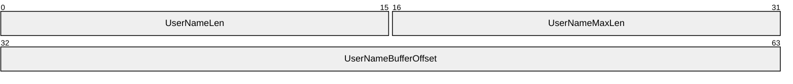

If the client chooses to send a **UserName** to the server, the fields are set to the following values:

- **UserNameLen (2 bytes):** A 16-bit unsigned integer that defines the size, in bytes, of **UserName** in **Payload**, not including a NULL terminator.
- **UserNameMaxLen (2 bytes):** A 16-bit unsigned integer that SHOULD be set to the value of **UserNameLen** and MUST be ignored on receipt.
- **UserNameBufferOffset (4 bytes):** A 32-bit unsigned integer that defines the offset, in bytes, from the beginning of the AUTHENTICATE_MESSAGE to **UserName** in **Payload**. If the **UserName** to be sent contains a Unicode string, the values of **UserNameBufferOffset** and **UserNameLen** MUST be multiples of 2.
Otherwise, if the client chooses not to send a **UserName** to the server, the fields take the following values:

- **UserNameLen** and **UserNameMaxLen** MUST be set to zero on transmission.
- **UserNameBufferOffset** field SHOULD be set to the offset from the beginning of the AUTHENTICATE_MESSAGE to where the **UserName** would be in **Payload** if it were present.
**WorkstationFields (8 bytes):** A field containing **Workstation** information. The field diagram for the **WorkstationFields** is as follows.


If the client chooses to send a **Workstation** to the server, the fields are set to the following values:

- **WorkstationLen (2 bytes):** A 16-bit unsigned integer that defines the size, in bytes, of **Workstation** in **Payload**.
- **WorkstationMaxLen (2 bytes):** A 16-bit unsigned integer that SHOULD be set to the value of **WorkstationLen** and MUST be ignored on receipt.
- **WorkstationBufferOffset (4 bytes):** A 32-bit unsigned integer that defines the offset, in bytes, from the beginning of the AUTHENTICATE_MESSAGE to **Workstation** in **Payload**. If **Workstation** contains a Unicode string, the values of **WorkstationBufferOffset** and **WorkstationLen** MUST be multiples of 2.
Othewise, if the client chooses not to send a **Workstation** to the server, the fields take the following values:

- **WorkstationLen** and **WorkstationMaxLen** MUST be set to zero on transmission.
- **WorkstationBufferOffset** field SHOULD be set to the offset from the beginning of the AUTHENTICATE_MESSAGE to where the **Workstation** would be in **Payload** if it was present.
**EncryptedRandomSessionKeyFields (8 bytes):** A field containing **EncryptedRandomSessionKey** information. The field diagram for **EncryptedRandomSessionKeyFields** is as follows.

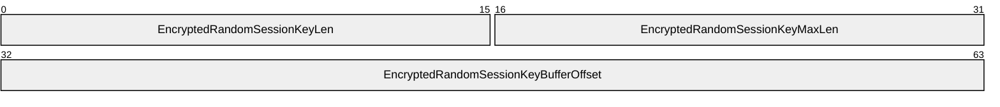

If the NTLMSSP_NEGOTIATE_KEY_EXCH flag is set in **NegotiateFlags**, indicating that an **EncryptedRandomSessionKey** is supplied, the fields are set to the following values:

- **EncryptedRandomSessionKeyLen (2 bytes):** A 16-bit unsigned integer that defines the size, in bytes, of **EncryptedRandomSessionKey** in Payload.
- **EncryptedRandomSessionKeyMaxLen (2 bytes):** A 16-bit unsigned integer that SHOULD be set to the value of **EncryptedRandomSessionKeyLen** and MUST be ignored on receipt.
- **EncryptedRandomSessionKeyBufferOffset (4 bytes):** A 32-bit unsigned integer that defines the offset, in bytes, from the beginning of the AUTHENTICATE_MESSAGE to **EncryptedRandomSessionKey** in **Payload**.
Otherwise, if the NTLMSSP_NEGOTIATE_KEY_EXCH flag is not set in **NegotiateFlags**, indicating that an **EncryptedRandomSessionKey** is not supplied, the fields take the following values, and must be ignored upon receipt:

- **EncryptedRandomSessionKeyLen** and **EncryptedRandomSessionKeyMaxLen** SHOULD be set to zero on transmission.
- **EncryptedRandomSessionKeyBufferOffset** field SHOULD be set to the offset from the beginning of the AUTHENTICATE_MESSAGE to where the **EncryptedRandomSessionKey** would be in **Payload** if it was present.
**NegotiateFlags (4 bytes):** In connectionless mode, a **NEGOTIATE** structure that contains a set of flags (section [2.2.2.5](#Section_2.2.2.5)) and represents the conclusion of negotiation—the choices the client has made from the options the server offered in the CHALLENGE_MESSAGE. In connection-oriented mode, a **NEGOTIATE** structure (section 2.2.2.5) that contains the set of bit flags negotiated in the previous messages.

**Version (8 bytes):** A **VERSION** structure (section [2.2.2.10](#Section_2.2.2.10)) that SHOULD be populated only when the NTLMSSP_NEGOTIATE_VERSION flag is set in the **NegotiateFlags** field; otherwise, it MUST be set to all zero. This structure is used for debugging purposes only. In normal protocol messages, it is ignored and does not affect the NTLM message processing.<11>

**MIC (16 bytes):** The message integrity for the NTLM NEGOTIATE_MESSAGE, CHALLENGE_MESSAGE, and AUTHENTICATE_MESSAGE.<12>

**Payload (variable):** A byte array that contains the data referred to by the **LmChallengeResponseBufferOffset**, **NtChallengeResponseBufferOffset**, **DomainNameBufferOffset**, **UserNameBufferOffset**, **WorkstationBufferOffset**, and **EncryptedRandomSessionKeyBufferOffset** message fields. Payload data can be present in any order within the **Payload** field, with variable-length padding before or after the data. The data that can be present in the **Payload** field of this message, in no particular order, are:

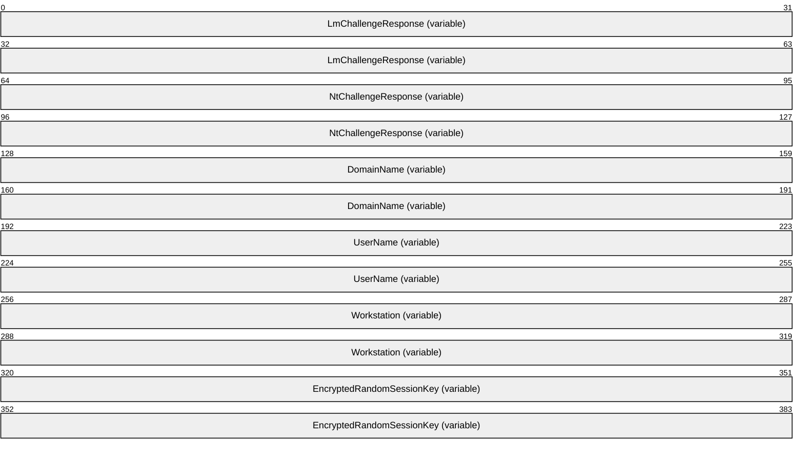

**LmChallengeResponse (variable):** An **LM_RESPONSE** structure (section [2.2.2.3](#Section_2.2.2.3)) or an **LMv2_RESPONSE** structure (section [2.2.2.4](#Section_2.2.2.4)) that contains the computed LM response to the [**challenge**](#gt_challenge). If NTLM v2 authentication is configured, then **LmChallengeResponse** MUST be an **LMv2_RESPONSE** structure. Otherwise, it MUST be an **LM_RESPONSE** structure.

**NtChallengeResponse (variable):** An [NTLM_RESPONSE](#Section_2.2.2.6) structure (section 2.2.2.6) or **NTLMv2_RESPONSE** structure (section [2.2.2.8](#Section_2.2.2.4)) that contains the computed NT response to the challenge. If NTLM v2 authentication is configured, **NtChallengeResponse** MUST be an **NTLMv2_RESPONSE**. Otherwise, it MUST be an **NTLM_RESPONSE**.

**DomainName (variable):** The [**domain**](#gt_domain) or computer name hosting the user account. **DomainName** MUST be encoded in the negotiated character set.

**UserName (variable):** The name of the user to be authenticated. **UserName** MUST be encoded in the negotiated character set.

**Workstation (variable):** The name of the computer to which the user is logged on. **Workstation** MUST be encoded in the negotiated character set.

**EncryptedRandomSessionKey (variable):** The client's encrypted random [**session key**](#gt_session-key). **EncryptedRandomSessionKey** and its usage are defined in sections [3.1.5](#Section_3.1.5) and [3.2.5](#Section_1.3).

<a id="Section_2.2.2"></a>
### 2.2.2 NTLM Structures

<a id="Section_2.2.2.1"></a>
#### 2.2.2.1 AV_PAIR

The **AV_PAIR** structure defines an attribute/value pair. Sequences of **AV_PAIR** structures are used in the [CHALLENGE_MESSAGE (section 2.2.1.2)](#Section_2.2.1.2) directly. They are also in the [AUTHENTICATE_MESSAGE (section 2.2.1.3)](#Section_2.2.1.3) via the [NTLMv2_CLIENT_CHALLENGE (section 2.2.2.7)](#Section_2.2.2.7) structure.

Although the following figure suggests that the most significant bit (MSB) of **AvId** is aligned with the MSB of a 32-bit word, an **AV_PAIR** can be aligned on any byte boundary and can be 4+N bytes long for arbitrary N (N = the contents of **AvLen**).

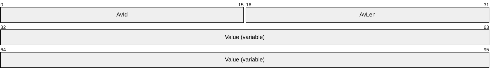

**AvId (2 bytes):** A 16-bit unsigned integer that defines the information type in the **Value** field. The contents of this field MUST be a value from the following table. The corresponding **Value** field in this **AV_PAIR** MUST contain the information specified in the description of that **AvId**.

| Value | Meaning |
| --- | --- |
| MsvAvEOL 0x0000 | Indicates that this is the last **AV_PAIR** in the list. **AvLen** MUST be 0. This type of information MUST be present in the [**AV pair**](#gt_av-pair) list. |
| MsvAvNbComputerName 0x0001 | The server's NetBIOS computer name. The name MUST be in Unicode, and is not null-terminated. This type of information MUST be present in the AV_pair list. |
| MsvAvNbDomainName 0x0002 | The server's NetBIOS [**domain name**](#gt_domain-name). The name MUST be in Unicode, and is not null-terminated. This type of information MUST be present in the AV_pair list. |
| MsvAvDnsComputerName 0x0003 | The [**fully qualified domain name (FQDN)**](#gt_fully-qualified-domain-name-fqdn) of the computer. The name MUST be in Unicode, and is not null-terminated. |
| MsvAvDnsDomainName 0x0004 | The FQDN of the domain. The name MUST be in Unicode, and is not null-terminated. |
| MsvAvDnsTreeName 0x0005 | The FQDN of the [**forest**](#gt_forest). The name MUST be in Unicode, and is not null-terminated.<13> |
| MsvAvFlags 0x0006 | A 32-bit value indicating server or client configuration. 0x00000001: Indicates to the client that the account authentication is constrained. 0x00000002: Indicates that the client is providing message integrity in the MIC field (section 2.2.1.3) in the AUTHENTICATE_MESSAGE.<14> 0x00000004: Indicates that the client is providing a target SPN generated from an untrusted source.<15> |
| MsvAvTimestamp 0x0007 | A **FILETIME** structure ([MS-DTYP](../MS-DTYP/MS-DTYP.md) section 2.3.3) in little-endian byte order that contains the server local time. This structure is always sent in the CHALLENGE_MESSAGE.<16> |
| MsvAvSingleHost 0x0008 | A [Single_Host_Data (section 2.2.2.2)](#Section_2.2.2.2) structure. The **Value** field contains a platform-specific blob, as well as a **MachineID** created at computer startup to identify the calling machine.<17> |
| MsvAvTargetName 0x0009 | The SPN of the target server. The name MUST be in Unicode and is not null-terminated.<18> |
| MsvAvChannelBindings 0x000A | A channel bindings hash. The **Value** field contains an MD5 hash ([[RFC4121]](https://go.microsoft.com/fwlink/?LinkId=90459) section 4.1.1.2) of a gss_channel_bindings_struct ([[RFC2744]](https://go.microsoft.com/fwlink/?LinkId=125716) section 3.11). An all-zero value of the hash is used to indicate absence of channel bindings.<19> |

**AvLen (2 bytes):** A 16-bit unsigned integer that defines the length, in bytes, of the **Value** field.

**Value (variable):** A variable-length byte-array that contains the value defined for this AV pair entry. The contents of this field depend on the type expressed in the **AvId** field. The available types and resulting format and contents of this field are specified in the table within the **AvId** field description in this topic.

When AV pairs are specified, MsvAvEOL MUST be the last item specified. All other AV pairs, if present, can be specified in any order.

<a id="Section_2.2.2.2"></a>
#### 2.2.2.2 Single_Host_Data

The **Single_Host_Data** structure allows a client to send machine-specific information within an authentication exchange to services on the same machine. The client can produce additional information to be processed in an implementation-specific way when the client and server are on the same host. If the server and client platforms are different or if they are on different hosts, then the information MUST be ignored. Any fields after the **MachineID** field MUST be ignored on receipt.<20>

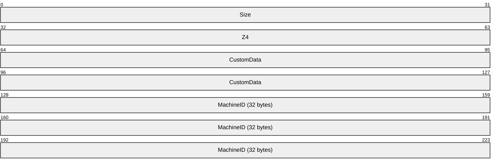

**Size (4 bytes):** A 32-bit unsigned integer that defines the length, in bytes, of the **Value** field in the [AV_PAIR (section 2.2.2.1)](#Section_2.2.2.1) structure.

**Z4 (4 bytes):** A 32-bit integer value containing 0x00000000.

**CustomData (8 bytes):** An 8-byte platform-specific blob containing info only relevant when the client and the server are on the same host.<21>

**MachineID (32 bytes):** A 256-bit random number created at computer startup to identify the calling machine.<22>

<a id="Section_2.2.2.3"></a>
#### 2.2.2.3 LM_RESPONSE

The **LM_RESPONSE** structure defines the NTLM v1 authentication **LmChallengeResponse** in the [AUTHENTICATE_MESSAGE](#Section_2.2.1.3). This response is used only when NTLM v1 authentication is configured.

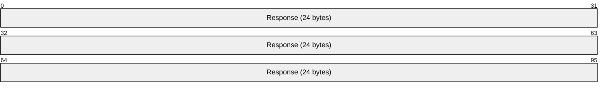

**Response (24 bytes):** A 24-byte array of unsigned char that contains the client's **LmChallengeResponse** as defined in section [3.3.1](#Section_4.2.2).

<a id="Section_2.2.2.4"></a>
#### 2.2.2.4 LMv2_RESPONSE

The **LMv2_RESPONSE** structure defines the NTLM v2 authentication **LmChallengeResponse** in the [AUTHENTICATE_MESSAGE](#Section_2.2.1.3). This response is used only when NTLM v2 authentication is configured.

```mermaid
packet-beta
  0-95: "Response (16 bytes)"
  96-159: "ChallengeFromClient"
```

**Response (16 bytes):** A 16-byte array of unsigned char that contains the client's LM [**challenge**](#gt_challenge)-response. This is the portion of the **LmChallengeResponse** field to which the HMAC_MD5 algorithm has been applied, as defined in section [3.3.2](#Section_4.2.2). Specifically, **Response** corresponds to the result of applying the HMAC_MD5 algorithm, using the key ResponseKeyLM, to a message consisting of the concatenation of the ResponseKeyLM, ServerChallenge and ClientChallenge.

**ChallengeFromClient (8 bytes):** An 8-byte array of unsigned char that contains the client's ClientChallenge (as defined in section 3.3.2). See section [3.1.5.1.2](#Section_3.1.5.1.2) for details.

<a id="Section_2.2.2.5"></a>
#### 2.2.2.5 NEGOTIATE

During NTLM authentication, each of the following flags is a possible value of the **NegotiateFlags** field of the [NEGOTIATE_MESSAGE](#Section_2.2.1.1), [CHALLENGE_MESSAGE](#Section_2.2.1.2), and [AUTHENTICATE_MESSAGE](#Section_2.2.1.3), unless otherwise noted. These flags define client or server NTLM capabilities supported by the sender.

```mermaid
packet-beta
  0-0: "W"
  1-1: "V"
  2-2: "U"
  3-3: "r1"
  4-4: "r2"
  5-5: "r3"
  6-6: "T"
  7-7: "r4"
  8-8: "S"
  9-9: "R"
  10-10: "r5"
  11-11: "Q"
  12-12: "P"
  13-13: "r6"
  14-14: "O"
  15-15: "N"
  16-16: "M"
  17-17: "r7"
  18-18: "L"
  19-19: "K"
  20-20: "J"
  21-21: "r8"
  22-22: "H"
  23-23: "r9"
  24-24: "G"
  25-25: "F"
  26-26: "E"
  27-27: "D"
  28-28: "r 1 0"
  29-29: "C"
  30-30: "B"
  31-31: "A"
```

**W (1 bit):** If set, requests 56-bit encryption. If the client sends NTLMSSP_NEGOTIATE_SEAL or NTLMSSP_NEGOTIATE_SIGN with NTLMSSP_NEGOTIATE_56 to the server in the NEGOTIATE_MESSAGE, the server MUST return NTLMSSP_NEGOTIATE_56 to the client in the CHALLENGE_MESSAGE. Otherwise it is ignored. If both NTLMSSP_NEGOTIATE_56 and NTLMSSP_NEGOTIATE_128 are requested and supported by the client and server, NTLMSSP_NEGOTIATE_56 and NTLMSSP_NEGOTIATE_128 will both be returned to the client. Clients and servers that set NTLMSSP_NEGOTIATE_SEAL SHOULD set NTLMSSP_NEGOTIATE_56 if it is supported. An alternate name for this field is **NTLMSSP_NEGOTIATE_56**.

**V (1 bit):** If set, requests an explicit [**key**](#gt_key) exchange. This capability SHOULD be used because it improves security for message integrity or confidentiality. See sections [3.2.5.1.2](#Section_3.2.5.1.2), [3.2.5.2.1](#Section_3.2.5.2.1), and [3.2.5.2.2](#Section_3.2.5.2.2) for details. An alternate name for this field is **NTLMSSP_NEGOTIATE_KEY_EXCH**.

**U (1 bit):** If set, requests 128-bit [**session key**](#gt_session-key) negotiation. An alternate name for this field is NTLMSSP_NEGOTIATE_128. If the client sends NTLMSSP_NEGOTIATE_128 to the server in the NEGOTIATE_MESSAGE, the server MUST return NTLMSSP_NEGOTIATE_128 to the client in the CHALLENGE_MESSAGE only if the client sets NTLMSSP_NEGOTIATE_SEAL or NTLMSSP_NEGOTIATE_SIGN. Otherwise it is ignored. If both NTLMSSP_NEGOTIATE_56 and NTLMSSP_NEGOTIATE_128 are requested and supported by the client and server, NTLMSSP_NEGOTIATE_56 and NTLMSSP_NEGOTIATE_128 will both be returned to the client. Clients and servers that set NTLMSSP_NEGOTIATE_SEAL SHOULD set NTLMSSP_NEGOTIATE_128 if it is supported. An alternate name for this field is **NTLMSSP_NEGOTIATE_128**.<23>

**r1 (1 bit):** This bit is unused and MUST be zero.

**r2 (1 bit):** This bit is unused and MUST be zero.

**r3 (1 bit):** This bit is unused and MUST be zero.

**T (1 bit):** If set, requests the protocol version number. The data corresponding to this flag is provided in the **Version** field of the NEGOTIATE_MESSAGE, the CHALLENGE_MESSAGE, and the AUTHENTICATE_MESSAGE.<24> An alternate name for this field is **NTLMSSP_NEGOTIATE_VERSION**.

**r4 (1 bit):** This bit is unused and MUST be zero.

**S (1 bit):** If set, indicates that the **TargetInfo** fields in the CHALLENGE_MESSAGE (section 2.2.1.2) are populated. An alternate name for this field is **NTLMSSP_NEGOTIATE_TARGET_INFO**.

**R (1 bit):** If set, requests the usage of the [**LMOWF**](#gt_lmowf). An alternate name for this field is **NTLMSSP_REQUEST_NON_NT_SESSION_KEY**.

**r5 (1 bit):** This bit is unused and MUST be zero.

**Q (1 bit):** If set, requests an [**identify level token**](#gt_identify-level-token). An alternate name for this field is **NTLMSSP_NEGOTIATE_IDENTIFY**.

**P (1 bit):** If set, requests usage of the NTLM v2 [**session security**](#gt_session-security). NTLM v2 session security is a misnomer because it is not NTLM v2. It is NTLM v1 using the extended session security that is also in NTLM v2. NTLMSSP_NEGOTIATE_LM_KEY and NTLMSSP_NEGOTIATE_EXTENDED_SESSIONSECURITY are mutually exclusive. If both NTLMSSP_NEGOTIATE_EXTENDED_SESSIONSECURITY and NTLMSSP_NEGOTIATE_LM_KEY are requested, NTLMSSP_NEGOTIATE_EXTENDED_SESSIONSECURITY alone MUST be returned to the client. NTLM v2 authentication session key generation MUST be supported by both the client and the [**DC**](#gt_domain-controller-dc) in order to be used, and extended session security signing and sealing requires support from the client and the server in order to be used.<25> An alternate name for this field is **NTLMSSP_NEGOTIATE_EXTENDED_SESSIONSECURITY**.

**r6 (1 bit):** This bit is unused and MUST be zero.

**O (1 bit):** If set, **TargetName** MUST be a server name. The data corresponding to this flag is provided by the server in the **TargetName** field of the CHALLENGE_MESSAGE. If this bit is set, then NTLMSSP_TARGET_TYPE_DOMAIN MUST NOT be set. This flag MUST be ignored in the NEGOTIATE_MESSAGE and the AUTHENTICATE_MESSAGE. An alternate name for this field is **NTLMSSP_TARGET_TYPE_SERVER**.

**N (1 bit):** If set, **TargetName** MUST be a [**domain name**](#gt_domain-name). The data corresponding to this flag is provided by the server in the **TargetName** field of the CHALLENGE_MESSAGE. If set, then NTLMSSP_TARGET_TYPE_SERVER MUST NOT be set. This flag MUST be ignored in the NEGOTIATE_MESSAGE and the AUTHENTICATE_MESSAGE. An alternate name for this field is **NTLMSSP_TARGET_TYPE_DOMAIN**.

**M (1 bit):** If set, a session key is generated regardless of the states of NTLMSSP_NEGOTIATE_SIGN and NTLMSSP_NEGOTIATE_SEAL. A session key MUST always exist to generate the MIC (section [3.1.5.1.2](#Section_3.1.5.1.2)) in the authenticate message. NTLMSSP_NEGOTIATE_ALWAYS_SIGN MUST be set in the NEGOTIATE_MESSAGE to the server and the CHALLENGE_MESSAGE to the client. NTLMSSP_NEGOTIATE_ALWAYS_SIGN is overridden by NTLMSSP_NEGOTIATE_SIGN and NTLMSSP_NEGOTIATE_SEAL, if they are supported. An alternate name for this field is **NTLMSSP_NEGOTIATE_ALWAYS_SIGN**.

**r7 (1 bit):** This bit is unused and MUST be zero.

**L (1 bit):** This flag indicates whether the **Workstation** field is present. If this flag is not set, the **Workstation** field MUST be ignored. If this flag is set, the length of the **Workstation** field specifies whether the workstation name is nonempty or not.<26> An alternate name for this field is **NTLMSSP_NEGOTIATE_OEM_WORKSTATION_SUPPLIED**.

**K (1 bit):** If set, the domain name is provided (section 2.2.1.1).<27> An alternate name for this field is **NTLMSSP_NEGOTIATE_OEM_DOMAIN_SUPPLIED**.

**J (1 bit):** If set, the connection SHOULD be anonymous.<28>

**r8 (1 bit):** This bit is unused and SHOULD be zero.<29>

**H (1 bit):** If set, requests usage of the NTLM v1 session security protocol. NTLMSSP_NEGOTIATE_NTLM MUST be set in the NEGOTIATE_MESSAGE to the server and the CHALLENGE_MESSAGE to the client. An alternate name for this field is **NTLMSSP_NEGOTIATE_NTLM**.

**r9 (1 bit):** This bit is unused and MUST be zero.

**G (1 bit):** If set, requests LAN Manager (LM) session key computation. NTLMSSP_NEGOTIATE_LM_KEY and NTLMSSP_NEGOTIATE_EXTENDED_SESSIONSECURITY are mutually exclusive. If both NTLMSSP_NEGOTIATE_LM_KEY and NTLMSSP_NEGOTIATE_EXTENDED_SESSIONSECURITY are requested, NTLMSSP_NEGOTIATE_EXTENDED_SESSIONSECURITY alone MUST be returned to the client. NTLM v2 authentication session key generation MUST be supported by both the client and the DC in order to be used, and extended session security signing and sealing requires support from the client and the server to be used. An alternate name for this field is **NTLMSSP_NEGOTIATE_LM_KEY**.

**F (1 bit):** If set, requests connectionless authentication. If NTLMSSP_NEGOTIATE_DATAGRAM is set, then NTLMSSP_NEGOTIATE_KEY_EXCH MUST always be set in the AUTHENTICATE_MESSAGE to the server and the CHALLENGE_MESSAGE to the client. An alternate name for this field is **NTLMSSP_NEGOTIATE_DATAGRAM**.

**E (1 bit):** If set, requests session key negotiation for message confidentiality. If the client sends NTLMSSP_NEGOTIATE_SEAL to the server in the NEGOTIATE_MESSAGE, the server MUST return NTLMSSP_NEGOTIATE_SEAL to the client in the CHALLENGE_MESSAGE. Clients and servers that set NTLMSSP_NEGOTIATE_SEAL SHOULD always set NTLMSSP_NEGOTIATE_56 and NTLMSSP_NEGOTIATE_128, if they are supported. An alternate name for this field is **NTLMSSP_NEGOTIATE_SEAL**.

**D (1 bit):** If set, requests session key negotiation for message signatures. If the client sends NTLMSSP_NEGOTIATE_SIGN to the server in the NEGOTIATE_MESSAGE, the server MUST return NTLMSSP_NEGOTIATE_SIGN to the client in the CHALLENGE_MESSAGE. An alternate name for this field is **NTLMSSP_NEGOTIATE_SIGN**.

**r10 (1 bit):** This bit is unused and MUST be zero.

**C (1 bit):** If set, a **TargetName** field of the **CHALLENGE_MESSAGE** (section 2.2.1.2) MUST be supplied. An alternate name for this field is **NTLMSSP_REQUEST_TARGET**.

**B (1 bit):** If set, requests OEM character set encoding. An alternate name for this field is **NTLM_NEGOTIATE_OEM**. See bit A for details.

**A (1 bit):** If set, requests [**Unicode**](#gt_unicode) character set encoding. An alternate name for this field is **NTLMSSP_NEGOTIATE_UNICODE**.

The A and B bits are evaluated together as follows:

- A==1: The choice of character set encoding MUST be Unicode.
- A==0 and B==1: The choice of character set encoding MUST be OEM.
- A==0 and B==0: The protocol MUST return SEC_E_INVALID_TOKEN.
<a id="Section_2.2.2.6"></a>
#### 2.2.2.6 NTLM v1 Response: NTLM_RESPONSE

The **NTLM_RESPONSE** structure defines the NTLM v1 authentication **NtChallengeResponse** in the [AUTHENTICATE_MESSAGE](#Section_2.2.1.3). This response is only used when NTLM v1 authentication is configured.

```mermaid
packet-beta
  0-95: "Response (24 bytes)"
```

**Response (24 bytes):** A 24-byte array of unsigned char that contains the client's **NtChallengeResponse** (section [3.3.1](#Section_4.2.2)).

<a id="Section_2.2.2.7"></a>
#### 2.2.2.7 NTLM v2: NTLMv2_CLIENT_CHALLENGE

The **NTLMv2_CLIENT_CHALLENGE** structure defines the client [**challenge**](#gt_challenge) in the [AUTHENTICATE_MESSAGE](#Section_2.2.1.3). This structure is used only when NTLM v2 authentication is configured and is transported in the [NTLMv2_RESPONSE (section 2.2.2.8)](#Section_2.2.2.4) structure.<30>

```mermaid
packet-beta
  0-7: "RespType"
  8-15: "HiRespType"
  16-31: "Reserved1"
  32-63: "Reserved2"
  64-127: "TimeStamp"
  128-191: "ChallengeFromClient"
  192-223: "Reserved3"
  224-287: "AvPairs (variable)"
```

**RespType (1 byte):** An 8-bit unsigned char that contains the current version of the challenge response type. This field MUST be 0x01.

**HiRespType (1 byte):** An 8-bit unsigned char that contains the maximum supported version of the challenge response type. This field MUST be 0x01.

**Reserved1 (2 bytes):** A 16-bit unsigned integer that SHOULD be 0x0000 and MUST be ignored on receipt.

**Reserved2 (4 bytes):** A 32-bit unsigned integer that SHOULD be 0x00000000 and MUST be ignored on receipt.

**TimeStamp (8 bytes):** A 64-bit unsigned integer that contains the current system time, represented as the number of 100 nanosecond ticks elapsed since midnight of January 1, 1601 (UTC).

**ChallengeFromClient (8 bytes):** An 8-byte array of unsigned char that contains the client's ClientChallenge (as defined in section [3.3.2](#Section_4.2.2)). See section [3.1.5.1.2](#Section_3.1.5.1.2) for details.

**Reserved3 (4 bytes):** A 32-bit unsigned integer that SHOULD be 0x00000000 and MUST be ignored on receipt.

**AvPairs (variable):** A byte array that contains a sequence of **AV_PAIR** structures (section [2.2.2.1](#Section_2.2.2.1)). The sequence contains the server-naming context and is terminated by an **AV_PAIR** structure with an **AvId** field of MsvAvEOL.

<a id="Section_2.2.2.8"></a>
#### 2.2.2.8 NTLM2 V2 Response: NTLMv2_RESPONSE

The **NTLMv2_RESPONSE** structure defines the NTLMv2 authentication NtChallengeResponse in the [AUTHENTICATE_MESSAGE](#Section_2.2.1.3). This response is used only when NTLMv2 authentication is configured.

```mermaid
packet-beta
  0-95: "Response (16 bytes)"
  96-159: "NTLMv2_CLIENT_CHALLENGE (variable)"
```

**Response (16 bytes):** A 16-byte array of unsigned char that contains the client's **NTChallengeResponse** as defined in section [3.3.2](#Section_4.2.2). Response corresponds to the NTProofStr variable from section 3.3.2.

**NTLMv2_CLIENT_CHALLENGE (variable):** A variable-length byte array, defined in section [2.2.2.7](#Section_2.2.2.7), that contains the **ClientChallenge** as defined in section 3.3.2. ChallengeFromClient corresponds to the temp variable from section 3.3.2.

<a id="Section_2.2.2.9"></a>
#### 2.2.2.9 NTLMSSP_MESSAGE_SIGNATURE

The **NTLMSSP_MESSAGE_SIGNATURE** structure (section [3.4.4](#Section_1.3)), specifies the signature block used for application message integrity and confidentiality. This structure is then passed back to the application, which embeds it within the application protocol messages, along with the NTLM-encrypted or integrity-protected application message data.

This structure MUST take one of the two following forms, depending on whether the NTLMSSP_NEGOTIATE_EXTENDED_SESSIONSECURITY flag is negotiated:

- [NTLMSSP_MESSAGE_SIGNATURE](#Section_2.2.2.9.1)
- [NTLMSSP_MESSAGE_SIGNATURE for Extended Session Security](#Section_2.2.2.9.2)
<a id="Section_2.2.2.9.1"></a>
##### 2.2.2.9.1 NTLMSSP_MESSAGE_SIGNATURE

This version of the **NTLMSSP_MESSAGE_SIGNATURE** structure MUST be used when the NTLMSSP_NEGOTIATE_EXTENDED_SESSIONSECURITY flag is not negotiated.

```mermaid
packet-beta
  0-31: "Version"
  32-63: "RandomPad"
  64-95: "Checksum"
  96-127: "SeqNum"
```

**Version (4 bytes):** A 32-bit unsigned integer that contains the signature version. This field MUST be 0x00000001.

**RandomPad (4 bytes):** A 4-byte array that contains the random pad for the message.

**Checksum (4 bytes):** A 4-byte array that contains the [**checksum**](#gt_checksum) for the message.

**SeqNum (4 bytes):** A 32-bit unsigned integer that contains the NTLM [**sequence number**](#gt_sequence-number) for this application message.

<a id="Section_2.2.2.9.2"></a>
##### 2.2.2.9.2 NTLMSSP_MESSAGE_SIGNATURE for Extended Session Security

This version of the **NTLMSSP_MESSAGE_SIGNATURE** structure MUST be used when the NTLMSSP_NEGOTIATE_EXTENDED_SESSIONSECURITY flag is negotiated.

```mermaid
packet-beta
  0-31: "Version"
  32-95: "Checksum"
  96-127: "SeqNum"
```

**Version (4 bytes):** A 32-bit unsigned integer that contains the signature version. This field MUST be 0x00000001.

**Checksum (8 bytes):** An 8-byte array that contains the [**checksum**](#gt_checksum) for the message.

**SeqNum (4 bytes):** A 32-bit unsigned integer that contains the NTLM [**sequence number**](#gt_sequence-number) for this application message.

<a id="Section_2.2.2.10"></a>
#### 2.2.2.10 VERSION

The **VERSION** structure contains operating system version information that SHOULD<31> be ignored. This structure is used for debugging purposes only and its value does not affect NTLM message processing. It is populated in the [NEGOTIATE_MESSAGE](#Section_2.2.1.1), [CHALLENGE_MESSAGE](#Section_2.2.1.2), and [AUTHENTICATE_MESSAGE](#Section_2.2.1.3) messages only if NTLMSSP_NEGOTIATE_VERSION is negotiated; otherwise, it MUST be set to all zero.<32>

```mermaid
packet-beta
  0-7: "ProductMajorVersion"
  8-15: "ProductMinorVersion"
  16-31: "ProductBuild"
  32-55: "Reserved"
  56-63: "NTLMRevisionCurrent"
```

**ProductMajorVersion (1 byte):** An 8-bit unsigned integer that SHOULD<33> contain the major version number of the operating system in use.

**ProductMinorVersion (1 byte):** An 8-bit unsigned integer that SHOULD<34> contain the minor version number of the operating system in use.

**ProductBuild (2 bytes):** A 16-bit unsigned integer that contains the build number of the operating system in use. This field SHOULD be set to a 16-bit quantity that identifies the operating system build number.

**Reserved (3 bytes):** A 24-bit data area that SHOULD be set to zero and MUST be ignored by the recipient.

**NTLMRevisionCurrent (1 byte):** An 8-bit unsigned integer that contains a value indicating the current revision of the NTLMSSP in use. This field SHOULD contain the following value:

| Value | Meaning |
| --- | --- |
| NTLMSSP_REVISION_W2K3 0x0F | Version 15 of the NTLMSSP is in use. |

<a id="Section_3"></a>
# 3 Protocol Details

The following sections offer a detailed specification of the NTLM message computation:

- Sections [3.1.5](#Section_3.1.5) and [3.2.5](#Section_1.3) specify how the client and server compute messages and respond to messages.
- Section [3.3](#Section_1.3) specifies how the response computation is calculated, depending on whether NTLM v1 or NTLM v2 is used. This includes the ComputeResponse function, as well as the [**NTOWF**](#gt_ntowf) and [**LMOWF**](#gt_lmowf) functions, which are used by the ComputeResponse function.
- Section [3.4](#Section_1.3) specifies how message integrity and message confidentiality are provided, including a detailed specification of the algorithms used to calculate the signing and sealing [**keys**](#gt_key).
The Cryptographic Operations Reference in section [6](#Section_6) defines the cryptographic primitives used in this section.

<a id="Section_3.1"></a>
## 3.1 Client Details

<a id="Section_3.1.1"></a>
### 3.1.1 Abstract Data Model

This section describes a conceptual model of possible data organization that an implementation maintains to participate in this protocol. The described organization is provided to facilitate the explanation of how the protocol behaves. This document does not mandate that implementations adhere to this model as long as their external behavior is consistent with that described in this document.

The following sections specify variables that are internal to the client and are maintained across the NTLM authentication sequence.

<a id="Section_3.1.1.1"></a>
#### 3.1.1.1 Variables Internal to the Protocol

**ClientConfigFlags:** The set of client configuration flags (section [2.2.2.5](#Section_2.2.2.5)) that specify the full set of capabilities of the client.

**ExportedSessionKey:** A 128-bit (16-byte) [**session key**](#gt_session-key) used to derive ClientSigningKey, ClientSealingKey, ServerSealingKey, and ServerSigningKey.

**NegFlg:** The set of configuration flags (section 2.2.2.5) that specifies the negotiated capabilities of the client and server for the current NTLM [**session**](#gt_session).

**User:** A string that indicates the name of the user.

**UserDom:** A string that indicates the name of the user's [**domain**](#gt_domain).

The following NTLM configuration variables are internal to the client and impact all authenticated sessions:

**NoLMResponseNTLMv1:** A Boolean setting that SHOULD<35> control using the NTLM response for the LM response to the server challenge when NTLMv1 authentication is used. The default value of this state variable is TRUE.

**ClientBlocked:** A Boolean setting that SHOULD<36> disable the client from sending NTLM authenticate messages, as defined in section [2.2.1.3](#Section_2.2.1.3). The default value of this state variable is FALSE.

**ClientBlockExceptions:** A list of server names that SHOULD<37> use NTLM authentication. The default value of this state variable is NULL.

**ClientRequire128bitEncryption:** A Boolean setting that requires the client to use 128-bit encryption.<38>

The following variables are internal to the client and are maintained for the entire length of the authenticated session:

**MaxLifetime:** An integer that indicates the maximum lifetime for challenge/response pairs.<39>

**ClientSigningKey:** The signing [**key**](#gt_key) used by the client to sign messages and used by the server to verify signed client messages. It is generated after the client is authenticated by the server and is not passed over the wire.

**ClientSealingKey:** The sealing key used by the client to seal messages and used by the server to unseal client messages. It is generated after the client is authenticated by the server and is not passed over the wire.

**SeqNum:** A 4-byte [**sequence number**](#gt_sequence-number) (section [3.4.4](#Section_1.3)).

**ServerSealingKey:** The sealing key used by the server to seal messages and used by the client to unseal server messages. It is generated after the client is authenticated by the server and is not passed over the wire.

**ServerSigningKey:** The signing key used by the server to sign messages and used by the client to verify signed server messages. It is generated after the client is authenticated by the server and is not passed over the wire.

<a id="Section_3.1.1.2"></a>
#### 3.1.1.2 Variables Exposed to the Application

The following parameters are provided by the application to the [**NTLM client**](#gt_ntlm-client). These logical parameters can influence various protocol-defined flags.<40>

**Note** The following variables are logical, abstract parameters that an implementation MUST maintain and expose to provide the proper level of [**service**](#gt_service). How these variables are maintained and exposed is up to the implementation.

**Integrity:** A Boolean setting that indicates that the caller requests that messages be signed so that they cannot be tampered with while in transit. Setting this flag results in the NTLMSSP_NEGOTIATE_SIGN flag being set in the **NegotiateFlags** field of the NTLM NEGOTIATE_MESSAGE.

**Replay Detect:** A Boolean setting that indicates that the caller requests that messages be signed so that they cannot be replayed. Setting this flag results in the NTLMSSP_NEGOTIATE_SIGN flag being set in the **NegotiateFlags** field of the NTLM NEGOTIATE_MESSAGE.

**Sequence Detect:** A Boolean setting that indicates that the caller requests that messages be signed so that they cannot be sent out of order. Setting this flag results in the NTLMSSP_NEGOTIATE_SIGN flag being set in the **NegotiateFlags** field of the NTLM NEGOTIATE_MESSAGE.

**Confidentiality:** A Boolean setting that indicates that the caller requests that messages be encrypted so that they cannot be read while in transit. If the Confidentiality option is selected by the client, NTLM performs a bitwise OR operation with the following NTLM Negotiate Flags into the **ClientConfigFlags**. (The ClientConfigFlags indicate which features the client host supports.)

NTLMSSP_NEGOTIATE_SEAL

NTLMSSP_NEGOTIATE_KEY_EXCH

NTLMSSP_NEGOTIATE_LM_KEY

NTLMSSP_NEGOTIATE_EXTENDED_SESSIONSECURITY

**Datagram:** A Boolean setting that indicates that the connectionless mode of NTLM is to be selected. If the Datagram option is selected by the client, then connectionless mode is used and NTLM performs a bitwise OR operation with the following NTLM Negotiate Flag into the **ClientConfigFlags**.

NTLMSSP_NEGOTIATE_DATAGRAM

**Identify:** A Boolean setting that indicates that the caller wants the server to know the identity of the caller, but that the server not be allowed to impersonate the caller to resources on that system. Setting this flag results in the NTLMSSP_NEGOTIATE_IDENTIFY flag being set. Indicates that the GSS_C_IDENTIFY_FLAG flag was set in the GSS_Init_sec_context call, as discussed in [[RFC4757]](https://go.microsoft.com/fwlink/?LinkId=90488) section 7.1, and results in the GSS_C_IDENTIFY_FLAG flag set in the authenticator's **checksum** field ([RFC4757] section 7.1).

The following variables are used by applications for channel binding token support:

**ClientSuppliedTargetName:** Service principal name (SPN) of the service to which the client wishes to authenticate. This value is optional.<41>

**ClientChannelBindingsUnhashed:** An octet string provided by the application used for channel binding. This value is optional.<42>

**UnverifiedTargetName:** A Boolean setting that indicates that the caller generated the target's SPN from an untrusted source. This value is optional.<43>

<a id="Section_3.1.2"></a>
### 3.1.2 Timers

None.

<a id="Section_3.1.3"></a>
### 3.1.3 Initialization

None.

<a id="Section_3.1.4"></a>
### 3.1.4 Higher-Layer Triggered Events

The application SHOULD<44> initiate NTLM authentication through the [**Security Support Provider Interface (SSPI)**](#gt_security-support-provider-interface-sspi). NTLM does not support token framing as defined in [[RFC2743]](https://go.microsoft.com/fwlink/?LinkId=90378) section 3.1.

- GSS_Init_sec_context
The client application calls GSS_Init_sec_context() to establish a security context with the server application.

If the ClientBlocked == TRUE and targ_name ([RFC2743] section 2.2.1) does not equal any of the **ClientBlockExceptions** server names, then the [**NTLM client**](#gt_ntlm-client) MUST return STATUS_NOT_SUPPORTED ([MS-ERREF](../MS-ERREF/MS-ERREF.md) section 2.3.1) to the client application.<45>

NTLM has no requirements on which flags are used and will simply honor what was requested by the application or protocol. For an example of such a protocol specification, see [MS-RPCE](../MS-RPCE/MS-RPCE.md) section 3.3.1.5.2.2. The application will send the NEGOTIATE_MESSAGE (section [2.2.1.1](#Section_2.2.1.1)) to the server application.

When the client application receives the CHALLENGE_MESSAGE (section [2.2.1.2](#Section_2.2.1.2)) from the server application, the client application will call GSS_Init_sec_context() with the CHALLENGE_MESSAGE as input. The client application will send the AUTHENTICATE_MESSAGE (section [2.2.1.3](#Section_2.2.1.3)) to the server application.

- GSS_Wrap
Once the security context is established, the client application can call GSS_WrapEx() (section [3.4.6](#Section_3.4.6)) to encrypt messages.

- GSS_Unwrap
Once the security context is established, the client application can call GSS_UnwrapEx() (section [3.4.7](#Section_3.4.7)) to decrypt messages that were encrypted by GSS_WrapEx.

- GSS_GetMIC
Once the security context is established, the client application can call GSS_GetMICEx() (section [3.4.8](#Section_3.4.8)) to sign messages, producing an **NTLMSSP_MESSAGE_SIGNATURE** structure (section [2.2.2.9](#Section_2.2.2.9.1)).

- GSS_VerifyMIC
Once the security context is established, the client application can call GSS_VerifyMICEx() (section [3.4.9](#Section_3.4.9)) to verify a signature produced by GSS_GetMICEx().

<a id="Section_3.1.5"></a>
### 3.1.5 Message Processing Events and Sequencing Rules

This section specifies how the client processes and returns messages. As discussed earlier, the message transport is provided by the application that is using NTLM.

<a id="Section_3.1.5.1"></a>
#### 3.1.5.1 Connection-Oriented

Message processing on the client takes place in the following two cases:

- When the application initiates authentication and the client then sends a NEGOTIATE_MESSAGE (section [2.2.1.1](#Section_2.2.1.1)).
- When the client receives a CHALLENGE_MESSAGE (section [2.2.1.2](#Section_2.2.1.2)) from the server and then sends back an AUTHENTICATE_MESSAGE (section [2.2.1.3](#Section_2.2.1.3)).
These two cases are specified in the following sections.

When encryption is desired, the stream cipher RC4 is used. The [**key**](#gt_key) for RC4 is established at the start of the [**session**](#gt_session) for an instance of RC4 dedicated to that session. RC4 then continues to generate key stream in order over all messages of the session, without rekeying.

The pseudocode RC4(handle, message) is defined as the bytes of the message XORed with bytes of the RC4 key stream, using the current state of the session's RC4 internal **key state**. When the session is torn down, the key structure is destroyed.

The pseudocode RC4K(key, message) is defined as a one-time instance of RC4 whose key is initialized to key, after which RC4 is applied to the message. On completion of this operation, the internal **key state** is destroyed.

<a id="Section_3.1.5.1.1"></a>
##### 3.1.5.1.1 Client Initiates the NEGOTIATE_MESSAGE

When the client application initiates the exchange through [**SSPI**](#gt_security-support-provider-interface-sspi), the [**NTLM client**](#gt_ntlm-client) sends the NEGOTIATE_MESSAGE (section [2.2.1.1](#Section_2.2.1.1)) to the server, which is embedded in an application protocol message, and encoded according to that application protocol.

If ClientBlocked == TRUE and targ_name ([[RFC2743]](https://go.microsoft.com/fwlink/?LinkId=90378) section 2.2.1) does not equal any of the **ClientBlockExceptions** server names, then the NTLM client MUST return STATUS_NOT_SUPPORTED ([MS-ERREF](../MS-ERREF/MS-ERREF.md) section 2.3.1) to the client application.<46>

The client prepares a NEGOTIATE_MESSAGE and sets the following fields:

- The **Signature** field is set to the string, "NTLMSSP".
- The **MessageType** field is set to NtLmNegotiate.
The client sets the following configuration flags in the **NegotiateFlags** field of the NEGOTIATE_MESSAGE:

- NTLMSSP_REQUEST_TARGET
- NTLMSSP_NEGOTIATE_NTLM
- NTLMSSP_NEGOTIATE_ALWAYS_SIGN
- NTLMSSP_NEGOTIATE_UNICODE
If LM authentication is not being used, then the client sets the following configuration flag in the **NegotiateFlags** field of the NEGOTIATE_MESSAGE:

- NTLMSSP_NEGOTIATE_EXTENDED_SESSIONSECURITY
In addition, the client sets the flags specified by the application in the **NegotiateFlags** field in addition to the initialized flags.

If the NTLMSSP_NEGOTIATE_VERSION flag is set by the client application, the **Version** field MUST be set to the current version (section [2.2.2.10](#Section_2.2.2.10)), the **DomainName** field MUST be set to a zero-length string, and the **Workstation** field MUST be set to a zero-length string. If the NTLMSSP_NEGOTIATE_VERSION flag is not set by the client application, the Version field MUST be set to all-zero.

<a id="Section_3.1.5.1.2"></a>
##### 3.1.5.1.2 Client Receives a CHALLENGE_MESSAGE from the Server

When the client receives a CHALLENGE_MESSAGE (section [2.2.1.2](#Section_2.2.1.2)) from the server, it MUST determine if the features selected by the server are strong enough for the client authentication policy. If not, the client MUST return an error to the calling application. Otherwise, the client responds with an AUTHENTICATE_MESSAGE (section [2.2.1.3](#Section_2.2.1.3)).

If ClientRequire128bitEncryption == TRUE, then if 128-bit encryption is not negotiated, then the client MUST return SEC_E_UNSUPPORTED_FUNCTION ([MS-ERREF](../MS-ERREF/MS-ERREF.md) section 2.1.1) to the application.

The client processes the CHALLENGE_MESSAGE and constructs an AUTHENTICATE_MESSAGE per the following pseudo code where all strings are encoded as RPC_UNICODE_STRING ([MS-DTYP](../MS-DTYP/MS-DTYP.md) section 2.3.10):

-- Input:

-- ClientConfigFlags, User, and UserDom - Defined in section 3.1.1.

-- NbMachineName - The NETBIOS machine name of the server.

-- An NTLM NEGOTIATE_MESSAGE whose fields are defined in

section 2.2.1.1.

-- An NTLM CHALLENGE_MESSAGE whose message fields are defined in

section 2.2.1.2.

-- An NTLM AUTHENTICATE_MESSAGE whose message fields are

defined in section 2.2.1.3 with MIC field set to 0.

-- OPTIONAL ClientSuppliedTargetName - Defined in section 3.1.1.2

-- OPTIONAL ClientChannelBindingUnhashed - Defined in section 3.1.1.2

--

-- Output:

-- ClientHandle - The handle to a key state structure corresponding

-- to the current state of the ClientSealingKey

-- ServerHandle - The handle to a key state structure corresponding

-- to the current state of the ServerSealingKey

-- An NTLM AUTHENTICATE_MESSAGE whose message fields are defined in

section 2.2.1.3.

--

-- The following NTLM keys generated by the client are defined in

section 3.1.1:

-- ExportedSessionKey, ClientSigningKey, ClientSealingKey,

ServerSigningKey, and ServerSealingKey.

-- Temporary variables that do not pass over the wire are defined

below:

-- KeyExchangeKey, ResponseKeyNT, ResponseKeyLM, SessionBaseKey -

Temporary variables used to store 128-bit keys.

-- Time - Temporary variable used to hold the 64-bit time.

-- MIC - message integrity for the NTLM NEGOTIATE_MESSAGE,

CHALLENGE_MESSAGE and AUTHENTICATE_MESSAGE

--

-- Functions used:

-- NTOWFv1, LMOWFv1, NTOWFv2, LMOWFv2, ComputeResponse - Defined in

section 3.3

-- KXKEY, SIGNKEY, SEALKEY - Defined in sections 3.4.5, 3.4.6,

and 3.4.7

-- Currenttime, NIL, NONCE - Defined in section 6.

Fields MUST be set as follows:

- **ChallengeFromClient** to an 8-byte [**nonce**](#gt_nonce).
- **UserName** to User.
- **DomainName** to UserDom.
- **Signature** to the string "NTLMSSP".
- **MessageType** to NtLmAuthenticate.
If the NTLMSSP_NEGOTIATE_VERSION flag is set by the client application, the **Version** field MUST be set to th11302e current version (section [2.2.2.10](#Section_2.2.2.10)), and the **Workstation** field MUST be set to NbMachineName. Otherwise, if the NTLMSSP_NEGOTIATE_VERSION flag is not set by the client application, the Version field MUST be set to all-zero.

If NTLM v2 authentication is used, the client SHOULD send the timestamp in the CHALLENGE_MESSAGE.<47>

If there exists a CHALLENGE_MESSAGE.TargetInfo.AvId ==

MsvAvTimestamp

Set Time to CHALLENGE_MESSAGE.TargetInfo.Value of that AVPair

Else

Set Time to Currenttime

Endif

If NTLM v2 authentication is used and the CHALLENGE_MESSAGE does not contain both MsvAvNbComputerName and MsvAvNbDomainName AVPairs and either Integrity is TRUE or Confidentiality is TRUE, then return STATUS_LOGON_FAILURE ([MS-ERREF] section 2.3.1).

If NTLM v2 authentication is used and the CHALLENGE_MESSAGE **TargetInfo** field (section 2.2.1.2) has an MsvAvTimestamp present, the client SHOULD NOT send the LmChallengeResponse and SHOULD send Z(24) instead.<48>

Response keys are computed using the ComputeResponse() function, as specified in section [3.3](#Section_1.3).

Set AUTHENTICATE_MESSAGE.NtChallengeResponse,

AUTHENTICATE_MESSAGE.LmChallengeResponse, SessionBaseKey to

ComputeResponse(CHALLENGE_MESSAGE.NegotiateFlags, ResponseKeyNT,

ResponseKeyLM, CHALLENGE_MESSAGE.ServerChallenge,

ChallengeFromClient, Time,

CHALLENGE_MESSAGE.TargetInfo)

Set KeyExchangeKey to KXKEY(SessionBaseKey, LmChallengeResponse,

CHALLENGE_MESSAGE.ServerChallenge)

If (NTLMSSP_NEGOTIATE_KEY_EXCH bit is set in

CHALLENGE_MESSAGE.NegotiateFlags

AND (NTLMSSP_NEGOTIATE_SIGN OR NTLMSSP_NEGOTIATE_SEAL are set in

CHALLENGE_MESSAGE.NegotiateFlags))

Set ExportedSessionKey to NONCE(16)

Set AUTHENTICATE_MESSAGE.EncryptedRandomSessionKey to

RC4K(KeyExchangeKey, ExportedSessionKey)

Else

Set ExportedSessionKey to KeyExchangeKey

Set AUTHENTICATE_MESSAGE.EncryptedRandomSessionKey to NIL

Endif

Set ClientSigningKey to SIGNKEY(NegFlg, ExportedSessionKey, "Client")

Set ServerSigningKey to SIGNKEY(NegFlg, ExportedSessionKey, "Server")

Set ClientSealingKey to SEALKEY(NegFlg, ExportedSessionKey, "Client")

Set ServerSealingKey to SEALKEY(NegFlg, ExportedSessionKey, "Server")

RC4Init(ClientHandle, ClientSealingKey)

RC4Init(ServerHandle, ServerSealingKey)

Set MIC to HMAC_MD5(ExportedSessionKey, ConcatenationOf(

NEGOTIATE_MESSAGE, CHALLENGE_MESSAGE, AUTHENTICATE_MESSAGE))

Set AUTHENTICATE_MESSAGE.MIC to MIC

If the CHALLENGE_MESSAGE **TargetInfo** field has an MsvAvTimestamp present, the client SHOULD provide a MIC:<49>

- If there is an **AV_PAIR** structure (section [2.2.2.1](#Section_2.2.2.1)) with the **AvId** field set to MsvAvFlags,
- then in the **Value** field, set bit 0x2 to 1.
- else add an **AV_PAIR** structure and set the **AvId** field to MsvAvFlags and the **Value** field bit 0x2 to 1.
- Populate the **MIC** field with the MIC.
The client SHOULD send the channel binding **AV_PAIR** <50>:

- If the CHALLENGE_MESSAGE contains a **TargetInfo** field
- If the ClientChannelBindingsUnhashed (section [3.1.1.2](#Section_3.1.1.2)) is not NULL
- Add an **AV_PAIR** structure and set the **AvId** field to MsvAvChannelBindings and the **Value** field to MD5_HASH(ClientChannelBindingsUnhashed).
- Else add an **AV_PAIR** structure and set the **AvId** field to MsvAvChannelBindings and the **Value** field to Z(16).
- If ClientSuppliedTargetName (section 3.1.1.2) is not NULL
- Add an **AV_PAIR** structure and set the **AvId** field to MsvAvTargetName and the **Value** field to ClientSuppliedTargetName without terminating NULL. If UnverifiedTargetName (section 3.1.1.2) is TRUE, then in **AvId** field = MsvAvFlags set 0x00000004 bit.<51>
- Else add an **AV_PAIR** structure and set the **AvId** field to MsvAvTargetName and the **Value** field to an empty string without terminating NULL.
When this process is complete, the client MUST send the AUTHENTICATE_MESSAGE to the server, embedded in an application protocol message, and encoded as specified by that application protocol.

<a id="Section_3.1.5.2"></a>
#### 3.1.5.2 Connectionless

The client action for connectionless NTLM authentication is similar to that of connection-oriented authentication (section [3.1.5.1](#Section_3.1.5.1)). However, the first message sent in connectionless authentication is the CHALLENGE_MESSAGE (section [2.2.1.2](#Section_2.2.1.2)) from the server to the client; there is no client-initiated NEGOTIATE_MESSAGE (section [2.2.1.1](#Section_2.2.1.1)) as in the connection-oriented authentication.

The message processing for connectionless NTLM authentication<52> is as specified in the following sections.

<a id="Section_3.1.5.2.1"></a>
##### 3.1.5.2.1 Client Receives a CHALLENGE_MESSAGE

When the client receives a CHALLENGE_MESSAGE (section [2.2.1.2](#Section_2.2.1.2)), it MUST produce a [**challenge**](#gt_challenge) response and an encrypted [**session key**](#gt_session-key). The client MUST send the negotiated features (flags), the user name, the user's [**domain**](#gt_domain), the client part of the challenge, the challenge response, and the encrypted session key to the server. This message is sent to the server as an AUTHENTICATE_MESSAGE (section [2.2.1.3](#Section_2.2.1.3)).

If the ClientBlocked == TRUE and targ_name ([[RFC2743]](https://go.microsoft.com/fwlink/?LinkId=90378) section 2.2.1) does not equal any of the **ClientBlockExceptions** server names, then the NTLM client MUST return STATUS_NOT_SUPPORTED ([MS-ERREF](../MS-ERREF/MS-ERREF.md) section 2.3.1) to the client application.<53>

If NTLM v2 authentication is used and the CHALLENGE_MESSAGE contains a **TargetInfo** field, the client SHOULD NOT send the **LmChallengeResponse** field and SHOULD set the **LmChallengeResponseLen** and **LmChallengeResponseMaxLen** fields in the AUTHENTICATE_MESSAGE to zero.<54>

If NTLM v2 authentication is used, the client SHOULD send the timestamp in the AUTHENTICATE_MESSAGE.<55>

If there exists a CHALLENGE_MESSAGE.TargetInfo.AvId ==

MsvAvTimestamp

Set Time to CHALLENGE_MESSAGE.TargetInfo.Value of the AVPair

ELSE

Set Time to Currenttime

Endif

If the CHALLENGE_MESSAGE **TargetInfo** field (section 2.2.1.2) has an MsvAvTimestamp present, the client SHOULD provide a MIC<56>:

- If there is an **AV_PAIR** structure (section [2.2.2.1](#Section_2.2.2.1)) with the **AvId** field set to MsvAvFlags,
- then in the **Value** field, set bit 0x2 to 1.
- else add an **AV_PAIR** structure and set the **AvId** field to MsvAvFlags and the Value field bit 0x2 to 1.
- Populate the **MIC** field with the MIC, where
Set MIC to HMAC_MD5(ExportedSessionKey, ConcatenationOf(

CHALLENGE_MESSAGE, AUTHENTICATE_MESSAGE))

The client SHOULD send the channel binding **AV_PAIR**:<57>

- If the CHALLENGE_MESSAGE contains a **TargetInfo** field
- If the ClientChannelBindingsUnhashed (section [3.1.1.2](#Section_3.1.1.2)) is not NULL
- Add an **AV_PAIR** structure and set the **AvId** field to MsvAvChannelBindings and the **Value** field to MD5_HASH(ClientChannelBindingsUnhashed).
- Else add an **AV_PAIR** structure and set the **AvId** field to MsvAvChannelBindings and the **Value** field to Z(16).
- If ClientSuppliedTargetName (section 3.1.1.2) is not NULL
- Add an **AV_PAIR** structure and set the **AvId** field to MsvAvTargetName and the **Value** field to ClientSuppliedTargetName without terminating NULL. If UnverifiedTargetName (section 3.1.1.2) is TRUE, then in **AvId** field = MsvAvFlags set 0x00000004 bit.<58>
- Else add an **AV_PAIR** structure and set the **AvId** field to MsvAvTargetName and the **Value** field to an empty string without terminating NULL.
When this process is complete, the client MUST send the AUTHENTICATE_MESSAGE to the server, embedded in an application protocol message, and encoded as specified by that application protocol.

<a id="Section_3.1.6"></a>
### 3.1.6 Timer Events

None.

<a id="Section_3.1.7"></a>
### 3.1.7 Other Local Events

None.

<a id="Section_3.2"></a>
## 3.2 Server Details

<a id="Section_3.2.1"></a>
### 3.2.1 Abstract Data Model

This section describes a conceptual model of possible data organization that an implementation maintains to participate in this protocol. The described organization is provided to facilitate the explanation of how the protocol behaves. This document does not mandate that implementations adhere to this model as long as their external behavior is consistent with that described in this document.

The following sections specify variables that are internal to the server and are maintained across the NTLM authentication sequence.

<a id="Section_3.2.1.1"></a>
#### 3.2.1.1 Variables Internal to the Protocol

The server maintains all of the variables that the client does (section [3.1.1.1](#Section_3.2.1.1)) except the **ClientConfigFlags**.

Additionally, the server maintains the following:

**CfgFlg:** The set of server configuration flags (section [2.2.2.5](#Section_2.2.2.5)) that specify the full set of capabilities of the server.

**DnsDomainName:** A string that indicates the [**fully qualified domain name (FQDN)**](#gt_fully-qualified-domain-name-fqdn) of the server's [**domain**](#gt_domain).

**DnsForestName**: A string that indicates the FQDN of the server's [**forest**](#gt_forest). The DnsForestName is NULL on machines that are not domain joined.

**DnsMachineName:** A string that indicates the FQDN of the server.

**NbDomainName:** A string that indicates the NetBIOS name of the server's domain.

**NbMachineName:** A string that indicates the NetBIOS machine name of the server.

The following [**NTLM server**](#gt_ntlm-server) configuration variables are internal to the client and impact all authenticated sessions:

**ServerBlock:** A Boolean setting that disables the server from generating challenges and responding to NEGOTIATE_MESSAGE messages.<59>

**ServerRequire128bitEncryption:** A Boolean setting that requires the server to use 128-bit encryption.<60>

<a id="Section_3.2.1.2"></a>
#### 3.2.1.2 Variables Exposed to the Application

The server also maintains the ClientSuppliedTargetName variable (section [3.1.1.2](#Section_3.1.1.2)).

The following parameters are provided by the application to the NTLM server:

**Datagram:** A Boolean setting which indicates that the connectionless mode of NTLM is to be used. If the Datagram option is selected by the server, connectionless mode is used, and NTLM performs a bitwise OR operation with the following NTLM Negotiate bit flags into the CfgFlg internal variable:

- NTLMSSP_NEGOTIATE_DATAGRAM.
**ServerChannelBindingsUnhashed**: An octet string provided by the application used for channel binding. This value is optional. <61>

**ApplicationRequiresCBT**: A Boolean setting which indicates the application requires channel binding. <62>

<a id="Section_3.2.2"></a>
### 3.2.2 Timers

None.

<a id="Section_3.2.3"></a>
### 3.2.3 Initialization

The [**sequence number**](#gt_sequence-number) is set to zero.

<a id="Section_3.2.4"></a>
### 3.2.4 Higher-Layer Triggered Events

The application server initiates NTLM authentication through the [**SSPI**](#gt_security-support-provider-interface-sspi).

- GSS_Accept_sec_context
The server application calls GSS_Accept_sec_context() to establish a security context with the client. NTLM has no requirements on which flags are used and will simply honor what was requested by the application or protocol. For an example of such a protocol specification, see [MS-RPCE](../MS-RPCE/MS-RPCE.md) section 3.3.1.5.2.2. The server application will send the CHALLENGE_MESSAGE (section [2.2.1.2](#Section_2.2.1.2)) to the client application.

- GSS_Wrap
After the security context is established, the server application can call GSS_WrapEx() (section [3.4.6](#Section_3.4.6)) to encrypt messages.

- GSS_Unwrap
Once the security context is established, the server application can call GSS_UnwrapEx() (section [3.4.7](#Section_3.4.7)) to decrypt messages that were encrypted by GSS_WrapEx.

- GSS_GetMIC
Once the security context is established, the server application can call GSS_GetMICEx() (section [3.4.8](#Section_3.4.8)) to sign messages, producing an NTLMSSP_MESSAGE_SIGNATURE structure whose fields are defined in section [2.2.2.9](#Section_2.2.2.9.1).

- GSS_VerifyMIC
Once the security context is established, the server application can call GSS_VerifyMICEx() (section [3.4.9](#Section_3.4.9)) to verify a signature produced by GSS_GetMICEx().

<a id="Section_3.2.5"></a>
### 3.2.5 Message Processing Events and Sequencing Rules

The server-side processing of messages can happen in response to two different messages from the client:

- The server receives a NEGOTIATE_MESSAGE (section [2.2.1.1](#Section_2.2.1.1)) from the client (the server responds with a CHALLENGE_MESSAGE (section [2.2.1.2](#Section_2.2.1.2))).
- The server receives an AUTHENTICATE_MESSAGE (section [2.2.1.3](#Section_2.2.1.3)) from the client (the server verifies the client's authentication information that is embedded in the message).
<a id="Section_3.2.5.1"></a>
#### 3.2.5.1 Connection-Oriented

Message processing on the server takes place in the following two cases:

- Upon receipt of the embedded NEGOTIATE_MESSAGE (section [2.2.1.1](#Section_2.2.1.1)), the server extracts and decodes the NEGOTIATE_MESSAGE.
- Upon receipt of the embedded AUTHENTICATE_MESSAGE (section [2.2.1.3](#Section_2.2.1.3)), the server extracts and decodes the AUTHENTICATE_MESSAGE.
These two cases are specified in the following sections.

<a id="Section_3.2.5.1.1"></a>
##### 3.2.5.1.1 Server Receives a NEGOTIATE_MESSAGE from the Client

Upon receipt of the embedded [NEGOTIATE_MESSAGE](#Section_2.2.1.1), the server MUST extract and decode the NEGOTIATE_MESSAGE.

If **ServerBlock** == TRUE, then the server MUST return STATUS_NOT_SUPPORTED ([MS-ERREF](../MS-ERREF/MS-ERREF.md) section 2.3.1).<63>

If the security features selected by the client are not strong enough for the server security policy, the server MUST return an error to the calling application. Otherwise, the server MUST respond with a [CHALLENGE_MESSAGE](#Section_2.2.1.2) message. This includes the negotiated features and a 64-bit (8-byte) [**nonce**](#gt_nonce) value for the ServerChallenge value. The nonce is a pseudo-random number generated by the server and intended for one-time use. The flags returned as part of the CHALLENGE_MESSAGE in this step indicate which variant the server wants to use and whether the server's [**domain name**](#gt_domain-name) or machine name are present in the **TargetName** field.

If ServerRequire128bitEncryption == TRUE, then if 128-bit encryption is not negotiated then the server MUST return SEC_E_UNSUPPORTED_FUNCTION ([MS-ERREF] section 2.1.1) to the application.

The server processes the NEGOTIATE_MESSAGE and constructs a CHALLENGE_MESSAGE per the following pseudocode where all strings are encoded as RPC_UNICODE_STRING ([MS-DTYP](../MS-DTYP/MS-DTYP.md) section 2.3.10).

-- Input:

-- CfgFlg - Defined in section 3.2.1.

-- An NTLM NEGOTIATE_MESSAGE whose message fields are defined in

section 2.2.1.1.

--

-- Output:

-- An NTLM CHALLENGE_MESSAGE whose message fields are defined in

section 2.2.1.2.

--

-- Functions used:

-- AddAVPair(), NIL, NONCE - Defined in section 6.

The server SHOULD return only the capabilities it supports. For example, if a newer client requests capability X and the server only supports capabilities A-U, inclusive, then the server does not return capability X. The CHALLENGE_MESSAGE **NegotiateFlags** field SHOULD<64> be set to the following:

- All the flags set in CfgFlg (section [3.2.1.1](#Section_3.2.1.1))
- The supported flags requested in the NEGOTIATE_MESSAGE.NegotiateFlags field
- NTLMSSP_REQUEST_TARGET
- NTLMSSP_NEGOTIATE_NTLM
- NTLMSSP_NEGOTIATE_ALWAYS_SIGN
The **Signature** field MUST be set to the string, "NTLMSSP". The **MessageType** field MUST be set to 0x00000002, indicating a message type of NtLmChallenge. The **ServerChallenge** field MUST be set to an 8-byte nonce.

If the NTLMSSP_NEGOTIATE_VERSION flag is set, the **Version** field MUST be set to the current version (section [2.2.2.10](#Section_2.2.2.10)).

If (NTLMSSP_NEGOTIATE_UNICODE is set in NEGOTIATE.NegotiateFlags)

Set the NTLMSSP_NEGOTIATE_UNICODE flag in

CHALLENGE_MESSAGE.NegotiateFlags

ElseIf (NTLMSSP_NEGOTIATE_OEM flag is set in NEGOTIATE.NegotiateFlag)

Set the NTLMSSP_NEGOTIATE_OEM flag in

CHALLENGE_MESSAGE.NegotiateFlags

EndIf

If (NTLMSSP_NEGOTIATE_EXTENDED_SESSIONSECURITY flag

is set in NEGOTIATE.NegotiateFlags)

Set the NTLMSSP_NEGOTIATE_EXTENDED_SESSIONSECURITY flag in

CHALLENGE_MESSAGE.NegotiateFlags

ElseIf (NTLMSSP_NEGOTIATE_LM_KEY flag is set in NEGOTIATE.NegotiateFlag)

Set the NTLMSSP_NEGOTIATE_LM_KEY flag in

CHALLENGE_MESSAGE.NegotiateFlags

EndIf

If (Server is domain joined)

Set CHALLENGE_MESSAGE.TargetName to NbDomainName

Set the NTLMSSP_TARGET_TYPE_DOMAIN flag in

CHALLENGE_MESSAGE.NegotiateFlags

Else

Set CHALLENGE_MESSAGE.TargetName to NbMachineName

Set the NTLMSSP_TARGET_TYPE_SERVER flag in

CHALLENGE_MESSAGE.NegotiateFlags

EndIf

Set the NTLMSSP_NEGOTIATE_TARGET_INFO and NTLMSSP_REQUEST_TARGET flags in

CHALLENGE_MESSAGE.NegotiateFlags

If (NbMachineName is not NIL)

AddAvPair(TargetInfo, MsvAvNbComputerName, NbMachineName)

EndIf

If (NbDomainName is not NIL)

AddAvPair(TargetInfo, MsvAvNbDomainName, NbDomainName)

EndIf

If (DnsMachineName is not NIL)

AddAvPair(TargetInfo, MsvAvDnsComputerName, DnsMachineName)

EndIf

If (DnsDomainName is not NIL)

AddAvPair(TargetInfo, MsvAvDnsDomainName, DnsDomainName)

EndIf

If (DnsForestName is not NIL)

AddAvPair(TargetInfo, MsvAvDnsTreeName, DnsForestName)

EndIf

AddAvPair(TargetInfo, MsvAvEOL, NIL)

When this process is complete, the server MUST send the CHALLENGE_MESSAGE to the client, embedded in an application protocol message, and encoded according to that application protocol.

<a id="Section_3.2.5.1.2"></a>
##### 3.2.5.1.2 Server Receives an AUTHENTICATE_MESSAGE from the Client

Upon receipt of the embedded AUTHENTICATE_MESSAGE (section [2.2.1.3](#Section_2.2.1.3)), the server MUST extract and decode the AUTHENTICATE_MESSAGE.

If **ServerBlock** is set to TRUE then the server MUST return STATUS_NOT_SUPPORTED ([MS-ERREF](../MS-ERREF/MS-ERREF.md) section 2.3.1).<65>

If the user name and response are empty, the server authenticates the client as the ANONYMOUS user ([MS-DTYP](../MS-DTYP/MS-DTYP.md) section 2.4.2.4). Regardless of whether or not the client is an ANONYMOUS user, if the security features selected by the client are not strong enough for the server security policy, the server MUST return an error to the calling application. Otherwise, the server obtains the [**response key**](#gt_response-key) by looking up the user name in a database. With the NT and LM responses [**keys**](#gt_key) and the client [**challenge**](#gt_challenge), the server computes the expected response. If the expected response matches the actual response, then the server MUST generate [**session**](#gt_session), signing, and sealing keys; otherwise, it MUST deny the client access.

[**NTLM servers**](#gt_ntlm-server) SHOULD support NTLM clients which incorrectly use NIL for the UserDom for calculating ResponseKeyNT and ResponseKeyLM.

The keys MUST be computed with the following algorithm where all strings are encoded as RPC_UNICODE_STRING ([MS-DTYP] section 2.3.10).

-- Input:

-- CHALLENGE_MESSAGE.ServerChallenge - The ServerChallenge field

from the server CHALLENGE_MESSAGE in section 3.2.5.1.1

-- NegFlg - Defined in section 3.1.1.

-- ServerName - The NETBIOS or the DNS name of the server.

-- An NTLM NEGOTIATE_MESSAGE whose message fields are defined

in section 2.2.1.1.

-- An NTLM AUTHENTICATE_MESSAGE whose message fields are defined

in section 2.2.1.3.

--- An NTLM AUTHENTICATE_MESSAGE whose message fields are

defined in section 2.2.1.3 with the MIC field set to 0.

-- OPTIONAL ServerChannelBindingsUnhashed - Defined in

section 3.2.1.2

---- Output: Result of authentication

-- ClientHandle - The handle to a key state structure corresponding

-- to the current state of the ClientSealingKey

-- ServerHandle - The handle to a key state structure corresponding

-- to the current state of the ServerSealingKey

-- The following NTLM keys generated by the server are defined in

section 3.1.1:

-- ExportedSessionKey, ClientSigningKey, ClientSealingKey,

ServerSigningKey, and ServerSealingKey.

---- Temporary variables that do not pass over the wire are defined

below:

-- KeyExchangeKey, ResponseKeyNT, ResponseKeyLM, SessionBaseKey

- Temporary variables used to store 128-bit keys.

-- MIC - message integrity for the NTLM NEGOTIATE_MESSAGE,

CHALLENGE_MESSAGE and AUTHENTICATE_MESSAGE

-- MessageMIC - Temporary variable used to hold the original value of

the MIC field to compare the computed value.

-- Time - Temporary variable used to hold the 64-bit current time from the

NTLMv2_CLIENT_CHALLENGE.Timestamp, in the format of a

FILETIME as defined in [MS-DTYP] section 2.3.1.

-- ChallengeFromClient – Temporary variable to hold the client's 8-byte

challenge, if used.

-- ExpectedNtChallengeResponse

- Temporary variable to hold results

returned from ComputeResponse.

-- ExpectedLmChallengeResponse

- Temporary variable to hold results

returned from ComputeResponse.

-- NullSession – Temporary variable to denote whether client has

explicitly requested to be anonymously authenticated.

---- Functions used:

-- ComputeResponse

- Defined in section 3.3

-- KXKEY, SIGNKEY, SEALKEY

- Defined in sections 3.4.5, 3.4.6, and 3.4.7

-- GetVersion(), NIL - Defined in section 6

Set NullSession to FALSE

Set GuestSession to FALSE

If (AUTHENTICATE_MESSAGE.UserNameLen == 0 AND

AUTHENTICATE_MESSAGE.NtChallengeResponse.Length == 0 AND

(AUTHENTICATE_MESSAGE.LmChallengeResponse == Z(1)

OR

AUTHENTICATE_MESSAGE.LmChallengeResponse.Length == 0))

-- Special case: client requested anonymous authentication

Set NullSession to TRUE

Else

Retrieve the ResponseKeyNT and ResponseKeyLM from the local user

account database using the UserName and DomainName specified in the

AUTHENTICATE_MESSAGE.

If AUTHENTICATE_MESSAGE.NtChallengeResponseFields.NtChallengeResponseLen > 0x0018

Set ChallengeFromClient to NTLMv2_RESPONSE.NTLMv2_CLIENT_CHALLENGE.ChallengeFromClient

ElseIf NTLMSSP_NEGOTIATE_EXTENDED_SESSIONSECURITY is set in NegFlg

Set ChallengeFromClient to LM_RESPONSE.Response[0..7]

Else

Set ChallengeFromClient to NIL

EndIf

Set ExpectedNtChallengeResponse, ExpectedLmChallengeResponse,

SessionBaseKey to ComputeResponse(NegFlg, ResponseKeyNT,

ResponseKeyLM, CHALLENGE_MESSAGE.ServerChallenge,

ChallengeFromClient, Time, ServerName)

Set KeyExchangeKey to KXKEY(SessionBaseKey,

AUTHENTICATE_MESSAGE.LmChallengeResponse, CHALLENGE_MESSAGE.ServerChallenge)

If (AUTHENTICATE_MESSAGE.NtChallengeResponse !=

ExpectedNtChallengeResponse)

If (AUTHENTICATE_MESSAGE.LmChallengeResponse !=

ExpectedLmChallengeResponse)

Retry using NIL for the domain name: Retrieve the ResponseKeyNT

and ResponseKeyLM from the local user account database using

the UserName specified in the AUTHENTICATE_MESSAGE and

NIL for the DomainName.

Set ExpectedNtChallengeResponse, ExpectedLmChallengeResponse,

SessionBaseKey to ComputeResponse(NegFlg, ResponseKeyNT,

ResponseKeyLM, CHALLENGE_MESSAGE.ServerChallenge,

ChallengeFromClient, Time, ServerName)

Set KeyExchangeKey to KXKEY(SessionBaseKey,

AUTHENTICATE_MESSAGE.LmChallengeResponse,

CHALLENGE_MESSAGE.ServerChallenge)

If (AUTHENTICATE_MESSAGE.NtChallengeResponse !=

ExpectedNtChallengeResponse)

If (AUTHENTICATE_MESSAGE.LmChallengeResponse !=

- ExpectedLmChallengeResponse)
- If (Guest user is not disabled AND Guest user has no password set AND UserName does not exist in user account database)
- --Special case: User can be logged in as Guest user
- Set GuestSession to TRUE
- Else
Return INVALID message error

EndIf

EndIf

EndIf

EndIf

EndIf

EndIf

Set MessageMIC to AUTHENTICATE_MESSAGE.MIC

Set AUTHENTICATE_MESSAGE.MIC to Z(16)

If (NTLMSSP_NEGOTIATE_KEY_EXCH flag is set in NegFlg

AND (NTLMSSP_NEGOTIATE_SIGN OR NTLMSSP_NEGOTIATE_SEAL are set in NegFlg) )

Set ExportedSessionKey to RC4K(KeyExchangeKey,

AUTHENTICATE_MESSAGE.EncryptedRandomSessionKey)

Else

Set ExportedSessionKey to KeyExchangeKey

EndIf

Set MIC to HMAC_MD5(ExportedSessionKey, ConcatenationOf(

NEGOTIATE_MESSAGE, CHALLENGE_MESSAGE,

AUTHENTICATE_MESSAGE))

Set ClientSigningKey to SIGNKEY(NegFlg, ExportedSessionKey , "Client")

Set ServerSigningKey to SIGNKEY(NegFlg, ExportedSessionKey , "Server")

Set ClientSealingKey to SEALKEY(NegFlg, ExportedSessionKey , "Client")

Set ServerSealingKey to SEALKEY(NegFlg, ExportedSessionKey , "Server")

RC4Init(ClientHandle, ClientSealingKey)

RC4Init(ServerHandle, ServerSealingKey)

If NullSession is TRUE, the server authenticates the client as the ANONYMOUS user account (see [MS-DTYP] section 2.4.2.4).

If NullSession is TRUE, a SessionBaseKey with all-zeroes, Z(16), is used.

If GuestSession is TRUE, the server authenticates the client as the Guest user account (see [MS-DTYP] section 2.4.2.4).

If GuestSession is TRUE, a SessionBaseKey with all-zeroes, Z(16), is used.

If NTLMSSP_NEGOTIATE_KEY_EXCH is set, the server MUST check if client supplied a valid **EncryptedRandomSessionKey** in the AUTHENTICATE_MESSAGE (section 2.2.1.3); otherwise, the server MUST return SEC_E_INVALID_TOKEN.

If NTLM v2 authentication is used and channel binding is provided by the application, then the server MUST verify the channel binding:<66>

- If ServerChannelBindingsUnhashed (section [3.2.1.2](#Section_3.2.1.2)) is not NULL
- If the AUTHENTICATE_MESSAGE contains a nonzero MsvAvChannelBindings **AV_PAIR**
- If MD5_HASH(ServerChannelBindingsUnhashed) != MsvAvChannelBindings.AvPair.Value)
- The server MUST return GSS_S_BAD_BINDINGS
- Else the server MUST return GSS_S_BAD_BINDINGS
- Else If ApplicationRequiresCBT (section 3.2.1.2) == TRUE
- If the AUTHENTICATE_MESSAGE does not contain a nonzero MsvAvChannelBindings **AV_PAIR**
- The server MUST return GSS_S_BAD_BINDINGS
- If the AUTHENTICATE_MESSAGE contains an MsvAvTargetName
- If MsvAvFlags bit 0x00000004 is set, the server MUST set ClientSuppliedTargetName (section [3.1.1.2](#Section_3.1.1.2)) to NULL.<67>
- AvID == MsvAvTargetName
- Value == ClientSuppliedTargetName
If the AUTHENTICATE_MESSAGE indicates the presence of a **MIC** field,<68> then the MIC value computed earlier MUST be compared to MessageMIC, and if the two MIC values are not equal, then an authentication failure MUST be returned. An AUTHENTICATE_MESSAGE indicates the presence of a **MIC** field if the **TargetInfo** field has an **AV_PAIR** structure whose two fields:

- AvId == MsvAvFlags
- Value bit 0x2 == 1
If NTLM v2 authentication is used and the **AUTHENTICATE_MESSAGE.NtChallengeResponse.TimeStamp** (section [2.2.2.7](#Section_2.2.2.7)) is more than **MaxLifetime** (section [3.1.1.1](#Section_3.2.1.1)) difference from the server time, then the server SHOULD return a failure.<69>

Both the client and the server now have the session, signing, and sealing keys. When the client runs an integrity check on the next message from the server, it detects that the server has determined (either directly or indirectly) the user password.

**Note** User names MUST be case-insensitive. For additional information about the case sensitivity of user names, see [MS-AUTHSOD](#Section_1.3) section 1.1.1.2.

<a id="Section_3.2.5.2"></a>
#### 3.2.5.2 Connectionless NTLM

The server action for connectionless NTLM authentication is similar to that of connection-oriented authentication (section [3.1.5.1](#Section_3.1.5.1)). However, the first message sent in connectionless authentication is the CHALLENGE_MESSAGE from the server to the client; there is no client-initiated NEGOTIATE_MESSAGE as in the connection-oriented authentication.

The message processing for connectionless NTLM authentication<70> is as specified in the following sections.

<a id="Section_3.2.5.2.1"></a>
##### 3.2.5.2.1 Server Sends the Client an Initial CHALLENGE_MESSAGE

The server MUST send a set of supported features and a random [**key**](#gt_key) to use as part of the [**challenge**](#gt_challenge). This key is in the form of a 64-bit (8-byte) [**nonce**](#gt_nonce) value for the ServerChallenge value. The nonce is a pseudo-random number generated by the server and intended for one-time use. The connectionless variant always uses key exchange, so the NTLMSSP_NEGOTIATE_KEY_EXCH flag MUST be set in the required flags mask. The client SHOULD determine the set of supported features and whether those meet minimum security requirements. This message is sent to the client as a [CHALLENGE_MESSAGE](#Section_2.2.1.2).

<a id="Section_3.2.5.2.2"></a>
##### 3.2.5.2.2 Server Response Checking

If **ServerBlock** == TRUE, then the server MUST return STATUS_NOT_SUPPORTED ([MS-ERREF](../MS-ERREF/MS-ERREF.md) section 2.3.1). <71>

If ServerRequire128bitEncryption == TRUE, then if 128-bit encryption is not negotiated then the server MUST return SEC_E_UNSUPPORTED_FUNCTION ([MS-ERREF] section 2.1.1) to the application. <72>

The client MUST compute the expected [**session key**](#gt_session-key) for signing and encryption, which it sends to the server in the AUTHENTICATE_MESSAGE (section [3.1.5.2.1](#Section_3.1.5.2.1)). Using this [**key**](#gt_key) from the AUTHENTICATE_MESSAGE, the server MUST check the signature and/or decrypt the protocol response, and compute a response. The response MUST be signed and/or encrypted and sent to the client.

Set MIC to HMAC_MD5(ResponseKeyNT, ConcatenationOf(

CHALLENGE_MESSAGE, AUTHENTICATE_MESSAGE))

If the [AUTHENTICATE_MESSAGE](#Section_2.2.1.3) indicates the presence of a **MIC** field,<73> then the MIC value computed earlier MUST be compared to the MIC field in the message, and if the two MIC values are not equal, then an authentication failure MUST be returned. An AUTHENTICATE_MESSAGE indicates the presence of a **MIC** field if the **TargetInfo** field has an **AV_PAIR** structure whose two fields:

- AvId == MsvAvFlags
- Value bit 0x2 == 1
If (NTLMSSP_NEGOTIATE_KEY_EXCH flag is set in NegFlg

AND (NTLMSSP_NEGOTIATE_SIGN OR NTLMSSP_NEGOTIATE_SEAL are set in NegFlg) )

Set ExportedSessionKey to RC4K(KeyExchangeKey,

AUTHENTICATE_MESSAGE.EncryptedRandomSessionKey)

Set MIC to HMAC_MD5(ExportedSessionKey, ConcatenationOf(

NEGOTIATE_MESSAGE, CHALLENGE_MESSAGE,

AUTHENTICATE_MESSAGE))

Else

Set MIC to HMAC_MD5(KeyExchangeKey, ConcatenationOf(

NEGOTIATE_MESSAGE, CHALLENGE_MESSAGE,

AUTHENTICATE_MESSAGE))

Endif

If NTLM v2 authentication is used and the **AUTHENTICATE_MESSAGE.NtChallengeResponse.TimeStamp** (section [2.2.2.7](#Section_2.2.2.7)) is more than **MaxLifetime** (section [3.1.1.1](#Section_3.2.1.1)) difference from the server time, then the server SHOULD return a failure.<74>

If NTLM v2 authentication is used and channel binding is provided by the application, then the server MUST verify the channel binding<75>:

- If ServerChannelBindingsUnhashed (section [3.2.1.2](#Section_3.2.1.2)) is not NULL
- If the AUTHENTICATE_MESSAGE contains a nonzero MsvAvChannelBindings **AV_PAIR**
- If MD5_HASH(ServerChannelBindingsUnhashed) != MsvAvChannelBindings.AvPair.Value)
- The server MUST return GSS_S_BAD_BINDINGS
- Else the server MUST return GSS_S_BAD_BINDINGS
- Else If ApplicationRequiresCBT (section 3.2.1.2) == TRUE
- If the AUTHENTICATE_MESSAGE does not contain a nonzero MsvAvChannelBindings **AV_PAIR**
- The server MUST return GSS_S_BAD_BINDINGS
- If the AUTHENTICATE_MESSAGE contains a MsvAvTargetName
- If MsvAvFlags bit 0x00000004 is set, the server MUST set ClientSuppliedTargetName (section [3.1.1.2](#Section_3.1.1.2)) to NULL.<76>
- **AvID** == MsvAvTargetName
- **Value** == ClientSuppliedTargetName
<a id="Section_3.2.6"></a>
### 3.2.6 Timer Events

None.

<a id="Section_3.2.7"></a>
### 3.2.7 Other Local Events

None.

<a id="Section_3.3"></a>
## 3.3 NTLM v1 and NTLM v2 Messages

This section provides further details about how the client and server compute the responses depending on whether NTLM v1 or NTLM v2 is used. It also includes details about the [**NTOWF**](#gt_ntowf) and [**LMOWF**](#gt_lmowf) functions whose output is subsequently used to compute the response.

<a id="Section_3.3.1"></a>
### 3.3.1 NTLM v1 Authentication

The following pseudocode defines the details of the algorithms used to calculate the [**keys**](#gt_key) used in NTLM v1 authentication.

**Note** The LM and NTLM authentication versions are not negotiated by the protocol. It MUST be configured on both the client and the server prior to authentication. The [**NTOWF**](#gt_ntowf) v1 function defined in this section is NTLM version-dependent and is used only by NTLM v1. The [**LMOWF**](#gt_lmowf) v1 function defined in this section is also version-dependent and is used only by LM and NTLM v1.

The NT and LM [**response keys**](#gt_response-key) MUST be encoded using the following specific one-way functions where all strings are encoded as RPC_UNICODE_STRING ([MS-DTYP](../MS-DTYP/MS-DTYP.md) section 2.3.10).

Explanation of message fields and variables:

**ClientChallenge:** The 8-byte challenge message generated by the client.

**LmChallengeResponse:** The LM response to the server challenge. This field is computed by the client.

**NegFlg, User, UserDom:** Defined in section 3.3.1.

**NTChallengeResponse:** The NT response to the server challenge. This field is computed by the client.

**Passwd:** Password of the user. If the password is longer than 14 characters, the LMOWF v1 cannot be computed. For LMOWF v1, if the password is shorter than 14 characters, it is padded by appending zeroes.

**ResponseKeyNT:** Temporary variable to hold the results of calling NTOWF().

**ResponseKeyLM:** Temporary variable to hold the results of calling LMGETKEY.

**CHALLENGE_MESSAGE.ServerChallenge:** The 8-byte challenge message generated by the server.

--

-- Functions Used:

-- Z(M)- Defined in section 6.

Define NTOWFv1(Passwd, User, UserDom) as MD4(UNICODE(Passwd))

EndDefine

Define LMOWFv1(Passwd, User, UserDom) as

ConcatenationOf( DES( UpperCase( Passwd)[0..6],"KGS!@#$%"),

DES( UpperCase( Passwd)[7..13],"KGS!@#$%"))

EndDefine

Set ResponseKeyNT to NTOWFv1(Passwd, User, UserDom)

Set ResponseKeyLM to LMOWFv1( Passwd, User, UserDom )

Define ComputeResponse(NegFlg, ResponseKeyNT, ResponseKeyLM,

CHALLENGE_MESSAGE.ServerChallenge, ClientChallenge, Time, ServerName)

As

If (User is set to "" AND Passwd is set to "")

-- Special case for anonymous authentication

Set NtChallengeResponseLen to 0

Set NtChallengeResponseMaxLen to 0

Set NtChallengeResponseBufferOffset to 0

Set LmChallengeResponse to Z(1)

ElseIf

If (NTLMSSP_NEGOTIATE_EXTENDED_SESSIONSECURITY flag is set in NegFlg)

Set NtChallengeResponse to DESL(ResponseKeyNT,

MD5(ConcatenationOf(CHALLENGE_MESSAGE.ServerChallenge,

ClientChallenge))[0..7])

Set LmChallengeResponse to ConcatenationOf{ClientChallenge,

Z(16)}

Else

Set NtChallengeResponse to DESL(ResponseKeyNT,

CHALLENGE_MESSAGE.ServerChallenge)

If (NoLMResponseNTLMv1 is TRUE)

Set LmChallengeResponse to NtChallengeResponse

Else

Set LmChallengeResponse to DESL(ResponseKeyLM,

CHALLENGE_MESSAGE.ServerChallenge)

EndIf

EndIf

EndIf

Set SessionBaseKey to MD4(NTOWF)

On the server, if the user account to be authenticated is hosted in [**Active Directory**](#gt_active-directory), the [**challenge**](#gt_challenge)-response pair MUST be sent to the [**DC**](#gt_domain-controller-dc) to verify ([MS-APDS](../MS-APDS/MS-APDS.md) section 3.1.5).

The DC calculates the expected value of the response using the NTOWF v1 and/or LMOWF v1 and matches it against the response provided. If the response values match, it MUST send back the SessionBaseKey. Otherwise, it MUST return an error to the calling application. The server MUST return an error to the calling application if the DC returns an error. If the DC returns STATUS_NTLM_BLOCKED, then the server MUST return STATUS_NOT_SUPPORTED ([MS-ERREF](../MS-ERREF/MS-ERREF.md) section 2.3.1).

If the user account to be authenticated is hosted locally on the server, the server calculates the expected value of the response using the NTOWF v1 and/or LMOWF v1 stored locally, and matches it against the response provided. If the response values match, it MUST calculate KeyExchangeKey; otherwise, it MUST return an error to the calling application.<77>

<a id="Section_3.3.2"></a>
### 3.3.2 NTLM v2 Authentication

The following pseudocode defines the details of the algorithms used to calculate the [**keys**](#gt_key) used in NTLM v2 authentication.

**Note** The NTLM authentication version is not negotiated by the protocol. It MUST be configured on both the client and the server prior to authentication. The [**NTOWF v2**](#gt_ntowf-v2) and [**LMOWF v2**](#gt_lmowf-v2) functions defined in this section are NTLM version-dependent and are used only by NTLM v2.

NTLM clients SHOULD use **UserDom** for calculating ResponseKeyNT and ResponseKeyLM.

The NT and LM [**response keys**](#gt_response-key) MUST be encoded using the following specific one-way functions where all strings are encoded as RPC_UNICODE_STRING ([MS-DTYP](../MS-DTYP/MS-DTYP.md) section 2.3.10).

Explanation of message fields and variables:

**NegFlg, User, UserDom:** Defined in section [3.1.1](#Section_3.1.1).

**Passwd:** Password of the user.

**LmChallengeResponse:** The LM response to the server challenge. Computed by the client.

**NTChallengeResponse:** The NT response to the server challenge. Computed by the client.

**ClientChallenge:** The 8-byte challenge message generated by the client.

**CHALLENGE_MESSAGE.ServerChallenge:** The 8-byte challenge message generated by the server.

**ResponseKeyNT:** Temporary variable to hold the results of calling NTOWF() function.

**ResponseKeyLM:** Temporary variable to hold the results of calling LMGETKEY.

**ServerName:** The **NtChallengeResponseFields.NTLMv2_RESPONSE.NTLMv2_CLIENT_CHALLENGE.AvPairs** field structure of the AUTHENTICATE_MESSAGE payload.

**KeyExchangeKey:** Temporary variable to hold the results of calling KXKEY.

**HiResponserversion:** The 1-byte highest response version understood by the client. Currently set to 1.

**Responserversion:** The 1-byte response version. Currently set to 1.

**Time:** The 8-byte little-endian time in GMT.

Functions Used:

**Z(M)**: Defined in section [6](#Section_6).

Define NTOWFv2(Passwd, User, UserDom) as HMAC_MD5(

MD4(UNICODE(Passwd)), UNICODE(ConcatenationOf( Uppercase(User),

UserDom ) ) )

EndDefine

Define LMOWFv2(Passwd, User, UserDom) as NTOWFv2(Passwd, User,

UserDom)

EndDefine

Set ResponseKeyNT to NTOWFv2(Passwd, User, UserDom)

Set ResponseKeyLM to LMOWFv2(Passwd, User, UserDom)

Define ComputeResponse(NegFlg, ResponseKeyNT, ResponseKeyLM,

CHALLENGE_MESSAGE.ServerChallenge, ClientChallenge, Time, ServerName)

As

If (User is set to "" && Passwd is set to "")

-- Special case for anonymous authentication

Set NtChallengeResponseLen to 0

Set NtChallengeResponseMaxLen to 0

Set NtChallengeResponseBufferOffset to 0

Set LmChallengeResponse to Z(1)

Else

Set temp to ConcatenationOf(Responserversion, HiResponserversion,

Z(6), Time, ClientChallenge, Z(4), ServerName, Z(4))

Set NTProofStr to HMAC_MD5(ResponseKeyNT,

ConcatenationOf(CHALLENGE_MESSAGE.ServerChallenge,temp))

Set NtChallengeResponse to ConcatenationOf(NTProofStr, temp)

Set LmChallengeResponse to ConcatenationOf(HMAC_MD5(ResponseKeyLM,

ConcatenationOf(CHALLENGE_MESSAGE.ServerChallenge, ClientChallenge)),

ClientChallenge )

EndIf

Set SessionBaseKey to HMAC_MD5(ResponseKeyNT, NTProofStr)

EndDefine

On the server, if the user account to be authenticated is hosted in [**Active Directory**](#gt_active-directory), the challenge-response pair SHOULD be sent to the [**DC**](#gt_domain-controller-dc) to verify ([MS-APDS](../MS-APDS/MS-APDS.md)).

The DC calculates the expected value of the response using the NTOWF v2 and/or LMOWF v2 and matches it against the response provided. If the response values match, it MUST send back the SessionBaseKey; otherwise, it MUST return an error to the calling application. The server MUST return an error to the calling application if the DC returns an error. If the DC returns STATUS_NTLM_BLOCKED then the server MUST return STATUS_NOT_SUPPORTED ([MS-ERREF](../MS-ERREF/MS-ERREF.md) section 2.3.1).

If the user account to be authenticated is hosted locally on the server, the server calculates the expected NTOWF v2 and/or LMOWF v2 value of the response using the NTOWF and/or LMOWF stored locally, and matches it against the response provided. If the response values match, it MUST calculate KeyExchangeKey; otherwise, it MUST return an error to the calling application.<78>

<a id="Section_3.4"></a>
## 3.4 Session Security Details

If it is negotiated, [**session security**](#gt_session-security) provides message integrity (signing) and message confidentiality (sealing). When NTLM v2 authentication is not negotiated, only one [**key**](#gt_key) is used for sealing. As a result, operations are performed in a half-duplex mode: the client sends a message and then waits for a server response. For information on how key exchange, signing, and sealing keys are generated, see [KXKEY](#Section_3.4.5.1), [SIGNKEY](#Section_3.4.5.2), and [SEALKEY](#Section_3.4.5.3).

In connection-oriented mode, messages are assumed to be received in the order sent. The application or communications protocol is expected to guarantee this property. As a result, the client and server sealing keys are computed only once per [**session**](#gt_session).

For the cases of ANONYMOUS user and Guest user login, there is no session security (see section [3.2.5.1.2](#Section_3.2.5.1.2)).

**Note** In connectionless mode, messages can arrive out of order. Because of this, the sealing key MUST be reset for every message. Rekeying with the same sealing key for multiple messages would not maintain message security. Therefore, a per-message sealing key, SealingKey', is computed as the MD5 hash of the original sealing key and the message [**sequence number**](#gt_sequence-number). The resulting SealingKey' value is used to reinitialize the **key state** structure prior to invoking the following SIGN, SEAL, and MAC algorithms. To compute the SealingKey' and initialize the **key state** structure identified by the Handle parameter, use the following:

SealingKey' = MD5(ConcatenationOf(SealingKey, SequenceNumber))

RC4Init(Handle, SealingKey')

<a id="Section_3.4.1"></a>
### 3.4.1 Abstract Data Model

This section describes a conceptual model of possible data organization that an implementation maintains to participate in this protocol. The described organization is provided to facilitate the explanation of how the protocol behaves. This document does not mandate that implementations adhere to this model as long as their external behavior is consistent with that described in this document.

NTLM session security is provided through the [**SSPI**](#gt_security-support-provider-interface-sspi). Variables are maintained per security context.

The following variables are maintained across the NTLM authentication sequence:

- **ClientHandle (Public):** The handle to a **key state** structure corresponding to the current state of the ClientSealingKey.
- **ServerHandle (Public):** The handle to a **key state** structure corresponding to the current state of the ServerSealingKey.
The following define the [**services**](#gt_service) provided by the NTLM SSP.

**Note** The following variables are logical, abstract parameters that an implementation has to maintain and expose to provide the proper level of service. How these variables are maintained and exposed is up to the implementation.

- **Integrity:** Indicates that the caller wishes to construct signed messages so that they cannot be tampered with while in transit. If the client requests integrity, then the server MUST respond with integrity if supported or MUST NOT respond with integrity if not supported.
- **Sequence Detect:** Indicates that the caller wishes to construct signed messages such that out-of-order sequences can be detected. For more details, see section [3.4.2](#Section_3.4.2).
- **Confidentiality:** Indicates that the caller wishes to encrypt messages such that they cannot be read while in transit. If the client requests confidentiality, then the server MUST respond with confidentiality if supported or MUST NOT respond with confidentiality if not supported.
- **MessageBlockSize:** An integer that indicates the minimum size of the input_message for GSS_WrapEx (section [3.4.6](#Section_3.4.6)). The size of the input_message MUST be a multiple of this value. This value MUST be 1.
Usage of integrity and confidentiality is the responsibility of the application:

- If confidentiality is established, then the application MUST call GSS_Wrap() to invoke confidentiality with the NTLM SSP. For more details, see section [3.4.3](#Section_3.4.3), Message Confidentiality.
- If integrity is established, then the application MUST call GSS_GetMIC() to invoke integrity with the NTLM SSP. For more details, see section 3.4.2.
<a id="Section_3.4.2"></a>
### 3.4.2 Message Integrity

The function to sign a message MUST be calculated as follows:

-- Input:

-- SigningKey - The key used to sign the message.

-- Message - The message being sent between the client and server.

-- SeqNum - Defined in section 3.1.1.

-- Handle - The handle to a key state structure corresponding to

-- the current state of the SealingKey

--

-- Output: Signed message

-- Functions used:

-- ConcatenationOf() - Defined in Section 6.

-- MAC() - Defined in sections 3.4.4.1 and 3.4.4.2.

Define SIGN(Handle, SigningKey, SeqNum, Message) as

ConcatenationOf(Message, MAC(Handle, SigningKey, SeqNum, Message))

EndDefine

The format of the message integrity data that is appended to each message for signing and sealing purposes is defined by the NTLMSSP_MESSAGE_SIGNATURE structure (section [2.2.2.9](#Section_2.2.2.9.1)).

**Note** If the client is sending the message, the signing [**key**](#gt_key) is the one that the client calculated. If the server is sending the message, the signing key is the one that the server calculated. The same is true for the sealing key. The [**sequence number**](#gt_sequence-number) can be explicitly provided by the application protocol or by the NTLM security [**service**](#gt_service) provider. If the latter is chosen, the sequence number is initialized to zero and then incremented by one for each message sent.

On receipt, the [**message authentication code (MAC)**](#gt_message-authentication-code-mac) value is computed and compared with the received value. If they differ, the message MUST be discarded (section [3.4.4](#Section_1.3)).

<a id="Section_3.4.3"></a>
### 3.4.3 Message Confidentiality

Message confidentiality, if it is negotiated, also implies message integrity. If message confidentiality is negotiated, a sealed (and implicitly signed) message is sent instead of a signed or unsigned message. The function that seals a message using the signing [**key**](#gt_key), sealing key, and message [**sequence number**](#gt_sequence-number) is as follows.

-- Input:

-- SigningKey - The key used to sign the message.

-- Message - The message to be sealed, as provided to the application.

-- NegFlg, SeqNum - Defined in section 3.1.1.

-- Handle - The handle to a key state structure corresponding to the

-- current state of the SealingKey

--

-- Output:

-- Sealed message – The encrypted message

-- Signature – The checksum of the Sealed message

--

-- Functions used:

-- RC4() - Defined in Section 6 and 3.1.

-- MAC() - Defined in Section 3.4.4.1 and 3.4.4.2.

Define SEAL(Handle, SigningKey, SeqNum, Message) as

Set Sealed message to RC4(Handle, Message)

Set Signature to MAC(Handle, SigningKey, SeqNum, Message)

EndDefine

Message confidentiality is available in connectionless mode only if the client configures extended [**session security**](#gt_session-security).

<a id="Section_3.4.4"></a>
### 3.4.4 Message Signature Functions

In the case of connectionless NTLM authentication, the *SeqNum* parameter SHOULD be specified by the application and the RC4 stream MUST be reinitialized before each message (see section [3.4](#Section_1.3)).

In the case of connection-oriented authentication, the *SeqNum* parameter MUST start at 0 and is incremented by one for each message sent. The receiver expects the first received message to have *SeqNum* equal to 0, and to be one greater for each subsequent message received. If a received message does not contain the expected *SeqNum*, an error MUST be returned to the receiving application, and *SeqNum* is not incremented.

<a id="Section_3.4.4.1"></a>
#### 3.4.4.1 Without Extended Session Security

When Extended Session Security (NTLMSSP_NEGOTIATE_EXTENDED_SESSIONSECURITY) is not negotiated and session security (NTLMSSP_NEGOTIATE_SIGN or NTLMSSP_NEGOTIATE_SEAL) is negotiated, the message signature for NTLM without extended session security is a 16-byte value that contains the following components, as specified by the **NTLMSSP_MESSAGE_SIGNATURE** structure (section [2.2.2.9.1](#Section_2.2.2.9.1)):

- A 4-byte version-number value that is set to 1 (*Version*).
- A 4-byte random pad.
- The 4-bytes of the message's CRC32 (*Checksum*).
- The 4-byte sequence number (*SeqNum*).
If message integrity is negotiated, the message signature is calculated as follows:

-- Input:

-- SigningKey - The key used to sign the message.

-- SealingKey - The key used to seal the message or checksum.

-- RandomPad - A random number provided by the client. Typically 0.

-- Message - The message being sent between the client and server.

-- SeqNum - Defined in section 3.1.1.

-- Handle - The handle to a key state structure corresponding to the

-- current state of the SealingKey

--

-- Output:

-- An NTLMSSP_MESSAGE_SIGNATURE structure whose fields are defined

in section 2.2.2.9.

-- SeqNum - Defined in section 3.1.1.

--

-- Functions used:

-- ConcatenationOf() - Defined in Section 6.

-- RC4() - Defined in Section 6.

-- CRC32() - Defined in Section 6.

Define MAC(Handle, SigningKey, SeqNum, Message) as

Set NTLMSSP_MESSAGE_SIGNATURE.Version to 0x00000001

Set NTLMSSP_MESSAGE_SIGNATURE.Checksum to CRC32(Message)

Set NTLMSSP_MESSAGE_SIGNATURE.RandomPad RC4(Handle, RandomPad)

Set NTLMSSP_MESSAGE_SIGNATURE.Checksum to RC4(Handle,

NTLMSSP_MESSAGE_SIGNATURE.Checksum)

Set NTLMSSP_MESSAGE_SIGNATURE.SeqNum to RC4(Handle, 0x00000000)

If (connection oriented)

Set NTLMSSP_MESSAGE_SIGNATURE.SeqNum to

NTLMSSP_MESSAGE_SIGNATURE.SeqNum XOR SeqNum

Set SeqNum to SeqNum + 1

Else

Set NTLMSSP_MESSAGE_SIGNATURE.SeqNum to

NTLMSSP_MESSAGE_SIGNATURE.SeqNum XOR

(application supplied SeqNum)

Endif

Set NTLMSSP_MESSAGE_SIGNATURE.RandomPad to 0

EndDefine

<a id="Section_3.4.4.2"></a>
#### 3.4.4.2 With Extended Session Security

When Extended Session Security (NTLMSSP_NEGOTIATE_EXTENDED_SESSIONSECURITY) is negotiated and session security (NTLMSSP_NEGOTIATE_SIGN or NTLMSSP_NEGOTIATE_SEAL) is negotiated, the message signature for NTLM with extended session security is a 16-byte value that contains the following components, as specified by the NTLMSSP_MESSAGE_SIGNATURE structure (section [2.2.2.9.1](#Section_2.2.2.9.1)):

- A 4-byte version-number value that is set to 1 (*Version*).
- The first eight bytes of the message's HMAC_MD5 (*Checksum*).
- The 4-byte sequence number (*SeqNum*).
If message integrity is negotiated, the message signature is calculated as follows:

-- Input:

-- SigningKey - The key used to sign the message.

-- SealingKey - The key used to seal the message or checksum.

-- Message - The message being sent between the client and server.

-- SeqNum - Defined in section 3.1.1.

-- Handle - The handle to a key state structure corresponding to the

-- current state of the SealingKey

--

-- Output:

-- An NTLMSSP_MESSAGE_SIGNATURE structure whose fields are defined

in section 2.2.2.9.

-- SeqNum - Defined in section 3.1.1.

--

-- Functions used:

-- ConcatenationOf() - Defined in Section 6.

-- RC4() - Defined in Section 6.

-- HMAC_MD5() - Defined in Section 6.

Define MAC(Handle, SigningKey, SeqNum, Message) as

Set NTLMSSP_MESSAGE_SIGNATURE.Version to 0x00000001

Set NTLMSSP_MESSAGE_SIGNATURE.Checksum to

HMAC_MD5(SigningKey,

ConcatenationOf(SeqNum, Message))[0..7]

Set NTLMSSP_MESSAGE_SIGNATURE.SeqNum to SeqNum

Set SeqNum to SeqNum + 1

EndDefine

If a [**key exchange key**](#gt_key-exchange-key) is negotiated, the message signature for the NTLM security [**service**](#gt_service) provider is the same as in the preceding description, except the 8 bytes of the HMAC_MD5 are encrypted with RC4, as follows:

Define MAC(Handle, SigningKey, SeqNum, Message) as

Set NTLMSSP_MESSAGE_SIGNATURE.Version to 0x00000001

Set NTLMSSP_MESSAGE_SIGNATURE.Checksum to RC4(Handle,

HMAC_MD5(SigningKey, ConcatenationOf(SeqNum, Message))[0..7])

Set NTLMSSP_MESSAGE_SIGNATURE.SeqNum to SeqNum

Set SeqNum to SeqNum + 1

EndDefine

<a id="Section_3.4.4.3"></a>
#### 3.4.4.3 Without NTLMSSP_NEGOTIATE_SIGN

When NTLMSSP_ALWAYS_NEGOTIATE_SIGN is set (see M bit, section [2.2.2.5](#Section_2.2.2.5)) and message integrity (NTLMSSP_NEGOTIATE_SIGN) is not negotiated, the message signature for NTLM is a 16-byte value that contains the following components, as specified in **NTLMSSP_MESSAGE_SIGNATURE** structure (section [2.2.2.9.1](#Section_2.2.2.9.1)):

- A 4-byte version-number value that is set to 1 (*Version*).
- All other bytes set to zero (*RandomPad*, *Checksum*, and *SeqNum*).
<a id="Section_3.4.5"></a>
### 3.4.5 KXKEY, SIGNKEY, and SEALKEY

This topic specifies how [**key**](#gt_key) exchange ([KXKEY](#Section_3.4.5.1)), signing ([SIGNKEY](#Section_3.4.5.2)), and sealing ([SEALKEY](#Section_3.4.5.3)) keys are generated.

<a id="Section_3.4.5.1"></a>
#### 3.4.5.1 KXKEY

If NTLM v1 is used and extended [**session security**](#gt_session-security) is not negotiated, the 128-bit [**key exchange key**](#gt_key-exchange-key) value is calculated as follows:

-- Input:

-- SessionBaseKey - A session key calculated from the user's

password.

-- LmChallengeResponse - The LM response to the server challenge.

Computed by the client.

-- NegFlg - Defined in section 3.1.1.

--

-- Output:

-- KeyExchangeKey - The Key Exchange Key.

--

-- Functions used:

-- ConcatenationOf() - Defined in Section 6.

-- DES() - Defined in Section 6.

Define KXKEY(SessionBaseKey, LmChallengeResponse, ServerChallenge) as

If ( NTLMSSP_NEGOTIATE_LMKEY flag is set in NegFlg)

Set KeyExchangeKey to ConcatenationOf(DES(LMOWF[0..6],

LmChallengeResponse[0..7]),

DES(ConcatenationOf(LMOWF[7], 0xBDBDBDBDBDBD),

LmChallengeResponse[0..7]))

Else

If ( NTLMSSP_REQUEST_NON_NT_SESSION_KEY flag is set in NegFlg)

Set KeyExchangeKey to ConcatenationOf(LMOWF[0..7], Z(8)),

Else

Set KeyExchangeKey to SessionBaseKey

Endif

Endif

EndDefine

If NTLM v1 is used and extended session security is negotiated, the key exchange key value is calculated as follows:

-- Input:

-- SessionBaseKey - A session key calculated from the user's

password.

-- ServerChallenge - The 8-byte challenge message

generated by the server.

-- LmChallengeResponse - The LM response to the server challenge.

Computed by the client.

--

-- Output:

-- KeyExchangeKey - The Key Exchange Key.

--

-- Functions used:

-- ConcatenationOf() - Defined in Section 6.

-- HMAC_MD5() - Defined in Section 6.

Define KXKEY(SessionBaseKey, LmChallengeResponse, ServerChallenge) as

Set KeyExchangeKey to HMAC_MD5(SessionBaseKey, ConcatenationOf(ServerChallenge, LmChallengeResponse [0..7]))

EndDefine

If NTLM v2 is used, KeyExchangeKey MUST be set to the given 128-bit SessionBaseKey value.

<a id="Section_3.4.5.2"></a>
#### 3.4.5.2 SIGNKEY

If extended [**session security**](#gt_session-security) is not negotiated (section [2.2.2.5](#Section_2.2.2.5)), then no signing [**keys**](#gt_key) are available and message signing is not supported.

If extended session security is negotiated, the signing key is a 128-bit value that is calculated as follows from the random [**session key**](#gt_session-key) and the null-terminated ASCII constants shown.

Input:

- ExportedSessionKey - A randomly generated session key.
- NegFlg - Defined in section [3.1.1](#Section_3.1.1).
- Mode - An enum that defines the local machine performing the computation. Mode always takes the value "Client" or "Server".
Output:

- SignKey - The key used for signing messages.
Functions used:

- ConcatenationOf(), MD5(), NIL - Defined in section [6](#Section_6).

Define SIGNKEY(NegFlg, ExportedSessionKey, Mode) as

If (NTLMSSP_NEGOTIATE_EXTENDED_SESSIONSECURITY flag is set in NegFlg)

If (Mode equals "Client")

Set SignKey to MD5(ConcatenationOf(ExportedSessionKey,

"session key to client-to-server signing key magic

constant"))

Else

Set SignKey to MD5(ConcatenationOf(ExportedSessionKey,

"session key to server-to-client signing key magic

constant"))

Endif

Else

Set SignKey to NIL

Endif

EndDefine

<a id="Section_3.4.5.3"></a>
#### 3.4.5.3 SEALKEY

The sealing [**key**](#gt_key) function produces an encryption key from the random [**session key**](#gt_session-key) and the null-terminated ASCII constants shown.

- If extended [**session security**](#gt_session-security) is negotiated, the sealing key has either 40, 56, or 128 bits of entropy stored in a 128-bit value.
- If extended session security is not negotiated, the sealing key has either 40 or 56 bits of entropy stored in a 64-bit value.
**Note** The MD5 hashes completely overwrite and fill the 64-bit or 128-bit value.

Input:

- ExportedSessionKey - A randomly generated session key.
- NegFlg - Defined in section [3.1.1](#Section_3.1.1).
- Mode - An enum that defines the local machine performingthe computation.Mode always takes the value "Client" or "Server".
Output:

- SealKey - The key used for sealing messages.
Functions used:

- ConcatenationOf(), MD5() - Defined in section [6](#Section_6).

Define SEALKEY(NegFlg, ExportedSessionKey, Mode) as

If (NTLMSSP_NEGOTIATE_EXTENDED_SESSIONSECURITY flag is set in NegFlg)

If ( NTLMSSP_NEGOTIATE_128 is set in NegFlg)

Set SealKey to ExportedSessionKey

ElseIf ( NTLMSSP_NEGOTIATE_56 flag is set in NegFlg)

Set SealKey to ExportedSessionKey[0..6]

Else

Set SealKey to ExportedSessionKey[0..4]

Endif

If (Mode equals "Client")

Set SealKey to MD5(ConcatenationOf(SealKey, "session key to

client-to-server sealing key magic constant"))

Else

Set SealKey to MD5(ConcatenationOf(SealKey, "session key to

server-to-client sealing key magic constant"))

Endif

ElseIf ( (NTLMSSP_NEGOTIATE_LM_KEY is set in NegFlg) or

( (NTLMSSP_NEGOTIATE_DATAGRAM is set in NegFlg)

and (NTLMRevisionCurrent >= NTLMSSP_REVISION_W2K3) ) )

If (NTLMSSP_NEGOTIATE_56 flag is set in NegFlg)

Set SealKey to ConcatenationOf(ExportedSessionKey[0..6], 0xA0)

Else

Set SealKey to ConcatenationOf(ExportedSessionKey[0..4], 0xE5,

0x38, 0xB0)

EndIf

Else

Set SealKey to ExportedSessionKey

Endif

EndDefine

<a id="Section_3.4.6"></a>
### 3.4.6 GSS_WrapEx() Call

This call is an extension to **GSS_Wrap** [[RFC2743]](https://go.microsoft.com/fwlink/?LinkId=90378) that passes multiple buffers.<79>

Inputs:

- context_handle CONTEXT HANDLE
- qop_req INTEGER, -- 0 specifies default QOP
- input_message ORDERED LIST of:
- conf_req_flag BOOLEAN
- sign BOOLEAN
- data OCTET STRING
Outputs:

- major_status INTEGER
- minor_status INTEGER
- output_message ORDERED LIST (in same order as input_message) of:
- conf_state BOOLEAN
- signed BOOLEAN
- data OCTET STRING
- signature OCTET STRING
This call is identical to **GSS_Wrap**, except that it supports multiple input buffers.

The input data can be a list of security buffers.

Input data buffers for which conf_req_flag==TRUE are encrypted (section [3.4.3](#Section_3.4.3), Message Confidentiality) in output_message.

For NTLMv1, input data buffers for which sign==TRUE are included in the message signature. For NTLMv2, all input data buffers are included in the message signature (section [3.4.6.1](#Section_3.4.9.1)).

<a id="Section_3.4.6.1"></a>
#### 3.4.6.1 Signature Creation for GSS_WrapEx()

Section [3.4.2](#Section_3.4.2) specifies the algorithm used by GSS_WrapEx() to create the signature. The signature contains the **NTLMSSP_MESSAGE_SIGNATURE** structure (section [2.2.2.9](#Section_2.2.2.9.1)).

The [**checksum**](#gt_checksum) is computed over the concatenated input buffers using only the input data buffers where sign==TRUE for NTLMv1 and all of the input data buffers for NTLMv2, including the cleartext data buffers.

<a id="Section_3.4.7"></a>
### 3.4.7 GSS_UnwrapEx() Call

This call is an extension to **GSS_Unwrap** [[RFC2743]](https://go.microsoft.com/fwlink/?LinkId=90378) that passes multiple buffers.<80>

Inputs:

- context_handle CONTEXT HANDLE
- input_message ORDERED LIST of:
- conf_state BOOLEAN
- signed BOOLEAN
- data OCTET STRING
- signature OCTET STRING
Outputs:

- qop_req INTEGER, -- 0 specifies default QOP
- major_status INTEGER
- minor_status INTEGER
- output_message ORDERED LIST (in same order as input_message) of:
- conf_state BOOLEAN
- data OCTET STRING
This call is identical to **GSS_Unwrap**, except that it supports multiple input buffers. Input data buffers having conf_state==TRUE are decrypted in the output_message.

<a id="Section_3.4.7.1"></a>
#### 3.4.7.1 Signature Creation for GSS_UnwrapEx()

For NTLMv1, all input data buffers where signed==TRUE are concatenated together and the signature is verified against the resulting concatenated buffer. For NTLMv2, the signature is verified for all of the input data buffers.

<a id="Section_3.4.8"></a>
### 3.4.8 GSS_GetMICEx() Call

Inputs:

- context_handle CONTEXT HANDLE
- qop_req INTEGER, -- 0 specifies default QOP
- message ORDERED LIST of:
- sign BOOLEAN
- data OCTET STRING
Outputs:

- major_status INTEGER
- minor_status INTEGER
- message ORDERED LIST of:
- signed BOOLEAN
- data OCTET STRING
- per_msg_token OCTET STRING
This call is identical to GSS_GetMIC(), except that it supports multiple input buffers.

<a id="Section_3.4.8.1"></a>
#### 3.4.8.1 Signature Creation for GSS_GetMICEx()

Section [3.4.2](#Section_3.4.2) specifies the algorithm used by GSS_GetMICEx() to create the signature. The per_msg_token contains the **NTLMSSP_MESSAGE_SIGNATURE** structure (section [2.2.2.9](#Section_2.2.2.9.1)).

The [**checksum**](#gt_checksum) is computed over the concatenated input buffers using only the input data buffers where sign==TRUE for NTLMv1 and all of the input data buffers including the buffers where sign==FALSE for NTLMv2.

<a id="Section_3.4.9"></a>
### 3.4.9 GSS_VerifyMICEx() Call

Inputs:

- context_handle CONTEXT HANDLE
- message ORDERED LIST of:
- signed BOOLEAN
- data OCTET STRING
- per_msg_token OCTET STRING
Outputs:

- qop_state INTEGER
- major_status INTEGER
- minor_status INTEGER
This call is identical to GSS_VerifyMIC(), except that it supports multiple input buffers.

<a id="Section_3.4.9.1"></a>
#### 3.4.9.1 Signature Creation for GSS_VerifyMICEx()

For NTLMv1, all input data buffers where signed==TRUE are concatenated together and the signature is verified against the resulting concatenated buffer. For NTLMv2, the signature is verified for all of the input data buffers including the buffers where signed==FALSE.

Section [3.4.2](#Section_3.4.2) specifies the algorithm used by GSS_VerifyMICEx() to create the signature to verify against. The per_msg_token contains the **NTLMSSP_MESSAGE_SIGNATURE** structure (section [2.2.2.9](#Section_2.2.2.9.1)).

<a id="Section_4"></a>
# 4 Protocol Examples

<a id="Section_4.1"></a>
## 4.1 NTLM Over Server Message Block (SMB)

NTLM over a Server Message Block (SMB) transport is a common use of NTLM authentication and encryption. Although KILE is the preferred authentication method of an SMB session as described in section [1](#Section_1), when a client attempts to authenticate to an SMB server using the KILE protocol and fails, it can attempt to authenticate with NTLM.

The following is an example protocol flow of NTLM and Simple and Protected Generic Security Service Application Program Interface Negotiation Mechanism (SPNEGO) ([MS-SPNG](../MS-SPNG/MS-SPNG.md)) authentication of an SMB session.

**Note** The NTLM messages are embedded in the SMB messages. For details about how SMB embeds NTLM messages, see [MS-SMB](../MS-SMB/MS-SMB.md) section 4.1.


Figure 4: Message sequence to authenticate an SMB session

**Steps 1 and 2:** The SMB protocol negotiates protocol-specific options using the SMB_COM_NEGOTIATE ([MS-SMB] section 2.2.4.5) request and response messages.

**Step 3:** The client sends an SMB_COM_SESSION_SETUP_ANDX ([MS-SMB] section 2.2.4.6) request message. Assuming that NTLM authentication is negotiated, within this message an NTLM NEGOTIATE_MESSAGE (section [2.2.1.1](#Section_2.2.1.1)) is embedded.

**Step 4:** The server responds with an SMB_COM_SESSION_SETUP_ANDX response message within which an NTLM CHALLENGE_MESSAGE (section [2.2.1.2](#Section_2.2.1.2)) is embedded. The message includes an 8-byte random number, called a "[**challenge**](#gt_challenge)", that the server generates and sends in the **ServerChallenge** field of the message.

**Step 5:** The client extracts the **ServerChallenge** field from the NTLM CHALLENGE_MESSAGE and sends an NTLM AUTHENTICATE_MESSAGE (section [2.2.1.3](#Section_2.2.1.3)) to the server (embedded in an SMB_COM_SESSION_SETUP_ANDX request message).

If the challenge and the response prove that the client knows the user's password, the authentication succeeds, and the client's security context is now established on the server.

**Step 6:** The server sends a success message embedded in an SMB_COM_SESSION_SETUP_ANDX response message.

<a id="Section_4.2"></a>
## 4.2 Cryptographic Values for Validation

The topics in this section contain Byte Array values which can be used when validating NTLM cryptographic implementations.

<a id="Section_4.2.1"></a>
### 4.2.1 Common Values

These values are used in multiple examples.

User:

0000000: 55 00 73 00 65 00 72 00 U.s.e.r.

0000000: 55 00 53 00 45 00 52 00 U.S.E.R.

0000000: 55 73 65 72 User

UserDom:

0000000: 44 00 6f 00 6d 00 61 00 69 00 6e 00 D.o.m.a.i.n.

Passwd:

0000000: 50 00 61 00 73 00 73 00 77 00 6f 00 72 00 64 00 P.a.s.s.w.o.r.d.

0000000: 50 41 53 53 57 4f 52 44 00 00 00 00 00 00 PASSWORD......

Server Name:

00000000: 53 00 65 00 72 00 76 00 65 00 72 00 S.e.r.v.e.r.

Workstation Name:

0000000: 43 00 4f 00 4d 00 50 00 55 00 54 00 45 00 52 00 C.O.M.P.U.T.E.R.

RandomSessionKey:

0000000: 55 55 55 55 55 55 55 55 55 55 55 55 55 55 55 55 UUUUUUUUUUUUUUUU

Time:

0000000: 00 00 00 00 00 00 00 00 ........

ClientChallenge:

0000000: aa aa aa aa aa aa aa aa ........

ServerChallenge:

0000000: 01 23 45 67 89 ab cd ef .#Eg..═.

<a id="Section_4.2.2"></a>
### 4.2.2 NTLM v1 Authentication

The following calculations are used in section [3.3.1](#Section_4.2.2).

The Challenge Flags used in the following NTLM v1 examples are:

- NTLMSSP_NEGOTIATE_KEY_EXCH
- NTLMSSP_NEGOTIATE_56
- NTLMSSP_NEGOTIATE_128
- NTLMSSP_NEGOTIATE_VERSION
- NTLMSSP_TARGET_TYPE_SERVER
- NTLMSSP_NEGOTIATE_ALWAYS_SIGN
- NTLMSSP_NEGOTIATE_NTLM
- NTLMSSP_NEGOTIATE_SEAL
- NTLMSSP_NEGOTIATE_SIGN
- NTLM_NEGOTIATE_OEM
- NTLMSSP_NEGOTIATE_UNICODE
0000000: 33 82 02 e2 3...

<a id="Section_4.2.2.1"></a>
#### 4.2.2.1 Calculations

<a id="Section_4.2.2.1.1"></a>
##### 4.2.2.1.1 LMOWFv1()

The LMOWFv1() is defined in section [3.3.1](#Section_4.2.2).

DES( UpperCase( Passwd)[0..6],"KGS!@#$%"):

0000000: e5 2c ac 67 41 9a 9a 22 .,.gA.."

DES( UpperCase( Passwd)[7..13],"KGS!@#$%"):

0000000: 4a 3b 10 8f 3f a6 cb 6d J;..?..m

When calculating the LMOWFv1 using the values above, then LMOWFv1("Password", "User", "Domain") is:

0000000: e5 2c ac 67 41 9a 9a 22 4a 3b 10 8f 3f a6 cb 6d ...gA.."J;..?..m

<a id="Section_4.2.2.1.2"></a>
##### 4.2.2.1.2 NTOWFv1()

The NTOWFv1() is defined in section [3.3.1](#Section_4.2.2). When calculating the NTOWFv1 using the values above, then NTOWFv1("Password", "User", "Domain") is:

0000000: a4 f4 9c 40 65 10 bd ca b6 82 4e e7 c3 0f d8 52 ...@e.....N....R

<a id="Section_4.2.2.1.3"></a>
##### 4.2.2.1.3 Session Base Key and Key Exchange Key

The SessionBaseKey is specified in section [3.3.1](#Section_4.2.2).

0000000: d8 72 62 b0 cd e4 b1 cb 74 99 be cc cd f1 07 84 .rb.═...t...═...

<a id="Section_4.2.2.2"></a>
#### 4.2.2.2 Results

<a id="Section_4.2.2.2.1"></a>
##### 4.2.2.2.1 NTLMv1 Response

The NTChallengeResponse is specified in section [3.3.1](#Section_4.2.2). With NTLMSSP_NEGOTIATE_EXTENDED_SESSIONSECURITY not set, using the values above, the result is:

0000000: 67 c4 30 11 f3 02 98 a2 ad 35 ec e6 4f 16 33 1c g─0......5..O.3.

0000010: 44 bd be d9 27 84 1f 94 D...'...

<a id="Section_4.2.2.2.2"></a>
##### 4.2.2.2.2 LMv1 Response

The LmChallengeResponse is specified in section [3.3.1](#Section_4.2.2). With the NTLMSSP_NEGOTIATE_EXTENDED_SESSIONSECURITY flag not set and with the NoLMResponseNTLMv1 flag not set, using the values above, the result is:

0000000: 98 de f7 b8 7f 88 aa 5d af e2 df 77 96 88 a1 72 .......].......r

0000010: de f1 1c 7d 5c cd ef 13 ...}\═..

If the NTLMSSP_NEGOTIATE_LM_KEY flag is set then the KeyExchangeKey is:

0000000: b0 9e 37 9f 7f be cb 1e af 0a fd cb 03 83 c8 a0 ..7.............

<a id="Section_4.2.2.2.3"></a>
##### 4.2.2.2.3 Encrypted Session Key

RC4 encryption of the RandomSessionKey with the KeyExchangeKey:

0000000: 51 88 22 b1 b3 f3 50 c8 95 86 82 ec bb 3e 3c b7 Q."...P......><.

NTLMSSP_REQUEST_NON_NT_SESSION_KEY is set:

0000000: 74 52 ca 55 c2 25 a1 ca 04 b4 8f ae 32 cf 56 fc tR.U........2.V.

NTLMSSP_NEGOTIATE_LM_KEY is set:

0000000: 4c d7 bb 57 d6 97 ef 9b 54 9f 02 b8 f9 b3 78 64 L..W....T.....xd

<a id="Section_4.2.2.3"></a>
#### 4.2.2.3 Messages

The [CHALLENGE_MESSAGE](#Section_2.2.1.2) (section 2.2.1.2):

0000000: 4e 54 4c 4d 53 53 50 00 02 00 00 00 0c 00 0c 00 NTLMSSP·········

0000010: 38 00 00 00 33 82 02 e2 01 23 45 67 89 ab cd ef 8···3.·.·#Eg..═.

0000020: 00 00 00 00 00 00 00 00 00 00 00 00 00 00 00 00 ················

0000030: 06 00 70 17 00 00 00 0f 53 00 65 00 72 00 76 00 ··p·····S·e·r·v·

0000040: 65 00 72 00 e·r·

The [AUTHENTICATE_MESSAGE](#Section_2.2.1.3) (section 2.2.1.3):

0000000: 4e 54 4c 4d 53 53 50 00 03 00 00 00 18 00 18 00 NTLMSSP·········

0000010: 6c 00 00 00 18 00 18 00 84 00 00 00 0c 00 0c 00 l·······.·······

0000020: 48 00 00 00 08 00 08 00 54 00 00 00 10 00 10 00 H·······T·······

0000030: 5c 00 00 00 10 00 10 00 9c 00 00 00 35 82 80 e2 \·······.···5...

0000040: 05 01 28 0a 00 00 00 0f 44 00 6f 00 6d 00 61 00 ··(·····D·o·m·a·

0000050: 69 00 6e 00 55 00 73 00 65 00 72 00 43 00 4f 00 i·n·U·s·e·r·C·O·

0000060: 4d 00 50 00 55 00 54 00 45 00 52 00 98 de f7 b8 M·P·U·T·E·R·....

0000070: 7f 88 aa 5d af e2 df 77 96 88 a1 72 de f1 1c 7d ...]...w...r..·}

0000080: 5c cd ef 13 67 c4 30 11 f3 02 98 a2 ad 35 ec e6 \═.·g─0·.·...5..

0000090: 4f 16 33 1c 44 bd be d9 27 84 1f 94 51 88 22 b1 O·3·D...'...Q.".

00000A0: b3 f3 50 c8 95 86 82 ec bb 3e 3c b7 ..P......><.

<a id="Section_4.2.2.4"></a>
#### 4.2.2.4 GSS_WrapEx Examples

The GSS_WrapEx() is specified in section [3.4.6](#Section_3.4.6). The following data is part of the security context state for the NTLM Session.

SeqNum for the message:

0000000: 00 00 00 00 ••••

RandomPad(4):

0000000: 00 00 00 00 ••••

Plaintext data where conf_req_flag == TRUE and sign == TRUE:

0000000: 50 00 6c 00 61 00 69 00 6e 00 74 00 65 00 78 00 P·l·a·i·n·t·e·x·

0000010: 74 00 t·

The output message data and signature is created using SEAL() specified in section [3.4.3](#Section_3.4.3). Output_message will contain conf_state == TRUE, signed == TRUE and data:

Data:

0000000: 56 fe 04 d8 61 f9 31 9a f0 d7 23 8a 2e 3b 4d 45 V.•.a∙1...#è.;ME

0000010: 7f b8 ⌂╕

Checksum: CRC32(Message):

0000000: 7d 84 aa 93 }...

RandomPad: RC4(Handle, RandomPad):

0000000: 45 c8 44 e5 E.D.

Checksum: RC4(Handle, NTLMSSP_MESSAGE_SIGNATURE.Checksum):

0000000: 09 dc d1 df ·...

SeqNum: RC4(Handle, 0x00000000):

0000000: 2e 45 9d 36 .E.6

SeqNum: XOR:

0000000: 2e 45 9d 36 .E.6

Assembled Signature:

0000000: 01 00 00 00 45 c8 44 e5 09 dc d1 df 2e 45 9d 36 ····E╚Dσ·▄╤▀.E¥6

<a id="Section_4.2.3"></a>
### 4.2.3 NTLM v1 with Client Challenge

The following calculations are used in section [3.3.1](#Section_4.2.2). This example uses weaker key strengths than advised. Using stronger key strengths with NTLM v1 with client challenge results in the same GSS_WrapEx outputs with NTLMv2.

The Challenge Flags used in the following NTLM v1 examples are:

- NTLMSSP_NEGOTIATE_56
- NTLMSSP_NEGOTIATE_VERSION
- NTLMSSP_NEGOTIATE_EXTENDED_SESSIONSECURITY
- NTLMSSP_TARGET_TYPE_SERVER
- NTLMSSP_NEGOTIATE_ALWAYS_SIGN
- NTLMSSP_NEGOTIATE_NTLM
- NTLMSSP_NEGOTIATE_SEAL
- NTLMSSP_NEGOTIATE_SIGN
- NTLM_NEGOTIATE_OEM
- NTLMSSP_NEGOTIATE_UNICODE
0000000: 33 82 0a 82 3...

<a id="Section_4.2.3.1"></a>
#### 4.2.3.1 Calculations

<a id="Section_4.2.3.1.1"></a>
##### 4.2.3.1.1 NTOWFv1()

The NTOWFv1() is defined in section [3.3.1](#Section_4.2.2). When calculating the NTOWFv1 using the values above, then NTOWFv1("Password", "User", "Domain") is:

0000000: a4 f4 9c 40 65 10 bd ca b6 82 4e e7 c3 0f d8 52 ...@e.....N....R

<a id="Section_4.2.3.1.2"></a>
##### 4.2.3.1.2 Session Base Key

The SessionBaseKey is specified in section [3.3.1](#Section_4.2.2):

0000000: d8 72 62 b0 cd e4 b1 cb 74 99 be cc cd f1 07 84 .rb.═...t...═.•.

<a id="Section_4.2.3.1.3"></a>
##### 4.2.3.1.3 Key Exchange Key

The KeyExchangeKey is specified in section [3.4.5.1](#Section_3.4.5.1). Using the values above, the result is:

0000000: eb 93 42 9a 8b d9 52 f8 b8 9c 55 b8 7f 47 5e dc ..B...R...U..G..

<a id="Section_4.2.3.2"></a>
#### 4.2.3.2 Results

<a id="Section_4.2.3.2.1"></a>
##### 4.2.3.2.1 LMv1 Response

The LmChallengeResponse is specified in section [3.3.1](#Section_4.2.2). Using the previous values, the result is:

0000000: aa aa aa aa aa aa aa aa 00 00 00 00 00 00 00 00 ................

0000010: 00 00 00 00 00 00 00 00 ........

<a id="Section_4.2.3.2.2"></a>
##### 4.2.3.2.2 NTLMv1 Response

The NTChallengeResponse is specified in section [3.3.1](#Section_4.2.2). Using the values above, the result is:

0000000: 75 37 f8 03 ae 36 71 28 ca 45 82 04 bd e7 ca f8 u7...6q(.E......

0000010: 1e 97 ed 26 83 26 72 32 .... r2

<a id="Section_4.2.3.3"></a>
#### 4.2.3.3 Messages

The CHALLENGE_MESSAGE (section [2.2.1.2](#Section_2.2.1.2)):

0000000: 4e 54 4c 4d 53 53 50 00 02 00 00 00 0c 00 0c 00 NTLMSSP·········

0000010: 38 00 00 00 33 82 0a 82 01 23 45 67 89 ab cd ef 8···3.·.·#Eg..═.

0000020: 00 00 00 00 00 00 00 00 00 00 00 00 00 00 00 00 ················

0000030: 06 00 70 17 00 00 00 0f 53 00 65 00 72 00 76 00 ··p·····S·e·r·v·

0000040: 65 00 72 00 e·r·

The AUTHENTICATE_MESSAGE (section [2.2.1.3](#Section_2.2.1.3)):

0000000: 4e 54 4c 4d 53 53 50 00 03 00 00 00 18 00 18 00 NTLMSSP·········

0000010: 6c 00 00 00 18 00 18 00 84 00 00 00 0c 00 0c 00 l·······.·······

0000020: 48 00 00 00 08 00 08 00 54 00 00 00 10 00 10 00 H·······T·······

0000030: 5c 00 00 00 00 00 00 00 9c 00 00 00 35 82 08 82 \·······.···5.·.

0000040: 05 01 28 0a 00 00 00 0f 44 00 6f 00 6d 00 61 00 ··(·····D·o·m·a·

0000050: 69 00 6e 00 55 00 73 00 65 00 72 00 43 00 4f 00 i·n·U·s·e·r·C·O·

0000060: 4d 00 50 00 55 00 54 00 45 00 52 00 aa aa aa aa M·P·U·T·E·R·....

0000070: aa aa aa aa 00 00 00 00 00 00 00 00 00 00 00 00 ....············

0000080: 00 00 00 00 75 37 f8 03 ae 36 71 28 ca 45 82 04 ····u7.·.6q(.E.·

0000090: bd e7 ca f8 1e 97 ed 26 83 26 72 32 ....·ù.&.&r2

<a id="Section_4.2.3.4"></a>
#### 4.2.3.4 GSS_WrapEx Examples

The GSS_WrapEx() is specified in section [3.4.6](#Section_3.4.6). The following data is part of the security context state for the NTLM Session.

SeqNum for the message:

0000000: 00 00 00 00 ••••

Plaintext data where conf_req_flag == TRUE and sign == TRUE:

0000000: 50 00 6c 00 61 00 69 00 6e 00 74 00 65 00 78 00 P·l·a·i·n·t·e·x·

0000010: 74 00 t·

The sealkey is created using SEALKEY() (section [3.4.5.3](#Section_3.4.5.3)):

Cut [**key exchange key**](#gt_key-exchange-key) to 56 bits:

0000000: eb 93 42 9a 8b d9 52 ..B...R

MD5(ConcatenationOf(SealKey, "session key to client-to-server sealing key magic constant")):

0000000: 04 dd 7f 01 4d 85 04 d2 65 a2 5c c8 6a 3a 7c 06 •..•M.•.e.\.j:.•

The signkey is created using SIGNKEY() (section [3.4.5.2](#Section_3.4.5.2)):

MD5(ConcatenationOf(RandomSessionKey, "session key to client-to-server signing key magic constant")):

0000000: 60 e7 99 be 5c 72 fc 92 92 2a e8 eb e9 61 fb 8d `...\r...*...a..

The output message data and signature is created using SEAL() specified in section [3.4.3](#Section_3.4.3). Output_message will contain conf_state == TRUE, signed == TRUE and data:

Data:

0000000: a0 23 72 f6 53 02 73 f3 aa 1e b9 01 90 ce 52 00 .#r.S•s..•.•..R•

0000010: c9 9d ɝ

Checksum: HMAC_MD5(SigningKey, ConcatenationOf(SeqNum, Message))[0..7]:

0000000: ff 2a eb 52 f6 81 79 3a *.R..y:•

Signature:

0000000: 01 00 00 00 ff 2a eb 52 f6 81 79 3a 00 00 00 00 •••• *.R..y:••••

<a id="Section_4.2.4"></a>
### 4.2.4 NTLMv2 Authentication

The following calculations are used in section [3.3.2](#Section_4.2.2).

The Challenge Flags used in the following NTLM v2 examples are:

- NTLMSSP_NEGOTIATE_KEY_EXCH
- NTLMSSP_NEGOTIATE_56
- NTLMSSP_NEGOTIATE_128
- NTLMSSP_NEGOTIATE_VERSION
- NTLMSSP_NEGOTIATE_TARGET_INFO
- NTLMSSP_NEGOTIATE_EXTENDED_SESSIONSECURITY
- NTLMSSP_TARGET_TYPE_SERVER
- NTLMSSP_NEGOTIATE_ALWAYS_SIGN
- NTLMSSP_NEGOTIATE_NTLM
- NTLMSSP_NEGOTIATE_SEAL
- NTLMSSP_NEGOTIATE_SIGN
- NTLM_NEGOTIATE_OEM
- NTLMSSP_NEGOTIATE_UNICODE
0000000: 33 82 8a e2 3...

AV Pair 1 - NetBIOS Server name:

00000000: 53 00 65 00 72 00 76 00 65 00 72 00 S.e.r.v.e.r.

AV Pair 2 - NetBIOS Domain name:

00000000: 44 00 6f 00 6d 00 61 00 69 00 6e 00 D.o.m.a.i.n.

<a id="Section_4.2.4.1"></a>
#### 4.2.4.1 Calculations

<a id="Section_4.2.4.1.1"></a>
##### 4.2.4.1.1 NTOWFv2() and LMOWFv2()

The [**LMOWF v2**](#gt_lmowf-v2)() and The [**NTOWF v2**](#gt_ntowf-v2)() are defined in section [3.3.2](#Section_4.2.2). When calculating the LMOWFv2 or NTOWFv2, using the values above, then NTOWFv2("Password", "User", "Domain") is:

0000000: 0c 86 8a 40 3b fd 7a 93 a3 00 1e f2 2e f0 2e 3f ...@;..........?

<a id="Section_4.2.4.1.2"></a>
##### 4.2.4.1.2 Session Base Key

The SessionBaseKey is specified in section [3.3.2](#Section_4.2.2). Using the values above:

0000000: 8d e4 0c ca db c1 4a 82 f1 5c b0 ad 0d e9 5c a3 ......J..\....\.

<a id="Section_4.2.4.1.3"></a>
##### 4.2.4.1.3 temp

temp is specified in section [3.3.2](#Section_4.2.2). Using the values above:

01 01 00 00 00 00 00 00 00 00 00 00 δ∩j•••••••••••••

00000A0: 00 00 00 00 aa aa aa aa aa aa aa aa 00 00 00 00 ••••¬¬¬¬¬¬¬¬••••

00000B0: 02 00 0c 00 44 00 6f 00 6d 00 61 00 69 00 6e 00 ••••D•o•m•a•i•n•

00000C0: 01 00 0c 00 53 00 65 00 72 00 76 00 65 00 72 00 ••••S•e•r•v•e•r•

00000D0: 00 00 00 00 00 00 00 00

<a id="Section_4.2.4.2"></a>
#### 4.2.4.2 Results

<a id="Section_4.2.4.2.1"></a>
##### 4.2.4.2.1 LMv2 Response

The LmChallengeResponse is specified in section [3.3.2](#Section_4.2.2). Using the values above:

0000000: 86 c3 50 97 ac 9c ec 10 25 54 76 4a 57 cc cc 19 ..P.....%TvJW...

0000010: aa aa aa aa aa aa aa aa ........

<a id="Section_4.2.4.2.2"></a>
##### 4.2.4.2.2 NTLMv2 Response

The NTChallengeResponse is specified in section [3.3.2](#Section_4.2.2). Using the values above, the response (section [2.2.2.8](#Section_2.2.2.8)) is:

0000000: 68 cd 0a b8 51 e5 1c 96 aa bc 92 7b eb ef 6a 1c h═..Q......{..j.

<a id="Section_4.2.4.2.3"></a>
##### 4.2.4.2.3 Encrypted Session Key

RC4 encryption of the RandomSessionKey with the KeyExchangeKey:

0000000: c5 da d2 54 4f c9 79 90 94 ce 1c e9 0b c9 d0 3e ...TO.y........>

<a id="Section_4.2.4.3"></a>
#### 4.2.4.3 Messages

The [CHALLENGE_MESSAGE](#Section_2.2.1.2) (section 2.2.1.2):

0000000: 4e 54 4c 4d 53 53 50 00 02 00 00 00 0c 00 0c 00 NTLMSSP•••••••••

0000010: 38 00 00 00 33 82 8a e2 01 23 45 67 89 ab cd ef 8•••3...•#Eg..═.

0000020: 00 00 00 00 00 00 00 00 24 00 24 00 44 00 00 00 ••••••••$•$•D•••

0000030: 06 00 70 17 00 00 00 0f 53 00 65 00 72 00 76 00 ••p•••••S•e•r•v•

0000040: 65 00 72 00 02 00 0c 00 44 00 6f 00 6d 00 61 00 e•r•••••D•o•m•a•

0000050: 69 00 6e 00 01 00 0c 00 53 00 65 00 72 00 76 00 i•n•••••S•e•r•v•

0000060: 65 00 72 00 00 00 00 00 e•r•••••

The [AUTHENTICATE_MESSAGE](#Section_2.2.1.3) (section 2.2.1.3):

0000000: 4e 54 4c 4d 53 53 50 00 03 00 00 00 18 00 18 00 NTLMSSP·········

0000010: 6c 00 00 00 54 00 54 00 84 00 00 00 0c 00 0c 00 l···T·T·ä·······

0000020: 48 00 00 00 08 00 08 00 54 00 00 00 10 00 10 00 H·······T·······

0000030: 5c 00 00 00 10 00 10 00 d8 00 00 00 35 82 88 e2 \·······.···5...

0000040: 05 01 28 0a 00 00 00 0f 44 00 6f 00 6d 00 61 00 ··(·····D·o·m·a·

0000050: 69 00 6e 00 55 00 73 00 65 00 72 00 43 00 4f 00 i·n·U·s·e·r·C·O·

0000060: 4d 00 50 00 55 00 54 00 45 00 52 00 86 c3 50 97 M·P·U·T·E·R·..P.

0000070: ac 9c ec 10 25 54 76 4a 57 cc cc 19 aa aa aa aa ...·%TvJW..·....

0000080: aa aa aa aa 68 cd 0a b8 51 e5 1c 96 aa bc 92 7b ....h═·.Q.·....{

0000090: eb ef 6a 1c 01 01 00 00 00 00 00 00 00 00 00 00 δ∩j·············

00000A0: 00 00 00 00 aa aa aa aa aa aa aa aa 00 00 00 00 ····¬¬¬¬¬¬¬¬····

00000B0: 02 00 0c 00 44 00 6f 00 6d 00 61 00 69 00 6e 00 ····D·o·m·a·i·n·

00000C0: 01 00 0c 00 53 00 65 00 72 00 76 00 65 00 72 00 ····S·e·r·v·e·r·

00000D0: 00 00 00 00 00 00 00 00 c5 da d2 54 4f c9 79 90 ········...TO.y.

00000E0: 94 ce 1c e9 0b c9 d0 3e ..·..·..>

<a id="Section_4.2.4.4"></a>
#### 4.2.4.4 GSS_WrapEx Examples

The GSS_WrapEx() is specified in section [3.4.6](#Section_3.4.6). The following data is part of the security context state for the NTLM Session.

SeqNum for the message:

0000000: 00 00 00 00 ••••

Plaintext data where conf_req_flag == TRUE and sign == TRUE:

0000000: 50 00 6c 00 61 00 69 00 6e 00 74 00 65 00 78 00 P•l•a•i•n•t•e•x•

0000010: 74 00 t•

The sealkey is created using SEALKEY() (section [3.4.5.3](#Section_3.4.5.3)):

MD5(ConcatenationOf(RandomSessionKey, "session key to client-to-server sealing key magic constant")):

0000000: 59 f6 00 97 3c c4 96 0a 25 48 0a 7c 19 6e 4c 58 Y.•.<─.•%H•.•nLX

The signkey is created using SIGNKEY() (section [3.4.5.2](#Section_3.4.5.2)):

MD5(ConcatenationOf(RandomSessionKey, "session key to client-to-server signing key magic constant")):

0000000: 47 88 dc 86 1b 47 82 f3 5d 43 fd 98 fe 1a 2d 39 G...•G..]C...•-9

The output message data and signature is created using SEAL() specified in section [3.4.3](#Section_3.4.3). Output_message will contain conf_state == TRUE, signed == TRUE and data:

Data:

0000000: 54 e5 01 65 bf 19 36 dc 99 60 20 c1 81 1b 0f 06 T.•e.•6..`...•••

0000010: fb 5f √_

Checksum: HMAC_MD5(SigningKey, ConcatenationOf(SeqNum, Message))[0..7]:

0000000: 70 35 28 51 f2 56 43 09 p5(Q.VC•

Checksum: RC4(Checksum above):

0000000: 7f b3 8e c5 c5 5d 49 76 .....]Iv

Signature:

0000000: 01 00 00 00 7f b3 8e c5 c5 5d 49 76 00 00 00 00 ••••.....]Iv••••

<a id="Section_5"></a>
# 5 Security

<a id="Section_5.1"></a>
## 5.1 Security Considerations for Implementers

NTLM does not support any recent cryptographic methods, such as AES or SHA-256. It uses [**cyclic redundancy check (CRC)**](#gt_cyclic-redundancy-check-crc) or message digest algorithms ([[RFC1321]](https://go.microsoft.com/fwlink/?LinkId=90275)) for integrity, and it uses RC4 for encryption. Deriving a [**key**](#gt_key) from a password is as specified in [[RFC1320]](https://go.microsoft.com/fwlink/?LinkId=90274) and [[FIPS46-2]](https://go.microsoft.com/fwlink/?LinkId=89871). Therefore, applications are generally advised not to use NTLM.<81>

The NTLM server does not require the NTLM client to send the MIC, but sending the MIC when the timestamp is present greatly increases security. Although implementations of NLMP will work without support for MIC, they will be vulnerable to message tampering.

The use of ANONYMOUS user NullSession results in a SessionBaseKey with all zeroes, which does not provide security. Therefore, applications are generally advised not to use NullSession. The use of Guest user GuestSession results in a SessionBaseKey with all zeroes, which does not provide security.

The Guest user account is disabled by default for security reasons. If the Guest user account is enabled, it is strongly recommended to set a password so that logon failures do not result in Guest logins (section [3.2.5.1.2](#Section_3.2.5.1.2) ). If a password is set on the Guest account, then there is a guest fallback where logons will be tried with unknown usernames against the Guest password.

When the Guest user account has been assigned a password and is used explicitly to log in by using username Guest and by providing the assigned password, login processing happens just like a regular user. This is not recommended, as the Guest user would be handled like a regular user, which it is not an intended or desired result.

<a id="Section_5.2"></a>
## 5.2 Index of Security Parameters

| Security parameter | Section |
| --- | --- |
| MD4/MD5 usage in NTLM v1 | [3.3.1](#Section_4.2.2) |
| MD4/MD5 usage in NTLM v2 | [3.3.2](#Section_4.2.2) |
| MD5/RC4 usage during session security | [3.4](#Section_1.3) |

<a id="Section_6"></a>
# 6 Appendix A: Cryptographic Operations Reference

In the algorithms provided in this documentation, pseudocode is provided to illustrate the process used to compute [**keys**](#gt_key) and perform other cryptographic operations prior to protocol exchange. The following table defines the general purpose functions and operations used in this pseudocode.

| Functions | Description | Section |
| --- | --- | --- |
| AddAVPair(T, Id, Value) | An auxiliary function that is used to manage [**AV pairs**](#gt_av-pair) in NTLM messages. It is defined as follows. AddAvPair(T, Id, Value) { STRING T USHORT Id STRING Value T = ConcatenationOf(T, Id) T = ConcatenationOf(T, Length(Value)) T = ConcatenationOf(T, Value) } | [3.2.5.1.1](#Section_3.2.5.1.1) |
| ComputeResponse(...) | A function that computes the NT response, LM responses, and [**key exchange key**](#gt_key-exchange-key) from the [**response keys**](#gt_response-key) and [**challenge**](#gt_challenge). | [3.1.5.1.2](#Section_3.1.5.1.2), [3.2.5.1.2](#Section_3.2.5.1.2), [3.3.1](#Section_4.2.2), [3.3.2](#Section_4.2.2) |
| ConcatenationOf(string1, string2, ... stringN) | Indicates the left-to-right concatenation of the string parameters, from the first string to the *Nn*th. Any numbers are converted to strings and all numeric conversions to strings retain all digits, even nonsignificant ones. The result is a string. For example, ConcatenationOf(0x00122, "XYZ", "Client") results in the string "00122XYZClient." | 3.3.1, 3.3.2, [3.4.2](#Section_3.4.2), [3.4.3](#Section_3.4.3), [3.4.4](#Section_1.3), [3.4.5.1](#Section_3.4.5.1), [3.4.5.2](#Section_3.4.5.2), [3.4.5.3](#Section_3.4.5.3) |
| CRC32(M) | Indicates a 32-bit [**CRC**](#gt_cyclic-redundancy-check-crc) calculated over M. | 3.4.3, 3.4.4 |
| DES(K, D) | Indicates the encryption of an 8-byte data item D with the 7-byte key K using the Data Encryption Standard (DES) algorithm in Electronic Codebook (ECB) mode. The result is 8 bytes in length ([[FIPS46-2]](https://go.microsoft.com/fwlink/?LinkId=89871)). | 3.3.1, 3.4.5.1 |
| DESL(K, D) | Indicates the encryption of an 8-byte data item D with the 16-byte key K using the Data Encryption Standard Long (DESL) algorithm. The result is 24 bytes in length. DESL(K, D) is computed as follows. ConcatenationOf( DES(K[0..6], D), \ DES(K[7..13], D), DES( \ ConcatenationOf(K[14..15], Z(5)), D)); **Note** K[] implies a key represented as a character array. | 3.3.1 |
| GetVersion() | An auxiliary function that returns an operating system version-specific value (section [2.2.2.8](#Section_2.2.2.4)). | [3.1.5.1.1](#Section_3.1.5.1.1), 3.1.5.1.2, 3.2.5.1.1, 3.2.5.1.2 |
| LMGETKEY(U, D) | Retrieve the user's LM response key from the server database ([**directory**](#gt_directory) or local database). | 3.2.5.1.2 |
| NTGETKEY(U, D) | Retrieve the user's NT response key from the server database. | 3.2.5.1.2 |
| HMAC(K, M) | Indicates the encryption of data item M with the key K using the HMAC algorithm ([[RFC2104]](https://go.microsoft.com/fwlink/?LinkId=90314)). | 3.3.2, 3.4.4 |
| HMAC_MD5(K, M) | Indicates the computation of a 16-byte HMAC-keyed MD5 message digest of the byte string M using the key K. | 3.3.2, 3.4.4 |
| KXKEY(K, LM, SC) | Produces a key exchange key from the session base key, LM response and server challenge as defined in the sections KXKEY, SIGNKEY, and SEALKEY. | 3.1.5.1.2, 3.2.5.1.2, 3.4.5.1 |
| LMOWF() | Computes a one-way function of the user's password to use as the response key. NTLM v1 and NTLM v2 define separate [**LMOWF**](#gt_lmowf) [**NTOWF**](#gt_ntowf) functions in the NTLM v1 authentication and NTLM v2 authentication sections, respectively. | 3.1.5.1.2, 3.3.1, 3.3.2 |
| MD4(M) | Indicates the computation of an MD4 message digest of the null-terminated byte string M ([[RFC1320]](https://go.microsoft.com/fwlink/?LinkId=90274)). | 3.3.1, 3.3.2 |
| MD5(M) | Indicates the computation of an MD5 message digest of the null-terminated byte string M ([[RFC1321]](https://go.microsoft.com/fwlink/?LinkId=90275)). | 3.3.1, 3.3.2, 3.4.4, 3.4.5.2, 3.4.5.3 |
| MD5_HASH(M) | Indicates the computation of an MD5 message digest of a binary blob ([[RFC4121]](https://go.microsoft.com/fwlink/?LinkId=90459) section 4.1.1.2). | - |
| NIL | A zero-length string. | 3.1.5.1.1, 3.1.5.1.2, 3.2.5.1.1, [3.2.5.2.2](#Section_3.2.5.2.2), 3.4.5.2 |
| NONCE(N) | Indicates the computation of an *N*-byte cryptographic-strength random number. **Note** The NTLM Authentication Protocol does not define the statistical properties of the random number generator. It is left to the discretion of the implementation to define the strength requirements of the NONCE(N) operation. | 3.1.5.1.2, 3.2.5.1.1, 3.4.3 |
| NTOWF() | Computes a one-way function of the user's password to use as the response key. NTLM v1 and NTLM v2 define separate NTOWF() functions in the NTLM v1 authentication and NTLM v2 authentication sections, respectively. | 3.1.5.1.2, 3.3.1, 3.3.2 |
| RC4(H, D) | The RC4 Encryption Algorithm. To obtain this stream cipher that is licensed by RSA Data Security, Inc., contact this company. Indicates the encryption of data item D with the current [**session**](#gt_session) or message key state, using the RC4 algorithm. H is the handle to a key state structure initialized by RC4INIT. | 3.4.3, 3.4.4 |
| RC4K(K,D) | Indicates the encryption of data item D with the key K using the RC4 algorithm. **Note** The key sizes for RC4 encryption in NTLM are defined in sections KXKEY, SIGNKEY, and SEALKEY, where they are created. | 3.1.5.1.2, 3.4.4 |
| RC4Init(H, K) | Initialization of the RC4 key and handle to a key state structure for the session. | 3.1.5.1.2, 3.2.5.1.2 |
| SEALKEY(F, K, string1) | Produces an encryption key from the [**session key**](#gt_session-key) as defined in sections KXKEY, SIGNKEY, and SEALKEY. | 3.1.5.1.2, 3.4.5.3 |
| SIGNKEY(flag, K, string1) | Produces a signing key from the session key as defined in sections KXKEY, SIGNKEY, and SEALKEY. | 3.1.5.1.2, 3.4.5.2 |
| Currenttime | Indicates the retrieval of the current time as a 64-bit value, represented as the number of 100-nanosecond ticks elapsed since midnight of January 1st, 1601 (UTC). | 3.1.5.1.2 |
| UNICODE(string) | Indicates the 2-byte little-endian byte order encoding of the Unicode UTF-16 representation of string. The Byte Order Mark (BOM) is not sent over the wire. | 3.3.1, 3.3.2 |
| UpperCase(string) | Indicates the uppercase representation of string. | 3.3.1, 3.3.2 |
| Z(N) | Indicates the creation of a byte array of length *N*. Each byte in the array is initialized to the value zero. | 3.3.1, 3.3.2 |

<a id="Section_7"></a>
# 7 Appendix B: Product Behavior

The information in this specification is applicable to the following Microsoft products or supplemental software. References to product versions include updates to those products.

- Windows NT operating system
- Windows 2000 operating system
- Windows XP operating system
- Windows Server 2003 operating system
- Windows Vista operating system
- Windows Server 2008 operating system
- Windows 7 operating system
- Windows Server 2008 R2 operating system
- Windows 8 operating system
- Windows Server 2012 operating system
- Windows 8.1 operating system
- Windows Server 2012 R2 operating system
- Windows 10 operating system
- Windows Server 2016 operating system
- Windows Server operating system
- Windows Server 2019 operating system
- Windows Server 2022 operating system
- Windows 11 operating system
- Windows Server 2025 operating system
Exceptions, if any, are noted in this section. If an update version, service pack or Knowledge Base (KB) number appears with a product name, the behavior changed in that update. The new behavior also applies to subsequent updates unless otherwise specified. If a product edition appears with the product version, behavior is different in that product edition.

Unless otherwise specified, any statement of optional behavior in this specification that is prescribed using the terms "SHOULD" or "SHOULD NOT" implies product behavior in accordance with the SHOULD or SHOULD NOT prescription. Unless otherwise specified, the term "MAY" implies that the product does not follow the prescription.

<1> Section 1: Except in Windows NT.

<2> Section 1.3: Only Windows NT clients initiate requests for the LM version of the protocol. All applicable Windows Server releases accept it if properly configured.

<3> Section 1.3.1: It is possible, with a Windows connectionless NTLM, for messages protected by NTLM [**session security**](#gt_session-security) to precede the completion of the established NTLM [**session**](#gt_session), but such message orderings do not occur in practice.

<4> Section 1.4: When authenticating a [**domain**](#gt_domain) account with NTLM, Windows uses [**Netlogon**](#gt_netlogon) ([MS-APDS](../MS-APDS/MS-APDS.md)) to have the [**DC**](#gt_domain-controller-dc) take the [**challenge**](#gt_challenge) and the client's response, and validate the user authentication against the DC's user database.

<5> Section 1.6: Windows applications that use the **Negotiate Token** ([MS-SPNG](../MS-SPNG/MS-SPNG.md)) can authenticate via NTLM if [**Kerberos**](#gt_kerberos) is not available. Authenticating via NTLM would occur if either the client or server are down-level (running Windows NT 4.0 operating system or earlier) systems, if the server is not joined to a domain, if the application is using a [**remote procedure call (RPC)**](#gt_remote-procedure-call-rpc) interface that uses NTLM directly, or if the administrator has not configured Kerberos properly. An implementer who wants to support these scenarios in which Kerberos does not work would need to implement NTLM.

<6> Section 2.2.1.1: The **Version** field is NOT sent or accessed by Windows NT or Windows 2000. Windows NT and Windows 2000 assume that the **Payload** field started immediately after **WorkstationBufferOffset**. Since all references into the **Payload** field are by offset from the start of the message (not from the start of the **Payload** field), Windows NT and Windows 2000 can correctly interpret messages with **Version** fields.

<7> Section 2.2.1.1: In Windows, the [**code page**](#gt_code-page) mapping the [**OEM character set**](#gt_3240e34e-920e-40ac-a672-342ac34a5e22) to Unicode is configurable via HKEY_LOCAL_MACHINE\System\CurrentControlSet\control\Nls\Codepage\OEMCP, which is a **DWORD** that contains the assigned number of the code page.

<8> Section 2.2.1.2: Except in Windows NT, Windows 2000, Windows XP, and Windows Server 2003, the **TargetInfo** field is always sent.

<9> Section 2.2.1.2: The **Version** field is not sent or accessed by Windows NT or Windows 2000. Windows NT and Windows 2000 assume that the **Payload** field started immediately after **TargetInfoBufferOffset**. Since all references into the **Payload** field are by offset from the start of the message (not from the start of the **Payload** field), Windows NT and Windows 2000 can correctly interpret messages with **Version** fields.

<10> Section 2.2.1.3: Although the protocol allows authentication to succeed if the client provides either **LmChallengeResponse** or **NtChallengeResponse**, Windows provides both.

<11> Section 2.2.1.3: The **Version** field is NOT sent or consumed by Windows NT or Windows 2000. Windows NT and Windows 2000 assume that the **Payload** field started immediately after **NegotiateFlags**. Since all references into the **Payload** field are by offset from the start of the message (not from the start of the **Payload** field), Windows NT and Windows 2000 can correctly interpret messages constructed with **Version** fields.

<12> Section 2.2.1.3: The **MIC** field is omitted in Windows NT, Windows 2000, Windows XP, and Windows Server 2003.

<13> Section 2.2.2.1: **MsvAvDnsTreeName** AV_PAIR type is not supported in Windows NT and Windows 2000.

<14> Section 2.2.2.1: **MsvAvFlags** AV_PAIR type is not supported in Windows NT and Windows 2000.

<15> Section 2.2.2.1: Not supported in Windows NT, Windows 2000, Windows XP, Windows Server 2003, Windows Vista, Windows Server 2008, Windows 7 or Windows Server 2008 R2.

<16> Section 2.2.2.1: **MsvAvTimestamp** AV_PAIR type is not supported in Windows NT, Windows 2000, Windows XP, and Windows Server 2003.

<17> Section 2.2.2.1: **MsvAvSingleHost** AV_PAIR type is not supported in Windows NT, Windows 2000, Windows XP, and Windows Server 2003.

<18> Section 2.2.2.1: **MsvAvTargetName** AV_PAIR type is not supported in Windows NT, Windows 2000, Windows XP, Windows Server 2003, Windows Vista, or Windows Server 2008.

<19> Section 2.2.2.1: **MsvAvChannelBindings** AV_PAIR type is not supported in Windows NT, Windows 2000, Windows XP, Windows Server 2003, Windows Vista, or Windows Server 2008.

<20> Section 2.2.2.2: Windows does not process this field when sent on the wire.

<21> Section 2.2.2.2: Windows NT, Windows 2000, Windows XP, Windows Server 2003, and Windows Vista do not create or send the **CustomData** field. The **CustomData** field is not processed when sent on the wire.

<22> Section 2.2.2.2: Windows NT, Windows 2000, Windows XP, Windows Server 2003, and Windows Vista do not create or send the **MachineID**. The **MachineID** is not processed when sent on the wire.

<23> Section 2.2.2.5: Except in Windows NT, Windows 2000, Windows XP, Windows Server 2003, Windows Vista, and Windows Server 2008, only 128-bit session key negotiation is supported by default; therefore this bit is always set.

<24> Section 2.2.2.5: The NTLMSSP_NEGOTIATE_VERSION flag is not supported in Windows NT and Windows 2000. This flag is used for debug purposes only.

<25> Section 2.2.2.5: The **NTLMSSP_NEGOTIATE_EXTENDED_SESSIONSECURITY** is not set in the NEGOTIATE_MESSAGE to the server and the CHALLENGE_MESSAGE to the client in Windows NT Server 4.0 operating system Service Pack 3 (SP3).

<26> Section 2.2.2.5: The **NTLMSSP_NEGOTIATE_OEM_WORKSTATION_SUPPLIED** flag is not supported in Windows NT and Windows 2000.

<27> Section 2.2.2.5: The **NTLMSSP_NEGOTIATE_OEM_DOMAIN_SUPPLIED** flag is not supported in Windows NT and Windows 2000.

<28> Section 2.2.2.5: Windows sends this bit for anonymous connections, but a Windows-based NTLM server does not use this bit when establishing the session.

<29> Section 2.2.2.5: Windows NTLM clients can set this bit. No applicable Windows Server releases support it, so this bit is never used.

<30> Section 2.2.2.7: In some situations, Microsoft Windows adds bytes to the end of the variable-length section. These bytes are considered part of the **NTLMv2_CLIENT_CHALLENGE** structure but have no defined contents.

<31> Section 2.2.2.10: NTLMSSP_NEGOTIATE_VERSION cannot be negotiated in Windows NT, Windows 2000, and Windows XP operating system Service Pack 1 (SP1).

<32> Section 2.2.2.10: The following table lists the Windows values of the **ProductMajorVersion** and **ProductMinorVersion** fields for each applicable product.

| Product | ProductMajorVersion | ProductMinorVersion |
| --- | --- | --- |
| Windows XP operating system Service Pack 2 (SP2) | WINDOWS_MAJOR_VERSION_5 | WINDOWS_MINOR_VERSION_1 |
| Windows Server 2003 | WINDOWS_MAJOR_VERSION_5 | WINDOWS_MINOR_VERSION_2 |
| Windows Vista | WINDOWS_MAJOR_VERSION_6 | WINDOWS_MINOR_VERSION_0 |
| Windows Server 2008 | WINDOWS_MAJOR_VERSION_6 | WINDOWS_MINOR_VERSION_0 |
| Windows 7 | WINDOWS_MAJOR_VERSION_6 | WINDOWS_MINOR_VERSION_1 |
| Windows Server 2008 R2 | WINDOWS_MAJOR_VERSION_6 | WINDOWS_MINOR_VERSION_1 |
| Windows 8 | WINDOWS_MAJOR_VERSION_6 | WINDOWS_MINOR_VERSION_2 |
| Windows Server 2012 operating system | WINDOWS_MAJOR_VERSION_6 | WINDOWS_MINOR_VERSION_2 |
| Windows 8.1 | WINDOWS_MAJOR_VERSION_6 | WINDOWS_MINOR_VERSION_3 |
| Windows Server 2012 R2 | WINDOWS_MAJOR_VERSION_6 | WINDOWS_MINOR_VERSION_3 |
| Windows 10 | WINDOWS_MAJOR_VERSION_10 | WINDOWS_MINOR_VERSION_0 |
| Windows Server 2016 Windows Server operating system Windows Server 2019 | WINDOWS_MAJOR_VERSION_10 | WINDOWS_MINOR_VERSION_0 |

<33> Section 2.2.2.10: In Windows, this field contains one of the following values:

| Value | Meaning |
| --- | --- |
| WINDOWS_MAJOR_VERSION_5 0x05 | The major version of the Windows operating system is 0x05. |
| WINDOWS_MAJOR_VERSION_6 0x06 | The major version of the Windows operating system is 0x06. |
| WINDOWS_MAJOR_VERSION_10 0x0A | The major version of the Windows operating system is 0x0A. |

<34> Section 2.2.2.10: In Windows, this field contains one of the following values:

| Value | Meaning |
| --- | --- |
| WINDOWS_MINOR_VERSION_0 0x00 | The minor version of the Windows operating system is 0x00. |
| WINDOWS_MINOR_VERSION_1 0x01 | The minor version of the Windows operating system is 0x01. |
| WINDOWS_MINOR_VERSION_2 0x02 | The minor version of the Windows operating system is 0x02. |
| WINDOWS_MINOR_VERSION_3 0x03 | The minor version of the Windows operating system is 0x03. |

<35> Section 3.1.1.1: Windows NT Server 4.0 SP3 does not support providing NTLM instead of LM responses.

<36> Section 3.1.1.1: **ClientBlocked** is not supported in Windows NT, Windows 2000, Windows XP, Windows Server 2003, Windows Vista, and Windows Server 2008.

<37> Section 3.1.1.1: **ClientBlockExceptions** is not supported in Windows NT, Windows 2000, Windows XP, Windows Server 2003, Windows Vista, and Windows Server 2008.

<38> Section 3.1.1.1: Except in Windows NT, Windows 2000, Windows XP, Windows Server 2003, Windows Vista, and Windows Server 2008, which set this variable to FALSE, Windows sets this variable to TRUE.

<39> Section 3.1.1.1: In Windows NT 4.0 and Windows 2000, the maximum lifetime for the challenge is 30 minutes. In Windows XP, Windows Server 2003, Windows Vista, Windows Server 2008, Windows 7, and Windows Server 2008 R2, the maximum lifetime is 36 hours.

<40> Section 3.1.1.2: Windows exposes these logical parameters to applications through the [**SSPI**](#gt_security-support-provider-interface-sspi) interface.

<41> Section 3.1.1.2: **ClientSuppliedTargetName** is not supported in Windows NT, Windows 2000, Windows XP, Windows Server 2003, Windows Vista, and Windows Server 2008.

<42> Section 3.1.1.2: **ClientChannelBindingsUnhashed** is not supported in Windows NT, Windows 2000, Windows XP, Windows Server 2003, Windows Vista, and Windows Server 2008.

<43> Section 3.1.1.2: Not supported in Windows NT, Windows 2000, Windows XP, Windows Server 2003, Windows Vista, Windows Server 2008, Windows 7 or Windows Server 2008 R2.

<44> Section 3.1.4: Security Support Provider Interface (SSPI) is the Windows implementation of GSS API [[RFC2743]](https://go.microsoft.com/fwlink/?LinkId=90378).

<45> Section 3.1.4: This functionality is not supported in Windows NT, Windows 2000, Windows XP, Windows Server 2003, Windows Vista, and Windows Server 2008.

<46> Section 3.1.5.1.1: This functionality is not supported in Windows NT, Windows 2000, Windows XP, Windows Server 2003, Windows Vista, and Windows Server 2008.

<47> Section 3.1.5.1.2: Not supported by Windows NT, Windows 2000, Windows XP, and Windows Server 2003.

<48> Section 3.1.5.1.2: This functionality is not supported in Windows NT and Windows 2000.

<49> Section 3.1.5.1.2: Not supported in Windows NT, Windows 2000, Windows XP, and Windows Server 2003.

<50> Section 3.1.5.1.2: This functionality is not supported in Windows NT, Windows 2000, Windows XP, Windows Server 2003, Windows Vista, and Windows Server 2008.

<51> Section 3.1.5.1.2: Not supported in Windows NT, Windows 2000, Windows XP, Windows Server 2003, Windows Vista, Windows Server 2008, Windows 7 or Windows Server 2008 R2.

<52> Section 3.1.5.2: Connectionless NTLM is supported only in Windows NT, Windows 2000, Windows XP, Windows Server 2003, Windows Vista, and Windows Server 2008.

<53> Section 3.1.5.2.1: This functionality is not supported in Windows NT, Windows 2000, Windows XP, Windows Server 2003, Windows Vista, and Windows Server 2008.

<54> Section 3.1.5.2.1: This functionality is not supported in Windows NT, Windows 2000, Windows XP, Windows Server 2003, Windows Vista, and Windows Server 2008.

<55> Section 3.1.5.2.1: Not supported by Windows NT, Windows 2000, Windows XP, and Windows Server 2003.

<56> Section 3.1.5.2.1: Not supported in Windows NT, Windows 2000, Windows XP, and Windows Server 2003.

<57> Section 3.1.5.2.1: This functionality is not supported in Windows NT, Windows 2000, Windows XP, Windows Server 2003, Windows Vista, and Windows Server 2008.

<58> Section 3.1.5.2.1: Not supported in Windows NT, Windows 2000, Windows XP, Windows Server 2003, Windows Vista, Windows Server 2008, Windows 7 or Windows Server 2008 R2.

<59> Section 3.2.1.1: The default value of this state variable is FALSE. **ServerBlock** is not supported in Windows NT, Windows 2000, Windows XP, Windows Server 2003, Windows Vista or Windows Server 2008.

<60> Section 3.2.1.1: Except in Windows NT, Windows 2000, Windows XP, Windows Server 2003, Windows Vista, and Windows Server 2008, which set this variable to FALSE, Windows sets this value to TRUE.

<61> Section 3.2.1.2: This functionality is not supported in Windows NT, Windows 2000, Windows XP, Windows Server 2003, Windows Vista, and Windows Server 2008.

<62> Section 3.2.1.2: This functionality is not supported in Windows NT, Windows 2000, Windows XP, Windows Server 2003, Windows Vista, and Windows Server 2008.

<63> Section 3.2.5.1.1: This functionality is not supported in Windows NT, Windows 2000, Windows XP, Windows Server 2003, Windows Vista, and Windows Server 2008.

<64> Section 3.2.5.1.1: Windows NT will set NTLMSSP_NEGOTIATE_TARGET_INFO only if NTLMSSP_NEGOTIATE_EXTENDED_SESSIONSECURITY is set. Windows 2000, Windows XP, and Windows Server 2003 will set NTLMSSP_NEGOTIATE_TARGET_INFO only if NTLMSSP_NEGOTIATE_EXTENDED_SESSIONSECURITY or NTLMSSP_REQUEST_TARGET is set.

<65> Section 3.2.5.1.2: **ServerBlock** is not supported in Windows NT, Windows 2000, Windows XP, Windows Server 2003, Windows Vista, and Windows Server 2008.

<66> Section 3.2.5.1.2: This functionality is not supported in Windows NT, Windows 2000, Windows XP, Windows Server 2003, Windows Vista, and Windows Server 2008.

<67> Section 3.2.5.1.2: Not supported in Windows NT, Windows 2000, Windows XP, Windows Server 2003, Windows Vista, Windows Server 2008, Windows 7 or Windows Server 2008 R2.

<68> Section 3.2.5.1.2: MIC fields are not supported in Windows NT, Windows 2000, Windows XP, and Windows Server 2003.

<69> Section 3.2.5.1.2: Supported by Windows NT 4.0, Windows 2000, Windows XP, Windows Server 2003, Windows Vista, Windows Server 2008, Windows 7, and Windows Server 2008 R2.

<70> Section 3.2.5.2: Connectionless NTLM is supported only in Windows NT, Windows 2000, Windows XP, Windows Server 2003, Windows Vista, and Windows Server 2008.

<71> Section 3.2.5.2.2: This functionality is not supported in Windows NT, Windows 2000, Windows XP, Windows Server 2003, Windows Vista, and Windows Server 2008.

<72> Section 3.2.5.2.2: This functionality is not supported in Windows NT, Windows 2000, Windows XP, Windows Server 2003, Windows Vista, and Windows Server 2008.

<73> Section 3.2.5.2.2: Not supported in Windows NT, Windows 2000, Windows XP, and Windows Server 2003.

<74> Section 3.2.5.2.2: Supported by Windows NT 4.0, Windows 2000, Windows XP, Windows Server 2003, Windows Vista, Windows Server 2008, Windows 7, and Windows Server 2008 R2.

<75> Section 3.2.5.2.2: This functionality is not supported in Windows NT, Windows 2000, Windows XP, Windows Server 2003, Windows Vista, and Windows Server 2008.

<76> Section 3.2.5.2.2: Not supported in Windows NT, Windows 2000, Windows XP, Windows Server 2003, Windows Vista, Windows Server 2008, Windows 7 or Windows Server 2008 R2.

<77> Section 3.3.1: If the Windows client sends a domain that is unknown to the server, the server tries to perform the authentication against the local database.

<78> Section 3.3.2: If the Windows client sends a domain that is unknown to the server, the server tries to perform the authentication against the local database.

<79> Section 3.4.6: The Windows implementation of **GSS_WrapEx()** is called **EncryptMessage()**. For more information, see [[MSDN-EncryptMsg]](https://go.microsoft.com/fwlink/?LinkId=94577).

<80> Section 3.4.7: The Windows implementation of **GSS_WrapEx()** is called **DecryptMessage()**. For more information, see [[MSDN-DecryptMsg]](https://go.microsoft.com/fwlink/?LinkId=101488).

<81> Section 5.1: NTLM domain considerations are as follows:

Microsoft DCs determine the minimum security requirements for NTLM authentication between a Windows client and the local Windows domain. Based on the minimum security settings in place, the DC can either allow or refuse the use of LM, NTLM, or NTLM v2 authentication, and servers can force the use of extended session security on all messages between the client and server. In a Windows domain, the DC controls domain-level security settings through the use of Group Policy ([MS-GPOL](../MS-GPOL/MS-GPOL.md)), which replicates security policies to clients and servers throughout the local domain.

Domain-level security policies dictated by Group Policy have to be supported on the local system for authentication to take place. During NTLM authentication, clients and servers exchange NTLM capability flags that specify what levels of security they are able to support. If either the client or server's level of security support is less than the security policies of the domain, the authentication attempt is refused by the computer with the higher level of minimum security requirements. This is important for interdomain authentication where differing security policies might be enforced on either domain, and the client or server might not be able to support the security policies of the other's domain.

NTLM security levels are as follows:

The security policies exchanged by the server and client can be set independently of the DC minimum security requirements dictated by Group Policy. Higher local security policies can be exchanged by a client and server in a domain with low minimum-security requirements in connection-oriented authentication during the capability flags exchange. However, during connectionless (datagram-oriented) authentication, it is not possible to exchange higher local security policies because they are strictly enforced by Group Policy. Local security policies that are set independently of the DC are subordinate to domain-level security policies for clients authenticating to a server on the local domain; therefore, it is not possible to use local-system policies that are less secure than domain-level policies.

Stand-alone servers that do not have a DC to authenticate clients set their own minimum security requirements.

NTLM security levels determine the minimum security settings allowed on a client, server, or DC to authenticate in an NTLM domain. The security levels cannot be modified in Windows NT 4.0 operating system Service Pack 3 (SP3) by setting this registry key to one of the following security level values.

HKEY_LOCAL_MACHINE\System\CurrentControlSet\Control\Lsa\

LMCompatibilityLevel

Security-level descriptions:

**0:** Server sends LM and NTLM response and never uses extended session security. Clients use LM and NTLM authentication, and never use extended session security. DCs accept LM, NTLM, and NTLM v2 authentication.

**1:** Servers use NTLM v2 session security if it is negotiated. Clients use LM and NTLM authentication and use extended session security if the server supports it. DCs accept LM, NTLM, and NTLM v2 authentication.

**2:** Server sends NTLM response only. Clients use only NTLM authentication and use extended session security if the server supports it. DCs accept LM, NTLM, and NTLM v2 authentication.

**3:** Server sends NTLM v2 response only. Clients use NTLM v2 authentication and use extended session security if the server supports it. DCs accept LM, NTLM, and NTLM v2 authentication.

**4:** DCs refuse LM responses. Clients use NTLM authentication and use extended session security if the server supports it. DCs refuse LM authentication but accept NTLM and NTLM v2 authentication.

**5:** DCs refuse LM and NTLM responses and accept only NTLM v2. Clients use NTLM v2 authentication and use extended session security if the server supports it. DCs refuse NTLM and LM authentication and accept only NTLM v2 authentication.

<a id="Section_8"></a>
# 8 Change Tracking

This section identifies changes that were made to this document since the last release. Changes are classified as Major, Minor, or None.

The revision class **Major** means that the technical content in the document was significantly revised. Major changes affect protocol interoperability or implementation. Examples of major changes are:

- A document revision that incorporates changes to interoperability requirements.
- A document revision that captures changes to protocol functionality.
The revision class **Minor** means that the meaning of the technical content was clarified. Minor changes do not affect protocol interoperability or implementation. Examples of minor changes are updates to clarify ambiguity at the sentence, paragraph, or table level.

The revision class **None** means that no new technical changes were introduced. Minor editorial and formatting changes may have been made, but the relevant technical content is identical to the last released version.

The changes made to this document are listed in the following table. For more information, please contact [dochelp@microsoft.com](mailto:dochelp@microsoft.com).

| Section | Description | Revision class |
| --- | --- | --- |
| [2.2.1.2](#Section_2.2.1.2) CHALLENGE_MESSAGE | 11416 : Added statement that the server MUST return the NTLMSSP_NEGOTIATE_SIGN if set by the client. | Major |
| [7](#Section_7) Appendix B: Product Behavior | Added Windows Server 2025 to the list of applicable products. | Major |

<a id="revision-history"></a>

## Revision History

| Date | Version | Revision Class | Comments |
| --- | --- | --- | --- |
| 2/22/2007 | 0.01 | New | Version 0.01 release |
| 6/1/2007 | 1.0 | Major | Updated and revised the technical content. |
| 7/3/2007 | 1.0.1 | Editorial | Changed language and formatting in the technical content. |
| 7/20/2007 | 2.0 | Major | Updated and revised the technical content. |
| 8/10/2007 | 3.0 | Major | Updated and revised the technical content. |
| 9/28/2007 | 4.0 | Major | Updated and revised the technical content. |
| 10/23/2007 | 5.0 | Major | Updated and revised the technical content. |
| 11/30/2007 | 6.0 | Major | Updated and revised the technical content. |
| 1/25/2008 | 6.0.1 | Editorial | Changed language and formatting in the technical content. |
| 3/14/2008 | 6.0.2 | Editorial | Changed language and formatting in the technical content. |
| 5/16/2008 | 6.0.3 | Editorial | Changed language and formatting in the technical content. |
| 6/20/2008 | 7.0 | Major | Updated and revised the technical content. |
| 7/25/2008 | 8.0 | Major | Updated and revised the technical content. |
| 8/29/2008 | 9.0 | Major | Updated and revised the technical content. |
| 10/24/2008 | 9.0.1 | Editorial | Changed language and formatting in the technical content. |
| 12/5/2008 | 10.0 | Major | Updated and revised the technical content. |
| 1/16/2009 | 11.0 | Major | Updated and revised the technical content. |
| 2/27/2009 | 12.0 | Major | Updated and revised the technical content. |
| 4/10/2009 | 12.1 | Minor | Clarified the meaning of the technical content. |
| 5/22/2009 | 13.0 | Major | Updated and revised the technical content. |
| 7/2/2009 | 13.1 | Minor | Clarified the meaning of the technical content. |
| 8/14/2009 | 13.2 | Minor | Clarified the meaning of the technical content. |
| 9/25/2009 | 14.0 | Major | Updated and revised the technical content. |
| 11/6/2009 | 15.0 | Major | Updated and revised the technical content. |
| 12/18/2009 | 15.1 | Minor | Clarified the meaning of the technical content. |
| 1/29/2010 | 15.2 | Minor | Clarified the meaning of the technical content. |
| 3/12/2010 | 16.0 | Major | Updated and revised the technical content. |
| 4/23/2010 | 16.1 | Minor | Clarified the meaning of the technical content. |
| 6/4/2010 | 16.2 | Minor | Clarified the meaning of the technical content. |
| 7/16/2010 | 16.2 | None | No changes to the meaning, language, or formatting of the technical content. |
| 8/27/2010 | 16.2 | None | No changes to the meaning, language, or formatting of the technical content. |
| 10/8/2010 | 16.2 | None | No changes to the meaning, language, or formatting of the technical content. |
| 11/19/2010 | 17.0 | Major | Updated and revised the technical content. |
| 1/7/2011 | 17.1 | Minor | Clarified the meaning of the technical content. |
| 2/11/2011 | 17.2 | Minor | Clarified the meaning of the technical content. |
| 3/25/2011 | 17.3 | Minor | Clarified the meaning of the technical content. |
| 5/6/2011 | 17.3 | None | No changes to the meaning, language, or formatting of the technical content. |
| 6/17/2011 | 17.4 | Minor | Clarified the meaning of the technical content. |
| 9/23/2011 | 18.0 | Major | Updated and revised the technical content. |
| 12/16/2011 | 19.0 | Major | Updated and revised the technical content. |
| 3/30/2012 | 20.0 | Major | Updated and revised the technical content. |
| 7/12/2012 | 21.0 | Major | Updated and revised the technical content. |
| 10/25/2012 | 22.0 | Major | Updated and revised the technical content. |
| 1/31/2013 | 23.0 | Major | Updated and revised the technical content. |
| 8/8/2013 | 24.0 | Major | Updated and revised the technical content. |
| 11/14/2013 | 25.0 | Major | Updated and revised the technical content. |
| 2/13/2014 | 26.0 | Major | Updated and revised the technical content. |
| 5/15/2014 | 26.0 | None | No changes to the meaning, language, or formatting of the technical content. |
| 6/30/2015 | 27.0 | Major | Significantly changed the technical content. |
| 10/16/2015 | 27.0 | None | No changes to the meaning, language, or formatting of the technical content. |
| 7/14/2016 | 28.0 | Major | Significantly changed the technical content. |
| 6/1/2017 | 28.0 | None | No changes to the meaning, language, or formatting of the technical content. |
| 9/15/2017 | 29.0 | Major | Significantly changed the technical content. |
| 12/1/2017 | 29.0 | None | No changes to the meaning, language, or formatting of the technical content. |
| 9/12/2018 | 30.0 | Major | Significantly changed the technical content. |
| 9/23/2019 | 31.0 | Major | Significantly changed the technical content. |
| 10/1/2020 | 32.0 | Major | Significantly changed the technical content. |
| 4/7/2021 | 33.0 | Major | Significantly changed the technical content. |
| 6/25/2021 | 34.0 | Major | Significantly changed the technical content. |
| 4/29/2022 | 35.0 | Major | Significantly changed the technical content. |
| 4/23/2024 | 36.0 | Major | Significantly changed the technical content. |
