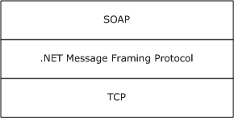

# [MS-NMFTB]: .NET Message Framing TCP Binding Protocol

Table of Contents

1 Introduction

- [1 Introduction](#Section_1)
  - [1.1 Glossary](#Section_1.1)
  - [1.2 References](#Section_1.2)
    - [1.2.1 Normative References](#Section_1.2.1)
    - [1.2.2 Informative References](#Section_1.2.2)
  - [1.3 Overview](#Section_1.3)
  - [1.4 Relationship to Other Protocols](#Section_1.4)
  - [1.5 Prerequisites/Preconditions](#Section_1.5)
  - [1.6 Applicability Statement](#Section_1.6)
  - [1.7 Versioning and Capability Negotiation](#Section_1.7)
  - [1.8 Vendor-Extensible Fields](#Section_1.8)
  - [1.9 Standards Assignments](#Section_1.9)

2 Messages

- [2 Messages](#Section_2)
  - [2.1 Transport](#Section_2.1)
  - [2.2 Common Message Syntax](#Section_2.2)
    - [2.2.1 Namespaces](#Section_2.2.1)
    - [2.2.2 Messages](#Section_2.2.2)
    - [2.2.3 Elements](#Section_2.2.3)
    - [2.2.4 Complex Types](#Section_2.2.4)
    - [2.2.5 Simple Types](#Section_2.2.5)
    - [2.2.6 Attributes](#Section_2.2.6)
    - [2.2.7 Groups](#Section_2.2.7)
    - [2.2.8 Attribute Groups](#Section_2.2.8)

3 Protocol Details

- [3 Protocol Details](#Section_3)
  - [3.1 Common Details](#Section_3.1)
    - [3.1.1 Abstract Data Model](#Section_3.1.1)
    - [3.1.2 Timers](#Section_3.1.2)
    - [3.1.3 Initialization](#Section_3.1.3)
    - [3.1.4 Message Processing Events and Sequencing Rules](#Section_3.1.4)
    - [3.1.5 Timer Events](#Section_3.1.5)
    - [3.1.6 Other Local Events](#Section_3.1.6)
      - [3.1.6.1 TCP Connection Aborted](#Section_3.1.6.1)
      - [3.1.6.2 Higher-Layer Triggered Events](#Section_3.1.6.2)
        - [3.1.6.2.1 Abort the TCP Connection](#Section_3.1.6.2.1)
  - [3.2 Initiator Details](#Section_3.2)
    - [3.2.1 Abstract Data Model](#Section_3.2.1)
      - [3.2.1.1 CONNECTED State](#Section_3.2.1.1)
      - [3.2.1.2 BUSY State](#Section_3.2.1.2)
    - [3.2.2 Timers](#Section_3.2.2)
    - [3.2.3 Initialization](#Section_3.2.3)
    - [3.2.4 Message Processing Events and Sequencing Rules](#Section_3.2.4)
    - [3.2.5 Timer Events](#Section_3.2.5)
    - [3.2.6 Other Local Events](#Section_3.2.6)
      - [3.2.6.1 End Framing Session](#Section_3.2.6.1)
      - [3.2.6.2 Higher-Layer Triggered Events](#Section_3.2.6.2)
        - [3.2.6.2.1 Connect](#Section_3.2.6.2.1)
  - [3.3 Receiver Details](#Section_3.3)
    - [3.3.1 Abstract Data Model](#Section_3.3.1)
    - [3.3.2 Timers](#Section_3.3.2)
    - [3.3.3 Initialization](#Section_3.3.3)
    - [3.3.4 Message Processing Events and Sequencing Rules](#Section_3.3.4)
    - [3.3.5 Timer Events](#Section_3.3.5)
    - [3.3.6 Other Local Events](#Section_3.3.6)
      - [3.3.6.1 End Framing Session](#Section_3.3.6.1)

4 Protocol Examples

- [4 Protocol Examples](#Section_4)

5 Security

- [5 Security](#Section_5)
  - [5.1 Security Considerations for Implementers](#Section_5.1)
  - [5.2 Index of Security Parameters](#Section_5.2)

6 Appendix A: Full WSDL

- [6 Appendix A: Full WSDL](#Section_6)

7 Appendix B: Product Behavior

- [7 Appendix B: Product Behavior](#Section_7)

8 Change Tracking

- [8 Change Tracking](#Section_8)

For the legal notice and IP terms, see [LEGAL.md](../LEGAL.md).
Last updated: 3/13/2019.
See [Revision History](#revision-history) for full version history.

# 1 Introduction

The .NET Message Framing TCP Binding Protocol specifies how the .NET Message Framing Protocol [MC-NMF](../MC-NMF/MC-NMF.md) is used for framing [**SOAP messages**](#gt_soap-message) over [**TCP**](#gt_transmission-control-protocol-tcp) [[RFC793]](https://go.microsoft.com/fwlink/?LinkId=150872).

**Note** This specification does not define any SOAP messages. Rather, it specifies how SOAP messages defined by a higher-layer protocol are framed for transport over TCP.

Sections 1.5, 1.8, 1.9, 2, and 3 of this specification are normative. All other sections and examples in this specification are informative.

## 1.1 Glossary

This document uses the following terms:

**authority**: A hierarchical element in a [**URI**](#gt_uniform-resource-identifier-uri) scheme used for delegating governance of the name space defined by the remainder of the [**URI**](#gt_uniform-resource-identifier-uri), as defined in [[RFC3986]](https://go.microsoft.com/fwlink/?LinkId=90453) section 3.2.

**connection**: A logical communication path identified by a pair of sockets, as defined in [[RFC793]](https://go.microsoft.com/fwlink/?LinkId=150872).

**endpoint**: In the context of a web service, a network target to which a [**SOAP**](#gt_soap) message can be addressed. See [[WSADDR]](https://go.microsoft.com/fwlink/?LinkId=113065).

**fragment**: A component of a [**URI**](#gt_uniform-resource-identifier-uri) that allows for indirect identification of a secondary resource by reference to a primary resource, as defined in [RFC3986] section 3.5.

**host**: A subcomponent of the naming [**authority**](#gt_authority) in a [**URI**](#gt_uniform-resource-identifier-uri) scheme, as defined in [RFC3986] section 3.2.2.

**initiator**: The node that initiates the connection over which a protocol stream flows.

**port**: A subcomponent of the naming [**authority**](#gt_authority) in a [**URI**](#gt_uniform-resource-identifier-uri) scheme ([RFC3986] section 3.2.3).

**query**: Contains nonhierarchical data used to identify a resource within the scope of a [**URI**](#gt_uniform-resource-identifier-uri) scheme and naming [**authority**](#gt_authority), as defined in [RFC3986] section 3.4.

**receiver**: The node that is the receiver of the protocol stream.

**SOAP**: A lightweight protocol for exchanging structured information in a decentralized, distributed environment. [**SOAP**](#gt_soap) uses XML technologies to define an extensible messaging framework, which provides a message construct that can be exchanged over a variety of underlying protocols. The framework has been designed to be independent of any particular programming model and other implementation-specific semantics. SOAP 1.2 supersedes SOAP 1.1. See [[SOAP1.2-1/2003]](https://go.microsoft.com/fwlink/?LinkId=90521).

**SOAP message**: An XML document consisting of a mandatory SOAP envelope, an optional SOAP header, and a mandatory SOAP body. See [[SOAP1.2-1/2007]](https://go.microsoft.com/fwlink/?LinkId=94664) section 5 for more information.

**Transmission Control Protocol (TCP)**: A protocol used with the Internet Protocol (IP) to send data in the form of message units between computers over the Internet. TCP handles keeping track of the individual units of data (called packets) that a message is divided into for efficient routing through the Internet.

**transport session**: A group of messages correlated into conversation by the transport.

**Uniform Resource Identifier (URI)**: A string that identifies a resource. The URI is an addressing mechanism defined in Internet Engineering Task Force (IETF) Uniform Resource Identifier (URI): Generic Syntax [RFC3986].

**Web Services Description Language (WSDL)**: An XML format for describing network services as a set of endpoints that operate on messages that contain either document-oriented or procedure-oriented information. The operations and messages are described abstractly and are bound to a concrete network protocol and message format in order to define an endpoint. Related concrete endpoints are combined into abstract endpoints, which describe a network service. WSDL is extensible, which allows the description of endpoints and their messages regardless of the message formats or network protocols that are used.

**XML namespace**: A collection of names that is used to identify elements, types, and attributes in XML documents identified in a URI reference [RFC3986]. A combination of XML namespace and local name allows XML documents to use elements, types, and attributes that have the same names but come from different sources. For more information, see [[XMLNS-2ED]](https://go.microsoft.com/fwlink/?LinkId=90602).

**XML Schema (XSD)**: A language that defines the elements, attributes, namespaces, and data types for XML documents as defined by [[XMLSCHEMA1/2]](https://go.microsoft.com/fwlink/?LinkId=90607) and [[W3C-XSD]](https://go.microsoft.com/fwlink/?LinkId=90563) standards. An XML schema uses XML syntax for its language.

**MAY, SHOULD, MUST, SHOULD NOT, MUST NOT:** These terms (in all caps) are used as defined in [[RFC2119]](https://go.microsoft.com/fwlink/?LinkId=90317). All statements of optional behavior use either MAY, SHOULD, or SHOULD NOT.

## 1.2 References

Links to a document in the Microsoft Open Specifications library point to the correct section in the most recently published version of the referenced document. However, because individual documents in the library are not updated at the same time, the section numbers in the documents may not match. You can confirm the correct section numbering by checking the [Errata](https://go.microsoft.com/fwlink/?linkid=850906).

### 1.2.1 Normative References

We conduct frequent surveys of the normative references to assure their continued availability. If you have any issue with finding a normative reference, please contact [dochelp@microsoft.com](mailto:dochelp@microsoft.com). We will assist you in finding the relevant information.

[MC-NBFSE] Microsoft Corporation, "[.NET Binary Format: SOAP Extension](../MC-NBFSE/MC-NBFSE.md)".

[MC-NBFS] Microsoft Corporation, "[.NET Binary Format: SOAP Data Structure](../MC-NBFS/MC-NBFS.md)".

[MC-NMF] Microsoft Corporation, "[.NET Message Framing Protocol](../MC-NMF/MC-NMF.md)".

[RFC2119] Bradner, S., "Key words for use in RFCs to Indicate Requirement Levels", BCP 14, RFC 2119, March 1997, [http://www.rfc-editor.org/rfc/rfc2119.txt](https://go.microsoft.com/fwlink/?LinkId=90317)

[RFC3986] Berners-Lee, T., Fielding, R., and Masinter, L., "Uniform Resource Identifier (URI): Generic Syntax", STD 66, RFC 3986, January 2005, [http://www.rfc-editor.org/rfc/rfc3986.txt](https://go.microsoft.com/fwlink/?LinkId=90453)

[RFC793] Postel, J., Ed., "Transmission Control Protocol: DARPA Internet Program Protocol Specification", RFC 793, September 1981, [http://www.rfc-editor.org/rfc/rfc793.txt](https://go.microsoft.com/fwlink/?LinkId=150872)

[SOAP1.1] Box, D., Ehnebuske, D., Kakivaya, G., et al., "Simple Object Access Protocol (SOAP) 1.1", W3C Note, May 2000, [http://www.w3.org/TR/2000/NOTE-SOAP-20000508/](https://go.microsoft.com/fwlink/?LinkId=90520)

[SOAP1.2-1/2003] Gudgin, M., Hadley, M., Mendelsohn, N., et al., "SOAP Version 1.2 Part 1: Messaging Framework", W3C Recommendation, June 2003, [http://www.w3.org/TR/2003/REC-soap12-part1-20030624](https://go.microsoft.com/fwlink/?LinkId=90521)

[WSDLSOAP] Angelov, D., Ballinger, K., Butek, R., et al., "WSDL 1.1 Binding Extension for SOAP 1.2", W3C Member Submission, April 2006, [http://www.w3.org/Submission/2006/SUBM-wsdl11soap12-20060405/](https://go.microsoft.com/fwlink/?LinkId=131790)

[WSDL] Christensen, E., Curbera, F., Meredith, G., and Weerawarana, S., "Web Services Description Language (WSDL) 1.1", W3C Note, March 2001, [http://www.w3.org/TR/2001/NOTE-wsdl-20010315](https://go.microsoft.com/fwlink/?LinkId=90577)

[XMLNS-2ED] Bray, T., Hollander, D., Layman, A., and Tobin, R., Eds., "Namespaces in XML 1.0 (Second Edition)", W3C Recommendation, August 2006, [http://www.w3.org/TR/2006/REC-xml-names-20060816/](https://go.microsoft.com/fwlink/?LinkId=90602)

[XMLSCHEMA1] Thompson, H., Beech, D., Maloney, M., and Mendelsohn, N., Eds., "XML Schema Part 1: Structures", W3C Recommendation, May 2001, [http://www.w3.org/TR/2001/REC-xmlschema-1-20010502/](https://go.microsoft.com/fwlink/?LinkId=90608)

[XMLSCHEMA2] Biron, P.V., Ed. and Malhotra, A., Ed., "XML Schema Part 2: Datatypes", W3C Recommendation, May 2001, [http://www.w3.org/TR/2001/REC-xmlschema-2-20010502/](https://go.microsoft.com/fwlink/?LinkId=90610)

### 1.2.2 Informative References

[MS-NETOD] Microsoft Corporation, "[Microsoft .NET Framework Protocols Overview](#Section_1.3)".

## 1.3 Overview

The .NET Message Framing TCP Binding Protocol specifies how the mechanism for framing messages over any transport protocol, as defined in the .NET Message Framing Protocol [MC-NMF](../MC-NMF/MC-NMF.md), can be applied over the [**TCP**](#gt_transmission-control-protocol-tcp) [[RFC793]](https://go.microsoft.com/fwlink/?LinkId=150872) transport protocol.

The .NET Message Framing TCP Binding Protocol also defines the net.tcp [**URI**](#gt_uniform-resource-identifier-uri) scheme and a URI for identifying this protocol as the transport for sending [**SOAP**](#gt_soap) 1.1 messages [[SOAP1.1]](https://go.microsoft.com/fwlink/?LinkId=90520) or SOAP 1.2 messages [[SOAP1.2-1/2003]](https://go.microsoft.com/fwlink/?LinkId=90521).

## 1.4 Relationship to Other Protocols

The .NET Message Framing TCP Binding Protocol uses [**TCP**](#gt_transmission-control-protocol-tcp) as the transport [[RFC793]](https://go.microsoft.com/fwlink/?LinkId=150872).

This protocol uses .NET Message Framing [MC-NMF](../MC-NMF/MC-NMF.md) to send [**SOAP**](#gt_soap) 1.1 messages [[SOAP1.1]](https://go.microsoft.com/fwlink/?LinkId=90520) or SOAP 1.2 messages [[SOAP1.2-1/2003]](https://go.microsoft.com/fwlink/?LinkId=90521).

The following figure shows the protocol stack:

Figure 1: .NET Message Framing TCP Binding Protocol transport stack

## 1.5 Prerequisites/Preconditions

The .NET Message Framing TCP Binding Protocol requires that an [**initiator**](#gt_initiator) can connect to a [**receiver**](#gt_receiver) over [**TCP**](#gt_transmission-control-protocol-tcp) [[RFC793]](https://go.microsoft.com/fwlink/?LinkId=150872).

## 1.6 Applicability Statement

The .NET Message Framing TCP Binding Protocol is applicable in scenarios where an [**initiator**](#gt_initiator) and a [**receiver**](#gt_receiver) require a communication mechanism to send and receive [**SOAP messages**](#gt_soap-message) over [**TCP**](#gt_transmission-control-protocol-tcp) [[RFC793]](https://go.microsoft.com/fwlink/?LinkId=150872).

## 1.7 Versioning and Capability Negotiation

This document covers versioning issues in the following areas:

- **Supported Transports:** This protocol requires [**TCP**](#gt_transmission-control-protocol-tcp) [[RFC793]](https://go.microsoft.com/fwlink/?LinkId=150872) as specified in section [2.1](#Section_2.1).
- **Protocol Versions:** This protocol requires .NET Message Framing Protocol version 1.0 [MC-NMF](../MC-NMF/MC-NMF.md). When this protocol is implemented using [**SOAP**](#gt_soap), the use of SOAP version 1.1 [[SOAP1.1]](https://go.microsoft.com/fwlink/?LinkId=90520) or SOAP version 1.2 [[SOAP1.2-1/2003]](https://go.microsoft.com/fwlink/?LinkId=90521) is required.
- **Capability Negotiation:** This protocol does not support negotiation of the version or capabilities to use.

## 1.8 Vendor-Extensible Fields

This protocol has no vendor-extensible fields.

## 1.9 Standards Assignments

There are no standards assignments for this protocol.

# 2 Messages

## 2.1 Transport

The .NET Message Framing TCP Binding Protocol requires [**TCP**](#gt_transmission-control-protocol-tcp) [[RFC793]](https://go.microsoft.com/fwlink/?LinkId=150872).

An [**endpoint**](#gt_endpoint) that uses the .NET Message Framing TCP Binding Protocol with [[SOAP1.2-1/2003]](https://go.microsoft.com/fwlink/?LinkId=90521) MUST set the value of the transport attribute of the wsoap12:binding element [[WSDLSOAP]](https://go.microsoft.com/fwlink/?LinkId=131790) to http://schemas.microsoft.com/soap/tcp.

An endpoint that uses the .NET Message Framing TCP Binding Protocol with [[SOAP1.1]](https://go.microsoft.com/fwlink/?LinkId=90520) MUST set the value of the transport attribute of the soap:binding element [[WSDL]](https://go.microsoft.com/fwlink/?LinkId=90577) to http://schemas.microsoft.com/soap/tcp.

## 2.2 Common Message Syntax

This section contains common definitions used by this protocol. The syntax of the definitions uses [**XML Schema**](#gt_xml-schema-xsd) as defined in [[XMLSCHEMA1]](https://go.microsoft.com/fwlink/?LinkId=90608) and [[XMLSCHEMA2]](https://go.microsoft.com/fwlink/?LinkId=90610), and [**Web Services Description Language**](#gt_web-services-description-language-wsdl) as defined in [[WSDL]](https://go.microsoft.com/fwlink/?LinkId=90577).

### 2.2.1 Namespaces

This specification defines and references various [**XML namespace**](#gt_xml-namespace)s using the mechanisms specified in [[XMLNS-2ED]](https://go.microsoft.com/fwlink/?LinkId=90602). Although this specification associates a specific XML namespace prefix for each XML namespace that is used, the choice of any particular XML namespace prefix is implementation-specific and not significant for interoperability.

| Prefix | Namespace URI | Reference |
| --- | --- | --- |
| soap | http://schemas.xmlsoap.org/wsdl/soap | [[WSDL]](https://go.microsoft.com/fwlink/?LinkId=90577) |
| soap12 | http://schemas.xmlsoap.org/wsdl/soap12/ | [[WSDLSOAP]](https://go.microsoft.com/fwlink/?LinkId=131790) |
| wsdl | http://schemas.xmlsoap.org/wsdl/ | [WSDL] |

### 2.2.2 Messages

This specification does not define any common [**XML Schema**](#gt_xml-schema-xsd) message definitions.

### 2.2.3 Elements

This specification does not define any common [**XML Schema**](#gt_xml-schema-xsd) element definitions.

### 2.2.4 Complex Types

This specification does not define any common [**XML Schema**](#gt_xml-schema-xsd) complex type definitions.

### 2.2.5 Simple Types

This specification does not define any common [**XML Schema**](#gt_xml-schema-xsd) simple type definitions.

### 2.2.6 Attributes

This specification does not define any common [**XML Schema**](#gt_xml-schema-xsd) attribute definitions.

### 2.2.7 Groups

This specification does not define any common [**XML Schema**](#gt_xml-schema-xsd) group definitions.

### 2.2.8 Attribute Groups

This specification does not define any common [**XML Schema**](#gt_xml-schema-xsd) attribute group definitions.

# 3 Protocol Details

A participant in this protocol can behave in one of two roles:

- [**Initiator**](#gt_initiator)
- [**Receiver**](#gt_receiver)
An initiator initiates the process by establishing a TCP connection, as specified in [[RFC793]](https://go.microsoft.com/fwlink/?LinkId=150872) section 3.4, to a receiver. The resulting TCP connection is used as the transport for performing the .NET Message Framing Protocol [MC-NMF](../MC-NMF/MC-NMF.md).

## 3.1 Common Details

### 3.1.1 Abstract Data Model

A net.tcp [**URI**](#gt_uniform-resource-identifier-uri) identifies a resource that listens for TCP connections and assumes the [**receiver**](#gt_receiver) role of this protocol.

A net.tcp URI is a URI that satisfies the following constraints:

- The scheme, as defined in [[RFC3986]](https://go.microsoft.com/fwlink/?LinkId=90453) section 3.1, component of the URI MUST be net.tcp.
- The URI MUST be a hierarchical URI, as defined in [RFC3986].
- The [**authority**](#gt_authority), as defined in [RFC3986] section 3.2, component of the URI MUST be specified.
- The authority component of the URI MUST NOT include user information, as defined in [RFC3986] section 3.2.1.
- The URI SHOULD NOT include the [**query**](#gt_query) URI component.<1>
- The URI SHOULD NOT include the [**fragment**](#gt_fragment) URI, as defined in [RFC3986] section 3.5, component.<2>
If the authority component of a net.tcp URI does not specify a [**port**](#gt_port), then the default port MUST be considered to be 808.

The protocol MUST maintain the following data elements for each TCP connection:

**TCP Protocol Configuration Object (TPCO):** A configuration object as defined in [MC-NMF](../MC-NMF/MC-NMF.md) section 3.1.1 that satisfies the following constraints:

- The Via, as defined in [MC-NMF] section 2.2.3.3, specified by the **TPCO** MUST be a net.tcp URI as specified in this section.
- The Via, as defined in [MC-NMF] section 2.2.3.3, specified by the **TPCO** MUST be an absolute URI.
- The protocol version specified by the **TPCO** MUST be 1.0.
- The communication mode specified by the **TPCO** MUST NOT be Simplex, as defined in [MC-NMF] section 2.2.3.2.<3>
- The communication mode specified by the **TPCO** MUST NOT be Singleton-Sized, as defined in [MC-NMF] section 2.2.3.2.<4>
- If the communication mode is Duplex, as defined in [MC-NMF] section 2.2.3.2, then the encoding specified by the **TPCO** MUST NOT be Binary [MC-NBFS](../MC-NBFS/MC-NBFS.md). The transport in this mode uses a [**transport session**](#gt_transport-session).<5>
- If the communication mode is Singleton-Unsized, as defined in [MC-NMF] section 2.2.3.2, then the encoding specified by the **TPCO** MUST NOT be Binary with in-band dictionary [MC-NBFSE](../MC-NBFSE/MC-NBFSE.md). The transport in this mode uses a transport session.<6>

### 3.1.2 Timers

None.

### 3.1.3 Initialization

A **TPCO** with an uninitialized transport is made available to the protocol as part of a higher-layer triggered event.

### 3.1.4 Message Processing Events and Sequencing Rules

This specification does not define any common [**XML Schema**](#gt_xml-schema-xsd) operation definitions.

### 3.1.5 Timer Events

None.

### 3.1.6 Other Local Events

#### 3.1.6.1 TCP Connection Aborted

If the TCP connection is aborted at any time, then the protocol MUST:

- Close the framing session (if one exists)
- Discard any state associated with the TCP connection
- Terminate

#### 3.1.6.2 Higher-Layer Triggered Events

##### 3.1.6.2.1 Abort the TCP Connection

The protocol MUST abort the TCP connection.

The protocol MUST discard any state associated with the TCP connection and framing session and then terminate.

## 3.2 Initiator Details

### 3.2.1 Abstract Data Model

The [**initiator**](#gt_initiator) role MUST maintain the following data elements for each TCP connection (in addition to the **TPCO**):

**Connection State**: One of two possible values.

- CONNECTED, see section [3.2.1.1](#Section_3.2.1.1)
- BUSY, see section [3.2.1.2](#Section_3.2.1.2)

#### 3.2.1.1 CONNECTED State

CONNECTED is the initial state. The following events are processed in the CONNECTED state:

- Connect, as specified in section [3.2.6.2.1](#Section_3.2.6.2.1)
- Abort the TCP connection, as specified in section [3.1.6.2.1](#Section_3.1.6.2.1)

#### 3.2.1.2 BUSY State

The following events are processed in the BUSY state:

- End the framing session, as specified in section [3.2.6.1](#Section_3.2.6.1)
- Abort the TCP connection, as specified in section [3.1.6.2.1](#Section_3.1.6.2.1)

### 3.2.2 Timers

None.

### 3.2.3 Initialization

When a new TCP connection is created, the **Connection State** for the TCP connection MUST be set to [CONNECTED](#Section_3.2.1.1).

### 3.2.4 Message Processing Events and Sequencing Rules

This specification does not define any [**XML Schema**](#gt_xml-schema-xsd) operation definitions for the [**initiator**](#gt_initiator) role.

### 3.2.5 Timer Events

None.

### 3.2.6 Other Local Events

#### 3.2.6.1 End Framing Session

The End Framing session event occurs due to one of the following conditions:

- The [**initiator**](#gt_initiator) has both received an end message and has sent an end message. For details about the end message, see [MC-NMF](../MC-NMF/MC-NMF.md) section 2.2.3.9.
- The initiator sends a Fault Record. For details about the Fault Record, see [MC-NMF] section 2.2.5.
- The initiator receives a Fault Record.
When the framing session, as defined in [MC-NMF] section 1.3, has ended for a given TCP connection, the initiator MUST set the **Connection State** to CONNECTED (see section [3.2.1.1](#Section_3.2.1.1)).

#### 3.2.6.2 Higher-Layer Triggered Events

##### 3.2.6.2.1 Connect

The [**initiator**](#gt_initiator) MUST establish a TCP connection with the [**host**](#gt_host), as defined in **[RFC3986]** section 3.2.2, that is specified by the [**authority**](#gt_authority) component of the Via [**URI**](#gt_uniform-resource-identifier-uri) from the **TPCO**. The manner in which the TCP connection is established (for example, by creating a new [**connection**](#gt_connection) or by reusing an existing one) is implementation-specific. The initiator MUST NOT reuse a TCP connection in the BUSY **Connection State** (see section [3.2.1.2](#Section_3.2.1.2)). Once the TCP connection is established, the initiator MUST set the **Connection State** for that TCP connection to BUSY.

If the initiator fails to establish a TCP connection, then the initiator MUST notify the higher layer of the error and then discard all state for the TCP connection.

An implementation SHOULD NOT leave a connection in the CONNECTED state indefinitely (see section [3.2.1.1](#Section_3.2.1.1)).<7>

Once a TCP connection has been established, the initiator MUST set the **TPCO** transport to the TCP connection. The initiator MUST store the **TPCO** for the TCP connection. The initiator MUST then assume the initiator role, as defined in [MC-NMF](../MC-NMF/MC-NMF.md) in section 3.2.

The initiator MUST use the **TPCO** stored for the TCP connection to initialize new framing sessions.

## 3.3 Receiver Details

### 3.3.1 Abstract Data Model

None.

### 3.3.2 Timers

None.

### 3.3.3 Initialization

The following initialization requirements are in addition to the initialization requirements specified in section [3.1.3](#Section_3.1.3).

The [**receiver**](#gt_receiver) MUST listen for a TCP connection at the [**host**](#gt_host) and [**port**](#gt_port) specified by the [**authority**](#gt_authority) component of the Via [**URI**](#gt_uniform-resource-identifier-uri) from the **TPCO**.

Once a TCP connection has been established, the receiver MUST set the **TPCO** transport to the TCP connection. The receiver MUST then assume the receiver role as defined in [MC-NMF](../MC-NMF/MC-NMF.md) section 3.3.

The receiver MUST use the **TPCO** to initialize new sessions.

If the receiver fails to start listening for TCP connections, then the receiver MUST notify the higher layer of the error and terminate.

### 3.3.4 Message Processing Events and Sequencing Rules

This specification does not define any [**XML Schema**](#gt_xml-schema-xsd) operation definitions for the [**receiver**](#gt_receiver) role.

### 3.3.5 Timer Events

None.

### 3.3.6 Other Local Events

#### 3.3.6.1 End Framing Session

The End Framing session event occurs due to one of the following conditions:

- The [**receiver**](#gt_receiver) has both received an end message and has sent an end message. For more information about the end message, see [MC-NMF](../MC-NMF/MC-NMF.md) section 2.2.3.9.
- The receiver sends a Fault Record. For more information about the Fault Record, see [MC-NMF] section 2.2.5.
- The receiver receives a Fault Record.
When the framing session has ended for a given TCP connection, the receiver MUST reassume the receiver role using the **TPCO** stored with the [**connection**](#gt_connection), as defined in [MC-NMF] section 3.3.

# 4 Protocol Examples

The protocol is initialized with the following **TPCO**:

- Transport: <no value>
- Protocol version: 1.0
- Mode: 0x02 (Duplex)
- Via: net.tcp://SampleServer/SampleApp/
- Encoding: Binary
The [**receiver**](#gt_receiver) listens for [**connection**](#gt_connection)s at the address 192.168.2.13 on [**port**](#gt_port) 802.

The [**initiator**](#gt_initiator) actively establishes a connection to the [**host**](#gt_host) at 192.168.2.13 on port 802 (a TCP connection for the specified Via does not already exist).

Both the initiator and the receiver store the **TPCO** with the established TCP connection as the transport and assume the initiator and receiver roles for the .NET Message Framing Protocol [MC-NMF](../MC-NMF/MC-NMF.md) respectively.

The protocol exchange proceeds as described in [MC-NMF] section 4.1.

When the initiator receives the final end record, as defined in [MC-NMF] section 2.2.3.9, the higher layer protocol aborts the connection.

# 5 Security

## 5.1 Security Considerations for Implementers

None.

## 5.2 Index of Security Parameters

None.

# 6 Appendix A: Full WSDL

The following [**WSDL**](#gt_web-services-description-language-wsdl) specifies the WSDL 1.1 binding extension transport [**URI**](#gt_uniform-resource-identifier-uri) with the version of [**SOAP**](#gt_soap) as indicated.

**WSDL 1.1 binding extension transport URI with SOAP 1.2** [[SOAP1.2-1/2003]](https://go.microsoft.com/fwlink/?LinkId=90521)

<?xml version="1.0" encoding="utf-8"?>

<wsdl:definitions xmlns:wsdl="http://schemas.xmlsoap.org/wsdl/"

xmlns:soap12="http://schemas.xmlsoap.org/wsdl/soap12/">

<!-- ommitted elements -->

<wsdl:binding name="MyBinding" type="MyPortType">

<soap12:binding transport="http://schemas.microsoft.com/soap/tcp"/>

<wsdl:operation name="MyOperation">

<!-- ommitted elements -->

</wsdl:operation>

</wsdl:binding>

<wsdl:service name="MyService">

<wsdl:port name="MyPort" binding="MyBinding">

<soap12:address location="net.tcp://myhost/" />

</wsdl:port>

</wsdl:service>

</wsdl:definitions>

**WSDL 1.1 binding extension transport URI with SOAP 1.1** [[SOAP1.1]](https://go.microsoft.com/fwlink/?LinkId=90520)

<?xml version="1.0" encoding="utf-8"?>

<wsdl:definitions xmlns:wsdl="http://schemas.xmlsoap.org/wsdl/"

xmlns:soap="http://schemas.xmlsoap.org/wsdl/soap/">

<!-- ommitted elements -->

<wsdl:binding name="MyBinding" type="MyPortType">

<soap:binding transport="http://schemas.microsoft.com/soap/tcp"/>

<wsdl:operation name="MyOperation">

<!-- ommitted elements -->

</wsdl:operation>

</wsdl:binding>

<wsdl:service name="MyService">

<wsdl:port name="MyPort" binding="MyBinding">

<soap:address location="net.tcp://myhost/" />

</wsdl:port>

</wsdl:service>

</wsdl:definitions>

# 7 Appendix B: Product Behavior

The information in this specification is applicable to the following Microsoft products or supplemental software. References to product versions include updates to those products.

This document specifies version-specific details in the Microsoft .NET Framework. For information about which versions of the .NET Framework are available in each released Windows product or as supplemental software, see [MS-NETOD](#Section_1.3) section 4.

- Microsoft .NET Framework 3.0
- Microsoft .NET Framework 3.5
- Microsoft .NET Framework 4.0
- Microsoft .NET Framework 4.5
- Microsoft .NET Framework 4.6
- Microsoft .NET Framework 4.7
- Microsoft .NET Framework 4.8
Exceptions, if any, are noted in this section. If an update version, service pack or Knowledge Base (KB) number appears with a product name, the behavior changed in that update. The new behavior also applies to subsequent updates unless otherwise specified. If a product edition appears with the product version, behavior is different in that product edition.

Unless otherwise specified, any statement of optional behavior in this specification that is prescribed using the terms "SHOULD" or "SHOULD NOT" implies product behavior in accordance with the SHOULD or SHOULD NOT prescription. Unless otherwise specified, the term "MAY" implies that the product does not follow the prescription.

<1> Section 3.1.1: The Windows implementation of this protocol ignores the [**query**](#gt_query) and fragment components of the Via [**URI**](#gt_uniform-resource-identifier-uri) specified by the **TPCO**.

<2> Section 3.1.1: The Windows implementation of this protocol ignores the query and fragment components of the Via URI specified by the **TPCO**.

<3> Section 3.1.1: While establishing the framing session as defined in section [3.2.6.2.1](#Section_3.2.6.2.1), if the communication mode specified by the [**initiator**](#gt_initiator) is Simplex, the Windows implementation of the [**receiver**](#gt_receiver) sends an UnsupportedMode Fault Record to the initiator, as specified in [MC-NMF](../MC-NMF/MC-NMF.md) section 2.2.5.

<4> Section 3.1.1: While establishing the framing session as defined in section 3.2.6.2.1, if the communication mode specified by the initiator is Singleton-Sized, the Windows implementation of the receiver sends an UnsupportedMode Fault Record to the initiator, as specified in [MC-NMF] section 2.2.5.

<5> Section 3.1.1: While establishing the framing session as defined in section 3.2.6.2.1, if the communication mode specified by the initiator is Duplex and the encoding is Binary, the Windows implementation of the receiver sends a ContentTypeInvalid Fault Record to the initiator, as specified in [MC-NMF] section 2.2.5.

<6> Section 3.1.1: While establishing the framing session as defined in section 3.2.6.2.1, if the communication mode specified by the initiator is Singleton-Unsized and the encoding is Binary with in-band dictionary, the Windows implementation of the receiver sends a ContentTypeInvalid Fault Record to the initiator, as specified in [MC-NMF] section 2.2.5.

<7> Section 3.2.6.2.1: The Windows implementation of this protocol aborts the TCP connection if the [**connection**](#gt_connection) is in the CONNECTED state for longer than two minutes, or if a connection in the CONNECTED state has existed for longer than five minutes.

# 8 Change Tracking

This section identifies changes that were made to this document since the last release. Changes are classified as Major, Minor, or None.

The revision class **Major** means that the technical content in the document was significantly revised. Major changes affect protocol interoperability or implementation. Examples of major changes are:

- A document revision that incorporates changes to interoperability requirements.
- A document revision that captures changes to protocol functionality.
The revision class **Minor** means that the meaning of the technical content was clarified. Minor changes do not affect protocol interoperability or implementation. Examples of minor changes are updates to clarify ambiguity at the sentence, paragraph, or table level.

The revision class **None** means that no new technical changes were introduced. Minor editorial and formatting changes may have been made, but the relevant technical content is identical to the last released version.

The changes made to this document are listed in the following table. For more information, please contact [dochelp@microsoft.com](mailto:dochelp@microsoft.com).

| Section | Description | Revision class |
| --- | --- | --- |
| [7](#Section_7) Appendix B: Product Behavior | Added .NET Framework v4.8 to the applicability list. | Major |

## Revision History

| Date | Version | Revision Class | Comments |
| --- | --- | --- | --- |
| 3/12/2010 | 0.1 | Major | First release. |
| 4/23/2010 | 0.1.1 | Editorial | Changed language and formatting in the technical content. |
| 6/4/2010 | 0.1.2 | Editorial | Changed language and formatting in the technical content. |
| 7/16/2010 | 1.0 | Major | Updated and revised the technical content. |
| 8/27/2010 | 1.0 | None | No changes to the meaning, language, or formatting of the technical content. |
| 10/8/2010 | 1.0 | None | No changes to the meaning, language, or formatting of the technical content. |
| 11/19/2010 | 1.0 | None | No changes to the meaning, language, or formatting of the technical content. |
| 1/7/2011 | 1.0 | None | No changes to the meaning, language, or formatting of the technical content. |
| 2/11/2011 | 1.0 | None | No changes to the meaning, language, or formatting of the technical content. |
| 3/25/2011 | 1.0 | None | No changes to the meaning, language, or formatting of the technical content. |
| 5/6/2011 | 1.0 | None | No changes to the meaning, language, or formatting of the technical content. |
| 6/17/2011 | 1.1 | Minor | Clarified the meaning of the technical content. |
| 9/23/2011 | 1.1 | None | No changes to the meaning, language, or formatting of the technical content. |
| 12/16/2011 | 2.0 | Major | Updated and revised the technical content. |
| 3/30/2012 | 2.0 | None | No changes to the meaning, language, or formatting of the technical content. |
| 7/12/2012 | 2.1 | Minor | Clarified the meaning of the technical content. |
| 10/25/2012 | 2.1 | None | No changes to the meaning, language, or formatting of the technical content. |
| 1/31/2013 | 2.1 | None | No changes to the meaning, language, or formatting of the technical content. |
| 8/8/2013 | 2.1 | None | No changes to the meaning, language, or formatting of the technical content. |
| 11/14/2013 | 2.1 | None | No changes to the meaning, language, or formatting of the technical content. |
| 2/13/2014 | 2.1 | None | No changes to the meaning, language, or formatting of the technical content. |
| 5/15/2014 | 2.1 | None | No changes to the meaning, language, or formatting of the technical content. |
| 6/30/2015 | 3.0 | Major | Significantly changed the technical content. |
| 10/16/2015 | 3.0 | None | No changes to the meaning, language, or formatting of the technical content. |
| 7/14/2016 | 3.0 | None | No changes to the meaning, language, or formatting of the technical content. |
| 3/16/2017 | 4.0 | Major | Significantly changed the technical content. |
| 6/1/2017 | 4.0 | None | No changes to the meaning, language, or formatting of the technical content. |
| 3/13/2019 | 5.0 | Major | Significantly changed the technical content. |
